<div align="center">


</div>

# PMP Station (Rain, Pmax24h): 24015509

Probable Maximum Precipitation (PMP) is the greatest amount of rainfall for a specific duration that is meteorologically possible for a given location, acting as a "worst-case" scenario for extreme storms, crucial for designing safety-critical infrastructure like bridges, river deviations, dams, spillways, and nuclear plants to prevent catastrophic failure. PMP is calculated by hydrologists using meteorological data to determine the upper limit of extreme rainfall, often leading to the Probable Maximum Flood (PMF) for flood control design, and is increasingly being studied for climate change impacts. Probable Maximum Precipitation (PMP) is the theoretical upper limit of rainfall, a deterministic estimate for extreme events, while probability distributions (like GEV, Gumbel) describe the likelihood and frequency of various precipitation amounts, including rare ones, showing how often events occur, with PMP representing the extreme end of these distributions, used for critical infrastructure design to ensure safety against the worst conceivable weather, unlike standard statistical forecasts which cover typical probabilities.

The most common probability distributions in hydrology, used for analyzing floods, rainfall, and streamflow, include the Normal, Log-Normal, Gumbel, Gamma (including Log-Pearson Type III), and Generalized Extreme Value (GEV) distributions, often chosen based on the data´s skewness and whether modeling extremes or general conditions, with Gumbel and GEV popular for extreme events like floods, while the Normal distribution serves as a baseline, though often requiring transformations for skewed hydrological data. These distributions help in designing water infrastructure, managing water resources, and forecasting hydrologic events.

> Hydrological data often isn´t perfectly normal (it´s skewed), so different distributions are needed for different applications, such as: **Flood Frequency Analysis**: Using Gumbel, GEV, or Log-Pearson Type III for predicting extreme flood magnitudes and their return periods, **Rainfall Analysis**: Normal for annual totals, but Log-Normal, Weibull, or GEV for intensity or extreme daily rainfall, **Streamflow Modeling**: Gamma and Log-Normal for maximum flows, GEV for minimum flows, and Kappa for daily flows.

<div align="center">

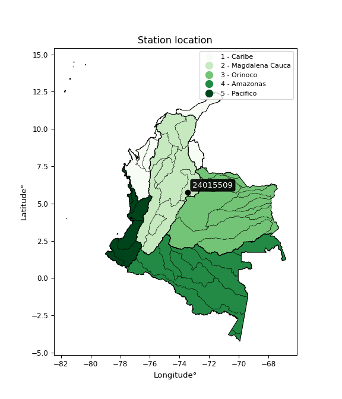</img>

</div>


## A. General information


### 1. General running parameters

• app_version: _v20260103_. • runtime: _2026-01-05 16:20:51.132608_. • Python version: _3.14.0_. • SciPy version: _1.16.3_. • Pandas version: _2.3.3_. • NumPy version: _2.3.5_. • Stations dataset (station_dataset_file): _dataset/pmax24h_in/automatic_colombia_2003_2024.csv_. • Stations catalog (station_catalog_file): _dataset/CNE.xls_. • Minimum year to eval til year_max (date_min): _1900_. • Maximum year to eval since year_min (date_max): _2024_. • Creates, save and include plots into reports (create_plot): _True_. • Plot only fit distributions with Δo > Δ (plot_only_fit): _True_. • Plot only simple graphs avoiding multiple CDFs and multiple Extreme values plots (plot_only_simple): _True_. • Eval low extreme values, if False, evaluates high extreme values (low_extreme): _False_. • Eval every SciPy distribution as logarithmic (pdist_logarithmic_on): _True_. • Standard deviation normalized (ddof): _1.0_. • Return periods to eval in years (Tr): _[2, 2.33, 5, 10, 15, 20, 25, 50, 75, 100, 200, 250, 500, 750, 1000]_. • Minimum data sample per station, 0 means any (minimum_sample): _5_. • Z-Score maximum threshold to adjust a value, 0 means disable (zscore_max): _3.5_. • Z-Score minimum threshold to adjust a value, 0 means disable (zscore_min): _-2.5_. • Avoid zeros, e.g. rain = 0 (avoid_zeros): _True_. • Avoid null values (avoid_nans): _True_. 

[:file_folder:Dataset file](../../dataset/pmax24h_in/automatic_colombia_2003_2024.csv)

> Delta Degrees of Freedom (DDOF): is a parameter used in the formulas for calculating variance and standard deviation. When ddof=0, the divisor is $N$ (the total number of observations) and this is used when your data set is the entire population. When ddof=1, the divisor is $N-1$ and this is used when your data set is a sample drawn from a larger population. Using $N-1$ provides an unbiased estimate of the population variance (known as Bessel´s correction).


### 2. Station info and location

|   id |   CODIGO | NOMBRE                               | CATEGORIA     | TECNOLOGIA                | ESTADO   |   FECHA_INSTALACION |   FECHA_SUSPENSION |   ALTITUD |   LATITUD |   LONGITUD | DEPARTAMENTO   | MUNICIPIO   | AREA_OPERATIVA                              | ENTIDAD            | AREA_HIDROGRAFICA   | ZONA_HIDROGRAFICA   | SUBZONA_HIDROGRAFICA   |   CORRIENTE | Catalogo   |   Version |
|-----:|---------:|:-------------------------------------|:--------------|:--------------------------|:---------|--------------------:|-------------------:|----------:|----------:|-----------:|:---------------|:------------|:--------------------------------------------|:-------------------|:--------------------|:--------------------|:-----------------------|------------:|:-----------|----------:|
|    0 | 24015509 | ARCABUCO-24015509  - AUT  [24015509] | Pluviométrica | Automática con Telemetría | Activa   |                 nan |                nan |      2547 |   5.76161 |    -73.445 | Boyacá         | Arcabuco    | Area Operativa 06 - Boyacá-Casanare-Vichada | ISAGEN  S.A. E.S.P | Magdalena Cauca     | Sogamoso            | Río Suárez             |         nan | CNE_OE     |  20251226 |

<div align="center">

Dynamic map: [:earth_americas:Google](http://maps.google.com/maps?q=5.761611111,-73.44497222) [:earth_americas:OSM](https://www.openstreetmap.org/#map=18/5.761611111/-73.44497222&layers=P) [:earth_americas:Bing](https://www.bing.com/maps?cp=5.761611111~-73.44497222&lvl=18) [:earth_americas:Apple](https://maps.apple.com/frame?center=5.761611111%2C-73.44497222&span=0.003%2C0.006)

</div>


<div align="center">

```geojson
{
  "type": "Feature",
  "geometry": {
    "type": "Point", 
    "coordinates": [-73.44497222, 5.761611111]
  }, 
  "properties": {
    "Name": "24015509"
  }
}
```

</div>


### 3. Discrete values table and plot

<div align="center">

|               |           0 |           1 |           2 |           3 |           4 |           5 |          6 |
|:--------------|------------:|------------:|------------:|------------:|------------:|------------:|-----------:|
| Date          | 2016        | 2017        | 2018        | 2019        | 2020        | 2021        | 2024       |
| Value         |   48.6      |   39.9      |   46        |   38.8      |   64.8      |   40.2      |  110.8     |
| Value_initial |   48.6      |   39.9      |   46        |   38.8      |   64.8      |   40.2      |  110.8     |
| count         |    7        |    7        |    7        |    7        |    7        |    7        |    7       |
| mean          |   55.5857   |   55.5857   |   55.5857   |   55.5857   |   55.5857   |   55.5857   |   55.5857  |
| std           |   25.9446   |   25.9446   |   25.9446   |   25.9446   |   25.9446   |   25.9446   |   25.9446  |
| zscore        |   -0.269255 |   -0.604585 |   -0.369469 |   -0.646983 |    0.355153 |   -0.593022 |    2.12816 |


</div>


<div align="center">

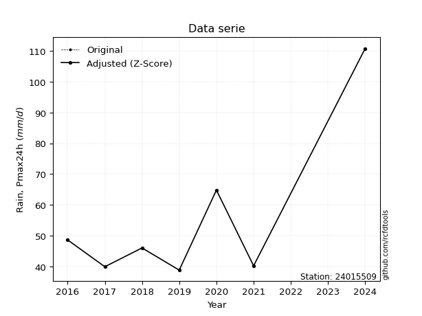</img>

</div>


> The initial value (value_initial) correspond to the initial obtained or null completed value, and value (value) is adjusted only when the initial value is outside the valid range (outlier) definite through the Z-Score value. If Z-Score is active, values out of range or outliers are replaced with the station mean value. A Z-Score (or standard score) measures how many standard deviations a data point is from the mean of a dataset, indicating its relative position; positive scores mean above the mean, negative mean below, and a score of zero is exactly at the mean, allowing for comparison of values from different distributions. It´s calculated using the formula $z=(x–μ)/σ$, where $x$ is the data point, $μ$ is the mean, and $σ$ is the standard deviation, helping identify outliers and understand probability.
>
> <sub>**Note**: In this study, "completing" (filling gaps in) and "extending" (forecasting or lengthening the historical record) rainfall data series are avoided for certain critical analyses because they introduce artificial bias and uncertainty, which can distort the statistics of rare events (extremes), alter day-to-day variability, and compromise the integrity and homogeneity of the original data. Some reasons against Completing/Extending rainfall data are: **Distortion of Extremes and Variability**: The primary issue is that most gap-filling or extension methods rely on averaging or regression with nearby stations, which inherently smooths the data. Rainfall is highly variable in space and time, with a large percentage of zero values and occasional large storms. Infilling methods often underestimate the highest values and overestimate the lowest (zero) values, which severely distorts analyses focused on flood frequency, drought severity, and intensity-duration-frequency (IDF) curves, **Loss of Data Homogeneity**: Infilled or extended data are synthetic estimates, not actual measurements. Combining these estimates with observed data can violate the assumption of data homogeneity, which requires that the data properties do not change over time. Inhomogeneity can lead to incorrect conclusions about long-term trends or changes in climate patterns, **Propagation of Errors**: Errors and biases from the original data (e.g., wind-induced undercatch, instrument errors, site changes) or the data used for imputation can propagate through the analysis, leading to unreliable hydrological models and inaccurate predictions, **Compromised Statistical Integrity**: For statistical analyses, especially those involving the frequency of events, using artificial data can introduce time bias or autocorrelation that doesn´t exist in reality, making it difficult to assess the true probability of events, **Difficulty in Validation**: It is difficult to accurately validate the quality of filled or extended data, especially for past periods where ground-truth measurements are unavailable. The reliability of imputation techniques heavily depends on the density of the surrounding station network and the complexity of the local topography.</sub>


### 4. Active continuous probability distributions from SciPy (44 of 104 available)

A Probability Density Function (PDF) describes the relative likelihood of a continuous random variable falling within a specific range, where the total area under its curve equals 1, and the area over any interval gives the actual probability for that range. Unlike discrete probabilities (like rolling a die), a PDF shows density, not direct probability for a single point (which is zero), with higher points indicating higher likelihood, often visualized as a bell curve for normal distributions.

A log of a probability density function (log-PDF) is simply the logarithm of the PDF´s value, denoted as $log(f(x))$, useful for converting multiplication of probabilities into addition, improving numerical stability with tiny numbers, and connecting to information theory concepts like entropy. Instead of dealing with very small probabilities (e.g., 0.000001), log-PDFs use negative numbers (e.g., $log(0.00001) ≈ -11.51$ that are easier for computers to handle, preventing underflow errors and simplifying complex calculations. In this study, each active probability distribution from SciPy is also evaluated in the $log$ form.

[scipy.stats](https://docs.scipy.org/doc/scipy/reference/stats.html) is a Python´s powerful submodule within the SciPy library for comprehensive statistical analysis, offering over 130 probability distributions (like Normal, Poisson), functions for descriptive stats (mean, variance), hypothesis testing (t-tests, chi-square), random variable generation, and statistical tests, making it essential for data science, modeling, and research. It provides tools to explore, model, and draw conclusions from data efficiently, working seamlessly with NumPy.

<div align="center">

|   id | p_dist             |   n_parameter | fit_method   | label                                                                       | active   | ref                                                                                                        |
|-----:|:-------------------|--------------:|:-------------|:----------------------------------------------------------------------------|:---------|:-----------------------------------------------------------------------------------------------------------|
|    0 | alpha              |             3 | MLE          | Alpha                                                                       | True     | [:mortar_board:](https://docs.scipy.org/doc/scipy/reference/generated/scipy.stats.alpha.html)              |
|    1 | betaprime          |             4 | MLE          | Beta prime                                                                  | True     | [:mortar_board:](https://docs.scipy.org/doc/scipy/reference/generated/scipy.stats.betaprime.html)          |
|    2 | chi2               |             3 | MLE          | Chi²                                                                        | True     | [:mortar_board:](https://docs.scipy.org/doc/scipy/reference/generated/scipy.stats.chi2.html)               |
|    3 | crystalball        |             4 | MLE          | Crystalball                                                                 | True     | [:mortar_board:](https://docs.scipy.org/doc/scipy/reference/generated/scipy.stats.crystalball.html)        |
|    4 | erlang             |             3 | MLE          | Erlang                                                                      | True     | [:mortar_board:](https://docs.scipy.org/doc/scipy/reference/generated/scipy.stats.erlang.html)             |
|    5 | expon              |             2 | MLE          | Exponential                                                                 | True     | [:mortar_board:](https://docs.scipy.org/doc/scipy/reference/generated/scipy.stats.expon.html)              |
|    6 | exponnorm          |             3 | MLE          | Exponentially modified Normal                                               | True     | [:mortar_board:](https://docs.scipy.org/doc/scipy/reference/generated/scipy.stats.exponnorm.html)          |
|    7 | f                  |             4 | MLE          | F                                                                           | True     | [:mortar_board:](https://docs.scipy.org/doc/scipy/reference/generated/scipy.stats.f.html)                  |
|    8 | fatiguelife        |             3 | MLE          | Fatigue-life (Birnbaum-Saunders)                                            | True     | [:mortar_board:](https://docs.scipy.org/doc/scipy/reference/generated/scipy.stats.fatiguelife.html)        |
|    9 | fisk               |             3 | MLE          | Fisk                                                                        | True     | [:mortar_board:](https://docs.scipy.org/doc/scipy/reference/generated/scipy.stats.fisk.html)               |
|   10 | gamma              |             3 | MLE          | Gamma                                                                       | True     | [:mortar_board:](https://docs.scipy.org/doc/scipy/reference/generated/scipy.stats.gamma.html)              |
|   11 | genexpon           |             5 | MLE          | Generalized exponential                                                     | True     | [:mortar_board:](https://docs.scipy.org/doc/scipy/reference/generated/scipy.stats.genexpon.html)           |
|   12 | genlogistic        |             3 | MLE          | Generalized logistic                                                        | True     | [:mortar_board:](https://docs.scipy.org/doc/scipy/reference/generated/scipy.stats.genlogistic.html)        |
|   13 | gibrat             |             2 | MM           | Gibrat                                                                      | True     | [:mortar_board:](https://docs.scipy.org/doc/scipy/reference/generated/scipy.stats.gibrat.html)             |
|   14 | gompertz           |             3 | MLE          | Gompertz (or truncated Gumbel)                                              | True     | [:mortar_board:](https://docs.scipy.org/doc/scipy/reference/generated/scipy.stats.gompertz.html)           |
|   15 | gumbel_l           |             2 | MM           | Gumbel Left Skew                                                            | True     | [:mortar_board:](https://docs.scipy.org/doc/scipy/reference/generated/scipy.stats.gumbel_l.html)           |
|   16 | gumbel_r           |             2 | MM           | Gumbel Right Skew                                                           | True     | [:mortar_board:](https://docs.scipy.org/doc/scipy/reference/generated/scipy.stats.gumbel_r.html)           |
|   17 | halflogistic       |             2 | MM           | Half-logistic                                                               | True     | [:mortar_board:](https://docs.scipy.org/doc/scipy/reference/generated/scipy.stats.halflogistic.html)       |
|   18 | halfnorm           |             2 | MM           | Half Normal                                                                 | True     | [:mortar_board:](https://docs.scipy.org/doc/scipy/reference/generated/scipy.stats.halfnorm.html)           |
|   19 | hypsecant          |             2 | MM           | hyperbolic secant                                                           | True     | [:mortar_board:](https://docs.scipy.org/doc/scipy/reference/generated/scipy.stats.hypsecant.html)          |
|   20 | invgamma           |             3 | MLE          | Inverted gamma                                                              | True     | [:mortar_board:](https://docs.scipy.org/doc/scipy/reference/generated/scipy.stats.invgamma.html)           |
|   21 | invgauss           |             3 | MLE          | Inverse Gaussian                                                            | True     | [:mortar_board:](https://docs.scipy.org/doc/scipy/reference/generated/scipy.stats.invgauss.html)           |
|   22 | invweibull         |             3 | MLE          | Inverted Weibull                                                            | True     | [:mortar_board:](https://docs.scipy.org/doc/scipy/reference/generated/scipy.stats.invweibull.html)         |
|   23 | johnsonsu          |             4 | MLE          | Johnson Su                                                                  | True     | [:mortar_board:](https://docs.scipy.org/doc/scipy/reference/generated/scipy.stats.johnsonsu.html)          |
|   24 | kstwobign          |             2 | MLE          | Limiting distribution of scaled Kolmogorov-Smirnov two-sided test statistic | True     | [:mortar_board:](https://docs.scipy.org/doc/scipy/reference/generated/scipy.stats.kstwobign.html)          |
|   25 | laplace            |             2 | MM           | Laplace                                                                     | True     | [:mortar_board:](https://docs.scipy.org/doc/scipy/reference/generated/scipy.stats.laplace.html)            |
|   26 | laplace_asymmetric |             3 | MLE          | Asymmetric Laplace                                                          | True     | [:mortar_board:](https://docs.scipy.org/doc/scipy/reference/generated/scipy.stats.laplace_asymmetric.html) |
|   27 | loggamma           |             3 | MLE          | Log gamma                                                                   | True     | [:mortar_board:](https://docs.scipy.org/doc/scipy/reference/generated/scipy.stats.loggamma.html)           |
|   28 | logistic           |             2 | MM           | Logistic (or Sech-squared)                                                  | True     | [:mortar_board:](https://docs.scipy.org/doc/scipy/reference/generated/scipy.stats.logistic.html)           |
|   29 | lognorm            |             3 | MLE          | Log Normal                                                                  | True     | [:mortar_board:](https://docs.scipy.org/doc/scipy/reference/generated/scipy.stats.lognorm.html)            |
|   30 | maxwell            |             2 | MM           | Maxwell                                                                     | True     | [:mortar_board:](https://docs.scipy.org/doc/scipy/reference/generated/scipy.stats.maxwell.html)            |
|   31 | mielke             |             4 | MLE          | Mielke Beta-Kappa / Dagum                                                   | True     | [:mortar_board:](https://docs.scipy.org/doc/scipy/reference/generated/scipy.stats.mielke.html)             |
|   32 | moyal              |             2 | MM           | Moyal                                                                       | True     | [:mortar_board:](https://docs.scipy.org/doc/scipy/reference/generated/scipy.stats.moyal.html)              |
|   33 | nakagami           |             3 | MLE          | Nakagami                                                                    | True     | [:mortar_board:](https://docs.scipy.org/doc/scipy/reference/generated/scipy.stats.nakagami.html)           |
|   34 | ncf                |             5 | MLE          | Non-central F distribution                                                  | True     | [:mortar_board:](https://docs.scipy.org/doc/scipy/reference/generated/scipy.stats.ncf.html)                |
|   35 | nct                |             4 | MLE          | Non-central Student’s t                                                     | True     | [:mortar_board:](https://docs.scipy.org/doc/scipy/reference/generated/scipy.stats.nct.html)                |
|   36 | norm               |             2 | MM           | Normal                                                                      | True     | [:mortar_board:](https://docs.scipy.org/doc/scipy/reference/generated/scipy.stats.norm.html)               |
|   37 | pearson3           |             3 | MM           | Pearson type III                                                            | True     | [:mortar_board:](https://docs.scipy.org/doc/scipy/reference/generated/scipy.stats.pearson3.html)           |
|   38 | rayleigh           |             2 | MM           | Rayleigh                                                                    | True     | [:mortar_board:](https://docs.scipy.org/doc/scipy/reference/generated/scipy.stats.rayleigh.html)           |
|   39 | rice               |             3 | MLE          | Rice                                                                        | True     | [:mortar_board:](https://docs.scipy.org/doc/scipy/reference/generated/scipy.stats.rice.html)               |
|   40 | t                  |             3 | MLE          | Student’s t                                                                 | True     | [:mortar_board:](https://docs.scipy.org/doc/scipy/reference/generated/scipy.stats.t.html)                  |
|   41 | truncnorm          |             4 | MLE          | Truncated normal                                                            | True     | [:mortar_board:](https://docs.scipy.org/doc/scipy/reference/generated/scipy.stats.truncnorm.html)          |
|   42 | wald               |             2 | MM           | Wald                                                                        | True     | [:mortar_board:](https://docs.scipy.org/doc/scipy/reference/generated/scipy.stats.wald.html)               |
|   43 | weibull_min        |             3 | MLE          | Weibull minimum                                                             | True     | [:mortar_board:](https://docs.scipy.org/doc/scipy/reference/generated/scipy.stats.weibull_min.html)        |

</div>

> **n_parameter:** # arguments & localization & scale.
>
> **Fit methods:** (MLE) maximum likelihood, (MM) L-moments.
>
>**Inactive** (With the only purpose of prevent loops, zero divisions, infinite values, over high estimated values or horizontal trending for recurrence intervals estimations, the follow distributions were disabled.)**:** foldnorm, gennorm, norminvgauss, powernorm, powerlognorm, skewnorm, genextreme, anglit, arcsine, argus, beta, bradford, burr, burr12, cauchy, cosine, halfcauchy, foldcauchy, skewcauchy, wrapcauchy, dgamma, gengamma, exponweib, exponpow, truncexpon, gausshyper, genhalflogistic, genhyperbolic, geninvgauss, halfgennorm, johnsonsb, kappa4, kappa3, ksone, kstwo, loglaplace, levy, levy_l, levy_stable, ncx2, pareto, genpareto, truncpareto, lomax, powerlaw, rdist, rel_breitwigner, recipinvgauss, semicircular, studentized_range, trapezoid, triang, truncweibull_min, tukeylambda, uniform, loguniform, vonmises, vonmises_line, weibull_max, dweibull, 


## B. Probability (PDF) vs. Empirical (EDF) distributions functions

A continuous probability distribution (CPD) describes probabilities for variables that can take any value within a range (like rain any time), unlike discrete variables with specific outcomes (like temperature). It uses a Probability Density Function (PDF), a curve where the total area under it equals 1, and the probability of the variable falling within an interval (a to b) is found by calculating the area under the curve between those points. A key feature is that the probability of hitting any single exact value is zero, so probabilities are always expressed for ranges, e.g., $P(a ≤ X ≤ b)$.

<div align="center">

Distributions parameters from station values
|    |   station | p_dist                |   n |            loc |          scale | shape                  | shape1                 | shape2                 | shape3   |
|---:|----------:|:----------------------|----:|---------------:|---------------:|:-----------------------|:-----------------------|:-----------------------|:---------|
|  0 |  24015509 | alpha                 |   7 |     36.5442    |    4.29402     | 4.938319513855836e-09  |                        |                        |          |
|  1 |  24015509 | betaprime             |   7 |     -0.625506  |    2.38333     | 214.28523950428558     | 10.216188290559948     |                        |          |
|  2 |  24015509 | chi2                  |   7 |     38.8       |   16.5879      | 0.9641548846950864     |                        |                        |          |
|  3 |  24015509 | crystalball           |   7 |     55.5857    |   24.02        | 14658.896813394207     | 6.19331888853495       |                        |          |
|  4 |  24015509 | erlang                |   7 |     38.8       |   22.4018      | 0.6605619806712693     |                        |                        |          |
|  5 |  24015509 | expon                 |   7 |     38.8       |   16.7857      |                        |                        |                        |          |
|  6 |  24015509 | exponnorm             |   7 |     38.7812    |    0.0058394   | 2870.2318191114427     |                        |                        |          |
|  7 |  24015509 | f                     |   7 |     38.1973    |    2.32976     | 355.26557059250047     | 1.2655778272719371     |                        |          |
|  8 |  24015509 | fatiguelife           |   7 |     38.8       |    6.79441e-06 | 1545.8514320938998     |                        |                        |          |
|  9 |  24015509 | fisk                  |   7 |     38.8       |   17.7227      | 0.7097227599100195     |                        |                        |          |
| 10 |  24015509 | gamma                 |   7 |     38.8       |   21.5934      | 0.5830788416447219     |                        |                        |          |
| 11 |  24015509 | genexpon              |   7 |     38.8       |   19.6136      | 1.1684719344323438     | 1.7922789375817054e-11 | 1.773282086895993      |          |
| 12 |  24015509 | genlogistic           |   7 |    -54.6017    |   13.0738      | 2213.147996044423      |                        |                        |          |
| 13 |  24015509 | gibrat                |   7 |     37.2615    |   11.1142      |                        |                        |                        |          |
| 14 |  24015509 | gompertz              |   7 |     38.8       |    1.08378e+10 | 390267637.6716037      |                        |                        |          |
| 15 |  24015509 | gumbel_l              |   7 |     66.396     |   18.7283      |                        |                        |                        |          |
| 16 |  24015509 | gumbel_r              |   7 |     44.7754    |   18.7283      |                        |                        |                        |          |
| 17 |  24015509 | halflogistic          |   7 |     27.1164    |   20.5363      |                        |                        |                        |          |
| 18 |  24015509 | halfnorm              |   7 |     23.7926    |   39.8467      |                        |                        |                        |          |
| 19 |  24015509 | hypsecant             |   7 |     55.5857    |   15.2916      |                        |                        |                        |          |
| 20 |  24015509 | invgamma              |   7 |     38.1932    |    1.47267     | 0.632780361780672      |                        |                        |          |
| 21 |  24015509 | invgauss              |   7 |     38.2193    |    2.59743     | 6.685959833195506      |                        |                        |          |
| 22 |  24015509 | invweibull            |   7 |     38.5291    |    2.08357     | 0.5965568860597663     |                        |                        |          |
| 23 |  24015509 | johnsonsu             |   7 |     38.8       |    8.84161e-11 | -2.9451140922975814    | 0.15506634068905484    |                        |          |
| 24 |  24015509 | kstwobign             |   7 |     -4.86679   |   70.6677      |                        |                        |                        |          |
| 25 |  24015509 | laplace               |   7 |     55.5857    |   16.9847      |                        |                        |                        |          |
| 26 |  24015509 | laplace_asymmetric    |   7 |     38.8       |    0.000165333 | 9.84990950631078e-06   |                        |                        |          |
| 27 |  24015509 | loggamma              |   7 |  -8627.41      | 1137.07        | 2072.351342723785      |                        |                        |          |
| 28 |  24015509 | logistic              |   7 |     55.5857    |   13.2429      |                        |                        |                        |          |
| 29 |  24015509 | lognorm               |   7 |     38.8       |    0.0545933   | 12.190543371326166     |                        |                        |          |
| 30 |  24015509 | maxwell               |   7 |     -1.33164   |   35.6677      |                        |                        |                        |          |
| 31 |  24015509 | mielke                |   7 |      2.88448   |    6.74008     | 12002.762263084176     | 4.342630256087698      |                        |          |
| 32 |  24015509 | moyal                 |   7 |     41.8495    |   10.8128      |                        |                        |                        |          |
| 33 |  24015509 | nakagami              |   7 |     38.8       |   37.9598      | 0.10865068572559158    |                        |                        |          |
| 34 |  24015509 | ncf                   |   7 |     -0.0724662 |    3.14826e-06 | 6.840184145970413e-06  | 26.94111135690153      | 109.93515113371134     |          |
| 35 |  24015509 | nct                   |   7 |     -0.289209  |    0.783705    | 5.857885736824208      | 60.796807485493105     |                        |          |
| 36 |  24015509 | norm                  |   7 |     55.5857    |   24.02        |                        |                        |                        |          |
| 37 |  24015509 | pearson3              |   7 |     55.5857    |   24.02        | 1.60452029637272       |                        |                        |          |
| 38 |  24015509 | rayleigh              |   7 |      9.63402   |   36.6641      |                        |                        |                        |          |
| 39 |  24015509 | rice                  |   7 |     21.1778    |   29.6721      | 8.83101721247099e-05   |                        |                        |          |
| 40 |  24015509 | t                     |   7 |     52.537     |   24.2893      | 7.823353510459963      |                        |                        |          |
| 41 |  24015509 | truncnorm             |   7 | -36195.4       |  933.663       | 38.80871259058928      | 38.88582969885455      |                        |          |
| 42 |  24015509 | wald                  |   7 |     31.5657    |   24.02        |                        |                        |                        |          |
| 43 |  24015509 | weibull_min           |   7 |     38.8       |   27.8541      | 0.49584075771352787    |                        |                        |          |
| 44 |  24015509 | logalpha              |   7 |      3.60584   |    0.0991305   | 0.012120510468271173   |                        |                        |          |
| 45 |  24015509 | logbetaprime          |   7 |     -3.05647   |    6.44093     | 739.7646030539659      | 681.2554977964724      |                        |          |
| 46 |  24015509 | logchi2               |   7 |      3.65842   |    0.990577    | 0.9700753548483879     |                        |                        |          |
| 47 |  24015509 | logcrystalball        |   7 |      3.94714   |    0.350983    | 3880.416287364658      | 398.4629742091382      |                        |          |
| 48 |  24015509 | logerlang             |   7 |      3.65842   |    0.376717    | 0.692049907962283      |                        |                        |          |
| 49 |  24015509 | logexpon              |   7 |      3.65842   |    0.288717    |                        |                        |                        |          |
| 50 |  24015509 | logexponnorm          |   7 |      3.65817   |    7.81767e-05 | 3675.2318343867055     |                        |                        |          |
| 51 |  24015509 | logf                  |   7 |      3.63764   |    0.0713082   | 512.9317158308409      | 1.6238662590276602     |                        |          |
| 52 |  24015509 | logfatiguelife        |   7 |      3.65842   |    2.32992e-07 | 1174.297427642245      |                        |                        |          |
| 53 |  24015509 | logfisk               |   7 |      3.65842   |    0.325276    | 0.6333538488060577     |                        |                        |          |
| 54 |  24015509 | loggamma              |   7 |      3.65842   |    0.2718      | 0.8457820449054425     |                        |                        |          |
| 55 |  24015509 | loggenexpon           |   7 |      3.65842   |    4.50525     | 15.604723201870467     | 11.147696727735706     | 3.3017531437767516e-09 |          |
| 56 |  24015509 | loggenlogistic        |   7 |      2.17023   |    0.215269    | 1931.9463772720078     |                        |                        |          |
| 57 |  24015509 | loggibrat             |   7 |      3.67933   |    0.16243     |                        |                        |                        |          |
| 58 |  24015509 | loggompertz           |   7 |      3.65842   |    3.77448e+11 | 1274295028851.0415     |                        |                        |          |
| 59 |  24015509 | loggumbel_l           |   7 |      4.1051    |    0.27366     |                        |                        |                        |          |
| 60 |  24015509 | loggumbel_r           |   7 |      3.78918   |    0.27366     |                        |                        |                        |          |
| 61 |  24015509 | loghalflogistic       |   7 |      3.53114   |    0.300078    |                        |                        |                        |          |
| 62 |  24015509 | loghalfnorm           |   7 |      3.48257   |    0.582244    |                        |                        |                        |          |
| 63 |  24015509 | loghypsecant          |   7 |      3.94714   |    0.223443    |                        |                        |                        |          |
| 64 |  24015509 | loginvgamma           |   7 |      3.63793   |    0.0571205   | 0.8139977366955369     |                        |                        |          |
| 65 |  24015509 | loginvgauss           |   7 |      3.64171   |    0.0771126   | 3.9608166741544992     |                        |                        |          |
| 66 |  24015509 | loginvweibull         |   7 |      3.64586   |    0.0621934   | 0.7400254900851184     |                        |                        |          |
| 67 |  24015509 | logjohnsonsu          |   7 |      3.65842   |    4.8586e-12  | -1.8869523773398302    | 0.12776147426564824    |                        |          |
| 68 |  24015509 | logkstwobign          |   7 |      3.00385   |    1.0942      |                        |                        |                        |          |
| 69 |  24015509 | loglaplace            |   7 |      3.94714   |    0.248182    |                        |                        |                        |          |
| 70 |  24015509 | loglaplace_asymmetric |   7 |      3.65842   |    9.42714e-05 | 0.00032655934730651094 |                        |                        |          |
| 71 |  24015509 | logloggamma           |   7 |   -146.556     |   18.9828      | 2775.364103262361      |                        |                        |          |
| 72 |  24015509 | loglogistic           |   7 |      3.94714   |    0.193507    |                        |                        |                        |          |
| 73 |  24015509 | loglognorm            |   7 |      3.65842   |    0.00137045  | 11.802997039368961     |                        |                        |          |
| 74 |  24015509 | logmaxwell            |   7 |      3.11546   |    0.521179    |                        |                        |                        |          |
| 75 |  24015509 | logmielke             |   7 |      2.75033   |    0.44784     | 581.1275941860504      | 5.604579043662898      |                        |          |
| 76 |  24015509 | logmoyal              |   7 |      3.74642   |    0.157998    |                        |                        |                        |          |
| 77 |  24015509 | lognakagami           |   7 |      3.65842   |    0.7409      | 0.2424161466763885     |                        |                        |          |
| 78 |  24015509 | logncf                |   7 |      3.63783   |    0.0303367   | 128.70890085874709     | 1.6239030448438507     | 174.020221664589       |          |
| 79 |  24015509 | lognct                |   7 |     -0.709292  |    0.0645107   | 103.34812627690627     | 71.66084060898442      |                        |          |
| 80 |  24015509 | lognorm               |   7 |      3.94714   |    0.350983    |                        |                        |                        |          |
| 81 |  24015509 | logpearson3           |   7 |      3.94714   |    0.350983    | 1.2928761994717615     |                        |                        |          |
| 82 |  24015509 | lograyleigh           |   7 |      3.27569   |    0.53574     |                        |                        |                        |          |
| 83 |  24015509 | logrice               |   7 |      3.42199   |    0.446637    | 0.00025666500376146564 |                        |                        |          |
| 84 |  24015509 | logt                  |   7 |      3.77502   |    0.142157    | 1.367856596098738      |                        |                        |          |
| 85 |  24015509 | logtruncnorm          |   7 |     -2.40295   |    1.40339     | 4.319093693796523      | 6.261153195119494      |                        |          |
| 86 |  24015509 | logwald               |   7 |      3.59615   |    0.350983    |                        |                        |                        |          |
| 87 |  24015509 | logweibull_min        |   7 |      3.65842   |    0.359232    | 0.39154917495614827    |                        |                        |          |

</div>

> **loc** (Location parameter): This shifts the distribution along the x-axis. For many common distributions, like the normal (Gaussian) distribution, loc represents the mean $μ$. For others, like the uniform distribution, it might represent the minimum value, or for the beta distribution, the left end of the support interval.
>
> **scale** (Scale parameter): This determines the width or spread of the distribution. For the normal distribution, scale represents the standard deviation $σ$. For a uniform distribution, it defines the length of the interval (from $loc$ to $loc + scale$).
>
> **shape** (Shape parameters): Refers to parameters that define the specific form of a probability distribution, distinct from its location (loc) and scale (scale). These parameters are required arguments for most distribution functions. For example, a normal (Gaussian) distribution is fully defined by its location (mean) and scale (standard deviation), so it has no specific shape parameters beyond loc and scale. However, other distributions have intrinsic properties that need specification, as Gamma distribution that takes a shape parameter, often named $a$ or $alpha$.


### 0. Cumulative distribution values - CDF (88 evaluated)

Cumulative Distribution Function (CDF), denoted as $F$<sub>$X$</sub>$(x)$, is a function that gives the probability that a random variable $X$ will take a value less than or equal to a specific value, $x$ (i.e., $(P(X≥x)$. It essentially "accumulates" probabilities from a given point up to the far right (positive infinity), providing a complete picture of the distribution´s probabilities for both discrete (like rain) and continuous (like temperature) variables, helping to find probabilities over ranges or above certain values. Each station is evaluated separately ordering the $x$ values ascending, calculating the CDF and PDF values for the activated distributions and their logarithmic forms.

<div align="center">

CDF ordered by x ascending and calculating $log(f(x))$ separately
|   id |   Station |   date |     x |   count |    mean |     std |    zscore |   Value_initial |   station |   m |     alpha |   alpha_pdf |   betaprime |   betaprime_pdf |        chi2 |    chi2_pdf |   crystalball |   crystalball_pdf |      erlang |     erlang_pdf |     expon |   expon_pdf |   exponnorm |   exponnorm_pdf |         f |       f_pdf |   fatiguelife |   fatiguelife_pdf |        fisk |      fisk_pdf |       gamma |       gamma_pdf |    genexpon |   genexpon_pdf |   genlogistic |   genlogistic_pdf |    gibrat |   gibrat_pdf |    gompertz |   gompertz_pdf |   gumbel_l |   gumbel_l_pdf |   gumbel_r |   gumbel_r_pdf |   halflogistic |   halflogistic_pdf |   halfnorm |   halfnorm_pdf |   hypsecant |   hypsecant_pdf |   invgamma |   invgamma_pdf |   invgauss |   invgauss_pdf |   invweibull |   invweibull_pdf |   johnsonsu |   johnsonsu_pdf |   kstwobign |   kstwobign_pdf |   laplace |   laplace_pdf |   laplace_asymmetric |   laplace_asymmetric_pdf |    loggamma |   loggamma_pdf |   logistic |   logistic_pdf |   lognorm |   lognorm_pdf |   maxwell |   maxwell_pdf |   mielke |   mielke_pdf |    moyal |   moyal_pdf |    nakagami |   nakagami_pdf |      ncf |     ncf_pdf |      nct |     nct_pdf |     norm |   norm_pdf |   pearson3 |   pearson3_pdf |   rayleigh |   rayleigh_pdf |     rice |   rice_pdf |        t |      t_pdf |   truncnorm |   truncnorm_pdf |     wald |   wald_pdf |   weibull_min |   weibull_min_pdf |   logalpha |   logalpha_pdf |   logbetaprime |   logbetaprime_pdf |     logchi2 |   logchi2_pdf |   logcrystalball |   logcrystalball_pdf |   logerlang |   logerlang_pdf |   logexpon |   logexpon_pdf |   logexponnorm |   logexponnorm_pdf |      logf |   logf_pdf |   logfatiguelife |   logfatiguelife_pdf |     logfisk |   logfisk_pdf |   loggenexpon |   loggenexpon_pdf |   loggenlogistic |   loggenlogistic_pdf |   loggibrat |   loggibrat_pdf |   loggompertz |   loggompertz_pdf |   loggumbel_l |   loggumbel_l_pdf |   loggumbel_r |   loggumbel_r_pdf |   loghalflogistic |   loghalflogistic_pdf |   loghalfnorm |   loghalfnorm_pdf |   loghypsecant |   loghypsecant_pdf |   loginvgamma |   loginvgamma_pdf |   loginvgauss |   loginvgauss_pdf |   loginvweibull |   loginvweibull_pdf |   logjohnsonsu |   logjohnsonsu_pdf |   logkstwobign |   logkstwobign_pdf |   loglaplace |   loglaplace_pdf |   loglaplace_asymmetric |   loglaplace_asymmetric_pdf |   logloggamma |   logloggamma_pdf |   loglogistic |   loglogistic_pdf |   loglognorm |   loglognorm_pdf |   logmaxwell |   logmaxwell_pdf |   logmielke |   logmielke_pdf |   logmoyal |   logmoyal_pdf |   lognakagami |   lognakagami_pdf |    logncf |   logncf_pdf |   lognct |   lognct_pdf |   logpearson3 |   logpearson3_pdf |   lograyleigh |   lograyleigh_pdf |   logrice |   logrice_pdf |     logt |   logt_pdf |   logtruncnorm |   logtruncnorm_pdf |   logwald |   logwald_pdf |   logweibull_min |   logweibull_min_pdf |
|-----:|----------:|-------:|------:|--------:|--------:|--------:|----------:|----------------:|----------:|----:|----------:|------------:|------------:|----------------:|------------:|------------:|--------------:|------------------:|------------:|---------------:|----------:|------------:|------------:|----------------:|----------:|------------:|--------------:|------------------:|------------:|--------------:|------------:|----------------:|------------:|---------------:|--------------:|------------------:|----------:|-------------:|------------:|---------------:|-----------:|---------------:|-----------:|---------------:|---------------:|-------------------:|-----------:|---------------:|------------:|----------------:|-----------:|---------------:|-----------:|---------------:|-------------:|-----------------:|------------:|----------------:|------------:|----------------:|----------:|--------------:|---------------------:|-------------------------:|------------:|---------------:|-----------:|---------------:|----------:|--------------:|----------:|--------------:|---------:|-------------:|---------:|------------:|------------:|---------------:|---------:|------------:|---------:|------------:|---------:|-----------:|-----------:|---------------:|-----------:|---------------:|---------:|-----------:|---------:|-----------:|------------:|----------------:|---------:|-----------:|--------------:|------------------:|-----------:|---------------:|---------------:|-------------------:|------------:|--------------:|-----------------:|---------------------:|------------:|----------------:|-----------:|---------------:|---------------:|-------------------:|----------:|-----------:|-----------------:|---------------------:|------------:|--------------:|--------------:|------------------:|-----------------:|---------------------:|------------:|----------------:|--------------:|------------------:|--------------:|------------------:|--------------:|------------------:|------------------:|----------------------:|--------------:|------------------:|---------------:|-------------------:|--------------:|------------------:|--------------:|------------------:|----------------:|--------------------:|---------------:|-------------------:|---------------:|-------------------:|-------------:|-----------------:|------------------------:|----------------------------:|--------------:|------------------:|--------------:|------------------:|-------------:|-----------------:|-------------:|-----------------:|------------:|----------------:|-----------:|---------------:|--------------:|------------------:|----------:|-------------:|---------:|-------------:|--------------:|------------------:|--------------:|------------------:|----------:|--------------:|---------:|-----------:|---------------:|-------------------:|----------:|--------------:|-----------------:|---------------------:|
|    0 |  24015509 |   2019 |  38.8 |       7 | 55.5857 | 25.9446 | -0.646983 |            38.8 |  24015509 |   1 | 0.0569695 | 0.109995    |    0.193932 |     0.0233208   | 3.15421e-08 | 2.14002e+06 |      0.242332 |         0.0130105 | 6.41302e-11 | 5961.92        | 0         | 0.0595745   |  0.00112109 |     0.0595591   | 0.0402663 | 0.179785    |     0.0155002 |       6.87516e+10 | 1.18152e-11 | 1180.16       | 1.05225e-09 | 86348.5         | 2.23148e-11 |    0.0595744   |      0.174389 |       0.0232866   | 0.0239984 |  0.036706    | 2.36537e-10 |     0.0360098  |   0.204771 |    0.00972893  |   0.252629 |     0.0185588  |       0.27703  |         0.0224786  |   0.29355  |     0.0186529  |    0.205006 |      0.0124986  |  0.0402663 |    0.179786    |  0.0399213 |    0.179829    |     0.034151 |      0.253943    |  0.00228818 |     9.96486e+06 |    0.160294 |      0.0200507  |  0.186108 |    0.0109574  |          5.79243e-08 |                0.0595763 | 3.29974e-13 |    628.447     |   0.219682 |     0.0129444  |  0.205369 |      0.81038  |  0.262772 |    0.0150379  |      nan |          nan | 0.249551 |  0.0218935  | 0.000316836 |    9.68961e+09 | 0.201644 | 0.0220132   | 0.180656 | 0.0260779   | 0.242332 |  0.0130105 |   0.268276 |     0.0238705  |   0.271234 |     0.0158118  | 0.161682 |  0.0167793 | 0.293771 | 0.0133315  | 5.88299e-05 |      0.0437757  | 0.166991 | 0.0446687  |   1.85441e-08 |       1.29407e+06 |  0.0604323 |      4.90138   |       0.221243 |           0.833327 | 2.89784e-08 |   3.16504e+07 |         0.205369 |             0.810379 | 5.14067e-11 |   80110         |  0         |      3.4636    |      0.0008782 |           3.47525  | 0.0426481 |  5.95706   |        0.0166592 |          1.18199e+12 | 3.84887e-10 | 548920        |   3.84453e-11 |          3.46368  |         0.146523 |            1.30659   | 0           |       0         |   1.49928e-14 |         3.37608   |      0.17757  |        0.587511   |      0.199383 |          1.17485  |          0.208954 |              1.59348  |      0.23736  |          1.30927  |       0.170661 |           0.727709 |     0.0420978 |         6.02517   |     0.0406151 |         6.52629   |       0.0381576 |           7.3401    |       0.033083 |        1.80209e+09 |       0.133366 |          1.20104   |     0.156223 |        0.629467  |             1.29143e-07 |                    3.46403  |      0.21142  |          0.798886 |      0.183618 |         0.774662  |   0.00741528 |      3.91162e+12 |     0.219388 |         0.965699 |    0.141659 |        1.69267  |   0.186456 |       1.39379  |   3.25436e-08 |       3.55293e+07 | 0.0426468 |    5.95701   | 0.195139 |     0.921403 |      0.207729 |          1.36203  |      0.225227 |          1.03315  |  0.130737 |      1.03026  | 0.265207 |  1.4723    |    2.55717e-06 |          3.22845   | 0.0445601 |      2.25904  |      1.45486e-06 |          1.28274e+09 |
|    1 |  24015509 |   2017 |  39.9 |       7 | 55.5857 | 25.9446 | -0.604585 |            39.9 |  24015509 |   2 | 0.200693  | 0.134175    |    0.220114 |     0.0242481   | 0.216178    | 0.09264     |      0.256869 |         0.0134195 | 0.148549    |    0.0865969   | 0.0634308 | 0.0557956   |  0.0645732  |     0.0558116   | 0.249907  | 0.158748    |     0.602678  |       0.045628    | 0.122099    |    0.0691599  | 0.193996    |     0.099564    | 0.0634308   |    0.0557956   |      0.200772 |       0.0246477   | 0.0752167 |  0.0537675   | 0.0388365   |     0.0346113  |   0.215717 |    0.0101754   |   0.273255 |     0.0189289  |       0.301569 |         0.022133   |   0.313959 |     0.0184529  |    0.219153 |      0.0132259  |  0.24991   |    0.158749    |  0.247239  |    0.157096    |     0.277021 |      0.15474     |  0.778392   |     0.0419145   |    0.182905 |      0.0210353  |  0.198559 |    0.0116905  |          0.0634328   |                0.0557973 | 0.147626    |      4.22225   |   0.234251 |     0.0135452  |  0.228757 |      0.862514 |  0.279474 |    0.0153249  |      nan |          nan | 0.273807 |  0.0221857  | 0.383967    |    0.0758452   | 0.226341 | 0.0228639   | 0.210022 | 0.027261    | 0.25687  |  0.0134195 |   0.294377 |     0.0235713  |   0.288741 |     0.016014   | 0.180501 |  0.0174265 | 0.308636 | 0.0136926  | 0.0471278   |      0.0418192  | 0.215863 | 0.0439552  |   0.182426    |       0.0742277   |  0.220772  |      5.74715   |       0.245179 |           0.878553 | 0.14227     |   2.44502     |         0.228757 |             0.862514 | 0.176826    |       4.18844   |  0.0922885 |      3.14395   |      0.0935133 |           3.155    | 0.233458  |  6.24173   |        0.615994  |          2.01513     | 0.17447     |      3.26304  |   0.0922904   |          3.14401  |         0.185116 |            1.44987   | 0.000851112 |       0.412087  |   0.0900648   |         3.07201   |      0.194682 |        0.637163   |      0.233182 |          1.24058  |          0.25304  |              1.55955  |      0.273684 |          1.28893  |       0.192123 |           0.808569 |     0.235763  |         6.31877   |     0.240397  |         6.25489   |       0.253326  |           6.35252   |       0.858321 |        1.02545     |       0.168662 |          1.31997   |     0.174849 |        0.70452   |             0.0922997   |                    3.14431  |      0.234441 |          0.84777  |      0.206271 |         0.846084  |   0.600826   |      1.17022     |     0.246993 |         1.00822  |    0.191796 |        1.88133  |   0.226556 |       1.46974  |   0.159455    |       2.76461     | 0.233456  |    6.24172   | 0.221776 |     0.983444 |      0.246279 |          1.39248  |      0.254593 |          1.06659  |  0.160713 |      1.11235  | 0.310325 |  1.75806   |    0.0864781   |          2.96171   | 0.120037  |      2.98065  |      0.307861    |          3.56709     |
|    2 |  24015509 |   2021 |  40.2 |       7 | 55.5857 | 25.9446 | -0.593022 |            40.2 |  24015509 |   3 | 0.240164  | 0.128604    |    0.227421 |     0.0244655   | 0.242124    | 0.0810264   |      0.260912 |         0.0135283 | 0.173289    |    0.0787291   | 0.0800208 | 0.0548073   |  0.0811677  |     0.0548215   | 0.294444  | 0.138646    |     0.615484  |       0.0400729   | 0.141664    |    0.0616419  | 0.222163    |     0.0887978   | 0.0800208   |    0.0548072   |      0.208217 |       0.0249822   | 0.0917072 |  0.0560384   | 0.049164    |     0.0342394  |   0.218788 |    0.0102993   |   0.278947 |     0.0190162  |       0.308194 |         0.0220346  |   0.319486 |     0.0183963  |    0.223151 |      0.0134267  |  0.294447  |    0.138646    |  0.291412  |    0.13786     |     0.319588 |      0.130156    |  0.789351   |     0.0319796   |    0.189252 |      0.0212778  |  0.202098 |    0.0118988  |          0.0800233   |                0.0548089 | 0.178238    |      3.95982   |   0.238339 |     0.013708   |  0.235269 |      0.876099 |  0.284082 |    0.0153977  |      nan |          nan | 0.280471 |  0.0222415  | 0.404623    |    0.0627953   | 0.233231 | 0.0230683   | 0.218241 | 0.0275273   | 0.260912 |  0.0135283 |   0.301434 |     0.0234763  |   0.293553 |     0.0160633  | 0.185753 |  0.0175922 | 0.312758 | 0.0137877  | 0.0595956   |      0.0413009  | 0.22899  | 0.0435518  |   0.203077    |       0.0640696   |  0.262704  |      5.43584   |       0.251803 |           0.890126 | 0.159437    |   2.1555      |         0.235269 |             0.876099 | 0.206742    |       3.81652   |  0.115536  |      3.06343   |      0.116841  |           3.07381  | 0.27796   |  5.64227   |        0.630113  |          1.76884     | 0.197195    |      2.82863  |   0.115538    |          3.06349  |         0.196103 |            1.48344   | 0.00789836  |       1.49103   |   0.112788    |         2.9953    |      0.199506 |        0.650921   |      0.242532 |          1.25548  |          0.264685 |              1.5495   |      0.283317 |          1.28303  |       0.198264 |           0.831044 |     0.28077   |         5.70085   |     0.284738  |         5.59392   |       0.29787   |           5.56044   |       0.865016 |        0.7825      |       0.178654 |          1.34754   |     0.180207 |        0.726108  |             0.11555     |                    3.06377  |      0.240839 |          0.860501 |      0.212681 |         0.865331  |   0.608572   |      0.918011    |     0.254585 |         1.01858  |    0.206032 |        1.91866  |   0.237623 |       1.48473  |   0.178899    |       2.44585     | 0.277958  |    5.64228   | 0.229202 |     0.999192 |      0.256729 |          1.39734  |      0.262612 |          1.07436  |  0.169121 |      1.13241  | 0.323785 |  1.83566   |    0.108408    |          2.89386   | 0.142602  |      3.03723  |      0.332231    |          2.97863     |
|    3 |  24015509 |   2018 |  46   |       7 | 55.5857 | 25.9446 | -0.369469 |            46   |  24015509 |   4 | 0.649746  | 0.0345643   |    0.37583  |     0.0258682   | 0.504723    | 0.0291308   |      0.34492  |         0.0153375 | 0.463184    |    0.0348565   | 0.348799  | 0.038795    |  0.349949   |     0.0387848   | 0.639021  | 0.0260255   |     0.747269  |       0.0147801   | 0.345406    |    0.0222873  | 0.525351    |     0.0342953   | 0.348798    |    0.038795    |      0.365289 |       0.0281315   | 0.404978  |  0.044352    | 0.228386    |     0.0277857  |   0.285761 |    0.0128345   |   0.391917 |     0.0196019  |       0.42989  |         0.0198477  |   0.422691 |     0.0171435  |    0.312379 |      0.0173034  |  0.639022  |    0.0260253   |  0.646517  |    0.0281557   |     0.626979 |      0.0233722   |  0.854997   |     0.00490883  |    0.321934 |      0.0238111  |  0.284358 |    0.016742   |          0.348807    |                0.0387957 | 0.544109    |      1.89338   |   0.326549 |     0.0166062  |  0.367828 |      1.07368  |  0.376537 |    0.0163316  |      nan |          nan | 0.409162 |  0.0216617  | 0.577346    |    0.0173634   | 0.373898 | 0.0247352   | 0.384202 | 0.0284864   | 0.34492  |  0.0153375 |   0.430711 |     0.0209204  |   0.388537 |     0.0165418  | 0.295247 |  0.0198692 | 0.397395 | 0.0152756  | 0.272451    |      0.0324523  | 0.447081 | 0.0312287  |   0.400277    |       0.0211167   |  0.658777  |      1.43705   |       0.38343  |           1.0443   | 0.333884    |   0.897614    |         0.367828 |             1.07368  | 0.533597    |       1.64606   |  0.445439  |      1.92078   |      0.447515  |           1.92291  | 0.644402  |  1.27312   |        0.766655  |          0.654455    | 0.398877    |      0.892145 |   0.445446    |          1.9208   |         0.418433 |            1.6931    | 0.466442    |       2.66243   |   0.437115    |         1.90034   |      0.305205 |        0.924511   |      0.420755 |          1.33103  |          0.458733 |              1.3156   |      0.447735 |          1.14848  |       0.338592 |           1.24531  |     0.648245  |         1.26787   |     0.650561  |         1.32878   |       0.637424  |           1.16213   |       0.903816 |        0.128021    |       0.379199 |          1.53675   |     0.31018  |        1.24981   |             0.44548     |                    1.92088  |      0.370392 |          1.04596  |      0.351521 |         1.17801   |   0.65856    |      0.182668    |     0.400722 |         1.124    |    0.472141 |        1.83501  |   0.440763 |       1.44614  |   0.381905    |       1.07661     | 0.644402  |    1.27314   | 0.379101 |     1.19473  |      0.44247  |          1.31355  |      0.412952 |          1.13098  |  0.339318 |      1.34681  | 0.621889 |  2.10283   |    0.426854    |          1.89794   | 0.490965  |      1.93459  |      0.52595     |          0.813942    |
|    4 |  24015509 |   2016 |  48.6 |       7 | 55.5857 | 25.9446 | -0.269255 |            48.6 |  24015509 |   5 | 0.721707  | 0.022124    |    0.442203 |     0.0250724   | 0.571848    | 0.0229599   |      0.385591 |         0.015921  | 0.544288    |    0.0279531   | 0.442242  | 0.0332281   |  0.443357   |     0.0332117   | 0.693724  | 0.0170618   |     0.781393  |       0.0116938   | 0.396401    |    0.0173279  | 0.604026    |     0.0267374   | 0.442242    |    0.0332281   |      0.438024 |       0.0276517   | 0.507971  |  0.0351776   | 0.29735     |     0.0253023  |   0.320676 |    0.014025    |   0.442512 |     0.0192636  |       0.480062 |         0.0187361  |   0.466433 |     0.0164961  |    0.359395 |      0.018818   |  0.693724  |    0.0170616   |  0.706298  |    0.0188386   |     0.67661  |      0.0156574   |  0.865619   |     0.00342468  |    0.383924 |      0.0237703  |  0.331396 |    0.0195114  |          0.442252    |                0.0332286 | 0.636326    |      1.48128   |   0.371099 |     0.0176233  |  0.4282   |      1.11818  |  0.419199 |    0.0164555  |      nan |          nan | 0.464248 |  0.0206583  | 0.617149    |    0.0135953   | 0.43771  | 0.0242432   | 0.456518 | 0.0270054   | 0.385591 |  0.015921  |   0.483322 |     0.019538   |   0.431499 |     0.0164791  | 0.347569 |  0.0203208 | 0.437672 | 0.0156759  | 0.352426    |      0.0291273  | 0.521553 | 0.0262006  |   0.448844    |       0.0166129   |  0.723289  |      0.956669  |       0.441686 |           1.07088  | 0.379076    |   0.755853    |         0.4282   |             1.11818  | 0.614201    |       1.30504   |  0.5416    |      1.58771   |      0.54374   |           1.588    | 0.701959  |  0.861545  |        0.798765  |          0.522323    | 0.442045    |      0.693645 |   0.541608    |          1.58772  |         0.509211 |            1.59615   | 0.590685    |       1.90212   |   0.532476    |         1.5784    |      0.359283 |        1.04226    |      0.492564 |          1.27457  |          0.527964 |              1.20178  |      0.509051 |          1.08096  |       0.410715 |           1.3689   |     0.705507  |         0.856276  |     0.711456  |         0.924652  |       0.690263  |           0.796362  |       0.909774 |        0.0922985   |       0.462404 |          1.48047   |     0.387104 |        1.55975   |             0.541645    |                    1.58776  |      0.429172 |          1.08838  |      0.418673 |         1.25776   |   0.667221   |      0.136701    |     0.462593 |         1.12244  |    0.566419 |        1.58789  |   0.51712  |       1.32609  |   0.4366      |       0.923133    | 0.70196   |    0.861555  | 0.445567 |     1.2171   |      0.512251 |          1.2215   |      0.474729 |          1.11259  |  0.413828 |      1.35648  | 0.722693 |  1.55229   |    0.522611    |          1.59367   | 0.584922  |      1.50309  |      0.565214    |          0.629623    |
|    5 |  24015509 |   2020 |  64.8 |       7 | 55.5857 | 25.9446 |  0.355153 |            64.8 |  24015509 |   6 | 0.879211  | 0.00424203  |    0.760261 |     0.0136355   | 0.798138    | 0.00850025  |      0.649366 |         0.0154306 | 0.816726    |    0.00973938  | 0.787526  | 0.012658    |  0.788259   |     0.0126334   | 0.825292  | 0.00401603  |     0.897144  |       0.00435935  | 0.567584    |    0.00669957 | 0.852363    |     0.00840678  | 0.787526    |    0.012658    |      0.787317 |       0.0143995   | 0.817892  |  0.00959823  | 0.607906    |     0.0141192  |   0.600808 |    0.0195737   |   0.709441 |     0.0130036  |       0.724707 |         0.01156    |   0.69658  |     0.0117914  |    0.681151 |      0.0175351  |  0.825291  |    0.004016    |  0.8551    |    0.00462762  |     0.802126 |      0.00401613  |  0.895662   |     0.00107953  |    0.714508 |      0.0157902  |  0.709355 |    0.0171122  |          0.787537    |                0.0126578 | 0.883793    |      0.452733  |   0.667253 |     0.0167656  |  0.738487 |      0.926926 |  0.671069 |    0.0137862  |      nan |          nan | 0.729329 |  0.0120246  | 0.759684    |    0.00606361  | 0.755227 | 0.0140572   | 0.777021 | 0.0127697   | 0.649366 |  0.0154306 |   0.730571 |     0.0113291  |   0.677598 |     0.0132308  | 0.660628 |  0.0168146 | 0.686221 | 0.013811   | 0.695759    |      0.0148496  | 0.785673 | 0.00967658 |   0.619558    |       0.00701171  |  0.862033  |      0.241758  |       0.731684 |           0.858213 | 0.54016     |   0.427861    |         0.738487 |             0.926926 | 0.845783    |       0.471953  |  0.830759  |      0.586184  |      0.832364  |           0.583452 | 0.832083  |  0.240461  |        0.896788  |          0.221199    | 0.571608    |      0.302389 |   0.830765    |          0.586174 |         0.83746  |            0.690033  | 0.866108    |       0.438831  |   0.822989    |         0.597604  |      0.720208 |        1.30225    |      0.780754 |          0.706105 |          0.788201 |              0.631068 |      0.763148 |          0.680762 |       0.776252 |           0.920917 |     0.834545  |         0.237909  |     0.856204  |         0.276388  |       0.813722  |           0.236236  |       0.925704 |        0.0350092   |       0.794988 |          0.797027  |     0.797373 |        0.816445  |             0.830796    |                    0.586127 |      0.732694 |          0.916552 |      0.761051 |         0.939771  |   0.692161   |      0.0581004   |     0.749572 |         0.807168 |    0.851897 |        0.538164 |   0.794364 |       0.636152 |   0.639196    |       0.550043    | 0.832085  |    0.240463  | 0.760098 |     0.867855 |      0.781778 |          0.661597 |      0.752751 |          0.771524 |  0.7552   |      0.919533 | 0.919037 |  0.249526  |    0.82094     |          0.622977  | 0.836189  |      0.478437 |      0.68324     |          0.278002    |
|    6 |  24015509 |   2024 | 110.8 |       7 | 55.5857 | 25.9446 |  2.12816  |           110.8 |  24015509 |   7 | 0.953886  | 0.000620322 |    0.983176 |     0.000925051 | 0.964788    | 0.00125358  |      0.989238 |         0.0011829 | 0.981744    |    0.000884293 | 0.986286  | 0.000816985 |  0.98639    |     0.000812031 | 0.906184  | 0.000807526 |     0.98239   |       0.000635374 | 0.730055    |    0.00194261 | 0.987197    |     0.000653179 | 0.986286    |    0.000816987 |      0.992936 |       0.000538402 | 0.970593  |  0.000910049 | 0.925183    |     0.00269416 |   0.999978 |    1.27921e-05 |   0.970989 |     0.00152637 |       0.966581 |         0.00160014 |   0.971005 |     0.00184592 |    0.982795 |      0.00112455 |  0.906183  |    0.000807525 |  0.946866  |    0.000867753 |     0.886422 |      0.000882142 |  0.92149    |     0.000315659 |    0.99058  |      0.00087275 |  0.980629 |    0.00114051 |          0.986288    |                0.0008169 | 0.985176    |      0.0563354 |   0.984773 |     0.00113231 |  0.984884 |      0.108617 |  0.980416 |    0.00157912 |      nan |          nan | 0.967105 |  0.00152023 | 0.919536    |    0.0019448   | 0.985642 | 0.000879256 | 0.979915 | 0.000917665 | 0.989238 |  0.0011829 |   0.965592 |     0.00160077 |   0.97778  |     0.00167223 | 0.989553 |  0.0010634 | 0.978032 | 0.00139774 | 1           |      0.00218878 | 0.963464 | 0.0012445  |   0.798391    |       0.00222345  |  0.928968  |      0.0643253 |       0.975247 |           0.140263 | 0.706047    |   0.225746    |         0.984884 |             0.108617 | 0.968407    |       0.0911496 |  0.9736    |      0.0914403 |      0.974086  |           0.090194 | 0.902228  |  0.0719869 |        0.964633  |          0.0671114   | 0.677387    |      0.131905 |   0.973602    |          0.091435 |         0.985427 |            0.0671994 | 0.967518    |       0.0706592 |   0.97106     |         0.0977027 |      0.999882 |        0.00390281 |      0.965745 |          0.123006 |          0.961125 |              0.12703  |      0.964638 |          0.149758 |       0.978846 |           0.094605 |     0.903853  |         0.0710264 |     0.936697  |         0.0804295 |       0.884728  |           0.0755146 |       0.937728 |        0.0149317   |       0.984338 |          0.0891565 |     0.976665 |        0.0940249 |             0.973612    |                    0.09141  |      0.983104 |          0.117955 |      0.980745 |         0.0975884 |   0.713157   |      0.0274964   |     0.974834 |         0.134338 |  nan        |      nan        |   0.961929 |       0.120387 |   0.847579    |       0.262737    | 0.902231  |    0.0719866 | 0.981416 |     0.107484 |      0.962851 |          0.130189 |      0.971914 |          0.14013  |  0.984132 |      0.102271 | 0.973244 |  0.0383862 |    0.9742      |          0.0966279 | 0.959282  |      0.096087 |      0.78162     |          0.123986    |


</div>

An Empirical Distribution Function (EDF) is a step-function estimate of a true cumulative distribution function (CDF) based on observed sample data, representing the proportion of data points less than or equal to a given value. It is calculated by ordering your data and jumping up by $1/n$ (where $n$ is sample size) at each unique data point, allowing analysis without assuming an underlying population distribution, and it gets closer to the true CDF as the sample size grows. For the empirical probability calculations, the parameter $m$ correspond to the order number which means the position of the $x$ values in an ascending order list.

The Kolmogorov-Smirnov (K-S) test is a non-parametric statistical test used to determine if a sample data set comes from a specific theoretical distribution (one-sample) or if two different samples come from the same underlying distribution (two-sample), by comparing their cumulative distribution functions (CDFs). It calculates the maximum vertical difference (D statistic) between these functions, with a small p-value indicating a significant difference and rejection of the null hypothesis (that the data/samples match).


### 1. EDF California (1923)

California´s estimates the true probability distribution of water-related data (like rainfall, streamflow) using observed samples, crucial for risk assessment.

<div align="center">


$P=m/n$


</div>


**1.1. Empirical values**

<div align="center">

|                | 0                   | 1                  | 2                   | 3                  | 4                  | 5                  | 6              |
|:---------------|:--------------------|:-------------------|:--------------------|:-------------------|:-------------------|:-------------------|:---------------|
| date           | 2019                | 2017               | 2021                | 2018               | 2016               | 2020               | 2024           |
| x              | 38.8                | 39.9               | 40.2                | 46.0               | 48.6               | 64.8               | 110.8          |
| m              | 1                   | 2                  | 3                   | 4                  | 5                  | 6                  | 7              |
| empirical_dist | edf_california      | edf_california     | edf_california      | edf_california     | edf_california     | edf_california     | edf_california |
| empirical      | 0.14285714285714285 | 0.2857142857142857 | 0.42857142857142855 | 0.5714285714285714 | 0.7142857142857143 | 0.8571428571428571 | 1.0            |
| empirical_tr   | 1.1666666666666665  | 1.4                | 1.75                | 2.333333333333333  | 3.5                | 6.999999999999997  | inf            |

</div>


**1.2. Kolmogorov-Smirnov fit test (sorted by Δ)**


<div align="center">

|                | 0                   | 1                   | 2                   | 3                   | 4                   | 5                   | 6                   | 7                   | 8                   | 9                   | 10                  | 11                  | 12                  | 13                  | 14                  | 15                  | 16                  | 17                  | 18                  | 19                  | 20                  | 21                  | 22                  | 23                  | 24                  | 25                  | 26                  | 27                  | 28                  | 29                  | 30                  | 31                  | 32                  | 33                  | 34                  | 35                  | 36                  | 37                  | 38                  | 39                  | 40                  | 41                  | 42                  | 43                  | 44                  | 45                  | 46                  | 47                  | 48                  | 49                  | 50                  | 51                  | 52                  | 53                  | 54                  | 55                  | 56                    | 57                  | 58                  | 59                  | 60                  | 61                  | 62                  | 63                  | 64                  | 65                  | 66                  | 67                  | 68                  | 69                  | 70                  | 71                  | 72                  | 73                  | 74                  | 75                  | 76                  | 77                  | 78                  | 79                  | 80                  | 81                  | 82                  | 83                  | 84                  | 85                  | 86                  | 87                  |
|:---------------|:--------------------|:--------------------|:--------------------|:--------------------|:--------------------|:--------------------|:--------------------|:--------------------|:--------------------|:--------------------|:--------------------|:--------------------|:--------------------|:--------------------|:--------------------|:--------------------|:--------------------|:--------------------|:--------------------|:--------------------|:--------------------|:--------------------|:--------------------|:--------------------|:--------------------|:--------------------|:--------------------|:--------------------|:--------------------|:--------------------|:--------------------|:--------------------|:--------------------|:--------------------|:--------------------|:--------------------|:--------------------|:--------------------|:--------------------|:--------------------|:--------------------|:--------------------|:--------------------|:--------------------|:--------------------|:--------------------|:--------------------|:--------------------|:--------------------|:--------------------|:--------------------|:--------------------|:--------------------|:--------------------|:--------------------|:--------------------|:----------------------|:--------------------|:--------------------|:--------------------|:--------------------|:--------------------|:--------------------|:--------------------|:--------------------|:--------------------|:--------------------|:--------------------|:--------------------|:--------------------|:--------------------|:--------------------|:--------------------|:--------------------|:--------------------|:--------------------|:--------------------|:--------------------|:--------------------|:--------------------|:--------------------|:--------------------|:--------------------|:--------------------|:--------------------|:--------------------|:--------------------|:--------------------|
| station        | 24015509            | 24015509            | 24015509            | 24015509            | 24015509            | 24015509            | 24015509            | 24015509            | 24015509            | 24015509            | 24015509            | 24015509            | 24015509            | 24015509            | 24015509            | 24015509            | 24015509            | 24015509            | 24015509            | 24015509            | 24015509            | 24015509            | 24015509            | 24015509            | 24015509            | 24015509            | 24015509            | 24015509            | 24015509            | 24015509            | 24015509            | 24015509            | 24015509            | 24015509            | 24015509            | 24015509            | 24015509            | 24015509            | 24015509            | 24015509            | 24015509            | 24015509            | 24015509            | 24015509            | 24015509            | 24015509            | 24015509            | 24015509            | 24015509            | 24015509            | 24015509            | 24015509            | 24015509            | 24015509            | 24015509            | 24015509            | 24015509              | 24015509            | 24015509            | 24015509            | 24015509            | 24015509            | 24015509            | 24015509            | 24015509            | 24015509            | 24015509            | 24015509            | 24015509            | 24015509            | 24015509            | 24015509            | 24015509            | 24015509            | 24015509            | 24015509            | 24015509            | 24015509            | 24015509            | 24015509            | 24015509            | 24015509            | 24015509            | 24015509            | 24015509            | 24015509            | 24015509            | 24015509            |
| empirical_dist | edf_california      | edf_california      | edf_california      | edf_california      | edf_california      | edf_california      | edf_california      | edf_california      | edf_california      | edf_california      | edf_california      | edf_california      | edf_california      | edf_california      | edf_california      | edf_california      | edf_california      | edf_california      | edf_california      | edf_california      | edf_california      | edf_california      | edf_california      | edf_california      | edf_california      | edf_california      | edf_california      | edf_california      | edf_california      | edf_california      | edf_california      | edf_california      | edf_california      | edf_california      | edf_california      | edf_california      | edf_california      | edf_california      | edf_california      | edf_california      | edf_california      | edf_california      | edf_california      | edf_california      | edf_california      | edf_california      | edf_california      | edf_california      | edf_california      | edf_california      | edf_california      | edf_california      | edf_california      | edf_california      | edf_california      | edf_california      | edf_california        | edf_california      | edf_california      | edf_california      | edf_california      | edf_california      | edf_california      | edf_california      | edf_california      | edf_california      | edf_california      | edf_california      | edf_california      | edf_california      | edf_california      | edf_california      | edf_california      | edf_california      | edf_california      | edf_california      | edf_california      | edf_california      | edf_california      | edf_california      | edf_california      | edf_california      | edf_california      | edf_california      | edf_california      | edf_california      | edf_california      | edf_california      |
| p_dist         | invweibull          | logt                | loginvweibull       | invgamma            | f                   | invgauss            | nakagami            | loginvgauss         | loginvgamma         | logf                | logncf              | logalpha            | loghalflogistic     | chi2                | alpha               | logmoyal            | wald                | logpearson3         | loghalfnorm         | gamma               | logweibull_min      | loggumbel_r         | logerlang           | logmielke           | pearson3            | loggenlogistic      | halflogistic        | lograyleigh         | halfnorm            | moyal               | loggamma            | loggamma            | logmaxwell          | logkstwobign        | erlang              | nct                 | weibull_min         | lognct              | gumbel_r            | betaprime           | logbetaprime        | genlogistic         | ncf                 | t                   | lognakagami         | rayleigh            | logloggamma         | logwald             | lognorm             | lognorm             | logcrystalball      | maxwell             | loglogistic         | logrice             | loghypsecant        | logexponnorm        | loglaplace_asymmetric | loggenexpon         | logexpon            | loglognorm          | loggompertz         | fatiguelife         | fisk                | logtruncnorm        | logfisk             | loglaplace          | norm                | crystalball         | logfatiguelife      | kstwobign           | logchi2             | gibrat              | logistic            | exponnorm           | laplace_asymmetric  | expon               | genexpon            | hypsecant           | loggumbel_l         | rice                | truncnorm           | laplace             | gumbel_l            | gompertz            | loggibrat           | johnsonsu           | logjohnsonsu        | mielke              |
| delta          | 0.11357759522606792 | 0.12234956803913383 | 0.13070156031802782 | 0.13412411345826886 | 0.13412693867289305 | 0.137159428556      | 0.14254030706180662 | 0.1438335368471042  | 0.14780133896360798 | 0.1506116477470651  | 0.15061387313806562 | 0.16586709223350155 | 0.18632146934077642 | 0.18644758611259196 | 0.18840730944192832 | 0.19716615824316008 | 0.19958097222499063 | 0.2020349174719791  | 0.2052347116898442  | 0.20640861613537922 | 0.2183804512687718  | 0.2217218749661098  | 0.22182908343033822 | 0.22253984099357685 | 0.23096391261293997 | 0.23246826187860395 | 0.23422378708086317 | 0.23955662436955916 | 0.24785288834823505 | 0.2500380647599506  | 0.2503333990955613  | 0.2503333990955613  | 0.25169241730723096 | 0.2518819387811419  | 0.2552827199940204  | 0.2577680575655863  | 0.2654412665355639  | 0.26871841032205673 | 0.2717741005689811  | 0.2720826656318173  | 0.27260009279496306 | 0.27626210840712084 | 0.2765759376310428  | 0.27661358658841134 | 0.27768522005813184 | 0.28278664303589784 | 0.28511334997364574 | 0.28596916380892246 | 0.28608609354089926 | 0.28608609354089926 | 0.2860861401623463  | 0.29508673839357386 | 0.2956130250575283  | 0.3004579305174972  | 0.30357115289882225 | 0.311730505360821   | 0.31302176086609684   | 0.3130331497719485  | 0.31303555314732223 | 0.31511176401529206 | 0.315783711690142   | 0.31696398467583475 | 0.31788495453206195 | 0.32016323278942793 | 0.3226128351716122  | 0.3271820606750469  | 0.3286946096019431  | 0.3286946257488367  | 0.33027934953880955 | 0.33036184710421823 | 0.33520954480069703 | 0.33686418264429824 | 0.34318676771670953 | 0.34740371026430455 | 0.34854811910930444 | 0.3485505941376513  | 0.34855064014622505 | 0.3548911158253699  | 0.35500288379845024 | 0.3667169779593968  | 0.3689757945414012  | 0.38288973389606223 | 0.39361001122320505 | 0.4169361348346913  | 0.42067307302659857 | 0.49267796589647617 | 0.572607067145978   | nan                 |
| deltao         | 0.48442053926100004 | 0.48442053926100004 | 0.48442053926100004 | 0.48442053926100004 | 0.48442053926100004 | 0.48442053926100004 | 0.48442053926100004 | 0.48442053926100004 | 0.48442053926100004 | 0.48442053926100004 | 0.48442053926100004 | 0.48442053926100004 | 0.48442053926100004 | 0.48442053926100004 | 0.48442053926100004 | 0.48442053926100004 | 0.48442053926100004 | 0.48442053926100004 | 0.48442053926100004 | 0.48442053926100004 | 0.48442053926100004 | 0.48442053926100004 | 0.48442053926100004 | 0.48442053926100004 | 0.48442053926100004 | 0.48442053926100004 | 0.48442053926100004 | 0.48442053926100004 | 0.48442053926100004 | 0.48442053926100004 | 0.48442053926100004 | 0.48442053926100004 | 0.48442053926100004 | 0.48442053926100004 | 0.48442053926100004 | 0.48442053926100004 | 0.48442053926100004 | 0.48442053926100004 | 0.48442053926100004 | 0.48442053926100004 | 0.48442053926100004 | 0.48442053926100004 | 0.48442053926100004 | 0.48442053926100004 | 0.48442053926100004 | 0.48442053926100004 | 0.48442053926100004 | 0.48442053926100004 | 0.48442053926100004 | 0.48442053926100004 | 0.48442053926100004 | 0.48442053926100004 | 0.48442053926100004 | 0.48442053926100004 | 0.48442053926100004 | 0.48442053926100004 | 0.48442053926100004   | 0.48442053926100004 | 0.48442053926100004 | 0.48442053926100004 | 0.48442053926100004 | 0.48442053926100004 | 0.48442053926100004 | 0.48442053926100004 | 0.48442053926100004 | 0.48442053926100004 | 0.48442053926100004 | 0.48442053926100004 | 0.48442053926100004 | 0.48442053926100004 | 0.48442053926100004 | 0.48442053926100004 | 0.48442053926100004 | 0.48442053926100004 | 0.48442053926100004 | 0.48442053926100004 | 0.48442053926100004 | 0.48442053926100004 | 0.48442053926100004 | 0.48442053926100004 | 0.48442053926100004 | 0.48442053926100004 | 0.48442053926100004 | 0.48442053926100004 | 0.48442053926100004 | 0.48442053926100004 | 0.48442053926100004 | 0.48442053926100004 |
| eval           | Δo > Δ              | Δo > Δ              | Δo > Δ              | Δo > Δ              | Δo > Δ              | Δo > Δ              | Δo > Δ              | Δo > Δ              | Δo > Δ              | Δo > Δ              | Δo > Δ              | Δo > Δ              | Δo > Δ              | Δo > Δ              | Δo > Δ              | Δo > Δ              | Δo > Δ              | Δo > Δ              | Δo > Δ              | Δo > Δ              | Δo > Δ              | Δo > Δ              | Δo > Δ              | Δo > Δ              | Δo > Δ              | Δo > Δ              | Δo > Δ              | Δo > Δ              | Δo > Δ              | Δo > Δ              | Δo > Δ              | Δo > Δ              | Δo > Δ              | Δo > Δ              | Δo > Δ              | Δo > Δ              | Δo > Δ              | Δo > Δ              | Δo > Δ              | Δo > Δ              | Δo > Δ              | Δo > Δ              | Δo > Δ              | Δo > Δ              | Δo > Δ              | Δo > Δ              | Δo > Δ              | Δo > Δ              | Δo > Δ              | Δo > Δ              | Δo > Δ              | Δo > Δ              | Δo > Δ              | Δo > Δ              | Δo > Δ              | Δo > Δ              | Δo > Δ                | Δo > Δ              | Δo > Δ              | Δo > Δ              | Δo > Δ              | Δo > Δ              | Δo > Δ              | Δo > Δ              | Δo > Δ              | Δo > Δ              | Δo > Δ              | Δo > Δ              | Δo > Δ              | Δo > Δ              | Δo > Δ              | Δo > Δ              | Δo > Δ              | Δo > Δ              | Δo > Δ              | Δo > Δ              | Δo > Δ              | Δo > Δ              | Δo > Δ              | Δo > Δ              | Δo > Δ              | Δo > Δ              | Δo > Δ              | Δo > Δ              | Δo > Δ              | Δo <= Δ             | Δo <= Δ             | Δo <= Δ             |
| fit            | 1                   | 1                   | 1                   | 1                   | 1                   | 1                   | 1                   | 1                   | 1                   | 1                   | 1                   | 1                   | 1                   | 1                   | 1                   | 1                   | 1                   | 1                   | 1                   | 1                   | 1                   | 1                   | 1                   | 1                   | 1                   | 1                   | 1                   | 1                   | 1                   | 1                   | 1                   | 1                   | 1                   | 1                   | 1                   | 1                   | 1                   | 1                   | 1                   | 1                   | 1                   | 1                   | 1                   | 1                   | 1                   | 1                   | 1                   | 1                   | 1                   | 1                   | 1                   | 1                   | 1                   | 1                   | 1                   | 1                   | 1                     | 1                   | 1                   | 1                   | 1                   | 1                   | 1                   | 1                   | 1                   | 1                   | 1                   | 1                   | 1                   | 1                   | 1                   | 1                   | 1                   | 1                   | 1                   | 1                   | 1                   | 1                   | 1                   | 1                   | 1                   | 1                   | 1                   | 1                   | 1                   | 0                   | 0                   | 0                   |
| n              | 7                   | 7                   | 7                   | 7                   | 7                   | 7                   | 7                   | 7                   | 7                   | 7                   | 7                   | 7                   | 7                   | 7                   | 7                   | 7                   | 7                   | 7                   | 7                   | 7                   | 7                   | 7                   | 7                   | 7                   | 7                   | 7                   | 7                   | 7                   | 7                   | 7                   | 7                   | 7                   | 7                   | 7                   | 7                   | 7                   | 7                   | 7                   | 7                   | 7                   | 7                   | 7                   | 7                   | 7                   | 7                   | 7                   | 7                   | 7                   | 7                   | 7                   | 7                   | 7                   | 7                   | 7                   | 7                   | 7                   | 7                     | 7                   | 7                   | 7                   | 7                   | 7                   | 7                   | 7                   | 7                   | 7                   | 7                   | 7                   | 7                   | 7                   | 7                   | 7                   | 7                   | 7                   | 7                   | 7                   | 7                   | 7                   | 7                   | 7                   | 7                   | 7                   | 7                   | 7                   | 7                   | 7                   | 7                   | 7                   |
| best_fit       | 1                   | 0                   | 0                   | 0                   | 0                   | 0                   | 0                   | 0                   | 0                   | 0                   | 0                   | 0                   | 0                   | 0                   | 0                   | 0                   | 0                   | 0                   | 0                   | 0                   | 0                   | 0                   | 0                   | 0                   | 0                   | 0                   | 0                   | 0                   | 0                   | 0                   | 0                   | 0                   | 0                   | 0                   | 0                   | 0                   | 0                   | 0                   | 0                   | 0                   | 0                   | 0                   | 0                   | 0                   | 0                   | 0                   | 0                   | 0                   | 0                   | 0                   | 0                   | 0                   | 0                   | 0                   | 0                   | 0                   | 0                     | 0                   | 0                   | 0                   | 0                   | 0                   | 0                   | 0                   | 0                   | 0                   | 0                   | 0                   | 0                   | 0                   | 0                   | 0                   | 0                   | 0                   | 0                   | 0                   | 0                   | 0                   | 0                   | 0                   | 0                   | 0                   | 0                   | 0                   | 0                   | 0                   | 0                   | 0                   |
| best_fit_sort  | 1                   | 2                   | 3                   | 4                   | 5                   | 6                   | 7                   | 8                   | 9                   | 10                  | 11                  | 12                  | 13                  | 14                  | 15                  | 16                  | 17                  | 18                  | 19                  | 20                  | 21                  | 22                  | 23                  | 24                  | 25                  | 26                  | 27                  | 28                  | 29                  | 30                  | 31                  | 32                  | 33                  | 34                  | 35                  | 36                  | 37                  | 38                  | 39                  | 40                  | 41                  | 42                  | 43                  | 44                  | 45                  | 46                  | 47                  | 48                  | 49                  | 50                  | 51                  | 52                  | 53                  | 54                  | 55                  | 56                  | 57                    | 58                  | 59                  | 60                  | 61                  | 62                  | 63                  | 64                  | 65                  | 66                  | 67                  | 68                  | 69                  | 70                  | 71                  | 72                  | 73                  | 74                  | 75                  | 76                  | 77                  | 78                  | 79                  | 80                  | 81                  | 82                  | 83                  | 84                  | 85                  | 86                  | 87                  | 88                  |

</div>


**1.3. Best fit**

<div align="center">

|   id |   station | empirical_dist   | p_dist     |    delta |   deltao | eval   |   fit |   n |   best_fit |   best_fit_sort |
|-----:|----------:|:-----------------|:-----------|---------:|---------:|:-------|------:|----:|-----------:|----------------:|
|    0 |  24015509 | edf_california   | invweibull | 0.113578 | 0.484421 | Δo > Δ |     1 |   7 |          1 |               1 |

</div>


<div align="center">

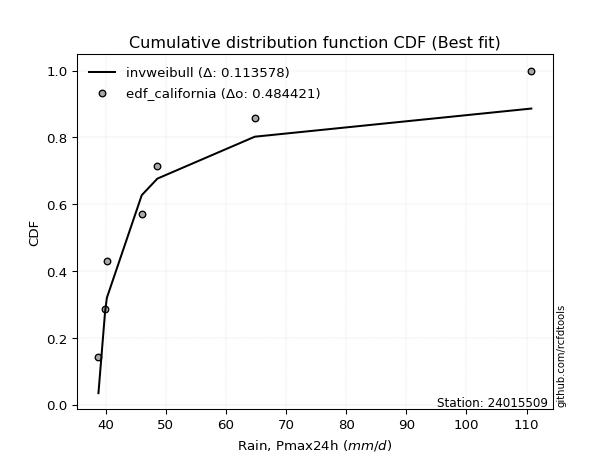</img>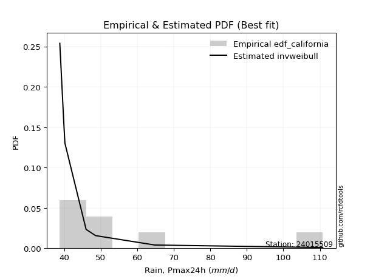</img>

</div>


### 2. EDF Hazen (1930)

Hazen method for plotting positions is a formula used to estimate the empirical cumulative probability distribution of flood events or other hydrological data. This formula often results in biased estimations, particularly when extrapolating to extreme events (high return periods).

<div align="center">


$P=(m-0.5)/n$


</div>


**2.1. Empirical values**

<div align="center">

|                | 0                   | 1                   | 2                   | 3         | 4                  | 5                  | 6                  |
|:---------------|:--------------------|:--------------------|:--------------------|:----------|:-------------------|:-------------------|:-------------------|
| date           | 2019                | 2017                | 2021                | 2018      | 2016               | 2020               | 2024               |
| x              | 38.8                | 39.9                | 40.2                | 46.0      | 48.6               | 64.8               | 110.8              |
| m              | 1                   | 2                   | 3                   | 4         | 5                  | 6                  | 7                  |
| empirical_dist | edf_hazen           | edf_hazen           | edf_hazen           | edf_hazen | edf_hazen          | edf_hazen          | edf_hazen          |
| empirical      | 0.07142857142857142 | 0.21428571428571427 | 0.35714285714285715 | 0.5       | 0.6428571428571429 | 0.7857142857142857 | 0.9285714285714286 |
| empirical_tr   | 1.0769230769230769  | 1.2727272727272727  | 1.5555555555555558  | 2.0       | 2.8000000000000003 | 4.666666666666666  | 14.000000000000007 |

</div>


**2.2. Kolmogorov-Smirnov fit test (sorted by Δ)**


<div align="center">

|                | 0                   | 1                   | 2                   | 3                   | 4                   | 5                   | 6                   | 7                   | 8                   | 9                   | 10                  | 11                  | 12                  | 13                  | 14                  | 15                  | 16                  | 17                  | 18                  | 19                  | 20                  | 21                  | 22                  | 23                  | 24                  | 25                  | 26                  | 27                  | 28                  | 29                  | 30                  | 31                  | 32                  | 33                  | 34                  | 35                  | 36                  | 37                  | 38                  | 39                  | 40                  | 41                  | 42                  | 43                  | 44                  | 45                  | 46                  | 47                  | 48                  | 49                  | 50                  | 51                  | 52                  | 53                  | 54                  | 55                  | 56                    | 57                  | 58                  | 59                  | 60                  | 61                  | 62                  | 63                  | 64                  | 65                  | 66                  | 67                  | 68                  | 69                  | 70                  | 71                  | 72                  | 73                  | 74                  | 75                  | 76                  | 77                  | 78                  | 79                  | 80                  | 81                  | 82                  | 83                  | 84                  | 85                  | 86                  | 87                  |
|:---------------|:--------------------|:--------------------|:--------------------|:--------------------|:--------------------|:--------------------|:--------------------|:--------------------|:--------------------|:--------------------|:--------------------|:--------------------|:--------------------|:--------------------|:--------------------|:--------------------|:--------------------|:--------------------|:--------------------|:--------------------|:--------------------|:--------------------|:--------------------|:--------------------|:--------------------|:--------------------|:--------------------|:--------------------|:--------------------|:--------------------|:--------------------|:--------------------|:--------------------|:--------------------|:--------------------|:--------------------|:--------------------|:--------------------|:--------------------|:--------------------|:--------------------|:--------------------|:--------------------|:--------------------|:--------------------|:--------------------|:--------------------|:--------------------|:--------------------|:--------------------|:--------------------|:--------------------|:--------------------|:--------------------|:--------------------|:--------------------|:----------------------|:--------------------|:--------------------|:--------------------|:--------------------|:--------------------|:--------------------|:--------------------|:--------------------|:--------------------|:--------------------|:--------------------|:--------------------|:--------------------|:--------------------|:--------------------|:--------------------|:--------------------|:--------------------|:--------------------|:--------------------|:--------------------|:--------------------|:--------------------|:--------------------|:--------------------|:--------------------|:--------------------|:--------------------|:--------------------|:--------------------|:--------------------|
| station        | 24015509            | 24015509            | 24015509            | 24015509            | 24015509            | 24015509            | 24015509            | 24015509            | 24015509            | 24015509            | 24015509            | 24015509            | 24015509            | 24015509            | 24015509            | 24015509            | 24015509            | 24015509            | 24015509            | 24015509            | 24015509            | 24015509            | 24015509            | 24015509            | 24015509            | 24015509            | 24015509            | 24015509            | 24015509            | 24015509            | 24015509            | 24015509            | 24015509            | 24015509            | 24015509            | 24015509            | 24015509            | 24015509            | 24015509            | 24015509            | 24015509            | 24015509            | 24015509            | 24015509            | 24015509            | 24015509            | 24015509            | 24015509            | 24015509            | 24015509            | 24015509            | 24015509            | 24015509            | 24015509            | 24015509            | 24015509            | 24015509              | 24015509            | 24015509            | 24015509            | 24015509            | 24015509            | 24015509            | 24015509            | 24015509            | 24015509            | 24015509            | 24015509            | 24015509            | 24015509            | 24015509            | 24015509            | 24015509            | 24015509            | 24015509            | 24015509            | 24015509            | 24015509            | 24015509            | 24015509            | 24015509            | 24015509            | 24015509            | 24015509            | 24015509            | 24015509            | 24015509            | 24015509            |
| empirical_dist | edf_hazen           | edf_hazen           | edf_hazen           | edf_hazen           | edf_hazen           | edf_hazen           | edf_hazen           | edf_hazen           | edf_hazen           | edf_hazen           | edf_hazen           | edf_hazen           | edf_hazen           | edf_hazen           | edf_hazen           | edf_hazen           | edf_hazen           | edf_hazen           | edf_hazen           | edf_hazen           | edf_hazen           | edf_hazen           | edf_hazen           | edf_hazen           | edf_hazen           | edf_hazen           | edf_hazen           | edf_hazen           | edf_hazen           | edf_hazen           | edf_hazen           | edf_hazen           | edf_hazen           | edf_hazen           | edf_hazen           | edf_hazen           | edf_hazen           | edf_hazen           | edf_hazen           | edf_hazen           | edf_hazen           | edf_hazen           | edf_hazen           | edf_hazen           | edf_hazen           | edf_hazen           | edf_hazen           | edf_hazen           | edf_hazen           | edf_hazen           | edf_hazen           | edf_hazen           | edf_hazen           | edf_hazen           | edf_hazen           | edf_hazen           | edf_hazen             | edf_hazen           | edf_hazen           | edf_hazen           | edf_hazen           | edf_hazen           | edf_hazen           | edf_hazen           | edf_hazen           | edf_hazen           | edf_hazen           | edf_hazen           | edf_hazen           | edf_hazen           | edf_hazen           | edf_hazen           | edf_hazen           | edf_hazen           | edf_hazen           | edf_hazen           | edf_hazen           | edf_hazen           | edf_hazen           | edf_hazen           | edf_hazen           | edf_hazen           | edf_hazen           | edf_hazen           | edf_hazen           | edf_hazen           | edf_hazen           | edf_hazen           |
| p_dist         | chi2                | logmoyal            | invweibull          | wald                | gamma               | logpearson3         | loginvweibull       | loghalflogistic     | f                   | invgamma            | logf                | logncf              | invgauss            | logweibull_min      | loginvgamma         | alpha               | loggumbel_r         | logerlang           | loginvgauss         | logmielke           | logalpha            | loggenlogistic      | loghalfnorm         | lograyleigh         | nakagami            | moyal               | loggamma            | loggamma            | logmaxwell          | logkstwobign        | erlang              | nct                 | logt                | weibull_min         | pearson3            | lognct              | gumbel_r            | betaprime           | logbetaprime        | genlogistic         | ncf                 | halflogistic        | lognakagami         | rayleigh            | logloggamma         | logwald             | lognorm             | lognorm             | logcrystalball      | halfnorm            | t                   | maxwell             | loglogistic         | logrice             | loghypsecant        | logexponnorm        | loglaplace_asymmetric | loggenexpon         | logexpon            | loggompertz         | fisk                | logtruncnorm        | logfisk             | loglaplace          | norm                | crystalball         | kstwobign           | logchi2             | gibrat              | logistic            | exponnorm           | laplace_asymmetric  | expon               | genexpon            | hypsecant           | loggumbel_l         | rice                | truncnorm           | laplace             | gumbel_l            | gompertz            | loggibrat           | loglognorm          | fatiguelife         | logfatiguelife      | johnsonsu           | logjohnsonsu        | mielke              |
| delta          | 0.11501901468402057 | 0.1257375868145887  | 0.1269794876498278  | 0.12815240079641924 | 0.13498004470680783 | 0.13630060008049952 | 0.13742397234621306 | 0.13752509377782368 | 0.13902079835772851 | 0.13902210577334884 | 0.1444016507673953  | 0.14440229663159432 | 0.14651747058992937 | 0.14695187984020042 | 0.14824501174254823 | 0.14974624898688182 | 0.1502933035375384  | 0.15040051200176682 | 0.15056119653511824 | 0.15111126956500545 | 0.15877695464601804 | 0.16103969045003255 | 0.16593107157343084 | 0.16812805294098776 | 0.16968128334727947 | 0.1786094933313792  | 0.17890482766698992 | 0.17890482766698992 | 0.18026384587865957 | 0.1804533673525705  | 0.18385414856544902 | 0.1863394861370149  | 0.19377813946770525 | 0.19401269510699248 | 0.19684788896615454 | 0.19728983889348534 | 0.2003455291404097  | 0.20065409420324593 | 0.20117152136639166 | 0.20483353697854945 | 0.20514736620247143 | 0.20560150899386823 | 0.20625664862956045 | 0.21135807160732645 | 0.21368477854507434 | 0.2145405923803511  | 0.21465752211232786 | 0.21465752211232786 | 0.2146575687337749  | 0.22212100474838212 | 0.22234253048261185 | 0.22365816696500246 | 0.2241844536289569  | 0.2290293590889258  | 0.23214258147025085 | 0.24030193393224958 | 0.24159318943752545   | 0.24160457834337712 | 0.24160698171875084 | 0.24435514026157062 | 0.24645638310349055 | 0.24873466136085653 | 0.2511842637430408  | 0.2557534892464755  | 0.2572660381733717  | 0.2572660543202653  | 0.25893327567564683 | 0.26378097337212564 | 0.26543561121572684 | 0.27175819628813813 | 0.27597513883573316 | 0.27711954768073305 | 0.27712202270907993 | 0.27712206871765366 | 0.2834625443967985  | 0.28357431236987884 | 0.2952884065308254  | 0.29754722311282983 | 0.31146116246749084 | 0.32218143979463365 | 0.3455075634061199  | 0.34924450159802717 | 0.38654033544386346 | 0.38839255610440615 | 0.40170792096738095 | 0.5641065373250476  | 0.6440356385745494  | nan                 |
| deltao         | 0.48442053926100004 | 0.48442053926100004 | 0.48442053926100004 | 0.48442053926100004 | 0.48442053926100004 | 0.48442053926100004 | 0.48442053926100004 | 0.48442053926100004 | 0.48442053926100004 | 0.48442053926100004 | 0.48442053926100004 | 0.48442053926100004 | 0.48442053926100004 | 0.48442053926100004 | 0.48442053926100004 | 0.48442053926100004 | 0.48442053926100004 | 0.48442053926100004 | 0.48442053926100004 | 0.48442053926100004 | 0.48442053926100004 | 0.48442053926100004 | 0.48442053926100004 | 0.48442053926100004 | 0.48442053926100004 | 0.48442053926100004 | 0.48442053926100004 | 0.48442053926100004 | 0.48442053926100004 | 0.48442053926100004 | 0.48442053926100004 | 0.48442053926100004 | 0.48442053926100004 | 0.48442053926100004 | 0.48442053926100004 | 0.48442053926100004 | 0.48442053926100004 | 0.48442053926100004 | 0.48442053926100004 | 0.48442053926100004 | 0.48442053926100004 | 0.48442053926100004 | 0.48442053926100004 | 0.48442053926100004 | 0.48442053926100004 | 0.48442053926100004 | 0.48442053926100004 | 0.48442053926100004 | 0.48442053926100004 | 0.48442053926100004 | 0.48442053926100004 | 0.48442053926100004 | 0.48442053926100004 | 0.48442053926100004 | 0.48442053926100004 | 0.48442053926100004 | 0.48442053926100004   | 0.48442053926100004 | 0.48442053926100004 | 0.48442053926100004 | 0.48442053926100004 | 0.48442053926100004 | 0.48442053926100004 | 0.48442053926100004 | 0.48442053926100004 | 0.48442053926100004 | 0.48442053926100004 | 0.48442053926100004 | 0.48442053926100004 | 0.48442053926100004 | 0.48442053926100004 | 0.48442053926100004 | 0.48442053926100004 | 0.48442053926100004 | 0.48442053926100004 | 0.48442053926100004 | 0.48442053926100004 | 0.48442053926100004 | 0.48442053926100004 | 0.48442053926100004 | 0.48442053926100004 | 0.48442053926100004 | 0.48442053926100004 | 0.48442053926100004 | 0.48442053926100004 | 0.48442053926100004 | 0.48442053926100004 | 0.48442053926100004 |
| eval           | Δo > Δ              | Δo > Δ              | Δo > Δ              | Δo > Δ              | Δo > Δ              | Δo > Δ              | Δo > Δ              | Δo > Δ              | Δo > Δ              | Δo > Δ              | Δo > Δ              | Δo > Δ              | Δo > Δ              | Δo > Δ              | Δo > Δ              | Δo > Δ              | Δo > Δ              | Δo > Δ              | Δo > Δ              | Δo > Δ              | Δo > Δ              | Δo > Δ              | Δo > Δ              | Δo > Δ              | Δo > Δ              | Δo > Δ              | Δo > Δ              | Δo > Δ              | Δo > Δ              | Δo > Δ              | Δo > Δ              | Δo > Δ              | Δo > Δ              | Δo > Δ              | Δo > Δ              | Δo > Δ              | Δo > Δ              | Δo > Δ              | Δo > Δ              | Δo > Δ              | Δo > Δ              | Δo > Δ              | Δo > Δ              | Δo > Δ              | Δo > Δ              | Δo > Δ              | Δo > Δ              | Δo > Δ              | Δo > Δ              | Δo > Δ              | Δo > Δ              | Δo > Δ              | Δo > Δ              | Δo > Δ              | Δo > Δ              | Δo > Δ              | Δo > Δ                | Δo > Δ              | Δo > Δ              | Δo > Δ              | Δo > Δ              | Δo > Δ              | Δo > Δ              | Δo > Δ              | Δo > Δ              | Δo > Δ              | Δo > Δ              | Δo > Δ              | Δo > Δ              | Δo > Δ              | Δo > Δ              | Δo > Δ              | Δo > Δ              | Δo > Δ              | Δo > Δ              | Δo > Δ              | Δo > Δ              | Δo > Δ              | Δo > Δ              | Δo > Δ              | Δo > Δ              | Δo > Δ              | Δo > Δ              | Δo > Δ              | Δo > Δ              | Δo <= Δ             | Δo <= Δ             | Δo <= Δ             |
| fit            | 1                   | 1                   | 1                   | 1                   | 1                   | 1                   | 1                   | 1                   | 1                   | 1                   | 1                   | 1                   | 1                   | 1                   | 1                   | 1                   | 1                   | 1                   | 1                   | 1                   | 1                   | 1                   | 1                   | 1                   | 1                   | 1                   | 1                   | 1                   | 1                   | 1                   | 1                   | 1                   | 1                   | 1                   | 1                   | 1                   | 1                   | 1                   | 1                   | 1                   | 1                   | 1                   | 1                   | 1                   | 1                   | 1                   | 1                   | 1                   | 1                   | 1                   | 1                   | 1                   | 1                   | 1                   | 1                   | 1                   | 1                     | 1                   | 1                   | 1                   | 1                   | 1                   | 1                   | 1                   | 1                   | 1                   | 1                   | 1                   | 1                   | 1                   | 1                   | 1                   | 1                   | 1                   | 1                   | 1                   | 1                   | 1                   | 1                   | 1                   | 1                   | 1                   | 1                   | 1                   | 1                   | 0                   | 0                   | 0                   |
| n              | 7                   | 7                   | 7                   | 7                   | 7                   | 7                   | 7                   | 7                   | 7                   | 7                   | 7                   | 7                   | 7                   | 7                   | 7                   | 7                   | 7                   | 7                   | 7                   | 7                   | 7                   | 7                   | 7                   | 7                   | 7                   | 7                   | 7                   | 7                   | 7                   | 7                   | 7                   | 7                   | 7                   | 7                   | 7                   | 7                   | 7                   | 7                   | 7                   | 7                   | 7                   | 7                   | 7                   | 7                   | 7                   | 7                   | 7                   | 7                   | 7                   | 7                   | 7                   | 7                   | 7                   | 7                   | 7                   | 7                   | 7                     | 7                   | 7                   | 7                   | 7                   | 7                   | 7                   | 7                   | 7                   | 7                   | 7                   | 7                   | 7                   | 7                   | 7                   | 7                   | 7                   | 7                   | 7                   | 7                   | 7                   | 7                   | 7                   | 7                   | 7                   | 7                   | 7                   | 7                   | 7                   | 7                   | 7                   | 7                   |
| best_fit       | 1                   | 0                   | 0                   | 0                   | 0                   | 0                   | 0                   | 0                   | 0                   | 0                   | 0                   | 0                   | 0                   | 0                   | 0                   | 0                   | 0                   | 0                   | 0                   | 0                   | 0                   | 0                   | 0                   | 0                   | 0                   | 0                   | 0                   | 0                   | 0                   | 0                   | 0                   | 0                   | 0                   | 0                   | 0                   | 0                   | 0                   | 0                   | 0                   | 0                   | 0                   | 0                   | 0                   | 0                   | 0                   | 0                   | 0                   | 0                   | 0                   | 0                   | 0                   | 0                   | 0                   | 0                   | 0                   | 0                   | 0                     | 0                   | 0                   | 0                   | 0                   | 0                   | 0                   | 0                   | 0                   | 0                   | 0                   | 0                   | 0                   | 0                   | 0                   | 0                   | 0                   | 0                   | 0                   | 0                   | 0                   | 0                   | 0                   | 0                   | 0                   | 0                   | 0                   | 0                   | 0                   | 0                   | 0                   | 0                   |
| best_fit_sort  | 1                   | 2                   | 3                   | 4                   | 5                   | 6                   | 7                   | 8                   | 9                   | 10                  | 11                  | 12                  | 13                  | 14                  | 15                  | 16                  | 17                  | 18                  | 19                  | 20                  | 21                  | 22                  | 23                  | 24                  | 25                  | 26                  | 27                  | 28                  | 29                  | 30                  | 31                  | 32                  | 33                  | 34                  | 35                  | 36                  | 37                  | 38                  | 39                  | 40                  | 41                  | 42                  | 43                  | 44                  | 45                  | 46                  | 47                  | 48                  | 49                  | 50                  | 51                  | 52                  | 53                  | 54                  | 55                  | 56                  | 57                    | 58                  | 59                  | 60                  | 61                  | 62                  | 63                  | 64                  | 65                  | 66                  | 67                  | 68                  | 69                  | 70                  | 71                  | 72                  | 73                  | 74                  | 75                  | 76                  | 77                  | 78                  | 79                  | 80                  | 81                  | 82                  | 83                  | 84                  | 85                  | 86                  | 87                  | 88                  |

</div>


**2.3. Best fit**

<div align="center">

|   id |   station | empirical_dist   | p_dist   |    delta |   deltao | eval   |   fit |   n |   best_fit |   best_fit_sort |
|-----:|----------:|:-----------------|:---------|---------:|---------:|:-------|------:|----:|-----------:|----------------:|
|    0 |  24015509 | edf_hazen        | chi2     | 0.115019 | 0.484421 | Δo > Δ |     1 |   7 |          1 |               1 |

</div>


<div align="center">

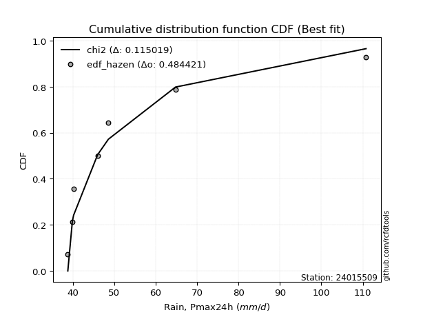</img>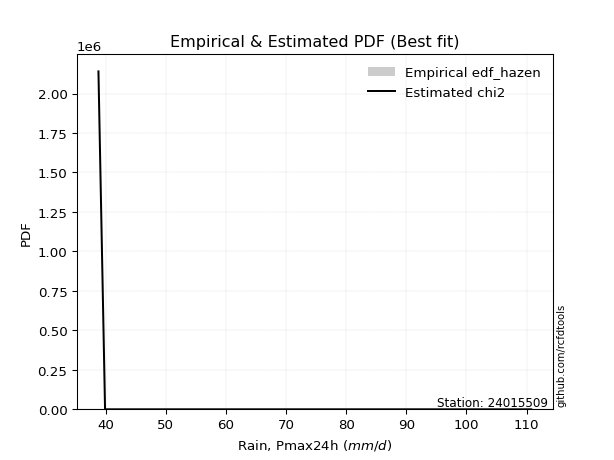</img>

</div>


### 3. EDF Weibull (1939)

Weibull plotting position formula is an empirical method used to estimate the non-exceedance probability or plotting position for a set of observed data, is often recommended or widely used in practice, particularly in flood frequency analysis.

<div align="center">


$P=m/(n+1)$


</div>


**3.1. Empirical values**

<div align="center">

|                | 0                  | 1                  | 2           | 3           | 4                  | 5           | 6           |
|:---------------|:-------------------|:-------------------|:------------|:------------|:-------------------|:------------|:------------|
| date           | 2019               | 2017               | 2021        | 2018        | 2016               | 2020        | 2024        |
| x              | 38.8               | 39.9               | 40.2        | 46.0        | 48.6               | 64.8        | 110.8       |
| m              | 1                  | 2                  | 3           | 4           | 5                  | 6           | 7           |
| empirical_dist | edf_weibull        | edf_weibull        | edf_weibull | edf_weibull | edf_weibull        | edf_weibull | edf_weibull |
| empirical      | 0.125              | 0.25               | 0.375       | 0.5         | 0.625              | 0.75        | 0.875       |
| empirical_tr   | 1.1428571428571428 | 1.3333333333333333 | 1.6         | 2.0         | 2.6666666666666665 | 4.0         | 8.0         |

</div>


**3.2. Kolmogorov-Smirnov fit test (sorted by Δ)**


<div align="center">

|                | 0                   | 1                   | 2                   | 3                   | 4                   | 5                   | 6                   | 7                   | 8                   | 9                   | 10                  | 11                  | 12                  | 13                  | 14                  | 15                  | 16                  | 17                  | 18                  | 19                  | 20                  | 21                  | 22                  | 23                  | 24                  | 25                  | 26                  | 27                  | 28                  | 29                  | 30                  | 31                  | 32                  | 33                  | 34                  | 35                  | 36                  | 37                  | 38                  | 39                  | 40                  | 41                  | 42                  | 43                  | 44                  | 45                  | 46                  | 47                  | 48                  | 49                  | 50                  | 51                  | 52                  | 53                  | 54                  | 55                  | 56                  | 57                  | 58                  | 59                  | 60                  | 61                  | 62                  | 63                  | 64                    | 65                  | 66                  | 67                  | 68                  | 69                  | 70                  | 71                  | 72                  | 73                  | 74                  | 75                  | 76                  | 77                  | 78                  | 79                  | 80                  | 81                  | 82                  | 83                  | 84                  | 85                  | 86                  | 87                  |
|:---------------|:--------------------|:--------------------|:--------------------|:--------------------|:--------------------|:--------------------|:--------------------|:--------------------|:--------------------|:--------------------|:--------------------|:--------------------|:--------------------|:--------------------|:--------------------|:--------------------|:--------------------|:--------------------|:--------------------|:--------------------|:--------------------|:--------------------|:--------------------|:--------------------|:--------------------|:--------------------|:--------------------|:--------------------|:--------------------|:--------------------|:--------------------|:--------------------|:--------------------|:--------------------|:--------------------|:--------------------|:--------------------|:--------------------|:--------------------|:--------------------|:--------------------|:--------------------|:--------------------|:--------------------|:--------------------|:--------------------|:--------------------|:--------------------|:--------------------|:--------------------|:--------------------|:--------------------|:--------------------|:--------------------|:--------------------|:--------------------|:--------------------|:--------------------|:--------------------|:--------------------|:--------------------|:--------------------|:--------------------|:--------------------|:----------------------|:--------------------|:--------------------|:--------------------|:--------------------|:--------------------|:--------------------|:--------------------|:--------------------|:--------------------|:--------------------|:--------------------|:--------------------|:--------------------|:--------------------|:--------------------|:--------------------|:--------------------|:--------------------|:--------------------|:--------------------|:--------------------|:--------------------|:--------------------|
| station        | 24015509            | 24015509            | 24015509            | 24015509            | 24015509            | 24015509            | 24015509            | 24015509            | 24015509            | 24015509            | 24015509            | 24015509            | 24015509            | 24015509            | 24015509            | 24015509            | 24015509            | 24015509            | 24015509            | 24015509            | 24015509            | 24015509            | 24015509            | 24015509            | 24015509            | 24015509            | 24015509            | 24015509            | 24015509            | 24015509            | 24015509            | 24015509            | 24015509            | 24015509            | 24015509            | 24015509            | 24015509            | 24015509            | 24015509            | 24015509            | 24015509            | 24015509            | 24015509            | 24015509            | 24015509            | 24015509            | 24015509            | 24015509            | 24015509            | 24015509            | 24015509            | 24015509            | 24015509            | 24015509            | 24015509            | 24015509            | 24015509            | 24015509            | 24015509            | 24015509            | 24015509            | 24015509            | 24015509            | 24015509            | 24015509              | 24015509            | 24015509            | 24015509            | 24015509            | 24015509            | 24015509            | 24015509            | 24015509            | 24015509            | 24015509            | 24015509            | 24015509            | 24015509            | 24015509            | 24015509            | 24015509            | 24015509            | 24015509            | 24015509            | 24015509            | 24015509            | 24015509            | 24015509            |
| empirical_dist | edf_weibull         | edf_weibull         | edf_weibull         | edf_weibull         | edf_weibull         | edf_weibull         | edf_weibull         | edf_weibull         | edf_weibull         | edf_weibull         | edf_weibull         | edf_weibull         | edf_weibull         | edf_weibull         | edf_weibull         | edf_weibull         | edf_weibull         | edf_weibull         | edf_weibull         | edf_weibull         | edf_weibull         | edf_weibull         | edf_weibull         | edf_weibull         | edf_weibull         | edf_weibull         | edf_weibull         | edf_weibull         | edf_weibull         | edf_weibull         | edf_weibull         | edf_weibull         | edf_weibull         | edf_weibull         | edf_weibull         | edf_weibull         | edf_weibull         | edf_weibull         | edf_weibull         | edf_weibull         | edf_weibull         | edf_weibull         | edf_weibull         | edf_weibull         | edf_weibull         | edf_weibull         | edf_weibull         | edf_weibull         | edf_weibull         | edf_weibull         | edf_weibull         | edf_weibull         | edf_weibull         | edf_weibull         | edf_weibull         | edf_weibull         | edf_weibull         | edf_weibull         | edf_weibull         | edf_weibull         | edf_weibull         | edf_weibull         | edf_weibull         | edf_weibull         | edf_weibull           | edf_weibull         | edf_weibull         | edf_weibull         | edf_weibull         | edf_weibull         | edf_weibull         | edf_weibull         | edf_weibull         | edf_weibull         | edf_weibull         | edf_weibull         | edf_weibull         | edf_weibull         | edf_weibull         | edf_weibull         | edf_weibull         | edf_weibull         | edf_weibull         | edf_weibull         | edf_weibull         | edf_weibull         | edf_weibull         | edf_weibull         |
| p_dist         | loghalflogistic     | loghalfnorm         | logpearson3         | logweibull_min      | invweibull          | loggumbel_r         | chi2                | nakagami            | logmoyal            | loginvweibull       | f                   | invgamma            | pearson3            | logf                | logncf              | wald                | invgauss            | loginvgamma         | alpha               | lograyleigh         | loginvgauss         | halflogistic        | gamma               | logalpha            | moyal               | logmaxwell          | logerlang           | nct                 | halfnorm            | logmielke           | logt                | weibull_min         | loggenlogistic      | lognct              | gumbel_r            | betaprime           | logbetaprime        | genlogistic         | ncf                 | t                   | rayleigh            | logloggamma         | lognakagami         | logkstwobign        | loggamma            | loggamma            | lognorm             | lognorm             | logcrystalball      | logfisk             | erlang              | maxwell             | loglogistic         | logrice             | loghypsecant        | logwald             | fisk                | loglaplace          | norm                | crystalball         | kstwobign           | logchi2             | logistic            | logexponnorm        | loglaplace_asymmetric | loggenexpon         | logexpon            | loggompertz         | hypsecant           | loggumbel_l         | logtruncnorm        | rice                | gibrat              | laplace             | exponnorm           | laplace_asymmetric  | expon               | genexpon            | gumbel_l            | truncnorm           | gompertz            | loglognorm          | fatiguelife         | logfatiguelife      | loggibrat           | johnsonsu           | logjohnsonsu        | mielke              |
| delta          | 0.11031510378830539 | 0.1159489974041299  | 0.11827136385799986 | 0.12499854513837623 | 0.1269794876498278  | 0.13246842078582538 | 0.13287615754116341 | 0.13396699763299375 | 0.13737683829853076 | 0.13742397234621306 | 0.13902079835772851 | 0.13902210577334884 | 0.14327646039472597 | 0.1444016507673953  | 0.14440229663159432 | 0.14600954365356208 | 0.14651747058992937 | 0.14824501174254823 | 0.14974624898688182 | 0.15027091008384486 | 0.15056119653511824 | 0.15203008042243965 | 0.15283718756395068 | 0.15877695464601804 | 0.1607523504742363  | 0.16240670302151666 | 0.16825765485890967 | 0.168482343279872   | 0.16854957617695354 | 0.1689684124221483  | 0.16903723672918525 | 0.17615555224984958 | 0.1788968333071754  | 0.17943269603634243 | 0.1824883862832668  | 0.18279695134610302 | 0.18331437850924875 | 0.18697639412140654 | 0.18729022334532852 | 0.18732787230269704 | 0.19350092875018354 | 0.19582763568793143 | 0.19610097446298164 | 0.19634610770352234 | 0.19676197052413277 | 0.19676197052413277 | 0.19680037925518495 | 0.19680037925518495 | 0.196800425876632   | 0.1976128351716122  | 0.20171129142259187 | 0.20580102410785955 | 0.206327310771814   | 0.2111722162317829  | 0.21428543861310795 | 0.23239773523749394 | 0.2333364737291221  | 0.2378963463893326  | 0.23940889531622878 | 0.23940891146312238 | 0.24107613281850393 | 0.24592383051498273 | 0.2539010534309952  | 0.2581590767893924  | 0.2594503322946683    | 0.25946172120051997 | 0.2594641245758937  | 0.2622122831187135  | 0.2656054015396556  | 0.26571716951273594 | 0.2665918042179994  | 0.2774312636736825  | 0.2832927540728697  | 0.29360401961034793 | 0.293832281692876   | 0.2949766905378759  | 0.2949791655662228  | 0.2949792115747965  | 0.30432429693749075 | 0.3154043659699727  | 0.327650420548977   | 0.35082604972957776 | 0.35267827039012045 | 0.36599363525309525 | 0.36710164445517    | 0.5283922516107619  | 0.6083213528602637  | nan                 |
| deltao         | 0.48442053926100004 | 0.48442053926100004 | 0.48442053926100004 | 0.48442053926100004 | 0.48442053926100004 | 0.48442053926100004 | 0.48442053926100004 | 0.48442053926100004 | 0.48442053926100004 | 0.48442053926100004 | 0.48442053926100004 | 0.48442053926100004 | 0.48442053926100004 | 0.48442053926100004 | 0.48442053926100004 | 0.48442053926100004 | 0.48442053926100004 | 0.48442053926100004 | 0.48442053926100004 | 0.48442053926100004 | 0.48442053926100004 | 0.48442053926100004 | 0.48442053926100004 | 0.48442053926100004 | 0.48442053926100004 | 0.48442053926100004 | 0.48442053926100004 | 0.48442053926100004 | 0.48442053926100004 | 0.48442053926100004 | 0.48442053926100004 | 0.48442053926100004 | 0.48442053926100004 | 0.48442053926100004 | 0.48442053926100004 | 0.48442053926100004 | 0.48442053926100004 | 0.48442053926100004 | 0.48442053926100004 | 0.48442053926100004 | 0.48442053926100004 | 0.48442053926100004 | 0.48442053926100004 | 0.48442053926100004 | 0.48442053926100004 | 0.48442053926100004 | 0.48442053926100004 | 0.48442053926100004 | 0.48442053926100004 | 0.48442053926100004 | 0.48442053926100004 | 0.48442053926100004 | 0.48442053926100004 | 0.48442053926100004 | 0.48442053926100004 | 0.48442053926100004 | 0.48442053926100004 | 0.48442053926100004 | 0.48442053926100004 | 0.48442053926100004 | 0.48442053926100004 | 0.48442053926100004 | 0.48442053926100004 | 0.48442053926100004 | 0.48442053926100004   | 0.48442053926100004 | 0.48442053926100004 | 0.48442053926100004 | 0.48442053926100004 | 0.48442053926100004 | 0.48442053926100004 | 0.48442053926100004 | 0.48442053926100004 | 0.48442053926100004 | 0.48442053926100004 | 0.48442053926100004 | 0.48442053926100004 | 0.48442053926100004 | 0.48442053926100004 | 0.48442053926100004 | 0.48442053926100004 | 0.48442053926100004 | 0.48442053926100004 | 0.48442053926100004 | 0.48442053926100004 | 0.48442053926100004 | 0.48442053926100004 | 0.48442053926100004 |
| eval           | Δo > Δ              | Δo > Δ              | Δo > Δ              | Δo > Δ              | Δo > Δ              | Δo > Δ              | Δo > Δ              | Δo > Δ              | Δo > Δ              | Δo > Δ              | Δo > Δ              | Δo > Δ              | Δo > Δ              | Δo > Δ              | Δo > Δ              | Δo > Δ              | Δo > Δ              | Δo > Δ              | Δo > Δ              | Δo > Δ              | Δo > Δ              | Δo > Δ              | Δo > Δ              | Δo > Δ              | Δo > Δ              | Δo > Δ              | Δo > Δ              | Δo > Δ              | Δo > Δ              | Δo > Δ              | Δo > Δ              | Δo > Δ              | Δo > Δ              | Δo > Δ              | Δo > Δ              | Δo > Δ              | Δo > Δ              | Δo > Δ              | Δo > Δ              | Δo > Δ              | Δo > Δ              | Δo > Δ              | Δo > Δ              | Δo > Δ              | Δo > Δ              | Δo > Δ              | Δo > Δ              | Δo > Δ              | Δo > Δ              | Δo > Δ              | Δo > Δ              | Δo > Δ              | Δo > Δ              | Δo > Δ              | Δo > Δ              | Δo > Δ              | Δo > Δ              | Δo > Δ              | Δo > Δ              | Δo > Δ              | Δo > Δ              | Δo > Δ              | Δo > Δ              | Δo > Δ              | Δo > Δ                | Δo > Δ              | Δo > Δ              | Δo > Δ              | Δo > Δ              | Δo > Δ              | Δo > Δ              | Δo > Δ              | Δo > Δ              | Δo > Δ              | Δo > Δ              | Δo > Δ              | Δo > Δ              | Δo > Δ              | Δo > Δ              | Δo > Δ              | Δo > Δ              | Δo > Δ              | Δo > Δ              | Δo > Δ              | Δo > Δ              | Δo <= Δ             | Δo <= Δ             | Δo <= Δ             |
| fit            | 1                   | 1                   | 1                   | 1                   | 1                   | 1                   | 1                   | 1                   | 1                   | 1                   | 1                   | 1                   | 1                   | 1                   | 1                   | 1                   | 1                   | 1                   | 1                   | 1                   | 1                   | 1                   | 1                   | 1                   | 1                   | 1                   | 1                   | 1                   | 1                   | 1                   | 1                   | 1                   | 1                   | 1                   | 1                   | 1                   | 1                   | 1                   | 1                   | 1                   | 1                   | 1                   | 1                   | 1                   | 1                   | 1                   | 1                   | 1                   | 1                   | 1                   | 1                   | 1                   | 1                   | 1                   | 1                   | 1                   | 1                   | 1                   | 1                   | 1                   | 1                   | 1                   | 1                   | 1                   | 1                     | 1                   | 1                   | 1                   | 1                   | 1                   | 1                   | 1                   | 1                   | 1                   | 1                   | 1                   | 1                   | 1                   | 1                   | 1                   | 1                   | 1                   | 1                   | 1                   | 1                   | 0                   | 0                   | 0                   |
| n              | 7                   | 7                   | 7                   | 7                   | 7                   | 7                   | 7                   | 7                   | 7                   | 7                   | 7                   | 7                   | 7                   | 7                   | 7                   | 7                   | 7                   | 7                   | 7                   | 7                   | 7                   | 7                   | 7                   | 7                   | 7                   | 7                   | 7                   | 7                   | 7                   | 7                   | 7                   | 7                   | 7                   | 7                   | 7                   | 7                   | 7                   | 7                   | 7                   | 7                   | 7                   | 7                   | 7                   | 7                   | 7                   | 7                   | 7                   | 7                   | 7                   | 7                   | 7                   | 7                   | 7                   | 7                   | 7                   | 7                   | 7                   | 7                   | 7                   | 7                   | 7                   | 7                   | 7                   | 7                   | 7                     | 7                   | 7                   | 7                   | 7                   | 7                   | 7                   | 7                   | 7                   | 7                   | 7                   | 7                   | 7                   | 7                   | 7                   | 7                   | 7                   | 7                   | 7                   | 7                   | 7                   | 7                   | 7                   | 7                   |
| best_fit       | 1                   | 0                   | 0                   | 0                   | 0                   | 0                   | 0                   | 0                   | 0                   | 0                   | 0                   | 0                   | 0                   | 0                   | 0                   | 0                   | 0                   | 0                   | 0                   | 0                   | 0                   | 0                   | 0                   | 0                   | 0                   | 0                   | 0                   | 0                   | 0                   | 0                   | 0                   | 0                   | 0                   | 0                   | 0                   | 0                   | 0                   | 0                   | 0                   | 0                   | 0                   | 0                   | 0                   | 0                   | 0                   | 0                   | 0                   | 0                   | 0                   | 0                   | 0                   | 0                   | 0                   | 0                   | 0                   | 0                   | 0                   | 0                   | 0                   | 0                   | 0                   | 0                   | 0                   | 0                   | 0                     | 0                   | 0                   | 0                   | 0                   | 0                   | 0                   | 0                   | 0                   | 0                   | 0                   | 0                   | 0                   | 0                   | 0                   | 0                   | 0                   | 0                   | 0                   | 0                   | 0                   | 0                   | 0                   | 0                   |
| best_fit_sort  | 1                   | 2                   | 3                   | 4                   | 5                   | 6                   | 7                   | 8                   | 9                   | 10                  | 11                  | 12                  | 13                  | 14                  | 15                  | 16                  | 17                  | 18                  | 19                  | 20                  | 21                  | 22                  | 23                  | 24                  | 25                  | 26                  | 27                  | 28                  | 29                  | 30                  | 31                  | 32                  | 33                  | 34                  | 35                  | 36                  | 37                  | 38                  | 39                  | 40                  | 41                  | 42                  | 43                  | 44                  | 45                  | 46                  | 47                  | 48                  | 49                  | 50                  | 51                  | 52                  | 53                  | 54                  | 55                  | 56                  | 57                  | 58                  | 59                  | 60                  | 61                  | 62                  | 63                  | 64                  | 65                    | 66                  | 67                  | 68                  | 69                  | 70                  | 71                  | 72                  | 73                  | 74                  | 75                  | 76                  | 77                  | 78                  | 79                  | 80                  | 81                  | 82                  | 83                  | 84                  | 85                  | 86                  | 87                  | 88                  |

</div>


**3.3. Best fit**

<div align="center">

|   id |   station | empirical_dist   | p_dist          |    delta |   deltao | eval   |   fit |   n |   best_fit |   best_fit_sort |
|-----:|----------:|:-----------------|:----------------|---------:|---------:|:-------|------:|----:|-----------:|----------------:|
|    0 |  24015509 | edf_weibull      | loghalflogistic | 0.110315 | 0.484421 | Δo > Δ |     1 |   7 |          1 |               1 |

</div>


<div align="center">

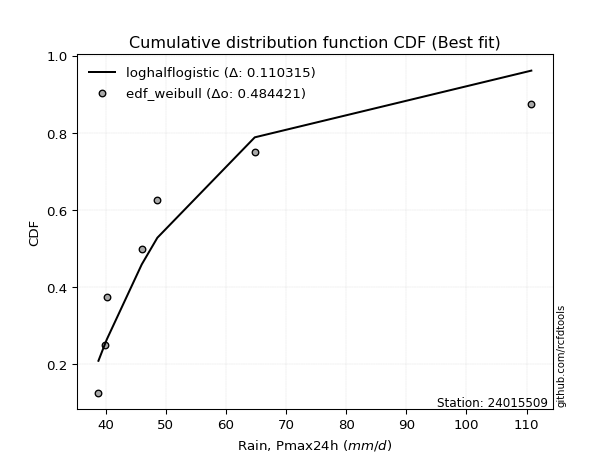</img>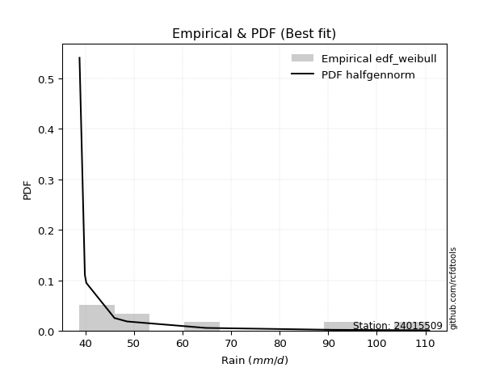</img>

</div>


### 4. EDF Beard (1943)

The Beard formula (or Beard´s plotting position formula) in hydrology is used to estimate the empirical non-exceedance probability _(P)_ of a flood event (or other extreme hydrological data point) within a given dataset.

<div align="center">


$P=(m-0.31)/(n+0.38)$


</div>


**4.1. Empirical values**

<div align="center">

|                | 0                   | 1                   | 2                   | 3         | 4                  | 5                  | 6                  |
|:---------------|:--------------------|:--------------------|:--------------------|:----------|:-------------------|:-------------------|:-------------------|
| date           | 2019                | 2017                | 2021                | 2018      | 2016               | 2020               | 2024               |
| x              | 38.8                | 39.9                | 40.2                | 46.0      | 48.6               | 64.8               | 110.8              |
| m              | 1                   | 2                   | 3                   | 4         | 5                  | 6                  | 7                  |
| empirical_dist | edf_beard           | edf_beard           | edf_beard           | edf_beard | edf_beard          | edf_beard          | edf_beard          |
| empirical      | 0.09349593495934959 | 0.22899728997289973 | 0.36449864498644985 | 0.5       | 0.6355013550135502 | 0.7710027100271003 | 0.9065040650406505 |
| empirical_tr   | 1.1031390134529149  | 1.29701230228471    | 1.5735607675906182  | 2.0       | 2.743494423791822  | 4.366863905325444  | 10.695652173913055 |

</div>


**4.2. Kolmogorov-Smirnov fit test (sorted by Δ)**


<div align="center">

|                | 0                   | 1                   | 2                   | 3                   | 4                   | 5                   | 6                   | 7                   | 8                   | 9                   | 10                  | 11                  | 12                  | 13                  | 14                  | 15                  | 16                  | 17                  | 18                  | 19                  | 20                  | 21                  | 22                  | 23                  | 24                  | 25                  | 26                  | 27                  | 28                  | 29                  | 30                  | 31                  | 32                  | 33                  | 34                  | 35                  | 36                  | 37                  | 38                  | 39                  | 40                  | 41                  | 42                  | 43                  | 44                  | 45                  | 46                  | 47                  | 48                  | 49                  | 50                  | 51                  | 52                  | 53                  | 54                  | 55                  | 56                  | 57                  | 58                  | 59                    | 60                  | 61                  | 62                  | 63                  | 64                  | 65                  | 66                  | 67                  | 68                  | 69                  | 70                  | 71                  | 72                  | 73                  | 74                  | 75                  | 76                  | 77                  | 78                  | 79                  | 80                  | 81                  | 82                  | 83                  | 84                  | 85                  | 86                  | 87                  |
|:---------------|:--------------------|:--------------------|:--------------------|:--------------------|:--------------------|:--------------------|:--------------------|:--------------------|:--------------------|:--------------------|:--------------------|:--------------------|:--------------------|:--------------------|:--------------------|:--------------------|:--------------------|:--------------------|:--------------------|:--------------------|:--------------------|:--------------------|:--------------------|:--------------------|:--------------------|:--------------------|:--------------------|:--------------------|:--------------------|:--------------------|:--------------------|:--------------------|:--------------------|:--------------------|:--------------------|:--------------------|:--------------------|:--------------------|:--------------------|:--------------------|:--------------------|:--------------------|:--------------------|:--------------------|:--------------------|:--------------------|:--------------------|:--------------------|:--------------------|:--------------------|:--------------------|:--------------------|:--------------------|:--------------------|:--------------------|:--------------------|:--------------------|:--------------------|:--------------------|:----------------------|:--------------------|:--------------------|:--------------------|:--------------------|:--------------------|:--------------------|:--------------------|:--------------------|:--------------------|:--------------------|:--------------------|:--------------------|:--------------------|:--------------------|:--------------------|:--------------------|:--------------------|:--------------------|:--------------------|:--------------------|:--------------------|:--------------------|:--------------------|:--------------------|:--------------------|:--------------------|:--------------------|:--------------------|
| station        | 24015509            | 24015509            | 24015509            | 24015509            | 24015509            | 24015509            | 24015509            | 24015509            | 24015509            | 24015509            | 24015509            | 24015509            | 24015509            | 24015509            | 24015509            | 24015509            | 24015509            | 24015509            | 24015509            | 24015509            | 24015509            | 24015509            | 24015509            | 24015509            | 24015509            | 24015509            | 24015509            | 24015509            | 24015509            | 24015509            | 24015509            | 24015509            | 24015509            | 24015509            | 24015509            | 24015509            | 24015509            | 24015509            | 24015509            | 24015509            | 24015509            | 24015509            | 24015509            | 24015509            | 24015509            | 24015509            | 24015509            | 24015509            | 24015509            | 24015509            | 24015509            | 24015509            | 24015509            | 24015509            | 24015509            | 24015509            | 24015509            | 24015509            | 24015509            | 24015509              | 24015509            | 24015509            | 24015509            | 24015509            | 24015509            | 24015509            | 24015509            | 24015509            | 24015509            | 24015509            | 24015509            | 24015509            | 24015509            | 24015509            | 24015509            | 24015509            | 24015509            | 24015509            | 24015509            | 24015509            | 24015509            | 24015509            | 24015509            | 24015509            | 24015509            | 24015509            | 24015509            | 24015509            |
| empirical_dist | edf_beard           | edf_beard           | edf_beard           | edf_beard           | edf_beard           | edf_beard           | edf_beard           | edf_beard           | edf_beard           | edf_beard           | edf_beard           | edf_beard           | edf_beard           | edf_beard           | edf_beard           | edf_beard           | edf_beard           | edf_beard           | edf_beard           | edf_beard           | edf_beard           | edf_beard           | edf_beard           | edf_beard           | edf_beard           | edf_beard           | edf_beard           | edf_beard           | edf_beard           | edf_beard           | edf_beard           | edf_beard           | edf_beard           | edf_beard           | edf_beard           | edf_beard           | edf_beard           | edf_beard           | edf_beard           | edf_beard           | edf_beard           | edf_beard           | edf_beard           | edf_beard           | edf_beard           | edf_beard           | edf_beard           | edf_beard           | edf_beard           | edf_beard           | edf_beard           | edf_beard           | edf_beard           | edf_beard           | edf_beard           | edf_beard           | edf_beard           | edf_beard           | edf_beard           | edf_beard             | edf_beard           | edf_beard           | edf_beard           | edf_beard           | edf_beard           | edf_beard           | edf_beard           | edf_beard           | edf_beard           | edf_beard           | edf_beard           | edf_beard           | edf_beard           | edf_beard           | edf_beard           | edf_beard           | edf_beard           | edf_beard           | edf_beard           | edf_beard           | edf_beard           | edf_beard           | edf_beard           | edf_beard           | edf_beard           | edf_beard           | edf_beard           | edf_beard           |
| p_dist         | loghalflogistic     | chi2                | logpearson3         | logweibull_min      | logmoyal            | invweibull          | wald                | loginvweibull       | f                   | invgamma            | gamma               | loggumbel_r         | loghalfnorm         | logf                | logncf              | invgauss            | loginvgamma         | alpha               | loginvgauss         | nakagami            | logerlang           | logmielke           | logalpha            | lograyleigh         | loggenlogistic      | moyal               | logt                | logmaxwell          | pearson3            | nct                 | halflogistic        | logkstwobign        | loggamma            | loggamma            | weibull_min         | lognct              | erlang              | gumbel_r            | betaprime           | logbetaprime        | genlogistic         | ncf                 | lognakagami         | halfnorm            | t                   | rayleigh            | logloggamma         | lognorm             | lognorm             | logcrystalball      | maxwell             | loglogistic         | logrice             | logwald             | loghypsecant        | logfisk             | fisk                | logexponnorm        | loglaplace          | loglaplace_asymmetric | loggenexpon         | logexpon            | norm                | crystalball         | kstwobign           | loggompertz         | logtruncnorm        | logchi2             | logistic            | gibrat              | hypsecant           | loggumbel_l         | exponnorm           | laplace_asymmetric  | expon               | genexpon            | rice                | laplace             | truncnorm           | gumbel_l            | gompertz            | loggibrat           | loglognorm          | fatiguelife         | logfatiguelife      | johnsonsu           | logjohnsonsu        | mielke              |
| delta          | 0.11545773024704552 | 0.12237480252761326 | 0.12325055819981501 | 0.12488451630942232 | 0.1268754832849806  | 0.1269794876498278  | 0.13550818864001193 | 0.13742397234621306 | 0.13902079835772851 | 0.13902210577334884 | 0.14233583255040053 | 0.1429375156939457  | 0.1438637080426527  | 0.1444016507673953  | 0.14440229663159432 | 0.14651747058992937 | 0.14824501174254823 | 0.14974624898688182 | 0.15056119653511824 | 0.15496970766009402 | 0.15775629984535952 | 0.15846705740859815 | 0.15877695464601804 | 0.16077226509739506 | 0.16839547829362525 | 0.1712537054877865  | 0.17171077593692707 | 0.17290805803506687 | 0.17478052543537637 | 0.1789836982934222  | 0.18353414546309005 | 0.1858447526899722  | 0.18626061551058262 | 0.18626061551058262 | 0.18665690726339979 | 0.18993405104989264 | 0.19120993640904171 | 0.192989741296817   | 0.19329830635965323 | 0.19381573352279896 | 0.19747774913495675 | 0.19779157835887873 | 0.19890086078596775 | 0.20005364121760394 | 0.20027516695183367 | 0.20400228376373375 | 0.20632899070148164 | 0.20730173426873516 | 0.20730173426873516 | 0.2073017808901822  | 0.21630237912140976 | 0.2168286657853642  | 0.2216735712453331  | 0.22189638022394378 | 0.22478679362665815 | 0.22911690021226272 | 0.23910059525989785 | 0.24765772177584228 | 0.2483977014028828  | 0.24894897728111814   | 0.24896036618696982 | 0.24896276956234353 | 0.24991025032977898 | 0.24991026647667258 | 0.25157748783205414 | 0.2517109281051633  | 0.25609044920444923 | 0.25642518552853294 | 0.26440240844454543 | 0.27279139905931954 | 0.2761067565532058  | 0.27621852452628615 | 0.28333092667932586 | 0.28447533552432575 | 0.2844778105526726  | 0.28447785656124636 | 0.2879326186872327  | 0.30410537462389814 | 0.3049030109564225  | 0.31482565195104095 | 0.3381517755625272  | 0.35660028944161987 | 0.37182875975667806 | 0.37368098041722075 | 0.38699634528019555 | 0.5493949616378622  | 0.629324062887364   | nan                 |
| deltao         | 0.48442053926100004 | 0.48442053926100004 | 0.48442053926100004 | 0.48442053926100004 | 0.48442053926100004 | 0.48442053926100004 | 0.48442053926100004 | 0.48442053926100004 | 0.48442053926100004 | 0.48442053926100004 | 0.48442053926100004 | 0.48442053926100004 | 0.48442053926100004 | 0.48442053926100004 | 0.48442053926100004 | 0.48442053926100004 | 0.48442053926100004 | 0.48442053926100004 | 0.48442053926100004 | 0.48442053926100004 | 0.48442053926100004 | 0.48442053926100004 | 0.48442053926100004 | 0.48442053926100004 | 0.48442053926100004 | 0.48442053926100004 | 0.48442053926100004 | 0.48442053926100004 | 0.48442053926100004 | 0.48442053926100004 | 0.48442053926100004 | 0.48442053926100004 | 0.48442053926100004 | 0.48442053926100004 | 0.48442053926100004 | 0.48442053926100004 | 0.48442053926100004 | 0.48442053926100004 | 0.48442053926100004 | 0.48442053926100004 | 0.48442053926100004 | 0.48442053926100004 | 0.48442053926100004 | 0.48442053926100004 | 0.48442053926100004 | 0.48442053926100004 | 0.48442053926100004 | 0.48442053926100004 | 0.48442053926100004 | 0.48442053926100004 | 0.48442053926100004 | 0.48442053926100004 | 0.48442053926100004 | 0.48442053926100004 | 0.48442053926100004 | 0.48442053926100004 | 0.48442053926100004 | 0.48442053926100004 | 0.48442053926100004 | 0.48442053926100004   | 0.48442053926100004 | 0.48442053926100004 | 0.48442053926100004 | 0.48442053926100004 | 0.48442053926100004 | 0.48442053926100004 | 0.48442053926100004 | 0.48442053926100004 | 0.48442053926100004 | 0.48442053926100004 | 0.48442053926100004 | 0.48442053926100004 | 0.48442053926100004 | 0.48442053926100004 | 0.48442053926100004 | 0.48442053926100004 | 0.48442053926100004 | 0.48442053926100004 | 0.48442053926100004 | 0.48442053926100004 | 0.48442053926100004 | 0.48442053926100004 | 0.48442053926100004 | 0.48442053926100004 | 0.48442053926100004 | 0.48442053926100004 | 0.48442053926100004 | 0.48442053926100004 |
| eval           | Δo > Δ              | Δo > Δ              | Δo > Δ              | Δo > Δ              | Δo > Δ              | Δo > Δ              | Δo > Δ              | Δo > Δ              | Δo > Δ              | Δo > Δ              | Δo > Δ              | Δo > Δ              | Δo > Δ              | Δo > Δ              | Δo > Δ              | Δo > Δ              | Δo > Δ              | Δo > Δ              | Δo > Δ              | Δo > Δ              | Δo > Δ              | Δo > Δ              | Δo > Δ              | Δo > Δ              | Δo > Δ              | Δo > Δ              | Δo > Δ              | Δo > Δ              | Δo > Δ              | Δo > Δ              | Δo > Δ              | Δo > Δ              | Δo > Δ              | Δo > Δ              | Δo > Δ              | Δo > Δ              | Δo > Δ              | Δo > Δ              | Δo > Δ              | Δo > Δ              | Δo > Δ              | Δo > Δ              | Δo > Δ              | Δo > Δ              | Δo > Δ              | Δo > Δ              | Δo > Δ              | Δo > Δ              | Δo > Δ              | Δo > Δ              | Δo > Δ              | Δo > Δ              | Δo > Δ              | Δo > Δ              | Δo > Δ              | Δo > Δ              | Δo > Δ              | Δo > Δ              | Δo > Δ              | Δo > Δ                | Δo > Δ              | Δo > Δ              | Δo > Δ              | Δo > Δ              | Δo > Δ              | Δo > Δ              | Δo > Δ              | Δo > Δ              | Δo > Δ              | Δo > Δ              | Δo > Δ              | Δo > Δ              | Δo > Δ              | Δo > Δ              | Δo > Δ              | Δo > Δ              | Δo > Δ              | Δo > Δ              | Δo > Δ              | Δo > Δ              | Δo > Δ              | Δo > Δ              | Δo > Δ              | Δo > Δ              | Δo > Δ              | Δo <= Δ             | Δo <= Δ             | Δo <= Δ             |
| fit            | 1                   | 1                   | 1                   | 1                   | 1                   | 1                   | 1                   | 1                   | 1                   | 1                   | 1                   | 1                   | 1                   | 1                   | 1                   | 1                   | 1                   | 1                   | 1                   | 1                   | 1                   | 1                   | 1                   | 1                   | 1                   | 1                   | 1                   | 1                   | 1                   | 1                   | 1                   | 1                   | 1                   | 1                   | 1                   | 1                   | 1                   | 1                   | 1                   | 1                   | 1                   | 1                   | 1                   | 1                   | 1                   | 1                   | 1                   | 1                   | 1                   | 1                   | 1                   | 1                   | 1                   | 1                   | 1                   | 1                   | 1                   | 1                   | 1                   | 1                     | 1                   | 1                   | 1                   | 1                   | 1                   | 1                   | 1                   | 1                   | 1                   | 1                   | 1                   | 1                   | 1                   | 1                   | 1                   | 1                   | 1                   | 1                   | 1                   | 1                   | 1                   | 1                   | 1                   | 1                   | 1                   | 0                   | 0                   | 0                   |
| n              | 7                   | 7                   | 7                   | 7                   | 7                   | 7                   | 7                   | 7                   | 7                   | 7                   | 7                   | 7                   | 7                   | 7                   | 7                   | 7                   | 7                   | 7                   | 7                   | 7                   | 7                   | 7                   | 7                   | 7                   | 7                   | 7                   | 7                   | 7                   | 7                   | 7                   | 7                   | 7                   | 7                   | 7                   | 7                   | 7                   | 7                   | 7                   | 7                   | 7                   | 7                   | 7                   | 7                   | 7                   | 7                   | 7                   | 7                   | 7                   | 7                   | 7                   | 7                   | 7                   | 7                   | 7                   | 7                   | 7                   | 7                   | 7                   | 7                   | 7                     | 7                   | 7                   | 7                   | 7                   | 7                   | 7                   | 7                   | 7                   | 7                   | 7                   | 7                   | 7                   | 7                   | 7                   | 7                   | 7                   | 7                   | 7                   | 7                   | 7                   | 7                   | 7                   | 7                   | 7                   | 7                   | 7                   | 7                   | 7                   |
| best_fit       | 1                   | 0                   | 0                   | 0                   | 0                   | 0                   | 0                   | 0                   | 0                   | 0                   | 0                   | 0                   | 0                   | 0                   | 0                   | 0                   | 0                   | 0                   | 0                   | 0                   | 0                   | 0                   | 0                   | 0                   | 0                   | 0                   | 0                   | 0                   | 0                   | 0                   | 0                   | 0                   | 0                   | 0                   | 0                   | 0                   | 0                   | 0                   | 0                   | 0                   | 0                   | 0                   | 0                   | 0                   | 0                   | 0                   | 0                   | 0                   | 0                   | 0                   | 0                   | 0                   | 0                   | 0                   | 0                   | 0                   | 0                   | 0                   | 0                   | 0                     | 0                   | 0                   | 0                   | 0                   | 0                   | 0                   | 0                   | 0                   | 0                   | 0                   | 0                   | 0                   | 0                   | 0                   | 0                   | 0                   | 0                   | 0                   | 0                   | 0                   | 0                   | 0                   | 0                   | 0                   | 0                   | 0                   | 0                   | 0                   |
| best_fit_sort  | 1                   | 2                   | 3                   | 4                   | 5                   | 6                   | 7                   | 8                   | 9                   | 10                  | 11                  | 12                  | 13                  | 14                  | 15                  | 16                  | 17                  | 18                  | 19                  | 20                  | 21                  | 22                  | 23                  | 24                  | 25                  | 26                  | 27                  | 28                  | 29                  | 30                  | 31                  | 32                  | 33                  | 34                  | 35                  | 36                  | 37                  | 38                  | 39                  | 40                  | 41                  | 42                  | 43                  | 44                  | 45                  | 46                  | 47                  | 48                  | 49                  | 50                  | 51                  | 52                  | 53                  | 54                  | 55                  | 56                  | 57                  | 58                  | 59                  | 60                    | 61                  | 62                  | 63                  | 64                  | 65                  | 66                  | 67                  | 68                  | 69                  | 70                  | 71                  | 72                  | 73                  | 74                  | 75                  | 76                  | 77                  | 78                  | 79                  | 80                  | 81                  | 82                  | 83                  | 84                  | 85                  | 86                  | 87                  | 88                  |

</div>


**4.3. Best fit**

<div align="center">

|   id |   station | empirical_dist   | p_dist          |    delta |   deltao | eval   |   fit |   n |   best_fit |   best_fit_sort |
|-----:|----------:|:-----------------|:----------------|---------:|---------:|:-------|------:|----:|-----------:|----------------:|
|    0 |  24015509 | edf_beard        | loghalflogistic | 0.115458 | 0.484421 | Δo > Δ |     1 |   7 |          1 |               1 |

</div>


<div align="center">

</img>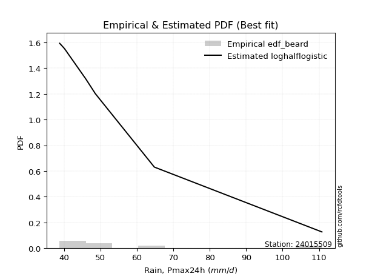</img>

</div>


### 5. EDF Chegodayev (1955)

The Chegodayev formula is an empirical plotting position formula used in hydrological frequency analysis to estimate the exceedance probability or return period of a specific event from a set of observed data. It is primarily used for plotting observed data points on probability paper to fit a theoretical distribution, particularly for analyzing extreme events like maximum flood flows or rainfall intensities. The constant _b_ value in the generalized plotting position formula is 0.3.

<div align="center">


$P=(m-b)/(n+1-2b)$


</div>


**5.1. Empirical values**

<div align="center">

|                | 0                   | 1                   | 2                   | 3              | 4                  | 5                  | 6                  |
|:---------------|:--------------------|:--------------------|:--------------------|:---------------|:-------------------|:-------------------|:-------------------|
| date           | 2019                | 2017                | 2021                | 2018           | 2016               | 2020               | 2024               |
| x              | 38.8                | 39.9                | 40.2                | 46.0           | 48.6               | 64.8               | 110.8              |
| m              | 1                   | 2                   | 3                   | 4              | 5                  | 6                  | 7                  |
| empirical_dist | edf_chegodayev      | edf_chegodayev      | edf_chegodayev      | edf_chegodayev | edf_chegodayev     | edf_chegodayev     | edf_chegodayev     |
| empirical      | 0.09459459459459459 | 0.22972972972972971 | 0.36486486486486486 | 0.5            | 0.6351351351351351 | 0.7702702702702703 | 0.9054054054054054 |
| empirical_tr   | 1.1044776119402986  | 1.2982456140350878  | 1.574468085106383   | 2.0            | 2.7407407407407405 | 4.352941176470589  | 10.571428571428568 |

</div>


**5.2. Kolmogorov-Smirnov fit test (sorted by Δ)**


<div align="center">

|                | 0                   | 1                   | 2                   | 3                   | 4                   | 5                   | 6                   | 7                   | 8                   | 9                   | 10                  | 11                  | 12                  | 13                  | 14                  | 15                  | 16                  | 17                  | 18                  | 19                  | 20                  | 21                  | 22                  | 23                  | 24                  | 25                  | 26                  | 27                  | 28                  | 29                  | 30                  | 31                  | 32                  | 33                  | 34                  | 35                  | 36                  | 37                  | 38                  | 39                  | 40                  | 41                  | 42                  | 43                  | 44                  | 45                  | 46                  | 47                  | 48                  | 49                  | 50                  | 51                  | 52                  | 53                  | 54                  | 55                  | 56                  | 57                  | 58                  | 59                    | 60                  | 61                  | 62                  | 63                  | 64                  | 65                  | 66                  | 67                  | 68                  | 69                  | 70                  | 71                  | 72                  | 73                  | 74                  | 75                  | 76                  | 77                  | 78                  | 79                  | 80                  | 81                  | 82                  | 83                  | 84                  | 85                  | 86                  | 87                  |
|:---------------|:--------------------|:--------------------|:--------------------|:--------------------|:--------------------|:--------------------|:--------------------|:--------------------|:--------------------|:--------------------|:--------------------|:--------------------|:--------------------|:--------------------|:--------------------|:--------------------|:--------------------|:--------------------|:--------------------|:--------------------|:--------------------|:--------------------|:--------------------|:--------------------|:--------------------|:--------------------|:--------------------|:--------------------|:--------------------|:--------------------|:--------------------|:--------------------|:--------------------|:--------------------|:--------------------|:--------------------|:--------------------|:--------------------|:--------------------|:--------------------|:--------------------|:--------------------|:--------------------|:--------------------|:--------------------|:--------------------|:--------------------|:--------------------|:--------------------|:--------------------|:--------------------|:--------------------|:--------------------|:--------------------|:--------------------|:--------------------|:--------------------|:--------------------|:--------------------|:----------------------|:--------------------|:--------------------|:--------------------|:--------------------|:--------------------|:--------------------|:--------------------|:--------------------|:--------------------|:--------------------|:--------------------|:--------------------|:--------------------|:--------------------|:--------------------|:--------------------|:--------------------|:--------------------|:--------------------|:--------------------|:--------------------|:--------------------|:--------------------|:--------------------|:--------------------|:--------------------|:--------------------|:--------------------|
| station        | 24015509            | 24015509            | 24015509            | 24015509            | 24015509            | 24015509            | 24015509            | 24015509            | 24015509            | 24015509            | 24015509            | 24015509            | 24015509            | 24015509            | 24015509            | 24015509            | 24015509            | 24015509            | 24015509            | 24015509            | 24015509            | 24015509            | 24015509            | 24015509            | 24015509            | 24015509            | 24015509            | 24015509            | 24015509            | 24015509            | 24015509            | 24015509            | 24015509            | 24015509            | 24015509            | 24015509            | 24015509            | 24015509            | 24015509            | 24015509            | 24015509            | 24015509            | 24015509            | 24015509            | 24015509            | 24015509            | 24015509            | 24015509            | 24015509            | 24015509            | 24015509            | 24015509            | 24015509            | 24015509            | 24015509            | 24015509            | 24015509            | 24015509            | 24015509            | 24015509              | 24015509            | 24015509            | 24015509            | 24015509            | 24015509            | 24015509            | 24015509            | 24015509            | 24015509            | 24015509            | 24015509            | 24015509            | 24015509            | 24015509            | 24015509            | 24015509            | 24015509            | 24015509            | 24015509            | 24015509            | 24015509            | 24015509            | 24015509            | 24015509            | 24015509            | 24015509            | 24015509            | 24015509            |
| empirical_dist | edf_chegodayev      | edf_chegodayev      | edf_chegodayev      | edf_chegodayev      | edf_chegodayev      | edf_chegodayev      | edf_chegodayev      | edf_chegodayev      | edf_chegodayev      | edf_chegodayev      | edf_chegodayev      | edf_chegodayev      | edf_chegodayev      | edf_chegodayev      | edf_chegodayev      | edf_chegodayev      | edf_chegodayev      | edf_chegodayev      | edf_chegodayev      | edf_chegodayev      | edf_chegodayev      | edf_chegodayev      | edf_chegodayev      | edf_chegodayev      | edf_chegodayev      | edf_chegodayev      | edf_chegodayev      | edf_chegodayev      | edf_chegodayev      | edf_chegodayev      | edf_chegodayev      | edf_chegodayev      | edf_chegodayev      | edf_chegodayev      | edf_chegodayev      | edf_chegodayev      | edf_chegodayev      | edf_chegodayev      | edf_chegodayev      | edf_chegodayev      | edf_chegodayev      | edf_chegodayev      | edf_chegodayev      | edf_chegodayev      | edf_chegodayev      | edf_chegodayev      | edf_chegodayev      | edf_chegodayev      | edf_chegodayev      | edf_chegodayev      | edf_chegodayev      | edf_chegodayev      | edf_chegodayev      | edf_chegodayev      | edf_chegodayev      | edf_chegodayev      | edf_chegodayev      | edf_chegodayev      | edf_chegodayev      | edf_chegodayev        | edf_chegodayev      | edf_chegodayev      | edf_chegodayev      | edf_chegodayev      | edf_chegodayev      | edf_chegodayev      | edf_chegodayev      | edf_chegodayev      | edf_chegodayev      | edf_chegodayev      | edf_chegodayev      | edf_chegodayev      | edf_chegodayev      | edf_chegodayev      | edf_chegodayev      | edf_chegodayev      | edf_chegodayev      | edf_chegodayev      | edf_chegodayev      | edf_chegodayev      | edf_chegodayev      | edf_chegodayev      | edf_chegodayev      | edf_chegodayev      | edf_chegodayev      | edf_chegodayev      | edf_chegodayev      | edf_chegodayev      |
| p_dist         | loghalflogistic     | chi2                | logpearson3         | logweibull_min      | invweibull          | logmoyal            | wald                | loginvweibull       | f                   | invgamma            | loggumbel_r         | gamma               | loghalfnorm         | logf                | logncf              | invgauss            | loginvgamma         | alpha               | loginvgauss         | nakagami            | logerlang           | logalpha            | logmielke           | lograyleigh         | loggenlogistic      | logt                | moyal               | logmaxwell          | pearson3            | nct                 | halflogistic        | logkstwobign        | weibull_min         | loggamma            | loggamma            | lognct              | erlang              | gumbel_r            | betaprime           | logbetaprime        | genlogistic         | ncf                 | lognakagami         | halfnorm            | t                   | rayleigh            | logloggamma         | lognorm             | lognorm             | logcrystalball      | maxwell             | loglogistic         | logrice             | logwald             | loghypsecant        | logfisk             | fisk                | logexponnorm        | loglaplace          | loglaplace_asymmetric | loggenexpon         | logexpon            | norm                | crystalball         | kstwobign           | loggompertz         | logchi2             | logtruncnorm        | logistic            | gibrat              | hypsecant           | loggumbel_l         | exponnorm           | laplace_asymmetric  | expon               | genexpon            | rice                | laplace             | truncnorm           | gumbel_l            | gompertz            | loggibrat           | loglognorm          | fatiguelife         | logfatiguelife      | johnsonsu           | logjohnsonsu        | mielke              |
| delta          | 0.11435907061180052 | 0.12274102240602827 | 0.12288433832139989 | 0.12378585667417719 | 0.1269794876498278  | 0.12724170316339561 | 0.13587440851842694 | 0.13742397234621306 | 0.13902079835772851 | 0.13902210577334884 | 0.14257129581553057 | 0.14270205242881553 | 0.14276504840740767 | 0.1444016507673953  | 0.14440229663159432 | 0.14651747058992937 | 0.14824501174254823 | 0.14974624898688182 | 0.15056119653511824 | 0.15423726790326403 | 0.15812251972377453 | 0.15877695464601804 | 0.15883327728701316 | 0.16040604521897994 | 0.16876169817204026 | 0.1706121163016821  | 0.1708874856093714  | 0.17254183815665175 | 0.1736818658001314  | 0.17861747841500708 | 0.18243548582784508 | 0.1862109725683872  | 0.18629068738498467 | 0.18662683538899763 | 0.18662683538899763 | 0.18956783117147752 | 0.19157615628745672 | 0.1926235214184019  | 0.1929320864812381  | 0.19344951364438384 | 0.19711152925654163 | 0.1974253584804636  | 0.19853464090755263 | 0.19895498158235897 | 0.1991765073165887  | 0.20363606388531863 | 0.20596277082306652 | 0.20693551439032004 | 0.20693551439032004 | 0.20693556101176708 | 0.21593615924299464 | 0.21646244590694907 | 0.22130735136691798 | 0.2222626001023588  | 0.22442057374824304 | 0.22801824057701758 | 0.23873437538148273 | 0.24802394165425729 | 0.2480314815244677  | 0.24931519715953315   | 0.24932658606538483 | 0.24932898944075854 | 0.24954403045136386 | 0.24954404659825746 | 0.251211267953639   | 0.25207714798357833 | 0.2560589656501178  | 0.25645666908286424 | 0.2640361885661303  | 0.27315761893773455 | 0.2757405366747907  | 0.275852304647871   | 0.28369714655774086 | 0.28484155540274075 | 0.28484403043108764 | 0.28484407643966136 | 0.28756639880881757 | 0.303739154745483   | 0.30526923083483753 | 0.31445943207262583 | 0.33778555568411206 | 0.3569665093200349  | 0.37109631999984805 | 0.37294854066039074 | 0.38626390552336554 | 0.5486625218810322  | 0.628591623130534   | nan                 |
| deltao         | 0.48442053926100004 | 0.48442053926100004 | 0.48442053926100004 | 0.48442053926100004 | 0.48442053926100004 | 0.48442053926100004 | 0.48442053926100004 | 0.48442053926100004 | 0.48442053926100004 | 0.48442053926100004 | 0.48442053926100004 | 0.48442053926100004 | 0.48442053926100004 | 0.48442053926100004 | 0.48442053926100004 | 0.48442053926100004 | 0.48442053926100004 | 0.48442053926100004 | 0.48442053926100004 | 0.48442053926100004 | 0.48442053926100004 | 0.48442053926100004 | 0.48442053926100004 | 0.48442053926100004 | 0.48442053926100004 | 0.48442053926100004 | 0.48442053926100004 | 0.48442053926100004 | 0.48442053926100004 | 0.48442053926100004 | 0.48442053926100004 | 0.48442053926100004 | 0.48442053926100004 | 0.48442053926100004 | 0.48442053926100004 | 0.48442053926100004 | 0.48442053926100004 | 0.48442053926100004 | 0.48442053926100004 | 0.48442053926100004 | 0.48442053926100004 | 0.48442053926100004 | 0.48442053926100004 | 0.48442053926100004 | 0.48442053926100004 | 0.48442053926100004 | 0.48442053926100004 | 0.48442053926100004 | 0.48442053926100004 | 0.48442053926100004 | 0.48442053926100004 | 0.48442053926100004 | 0.48442053926100004 | 0.48442053926100004 | 0.48442053926100004 | 0.48442053926100004 | 0.48442053926100004 | 0.48442053926100004 | 0.48442053926100004 | 0.48442053926100004   | 0.48442053926100004 | 0.48442053926100004 | 0.48442053926100004 | 0.48442053926100004 | 0.48442053926100004 | 0.48442053926100004 | 0.48442053926100004 | 0.48442053926100004 | 0.48442053926100004 | 0.48442053926100004 | 0.48442053926100004 | 0.48442053926100004 | 0.48442053926100004 | 0.48442053926100004 | 0.48442053926100004 | 0.48442053926100004 | 0.48442053926100004 | 0.48442053926100004 | 0.48442053926100004 | 0.48442053926100004 | 0.48442053926100004 | 0.48442053926100004 | 0.48442053926100004 | 0.48442053926100004 | 0.48442053926100004 | 0.48442053926100004 | 0.48442053926100004 | 0.48442053926100004 |
| eval           | Δo > Δ              | Δo > Δ              | Δo > Δ              | Δo > Δ              | Δo > Δ              | Δo > Δ              | Δo > Δ              | Δo > Δ              | Δo > Δ              | Δo > Δ              | Δo > Δ              | Δo > Δ              | Δo > Δ              | Δo > Δ              | Δo > Δ              | Δo > Δ              | Δo > Δ              | Δo > Δ              | Δo > Δ              | Δo > Δ              | Δo > Δ              | Δo > Δ              | Δo > Δ              | Δo > Δ              | Δo > Δ              | Δo > Δ              | Δo > Δ              | Δo > Δ              | Δo > Δ              | Δo > Δ              | Δo > Δ              | Δo > Δ              | Δo > Δ              | Δo > Δ              | Δo > Δ              | Δo > Δ              | Δo > Δ              | Δo > Δ              | Δo > Δ              | Δo > Δ              | Δo > Δ              | Δo > Δ              | Δo > Δ              | Δo > Δ              | Δo > Δ              | Δo > Δ              | Δo > Δ              | Δo > Δ              | Δo > Δ              | Δo > Δ              | Δo > Δ              | Δo > Δ              | Δo > Δ              | Δo > Δ              | Δo > Δ              | Δo > Δ              | Δo > Δ              | Δo > Δ              | Δo > Δ              | Δo > Δ                | Δo > Δ              | Δo > Δ              | Δo > Δ              | Δo > Δ              | Δo > Δ              | Δo > Δ              | Δo > Δ              | Δo > Δ              | Δo > Δ              | Δo > Δ              | Δo > Δ              | Δo > Δ              | Δo > Δ              | Δo > Δ              | Δo > Δ              | Δo > Δ              | Δo > Δ              | Δo > Δ              | Δo > Δ              | Δo > Δ              | Δo > Δ              | Δo > Δ              | Δo > Δ              | Δo > Δ              | Δo > Δ              | Δo <= Δ             | Δo <= Δ             | Δo <= Δ             |
| fit            | 1                   | 1                   | 1                   | 1                   | 1                   | 1                   | 1                   | 1                   | 1                   | 1                   | 1                   | 1                   | 1                   | 1                   | 1                   | 1                   | 1                   | 1                   | 1                   | 1                   | 1                   | 1                   | 1                   | 1                   | 1                   | 1                   | 1                   | 1                   | 1                   | 1                   | 1                   | 1                   | 1                   | 1                   | 1                   | 1                   | 1                   | 1                   | 1                   | 1                   | 1                   | 1                   | 1                   | 1                   | 1                   | 1                   | 1                   | 1                   | 1                   | 1                   | 1                   | 1                   | 1                   | 1                   | 1                   | 1                   | 1                   | 1                   | 1                   | 1                     | 1                   | 1                   | 1                   | 1                   | 1                   | 1                   | 1                   | 1                   | 1                   | 1                   | 1                   | 1                   | 1                   | 1                   | 1                   | 1                   | 1                   | 1                   | 1                   | 1                   | 1                   | 1                   | 1                   | 1                   | 1                   | 0                   | 0                   | 0                   |
| n              | 7                   | 7                   | 7                   | 7                   | 7                   | 7                   | 7                   | 7                   | 7                   | 7                   | 7                   | 7                   | 7                   | 7                   | 7                   | 7                   | 7                   | 7                   | 7                   | 7                   | 7                   | 7                   | 7                   | 7                   | 7                   | 7                   | 7                   | 7                   | 7                   | 7                   | 7                   | 7                   | 7                   | 7                   | 7                   | 7                   | 7                   | 7                   | 7                   | 7                   | 7                   | 7                   | 7                   | 7                   | 7                   | 7                   | 7                   | 7                   | 7                   | 7                   | 7                   | 7                   | 7                   | 7                   | 7                   | 7                   | 7                   | 7                   | 7                   | 7                     | 7                   | 7                   | 7                   | 7                   | 7                   | 7                   | 7                   | 7                   | 7                   | 7                   | 7                   | 7                   | 7                   | 7                   | 7                   | 7                   | 7                   | 7                   | 7                   | 7                   | 7                   | 7                   | 7                   | 7                   | 7                   | 7                   | 7                   | 7                   |
| best_fit       | 1                   | 0                   | 0                   | 0                   | 0                   | 0                   | 0                   | 0                   | 0                   | 0                   | 0                   | 0                   | 0                   | 0                   | 0                   | 0                   | 0                   | 0                   | 0                   | 0                   | 0                   | 0                   | 0                   | 0                   | 0                   | 0                   | 0                   | 0                   | 0                   | 0                   | 0                   | 0                   | 0                   | 0                   | 0                   | 0                   | 0                   | 0                   | 0                   | 0                   | 0                   | 0                   | 0                   | 0                   | 0                   | 0                   | 0                   | 0                   | 0                   | 0                   | 0                   | 0                   | 0                   | 0                   | 0                   | 0                   | 0                   | 0                   | 0                   | 0                     | 0                   | 0                   | 0                   | 0                   | 0                   | 0                   | 0                   | 0                   | 0                   | 0                   | 0                   | 0                   | 0                   | 0                   | 0                   | 0                   | 0                   | 0                   | 0                   | 0                   | 0                   | 0                   | 0                   | 0                   | 0                   | 0                   | 0                   | 0                   |
| best_fit_sort  | 1                   | 2                   | 3                   | 4                   | 5                   | 6                   | 7                   | 8                   | 9                   | 10                  | 11                  | 12                  | 13                  | 14                  | 15                  | 16                  | 17                  | 18                  | 19                  | 20                  | 21                  | 22                  | 23                  | 24                  | 25                  | 26                  | 27                  | 28                  | 29                  | 30                  | 31                  | 32                  | 33                  | 34                  | 35                  | 36                  | 37                  | 38                  | 39                  | 40                  | 41                  | 42                  | 43                  | 44                  | 45                  | 46                  | 47                  | 48                  | 49                  | 50                  | 51                  | 52                  | 53                  | 54                  | 55                  | 56                  | 57                  | 58                  | 59                  | 60                    | 61                  | 62                  | 63                  | 64                  | 65                  | 66                  | 67                  | 68                  | 69                  | 70                  | 71                  | 72                  | 73                  | 74                  | 75                  | 76                  | 77                  | 78                  | 79                  | 80                  | 81                  | 82                  | 83                  | 84                  | 85                  | 86                  | 87                  | 88                  |

</div>


**5.3. Best fit**

<div align="center">

|   id |   station | empirical_dist   | p_dist          |    delta |   deltao | eval   |   fit |   n |   best_fit |   best_fit_sort |
|-----:|----------:|:-----------------|:----------------|---------:|---------:|:-------|------:|----:|-----------:|----------------:|
|    0 |  24015509 | edf_chegodayev   | loghalflogistic | 0.114359 | 0.484421 | Δo > Δ |     1 |   7 |          1 |               1 |

</div>


<div align="center">

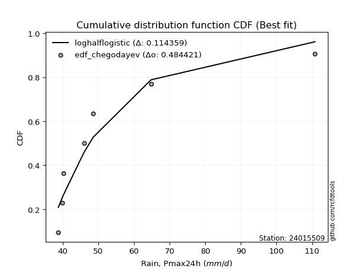</img>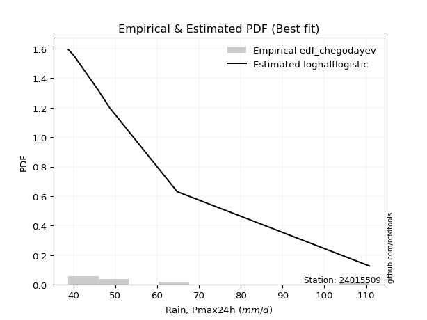</img>

</div>


### 6. EDF Blom (1958)

The Blom formula is a specific "plotting position" formula used in hydrology and statistical analysis to estimate the empirical cumulative probability (or non-exceedance probability) of a data series. It is particularly recommended for data that are approximately normally distributed. The constant _a_ is set to 0.375 (or 3/8).

<div align="center">


$P=(m-a)/(n+1-2a)$


</div>


**6.1. Empirical values**

<div align="center">

|                | 0                   | 1                   | 2                  | 3        | 4                  | 5                  | 6                  |
|:---------------|:--------------------|:--------------------|:-------------------|:---------|:-------------------|:-------------------|:-------------------|
| date           | 2019                | 2017                | 2021               | 2018     | 2016               | 2020               | 2024               |
| x              | 38.8                | 39.9                | 40.2               | 46.0     | 48.6               | 64.8               | 110.8              |
| m              | 1                   | 2                   | 3                  | 4        | 5                  | 6                  | 7                  |
| empirical_dist | edf_blom            | edf_blom            | edf_blom           | edf_blom | edf_blom           | edf_blom           | edf_blom           |
| empirical      | 0.08620689655172414 | 0.22413793103448276 | 0.3620689655172414 | 0.5      | 0.6379310344827587 | 0.7758620689655172 | 0.9137931034482759 |
| empirical_tr   | 1.0943396226415094  | 1.288888888888889   | 1.5675675675675675 | 2.0      | 2.7619047619047623 | 4.461538461538462  | 11.600000000000007 |

</div>


**6.2. Kolmogorov-Smirnov fit test (sorted by Δ)**


<div align="center">

|                | 0                   | 1                   | 2                   | 3                   | 4                   | 5                   | 6                   | 7                   | 8                   | 9                   | 10                  | 11                  | 12                  | 13                  | 14                  | 15                  | 16                  | 17                  | 18                  | 19                  | 20                  | 21                  | 22                  | 23                  | 24                  | 25                  | 26                  | 27                  | 28                  | 29                  | 30                  | 31                  | 32                  | 33                  | 34                  | 35                  | 36                  | 37                  | 38                  | 39                  | 40                  | 41                  | 42                  | 43                  | 44                  | 45                  | 46                  | 47                  | 48                  | 49                  | 50                  | 51                  | 52                  | 53                  | 54                  | 55                  | 56                  | 57                  | 58                    | 59                  | 60                  | 61                  | 62                  | 63                  | 64                  | 65                  | 66                  | 67                  | 68                  | 69                  | 70                  | 71                  | 72                  | 73                  | 74                  | 75                  | 76                  | 77                  | 78                  | 79                  | 80                  | 81                  | 82                  | 83                  | 84                  | 85                  | 86                  | 87                  |
|:---------------|:--------------------|:--------------------|:--------------------|:--------------------|:--------------------|:--------------------|:--------------------|:--------------------|:--------------------|:--------------------|:--------------------|:--------------------|:--------------------|:--------------------|:--------------------|:--------------------|:--------------------|:--------------------|:--------------------|:--------------------|:--------------------|:--------------------|:--------------------|:--------------------|:--------------------|:--------------------|:--------------------|:--------------------|:--------------------|:--------------------|:--------------------|:--------------------|:--------------------|:--------------------|:--------------------|:--------------------|:--------------------|:--------------------|:--------------------|:--------------------|:--------------------|:--------------------|:--------------------|:--------------------|:--------------------|:--------------------|:--------------------|:--------------------|:--------------------|:--------------------|:--------------------|:--------------------|:--------------------|:--------------------|:--------------------|:--------------------|:--------------------|:--------------------|:----------------------|:--------------------|:--------------------|:--------------------|:--------------------|:--------------------|:--------------------|:--------------------|:--------------------|:--------------------|:--------------------|:--------------------|:--------------------|:--------------------|:--------------------|:--------------------|:--------------------|:--------------------|:--------------------|:--------------------|:--------------------|:--------------------|:--------------------|:--------------------|:--------------------|:--------------------|:--------------------|:--------------------|:--------------------|:--------------------|
| station        | 24015509            | 24015509            | 24015509            | 24015509            | 24015509            | 24015509            | 24015509            | 24015509            | 24015509            | 24015509            | 24015509            | 24015509            | 24015509            | 24015509            | 24015509            | 24015509            | 24015509            | 24015509            | 24015509            | 24015509            | 24015509            | 24015509            | 24015509            | 24015509            | 24015509            | 24015509            | 24015509            | 24015509            | 24015509            | 24015509            | 24015509            | 24015509            | 24015509            | 24015509            | 24015509            | 24015509            | 24015509            | 24015509            | 24015509            | 24015509            | 24015509            | 24015509            | 24015509            | 24015509            | 24015509            | 24015509            | 24015509            | 24015509            | 24015509            | 24015509            | 24015509            | 24015509            | 24015509            | 24015509            | 24015509            | 24015509            | 24015509            | 24015509            | 24015509              | 24015509            | 24015509            | 24015509            | 24015509            | 24015509            | 24015509            | 24015509            | 24015509            | 24015509            | 24015509            | 24015509            | 24015509            | 24015509            | 24015509            | 24015509            | 24015509            | 24015509            | 24015509            | 24015509            | 24015509            | 24015509            | 24015509            | 24015509            | 24015509            | 24015509            | 24015509            | 24015509            | 24015509            | 24015509            |
| empirical_dist | edf_blom            | edf_blom            | edf_blom            | edf_blom            | edf_blom            | edf_blom            | edf_blom            | edf_blom            | edf_blom            | edf_blom            | edf_blom            | edf_blom            | edf_blom            | edf_blom            | edf_blom            | edf_blom            | edf_blom            | edf_blom            | edf_blom            | edf_blom            | edf_blom            | edf_blom            | edf_blom            | edf_blom            | edf_blom            | edf_blom            | edf_blom            | edf_blom            | edf_blom            | edf_blom            | edf_blom            | edf_blom            | edf_blom            | edf_blom            | edf_blom            | edf_blom            | edf_blom            | edf_blom            | edf_blom            | edf_blom            | edf_blom            | edf_blom            | edf_blom            | edf_blom            | edf_blom            | edf_blom            | edf_blom            | edf_blom            | edf_blom            | edf_blom            | edf_blom            | edf_blom            | edf_blom            | edf_blom            | edf_blom            | edf_blom            | edf_blom            | edf_blom            | edf_blom              | edf_blom            | edf_blom            | edf_blom            | edf_blom            | edf_blom            | edf_blom            | edf_blom            | edf_blom            | edf_blom            | edf_blom            | edf_blom            | edf_blom            | edf_blom            | edf_blom            | edf_blom            | edf_blom            | edf_blom            | edf_blom            | edf_blom            | edf_blom            | edf_blom            | edf_blom            | edf_blom            | edf_blom            | edf_blom            | edf_blom            | edf_blom            | edf_blom            | edf_blom            |
| p_dist         | chi2                | loghalflogistic     | logmoyal            | logpearson3         | invweibull          | logweibull_min      | wald                | loginvweibull       | f                   | invgamma            | gamma               | logf                | logncf              | loggumbel_r         | invgauss            | loginvgamma         | alpha               | loginvgauss         | loghalfnorm         | logerlang           | logmielke           | logalpha            | nakagami            | lograyleigh         | loggenlogistic      | moyal               | logmaxwell          | logt                | nct                 | pearson3            | logkstwobign        | loggamma            | loggamma            | erlang              | weibull_min         | halflogistic        | lognct              | gumbel_r            | betaprime           | logbetaprime        | genlogistic         | ncf                 | lognakagami         | rayleigh            | halfnorm            | t                   | logloggamma         | lognorm             | lognorm             | logcrystalball      | maxwell             | loglogistic         | logwald             | logrice             | loghypsecant        | logfisk             | fisk                | logexponnorm        | loglaplace_asymmetric | loggenexpon         | logexpon            | loggompertz         | loglaplace          | norm                | crystalball         | logtruncnorm        | kstwobign           | logchi2             | logistic            | gibrat              | hypsecant           | loggumbel_l         | exponnorm           | laplace_asymmetric  | expon               | genexpon            | rice                | truncnorm           | laplace             | gumbel_l            | gompertz            | loggibrat           | loglognorm          | fatiguelife         | logfatiguelife      | johnsonsu           | logjohnsonsu        | mielke              |
| delta          | 0.1199451230584048  | 0.12274676865467096 | 0.12444580381577214 | 0.12568023766902348 | 0.1269794876498278  | 0.13217355471704773 | 0.13307850917080347 | 0.13742397234621306 | 0.13902079835772851 | 0.13902210577334884 | 0.13990615308119206 | 0.1444016507673953  | 0.14440229663159432 | 0.14536719516315416 | 0.14651747058992937 | 0.14824501174254823 | 0.14974624898688182 | 0.15056119653511824 | 0.15115274645027812 | 0.15532662037615105 | 0.15603737793938968 | 0.15877695464601804 | 0.15982906659851098 | 0.16320194456660353 | 0.16596579882441678 | 0.17368338495699498 | 0.17533773750427534 | 0.17899981434455253 | 0.18141337776263067 | 0.18206956384300182 | 0.18341507322076372 | 0.18383093604137415 | 0.18383093604137415 | 0.18878025693983325 | 0.18908658673260825 | 0.1908231838707155  | 0.1923637305191011  | 0.19541942076602548 | 0.1957279858288617  | 0.19624541299200743 | 0.19990742860416522 | 0.2002212578280872  | 0.20133054025517622 | 0.20643196323294222 | 0.2073426796252294  | 0.20756420535945913 | 0.2087586701706901  | 0.20973141373794363 | 0.20973141373794363 | 0.20973146035939066 | 0.21873205859061823 | 0.21925834525457266 | 0.21946670075473532 | 0.22410325071454157 | 0.22721647309586662 | 0.23640593861988812 | 0.24153027472910632 | 0.2452280423066338  | 0.24651929781190968   | 0.24653068671776135 | 0.24653309009313507 | 0.24928124863595486 | 0.2508273808720913  | 0.25233992979898745 | 0.25233994594588105 | 0.25366076973524077 | 0.2540071673012626  | 0.2588548649977414  | 0.2668320879137539  | 0.27036171959011107 | 0.2785364360224143  | 0.2786482039954946  | 0.2809012472101174  | 0.2820456560551173  | 0.28204813108346416 | 0.2820481770920379  | 0.29036229815644116 | 0.30247333148721406 | 0.3065350540931066  | 0.3172553314202494  | 0.34058145503173565 | 0.3541706099724114  | 0.376688118695095   | 0.3785403393556377  | 0.3918557042186125  | 0.5542543205762791  | 0.6341834218257809  | nan                 |
| deltao         | 0.48442053926100004 | 0.48442053926100004 | 0.48442053926100004 | 0.48442053926100004 | 0.48442053926100004 | 0.48442053926100004 | 0.48442053926100004 | 0.48442053926100004 | 0.48442053926100004 | 0.48442053926100004 | 0.48442053926100004 | 0.48442053926100004 | 0.48442053926100004 | 0.48442053926100004 | 0.48442053926100004 | 0.48442053926100004 | 0.48442053926100004 | 0.48442053926100004 | 0.48442053926100004 | 0.48442053926100004 | 0.48442053926100004 | 0.48442053926100004 | 0.48442053926100004 | 0.48442053926100004 | 0.48442053926100004 | 0.48442053926100004 | 0.48442053926100004 | 0.48442053926100004 | 0.48442053926100004 | 0.48442053926100004 | 0.48442053926100004 | 0.48442053926100004 | 0.48442053926100004 | 0.48442053926100004 | 0.48442053926100004 | 0.48442053926100004 | 0.48442053926100004 | 0.48442053926100004 | 0.48442053926100004 | 0.48442053926100004 | 0.48442053926100004 | 0.48442053926100004 | 0.48442053926100004 | 0.48442053926100004 | 0.48442053926100004 | 0.48442053926100004 | 0.48442053926100004 | 0.48442053926100004 | 0.48442053926100004 | 0.48442053926100004 | 0.48442053926100004 | 0.48442053926100004 | 0.48442053926100004 | 0.48442053926100004 | 0.48442053926100004 | 0.48442053926100004 | 0.48442053926100004 | 0.48442053926100004 | 0.48442053926100004   | 0.48442053926100004 | 0.48442053926100004 | 0.48442053926100004 | 0.48442053926100004 | 0.48442053926100004 | 0.48442053926100004 | 0.48442053926100004 | 0.48442053926100004 | 0.48442053926100004 | 0.48442053926100004 | 0.48442053926100004 | 0.48442053926100004 | 0.48442053926100004 | 0.48442053926100004 | 0.48442053926100004 | 0.48442053926100004 | 0.48442053926100004 | 0.48442053926100004 | 0.48442053926100004 | 0.48442053926100004 | 0.48442053926100004 | 0.48442053926100004 | 0.48442053926100004 | 0.48442053926100004 | 0.48442053926100004 | 0.48442053926100004 | 0.48442053926100004 | 0.48442053926100004 | 0.48442053926100004 |
| eval           | Δo > Δ              | Δo > Δ              | Δo > Δ              | Δo > Δ              | Δo > Δ              | Δo > Δ              | Δo > Δ              | Δo > Δ              | Δo > Δ              | Δo > Δ              | Δo > Δ              | Δo > Δ              | Δo > Δ              | Δo > Δ              | Δo > Δ              | Δo > Δ              | Δo > Δ              | Δo > Δ              | Δo > Δ              | Δo > Δ              | Δo > Δ              | Δo > Δ              | Δo > Δ              | Δo > Δ              | Δo > Δ              | Δo > Δ              | Δo > Δ              | Δo > Δ              | Δo > Δ              | Δo > Δ              | Δo > Δ              | Δo > Δ              | Δo > Δ              | Δo > Δ              | Δo > Δ              | Δo > Δ              | Δo > Δ              | Δo > Δ              | Δo > Δ              | Δo > Δ              | Δo > Δ              | Δo > Δ              | Δo > Δ              | Δo > Δ              | Δo > Δ              | Δo > Δ              | Δo > Δ              | Δo > Δ              | Δo > Δ              | Δo > Δ              | Δo > Δ              | Δo > Δ              | Δo > Δ              | Δo > Δ              | Δo > Δ              | Δo > Δ              | Δo > Δ              | Δo > Δ              | Δo > Δ                | Δo > Δ              | Δo > Δ              | Δo > Δ              | Δo > Δ              | Δo > Δ              | Δo > Δ              | Δo > Δ              | Δo > Δ              | Δo > Δ              | Δo > Δ              | Δo > Δ              | Δo > Δ              | Δo > Δ              | Δo > Δ              | Δo > Δ              | Δo > Δ              | Δo > Δ              | Δo > Δ              | Δo > Δ              | Δo > Δ              | Δo > Δ              | Δo > Δ              | Δo > Δ              | Δo > Δ              | Δo > Δ              | Δo > Δ              | Δo <= Δ             | Δo <= Δ             | Δo <= Δ             |
| fit            | 1                   | 1                   | 1                   | 1                   | 1                   | 1                   | 1                   | 1                   | 1                   | 1                   | 1                   | 1                   | 1                   | 1                   | 1                   | 1                   | 1                   | 1                   | 1                   | 1                   | 1                   | 1                   | 1                   | 1                   | 1                   | 1                   | 1                   | 1                   | 1                   | 1                   | 1                   | 1                   | 1                   | 1                   | 1                   | 1                   | 1                   | 1                   | 1                   | 1                   | 1                   | 1                   | 1                   | 1                   | 1                   | 1                   | 1                   | 1                   | 1                   | 1                   | 1                   | 1                   | 1                   | 1                   | 1                   | 1                   | 1                   | 1                   | 1                     | 1                   | 1                   | 1                   | 1                   | 1                   | 1                   | 1                   | 1                   | 1                   | 1                   | 1                   | 1                   | 1                   | 1                   | 1                   | 1                   | 1                   | 1                   | 1                   | 1                   | 1                   | 1                   | 1                   | 1                   | 1                   | 1                   | 0                   | 0                   | 0                   |
| n              | 7                   | 7                   | 7                   | 7                   | 7                   | 7                   | 7                   | 7                   | 7                   | 7                   | 7                   | 7                   | 7                   | 7                   | 7                   | 7                   | 7                   | 7                   | 7                   | 7                   | 7                   | 7                   | 7                   | 7                   | 7                   | 7                   | 7                   | 7                   | 7                   | 7                   | 7                   | 7                   | 7                   | 7                   | 7                   | 7                   | 7                   | 7                   | 7                   | 7                   | 7                   | 7                   | 7                   | 7                   | 7                   | 7                   | 7                   | 7                   | 7                   | 7                   | 7                   | 7                   | 7                   | 7                   | 7                   | 7                   | 7                   | 7                   | 7                     | 7                   | 7                   | 7                   | 7                   | 7                   | 7                   | 7                   | 7                   | 7                   | 7                   | 7                   | 7                   | 7                   | 7                   | 7                   | 7                   | 7                   | 7                   | 7                   | 7                   | 7                   | 7                   | 7                   | 7                   | 7                   | 7                   | 7                   | 7                   | 7                   |
| best_fit       | 1                   | 0                   | 0                   | 0                   | 0                   | 0                   | 0                   | 0                   | 0                   | 0                   | 0                   | 0                   | 0                   | 0                   | 0                   | 0                   | 0                   | 0                   | 0                   | 0                   | 0                   | 0                   | 0                   | 0                   | 0                   | 0                   | 0                   | 0                   | 0                   | 0                   | 0                   | 0                   | 0                   | 0                   | 0                   | 0                   | 0                   | 0                   | 0                   | 0                   | 0                   | 0                   | 0                   | 0                   | 0                   | 0                   | 0                   | 0                   | 0                   | 0                   | 0                   | 0                   | 0                   | 0                   | 0                   | 0                   | 0                   | 0                   | 0                     | 0                   | 0                   | 0                   | 0                   | 0                   | 0                   | 0                   | 0                   | 0                   | 0                   | 0                   | 0                   | 0                   | 0                   | 0                   | 0                   | 0                   | 0                   | 0                   | 0                   | 0                   | 0                   | 0                   | 0                   | 0                   | 0                   | 0                   | 0                   | 0                   |
| best_fit_sort  | 1                   | 2                   | 3                   | 4                   | 5                   | 6                   | 7                   | 8                   | 9                   | 10                  | 11                  | 12                  | 13                  | 14                  | 15                  | 16                  | 17                  | 18                  | 19                  | 20                  | 21                  | 22                  | 23                  | 24                  | 25                  | 26                  | 27                  | 28                  | 29                  | 30                  | 31                  | 32                  | 33                  | 34                  | 35                  | 36                  | 37                  | 38                  | 39                  | 40                  | 41                  | 42                  | 43                  | 44                  | 45                  | 46                  | 47                  | 48                  | 49                  | 50                  | 51                  | 52                  | 53                  | 54                  | 55                  | 56                  | 57                  | 58                  | 59                    | 60                  | 61                  | 62                  | 63                  | 64                  | 65                  | 66                  | 67                  | 68                  | 69                  | 70                  | 71                  | 72                  | 73                  | 74                  | 75                  | 76                  | 77                  | 78                  | 79                  | 80                  | 81                  | 82                  | 83                  | 84                  | 85                  | 86                  | 87                  | 88                  |

</div>


**6.3. Best fit**

<div align="center">

|   id |   station | empirical_dist   | p_dist   |    delta |   deltao | eval   |   fit |   n |   best_fit |   best_fit_sort |
|-----:|----------:|:-----------------|:---------|---------:|---------:|:-------|------:|----:|-----------:|----------------:|
|    0 |  24015509 | edf_blom         | chi2     | 0.119945 | 0.484421 | Δo > Δ |     1 |   7 |          1 |               1 |

</div>


<div align="center">

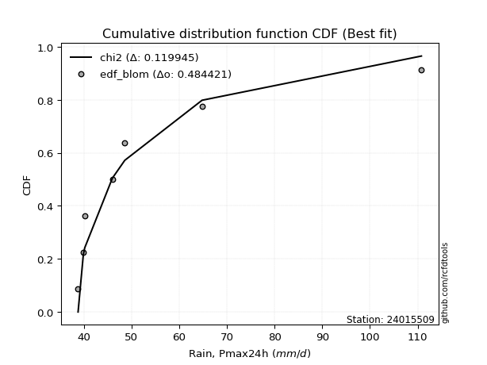</img></img>

</div>


### 7. EDF Tukey (1962)

In hydrology, the Tukey formula is used as a plotting position formula to estimate the empirical probability or frequency of a flood event (or other hydrological data). The formula parameter is given as _c=0.333_ (or 1/3).

<div align="center">


$P=(m-c)/(n+1-2c)$


</div>


**7.1. Empirical values**

<div align="center">

|                | 0                   | 1                   | 2                   | 3         | 4                  | 5                  | 6                  |
|:---------------|:--------------------|:--------------------|:--------------------|:----------|:-------------------|:-------------------|:-------------------|
| date           | 2019                | 2017                | 2021                | 2018      | 2016               | 2020               | 2024               |
| x              | 38.8                | 39.9                | 40.2                | 46.0      | 48.6               | 64.8               | 110.8              |
| m              | 1                   | 2                   | 3                   | 4         | 5                  | 6                  | 7                  |
| empirical_dist | edf_tukey           | edf_tukey           | edf_tukey           | edf_tukey | edf_tukey          | edf_tukey          | edf_tukey          |
| empirical      | 0.09090909090909091 | 0.22727272727272727 | 0.36363636363636365 | 0.5       | 0.6363636363636364 | 0.7727272727272727 | 0.9090909090909091 |
| empirical_tr   | 1.1                 | 1.2941176470588236  | 1.5714285714285714  | 2.0       | 2.75               | 4.3999999999999995 | 10.999999999999996 |

</div>


**7.2. Kolmogorov-Smirnov fit test (sorted by Δ)**


<div align="center">

|                | 0                   | 1                   | 2                   | 3                   | 4                   | 5                   | 6                   | 7                   | 8                   | 9                   | 10                  | 11                  | 12                  | 13                  | 14                  | 15                  | 16                  | 17                  | 18                  | 19                  | 20                  | 21                  | 22                  | 23                  | 24                  | 25                  | 26                  | 27                  | 28                  | 29                  | 30                  | 31                  | 32                  | 33                  | 34                  | 35                  | 36                  | 37                  | 38                  | 39                  | 40                  | 41                  | 42                  | 43                  | 44                  | 45                  | 46                  | 47                  | 48                  | 49                  | 50                  | 51                  | 52                  | 53                  | 54                  | 55                  | 56                  | 57                  | 58                    | 59                  | 60                  | 61                  | 62                  | 63                  | 64                  | 65                  | 66                  | 67                  | 68                  | 69                  | 70                  | 71                  | 72                  | 73                  | 74                  | 75                  | 76                  | 77                  | 78                  | 79                  | 80                  | 81                  | 82                  | 83                  | 84                  | 85                  | 86                  | 87                  |
|:---------------|:--------------------|:--------------------|:--------------------|:--------------------|:--------------------|:--------------------|:--------------------|:--------------------|:--------------------|:--------------------|:--------------------|:--------------------|:--------------------|:--------------------|:--------------------|:--------------------|:--------------------|:--------------------|:--------------------|:--------------------|:--------------------|:--------------------|:--------------------|:--------------------|:--------------------|:--------------------|:--------------------|:--------------------|:--------------------|:--------------------|:--------------------|:--------------------|:--------------------|:--------------------|:--------------------|:--------------------|:--------------------|:--------------------|:--------------------|:--------------------|:--------------------|:--------------------|:--------------------|:--------------------|:--------------------|:--------------------|:--------------------|:--------------------|:--------------------|:--------------------|:--------------------|:--------------------|:--------------------|:--------------------|:--------------------|:--------------------|:--------------------|:--------------------|:----------------------|:--------------------|:--------------------|:--------------------|:--------------------|:--------------------|:--------------------|:--------------------|:--------------------|:--------------------|:--------------------|:--------------------|:--------------------|:--------------------|:--------------------|:--------------------|:--------------------|:--------------------|:--------------------|:--------------------|:--------------------|:--------------------|:--------------------|:--------------------|:--------------------|:--------------------|:--------------------|:--------------------|:--------------------|:--------------------|
| station        | 24015509            | 24015509            | 24015509            | 24015509            | 24015509            | 24015509            | 24015509            | 24015509            | 24015509            | 24015509            | 24015509            | 24015509            | 24015509            | 24015509            | 24015509            | 24015509            | 24015509            | 24015509            | 24015509            | 24015509            | 24015509            | 24015509            | 24015509            | 24015509            | 24015509            | 24015509            | 24015509            | 24015509            | 24015509            | 24015509            | 24015509            | 24015509            | 24015509            | 24015509            | 24015509            | 24015509            | 24015509            | 24015509            | 24015509            | 24015509            | 24015509            | 24015509            | 24015509            | 24015509            | 24015509            | 24015509            | 24015509            | 24015509            | 24015509            | 24015509            | 24015509            | 24015509            | 24015509            | 24015509            | 24015509            | 24015509            | 24015509            | 24015509            | 24015509              | 24015509            | 24015509            | 24015509            | 24015509            | 24015509            | 24015509            | 24015509            | 24015509            | 24015509            | 24015509            | 24015509            | 24015509            | 24015509            | 24015509            | 24015509            | 24015509            | 24015509            | 24015509            | 24015509            | 24015509            | 24015509            | 24015509            | 24015509            | 24015509            | 24015509            | 24015509            | 24015509            | 24015509            | 24015509            |
| empirical_dist | edf_tukey           | edf_tukey           | edf_tukey           | edf_tukey           | edf_tukey           | edf_tukey           | edf_tukey           | edf_tukey           | edf_tukey           | edf_tukey           | edf_tukey           | edf_tukey           | edf_tukey           | edf_tukey           | edf_tukey           | edf_tukey           | edf_tukey           | edf_tukey           | edf_tukey           | edf_tukey           | edf_tukey           | edf_tukey           | edf_tukey           | edf_tukey           | edf_tukey           | edf_tukey           | edf_tukey           | edf_tukey           | edf_tukey           | edf_tukey           | edf_tukey           | edf_tukey           | edf_tukey           | edf_tukey           | edf_tukey           | edf_tukey           | edf_tukey           | edf_tukey           | edf_tukey           | edf_tukey           | edf_tukey           | edf_tukey           | edf_tukey           | edf_tukey           | edf_tukey           | edf_tukey           | edf_tukey           | edf_tukey           | edf_tukey           | edf_tukey           | edf_tukey           | edf_tukey           | edf_tukey           | edf_tukey           | edf_tukey           | edf_tukey           | edf_tukey           | edf_tukey           | edf_tukey             | edf_tukey           | edf_tukey           | edf_tukey           | edf_tukey           | edf_tukey           | edf_tukey           | edf_tukey           | edf_tukey           | edf_tukey           | edf_tukey           | edf_tukey           | edf_tukey           | edf_tukey           | edf_tukey           | edf_tukey           | edf_tukey           | edf_tukey           | edf_tukey           | edf_tukey           | edf_tukey           | edf_tukey           | edf_tukey           | edf_tukey           | edf_tukey           | edf_tukey           | edf_tukey           | edf_tukey           | edf_tukey           | edf_tukey           |
| p_dist         | loghalflogistic     | chi2                | logpearson3         | logmoyal            | invweibull          | logweibull_min      | wald                | loginvweibull       | f                   | invgamma            | gamma               | loggumbel_r         | logf                | logncf              | loghalfnorm         | invgauss            | loginvgamma         | alpha               | loginvgauss         | nakagami            | logerlang           | logmielke           | logalpha            | lograyleigh         | loggenlogistic      | moyal               | logmaxwell          | logt                | pearson3            | nct                 | logkstwobign        | loggamma            | loggamma            | halflogistic        | weibull_min         | erlang              | lognct              | gumbel_r            | betaprime           | logbetaprime        | genlogistic         | ncf                 | lognakagami         | halfnorm            | t                   | rayleigh            | logloggamma         | lognorm             | lognorm             | logcrystalball      | maxwell             | loglogistic         | logwald             | logrice             | loghypsecant        | logfisk             | fisk                | logexponnorm        | loglaplace_asymmetric | loggenexpon         | logexpon            | loglaplace          | norm                | crystalball         | loggompertz         | kstwobign           | logtruncnorm        | logchi2             | logistic            | gibrat              | hypsecant           | loggumbel_l         | exponnorm           | laplace_asymmetric  | expon               | genexpon            | rice                | truncnorm           | laplace             | gumbel_l            | gompertz            | loggibrat           | loglognorm          | fatiguelife         | logfatiguelife      | johnsonsu           | logjohnsonsu        | mielke              |
| delta          | 0.1180445742973042  | 0.12151252117752706 | 0.12411283954990115 | 0.1260132019348944  | 0.1269794876498278  | 0.12747136035968087 | 0.13464590728992573 | 0.13742397234621306 | 0.13902079835772851 | 0.13902210577334884 | 0.14147355120031432 | 0.14379979704403184 | 0.1444016507673953  | 0.14440229663159432 | 0.14645055209291136 | 0.14651747058992937 | 0.14824501174254823 | 0.14974624898688182 | 0.15056119653511824 | 0.15669427036026648 | 0.15689401849527332 | 0.15760477605851195 | 0.15877695464601804 | 0.1616345464474812  | 0.16753319694353905 | 0.17211598683787266 | 0.17377033938515302 | 0.17429761998718576 | 0.17736736948563506 | 0.17984597964350835 | 0.184982471339886   | 0.18539833416049642 | 0.18539833416049642 | 0.18612098951334874 | 0.18751918861348593 | 0.1903476550589555  | 0.19079633239997879 | 0.19385202264690315 | 0.19416058770973937 | 0.1946780148728851  | 0.1983400304850429  | 0.19865385970896487 | 0.1997631421360539  | 0.20264048526786263 | 0.20286201100209236 | 0.2048645651138199  | 0.2071912720515678  | 0.2081640156188213  | 0.2081640156188213  | 0.20816406224026834 | 0.2171646604714959  | 0.21769094713545034 | 0.22103409887385758 | 0.22253585259541925 | 0.2256490749767443  | 0.23170374426252127 | 0.239962876609984   | 0.24679544042575607 | 0.24808669593103194   | 0.24809808483688361 | 0.24810048821225733 | 0.24925998275296896 | 0.25077253167986513 | 0.25077254782675873 | 0.2508486467550771  | 0.2524397691821403  | 0.25522816785436303 | 0.2572874668786191  | 0.2652646897946316  | 0.27192911770923334 | 0.27696903790329197 | 0.2770808058763723  | 0.28246864532923965 | 0.28361305417423954 | 0.2836155292025864  | 0.28361557521116015 | 0.28879490003731884 | 0.3040407296063363  | 0.3049676559739843  | 0.3156879333011271  | 0.3390140569126133  | 0.35573800809153366 | 0.37355332245685047 | 0.37540554311739316 | 0.38872090798036796 | 0.5511195243380346  | 0.6310486255875364  | nan                 |
| deltao         | 0.48442053926100004 | 0.48442053926100004 | 0.48442053926100004 | 0.48442053926100004 | 0.48442053926100004 | 0.48442053926100004 | 0.48442053926100004 | 0.48442053926100004 | 0.48442053926100004 | 0.48442053926100004 | 0.48442053926100004 | 0.48442053926100004 | 0.48442053926100004 | 0.48442053926100004 | 0.48442053926100004 | 0.48442053926100004 | 0.48442053926100004 | 0.48442053926100004 | 0.48442053926100004 | 0.48442053926100004 | 0.48442053926100004 | 0.48442053926100004 | 0.48442053926100004 | 0.48442053926100004 | 0.48442053926100004 | 0.48442053926100004 | 0.48442053926100004 | 0.48442053926100004 | 0.48442053926100004 | 0.48442053926100004 | 0.48442053926100004 | 0.48442053926100004 | 0.48442053926100004 | 0.48442053926100004 | 0.48442053926100004 | 0.48442053926100004 | 0.48442053926100004 | 0.48442053926100004 | 0.48442053926100004 | 0.48442053926100004 | 0.48442053926100004 | 0.48442053926100004 | 0.48442053926100004 | 0.48442053926100004 | 0.48442053926100004 | 0.48442053926100004 | 0.48442053926100004 | 0.48442053926100004 | 0.48442053926100004 | 0.48442053926100004 | 0.48442053926100004 | 0.48442053926100004 | 0.48442053926100004 | 0.48442053926100004 | 0.48442053926100004 | 0.48442053926100004 | 0.48442053926100004 | 0.48442053926100004 | 0.48442053926100004   | 0.48442053926100004 | 0.48442053926100004 | 0.48442053926100004 | 0.48442053926100004 | 0.48442053926100004 | 0.48442053926100004 | 0.48442053926100004 | 0.48442053926100004 | 0.48442053926100004 | 0.48442053926100004 | 0.48442053926100004 | 0.48442053926100004 | 0.48442053926100004 | 0.48442053926100004 | 0.48442053926100004 | 0.48442053926100004 | 0.48442053926100004 | 0.48442053926100004 | 0.48442053926100004 | 0.48442053926100004 | 0.48442053926100004 | 0.48442053926100004 | 0.48442053926100004 | 0.48442053926100004 | 0.48442053926100004 | 0.48442053926100004 | 0.48442053926100004 | 0.48442053926100004 | 0.48442053926100004 |
| eval           | Δo > Δ              | Δo > Δ              | Δo > Δ              | Δo > Δ              | Δo > Δ              | Δo > Δ              | Δo > Δ              | Δo > Δ              | Δo > Δ              | Δo > Δ              | Δo > Δ              | Δo > Δ              | Δo > Δ              | Δo > Δ              | Δo > Δ              | Δo > Δ              | Δo > Δ              | Δo > Δ              | Δo > Δ              | Δo > Δ              | Δo > Δ              | Δo > Δ              | Δo > Δ              | Δo > Δ              | Δo > Δ              | Δo > Δ              | Δo > Δ              | Δo > Δ              | Δo > Δ              | Δo > Δ              | Δo > Δ              | Δo > Δ              | Δo > Δ              | Δo > Δ              | Δo > Δ              | Δo > Δ              | Δo > Δ              | Δo > Δ              | Δo > Δ              | Δo > Δ              | Δo > Δ              | Δo > Δ              | Δo > Δ              | Δo > Δ              | Δo > Δ              | Δo > Δ              | Δo > Δ              | Δo > Δ              | Δo > Δ              | Δo > Δ              | Δo > Δ              | Δo > Δ              | Δo > Δ              | Δo > Δ              | Δo > Δ              | Δo > Δ              | Δo > Δ              | Δo > Δ              | Δo > Δ                | Δo > Δ              | Δo > Δ              | Δo > Δ              | Δo > Δ              | Δo > Δ              | Δo > Δ              | Δo > Δ              | Δo > Δ              | Δo > Δ              | Δo > Δ              | Δo > Δ              | Δo > Δ              | Δo > Δ              | Δo > Δ              | Δo > Δ              | Δo > Δ              | Δo > Δ              | Δo > Δ              | Δo > Δ              | Δo > Δ              | Δo > Δ              | Δo > Δ              | Δo > Δ              | Δo > Δ              | Δo > Δ              | Δo > Δ              | Δo <= Δ             | Δo <= Δ             | Δo <= Δ             |
| fit            | 1                   | 1                   | 1                   | 1                   | 1                   | 1                   | 1                   | 1                   | 1                   | 1                   | 1                   | 1                   | 1                   | 1                   | 1                   | 1                   | 1                   | 1                   | 1                   | 1                   | 1                   | 1                   | 1                   | 1                   | 1                   | 1                   | 1                   | 1                   | 1                   | 1                   | 1                   | 1                   | 1                   | 1                   | 1                   | 1                   | 1                   | 1                   | 1                   | 1                   | 1                   | 1                   | 1                   | 1                   | 1                   | 1                   | 1                   | 1                   | 1                   | 1                   | 1                   | 1                   | 1                   | 1                   | 1                   | 1                   | 1                   | 1                   | 1                     | 1                   | 1                   | 1                   | 1                   | 1                   | 1                   | 1                   | 1                   | 1                   | 1                   | 1                   | 1                   | 1                   | 1                   | 1                   | 1                   | 1                   | 1                   | 1                   | 1                   | 1                   | 1                   | 1                   | 1                   | 1                   | 1                   | 0                   | 0                   | 0                   |
| n              | 7                   | 7                   | 7                   | 7                   | 7                   | 7                   | 7                   | 7                   | 7                   | 7                   | 7                   | 7                   | 7                   | 7                   | 7                   | 7                   | 7                   | 7                   | 7                   | 7                   | 7                   | 7                   | 7                   | 7                   | 7                   | 7                   | 7                   | 7                   | 7                   | 7                   | 7                   | 7                   | 7                   | 7                   | 7                   | 7                   | 7                   | 7                   | 7                   | 7                   | 7                   | 7                   | 7                   | 7                   | 7                   | 7                   | 7                   | 7                   | 7                   | 7                   | 7                   | 7                   | 7                   | 7                   | 7                   | 7                   | 7                   | 7                   | 7                     | 7                   | 7                   | 7                   | 7                   | 7                   | 7                   | 7                   | 7                   | 7                   | 7                   | 7                   | 7                   | 7                   | 7                   | 7                   | 7                   | 7                   | 7                   | 7                   | 7                   | 7                   | 7                   | 7                   | 7                   | 7                   | 7                   | 7                   | 7                   | 7                   |
| best_fit       | 1                   | 0                   | 0                   | 0                   | 0                   | 0                   | 0                   | 0                   | 0                   | 0                   | 0                   | 0                   | 0                   | 0                   | 0                   | 0                   | 0                   | 0                   | 0                   | 0                   | 0                   | 0                   | 0                   | 0                   | 0                   | 0                   | 0                   | 0                   | 0                   | 0                   | 0                   | 0                   | 0                   | 0                   | 0                   | 0                   | 0                   | 0                   | 0                   | 0                   | 0                   | 0                   | 0                   | 0                   | 0                   | 0                   | 0                   | 0                   | 0                   | 0                   | 0                   | 0                   | 0                   | 0                   | 0                   | 0                   | 0                   | 0                   | 0                     | 0                   | 0                   | 0                   | 0                   | 0                   | 0                   | 0                   | 0                   | 0                   | 0                   | 0                   | 0                   | 0                   | 0                   | 0                   | 0                   | 0                   | 0                   | 0                   | 0                   | 0                   | 0                   | 0                   | 0                   | 0                   | 0                   | 0                   | 0                   | 0                   |
| best_fit_sort  | 1                   | 2                   | 3                   | 4                   | 5                   | 6                   | 7                   | 8                   | 9                   | 10                  | 11                  | 12                  | 13                  | 14                  | 15                  | 16                  | 17                  | 18                  | 19                  | 20                  | 21                  | 22                  | 23                  | 24                  | 25                  | 26                  | 27                  | 28                  | 29                  | 30                  | 31                  | 32                  | 33                  | 34                  | 35                  | 36                  | 37                  | 38                  | 39                  | 40                  | 41                  | 42                  | 43                  | 44                  | 45                  | 46                  | 47                  | 48                  | 49                  | 50                  | 51                  | 52                  | 53                  | 54                  | 55                  | 56                  | 57                  | 58                  | 59                    | 60                  | 61                  | 62                  | 63                  | 64                  | 65                  | 66                  | 67                  | 68                  | 69                  | 70                  | 71                  | 72                  | 73                  | 74                  | 75                  | 76                  | 77                  | 78                  | 79                  | 80                  | 81                  | 82                  | 83                  | 84                  | 85                  | 86                  | 87                  | 88                  |

</div>


**7.3. Best fit**

<div align="center">

|   id |   station | empirical_dist   | p_dist          |    delta |   deltao | eval   |   fit |   n |   best_fit |   best_fit_sort |
|-----:|----------:|:-----------------|:----------------|---------:|---------:|:-------|------:|----:|-----------:|----------------:|
|    0 |  24015509 | edf_tukey        | loghalflogistic | 0.118045 | 0.484421 | Δo > Δ |     1 |   7 |          1 |               1 |

</div>


<div align="center">

</img>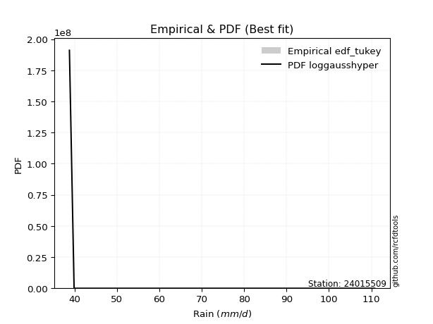</img>

</div>


### 8. EDF Gringorten (1963)

Gringorten plotting position formula is essential for estimating the probability and return periods of extreme events like floods and heavy rainfall. The constant _a=0.44_.

<div align="center">


$P=(m-a)/(n+1-2a)$


</div>


**8.1. Empirical values**

<div align="center">

|                | 0                   | 1                   | 2                  | 3              | 4                  | 5                  | 6                  |
|:---------------|:--------------------|:--------------------|:-------------------|:---------------|:-------------------|:-------------------|:-------------------|
| date           | 2019                | 2017                | 2021               | 2018           | 2016               | 2020               | 2024               |
| x              | 38.8                | 39.9                | 40.2               | 46.0           | 48.6               | 64.8               | 110.8              |
| m              | 1                   | 2                   | 3                  | 4              | 5                  | 6                  | 7                  |
| empirical_dist | edf_gringorten      | edf_gringorten      | edf_gringorten     | edf_gringorten | edf_gringorten     | edf_gringorten     | edf_gringorten     |
| empirical      | 0.07865168539325844 | 0.21910112359550563 | 0.3595505617977528 | 0.5            | 0.6404494382022471 | 0.7808988764044943 | 0.9213483146067415 |
| empirical_tr   | 1.0853658536585364  | 1.2805755395683454  | 1.5614035087719298 | 2.0            | 2.781249999999999  | 4.564102564102562  | 12.714285714285701 |

</div>


**8.2. Kolmogorov-Smirnov fit test (sorted by Δ)**


<div align="center">

|                | 0                   | 1                   | 2                   | 3                   | 4                   | 5                   | 6                   | 7                   | 8                   | 9                   | 10                  | 11                  | 12                  | 13                  | 14                  | 15                  | 16                  | 17                  | 18                  | 19                  | 20                  | 21                  | 22                  | 23                  | 24                  | 25                  | 26                  | 27                  | 28                  | 29                  | 30                  | 31                  | 32                  | 33                  | 34                  | 35                  | 36                  | 37                  | 38                  | 39                  | 40                  | 41                  | 42                  | 43                  | 44                  | 45                  | 46                  | 47                  | 48                  | 49                  | 50                  | 51                  | 52                  | 53                  | 54                  | 55                  | 56                  | 57                    | 58                  | 59                  | 60                  | 61                  | 62                  | 63                  | 64                  | 65                  | 66                  | 67                  | 68                  | 69                  | 70                  | 71                  | 72                  | 73                  | 74                  | 75                  | 76                  | 77                  | 78                  | 79                  | 80                  | 81                  | 82                  | 83                  | 84                  | 85                  | 86                  | 87                  |
|:---------------|:--------------------|:--------------------|:--------------------|:--------------------|:--------------------|:--------------------|:--------------------|:--------------------|:--------------------|:--------------------|:--------------------|:--------------------|:--------------------|:--------------------|:--------------------|:--------------------|:--------------------|:--------------------|:--------------------|:--------------------|:--------------------|:--------------------|:--------------------|:--------------------|:--------------------|:--------------------|:--------------------|:--------------------|:--------------------|:--------------------|:--------------------|:--------------------|:--------------------|:--------------------|:--------------------|:--------------------|:--------------------|:--------------------|:--------------------|:--------------------|:--------------------|:--------------------|:--------------------|:--------------------|:--------------------|:--------------------|:--------------------|:--------------------|:--------------------|:--------------------|:--------------------|:--------------------|:--------------------|:--------------------|:--------------------|:--------------------|:--------------------|:----------------------|:--------------------|:--------------------|:--------------------|:--------------------|:--------------------|:--------------------|:--------------------|:--------------------|:--------------------|:--------------------|:--------------------|:--------------------|:--------------------|:--------------------|:--------------------|:--------------------|:--------------------|:--------------------|:--------------------|:--------------------|:--------------------|:--------------------|:--------------------|:--------------------|:--------------------|:--------------------|:--------------------|:--------------------|:--------------------|:--------------------|
| station        | 24015509            | 24015509            | 24015509            | 24015509            | 24015509            | 24015509            | 24015509            | 24015509            | 24015509            | 24015509            | 24015509            | 24015509            | 24015509            | 24015509            | 24015509            | 24015509            | 24015509            | 24015509            | 24015509            | 24015509            | 24015509            | 24015509            | 24015509            | 24015509            | 24015509            | 24015509            | 24015509            | 24015509            | 24015509            | 24015509            | 24015509            | 24015509            | 24015509            | 24015509            | 24015509            | 24015509            | 24015509            | 24015509            | 24015509            | 24015509            | 24015509            | 24015509            | 24015509            | 24015509            | 24015509            | 24015509            | 24015509            | 24015509            | 24015509            | 24015509            | 24015509            | 24015509            | 24015509            | 24015509            | 24015509            | 24015509            | 24015509            | 24015509              | 24015509            | 24015509            | 24015509            | 24015509            | 24015509            | 24015509            | 24015509            | 24015509            | 24015509            | 24015509            | 24015509            | 24015509            | 24015509            | 24015509            | 24015509            | 24015509            | 24015509            | 24015509            | 24015509            | 24015509            | 24015509            | 24015509            | 24015509            | 24015509            | 24015509            | 24015509            | 24015509            | 24015509            | 24015509            | 24015509            |
| empirical_dist | edf_gringorten      | edf_gringorten      | edf_gringorten      | edf_gringorten      | edf_gringorten      | edf_gringorten      | edf_gringorten      | edf_gringorten      | edf_gringorten      | edf_gringorten      | edf_gringorten      | edf_gringorten      | edf_gringorten      | edf_gringorten      | edf_gringorten      | edf_gringorten      | edf_gringorten      | edf_gringorten      | edf_gringorten      | edf_gringorten      | edf_gringorten      | edf_gringorten      | edf_gringorten      | edf_gringorten      | edf_gringorten      | edf_gringorten      | edf_gringorten      | edf_gringorten      | edf_gringorten      | edf_gringorten      | edf_gringorten      | edf_gringorten      | edf_gringorten      | edf_gringorten      | edf_gringorten      | edf_gringorten      | edf_gringorten      | edf_gringorten      | edf_gringorten      | edf_gringorten      | edf_gringorten      | edf_gringorten      | edf_gringorten      | edf_gringorten      | edf_gringorten      | edf_gringorten      | edf_gringorten      | edf_gringorten      | edf_gringorten      | edf_gringorten      | edf_gringorten      | edf_gringorten      | edf_gringorten      | edf_gringorten      | edf_gringorten      | edf_gringorten      | edf_gringorten      | edf_gringorten        | edf_gringorten      | edf_gringorten      | edf_gringorten      | edf_gringorten      | edf_gringorten      | edf_gringorten      | edf_gringorten      | edf_gringorten      | edf_gringorten      | edf_gringorten      | edf_gringorten      | edf_gringorten      | edf_gringorten      | edf_gringorten      | edf_gringorten      | edf_gringorten      | edf_gringorten      | edf_gringorten      | edf_gringorten      | edf_gringorten      | edf_gringorten      | edf_gringorten      | edf_gringorten      | edf_gringorten      | edf_gringorten      | edf_gringorten      | edf_gringorten      | edf_gringorten      | edf_gringorten      | edf_gringorten      |
| p_dist         | chi2                | logmoyal            | invweibull          | logpearson3         | loghalflogistic     | wald                | gamma               | loginvweibull       | f                   | invgamma            | logweibull_min      | logf                | logncf              | invgauss            | loggumbel_r         | loginvgamma         | alpha               | loginvgauss         | logerlang           | logmielke           | loghalfnorm         | logalpha            | loggenlogistic      | nakagami            | lograyleigh         | moyal               | logmaxwell          | logkstwobign        | loggamma            | loggamma            | nct                 | erlang              | logt                | pearson3            | weibull_min         | lognct              | gumbel_r            | betaprime           | halflogistic        | logbetaprime        | genlogistic         | ncf                 | lognakagami         | rayleigh            | logloggamma         | lognorm             | lognorm             | logcrystalball      | halfnorm            | t                   | logwald             | maxwell             | loglogistic         | logrice             | loghypsecant        | logexponnorm        | logfisk             | loglaplace_asymmetric | loggenexpon         | logexpon            | fisk                | loggompertz         | logtruncnorm        | loglaplace          | norm                | crystalball         | kstwobign           | logchi2             | gibrat              | logistic            | exponnorm           | laplace_asymmetric  | expon               | genexpon            | hypsecant           | loggumbel_l         | rice                | truncnorm           | laplace             | gumbel_l            | gompertz            | loggibrat           | loglognorm          | fatiguelife         | logfatiguelife      | johnsonsu           | logjohnsonsu        | mielke              |
| delta          | 0.11742671933891621 | 0.12332988215969287 | 0.1269794876498278  | 0.1290774861158125  | 0.13030197981313668 | 0.13056010545131488 | 0.13738774936170348 | 0.13742397234621306 | 0.13902079835772851 | 0.13902210577334884 | 0.1397287658755133  | 0.1444016507673953  | 0.14440229663159432 | 0.14651747058992937 | 0.14788559888264258 | 0.14824501174254823 | 0.14974624898688182 | 0.15056119653511824 | 0.15280821665666247 | 0.1535189742199011  | 0.15870795760874384 | 0.15877695464601804 | 0.1634473951049282  | 0.16486587403748812 | 0.16572034828609195 | 0.1762017886764834  | 0.17785614122376375 | 0.18089666950127514 | 0.18131253232188557 | 0.18131253232188557 | 0.18393178148211908 | 0.18626185322034466 | 0.18655502550301822 | 0.18962477500146752 | 0.19160499045209667 | 0.19488213423858952 | 0.1979378244855139  | 0.1982463895483501  | 0.1983783950291812  | 0.19876381671149584 | 0.20242583232365363 | 0.2027396615475756  | 0.20384894397466463 | 0.20895036695243063 | 0.21127707389017852 | 0.21224981745743204 | 0.21224981745743204 | 0.21224986407887908 | 0.2148978907836951  | 0.21511941651792482 | 0.21694829703524673 | 0.22125046231010664 | 0.22177674897406108 | 0.22662165443402998 | 0.22973487681535504 | 0.24270963858714523 | 0.2439611497783537  | 0.2440008940924211    | 0.24401228299827277 | 0.24401468637364648 | 0.24404867844859474 | 0.24676284491646627 | 0.2511423660157522  | 0.2533457845915797  | 0.25485833351847587 | 0.25485834966536947 | 0.256525571020751   | 0.2613732687172298  | 0.2678433158706225  | 0.2693504916332423  | 0.2783828434906288  | 0.2795272523356287  | 0.2795297273639756  | 0.2795297733725493  | 0.2810548397419027  | 0.28116660771498303 | 0.29288070187592957 | 0.2999549277677255  | 0.309053457812595   | 0.31977373513973784 | 0.34309985875122406 | 0.3516522062529228  | 0.38172492613407216 | 0.38357714679461485 | 0.39689251165758965 | 0.5592911280152563  | 0.6392202292647581  | nan                 |
| deltao         | 0.48442053926100004 | 0.48442053926100004 | 0.48442053926100004 | 0.48442053926100004 | 0.48442053926100004 | 0.48442053926100004 | 0.48442053926100004 | 0.48442053926100004 | 0.48442053926100004 | 0.48442053926100004 | 0.48442053926100004 | 0.48442053926100004 | 0.48442053926100004 | 0.48442053926100004 | 0.48442053926100004 | 0.48442053926100004 | 0.48442053926100004 | 0.48442053926100004 | 0.48442053926100004 | 0.48442053926100004 | 0.48442053926100004 | 0.48442053926100004 | 0.48442053926100004 | 0.48442053926100004 | 0.48442053926100004 | 0.48442053926100004 | 0.48442053926100004 | 0.48442053926100004 | 0.48442053926100004 | 0.48442053926100004 | 0.48442053926100004 | 0.48442053926100004 | 0.48442053926100004 | 0.48442053926100004 | 0.48442053926100004 | 0.48442053926100004 | 0.48442053926100004 | 0.48442053926100004 | 0.48442053926100004 | 0.48442053926100004 | 0.48442053926100004 | 0.48442053926100004 | 0.48442053926100004 | 0.48442053926100004 | 0.48442053926100004 | 0.48442053926100004 | 0.48442053926100004 | 0.48442053926100004 | 0.48442053926100004 | 0.48442053926100004 | 0.48442053926100004 | 0.48442053926100004 | 0.48442053926100004 | 0.48442053926100004 | 0.48442053926100004 | 0.48442053926100004 | 0.48442053926100004 | 0.48442053926100004   | 0.48442053926100004 | 0.48442053926100004 | 0.48442053926100004 | 0.48442053926100004 | 0.48442053926100004 | 0.48442053926100004 | 0.48442053926100004 | 0.48442053926100004 | 0.48442053926100004 | 0.48442053926100004 | 0.48442053926100004 | 0.48442053926100004 | 0.48442053926100004 | 0.48442053926100004 | 0.48442053926100004 | 0.48442053926100004 | 0.48442053926100004 | 0.48442053926100004 | 0.48442053926100004 | 0.48442053926100004 | 0.48442053926100004 | 0.48442053926100004 | 0.48442053926100004 | 0.48442053926100004 | 0.48442053926100004 | 0.48442053926100004 | 0.48442053926100004 | 0.48442053926100004 | 0.48442053926100004 | 0.48442053926100004 |
| eval           | Δo > Δ              | Δo > Δ              | Δo > Δ              | Δo > Δ              | Δo > Δ              | Δo > Δ              | Δo > Δ              | Δo > Δ              | Δo > Δ              | Δo > Δ              | Δo > Δ              | Δo > Δ              | Δo > Δ              | Δo > Δ              | Δo > Δ              | Δo > Δ              | Δo > Δ              | Δo > Δ              | Δo > Δ              | Δo > Δ              | Δo > Δ              | Δo > Δ              | Δo > Δ              | Δo > Δ              | Δo > Δ              | Δo > Δ              | Δo > Δ              | Δo > Δ              | Δo > Δ              | Δo > Δ              | Δo > Δ              | Δo > Δ              | Δo > Δ              | Δo > Δ              | Δo > Δ              | Δo > Δ              | Δo > Δ              | Δo > Δ              | Δo > Δ              | Δo > Δ              | Δo > Δ              | Δo > Δ              | Δo > Δ              | Δo > Δ              | Δo > Δ              | Δo > Δ              | Δo > Δ              | Δo > Δ              | Δo > Δ              | Δo > Δ              | Δo > Δ              | Δo > Δ              | Δo > Δ              | Δo > Δ              | Δo > Δ              | Δo > Δ              | Δo > Δ              | Δo > Δ                | Δo > Δ              | Δo > Δ              | Δo > Δ              | Δo > Δ              | Δo > Δ              | Δo > Δ              | Δo > Δ              | Δo > Δ              | Δo > Δ              | Δo > Δ              | Δo > Δ              | Δo > Δ              | Δo > Δ              | Δo > Δ              | Δo > Δ              | Δo > Δ              | Δo > Δ              | Δo > Δ              | Δo > Δ              | Δo > Δ              | Δo > Δ              | Δo > Δ              | Δo > Δ              | Δo > Δ              | Δo > Δ              | Δo > Δ              | Δo > Δ              | Δo <= Δ             | Δo <= Δ             | Δo <= Δ             |
| fit            | 1                   | 1                   | 1                   | 1                   | 1                   | 1                   | 1                   | 1                   | 1                   | 1                   | 1                   | 1                   | 1                   | 1                   | 1                   | 1                   | 1                   | 1                   | 1                   | 1                   | 1                   | 1                   | 1                   | 1                   | 1                   | 1                   | 1                   | 1                   | 1                   | 1                   | 1                   | 1                   | 1                   | 1                   | 1                   | 1                   | 1                   | 1                   | 1                   | 1                   | 1                   | 1                   | 1                   | 1                   | 1                   | 1                   | 1                   | 1                   | 1                   | 1                   | 1                   | 1                   | 1                   | 1                   | 1                   | 1                   | 1                   | 1                     | 1                   | 1                   | 1                   | 1                   | 1                   | 1                   | 1                   | 1                   | 1                   | 1                   | 1                   | 1                   | 1                   | 1                   | 1                   | 1                   | 1                   | 1                   | 1                   | 1                   | 1                   | 1                   | 1                   | 1                   | 1                   | 1                   | 1                   | 0                   | 0                   | 0                   |
| n              | 7                   | 7                   | 7                   | 7                   | 7                   | 7                   | 7                   | 7                   | 7                   | 7                   | 7                   | 7                   | 7                   | 7                   | 7                   | 7                   | 7                   | 7                   | 7                   | 7                   | 7                   | 7                   | 7                   | 7                   | 7                   | 7                   | 7                   | 7                   | 7                   | 7                   | 7                   | 7                   | 7                   | 7                   | 7                   | 7                   | 7                   | 7                   | 7                   | 7                   | 7                   | 7                   | 7                   | 7                   | 7                   | 7                   | 7                   | 7                   | 7                   | 7                   | 7                   | 7                   | 7                   | 7                   | 7                   | 7                   | 7                   | 7                     | 7                   | 7                   | 7                   | 7                   | 7                   | 7                   | 7                   | 7                   | 7                   | 7                   | 7                   | 7                   | 7                   | 7                   | 7                   | 7                   | 7                   | 7                   | 7                   | 7                   | 7                   | 7                   | 7                   | 7                   | 7                   | 7                   | 7                   | 7                   | 7                   | 7                   |
| best_fit       | 1                   | 0                   | 0                   | 0                   | 0                   | 0                   | 0                   | 0                   | 0                   | 0                   | 0                   | 0                   | 0                   | 0                   | 0                   | 0                   | 0                   | 0                   | 0                   | 0                   | 0                   | 0                   | 0                   | 0                   | 0                   | 0                   | 0                   | 0                   | 0                   | 0                   | 0                   | 0                   | 0                   | 0                   | 0                   | 0                   | 0                   | 0                   | 0                   | 0                   | 0                   | 0                   | 0                   | 0                   | 0                   | 0                   | 0                   | 0                   | 0                   | 0                   | 0                   | 0                   | 0                   | 0                   | 0                   | 0                   | 0                   | 0                     | 0                   | 0                   | 0                   | 0                   | 0                   | 0                   | 0                   | 0                   | 0                   | 0                   | 0                   | 0                   | 0                   | 0                   | 0                   | 0                   | 0                   | 0                   | 0                   | 0                   | 0                   | 0                   | 0                   | 0                   | 0                   | 0                   | 0                   | 0                   | 0                   | 0                   |
| best_fit_sort  | 1                   | 2                   | 3                   | 4                   | 5                   | 6                   | 7                   | 8                   | 9                   | 10                  | 11                  | 12                  | 13                  | 14                  | 15                  | 16                  | 17                  | 18                  | 19                  | 20                  | 21                  | 22                  | 23                  | 24                  | 25                  | 26                  | 27                  | 28                  | 29                  | 30                  | 31                  | 32                  | 33                  | 34                  | 35                  | 36                  | 37                  | 38                  | 39                  | 40                  | 41                  | 42                  | 43                  | 44                  | 45                  | 46                  | 47                  | 48                  | 49                  | 50                  | 51                  | 52                  | 53                  | 54                  | 55                  | 56                  | 57                  | 58                    | 59                  | 60                  | 61                  | 62                  | 63                  | 64                  | 65                  | 66                  | 67                  | 68                  | 69                  | 70                  | 71                  | 72                  | 73                  | 74                  | 75                  | 76                  | 77                  | 78                  | 79                  | 80                  | 81                  | 82                  | 83                  | 84                  | 85                  | 86                  | 87                  | 88                  |

</div>


**8.3. Best fit**

<div align="center">

|   id |   station | empirical_dist   | p_dist   |    delta |   deltao | eval   |   fit |   n |   best_fit |   best_fit_sort |
|-----:|----------:|:-----------------|:---------|---------:|---------:|:-------|------:|----:|-----------:|----------------:|
|    0 |  24015509 | edf_gringorten   | chi2     | 0.117427 | 0.484421 | Δo > Δ |     1 |   7 |          1 |               1 |

</div>


<div align="center">

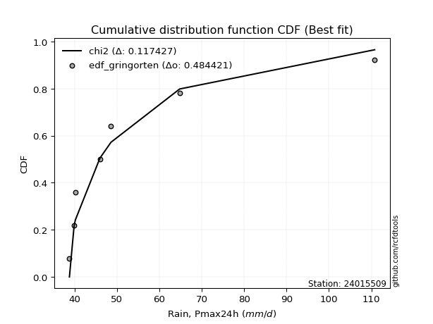</img>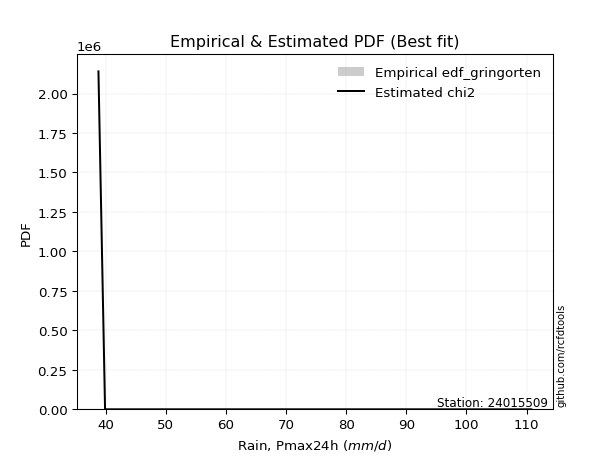</img>

</div>


### 9. EDF Filliben (1975)

The specific values of the constants (0.3175) (often denoted as $alpha$) and (0.365) are derived from a method proposed by James J. Filliben in a 1975 paper. This particular formula is the mean value of the $i$-th order statistic of the normal distribution and is considered a robust and effective plotting position formula for the normal probability plot correlation coefficient test for normality.

<div align="center">


$P=(m-0.3175)/(n+0.365)$


</div>


**9.1. Empirical values**

<div align="center">

|                | 0                   | 1                   | 2                   | 3            | 4                  | 5                  | 6                  |
|:---------------|:--------------------|:--------------------|:--------------------|:-------------|:-------------------|:-------------------|:-------------------|
| date           | 2019                | 2017                | 2021                | 2018         | 2016               | 2020               | 2024               |
| x              | 38.8                | 39.9                | 40.2                | 46.0         | 48.6               | 64.8               | 110.8              |
| m              | 1                   | 2                   | 3                   | 4            | 5                  | 6                  | 7                  |
| empirical_dist | edf_filliben        | edf_filliben        | edf_filliben        | edf_filliben | edf_filliben       | edf_filliben       | edf_filliben       |
| empirical      | 0.09266802443991853 | 0.22844534962661237 | 0.36422267481330617 | 0.5          | 0.6357773251866938 | 0.7715546503733877 | 0.9073319755600815 |
| empirical_tr   | 1.1021324354657687  | 1.2960844698636163  | 1.5728777362520021  | 2.0          | 2.7455731593662627 | 4.377414561664191  | 10.791208791208794 |

</div>


**9.2. Kolmogorov-Smirnov fit test (sorted by Δ)**


<div align="center">

|                | 0                   | 1                   | 2                   | 3                   | 4                   | 5                   | 6                   | 7                   | 8                   | 9                   | 10                  | 11                  | 12                  | 13                  | 14                  | 15                  | 16                  | 17                  | 18                  | 19                  | 20                  | 21                  | 22                  | 23                  | 24                  | 25                  | 26                  | 27                  | 28                  | 29                  | 30                  | 31                  | 32                  | 33                  | 34                  | 35                  | 36                  | 37                  | 38                  | 39                  | 40                  | 41                  | 42                  | 43                  | 44                  | 45                  | 46                  | 47                  | 48                  | 49                  | 50                  | 51                  | 52                  | 53                  | 54                  | 55                  | 56                  | 57                  | 58                    | 59                  | 60                  | 61                  | 62                  | 63                  | 64                  | 65                  | 66                  | 67                  | 68                  | 69                  | 70                  | 71                  | 72                  | 73                  | 74                  | 75                  | 76                  | 77                  | 78                  | 79                  | 80                  | 81                  | 82                  | 83                  | 84                  | 85                  | 86                  | 87                  |
|:---------------|:--------------------|:--------------------|:--------------------|:--------------------|:--------------------|:--------------------|:--------------------|:--------------------|:--------------------|:--------------------|:--------------------|:--------------------|:--------------------|:--------------------|:--------------------|:--------------------|:--------------------|:--------------------|:--------------------|:--------------------|:--------------------|:--------------------|:--------------------|:--------------------|:--------------------|:--------------------|:--------------------|:--------------------|:--------------------|:--------------------|:--------------------|:--------------------|:--------------------|:--------------------|:--------------------|:--------------------|:--------------------|:--------------------|:--------------------|:--------------------|:--------------------|:--------------------|:--------------------|:--------------------|:--------------------|:--------------------|:--------------------|:--------------------|:--------------------|:--------------------|:--------------------|:--------------------|:--------------------|:--------------------|:--------------------|:--------------------|:--------------------|:--------------------|:----------------------|:--------------------|:--------------------|:--------------------|:--------------------|:--------------------|:--------------------|:--------------------|:--------------------|:--------------------|:--------------------|:--------------------|:--------------------|:--------------------|:--------------------|:--------------------|:--------------------|:--------------------|:--------------------|:--------------------|:--------------------|:--------------------|:--------------------|:--------------------|:--------------------|:--------------------|:--------------------|:--------------------|:--------------------|:--------------------|
| station        | 24015509            | 24015509            | 24015509            | 24015509            | 24015509            | 24015509            | 24015509            | 24015509            | 24015509            | 24015509            | 24015509            | 24015509            | 24015509            | 24015509            | 24015509            | 24015509            | 24015509            | 24015509            | 24015509            | 24015509            | 24015509            | 24015509            | 24015509            | 24015509            | 24015509            | 24015509            | 24015509            | 24015509            | 24015509            | 24015509            | 24015509            | 24015509            | 24015509            | 24015509            | 24015509            | 24015509            | 24015509            | 24015509            | 24015509            | 24015509            | 24015509            | 24015509            | 24015509            | 24015509            | 24015509            | 24015509            | 24015509            | 24015509            | 24015509            | 24015509            | 24015509            | 24015509            | 24015509            | 24015509            | 24015509            | 24015509            | 24015509            | 24015509            | 24015509              | 24015509            | 24015509            | 24015509            | 24015509            | 24015509            | 24015509            | 24015509            | 24015509            | 24015509            | 24015509            | 24015509            | 24015509            | 24015509            | 24015509            | 24015509            | 24015509            | 24015509            | 24015509            | 24015509            | 24015509            | 24015509            | 24015509            | 24015509            | 24015509            | 24015509            | 24015509            | 24015509            | 24015509            | 24015509            |
| empirical_dist | edf_filliben        | edf_filliben        | edf_filliben        | edf_filliben        | edf_filliben        | edf_filliben        | edf_filliben        | edf_filliben        | edf_filliben        | edf_filliben        | edf_filliben        | edf_filliben        | edf_filliben        | edf_filliben        | edf_filliben        | edf_filliben        | edf_filliben        | edf_filliben        | edf_filliben        | edf_filliben        | edf_filliben        | edf_filliben        | edf_filliben        | edf_filliben        | edf_filliben        | edf_filliben        | edf_filliben        | edf_filliben        | edf_filliben        | edf_filliben        | edf_filliben        | edf_filliben        | edf_filliben        | edf_filliben        | edf_filliben        | edf_filliben        | edf_filliben        | edf_filliben        | edf_filliben        | edf_filliben        | edf_filliben        | edf_filliben        | edf_filliben        | edf_filliben        | edf_filliben        | edf_filliben        | edf_filliben        | edf_filliben        | edf_filliben        | edf_filliben        | edf_filliben        | edf_filliben        | edf_filliben        | edf_filliben        | edf_filliben        | edf_filliben        | edf_filliben        | edf_filliben        | edf_filliben          | edf_filliben        | edf_filliben        | edf_filliben        | edf_filliben        | edf_filliben        | edf_filliben        | edf_filliben        | edf_filliben        | edf_filliben        | edf_filliben        | edf_filliben        | edf_filliben        | edf_filliben        | edf_filliben        | edf_filliben        | edf_filliben        | edf_filliben        | edf_filliben        | edf_filliben        | edf_filliben        | edf_filliben        | edf_filliben        | edf_filliben        | edf_filliben        | edf_filliben        | edf_filliben        | edf_filliben        | edf_filliben        | edf_filliben        |
| p_dist         | loghalflogistic     | chi2                | logpearson3         | logweibull_min      | logmoyal            | invweibull          | wald                | loginvweibull       | f                   | invgamma            | gamma               | loggumbel_r         | logf                | logncf              | loghalfnorm         | invgauss            | loginvgamma         | alpha               | loginvgauss         | nakagami            | logerlang           | logmielke           | logalpha            | lograyleigh         | loggenlogistic      | moyal               | logt                | logmaxwell          | pearson3            | nct                 | halflogistic        | logkstwobign        | loggamma            | loggamma            | weibull_min         | lognct              | erlang              | gumbel_r            | betaprime           | logbetaprime        | genlogistic         | ncf                 | lognakagami         | halfnorm            | t                   | rayleigh            | logloggamma         | lognorm             | lognorm             | logcrystalball      | maxwell             | loglogistic         | logwald             | logrice             | loghypsecant        | logfisk             | fisk                | logexponnorm        | loglaplace_asymmetric | loglaplace          | loggenexpon         | logexpon            | norm                | crystalball         | loggompertz         | kstwobign           | logtruncnorm        | logchi2             | logistic            | gibrat              | hypsecant           | loggumbel_l         | exponnorm           | laplace_asymmetric  | expon               | genexpon            | rice                | laplace             | truncnorm           | gumbel_l            | gompertz            | loggibrat           | loglognorm          | fatiguelife         | logfatiguelife      | johnsonsu           | logjohnsonsu        | mielke              |
| delta          | 0.11628564076647657 | 0.12209883235446958 | 0.12352652837295863 | 0.1257124268288533  | 0.12659951311183693 | 0.1269794876498278  | 0.13523221846686825 | 0.13742397234621306 | 0.13902079835772851 | 0.13902210577334884 | 0.14205986237725685 | 0.14321348586708932 | 0.1444016507673953  | 0.14440229663159432 | 0.14469161856208373 | 0.14651747058992937 | 0.14824501174254823 | 0.14974624898688182 | 0.15056119653511824 | 0.15552164800638138 | 0.15748032967221584 | 0.15819108723545447 | 0.15877695464601804 | 0.1610482352705387  | 0.16811950812048157 | 0.17152967566093014 | 0.17253868645635814 | 0.1731840282082105  | 0.17560843595480743 | 0.17925966846656582 | 0.18436205598252112 | 0.1855687825168285  | 0.18598464533743894 | 0.18598464533743894 | 0.1869328774365434  | 0.19021002122303626 | 0.19093396623589803 | 0.19326571146996063 | 0.19357427653279685 | 0.19409170369594259 | 0.19775371930810037 | 0.19806754853202235 | 0.19917683095911137 | 0.200881551737035   | 0.20110307747126474 | 0.20427825393687737 | 0.20660496087462527 | 0.20757770444187879 | 0.20757770444187879 | 0.20757775106332582 | 0.21657834929455339 | 0.21710463595850782 | 0.2216204100508001  | 0.22194954141847673 | 0.22506276379980178 | 0.2299448107316937  | 0.23937656543304148 | 0.2473817516026986  | 0.24867300710797446   | 0.24867367157602643 | 0.24868439601382614 | 0.24868679938919985 | 0.2501862205029226  | 0.2501862366498162  | 0.25143495793201964 | 0.25185345800519776 | 0.25581447903130555 | 0.25670115570167656 | 0.26467837861768906 | 0.27251542888617586 | 0.27638272672634945 | 0.27649449469942977 | 0.2830549565061822  | 0.28419936535118206 | 0.28420184037952895 | 0.2842018863881027  | 0.2882085888603763  | 0.30438134479704176 | 0.30462704078327885 | 0.3151016221241846  | 0.3384277457356708  | 0.3563243192684762  | 0.3723807001029654  | 0.3742329207635081  | 0.3875482856264829  | 0.5499469019841495  | 0.6298760032336513  | nan                 |
| deltao         | 0.48442053926100004 | 0.48442053926100004 | 0.48442053926100004 | 0.48442053926100004 | 0.48442053926100004 | 0.48442053926100004 | 0.48442053926100004 | 0.48442053926100004 | 0.48442053926100004 | 0.48442053926100004 | 0.48442053926100004 | 0.48442053926100004 | 0.48442053926100004 | 0.48442053926100004 | 0.48442053926100004 | 0.48442053926100004 | 0.48442053926100004 | 0.48442053926100004 | 0.48442053926100004 | 0.48442053926100004 | 0.48442053926100004 | 0.48442053926100004 | 0.48442053926100004 | 0.48442053926100004 | 0.48442053926100004 | 0.48442053926100004 | 0.48442053926100004 | 0.48442053926100004 | 0.48442053926100004 | 0.48442053926100004 | 0.48442053926100004 | 0.48442053926100004 | 0.48442053926100004 | 0.48442053926100004 | 0.48442053926100004 | 0.48442053926100004 | 0.48442053926100004 | 0.48442053926100004 | 0.48442053926100004 | 0.48442053926100004 | 0.48442053926100004 | 0.48442053926100004 | 0.48442053926100004 | 0.48442053926100004 | 0.48442053926100004 | 0.48442053926100004 | 0.48442053926100004 | 0.48442053926100004 | 0.48442053926100004 | 0.48442053926100004 | 0.48442053926100004 | 0.48442053926100004 | 0.48442053926100004 | 0.48442053926100004 | 0.48442053926100004 | 0.48442053926100004 | 0.48442053926100004 | 0.48442053926100004 | 0.48442053926100004   | 0.48442053926100004 | 0.48442053926100004 | 0.48442053926100004 | 0.48442053926100004 | 0.48442053926100004 | 0.48442053926100004 | 0.48442053926100004 | 0.48442053926100004 | 0.48442053926100004 | 0.48442053926100004 | 0.48442053926100004 | 0.48442053926100004 | 0.48442053926100004 | 0.48442053926100004 | 0.48442053926100004 | 0.48442053926100004 | 0.48442053926100004 | 0.48442053926100004 | 0.48442053926100004 | 0.48442053926100004 | 0.48442053926100004 | 0.48442053926100004 | 0.48442053926100004 | 0.48442053926100004 | 0.48442053926100004 | 0.48442053926100004 | 0.48442053926100004 | 0.48442053926100004 | 0.48442053926100004 |
| eval           | Δo > Δ              | Δo > Δ              | Δo > Δ              | Δo > Δ              | Δo > Δ              | Δo > Δ              | Δo > Δ              | Δo > Δ              | Δo > Δ              | Δo > Δ              | Δo > Δ              | Δo > Δ              | Δo > Δ              | Δo > Δ              | Δo > Δ              | Δo > Δ              | Δo > Δ              | Δo > Δ              | Δo > Δ              | Δo > Δ              | Δo > Δ              | Δo > Δ              | Δo > Δ              | Δo > Δ              | Δo > Δ              | Δo > Δ              | Δo > Δ              | Δo > Δ              | Δo > Δ              | Δo > Δ              | Δo > Δ              | Δo > Δ              | Δo > Δ              | Δo > Δ              | Δo > Δ              | Δo > Δ              | Δo > Δ              | Δo > Δ              | Δo > Δ              | Δo > Δ              | Δo > Δ              | Δo > Δ              | Δo > Δ              | Δo > Δ              | Δo > Δ              | Δo > Δ              | Δo > Δ              | Δo > Δ              | Δo > Δ              | Δo > Δ              | Δo > Δ              | Δo > Δ              | Δo > Δ              | Δo > Δ              | Δo > Δ              | Δo > Δ              | Δo > Δ              | Δo > Δ              | Δo > Δ                | Δo > Δ              | Δo > Δ              | Δo > Δ              | Δo > Δ              | Δo > Δ              | Δo > Δ              | Δo > Δ              | Δo > Δ              | Δo > Δ              | Δo > Δ              | Δo > Δ              | Δo > Δ              | Δo > Δ              | Δo > Δ              | Δo > Δ              | Δo > Δ              | Δo > Δ              | Δo > Δ              | Δo > Δ              | Δo > Δ              | Δo > Δ              | Δo > Δ              | Δo > Δ              | Δo > Δ              | Δo > Δ              | Δo > Δ              | Δo <= Δ             | Δo <= Δ             | Δo <= Δ             |
| fit            | 1                   | 1                   | 1                   | 1                   | 1                   | 1                   | 1                   | 1                   | 1                   | 1                   | 1                   | 1                   | 1                   | 1                   | 1                   | 1                   | 1                   | 1                   | 1                   | 1                   | 1                   | 1                   | 1                   | 1                   | 1                   | 1                   | 1                   | 1                   | 1                   | 1                   | 1                   | 1                   | 1                   | 1                   | 1                   | 1                   | 1                   | 1                   | 1                   | 1                   | 1                   | 1                   | 1                   | 1                   | 1                   | 1                   | 1                   | 1                   | 1                   | 1                   | 1                   | 1                   | 1                   | 1                   | 1                   | 1                   | 1                   | 1                   | 1                     | 1                   | 1                   | 1                   | 1                   | 1                   | 1                   | 1                   | 1                   | 1                   | 1                   | 1                   | 1                   | 1                   | 1                   | 1                   | 1                   | 1                   | 1                   | 1                   | 1                   | 1                   | 1                   | 1                   | 1                   | 1                   | 1                   | 0                   | 0                   | 0                   |
| n              | 7                   | 7                   | 7                   | 7                   | 7                   | 7                   | 7                   | 7                   | 7                   | 7                   | 7                   | 7                   | 7                   | 7                   | 7                   | 7                   | 7                   | 7                   | 7                   | 7                   | 7                   | 7                   | 7                   | 7                   | 7                   | 7                   | 7                   | 7                   | 7                   | 7                   | 7                   | 7                   | 7                   | 7                   | 7                   | 7                   | 7                   | 7                   | 7                   | 7                   | 7                   | 7                   | 7                   | 7                   | 7                   | 7                   | 7                   | 7                   | 7                   | 7                   | 7                   | 7                   | 7                   | 7                   | 7                   | 7                   | 7                   | 7                   | 7                     | 7                   | 7                   | 7                   | 7                   | 7                   | 7                   | 7                   | 7                   | 7                   | 7                   | 7                   | 7                   | 7                   | 7                   | 7                   | 7                   | 7                   | 7                   | 7                   | 7                   | 7                   | 7                   | 7                   | 7                   | 7                   | 7                   | 7                   | 7                   | 7                   |
| best_fit       | 1                   | 0                   | 0                   | 0                   | 0                   | 0                   | 0                   | 0                   | 0                   | 0                   | 0                   | 0                   | 0                   | 0                   | 0                   | 0                   | 0                   | 0                   | 0                   | 0                   | 0                   | 0                   | 0                   | 0                   | 0                   | 0                   | 0                   | 0                   | 0                   | 0                   | 0                   | 0                   | 0                   | 0                   | 0                   | 0                   | 0                   | 0                   | 0                   | 0                   | 0                   | 0                   | 0                   | 0                   | 0                   | 0                   | 0                   | 0                   | 0                   | 0                   | 0                   | 0                   | 0                   | 0                   | 0                   | 0                   | 0                   | 0                   | 0                     | 0                   | 0                   | 0                   | 0                   | 0                   | 0                   | 0                   | 0                   | 0                   | 0                   | 0                   | 0                   | 0                   | 0                   | 0                   | 0                   | 0                   | 0                   | 0                   | 0                   | 0                   | 0                   | 0                   | 0                   | 0                   | 0                   | 0                   | 0                   | 0                   |
| best_fit_sort  | 1                   | 2                   | 3                   | 4                   | 5                   | 6                   | 7                   | 8                   | 9                   | 10                  | 11                  | 12                  | 13                  | 14                  | 15                  | 16                  | 17                  | 18                  | 19                  | 20                  | 21                  | 22                  | 23                  | 24                  | 25                  | 26                  | 27                  | 28                  | 29                  | 30                  | 31                  | 32                  | 33                  | 34                  | 35                  | 36                  | 37                  | 38                  | 39                  | 40                  | 41                  | 42                  | 43                  | 44                  | 45                  | 46                  | 47                  | 48                  | 49                  | 50                  | 51                  | 52                  | 53                  | 54                  | 55                  | 56                  | 57                  | 58                  | 59                    | 60                  | 61                  | 62                  | 63                  | 64                  | 65                  | 66                  | 67                  | 68                  | 69                  | 70                  | 71                  | 72                  | 73                  | 74                  | 75                  | 76                  | 77                  | 78                  | 79                  | 80                  | 81                  | 82                  | 83                  | 84                  | 85                  | 86                  | 87                  | 88                  |

</div>


**9.3. Best fit**

<div align="center">

|   id |   station | empirical_dist   | p_dist          |    delta |   deltao | eval   |   fit |   n |   best_fit |   best_fit_sort |
|-----:|----------:|:-----------------|:----------------|---------:|---------:|:-------|------:|----:|-----------:|----------------:|
|    0 |  24015509 | edf_filliben     | loghalflogistic | 0.116286 | 0.484421 | Δo > Δ |     1 |   7 |          1 |               1 |

</div>


<div align="center">

</img></img>

</div>


### 10. EDF Jenkinson (1977)

The Jenkinson formula in hydrology is an empirical plotting position formula used to estimate the non-exceedance probability _(P)_ or return period _(T)_ of a given ordered observation within a sample. It is a widely used method in the frequency analysis of extreme events such as floods and rainfall, as it provides a distribution-free way to plot data. _a≈0.31_ and _b≈0.38_ are constants derived to approximate the median of the probability distribution for the given rank.

<div align="center">


$P=(m-a)/(n+b)$


</div>


**10.1. Empirical values**

<div align="center">

|                | 0                   | 1                   | 2                   | 3             | 4                  | 5                  | 6                  |
|:---------------|:--------------------|:--------------------|:--------------------|:--------------|:-------------------|:-------------------|:-------------------|
| date           | 2019                | 2017                | 2021                | 2018          | 2016               | 2020               | 2024               |
| x              | 38.8                | 39.9                | 40.2                | 46.0          | 48.6               | 64.8               | 110.8              |
| m              | 1                   | 2                   | 3                   | 4             | 5                  | 6                  | 7                  |
| empirical_dist | edf_jenkinson       | edf_jenkinson       | edf_jenkinson       | edf_jenkinson | edf_jenkinson      | edf_jenkinson      | edf_jenkinson      |
| empirical      | 0.09349593495934959 | 0.22899728997289973 | 0.36449864498644985 | 0.5           | 0.6355013550135502 | 0.7710027100271003 | 0.9065040650406505 |
| empirical_tr   | 1.1031390134529149  | 1.29701230228471    | 1.5735607675906182  | 2.0           | 2.743494423791822  | 4.366863905325444  | 10.695652173913055 |

</div>


**10.2. Kolmogorov-Smirnov fit test (sorted by Δ)**


<div align="center">

|                | 0                   | 1                   | 2                   | 3                   | 4                   | 5                   | 6                   | 7                   | 8                   | 9                   | 10                  | 11                  | 12                  | 13                  | 14                  | 15                  | 16                  | 17                  | 18                  | 19                  | 20                  | 21                  | 22                  | 23                  | 24                  | 25                  | 26                  | 27                  | 28                  | 29                  | 30                  | 31                  | 32                  | 33                  | 34                  | 35                  | 36                  | 37                  | 38                  | 39                  | 40                  | 41                  | 42                  | 43                  | 44                  | 45                  | 46                  | 47                  | 48                  | 49                  | 50                  | 51                  | 52                  | 53                  | 54                  | 55                  | 56                  | 57                  | 58                  | 59                    | 60                  | 61                  | 62                  | 63                  | 64                  | 65                  | 66                  | 67                  | 68                  | 69                  | 70                  | 71                  | 72                  | 73                  | 74                  | 75                  | 76                  | 77                  | 78                  | 79                  | 80                  | 81                  | 82                  | 83                  | 84                  | 85                  | 86                  | 87                  |
|:---------------|:--------------------|:--------------------|:--------------------|:--------------------|:--------------------|:--------------------|:--------------------|:--------------------|:--------------------|:--------------------|:--------------------|:--------------------|:--------------------|:--------------------|:--------------------|:--------------------|:--------------------|:--------------------|:--------------------|:--------------------|:--------------------|:--------------------|:--------------------|:--------------------|:--------------------|:--------------------|:--------------------|:--------------------|:--------------------|:--------------------|:--------------------|:--------------------|:--------------------|:--------------------|:--------------------|:--------------------|:--------------------|:--------------------|:--------------------|:--------------------|:--------------------|:--------------------|:--------------------|:--------------------|:--------------------|:--------------------|:--------------------|:--------------------|:--------------------|:--------------------|:--------------------|:--------------------|:--------------------|:--------------------|:--------------------|:--------------------|:--------------------|:--------------------|:--------------------|:----------------------|:--------------------|:--------------------|:--------------------|:--------------------|:--------------------|:--------------------|:--------------------|:--------------------|:--------------------|:--------------------|:--------------------|:--------------------|:--------------------|:--------------------|:--------------------|:--------------------|:--------------------|:--------------------|:--------------------|:--------------------|:--------------------|:--------------------|:--------------------|:--------------------|:--------------------|:--------------------|:--------------------|:--------------------|
| station        | 24015509            | 24015509            | 24015509            | 24015509            | 24015509            | 24015509            | 24015509            | 24015509            | 24015509            | 24015509            | 24015509            | 24015509            | 24015509            | 24015509            | 24015509            | 24015509            | 24015509            | 24015509            | 24015509            | 24015509            | 24015509            | 24015509            | 24015509            | 24015509            | 24015509            | 24015509            | 24015509            | 24015509            | 24015509            | 24015509            | 24015509            | 24015509            | 24015509            | 24015509            | 24015509            | 24015509            | 24015509            | 24015509            | 24015509            | 24015509            | 24015509            | 24015509            | 24015509            | 24015509            | 24015509            | 24015509            | 24015509            | 24015509            | 24015509            | 24015509            | 24015509            | 24015509            | 24015509            | 24015509            | 24015509            | 24015509            | 24015509            | 24015509            | 24015509            | 24015509              | 24015509            | 24015509            | 24015509            | 24015509            | 24015509            | 24015509            | 24015509            | 24015509            | 24015509            | 24015509            | 24015509            | 24015509            | 24015509            | 24015509            | 24015509            | 24015509            | 24015509            | 24015509            | 24015509            | 24015509            | 24015509            | 24015509            | 24015509            | 24015509            | 24015509            | 24015509            | 24015509            | 24015509            |
| empirical_dist | edf_jenkinson       | edf_jenkinson       | edf_jenkinson       | edf_jenkinson       | edf_jenkinson       | edf_jenkinson       | edf_jenkinson       | edf_jenkinson       | edf_jenkinson       | edf_jenkinson       | edf_jenkinson       | edf_jenkinson       | edf_jenkinson       | edf_jenkinson       | edf_jenkinson       | edf_jenkinson       | edf_jenkinson       | edf_jenkinson       | edf_jenkinson       | edf_jenkinson       | edf_jenkinson       | edf_jenkinson       | edf_jenkinson       | edf_jenkinson       | edf_jenkinson       | edf_jenkinson       | edf_jenkinson       | edf_jenkinson       | edf_jenkinson       | edf_jenkinson       | edf_jenkinson       | edf_jenkinson       | edf_jenkinson       | edf_jenkinson       | edf_jenkinson       | edf_jenkinson       | edf_jenkinson       | edf_jenkinson       | edf_jenkinson       | edf_jenkinson       | edf_jenkinson       | edf_jenkinson       | edf_jenkinson       | edf_jenkinson       | edf_jenkinson       | edf_jenkinson       | edf_jenkinson       | edf_jenkinson       | edf_jenkinson       | edf_jenkinson       | edf_jenkinson       | edf_jenkinson       | edf_jenkinson       | edf_jenkinson       | edf_jenkinson       | edf_jenkinson       | edf_jenkinson       | edf_jenkinson       | edf_jenkinson       | edf_jenkinson         | edf_jenkinson       | edf_jenkinson       | edf_jenkinson       | edf_jenkinson       | edf_jenkinson       | edf_jenkinson       | edf_jenkinson       | edf_jenkinson       | edf_jenkinson       | edf_jenkinson       | edf_jenkinson       | edf_jenkinson       | edf_jenkinson       | edf_jenkinson       | edf_jenkinson       | edf_jenkinson       | edf_jenkinson       | edf_jenkinson       | edf_jenkinson       | edf_jenkinson       | edf_jenkinson       | edf_jenkinson       | edf_jenkinson       | edf_jenkinson       | edf_jenkinson       | edf_jenkinson       | edf_jenkinson       | edf_jenkinson       |
| p_dist         | loghalflogistic     | chi2                | logpearson3         | logweibull_min      | logmoyal            | invweibull          | wald                | loginvweibull       | f                   | invgamma            | gamma               | loggumbel_r         | loghalfnorm         | logf                | logncf              | invgauss            | loginvgamma         | alpha               | loginvgauss         | nakagami            | logerlang           | logmielke           | logalpha            | lograyleigh         | loggenlogistic      | moyal               | logt                | logmaxwell          | pearson3            | nct                 | halflogistic        | logkstwobign        | loggamma            | loggamma            | weibull_min         | lognct              | erlang              | gumbel_r            | betaprime           | logbetaprime        | genlogistic         | ncf                 | lognakagami         | halfnorm            | t                   | rayleigh            | logloggamma         | lognorm             | lognorm             | logcrystalball      | maxwell             | loglogistic         | logrice             | logwald             | loghypsecant        | logfisk             | fisk                | logexponnorm        | loglaplace          | loglaplace_asymmetric | loggenexpon         | logexpon            | norm                | crystalball         | kstwobign           | loggompertz         | logtruncnorm        | logchi2             | logistic            | gibrat              | hypsecant           | loggumbel_l         | exponnorm           | laplace_asymmetric  | expon               | genexpon            | rice                | laplace             | truncnorm           | gumbel_l            | gompertz            | loggibrat           | loglognorm          | fatiguelife         | logfatiguelife      | johnsonsu           | logjohnsonsu        | mielke              |
| delta          | 0.11545773024704552 | 0.12237480252761326 | 0.12325055819981501 | 0.12488451630942232 | 0.1268754832849806  | 0.1269794876498278  | 0.13550818864001193 | 0.13742397234621306 | 0.13902079835772851 | 0.13902210577334884 | 0.14233583255040053 | 0.1429375156939457  | 0.1438637080426527  | 0.1444016507673953  | 0.14440229663159432 | 0.14651747058992937 | 0.14824501174254823 | 0.14974624898688182 | 0.15056119653511824 | 0.15496970766009402 | 0.15775629984535952 | 0.15846705740859815 | 0.15877695464601804 | 0.16077226509739506 | 0.16839547829362525 | 0.1712537054877865  | 0.17171077593692707 | 0.17290805803506687 | 0.17478052543537637 | 0.1789836982934222  | 0.18353414546309005 | 0.1858447526899722  | 0.18626061551058262 | 0.18626061551058262 | 0.18665690726339979 | 0.18993405104989264 | 0.19120993640904171 | 0.192989741296817   | 0.19329830635965323 | 0.19381573352279896 | 0.19747774913495675 | 0.19779157835887873 | 0.19890086078596775 | 0.20005364121760394 | 0.20027516695183367 | 0.20400228376373375 | 0.20632899070148164 | 0.20730173426873516 | 0.20730173426873516 | 0.2073017808901822  | 0.21630237912140976 | 0.2168286657853642  | 0.2216735712453331  | 0.22189638022394378 | 0.22478679362665815 | 0.22911690021226272 | 0.23910059525989785 | 0.24765772177584228 | 0.2483977014028828  | 0.24894897728111814   | 0.24896036618696982 | 0.24896276956234353 | 0.24991025032977898 | 0.24991026647667258 | 0.25157748783205414 | 0.2517109281051633  | 0.25609044920444923 | 0.25642518552853294 | 0.26440240844454543 | 0.27279139905931954 | 0.2761067565532058  | 0.27621852452628615 | 0.28333092667932586 | 0.28447533552432575 | 0.2844778105526726  | 0.28447785656124636 | 0.2879326186872327  | 0.30410537462389814 | 0.3049030109564225  | 0.31482565195104095 | 0.3381517755625272  | 0.35660028944161987 | 0.37182875975667806 | 0.37368098041722075 | 0.38699634528019555 | 0.5493949616378622  | 0.629324062887364   | nan                 |
| deltao         | 0.48442053926100004 | 0.48442053926100004 | 0.48442053926100004 | 0.48442053926100004 | 0.48442053926100004 | 0.48442053926100004 | 0.48442053926100004 | 0.48442053926100004 | 0.48442053926100004 | 0.48442053926100004 | 0.48442053926100004 | 0.48442053926100004 | 0.48442053926100004 | 0.48442053926100004 | 0.48442053926100004 | 0.48442053926100004 | 0.48442053926100004 | 0.48442053926100004 | 0.48442053926100004 | 0.48442053926100004 | 0.48442053926100004 | 0.48442053926100004 | 0.48442053926100004 | 0.48442053926100004 | 0.48442053926100004 | 0.48442053926100004 | 0.48442053926100004 | 0.48442053926100004 | 0.48442053926100004 | 0.48442053926100004 | 0.48442053926100004 | 0.48442053926100004 | 0.48442053926100004 | 0.48442053926100004 | 0.48442053926100004 | 0.48442053926100004 | 0.48442053926100004 | 0.48442053926100004 | 0.48442053926100004 | 0.48442053926100004 | 0.48442053926100004 | 0.48442053926100004 | 0.48442053926100004 | 0.48442053926100004 | 0.48442053926100004 | 0.48442053926100004 | 0.48442053926100004 | 0.48442053926100004 | 0.48442053926100004 | 0.48442053926100004 | 0.48442053926100004 | 0.48442053926100004 | 0.48442053926100004 | 0.48442053926100004 | 0.48442053926100004 | 0.48442053926100004 | 0.48442053926100004 | 0.48442053926100004 | 0.48442053926100004 | 0.48442053926100004   | 0.48442053926100004 | 0.48442053926100004 | 0.48442053926100004 | 0.48442053926100004 | 0.48442053926100004 | 0.48442053926100004 | 0.48442053926100004 | 0.48442053926100004 | 0.48442053926100004 | 0.48442053926100004 | 0.48442053926100004 | 0.48442053926100004 | 0.48442053926100004 | 0.48442053926100004 | 0.48442053926100004 | 0.48442053926100004 | 0.48442053926100004 | 0.48442053926100004 | 0.48442053926100004 | 0.48442053926100004 | 0.48442053926100004 | 0.48442053926100004 | 0.48442053926100004 | 0.48442053926100004 | 0.48442053926100004 | 0.48442053926100004 | 0.48442053926100004 | 0.48442053926100004 |
| eval           | Δo > Δ              | Δo > Δ              | Δo > Δ              | Δo > Δ              | Δo > Δ              | Δo > Δ              | Δo > Δ              | Δo > Δ              | Δo > Δ              | Δo > Δ              | Δo > Δ              | Δo > Δ              | Δo > Δ              | Δo > Δ              | Δo > Δ              | Δo > Δ              | Δo > Δ              | Δo > Δ              | Δo > Δ              | Δo > Δ              | Δo > Δ              | Δo > Δ              | Δo > Δ              | Δo > Δ              | Δo > Δ              | Δo > Δ              | Δo > Δ              | Δo > Δ              | Δo > Δ              | Δo > Δ              | Δo > Δ              | Δo > Δ              | Δo > Δ              | Δo > Δ              | Δo > Δ              | Δo > Δ              | Δo > Δ              | Δo > Δ              | Δo > Δ              | Δo > Δ              | Δo > Δ              | Δo > Δ              | Δo > Δ              | Δo > Δ              | Δo > Δ              | Δo > Δ              | Δo > Δ              | Δo > Δ              | Δo > Δ              | Δo > Δ              | Δo > Δ              | Δo > Δ              | Δo > Δ              | Δo > Δ              | Δo > Δ              | Δo > Δ              | Δo > Δ              | Δo > Δ              | Δo > Δ              | Δo > Δ                | Δo > Δ              | Δo > Δ              | Δo > Δ              | Δo > Δ              | Δo > Δ              | Δo > Δ              | Δo > Δ              | Δo > Δ              | Δo > Δ              | Δo > Δ              | Δo > Δ              | Δo > Δ              | Δo > Δ              | Δo > Δ              | Δo > Δ              | Δo > Δ              | Δo > Δ              | Δo > Δ              | Δo > Δ              | Δo > Δ              | Δo > Δ              | Δo > Δ              | Δo > Δ              | Δo > Δ              | Δo > Δ              | Δo <= Δ             | Δo <= Δ             | Δo <= Δ             |
| fit            | 1                   | 1                   | 1                   | 1                   | 1                   | 1                   | 1                   | 1                   | 1                   | 1                   | 1                   | 1                   | 1                   | 1                   | 1                   | 1                   | 1                   | 1                   | 1                   | 1                   | 1                   | 1                   | 1                   | 1                   | 1                   | 1                   | 1                   | 1                   | 1                   | 1                   | 1                   | 1                   | 1                   | 1                   | 1                   | 1                   | 1                   | 1                   | 1                   | 1                   | 1                   | 1                   | 1                   | 1                   | 1                   | 1                   | 1                   | 1                   | 1                   | 1                   | 1                   | 1                   | 1                   | 1                   | 1                   | 1                   | 1                   | 1                   | 1                   | 1                     | 1                   | 1                   | 1                   | 1                   | 1                   | 1                   | 1                   | 1                   | 1                   | 1                   | 1                   | 1                   | 1                   | 1                   | 1                   | 1                   | 1                   | 1                   | 1                   | 1                   | 1                   | 1                   | 1                   | 1                   | 1                   | 0                   | 0                   | 0                   |
| n              | 7                   | 7                   | 7                   | 7                   | 7                   | 7                   | 7                   | 7                   | 7                   | 7                   | 7                   | 7                   | 7                   | 7                   | 7                   | 7                   | 7                   | 7                   | 7                   | 7                   | 7                   | 7                   | 7                   | 7                   | 7                   | 7                   | 7                   | 7                   | 7                   | 7                   | 7                   | 7                   | 7                   | 7                   | 7                   | 7                   | 7                   | 7                   | 7                   | 7                   | 7                   | 7                   | 7                   | 7                   | 7                   | 7                   | 7                   | 7                   | 7                   | 7                   | 7                   | 7                   | 7                   | 7                   | 7                   | 7                   | 7                   | 7                   | 7                   | 7                     | 7                   | 7                   | 7                   | 7                   | 7                   | 7                   | 7                   | 7                   | 7                   | 7                   | 7                   | 7                   | 7                   | 7                   | 7                   | 7                   | 7                   | 7                   | 7                   | 7                   | 7                   | 7                   | 7                   | 7                   | 7                   | 7                   | 7                   | 7                   |
| best_fit       | 1                   | 0                   | 0                   | 0                   | 0                   | 0                   | 0                   | 0                   | 0                   | 0                   | 0                   | 0                   | 0                   | 0                   | 0                   | 0                   | 0                   | 0                   | 0                   | 0                   | 0                   | 0                   | 0                   | 0                   | 0                   | 0                   | 0                   | 0                   | 0                   | 0                   | 0                   | 0                   | 0                   | 0                   | 0                   | 0                   | 0                   | 0                   | 0                   | 0                   | 0                   | 0                   | 0                   | 0                   | 0                   | 0                   | 0                   | 0                   | 0                   | 0                   | 0                   | 0                   | 0                   | 0                   | 0                   | 0                   | 0                   | 0                   | 0                   | 0                     | 0                   | 0                   | 0                   | 0                   | 0                   | 0                   | 0                   | 0                   | 0                   | 0                   | 0                   | 0                   | 0                   | 0                   | 0                   | 0                   | 0                   | 0                   | 0                   | 0                   | 0                   | 0                   | 0                   | 0                   | 0                   | 0                   | 0                   | 0                   |
| best_fit_sort  | 1                   | 2                   | 3                   | 4                   | 5                   | 6                   | 7                   | 8                   | 9                   | 10                  | 11                  | 12                  | 13                  | 14                  | 15                  | 16                  | 17                  | 18                  | 19                  | 20                  | 21                  | 22                  | 23                  | 24                  | 25                  | 26                  | 27                  | 28                  | 29                  | 30                  | 31                  | 32                  | 33                  | 34                  | 35                  | 36                  | 37                  | 38                  | 39                  | 40                  | 41                  | 42                  | 43                  | 44                  | 45                  | 46                  | 47                  | 48                  | 49                  | 50                  | 51                  | 52                  | 53                  | 54                  | 55                  | 56                  | 57                  | 58                  | 59                  | 60                    | 61                  | 62                  | 63                  | 64                  | 65                  | 66                  | 67                  | 68                  | 69                  | 70                  | 71                  | 72                  | 73                  | 74                  | 75                  | 76                  | 77                  | 78                  | 79                  | 80                  | 81                  | 82                  | 83                  | 84                  | 85                  | 86                  | 87                  | 88                  |

</div>


**10.3. Best fit**

<div align="center">

|   id |   station | empirical_dist   | p_dist          |    delta |   deltao | eval   |   fit |   n |   best_fit |   best_fit_sort |
|-----:|----------:|:-----------------|:----------------|---------:|---------:|:-------|------:|----:|-----------:|----------------:|
|    0 |  24015509 | edf_jenkinson    | loghalflogistic | 0.115458 | 0.484421 | Δo > Δ |     1 |   7 |          1 |               1 |

</div>


<div align="center">

</img>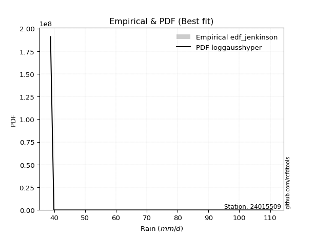</img>

</div>


### 11. EDF Cunnane (1978)

Cunnane´s work in statistical hydrology has focused on the performance and evaluation of different probability distributions (such as GEV, Gumbel, Lognormal) for flood frequency estimation. _b_ is a constant, typically set to 0.4.

<div align="center">


$P=(m-b)/(n+1-2b)$


</div>


**11.1. Empirical values**

<div align="center">

|                | 0                   | 1                   | 2                  | 3           | 4                  | 5                  | 6                  |
|:---------------|:--------------------|:--------------------|:-------------------|:------------|:-------------------|:-------------------|:-------------------|
| date           | 2019                | 2017                | 2021               | 2018        | 2016               | 2020               | 2024               |
| x              | 38.8                | 39.9                | 40.2               | 46.0        | 48.6               | 64.8               | 110.8              |
| m              | 1                   | 2                   | 3                  | 4           | 5                  | 6                  | 7                  |
| empirical_dist | edf_cunnane         | edf_cunnane         | edf_cunnane        | edf_cunnane | edf_cunnane        | edf_cunnane        | edf_cunnane        |
| empirical      | 0.08333333333333333 | 0.22222222222222224 | 0.3611111111111111 | 0.5         | 0.6388888888888888 | 0.7777777777777777 | 0.9166666666666666 |
| empirical_tr   | 1.090909090909091   | 1.2857142857142856  | 1.565217391304348  | 2.0         | 2.7692307692307687 | 4.499999999999998  | 11.999999999999995 |

</div>


**11.2. Kolmogorov-Smirnov fit test (sorted by Δ)**


<div align="center">

|                | 0                   | 1                   | 2                   | 3                   | 4                   | 5                   | 6                   | 7                   | 8                   | 9                   | 10                  | 11                  | 12                  | 13                  | 14                  | 15                  | 16                  | 17                  | 18                  | 19                  | 20                  | 21                  | 22                  | 23                  | 24                  | 25                  | 26                  | 27                  | 28                  | 29                  | 30                  | 31                  | 32                  | 33                  | 34                  | 35                  | 36                  | 37                  | 38                  | 39                  | 40                  | 41                  | 42                  | 43                  | 44                  | 45                  | 46                  | 47                  | 48                  | 49                  | 50                  | 51                  | 52                  | 53                  | 54                  | 55                  | 56                  | 57                  | 58                    | 59                  | 60                  | 61                  | 62                  | 63                  | 64                  | 65                  | 66                  | 67                  | 68                  | 69                  | 70                  | 71                  | 72                  | 73                  | 74                  | 75                  | 76                  | 77                  | 78                  | 79                  | 80                  | 81                  | 82                  | 83                  | 84                  | 85                  | 86                  | 87                  |
|:---------------|:--------------------|:--------------------|:--------------------|:--------------------|:--------------------|:--------------------|:--------------------|:--------------------|:--------------------|:--------------------|:--------------------|:--------------------|:--------------------|:--------------------|:--------------------|:--------------------|:--------------------|:--------------------|:--------------------|:--------------------|:--------------------|:--------------------|:--------------------|:--------------------|:--------------------|:--------------------|:--------------------|:--------------------|:--------------------|:--------------------|:--------------------|:--------------------|:--------------------|:--------------------|:--------------------|:--------------------|:--------------------|:--------------------|:--------------------|:--------------------|:--------------------|:--------------------|:--------------------|:--------------------|:--------------------|:--------------------|:--------------------|:--------------------|:--------------------|:--------------------|:--------------------|:--------------------|:--------------------|:--------------------|:--------------------|:--------------------|:--------------------|:--------------------|:----------------------|:--------------------|:--------------------|:--------------------|:--------------------|:--------------------|:--------------------|:--------------------|:--------------------|:--------------------|:--------------------|:--------------------|:--------------------|:--------------------|:--------------------|:--------------------|:--------------------|:--------------------|:--------------------|:--------------------|:--------------------|:--------------------|:--------------------|:--------------------|:--------------------|:--------------------|:--------------------|:--------------------|:--------------------|:--------------------|
| station        | 24015509            | 24015509            | 24015509            | 24015509            | 24015509            | 24015509            | 24015509            | 24015509            | 24015509            | 24015509            | 24015509            | 24015509            | 24015509            | 24015509            | 24015509            | 24015509            | 24015509            | 24015509            | 24015509            | 24015509            | 24015509            | 24015509            | 24015509            | 24015509            | 24015509            | 24015509            | 24015509            | 24015509            | 24015509            | 24015509            | 24015509            | 24015509            | 24015509            | 24015509            | 24015509            | 24015509            | 24015509            | 24015509            | 24015509            | 24015509            | 24015509            | 24015509            | 24015509            | 24015509            | 24015509            | 24015509            | 24015509            | 24015509            | 24015509            | 24015509            | 24015509            | 24015509            | 24015509            | 24015509            | 24015509            | 24015509            | 24015509            | 24015509            | 24015509              | 24015509            | 24015509            | 24015509            | 24015509            | 24015509            | 24015509            | 24015509            | 24015509            | 24015509            | 24015509            | 24015509            | 24015509            | 24015509            | 24015509            | 24015509            | 24015509            | 24015509            | 24015509            | 24015509            | 24015509            | 24015509            | 24015509            | 24015509            | 24015509            | 24015509            | 24015509            | 24015509            | 24015509            | 24015509            |
| empirical_dist | edf_cunnane         | edf_cunnane         | edf_cunnane         | edf_cunnane         | edf_cunnane         | edf_cunnane         | edf_cunnane         | edf_cunnane         | edf_cunnane         | edf_cunnane         | edf_cunnane         | edf_cunnane         | edf_cunnane         | edf_cunnane         | edf_cunnane         | edf_cunnane         | edf_cunnane         | edf_cunnane         | edf_cunnane         | edf_cunnane         | edf_cunnane         | edf_cunnane         | edf_cunnane         | edf_cunnane         | edf_cunnane         | edf_cunnane         | edf_cunnane         | edf_cunnane         | edf_cunnane         | edf_cunnane         | edf_cunnane         | edf_cunnane         | edf_cunnane         | edf_cunnane         | edf_cunnane         | edf_cunnane         | edf_cunnane         | edf_cunnane         | edf_cunnane         | edf_cunnane         | edf_cunnane         | edf_cunnane         | edf_cunnane         | edf_cunnane         | edf_cunnane         | edf_cunnane         | edf_cunnane         | edf_cunnane         | edf_cunnane         | edf_cunnane         | edf_cunnane         | edf_cunnane         | edf_cunnane         | edf_cunnane         | edf_cunnane         | edf_cunnane         | edf_cunnane         | edf_cunnane         | edf_cunnane           | edf_cunnane         | edf_cunnane         | edf_cunnane         | edf_cunnane         | edf_cunnane         | edf_cunnane         | edf_cunnane         | edf_cunnane         | edf_cunnane         | edf_cunnane         | edf_cunnane         | edf_cunnane         | edf_cunnane         | edf_cunnane         | edf_cunnane         | edf_cunnane         | edf_cunnane         | edf_cunnane         | edf_cunnane         | edf_cunnane         | edf_cunnane         | edf_cunnane         | edf_cunnane         | edf_cunnane         | edf_cunnane         | edf_cunnane         | edf_cunnane         | edf_cunnane         | edf_cunnane         |
| p_dist         | chi2                | logmoyal            | loghalflogistic     | logpearson3         | invweibull          | wald                | logweibull_min      | loginvweibull       | gamma               | f                   | invgamma            | logf                | logncf              | loggumbel_r         | invgauss            | loginvgamma         | alpha               | loginvgauss         | loghalfnorm         | logerlang           | logmielke           | logalpha            | nakagami            | lograyleigh         | loggenlogistic      | moyal               | logmaxwell          | logt                | nct                 | logkstwobign        | loggamma            | loggamma            | pearson3            | erlang              | weibull_min         | lognct              | halflogistic        | gumbel_r            | betaprime           | logbetaprime        | genlogistic         | ncf                 | lognakagami         | rayleigh            | logloggamma         | halfnorm            | t                   | lognorm             | lognorm             | logcrystalball      | logwald             | maxwell             | loglogistic         | logrice             | loghypsecant        | logfisk             | fisk                | logexponnorm        | loglaplace_asymmetric | loggenexpon         | logexpon            | loggompertz         | loglaplace          | logtruncnorm        | norm                | crystalball         | kstwobign           | logchi2             | logistic            | gibrat              | hypsecant           | loggumbel_l         | exponnorm           | laplace_asymmetric  | expon               | genexpon            | rice                | truncnorm           | laplace             | gumbel_l            | gompertz            | loggibrat           | loglognorm          | fatiguelife         | logfatiguelife      | johnsonsu           | logjohnsonsu        | mielke              |
| delta          | 0.11898726865227452 | 0.12348794940964186 | 0.12562033187306176 | 0.12663809207515364 | 0.1269794876498278  | 0.1321206547646732  | 0.13504711793543844 | 0.13742397234621306 | 0.13894829867506178 | 0.13902079835772851 | 0.13902210577334884 | 0.1444016507673953  | 0.14440229663159432 | 0.14632504956928433 | 0.14651747058992937 | 0.14824501174254823 | 0.14974624898688182 | 0.15056119653511824 | 0.15402630966866893 | 0.15436876597002078 | 0.1550795235332594  | 0.15877695464601804 | 0.1617447754107715  | 0.1641597989727337  | 0.1650079444182865  | 0.17464123936312514 | 0.1762955919104055  | 0.18187337756294336 | 0.18237123216876083 | 0.18245721881463345 | 0.18287308163524388 | 0.18287308163524388 | 0.18494312706139265 | 0.18782240253370297 | 0.19004444113873842 | 0.19332158492523127 | 0.19369674708910634 | 0.19637727517215564 | 0.19668584023499186 | 0.1972032673981376  | 0.20086528301029538 | 0.20117911223421736 | 0.20228839466130638 | 0.20738981763907238 | 0.20971652457682027 | 0.21021624284362023 | 0.21043776857784996 | 0.2106892681440738  | 0.2106892681440738  | 0.21068931476552083 | 0.21850884634860504 | 0.2196899129967484  | 0.22021619966070283 | 0.22506110512067173 | 0.2281743275019968  | 0.23927950183827884 | 0.24248812913523649 | 0.24427018790050353 | 0.2455614434057794    | 0.24557283231163107 | 0.2455752356870048  | 0.24832339422982458 | 0.25178523527822144 | 0.2527029153291105  | 0.2532977842051176  | 0.2532978003520112  | 0.25496502170739277 | 0.2598127194038716  | 0.26778994231988407 | 0.2694038651839808  | 0.27949429042854446 | 0.2796060584016248  | 0.2799433928039871  | 0.281087801648987   | 0.2810902766773339  | 0.2810903226859076  | 0.2913201525625713  | 0.3015154770810838  | 0.3074929084992368  | 0.3182131858263796  | 0.3415393094378658  | 0.3532127555662811  | 0.37860382750735555 | 0.38045604816789824 | 0.39377141303087304 | 0.5561700293885397  | 0.6360991306380415  | nan                 |
| deltao         | 0.48442053926100004 | 0.48442053926100004 | 0.48442053926100004 | 0.48442053926100004 | 0.48442053926100004 | 0.48442053926100004 | 0.48442053926100004 | 0.48442053926100004 | 0.48442053926100004 | 0.48442053926100004 | 0.48442053926100004 | 0.48442053926100004 | 0.48442053926100004 | 0.48442053926100004 | 0.48442053926100004 | 0.48442053926100004 | 0.48442053926100004 | 0.48442053926100004 | 0.48442053926100004 | 0.48442053926100004 | 0.48442053926100004 | 0.48442053926100004 | 0.48442053926100004 | 0.48442053926100004 | 0.48442053926100004 | 0.48442053926100004 | 0.48442053926100004 | 0.48442053926100004 | 0.48442053926100004 | 0.48442053926100004 | 0.48442053926100004 | 0.48442053926100004 | 0.48442053926100004 | 0.48442053926100004 | 0.48442053926100004 | 0.48442053926100004 | 0.48442053926100004 | 0.48442053926100004 | 0.48442053926100004 | 0.48442053926100004 | 0.48442053926100004 | 0.48442053926100004 | 0.48442053926100004 | 0.48442053926100004 | 0.48442053926100004 | 0.48442053926100004 | 0.48442053926100004 | 0.48442053926100004 | 0.48442053926100004 | 0.48442053926100004 | 0.48442053926100004 | 0.48442053926100004 | 0.48442053926100004 | 0.48442053926100004 | 0.48442053926100004 | 0.48442053926100004 | 0.48442053926100004 | 0.48442053926100004 | 0.48442053926100004   | 0.48442053926100004 | 0.48442053926100004 | 0.48442053926100004 | 0.48442053926100004 | 0.48442053926100004 | 0.48442053926100004 | 0.48442053926100004 | 0.48442053926100004 | 0.48442053926100004 | 0.48442053926100004 | 0.48442053926100004 | 0.48442053926100004 | 0.48442053926100004 | 0.48442053926100004 | 0.48442053926100004 | 0.48442053926100004 | 0.48442053926100004 | 0.48442053926100004 | 0.48442053926100004 | 0.48442053926100004 | 0.48442053926100004 | 0.48442053926100004 | 0.48442053926100004 | 0.48442053926100004 | 0.48442053926100004 | 0.48442053926100004 | 0.48442053926100004 | 0.48442053926100004 | 0.48442053926100004 |
| eval           | Δo > Δ              | Δo > Δ              | Δo > Δ              | Δo > Δ              | Δo > Δ              | Δo > Δ              | Δo > Δ              | Δo > Δ              | Δo > Δ              | Δo > Δ              | Δo > Δ              | Δo > Δ              | Δo > Δ              | Δo > Δ              | Δo > Δ              | Δo > Δ              | Δo > Δ              | Δo > Δ              | Δo > Δ              | Δo > Δ              | Δo > Δ              | Δo > Δ              | Δo > Δ              | Δo > Δ              | Δo > Δ              | Δo > Δ              | Δo > Δ              | Δo > Δ              | Δo > Δ              | Δo > Δ              | Δo > Δ              | Δo > Δ              | Δo > Δ              | Δo > Δ              | Δo > Δ              | Δo > Δ              | Δo > Δ              | Δo > Δ              | Δo > Δ              | Δo > Δ              | Δo > Δ              | Δo > Δ              | Δo > Δ              | Δo > Δ              | Δo > Δ              | Δo > Δ              | Δo > Δ              | Δo > Δ              | Δo > Δ              | Δo > Δ              | Δo > Δ              | Δo > Δ              | Δo > Δ              | Δo > Δ              | Δo > Δ              | Δo > Δ              | Δo > Δ              | Δo > Δ              | Δo > Δ                | Δo > Δ              | Δo > Δ              | Δo > Δ              | Δo > Δ              | Δo > Δ              | Δo > Δ              | Δo > Δ              | Δo > Δ              | Δo > Δ              | Δo > Δ              | Δo > Δ              | Δo > Δ              | Δo > Δ              | Δo > Δ              | Δo > Δ              | Δo > Δ              | Δo > Δ              | Δo > Δ              | Δo > Δ              | Δo > Δ              | Δo > Δ              | Δo > Δ              | Δo > Δ              | Δo > Δ              | Δo > Δ              | Δo > Δ              | Δo <= Δ             | Δo <= Δ             | Δo <= Δ             |
| fit            | 1                   | 1                   | 1                   | 1                   | 1                   | 1                   | 1                   | 1                   | 1                   | 1                   | 1                   | 1                   | 1                   | 1                   | 1                   | 1                   | 1                   | 1                   | 1                   | 1                   | 1                   | 1                   | 1                   | 1                   | 1                   | 1                   | 1                   | 1                   | 1                   | 1                   | 1                   | 1                   | 1                   | 1                   | 1                   | 1                   | 1                   | 1                   | 1                   | 1                   | 1                   | 1                   | 1                   | 1                   | 1                   | 1                   | 1                   | 1                   | 1                   | 1                   | 1                   | 1                   | 1                   | 1                   | 1                   | 1                   | 1                   | 1                   | 1                     | 1                   | 1                   | 1                   | 1                   | 1                   | 1                   | 1                   | 1                   | 1                   | 1                   | 1                   | 1                   | 1                   | 1                   | 1                   | 1                   | 1                   | 1                   | 1                   | 1                   | 1                   | 1                   | 1                   | 1                   | 1                   | 1                   | 0                   | 0                   | 0                   |
| n              | 7                   | 7                   | 7                   | 7                   | 7                   | 7                   | 7                   | 7                   | 7                   | 7                   | 7                   | 7                   | 7                   | 7                   | 7                   | 7                   | 7                   | 7                   | 7                   | 7                   | 7                   | 7                   | 7                   | 7                   | 7                   | 7                   | 7                   | 7                   | 7                   | 7                   | 7                   | 7                   | 7                   | 7                   | 7                   | 7                   | 7                   | 7                   | 7                   | 7                   | 7                   | 7                   | 7                   | 7                   | 7                   | 7                   | 7                   | 7                   | 7                   | 7                   | 7                   | 7                   | 7                   | 7                   | 7                   | 7                   | 7                   | 7                   | 7                     | 7                   | 7                   | 7                   | 7                   | 7                   | 7                   | 7                   | 7                   | 7                   | 7                   | 7                   | 7                   | 7                   | 7                   | 7                   | 7                   | 7                   | 7                   | 7                   | 7                   | 7                   | 7                   | 7                   | 7                   | 7                   | 7                   | 7                   | 7                   | 7                   |
| best_fit       | 1                   | 0                   | 0                   | 0                   | 0                   | 0                   | 0                   | 0                   | 0                   | 0                   | 0                   | 0                   | 0                   | 0                   | 0                   | 0                   | 0                   | 0                   | 0                   | 0                   | 0                   | 0                   | 0                   | 0                   | 0                   | 0                   | 0                   | 0                   | 0                   | 0                   | 0                   | 0                   | 0                   | 0                   | 0                   | 0                   | 0                   | 0                   | 0                   | 0                   | 0                   | 0                   | 0                   | 0                   | 0                   | 0                   | 0                   | 0                   | 0                   | 0                   | 0                   | 0                   | 0                   | 0                   | 0                   | 0                   | 0                   | 0                   | 0                     | 0                   | 0                   | 0                   | 0                   | 0                   | 0                   | 0                   | 0                   | 0                   | 0                   | 0                   | 0                   | 0                   | 0                   | 0                   | 0                   | 0                   | 0                   | 0                   | 0                   | 0                   | 0                   | 0                   | 0                   | 0                   | 0                   | 0                   | 0                   | 0                   |
| best_fit_sort  | 1                   | 2                   | 3                   | 4                   | 5                   | 6                   | 7                   | 8                   | 9                   | 10                  | 11                  | 12                  | 13                  | 14                  | 15                  | 16                  | 17                  | 18                  | 19                  | 20                  | 21                  | 22                  | 23                  | 24                  | 25                  | 26                  | 27                  | 28                  | 29                  | 30                  | 31                  | 32                  | 33                  | 34                  | 35                  | 36                  | 37                  | 38                  | 39                  | 40                  | 41                  | 42                  | 43                  | 44                  | 45                  | 46                  | 47                  | 48                  | 49                  | 50                  | 51                  | 52                  | 53                  | 54                  | 55                  | 56                  | 57                  | 58                  | 59                    | 60                  | 61                  | 62                  | 63                  | 64                  | 65                  | 66                  | 67                  | 68                  | 69                  | 70                  | 71                  | 72                  | 73                  | 74                  | 75                  | 76                  | 77                  | 78                  | 79                  | 80                  | 81                  | 82                  | 83                  | 84                  | 85                  | 86                  | 87                  | 88                  |

</div>


**11.3. Best fit**

<div align="center">

|   id |   station | empirical_dist   | p_dist   |    delta |   deltao | eval   |   fit |   n |   best_fit |   best_fit_sort |
|-----:|----------:|:-----------------|:---------|---------:|---------:|:-------|------:|----:|-----------:|----------------:|
|    0 |  24015509 | edf_cunnane      | chi2     | 0.118987 | 0.484421 | Δo > Δ |     1 |   7 |          1 |               1 |

</div>


<div align="center">

</img></img>

</div>


### 12. EDF Adamowski (1981)

The Adamowski formula in hydrology refers to a specific plotting position formula used for estimating the non-parametric empirical distribution of hydrological events (like flood peaks) to calculate their return periods. This formula provides an alternative to traditional parametric methods (like the Gumbel or Log Pearson Type III distributions). 

<div align="center">


$P=(m-0.25)/(n+0.5)$


</div>


**12.1. Empirical values**

<div align="center">

|                | 0                  | 1                   | 2                   | 3             | 4                  | 5                  | 6                  |
|:---------------|:-------------------|:--------------------|:--------------------|:--------------|:-------------------|:-------------------|:-------------------|
| date           | 2019               | 2017                | 2021                | 2018          | 2016               | 2020               | 2024               |
| x              | 38.8               | 39.9                | 40.2                | 46.0          | 48.6               | 64.8               | 110.8              |
| m              | 1                  | 2                   | 3                   | 4             | 5                  | 6                  | 7                  |
| empirical_dist | edf_adamowski      | edf_adamowski       | edf_adamowski       | edf_adamowski | edf_adamowski      | edf_adamowski      | edf_adamowski      |
| empirical      | 0.1                | 0.23333333333333334 | 0.36666666666666664 | 0.5           | 0.6333333333333333 | 0.7666666666666667 | 0.9                |
| empirical_tr   | 1.1111111111111112 | 1.3043478260869565  | 1.5789473684210527  | 2.0           | 2.727272727272727  | 4.2857142857142865 | 10.000000000000002 |

</div>


**12.2. Kolmogorov-Smirnov fit test (sorted by Δ)**


<div align="center">

|                | 0                   | 1                   | 2                   | 3                   | 4                   | 5                   | 6                   | 7                   | 8                   | 9                   | 10                  | 11                  | 12                  | 13                  | 14                  | 15                  | 16                  | 17                  | 18                  | 19                  | 20                  | 21                  | 22                  | 23                  | 24                  | 25                  | 26                  | 27                  | 28                  | 29                  | 30                  | 31                  | 32                  | 33                  | 34                  | 35                  | 36                  | 37                  | 38                  | 39                  | 40                  | 41                  | 42                  | 43                  | 44                  | 45                  | 46                  | 47                  | 48                  | 49                  | 50                  | 51                  | 52                  | 53                  | 54                  | 55                  | 56                  | 57                  | 58                  | 59                  | 60                  | 61                  | 62                    | 63                  | 64                  | 65                  | 66                  | 67                  | 68                  | 69                  | 70                  | 71                  | 72                  | 73                  | 74                  | 75                  | 76                  | 77                  | 78                  | 79                  | 80                  | 81                  | 82                  | 83                  | 84                  | 85                  | 86                  | 87                  |
|:---------------|:--------------------|:--------------------|:--------------------|:--------------------|:--------------------|:--------------------|:--------------------|:--------------------|:--------------------|:--------------------|:--------------------|:--------------------|:--------------------|:--------------------|:--------------------|:--------------------|:--------------------|:--------------------|:--------------------|:--------------------|:--------------------|:--------------------|:--------------------|:--------------------|:--------------------|:--------------------|:--------------------|:--------------------|:--------------------|:--------------------|:--------------------|:--------------------|:--------------------|:--------------------|:--------------------|:--------------------|:--------------------|:--------------------|:--------------------|:--------------------|:--------------------|:--------------------|:--------------------|:--------------------|:--------------------|:--------------------|:--------------------|:--------------------|:--------------------|:--------------------|:--------------------|:--------------------|:--------------------|:--------------------|:--------------------|:--------------------|:--------------------|:--------------------|:--------------------|:--------------------|:--------------------|:--------------------|:----------------------|:--------------------|:--------------------|:--------------------|:--------------------|:--------------------|:--------------------|:--------------------|:--------------------|:--------------------|:--------------------|:--------------------|:--------------------|:--------------------|:--------------------|:--------------------|:--------------------|:--------------------|:--------------------|:--------------------|:--------------------|:--------------------|:--------------------|:--------------------|:--------------------|:--------------------|
| station        | 24015509            | 24015509            | 24015509            | 24015509            | 24015509            | 24015509            | 24015509            | 24015509            | 24015509            | 24015509            | 24015509            | 24015509            | 24015509            | 24015509            | 24015509            | 24015509            | 24015509            | 24015509            | 24015509            | 24015509            | 24015509            | 24015509            | 24015509            | 24015509            | 24015509            | 24015509            | 24015509            | 24015509            | 24015509            | 24015509            | 24015509            | 24015509            | 24015509            | 24015509            | 24015509            | 24015509            | 24015509            | 24015509            | 24015509            | 24015509            | 24015509            | 24015509            | 24015509            | 24015509            | 24015509            | 24015509            | 24015509            | 24015509            | 24015509            | 24015509            | 24015509            | 24015509            | 24015509            | 24015509            | 24015509            | 24015509            | 24015509            | 24015509            | 24015509            | 24015509            | 24015509            | 24015509            | 24015509              | 24015509            | 24015509            | 24015509            | 24015509            | 24015509            | 24015509            | 24015509            | 24015509            | 24015509            | 24015509            | 24015509            | 24015509            | 24015509            | 24015509            | 24015509            | 24015509            | 24015509            | 24015509            | 24015509            | 24015509            | 24015509            | 24015509            | 24015509            | 24015509            | 24015509            |
| empirical_dist | edf_adamowski       | edf_adamowski       | edf_adamowski       | edf_adamowski       | edf_adamowski       | edf_adamowski       | edf_adamowski       | edf_adamowski       | edf_adamowski       | edf_adamowski       | edf_adamowski       | edf_adamowski       | edf_adamowski       | edf_adamowski       | edf_adamowski       | edf_adamowski       | edf_adamowski       | edf_adamowski       | edf_adamowski       | edf_adamowski       | edf_adamowski       | edf_adamowski       | edf_adamowski       | edf_adamowski       | edf_adamowski       | edf_adamowski       | edf_adamowski       | edf_adamowski       | edf_adamowski       | edf_adamowski       | edf_adamowski       | edf_adamowski       | edf_adamowski       | edf_adamowski       | edf_adamowski       | edf_adamowski       | edf_adamowski       | edf_adamowski       | edf_adamowski       | edf_adamowski       | edf_adamowski       | edf_adamowski       | edf_adamowski       | edf_adamowski       | edf_adamowski       | edf_adamowski       | edf_adamowski       | edf_adamowski       | edf_adamowski       | edf_adamowski       | edf_adamowski       | edf_adamowski       | edf_adamowski       | edf_adamowski       | edf_adamowski       | edf_adamowski       | edf_adamowski       | edf_adamowski       | edf_adamowski       | edf_adamowski       | edf_adamowski       | edf_adamowski       | edf_adamowski         | edf_adamowski       | edf_adamowski       | edf_adamowski       | edf_adamowski       | edf_adamowski       | edf_adamowski       | edf_adamowski       | edf_adamowski       | edf_adamowski       | edf_adamowski       | edf_adamowski       | edf_adamowski       | edf_adamowski       | edf_adamowski       | edf_adamowski       | edf_adamowski       | edf_adamowski       | edf_adamowski       | edf_adamowski       | edf_adamowski       | edf_adamowski       | edf_adamowski       | edf_adamowski       | edf_adamowski       | edf_adamowski       |
| p_dist         | loghalflogistic     | logweibull_min      | logpearson3         | chi2                | invweibull          | logmoyal            | loghalfnorm         | loginvweibull       | wald                | f                   | invgamma            | loggumbel_r         | logf                | logncf              | gamma               | invgauss            | loginvgamma         | alpha               | loginvgauss         | nakagami            | lograyleigh         | logalpha            | logerlang           | logmielke           | logt                | pearson3            | moyal               | loggenlogistic      | logmaxwell          | nct                 | halflogistic        | weibull_min         | lognct              | logkstwobign        | loggamma            | loggamma            | gumbel_r            | betaprime           | logbetaprime        | erlang              | halfnorm            | genlogistic         | ncf                 | t                   | lognakagami         | rayleigh            | logloggamma         | lognorm             | lognorm             | logcrystalball      | maxwell             | loglogistic         | logrice             | logfisk             | loghypsecant        | logwald             | fisk                | loglaplace          | norm                | crystalball         | kstwobign           | logexponnorm        | loglaplace_asymmetric | loggenexpon         | logexpon            | loggompertz         | logchi2             | logtruncnorm        | logistic            | hypsecant           | loggumbel_l         | gibrat              | exponnorm           | rice                | laplace_asymmetric  | expon               | genexpon            | laplace             | truncnorm           | gumbel_l            | gompertz            | loggibrat           | loglognorm          | fatiguelife         | logfatiguelife      | johnsonsu           | logjohnsonsu        | mielke              |
| delta          | 0.1089536652063951  | 0.11838045126877184 | 0.1210825365195981  | 0.12454282420783006 | 0.1269794876498278  | 0.1290435049651974  | 0.13735964300200226 | 0.13742397234621306 | 0.13767621032022873 | 0.13902079835772851 | 0.13902210577334884 | 0.1407694940137288  | 0.1444016507673953  | 0.14440229663159432 | 0.14450385423061732 | 0.14651747058992937 | 0.14824501174254823 | 0.14974624898688182 | 0.15056119653511824 | 0.1506336642996604  | 0.15860424341717816 | 0.15877695464601804 | 0.1599243215255763  | 0.16063507908881494 | 0.16520671089627667 | 0.16827646039472596 | 0.1690856838075696  | 0.17056349997384204 | 0.17074003635484997 | 0.1768156766132053  | 0.17703008042243965 | 0.18448888558318288 | 0.18776602936967574 | 0.18801277437018898 | 0.18842863719079941 | 0.18842863719079941 | 0.1908217196166001  | 0.19113028467943632 | 0.19164771184258206 | 0.1933779580892585  | 0.19354957617695354 | 0.19530972745473985 | 0.19562355667866183 | 0.19566120563603034 | 0.19673283910575085 | 0.20183426208351685 | 0.20416096902126474 | 0.20513371258851826 | 0.20513371258851826 | 0.2051337592099653  | 0.21413435744119286 | 0.2146606441051473  | 0.2195055495651162  | 0.22261283517161223 | 0.22261877194644125 | 0.22406440190416058 | 0.23693257357968095 | 0.2462296797226659  | 0.24774222864956208 | 0.24774224479645568 | 0.24940946615183723 | 0.24982574345605907 | 0.25111699896133494   | 0.2511283878671866  | 0.2511307912425603  | 0.2538789497853801  | 0.25425716384831604 | 0.258258470884666   | 0.26223438676432853 | 0.2739387348729889  | 0.27405050284606924 | 0.27495942073953633 | 0.28549894835954265 | 0.2857645970070158  | 0.28664335720454254 | 0.2866458322328894  | 0.28664587824146315 | 0.30193735294368124 | 0.3070710326366393  | 0.31265763027082405 | 0.3359837538823103  | 0.35876831112183666 | 0.3674927163962444  | 0.3693449370567871  | 0.3826603019197619  | 0.5450589182774286  | 0.6249880195269304  | nan                 |
| deltao         | 0.48442053926100004 | 0.48442053926100004 | 0.48442053926100004 | 0.48442053926100004 | 0.48442053926100004 | 0.48442053926100004 | 0.48442053926100004 | 0.48442053926100004 | 0.48442053926100004 | 0.48442053926100004 | 0.48442053926100004 | 0.48442053926100004 | 0.48442053926100004 | 0.48442053926100004 | 0.48442053926100004 | 0.48442053926100004 | 0.48442053926100004 | 0.48442053926100004 | 0.48442053926100004 | 0.48442053926100004 | 0.48442053926100004 | 0.48442053926100004 | 0.48442053926100004 | 0.48442053926100004 | 0.48442053926100004 | 0.48442053926100004 | 0.48442053926100004 | 0.48442053926100004 | 0.48442053926100004 | 0.48442053926100004 | 0.48442053926100004 | 0.48442053926100004 | 0.48442053926100004 | 0.48442053926100004 | 0.48442053926100004 | 0.48442053926100004 | 0.48442053926100004 | 0.48442053926100004 | 0.48442053926100004 | 0.48442053926100004 | 0.48442053926100004 | 0.48442053926100004 | 0.48442053926100004 | 0.48442053926100004 | 0.48442053926100004 | 0.48442053926100004 | 0.48442053926100004 | 0.48442053926100004 | 0.48442053926100004 | 0.48442053926100004 | 0.48442053926100004 | 0.48442053926100004 | 0.48442053926100004 | 0.48442053926100004 | 0.48442053926100004 | 0.48442053926100004 | 0.48442053926100004 | 0.48442053926100004 | 0.48442053926100004 | 0.48442053926100004 | 0.48442053926100004 | 0.48442053926100004 | 0.48442053926100004   | 0.48442053926100004 | 0.48442053926100004 | 0.48442053926100004 | 0.48442053926100004 | 0.48442053926100004 | 0.48442053926100004 | 0.48442053926100004 | 0.48442053926100004 | 0.48442053926100004 | 0.48442053926100004 | 0.48442053926100004 | 0.48442053926100004 | 0.48442053926100004 | 0.48442053926100004 | 0.48442053926100004 | 0.48442053926100004 | 0.48442053926100004 | 0.48442053926100004 | 0.48442053926100004 | 0.48442053926100004 | 0.48442053926100004 | 0.48442053926100004 | 0.48442053926100004 | 0.48442053926100004 | 0.48442053926100004 |
| eval           | Δo > Δ              | Δo > Δ              | Δo > Δ              | Δo > Δ              | Δo > Δ              | Δo > Δ              | Δo > Δ              | Δo > Δ              | Δo > Δ              | Δo > Δ              | Δo > Δ              | Δo > Δ              | Δo > Δ              | Δo > Δ              | Δo > Δ              | Δo > Δ              | Δo > Δ              | Δo > Δ              | Δo > Δ              | Δo > Δ              | Δo > Δ              | Δo > Δ              | Δo > Δ              | Δo > Δ              | Δo > Δ              | Δo > Δ              | Δo > Δ              | Δo > Δ              | Δo > Δ              | Δo > Δ              | Δo > Δ              | Δo > Δ              | Δo > Δ              | Δo > Δ              | Δo > Δ              | Δo > Δ              | Δo > Δ              | Δo > Δ              | Δo > Δ              | Δo > Δ              | Δo > Δ              | Δo > Δ              | Δo > Δ              | Δo > Δ              | Δo > Δ              | Δo > Δ              | Δo > Δ              | Δo > Δ              | Δo > Δ              | Δo > Δ              | Δo > Δ              | Δo > Δ              | Δo > Δ              | Δo > Δ              | Δo > Δ              | Δo > Δ              | Δo > Δ              | Δo > Δ              | Δo > Δ              | Δo > Δ              | Δo > Δ              | Δo > Δ              | Δo > Δ                | Δo > Δ              | Δo > Δ              | Δo > Δ              | Δo > Δ              | Δo > Δ              | Δo > Δ              | Δo > Δ              | Δo > Δ              | Δo > Δ              | Δo > Δ              | Δo > Δ              | Δo > Δ              | Δo > Δ              | Δo > Δ              | Δo > Δ              | Δo > Δ              | Δo > Δ              | Δo > Δ              | Δo > Δ              | Δo > Δ              | Δo > Δ              | Δo > Δ              | Δo <= Δ             | Δo <= Δ             | Δo <= Δ             |
| fit            | 1                   | 1                   | 1                   | 1                   | 1                   | 1                   | 1                   | 1                   | 1                   | 1                   | 1                   | 1                   | 1                   | 1                   | 1                   | 1                   | 1                   | 1                   | 1                   | 1                   | 1                   | 1                   | 1                   | 1                   | 1                   | 1                   | 1                   | 1                   | 1                   | 1                   | 1                   | 1                   | 1                   | 1                   | 1                   | 1                   | 1                   | 1                   | 1                   | 1                   | 1                   | 1                   | 1                   | 1                   | 1                   | 1                   | 1                   | 1                   | 1                   | 1                   | 1                   | 1                   | 1                   | 1                   | 1                   | 1                   | 1                   | 1                   | 1                   | 1                   | 1                   | 1                   | 1                     | 1                   | 1                   | 1                   | 1                   | 1                   | 1                   | 1                   | 1                   | 1                   | 1                   | 1                   | 1                   | 1                   | 1                   | 1                   | 1                   | 1                   | 1                   | 1                   | 1                   | 1                   | 1                   | 0                   | 0                   | 0                   |
| n              | 7                   | 7                   | 7                   | 7                   | 7                   | 7                   | 7                   | 7                   | 7                   | 7                   | 7                   | 7                   | 7                   | 7                   | 7                   | 7                   | 7                   | 7                   | 7                   | 7                   | 7                   | 7                   | 7                   | 7                   | 7                   | 7                   | 7                   | 7                   | 7                   | 7                   | 7                   | 7                   | 7                   | 7                   | 7                   | 7                   | 7                   | 7                   | 7                   | 7                   | 7                   | 7                   | 7                   | 7                   | 7                   | 7                   | 7                   | 7                   | 7                   | 7                   | 7                   | 7                   | 7                   | 7                   | 7                   | 7                   | 7                   | 7                   | 7                   | 7                   | 7                   | 7                   | 7                     | 7                   | 7                   | 7                   | 7                   | 7                   | 7                   | 7                   | 7                   | 7                   | 7                   | 7                   | 7                   | 7                   | 7                   | 7                   | 7                   | 7                   | 7                   | 7                   | 7                   | 7                   | 7                   | 7                   | 7                   | 7                   |
| best_fit       | 1                   | 0                   | 0                   | 0                   | 0                   | 0                   | 0                   | 0                   | 0                   | 0                   | 0                   | 0                   | 0                   | 0                   | 0                   | 0                   | 0                   | 0                   | 0                   | 0                   | 0                   | 0                   | 0                   | 0                   | 0                   | 0                   | 0                   | 0                   | 0                   | 0                   | 0                   | 0                   | 0                   | 0                   | 0                   | 0                   | 0                   | 0                   | 0                   | 0                   | 0                   | 0                   | 0                   | 0                   | 0                   | 0                   | 0                   | 0                   | 0                   | 0                   | 0                   | 0                   | 0                   | 0                   | 0                   | 0                   | 0                   | 0                   | 0                   | 0                   | 0                   | 0                   | 0                     | 0                   | 0                   | 0                   | 0                   | 0                   | 0                   | 0                   | 0                   | 0                   | 0                   | 0                   | 0                   | 0                   | 0                   | 0                   | 0                   | 0                   | 0                   | 0                   | 0                   | 0                   | 0                   | 0                   | 0                   | 0                   |
| best_fit_sort  | 1                   | 2                   | 3                   | 4                   | 5                   | 6                   | 7                   | 8                   | 9                   | 10                  | 11                  | 12                  | 13                  | 14                  | 15                  | 16                  | 17                  | 18                  | 19                  | 20                  | 21                  | 22                  | 23                  | 24                  | 25                  | 26                  | 27                  | 28                  | 29                  | 30                  | 31                  | 32                  | 33                  | 34                  | 35                  | 36                  | 37                  | 38                  | 39                  | 40                  | 41                  | 42                  | 43                  | 44                  | 45                  | 46                  | 47                  | 48                  | 49                  | 50                  | 51                  | 52                  | 53                  | 54                  | 55                  | 56                  | 57                  | 58                  | 59                  | 60                  | 61                  | 62                  | 63                    | 64                  | 65                  | 66                  | 67                  | 68                  | 69                  | 70                  | 71                  | 72                  | 73                  | 74                  | 75                  | 76                  | 77                  | 78                  | 79                  | 80                  | 81                  | 82                  | 83                  | 84                  | 85                  | 86                  | 87                  | 88                  |

</div>


**12.3. Best fit**

<div align="center">

|   id |   station | empirical_dist   | p_dist          |    delta |   deltao | eval   |   fit |   n |   best_fit |   best_fit_sort |
|-----:|----------:|:-----------------|:----------------|---------:|---------:|:-------|------:|----:|-----------:|----------------:|
|    0 |  24015509 | edf_adamowski    | loghalflogistic | 0.108954 | 0.484421 | Δo > Δ |     1 |   7 |          1 |               1 |

</div>


<div align="center">

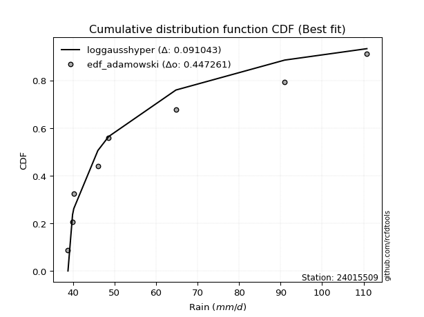</img></img>

</div>


## C. Best fit & Estimate extreme values for specific return periods - Tr

Best fit in probability distribution analysis means finding the theoretical distribution (like Normal, Poisson, Exponential) that most accurately mirrors your real-world data´s patterns (shape, center, spread) for better predictions, using methods like visual checks (Q-Q plots), goodness-of-fit tests (Kolmogorov-Smirnov, Chi-Squared), and information criteria (AIC) to score and select the simplest, most representative model.


### 1. Best fit (ordered by delta Δ)

<div align="center">

|   id |   station | empirical_dist   | p_dist          |    delta |   deltao | eval   |   fit |   n |   best_fit |   best_fit_sort |
|-----:|----------:|:-----------------|:----------------|---------:|---------:|:-------|------:|----:|-----------:|----------------:|
|    0 |  24015509 | edf_adamowski    | loghalflogistic | 0.108954 | 0.484421 | Δo > Δ |     1 |   7 |          1 |               1 |
|    1 |  24015509 | edf_weibull      | loghalflogistic | 0.110315 | 0.484421 | Δo > Δ |     1 |   7 |          1 |               2 |
|    2 |  24015509 | edf_california   | invweibull      | 0.113578 | 0.484421 | Δo > Δ |     1 |   7 |          1 |               3 |
|    3 |  24015509 | edf_chegodayev   | loghalflogistic | 0.114359 | 0.484421 | Δo > Δ |     1 |   7 |          1 |               4 |
|    4 |  24015509 | edf_hazen        | chi2            | 0.115019 | 0.484421 | Δo > Δ |     1 |   7 |          1 |               5 |
|    5 |  24015509 | edf_beard        | loghalflogistic | 0.115458 | 0.484421 | Δo > Δ |     1 |   7 |          1 |               6 |
|    6 |  24015509 | edf_jenkinson    | loghalflogistic | 0.115458 | 0.484421 | Δo > Δ |     1 |   7 |          1 |               7 |
|    7 |  24015509 | edf_filliben     | loghalflogistic | 0.116286 | 0.484421 | Δo > Δ |     1 |   7 |          1 |               8 |
|    8 |  24015509 | edf_gringorten   | chi2            | 0.117427 | 0.484421 | Δo > Δ |     1 |   7 |          1 |               9 |
|    9 |  24015509 | edf_tukey        | loghalflogistic | 0.118045 | 0.484421 | Δo > Δ |     1 |   7 |          1 |              10 |
|   10 |  24015509 | edf_cunnane      | chi2            | 0.118987 | 0.484421 | Δo > Δ |     1 |   7 |          1 |              11 |
|   11 |  24015509 | edf_blom         | chi2            | 0.119945 | 0.484421 | Δo > Δ |     1 |   7 |          1 |              12 |

</div>

:file_folder:Tables: [bestfit_24015509.csv](table/bestfit_24015509.csv) | [extreme_24015509.csv](table/extreme_24015509.csv)


### 2. Extreme values

In hydrology, a return period (or recurrence interval $Tr$) is the statistical average time between extreme events like floods or droughts of a specific magnitude, indicating how rare an event is, with a 100-year flood, for example, having a 1% chance of occurring in any given year, not that it happens exactly every century. It is a key tool for infrastructure design (like bridges or dams) and risk assessment, calculated from historical data to determine the probability of future events, although it is important to remember it is statistical average, and events can cluster or be missed.

> risk_rate: assuming the return period as the project useful life.

|   id |      tr |   prob_l |     prob_g |     alpha |   betaprime |     chi2 |   crystalball |   erlang |    expon |   exponnorm |          f |   fatiguelife |        fisk |    gamma |   genexpon |   genlogistic |   gibrat |   gompertz |   gumbel_l |   gumbel_r |   halflogistic |   halfnorm |   hypsecant |   invgamma |   invgauss |   invweibull |        johnsonsu |   kstwobign |   laplace |   laplace_asymmetric |   loggamma |   logistic |   lognorm |   maxwell |   mielke |    moyal |   nakagami |      ncf |      nct |     norm |   pearson3 |   rayleigh |     rice |        t |   truncnorm |     wald |   weibull_min |        logalpha |   logbetaprime |         logchi2 |   logcrystalball |   logerlang |   logexpon |   logexponnorm |             logf |   logfatiguelife |        logfisk |   loggenexpon |   loggenlogistic |   loggibrat |   loggompertz |   loggumbel_l |   loggumbel_r |   loghalflogistic |   loghalfnorm |   loghypsecant |      loginvgamma |   loginvgauss |   loginvweibull |     logjohnsonsu |   logkstwobign |   loglaplace |   loglaplace_asymmetric |   logloggamma |   loglogistic |    loglognorm |   logmaxwell |   logmielke |   logmoyal |   lognakagami |           logncf |   lognct |   logpearson3 |   lograyleigh |   logrice |             logt |   logtruncnorm |   logwald |   logweibull_min |   station |   n |   risk_rate |
|-----:|--------:|---------:|-----------:|----------:|------------:|---------:|--------------:|---------:|---------:|------------:|-----------:|--------------:|------------:|---------:|-----------:|--------------:|---------:|-----------:|-----------:|-----------:|---------------:|-----------:|------------:|-----------:|-----------:|-------------:|-----------------:|------------:|----------:|---------------------:|-----------:|-----------:|----------:|----------:|---------:|---------:|-----------:|---------:|---------:|---------:|-----------:|-----------:|---------:|---------:|------------:|---------:|--------------:|----------------:|---------------:|----------------:|-----------------:|------------:|-----------:|---------------:|-----------------:|-----------------:|---------------:|--------------:|-----------------:|------------:|--------------:|--------------:|--------------:|------------------:|--------------:|---------------:|-----------------:|--------------:|----------------:|-----------------:|---------------:|-------------:|------------------------:|--------------:|--------------:|--------------:|-------------:|------------:|-----------:|--------------:|-----------------:|---------:|--------------:|--------------:|----------:|-----------------:|---------------:|----------:|-----------------:|----------:|----:|------------:|
|    0 |    2    | 0.5      | 0.5        |   42.9105 |     50.9601 |  45.8392 |       55.5857 |  47.1096 |  50.435  |     50.3987 |    42.4561 |       38.8    |     56.5227 |  45.2884 |    50.435  |       50.8847 |  48.3757 |    58.0489 |    59.5318 |    51.6396 |        49.6778 |    50.6688 |     55.5857 |    42.4561 |    42.464  |      42.3806 |     38.8078      |     53.6159 |   55.5857 |              50.4346 |    44.9935 |    55.5857 |   51.7869 |   53.5314 |  48.3629 |  50.3657 |    42.5094 |  51.2227 |  50.2483 |  55.5857 |    49.464  |    52.8028 |  56.114  |  52.537  |     54.2894 |  47.7994 |       52.1005 |    42.5992      |        51.3109 |     59.368      |          51.7869 |     45.1108 |    47.3963 |        47.3384 |    42.5391       |          38.8    |  53.7152       |       47.3961 |          48.3215 |     46.6075 |       47.6428 |       54.8608 |       48.8853 |           47.5038 |       48.1967 |        51.7869 |    42.4753       |       42.4798 |   42.4324       |    38.8002       |        49.8682 |      51.7869 |                 47.3951 |       51.8303 |       51.7869 |  38.8532      |      50.2554 |     46.7163 |    47.9837 |       52.3711 |    42.5391       |  50.8265 |       48.1186 |       49.7232 |   51.8246 |     43.5985      |        47.9303 |   46.2177 |     44.6699      |  24015509 |   7 |    0.75     |
|    1 |    2.33 | 0.570815 | 0.429185   |   44.1194 |     54.0625 |  48.5551 |       59.8721 |  49.586  |  52.9985 |     52.9583 |    43.8966 |       39.3171 |     65.2872 |  47.423  |    52.9985 |       53.6577 |  50.547  |    62.29   |    63.261  |    55.6114 |        53.7615 |    55.295  |     59.0161 |    43.8966 |    43.8323 |      44.0247 |     38.8248      |     56.9175 |   58.1796 |              52.9981 |    46.6756 |    59.3623 |   55.1342 |   57.9846 |  50.6392 |  54.1255 |    45.6316 |  54.3981 |  53.1464 |  59.8721 |    53.4002 |    57.3219 |  59.7713 |  57.0166 |     57.5854 |  50.61   |       58.6735 |    43.7939      |        54.845  |     69.895      |          55.1342 |     47.1085 |    49.5329 |        49.4618 |    43.8867       |          39.199  |  64.6309       |       49.5326 |          50.5791 |     48.1102 |       49.8475 |       57.9332 |       51.8064 |           50.4247 |       51.5674 |        54.4489 |    43.7952       |       43.7962 |   43.8941       |    38.801        |        52.4838 |      53.7874 |                 49.5314 |       55.2707 |       54.725  |  39.2394      |      53.6344 |     48.7353 |    50.6936 |       57.8218 |    43.8867       |  53.9409 |       51.0856 |       53.1175 |   54.7576 |     44.9417      |        50.1709 |   48.1554 |     49.0425      |  24015509 |   7 |    0.729209 |
|    2 |    5    | 0.8      | 0.2        |   53.4934 |     67.9594 |  65.0203 |       75.8015 |  63.1629 |  65.8156 |     65.7561 |    59.5039 |       50.3006 |    163.778  |  59.5528 |    65.8156 |       65.7043 |  63.0478 |    83.4945 |    75.3085 |    72.8668 |        72.2392 |    74.8583 |     72.7762 |    59.5039 |    56.0214 |      64.2784 |     40.5824      |     70.9419 |   71.1487 |              65.8147 |    56.4237 |    73.9443 |   69.5838 |   75.5123 |  61.9269 |  71.5414 |    72.2732 |  68.2668 |  66.6993 |  75.8015 |    71.7902 |    75.414  |  74.4132 |  74.1547 |     73.1015 |  66.344  |      111.529  |    54.265       |        70.6505 |    187.605      |          69.5838 |     59.568  |    61.7499 |        61.5954 |    58.0571       |          48.7156 | 707.255        |       61.7493 |          61.6761 |     57.7538 |       62.4982 |       69.0844 |       66.663  |           66.0545 |       68.6314 |        66.5748 |    57.6063       |       55.5261 |   61.4316       |    38.978        |        65.2127 |      65.0102 |                 61.7463 |       70.1367 |       67.7209 |   7.19318e+13 |      69.2904 |     59.7269 |    65.3844 |       94.2823 |    58.0567       |  68.0364 |       66.679  |       69.1909 |   68.2591 |     51.6514      |        62.768  |   60.6026 |    130.27        |  24015509 |   7 |    0.67232  |
|    3 |   10    | 0.9      | 0.1        |   70.7156 |     79.7776 |  82.3959 |       86.3686 |  76.4512 |  77.4505 |     77.3735 |   103.746  |       65.4661 |    430.594  |  71.7563 |    77.4506 |       75.5156 |  77.2974 |   102.743  |    82.016  |    86.9211 |        87.5842 |    89.3347 |     83.764  |   103.747  |    78.3098 |     129.119  |     69.2179      |     81.6197 |   82.9216 |              77.4493 |    67.3511 |    84.6834 |   81.202  |   87.8474 |  73.0647 |  86.7046 |   101.715  |  79.665  |  78.9911 |  86.3686 |    87.5031 |    88.314  |  84.8531 |  86.5334 |     85.21   |  83.0414 |      188.56   |    80.4523      |        84.0005 |    530.891      |          81.202  |     74.7837 |    75.4308 |        75.1691 |   107.506        |          65.7658 |   1.33344e+06  |       75.4297 |          72.4898 |     71.1252 |       76.742  |       76.1983 |       81.8601 |           82.6572 |       84.7987 |        78.1697 |   105.193        |       79.9722 |  140.785        |    44.7753       |        76.937  |      77.2133 |                 75.4245 |       82.0981 |       79.2269 | inf           |      82.9758 |     72.3738 |    81.6017 |      140.238  |   107.502        |  80.1906 |       82.8611 |       83.5434 |   79.8746 |     60.7768      |        76.4633 |   77.3486 |    797.567       |  24015509 |   7 |    0.651322 |
|    4 |   15    | 0.933333 | 0.0666667  |   87.8763 |     86.6615 |  93.1842 |       91.6418 |  84.4671 |  84.2566 |     84.1693 |   163.422  |       75.3846 |    768.972  |  79.1975 |    84.2566 |       81.051  |  87.1261 |   114.003  |    85.0537 |    94.8503 |        96.2681 |    96.8681 |     90.0347 |   163.425  |    97.7162 |     222.735  |    164.108       |     87.2883 |   89.8083 |              84.2551 |    74.79   |    90.5346 |   87.7062 |   94.1764 |  80.2517 |  95.5047 |   118.506  |  86.1596 |  86.4844 |  91.6418 |    96.4543 |    94.9607 |  90.2322 |  93.2196 |     91.1309 |  93.7637 |      246.512  |   119.107       |        91.721  |   1012.33       |          87.7062 |     85.7384 |    84.7987 |        84.4566 |   215.332        |          80.0276 |   5.03129e+10  |       84.7973 |          79.4073 |     82.112  |       86.535  |       79.6567 |       91.9161 |           93.8401 |       94.6665 |        85.6706 |   207.186        |      106.422  |  384.495        |    86.2263       |        83.9951 |      85.3876 |                 84.7904 |       88.7952 |       86.2986 | inf           |      91.0153 |     81.6199 |    92.7991 |      173.192  |   215.317        |  87.334  |       93.5315 |       92.0644 |   86.6109 |     69.3065      |        85.6099 |   90.4682 |   3763.55        |  24015509 |   7 |    0.644736 |
|    5 |   20    | 0.95     | 0.05       |  105.022  |     91.5838 | 101.04   |       95.0951 |  90.2329 |  89.0855 |     88.991  |   236.023  |       82.728  |   1161.58   |  84.5747 |    89.0855 |       84.9267 |  94.8359 |   121.992  |    86.9445 |   100.402  |       102.352  |   101.891  |     94.4584 |   236.029  |   114.58   |     341.301  |    355.486       |     91.1069 |   94.6945 |              89.0839 |    80.5926 |    94.5787 |   92.2454 |   98.3767 |  85.7175 | 101.737  |   129.971  |  90.7441 |  91.9944 |  95.0951 |   102.728  |    99.3786 |  93.8076 |  97.8366 |     94.7471 | 101.754  |      293.418  |   176.272       |        97.2131 |   1619.58       |          92.2454 |     94.5817 |    92.1428 |        91.7341 |   456.454        |          92.5441 |   2.22743e+16  |       92.141  |          84.6399 |     91.9055 |       94.2321 |       81.8882 |       99.6835 |          102.565  |      101.875  |        91.3911 |   430.932        |      134.589  | 1197.67         |   454.335        |        89.1112 |      91.707  |                 92.1327 |       93.4687 |       91.552  | inf           |      96.7764 |     89.2835 |   101.647  |      199.521  |   456.398        |  92.4687 |      101.73   |       98.2036 |   91.3998 |     77.92        |        92.6584 |  101.672  |  14454           |  24015509 |   7 |    0.641514 |
|    6 |   25    | 0.96     | 0.04       |  122.162  |     95.4367 | 107.23   |       97.6372 |  94.7423 |  92.8311 |     92.731  |   320.05   |       88.5627 |   1599.25   |  88.7921 |    92.8312 |       87.912  | 101.263  |   128.189  |    88.29   |   104.679  |       107.04   |   105.628  |     97.882  |   320.06   |   129.452  |     482.492  |    665.464       |     93.9671 |   98.4845 |              92.8294 |    85.4175 |    97.6725 |   95.7363 |  101.495  |  90.1896 | 106.568  |   138.585  |  94.3001 |  96.3961 |  97.6372 |   107.557  |   102.661  |  96.464  | 101.375  |     97.2108 | 108.154  |      333.117  |   260.837       |       101.495  |   2345.12       |          95.7364 |    102.121  |    98.2745 |        97.808  |  1012.31         |         103.87   |   8.53935e+22  |       98.2725 |          88.9044 |    100.957  |      100.671  |       83.5141 |      106.111  |          109.836  |      107.593  |        96.0793 |   936.104        |      164.364  | 4156.23         | 10847.5          |        93.1464 |      96.929  |                 98.263  |       97.0627 |       95.7857 | inf           |     101.288  |     95.9905 |   109.081  |      221.729  |  1012.13         |  96.5028 |      108.482  |      103.028  |   95.1286 |     86.8312      |        98.4656 |  111.639  |  47622.2         |  24015509 |   7 |    0.639603 |
|    7 |   50    | 0.98     | 0.02       |  207.833  |    107.672  | 126.888  |      104.917  | 108.918  | 104.466  |    104.348  |   882.837  |      107.283  |   4304.77   | 102.101  |   104.466  |       97.1082 | 123.92   |   147.438  |    91.9425 |   117.852  |       121.483  |   116.49   |    108.496  |   882.879  |   185.379  |    1482.06   |   4462.88        |    102.366  |  110.257  |             104.464  |   102.412  |   107.125  |  106.481  |  110.539  | 105.541  | 121.564  |   163.819  | 105.417  | 110.893  | 104.917  |   122.392  |   112.189  | 104.175  | 112.276  |    103.057  | 129.05   |      474.944  |  1849.37        |       114.987  |   7596.78       |         106.481  |    129.921  |   120.048  |       119.362  | 88349.3          |         150.443  |   2.86967e+67  |      120.045  |         103.439  |    140.585  |      123.615  |       88.0923 |      128.635  |          135.644  |      126.1    |       112.199  | 72235.4          |      335.331  |    7.06055e+06  |     6.53056e+27  |       106.083  |     115.123  |                120.03   |      108.122  |      109.973  | inf           |     115.598  |    122.345  |   135.805  |      301.494  | 88298.7          | 109.397  |      131.903  |      118.419  |  106.837  |    138.836       |       118.558  |  151.503  |      4.6981e+06  |  24015509 |   7 |    0.63583  |
|    8 |   75    | 0.986667 | 0.0133333  |  293.492  |    115.061  | 138.631  |      108.823  | 117.305  | 111.272  |    111.144  |  1642.07   |      118.557  |   7664.48   | 110.005  |   111.272  |      102.453  | 139.222  |   158.698  |    93.7894 |   125.509  |       129.879  |   122.403  |    114.699  |  1642.16   |   224.517  |    2903.14   |  12664.5         |    106.987  |  117.144  |             111.27   |   113.934  |   112.584  |  112.735  |  115.456  | 115.675  | 130.334  |   177.588  | 112.011  | 120.03   | 108.823  |   130.974  |   117.373  | 108.37   | 118.68   |    105.371  | 141.909  |      570.918  | 13108.6         |       123.057  |  15328.8        |         112.735  |    149.783  |   134.957  |       134.11   |     1.36667e+07  |         188.045  |   7.51896e+127 |      134.953  |         112.956  |    175.818  |      139.389  |       90.5022 |      143.864  |          153.349  |      137.48   |       122.844  |     9.64853e+06  |      539.747  |    5.3997e+10   |     1.72718e+95  |       113.952  |     127.311  |                134.935  |      114.557  |      119.105  | inf           |     124.209  |    142.948  |   154.372  |      356.404  |     1.36518e+07  | 117.242  |      147.532  |      127.737  |  113.801  |    208.089       |       131.883  |  182.819  |      1.34233e+08 |  24015509 |   7 |    0.634587 |
|    9 |  100    | 0.99     | 0.01       |  379.148  |    120.425  | 147.051  |      111.465  | 123.291  | 116.101  |    115.966  |  2565.75   |      126.669  |  11530.4    | 115.656  |   116.101  |      106.237  | 151.076  |   166.687  |    94.9975 |   130.929  |       135.821  |   126.431  |    119.1    |  2565.92   |   254.917  |    4691.44   |  25700.8         |    110.154  |  122.03   |             116.099  |   122.908  |   116.439  |  117.172  |  118.805  | 123.447  | 136.556  |   186.957  | 116.746  | 126.843  | 111.465  |   137.028  |   120.904  | 111.228  | 123.27   |    106.618  | 151.284  |      644.848  | 92909.1         |       128.878  |  25356.9        |         117.172  |    165.777  |   146.644  |       145.666  |     3.19141e+09  |         220.79   |   3.51844e+201 |      146.64   |         120.216  |    209.075  |      151.787  |       92.114  |      155.719  |          167.259  |      145.815  |       131.001  |     1.91159e+09  |      774.616  |    1.28843e+15  |     1.21988e+223 |       119.677  |     136.733  |                146.62   |      119.122  |      126.005  | inf           |     130.438  |    160.727  |   169.064  |      399.407  |     3.186e+09    | 122.964  |      159.593  |      134.502  |  118.803  |    300.795       |       142.104  |  209.66   |      1.99045e+09 |  24015509 |   7 |    0.633968 |
|   10 |  200    | 0.995    | 0.005      |  721.766  |    133.816  | 167.59   |      117.457  | 137.812  | 127.736  |    127.583  |  7598.24   |      146.526  |  30772.6    | 129.394  |   127.736  |      115.332  | 183.327  |   185.936  |    97.6234 |   143.957  |       150.107  |   135.644  |    129.7    |  7598.83   |   336.211  |   14972.3    | 128276           |    117.446  |  133.803  |             127.733  |   147.617  |   125.685  |  127.895  |  126.467  | 144.393  | 151.546  |   208.316  | 128.388  | 144.511  | 117.457  |   151.516  |   128.985  | 117.768  | 134.574  |    108.618  | 174.636  |      842.906  |     2.34419e+08 |       143.272  |  86539.8        |         127.895  |    211.997  |   179.134  |       177.766  |     1.61096e+20  |         327.062  | inf            |      179.128  |         139.637  |    334.965  |      186.381  |       95.717  |      188.374  |          206.086  |      166.826  |       152.948  |     4.41254e+19  |     1986.24   |    1.63403e+36  |   inf            |       133.983  |     162.399  |                179.1    |      130.147  |      144.233  | inf           |     145.891  |    218.669  |   210.464  |      518.11   |     1.60323e+20  | 137.34   |      192.379  |      151.359  |  131.093  |   1081.62        |       169.578  |  294.922  |      4.15797e+12 |  24015509 |   7 |    0.633042 |
|   11 |  250    | 0.996    | 0.004      |  893.073  |    138.279  | 174.267  |      119.288  | 142.512  | 131.482  |    131.323  | 10795.1    |      152.998  |  42186.8    | 133.848  |   131.482  |      118.255  | 194.898  |   192.132  |    98.396  |   148.146  |       154.7    |   138.478  |    133.112  | 10796      |   364.566  |   21764.7    | 209711           |    119.703  |  137.593  |             131.479  |   156.603  |   128.653  |  131.363  |  128.826  | 151.872  | 156.372  |   214.863  | 132.216  | 150.609  | 119.288  |   156.154  |   131.472  | 119.781  | 138.308  |    109.039  | 182.362  |      912.668  |     1.17746e+10 |       148.026  | 128976          |         131.364  |    229.551  |   191.055  |       189.536  |     1.26889e+26  |         371.745  | inf            |      191.048  |         146.524  |    396.684  |      199.116  |       96.8037 |      200.263  |          220.392  |      173.88   |       160.768  |     2.22044e+25  |     2741.73   |    2.70646e+48  |   inf            |       138.748  |     171.647  |                191.016  |      133.713  |      150.626  | inf           |     151.007  |    243.453  |   225.841  |      561.226  |     1.26044e+26  | 142.159  |      204.172  |      156.961  |  135.126  |   1912.59        |       179.341  |  330.167  |      6.98912e+13 |  24015509 |   7 |    0.632858 |
|   12 |  500    | 0.998    | 0.002      | 1749.61   |    152.665  | 195.174  |      124.719  | 157.178  | 143.117  |    142.941  | 32206.7    |      173.298  | 112281      | 147.767  |   143.117  |      127.331  | 234.89   |   211.381  |   100.611  |   161.146  |       168.955  |   146.928  |    143.712  | 32209.9    |   458.527  |   69593      | 901105           |    126.466  |  149.366  |             143.113  |   188.224  |   137.859  |  142.213  |  135.864  | 177.696  | 171.361  |   234.302  | 144.388  | 170.966  | 124.719  |   170.493  |   138.894  | 125.787  | 150.276  |    109.903  | 206.927  |     1148.04   |     3.76434e+18 |       163.205  | 449901          |         142.213  |    294.195  |   233.384  |       231.304  |     1.5412e+59   |         555.534  | inf            |      233.374  |         170.139  |    711.656  |      244.496  |       99.9879 |      242.159  |          271.43   |      196.732  |       187.699  |     1.94506e+57  |     7857.49   |    1.89374e+121 |   inf            |       154.066  |     203.867  |                233.331  |      144.858  |      172.314  | inf           |     167.364  |    349.605  |   281.143  |      712.007  |     1.51331e+59  | 157.784  |      245.196  |      174.94   |  147.911  |  23249.2         |       212.76   |  472.739  |      1.46484e+18 |  24015509 |   7 |    0.632489 |
|   13 |  750    | 0.998667 | 0.00133333 | 2606.14   |    161.472  | 207.506  |      127.736  | 165.798  | 149.923  |    149.737  | 61092.3    |      185.293  | 198958      | 155.958  |   149.923  |      132.636  | 261.337  |   222.641  |   101.795  |   168.746  |       177.289  |   151.649  |    149.912  | 61098.8    |   517.151  |  137363      |      2.02547e+06 |    130.266  |  156.253  |             149.919  |   209.645  |   143.237  |  148.622  |  139.8    | 194.819  | 180.13   |   245.107  | 151.724  | 183.955  | 127.736  |   178.838  |   143.044  | 129.146  | 157.576  |    110.198  | 221.655  |     1298.84   |     1.20343e+27 |       172.391  | 940041          |         148.622  |    340.355  |   262.368  |       259.883  |     3.23447e+96  |         704.356  | inf            |      262.357  |         185.67   |   1047.45   |      275.695  |      101.732  |      270.601  |          306.579  |      210.782  |       205.499  |     1.83855e+93  |    15021.8    |    5.04544e+208 |   inf            |       163.402  |     225.449  |                262.305  |      151.439  |      186.403  | inf           |     177.273  |    441.454  |   319.574  |      813.037  |     3.13085e+96  | 167.415  |      272.626  |      185.877  |  155.581  | 203102           |       234.604  |  586.257  |      1.17412e+21 |  24015509 |   7 |    0.632366 |
|   14 | 1000    | 0.999    | 0.001      | 3462.67   |    167.907  | 216.296  |      129.813  | 171.929  | 154.752  |    154.558  | 96234.5    |      193.849  | 298522      | 161.79   |   154.752  |      136.399  | 281.576  |   230.63   |   102.591  |   174.137  |       183.2    |   154.909  |    154.311  | 96245.4    |   560.189  |  222524      |      3.53759e+06 |    132.898  |  161.139  |             154.748  |   226.326  |   147.051  |  153.202  |  142.521  | 207.972  | 186.351  |   252.546  | 157.032  | 193.699  | 129.813  |   184.743  |   145.912  | 131.467  | 162.908  |    110.347  | 232.25   |     1411.72   |     3.84721e+35 |       179.054  |      1.5894e+06 |         153.202  |    377.525  |   285.091  |       282.276  |     7.59754e+136 |         834.301  | inf            |      285.078  |         197.539  |   1407.97   |      300.218  |      102.924  |      292.779  |          334.238  |      221.067  |       219.142  |     1.37358e+132 |    24095      |    1.5153e+307  |   inf            |       170.199  |     242.134  |                285.019  |      156.14   |      197.086  | inf           |     184.462  |    526.411  |   349.986  |      890.965  |     7.23492e+136 | 174.483  |      293.808  |      193.832  |  161.113  |      1.46738e+06 |       251.171  |  684.418  |      2.02012e+23 |  24015509 |   7 |    0.632305 |

<div align="center">

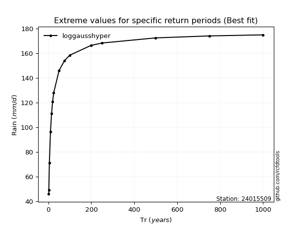</img>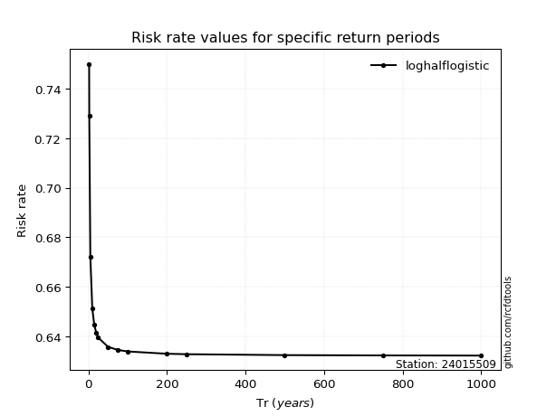</img>

</div>


<sub>**APP DISCLAIMER**: NO WARRANTY - This software is provided by [github.com/rcfdtools](https://github.com/rcfdtools) "as is", without any express or implied warranty, including warranties of merchantability, fitness for a particular purpose, or non-infringement. There is no guarantee that the software will be error-free or operate without interruption. LIMITATION OF LIABILITY - Neither the authors nor copyright holders will be liable for claims or damages arising from the software or its use. You are responsible for determining if the software is appropriate for your use and assume all associated risks, including errors, legal compliance, and data loss. NO PROFESSIONAL ADVICE - The software provides general information and does not offer professional advice. It should not replace consultation with professional advisors.</sub>