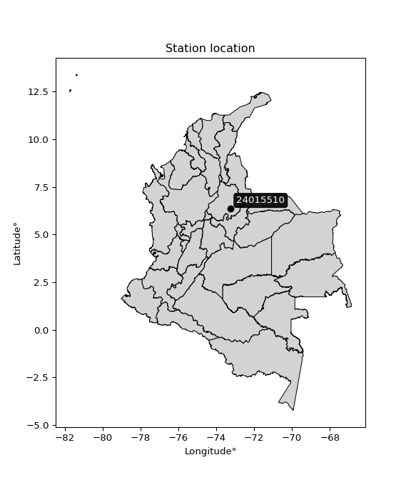

<div align="center">


</div>

# Station (rain, Pmax24h): 24015510

Probable Maximum Precipitation (PMP) is the greatest amount of rainfall for a specific duration that is meteorologically possible for a given location, acting as a "worst-case" scenario for extreme storms, crucial for designing safety-critical infrastructure like bridges, river deviations, dams, spillways, and nuclear plants to prevent catastrophic failure. PMP is calculated by hydrologists using meteorological data to determine the upper limit of extreme rainfall, often leading to the Probable Maximum Flood (PMF) for flood control design, and is increasingly being studied for climate change impacts.

<div align="center">

</img>

</div>


## A. General information


### 1. General running parameters

• app_version: _v20251226_. • runtime: _2025-12-26 15:38:16.554582_. • Python version: _3.14.0_. • SciPy version: _1.16.3_. • Pandas version: _2.3.3_. • NumPy version: _2.3.5_. • Stations dataset (station_dataset_file): _dataset/pmax24h_in/automatic_colombia_2003_2024.csv_. • Stations catalog (station_catalog_file): _dataset/CNE_IDEAM.xls_. • Minimum year to eval til year_max (date_min): _2003_. • Maximum year to eval since year_min (date_max): _2024_. • Creates, save and include plots into reports (create_plot): _False_. • Plot only fit distributions with Δo > Δ (plot_only_fit): _True_. • Eval low extreme values, if False, evaluates high extreme values (low_extreme): _False_. • Eval every SciPy distribution as logarithmic (pdist_logarithmic_on): _True_. • Standard deviation normalized (ddof): _1.0_. • Return periods to eval in years (Tr): _[2, 2.33, 5, 10, 15, 20, 25, 50, 75, 100, 200, 250, 500, 750, 1000]_. • Minimum data sample per station, 0 means any (minimum_sample): _5_. • Z-Score threshold to adjust a value, 0 means disable (zscore): _3.5_. • Avoid zeros, e.g. rain = 0 (avoid_zeros): _True_. • Avoid null values (avoid_nans): _True_. [:file_folder:Dataset file.](../../dataset/pmax24h_in/automatic_colombia_2003_2024.csv)


### 2. Station info and location

|   id |   CODIGO | NOMBRE                       | CATEGORIA     | TECNOLOGIA                | ESTADO   |   FECHA_INSTALACION |   FECHA_SUSPENSION |   ALTITUD |   LATITUD |   LONGITUD | DEPARTAMENTO   | MUNICIPIO   | AREA_OPERATIVA                         | ENTIDAD            | AREA_HIDROGRAFICA   | ZONA_HIDROGRAFICA   | SUBZONA_HIDROGRAFICA   |   CORRIENTE |   OBSERVACION |   SUBRED | Catalogo   |
|-----:|---------:|:-----------------------------|:--------------|:--------------------------|:---------|--------------------:|-------------------:|----------:|----------:|-----------:|:---------------|:------------|:---------------------------------------|:-------------------|:--------------------|:--------------------|:-----------------------|------------:|--------------:|---------:|:-----------|
|    0 | 24015510 | CONFINES-  - AUT  [24015510] | Pluviométrica | Automática con Telemetría | Activa   |                 nan |                nan |      1572 |   6.35499 |    -73.239 | Santander      | Confines    | Area Operativa 08 - Santanderes-Arauca | ISAGEN  S.A. E.S.P | Magdalena Cauca     | Sogamoso            | Río Suárez             |         nan |           nan |      nan | CNE_OE     |

<div align="center">

Map location in: [:earth_americas:Google](http://maps.google.com/maps?q=6.354991667,-73.23896667) [:earth_americas:OSM](https://www.openstreetmap.org/#map=18/6.354991667/-73.23896667&layers=P) [:earth_americas:Bing](https://www.bing.com/maps?cp=6.354991667~-73.23896667&lvl=18) [:earth_americas:Apple](https://maps.apple.com/frame?center=6.354991667%2C-73.23896667&span=0.003%2C0.006)

</div>


<div align="center">

```geojson
{
  "type": "Feature",
  "geometry": {
    "type": "Point", 
    "coordinates": [-73.23896667, 6.354991667]
  }, 
  "properties": {
    "Name": "24015510"
  }
}
```

</div>


### 3. Discrete values table and plot

|               |           0 |           1 |          2 |          3 |           4 |           5 |         6 |
|:--------------|------------:|------------:|-----------:|-----------:|------------:|------------:|----------:|
| Date          | 2016        | 2017        | 2018       | 2019       | 2020        | 2021        | 2024      |
| Value         |   60.6      |   51.1      |   41.5     |   73.8     |   64.8      |   52.5      |   93.4    |
| Value_initial |   60.6      |   51.1      |   41.5     |   73.8     |   64.8      |   52.5      |   93.4    |
| count         |    7        |    7        |    7       |    7       |    7        |    7        |    7      |
| mean          |   62.5286   |   62.5286   |   62.5286  |   62.5286  |   62.5286   |   62.5286   |   62.5286 |
| std           |   17.1384   |   17.1384   |   17.1384  |   17.1384  |   17.1384   |   17.1384   |   17.1384 |
| zscore        |   -0.112529 |   -0.666839 |   -1.22698 |    0.65767 |    0.132534 |   -0.585151 |    1.8013 |
> If Z-Score is active, values out of range or outliers are replaced with the station mean value.


### 4. Active continuous probability distributions from SciPy (45 of 104 available)

[scipy.stats](https://docs.scipy.org/doc/scipy/reference/stats.html) is a Python´s powerful submodule within the SciPy library for comprehensive statistical analysis, offering over 130 probability distributions (like Normal, Poisson), functions for descriptive stats (mean, variance), hypothesis testing (t-tests, chi-square), random variable generation, and statistical tests, making it essential for data science, modeling, and research. It provides tools to explore, model, and draw conclusions from data efficiently, working seamlessly with NumPy.

<div align="center">

|   id | p_dist             |   n_parameter | fit_method   | label                                                                       | active   | ref                                                                                                        |
|-----:|:-------------------|--------------:|:-------------|:----------------------------------------------------------------------------|:---------|:-----------------------------------------------------------------------------------------------------------|
|    0 | alpha              |             3 | MLE          | Alpha                                                                       | True     | [:mortar_board:](https://docs.scipy.org/doc/scipy/reference/generated/scipy.stats.alpha.html)              |
|    1 | betaprime          |             4 | MLE          | Beta prime                                                                  | True     | [:mortar_board:](https://docs.scipy.org/doc/scipy/reference/generated/scipy.stats.betaprime.html)          |
|    2 | chi2               |             3 | MLE          | Chi²                                                                        | True     | [:mortar_board:](https://docs.scipy.org/doc/scipy/reference/generated/scipy.stats.chi2.html)               |
|    3 | crystalball        |             4 | MLE          | Crystalball                                                                 | True     | [:mortar_board:](https://docs.scipy.org/doc/scipy/reference/generated/scipy.stats.crystalball.html)        |
|    4 | erlang             |             3 | MLE          | Erlang                                                                      | True     | [:mortar_board:](https://docs.scipy.org/doc/scipy/reference/generated/scipy.stats.erlang.html)             |
|    5 | expon              |             2 | MLE          | Exponential                                                                 | True     | [:mortar_board:](https://docs.scipy.org/doc/scipy/reference/generated/scipy.stats.expon.html)              |
|    6 | exponnorm          |             3 | MLE          | Exponentially modified Normal                                               | True     | [:mortar_board:](https://docs.scipy.org/doc/scipy/reference/generated/scipy.stats.exponnorm.html)          |
|    7 | f                  |             4 | MLE          | F                                                                           | True     | [:mortar_board:](https://docs.scipy.org/doc/scipy/reference/generated/scipy.stats.f.html)                  |
|    8 | fatiguelife        |             3 | MLE          | Fatigue-life (Birnbaum-Saunders)                                            | True     | [:mortar_board:](https://docs.scipy.org/doc/scipy/reference/generated/scipy.stats.fatiguelife.html)        |
|    9 | fisk               |             3 | MLE          | Fisk                                                                        | True     | [:mortar_board:](https://docs.scipy.org/doc/scipy/reference/generated/scipy.stats.fisk.html)               |
|   10 | gamma              |             3 | MLE          | Gamma                                                                       | True     | [:mortar_board:](https://docs.scipy.org/doc/scipy/reference/generated/scipy.stats.gamma.html)              |
|   11 | genexpon           |             5 | MLE          | Generalized exponential                                                     | True     | [:mortar_board:](https://docs.scipy.org/doc/scipy/reference/generated/scipy.stats.genexpon.html)           |
|   12 | genlogistic        |             3 | MLE          | Generalized logistic                                                        | True     | [:mortar_board:](https://docs.scipy.org/doc/scipy/reference/generated/scipy.stats.genlogistic.html)        |
|   13 | gibrat             |             2 | MM           | Gibrat                                                                      | True     | [:mortar_board:](https://docs.scipy.org/doc/scipy/reference/generated/scipy.stats.gibrat.html)             |
|   14 | gompertz           |             3 | MLE          | Gompertz (or truncated Gumbel)                                              | True     | [:mortar_board:](https://docs.scipy.org/doc/scipy/reference/generated/scipy.stats.gompertz.html)           |
|   15 | gumbel_l           |             2 | MM           | Gumbel Left Skew                                                            | True     | [:mortar_board:](https://docs.scipy.org/doc/scipy/reference/generated/scipy.stats.gumbel_l.html)           |
|   16 | gumbel_r           |             2 | MM           | Gumbel Right Skew                                                           | True     | [:mortar_board:](https://docs.scipy.org/doc/scipy/reference/generated/scipy.stats.gumbel_r.html)           |
|   17 | halflogistic       |             2 | MM           | Half-logistic                                                               | True     | [:mortar_board:](https://docs.scipy.org/doc/scipy/reference/generated/scipy.stats.halflogistic.html)       |
|   18 | halfnorm           |             2 | MM           | Half Normal                                                                 | True     | [:mortar_board:](https://docs.scipy.org/doc/scipy/reference/generated/scipy.stats.halfnorm.html)           |
|   19 | hypsecant          |             2 | MM           | hyperbolic secant                                                           | True     | [:mortar_board:](https://docs.scipy.org/doc/scipy/reference/generated/scipy.stats.hypsecant.html)          |
|   20 | invgamma           |             3 | MLE          | Inverted gamma                                                              | True     | [:mortar_board:](https://docs.scipy.org/doc/scipy/reference/generated/scipy.stats.invgamma.html)           |
|   21 | invgauss           |             3 | MLE          | Inverse Gaussian                                                            | True     | [:mortar_board:](https://docs.scipy.org/doc/scipy/reference/generated/scipy.stats.invgauss.html)           |
|   22 | invweibull         |             3 | MLE          | Inverted Weibull                                                            | True     | [:mortar_board:](https://docs.scipy.org/doc/scipy/reference/generated/scipy.stats.invweibull.html)         |
|   23 | johnsonsu          |             4 | MLE          | Johnson Su                                                                  | True     | [:mortar_board:](https://docs.scipy.org/doc/scipy/reference/generated/scipy.stats.johnsonsu.html)          |
|   24 | kstwobign          |             2 | MLE          | Limiting distribution of scaled Kolmogorov-Smirnov two-sided test statistic | True     | [:mortar_board:](https://docs.scipy.org/doc/scipy/reference/generated/scipy.stats.kstwobign.html)          |
|   25 | laplace            |             2 | MM           | Laplace                                                                     | True     | [:mortar_board:](https://docs.scipy.org/doc/scipy/reference/generated/scipy.stats.laplace.html)            |
|   26 | laplace_asymmetric |             3 | MLE          | Asymmetric Laplace                                                          | True     | [:mortar_board:](https://docs.scipy.org/doc/scipy/reference/generated/scipy.stats.laplace_asymmetric.html) |
|   27 | loggamma           |             3 | MLE          | Log gamma                                                                   | True     | [:mortar_board:](https://docs.scipy.org/doc/scipy/reference/generated/scipy.stats.loggamma.html)           |
|   28 | logistic           |             2 | MM           | Logistic (or Sech-squared)                                                  | True     | [:mortar_board:](https://docs.scipy.org/doc/scipy/reference/generated/scipy.stats.logistic.html)           |
|   29 | lognorm            |             3 | MLE          | Log Normal                                                                  | True     | [:mortar_board:](https://docs.scipy.org/doc/scipy/reference/generated/scipy.stats.lognorm.html)            |
|   30 | maxwell            |             2 | MM           | Maxwell                                                                     | True     | [:mortar_board:](https://docs.scipy.org/doc/scipy/reference/generated/scipy.stats.maxwell.html)            |
|   31 | mielke             |             4 | MLE          | Mielke Beta-Kappa / Dagum                                                   | True     | [:mortar_board:](https://docs.scipy.org/doc/scipy/reference/generated/scipy.stats.mielke.html)             |
|   32 | moyal              |             2 | MM           | Moyal                                                                       | True     | [:mortar_board:](https://docs.scipy.org/doc/scipy/reference/generated/scipy.stats.moyal.html)              |
|   33 | nakagami           |             3 | MLE          | Nakagami                                                                    | True     | [:mortar_board:](https://docs.scipy.org/doc/scipy/reference/generated/scipy.stats.nakagami.html)           |
|   34 | ncf                |             5 | MLE          | Non-central F distribution                                                  | True     | [:mortar_board:](https://docs.scipy.org/doc/scipy/reference/generated/scipy.stats.ncf.html)                |
|   35 | nct                |             4 | MLE          | Non-central Student’s t                                                     | True     | [:mortar_board:](https://docs.scipy.org/doc/scipy/reference/generated/scipy.stats.nct.html)                |
|   36 | norm               |             2 | MM           | Normal                                                                      | True     | [:mortar_board:](https://docs.scipy.org/doc/scipy/reference/generated/scipy.stats.norm.html)               |
|   37 | pareto             |             3 | MLE          | Pareto                                                                      | True     | [:mortar_board:](https://docs.scipy.org/doc/scipy/reference/generated/scipy.stats.pareto.html)             |
|   38 | pearson3           |             3 | MM           | Pearson type III                                                            | True     | [:mortar_board:](https://docs.scipy.org/doc/scipy/reference/generated/scipy.stats.pearson3.html)           |
|   39 | rayleigh           |             2 | MM           | Rayleigh                                                                    | True     | [:mortar_board:](https://docs.scipy.org/doc/scipy/reference/generated/scipy.stats.rayleigh.html)           |
|   40 | rice               |             3 | MLE          | Rice                                                                        | True     | [:mortar_board:](https://docs.scipy.org/doc/scipy/reference/generated/scipy.stats.rice.html)               |
|   41 | t                  |             3 | MLE          | Student’s t                                                                 | True     | [:mortar_board:](https://docs.scipy.org/doc/scipy/reference/generated/scipy.stats.t.html)                  |
|   42 | truncnorm          |             4 | MLE          | Truncated normal                                                            | True     | [:mortar_board:](https://docs.scipy.org/doc/scipy/reference/generated/scipy.stats.truncnorm.html)          |
|   43 | wald               |             2 | MM           | Wald                                                                        | True     | [:mortar_board:](https://docs.scipy.org/doc/scipy/reference/generated/scipy.stats.wald.html)               |
|   44 | weibull_min        |             3 | MLE          | Weibull minimum                                                             | True     | [:mortar_board:](https://docs.scipy.org/doc/scipy/reference/generated/scipy.stats.weibull_min.html)        |

</div>

> **n_parameter:** # arguments & localization & scale.
>
> **Fit methods:** (MLE) maximum likelihood, (MM) L-moments.
>
>**Inactive:** foldnorm, gennorm, norminvgauss, powernorm, powerlognorm, skewnorm, genextreme, anglit, arcsine, argus, beta, bradford, burr, burr12, cauchy, cosine, halfcauchy, foldcauchy, skewcauchy, wrapcauchy, dgamma, gengamma, exponweib, exponpow, truncexpon, gausshyper, genhalflogistic, genhyperbolic, geninvgauss, halfgennorm, johnsonsb, kappa4, kappa3, ksone, kstwo, loglaplace, levy, levy_l, levy_stable, ncx2, genpareto, truncpareto, lomax, powerlaw, rdist, rel_breitwigner, recipinvgauss, semicircular, studentized_range, trapezoid, triang, truncweibull_min, tukeylambda, uniform, loguniform, vonmises, vonmises_line, weibull_max, dweibull, 


## B. Probability distributions vs. Empirical distributions

A continuous probability distribution (CPD) describes probabilities for variables that can take any value within a range (like rain any time), unlike discrete variables with specific outcomes (like temperature). It uses a Probability Density Function (PDF), a curve where the total area under it equals 1, and the probability of the variable falling within an interval (a to b) is found by calculating the area under the curve between those points. A key feature is that the probability of hitting any single exact value is zero, so probabilities are always expressed for ranges, e.g., $P(a ≤ X ≤ b)$.

<div align="center">

Distributions parameters
|    |   station | p_dist                |   n |               loc |            scale | shape                 | shape1                | shape2                | shape3   |
|---:|----------:|:----------------------|----:|------------------:|-----------------:|:----------------------|:----------------------|:----------------------|:---------|
|  0 |  24015510 | alpha                 |   7 |     -17.3029      |    413.412       | 5.373022004519843     |                       |                       |          |
|  1 |  24015510 | betaprime             |   7 |      -0.154774    |     14.0734      | 88.59102363108656     | 20.895058047156894    |                       |          |
|  2 |  24015510 | chi2                  |   7 |      41.5         |      5.06293     | 0.7699778842026965    |                       |                       |          |
|  3 |  24015510 | crystalball           |   7 |      62.5286      |     15.8671      | 50603.871750642276    | 631.3247250107627     |                       |          |
|  4 |  24015510 | erlang                |   7 |      41.5         |     24.7476      | 0.4237405591920529    |                       |                       |          |
|  5 |  24015510 | expon                 |   7 |      41.5         |     21.0286      |                       |                       |                       |          |
|  6 |  24015510 | exponnorm             |   7 |      46.5254      |      6.82446     | 2.344972203391548     |                       |                       |          |
|  7 |  24015510 | f                     |   7 |      12.6148      |     45.3813      | 2074.9841715193115    | 21.613262704666766    |                       |          |
|  8 |  24015510 | fatiguelife           |   7 |      41.5         |      7.79233e-05 | 476.3169293574441     |                       |                       |          |
|  9 |  24015510 | fisk                  |   7 |      29.1841      |     30.0455      | 3.464115518038104     |                       |                       |          |
| 10 |  24015510 | gamma                 |   7 |      41.5         |     19.8099      | 0.8047728203359543    |                       |                       |          |
| 11 |  24015510 | genexpon              |   7 |      41.5         |      2.12393     | 0.10093289129654137   | 5.162161578781025e-05 | 1.0200547502397286    |          |
| 12 |  24015510 | genlogistic           |   7 |     -24.1863      |     12.4693      | 580.7765237830906     |                       |                       |          |
| 13 |  24015510 | gibrat                |   7 |      50.424       |      7.34179     |                       |                       |                       |          |
| 14 |  24015510 | gompertz              |   7 |      41.5         |     36.6834      | 1.027882435625791     |                       |                       |          |
| 15 |  24015510 | gumbel_l              |   7 |      69.6696      |     12.3715      |                       |                       |                       |          |
| 16 |  24015510 | gumbel_r              |   7 |      55.3875      |     12.3715      |                       |                       |                       |          |
| 17 |  24015510 | halflogistic          |   7 |      43.7224      |     13.5658      |                       |                       |                       |          |
| 18 |  24015510 | halfnorm              |   7 |      41.5268      |     26.3219      |                       |                       |                       |          |
| 19 |  24015510 | hypsecant             |   7 |      62.5286      |     10.1013      |                       |                       |                       |          |
| 20 |  24015510 | invgamma              |   7 |      12.3801      |    492.772       | 10.808010358573277    |                       |                       |          |
| 21 |  24015510 | invgauss              |   7 |      25.5242      |    179.669       | 0.20584023818204422   |                       |                       |          |
| 22 |  24015510 | invweibull            |   7 |      41.5         |      0.869121    | 0.06313586518943232   |                       |                       |          |
| 23 |  24015510 | johnsonsu             |   7 |      25.7476      |      1.39481     | -8.83544504472703     | 2.2820639225545616    |                       |          |
| 24 |  24015510 | kstwobign             |   7 |      10.8647      |     59.3656      |                       |                       |                       |          |
| 25 |  24015510 | laplace               |   7 |      62.5286      |     11.2197      |                       |                       |                       |          |
| 26 |  24015510 | laplace_asymmetric    |   7 |      60.6         |     12.3012      | 0.9246828628144823    |                       |                       |          |
| 27 |  24015510 | loggamma              |   7 |   -3443.82        |    508.672       | 985.860733081066      |                       |                       |          |
| 28 |  24015510 | logistic              |   7 |      62.5286      |      8.74799     |                       |                       |                       |          |
| 29 |  24015510 | lognorm               |   7 |      41.5         |      0.127897    | 12.472068881505162    |                       |                       |          |
| 30 |  24015510 | maxwell               |   7 |      24.9302      |     23.5613      |                       |                       |                       |          |
| 31 |  24015510 | mielke                |   7 |      -7.22689     |     47.335       | 29.026536422368082    | 5.815712413464407     |                       |          |
| 32 |  24015510 | moyal                 |   7 |      53.4547      |      7.14271     |                       |                       |                       |          |
| 33 |  24015510 | nakagami              |   7 |      51.1         |     23.2684      | 0.06584311289010888   |                       |                       |          |
| 34 |  24015510 | ncf                   |   7 |      -2.04541     |     47.2318      | 563.8991601988362     | 38.71189007675639     | 167.11381362132795    |          |
| 35 |  24015510 | nct                   |   7 |      -0.227146    |      2.08825     | 9.295590524313612     | 27.58063545336627     |                       |          |
| 36 |  24015510 | norm                  |   7 |      62.5286      |     15.8671      |                       |                       |                       |          |
| 37 |  24015510 | pareto                |   7 |      41.48        |      0.0199723   | 0.16798886207860309   |                       |                       |          |
| 38 |  24015510 | pearson3              |   7 |      62.5286      |     15.8671      | 0.6815671906633685    |                       |                       |          |
| 39 |  24015510 | rayleigh              |   7 |      32.1739      |     24.2195      |                       |                       |                       |          |
| 40 |  24015510 | rice                  |   7 |      34.7395      |     22.6274      | 0.0007272320888408131 |                       |                       |          |
| 41 |  24015510 | t                     |   7 |      62.5292      |     15.8673      | 13946488.999595067    |                       |                       |          |
| 42 |  24015510 | truncnorm             |   7 |      62.5286      |     15.8671      | -932.8106162268646    | 325.7834974449938     |                       |          |
| 43 |  24015510 | wald                  |   7 |      46.6615      |     15.8671      |                       |                       |                       |          |
| 44 |  24015510 | weibull_min           |   7 |      41.5         |     22.196       | 0.969002652078117     |                       |                       |          |
| 45 |  24015510 | logalpha              |   7 |       0.228798    |     61.3925      | 15.90377277727093     |                       |                       |          |
| 46 |  24015510 | logbetaprime          |   7 |      -2.48898     |      1.04324     | 4162.156344182352     | 660.5289694520936     |                       |          |
| 47 |  24015510 | logchi2               |   7 |       3.72569     |      0.966466    | 1.038574085970997     |                       |                       |          |
| 48 |  24015510 | logcrystalball        |   7 |       4.10488     |      0.245956    | 6.224001980869591     | 718.4434344594837     |                       |          |
| 49 |  24015510 | logerlang             |   7 |       3.23146     |      0.0714605   | 12.22242723639661     |                       |                       |          |
| 50 |  24015510 | logexpon              |   7 |       3.72569     |      0.379184    |                       |                       |                       |          |
| 51 |  24015510 | logexponnorm          |   7 |       4.0195      |      0.230921    | 0.3697371500164487    |                       |                       |          |
| 52 |  24015510 | logf                  |   7 |       2.63471     |      1.45456     | 119.39642794498815    | 176.5860707525286     |                       |          |
| 53 |  24015510 | logfatiguelife        |   7 |       2.63743     |      1.44684     | 0.16878514060564043   |                       |                       |          |
| 54 |  24015510 | logfisk               |   7 |       2.74124     |      1.34378     | 9.398758579294846     |                       |                       |          |
| 55 |  24015510 | loggamma              |   7 |       3.23146     |      0.0714606   | 12.222375326387986    |                       |                       |          |
| 56 |  24015510 | loggenexpon           |   7 |       3.72569     |      0.522846    | 0.7186805340376479    | 1.5894877988498726    | 1.1401702760643238    |          |
| 57 |  24015510 | loggenlogistic        |   7 |       3.72993     |      0.193179    | 4.473980496444792     |                       |                       |          |
| 58 |  24015510 | loggibrat             |   7 |       3.91721     |      0.113825    |                       |                       |                       |          |
| 59 |  24015510 | loggompertz           |   7 |       3.72569     |      0.415646    | 0.5052670877923403    |                       |                       |          |
| 60 |  24015510 | loggumbel_l           |   7 |       4.21557     |      0.191771    |                       |                       |                       |          |
| 61 |  24015510 | loggumbel_r           |   7 |       3.99418     |      0.191771    |                       |                       |                       |          |
| 62 |  24015510 | loghalflogistic       |   7 |       3.8134      |      0.210257    |                       |                       |                       |          |
| 63 |  24015510 | loghalfnorm           |   7 |       3.77936     |      0.407972    |                       |                       |                       |          |
| 64 |  24015510 | loghypsecant          |   7 |       4.10488     |      0.156581    |                       |                       |                       |          |
| 65 |  24015510 | loginvgamma           |   7 |       1.87371     |    183.258       | 83.13341914084819     |                       |                       |          |
| 66 |  24015510 | loginvgauss           |   7 |       2.72543     |     42.2215      | 0.032654215070677284  |                       |                       |          |
| 67 |  24015510 | loginvweibull         |   7 | -228390           | 228394           | 1054757.32508166      |                       |                       |          |
| 68 |  24015510 | logjohnsonsu          |   7 |       2.56918     |      0.27153     | -15.313002959873732   | 6.324841051970754     |                       |          |
| 69 |  24015510 | logkstwobign          |   7 |       3.21726     |      1.01684     |                       |                       |                       |          |
| 70 |  24015510 | loglaplace            |   7 |       4.10488     |      0.173917    |                       |                       |                       |          |
| 71 |  24015510 | loglaplace_asymmetric |   7 |       4.10429     |      0.198631    | 0.9988771961637621    |                       |                       |          |
| 72 |  24015510 | logloggamma           |   7 |     -60.9159      |      9.0415      | 1328.4817123546588    |                       |                       |          |
| 73 |  24015510 | loglogistic           |   7 |       4.10488     |      0.135603    |                       |                       |                       |          |
| 74 |  24015510 | loglognorm            |   7 |       3.72569     |      0.00289682  | 12.053960200284184    |                       |                       |          |
| 75 |  24015510 | logmaxwell            |   7 |       3.52206     |      0.365224    |                       |                       |                       |          |
| 76 |  24015510 | logmielke             |   7 |      -1.29408e+07 |      1.29408e+07 | 263371594.57189426    | 66776649.77065495     |                       |          |
| 77 |  24015510 | logmoyal              |   7 |       3.96422     |      0.110719    |                       |                       |                       |          |
| 78 |  24015510 | lognakagami           |   7 |       3.72569     |      0.47809     | 0.47018337643952446   |                       |                       |          |
| 79 |  24015510 | logncf                |   7 |      -0.471311    |      4.57239     | 1147.3377995926612    | 1075.1905060405395    | 1.725099982579335e-07 |          |
| 80 |  24015510 | lognct                |   7 |      -3.64185     |      0.0102079   | 443.31511346212847    | 757.8121478596299     |                       |          |
| 81 |  24015510 | lognorm               |   7 |       4.10488     |      0.245956    |                       |                       |                       |          |
| 82 |  24015510 | logpareto             |   7 |       3.72531     |      0.000380836 | 0.16791889158624762   |                       |                       |          |
| 83 |  24015510 | logpearson3           |   7 |       4.10488     |      0.245956    | 0.24955344093985204   |                       |                       |          |
| 84 |  24015510 | lograyleigh           |   7 |       3.63435     |      0.375428    |                       |                       |                       |          |
| 85 |  24015510 | logrice               |   7 |       3.61758     |      0.304211    | 1.1043355496009666    |                       |                       |          |
| 86 |  24015510 | logt                  |   7 |       4.10488     |      0.245956    | 913118166.5776932     |                       |                       |          |
| 87 |  24015510 | logtruncnorm          |   7 |      -0.0984795   |      1.29626     | 2.950162428599125     | 6.138154087757396     |                       |          |
| 88 |  24015510 | logwald               |   7 |       3.85896     |      0.245922    |                       |                       |                       |          |
| 89 |  24015510 | logweibull_min        |   7 |       3.62419     |      0.541864    | 2.03664165740702      |                       |                       |          |

</div>

> **loc** (Location parameter): This shifts the distribution along the x-axis. For many common distributions, like the normal (Gaussian) distribution, loc represents the mean $μ$. For others, like the uniform distribution, it might represent the minimum value, or for the beta distribution, the left end of the support interval.
>
> **scale** (Scale parameter): This determines the width or spread of the distribution. For the normal distribution, scale represents the standard deviation $σ$. For a uniform distribution, it defines the length of the interval (from $loc$ to $loc + scale$).
>
> **shape** (Shape parameters): Refers to parameters that define the specific form of a probability distribution, distinct from its location (loc) and scale (scale). These parameters are required arguments for most distribution functions. For example, a normal (Gaussian) distribution is fully defined by its location (mean) and scale (standard deviation), so it has no specific shape parameters beyond loc and scale. However, other distributions have intrinsic properties that need specification, as Gamma distribution that takes a shape parameter, often named $a$ or $alpha$.


### 0. Cumulative distribution values - CDF (90 evaluated)

> Ordered by x ascending and calculating $log(f(x))$ separately. 

|   id |   Station |   date |    x |   count |    mean |     std |    zscore |   Value_initial |   station |   m |     alpha |   alpha_pdf |   betaprime |   betaprime_pdf |        chi2 |    chi2_pdf |   crystalball |   crystalball_pdf |     erlang |   erlang_pdf |    expon |   expon_pdf |   exponnorm |   exponnorm_pdf |         f |      f_pdf |   fatiguelife |   fatiguelife_pdf |      fisk |   fisk_pdf |       gamma |   gamma_pdf |    genexpon |   genexpon_pdf |   genlogistic |   genlogistic_pdf |     gibrat |   gibrat_pdf |    gompertz |   gompertz_pdf |   gumbel_l |   gumbel_l_pdf |   gumbel_r |   gumbel_r_pdf |   halflogistic |   halflogistic_pdf |   halfnorm |   halfnorm_pdf |   hypsecant |   hypsecant_pdf |   invgamma |   invgamma_pdf |   invgauss |   invgauss_pdf |   invweibull |   invweibull_pdf |   johnsonsu |   johnsonsu_pdf |   kstwobign |   kstwobign_pdf |   laplace |   laplace_pdf |   laplace_asymmetric |   laplace_asymmetric_pdf |   loggamma |   loggamma_pdf |   logistic |   logistic_pdf |   lognorm |   lognorm_pdf |   maxwell |   maxwell_pdf |    mielke |   mielke_pdf |    moyal |   moyal_pdf |   nakagami |   nakagami_pdf |      ncf |    ncf_pdf |       nct |    nct_pdf |      norm |   norm_pdf |   pareto |   pareto_pdf |   pearson3 |   pearson3_pdf |   rayleigh |   rayleigh_pdf |      rice |   rice_pdf |         t |     t_pdf |   truncnorm |   truncnorm_pdf |     wald |   wald_pdf |   weibull_min |   weibull_min_pdf |   logalpha |   logalpha_pdf |   logbetaprime |   logbetaprime_pdf |     logchi2 |   logchi2_pdf |   logcrystalball |   logcrystalball_pdf |   logerlang |   logerlang_pdf |   logexpon |   logexpon_pdf |   logexponnorm |   logexponnorm_pdf |      logf |   logf_pdf |   logfatiguelife |   logfatiguelife_pdf |   logfisk |   logfisk_pdf |   loggenexpon |   loggenexpon_pdf |   loggenlogistic |   loggenlogistic_pdf |   loggibrat |   loggibrat_pdf |   loggompertz |   loggompertz_pdf |   loggumbel_l |   loggumbel_l_pdf |   loggumbel_r |   loggumbel_r_pdf |   loghalflogistic |   loghalflogistic_pdf |   loghalfnorm |   loghalfnorm_pdf |   loghypsecant |   loghypsecant_pdf |   loginvgamma |   loginvgamma_pdf |   loginvgauss |   loginvgauss_pdf |   loginvweibull |   loginvweibull_pdf |   logjohnsonsu |   logjohnsonsu_pdf |   logkstwobign |   logkstwobign_pdf |   loglaplace |   loglaplace_pdf |   loglaplace_asymmetric |   loglaplace_asymmetric_pdf |   logloggamma |   logloggamma_pdf |   loglogistic |   loglogistic_pdf |   loglognorm |   loglognorm_pdf |   logmaxwell |   logmaxwell_pdf |   logmielke |   logmielke_pdf |   logmoyal |   logmoyal_pdf |   lognakagami |   lognakagami_pdf |    logncf |   logncf_pdf |    lognct |   lognct_pdf |   logpareto |   logpareto_pdf |   logpearson3 |   logpearson3_pdf |   lograyleigh |   lograyleigh_pdf |   logrice |   logrice_pdf |      logt |   logt_pdf |   logtruncnorm |   logtruncnorm_pdf |   logwald |   logwald_pdf |   logweibull_min |   logweibull_min_pdf |
|-----:|----------:|-------:|-----:|--------:|--------:|--------:|----------:|----------------:|----------:|----:|----------:|------------:|------------:|----------------:|------------:|------------:|--------------:|------------------:|-----------:|-------------:|---------:|------------:|------------:|----------------:|----------:|-----------:|--------------:|------------------:|----------:|-----------:|------------:|------------:|------------:|---------------:|--------------:|------------------:|-----------:|-------------:|------------:|---------------:|-----------:|---------------:|-----------:|---------------:|---------------:|-------------------:|-----------:|---------------:|------------:|----------------:|-----------:|---------------:|-----------:|---------------:|-------------:|-----------------:|------------:|----------------:|------------:|----------------:|----------:|--------------:|---------------------:|-------------------------:|-----------:|---------------:|-----------:|---------------:|----------:|--------------:|----------:|--------------:|----------:|-------------:|---------:|------------:|-----------:|---------------:|---------:|-----------:|----------:|-----------:|----------:|-----------:|---------:|-------------:|-----------:|---------------:|-----------:|---------------:|----------:|-----------:|----------:|----------:|------------:|----------------:|---------:|-----------:|--------------:|------------------:|-----------:|---------------:|---------------:|-------------------:|------------:|--------------:|-----------------:|---------------------:|------------:|----------------:|-----------:|---------------:|---------------:|-------------------:|----------:|-----------:|-----------------:|---------------------:|----------:|--------------:|--------------:|------------------:|-----------------:|---------------------:|------------:|----------------:|--------------:|------------------:|--------------:|------------------:|--------------:|------------------:|------------------:|----------------------:|--------------:|------------------:|---------------:|-------------------:|--------------:|------------------:|--------------:|------------------:|----------------:|--------------------:|---------------:|-------------------:|---------------:|-------------------:|-------------:|-----------------:|------------------------:|----------------------------:|--------------:|------------------:|--------------:|------------------:|-------------:|-----------------:|-------------:|-----------------:|------------:|----------------:|-----------:|---------------:|--------------:|------------------:|----------:|-------------:|----------:|-------------:|------------:|----------------:|--------------:|------------------:|--------------:|------------------:|----------:|--------------:|----------:|-----------:|---------------:|-------------------:|----------:|--------------:|-----------------:|---------------------:|
|    0 |  24015510 |   2018 | 41.5 |       7 | 62.5286 | 17.1384 | -1.22698  |            41.5 |  24015510 |   1 | 0.0487143 |   0.0120771 |   0.0573421 |      0.0121334  | 1.64981e-06 | 8.93909e+07 |     0.0925363 |        0.0104475  | 2.9289e-07 |  1.74668e+07 | 0        |  0.0475543  |   0.0471681 |      0.0114715  | 0.0454857 | 0.0125701  |      0.116109 |        4.851e+08  | 0.0435473 |  0.0117153 | 3.98406e-13 | 45.1242     | 9.76556e-08 |     0.0475217  |     0.0504861 |         0.012059  | 0          |   0          | 2.01753e-11 |     0.0280204  |  0.0975071 |    0.00748418  |  0.0462984 |     0.0114989  |       0        |         0          |   0        |     0          |   0.0789849 |      0.00773927 |  0.0454804 |      0.0125699 |  0.0414094 |     0.0136458  |  0.000429789 |      2.96051e+10 |   0.0429964 |      0.0131851  |   0.0472544 |      0.0127492  | 0.0767351 |    0.0068393  |             0.085977 |               0.0075586  |  0.0428178 |       0.536516 |  0.0828821 |     0.00868915 | 0.0615767 |      0.49425  | 0.0799194 |    0.0130792  | 0.0470467 |   0.0128347  | 0.020939 |  0.00896785 | 0          |     0          | 0.055485 | 0.0120979  | 0.0474395 | 0.0123942  | 0.0925369 | 0.0104475  | 0        |  8.41108     |  0.0689027 |     0.0125678  |  0.0714563 |     0.0147629  | 0.0436518 | 0.0126277  | 0.0925334 | 0.0104471 |   0.0925368 |      0.0104475  | 0        | 0          |   9.67406e-16 |        0.13193    |   0.049216 |       0.511306 |      0.0868705 |           0.615885 | 8.53249e-09 |    9.9773e+06 |        0.0615767 |             0.49425  |   0.0428178 |        0.536516 |   0        |       2.63724  |      0.0593866 |           0.494786 | 0.0460605 |   0.515292 |         0.045223 |             0.523355 | 0.0509582 |      0.461715 |   9.07752e-10 |          1.37456  |        0.0428316 |             0.501426 |   0         |        0        |   1.66254e-10 |          1.21562  |     0.0747878 |          0.375023 |     0.0173282 |          0.366441 |          0        |              0        |      0        |          0        |       0.056368 |           0.358115 |     0.0472886 |          0.514919 |     0.0444639 |          0.528325 |       0.0365599 |            0.558656 |      0.0466463 |           0.519442 |       0.036061 |           0.629062 |    0.0565065 |         0.324904 |               0.0740905 |                    0.373425 |     0.0637634 |          0.496518 |     0.0575254 |          0.399816 |   0.00718545 |      3.72532e+12 |    0.0420264 |         0.581354 |   0.0458587 |        0.506111 | 0.00332043 |       0.141958 |   5.79456e-15 |         12.2701   | 0.0766644 |     0.571482 | 0.0672106 |     0.54287  |    0        |     440.921     |     0.0535853 |          0.511306 |     0.0291659 |          0.629183 | 0.0338972 |      0.619221 | 0.0615764 |   0.494249 |    5.24278e-09 |           2.49705  |  0        |      0        |        0.0324633 |             0.64067  |
|    1 |  24015510 |   2017 | 51.1 |       7 | 62.5286 | 17.1384 | -0.666839 |            51.1 |  24015510 |   2 | 0.251187  |   0.0281479 |   0.24727   |      0.0260565  | 0.877345    | 0.0171402   |     0.235679  |        0.0193981  | 0.677294   |  0.0226228   | 0.366517 |  0.0301249  |   0.257951  |      0.0306641  | 0.25705   | 0.0288559  |      0.769405 |        0.0116709  | 0.251066  |  0.0297212 | 0.487171    |  0.0309049  | 0.366435    |     0.0301234  |     0.250413  |         0.0277738 | 0.00853596 |   0.0343261  | 0.2647      |     0.0267666  |  0.199812  |    0.0144177   |  0.24312   |     0.0277913  |       0.26541  |         0.0342611  |   0.283917 |     0.0283726  |   0.198654  |      0.0184141  |  0.257059  |      0.0288588 |  0.267733  |     0.0295987  |  0.423465    |      0.00239309  |   0.263148  |      0.0293339  |   0.252123  |      0.0273927  | 0.180548  |    0.016092   |             0.199948 |               0.0175782  |  0.261635  |       1.50496  |  0.213086  |     0.0191679  | 0.243333  |      1.27343  | 0.255062  |    0.0225452  | 0.273212  |   0.0311254  | 0.238319 |  0.0328616  | 0.00783568 |     1.4522e+11 | 0.247036 | 0.0263508  | 0.255021  | 0.0285207  | 0.23568   | 0.0193981  | 0.645735 |  0.00618636  |  0.250463  |     0.0241661  |  0.263116  |     0.0237755  | 0.230022  | 0.024604   | 0.235671  | 0.0193975 |   0.23568   |      0.0193981  | 0.144025 | 0.0672329  |   0.358466    |        0.0287443  |   0.252561 |       1.42891  |      0.28556   |           1.27025  | 0.341717    |    0.794005   |        0.243332  |             1.27343  |   0.261635  |        1.50496  |   0.42235  |       1.5234   |      0.244214  |           1.30053  | 0.254597  |   1.45967  |         0.257521 |             1.47733  | 0.24561   |      1.46028  |   0.336424    |          1.648    |        0.262796  |             1.57159  |   0.0269923 |        3.76042  |   0.279864    |          1.44424  |     0.205519  |          0.953132 |     0.254057  |          1.81522  |          0.278706 |              2.19332  |      0.294946 |          1.82054  |       0.205968 |           1.22552  |     0.254392  |          1.45154  |     0.25991   |          1.49468  |       0.282054  |            1.6486   |      0.256067  |           1.46289  |       0.296528 |           1.64263  |    0.186951  |         1.07494  |               0.211472  |                    1.06584  |     0.243954  |          1.25622  |     0.220678  |          1.26826  |   0.638556   |      0.149356    |    0.263928  |         1.47065  |   0.261679  |        1.5347   | 0.251234   |       2.14056  |   0.352141    |          1.49726  | 0.267112  |     1.2438   | 0.258251  |     1.28717  |    0.653114 |       0.279408  |     0.249864  |          1.37196  |     0.27245   |          1.54566  | 0.262669  |      1.46873  | 0.243332  |   1.27344  |    0.412331    |           1.53515  |  0.170313 |      4.36296  |        0.273718  |             1.52801  |
|    2 |  24015510 |   2021 | 52.5 |       7 | 62.5286 | 17.1384 | -0.585151 |            52.5 |  24015510 |   3 | 0.291317  |   0.0291051 |   0.284512  |      0.0270897  | 0.898844    | 0.0137281   |     0.263681  |        0.0205906  | 0.706894   |  0.0197655   | 0.407318 |  0.0281846  |   0.301702  |      0.0317211  | 0.298008  | 0.0295773  |      0.784884 |        0.0104797  | 0.293504  |  0.0308081 | 0.528388    |  0.0280409  | 0.407234    |     0.0281836  |     0.290037  |         0.0287594 | 0.103269   |   0.0865404  | 0.301922    |     0.0264002  |  0.2209    |    0.0157196   |  0.282836  |     0.028872   |       0.312686 |         0.0332538  |   0.323239 |     0.0277897  |   0.225907  |      0.0205334  |  0.298021  |      0.0295802 |  0.30944   |     0.0299081  |  0.42659     |      0.00208593  |   0.304612  |      0.0298225  |   0.290992  |      0.0280704  | 0.204542  |    0.0182306  |             0.226136 |               0.0198806  |  0.303308  |       1.57511  |  0.24115   |     0.0209187  | 0.279028  |      1.36632  | 0.287232  |    0.0233825  | 0.317248  |   0.0316817  | 0.285017 |  0.0337187  | 0.597673   |     0.0562055  | 0.284689 | 0.0273802  | 0.295578  | 0.0293406  | 0.263682  | 0.0205906  | 0.653729 |  0.00527857  |  0.284988  |     0.0251143  |  0.296836  |     0.0243657  | 0.265116  | 0.0254921  | 0.263672  | 0.02059   |   0.263682  |      0.0205906  | 0.237853 | 0.0654583  |   0.397391    |        0.0268866  |   0.29238  |       1.5146   |      0.320739  |           1.3311   | 0.362404    |    0.738339   |        0.279028  |             1.36632  |   0.303308  |        1.57511  |   0.462092 |       1.41859  |      0.280656  |           1.39426  | 0.295188  |   1.5406   |         0.298543 |             1.55471  | 0.286688  |      1.57598  |   0.38044     |          1.60717  |        0.306378  |             1.64857  |   0.16863   |        5.77387  |   0.319088    |          1.45733  |     0.232709  |          1.05984  |     0.3042    |          1.88776  |          0.336866 |              2.10818  |      0.343506 |          1.77156  |       0.241411 |           1.39816  |     0.294785  |          1.53414  |     0.301368  |          1.56954  |       0.327216  |            1.68814  |      0.296737  |           1.54329  |       0.341198 |           1.65862  |    0.218385  |         1.25568  |               0.242335  |                    1.2214   |     0.279163  |          1.34765  |     0.256851  |          1.40763  |   0.642345   |      0.131706    |    0.30455   |         1.5322   |   0.304273  |        1.61269  | 0.309858   |       2.18492  |   0.391978    |          1.45021  | 0.30165   |     1.31018  | 0.294105  |     1.36392  |    0.660143 |       0.242328  |     0.288158  |          1.45918  |     0.314828  |          1.58702  | 0.303128  |      1.52247  | 0.279028  |   1.36632  |    0.452504    |           1.43842  |  0.284758 |      4.02163  |        0.315631  |             1.57034  |
|    3 |  24015510 |   2016 | 60.6 |       7 | 62.5286 | 17.1384 | -0.112529 |            60.6 |  24015510 |   4 | 0.526415  |   0.0271164 |   0.509416  |      0.0268143  | 0.964189    | 0.00439363  |     0.451629  |        0.0249577  | 0.823157   |  0.0103673   | 0.596786 |  0.0191746  |   0.549062  |      0.0269542  | 0.531995  | 0.026543   |      0.850692 |        0.00632466 | 0.538549  |  0.0274028 | 0.704896    |  0.0167275  | 0.596702    |     0.0191752  |     0.523744  |         0.0271502 | 0.627957   |   0.03717    | 0.504509    |     0.0233687  |  0.381474  |    0.0240188   |  0.518832  |     0.0275184  |       0.552564 |         0.0256038  |   0.531312 |     0.0233134  |   0.439593  |      0.030946   |  0.532029  |      0.0265449 |  0.539348  |     0.0255669  |  0.439217    |      0.00119453  |   0.536565  |      0.0259913  |   0.515931  |      0.0260943  | 0.421035  |    0.0375263  |             0.460928 |               0.0405221  |  0.537127  |       1.58706  |  0.445107  |     0.0282335  | 0.499055  |      1.622    | 0.485933  |    0.0246749  | 0.559365  |   0.0263031  | 0.544234 |  0.0281817  | 0.768575   |     0.0105446  | 0.511255 | 0.0269038  | 0.529739  | 0.0267528  | 0.45163   | 0.0249577  | 0.684343 |  0.00277337  |  0.496418  |     0.0257801  |  0.497806  |     0.0243365  | 0.479566  | 0.0262865  | 0.451616  | 0.0249573 |   0.45163   |      0.0249577  | 0.614843 | 0.0302818  |   0.57875     |        0.0184761  |   0.524953 |       1.6275   |      0.524189  |           1.44087  | 0.452962    |    0.545207   |        0.499055  |             1.622    |   0.537127  |        1.58706  |   0.631555 |       0.971679 |      0.503869  |           1.63273  | 0.528726  |   1.61418  |         0.532456 |             1.60604  | 0.533419  |      1.71614  |   0.588465    |          1.26884  |        0.547765  |             1.5969   |   0.690366  |        1.8848   |   0.528143    |          1.42625  |     0.428652  |          1.66769  |     0.569403  |          1.67214  |          0.599111 |              1.52448  |      0.574232 |          1.42418  |       0.498816 |           2.03287  |     0.528269  |          1.6197   |     0.536012  |          1.60101  |       0.562209  |            1.4952   |      0.530441  |           1.61385  |       0.567972 |           1.43586  |    0.498328  |         2.86531  |               0.499439  |                    2.51723  |     0.496588  |          1.60787  |     0.498926  |          1.84361  |   0.656987   |      0.0805585   |    0.532143  |         1.5581   |   0.542117  |        1.58646  | 0.595256   |       1.66223  |   0.580818    |          1.17605  | 0.504411  |     1.45206  | 0.507085  |     1.53055  |    0.686239 |       0.139021  |     0.515651  |          1.62038  |     0.543175  |          1.52316  | 0.528498  |      1.54714  | 0.499056  |   1.622    |    0.626595    |           1.01085  |  0.667153 |      1.62802  |        0.542313  |             1.51745  |
|    4 |  24015510 |   2020 | 64.8 |       7 | 62.5286 | 17.1384 |  0.132534 |            64.8 |  24015510 |   5 | 0.632217  |   0.0231104 |   0.61591   |      0.0236883  | 0.978438    | 0.00256801  |     0.556915  |        0.0248865  | 0.860986   |  0.00780219  | 0.669787 |  0.0157031  |   0.650968  |      0.0215786  | 0.635115  | 0.0224535  |      0.874518 |        0.00508497 | 0.643175  |  0.022322  | 0.766994    |  0.0130167  | 0.669706    |     0.0157042  |     0.630101  |         0.0233303 | 0.749201   |   0.0221421  | 0.59831     |     0.0212429  |  0.490647  |    0.0277748   |  0.626702  |     0.0236711  |       0.650904 |         0.0212418  |   0.6234   |     0.0205052  |   0.570981  |      0.0307315  |  0.635155  |      0.0224544 |  0.638372  |     0.0215349  |  0.443746    |      0.000976966 |   0.637302  |      0.0219039  |   0.618935  |      0.0228295  | 0.591636  |    0.0363969  |             0.606872 |               0.0295515  |  0.638472  |       1.42513  |  0.564551  |     0.0281017  | 0.606451  |      1.56391  | 0.586839  |    0.0231654  | 0.659319  |   0.0212751  | 0.651305 |  0.022792   | 0.805951   |     0.00758271 | 0.617871 | 0.0236624  | 0.633877  | 0.0227096  | 0.556915  | 0.0248864  | 0.694699 |  0.00219928  |  0.600382  |     0.023508   |  0.596403  |     0.0224482  | 0.586235  | 0.024293   | 0.5569    | 0.0248863 |   0.556915  |      0.0248864  | 0.719579 | 0.0203875  |   0.649417    |        0.0152822  |   0.629995 |       1.49131  |      0.61853   |           1.36211  | 0.487471    |    0.486949   |        0.606451  |             1.56391  |   0.638472  |        1.42513  |   0.691239 |       0.814278 |      0.611456  |           1.55873  | 0.632415  |   1.46568  |         0.635386 |             1.45195  | 0.642203  |      1.51016  |   0.667356    |          1.08582  |        0.648098  |             1.38676  |   0.789025  |        1.13733  |   0.621246    |          1.34512  |     0.547913  |          1.87152  |     0.672278  |          1.39202  |          0.69165  |              1.24043  |      0.6633   |          1.2328   |       0.631163 |           1.86272  |     0.632444  |          1.47417  |     0.638359  |          1.44022  |       0.655337  |            1.27899  |      0.634069  |           1.46426  |       0.657865 |           1.24342  |    0.658736  |         1.96222  |               0.642639  |                    1.7971   |     0.603288  |          1.55758  |     0.620077  |          1.73729  |   0.661944   |      0.0680649   |    0.632399  |         1.42193  |   0.642172  |        1.38824  | 0.694674   |       1.30946  |   0.655064    |          1.03959  | 0.599937  |     1.3858   | 0.607594  |     1.4538   |    0.694701 |       0.114947  |     0.621186  |          1.51217  |     0.640418  |          1.36989  | 0.628454  |      1.42432  | 0.606452  |   1.56392  |    0.688933    |           0.853721 |  0.757184 |      1.10122  |        0.639348  |             1.36916  |
|    5 |  24015510 |   2019 | 73.8 |       7 | 62.5286 | 17.1384 |  0.65767  |            73.8 |  24015510 |   6 | 0.798187  |   0.0140207 |   0.791121  |      0.0152209  | 0.992439    | 0.000863681 |     0.761261  |        0.019536   | 0.914677   |  0.00449299  | 0.784761 |  0.0102356  |   0.800794  |      0.0124459  | 0.7965    | 0.013709   |      0.911759 |        0.00334827 | 0.797321  |  0.0125472 | 0.858265    |  0.00775355 | 0.784692    |     0.010237   |     0.798942  |         0.0143794 | 0.876594   |   0.0087275  | 0.765781    |     0.0158306  |  0.752502  |    0.0279347   |  0.797912  |     0.0145604  |       0.803561 |         0.0130582  |   0.779839 |     0.0142949  |   0.798435  |      0.0186473  |  0.79654   |      0.0137084 |  0.794162  |     0.013403   |  0.451166    |      0.000701907 |   0.79511   |      0.0134835  |   0.788976  |      0.0150202  | 0.816906  |    0.0163189  |             0.800142 |               0.0150233  |  0.796181  |       0.988858 |  0.783886  |     0.0193654  | 0.78781   |      1.1789   | 0.769366  |    0.0169523  | 0.807047  |   0.0121549  | 0.809787 |  0.0130601  | 0.85929    |     0.00469999 | 0.792251 | 0.0150961  | 0.797137  | 0.013847   | 0.761261  | 0.019536   | 0.710987 |  0.00150219  |  0.779875  |     0.0161241  |  0.77167   |     0.016203   | 0.77462   | 0.0171943  | 0.761247  | 0.0195364 |   0.761261  |      0.019536   | 0.847713 | 0.00969869 |   0.76269     |        0.0102403  |   0.79648  |       1.04717  |      0.776603  |           1.04196  | 0.544986    |    0.402533   |        0.78781   |             1.1789   |   0.796181  |        0.988859 |   0.780887 |       0.577853 |      0.790494  |           1.15234  | 0.795313  |   1.02253  |         0.796434 |             1.00992  | 0.802663  |      0.954232 |   0.786591    |          0.757235 |        0.797345  |             0.91148  |   0.888077  |        0.495605 |   0.779789    |          1.06938  |     0.790735  |          1.70684  |     0.817472  |          0.859106 |          0.821165 |              0.774499 |      0.799274 |          0.862623 |       0.823175 |           1.0721   |     0.796409  |          1.02904  |     0.797604  |          0.996149 |       0.793112  |            0.84898  |      0.796691  |           1.01989  |       0.794286 |           0.859929 |    0.838441  |         0.928939 |               0.814188  |                    0.934411 |     0.784829  |          1.18682  |     0.809836  |          1.13568  |   0.669676   |      0.0522105   |    0.792377  |         1.02099  |   0.792477  |        0.923641 | 0.827296   |       0.767623 |   0.773156    |          0.779065 | 0.762127  |     1.07897  | 0.775859  |     1.10136  |    0.707541 |       0.0852526 |     0.79247   |          1.09199  |     0.793669  |          0.976437 | 0.790189  |      1.04219  | 0.787811  |   1.1789   |    0.783335    |           0.610387 |  0.860648 |      0.563031 |        0.792903  |             0.980735 |
|    6 |  24015510 |   2024 | 93.4 |       7 | 62.5286 | 17.1384 |  1.8013   |            93.4 |  24015510 |   7 | 0.949351  |   0.0035151 |   0.956194  |      0.00368858 | 0.999146    | 9.31207e-05 |     0.97415   |        0.00378799 | 0.968275   |  0.00154841  | 0.915252 |  0.00403015 |   0.941466  |      0.00365762 | 0.94728   | 0.00362843 |      0.956678 |        0.00151738 | 0.932838  |  0.0033797 | 0.950779    |  0.00262783 | 0.915211    |     0.00403138 |     0.95445   |         0.0035683 | 0.961391   |   0.00194824 | 0.959343    |     0.00468874 |  0.998895  |    0.000607856 |  0.954754  |     0.00357326 |       0.949923 |         0.00359902 |   0.951245 |     0.00434785 |   0.970058  |      0.00295978 |  0.947302  |      0.0036275 |  0.94585   |     0.00379758 |  0.461884    |      0.000434017 |   0.945722  |      0.00371265 |   0.958108  |      0.00392417 | 0.968085  |    0.00284455 |             0.9542   |               0.00344275 |  0.944962  |       0.341546 |  0.971501  |     0.00316493 | 0.960496  |      0.346829 | 0.962343  |    0.00419305 | 0.940113  |   0.00333469 | 0.951327 |  0.00340292 | 0.924342   |     0.00234473 | 0.955775 | 0.00366656 | 0.948357  | 0.00359195 | 0.97415   | 0.00378801 | 0.733109 |  0.000863535 |  0.959007  |     0.00396227 |  0.959046  |     0.00427468 | 0.965279  | 0.00397803 | 0.974147  | 0.0037884 |   0.97415   |      0.00378801 | 0.950988 | 0.0026157  |   0.897459    |        0.00436026 |   0.950863 |       0.33645  |      0.941223  |           0.391914 | 0.627026    |    0.302187   |        0.960495  |             0.346829 |   0.944962  |        0.341546 |   0.882266 |       0.310494 |      0.958395  |           0.340573 | 0.947471  |   0.340327 |         0.947128 |             0.339425 | 0.938459  |      0.302291 |   0.9115      |          0.344819 |        0.934156  |             0.326875 |   0.954919  |        0.153183 |   0.952735    |          0.404511 |     0.995212  |          0.133362 |     0.942693  |          0.290099 |          0.937922 |              0.286084 |      0.936662 |          0.348852 |       0.959723 |           0.256544 |     0.948886  |          0.337626 |     0.946401  |          0.337272 |       0.924863  |            0.333617 |      0.948197  |           0.337791 |       0.931116 |           0.351618 |    0.958296  |         0.23979  |               0.943157  |                    0.28585  |     0.959858  |          0.353948 |     0.960299  |          0.281149 |   0.679919   |      0.0365763   |    0.947853  |         0.355209 |   0.931995  |        0.335699 | 0.939967   |       0.270592 |   0.908012    |          0.389825 | 0.93507   |     0.420683 | 0.945682  |     0.386233 |    0.7239   |       0.0571262 |     0.953842  |          0.344883 |     0.944407  |          0.355987 | 0.949638  |      0.361467 | 0.960496  |   0.346827 |    0.890134    |           0.324032 |  0.942391 |      0.202507 |        0.944526  |             0.357971 |

An Empirical Distribution Function (EDF) is a step-function estimate of a true cumulative distribution function (CDF) based on observed sample data, representing the proportion of data points less than or equal to a given value. It is calculated by ordering your data and jumping up by $1/n$ (where $n$ is sample size) at each unique data point, allowing analysis without assuming an underlying population distribution, and it gets closer to the true CDF as the sample size grows.


### 1. Empirical - EDF California (1923)

California´s estimates the true probability distribution of water-related data (like rainfall, streamflow) using observed samples, crucial for risk assessment.

<div align="center">


$P=m/n$


</div>


**1.1. Empirical values**

<div align="center">

|                | 0                   | 1                  | 2                   | 3                  | 4                  | 5                  | 6              |
|:---------------|:--------------------|:-------------------|:--------------------|:-------------------|:-------------------|:-------------------|:---------------|
| date           | 2018                | 2017               | 2021                | 2016               | 2020               | 2019               | 2024           |
| x              | 41.5                | 51.1               | 52.5                | 60.6               | 64.8               | 73.8               | 93.4           |
| m              | 1                   | 2                  | 3                   | 4                  | 5                  | 6                  | 7              |
| empirical_dist | edf_california      | edf_california     | edf_california      | edf_california     | edf_california     | edf_california     | edf_california |
| empirical      | 0.14285714285714285 | 0.2857142857142857 | 0.42857142857142855 | 0.5714285714285714 | 0.7142857142857143 | 0.8571428571428571 | 1.0            |
| empirical_tr   | 1.1666666666666665  | 1.4                | 1.75                | 2.333333333333333  | 3.5                | 6.999999999999997  | inf            |

</div>


**1.2. Kolmogorov-Smirnov fit test (sorted by Δ)**


<div align="center">

|                | 0                   | 1                   | 2                   | 3                   | 4                   | 5                   | 6                   | 7                   | 8                   | 9                   | 10                  | 11                  | 12                  | 13                  | 14                  | 15                  | 16                  | 17                  | 18                  | 19                  | 20                  | 21                  | 22                  | 23                  | 24                  | 25                  | 26                  | 27                  | 28                  | 29                  | 30                  | 31                  | 32                  | 33                  | 34                  | 35                  | 36                  | 37                  | 38                  | 39                  | 40                  | 41                  | 42                  | 43                  | 44                  | 45                  | 46                  | 47                  | 48                  | 49                  | 50                  | 51                  | 52                  | 53                  | 54                  | 55                  | 56                  | 57                  | 58                  | 59                  | 60                  | 61                  | 62                  | 63                  | 64                  | 65                  | 66                  | 67                  | 68                    | 69                  | 70                  | 71                  | 72                  | 73                  | 74                  | 75                  | 76                  | 77                  | 78                  | 79                  | 80                  | 81                  | 82                  | 83                  | 84                  | 85                  | 86                  | 87                  | 88                  | 89                  |
|:---------------|:--------------------|:--------------------|:--------------------|:--------------------|:--------------------|:--------------------|:--------------------|:--------------------|:--------------------|:--------------------|:--------------------|:--------------------|:--------------------|:--------------------|:--------------------|:--------------------|:--------------------|:--------------------|:--------------------|:--------------------|:--------------------|:--------------------|:--------------------|:--------------------|:--------------------|:--------------------|:--------------------|:--------------------|:--------------------|:--------------------|:--------------------|:--------------------|:--------------------|:--------------------|:--------------------|:--------------------|:--------------------|:--------------------|:--------------------|:--------------------|:--------------------|:--------------------|:--------------------|:--------------------|:--------------------|:--------------------|:--------------------|:--------------------|:--------------------|:--------------------|:--------------------|:--------------------|:--------------------|:--------------------|:--------------------|:--------------------|:--------------------|:--------------------|:--------------------|:--------------------|:--------------------|:--------------------|:--------------------|:--------------------|:--------------------|:--------------------|:--------------------|:--------------------|:----------------------|:--------------------|:--------------------|:--------------------|:--------------------|:--------------------|:--------------------|:--------------------|:--------------------|:--------------------|:--------------------|:--------------------|:--------------------|:--------------------|:--------------------|:--------------------|:--------------------|:--------------------|:--------------------|:--------------------|:--------------------|:--------------------|
| station        | 24015510            | 24015510            | 24015510            | 24015510            | 24015510            | 24015510            | 24015510            | 24015510            | 24015510            | 24015510            | 24015510            | 24015510            | 24015510            | 24015510            | 24015510            | 24015510            | 24015510            | 24015510            | 24015510            | 24015510            | 24015510            | 24015510            | 24015510            | 24015510            | 24015510            | 24015510            | 24015510            | 24015510            | 24015510            | 24015510            | 24015510            | 24015510            | 24015510            | 24015510            | 24015510            | 24015510            | 24015510            | 24015510            | 24015510            | 24015510            | 24015510            | 24015510            | 24015510            | 24015510            | 24015510            | 24015510            | 24015510            | 24015510            | 24015510            | 24015510            | 24015510            | 24015510            | 24015510            | 24015510            | 24015510            | 24015510            | 24015510            | 24015510            | 24015510            | 24015510            | 24015510            | 24015510            | 24015510            | 24015510            | 24015510            | 24015510            | 24015510            | 24015510            | 24015510              | 24015510            | 24015510            | 24015510            | 24015510            | 24015510            | 24015510            | 24015510            | 24015510            | 24015510            | 24015510            | 24015510            | 24015510            | 24015510            | 24015510            | 24015510            | 24015510            | 24015510            | 24015510            | 24015510            | 24015510            | 24015510            |
| empirical_dist | edf_california      | edf_california      | edf_california      | edf_california      | edf_california      | edf_california      | edf_california      | edf_california      | edf_california      | edf_california      | edf_california      | edf_california      | edf_california      | edf_california      | edf_california      | edf_california      | edf_california      | edf_california      | edf_california      | edf_california      | edf_california      | edf_california      | edf_california      | edf_california      | edf_california      | edf_california      | edf_california      | edf_california      | edf_california      | edf_california      | edf_california      | edf_california      | edf_california      | edf_california      | edf_california      | edf_california      | edf_california      | edf_california      | edf_california      | edf_california      | edf_california      | edf_california      | edf_california      | edf_california      | edf_california      | edf_california      | edf_california      | edf_california      | edf_california      | edf_california      | edf_california      | edf_california      | edf_california      | edf_california      | edf_california      | edf_california      | edf_california      | edf_california      | edf_california      | edf_california      | edf_california      | edf_california      | edf_california      | edf_california      | edf_california      | edf_california      | edf_california      | edf_california      | edf_california        | edf_california      | edf_california      | edf_california      | edf_california      | edf_california      | edf_california      | edf_california      | edf_california      | edf_california      | edf_california      | edf_california      | edf_california      | edf_california      | edf_california      | edf_california      | edf_california      | edf_california      | edf_california      | edf_california      | edf_california      | edf_california      |
| p_dist         | loginvweibull       | logkstwobign        | logbetaprime        | mielke              | logweibull_min      | lograyleigh         | invgauss            | loggenlogistic      | johnsonsu           | logmaxwell          | logmielke           | logerlang           | loggamma            | loggamma            | logrice             | loggumbel_r         | exponnorm           | logncf              | loginvgauss         | logfatiguelife      | invgamma            | f                   | rayleigh            | logjohnsonsu        | nct                 | logf                | loginvgamma         | lognct              | fisk                | logalpha            | alpha               | kstwobign           | genlogistic         | logmoyal            | logpearson3         | maxwell             | logfisk             | genexpon            | logtruncnorm        | loggenexpon         | loggompertz         | gompertz            | lognakagami         | weibull_min         | halfnorm            | loghalfnorm         | halflogistic        | expon               | loghalflogistic     | logexpon            | moyal               | pearson3            | logwald             | ncf                 | betaprime           | gumbel_r            | logexponnorm        | logloggamma         | lognorm             | lognorm             | logcrystalball      | logt                | rice                | norm                | truncnorm           | crystalball         | t                   | loglogistic         | loglaplace_asymmetric | loghypsecant        | logistic            | wald                | loggumbel_l         | gamma               | laplace_asymmetric  | hypsecant           | loglaplace          | gumbel_l            | laplace             | loggibrat           | nakagami            | gibrat              | loglognorm          | pareto              | logpareto           | logchi2             | erlang              | fatiguelife         | invweibull          | chi2                |
| delta          | 0.10629725429570708 | 0.10679614914578443 | 0.1078319399443155  | 0.11132350281119663 | 0.11294018694489766 | 0.1137435309014933  | 0.1191315870537466  | 0.12219364024256912 | 0.12395977343350889 | 0.12402174491602636 | 0.12429835707299369 | 0.12526320961326354 | 0.12526321545972874 | 0.12526321545972874 | 0.12544384186851515 | 0.12552899008778096 | 0.12686964217971503 | 0.12692142093612885 | 0.1272030086626169  | 0.1300283066647801  | 0.1305505878469414  | 0.1305636035214343  | 0.13173494509028005 | 0.13183396781077944 | 0.13299333605318153 | 0.13338391679655093 | 0.13378684995883994 | 0.13446669918254317 | 0.1350671446354167  | 0.1361913848259519  | 0.13725442917497022 | 0.1375796666869799  | 0.1385348171227625  | 0.13953670978714855 | 0.14041370070499465 | 0.1413397155243914  | 0.14188292884714032 | 0.14285704520155634 | 0.14285713761436192 | 0.1428571419493911  | 0.14285714269088884 | 0.14285714283696757 | 0.14285714285713705 | 0.14285714285714188 | 0.14285714285714285 | 0.14285714285714285 | 0.14285714285714285 | 0.14285714285714285 | 0.14285714285714285 | 0.14285714285714285 | 0.143554695241576   | 0.14358317805084564 | 0.1438136670719547  | 0.1438823074424197  | 0.14405895323860107 | 0.1457354902315336  | 0.1479150153665451  | 0.14940821944109145 | 0.14954319264777133 | 0.14954319264777133 | 0.14954331687896866 | 0.14954339944980816 | 0.1634551845820424  | 0.16488959331441494 | 0.1648896251059459  | 0.16489024921736012 | 0.1648991104201461  | 0.17171997709690812 | 0.18623673182313172   | 0.18716067088218463 | 0.18742154430698452 | 0.19071872039593835 | 0.19586256751111536 | 0.2014562757075531  | 0.20243556812862212 | 0.20266491526301975 | 0.2101863894898505  | 0.2236386266050232  | 0.22402910789130542 | 0.25994113785497275 | 0.27787860709313555 | 0.32530262025603807 | 0.3528419611003347  | 0.3600203533254117  | 0.3674001982098305  | 0.3729735051371763  | 0.3915794330887127  | 0.48369089086289263 | 0.5381156768125834  | 0.5916309508985232  |
| deltao         | 0.48442053926100004 | 0.48442053926100004 | 0.48442053926100004 | 0.48442053926100004 | 0.48442053926100004 | 0.48442053926100004 | 0.48442053926100004 | 0.48442053926100004 | 0.48442053926100004 | 0.48442053926100004 | 0.48442053926100004 | 0.48442053926100004 | 0.48442053926100004 | 0.48442053926100004 | 0.48442053926100004 | 0.48442053926100004 | 0.48442053926100004 | 0.48442053926100004 | 0.48442053926100004 | 0.48442053926100004 | 0.48442053926100004 | 0.48442053926100004 | 0.48442053926100004 | 0.48442053926100004 | 0.48442053926100004 | 0.48442053926100004 | 0.48442053926100004 | 0.48442053926100004 | 0.48442053926100004 | 0.48442053926100004 | 0.48442053926100004 | 0.48442053926100004 | 0.48442053926100004 | 0.48442053926100004 | 0.48442053926100004 | 0.48442053926100004 | 0.48442053926100004 | 0.48442053926100004 | 0.48442053926100004 | 0.48442053926100004 | 0.48442053926100004 | 0.48442053926100004 | 0.48442053926100004 | 0.48442053926100004 | 0.48442053926100004 | 0.48442053926100004 | 0.48442053926100004 | 0.48442053926100004 | 0.48442053926100004 | 0.48442053926100004 | 0.48442053926100004 | 0.48442053926100004 | 0.48442053926100004 | 0.48442053926100004 | 0.48442053926100004 | 0.48442053926100004 | 0.48442053926100004 | 0.48442053926100004 | 0.48442053926100004 | 0.48442053926100004 | 0.48442053926100004 | 0.48442053926100004 | 0.48442053926100004 | 0.48442053926100004 | 0.48442053926100004 | 0.48442053926100004 | 0.48442053926100004 | 0.48442053926100004 | 0.48442053926100004   | 0.48442053926100004 | 0.48442053926100004 | 0.48442053926100004 | 0.48442053926100004 | 0.48442053926100004 | 0.48442053926100004 | 0.48442053926100004 | 0.48442053926100004 | 0.48442053926100004 | 0.48442053926100004 | 0.48442053926100004 | 0.48442053926100004 | 0.48442053926100004 | 0.48442053926100004 | 0.48442053926100004 | 0.48442053926100004 | 0.48442053926100004 | 0.48442053926100004 | 0.48442053926100004 | 0.48442053926100004 | 0.48442053926100004 |
| eval           | Δo > Δ              | Δo > Δ              | Δo > Δ              | Δo > Δ              | Δo > Δ              | Δo > Δ              | Δo > Δ              | Δo > Δ              | Δo > Δ              | Δo > Δ              | Δo > Δ              | Δo > Δ              | Δo > Δ              | Δo > Δ              | Δo > Δ              | Δo > Δ              | Δo > Δ              | Δo > Δ              | Δo > Δ              | Δo > Δ              | Δo > Δ              | Δo > Δ              | Δo > Δ              | Δo > Δ              | Δo > Δ              | Δo > Δ              | Δo > Δ              | Δo > Δ              | Δo > Δ              | Δo > Δ              | Δo > Δ              | Δo > Δ              | Δo > Δ              | Δo > Δ              | Δo > Δ              | Δo > Δ              | Δo > Δ              | Δo > Δ              | Δo > Δ              | Δo > Δ              | Δo > Δ              | Δo > Δ              | Δo > Δ              | Δo > Δ              | Δo > Δ              | Δo > Δ              | Δo > Δ              | Δo > Δ              | Δo > Δ              | Δo > Δ              | Δo > Δ              | Δo > Δ              | Δo > Δ              | Δo > Δ              | Δo > Δ              | Δo > Δ              | Δo > Δ              | Δo > Δ              | Δo > Δ              | Δo > Δ              | Δo > Δ              | Δo > Δ              | Δo > Δ              | Δo > Δ              | Δo > Δ              | Δo > Δ              | Δo > Δ              | Δo > Δ              | Δo > Δ                | Δo > Δ              | Δo > Δ              | Δo > Δ              | Δo > Δ              | Δo > Δ              | Δo > Δ              | Δo > Δ              | Δo > Δ              | Δo > Δ              | Δo > Δ              | Δo > Δ              | Δo > Δ              | Δo > Δ              | Δo > Δ              | Δo > Δ              | Δo > Δ              | Δo > Δ              | Δo > Δ              | Δo > Δ              | Δo <= Δ             | Δo <= Δ             |
| fit            | 1                   | 1                   | 1                   | 1                   | 1                   | 1                   | 1                   | 1                   | 1                   | 1                   | 1                   | 1                   | 1                   | 1                   | 1                   | 1                   | 1                   | 1                   | 1                   | 1                   | 1                   | 1                   | 1                   | 1                   | 1                   | 1                   | 1                   | 1                   | 1                   | 1                   | 1                   | 1                   | 1                   | 1                   | 1                   | 1                   | 1                   | 1                   | 1                   | 1                   | 1                   | 1                   | 1                   | 1                   | 1                   | 1                   | 1                   | 1                   | 1                   | 1                   | 1                   | 1                   | 1                   | 1                   | 1                   | 1                   | 1                   | 1                   | 1                   | 1                   | 1                   | 1                   | 1                   | 1                   | 1                   | 1                   | 1                   | 1                   | 1                     | 1                   | 1                   | 1                   | 1                   | 1                   | 1                   | 1                   | 1                   | 1                   | 1                   | 1                   | 1                   | 1                   | 1                   | 1                   | 1                   | 1                   | 1                   | 1                   | 0                   | 0                   |
| n              | 7                   | 7                   | 7                   | 7                   | 7                   | 7                   | 7                   | 7                   | 7                   | 7                   | 7                   | 7                   | 7                   | 7                   | 7                   | 7                   | 7                   | 7                   | 7                   | 7                   | 7                   | 7                   | 7                   | 7                   | 7                   | 7                   | 7                   | 7                   | 7                   | 7                   | 7                   | 7                   | 7                   | 7                   | 7                   | 7                   | 7                   | 7                   | 7                   | 7                   | 7                   | 7                   | 7                   | 7                   | 7                   | 7                   | 7                   | 7                   | 7                   | 7                   | 7                   | 7                   | 7                   | 7                   | 7                   | 7                   | 7                   | 7                   | 7                   | 7                   | 7                   | 7                   | 7                   | 7                   | 7                   | 7                   | 7                   | 7                   | 7                     | 7                   | 7                   | 7                   | 7                   | 7                   | 7                   | 7                   | 7                   | 7                   | 7                   | 7                   | 7                   | 7                   | 7                   | 7                   | 7                   | 7                   | 7                   | 7                   | 7                   | 7                   |
| best_fit       | 1                   | 0                   | 0                   | 0                   | 0                   | 0                   | 0                   | 0                   | 0                   | 0                   | 0                   | 0                   | 0                   | 0                   | 0                   | 0                   | 0                   | 0                   | 0                   | 0                   | 0                   | 0                   | 0                   | 0                   | 0                   | 0                   | 0                   | 0                   | 0                   | 0                   | 0                   | 0                   | 0                   | 0                   | 0                   | 0                   | 0                   | 0                   | 0                   | 0                   | 0                   | 0                   | 0                   | 0                   | 0                   | 0                   | 0                   | 0                   | 0                   | 0                   | 0                   | 0                   | 0                   | 0                   | 0                   | 0                   | 0                   | 0                   | 0                   | 0                   | 0                   | 0                   | 0                   | 0                   | 0                   | 0                   | 0                   | 0                   | 0                     | 0                   | 0                   | 0                   | 0                   | 0                   | 0                   | 0                   | 0                   | 0                   | 0                   | 0                   | 0                   | 0                   | 0                   | 0                   | 0                   | 0                   | 0                   | 0                   | 0                   | 0                   |
| best_fit_sort  | 1                   | 2                   | 3                   | 4                   | 5                   | 6                   | 7                   | 8                   | 9                   | 10                  | 11                  | 12                  | 13                  | 14                  | 15                  | 16                  | 17                  | 18                  | 19                  | 20                  | 21                  | 22                  | 23                  | 24                  | 25                  | 26                  | 27                  | 28                  | 29                  | 30                  | 31                  | 32                  | 33                  | 34                  | 35                  | 36                  | 37                  | 38                  | 39                  | 40                  | 41                  | 42                  | 43                  | 44                  | 45                  | 46                  | 47                  | 48                  | 49                  | 50                  | 51                  | 52                  | 53                  | 54                  | 55                  | 56                  | 57                  | 58                  | 59                  | 60                  | 61                  | 62                  | 63                  | 64                  | 65                  | 66                  | 67                  | 68                  | 69                    | 70                  | 71                  | 72                  | 73                  | 74                  | 75                  | 76                  | 77                  | 78                  | 79                  | 80                  | 81                  | 82                  | 83                  | 84                  | 85                  | 86                  | 87                  | 88                  | 89                  | 90                  |

</div>


**1.3. Best fit**

<div align="center">

|   id |   station | empirical_dist   | p_dist        |    delta |   deltao | eval   |   fit |   n |   best_fit |   best_fit_sort |
|-----:|----------:|:-----------------|:--------------|---------:|---------:|:-------|------:|----:|-----------:|----------------:|
|    0 |  24015510 | edf_california   | loginvweibull | 0.106297 | 0.484421 | Δo > Δ |     1 |   7 |          1 |               1 |

</div>


### 2. Empirical - EDF Hazen (1930)

Hazen method for plotting positions is a formula used to estimate the empirical cumulative probability distribution of flood events or other hydrological data. This formula often results in biased estimations, particularly when extrapolating to extreme events (high return periods).

<div align="center">


$P=(m-0.5)/n$


</div>


**2.1. Empirical values**

<div align="center">

|                | 0                   | 1                   | 2                   | 3         | 4                  | 5                  | 6                  |
|:---------------|:--------------------|:--------------------|:--------------------|:----------|:-------------------|:-------------------|:-------------------|
| date           | 2018                | 2017                | 2021                | 2016      | 2020               | 2019               | 2024               |
| x              | 41.5                | 51.1                | 52.5                | 60.6      | 64.8               | 73.8               | 93.4               |
| m              | 1                   | 2                   | 3                   | 4         | 5                  | 6                  | 7                  |
| empirical_dist | edf_hazen           | edf_hazen           | edf_hazen           | edf_hazen | edf_hazen          | edf_hazen          | edf_hazen          |
| empirical      | 0.07142857142857142 | 0.21428571428571427 | 0.35714285714285715 | 0.5       | 0.6428571428571429 | 0.7857142857142857 | 0.9285714285714286 |
| empirical_tr   | 1.0769230769230769  | 1.2727272727272727  | 1.5555555555555558  | 2.0       | 2.8000000000000003 | 4.666666666666666  | 14.000000000000007 |

</div>


**2.2. Kolmogorov-Smirnov fit test (sorted by Δ)**


<div align="center">

|                | 0                   | 1                    | 2                   | 3                    | 4                   | 5                   | 6                   | 7                   | 8                   | 9                   | 10                  | 11                   | 12                   | 13                   | 14                   | 15                   | 16                   | 17                  | 18                  | 19                  | 20                   | 21                  | 22                  | 23                  | 24                  | 25                  | 26                  | 27                  | 28                  | 29                  | 30                  | 31                  | 32                  | 33                  | 34                  | 35                  | 36                  | 37                  | 38                  | 39                  | 40                  | 41                  | 42                  | 43                  | 44                  | 45                  | 46                  | 47                  | 48                  | 49                  | 50                  | 51                  | 52                  | 53                  | 54                  | 55                  | 56                  | 57                  | 58                  | 59                  | 60                    | 61                  | 62                  | 63                  | 64                  | 65                  | 66                  | 67                  | 68                  | 69                  | 70                  | 71                  | 72                  | 73                  | 74                  | 75                  | 76                  | 77                  | 78                  | 79                  | 80                  | 81                  | 82                  | 83                  | 84                  | 85                  | 86                  | 87                  | 88                  | 89                  |
|:---------------|:--------------------|:---------------------|:--------------------|:---------------------|:--------------------|:--------------------|:--------------------|:--------------------|:--------------------|:--------------------|:--------------------|:---------------------|:---------------------|:---------------------|:---------------------|:---------------------|:---------------------|:--------------------|:--------------------|:--------------------|:---------------------|:--------------------|:--------------------|:--------------------|:--------------------|:--------------------|:--------------------|:--------------------|:--------------------|:--------------------|:--------------------|:--------------------|:--------------------|:--------------------|:--------------------|:--------------------|:--------------------|:--------------------|:--------------------|:--------------------|:--------------------|:--------------------|:--------------------|:--------------------|:--------------------|:--------------------|:--------------------|:--------------------|:--------------------|:--------------------|:--------------------|:--------------------|:--------------------|:--------------------|:--------------------|:--------------------|:--------------------|:--------------------|:--------------------|:--------------------|:----------------------|:--------------------|:--------------------|:--------------------|:--------------------|:--------------------|:--------------------|:--------------------|:--------------------|:--------------------|:--------------------|:--------------------|:--------------------|:--------------------|:--------------------|:--------------------|:--------------------|:--------------------|:--------------------|:--------------------|:--------------------|:--------------------|:--------------------|:--------------------|:--------------------|:--------------------|:--------------------|:--------------------|:--------------------|:--------------------|
| station        | 24015510            | 24015510             | 24015510            | 24015510             | 24015510            | 24015510            | 24015510            | 24015510            | 24015510            | 24015510            | 24015510            | 24015510             | 24015510             | 24015510             | 24015510             | 24015510             | 24015510             | 24015510            | 24015510            | 24015510            | 24015510             | 24015510            | 24015510            | 24015510            | 24015510            | 24015510            | 24015510            | 24015510            | 24015510            | 24015510            | 24015510            | 24015510            | 24015510            | 24015510            | 24015510            | 24015510            | 24015510            | 24015510            | 24015510            | 24015510            | 24015510            | 24015510            | 24015510            | 24015510            | 24015510            | 24015510            | 24015510            | 24015510            | 24015510            | 24015510            | 24015510            | 24015510            | 24015510            | 24015510            | 24015510            | 24015510            | 24015510            | 24015510            | 24015510            | 24015510            | 24015510              | 24015510            | 24015510            | 24015510            | 24015510            | 24015510            | 24015510            | 24015510            | 24015510            | 24015510            | 24015510            | 24015510            | 24015510            | 24015510            | 24015510            | 24015510            | 24015510            | 24015510            | 24015510            | 24015510            | 24015510            | 24015510            | 24015510            | 24015510            | 24015510            | 24015510            | 24015510            | 24015510            | 24015510            | 24015510            |
| empirical_dist | edf_hazen           | edf_hazen            | edf_hazen           | edf_hazen            | edf_hazen           | edf_hazen           | edf_hazen           | edf_hazen           | edf_hazen           | edf_hazen           | edf_hazen           | edf_hazen            | edf_hazen            | edf_hazen            | edf_hazen            | edf_hazen            | edf_hazen            | edf_hazen           | edf_hazen           | edf_hazen           | edf_hazen            | edf_hazen           | edf_hazen           | edf_hazen           | edf_hazen           | edf_hazen           | edf_hazen           | edf_hazen           | edf_hazen           | edf_hazen           | edf_hazen           | edf_hazen           | edf_hazen           | edf_hazen           | edf_hazen           | edf_hazen           | edf_hazen           | edf_hazen           | edf_hazen           | edf_hazen           | edf_hazen           | edf_hazen           | edf_hazen           | edf_hazen           | edf_hazen           | edf_hazen           | edf_hazen           | edf_hazen           | edf_hazen           | edf_hazen           | edf_hazen           | edf_hazen           | edf_hazen           | edf_hazen           | edf_hazen           | edf_hazen           | edf_hazen           | edf_hazen           | edf_hazen           | edf_hazen           | edf_hazen             | edf_hazen           | edf_hazen           | edf_hazen           | edf_hazen           | edf_hazen           | edf_hazen           | edf_hazen           | edf_hazen           | edf_hazen           | edf_hazen           | edf_hazen           | edf_hazen           | edf_hazen           | edf_hazen           | edf_hazen           | edf_hazen           | edf_hazen           | edf_hazen           | edf_hazen           | edf_hazen           | edf_hazen           | edf_hazen           | edf_hazen           | edf_hazen           | edf_hazen           | edf_hazen           | edf_hazen           | edf_hazen           | edf_hazen           |
| p_dist         | loggenlogistic      | johnsonsu            | logmaxwell          | logmielke            | invgauss            | logerlang           | loggamma            | loggamma            | logrice             | exponnorm           | logncf              | loginvgauss          | lograyleigh          | logfatiguelife       | invgamma             | f                    | mielke               | logweibull_min      | rayleigh            | logjohnsonsu        | nct                  | logf                | loginvgamma         | lognct              | fisk                | logalpha            | alpha               | kstwobign           | genlogistic         | loginvweibull       | logpearson3         | loggumbel_r         | maxwell             | logfisk             | logbetaprime        | loggompertz         | gompertz            | halflogistic        | halfnorm            | moyal               | pearson3            | ncf                 | betaprime           | gumbel_r            | logexponnorm        | logloggamma         | lognorm             | lognorm             | logcrystalball      | logt                | loghalfnorm         | logkstwobign        | rice                | norm                | truncnorm           | crystalball         | t                   | logmoyal            | loghalflogistic     | loglogistic         | loglaplace_asymmetric | loghypsecant        | logistic            | wald                | loggenexpon         | loggumbel_l         | laplace_asymmetric  | hypsecant           | lognakagami         | loglaplace          | weibull_min         | genexpon            | gumbel_l            | expon               | laplace             | logwald             | loggibrat           | logtruncnorm        | logexpon            | gibrat              | nakagami            | gamma               | logchi2             | loglognorm          | pareto              | logpareto           | erlang              | invweibull          | fatiguelife         | chi2                |
| delta          | 0.05076506881399773 | 0.052531202004937494 | 0.05259317348745496 | 0.052869785644422296 | 0.05344704099150463 | 0.05383463818469214 | 0.05383464403115734 | 0.05383464403115734 | 0.05401527043994375 | 0.05544107075114363 | 0.05549284950755745 | 0.055774437234045515 | 0.058163838713828825 | 0.058599735236208705 | 0.059122016418370005 | 0.059135032092862916 | 0.059364842205704704 | 0.05943259276765858 | 0.06030637366170866 | 0.06040539638220804 | 0.061564764624610135 | 0.06195534536797953 | 0.06235827853026854 | 0.06303812775397177 | 0.0636385732068453  | 0.06476281339738049 | 0.06582585774639882 | 0.06615109525840851 | 0.0671062456941911  | 0.06776853634231153 | 0.06898512927642325 | 0.0694026457224185  | 0.06991114409582    | 0.07045435741856892 | 0.07127420358204997 | 0.07142857126231741 | 0.07142857140839613 | 0.07142857142857142 | 0.07142857142857142 | 0.0721261238130046  | 0.07215460662227424 | 0.0724537360138483  | 0.07263038181002968 | 0.0743069188029622  | 0.07648644393797371 | 0.07797964801252005 | 0.07811462121919993 | 0.07811462121919993 | 0.07811474545039726 | 0.07811482802123676 | 0.08066075817821064 | 0.08224190689873981 | 0.09202661315347099 | 0.09346102188584354 | 0.0934610536773745  | 0.09346167778878872 | 0.0934705389915747  | 0.0952559992864137  | 0.09911051341333998 | 0.10029140566833672 | 0.11480816039456032   | 0.11573209945361324 | 0.11599297287841312 | 0.11929014896736695 | 0.12213798111955246 | 0.12443399608254396 | 0.13100699670005073 | 0.13123634383444835 | 0.1378550819129635  | 0.1387578180612791  | 0.1441805014728841  | 0.15214891828270397 | 0.1522100551764518  | 0.1522310478451853  | 0.15260053646273403 | 0.1671534507573884  | 0.19036640538256522 | 0.1980448068736829  | 0.20806397524473155 | 0.25387404882746667 | 0.26857509444840355 | 0.2728848471361245  | 0.3015449337086049  | 0.4242705325289061  | 0.4314489247539831  | 0.4388287696384019  | 0.4630080045172841  | 0.4666871053840121  | 0.555119462291464   | 0.6630595223270946  |
| deltao         | 0.48442053926100004 | 0.48442053926100004  | 0.48442053926100004 | 0.48442053926100004  | 0.48442053926100004 | 0.48442053926100004 | 0.48442053926100004 | 0.48442053926100004 | 0.48442053926100004 | 0.48442053926100004 | 0.48442053926100004 | 0.48442053926100004  | 0.48442053926100004  | 0.48442053926100004  | 0.48442053926100004  | 0.48442053926100004  | 0.48442053926100004  | 0.48442053926100004 | 0.48442053926100004 | 0.48442053926100004 | 0.48442053926100004  | 0.48442053926100004 | 0.48442053926100004 | 0.48442053926100004 | 0.48442053926100004 | 0.48442053926100004 | 0.48442053926100004 | 0.48442053926100004 | 0.48442053926100004 | 0.48442053926100004 | 0.48442053926100004 | 0.48442053926100004 | 0.48442053926100004 | 0.48442053926100004 | 0.48442053926100004 | 0.48442053926100004 | 0.48442053926100004 | 0.48442053926100004 | 0.48442053926100004 | 0.48442053926100004 | 0.48442053926100004 | 0.48442053926100004 | 0.48442053926100004 | 0.48442053926100004 | 0.48442053926100004 | 0.48442053926100004 | 0.48442053926100004 | 0.48442053926100004 | 0.48442053926100004 | 0.48442053926100004 | 0.48442053926100004 | 0.48442053926100004 | 0.48442053926100004 | 0.48442053926100004 | 0.48442053926100004 | 0.48442053926100004 | 0.48442053926100004 | 0.48442053926100004 | 0.48442053926100004 | 0.48442053926100004 | 0.48442053926100004   | 0.48442053926100004 | 0.48442053926100004 | 0.48442053926100004 | 0.48442053926100004 | 0.48442053926100004 | 0.48442053926100004 | 0.48442053926100004 | 0.48442053926100004 | 0.48442053926100004 | 0.48442053926100004 | 0.48442053926100004 | 0.48442053926100004 | 0.48442053926100004 | 0.48442053926100004 | 0.48442053926100004 | 0.48442053926100004 | 0.48442053926100004 | 0.48442053926100004 | 0.48442053926100004 | 0.48442053926100004 | 0.48442053926100004 | 0.48442053926100004 | 0.48442053926100004 | 0.48442053926100004 | 0.48442053926100004 | 0.48442053926100004 | 0.48442053926100004 | 0.48442053926100004 | 0.48442053926100004 |
| eval           | Δo > Δ              | Δo > Δ               | Δo > Δ              | Δo > Δ               | Δo > Δ              | Δo > Δ              | Δo > Δ              | Δo > Δ              | Δo > Δ              | Δo > Δ              | Δo > Δ              | Δo > Δ               | Δo > Δ               | Δo > Δ               | Δo > Δ               | Δo > Δ               | Δo > Δ               | Δo > Δ              | Δo > Δ              | Δo > Δ              | Δo > Δ               | Δo > Δ              | Δo > Δ              | Δo > Δ              | Δo > Δ              | Δo > Δ              | Δo > Δ              | Δo > Δ              | Δo > Δ              | Δo > Δ              | Δo > Δ              | Δo > Δ              | Δo > Δ              | Δo > Δ              | Δo > Δ              | Δo > Δ              | Δo > Δ              | Δo > Δ              | Δo > Δ              | Δo > Δ              | Δo > Δ              | Δo > Δ              | Δo > Δ              | Δo > Δ              | Δo > Δ              | Δo > Δ              | Δo > Δ              | Δo > Δ              | Δo > Δ              | Δo > Δ              | Δo > Δ              | Δo > Δ              | Δo > Δ              | Δo > Δ              | Δo > Δ              | Δo > Δ              | Δo > Δ              | Δo > Δ              | Δo > Δ              | Δo > Δ              | Δo > Δ                | Δo > Δ              | Δo > Δ              | Δo > Δ              | Δo > Δ              | Δo > Δ              | Δo > Δ              | Δo > Δ              | Δo > Δ              | Δo > Δ              | Δo > Δ              | Δo > Δ              | Δo > Δ              | Δo > Δ              | Δo > Δ              | Δo > Δ              | Δo > Δ              | Δo > Δ              | Δo > Δ              | Δo > Δ              | Δo > Δ              | Δo > Δ              | Δo > Δ              | Δo > Δ              | Δo > Δ              | Δo > Δ              | Δo > Δ              | Δo > Δ              | Δo <= Δ             | Δo <= Δ             |
| fit            | 1                   | 1                    | 1                   | 1                    | 1                   | 1                   | 1                   | 1                   | 1                   | 1                   | 1                   | 1                    | 1                    | 1                    | 1                    | 1                    | 1                    | 1                   | 1                   | 1                   | 1                    | 1                   | 1                   | 1                   | 1                   | 1                   | 1                   | 1                   | 1                   | 1                   | 1                   | 1                   | 1                   | 1                   | 1                   | 1                   | 1                   | 1                   | 1                   | 1                   | 1                   | 1                   | 1                   | 1                   | 1                   | 1                   | 1                   | 1                   | 1                   | 1                   | 1                   | 1                   | 1                   | 1                   | 1                   | 1                   | 1                   | 1                   | 1                   | 1                   | 1                     | 1                   | 1                   | 1                   | 1                   | 1                   | 1                   | 1                   | 1                   | 1                   | 1                   | 1                   | 1                   | 1                   | 1                   | 1                   | 1                   | 1                   | 1                   | 1                   | 1                   | 1                   | 1                   | 1                   | 1                   | 1                   | 1                   | 1                   | 0                   | 0                   |
| n              | 7                   | 7                    | 7                   | 7                    | 7                   | 7                   | 7                   | 7                   | 7                   | 7                   | 7                   | 7                    | 7                    | 7                    | 7                    | 7                    | 7                    | 7                   | 7                   | 7                   | 7                    | 7                   | 7                   | 7                   | 7                   | 7                   | 7                   | 7                   | 7                   | 7                   | 7                   | 7                   | 7                   | 7                   | 7                   | 7                   | 7                   | 7                   | 7                   | 7                   | 7                   | 7                   | 7                   | 7                   | 7                   | 7                   | 7                   | 7                   | 7                   | 7                   | 7                   | 7                   | 7                   | 7                   | 7                   | 7                   | 7                   | 7                   | 7                   | 7                   | 7                     | 7                   | 7                   | 7                   | 7                   | 7                   | 7                   | 7                   | 7                   | 7                   | 7                   | 7                   | 7                   | 7                   | 7                   | 7                   | 7                   | 7                   | 7                   | 7                   | 7                   | 7                   | 7                   | 7                   | 7                   | 7                   | 7                   | 7                   | 7                   | 7                   |
| best_fit       | 1                   | 0                    | 0                   | 0                    | 0                   | 0                   | 0                   | 0                   | 0                   | 0                   | 0                   | 0                    | 0                    | 0                    | 0                    | 0                    | 0                    | 0                   | 0                   | 0                   | 0                    | 0                   | 0                   | 0                   | 0                   | 0                   | 0                   | 0                   | 0                   | 0                   | 0                   | 0                   | 0                   | 0                   | 0                   | 0                   | 0                   | 0                   | 0                   | 0                   | 0                   | 0                   | 0                   | 0                   | 0                   | 0                   | 0                   | 0                   | 0                   | 0                   | 0                   | 0                   | 0                   | 0                   | 0                   | 0                   | 0                   | 0                   | 0                   | 0                   | 0                     | 0                   | 0                   | 0                   | 0                   | 0                   | 0                   | 0                   | 0                   | 0                   | 0                   | 0                   | 0                   | 0                   | 0                   | 0                   | 0                   | 0                   | 0                   | 0                   | 0                   | 0                   | 0                   | 0                   | 0                   | 0                   | 0                   | 0                   | 0                   | 0                   |
| best_fit_sort  | 1                   | 2                    | 3                   | 4                    | 5                   | 6                   | 7                   | 8                   | 9                   | 10                  | 11                  | 12                   | 13                   | 14                   | 15                   | 16                   | 17                   | 18                  | 19                  | 20                  | 21                   | 22                  | 23                  | 24                  | 25                  | 26                  | 27                  | 28                  | 29                  | 30                  | 31                  | 32                  | 33                  | 34                  | 35                  | 36                  | 37                  | 38                  | 39                  | 40                  | 41                  | 42                  | 43                  | 44                  | 45                  | 46                  | 47                  | 48                  | 49                  | 50                  | 51                  | 52                  | 53                  | 54                  | 55                  | 56                  | 57                  | 58                  | 59                  | 60                  | 61                    | 62                  | 63                  | 64                  | 65                  | 66                  | 67                  | 68                  | 69                  | 70                  | 71                  | 72                  | 73                  | 74                  | 75                  | 76                  | 77                  | 78                  | 79                  | 80                  | 81                  | 82                  | 83                  | 84                  | 85                  | 86                  | 87                  | 88                  | 89                  | 90                  |

</div>


**2.3. Best fit**

<div align="center">

|   id |   station | empirical_dist   | p_dist         |     delta |   deltao | eval   |   fit |   n |   best_fit |   best_fit_sort |
|-----:|----------:|:-----------------|:---------------|----------:|---------:|:-------|------:|----:|-----------:|----------------:|
|    0 |  24015510 | edf_hazen        | loggenlogistic | 0.0507651 | 0.484421 | Δo > Δ |     1 |   7 |          1 |               1 |

</div>


### 3. Empirical - EDF Weibull (1939)

Weibull plotting position formula is an empirical method used to estimate the non-exceedance probability or plotting position for a set of observed data, is often recommended or widely used in practice, particularly in flood frequency analysis.

<div align="center">


$P=m/(n+1)$


</div>


**3.1. Empirical values**

<div align="center">

|                | 0                  | 1                  | 2           | 3           | 4                  | 5           | 6           |
|:---------------|:-------------------|:-------------------|:------------|:------------|:-------------------|:------------|:------------|
| date           | 2018               | 2017               | 2021        | 2016        | 2020               | 2019        | 2024        |
| x              | 41.5               | 51.1               | 52.5        | 60.6        | 64.8               | 73.8        | 93.4        |
| m              | 1                  | 2                  | 3           | 4           | 5                  | 6           | 7           |
| empirical_dist | edf_weibull        | edf_weibull        | edf_weibull | edf_weibull | edf_weibull        | edf_weibull | edf_weibull |
| empirical      | 0.125              | 0.25               | 0.375       | 0.5         | 0.625              | 0.75        | 0.875       |
| empirical_tr   | 1.1428571428571428 | 1.3333333333333333 | 1.6         | 2.0         | 2.6666666666666665 | 4.0         | 8.0         |

</div>


**3.2. Kolmogorov-Smirnov fit test (sorted by Δ)**


<div align="center">

|                | 0                   | 1                   | 2                   | 3                   | 4                   | 5                   | 6                   | 7                   | 8                   | 9                   | 10                  | 11                  | 12                  | 13                  | 14                  | 15                  | 16                  | 17                  | 18                  | 19                  | 20                  | 21                  | 22                  | 23                  | 24                  | 25                  | 26                  | 27                  | 28                  | 29                  | 30                  | 31                  | 32                  | 33                  | 34                  | 35                  | 36                  | 37                  | 38                  | 39                  | 40                  | 41                  | 42                  | 43                  | 44                  | 45                  | 46                  | 47                  | 48                  | 49                  | 50                  | 51                  | 52                  | 53                  | 54                  | 55                  | 56                  | 57                  | 58                  | 59                  | 60                  | 61                  | 62                  | 63                  | 64                  | 65                    | 66                  | 67                  | 68                  | 69                  | 70                  | 71                  | 72                  | 73                  | 74                  | 75                  | 76                  | 77                  | 78                  | 79                  | 80                  | 81                  | 82                  | 83                  | 84                  | 85                  | 86                  | 87                  | 88                  | 89                  |
|:---------------|:--------------------|:--------------------|:--------------------|:--------------------|:--------------------|:--------------------|:--------------------|:--------------------|:--------------------|:--------------------|:--------------------|:--------------------|:--------------------|:--------------------|:--------------------|:--------------------|:--------------------|:--------------------|:--------------------|:--------------------|:--------------------|:--------------------|:--------------------|:--------------------|:--------------------|:--------------------|:--------------------|:--------------------|:--------------------|:--------------------|:--------------------|:--------------------|:--------------------|:--------------------|:--------------------|:--------------------|:--------------------|:--------------------|:--------------------|:--------------------|:--------------------|:--------------------|:--------------------|:--------------------|:--------------------|:--------------------|:--------------------|:--------------------|:--------------------|:--------------------|:--------------------|:--------------------|:--------------------|:--------------------|:--------------------|:--------------------|:--------------------|:--------------------|:--------------------|:--------------------|:--------------------|:--------------------|:--------------------|:--------------------|:--------------------|:----------------------|:--------------------|:--------------------|:--------------------|:--------------------|:--------------------|:--------------------|:--------------------|:--------------------|:--------------------|:--------------------|:--------------------|:--------------------|:--------------------|:--------------------|:--------------------|:--------------------|:--------------------|:--------------------|:--------------------|:--------------------|:--------------------|:--------------------|:--------------------|:--------------------|
| station        | 24015510            | 24015510            | 24015510            | 24015510            | 24015510            | 24015510            | 24015510            | 24015510            | 24015510            | 24015510            | 24015510            | 24015510            | 24015510            | 24015510            | 24015510            | 24015510            | 24015510            | 24015510            | 24015510            | 24015510            | 24015510            | 24015510            | 24015510            | 24015510            | 24015510            | 24015510            | 24015510            | 24015510            | 24015510            | 24015510            | 24015510            | 24015510            | 24015510            | 24015510            | 24015510            | 24015510            | 24015510            | 24015510            | 24015510            | 24015510            | 24015510            | 24015510            | 24015510            | 24015510            | 24015510            | 24015510            | 24015510            | 24015510            | 24015510            | 24015510            | 24015510            | 24015510            | 24015510            | 24015510            | 24015510            | 24015510            | 24015510            | 24015510            | 24015510            | 24015510            | 24015510            | 24015510            | 24015510            | 24015510            | 24015510            | 24015510              | 24015510            | 24015510            | 24015510            | 24015510            | 24015510            | 24015510            | 24015510            | 24015510            | 24015510            | 24015510            | 24015510            | 24015510            | 24015510            | 24015510            | 24015510            | 24015510            | 24015510            | 24015510            | 24015510            | 24015510            | 24015510            | 24015510            | 24015510            | 24015510            |
| empirical_dist | edf_weibull         | edf_weibull         | edf_weibull         | edf_weibull         | edf_weibull         | edf_weibull         | edf_weibull         | edf_weibull         | edf_weibull         | edf_weibull         | edf_weibull         | edf_weibull         | edf_weibull         | edf_weibull         | edf_weibull         | edf_weibull         | edf_weibull         | edf_weibull         | edf_weibull         | edf_weibull         | edf_weibull         | edf_weibull         | edf_weibull         | edf_weibull         | edf_weibull         | edf_weibull         | edf_weibull         | edf_weibull         | edf_weibull         | edf_weibull         | edf_weibull         | edf_weibull         | edf_weibull         | edf_weibull         | edf_weibull         | edf_weibull         | edf_weibull         | edf_weibull         | edf_weibull         | edf_weibull         | edf_weibull         | edf_weibull         | edf_weibull         | edf_weibull         | edf_weibull         | edf_weibull         | edf_weibull         | edf_weibull         | edf_weibull         | edf_weibull         | edf_weibull         | edf_weibull         | edf_weibull         | edf_weibull         | edf_weibull         | edf_weibull         | edf_weibull         | edf_weibull         | edf_weibull         | edf_weibull         | edf_weibull         | edf_weibull         | edf_weibull         | edf_weibull         | edf_weibull         | edf_weibull           | edf_weibull         | edf_weibull         | edf_weibull         | edf_weibull         | edf_weibull         | edf_weibull         | edf_weibull         | edf_weibull         | edf_weibull         | edf_weibull         | edf_weibull         | edf_weibull         | edf_weibull         | edf_weibull         | edf_weibull         | edf_weibull         | edf_weibull         | edf_weibull         | edf_weibull         | edf_weibull         | edf_weibull         | edf_weibull         | edf_weibull         | edf_weibull         |
| p_dist         | logbetaprime        | logncf              | exponnorm           | mielke              | logjohnsonsu        | logmielke           | nct                 | f                   | invgamma            | logfatiguelife      | logf                | loginvgamma         | loginvgauss         | lognct              | fisk                | johnsonsu           | loggenlogistic      | logerlang           | loggamma            | loggamma            | logalpha            | logmaxwell          | invgauss            | alpha               | kstwobign           | rayleigh            | genlogistic         | logpearson3         | maxwell             | logfisk             | loginvweibull       | logkstwobign        | pearson3            | ncf                 | betaprime           | logrice             | gumbel_r            | logweibull_min      | logexponnorm        | lograyleigh         | logloggamma         | lognorm             | lognorm             | logcrystalball      | logt                | moyal               | loggumbel_r         | rice                | norm                | truncnorm           | crystalball         | t                   | loglogistic         | logmoyal            | genexpon            | loggenexpon         | loggompertz         | gompertz            | lognakagami         | weibull_min         | halflogistic        | halfnorm            | loghalflogistic     | expon               | loghalfnorm         | loglaplace_asymmetric | loghypsecant        | logistic            | wald                | loggumbel_l         | laplace_asymmetric  | hypsecant           | gumbel_l            | loglaplace          | logtruncnorm        | logwald             | laplace             | logexpon            | loggibrat           | gamma               | logchi2             | nakagami            | gibrat              | loglognorm          | pareto              | logpareto           | invweibull          | erlang              | fatiguelife         | chi2                |
| delta          | 0.06622330333085413 | 0.0733499923647003  | 0.07783193691634688 | 0.07795332040420691 | 0.07835369993920521 | 0.07914130465293309 | 0.07942190748175298 | 0.0795142528487264  | 0.07951962835135865 | 0.07977702154935823 | 0.07981248822512238 | 0.08021542138741139 | 0.0805360946324822  | 0.08089527061111462 | 0.08149571606398814 | 0.08200362334304906 | 0.08216836346452719 | 0.08218215044759708 | 0.08218222225785143 | 0.08218222225785143 | 0.08261995625452334 | 0.08297361327337419 | 0.0835905900910667  | 0.08368300060354167 | 0.08400823811555136 | 0.08404578786453898 | 0.08496338855133395 | 0.0868422721335661  | 0.08776828695296285 | 0.08831150027571177 | 0.08844011143856423 | 0.08893900628864158 | 0.09001174947941709 | 0.09031087887099115 | 0.09048752466717253 | 0.09110281960175552 | 0.09216406166010505 | 0.09253674591745124 | 0.09434358679511656 | 0.09583414131131113 | 0.0958367908696629  | 0.09597176407634278 | 0.09597176407634278 | 0.09597188830754011 | 0.09597197087837961 | 0.10406095394904331 | 0.10767184723063812 | 0.10988375601061384 | 0.11131816474298639 | 0.11131819653451736 | 0.11131882064593157 | 0.11132768184871755 | 0.11814854852547957 | 0.1216795669300057  | 0.1249999023444135  | 0.12499999909224824 | 0.12499999983374599 | 0.12499999997982471 | 0.1249999999999942  | 0.12499999999999903 | 0.125               | 0.125               | 0.125               | 0.125               | 0.125               | 0.13266530325170317   | 0.13358924231075608 | 0.13385011573555597 | 0.1371472918245098  | 0.1422911389396868  | 0.14886413955719358 | 0.1490934866915912  | 0.15410012663778025 | 0.15661496091842195 | 0.16233052115939717 | 0.1671534507573884  | 0.17045767931987688 | 0.17234968953044583 | 0.22300769194432607 | 0.2371705614218388  | 0.2479735051371763  | 0.26857509444840355 | 0.2717311916846095  | 0.3885562468146204  | 0.3957346390396974  | 0.4031144839241162  | 0.4131156768125835  | 0.4272937188029984  | 0.5194051765771783  | 0.6273452366128089  |
| deltao         | 0.48442053926100004 | 0.48442053926100004 | 0.48442053926100004 | 0.48442053926100004 | 0.48442053926100004 | 0.48442053926100004 | 0.48442053926100004 | 0.48442053926100004 | 0.48442053926100004 | 0.48442053926100004 | 0.48442053926100004 | 0.48442053926100004 | 0.48442053926100004 | 0.48442053926100004 | 0.48442053926100004 | 0.48442053926100004 | 0.48442053926100004 | 0.48442053926100004 | 0.48442053926100004 | 0.48442053926100004 | 0.48442053926100004 | 0.48442053926100004 | 0.48442053926100004 | 0.48442053926100004 | 0.48442053926100004 | 0.48442053926100004 | 0.48442053926100004 | 0.48442053926100004 | 0.48442053926100004 | 0.48442053926100004 | 0.48442053926100004 | 0.48442053926100004 | 0.48442053926100004 | 0.48442053926100004 | 0.48442053926100004 | 0.48442053926100004 | 0.48442053926100004 | 0.48442053926100004 | 0.48442053926100004 | 0.48442053926100004 | 0.48442053926100004 | 0.48442053926100004 | 0.48442053926100004 | 0.48442053926100004 | 0.48442053926100004 | 0.48442053926100004 | 0.48442053926100004 | 0.48442053926100004 | 0.48442053926100004 | 0.48442053926100004 | 0.48442053926100004 | 0.48442053926100004 | 0.48442053926100004 | 0.48442053926100004 | 0.48442053926100004 | 0.48442053926100004 | 0.48442053926100004 | 0.48442053926100004 | 0.48442053926100004 | 0.48442053926100004 | 0.48442053926100004 | 0.48442053926100004 | 0.48442053926100004 | 0.48442053926100004 | 0.48442053926100004 | 0.48442053926100004   | 0.48442053926100004 | 0.48442053926100004 | 0.48442053926100004 | 0.48442053926100004 | 0.48442053926100004 | 0.48442053926100004 | 0.48442053926100004 | 0.48442053926100004 | 0.48442053926100004 | 0.48442053926100004 | 0.48442053926100004 | 0.48442053926100004 | 0.48442053926100004 | 0.48442053926100004 | 0.48442053926100004 | 0.48442053926100004 | 0.48442053926100004 | 0.48442053926100004 | 0.48442053926100004 | 0.48442053926100004 | 0.48442053926100004 | 0.48442053926100004 | 0.48442053926100004 | 0.48442053926100004 |
| eval           | Δo > Δ              | Δo > Δ              | Δo > Δ              | Δo > Δ              | Δo > Δ              | Δo > Δ              | Δo > Δ              | Δo > Δ              | Δo > Δ              | Δo > Δ              | Δo > Δ              | Δo > Δ              | Δo > Δ              | Δo > Δ              | Δo > Δ              | Δo > Δ              | Δo > Δ              | Δo > Δ              | Δo > Δ              | Δo > Δ              | Δo > Δ              | Δo > Δ              | Δo > Δ              | Δo > Δ              | Δo > Δ              | Δo > Δ              | Δo > Δ              | Δo > Δ              | Δo > Δ              | Δo > Δ              | Δo > Δ              | Δo > Δ              | Δo > Δ              | Δo > Δ              | Δo > Δ              | Δo > Δ              | Δo > Δ              | Δo > Δ              | Δo > Δ              | Δo > Δ              | Δo > Δ              | Δo > Δ              | Δo > Δ              | Δo > Δ              | Δo > Δ              | Δo > Δ              | Δo > Δ              | Δo > Δ              | Δo > Δ              | Δo > Δ              | Δo > Δ              | Δo > Δ              | Δo > Δ              | Δo > Δ              | Δo > Δ              | Δo > Δ              | Δo > Δ              | Δo > Δ              | Δo > Δ              | Δo > Δ              | Δo > Δ              | Δo > Δ              | Δo > Δ              | Δo > Δ              | Δo > Δ              | Δo > Δ                | Δo > Δ              | Δo > Δ              | Δo > Δ              | Δo > Δ              | Δo > Δ              | Δo > Δ              | Δo > Δ              | Δo > Δ              | Δo > Δ              | Δo > Δ              | Δo > Δ              | Δo > Δ              | Δo > Δ              | Δo > Δ              | Δo > Δ              | Δo > Δ              | Δo > Δ              | Δo > Δ              | Δo > Δ              | Δo > Δ              | Δo > Δ              | Δo > Δ              | Δo <= Δ             | Δo <= Δ             |
| fit            | 1                   | 1                   | 1                   | 1                   | 1                   | 1                   | 1                   | 1                   | 1                   | 1                   | 1                   | 1                   | 1                   | 1                   | 1                   | 1                   | 1                   | 1                   | 1                   | 1                   | 1                   | 1                   | 1                   | 1                   | 1                   | 1                   | 1                   | 1                   | 1                   | 1                   | 1                   | 1                   | 1                   | 1                   | 1                   | 1                   | 1                   | 1                   | 1                   | 1                   | 1                   | 1                   | 1                   | 1                   | 1                   | 1                   | 1                   | 1                   | 1                   | 1                   | 1                   | 1                   | 1                   | 1                   | 1                   | 1                   | 1                   | 1                   | 1                   | 1                   | 1                   | 1                   | 1                   | 1                   | 1                   | 1                     | 1                   | 1                   | 1                   | 1                   | 1                   | 1                   | 1                   | 1                   | 1                   | 1                   | 1                   | 1                   | 1                   | 1                   | 1                   | 1                   | 1                   | 1                   | 1                   | 1                   | 1                   | 1                   | 0                   | 0                   |
| n              | 7                   | 7                   | 7                   | 7                   | 7                   | 7                   | 7                   | 7                   | 7                   | 7                   | 7                   | 7                   | 7                   | 7                   | 7                   | 7                   | 7                   | 7                   | 7                   | 7                   | 7                   | 7                   | 7                   | 7                   | 7                   | 7                   | 7                   | 7                   | 7                   | 7                   | 7                   | 7                   | 7                   | 7                   | 7                   | 7                   | 7                   | 7                   | 7                   | 7                   | 7                   | 7                   | 7                   | 7                   | 7                   | 7                   | 7                   | 7                   | 7                   | 7                   | 7                   | 7                   | 7                   | 7                   | 7                   | 7                   | 7                   | 7                   | 7                   | 7                   | 7                   | 7                   | 7                   | 7                   | 7                   | 7                     | 7                   | 7                   | 7                   | 7                   | 7                   | 7                   | 7                   | 7                   | 7                   | 7                   | 7                   | 7                   | 7                   | 7                   | 7                   | 7                   | 7                   | 7                   | 7                   | 7                   | 7                   | 7                   | 7                   | 7                   |
| best_fit       | 1                   | 0                   | 0                   | 0                   | 0                   | 0                   | 0                   | 0                   | 0                   | 0                   | 0                   | 0                   | 0                   | 0                   | 0                   | 0                   | 0                   | 0                   | 0                   | 0                   | 0                   | 0                   | 0                   | 0                   | 0                   | 0                   | 0                   | 0                   | 0                   | 0                   | 0                   | 0                   | 0                   | 0                   | 0                   | 0                   | 0                   | 0                   | 0                   | 0                   | 0                   | 0                   | 0                   | 0                   | 0                   | 0                   | 0                   | 0                   | 0                   | 0                   | 0                   | 0                   | 0                   | 0                   | 0                   | 0                   | 0                   | 0                   | 0                   | 0                   | 0                   | 0                   | 0                   | 0                   | 0                   | 0                     | 0                   | 0                   | 0                   | 0                   | 0                   | 0                   | 0                   | 0                   | 0                   | 0                   | 0                   | 0                   | 0                   | 0                   | 0                   | 0                   | 0                   | 0                   | 0                   | 0                   | 0                   | 0                   | 0                   | 0                   |
| best_fit_sort  | 1                   | 2                   | 3                   | 4                   | 5                   | 6                   | 7                   | 8                   | 9                   | 10                  | 11                  | 12                  | 13                  | 14                  | 15                  | 16                  | 17                  | 18                  | 19                  | 20                  | 21                  | 22                  | 23                  | 24                  | 25                  | 26                  | 27                  | 28                  | 29                  | 30                  | 31                  | 32                  | 33                  | 34                  | 35                  | 36                  | 37                  | 38                  | 39                  | 40                  | 41                  | 42                  | 43                  | 44                  | 45                  | 46                  | 47                  | 48                  | 49                  | 50                  | 51                  | 52                  | 53                  | 54                  | 55                  | 56                  | 57                  | 58                  | 59                  | 60                  | 61                  | 62                  | 63                  | 64                  | 65                  | 66                    | 67                  | 68                  | 69                  | 70                  | 71                  | 72                  | 73                  | 74                  | 75                  | 76                  | 77                  | 78                  | 79                  | 80                  | 81                  | 82                  | 83                  | 84                  | 85                  | 86                  | 87                  | 88                  | 89                  | 90                  |

</div>


**3.3. Best fit**

<div align="center">

|   id |   station | empirical_dist   | p_dist       |     delta |   deltao | eval   |   fit |   n |   best_fit |   best_fit_sort |
|-----:|----------:|:-----------------|:-------------|----------:|---------:|:-------|------:|----:|-----------:|----------------:|
|    0 |  24015510 | edf_weibull      | logbetaprime | 0.0662233 | 0.484421 | Δo > Δ |     1 |   7 |          1 |               1 |

</div>


### 4. Empirical - EDF Beard (1943)

The Beard formula (or Beard´s plotting position formula) in hydrology is used to estimate the empirical non-exceedance probability _(P)_ of a flood event (or other extreme hydrological data point) within a given dataset.

<div align="center">


$P=(m-0.31)/(n+0.38)$


</div>


**4.1. Empirical values**

<div align="center">

|                | 0                   | 1                   | 2                   | 3         | 4                  | 5                  | 6                  |
|:---------------|:--------------------|:--------------------|:--------------------|:----------|:-------------------|:-------------------|:-------------------|
| date           | 2018                | 2017                | 2021                | 2016      | 2020               | 2019               | 2024               |
| x              | 41.5                | 51.1                | 52.5                | 60.6      | 64.8               | 73.8               | 93.4               |
| m              | 1                   | 2                   | 3                   | 4         | 5                  | 6                  | 7                  |
| empirical_dist | edf_beard           | edf_beard           | edf_beard           | edf_beard | edf_beard          | edf_beard          | edf_beard          |
| empirical      | 0.09349593495934959 | 0.22899728997289973 | 0.36449864498644985 | 0.5       | 0.6355013550135502 | 0.7710027100271003 | 0.9065040650406505 |
| empirical_tr   | 1.1031390134529149  | 1.29701230228471    | 1.5735607675906182  | 2.0       | 2.743494423791822  | 4.366863905325444  | 10.695652173913055 |

</div>


**4.2. Kolmogorov-Smirnov fit test (sorted by Δ)**


<div align="center">

|                | 0                   | 1                   | 2                    | 3                    | 4                   | 5                   | 6                    | 7                   | 8                   | 9                   | 10                  | 11                  | 12                  | 13                  | 14                  | 15                  | 16                  | 17                  | 18                  | 19                  | 20                  | 21                  | 22                  | 23                  | 24                  | 25                  | 26                  | 27                  | 28                  | 29                  | 30                  | 31                  | 32                  | 33                  | 34                  | 35                  | 36                  | 37                  | 38                  | 39                  | 40                  | 41                  | 42                  | 43                  | 44                  | 45                  | 46                  | 47                  | 48                  | 49                  | 50                  | 51                  | 52                  | 53                  | 54                  | 55                  | 56                  | 57                  | 58                  | 59                  | 60                  | 61                    | 62                  | 63                  | 64                  | 65                  | 66                  | 67                  | 68                  | 69                  | 70                  | 71                  | 72                  | 73                  | 74                  | 75                  | 76                  | 77                  | 78                  | 79                  | 80                  | 81                  | 82                  | 83                  | 84                  | 85                  | 86                  | 87                  | 88                  | 89                  |
|:---------------|:--------------------|:--------------------|:---------------------|:---------------------|:--------------------|:--------------------|:---------------------|:--------------------|:--------------------|:--------------------|:--------------------|:--------------------|:--------------------|:--------------------|:--------------------|:--------------------|:--------------------|:--------------------|:--------------------|:--------------------|:--------------------|:--------------------|:--------------------|:--------------------|:--------------------|:--------------------|:--------------------|:--------------------|:--------------------|:--------------------|:--------------------|:--------------------|:--------------------|:--------------------|:--------------------|:--------------------|:--------------------|:--------------------|:--------------------|:--------------------|:--------------------|:--------------------|:--------------------|:--------------------|:--------------------|:--------------------|:--------------------|:--------------------|:--------------------|:--------------------|:--------------------|:--------------------|:--------------------|:--------------------|:--------------------|:--------------------|:--------------------|:--------------------|:--------------------|:--------------------|:--------------------|:----------------------|:--------------------|:--------------------|:--------------------|:--------------------|:--------------------|:--------------------|:--------------------|:--------------------|:--------------------|:--------------------|:--------------------|:--------------------|:--------------------|:--------------------|:--------------------|:--------------------|:--------------------|:--------------------|:--------------------|:--------------------|:--------------------|:--------------------|:--------------------|:--------------------|:--------------------|:--------------------|:--------------------|:--------------------|
| station        | 24015510            | 24015510            | 24015510             | 24015510             | 24015510            | 24015510            | 24015510             | 24015510            | 24015510            | 24015510            | 24015510            | 24015510            | 24015510            | 24015510            | 24015510            | 24015510            | 24015510            | 24015510            | 24015510            | 24015510            | 24015510            | 24015510            | 24015510            | 24015510            | 24015510            | 24015510            | 24015510            | 24015510            | 24015510            | 24015510            | 24015510            | 24015510            | 24015510            | 24015510            | 24015510            | 24015510            | 24015510            | 24015510            | 24015510            | 24015510            | 24015510            | 24015510            | 24015510            | 24015510            | 24015510            | 24015510            | 24015510            | 24015510            | 24015510            | 24015510            | 24015510            | 24015510            | 24015510            | 24015510            | 24015510            | 24015510            | 24015510            | 24015510            | 24015510            | 24015510            | 24015510            | 24015510              | 24015510            | 24015510            | 24015510            | 24015510            | 24015510            | 24015510            | 24015510            | 24015510            | 24015510            | 24015510            | 24015510            | 24015510            | 24015510            | 24015510            | 24015510            | 24015510            | 24015510            | 24015510            | 24015510            | 24015510            | 24015510            | 24015510            | 24015510            | 24015510            | 24015510            | 24015510            | 24015510            | 24015510            |
| empirical_dist | edf_beard           | edf_beard           | edf_beard            | edf_beard            | edf_beard           | edf_beard           | edf_beard            | edf_beard           | edf_beard           | edf_beard           | edf_beard           | edf_beard           | edf_beard           | edf_beard           | edf_beard           | edf_beard           | edf_beard           | edf_beard           | edf_beard           | edf_beard           | edf_beard           | edf_beard           | edf_beard           | edf_beard           | edf_beard           | edf_beard           | edf_beard           | edf_beard           | edf_beard           | edf_beard           | edf_beard           | edf_beard           | edf_beard           | edf_beard           | edf_beard           | edf_beard           | edf_beard           | edf_beard           | edf_beard           | edf_beard           | edf_beard           | edf_beard           | edf_beard           | edf_beard           | edf_beard           | edf_beard           | edf_beard           | edf_beard           | edf_beard           | edf_beard           | edf_beard           | edf_beard           | edf_beard           | edf_beard           | edf_beard           | edf_beard           | edf_beard           | edf_beard           | edf_beard           | edf_beard           | edf_beard           | edf_beard             | edf_beard           | edf_beard           | edf_beard           | edf_beard           | edf_beard           | edf_beard           | edf_beard           | edf_beard           | edf_beard           | edf_beard           | edf_beard           | edf_beard           | edf_beard           | edf_beard           | edf_beard           | edf_beard           | edf_beard           | edf_beard           | edf_beard           | edf_beard           | edf_beard           | edf_beard           | edf_beard           | edf_beard           | edf_beard           | edf_beard           | edf_beard           | edf_beard           |
| p_dist         | invgauss            | logbetaprime        | loggenlogistic       | mielke               | johnsonsu           | logmaxwell          | logmielke            | logweibull_min      | logerlang           | loggamma            | loggamma            | logrice             | loginvweibull       | exponnorm           | logncf              | loginvgauss         | lograyleigh         | logfatiguelife      | invgamma            | f                   | rayleigh            | logjohnsonsu        | logkstwobign        | nct                 | logf                | loginvgamma         | lognct              | fisk                | logalpha            | alpha               | kstwobign           | genlogistic         | loggumbel_r         | logpearson3         | maxwell             | logfisk             | moyal               | pearson3            | ncf                 | betaprime           | gumbel_r            | logexponnorm        | logloggamma         | lognorm             | lognorm             | logcrystalball      | logt                | loggompertz         | gompertz            | loghalfnorm         | halflogistic        | halfnorm            | logmoyal            | loghalflogistic     | rice                | norm                | truncnorm           | crystalball         | t                   | loggenexpon         | loglogistic         | loglaplace_asymmetric | loghypsecant        | lognakagami         | logistic            | wald                | weibull_min         | loggumbel_l         | genexpon            | expon               | laplace_asymmetric  | hypsecant           | gumbel_l            | loglaplace          | laplace             | logwald             | logtruncnorm        | logexpon            | loggibrat           | gamma               | gibrat              | nakagami            | logchi2             | loglognorm          | pareto              | logpareto           | invweibull          | erlang              | fatiguelife         | chi2                |
| delta          | 0.0550588034687679  | 0.05656262789486452 | 0.058120856657590425 | 0.059364842205704704 | 0.05988698984853019 | 0.05994896133104766 | 0.060225573488014994 | 0.06103268087680083 | 0.06119042602828484 | 0.06119043187475004 | 0.06119043187475004 | 0.06137105828353645 | 0.06220857266040403 | 0.06279685859473633 | 0.06284863735115015 | 0.06313022507763821 | 0.0643300762706607  | 0.0659555230798014  | 0.0664778042619627  | 0.06649081993645561 | 0.06766216150530135 | 0.06776118422580074 | 0.06797175492597285 | 0.06892055246820283 | 0.06931113321157223 | 0.06971406637386124 | 0.07039391559756447 | 0.07099436105043799 | 0.07211860124097319 | 0.07318164558999152 | 0.07350688310200121 | 0.0744620335377838  | 0.07616778218998771 | 0.07634091712001595 | 0.0772669319394127  | 0.07781014526216162 | 0.07948191165659729 | 0.07951039446586694 | 0.079809523857441   | 0.07998616965362237 | 0.0816627066465549  | 0.08384223178156641 | 0.08533543585611275 | 0.08547040906279263 | 0.08547040906279263 | 0.08547053329398996 | 0.08547061586482946 | 0.09349593479309558 | 0.0934959349391743  | 0.09349593495934959 | 0.09349593495934959 | 0.09349593495934959 | 0.0952559992864137  | 0.09911051341333998 | 0.09938240099706369 | 0.10081680972943624 | 0.1008168415209672  | 0.10081746563238142 | 0.1008263268351674  | 0.107426405432367   | 0.10764719351192942 | 0.12216394823815302   | 0.12308788729720593 | 0.12314350622577805 | 0.12334876072200582 | 0.12664593681095965 | 0.12946892578569866 | 0.13178978392613666 | 0.1374373425955185  | 0.13751947215799984 | 0.13836278454364342 | 0.13859213167804105 | 0.1448542673328591  | 0.1461136059048718  | 0.15995632430632672 | 0.1671534507573884  | 0.18333323118649744 | 0.1933523995575461  | 0.2020049819172258  | 0.2581732714489391  | 0.26122983667105937 | 0.26857509444840355 | 0.2794775701778268  | 0.4095589568417207  | 0.4167373490667977  | 0.4241171939512165  | 0.444619741853234   | 0.4482964288300987  | 0.5404078866042786  | 0.6483479466399092  |
| deltao         | 0.48442053926100004 | 0.48442053926100004 | 0.48442053926100004  | 0.48442053926100004  | 0.48442053926100004 | 0.48442053926100004 | 0.48442053926100004  | 0.48442053926100004 | 0.48442053926100004 | 0.48442053926100004 | 0.48442053926100004 | 0.48442053926100004 | 0.48442053926100004 | 0.48442053926100004 | 0.48442053926100004 | 0.48442053926100004 | 0.48442053926100004 | 0.48442053926100004 | 0.48442053926100004 | 0.48442053926100004 | 0.48442053926100004 | 0.48442053926100004 | 0.48442053926100004 | 0.48442053926100004 | 0.48442053926100004 | 0.48442053926100004 | 0.48442053926100004 | 0.48442053926100004 | 0.48442053926100004 | 0.48442053926100004 | 0.48442053926100004 | 0.48442053926100004 | 0.48442053926100004 | 0.48442053926100004 | 0.48442053926100004 | 0.48442053926100004 | 0.48442053926100004 | 0.48442053926100004 | 0.48442053926100004 | 0.48442053926100004 | 0.48442053926100004 | 0.48442053926100004 | 0.48442053926100004 | 0.48442053926100004 | 0.48442053926100004 | 0.48442053926100004 | 0.48442053926100004 | 0.48442053926100004 | 0.48442053926100004 | 0.48442053926100004 | 0.48442053926100004 | 0.48442053926100004 | 0.48442053926100004 | 0.48442053926100004 | 0.48442053926100004 | 0.48442053926100004 | 0.48442053926100004 | 0.48442053926100004 | 0.48442053926100004 | 0.48442053926100004 | 0.48442053926100004 | 0.48442053926100004   | 0.48442053926100004 | 0.48442053926100004 | 0.48442053926100004 | 0.48442053926100004 | 0.48442053926100004 | 0.48442053926100004 | 0.48442053926100004 | 0.48442053926100004 | 0.48442053926100004 | 0.48442053926100004 | 0.48442053926100004 | 0.48442053926100004 | 0.48442053926100004 | 0.48442053926100004 | 0.48442053926100004 | 0.48442053926100004 | 0.48442053926100004 | 0.48442053926100004 | 0.48442053926100004 | 0.48442053926100004 | 0.48442053926100004 | 0.48442053926100004 | 0.48442053926100004 | 0.48442053926100004 | 0.48442053926100004 | 0.48442053926100004 | 0.48442053926100004 | 0.48442053926100004 |
| eval           | Δo > Δ              | Δo > Δ              | Δo > Δ               | Δo > Δ               | Δo > Δ              | Δo > Δ              | Δo > Δ               | Δo > Δ              | Δo > Δ              | Δo > Δ              | Δo > Δ              | Δo > Δ              | Δo > Δ              | Δo > Δ              | Δo > Δ              | Δo > Δ              | Δo > Δ              | Δo > Δ              | Δo > Δ              | Δo > Δ              | Δo > Δ              | Δo > Δ              | Δo > Δ              | Δo > Δ              | Δo > Δ              | Δo > Δ              | Δo > Δ              | Δo > Δ              | Δo > Δ              | Δo > Δ              | Δo > Δ              | Δo > Δ              | Δo > Δ              | Δo > Δ              | Δo > Δ              | Δo > Δ              | Δo > Δ              | Δo > Δ              | Δo > Δ              | Δo > Δ              | Δo > Δ              | Δo > Δ              | Δo > Δ              | Δo > Δ              | Δo > Δ              | Δo > Δ              | Δo > Δ              | Δo > Δ              | Δo > Δ              | Δo > Δ              | Δo > Δ              | Δo > Δ              | Δo > Δ              | Δo > Δ              | Δo > Δ              | Δo > Δ              | Δo > Δ              | Δo > Δ              | Δo > Δ              | Δo > Δ              | Δo > Δ              | Δo > Δ                | Δo > Δ              | Δo > Δ              | Δo > Δ              | Δo > Δ              | Δo > Δ              | Δo > Δ              | Δo > Δ              | Δo > Δ              | Δo > Δ              | Δo > Δ              | Δo > Δ              | Δo > Δ              | Δo > Δ              | Δo > Δ              | Δo > Δ              | Δo > Δ              | Δo > Δ              | Δo > Δ              | Δo > Δ              | Δo > Δ              | Δo > Δ              | Δo > Δ              | Δo > Δ              | Δo > Δ              | Δo > Δ              | Δo > Δ              | Δo <= Δ             | Δo <= Δ             |
| fit            | 1                   | 1                   | 1                    | 1                    | 1                   | 1                   | 1                    | 1                   | 1                   | 1                   | 1                   | 1                   | 1                   | 1                   | 1                   | 1                   | 1                   | 1                   | 1                   | 1                   | 1                   | 1                   | 1                   | 1                   | 1                   | 1                   | 1                   | 1                   | 1                   | 1                   | 1                   | 1                   | 1                   | 1                   | 1                   | 1                   | 1                   | 1                   | 1                   | 1                   | 1                   | 1                   | 1                   | 1                   | 1                   | 1                   | 1                   | 1                   | 1                   | 1                   | 1                   | 1                   | 1                   | 1                   | 1                   | 1                   | 1                   | 1                   | 1                   | 1                   | 1                   | 1                     | 1                   | 1                   | 1                   | 1                   | 1                   | 1                   | 1                   | 1                   | 1                   | 1                   | 1                   | 1                   | 1                   | 1                   | 1                   | 1                   | 1                   | 1                   | 1                   | 1                   | 1                   | 1                   | 1                   | 1                   | 1                   | 1                   | 0                   | 0                   |
| n              | 7                   | 7                   | 7                    | 7                    | 7                   | 7                   | 7                    | 7                   | 7                   | 7                   | 7                   | 7                   | 7                   | 7                   | 7                   | 7                   | 7                   | 7                   | 7                   | 7                   | 7                   | 7                   | 7                   | 7                   | 7                   | 7                   | 7                   | 7                   | 7                   | 7                   | 7                   | 7                   | 7                   | 7                   | 7                   | 7                   | 7                   | 7                   | 7                   | 7                   | 7                   | 7                   | 7                   | 7                   | 7                   | 7                   | 7                   | 7                   | 7                   | 7                   | 7                   | 7                   | 7                   | 7                   | 7                   | 7                   | 7                   | 7                   | 7                   | 7                   | 7                   | 7                     | 7                   | 7                   | 7                   | 7                   | 7                   | 7                   | 7                   | 7                   | 7                   | 7                   | 7                   | 7                   | 7                   | 7                   | 7                   | 7                   | 7                   | 7                   | 7                   | 7                   | 7                   | 7                   | 7                   | 7                   | 7                   | 7                   | 7                   | 7                   |
| best_fit       | 1                   | 0                   | 0                    | 0                    | 0                   | 0                   | 0                    | 0                   | 0                   | 0                   | 0                   | 0                   | 0                   | 0                   | 0                   | 0                   | 0                   | 0                   | 0                   | 0                   | 0                   | 0                   | 0                   | 0                   | 0                   | 0                   | 0                   | 0                   | 0                   | 0                   | 0                   | 0                   | 0                   | 0                   | 0                   | 0                   | 0                   | 0                   | 0                   | 0                   | 0                   | 0                   | 0                   | 0                   | 0                   | 0                   | 0                   | 0                   | 0                   | 0                   | 0                   | 0                   | 0                   | 0                   | 0                   | 0                   | 0                   | 0                   | 0                   | 0                   | 0                   | 0                     | 0                   | 0                   | 0                   | 0                   | 0                   | 0                   | 0                   | 0                   | 0                   | 0                   | 0                   | 0                   | 0                   | 0                   | 0                   | 0                   | 0                   | 0                   | 0                   | 0                   | 0                   | 0                   | 0                   | 0                   | 0                   | 0                   | 0                   | 0                   |
| best_fit_sort  | 1                   | 2                   | 3                    | 4                    | 5                   | 6                   | 7                    | 8                   | 9                   | 10                  | 11                  | 12                  | 13                  | 14                  | 15                  | 16                  | 17                  | 18                  | 19                  | 20                  | 21                  | 22                  | 23                  | 24                  | 25                  | 26                  | 27                  | 28                  | 29                  | 30                  | 31                  | 32                  | 33                  | 34                  | 35                  | 36                  | 37                  | 38                  | 39                  | 40                  | 41                  | 42                  | 43                  | 44                  | 45                  | 46                  | 47                  | 48                  | 49                  | 50                  | 51                  | 52                  | 53                  | 54                  | 55                  | 56                  | 57                  | 58                  | 59                  | 60                  | 61                  | 62                    | 63                  | 64                  | 65                  | 66                  | 67                  | 68                  | 69                  | 70                  | 71                  | 72                  | 73                  | 74                  | 75                  | 76                  | 77                  | 78                  | 79                  | 80                  | 81                  | 82                  | 83                  | 84                  | 85                  | 86                  | 87                  | 88                  | 89                  | 90                  |

</div>


**4.3. Best fit**

<div align="center">

|   id |   station | empirical_dist   | p_dist   |     delta |   deltao | eval   |   fit |   n |   best_fit |   best_fit_sort |
|-----:|----------:|:-----------------|:---------|----------:|---------:|:-------|------:|----:|-----------:|----------------:|
|    0 |  24015510 | edf_beard        | invgauss | 0.0550588 | 0.484421 | Δo > Δ |     1 |   7 |          1 |               1 |

</div>


### 5. Empirical - EDF Chegodayev (1955)

The Chegodayev formula is an empirical plotting position formula used in hydrological frequency analysis to estimate the exceedance probability or return period of a specific event from a set of observed data. It is primarily used for plotting observed data points on probability paper to fit a theoretical distribution, particularly for analyzing extreme events like maximum flood flows or rainfall intensities. The constant _b_ value in the generalized plotting position formula is 0.3.

<div align="center">


$P=(m-b)/(n+1-2b)$


</div>


**5.1. Empirical values**

<div align="center">

|                | 0                   | 1                   | 2                   | 3              | 4                  | 5                  | 6                  |
|:---------------|:--------------------|:--------------------|:--------------------|:---------------|:-------------------|:-------------------|:-------------------|
| date           | 2018                | 2017                | 2021                | 2016           | 2020               | 2019               | 2024               |
| x              | 41.5                | 51.1                | 52.5                | 60.6           | 64.8               | 73.8               | 93.4               |
| m              | 1                   | 2                   | 3                   | 4              | 5                  | 6                  | 7                  |
| empirical_dist | edf_chegodayev      | edf_chegodayev      | edf_chegodayev      | edf_chegodayev | edf_chegodayev     | edf_chegodayev     | edf_chegodayev     |
| empirical      | 0.09459459459459459 | 0.22972972972972971 | 0.36486486486486486 | 0.5            | 0.6351351351351351 | 0.7702702702702703 | 0.9054054054054054 |
| empirical_tr   | 1.1044776119402986  | 1.2982456140350878  | 1.574468085106383   | 2.0            | 2.7407407407407405 | 4.352941176470589  | 10.571428571428568 |

</div>


**5.2. Kolmogorov-Smirnov fit test (sorted by Δ)**


<div align="center">

|                | 0                   | 1                   | 2                   | 3                    | 4                   | 5                    | 6                   | 7                   | 8                   | 9                   | 10                  | 11                  | 12                  | 13                  | 14                  | 15                  | 16                  | 17                  | 18                  | 19                  | 20                  | 21                  | 22                  | 23                  | 24                  | 25                  | 26                  | 27                  | 28                  | 29                  | 30                  | 31                  | 32                  | 33                  | 34                  | 35                  | 36                  | 37                  | 38                  | 39                  | 40                  | 41                  | 42                  | 43                  | 44                  | 45                  | 46                  | 47                  | 48                  | 49                  | 50                  | 51                  | 52                  | 53                  | 54                  | 55                  | 56                  | 57                  | 58                  | 59                  | 60                  | 61                  | 62                    | 63                  | 64                  | 65                  | 66                  | 67                  | 68                  | 69                  | 70                  | 71                  | 72                  | 73                  | 74                  | 75                  | 76                  | 77                  | 78                  | 79                  | 80                  | 81                  | 82                  | 83                  | 84                  | 85                  | 86                  | 87                  | 88                  | 89                  |
|:---------------|:--------------------|:--------------------|:--------------------|:---------------------|:--------------------|:---------------------|:--------------------|:--------------------|:--------------------|:--------------------|:--------------------|:--------------------|:--------------------|:--------------------|:--------------------|:--------------------|:--------------------|:--------------------|:--------------------|:--------------------|:--------------------|:--------------------|:--------------------|:--------------------|:--------------------|:--------------------|:--------------------|:--------------------|:--------------------|:--------------------|:--------------------|:--------------------|:--------------------|:--------------------|:--------------------|:--------------------|:--------------------|:--------------------|:--------------------|:--------------------|:--------------------|:--------------------|:--------------------|:--------------------|:--------------------|:--------------------|:--------------------|:--------------------|:--------------------|:--------------------|:--------------------|:--------------------|:--------------------|:--------------------|:--------------------|:--------------------|:--------------------|:--------------------|:--------------------|:--------------------|:--------------------|:--------------------|:----------------------|:--------------------|:--------------------|:--------------------|:--------------------|:--------------------|:--------------------|:--------------------|:--------------------|:--------------------|:--------------------|:--------------------|:--------------------|:--------------------|:--------------------|:--------------------|:--------------------|:--------------------|:--------------------|:--------------------|:--------------------|:--------------------|:--------------------|:--------------------|:--------------------|:--------------------|:--------------------|:--------------------|
| station        | 24015510            | 24015510            | 24015510            | 24015510             | 24015510            | 24015510             | 24015510            | 24015510            | 24015510            | 24015510            | 24015510            | 24015510            | 24015510            | 24015510            | 24015510            | 24015510            | 24015510            | 24015510            | 24015510            | 24015510            | 24015510            | 24015510            | 24015510            | 24015510            | 24015510            | 24015510            | 24015510            | 24015510            | 24015510            | 24015510            | 24015510            | 24015510            | 24015510            | 24015510            | 24015510            | 24015510            | 24015510            | 24015510            | 24015510            | 24015510            | 24015510            | 24015510            | 24015510            | 24015510            | 24015510            | 24015510            | 24015510            | 24015510            | 24015510            | 24015510            | 24015510            | 24015510            | 24015510            | 24015510            | 24015510            | 24015510            | 24015510            | 24015510            | 24015510            | 24015510            | 24015510            | 24015510            | 24015510              | 24015510            | 24015510            | 24015510            | 24015510            | 24015510            | 24015510            | 24015510            | 24015510            | 24015510            | 24015510            | 24015510            | 24015510            | 24015510            | 24015510            | 24015510            | 24015510            | 24015510            | 24015510            | 24015510            | 24015510            | 24015510            | 24015510            | 24015510            | 24015510            | 24015510            | 24015510            | 24015510            |
| empirical_dist | edf_chegodayev      | edf_chegodayev      | edf_chegodayev      | edf_chegodayev       | edf_chegodayev      | edf_chegodayev       | edf_chegodayev      | edf_chegodayev      | edf_chegodayev      | edf_chegodayev      | edf_chegodayev      | edf_chegodayev      | edf_chegodayev      | edf_chegodayev      | edf_chegodayev      | edf_chegodayev      | edf_chegodayev      | edf_chegodayev      | edf_chegodayev      | edf_chegodayev      | edf_chegodayev      | edf_chegodayev      | edf_chegodayev      | edf_chegodayev      | edf_chegodayev      | edf_chegodayev      | edf_chegodayev      | edf_chegodayev      | edf_chegodayev      | edf_chegodayev      | edf_chegodayev      | edf_chegodayev      | edf_chegodayev      | edf_chegodayev      | edf_chegodayev      | edf_chegodayev      | edf_chegodayev      | edf_chegodayev      | edf_chegodayev      | edf_chegodayev      | edf_chegodayev      | edf_chegodayev      | edf_chegodayev      | edf_chegodayev      | edf_chegodayev      | edf_chegodayev      | edf_chegodayev      | edf_chegodayev      | edf_chegodayev      | edf_chegodayev      | edf_chegodayev      | edf_chegodayev      | edf_chegodayev      | edf_chegodayev      | edf_chegodayev      | edf_chegodayev      | edf_chegodayev      | edf_chegodayev      | edf_chegodayev      | edf_chegodayev      | edf_chegodayev      | edf_chegodayev      | edf_chegodayev        | edf_chegodayev      | edf_chegodayev      | edf_chegodayev      | edf_chegodayev      | edf_chegodayev      | edf_chegodayev      | edf_chegodayev      | edf_chegodayev      | edf_chegodayev      | edf_chegodayev      | edf_chegodayev      | edf_chegodayev      | edf_chegodayev      | edf_chegodayev      | edf_chegodayev      | edf_chegodayev      | edf_chegodayev      | edf_chegodayev      | edf_chegodayev      | edf_chegodayev      | edf_chegodayev      | edf_chegodayev      | edf_chegodayev      | edf_chegodayev      | edf_chegodayev      | edf_chegodayev      | edf_chegodayev      |
| p_dist         | invgauss            | logbetaprime        | loggenlogistic      | mielke               | johnsonsu           | logmaxwell           | logmielke           | logerlang           | loggamma            | loggamma            | logrice             | logweibull_min      | loginvweibull       | exponnorm           | logncf              | loginvgauss         | lograyleigh         | logfatiguelife      | invgamma            | f                   | logkstwobign        | rayleigh            | logjohnsonsu        | nct                 | logf                | loginvgamma         | lognct              | fisk                | logalpha            | alpha               | kstwobign           | genlogistic         | logpearson3         | loggumbel_r         | maxwell             | logfisk             | moyal               | pearson3            | ncf                 | betaprime           | gumbel_r            | logexponnorm        | logloggamma         | lognorm             | lognorm             | logcrystalball      | logt                | loggompertz         | gompertz            | loghalfnorm         | halflogistic        | halfnorm            | logmoyal            | loghalflogistic     | rice                | norm                | truncnorm           | crystalball         | t                   | loggenexpon         | loglogistic         | lognakagami         | loglaplace_asymmetric | loghypsecant        | logistic            | wald                | weibull_min         | loggumbel_l         | genexpon            | expon               | laplace_asymmetric  | hypsecant           | gumbel_l            | loglaplace          | laplace             | logwald             | logtruncnorm        | logexpon            | loggibrat           | gamma               | gibrat              | nakagami            | logchi2             | loglognorm          | pareto              | logpareto           | invweibull          | erlang              | fatiguelife         | chi2                |
| delta          | 0.05542502334718291 | 0.05583018813803453 | 0.05848707653600543 | 0.059364842205704704 | 0.0602532097269452  | 0.060315181209462665 | 0.06059179336643    | 0.06155664590669985 | 0.06155665175316505 | 0.06155665175316505 | 0.06173727816195146 | 0.06213134051204583 | 0.06220857266040403 | 0.06316307847315134 | 0.06321485722956516 | 0.06349644495605322 | 0.0654287359059057  | 0.06632174295821641 | 0.06684402414037771 | 0.06685703981487062 | 0.06797175492597285 | 0.06802838138371636 | 0.06812740410421575 | 0.06928677234661784 | 0.06967735308998724 | 0.07008028625227625 | 0.07076013547597948 | 0.071360580928853   | 0.0724848211193882  | 0.07354786546840653 | 0.07387310298041622 | 0.07482825341619881 | 0.07670713699843096 | 0.0772664418252327  | 0.0776331518178277  | 0.07817636514057663 | 0.0798481315350123  | 0.07987661434428195 | 0.08017574373585601 | 0.08035238953203738 | 0.0820289265249699  | 0.08420845165998142 | 0.08570165573452776 | 0.08583662894120764 | 0.08583662894120764 | 0.08583675317240497 | 0.08583683574324447 | 0.09459459442834058 | 0.0945945945744193  | 0.09459459459459459 | 0.09459459459459459 | 0.09459459459459459 | 0.0952559992864137  | 0.09911051341333998 | 0.0997486208754787  | 0.10118302960785125 | 0.10118306139938221 | 0.10118368551079643 | 0.10119254671358241 | 0.10669396567553702 | 0.10801341339034443 | 0.12241106646894806 | 0.12253016811656803   | 0.12345410717562094 | 0.12371498060042083 | 0.12701215668937466 | 0.12873648602886867 | 0.13215600380455167 | 0.13670490283868852 | 0.13678703240116985 | 0.13872900442205843 | 0.13895835155645606 | 0.144488047454444   | 0.1464798257832868  | 0.16032254418474173 | 0.1671534507573884  | 0.18260079142966745 | 0.1926199598007161  | 0.20273742167405578 | 0.2574408316921091  | 0.2615960565494744  | 0.26857509444840355 | 0.2783789105425817  | 0.4088265170848907  | 0.4160049093099677  | 0.4233847541943865  | 0.44352108221798886 | 0.44756398907326866 | 0.5396754468474486  | 0.6476155068830792  |
| deltao         | 0.48442053926100004 | 0.48442053926100004 | 0.48442053926100004 | 0.48442053926100004  | 0.48442053926100004 | 0.48442053926100004  | 0.48442053926100004 | 0.48442053926100004 | 0.48442053926100004 | 0.48442053926100004 | 0.48442053926100004 | 0.48442053926100004 | 0.48442053926100004 | 0.48442053926100004 | 0.48442053926100004 | 0.48442053926100004 | 0.48442053926100004 | 0.48442053926100004 | 0.48442053926100004 | 0.48442053926100004 | 0.48442053926100004 | 0.48442053926100004 | 0.48442053926100004 | 0.48442053926100004 | 0.48442053926100004 | 0.48442053926100004 | 0.48442053926100004 | 0.48442053926100004 | 0.48442053926100004 | 0.48442053926100004 | 0.48442053926100004 | 0.48442053926100004 | 0.48442053926100004 | 0.48442053926100004 | 0.48442053926100004 | 0.48442053926100004 | 0.48442053926100004 | 0.48442053926100004 | 0.48442053926100004 | 0.48442053926100004 | 0.48442053926100004 | 0.48442053926100004 | 0.48442053926100004 | 0.48442053926100004 | 0.48442053926100004 | 0.48442053926100004 | 0.48442053926100004 | 0.48442053926100004 | 0.48442053926100004 | 0.48442053926100004 | 0.48442053926100004 | 0.48442053926100004 | 0.48442053926100004 | 0.48442053926100004 | 0.48442053926100004 | 0.48442053926100004 | 0.48442053926100004 | 0.48442053926100004 | 0.48442053926100004 | 0.48442053926100004 | 0.48442053926100004 | 0.48442053926100004 | 0.48442053926100004   | 0.48442053926100004 | 0.48442053926100004 | 0.48442053926100004 | 0.48442053926100004 | 0.48442053926100004 | 0.48442053926100004 | 0.48442053926100004 | 0.48442053926100004 | 0.48442053926100004 | 0.48442053926100004 | 0.48442053926100004 | 0.48442053926100004 | 0.48442053926100004 | 0.48442053926100004 | 0.48442053926100004 | 0.48442053926100004 | 0.48442053926100004 | 0.48442053926100004 | 0.48442053926100004 | 0.48442053926100004 | 0.48442053926100004 | 0.48442053926100004 | 0.48442053926100004 | 0.48442053926100004 | 0.48442053926100004 | 0.48442053926100004 | 0.48442053926100004 |
| eval           | Δo > Δ              | Δo > Δ              | Δo > Δ              | Δo > Δ               | Δo > Δ              | Δo > Δ               | Δo > Δ              | Δo > Δ              | Δo > Δ              | Δo > Δ              | Δo > Δ              | Δo > Δ              | Δo > Δ              | Δo > Δ              | Δo > Δ              | Δo > Δ              | Δo > Δ              | Δo > Δ              | Δo > Δ              | Δo > Δ              | Δo > Δ              | Δo > Δ              | Δo > Δ              | Δo > Δ              | Δo > Δ              | Δo > Δ              | Δo > Δ              | Δo > Δ              | Δo > Δ              | Δo > Δ              | Δo > Δ              | Δo > Δ              | Δo > Δ              | Δo > Δ              | Δo > Δ              | Δo > Δ              | Δo > Δ              | Δo > Δ              | Δo > Δ              | Δo > Δ              | Δo > Δ              | Δo > Δ              | Δo > Δ              | Δo > Δ              | Δo > Δ              | Δo > Δ              | Δo > Δ              | Δo > Δ              | Δo > Δ              | Δo > Δ              | Δo > Δ              | Δo > Δ              | Δo > Δ              | Δo > Δ              | Δo > Δ              | Δo > Δ              | Δo > Δ              | Δo > Δ              | Δo > Δ              | Δo > Δ              | Δo > Δ              | Δo > Δ              | Δo > Δ                | Δo > Δ              | Δo > Δ              | Δo > Δ              | Δo > Δ              | Δo > Δ              | Δo > Δ              | Δo > Δ              | Δo > Δ              | Δo > Δ              | Δo > Δ              | Δo > Δ              | Δo > Δ              | Δo > Δ              | Δo > Δ              | Δo > Δ              | Δo > Δ              | Δo > Δ              | Δo > Δ              | Δo > Δ              | Δo > Δ              | Δo > Δ              | Δo > Δ              | Δo > Δ              | Δo > Δ              | Δo > Δ              | Δo <= Δ             | Δo <= Δ             |
| fit            | 1                   | 1                   | 1                   | 1                    | 1                   | 1                    | 1                   | 1                   | 1                   | 1                   | 1                   | 1                   | 1                   | 1                   | 1                   | 1                   | 1                   | 1                   | 1                   | 1                   | 1                   | 1                   | 1                   | 1                   | 1                   | 1                   | 1                   | 1                   | 1                   | 1                   | 1                   | 1                   | 1                   | 1                   | 1                   | 1                   | 1                   | 1                   | 1                   | 1                   | 1                   | 1                   | 1                   | 1                   | 1                   | 1                   | 1                   | 1                   | 1                   | 1                   | 1                   | 1                   | 1                   | 1                   | 1                   | 1                   | 1                   | 1                   | 1                   | 1                   | 1                   | 1                   | 1                     | 1                   | 1                   | 1                   | 1                   | 1                   | 1                   | 1                   | 1                   | 1                   | 1                   | 1                   | 1                   | 1                   | 1                   | 1                   | 1                   | 1                   | 1                   | 1                   | 1                   | 1                   | 1                   | 1                   | 1                   | 1                   | 0                   | 0                   |
| n              | 7                   | 7                   | 7                   | 7                    | 7                   | 7                    | 7                   | 7                   | 7                   | 7                   | 7                   | 7                   | 7                   | 7                   | 7                   | 7                   | 7                   | 7                   | 7                   | 7                   | 7                   | 7                   | 7                   | 7                   | 7                   | 7                   | 7                   | 7                   | 7                   | 7                   | 7                   | 7                   | 7                   | 7                   | 7                   | 7                   | 7                   | 7                   | 7                   | 7                   | 7                   | 7                   | 7                   | 7                   | 7                   | 7                   | 7                   | 7                   | 7                   | 7                   | 7                   | 7                   | 7                   | 7                   | 7                   | 7                   | 7                   | 7                   | 7                   | 7                   | 7                   | 7                   | 7                     | 7                   | 7                   | 7                   | 7                   | 7                   | 7                   | 7                   | 7                   | 7                   | 7                   | 7                   | 7                   | 7                   | 7                   | 7                   | 7                   | 7                   | 7                   | 7                   | 7                   | 7                   | 7                   | 7                   | 7                   | 7                   | 7                   | 7                   |
| best_fit       | 1                   | 0                   | 0                   | 0                    | 0                   | 0                    | 0                   | 0                   | 0                   | 0                   | 0                   | 0                   | 0                   | 0                   | 0                   | 0                   | 0                   | 0                   | 0                   | 0                   | 0                   | 0                   | 0                   | 0                   | 0                   | 0                   | 0                   | 0                   | 0                   | 0                   | 0                   | 0                   | 0                   | 0                   | 0                   | 0                   | 0                   | 0                   | 0                   | 0                   | 0                   | 0                   | 0                   | 0                   | 0                   | 0                   | 0                   | 0                   | 0                   | 0                   | 0                   | 0                   | 0                   | 0                   | 0                   | 0                   | 0                   | 0                   | 0                   | 0                   | 0                   | 0                   | 0                     | 0                   | 0                   | 0                   | 0                   | 0                   | 0                   | 0                   | 0                   | 0                   | 0                   | 0                   | 0                   | 0                   | 0                   | 0                   | 0                   | 0                   | 0                   | 0                   | 0                   | 0                   | 0                   | 0                   | 0                   | 0                   | 0                   | 0                   |
| best_fit_sort  | 1                   | 2                   | 3                   | 4                    | 5                   | 6                    | 7                   | 8                   | 9                   | 10                  | 11                  | 12                  | 13                  | 14                  | 15                  | 16                  | 17                  | 18                  | 19                  | 20                  | 21                  | 22                  | 23                  | 24                  | 25                  | 26                  | 27                  | 28                  | 29                  | 30                  | 31                  | 32                  | 33                  | 34                  | 35                  | 36                  | 37                  | 38                  | 39                  | 40                  | 41                  | 42                  | 43                  | 44                  | 45                  | 46                  | 47                  | 48                  | 49                  | 50                  | 51                  | 52                  | 53                  | 54                  | 55                  | 56                  | 57                  | 58                  | 59                  | 60                  | 61                  | 62                  | 63                    | 64                  | 65                  | 66                  | 67                  | 68                  | 69                  | 70                  | 71                  | 72                  | 73                  | 74                  | 75                  | 76                  | 77                  | 78                  | 79                  | 80                  | 81                  | 82                  | 83                  | 84                  | 85                  | 86                  | 87                  | 88                  | 89                  | 90                  |

</div>


**5.3. Best fit**

<div align="center">

|   id |   station | empirical_dist   | p_dist   |    delta |   deltao | eval   |   fit |   n |   best_fit |   best_fit_sort |
|-----:|----------:|:-----------------|:---------|---------:|---------:|:-------|------:|----:|-----------:|----------------:|
|    0 |  24015510 | edf_chegodayev   | invgauss | 0.055425 | 0.484421 | Δo > Δ |     1 |   7 |          1 |               1 |

</div>


### 6. Empirical - EDF Blom (1958)

The Blom formula is a specific "plotting position" formula used in hydrology and statistical analysis to estimate the empirical cumulative probability (or non-exceedance probability) of a data series. It is particularly recommended for data that are approximately normally distributed. The constant _a_ is set to 0.375 (or 3/8).

<div align="center">


$P=(m-a)/(n+1-2a)$


</div>


**6.1. Empirical values**

<div align="center">

|                | 0                   | 1                   | 2                  | 3        | 4                  | 5                  | 6                  |
|:---------------|:--------------------|:--------------------|:-------------------|:---------|:-------------------|:-------------------|:-------------------|
| date           | 2018                | 2017                | 2021               | 2016     | 2020               | 2019               | 2024               |
| x              | 41.5                | 51.1                | 52.5               | 60.6     | 64.8               | 73.8               | 93.4               |
| m              | 1                   | 2                   | 3                  | 4        | 5                  | 6                  | 7                  |
| empirical_dist | edf_blom            | edf_blom            | edf_blom           | edf_blom | edf_blom           | edf_blom           | edf_blom           |
| empirical      | 0.08620689655172414 | 0.22413793103448276 | 0.3620689655172414 | 0.5      | 0.6379310344827587 | 0.7758620689655172 | 0.9137931034482759 |
| empirical_tr   | 1.0943396226415094  | 1.288888888888889   | 1.5675675675675675 | 2.0      | 2.7619047619047623 | 4.461538461538462  | 11.600000000000007 |

</div>


**6.2. Kolmogorov-Smirnov fit test (sorted by Δ)**


<div align="center">

|                | 0                    | 1                   | 2                   | 3                    | 4                    | 5                   | 6                    | 7                   | 8                   | 9                   | 10                  | 11                   | 12                  | 13                  | 14                   | 15                  | 16                  | 17                  | 18                  | 19                  | 20                  | 21                  | 22                  | 23                  | 24                  | 25                  | 26                  | 27                  | 28                  | 29                  | 30                  | 31                  | 32                  | 33                  | 34                  | 35                  | 36                  | 37                  | 38                  | 39                  | 40                  | 41                  | 42                  | 43                  | 44                  | 45                  | 46                  | 47                  | 48                  | 49                  | 50                  | 51                  | 52                  | 53                  | 54                  | 55                  | 56                  | 57                  | 58                  | 59                  | 60                  | 61                    | 62                  | 63                  | 64                  | 65                  | 66                  | 67                  | 68                  | 69                  | 70                  | 71                  | 72                  | 73                  | 74                  | 75                  | 76                  | 77                  | 78                  | 79                  | 80                  | 81                  | 82                  | 83                  | 84                  | 85                  | 86                  | 87                  | 88                  | 89                  |
|:---------------|:---------------------|:--------------------|:--------------------|:---------------------|:---------------------|:--------------------|:---------------------|:--------------------|:--------------------|:--------------------|:--------------------|:---------------------|:--------------------|:--------------------|:---------------------|:--------------------|:--------------------|:--------------------|:--------------------|:--------------------|:--------------------|:--------------------|:--------------------|:--------------------|:--------------------|:--------------------|:--------------------|:--------------------|:--------------------|:--------------------|:--------------------|:--------------------|:--------------------|:--------------------|:--------------------|:--------------------|:--------------------|:--------------------|:--------------------|:--------------------|:--------------------|:--------------------|:--------------------|:--------------------|:--------------------|:--------------------|:--------------------|:--------------------|:--------------------|:--------------------|:--------------------|:--------------------|:--------------------|:--------------------|:--------------------|:--------------------|:--------------------|:--------------------|:--------------------|:--------------------|:--------------------|:----------------------|:--------------------|:--------------------|:--------------------|:--------------------|:--------------------|:--------------------|:--------------------|:--------------------|:--------------------|:--------------------|:--------------------|:--------------------|:--------------------|:--------------------|:--------------------|:--------------------|:--------------------|:--------------------|:--------------------|:--------------------|:--------------------|:--------------------|:--------------------|:--------------------|:--------------------|:--------------------|:--------------------|:--------------------|
| station        | 24015510             | 24015510            | 24015510            | 24015510             | 24015510             | 24015510            | 24015510             | 24015510            | 24015510            | 24015510            | 24015510            | 24015510             | 24015510            | 24015510            | 24015510             | 24015510            | 24015510            | 24015510            | 24015510            | 24015510            | 24015510            | 24015510            | 24015510            | 24015510            | 24015510            | 24015510            | 24015510            | 24015510            | 24015510            | 24015510            | 24015510            | 24015510            | 24015510            | 24015510            | 24015510            | 24015510            | 24015510            | 24015510            | 24015510            | 24015510            | 24015510            | 24015510            | 24015510            | 24015510            | 24015510            | 24015510            | 24015510            | 24015510            | 24015510            | 24015510            | 24015510            | 24015510            | 24015510            | 24015510            | 24015510            | 24015510            | 24015510            | 24015510            | 24015510            | 24015510            | 24015510            | 24015510              | 24015510            | 24015510            | 24015510            | 24015510            | 24015510            | 24015510            | 24015510            | 24015510            | 24015510            | 24015510            | 24015510            | 24015510            | 24015510            | 24015510            | 24015510            | 24015510            | 24015510            | 24015510            | 24015510            | 24015510            | 24015510            | 24015510            | 24015510            | 24015510            | 24015510            | 24015510            | 24015510            | 24015510            |
| empirical_dist | edf_blom             | edf_blom            | edf_blom            | edf_blom             | edf_blom             | edf_blom            | edf_blom             | edf_blom            | edf_blom            | edf_blom            | edf_blom            | edf_blom             | edf_blom            | edf_blom            | edf_blom             | edf_blom            | edf_blom            | edf_blom            | edf_blom            | edf_blom            | edf_blom            | edf_blom            | edf_blom            | edf_blom            | edf_blom            | edf_blom            | edf_blom            | edf_blom            | edf_blom            | edf_blom            | edf_blom            | edf_blom            | edf_blom            | edf_blom            | edf_blom            | edf_blom            | edf_blom            | edf_blom            | edf_blom            | edf_blom            | edf_blom            | edf_blom            | edf_blom            | edf_blom            | edf_blom            | edf_blom            | edf_blom            | edf_blom            | edf_blom            | edf_blom            | edf_blom            | edf_blom            | edf_blom            | edf_blom            | edf_blom            | edf_blom            | edf_blom            | edf_blom            | edf_blom            | edf_blom            | edf_blom            | edf_blom              | edf_blom            | edf_blom            | edf_blom            | edf_blom            | edf_blom            | edf_blom            | edf_blom            | edf_blom            | edf_blom            | edf_blom            | edf_blom            | edf_blom            | edf_blom            | edf_blom            | edf_blom            | edf_blom            | edf_blom            | edf_blom            | edf_blom            | edf_blom            | edf_blom            | edf_blom            | edf_blom            | edf_blom            | edf_blom            | edf_blom            | edf_blom            | edf_blom            |
| p_dist         | invgauss             | logweibull_min      | loggenlogistic      | lograyleigh          | johnsonsu            | logmaxwell          | logmielke            | logerlang           | loggamma            | loggamma            | logrice             | mielke               | exponnorm           | logncf              | loginvgauss          | logbetaprime        | loginvweibull       | logfatiguelife      | invgamma            | f                   | rayleigh            | logjohnsonsu        | nct                 | logf                | loginvgamma         | lognct              | fisk                | loggumbel_r         | logalpha            | alpha               | kstwobign           | genlogistic         | logkstwobign        | logpearson3         | maxwell             | logfisk             | moyal               | pearson3            | ncf                 | betaprime           | gumbel_r            | logexponnorm        | logloggamma         | lognorm             | lognorm             | logcrystalball      | logt                | loggompertz         | gompertz            | loghalfnorm         | halflogistic        | halfnorm            | logmoyal            | rice                | norm                | truncnorm           | crystalball         | t                   | loghalflogistic     | loglogistic         | loggenexpon         | loglaplace_asymmetric | loghypsecant        | logistic            | wald                | lognakagami         | loggumbel_l         | weibull_min         | laplace_asymmetric  | hypsecant           | genexpon            | expon               | loglaplace          | gumbel_l            | laplace             | logwald             | logtruncnorm        | loggibrat           | logexpon            | gibrat              | gamma               | nakagami            | logchi2             | loglognorm          | pareto              | logpareto           | invweibull          | erlang              | fatiguelife         | chi2                |
| delta          | 0.052629123999559435 | 0.05374364246917539 | 0.05569117718838196 | 0.057041037863035264 | 0.057457310379321724 | 0.05751928186183919 | 0.057795894018806526 | 0.05876074655907637 | 0.05876075240554157 | 0.05876075240554157 | 0.05894137881432798 | 0.059364842205704704 | 0.06036717912552786 | 0.06041895788194168 | 0.060700545608429746 | 0.06142198683328148 | 0.06220857266040403 | 0.06352584361059294 | 0.06404812479275424 | 0.06406114046724715 | 0.06523248203609289 | 0.06533150475659227 | 0.06649087299899437 | 0.06688145374236376 | 0.06728438690465277 | 0.067964236128356   | 0.06856468158122953 | 0.0694026457224185  | 0.06968892177176472 | 0.07075196612078305 | 0.07107720363279274 | 0.07203235406857533 | 0.07238969014997132 | 0.07391123765080748 | 0.07483725247020423 | 0.07538046579295316 | 0.07705223218738882 | 0.07708071499665847 | 0.07737984438823253 | 0.0775564901844139  | 0.07923302717734643 | 0.08141255231235794 | 0.08290575638690428 | 0.08304072959358416 | 0.08304072959358416 | 0.08304085382478149 | 0.08304093639562099 | 0.08620689638547013 | 0.08620689653154885 | 0.08620689655172414 | 0.08620689655172414 | 0.08620689655172414 | 0.0952559992864137  | 0.09695272152785522 | 0.09838713026022777 | 0.09838716205175874 | 0.09838778616317295 | 0.09839664736595893 | 0.09911051341333998 | 0.10521751404272095 | 0.11228576437078397 | 0.11973426876894455   | 0.12065820782799747 | 0.12091908125279735 | 0.12421625734175118 | 0.128002865164195   | 0.1293601044569282  | 0.13432828472411562 | 0.13593310507443496 | 0.13616245220883258 | 0.14229670153393548 | 0.1423788310964168  | 0.14368392643566333 | 0.14728394680206758 | 0.15752664483711826 | 0.1671534507573884  | 0.1881925901249144  | 0.19714562297880883 | 0.19821175849596306 | 0.2588001572018509  | 0.263032630387356   | 0.26857509444840355 | 0.2867666085854522  | 0.41441831578013766 | 0.42159670800521465 | 0.42897655288963343 | 0.4519087802608594  | 0.4531557877685156  | 0.5452672455426956  | 0.6532073055783262  |
| deltao         | 0.48442053926100004  | 0.48442053926100004 | 0.48442053926100004 | 0.48442053926100004  | 0.48442053926100004  | 0.48442053926100004 | 0.48442053926100004  | 0.48442053926100004 | 0.48442053926100004 | 0.48442053926100004 | 0.48442053926100004 | 0.48442053926100004  | 0.48442053926100004 | 0.48442053926100004 | 0.48442053926100004  | 0.48442053926100004 | 0.48442053926100004 | 0.48442053926100004 | 0.48442053926100004 | 0.48442053926100004 | 0.48442053926100004 | 0.48442053926100004 | 0.48442053926100004 | 0.48442053926100004 | 0.48442053926100004 | 0.48442053926100004 | 0.48442053926100004 | 0.48442053926100004 | 0.48442053926100004 | 0.48442053926100004 | 0.48442053926100004 | 0.48442053926100004 | 0.48442053926100004 | 0.48442053926100004 | 0.48442053926100004 | 0.48442053926100004 | 0.48442053926100004 | 0.48442053926100004 | 0.48442053926100004 | 0.48442053926100004 | 0.48442053926100004 | 0.48442053926100004 | 0.48442053926100004 | 0.48442053926100004 | 0.48442053926100004 | 0.48442053926100004 | 0.48442053926100004 | 0.48442053926100004 | 0.48442053926100004 | 0.48442053926100004 | 0.48442053926100004 | 0.48442053926100004 | 0.48442053926100004 | 0.48442053926100004 | 0.48442053926100004 | 0.48442053926100004 | 0.48442053926100004 | 0.48442053926100004 | 0.48442053926100004 | 0.48442053926100004 | 0.48442053926100004 | 0.48442053926100004   | 0.48442053926100004 | 0.48442053926100004 | 0.48442053926100004 | 0.48442053926100004 | 0.48442053926100004 | 0.48442053926100004 | 0.48442053926100004 | 0.48442053926100004 | 0.48442053926100004 | 0.48442053926100004 | 0.48442053926100004 | 0.48442053926100004 | 0.48442053926100004 | 0.48442053926100004 | 0.48442053926100004 | 0.48442053926100004 | 0.48442053926100004 | 0.48442053926100004 | 0.48442053926100004 | 0.48442053926100004 | 0.48442053926100004 | 0.48442053926100004 | 0.48442053926100004 | 0.48442053926100004 | 0.48442053926100004 | 0.48442053926100004 | 0.48442053926100004 | 0.48442053926100004 |
| eval           | Δo > Δ               | Δo > Δ              | Δo > Δ              | Δo > Δ               | Δo > Δ               | Δo > Δ              | Δo > Δ               | Δo > Δ              | Δo > Δ              | Δo > Δ              | Δo > Δ              | Δo > Δ               | Δo > Δ              | Δo > Δ              | Δo > Δ               | Δo > Δ              | Δo > Δ              | Δo > Δ              | Δo > Δ              | Δo > Δ              | Δo > Δ              | Δo > Δ              | Δo > Δ              | Δo > Δ              | Δo > Δ              | Δo > Δ              | Δo > Δ              | Δo > Δ              | Δo > Δ              | Δo > Δ              | Δo > Δ              | Δo > Δ              | Δo > Δ              | Δo > Δ              | Δo > Δ              | Δo > Δ              | Δo > Δ              | Δo > Δ              | Δo > Δ              | Δo > Δ              | Δo > Δ              | Δo > Δ              | Δo > Δ              | Δo > Δ              | Δo > Δ              | Δo > Δ              | Δo > Δ              | Δo > Δ              | Δo > Δ              | Δo > Δ              | Δo > Δ              | Δo > Δ              | Δo > Δ              | Δo > Δ              | Δo > Δ              | Δo > Δ              | Δo > Δ              | Δo > Δ              | Δo > Δ              | Δo > Δ              | Δo > Δ              | Δo > Δ                | Δo > Δ              | Δo > Δ              | Δo > Δ              | Δo > Δ              | Δo > Δ              | Δo > Δ              | Δo > Δ              | Δo > Δ              | Δo > Δ              | Δo > Δ              | Δo > Δ              | Δo > Δ              | Δo > Δ              | Δo > Δ              | Δo > Δ              | Δo > Δ              | Δo > Δ              | Δo > Δ              | Δo > Δ              | Δo > Δ              | Δo > Δ              | Δo > Δ              | Δo > Δ              | Δo > Δ              | Δo > Δ              | Δo > Δ              | Δo <= Δ             | Δo <= Δ             |
| fit            | 1                    | 1                   | 1                   | 1                    | 1                    | 1                   | 1                    | 1                   | 1                   | 1                   | 1                   | 1                    | 1                   | 1                   | 1                    | 1                   | 1                   | 1                   | 1                   | 1                   | 1                   | 1                   | 1                   | 1                   | 1                   | 1                   | 1                   | 1                   | 1                   | 1                   | 1                   | 1                   | 1                   | 1                   | 1                   | 1                   | 1                   | 1                   | 1                   | 1                   | 1                   | 1                   | 1                   | 1                   | 1                   | 1                   | 1                   | 1                   | 1                   | 1                   | 1                   | 1                   | 1                   | 1                   | 1                   | 1                   | 1                   | 1                   | 1                   | 1                   | 1                   | 1                     | 1                   | 1                   | 1                   | 1                   | 1                   | 1                   | 1                   | 1                   | 1                   | 1                   | 1                   | 1                   | 1                   | 1                   | 1                   | 1                   | 1                   | 1                   | 1                   | 1                   | 1                   | 1                   | 1                   | 1                   | 1                   | 1                   | 0                   | 0                   |
| n              | 7                    | 7                   | 7                   | 7                    | 7                    | 7                   | 7                    | 7                   | 7                   | 7                   | 7                   | 7                    | 7                   | 7                   | 7                    | 7                   | 7                   | 7                   | 7                   | 7                   | 7                   | 7                   | 7                   | 7                   | 7                   | 7                   | 7                   | 7                   | 7                   | 7                   | 7                   | 7                   | 7                   | 7                   | 7                   | 7                   | 7                   | 7                   | 7                   | 7                   | 7                   | 7                   | 7                   | 7                   | 7                   | 7                   | 7                   | 7                   | 7                   | 7                   | 7                   | 7                   | 7                   | 7                   | 7                   | 7                   | 7                   | 7                   | 7                   | 7                   | 7                   | 7                     | 7                   | 7                   | 7                   | 7                   | 7                   | 7                   | 7                   | 7                   | 7                   | 7                   | 7                   | 7                   | 7                   | 7                   | 7                   | 7                   | 7                   | 7                   | 7                   | 7                   | 7                   | 7                   | 7                   | 7                   | 7                   | 7                   | 7                   | 7                   |
| best_fit       | 1                    | 0                   | 0                   | 0                    | 0                    | 0                   | 0                    | 0                   | 0                   | 0                   | 0                   | 0                    | 0                   | 0                   | 0                    | 0                   | 0                   | 0                   | 0                   | 0                   | 0                   | 0                   | 0                   | 0                   | 0                   | 0                   | 0                   | 0                   | 0                   | 0                   | 0                   | 0                   | 0                   | 0                   | 0                   | 0                   | 0                   | 0                   | 0                   | 0                   | 0                   | 0                   | 0                   | 0                   | 0                   | 0                   | 0                   | 0                   | 0                   | 0                   | 0                   | 0                   | 0                   | 0                   | 0                   | 0                   | 0                   | 0                   | 0                   | 0                   | 0                   | 0                     | 0                   | 0                   | 0                   | 0                   | 0                   | 0                   | 0                   | 0                   | 0                   | 0                   | 0                   | 0                   | 0                   | 0                   | 0                   | 0                   | 0                   | 0                   | 0                   | 0                   | 0                   | 0                   | 0                   | 0                   | 0                   | 0                   | 0                   | 0                   |
| best_fit_sort  | 1                    | 2                   | 3                   | 4                    | 5                    | 6                   | 7                    | 8                   | 9                   | 10                  | 11                  | 12                   | 13                  | 14                  | 15                   | 16                  | 17                  | 18                  | 19                  | 20                  | 21                  | 22                  | 23                  | 24                  | 25                  | 26                  | 27                  | 28                  | 29                  | 30                  | 31                  | 32                  | 33                  | 34                  | 35                  | 36                  | 37                  | 38                  | 39                  | 40                  | 41                  | 42                  | 43                  | 44                  | 45                  | 46                  | 47                  | 48                  | 49                  | 50                  | 51                  | 52                  | 53                  | 54                  | 55                  | 56                  | 57                  | 58                  | 59                  | 60                  | 61                  | 62                    | 63                  | 64                  | 65                  | 66                  | 67                  | 68                  | 69                  | 70                  | 71                  | 72                  | 73                  | 74                  | 75                  | 76                  | 77                  | 78                  | 79                  | 80                  | 81                  | 82                  | 83                  | 84                  | 85                  | 86                  | 87                  | 88                  | 89                  | 90                  |

</div>


**6.3. Best fit**

<div align="center">

|   id |   station | empirical_dist   | p_dist   |     delta |   deltao | eval   |   fit |   n |   best_fit |   best_fit_sort |
|-----:|----------:|:-----------------|:---------|----------:|---------:|:-------|------:|----:|-----------:|----------------:|
|    0 |  24015510 | edf_blom         | invgauss | 0.0526291 | 0.484421 | Δo > Δ |     1 |   7 |          1 |               1 |

</div>


### 7. Empirical - EDF Tukey (1962)

In hydrology, the Tukey formula is used as a plotting position formula to estimate the empirical probability or frequency of a flood event (or other hydrological data). The formula parameter is given as _c=0.333_ (or 1/3).

<div align="center">


$P=(m-c)/(n+1-2c)$


</div>


**7.1. Empirical values**

<div align="center">

|                | 0                   | 1                   | 2                   | 3         | 4                  | 5                  | 6                  |
|:---------------|:--------------------|:--------------------|:--------------------|:----------|:-------------------|:-------------------|:-------------------|
| date           | 2018                | 2017                | 2021                | 2016      | 2020               | 2019               | 2024               |
| x              | 41.5                | 51.1                | 52.5                | 60.6      | 64.8               | 73.8               | 93.4               |
| m              | 1                   | 2                   | 3                   | 4         | 5                  | 6                  | 7                  |
| empirical_dist | edf_tukey           | edf_tukey           | edf_tukey           | edf_tukey | edf_tukey          | edf_tukey          | edf_tukey          |
| empirical      | 0.09090909090909091 | 0.22727272727272727 | 0.36363636363636365 | 0.5       | 0.6363636363636364 | 0.7727272727272727 | 0.9090909090909091 |
| empirical_tr   | 1.1                 | 1.2941176470588236  | 1.5714285714285714  | 2.0       | 2.75               | 4.3999999999999995 | 10.999999999999996 |

</div>


**7.2. Kolmogorov-Smirnov fit test (sorted by Δ)**


<div align="center">

|                | 0                   | 1                   | 2                   | 3                    | 4                   | 5                    | 6                   | 7                    | 8                    | 9                   | 10                  | 11                  | 12                  | 13                   | 14                  | 15                  | 16                  | 17                  | 18                  | 19                  | 20                  | 21                  | 22                  | 23                  | 24                  | 25                  | 26                  | 27                  | 28                  | 29                  | 30                  | 31                  | 32                  | 33                  | 34                  | 35                  | 36                  | 37                  | 38                  | 39                  | 40                  | 41                  | 42                  | 43                  | 44                  | 45                  | 46                  | 47                  | 48                  | 49                  | 50                  | 51                  | 52                  | 53                  | 54                  | 55                  | 56                  | 57                  | 58                  | 59                  | 60                  | 61                    | 62                  | 63                  | 64                  | 65                  | 66                  | 67                  | 68                  | 69                  | 70                  | 71                  | 72                  | 73                  | 74                  | 75                  | 76                  | 77                  | 78                  | 79                  | 80                  | 81                  | 82                  | 83                  | 84                  | 85                  | 86                  | 87                  | 88                  | 89                  |
|:---------------|:--------------------|:--------------------|:--------------------|:---------------------|:--------------------|:---------------------|:--------------------|:---------------------|:---------------------|:--------------------|:--------------------|:--------------------|:--------------------|:---------------------|:--------------------|:--------------------|:--------------------|:--------------------|:--------------------|:--------------------|:--------------------|:--------------------|:--------------------|:--------------------|:--------------------|:--------------------|:--------------------|:--------------------|:--------------------|:--------------------|:--------------------|:--------------------|:--------------------|:--------------------|:--------------------|:--------------------|:--------------------|:--------------------|:--------------------|:--------------------|:--------------------|:--------------------|:--------------------|:--------------------|:--------------------|:--------------------|:--------------------|:--------------------|:--------------------|:--------------------|:--------------------|:--------------------|:--------------------|:--------------------|:--------------------|:--------------------|:--------------------|:--------------------|:--------------------|:--------------------|:--------------------|:----------------------|:--------------------|:--------------------|:--------------------|:--------------------|:--------------------|:--------------------|:--------------------|:--------------------|:--------------------|:--------------------|:--------------------|:--------------------|:--------------------|:--------------------|:--------------------|:--------------------|:--------------------|:--------------------|:--------------------|:--------------------|:--------------------|:--------------------|:--------------------|:--------------------|:--------------------|:--------------------|:--------------------|:--------------------|
| station        | 24015510            | 24015510            | 24015510            | 24015510             | 24015510            | 24015510             | 24015510            | 24015510             | 24015510             | 24015510            | 24015510            | 24015510            | 24015510            | 24015510             | 24015510            | 24015510            | 24015510            | 24015510            | 24015510            | 24015510            | 24015510            | 24015510            | 24015510            | 24015510            | 24015510            | 24015510            | 24015510            | 24015510            | 24015510            | 24015510            | 24015510            | 24015510            | 24015510            | 24015510            | 24015510            | 24015510            | 24015510            | 24015510            | 24015510            | 24015510            | 24015510            | 24015510            | 24015510            | 24015510            | 24015510            | 24015510            | 24015510            | 24015510            | 24015510            | 24015510            | 24015510            | 24015510            | 24015510            | 24015510            | 24015510            | 24015510            | 24015510            | 24015510            | 24015510            | 24015510            | 24015510            | 24015510              | 24015510            | 24015510            | 24015510            | 24015510            | 24015510            | 24015510            | 24015510            | 24015510            | 24015510            | 24015510            | 24015510            | 24015510            | 24015510            | 24015510            | 24015510            | 24015510            | 24015510            | 24015510            | 24015510            | 24015510            | 24015510            | 24015510            | 24015510            | 24015510            | 24015510            | 24015510            | 24015510            | 24015510            |
| empirical_dist | edf_tukey           | edf_tukey           | edf_tukey           | edf_tukey            | edf_tukey           | edf_tukey            | edf_tukey           | edf_tukey            | edf_tukey            | edf_tukey           | edf_tukey           | edf_tukey           | edf_tukey           | edf_tukey            | edf_tukey           | edf_tukey           | edf_tukey           | edf_tukey           | edf_tukey           | edf_tukey           | edf_tukey           | edf_tukey           | edf_tukey           | edf_tukey           | edf_tukey           | edf_tukey           | edf_tukey           | edf_tukey           | edf_tukey           | edf_tukey           | edf_tukey           | edf_tukey           | edf_tukey           | edf_tukey           | edf_tukey           | edf_tukey           | edf_tukey           | edf_tukey           | edf_tukey           | edf_tukey           | edf_tukey           | edf_tukey           | edf_tukey           | edf_tukey           | edf_tukey           | edf_tukey           | edf_tukey           | edf_tukey           | edf_tukey           | edf_tukey           | edf_tukey           | edf_tukey           | edf_tukey           | edf_tukey           | edf_tukey           | edf_tukey           | edf_tukey           | edf_tukey           | edf_tukey           | edf_tukey           | edf_tukey           | edf_tukey             | edf_tukey           | edf_tukey           | edf_tukey           | edf_tukey           | edf_tukey           | edf_tukey           | edf_tukey           | edf_tukey           | edf_tukey           | edf_tukey           | edf_tukey           | edf_tukey           | edf_tukey           | edf_tukey           | edf_tukey           | edf_tukey           | edf_tukey           | edf_tukey           | edf_tukey           | edf_tukey           | edf_tukey           | edf_tukey           | edf_tukey           | edf_tukey           | edf_tukey           | edf_tukey           | edf_tukey           | edf_tukey           |
| p_dist         | invgauss            | loggenlogistic      | logbetaprime        | logweibull_min       | johnsonsu           | logmaxwell           | logmielke           | mielke               | logerlang            | loggamma            | loggamma            | logrice             | lograyleigh         | exponnorm            | logncf              | loginvweibull       | loginvgauss         | logfatiguelife      | invgamma            | f                   | rayleigh            | logjohnsonsu        | nct                 | logf                | loginvgamma         | logkstwobign        | lognct              | fisk                | logalpha            | alpha               | kstwobign           | loggumbel_r         | genlogistic         | logpearson3         | maxwell             | logfisk             | moyal               | pearson3            | ncf                 | betaprime           | gumbel_r            | logexponnorm        | logloggamma         | lognorm             | lognorm             | logcrystalball      | logt                | loggompertz         | gompertz            | loghalfnorm         | halflogistic        | halfnorm            | logmoyal            | rice                | loghalflogistic     | norm                | truncnorm           | crystalball         | t                   | loglogistic         | loggenexpon         | loglaplace_asymmetric | loghypsecant        | logistic            | lognakagami         | wald                | loggumbel_l         | weibull_min         | laplace_asymmetric  | hypsecant           | genexpon            | expon               | loglaplace          | gumbel_l            | laplace             | logwald             | logtruncnorm        | logexpon            | loggibrat           | gamma               | gibrat              | nakagami            | logchi2             | loglognorm          | pareto              | logpareto           | invweibull          | erlang              | fatiguelife         | chi2                |
| delta          | 0.0541965221186817  | 0.05725857530750422 | 0.05828719059503698 | 0.058445836826542155 | 0.05902470849844399 | 0.059086679980961454 | 0.05936329213792879 | 0.059364842205704704 | 0.060328144678198636 | 0.06032815052466384 | 0.06032815052466384 | 0.06050877693345025 | 0.06174323222040203 | 0.061934577244650124 | 0.06198635600106395 | 0.06220857266040403 | 0.06226794372755201 | 0.0650932417297152  | 0.0656155229118765  | 0.06562853858636941 | 0.06679988015521515 | 0.06689890287571454 | 0.06805827111811663 | 0.06844885186148603 | 0.06885178502377504 | 0.06925489391172682 | 0.06953163424747827 | 0.07013207970035179 | 0.07125631989088699 | 0.07231936423990531 | 0.072644601751915   | 0.07358093813972903 | 0.0735997521876976  | 0.07547863576992975 | 0.0764046505893265  | 0.07694786391207542 | 0.07861963030651109 | 0.07864811311578074 | 0.0789472425073548  | 0.07912388830353617 | 0.08080042529646869 | 0.08297995043148021 | 0.08447315450602655 | 0.08460812771270643 | 0.08460812771270643 | 0.08460825194390376 | 0.08460833451474326 | 0.0909090907428369  | 0.09090909088891562 | 0.09090909090909091 | 0.09090909090909091 | 0.09090909090909091 | 0.0952559992864137  | 0.09852011964697749 | 0.09911051341333998 | 0.09995452837935004 | 0.099954560170881   | 0.09995518428229522 | 0.0999640454850812  | 0.10678491216184322 | 0.10915096813253947 | 0.12130166688806682   | 0.12222560594711973 | 0.12248647937191962 | 0.12486806892595051 | 0.12578365546087344 | 0.13092750257605046 | 0.13119348848587112 | 0.13750050319355722 | 0.13772985032795484 | 0.13916190529569097 | 0.1392440348581723  | 0.1452513245547856  | 0.14571654868294526 | 0.15909404295624052 | 0.1671534507573884  | 0.1850577938866699  | 0.19507696225771856 | 0.20028041921705333 | 0.2598978341491115  | 0.26036755532097317 | 0.26857509444840355 | 0.28206441422808537 | 0.41128351954189313 | 0.4184619117669701  | 0.4258417566513889  | 0.44720658590349255 | 0.4500209915302711  | 0.542132449304451   | 0.6500725093400817  |
| deltao         | 0.48442053926100004 | 0.48442053926100004 | 0.48442053926100004 | 0.48442053926100004  | 0.48442053926100004 | 0.48442053926100004  | 0.48442053926100004 | 0.48442053926100004  | 0.48442053926100004  | 0.48442053926100004 | 0.48442053926100004 | 0.48442053926100004 | 0.48442053926100004 | 0.48442053926100004  | 0.48442053926100004 | 0.48442053926100004 | 0.48442053926100004 | 0.48442053926100004 | 0.48442053926100004 | 0.48442053926100004 | 0.48442053926100004 | 0.48442053926100004 | 0.48442053926100004 | 0.48442053926100004 | 0.48442053926100004 | 0.48442053926100004 | 0.48442053926100004 | 0.48442053926100004 | 0.48442053926100004 | 0.48442053926100004 | 0.48442053926100004 | 0.48442053926100004 | 0.48442053926100004 | 0.48442053926100004 | 0.48442053926100004 | 0.48442053926100004 | 0.48442053926100004 | 0.48442053926100004 | 0.48442053926100004 | 0.48442053926100004 | 0.48442053926100004 | 0.48442053926100004 | 0.48442053926100004 | 0.48442053926100004 | 0.48442053926100004 | 0.48442053926100004 | 0.48442053926100004 | 0.48442053926100004 | 0.48442053926100004 | 0.48442053926100004 | 0.48442053926100004 | 0.48442053926100004 | 0.48442053926100004 | 0.48442053926100004 | 0.48442053926100004 | 0.48442053926100004 | 0.48442053926100004 | 0.48442053926100004 | 0.48442053926100004 | 0.48442053926100004 | 0.48442053926100004 | 0.48442053926100004   | 0.48442053926100004 | 0.48442053926100004 | 0.48442053926100004 | 0.48442053926100004 | 0.48442053926100004 | 0.48442053926100004 | 0.48442053926100004 | 0.48442053926100004 | 0.48442053926100004 | 0.48442053926100004 | 0.48442053926100004 | 0.48442053926100004 | 0.48442053926100004 | 0.48442053926100004 | 0.48442053926100004 | 0.48442053926100004 | 0.48442053926100004 | 0.48442053926100004 | 0.48442053926100004 | 0.48442053926100004 | 0.48442053926100004 | 0.48442053926100004 | 0.48442053926100004 | 0.48442053926100004 | 0.48442053926100004 | 0.48442053926100004 | 0.48442053926100004 | 0.48442053926100004 |
| eval           | Δo > Δ              | Δo > Δ              | Δo > Δ              | Δo > Δ               | Δo > Δ              | Δo > Δ               | Δo > Δ              | Δo > Δ               | Δo > Δ               | Δo > Δ              | Δo > Δ              | Δo > Δ              | Δo > Δ              | Δo > Δ               | Δo > Δ              | Δo > Δ              | Δo > Δ              | Δo > Δ              | Δo > Δ              | Δo > Δ              | Δo > Δ              | Δo > Δ              | Δo > Δ              | Δo > Δ              | Δo > Δ              | Δo > Δ              | Δo > Δ              | Δo > Δ              | Δo > Δ              | Δo > Δ              | Δo > Δ              | Δo > Δ              | Δo > Δ              | Δo > Δ              | Δo > Δ              | Δo > Δ              | Δo > Δ              | Δo > Δ              | Δo > Δ              | Δo > Δ              | Δo > Δ              | Δo > Δ              | Δo > Δ              | Δo > Δ              | Δo > Δ              | Δo > Δ              | Δo > Δ              | Δo > Δ              | Δo > Δ              | Δo > Δ              | Δo > Δ              | Δo > Δ              | Δo > Δ              | Δo > Δ              | Δo > Δ              | Δo > Δ              | Δo > Δ              | Δo > Δ              | Δo > Δ              | Δo > Δ              | Δo > Δ              | Δo > Δ                | Δo > Δ              | Δo > Δ              | Δo > Δ              | Δo > Δ              | Δo > Δ              | Δo > Δ              | Δo > Δ              | Δo > Δ              | Δo > Δ              | Δo > Δ              | Δo > Δ              | Δo > Δ              | Δo > Δ              | Δo > Δ              | Δo > Δ              | Δo > Δ              | Δo > Δ              | Δo > Δ              | Δo > Δ              | Δo > Δ              | Δo > Δ              | Δo > Δ              | Δo > Δ              | Δo > Δ              | Δo > Δ              | Δo > Δ              | Δo <= Δ             | Δo <= Δ             |
| fit            | 1                   | 1                   | 1                   | 1                    | 1                   | 1                    | 1                   | 1                    | 1                    | 1                   | 1                   | 1                   | 1                   | 1                    | 1                   | 1                   | 1                   | 1                   | 1                   | 1                   | 1                   | 1                   | 1                   | 1                   | 1                   | 1                   | 1                   | 1                   | 1                   | 1                   | 1                   | 1                   | 1                   | 1                   | 1                   | 1                   | 1                   | 1                   | 1                   | 1                   | 1                   | 1                   | 1                   | 1                   | 1                   | 1                   | 1                   | 1                   | 1                   | 1                   | 1                   | 1                   | 1                   | 1                   | 1                   | 1                   | 1                   | 1                   | 1                   | 1                   | 1                   | 1                     | 1                   | 1                   | 1                   | 1                   | 1                   | 1                   | 1                   | 1                   | 1                   | 1                   | 1                   | 1                   | 1                   | 1                   | 1                   | 1                   | 1                   | 1                   | 1                   | 1                   | 1                   | 1                   | 1                   | 1                   | 1                   | 1                   | 0                   | 0                   |
| n              | 7                   | 7                   | 7                   | 7                    | 7                   | 7                    | 7                   | 7                    | 7                    | 7                   | 7                   | 7                   | 7                   | 7                    | 7                   | 7                   | 7                   | 7                   | 7                   | 7                   | 7                   | 7                   | 7                   | 7                   | 7                   | 7                   | 7                   | 7                   | 7                   | 7                   | 7                   | 7                   | 7                   | 7                   | 7                   | 7                   | 7                   | 7                   | 7                   | 7                   | 7                   | 7                   | 7                   | 7                   | 7                   | 7                   | 7                   | 7                   | 7                   | 7                   | 7                   | 7                   | 7                   | 7                   | 7                   | 7                   | 7                   | 7                   | 7                   | 7                   | 7                   | 7                     | 7                   | 7                   | 7                   | 7                   | 7                   | 7                   | 7                   | 7                   | 7                   | 7                   | 7                   | 7                   | 7                   | 7                   | 7                   | 7                   | 7                   | 7                   | 7                   | 7                   | 7                   | 7                   | 7                   | 7                   | 7                   | 7                   | 7                   | 7                   |
| best_fit       | 1                   | 0                   | 0                   | 0                    | 0                   | 0                    | 0                   | 0                    | 0                    | 0                   | 0                   | 0                   | 0                   | 0                    | 0                   | 0                   | 0                   | 0                   | 0                   | 0                   | 0                   | 0                   | 0                   | 0                   | 0                   | 0                   | 0                   | 0                   | 0                   | 0                   | 0                   | 0                   | 0                   | 0                   | 0                   | 0                   | 0                   | 0                   | 0                   | 0                   | 0                   | 0                   | 0                   | 0                   | 0                   | 0                   | 0                   | 0                   | 0                   | 0                   | 0                   | 0                   | 0                   | 0                   | 0                   | 0                   | 0                   | 0                   | 0                   | 0                   | 0                   | 0                     | 0                   | 0                   | 0                   | 0                   | 0                   | 0                   | 0                   | 0                   | 0                   | 0                   | 0                   | 0                   | 0                   | 0                   | 0                   | 0                   | 0                   | 0                   | 0                   | 0                   | 0                   | 0                   | 0                   | 0                   | 0                   | 0                   | 0                   | 0                   |
| best_fit_sort  | 1                   | 2                   | 3                   | 4                    | 5                   | 6                    | 7                   | 8                    | 9                    | 10                  | 11                  | 12                  | 13                  | 14                   | 15                  | 16                  | 17                  | 18                  | 19                  | 20                  | 21                  | 22                  | 23                  | 24                  | 25                  | 26                  | 27                  | 28                  | 29                  | 30                  | 31                  | 32                  | 33                  | 34                  | 35                  | 36                  | 37                  | 38                  | 39                  | 40                  | 41                  | 42                  | 43                  | 44                  | 45                  | 46                  | 47                  | 48                  | 49                  | 50                  | 51                  | 52                  | 53                  | 54                  | 55                  | 56                  | 57                  | 58                  | 59                  | 60                  | 61                  | 62                    | 63                  | 64                  | 65                  | 66                  | 67                  | 68                  | 69                  | 70                  | 71                  | 72                  | 73                  | 74                  | 75                  | 76                  | 77                  | 78                  | 79                  | 80                  | 81                  | 82                  | 83                  | 84                  | 85                  | 86                  | 87                  | 88                  | 89                  | 90                  |

</div>


**7.3. Best fit**

<div align="center">

|   id |   station | empirical_dist   | p_dist   |     delta |   deltao | eval   |   fit |   n |   best_fit |   best_fit_sort |
|-----:|----------:|:-----------------|:---------|----------:|---------:|:-------|------:|----:|-----------:|----------------:|
|    0 |  24015510 | edf_tukey        | invgauss | 0.0541965 | 0.484421 | Δo > Δ |     1 |   7 |          1 |               1 |

</div>


### 8. Empirical - EDF Gringorten (1963)

Gringorten plotting position formula is essential for estimating the probability and return periods of extreme events like floods and heavy rainfall. The constant _a=0.44_.

<div align="center">


$P=(m-a)/(n+1-2a)$


</div>


**8.1. Empirical values**

<div align="center">

|                | 0                   | 1                   | 2                  | 3              | 4                  | 5                  | 6                  |
|:---------------|:--------------------|:--------------------|:-------------------|:---------------|:-------------------|:-------------------|:-------------------|
| date           | 2018                | 2017                | 2021               | 2016           | 2020               | 2019               | 2024               |
| x              | 41.5                | 51.1                | 52.5               | 60.6           | 64.8               | 73.8               | 93.4               |
| m              | 1                   | 2                   | 3                  | 4              | 5                  | 6                  | 7                  |
| empirical_dist | edf_gringorten      | edf_gringorten      | edf_gringorten     | edf_gringorten | edf_gringorten     | edf_gringorten     | edf_gringorten     |
| empirical      | 0.07865168539325844 | 0.21910112359550563 | 0.3595505617977528 | 0.5            | 0.6404494382022471 | 0.7808988764044943 | 0.9213483146067415 |
| empirical_tr   | 1.0853658536585364  | 1.2805755395683454  | 1.5614035087719298 | 2.0            | 2.781249999999999  | 4.564102564102562  | 12.714285714285701 |

</div>


**8.2. Kolmogorov-Smirnov fit test (sorted by Δ)**


<div align="center">

|                | 0                   | 1                    | 2                   | 3                   | 4                   | 5                   | 6                    | 7                   | 8                   | 9                   | 10                  | 11                  | 12                  | 13                  | 14                   | 15                   | 16                  | 17                   | 18                  | 19                  | 20                  | 21                  | 22                  | 23                  | 24                  | 25                  | 26                  | 27                  | 28                  | 29                  | 30                  | 31                  | 32                  | 33                  | 34                  | 35                  | 36                  | 37                  | 38                  | 39                  | 40                  | 41                  | 42                  | 43                  | 44                  | 45                  | 46                  | 47                  | 48                  | 49                  | 50                  | 51                  | 52                  | 53                  | 54                  | 55                  | 56                  | 57                  | 58                  | 59                  | 60                    | 61                  | 62                  | 63                  | 64                  | 65                  | 66                  | 67                  | 68                  | 69                  | 70                  | 71                  | 72                  | 73                  | 74                  | 75                  | 76                  | 77                  | 78                  | 79                  | 80                  | 81                  | 82                  | 83                  | 84                  | 85                  | 86                  | 87                  | 88                  | 89                  |
|:---------------|:--------------------|:---------------------|:--------------------|:--------------------|:--------------------|:--------------------|:---------------------|:--------------------|:--------------------|:--------------------|:--------------------|:--------------------|:--------------------|:--------------------|:---------------------|:---------------------|:--------------------|:---------------------|:--------------------|:--------------------|:--------------------|:--------------------|:--------------------|:--------------------|:--------------------|:--------------------|:--------------------|:--------------------|:--------------------|:--------------------|:--------------------|:--------------------|:--------------------|:--------------------|:--------------------|:--------------------|:--------------------|:--------------------|:--------------------|:--------------------|:--------------------|:--------------------|:--------------------|:--------------------|:--------------------|:--------------------|:--------------------|:--------------------|:--------------------|:--------------------|:--------------------|:--------------------|:--------------------|:--------------------|:--------------------|:--------------------|:--------------------|:--------------------|:--------------------|:--------------------|:----------------------|:--------------------|:--------------------|:--------------------|:--------------------|:--------------------|:--------------------|:--------------------|:--------------------|:--------------------|:--------------------|:--------------------|:--------------------|:--------------------|:--------------------|:--------------------|:--------------------|:--------------------|:--------------------|:--------------------|:--------------------|:--------------------|:--------------------|:--------------------|:--------------------|:--------------------|:--------------------|:--------------------|:--------------------|:--------------------|
| station        | 24015510            | 24015510             | 24015510            | 24015510            | 24015510            | 24015510            | 24015510             | 24015510            | 24015510            | 24015510            | 24015510            | 24015510            | 24015510            | 24015510            | 24015510             | 24015510             | 24015510            | 24015510             | 24015510            | 24015510            | 24015510            | 24015510            | 24015510            | 24015510            | 24015510            | 24015510            | 24015510            | 24015510            | 24015510            | 24015510            | 24015510            | 24015510            | 24015510            | 24015510            | 24015510            | 24015510            | 24015510            | 24015510            | 24015510            | 24015510            | 24015510            | 24015510            | 24015510            | 24015510            | 24015510            | 24015510            | 24015510            | 24015510            | 24015510            | 24015510            | 24015510            | 24015510            | 24015510            | 24015510            | 24015510            | 24015510            | 24015510            | 24015510            | 24015510            | 24015510            | 24015510              | 24015510            | 24015510            | 24015510            | 24015510            | 24015510            | 24015510            | 24015510            | 24015510            | 24015510            | 24015510            | 24015510            | 24015510            | 24015510            | 24015510            | 24015510            | 24015510            | 24015510            | 24015510            | 24015510            | 24015510            | 24015510            | 24015510            | 24015510            | 24015510            | 24015510            | 24015510            | 24015510            | 24015510            | 24015510            |
| empirical_dist | edf_gringorten      | edf_gringorten       | edf_gringorten      | edf_gringorten      | edf_gringorten      | edf_gringorten      | edf_gringorten       | edf_gringorten      | edf_gringorten      | edf_gringorten      | edf_gringorten      | edf_gringorten      | edf_gringorten      | edf_gringorten      | edf_gringorten       | edf_gringorten       | edf_gringorten      | edf_gringorten       | edf_gringorten      | edf_gringorten      | edf_gringorten      | edf_gringorten      | edf_gringorten      | edf_gringorten      | edf_gringorten      | edf_gringorten      | edf_gringorten      | edf_gringorten      | edf_gringorten      | edf_gringorten      | edf_gringorten      | edf_gringorten      | edf_gringorten      | edf_gringorten      | edf_gringorten      | edf_gringorten      | edf_gringorten      | edf_gringorten      | edf_gringorten      | edf_gringorten      | edf_gringorten      | edf_gringorten      | edf_gringorten      | edf_gringorten      | edf_gringorten      | edf_gringorten      | edf_gringorten      | edf_gringorten      | edf_gringorten      | edf_gringorten      | edf_gringorten      | edf_gringorten      | edf_gringorten      | edf_gringorten      | edf_gringorten      | edf_gringorten      | edf_gringorten      | edf_gringorten      | edf_gringorten      | edf_gringorten      | edf_gringorten        | edf_gringorten      | edf_gringorten      | edf_gringorten      | edf_gringorten      | edf_gringorten      | edf_gringorten      | edf_gringorten      | edf_gringorten      | edf_gringorten      | edf_gringorten      | edf_gringorten      | edf_gringorten      | edf_gringorten      | edf_gringorten      | edf_gringorten      | edf_gringorten      | edf_gringorten      | edf_gringorten      | edf_gringorten      | edf_gringorten      | edf_gringorten      | edf_gringorten      | edf_gringorten      | edf_gringorten      | edf_gringorten      | edf_gringorten      | edf_gringorten      | edf_gringorten      | edf_gringorten      |
| p_dist         | invgauss            | loggenlogistic       | lograyleigh         | logweibull_min      | johnsonsu           | logmaxwell          | logmielke            | logerlang           | loggamma            | loggamma            | logrice             | exponnorm           | logncf              | loginvgauss         | mielke               | logfatiguelife       | invgamma            | f                    | rayleigh            | logjohnsonsu        | loginvweibull       | nct                 | logf                | loginvgamma         | lognct              | fisk                | logbetaprime        | logalpha            | alpha               | kstwobign           | loggumbel_r         | genlogistic         | logpearson3         | maxwell             | logfisk             | moyal               | pearson3            | ncf                 | betaprime           | gumbel_r            | logkstwobign        | loggompertz         | gompertz            | halflogistic        | loghalfnorm         | halfnorm            | logexponnorm        | logloggamma         | lognorm             | lognorm             | logcrystalball      | logt                | rice                | logmoyal            | norm                | truncnorm           | crystalball         | t                   | loghalflogistic     | loglogistic         | loglaplace_asymmetric | loggenexpon         | loghypsecant        | logistic            | wald                | loggumbel_l         | lognakagami         | laplace_asymmetric  | hypsecant           | weibull_min         | loglaplace          | genexpon            | expon               | gumbel_l            | laplace             | logwald             | loggibrat           | logtruncnorm        | logexpon            | gibrat              | gamma               | nakagami            | logchi2             | loglognorm          | pareto              | logpareto           | erlang              | invweibull          | fatiguelife         | chi2                |
| delta          | 0.05011072028007085 | 0.053172773468893375 | 0.05334842940403747 | 0.05461718345786723 | 0.05493890665983314 | 0.05500087814235061 | 0.055277490299317944 | 0.05624234283958779 | 0.05624234868605299 | 0.05624234868605299 | 0.0564229750948394  | 0.05784877540603928 | 0.0579005541624531  | 0.05818214188894116 | 0.059364842205704704 | 0.061007439891104354 | 0.06152972107326565 | 0.061542736747758564 | 0.0627140783166043  | 0.06281310103710369 | 0.06295312703252018 | 0.06397246927950578 | 0.06436305002287518 | 0.06476598318516419 | 0.06544583240886742 | 0.06604627786174094 | 0.06645879427225862 | 0.06717051805227614 | 0.06823356240129447 | 0.06855879991330416 | 0.0694026457224185  | 0.06951395034908675 | 0.0713928339313189  | 0.07231884875071565 | 0.07286206207346457 | 0.07453382846790024 | 0.07456231127716989 | 0.07486144066874395 | 0.07503808646492532 | 0.07671462345785784 | 0.07742649758894846 | 0.07865168522700443 | 0.07865168537308315 | 0.07865168539325844 | 0.07865168539325844 | 0.07865168539325844 | 0.07889414859286936 | 0.0803873526674157  | 0.08052232587409558 | 0.08052232587409558 | 0.08052245010529291 | 0.08052253267613241 | 0.09443431780836664 | 0.0952559992864137  | 0.09586872654073919 | 0.09586875833227015 | 0.09586938244368437 | 0.09587824364647035 | 0.09911051341333998 | 0.10269911032323237 | 0.11721586504945597   | 0.1173225718097611  | 0.11813980410850888 | 0.11840067753330877 | 0.1216978536222626  | 0.1268417007374396  | 0.13303967260317215 | 0.13341470135494637 | 0.133644048489344   | 0.13936509216309276 | 0.14116552271617475 | 0.1473335089729126  | 0.14741563853539394 | 0.149802350521556   | 0.15500824111762967 | 0.1671534507573884  | 0.1921088155398317  | 0.19322939756389154 | 0.2032485659349402  | 0.2562817534823623  | 0.2680694378263332  | 0.26857509444840355 | 0.2943218197439178  | 0.4194551232191148  | 0.4266335154441918  | 0.4340133603286106  | 0.4581925952074928  | 0.459463991419325   | 0.5503040529816727  | 0.6582441130173033  |
| deltao         | 0.48442053926100004 | 0.48442053926100004  | 0.48442053926100004 | 0.48442053926100004 | 0.48442053926100004 | 0.48442053926100004 | 0.48442053926100004  | 0.48442053926100004 | 0.48442053926100004 | 0.48442053926100004 | 0.48442053926100004 | 0.48442053926100004 | 0.48442053926100004 | 0.48442053926100004 | 0.48442053926100004  | 0.48442053926100004  | 0.48442053926100004 | 0.48442053926100004  | 0.48442053926100004 | 0.48442053926100004 | 0.48442053926100004 | 0.48442053926100004 | 0.48442053926100004 | 0.48442053926100004 | 0.48442053926100004 | 0.48442053926100004 | 0.48442053926100004 | 0.48442053926100004 | 0.48442053926100004 | 0.48442053926100004 | 0.48442053926100004 | 0.48442053926100004 | 0.48442053926100004 | 0.48442053926100004 | 0.48442053926100004 | 0.48442053926100004 | 0.48442053926100004 | 0.48442053926100004 | 0.48442053926100004 | 0.48442053926100004 | 0.48442053926100004 | 0.48442053926100004 | 0.48442053926100004 | 0.48442053926100004 | 0.48442053926100004 | 0.48442053926100004 | 0.48442053926100004 | 0.48442053926100004 | 0.48442053926100004 | 0.48442053926100004 | 0.48442053926100004 | 0.48442053926100004 | 0.48442053926100004 | 0.48442053926100004 | 0.48442053926100004 | 0.48442053926100004 | 0.48442053926100004 | 0.48442053926100004 | 0.48442053926100004 | 0.48442053926100004 | 0.48442053926100004   | 0.48442053926100004 | 0.48442053926100004 | 0.48442053926100004 | 0.48442053926100004 | 0.48442053926100004 | 0.48442053926100004 | 0.48442053926100004 | 0.48442053926100004 | 0.48442053926100004 | 0.48442053926100004 | 0.48442053926100004 | 0.48442053926100004 | 0.48442053926100004 | 0.48442053926100004 | 0.48442053926100004 | 0.48442053926100004 | 0.48442053926100004 | 0.48442053926100004 | 0.48442053926100004 | 0.48442053926100004 | 0.48442053926100004 | 0.48442053926100004 | 0.48442053926100004 | 0.48442053926100004 | 0.48442053926100004 | 0.48442053926100004 | 0.48442053926100004 | 0.48442053926100004 | 0.48442053926100004 |
| eval           | Δo > Δ              | Δo > Δ               | Δo > Δ              | Δo > Δ              | Δo > Δ              | Δo > Δ              | Δo > Δ               | Δo > Δ              | Δo > Δ              | Δo > Δ              | Δo > Δ              | Δo > Δ              | Δo > Δ              | Δo > Δ              | Δo > Δ               | Δo > Δ               | Δo > Δ              | Δo > Δ               | Δo > Δ              | Δo > Δ              | Δo > Δ              | Δo > Δ              | Δo > Δ              | Δo > Δ              | Δo > Δ              | Δo > Δ              | Δo > Δ              | Δo > Δ              | Δo > Δ              | Δo > Δ              | Δo > Δ              | Δo > Δ              | Δo > Δ              | Δo > Δ              | Δo > Δ              | Δo > Δ              | Δo > Δ              | Δo > Δ              | Δo > Δ              | Δo > Δ              | Δo > Δ              | Δo > Δ              | Δo > Δ              | Δo > Δ              | Δo > Δ              | Δo > Δ              | Δo > Δ              | Δo > Δ              | Δo > Δ              | Δo > Δ              | Δo > Δ              | Δo > Δ              | Δo > Δ              | Δo > Δ              | Δo > Δ              | Δo > Δ              | Δo > Δ              | Δo > Δ              | Δo > Δ              | Δo > Δ              | Δo > Δ                | Δo > Δ              | Δo > Δ              | Δo > Δ              | Δo > Δ              | Δo > Δ              | Δo > Δ              | Δo > Δ              | Δo > Δ              | Δo > Δ              | Δo > Δ              | Δo > Δ              | Δo > Δ              | Δo > Δ              | Δo > Δ              | Δo > Δ              | Δo > Δ              | Δo > Δ              | Δo > Δ              | Δo > Δ              | Δo > Δ              | Δo > Δ              | Δo > Δ              | Δo > Δ              | Δo > Δ              | Δo > Δ              | Δo > Δ              | Δo > Δ              | Δo <= Δ             | Δo <= Δ             |
| fit            | 1                   | 1                    | 1                   | 1                   | 1                   | 1                   | 1                    | 1                   | 1                   | 1                   | 1                   | 1                   | 1                   | 1                   | 1                    | 1                    | 1                   | 1                    | 1                   | 1                   | 1                   | 1                   | 1                   | 1                   | 1                   | 1                   | 1                   | 1                   | 1                   | 1                   | 1                   | 1                   | 1                   | 1                   | 1                   | 1                   | 1                   | 1                   | 1                   | 1                   | 1                   | 1                   | 1                   | 1                   | 1                   | 1                   | 1                   | 1                   | 1                   | 1                   | 1                   | 1                   | 1                   | 1                   | 1                   | 1                   | 1                   | 1                   | 1                   | 1                   | 1                     | 1                   | 1                   | 1                   | 1                   | 1                   | 1                   | 1                   | 1                   | 1                   | 1                   | 1                   | 1                   | 1                   | 1                   | 1                   | 1                   | 1                   | 1                   | 1                   | 1                   | 1                   | 1                   | 1                   | 1                   | 1                   | 1                   | 1                   | 0                   | 0                   |
| n              | 7                   | 7                    | 7                   | 7                   | 7                   | 7                   | 7                    | 7                   | 7                   | 7                   | 7                   | 7                   | 7                   | 7                   | 7                    | 7                    | 7                   | 7                    | 7                   | 7                   | 7                   | 7                   | 7                   | 7                   | 7                   | 7                   | 7                   | 7                   | 7                   | 7                   | 7                   | 7                   | 7                   | 7                   | 7                   | 7                   | 7                   | 7                   | 7                   | 7                   | 7                   | 7                   | 7                   | 7                   | 7                   | 7                   | 7                   | 7                   | 7                   | 7                   | 7                   | 7                   | 7                   | 7                   | 7                   | 7                   | 7                   | 7                   | 7                   | 7                   | 7                     | 7                   | 7                   | 7                   | 7                   | 7                   | 7                   | 7                   | 7                   | 7                   | 7                   | 7                   | 7                   | 7                   | 7                   | 7                   | 7                   | 7                   | 7                   | 7                   | 7                   | 7                   | 7                   | 7                   | 7                   | 7                   | 7                   | 7                   | 7                   | 7                   |
| best_fit       | 1                   | 0                    | 0                   | 0                   | 0                   | 0                   | 0                    | 0                   | 0                   | 0                   | 0                   | 0                   | 0                   | 0                   | 0                    | 0                    | 0                   | 0                    | 0                   | 0                   | 0                   | 0                   | 0                   | 0                   | 0                   | 0                   | 0                   | 0                   | 0                   | 0                   | 0                   | 0                   | 0                   | 0                   | 0                   | 0                   | 0                   | 0                   | 0                   | 0                   | 0                   | 0                   | 0                   | 0                   | 0                   | 0                   | 0                   | 0                   | 0                   | 0                   | 0                   | 0                   | 0                   | 0                   | 0                   | 0                   | 0                   | 0                   | 0                   | 0                   | 0                     | 0                   | 0                   | 0                   | 0                   | 0                   | 0                   | 0                   | 0                   | 0                   | 0                   | 0                   | 0                   | 0                   | 0                   | 0                   | 0                   | 0                   | 0                   | 0                   | 0                   | 0                   | 0                   | 0                   | 0                   | 0                   | 0                   | 0                   | 0                   | 0                   |
| best_fit_sort  | 1                   | 2                    | 3                   | 4                   | 5                   | 6                   | 7                    | 8                   | 9                   | 10                  | 11                  | 12                  | 13                  | 14                  | 15                   | 16                   | 17                  | 18                   | 19                  | 20                  | 21                  | 22                  | 23                  | 24                  | 25                  | 26                  | 27                  | 28                  | 29                  | 30                  | 31                  | 32                  | 33                  | 34                  | 35                  | 36                  | 37                  | 38                  | 39                  | 40                  | 41                  | 42                  | 43                  | 44                  | 45                  | 46                  | 47                  | 48                  | 49                  | 50                  | 51                  | 52                  | 53                  | 54                  | 55                  | 56                  | 57                  | 58                  | 59                  | 60                  | 61                    | 62                  | 63                  | 64                  | 65                  | 66                  | 67                  | 68                  | 69                  | 70                  | 71                  | 72                  | 73                  | 74                  | 75                  | 76                  | 77                  | 78                  | 79                  | 80                  | 81                  | 82                  | 83                  | 84                  | 85                  | 86                  | 87                  | 88                  | 89                  | 90                  |

</div>


**8.3. Best fit**

<div align="center">

|   id |   station | empirical_dist   | p_dist   |     delta |   deltao | eval   |   fit |   n |   best_fit |   best_fit_sort |
|-----:|----------:|:-----------------|:---------|----------:|---------:|:-------|------:|----:|-----------:|----------------:|
|    0 |  24015510 | edf_gringorten   | invgauss | 0.0501107 | 0.484421 | Δo > Δ |     1 |   7 |          1 |               1 |

</div>


### 9. Empirical - EDF Filliben (1975)

The specific values of the constants (0.3175) (often denoted as $alpha$) and (0.365) are derived from a method proposed by James J. Filliben in a 1975 paper. This particular formula is the mean value of the $i$-th order statistic of the normal distribution and is considered a robust and effective plotting position formula for the normal probability plot correlation coefficient test for normality.

<div align="center">


$P=(m-0.3175)/(n+0.365)$


</div>


**9.1. Empirical values**

<div align="center">

|                | 0                   | 1                   | 2                   | 3            | 4                  | 5                  | 6                  |
|:---------------|:--------------------|:--------------------|:--------------------|:-------------|:-------------------|:-------------------|:-------------------|
| date           | 2018                | 2017                | 2021                | 2016         | 2020               | 2019               | 2024               |
| x              | 41.5                | 51.1                | 52.5                | 60.6         | 64.8               | 73.8               | 93.4               |
| m              | 1                   | 2                   | 3                   | 4            | 5                  | 6                  | 7                  |
| empirical_dist | edf_filliben        | edf_filliben        | edf_filliben        | edf_filliben | edf_filliben       | edf_filliben       | edf_filliben       |
| empirical      | 0.09266802443991853 | 0.22844534962661237 | 0.36422267481330617 | 0.5          | 0.6357773251866938 | 0.7715546503733877 | 0.9073319755600815 |
| empirical_tr   | 1.1021324354657687  | 1.2960844698636163  | 1.5728777362520021  | 2.0          | 2.7455731593662627 | 4.377414561664191  | 10.791208791208794 |

</div>


**9.2. Kolmogorov-Smirnov fit test (sorted by Δ)**


<div align="center">

|                | 0                   | 1                   | 2                    | 3                    | 4                   | 5                    | 6                    | 7                   | 8                   | 9                   | 10                  | 11                  | 12                  | 13                  | 14                  | 15                  | 16                  | 17                  | 18                  | 19                  | 20                  | 21                  | 22                  | 23                  | 24                  | 25                  | 26                  | 27                  | 28                  | 29                  | 30                  | 31                  | 32                  | 33                  | 34                  | 35                  | 36                  | 37                  | 38                  | 39                  | 40                  | 41                  | 42                  | 43                  | 44                  | 45                  | 46                  | 47                  | 48                  | 49                  | 50                  | 51                  | 52                  | 53                  | 54                  | 55                  | 56                  | 57                  | 58                  | 59                  | 60                  | 61                    | 62                  | 63                  | 64                  | 65                  | 66                  | 67                  | 68                  | 69                  | 70                  | 71                  | 72                  | 73                  | 74                  | 75                  | 76                  | 77                  | 78                  | 79                  | 80                  | 81                  | 82                  | 83                  | 84                  | 85                  | 86                  | 87                  | 88                  | 89                  |
|:---------------|:--------------------|:--------------------|:---------------------|:---------------------|:--------------------|:---------------------|:---------------------|:--------------------|:--------------------|:--------------------|:--------------------|:--------------------|:--------------------|:--------------------|:--------------------|:--------------------|:--------------------|:--------------------|:--------------------|:--------------------|:--------------------|:--------------------|:--------------------|:--------------------|:--------------------|:--------------------|:--------------------|:--------------------|:--------------------|:--------------------|:--------------------|:--------------------|:--------------------|:--------------------|:--------------------|:--------------------|:--------------------|:--------------------|:--------------------|:--------------------|:--------------------|:--------------------|:--------------------|:--------------------|:--------------------|:--------------------|:--------------------|:--------------------|:--------------------|:--------------------|:--------------------|:--------------------|:--------------------|:--------------------|:--------------------|:--------------------|:--------------------|:--------------------|:--------------------|:--------------------|:--------------------|:----------------------|:--------------------|:--------------------|:--------------------|:--------------------|:--------------------|:--------------------|:--------------------|:--------------------|:--------------------|:--------------------|:--------------------|:--------------------|:--------------------|:--------------------|:--------------------|:--------------------|:--------------------|:--------------------|:--------------------|:--------------------|:--------------------|:--------------------|:--------------------|:--------------------|:--------------------|:--------------------|:--------------------|:--------------------|
| station        | 24015510            | 24015510            | 24015510             | 24015510             | 24015510            | 24015510             | 24015510             | 24015510            | 24015510            | 24015510            | 24015510            | 24015510            | 24015510            | 24015510            | 24015510            | 24015510            | 24015510            | 24015510            | 24015510            | 24015510            | 24015510            | 24015510            | 24015510            | 24015510            | 24015510            | 24015510            | 24015510            | 24015510            | 24015510            | 24015510            | 24015510            | 24015510            | 24015510            | 24015510            | 24015510            | 24015510            | 24015510            | 24015510            | 24015510            | 24015510            | 24015510            | 24015510            | 24015510            | 24015510            | 24015510            | 24015510            | 24015510            | 24015510            | 24015510            | 24015510            | 24015510            | 24015510            | 24015510            | 24015510            | 24015510            | 24015510            | 24015510            | 24015510            | 24015510            | 24015510            | 24015510            | 24015510              | 24015510            | 24015510            | 24015510            | 24015510            | 24015510            | 24015510            | 24015510            | 24015510            | 24015510            | 24015510            | 24015510            | 24015510            | 24015510            | 24015510            | 24015510            | 24015510            | 24015510            | 24015510            | 24015510            | 24015510            | 24015510            | 24015510            | 24015510            | 24015510            | 24015510            | 24015510            | 24015510            | 24015510            |
| empirical_dist | edf_filliben        | edf_filliben        | edf_filliben         | edf_filliben         | edf_filliben        | edf_filliben         | edf_filliben         | edf_filliben        | edf_filliben        | edf_filliben        | edf_filliben        | edf_filliben        | edf_filliben        | edf_filliben        | edf_filliben        | edf_filliben        | edf_filliben        | edf_filliben        | edf_filliben        | edf_filliben        | edf_filliben        | edf_filliben        | edf_filliben        | edf_filliben        | edf_filliben        | edf_filliben        | edf_filliben        | edf_filliben        | edf_filliben        | edf_filliben        | edf_filliben        | edf_filliben        | edf_filliben        | edf_filliben        | edf_filliben        | edf_filliben        | edf_filliben        | edf_filliben        | edf_filliben        | edf_filliben        | edf_filliben        | edf_filliben        | edf_filliben        | edf_filliben        | edf_filliben        | edf_filliben        | edf_filliben        | edf_filliben        | edf_filliben        | edf_filliben        | edf_filliben        | edf_filliben        | edf_filliben        | edf_filliben        | edf_filliben        | edf_filliben        | edf_filliben        | edf_filliben        | edf_filliben        | edf_filliben        | edf_filliben        | edf_filliben          | edf_filliben        | edf_filliben        | edf_filliben        | edf_filliben        | edf_filliben        | edf_filliben        | edf_filliben        | edf_filliben        | edf_filliben        | edf_filliben        | edf_filliben        | edf_filliben        | edf_filliben        | edf_filliben        | edf_filliben        | edf_filliben        | edf_filliben        | edf_filliben        | edf_filliben        | edf_filliben        | edf_filliben        | edf_filliben        | edf_filliben        | edf_filliben        | edf_filliben        | edf_filliben        | edf_filliben        | edf_filliben        |
| p_dist         | invgauss            | logbetaprime        | loggenlogistic       | mielke               | johnsonsu           | logmaxwell           | logmielke            | logweibull_min      | logerlang           | loggamma            | loggamma            | logrice             | loginvweibull       | exponnorm           | logncf              | loginvgauss         | lograyleigh         | logfatiguelife      | invgamma            | f                   | rayleigh            | logjohnsonsu        | logkstwobign        | nct                 | logf                | loginvgamma         | lognct              | fisk                | logalpha            | alpha               | kstwobign           | genlogistic         | loggumbel_r         | logpearson3         | maxwell             | logfisk             | moyal               | pearson3            | ncf                 | betaprime           | gumbel_r            | logexponnorm        | logloggamma         | lognorm             | lognorm             | logcrystalball      | logt                | loggompertz         | gompertz            | loghalfnorm         | halflogistic        | halfnorm            | logmoyal            | rice                | loghalflogistic     | norm                | truncnorm           | crystalball         | t                   | loglogistic         | loggenexpon         | loglaplace_asymmetric | loghypsecant        | logistic            | lognakagami         | wald                | weibull_min         | loggumbel_l         | genexpon            | expon               | laplace_asymmetric  | hypsecant           | gumbel_l            | loglaplace          | laplace             | logwald             | logtruncnorm        | logexpon            | loggibrat           | gamma               | gibrat              | nakagami            | logchi2             | loglognorm          | pareto              | logpareto           | invweibull          | erlang              | fatiguelife         | chi2                |
| delta          | 0.05478283329562422 | 0.05711456824115188 | 0.057844886484446745 | 0.059364842205704704 | 0.05961101967538651 | 0.059672991157903976 | 0.059949603314871314 | 0.06020477035736978 | 0.06091445585514116 | 0.06091446170160636 | 0.06091446170160636 | 0.06109508811039277 | 0.06220857266040403 | 0.06252088842159265 | 0.06257266717800647 | 0.06285425490449453 | 0.06350216575122966 | 0.06567955290665772 | 0.06620183408881902 | 0.06621484976331193 | 0.06738619133215767 | 0.06748521405265706 | 0.06808227155784172 | 0.06864458229505915 | 0.06903516303842855 | 0.06943809620071756 | 0.07011794542442079 | 0.07071839087729431 | 0.07184263106782951 | 0.07290567541684784 | 0.07323091292885753 | 0.07418606336464012 | 0.07533987167055665 | 0.07606494694687227 | 0.07699096176626902 | 0.07753417508901794 | 0.07920594148345361 | 0.07923442429272326 | 0.07953355368429732 | 0.0797101994804787  | 0.08138673647341121 | 0.08356626160842273 | 0.08505946568296907 | 0.08519443888964895 | 0.08519443888964895 | 0.08519456312084628 | 0.08519464569168578 | 0.09266802427366452 | 0.09266802441974324 | 0.09266802443991853 | 0.09266802443991853 | 0.09266802443991853 | 0.0952559992864137  | 0.09910643082392001 | 0.09911051341333998 | 0.10054083955629256 | 0.10054087134782352 | 0.10054149545923774 | 0.10055035666202372 | 0.10737122333878574 | 0.10797834577865437 | 0.12188797806500934   | 0.12281191712406225 | 0.12307279054886214 | 0.12369544657206541 | 0.12636996663781597 | 0.13002086613198602 | 0.13151381375299298 | 0.13798928294180587 | 0.1380714125042872  | 0.13808681437049974 | 0.13831616150489737 | 0.14513023750600273 | 0.14583763573172812 | 0.15968035413318304 | 0.1671534507573884  | 0.1838851715327848  | 0.19390433990383346 | 0.20145304157093843 | 0.25872521179522645 | 0.2609538664979157  | 0.26857509444840355 | 0.2803054806972578  | 0.4101108971880081  | 0.4172892894130851  | 0.42466913429750386 | 0.445447652372665   | 0.44884836917638604 | 0.540959826950566   | 0.6488998869861966  |
| deltao         | 0.48442053926100004 | 0.48442053926100004 | 0.48442053926100004  | 0.48442053926100004  | 0.48442053926100004 | 0.48442053926100004  | 0.48442053926100004  | 0.48442053926100004 | 0.48442053926100004 | 0.48442053926100004 | 0.48442053926100004 | 0.48442053926100004 | 0.48442053926100004 | 0.48442053926100004 | 0.48442053926100004 | 0.48442053926100004 | 0.48442053926100004 | 0.48442053926100004 | 0.48442053926100004 | 0.48442053926100004 | 0.48442053926100004 | 0.48442053926100004 | 0.48442053926100004 | 0.48442053926100004 | 0.48442053926100004 | 0.48442053926100004 | 0.48442053926100004 | 0.48442053926100004 | 0.48442053926100004 | 0.48442053926100004 | 0.48442053926100004 | 0.48442053926100004 | 0.48442053926100004 | 0.48442053926100004 | 0.48442053926100004 | 0.48442053926100004 | 0.48442053926100004 | 0.48442053926100004 | 0.48442053926100004 | 0.48442053926100004 | 0.48442053926100004 | 0.48442053926100004 | 0.48442053926100004 | 0.48442053926100004 | 0.48442053926100004 | 0.48442053926100004 | 0.48442053926100004 | 0.48442053926100004 | 0.48442053926100004 | 0.48442053926100004 | 0.48442053926100004 | 0.48442053926100004 | 0.48442053926100004 | 0.48442053926100004 | 0.48442053926100004 | 0.48442053926100004 | 0.48442053926100004 | 0.48442053926100004 | 0.48442053926100004 | 0.48442053926100004 | 0.48442053926100004 | 0.48442053926100004   | 0.48442053926100004 | 0.48442053926100004 | 0.48442053926100004 | 0.48442053926100004 | 0.48442053926100004 | 0.48442053926100004 | 0.48442053926100004 | 0.48442053926100004 | 0.48442053926100004 | 0.48442053926100004 | 0.48442053926100004 | 0.48442053926100004 | 0.48442053926100004 | 0.48442053926100004 | 0.48442053926100004 | 0.48442053926100004 | 0.48442053926100004 | 0.48442053926100004 | 0.48442053926100004 | 0.48442053926100004 | 0.48442053926100004 | 0.48442053926100004 | 0.48442053926100004 | 0.48442053926100004 | 0.48442053926100004 | 0.48442053926100004 | 0.48442053926100004 | 0.48442053926100004 |
| eval           | Δo > Δ              | Δo > Δ              | Δo > Δ               | Δo > Δ               | Δo > Δ              | Δo > Δ               | Δo > Δ               | Δo > Δ              | Δo > Δ              | Δo > Δ              | Δo > Δ              | Δo > Δ              | Δo > Δ              | Δo > Δ              | Δo > Δ              | Δo > Δ              | Δo > Δ              | Δo > Δ              | Δo > Δ              | Δo > Δ              | Δo > Δ              | Δo > Δ              | Δo > Δ              | Δo > Δ              | Δo > Δ              | Δo > Δ              | Δo > Δ              | Δo > Δ              | Δo > Δ              | Δo > Δ              | Δo > Δ              | Δo > Δ              | Δo > Δ              | Δo > Δ              | Δo > Δ              | Δo > Δ              | Δo > Δ              | Δo > Δ              | Δo > Δ              | Δo > Δ              | Δo > Δ              | Δo > Δ              | Δo > Δ              | Δo > Δ              | Δo > Δ              | Δo > Δ              | Δo > Δ              | Δo > Δ              | Δo > Δ              | Δo > Δ              | Δo > Δ              | Δo > Δ              | Δo > Δ              | Δo > Δ              | Δo > Δ              | Δo > Δ              | Δo > Δ              | Δo > Δ              | Δo > Δ              | Δo > Δ              | Δo > Δ              | Δo > Δ                | Δo > Δ              | Δo > Δ              | Δo > Δ              | Δo > Δ              | Δo > Δ              | Δo > Δ              | Δo > Δ              | Δo > Δ              | Δo > Δ              | Δo > Δ              | Δo > Δ              | Δo > Δ              | Δo > Δ              | Δo > Δ              | Δo > Δ              | Δo > Δ              | Δo > Δ              | Δo > Δ              | Δo > Δ              | Δo > Δ              | Δo > Δ              | Δo > Δ              | Δo > Δ              | Δo > Δ              | Δo > Δ              | Δo > Δ              | Δo <= Δ             | Δo <= Δ             |
| fit            | 1                   | 1                   | 1                    | 1                    | 1                   | 1                    | 1                    | 1                   | 1                   | 1                   | 1                   | 1                   | 1                   | 1                   | 1                   | 1                   | 1                   | 1                   | 1                   | 1                   | 1                   | 1                   | 1                   | 1                   | 1                   | 1                   | 1                   | 1                   | 1                   | 1                   | 1                   | 1                   | 1                   | 1                   | 1                   | 1                   | 1                   | 1                   | 1                   | 1                   | 1                   | 1                   | 1                   | 1                   | 1                   | 1                   | 1                   | 1                   | 1                   | 1                   | 1                   | 1                   | 1                   | 1                   | 1                   | 1                   | 1                   | 1                   | 1                   | 1                   | 1                   | 1                     | 1                   | 1                   | 1                   | 1                   | 1                   | 1                   | 1                   | 1                   | 1                   | 1                   | 1                   | 1                   | 1                   | 1                   | 1                   | 1                   | 1                   | 1                   | 1                   | 1                   | 1                   | 1                   | 1                   | 1                   | 1                   | 1                   | 0                   | 0                   |
| n              | 7                   | 7                   | 7                    | 7                    | 7                   | 7                    | 7                    | 7                   | 7                   | 7                   | 7                   | 7                   | 7                   | 7                   | 7                   | 7                   | 7                   | 7                   | 7                   | 7                   | 7                   | 7                   | 7                   | 7                   | 7                   | 7                   | 7                   | 7                   | 7                   | 7                   | 7                   | 7                   | 7                   | 7                   | 7                   | 7                   | 7                   | 7                   | 7                   | 7                   | 7                   | 7                   | 7                   | 7                   | 7                   | 7                   | 7                   | 7                   | 7                   | 7                   | 7                   | 7                   | 7                   | 7                   | 7                   | 7                   | 7                   | 7                   | 7                   | 7                   | 7                   | 7                     | 7                   | 7                   | 7                   | 7                   | 7                   | 7                   | 7                   | 7                   | 7                   | 7                   | 7                   | 7                   | 7                   | 7                   | 7                   | 7                   | 7                   | 7                   | 7                   | 7                   | 7                   | 7                   | 7                   | 7                   | 7                   | 7                   | 7                   | 7                   |
| best_fit       | 1                   | 0                   | 0                    | 0                    | 0                   | 0                    | 0                    | 0                   | 0                   | 0                   | 0                   | 0                   | 0                   | 0                   | 0                   | 0                   | 0                   | 0                   | 0                   | 0                   | 0                   | 0                   | 0                   | 0                   | 0                   | 0                   | 0                   | 0                   | 0                   | 0                   | 0                   | 0                   | 0                   | 0                   | 0                   | 0                   | 0                   | 0                   | 0                   | 0                   | 0                   | 0                   | 0                   | 0                   | 0                   | 0                   | 0                   | 0                   | 0                   | 0                   | 0                   | 0                   | 0                   | 0                   | 0                   | 0                   | 0                   | 0                   | 0                   | 0                   | 0                   | 0                     | 0                   | 0                   | 0                   | 0                   | 0                   | 0                   | 0                   | 0                   | 0                   | 0                   | 0                   | 0                   | 0                   | 0                   | 0                   | 0                   | 0                   | 0                   | 0                   | 0                   | 0                   | 0                   | 0                   | 0                   | 0                   | 0                   | 0                   | 0                   |
| best_fit_sort  | 1                   | 2                   | 3                    | 4                    | 5                   | 6                    | 7                    | 8                   | 9                   | 10                  | 11                  | 12                  | 13                  | 14                  | 15                  | 16                  | 17                  | 18                  | 19                  | 20                  | 21                  | 22                  | 23                  | 24                  | 25                  | 26                  | 27                  | 28                  | 29                  | 30                  | 31                  | 32                  | 33                  | 34                  | 35                  | 36                  | 37                  | 38                  | 39                  | 40                  | 41                  | 42                  | 43                  | 44                  | 45                  | 46                  | 47                  | 48                  | 49                  | 50                  | 51                  | 52                  | 53                  | 54                  | 55                  | 56                  | 57                  | 58                  | 59                  | 60                  | 61                  | 62                    | 63                  | 64                  | 65                  | 66                  | 67                  | 68                  | 69                  | 70                  | 71                  | 72                  | 73                  | 74                  | 75                  | 76                  | 77                  | 78                  | 79                  | 80                  | 81                  | 82                  | 83                  | 84                  | 85                  | 86                  | 87                  | 88                  | 89                  | 90                  |

</div>


**9.3. Best fit**

<div align="center">

|   id |   station | empirical_dist   | p_dist   |     delta |   deltao | eval   |   fit |   n |   best_fit |   best_fit_sort |
|-----:|----------:|:-----------------|:---------|----------:|---------:|:-------|------:|----:|-----------:|----------------:|
|    0 |  24015510 | edf_filliben     | invgauss | 0.0547828 | 0.484421 | Δo > Δ |     1 |   7 |          1 |               1 |

</div>


### 10. Empirical - EDF Jenkinson (1977)

The Jenkinson formula in hydrology is an empirical plotting position formula used to estimate the non-exceedance probability _(P)_ or return period _(T)_ of a given ordered observation within a sample. It is a widely used method in the frequency analysis of extreme events such as floods and rainfall, as it provides a distribution-free way to plot data. _a≈0.31_ and _b≈0.38_ are constants derived to approximate the median of the probability distribution for the given rank.

<div align="center">


$P=(m-a)/(n+b)$


</div>


**10.1. Empirical values**

<div align="center">

|                | 0                   | 1                   | 2                   | 3             | 4                  | 5                  | 6                  |
|:---------------|:--------------------|:--------------------|:--------------------|:--------------|:-------------------|:-------------------|:-------------------|
| date           | 2018                | 2017                | 2021                | 2016          | 2020               | 2019               | 2024               |
| x              | 41.5                | 51.1                | 52.5                | 60.6          | 64.8               | 73.8               | 93.4               |
| m              | 1                   | 2                   | 3                   | 4             | 5                  | 6                  | 7                  |
| empirical_dist | edf_jenkinson       | edf_jenkinson       | edf_jenkinson       | edf_jenkinson | edf_jenkinson      | edf_jenkinson      | edf_jenkinson      |
| empirical      | 0.09349593495934959 | 0.22899728997289973 | 0.36449864498644985 | 0.5           | 0.6355013550135502 | 0.7710027100271003 | 0.9065040650406505 |
| empirical_tr   | 1.1031390134529149  | 1.29701230228471    | 1.5735607675906182  | 2.0           | 2.743494423791822  | 4.366863905325444  | 10.695652173913055 |

</div>


**10.2. Kolmogorov-Smirnov fit test (sorted by Δ)**


<div align="center">

|                | 0                   | 1                   | 2                    | 3                    | 4                   | 5                   | 6                    | 7                   | 8                   | 9                   | 10                  | 11                  | 12                  | 13                  | 14                  | 15                  | 16                  | 17                  | 18                  | 19                  | 20                  | 21                  | 22                  | 23                  | 24                  | 25                  | 26                  | 27                  | 28                  | 29                  | 30                  | 31                  | 32                  | 33                  | 34                  | 35                  | 36                  | 37                  | 38                  | 39                  | 40                  | 41                  | 42                  | 43                  | 44                  | 45                  | 46                  | 47                  | 48                  | 49                  | 50                  | 51                  | 52                  | 53                  | 54                  | 55                  | 56                  | 57                  | 58                  | 59                  | 60                  | 61                    | 62                  | 63                  | 64                  | 65                  | 66                  | 67                  | 68                  | 69                  | 70                  | 71                  | 72                  | 73                  | 74                  | 75                  | 76                  | 77                  | 78                  | 79                  | 80                  | 81                  | 82                  | 83                  | 84                  | 85                  | 86                  | 87                  | 88                  | 89                  |
|:---------------|:--------------------|:--------------------|:---------------------|:---------------------|:--------------------|:--------------------|:---------------------|:--------------------|:--------------------|:--------------------|:--------------------|:--------------------|:--------------------|:--------------------|:--------------------|:--------------------|:--------------------|:--------------------|:--------------------|:--------------------|:--------------------|:--------------------|:--------------------|:--------------------|:--------------------|:--------------------|:--------------------|:--------------------|:--------------------|:--------------------|:--------------------|:--------------------|:--------------------|:--------------------|:--------------------|:--------------------|:--------------------|:--------------------|:--------------------|:--------------------|:--------------------|:--------------------|:--------------------|:--------------------|:--------------------|:--------------------|:--------------------|:--------------------|:--------------------|:--------------------|:--------------------|:--------------------|:--------------------|:--------------------|:--------------------|:--------------------|:--------------------|:--------------------|:--------------------|:--------------------|:--------------------|:----------------------|:--------------------|:--------------------|:--------------------|:--------------------|:--------------------|:--------------------|:--------------------|:--------------------|:--------------------|:--------------------|:--------------------|:--------------------|:--------------------|:--------------------|:--------------------|:--------------------|:--------------------|:--------------------|:--------------------|:--------------------|:--------------------|:--------------------|:--------------------|:--------------------|:--------------------|:--------------------|:--------------------|:--------------------|
| station        | 24015510            | 24015510            | 24015510             | 24015510             | 24015510            | 24015510            | 24015510             | 24015510            | 24015510            | 24015510            | 24015510            | 24015510            | 24015510            | 24015510            | 24015510            | 24015510            | 24015510            | 24015510            | 24015510            | 24015510            | 24015510            | 24015510            | 24015510            | 24015510            | 24015510            | 24015510            | 24015510            | 24015510            | 24015510            | 24015510            | 24015510            | 24015510            | 24015510            | 24015510            | 24015510            | 24015510            | 24015510            | 24015510            | 24015510            | 24015510            | 24015510            | 24015510            | 24015510            | 24015510            | 24015510            | 24015510            | 24015510            | 24015510            | 24015510            | 24015510            | 24015510            | 24015510            | 24015510            | 24015510            | 24015510            | 24015510            | 24015510            | 24015510            | 24015510            | 24015510            | 24015510            | 24015510              | 24015510            | 24015510            | 24015510            | 24015510            | 24015510            | 24015510            | 24015510            | 24015510            | 24015510            | 24015510            | 24015510            | 24015510            | 24015510            | 24015510            | 24015510            | 24015510            | 24015510            | 24015510            | 24015510            | 24015510            | 24015510            | 24015510            | 24015510            | 24015510            | 24015510            | 24015510            | 24015510            | 24015510            |
| empirical_dist | edf_jenkinson       | edf_jenkinson       | edf_jenkinson        | edf_jenkinson        | edf_jenkinson       | edf_jenkinson       | edf_jenkinson        | edf_jenkinson       | edf_jenkinson       | edf_jenkinson       | edf_jenkinson       | edf_jenkinson       | edf_jenkinson       | edf_jenkinson       | edf_jenkinson       | edf_jenkinson       | edf_jenkinson       | edf_jenkinson       | edf_jenkinson       | edf_jenkinson       | edf_jenkinson       | edf_jenkinson       | edf_jenkinson       | edf_jenkinson       | edf_jenkinson       | edf_jenkinson       | edf_jenkinson       | edf_jenkinson       | edf_jenkinson       | edf_jenkinson       | edf_jenkinson       | edf_jenkinson       | edf_jenkinson       | edf_jenkinson       | edf_jenkinson       | edf_jenkinson       | edf_jenkinson       | edf_jenkinson       | edf_jenkinson       | edf_jenkinson       | edf_jenkinson       | edf_jenkinson       | edf_jenkinson       | edf_jenkinson       | edf_jenkinson       | edf_jenkinson       | edf_jenkinson       | edf_jenkinson       | edf_jenkinson       | edf_jenkinson       | edf_jenkinson       | edf_jenkinson       | edf_jenkinson       | edf_jenkinson       | edf_jenkinson       | edf_jenkinson       | edf_jenkinson       | edf_jenkinson       | edf_jenkinson       | edf_jenkinson       | edf_jenkinson       | edf_jenkinson         | edf_jenkinson       | edf_jenkinson       | edf_jenkinson       | edf_jenkinson       | edf_jenkinson       | edf_jenkinson       | edf_jenkinson       | edf_jenkinson       | edf_jenkinson       | edf_jenkinson       | edf_jenkinson       | edf_jenkinson       | edf_jenkinson       | edf_jenkinson       | edf_jenkinson       | edf_jenkinson       | edf_jenkinson       | edf_jenkinson       | edf_jenkinson       | edf_jenkinson       | edf_jenkinson       | edf_jenkinson       | edf_jenkinson       | edf_jenkinson       | edf_jenkinson       | edf_jenkinson       | edf_jenkinson       | edf_jenkinson       |
| p_dist         | invgauss            | logbetaprime        | loggenlogistic       | mielke               | johnsonsu           | logmaxwell          | logmielke            | logweibull_min      | logerlang           | loggamma            | loggamma            | logrice             | loginvweibull       | exponnorm           | logncf              | loginvgauss         | lograyleigh         | logfatiguelife      | invgamma            | f                   | rayleigh            | logjohnsonsu        | logkstwobign        | nct                 | logf                | loginvgamma         | lognct              | fisk                | logalpha            | alpha               | kstwobign           | genlogistic         | loggumbel_r         | logpearson3         | maxwell             | logfisk             | moyal               | pearson3            | ncf                 | betaprime           | gumbel_r            | logexponnorm        | logloggamma         | lognorm             | lognorm             | logcrystalball      | logt                | loggompertz         | gompertz            | loghalfnorm         | halflogistic        | halfnorm            | logmoyal            | loghalflogistic     | rice                | norm                | truncnorm           | crystalball         | t                   | loggenexpon         | loglogistic         | loglaplace_asymmetric | loghypsecant        | lognakagami         | logistic            | wald                | weibull_min         | loggumbel_l         | genexpon            | expon               | laplace_asymmetric  | hypsecant           | gumbel_l            | loglaplace          | laplace             | logwald             | logtruncnorm        | logexpon            | loggibrat           | gamma               | gibrat              | nakagami            | logchi2             | loglognorm          | pareto              | logpareto           | invweibull          | erlang              | fatiguelife         | chi2                |
| delta          | 0.0550588034687679  | 0.05656262789486452 | 0.058120856657590425 | 0.059364842205704704 | 0.05988698984853019 | 0.05994896133104766 | 0.060225573488014994 | 0.06103268087680083 | 0.06119042602828484 | 0.06119043187475004 | 0.06119043187475004 | 0.06137105828353645 | 0.06220857266040403 | 0.06279685859473633 | 0.06284863735115015 | 0.06313022507763821 | 0.0643300762706607  | 0.0659555230798014  | 0.0664778042619627  | 0.06649081993645561 | 0.06766216150530135 | 0.06776118422580074 | 0.06797175492597285 | 0.06892055246820283 | 0.06931113321157223 | 0.06971406637386124 | 0.07039391559756447 | 0.07099436105043799 | 0.07211860124097319 | 0.07318164558999152 | 0.07350688310200121 | 0.0744620335377838  | 0.07616778218998771 | 0.07634091712001595 | 0.0772669319394127  | 0.07781014526216162 | 0.07948191165659729 | 0.07951039446586694 | 0.079809523857441   | 0.07998616965362237 | 0.0816627066465549  | 0.08384223178156641 | 0.08533543585611275 | 0.08547040906279263 | 0.08547040906279263 | 0.08547053329398996 | 0.08547061586482946 | 0.09349593479309558 | 0.0934959349391743  | 0.09349593495934959 | 0.09349593495934959 | 0.09349593495934959 | 0.0952559992864137  | 0.09911051341333998 | 0.09938240099706369 | 0.10081680972943624 | 0.1008168415209672  | 0.10081746563238142 | 0.1008263268351674  | 0.107426405432367   | 0.10764719351192942 | 0.12216394823815302   | 0.12308788729720593 | 0.12314350622577805 | 0.12334876072200582 | 0.12664593681095965 | 0.12946892578569866 | 0.13178978392613666 | 0.1374373425955185  | 0.13751947215799984 | 0.13836278454364342 | 0.13859213167804105 | 0.1448542673328591  | 0.1461136059048718  | 0.15995632430632672 | 0.1671534507573884  | 0.18333323118649744 | 0.1933523995575461  | 0.2020049819172258  | 0.2581732714489391  | 0.26122983667105937 | 0.26857509444840355 | 0.2794775701778268  | 0.4095589568417207  | 0.4167373490667977  | 0.4241171939512165  | 0.444619741853234   | 0.4482964288300987  | 0.5404078866042786  | 0.6483479466399092  |
| deltao         | 0.48442053926100004 | 0.48442053926100004 | 0.48442053926100004  | 0.48442053926100004  | 0.48442053926100004 | 0.48442053926100004 | 0.48442053926100004  | 0.48442053926100004 | 0.48442053926100004 | 0.48442053926100004 | 0.48442053926100004 | 0.48442053926100004 | 0.48442053926100004 | 0.48442053926100004 | 0.48442053926100004 | 0.48442053926100004 | 0.48442053926100004 | 0.48442053926100004 | 0.48442053926100004 | 0.48442053926100004 | 0.48442053926100004 | 0.48442053926100004 | 0.48442053926100004 | 0.48442053926100004 | 0.48442053926100004 | 0.48442053926100004 | 0.48442053926100004 | 0.48442053926100004 | 0.48442053926100004 | 0.48442053926100004 | 0.48442053926100004 | 0.48442053926100004 | 0.48442053926100004 | 0.48442053926100004 | 0.48442053926100004 | 0.48442053926100004 | 0.48442053926100004 | 0.48442053926100004 | 0.48442053926100004 | 0.48442053926100004 | 0.48442053926100004 | 0.48442053926100004 | 0.48442053926100004 | 0.48442053926100004 | 0.48442053926100004 | 0.48442053926100004 | 0.48442053926100004 | 0.48442053926100004 | 0.48442053926100004 | 0.48442053926100004 | 0.48442053926100004 | 0.48442053926100004 | 0.48442053926100004 | 0.48442053926100004 | 0.48442053926100004 | 0.48442053926100004 | 0.48442053926100004 | 0.48442053926100004 | 0.48442053926100004 | 0.48442053926100004 | 0.48442053926100004 | 0.48442053926100004   | 0.48442053926100004 | 0.48442053926100004 | 0.48442053926100004 | 0.48442053926100004 | 0.48442053926100004 | 0.48442053926100004 | 0.48442053926100004 | 0.48442053926100004 | 0.48442053926100004 | 0.48442053926100004 | 0.48442053926100004 | 0.48442053926100004 | 0.48442053926100004 | 0.48442053926100004 | 0.48442053926100004 | 0.48442053926100004 | 0.48442053926100004 | 0.48442053926100004 | 0.48442053926100004 | 0.48442053926100004 | 0.48442053926100004 | 0.48442053926100004 | 0.48442053926100004 | 0.48442053926100004 | 0.48442053926100004 | 0.48442053926100004 | 0.48442053926100004 | 0.48442053926100004 |
| eval           | Δo > Δ              | Δo > Δ              | Δo > Δ               | Δo > Δ               | Δo > Δ              | Δo > Δ              | Δo > Δ               | Δo > Δ              | Δo > Δ              | Δo > Δ              | Δo > Δ              | Δo > Δ              | Δo > Δ              | Δo > Δ              | Δo > Δ              | Δo > Δ              | Δo > Δ              | Δo > Δ              | Δo > Δ              | Δo > Δ              | Δo > Δ              | Δo > Δ              | Δo > Δ              | Δo > Δ              | Δo > Δ              | Δo > Δ              | Δo > Δ              | Δo > Δ              | Δo > Δ              | Δo > Δ              | Δo > Δ              | Δo > Δ              | Δo > Δ              | Δo > Δ              | Δo > Δ              | Δo > Δ              | Δo > Δ              | Δo > Δ              | Δo > Δ              | Δo > Δ              | Δo > Δ              | Δo > Δ              | Δo > Δ              | Δo > Δ              | Δo > Δ              | Δo > Δ              | Δo > Δ              | Δo > Δ              | Δo > Δ              | Δo > Δ              | Δo > Δ              | Δo > Δ              | Δo > Δ              | Δo > Δ              | Δo > Δ              | Δo > Δ              | Δo > Δ              | Δo > Δ              | Δo > Δ              | Δo > Δ              | Δo > Δ              | Δo > Δ                | Δo > Δ              | Δo > Δ              | Δo > Δ              | Δo > Δ              | Δo > Δ              | Δo > Δ              | Δo > Δ              | Δo > Δ              | Δo > Δ              | Δo > Δ              | Δo > Δ              | Δo > Δ              | Δo > Δ              | Δo > Δ              | Δo > Δ              | Δo > Δ              | Δo > Δ              | Δo > Δ              | Δo > Δ              | Δo > Δ              | Δo > Δ              | Δo > Δ              | Δo > Δ              | Δo > Δ              | Δo > Δ              | Δo > Δ              | Δo <= Δ             | Δo <= Δ             |
| fit            | 1                   | 1                   | 1                    | 1                    | 1                   | 1                   | 1                    | 1                   | 1                   | 1                   | 1                   | 1                   | 1                   | 1                   | 1                   | 1                   | 1                   | 1                   | 1                   | 1                   | 1                   | 1                   | 1                   | 1                   | 1                   | 1                   | 1                   | 1                   | 1                   | 1                   | 1                   | 1                   | 1                   | 1                   | 1                   | 1                   | 1                   | 1                   | 1                   | 1                   | 1                   | 1                   | 1                   | 1                   | 1                   | 1                   | 1                   | 1                   | 1                   | 1                   | 1                   | 1                   | 1                   | 1                   | 1                   | 1                   | 1                   | 1                   | 1                   | 1                   | 1                   | 1                     | 1                   | 1                   | 1                   | 1                   | 1                   | 1                   | 1                   | 1                   | 1                   | 1                   | 1                   | 1                   | 1                   | 1                   | 1                   | 1                   | 1                   | 1                   | 1                   | 1                   | 1                   | 1                   | 1                   | 1                   | 1                   | 1                   | 0                   | 0                   |
| n              | 7                   | 7                   | 7                    | 7                    | 7                   | 7                   | 7                    | 7                   | 7                   | 7                   | 7                   | 7                   | 7                   | 7                   | 7                   | 7                   | 7                   | 7                   | 7                   | 7                   | 7                   | 7                   | 7                   | 7                   | 7                   | 7                   | 7                   | 7                   | 7                   | 7                   | 7                   | 7                   | 7                   | 7                   | 7                   | 7                   | 7                   | 7                   | 7                   | 7                   | 7                   | 7                   | 7                   | 7                   | 7                   | 7                   | 7                   | 7                   | 7                   | 7                   | 7                   | 7                   | 7                   | 7                   | 7                   | 7                   | 7                   | 7                   | 7                   | 7                   | 7                   | 7                     | 7                   | 7                   | 7                   | 7                   | 7                   | 7                   | 7                   | 7                   | 7                   | 7                   | 7                   | 7                   | 7                   | 7                   | 7                   | 7                   | 7                   | 7                   | 7                   | 7                   | 7                   | 7                   | 7                   | 7                   | 7                   | 7                   | 7                   | 7                   |
| best_fit       | 1                   | 0                   | 0                    | 0                    | 0                   | 0                   | 0                    | 0                   | 0                   | 0                   | 0                   | 0                   | 0                   | 0                   | 0                   | 0                   | 0                   | 0                   | 0                   | 0                   | 0                   | 0                   | 0                   | 0                   | 0                   | 0                   | 0                   | 0                   | 0                   | 0                   | 0                   | 0                   | 0                   | 0                   | 0                   | 0                   | 0                   | 0                   | 0                   | 0                   | 0                   | 0                   | 0                   | 0                   | 0                   | 0                   | 0                   | 0                   | 0                   | 0                   | 0                   | 0                   | 0                   | 0                   | 0                   | 0                   | 0                   | 0                   | 0                   | 0                   | 0                   | 0                     | 0                   | 0                   | 0                   | 0                   | 0                   | 0                   | 0                   | 0                   | 0                   | 0                   | 0                   | 0                   | 0                   | 0                   | 0                   | 0                   | 0                   | 0                   | 0                   | 0                   | 0                   | 0                   | 0                   | 0                   | 0                   | 0                   | 0                   | 0                   |
| best_fit_sort  | 1                   | 2                   | 3                    | 4                    | 5                   | 6                   | 7                    | 8                   | 9                   | 10                  | 11                  | 12                  | 13                  | 14                  | 15                  | 16                  | 17                  | 18                  | 19                  | 20                  | 21                  | 22                  | 23                  | 24                  | 25                  | 26                  | 27                  | 28                  | 29                  | 30                  | 31                  | 32                  | 33                  | 34                  | 35                  | 36                  | 37                  | 38                  | 39                  | 40                  | 41                  | 42                  | 43                  | 44                  | 45                  | 46                  | 47                  | 48                  | 49                  | 50                  | 51                  | 52                  | 53                  | 54                  | 55                  | 56                  | 57                  | 58                  | 59                  | 60                  | 61                  | 62                    | 63                  | 64                  | 65                  | 66                  | 67                  | 68                  | 69                  | 70                  | 71                  | 72                  | 73                  | 74                  | 75                  | 76                  | 77                  | 78                  | 79                  | 80                  | 81                  | 82                  | 83                  | 84                  | 85                  | 86                  | 87                  | 88                  | 89                  | 90                  |

</div>


**10.3. Best fit**

<div align="center">

|   id |   station | empirical_dist   | p_dist   |     delta |   deltao | eval   |   fit |   n |   best_fit |   best_fit_sort |
|-----:|----------:|:-----------------|:---------|----------:|---------:|:-------|------:|----:|-----------:|----------------:|
|    0 |  24015510 | edf_jenkinson    | invgauss | 0.0550588 | 0.484421 | Δo > Δ |     1 |   7 |          1 |               1 |

</div>


### 11. Empirical - EDF Cunnane (1978)

Cunnane´s work in statistical hydrology has focused on the performance and evaluation of different probability distributions (such as GEV, Gumbel, Lognormal) for flood frequency estimation. _b_ is a constant, typically set to 0.4.

<div align="center">


$P=(m-b)/(n+1-2b)$


</div>


**11.1. Empirical values**

<div align="center">

|                | 0                   | 1                   | 2                  | 3           | 4                  | 5                  | 6                  |
|:---------------|:--------------------|:--------------------|:-------------------|:------------|:-------------------|:-------------------|:-------------------|
| date           | 2018                | 2017                | 2021               | 2016        | 2020               | 2019               | 2024               |
| x              | 41.5                | 51.1                | 52.5               | 60.6        | 64.8               | 73.8               | 93.4               |
| m              | 1                   | 2                   | 3                  | 4           | 5                  | 6                  | 7                  |
| empirical_dist | edf_cunnane         | edf_cunnane         | edf_cunnane        | edf_cunnane | edf_cunnane        | edf_cunnane        | edf_cunnane        |
| empirical      | 0.08333333333333333 | 0.22222222222222224 | 0.3611111111111111 | 0.5         | 0.6388888888888888 | 0.7777777777777777 | 0.9166666666666666 |
| empirical_tr   | 1.090909090909091   | 1.2857142857142856  | 1.565217391304348  | 2.0         | 2.7692307692307687 | 4.499999999999998  | 11.999999999999995 |

</div>


**11.2. Kolmogorov-Smirnov fit test (sorted by Δ)**


<div align="center">

|                | 0                   | 1                   | 2                   | 3                   | 4                   | 5                   | 6                   | 7                    | 8                    | 9                    | 10                   | 11                   | 12                  | 13                   | 14                  | 15                  | 16                  | 17                  | 18                  | 19                  | 20                  | 21                  | 22                  | 23                  | 24                  | 25                  | 26                  | 27                  | 28                  | 29                  | 30                  | 31                  | 32                  | 33                  | 34                  | 35                  | 36                  | 37                  | 38                  | 39                  | 40                  | 41                  | 42                  | 43                  | 44                  | 45                  | 46                  | 47                  | 48                  | 49                  | 50                  | 51                  | 52                  | 53                  | 54                  | 55                  | 56                  | 57                  | 58                  | 59                  | 60                  | 61                    | 62                  | 63                  | 64                  | 65                  | 66                  | 67                  | 68                  | 69                  | 70                  | 71                  | 72                  | 73                  | 74                  | 75                  | 76                  | 77                  | 78                  | 79                  | 80                  | 81                  | 82                  | 83                  | 84                  | 85                  | 86                  | 87                  | 88                  | 89                  |
|:---------------|:--------------------|:--------------------|:--------------------|:--------------------|:--------------------|:--------------------|:--------------------|:---------------------|:---------------------|:---------------------|:---------------------|:---------------------|:--------------------|:---------------------|:--------------------|:--------------------|:--------------------|:--------------------|:--------------------|:--------------------|:--------------------|:--------------------|:--------------------|:--------------------|:--------------------|:--------------------|:--------------------|:--------------------|:--------------------|:--------------------|:--------------------|:--------------------|:--------------------|:--------------------|:--------------------|:--------------------|:--------------------|:--------------------|:--------------------|:--------------------|:--------------------|:--------------------|:--------------------|:--------------------|:--------------------|:--------------------|:--------------------|:--------------------|:--------------------|:--------------------|:--------------------|:--------------------|:--------------------|:--------------------|:--------------------|:--------------------|:--------------------|:--------------------|:--------------------|:--------------------|:--------------------|:----------------------|:--------------------|:--------------------|:--------------------|:--------------------|:--------------------|:--------------------|:--------------------|:--------------------|:--------------------|:--------------------|:--------------------|:--------------------|:--------------------|:--------------------|:--------------------|:--------------------|:--------------------|:--------------------|:--------------------|:--------------------|:--------------------|:--------------------|:--------------------|:--------------------|:--------------------|:--------------------|:--------------------|:--------------------|
| station        | 24015510            | 24015510            | 24015510            | 24015510            | 24015510            | 24015510            | 24015510            | 24015510             | 24015510             | 24015510             | 24015510             | 24015510             | 24015510            | 24015510             | 24015510            | 24015510            | 24015510            | 24015510            | 24015510            | 24015510            | 24015510            | 24015510            | 24015510            | 24015510            | 24015510            | 24015510            | 24015510            | 24015510            | 24015510            | 24015510            | 24015510            | 24015510            | 24015510            | 24015510            | 24015510            | 24015510            | 24015510            | 24015510            | 24015510            | 24015510            | 24015510            | 24015510            | 24015510            | 24015510            | 24015510            | 24015510            | 24015510            | 24015510            | 24015510            | 24015510            | 24015510            | 24015510            | 24015510            | 24015510            | 24015510            | 24015510            | 24015510            | 24015510            | 24015510            | 24015510            | 24015510            | 24015510              | 24015510            | 24015510            | 24015510            | 24015510            | 24015510            | 24015510            | 24015510            | 24015510            | 24015510            | 24015510            | 24015510            | 24015510            | 24015510            | 24015510            | 24015510            | 24015510            | 24015510            | 24015510            | 24015510            | 24015510            | 24015510            | 24015510            | 24015510            | 24015510            | 24015510            | 24015510            | 24015510            | 24015510            |
| empirical_dist | edf_cunnane         | edf_cunnane         | edf_cunnane         | edf_cunnane         | edf_cunnane         | edf_cunnane         | edf_cunnane         | edf_cunnane          | edf_cunnane          | edf_cunnane          | edf_cunnane          | edf_cunnane          | edf_cunnane         | edf_cunnane          | edf_cunnane         | edf_cunnane         | edf_cunnane         | edf_cunnane         | edf_cunnane         | edf_cunnane         | edf_cunnane         | edf_cunnane         | edf_cunnane         | edf_cunnane         | edf_cunnane         | edf_cunnane         | edf_cunnane         | edf_cunnane         | edf_cunnane         | edf_cunnane         | edf_cunnane         | edf_cunnane         | edf_cunnane         | edf_cunnane         | edf_cunnane         | edf_cunnane         | edf_cunnane         | edf_cunnane         | edf_cunnane         | edf_cunnane         | edf_cunnane         | edf_cunnane         | edf_cunnane         | edf_cunnane         | edf_cunnane         | edf_cunnane         | edf_cunnane         | edf_cunnane         | edf_cunnane         | edf_cunnane         | edf_cunnane         | edf_cunnane         | edf_cunnane         | edf_cunnane         | edf_cunnane         | edf_cunnane         | edf_cunnane         | edf_cunnane         | edf_cunnane         | edf_cunnane         | edf_cunnane         | edf_cunnane           | edf_cunnane         | edf_cunnane         | edf_cunnane         | edf_cunnane         | edf_cunnane         | edf_cunnane         | edf_cunnane         | edf_cunnane         | edf_cunnane         | edf_cunnane         | edf_cunnane         | edf_cunnane         | edf_cunnane         | edf_cunnane         | edf_cunnane         | edf_cunnane         | edf_cunnane         | edf_cunnane         | edf_cunnane         | edf_cunnane         | edf_cunnane         | edf_cunnane         | edf_cunnane         | edf_cunnane         | edf_cunnane         | edf_cunnane         | edf_cunnane         | edf_cunnane         |
| p_dist         | logweibull_min      | invgauss            | lograyleigh         | loggenlogistic      | johnsonsu           | logmaxwell          | logmielke           | logerlang            | loggamma             | loggamma             | logrice              | mielke               | exponnorm           | logncf               | loginvgauss         | loginvweibull       | logfatiguelife      | invgamma            | f                   | logbetaprime        | rayleigh            | logjohnsonsu        | nct                 | logf                | loginvgamma         | lognct              | fisk                | logalpha            | loggumbel_r         | alpha               | kstwobign           | genlogistic         | logpearson3         | maxwell             | logkstwobign        | logfisk             | moyal               | pearson3            | ncf                 | betaprime           | gumbel_r            | logexponnorm        | logloggamma         | lognorm             | lognorm             | logcrystalball      | logt                | loggompertz         | gompertz            | loghalfnorm         | halflogistic        | halfnorm            | logmoyal            | rice                | norm                | truncnorm           | crystalball         | t                   | loghalflogistic     | loglogistic         | loggenexpon         | loglaplace_asymmetric | loghypsecant        | logistic            | wald                | loggumbel_l         | lognakagami         | laplace_asymmetric  | hypsecant           | weibull_min         | loglaplace          | genexpon            | expon               | gumbel_l            | laplace             | logwald             | logtruncnorm        | loggibrat           | logexpon            | gibrat              | gamma               | nakagami            | logchi2             | loglognorm          | pareto              | logpareto           | invweibull          | erlang              | fatiguelife         | chi2                |
| delta          | 0.05149608483115062 | 0.05167126959342916 | 0.05416747464464445 | 0.05473332278225168 | 0.05649945597319145 | 0.05656142745570891 | 0.05683803961267625 | 0.057802892152946095 | 0.057802897999411296 | 0.057802897999411296 | 0.057983524408197706 | 0.059364842205704704 | 0.05940932471939758 | 0.059461103475811405 | 0.05974269120229947 | 0.06220857266040403 | 0.06256798920446266 | 0.06309027038662396 | 0.06310328606111687 | 0.06333769564554201 | 0.06427462762996261 | 0.064373650350462   | 0.06553301859286409 | 0.06592359933623348 | 0.0663265324985225  | 0.06700638172222573 | 0.06760682717509925 | 0.06873106736563445 | 0.0694026457224185  | 0.06979411171465277 | 0.07011934922666246 | 0.07107449966244506 | 0.0729533832446772  | 0.07387939806407395 | 0.07430539896223184 | 0.07442261138682288 | 0.07609437778125855 | 0.0761228605905282  | 0.07642198998210226 | 0.07659863577828363 | 0.07827517277121615 | 0.08045469790622767 | 0.08194790198077401 | 0.08208287518745389 | 0.08208287518745389 | 0.08208299941865121 | 0.08208308198949071 | 0.08333333316707932 | 0.08333333331315804 | 0.08333333333333333 | 0.08333333333333333 | 0.08333333333333333 | 0.0952559992864137  | 0.09599486712172495 | 0.0974292758540975  | 0.09742930764562846 | 0.09742993175704268 | 0.09743879295982866 | 0.09911051341333998 | 0.10425965963659067 | 0.1142014731830445  | 0.11877641436281428   | 0.11970035342186719 | 0.11996122684666707 | 0.1232584029356209  | 0.12840225005079792 | 0.12991857397645554 | 0.13497525066830468 | 0.1352045978027023  | 0.13624399353637615 | 0.14272607202953305 | 0.144212410346196   | 0.14429453990867733 | 0.14824180120819774 | 0.15656879043098798 | 0.1671534507573884  | 0.19010829893717493 | 0.1952299141665483  | 0.2001274673082236  | 0.2578423027957206  | 0.2649483391996166  | 0.26857509444840355 | 0.28964017180384294 | 0.4163340245923982  | 0.4235124168174752  | 0.430892261701894   | 0.4547823434792501  | 0.45507149658077617 | 0.5471829543549561  | 0.6551230143905867  |
| deltao         | 0.48442053926100004 | 0.48442053926100004 | 0.48442053926100004 | 0.48442053926100004 | 0.48442053926100004 | 0.48442053926100004 | 0.48442053926100004 | 0.48442053926100004  | 0.48442053926100004  | 0.48442053926100004  | 0.48442053926100004  | 0.48442053926100004  | 0.48442053926100004 | 0.48442053926100004  | 0.48442053926100004 | 0.48442053926100004 | 0.48442053926100004 | 0.48442053926100004 | 0.48442053926100004 | 0.48442053926100004 | 0.48442053926100004 | 0.48442053926100004 | 0.48442053926100004 | 0.48442053926100004 | 0.48442053926100004 | 0.48442053926100004 | 0.48442053926100004 | 0.48442053926100004 | 0.48442053926100004 | 0.48442053926100004 | 0.48442053926100004 | 0.48442053926100004 | 0.48442053926100004 | 0.48442053926100004 | 0.48442053926100004 | 0.48442053926100004 | 0.48442053926100004 | 0.48442053926100004 | 0.48442053926100004 | 0.48442053926100004 | 0.48442053926100004 | 0.48442053926100004 | 0.48442053926100004 | 0.48442053926100004 | 0.48442053926100004 | 0.48442053926100004 | 0.48442053926100004 | 0.48442053926100004 | 0.48442053926100004 | 0.48442053926100004 | 0.48442053926100004 | 0.48442053926100004 | 0.48442053926100004 | 0.48442053926100004 | 0.48442053926100004 | 0.48442053926100004 | 0.48442053926100004 | 0.48442053926100004 | 0.48442053926100004 | 0.48442053926100004 | 0.48442053926100004 | 0.48442053926100004   | 0.48442053926100004 | 0.48442053926100004 | 0.48442053926100004 | 0.48442053926100004 | 0.48442053926100004 | 0.48442053926100004 | 0.48442053926100004 | 0.48442053926100004 | 0.48442053926100004 | 0.48442053926100004 | 0.48442053926100004 | 0.48442053926100004 | 0.48442053926100004 | 0.48442053926100004 | 0.48442053926100004 | 0.48442053926100004 | 0.48442053926100004 | 0.48442053926100004 | 0.48442053926100004 | 0.48442053926100004 | 0.48442053926100004 | 0.48442053926100004 | 0.48442053926100004 | 0.48442053926100004 | 0.48442053926100004 | 0.48442053926100004 | 0.48442053926100004 | 0.48442053926100004 |
| eval           | Δo > Δ              | Δo > Δ              | Δo > Δ              | Δo > Δ              | Δo > Δ              | Δo > Δ              | Δo > Δ              | Δo > Δ               | Δo > Δ               | Δo > Δ               | Δo > Δ               | Δo > Δ               | Δo > Δ              | Δo > Δ               | Δo > Δ              | Δo > Δ              | Δo > Δ              | Δo > Δ              | Δo > Δ              | Δo > Δ              | Δo > Δ              | Δo > Δ              | Δo > Δ              | Δo > Δ              | Δo > Δ              | Δo > Δ              | Δo > Δ              | Δo > Δ              | Δo > Δ              | Δo > Δ              | Δo > Δ              | Δo > Δ              | Δo > Δ              | Δo > Δ              | Δo > Δ              | Δo > Δ              | Δo > Δ              | Δo > Δ              | Δo > Δ              | Δo > Δ              | Δo > Δ              | Δo > Δ              | Δo > Δ              | Δo > Δ              | Δo > Δ              | Δo > Δ              | Δo > Δ              | Δo > Δ              | Δo > Δ              | Δo > Δ              | Δo > Δ              | Δo > Δ              | Δo > Δ              | Δo > Δ              | Δo > Δ              | Δo > Δ              | Δo > Δ              | Δo > Δ              | Δo > Δ              | Δo > Δ              | Δo > Δ              | Δo > Δ                | Δo > Δ              | Δo > Δ              | Δo > Δ              | Δo > Δ              | Δo > Δ              | Δo > Δ              | Δo > Δ              | Δo > Δ              | Δo > Δ              | Δo > Δ              | Δo > Δ              | Δo > Δ              | Δo > Δ              | Δo > Δ              | Δo > Δ              | Δo > Δ              | Δo > Δ              | Δo > Δ              | Δo > Δ              | Δo > Δ              | Δo > Δ              | Δo > Δ              | Δo > Δ              | Δo > Δ              | Δo > Δ              | Δo > Δ              | Δo <= Δ             | Δo <= Δ             |
| fit            | 1                   | 1                   | 1                   | 1                   | 1                   | 1                   | 1                   | 1                    | 1                    | 1                    | 1                    | 1                    | 1                   | 1                    | 1                   | 1                   | 1                   | 1                   | 1                   | 1                   | 1                   | 1                   | 1                   | 1                   | 1                   | 1                   | 1                   | 1                   | 1                   | 1                   | 1                   | 1                   | 1                   | 1                   | 1                   | 1                   | 1                   | 1                   | 1                   | 1                   | 1                   | 1                   | 1                   | 1                   | 1                   | 1                   | 1                   | 1                   | 1                   | 1                   | 1                   | 1                   | 1                   | 1                   | 1                   | 1                   | 1                   | 1                   | 1                   | 1                   | 1                   | 1                     | 1                   | 1                   | 1                   | 1                   | 1                   | 1                   | 1                   | 1                   | 1                   | 1                   | 1                   | 1                   | 1                   | 1                   | 1                   | 1                   | 1                   | 1                   | 1                   | 1                   | 1                   | 1                   | 1                   | 1                   | 1                   | 1                   | 0                   | 0                   |
| n              | 7                   | 7                   | 7                   | 7                   | 7                   | 7                   | 7                   | 7                    | 7                    | 7                    | 7                    | 7                    | 7                   | 7                    | 7                   | 7                   | 7                   | 7                   | 7                   | 7                   | 7                   | 7                   | 7                   | 7                   | 7                   | 7                   | 7                   | 7                   | 7                   | 7                   | 7                   | 7                   | 7                   | 7                   | 7                   | 7                   | 7                   | 7                   | 7                   | 7                   | 7                   | 7                   | 7                   | 7                   | 7                   | 7                   | 7                   | 7                   | 7                   | 7                   | 7                   | 7                   | 7                   | 7                   | 7                   | 7                   | 7                   | 7                   | 7                   | 7                   | 7                   | 7                     | 7                   | 7                   | 7                   | 7                   | 7                   | 7                   | 7                   | 7                   | 7                   | 7                   | 7                   | 7                   | 7                   | 7                   | 7                   | 7                   | 7                   | 7                   | 7                   | 7                   | 7                   | 7                   | 7                   | 7                   | 7                   | 7                   | 7                   | 7                   |
| best_fit       | 1                   | 0                   | 0                   | 0                   | 0                   | 0                   | 0                   | 0                    | 0                    | 0                    | 0                    | 0                    | 0                   | 0                    | 0                   | 0                   | 0                   | 0                   | 0                   | 0                   | 0                   | 0                   | 0                   | 0                   | 0                   | 0                   | 0                   | 0                   | 0                   | 0                   | 0                   | 0                   | 0                   | 0                   | 0                   | 0                   | 0                   | 0                   | 0                   | 0                   | 0                   | 0                   | 0                   | 0                   | 0                   | 0                   | 0                   | 0                   | 0                   | 0                   | 0                   | 0                   | 0                   | 0                   | 0                   | 0                   | 0                   | 0                   | 0                   | 0                   | 0                   | 0                     | 0                   | 0                   | 0                   | 0                   | 0                   | 0                   | 0                   | 0                   | 0                   | 0                   | 0                   | 0                   | 0                   | 0                   | 0                   | 0                   | 0                   | 0                   | 0                   | 0                   | 0                   | 0                   | 0                   | 0                   | 0                   | 0                   | 0                   | 0                   |
| best_fit_sort  | 1                   | 2                   | 3                   | 4                   | 5                   | 6                   | 7                   | 8                    | 9                    | 10                   | 11                   | 12                   | 13                  | 14                   | 15                  | 16                  | 17                  | 18                  | 19                  | 20                  | 21                  | 22                  | 23                  | 24                  | 25                  | 26                  | 27                  | 28                  | 29                  | 30                  | 31                  | 32                  | 33                  | 34                  | 35                  | 36                  | 37                  | 38                  | 39                  | 40                  | 41                  | 42                  | 43                  | 44                  | 45                  | 46                  | 47                  | 48                  | 49                  | 50                  | 51                  | 52                  | 53                  | 54                  | 55                  | 56                  | 57                  | 58                  | 59                  | 60                  | 61                  | 62                    | 63                  | 64                  | 65                  | 66                  | 67                  | 68                  | 69                  | 70                  | 71                  | 72                  | 73                  | 74                  | 75                  | 76                  | 77                  | 78                  | 79                  | 80                  | 81                  | 82                  | 83                  | 84                  | 85                  | 86                  | 87                  | 88                  | 89                  | 90                  |

</div>


**11.3. Best fit**

<div align="center">

|   id |   station | empirical_dist   | p_dist         |     delta |   deltao | eval   |   fit |   n |   best_fit |   best_fit_sort |
|-----:|----------:|:-----------------|:---------------|----------:|---------:|:-------|------:|----:|-----------:|----------------:|
|    0 |  24015510 | edf_cunnane      | logweibull_min | 0.0514961 | 0.484421 | Δo > Δ |     1 |   7 |          1 |               1 |

</div>


### 12. Empirical - EDF Adamowski (1981)

The Adamowski formula in hydrology refers to a specific plotting position formula used for estimating the non-parametric empirical distribution of hydrological events (like flood peaks) to calculate their return periods. This formula provides an alternative to traditional parametric methods (like the Gumbel or Log Pearson Type III distributions). 

<div align="center">


$P=(m-0.25)/(n+0.5)$


</div>


**12.1. Empirical values**

<div align="center">

|                | 0                  | 1                   | 2                   | 3             | 4                  | 5                  | 6                  |
|:---------------|:-------------------|:--------------------|:--------------------|:--------------|:-------------------|:-------------------|:-------------------|
| date           | 2018               | 2017                | 2021                | 2016          | 2020               | 2019               | 2024               |
| x              | 41.5               | 51.1                | 52.5                | 60.6          | 64.8               | 73.8               | 93.4               |
| m              | 1                  | 2                   | 3                   | 4             | 5                  | 6                  | 7                  |
| empirical_dist | edf_adamowski      | edf_adamowski       | edf_adamowski       | edf_adamowski | edf_adamowski      | edf_adamowski      | edf_adamowski      |
| empirical      | 0.1                | 0.23333333333333334 | 0.36666666666666664 | 0.5           | 0.6333333333333333 | 0.7666666666666667 | 0.9                |
| empirical_tr   | 1.1111111111111112 | 1.3043478260869565  | 1.5789473684210527  | 2.0           | 2.727272727272727  | 4.2857142857142865 | 10.000000000000002 |

</div>


**12.2. Kolmogorov-Smirnov fit test (sorted by Δ)**


<div align="center">

|                | 0                   | 1                   | 2                    | 3                   | 4                    | 5                   | 6                    | 7                   | 8                   | 9                   | 10                  | 11                  | 12                  | 13                  | 14                  | 15                  | 16                  | 17                  | 18                  | 19                  | 20                  | 21                  | 22                  | 23                  | 24                  | 25                  | 26                  | 27                  | 28                  | 29                  | 30                  | 31                  | 32                  | 33                  | 34                  | 35                  | 36                  | 37                  | 38                  | 39                  | 40                  | 41                  | 42                  | 43                  | 44                  | 45                  | 46                  | 47                  | 48                  | 49                  | 50                  | 51                  | 52                  | 53                  | 54                  | 55                  | 56                  | 57                  | 58                  | 59                  | 60                  | 61                  | 62                    | 63                  | 64                  | 65                  | 66                  | 67                  | 68                  | 69                  | 70                  | 71                  | 72                  | 73                  | 74                  | 75                  | 76                  | 77                  | 78                  | 79                  | 80                  | 81                  | 82                  | 83                  | 84                  | 85                  | 86                  | 87                  | 88                  | 89                  |
|:---------------|:--------------------|:--------------------|:---------------------|:--------------------|:---------------------|:--------------------|:---------------------|:--------------------|:--------------------|:--------------------|:--------------------|:--------------------|:--------------------|:--------------------|:--------------------|:--------------------|:--------------------|:--------------------|:--------------------|:--------------------|:--------------------|:--------------------|:--------------------|:--------------------|:--------------------|:--------------------|:--------------------|:--------------------|:--------------------|:--------------------|:--------------------|:--------------------|:--------------------|:--------------------|:--------------------|:--------------------|:--------------------|:--------------------|:--------------------|:--------------------|:--------------------|:--------------------|:--------------------|:--------------------|:--------------------|:--------------------|:--------------------|:--------------------|:--------------------|:--------------------|:--------------------|:--------------------|:--------------------|:--------------------|:--------------------|:--------------------|:--------------------|:--------------------|:--------------------|:--------------------|:--------------------|:--------------------|:----------------------|:--------------------|:--------------------|:--------------------|:--------------------|:--------------------|:--------------------|:--------------------|:--------------------|:--------------------|:--------------------|:--------------------|:--------------------|:--------------------|:--------------------|:--------------------|:--------------------|:--------------------|:--------------------|:--------------------|:--------------------|:--------------------|:--------------------|:--------------------|:--------------------|:--------------------|:--------------------|:--------------------|
| station        | 24015510            | 24015510            | 24015510             | 24015510            | 24015510             | 24015510            | 24015510             | 24015510            | 24015510            | 24015510            | 24015510            | 24015510            | 24015510            | 24015510            | 24015510            | 24015510            | 24015510            | 24015510            | 24015510            | 24015510            | 24015510            | 24015510            | 24015510            | 24015510            | 24015510            | 24015510            | 24015510            | 24015510            | 24015510            | 24015510            | 24015510            | 24015510            | 24015510            | 24015510            | 24015510            | 24015510            | 24015510            | 24015510            | 24015510            | 24015510            | 24015510            | 24015510            | 24015510            | 24015510            | 24015510            | 24015510            | 24015510            | 24015510            | 24015510            | 24015510            | 24015510            | 24015510            | 24015510            | 24015510            | 24015510            | 24015510            | 24015510            | 24015510            | 24015510            | 24015510            | 24015510            | 24015510            | 24015510              | 24015510            | 24015510            | 24015510            | 24015510            | 24015510            | 24015510            | 24015510            | 24015510            | 24015510            | 24015510            | 24015510            | 24015510            | 24015510            | 24015510            | 24015510            | 24015510            | 24015510            | 24015510            | 24015510            | 24015510            | 24015510            | 24015510            | 24015510            | 24015510            | 24015510            | 24015510            | 24015510            |
| empirical_dist | edf_adamowski       | edf_adamowski       | edf_adamowski        | edf_adamowski       | edf_adamowski        | edf_adamowski       | edf_adamowski        | edf_adamowski       | edf_adamowski       | edf_adamowski       | edf_adamowski       | edf_adamowski       | edf_adamowski       | edf_adamowski       | edf_adamowski       | edf_adamowski       | edf_adamowski       | edf_adamowski       | edf_adamowski       | edf_adamowski       | edf_adamowski       | edf_adamowski       | edf_adamowski       | edf_adamowski       | edf_adamowski       | edf_adamowski       | edf_adamowski       | edf_adamowski       | edf_adamowski       | edf_adamowski       | edf_adamowski       | edf_adamowski       | edf_adamowski       | edf_adamowski       | edf_adamowski       | edf_adamowski       | edf_adamowski       | edf_adamowski       | edf_adamowski       | edf_adamowski       | edf_adamowski       | edf_adamowski       | edf_adamowski       | edf_adamowski       | edf_adamowski       | edf_adamowski       | edf_adamowski       | edf_adamowski       | edf_adamowski       | edf_adamowski       | edf_adamowski       | edf_adamowski       | edf_adamowski       | edf_adamowski       | edf_adamowski       | edf_adamowski       | edf_adamowski       | edf_adamowski       | edf_adamowski       | edf_adamowski       | edf_adamowski       | edf_adamowski       | edf_adamowski         | edf_adamowski       | edf_adamowski       | edf_adamowski       | edf_adamowski       | edf_adamowski       | edf_adamowski       | edf_adamowski       | edf_adamowski       | edf_adamowski       | edf_adamowski       | edf_adamowski       | edf_adamowski       | edf_adamowski       | edf_adamowski       | edf_adamowski       | edf_adamowski       | edf_adamowski       | edf_adamowski       | edf_adamowski       | edf_adamowski       | edf_adamowski       | edf_adamowski       | edf_adamowski       | edf_adamowski       | edf_adamowski       | edf_adamowski       | edf_adamowski       |
| p_dist         | logbetaprime        | invgauss            | mielke               | loggenlogistic      | johnsonsu            | logmaxwell          | logmielke            | logerlang           | loggamma            | loggamma            | loginvweibull       | exponnorm           | logncf              | loginvgauss         | logrice             | logweibull_min      | logkstwobign        | logfatiguelife      | invgamma            | f                   | rayleigh            | logjohnsonsu        | lograyleigh         | nct                 | logf                | loginvgamma         | lognct              | fisk                | logalpha            | alpha               | kstwobign           | genlogistic         | logpearson3         | maxwell             | logfisk             | moyal               | pearson3            | ncf                 | betaprime           | loggumbel_r         | gumbel_r            | logexponnorm        | logloggamma         | lognorm             | lognorm             | logcrystalball      | logt                | logmoyal            | loggompertz         | gompertz            | loghalflogistic     | loghalfnorm         | halflogistic        | halfnorm            | rice                | norm                | truncnorm           | crystalball         | t                   | loggenexpon         | loglogistic         | lognakagami         | loglaplace_asymmetric | weibull_min         | loghypsecant        | logistic            | wald                | genexpon            | expon               | loggumbel_l         | laplace_asymmetric  | hypsecant           | gumbel_l            | loglaplace          | laplace             | logwald             | logtruncnorm        | logexpon            | loggibrat           | gamma               | gibrat              | nakagami            | logchi2             | loglognorm          | pareto              | logpareto           | invweibull          | erlang              | fatiguelife         | chi2                |
| delta          | 0.05222658453443091 | 0.0585905900910667  | 0.059364842205704704 | 0.06028887833780722 | 0.062055011528746984 | 0.06211698301126445 | 0.062393595168231786 | 0.06335844770850163 | 0.06335845355496683 | 0.06335845355496683 | 0.06344011143856423 | 0.06496488027495312 | 0.06501665903136694 | 0.065298246757855   | 0.06610281960175553 | 0.06753674591745125 | 0.06797175492597285 | 0.0681235447600182  | 0.0686458259421795  | 0.0686588416166724  | 0.06983018318551815 | 0.06992920590601753 | 0.07083414131131113 | 0.07108857414841963 | 0.07147915489178902 | 0.07188208805407803 | 0.07256193727778126 | 0.07316238273065478 | 0.07428662292118998 | 0.07534966727020831 | 0.075674904782218   | 0.07663005521800059 | 0.07850893880023274 | 0.07943495361962949 | 0.07997816694237841 | 0.08164993333681408 | 0.08167841614608373 | 0.08197754553765779 | 0.08215419133383917 | 0.08267184723063813 | 0.08383072832677169 | 0.0860102534617832  | 0.08750345753632954 | 0.08763843074300942 | 0.08763843074300942 | 0.08763855497420675 | 0.08763863754504625 | 0.0966795669300057  | 0.099999999833746   | 0.09999999997982471 | 0.1                 | 0.1                 | 0.1                 | 0.1                 | 0.10155042267728048 | 0.10298483140965303 | 0.102984863201184   | 0.10298548731259821 | 0.1029943485153842  | 0.1030903620719334  | 0.10981521519214621 | 0.11880746286534444 | 0.12433196991836981   | 0.12513288242526505 | 0.12525590897742273 | 0.1255167824022226  | 0.12881395849117644 | 0.1331012992350849  | 0.13318342879756623 | 0.13395780560635345 | 0.14053080622386022 | 0.14076015335825784 | 0.1457667933044469  | 0.1482816275850886  | 0.16212434598654352 | 0.1671534507573884  | 0.17899718782606383 | 0.1890163561971125  | 0.2063410252776594  | 0.25383722808850545 | 0.26339785835127616 | 0.26857509444840355 | 0.27297350513717633 | 0.4052229134812871  | 0.4124013057063641  | 0.41978115059078286 | 0.4381156768125835  | 0.44396038546966504 | 0.5360718432438449  | 0.6440119032794756  |
| deltao         | 0.48442053926100004 | 0.48442053926100004 | 0.48442053926100004  | 0.48442053926100004 | 0.48442053926100004  | 0.48442053926100004 | 0.48442053926100004  | 0.48442053926100004 | 0.48442053926100004 | 0.48442053926100004 | 0.48442053926100004 | 0.48442053926100004 | 0.48442053926100004 | 0.48442053926100004 | 0.48442053926100004 | 0.48442053926100004 | 0.48442053926100004 | 0.48442053926100004 | 0.48442053926100004 | 0.48442053926100004 | 0.48442053926100004 | 0.48442053926100004 | 0.48442053926100004 | 0.48442053926100004 | 0.48442053926100004 | 0.48442053926100004 | 0.48442053926100004 | 0.48442053926100004 | 0.48442053926100004 | 0.48442053926100004 | 0.48442053926100004 | 0.48442053926100004 | 0.48442053926100004 | 0.48442053926100004 | 0.48442053926100004 | 0.48442053926100004 | 0.48442053926100004 | 0.48442053926100004 | 0.48442053926100004 | 0.48442053926100004 | 0.48442053926100004 | 0.48442053926100004 | 0.48442053926100004 | 0.48442053926100004 | 0.48442053926100004 | 0.48442053926100004 | 0.48442053926100004 | 0.48442053926100004 | 0.48442053926100004 | 0.48442053926100004 | 0.48442053926100004 | 0.48442053926100004 | 0.48442053926100004 | 0.48442053926100004 | 0.48442053926100004 | 0.48442053926100004 | 0.48442053926100004 | 0.48442053926100004 | 0.48442053926100004 | 0.48442053926100004 | 0.48442053926100004 | 0.48442053926100004 | 0.48442053926100004   | 0.48442053926100004 | 0.48442053926100004 | 0.48442053926100004 | 0.48442053926100004 | 0.48442053926100004 | 0.48442053926100004 | 0.48442053926100004 | 0.48442053926100004 | 0.48442053926100004 | 0.48442053926100004 | 0.48442053926100004 | 0.48442053926100004 | 0.48442053926100004 | 0.48442053926100004 | 0.48442053926100004 | 0.48442053926100004 | 0.48442053926100004 | 0.48442053926100004 | 0.48442053926100004 | 0.48442053926100004 | 0.48442053926100004 | 0.48442053926100004 | 0.48442053926100004 | 0.48442053926100004 | 0.48442053926100004 | 0.48442053926100004 | 0.48442053926100004 |
| eval           | Δo > Δ              | Δo > Δ              | Δo > Δ               | Δo > Δ              | Δo > Δ               | Δo > Δ              | Δo > Δ               | Δo > Δ              | Δo > Δ              | Δo > Δ              | Δo > Δ              | Δo > Δ              | Δo > Δ              | Δo > Δ              | Δo > Δ              | Δo > Δ              | Δo > Δ              | Δo > Δ              | Δo > Δ              | Δo > Δ              | Δo > Δ              | Δo > Δ              | Δo > Δ              | Δo > Δ              | Δo > Δ              | Δo > Δ              | Δo > Δ              | Δo > Δ              | Δo > Δ              | Δo > Δ              | Δo > Δ              | Δo > Δ              | Δo > Δ              | Δo > Δ              | Δo > Δ              | Δo > Δ              | Δo > Δ              | Δo > Δ              | Δo > Δ              | Δo > Δ              | Δo > Δ              | Δo > Δ              | Δo > Δ              | Δo > Δ              | Δo > Δ              | Δo > Δ              | Δo > Δ              | Δo > Δ              | Δo > Δ              | Δo > Δ              | Δo > Δ              | Δo > Δ              | Δo > Δ              | Δo > Δ              | Δo > Δ              | Δo > Δ              | Δo > Δ              | Δo > Δ              | Δo > Δ              | Δo > Δ              | Δo > Δ              | Δo > Δ              | Δo > Δ                | Δo > Δ              | Δo > Δ              | Δo > Δ              | Δo > Δ              | Δo > Δ              | Δo > Δ              | Δo > Δ              | Δo > Δ              | Δo > Δ              | Δo > Δ              | Δo > Δ              | Δo > Δ              | Δo > Δ              | Δo > Δ              | Δo > Δ              | Δo > Δ              | Δo > Δ              | Δo > Δ              | Δo > Δ              | Δo > Δ              | Δo > Δ              | Δo > Δ              | Δo > Δ              | Δo > Δ              | Δo > Δ              | Δo <= Δ             | Δo <= Δ             |
| fit            | 1                   | 1                   | 1                    | 1                   | 1                    | 1                   | 1                    | 1                   | 1                   | 1                   | 1                   | 1                   | 1                   | 1                   | 1                   | 1                   | 1                   | 1                   | 1                   | 1                   | 1                   | 1                   | 1                   | 1                   | 1                   | 1                   | 1                   | 1                   | 1                   | 1                   | 1                   | 1                   | 1                   | 1                   | 1                   | 1                   | 1                   | 1                   | 1                   | 1                   | 1                   | 1                   | 1                   | 1                   | 1                   | 1                   | 1                   | 1                   | 1                   | 1                   | 1                   | 1                   | 1                   | 1                   | 1                   | 1                   | 1                   | 1                   | 1                   | 1                   | 1                   | 1                   | 1                     | 1                   | 1                   | 1                   | 1                   | 1                   | 1                   | 1                   | 1                   | 1                   | 1                   | 1                   | 1                   | 1                   | 1                   | 1                   | 1                   | 1                   | 1                   | 1                   | 1                   | 1                   | 1                   | 1                   | 1                   | 1                   | 0                   | 0                   |
| n              | 7                   | 7                   | 7                    | 7                   | 7                    | 7                   | 7                    | 7                   | 7                   | 7                   | 7                   | 7                   | 7                   | 7                   | 7                   | 7                   | 7                   | 7                   | 7                   | 7                   | 7                   | 7                   | 7                   | 7                   | 7                   | 7                   | 7                   | 7                   | 7                   | 7                   | 7                   | 7                   | 7                   | 7                   | 7                   | 7                   | 7                   | 7                   | 7                   | 7                   | 7                   | 7                   | 7                   | 7                   | 7                   | 7                   | 7                   | 7                   | 7                   | 7                   | 7                   | 7                   | 7                   | 7                   | 7                   | 7                   | 7                   | 7                   | 7                   | 7                   | 7                   | 7                   | 7                     | 7                   | 7                   | 7                   | 7                   | 7                   | 7                   | 7                   | 7                   | 7                   | 7                   | 7                   | 7                   | 7                   | 7                   | 7                   | 7                   | 7                   | 7                   | 7                   | 7                   | 7                   | 7                   | 7                   | 7                   | 7                   | 7                   | 7                   |
| best_fit       | 1                   | 0                   | 0                    | 0                   | 0                    | 0                   | 0                    | 0                   | 0                   | 0                   | 0                   | 0                   | 0                   | 0                   | 0                   | 0                   | 0                   | 0                   | 0                   | 0                   | 0                   | 0                   | 0                   | 0                   | 0                   | 0                   | 0                   | 0                   | 0                   | 0                   | 0                   | 0                   | 0                   | 0                   | 0                   | 0                   | 0                   | 0                   | 0                   | 0                   | 0                   | 0                   | 0                   | 0                   | 0                   | 0                   | 0                   | 0                   | 0                   | 0                   | 0                   | 0                   | 0                   | 0                   | 0                   | 0                   | 0                   | 0                   | 0                   | 0                   | 0                   | 0                   | 0                     | 0                   | 0                   | 0                   | 0                   | 0                   | 0                   | 0                   | 0                   | 0                   | 0                   | 0                   | 0                   | 0                   | 0                   | 0                   | 0                   | 0                   | 0                   | 0                   | 0                   | 0                   | 0                   | 0                   | 0                   | 0                   | 0                   | 0                   |
| best_fit_sort  | 1                   | 2                   | 3                    | 4                   | 5                    | 6                   | 7                    | 8                   | 9                   | 10                  | 11                  | 12                  | 13                  | 14                  | 15                  | 16                  | 17                  | 18                  | 19                  | 20                  | 21                  | 22                  | 23                  | 24                  | 25                  | 26                  | 27                  | 28                  | 29                  | 30                  | 31                  | 32                  | 33                  | 34                  | 35                  | 36                  | 37                  | 38                  | 39                  | 40                  | 41                  | 42                  | 43                  | 44                  | 45                  | 46                  | 47                  | 48                  | 49                  | 50                  | 51                  | 52                  | 53                  | 54                  | 55                  | 56                  | 57                  | 58                  | 59                  | 60                  | 61                  | 62                  | 63                    | 64                  | 65                  | 66                  | 67                  | 68                  | 69                  | 70                  | 71                  | 72                  | 73                  | 74                  | 75                  | 76                  | 77                  | 78                  | 79                  | 80                  | 81                  | 82                  | 83                  | 84                  | 85                  | 86                  | 87                  | 88                  | 89                  | 90                  |

</div>


**12.3. Best fit**

<div align="center">

|   id |   station | empirical_dist   | p_dist       |     delta |   deltao | eval   |   fit |   n |   best_fit |   best_fit_sort |
|-----:|----------:|:-----------------|:-------------|----------:|---------:|:-------|------:|----:|-----------:|----------------:|
|    0 |  24015510 | edf_adamowski    | logbetaprime | 0.0522266 | 0.484421 | Δo > Δ |     1 |   7 |          1 |               1 |

</div>


## C. Best fit & Estimate extreme values for specific return periods - Tr


### 1. Best fit (ordered by delta Δ)

<div align="center">

|   id |   station | empirical_dist   | p_dist         |     delta |   deltao | eval   |   fit |   n |   best_fit |   best_fit_sort |
|-----:|----------:|:-----------------|:---------------|----------:|---------:|:-------|------:|----:|-----------:|----------------:|
|    0 |  24015510 | edf_gringorten   | invgauss       | 0.0501107 | 0.484421 | Δo > Δ |     1 |   7 |          1 |               1 |
|    1 |  24015510 | edf_hazen        | loggenlogistic | 0.0507651 | 0.484421 | Δo > Δ |     1 |   7 |          1 |               2 |
|    2 |  24015510 | edf_cunnane      | logweibull_min | 0.0514961 | 0.484421 | Δo > Δ |     1 |   7 |          1 |               3 |
|    3 |  24015510 | edf_adamowski    | logbetaprime   | 0.0522266 | 0.484421 | Δo > Δ |     1 |   7 |          1 |               4 |
|    4 |  24015510 | edf_blom         | invgauss       | 0.0526291 | 0.484421 | Δo > Δ |     1 |   7 |          1 |               5 |
|    5 |  24015510 | edf_tukey        | invgauss       | 0.0541965 | 0.484421 | Δo > Δ |     1 |   7 |          1 |               6 |
|    6 |  24015510 | edf_filliben     | invgauss       | 0.0547828 | 0.484421 | Δo > Δ |     1 |   7 |          1 |               7 |
|    7 |  24015510 | edf_jenkinson    | invgauss       | 0.0550588 | 0.484421 | Δo > Δ |     1 |   7 |          1 |               8 |
|    8 |  24015510 | edf_beard        | invgauss       | 0.0550588 | 0.484421 | Δo > Δ |     1 |   7 |          1 |               9 |
|    9 |  24015510 | edf_chegodayev   | invgauss       | 0.055425  | 0.484421 | Δo > Δ |     1 |   7 |          1 |              10 |
|   10 |  24015510 | edf_weibull      | logbetaprime   | 0.0662233 | 0.484421 | Δo > Δ |     1 |   7 |          1 |              11 |
|   11 |  24015510 | edf_california   | loginvweibull  | 0.106297  | 0.484421 | Δo > Δ |     1 |   7 |          1 |              12 |

</div>

:file_folder:Tables: [bestfit_24015510.csv](table/bestfit_24015510.csv) | [extreme_24015510.csv](table/extreme_24015510.csv)


### 2. Extreme values

In hydrology, a return period (or recurrence interval $Tr$) is the statistical average time between extreme events like floods or droughts of a specific magnitude, indicating how rare an event is, with a 100-year flood, for example, having a 1% chance of occurring in any given year, not that it happens exactly every century. It is a key tool for infrastructure design (like bridges or dams) and risk assessment, calculated from historical data to determine the probability of future events, although it is important to remember it is statistical average, and events can cluster or be missed.

> risk_rate: assuming the return period as the project useful life.

|   id |      tr |   prob_l |     prob_g |    alpha |   betaprime |    chi2 |   crystalball |   erlang |    expon |   exponnorm |        f |   fatiguelife |     fisk |    gamma |   genexpon |   genlogistic |   gibrat |   gompertz |   gumbel_l |   gumbel_r |   halflogistic |   halfnorm |   hypsecant |   invgamma |   invgauss |     invweibull |   johnsonsu |   kstwobign |   laplace |   laplace_asymmetric |   loggamma |   logistic |   lognorm |   maxwell |   mielke |    moyal |   nakagami |      ncf |      nct |     norm |           pareto |   pearson3 |   rayleigh |     rice |        t |   truncnorm |     wald |   weibull_min |   logalpha |   logbetaprime |         logchi2 |   logcrystalball |   logerlang |   logexpon |   logexponnorm |     logf |   logfatiguelife |   logfisk |   loggenexpon |   loggenlogistic |   loggibrat |   loggompertz |   loggumbel_l |   loggumbel_r |   loghalflogistic |   loghalfnorm |   loghypsecant |   loginvgamma |   loginvgauss |   loginvweibull |   logjohnsonsu |   logkstwobign |   loglaplace |   loglaplace_asymmetric |   logloggamma |   loglogistic |    loglognorm |   logmaxwell |   logmielke |   logmoyal |   lognakagami |   logncf |   lognct |        logpareto |   logpearson3 |   lograyleigh |   logrice |     logt |   logtruncnorm |   logwald |   logweibull_min |   station |   n |   risk_rate |
|-----:|--------:|---------:|-----------:|---------:|------------:|--------:|--------------:|---------:|---------:|------------:|---------:|--------------:|---------:|---------:|-----------:|--------------:|---------:|-----------:|-----------:|-----------:|---------------:|-----------:|------------:|-----------:|-----------:|---------------:|------------:|------------:|----------:|---------------------:|-----------:|-----------:|----------:|----------:|---------:|---------:|-----------:|---------:|---------:|---------:|-----------------:|-----------:|-----------:|---------:|---------:|------------:|---------:|--------------:|-----------:|---------------:|----------------:|-----------------:|------------:|-----------:|---------------:|---------:|-----------------:|----------:|--------------:|-----------------:|------------:|--------------:|--------------:|--------------:|------------------:|--------------:|---------------:|--------------:|--------------:|----------------:|---------------:|---------------:|-------------:|------------------------:|--------------:|--------------:|--------------:|-------------:|------------:|-----------:|--------------:|---------:|---------:|-----------------:|--------------:|--------------:|----------:|---------:|---------------:|----------:|-----------------:|----------:|----:|------------:|
|    0 |    2    | 0.5      | 0.5        |  59.6393 |     60.2501 | 42.8513 |       62.5286 |  45.5566 |  56.0759 |     58.8486 |  59.4169 |       41.5001 |  59.2296 |  51.5213 |    56.0795 |       59.7356 |  57.7658 |    60.4074 |    65.1353 |    59.9219 |        58.6259 |    59.2806 |     62.5286 |    59.4157 |    59.0998 |  330.051       |     59.225  |     59.9941 |   62.5286 |              61.601  |    59.2151 |    62.5286 |   60.6353 |   61.1715 |  58.4419 |  59.0803 |    51.4611 |  60.1835 |  59.5067 |  62.5286 |     42.7171      |    60.7391 |    60.6902 |  61.3812 |  62.5292 |     62.5286 |  57.3851 |       56.7058 |    59.6828 |        59.5939 |     66.5246     |          60.6353 |     59.2151 |    53.9751 |        60.4566 |  59.5389 |          59.3985 |   59.443  |       56.7717 |          58.8513 |     56.3193 |       59.4225 |       63.1356 |       58.2341 |           57.0765 |       57.6585 |        60.6353 |       59.5586 |       59.2665 |         58.2161 |        59.4765 |        57.9032 |      60.6353 |                 60.6135 |       60.7287 |       60.6353 |  41.6204      |      59.3731 |     59.0397 |    57.4794 |       56.7791 |  60.4163 |  60.3203 |    42.4761       |       60.0187 |       58.9318 |   59.5015 |  60.6353 |        54.3383 |   55.9893 |          58.9571 |  24015510 |   7 |    0.75     |
|    1 |    2.33 | 0.570815 | 0.429185   |  62.2825 |     62.9568 | 43.4908 |       65.3601 |  47.3121 |  59.2874 |     61.4229 |  62.101  |       42.0631 |  61.8077 |  54.0959 |    59.2916 |       62.3815 |  59.2001 |    63.5262 |    67.5987 |    62.5456 |        61.3235 |    62.3365 |     64.7946 |    62.0995 |    61.8594 | 8340.62        |     61.9501 |     62.7677 |   64.2421 |              63.6326 |    61.9177 |    65.0233 |   63.3559 |   64.1132 |  61.0396 |  61.564  |    52.0873 |  62.879  |  62.1766 |  65.3601 |     44.5506      |    63.5637 |    63.6755 |  64.1702 |  65.3607 |     65.3601 |  59.2418 |       60.1747 |    62.3553 |        62.6113 |     78.9183     |          63.3559 |     61.9177 |    57.1931 |        63.1557 |  62.2239 |          62.0852 |   61.9554 |       59.7749 |          61.4921 |     57.5857 |       62.4601 |       65.5931 |       60.6513 |           59.5134 |       60.4552 |        62.803  |       62.2354 |       61.9497 |         60.9519 |        62.1565 |        60.7204 |      62.2674 |                 62.4825 |       63.4754 |       63.0261 |  42.5461      |      62.1432 |     61.7226 |    59.7354 |       60.0904 |  63.4668 |  63.2036 |    43.991        |       62.7238 |       61.7229 |   62.3027 |  63.3559 |        57.5464 |   57.6239 |          61.7626 |  24015510 |   7 |    0.729209 |
|    2 |    5    | 0.8      | 0.2        |  73.9298 |     74.3937 | 47.7619 |       75.8826 |  58.5282 |  75.3442 |     73.7364 |  74.0574 |       54.0227 |  74.0151 |  67.5449 |    75.3511 |       73.8737 |  67.4579 |    76.0654 |    75.557  |    73.9441 |        73.5295 |    75.2596 |     73.8842 |    74.0544 |    74.2412 |    1.80618e+10 |     74.1667 |     74.5491 |   72.8091 |              73.7905 |    74.0875 |    74.6559 |   74.5805 |   75.6917 |  73.231  |  73.0685 |    64.0354 |  74.3214 |  74.0081 |  75.8827 |    330.708       |    75.0925 |    75.6267 |  75.3358 |  75.8834 |     75.8827 |  69.6352 |       77.7711 |    74.05   |        75.5342 |    216.289      |          74.5805 |     74.0875 |    76.3988 |        74.4201 |  74.1418 |          74.0627 |   73.5956 |       75.1556 |          74.0165 |     65.4509 |       75.2432 |       74.205  |       72.3727 |           71.9077 |       73.8622 |        72.3056 |       74.0596 |       73.9785 |         74.4101 |        74.0412 |        74.2974 |      71.1106 |                 72.728  |       74.7698 |       73.1757 |   4.45377e+33 |      74.36   |     74.413  |    71.3971 |       76.5086 |  76.58   |  75.4943 | 10534.7          |       74.3169 |       74.2852 |   74.5088 |  74.5805 |        75.9206 |   67.6958 |          74.3423 |  24015510 |   7 |    0.67232  |
|    3 |   10    | 0.9      | 0.1        |  83.7395 |     83.3853 | 52.5847 |       82.863  |  70.8122 |  89.9201 |     84.8292 |  84.1491 |       70.5358 |  85.8399 |  80.2096 |    89.9296 |       83.2323 |  76.8708 |    84.6254 |    79.9879 |    83.228  |        83.6661 |    84.8224 |     81.1426 |    84.1446 |    84.5658 |    2.62269e+15 |     84.4651 |     83.5192 |   80.586  |              83.0116 |    84.4724 |    81.7499 |   83.1032 |   83.84   |  84.4994 |  83.085  |    84.4266 |  83.375  |  83.966  |  82.8631 |  17956           |    83.6667 |    84.1482 |  83.2971 |  82.8639 |     82.8631 |  80.6652 |       93.9902 |    83.711  |        85.8595 |    613.966      |          83.1032 |     84.4724 |    99.3647 |        83.1538 |  84.1681 |          84.1753 |   84.6835 |       90.5035 |          85.7824 |     75.7346 |       84.6531 |       79.4807 |       83.5746 |           84.1407 |       85.6628 |        80.9161 |       83.9478 |       84.2121 |         87.5392 |        84.0237 |        86.6363 |      80.2211 |                 83.4762 |       83.3046 |       81.6815 | inf           |      84.3712 |     86.3122 |    83.3896 |       91.5625 |  87.1119 |  85.2579 |     6.62691e+150 |       83.5899 |       84.7753 |   84.2899 |  83.1031 |        96.4184 |   80.3165 |          84.7989 |  24015510 |   7 |    0.651322 |
|    4 |   15    | 0.933333 | 0.0666667  |  89.4685 |     88.366  | 55.6539 |       86.3464 |  78.544  |  98.4464 |     91.3179 |  89.9991 |       81.3357 |  93.5472 |  87.7319 |    98.4574 |       88.512  |  83.3634 |    88.8397 |    81.9945 |    88.4659 |        89.4024 |    89.7988 |     85.2848 |    89.9936 |    90.4261 |    2.14336e+18 |     90.3959 |     88.2812 |   85.1352 |              88.4056 |    90.5228 |    85.615  |   87.7138 |   88.0207 |  91.4881 |  88.8982 |    97.4781 |  88.4108 |  89.7419 |  86.3465 | 200229           |    88.2301 |    88.5388 |  87.3991 |  86.3473 |     86.3465 |  87.7481 |      103.554  |    89.2435 |        91.6311 |   1167.93       |          87.7138 |     90.5228 |   115.879  |        87.9625 |  89.9735 |          90.0358 |   91.8938 |      100.372  |          93.1667 |     83.7548 |       89.5347 |       81.9918 |       90.6434 |           91.9641 |       92.5316 |        86.2822 |       89.6529 |       90.1722 |         95.9441 |        89.7963 |        93.9991 |      86.0823 |                 90.4855 |       87.9072 |       86.7249 | inf           |      90.02   |     93.7766 |    91.2528 |      100.545  |  93.0194 |  90.6973 |   inf            |       88.7775 |       90.7459 |   89.7231 |  87.7137 |       110.346  |   89.6356 |          90.7341 |  24015510 |   7 |    0.644736 |
|    5 |   20    | 0.95     | 0.05       |  93.5859 |     91.8251 | 57.912  |       88.6276 |  84.2067 | 104.496  |     95.9217 |  94.1701 |       89.3317 |  99.4787 |  93.1058 |   104.508  |       92.2086 |  88.4564 |    91.561  |    83.2435 |    92.1334 |        93.4215 |    93.1167 |     88.207  |    94.164  |    94.5357 |    2.34556e+20 |     94.6007 |     91.4891 |   88.363  |              92.2327 |    94.847  |    88.2865 |   90.8709 |   90.7954 |  96.6821 |  93.0151 |   106.669  |  91.9165 |  93.865  |  88.6276 |      1.10965e+06 |    91.3231 |    91.4572 |  90.1256 |  88.6285 |     88.6276 |  93.0263 |      110.369  |    93.1626 |        95.6587 |   1862.76       |          90.8709 |     94.847  |   129.234  |        91.2951 |  94.1118 |          94.2131 |   97.4558 |      107.848  |          98.6955 |     90.6361 |       92.7832 |       83.5947 |       95.9457 |           97.875  |       97.4145 |        90.2803 |       93.7116 |       94.4328 |        102.305  |        93.9076 |        99.3084 |      90.4988 |                 95.8129 |       91.0529 |       90.3916 | inf           |      93.9762 |     99.365  |    97.2661 |      107.021  |  97.1503 |  94.4862 |   inf            |       92.3995 |       94.9453 |   93.4939 |  90.8708 |       121.187  |   97.2766 |          94.9021 |  24015510 |   7 |    0.641514 |
|    6 |   25    | 0.96     | 0.04       |  96.8257 |     94.4775 | 59.7017 |       90.3068 |  88.6829 | 109.188  |     99.4927 |  97.4285 |       95.6848 | 104.383  |  97.2915 |   109.201  |       95.056  |  92.7021 |    93.541  |    84.1323 |    94.9583 |        96.518  |    95.5853 |     90.4686 |    97.4218 |    97.703  |    8.72829e+21 |     97.8696 |     93.8919 |   90.8666 |              95.2012 |    98.2298 |    90.3302 |   93.2673 |   92.8553 | 100.862  |  96.2062 |   113.665  |  94.6092 |  97.0896 |  90.3069 |      4.18848e+06 |    93.6533 |    93.6255 |  92.1513 |  90.3078 |     90.3069 |  97.254  |      115.669  |    96.2108 |        98.7571 |   2689.05       |          93.2673 |     98.2298 |   140.645  |        93.8486 |  97.3443 |          97.4753 |  102.07   |      113.945  |         103.17   |     96.803  |       95.1969 |       84.7544 |      100.24   |          102.687  |      101.214  |        93.5013 |       96.8776 |       97.767  |        107.49   |        97.117  |       103.481  |      94.08   |                100.16   |       93.4376 |       93.301  | inf           |      97.0254 |    103.887  |   102.198  |      112.108  | 100.333  |  97.3974 |   inf            |       95.1869 |       98.1906 |   96.3818 |  93.2672 |       130.183  |  103.864  |          98.1198 |  24015510 |   7 |    0.639603 |
|    7 |   50    | 0.98     | 0.02       | 107.246  |    102.608  | 65.4324 |       95.1156 | 102.965  | 123.764  |    110.585  | 107.74   |      116.068  | 121.589  | 110.373  |   123.78   |      103.827  | 107.669  |    99.0872 |    86.5451 |   103.66   |       106.059  |   102.761  |     97.4802 |   107.731  |   107.463  |    6.01807e+26 |    108.114  |    100.948  |   98.6435 |             104.422  |   108.956  |    96.5742 |  100.485  |   98.8293 | 114.803  | 106.113  |   134.391  | 102.887  | 107.321  |  95.1156 |      2.59427e+08 |   100.579  |    99.9196 |  98.0317 |  95.1166 |     95.1156 | 111.058  |      132.204  |   105.79   |       108.304  |   8603.82       |         100.485  |    108.956  |   182.924  |       101.679  | 107.577  |         107.792  |  118.432  |      134.75   |         118.239  |    122.084  |      102.196  |       87.9842 |      114.717  |          119.052  |      113.12   |       104.237  |      106.877  |      108.349  |        125.175  |       107.264  |       116.774  |     106.133  |                114.962  |      100.604  |      102.783  | inf           |     106.439  |    119.12   |   119.161  |      128.314  | 110.163  | 106.35   |   inf            |      103.781  |      108.254  |  105.204  | 100.485  |       161.691  |  128.641  |         108.079  |  24015510 |   7 |    0.63583  |
|    8 |   75    | 0.986667 | 0.0133333  | 113.662  |    107.324  | 68.8815 |       97.6958 | 111.533  | 132.291  |    117.074  | 113.942  |      128.344  | 133.267  | 118.069  |   132.308  |      108.925  | 117.777  |   101.981  |    87.7651 |   108.719  |       111.605  |   106.667  |    101.578  |   113.933  |   113.137  |    3.90656e+29 |    114.199  |    104.83   |  103.193  |             109.816  |   115.421  |   100.18   |  104.586  |  102.077  | 123.705  | 111.906  |   145.764  | 107.704  | 113.499  |  97.6958 |      2.899e+09   |   104.451  |   103.344  | 101.231  |  97.6968 |     97.6958 | 119.552  |      141.922  |   111.511  |       113.872  |  17207.3        |         104.586  |    115.421  |   213.325  |       106.233  | 113.737  |         113.993  |  129.736  |      148.392  |         127.975  |    142.798  |      105.995  |       89.664  |      124.073  |          129.738  |      120.18   |       111.072  |      112.881  |      114.736  |        136.762  |       113.362  |       124.803  |     113.888  |                124.616  |      104.664  |      108.692  | inf           |     111.936  |    128.963  |   130.356  |      138.1    | 115.913  | 111.559  |   inf            |      108.797  |      114.155  |  110.294  | 104.585  |       182.868  |  146.741  |         113.908  |  24015510 |   7 |    0.634587 |
|    9 |  100    | 0.99     | 0.01       | 118.39   |    110.664  | 71.3635 |       99.4409 | 117.689  | 138.34   |    121.678  | 118.434  |      137.177  | 142.389  | 123.546  |   138.358  |      112.533  | 125.607  |   103.904  |    88.5632 |   112.298  |       115.53   |   109.327  |    104.484  |   118.424  |   117.153  |    3.82172e+31 |    118.567  |    107.49   |  106.42   |             113.643  |   120.106  |   102.727  |  107.453  |  104.29   | 130.393  | 116.016  |   153.508  | 111.124  | 117.986  |  99.441  |      1.60687e+10 |   107.132  |   105.677  | 103.41   |  99.442  |     99.441  | 125.745  |      148.834  |   115.637  |       117.828  |  28268.9        |         107.453  |    120.106  |   237.912  |       109.47   | 118.202  |         118.481  |  138.7    |      158.812  |         135.342  |    161.23   |      108.579  |       90.7801 |      131.153  |          137.876  |      125.24   |       116.191  |      117.225  |      119.37   |        145.606  |       117.778  |       130.62   |     119.731  |                131.952  |      107.499  |      113.068  | inf           |     115.841  |    136.413  |   138.932  |      145.191  | 120.007  | 115.256  |   inf            |      112.363  |      118.358  |  113.885  | 107.453  |       199.247  |  161.524  |         118.054  |  24015510 |   7 |    0.633968 |
|   10 |  200    | 0.995    | 0.005      | 130.492  |    118.726  | 77.4428 |      103.399  | 132.739  | 152.916  |    132.77   | 129.611  |      158.799  | 167.668  | 136.79   |   152.937  |      121.208  | 146.911  |   108.161  |    90.2978 |   120.905  |       124.967  |   115.413  |    111.487  |   129.598  |   126.808  |    2.33096e+36 |    129.29   |    113.616  |  114.197  |             122.864  |   131.772  |   108.834  |  114.253  |  109.351  | 147.893  | 125.918  |   171.15   | 119.399  | 129.196  | 103.4    |      9.95277e+11 |   113.402  |   111.014  | 108.397  | 103.401  |    103.4    | 141.171  |      165.545  |   125.851  |       127.414  |  94731.7        |         114.253  |    131.772  |   309.43   |       117.333  | 129.324  |         129.635  |  164.231  |      186.75   |         154.826  |    224.33   |      114.474  |       93.2541 |      149.87   |          159.592  |      137.628  |       129.513  |      128.027  |      130.928  |        169.278  |       128.76   |       145.071  |     135.07   |                151.453  |      114.207  |      124.296  | inf           |     125.296  |    156.12   |   161.98   |      162.805  | 129.95   | 124.2    |   inf            |      121.01   |      128.568  |  122.498  | 114.253  |       243.788  |  205.15   |         128.11   |  24015510 |   7 |    0.633042 |
|   11 |  250    | 0.996    | 0.004      | 134.633  |    121.333  | 79.4254 |      104.609  | 137.641  | 157.608  |    136.341  | 133.325  |      165.846  | 176.925  | 141.065  |   157.63   |      123.997  | 154.555  |   109.433  |    90.8081 |   123.672  |       128.001  |   117.285  |    113.741  |   133.311  |   129.913  |    8.05251e+37 |    132.808  |    115.512  |  116.701  |             125.833  |   135.65   |   110.795  |  116.416  |  110.909  | 153.977  | 129.105  |   176.55   | 122.08   | 132.938  | 104.609  |      3.75688e+12 |   115.37   |   112.658  | 109.932  | 104.61   |    104.609  | 146.274  |      170.94   |   129.23   |       130.524  | 140297          |         116.416  |    135.65   |   336.751  |       119.895  | 133.025  |         133.339  |  173.858  |      196.682  |         161.665  |    252.555  |      116.283  |       93.9948 |      156.438  |          167.276  |      141.68   |       134.118  |      131.615  |      134.777  |        177.677  |       132.41   |       149.86   |     140.415  |                158.325  |      116.336  |      128.132  | inf           |     128.359  |    163.039  |   170.185  |      168.641  | 133.183  | 127.097  |   inf            |      123.817  |      131.885  |  125.266  | 116.416  |       259.783  |  222.035  |         131.371  |  24015510 |   7 |    0.632858 |
|   12 |  500    | 0.998    | 0.002      | 148.402  |    129.485  | 85.6494 |      108.197  | 153.012  | 172.184  |    147.434  | 145.259  |      187.95   | 209.756  | 154.378  |   172.208  |      132.652  | 180.973  |   113.123  |    92.2712 |   132.259  |       137.418  |   122.867  |    120.743  |   145.243  |   139.556  |    4.79511e+42 |    143.959  |    121.193  |  124.478  |             135.054  |   148.115  |   116.876  |  123.073  |  115.559  | 174.42   | 139.007  |   192.553  | 130.49   | 145.015  | 108.197  |      2.32697e+14 |   121.353  |   117.56   | 114.513  | 108.198  |    108.197  | 162.501  |      187.741  |   140.051  |       140.28   | 479367          |         123.073  |    148.115  |   437.98   |       127.991  | 144.94   |         145.225  |  209.302  |      230.84   |         184.872  |    380.388  |      121.665  |       96.1509 |      178.712  |          193.562  |      154.484  |       149.494  |      143.146  |      147.172  |        206.495  |       144.14   |       165.177  |     158.405  |                181.723  |      122.877  |      140.798  | inf           |     137.951  |    186.524  |   198.418  |      187.313  | 143.349  | 136.175  |   inf            |      132.628  |      142.298  |  133.863  | 123.073  |       315.199  |  285.527  |         141.598  |  24015510 |   7 |    0.632489 |
|   13 |  750    | 0.998667 | 0.00133333 | 157.186  |    134.305  | 89.3301 |      110.189  | 162.092  | 180.711  |    153.923  | 152.54   |      201.011  | 232.217  | 162.185  |   180.736  |      137.712  | 198.443  |   115.121  |    93.0531 |   137.28   |       142.923  |   125.986  |    124.838  |   152.522  |   145.199  |    2.96605e+45 |    150.648  |    124.385  |  129.027  |             140.448  |   155.718  |   120.429  |  126.934  |  118.159  | 187.549  | 144.8    |   201.427  | 135.475  | 152.425  | 110.19   |      2.6003e+15  |   124.772  |   120.302  | 117.074  | 110.191  |    110.19   | 172.23   |      197.598  |   146.628  |       146.067  | 988898          |         126.935  |    155.718  |   510.77   |       132.844  | 152.226  |         152.467  |  234.793  |      253.395  |         199.951  |    498.723  |      124.665  |       97.3234 |      193.175  |          210.802  |      162.135  |       159.293  |      150.182  |      154.751  |        225.461  |       151.298  |       174.459  |     169.979  |                196.982  |      126.662  |      148.769  | inf           |     143.625  |    201.788  |   217.058  |      198.629  | 149.395  | 141.551  |   inf            |      137.858  |      148.475  |  138.904  | 126.934  |       351.999  |  331.998  |         147.654  |  24015510 |   7 |    0.632366 |
|   14 | 1000    | 0.999    | 0.001      | 163.796  |    137.751  | 91.9571 |      111.562  | 168.569  | 186.76   |    158.526  | 157.849  |      210.327  | 249.82   | 167.731  |   186.787  |      141.302  | 211.813  |   116.476  |    93.5794 |   140.841  |       146.828  |   128.14   |    127.744  |   157.83   |   149.204  |    2.83278e+47 |    155.472  |    126.596  |  132.255  |             144.275  |   161.261  |   122.949  |  129.663  |  119.956  | 197.434  | 148.909  |   207.528  | 139.047  | 157.849  | 111.562  |      1.4413e+16  |   127.165  |   122.196  | 118.844  | 111.563  |    111.562  | 179.229  |      204.603  |   151.414  |       150.214  |      1.6565e+06 |         129.663  |    161.261  |   569.639  |       136.351  | 157.548  |         157.742  |  255.512  |      270.679  |         211.386  |    613.589  |      126.733  |       98.1206 |      204.138  |          223.954  |      167.638  |       166.632  |      155.316  |      160.285  |        239.962  |       156.52   |       181.193  |     178.7    |                208.579  |      129.333  |      154.695  | inf           |     147.683  |    213.366  |   231.335  |      206.839  | 153.734  | 145.4    |   inf            |      141.608  |      152.9    |  142.488  | 129.663  |       380.253  |  370.036  |         151.988  |  24015510 |   7 |    0.632305 |

<sub>**APP DISCLAIMER**: NO WARRANTY - This software is provided by [github.com/rcfdtools](https://github.com/rcfdtools) "as is", without any express or implied warranty, including warranties of merchantability, fitness for a particular purpose, or non-infringement. There is no guarantee that the software will be error-free or operate without interruption. LIMITATION OF LIABILITY - Neither the authors nor copyright holders will be liable for claims or damages arising from the software or its use. You are responsible for determining if the software is appropriate for your use and assume all associated risks, including errors, legal compliance, and data loss. NO PROFESSIONAL ADVICE - The software provides general information and does not offer professional advice. It should not replace consultation with professional advisors.</sub>