<div align="center">


</div>

# Station (rain, Pmax24h): 24015510

Probable Maximum Precipitation (PMP) is the greatest amount of rainfall for a specific duration that is meteorologically possible for a given location, acting as a "worst-case" scenario for extreme storms, crucial for designing safety-critical infrastructure like bridges, river deviations, dams, spillways, and nuclear plants to prevent catastrophic failure. PMP is calculated by hydrologists using meteorological data to determine the upper limit of extreme rainfall, often leading to the Probable Maximum Flood (PMF) for flood control design, and is increasingly being studied for climate change impacts.

<div align="center">

</img>

</div>


## A. General information


### 1. General running parameters

• app_version: _v20251225_. • runtime: _2025-12-26 14:29:50.888910_. • Python version: _3.14.0_. • SciPy version: _1.16.3_. • Pandas version: _2.3.3_. • NumPy version: _2.3.5_. • Stations dataset (station_dataset_file): _dataset/pmax24h_in/automatic_colombia.csv_. • Stations catalog (station_catalog_file): _dataset/CNE_IDEAM.xls_. • Plot only fit distributions with Δo > Δ (plot_only_fit): _True_. • Eval low extreme values, if False, evaluates high extreme values (low_extreme): _False_. • Eval every SciPy distribution as logarithmic (pdist_logarithmic_on): _True_. • Standard deviation normalized (ddof): _1.0_. • Return periods to eval in years (Tr): _[2, 2.33, 5, 10, 15, 20, 25, 50, 75, 100, 200, 250, 500, 750, 1000]_. • Minimum data sample per station, 0 means any (minimum_sample): _5_. • Z-Score threshold to adjust a value, 0 means disable (zscore): _3.5_. • Avoid zeros, e.g. rain = 0 (avoid_zeros): _True_. • Avoid null values (avoid_nans): _True_. [:file_folder:Dataset file.](../../dataset/pmax24h_in/automatic_colombia.csv)


### 2. Station info and location

|   id |   CODIGO | NOMBRE                       | CATEGORIA     | TECNOLOGIA                | ESTADO   |   FECHA_INSTALACION |   FECHA_SUSPENSION |   ALTITUD |   LATITUD |   LONGITUD | DEPARTAMENTO   | MUNICIPIO   | AREA_OPERATIVA                         | ENTIDAD            | AREA_HIDROGRAFICA   | ZONA_HIDROGRAFICA   | SUBZONA_HIDROGRAFICA   |   CORRIENTE |   OBSERVACION |   SUBRED | Catalogo   |
|-----:|---------:|:-----------------------------|:--------------|:--------------------------|:---------|--------------------:|-------------------:|----------:|----------:|-----------:|:---------------|:------------|:---------------------------------------|:-------------------|:--------------------|:--------------------|:-----------------------|------------:|--------------:|---------:|:-----------|
|    0 | 24015510 | CONFINES-  - AUT  [24015510] | Pluviométrica | Automática con Telemetría | Activa   |                 nan |                nan |      1572 |   6.35499 |    -73.239 | Santander      | Confines    | Area Operativa 08 - Santanderes-Arauca | ISAGEN  S.A. E.S.P | Magdalena Cauca     | Sogamoso            | Río Suárez             |         nan |           nan |      nan | CNE_OE     |

<div align="center">

Map location in: [:earth_americas:Google](http://maps.google.com/maps?q=6.354991667,-73.23896667) [:earth_americas:OSM](https://www.openstreetmap.org/#map=18/6.354991667/-73.23896667&layers=P) [:earth_americas:Bing](https://www.bing.com/maps?cp=6.354991667~-73.23896667&lvl=18) [:earth_americas:Apple](https://maps.apple.com/frame?center=6.354991667%2C-73.23896667&span=0.003%2C0.006)

</div>


<div align="center">

```geojson
{
  "type": "Feature",
  "geometry": {
    "type": "Point", 
    "coordinates": [-73.23896667, 6.354991667]
  }, 
  "properties": {
    "Name": "24015510"
  }
}
```

</div>


### 3. Discrete values table and plot

|               |           0 |           1 |          2 |           3 |           4 |           5 |          6 |          7 |
|:--------------|------------:|------------:|-----------:|------------:|------------:|------------:|-----------:|-----------:|
| Date          | 2016        | 2017        | 2018       | 2019        | 2020        | 2021        | 2024       | 2025       |
| Value         |   60.6      |   51.1      |   41.5     |   73.8      |   64.8      |   52.5      |   93.4     |   99.2     |
| Value_initial |   60.6      |   51.1      |   41.5     |   73.8      |   64.8      |   52.5      |   93.4     |   99.2     |
| count         |    8        |    8        |    8       |    8        |    8        |    8        |    8       |    8       |
| mean          |   67.1125   |   67.1125   |   67.1125  |   67.1125   |   67.1125   |   67.1125   |   67.1125  |   67.1125  |
| std           |   20.4906   |   20.4906   |   20.4906  |   20.4906   |   20.4906   |   20.4906   |   20.4906  |   20.4906  |
| zscore        |   -0.317829 |   -0.781456 |   -1.24996 |    0.326369 |   -0.112857 |   -0.713132 |    1.28291 |    1.56596 |

<div align="center">

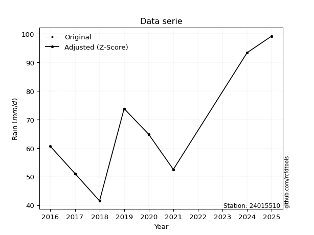</img>

</div>

> If Z-Score is active, values out of range or outliers are replaced with the station mean value.


### 4. Active continuous probability distributions from SciPy (45 of 104 available)

[scipy.stats](https://docs.scipy.org/doc/scipy/reference/stats.html) is a Python´s powerful submodule within the SciPy library for comprehensive statistical analysis, offering over 130 probability distributions (like Normal, Poisson), functions for descriptive stats (mean, variance), hypothesis testing (t-tests, chi-square), random variable generation, and statistical tests, making it essential for data science, modeling, and research. It provides tools to explore, model, and draw conclusions from data efficiently, working seamlessly with NumPy.

<div align="center">

|   id | p_dist             |   n_parameter | fit_method   | label                                                                       | active   | ref                                                                                                        |
|-----:|:-------------------|--------------:|:-------------|:----------------------------------------------------------------------------|:---------|:-----------------------------------------------------------------------------------------------------------|
|    0 | alpha              |             3 | MLE          | Alpha                                                                       | True     | [:mortar_board:](https://docs.scipy.org/doc/scipy/reference/generated/scipy.stats.alpha.html)              |
|    1 | betaprime          |             4 | MLE          | Beta prime                                                                  | True     | [:mortar_board:](https://docs.scipy.org/doc/scipy/reference/generated/scipy.stats.betaprime.html)          |
|    2 | chi2               |             3 | MLE          | Chi²                                                                        | True     | [:mortar_board:](https://docs.scipy.org/doc/scipy/reference/generated/scipy.stats.chi2.html)               |
|    3 | crystalball        |             4 | MLE          | Crystalball                                                                 | True     | [:mortar_board:](https://docs.scipy.org/doc/scipy/reference/generated/scipy.stats.crystalball.html)        |
|    4 | erlang             |             3 | MLE          | Erlang                                                                      | True     | [:mortar_board:](https://docs.scipy.org/doc/scipy/reference/generated/scipy.stats.erlang.html)             |
|    5 | expon              |             2 | MLE          | Exponential                                                                 | True     | [:mortar_board:](https://docs.scipy.org/doc/scipy/reference/generated/scipy.stats.expon.html)              |
|    6 | exponnorm          |             3 | MLE          | Exponentially modified Normal                                               | True     | [:mortar_board:](https://docs.scipy.org/doc/scipy/reference/generated/scipy.stats.exponnorm.html)          |
|    7 | f                  |             4 | MLE          | F                                                                           | True     | [:mortar_board:](https://docs.scipy.org/doc/scipy/reference/generated/scipy.stats.f.html)                  |
|    8 | fatiguelife        |             3 | MLE          | Fatigue-life (Birnbaum-Saunders)                                            | True     | [:mortar_board:](https://docs.scipy.org/doc/scipy/reference/generated/scipy.stats.fatiguelife.html)        |
|    9 | fisk               |             3 | MLE          | Fisk                                                                        | True     | [:mortar_board:](https://docs.scipy.org/doc/scipy/reference/generated/scipy.stats.fisk.html)               |
|   10 | gamma              |             3 | MLE          | Gamma                                                                       | True     | [:mortar_board:](https://docs.scipy.org/doc/scipy/reference/generated/scipy.stats.gamma.html)              |
|   11 | genexpon           |             5 | MLE          | Generalized exponential                                                     | True     | [:mortar_board:](https://docs.scipy.org/doc/scipy/reference/generated/scipy.stats.genexpon.html)           |
|   12 | genlogistic        |             3 | MLE          | Generalized logistic                                                        | True     | [:mortar_board:](https://docs.scipy.org/doc/scipy/reference/generated/scipy.stats.genlogistic.html)        |
|   13 | gibrat             |             2 | MM           | Gibrat                                                                      | True     | [:mortar_board:](https://docs.scipy.org/doc/scipy/reference/generated/scipy.stats.gibrat.html)             |
|   14 | gompertz           |             3 | MLE          | Gompertz (or truncated Gumbel)                                              | True     | [:mortar_board:](https://docs.scipy.org/doc/scipy/reference/generated/scipy.stats.gompertz.html)           |
|   15 | gumbel_l           |             2 | MM           | Gumbel Left Skew                                                            | True     | [:mortar_board:](https://docs.scipy.org/doc/scipy/reference/generated/scipy.stats.gumbel_l.html)           |
|   16 | gumbel_r           |             2 | MM           | Gumbel Right Skew                                                           | True     | [:mortar_board:](https://docs.scipy.org/doc/scipy/reference/generated/scipy.stats.gumbel_r.html)           |
|   17 | halflogistic       |             2 | MM           | Half-logistic                                                               | True     | [:mortar_board:](https://docs.scipy.org/doc/scipy/reference/generated/scipy.stats.halflogistic.html)       |
|   18 | halfnorm           |             2 | MM           | Half Normal                                                                 | True     | [:mortar_board:](https://docs.scipy.org/doc/scipy/reference/generated/scipy.stats.halfnorm.html)           |
|   19 | hypsecant          |             2 | MM           | hyperbolic secant                                                           | True     | [:mortar_board:](https://docs.scipy.org/doc/scipy/reference/generated/scipy.stats.hypsecant.html)          |
|   20 | invgamma           |             3 | MLE          | Inverted gamma                                                              | True     | [:mortar_board:](https://docs.scipy.org/doc/scipy/reference/generated/scipy.stats.invgamma.html)           |
|   21 | invgauss           |             3 | MLE          | Inverse Gaussian                                                            | True     | [:mortar_board:](https://docs.scipy.org/doc/scipy/reference/generated/scipy.stats.invgauss.html)           |
|   22 | invweibull         |             3 | MLE          | Inverted Weibull                                                            | True     | [:mortar_board:](https://docs.scipy.org/doc/scipy/reference/generated/scipy.stats.invweibull.html)         |
|   23 | johnsonsu          |             4 | MLE          | Johnson Su                                                                  | True     | [:mortar_board:](https://docs.scipy.org/doc/scipy/reference/generated/scipy.stats.johnsonsu.html)          |
|   24 | kstwobign          |             2 | MLE          | Limiting distribution of scaled Kolmogorov-Smirnov two-sided test statistic | True     | [:mortar_board:](https://docs.scipy.org/doc/scipy/reference/generated/scipy.stats.kstwobign.html)          |
|   25 | laplace            |             2 | MM           | Laplace                                                                     | True     | [:mortar_board:](https://docs.scipy.org/doc/scipy/reference/generated/scipy.stats.laplace.html)            |
|   26 | laplace_asymmetric |             3 | MLE          | Asymmetric Laplace                                                          | True     | [:mortar_board:](https://docs.scipy.org/doc/scipy/reference/generated/scipy.stats.laplace_asymmetric.html) |
|   27 | loggamma           |             3 | MLE          | Log gamma                                                                   | True     | [:mortar_board:](https://docs.scipy.org/doc/scipy/reference/generated/scipy.stats.loggamma.html)           |
|   28 | logistic           |             2 | MM           | Logistic (or Sech-squared)                                                  | True     | [:mortar_board:](https://docs.scipy.org/doc/scipy/reference/generated/scipy.stats.logistic.html)           |
|   29 | lognorm            |             3 | MLE          | Log Normal                                                                  | True     | [:mortar_board:](https://docs.scipy.org/doc/scipy/reference/generated/scipy.stats.lognorm.html)            |
|   30 | maxwell            |             2 | MM           | Maxwell                                                                     | True     | [:mortar_board:](https://docs.scipy.org/doc/scipy/reference/generated/scipy.stats.maxwell.html)            |
|   31 | mielke             |             4 | MLE          | Mielke Beta-Kappa / Dagum                                                   | True     | [:mortar_board:](https://docs.scipy.org/doc/scipy/reference/generated/scipy.stats.mielke.html)             |
|   32 | moyal              |             2 | MM           | Moyal                                                                       | True     | [:mortar_board:](https://docs.scipy.org/doc/scipy/reference/generated/scipy.stats.moyal.html)              |
|   33 | nakagami           |             3 | MLE          | Nakagami                                                                    | True     | [:mortar_board:](https://docs.scipy.org/doc/scipy/reference/generated/scipy.stats.nakagami.html)           |
|   34 | ncf                |             5 | MLE          | Non-central F distribution                                                  | True     | [:mortar_board:](https://docs.scipy.org/doc/scipy/reference/generated/scipy.stats.ncf.html)                |
|   35 | nct                |             4 | MLE          | Non-central Student’s t                                                     | True     | [:mortar_board:](https://docs.scipy.org/doc/scipy/reference/generated/scipy.stats.nct.html)                |
|   36 | norm               |             2 | MM           | Normal                                                                      | True     | [:mortar_board:](https://docs.scipy.org/doc/scipy/reference/generated/scipy.stats.norm.html)               |
|   37 | pareto             |             3 | MLE          | Pareto                                                                      | True     | [:mortar_board:](https://docs.scipy.org/doc/scipy/reference/generated/scipy.stats.pareto.html)             |
|   38 | pearson3           |             3 | MM           | Pearson type III                                                            | True     | [:mortar_board:](https://docs.scipy.org/doc/scipy/reference/generated/scipy.stats.pearson3.html)           |
|   39 | rayleigh           |             2 | MM           | Rayleigh                                                                    | True     | [:mortar_board:](https://docs.scipy.org/doc/scipy/reference/generated/scipy.stats.rayleigh.html)           |
|   40 | rice               |             3 | MLE          | Rice                                                                        | True     | [:mortar_board:](https://docs.scipy.org/doc/scipy/reference/generated/scipy.stats.rice.html)               |
|   41 | t                  |             3 | MLE          | Student’s t                                                                 | True     | [:mortar_board:](https://docs.scipy.org/doc/scipy/reference/generated/scipy.stats.t.html)                  |
|   42 | truncnorm          |             4 | MLE          | Truncated normal                                                            | True     | [:mortar_board:](https://docs.scipy.org/doc/scipy/reference/generated/scipy.stats.truncnorm.html)          |
|   43 | wald               |             2 | MM           | Wald                                                                        | True     | [:mortar_board:](https://docs.scipy.org/doc/scipy/reference/generated/scipy.stats.wald.html)               |
|   44 | weibull_min        |             3 | MLE          | Weibull minimum                                                             | True     | [:mortar_board:](https://docs.scipy.org/doc/scipy/reference/generated/scipy.stats.weibull_min.html)        |

</div>

> **n_parameter:** # arguments & localization & scale.
>
> **Fit methods:** (MLE) maximum likelihood, (MM) L-moments.
>
>**Inactive:** foldnorm, gennorm, norminvgauss, powernorm, powerlognorm, skewnorm, genextreme, anglit, arcsine, argus, beta, bradford, burr, burr12, cauchy, cosine, halfcauchy, foldcauchy, skewcauchy, wrapcauchy, dgamma, gengamma, exponweib, exponpow, truncexpon, gausshyper, genhalflogistic, genhyperbolic, geninvgauss, halfgennorm, johnsonsb, kappa4, kappa3, ksone, kstwo, loglaplace, levy, levy_l, levy_stable, ncx2, genpareto, truncpareto, lomax, powerlaw, rdist, rel_breitwigner, recipinvgauss, semicircular, studentized_range, trapezoid, triang, truncweibull_min, tukeylambda, uniform, loguniform, vonmises, vonmises_line, weibull_max, dweibull, 


## B. Probability distributions vs. Empirical distributions

A continuous probability distribution (CPD) describes probabilities for variables that can take any value within a range (like rain any time), unlike discrete variables with specific outcomes (like temperature). It uses a Probability Density Function (PDF), a curve where the total area under it equals 1, and the probability of the variable falling within an interval (a to b) is found by calculating the area under the curve between those points. A key feature is that the probability of hitting any single exact value is zero, so probabilities are always expressed for ranges, e.g., $P(a ≤ X ≤ b)$.

<div align="center">

Distributions parameters
|    |   station | p_dist                |   n |             loc |          scale | shape                  | shape1                 | shape2                | shape3   |
|---:|----------:|:----------------------|----:|----------------:|---------------:|:-----------------------|:-----------------------|:----------------------|:---------|
|  0 |  24015510 | alpha                 |   8 |   -28.0301      |  477.303       | 5.2150012062374085     |                        |                       |          |
|  1 |  24015510 | betaprime             |   8 |    -0.607726    |    4.15779     | 213.6070386104061      | 14.116377819962395     |                       |          |
|  2 |  24015510 | chi2                  |   8 |    41.5         |    3.41797     | 0.26208204763504556    |                        |                       |          |
|  3 |  24015510 | crystalball           |   8 |    67.1125      |   19.1672      | 5239.339504193846      | 502.73545559040565     |                       |          |
|  4 |  24015510 | erlang                |   8 |    41.5         |   31.7222      | 0.33890044453351154    |                        |                       |          |
|  5 |  24015510 | expon                 |   8 |    41.5         |   25.6125      |                        |                        |                       |          |
|  6 |  24015510 | exponnorm             |   8 |    45.3507      |    6.16479     | 3.530010221645375      |                        |                       |          |
|  7 |  24015510 | f                     |   8 |    20.9         |   42.5074      | 21.082990654049713     | 23.65965399633772      |                       |          |
|  8 |  24015510 | fatiguelife           |   8 |    41.5         |    0.00159962  | 141.86413920360656     |                        |                       |          |
|  9 |  24015510 | fisk                  |   8 |    31.2437      |   31.2264      | 2.8841873788329444     |                        |                       |          |
| 10 |  24015510 | gamma                 |   8 |    41.5         |   25.4697      | 0.7700017430540851     |                        |                       |          |
| 11 |  24015510 | genexpon              |   8 |    41.5         |    2.38294     | 0.09314320990503377    | 3.5498035839456126e-06 | 1.6061550285201798    |          |
| 12 |  24015510 | genlogistic           |   8 |   -48.132       |   15.2638      | 1053.430968477558      |                        |                       |          |
| 13 |  24015510 | gibrat                |   8 |    52.4904      |    8.86876     |                        |                        |                       |          |
| 14 |  24015510 | gompertz              |   8 |    41.5         |   43.2472      | 0.9939889644396631     |                        |                       |          |
| 15 |  24015510 | gumbel_l              |   8 |    75.7388      |   14.9446      |                        |                        |                       |          |
| 16 |  24015510 | gumbel_r              |   8 |    58.4862      |   14.9446      |                        |                        |                       |          |
| 17 |  24015510 | halflogistic          |   8 |    44.3949      |   16.3873      |                        |                        |                       |          |
| 18 |  24015510 | halfnorm              |   8 |    41.7427      |   31.7964      |                        |                        |                       |          |
| 19 |  24015510 | hypsecant             |   8 |    67.1125      |   12.2022      |                        |                        |                       |          |
| 20 |  24015510 | invgamma              |   8 |     9.80308     |  478.743       | 9.325170332079907      |                        |                       |          |
| 21 |  24015510 | invgauss              |   8 |    25.0744      |  168.656       | 0.24925332514360554    |                        |                       |          |
| 22 |  24015510 | invweibull            |   8 |    41.5         |    1.539       | 0.05298533735087133    |                        |                       |          |
| 23 |  24015510 | johnsonsu             |   8 |    25.6347      |    1.46351     | -8.12455422789412      | 2.0700235709577504     |                       |          |
| 24 |  24015510 | kstwobign             |   8 |     4.56381     |   71.7027      |                        |                        |                       |          |
| 25 |  24015510 | laplace               |   8 |    67.1125      |   13.5532      |                        |                        |                       |          |
| 26 |  24015510 | laplace_asymmetric    |   8 |    60.6         |   14.6218      | 0.8018273156098388     |                        |                       |          |
| 27 |  24015510 | loggamma              |   8 | -5465.19        |  756.637       | 1498.1533517437938     |                        |                       |          |
| 28 |  24015510 | logistic              |   8 |    67.1125      |   10.5674      |                        |                        |                       |          |
| 29 |  24015510 | lognorm               |   8 |    41.5         |    0.274567    | 11.8403560315937       |                        |                       |          |
| 30 |  24015510 | maxwell               |   8 |    21.6943      |   28.4616      |                        |                        |                       |          |
| 31 |  24015510 | mielke                |   8 |    -0.201416    |   31.2463      | 52.93430133364657      | 4.193247848915188      |                       |          |
| 32 |  24015510 | moyal                 |   8 |    56.1515      |    8.62827     |                        |                        |                       |          |
| 33 |  24015510 | nakagami              |   8 |    41.5         |   32.7554      | 0.34500748728454467    |                        |                       |          |
| 34 |  24015510 | ncf                   |   8 |    -2.10577     |    0.0084036   | 0.1105738466345848     | 29.562490595154888     | 849.6263520335251     |          |
| 35 |  24015510 | nct                   |   8 |     0.135646    |    2.34666     | 7.05920703132427       | 25.473285273257517     |                       |          |
| 36 |  24015510 | norm                  |   8 |    67.1125      |   19.1672      |                        |                        |                       |          |
| 37 |  24015510 | pareto                |   8 |    41.4917      |    0.00826394  | 0.14333996065459284    |                        |                       |          |
| 38 |  24015510 | pearson3              |   8 |    67.1125      |   19.1672      | 0.48256801644245984    |                        |                       |          |
| 39 |  24015510 | rayleigh              |   8 |    30.4446      |   29.2568      |                        |                        |                       |          |
| 40 |  24015510 | rice                  |   8 |    33.4581      |   27.3631      | 0.05801813053963101    |                        |                       |          |
| 41 |  24015510 | t                     |   8 |    67.1143      |   19.1672      | 5883511.515043924      |                        |                       |          |
| 42 |  24015510 | truncnorm             |   8 |    63.941       |   19.3732      | -1.1598681385072394    | 2.8739561426561515     |                       |          |
| 43 |  24015510 | wald                  |   8 |    47.9453      |   19.1672      |                        |                        |                       |          |
| 44 |  24015510 | weibull_min           |   8 |    41.5         |   25.9267      | 0.9579183830506763     |                        |                       |          |
| 45 |  24015510 | logalpha              |   8 |    -1.13767     |   99.9277      | 18.89285723809106      |                        |                       |          |
| 46 |  24015510 | logbetaprime          |   8 |    -0.598458    |   12.9452      | 393.3348615666779      | 1069.749440061291      |                       |          |
| 47 |  24015510 | logchi2               |   8 |     3.72569     |    0.951451    | 1.077615095148859      |                        |                       |          |
| 48 |  24015510 | logcrystalball        |   8 |     4.16641     |    0.281844    | 10.322499059189457     | 94.8632481798895       |                       |          |
| 49 |  24015510 | logerlang             |   8 |     2.22643     |    0.0407515   | 47.58452738817954      |                        |                       |          |
| 50 |  24015510 | logexpon              |   8 |     3.72569     |    0.440717    |                        |                        |                       |          |
| 51 |  24015510 | logexponnorm          |   8 |     4.12962     |    0.279436    | 0.1316596248861437     |                        |                       |          |
| 52 |  24015510 | logf                  |   8 |     1.20375     |    2.93801     | 2907.4718459572837     | 239.91648076493132     |                       |          |
| 53 |  24015510 | logfatiguelife        |   8 |     2.36588     |    1.77833     | 0.15800792251538598    |                        |                       |          |
| 54 |  24015510 | logfisk               |   8 |     2.75918     |    1.38191     | 8.232949658044959      |                        |                       |          |
| 55 |  24015510 | loggamma              |   8 |     2.23277     |    0.0410568   | 47.08435078511087      |                        |                       |          |
| 56 |  24015510 | loggenexpon           |   8 |     3.71177     |    0.00899748  | 0.007917665093187528   | 4.135171592534499      | 8.228216750432067e-05 |          |
| 57 |  24015510 | loggenlogistic        |   8 |     3.44634     |    0.238964    | 12.168257293258211     |                        |                       |          |
| 58 |  24015510 | loggibrat             |   8 |     3.95136     |    0.130433    |                        |                        |                       |          |
| 59 |  24015510 | loggompertz           |   8 |     3.72569     |    0.788782    | 1.201650267657338      |                        |                       |          |
| 60 |  24015510 | loggumbel_l           |   8 |     4.29326     |    0.219754    |                        |                        |                       |          |
| 61 |  24015510 | loggumbel_r           |   8 |     4.03956     |    0.219754    |                        |                        |                       |          |
| 62 |  24015510 | loghalflogistic       |   8 |     3.83237     |    0.240957    |                        |                        |                       |          |
| 63 |  24015510 | loghalfnorm           |   8 |     3.79333     |    0.467583    |                        |                        |                       |          |
| 64 |  24015510 | loghypsecant          |   8 |     4.16641     |    0.179428    |                        |                        |                       |          |
| 65 |  24015510 | loginvgamma           |   8 |    -1.31439     | 2081.76        | 380.868041421356       |                        |                       |          |
| 66 |  24015510 | loginvgauss           |   8 |     2.65522     |   41.4597      | 0.036450787159851894   |                        |                       |          |
| 67 |  24015510 | loginvweibull         |   8 |    -1.27211e+07 |    1.27211e+07 | 50981773.50796385      |                        |                       |          |
| 68 |  24015510 | logjohnsonsu          |   8 |   455.127       |    0.489202    | 12005.18985684037      | 1596.53931916202       |                       |          |
| 69 |  24015510 | logkstwobign          |   8 |     3.15087     |    1.16218     |                        |                        |                       |          |
| 70 |  24015510 | loglaplace            |   8 |     4.16641     |    0.199294    |                        |                        |                       |          |
| 71 |  24015510 | loglaplace_asymmetric |   8 |     4.10429     |    0.227428    | 0.8721220014276507     |                        |                       |          |
| 72 |  24015510 | logloggamma           |   8 |   -70.5635      |   10.382       | 1337.2911654312893     |                        |                       |          |
| 73 |  24015510 | loglogistic           |   8 |     4.16641     |    0.155389    |                        |                        |                       |          |
| 74 |  24015510 | loglognorm            |   8 |     3.72569     |    0.00591168  | 11.432299154624042     |                        |                       |          |
| 75 |  24015510 | logmaxwell            |   8 |     3.49856     |    0.418515    |                        |                        |                       |          |
| 76 |  24015510 | logmielke             |   8 |    -1.12519e+07 |    1.12519e+07 | 229869696.13803798     | 50680546.023945004     |                       |          |
| 77 |  24015510 | logmoyal              |   8 |     4.00523     |    0.126875    |                        |                        |                       |          |
| 78 |  24015510 | lognakagami           |   8 |     3.72569     |    0.520731    | 0.40930124359353415    |                        |                       |          |
| 79 |  24015510 | logncf                |   8 |    -1.44389     |    6.42941e-07 | 5.7253546553842985e-05 | 843.222580518805       | 498.7044974977895     |          |
| 80 |  24015510 | lognct                |   8 |    -0.756643    |    0.0763665   | 166.77254591415965     | 64.17261096518662      |                       |          |
| 81 |  24015510 | lognorm               |   8 |     4.16641     |    0.281845    |                        |                        |                       |          |
| 82 |  24015510 | logpareto             |   8 |     3.72554     |    0.000152518 | 0.1433068430352843     |                        |                       |          |
| 83 |  24015510 | logpearson3           |   8 |     4.16641     |    0.281845    | 0.14570708223702933    |                        |                       |          |
| 84 |  24015510 | lograyleigh           |   8 |     3.62722     |    0.430208    |                        |                        |                       |          |
| 85 |  24015510 | logrice               |   8 |     3.60715     |    0.347096    | 1.1204836336158275     |                        |                       |          |
| 86 |  24015510 | logt                  |   8 |     4.16641     |    0.281848    | 64772306.71180849      |                        |                       |          |
| 87 |  24015510 | logtruncnorm          |   8 |    -0.0673508   |    1.40745     | 2.694985301632496      | 5.164514938705857      |                       |          |
| 88 |  24015510 | logwald               |   8 |     3.88455     |    0.28186     |                        |                        |                       |          |
| 89 |  24015510 | logweibull_min        |   8 |     3.60721     |    0.631064    | 2.0840448347783695     |                        |                       |          |

</div>

> **loc** (Location parameter): This shifts the distribution along the x-axis. For many common distributions, like the normal (Gaussian) distribution, loc represents the mean $μ$. For others, like the uniform distribution, it might represent the minimum value, or for the beta distribution, the left end of the support interval.
>
> **scale** (Scale parameter): This determines the width or spread of the distribution. For the normal distribution, scale represents the standard deviation $σ$. For a uniform distribution, it defines the length of the interval (from $loc$ to $loc + scale$).
>
> **shape** (Shape parameters): Refers to parameters that define the specific form of a probability distribution, distinct from its location (loc) and scale (scale). These parameters are required arguments for most distribution functions. For example, a normal (Gaussian) distribution is fully defined by its location (mean) and scale (standard deviation), so it has no specific shape parameters beyond loc and scale. However, other distributions have intrinsic properties that need specification, as Gamma distribution that takes a shape parameter, often named $a$ or $alpha$.


### 0. Cumulative distribution values - CDF (90 evaluated)

> Ordered by x ascending and calculating $log(f(x))$ separately. 

|   id |   Station |   date |    x |   count |    mean |     std |    zscore |   Value_initial |   station |   m |    alpha |   alpha_pdf |   betaprime |   betaprime_pdf |      chi2 |    chi2_pdf |   crystalball |   crystalball_pdf |      erlang |   erlang_pdf |    expon |   expon_pdf |   exponnorm |   exponnorm_pdf |         f |      f_pdf |   fatiguelife |   fatiguelife_pdf |      fisk |   fisk_pdf |       gamma |    gamma_pdf |    genexpon |   genexpon_pdf |   genlogistic |   genlogistic_pdf |      gibrat |   gibrat_pdf |    gompertz |   gompertz_pdf |   gumbel_l |   gumbel_l_pdf |   gumbel_r |   gumbel_r_pdf |   halflogistic |   halflogistic_pdf |   halfnorm |   halfnorm_pdf |   hypsecant |   hypsecant_pdf |   invgamma |   invgamma_pdf |   invgauss |   invgauss_pdf |   invweibull |   invweibull_pdf |   johnsonsu |   johnsonsu_pdf |   kstwobign |   kstwobign_pdf |   laplace |   laplace_pdf |   laplace_asymmetric |   laplace_asymmetric_pdf |   loggamma |   loggamma_pdf |   logistic |   logistic_pdf |   lognorm |   lognorm_pdf |   maxwell |   maxwell_pdf |    mielke |   mielke_pdf |     moyal |   moyal_pdf |    nakagami |   nakagami_pdf |       ncf |    ncf_pdf |       nct |    nct_pdf |      norm |   norm_pdf |   pareto |   pareto_pdf |   pearson3 |   pearson3_pdf |   rayleigh |   rayleigh_pdf |      rice |   rice_pdf |         t |      t_pdf |   truncnorm |   truncnorm_pdf |      wald |   wald_pdf |   weibull_min |   weibull_min_pdf |   logalpha |   logalpha_pdf |   logbetaprime |   logbetaprime_pdf |     logchi2 |   logchi2_pdf |   logcrystalball |   logcrystalball_pdf |   logerlang |   logerlang_pdf |   logexpon |   logexpon_pdf |   logexponnorm |   logexponnorm_pdf |      logf |   logf_pdf |   logfatiguelife |   logfatiguelife_pdf |   logfisk |   logfisk_pdf |   loggenexpon |   loggenexpon_pdf |   loggenlogistic |   loggenlogistic_pdf |   loggibrat |   loggibrat_pdf |   loggompertz |   loggompertz_pdf |   loggumbel_l |   loggumbel_l_pdf |   loggumbel_r |   loggumbel_r_pdf |   loghalflogistic |   loghalflogistic_pdf |   loghalfnorm |   loghalfnorm_pdf |   loghypsecant |   loghypsecant_pdf |   loginvgamma |   loginvgamma_pdf |   loginvgauss |   loginvgauss_pdf |   loginvweibull |   loginvweibull_pdf |   logjohnsonsu |   logjohnsonsu_pdf |   logkstwobign |   logkstwobign_pdf |   loglaplace |   loglaplace_pdf |   loglaplace_asymmetric |   loglaplace_asymmetric_pdf |   logloggamma |   logloggamma_pdf |   loglogistic |   loglogistic_pdf |   loglognorm |   loglognorm_pdf |   logmaxwell |   logmaxwell_pdf |   logmielke |   logmielke_pdf |   logmoyal |   logmoyal_pdf |   lognakagami |   lognakagami_pdf |   logncf |   logncf_pdf |   lognct |   lognct_pdf |   logpareto |   logpareto_pdf |   logpearson3 |   logpearson3_pdf |   lograyleigh |   lograyleigh_pdf |   logrice |   logrice_pdf |      logt |   logt_pdf |   logtruncnorm |   logtruncnorm_pdf |   logwald |   logwald_pdf |   logweibull_min |   logweibull_min_pdf |
|-----:|----------:|-------:|-----:|--------:|--------:|--------:|----------:|----------------:|----------:|----:|---------:|------------:|------------:|----------------:|----------:|------------:|--------------:|------------------:|------------:|-------------:|---------:|------------:|------------:|----------------:|----------:|-----------:|--------------:|------------------:|----------:|-----------:|------------:|-------------:|------------:|---------------:|--------------:|------------------:|------------:|-------------:|------------:|---------------:|-----------:|---------------:|-----------:|---------------:|---------------:|-------------------:|-----------:|---------------:|------------:|----------------:|-----------:|---------------:|-----------:|---------------:|-------------:|-----------------:|------------:|----------------:|------------:|----------------:|----------:|--------------:|---------------------:|-------------------------:|-----------:|---------------:|-----------:|---------------:|----------:|--------------:|----------:|--------------:|----------:|-------------:|----------:|------------:|------------:|---------------:|----------:|-----------:|----------:|-----------:|----------:|-----------:|---------:|-------------:|-----------:|---------------:|-----------:|---------------:|----------:|-----------:|----------:|-----------:|------------:|----------------:|----------:|-----------:|--------------:|------------------:|-----------:|---------------:|---------------:|-------------------:|------------:|--------------:|-----------------:|---------------------:|------------:|----------------:|-----------:|---------------:|---------------:|-------------------:|----------:|-----------:|-----------------:|---------------------:|----------:|--------------:|--------------:|------------------:|-----------------:|---------------------:|------------:|----------------:|--------------:|------------------:|--------------:|------------------:|--------------:|------------------:|------------------:|----------------------:|--------------:|------------------:|---------------:|-------------------:|--------------:|------------------:|--------------:|------------------:|----------------:|--------------------:|---------------:|-------------------:|---------------:|-------------------:|-------------:|-----------------:|------------------------:|----------------------------:|--------------:|------------------:|--------------:|------------------:|-------------:|-----------------:|-------------:|-----------------:|------------:|----------------:|-----------:|---------------:|--------------:|------------------:|---------:|-------------:|---------:|-------------:|------------:|----------------:|--------------:|------------------:|--------------:|------------------:|----------:|--------------:|----------:|-----------:|---------------:|-------------------:|----------:|--------------:|-----------------:|---------------------:|
|    0 |  24015510 |   2018 | 41.5 |       8 | 67.1125 | 20.4906 | -1.24996  |            41.5 |  24015510 |   1 | 0.049503 |  0.0101017  |   0.0518793 |      0.0102983  | 0.0115787 | 2.13539e+11 |     0.0907308 |        0.00852336 | 5.56872e-06 |  2.65606e+08 | 0        |  0.0390434  |   0.0400317 |      0.0103887  | 0.0490441 | 0.0110101  |     0.0281708 |       2.82354e+06 | 0.0387478 | 0.0104741  | 1.14156e-12 | 123.709      | 1.68308e-06 |     0.0390874  |     0.0516651 |        0.010015   | 0           |  0           | 1.21006e-11 |     0.0229839  |  0.0962121 |     0.00611778 |  0.0443252 |     0.00924256 |       0        |         0          |   0        |     0          |   0.0776484 |      0.00630055 |  0.0440244 |     0.0105727  |  0.0381752 |     0.0115736  |   0.00318652 |      1.36603e+11 |    0.0399   |      0.0111732  |   0.0465649 |      0.0104616  | 0.0755534 |    0.00557456 |            0.0767408 |               0.00654554 |  0.0494345 |       0.431539 |  0.0813816 |     0.00707444 | 0.0589458 |      0.416822 |  0.07766  |    0.0106559  | 0.0371207 |   0.0108208  | 0.0194184 |  0.00703638 | 1.20826e-11 |  1173.35       | 0.0525829 | 0.010227   | 0.0435257 | 0.0105009  | 0.0907308 | 0.00852336 | 0        | 17.3452      |  0.0760693 |     0.00970315 |  0.0689062 |     0.0120259  | 0.0421981 | 0.01027    | 0.0907153 | 0.00852227 | 0.000353404 |      0.012033   | 0         | 0          |   1.23801e-15 |        0.166902   |  0.0490446 |       0.429076 |      0.0541062 |           0.424084 | 4.25527e-09 |   5.16286e+06 |        0.0589449 |             0.416819 |   0.0492243 |        0.430681 |   0        |       2.26903  |      0.0588192 |           0.416951 | 0.0475615 |   0.431734 |        0.0442573 |             0.439203 | 0.0500444 |      0.404955 |     0.0125775 |          0.926688 |        0.0371789 |             0.448748 |  0          |        0        |   1.74507e-10 |          1.52343  |     0.0727835 |          0.318849 |     0.0154283 |          0.292873 |          0        |              0        |      0        |          0        |      0.0544617 |           0.302051 |      0.052477 |          0.426436 |     0.0419174 |          0.446626 |       0.0346736 |            0.467153 |       0.059562 |           0.418908 |      0.0327109 |           0.517047 |    0.0547745 |         0.274842 |               0.0640489 |                    0.322917 |     0.0610918 |          0.419535 |     0.0553985 |          0.336764 |   0.00410439 |      2.38793e+12 |    0.0389492 |         0.484644 |   0.0411952 |        0.425002 | 0.00262037 |       0.10228  |   3.61199e-13 |        665.809    | 0.223016 |     0.552845 | 0.050379 |     0.427451 |    0        |     939.608     |     0.0544868 |          0.424786 |     0.0258546 |          0.518283 | 0.0307913 |      0.513775 | 0.0589479 |   0.416829 |      2.344e-08 |           2.13242  | 0         |      0        |        0.0301637 |             0.522475 |
|    1 |  24015510 |   2017 | 51.1 |       8 | 67.1125 | 20.4906 | -0.781456 |            51.1 |  24015510 |   2 | 0.207001 |  0.0217832  |   0.208056  |      0.0213065  | 0.982325  | 0.0037294   |     0.201743  |        0.0146826  | 0.694772    |  0.0194949   | 0.312585 |  0.026839   |   0.231489  |      0.0272496  | 0.2161    | 0.0223499  |     0.707462  |       0.00977695  | 0.213193  | 0.0243649  | 0.436162    |   0.028098   | 0.312885    |     0.0268586  |     0.205818  |        0.0212992  | 0           |  0           | 0.2189      |     0.0224148  |  0.174945  |     0.0106167  |  0.194125  |     0.0212933  |       0.201775 |         0.0292692  |   0.231463 |     0.0240301  |   0.167416  |      0.0130962  |  0.212707  |     0.0230491  |  0.223532  |     0.0243861  |   0.403508   |      0.00202121  |    0.21916  |      0.0239764  |   0.206464  |      0.021552   | 0.153417  |    0.0113195  |            0.174035  |               0.0148442  |  0.208876  |       1.11041  |  0.180159  |     0.0139771  | 0.204582  |      1.00687  |  0.21506  |    0.0175482  | 0.225969  |   0.025915   | 0.18022   |  0.0252442  | 0.330576    |     0.023242   | 0.206946  | 0.0210597  | 0.213285  | 0.0233372  | 0.201743  | 0.0146826  | 0.636422 |  0.005424    |  0.206888  |     0.0173148  |  0.220593  |     0.0188081  | 0.187379  | 0.0191149  | 0.201716  | 0.0146814  | 0.149352    |      0.0188946  | 0.0348736 | 0.0374088  |   0.320286    |        0.0261857  |  0.208653  |       1.11551  |      0.206565  |           1.05959  | 0.329047    |   0.793129    |        0.20458   |             1.00687  |   0.20867   |        1.11173  |   0.37635  |       1.41508  |      0.204617  |           1.00821  | 0.209682  |   1.13319  |        0.212569  |             1.17396  | 0.207815  |      1.1539   |     0.25835   |          1.34398  |        0.225883  |             1.32373  |  0          |        0        |   0.304247    |          1.3799   |     0.176999  |          0.729541 |     0.198241  |          1.45985  |          0.207384 |              1.98581  |      0.236112 |          1.63113  |      0.169954  |           0.902833 |      0.207389 |          1.07831  |     0.215926  |          1.20983  |       0.232211  |            1.35881  |       0.205452 |           1.00669  |      0.245486  |           1.39123  |    0.155612  |         0.780812 |               0.182872  |                    0.92199  |     0.205918  |          0.995852 |     0.182866  |          0.961624 |   0.622286   |      0.159755    |    0.218449  |         1.20061  |   0.217659  |        1.26956  | 0.185102   |       1.73169  |   0.362344    |          1.36057  | 0.351272 |     0.668191 | 0.207861 |     1.09928  |    0.644617 |       0.244564  |     0.206649  |          1.05561  |     0.224222  |          1.28498  | 0.216675  |      1.20634  | 0.204584  |   1.00686  |      0.364794  |           1.41605  | 0.0424136 |      2.75887  |        0.223828  |             1.25504  |
|    2 |  24015510 |   2021 | 52.5 |       8 | 67.1125 | 20.4906 | -0.713132 |            52.5 |  24015510 |   3 | 0.238229 |  0.0227878  |   0.238573  |      0.0222512  | 0.986781  | 0.00269974  |     0.222919  |        0.0155648  | 0.720287    |  0.0170478   | 0.349151 |  0.0254114  |   0.270152  |      0.027882   | 0.247959  | 0.0231207  |     0.720543  |       0.00893697  | 0.248005  | 0.0253052  | 0.473837    |   0.0257754  | 0.349477    |     0.0254283  |     0.236378  |        0.0223209  | 4.29725e-12 |  3.11874e-09 | 0.250152    |     0.022226   |  0.19038   |     0.0114412  |  0.224773  |     0.0224503  |       0.242378 |         0.028719   |   0.264878 |     0.0236978  |   0.186679  |      0.0144368  |  0.245599  |     0.0238913  |  0.258054  |     0.0248788  |   0.406149   |      0.00176275  |    0.25321  |      0.0246144  |   0.237239  |      0.0223725  | 0.170111  |    0.0125513  |            0.196109  |               0.0167269  |  0.239966  |       1.18877  |  0.200562  |     0.0151727  | 0.232858  |      1.0848   |  0.240152 |    0.0182825  | 0.262719  |   0.0265127  | 0.216588  |  0.0266277  | 0.36228     |     0.022076   | 0.237122  | 0.0220127  | 0.246598  | 0.0242006  | 0.222919  | 0.0155648  | 0.643442 |  0.00464278  |  0.231767  |     0.0182111  |  0.247347  |     0.0193936  | 0.214731  | 0.0199373  | 0.222891  | 0.0155637  | 0.176424    |      0.01977    | 0.100006  | 0.0528919  |   0.355874    |        0.024673   |  0.239892  |       1.19476  |      0.236285  |           1.13858  | 0.349734    |   0.739121    |        0.232856  |             1.0848   |   0.2398    |        1.19047  |   0.413448 |       1.3309   |      0.23293   |           1.08621  | 0.241393  |   1.21188  |        0.245354  |             1.25024  | 0.240335  |      1.2509   |     0.294882  |          1.35771  |        0.26262   |             1.39155  |  0.00433997 |        1.34797  |   0.341174    |          1.35222  |     0.197717  |          0.804255 |     0.239073  |          1.55679  |          0.260386 |              1.93437  |      0.279795 |          1.60038  |      0.195981  |           1.02454  |      0.237618 |          1.1574   |     0.249647  |          1.28328  |       0.269763  |            1.4165   |       0.233717 |           1.08415  |      0.283641  |           1.42886  |    0.178214  |         0.894224 |               0.20957   |                    1.05659  |     0.233876  |          1.07231  |     0.210302  |          1.06877  |   0.626339   |      0.140912    |    0.251778  |         1.26375  |   0.253115  |        1.35137  | 0.233532   |       1.84238  |   0.398387    |          1.30691  | 0.369461 |     0.677483 | 0.238663 |     1.17864  |    0.650778 |       0.212715  |     0.236253  |          1.13399  |     0.25965   |          1.33442  | 0.250054  |      1.26196  | 0.23286   |   1.0848   |      0.40204   |           1.34057  | 0.134274  |      3.7622   |        0.258478  |             1.30695  |
|    3 |  24015510 |   2016 | 60.6 |       8 | 67.1125 | 20.4906 | -0.317829 |            60.6 |  24015510 |   4 | 0.432374 |  0.0238914  |   0.428319  |      0.0234586  | 0.997205  | 0.000511073 |     0.367014  |        0.0196464  | 0.821482    |  0.00916958  | 0.525612 |  0.0185217  |   0.484139  |      0.0233976  | 0.4399    | 0.0231578  |     0.779407  |       0.00598009  | 0.455589  | 0.0243681  | 0.641377    |   0.0165186  | 0.526024    |     0.0185272  |     0.428001  |        0.0237863  | 0.464348    |  0.0489972   | 0.424162    |     0.0205839  |  0.304505  |     0.0168995  |  0.419745  |     0.0243823  |       0.457734 |         0.0241187  |   0.446863 |     0.0210468  |   0.337648  |      0.0227661  |  0.443624  |     0.0237571  |  0.45663   |     0.023113   |   0.416831   |      0.00101188  |    0.452417 |      0.0234295  |   0.425498  |      0.023083   | 0.309233  |    0.0228162  |            0.39133   |               0.0333782  |  0.43159   |       1.42486  |  0.350628  |     0.0215462  | 0.412785  |      1.38151  |  0.399869 |    0.0205795  | 0.471709  |   0.0237311  | 0.439665  |  0.0265069  | 0.519852    |     0.0172023  | 0.425482  | 0.023374   | 0.446835  | 0.0239366  | 0.367014  | 0.0196464  | 0.670542 |  0.00247141  |  0.394184  |     0.0212258  |  0.412094  |     0.0207119  | 0.38806   | 0.0221456  | 0.366978  | 0.0196457  | 0.35259     |      0.0231889  | 0.489494  | 0.0355501  |   0.525848    |        0.0177453  |  0.432436  |       1.42995  |      0.422624  |           1.40857  | 0.440772    |   0.550239    |        0.412784  |             1.38151  |   0.431781  |        1.42783  |   0.576439 |       0.961072 |      0.413039  |           1.38239  | 0.435592  |   1.43366  |        0.442881  |             1.43755  | 0.444681  |      1.51143  |     0.487683  |          1.29452  |        0.471617  |             1.43844  |  0.563227   |        2.57573  |   0.523016    |          1.1743   |     0.345063  |          1.26132  |     0.4748    |          1.60935  |          0.511128 |              1.53295  |      0.493977 |          1.36786  |      0.391944  |           1.67278  |      0.426058 |          1.41606  |     0.449757  |          1.43739  |       0.478432  |            1.41358  |       0.413386 |           1.37877  |      0.488629  |           1.36641  |    0.36611   |         1.83703  |               0.432012  |                    2.17808  |     0.411773  |          1.36778  |     0.401375  |          1.54627  |   0.642012   |      0.0862677   |    0.44704   |         1.40117  |   0.462373  |        1.47731  | 0.498538   |       1.69249  |   0.567059    |          1.04952  | 0.46887  |     0.700741 | 0.429515 |     1.42502  |    0.673812 |       0.123418  |     0.421813  |          1.40306  |     0.459285  |          1.39378  | 0.443544  |      1.38622  | 0.412786  |   1.38149  |      0.5686    |           0.996137 | 0.563459  |      1.99309  |        0.455638  |             1.38793  |
|    4 |  24015510 |   2020 | 64.8 |       8 | 67.1125 | 20.4906 | -0.112857 |            64.8 |  24015510 |   5 | 0.529224 |  0.0220373  |   0.523843  |      0.0218465  | 0.998687  | 0.000232617 |     0.451985  |        0.0206629  | 0.85526     |  0.00704338  | 0.59736  |  0.0157205  |   0.574193  |      0.0195299  | 0.53326   | 0.0211548  |     0.802527  |       0.00507236  | 0.551703  | 0.0212579  | 0.703889    |   0.0133814  | 0.597787    |     0.0157221  |     0.524897  |        0.0221584  | 0.628485    |  0.0307133   | 0.508156    |     0.0193746  |  0.381815  |     0.0198953  |  0.519223  |     0.0227714  |       0.552928 |         0.0211832  |   0.531644 |     0.0192919  |   0.440033  |      0.0256247  |  0.538943  |     0.0214854  |  0.548524  |     0.0205596  |   0.42067    |      0.000828347 |    0.545806 |      0.0209317  |   0.519492  |      0.021528   | 0.42157   |    0.0311047  |            0.516546  |               0.0265116  |  0.527004  |       1.40938  |  0.445509  |     0.0233766  | 0.506929  |      1.41525  |  0.486284 |    0.0204242  | 0.564438  |   0.0203602  | 0.544635  |  0.0233149  | 0.587967    |     0.0152742  | 0.520848  | 0.0218531  | 0.542614  | 0.021525   | 0.451985  | 0.0206629  | 0.679793 |  0.00196919  |  0.483606  |     0.0211764  |  0.498152  |     0.0201425  | 0.480493  | 0.0217098  | 0.451947  | 0.0206626  | 0.451048    |      0.0235132  | 0.615273  | 0.025033   |   0.594542    |        0.015048   |  0.528079  |       1.4109   |      0.517757  |           1.41719  | 0.475646    |   0.492739    |        0.506928  |             1.41526  |   0.527392  |        1.41221  |   0.636184 |       0.825509 |      0.507221  |           1.41548  | 0.531203  |   1.40638  |        0.538123  |             1.39212  | 0.544401  |      1.44605  |     0.57153   |          1.20286  |        0.564373  |             1.31975  |  0.699347   |        1.58236  |   0.598464    |          1.0762   |     0.436793  |          1.47138  |     0.577475  |          1.44292  |          0.606462 |              1.31186  |      0.581114 |          1.2308   |      0.508684  |           1.77337  |      0.521385 |          1.41542  |     0.544427  |          1.37587  |       0.569152  |            1.28557  |       0.507332 |           1.41215  |      0.576242  |           1.24265  |    0.512133  |         2.44797  |               0.560722  |                    1.68451  |     0.505106  |          1.40512  |     0.507876  |          1.60846  |   0.647321   |      0.0729082   |    0.53969   |         1.35337  |   0.558388  |        1.3753   | 0.603262   |       1.42774  |   0.633611    |          0.937445 | 0.515732 |     0.696302 | 0.525104 |     1.41419  |    0.681339 |       0.102445  |     0.51661   |          1.41284  |     0.550548  |          1.32127  | 0.535418  |      1.34613  | 0.506929  |   1.41524  |      0.630833  |           0.864051 | 0.67494   |      1.37911  |        0.546847  |             1.32515  |
|    5 |  24015510 |   2019 | 73.8 |       8 | 67.1125 | 20.4906 |  0.326369 |            73.8 |  24015510 |   6 | 0.701165 |  0.0159761  |   0.696316  |      0.0162403  | 0.999723  | 4.69466e-05 |     0.636419  |        0.0195847  | 0.904861    |  0.00427358  | 0.716659 |  0.0110626  |   0.718376  |      0.0129411  | 0.698263  | 0.0154042  |     0.841734  |       0.00374604  | 0.709477  | 0.0139694  | 0.801642    |   0.00871796 | 0.717075    |     0.0110592  |     0.699441  |        0.016378   | 0.809654    |  0.0127486   | 0.668361    |     0.0160861  |  0.584525  |     0.0244186  |  0.698442  |     0.0167735  |       0.714928 |         0.0149164  |   0.686645 |     0.0150951  |   0.666322  |      0.0226055  |  0.704659  |     0.0152824  |  0.706394  |     0.0145799  |   0.426966   |      0.000596076 |    0.706438 |      0.0147885  |   0.691288  |      0.0164432  | 0.694734  |    0.0225235  |            0.70487   |               0.0161843  |  0.697888  |       1.18287  |  0.653133  |     0.0214385  | 0.683961  |      1.26217  |  0.659473 |    0.017585   | 0.715207  |   0.0134052  | 0.719134  |  0.0155863  | 0.709084    |     0.0117518  | 0.693972  | 0.0163559  | 0.707614  | 0.0151152  | 0.636419  | 0.0195847  | 0.694434 |  0.00135568  |  0.662596  |     0.0180344  |  0.666464  |     0.016894   | 0.662091  | 0.0181759  | 0.636383  | 0.0195854  | 0.653243    |      0.0206777  | 0.777418  | 0.0126994  |   0.708976    |        0.0106535  |  0.698644  |       1.17685  |      0.69207   |           1.22263  | 0.533962    |   0.408926    |        0.683961  |             1.26218  |   0.698565  |        1.18429  |   0.729154 |       0.614559 |      0.684194  |           1.26111  | 0.70044   |   1.16291  |        0.704051  |             1.13091  | 0.711647  |      1.09549  |     0.712928  |          0.962078 |        0.715186  |             0.989551 |  0.838196   |        0.700284 |   0.725117    |          0.868807 |     0.645683  |          1.6729   |     0.737991  |          1.02032  |          0.750096 |              0.90754  |      0.72274  |          0.945683 |      0.719579  |           1.36841  |      0.694465 |          1.20724  |     0.707024  |          1.10014  |       0.715573  |            0.959764 |       0.683987 |           1.25975  |      0.719063  |           0.949163 |    0.745964  |         1.27468  |               0.733222  |                    1.02302  |     0.681485  |          1.26245  |     0.704424  |          1.33993  |   0.655605   |      0.055947    |    0.701789  |         1.11434  |   0.71637   |        1.03766  | 0.755573   |       0.932545 |   0.741995    |          0.732323 | 0.604395 |     0.661817 | 0.696923 |     1.1911   |    0.692818 |       0.0764501 |     0.690605  |          1.22226  |     0.707046  |          1.06706  | 0.697949  |      1.12764  | 0.68396   |   1.26216  |      0.728795  |           0.651371 | 0.806469  |      0.72839  |        0.704668  |             1.08144  |
|    6 |  24015510 |   2024 | 93.4 |       8 | 67.1125 | 20.4906 |  1.28291  |            93.4 |  24015510 |   7 | 0.900485 |  0.00566071 |   0.902423  |      0.00592768 | 0.999989  | 1.76775e-06 |     0.914888  |        0.00812651 | 0.958691    |  0.00168381  | 0.868185 |  0.00514652 |   0.885576  |      0.00525803 | 0.895039  | 0.00581154 |     0.897898  |       0.0021796   | 0.87926   | 0.00492612 | 0.914854    |   0.00362105 | 0.868496    |     0.00514036 |     0.905745  |        0.00587421 | 0.936847    |  0.00303069  | 0.900383    |     0.00760225 |  0.961618  |     0.00837298 |  0.907835  |     0.00587379 |       0.90428  |         0.00556154 |   0.895759 |     0.00670532 |   0.926492  |      0.00597074 |  0.896835  |     0.00559584 |  0.893735  |     0.0056616  |   0.436079   |      0.000369484 |    0.894259 |      0.00558156 |   0.907167  |      0.00641431 | 0.928117  |    0.00530373 |            0.899255  |               0.00552464 |  0.901267  |       0.549143 |  0.923268  |     0.00670404 | 0.905659  |      0.596618 |  0.904116 |    0.00744687 | 0.881454  |   0.00495791 | 0.908052  |  0.00530466 | 0.878847    |     0.00596745 | 0.902162  | 0.00599516 | 0.896275  | 0.00546696 | 0.914888  | 0.00812651 | 0.714512 |  0.000788349 |  0.907008  |     0.00717858 |  0.901251  |     0.00726296 | 0.90886   | 0.00728418 | 0.914873  | 0.00812758 | 0.928962    |      0.00740703 | 0.91899   | 0.00383344 |   0.856895    |        0.00513513 |  0.900268  |       0.543553 |      0.903907  |           0.569243 | 0.617512    |   0.308455    |        0.905659  |             0.596618 |   0.901915  |        0.547827 |   0.841283 |       0.360133 |      0.905593  |           0.595705 | 0.899311  |   0.53739  |        0.897031  |             0.525226 | 0.888306  |      0.459502 |     0.883893  |          0.503313 |        0.881453  |             0.463042 |  0.933407   |        0.220646 |   0.884552    |          0.491864 |     0.951701  |          0.666027 |     0.901202  |          0.426609 |          0.898024 |              0.401632 |      0.888214 |          0.481904 |      0.919677  |           0.442925 |      0.902813 |          0.5604   |     0.894403  |          0.513387 |       0.877904  |            0.458153 |       0.905443 |           0.596811 |      0.883711  |           0.477055 |    0.922083  |         0.390964 |               0.891883  |                    0.414599 |     0.904586  |          0.604329 |     0.915616  |          0.497226 |   0.666583   |      0.0392108   |    0.895708  |         0.540586 |   0.888466  |        0.467131 | 0.902072   |       0.383981 |   0.875965    |          0.42029  | 0.746501 |     0.534142 | 0.901582 |     0.550883 |    0.707548 |       0.0516551 |     0.902998  |          0.572985 |     0.893063  |          0.525597 | 0.896369  |      0.556888 | 0.905656  |   0.596623 |      0.847971  |           0.38208  | 0.914669  |      0.276769 |        0.893769  |             0.533932 |
|    7 |  24015510 |   2025 | 99.2 |       8 | 67.1125 | 20.4906 |  1.56596  |            99.2 |  24015510 |   8 | 0.928336 |  0.00403112 |   0.931545  |      0.00420312 | 0.999996  | 6.9018e-07  |     0.952943  |        0.00512606 | 0.967315    |  0.00130759  | 0.894896 |  0.00410362 |   0.912347  |      0.00402786 | 0.923903  | 0.00422046 |     0.909671  |       0.00188908  | 0.904023  | 0.00368246 | 0.933415    |   0.0028142  | 0.895172    |     0.00409762 |     0.934538  |        0.00414504 | 0.951685    |  0.00214839  | 0.937968    |     0.00541339 |  0.99182   |     0.00263059 |  0.936514  |     0.00411032 |       0.93184  |         0.00401758 |   0.929244 |     0.00490333 |   0.954177  |      0.00374239 |  0.924604  |     0.00405912 |  0.922085  |     0.00418412 |   0.43811    |      0.000332022 |    0.922118 |      0.0040983  |   0.938631  |      0.00451815 | 0.953143  |    0.00345723 |            0.926702  |               0.0040195  |  0.930226  |       0.415907 |  0.954194  |     0.00413608 | 0.936774  |      0.440297 |  0.940233 |    0.00509971 | 0.906491  |   0.00373964 | 0.934227  |  0.00380283 | 0.909706    |     0.0047071  | 0.931599  | 0.0042453  | 0.923425  | 0.00397387 | 0.952943  | 0.00512606 | 0.718814 |  0.000698431 |  0.941615  |     0.00485948 |  0.936797  |     0.00507678 | 0.94394   | 0.00491399 | 0.952934  | 0.00512688 | 0.963021    |      0.00449234 | 0.938105  | 0.00281844 |   0.883729    |        0.00415367 |  0.928959  |       0.412619 |      0.933753  |           0.425481 | 0.635503    |   0.28913     |        0.936775  |             0.440296 |   0.930786  |        0.414354 |   0.861562 |       0.314119 |      0.936665  |           0.439785 | 0.927731  |   0.409716 |        0.924929  |             0.404388 | 0.912771  |      0.356652 |     0.911254  |          0.407003 |        0.906488  |             0.370929 |  0.945156   |        0.171874 |   0.911581    |          0.406606 |     0.98143   |          0.336855 |     0.923964  |          0.332505 |          0.919678 |              0.319959 |      0.914398 |          0.389377 |      0.942437  |           0.319068 |      0.932262 |          0.421071 |     0.921785  |          0.398895 |       0.902772  |            0.370069 |       0.93658  |           0.440805 |      0.909666  |           0.386808 |    0.94241   |         0.288968 |               0.914186  |                    0.329074 |     0.936129  |          0.446663 |     0.94114   |          0.356495 |   0.668859   |      0.036401    |    0.924524  |         0.419032 |   0.913537  |        0.368415 | 0.922695   |       0.303696 |   0.899315    |          0.356    | 0.77747  |     0.493659 | 0.930598 |     0.416172 |    0.710534 |       0.0475935 |     0.933065  |          0.429006 |     0.921247  |          0.412709 | 0.926014  |      0.430106 | 0.936772  |   0.440303 |      0.869445  |           0.331849 | 0.929618  |      0.221866 |        0.922355  |             0.417745 |

An Empirical Distribution Function (EDF) is a step-function estimate of a true cumulative distribution function (CDF) based on observed sample data, representing the proportion of data points less than or equal to a given value. It is calculated by ordering your data and jumping up by $1/n$ (where $n$ is sample size) at each unique data point, allowing analysis without assuming an underlying population distribution, and it gets closer to the true CDF as the sample size grows.


### 1. Empirical - EDF California (1923)

California´s estimates the true probability distribution of water-related data (like rainfall, streamflow) using observed samples, crucial for risk assessment.

<div align="center">


$P=m/n$


</div>


**1.1. Empirical values**

<div align="center">

|                | 0                  | 1                  | 2              | 3              | 4                  | 5              | 6              | 7              |
|:---------------|:-------------------|:-------------------|:---------------|:---------------|:-------------------|:---------------|:---------------|:---------------|
| date           | 2018               | 2017               | 2021           | 2016           | 2020               | 2019           | 2024           | 2025           |
| x              | 41.5               | 51.1               | 52.5           | 60.6           | 64.8               | 73.8           | 93.4           | 99.2           |
| m              | 1                  | 2                  | 3              | 4              | 5                  | 6              | 7              | 8              |
| empirical_dist | edf_california     | edf_california     | edf_california | edf_california | edf_california     | edf_california | edf_california | edf_california |
| empirical      | 0.125              | 0.25               | 0.375          | 0.5            | 0.625              | 0.75           | 0.875          | 1.0            |
| empirical_tr   | 1.1428571428571428 | 1.3333333333333333 | 1.6            | 2.0            | 2.6666666666666665 | 4.0            | 8.0            | inf            |

</div>


**1.2. Kolmogorov-Smirnov fit test (sorted by Δ)**


<div align="center">

|                | 0                  | 1                   | 2                   | 3                  | 4                   | 5                   | 6                   | 7                   | 8                   | 9                   | 10                  | 11                  | 12                 | 13                  | 14                  | 15                  | 16                  | 17                 | 18                  | 19                 | 20                 | 21                 | 22                 | 23                  | 24                 | 25                  | 26                  | 27                  | 28                 | 29                  | 30                  | 31                  | 32                  | 33                  | 34                  | 35                  | 36                  | 37                  | 38                  | 39                 | 40                 | 41                  | 42                  | 43                  | 44                  | 45                 | 46                  | 47                  | 48                  | 49                  | 50                  | 51                  | 52                 | 53                  | 54                  | 55                  | 56                  | 57                  | 58                  | 59                  | 60                  | 61                 | 62                  | 63                    | 64                  | 65                 | 66                 | 67                  | 68                 | 69                  | 70                 | 71                  | 72                  | 73                  | 74                  | 75                 | 76                  | 77                  | 78                  | 79                  | 80                 | 81                  | 82                 | 83                  | 84                  | 85                 | 86                 | 87                 | 88                 | 89                 |
|:---------------|:-------------------|:--------------------|:--------------------|:-------------------|:--------------------|:--------------------|:--------------------|:--------------------|:--------------------|:--------------------|:--------------------|:--------------------|:-------------------|:--------------------|:--------------------|:--------------------|:--------------------|:-------------------|:--------------------|:-------------------|:-------------------|:-------------------|:-------------------|:--------------------|:-------------------|:--------------------|:--------------------|:--------------------|:-------------------|:--------------------|:--------------------|:--------------------|:--------------------|:--------------------|:--------------------|:--------------------|:--------------------|:--------------------|:--------------------|:-------------------|:-------------------|:--------------------|:--------------------|:--------------------|:--------------------|:-------------------|:--------------------|:--------------------|:--------------------|:--------------------|:--------------------|:--------------------|:-------------------|:--------------------|:--------------------|:--------------------|:--------------------|:--------------------|:--------------------|:--------------------|:--------------------|:-------------------|:--------------------|:----------------------|:--------------------|:-------------------|:-------------------|:--------------------|:-------------------|:--------------------|:-------------------|:--------------------|:--------------------|:--------------------|:--------------------|:-------------------|:--------------------|:--------------------|:--------------------|:--------------------|:-------------------|:--------------------|:-------------------|:--------------------|:--------------------|:-------------------|:-------------------|:-------------------|:-------------------|:-------------------|
| station        | 24015510           | 24015510            | 24015510            | 24015510           | 24015510            | 24015510            | 24015510            | 24015510            | 24015510            | 24015510            | 24015510            | 24015510            | 24015510           | 24015510            | 24015510            | 24015510            | 24015510            | 24015510           | 24015510            | 24015510           | 24015510           | 24015510           | 24015510           | 24015510            | 24015510           | 24015510            | 24015510            | 24015510            | 24015510           | 24015510            | 24015510            | 24015510            | 24015510            | 24015510            | 24015510            | 24015510            | 24015510            | 24015510            | 24015510            | 24015510           | 24015510           | 24015510            | 24015510            | 24015510            | 24015510            | 24015510           | 24015510            | 24015510            | 24015510            | 24015510            | 24015510            | 24015510            | 24015510           | 24015510            | 24015510            | 24015510            | 24015510            | 24015510            | 24015510            | 24015510            | 24015510            | 24015510           | 24015510            | 24015510              | 24015510            | 24015510           | 24015510           | 24015510            | 24015510           | 24015510            | 24015510           | 24015510            | 24015510            | 24015510            | 24015510            | 24015510           | 24015510            | 24015510            | 24015510            | 24015510            | 24015510           | 24015510            | 24015510           | 24015510            | 24015510            | 24015510           | 24015510           | 24015510           | 24015510           | 24015510           |
| empirical_dist | edf_california     | edf_california      | edf_california      | edf_california     | edf_california      | edf_california      | edf_california      | edf_california      | edf_california      | edf_california      | edf_california      | edf_california      | edf_california     | edf_california      | edf_california      | edf_california      | edf_california      | edf_california     | edf_california      | edf_california     | edf_california     | edf_california     | edf_california     | edf_california      | edf_california     | edf_california      | edf_california      | edf_california      | edf_california     | edf_california      | edf_california      | edf_california      | edf_california      | edf_california      | edf_california      | edf_california      | edf_california      | edf_california      | edf_california      | edf_california     | edf_california     | edf_california      | edf_california      | edf_california      | edf_california      | edf_california     | edf_california      | edf_california      | edf_california      | edf_california      | edf_california      | edf_california      | edf_california     | edf_california      | edf_california      | edf_california      | edf_california      | edf_california      | edf_california      | edf_california      | edf_california      | edf_california     | edf_california      | edf_california        | edf_california      | edf_california     | edf_california     | edf_california      | edf_california     | edf_california      | edf_california     | edf_california      | edf_california      | edf_california      | edf_california      | edf_california     | edf_california      | edf_california      | edf_california      | edf_california      | edf_california     | edf_california      | edf_california     | edf_california      | edf_california      | edf_california     | edf_california     | edf_california     | edf_california     | edf_california     |
| p_dist         | logkstwobign       | exponnorm           | loginvweibull       | mielke             | loggenlogistic      | loggenexpon         | lograyleigh         | logweibull_min      | invgauss            | johnsonsu           | logmielke           | logmaxwell          | logrice            | genexpon            | loggompertz         | gompertz            | nakagami            | lognakagami        | weibull_min         | loghalfnorm        | halfnorm           | loghalflogistic    | expon              | loginvgauss         | fisk               | f                   | rayleigh            | nct                 | invgamma           | logfatiguelife      | logtruncnorm        | halflogistic        | logf                | logfisk             | loggamma            | loggamma            | logalpha            | logerlang           | loggumbel_r         | lognct             | betaprime          | alpha               | loginvgamma         | kstwobign           | ncf                 | logexpon           | genlogistic         | logbetaprime        | maxwell             | logpearson3         | logloggamma         | logjohnsonsu        | logmoyal           | logexponnorm        | logt                | lognorm             | lognorm             | logcrystalball      | pearson3            | gumbel_r            | moyal               | rice               | loglogistic         | loglaplace_asymmetric | crystalball         | norm               | t                  | laplace_asymmetric  | loghypsecant       | logistic            | gamma              | loggumbel_l         | hypsecant           | loglaplace          | truncnorm           | laplace            | logncf              | logwald             | gumbel_l            | wald                | logchi2            | loggibrat           | loglognorm         | gibrat              | pareto              | logpareto          | erlang             | fatiguelife        | invweibull         | chi2               |
| delta          | 0.0922890688862234 | 0.10484753247133727 | 0.10523672301924891 | 0.1122813944479828 | 0.11237968415903143 | 0.11242246215299219 | 0.11534958723098476 | 0.11652213769884368 | 0.11694575350767328 | 0.12178977313193418 | 0.12188458696328042 | 0.12322194286393157 | 0.1249459699947606 | 0.12499831692123468 | 0.12499999982549344 | 0.12499999998789936 | 0.12499999998791739 | 0.1249999999996388 | 0.12499999999999876 | 0.125              | 0.125              | 0.125              | 0.125              | 0.12535328137109464 | 0.1269953547687421 | 0.12704083216520015 | 0.12765334475164664 | 0.12840208232510106 | 0.1294006496059992 | 0.12964558070748733 | 0.13055543843976625 | 0.13262235163234654 | 0.13360651468604934 | 0.13466537152366276 | 0.13503410833157029 | 0.13503410833157029 | 0.13510752381585667 | 0.13519972301669786 | 0.13592677492021535 | 0.1363373861499262 | 0.1364272385938833 | 0.13677068628385466 | 0.13738223693692234 | 0.13776131302869674 | 0.13787813167844487 | 0.1384375690581503 | 0.13862159394070667 | 0.13871546867890486 | 0.13871566223094128 | 0.13874745001714248 | 0.14112395908155986 | 0.14128335086480803 | 0.1414681745421179 | 0.14206992255628825 | 0.14213964310088334 | 0.14214225810159808 | 0.14214225810159808 | 0.14214368628472537 | 0.14323287803029883 | 0.15022698423614467 | 0.15841233384668996 | 0.1602694107644328 | 0.16469840684774492 | 0.16543016677305658   | 0.17301542650354773 | 0.1730154295164913 | 0.1730533435914431 | 0.17889129911178778 | 0.1790186605178671 | 0.17949094012175137 | 0.1861623352913837 | 0.18820703757060364 | 0.18832072205860698 | 0.19678607194616887 | 0.19857593126025433 | 0.2048886370529831 | 0.22252973632523676 | 0.24072614529821815 | 0.24318450379362855 | 0.27499431489126785 | 0.3644968920234649 | 0.37066002785484337 | 0.3722858779576149 | 0.37499999999570277 | 0.38642213234028344 | 0.3946166932860127 | 0.4447718838722047 | 0.4574622895404553 | 0.561890217577425  | 0.7323252600534762 |
| deltao         | 0.4472608134160001 | 0.4472608134160001  | 0.4472608134160001  | 0.4472608134160001 | 0.4472608134160001  | 0.4472608134160001  | 0.4472608134160001  | 0.4472608134160001  | 0.4472608134160001  | 0.4472608134160001  | 0.4472608134160001  | 0.4472608134160001  | 0.4472608134160001 | 0.4472608134160001  | 0.4472608134160001  | 0.4472608134160001  | 0.4472608134160001  | 0.4472608134160001 | 0.4472608134160001  | 0.4472608134160001 | 0.4472608134160001 | 0.4472608134160001 | 0.4472608134160001 | 0.4472608134160001  | 0.4472608134160001 | 0.4472608134160001  | 0.4472608134160001  | 0.4472608134160001  | 0.4472608134160001 | 0.4472608134160001  | 0.4472608134160001  | 0.4472608134160001  | 0.4472608134160001  | 0.4472608134160001  | 0.4472608134160001  | 0.4472608134160001  | 0.4472608134160001  | 0.4472608134160001  | 0.4472608134160001  | 0.4472608134160001 | 0.4472608134160001 | 0.4472608134160001  | 0.4472608134160001  | 0.4472608134160001  | 0.4472608134160001  | 0.4472608134160001 | 0.4472608134160001  | 0.4472608134160001  | 0.4472608134160001  | 0.4472608134160001  | 0.4472608134160001  | 0.4472608134160001  | 0.4472608134160001 | 0.4472608134160001  | 0.4472608134160001  | 0.4472608134160001  | 0.4472608134160001  | 0.4472608134160001  | 0.4472608134160001  | 0.4472608134160001  | 0.4472608134160001  | 0.4472608134160001 | 0.4472608134160001  | 0.4472608134160001    | 0.4472608134160001  | 0.4472608134160001 | 0.4472608134160001 | 0.4472608134160001  | 0.4472608134160001 | 0.4472608134160001  | 0.4472608134160001 | 0.4472608134160001  | 0.4472608134160001  | 0.4472608134160001  | 0.4472608134160001  | 0.4472608134160001 | 0.4472608134160001  | 0.4472608134160001  | 0.4472608134160001  | 0.4472608134160001  | 0.4472608134160001 | 0.4472608134160001  | 0.4472608134160001 | 0.4472608134160001  | 0.4472608134160001  | 0.4472608134160001 | 0.4472608134160001 | 0.4472608134160001 | 0.4472608134160001 | 0.4472608134160001 |
| eval           | Δo > Δ             | Δo > Δ              | Δo > Δ              | Δo > Δ             | Δo > Δ              | Δo > Δ              | Δo > Δ              | Δo > Δ              | Δo > Δ              | Δo > Δ              | Δo > Δ              | Δo > Δ              | Δo > Δ             | Δo > Δ              | Δo > Δ              | Δo > Δ              | Δo > Δ              | Δo > Δ             | Δo > Δ              | Δo > Δ             | Δo > Δ             | Δo > Δ             | Δo > Δ             | Δo > Δ              | Δo > Δ             | Δo > Δ              | Δo > Δ              | Δo > Δ              | Δo > Δ             | Δo > Δ              | Δo > Δ              | Δo > Δ              | Δo > Δ              | Δo > Δ              | Δo > Δ              | Δo > Δ              | Δo > Δ              | Δo > Δ              | Δo > Δ              | Δo > Δ             | Δo > Δ             | Δo > Δ              | Δo > Δ              | Δo > Δ              | Δo > Δ              | Δo > Δ             | Δo > Δ              | Δo > Δ              | Δo > Δ              | Δo > Δ              | Δo > Δ              | Δo > Δ              | Δo > Δ             | Δo > Δ              | Δo > Δ              | Δo > Δ              | Δo > Δ              | Δo > Δ              | Δo > Δ              | Δo > Δ              | Δo > Δ              | Δo > Δ             | Δo > Δ              | Δo > Δ                | Δo > Δ              | Δo > Δ             | Δo > Δ             | Δo > Δ              | Δo > Δ             | Δo > Δ              | Δo > Δ             | Δo > Δ              | Δo > Δ              | Δo > Δ              | Δo > Δ              | Δo > Δ             | Δo > Δ              | Δo > Δ              | Δo > Δ              | Δo > Δ              | Δo > Δ             | Δo > Δ              | Δo > Δ             | Δo > Δ              | Δo > Δ              | Δo > Δ             | Δo > Δ             | Δo <= Δ            | Δo <= Δ            | Δo <= Δ            |
| fit            | 1                  | 1                   | 1                   | 1                  | 1                   | 1                   | 1                   | 1                   | 1                   | 1                   | 1                   | 1                   | 1                  | 1                   | 1                   | 1                   | 1                   | 1                  | 1                   | 1                  | 1                  | 1                  | 1                  | 1                   | 1                  | 1                   | 1                   | 1                   | 1                  | 1                   | 1                   | 1                   | 1                   | 1                   | 1                   | 1                   | 1                   | 1                   | 1                   | 1                  | 1                  | 1                   | 1                   | 1                   | 1                   | 1                  | 1                   | 1                   | 1                   | 1                   | 1                   | 1                   | 1                  | 1                   | 1                   | 1                   | 1                   | 1                   | 1                   | 1                   | 1                   | 1                  | 1                   | 1                     | 1                   | 1                  | 1                  | 1                   | 1                  | 1                   | 1                  | 1                   | 1                   | 1                   | 1                   | 1                  | 1                   | 1                   | 1                   | 1                   | 1                  | 1                   | 1                  | 1                   | 1                   | 1                  | 1                  | 0                  | 0                  | 0                  |
| n              | 8                  | 8                   | 8                   | 8                  | 8                   | 8                   | 8                   | 8                   | 8                   | 8                   | 8                   | 8                   | 8                  | 8                   | 8                   | 8                   | 8                   | 8                  | 8                   | 8                  | 8                  | 8                  | 8                  | 8                   | 8                  | 8                   | 8                   | 8                   | 8                  | 8                   | 8                   | 8                   | 8                   | 8                   | 8                   | 8                   | 8                   | 8                   | 8                   | 8                  | 8                  | 8                   | 8                   | 8                   | 8                   | 8                  | 8                   | 8                   | 8                   | 8                   | 8                   | 8                   | 8                  | 8                   | 8                   | 8                   | 8                   | 8                   | 8                   | 8                   | 8                   | 8                  | 8                   | 8                     | 8                   | 8                  | 8                  | 8                   | 8                  | 8                   | 8                  | 8                   | 8                   | 8                   | 8                   | 8                  | 8                   | 8                   | 8                   | 8                   | 8                  | 8                   | 8                  | 8                   | 8                   | 8                  | 8                  | 8                  | 8                  | 8                  |
| best_fit       | 1                  | 0                   | 0                   | 0                  | 0                   | 0                   | 0                   | 0                   | 0                   | 0                   | 0                   | 0                   | 0                  | 0                   | 0                   | 0                   | 0                   | 0                  | 0                   | 0                  | 0                  | 0                  | 0                  | 0                   | 0                  | 0                   | 0                   | 0                   | 0                  | 0                   | 0                   | 0                   | 0                   | 0                   | 0                   | 0                   | 0                   | 0                   | 0                   | 0                  | 0                  | 0                   | 0                   | 0                   | 0                   | 0                  | 0                   | 0                   | 0                   | 0                   | 0                   | 0                   | 0                  | 0                   | 0                   | 0                   | 0                   | 0                   | 0                   | 0                   | 0                   | 0                  | 0                   | 0                     | 0                   | 0                  | 0                  | 0                   | 0                  | 0                   | 0                  | 0                   | 0                   | 0                   | 0                   | 0                  | 0                   | 0                   | 0                   | 0                   | 0                  | 0                   | 0                  | 0                   | 0                   | 0                  | 0                  | 0                  | 0                  | 0                  |
| best_fit_sort  | 1                  | 2                   | 3                   | 4                  | 5                   | 6                   | 7                   | 8                   | 9                   | 10                  | 11                  | 12                  | 13                 | 14                  | 15                  | 16                  | 17                  | 18                 | 19                  | 20                 | 21                 | 22                 | 23                 | 24                  | 25                 | 26                  | 27                  | 28                  | 29                 | 30                  | 31                  | 32                  | 33                  | 34                  | 35                  | 36                  | 37                  | 38                  | 39                  | 40                 | 41                 | 42                  | 43                  | 44                  | 45                  | 46                 | 47                  | 48                  | 49                  | 50                  | 51                  | 52                  | 53                 | 54                  | 55                  | 56                  | 57                  | 58                  | 59                  | 60                  | 61                  | 62                 | 63                  | 64                    | 65                  | 66                 | 67                 | 68                  | 69                 | 70                  | 71                 | 72                  | 73                  | 74                  | 75                  | 76                 | 77                  | 78                  | 79                  | 80                  | 81                 | 82                  | 83                 | 84                  | 85                  | 86                 | 87                 | 88                 | 89                 | 90                 |

</div>


<div align="center">

</img>

</div>


**1.3. Best fit**

<div align="center">

|   id |   station | empirical_dist   | p_dist       |     delta |   deltao | eval   |   fit |   n |   best_fit |   best_fit_sort |
|-----:|----------:|:-----------------|:-------------|----------:|---------:|:-------|------:|----:|-----------:|----------------:|
|    0 |  24015510 | edf_california   | logkstwobign | 0.0922891 | 0.447261 | Δo > Δ |     1 |   8 |          1 |               1 |

</div>


<div align="center">

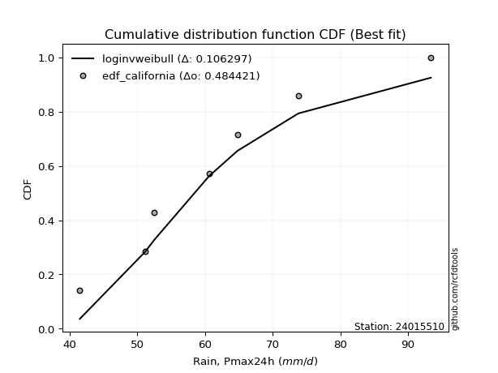</img>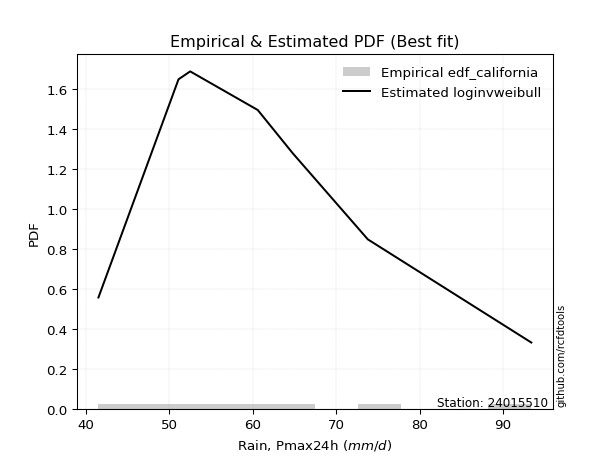</img>

</div>


### 2. Empirical - EDF Hazen (1930)

Hazen method for plotting positions is a formula used to estimate the empirical cumulative probability distribution of flood events or other hydrological data. This formula often results in biased estimations, particularly when extrapolating to extreme events (high return periods).

<div align="center">


$P=(m-0.5)/n$


</div>


**2.1. Empirical values**

<div align="center">

|                | 0                  | 1                  | 2                  | 3                  | 4                  | 5         | 6                 | 7         |
|:---------------|:-------------------|:-------------------|:-------------------|:-------------------|:-------------------|:----------|:------------------|:----------|
| date           | 2018               | 2017               | 2021               | 2016               | 2020               | 2019      | 2024              | 2025      |
| x              | 41.5               | 51.1               | 52.5               | 60.6               | 64.8               | 73.8      | 93.4              | 99.2      |
| m              | 1                  | 2                  | 3                  | 4                  | 5                  | 6         | 7                 | 8         |
| empirical_dist | edf_hazen          | edf_hazen          | edf_hazen          | edf_hazen          | edf_hazen          | edf_hazen | edf_hazen         | edf_hazen |
| empirical      | 0.0625             | 0.1875             | 0.3125             | 0.4375             | 0.5625             | 0.6875    | 0.8125            | 0.9375    |
| empirical_tr   | 1.0666666666666667 | 1.2307692307692308 | 1.4545454545454546 | 1.7777777777777777 | 2.2857142857142856 | 3.2       | 5.333333333333333 | 16.0      |

</div>


**2.2. Kolmogorov-Smirnov fit test (sorted by Δ)**


<div align="center">

|                | 0                   | 1                   | 2                   | 3                  | 4                   | 5                   | 6                   | 7                   | 8                   | 9                   | 10                  | 11                  | 12                  | 13                  | 14                  | 15                  | 16                  | 17                  | 18                  | 19                  | 20                  | 21                  | 22                  | 23                  | 24                  | 25                  | 26                  | 27                  | 28                  | 29                  | 30                  | 31                  | 32                  | 33                 | 34                  | 35                  | 36                  | 37                  | 38                  | 39                  | 40                  | 41                  | 42                 | 43                  | 44                  | 45                  | 46                  | 47                  | 48                  | 49                  | 50                  | 51                  | 52                  | 53                 | 54                    | 55                  | 56                  | 57                  | 58                  | 59                  | 60                 | 61                  | 62                  | 63                  | 64                  | 65                  | 66                 | 67                  | 68                  | 69                  | 70                 | 71                  | 72                  | 73                  | 74                 | 75                  | 76                  | 77                  | 78                  | 79                 | 80                 | 81                  | 82                  | 83                 | 84                  | 85                 | 86                  | 87                 | 88                 | 89                 |
|:---------------|:--------------------|:--------------------|:--------------------|:-------------------|:--------------------|:--------------------|:--------------------|:--------------------|:--------------------|:--------------------|:--------------------|:--------------------|:--------------------|:--------------------|:--------------------|:--------------------|:--------------------|:--------------------|:--------------------|:--------------------|:--------------------|:--------------------|:--------------------|:--------------------|:--------------------|:--------------------|:--------------------|:--------------------|:--------------------|:--------------------|:--------------------|:--------------------|:--------------------|:-------------------|:--------------------|:--------------------|:--------------------|:--------------------|:--------------------|:--------------------|:--------------------|:--------------------|:-------------------|:--------------------|:--------------------|:--------------------|:--------------------|:--------------------|:--------------------|:--------------------|:--------------------|:--------------------|:--------------------|:-------------------|:----------------------|:--------------------|:--------------------|:--------------------|:--------------------|:--------------------|:-------------------|:--------------------|:--------------------|:--------------------|:--------------------|:--------------------|:-------------------|:--------------------|:--------------------|:--------------------|:-------------------|:--------------------|:--------------------|:--------------------|:-------------------|:--------------------|:--------------------|:--------------------|:--------------------|:-------------------|:-------------------|:--------------------|:--------------------|:-------------------|:--------------------|:-------------------|:--------------------|:-------------------|:-------------------|:-------------------|
| station        | 24015510            | 24015510            | 24015510            | 24015510           | 24015510            | 24015510            | 24015510            | 24015510            | 24015510            | 24015510            | 24015510            | 24015510            | 24015510            | 24015510            | 24015510            | 24015510            | 24015510            | 24015510            | 24015510            | 24015510            | 24015510            | 24015510            | 24015510            | 24015510            | 24015510            | 24015510            | 24015510            | 24015510            | 24015510            | 24015510            | 24015510            | 24015510            | 24015510            | 24015510           | 24015510            | 24015510            | 24015510            | 24015510            | 24015510            | 24015510            | 24015510            | 24015510            | 24015510           | 24015510            | 24015510            | 24015510            | 24015510            | 24015510            | 24015510            | 24015510            | 24015510            | 24015510            | 24015510            | 24015510           | 24015510              | 24015510            | 24015510            | 24015510            | 24015510            | 24015510            | 24015510           | 24015510            | 24015510            | 24015510            | 24015510            | 24015510            | 24015510           | 24015510            | 24015510            | 24015510            | 24015510           | 24015510            | 24015510            | 24015510            | 24015510           | 24015510            | 24015510            | 24015510            | 24015510            | 24015510           | 24015510           | 24015510            | 24015510            | 24015510           | 24015510            | 24015510           | 24015510            | 24015510           | 24015510           | 24015510           |
| empirical_dist | edf_hazen           | edf_hazen           | edf_hazen           | edf_hazen          | edf_hazen           | edf_hazen           | edf_hazen           | edf_hazen           | edf_hazen           | edf_hazen           | edf_hazen           | edf_hazen           | edf_hazen           | edf_hazen           | edf_hazen           | edf_hazen           | edf_hazen           | edf_hazen           | edf_hazen           | edf_hazen           | edf_hazen           | edf_hazen           | edf_hazen           | edf_hazen           | edf_hazen           | edf_hazen           | edf_hazen           | edf_hazen           | edf_hazen           | edf_hazen           | edf_hazen           | edf_hazen           | edf_hazen           | edf_hazen          | edf_hazen           | edf_hazen           | edf_hazen           | edf_hazen           | edf_hazen           | edf_hazen           | edf_hazen           | edf_hazen           | edf_hazen          | edf_hazen           | edf_hazen           | edf_hazen           | edf_hazen           | edf_hazen           | edf_hazen           | edf_hazen           | edf_hazen           | edf_hazen           | edf_hazen           | edf_hazen          | edf_hazen             | edf_hazen           | edf_hazen           | edf_hazen           | edf_hazen           | edf_hazen           | edf_hazen          | edf_hazen           | edf_hazen           | edf_hazen           | edf_hazen           | edf_hazen           | edf_hazen          | edf_hazen           | edf_hazen           | edf_hazen           | edf_hazen          | edf_hazen           | edf_hazen           | edf_hazen           | edf_hazen          | edf_hazen           | edf_hazen           | edf_hazen           | edf_hazen           | edf_hazen          | edf_hazen          | edf_hazen           | edf_hazen           | edf_hazen          | edf_hazen           | edf_hazen          | edf_hazen           | edf_hazen          | edf_hazen          | edf_hazen          |
| p_dist         | loginvweibull       | fisk                | loggenlogistic      | mielke             | logkstwobign        | loggenexpon         | exponnorm           | loghalfnorm         | logfisk             | logmielke           | lograyleigh         | invgauss            | logweibull_min      | johnsonsu           | loginvgauss         | f                   | logmaxwell          | halfnorm            | nct                 | logrice             | invgamma            | logfatiguelife      | loghalflogistic     | logf                | logalpha            | gompertz            | alpha               | loggumbel_r         | rayleigh            | loggamma            | loggamma            | lognct              | logerlang           | logmoyal           | ncf                 | betaprime           | loginvgamma         | logpearson3         | logbetaprime        | maxwell             | halflogistic        | logloggamma         | logjohnsonsu       | logexponnorm        | logt                | lognorm             | lognorm             | logcrystalball      | genlogistic         | pearson3            | kstwobign           | gumbel_r            | moyal               | rice               | loglaplace_asymmetric | loglogistic         | crystalball         | norm                | t                   | laplace_asymmetric  | loghypsecant       | loggompertz         | logistic            | expon               | genexpon            | hypsecant           | weibull_min        | loglaplace          | truncnorm           | loggumbel_l         | laplace            | nakagami            | logncf              | lognakagami         | logtruncnorm       | logwald             | gumbel_l            | logexpon            | wald                | gamma              | logchi2            | loggibrat           | gibrat              | loglognorm         | pareto              | logpareto          | invweibull          | erlang             | fatiguelife        | chi2               |
| delta          | 0.06540371851573024 | 0.06676043457701075 | 0.06895259012609223 | 0.0689537564283178 | 0.07121091442573646 | 0.07139287356114687 | 0.07307592181017197 | 0.07571449798988106 | 0.07580577774068853 | 0.07596649614548145 | 0.08056324907293788 | 0.08123455672049307 | 0.08126947764265013 | 0.08175885910148128 | 0.08190317123722812 | 0.08253941224184036 | 0.08320781747216022 | 0.08325854998285065 | 0.08377451299274319 | 0.08386869459909119 | 0.08433496476416946 | 0.08453050848215382 | 0.08552449053357947 | 0.08681100362096772 | 0.08776844921140659 | 0.08788337048749406 | 0.08798542490984573 | 0.08870150864918658 | 0.08875081751244829 | 0.08876729275414974 | 0.08876729275414974 | 0.08908187678367885 | 0.08941457785934082 | 0.0895718660867938 | 0.08966213135815793 | 0.08992319807270799 | 0.09031314063145823 | 0.09049779888111631 | 0.09140656013727644 | 0.09161609608674826 | 0.09178025106067367 | 0.09208643811679007 | 0.0929427165427914 | 0.09309297297944275 | 0.09315642294541138 | 0.09315879624946033 | 0.09315879624946033 | 0.09315923976648599 | 0.09324462362584796 | 0.09450793337284769 | 0.09466719063822238 | 0.09533453962811955 | 0.09591233384668996 | 0.0977694107644328 | 0.10293016677305658   | 0.10311570873976861 | 0.11051542650354773 | 0.11051542951649129 | 0.11055334359144309 | 0.11639129911178778 | 0.1165186605178671 | 0.11674672766134553 | 0.11699094012175137 | 0.12508492469088506 | 0.12538504110325804 | 0.12582072205860698 | 0.1327863434147213 | 0.13428607194616887 | 0.13607593126025433 | 0.13920143719052602 | 0.1423886370529831 | 0.14307600484493038 | 0.16377219188221936 | 0.17484390719305204 | 0.177293897898252  | 0.17822614529821815 | 0.18068450379362855 | 0.18884960761673086 | 0.21249431489126785 | 0.2486623352913837 | 0.3019968920234649 | 0.30816002785484337 | 0.31249999999570277 | 0.4347858779576149 | 0.44892213234028344 | 0.4571166932860127 | 0.49939021757742497 | 0.5072718838722047 | 0.5199622895404553 | 0.7948252600534762 |
| deltao         | 0.4472608134160001  | 0.4472608134160001  | 0.4472608134160001  | 0.4472608134160001 | 0.4472608134160001  | 0.4472608134160001  | 0.4472608134160001  | 0.4472608134160001  | 0.4472608134160001  | 0.4472608134160001  | 0.4472608134160001  | 0.4472608134160001  | 0.4472608134160001  | 0.4472608134160001  | 0.4472608134160001  | 0.4472608134160001  | 0.4472608134160001  | 0.4472608134160001  | 0.4472608134160001  | 0.4472608134160001  | 0.4472608134160001  | 0.4472608134160001  | 0.4472608134160001  | 0.4472608134160001  | 0.4472608134160001  | 0.4472608134160001  | 0.4472608134160001  | 0.4472608134160001  | 0.4472608134160001  | 0.4472608134160001  | 0.4472608134160001  | 0.4472608134160001  | 0.4472608134160001  | 0.4472608134160001 | 0.4472608134160001  | 0.4472608134160001  | 0.4472608134160001  | 0.4472608134160001  | 0.4472608134160001  | 0.4472608134160001  | 0.4472608134160001  | 0.4472608134160001  | 0.4472608134160001 | 0.4472608134160001  | 0.4472608134160001  | 0.4472608134160001  | 0.4472608134160001  | 0.4472608134160001  | 0.4472608134160001  | 0.4472608134160001  | 0.4472608134160001  | 0.4472608134160001  | 0.4472608134160001  | 0.4472608134160001 | 0.4472608134160001    | 0.4472608134160001  | 0.4472608134160001  | 0.4472608134160001  | 0.4472608134160001  | 0.4472608134160001  | 0.4472608134160001 | 0.4472608134160001  | 0.4472608134160001  | 0.4472608134160001  | 0.4472608134160001  | 0.4472608134160001  | 0.4472608134160001 | 0.4472608134160001  | 0.4472608134160001  | 0.4472608134160001  | 0.4472608134160001 | 0.4472608134160001  | 0.4472608134160001  | 0.4472608134160001  | 0.4472608134160001 | 0.4472608134160001  | 0.4472608134160001  | 0.4472608134160001  | 0.4472608134160001  | 0.4472608134160001 | 0.4472608134160001 | 0.4472608134160001  | 0.4472608134160001  | 0.4472608134160001 | 0.4472608134160001  | 0.4472608134160001 | 0.4472608134160001  | 0.4472608134160001 | 0.4472608134160001 | 0.4472608134160001 |
| eval           | Δo > Δ              | Δo > Δ              | Δo > Δ              | Δo > Δ             | Δo > Δ              | Δo > Δ              | Δo > Δ              | Δo > Δ              | Δo > Δ              | Δo > Δ              | Δo > Δ              | Δo > Δ              | Δo > Δ              | Δo > Δ              | Δo > Δ              | Δo > Δ              | Δo > Δ              | Δo > Δ              | Δo > Δ              | Δo > Δ              | Δo > Δ              | Δo > Δ              | Δo > Δ              | Δo > Δ              | Δo > Δ              | Δo > Δ              | Δo > Δ              | Δo > Δ              | Δo > Δ              | Δo > Δ              | Δo > Δ              | Δo > Δ              | Δo > Δ              | Δo > Δ             | Δo > Δ              | Δo > Δ              | Δo > Δ              | Δo > Δ              | Δo > Δ              | Δo > Δ              | Δo > Δ              | Δo > Δ              | Δo > Δ             | Δo > Δ              | Δo > Δ              | Δo > Δ              | Δo > Δ              | Δo > Δ              | Δo > Δ              | Δo > Δ              | Δo > Δ              | Δo > Δ              | Δo > Δ              | Δo > Δ             | Δo > Δ                | Δo > Δ              | Δo > Δ              | Δo > Δ              | Δo > Δ              | Δo > Δ              | Δo > Δ             | Δo > Δ              | Δo > Δ              | Δo > Δ              | Δo > Δ              | Δo > Δ              | Δo > Δ             | Δo > Δ              | Δo > Δ              | Δo > Δ              | Δo > Δ             | Δo > Δ              | Δo > Δ              | Δo > Δ              | Δo > Δ             | Δo > Δ              | Δo > Δ              | Δo > Δ              | Δo > Δ              | Δo > Δ             | Δo > Δ             | Δo > Δ              | Δo > Δ              | Δo > Δ             | Δo <= Δ             | Δo <= Δ            | Δo <= Δ             | Δo <= Δ            | Δo <= Δ            | Δo <= Δ            |
| fit            | 1                   | 1                   | 1                   | 1                  | 1                   | 1                   | 1                   | 1                   | 1                   | 1                   | 1                   | 1                   | 1                   | 1                   | 1                   | 1                   | 1                   | 1                   | 1                   | 1                   | 1                   | 1                   | 1                   | 1                   | 1                   | 1                   | 1                   | 1                   | 1                   | 1                   | 1                   | 1                   | 1                   | 1                  | 1                   | 1                   | 1                   | 1                   | 1                   | 1                   | 1                   | 1                   | 1                  | 1                   | 1                   | 1                   | 1                   | 1                   | 1                   | 1                   | 1                   | 1                   | 1                   | 1                  | 1                     | 1                   | 1                   | 1                   | 1                   | 1                   | 1                  | 1                   | 1                   | 1                   | 1                   | 1                   | 1                  | 1                   | 1                   | 1                   | 1                  | 1                   | 1                   | 1                   | 1                  | 1                   | 1                   | 1                   | 1                   | 1                  | 1                  | 1                   | 1                   | 1                  | 0                   | 0                  | 0                   | 0                  | 0                  | 0                  |
| n              | 8                   | 8                   | 8                   | 8                  | 8                   | 8                   | 8                   | 8                   | 8                   | 8                   | 8                   | 8                   | 8                   | 8                   | 8                   | 8                   | 8                   | 8                   | 8                   | 8                   | 8                   | 8                   | 8                   | 8                   | 8                   | 8                   | 8                   | 8                   | 8                   | 8                   | 8                   | 8                   | 8                   | 8                  | 8                   | 8                   | 8                   | 8                   | 8                   | 8                   | 8                   | 8                   | 8                  | 8                   | 8                   | 8                   | 8                   | 8                   | 8                   | 8                   | 8                   | 8                   | 8                   | 8                  | 8                     | 8                   | 8                   | 8                   | 8                   | 8                   | 8                  | 8                   | 8                   | 8                   | 8                   | 8                   | 8                  | 8                   | 8                   | 8                   | 8                  | 8                   | 8                   | 8                   | 8                  | 8                   | 8                   | 8                   | 8                   | 8                  | 8                  | 8                   | 8                   | 8                  | 8                   | 8                  | 8                   | 8                  | 8                  | 8                  |
| best_fit       | 1                   | 0                   | 0                   | 0                  | 0                   | 0                   | 0                   | 0                   | 0                   | 0                   | 0                   | 0                   | 0                   | 0                   | 0                   | 0                   | 0                   | 0                   | 0                   | 0                   | 0                   | 0                   | 0                   | 0                   | 0                   | 0                   | 0                   | 0                   | 0                   | 0                   | 0                   | 0                   | 0                   | 0                  | 0                   | 0                   | 0                   | 0                   | 0                   | 0                   | 0                   | 0                   | 0                  | 0                   | 0                   | 0                   | 0                   | 0                   | 0                   | 0                   | 0                   | 0                   | 0                   | 0                  | 0                     | 0                   | 0                   | 0                   | 0                   | 0                   | 0                  | 0                   | 0                   | 0                   | 0                   | 0                   | 0                  | 0                   | 0                   | 0                   | 0                  | 0                   | 0                   | 0                   | 0                  | 0                   | 0                   | 0                   | 0                   | 0                  | 0                  | 0                   | 0                   | 0                  | 0                   | 0                  | 0                   | 0                  | 0                  | 0                  |
| best_fit_sort  | 1                   | 2                   | 3                   | 4                  | 5                   | 6                   | 7                   | 8                   | 9                   | 10                  | 11                  | 12                  | 13                  | 14                  | 15                  | 16                  | 17                  | 18                  | 19                  | 20                  | 21                  | 22                  | 23                  | 24                  | 25                  | 26                  | 27                  | 28                  | 29                  | 30                  | 31                  | 32                  | 33                  | 34                 | 35                  | 36                  | 37                  | 38                  | 39                  | 40                  | 41                  | 42                  | 43                 | 44                  | 45                  | 46                  | 47                  | 48                  | 49                  | 50                  | 51                  | 52                  | 53                  | 54                 | 55                    | 56                  | 57                  | 58                  | 59                  | 60                  | 61                 | 62                  | 63                  | 64                  | 65                  | 66                  | 67                 | 68                  | 69                  | 70                  | 71                 | 72                  | 73                  | 74                  | 75                 | 76                  | 77                  | 78                  | 79                  | 80                 | 81                 | 82                  | 83                  | 84                 | 85                  | 86                 | 87                  | 88                 | 89                 | 90                 |

</div>


<div align="center">

</img>

</div>


**2.3. Best fit**

<div align="center">

|   id |   station | empirical_dist   | p_dist        |     delta |   deltao | eval   |   fit |   n |   best_fit |   best_fit_sort |
|-----:|----------:|:-----------------|:--------------|----------:|---------:|:-------|------:|----:|-----------:|----------------:|
|    0 |  24015510 | edf_hazen        | loginvweibull | 0.0654037 | 0.447261 | Δo > Δ |     1 |   8 |          1 |               1 |

</div>


<div align="center">

</img>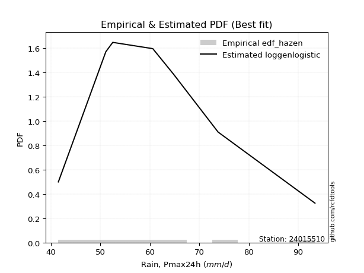</img>

</div>


### 3. Empirical - EDF Weibull (1939)

Weibull plotting position formula is an empirical method used to estimate the non-exceedance probability or plotting position for a set of observed data, is often recommended or widely used in practice, particularly in flood frequency analysis.

<div align="center">


$P=m/(n+1)$


</div>


**3.1. Empirical values**

<div align="center">

|                | 0                  | 1                  | 2                  | 3                  | 4                  | 5                  | 6                  | 7                  |
|:---------------|:-------------------|:-------------------|:-------------------|:-------------------|:-------------------|:-------------------|:-------------------|:-------------------|
| date           | 2018               | 2017               | 2021               | 2016               | 2020               | 2019               | 2024               | 2025               |
| x              | 41.5               | 51.1               | 52.5               | 60.6               | 64.8               | 73.8               | 93.4               | 99.2               |
| m              | 1                  | 2                  | 3                  | 4                  | 5                  | 6                  | 7                  | 8                  |
| empirical_dist | edf_weibull        | edf_weibull        | edf_weibull        | edf_weibull        | edf_weibull        | edf_weibull        | edf_weibull        | edf_weibull        |
| empirical      | 0.1111111111111111 | 0.2222222222222222 | 0.3333333333333333 | 0.4444444444444444 | 0.5555555555555556 | 0.6666666666666666 | 0.7777777777777778 | 0.8888888888888888 |
| empirical_tr   | 1.125              | 1.2857142857142856 | 1.4999999999999998 | 1.7999999999999998 | 2.25               | 2.9999999999999996 | 4.5                | 8.999999999999996  |

</div>


**3.2. Kolmogorov-Smirnov fit test (sorted by Δ)**


<div align="center">

|                | 0                   | 1                   | 2                   | 3                   | 4                   | 5                   | 6                   | 7                   | 8                   | 9                   | 10                  | 11                  | 12                  | 13                 | 14                 | 15                  | 16                  | 17                  | 18                 | 19                  | 20                  | 21                  | 22                  | 23                 | 24                 | 25                  | 26                  | 27                  | 28                  | 29                 | 30                  | 31                  | 32                  | 33                 | 34                  | 35                  | 36                    | 37                  | 38                  | 39                 | 40                  | 41                 | 42                  | 43                  | 44                  | 45                  | 46                  | 47                  | 48                 | 49                  | 50                 | 51                  | 52                  | 53                 | 54                  | 55                  | 56                 | 57                  | 58                  | 59                  | 60                  | 61                  | 62                  | 63                  | 64                 | 65                  | 66                  | 67                 | 68                 | 69                 | 70                  | 71                  | 72                 | 73                  | 74                  | 75                  | 76                  | 77                  | 78                 | 79                  | 80                  | 81                 | 82                 | 83                 | 84                  | 85                  | 86                 | 87                  | 88                 | 89                 |
|:---------------|:--------------------|:--------------------|:--------------------|:--------------------|:--------------------|:--------------------|:--------------------|:--------------------|:--------------------|:--------------------|:--------------------|:--------------------|:--------------------|:-------------------|:-------------------|:--------------------|:--------------------|:--------------------|:-------------------|:--------------------|:--------------------|:--------------------|:--------------------|:-------------------|:-------------------|:--------------------|:--------------------|:--------------------|:--------------------|:-------------------|:--------------------|:--------------------|:--------------------|:-------------------|:--------------------|:--------------------|:----------------------|:--------------------|:--------------------|:-------------------|:--------------------|:-------------------|:--------------------|:--------------------|:--------------------|:--------------------|:--------------------|:--------------------|:-------------------|:--------------------|:-------------------|:--------------------|:--------------------|:-------------------|:--------------------|:--------------------|:-------------------|:--------------------|:--------------------|:--------------------|:--------------------|:--------------------|:--------------------|:--------------------|:-------------------|:--------------------|:--------------------|:-------------------|:-------------------|:-------------------|:--------------------|:--------------------|:-------------------|:--------------------|:--------------------|:--------------------|:--------------------|:--------------------|:-------------------|:--------------------|:--------------------|:-------------------|:-------------------|:-------------------|:--------------------|:--------------------|:-------------------|:--------------------|:-------------------|:-------------------|
| station        | 24015510            | 24015510            | 24015510            | 24015510            | 24015510            | 24015510            | 24015510            | 24015510            | 24015510            | 24015510            | 24015510            | 24015510            | 24015510            | 24015510           | 24015510           | 24015510            | 24015510            | 24015510            | 24015510           | 24015510            | 24015510            | 24015510            | 24015510            | 24015510           | 24015510           | 24015510            | 24015510            | 24015510            | 24015510            | 24015510           | 24015510            | 24015510            | 24015510            | 24015510           | 24015510            | 24015510            | 24015510              | 24015510            | 24015510            | 24015510           | 24015510            | 24015510           | 24015510            | 24015510            | 24015510            | 24015510            | 24015510            | 24015510            | 24015510           | 24015510            | 24015510           | 24015510            | 24015510            | 24015510           | 24015510            | 24015510            | 24015510           | 24015510            | 24015510            | 24015510            | 24015510            | 24015510            | 24015510            | 24015510            | 24015510           | 24015510            | 24015510            | 24015510           | 24015510           | 24015510           | 24015510            | 24015510            | 24015510           | 24015510            | 24015510            | 24015510            | 24015510            | 24015510            | 24015510           | 24015510            | 24015510            | 24015510           | 24015510           | 24015510           | 24015510            | 24015510            | 24015510           | 24015510            | 24015510           | 24015510           |
| empirical_dist | edf_weibull         | edf_weibull         | edf_weibull         | edf_weibull         | edf_weibull         | edf_weibull         | edf_weibull         | edf_weibull         | edf_weibull         | edf_weibull         | edf_weibull         | edf_weibull         | edf_weibull         | edf_weibull        | edf_weibull        | edf_weibull         | edf_weibull         | edf_weibull         | edf_weibull        | edf_weibull         | edf_weibull         | edf_weibull         | edf_weibull         | edf_weibull        | edf_weibull        | edf_weibull         | edf_weibull         | edf_weibull         | edf_weibull         | edf_weibull        | edf_weibull         | edf_weibull         | edf_weibull         | edf_weibull        | edf_weibull         | edf_weibull         | edf_weibull           | edf_weibull         | edf_weibull         | edf_weibull        | edf_weibull         | edf_weibull        | edf_weibull         | edf_weibull         | edf_weibull         | edf_weibull         | edf_weibull         | edf_weibull         | edf_weibull        | edf_weibull         | edf_weibull        | edf_weibull         | edf_weibull         | edf_weibull        | edf_weibull         | edf_weibull         | edf_weibull        | edf_weibull         | edf_weibull         | edf_weibull         | edf_weibull         | edf_weibull         | edf_weibull         | edf_weibull         | edf_weibull        | edf_weibull         | edf_weibull         | edf_weibull        | edf_weibull        | edf_weibull        | edf_weibull         | edf_weibull         | edf_weibull        | edf_weibull         | edf_weibull         | edf_weibull         | edf_weibull         | edf_weibull         | edf_weibull        | edf_weibull         | edf_weibull         | edf_weibull        | edf_weibull        | edf_weibull        | edf_weibull         | edf_weibull         | edf_weibull        | edf_weibull         | edf_weibull        | edf_weibull        |
| p_dist         | loginvweibull       | fisk                | loggenlogistic      | mielke              | logkstwobign        | loggenexpon         | exponnorm           | logfisk             | logmielke           | genexpon            | loggompertz         | nakagami            | weibull_min         | expon              | loghalfnorm        | lograyleigh         | invgauss            | logweibull_min      | johnsonsu          | loginvgauss         | f                   | logmaxwell          | halfnorm            | nct                | logrice            | invgamma            | logfatiguelife      | loghalflogistic     | logf                | logalpha           | gompertz            | alpha               | loggumbel_r         | rayleigh           | loggamma            | loggamma            | loglaplace_asymmetric | lognct              | logerlang           | logmoyal           | ncf                 | betaprime          | loginvgamma         | logpearson3         | logbetaprime        | maxwell             | halflogistic        | logloggamma         | logjohnsonsu       | logexponnorm        | logt               | lognorm             | lognorm             | logcrystalball     | genlogistic         | logncf              | pearson3           | kstwobign           | gumbel_r            | moyal               | rice                | t                   | crystalball         | norm                | laplace_asymmetric | loglogistic         | lognakagami         | loghypsecant       | logtruncnorm       | logistic           | hypsecant           | logexpon            | loglaplace         | truncnorm           | laplace             | loggumbel_l         | gumbel_l            | logwald             | gamma              | wald                | logchi2             | loggibrat          | gibrat             | loglognorm         | pareto              | logpareto           | invweibull         | erlang              | fatiguelife        | chi2               |
| delta          | 0.10012594073795245 | 0.10148265679923296 | 0.10367481234831444 | 0.10367597865054001 | 0.10593313664795867 | 0.10611509578336908 | 0.10779814403239418 | 0.11052799996291074 | 0.11068871836770366 | 0.11110942803234579 | 0.11111111093660454 | 0.11111111109902849 | 0.11111111111110987 | 0.1111111111111111 | 0.1111111111111111 | 0.11528547129516009 | 0.11595677894271528 | 0.11599169986487234 | 0.1164810813237035 | 0.11662539345945033 | 0.11726163446406257 | 0.11793003969438243 | 0.11798077220507286 | 0.1184967352149654 | 0.1185909168213134 | 0.11905718698639167 | 0.11925273070437603 | 0.12024671275580168 | 0.12153322584318993 | 0.1224906714336288 | 0.12260559270971627 | 0.12270764713206794 | 0.12342373087140879 | 0.1234730397346705 | 0.12348951497637195 | 0.12348951497637195 | 0.1237635001063899    | 0.12380409900590106 | 0.12413680008156303 | 0.124294088309016  | 0.12438435358038014 | 0.1246454202949302 | 0.12503536285368044 | 0.12522002110333852 | 0.12612878235949865 | 0.12633831830897047 | 0.12650247328289588 | 0.12680866033901228 | 0.1276649387650136 | 0.12781519520166496 | 0.1278786451676336 | 0.12788101847168254 | 0.12788101847168254 | 0.1278814619887082 | 0.12796684584807017 | 0.12904996965999715 | 0.1292301555950699 | 0.12938941286044459 | 0.13005676185034176 | 0.13027405229212707 | 0.13108205952271712 | 0.13709519236524215 | 0.13711022550143603 | 0.13711022661206484 | 0.1372246324451211 | 0.13783793096199082 | 0.14012168497082983 | 0.1418992848003563 | 0.1425716756760298 | 0.1454900014879552 | 0.14871439749337634 | 0.15412738539450865 | 0.1551194052795022 | 0.15690926459358764 | 0.16322197038631642 | 0.17392365941274823 | 0.18384061591620637 | 0.19905947863155146 | 0.2139401130691615 | 0.23332764822460117 | 0.25338578091235375 | 0.3289933611881767 | 0.3333333333290361 | 0.4000636557353927 | 0.41419991011806123 | 0.42239447106379047 | 0.4507791064663138 | 0.47254966164998247 | 0.4852400673182331 | 0.760103037831254  |
| deltao         | 0.4472608134160001  | 0.4472608134160001  | 0.4472608134160001  | 0.4472608134160001  | 0.4472608134160001  | 0.4472608134160001  | 0.4472608134160001  | 0.4472608134160001  | 0.4472608134160001  | 0.4472608134160001  | 0.4472608134160001  | 0.4472608134160001  | 0.4472608134160001  | 0.4472608134160001 | 0.4472608134160001 | 0.4472608134160001  | 0.4472608134160001  | 0.4472608134160001  | 0.4472608134160001 | 0.4472608134160001  | 0.4472608134160001  | 0.4472608134160001  | 0.4472608134160001  | 0.4472608134160001 | 0.4472608134160001 | 0.4472608134160001  | 0.4472608134160001  | 0.4472608134160001  | 0.4472608134160001  | 0.4472608134160001 | 0.4472608134160001  | 0.4472608134160001  | 0.4472608134160001  | 0.4472608134160001 | 0.4472608134160001  | 0.4472608134160001  | 0.4472608134160001    | 0.4472608134160001  | 0.4472608134160001  | 0.4472608134160001 | 0.4472608134160001  | 0.4472608134160001 | 0.4472608134160001  | 0.4472608134160001  | 0.4472608134160001  | 0.4472608134160001  | 0.4472608134160001  | 0.4472608134160001  | 0.4472608134160001 | 0.4472608134160001  | 0.4472608134160001 | 0.4472608134160001  | 0.4472608134160001  | 0.4472608134160001 | 0.4472608134160001  | 0.4472608134160001  | 0.4472608134160001 | 0.4472608134160001  | 0.4472608134160001  | 0.4472608134160001  | 0.4472608134160001  | 0.4472608134160001  | 0.4472608134160001  | 0.4472608134160001  | 0.4472608134160001 | 0.4472608134160001  | 0.4472608134160001  | 0.4472608134160001 | 0.4472608134160001 | 0.4472608134160001 | 0.4472608134160001  | 0.4472608134160001  | 0.4472608134160001 | 0.4472608134160001  | 0.4472608134160001  | 0.4472608134160001  | 0.4472608134160001  | 0.4472608134160001  | 0.4472608134160001 | 0.4472608134160001  | 0.4472608134160001  | 0.4472608134160001 | 0.4472608134160001 | 0.4472608134160001 | 0.4472608134160001  | 0.4472608134160001  | 0.4472608134160001 | 0.4472608134160001  | 0.4472608134160001 | 0.4472608134160001 |
| eval           | Δo > Δ              | Δo > Δ              | Δo > Δ              | Δo > Δ              | Δo > Δ              | Δo > Δ              | Δo > Δ              | Δo > Δ              | Δo > Δ              | Δo > Δ              | Δo > Δ              | Δo > Δ              | Δo > Δ              | Δo > Δ             | Δo > Δ             | Δo > Δ              | Δo > Δ              | Δo > Δ              | Δo > Δ             | Δo > Δ              | Δo > Δ              | Δo > Δ              | Δo > Δ              | Δo > Δ             | Δo > Δ             | Δo > Δ              | Δo > Δ              | Δo > Δ              | Δo > Δ              | Δo > Δ             | Δo > Δ              | Δo > Δ              | Δo > Δ              | Δo > Δ             | Δo > Δ              | Δo > Δ              | Δo > Δ                | Δo > Δ              | Δo > Δ              | Δo > Δ             | Δo > Δ              | Δo > Δ             | Δo > Δ              | Δo > Δ              | Δo > Δ              | Δo > Δ              | Δo > Δ              | Δo > Δ              | Δo > Δ             | Δo > Δ              | Δo > Δ             | Δo > Δ              | Δo > Δ              | Δo > Δ             | Δo > Δ              | Δo > Δ              | Δo > Δ             | Δo > Δ              | Δo > Δ              | Δo > Δ              | Δo > Δ              | Δo > Δ              | Δo > Δ              | Δo > Δ              | Δo > Δ             | Δo > Δ              | Δo > Δ              | Δo > Δ             | Δo > Δ             | Δo > Δ             | Δo > Δ              | Δo > Δ              | Δo > Δ             | Δo > Δ              | Δo > Δ              | Δo > Δ              | Δo > Δ              | Δo > Δ              | Δo > Δ             | Δo > Δ              | Δo > Δ              | Δo > Δ             | Δo > Δ             | Δo > Δ             | Δo > Δ              | Δo > Δ              | Δo <= Δ            | Δo <= Δ             | Δo <= Δ            | Δo <= Δ            |
| fit            | 1                   | 1                   | 1                   | 1                   | 1                   | 1                   | 1                   | 1                   | 1                   | 1                   | 1                   | 1                   | 1                   | 1                  | 1                  | 1                   | 1                   | 1                   | 1                  | 1                   | 1                   | 1                   | 1                   | 1                  | 1                  | 1                   | 1                   | 1                   | 1                   | 1                  | 1                   | 1                   | 1                   | 1                  | 1                   | 1                   | 1                     | 1                   | 1                   | 1                  | 1                   | 1                  | 1                   | 1                   | 1                   | 1                   | 1                   | 1                   | 1                  | 1                   | 1                  | 1                   | 1                   | 1                  | 1                   | 1                   | 1                  | 1                   | 1                   | 1                   | 1                   | 1                   | 1                   | 1                   | 1                  | 1                   | 1                   | 1                  | 1                  | 1                  | 1                   | 1                   | 1                  | 1                   | 1                   | 1                   | 1                   | 1                   | 1                  | 1                   | 1                   | 1                  | 1                  | 1                  | 1                   | 1                   | 0                  | 0                   | 0                  | 0                  |
| n              | 8                   | 8                   | 8                   | 8                   | 8                   | 8                   | 8                   | 8                   | 8                   | 8                   | 8                   | 8                   | 8                   | 8                  | 8                  | 8                   | 8                   | 8                   | 8                  | 8                   | 8                   | 8                   | 8                   | 8                  | 8                  | 8                   | 8                   | 8                   | 8                   | 8                  | 8                   | 8                   | 8                   | 8                  | 8                   | 8                   | 8                     | 8                   | 8                   | 8                  | 8                   | 8                  | 8                   | 8                   | 8                   | 8                   | 8                   | 8                   | 8                  | 8                   | 8                  | 8                   | 8                   | 8                  | 8                   | 8                   | 8                  | 8                   | 8                   | 8                   | 8                   | 8                   | 8                   | 8                   | 8                  | 8                   | 8                   | 8                  | 8                  | 8                  | 8                   | 8                   | 8                  | 8                   | 8                   | 8                   | 8                   | 8                   | 8                  | 8                   | 8                   | 8                  | 8                  | 8                  | 8                   | 8                   | 8                  | 8                   | 8                  | 8                  |
| best_fit       | 1                   | 0                   | 0                   | 0                   | 0                   | 0                   | 0                   | 0                   | 0                   | 0                   | 0                   | 0                   | 0                   | 0                  | 0                  | 0                   | 0                   | 0                   | 0                  | 0                   | 0                   | 0                   | 0                   | 0                  | 0                  | 0                   | 0                   | 0                   | 0                   | 0                  | 0                   | 0                   | 0                   | 0                  | 0                   | 0                   | 0                     | 0                   | 0                   | 0                  | 0                   | 0                  | 0                   | 0                   | 0                   | 0                   | 0                   | 0                   | 0                  | 0                   | 0                  | 0                   | 0                   | 0                  | 0                   | 0                   | 0                  | 0                   | 0                   | 0                   | 0                   | 0                   | 0                   | 0                   | 0                  | 0                   | 0                   | 0                  | 0                  | 0                  | 0                   | 0                   | 0                  | 0                   | 0                   | 0                   | 0                   | 0                   | 0                  | 0                   | 0                   | 0                  | 0                  | 0                  | 0                   | 0                   | 0                  | 0                   | 0                  | 0                  |
| best_fit_sort  | 1                   | 2                   | 3                   | 4                   | 5                   | 6                   | 7                   | 8                   | 9                   | 10                  | 11                  | 12                  | 13                  | 14                 | 15                 | 16                  | 17                  | 18                  | 19                 | 20                  | 21                  | 22                  | 23                  | 24                 | 25                 | 26                  | 27                  | 28                  | 29                  | 30                 | 31                  | 32                  | 33                  | 34                 | 35                  | 36                  | 37                    | 38                  | 39                  | 40                 | 41                  | 42                 | 43                  | 44                  | 45                  | 46                  | 47                  | 48                  | 49                 | 50                  | 51                 | 52                  | 53                  | 54                 | 55                  | 56                  | 57                 | 58                  | 59                  | 60                  | 61                  | 62                  | 63                  | 64                  | 65                 | 66                  | 67                  | 68                 | 69                 | 70                 | 71                  | 72                  | 73                 | 74                  | 75                  | 76                  | 77                  | 78                  | 79                 | 80                  | 81                  | 82                 | 83                 | 84                 | 85                  | 86                  | 87                 | 88                  | 89                 | 90                 |

</div>


<div align="center">

</img>

</div>


**3.3. Best fit**

<div align="center">

|   id |   station | empirical_dist   | p_dist        |    delta |   deltao | eval   |   fit |   n |   best_fit |   best_fit_sort |
|-----:|----------:|:-----------------|:--------------|---------:|---------:|:-------|------:|----:|-----------:|----------------:|
|    0 |  24015510 | edf_weibull      | loginvweibull | 0.100126 | 0.447261 | Δo > Δ |     1 |   8 |          1 |               1 |

</div>


<div align="center">

</img>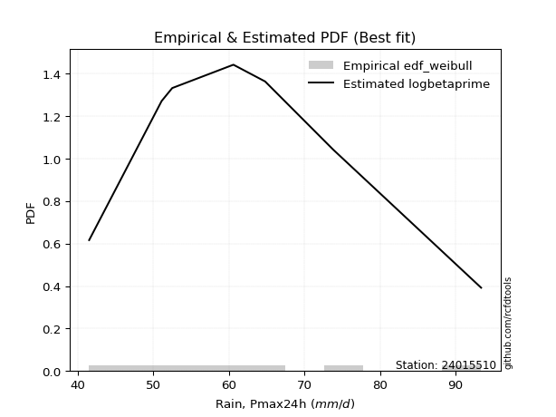</img>

</div>


### 4. Empirical - EDF Beard (1943)

The Beard formula (or Beard´s plotting position formula) in hydrology is used to estimate the empirical non-exceedance probability _(P)_ of a flood event (or other extreme hydrological data point) within a given dataset.

<div align="center">


$P=(m-0.31)/(n+0.38)$


</div>


**4.1. Empirical values**

<div align="center">

|                | 0                   | 1                   | 2                  | 3                   | 4                  | 5                  | 6                  | 7                  |
|:---------------|:--------------------|:--------------------|:-------------------|:--------------------|:-------------------|:-------------------|:-------------------|:-------------------|
| date           | 2018                | 2017                | 2021               | 2016                | 2020               | 2019               | 2024               | 2025               |
| x              | 41.5                | 51.1                | 52.5               | 60.6                | 64.8               | 73.8               | 93.4               | 99.2               |
| m              | 1                   | 2                   | 3                  | 4                   | 5                  | 6                  | 7                  | 8                  |
| empirical_dist | edf_beard           | edf_beard           | edf_beard          | edf_beard           | edf_beard          | edf_beard          | edf_beard          | edf_beard          |
| empirical      | 0.08233890214797135 | 0.20167064439140808 | 0.3210023866348448 | 0.44033412887828155 | 0.5596658711217184 | 0.6789976133651551 | 0.7983293556085919 | 0.9176610978520287 |
| empirical_tr   | 1.0897269180754225  | 1.2526158445440956  | 1.4727592267135323 | 1.7867803837953091  | 2.2710027100271004 | 3.115241635687732  | 4.958579881656804  | 12.144927536231886 |

</div>


**4.2. Kolmogorov-Smirnov fit test (sorted by Δ)**


<div align="center">

|                | 0                   | 1                   | 2                   | 3                   | 4                  | 5                   | 6                   | 7                  | 8                   | 9                   | 10                  | 11                 | 12                  | 13                  | 14                  | 15                 | 16                  | 17                  | 18                  | 19                  | 20                 | 21                  | 22                 | 23                  | 24                  | 25                 | 26                  | 27                  | 28                  | 29                  | 30                  | 31                  | 32                  | 33                  | 34                  | 35                  | 36                  | 37                  | 38                  | 39                  | 40                 | 41                 | 42                  | 43                  | 44                  | 45                  | 46                  | 47                  | 48                  | 49                 | 50                  | 51                  | 52                  | 53                 | 54                  | 55                  | 56                  | 57                    | 58                  | 59                  | 60                  | 61                  | 62                 | 63                 | 64                  | 65                  | 66                 | 67                 | 68                 | 69                  | 70                  | 71                  | 72                  | 73                  | 74                  | 75                  | 76                  | 77                  | 78                  | 79                  | 80                  | 81                 | 82                 | 83                  | 84                  | 85                 | 86                 | 87                 | 88                 | 89                 |
|:---------------|:--------------------|:--------------------|:--------------------|:--------------------|:-------------------|:--------------------|:--------------------|:-------------------|:--------------------|:--------------------|:--------------------|:-------------------|:--------------------|:--------------------|:--------------------|:-------------------|:--------------------|:--------------------|:--------------------|:--------------------|:-------------------|:--------------------|:-------------------|:--------------------|:--------------------|:-------------------|:--------------------|:--------------------|:--------------------|:--------------------|:--------------------|:--------------------|:--------------------|:--------------------|:--------------------|:--------------------|:--------------------|:--------------------|:--------------------|:--------------------|:-------------------|:-------------------|:--------------------|:--------------------|:--------------------|:--------------------|:--------------------|:--------------------|:--------------------|:-------------------|:--------------------|:--------------------|:--------------------|:-------------------|:--------------------|:--------------------|:--------------------|:----------------------|:--------------------|:--------------------|:--------------------|:--------------------|:-------------------|:-------------------|:--------------------|:--------------------|:-------------------|:-------------------|:-------------------|:--------------------|:--------------------|:--------------------|:--------------------|:--------------------|:--------------------|:--------------------|:--------------------|:--------------------|:--------------------|:--------------------|:--------------------|:-------------------|:-------------------|:--------------------|:--------------------|:-------------------|:-------------------|:-------------------|:-------------------|:-------------------|
| station        | 24015510            | 24015510            | 24015510            | 24015510            | 24015510           | 24015510            | 24015510            | 24015510           | 24015510            | 24015510            | 24015510            | 24015510           | 24015510            | 24015510            | 24015510            | 24015510           | 24015510            | 24015510            | 24015510            | 24015510            | 24015510           | 24015510            | 24015510           | 24015510            | 24015510            | 24015510           | 24015510            | 24015510            | 24015510            | 24015510            | 24015510            | 24015510            | 24015510            | 24015510            | 24015510            | 24015510            | 24015510            | 24015510            | 24015510            | 24015510            | 24015510           | 24015510           | 24015510            | 24015510            | 24015510            | 24015510            | 24015510            | 24015510            | 24015510            | 24015510           | 24015510            | 24015510            | 24015510            | 24015510           | 24015510            | 24015510            | 24015510            | 24015510              | 24015510            | 24015510            | 24015510            | 24015510            | 24015510           | 24015510           | 24015510            | 24015510            | 24015510           | 24015510           | 24015510           | 24015510            | 24015510            | 24015510            | 24015510            | 24015510            | 24015510            | 24015510            | 24015510            | 24015510            | 24015510            | 24015510            | 24015510            | 24015510           | 24015510           | 24015510            | 24015510            | 24015510           | 24015510           | 24015510           | 24015510           | 24015510           |
| empirical_dist | edf_beard           | edf_beard           | edf_beard           | edf_beard           | edf_beard          | edf_beard           | edf_beard           | edf_beard          | edf_beard           | edf_beard           | edf_beard           | edf_beard          | edf_beard           | edf_beard           | edf_beard           | edf_beard          | edf_beard           | edf_beard           | edf_beard           | edf_beard           | edf_beard          | edf_beard           | edf_beard          | edf_beard           | edf_beard           | edf_beard          | edf_beard           | edf_beard           | edf_beard           | edf_beard           | edf_beard           | edf_beard           | edf_beard           | edf_beard           | edf_beard           | edf_beard           | edf_beard           | edf_beard           | edf_beard           | edf_beard           | edf_beard          | edf_beard          | edf_beard           | edf_beard           | edf_beard           | edf_beard           | edf_beard           | edf_beard           | edf_beard           | edf_beard          | edf_beard           | edf_beard           | edf_beard           | edf_beard          | edf_beard           | edf_beard           | edf_beard           | edf_beard             | edf_beard           | edf_beard           | edf_beard           | edf_beard           | edf_beard          | edf_beard          | edf_beard           | edf_beard           | edf_beard          | edf_beard          | edf_beard          | edf_beard           | edf_beard           | edf_beard           | edf_beard           | edf_beard           | edf_beard           | edf_beard           | edf_beard           | edf_beard           | edf_beard           | edf_beard           | edf_beard           | edf_beard          | edf_beard          | edf_beard           | edf_beard           | edf_beard          | edf_beard          | edf_beard          | edf_beard          | edf_beard          |
| p_dist         | loginvweibull       | fisk                | loggenlogistic      | mielke              | logkstwobign       | loggenexpon         | exponnorm           | loghalfnorm        | logfisk             | logmielke           | lograyleigh         | invgauss           | logweibull_min      | johnsonsu           | loginvgauss         | f                  | logmaxwell          | halfnorm            | nct                 | logrice             | invgamma           | logfatiguelife      | loghalflogistic    | logf                | logalpha            | gompertz           | alpha               | loggompertz         | loggumbel_r         | rayleigh            | loggamma            | loggamma            | lognct              | logerlang           | logmoyal            | ncf                 | betaprime           | loginvgamma         | logpearson3         | logbetaprime        | maxwell            | halflogistic       | logloggamma         | logjohnsonsu        | logexponnorm        | logt                | lognorm             | lognorm             | logcrystalball      | genlogistic        | pearson3            | kstwobign           | gumbel_r            | moyal              | rice                | expon               | genexpon            | loglaplace_asymmetric | t                   | crystalball         | norm                | loglogistic         | weibull_min        | laplace_asymmetric | logistic            | loghypsecant        | nakagami           | hypsecant          | loglaplace         | truncnorm           | logncf              | laplace             | loggumbel_l         | lognakagami         | logtruncnorm        | logexpon            | gumbel_l            | logwald             | wald                | gamma               | logchi2             | loggibrat          | gibrat             | loglognorm          | pareto              | logpareto          | invweibull         | erlang             | fatiguelife        | chi2               |
| delta          | 0.07957436290713837 | 0.08093107896841889 | 0.08312323451750037 | 0.08312440081972594 | 0.0853815588171446 | 0.08556351795255501 | 0.08724656620158011 | 0.0898851423812892 | 0.08997642213209667 | 0.09013714053688959 | 0.09473389346434602 | 0.0954052011119012 | 0.09544012203405827 | 0.09592950349288942 | 0.09607381562863626 | 0.0967100566332485 | 0.09737846186356836 | 0.09742919437425879 | 0.09794515738415133 | 0.09803933899049933 | 0.0985056091555776 | 0.09870115287356196 | 0.0996951349249876 | 0.10098164801237586 | 0.10193909360281472 | 0.1020540148789022 | 0.10215606930125387 | 0.10257608326993745 | 0.10287215304059472 | 0.10292146190385643 | 0.10293793714555788 | 0.10293793714555788 | 0.10325252117508699 | 0.10358522225074895 | 0.10374251047820193 | 0.10383277574956606 | 0.10409384246411613 | 0.10448378502286637 | 0.10466844327252445 | 0.10557720452868458 | 0.1057867404781564 | 0.1059508954520818 | 0.10625708250819821 | 0.10711336093419954 | 0.10726361737085088 | 0.10732706733681951 | 0.10732944064086847 | 0.10732944064086847 | 0.10732988415789413 | 0.1074152680172561 | 0.10867857776425582 | 0.10883783502963051 | 0.10950518401952769 | 0.109722474461313  | 0.11053048169190305 | 0.11091428029947697 | 0.11121439671184996 | 0.1114325534079014    | 0.11654361453442807 | 0.11655864767062196 | 0.11655864878125077 | 0.11728635313117675 | 0.1186156990233132 | 0.1248936857466326 | 0.12493842365714114 | 0.12502104715271192 | 0.1289053604535223 | 0.1343231086934518 | 0.1427884585810137 | 0.14457831789509915 | 0.14960154749081128 | 0.15089102368782792 | 0.15337208158193416 | 0.16067326280164396 | 0.16312325350684392 | 0.17467896322532278 | 0.17785037491534694 | 0.18672853193306296 | 0.22099670152611267 | 0.23449169089997562 | 0.28215798987549356 | 0.3166624144896882 | 0.3210023866305476 | 0.42061523356620684 | 0.43475148794887536 | 0.4429460488946046 | 0.4795513154294536 | 0.4931012394807966 | 0.5057916451490472 | 0.7806546156620682 |
| deltao         | 0.4472608134160001  | 0.4472608134160001  | 0.4472608134160001  | 0.4472608134160001  | 0.4472608134160001 | 0.4472608134160001  | 0.4472608134160001  | 0.4472608134160001 | 0.4472608134160001  | 0.4472608134160001  | 0.4472608134160001  | 0.4472608134160001 | 0.4472608134160001  | 0.4472608134160001  | 0.4472608134160001  | 0.4472608134160001 | 0.4472608134160001  | 0.4472608134160001  | 0.4472608134160001  | 0.4472608134160001  | 0.4472608134160001 | 0.4472608134160001  | 0.4472608134160001 | 0.4472608134160001  | 0.4472608134160001  | 0.4472608134160001 | 0.4472608134160001  | 0.4472608134160001  | 0.4472608134160001  | 0.4472608134160001  | 0.4472608134160001  | 0.4472608134160001  | 0.4472608134160001  | 0.4472608134160001  | 0.4472608134160001  | 0.4472608134160001  | 0.4472608134160001  | 0.4472608134160001  | 0.4472608134160001  | 0.4472608134160001  | 0.4472608134160001 | 0.4472608134160001 | 0.4472608134160001  | 0.4472608134160001  | 0.4472608134160001  | 0.4472608134160001  | 0.4472608134160001  | 0.4472608134160001  | 0.4472608134160001  | 0.4472608134160001 | 0.4472608134160001  | 0.4472608134160001  | 0.4472608134160001  | 0.4472608134160001 | 0.4472608134160001  | 0.4472608134160001  | 0.4472608134160001  | 0.4472608134160001    | 0.4472608134160001  | 0.4472608134160001  | 0.4472608134160001  | 0.4472608134160001  | 0.4472608134160001 | 0.4472608134160001 | 0.4472608134160001  | 0.4472608134160001  | 0.4472608134160001 | 0.4472608134160001 | 0.4472608134160001 | 0.4472608134160001  | 0.4472608134160001  | 0.4472608134160001  | 0.4472608134160001  | 0.4472608134160001  | 0.4472608134160001  | 0.4472608134160001  | 0.4472608134160001  | 0.4472608134160001  | 0.4472608134160001  | 0.4472608134160001  | 0.4472608134160001  | 0.4472608134160001 | 0.4472608134160001 | 0.4472608134160001  | 0.4472608134160001  | 0.4472608134160001 | 0.4472608134160001 | 0.4472608134160001 | 0.4472608134160001 | 0.4472608134160001 |
| eval           | Δo > Δ              | Δo > Δ              | Δo > Δ              | Δo > Δ              | Δo > Δ             | Δo > Δ              | Δo > Δ              | Δo > Δ             | Δo > Δ              | Δo > Δ              | Δo > Δ              | Δo > Δ             | Δo > Δ              | Δo > Δ              | Δo > Δ              | Δo > Δ             | Δo > Δ              | Δo > Δ              | Δo > Δ              | Δo > Δ              | Δo > Δ             | Δo > Δ              | Δo > Δ             | Δo > Δ              | Δo > Δ              | Δo > Δ             | Δo > Δ              | Δo > Δ              | Δo > Δ              | Δo > Δ              | Δo > Δ              | Δo > Δ              | Δo > Δ              | Δo > Δ              | Δo > Δ              | Δo > Δ              | Δo > Δ              | Δo > Δ              | Δo > Δ              | Δo > Δ              | Δo > Δ             | Δo > Δ             | Δo > Δ              | Δo > Δ              | Δo > Δ              | Δo > Δ              | Δo > Δ              | Δo > Δ              | Δo > Δ              | Δo > Δ             | Δo > Δ              | Δo > Δ              | Δo > Δ              | Δo > Δ             | Δo > Δ              | Δo > Δ              | Δo > Δ              | Δo > Δ                | Δo > Δ              | Δo > Δ              | Δo > Δ              | Δo > Δ              | Δo > Δ             | Δo > Δ             | Δo > Δ              | Δo > Δ              | Δo > Δ             | Δo > Δ             | Δo > Δ             | Δo > Δ              | Δo > Δ              | Δo > Δ              | Δo > Δ              | Δo > Δ              | Δo > Δ              | Δo > Δ              | Δo > Δ              | Δo > Δ              | Δo > Δ              | Δo > Δ              | Δo > Δ              | Δo > Δ             | Δo > Δ             | Δo > Δ              | Δo > Δ              | Δo > Δ             | Δo <= Δ            | Δo <= Δ            | Δo <= Δ            | Δo <= Δ            |
| fit            | 1                   | 1                   | 1                   | 1                   | 1                  | 1                   | 1                   | 1                  | 1                   | 1                   | 1                   | 1                  | 1                   | 1                   | 1                   | 1                  | 1                   | 1                   | 1                   | 1                   | 1                  | 1                   | 1                  | 1                   | 1                   | 1                  | 1                   | 1                   | 1                   | 1                   | 1                   | 1                   | 1                   | 1                   | 1                   | 1                   | 1                   | 1                   | 1                   | 1                   | 1                  | 1                  | 1                   | 1                   | 1                   | 1                   | 1                   | 1                   | 1                   | 1                  | 1                   | 1                   | 1                   | 1                  | 1                   | 1                   | 1                   | 1                     | 1                   | 1                   | 1                   | 1                   | 1                  | 1                  | 1                   | 1                   | 1                  | 1                  | 1                  | 1                   | 1                   | 1                   | 1                   | 1                   | 1                   | 1                   | 1                   | 1                   | 1                   | 1                   | 1                   | 1                  | 1                  | 1                   | 1                   | 1                  | 0                  | 0                  | 0                  | 0                  |
| n              | 8                   | 8                   | 8                   | 8                   | 8                  | 8                   | 8                   | 8                  | 8                   | 8                   | 8                   | 8                  | 8                   | 8                   | 8                   | 8                  | 8                   | 8                   | 8                   | 8                   | 8                  | 8                   | 8                  | 8                   | 8                   | 8                  | 8                   | 8                   | 8                   | 8                   | 8                   | 8                   | 8                   | 8                   | 8                   | 8                   | 8                   | 8                   | 8                   | 8                   | 8                  | 8                  | 8                   | 8                   | 8                   | 8                   | 8                   | 8                   | 8                   | 8                  | 8                   | 8                   | 8                   | 8                  | 8                   | 8                   | 8                   | 8                     | 8                   | 8                   | 8                   | 8                   | 8                  | 8                  | 8                   | 8                   | 8                  | 8                  | 8                  | 8                   | 8                   | 8                   | 8                   | 8                   | 8                   | 8                   | 8                   | 8                   | 8                   | 8                   | 8                   | 8                  | 8                  | 8                   | 8                   | 8                  | 8                  | 8                  | 8                  | 8                  |
| best_fit       | 1                   | 0                   | 0                   | 0                   | 0                  | 0                   | 0                   | 0                  | 0                   | 0                   | 0                   | 0                  | 0                   | 0                   | 0                   | 0                  | 0                   | 0                   | 0                   | 0                   | 0                  | 0                   | 0                  | 0                   | 0                   | 0                  | 0                   | 0                   | 0                   | 0                   | 0                   | 0                   | 0                   | 0                   | 0                   | 0                   | 0                   | 0                   | 0                   | 0                   | 0                  | 0                  | 0                   | 0                   | 0                   | 0                   | 0                   | 0                   | 0                   | 0                  | 0                   | 0                   | 0                   | 0                  | 0                   | 0                   | 0                   | 0                     | 0                   | 0                   | 0                   | 0                   | 0                  | 0                  | 0                   | 0                   | 0                  | 0                  | 0                  | 0                   | 0                   | 0                   | 0                   | 0                   | 0                   | 0                   | 0                   | 0                   | 0                   | 0                   | 0                   | 0                  | 0                  | 0                   | 0                   | 0                  | 0                  | 0                  | 0                  | 0                  |
| best_fit_sort  | 1                   | 2                   | 3                   | 4                   | 5                  | 6                   | 7                   | 8                  | 9                   | 10                  | 11                  | 12                 | 13                  | 14                  | 15                  | 16                 | 17                  | 18                  | 19                  | 20                  | 21                 | 22                  | 23                 | 24                  | 25                  | 26                 | 27                  | 28                  | 29                  | 30                  | 31                  | 32                  | 33                  | 34                  | 35                  | 36                  | 37                  | 38                  | 39                  | 40                  | 41                 | 42                 | 43                  | 44                  | 45                  | 46                  | 47                  | 48                  | 49                  | 50                 | 51                  | 52                  | 53                  | 54                 | 55                  | 56                  | 57                  | 58                    | 59                  | 60                  | 61                  | 62                  | 63                 | 64                 | 65                  | 66                  | 67                 | 68                 | 69                 | 70                  | 71                  | 72                  | 73                  | 74                  | 75                  | 76                  | 77                  | 78                  | 79                  | 80                  | 81                  | 82                 | 83                 | 84                  | 85                  | 86                 | 87                 | 88                 | 89                 | 90                 |

</div>


<div align="center">

</img>

</div>


**4.3. Best fit**

<div align="center">

|   id |   station | empirical_dist   | p_dist        |     delta |   deltao | eval   |   fit |   n |   best_fit |   best_fit_sort |
|-----:|----------:|:-----------------|:--------------|----------:|---------:|:-------|------:|----:|-----------:|----------------:|
|    0 |  24015510 | edf_beard        | loginvweibull | 0.0795744 | 0.447261 | Δo > Δ |     1 |   8 |          1 |               1 |

</div>


<div align="center">

</img></img>

</div>


### 5. Empirical - EDF Chegodayev (1955)

The Chegodayev formula is an empirical plotting position formula used in hydrological frequency analysis to estimate the exceedance probability or return period of a specific event from a set of observed data. It is primarily used for plotting observed data points on probability paper to fit a theoretical distribution, particularly for analyzing extreme events like maximum flood flows or rainfall intensities. The constant _b_ value in the generalized plotting position formula is 0.3.

<div align="center">


$P=(m-b)/(n+1-2b)$


</div>


**5.1. Empirical values**

<div align="center">

|                | 0                   | 1                   | 2                   | 3                   | 4                  | 5                  | 6                  | 7                  |
|:---------------|:--------------------|:--------------------|:--------------------|:--------------------|:-------------------|:-------------------|:-------------------|:-------------------|
| date           | 2018                | 2017                | 2021                | 2016                | 2020               | 2019               | 2024               | 2025               |
| x              | 41.5                | 51.1                | 52.5                | 60.6                | 64.8               | 73.8               | 93.4               | 99.2               |
| m              | 1                   | 2                   | 3                   | 4                   | 5                  | 6                  | 7                  | 8                  |
| empirical_dist | edf_chegodayev      | edf_chegodayev      | edf_chegodayev      | edf_chegodayev      | edf_chegodayev     | edf_chegodayev     | edf_chegodayev     | edf_chegodayev     |
| empirical      | 0.08333333333333333 | 0.20238095238095236 | 0.32142857142857145 | 0.44047619047619047 | 0.5595238095238095 | 0.6785714285714286 | 0.7976190476190476 | 0.9166666666666666 |
| empirical_tr   | 1.090909090909091   | 1.253731343283582   | 1.4736842105263157  | 1.7872340425531914  | 2.27027027027027   | 3.1111111111111116 | 4.941176470588234  | 11.999999999999995 |

</div>


**5.2. Kolmogorov-Smirnov fit test (sorted by Δ)**


<div align="center">

|                | 0                   | 1                   | 2                   | 3                   | 4                  | 5                   | 6                   | 7                  | 8                   | 9                  | 10                  | 11                 | 12                  | 13                  | 14                  | 15                 | 16                  | 17                  | 18                  | 19                  | 20                 | 21                  | 22                 | 23                  | 24                  | 25                  | 26                 | 27                  | 28                  | 29                  | 30                  | 31                  | 32                  | 33                  | 34                  | 35                  | 36                  | 37                  | 38                  | 39                  | 40                 | 41                 | 42                  | 43                  | 44                  | 45                  | 46                  | 47                  | 48                  | 49                 | 50                  | 51                  | 52                 | 53                  | 54                 | 55                  | 56                  | 57                    | 58                  | 59                  | 60                  | 61                  | 62                  | 63                  | 64                  | 65                  | 66                  | 67                  | 68                  | 69                  | 70                 | 71                  | 72                  | 73                  | 74                  | 75                 | 76                  | 77                 | 78                 | 79                  | 80                  | 81                 | 82                 | 83                 | 84                 | 85                  | 86                 | 87                  | 88                 | 89                 |
|:---------------|:--------------------|:--------------------|:--------------------|:--------------------|:-------------------|:--------------------|:--------------------|:-------------------|:--------------------|:-------------------|:--------------------|:-------------------|:--------------------|:--------------------|:--------------------|:-------------------|:--------------------|:--------------------|:--------------------|:--------------------|:-------------------|:--------------------|:-------------------|:--------------------|:--------------------|:--------------------|:-------------------|:--------------------|:--------------------|:--------------------|:--------------------|:--------------------|:--------------------|:--------------------|:--------------------|:--------------------|:--------------------|:--------------------|:--------------------|:--------------------|:-------------------|:-------------------|:--------------------|:--------------------|:--------------------|:--------------------|:--------------------|:--------------------|:--------------------|:-------------------|:--------------------|:--------------------|:-------------------|:--------------------|:-------------------|:--------------------|:--------------------|:----------------------|:--------------------|:--------------------|:--------------------|:--------------------|:--------------------|:--------------------|:--------------------|:--------------------|:--------------------|:--------------------|:--------------------|:--------------------|:-------------------|:--------------------|:--------------------|:--------------------|:--------------------|:-------------------|:--------------------|:-------------------|:-------------------|:--------------------|:--------------------|:-------------------|:-------------------|:-------------------|:-------------------|:--------------------|:-------------------|:--------------------|:-------------------|:-------------------|
| station        | 24015510            | 24015510            | 24015510            | 24015510            | 24015510           | 24015510            | 24015510            | 24015510           | 24015510            | 24015510           | 24015510            | 24015510           | 24015510            | 24015510            | 24015510            | 24015510           | 24015510            | 24015510            | 24015510            | 24015510            | 24015510           | 24015510            | 24015510           | 24015510            | 24015510            | 24015510            | 24015510           | 24015510            | 24015510            | 24015510            | 24015510            | 24015510            | 24015510            | 24015510            | 24015510            | 24015510            | 24015510            | 24015510            | 24015510            | 24015510            | 24015510           | 24015510           | 24015510            | 24015510            | 24015510            | 24015510            | 24015510            | 24015510            | 24015510            | 24015510           | 24015510            | 24015510            | 24015510           | 24015510            | 24015510           | 24015510            | 24015510            | 24015510              | 24015510            | 24015510            | 24015510            | 24015510            | 24015510            | 24015510            | 24015510            | 24015510            | 24015510            | 24015510            | 24015510            | 24015510            | 24015510           | 24015510            | 24015510            | 24015510            | 24015510            | 24015510           | 24015510            | 24015510           | 24015510           | 24015510            | 24015510            | 24015510           | 24015510           | 24015510           | 24015510           | 24015510            | 24015510           | 24015510            | 24015510           | 24015510           |
| empirical_dist | edf_chegodayev      | edf_chegodayev      | edf_chegodayev      | edf_chegodayev      | edf_chegodayev     | edf_chegodayev      | edf_chegodayev      | edf_chegodayev     | edf_chegodayev      | edf_chegodayev     | edf_chegodayev      | edf_chegodayev     | edf_chegodayev      | edf_chegodayev      | edf_chegodayev      | edf_chegodayev     | edf_chegodayev      | edf_chegodayev      | edf_chegodayev      | edf_chegodayev      | edf_chegodayev     | edf_chegodayev      | edf_chegodayev     | edf_chegodayev      | edf_chegodayev      | edf_chegodayev      | edf_chegodayev     | edf_chegodayev      | edf_chegodayev      | edf_chegodayev      | edf_chegodayev      | edf_chegodayev      | edf_chegodayev      | edf_chegodayev      | edf_chegodayev      | edf_chegodayev      | edf_chegodayev      | edf_chegodayev      | edf_chegodayev      | edf_chegodayev      | edf_chegodayev     | edf_chegodayev     | edf_chegodayev      | edf_chegodayev      | edf_chegodayev      | edf_chegodayev      | edf_chegodayev      | edf_chegodayev      | edf_chegodayev      | edf_chegodayev     | edf_chegodayev      | edf_chegodayev      | edf_chegodayev     | edf_chegodayev      | edf_chegodayev     | edf_chegodayev      | edf_chegodayev      | edf_chegodayev        | edf_chegodayev      | edf_chegodayev      | edf_chegodayev      | edf_chegodayev      | edf_chegodayev      | edf_chegodayev      | edf_chegodayev      | edf_chegodayev      | edf_chegodayev      | edf_chegodayev      | edf_chegodayev      | edf_chegodayev      | edf_chegodayev     | edf_chegodayev      | edf_chegodayev      | edf_chegodayev      | edf_chegodayev      | edf_chegodayev     | edf_chegodayev      | edf_chegodayev     | edf_chegodayev     | edf_chegodayev      | edf_chegodayev      | edf_chegodayev     | edf_chegodayev     | edf_chegodayev     | edf_chegodayev     | edf_chegodayev      | edf_chegodayev     | edf_chegodayev      | edf_chegodayev     | edf_chegodayev     |
| p_dist         | loginvweibull       | fisk                | loggenlogistic      | mielke              | logkstwobign       | loggenexpon         | exponnorm           | loghalfnorm        | logfisk             | logmielke          | lograyleigh         | invgauss           | logweibull_min      | johnsonsu           | loginvgauss         | f                  | logmaxwell          | halfnorm            | nct                 | logrice             | invgamma           | logfatiguelife      | loghalflogistic    | logf                | loggompertz         | logalpha            | gompertz           | alpha               | loggumbel_r         | rayleigh            | loggamma            | loggamma            | lognct              | logerlang           | logmoyal            | ncf                 | betaprime           | loginvgamma         | logpearson3         | logbetaprime        | maxwell            | halflogistic       | logloggamma         | logjohnsonsu        | logexponnorm        | logt                | lognorm             | lognorm             | logcrystalball      | genlogistic        | pearson3            | kstwobign           | expon              | gumbel_r            | moyal              | genexpon            | rice                | loglaplace_asymmetric | t                   | crystalball         | norm                | weibull_min         | loglogistic         | laplace_asymmetric  | loghypsecant        | logistic            | nakagami            | hypsecant           | loglaplace          | truncnorm           | logncf             | laplace             | loggumbel_l         | lognakagami         | logtruncnorm        | logexpon           | gumbel_l            | logwald            | wald               | gamma               | logchi2             | loggibrat          | gibrat             | loglognorm         | pareto             | logpareto           | invweibull         | erlang              | fatiguelife        | chi2               |
| delta          | 0.08028467089668267 | 0.08164138695796319 | 0.08383354250704467 | 0.08383470880927024 | 0.0860918668066889 | 0.08627382594209931 | 0.08795687419112441 | 0.0905954503708335 | 0.09068673012164097 | 0.0908474485264339 | 0.09544420145389032 | 0.0961155091014455 | 0.09615043002360257 | 0.09663981148243372 | 0.09678412361818056 | 0.0974203646227928 | 0.09808876985311266 | 0.09813950236380309 | 0.09865546537369563 | 0.09874964698004363 | 0.0992159171451219 | 0.09941146086310626 | 0.1004054429145319 | 0.10169195600192016 | 0.10186577528039317 | 0.10264940159235902 | 0.1027643228684465 | 0.10286637729079817 | 0.10358246103013902 | 0.10363176989340073 | 0.10364824513510218 | 0.10364824513510218 | 0.10396282916463129 | 0.10429553024029325 | 0.10445281846774623 | 0.10454308373911037 | 0.10480415045366043 | 0.10519409301241067 | 0.10537875126206875 | 0.10628751251822888 | 0.1064970484677007 | 0.1066612034416261 | 0.10696739049774251 | 0.10782366892374384 | 0.10797392536039518 | 0.10803737532636382 | 0.10803974863041277 | 0.10803974863041277 | 0.10804019214743843 | 0.1081255760068004 | 0.10938888575380012 | 0.10954814301917482 | 0.1102039723099327 | 0.11021549200907199 | 0.1104327824508573 | 0.11050408872230569 | 0.11124078968144735 | 0.11185873820162803   | 0.11725392252397238 | 0.11726895566016626 | 0.11726895677079507 | 0.11790539103376893 | 0.11799666112072105 | 0.12531987054035923 | 0.12544723194643856 | 0.12564873164668544 | 0.12819505246397803 | 0.13474929348717843 | 0.14321464337474032 | 0.14500450268882578 | 0.148891239501267  | 0.15131720848155455 | 0.15408238957147846 | 0.15996295481209968 | 0.16241294551729965 | 0.1739686552357785 | 0.17770831331743808 | 0.1871547167267896 | 0.2214228863198393 | 0.23378138291043135 | 0.28116355869013154 | 0.3170885992834148 | 0.3214285714242742 | 0.4199049255766626 | 0.4340411799593311 | 0.44223574090506035 | 0.4785568842440916 | 0.49239093149125235 | 0.505081337159503  | 0.7799443076725239 |
| deltao         | 0.4472608134160001  | 0.4472608134160001  | 0.4472608134160001  | 0.4472608134160001  | 0.4472608134160001 | 0.4472608134160001  | 0.4472608134160001  | 0.4472608134160001 | 0.4472608134160001  | 0.4472608134160001 | 0.4472608134160001  | 0.4472608134160001 | 0.4472608134160001  | 0.4472608134160001  | 0.4472608134160001  | 0.4472608134160001 | 0.4472608134160001  | 0.4472608134160001  | 0.4472608134160001  | 0.4472608134160001  | 0.4472608134160001 | 0.4472608134160001  | 0.4472608134160001 | 0.4472608134160001  | 0.4472608134160001  | 0.4472608134160001  | 0.4472608134160001 | 0.4472608134160001  | 0.4472608134160001  | 0.4472608134160001  | 0.4472608134160001  | 0.4472608134160001  | 0.4472608134160001  | 0.4472608134160001  | 0.4472608134160001  | 0.4472608134160001  | 0.4472608134160001  | 0.4472608134160001  | 0.4472608134160001  | 0.4472608134160001  | 0.4472608134160001 | 0.4472608134160001 | 0.4472608134160001  | 0.4472608134160001  | 0.4472608134160001  | 0.4472608134160001  | 0.4472608134160001  | 0.4472608134160001  | 0.4472608134160001  | 0.4472608134160001 | 0.4472608134160001  | 0.4472608134160001  | 0.4472608134160001 | 0.4472608134160001  | 0.4472608134160001 | 0.4472608134160001  | 0.4472608134160001  | 0.4472608134160001    | 0.4472608134160001  | 0.4472608134160001  | 0.4472608134160001  | 0.4472608134160001  | 0.4472608134160001  | 0.4472608134160001  | 0.4472608134160001  | 0.4472608134160001  | 0.4472608134160001  | 0.4472608134160001  | 0.4472608134160001  | 0.4472608134160001  | 0.4472608134160001 | 0.4472608134160001  | 0.4472608134160001  | 0.4472608134160001  | 0.4472608134160001  | 0.4472608134160001 | 0.4472608134160001  | 0.4472608134160001 | 0.4472608134160001 | 0.4472608134160001  | 0.4472608134160001  | 0.4472608134160001 | 0.4472608134160001 | 0.4472608134160001 | 0.4472608134160001 | 0.4472608134160001  | 0.4472608134160001 | 0.4472608134160001  | 0.4472608134160001 | 0.4472608134160001 |
| eval           | Δo > Δ              | Δo > Δ              | Δo > Δ              | Δo > Δ              | Δo > Δ             | Δo > Δ              | Δo > Δ              | Δo > Δ             | Δo > Δ              | Δo > Δ             | Δo > Δ              | Δo > Δ             | Δo > Δ              | Δo > Δ              | Δo > Δ              | Δo > Δ             | Δo > Δ              | Δo > Δ              | Δo > Δ              | Δo > Δ              | Δo > Δ             | Δo > Δ              | Δo > Δ             | Δo > Δ              | Δo > Δ              | Δo > Δ              | Δo > Δ             | Δo > Δ              | Δo > Δ              | Δo > Δ              | Δo > Δ              | Δo > Δ              | Δo > Δ              | Δo > Δ              | Δo > Δ              | Δo > Δ              | Δo > Δ              | Δo > Δ              | Δo > Δ              | Δo > Δ              | Δo > Δ             | Δo > Δ             | Δo > Δ              | Δo > Δ              | Δo > Δ              | Δo > Δ              | Δo > Δ              | Δo > Δ              | Δo > Δ              | Δo > Δ             | Δo > Δ              | Δo > Δ              | Δo > Δ             | Δo > Δ              | Δo > Δ             | Δo > Δ              | Δo > Δ              | Δo > Δ                | Δo > Δ              | Δo > Δ              | Δo > Δ              | Δo > Δ              | Δo > Δ              | Δo > Δ              | Δo > Δ              | Δo > Δ              | Δo > Δ              | Δo > Δ              | Δo > Δ              | Δo > Δ              | Δo > Δ             | Δo > Δ              | Δo > Δ              | Δo > Δ              | Δo > Δ              | Δo > Δ             | Δo > Δ              | Δo > Δ             | Δo > Δ             | Δo > Δ              | Δo > Δ              | Δo > Δ             | Δo > Δ             | Δo > Δ             | Δo > Δ             | Δo > Δ              | Δo <= Δ            | Δo <= Δ             | Δo <= Δ            | Δo <= Δ            |
| fit            | 1                   | 1                   | 1                   | 1                   | 1                  | 1                   | 1                   | 1                  | 1                   | 1                  | 1                   | 1                  | 1                   | 1                   | 1                   | 1                  | 1                   | 1                   | 1                   | 1                   | 1                  | 1                   | 1                  | 1                   | 1                   | 1                   | 1                  | 1                   | 1                   | 1                   | 1                   | 1                   | 1                   | 1                   | 1                   | 1                   | 1                   | 1                   | 1                   | 1                   | 1                  | 1                  | 1                   | 1                   | 1                   | 1                   | 1                   | 1                   | 1                   | 1                  | 1                   | 1                   | 1                  | 1                   | 1                  | 1                   | 1                   | 1                     | 1                   | 1                   | 1                   | 1                   | 1                   | 1                   | 1                   | 1                   | 1                   | 1                   | 1                   | 1                   | 1                  | 1                   | 1                   | 1                   | 1                   | 1                  | 1                   | 1                  | 1                  | 1                   | 1                   | 1                  | 1                  | 1                  | 1                  | 1                   | 0                  | 0                   | 0                  | 0                  |
| n              | 8                   | 8                   | 8                   | 8                   | 8                  | 8                   | 8                   | 8                  | 8                   | 8                  | 8                   | 8                  | 8                   | 8                   | 8                   | 8                  | 8                   | 8                   | 8                   | 8                   | 8                  | 8                   | 8                  | 8                   | 8                   | 8                   | 8                  | 8                   | 8                   | 8                   | 8                   | 8                   | 8                   | 8                   | 8                   | 8                   | 8                   | 8                   | 8                   | 8                   | 8                  | 8                  | 8                   | 8                   | 8                   | 8                   | 8                   | 8                   | 8                   | 8                  | 8                   | 8                   | 8                  | 8                   | 8                  | 8                   | 8                   | 8                     | 8                   | 8                   | 8                   | 8                   | 8                   | 8                   | 8                   | 8                   | 8                   | 8                   | 8                   | 8                   | 8                  | 8                   | 8                   | 8                   | 8                   | 8                  | 8                   | 8                  | 8                  | 8                   | 8                   | 8                  | 8                  | 8                  | 8                  | 8                   | 8                  | 8                   | 8                  | 8                  |
| best_fit       | 1                   | 0                   | 0                   | 0                   | 0                  | 0                   | 0                   | 0                  | 0                   | 0                  | 0                   | 0                  | 0                   | 0                   | 0                   | 0                  | 0                   | 0                   | 0                   | 0                   | 0                  | 0                   | 0                  | 0                   | 0                   | 0                   | 0                  | 0                   | 0                   | 0                   | 0                   | 0                   | 0                   | 0                   | 0                   | 0                   | 0                   | 0                   | 0                   | 0                   | 0                  | 0                  | 0                   | 0                   | 0                   | 0                   | 0                   | 0                   | 0                   | 0                  | 0                   | 0                   | 0                  | 0                   | 0                  | 0                   | 0                   | 0                     | 0                   | 0                   | 0                   | 0                   | 0                   | 0                   | 0                   | 0                   | 0                   | 0                   | 0                   | 0                   | 0                  | 0                   | 0                   | 0                   | 0                   | 0                  | 0                   | 0                  | 0                  | 0                   | 0                   | 0                  | 0                  | 0                  | 0                  | 0                   | 0                  | 0                   | 0                  | 0                  |
| best_fit_sort  | 1                   | 2                   | 3                   | 4                   | 5                  | 6                   | 7                   | 8                  | 9                   | 10                 | 11                  | 12                 | 13                  | 14                  | 15                  | 16                 | 17                  | 18                  | 19                  | 20                  | 21                 | 22                  | 23                 | 24                  | 25                  | 26                  | 27                 | 28                  | 29                  | 30                  | 31                  | 32                  | 33                  | 34                  | 35                  | 36                  | 37                  | 38                  | 39                  | 40                  | 41                 | 42                 | 43                  | 44                  | 45                  | 46                  | 47                  | 48                  | 49                  | 50                 | 51                  | 52                  | 53                 | 54                  | 55                 | 56                  | 57                  | 58                    | 59                  | 60                  | 61                  | 62                  | 63                  | 64                  | 65                  | 66                  | 67                  | 68                  | 69                  | 70                  | 71                 | 72                  | 73                  | 74                  | 75                  | 76                 | 77                  | 78                 | 79                 | 80                  | 81                  | 82                 | 83                 | 84                 | 85                 | 86                  | 87                 | 88                  | 89                 | 90                 |

</div>


<div align="center">

</img>

</div>


**5.3. Best fit**

<div align="center">

|   id |   station | empirical_dist   | p_dist        |     delta |   deltao | eval   |   fit |   n |   best_fit |   best_fit_sort |
|-----:|----------:|:-----------------|:--------------|----------:|---------:|:-------|------:|----:|-----------:|----------------:|
|    0 |  24015510 | edf_chegodayev   | loginvweibull | 0.0802847 | 0.447261 | Δo > Δ |     1 |   8 |          1 |               1 |

</div>


<div align="center">

</img>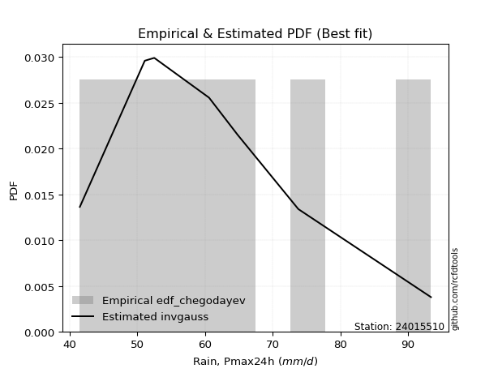</img>

</div>


### 6. Empirical - EDF Blom (1958)

The Blom formula is a specific "plotting position" formula used in hydrology and statistical analysis to estimate the empirical cumulative probability (or non-exceedance probability) of a data series. It is particularly recommended for data that are approximately normally distributed. The constant _a_ is set to 0.375 (or 3/8).

<div align="center">


$P=(m-a)/(n+1-2a)$


</div>


**6.1. Empirical values**

<div align="center">

|                | 0                   | 1                   | 2                  | 3                  | 4                  | 5                  | 6                 | 7                  |
|:---------------|:--------------------|:--------------------|:-------------------|:-------------------|:-------------------|:-------------------|:------------------|:-------------------|
| date           | 2018                | 2017                | 2021               | 2016               | 2020               | 2019               | 2024              | 2025               |
| x              | 41.5                | 51.1                | 52.5               | 60.6               | 64.8               | 73.8               | 93.4              | 99.2               |
| m              | 1                   | 2                   | 3                  | 4                  | 5                  | 6                  | 7                 | 8                  |
| empirical_dist | edf_blom            | edf_blom            | edf_blom           | edf_blom           | edf_blom           | edf_blom           | edf_blom          | edf_blom           |
| empirical      | 0.07575757575757576 | 0.19696969696969696 | 0.3181818181818182 | 0.4393939393939394 | 0.5606060606060606 | 0.6818181818181818 | 0.803030303030303 | 0.9242424242424242 |
| empirical_tr   | 1.0819672131147542  | 1.2452830188679247  | 1.4666666666666666 | 1.783783783783784  | 2.275862068965517  | 3.1428571428571423 | 5.076923076923076 | 13.199999999999992 |

</div>


**6.2. Kolmogorov-Smirnov fit test (sorted by Δ)**


<div align="center">

|                | 0                   | 1                   | 2                   | 3                   | 4                   | 5                   | 6                   | 7                   | 8                   | 9                   | 10                 | 11                  | 12                  | 13                 | 14                  | 15                  | 16                  | 17                  | 18                 | 19                 | 20                  | 21                  | 22                  | 23                  | 24                 | 25                  | 26                  | 27                 | 28                 | 29                  | 30                  | 31                  | 32                  | 33                  | 34                  | 35                 | 36                  | 37                  | 38                  | 39                  | 40                  | 41                  | 42                  | 43                  | 44                 | 45                  | 46                  | 47                  | 48                  | 49                 | 50                  | 51                  | 52                  | 53                  | 54                  | 55                    | 56                  | 57                  | 58                  | 59                  | 60                 | 61                  | 62                  | 63                  | 64                  | 65                  | 66                  | 67                  | 68                  | 69                 | 70                  | 71                  | 72                 | 73                  | 74                  | 75                 | 76                 | 77                  | 78                  | 79                  | 80                 | 81                  | 82                  | 83                  | 84                 | 85                 | 86                  | 87                 | 88                 | 89                 |
|:---------------|:--------------------|:--------------------|:--------------------|:--------------------|:--------------------|:--------------------|:--------------------|:--------------------|:--------------------|:--------------------|:-------------------|:--------------------|:--------------------|:-------------------|:--------------------|:--------------------|:--------------------|:--------------------|:-------------------|:-------------------|:--------------------|:--------------------|:--------------------|:--------------------|:-------------------|:--------------------|:--------------------|:-------------------|:-------------------|:--------------------|:--------------------|:--------------------|:--------------------|:--------------------|:--------------------|:-------------------|:--------------------|:--------------------|:--------------------|:--------------------|:--------------------|:--------------------|:--------------------|:--------------------|:-------------------|:--------------------|:--------------------|:--------------------|:--------------------|:-------------------|:--------------------|:--------------------|:--------------------|:--------------------|:--------------------|:----------------------|:--------------------|:--------------------|:--------------------|:--------------------|:-------------------|:--------------------|:--------------------|:--------------------|:--------------------|:--------------------|:--------------------|:--------------------|:--------------------|:-------------------|:--------------------|:--------------------|:-------------------|:--------------------|:--------------------|:-------------------|:-------------------|:--------------------|:--------------------|:--------------------|:-------------------|:--------------------|:--------------------|:--------------------|:-------------------|:-------------------|:--------------------|:-------------------|:-------------------|:-------------------|
| station        | 24015510            | 24015510            | 24015510            | 24015510            | 24015510            | 24015510            | 24015510            | 24015510            | 24015510            | 24015510            | 24015510           | 24015510            | 24015510            | 24015510           | 24015510            | 24015510            | 24015510            | 24015510            | 24015510           | 24015510           | 24015510            | 24015510            | 24015510            | 24015510            | 24015510           | 24015510            | 24015510            | 24015510           | 24015510           | 24015510            | 24015510            | 24015510            | 24015510            | 24015510            | 24015510            | 24015510           | 24015510            | 24015510            | 24015510            | 24015510            | 24015510            | 24015510            | 24015510            | 24015510            | 24015510           | 24015510            | 24015510            | 24015510            | 24015510            | 24015510           | 24015510            | 24015510            | 24015510            | 24015510            | 24015510            | 24015510              | 24015510            | 24015510            | 24015510            | 24015510            | 24015510           | 24015510            | 24015510            | 24015510            | 24015510            | 24015510            | 24015510            | 24015510            | 24015510            | 24015510           | 24015510            | 24015510            | 24015510           | 24015510            | 24015510            | 24015510           | 24015510           | 24015510            | 24015510            | 24015510            | 24015510           | 24015510            | 24015510            | 24015510            | 24015510           | 24015510           | 24015510            | 24015510           | 24015510           | 24015510           |
| empirical_dist | edf_blom            | edf_blom            | edf_blom            | edf_blom            | edf_blom            | edf_blom            | edf_blom            | edf_blom            | edf_blom            | edf_blom            | edf_blom           | edf_blom            | edf_blom            | edf_blom           | edf_blom            | edf_blom            | edf_blom            | edf_blom            | edf_blom           | edf_blom           | edf_blom            | edf_blom            | edf_blom            | edf_blom            | edf_blom           | edf_blom            | edf_blom            | edf_blom           | edf_blom           | edf_blom            | edf_blom            | edf_blom            | edf_blom            | edf_blom            | edf_blom            | edf_blom           | edf_blom            | edf_blom            | edf_blom            | edf_blom            | edf_blom            | edf_blom            | edf_blom            | edf_blom            | edf_blom           | edf_blom            | edf_blom            | edf_blom            | edf_blom            | edf_blom           | edf_blom            | edf_blom            | edf_blom            | edf_blom            | edf_blom            | edf_blom              | edf_blom            | edf_blom            | edf_blom            | edf_blom            | edf_blom           | edf_blom            | edf_blom            | edf_blom            | edf_blom            | edf_blom            | edf_blom            | edf_blom            | edf_blom            | edf_blom           | edf_blom            | edf_blom            | edf_blom           | edf_blom            | edf_blom            | edf_blom           | edf_blom           | edf_blom            | edf_blom            | edf_blom            | edf_blom           | edf_blom            | edf_blom            | edf_blom            | edf_blom           | edf_blom           | edf_blom            | edf_blom           | edf_blom           | edf_blom           |
| p_dist         | loginvweibull       | fisk                | loggenlogistic      | mielke              | logkstwobign        | loggenexpon         | exponnorm           | loghalfnorm         | logfisk             | logmielke           | lograyleigh        | invgauss            | logweibull_min      | johnsonsu          | loginvgauss         | f                   | logmaxwell          | halfnorm            | nct                | logrice            | invgamma            | logfatiguelife      | loghalflogistic     | logf                | logalpha           | gompertz            | alpha               | loggumbel_r        | rayleigh           | loggamma            | loggamma            | lognct              | logerlang           | logmoyal            | ncf                 | betaprime          | loginvgamma         | logpearson3         | logbetaprime        | maxwell             | halflogistic        | logloggamma         | logjohnsonsu        | logexponnorm        | logt               | lognorm             | lognorm             | logcrystalball      | genlogistic         | pearson3           | kstwobign           | gumbel_r            | moyal               | rice                | loggompertz         | loglaplace_asymmetric | t                   | crystalball         | norm                | loglogistic         | expon              | genexpon            | logistic            | laplace_asymmetric  | loghypsecant        | weibull_min         | hypsecant           | nakagami            | loglaplace          | truncnorm          | laplace             | loggumbel_l         | logncf             | lognakagami         | logtruncnorm        | gumbel_l           | logexpon           | logwald             | wald                | gamma               | logchi2            | loggibrat           | gibrat              | loglognorm          | pareto             | logpareto          | invweibull          | erlang             | fatiguelife        | chi2               |
| delta          | 0.07487341548542725 | 0.07623013154670777 | 0.07842228709578924 | 0.07842345339801482 | 0.08068061139543348 | 0.08086257053084389 | 0.08254561877986899 | 0.08518419495957807 | 0.08527547471038555 | 0.08543619311517847 | 0.0900329460426349 | 0.09070425369019008 | 0.09073917461234715 | 0.0912285560711783 | 0.09137286820692514 | 0.09200910921153738 | 0.09267751444185723 | 0.09272824695254767 | 0.0932442099624402 | 0.0933383915687882 | 0.09380466173386648 | 0.09400020545185084 | 0.09499418750327648 | 0.09628070059066474 | 0.0972381461811036 | 0.09735306745719108 | 0.09745512187954275 | 0.0981712056188836 | 0.0982205144821453 | 0.09823698972384676 | 0.09823698972384676 | 0.09855157375337587 | 0.09888427482903783 | 0.09904156305649081 | 0.09913182832785494 | 0.099392895042405  | 0.09978283760115525 | 0.09996749585081333 | 0.10087625710697345 | 0.10108579305644527 | 0.10124994803037068 | 0.10155613508648709 | 0.10241241351248842 | 0.10256266994913976 | 0.1026261199151084 | 0.10262849321915735 | 0.10262849321915735 | 0.10262893673618301 | 0.10271432059554497 | 0.1039776303425447 | 0.10413688760791939 | 0.10480423659781657 | 0.10502152703960188 | 0.10582953427019193 | 0.10727703069164857 | 0.10861198495487476   | 0.11184266711271695 | 0.11185770024891084 | 0.11185770135953965 | 0.11258540570946562 | 0.1156152277211881 | 0.11591534413356108 | 0.12023747623543002 | 0.12207311729360595 | 0.12220047869968528 | 0.12331664644502432 | 0.13150254024042515 | 0.13360630787523342 | 0.13996789012798705 | 0.1417577494420725 | 0.14807045523480128 | 0.14867113416022304 | 0.1543024949125224 | 0.16537421022335508 | 0.16782420092855505 | 0.1787905643996891 | 0.1793799106470339 | 0.18390796348003632 | 0.21817613307308603 | 0.23919263832168675 | 0.2887393162658891 | 0.31384184603666154 | 0.31818181817752095 | 0.42531618098791796 | 0.4394524353705865 | 0.4476469963163157 | 0.48613264181984917 | 0.4978021869025077 | 0.5104925925707584 | 0.7853555630837792 |
| deltao         | 0.4472608134160001  | 0.4472608134160001  | 0.4472608134160001  | 0.4472608134160001  | 0.4472608134160001  | 0.4472608134160001  | 0.4472608134160001  | 0.4472608134160001  | 0.4472608134160001  | 0.4472608134160001  | 0.4472608134160001 | 0.4472608134160001  | 0.4472608134160001  | 0.4472608134160001 | 0.4472608134160001  | 0.4472608134160001  | 0.4472608134160001  | 0.4472608134160001  | 0.4472608134160001 | 0.4472608134160001 | 0.4472608134160001  | 0.4472608134160001  | 0.4472608134160001  | 0.4472608134160001  | 0.4472608134160001 | 0.4472608134160001  | 0.4472608134160001  | 0.4472608134160001 | 0.4472608134160001 | 0.4472608134160001  | 0.4472608134160001  | 0.4472608134160001  | 0.4472608134160001  | 0.4472608134160001  | 0.4472608134160001  | 0.4472608134160001 | 0.4472608134160001  | 0.4472608134160001  | 0.4472608134160001  | 0.4472608134160001  | 0.4472608134160001  | 0.4472608134160001  | 0.4472608134160001  | 0.4472608134160001  | 0.4472608134160001 | 0.4472608134160001  | 0.4472608134160001  | 0.4472608134160001  | 0.4472608134160001  | 0.4472608134160001 | 0.4472608134160001  | 0.4472608134160001  | 0.4472608134160001  | 0.4472608134160001  | 0.4472608134160001  | 0.4472608134160001    | 0.4472608134160001  | 0.4472608134160001  | 0.4472608134160001  | 0.4472608134160001  | 0.4472608134160001 | 0.4472608134160001  | 0.4472608134160001  | 0.4472608134160001  | 0.4472608134160001  | 0.4472608134160001  | 0.4472608134160001  | 0.4472608134160001  | 0.4472608134160001  | 0.4472608134160001 | 0.4472608134160001  | 0.4472608134160001  | 0.4472608134160001 | 0.4472608134160001  | 0.4472608134160001  | 0.4472608134160001 | 0.4472608134160001 | 0.4472608134160001  | 0.4472608134160001  | 0.4472608134160001  | 0.4472608134160001 | 0.4472608134160001  | 0.4472608134160001  | 0.4472608134160001  | 0.4472608134160001 | 0.4472608134160001 | 0.4472608134160001  | 0.4472608134160001 | 0.4472608134160001 | 0.4472608134160001 |
| eval           | Δo > Δ              | Δo > Δ              | Δo > Δ              | Δo > Δ              | Δo > Δ              | Δo > Δ              | Δo > Δ              | Δo > Δ              | Δo > Δ              | Δo > Δ              | Δo > Δ             | Δo > Δ              | Δo > Δ              | Δo > Δ             | Δo > Δ              | Δo > Δ              | Δo > Δ              | Δo > Δ              | Δo > Δ             | Δo > Δ             | Δo > Δ              | Δo > Δ              | Δo > Δ              | Δo > Δ              | Δo > Δ             | Δo > Δ              | Δo > Δ              | Δo > Δ             | Δo > Δ             | Δo > Δ              | Δo > Δ              | Δo > Δ              | Δo > Δ              | Δo > Δ              | Δo > Δ              | Δo > Δ             | Δo > Δ              | Δo > Δ              | Δo > Δ              | Δo > Δ              | Δo > Δ              | Δo > Δ              | Δo > Δ              | Δo > Δ              | Δo > Δ             | Δo > Δ              | Δo > Δ              | Δo > Δ              | Δo > Δ              | Δo > Δ             | Δo > Δ              | Δo > Δ              | Δo > Δ              | Δo > Δ              | Δo > Δ              | Δo > Δ                | Δo > Δ              | Δo > Δ              | Δo > Δ              | Δo > Δ              | Δo > Δ             | Δo > Δ              | Δo > Δ              | Δo > Δ              | Δo > Δ              | Δo > Δ              | Δo > Δ              | Δo > Δ              | Δo > Δ              | Δo > Δ             | Δo > Δ              | Δo > Δ              | Δo > Δ             | Δo > Δ              | Δo > Δ              | Δo > Δ             | Δo > Δ             | Δo > Δ              | Δo > Δ              | Δo > Δ              | Δo > Δ             | Δo > Δ              | Δo > Δ              | Δo > Δ              | Δo > Δ             | Δo <= Δ            | Δo <= Δ             | Δo <= Δ            | Δo <= Δ            | Δo <= Δ            |
| fit            | 1                   | 1                   | 1                   | 1                   | 1                   | 1                   | 1                   | 1                   | 1                   | 1                   | 1                  | 1                   | 1                   | 1                  | 1                   | 1                   | 1                   | 1                   | 1                  | 1                  | 1                   | 1                   | 1                   | 1                   | 1                  | 1                   | 1                   | 1                  | 1                  | 1                   | 1                   | 1                   | 1                   | 1                   | 1                   | 1                  | 1                   | 1                   | 1                   | 1                   | 1                   | 1                   | 1                   | 1                   | 1                  | 1                   | 1                   | 1                   | 1                   | 1                  | 1                   | 1                   | 1                   | 1                   | 1                   | 1                     | 1                   | 1                   | 1                   | 1                   | 1                  | 1                   | 1                   | 1                   | 1                   | 1                   | 1                   | 1                   | 1                   | 1                  | 1                   | 1                   | 1                  | 1                   | 1                   | 1                  | 1                  | 1                   | 1                   | 1                   | 1                  | 1                   | 1                   | 1                   | 1                  | 0                  | 0                   | 0                  | 0                  | 0                  |
| n              | 8                   | 8                   | 8                   | 8                   | 8                   | 8                   | 8                   | 8                   | 8                   | 8                   | 8                  | 8                   | 8                   | 8                  | 8                   | 8                   | 8                   | 8                   | 8                  | 8                  | 8                   | 8                   | 8                   | 8                   | 8                  | 8                   | 8                   | 8                  | 8                  | 8                   | 8                   | 8                   | 8                   | 8                   | 8                   | 8                  | 8                   | 8                   | 8                   | 8                   | 8                   | 8                   | 8                   | 8                   | 8                  | 8                   | 8                   | 8                   | 8                   | 8                  | 8                   | 8                   | 8                   | 8                   | 8                   | 8                     | 8                   | 8                   | 8                   | 8                   | 8                  | 8                   | 8                   | 8                   | 8                   | 8                   | 8                   | 8                   | 8                   | 8                  | 8                   | 8                   | 8                  | 8                   | 8                   | 8                  | 8                  | 8                   | 8                   | 8                   | 8                  | 8                   | 8                   | 8                   | 8                  | 8                  | 8                   | 8                  | 8                  | 8                  |
| best_fit       | 1                   | 0                   | 0                   | 0                   | 0                   | 0                   | 0                   | 0                   | 0                   | 0                   | 0                  | 0                   | 0                   | 0                  | 0                   | 0                   | 0                   | 0                   | 0                  | 0                  | 0                   | 0                   | 0                   | 0                   | 0                  | 0                   | 0                   | 0                  | 0                  | 0                   | 0                   | 0                   | 0                   | 0                   | 0                   | 0                  | 0                   | 0                   | 0                   | 0                   | 0                   | 0                   | 0                   | 0                   | 0                  | 0                   | 0                   | 0                   | 0                   | 0                  | 0                   | 0                   | 0                   | 0                   | 0                   | 0                     | 0                   | 0                   | 0                   | 0                   | 0                  | 0                   | 0                   | 0                   | 0                   | 0                   | 0                   | 0                   | 0                   | 0                  | 0                   | 0                   | 0                  | 0                   | 0                   | 0                  | 0                  | 0                   | 0                   | 0                   | 0                  | 0                   | 0                   | 0                   | 0                  | 0                  | 0                   | 0                  | 0                  | 0                  |
| best_fit_sort  | 1                   | 2                   | 3                   | 4                   | 5                   | 6                   | 7                   | 8                   | 9                   | 10                  | 11                 | 12                  | 13                  | 14                 | 15                  | 16                  | 17                  | 18                  | 19                 | 20                 | 21                  | 22                  | 23                  | 24                  | 25                 | 26                  | 27                  | 28                 | 29                 | 30                  | 31                  | 32                  | 33                  | 34                  | 35                  | 36                 | 37                  | 38                  | 39                  | 40                  | 41                  | 42                  | 43                  | 44                  | 45                 | 46                  | 47                  | 48                  | 49                  | 50                 | 51                  | 52                  | 53                  | 54                  | 55                  | 56                    | 57                  | 58                  | 59                  | 60                  | 61                 | 62                  | 63                  | 64                  | 65                  | 66                  | 67                  | 68                  | 69                  | 70                 | 71                  | 72                  | 73                 | 74                  | 75                  | 76                 | 77                 | 78                  | 79                  | 80                  | 81                 | 82                  | 83                  | 84                  | 85                 | 86                 | 87                  | 88                 | 89                 | 90                 |

</div>


<div align="center">

</img>

</div>


**6.3. Best fit**

<div align="center">

|   id |   station | empirical_dist   | p_dist        |     delta |   deltao | eval   |   fit |   n |   best_fit |   best_fit_sort |
|-----:|----------:|:-----------------|:--------------|----------:|---------:|:-------|------:|----:|-----------:|----------------:|
|    0 |  24015510 | edf_blom         | loginvweibull | 0.0748734 | 0.447261 | Δo > Δ |     1 |   8 |          1 |               1 |

</div>


<div align="center">

</img>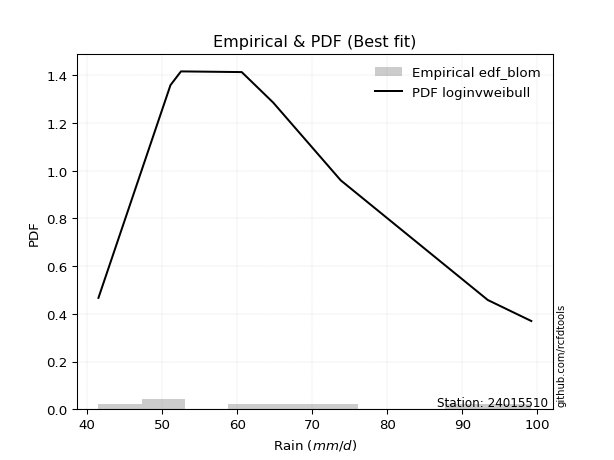</img>

</div>


### 7. Empirical - EDF Tukey (1962)

In hydrology, the Tukey formula is used as a plotting position formula to estimate the empirical probability or frequency of a flood event (or other hydrological data). The formula parameter is given as _c=0.333_ (or 1/3).

<div align="center">


$P=(m-c)/(n+1-2c)$


</div>


**7.1. Empirical values**

<div align="center">

|                | 0                  | 1         | 2                  | 3                  | 4                 | 5                  | 6                 | 7                  |
|:---------------|:-------------------|:----------|:-------------------|:-------------------|:------------------|:-------------------|:------------------|:-------------------|
| date           | 2018               | 2017      | 2021               | 2016               | 2020              | 2019               | 2024              | 2025               |
| x              | 41.5               | 51.1      | 52.5               | 60.6               | 64.8              | 73.8               | 93.4              | 99.2               |
| m              | 1                  | 2         | 3                  | 4                  | 5                 | 6                  | 7                 | 8                  |
| empirical_dist | edf_tukey          | edf_tukey | edf_tukey          | edf_tukey          | edf_tukey         | edf_tukey          | edf_tukey         | edf_tukey          |
| empirical      | 0.08               | 0.2       | 0.32               | 0.44               | 0.56              | 0.68               | 0.8               | 0.92               |
| empirical_tr   | 1.0869565217391304 | 1.25      | 1.4705882352941178 | 1.7857142857142856 | 2.272727272727273 | 3.1250000000000004 | 5.000000000000001 | 12.500000000000007 |

</div>


**7.2. Kolmogorov-Smirnov fit test (sorted by Δ)**


<div align="center">

|                | 0                   | 1                   | 2                   | 3                   | 4                   | 5                   | 6                   | 7                   | 8                   | 9                   | 10                  | 11                  | 12                  | 13                  | 14                  | 15                  | 16                  | 17                 | 18                  | 19                  | 20                  | 21                  | 22                  | 23                  | 24                  | 25                  | 26                  | 27                  | 28                  | 29                 | 30                 | 31                 | 32                  | 33                  | 34                  | 35                  | 36                  | 37                  | 38                 | 39                  | 40                  | 41                  | 42                  | 43                  | 44                 | 45                  | 46                  | 47                  | 48                  | 49                  | 50                  | 51                  | 52                  | 53                  | 54                  | 55                    | 56                  | 57                  | 58                  | 59                  | 60                  | 61                  | 62                  | 63                  | 64                  | 65                  | 66                  | 67                  | 68                  | 69                  | 70                 | 71                  | 72                  | 73                  | 74                 | 75                  | 76                 | 77                  | 78                  | 79                 | 80                  | 81                 | 82                 | 83                 | 84                  | 85                  | 86                 | 87                  | 88                 | 89                 |
|:---------------|:--------------------|:--------------------|:--------------------|:--------------------|:--------------------|:--------------------|:--------------------|:--------------------|:--------------------|:--------------------|:--------------------|:--------------------|:--------------------|:--------------------|:--------------------|:--------------------|:--------------------|:-------------------|:--------------------|:--------------------|:--------------------|:--------------------|:--------------------|:--------------------|:--------------------|:--------------------|:--------------------|:--------------------|:--------------------|:-------------------|:-------------------|:-------------------|:--------------------|:--------------------|:--------------------|:--------------------|:--------------------|:--------------------|:-------------------|:--------------------|:--------------------|:--------------------|:--------------------|:--------------------|:-------------------|:--------------------|:--------------------|:--------------------|:--------------------|:--------------------|:--------------------|:--------------------|:--------------------|:--------------------|:--------------------|:----------------------|:--------------------|:--------------------|:--------------------|:--------------------|:--------------------|:--------------------|:--------------------|:--------------------|:--------------------|:--------------------|:--------------------|:--------------------|:--------------------|:--------------------|:-------------------|:--------------------|:--------------------|:--------------------|:-------------------|:--------------------|:-------------------|:--------------------|:--------------------|:-------------------|:--------------------|:-------------------|:-------------------|:-------------------|:--------------------|:--------------------|:-------------------|:--------------------|:-------------------|:-------------------|
| station        | 24015510            | 24015510            | 24015510            | 24015510            | 24015510            | 24015510            | 24015510            | 24015510            | 24015510            | 24015510            | 24015510            | 24015510            | 24015510            | 24015510            | 24015510            | 24015510            | 24015510            | 24015510           | 24015510            | 24015510            | 24015510            | 24015510            | 24015510            | 24015510            | 24015510            | 24015510            | 24015510            | 24015510            | 24015510            | 24015510           | 24015510           | 24015510           | 24015510            | 24015510            | 24015510            | 24015510            | 24015510            | 24015510            | 24015510           | 24015510            | 24015510            | 24015510            | 24015510            | 24015510            | 24015510           | 24015510            | 24015510            | 24015510            | 24015510            | 24015510            | 24015510            | 24015510            | 24015510            | 24015510            | 24015510            | 24015510              | 24015510            | 24015510            | 24015510            | 24015510            | 24015510            | 24015510            | 24015510            | 24015510            | 24015510            | 24015510            | 24015510            | 24015510            | 24015510            | 24015510            | 24015510           | 24015510            | 24015510            | 24015510            | 24015510           | 24015510            | 24015510           | 24015510            | 24015510            | 24015510           | 24015510            | 24015510           | 24015510           | 24015510           | 24015510            | 24015510            | 24015510           | 24015510            | 24015510           | 24015510           |
| empirical_dist | edf_tukey           | edf_tukey           | edf_tukey           | edf_tukey           | edf_tukey           | edf_tukey           | edf_tukey           | edf_tukey           | edf_tukey           | edf_tukey           | edf_tukey           | edf_tukey           | edf_tukey           | edf_tukey           | edf_tukey           | edf_tukey           | edf_tukey           | edf_tukey          | edf_tukey           | edf_tukey           | edf_tukey           | edf_tukey           | edf_tukey           | edf_tukey           | edf_tukey           | edf_tukey           | edf_tukey           | edf_tukey           | edf_tukey           | edf_tukey          | edf_tukey          | edf_tukey          | edf_tukey           | edf_tukey           | edf_tukey           | edf_tukey           | edf_tukey           | edf_tukey           | edf_tukey          | edf_tukey           | edf_tukey           | edf_tukey           | edf_tukey           | edf_tukey           | edf_tukey          | edf_tukey           | edf_tukey           | edf_tukey           | edf_tukey           | edf_tukey           | edf_tukey           | edf_tukey           | edf_tukey           | edf_tukey           | edf_tukey           | edf_tukey             | edf_tukey           | edf_tukey           | edf_tukey           | edf_tukey           | edf_tukey           | edf_tukey           | edf_tukey           | edf_tukey           | edf_tukey           | edf_tukey           | edf_tukey           | edf_tukey           | edf_tukey           | edf_tukey           | edf_tukey          | edf_tukey           | edf_tukey           | edf_tukey           | edf_tukey          | edf_tukey           | edf_tukey          | edf_tukey           | edf_tukey           | edf_tukey          | edf_tukey           | edf_tukey          | edf_tukey          | edf_tukey          | edf_tukey           | edf_tukey           | edf_tukey          | edf_tukey           | edf_tukey          | edf_tukey          |
| p_dist         | loginvweibull       | fisk                | loggenlogistic      | mielke              | logkstwobign        | loggenexpon         | exponnorm           | loghalfnorm         | logfisk             | logmielke           | lograyleigh         | invgauss            | logweibull_min      | johnsonsu           | loginvgauss         | f                   | logmaxwell          | halfnorm           | nct                 | logrice             | invgamma            | logfatiguelife      | loghalflogistic     | logf                | logalpha            | gompertz            | alpha               | loggumbel_r         | rayleigh            | loggamma           | loggamma           | lognct             | logerlang           | logmoyal            | ncf                 | betaprime           | loginvgamma         | logpearson3         | logbetaprime       | maxwell             | loggompertz         | halflogistic        | logloggamma         | logjohnsonsu        | logexponnorm       | logt                | lognorm             | lognorm             | logcrystalball      | genlogistic         | pearson3            | kstwobign           | gumbel_r            | moyal               | rice                | loglaplace_asymmetric | expon               | genexpon            | t                   | crystalball         | norm                | loglogistic         | weibull_min         | logistic            | laplace_asymmetric  | loghypsecant        | nakagami            | hypsecant           | loglaplace          | truncnorm           | laplace            | logncf              | loggumbel_l         | lognakagami         | logtruncnorm       | logexpon            | gumbel_l           | logwald             | wald                | gamma              | logchi2             | loggibrat          | gibrat             | loglognorm         | pareto              | logpareto           | invweibull         | erlang              | fatiguelife        | chi2               |
| delta          | 0.07790371851573019 | 0.07926043457701071 | 0.08145259012609218 | 0.08145375642831776 | 0.08371091442573642 | 0.08389287356114683 | 0.08557592181017193 | 0.08821449798988101 | 0.08830577774068848 | 0.08846649614548141 | 0.09306324907293784 | 0.09373455672049302 | 0.09376947764265009 | 0.09425885910148124 | 0.09440317123722808 | 0.09503941224184032 | 0.09570781747216017 | 0.0957585499828506 | 0.09627451299274314 | 0.09636869459909114 | 0.09683496476416942 | 0.09703050848215378 | 0.09802449053357942 | 0.09931100362096767 | 0.10026844921140654 | 0.10038337048749402 | 0.10048542490984569 | 0.10120150864918653 | 0.10125081751244824 | 0.1012672927541497 | 0.1012672927541497 | 0.1015818767836788 | 0.10191457785934077 | 0.10207186608679375 | 0.10216213135815788 | 0.10242319807270794 | 0.10281314063145819 | 0.10299779888111626 | 0.1039065601372764 | 0.10411609608674821 | 0.10424672766134552 | 0.10428025106067362 | 0.10458643811679003 | 0.10544271654279136 | 0.1055929729794427 | 0.10565642294541133 | 0.10565879624946029 | 0.10565879624946029 | 0.10565923976648595 | 0.10574462362584791 | 0.10700793337284764 | 0.10716719063822233 | 0.10783453962811951 | 0.10805183006990482 | 0.10885983730049487 | 0.11043016677305659   | 0.11258492469088505 | 0.11288504110325803 | 0.11487297014301989 | 0.11488800327921378 | 0.11488800438984259 | 0.11561570873976856 | 0.12028634341472128 | 0.12326777926573296 | 0.12389129911178778 | 0.12401866051786711 | 0.13057600484493037 | 0.13332072205860698 | 0.14178607194616888 | 0.14357593126025434 | 0.1498886370529831 | 0.15127219188221935 | 0.15170143719052598 | 0.16234390719305203 | 0.164793897898252  | 0.17634960761673085 | 0.1781845037936286 | 0.18572614529821815 | 0.21999431489126786 | 0.2361623352913837 | 0.28449689202346495 | 0.3156600278548434 | 0.3199999999957028 | 0.4222858779576149 | 0.43642213234028343 | 0.44461669328601267 | 0.481890217577425  | 0.49477188387220467 | 0.5074622895404552 | 0.7823252600534762 |
| deltao         | 0.4472608134160001  | 0.4472608134160001  | 0.4472608134160001  | 0.4472608134160001  | 0.4472608134160001  | 0.4472608134160001  | 0.4472608134160001  | 0.4472608134160001  | 0.4472608134160001  | 0.4472608134160001  | 0.4472608134160001  | 0.4472608134160001  | 0.4472608134160001  | 0.4472608134160001  | 0.4472608134160001  | 0.4472608134160001  | 0.4472608134160001  | 0.4472608134160001 | 0.4472608134160001  | 0.4472608134160001  | 0.4472608134160001  | 0.4472608134160001  | 0.4472608134160001  | 0.4472608134160001  | 0.4472608134160001  | 0.4472608134160001  | 0.4472608134160001  | 0.4472608134160001  | 0.4472608134160001  | 0.4472608134160001 | 0.4472608134160001 | 0.4472608134160001 | 0.4472608134160001  | 0.4472608134160001  | 0.4472608134160001  | 0.4472608134160001  | 0.4472608134160001  | 0.4472608134160001  | 0.4472608134160001 | 0.4472608134160001  | 0.4472608134160001  | 0.4472608134160001  | 0.4472608134160001  | 0.4472608134160001  | 0.4472608134160001 | 0.4472608134160001  | 0.4472608134160001  | 0.4472608134160001  | 0.4472608134160001  | 0.4472608134160001  | 0.4472608134160001  | 0.4472608134160001  | 0.4472608134160001  | 0.4472608134160001  | 0.4472608134160001  | 0.4472608134160001    | 0.4472608134160001  | 0.4472608134160001  | 0.4472608134160001  | 0.4472608134160001  | 0.4472608134160001  | 0.4472608134160001  | 0.4472608134160001  | 0.4472608134160001  | 0.4472608134160001  | 0.4472608134160001  | 0.4472608134160001  | 0.4472608134160001  | 0.4472608134160001  | 0.4472608134160001  | 0.4472608134160001 | 0.4472608134160001  | 0.4472608134160001  | 0.4472608134160001  | 0.4472608134160001 | 0.4472608134160001  | 0.4472608134160001 | 0.4472608134160001  | 0.4472608134160001  | 0.4472608134160001 | 0.4472608134160001  | 0.4472608134160001 | 0.4472608134160001 | 0.4472608134160001 | 0.4472608134160001  | 0.4472608134160001  | 0.4472608134160001 | 0.4472608134160001  | 0.4472608134160001 | 0.4472608134160001 |
| eval           | Δo > Δ              | Δo > Δ              | Δo > Δ              | Δo > Δ              | Δo > Δ              | Δo > Δ              | Δo > Δ              | Δo > Δ              | Δo > Δ              | Δo > Δ              | Δo > Δ              | Δo > Δ              | Δo > Δ              | Δo > Δ              | Δo > Δ              | Δo > Δ              | Δo > Δ              | Δo > Δ             | Δo > Δ              | Δo > Δ              | Δo > Δ              | Δo > Δ              | Δo > Δ              | Δo > Δ              | Δo > Δ              | Δo > Δ              | Δo > Δ              | Δo > Δ              | Δo > Δ              | Δo > Δ             | Δo > Δ             | Δo > Δ             | Δo > Δ              | Δo > Δ              | Δo > Δ              | Δo > Δ              | Δo > Δ              | Δo > Δ              | Δo > Δ             | Δo > Δ              | Δo > Δ              | Δo > Δ              | Δo > Δ              | Δo > Δ              | Δo > Δ             | Δo > Δ              | Δo > Δ              | Δo > Δ              | Δo > Δ              | Δo > Δ              | Δo > Δ              | Δo > Δ              | Δo > Δ              | Δo > Δ              | Δo > Δ              | Δo > Δ                | Δo > Δ              | Δo > Δ              | Δo > Δ              | Δo > Δ              | Δo > Δ              | Δo > Δ              | Δo > Δ              | Δo > Δ              | Δo > Δ              | Δo > Δ              | Δo > Δ              | Δo > Δ              | Δo > Δ              | Δo > Δ              | Δo > Δ             | Δo > Δ              | Δo > Δ              | Δo > Δ              | Δo > Δ             | Δo > Δ              | Δo > Δ             | Δo > Δ              | Δo > Δ              | Δo > Δ             | Δo > Δ              | Δo > Δ             | Δo > Δ             | Δo > Δ             | Δo > Δ              | Δo > Δ              | Δo <= Δ            | Δo <= Δ             | Δo <= Δ            | Δo <= Δ            |
| fit            | 1                   | 1                   | 1                   | 1                   | 1                   | 1                   | 1                   | 1                   | 1                   | 1                   | 1                   | 1                   | 1                   | 1                   | 1                   | 1                   | 1                   | 1                  | 1                   | 1                   | 1                   | 1                   | 1                   | 1                   | 1                   | 1                   | 1                   | 1                   | 1                   | 1                  | 1                  | 1                  | 1                   | 1                   | 1                   | 1                   | 1                   | 1                   | 1                  | 1                   | 1                   | 1                   | 1                   | 1                   | 1                  | 1                   | 1                   | 1                   | 1                   | 1                   | 1                   | 1                   | 1                   | 1                   | 1                   | 1                     | 1                   | 1                   | 1                   | 1                   | 1                   | 1                   | 1                   | 1                   | 1                   | 1                   | 1                   | 1                   | 1                   | 1                   | 1                  | 1                   | 1                   | 1                   | 1                  | 1                   | 1                  | 1                   | 1                   | 1                  | 1                   | 1                  | 1                  | 1                  | 1                   | 1                   | 0                  | 0                   | 0                  | 0                  |
| n              | 8                   | 8                   | 8                   | 8                   | 8                   | 8                   | 8                   | 8                   | 8                   | 8                   | 8                   | 8                   | 8                   | 8                   | 8                   | 8                   | 8                   | 8                  | 8                   | 8                   | 8                   | 8                   | 8                   | 8                   | 8                   | 8                   | 8                   | 8                   | 8                   | 8                  | 8                  | 8                  | 8                   | 8                   | 8                   | 8                   | 8                   | 8                   | 8                  | 8                   | 8                   | 8                   | 8                   | 8                   | 8                  | 8                   | 8                   | 8                   | 8                   | 8                   | 8                   | 8                   | 8                   | 8                   | 8                   | 8                     | 8                   | 8                   | 8                   | 8                   | 8                   | 8                   | 8                   | 8                   | 8                   | 8                   | 8                   | 8                   | 8                   | 8                   | 8                  | 8                   | 8                   | 8                   | 8                  | 8                   | 8                  | 8                   | 8                   | 8                  | 8                   | 8                  | 8                  | 8                  | 8                   | 8                   | 8                  | 8                   | 8                  | 8                  |
| best_fit       | 1                   | 0                   | 0                   | 0                   | 0                   | 0                   | 0                   | 0                   | 0                   | 0                   | 0                   | 0                   | 0                   | 0                   | 0                   | 0                   | 0                   | 0                  | 0                   | 0                   | 0                   | 0                   | 0                   | 0                   | 0                   | 0                   | 0                   | 0                   | 0                   | 0                  | 0                  | 0                  | 0                   | 0                   | 0                   | 0                   | 0                   | 0                   | 0                  | 0                   | 0                   | 0                   | 0                   | 0                   | 0                  | 0                   | 0                   | 0                   | 0                   | 0                   | 0                   | 0                   | 0                   | 0                   | 0                   | 0                     | 0                   | 0                   | 0                   | 0                   | 0                   | 0                   | 0                   | 0                   | 0                   | 0                   | 0                   | 0                   | 0                   | 0                   | 0                  | 0                   | 0                   | 0                   | 0                  | 0                   | 0                  | 0                   | 0                   | 0                  | 0                   | 0                  | 0                  | 0                  | 0                   | 0                   | 0                  | 0                   | 0                  | 0                  |
| best_fit_sort  | 1                   | 2                   | 3                   | 4                   | 5                   | 6                   | 7                   | 8                   | 9                   | 10                  | 11                  | 12                  | 13                  | 14                  | 15                  | 16                  | 17                  | 18                 | 19                  | 20                  | 21                  | 22                  | 23                  | 24                  | 25                  | 26                  | 27                  | 28                  | 29                  | 30                 | 31                 | 32                 | 33                  | 34                  | 35                  | 36                  | 37                  | 38                  | 39                 | 40                  | 41                  | 42                  | 43                  | 44                  | 45                 | 46                  | 47                  | 48                  | 49                  | 50                  | 51                  | 52                  | 53                  | 54                  | 55                  | 56                    | 57                  | 58                  | 59                  | 60                  | 61                  | 62                  | 63                  | 64                  | 65                  | 66                  | 67                  | 68                  | 69                  | 70                  | 71                 | 72                  | 73                  | 74                  | 75                 | 76                  | 77                 | 78                  | 79                  | 80                 | 81                  | 82                 | 83                 | 84                 | 85                  | 86                  | 87                 | 88                  | 89                 | 90                 |

</div>


<div align="center">

</img>

</div>


**7.3. Best fit**

<div align="center">

|   id |   station | empirical_dist   | p_dist        |     delta |   deltao | eval   |   fit |   n |   best_fit |   best_fit_sort |
|-----:|----------:|:-----------------|:--------------|----------:|---------:|:-------|------:|----:|-----------:|----------------:|
|    0 |  24015510 | edf_tukey        | loginvweibull | 0.0779037 | 0.447261 | Δo > Δ |     1 |   8 |          1 |               1 |

</div>


<div align="center">

</img></img>

</div>


### 8. Empirical - EDF Gringorten (1963)

Gringorten plotting position formula is essential for estimating the probability and return periods of extreme events like floods and heavy rainfall. The constant _a=0.44_.

<div align="center">


$P=(m-a)/(n+1-2a)$


</div>


**8.1. Empirical values**

<div align="center">

|                | 0                   | 1                   | 2                  | 3                  | 4                  | 5                  | 6                  | 7                  |
|:---------------|:--------------------|:--------------------|:-------------------|:-------------------|:-------------------|:-------------------|:-------------------|:-------------------|
| date           | 2018                | 2017                | 2021               | 2016               | 2020               | 2019               | 2024               | 2025               |
| x              | 41.5                | 51.1                | 52.5               | 60.6               | 64.8               | 73.8               | 93.4               | 99.2               |
| m              | 1                   | 2                   | 3                  | 4                  | 5                  | 6                  | 7                  | 8                  |
| empirical_dist | edf_gringorten      | edf_gringorten      | edf_gringorten     | edf_gringorten     | edf_gringorten     | edf_gringorten     | edf_gringorten     | edf_gringorten     |
| empirical      | 0.06896551724137932 | 0.19211822660098524 | 0.3152709359605912 | 0.4384236453201971 | 0.5615763546798029 | 0.6847290640394089 | 0.8078817733990148 | 0.9310344827586208 |
| empirical_tr   | 1.0740740740740742  | 1.2378048780487805  | 1.460431654676259  | 1.780701754385965  | 2.2808988764044944 | 3.1718750000000004 | 5.205128205128205  | 14.500000000000018 |

</div>


**8.2. Kolmogorov-Smirnov fit test (sorted by Δ)**


<div align="center">

|                | 0                   | 1                   | 2                   | 3                   | 4                   | 5                   | 6                   | 7                   | 8                   | 9                   | 10                  | 11                  | 12                  | 13                 | 14                  | 15                  | 16                  | 17                  | 18                 | 19                 | 20                  | 21                  | 22                  | 23                  | 24                 | 25                  | 26                  | 27                  | 28                 | 29                  | 30                  | 31                  | 32                  | 33                 | 34                  | 35                 | 36                  | 37                  | 38                  | 39                  | 40                  | 41                  | 42                  | 43                  | 44                  | 45                  | 46                  | 47                 | 48                  | 49                 | 50                  | 51                  | 52                  | 53                  | 54                    | 55                  | 56                  | 57                  | 58                  | 59                  | 60                  | 61                  | 62                 | 63                  | 64                 | 65                  | 66                  | 67                  | 68                  | 69                  | 70                  | 71                 | 72                  | 73                 | 74                  | 75                  | 76                  | 77                  | 78                  | 79                  | 80                 | 81                  | 82                  | 83                 | 84                  | 85                  | 86                  | 87                 | 88                 | 89                 |
|:---------------|:--------------------|:--------------------|:--------------------|:--------------------|:--------------------|:--------------------|:--------------------|:--------------------|:--------------------|:--------------------|:--------------------|:--------------------|:--------------------|:-------------------|:--------------------|:--------------------|:--------------------|:--------------------|:-------------------|:-------------------|:--------------------|:--------------------|:--------------------|:--------------------|:-------------------|:--------------------|:--------------------|:--------------------|:-------------------|:--------------------|:--------------------|:--------------------|:--------------------|:-------------------|:--------------------|:-------------------|:--------------------|:--------------------|:--------------------|:--------------------|:--------------------|:--------------------|:--------------------|:--------------------|:--------------------|:--------------------|:--------------------|:-------------------|:--------------------|:-------------------|:--------------------|:--------------------|:--------------------|:--------------------|:----------------------|:--------------------|:--------------------|:--------------------|:--------------------|:--------------------|:--------------------|:--------------------|:-------------------|:--------------------|:-------------------|:--------------------|:--------------------|:--------------------|:--------------------|:--------------------|:--------------------|:-------------------|:--------------------|:-------------------|:--------------------|:--------------------|:--------------------|:--------------------|:--------------------|:--------------------|:-------------------|:--------------------|:--------------------|:-------------------|:--------------------|:--------------------|:--------------------|:-------------------|:-------------------|:-------------------|
| station        | 24015510            | 24015510            | 24015510            | 24015510            | 24015510            | 24015510            | 24015510            | 24015510            | 24015510            | 24015510            | 24015510            | 24015510            | 24015510            | 24015510           | 24015510            | 24015510            | 24015510            | 24015510            | 24015510           | 24015510           | 24015510            | 24015510            | 24015510            | 24015510            | 24015510           | 24015510            | 24015510            | 24015510            | 24015510           | 24015510            | 24015510            | 24015510            | 24015510            | 24015510           | 24015510            | 24015510           | 24015510            | 24015510            | 24015510            | 24015510            | 24015510            | 24015510            | 24015510            | 24015510            | 24015510            | 24015510            | 24015510            | 24015510           | 24015510            | 24015510           | 24015510            | 24015510            | 24015510            | 24015510            | 24015510              | 24015510            | 24015510            | 24015510            | 24015510            | 24015510            | 24015510            | 24015510            | 24015510           | 24015510            | 24015510           | 24015510            | 24015510            | 24015510            | 24015510            | 24015510            | 24015510            | 24015510           | 24015510            | 24015510           | 24015510            | 24015510            | 24015510            | 24015510            | 24015510            | 24015510            | 24015510           | 24015510            | 24015510            | 24015510           | 24015510            | 24015510            | 24015510            | 24015510           | 24015510           | 24015510           |
| empirical_dist | edf_gringorten      | edf_gringorten      | edf_gringorten      | edf_gringorten      | edf_gringorten      | edf_gringorten      | edf_gringorten      | edf_gringorten      | edf_gringorten      | edf_gringorten      | edf_gringorten      | edf_gringorten      | edf_gringorten      | edf_gringorten     | edf_gringorten      | edf_gringorten      | edf_gringorten      | edf_gringorten      | edf_gringorten     | edf_gringorten     | edf_gringorten      | edf_gringorten      | edf_gringorten      | edf_gringorten      | edf_gringorten     | edf_gringorten      | edf_gringorten      | edf_gringorten      | edf_gringorten     | edf_gringorten      | edf_gringorten      | edf_gringorten      | edf_gringorten      | edf_gringorten     | edf_gringorten      | edf_gringorten     | edf_gringorten      | edf_gringorten      | edf_gringorten      | edf_gringorten      | edf_gringorten      | edf_gringorten      | edf_gringorten      | edf_gringorten      | edf_gringorten      | edf_gringorten      | edf_gringorten      | edf_gringorten     | edf_gringorten      | edf_gringorten     | edf_gringorten      | edf_gringorten      | edf_gringorten      | edf_gringorten      | edf_gringorten        | edf_gringorten      | edf_gringorten      | edf_gringorten      | edf_gringorten      | edf_gringorten      | edf_gringorten      | edf_gringorten      | edf_gringorten     | edf_gringorten      | edf_gringorten     | edf_gringorten      | edf_gringorten      | edf_gringorten      | edf_gringorten      | edf_gringorten      | edf_gringorten      | edf_gringorten     | edf_gringorten      | edf_gringorten     | edf_gringorten      | edf_gringorten      | edf_gringorten      | edf_gringorten      | edf_gringorten      | edf_gringorten      | edf_gringorten     | edf_gringorten      | edf_gringorten      | edf_gringorten     | edf_gringorten      | edf_gringorten      | edf_gringorten      | edf_gringorten     | edf_gringorten     | edf_gringorten     |
| p_dist         | loginvweibull       | fisk                | loggenlogistic      | mielke              | logkstwobign        | loggenexpon         | exponnorm           | loghalfnorm         | logfisk             | logmielke           | lograyleigh         | invgauss            | logweibull_min      | johnsonsu          | loginvgauss         | f                   | logmaxwell          | halfnorm            | nct                | logrice            | invgamma            | logfatiguelife      | loghalflogistic     | logf                | logalpha           | gompertz            | alpha               | loggumbel_r         | rayleigh           | loggamma            | loggamma            | lognct              | logerlang           | logmoyal           | ncf                 | betaprime          | loginvgamma         | logpearson3         | logbetaprime        | maxwell             | halflogistic        | logloggamma         | logjohnsonsu        | logexponnorm        | logt                | lognorm             | lognorm             | logcrystalball     | genlogistic         | pearson3           | kstwobign           | gumbel_r            | moyal               | rice                | loglaplace_asymmetric | loglogistic         | crystalball         | norm                | t                   | loggompertz         | logistic            | laplace_asymmetric  | loghypsecant       | expon               | genexpon           | weibull_min         | hypsecant           | loglaplace          | nakagami            | truncnorm           | loggumbel_l         | laplace            | logncf              | lognakagami        | logtruncnorm        | gumbel_l            | logwald             | logexpon            | wald                | gamma               | logchi2            | loggibrat           | gibrat              | loglognorm         | pareto              | logpareto           | invweibull          | erlang             | fatiguelife        | chi2               |
| delta          | 0.07002194511671544 | 0.07137866117799596 | 0.07357081672707744 | 0.07357198302930301 | 0.07582914102672167 | 0.07601110016213208 | 0.07769414841115718 | 0.08033272459086627 | 0.08042400434167374 | 0.08058472274646666 | 0.08518147567392309 | 0.08585278332147828 | 0.08588770424363534 | 0.0863770857024665 | 0.08652139783821333 | 0.08715763884282557 | 0.08782604407314543 | 0.08787677658383586 | 0.0883927395937284 | 0.0884869212000764 | 0.08895319136515467 | 0.08914873508313903 | 0.09014271713456468 | 0.09142923022195293 | 0.0923866758123918 | 0.09250159708847927 | 0.09260365151083094 | 0.09331973525017179 | 0.0933690441134335 | 0.09338551935513495 | 0.09338551935513495 | 0.09370010338466406 | 0.09403280446032602 | 0.094190092687779  | 0.09428035795914314 | 0.0945414246736932 | 0.09493136723244344 | 0.09511602548210152 | 0.09602478673826165 | 0.09623432268773346 | 0.09639847766165888 | 0.09670466471777528 | 0.09756094314377661 | 0.09771119958042795 | 0.09777464954639659 | 0.09777702285044554 | 0.09777702285044554 | 0.0977774663674712 | 0.09786285022683316 | 0.0991261599738329 | 0.09928541723920759 | 0.09995276622910476 | 0.10017005667089007 | 0.10097806390148012 | 0.10570110273364777   | 0.10773393534075382 | 0.10959178118335067 | 0.10959178419629423 | 0.10962969827124602 | 0.11212850106036029 | 0.11606729480155431 | 0.11916223507237897 | 0.1192895964784583 | 0.12046669808989982 | 0.1207668145022728 | 0.12816811681373605 | 0.12859165801919817 | 0.13705700790676006 | 0.13845777824394515 | 0.13884686722084552 | 0.14381966379151123 | 0.1451595730135743 | 0.15915396528123413 | 0.1702256805920668 | 0.17267567129726677 | 0.17976085847343148 | 0.18099708125880934 | 0.18423138101574563 | 0.21526525085185905 | 0.24404410869039847 | 0.2955313747820857 | 0.31093096381543456 | 0.31527093595629396 | 0.4301676513566297 | 0.44430390573929823 | 0.45249846668502747 | 0.49292470033604574 | 0.5026536572712195 | 0.5153440629394701 | 0.790207033452491  |
| deltao         | 0.4472608134160001  | 0.4472608134160001  | 0.4472608134160001  | 0.4472608134160001  | 0.4472608134160001  | 0.4472608134160001  | 0.4472608134160001  | 0.4472608134160001  | 0.4472608134160001  | 0.4472608134160001  | 0.4472608134160001  | 0.4472608134160001  | 0.4472608134160001  | 0.4472608134160001 | 0.4472608134160001  | 0.4472608134160001  | 0.4472608134160001  | 0.4472608134160001  | 0.4472608134160001 | 0.4472608134160001 | 0.4472608134160001  | 0.4472608134160001  | 0.4472608134160001  | 0.4472608134160001  | 0.4472608134160001 | 0.4472608134160001  | 0.4472608134160001  | 0.4472608134160001  | 0.4472608134160001 | 0.4472608134160001  | 0.4472608134160001  | 0.4472608134160001  | 0.4472608134160001  | 0.4472608134160001 | 0.4472608134160001  | 0.4472608134160001 | 0.4472608134160001  | 0.4472608134160001  | 0.4472608134160001  | 0.4472608134160001  | 0.4472608134160001  | 0.4472608134160001  | 0.4472608134160001  | 0.4472608134160001  | 0.4472608134160001  | 0.4472608134160001  | 0.4472608134160001  | 0.4472608134160001 | 0.4472608134160001  | 0.4472608134160001 | 0.4472608134160001  | 0.4472608134160001  | 0.4472608134160001  | 0.4472608134160001  | 0.4472608134160001    | 0.4472608134160001  | 0.4472608134160001  | 0.4472608134160001  | 0.4472608134160001  | 0.4472608134160001  | 0.4472608134160001  | 0.4472608134160001  | 0.4472608134160001 | 0.4472608134160001  | 0.4472608134160001 | 0.4472608134160001  | 0.4472608134160001  | 0.4472608134160001  | 0.4472608134160001  | 0.4472608134160001  | 0.4472608134160001  | 0.4472608134160001 | 0.4472608134160001  | 0.4472608134160001 | 0.4472608134160001  | 0.4472608134160001  | 0.4472608134160001  | 0.4472608134160001  | 0.4472608134160001  | 0.4472608134160001  | 0.4472608134160001 | 0.4472608134160001  | 0.4472608134160001  | 0.4472608134160001 | 0.4472608134160001  | 0.4472608134160001  | 0.4472608134160001  | 0.4472608134160001 | 0.4472608134160001 | 0.4472608134160001 |
| eval           | Δo > Δ              | Δo > Δ              | Δo > Δ              | Δo > Δ              | Δo > Δ              | Δo > Δ              | Δo > Δ              | Δo > Δ              | Δo > Δ              | Δo > Δ              | Δo > Δ              | Δo > Δ              | Δo > Δ              | Δo > Δ             | Δo > Δ              | Δo > Δ              | Δo > Δ              | Δo > Δ              | Δo > Δ             | Δo > Δ             | Δo > Δ              | Δo > Δ              | Δo > Δ              | Δo > Δ              | Δo > Δ             | Δo > Δ              | Δo > Δ              | Δo > Δ              | Δo > Δ             | Δo > Δ              | Δo > Δ              | Δo > Δ              | Δo > Δ              | Δo > Δ             | Δo > Δ              | Δo > Δ             | Δo > Δ              | Δo > Δ              | Δo > Δ              | Δo > Δ              | Δo > Δ              | Δo > Δ              | Δo > Δ              | Δo > Δ              | Δo > Δ              | Δo > Δ              | Δo > Δ              | Δo > Δ             | Δo > Δ              | Δo > Δ             | Δo > Δ              | Δo > Δ              | Δo > Δ              | Δo > Δ              | Δo > Δ                | Δo > Δ              | Δo > Δ              | Δo > Δ              | Δo > Δ              | Δo > Δ              | Δo > Δ              | Δo > Δ              | Δo > Δ             | Δo > Δ              | Δo > Δ             | Δo > Δ              | Δo > Δ              | Δo > Δ              | Δo > Δ              | Δo > Δ              | Δo > Δ              | Δo > Δ             | Δo > Δ              | Δo > Δ             | Δo > Δ              | Δo > Δ              | Δo > Δ              | Δo > Δ              | Δo > Δ              | Δo > Δ              | Δo > Δ             | Δo > Δ              | Δo > Δ              | Δo > Δ             | Δo > Δ              | Δo <= Δ             | Δo <= Δ             | Δo <= Δ            | Δo <= Δ            | Δo <= Δ            |
| fit            | 1                   | 1                   | 1                   | 1                   | 1                   | 1                   | 1                   | 1                   | 1                   | 1                   | 1                   | 1                   | 1                   | 1                  | 1                   | 1                   | 1                   | 1                   | 1                  | 1                  | 1                   | 1                   | 1                   | 1                   | 1                  | 1                   | 1                   | 1                   | 1                  | 1                   | 1                   | 1                   | 1                   | 1                  | 1                   | 1                  | 1                   | 1                   | 1                   | 1                   | 1                   | 1                   | 1                   | 1                   | 1                   | 1                   | 1                   | 1                  | 1                   | 1                  | 1                   | 1                   | 1                   | 1                   | 1                     | 1                   | 1                   | 1                   | 1                   | 1                   | 1                   | 1                   | 1                  | 1                   | 1                  | 1                   | 1                   | 1                   | 1                   | 1                   | 1                   | 1                  | 1                   | 1                  | 1                   | 1                   | 1                   | 1                   | 1                   | 1                   | 1                  | 1                   | 1                   | 1                  | 1                   | 0                   | 0                   | 0                  | 0                  | 0                  |
| n              | 8                   | 8                   | 8                   | 8                   | 8                   | 8                   | 8                   | 8                   | 8                   | 8                   | 8                   | 8                   | 8                   | 8                  | 8                   | 8                   | 8                   | 8                   | 8                  | 8                  | 8                   | 8                   | 8                   | 8                   | 8                  | 8                   | 8                   | 8                   | 8                  | 8                   | 8                   | 8                   | 8                   | 8                  | 8                   | 8                  | 8                   | 8                   | 8                   | 8                   | 8                   | 8                   | 8                   | 8                   | 8                   | 8                   | 8                   | 8                  | 8                   | 8                  | 8                   | 8                   | 8                   | 8                   | 8                     | 8                   | 8                   | 8                   | 8                   | 8                   | 8                   | 8                   | 8                  | 8                   | 8                  | 8                   | 8                   | 8                   | 8                   | 8                   | 8                   | 8                  | 8                   | 8                  | 8                   | 8                   | 8                   | 8                   | 8                   | 8                   | 8                  | 8                   | 8                   | 8                  | 8                   | 8                   | 8                   | 8                  | 8                  | 8                  |
| best_fit       | 1                   | 0                   | 0                   | 0                   | 0                   | 0                   | 0                   | 0                   | 0                   | 0                   | 0                   | 0                   | 0                   | 0                  | 0                   | 0                   | 0                   | 0                   | 0                  | 0                  | 0                   | 0                   | 0                   | 0                   | 0                  | 0                   | 0                   | 0                   | 0                  | 0                   | 0                   | 0                   | 0                   | 0                  | 0                   | 0                  | 0                   | 0                   | 0                   | 0                   | 0                   | 0                   | 0                   | 0                   | 0                   | 0                   | 0                   | 0                  | 0                   | 0                  | 0                   | 0                   | 0                   | 0                   | 0                     | 0                   | 0                   | 0                   | 0                   | 0                   | 0                   | 0                   | 0                  | 0                   | 0                  | 0                   | 0                   | 0                   | 0                   | 0                   | 0                   | 0                  | 0                   | 0                  | 0                   | 0                   | 0                   | 0                   | 0                   | 0                   | 0                  | 0                   | 0                   | 0                  | 0                   | 0                   | 0                   | 0                  | 0                  | 0                  |
| best_fit_sort  | 1                   | 2                   | 3                   | 4                   | 5                   | 6                   | 7                   | 8                   | 9                   | 10                  | 11                  | 12                  | 13                  | 14                 | 15                  | 16                  | 17                  | 18                  | 19                 | 20                 | 21                  | 22                  | 23                  | 24                  | 25                 | 26                  | 27                  | 28                  | 29                 | 30                  | 31                  | 32                  | 33                  | 34                 | 35                  | 36                 | 37                  | 38                  | 39                  | 40                  | 41                  | 42                  | 43                  | 44                  | 45                  | 46                  | 47                  | 48                 | 49                  | 50                 | 51                  | 52                  | 53                  | 54                  | 55                    | 56                  | 57                  | 58                  | 59                  | 60                  | 61                  | 62                  | 63                 | 64                  | 65                 | 66                  | 67                  | 68                  | 69                  | 70                  | 71                  | 72                 | 73                  | 74                 | 75                  | 76                  | 77                  | 78                  | 79                  | 80                  | 81                 | 82                  | 83                  | 84                 | 85                  | 86                  | 87                  | 88                 | 89                 | 90                 |

</div>


<div align="center">

</img>

</div>


**8.3. Best fit**

<div align="center">

|   id |   station | empirical_dist   | p_dist        |     delta |   deltao | eval   |   fit |   n |   best_fit |   best_fit_sort |
|-----:|----------:|:-----------------|:--------------|----------:|---------:|:-------|------:|----:|-----------:|----------------:|
|    0 |  24015510 | edf_gringorten   | loginvweibull | 0.0700219 | 0.447261 | Δo > Δ |     1 |   8 |          1 |               1 |

</div>


<div align="center">

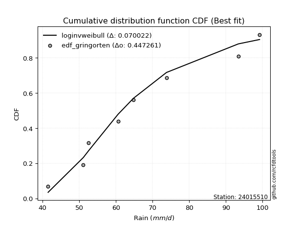</img>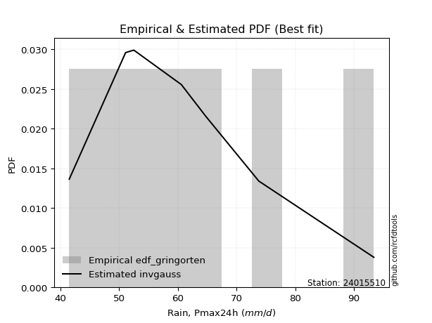</img>

</div>


### 9. Empirical - EDF Filliben (1975)

The specific values of the constants (0.3175) (often denoted as $alpha$) and (0.365) are derived from a method proposed by James J. Filliben in a 1975 paper. This particular formula is the mean value of the $i$-th order statistic of the normal distribution and is considered a robust and effective plotting position formula for the normal probability plot correlation coefficient test for normality.

<div align="center">


$P=(m-0.3175)/(n+0.365)$


</div>


**9.1. Empirical values**

<div align="center">

|                | 0                  | 1                   | 2                  | 3                   | 4                  | 5                  | 6                  | 7                  |
|:---------------|:-------------------|:--------------------|:-------------------|:--------------------|:-------------------|:-------------------|:-------------------|:-------------------|
| date           | 2018               | 2017                | 2021               | 2016                | 2020               | 2019               | 2024               | 2025               |
| x              | 41.5               | 51.1                | 52.5               | 60.6                | 64.8               | 73.8               | 93.4               | 99.2               |
| m              | 1                  | 2                   | 3                  | 4                   | 5                  | 6                  | 7                  | 8                  |
| empirical_dist | edf_filliben       | edf_filliben        | edf_filliben       | edf_filliben        | edf_filliben       | edf_filliben       | edf_filliben       | edf_filliben       |
| empirical      | 0.0815899581589958 | 0.20113568439928273 | 0.3206814106395696 | 0.44022713687985654 | 0.5597728631201434 | 0.6793185893604303 | 0.7988643156007172 | 0.9184100418410042 |
| empirical_tr   | 1.0888382687927107 | 1.2517770295548074  | 1.4720633523977125 | 1.7864388681260008  | 2.271554650373387  | 3.118359739049394  | 4.971768202080237  | 12.256410256410254 |

</div>


**9.2. Kolmogorov-Smirnov fit test (sorted by Δ)**


<div align="center">

|                | 0                   | 1                  | 2                   | 3                   | 4                   | 5                   | 6                   | 7                   | 8                   | 9                   | 10                  | 11                  | 12                  | 13                  | 14                  | 15                  | 16                  | 17                 | 18                  | 19                  | 20                  | 21                  | 22                  | 23                  | 24                  | 25                  | 26                  | 27                  | 28                  | 29                 | 30                 | 31                 | 32                  | 33                 | 34                  | 35                  | 36                  | 37                  | 38                  | 39                  | 40                  | 41                  | 42                  | 43                  | 44                 | 45                  | 46                  | 47                  | 48                  | 49                  | 50                  | 51                  | 52                  | 53                  | 54                  | 55                    | 56                  | 57                  | 58                  | 59                  | 60                  | 61                  | 62                  | 63                  | 64                 | 65                  | 66                  | 67                 | 68                 | 69                  | 70                  | 71                  | 72                  | 73                 | 74                  | 75                  | 76                  | 77                  | 78                  | 79                  | 80                 | 81                 | 82                 | 83                  | 84                 | 85                 | 86                  | 87                 | 88                 | 89                 |
|:---------------|:--------------------|:-------------------|:--------------------|:--------------------|:--------------------|:--------------------|:--------------------|:--------------------|:--------------------|:--------------------|:--------------------|:--------------------|:--------------------|:--------------------|:--------------------|:--------------------|:--------------------|:-------------------|:--------------------|:--------------------|:--------------------|:--------------------|:--------------------|:--------------------|:--------------------|:--------------------|:--------------------|:--------------------|:--------------------|:-------------------|:-------------------|:-------------------|:--------------------|:-------------------|:--------------------|:--------------------|:--------------------|:--------------------|:--------------------|:--------------------|:--------------------|:--------------------|:--------------------|:--------------------|:-------------------|:--------------------|:--------------------|:--------------------|:--------------------|:--------------------|:--------------------|:--------------------|:--------------------|:--------------------|:--------------------|:----------------------|:--------------------|:--------------------|:--------------------|:--------------------|:--------------------|:--------------------|:--------------------|:--------------------|:-------------------|:--------------------|:--------------------|:-------------------|:-------------------|:--------------------|:--------------------|:--------------------|:--------------------|:-------------------|:--------------------|:--------------------|:--------------------|:--------------------|:--------------------|:--------------------|:-------------------|:-------------------|:-------------------|:--------------------|:-------------------|:-------------------|:--------------------|:-------------------|:-------------------|:-------------------|
| station        | 24015510            | 24015510           | 24015510            | 24015510            | 24015510            | 24015510            | 24015510            | 24015510            | 24015510            | 24015510            | 24015510            | 24015510            | 24015510            | 24015510            | 24015510            | 24015510            | 24015510            | 24015510           | 24015510            | 24015510            | 24015510            | 24015510            | 24015510            | 24015510            | 24015510            | 24015510            | 24015510            | 24015510            | 24015510            | 24015510           | 24015510           | 24015510           | 24015510            | 24015510           | 24015510            | 24015510            | 24015510            | 24015510            | 24015510            | 24015510            | 24015510            | 24015510            | 24015510            | 24015510            | 24015510           | 24015510            | 24015510            | 24015510            | 24015510            | 24015510            | 24015510            | 24015510            | 24015510            | 24015510            | 24015510            | 24015510              | 24015510            | 24015510            | 24015510            | 24015510            | 24015510            | 24015510            | 24015510            | 24015510            | 24015510           | 24015510            | 24015510            | 24015510           | 24015510           | 24015510            | 24015510            | 24015510            | 24015510            | 24015510           | 24015510            | 24015510            | 24015510            | 24015510            | 24015510            | 24015510            | 24015510           | 24015510           | 24015510           | 24015510            | 24015510           | 24015510           | 24015510            | 24015510           | 24015510           | 24015510           |
| empirical_dist | edf_filliben        | edf_filliben       | edf_filliben        | edf_filliben        | edf_filliben        | edf_filliben        | edf_filliben        | edf_filliben        | edf_filliben        | edf_filliben        | edf_filliben        | edf_filliben        | edf_filliben        | edf_filliben        | edf_filliben        | edf_filliben        | edf_filliben        | edf_filliben       | edf_filliben        | edf_filliben        | edf_filliben        | edf_filliben        | edf_filliben        | edf_filliben        | edf_filliben        | edf_filliben        | edf_filliben        | edf_filliben        | edf_filliben        | edf_filliben       | edf_filliben       | edf_filliben       | edf_filliben        | edf_filliben       | edf_filliben        | edf_filliben        | edf_filliben        | edf_filliben        | edf_filliben        | edf_filliben        | edf_filliben        | edf_filliben        | edf_filliben        | edf_filliben        | edf_filliben       | edf_filliben        | edf_filliben        | edf_filliben        | edf_filliben        | edf_filliben        | edf_filliben        | edf_filliben        | edf_filliben        | edf_filliben        | edf_filliben        | edf_filliben          | edf_filliben        | edf_filliben        | edf_filliben        | edf_filliben        | edf_filliben        | edf_filliben        | edf_filliben        | edf_filliben        | edf_filliben       | edf_filliben        | edf_filliben        | edf_filliben       | edf_filliben       | edf_filliben        | edf_filliben        | edf_filliben        | edf_filliben        | edf_filliben       | edf_filliben        | edf_filliben        | edf_filliben        | edf_filliben        | edf_filliben        | edf_filliben        | edf_filliben       | edf_filliben       | edf_filliben       | edf_filliben        | edf_filliben       | edf_filliben       | edf_filliben        | edf_filliben       | edf_filliben       | edf_filliben       |
| p_dist         | loginvweibull       | fisk               | loggenlogistic      | mielke              | logkstwobign        | loggenexpon         | exponnorm           | loghalfnorm         | logfisk             | logmielke           | lograyleigh         | invgauss            | logweibull_min      | johnsonsu           | loginvgauss         | f                   | logmaxwell          | halfnorm           | nct                 | logrice             | invgamma            | logfatiguelife      | loghalflogistic     | logf                | logalpha            | gompertz            | alpha               | loggumbel_r         | rayleigh            | loggamma           | loggamma           | lognct             | logerlang           | loggompertz        | logmoyal            | ncf                 | betaprime           | loginvgamma         | logpearson3         | logbetaprime        | maxwell             | halflogistic        | logloggamma         | logjohnsonsu        | logexponnorm       | logt                | lognorm             | lognorm             | logcrystalball      | genlogistic         | pearson3            | kstwobign           | gumbel_r            | moyal               | rice                | loglaplace_asymmetric | expon               | genexpon            | t                   | crystalball         | norm                | loglogistic         | weibull_min         | logistic            | laplace_asymmetric | loghypsecant        | nakagami            | hypsecant          | loglaplace         | truncnorm           | logncf              | laplace             | loggumbel_l         | lognakagami        | logtruncnorm        | logexpon            | gumbel_l            | logwald             | wald                | gamma               | logchi2            | loggibrat          | gibrat             | loglognorm          | pareto             | logpareto          | invweibull          | erlang             | fatiguelife        | chi2               |
| delta          | 0.07903940291501299 | 0.0803961189762935 | 0.08258827452537498 | 0.08258944082760056 | 0.08484659882501921 | 0.08502855796042963 | 0.08671160620945473 | 0.08935018238916381 | 0.08944146213997128 | 0.08960218054476421 | 0.09419893347222064 | 0.09487024111977582 | 0.09490516204193289 | 0.09539454350076404 | 0.09553885563651088 | 0.09617509664112311 | 0.09684350187144297 | 0.0968942343821334 | 0.09741019739202594 | 0.09750437899837394 | 0.09797064916345222 | 0.09816619288143658 | 0.09916017493286222 | 0.10044668802025047 | 0.10140413361068934 | 0.10151905488677682 | 0.10162110930912849 | 0.10233719304846933 | 0.10238650191173104 | 0.1024029771534325 | 0.1024029771534325 | 0.1027175611829616 | 0.10305026225862357 | 0.1031110432620628 | 0.10320755048607655 | 0.10329781575744068 | 0.10355888247199074 | 0.10394882503074099 | 0.10413348328039906 | 0.10504224453655919 | 0.10525178048603101 | 0.10541593545995642 | 0.10572212251607283 | 0.10657840094207416 | 0.1067286573787255 | 0.10679210734469413 | 0.10679448064874308 | 0.10679448064874308 | 0.10679492416576875 | 0.10688030802513071 | 0.10814361777213044 | 0.10830287503750513 | 0.10897022402740231 | 0.10918751446918762 | 0.10999552169977767 | 0.1111115774126262    | 0.11144924029160233 | 0.11174935670397532 | 0.11600865454230269 | 0.11602368767849658 | 0.11602368878912539 | 0.11675139313905136 | 0.11915065901543856 | 0.12440346366501576 | 0.1245727097513574 | 0.12470007115743673 | 0.12944032044564766 | 0.1340021326981766 | 0.1424674825857385 | 0.14425734189982395 | 0.15013650748293664 | 0.15057004769255272 | 0.15283712158980878 | 0.1612082227937693 | 0.16365821349896928 | 0.17521392321744814 | 0.17795736691377195 | 0.18640755593778777 | 0.22067572553083747 | 0.23502665089210098 | 0.2829069338644691 | 0.316341438494413  | 0.3206814106352724 | 0.42115019355833216 | 0.4352864479410007 | 0.4434810088867299 | 0.48030025941842913 | 0.4936361994729219 | 0.5063266051411726 | 0.7811895756541934 |
| deltao         | 0.4472608134160001  | 0.4472608134160001 | 0.4472608134160001  | 0.4472608134160001  | 0.4472608134160001  | 0.4472608134160001  | 0.4472608134160001  | 0.4472608134160001  | 0.4472608134160001  | 0.4472608134160001  | 0.4472608134160001  | 0.4472608134160001  | 0.4472608134160001  | 0.4472608134160001  | 0.4472608134160001  | 0.4472608134160001  | 0.4472608134160001  | 0.4472608134160001 | 0.4472608134160001  | 0.4472608134160001  | 0.4472608134160001  | 0.4472608134160001  | 0.4472608134160001  | 0.4472608134160001  | 0.4472608134160001  | 0.4472608134160001  | 0.4472608134160001  | 0.4472608134160001  | 0.4472608134160001  | 0.4472608134160001 | 0.4472608134160001 | 0.4472608134160001 | 0.4472608134160001  | 0.4472608134160001 | 0.4472608134160001  | 0.4472608134160001  | 0.4472608134160001  | 0.4472608134160001  | 0.4472608134160001  | 0.4472608134160001  | 0.4472608134160001  | 0.4472608134160001  | 0.4472608134160001  | 0.4472608134160001  | 0.4472608134160001 | 0.4472608134160001  | 0.4472608134160001  | 0.4472608134160001  | 0.4472608134160001  | 0.4472608134160001  | 0.4472608134160001  | 0.4472608134160001  | 0.4472608134160001  | 0.4472608134160001  | 0.4472608134160001  | 0.4472608134160001    | 0.4472608134160001  | 0.4472608134160001  | 0.4472608134160001  | 0.4472608134160001  | 0.4472608134160001  | 0.4472608134160001  | 0.4472608134160001  | 0.4472608134160001  | 0.4472608134160001 | 0.4472608134160001  | 0.4472608134160001  | 0.4472608134160001 | 0.4472608134160001 | 0.4472608134160001  | 0.4472608134160001  | 0.4472608134160001  | 0.4472608134160001  | 0.4472608134160001 | 0.4472608134160001  | 0.4472608134160001  | 0.4472608134160001  | 0.4472608134160001  | 0.4472608134160001  | 0.4472608134160001  | 0.4472608134160001 | 0.4472608134160001 | 0.4472608134160001 | 0.4472608134160001  | 0.4472608134160001 | 0.4472608134160001 | 0.4472608134160001  | 0.4472608134160001 | 0.4472608134160001 | 0.4472608134160001 |
| eval           | Δo > Δ              | Δo > Δ             | Δo > Δ              | Δo > Δ              | Δo > Δ              | Δo > Δ              | Δo > Δ              | Δo > Δ              | Δo > Δ              | Δo > Δ              | Δo > Δ              | Δo > Δ              | Δo > Δ              | Δo > Δ              | Δo > Δ              | Δo > Δ              | Δo > Δ              | Δo > Δ             | Δo > Δ              | Δo > Δ              | Δo > Δ              | Δo > Δ              | Δo > Δ              | Δo > Δ              | Δo > Δ              | Δo > Δ              | Δo > Δ              | Δo > Δ              | Δo > Δ              | Δo > Δ             | Δo > Δ             | Δo > Δ             | Δo > Δ              | Δo > Δ             | Δo > Δ              | Δo > Δ              | Δo > Δ              | Δo > Δ              | Δo > Δ              | Δo > Δ              | Δo > Δ              | Δo > Δ              | Δo > Δ              | Δo > Δ              | Δo > Δ             | Δo > Δ              | Δo > Δ              | Δo > Δ              | Δo > Δ              | Δo > Δ              | Δo > Δ              | Δo > Δ              | Δo > Δ              | Δo > Δ              | Δo > Δ              | Δo > Δ                | Δo > Δ              | Δo > Δ              | Δo > Δ              | Δo > Δ              | Δo > Δ              | Δo > Δ              | Δo > Δ              | Δo > Δ              | Δo > Δ             | Δo > Δ              | Δo > Δ              | Δo > Δ             | Δo > Δ             | Δo > Δ              | Δo > Δ              | Δo > Δ              | Δo > Δ              | Δo > Δ             | Δo > Δ              | Δo > Δ              | Δo > Δ              | Δo > Δ              | Δo > Δ              | Δo > Δ              | Δo > Δ             | Δo > Δ             | Δo > Δ             | Δo > Δ              | Δo > Δ             | Δo > Δ             | Δo <= Δ             | Δo <= Δ            | Δo <= Δ            | Δo <= Δ            |
| fit            | 1                   | 1                  | 1                   | 1                   | 1                   | 1                   | 1                   | 1                   | 1                   | 1                   | 1                   | 1                   | 1                   | 1                   | 1                   | 1                   | 1                   | 1                  | 1                   | 1                   | 1                   | 1                   | 1                   | 1                   | 1                   | 1                   | 1                   | 1                   | 1                   | 1                  | 1                  | 1                  | 1                   | 1                  | 1                   | 1                   | 1                   | 1                   | 1                   | 1                   | 1                   | 1                   | 1                   | 1                   | 1                  | 1                   | 1                   | 1                   | 1                   | 1                   | 1                   | 1                   | 1                   | 1                   | 1                   | 1                     | 1                   | 1                   | 1                   | 1                   | 1                   | 1                   | 1                   | 1                   | 1                  | 1                   | 1                   | 1                  | 1                  | 1                   | 1                   | 1                   | 1                   | 1                  | 1                   | 1                   | 1                   | 1                   | 1                   | 1                   | 1                  | 1                  | 1                  | 1                   | 1                  | 1                  | 0                   | 0                  | 0                  | 0                  |
| n              | 8                   | 8                  | 8                   | 8                   | 8                   | 8                   | 8                   | 8                   | 8                   | 8                   | 8                   | 8                   | 8                   | 8                   | 8                   | 8                   | 8                   | 8                  | 8                   | 8                   | 8                   | 8                   | 8                   | 8                   | 8                   | 8                   | 8                   | 8                   | 8                   | 8                  | 8                  | 8                  | 8                   | 8                  | 8                   | 8                   | 8                   | 8                   | 8                   | 8                   | 8                   | 8                   | 8                   | 8                   | 8                  | 8                   | 8                   | 8                   | 8                   | 8                   | 8                   | 8                   | 8                   | 8                   | 8                   | 8                     | 8                   | 8                   | 8                   | 8                   | 8                   | 8                   | 8                   | 8                   | 8                  | 8                   | 8                   | 8                  | 8                  | 8                   | 8                   | 8                   | 8                   | 8                  | 8                   | 8                   | 8                   | 8                   | 8                   | 8                   | 8                  | 8                  | 8                  | 8                   | 8                  | 8                  | 8                   | 8                  | 8                  | 8                  |
| best_fit       | 1                   | 0                  | 0                   | 0                   | 0                   | 0                   | 0                   | 0                   | 0                   | 0                   | 0                   | 0                   | 0                   | 0                   | 0                   | 0                   | 0                   | 0                  | 0                   | 0                   | 0                   | 0                   | 0                   | 0                   | 0                   | 0                   | 0                   | 0                   | 0                   | 0                  | 0                  | 0                  | 0                   | 0                  | 0                   | 0                   | 0                   | 0                   | 0                   | 0                   | 0                   | 0                   | 0                   | 0                   | 0                  | 0                   | 0                   | 0                   | 0                   | 0                   | 0                   | 0                   | 0                   | 0                   | 0                   | 0                     | 0                   | 0                   | 0                   | 0                   | 0                   | 0                   | 0                   | 0                   | 0                  | 0                   | 0                   | 0                  | 0                  | 0                   | 0                   | 0                   | 0                   | 0                  | 0                   | 0                   | 0                   | 0                   | 0                   | 0                   | 0                  | 0                  | 0                  | 0                   | 0                  | 0                  | 0                   | 0                  | 0                  | 0                  |
| best_fit_sort  | 1                   | 2                  | 3                   | 4                   | 5                   | 6                   | 7                   | 8                   | 9                   | 10                  | 11                  | 12                  | 13                  | 14                  | 15                  | 16                  | 17                  | 18                 | 19                  | 20                  | 21                  | 22                  | 23                  | 24                  | 25                  | 26                  | 27                  | 28                  | 29                  | 30                 | 31                 | 32                 | 33                  | 34                 | 35                  | 36                  | 37                  | 38                  | 39                  | 40                  | 41                  | 42                  | 43                  | 44                  | 45                 | 46                  | 47                  | 48                  | 49                  | 50                  | 51                  | 52                  | 53                  | 54                  | 55                  | 56                    | 57                  | 58                  | 59                  | 60                  | 61                  | 62                  | 63                  | 64                  | 65                 | 66                  | 67                  | 68                 | 69                 | 70                  | 71                  | 72                  | 73                  | 74                 | 75                  | 76                  | 77                  | 78                  | 79                  | 80                  | 81                 | 82                 | 83                 | 84                  | 85                 | 86                 | 87                  | 88                 | 89                 | 90                 |

</div>


<div align="center">

</img>

</div>


**9.3. Best fit**

<div align="center">

|   id |   station | empirical_dist   | p_dist        |     delta |   deltao | eval   |   fit |   n |   best_fit |   best_fit_sort |
|-----:|----------:|:-----------------|:--------------|----------:|---------:|:-------|------:|----:|-----------:|----------------:|
|    0 |  24015510 | edf_filliben     | loginvweibull | 0.0790394 | 0.447261 | Δo > Δ |     1 |   8 |          1 |               1 |

</div>


<div align="center">

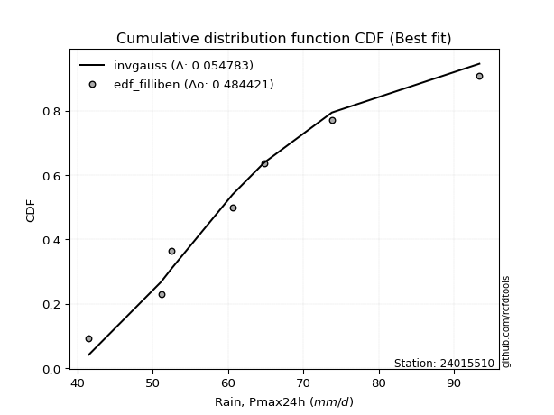</img></img>

</div>


### 10. Empirical - EDF Jenkinson (1977)

The Jenkinson formula in hydrology is an empirical plotting position formula used to estimate the non-exceedance probability _(P)_ or return period _(T)_ of a given ordered observation within a sample. It is a widely used method in the frequency analysis of extreme events such as floods and rainfall, as it provides a distribution-free way to plot data. _a≈0.31_ and _b≈0.38_ are constants derived to approximate the median of the probability distribution for the given rank.

<div align="center">


$P=(m-a)/(n+b)$


</div>


**10.1. Empirical values**

<div align="center">

|                | 0                   | 1                   | 2                  | 3                   | 4                  | 5                  | 6                  | 7                  |
|:---------------|:--------------------|:--------------------|:-------------------|:--------------------|:-------------------|:-------------------|:-------------------|:-------------------|
| date           | 2018                | 2017                | 2021               | 2016                | 2020               | 2019               | 2024               | 2025               |
| x              | 41.5                | 51.1                | 52.5               | 60.6                | 64.8               | 73.8               | 93.4               | 99.2               |
| m              | 1                   | 2                   | 3                  | 4                   | 5                  | 6                  | 7                  | 8                  |
| empirical_dist | edf_jenkinson       | edf_jenkinson       | edf_jenkinson      | edf_jenkinson       | edf_jenkinson      | edf_jenkinson      | edf_jenkinson      | edf_jenkinson      |
| empirical      | 0.08233890214797135 | 0.20167064439140808 | 0.3210023866348448 | 0.44033412887828155 | 0.5596658711217184 | 0.6789976133651551 | 0.7983293556085919 | 0.9176610978520287 |
| empirical_tr   | 1.0897269180754225  | 1.2526158445440956  | 1.4727592267135323 | 1.7867803837953091  | 2.2710027100271004 | 3.115241635687732  | 4.958579881656804  | 12.144927536231886 |

</div>


**10.2. Kolmogorov-Smirnov fit test (sorted by Δ)**


<div align="center">

|                | 0                   | 1                   | 2                   | 3                   | 4                  | 5                   | 6                   | 7                  | 8                   | 9                   | 10                  | 11                 | 12                  | 13                  | 14                  | 15                 | 16                  | 17                  | 18                  | 19                  | 20                 | 21                  | 22                 | 23                  | 24                  | 25                 | 26                  | 27                  | 28                  | 29                  | 30                  | 31                  | 32                  | 33                  | 34                  | 35                  | 36                  | 37                  | 38                  | 39                  | 40                 | 41                 | 42                  | 43                  | 44                  | 45                  | 46                  | 47                  | 48                  | 49                 | 50                  | 51                  | 52                  | 53                 | 54                  | 55                  | 56                  | 57                    | 58                  | 59                  | 60                  | 61                  | 62                 | 63                 | 64                  | 65                  | 66                 | 67                 | 68                 | 69                  | 70                  | 71                  | 72                  | 73                  | 74                  | 75                  | 76                  | 77                  | 78                  | 79                  | 80                  | 81                 | 82                 | 83                  | 84                  | 85                 | 86                 | 87                 | 88                 | 89                 |
|:---------------|:--------------------|:--------------------|:--------------------|:--------------------|:-------------------|:--------------------|:--------------------|:-------------------|:--------------------|:--------------------|:--------------------|:-------------------|:--------------------|:--------------------|:--------------------|:-------------------|:--------------------|:--------------------|:--------------------|:--------------------|:-------------------|:--------------------|:-------------------|:--------------------|:--------------------|:-------------------|:--------------------|:--------------------|:--------------------|:--------------------|:--------------------|:--------------------|:--------------------|:--------------------|:--------------------|:--------------------|:--------------------|:--------------------|:--------------------|:--------------------|:-------------------|:-------------------|:--------------------|:--------------------|:--------------------|:--------------------|:--------------------|:--------------------|:--------------------|:-------------------|:--------------------|:--------------------|:--------------------|:-------------------|:--------------------|:--------------------|:--------------------|:----------------------|:--------------------|:--------------------|:--------------------|:--------------------|:-------------------|:-------------------|:--------------------|:--------------------|:-------------------|:-------------------|:-------------------|:--------------------|:--------------------|:--------------------|:--------------------|:--------------------|:--------------------|:--------------------|:--------------------|:--------------------|:--------------------|:--------------------|:--------------------|:-------------------|:-------------------|:--------------------|:--------------------|:-------------------|:-------------------|:-------------------|:-------------------|:-------------------|
| station        | 24015510            | 24015510            | 24015510            | 24015510            | 24015510           | 24015510            | 24015510            | 24015510           | 24015510            | 24015510            | 24015510            | 24015510           | 24015510            | 24015510            | 24015510            | 24015510           | 24015510            | 24015510            | 24015510            | 24015510            | 24015510           | 24015510            | 24015510           | 24015510            | 24015510            | 24015510           | 24015510            | 24015510            | 24015510            | 24015510            | 24015510            | 24015510            | 24015510            | 24015510            | 24015510            | 24015510            | 24015510            | 24015510            | 24015510            | 24015510            | 24015510           | 24015510           | 24015510            | 24015510            | 24015510            | 24015510            | 24015510            | 24015510            | 24015510            | 24015510           | 24015510            | 24015510            | 24015510            | 24015510           | 24015510            | 24015510            | 24015510            | 24015510              | 24015510            | 24015510            | 24015510            | 24015510            | 24015510           | 24015510           | 24015510            | 24015510            | 24015510           | 24015510           | 24015510           | 24015510            | 24015510            | 24015510            | 24015510            | 24015510            | 24015510            | 24015510            | 24015510            | 24015510            | 24015510            | 24015510            | 24015510            | 24015510           | 24015510           | 24015510            | 24015510            | 24015510           | 24015510           | 24015510           | 24015510           | 24015510           |
| empirical_dist | edf_jenkinson       | edf_jenkinson       | edf_jenkinson       | edf_jenkinson       | edf_jenkinson      | edf_jenkinson       | edf_jenkinson       | edf_jenkinson      | edf_jenkinson       | edf_jenkinson       | edf_jenkinson       | edf_jenkinson      | edf_jenkinson       | edf_jenkinson       | edf_jenkinson       | edf_jenkinson      | edf_jenkinson       | edf_jenkinson       | edf_jenkinson       | edf_jenkinson       | edf_jenkinson      | edf_jenkinson       | edf_jenkinson      | edf_jenkinson       | edf_jenkinson       | edf_jenkinson      | edf_jenkinson       | edf_jenkinson       | edf_jenkinson       | edf_jenkinson       | edf_jenkinson       | edf_jenkinson       | edf_jenkinson       | edf_jenkinson       | edf_jenkinson       | edf_jenkinson       | edf_jenkinson       | edf_jenkinson       | edf_jenkinson       | edf_jenkinson       | edf_jenkinson      | edf_jenkinson      | edf_jenkinson       | edf_jenkinson       | edf_jenkinson       | edf_jenkinson       | edf_jenkinson       | edf_jenkinson       | edf_jenkinson       | edf_jenkinson      | edf_jenkinson       | edf_jenkinson       | edf_jenkinson       | edf_jenkinson      | edf_jenkinson       | edf_jenkinson       | edf_jenkinson       | edf_jenkinson         | edf_jenkinson       | edf_jenkinson       | edf_jenkinson       | edf_jenkinson       | edf_jenkinson      | edf_jenkinson      | edf_jenkinson       | edf_jenkinson       | edf_jenkinson      | edf_jenkinson      | edf_jenkinson      | edf_jenkinson       | edf_jenkinson       | edf_jenkinson       | edf_jenkinson       | edf_jenkinson       | edf_jenkinson       | edf_jenkinson       | edf_jenkinson       | edf_jenkinson       | edf_jenkinson       | edf_jenkinson       | edf_jenkinson       | edf_jenkinson      | edf_jenkinson      | edf_jenkinson       | edf_jenkinson       | edf_jenkinson      | edf_jenkinson      | edf_jenkinson      | edf_jenkinson      | edf_jenkinson      |
| p_dist         | loginvweibull       | fisk                | loggenlogistic      | mielke              | logkstwobign       | loggenexpon         | exponnorm           | loghalfnorm        | logfisk             | logmielke           | lograyleigh         | invgauss           | logweibull_min      | johnsonsu           | loginvgauss         | f                  | logmaxwell          | halfnorm            | nct                 | logrice             | invgamma           | logfatiguelife      | loghalflogistic    | logf                | logalpha            | gompertz           | alpha               | loggompertz         | loggumbel_r         | rayleigh            | loggamma            | loggamma            | lognct              | logerlang           | logmoyal            | ncf                 | betaprime           | loginvgamma         | logpearson3         | logbetaprime        | maxwell            | halflogistic       | logloggamma         | logjohnsonsu        | logexponnorm        | logt                | lognorm             | lognorm             | logcrystalball      | genlogistic        | pearson3            | kstwobign           | gumbel_r            | moyal              | rice                | expon               | genexpon            | loglaplace_asymmetric | t                   | crystalball         | norm                | loglogistic         | weibull_min        | laplace_asymmetric | logistic            | loghypsecant        | nakagami           | hypsecant          | loglaplace         | truncnorm           | logncf              | laplace             | loggumbel_l         | lognakagami         | logtruncnorm        | logexpon            | gumbel_l            | logwald             | wald                | gamma               | logchi2             | loggibrat          | gibrat             | loglognorm          | pareto              | logpareto          | invweibull         | erlang             | fatiguelife        | chi2               |
| delta          | 0.07957436290713837 | 0.08093107896841889 | 0.08312323451750037 | 0.08312440081972594 | 0.0853815588171446 | 0.08556351795255501 | 0.08724656620158011 | 0.0898851423812892 | 0.08997642213209667 | 0.09013714053688959 | 0.09473389346434602 | 0.0954052011119012 | 0.09544012203405827 | 0.09592950349288942 | 0.09607381562863626 | 0.0967100566332485 | 0.09737846186356836 | 0.09742919437425879 | 0.09794515738415133 | 0.09803933899049933 | 0.0985056091555776 | 0.09870115287356196 | 0.0996951349249876 | 0.10098164801237586 | 0.10193909360281472 | 0.1020540148789022 | 0.10215606930125387 | 0.10257608326993745 | 0.10287215304059472 | 0.10292146190385643 | 0.10293793714555788 | 0.10293793714555788 | 0.10325252117508699 | 0.10358522225074895 | 0.10374251047820193 | 0.10383277574956606 | 0.10409384246411613 | 0.10448378502286637 | 0.10466844327252445 | 0.10557720452868458 | 0.1057867404781564 | 0.1059508954520818 | 0.10625708250819821 | 0.10711336093419954 | 0.10726361737085088 | 0.10732706733681951 | 0.10732944064086847 | 0.10732944064086847 | 0.10732988415789413 | 0.1074152680172561 | 0.10867857776425582 | 0.10883783502963051 | 0.10950518401952769 | 0.109722474461313  | 0.11053048169190305 | 0.11091428029947697 | 0.11121439671184996 | 0.1114325534079014    | 0.11654361453442807 | 0.11655864767062196 | 0.11655864878125077 | 0.11728635313117675 | 0.1186156990233132 | 0.1248936857466326 | 0.12493842365714114 | 0.12502104715271192 | 0.1289053604535223 | 0.1343231086934518 | 0.1427884585810137 | 0.14457831789509915 | 0.14960154749081128 | 0.15089102368782792 | 0.15337208158193416 | 0.16067326280164396 | 0.16312325350684392 | 0.17467896322532278 | 0.17785037491534694 | 0.18672853193306296 | 0.22099670152611267 | 0.23449169089997562 | 0.28215798987549356 | 0.3166624144896882 | 0.3210023866305476 | 0.42061523356620684 | 0.43475148794887536 | 0.4429460488946046 | 0.4795513154294536 | 0.4931012394807966 | 0.5057916451490472 | 0.7806546156620682 |
| deltao         | 0.4472608134160001  | 0.4472608134160001  | 0.4472608134160001  | 0.4472608134160001  | 0.4472608134160001 | 0.4472608134160001  | 0.4472608134160001  | 0.4472608134160001 | 0.4472608134160001  | 0.4472608134160001  | 0.4472608134160001  | 0.4472608134160001 | 0.4472608134160001  | 0.4472608134160001  | 0.4472608134160001  | 0.4472608134160001 | 0.4472608134160001  | 0.4472608134160001  | 0.4472608134160001  | 0.4472608134160001  | 0.4472608134160001 | 0.4472608134160001  | 0.4472608134160001 | 0.4472608134160001  | 0.4472608134160001  | 0.4472608134160001 | 0.4472608134160001  | 0.4472608134160001  | 0.4472608134160001  | 0.4472608134160001  | 0.4472608134160001  | 0.4472608134160001  | 0.4472608134160001  | 0.4472608134160001  | 0.4472608134160001  | 0.4472608134160001  | 0.4472608134160001  | 0.4472608134160001  | 0.4472608134160001  | 0.4472608134160001  | 0.4472608134160001 | 0.4472608134160001 | 0.4472608134160001  | 0.4472608134160001  | 0.4472608134160001  | 0.4472608134160001  | 0.4472608134160001  | 0.4472608134160001  | 0.4472608134160001  | 0.4472608134160001 | 0.4472608134160001  | 0.4472608134160001  | 0.4472608134160001  | 0.4472608134160001 | 0.4472608134160001  | 0.4472608134160001  | 0.4472608134160001  | 0.4472608134160001    | 0.4472608134160001  | 0.4472608134160001  | 0.4472608134160001  | 0.4472608134160001  | 0.4472608134160001 | 0.4472608134160001 | 0.4472608134160001  | 0.4472608134160001  | 0.4472608134160001 | 0.4472608134160001 | 0.4472608134160001 | 0.4472608134160001  | 0.4472608134160001  | 0.4472608134160001  | 0.4472608134160001  | 0.4472608134160001  | 0.4472608134160001  | 0.4472608134160001  | 0.4472608134160001  | 0.4472608134160001  | 0.4472608134160001  | 0.4472608134160001  | 0.4472608134160001  | 0.4472608134160001 | 0.4472608134160001 | 0.4472608134160001  | 0.4472608134160001  | 0.4472608134160001 | 0.4472608134160001 | 0.4472608134160001 | 0.4472608134160001 | 0.4472608134160001 |
| eval           | Δo > Δ              | Δo > Δ              | Δo > Δ              | Δo > Δ              | Δo > Δ             | Δo > Δ              | Δo > Δ              | Δo > Δ             | Δo > Δ              | Δo > Δ              | Δo > Δ              | Δo > Δ             | Δo > Δ              | Δo > Δ              | Δo > Δ              | Δo > Δ             | Δo > Δ              | Δo > Δ              | Δo > Δ              | Δo > Δ              | Δo > Δ             | Δo > Δ              | Δo > Δ             | Δo > Δ              | Δo > Δ              | Δo > Δ             | Δo > Δ              | Δo > Δ              | Δo > Δ              | Δo > Δ              | Δo > Δ              | Δo > Δ              | Δo > Δ              | Δo > Δ              | Δo > Δ              | Δo > Δ              | Δo > Δ              | Δo > Δ              | Δo > Δ              | Δo > Δ              | Δo > Δ             | Δo > Δ             | Δo > Δ              | Δo > Δ              | Δo > Δ              | Δo > Δ              | Δo > Δ              | Δo > Δ              | Δo > Δ              | Δo > Δ             | Δo > Δ              | Δo > Δ              | Δo > Δ              | Δo > Δ             | Δo > Δ              | Δo > Δ              | Δo > Δ              | Δo > Δ                | Δo > Δ              | Δo > Δ              | Δo > Δ              | Δo > Δ              | Δo > Δ             | Δo > Δ             | Δo > Δ              | Δo > Δ              | Δo > Δ             | Δo > Δ             | Δo > Δ             | Δo > Δ              | Δo > Δ              | Δo > Δ              | Δo > Δ              | Δo > Δ              | Δo > Δ              | Δo > Δ              | Δo > Δ              | Δo > Δ              | Δo > Δ              | Δo > Δ              | Δo > Δ              | Δo > Δ             | Δo > Δ             | Δo > Δ              | Δo > Δ              | Δo > Δ             | Δo <= Δ            | Δo <= Δ            | Δo <= Δ            | Δo <= Δ            |
| fit            | 1                   | 1                   | 1                   | 1                   | 1                  | 1                   | 1                   | 1                  | 1                   | 1                   | 1                   | 1                  | 1                   | 1                   | 1                   | 1                  | 1                   | 1                   | 1                   | 1                   | 1                  | 1                   | 1                  | 1                   | 1                   | 1                  | 1                   | 1                   | 1                   | 1                   | 1                   | 1                   | 1                   | 1                   | 1                   | 1                   | 1                   | 1                   | 1                   | 1                   | 1                  | 1                  | 1                   | 1                   | 1                   | 1                   | 1                   | 1                   | 1                   | 1                  | 1                   | 1                   | 1                   | 1                  | 1                   | 1                   | 1                   | 1                     | 1                   | 1                   | 1                   | 1                   | 1                  | 1                  | 1                   | 1                   | 1                  | 1                  | 1                  | 1                   | 1                   | 1                   | 1                   | 1                   | 1                   | 1                   | 1                   | 1                   | 1                   | 1                   | 1                   | 1                  | 1                  | 1                   | 1                   | 1                  | 0                  | 0                  | 0                  | 0                  |
| n              | 8                   | 8                   | 8                   | 8                   | 8                  | 8                   | 8                   | 8                  | 8                   | 8                   | 8                   | 8                  | 8                   | 8                   | 8                   | 8                  | 8                   | 8                   | 8                   | 8                   | 8                  | 8                   | 8                  | 8                   | 8                   | 8                  | 8                   | 8                   | 8                   | 8                   | 8                   | 8                   | 8                   | 8                   | 8                   | 8                   | 8                   | 8                   | 8                   | 8                   | 8                  | 8                  | 8                   | 8                   | 8                   | 8                   | 8                   | 8                   | 8                   | 8                  | 8                   | 8                   | 8                   | 8                  | 8                   | 8                   | 8                   | 8                     | 8                   | 8                   | 8                   | 8                   | 8                  | 8                  | 8                   | 8                   | 8                  | 8                  | 8                  | 8                   | 8                   | 8                   | 8                   | 8                   | 8                   | 8                   | 8                   | 8                   | 8                   | 8                   | 8                   | 8                  | 8                  | 8                   | 8                   | 8                  | 8                  | 8                  | 8                  | 8                  |
| best_fit       | 1                   | 0                   | 0                   | 0                   | 0                  | 0                   | 0                   | 0                  | 0                   | 0                   | 0                   | 0                  | 0                   | 0                   | 0                   | 0                  | 0                   | 0                   | 0                   | 0                   | 0                  | 0                   | 0                  | 0                   | 0                   | 0                  | 0                   | 0                   | 0                   | 0                   | 0                   | 0                   | 0                   | 0                   | 0                   | 0                   | 0                   | 0                   | 0                   | 0                   | 0                  | 0                  | 0                   | 0                   | 0                   | 0                   | 0                   | 0                   | 0                   | 0                  | 0                   | 0                   | 0                   | 0                  | 0                   | 0                   | 0                   | 0                     | 0                   | 0                   | 0                   | 0                   | 0                  | 0                  | 0                   | 0                   | 0                  | 0                  | 0                  | 0                   | 0                   | 0                   | 0                   | 0                   | 0                   | 0                   | 0                   | 0                   | 0                   | 0                   | 0                   | 0                  | 0                  | 0                   | 0                   | 0                  | 0                  | 0                  | 0                  | 0                  |
| best_fit_sort  | 1                   | 2                   | 3                   | 4                   | 5                  | 6                   | 7                   | 8                  | 9                   | 10                  | 11                  | 12                 | 13                  | 14                  | 15                  | 16                 | 17                  | 18                  | 19                  | 20                  | 21                 | 22                  | 23                 | 24                  | 25                  | 26                 | 27                  | 28                  | 29                  | 30                  | 31                  | 32                  | 33                  | 34                  | 35                  | 36                  | 37                  | 38                  | 39                  | 40                  | 41                 | 42                 | 43                  | 44                  | 45                  | 46                  | 47                  | 48                  | 49                  | 50                 | 51                  | 52                  | 53                  | 54                 | 55                  | 56                  | 57                  | 58                    | 59                  | 60                  | 61                  | 62                  | 63                 | 64                 | 65                  | 66                  | 67                 | 68                 | 69                 | 70                  | 71                  | 72                  | 73                  | 74                  | 75                  | 76                  | 77                  | 78                  | 79                  | 80                  | 81                  | 82                 | 83                 | 84                  | 85                  | 86                 | 87                 | 88                 | 89                 | 90                 |

</div>


<div align="center">

</img>

</div>


**10.3. Best fit**

<div align="center">

|   id |   station | empirical_dist   | p_dist        |     delta |   deltao | eval   |   fit |   n |   best_fit |   best_fit_sort |
|-----:|----------:|:-----------------|:--------------|----------:|---------:|:-------|------:|----:|-----------:|----------------:|
|    0 |  24015510 | edf_jenkinson    | loginvweibull | 0.0795744 | 0.447261 | Δo > Δ |     1 |   8 |          1 |               1 |

</div>


<div align="center">

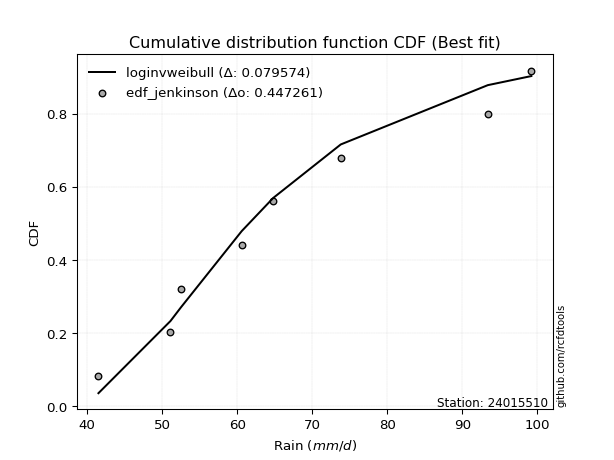</img>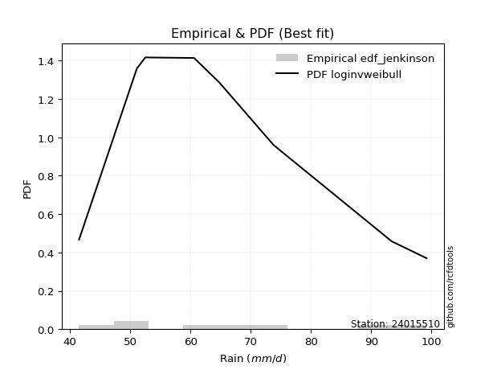</img>

</div>


### 11. Empirical - EDF Cunnane (1978)

Cunnane´s work in statistical hydrology has focused on the performance and evaluation of different probability distributions (such as GEV, Gumbel, Lognormal) for flood frequency estimation. _b_ is a constant, typically set to 0.4.

<div align="center">


$P=(m-b)/(n+1-2b)$


</div>


**11.1. Empirical values**

<div align="center">

|                | 0                   | 1                   | 2                  | 3                  | 4                  | 5                  | 6                  | 7                  |
|:---------------|:--------------------|:--------------------|:-------------------|:-------------------|:-------------------|:-------------------|:-------------------|:-------------------|
| date           | 2018                | 2017                | 2021               | 2016               | 2020               | 2019               | 2024               | 2025               |
| x              | 41.5                | 51.1                | 52.5               | 60.6               | 64.8               | 73.8               | 93.4               | 99.2               |
| m              | 1                   | 2                   | 3                  | 4                  | 5                  | 6                  | 7                  | 8                  |
| empirical_dist | edf_cunnane         | edf_cunnane         | edf_cunnane        | edf_cunnane        | edf_cunnane        | edf_cunnane        | edf_cunnane        | edf_cunnane        |
| empirical      | 0.07317073170731708 | 0.19512195121951223 | 0.3170731707317074 | 0.4390243902439025 | 0.5609756097560976 | 0.6829268292682927 | 0.8048780487804879 | 0.926829268292683  |
| empirical_tr   | 1.0789473684210527  | 1.2424242424242424  | 1.4642857142857144 | 1.782608695652174  | 2.277777777777778  | 3.153846153846154  | 5.125000000000001  | 13.666666666666675 |

</div>


**11.2. Kolmogorov-Smirnov fit test (sorted by Δ)**


<div align="center">

|                | 0                   | 1                  | 2                   | 3                   | 4                  | 5                   | 6                   | 7                  | 8                   | 9                  | 10                  | 11                  | 12                  | 13                  | 14                  | 15                 | 16                  | 17                 | 18                  | 19                  | 20                  | 21                  | 22                  | 23                  | 24                  | 25                  | 26                  | 27                  | 28                  | 29                  | 30                  | 31                 | 32                  | 33                  | 34                  | 35                  | 36                  | 37                  | 38                  | 39                 | 40                  | 41                  | 42                  | 43                  | 44                  | 45                  | 46                  | 47                  | 48                 | 49                  | 50                  | 51                 | 52                  | 53                  | 54                    | 55                 | 56                  | 57                  | 58                  | 59                  | 60                  | 61                  | 62                  | 63                  | 64                  | 65                  | 66                  | 67                  | 68                  | 69                 | 70                  | 71                  | 72                  | 73                 | 74                  | 75                  | 76                  | 77                  | 78                  | 79                  | 80                 | 81                  | 82                  | 83                  | 84                 | 85                 | 86                  | 87                 | 88                 | 89                 |
|:---------------|:--------------------|:-------------------|:--------------------|:--------------------|:-------------------|:--------------------|:--------------------|:-------------------|:--------------------|:-------------------|:--------------------|:--------------------|:--------------------|:--------------------|:--------------------|:-------------------|:--------------------|:-------------------|:--------------------|:--------------------|:--------------------|:--------------------|:--------------------|:--------------------|:--------------------|:--------------------|:--------------------|:--------------------|:--------------------|:--------------------|:--------------------|:-------------------|:--------------------|:--------------------|:--------------------|:--------------------|:--------------------|:--------------------|:--------------------|:-------------------|:--------------------|:--------------------|:--------------------|:--------------------|:--------------------|:--------------------|:--------------------|:--------------------|:-------------------|:--------------------|:--------------------|:-------------------|:--------------------|:--------------------|:----------------------|:-------------------|:--------------------|:--------------------|:--------------------|:--------------------|:--------------------|:--------------------|:--------------------|:--------------------|:--------------------|:--------------------|:--------------------|:--------------------|:--------------------|:-------------------|:--------------------|:--------------------|:--------------------|:-------------------|:--------------------|:--------------------|:--------------------|:--------------------|:--------------------|:--------------------|:-------------------|:--------------------|:--------------------|:--------------------|:-------------------|:-------------------|:--------------------|:-------------------|:-------------------|:-------------------|
| station        | 24015510            | 24015510           | 24015510            | 24015510            | 24015510           | 24015510            | 24015510            | 24015510           | 24015510            | 24015510           | 24015510            | 24015510            | 24015510            | 24015510            | 24015510            | 24015510           | 24015510            | 24015510           | 24015510            | 24015510            | 24015510            | 24015510            | 24015510            | 24015510            | 24015510            | 24015510            | 24015510            | 24015510            | 24015510            | 24015510            | 24015510            | 24015510           | 24015510            | 24015510            | 24015510            | 24015510            | 24015510            | 24015510            | 24015510            | 24015510           | 24015510            | 24015510            | 24015510            | 24015510            | 24015510            | 24015510            | 24015510            | 24015510            | 24015510           | 24015510            | 24015510            | 24015510           | 24015510            | 24015510            | 24015510              | 24015510           | 24015510            | 24015510            | 24015510            | 24015510            | 24015510            | 24015510            | 24015510            | 24015510            | 24015510            | 24015510            | 24015510            | 24015510            | 24015510            | 24015510           | 24015510            | 24015510            | 24015510            | 24015510           | 24015510            | 24015510            | 24015510            | 24015510            | 24015510            | 24015510            | 24015510           | 24015510            | 24015510            | 24015510            | 24015510           | 24015510           | 24015510            | 24015510           | 24015510           | 24015510           |
| empirical_dist | edf_cunnane         | edf_cunnane        | edf_cunnane         | edf_cunnane         | edf_cunnane        | edf_cunnane         | edf_cunnane         | edf_cunnane        | edf_cunnane         | edf_cunnane        | edf_cunnane         | edf_cunnane         | edf_cunnane         | edf_cunnane         | edf_cunnane         | edf_cunnane        | edf_cunnane         | edf_cunnane        | edf_cunnane         | edf_cunnane         | edf_cunnane         | edf_cunnane         | edf_cunnane         | edf_cunnane         | edf_cunnane         | edf_cunnane         | edf_cunnane         | edf_cunnane         | edf_cunnane         | edf_cunnane         | edf_cunnane         | edf_cunnane        | edf_cunnane         | edf_cunnane         | edf_cunnane         | edf_cunnane         | edf_cunnane         | edf_cunnane         | edf_cunnane         | edf_cunnane        | edf_cunnane         | edf_cunnane         | edf_cunnane         | edf_cunnane         | edf_cunnane         | edf_cunnane         | edf_cunnane         | edf_cunnane         | edf_cunnane        | edf_cunnane         | edf_cunnane         | edf_cunnane        | edf_cunnane         | edf_cunnane         | edf_cunnane           | edf_cunnane        | edf_cunnane         | edf_cunnane         | edf_cunnane         | edf_cunnane         | edf_cunnane         | edf_cunnane         | edf_cunnane         | edf_cunnane         | edf_cunnane         | edf_cunnane         | edf_cunnane         | edf_cunnane         | edf_cunnane         | edf_cunnane        | edf_cunnane         | edf_cunnane         | edf_cunnane         | edf_cunnane        | edf_cunnane         | edf_cunnane         | edf_cunnane         | edf_cunnane         | edf_cunnane         | edf_cunnane         | edf_cunnane        | edf_cunnane         | edf_cunnane         | edf_cunnane         | edf_cunnane        | edf_cunnane        | edf_cunnane         | edf_cunnane        | edf_cunnane        | edf_cunnane        |
| p_dist         | loginvweibull       | fisk               | loggenlogistic      | mielke              | logkstwobign       | loggenexpon         | exponnorm           | loghalfnorm        | logfisk             | logmielke          | lograyleigh         | invgauss            | logweibull_min      | johnsonsu           | loginvgauss         | f                  | logmaxwell          | halfnorm           | nct                 | logrice             | invgamma            | logfatiguelife      | loghalflogistic     | logf                | logalpha            | gompertz            | alpha               | loggumbel_r         | rayleigh            | loggamma            | loggamma            | lognct             | logerlang           | logmoyal            | ncf                 | betaprime           | loginvgamma         | logpearson3         | logbetaprime        | maxwell            | halflogistic        | logloggamma         | logjohnsonsu        | logexponnorm        | logt                | lognorm             | lognorm             | logcrystalball      | genlogistic        | pearson3            | kstwobign           | gumbel_r           | moyal               | rice                | loglaplace_asymmetric | loggompertz        | t                   | crystalball         | norm                | loglogistic         | expon               | genexpon            | logistic            | laplace_asymmetric  | loghypsecant        | weibull_min         | hypsecant           | nakagami            | loglaplace          | truncnorm          | loggumbel_l         | laplace             | logncf              | lognakagami        | logtruncnorm        | gumbel_l            | logexpon            | logwald             | wald                | gamma               | logchi2            | loggibrat           | gibrat              | loglognorm          | pareto             | logpareto          | invweibull          | erlang             | fatiguelife        | chi2               |
| delta          | 0.07302566973524238 | 0.0743823857965229 | 0.07657454134560437 | 0.07657570764782995 | 0.0788328656452486 | 0.07901482478065902 | 0.08069787302968412 | 0.0833364492093932 | 0.08342772896020068 | 0.0835884473649936 | 0.08818520029245003 | 0.08885650794000521 | 0.08889142886216228 | 0.08938081032099343 | 0.08952512245674027 | 0.0901613634613525 | 0.09082976869167236 | 0.0908805012023628 | 0.09139646421225534 | 0.09149064581860333 | 0.09195691598368161 | 0.09215245970166597 | 0.09314644175309161 | 0.09443295484047987 | 0.09539040043091873 | 0.09550532170700621 | 0.09560737612935788 | 0.09632345986869872 | 0.09637276873196043 | 0.09638924397366189 | 0.09638924397366189 | 0.096703828003191  | 0.09703652907885296 | 0.09719381730630594 | 0.09728408257767007 | 0.09754514929222013 | 0.09793509185097038 | 0.09811975010062846 | 0.09902851135678858 | 0.0992380473062604 | 0.09940220228018581 | 0.09970838933630222 | 0.10056466776230355 | 0.10071492419895489 | 0.10077837416492352 | 0.10078074746897248 | 0.10078074746897248 | 0.10078119098599814 | 0.1008665748453601 | 0.10212988459235983 | 0.10228914185773452 | 0.1029564908476317 | 0.10317378128941701 | 0.10398178852000706 | 0.10750333750476396   | 0.1091247764418333 | 0.10999492136253208 | 0.11000995449872597 | 0.11000995560935478 | 0.11073765995928075 | 0.11746297347137283 | 0.11776308988374581 | 0.11838973048524515 | 0.12096446984349515 | 0.12109183124957448 | 0.12516439219520906 | 0.13039389279031435 | 0.13545405362541815 | 0.13885924267787625 | 0.1406491019919617 | 0.14682338841003817 | 0.14696180778469048 | 0.15615024066270713 | 0.1672219559735398 | 0.16967194667873978 | 0.17916011354972616 | 0.18122765639721863 | 0.18279931602992552 | 0.21706748562297523 | 0.24104038407187148 | 0.2913261603161479 | 0.31273319858655074 | 0.31707317072741015 | 0.42716392673810266 | 0.4413001811207712 | 0.4494947420665004 | 0.48871948587010794 | 0.4996499326526924 | 0.5123403383209431 | 0.7872033088339639 |
| deltao         | 0.4472608134160001  | 0.4472608134160001 | 0.4472608134160001  | 0.4472608134160001  | 0.4472608134160001 | 0.4472608134160001  | 0.4472608134160001  | 0.4472608134160001 | 0.4472608134160001  | 0.4472608134160001 | 0.4472608134160001  | 0.4472608134160001  | 0.4472608134160001  | 0.4472608134160001  | 0.4472608134160001  | 0.4472608134160001 | 0.4472608134160001  | 0.4472608134160001 | 0.4472608134160001  | 0.4472608134160001  | 0.4472608134160001  | 0.4472608134160001  | 0.4472608134160001  | 0.4472608134160001  | 0.4472608134160001  | 0.4472608134160001  | 0.4472608134160001  | 0.4472608134160001  | 0.4472608134160001  | 0.4472608134160001  | 0.4472608134160001  | 0.4472608134160001 | 0.4472608134160001  | 0.4472608134160001  | 0.4472608134160001  | 0.4472608134160001  | 0.4472608134160001  | 0.4472608134160001  | 0.4472608134160001  | 0.4472608134160001 | 0.4472608134160001  | 0.4472608134160001  | 0.4472608134160001  | 0.4472608134160001  | 0.4472608134160001  | 0.4472608134160001  | 0.4472608134160001  | 0.4472608134160001  | 0.4472608134160001 | 0.4472608134160001  | 0.4472608134160001  | 0.4472608134160001 | 0.4472608134160001  | 0.4472608134160001  | 0.4472608134160001    | 0.4472608134160001 | 0.4472608134160001  | 0.4472608134160001  | 0.4472608134160001  | 0.4472608134160001  | 0.4472608134160001  | 0.4472608134160001  | 0.4472608134160001  | 0.4472608134160001  | 0.4472608134160001  | 0.4472608134160001  | 0.4472608134160001  | 0.4472608134160001  | 0.4472608134160001  | 0.4472608134160001 | 0.4472608134160001  | 0.4472608134160001  | 0.4472608134160001  | 0.4472608134160001 | 0.4472608134160001  | 0.4472608134160001  | 0.4472608134160001  | 0.4472608134160001  | 0.4472608134160001  | 0.4472608134160001  | 0.4472608134160001 | 0.4472608134160001  | 0.4472608134160001  | 0.4472608134160001  | 0.4472608134160001 | 0.4472608134160001 | 0.4472608134160001  | 0.4472608134160001 | 0.4472608134160001 | 0.4472608134160001 |
| eval           | Δo > Δ              | Δo > Δ             | Δo > Δ              | Δo > Δ              | Δo > Δ             | Δo > Δ              | Δo > Δ              | Δo > Δ             | Δo > Δ              | Δo > Δ             | Δo > Δ              | Δo > Δ              | Δo > Δ              | Δo > Δ              | Δo > Δ              | Δo > Δ             | Δo > Δ              | Δo > Δ             | Δo > Δ              | Δo > Δ              | Δo > Δ              | Δo > Δ              | Δo > Δ              | Δo > Δ              | Δo > Δ              | Δo > Δ              | Δo > Δ              | Δo > Δ              | Δo > Δ              | Δo > Δ              | Δo > Δ              | Δo > Δ             | Δo > Δ              | Δo > Δ              | Δo > Δ              | Δo > Δ              | Δo > Δ              | Δo > Δ              | Δo > Δ              | Δo > Δ             | Δo > Δ              | Δo > Δ              | Δo > Δ              | Δo > Δ              | Δo > Δ              | Δo > Δ              | Δo > Δ              | Δo > Δ              | Δo > Δ             | Δo > Δ              | Δo > Δ              | Δo > Δ             | Δo > Δ              | Δo > Δ              | Δo > Δ                | Δo > Δ             | Δo > Δ              | Δo > Δ              | Δo > Δ              | Δo > Δ              | Δo > Δ              | Δo > Δ              | Δo > Δ              | Δo > Δ              | Δo > Δ              | Δo > Δ              | Δo > Δ              | Δo > Δ              | Δo > Δ              | Δo > Δ             | Δo > Δ              | Δo > Δ              | Δo > Δ              | Δo > Δ             | Δo > Δ              | Δo > Δ              | Δo > Δ              | Δo > Δ              | Δo > Δ              | Δo > Δ              | Δo > Δ             | Δo > Δ              | Δo > Δ              | Δo > Δ              | Δo > Δ             | Δo <= Δ            | Δo <= Δ             | Δo <= Δ            | Δo <= Δ            | Δo <= Δ            |
| fit            | 1                   | 1                  | 1                   | 1                   | 1                  | 1                   | 1                   | 1                  | 1                   | 1                  | 1                   | 1                   | 1                   | 1                   | 1                   | 1                  | 1                   | 1                  | 1                   | 1                   | 1                   | 1                   | 1                   | 1                   | 1                   | 1                   | 1                   | 1                   | 1                   | 1                   | 1                   | 1                  | 1                   | 1                   | 1                   | 1                   | 1                   | 1                   | 1                   | 1                  | 1                   | 1                   | 1                   | 1                   | 1                   | 1                   | 1                   | 1                   | 1                  | 1                   | 1                   | 1                  | 1                   | 1                   | 1                     | 1                  | 1                   | 1                   | 1                   | 1                   | 1                   | 1                   | 1                   | 1                   | 1                   | 1                   | 1                   | 1                   | 1                   | 1                  | 1                   | 1                   | 1                   | 1                  | 1                   | 1                   | 1                   | 1                   | 1                   | 1                   | 1                  | 1                   | 1                   | 1                   | 1                  | 0                  | 0                   | 0                  | 0                  | 0                  |
| n              | 8                   | 8                  | 8                   | 8                   | 8                  | 8                   | 8                   | 8                  | 8                   | 8                  | 8                   | 8                   | 8                   | 8                   | 8                   | 8                  | 8                   | 8                  | 8                   | 8                   | 8                   | 8                   | 8                   | 8                   | 8                   | 8                   | 8                   | 8                   | 8                   | 8                   | 8                   | 8                  | 8                   | 8                   | 8                   | 8                   | 8                   | 8                   | 8                   | 8                  | 8                   | 8                   | 8                   | 8                   | 8                   | 8                   | 8                   | 8                   | 8                  | 8                   | 8                   | 8                  | 8                   | 8                   | 8                     | 8                  | 8                   | 8                   | 8                   | 8                   | 8                   | 8                   | 8                   | 8                   | 8                   | 8                   | 8                   | 8                   | 8                   | 8                  | 8                   | 8                   | 8                   | 8                  | 8                   | 8                   | 8                   | 8                   | 8                   | 8                   | 8                  | 8                   | 8                   | 8                   | 8                  | 8                  | 8                   | 8                  | 8                  | 8                  |
| best_fit       | 1                   | 0                  | 0                   | 0                   | 0                  | 0                   | 0                   | 0                  | 0                   | 0                  | 0                   | 0                   | 0                   | 0                   | 0                   | 0                  | 0                   | 0                  | 0                   | 0                   | 0                   | 0                   | 0                   | 0                   | 0                   | 0                   | 0                   | 0                   | 0                   | 0                   | 0                   | 0                  | 0                   | 0                   | 0                   | 0                   | 0                   | 0                   | 0                   | 0                  | 0                   | 0                   | 0                   | 0                   | 0                   | 0                   | 0                   | 0                   | 0                  | 0                   | 0                   | 0                  | 0                   | 0                   | 0                     | 0                  | 0                   | 0                   | 0                   | 0                   | 0                   | 0                   | 0                   | 0                   | 0                   | 0                   | 0                   | 0                   | 0                   | 0                  | 0                   | 0                   | 0                   | 0                  | 0                   | 0                   | 0                   | 0                   | 0                   | 0                   | 0                  | 0                   | 0                   | 0                   | 0                  | 0                  | 0                   | 0                  | 0                  | 0                  |
| best_fit_sort  | 1                   | 2                  | 3                   | 4                   | 5                  | 6                   | 7                   | 8                  | 9                   | 10                 | 11                  | 12                  | 13                  | 14                  | 15                  | 16                 | 17                  | 18                 | 19                  | 20                  | 21                  | 22                  | 23                  | 24                  | 25                  | 26                  | 27                  | 28                  | 29                  | 30                  | 31                  | 32                 | 33                  | 34                  | 35                  | 36                  | 37                  | 38                  | 39                  | 40                 | 41                  | 42                  | 43                  | 44                  | 45                  | 46                  | 47                  | 48                  | 49                 | 50                  | 51                  | 52                 | 53                  | 54                  | 55                    | 56                 | 57                  | 58                  | 59                  | 60                  | 61                  | 62                  | 63                  | 64                  | 65                  | 66                  | 67                  | 68                  | 69                  | 70                 | 71                  | 72                  | 73                  | 74                 | 75                  | 76                  | 77                  | 78                  | 79                  | 80                  | 81                 | 82                  | 83                  | 84                  | 85                 | 86                 | 87                  | 88                 | 89                 | 90                 |

</div>


<div align="center">

</img>

</div>


**11.3. Best fit**

<div align="center">

|   id |   station | empirical_dist   | p_dist        |     delta |   deltao | eval   |   fit |   n |   best_fit |   best_fit_sort |
|-----:|----------:|:-----------------|:--------------|----------:|---------:|:-------|------:|----:|-----------:|----------------:|
|    0 |  24015510 | edf_cunnane      | loginvweibull | 0.0730257 | 0.447261 | Δo > Δ |     1 |   8 |          1 |               1 |

</div>


<div align="center">

</img>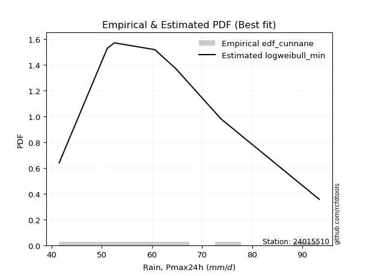</img>

</div>


### 12. Empirical - EDF Adamowski (1981)

The Adamowski formula in hydrology refers to a specific plotting position formula used for estimating the non-parametric empirical distribution of hydrological events (like flood peaks) to calculate their return periods. This formula provides an alternative to traditional parametric methods (like the Gumbel or Log Pearson Type III distributions). 

<div align="center">


$P=(m-0.25)/(n+0.5)$


</div>


**12.1. Empirical values**

<div align="center">

|                | 0                   | 1                   | 2                  | 3                  | 4                  | 5                  | 6                  | 7                  |
|:---------------|:--------------------|:--------------------|:-------------------|:-------------------|:-------------------|:-------------------|:-------------------|:-------------------|
| date           | 2018                | 2017                | 2021               | 2016               | 2020               | 2019               | 2024               | 2025               |
| x              | 41.5                | 51.1                | 52.5               | 60.6               | 64.8               | 73.8               | 93.4               | 99.2               |
| m              | 1                   | 2                   | 3                  | 4                  | 5                  | 6                  | 7                  | 8                  |
| empirical_dist | edf_adamowski       | edf_adamowski       | edf_adamowski      | edf_adamowski      | edf_adamowski      | edf_adamowski      | edf_adamowski      | edf_adamowski      |
| empirical      | 0.08823529411764706 | 0.20588235294117646 | 0.3235294117647059 | 0.4411764705882353 | 0.5588235294117647 | 0.6764705882352942 | 0.7941176470588235 | 0.9117647058823529 |
| empirical_tr   | 1.096774193548387   | 1.259259259259259   | 1.4782608695652173 | 1.7894736842105263 | 2.2666666666666666 | 3.0909090909090913 | 4.857142857142856  | 11.33333333333333  |

</div>


**12.2. Kolmogorov-Smirnov fit test (sorted by Δ)**


<div align="center">

|                | 0                   | 1                   | 2                   | 3                   | 4                   | 5                   | 6                   | 7                   | 8                   | 9                   | 10                  | 11                 | 12                  | 13                  | 14                 | 15                  | 16                  | 17                  | 18                  | 19                 | 20                 | 21                  | 22                  | 23                  | 24                  | 25                 | 26                  | 27                  | 28                 | 29                  | 30                 | 31                 | 32                  | 33                  | 34                  | 35                  | 36                  | 37                  | 38                 | 39                  | 40                  | 41                  | 42                  | 43                  | 44                  | 45                  | 46                  | 47                 | 48                  | 49                  | 50                 | 51                  | 52                 | 53                  | 54                  | 55                  | 56                    | 57                  | 58                  | 59                  | 60                  | 61                  | 62                  | 63                  | 64                  | 65                 | 66                  | 67                  | 68                  | 69                 | 70                  | 71                 | 72                  | 73                  | 74                  | 75                 | 76                  | 77                  | 78                  | 79                  | 80                  | 81                  | 82                  | 83                  | 84                 | 85                 | 86                 | 87                 | 88                 | 89                 |
|:---------------|:--------------------|:--------------------|:--------------------|:--------------------|:--------------------|:--------------------|:--------------------|:--------------------|:--------------------|:--------------------|:--------------------|:-------------------|:--------------------|:--------------------|:-------------------|:--------------------|:--------------------|:--------------------|:--------------------|:-------------------|:-------------------|:--------------------|:--------------------|:--------------------|:--------------------|:-------------------|:--------------------|:--------------------|:-------------------|:--------------------|:-------------------|:-------------------|:--------------------|:--------------------|:--------------------|:--------------------|:--------------------|:--------------------|:-------------------|:--------------------|:--------------------|:--------------------|:--------------------|:--------------------|:--------------------|:--------------------|:--------------------|:-------------------|:--------------------|:--------------------|:-------------------|:--------------------|:-------------------|:--------------------|:--------------------|:--------------------|:----------------------|:--------------------|:--------------------|:--------------------|:--------------------|:--------------------|:--------------------|:--------------------|:--------------------|:-------------------|:--------------------|:--------------------|:--------------------|:-------------------|:--------------------|:-------------------|:--------------------|:--------------------|:--------------------|:-------------------|:--------------------|:--------------------|:--------------------|:--------------------|:--------------------|:--------------------|:--------------------|:--------------------|:-------------------|:-------------------|:-------------------|:-------------------|:-------------------|:-------------------|
| station        | 24015510            | 24015510            | 24015510            | 24015510            | 24015510            | 24015510            | 24015510            | 24015510            | 24015510            | 24015510            | 24015510            | 24015510           | 24015510            | 24015510            | 24015510           | 24015510            | 24015510            | 24015510            | 24015510            | 24015510           | 24015510           | 24015510            | 24015510            | 24015510            | 24015510            | 24015510           | 24015510            | 24015510            | 24015510           | 24015510            | 24015510           | 24015510           | 24015510            | 24015510            | 24015510            | 24015510            | 24015510            | 24015510            | 24015510           | 24015510            | 24015510            | 24015510            | 24015510            | 24015510            | 24015510            | 24015510            | 24015510            | 24015510           | 24015510            | 24015510            | 24015510           | 24015510            | 24015510           | 24015510            | 24015510            | 24015510            | 24015510              | 24015510            | 24015510            | 24015510            | 24015510            | 24015510            | 24015510            | 24015510            | 24015510            | 24015510           | 24015510            | 24015510            | 24015510            | 24015510           | 24015510            | 24015510           | 24015510            | 24015510            | 24015510            | 24015510           | 24015510            | 24015510            | 24015510            | 24015510            | 24015510            | 24015510            | 24015510            | 24015510            | 24015510           | 24015510           | 24015510           | 24015510           | 24015510           | 24015510           |
| empirical_dist | edf_adamowski       | edf_adamowski       | edf_adamowski       | edf_adamowski       | edf_adamowski       | edf_adamowski       | edf_adamowski       | edf_adamowski       | edf_adamowski       | edf_adamowski       | edf_adamowski       | edf_adamowski      | edf_adamowski       | edf_adamowski       | edf_adamowski      | edf_adamowski       | edf_adamowski       | edf_adamowski       | edf_adamowski       | edf_adamowski      | edf_adamowski      | edf_adamowski       | edf_adamowski       | edf_adamowski       | edf_adamowski       | edf_adamowski      | edf_adamowski       | edf_adamowski       | edf_adamowski      | edf_adamowski       | edf_adamowski      | edf_adamowski      | edf_adamowski       | edf_adamowski       | edf_adamowski       | edf_adamowski       | edf_adamowski       | edf_adamowski       | edf_adamowski      | edf_adamowski       | edf_adamowski       | edf_adamowski       | edf_adamowski       | edf_adamowski       | edf_adamowski       | edf_adamowski       | edf_adamowski       | edf_adamowski      | edf_adamowski       | edf_adamowski       | edf_adamowski      | edf_adamowski       | edf_adamowski      | edf_adamowski       | edf_adamowski       | edf_adamowski       | edf_adamowski         | edf_adamowski       | edf_adamowski       | edf_adamowski       | edf_adamowski       | edf_adamowski       | edf_adamowski       | edf_adamowski       | edf_adamowski       | edf_adamowski      | edf_adamowski       | edf_adamowski       | edf_adamowski       | edf_adamowski      | edf_adamowski       | edf_adamowski      | edf_adamowski       | edf_adamowski       | edf_adamowski       | edf_adamowski      | edf_adamowski       | edf_adamowski       | edf_adamowski       | edf_adamowski       | edf_adamowski       | edf_adamowski       | edf_adamowski       | edf_adamowski       | edf_adamowski      | edf_adamowski      | edf_adamowski      | edf_adamowski      | edf_adamowski      | edf_adamowski      |
| p_dist         | loginvweibull       | fisk                | loggenlogistic      | mielke              | logkstwobign        | loggenexpon         | exponnorm           | loghalfnorm         | logfisk             | logmielke           | loggompertz         | lograyleigh        | invgauss            | logweibull_min      | johnsonsu          | loginvgauss         | f                   | logmaxwell          | halfnorm            | nct                | logrice            | invgamma            | logfatiguelife      | loghalflogistic     | logf                | logalpha           | gompertz            | alpha               | expon              | genexpon            | loggumbel_r        | rayleigh           | loggamma            | loggamma            | lognct              | logerlang           | logmoyal            | ncf                 | betaprime          | loginvgamma         | logpearson3         | logbetaprime        | maxwell             | halflogistic        | logloggamma         | logjohnsonsu        | logexponnorm        | logt               | lognorm             | lognorm             | logcrystalball     | genlogistic         | pearson3           | kstwobign           | gumbel_r            | moyal               | loglaplace_asymmetric | weibull_min         | rice                | t                   | crystalball         | norm                | loglogistic         | nakagami            | laplace_asymmetric  | loghypsecant       | logistic            | hypsecant           | loglaplace          | logncf             | truncnorm           | laplace            | lognakagami         | loggumbel_l         | logtruncnorm        | logexpon           | gumbel_l            | logwald             | wald                | gamma               | logchi2             | loggibrat           | gibrat              | loglognorm          | pareto             | logpareto          | invweibull         | erlang             | fatiguelife        | chi2               |
| delta          | 0.08378607145690675 | 0.08514278751818727 | 0.08733494306726874 | 0.08733610936949432 | 0.08959326736691298 | 0.08977522650232339 | 0.09145827475134849 | 0.09409685093105757 | 0.09418813068186505 | 0.09434884908665797 | 0.09836437472016907 | 0.0989456020141144 | 0.09961690966166958 | 0.09965183058382665 | 0.1001412120426578 | 0.10028552417840464 | 0.10092176518301688 | 0.10159017041333673 | 0.10164090292402717 | 0.1021568659339197 | 0.1022510475402677 | 0.10271731770534598 | 0.10291286142333034 | 0.10390684347475598 | 0.10519335656214424 | 0.1061508021525831 | 0.10626572342867058 | 0.10636777785102225 | 0.1067025717497086 | 0.10700268816208158 | 0.1070838615903631 | 0.1071331704536248 | 0.10714964569532626 | 0.10714964569532626 | 0.10746422972485536 | 0.10779693080051733 | 0.10795421902797031 | 0.10804448429933444 | 0.1083055510138845 | 0.10869549357263475 | 0.10888015182229283 | 0.10978891307845295 | 0.10999844902792477 | 0.11016260400185018 | 0.11046879105796659 | 0.11132506948396792 | 0.11147532592061926 | 0.1115387758865879 | 0.11154114919063685 | 0.11154114919063685 | 0.1115415927076625 | 0.11162697656702447 | 0.1128902863140242 | 0.11304954357939889 | 0.11371689256929607 | 0.11393418301108138 | 0.11395957853776248   | 0.11440399047354483 | 0.11474219024167143 | 0.12075532308419645 | 0.12077035622039034 | 0.12077035733101915 | 0.12149806168094512 | 0.12469365190375392 | 0.12742071087649368 | 0.127548072282573  | 0.12915013220690952 | 0.13685013382331288 | 0.14531548371087477 | 0.1453898389410429 | 0.14710534302496023 | 0.153418048817689  | 0.15646155425187558 | 0.15758379013170254 | 0.15891154495707555 | 0.1704672546755544 | 0.17700803320539327 | 0.18925555706292405 | 0.22352372665597375 | 0.23027998235020725 | 0.27626159790581784 | 0.31918943961954926 | 0.32352941176040867 | 0.41640352501643846 | 0.430539779399107  | 0.4387343403448362 | 0.4736549234597779 | 0.4888895309310282 | 0.5015799365992788 | 0.7764429071122998 |
| deltao         | 0.4472608134160001  | 0.4472608134160001  | 0.4472608134160001  | 0.4472608134160001  | 0.4472608134160001  | 0.4472608134160001  | 0.4472608134160001  | 0.4472608134160001  | 0.4472608134160001  | 0.4472608134160001  | 0.4472608134160001  | 0.4472608134160001 | 0.4472608134160001  | 0.4472608134160001  | 0.4472608134160001 | 0.4472608134160001  | 0.4472608134160001  | 0.4472608134160001  | 0.4472608134160001  | 0.4472608134160001 | 0.4472608134160001 | 0.4472608134160001  | 0.4472608134160001  | 0.4472608134160001  | 0.4472608134160001  | 0.4472608134160001 | 0.4472608134160001  | 0.4472608134160001  | 0.4472608134160001 | 0.4472608134160001  | 0.4472608134160001 | 0.4472608134160001 | 0.4472608134160001  | 0.4472608134160001  | 0.4472608134160001  | 0.4472608134160001  | 0.4472608134160001  | 0.4472608134160001  | 0.4472608134160001 | 0.4472608134160001  | 0.4472608134160001  | 0.4472608134160001  | 0.4472608134160001  | 0.4472608134160001  | 0.4472608134160001  | 0.4472608134160001  | 0.4472608134160001  | 0.4472608134160001 | 0.4472608134160001  | 0.4472608134160001  | 0.4472608134160001 | 0.4472608134160001  | 0.4472608134160001 | 0.4472608134160001  | 0.4472608134160001  | 0.4472608134160001  | 0.4472608134160001    | 0.4472608134160001  | 0.4472608134160001  | 0.4472608134160001  | 0.4472608134160001  | 0.4472608134160001  | 0.4472608134160001  | 0.4472608134160001  | 0.4472608134160001  | 0.4472608134160001 | 0.4472608134160001  | 0.4472608134160001  | 0.4472608134160001  | 0.4472608134160001 | 0.4472608134160001  | 0.4472608134160001 | 0.4472608134160001  | 0.4472608134160001  | 0.4472608134160001  | 0.4472608134160001 | 0.4472608134160001  | 0.4472608134160001  | 0.4472608134160001  | 0.4472608134160001  | 0.4472608134160001  | 0.4472608134160001  | 0.4472608134160001  | 0.4472608134160001  | 0.4472608134160001 | 0.4472608134160001 | 0.4472608134160001 | 0.4472608134160001 | 0.4472608134160001 | 0.4472608134160001 |
| eval           | Δo > Δ              | Δo > Δ              | Δo > Δ              | Δo > Δ              | Δo > Δ              | Δo > Δ              | Δo > Δ              | Δo > Δ              | Δo > Δ              | Δo > Δ              | Δo > Δ              | Δo > Δ             | Δo > Δ              | Δo > Δ              | Δo > Δ             | Δo > Δ              | Δo > Δ              | Δo > Δ              | Δo > Δ              | Δo > Δ             | Δo > Δ             | Δo > Δ              | Δo > Δ              | Δo > Δ              | Δo > Δ              | Δo > Δ             | Δo > Δ              | Δo > Δ              | Δo > Δ             | Δo > Δ              | Δo > Δ             | Δo > Δ             | Δo > Δ              | Δo > Δ              | Δo > Δ              | Δo > Δ              | Δo > Δ              | Δo > Δ              | Δo > Δ             | Δo > Δ              | Δo > Δ              | Δo > Δ              | Δo > Δ              | Δo > Δ              | Δo > Δ              | Δo > Δ              | Δo > Δ              | Δo > Δ             | Δo > Δ              | Δo > Δ              | Δo > Δ             | Δo > Δ              | Δo > Δ             | Δo > Δ              | Δo > Δ              | Δo > Δ              | Δo > Δ                | Δo > Δ              | Δo > Δ              | Δo > Δ              | Δo > Δ              | Δo > Δ              | Δo > Δ              | Δo > Δ              | Δo > Δ              | Δo > Δ             | Δo > Δ              | Δo > Δ              | Δo > Δ              | Δo > Δ             | Δo > Δ              | Δo > Δ             | Δo > Δ              | Δo > Δ              | Δo > Δ              | Δo > Δ             | Δo > Δ              | Δo > Δ              | Δo > Δ              | Δo > Δ              | Δo > Δ              | Δo > Δ              | Δo > Δ              | Δo > Δ              | Δo > Δ             | Δo > Δ             | Δo <= Δ            | Δo <= Δ            | Δo <= Δ            | Δo <= Δ            |
| fit            | 1                   | 1                   | 1                   | 1                   | 1                   | 1                   | 1                   | 1                   | 1                   | 1                   | 1                   | 1                  | 1                   | 1                   | 1                  | 1                   | 1                   | 1                   | 1                   | 1                  | 1                  | 1                   | 1                   | 1                   | 1                   | 1                  | 1                   | 1                   | 1                  | 1                   | 1                  | 1                  | 1                   | 1                   | 1                   | 1                   | 1                   | 1                   | 1                  | 1                   | 1                   | 1                   | 1                   | 1                   | 1                   | 1                   | 1                   | 1                  | 1                   | 1                   | 1                  | 1                   | 1                  | 1                   | 1                   | 1                   | 1                     | 1                   | 1                   | 1                   | 1                   | 1                   | 1                   | 1                   | 1                   | 1                  | 1                   | 1                   | 1                   | 1                  | 1                   | 1                  | 1                   | 1                   | 1                   | 1                  | 1                   | 1                   | 1                   | 1                   | 1                   | 1                   | 1                   | 1                   | 1                  | 1                  | 0                  | 0                  | 0                  | 0                  |
| n              | 8                   | 8                   | 8                   | 8                   | 8                   | 8                   | 8                   | 8                   | 8                   | 8                   | 8                   | 8                  | 8                   | 8                   | 8                  | 8                   | 8                   | 8                   | 8                   | 8                  | 8                  | 8                   | 8                   | 8                   | 8                   | 8                  | 8                   | 8                   | 8                  | 8                   | 8                  | 8                  | 8                   | 8                   | 8                   | 8                   | 8                   | 8                   | 8                  | 8                   | 8                   | 8                   | 8                   | 8                   | 8                   | 8                   | 8                   | 8                  | 8                   | 8                   | 8                  | 8                   | 8                  | 8                   | 8                   | 8                   | 8                     | 8                   | 8                   | 8                   | 8                   | 8                   | 8                   | 8                   | 8                   | 8                  | 8                   | 8                   | 8                   | 8                  | 8                   | 8                  | 8                   | 8                   | 8                   | 8                  | 8                   | 8                   | 8                   | 8                   | 8                   | 8                   | 8                   | 8                   | 8                  | 8                  | 8                  | 8                  | 8                  | 8                  |
| best_fit       | 1                   | 0                   | 0                   | 0                   | 0                   | 0                   | 0                   | 0                   | 0                   | 0                   | 0                   | 0                  | 0                   | 0                   | 0                  | 0                   | 0                   | 0                   | 0                   | 0                  | 0                  | 0                   | 0                   | 0                   | 0                   | 0                  | 0                   | 0                   | 0                  | 0                   | 0                  | 0                  | 0                   | 0                   | 0                   | 0                   | 0                   | 0                   | 0                  | 0                   | 0                   | 0                   | 0                   | 0                   | 0                   | 0                   | 0                   | 0                  | 0                   | 0                   | 0                  | 0                   | 0                  | 0                   | 0                   | 0                   | 0                     | 0                   | 0                   | 0                   | 0                   | 0                   | 0                   | 0                   | 0                   | 0                  | 0                   | 0                   | 0                   | 0                  | 0                   | 0                  | 0                   | 0                   | 0                   | 0                  | 0                   | 0                   | 0                   | 0                   | 0                   | 0                   | 0                   | 0                   | 0                  | 0                  | 0                  | 0                  | 0                  | 0                  |
| best_fit_sort  | 1                   | 2                   | 3                   | 4                   | 5                   | 6                   | 7                   | 8                   | 9                   | 10                  | 11                  | 12                 | 13                  | 14                  | 15                 | 16                  | 17                  | 18                  | 19                  | 20                 | 21                 | 22                  | 23                  | 24                  | 25                  | 26                 | 27                  | 28                  | 29                 | 30                  | 31                 | 32                 | 33                  | 34                  | 35                  | 36                  | 37                  | 38                  | 39                 | 40                  | 41                  | 42                  | 43                  | 44                  | 45                  | 46                  | 47                  | 48                 | 49                  | 50                  | 51                 | 52                  | 53                 | 54                  | 55                  | 56                  | 57                    | 58                  | 59                  | 60                  | 61                  | 62                  | 63                  | 64                  | 65                  | 66                 | 67                  | 68                  | 69                  | 70                 | 71                  | 72                 | 73                  | 74                  | 75                  | 76                 | 77                  | 78                  | 79                  | 80                  | 81                  | 82                  | 83                  | 84                  | 85                 | 86                 | 87                 | 88                 | 89                 | 90                 |

</div>


<div align="center">

</img>

</div>


**12.3. Best fit**

<div align="center">

|   id |   station | empirical_dist   | p_dist        |     delta |   deltao | eval   |   fit |   n |   best_fit |   best_fit_sort |
|-----:|----------:|:-----------------|:--------------|----------:|---------:|:-------|------:|----:|-----------:|----------------:|
|    0 |  24015510 | edf_adamowski    | loginvweibull | 0.0837861 | 0.447261 | Δo > Δ |     1 |   8 |          1 |               1 |

</div>


<div align="center">

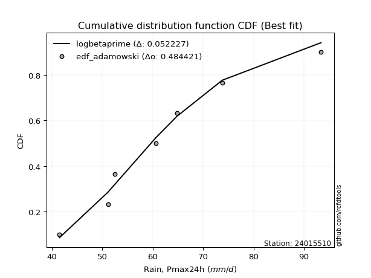</img>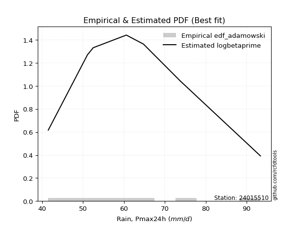</img>

</div>


## C. Best fit & Estimate extreme values for specific return periods - Tr


### 1. Best fit (ordered by delta Δ)

<div align="center">

|   id |   station | empirical_dist   | p_dist        |     delta |   deltao | eval   |   fit |   n |   best_fit |   best_fit_sort |
|-----:|----------:|:-----------------|:--------------|----------:|---------:|:-------|------:|----:|-----------:|----------------:|
|    0 |  24015510 | edf_hazen        | loginvweibull | 0.0654037 | 0.447261 | Δo > Δ |     1 |   8 |          1 |               1 |
|    1 |  24015510 | edf_gringorten   | loginvweibull | 0.0700219 | 0.447261 | Δo > Δ |     1 |   8 |          1 |               2 |
|    2 |  24015510 | edf_cunnane      | loginvweibull | 0.0730257 | 0.447261 | Δo > Δ |     1 |   8 |          1 |               3 |
|    3 |  24015510 | edf_blom         | loginvweibull | 0.0748734 | 0.447261 | Δo > Δ |     1 |   8 |          1 |               4 |
|    4 |  24015510 | edf_tukey        | loginvweibull | 0.0779037 | 0.447261 | Δo > Δ |     1 |   8 |          1 |               5 |
|    5 |  24015510 | edf_filliben     | loginvweibull | 0.0790394 | 0.447261 | Δo > Δ |     1 |   8 |          1 |               6 |
|    6 |  24015510 | edf_beard        | loginvweibull | 0.0795744 | 0.447261 | Δo > Δ |     1 |   8 |          1 |               7 |
|    7 |  24015510 | edf_jenkinson    | loginvweibull | 0.0795744 | 0.447261 | Δo > Δ |     1 |   8 |          1 |               8 |
|    8 |  24015510 | edf_chegodayev   | loginvweibull | 0.0802847 | 0.447261 | Δo > Δ |     1 |   8 |          1 |               9 |
|    9 |  24015510 | edf_adamowski    | loginvweibull | 0.0837861 | 0.447261 | Δo > Δ |     1 |   8 |          1 |              10 |
|   10 |  24015510 | edf_california   | logkstwobign  | 0.0922891 | 0.447261 | Δo > Δ |     1 |   8 |          1 |              11 |
|   11 |  24015510 | edf_weibull      | loginvweibull | 0.100126  | 0.447261 | Δo > Δ |     1 |   8 |          1 |              12 |

</div>

:file_folder:Tables: [bestfit_24015510.csv](table/bestfit_24015510.csv) | [extreme_24015510.csv](table/extreme_24015510.csv)


### 2. Extreme values

In hydrology, a return period (or recurrence interval $Tr$) is the statistical average time between extreme events like floods or droughts of a specific magnitude, indicating how rare an event is, with a 100-year flood, for example, having a 1% chance of occurring in any given year, not that it happens exactly every century. It is a key tool for infrastructure design (like bridges or dams) and risk assessment, calculated from historical data to determine the probability of future events, although it is important to remember it is statistical average, and events can cluster or be missed.

> risk_rate: assuming the return period as the project useful life.

|   id |      tr |   prob_l |     prob_g |    alpha |   betaprime |    chi2 |   crystalball |   erlang |    expon |   exponnorm |        f |   fatiguelife |     fisk |    gamma |   genexpon |   genlogistic |   gibrat |   gompertz |   gumbel_l |   gumbel_r |   halflogistic |   halfnorm |   hypsecant |   invgamma |   invgauss |      invweibull |   johnsonsu |   kstwobign |   laplace |   laplace_asymmetric |   loggamma |   logistic |   lognorm |   maxwell |   mielke |    moyal |   nakagami |      ncf |      nct |     norm |          pareto |   pearson3 |   rayleigh |     rice |        t |   truncnorm |     wald |   weibull_min |   logalpha |   logbetaprime |          logchi2 |   logcrystalball |   logerlang |   logexpon |   logexponnorm |     logf |   logfatiguelife |   logfisk |   loggenexpon |   loggenlogistic |   loggibrat |   loggompertz |   loggumbel_l |   loggumbel_r |   loghalflogistic |   loghalfnorm |   loghypsecant |   loginvgamma |   loginvgauss |   loginvweibull |   logjohnsonsu |   logkstwobign |   loglaplace |   loglaplace_asymmetric |   logloggamma |   loglogistic |    loglognorm |   logmaxwell |   logmielke |   logmoyal |   lognakagami |   logncf |   lognct |     logpareto |   logpearson3 |   lograyleigh |   logrice |     logt |   logtruncnorm |   logwald |   logweibull_min |   station |   n |   risk_rate |
|-----:|--------:|---------:|-----------:|---------:|------------:|--------:|--------------:|---------:|---------:|------------:|---------:|--------------:|---------:|---------:|-----------:|--------------:|---------:|-----------:|-----------:|-----------:|---------------:|-----------:|------------:|-----------:|-----------:|----------------:|------------:|------------:|----------:|---------------------:|-----------:|-----------:|----------:|----------:|---------:|---------:|-----------:|---------:|---------:|---------:|----------------:|-----------:|-----------:|---------:|---------:|------------:|---------:|--------------:|-----------:|---------------:|-----------------:|-----------------:|------------:|-----------:|---------------:|---------:|-----------------:|----------:|--------------:|-----------------:|------------:|--------------:|--------------:|--------------:|------------------:|--------------:|---------------:|--------------:|--------------:|----------------:|---------------:|---------------:|-------------:|------------------------:|--------------:|--------------:|--------------:|-------------:|------------:|-----------:|--------------:|---------:|---------:|--------------:|--------------:|--------------:|----------:|---------:|---------------:|----------:|-----------------:|----------:|----:|------------:|
|    0 |    2    | 0.5      | 0.5        |  63.4949 |     63.7215 | 41.5215 |       67.1125 |  44.6541 |  59.2532 |     61.2874 |  63.2587 |       41.5016 |  62.47   |  53.547  |    59.2326 |       63.6902 |  61.3592 |    64.3804 |    70.2614 |    63.9636 |        62.3982 |    63.189  |     67.1125 |    63.032  |    62.5213 |  1595.18        |     62.6807 |     63.9031 |   67.1125 |              64.1863 |    63.5761 |    67.1125 |   64.4835 |   65.4732 |  61.8157 |  62.9471 |    59.4646 |  63.8555 |  62.8756 |  67.1125 |    42.5324      |    65.5763 |    64.8918 |  65.7028 |  67.1143 |     66.8909 |  60.8993 |       59.184  |    63.5299 |        63.9946 |     68.2168      |          64.4836 |     63.5612 |    56.327  |        64.4703 |  63.3877 |          63.0677 |   62.8713 |       61.1818 |          61.8194 |     59.2516 |       59.437  |       67.5395 |       61.5658 |           60.165  |       60.8683 |        64.4835 |       63.831  |       62.7707 |         61.5398 |        64.4645 |        61.1089 |      64.4835 |                 62.6486 |       64.565  |       64.4835 |  41.7461      |      62.9477 |     62.1782 |    60.6524 |       57.0221 |  63.3551 |  63.6645 |  42.2992      |       64.0438 |       62.4119 |   63.1319 |  64.4835 |        56.8244 |   58.8531 |          62.5835 |  24015510 |   8 |    0.75     |
|    1 |    2.33 | 0.570815 | 0.429185   |  66.7377 |     67.0098 | 41.5593 |       70.5329 |  46.3442 |  63.1648 |     64.6277 |  66.6213 |       42.5284 |  65.7154 |  56.744  |    63.1396 |       66.9282 |  63.0918 |    68.128  |    73.2372 |    67.133  |        65.6568 |    66.8805 |     69.8498 |    66.3182 |    65.9039 | 85084.5         |     66.0185 |     67.253  |   69.1824 |              66.9713 |    66.8693 |    70.1261 |   67.8097 |   69.0268 |  65.1152 |  65.9473 |    63.6945 |  67.152  |  66.1384 |  70.5329 |    44.5118      |    69.0071 |    68.4979 |  69.0784 |  70.5347 |     69.985  |  63.1421 |       63.2699 |    66.8162 |        67.2956 |     81.2187      |          67.8097 |     66.8463 |    60.2487 |        67.7955 |  66.6733 |          66.358  |   66.0094 |       64.7615 |          65.1184 |     60.7808 |       63.1846 |       70.5605 |       64.503  |           63.118  |       64.2639 |        67.132  |       67.127  |       66.0686 |         64.884  |        67.7969 |        64.5186 |      66.4764 |                 65.194  |       67.9178 |       67.4053 |  43.4305      |      66.3244 |     65.3923 |    63.3881 |       60.8179 |  70.1961 |  66.9528 |  43.8754      |       67.3585 |       65.8107 |   66.5463 |  67.8097 |        60.7352 |   60.8265 |          65.9943 |  24015510 |   8 |    0.729209 |
|    2 |    5    | 0.8      | 0.2        |  81.1081 |     81.3098 | 42.3627 |       83.244  |  58.4251 |  82.7217 |     81.2481 |  81.6259 |       64.3064 |  81.7408 |  73.6125 |    82.6737 |       80.994  |  73.067  |    83.1409 |    82.8507 |    80.9022 |        80.4014 |    82.4914 |     80.8299 |    81.1771 |    81.3688 |     3.0304e+12  |     81.2775 |     81.4828 |   79.5312 |              80.8954 |    81.3002 |    81.7621 |   81.746  |   83.0133 |  81.4268 |  79.8446 |    82.6656 |  81.4326 |  81.032  |  83.244  |   663.071       |    82.6331 |    82.9348 |  82.5922 |  83.2459 |     81.8964 |  75.6973 |       84.1089 |    81.2974 |        81.4494 |    224.488       |          81.746  |     81.2343 |    84.3521 |        81.7378 |  81.2585 |          81.2022 |   81.0057 |       81.6782 |          81.4272 |     70.385  |       81.1306 |       81.2745 |       78.979  |           78.3988 |       80.8474 |        78.8951 |       81.3854 |       81.1892 |         81.6546 |        81.7591 |        81.2552 |      77.4027 |                 79.5581 |       81.9182 |       79.9839 |   2.26757e+40 |      81.4691 |     80.9102 |    77.7602 |       80.4863 | 103.994  |  81.3212 |   4.10246e+06 |       81.5651 |       81.3752 |   81.6582 |  81.7462 |        83.6484 |   73.1603 |          81.4635 |  24015510 |   8 |    0.67232  |
|    3 |   10    | 0.9      | 0.1        |  93.3145 |     92.996  | 44.0935 |       91.6762 |  72.6951 | 100.475  |     96.3322 |  94.2741 |       94.3764 |  98.1357 |  89.6274 |   100.406  |       92.4492 |  84.4377 |    93.3496 |    88.203  |    92.1171 |        92.6463 |    94.043  |     89.5979 |    93.9746 |    94.5396 |     4.28924e+18 |     94.4577 |     92.317  |   88.9256 |              93.5353 |    93.1858 |    90.3315 |   92.537  |   92.8563 |  97.5327 |  91.9444 |    97.2227 |  93.0431 |  94.0945 |  91.6762 | 78314           |    92.4525 |    93.2286 |  92.2278 |  91.6781 |     89.9733 |  89.0213 |      103.426  |    93.3539 |        92.7708 |    636.646       |          92.5369 |     93.0766 |   114.489  |        92.5455 |  93.5202 |          93.9359 |   95.9471 |       96.6204 |          97.5333 |     83.1968 |       96.5352 |       87.9296 |       93.1388 |           93.8648 |       95.8168 |        89.7517 |       92.9374 |       94.4472 |         98.4694 |        92.5694 |        96.8533 |      88.8689 |                 95.3203 |       92.7058 |       90.7252 | inf           |      94.1567 |     95.856  |    92.9026 |       99.3916 | 136.429  |  93.1339 | inf           |       92.9182 |       94.6737 |   94.0193 |  92.5374 |       110.06   |   88.9956 |          94.5221 |  24015510 |   8 |    0.651322 |
|    4 |   15    | 0.933333 | 0.0666667  | 100.487  |     99.6311 | 45.4587 |       95.8841 |  81.9225 | 110.86   |    105.156  | 101.586  |      114.043  | 109.21   |  99.1712 |   110.779  |       98.9119 |  92.2806 |    98.3663 |    90.627  |    98.4444 |        99.5757 |   100.054  |     94.6017 |   101.49   |   102.099  |     1.26664e+22 |    102.159  |     98.0687 |   94.421  |             100.929  |    99.9579 |    95.0005 |   98.4436 |   97.9066 | 107.953  |  98.9665 |   104.863  |  99.6136 | 101.882  |  95.8841 |     1.32468e+06 |    97.5906 |    98.5325 |  97.1925 |  95.8859 |     94.0044 |  97.5773 |      114.852  |   100.285  |        99.1024 |   1207.65        |          98.4435 |     99.8212 |   136.89   |        98.4661 | 100.613  |         101.39   |  105.984  |      105.408  |         107.956  |     93.3687 |      105.243  |       91.1202 |      102.22   |          103.933  |      104.673  |        96.6046 |       99.4543 |      102.32   |        109.441  |        98.486  |       106.317  |      96.3482 |                105.951  |       98.5911 |       97.1728 | inf           |     101.415  |    105.397  |   103.008  |      110.977  | 156.74   |  99.8649 | inf           |       99.2621 |      102.353  |  100.974  |  98.444  |       128.419  |  100.928  |         102.007  |  24015510 |   8 |    0.644736 |
|    5 |   20    | 0.95     | 0.05       | 105.663  |    104.305  | 46.5486 |       98.6397 |  88.7553 | 118.228  |    111.416  | 106.79   |      128.603  | 117.918  | 105.999  |   118.139  |      103.437  |  98.4328 |   101.603  |    92.1358 |   102.875  |       104.431  |   104.062  |     98.1316 |   106.89   |   107.43   |     3.40763e+24 |    107.664  |    101.943  |   98.32   |             106.175  |   104.736  |    98.2276 |  102.514  |  101.258  | 115.895  | 103.94   |   109.969  | 104.234  | 107.532  |  98.6397 |     9.85651e+06 |   101.042  |   102.058  | 100.492  |  98.6416 |     96.6295 | 103.953  |      123.005  |   105.205  |       103.522  |   1920.83        |         102.514  |    104.579  |   155.394  |       102.549  | 105.664  |         106.734  |  113.891  |      111.703  |         115.901  |    102.211  |      111.305  |       93.1645 |      109.101  |          111.624  |      111.027  |       101.751  |      104.027  |      108.013  |        117.844  |       102.564  |       113.207  |     102.034  |                114.205  |      102.639  |      101.895  | inf           |     106.539  |    112.616  |   110.823  |      119.452  | 171.861  | 104.616  | inf           |      103.687  |      107.799  |  105.835  | 102.515  |       142.909  |  110.849  |         107.293  |  24015510 |   8 |    0.641514 |
|    6 |   25    | 0.96     | 0.04       | 109.747  |    107.926  | 47.452  |      100.668  |  94.191  | 123.943  |    116.272  | 110.847  |      140.172  | 125.23   | 111.322  |   123.847  |      106.922  | 103.562  |   103.956  |    93.2095 |   106.287  |       108.171  |   107.044  |    100.864  |   111.132  |   111.554  |     2.53532e+26 |    111.968  |    104.845  |  101.344  |             110.244  |   108.44   |   100.696  |  105.618  |  103.747  | 122.405  | 107.794  |   113.772  | 107.807  | 112.003  | 100.668  |     4.67527e+07 |   103.628  |   104.677  | 102.944  | 100.67   |     98.5478 | 109.06   |      129.353  |   109.036  |       106.922  |   2766           |         105.618  |    108.266  |   171.452  |       105.663  | 109.607  |         110.925  |  120.557  |      116.629  |         122.414  |    110.219  |      115.947  |       94.647  |      114.715  |          117.935  |      116.005  |       105.922  |      107.557  |      112.504  |        124.753  |       105.673  |       118.66   |     106.674  |                121.048  |      105.722  |      105.662  | inf           |     110.509  |    118.503  |   117.287  |      126.178  | 184.032  | 108.301  | inf           |      107.091  |      112.031  |  109.577  | 105.619  |       155.052  |  119.494  |         111.39   |  24015510 |   8 |    0.639603 |
|    7 |   50    | 0.98     | 0.02       | 122.955  |    119.215  | 50.5188 |      106.477  | 111.685  | 141.697  |    131.356  | 123.649  |      177.29   | 151.621  | 127.979  |   141.58   |      117.659  | 121.641  |   110.544  |    96.124  |   116.799  |       119.696  |   115.712  |    109.334  |   124.679  |   124.333  |     1.47737e+32 |    125.581  |    113.367  |  110.739  |             122.884  |   120.003  |   108.239  |  115.036  |  110.963  | 144.826  | 119.761  |   124.833  | 118.926  | 126.481  | 106.477  |     5.88733e+09 |   111.241  |   112.28   | 110.061  | 106.479  |    103.921  | 125.735  |      149.189  |   121.097  |       117.399  |   8768.23        |         115.036  |    119.774  |   232.709  |       115.118  | 122.072  |         124.272  |  144.928  |      132.228  |         144.85   |    143.791  |      130.064  |       98.7914 |      133.891  |          139.714  |      131.775  |       119.971  |      118.509  |      126.957  |        148.688  |       115.105  |       136.236  |     122.476  |                145.031  |      115.052  |      118.056  | inf           |     122.881  |    138.603  |   139.852  |      147.967  | 224.531  | 119.82   | inf           |      117.569  |      125.284  |  121.103  | 115.037  |       198.326  |  152.699  |         124.153  |  24015510 |   8 |    0.63583  |
|    8 |   75    | 0.986667 | 0.0133333  | 131.143  |    125.893  | 52.4579 |      109.594  | 122.261  | 152.082  |    140.18   | 131.319  |      199.644  | 170.117  | 137.792  |   151.953  |      123.9    | 133.852  |   113.978  |    97.5978 |   122.909  |       126.396  |   120.43   |    114.283  |   132.917  |   131.804  |     3.31583e+35 |    133.75   |    118.056  |  116.234  |             130.278  |   126.848  |   112.595  |  120.431  |  114.887  | 159.688  | 126.759  |   130.855  | 125.485  | 135.432  | 109.594  |     9.96335e+10 |   115.455  |   116.417  | 113.933  | 109.596  |    106.678  | 135.995  |      160.867  |   128.312  |       123.51   |  17425.7         |         120.431  |    126.584  |   278.239  |       120.539  | 129.562  |         132.358  |  162.402  |      141.594  |         159.727  |    172.077  |      138.132  |      100.956  |      146.478  |          154.178  |      141.242  |       129.029  |      124.946  |      135.82   |        164.657  |       120.508  |       146.993  |     132.784  |                161.205  |      120.382  |      125.866  | inf           |     130.179  |    151.798  |   155.01   |      161.371  | 250.279  | 126.651  | inf           |      123.675  |      133.14   |  127.816  | 120.432  |       227.967  |  177.568  |         131.678  |  24015510 |   8 |    0.634587 |
|    9 |  100    | 0.99     | 0.01       | 137.203  |    130.681  | 53.8853 |      111.702  | 129.889  | 159.45   |    146.441  | 136.859  |      215.729  | 184.862  | 144.779  |   159.313  |      128.316  | 143.311  |   116.259  |    98.5618 |   127.234  |       131.138  |   123.645  |    117.794  |   138.922  |   137.108  |     7.80504e+37 |    139.65   |    121.269  |  120.133  |             135.524  |   131.756  |   115.671  |  124.223  |  117.559  | 171.117  | 131.724  |   134.957  | 130.18   | 142.028  | 111.702  |     7.41363e+11 |   118.356  |   119.235  | 116.571  | 111.704  |    108.464  | 143.476  |      169.182  |   133.519  |       127.852  |  28490.5         |         124.223  |    131.466  |   315.85   |       124.351  | 134.983  |         138.238  |  176.611  |      148.359  |         171.168  |    197.761  |      143.781  |      102.397  |      156.095  |          165.312  |      148.079  |       135.865  |      129.541  |      142.313  |        176.985  |       124.305  |       154.85   |     140.619  |                173.764  |      124.122  |      131.689  | inf           |     135.396  |    161.883  |   166.749  |      171.19   | 269.547  | 131.556  | inf           |      128.01   |      138.773  |  132.578  | 124.224  |       251.15   |  198.218  |         137.055  |  24015510 |   8 |    0.633968 |
|   10 |  200    | 0.995    | 0.005      | 152.823  |    142.424  | 57.4678 |      116.484  | 148.617  | 177.203  |    161.525  | 150.591  |      255.101  | 226.937  | 161.687  |   177.045  |      138.935  | 169.046  |   121.307  |   100.657  |   137.63   |       142.538  |   130.996  |    126.253  |   153.998  |   149.91   |     3.92987e+43 |    154.255  |    128.668  |  129.528  |             148.164  |   143.793  |   123.049  |  133.272  |  123.673  | 202.042  | 143.686  |   144.332  | 141.672  | 158.846  | 116.484  |     9.33561e+13 |   125.094  |   125.683  | 122.607  | 116.486  |    112.165  | 162.111  |      189.308  |   146.418  |       138.373  |  94290.5         |         133.272  |    143.436  |   428.697  |       133.456  | 148.463  |         152.951  |  218.692  |      165.1    |         202.134  |    288.744  |      157.156  |      105.601  |      181.878  |          195.479  |      164.985  |       153.86   |      140.749  |      158.728  |        210.535  |       133.367  |       174.581  |     161.45   |                208.191  |      133.026  |      146.78   | inf           |     148.133  |    188.943  |   198.817  |      195.945  | 319.644  | 143.612  | inf           |      138.504  |      152.575  |  144.086  | 133.273  |       315.128  |  260.705  |         150.17   |  24015510 |   8 |    0.633042 |
|   11 |  250    | 0.996    | 0.004      | 158.202  |    146.277  | 58.6575 |      117.945  | 154.736  | 182.918  |    166.381  | 155.139  |      267.933  | 242.752  | 167.148  |   182.754  |      142.349  | 178.279  |   122.814  |   101.274  |   140.972  |       146.203  |   133.258  |    128.976  |   159.05   |   154.041  |     2.67602e+45 |    159.081  |    130.958  |  132.552  |             152.233  |   147.741  |   125.418  |  136.167  |  125.556  | 213.124  | 147.536  |   147.214  | 145.435  | 164.562  | 117.945  |     4.42821e+14 |   127.196  |   127.667  | 124.464  | 117.947  |    113.169  | 168.276  |      195.812  |   150.689  |       141.786  | 139052           |         136.167  |    147.361  |   472.999  |       136.371  | 152.94   |         157.864  |  235.147  |      170.63   |         213.233  |    330.743  |      161.396  |      106.563  |      191.04   |          206.303  |      170.564  |       160.146  |      144.406  |      164.261  |        222.617  |       136.265  |       181.182  |     168.792  |                220.665  |      135.868  |      151.982  | inf           |     152.29   |    198.567  |   210.399  |      204.255  | 336.948  | 147.575  | inf           |      141.905  |      157.094  |  147.807  | 136.168  |       338.375  |  285.444  |         154.447  |  24015510 |   8 |    0.632858 |
|   12 |  500    | 0.998    | 0.002      | 176.22   |    158.505  | 62.4447 |      122.279  | 173.974  | 200.672  |    181.465  | 169.697  |      308.185  | 300.398  | 184.162  |   200.486  |      152.944  | 210.191  |   127.186  |   103.041  |   151.346  |       157.578  |   140.001  |    137.434  |   175.414  |   166.902  |     1.30945e+51 |    174.483  |    137.821  |  141.946  |             164.873  |   160.261  |   132.764  |  145.126  |  131.172  | 251.533  | 159.498  |   155.802  | 157.353  | 183.359  | 122.279  |     5.57622e+16 |   133.549  |   133.59   | 130.008  | 122.281  |    115.695  | 187.878  |      216.089  |   164.364  |       152.492  | 468602           |         145.126  |    159.805  |   641.991  |       145.398  | 167.322  |         173.727  |  298.324  |      188.269  |         251.711  |    528.829  |      174.384  |      109.369  |      222.522  |          243.862  |      188.344  |       181.355  |      155.948  |      182.292  |        264.717  |       145.235  |       202.498  |     193.796  |                264.384  |      144.646  |      169.319  | inf           |     165.401  |    231.664  |   250.859  |      231.174  | 394.659  | 160.174  | inf           |      152.563  |      171.387  |  159.444  | 145.128  |       419.654  |  380.809  |         167.922  |  24015510 |   8 |    0.632489 |
|   13 |  750    | 0.998667 | 0.00133333 | 187.821  |    165.855  | 64.715  |      124.686  | 185.368  | 211.057  |    190.288  | 178.54   |      331.968  | 341.097  | 194.144  |   210.859  |      159.138  | 231.295  |   129.552  |   103.986  |   157.411  |       164.228  |   143.768  |    142.382  |   185.492  |   174.449  |     2.77473e+54 |    183.794  |    141.676  |  147.442  |             172.267  |   167.779  |   137.056  |  150.356  |  134.313  | 277.114  | 166.495  |   160.596  | 164.502  | 195.143  | 124.686  |     9.43685e+17 |   137.157  |   136.901  | 133.108  | 124.688  |    116.776  | 199.631  |      227.996  |   172.674  |       158.84   | 958576           |         150.355  |    167.276  |   767.6    |       150.673  | 176.094  |         183.455  |  346.124  |      198.927  |         277.344  |    721.295  |      181.862  |      110.898  |      243.277  |          268.912  |      199.072  |       195.041  |      162.842  |      193.472  |        292.925  |       150.47   |       215.555  |     210.106  |                293.87   |      149.757  |      180.348  | inf           |     173.22   |    253.508  |   278.044  |      247.721  | 431.379  | 167.764  | inf           |      158.877  |      179.94   |  166.315  | 150.357  |       473.977  |  452.654  |         175.948  |  24015510 |   8 |    0.632366 |
|   14 | 1000    | 0.999    | 0.001      | 196.605  |    171.167  | 66.3467 |      126.344  | 193.506  | 218.425  |    196.549  | 184.97   |      348.933  | 373.637  | 201.238  |   218.219  |      163.532  | 247.445  |   131.156  |   104.621  |   161.712  |       168.945  |   146.369  |    145.892  |   192.884  |   179.815  |     6.3471e+56  |    190.541  |    144.346  |  151.341  |             177.513  |   173.207  |   140.099  |  154.065  |  136.484  | 296.82   | 171.459  |   163.904  | 169.661  | 203.884  | 126.344  |     7.02186e+18 |   139.673  |   139.19   | 135.25   | 126.345  |    117.386  | 208.085  |      236.465  |   178.72   |       163.389  |      1.59591e+06 |         154.065  |    172.669  |   871.36   |       154.416  | 182.49   |         190.572  |  386.342  |      206.646  |         297.094  |    914.674  |      187.118  |      111.94   |      259.163  |          288.226  |      206.836  |       205.373  |      167.802  |      201.706  |        314.738  |       154.183  |       225.091  |     222.504  |                316.764  |      153.377  |      188.603  | inf           |     178.839  |    270.24   |   299.1    |      259.831  | 458.847  | 173.255  | inf           |      163.396  |      186.098  |  171.223  | 154.067  |       515.692  |  512.577  |         181.711  |  24015510 |   8 |    0.632305 |

<div align="center">

</img>

</div>


<div align="center">

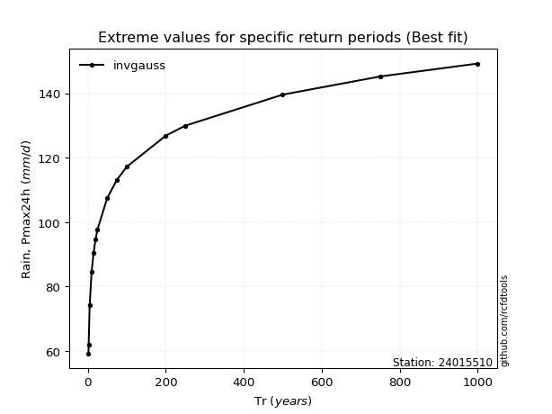</img>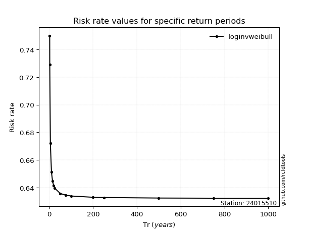</img>

</div>


<sub>**APP DISCLAIMER**: NO WARRANTY - This software is provided by [github.com/rcfdtools](https://github.com/rcfdtools) "as is", without any express or implied warranty, including warranties of merchantability, fitness for a particular purpose, or non-infringement. There is no guarantee that the software will be error-free or operate without interruption. LIMITATION OF LIABILITY - Neither the authors nor copyright holders will be liable for claims or damages arising from the software or its use. You are responsible for determining if the software is appropriate for your use and assume all associated risks, including errors, legal compliance, and data loss. NO PROFESSIONAL ADVICE - The software provides general information and does not offer professional advice. It should not replace consultation with professional advisors.</sub>