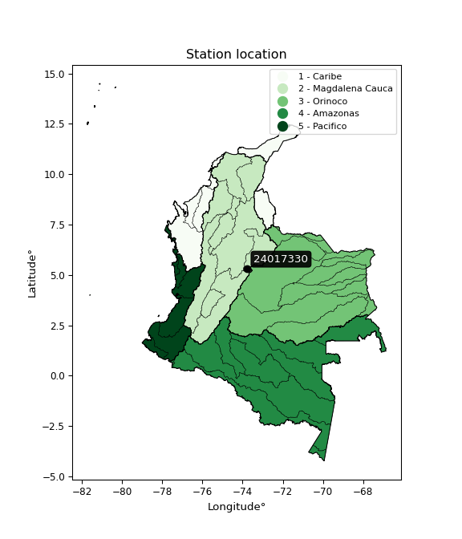

<div align="center">


</div>

# PMP Station (Rain, Pmax24h): 24017330

Probable Maximum Precipitation (PMP) is the greatest amount of rainfall for a specific duration that is meteorologically possible for a given location, acting as a "worst-case" scenario for extreme storms, crucial for designing safety-critical infrastructure like bridges, river deviations, dams, spillways, and nuclear plants to prevent catastrophic failure. PMP is calculated by hydrologists using meteorological data to determine the upper limit of extreme rainfall, often leading to the Probable Maximum Flood (PMF) for flood control design, and is increasingly being studied for climate change impacts. Probable Maximum Precipitation (PMP) is the theoretical upper limit of rainfall, a deterministic estimate for extreme events, while probability distributions (like GEV, Gumbel) describe the likelihood and frequency of various precipitation amounts, including rare ones, showing how often events occur, with PMP representing the extreme end of these distributions, used for critical infrastructure design to ensure safety against the worst conceivable weather, unlike standard statistical forecasts which cover typical probabilities.

The most common probability distributions in hydrology, used for analyzing floods, rainfall, and streamflow, include the Normal, Log-Normal, Gumbel, Gamma (including Log-Pearson Type III), and Generalized Extreme Value (GEV) distributions, often chosen based on the data´s skewness and whether modeling extremes or general conditions, with Gumbel and GEV popular for extreme events like floods, while the Normal distribution serves as a baseline, though often requiring transformations for skewed hydrological data. These distributions help in designing water infrastructure, managing water resources, and forecasting hydrologic events.

> Hydrological data often isn´t perfectly normal (it´s skewed), so different distributions are needed for different applications, such as: **Flood Frequency Analysis**: Using Gumbel, GEV, or Log-Pearson Type III for predicting extreme flood magnitudes and their return periods, **Rainfall Analysis**: Normal for annual totals, but Log-Normal, Weibull, or GEV for intensity or extreme daily rainfall, **Streamflow Modeling**: Gamma and Log-Normal for maximum flows, GEV for minimum flows, and Kappa for daily flows.

<div align="center">

</img>

</div>


## A. General information


### 1. General running parameters

• app_version: _v20260108_. • runtime: _2026-01-08 18:05:13.093906_. • Python version: _3.14.0_. • SciPy version: _1.16.3_. • Pandas version: _2.3.3_. • NumPy version: _2.3.5_. • Stations dataset (station_dataset_file): _dataset/pmax24h_in/automatic_colombia_2003_2024.csv_. • Stations catalog (station_catalog_file): _dataset/CNE.xls_. • Minimum year to eval til year_max (date_min): _1900_. • Maximum year to eval since year_min (date_max): _2024_. • Creates, save and include plots into reports (create_plot): _False_. • Plot only fit distributions with Δo > Δ (plot_only_fit): _True_. • Plot only simple graphs avoiding multiple CDFs and multiple Extreme values plots (plot_only_simple): _False_. • Eval low extreme values, if False, evaluates high extreme values (low_extreme): _False_. • Eval every SciPy distribution as logarithmic (pdist_logarithmic_on): _True_. • Standard deviation normalized (ddof): _1.0_. • Return periods to eval in years (Tr): _[2, 2.33, 5, 10, 15, 20, 25, 50, 75, 100, 200, 250, 500, 750, 1000]_. • Minimum data sample per station, 0 means any (minimum_sample): _5_. • Z-Score maximum threshold to adjust a value, 0 means disable (zscore_max): _3.5_. • Z-Score minimum threshold to adjust a value, 0 means disable (zscore_min): _-2.5_. • Avoid zeros, e.g. rain = 0 (avoid_zeros): _True_. • Avoid null values (avoid_nans): _True_. 

:file_folder:Table: [dataset.csv](../../dataset/pmax24h_in/automatic_colombia_2003_2024.csv)

> Delta Degrees of Freedom (DDOF): is a parameter used in the formulas for calculating variance and standard deviation. When ddof=0, the divisor is $N$ (the total number of observations) and this is used when your data set is the entire population. When ddof=1, the divisor is $N-1$ and this is used when your data set is a sample drawn from a larger population. Using $N-1$ provides an unbiased estimate of the population variance (known as Bessel´s correction).


### 2. Station info and location

|   id |   CODIGO | NOMBRE                          | CATEGORIA    | TECNOLOGIA                | ESTADO   | FECHA_INSTALACION   |   FECHA_SUSPENSION |   ALTITUD |   LATITUD |   LONGITUD | DEPARTAMENTO   | MUNICIPIO   | AREA_OPERATIVA                            | ENTIDAD                                       | AREA_HIDROGRAFICA   | ZONA_HIDROGRAFICA   | SUBZONA_HIDROGRAFICA   | CORRIENTE   | Catalogo   |   Version |
|-----:|---------:|:--------------------------------|:-------------|:--------------------------|:---------|:--------------------|-------------------:|----------:|----------:|-----------:|:---------------|:------------|:------------------------------------------|:----------------------------------------------|:--------------------|:--------------------|:-----------------------|:------------|:-----------|----------:|
|    0 | 24017330 | PTE LA BALSA  - AUT  [24017330] | Limnimétrica | Automática con Telemetría | Activa   | 15/04/1964          |                nan |      2573 |   5.32619 |   -73.7642 | Cundinamarca   | Lenguazaque | Area Operativa 11 - Cundinamarca-Amazonas | CORPORACION AUTONOMA REGIONAL DE CUNDINAMARCA | Magdalena Cauca     | Sogamoso            | Río Suárez             | Lenguazaque | CNE_OE     |  20251226 |

<div align="center">

Dynamic map: [:earth_americas:Google](http://maps.google.com/maps?q=5.326194444,-73.76422222) [:earth_americas:OSM](https://www.openstreetmap.org/#map=18/5.326194444/-73.76422222&layers=P) [:earth_americas:Bing](https://www.bing.com/maps?cp=5.326194444~-73.76422222&lvl=18) [:earth_americas:Apple](https://maps.apple.com/frame?center=5.326194444%2C-73.76422222&span=0.003%2C0.006)

</div>


<div align="center">

```geojson
{
  "type": "Feature",
  "geometry": {
    "type": "Point", 
    "coordinates": [-73.76422222, 5.326194444]
  }, 
  "properties": {
    "Name": "24017330"
  }
}
```

</div>


### 3. Discrete values table and plot

<div align="center">

|               |          0 |          1 |            2 |           3 |          4 |           5 |           6 |           7 |           8 |          9 |
|:--------------|-----------:|-----------:|-------------:|------------:|-----------:|------------:|------------:|------------:|------------:|-----------:|
| Date          | 2012       | 2013       | 2014         | 2015        | 2016       | 2017        | 2018        | 2019        | 2020        | 2021       |
| Value         |   18.2     |   39.3     |   27.7       |   30        |   32.4     |   28.5      |   33.8      |   21.5      |   25        |   19       |
| Value_initial |   18.2     |   39.3     |   27.7       |   30        |   32.4     |   28.5      |   33.8      |   21.5      |   25        |   19       |
| count         |   10       |   10       |   10         |   10        |   10       |   10        |   10        |   10        |   10        |   10       |
| mean          |   27.54    |   27.54    |   27.54      |   27.54     |   27.54    |   27.54     |   27.54     |   27.54     |   27.54     |   27.54    |
| std           |    6.75939 |    6.75939 |    6.75939   |    6.75939  |    6.75939 |    6.75939  |    6.75939  |    6.75939  |    6.75939  |    6.75939 |
| zscore        |   -1.38178 |    1.7398  |    0.0236708 |    0.363938 |    0.719   |    0.142025 |    0.926119 |   -0.893572 |   -0.375774 |   -1.26343 |


</div>


> The initial value (value_initial) correspond to the initial obtained or null completed value, and value (value) is adjusted only when the initial value is outside the valid range (outlier) definite through the Z-Score value. If Z-Score is active, values out of range or outliers are replaced with the station mean value. A Z-Score (or standard score) measures how many standard deviations a data point is from the mean of a dataset, indicating its relative position; positive scores mean above the mean, negative mean below, and a score of zero is exactly at the mean, allowing for comparison of values from different distributions. It´s calculated using the formula $z=(x–μ)/σ$, where $x$ is the data point, $μ$ is the mean, and $σ$ is the standard deviation, helping identify outliers and understand probability.
>
> <sub>**Note**: In this study, "completing" (filling gaps in) and "extending" (forecasting or lengthening the historical record) rainfall data series are avoided for certain critical analyses because they introduce artificial bias and uncertainty, which can distort the statistics of rare events (extremes), alter day-to-day variability, and compromise the integrity and homogeneity of the original data. Some reasons against Completing/Extending rainfall data are: **Distortion of Extremes and Variability**: The primary issue is that most gap-filling or extension methods rely on averaging or regression with nearby stations, which inherently smooths the data. Rainfall is highly variable in space and time, with a large percentage of zero values and occasional large storms. Infilling methods often underestimate the highest values and overestimate the lowest (zero) values, which severely distorts analyses focused on flood frequency, drought severity, and intensity-duration-frequency (IDF) curves, **Loss of Data Homogeneity**: Infilled or extended data are synthetic estimates, not actual measurements. Combining these estimates with observed data can violate the assumption of data homogeneity, which requires that the data properties do not change over time. Inhomogeneity can lead to incorrect conclusions about long-term trends or changes in climate patterns, **Propagation of Errors**: Errors and biases from the original data (e.g., wind-induced undercatch, instrument errors, site changes) or the data used for imputation can propagate through the analysis, leading to unreliable hydrological models and inaccurate predictions, **Compromised Statistical Integrity**: For statistical analyses, especially those involving the frequency of events, using artificial data can introduce time bias or autocorrelation that doesn´t exist in reality, making it difficult to assess the true probability of events, **Difficulty in Validation**: It is difficult to accurately validate the quality of filled or extended data, especially for past periods where ground-truth measurements are unavailable. The reliability of imputation techniques heavily depends on the density of the surrounding station network and the complexity of the local topography.</sub>


### 4. Active continuous probability distributions from SciPy (43 of 104 available)

A Probability Density Function (PDF) describes the relative likelihood of a continuous random variable falling within a specific range, where the total area under its curve equals 1, and the area over any interval gives the actual probability for that range. Unlike discrete probabilities (like rolling a die), a PDF shows density, not direct probability for a single point (which is zero), with higher points indicating higher likelihood, often visualized as a bell curve for normal distributions.

A log of a probability density function (log-PDF) is simply the logarithm of the PDF´s value, denoted as $log(f(x))$, useful for converting multiplication of probabilities into addition, improving numerical stability with tiny numbers, and connecting to information theory concepts like entropy. Instead of dealing with very small probabilities (e.g., 0.000001), log-PDFs use negative numbers (e.g., $log(0.00001) ≈ -11.51$ that are easier for computers to handle, preventing underflow errors and simplifying complex calculations. In this study, each active probability distribution from SciPy is also evaluated in the $log$ form.

[scipy.stats](https://docs.scipy.org/doc/scipy/reference/stats.html) is a Python´s powerful submodule within the SciPy library for comprehensive statistical analysis, offering over 130 probability distributions (like Normal, Poisson), functions for descriptive stats (mean, variance), hypothesis testing (t-tests, chi-square), random variable generation, and statistical tests, making it essential for data science, modeling, and research. It provides tools to explore, model, and draw conclusions from data efficiently, working seamlessly with NumPy.

<div align="center">

|   id | p_dist             |   n_parameter | fit_method   | label                                                                       | active   | ref                                                                                                        |
|-----:|:-------------------|--------------:|:-------------|:----------------------------------------------------------------------------|:---------|:-----------------------------------------------------------------------------------------------------------|
|    0 | alpha              |             3 | MLE          | Alpha                                                                       | True     | [:mortar_board:](https://docs.scipy.org/doc/scipy/reference/generated/scipy.stats.alpha.html)              |
|    1 | betaprime          |             4 | MLE          | Beta prime                                                                  | True     | [:mortar_board:](https://docs.scipy.org/doc/scipy/reference/generated/scipy.stats.betaprime.html)          |
|    2 | chi2               |             3 | MLE          | Chi²                                                                        | True     | [:mortar_board:](https://docs.scipy.org/doc/scipy/reference/generated/scipy.stats.chi2.html)               |
|    3 | crystalball        |             4 | MLE          | Crystalball                                                                 | True     | [:mortar_board:](https://docs.scipy.org/doc/scipy/reference/generated/scipy.stats.crystalball.html)        |
|    4 | erlang             |             3 | MLE          | Erlang                                                                      | True     | [:mortar_board:](https://docs.scipy.org/doc/scipy/reference/generated/scipy.stats.erlang.html)             |
|    5 | expon              |             2 | MLE          | Exponential                                                                 | True     | [:mortar_board:](https://docs.scipy.org/doc/scipy/reference/generated/scipy.stats.expon.html)              |
|    6 | exponnorm          |             3 | MLE          | Exponentially modified Normal                                               | True     | [:mortar_board:](https://docs.scipy.org/doc/scipy/reference/generated/scipy.stats.exponnorm.html)          |
|    7 | f                  |             4 | MLE          | F                                                                           | True     | [:mortar_board:](https://docs.scipy.org/doc/scipy/reference/generated/scipy.stats.f.html)                  |
|    8 | fatiguelife        |             3 | MLE          | Fatigue-life (Birnbaum-Saunders)                                            | True     | [:mortar_board:](https://docs.scipy.org/doc/scipy/reference/generated/scipy.stats.fatiguelife.html)        |
|    9 | fisk               |             3 | MLE          | Fisk                                                                        | True     | [:mortar_board:](https://docs.scipy.org/doc/scipy/reference/generated/scipy.stats.fisk.html)               |
|   10 | gamma              |             3 | MLE          | Gamma                                                                       | True     | [:mortar_board:](https://docs.scipy.org/doc/scipy/reference/generated/scipy.stats.gamma.html)              |
|   11 | genexpon           |             5 | MLE          | Generalized exponential                                                     | True     | [:mortar_board:](https://docs.scipy.org/doc/scipy/reference/generated/scipy.stats.genexpon.html)           |
|   12 | genlogistic        |             3 | MLE          | Generalized logistic                                                        | True     | [:mortar_board:](https://docs.scipy.org/doc/scipy/reference/generated/scipy.stats.genlogistic.html)        |
|   13 | gibrat             |             2 | MM           | Gibrat                                                                      | True     | [:mortar_board:](https://docs.scipy.org/doc/scipy/reference/generated/scipy.stats.gibrat.html)             |
|   14 | gompertz           |             3 | MLE          | Gompertz (or truncated Gumbel)                                              | True     | [:mortar_board:](https://docs.scipy.org/doc/scipy/reference/generated/scipy.stats.gompertz.html)           |
|   15 | gumbel_l           |             2 | MM           | Gumbel Left Skew                                                            | True     | [:mortar_board:](https://docs.scipy.org/doc/scipy/reference/generated/scipy.stats.gumbel_l.html)           |
|   16 | gumbel_r           |             2 | MM           | Gumbel Right Skew                                                           | True     | [:mortar_board:](https://docs.scipy.org/doc/scipy/reference/generated/scipy.stats.gumbel_r.html)           |
|   17 | halflogistic       |             2 | MM           | Half-logistic                                                               | True     | [:mortar_board:](https://docs.scipy.org/doc/scipy/reference/generated/scipy.stats.halflogistic.html)       |
|   18 | halfnorm           |             2 | MM           | Half Normal                                                                 | True     | [:mortar_board:](https://docs.scipy.org/doc/scipy/reference/generated/scipy.stats.halfnorm.html)           |
|   19 | hypsecant          |             2 | MM           | hyperbolic secant                                                           | True     | [:mortar_board:](https://docs.scipy.org/doc/scipy/reference/generated/scipy.stats.hypsecant.html)          |
|   20 | invgamma           |             3 | MLE          | Inverted gamma                                                              | True     | [:mortar_board:](https://docs.scipy.org/doc/scipy/reference/generated/scipy.stats.invgamma.html)           |
|   21 | invgauss           |             3 | MLE          | Inverse Gaussian                                                            | True     | [:mortar_board:](https://docs.scipy.org/doc/scipy/reference/generated/scipy.stats.invgauss.html)           |
|   22 | invweibull         |             3 | MLE          | Inverted Weibull                                                            | True     | [:mortar_board:](https://docs.scipy.org/doc/scipy/reference/generated/scipy.stats.invweibull.html)         |
|   23 | kstwobign          |             2 | MLE          | Limiting distribution of scaled Kolmogorov-Smirnov two-sided test statistic | True     | [:mortar_board:](https://docs.scipy.org/doc/scipy/reference/generated/scipy.stats.kstwobign.html)          |
|   24 | laplace            |             2 | MM           | Laplace                                                                     | True     | [:mortar_board:](https://docs.scipy.org/doc/scipy/reference/generated/scipy.stats.laplace.html)            |
|   25 | laplace_asymmetric |             3 | MLE          | Asymmetric Laplace                                                          | True     | [:mortar_board:](https://docs.scipy.org/doc/scipy/reference/generated/scipy.stats.laplace_asymmetric.html) |
|   26 | loggamma           |             3 | MLE          | Log gamma                                                                   | True     | [:mortar_board:](https://docs.scipy.org/doc/scipy/reference/generated/scipy.stats.loggamma.html)           |
|   27 | logistic           |             2 | MM           | Logistic (or Sech-squared)                                                  | True     | [:mortar_board:](https://docs.scipy.org/doc/scipy/reference/generated/scipy.stats.logistic.html)           |
|   28 | lognorm            |             3 | MLE          | Log Normal                                                                  | True     | [:mortar_board:](https://docs.scipy.org/doc/scipy/reference/generated/scipy.stats.lognorm.html)            |
|   29 | maxwell            |             2 | MM           | Maxwell                                                                     | True     | [:mortar_board:](https://docs.scipy.org/doc/scipy/reference/generated/scipy.stats.maxwell.html)            |
|   30 | mielke             |             4 | MLE          | Mielke Beta-Kappa / Dagum                                                   | True     | [:mortar_board:](https://docs.scipy.org/doc/scipy/reference/generated/scipy.stats.mielke.html)             |
|   31 | moyal              |             2 | MM           | Moyal                                                                       | True     | [:mortar_board:](https://docs.scipy.org/doc/scipy/reference/generated/scipy.stats.moyal.html)              |
|   32 | nakagami           |             3 | MLE          | Nakagami                                                                    | True     | [:mortar_board:](https://docs.scipy.org/doc/scipy/reference/generated/scipy.stats.nakagami.html)           |
|   33 | ncf                |             5 | MLE          | Non-central F distribution                                                  | True     | [:mortar_board:](https://docs.scipy.org/doc/scipy/reference/generated/scipy.stats.ncf.html)                |
|   34 | nct                |             4 | MLE          | Non-central Student’s t                                                     | True     | [:mortar_board:](https://docs.scipy.org/doc/scipy/reference/generated/scipy.stats.nct.html)                |
|   35 | norm               |             2 | MM           | Normal                                                                      | True     | [:mortar_board:](https://docs.scipy.org/doc/scipy/reference/generated/scipy.stats.norm.html)               |
|   36 | pearson3           |             3 | MM           | Pearson type III                                                            | True     | [:mortar_board:](https://docs.scipy.org/doc/scipy/reference/generated/scipy.stats.pearson3.html)           |
|   37 | rayleigh           |             2 | MM           | Rayleigh                                                                    | True     | [:mortar_board:](https://docs.scipy.org/doc/scipy/reference/generated/scipy.stats.rayleigh.html)           |
|   38 | rice               |             3 | MLE          | Rice                                                                        | True     | [:mortar_board:](https://docs.scipy.org/doc/scipy/reference/generated/scipy.stats.rice.html)               |
|   39 | t                  |             3 | MLE          | Student’s t                                                                 | True     | [:mortar_board:](https://docs.scipy.org/doc/scipy/reference/generated/scipy.stats.t.html)                  |
|   40 | truncnorm          |             4 | MLE          | Truncated normal                                                            | True     | [:mortar_board:](https://docs.scipy.org/doc/scipy/reference/generated/scipy.stats.truncnorm.html)          |
|   41 | wald               |             2 | MM           | Wald                                                                        | True     | [:mortar_board:](https://docs.scipy.org/doc/scipy/reference/generated/scipy.stats.wald.html)               |
|   42 | weibull_min        |             3 | MLE          | Weibull minimum                                                             | True     | [:mortar_board:](https://docs.scipy.org/doc/scipy/reference/generated/scipy.stats.weibull_min.html)        |

</div>

> **n_parameter:** # arguments & localization & scale.
>
> **Fit methods:** (MLE) maximum likelihood, (MM) L-moments.
>
>**Inactive** (With the only purpose of prevent loops, zero divisions, infinite values, over high estimated values or horizontal trending for recurrence intervals estimations, the follow distributions were disabled.)**:** foldnorm, gennorm, norminvgauss, powernorm, powerlognorm, skewnorm, genextreme, anglit, arcsine, argus, beta, bradford, burr, burr12, cauchy, cosine, halfcauchy, foldcauchy, skewcauchy, wrapcauchy, dgamma, gengamma, exponweib, exponpow, truncexpon, gausshyper, genhalflogistic, genhyperbolic, geninvgauss, halfgennorm, johnsonsb, johnsonsu, kappa4, kappa3, ksone, kstwo, loglaplace, levy, levy_l, levy_stable, ncx2, pareto, genpareto, truncpareto, lomax, powerlaw, rdist, rel_breitwigner, recipinvgauss, semicircular, studentized_range, trapezoid, triang, truncweibull_min, tukeylambda, uniform, loguniform, vonmises, vonmises_line, weibull_max, dweibull, 


## B. Probability (PDF) vs. Empirical (EDF) distributions functions

A continuous probability distribution (CPD) describes probabilities for variables that can take any value within a range (like rain any time), unlike discrete variables with specific outcomes (like temperature). It uses a Probability Density Function (PDF), a curve where the total area under it equals 1, and the probability of the variable falling within an interval (a to b) is found by calculating the area under the curve between those points. A key feature is that the probability of hitting any single exact value is zero, so probabilities are always expressed for ranges, e.g., $P(a ≤ X ≤ b)$.

<div align="center">

Distributions parameters from station values
|    |   station | p_dist                |   n |             loc |           scale | shape                 | shape1                | shape2                | shape3   |
|---:|----------:|:----------------------|----:|----------------:|----------------:|:----------------------|:----------------------|:----------------------|:---------|
|  0 |  24017330 | alpha                 |  10 |   -68.0435      |  1422.38        | 14.95667111662959     |                       |                       |          |
|  1 |  24017330 | betaprime             |  10 |   -10.5792      |   446.108       | 37.88693217121441     | 444.3821426005495     |                       |          |
|  2 |  24017330 | chi2                  |  10 |    18.2         |     4.58206     | 1.4495618846881415    |                       |                       |          |
|  3 |  24017330 | crystalball           |  10 |    27.54        |     6.41252     | 818.2144851770643     | 6298.435186974813     |                       |          |
|  4 |  24017330 | erlang                |  10 |   -36.1675      |     0.642135    | 99.20946527947777     |                       |                       |          |
|  5 |  24017330 | expon                 |  10 |    18.2         |     9.34        |                       |                       |                       |          |
|  6 |  24017330 | exponnorm             |  10 |    26.5965      |     6.34278     | 0.14874740668121167   |                       |                       |          |
|  7 |  24017330 | f                     |  10 |    -1.18846     |    28.6546      | 39.72254980919378     | 2027.0663292819518    |                       |          |
|  8 |  24017330 | fatiguelife           |  10 |   -25.3027      |    52.4521      | 0.12203859125229566   |                       |                       |          |
|  9 |  24017330 | fisk                  |  10 |    -0.0391437   |    27.1171      | 6.980226881440495     |                       |                       |          |
| 10 |  24017330 | gamma                 |  10 |   -33.7351      |     0.671858    | 91.2205072274901      |                       |                       |          |
| 11 |  24017330 | genexpon              |  10 |    18.2         |     2.26422     | 0.24242699938674      | 7.909120074431468e-07 | 1.4729104354690679    |          |
| 12 |  24017330 | genlogistic           |  10 |    -5.04898     |     5.68725     | 177.1107770343665     |                       |                       |          |
| 13 |  24017330 | gibrat                |  10 |    22.6481      |     2.96711     |                       |                       |                       |          |
| 14 |  24017330 | gompertz              |  10 |    25           |     1.72372     | 0.0016340529665408326 |                       |                       |          |
| 15 |  24017330 | gumbel_l              |  10 |    30.426       |     4.99982     |                       |                       |                       |          |
| 16 |  24017330 | gumbel_r              |  10 |    24.654       |     4.99982     |                       |                       |                       |          |
| 17 |  24017330 | halflogistic          |  10 |    19.9396      |     5.4825      |                       |                       |                       |          |
| 18 |  24017330 | halfnorm              |  10 |    19.0524      |    10.6377      |                       |                       |                       |          |
| 19 |  24017330 | hypsecant             |  10 |    27.54        |     4.08234     |                       |                       |                       |          |
| 20 |  24017330 | invgamma              |  10 |   -34.9575      |  5824.05        | 94.21838241998108     |                       |                       |          |
| 21 |  24017330 | invgauss              |  10 |    -2.53991     |   621.812       | 0.048335146739980316  |                       |                       |          |
| 22 |  24017330 | invweibull            |  10 |    -3.62891e+08 |     3.62891e+08 | 63598382.60563964     |                       |                       |          |
| 23 |  24017330 | kstwobign             |  10 |     4.61031     |    26.1943      |                       |                       |                       |          |
| 24 |  24017330 | laplace               |  10 |    27.54        |     4.53434     |                       |                       |                       |          |
| 25 |  24017330 | laplace_asymmetric    |  10 |    28.5         |     5.19362     | 1.0961741597364545    |                       |                       |          |
| 26 |  24017330 | loggamma              |  10 | -1482.01        |   215.296       | 1109.738381603768     |                       |                       |          |
| 27 |  24017330 | logistic              |  10 |    27.54        |     3.53541     |                       |                       |                       |          |
| 28 |  24017330 | lognorm               |  10 |    18.2         |     0.225778    | 10.63226243359499     |                       |                       |          |
| 29 |  24017330 | maxwell               |  10 |    12.345       |     9.52204     |                       |                       |                       |          |
| 30 |  24017330 | mielke                |  10 |    -0.0524042   |    31.9922      | 4.486623880516122     | 10.919867150387532    |                       |          |
| 31 |  24017330 | moyal                 |  10 |    23.8729      |     2.88665     |                       |                       |                       |          |
| 32 |  24017330 | nakagami              |  10 |    18.2         |    10.9473      | 0.31473527851535144   |                       |                       |          |
| 33 |  24017330 | ncf                   |  10 |     2.32365     |     5.23793     | 11.567716547485013    | 1360.1636052601689    | 44.01543994975361     |          |
| 34 |  24017330 | nct                   |  10 |   -15.7218      |     5.74589     | 121.41660987929032    | 7.48119692663591      |                       |          |
| 35 |  24017330 | norm                  |  10 |    27.54        |     6.41252     |                       |                       |                       |          |
| 36 |  24017330 | pearson3              |  10 |    27.54        |     6.41251     | 0.12439669464496364   |                       |                       |          |
| 37 |  24017330 | rayleigh              |  10 |    15.2725      |     9.78807     |                       |                       |                       |          |
| 38 |  24017330 | rice                  |  10 |    15.1265      |     7.86186     | 1.0762694079938313    |                       |                       |          |
| 39 |  24017330 | t                     |  10 |    27.5404      |     6.41263     | 4620612.60083758      |                       |                       |          |
| 40 |  24017330 | truncnorm             |  10 |    27.54        |     6.41252     | -63.63467227305847    | 181.59813157403028    |                       |          |
| 41 |  24017330 | wald                  |  10 |    21.1274      |     6.41254     |                       |                       |                       |          |
| 42 |  24017330 | weibull_min           |  10 |    16.9897      |    11.6682      | 1.5707449316824786    |                       |                       |          |
| 43 |  24017330 | logalpha              |  10 |    -3.38746     |   182.159       | 27.342745707731055    |                       |                       |          |
| 44 |  24017330 | logbetaprime          |  10 |   -26.3675      |    27.5287      | 32029.977513141443    | 29733.767463337586    |                       |          |
| 45 |  24017330 | logchi2               |  10 |     2.90142     |     0.984125    | 1.0332115980692431    |                       |                       |          |
| 46 |  24017330 | logcrystalball        |  10 |     3.28752     |     0.239886    | 333.7212104509448     | 26.54826805389193     |                       |          |
| 47 |  24017330 | logerlang             |  10 |    -1.14854     |     0.0130957   | 338.7268106282256     |                       |                       |          |
| 48 |  24017330 | logexpon              |  10 |     2.90142     |     0.386095    |                       |                       |                       |          |
| 49 |  24017330 | logexponnorm          |  10 |     3.28727     |     0.239885    | 0.0010400677877013217 |                       |                       |          |
| 50 |  24017330 | logf                  |  10 |   -90.1151      |    93.4019      | 804895.3774860445     | 483734.6443821725     |                       |          |
| 51 |  24017330 | logfatiguelife        |  10 |   -20.2039      |    23.4905      | 0.01019979523679979   |                       |                       |          |
| 52 |  24017330 | logfisk               |  10 |    -7.02751e+06 |     7.02751e+06 | 48980592.96694103     |                       |                       |          |
| 53 |  24017330 | loggamma              |  10 |    -1.21675     |     0.0130395   | 345.32200880777657    |                       |                       |          |
| 54 |  24017330 | loggenexpon           |  10 |     2.90142     | 31481.8         | 43438.708332494476    | 314950.55225211463    | 15556.609877958916    |          |
| 55 |  24017330 | loggenlogistic        |  10 |     3.46421     |     0.0915979   | 0.40974983502407347   |                       |                       |          |
| 56 |  24017330 | loggibrat             |  10 |     3.10453     |     0.110988    |                       |                       |                       |          |
| 57 |  24017330 | loggompertz           |  10 |     2.90142     |     0.303073    | 0.2768190063994217    |                       |                       |          |
| 58 |  24017330 | loggumbel_l           |  10 |     3.39548     |     0.187038    |                       |                       |                       |          |
| 59 |  24017330 | loggumbel_r           |  10 |     3.17956     |     0.187038    |                       |                       |                       |          |
| 60 |  24017330 | loghalflogistic       |  10 |     3.00318     |     0.205108    |                       |                       |                       |          |
| 61 |  24017330 | loghalfnorm           |  10 |     2.97004     |     0.397905    |                       |                       |                       |          |
| 62 |  24017330 | loghypsecant          |  10 |     3.28752     |     0.152716    |                       |                       |                       |          |
| 63 |  24017330 | loginvgamma           |  10 |    -0.440711    |   881.097       | 237.48136030692024    |                       |                       |          |
| 64 |  24017330 | loginvgauss           |  10 |     1.38884     |   113.459       | 0.016750435885782816  |                       |                       |          |
| 65 |  24017330 | loginvweibull         |  10 |    -8.18317e+06 |     8.18317e+06 | 35762280.93720254     |                       |                       |          |
| 66 |  24017330 | logkstwobign          |  10 |     2.37322     |     1.04281     |                       |                       |                       |          |
| 67 |  24017330 | loglaplace            |  10 |     3.28752     |     0.169625    |                       |                       |                       |          |
| 68 |  24017330 | loglaplace_asymmetric |  10 |     3.4012      |     0.181208    | 1.3617638587127345    |                       |                       |          |
| 69 |  24017330 | logloggamma           |  10 |     2.64352     |     0.477005    | 4.347003538881556     |                       |                       |          |
| 70 |  24017330 | loglogistic           |  10 |     3.28752     |     0.132256    |                       |                       |                       |          |
| 71 |  24017330 | loglognorm            |  10 |     2.90142     |     0.0110088   | 10.311382975666277    |                       |                       |          |
| 72 |  24017330 | logmaxwell            |  10 |     2.71909     |     0.35621     |                       |                       |                       |          |
| 73 |  24017330 | logmielke             |  10 |     2.90142     |     0.666213    | 0.639418606841053     | 6.957574720222283     |                       |          |
| 74 |  24017330 | logmoyal              |  10 |     3.15033     |     0.107987    |                       |                       |                       |          |
| 75 |  24017330 | lognakagami           |  10 |     2.90142     |     0.437835    | 0.34275203329700754   |                       |                       |          |
| 76 |  24017330 | logncf                |  10 |    -3.24292     |     6.52663     | 349.6724529524057     | 420.2684488906749     | 8.525964847348939e-07 |          |
| 77 |  24017330 | lognct                |  10 |    -0.172293    |     0.0223021   | 101.52997712981517    | 154.04831869900607    |                       |          |
| 78 |  24017330 | lognorm               |  10 |     3.28752     |     0.239886    |                       |                       |                       |          |
| 79 |  24017330 | logpearson3           |  10 |     3.28752     |     0.239886    | -0.22469535914084082  |                       |                       |          |
| 80 |  24017330 | lograyleigh           |  10 |     2.8286      |     0.366162    |                       |                       |                       |          |
| 81 |  24017330 | logrice               |  10 |     2.77826     |     0.275814    | 1.4715766253737361    |                       |                       |          |
| 82 |  24017330 | logt                  |  10 |     3.28752     |     0.239885    | 1029869419.0990824    |                       |                       |          |
| 83 |  24017330 | logtruncnorm          |  10 |    -0.0901382   |     1.115       | 2.683016943634187     | 3.3734314543830686    |                       |          |
| 84 |  24017330 | logwald               |  10 |     3.04762     |     0.239891    |                       |                       |                       |          |
| 85 |  24017330 | logweibull_min        |  10 |     2.45088     |     0.9252      | 4.070934644455869     |                       |                       |          |

</div>

> **loc** (Location parameter): This shifts the distribution along the x-axis. For many common distributions, like the normal (Gaussian) distribution, loc represents the mean $μ$. For others, like the uniform distribution, it might represent the minimum value, or for the beta distribution, the left end of the support interval.
>
> **scale** (Scale parameter): This determines the width or spread of the distribution. For the normal distribution, scale represents the standard deviation $σ$. For a uniform distribution, it defines the length of the interval (from $loc$ to $loc + scale$).
>
> **shape** (Shape parameters): Refers to parameters that define the specific form of a probability distribution, distinct from its location (loc) and scale (scale). These parameters are required arguments for most distribution functions. For example, a normal (Gaussian) distribution is fully defined by its location (mean) and scale (standard deviation), so it has no specific shape parameters beyond loc and scale. However, other distributions have intrinsic properties that need specification, as Gamma distribution that takes a shape parameter, often named $a$ or $alpha$.


### 0. Cumulative distribution values - CDF (86 evaluated)

Cumulative Distribution Function (CDF), denoted as $F$<sub>$X$</sub>$(x)$, is a function that gives the probability that a random variable $X$ will take a value less than or equal to a specific value, $x$ (i.e., $(P(X≥x)$. It essentially "accumulates" probabilities from a given point up to the far right (positive infinity), providing a complete picture of the distribution´s probabilities for both discrete (like rain) and continuous (like temperature) variables, helping to find probabilities over ranges or above certain values. Each station is evaluated separately ordering the $x$ values ascending, calculating the CDF and PDF values for the activated distributions and their logarithmic forms.

<div align="center">

CDF ordered by x ascending and calculating $log(f(x))$ separately
|   id |   Station |   date |    x |   count |   mean |     std |     zscore |   Value_initial |   station |   m |     alpha |   alpha_pdf |   betaprime |   betaprime_pdf |        chi2 |      chi2_pdf |   crystalball |   crystalball_pdf |    erlang |   erlang_pdf |     expon |   expon_pdf |   exponnorm |   exponnorm_pdf |         f |     f_pdf |   fatiguelife |   fatiguelife_pdf |      fisk |   fisk_pdf |     gamma |   gamma_pdf |    genexpon |   genexpon_pdf |   genlogistic |   genlogistic_pdf |   gibrat |   gibrat_pdf |    gompertz |   gompertz_pdf |   gumbel_l |   gumbel_l_pdf |   gumbel_r |   gumbel_r_pdf |   halflogistic |   halflogistic_pdf |   halfnorm |   halfnorm_pdf |   hypsecant |   hypsecant_pdf |   invgamma |   invgamma_pdf |   invgauss |   invgauss_pdf |   invweibull |   invweibull_pdf |   kstwobign |   kstwobign_pdf |   laplace |   laplace_pdf |   laplace_asymmetric |   laplace_asymmetric_pdf |   loggamma |   loggamma_pdf |   logistic |   logistic_pdf |   lognorm |   lognorm_pdf |   maxwell |   maxwell_pdf |    mielke |   mielke_pdf |      moyal |   moyal_pdf |    nakagami |   nakagami_pdf |       ncf |   ncf_pdf |       nct |   nct_pdf |      norm |   norm_pdf |   pearson3 |   pearson3_pdf |   rayleigh |   rayleigh_pdf |      rice |   rice_pdf |         t |     t_pdf |   truncnorm |   truncnorm_pdf |        wald |   wald_pdf |   weibull_min |   weibull_min_pdf |   logalpha |   logalpha_pdf |   logbetaprime |   logbetaprime_pdf |     logchi2 |   logchi2_pdf |   logcrystalball |   logcrystalball_pdf |   logerlang |   logerlang_pdf |   logexpon |   logexpon_pdf |   logexponnorm |   logexponnorm_pdf |      logf |   logf_pdf |   logfatiguelife |   logfatiguelife_pdf |   logfisk |   logfisk_pdf |   loggenexpon |   loggenexpon_pdf |   loggenlogistic |   loggenlogistic_pdf |   loggibrat |   loggibrat_pdf |   loggompertz |   loggompertz_pdf |   loggumbel_l |   loggumbel_l_pdf |   loggumbel_r |   loggumbel_r_pdf |   loghalflogistic |   loghalflogistic_pdf |   loghalfnorm |   loghalfnorm_pdf |   loghypsecant |   loghypsecant_pdf |   loginvgamma |   loginvgamma_pdf |   loginvgauss |   loginvgauss_pdf |   loginvweibull |   loginvweibull_pdf |   logkstwobign |   logkstwobign_pdf |   loglaplace |   loglaplace_pdf |   loglaplace_asymmetric |   loglaplace_asymmetric_pdf |   logloggamma |   logloggamma_pdf |   loglogistic |   loglogistic_pdf |   loglognorm |   loglognorm_pdf |   logmaxwell |   logmaxwell_pdf |   logmielke |   logmielke_pdf |   logmoyal |   logmoyal_pdf |   lognakagami |   lognakagami_pdf |   logncf |   logncf_pdf |    lognct |   lognct_pdf |   logpearson3 |   logpearson3_pdf |   lograyleigh |   lograyleigh_pdf |   logrice |   logrice_pdf |      logt |   logt_pdf |   logtruncnorm |   logtruncnorm_pdf |    logwald |   logwald_pdf |   logweibull_min |   logweibull_min_pdf |
|-----:|----------:|-------:|-----:|--------:|-------:|--------:|-----------:|----------------:|----------:|----:|----------:|------------:|------------:|----------------:|------------:|--------------:|--------------:|------------------:|----------:|-------------:|----------:|------------:|------------:|----------------:|----------:|----------:|--------------:|------------------:|----------:|-----------:|----------:|------------:|------------:|---------------:|--------------:|------------------:|---------:|-------------:|------------:|---------------:|-----------:|---------------:|-----------:|---------------:|---------------:|-------------------:|-----------:|---------------:|------------:|----------------:|-----------:|---------------:|-----------:|---------------:|-------------:|-----------------:|------------:|----------------:|----------:|--------------:|---------------------:|-------------------------:|-----------:|---------------:|-----------:|---------------:|----------:|--------------:|----------:|--------------:|----------:|-------------:|-----------:|------------:|------------:|---------------:|----------:|----------:|----------:|----------:|----------:|-----------:|-----------:|---------------:|-----------:|---------------:|----------:|-----------:|----------:|----------:|------------:|----------------:|------------:|-----------:|--------------:|------------------:|-----------:|---------------:|---------------:|-------------------:|------------:|--------------:|-----------------:|---------------------:|------------:|----------------:|-----------:|---------------:|---------------:|-------------------:|----------:|-----------:|-----------------:|---------------------:|----------:|--------------:|--------------:|------------------:|-----------------:|---------------------:|------------:|----------------:|--------------:|------------------:|--------------:|------------------:|--------------:|------------------:|------------------:|----------------------:|--------------:|------------------:|---------------:|-------------------:|--------------:|------------------:|--------------:|------------------:|----------------:|--------------------:|---------------:|-------------------:|-------------:|-----------------:|------------------------:|----------------------------:|--------------:|------------------:|--------------:|------------------:|-------------:|-----------------:|-------------:|-----------------:|------------:|----------------:|-----------:|---------------:|--------------:|------------------:|---------:|-------------:|----------:|-------------:|--------------:|------------------:|--------------:|------------------:|----------:|--------------:|----------:|-----------:|---------------:|-------------------:|-----------:|--------------:|-----------------:|---------------------:|
|    0 |  24017330 |   2012 | 18.2 |      10 |  27.54 | 6.75939 | -1.38178   |            18.2 |  24017330 |   1 | 0.0622733 |   0.0234521 |   0.0623373 |       0.0232816 | 7.40075e-12 | 1509.81       |     0.0726236 |         0.0215383 | 0.0662537 |    0.0223721 | 0         |   0.107066  |   0.0724485 |       0.021556  | 0.0609231 | 0.0242583 |     0.0623708 |         0.023229  | 0.0590605 |  0.0212679 | 0.0663453 |   0.0224292 | 7.20252e-08 |      0.107069  |     0.0525357 |         0.0269908 | 0        |   0          | 0           |    0           |  0.0830493 |     0.0159008  |  0.0263607 |      0.0191696 |       0        |          0         |   0        |      0         |   0.064383  |      0.0156638  |  0.0622467 |      0.0235485 |  0.054936  |      0.0249521 |    0.0521883 |        0.027008  |   0.0493707 |       0.0296708 | 0.0637373 |    0.0140566  |             0.089391 |               0.0157016  |  0.0529508 |       0.472885 |  0.0664934 |     0.0175572  | 0.0537541 |      0.455398 | 0.0552687 |     0.0262241 | 0.0805588 |    0.0197591 | 0.00755299 |  0.0104132  | 1.38129e-10 |  24473.7       | 0.0606894 | 0.0239118 | 0.0686154 | 0.0221774 | 0.0726236 |  0.0215383 |  0.0691572 |      0.022103  |  0.0437422 |      0.0292201 | 0.0421322 |  0.0269695 | 0.0726181 | 0.0215366 |   0.0726238 |       0.0215383 | 0           | 0          |     0.0280557 |         0.0358968 |  0.0523449 |       0.492664 |      0.0519955 |           0.451471 | 9.31122e-09 |   1.08317e+07 |        0.053754  |             0.455397 |   0.0513558 |        0.464542 |   0        |       2.59004  |      0.0537543 |           0.455401 | 0.0539862 |   0.458205 |        0.052517  |             0.455082 | 0.0590268 |      0.387123 |   3.62386e-08 |          1.3798   |        0.0805862 |             0.359719 |    0        |        0        |   3.43588e-10 |          0.913374 |     0.0687767 |          0.354769 |     0.0119863 |          0.283511 |          0        |              0        |      0        |          0        |      0.050697  |           0.330567 |     0.0484683 |          0.480411 |     0.0439029 |          0.478801 |       0.0420618 |            0.582453 |      0.0403793 |           0.658748 |    0.0513384 |         0.302658 |               0.0857232 |                    0.347392 |     0.065842  |          0.418596 |     0.0512077 |          0.367359 |   0.00139028 |      9.94245e+11 |    0.0329929 |         0.514826 | 2.28993e-05 |      397.068    | 0.00154468 |      0.0778523 |   4.09216e-11 |      63167.3      | 0.279093 |     0.53291  | 0.046032  |     0.479646 |     0.0595562 |           0.4421  |     0.0195815 |          0.5325   | 0.0338694 |      0.551272 | 0.0537542 |   0.4554   |    5.24547e-06 |           2.98554  | 0          |      0        |        0.0520334 |             0.457704 |
|    1 |  24017330 |   2021 | 19   |      10 |  27.54 | 6.75939 | -1.26343   |            19   |  24017330 |   2 | 0.0831202 |   0.0287267 |   0.0829971 |       0.0284258 | 0.180274    |    0.15521    |     0.0914679 |         0.0256299 | 0.0859864 |    0.0270195 | 0.0820874 |   0.0982776 |   0.0913125 |       0.0256618 | 0.0825147 | 0.0297718 |     0.0829862 |         0.0283683 | 0.0780835 |  0.0263921 | 0.0861251 |   0.0270796 | 0.0820892   |      0.0982796 |     0.0771166 |         0.0344954 | 0        |   0          | 0           |    0           |  0.0967409 |     0.0183812  |  0.045127  |      0.0279642 |       0        |          0         |   0        |      0         |   0.0781935 |      0.018962   |  0.0831716 |      0.0288226 |  0.0773923 |      0.0312371 |    0.0767961 |        0.0345436 |   0.0765267 |       0.038164  | 0.0760356 |    0.0167688  |             0.102878 |               0.0180706  |  0.0764873 |       0.62508  |  0.0819936 |     0.0212905  | 0.076334  |      0.598074 | 0.0785817 |     0.0320608 | 0.0976035 |    0.0229047 | 0.0200318  |  0.0215033  | 0.149487    |      0.117472  | 0.0819565 | 0.0293078 | 0.0881314 | 0.0266733 | 0.0914679 |  0.0256299 |  0.0885805 |      0.026514  |  0.0699465 |      0.0361855 | 0.0662785 |  0.0333284 | 0.091461  | 0.025628  |   0.091468  |       0.0256299 | 0           | 0          |     0.0611924 |         0.04632   |  0.0769706 |       0.655973 |      0.0744526 |           0.596413 | 0.155282    |   1.8381      |        0.0763339 |             0.598073 |   0.0745318 |        0.616783 |   0.105434 |       2.31696  |      0.0763344 |           0.598078 | 0.0767029 |   0.601614 |        0.0751382 |             0.600394 | 0.078053  |      0.501554 |   0.0618987   |          1.49179  |        0.0976348 |             0.435261 |    0        |        0        |   0.0413374   |          1.00915  |     0.0857785 |          0.438357 |     0.0297468 |          0.559035 |          0        |              0        |      0        |          0        |      0.0670846 |           0.436032 |     0.0726653 |          0.648618 |     0.0682847 |          0.658994 |       0.0723982 |            0.830722 |      0.0749632 |           0.94792  |    0.0661577 |         0.390024 |               0.102049  |                    0.413551 |     0.0861124 |          0.52683  |     0.0695228 |          0.489123 |   0.552577   |      0.89157     |    0.0598046 |         0.733893 | 0.173425    |        2.57782  | 0.00947681 |      0.331146  |   0.158185    |          2.51455  | 0.302384 |     0.549568 | 0.0703299 |     0.654161 |     0.0812039 |           0.56765 |     0.0488096 |          0.821812 | 0.061742  |      0.744318 | 0.0763342 |   0.598076 |    0.121982    |           2.68995  | 0          |      0        |        0.074533  |             0.591255 |
|    2 |  24017330 |   2019 | 21.5 |      10 |  27.54 | 6.75939 | -0.893572  |            21.5 |  24017330 |   3 | 0.176664  |   0.0460037 |   0.175211  |       0.0452508 | 0.451372    |    0.0799957  |     0.17312   |         0.0399237 | 0.173111  |    0.0427733 | 0.297647  |   0.0751984 |   0.173101  |       0.0399986 | 0.179073  | 0.0471945 |     0.175074  |         0.0452162 | 0.166937  |  0.0450684 | 0.173373  |   0.0427998 | 0.297653    |      0.0751996 |     0.191046  |         0.0553438 | 0        |   0          | 0           |    0           |  0.154438  |     0.0283702  |  0.152718  |      0.0573984 |       0.141351 |          0.0893772 |   0.181979 |      0.0730461 |   0.142553  |      0.0337639  |  0.176842  |      0.045979  |  0.18002   |      0.050274  |    0.190888  |        0.0554022 |   0.199958  |       0.058424  | 0.131967  |    0.0291039  |             0.1596   |               0.0280338  |  0.18496   |       1.13849  |  0.153367  |     0.0367272  | 0.180131  |      1.09435  | 0.180461  |     0.0487906 | 0.169026  |    0.0347217 | 0.131466   |  0.0668318  | 0.362419    |      0.0676412 | 0.177009  | 0.0465073 | 0.173899  | 0.0420847 | 0.17312   |  0.0399237 |  0.173578  |      0.0416331 |  0.18323   |      0.053091  | 0.171501  |  0.0499007 | 0.173107  | 0.0399211 |   0.17312   |       0.0399237 | 8.84948e-05 | 0.00214636 |     0.201239  |         0.0625046 |  0.190822  |       1.18931  |      0.178582  |           1.10155  | 0.306042    |   0.897022    |        0.18013   |             1.09435  |   0.182191  |        1.13468  |   0.350519 |       1.68218  |      0.180132  |           1.09436  | 0.181011  |   1.09858  |        0.179731  |             1.10442  | 0.166932  |      0.969263 |   0.256736    |          1.61329  |        0.169054  |             0.746362 |    0        |        0        |   0.183628    |          1.29215  |     0.159429  |          0.780508 |     0.16282   |          1.58008  |          0.156845 |              2.37778  |      0.194575 |          1.94529  |      0.148521  |           0.937624 |     0.186803  |          1.20153  |     0.185496  |          1.23528  |       0.216598  |            1.448    |      0.233669  |           1.53268  |    0.137111  |         0.808318 |               0.168409  |                    0.682473 |     0.174974  |          0.932134 |     0.159844  |          1.01541  |   0.603919   |      0.224264    |    0.189007  |         1.3304   | 0.412249    |        1.58183  | 0.143271   |      1.85253   |   0.395572    |          1.56812  | 0.372698 |     0.584802 | 0.18607   |     1.21864  |     0.178153  |           1.01807 |     0.192511  |          1.44214  | 0.18653   |      1.25771  | 0.180131  |   1.09436  |    0.408476    |           1.97713  | 0.00159985 |      0.491472 |        0.175027  |             1.04699  |
|    3 |  24017330 |   2020 | 25   |      10 |  27.54 | 6.75939 | -0.375774  |            25   |  24017330 |   4 | 0.370467  |   0.062061  |   0.365969  |       0.0612503 | 0.66121     |    0.0447488  |     0.346016  |         0.0575191 | 0.356183  |    0.0598635 | 0.517151  |   0.0516969 |   0.346292  |       0.0575969 | 0.375159  | 0.0620122 |     0.365844  |         0.0612897 | 0.36436   |  0.0645642 | 0.356307  |   0.0597487 | 0.517159    |      0.0516972 |     0.408019  |         0.0641507 | 0.408133 |   0.165106   | 1.34711e-08 |    0.000947988 |  0.286678  |     0.048197   |  0.393316  |      0.0734066 |       0.431307 |          0.0742339 |   0.423913 |      0.0641523 |   0.313616  |      0.0649832  |  0.370009  |      0.0617338 |  0.385438  |      0.0635993 |    0.407882  |        0.0641046 |   0.420353  |       0.0633368 | 0.285556  |    0.0629763  |             0.295139 |               0.0518414  |  0.397169  |       1.60732  |  0.327735  |     0.0623195  | 0.387386  |      1.59634  | 0.377703  |     0.0611966 | 0.324786  |    0.0543991 | 0.410707   |  0.0810543  | 0.559042    |      0.0471572 | 0.371094  | 0.0616828 | 0.354683  | 0.0593832 | 0.346016  |  0.0575191 |  0.352484  |      0.0588757 |  0.389718  |      0.061964  | 0.370882  |  0.0614952 | 0.345994  | 0.0575167 |   0.346016  |       0.0575191 | 0.449307    | 0.116416   |     0.425277  |         0.0624199 |  0.408788  |       1.62139  |      0.387394  |           1.60727  | 0.41631     |   0.608429    |        0.387385  |             1.59634  |   0.394593  |        1.61363  |   0.560544 |       1.13821  |      0.387387  |           1.59635  | 0.388649  |   1.59632  |        0.388571  |             1.60429  | 0.364399  |      1.6143   |   0.490636    |          1.44265  |        0.324756  |             1.35939  |    0.511893 |        3.48733  |   0.400836    |          1.5599   |     0.322258  |          1.40952  |     0.44468   |          1.92671  |          0.482178 |              1.87098  |      0.468275 |          1.64906  |      0.361517  |           1.89016  |     0.407626  |          1.64201  |     0.409808  |          1.64489  |       0.453245  |            1.56744  |      0.473554  |           1.54106  |    0.333601  |         1.9667   |               0.310319  |                    1.25756  |     0.358667  |          1.48974  |     0.373086  |          1.76849  |   0.627792   |      0.115567    |    0.421053  |         1.64784  | 0.622188    |        1.24604  | 0.466572   |      2.06351   |   0.595884    |          1.1237   | 0.462432 |     0.599871 | 0.408315  |     1.638    |     0.374298  |           1.54632 |     0.433355  |          1.64944  | 0.408229  |      1.60913  | 0.387387  |   1.59635  |    0.655512    |           1.33557  | 0.524502   |      2.60351  |        0.374092  |             1.55454  |
|    4 |  24017330 |   2014 | 27.7 |      10 |  27.54 | 6.75939 |  0.0236708 |            27.7 |  24017330 |   5 | 0.540022  |   0.0615907 |   0.534082  |       0.0613975 | 0.761158    |    0.0303991  |     0.509953  |         0.0621937 | 0.523412  |    0.0621446 | 0.638369  |   0.0387185 |   0.510365  |       0.0622085 | 0.543234  | 0.0606558 |     0.534095  |         0.0614513 | 0.539496  |  0.062517  | 0.523097  |   0.0619481 | 0.638378    |      0.0387185 |     0.572262  |         0.0560745 | 0.702701 |   0.0685412  | 0.00617281  |    0.00451215  |  0.439943  |     0.0649372  |  0.580552  |      0.0631403 |       0.609257 |          0.0573466 |   0.583739 |      0.0539004 |   0.512472  |      0.0779126  |  0.538563  |      0.0612186 |  0.55443   |      0.0597999 |    0.571949  |        0.0560028 |   0.581195  |       0.0547626 | 0.517336  |    0.106447   |             0.474235 |               0.0832998  |  0.564953  |       1.61596  |  0.511312  |     0.070677   | 0.556216  |      1.64651  | 0.542579  |     0.0593719 | 0.488328  |    0.065152  | 0.606304   |  0.0623666  | 0.672239    |      0.0371148 | 0.539034  | 0.0608811 | 0.521279  | 0.0621588 | 0.509953  |  0.0621937 |  0.518214  |      0.0620774 |  0.553367  |      0.057935  | 0.536809  |  0.0599583 | 0.509926  | 0.0621927 |   0.509953  |       0.0621937 | 0.677873    | 0.0599366  |     0.582762  |         0.0534872 |  0.575675  |       1.58544  |      0.557081  |           1.65146  | 0.473031    |   0.504441    |        0.556216  |             1.64651  |   0.563252  |        1.62592  |   0.663057 |       0.872693 |      0.556218  |           1.64651  | 0.557257  |   1.64237  |        0.557759  |             1.64512  | 0.539538  |      1.73156  |   0.627274    |          1.21316  |        0.488246  |             1.80444  |    0.748581 |        1.46946  |   0.563931    |          1.59245  |     0.489867  |          1.83579  |     0.626036  |          1.56761  |          0.650304 |              1.40683  |      0.622826 |          1.35771  |      0.570117  |           2.03396  |     0.57621   |          1.59663  |     0.576976  |          1.5685   |       0.603216  |            1.33254  |      0.619966  |           1.29746  |    0.590612  |         2.41349  |               0.470224  |                    1.90557  |     0.524466  |          1.70217  |     0.563761  |          1.85953  |   0.638016   |      0.0865465   |    0.586188  |         1.53319  | 0.741842    |        1.08555  | 0.650665   |      1.50992   |   0.699279    |          0.898845 | 0.523687 |     0.592372 | 0.575396  |     1.573    |     0.541665  |           1.67115 |     0.595772  |          1.48586  | 0.572986  |      1.56349  | 0.556218  |   1.64651  |    0.775223    |           1.01223  | 0.719007   |      1.35189  |        0.541815  |             1.67226  |
|    5 |  24017330 |   2017 | 28.5 |      10 |  27.54 | 6.75939 |  0.142025  |            28.5 |  24017330 |   6 | 0.588464  |   0.0593778 |   0.582459  |       0.0594112 | 0.784189    |    0.0272448  |     0.559502  |         0.0615198 | 0.572615  |    0.0607121 | 0.668054  |   0.0355402 |   0.559916  |       0.0615108 | 0.590879  | 0.0583329 |     0.582513  |         0.0594593 | 0.58826   |  0.0592408 | 0.57214   |   0.060511  | 0.668063    |      0.0355402 |     0.615686  |         0.0524348 | 0.75149  |   0.0541305  | 0.0107557   |    0.00714394  |  0.493539  |     0.0689124  |  0.629158  |      0.0583091 |       0.653108 |          0.0522983 |   0.625529 |      0.0505607 |   0.574173  |      0.0758651  |  0.586719  |      0.0590409 |  0.601155  |      0.0569104 |    0.615318  |        0.0523676 |   0.623649  |       0.0513383 | 0.595404  |    0.0892295  |             0.545784 |               0.0958675  |  0.610329  |       1.56814  |  0.567471  |     0.0694256  | 0.602596  |      1.60775  | 0.589246  |     0.0571905 | 0.540863  |    0.0659464 | 0.653669   |  0.0560701  | 0.700895    |      0.0345517 | 0.586916  | 0.0586971 | 0.570545  | 0.0608529 | 0.559502  |  0.0615198 |  0.567481  |      0.0609368 |  0.598734  |      0.0554009 | 0.58401   |  0.0579394 | 0.559475  | 0.0615193 |   0.559502  |       0.0615198 | 0.72169     | 0.0499764  |     0.624244  |         0.0501912 |  0.620039  |       1.52793  |      0.60357   |           1.61045  | 0.487064    |   0.48168     |        0.602595  |             1.60775  |   0.608914  |        1.57822  |   0.68701  |       0.810654 |      0.602598  |           1.60775  | 0.603506  |   1.60279  |        0.604062  |             1.60375  | 0.588296  |      1.68812  |   0.660813    |          1.14252  |        0.540777  |             1.87948  |    0.786218 |        1.18686  |   0.608969    |          1.56863  |     0.543311  |          1.91368  |     0.668837  |          1.43829  |          0.68857  |              1.28194  |      0.660255 |          1.27132  |      0.626563  |           1.92173  |     0.620844  |          1.5357   |     0.620733  |          1.50256  |       0.639966  |            1.24832  |      0.655772  |           1.21736  |    0.653871  |         2.04056  |               0.527733  |                    2.13863  |     0.573106  |          1.71021  |     0.61579   |          1.7889   |   0.640398   |      0.0808686   |    0.62889   |         1.46429  | 0.77204     |        1.0348   | 0.691434   |      1.35526   |   0.724062    |          0.842414 | 0.540491 |     0.587885 | 0.619312  |     1.50915  |     0.589048  |           1.65328 |     0.637037  |          1.41126  | 0.616777  |      1.51004  | 0.602597  |   1.60775  |    0.802943    |           0.935853 | 0.754446   |      1.14458  |        0.589235  |             1.65492  |
|    6 |  24017330 |   2015 | 30   |      10 |  27.54 | 6.75939 |  0.363938  |            30   |  24017330 |   7 | 0.673285  |   0.0533718 |   0.667632  |       0.053794  | 0.821193    |    0.0222817  |     0.649372  |         0.0577995 | 0.660342  |    0.0558234 | 0.717304  |   0.0302672 |   0.64974   |       0.057749  | 0.674097  | 0.0523203 |     0.667745  |         0.0538239 | 0.671359  |  0.0512694 | 0.659575  |   0.0556414 | 0.717312    |      0.0302671 |     0.688877  |         0.0450955 | 0.817896 |   0.0359521  | 0.0276939   |    0.0167635   |  0.600815  |     0.0733194  |  0.709446  |      0.0487082 |       0.724712 |          0.0433008 |   0.696585 |      0.044168  |   0.681158  |      0.0656819  |  0.671111  |      0.0531446 |  0.681657  |      0.0502065 |    0.688419  |        0.0450451 |   0.69561   |       0.044571  | 0.709361  |    0.0640973  |             0.669046 |               0.0698517  |  0.68761   |       1.43634  |  0.66726   |     0.0628002  | 0.682213  |      1.48641  | 0.671074  |     0.05164   | 0.638509  |    0.0633355 | 0.729334   |  0.0450412  | 0.749339    |      0.030115  | 0.670832  | 0.0528684 | 0.658619  | 0.0561274 | 0.649372  |  0.0577995 |  0.655904  |      0.0564993 |  0.677603  |      0.0495595 | 0.667177  |  0.0526611 | 0.649345  | 0.0578001 |   0.649372  |       0.0577995 | 0.785677    | 0.0362456  |     0.694711  |         0.0437318 |  0.694929  |       1.38466  |      0.683225  |           1.48529  | 0.510816    |   0.445355    |        0.682212  |             1.48641  |   0.686699  |        1.44574  |   0.725948 |       0.709805 |      0.682215  |           1.48641  | 0.682843  |   1.48061  |        0.683371  |             1.47869  | 0.671379  |      1.53775  |   0.716104    |          1.01323  |        0.638439  |             1.90065  |    0.837244 |        0.829332 |   0.687506    |          1.48475  |     0.643368  |          1.96594  |     0.736576  |          1.20405  |          0.748824 |              1.07081  |      0.721448 |          1.1148   |      0.71768   |           1.61564  |     0.69598   |          1.38667  |     0.69405   |          1.35007  |       0.699977  |            1.09119  |      0.714443  |           1.07022  |    0.744194  |         1.50807  |               0.649664  |                    2.63275  |     0.659839  |          1.65683  |     0.702567  |          1.58002  |   0.644318   |      0.0722914   |    0.700245  |         1.31304  | 0.822451    |        0.926816 | 0.754279   |      1.10107   |   0.764779    |          0.746391 | 0.570389 |     0.577347 | 0.69303   |     1.35877  |     0.671821  |           1.56185 |     0.705567  |          1.25745  | 0.691019  |      1.37782  | 0.682214  |   1.48641  |    0.84768     |           0.811163 | 0.805464   |      0.861213 |        0.672156  |             1.56622  |
|    7 |  24017330 |   2016 | 32.4 |      10 |  27.54 | 6.75939 |  0.719     |            32.4 |  24017330 |   8 | 0.786882  |   0.0409842 |   0.782762  |       0.0417769 | 0.867076    |    0.016296   |     0.775742  |         0.0466823 | 0.78079   |    0.0439824 | 0.781363  |   0.0234087 |   0.775936  |       0.046595  | 0.785546  | 0.040298  |     0.782906  |         0.0417738 | 0.77745   |  0.0372306 | 0.779683  |   0.0438894 | 0.781371    |      0.0234084 |     0.783114  |         0.0336403 | 0.882953 |   0.0201549  | 0.111269    |    0.0616618   |  0.773297  |     0.067293   |  0.808635  |      0.0343532 |       0.81319  |          0.0308912 |   0.790431 |      0.0341363 |   0.812078  |      0.0434051  |  0.784427  |      0.0409778 |  0.787686  |      0.0380793 |    0.782577  |        0.0336242 |   0.789668  |       0.0339556 | 0.828808  |    0.0377546  |             0.800576 |               0.0420907  |  0.788048  |       1.16298  |  0.798133  |     0.0455724  | 0.786611  |      1.21272  | 0.781923  |     0.0404525 | 0.775691  |    0.0494477 | 0.819394   |  0.0307431  | 0.813923    |      0.0238682 | 0.783728  | 0.0409108 | 0.779897  | 0.0443281 | 0.775742  |  0.0466823 |  0.778446  |      0.0449566 |  0.783673  |      0.0386733 | 0.780732  |  0.0416121 | 0.775718  | 0.0466842 |   0.775743  |       0.0466822 | 0.854822    | 0.0226693  |     0.787314  |         0.0335574 |  0.791218  |       1.10994  |      0.78737   |           1.20776  | 0.543273    |   0.399629    |        0.786611  |             1.21272  |   0.787771  |        1.16982  |   0.775475 |       0.581527 |      0.786613  |           1.21271  | 0.786799  |   1.20731  |        0.787065  |             1.20287  | 0.777444  |      1.20595  |   0.786713    |          0.823427 |        0.775688  |             1.60312  |    0.887596 |        0.511117 |   0.793913    |          1.26225  |     0.788999  |          1.75523  |     0.816598  |          0.884575 |          0.820349 |              0.79721  |      0.798396 |          0.887269 |      0.822084  |           1.10529  |     0.79217   |          1.106    |     0.787608  |          1.07626  |       0.775051  |            0.863133 |      0.788486  |           0.856598 |    0.837495  |         0.958023 |               0.803525  |                    1.4765   |     0.779279  |          1.41772  |     0.808681  |          1.16982  |   0.649479   |      0.0623175   |    0.791338  |         1.05031  | 0.886102    |        0.718861 | 0.826515   |      0.790491  |   0.817079    |          0.615277 | 0.614044 |     0.556107 | 0.787266  |     1.08456  |     0.782874  |           1.30367 |     0.792676  |          1.00443  | 0.787476  |      1.12047  | 0.786613  |   1.21272  |    0.90378     |           0.651943 | 0.860059   |      0.580083 |        0.783727  |             1.31233  |
|    8 |  24017330 |   2018 | 33.8 |      10 |  27.54 | 6.75939 |  0.926119  |            33.8 |  24017330 |   9 | 0.83899   |   0.0335042 |   0.836022  |       0.0343372 | 0.887965    |    0.01363    |     0.835521  |         0.0386314 | 0.836916  |    0.036183  | 0.811797  |   0.0201502 |   0.835592  |       0.0385454 | 0.836896  | 0.0331085 |     0.836152  |         0.0343207 | 0.824306  |  0.0298741 | 0.835724  |   0.0361553 | 0.811805    |      0.0201499 |     0.826001  |         0.0277485 | 0.907253 |   0.0148899  | 0.234936    |    0.119585    |  0.859661  |     0.0551185  |  0.85169   |      0.0273457 |       0.852178 |          0.0249697 |   0.834363 |      0.0286905 |   0.864697  |      0.0321545  |  0.836607  |      0.0336086 |  0.836151  |      0.03124   |    0.825454  |        0.0277499 |   0.833207  |       0.0283332 | 0.874283  |    0.0277255  |             0.851595 |               0.0313226  |  0.833712  |       0.995347 |  0.85454   |     0.0351591  | 0.834241  |      1.03787  | 0.833746  |     0.033603  | 0.837558  |    0.0388993 | 0.857813   |  0.024366   | 0.845056    |      0.0206588 | 0.835896  | 0.0336532 | 0.836465  | 0.0364627 | 0.835521  |  0.0386314 |  0.835904  |      0.0370863 |  0.833286  |      0.03224   | 0.834108  |  0.0346386 | 0.8355    | 0.0386339 |   0.835521  |       0.0386314 | 0.882827    | 0.017596   |     0.830429  |         0.0281161 |  0.834756  |       0.948486 |      0.834771  |           1.03215  | 0.559712    |   0.377975    |        0.834241  |             1.03787  |   0.833688  |        1.00045  |   0.798775 |       0.521179 |      0.834243  |           1.03787  | 0.834217  |   1.03336  |        0.834288  |             1.0287   | 0.824288  |      1.00949  |   0.819448    |          0.72515  |        0.837595  |             1.3156   |    0.906766 |        0.400774 |   0.843938    |          1.09903  |     0.857834  |          1.48275  |     0.850784  |          0.735058 |          0.851341 |              0.670912 |      0.833429 |          0.770267 |      0.86363   |           0.865897 |     0.835504  |          0.943006 |     0.829844  |          0.921135 |       0.809115  |            0.748978 |      0.822396  |           0.747897 |    0.873364  |         0.746566 |               0.85703   |                    1.07441  |     0.835246  |          1.22268  |     0.853374  |          0.946096 |   0.65202    |      0.0579048   |    0.832633  |         0.902519 | 0.913795    |        0.589955 | 0.857006   |      0.654958  |   0.841703    |          0.549698 | 0.637275 |     0.541965 | 0.829825  |     0.928009 |     0.834225  |           1.12106 |     0.832218  |          0.865799 | 0.831608  |      0.96558  | 0.834243  |   1.03787  |    0.929744    |           0.576988 | 0.882243   |      0.473117 |        0.83546   |             1.13014  |
|    9 |  24017330 |   2013 | 39.3 |      10 |  27.54 | 6.75939 |  1.7398    |            39.3 |  24017330 |  10 | 0.955988  |   0.0114933 |   0.956393  |       0.0118    | 0.942164    |    0.00688253 |     0.966667  |         0.0115761 | 0.9616    |    0.011647  | 0.895556  |   0.0111825 |   0.966481  |       0.0115749 | 0.954011  | 0.0117563 |     0.956403  |         0.0117833 | 0.930671  |  0.0114488 | 0.960774  |   0.0117656 | 0.895561    |      0.0111821 |     0.929878  |         0.0118845 | 0.957731 |   0.00541181 | 0.998566    |    0.00544748  |  0.997259  |     0.00323399 |  0.947968  |      0.0101312 |       0.943131 |          0.0100779 |   0.94301  |      0.0122573 |   0.964326  |      0.00872034 |  0.954731  |      0.0117189 |  0.948322  |      0.0117278 |    0.929451  |        0.0119173 |   0.940068  |       0.0121191 | 0.962623  |    0.00824317 |             0.953516 |               0.00981096 |  0.941114  |       0.4587   |  0.965322  |     0.00946868 | 0.94515   |      0.462728 | 0.954265  |     0.0122162 | 0.96008   |    0.0103325 | 0.944907   |  0.00952754 | 0.929776    |      0.0108715 | 0.95473   | 0.0118452 | 0.961774  | 0.0116367 | 0.966667  |  0.0115761 |  0.963195  |      0.0116867 |  0.950854  |      0.0123254 | 0.957471  |  0.0122041 | 0.966659  | 0.011578  |   0.966667  |       0.0115761 | 0.946095    | 0.00720437 |     0.937212  |         0.0122361 |  0.937774  |       0.44809  |      0.944968  |           0.459986 | 0.611714    |   0.315093    |        0.94515   |             0.462729 |   0.941443  |        0.458849 |   0.863825 |       0.352697 |      0.945151  |           0.462723 | 0.944768  |   0.4624   |        0.944344  |             0.461116 | 0.930634  |      0.449931 |   0.905354    |          0.430188 |        0.960147  |             0.405828 |    0.948492 |        0.186353 |   0.960566    |          0.456694 |     0.987322  |          0.296069 |     0.930371  |          0.358998 |          0.925852 |              0.348106 |      0.921964 |          0.424466 |      0.948508  |           0.335708 |     0.937721  |          0.444234 |     0.931109  |          0.451737 |       0.896192  |            0.429256 |      0.909789  |           0.430592 |    0.947934  |         0.306948 |               0.953953  |                    0.346039 |     0.960989  |          0.466791 |     0.947908  |          0.373353 |   0.6598     |      0.046171    |    0.932575  |         0.449531 | 0.971754    |        0.216201 | 0.928564   |      0.329877  |   0.909028    |          0.352991 | 0.714539 |     0.480485 | 0.931646  |     0.452503 |     0.952422  |           0.4719  |     0.929196  |          0.444986 | 0.937587  |      0.464865 | 0.945151  |   0.462724 |    0.999998    |           0.369011 | 0.933923   |      0.242572 |        0.954355  |             0.470023 |


</div>

An Empirical Distribution Function (EDF) is a step-function estimate of a true cumulative distribution function (CDF) based on observed sample data, representing the proportion of data points less than or equal to a given value. It is calculated by ordering your data and jumping up by $1/n$ (where $n$ is sample size) at each unique data point, allowing analysis without assuming an underlying population distribution, and it gets closer to the true CDF as the sample size grows. For the empirical probability calculations, the parameter $m$ correspond to the order number which means the position of the $x$ values in an ascending order list.

The Kolmogorov-Smirnov (K-S) test is a non-parametric statistical test used to determine if a sample data set comes from a specific theoretical distribution (one-sample) or if two different samples come from the same underlying distribution (two-sample), by comparing their cumulative distribution functions (CDFs). It calculates the maximum vertical difference (D statistic) between these functions, with a small p-value indicating a significant difference and rejection of the null hypothesis (that the data/samples match).


### 1. EDF California (1923)

California´s estimates the true probability distribution of water-related data (like rainfall, streamflow) using observed samples, crucial for risk assessment.

<div align="center">


$P=m/n$


</div>


**1.1. Empirical values**

<div align="center">

|                | 0                  | 1              | 2                  | 3                  | 4              | 5              | 6                 | 7                 | 8                  | 9              |
|:---------------|:-------------------|:---------------|:-------------------|:-------------------|:---------------|:---------------|:------------------|:------------------|:-------------------|:---------------|
| date           | 2012               | 2021           | 2019               | 2020               | 2014           | 2017           | 2015              | 2016              | 2018               | 2013           |
| x              | 18.2               | 19.0           | 21.5               | 25.0               | 27.7           | 28.5           | 30.0              | 32.4              | 33.8               | 39.3           |
| m              | 1                  | 2              | 3                  | 4                  | 5              | 6              | 7                 | 8                 | 9                  | 10             |
| empirical_dist | edf_california     | edf_california | edf_california     | edf_california     | edf_california | edf_california | edf_california    | edf_california    | edf_california     | edf_california |
| empirical      | 0.1                | 0.2            | 0.3                | 0.4                | 0.5            | 0.6            | 0.7               | 0.8               | 0.9                | 1.0            |
| empirical_tr   | 1.1111111111111112 | 1.25           | 1.4285714285714286 | 1.6666666666666667 | 2.0            | 2.5            | 3.333333333333333 | 5.000000000000001 | 10.000000000000002 | inf            |

</div>


**1.2. Kolmogorov-Smirnov fit test (sorted by Δ)**


<div align="center">

|                | 0                   | 1                   | 2                   | 3                   | 4                   | 5                   | 6                  | 7                   | 8                   | 9                   | 10                  | 11                 | 12                  | 13                  | 14                  | 15                  | 16                  | 17                  | 18                  | 19                  | 20                  | 21                  | 22                 | 23                 | 24                  | 25                  | 26                  | 27                  | 28                 | 29                  | 30                  | 31                  | 32                  | 33                  | 34                  | 35                  | 36                  | 37                 | 38                  | 39                  | 40                  | 41                  | 42                    | 43                 | 44                  | 45                  | 46                  | 47                  | 48                  | 49                  | 50                  | 51                  | 52                  | 53                  | 54                 | 55                  | 56                  | 57                  | 58                  | 59                 | 60                  | 61                  | 62                  | 63                  | 64                  | 65                  | 66                  | 67                  | 68                  | 69                  | 70                  | 71                 | 72                 | 73                 | 74                 | 75                  | 76                 | 77                 | 78                 | 79                 | 80                  | 81                 | 82                 | 83                  | 84                 | 85                 |
|:---------------|:--------------------|:--------------------|:--------------------|:--------------------|:--------------------|:--------------------|:-------------------|:--------------------|:--------------------|:--------------------|:--------------------|:-------------------|:--------------------|:--------------------|:--------------------|:--------------------|:--------------------|:--------------------|:--------------------|:--------------------|:--------------------|:--------------------|:-------------------|:-------------------|:--------------------|:--------------------|:--------------------|:--------------------|:-------------------|:--------------------|:--------------------|:--------------------|:--------------------|:--------------------|:--------------------|:--------------------|:--------------------|:-------------------|:--------------------|:--------------------|:--------------------|:--------------------|:----------------------|:-------------------|:--------------------|:--------------------|:--------------------|:--------------------|:--------------------|:--------------------|:--------------------|:--------------------|:--------------------|:--------------------|:-------------------|:--------------------|:--------------------|:--------------------|:--------------------|:-------------------|:--------------------|:--------------------|:--------------------|:--------------------|:--------------------|:--------------------|:--------------------|:--------------------|:--------------------|:--------------------|:--------------------|:-------------------|:-------------------|:-------------------|:-------------------|:--------------------|:-------------------|:-------------------|:-------------------|:-------------------|:--------------------|:-------------------|:-------------------|:--------------------|:-------------------|:-------------------|
| station        | 24017330            | 24017330            | 24017330            | 24017330            | 24017330            | 24017330            | 24017330           | 24017330            | 24017330            | 24017330            | 24017330            | 24017330           | 24017330            | 24017330            | 24017330            | 24017330            | 24017330            | 24017330            | 24017330            | 24017330            | 24017330            | 24017330            | 24017330           | 24017330           | 24017330            | 24017330            | 24017330            | 24017330            | 24017330           | 24017330            | 24017330            | 24017330            | 24017330            | 24017330            | 24017330            | 24017330            | 24017330            | 24017330           | 24017330            | 24017330            | 24017330            | 24017330            | 24017330              | 24017330           | 24017330            | 24017330            | 24017330            | 24017330            | 24017330            | 24017330            | 24017330            | 24017330            | 24017330            | 24017330            | 24017330           | 24017330            | 24017330            | 24017330            | 24017330            | 24017330           | 24017330            | 24017330            | 24017330            | 24017330            | 24017330            | 24017330            | 24017330            | 24017330            | 24017330            | 24017330            | 24017330            | 24017330           | 24017330           | 24017330           | 24017330           | 24017330            | 24017330           | 24017330           | 24017330           | 24017330           | 24017330            | 24017330           | 24017330           | 24017330            | 24017330           | 24017330           |
| empirical_dist | edf_california      | edf_california      | edf_california      | edf_california      | edf_california      | edf_california      | edf_california     | edf_california      | edf_california      | edf_california      | edf_california      | edf_california     | edf_california      | edf_california      | edf_california      | edf_california      | edf_california      | edf_california      | edf_california      | edf_california      | edf_california      | edf_california      | edf_california     | edf_california     | edf_california      | edf_california      | edf_california      | edf_california      | edf_california     | edf_california      | edf_california      | edf_california      | edf_california      | edf_california      | edf_california      | edf_california      | edf_california      | edf_california     | edf_california      | edf_california      | edf_california      | edf_california      | edf_california        | edf_california     | edf_california      | edf_california      | edf_california      | edf_california      | edf_california      | edf_california      | edf_california      | edf_california      | edf_california      | edf_california      | edf_california     | edf_california      | edf_california      | edf_california      | edf_california      | edf_california     | edf_california      | edf_california      | edf_california      | edf_california      | edf_california      | edf_california      | edf_california      | edf_california      | edf_california      | edf_california      | edf_california      | edf_california     | edf_california     | edf_california     | edf_california     | edf_california      | edf_california     | edf_california     | edf_california     | edf_california     | edf_california      | edf_california     | edf_california     | edf_california      | edf_california     | edf_california     |
| p_dist         | f                   | maxwell             | logpearson3         | invgauss            | genlogistic         | ncf                 | logalpha           | invgamma            | invweibull          | logf                | alpha               | kstwobign          | loggamma            | loggamma            | logexponnorm        | logt                | lognorm             | lognorm             | logcrystalball      | betaprime           | logfatiguelife      | fatiguelife         | logloggamma        | logkstwobign       | logweibull_min      | logerlang           | logbetaprime        | nct                 | pearson3           | gamma               | truncnorm           | crystalball         | norm                | erlang              | t                   | exponnorm           | loginvgamma         | loginvweibull      | lognct              | rayleigh            | loggenlogistic      | mielke              | loglaplace_asymmetric | loginvgauss        | fisk                | logfisk             | rice                | loggenexpon         | logrice             | expon               | genexpon            | weibull_min         | loglogistic         | logmaxwell          | laplace_asymmetric | loggumbel_l         | gumbel_l            | logistic            | lograyleigh         | loghypsecant       | gumbel_r            | hypsecant           | loggompertz         | loglaplace          | logexpon            | laplace             | loggumbel_r         | nakagami            | moyal               | logmoyal            | lognakagami         | halflogistic       | halfnorm           | loghalflogistic    | loghalfnorm        | logmielke           | chi2               | logtruncnorm       | logncf             | logwald            | wald                | loggibrat          | gibrat             | loglognorm          | logchi2            | gompertz           |
| delta          | 0.12092735109299682 | 0.12141825956980029 | 0.12184717089122146 | 0.12260767116367005 | 0.12288335652003135 | 0.12299100844949781 | 0.1230293519396846 | 0.12315848874358942 | 0.12320388572374895 | 0.12329705686396743 | 0.12333591974450514 | 0.1234733087456923 | 0.12351273418658006 | 0.12351273418658006 | 0.12366557390996727 | 0.12366577600399412 | 0.12366596261574642 | 0.12366596261574642 | 0.12366607175344713 | 0.12478874922252417 | 0.12486176995926944 | 0.12492640717030218 | 0.1250255622302041 | 0.1250368454239593 | 0.12546702511886046 | 0.12546817103163999 | 0.12554743212439867 | 0.12610100682682474 | 0.1264220070770903 | 0.12662716084534534 | 0.12687979510580666 | 0.12688000799278204 | 0.12688001018578915 | 0.12688914840678978 | 0.12689263400635825 | 0.12689936875981067 | 0.12733471080692302 | 0.1276017544817765 | 0.12967009343445268 | 0.13005350892640005 | 0.13094576222363455 | 0.13097404939201487 | 0.13159127712260738   | 0.1317153252601766 | 0.13306274442193058 | 0.13306827235901106 | 0.13372146513663072 | 0.13810126747665588 | 0.13825798415314022 | 0.13836889040220357 | 0.13837754759878695 | 0.13880757054963108 | 0.14015554384650616 | 0.14019542700117532 | 0.1404004932898796 | 0.14057136867532236 | 0.14556215228642944 | 0.14663270548639326 | 0.15119042818289313 | 0.15147906567156   | 0.15487303886354414 | 0.15744674904741074 | 0.15866257240944845 | 0.16288907672889602 | 0.16305747423985428 | 0.16803329165240805 | 0.17025322277391164 | 0.17223851547235802 | 0.17996816899646811 | 0.19052319462533837 | 0.19927901972566064 | 0.2                | 0.2                | 0.2                | 0.2                | 0.24184206238795458 | 0.26120982794515   | 0.2752227936893076 | 0.2854614083238076 | 0.2984001482178942 | 0.29991150522027193 | 0.3                | 0.3                | 0.35257707466964766 | 0.3882860937548881 | 0.6887308234522364 |
| deltao         | 0.3942745923300002  | 0.3942745923300002  | 0.3942745923300002  | 0.3942745923300002  | 0.3942745923300002  | 0.3942745923300002  | 0.3942745923300002 | 0.3942745923300002  | 0.3942745923300002  | 0.3942745923300002  | 0.3942745923300002  | 0.3942745923300002 | 0.3942745923300002  | 0.3942745923300002  | 0.3942745923300002  | 0.3942745923300002  | 0.3942745923300002  | 0.3942745923300002  | 0.3942745923300002  | 0.3942745923300002  | 0.3942745923300002  | 0.3942745923300002  | 0.3942745923300002 | 0.3942745923300002 | 0.3942745923300002  | 0.3942745923300002  | 0.3942745923300002  | 0.3942745923300002  | 0.3942745923300002 | 0.3942745923300002  | 0.3942745923300002  | 0.3942745923300002  | 0.3942745923300002  | 0.3942745923300002  | 0.3942745923300002  | 0.3942745923300002  | 0.3942745923300002  | 0.3942745923300002 | 0.3942745923300002  | 0.3942745923300002  | 0.3942745923300002  | 0.3942745923300002  | 0.3942745923300002    | 0.3942745923300002 | 0.3942745923300002  | 0.3942745923300002  | 0.3942745923300002  | 0.3942745923300002  | 0.3942745923300002  | 0.3942745923300002  | 0.3942745923300002  | 0.3942745923300002  | 0.3942745923300002  | 0.3942745923300002  | 0.3942745923300002 | 0.3942745923300002  | 0.3942745923300002  | 0.3942745923300002  | 0.3942745923300002  | 0.3942745923300002 | 0.3942745923300002  | 0.3942745923300002  | 0.3942745923300002  | 0.3942745923300002  | 0.3942745923300002  | 0.3942745923300002  | 0.3942745923300002  | 0.3942745923300002  | 0.3942745923300002  | 0.3942745923300002  | 0.3942745923300002  | 0.3942745923300002 | 0.3942745923300002 | 0.3942745923300002 | 0.3942745923300002 | 0.3942745923300002  | 0.3942745923300002 | 0.3942745923300002 | 0.3942745923300002 | 0.3942745923300002 | 0.3942745923300002  | 0.3942745923300002 | 0.3942745923300002 | 0.3942745923300002  | 0.3942745923300002 | 0.3942745923300002 |
| eval           | Δo > Δ              | Δo > Δ              | Δo > Δ              | Δo > Δ              | Δo > Δ              | Δo > Δ              | Δo > Δ             | Δo > Δ              | Δo > Δ              | Δo > Δ              | Δo > Δ              | Δo > Δ             | Δo > Δ              | Δo > Δ              | Δo > Δ              | Δo > Δ              | Δo > Δ              | Δo > Δ              | Δo > Δ              | Δo > Δ              | Δo > Δ              | Δo > Δ              | Δo > Δ             | Δo > Δ             | Δo > Δ              | Δo > Δ              | Δo > Δ              | Δo > Δ              | Δo > Δ             | Δo > Δ              | Δo > Δ              | Δo > Δ              | Δo > Δ              | Δo > Δ              | Δo > Δ              | Δo > Δ              | Δo > Δ              | Δo > Δ             | Δo > Δ              | Δo > Δ              | Δo > Δ              | Δo > Δ              | Δo > Δ                | Δo > Δ             | Δo > Δ              | Δo > Δ              | Δo > Δ              | Δo > Δ              | Δo > Δ              | Δo > Δ              | Δo > Δ              | Δo > Δ              | Δo > Δ              | Δo > Δ              | Δo > Δ             | Δo > Δ              | Δo > Δ              | Δo > Δ              | Δo > Δ              | Δo > Δ             | Δo > Δ              | Δo > Δ              | Δo > Δ              | Δo > Δ              | Δo > Δ              | Δo > Δ              | Δo > Δ              | Δo > Δ              | Δo > Δ              | Δo > Δ              | Δo > Δ              | Δo > Δ             | Δo > Δ             | Δo > Δ             | Δo > Δ             | Δo > Δ              | Δo > Δ             | Δo > Δ             | Δo > Δ             | Δo > Δ             | Δo > Δ              | Δo > Δ             | Δo > Δ             | Δo > Δ              | Δo > Δ             | Δo <= Δ            |
| fit            | 1                   | 1                   | 1                   | 1                   | 1                   | 1                   | 1                  | 1                   | 1                   | 1                   | 1                   | 1                  | 1                   | 1                   | 1                   | 1                   | 1                   | 1                   | 1                   | 1                   | 1                   | 1                   | 1                  | 1                  | 1                   | 1                   | 1                   | 1                   | 1                  | 1                   | 1                   | 1                   | 1                   | 1                   | 1                   | 1                   | 1                   | 1                  | 1                   | 1                   | 1                   | 1                   | 1                     | 1                  | 1                   | 1                   | 1                   | 1                   | 1                   | 1                   | 1                   | 1                   | 1                   | 1                   | 1                  | 1                   | 1                   | 1                   | 1                   | 1                  | 1                   | 1                   | 1                   | 1                   | 1                   | 1                   | 1                   | 1                   | 1                   | 1                   | 1                   | 1                  | 1                  | 1                  | 1                  | 1                   | 1                  | 1                  | 1                  | 1                  | 1                   | 1                  | 1                  | 1                   | 1                  | 0                  |
| n              | 10                  | 10                  | 10                  | 10                  | 10                  | 10                  | 10                 | 10                  | 10                  | 10                  | 10                  | 10                 | 10                  | 10                  | 10                  | 10                  | 10                  | 10                  | 10                  | 10                  | 10                  | 10                  | 10                 | 10                 | 10                  | 10                  | 10                  | 10                  | 10                 | 10                  | 10                  | 10                  | 10                  | 10                  | 10                  | 10                  | 10                  | 10                 | 10                  | 10                  | 10                  | 10                  | 10                    | 10                 | 10                  | 10                  | 10                  | 10                  | 10                  | 10                  | 10                  | 10                  | 10                  | 10                  | 10                 | 10                  | 10                  | 10                  | 10                  | 10                 | 10                  | 10                  | 10                  | 10                  | 10                  | 10                  | 10                  | 10                  | 10                  | 10                  | 10                  | 10                 | 10                 | 10                 | 10                 | 10                  | 10                 | 10                 | 10                 | 10                 | 10                  | 10                 | 10                 | 10                  | 10                 | 10                 |
| best_fit       | 1                   | 0                   | 0                   | 0                   | 0                   | 0                   | 0                  | 0                   | 0                   | 0                   | 0                   | 0                  | 0                   | 0                   | 0                   | 0                   | 0                   | 0                   | 0                   | 0                   | 0                   | 0                   | 0                  | 0                  | 0                   | 0                   | 0                   | 0                   | 0                  | 0                   | 0                   | 0                   | 0                   | 0                   | 0                   | 0                   | 0                   | 0                  | 0                   | 0                   | 0                   | 0                   | 0                     | 0                  | 0                   | 0                   | 0                   | 0                   | 0                   | 0                   | 0                   | 0                   | 0                   | 0                   | 0                  | 0                   | 0                   | 0                   | 0                   | 0                  | 0                   | 0                   | 0                   | 0                   | 0                   | 0                   | 0                   | 0                   | 0                   | 0                   | 0                   | 0                  | 0                  | 0                  | 0                  | 0                   | 0                  | 0                  | 0                  | 0                  | 0                   | 0                  | 0                  | 0                   | 0                  | 0                  |
| best_fit_sort  | 1                   | 2                   | 3                   | 4                   | 5                   | 6                   | 7                  | 8                   | 9                   | 10                  | 11                  | 12                 | 13                  | 14                  | 15                  | 16                  | 17                  | 18                  | 19                  | 20                  | 21                  | 22                  | 23                 | 24                 | 25                  | 26                  | 27                  | 28                  | 29                 | 30                  | 31                  | 32                  | 33                  | 34                  | 35                  | 36                  | 37                  | 38                 | 39                  | 40                  | 41                  | 42                  | 43                    | 44                 | 45                  | 46                  | 47                  | 48                  | 49                  | 50                  | 51                  | 52                  | 53                  | 54                  | 55                 | 56                  | 57                  | 58                  | 59                  | 60                 | 61                  | 62                  | 63                  | 64                  | 65                  | 66                  | 67                  | 68                  | 69                  | 70                  | 71                  | 72                 | 73                 | 74                 | 75                 | 76                  | 77                 | 78                 | 79                 | 80                 | 81                  | 82                 | 83                 | 84                  | 85                 | 86                 |

</div>


**1.3. Best fit**

<div align="center">

|   id |   station | empirical_dist   | p_dist   |    delta |   deltao | eval   |   fit |   n |   best_fit |   best_fit_sort |
|-----:|----------:|:-----------------|:---------|---------:|---------:|:-------|------:|----:|-----------:|----------------:|
|    0 |  24017330 | edf_california   | f        | 0.120927 | 0.394275 | Δo > Δ |     1 |  10 |          1 |               1 |

</div>


### 2. EDF Hazen (1930)

Hazen method for plotting positions is a formula used to estimate the empirical cumulative probability distribution of flood events or other hydrological data. This formula often results in biased estimations, particularly when extrapolating to extreme events (high return periods).

<div align="center">


$P=(m-0.5)/n$


</div>


**2.1. Empirical values**

<div align="center">

|                | 0                  | 1                  | 2                  | 3                  | 4                  | 5                  | 6                 | 7         | 8                 | 9                  |
|:---------------|:-------------------|:-------------------|:-------------------|:-------------------|:-------------------|:-------------------|:------------------|:----------|:------------------|:-------------------|
| date           | 2012               | 2021               | 2019               | 2020               | 2014               | 2017               | 2015              | 2016      | 2018              | 2013               |
| x              | 18.2               | 19.0               | 21.5               | 25.0               | 27.7               | 28.5               | 30.0              | 32.4      | 33.8              | 39.3               |
| m              | 1                  | 2                  | 3                  | 4                  | 5                  | 6                  | 7                 | 8         | 9                 | 10                 |
| empirical_dist | edf_hazen          | edf_hazen          | edf_hazen          | edf_hazen          | edf_hazen          | edf_hazen          | edf_hazen         | edf_hazen | edf_hazen         | edf_hazen          |
| empirical      | 0.05               | 0.15               | 0.25               | 0.35               | 0.45               | 0.55               | 0.65              | 0.75      | 0.85              | 0.95               |
| empirical_tr   | 1.0526315789473684 | 1.1764705882352942 | 1.3333333333333333 | 1.5384615384615383 | 1.8181818181818181 | 2.2222222222222223 | 2.857142857142857 | 4.0       | 6.666666666666666 | 19.999999999999982 |

</div>


**2.2. Kolmogorov-Smirnov fit test (sorted by Δ)**


<div align="center">

|                | 0                   | 1                   | 2                   | 3                   | 4                   | 5                   | 6                   | 7                   | 8                   | 9                   | 10                  | 11                  | 12                    | 13                  | 14                  | 15                  | 16                  | 17                  | 18                  | 19                  | 20                  | 21                  | 22                  | 23                  | 24                  | 25                  | 26                 | 27                  | 28                  | 29                 | 30                  | 31                 | 32                  | 33                  | 34                  | 35                  | 36                  | 37                  | 38                  | 39                  | 40                  | 41                  | 42                  | 43                  | 44                  | 45                  | 46                  | 47                  | 48                  | 49                  | 50                 | 51                  | 52                  | 53                  | 54                 | 55                 | 56                  | 57                  | 58                  | 59                  | 60                 | 61                 | 62                 | 63                  | 64                  | 65                  | 66                  | 67                  | 68                  | 69                  | 70                 | 71                  | 72                  | 73                 | 74                  | 75                  | 76                  | 77                 | 78                  | 79                  | 80                  | 81                  | 82                  | 83                  | 84                  | 85                 |
|:---------------|:--------------------|:--------------------|:--------------------|:--------------------|:--------------------|:--------------------|:--------------------|:--------------------|:--------------------|:--------------------|:--------------------|:--------------------|:----------------------|:--------------------|:--------------------|:--------------------|:--------------------|:--------------------|:--------------------|:--------------------|:--------------------|:--------------------|:--------------------|:--------------------|:--------------------|:--------------------|:-------------------|:--------------------|:--------------------|:-------------------|:--------------------|:-------------------|:--------------------|:--------------------|:--------------------|:--------------------|:--------------------|:--------------------|:--------------------|:--------------------|:--------------------|:--------------------|:--------------------|:--------------------|:--------------------|:--------------------|:--------------------|:--------------------|:--------------------|:--------------------|:-------------------|:--------------------|:--------------------|:--------------------|:-------------------|:-------------------|:--------------------|:--------------------|:--------------------|:--------------------|:-------------------|:-------------------|:-------------------|:--------------------|:--------------------|:--------------------|:--------------------|:--------------------|:--------------------|:--------------------|:-------------------|:--------------------|:--------------------|:-------------------|:--------------------|:--------------------|:--------------------|:-------------------|:--------------------|:--------------------|:--------------------|:--------------------|:--------------------|:--------------------|:--------------------|:-------------------|
| station        | 24017330            | 24017330            | 24017330            | 24017330            | 24017330            | 24017330            | 24017330            | 24017330            | 24017330            | 24017330            | 24017330            | 24017330            | 24017330              | 24017330            | 24017330            | 24017330            | 24017330            | 24017330            | 24017330            | 24017330            | 24017330            | 24017330            | 24017330            | 24017330            | 24017330            | 24017330            | 24017330           | 24017330            | 24017330            | 24017330           | 24017330            | 24017330           | 24017330            | 24017330            | 24017330            | 24017330            | 24017330            | 24017330            | 24017330            | 24017330            | 24017330            | 24017330            | 24017330            | 24017330            | 24017330            | 24017330            | 24017330            | 24017330            | 24017330            | 24017330            | 24017330           | 24017330            | 24017330            | 24017330            | 24017330           | 24017330           | 24017330            | 24017330            | 24017330            | 24017330            | 24017330           | 24017330           | 24017330           | 24017330            | 24017330            | 24017330            | 24017330            | 24017330            | 24017330            | 24017330            | 24017330           | 24017330            | 24017330            | 24017330           | 24017330            | 24017330            | 24017330            | 24017330           | 24017330            | 24017330            | 24017330            | 24017330            | 24017330            | 24017330            | 24017330            | 24017330           |
| empirical_dist | edf_hazen           | edf_hazen           | edf_hazen           | edf_hazen           | edf_hazen           | edf_hazen           | edf_hazen           | edf_hazen           | edf_hazen           | edf_hazen           | edf_hazen           | edf_hazen           | edf_hazen             | edf_hazen           | edf_hazen           | edf_hazen           | edf_hazen           | edf_hazen           | edf_hazen           | edf_hazen           | edf_hazen           | edf_hazen           | edf_hazen           | edf_hazen           | edf_hazen           | edf_hazen           | edf_hazen          | edf_hazen           | edf_hazen           | edf_hazen          | edf_hazen           | edf_hazen          | edf_hazen           | edf_hazen           | edf_hazen           | edf_hazen           | edf_hazen           | edf_hazen           | edf_hazen           | edf_hazen           | edf_hazen           | edf_hazen           | edf_hazen           | edf_hazen           | edf_hazen           | edf_hazen           | edf_hazen           | edf_hazen           | edf_hazen           | edf_hazen           | edf_hazen          | edf_hazen           | edf_hazen           | edf_hazen           | edf_hazen          | edf_hazen          | edf_hazen           | edf_hazen           | edf_hazen           | edf_hazen           | edf_hazen          | edf_hazen          | edf_hazen          | edf_hazen           | edf_hazen           | edf_hazen           | edf_hazen           | edf_hazen           | edf_hazen           | edf_hazen           | edf_hazen          | edf_hazen           | edf_hazen           | edf_hazen          | edf_hazen           | edf_hazen           | edf_hazen           | edf_hazen          | edf_hazen           | edf_hazen           | edf_hazen           | edf_hazen           | edf_hazen           | edf_hazen           | edf_hazen           | edf_hazen          |
| p_dist         | logloggamma         | nct                 | pearson3            | gamma               | truncnorm           | crystalball         | norm                | erlang              | t                   | exponnorm           | loggenlogistic      | mielke              | loglaplace_asymmetric | betaprime           | fatiguelife         | rice                | invgamma            | ncf                 | fisk                | logfisk             | alpha               | laplace_asymmetric  | loggumbel_l         | logpearson3         | logweibull_min      | maxwell             | f                  | gumbel_l            | logistic            | rayleigh           | invgauss            | logcrystalball     | lognorm             | lognorm             | logt                | logexponnorm        | logbetaprime        | logf                | hypsecant           | logfatiguelife      | logerlang           | loglogistic         | loggompertz         | loggamma            | loggamma            | laplace             | loghypsecant        | invweibull          | genlogistic         | logrice             | lognct             | logalpha            | loginvgamma         | loginvgauss         | gumbel_r           | kstwobign          | weibull_min         | logmaxwell          | loglaplace          | lograyleigh         | halfnorm           | loginvweibull      | moyal              | halflogistic        | logkstwobign        | loghalfnorm         | loggumbel_r         | loggenexpon         | expon               | genexpon            | loghalflogistic    | logmoyal            | logexpon            | nakagami           | logncf              | lognakagami         | wald                | gibrat             | logwald             | logmielke           | loggibrat           | chi2                | logtruncnorm        | logchi2             | loglognorm          | gompertz           |
| delta          | 0.07502556223020412 | 0.07610100682682475 | 0.07642200707709032 | 0.07662716084534535 | 0.07687979510580667 | 0.07688000799278205 | 0.07688001018578916 | 0.07688914840678979 | 0.07689263400635826 | 0.07689936875981068 | 0.08094576222363456 | 0.08097404939201489 | 0.08159127712260739   | 0.08408192292853295 | 0.08409497356980883 | 0.08680944215305725 | 0.08856253837009181 | 0.08903436394664394 | 0.08949639151992544 | 0.08953767987719768 | 0.09002244183057878 | 0.09040049328987962 | 0.09057136867532237 | 0.09166450470778315 | 0.09181536122540718 | 0.09257868786717699 | 0.0932344952125363 | 0.09556215228642945 | 0.09663270548639327 | 0.1033674166344209 | 0.10443003607745188 | 0.1062155899542046 | 0.10621619691195244 | 0.10621619691195244 | 0.10621790366638056 | 0.10621840271242405 | 0.10708148978928039 | 0.10725675420611241 | 0.10744674904741075 | 0.10775947962603666 | 0.11325172795250754 | 0.11376093592816244 | 0.11393064655407076 | 0.11495291810872038 | 0.11495291810872038 | 0.11803329165240806 | 0.12011732750811549 | 0.12194946923984656 | 0.12226158171225815 | 0.12298551936934282 | 0.1253959069272788 | 0.12567541777296437 | 0.12620957848733066 | 0.12697630050857828 | 0.1305516069761367 | 0.1311946391970697 | 0.13276179173695096 | 0.13618843106383144 | 0.14061225400504002 | 0.14577192940999856 | 0.15               | 0.1532157792251096 | 0.1563035082535133 | 0.15925746027113502 | 0.16996600888780716 | 0.17282648654379945 | 0.17603632205434067 | 0.17727405418708403 | 0.18836889040220356 | 0.18837754759878694 | 0.2003040517641989 | 0.20066451982034533 | 0.21305747423985427 | 0.222238515472358  | 0.23546140832380758 | 0.24927901972566063 | 0.24991150522027197 | 0.2527006388136143 | 0.26900742083303125 | 0.29184206238795457 | 0.29858131669719595 | 0.31120982794515006 | 0.32522279368930757 | 0.33828609375488805 | 0.40257707466964765 | 0.6387308234522363 |
| deltao         | 0.3942745923300002  | 0.3942745923300002  | 0.3942745923300002  | 0.3942745923300002  | 0.3942745923300002  | 0.3942745923300002  | 0.3942745923300002  | 0.3942745923300002  | 0.3942745923300002  | 0.3942745923300002  | 0.3942745923300002  | 0.3942745923300002  | 0.3942745923300002    | 0.3942745923300002  | 0.3942745923300002  | 0.3942745923300002  | 0.3942745923300002  | 0.3942745923300002  | 0.3942745923300002  | 0.3942745923300002  | 0.3942745923300002  | 0.3942745923300002  | 0.3942745923300002  | 0.3942745923300002  | 0.3942745923300002  | 0.3942745923300002  | 0.3942745923300002 | 0.3942745923300002  | 0.3942745923300002  | 0.3942745923300002 | 0.3942745923300002  | 0.3942745923300002 | 0.3942745923300002  | 0.3942745923300002  | 0.3942745923300002  | 0.3942745923300002  | 0.3942745923300002  | 0.3942745923300002  | 0.3942745923300002  | 0.3942745923300002  | 0.3942745923300002  | 0.3942745923300002  | 0.3942745923300002  | 0.3942745923300002  | 0.3942745923300002  | 0.3942745923300002  | 0.3942745923300002  | 0.3942745923300002  | 0.3942745923300002  | 0.3942745923300002  | 0.3942745923300002 | 0.3942745923300002  | 0.3942745923300002  | 0.3942745923300002  | 0.3942745923300002 | 0.3942745923300002 | 0.3942745923300002  | 0.3942745923300002  | 0.3942745923300002  | 0.3942745923300002  | 0.3942745923300002 | 0.3942745923300002 | 0.3942745923300002 | 0.3942745923300002  | 0.3942745923300002  | 0.3942745923300002  | 0.3942745923300002  | 0.3942745923300002  | 0.3942745923300002  | 0.3942745923300002  | 0.3942745923300002 | 0.3942745923300002  | 0.3942745923300002  | 0.3942745923300002 | 0.3942745923300002  | 0.3942745923300002  | 0.3942745923300002  | 0.3942745923300002 | 0.3942745923300002  | 0.3942745923300002  | 0.3942745923300002  | 0.3942745923300002  | 0.3942745923300002  | 0.3942745923300002  | 0.3942745923300002  | 0.3942745923300002 |
| eval           | Δo > Δ              | Δo > Δ              | Δo > Δ              | Δo > Δ              | Δo > Δ              | Δo > Δ              | Δo > Δ              | Δo > Δ              | Δo > Δ              | Δo > Δ              | Δo > Δ              | Δo > Δ              | Δo > Δ                | Δo > Δ              | Δo > Δ              | Δo > Δ              | Δo > Δ              | Δo > Δ              | Δo > Δ              | Δo > Δ              | Δo > Δ              | Δo > Δ              | Δo > Δ              | Δo > Δ              | Δo > Δ              | Δo > Δ              | Δo > Δ             | Δo > Δ              | Δo > Δ              | Δo > Δ             | Δo > Δ              | Δo > Δ             | Δo > Δ              | Δo > Δ              | Δo > Δ              | Δo > Δ              | Δo > Δ              | Δo > Δ              | Δo > Δ              | Δo > Δ              | Δo > Δ              | Δo > Δ              | Δo > Δ              | Δo > Δ              | Δo > Δ              | Δo > Δ              | Δo > Δ              | Δo > Δ              | Δo > Δ              | Δo > Δ              | Δo > Δ             | Δo > Δ              | Δo > Δ              | Δo > Δ              | Δo > Δ             | Δo > Δ             | Δo > Δ              | Δo > Δ              | Δo > Δ              | Δo > Δ              | Δo > Δ             | Δo > Δ             | Δo > Δ             | Δo > Δ              | Δo > Δ              | Δo > Δ              | Δo > Δ              | Δo > Δ              | Δo > Δ              | Δo > Δ              | Δo > Δ             | Δo > Δ              | Δo > Δ              | Δo > Δ             | Δo > Δ              | Δo > Δ              | Δo > Δ              | Δo > Δ             | Δo > Δ              | Δo > Δ              | Δo > Δ              | Δo > Δ              | Δo > Δ              | Δo > Δ              | Δo <= Δ             | Δo <= Δ            |
| fit            | 1                   | 1                   | 1                   | 1                   | 1                   | 1                   | 1                   | 1                   | 1                   | 1                   | 1                   | 1                   | 1                     | 1                   | 1                   | 1                   | 1                   | 1                   | 1                   | 1                   | 1                   | 1                   | 1                   | 1                   | 1                   | 1                   | 1                  | 1                   | 1                   | 1                  | 1                   | 1                  | 1                   | 1                   | 1                   | 1                   | 1                   | 1                   | 1                   | 1                   | 1                   | 1                   | 1                   | 1                   | 1                   | 1                   | 1                   | 1                   | 1                   | 1                   | 1                  | 1                   | 1                   | 1                   | 1                  | 1                  | 1                   | 1                   | 1                   | 1                   | 1                  | 1                  | 1                  | 1                   | 1                   | 1                   | 1                   | 1                   | 1                   | 1                   | 1                  | 1                   | 1                   | 1                  | 1                   | 1                   | 1                   | 1                  | 1                   | 1                   | 1                   | 1                   | 1                   | 1                   | 0                   | 0                  |
| n              | 10                  | 10                  | 10                  | 10                  | 10                  | 10                  | 10                  | 10                  | 10                  | 10                  | 10                  | 10                  | 10                    | 10                  | 10                  | 10                  | 10                  | 10                  | 10                  | 10                  | 10                  | 10                  | 10                  | 10                  | 10                  | 10                  | 10                 | 10                  | 10                  | 10                 | 10                  | 10                 | 10                  | 10                  | 10                  | 10                  | 10                  | 10                  | 10                  | 10                  | 10                  | 10                  | 10                  | 10                  | 10                  | 10                  | 10                  | 10                  | 10                  | 10                  | 10                 | 10                  | 10                  | 10                  | 10                 | 10                 | 10                  | 10                  | 10                  | 10                  | 10                 | 10                 | 10                 | 10                  | 10                  | 10                  | 10                  | 10                  | 10                  | 10                  | 10                 | 10                  | 10                  | 10                 | 10                  | 10                  | 10                  | 10                 | 10                  | 10                  | 10                  | 10                  | 10                  | 10                  | 10                  | 10                 |
| best_fit       | 1                   | 0                   | 0                   | 0                   | 0                   | 0                   | 0                   | 0                   | 0                   | 0                   | 0                   | 0                   | 0                     | 0                   | 0                   | 0                   | 0                   | 0                   | 0                   | 0                   | 0                   | 0                   | 0                   | 0                   | 0                   | 0                   | 0                  | 0                   | 0                   | 0                  | 0                   | 0                  | 0                   | 0                   | 0                   | 0                   | 0                   | 0                   | 0                   | 0                   | 0                   | 0                   | 0                   | 0                   | 0                   | 0                   | 0                   | 0                   | 0                   | 0                   | 0                  | 0                   | 0                   | 0                   | 0                  | 0                  | 0                   | 0                   | 0                   | 0                   | 0                  | 0                  | 0                  | 0                   | 0                   | 0                   | 0                   | 0                   | 0                   | 0                   | 0                  | 0                   | 0                   | 0                  | 0                   | 0                   | 0                   | 0                  | 0                   | 0                   | 0                   | 0                   | 0                   | 0                   | 0                   | 0                  |
| best_fit_sort  | 1                   | 2                   | 3                   | 4                   | 5                   | 6                   | 7                   | 8                   | 9                   | 10                  | 11                  | 12                  | 13                    | 14                  | 15                  | 16                  | 17                  | 18                  | 19                  | 20                  | 21                  | 22                  | 23                  | 24                  | 25                  | 26                  | 27                 | 28                  | 29                  | 30                 | 31                  | 32                 | 33                  | 34                  | 35                  | 36                  | 37                  | 38                  | 39                  | 40                  | 41                  | 42                  | 43                  | 44                  | 45                  | 46                  | 47                  | 48                  | 49                  | 50                  | 51                 | 52                  | 53                  | 54                  | 55                 | 56                 | 57                  | 58                  | 59                  | 60                  | 61                 | 62                 | 63                 | 64                  | 65                  | 66                  | 67                  | 68                  | 69                  | 70                  | 71                 | 72                  | 73                  | 74                 | 75                  | 76                  | 77                  | 78                 | 79                  | 80                  | 81                  | 82                  | 83                  | 84                  | 85                  | 86                 |

</div>


**2.3. Best fit**

<div align="center">

|   id |   station | empirical_dist   | p_dist      |     delta |   deltao | eval   |   fit |   n |   best_fit |   best_fit_sort |
|-----:|----------:|:-----------------|:------------|----------:|---------:|:-------|------:|----:|-----------:|----------------:|
|    0 |  24017330 | edf_hazen        | logloggamma | 0.0750256 | 0.394275 | Δo > Δ |     1 |  10 |          1 |               1 |

</div>


### 3. EDF Weibull (1939)

Weibull plotting position formula is an empirical method used to estimate the non-exceedance probability or plotting position for a set of observed data, is often recommended or widely used in practice, particularly in flood frequency analysis.

<div align="center">


$P=m/(n+1)$


</div>


**3.1. Empirical values**

<div align="center">

|                | 0                   | 1                   | 2                  | 3                   | 4                   | 5                  | 6                  | 7                  | 8                  | 9                  |
|:---------------|:--------------------|:--------------------|:-------------------|:--------------------|:--------------------|:-------------------|:-------------------|:-------------------|:-------------------|:-------------------|
| date           | 2012                | 2021                | 2019               | 2020                | 2014                | 2017               | 2015               | 2016               | 2018               | 2013               |
| x              | 18.2                | 19.0                | 21.5               | 25.0                | 27.7                | 28.5               | 30.0               | 32.4               | 33.8               | 39.3               |
| m              | 1                   | 2                   | 3                  | 4                   | 5                   | 6                  | 7                  | 8                  | 9                  | 10                 |
| empirical_dist | edf_weibull         | edf_weibull         | edf_weibull        | edf_weibull         | edf_weibull         | edf_weibull        | edf_weibull        | edf_weibull        | edf_weibull        | edf_weibull        |
| empirical      | 0.09090909090909091 | 0.18181818181818182 | 0.2727272727272727 | 0.36363636363636365 | 0.45454545454545453 | 0.5454545454545454 | 0.6363636363636364 | 0.7272727272727273 | 0.8181818181818182 | 0.9090909090909091 |
| empirical_tr   | 1.1                 | 1.2222222222222223  | 1.375              | 1.5714285714285714  | 1.8333333333333335  | 2.1999999999999997 | 2.75               | 3.666666666666667  | 5.500000000000002  | 10.999999999999996 |

</div>


**3.2. Kolmogorov-Smirnov fit test (sorted by Δ)**


<div align="center">

|                | 0                   | 1                   | 2                  | 3                   | 4                   | 5                   | 6                   | 7                   | 8                   | 9                   | 10                  | 11                  | 12                 | 13                  | 14                  | 15                 | 16                  | 17                 | 18                  | 19                  | 20                    | 21                  | 22                  | 23                  | 24                  | 25                  | 26                  | 27                  | 28                 | 29                  | 30                  | 31                  | 32                  | 33                  | 34                  | 35                  | 36                  | 37                  | 38                  | 39                  | 40                  | 41                  | 42                  | 43                  | 44                  | 45                  | 46                  | 47                  | 48                  | 49                  | 50                  | 51                  | 52                  | 53                  | 54                  | 55                 | 56                  | 57                  | 58                  | 59                  | 60                  | 61                  | 62                  | 63                  | 64                 | 65                  | 66                  | 67                  | 68                  | 69                  | 70                  | 71                 | 72                 | 73                  | 74                 | 75                  | 76                 | 77                  | 78                 | 79                  | 80                  | 81                  | 82                  | 83                  | 84                  | 85                 |
|:---------------|:--------------------|:--------------------|:-------------------|:--------------------|:--------------------|:--------------------|:--------------------|:--------------------|:--------------------|:--------------------|:--------------------|:--------------------|:-------------------|:--------------------|:--------------------|:-------------------|:--------------------|:-------------------|:--------------------|:--------------------|:----------------------|:--------------------|:--------------------|:--------------------|:--------------------|:--------------------|:--------------------|:--------------------|:-------------------|:--------------------|:--------------------|:--------------------|:--------------------|:--------------------|:--------------------|:--------------------|:--------------------|:--------------------|:--------------------|:--------------------|:--------------------|:--------------------|:--------------------|:--------------------|:--------------------|:--------------------|:--------------------|:--------------------|:--------------------|:--------------------|:--------------------|:--------------------|:--------------------|:--------------------|:--------------------|:-------------------|:--------------------|:--------------------|:--------------------|:--------------------|:--------------------|:--------------------|:--------------------|:--------------------|:-------------------|:--------------------|:--------------------|:--------------------|:--------------------|:--------------------|:--------------------|:-------------------|:-------------------|:--------------------|:-------------------|:--------------------|:-------------------|:--------------------|:-------------------|:--------------------|:--------------------|:--------------------|:--------------------|:--------------------|:--------------------|:-------------------|
| station        | 24017330            | 24017330            | 24017330           | 24017330            | 24017330            | 24017330            | 24017330            | 24017330            | 24017330            | 24017330            | 24017330            | 24017330            | 24017330           | 24017330            | 24017330            | 24017330           | 24017330            | 24017330           | 24017330            | 24017330            | 24017330              | 24017330            | 24017330            | 24017330            | 24017330            | 24017330            | 24017330            | 24017330            | 24017330           | 24017330            | 24017330            | 24017330            | 24017330            | 24017330            | 24017330            | 24017330            | 24017330            | 24017330            | 24017330            | 24017330            | 24017330            | 24017330            | 24017330            | 24017330            | 24017330            | 24017330            | 24017330            | 24017330            | 24017330            | 24017330            | 24017330            | 24017330            | 24017330            | 24017330            | 24017330            | 24017330           | 24017330            | 24017330            | 24017330            | 24017330            | 24017330            | 24017330            | 24017330            | 24017330            | 24017330           | 24017330            | 24017330            | 24017330            | 24017330            | 24017330            | 24017330            | 24017330           | 24017330           | 24017330            | 24017330           | 24017330            | 24017330           | 24017330            | 24017330           | 24017330            | 24017330            | 24017330            | 24017330            | 24017330            | 24017330            | 24017330           |
| empirical_dist | edf_weibull         | edf_weibull         | edf_weibull        | edf_weibull         | edf_weibull         | edf_weibull         | edf_weibull         | edf_weibull         | edf_weibull         | edf_weibull         | edf_weibull         | edf_weibull         | edf_weibull        | edf_weibull         | edf_weibull         | edf_weibull        | edf_weibull         | edf_weibull        | edf_weibull         | edf_weibull         | edf_weibull           | edf_weibull         | edf_weibull         | edf_weibull         | edf_weibull         | edf_weibull         | edf_weibull         | edf_weibull         | edf_weibull        | edf_weibull         | edf_weibull         | edf_weibull         | edf_weibull         | edf_weibull         | edf_weibull         | edf_weibull         | edf_weibull         | edf_weibull         | edf_weibull         | edf_weibull         | edf_weibull         | edf_weibull         | edf_weibull         | edf_weibull         | edf_weibull         | edf_weibull         | edf_weibull         | edf_weibull         | edf_weibull         | edf_weibull         | edf_weibull         | edf_weibull         | edf_weibull         | edf_weibull         | edf_weibull         | edf_weibull        | edf_weibull         | edf_weibull         | edf_weibull         | edf_weibull         | edf_weibull         | edf_weibull         | edf_weibull         | edf_weibull         | edf_weibull        | edf_weibull         | edf_weibull         | edf_weibull         | edf_weibull         | edf_weibull         | edf_weibull         | edf_weibull        | edf_weibull        | edf_weibull         | edf_weibull        | edf_weibull         | edf_weibull        | edf_weibull         | edf_weibull        | edf_weibull         | edf_weibull         | edf_weibull         | edf_weibull         | edf_weibull         | edf_weibull         | edf_weibull        |
| p_dist         | logloggamma         | invgamma            | alpha              | betaprime           | nct                 | fatiguelife         | pearson3            | f                   | gamma               | truncnorm           | crystalball         | norm                | erlang             | t                   | exponnorm           | ncf                | logpearson3         | maxwell            | loggenlogistic      | mielke              | loglaplace_asymmetric | invgauss            | logf                | logexponnorm        | logt                | lognorm             | lognorm             | logcrystalball      | fisk               | logfisk             | logfatiguelife      | logweibull_min      | logbetaprime        | logerlang           | loggamma            | loggamma            | rayleigh            | loglogistic         | laplace_asymmetric  | loggumbel_l         | rice                | invweibull          | genlogistic         | gumbel_l            | logistic            | logrice             | lognct              | logalpha            | loginvgamma         | loginvgauss         | loghypsecant        | kstwobign           | weibull_min         | hypsecant           | logmaxwell          | loglaplace         | gumbel_r            | loggompertz         | laplace             | lograyleigh         | loginvweibull       | moyal               | logkstwobign        | loggumbel_r         | loggenexpon        | halflogistic        | loghalfnorm         | halfnorm            | expon               | genexpon            | logncf              | loghalflogistic    | logmoyal           | logexpon            | nakagami           | lognakagami         | logwald            | wald                | gibrat             | logmielke           | loggibrat           | logchi2             | chi2                | logtruncnorm        | loglognorm          | gompertz           |
| delta          | 0.09775283495747683 | 0.09864659448482917 | 0.0986979541861499 | 0.09882103603976827 | 0.09882827955409745 | 0.09883195825986507 | 0.09914927980436303 | 0.09930345487320708 | 0.09935443357261806 | 0.09960706783307938 | 0.09960728072005476 | 0.09960728291306187 | 0.0996164211340625 | 0.09961990673363097 | 0.09962664148708339 | 0.0998617179011868 | 0.10061428557852657 | 0.1032364413879821 | 0.10367303495090727 | 0.10370132211928759 | 0.1043185498498801    | 0.10442585298185186 | 0.10511523868214924 | 0.10548375572814908 | 0.10548395782217593 | 0.10548414443392823 | 0.10548414443392823 | 0.10548425357162894 | 0.1057900171492033 | 0.10579554508628378 | 0.10667995177745125 | 0.10728520693704227 | 0.10736561394258047 | 0.10870627340705302 | 0.11040746356326586 | 0.11040746356326586 | 0.11187169074458185 | 0.11288281657377888 | 0.11312776601715233 | 0.11329864140259507 | 0.11553964695481253 | 0.11740401469439204 | 0.11771612716680363 | 0.11828942501370215 | 0.11935997821366598 | 0.12007616597132202 | 0.12085045238182429 | 0.12112996322750985 | 0.12166412394187615 | 0.12243084596312376 | 0.12420633839883272 | 0.12664918465161518 | 0.12821633719149644 | 0.13017402177468346 | 0.13164297651837692 | 0.1360667994595855 | 0.13669122068172596 | 0.14048075422763026 | 0.14076056437968076 | 0.14122647486454404 | 0.14867032467965507 | 0.16178635081464993 | 0.16542055434235264 | 0.17149086750888615 | 0.1727285996416295 | 0.18181818181818182 | 0.18181818181818182 | 0.18181818181818182 | 0.18382343585674904 | 0.18383209305333242 | 0.19455231741471668 | 0.1957585972187444 | 0.1961190652748908 | 0.20851201969439975 | 0.2176930609269035 | 0.24473356518020611 | 0.2711274209451669 | 0.27263877794754465 | 0.2727272727272727 | 0.28729660784250005 | 0.29403586215174143 | 0.29737700284579716 | 0.30661222345605604 | 0.32067733914385305 | 0.37075889285146585 | 0.6160035507249636 |
| deltao         | 0.3942745923300002  | 0.3942745923300002  | 0.3942745923300002 | 0.3942745923300002  | 0.3942745923300002  | 0.3942745923300002  | 0.3942745923300002  | 0.3942745923300002  | 0.3942745923300002  | 0.3942745923300002  | 0.3942745923300002  | 0.3942745923300002  | 0.3942745923300002 | 0.3942745923300002  | 0.3942745923300002  | 0.3942745923300002 | 0.3942745923300002  | 0.3942745923300002 | 0.3942745923300002  | 0.3942745923300002  | 0.3942745923300002    | 0.3942745923300002  | 0.3942745923300002  | 0.3942745923300002  | 0.3942745923300002  | 0.3942745923300002  | 0.3942745923300002  | 0.3942745923300002  | 0.3942745923300002 | 0.3942745923300002  | 0.3942745923300002  | 0.3942745923300002  | 0.3942745923300002  | 0.3942745923300002  | 0.3942745923300002  | 0.3942745923300002  | 0.3942745923300002  | 0.3942745923300002  | 0.3942745923300002  | 0.3942745923300002  | 0.3942745923300002  | 0.3942745923300002  | 0.3942745923300002  | 0.3942745923300002  | 0.3942745923300002  | 0.3942745923300002  | 0.3942745923300002  | 0.3942745923300002  | 0.3942745923300002  | 0.3942745923300002  | 0.3942745923300002  | 0.3942745923300002  | 0.3942745923300002  | 0.3942745923300002  | 0.3942745923300002  | 0.3942745923300002 | 0.3942745923300002  | 0.3942745923300002  | 0.3942745923300002  | 0.3942745923300002  | 0.3942745923300002  | 0.3942745923300002  | 0.3942745923300002  | 0.3942745923300002  | 0.3942745923300002 | 0.3942745923300002  | 0.3942745923300002  | 0.3942745923300002  | 0.3942745923300002  | 0.3942745923300002  | 0.3942745923300002  | 0.3942745923300002 | 0.3942745923300002 | 0.3942745923300002  | 0.3942745923300002 | 0.3942745923300002  | 0.3942745923300002 | 0.3942745923300002  | 0.3942745923300002 | 0.3942745923300002  | 0.3942745923300002  | 0.3942745923300002  | 0.3942745923300002  | 0.3942745923300002  | 0.3942745923300002  | 0.3942745923300002 |
| eval           | Δo > Δ              | Δo > Δ              | Δo > Δ             | Δo > Δ              | Δo > Δ              | Δo > Δ              | Δo > Δ              | Δo > Δ              | Δo > Δ              | Δo > Δ              | Δo > Δ              | Δo > Δ              | Δo > Δ             | Δo > Δ              | Δo > Δ              | Δo > Δ             | Δo > Δ              | Δo > Δ             | Δo > Δ              | Δo > Δ              | Δo > Δ                | Δo > Δ              | Δo > Δ              | Δo > Δ              | Δo > Δ              | Δo > Δ              | Δo > Δ              | Δo > Δ              | Δo > Δ             | Δo > Δ              | Δo > Δ              | Δo > Δ              | Δo > Δ              | Δo > Δ              | Δo > Δ              | Δo > Δ              | Δo > Δ              | Δo > Δ              | Δo > Δ              | Δo > Δ              | Δo > Δ              | Δo > Δ              | Δo > Δ              | Δo > Δ              | Δo > Δ              | Δo > Δ              | Δo > Δ              | Δo > Δ              | Δo > Δ              | Δo > Δ              | Δo > Δ              | Δo > Δ              | Δo > Δ              | Δo > Δ              | Δo > Δ              | Δo > Δ             | Δo > Δ              | Δo > Δ              | Δo > Δ              | Δo > Δ              | Δo > Δ              | Δo > Δ              | Δo > Δ              | Δo > Δ              | Δo > Δ             | Δo > Δ              | Δo > Δ              | Δo > Δ              | Δo > Δ              | Δo > Δ              | Δo > Δ              | Δo > Δ             | Δo > Δ             | Δo > Δ              | Δo > Δ             | Δo > Δ              | Δo > Δ             | Δo > Δ              | Δo > Δ             | Δo > Δ              | Δo > Δ              | Δo > Δ              | Δo > Δ              | Δo > Δ              | Δo > Δ              | Δo <= Δ            |
| fit            | 1                   | 1                   | 1                  | 1                   | 1                   | 1                   | 1                   | 1                   | 1                   | 1                   | 1                   | 1                   | 1                  | 1                   | 1                   | 1                  | 1                   | 1                  | 1                   | 1                   | 1                     | 1                   | 1                   | 1                   | 1                   | 1                   | 1                   | 1                   | 1                  | 1                   | 1                   | 1                   | 1                   | 1                   | 1                   | 1                   | 1                   | 1                   | 1                   | 1                   | 1                   | 1                   | 1                   | 1                   | 1                   | 1                   | 1                   | 1                   | 1                   | 1                   | 1                   | 1                   | 1                   | 1                   | 1                   | 1                  | 1                   | 1                   | 1                   | 1                   | 1                   | 1                   | 1                   | 1                   | 1                  | 1                   | 1                   | 1                   | 1                   | 1                   | 1                   | 1                  | 1                  | 1                   | 1                  | 1                   | 1                  | 1                   | 1                  | 1                   | 1                   | 1                   | 1                   | 1                   | 1                   | 0                  |
| n              | 10                  | 10                  | 10                 | 10                  | 10                  | 10                  | 10                  | 10                  | 10                  | 10                  | 10                  | 10                  | 10                 | 10                  | 10                  | 10                 | 10                  | 10                 | 10                  | 10                  | 10                    | 10                  | 10                  | 10                  | 10                  | 10                  | 10                  | 10                  | 10                 | 10                  | 10                  | 10                  | 10                  | 10                  | 10                  | 10                  | 10                  | 10                  | 10                  | 10                  | 10                  | 10                  | 10                  | 10                  | 10                  | 10                  | 10                  | 10                  | 10                  | 10                  | 10                  | 10                  | 10                  | 10                  | 10                  | 10                 | 10                  | 10                  | 10                  | 10                  | 10                  | 10                  | 10                  | 10                  | 10                 | 10                  | 10                  | 10                  | 10                  | 10                  | 10                  | 10                 | 10                 | 10                  | 10                 | 10                  | 10                 | 10                  | 10                 | 10                  | 10                  | 10                  | 10                  | 10                  | 10                  | 10                 |
| best_fit       | 1                   | 0                   | 0                  | 0                   | 0                   | 0                   | 0                   | 0                   | 0                   | 0                   | 0                   | 0                   | 0                  | 0                   | 0                   | 0                  | 0                   | 0                  | 0                   | 0                   | 0                     | 0                   | 0                   | 0                   | 0                   | 0                   | 0                   | 0                   | 0                  | 0                   | 0                   | 0                   | 0                   | 0                   | 0                   | 0                   | 0                   | 0                   | 0                   | 0                   | 0                   | 0                   | 0                   | 0                   | 0                   | 0                   | 0                   | 0                   | 0                   | 0                   | 0                   | 0                   | 0                   | 0                   | 0                   | 0                  | 0                   | 0                   | 0                   | 0                   | 0                   | 0                   | 0                   | 0                   | 0                  | 0                   | 0                   | 0                   | 0                   | 0                   | 0                   | 0                  | 0                  | 0                   | 0                  | 0                   | 0                  | 0                   | 0                  | 0                   | 0                   | 0                   | 0                   | 0                   | 0                   | 0                  |
| best_fit_sort  | 1                   | 2                   | 3                  | 4                   | 5                   | 6                   | 7                   | 8                   | 9                   | 10                  | 11                  | 12                  | 13                 | 14                  | 15                  | 16                 | 17                  | 18                 | 19                  | 20                  | 21                    | 22                  | 23                  | 24                  | 25                  | 26                  | 27                  | 28                  | 29                 | 30                  | 31                  | 32                  | 33                  | 34                  | 35                  | 36                  | 37                  | 38                  | 39                  | 40                  | 41                  | 42                  | 43                  | 44                  | 45                  | 46                  | 47                  | 48                  | 49                  | 50                  | 51                  | 52                  | 53                  | 54                  | 55                  | 56                 | 57                  | 58                  | 59                  | 60                  | 61                  | 62                  | 63                  | 64                  | 65                 | 66                  | 67                  | 68                  | 69                  | 70                  | 71                  | 72                 | 73                 | 74                  | 75                 | 76                  | 77                 | 78                  | 79                 | 80                  | 81                  | 82                  | 83                  | 84                  | 85                  | 86                 |

</div>


**3.3. Best fit**

<div align="center">

|   id |   station | empirical_dist   | p_dist      |     delta |   deltao | eval   |   fit |   n |   best_fit |   best_fit_sort |
|-----:|----------:|:-----------------|:------------|----------:|---------:|:-------|------:|----:|-----------:|----------------:|
|    0 |  24017330 | edf_weibull      | logloggamma | 0.0977528 | 0.394275 | Δo > Δ |     1 |  10 |          1 |               1 |

</div>


### 4. EDF Beard (1943)

The Beard formula (or Beard´s plotting position formula) in hydrology is used to estimate the empirical non-exceedance probability _(P)_ of a flood event (or other extreme hydrological data point) within a given dataset.

<div align="center">


$P=(m-0.31)/(n+0.38)$


</div>


**4.1. Empirical values**

<div align="center">

|                | 0                   | 1                   | 2                  | 3                   | 4                   | 5                  | 6                  | 7                  | 8                  | 9                  |
|:---------------|:--------------------|:--------------------|:-------------------|:--------------------|:--------------------|:-------------------|:-------------------|:-------------------|:-------------------|:-------------------|
| date           | 2012                | 2021                | 2019               | 2020                | 2014                | 2017               | 2015               | 2016               | 2018               | 2013               |
| x              | 18.2                | 19.0                | 21.5               | 25.0                | 27.7                | 28.5               | 30.0               | 32.4               | 33.8               | 39.3               |
| m              | 1                   | 2                   | 3                  | 4                   | 5                   | 6                  | 7                  | 8                  | 9                  | 10                 |
| empirical_dist | edf_beard           | edf_beard           | edf_beard          | edf_beard           | edf_beard           | edf_beard          | edf_beard          | edf_beard          | edf_beard          | edf_beard          |
| empirical      | 0.06647398843930635 | 0.16281310211946048 | 0.2591522157996146 | 0.35549132947976875 | 0.45183044315992293 | 0.5481695568400771 | 0.6445086705202312 | 0.7408477842003853 | 0.8371868978805393 | 0.9335260115606935 |
| empirical_tr   | 1.0712074303405574  | 1.1944764096662832  | 1.3498049414824447 | 1.5515695067264574  | 1.8242530755711774  | 2.213219616204691  | 2.813008130081301  | 3.8587360594795537 | 6.142011834319521  | 15.043478260869529 |

</div>


**4.2. Kolmogorov-Smirnov fit test (sorted by Δ)**


<div align="center">

|                | 0                  | 1                  | 2                   | 3                   | 4                   | 5                   | 6                   | 7                   | 8                   | 9                  | 10                  | 11                 | 12                  | 13                  | 14                  | 15                  | 16                  | 17                  | 18                 | 19                    | 20                  | 21                  | 22                  | 23                  | 24                  | 25                  | 26                  | 27                  | 28                  | 29                  | 30                  | 31                  | 32                  | 33                  | 34                  | 35                  | 36                  | 37                  | 38                  | 39                  | 40                  | 41                  | 42                  | 43                  | 44                  | 45                  | 46                  | 47                 | 48                  | 49                  | 50                  | 51                  | 52                  | 53                  | 54                 | 55                  | 56                  | 57                  | 58                 | 59                  | 60                  | 61                  | 62                  | 63                  | 64                  | 65                  | 66                  | 67                 | 68                  | 69                  | 70                 | 71                 | 72                  | 73                 | 74                 | 75                 | 76                  | 77                 | 78                  | 79                  | 80                  | 81                  | 82                 | 83                  | 84                 | 85                 |
|:---------------|:-------------------|:-------------------|:--------------------|:--------------------|:--------------------|:--------------------|:--------------------|:--------------------|:--------------------|:-------------------|:--------------------|:-------------------|:--------------------|:--------------------|:--------------------|:--------------------|:--------------------|:--------------------|:-------------------|:----------------------|:--------------------|:--------------------|:--------------------|:--------------------|:--------------------|:--------------------|:--------------------|:--------------------|:--------------------|:--------------------|:--------------------|:--------------------|:--------------------|:--------------------|:--------------------|:--------------------|:--------------------|:--------------------|:--------------------|:--------------------|:--------------------|:--------------------|:--------------------|:--------------------|:--------------------|:--------------------|:--------------------|:-------------------|:--------------------|:--------------------|:--------------------|:--------------------|:--------------------|:--------------------|:-------------------|:--------------------|:--------------------|:--------------------|:-------------------|:--------------------|:--------------------|:--------------------|:--------------------|:--------------------|:--------------------|:--------------------|:--------------------|:-------------------|:--------------------|:--------------------|:-------------------|:-------------------|:--------------------|:-------------------|:-------------------|:-------------------|:--------------------|:-------------------|:--------------------|:--------------------|:--------------------|:--------------------|:-------------------|:--------------------|:-------------------|:-------------------|
| station        | 24017330           | 24017330           | 24017330            | 24017330            | 24017330            | 24017330            | 24017330            | 24017330            | 24017330            | 24017330           | 24017330            | 24017330           | 24017330            | 24017330            | 24017330            | 24017330            | 24017330            | 24017330            | 24017330           | 24017330              | 24017330            | 24017330            | 24017330            | 24017330            | 24017330            | 24017330            | 24017330            | 24017330            | 24017330            | 24017330            | 24017330            | 24017330            | 24017330            | 24017330            | 24017330            | 24017330            | 24017330            | 24017330            | 24017330            | 24017330            | 24017330            | 24017330            | 24017330            | 24017330            | 24017330            | 24017330            | 24017330            | 24017330           | 24017330            | 24017330            | 24017330            | 24017330            | 24017330            | 24017330            | 24017330           | 24017330            | 24017330            | 24017330            | 24017330           | 24017330            | 24017330            | 24017330            | 24017330            | 24017330            | 24017330            | 24017330            | 24017330            | 24017330           | 24017330            | 24017330            | 24017330           | 24017330           | 24017330            | 24017330           | 24017330           | 24017330           | 24017330            | 24017330           | 24017330            | 24017330            | 24017330            | 24017330            | 24017330           | 24017330            | 24017330           | 24017330           |
| empirical_dist | edf_beard          | edf_beard          | edf_beard           | edf_beard           | edf_beard           | edf_beard           | edf_beard           | edf_beard           | edf_beard           | edf_beard          | edf_beard           | edf_beard          | edf_beard           | edf_beard           | edf_beard           | edf_beard           | edf_beard           | edf_beard           | edf_beard          | edf_beard             | edf_beard           | edf_beard           | edf_beard           | edf_beard           | edf_beard           | edf_beard           | edf_beard           | edf_beard           | edf_beard           | edf_beard           | edf_beard           | edf_beard           | edf_beard           | edf_beard           | edf_beard           | edf_beard           | edf_beard           | edf_beard           | edf_beard           | edf_beard           | edf_beard           | edf_beard           | edf_beard           | edf_beard           | edf_beard           | edf_beard           | edf_beard           | edf_beard          | edf_beard           | edf_beard           | edf_beard           | edf_beard           | edf_beard           | edf_beard           | edf_beard          | edf_beard           | edf_beard           | edf_beard           | edf_beard          | edf_beard           | edf_beard           | edf_beard           | edf_beard           | edf_beard           | edf_beard           | edf_beard           | edf_beard           | edf_beard          | edf_beard           | edf_beard           | edf_beard          | edf_beard          | edf_beard           | edf_beard          | edf_beard          | edf_beard          | edf_beard           | edf_beard          | edf_beard           | edf_beard           | edf_beard           | edf_beard           | edf_beard          | edf_beard           | edf_beard          | edf_beard          |
| p_dist         | betaprime          | fatiguelife        | logloggamma         | nct                 | pearson3            | gamma               | truncnorm           | crystalball         | norm                | erlang             | t                   | exponnorm          | invgamma            | ncf                 | alpha               | logpearson3         | logweibull_min      | loggenlogistic      | mielke             | loglaplace_asymmetric | maxwell             | f                   | fisk                | logfisk             | rice                | laplace_asymmetric  | loggumbel_l         | rayleigh            | invgauss            | logcrystalball      | lognorm             | lognorm             | logt                | logexponnorm        | gumbel_l            | logbetaprime        | logf                | logistic            | logfatiguelife      | logerlang           | loglogistic         | loggamma            | loggamma            | hypsecant           | loghypsecant        | invweibull          | genlogistic         | logrice            | loggompertz         | lognct              | logalpha            | loginvgamma         | loginvgauss         | laplace             | gumbel_r           | kstwobign           | weibull_min         | logmaxwell          | loglaplace         | lograyleigh         | loginvweibull       | moyal               | halflogistic        | halfnorm            | logkstwobign        | loghalfnorm         | loggumbel_r         | loggenexpon        | expon               | genexpon            | loghalflogistic    | logmoyal           | logexpon            | logncf             | nakagami           | lognakagami        | wald                | gibrat             | logwald             | logmielke           | loggibrat           | chi2                | logchi2            | logtruncnorm        | loglognorm         | gompertz           |
| delta          | 0.0839409650221388 | 0.0840786229699168 | 0.08417777802981874 | 0.08525322262643936 | 0.08557422287670494 | 0.08577937664495996 | 0.08603201090542129 | 0.08603222379239667 | 0.08603222598540378 | 0.0860413642064044 | 0.08604484980597288 | 0.0860515845594253 | 0.08673209521016889 | 0.08720392078672101 | 0.08819199867065586 | 0.08983406154786022 | 0.08998491806548425 | 0.09009797802324918 | 0.0901262651916295 | 0.090743492922222     | 0.09074824470725407 | 0.09140405205261337 | 0.09221496022154521 | 0.09222048815862569 | 0.09653456725609119 | 0.09955270908949423 | 0.09972358447493698 | 0.10153697347449797 | 0.10259959291752896 | 0.10438514679428168 | 0.10438575375202952 | 0.10438575375202952 | 0.10438746050645764 | 0.10438795955250113 | 0.10471436808604406 | 0.10525104662935747 | 0.10542631104618949 | 0.10578492128600789 | 0.10592903646611374 | 0.11142128479258462 | 0.11193049276823952 | 0.11312247494879746 | 0.11312247494879746 | 0.11659896484702537 | 0.11828688434819257 | 0.12011902607992364 | 0.12043113855233523 | 0.1211550762094199 | 0.12147567452890892 | 0.12356546376735589 | 0.12384497461304145 | 0.12437913532740774 | 0.12514585734865535 | 0.12718550745202267 | 0.1287211638162138 | 0.12936419603714677 | 0.13093134857702804 | 0.13435798790390852 | 0.1387818108451171 | 0.14394148625007563 | 0.15138533606518667 | 0.15447306509359038 | 0.16281310211946048 | 0.16281310211946048 | 0.16813556572788424 | 0.17099604338387653 | 0.17420587889441774 | 0.1754436110271611 | 0.18653844724228064 | 0.18654710443886402 | 0.198473608604276  | 0.1988340766604224 | 0.21122703107993135 | 0.2189874198845011 | 0.2204080723124351 | 0.2474485765657377 | 0.25906372101988656 | 0.2591522157996146 | 0.26717697767310833 | 0.29001161922803165 | 0.29675087353727303 | 0.30932723484158764 | 0.3218121053155816 | 0.32339235052938464 | 0.3897639725501872 | 0.6295786076526216 |
| deltao         | 0.3942745923300002 | 0.3942745923300002 | 0.3942745923300002  | 0.3942745923300002  | 0.3942745923300002  | 0.3942745923300002  | 0.3942745923300002  | 0.3942745923300002  | 0.3942745923300002  | 0.3942745923300002 | 0.3942745923300002  | 0.3942745923300002 | 0.3942745923300002  | 0.3942745923300002  | 0.3942745923300002  | 0.3942745923300002  | 0.3942745923300002  | 0.3942745923300002  | 0.3942745923300002 | 0.3942745923300002    | 0.3942745923300002  | 0.3942745923300002  | 0.3942745923300002  | 0.3942745923300002  | 0.3942745923300002  | 0.3942745923300002  | 0.3942745923300002  | 0.3942745923300002  | 0.3942745923300002  | 0.3942745923300002  | 0.3942745923300002  | 0.3942745923300002  | 0.3942745923300002  | 0.3942745923300002  | 0.3942745923300002  | 0.3942745923300002  | 0.3942745923300002  | 0.3942745923300002  | 0.3942745923300002  | 0.3942745923300002  | 0.3942745923300002  | 0.3942745923300002  | 0.3942745923300002  | 0.3942745923300002  | 0.3942745923300002  | 0.3942745923300002  | 0.3942745923300002  | 0.3942745923300002 | 0.3942745923300002  | 0.3942745923300002  | 0.3942745923300002  | 0.3942745923300002  | 0.3942745923300002  | 0.3942745923300002  | 0.3942745923300002 | 0.3942745923300002  | 0.3942745923300002  | 0.3942745923300002  | 0.3942745923300002 | 0.3942745923300002  | 0.3942745923300002  | 0.3942745923300002  | 0.3942745923300002  | 0.3942745923300002  | 0.3942745923300002  | 0.3942745923300002  | 0.3942745923300002  | 0.3942745923300002 | 0.3942745923300002  | 0.3942745923300002  | 0.3942745923300002 | 0.3942745923300002 | 0.3942745923300002  | 0.3942745923300002 | 0.3942745923300002 | 0.3942745923300002 | 0.3942745923300002  | 0.3942745923300002 | 0.3942745923300002  | 0.3942745923300002  | 0.3942745923300002  | 0.3942745923300002  | 0.3942745923300002 | 0.3942745923300002  | 0.3942745923300002 | 0.3942745923300002 |
| eval           | Δo > Δ             | Δo > Δ             | Δo > Δ              | Δo > Δ              | Δo > Δ              | Δo > Δ              | Δo > Δ              | Δo > Δ              | Δo > Δ              | Δo > Δ             | Δo > Δ              | Δo > Δ             | Δo > Δ              | Δo > Δ              | Δo > Δ              | Δo > Δ              | Δo > Δ              | Δo > Δ              | Δo > Δ             | Δo > Δ                | Δo > Δ              | Δo > Δ              | Δo > Δ              | Δo > Δ              | Δo > Δ              | Δo > Δ              | Δo > Δ              | Δo > Δ              | Δo > Δ              | Δo > Δ              | Δo > Δ              | Δo > Δ              | Δo > Δ              | Δo > Δ              | Δo > Δ              | Δo > Δ              | Δo > Δ              | Δo > Δ              | Δo > Δ              | Δo > Δ              | Δo > Δ              | Δo > Δ              | Δo > Δ              | Δo > Δ              | Δo > Δ              | Δo > Δ              | Δo > Δ              | Δo > Δ             | Δo > Δ              | Δo > Δ              | Δo > Δ              | Δo > Δ              | Δo > Δ              | Δo > Δ              | Δo > Δ             | Δo > Δ              | Δo > Δ              | Δo > Δ              | Δo > Δ             | Δo > Δ              | Δo > Δ              | Δo > Δ              | Δo > Δ              | Δo > Δ              | Δo > Δ              | Δo > Δ              | Δo > Δ              | Δo > Δ             | Δo > Δ              | Δo > Δ              | Δo > Δ             | Δo > Δ             | Δo > Δ              | Δo > Δ             | Δo > Δ             | Δo > Δ             | Δo > Δ              | Δo > Δ             | Δo > Δ              | Δo > Δ              | Δo > Δ              | Δo > Δ              | Δo > Δ             | Δo > Δ              | Δo > Δ             | Δo <= Δ            |
| fit            | 1                  | 1                  | 1                   | 1                   | 1                   | 1                   | 1                   | 1                   | 1                   | 1                  | 1                   | 1                  | 1                   | 1                   | 1                   | 1                   | 1                   | 1                   | 1                  | 1                     | 1                   | 1                   | 1                   | 1                   | 1                   | 1                   | 1                   | 1                   | 1                   | 1                   | 1                   | 1                   | 1                   | 1                   | 1                   | 1                   | 1                   | 1                   | 1                   | 1                   | 1                   | 1                   | 1                   | 1                   | 1                   | 1                   | 1                   | 1                  | 1                   | 1                   | 1                   | 1                   | 1                   | 1                   | 1                  | 1                   | 1                   | 1                   | 1                  | 1                   | 1                   | 1                   | 1                   | 1                   | 1                   | 1                   | 1                   | 1                  | 1                   | 1                   | 1                  | 1                  | 1                   | 1                  | 1                  | 1                  | 1                   | 1                  | 1                   | 1                   | 1                   | 1                   | 1                  | 1                   | 1                  | 0                  |
| n              | 10                 | 10                 | 10                  | 10                  | 10                  | 10                  | 10                  | 10                  | 10                  | 10                 | 10                  | 10                 | 10                  | 10                  | 10                  | 10                  | 10                  | 10                  | 10                 | 10                    | 10                  | 10                  | 10                  | 10                  | 10                  | 10                  | 10                  | 10                  | 10                  | 10                  | 10                  | 10                  | 10                  | 10                  | 10                  | 10                  | 10                  | 10                  | 10                  | 10                  | 10                  | 10                  | 10                  | 10                  | 10                  | 10                  | 10                  | 10                 | 10                  | 10                  | 10                  | 10                  | 10                  | 10                  | 10                 | 10                  | 10                  | 10                  | 10                 | 10                  | 10                  | 10                  | 10                  | 10                  | 10                  | 10                  | 10                  | 10                 | 10                  | 10                  | 10                 | 10                 | 10                  | 10                 | 10                 | 10                 | 10                  | 10                 | 10                  | 10                  | 10                  | 10                  | 10                 | 10                  | 10                 | 10                 |
| best_fit       | 1                  | 0                  | 0                   | 0                   | 0                   | 0                   | 0                   | 0                   | 0                   | 0                  | 0                   | 0                  | 0                   | 0                   | 0                   | 0                   | 0                   | 0                   | 0                  | 0                     | 0                   | 0                   | 0                   | 0                   | 0                   | 0                   | 0                   | 0                   | 0                   | 0                   | 0                   | 0                   | 0                   | 0                   | 0                   | 0                   | 0                   | 0                   | 0                   | 0                   | 0                   | 0                   | 0                   | 0                   | 0                   | 0                   | 0                   | 0                  | 0                   | 0                   | 0                   | 0                   | 0                   | 0                   | 0                  | 0                   | 0                   | 0                   | 0                  | 0                   | 0                   | 0                   | 0                   | 0                   | 0                   | 0                   | 0                   | 0                  | 0                   | 0                   | 0                  | 0                  | 0                   | 0                  | 0                  | 0                  | 0                   | 0                  | 0                   | 0                   | 0                   | 0                   | 0                  | 0                   | 0                  | 0                  |
| best_fit_sort  | 1                  | 2                  | 3                   | 4                   | 5                   | 6                   | 7                   | 8                   | 9                   | 10                 | 11                  | 12                 | 13                  | 14                  | 15                  | 16                  | 17                  | 18                  | 19                 | 20                    | 21                  | 22                  | 23                  | 24                  | 25                  | 26                  | 27                  | 28                  | 29                  | 30                  | 31                  | 32                  | 33                  | 34                  | 35                  | 36                  | 37                  | 38                  | 39                  | 40                  | 41                  | 42                  | 43                  | 44                  | 45                  | 46                  | 47                  | 48                 | 49                  | 50                  | 51                  | 52                  | 53                  | 54                  | 55                 | 56                  | 57                  | 58                  | 59                 | 60                  | 61                  | 62                  | 63                  | 64                  | 65                  | 66                  | 67                  | 68                 | 69                  | 70                  | 71                 | 72                 | 73                  | 74                 | 75                 | 76                 | 77                  | 78                 | 79                  | 80                  | 81                  | 82                  | 83                 | 84                  | 85                 | 86                 |

</div>


**4.3. Best fit**

<div align="center">

|   id |   station | empirical_dist   | p_dist    |    delta |   deltao | eval   |   fit |   n |   best_fit |   best_fit_sort |
|-----:|----------:|:-----------------|:----------|---------:|---------:|:-------|------:|----:|-----------:|----------------:|
|    0 |  24017330 | edf_beard        | betaprime | 0.083941 | 0.394275 | Δo > Δ |     1 |  10 |          1 |               1 |

</div>


### 5. EDF Chegodayev (1955)

The Chegodayev formula is an empirical plotting position formula used in hydrological frequency analysis to estimate the exceedance probability or return period of a specific event from a set of observed data. It is primarily used for plotting observed data points on probability paper to fit a theoretical distribution, particularly for analyzing extreme events like maximum flood flows or rainfall intensities. The constant _b_ value in the generalized plotting position formula is 0.3.

<div align="center">


$P=(m-b)/(n+1-2b)$


</div>


**5.1. Empirical values**

<div align="center">

|                | 0                  | 1                   | 2                   | 3                  | 4                  | 5                  | 6                  | 7                  | 8                  | 9                  |
|:---------------|:-------------------|:--------------------|:--------------------|:-------------------|:-------------------|:-------------------|:-------------------|:-------------------|:-------------------|:-------------------|
| date           | 2012               | 2021                | 2019                | 2020               | 2014               | 2017               | 2015               | 2016               | 2018               | 2013               |
| x              | 18.2               | 19.0                | 21.5                | 25.0               | 27.7               | 28.5               | 30.0               | 32.4               | 33.8               | 39.3               |
| m              | 1                  | 2                   | 3                   | 4                  | 5                  | 6                  | 7                  | 8                  | 9                  | 10                 |
| empirical_dist | edf_chegodayev     | edf_chegodayev      | edf_chegodayev      | edf_chegodayev     | edf_chegodayev     | edf_chegodayev     | edf_chegodayev     | edf_chegodayev     | edf_chegodayev     | edf_chegodayev     |
| empirical      | 0.0673076923076923 | 0.16346153846153846 | 0.25961538461538464 | 0.3557692307692308 | 0.4519230769230769 | 0.5480769230769231 | 0.6442307692307693 | 0.7403846153846154 | 0.8365384615384615 | 0.9326923076923076 |
| empirical_tr   | 1.0721649484536082 | 1.1954022988505746  | 1.3506493506493507  | 1.5522388059701495 | 1.8245614035087718 | 2.2127659574468086 | 2.810810810810811  | 3.8518518518518525 | 6.117647058823526  | 14.857142857142836 |

</div>


**5.2. Kolmogorov-Smirnov fit test (sorted by Δ)**


<div align="center">

|                | 0                   | 1                   | 2                   | 3                   | 4                   | 5                   | 6                  | 7                   | 8                  | 9                   | 10                 | 11                  | 12                 | 13                  | 14                  | 15                  | 16                  | 17                 | 18                  | 19                  | 20                    | 21                  | 22                  | 23                 | 24                  | 25                  | 26                 | 27                  | 28                  | 29                  | 30                  | 31                  | 32                  | 33                  | 34                  | 35                  | 36                 | 37                  | 38                  | 39                  | 40                  | 41                  | 42                  | 43                  | 44                  | 45                  | 46                  | 47                 | 48                 | 49                 | 50                  | 51                  | 52                  | 53                 | 54                 | 55                  | 56                  | 57                  | 58                 | 59                  | 60                  | 61                  | 62                  | 63                  | 64                  | 65                  | 66                  | 67                 | 68                  | 69                  | 70                 | 71                  | 72                  | 73                  | 74                 | 75                  | 76                 | 77                  | 78                  | 79                  | 80                  | 81                  | 82                 | 83                  | 84                  | 85                 |
|:---------------|:--------------------|:--------------------|:--------------------|:--------------------|:--------------------|:--------------------|:-------------------|:--------------------|:-------------------|:--------------------|:-------------------|:--------------------|:-------------------|:--------------------|:--------------------|:--------------------|:--------------------|:-------------------|:--------------------|:--------------------|:----------------------|:--------------------|:--------------------|:-------------------|:--------------------|:--------------------|:-------------------|:--------------------|:--------------------|:--------------------|:--------------------|:--------------------|:--------------------|:--------------------|:--------------------|:--------------------|:-------------------|:--------------------|:--------------------|:--------------------|:--------------------|:--------------------|:--------------------|:--------------------|:--------------------|:--------------------|:--------------------|:-------------------|:-------------------|:-------------------|:--------------------|:--------------------|:--------------------|:-------------------|:-------------------|:--------------------|:--------------------|:--------------------|:-------------------|:--------------------|:--------------------|:--------------------|:--------------------|:--------------------|:--------------------|:--------------------|:--------------------|:-------------------|:--------------------|:--------------------|:-------------------|:--------------------|:--------------------|:--------------------|:-------------------|:--------------------|:-------------------|:--------------------|:--------------------|:--------------------|:--------------------|:--------------------|:-------------------|:--------------------|:--------------------|:-------------------|
| station        | 24017330            | 24017330            | 24017330            | 24017330            | 24017330            | 24017330            | 24017330           | 24017330            | 24017330           | 24017330            | 24017330           | 24017330            | 24017330           | 24017330            | 24017330            | 24017330            | 24017330            | 24017330           | 24017330            | 24017330            | 24017330              | 24017330            | 24017330            | 24017330           | 24017330            | 24017330            | 24017330           | 24017330            | 24017330            | 24017330            | 24017330            | 24017330            | 24017330            | 24017330            | 24017330            | 24017330            | 24017330           | 24017330            | 24017330            | 24017330            | 24017330            | 24017330            | 24017330            | 24017330            | 24017330            | 24017330            | 24017330            | 24017330           | 24017330           | 24017330           | 24017330            | 24017330            | 24017330            | 24017330           | 24017330           | 24017330            | 24017330            | 24017330            | 24017330           | 24017330            | 24017330            | 24017330            | 24017330            | 24017330            | 24017330            | 24017330            | 24017330            | 24017330           | 24017330            | 24017330            | 24017330           | 24017330            | 24017330            | 24017330            | 24017330           | 24017330            | 24017330           | 24017330            | 24017330            | 24017330            | 24017330            | 24017330            | 24017330           | 24017330            | 24017330            | 24017330           |
| empirical_dist | edf_chegodayev      | edf_chegodayev      | edf_chegodayev      | edf_chegodayev      | edf_chegodayev      | edf_chegodayev      | edf_chegodayev     | edf_chegodayev      | edf_chegodayev     | edf_chegodayev      | edf_chegodayev     | edf_chegodayev      | edf_chegodayev     | edf_chegodayev      | edf_chegodayev      | edf_chegodayev      | edf_chegodayev      | edf_chegodayev     | edf_chegodayev      | edf_chegodayev      | edf_chegodayev        | edf_chegodayev      | edf_chegodayev      | edf_chegodayev     | edf_chegodayev      | edf_chegodayev      | edf_chegodayev     | edf_chegodayev      | edf_chegodayev      | edf_chegodayev      | edf_chegodayev      | edf_chegodayev      | edf_chegodayev      | edf_chegodayev      | edf_chegodayev      | edf_chegodayev      | edf_chegodayev     | edf_chegodayev      | edf_chegodayev      | edf_chegodayev      | edf_chegodayev      | edf_chegodayev      | edf_chegodayev      | edf_chegodayev      | edf_chegodayev      | edf_chegodayev      | edf_chegodayev      | edf_chegodayev     | edf_chegodayev     | edf_chegodayev     | edf_chegodayev      | edf_chegodayev      | edf_chegodayev      | edf_chegodayev     | edf_chegodayev     | edf_chegodayev      | edf_chegodayev      | edf_chegodayev      | edf_chegodayev     | edf_chegodayev      | edf_chegodayev      | edf_chegodayev      | edf_chegodayev      | edf_chegodayev      | edf_chegodayev      | edf_chegodayev      | edf_chegodayev      | edf_chegodayev     | edf_chegodayev      | edf_chegodayev      | edf_chegodayev     | edf_chegodayev      | edf_chegodayev      | edf_chegodayev      | edf_chegodayev     | edf_chegodayev      | edf_chegodayev     | edf_chegodayev      | edf_chegodayev      | edf_chegodayev      | edf_chegodayev      | edf_chegodayev      | edf_chegodayev     | edf_chegodayev      | edf_chegodayev      | edf_chegodayev     |
| p_dist         | betaprime           | fatiguelife         | logloggamma         | nct                 | pearson3            | gamma               | truncnorm          | crystalball         | norm               | erlang              | t                  | exponnorm           | invgamma           | ncf                 | alpha               | logpearson3         | logweibull_min      | loggenlogistic     | mielke              | maxwell             | loglaplace_asymmetric | f                   | fisk                | logfisk            | rice                | laplace_asymmetric  | loggumbel_l        | rayleigh            | invgauss            | logcrystalball      | lognorm             | lognorm             | logt                | logexponnorm        | logbetaprime        | gumbel_l            | logf               | logfatiguelife      | logistic            | logerlang           | loglogistic         | loggamma            | loggamma            | hypsecant           | loghypsecant        | invweibull          | genlogistic         | logrice            | loggompertz        | lognct             | logalpha            | loginvgamma         | loginvgauss         | laplace            | gumbel_r           | kstwobign           | weibull_min         | logmaxwell          | loglaplace         | lograyleigh         | loginvweibull       | moyal               | halflogistic        | halfnorm            | logkstwobign        | loghalfnorm         | loggumbel_r         | loggenexpon        | expon               | genexpon            | loghalflogistic    | logmoyal            | logexpon            | logncf              | nakagami           | lognakagami         | wald               | gibrat              | logwald             | logmielke           | loggibrat           | chi2                | logchi2            | logtruncnorm        | loglognorm          | gompertz           |
| delta          | 0.08440413383790882 | 0.08454179178568683 | 0.08464094684558876 | 0.08571639144220938 | 0.08603739169247496 | 0.08624254546072999 | 0.0864951797211913 | 0.08649539260816669 | 0.0864953948011738 | 0.08650453302217442 | 0.0865080186217429 | 0.08651475337519532 | 0.0866394614470149 | 0.08711128702356702 | 0.08809936490750186 | 0.08974142778470623 | 0.08989228430233026 | 0.0905611468390192 | 0.09058943400739952 | 0.09065561094410007 | 0.09120666173799202   | 0.09131141828945938 | 0.09267812903731523 | 0.0926836569743957 | 0.09718300359816917 | 0.10001587790526426 | 0.100186753290707  | 0.10144433971134398 | 0.10250695915437497 | 0.10429251303112769 | 0.10429311998887553 | 0.10429311998887553 | 0.10429482674330365 | 0.10429532578934714 | 0.10515841286620348 | 0.10517753690181408 | 0.1053336772830355 | 0.10583640270295974 | 0.10624809010177791 | 0.11132865102943063 | 0.11183785900508553 | 0.11302984118564346 | 0.11302984118564346 | 0.11706213366279539 | 0.11819425058503857 | 0.12002639231676965 | 0.12033850478918123 | 0.1210624424462659 | 0.1221241108709869 | 0.1234728300042019 | 0.12375234084988745 | 0.12428650156425375 | 0.12505322358550136 | 0.1276486762677927 | 0.1286285300530598 | 0.12927156227399278 | 0.13083871481387405 | 0.13426535414075452 | 0.1386891770819631 | 0.14384885248692164 | 0.15129270230203268 | 0.15438043133043639 | 0.16346153846153846 | 0.16346153846153846 | 0.16804293196473025 | 0.17090340962072254 | 0.17411324513126375 | 0.1753509772640071 | 0.18644581347912664 | 0.18645447067571003 | 0.198380974841122  | 0.19874144289726842 | 0.21113439731677736 | 0.21815371601611522 | 0.2203154385492811 | 0.24735594280258372 | 0.2595268898356566 | 0.25961538461538464 | 0.26708434390995434 | 0.28991898546487765 | 0.29665823977411904 | 0.30923460107843365 | 0.3209784014471957 | 0.32329971676623065 | 0.38911553620810924 | 0.6291154388368517 |
| deltao         | 0.3942745923300002  | 0.3942745923300002  | 0.3942745923300002  | 0.3942745923300002  | 0.3942745923300002  | 0.3942745923300002  | 0.3942745923300002 | 0.3942745923300002  | 0.3942745923300002 | 0.3942745923300002  | 0.3942745923300002 | 0.3942745923300002  | 0.3942745923300002 | 0.3942745923300002  | 0.3942745923300002  | 0.3942745923300002  | 0.3942745923300002  | 0.3942745923300002 | 0.3942745923300002  | 0.3942745923300002  | 0.3942745923300002    | 0.3942745923300002  | 0.3942745923300002  | 0.3942745923300002 | 0.3942745923300002  | 0.3942745923300002  | 0.3942745923300002 | 0.3942745923300002  | 0.3942745923300002  | 0.3942745923300002  | 0.3942745923300002  | 0.3942745923300002  | 0.3942745923300002  | 0.3942745923300002  | 0.3942745923300002  | 0.3942745923300002  | 0.3942745923300002 | 0.3942745923300002  | 0.3942745923300002  | 0.3942745923300002  | 0.3942745923300002  | 0.3942745923300002  | 0.3942745923300002  | 0.3942745923300002  | 0.3942745923300002  | 0.3942745923300002  | 0.3942745923300002  | 0.3942745923300002 | 0.3942745923300002 | 0.3942745923300002 | 0.3942745923300002  | 0.3942745923300002  | 0.3942745923300002  | 0.3942745923300002 | 0.3942745923300002 | 0.3942745923300002  | 0.3942745923300002  | 0.3942745923300002  | 0.3942745923300002 | 0.3942745923300002  | 0.3942745923300002  | 0.3942745923300002  | 0.3942745923300002  | 0.3942745923300002  | 0.3942745923300002  | 0.3942745923300002  | 0.3942745923300002  | 0.3942745923300002 | 0.3942745923300002  | 0.3942745923300002  | 0.3942745923300002 | 0.3942745923300002  | 0.3942745923300002  | 0.3942745923300002  | 0.3942745923300002 | 0.3942745923300002  | 0.3942745923300002 | 0.3942745923300002  | 0.3942745923300002  | 0.3942745923300002  | 0.3942745923300002  | 0.3942745923300002  | 0.3942745923300002 | 0.3942745923300002  | 0.3942745923300002  | 0.3942745923300002 |
| eval           | Δo > Δ              | Δo > Δ              | Δo > Δ              | Δo > Δ              | Δo > Δ              | Δo > Δ              | Δo > Δ             | Δo > Δ              | Δo > Δ             | Δo > Δ              | Δo > Δ             | Δo > Δ              | Δo > Δ             | Δo > Δ              | Δo > Δ              | Δo > Δ              | Δo > Δ              | Δo > Δ             | Δo > Δ              | Δo > Δ              | Δo > Δ                | Δo > Δ              | Δo > Δ              | Δo > Δ             | Δo > Δ              | Δo > Δ              | Δo > Δ             | Δo > Δ              | Δo > Δ              | Δo > Δ              | Δo > Δ              | Δo > Δ              | Δo > Δ              | Δo > Δ              | Δo > Δ              | Δo > Δ              | Δo > Δ             | Δo > Δ              | Δo > Δ              | Δo > Δ              | Δo > Δ              | Δo > Δ              | Δo > Δ              | Δo > Δ              | Δo > Δ              | Δo > Δ              | Δo > Δ              | Δo > Δ             | Δo > Δ             | Δo > Δ             | Δo > Δ              | Δo > Δ              | Δo > Δ              | Δo > Δ             | Δo > Δ             | Δo > Δ              | Δo > Δ              | Δo > Δ              | Δo > Δ             | Δo > Δ              | Δo > Δ              | Δo > Δ              | Δo > Δ              | Δo > Δ              | Δo > Δ              | Δo > Δ              | Δo > Δ              | Δo > Δ             | Δo > Δ              | Δo > Δ              | Δo > Δ             | Δo > Δ              | Δo > Δ              | Δo > Δ              | Δo > Δ             | Δo > Δ              | Δo > Δ             | Δo > Δ              | Δo > Δ              | Δo > Δ              | Δo > Δ              | Δo > Δ              | Δo > Δ             | Δo > Δ              | Δo > Δ              | Δo <= Δ            |
| fit            | 1                   | 1                   | 1                   | 1                   | 1                   | 1                   | 1                  | 1                   | 1                  | 1                   | 1                  | 1                   | 1                  | 1                   | 1                   | 1                   | 1                   | 1                  | 1                   | 1                   | 1                     | 1                   | 1                   | 1                  | 1                   | 1                   | 1                  | 1                   | 1                   | 1                   | 1                   | 1                   | 1                   | 1                   | 1                   | 1                   | 1                  | 1                   | 1                   | 1                   | 1                   | 1                   | 1                   | 1                   | 1                   | 1                   | 1                   | 1                  | 1                  | 1                  | 1                   | 1                   | 1                   | 1                  | 1                  | 1                   | 1                   | 1                   | 1                  | 1                   | 1                   | 1                   | 1                   | 1                   | 1                   | 1                   | 1                   | 1                  | 1                   | 1                   | 1                  | 1                   | 1                   | 1                   | 1                  | 1                   | 1                  | 1                   | 1                   | 1                   | 1                   | 1                   | 1                  | 1                   | 1                   | 0                  |
| n              | 10                  | 10                  | 10                  | 10                  | 10                  | 10                  | 10                 | 10                  | 10                 | 10                  | 10                 | 10                  | 10                 | 10                  | 10                  | 10                  | 10                  | 10                 | 10                  | 10                  | 10                    | 10                  | 10                  | 10                 | 10                  | 10                  | 10                 | 10                  | 10                  | 10                  | 10                  | 10                  | 10                  | 10                  | 10                  | 10                  | 10                 | 10                  | 10                  | 10                  | 10                  | 10                  | 10                  | 10                  | 10                  | 10                  | 10                  | 10                 | 10                 | 10                 | 10                  | 10                  | 10                  | 10                 | 10                 | 10                  | 10                  | 10                  | 10                 | 10                  | 10                  | 10                  | 10                  | 10                  | 10                  | 10                  | 10                  | 10                 | 10                  | 10                  | 10                 | 10                  | 10                  | 10                  | 10                 | 10                  | 10                 | 10                  | 10                  | 10                  | 10                  | 10                  | 10                 | 10                  | 10                  | 10                 |
| best_fit       | 1                   | 0                   | 0                   | 0                   | 0                   | 0                   | 0                  | 0                   | 0                  | 0                   | 0                  | 0                   | 0                  | 0                   | 0                   | 0                   | 0                   | 0                  | 0                   | 0                   | 0                     | 0                   | 0                   | 0                  | 0                   | 0                   | 0                  | 0                   | 0                   | 0                   | 0                   | 0                   | 0                   | 0                   | 0                   | 0                   | 0                  | 0                   | 0                   | 0                   | 0                   | 0                   | 0                   | 0                   | 0                   | 0                   | 0                   | 0                  | 0                  | 0                  | 0                   | 0                   | 0                   | 0                  | 0                  | 0                   | 0                   | 0                   | 0                  | 0                   | 0                   | 0                   | 0                   | 0                   | 0                   | 0                   | 0                   | 0                  | 0                   | 0                   | 0                  | 0                   | 0                   | 0                   | 0                  | 0                   | 0                  | 0                   | 0                   | 0                   | 0                   | 0                   | 0                  | 0                   | 0                   | 0                  |
| best_fit_sort  | 1                   | 2                   | 3                   | 4                   | 5                   | 6                   | 7                  | 8                   | 9                  | 10                  | 11                 | 12                  | 13                 | 14                  | 15                  | 16                  | 17                  | 18                 | 19                  | 20                  | 21                    | 22                  | 23                  | 24                 | 25                  | 26                  | 27                 | 28                  | 29                  | 30                  | 31                  | 32                  | 33                  | 34                  | 35                  | 36                  | 37                 | 38                  | 39                  | 40                  | 41                  | 42                  | 43                  | 44                  | 45                  | 46                  | 47                  | 48                 | 49                 | 50                 | 51                  | 52                  | 53                  | 54                 | 55                 | 56                  | 57                  | 58                  | 59                 | 60                  | 61                  | 62                  | 63                  | 64                  | 65                  | 66                  | 67                  | 68                 | 69                  | 70                  | 71                 | 72                  | 73                  | 74                  | 75                 | 76                  | 77                 | 78                  | 79                  | 80                  | 81                  | 82                  | 83                 | 84                  | 85                  | 86                 |

</div>


**5.3. Best fit**

<div align="center">

|   id |   station | empirical_dist   | p_dist    |     delta |   deltao | eval   |   fit |   n |   best_fit |   best_fit_sort |
|-----:|----------:|:-----------------|:----------|----------:|---------:|:-------|------:|----:|-----------:|----------------:|
|    0 |  24017330 | edf_chegodayev   | betaprime | 0.0844041 | 0.394275 | Δo > Δ |     1 |  10 |          1 |               1 |

</div>


### 6. EDF Blom (1958)

The Blom formula is a specific "plotting position" formula used in hydrology and statistical analysis to estimate the empirical cumulative probability (or non-exceedance probability) of a data series. It is particularly recommended for data that are approximately normally distributed. The constant _a_ is set to 0.375 (or 3/8).

<div align="center">


$P=(m-a)/(n+1-2a)$


</div>


**6.1. Empirical values**

<div align="center">

|                | 0                   | 1                   | 2                   | 3                   | 4                   | 5                  | 6                  | 7                  | 8                  | 9                  |
|:---------------|:--------------------|:--------------------|:--------------------|:--------------------|:--------------------|:-------------------|:-------------------|:-------------------|:-------------------|:-------------------|
| date           | 2012                | 2021                | 2019                | 2020                | 2014                | 2017               | 2015               | 2016               | 2018               | 2013               |
| x              | 18.2                | 19.0                | 21.5                | 25.0                | 27.7                | 28.5               | 30.0               | 32.4               | 33.8               | 39.3               |
| m              | 1                   | 2                   | 3                   | 4                   | 5                   | 6                  | 7                  | 8                  | 9                  | 10                 |
| empirical_dist | edf_blom            | edf_blom            | edf_blom            | edf_blom            | edf_blom            | edf_blom           | edf_blom           | edf_blom           | edf_blom           | edf_blom           |
| empirical      | 0.06097560975609756 | 0.15853658536585366 | 0.25609756097560976 | 0.35365853658536583 | 0.45121951219512196 | 0.5487804878048781 | 0.6463414634146342 | 0.7439024390243902 | 0.8414634146341463 | 0.9390243902439024 |
| empirical_tr   | 1.064935064935065   | 1.1884057971014492  | 1.3442622950819672  | 1.5471698113207546  | 1.8222222222222222  | 2.2162162162162162 | 2.827586206896552  | 3.9047619047619047 | 6.307692307692307  | 16.399999999999984 |

</div>


**6.2. Kolmogorov-Smirnov fit test (sorted by Δ)**


<div align="center">

|                | 0                   | 1                   | 2                   | 3                   | 4                  | 5                   | 6                   | 7                   | 8                   | 9                   | 10                  | 11                  | 12                  | 13                  | 14                  | 15                    | 16                  | 17                  | 18                  | 19                  | 20                 | 21                  | 22                  | 23                  | 24                  | 25                  | 26                  | 27                  | 28                  | 29                  | 30                  | 31                  | 32                  | 33                  | 34                  | 35                 | 36                  | 37                  | 38                 | 39                  | 40                  | 41                  | 42                  | 43                  | 44                 | 45                  | 46                  | 47                 | 48                  | 49                  | 50                  | 51                  | 52                  | 53                  | 54                  | 55                  | 56                 | 57                 | 58                  | 59                 | 60                  | 61                  | 62                  | 63                  | 64                 | 65                 | 66                 | 67                  | 68                 | 69                 | 70                  | 71                  | 72                  | 73                  | 74                 | 75                  | 76                 | 77                  | 78                 | 79                 | 80                 | 81                 | 82                 | 83                 | 84                 | 85                 |
|:---------------|:--------------------|:--------------------|:--------------------|:--------------------|:-------------------|:--------------------|:--------------------|:--------------------|:--------------------|:--------------------|:--------------------|:--------------------|:--------------------|:--------------------|:--------------------|:----------------------|:--------------------|:--------------------|:--------------------|:--------------------|:-------------------|:--------------------|:--------------------|:--------------------|:--------------------|:--------------------|:--------------------|:--------------------|:--------------------|:--------------------|:--------------------|:--------------------|:--------------------|:--------------------|:--------------------|:-------------------|:--------------------|:--------------------|:-------------------|:--------------------|:--------------------|:--------------------|:--------------------|:--------------------|:-------------------|:--------------------|:--------------------|:-------------------|:--------------------|:--------------------|:--------------------|:--------------------|:--------------------|:--------------------|:--------------------|:--------------------|:-------------------|:-------------------|:--------------------|:-------------------|:--------------------|:--------------------|:--------------------|:--------------------|:-------------------|:-------------------|:-------------------|:--------------------|:-------------------|:-------------------|:--------------------|:--------------------|:--------------------|:--------------------|:-------------------|:--------------------|:-------------------|:--------------------|:-------------------|:-------------------|:-------------------|:-------------------|:-------------------|:-------------------|:-------------------|:-------------------|
| station        | 24017330            | 24017330            | 24017330            | 24017330            | 24017330           | 24017330            | 24017330            | 24017330            | 24017330            | 24017330            | 24017330            | 24017330            | 24017330            | 24017330            | 24017330            | 24017330              | 24017330            | 24017330            | 24017330            | 24017330            | 24017330           | 24017330            | 24017330            | 24017330            | 24017330            | 24017330            | 24017330            | 24017330            | 24017330            | 24017330            | 24017330            | 24017330            | 24017330            | 24017330            | 24017330            | 24017330           | 24017330            | 24017330            | 24017330           | 24017330            | 24017330            | 24017330            | 24017330            | 24017330            | 24017330           | 24017330            | 24017330            | 24017330           | 24017330            | 24017330            | 24017330            | 24017330            | 24017330            | 24017330            | 24017330            | 24017330            | 24017330           | 24017330           | 24017330            | 24017330           | 24017330            | 24017330            | 24017330            | 24017330            | 24017330           | 24017330           | 24017330           | 24017330            | 24017330           | 24017330           | 24017330            | 24017330            | 24017330            | 24017330            | 24017330           | 24017330            | 24017330           | 24017330            | 24017330           | 24017330           | 24017330           | 24017330           | 24017330           | 24017330           | 24017330           | 24017330           |
| empirical_dist | edf_blom            | edf_blom            | edf_blom            | edf_blom            | edf_blom           | edf_blom            | edf_blom            | edf_blom            | edf_blom            | edf_blom            | edf_blom            | edf_blom            | edf_blom            | edf_blom            | edf_blom            | edf_blom              | edf_blom            | edf_blom            | edf_blom            | edf_blom            | edf_blom           | edf_blom            | edf_blom            | edf_blom            | edf_blom            | edf_blom            | edf_blom            | edf_blom            | edf_blom            | edf_blom            | edf_blom            | edf_blom            | edf_blom            | edf_blom            | edf_blom            | edf_blom           | edf_blom            | edf_blom            | edf_blom           | edf_blom            | edf_blom            | edf_blom            | edf_blom            | edf_blom            | edf_blom           | edf_blom            | edf_blom            | edf_blom           | edf_blom            | edf_blom            | edf_blom            | edf_blom            | edf_blom            | edf_blom            | edf_blom            | edf_blom            | edf_blom           | edf_blom           | edf_blom            | edf_blom           | edf_blom            | edf_blom            | edf_blom            | edf_blom            | edf_blom           | edf_blom           | edf_blom           | edf_blom            | edf_blom           | edf_blom           | edf_blom            | edf_blom            | edf_blom            | edf_blom            | edf_blom           | edf_blom            | edf_blom           | edf_blom            | edf_blom           | edf_blom           | edf_blom           | edf_blom           | edf_blom           | edf_blom           | edf_blom           | edf_blom           |
| p_dist         | logloggamma         | nct                 | pearson3            | gamma               | betaprime          | fatiguelife         | truncnorm           | crystalball         | norm                | erlang              | t                   | exponnorm           | loggenlogistic      | mielke              | invgamma            | loglaplace_asymmetric | ncf                 | alpha               | fisk                | logfisk             | logpearson3        | logweibull_min      | maxwell             | f                   | rice                | laplace_asymmetric  | loggumbel_l         | gumbel_l            | rayleigh            | logistic            | invgauss            | logcrystalball      | lognorm             | lognorm             | logt                | logexponnorm       | logbetaprime        | logf                | logfatiguelife     | logerlang           | loglogistic         | hypsecant           | loggamma            | loggamma            | loggompertz        | loghypsecant        | invweibull          | genlogistic        | logrice             | laplace             | lognct              | logalpha            | loginvgamma         | loginvgauss         | gumbel_r            | kstwobign           | weibull_min        | logmaxwell         | loglaplace          | lograyleigh        | loginvweibull       | moyal               | halflogistic        | halfnorm            | logkstwobign       | loghalfnorm        | loggumbel_r        | loggenexpon         | expon              | genexpon           | loghalflogistic     | logmoyal            | logexpon            | nakagami            | logncf             | lognakagami         | wald               | gibrat              | logwald            | logmielke          | loggibrat          | chi2               | logtruncnorm       | logchi2            | loglognorm         | gompertz           |
| delta          | 0.08112312320581389 | 0.08219856780243451 | 0.08251956805270008 | 0.08272472182095511 | 0.082862410733411  | 0.08287546137468688 | 0.08297735608141643 | 0.08297756896839181 | 0.08297757116139892 | 0.08298670938239955 | 0.08299019498196802 | 0.08299692973542044 | 0.08704332319924432 | 0.08707161036762465 | 0.08734302617496986 | 0.08768883809821715   | 0.08781485175152198 | 0.08880292963545683 | 0.08916030539754036 | 0.08916583333462083 | 0.0904449925126612 | 0.09059584903028522 | 0.09135917567205504 | 0.09201498301741434 | 0.09225805050248437 | 0.09649805426548938 | 0.09666892965093213 | 0.10165971326203921 | 0.10214790443929894 | 0.10273026646200303 | 0.10321052388232993 | 0.10499607775908265 | 0.10499668471683049 | 0.10499668471683049 | 0.10499839147125861 | 0.1049988905173021 | 0.10586197759415844 | 0.10603724201099046 | 0.1065399674309147 | 0.11203221575738559 | 0.11254142373304049 | 0.11354431002302051 | 0.11373340591359843 | 0.11373340591359843 | 0.1171991577753021 | 0.11889781531299354 | 0.12072995704472461 | 0.1210420695171362 | 0.12176600717422087 | 0.12413085262801782 | 0.12417639473215686 | 0.12445590557784242 | 0.12499006629220871 | 0.12575678831345632 | 0.12933209478101476 | 0.12997512700194774 | 0.131542279541829  | 0.1349689188687095 | 0.13939274180991806 | 0.1445524172148766 | 0.15199626702998764 | 0.15508399605839135 | 0.15853658536585366 | 0.15853658536585366 | 0.1687464966926852 | 0.1716069743486775 | 0.1748168098592187 | 0.17605454199196208 | 0.1871493782070816 | 0.187158035403665  | 0.19908453956907696 | 0.19944500762522338 | 0.21183796204473232 | 0.22101900327723606 | 0.22448579856771   | 0.24805950753053868 | 0.2560090661958817 | 0.25609756097560976 | 0.2677879086379093 | 0.2906225501928326 | 0.297361804502074  | 0.3099381658063886 | 0.3240032814941856 | 0.3273104839987905 | 0.394040489303794  | 0.6326332624766265 |
| deltao         | 0.3942745923300002  | 0.3942745923300002  | 0.3942745923300002  | 0.3942745923300002  | 0.3942745923300002 | 0.3942745923300002  | 0.3942745923300002  | 0.3942745923300002  | 0.3942745923300002  | 0.3942745923300002  | 0.3942745923300002  | 0.3942745923300002  | 0.3942745923300002  | 0.3942745923300002  | 0.3942745923300002  | 0.3942745923300002    | 0.3942745923300002  | 0.3942745923300002  | 0.3942745923300002  | 0.3942745923300002  | 0.3942745923300002 | 0.3942745923300002  | 0.3942745923300002  | 0.3942745923300002  | 0.3942745923300002  | 0.3942745923300002  | 0.3942745923300002  | 0.3942745923300002  | 0.3942745923300002  | 0.3942745923300002  | 0.3942745923300002  | 0.3942745923300002  | 0.3942745923300002  | 0.3942745923300002  | 0.3942745923300002  | 0.3942745923300002 | 0.3942745923300002  | 0.3942745923300002  | 0.3942745923300002 | 0.3942745923300002  | 0.3942745923300002  | 0.3942745923300002  | 0.3942745923300002  | 0.3942745923300002  | 0.3942745923300002 | 0.3942745923300002  | 0.3942745923300002  | 0.3942745923300002 | 0.3942745923300002  | 0.3942745923300002  | 0.3942745923300002  | 0.3942745923300002  | 0.3942745923300002  | 0.3942745923300002  | 0.3942745923300002  | 0.3942745923300002  | 0.3942745923300002 | 0.3942745923300002 | 0.3942745923300002  | 0.3942745923300002 | 0.3942745923300002  | 0.3942745923300002  | 0.3942745923300002  | 0.3942745923300002  | 0.3942745923300002 | 0.3942745923300002 | 0.3942745923300002 | 0.3942745923300002  | 0.3942745923300002 | 0.3942745923300002 | 0.3942745923300002  | 0.3942745923300002  | 0.3942745923300002  | 0.3942745923300002  | 0.3942745923300002 | 0.3942745923300002  | 0.3942745923300002 | 0.3942745923300002  | 0.3942745923300002 | 0.3942745923300002 | 0.3942745923300002 | 0.3942745923300002 | 0.3942745923300002 | 0.3942745923300002 | 0.3942745923300002 | 0.3942745923300002 |
| eval           | Δo > Δ              | Δo > Δ              | Δo > Δ              | Δo > Δ              | Δo > Δ             | Δo > Δ              | Δo > Δ              | Δo > Δ              | Δo > Δ              | Δo > Δ              | Δo > Δ              | Δo > Δ              | Δo > Δ              | Δo > Δ              | Δo > Δ              | Δo > Δ                | Δo > Δ              | Δo > Δ              | Δo > Δ              | Δo > Δ              | Δo > Δ             | Δo > Δ              | Δo > Δ              | Δo > Δ              | Δo > Δ              | Δo > Δ              | Δo > Δ              | Δo > Δ              | Δo > Δ              | Δo > Δ              | Δo > Δ              | Δo > Δ              | Δo > Δ              | Δo > Δ              | Δo > Δ              | Δo > Δ             | Δo > Δ              | Δo > Δ              | Δo > Δ             | Δo > Δ              | Δo > Δ              | Δo > Δ              | Δo > Δ              | Δo > Δ              | Δo > Δ             | Δo > Δ              | Δo > Δ              | Δo > Δ             | Δo > Δ              | Δo > Δ              | Δo > Δ              | Δo > Δ              | Δo > Δ              | Δo > Δ              | Δo > Δ              | Δo > Δ              | Δo > Δ             | Δo > Δ             | Δo > Δ              | Δo > Δ             | Δo > Δ              | Δo > Δ              | Δo > Δ              | Δo > Δ              | Δo > Δ             | Δo > Δ             | Δo > Δ             | Δo > Δ              | Δo > Δ             | Δo > Δ             | Δo > Δ              | Δo > Δ              | Δo > Δ              | Δo > Δ              | Δo > Δ             | Δo > Δ              | Δo > Δ             | Δo > Δ              | Δo > Δ             | Δo > Δ             | Δo > Δ             | Δo > Δ             | Δo > Δ             | Δo > Δ             | Δo > Δ             | Δo <= Δ            |
| fit            | 1                   | 1                   | 1                   | 1                   | 1                  | 1                   | 1                   | 1                   | 1                   | 1                   | 1                   | 1                   | 1                   | 1                   | 1                   | 1                     | 1                   | 1                   | 1                   | 1                   | 1                  | 1                   | 1                   | 1                   | 1                   | 1                   | 1                   | 1                   | 1                   | 1                   | 1                   | 1                   | 1                   | 1                   | 1                   | 1                  | 1                   | 1                   | 1                  | 1                   | 1                   | 1                   | 1                   | 1                   | 1                  | 1                   | 1                   | 1                  | 1                   | 1                   | 1                   | 1                   | 1                   | 1                   | 1                   | 1                   | 1                  | 1                  | 1                   | 1                  | 1                   | 1                   | 1                   | 1                   | 1                  | 1                  | 1                  | 1                   | 1                  | 1                  | 1                   | 1                   | 1                   | 1                   | 1                  | 1                   | 1                  | 1                   | 1                  | 1                  | 1                  | 1                  | 1                  | 1                  | 1                  | 0                  |
| n              | 10                  | 10                  | 10                  | 10                  | 10                 | 10                  | 10                  | 10                  | 10                  | 10                  | 10                  | 10                  | 10                  | 10                  | 10                  | 10                    | 10                  | 10                  | 10                  | 10                  | 10                 | 10                  | 10                  | 10                  | 10                  | 10                  | 10                  | 10                  | 10                  | 10                  | 10                  | 10                  | 10                  | 10                  | 10                  | 10                 | 10                  | 10                  | 10                 | 10                  | 10                  | 10                  | 10                  | 10                  | 10                 | 10                  | 10                  | 10                 | 10                  | 10                  | 10                  | 10                  | 10                  | 10                  | 10                  | 10                  | 10                 | 10                 | 10                  | 10                 | 10                  | 10                  | 10                  | 10                  | 10                 | 10                 | 10                 | 10                  | 10                 | 10                 | 10                  | 10                  | 10                  | 10                  | 10                 | 10                  | 10                 | 10                  | 10                 | 10                 | 10                 | 10                 | 10                 | 10                 | 10                 | 10                 |
| best_fit       | 1                   | 0                   | 0                   | 0                   | 0                  | 0                   | 0                   | 0                   | 0                   | 0                   | 0                   | 0                   | 0                   | 0                   | 0                   | 0                     | 0                   | 0                   | 0                   | 0                   | 0                  | 0                   | 0                   | 0                   | 0                   | 0                   | 0                   | 0                   | 0                   | 0                   | 0                   | 0                   | 0                   | 0                   | 0                   | 0                  | 0                   | 0                   | 0                  | 0                   | 0                   | 0                   | 0                   | 0                   | 0                  | 0                   | 0                   | 0                  | 0                   | 0                   | 0                   | 0                   | 0                   | 0                   | 0                   | 0                   | 0                  | 0                  | 0                   | 0                  | 0                   | 0                   | 0                   | 0                   | 0                  | 0                  | 0                  | 0                   | 0                  | 0                  | 0                   | 0                   | 0                   | 0                   | 0                  | 0                   | 0                  | 0                   | 0                  | 0                  | 0                  | 0                  | 0                  | 0                  | 0                  | 0                  |
| best_fit_sort  | 1                   | 2                   | 3                   | 4                   | 5                  | 6                   | 7                   | 8                   | 9                   | 10                  | 11                  | 12                  | 13                  | 14                  | 15                  | 16                    | 17                  | 18                  | 19                  | 20                  | 21                 | 22                  | 23                  | 24                  | 25                  | 26                  | 27                  | 28                  | 29                  | 30                  | 31                  | 32                  | 33                  | 34                  | 35                  | 36                 | 37                  | 38                  | 39                 | 40                  | 41                  | 42                  | 43                  | 44                  | 45                 | 46                  | 47                  | 48                 | 49                  | 50                  | 51                  | 52                  | 53                  | 54                  | 55                  | 56                  | 57                 | 58                 | 59                  | 60                 | 61                  | 62                  | 63                  | 64                  | 65                 | 66                 | 67                 | 68                  | 69                 | 70                 | 71                  | 72                  | 73                  | 74                  | 75                 | 76                  | 77                 | 78                  | 79                 | 80                 | 81                 | 82                 | 83                 | 84                 | 85                 | 86                 |

</div>


**6.3. Best fit**

<div align="center">

|   id |   station | empirical_dist   | p_dist      |     delta |   deltao | eval   |   fit |   n |   best_fit |   best_fit_sort |
|-----:|----------:|:-----------------|:------------|----------:|---------:|:-------|------:|----:|-----------:|----------------:|
|    0 |  24017330 | edf_blom         | logloggamma | 0.0811231 | 0.394275 | Δo > Δ |     1 |  10 |          1 |               1 |

</div>


### 7. EDF Tukey (1962)

In hydrology, the Tukey formula is used as a plotting position formula to estimate the empirical probability or frequency of a flood event (or other hydrological data). The formula parameter is given as _c=0.333_ (or 1/3).

<div align="center">


$P=(m-c)/(n+1-2c)$


</div>


**7.1. Empirical values**

<div align="center">

|                | 0                   | 1                   | 2                   | 3                  | 4                   | 5                  | 6                  | 7                  | 8                  | 9                  |
|:---------------|:--------------------|:--------------------|:--------------------|:-------------------|:--------------------|:-------------------|:-------------------|:-------------------|:-------------------|:-------------------|
| date           | 2012                | 2021                | 2019                | 2020               | 2014                | 2017               | 2015               | 2016               | 2018               | 2013               |
| x              | 18.2                | 19.0                | 21.5                | 25.0               | 27.7                | 28.5               | 30.0               | 32.4               | 33.8               | 39.3               |
| m              | 1                   | 2                   | 3                   | 4                  | 5                   | 6                  | 7                  | 8                  | 9                  | 10                 |
| empirical_dist | edf_tukey           | edf_tukey           | edf_tukey           | edf_tukey          | edf_tukey           | edf_tukey          | edf_tukey          | edf_tukey          | edf_tukey          | edf_tukey          |
| empirical      | 0.06451612903225806 | 0.16129032258064516 | 0.25806451612903225 | 0.3548387096774194 | 0.45161290322580644 | 0.5483870967741935 | 0.6451612903225806 | 0.7419354838709677 | 0.8387096774193549 | 0.9354838709677419 |
| empirical_tr   | 1.0689655172413792  | 1.1923076923076923  | 1.3478260869565217  | 1.55               | 1.823529411764706   | 2.214285714285714  | 2.818181818181818  | 3.875              | 6.200000000000001  | 15.499999999999988 |

</div>


**7.2. Kolmogorov-Smirnov fit test (sorted by Δ)**


<div align="center">

|                | 0                   | 1                   | 2                   | 3                  | 4                   | 5                  | 6                   | 7                  | 8                   | 9                   | 10                  | 11                  | 12                  | 13                  | 14                  | 15                  | 16                  | 17                    | 18                  | 19                  | 20                  | 21                  | 22                  | 23                  | 24                  | 25                  | 26                  | 27                  | 28                  | 29                 | 30                  | 31                  | 32                  | 33                  | 34                  | 35                  | 36                  | 37                  | 38                  | 39                  | 40                  | 41                  | 42                  | 43                 | 44                  | 45                 | 46                  | 47                  | 48                 | 49                  | 50                  | 51                  | 52                  | 53                 | 54                  | 55                  | 56                  | 57                 | 58                 | 59                  | 60                  | 61                  | 62                  | 63                  | 64                  | 65                  | 66                  | 67                 | 68                  | 69                  | 70                  | 71                 | 72                  | 73                  | 74                 | 75                 | 76                 | 77                  | 78                 | 79                  | 80                 | 81                  | 82                  | 83                 | 84                  | 85                 |
|:---------------|:--------------------|:--------------------|:--------------------|:-------------------|:--------------------|:-------------------|:--------------------|:-------------------|:--------------------|:--------------------|:--------------------|:--------------------|:--------------------|:--------------------|:--------------------|:--------------------|:--------------------|:----------------------|:--------------------|:--------------------|:--------------------|:--------------------|:--------------------|:--------------------|:--------------------|:--------------------|:--------------------|:--------------------|:--------------------|:-------------------|:--------------------|:--------------------|:--------------------|:--------------------|:--------------------|:--------------------|:--------------------|:--------------------|:--------------------|:--------------------|:--------------------|:--------------------|:--------------------|:-------------------|:--------------------|:-------------------|:--------------------|:--------------------|:-------------------|:--------------------|:--------------------|:--------------------|:--------------------|:-------------------|:--------------------|:--------------------|:--------------------|:-------------------|:-------------------|:--------------------|:--------------------|:--------------------|:--------------------|:--------------------|:--------------------|:--------------------|:--------------------|:-------------------|:--------------------|:--------------------|:--------------------|:-------------------|:--------------------|:--------------------|:-------------------|:-------------------|:-------------------|:--------------------|:-------------------|:--------------------|:-------------------|:--------------------|:--------------------|:-------------------|:--------------------|:-------------------|
| station        | 24017330            | 24017330            | 24017330            | 24017330           | 24017330            | 24017330           | 24017330            | 24017330           | 24017330            | 24017330            | 24017330            | 24017330            | 24017330            | 24017330            | 24017330            | 24017330            | 24017330            | 24017330              | 24017330            | 24017330            | 24017330            | 24017330            | 24017330            | 24017330            | 24017330            | 24017330            | 24017330            | 24017330            | 24017330            | 24017330           | 24017330            | 24017330            | 24017330            | 24017330            | 24017330            | 24017330            | 24017330            | 24017330            | 24017330            | 24017330            | 24017330            | 24017330            | 24017330            | 24017330           | 24017330            | 24017330           | 24017330            | 24017330            | 24017330           | 24017330            | 24017330            | 24017330            | 24017330            | 24017330           | 24017330            | 24017330            | 24017330            | 24017330           | 24017330           | 24017330            | 24017330            | 24017330            | 24017330            | 24017330            | 24017330            | 24017330            | 24017330            | 24017330           | 24017330            | 24017330            | 24017330            | 24017330           | 24017330            | 24017330            | 24017330           | 24017330           | 24017330           | 24017330            | 24017330           | 24017330            | 24017330           | 24017330            | 24017330            | 24017330           | 24017330            | 24017330           |
| empirical_dist | edf_tukey           | edf_tukey           | edf_tukey           | edf_tukey          | edf_tukey           | edf_tukey          | edf_tukey           | edf_tukey          | edf_tukey           | edf_tukey           | edf_tukey           | edf_tukey           | edf_tukey           | edf_tukey           | edf_tukey           | edf_tukey           | edf_tukey           | edf_tukey             | edf_tukey           | edf_tukey           | edf_tukey           | edf_tukey           | edf_tukey           | edf_tukey           | edf_tukey           | edf_tukey           | edf_tukey           | edf_tukey           | edf_tukey           | edf_tukey          | edf_tukey           | edf_tukey           | edf_tukey           | edf_tukey           | edf_tukey           | edf_tukey           | edf_tukey           | edf_tukey           | edf_tukey           | edf_tukey           | edf_tukey           | edf_tukey           | edf_tukey           | edf_tukey          | edf_tukey           | edf_tukey          | edf_tukey           | edf_tukey           | edf_tukey          | edf_tukey           | edf_tukey           | edf_tukey           | edf_tukey           | edf_tukey          | edf_tukey           | edf_tukey           | edf_tukey           | edf_tukey          | edf_tukey          | edf_tukey           | edf_tukey           | edf_tukey           | edf_tukey           | edf_tukey           | edf_tukey           | edf_tukey           | edf_tukey           | edf_tukey          | edf_tukey           | edf_tukey           | edf_tukey           | edf_tukey          | edf_tukey           | edf_tukey           | edf_tukey          | edf_tukey          | edf_tukey          | edf_tukey           | edf_tukey          | edf_tukey           | edf_tukey          | edf_tukey           | edf_tukey           | edf_tukey          | edf_tukey           | edf_tukey          |
| p_dist         | betaprime           | fatiguelife         | logloggamma         | nct                | pearson3            | gamma              | truncnorm           | crystalball        | norm                | erlang              | t                   | exponnorm           | invgamma            | ncf                 | alpha               | loggenlogistic      | mielke              | loglaplace_asymmetric | logpearson3         | logweibull_min      | maxwell             | fisk                | logfisk             | f                   | rice                | laplace_asymmetric  | loggumbel_l         | rayleigh            | invgauss            | gumbel_l           | logcrystalball      | lognorm             | lognorm             | logt                | logexponnorm        | logistic            | logbetaprime        | logf                | logfatiguelife      | logerlang           | loglogistic         | loggamma            | loggamma            | hypsecant          | loghypsecant        | loggompertz        | invweibull          | genlogistic         | logrice            | lognct              | logalpha            | loginvgamma         | loginvgauss         | laplace            | gumbel_r            | kstwobign           | weibull_min         | logmaxwell         | loglaplace         | lograyleigh         | loginvweibull       | moyal               | halflogistic        | halfnorm            | logkstwobign        | loghalfnorm         | loggumbel_r         | loggenexpon        | expon               | genexpon            | loghalflogistic     | logmoyal           | logexpon            | nakagami            | logncf             | lognakagami        | wald               | gibrat              | logwald            | logmielke           | loggibrat          | chi2                | logtruncnorm        | logchi2            | loglognorm          | gompertz           |
| delta          | 0.08285326535155643 | 0.08299092329933444 | 0.08309007835923637 | 0.084165522955857  | 0.08448652320612257 | 0.0846916769743776 | 0.08494431123483892 | 0.0849445241218143 | 0.08494452631482141 | 0.08495366453582204 | 0.08495715013539051 | 0.08496388488884293 | 0.08694963514428539 | 0.08742146072083751 | 0.08840953860477235 | 0.08901027835266681 | 0.08903856552104714 | 0.08965579325163964   | 0.09005160148197672 | 0.09020245799960075 | 0.09096578464137056 | 0.09112726055096285 | 0.09113278848804332 | 0.09162159198672987 | 0.09501178771727586 | 0.09846500941891187 | 0.09863588480435462 | 0.10175451340861447 | 0.10281713285164545 | 0.1036266684154617 | 0.10460268672839818 | 0.10460329368614601 | 0.10460329368614601 | 0.10460500044057414 | 0.10460549948661763 | 0.10469722161542552 | 0.10546858656347396 | 0.10564385098030599 | 0.10614657640023023 | 0.11163882472670111 | 0.11214803270235602 | 0.11334001488291395 | 0.11334001488291395 | 0.115511265176443  | 0.11850442428230906 | 0.1199528949900936 | 0.12033656601404014 | 0.12064867848645172 | 0.1213726161435364 | 0.12378300370147238 | 0.12406251454715794 | 0.12459667526152424 | 0.12536339728277185 | 0.1260978077814403 | 0.12893870375033029 | 0.12958173597126327 | 0.13114888851114453 | 0.134575527838025  | 0.1389993507792336 | 0.14415902618419213 | 0.15160287599930317 | 0.15469060502770687 | 0.16129032258064516 | 0.16129032258064516 | 0.16835310566200073 | 0.17121358331799302 | 0.17442341882853424 | 0.1756611509612776 | 0.18675598717639713 | 0.18676464437298052 | 0.19869114853839248 | 0.1990516165945389 | 0.21144457101404784 | 0.22062561224655158 | 0.2209452792915495 | 0.2476661164998542 | 0.2579760213493042 | 0.25806451612903225 | 0.2673945176072248 | 0.29022915916214814 | 0.2969684134713895 | 0.30954477477570413 | 0.32360989046350114 | 0.32376996472263   | 0.39128675208900254 | 0.6306663073232041 |
| deltao         | 0.3942745923300002  | 0.3942745923300002  | 0.3942745923300002  | 0.3942745923300002 | 0.3942745923300002  | 0.3942745923300002 | 0.3942745923300002  | 0.3942745923300002 | 0.3942745923300002  | 0.3942745923300002  | 0.3942745923300002  | 0.3942745923300002  | 0.3942745923300002  | 0.3942745923300002  | 0.3942745923300002  | 0.3942745923300002  | 0.3942745923300002  | 0.3942745923300002    | 0.3942745923300002  | 0.3942745923300002  | 0.3942745923300002  | 0.3942745923300002  | 0.3942745923300002  | 0.3942745923300002  | 0.3942745923300002  | 0.3942745923300002  | 0.3942745923300002  | 0.3942745923300002  | 0.3942745923300002  | 0.3942745923300002 | 0.3942745923300002  | 0.3942745923300002  | 0.3942745923300002  | 0.3942745923300002  | 0.3942745923300002  | 0.3942745923300002  | 0.3942745923300002  | 0.3942745923300002  | 0.3942745923300002  | 0.3942745923300002  | 0.3942745923300002  | 0.3942745923300002  | 0.3942745923300002  | 0.3942745923300002 | 0.3942745923300002  | 0.3942745923300002 | 0.3942745923300002  | 0.3942745923300002  | 0.3942745923300002 | 0.3942745923300002  | 0.3942745923300002  | 0.3942745923300002  | 0.3942745923300002  | 0.3942745923300002 | 0.3942745923300002  | 0.3942745923300002  | 0.3942745923300002  | 0.3942745923300002 | 0.3942745923300002 | 0.3942745923300002  | 0.3942745923300002  | 0.3942745923300002  | 0.3942745923300002  | 0.3942745923300002  | 0.3942745923300002  | 0.3942745923300002  | 0.3942745923300002  | 0.3942745923300002 | 0.3942745923300002  | 0.3942745923300002  | 0.3942745923300002  | 0.3942745923300002 | 0.3942745923300002  | 0.3942745923300002  | 0.3942745923300002 | 0.3942745923300002 | 0.3942745923300002 | 0.3942745923300002  | 0.3942745923300002 | 0.3942745923300002  | 0.3942745923300002 | 0.3942745923300002  | 0.3942745923300002  | 0.3942745923300002 | 0.3942745923300002  | 0.3942745923300002 |
| eval           | Δo > Δ              | Δo > Δ              | Δo > Δ              | Δo > Δ             | Δo > Δ              | Δo > Δ             | Δo > Δ              | Δo > Δ             | Δo > Δ              | Δo > Δ              | Δo > Δ              | Δo > Δ              | Δo > Δ              | Δo > Δ              | Δo > Δ              | Δo > Δ              | Δo > Δ              | Δo > Δ                | Δo > Δ              | Δo > Δ              | Δo > Δ              | Δo > Δ              | Δo > Δ              | Δo > Δ              | Δo > Δ              | Δo > Δ              | Δo > Δ              | Δo > Δ              | Δo > Δ              | Δo > Δ             | Δo > Δ              | Δo > Δ              | Δo > Δ              | Δo > Δ              | Δo > Δ              | Δo > Δ              | Δo > Δ              | Δo > Δ              | Δo > Δ              | Δo > Δ              | Δo > Δ              | Δo > Δ              | Δo > Δ              | Δo > Δ             | Δo > Δ              | Δo > Δ             | Δo > Δ              | Δo > Δ              | Δo > Δ             | Δo > Δ              | Δo > Δ              | Δo > Δ              | Δo > Δ              | Δo > Δ             | Δo > Δ              | Δo > Δ              | Δo > Δ              | Δo > Δ             | Δo > Δ             | Δo > Δ              | Δo > Δ              | Δo > Δ              | Δo > Δ              | Δo > Δ              | Δo > Δ              | Δo > Δ              | Δo > Δ              | Δo > Δ             | Δo > Δ              | Δo > Δ              | Δo > Δ              | Δo > Δ             | Δo > Δ              | Δo > Δ              | Δo > Δ             | Δo > Δ             | Δo > Δ             | Δo > Δ              | Δo > Δ             | Δo > Δ              | Δo > Δ             | Δo > Δ              | Δo > Δ              | Δo > Δ             | Δo > Δ              | Δo <= Δ            |
| fit            | 1                   | 1                   | 1                   | 1                  | 1                   | 1                  | 1                   | 1                  | 1                   | 1                   | 1                   | 1                   | 1                   | 1                   | 1                   | 1                   | 1                   | 1                     | 1                   | 1                   | 1                   | 1                   | 1                   | 1                   | 1                   | 1                   | 1                   | 1                   | 1                   | 1                  | 1                   | 1                   | 1                   | 1                   | 1                   | 1                   | 1                   | 1                   | 1                   | 1                   | 1                   | 1                   | 1                   | 1                  | 1                   | 1                  | 1                   | 1                   | 1                  | 1                   | 1                   | 1                   | 1                   | 1                  | 1                   | 1                   | 1                   | 1                  | 1                  | 1                   | 1                   | 1                   | 1                   | 1                   | 1                   | 1                   | 1                   | 1                  | 1                   | 1                   | 1                   | 1                  | 1                   | 1                   | 1                  | 1                  | 1                  | 1                   | 1                  | 1                   | 1                  | 1                   | 1                   | 1                  | 1                   | 0                  |
| n              | 10                  | 10                  | 10                  | 10                 | 10                  | 10                 | 10                  | 10                 | 10                  | 10                  | 10                  | 10                  | 10                  | 10                  | 10                  | 10                  | 10                  | 10                    | 10                  | 10                  | 10                  | 10                  | 10                  | 10                  | 10                  | 10                  | 10                  | 10                  | 10                  | 10                 | 10                  | 10                  | 10                  | 10                  | 10                  | 10                  | 10                  | 10                  | 10                  | 10                  | 10                  | 10                  | 10                  | 10                 | 10                  | 10                 | 10                  | 10                  | 10                 | 10                  | 10                  | 10                  | 10                  | 10                 | 10                  | 10                  | 10                  | 10                 | 10                 | 10                  | 10                  | 10                  | 10                  | 10                  | 10                  | 10                  | 10                  | 10                 | 10                  | 10                  | 10                  | 10                 | 10                  | 10                  | 10                 | 10                 | 10                 | 10                  | 10                 | 10                  | 10                 | 10                  | 10                  | 10                 | 10                  | 10                 |
| best_fit       | 1                   | 0                   | 0                   | 0                  | 0                   | 0                  | 0                   | 0                  | 0                   | 0                   | 0                   | 0                   | 0                   | 0                   | 0                   | 0                   | 0                   | 0                     | 0                   | 0                   | 0                   | 0                   | 0                   | 0                   | 0                   | 0                   | 0                   | 0                   | 0                   | 0                  | 0                   | 0                   | 0                   | 0                   | 0                   | 0                   | 0                   | 0                   | 0                   | 0                   | 0                   | 0                   | 0                   | 0                  | 0                   | 0                  | 0                   | 0                   | 0                  | 0                   | 0                   | 0                   | 0                   | 0                  | 0                   | 0                   | 0                   | 0                  | 0                  | 0                   | 0                   | 0                   | 0                   | 0                   | 0                   | 0                   | 0                   | 0                  | 0                   | 0                   | 0                   | 0                  | 0                   | 0                   | 0                  | 0                  | 0                  | 0                   | 0                  | 0                   | 0                  | 0                   | 0                   | 0                  | 0                   | 0                  |
| best_fit_sort  | 1                   | 2                   | 3                   | 4                  | 5                   | 6                  | 7                   | 8                  | 9                   | 10                  | 11                  | 12                  | 13                  | 14                  | 15                  | 16                  | 17                  | 18                    | 19                  | 20                  | 21                  | 22                  | 23                  | 24                  | 25                  | 26                  | 27                  | 28                  | 29                  | 30                 | 31                  | 32                  | 33                  | 34                  | 35                  | 36                  | 37                  | 38                  | 39                  | 40                  | 41                  | 42                  | 43                  | 44                 | 45                  | 46                 | 47                  | 48                  | 49                 | 50                  | 51                  | 52                  | 53                  | 54                 | 55                  | 56                  | 57                  | 58                 | 59                 | 60                  | 61                  | 62                  | 63                  | 64                  | 65                  | 66                  | 67                  | 68                 | 69                  | 70                  | 71                  | 72                 | 73                  | 74                  | 75                 | 76                 | 77                 | 78                  | 79                 | 80                  | 81                 | 82                  | 83                  | 84                 | 85                  | 86                 |

</div>


**7.3. Best fit**

<div align="center">

|   id |   station | empirical_dist   | p_dist    |     delta |   deltao | eval   |   fit |   n |   best_fit |   best_fit_sort |
|-----:|----------:|:-----------------|:----------|----------:|---------:|:-------|------:|----:|-----------:|----------------:|
|    0 |  24017330 | edf_tukey        | betaprime | 0.0828533 | 0.394275 | Δo > Δ |     1 |  10 |          1 |               1 |

</div>


### 8. EDF Gringorten (1963)

Gringorten plotting position formula is essential for estimating the probability and return periods of extreme events like floods and heavy rainfall. The constant _a=0.44_.

<div align="center">


$P=(m-a)/(n+1-2a)$


</div>


**8.1. Empirical values**

<div align="center">

|                | 0                   | 1                   | 2                  | 3                   | 4                  | 5                 | 6                  | 7                  | 8                  | 9                  |
|:---------------|:--------------------|:--------------------|:-------------------|:--------------------|:-------------------|:------------------|:-------------------|:-------------------|:-------------------|:-------------------|
| date           | 2012                | 2021                | 2019               | 2020                | 2014               | 2017              | 2015               | 2016               | 2018               | 2013               |
| x              | 18.2                | 19.0                | 21.5               | 25.0                | 27.7               | 28.5              | 30.0               | 32.4               | 33.8               | 39.3               |
| m              | 1                   | 2                   | 3                  | 4                   | 5                  | 6                 | 7                  | 8                  | 9                  | 10                 |
| empirical_dist | edf_gringorten      | edf_gringorten      | edf_gringorten     | edf_gringorten      | edf_gringorten     | edf_gringorten    | edf_gringorten     | edf_gringorten     | edf_gringorten     | edf_gringorten     |
| empirical      | 0.05533596837944665 | 0.15415019762845852 | 0.2529644268774704 | 0.35177865612648224 | 0.4505928853754941 | 0.549407114624506 | 0.6482213438735178 | 0.7470355731225297 | 0.8458498023715416 | 0.9446640316205535 |
| empirical_tr   | 1.0585774058577406  | 1.1822429906542056  | 1.3386243386243388 | 1.542682926829268   | 1.8201438848920866 | 2.219298245614035 | 2.842696629213483  | 3.9531250000000004 | 6.487179487179492  | 18.071428571428605 |

</div>


**8.2. Kolmogorov-Smirnov fit test (sorted by Δ)**


<div align="center">

|                | 0                   | 1                   | 2                   | 3                   | 4                   | 5                   | 6                   | 7                   | 8                   | 9                   | 10                  | 11                  | 12                  | 13                  | 14                    | 15                  | 16                  | 17                  | 18                  | 19                  | 20                  | 21                  | 22                  | 23                  | 24                  | 25                  | 26                  | 27                  | 28                  | 29                  | 30                  | 31                  | 32                  | 33                  | 34                 | 35                  | 36                  | 37                  | 38                  | 39                  | 40                  | 41                  | 42                  | 43                  | 44                  | 45                  | 46                  | 47                 | 48                  | 49                  | 50                  | 51                 | 52                 | 53                 | 54                  | 55                  | 56                 | 57                  | 58                  | 59                 | 60                  | 61                  | 62                  | 63                  | 64                 | 65                  | 66                 | 67                  | 68                 | 69                  | 70                  | 71                  | 72                 | 73                  | 74                  | 75                  | 76                  | 77                 | 78                 | 79                 | 80                 | 81                 | 82                 | 83                  | 84                 | 85                 |
|:---------------|:--------------------|:--------------------|:--------------------|:--------------------|:--------------------|:--------------------|:--------------------|:--------------------|:--------------------|:--------------------|:--------------------|:--------------------|:--------------------|:--------------------|:----------------------|:--------------------|:--------------------|:--------------------|:--------------------|:--------------------|:--------------------|:--------------------|:--------------------|:--------------------|:--------------------|:--------------------|:--------------------|:--------------------|:--------------------|:--------------------|:--------------------|:--------------------|:--------------------|:--------------------|:-------------------|:--------------------|:--------------------|:--------------------|:--------------------|:--------------------|:--------------------|:--------------------|:--------------------|:--------------------|:--------------------|:--------------------|:--------------------|:-------------------|:--------------------|:--------------------|:--------------------|:-------------------|:-------------------|:-------------------|:--------------------|:--------------------|:-------------------|:--------------------|:--------------------|:-------------------|:--------------------|:--------------------|:--------------------|:--------------------|:-------------------|:--------------------|:-------------------|:--------------------|:-------------------|:--------------------|:--------------------|:--------------------|:-------------------|:--------------------|:--------------------|:--------------------|:--------------------|:-------------------|:-------------------|:-------------------|:-------------------|:-------------------|:-------------------|:--------------------|:-------------------|:-------------------|
| station        | 24017330            | 24017330            | 24017330            | 24017330            | 24017330            | 24017330            | 24017330            | 24017330            | 24017330            | 24017330            | 24017330            | 24017330            | 24017330            | 24017330            | 24017330              | 24017330            | 24017330            | 24017330            | 24017330            | 24017330            | 24017330            | 24017330            | 24017330            | 24017330            | 24017330            | 24017330            | 24017330            | 24017330            | 24017330            | 24017330            | 24017330            | 24017330            | 24017330            | 24017330            | 24017330           | 24017330            | 24017330            | 24017330            | 24017330            | 24017330            | 24017330            | 24017330            | 24017330            | 24017330            | 24017330            | 24017330            | 24017330            | 24017330           | 24017330            | 24017330            | 24017330            | 24017330           | 24017330           | 24017330           | 24017330            | 24017330            | 24017330           | 24017330            | 24017330            | 24017330           | 24017330            | 24017330            | 24017330            | 24017330            | 24017330           | 24017330            | 24017330           | 24017330            | 24017330           | 24017330            | 24017330            | 24017330            | 24017330           | 24017330            | 24017330            | 24017330            | 24017330            | 24017330           | 24017330           | 24017330           | 24017330           | 24017330           | 24017330           | 24017330            | 24017330           | 24017330           |
| empirical_dist | edf_gringorten      | edf_gringorten      | edf_gringorten      | edf_gringorten      | edf_gringorten      | edf_gringorten      | edf_gringorten      | edf_gringorten      | edf_gringorten      | edf_gringorten      | edf_gringorten      | edf_gringorten      | edf_gringorten      | edf_gringorten      | edf_gringorten        | edf_gringorten      | edf_gringorten      | edf_gringorten      | edf_gringorten      | edf_gringorten      | edf_gringorten      | edf_gringorten      | edf_gringorten      | edf_gringorten      | edf_gringorten      | edf_gringorten      | edf_gringorten      | edf_gringorten      | edf_gringorten      | edf_gringorten      | edf_gringorten      | edf_gringorten      | edf_gringorten      | edf_gringorten      | edf_gringorten     | edf_gringorten      | edf_gringorten      | edf_gringorten      | edf_gringorten      | edf_gringorten      | edf_gringorten      | edf_gringorten      | edf_gringorten      | edf_gringorten      | edf_gringorten      | edf_gringorten      | edf_gringorten      | edf_gringorten     | edf_gringorten      | edf_gringorten      | edf_gringorten      | edf_gringorten     | edf_gringorten     | edf_gringorten     | edf_gringorten      | edf_gringorten      | edf_gringorten     | edf_gringorten      | edf_gringorten      | edf_gringorten     | edf_gringorten      | edf_gringorten      | edf_gringorten      | edf_gringorten      | edf_gringorten     | edf_gringorten      | edf_gringorten     | edf_gringorten      | edf_gringorten     | edf_gringorten      | edf_gringorten      | edf_gringorten      | edf_gringorten     | edf_gringorten      | edf_gringorten      | edf_gringorten      | edf_gringorten      | edf_gringorten     | edf_gringorten     | edf_gringorten     | edf_gringorten     | edf_gringorten     | edf_gringorten     | edf_gringorten      | edf_gringorten     | edf_gringorten     |
| p_dist         | logloggamma         | nct                 | pearson3            | gamma               | truncnorm           | crystalball         | norm                | erlang              | t                   | exponnorm           | betaprime           | fatiguelife         | loggenlogistic      | mielke              | loglaplace_asymmetric | rice                | invgamma            | ncf                 | fisk                | logfisk             | alpha               | logpearson3         | logweibull_min      | maxwell             | f                   | laplace_asymmetric  | loggumbel_l         | gumbel_l            | logistic            | rayleigh            | invgauss            | logcrystalball      | lognorm             | lognorm             | logt               | logexponnorm        | logbetaprime        | logf                | logfatiguelife      | hypsecant           | logerlang           | loglogistic         | loggompertz         | loggamma            | loggamma            | loghypsecant        | laplace             | invweibull         | genlogistic         | logrice             | lognct              | logalpha           | loginvgamma        | loginvgauss        | gumbel_r            | kstwobign           | weibull_min        | logmaxwell          | loglaplace          | lograyleigh        | loginvweibull       | halfnorm            | moyal               | halflogistic        | logkstwobign       | loghalfnorm         | loggumbel_r        | loggenexpon         | expon              | genexpon            | loghalflogistic     | logmoyal            | logexpon           | nakagami            | logncf              | lognakagami         | wald                | gibrat             | logwald            | logmielke          | loggibrat          | chi2               | logtruncnorm       | logchi2             | loglognorm         | gompertz           |
| delta          | 0.07798998910767452 | 0.07906543370429514 | 0.07938643395456071 | 0.07959158772281574 | 0.07984422198327706 | 0.07984443487025245 | 0.07984443706325955 | 0.07985357528426018 | 0.07985706088382866 | 0.07986379563728108 | 0.08348903755303888 | 0.08350208819431476 | 0.08391018910110495 | 0.08393847626948528 | 0.08455570400007778   | 0.08787166276508923 | 0.08796965299459775 | 0.08844147857114987 | 0.08890350614443138 | 0.08894479450170362 | 0.08942955645508471 | 0.09107161933228908 | 0.09122247584991311 | 0.09198580249168292 | 0.09264160983704223 | 0.09336492016735001 | 0.09353579555279276 | 0.09852657916389984 | 0.09959713236386367 | 0.10277453125892683 | 0.10383715070195781 | 0.10562270457871054 | 0.10562331153645838 | 0.10562331153645838 | 0.1056250182908865 | 0.10562551733692999 | 0.10648860441378633 | 0.10666386883061835 | 0.10716659425054259 | 0.11041117592488114 | 0.11265884257701347 | 0.11316805055266838 | 0.11333776117857669 | 0.11436003273322631 | 0.11436003273322631 | 0.11952444213262142 | 0.12099771852987845 | 0.1213565838643525 | 0.12166869633676408 | 0.12239263399384875 | 0.12480302155178474 | 0.1250825323974703 | 0.1256166931118366 | 0.1263834151330842 | 0.12995872160064265 | 0.13060175382157563 | 0.1321689063614569 | 0.13559554568833737 | 0.14001936862954595 | 0.1451790440345045 | 0.15262289384961553 | 0.15415019762845852 | 0.15571062287801923 | 0.15866457489564095 | 0.1693731235123131 | 0.17223360116830538 | 0.1754434366788466 | 0.17668116881158996 | 0.1877760050267095 | 0.18778466222329288 | 0.19971116638870484 | 0.20007163444485127 | 0.2124645888643602 | 0.22164563009686394 | 0.23012543994436108 | 0.24868613435016657 | 0.25287593209774234 | 0.2529644268774704 | 0.2684145354575372 | 0.2912491770124605 | 0.2979884313217019 | 0.3105647926260165 | 0.3246299083138135 | 0.33295012537544155 | 0.3984268770411892 | 0.635766396574766  |
| deltao         | 0.3942745923300002  | 0.3942745923300002  | 0.3942745923300002  | 0.3942745923300002  | 0.3942745923300002  | 0.3942745923300002  | 0.3942745923300002  | 0.3942745923300002  | 0.3942745923300002  | 0.3942745923300002  | 0.3942745923300002  | 0.3942745923300002  | 0.3942745923300002  | 0.3942745923300002  | 0.3942745923300002    | 0.3942745923300002  | 0.3942745923300002  | 0.3942745923300002  | 0.3942745923300002  | 0.3942745923300002  | 0.3942745923300002  | 0.3942745923300002  | 0.3942745923300002  | 0.3942745923300002  | 0.3942745923300002  | 0.3942745923300002  | 0.3942745923300002  | 0.3942745923300002  | 0.3942745923300002  | 0.3942745923300002  | 0.3942745923300002  | 0.3942745923300002  | 0.3942745923300002  | 0.3942745923300002  | 0.3942745923300002 | 0.3942745923300002  | 0.3942745923300002  | 0.3942745923300002  | 0.3942745923300002  | 0.3942745923300002  | 0.3942745923300002  | 0.3942745923300002  | 0.3942745923300002  | 0.3942745923300002  | 0.3942745923300002  | 0.3942745923300002  | 0.3942745923300002  | 0.3942745923300002 | 0.3942745923300002  | 0.3942745923300002  | 0.3942745923300002  | 0.3942745923300002 | 0.3942745923300002 | 0.3942745923300002 | 0.3942745923300002  | 0.3942745923300002  | 0.3942745923300002 | 0.3942745923300002  | 0.3942745923300002  | 0.3942745923300002 | 0.3942745923300002  | 0.3942745923300002  | 0.3942745923300002  | 0.3942745923300002  | 0.3942745923300002 | 0.3942745923300002  | 0.3942745923300002 | 0.3942745923300002  | 0.3942745923300002 | 0.3942745923300002  | 0.3942745923300002  | 0.3942745923300002  | 0.3942745923300002 | 0.3942745923300002  | 0.3942745923300002  | 0.3942745923300002  | 0.3942745923300002  | 0.3942745923300002 | 0.3942745923300002 | 0.3942745923300002 | 0.3942745923300002 | 0.3942745923300002 | 0.3942745923300002 | 0.3942745923300002  | 0.3942745923300002 | 0.3942745923300002 |
| eval           | Δo > Δ              | Δo > Δ              | Δo > Δ              | Δo > Δ              | Δo > Δ              | Δo > Δ              | Δo > Δ              | Δo > Δ              | Δo > Δ              | Δo > Δ              | Δo > Δ              | Δo > Δ              | Δo > Δ              | Δo > Δ              | Δo > Δ                | Δo > Δ              | Δo > Δ              | Δo > Δ              | Δo > Δ              | Δo > Δ              | Δo > Δ              | Δo > Δ              | Δo > Δ              | Δo > Δ              | Δo > Δ              | Δo > Δ              | Δo > Δ              | Δo > Δ              | Δo > Δ              | Δo > Δ              | Δo > Δ              | Δo > Δ              | Δo > Δ              | Δo > Δ              | Δo > Δ             | Δo > Δ              | Δo > Δ              | Δo > Δ              | Δo > Δ              | Δo > Δ              | Δo > Δ              | Δo > Δ              | Δo > Δ              | Δo > Δ              | Δo > Δ              | Δo > Δ              | Δo > Δ              | Δo > Δ             | Δo > Δ              | Δo > Δ              | Δo > Δ              | Δo > Δ             | Δo > Δ             | Δo > Δ             | Δo > Δ              | Δo > Δ              | Δo > Δ             | Δo > Δ              | Δo > Δ              | Δo > Δ             | Δo > Δ              | Δo > Δ              | Δo > Δ              | Δo > Δ              | Δo > Δ             | Δo > Δ              | Δo > Δ             | Δo > Δ              | Δo > Δ             | Δo > Δ              | Δo > Δ              | Δo > Δ              | Δo > Δ             | Δo > Δ              | Δo > Δ              | Δo > Δ              | Δo > Δ              | Δo > Δ             | Δo > Δ             | Δo > Δ             | Δo > Δ             | Δo > Δ             | Δo > Δ             | Δo > Δ              | Δo <= Δ            | Δo <= Δ            |
| fit            | 1                   | 1                   | 1                   | 1                   | 1                   | 1                   | 1                   | 1                   | 1                   | 1                   | 1                   | 1                   | 1                   | 1                   | 1                     | 1                   | 1                   | 1                   | 1                   | 1                   | 1                   | 1                   | 1                   | 1                   | 1                   | 1                   | 1                   | 1                   | 1                   | 1                   | 1                   | 1                   | 1                   | 1                   | 1                  | 1                   | 1                   | 1                   | 1                   | 1                   | 1                   | 1                   | 1                   | 1                   | 1                   | 1                   | 1                   | 1                  | 1                   | 1                   | 1                   | 1                  | 1                  | 1                  | 1                   | 1                   | 1                  | 1                   | 1                   | 1                  | 1                   | 1                   | 1                   | 1                   | 1                  | 1                   | 1                  | 1                   | 1                  | 1                   | 1                   | 1                   | 1                  | 1                   | 1                   | 1                   | 1                   | 1                  | 1                  | 1                  | 1                  | 1                  | 1                  | 1                   | 0                  | 0                  |
| n              | 10                  | 10                  | 10                  | 10                  | 10                  | 10                  | 10                  | 10                  | 10                  | 10                  | 10                  | 10                  | 10                  | 10                  | 10                    | 10                  | 10                  | 10                  | 10                  | 10                  | 10                  | 10                  | 10                  | 10                  | 10                  | 10                  | 10                  | 10                  | 10                  | 10                  | 10                  | 10                  | 10                  | 10                  | 10                 | 10                  | 10                  | 10                  | 10                  | 10                  | 10                  | 10                  | 10                  | 10                  | 10                  | 10                  | 10                  | 10                 | 10                  | 10                  | 10                  | 10                 | 10                 | 10                 | 10                  | 10                  | 10                 | 10                  | 10                  | 10                 | 10                  | 10                  | 10                  | 10                  | 10                 | 10                  | 10                 | 10                  | 10                 | 10                  | 10                  | 10                  | 10                 | 10                  | 10                  | 10                  | 10                  | 10                 | 10                 | 10                 | 10                 | 10                 | 10                 | 10                  | 10                 | 10                 |
| best_fit       | 1                   | 0                   | 0                   | 0                   | 0                   | 0                   | 0                   | 0                   | 0                   | 0                   | 0                   | 0                   | 0                   | 0                   | 0                     | 0                   | 0                   | 0                   | 0                   | 0                   | 0                   | 0                   | 0                   | 0                   | 0                   | 0                   | 0                   | 0                   | 0                   | 0                   | 0                   | 0                   | 0                   | 0                   | 0                  | 0                   | 0                   | 0                   | 0                   | 0                   | 0                   | 0                   | 0                   | 0                   | 0                   | 0                   | 0                   | 0                  | 0                   | 0                   | 0                   | 0                  | 0                  | 0                  | 0                   | 0                   | 0                  | 0                   | 0                   | 0                  | 0                   | 0                   | 0                   | 0                   | 0                  | 0                   | 0                  | 0                   | 0                  | 0                   | 0                   | 0                   | 0                  | 0                   | 0                   | 0                   | 0                   | 0                  | 0                  | 0                  | 0                  | 0                  | 0                  | 0                   | 0                  | 0                  |
| best_fit_sort  | 1                   | 2                   | 3                   | 4                   | 5                   | 6                   | 7                   | 8                   | 9                   | 10                  | 11                  | 12                  | 13                  | 14                  | 15                    | 16                  | 17                  | 18                  | 19                  | 20                  | 21                  | 22                  | 23                  | 24                  | 25                  | 26                  | 27                  | 28                  | 29                  | 30                  | 31                  | 32                  | 33                  | 34                  | 35                 | 36                  | 37                  | 38                  | 39                  | 40                  | 41                  | 42                  | 43                  | 44                  | 45                  | 46                  | 47                  | 48                 | 49                  | 50                  | 51                  | 52                 | 53                 | 54                 | 55                  | 56                  | 57                 | 58                  | 59                  | 60                 | 61                  | 62                  | 63                  | 64                  | 65                 | 66                  | 67                 | 68                  | 69                 | 70                  | 71                  | 72                  | 73                 | 74                  | 75                  | 76                  | 77                  | 78                 | 79                 | 80                 | 81                 | 82                 | 83                 | 84                  | 85                 | 86                 |

</div>


**8.3. Best fit**

<div align="center">

|   id |   station | empirical_dist   | p_dist      |   delta |   deltao | eval   |   fit |   n |   best_fit |   best_fit_sort |
|-----:|----------:|:-----------------|:------------|--------:|---------:|:-------|------:|----:|-----------:|----------------:|
|    0 |  24017330 | edf_gringorten   | logloggamma | 0.07799 | 0.394275 | Δo > Δ |     1 |  10 |          1 |               1 |

</div>


### 9. EDF Filliben (1975)

The specific values of the constants (0.3175) (often denoted as $alpha$) and (0.365) are derived from a method proposed by James J. Filliben in a 1975 paper. This particular formula is the mean value of the $i$-th order statistic of the normal distribution and is considered a robust and effective plotting position formula for the normal probability plot correlation coefficient test for normality.

<div align="center">


$P=(m-0.3175)/(n+0.365)$


</div>


**9.1. Empirical values**

<div align="center">

|                | 0                   | 1                  | 2                   | 3                  | 4                  | 5                  | 6                  | 7                  | 8                  | 9                  |
|:---------------|:--------------------|:-------------------|:--------------------|:-------------------|:-------------------|:-------------------|:-------------------|:-------------------|:-------------------|:-------------------|
| date           | 2012                | 2021               | 2019                | 2020               | 2014               | 2017               | 2015               | 2016               | 2018               | 2013               |
| x              | 18.2                | 19.0               | 21.5                | 25.0               | 27.7               | 28.5               | 30.0               | 32.4               | 33.8               | 39.3               |
| m              | 1                   | 2                  | 3                   | 4                  | 5                  | 6                  | 7                  | 8                  | 9                  | 10                 |
| empirical_dist | edf_filliben        | edf_filliben       | edf_filliben        | edf_filliben       | edf_filliben       | edf_filliben       | edf_filliben       | edf_filliben       | edf_filliben       | edf_filliben       |
| empirical      | 0.06584659913169319 | 0.1623251326579836 | 0.25880366618427403 | 0.3552821997105644 | 0.4517607332368548 | 0.5482392667631452 | 0.6447178002894356 | 0.741196333815726  | 0.8376748673420163 | 0.9341534008683067 |
| empirical_tr   | 1.0704879938032532  | 1.193780593147135  | 1.3491701919947936  | 1.5510662177328844 | 1.8240211174659038 | 2.2135611318739987 | 2.814663951120163  | 3.8639328984156576 | 6.1604754829123305 | 15.186813186813156 |

</div>


**9.2. Kolmogorov-Smirnov fit test (sorted by Δ)**


<div align="center">

|                | 0                   | 1                   | 2                   | 3                   | 4                   | 5                   | 6                  | 7                   | 8                   | 9                   | 10                  | 11                  | 12                  | 13                  | 14                  | 15                  | 16                  | 17                  | 18                 | 19                    | 20                  | 21                  | 22                  | 23                 | 24                 | 25                  | 26                 | 27                  | 28                  | 29                  | 30                  | 31                  | 32                  | 33                  | 34                  | 35                  | 36                 | 37                  | 38                  | 39                  | 40                  | 41                  | 42                  | 43                  | 44                  | 45                  | 46                  | 47                  | 48                  | 49                  | 50                 | 51                  | 52                 | 53                  | 54                  | 55                  | 56                 | 57                  | 58                  | 59                  | 60                  | 61                  | 62                 | 63                 | 64                 | 65                  | 66                 | 67                  | 68                 | 69                  | 70                  | 71                  | 72                 | 73                 | 74                  | 75                  | 76                 | 77                  | 78                 | 79                 | 80                 | 81                 | 82                  | 83                 | 84                 | 85                 |
|:---------------|:--------------------|:--------------------|:--------------------|:--------------------|:--------------------|:--------------------|:-------------------|:--------------------|:--------------------|:--------------------|:--------------------|:--------------------|:--------------------|:--------------------|:--------------------|:--------------------|:--------------------|:--------------------|:-------------------|:----------------------|:--------------------|:--------------------|:--------------------|:-------------------|:-------------------|:--------------------|:-------------------|:--------------------|:--------------------|:--------------------|:--------------------|:--------------------|:--------------------|:--------------------|:--------------------|:--------------------|:-------------------|:--------------------|:--------------------|:--------------------|:--------------------|:--------------------|:--------------------|:--------------------|:--------------------|:--------------------|:--------------------|:--------------------|:--------------------|:--------------------|:-------------------|:--------------------|:-------------------|:--------------------|:--------------------|:--------------------|:-------------------|:--------------------|:--------------------|:--------------------|:--------------------|:--------------------|:-------------------|:-------------------|:-------------------|:--------------------|:-------------------|:--------------------|:-------------------|:--------------------|:--------------------|:--------------------|:-------------------|:-------------------|:--------------------|:--------------------|:-------------------|:--------------------|:-------------------|:-------------------|:-------------------|:-------------------|:--------------------|:-------------------|:-------------------|:-------------------|
| station        | 24017330            | 24017330            | 24017330            | 24017330            | 24017330            | 24017330            | 24017330           | 24017330            | 24017330            | 24017330            | 24017330            | 24017330            | 24017330            | 24017330            | 24017330            | 24017330            | 24017330            | 24017330            | 24017330           | 24017330              | 24017330            | 24017330            | 24017330            | 24017330           | 24017330           | 24017330            | 24017330           | 24017330            | 24017330            | 24017330            | 24017330            | 24017330            | 24017330            | 24017330            | 24017330            | 24017330            | 24017330           | 24017330            | 24017330            | 24017330            | 24017330            | 24017330            | 24017330            | 24017330            | 24017330            | 24017330            | 24017330            | 24017330            | 24017330            | 24017330            | 24017330           | 24017330            | 24017330           | 24017330            | 24017330            | 24017330            | 24017330           | 24017330            | 24017330            | 24017330            | 24017330            | 24017330            | 24017330           | 24017330           | 24017330           | 24017330            | 24017330           | 24017330            | 24017330           | 24017330            | 24017330            | 24017330            | 24017330           | 24017330           | 24017330            | 24017330            | 24017330           | 24017330            | 24017330           | 24017330           | 24017330           | 24017330           | 24017330            | 24017330           | 24017330           | 24017330           |
| empirical_dist | edf_filliben        | edf_filliben        | edf_filliben        | edf_filliben        | edf_filliben        | edf_filliben        | edf_filliben       | edf_filliben        | edf_filliben        | edf_filliben        | edf_filliben        | edf_filliben        | edf_filliben        | edf_filliben        | edf_filliben        | edf_filliben        | edf_filliben        | edf_filliben        | edf_filliben       | edf_filliben          | edf_filliben        | edf_filliben        | edf_filliben        | edf_filliben       | edf_filliben       | edf_filliben        | edf_filliben       | edf_filliben        | edf_filliben        | edf_filliben        | edf_filliben        | edf_filliben        | edf_filliben        | edf_filliben        | edf_filliben        | edf_filliben        | edf_filliben       | edf_filliben        | edf_filliben        | edf_filliben        | edf_filliben        | edf_filliben        | edf_filliben        | edf_filliben        | edf_filliben        | edf_filliben        | edf_filliben        | edf_filliben        | edf_filliben        | edf_filliben        | edf_filliben       | edf_filliben        | edf_filliben       | edf_filliben        | edf_filliben        | edf_filliben        | edf_filliben       | edf_filliben        | edf_filliben        | edf_filliben        | edf_filliben        | edf_filliben        | edf_filliben       | edf_filliben       | edf_filliben       | edf_filliben        | edf_filliben       | edf_filliben        | edf_filliben       | edf_filliben        | edf_filliben        | edf_filliben        | edf_filliben       | edf_filliben       | edf_filliben        | edf_filliben        | edf_filliben       | edf_filliben        | edf_filliben       | edf_filliben       | edf_filliben       | edf_filliben       | edf_filliben        | edf_filliben       | edf_filliben       | edf_filliben       |
| p_dist         | betaprime           | fatiguelife         | logloggamma         | nct                 | pearson3            | gamma               | truncnorm          | crystalball         | norm                | erlang              | t                   | exponnorm           | invgamma            | ncf                 | alpha               | loggenlogistic      | mielke              | logpearson3         | logweibull_min     | loglaplace_asymmetric | maxwell             | f                   | fisk                | logfisk            | rice               | laplace_asymmetric  | loggumbel_l        | rayleigh            | invgauss            | gumbel_l            | logcrystalball      | lognorm             | lognorm             | logt                | logexponnorm        | logbetaprime        | logistic           | logf                | logfatiguelife      | logerlang           | loglogistic         | loggamma            | loggamma            | hypsecant           | loghypsecant        | invweibull          | genlogistic         | loggompertz         | logrice             | lognct              | logalpha           | loginvgamma         | loginvgauss        | laplace             | gumbel_r            | kstwobign           | weibull_min        | logmaxwell          | loglaplace          | lograyleigh         | loginvweibull       | moyal               | halflogistic       | halfnorm           | logkstwobign       | loghalfnorm         | loggumbel_r        | loggenexpon         | expon              | genexpon            | loghalflogistic     | logmoyal            | logexpon           | logncf             | nakagami            | lognakagami         | wald               | gibrat              | logwald            | logmielke          | loggibrat          | chi2               | logchi2             | logtruncnorm       | loglognorm         | gompertz           |
| delta          | 0.08359241540679821 | 0.08373007335457622 | 0.08382922841447815 | 0.08490467301109877 | 0.08522567326136435 | 0.08543082702961938 | 0.0856834612900807 | 0.08568367417705608 | 0.08568367637006319 | 0.08569281459106382 | 0.08569630019063229 | 0.08570303494408471 | 0.08680180513323704 | 0.08727363070978916 | 0.08826170859372401 | 0.08974942840790859 | 0.08977771557628891 | 0.08990377147092837 | 0.0900546279885524 | 0.09039494330688141   | 0.09081795463032222 | 0.09147376197568152 | 0.09186641060620462 | 0.0918719385432851 | 0.0960465977946143 | 0.09920415947415365 | 0.0993750348595964 | 0.10160668339756612 | 0.10266930284059711 | 0.10436581847070348 | 0.10445485671734983 | 0.10445546367509767 | 0.10445546367509767 | 0.10445717042952579 | 0.10445766947556928 | 0.10532075655242562 | 0.1054363716706673 | 0.10549602096925764 | 0.10599874638918189 | 0.11149099471565277 | 0.11200020269130767 | 0.11319218487186561 | 0.11319218487186561 | 0.11625041523168478 | 0.11835659427126072 | 0.12018873600299179 | 0.12050084847540338 | 0.12098770506743203 | 0.12122478613248805 | 0.12363517369042404 | 0.1239146845361096 | 0.12444884525047589 | 0.1252155672717235 | 0.12683695783668208 | 0.12879087373928194 | 0.12943390596021492 | 0.1310010585000962 | 0.13442769782697667 | 0.13885152076818524 | 0.14401119617314379 | 0.15145504598825482 | 0.15454277501665853 | 0.1623251326579836 | 0.1623251326579836 | 0.1682052756509524 | 0.17106575330694468 | 0.1742755888174859 | 0.17551332095022926 | 0.1866081571653488 | 0.18661681436193217 | 0.19854331852734414 | 0.19890378658349056 | 0.2112967410029995 | 0.2196148091921143 | 0.22047778223550324 | 0.24751828648880586 | 0.258715171404546  | 0.25880366618427403 | 0.2672466875961765 | 0.2900813291510998 | 0.2968205834603412 | 0.3093969447646558 | 0.32243949462319477 | 0.3234620604524528 | 0.3902519420116641 | 0.6299271572679623 |
| deltao         | 0.3942745923300002  | 0.3942745923300002  | 0.3942745923300002  | 0.3942745923300002  | 0.3942745923300002  | 0.3942745923300002  | 0.3942745923300002 | 0.3942745923300002  | 0.3942745923300002  | 0.3942745923300002  | 0.3942745923300002  | 0.3942745923300002  | 0.3942745923300002  | 0.3942745923300002  | 0.3942745923300002  | 0.3942745923300002  | 0.3942745923300002  | 0.3942745923300002  | 0.3942745923300002 | 0.3942745923300002    | 0.3942745923300002  | 0.3942745923300002  | 0.3942745923300002  | 0.3942745923300002 | 0.3942745923300002 | 0.3942745923300002  | 0.3942745923300002 | 0.3942745923300002  | 0.3942745923300002  | 0.3942745923300002  | 0.3942745923300002  | 0.3942745923300002  | 0.3942745923300002  | 0.3942745923300002  | 0.3942745923300002  | 0.3942745923300002  | 0.3942745923300002 | 0.3942745923300002  | 0.3942745923300002  | 0.3942745923300002  | 0.3942745923300002  | 0.3942745923300002  | 0.3942745923300002  | 0.3942745923300002  | 0.3942745923300002  | 0.3942745923300002  | 0.3942745923300002  | 0.3942745923300002  | 0.3942745923300002  | 0.3942745923300002  | 0.3942745923300002 | 0.3942745923300002  | 0.3942745923300002 | 0.3942745923300002  | 0.3942745923300002  | 0.3942745923300002  | 0.3942745923300002 | 0.3942745923300002  | 0.3942745923300002  | 0.3942745923300002  | 0.3942745923300002  | 0.3942745923300002  | 0.3942745923300002 | 0.3942745923300002 | 0.3942745923300002 | 0.3942745923300002  | 0.3942745923300002 | 0.3942745923300002  | 0.3942745923300002 | 0.3942745923300002  | 0.3942745923300002  | 0.3942745923300002  | 0.3942745923300002 | 0.3942745923300002 | 0.3942745923300002  | 0.3942745923300002  | 0.3942745923300002 | 0.3942745923300002  | 0.3942745923300002 | 0.3942745923300002 | 0.3942745923300002 | 0.3942745923300002 | 0.3942745923300002  | 0.3942745923300002 | 0.3942745923300002 | 0.3942745923300002 |
| eval           | Δo > Δ              | Δo > Δ              | Δo > Δ              | Δo > Δ              | Δo > Δ              | Δo > Δ              | Δo > Δ             | Δo > Δ              | Δo > Δ              | Δo > Δ              | Δo > Δ              | Δo > Δ              | Δo > Δ              | Δo > Δ              | Δo > Δ              | Δo > Δ              | Δo > Δ              | Δo > Δ              | Δo > Δ             | Δo > Δ                | Δo > Δ              | Δo > Δ              | Δo > Δ              | Δo > Δ             | Δo > Δ             | Δo > Δ              | Δo > Δ             | Δo > Δ              | Δo > Δ              | Δo > Δ              | Δo > Δ              | Δo > Δ              | Δo > Δ              | Δo > Δ              | Δo > Δ              | Δo > Δ              | Δo > Δ             | Δo > Δ              | Δo > Δ              | Δo > Δ              | Δo > Δ              | Δo > Δ              | Δo > Δ              | Δo > Δ              | Δo > Δ              | Δo > Δ              | Δo > Δ              | Δo > Δ              | Δo > Δ              | Δo > Δ              | Δo > Δ             | Δo > Δ              | Δo > Δ             | Δo > Δ              | Δo > Δ              | Δo > Δ              | Δo > Δ             | Δo > Δ              | Δo > Δ              | Δo > Δ              | Δo > Δ              | Δo > Δ              | Δo > Δ             | Δo > Δ             | Δo > Δ             | Δo > Δ              | Δo > Δ             | Δo > Δ              | Δo > Δ             | Δo > Δ              | Δo > Δ              | Δo > Δ              | Δo > Δ             | Δo > Δ             | Δo > Δ              | Δo > Δ              | Δo > Δ             | Δo > Δ              | Δo > Δ             | Δo > Δ             | Δo > Δ             | Δo > Δ             | Δo > Δ              | Δo > Δ             | Δo > Δ             | Δo <= Δ            |
| fit            | 1                   | 1                   | 1                   | 1                   | 1                   | 1                   | 1                  | 1                   | 1                   | 1                   | 1                   | 1                   | 1                   | 1                   | 1                   | 1                   | 1                   | 1                   | 1                  | 1                     | 1                   | 1                   | 1                   | 1                  | 1                  | 1                   | 1                  | 1                   | 1                   | 1                   | 1                   | 1                   | 1                   | 1                   | 1                   | 1                   | 1                  | 1                   | 1                   | 1                   | 1                   | 1                   | 1                   | 1                   | 1                   | 1                   | 1                   | 1                   | 1                   | 1                   | 1                  | 1                   | 1                  | 1                   | 1                   | 1                   | 1                  | 1                   | 1                   | 1                   | 1                   | 1                   | 1                  | 1                  | 1                  | 1                   | 1                  | 1                   | 1                  | 1                   | 1                   | 1                   | 1                  | 1                  | 1                   | 1                   | 1                  | 1                   | 1                  | 1                  | 1                  | 1                  | 1                   | 1                  | 1                  | 0                  |
| n              | 10                  | 10                  | 10                  | 10                  | 10                  | 10                  | 10                 | 10                  | 10                  | 10                  | 10                  | 10                  | 10                  | 10                  | 10                  | 10                  | 10                  | 10                  | 10                 | 10                    | 10                  | 10                  | 10                  | 10                 | 10                 | 10                  | 10                 | 10                  | 10                  | 10                  | 10                  | 10                  | 10                  | 10                  | 10                  | 10                  | 10                 | 10                  | 10                  | 10                  | 10                  | 10                  | 10                  | 10                  | 10                  | 10                  | 10                  | 10                  | 10                  | 10                  | 10                 | 10                  | 10                 | 10                  | 10                  | 10                  | 10                 | 10                  | 10                  | 10                  | 10                  | 10                  | 10                 | 10                 | 10                 | 10                  | 10                 | 10                  | 10                 | 10                  | 10                  | 10                  | 10                 | 10                 | 10                  | 10                  | 10                 | 10                  | 10                 | 10                 | 10                 | 10                 | 10                  | 10                 | 10                 | 10                 |
| best_fit       | 1                   | 0                   | 0                   | 0                   | 0                   | 0                   | 0                  | 0                   | 0                   | 0                   | 0                   | 0                   | 0                   | 0                   | 0                   | 0                   | 0                   | 0                   | 0                  | 0                     | 0                   | 0                   | 0                   | 0                  | 0                  | 0                   | 0                  | 0                   | 0                   | 0                   | 0                   | 0                   | 0                   | 0                   | 0                   | 0                   | 0                  | 0                   | 0                   | 0                   | 0                   | 0                   | 0                   | 0                   | 0                   | 0                   | 0                   | 0                   | 0                   | 0                   | 0                  | 0                   | 0                  | 0                   | 0                   | 0                   | 0                  | 0                   | 0                   | 0                   | 0                   | 0                   | 0                  | 0                  | 0                  | 0                   | 0                  | 0                   | 0                  | 0                   | 0                   | 0                   | 0                  | 0                  | 0                   | 0                   | 0                  | 0                   | 0                  | 0                  | 0                  | 0                  | 0                   | 0                  | 0                  | 0                  |
| best_fit_sort  | 1                   | 2                   | 3                   | 4                   | 5                   | 6                   | 7                  | 8                   | 9                   | 10                  | 11                  | 12                  | 13                  | 14                  | 15                  | 16                  | 17                  | 18                  | 19                 | 20                    | 21                  | 22                  | 23                  | 24                 | 25                 | 26                  | 27                 | 28                  | 29                  | 30                  | 31                  | 32                  | 33                  | 34                  | 35                  | 36                  | 37                 | 38                  | 39                  | 40                  | 41                  | 42                  | 43                  | 44                  | 45                  | 46                  | 47                  | 48                  | 49                  | 50                  | 51                 | 52                  | 53                 | 54                  | 55                  | 56                  | 57                 | 58                  | 59                  | 60                  | 61                  | 62                  | 63                 | 64                 | 65                 | 66                  | 67                 | 68                  | 69                 | 70                  | 71                  | 72                  | 73                 | 74                 | 75                  | 76                  | 77                 | 78                  | 79                 | 80                 | 81                 | 82                 | 83                  | 84                 | 85                 | 86                 |

</div>


**9.3. Best fit**

<div align="center">

|   id |   station | empirical_dist   | p_dist    |     delta |   deltao | eval   |   fit |   n |   best_fit |   best_fit_sort |
|-----:|----------:|:-----------------|:----------|----------:|---------:|:-------|------:|----:|-----------:|----------------:|
|    0 |  24017330 | edf_filliben     | betaprime | 0.0835924 | 0.394275 | Δo > Δ |     1 |  10 |          1 |               1 |

</div>


### 10. EDF Jenkinson (1977)

The Jenkinson formula in hydrology is an empirical plotting position formula used to estimate the non-exceedance probability _(P)_ or return period _(T)_ of a given ordered observation within a sample. It is a widely used method in the frequency analysis of extreme events such as floods and rainfall, as it provides a distribution-free way to plot data. _a≈0.31_ and _b≈0.38_ are constants derived to approximate the median of the probability distribution for the given rank.

<div align="center">


$P=(m-a)/(n+b)$


</div>


**10.1. Empirical values**

<div align="center">

|                | 0                   | 1                   | 2                  | 3                   | 4                   | 5                  | 6                  | 7                  | 8                  | 9                  |
|:---------------|:--------------------|:--------------------|:-------------------|:--------------------|:--------------------|:-------------------|:-------------------|:-------------------|:-------------------|:-------------------|
| date           | 2012                | 2021                | 2019               | 2020                | 2014                | 2017               | 2015               | 2016               | 2018               | 2013               |
| x              | 18.2                | 19.0                | 21.5               | 25.0                | 27.7                | 28.5               | 30.0               | 32.4               | 33.8               | 39.3               |
| m              | 1                   | 2                   | 3                  | 4                   | 5                   | 6                  | 7                  | 8                  | 9                  | 10                 |
| empirical_dist | edf_jenkinson       | edf_jenkinson       | edf_jenkinson      | edf_jenkinson       | edf_jenkinson       | edf_jenkinson      | edf_jenkinson      | edf_jenkinson      | edf_jenkinson      | edf_jenkinson      |
| empirical      | 0.06647398843930635 | 0.16281310211946048 | 0.2591522157996146 | 0.35549132947976875 | 0.45183044315992293 | 0.5481695568400771 | 0.6445086705202312 | 0.7408477842003853 | 0.8371868978805393 | 0.9335260115606935 |
| empirical_tr   | 1.0712074303405574  | 1.1944764096662832  | 1.3498049414824447 | 1.5515695067264574  | 1.8242530755711774  | 2.213219616204691  | 2.813008130081301  | 3.8587360594795537 | 6.142011834319521  | 15.043478260869529 |

</div>


**10.2. Kolmogorov-Smirnov fit test (sorted by Δ)**


<div align="center">

|                | 0                  | 1                  | 2                   | 3                   | 4                   | 5                   | 6                   | 7                   | 8                   | 9                  | 10                  | 11                 | 12                  | 13                  | 14                  | 15                  | 16                  | 17                  | 18                 | 19                    | 20                  | 21                  | 22                  | 23                  | 24                  | 25                  | 26                  | 27                  | 28                  | 29                  | 30                  | 31                  | 32                  | 33                  | 34                  | 35                  | 36                  | 37                  | 38                  | 39                  | 40                  | 41                  | 42                  | 43                  | 44                  | 45                  | 46                  | 47                 | 48                  | 49                  | 50                  | 51                  | 52                  | 53                  | 54                 | 55                  | 56                  | 57                  | 58                 | 59                  | 60                  | 61                  | 62                  | 63                  | 64                  | 65                  | 66                  | 67                 | 68                  | 69                  | 70                 | 71                 | 72                  | 73                 | 74                 | 75                 | 76                  | 77                 | 78                  | 79                  | 80                  | 81                  | 82                 | 83                  | 84                 | 85                 |
|:---------------|:-------------------|:-------------------|:--------------------|:--------------------|:--------------------|:--------------------|:--------------------|:--------------------|:--------------------|:-------------------|:--------------------|:-------------------|:--------------------|:--------------------|:--------------------|:--------------------|:--------------------|:--------------------|:-------------------|:----------------------|:--------------------|:--------------------|:--------------------|:--------------------|:--------------------|:--------------------|:--------------------|:--------------------|:--------------------|:--------------------|:--------------------|:--------------------|:--------------------|:--------------------|:--------------------|:--------------------|:--------------------|:--------------------|:--------------------|:--------------------|:--------------------|:--------------------|:--------------------|:--------------------|:--------------------|:--------------------|:--------------------|:-------------------|:--------------------|:--------------------|:--------------------|:--------------------|:--------------------|:--------------------|:-------------------|:--------------------|:--------------------|:--------------------|:-------------------|:--------------------|:--------------------|:--------------------|:--------------------|:--------------------|:--------------------|:--------------------|:--------------------|:-------------------|:--------------------|:--------------------|:-------------------|:-------------------|:--------------------|:-------------------|:-------------------|:-------------------|:--------------------|:-------------------|:--------------------|:--------------------|:--------------------|:--------------------|:-------------------|:--------------------|:-------------------|:-------------------|
| station        | 24017330           | 24017330           | 24017330            | 24017330            | 24017330            | 24017330            | 24017330            | 24017330            | 24017330            | 24017330           | 24017330            | 24017330           | 24017330            | 24017330            | 24017330            | 24017330            | 24017330            | 24017330            | 24017330           | 24017330              | 24017330            | 24017330            | 24017330            | 24017330            | 24017330            | 24017330            | 24017330            | 24017330            | 24017330            | 24017330            | 24017330            | 24017330            | 24017330            | 24017330            | 24017330            | 24017330            | 24017330            | 24017330            | 24017330            | 24017330            | 24017330            | 24017330            | 24017330            | 24017330            | 24017330            | 24017330            | 24017330            | 24017330           | 24017330            | 24017330            | 24017330            | 24017330            | 24017330            | 24017330            | 24017330           | 24017330            | 24017330            | 24017330            | 24017330           | 24017330            | 24017330            | 24017330            | 24017330            | 24017330            | 24017330            | 24017330            | 24017330            | 24017330           | 24017330            | 24017330            | 24017330           | 24017330           | 24017330            | 24017330           | 24017330           | 24017330           | 24017330            | 24017330           | 24017330            | 24017330            | 24017330            | 24017330            | 24017330           | 24017330            | 24017330           | 24017330           |
| empirical_dist | edf_jenkinson      | edf_jenkinson      | edf_jenkinson       | edf_jenkinson       | edf_jenkinson       | edf_jenkinson       | edf_jenkinson       | edf_jenkinson       | edf_jenkinson       | edf_jenkinson      | edf_jenkinson       | edf_jenkinson      | edf_jenkinson       | edf_jenkinson       | edf_jenkinson       | edf_jenkinson       | edf_jenkinson       | edf_jenkinson       | edf_jenkinson      | edf_jenkinson         | edf_jenkinson       | edf_jenkinson       | edf_jenkinson       | edf_jenkinson       | edf_jenkinson       | edf_jenkinson       | edf_jenkinson       | edf_jenkinson       | edf_jenkinson       | edf_jenkinson       | edf_jenkinson       | edf_jenkinson       | edf_jenkinson       | edf_jenkinson       | edf_jenkinson       | edf_jenkinson       | edf_jenkinson       | edf_jenkinson       | edf_jenkinson       | edf_jenkinson       | edf_jenkinson       | edf_jenkinson       | edf_jenkinson       | edf_jenkinson       | edf_jenkinson       | edf_jenkinson       | edf_jenkinson       | edf_jenkinson      | edf_jenkinson       | edf_jenkinson       | edf_jenkinson       | edf_jenkinson       | edf_jenkinson       | edf_jenkinson       | edf_jenkinson      | edf_jenkinson       | edf_jenkinson       | edf_jenkinson       | edf_jenkinson      | edf_jenkinson       | edf_jenkinson       | edf_jenkinson       | edf_jenkinson       | edf_jenkinson       | edf_jenkinson       | edf_jenkinson       | edf_jenkinson       | edf_jenkinson      | edf_jenkinson       | edf_jenkinson       | edf_jenkinson      | edf_jenkinson      | edf_jenkinson       | edf_jenkinson      | edf_jenkinson      | edf_jenkinson      | edf_jenkinson       | edf_jenkinson      | edf_jenkinson       | edf_jenkinson       | edf_jenkinson       | edf_jenkinson       | edf_jenkinson      | edf_jenkinson       | edf_jenkinson      | edf_jenkinson      |
| p_dist         | betaprime          | fatiguelife        | logloggamma         | nct                 | pearson3            | gamma               | truncnorm           | crystalball         | norm                | erlang             | t                   | exponnorm          | invgamma            | ncf                 | alpha               | logpearson3         | logweibull_min      | loggenlogistic      | mielke             | loglaplace_asymmetric | maxwell             | f                   | fisk                | logfisk             | rice                | laplace_asymmetric  | loggumbel_l         | rayleigh            | invgauss            | logcrystalball      | lognorm             | lognorm             | logt                | logexponnorm        | gumbel_l            | logbetaprime        | logf                | logistic            | logfatiguelife      | logerlang           | loglogistic         | loggamma            | loggamma            | hypsecant           | loghypsecant        | invweibull          | genlogistic         | logrice            | loggompertz         | lognct              | logalpha            | loginvgamma         | loginvgauss         | laplace             | gumbel_r           | kstwobign           | weibull_min         | logmaxwell          | loglaplace         | lograyleigh         | loginvweibull       | moyal               | halflogistic        | halfnorm            | logkstwobign        | loghalfnorm         | loggumbel_r         | loggenexpon        | expon               | genexpon            | loghalflogistic    | logmoyal           | logexpon            | logncf             | nakagami           | lognakagami        | wald                | gibrat             | logwald             | logmielke           | loggibrat           | chi2                | logchi2            | logtruncnorm        | loglognorm         | gompertz           |
| delta          | 0.0839409650221388 | 0.0840786229699168 | 0.08417777802981874 | 0.08525322262643936 | 0.08557422287670494 | 0.08577937664495996 | 0.08603201090542129 | 0.08603222379239667 | 0.08603222598540378 | 0.0860413642064044 | 0.08604484980597288 | 0.0860515845594253 | 0.08673209521016889 | 0.08720392078672101 | 0.08819199867065586 | 0.08983406154786022 | 0.08998491806548425 | 0.09009797802324918 | 0.0901262651916295 | 0.090743492922222     | 0.09074824470725407 | 0.09140405205261337 | 0.09221496022154521 | 0.09222048815862569 | 0.09653456725609119 | 0.09955270908949423 | 0.09972358447493698 | 0.10153697347449797 | 0.10259959291752896 | 0.10438514679428168 | 0.10438575375202952 | 0.10438575375202952 | 0.10438746050645764 | 0.10438795955250113 | 0.10471436808604406 | 0.10525104662935747 | 0.10542631104618949 | 0.10578492128600789 | 0.10592903646611374 | 0.11142128479258462 | 0.11193049276823952 | 0.11312247494879746 | 0.11312247494879746 | 0.11659896484702537 | 0.11828688434819257 | 0.12011902607992364 | 0.12043113855233523 | 0.1211550762094199 | 0.12147567452890892 | 0.12356546376735589 | 0.12384497461304145 | 0.12437913532740774 | 0.12514585734865535 | 0.12718550745202267 | 0.1287211638162138 | 0.12936419603714677 | 0.13093134857702804 | 0.13435798790390852 | 0.1387818108451171 | 0.14394148625007563 | 0.15138533606518667 | 0.15447306509359038 | 0.16281310211946048 | 0.16281310211946048 | 0.16813556572788424 | 0.17099604338387653 | 0.17420587889441774 | 0.1754436110271611 | 0.18653844724228064 | 0.18654710443886402 | 0.198473608604276  | 0.1988340766604224 | 0.21122703107993135 | 0.2189874198845011 | 0.2204080723124351 | 0.2474485765657377 | 0.25906372101988656 | 0.2591522157996146 | 0.26717697767310833 | 0.29001161922803165 | 0.29675087353727303 | 0.30932723484158764 | 0.3218121053155816 | 0.32339235052938464 | 0.3897639725501872 | 0.6295786076526216 |
| deltao         | 0.3942745923300002 | 0.3942745923300002 | 0.3942745923300002  | 0.3942745923300002  | 0.3942745923300002  | 0.3942745923300002  | 0.3942745923300002  | 0.3942745923300002  | 0.3942745923300002  | 0.3942745923300002 | 0.3942745923300002  | 0.3942745923300002 | 0.3942745923300002  | 0.3942745923300002  | 0.3942745923300002  | 0.3942745923300002  | 0.3942745923300002  | 0.3942745923300002  | 0.3942745923300002 | 0.3942745923300002    | 0.3942745923300002  | 0.3942745923300002  | 0.3942745923300002  | 0.3942745923300002  | 0.3942745923300002  | 0.3942745923300002  | 0.3942745923300002  | 0.3942745923300002  | 0.3942745923300002  | 0.3942745923300002  | 0.3942745923300002  | 0.3942745923300002  | 0.3942745923300002  | 0.3942745923300002  | 0.3942745923300002  | 0.3942745923300002  | 0.3942745923300002  | 0.3942745923300002  | 0.3942745923300002  | 0.3942745923300002  | 0.3942745923300002  | 0.3942745923300002  | 0.3942745923300002  | 0.3942745923300002  | 0.3942745923300002  | 0.3942745923300002  | 0.3942745923300002  | 0.3942745923300002 | 0.3942745923300002  | 0.3942745923300002  | 0.3942745923300002  | 0.3942745923300002  | 0.3942745923300002  | 0.3942745923300002  | 0.3942745923300002 | 0.3942745923300002  | 0.3942745923300002  | 0.3942745923300002  | 0.3942745923300002 | 0.3942745923300002  | 0.3942745923300002  | 0.3942745923300002  | 0.3942745923300002  | 0.3942745923300002  | 0.3942745923300002  | 0.3942745923300002  | 0.3942745923300002  | 0.3942745923300002 | 0.3942745923300002  | 0.3942745923300002  | 0.3942745923300002 | 0.3942745923300002 | 0.3942745923300002  | 0.3942745923300002 | 0.3942745923300002 | 0.3942745923300002 | 0.3942745923300002  | 0.3942745923300002 | 0.3942745923300002  | 0.3942745923300002  | 0.3942745923300002  | 0.3942745923300002  | 0.3942745923300002 | 0.3942745923300002  | 0.3942745923300002 | 0.3942745923300002 |
| eval           | Δo > Δ             | Δo > Δ             | Δo > Δ              | Δo > Δ              | Δo > Δ              | Δo > Δ              | Δo > Δ              | Δo > Δ              | Δo > Δ              | Δo > Δ             | Δo > Δ              | Δo > Δ             | Δo > Δ              | Δo > Δ              | Δo > Δ              | Δo > Δ              | Δo > Δ              | Δo > Δ              | Δo > Δ             | Δo > Δ                | Δo > Δ              | Δo > Δ              | Δo > Δ              | Δo > Δ              | Δo > Δ              | Δo > Δ              | Δo > Δ              | Δo > Δ              | Δo > Δ              | Δo > Δ              | Δo > Δ              | Δo > Δ              | Δo > Δ              | Δo > Δ              | Δo > Δ              | Δo > Δ              | Δo > Δ              | Δo > Δ              | Δo > Δ              | Δo > Δ              | Δo > Δ              | Δo > Δ              | Δo > Δ              | Δo > Δ              | Δo > Δ              | Δo > Δ              | Δo > Δ              | Δo > Δ             | Δo > Δ              | Δo > Δ              | Δo > Δ              | Δo > Δ              | Δo > Δ              | Δo > Δ              | Δo > Δ             | Δo > Δ              | Δo > Δ              | Δo > Δ              | Δo > Δ             | Δo > Δ              | Δo > Δ              | Δo > Δ              | Δo > Δ              | Δo > Δ              | Δo > Δ              | Δo > Δ              | Δo > Δ              | Δo > Δ             | Δo > Δ              | Δo > Δ              | Δo > Δ             | Δo > Δ             | Δo > Δ              | Δo > Δ             | Δo > Δ             | Δo > Δ             | Δo > Δ              | Δo > Δ             | Δo > Δ              | Δo > Δ              | Δo > Δ              | Δo > Δ              | Δo > Δ             | Δo > Δ              | Δo > Δ             | Δo <= Δ            |
| fit            | 1                  | 1                  | 1                   | 1                   | 1                   | 1                   | 1                   | 1                   | 1                   | 1                  | 1                   | 1                  | 1                   | 1                   | 1                   | 1                   | 1                   | 1                   | 1                  | 1                     | 1                   | 1                   | 1                   | 1                   | 1                   | 1                   | 1                   | 1                   | 1                   | 1                   | 1                   | 1                   | 1                   | 1                   | 1                   | 1                   | 1                   | 1                   | 1                   | 1                   | 1                   | 1                   | 1                   | 1                   | 1                   | 1                   | 1                   | 1                  | 1                   | 1                   | 1                   | 1                   | 1                   | 1                   | 1                  | 1                   | 1                   | 1                   | 1                  | 1                   | 1                   | 1                   | 1                   | 1                   | 1                   | 1                   | 1                   | 1                  | 1                   | 1                   | 1                  | 1                  | 1                   | 1                  | 1                  | 1                  | 1                   | 1                  | 1                   | 1                   | 1                   | 1                   | 1                  | 1                   | 1                  | 0                  |
| n              | 10                 | 10                 | 10                  | 10                  | 10                  | 10                  | 10                  | 10                  | 10                  | 10                 | 10                  | 10                 | 10                  | 10                  | 10                  | 10                  | 10                  | 10                  | 10                 | 10                    | 10                  | 10                  | 10                  | 10                  | 10                  | 10                  | 10                  | 10                  | 10                  | 10                  | 10                  | 10                  | 10                  | 10                  | 10                  | 10                  | 10                  | 10                  | 10                  | 10                  | 10                  | 10                  | 10                  | 10                  | 10                  | 10                  | 10                  | 10                 | 10                  | 10                  | 10                  | 10                  | 10                  | 10                  | 10                 | 10                  | 10                  | 10                  | 10                 | 10                  | 10                  | 10                  | 10                  | 10                  | 10                  | 10                  | 10                  | 10                 | 10                  | 10                  | 10                 | 10                 | 10                  | 10                 | 10                 | 10                 | 10                  | 10                 | 10                  | 10                  | 10                  | 10                  | 10                 | 10                  | 10                 | 10                 |
| best_fit       | 1                  | 0                  | 0                   | 0                   | 0                   | 0                   | 0                   | 0                   | 0                   | 0                  | 0                   | 0                  | 0                   | 0                   | 0                   | 0                   | 0                   | 0                   | 0                  | 0                     | 0                   | 0                   | 0                   | 0                   | 0                   | 0                   | 0                   | 0                   | 0                   | 0                   | 0                   | 0                   | 0                   | 0                   | 0                   | 0                   | 0                   | 0                   | 0                   | 0                   | 0                   | 0                   | 0                   | 0                   | 0                   | 0                   | 0                   | 0                  | 0                   | 0                   | 0                   | 0                   | 0                   | 0                   | 0                  | 0                   | 0                   | 0                   | 0                  | 0                   | 0                   | 0                   | 0                   | 0                   | 0                   | 0                   | 0                   | 0                  | 0                   | 0                   | 0                  | 0                  | 0                   | 0                  | 0                  | 0                  | 0                   | 0                  | 0                   | 0                   | 0                   | 0                   | 0                  | 0                   | 0                  | 0                  |
| best_fit_sort  | 1                  | 2                  | 3                   | 4                   | 5                   | 6                   | 7                   | 8                   | 9                   | 10                 | 11                  | 12                 | 13                  | 14                  | 15                  | 16                  | 17                  | 18                  | 19                 | 20                    | 21                  | 22                  | 23                  | 24                  | 25                  | 26                  | 27                  | 28                  | 29                  | 30                  | 31                  | 32                  | 33                  | 34                  | 35                  | 36                  | 37                  | 38                  | 39                  | 40                  | 41                  | 42                  | 43                  | 44                  | 45                  | 46                  | 47                  | 48                 | 49                  | 50                  | 51                  | 52                  | 53                  | 54                  | 55                 | 56                  | 57                  | 58                  | 59                 | 60                  | 61                  | 62                  | 63                  | 64                  | 65                  | 66                  | 67                  | 68                 | 69                  | 70                  | 71                 | 72                 | 73                  | 74                 | 75                 | 76                 | 77                  | 78                 | 79                  | 80                  | 81                  | 82                  | 83                 | 84                  | 85                 | 86                 |

</div>


**10.3. Best fit**

<div align="center">

|   id |   station | empirical_dist   | p_dist    |    delta |   deltao | eval   |   fit |   n |   best_fit |   best_fit_sort |
|-----:|----------:|:-----------------|:----------|---------:|---------:|:-------|------:|----:|-----------:|----------------:|
|    0 |  24017330 | edf_jenkinson    | betaprime | 0.083941 | 0.394275 | Δo > Δ |     1 |  10 |          1 |               1 |

</div>


### 11. EDF Cunnane (1978)

Cunnane´s work in statistical hydrology has focused on the performance and evaluation of different probability distributions (such as GEV, Gumbel, Lognormal) for flood frequency estimation. _b_ is a constant, typically set to 0.4.

<div align="center">


$P=(m-b)/(n+1-2b)$


</div>


**11.1. Empirical values**

<div align="center">

|                | 0                    | 1                   | 2                   | 3                   | 4                   | 5                  | 6                  | 7                  | 8                  | 9                  |
|:---------------|:---------------------|:--------------------|:--------------------|:--------------------|:--------------------|:-------------------|:-------------------|:-------------------|:-------------------|:-------------------|
| date           | 2012                 | 2021                | 2019                | 2020                | 2014                | 2017               | 2015               | 2016               | 2018               | 2013               |
| x              | 18.2                 | 19.0                | 21.5                | 25.0                | 27.7                | 28.5               | 30.0               | 32.4               | 33.8               | 39.3               |
| m              | 1                    | 2                   | 3                   | 4                   | 5                   | 6                  | 7                  | 8                  | 9                  | 10                 |
| empirical_dist | edf_cunnane          | edf_cunnane         | edf_cunnane         | edf_cunnane         | edf_cunnane         | edf_cunnane        | edf_cunnane        | edf_cunnane        | edf_cunnane        | edf_cunnane        |
| empirical      | 0.058823529411764705 | 0.15686274509803924 | 0.25490196078431376 | 0.35294117647058826 | 0.45098039215686275 | 0.5490196078431373 | 0.6470588235294118 | 0.7450980392156863 | 0.8431372549019608 | 0.9411764705882353 |
| empirical_tr   | 1.0625               | 1.1860465116279069  | 1.3421052631578947  | 1.5454545454545456  | 1.8214285714285712  | 2.217391304347826  | 2.8333333333333335 | 3.9230769230769234 | 6.375              | 16.999999999999996 |

</div>


**11.2. Kolmogorov-Smirnov fit test (sorted by Δ)**


<div align="center">

|                | 0                   | 1                   | 2                   | 3                   | 4                   | 5                   | 6                   | 7                   | 8                   | 9                   | 10                 | 11                  | 12                  | 13                  | 14                    | 15                  | 16                 | 17                 | 18                  | 19                  | 20                  | 21                 | 22                  | 23                  | 24                  | 25                  | 26                  | 27                  | 28                  | 29                  | 30                  | 31                  | 32                 | 33                 | 34                  | 35                  | 36                  | 37                  | 38                  | 39                 | 40                  | 41                 | 42                  | 43                  | 44                  | 45                  | 46                  | 47                  | 48                  | 49                  | 50                  | 51                  | 52                  | 53                  | 54                  | 55                  | 56                  | 57                 | 58                  | 59                  | 60                  | 61                  | 62                  | 63                  | 64                  | 65                 | 66                  | 67                 | 68                  | 69                 | 70                  | 71                 | 72                  | 73                  | 74                 | 75                 | 76                 | 77                  | 78                 | 79                  | 80                 | 81                 | 82                 | 83                 | 84                  | 85                 |
|:---------------|:--------------------|:--------------------|:--------------------|:--------------------|:--------------------|:--------------------|:--------------------|:--------------------|:--------------------|:--------------------|:-------------------|:--------------------|:--------------------|:--------------------|:----------------------|:--------------------|:-------------------|:-------------------|:--------------------|:--------------------|:--------------------|:-------------------|:--------------------|:--------------------|:--------------------|:--------------------|:--------------------|:--------------------|:--------------------|:--------------------|:--------------------|:--------------------|:-------------------|:-------------------|:--------------------|:--------------------|:--------------------|:--------------------|:--------------------|:-------------------|:--------------------|:-------------------|:--------------------|:--------------------|:--------------------|:--------------------|:--------------------|:--------------------|:--------------------|:--------------------|:--------------------|:--------------------|:--------------------|:--------------------|:--------------------|:--------------------|:--------------------|:-------------------|:--------------------|:--------------------|:--------------------|:--------------------|:--------------------|:--------------------|:--------------------|:-------------------|:--------------------|:-------------------|:--------------------|:-------------------|:--------------------|:-------------------|:--------------------|:--------------------|:-------------------|:-------------------|:-------------------|:--------------------|:-------------------|:--------------------|:-------------------|:-------------------|:-------------------|:-------------------|:--------------------|:-------------------|
| station        | 24017330            | 24017330            | 24017330            | 24017330            | 24017330            | 24017330            | 24017330            | 24017330            | 24017330            | 24017330            | 24017330           | 24017330            | 24017330            | 24017330            | 24017330              | 24017330            | 24017330           | 24017330           | 24017330            | 24017330            | 24017330            | 24017330           | 24017330            | 24017330            | 24017330            | 24017330            | 24017330            | 24017330            | 24017330            | 24017330            | 24017330            | 24017330            | 24017330           | 24017330           | 24017330            | 24017330            | 24017330            | 24017330            | 24017330            | 24017330           | 24017330            | 24017330           | 24017330            | 24017330            | 24017330            | 24017330            | 24017330            | 24017330            | 24017330            | 24017330            | 24017330            | 24017330            | 24017330            | 24017330            | 24017330            | 24017330            | 24017330            | 24017330           | 24017330            | 24017330            | 24017330            | 24017330            | 24017330            | 24017330            | 24017330            | 24017330           | 24017330            | 24017330           | 24017330            | 24017330           | 24017330            | 24017330           | 24017330            | 24017330            | 24017330           | 24017330           | 24017330           | 24017330            | 24017330           | 24017330            | 24017330           | 24017330           | 24017330           | 24017330           | 24017330            | 24017330           |
| empirical_dist | edf_cunnane         | edf_cunnane         | edf_cunnane         | edf_cunnane         | edf_cunnane         | edf_cunnane         | edf_cunnane         | edf_cunnane         | edf_cunnane         | edf_cunnane         | edf_cunnane        | edf_cunnane         | edf_cunnane         | edf_cunnane         | edf_cunnane           | edf_cunnane         | edf_cunnane        | edf_cunnane        | edf_cunnane         | edf_cunnane         | edf_cunnane         | edf_cunnane        | edf_cunnane         | edf_cunnane         | edf_cunnane         | edf_cunnane         | edf_cunnane         | edf_cunnane         | edf_cunnane         | edf_cunnane         | edf_cunnane         | edf_cunnane         | edf_cunnane        | edf_cunnane        | edf_cunnane         | edf_cunnane         | edf_cunnane         | edf_cunnane         | edf_cunnane         | edf_cunnane        | edf_cunnane         | edf_cunnane        | edf_cunnane         | edf_cunnane         | edf_cunnane         | edf_cunnane         | edf_cunnane         | edf_cunnane         | edf_cunnane         | edf_cunnane         | edf_cunnane         | edf_cunnane         | edf_cunnane         | edf_cunnane         | edf_cunnane         | edf_cunnane         | edf_cunnane         | edf_cunnane        | edf_cunnane         | edf_cunnane         | edf_cunnane         | edf_cunnane         | edf_cunnane         | edf_cunnane         | edf_cunnane         | edf_cunnane        | edf_cunnane         | edf_cunnane        | edf_cunnane         | edf_cunnane        | edf_cunnane         | edf_cunnane        | edf_cunnane         | edf_cunnane         | edf_cunnane        | edf_cunnane        | edf_cunnane        | edf_cunnane         | edf_cunnane        | edf_cunnane         | edf_cunnane        | edf_cunnane        | edf_cunnane        | edf_cunnane        | edf_cunnane         | edf_cunnane        |
| p_dist         | logloggamma         | nct                 | pearson3            | gamma               | truncnorm           | crystalball         | norm                | erlang              | t                   | exponnorm           | betaprime          | fatiguelife         | loggenlogistic      | mielke              | loglaplace_asymmetric | invgamma            | ncf                | fisk               | logfisk             | alpha               | rice                | logpearson3        | logweibull_min      | maxwell             | f                   | laplace_asymmetric  | loggumbel_l         | gumbel_l            | logistic            | rayleigh            | invgauss            | logcrystalball      | lognorm            | lognorm            | logt                | logexponnorm        | logbetaprime        | logf                | logfatiguelife      | logerlang          | hypsecant           | loglogistic        | loggamma            | loggamma            | loggompertz         | loghypsecant        | invweibull          | genlogistic         | logrice             | laplace             | lognct              | logalpha            | loginvgamma         | loginvgauss         | gumbel_r            | kstwobign           | weibull_min         | logmaxwell         | loglaplace          | lograyleigh         | loginvweibull       | moyal               | halfnorm            | halflogistic        | logkstwobign        | loghalfnorm        | loggumbel_r         | loggenexpon        | expon               | genexpon           | loghalflogistic     | logmoyal           | logexpon            | nakagami            | logncf             | lognakagami        | wald               | gibrat              | logwald            | logmielke           | loggibrat          | chi2               | logtruncnorm       | logchi2            | loglognorm          | gompertz           |
| delta          | 0.07992752301451789 | 0.08100296761113851 | 0.08132396786140408 | 0.08152912162965911 | 0.08178175589012043 | 0.08178196877709581 | 0.08178197097010292 | 0.08179110919110355 | 0.08179459479067203 | 0.08180132954412445 | 0.0831015307716702 | 0.08311458141294609 | 0.08584772300794832 | 0.08587601017632865 | 0.08649323790692115   | 0.08758214621322907 | 0.0880539717897812 | 0.0885159993630627 | 0.08855728772033494 | 0.08904204967371604 | 0.09058421023466995 | 0.0906841125509204 | 0.09083496906854444 | 0.09159829571031425 | 0.09225410305567355 | 0.09530245407419338 | 0.09547332945963613 | 0.10046411307074321 | 0.10153466627070704 | 0.10238702447755815 | 0.10344964392058914 | 0.10523519779734186 | 0.1052358047550897 | 0.1052358047550897 | 0.10523751150951782 | 0.10523801055556131 | 0.10610109763241765 | 0.10627636204924967 | 0.10677908746917392 | 0.1122713357956448 | 0.11234870983172451 | 0.1127805437712997 | 0.11397252595185764 | 0.11397252595185764 | 0.11552531750748768 | 0.11913693535125275 | 0.12096907708298382 | 0.12128118955539541 | 0.12200512721248008 | 0.12293525243672182 | 0.12441551477041607 | 0.12469502561610163 | 0.12522918633046792 | 0.12599590835171554 | 0.12957121481927397 | 0.13021424704020695 | 0.13178139958008822 | 0.1352080389069687 | 0.13963186184817727 | 0.14479153725313582 | 0.15223538706824685 | 0.15532311609665056 | 0.15686274509803924 | 0.15827706811427228 | 0.16898561673094442 | 0.1718460943869367 | 0.17505592989747792 | 0.1762936620302213 | 0.18738849824534082 | 0.1873971554419242 | 0.19932365960733617 | 0.1996841276634826 | 0.21207708208299153 | 0.22125812331549527 | 0.2266378789120429 | 0.2482986275687979 | 0.2548134660045857 | 0.25490196078431376 | 0.2680270286761685 | 0.29086167023109183 | 0.2976009245403332 | 0.3101772858446478 | 0.3242424015324448 | 0.3294625643431234 | 0.39571432957160846 | 0.6338288626679226 |
| deltao         | 0.3942745923300002  | 0.3942745923300002  | 0.3942745923300002  | 0.3942745923300002  | 0.3942745923300002  | 0.3942745923300002  | 0.3942745923300002  | 0.3942745923300002  | 0.3942745923300002  | 0.3942745923300002  | 0.3942745923300002 | 0.3942745923300002  | 0.3942745923300002  | 0.3942745923300002  | 0.3942745923300002    | 0.3942745923300002  | 0.3942745923300002 | 0.3942745923300002 | 0.3942745923300002  | 0.3942745923300002  | 0.3942745923300002  | 0.3942745923300002 | 0.3942745923300002  | 0.3942745923300002  | 0.3942745923300002  | 0.3942745923300002  | 0.3942745923300002  | 0.3942745923300002  | 0.3942745923300002  | 0.3942745923300002  | 0.3942745923300002  | 0.3942745923300002  | 0.3942745923300002 | 0.3942745923300002 | 0.3942745923300002  | 0.3942745923300002  | 0.3942745923300002  | 0.3942745923300002  | 0.3942745923300002  | 0.3942745923300002 | 0.3942745923300002  | 0.3942745923300002 | 0.3942745923300002  | 0.3942745923300002  | 0.3942745923300002  | 0.3942745923300002  | 0.3942745923300002  | 0.3942745923300002  | 0.3942745923300002  | 0.3942745923300002  | 0.3942745923300002  | 0.3942745923300002  | 0.3942745923300002  | 0.3942745923300002  | 0.3942745923300002  | 0.3942745923300002  | 0.3942745923300002  | 0.3942745923300002 | 0.3942745923300002  | 0.3942745923300002  | 0.3942745923300002  | 0.3942745923300002  | 0.3942745923300002  | 0.3942745923300002  | 0.3942745923300002  | 0.3942745923300002 | 0.3942745923300002  | 0.3942745923300002 | 0.3942745923300002  | 0.3942745923300002 | 0.3942745923300002  | 0.3942745923300002 | 0.3942745923300002  | 0.3942745923300002  | 0.3942745923300002 | 0.3942745923300002 | 0.3942745923300002 | 0.3942745923300002  | 0.3942745923300002 | 0.3942745923300002  | 0.3942745923300002 | 0.3942745923300002 | 0.3942745923300002 | 0.3942745923300002 | 0.3942745923300002  | 0.3942745923300002 |
| eval           | Δo > Δ              | Δo > Δ              | Δo > Δ              | Δo > Δ              | Δo > Δ              | Δo > Δ              | Δo > Δ              | Δo > Δ              | Δo > Δ              | Δo > Δ              | Δo > Δ             | Δo > Δ              | Δo > Δ              | Δo > Δ              | Δo > Δ                | Δo > Δ              | Δo > Δ             | Δo > Δ             | Δo > Δ              | Δo > Δ              | Δo > Δ              | Δo > Δ             | Δo > Δ              | Δo > Δ              | Δo > Δ              | Δo > Δ              | Δo > Δ              | Δo > Δ              | Δo > Δ              | Δo > Δ              | Δo > Δ              | Δo > Δ              | Δo > Δ             | Δo > Δ             | Δo > Δ              | Δo > Δ              | Δo > Δ              | Δo > Δ              | Δo > Δ              | Δo > Δ             | Δo > Δ              | Δo > Δ             | Δo > Δ              | Δo > Δ              | Δo > Δ              | Δo > Δ              | Δo > Δ              | Δo > Δ              | Δo > Δ              | Δo > Δ              | Δo > Δ              | Δo > Δ              | Δo > Δ              | Δo > Δ              | Δo > Δ              | Δo > Δ              | Δo > Δ              | Δo > Δ             | Δo > Δ              | Δo > Δ              | Δo > Δ              | Δo > Δ              | Δo > Δ              | Δo > Δ              | Δo > Δ              | Δo > Δ             | Δo > Δ              | Δo > Δ             | Δo > Δ              | Δo > Δ             | Δo > Δ              | Δo > Δ             | Δo > Δ              | Δo > Δ              | Δo > Δ             | Δo > Δ             | Δo > Δ             | Δo > Δ              | Δo > Δ             | Δo > Δ              | Δo > Δ             | Δo > Δ             | Δo > Δ             | Δo > Δ             | Δo <= Δ             | Δo <= Δ            |
| fit            | 1                   | 1                   | 1                   | 1                   | 1                   | 1                   | 1                   | 1                   | 1                   | 1                   | 1                  | 1                   | 1                   | 1                   | 1                     | 1                   | 1                  | 1                  | 1                   | 1                   | 1                   | 1                  | 1                   | 1                   | 1                   | 1                   | 1                   | 1                   | 1                   | 1                   | 1                   | 1                   | 1                  | 1                  | 1                   | 1                   | 1                   | 1                   | 1                   | 1                  | 1                   | 1                  | 1                   | 1                   | 1                   | 1                   | 1                   | 1                   | 1                   | 1                   | 1                   | 1                   | 1                   | 1                   | 1                   | 1                   | 1                   | 1                  | 1                   | 1                   | 1                   | 1                   | 1                   | 1                   | 1                   | 1                  | 1                   | 1                  | 1                   | 1                  | 1                   | 1                  | 1                   | 1                   | 1                  | 1                  | 1                  | 1                   | 1                  | 1                   | 1                  | 1                  | 1                  | 1                  | 0                   | 0                  |
| n              | 10                  | 10                  | 10                  | 10                  | 10                  | 10                  | 10                  | 10                  | 10                  | 10                  | 10                 | 10                  | 10                  | 10                  | 10                    | 10                  | 10                 | 10                 | 10                  | 10                  | 10                  | 10                 | 10                  | 10                  | 10                  | 10                  | 10                  | 10                  | 10                  | 10                  | 10                  | 10                  | 10                 | 10                 | 10                  | 10                  | 10                  | 10                  | 10                  | 10                 | 10                  | 10                 | 10                  | 10                  | 10                  | 10                  | 10                  | 10                  | 10                  | 10                  | 10                  | 10                  | 10                  | 10                  | 10                  | 10                  | 10                  | 10                 | 10                  | 10                  | 10                  | 10                  | 10                  | 10                  | 10                  | 10                 | 10                  | 10                 | 10                  | 10                 | 10                  | 10                 | 10                  | 10                  | 10                 | 10                 | 10                 | 10                  | 10                 | 10                  | 10                 | 10                 | 10                 | 10                 | 10                  | 10                 |
| best_fit       | 1                   | 0                   | 0                   | 0                   | 0                   | 0                   | 0                   | 0                   | 0                   | 0                   | 0                  | 0                   | 0                   | 0                   | 0                     | 0                   | 0                  | 0                  | 0                   | 0                   | 0                   | 0                  | 0                   | 0                   | 0                   | 0                   | 0                   | 0                   | 0                   | 0                   | 0                   | 0                   | 0                  | 0                  | 0                   | 0                   | 0                   | 0                   | 0                   | 0                  | 0                   | 0                  | 0                   | 0                   | 0                   | 0                   | 0                   | 0                   | 0                   | 0                   | 0                   | 0                   | 0                   | 0                   | 0                   | 0                   | 0                   | 0                  | 0                   | 0                   | 0                   | 0                   | 0                   | 0                   | 0                   | 0                  | 0                   | 0                  | 0                   | 0                  | 0                   | 0                  | 0                   | 0                   | 0                  | 0                  | 0                  | 0                   | 0                  | 0                   | 0                  | 0                  | 0                  | 0                  | 0                   | 0                  |
| best_fit_sort  | 1                   | 2                   | 3                   | 4                   | 5                   | 6                   | 7                   | 8                   | 9                   | 10                  | 11                 | 12                  | 13                  | 14                  | 15                    | 16                  | 17                 | 18                 | 19                  | 20                  | 21                  | 22                 | 23                  | 24                  | 25                  | 26                  | 27                  | 28                  | 29                  | 30                  | 31                  | 32                  | 33                 | 34                 | 35                  | 36                  | 37                  | 38                  | 39                  | 40                 | 41                  | 42                 | 43                  | 44                  | 45                  | 46                  | 47                  | 48                  | 49                  | 50                  | 51                  | 52                  | 53                  | 54                  | 55                  | 56                  | 57                  | 58                 | 59                  | 60                  | 61                  | 62                  | 63                  | 64                  | 65                  | 66                 | 67                  | 68                 | 69                  | 70                 | 71                  | 72                 | 73                  | 74                  | 75                 | 76                 | 77                 | 78                  | 79                 | 80                  | 81                 | 82                 | 83                 | 84                 | 85                  | 86                 |

</div>


**11.3. Best fit**

<div align="center">

|   id |   station | empirical_dist   | p_dist      |     delta |   deltao | eval   |   fit |   n |   best_fit |   best_fit_sort |
|-----:|----------:|:-----------------|:------------|----------:|---------:|:-------|------:|----:|-----------:|----------------:|
|    0 |  24017330 | edf_cunnane      | logloggamma | 0.0799275 | 0.394275 | Δo > Δ |     1 |  10 |          1 |               1 |

</div>


### 12. EDF Adamowski (1981)

The Adamowski formula in hydrology refers to a specific plotting position formula used for estimating the non-parametric empirical distribution of hydrological events (like flood peaks) to calculate their return periods. This formula provides an alternative to traditional parametric methods (like the Gumbel or Log Pearson Type III distributions). 

<div align="center">


$P=(m-0.25)/(n+0.5)$


</div>


**12.1. Empirical values**

<div align="center">

|                | 0                   | 1                   | 2                  | 3                   | 4                  | 5                  | 6                  | 7                  | 8                  | 9                  |
|:---------------|:--------------------|:--------------------|:-------------------|:--------------------|:-------------------|:-------------------|:-------------------|:-------------------|:-------------------|:-------------------|
| date           | 2012                | 2021                | 2019               | 2020                | 2014               | 2017               | 2015               | 2016               | 2018               | 2013               |
| x              | 18.2                | 19.0                | 21.5               | 25.0                | 27.7               | 28.5               | 30.0               | 32.4               | 33.8               | 39.3               |
| m              | 1                   | 2                   | 3                  | 4                   | 5                  | 6                  | 7                  | 8                  | 9                  | 10                 |
| empirical_dist | edf_adamowski       | edf_adamowski       | edf_adamowski      | edf_adamowski       | edf_adamowski      | edf_adamowski      | edf_adamowski      | edf_adamowski      | edf_adamowski      | edf_adamowski      |
| empirical      | 0.07142857142857142 | 0.16666666666666666 | 0.2619047619047619 | 0.35714285714285715 | 0.4523809523809524 | 0.5476190476190477 | 0.6428571428571429 | 0.7380952380952381 | 0.8333333333333334 | 0.9285714285714286 |
| empirical_tr   | 1.0769230769230769  | 1.2                 | 1.3548387096774193 | 1.5555555555555558  | 1.826086956521739  | 2.210526315789474  | 2.8000000000000003 | 3.818181818181819  | 6.000000000000002  | 14.000000000000007 |

</div>


**12.2. Kolmogorov-Smirnov fit test (sorted by Δ)**


<div align="center">

|                | 0                   | 1                   | 2                  | 3                   | 4                   | 5                   | 6                   | 7                   | 8                   | 9                   | 10                  | 11                  | 12                 | 13                  | 14                 | 15                  | 16                  | 17                  | 18                 | 19                  | 20                 | 21                    | 22                  | 23                  | 24                  | 25                  | 26                  | 27                  | 28                  | 29                  | 30                  | 31                  | 32                  | 33                  | 34                  | 35                  | 36                  | 37                  | 38                  | 39                  | 40                  | 41                  | 42                  | 43                  | 44                  | 45                  | 46                  | 47                  | 48                  | 49                 | 50                  | 51                 | 52                 | 53                  | 54                  | 55                  | 56                 | 57                  | 58                  | 59                  | 60                  | 61                  | 62                  | 63                  | 64                 | 65                  | 66                 | 67                  | 68                 | 69                  | 70                  | 71                  | 72                 | 73                  | 74                  | 75                  | 76                  | 77                 | 78                 | 79                 | 80                 | 81                 | 82                 | 83                 | 84                  | 85                 |
|:---------------|:--------------------|:--------------------|:-------------------|:--------------------|:--------------------|:--------------------|:--------------------|:--------------------|:--------------------|:--------------------|:--------------------|:--------------------|:-------------------|:--------------------|:-------------------|:--------------------|:--------------------|:--------------------|:-------------------|:--------------------|:-------------------|:----------------------|:--------------------|:--------------------|:--------------------|:--------------------|:--------------------|:--------------------|:--------------------|:--------------------|:--------------------|:--------------------|:--------------------|:--------------------|:--------------------|:--------------------|:--------------------|:--------------------|:--------------------|:--------------------|:--------------------|:--------------------|:--------------------|:--------------------|:--------------------|:--------------------|:--------------------|:--------------------|:--------------------|:-------------------|:--------------------|:-------------------|:-------------------|:--------------------|:--------------------|:--------------------|:-------------------|:--------------------|:--------------------|:--------------------|:--------------------|:--------------------|:--------------------|:--------------------|:-------------------|:--------------------|:-------------------|:--------------------|:-------------------|:--------------------|:--------------------|:--------------------|:-------------------|:--------------------|:--------------------|:--------------------|:--------------------|:-------------------|:-------------------|:-------------------|:-------------------|:-------------------|:-------------------|:-------------------|:--------------------|:-------------------|
| station        | 24017330            | 24017330            | 24017330           | 24017330            | 24017330            | 24017330            | 24017330            | 24017330            | 24017330            | 24017330            | 24017330            | 24017330            | 24017330           | 24017330            | 24017330           | 24017330            | 24017330            | 24017330            | 24017330           | 24017330            | 24017330           | 24017330              | 24017330            | 24017330            | 24017330            | 24017330            | 24017330            | 24017330            | 24017330            | 24017330            | 24017330            | 24017330            | 24017330            | 24017330            | 24017330            | 24017330            | 24017330            | 24017330            | 24017330            | 24017330            | 24017330            | 24017330            | 24017330            | 24017330            | 24017330            | 24017330            | 24017330            | 24017330            | 24017330            | 24017330           | 24017330            | 24017330           | 24017330           | 24017330            | 24017330            | 24017330            | 24017330           | 24017330            | 24017330            | 24017330            | 24017330            | 24017330            | 24017330            | 24017330            | 24017330           | 24017330            | 24017330           | 24017330            | 24017330           | 24017330            | 24017330            | 24017330            | 24017330           | 24017330            | 24017330            | 24017330            | 24017330            | 24017330           | 24017330           | 24017330           | 24017330           | 24017330           | 24017330           | 24017330           | 24017330            | 24017330           |
| empirical_dist | edf_adamowski       | edf_adamowski       | edf_adamowski      | edf_adamowski       | edf_adamowski       | edf_adamowski       | edf_adamowski       | edf_adamowski       | edf_adamowski       | edf_adamowski       | edf_adamowski       | edf_adamowski       | edf_adamowski      | edf_adamowski       | edf_adamowski      | edf_adamowski       | edf_adamowski       | edf_adamowski       | edf_adamowski      | edf_adamowski       | edf_adamowski      | edf_adamowski         | edf_adamowski       | edf_adamowski       | edf_adamowski       | edf_adamowski       | edf_adamowski       | edf_adamowski       | edf_adamowski       | edf_adamowski       | edf_adamowski       | edf_adamowski       | edf_adamowski       | edf_adamowski       | edf_adamowski       | edf_adamowski       | edf_adamowski       | edf_adamowski       | edf_adamowski       | edf_adamowski       | edf_adamowski       | edf_adamowski       | edf_adamowski       | edf_adamowski       | edf_adamowski       | edf_adamowski       | edf_adamowski       | edf_adamowski       | edf_adamowski       | edf_adamowski      | edf_adamowski       | edf_adamowski      | edf_adamowski      | edf_adamowski       | edf_adamowski       | edf_adamowski       | edf_adamowski      | edf_adamowski       | edf_adamowski       | edf_adamowski       | edf_adamowski       | edf_adamowski       | edf_adamowski       | edf_adamowski       | edf_adamowski      | edf_adamowski       | edf_adamowski      | edf_adamowski       | edf_adamowski      | edf_adamowski       | edf_adamowski       | edf_adamowski       | edf_adamowski      | edf_adamowski       | edf_adamowski       | edf_adamowski       | edf_adamowski       | edf_adamowski      | edf_adamowski      | edf_adamowski      | edf_adamowski      | edf_adamowski      | edf_adamowski      | edf_adamowski      | edf_adamowski       | edf_adamowski      |
| p_dist         | invgamma            | ncf                 | betaprime          | fatiguelife         | logloggamma         | alpha               | nct                 | pearson3            | gamma               | truncnorm           | crystalball         | norm                | erlang             | t                   | exponnorm          | logpearson3         | maxwell             | f                   | logweibull_min     | loggenlogistic      | mielke             | loglaplace_asymmetric | fisk                | logfisk             | rice                | rayleigh            | invgauss            | laplace_asymmetric  | loggumbel_l         | logcrystalball      | lognorm             | lognorm             | logt                | logexponnorm        | logbetaprime        | logf                | logfatiguelife      | gumbel_l            | logistic            | logerlang           | loglogistic         | loggamma            | loggamma            | loghypsecant        | hypsecant           | invweibull          | genlogistic         | logrice             | lognct              | logalpha           | loginvgamma         | loginvgauss        | loggompertz        | gumbel_r            | kstwobign           | laplace             | weibull_min        | logmaxwell          | loglaplace          | lograyleigh         | loginvweibull       | moyal               | halflogistic        | halfnorm            | logkstwobign       | loghalfnorm         | loggumbel_r        | loggenexpon         | expon              | genexpon            | loghalflogistic     | logmoyal            | logexpon           | logncf              | nakagami            | lognakagami         | wald                | gibrat             | logwald            | logmielke          | loggibrat          | chi2               | logchi2            | logtruncnorm       | loglognorm          | gompertz           |
| delta          | 0.08618158598913944 | 0.08665341156569156 | 0.0866935111272861 | 0.08683116907506411 | 0.08693032413496604 | 0.08764148944962641 | 0.08800576873158666 | 0.08832676898185224 | 0.08853192275010727 | 0.08878455701056859 | 0.08878476989754397 | 0.08878477209055108 | 0.0887939103115517 | 0.08879739591112018 | 0.0888041306645726 | 0.08928355232683077 | 0.09019773548622462 | 0.09085354283158392 | 0.0921336917855271 | 0.09285052412839648 | 0.0928788112967768 | 0.0934960390273693    | 0.09496750632669251 | 0.09497303426377299 | 0.10038813180329736 | 0.10098646425346852 | 0.10204908369649951 | 0.10230525519464154 | 0.10247613058008428 | 0.10383463757325223 | 0.10383524453100007 | 0.10383524453100007 | 0.10383695128542819 | 0.10383745033147168 | 0.10470053740832802 | 0.10487580182516004 | 0.10537852724508429 | 0.10746691419119137 | 0.10853746739115519 | 0.11087077557155517 | 0.11137998354721007 | 0.11257196572776801 | 0.11257196572776801 | 0.11773637512716312 | 0.11935151095217267 | 0.11956851685889419 | 0.11988062933130578 | 0.12060456698839045 | 0.12301495454632644 | 0.123294465392012  | 0.12382862610637829 | 0.1245953481276259 | 0.1253292390761151 | 0.12817065459518434 | 0.12881368681611732 | 0.12993805355716997 | 0.1303808393559986 | 0.13380747868287907 | 0.13823130162408764 | 0.14339097702904618 | 0.15083482684415722 | 0.15392255587256093 | 0.16666666666666666 | 0.16666666666666666 | 0.1675850565068548 | 0.17044553416284708 | 0.1736553696733883 | 0.17489310180613166 | 0.1859879380212512 | 0.18599659521783457 | 0.19792309938324654 | 0.19828356743939296 | 0.2106765218589019 | 0.21403283689523622 | 0.21985756309140564 | 0.24689806734470826 | 0.26181626712503386 | 0.2619047619047619 | 0.2666264684520789 | 0.2894611100070022 | 0.2962003643162436 | 0.3087767256205582 | 0.3168575223263167 | 0.3228418413083552 | 0.38591040800298104 | 0.6268260615474744 |
| deltao         | 0.3942745923300002  | 0.3942745923300002  | 0.3942745923300002 | 0.3942745923300002  | 0.3942745923300002  | 0.3942745923300002  | 0.3942745923300002  | 0.3942745923300002  | 0.3942745923300002  | 0.3942745923300002  | 0.3942745923300002  | 0.3942745923300002  | 0.3942745923300002 | 0.3942745923300002  | 0.3942745923300002 | 0.3942745923300002  | 0.3942745923300002  | 0.3942745923300002  | 0.3942745923300002 | 0.3942745923300002  | 0.3942745923300002 | 0.3942745923300002    | 0.3942745923300002  | 0.3942745923300002  | 0.3942745923300002  | 0.3942745923300002  | 0.3942745923300002  | 0.3942745923300002  | 0.3942745923300002  | 0.3942745923300002  | 0.3942745923300002  | 0.3942745923300002  | 0.3942745923300002  | 0.3942745923300002  | 0.3942745923300002  | 0.3942745923300002  | 0.3942745923300002  | 0.3942745923300002  | 0.3942745923300002  | 0.3942745923300002  | 0.3942745923300002  | 0.3942745923300002  | 0.3942745923300002  | 0.3942745923300002  | 0.3942745923300002  | 0.3942745923300002  | 0.3942745923300002  | 0.3942745923300002  | 0.3942745923300002  | 0.3942745923300002 | 0.3942745923300002  | 0.3942745923300002 | 0.3942745923300002 | 0.3942745923300002  | 0.3942745923300002  | 0.3942745923300002  | 0.3942745923300002 | 0.3942745923300002  | 0.3942745923300002  | 0.3942745923300002  | 0.3942745923300002  | 0.3942745923300002  | 0.3942745923300002  | 0.3942745923300002  | 0.3942745923300002 | 0.3942745923300002  | 0.3942745923300002 | 0.3942745923300002  | 0.3942745923300002 | 0.3942745923300002  | 0.3942745923300002  | 0.3942745923300002  | 0.3942745923300002 | 0.3942745923300002  | 0.3942745923300002  | 0.3942745923300002  | 0.3942745923300002  | 0.3942745923300002 | 0.3942745923300002 | 0.3942745923300002 | 0.3942745923300002 | 0.3942745923300002 | 0.3942745923300002 | 0.3942745923300002 | 0.3942745923300002  | 0.3942745923300002 |
| eval           | Δo > Δ              | Δo > Δ              | Δo > Δ             | Δo > Δ              | Δo > Δ              | Δo > Δ              | Δo > Δ              | Δo > Δ              | Δo > Δ              | Δo > Δ              | Δo > Δ              | Δo > Δ              | Δo > Δ             | Δo > Δ              | Δo > Δ             | Δo > Δ              | Δo > Δ              | Δo > Δ              | Δo > Δ             | Δo > Δ              | Δo > Δ             | Δo > Δ                | Δo > Δ              | Δo > Δ              | Δo > Δ              | Δo > Δ              | Δo > Δ              | Δo > Δ              | Δo > Δ              | Δo > Δ              | Δo > Δ              | Δo > Δ              | Δo > Δ              | Δo > Δ              | Δo > Δ              | Δo > Δ              | Δo > Δ              | Δo > Δ              | Δo > Δ              | Δo > Δ              | Δo > Δ              | Δo > Δ              | Δo > Δ              | Δo > Δ              | Δo > Δ              | Δo > Δ              | Δo > Δ              | Δo > Δ              | Δo > Δ              | Δo > Δ             | Δo > Δ              | Δo > Δ             | Δo > Δ             | Δo > Δ              | Δo > Δ              | Δo > Δ              | Δo > Δ             | Δo > Δ              | Δo > Δ              | Δo > Δ              | Δo > Δ              | Δo > Δ              | Δo > Δ              | Δo > Δ              | Δo > Δ             | Δo > Δ              | Δo > Δ             | Δo > Δ              | Δo > Δ             | Δo > Δ              | Δo > Δ              | Δo > Δ              | Δo > Δ             | Δo > Δ              | Δo > Δ              | Δo > Δ              | Δo > Δ              | Δo > Δ             | Δo > Δ             | Δo > Δ             | Δo > Δ             | Δo > Δ             | Δo > Δ             | Δo > Δ             | Δo > Δ              | Δo <= Δ            |
| fit            | 1                   | 1                   | 1                  | 1                   | 1                   | 1                   | 1                   | 1                   | 1                   | 1                   | 1                   | 1                   | 1                  | 1                   | 1                  | 1                   | 1                   | 1                   | 1                  | 1                   | 1                  | 1                     | 1                   | 1                   | 1                   | 1                   | 1                   | 1                   | 1                   | 1                   | 1                   | 1                   | 1                   | 1                   | 1                   | 1                   | 1                   | 1                   | 1                   | 1                   | 1                   | 1                   | 1                   | 1                   | 1                   | 1                   | 1                   | 1                   | 1                   | 1                  | 1                   | 1                  | 1                  | 1                   | 1                   | 1                   | 1                  | 1                   | 1                   | 1                   | 1                   | 1                   | 1                   | 1                   | 1                  | 1                   | 1                  | 1                   | 1                  | 1                   | 1                   | 1                   | 1                  | 1                   | 1                   | 1                   | 1                   | 1                  | 1                  | 1                  | 1                  | 1                  | 1                  | 1                  | 1                   | 0                  |
| n              | 10                  | 10                  | 10                 | 10                  | 10                  | 10                  | 10                  | 10                  | 10                  | 10                  | 10                  | 10                  | 10                 | 10                  | 10                 | 10                  | 10                  | 10                  | 10                 | 10                  | 10                 | 10                    | 10                  | 10                  | 10                  | 10                  | 10                  | 10                  | 10                  | 10                  | 10                  | 10                  | 10                  | 10                  | 10                  | 10                  | 10                  | 10                  | 10                  | 10                  | 10                  | 10                  | 10                  | 10                  | 10                  | 10                  | 10                  | 10                  | 10                  | 10                 | 10                  | 10                 | 10                 | 10                  | 10                  | 10                  | 10                 | 10                  | 10                  | 10                  | 10                  | 10                  | 10                  | 10                  | 10                 | 10                  | 10                 | 10                  | 10                 | 10                  | 10                  | 10                  | 10                 | 10                  | 10                  | 10                  | 10                  | 10                 | 10                 | 10                 | 10                 | 10                 | 10                 | 10                 | 10                  | 10                 |
| best_fit       | 1                   | 0                   | 0                  | 0                   | 0                   | 0                   | 0                   | 0                   | 0                   | 0                   | 0                   | 0                   | 0                  | 0                   | 0                  | 0                   | 0                   | 0                   | 0                  | 0                   | 0                  | 0                     | 0                   | 0                   | 0                   | 0                   | 0                   | 0                   | 0                   | 0                   | 0                   | 0                   | 0                   | 0                   | 0                   | 0                   | 0                   | 0                   | 0                   | 0                   | 0                   | 0                   | 0                   | 0                   | 0                   | 0                   | 0                   | 0                   | 0                   | 0                  | 0                   | 0                  | 0                  | 0                   | 0                   | 0                   | 0                  | 0                   | 0                   | 0                   | 0                   | 0                   | 0                   | 0                   | 0                  | 0                   | 0                  | 0                   | 0                  | 0                   | 0                   | 0                   | 0                  | 0                   | 0                   | 0                   | 0                   | 0                  | 0                  | 0                  | 0                  | 0                  | 0                  | 0                  | 0                   | 0                  |
| best_fit_sort  | 1                   | 2                   | 3                  | 4                   | 5                   | 6                   | 7                   | 8                   | 9                   | 10                  | 11                  | 12                  | 13                 | 14                  | 15                 | 16                  | 17                  | 18                  | 19                 | 20                  | 21                 | 22                    | 23                  | 24                  | 25                  | 26                  | 27                  | 28                  | 29                  | 30                  | 31                  | 32                  | 33                  | 34                  | 35                  | 36                  | 37                  | 38                  | 39                  | 40                  | 41                  | 42                  | 43                  | 44                  | 45                  | 46                  | 47                  | 48                  | 49                  | 50                 | 51                  | 52                 | 53                 | 54                  | 55                  | 56                  | 57                 | 58                  | 59                  | 60                  | 61                  | 62                  | 63                  | 64                  | 65                 | 66                  | 67                 | 68                  | 69                 | 70                  | 71                  | 72                  | 73                 | 74                  | 75                  | 76                  | 77                  | 78                 | 79                 | 80                 | 81                 | 82                 | 83                 | 84                 | 85                  | 86                 |

</div>


**12.3. Best fit**

<div align="center">

|   id |   station | empirical_dist   | p_dist   |     delta |   deltao | eval   |   fit |   n |   best_fit |   best_fit_sort |
|-----:|----------:|:-----------------|:---------|----------:|---------:|:-------|------:|----:|-----------:|----------------:|
|    0 |  24017330 | edf_adamowski    | invgamma | 0.0861816 | 0.394275 | Δo > Δ |     1 |  10 |          1 |               1 |

</div>


## C. Best fit & Estimate extreme values for specific return periods - Tr

Best fit in probability distribution analysis means finding the theoretical distribution (like Normal, Poisson, Exponential) that most accurately mirrors your real-world data´s patterns (shape, center, spread) for better predictions, using methods like visual checks (Q-Q plots), goodness-of-fit tests (Kolmogorov-Smirnov, Chi-Squared), and information criteria (AIC) to score and select the simplest, most representative model.


### 1. Best fit (ordered by delta Δ)

:file_folder:Table: [bestfit_24017330.csv](table/bestfit_24017330.csv)

<div align="center">

|   id |   station | empirical_dist   | p_dist      |     delta |   deltao | eval   |   fit |   n |   best_fit |   best_fit_sort |
|-----:|----------:|:-----------------|:------------|----------:|---------:|:-------|------:|----:|-----------:|----------------:|
|    0 |  24017330 | edf_hazen        | logloggamma | 0.0750256 | 0.394275 | Δo > Δ |     1 |  10 |          1 |               1 |
|    1 |  24017330 | edf_gringorten   | logloggamma | 0.07799   | 0.394275 | Δo > Δ |     1 |  10 |          1 |               2 |
|    2 |  24017330 | edf_cunnane      | logloggamma | 0.0799275 | 0.394275 | Δo > Δ |     1 |  10 |          1 |               3 |
|    3 |  24017330 | edf_blom         | logloggamma | 0.0811231 | 0.394275 | Δo > Δ |     1 |  10 |          1 |               4 |
|    4 |  24017330 | edf_tukey        | betaprime   | 0.0828533 | 0.394275 | Δo > Δ |     1 |  10 |          1 |               5 |
|    5 |  24017330 | edf_filliben     | betaprime   | 0.0835924 | 0.394275 | Δo > Δ |     1 |  10 |          1 |               6 |
|    6 |  24017330 | edf_beard        | betaprime   | 0.083941  | 0.394275 | Δo > Δ |     1 |  10 |          1 |               7 |
|    7 |  24017330 | edf_jenkinson    | betaprime   | 0.083941  | 0.394275 | Δo > Δ |     1 |  10 |          1 |               8 |
|    8 |  24017330 | edf_chegodayev   | betaprime   | 0.0844041 | 0.394275 | Δo > Δ |     1 |  10 |          1 |               9 |
|    9 |  24017330 | edf_adamowski    | invgamma    | 0.0861816 | 0.394275 | Δo > Δ |     1 |  10 |          1 |              10 |
|   10 |  24017330 | edf_weibull      | logloggamma | 0.0977528 | 0.394275 | Δo > Δ |     1 |  10 |          1 |              11 |
|   11 |  24017330 | edf_california   | f           | 0.120927  | 0.394275 | Δo > Δ |     1 |  10 |          1 |              12 |

</div>


### 2. Extreme values and % difference analysis

In hydrology, a return period (or recurrence interval $Tr$) is the statistical average time between extreme events like floods or droughts of a specific magnitude, indicating how rare an event is, with a 100-year flood, for example, having a 1% chance of occurring in any given year, not that it happens exactly every century. It is a key tool for infrastructure design (like bridges or dams) and risk assessment, calculated from historical data to determine the probability of future events, although it is important to remember it is statistical average, and events can cluster or be missed.

> risk_rate: assuming the return period as the project useful life.

:file_folder:Table: [extreme_24017330.csv](table/extreme_24017330.csv), all PDFs.  
:file_folder:Table: [extremepdiff_24017330.csv](table/extremepdiff_24017330.csv), % difference between bestfit and most used PDFs in Hydrology.

<div align="center">

Extreme values table for only best fit PDFs
|   id |      tr |   prob_l |     prob_g |   alpha |   betaprime |    chi2 |   crystalball |   erlang |   expon |   exponnorm |       f |   fatiguelife |    fisk |   gamma |   genexpon |   genlogistic |   gibrat |   gompertz |   gumbel_l |   gumbel_r |   halflogistic |   halfnorm |   hypsecant |   invgamma |   invgauss |   invweibull |   kstwobign |   laplace |   laplace_asymmetric |   loggamma |   logistic |   lognorm |   maxwell |   mielke |   moyal |   nakagami |     ncf |     nct |    norm |   pearson3 |   rayleigh |    rice |       t |   truncnorm |    wald |   weibull_min |   logalpha |   logbetaprime |     logchi2 |   logcrystalball |   logerlang |   logexpon |   logexponnorm |    logf |   logfatiguelife |   logfisk |   loggenexpon |   loggenlogistic |   loggibrat |   loggompertz |   loggumbel_l |   loggumbel_r |   loghalflogistic |   loghalfnorm |   loghypsecant |   loginvgamma |   loginvgauss |   loginvweibull |   logkstwobign |   loglaplace |   loglaplace_asymmetric |   logloggamma |   loglogistic |    loglognorm |   logmaxwell |   logmielke |   logmoyal |   lognakagami |   logncf |   lognct |   logpearson3 |   lograyleigh |   logrice |    logt |   logtruncnorm |   logwald |   logweibull_min |   station |   n |   risk_rate |
|-----:|--------:|---------:|-----------:|--------:|------------:|--------:|--------------:|---------:|--------:|------------:|--------:|--------------:|--------:|--------:|-----------:|--------------:|---------:|-----------:|-----------:|-----------:|---------------:|-----------:|------------:|-----------:|-----------:|-------------:|------------:|----------:|---------------------:|-----------:|-----------:|----------:|----------:|---------:|--------:|-----------:|--------:|--------:|--------:|-----------:|-----------:|--------:|--------:|------------:|--------:|--------------:|-----------:|---------------:|------------:|-----------------:|------------:|-----------:|---------------:|--------:|-----------------:|----------:|--------------:|-----------------:|------------:|--------------:|--------------:|--------------:|------------------:|--------------:|---------------:|--------------:|--------------:|----------------:|---------------:|-------------:|------------------------:|--------------:|--------------:|--------------:|-------------:|------------:|-----------:|--------------:|---------:|---------:|--------------:|--------------:|----------:|--------:|---------------:|----------:|-----------------:|----------:|----:|------------:|
|    0 |    2    | 0.5      | 0.5        | 27.0567 |     27.1491 | 22.1454 |       27.54   |  27.3244 | 24.674  |     27.5334 | 26.9959 |       27.1494 | 27.0779 | 27.3283 |    24.6738 |       26.466  |  25.6152 |    35.4329 |    28.5935 |    26.4865 |        25.9628 |    26.2274 |     27.54   |    27.0762 |    26.8089 |      26.4697 |     26.288  |   27.54   |              28.0012 |    26.6213 |    27.54   |   26.7763 |   26.9916 |  27.8787 | 26.1464 |    23.8147 | 27.0654 | 27.3585 | 27.54   |    27.4071 |    26.797  | 27.092  | 27.5404 |     27.54   | 25.4613 |       26.2297 |    26.4328 |        26.7658 |     29.2928 |          26.7763 |     26.6548 |    23.7847 |        26.7763 | 26.7576 |          26.7516 |   27.0773 |       25.1635 |          27.88   |     24.9162 |       26.6142 |       27.8526 |       25.7416 |           25.242  |       25.4934 |        26.7763 |       26.4347 |       26.4055 |         25.7694 |        25.4374 |      26.7763 |                 28.1229 |       27.3032 |       26.7763 |  18.4015      |      26.2325 |     22.8003 |    25.4161 |       23.1145 |  26.6186 |  26.4327 |       27.0177 |       26.0423 |   26.4591 | 26.7763 |        22.5857 |   24.7729 |          27.0158 |  24017330 |  10 |    0.75     |
|    1 |    2.33 | 0.570815 | 0.429185   | 28.2051 |     28.3049 | 23.2408 |       28.6843 |  28.4704 | 26.1004 |     28.6776 | 28.1593 |       28.3042 | 28.2088 | 28.4781 |    26.1002 |       27.6742 |  26.1948 |    35.7754 |    29.589  |    27.5469 |        27.053  |    27.4624 |     28.4558 |    28.2325 |    27.9761 |      27.6798 |     27.5118 |   28.2325 |              28.7686 |    27.8008 |    28.5482 |   27.9474 |   28.1804 |  28.9546 | 27.1502 |    25.2525 | 28.2277 | 28.5044 | 28.6843 |    28.5548 |    28.0035 | 28.2735 | 28.6848 |     28.6843 | 26.2117 |       27.4785 |    27.6154 |        27.932  |     34.8273 |          27.9474 |     27.8294 |    25.2293 |        27.9474 | 27.9303 |          27.9213 |   28.2081 |       26.4926 |          28.9559 |     25.4623 |       27.8201 |       28.9095 |       26.7832 |           26.2928 |       26.6987 |        27.7095 |       27.6068 |       27.5917 |         27.0507 |        26.7074 |      27.479  |                 29.0573 |       28.4619 |       27.8055 |  19.5064      |      27.4255 |     24.0157 |    26.3886 |       24.461  |  30.0222 |  27.6196 |       28.1884 |       27.2446 |   27.6616 | 27.9474 |        23.5765 |   25.4782 |          28.1855 |  24017330 |  10 |    0.729209 |
|    2 |    5    | 0.8      | 0.2        | 32.7271 |     32.8241 | 29.1044 |       32.9369 |  32.8495 | 33.2322 |     32.9336 | 32.7674 |       32.8205 | 33.0355 | 32.8771 |    33.2318 |       32.9196 |  29.5321 |    36.8826 |    32.8053 |    32.1535 |        31.9859 |    32.6851 |     32.1293 |    32.7899 |    32.7306 |      32.937  |     32.7102 |   31.6948 |              32.3863 |    32.7407 |    32.4411 |   32.7666 |   32.8597 |  32.9112 | 31.7996 |    31.8331 | 32.8084 | 32.8672 | 32.9369 |    32.8945 |    32.8335 | 32.8766 | 32.9374 |     32.9369 | 30.4121 |       32.787  |    32.661  |        32.7468 |     96.886  |          32.7666 |     32.7468 |    33.8798 |        32.7665 | 32.763  |          32.7569 |   33.0359 |       32.94   |          32.911  |     28.8478 |       32.5577 |       32.6057 |       31.8202 |           31.6217 |       32.4588 |        31.7914 |       32.6331 |       32.783  |         33.3994 |        32.848  |      31.2789 |                 32.3234 |       32.8881 |       32.1645 |   2.20667e+29 |      32.6721 |     29.3019 |    31.4018 |       31.543  |  47.8623 |  32.7907 |       32.8378 |       32.64   |   32.7711 | 32.7666 |        28.4109 |   29.8134 |          32.8125 |  24017330 |  10 |    0.67232  |
|    3 |   10    | 0.9      | 0.1        | 35.969  |     36.0228 | 34.7363 |       35.758  |  35.8602 | 39.7061 |     35.7608 | 36.0788 |       36.0194 | 37.1101 | 35.9061 |    39.7056 |       37.1894 |  33.3363 |    37.4994 |    34.596  |    35.9055 |        36.0825 |    36.5498 |     35.0626 |    36.0566 |    36.2716 |      37.2189 |     36.6681 |   34.8377 |              35.6704 |    36.5707 |    35.3081 |   36.4136 |   36.1528 |  35.7539 | 35.8477 |    36.9442 | 36.0774 | 35.8607 | 35.758  |    35.8386 |    36.2773 | 36.0551 | 35.7585 |     35.758  | 34.8697 |       36.8327 |    36.6793 |        36.4078 |    279.7    |          36.4136 |     36.5573 |    44.2758 |        36.4136 | 36.4277 |          36.44   |   37.1121 |       38.825  |          35.7513 |     33.2592 |       35.7971 |       34.8647 |       36.6151 |           36.8591 |       37.5072 |        35.4787 |       36.6637 |       37.0583 |         39.6564 |        38.4538 |      35.1814 |                 35.4466 |       35.9173 |       35.8059 | inf           |      36.9554 |     33.0608 |    36.536  |       38.3449 |  66.3703 |  37.0324 |       36.1832 |       37.128  |   36.7621 | 36.4136 |        32.2142 |   35.2237 |          36.1054 |  24017330 |  10 |    0.651322 |
|    4 |   15    | 0.933333 | 0.0666667  | 37.666  |     37.6809 | 38.1083 |       37.1657 |  37.3946 | 43.4932 |     37.173  | 37.8092 |       37.6785 | 39.5375 | 37.451  |    43.4926 |       39.5979 |  35.9602 |    37.7788 |    35.4069 |    38.0223 |        38.4008 |    38.561  |     36.7367 |    37.7651 |    38.1615 |      39.6347 |     38.7693 |   36.6762 |              37.5915 |    38.6711 |    36.8701 |   38.3827 |   37.8424 |  37.326  | 38.197  |    39.6343 | 37.7783 | 37.3871 | 37.1657 |    37.3274 |    38.0518 | 37.6659 | 37.1663 |     37.1657 | 37.7323 |       38.9912 |    38.9233 |        38.3904 |    537.795  |          38.3827 |     38.6465 |    51.7791 |        38.3826 | 38.409  |          38.4369 |   39.5408 |       42.3623 |          37.3217 |     36.6892 |       37.4166 |       35.9386 |       39.6325 |           40.1987 |       40.4376 |        37.7715 |       38.9245 |       39.4967 |         43.6905 |        41.8088 |      37.6862 |                 37.4117 |       37.4533 |       37.9606 | inf           |      39.3666 |     35.0577 |    39.8923 |       42.4842 |  78.5615 |  39.4484 |       37.9305 |       39.6762 |   38.9512 | 38.3826 |        34.0128 |   39.205  |          37.811  |  24017330 |  10 |    0.644736 |
|    5 |   20    | 0.95     | 0.05       | 38.8076 |     38.7895 | 40.5257 |       38.0877 |  38.4109 | 46.1801 |     38.0984 | 38.971  |       38.7881 | 41.3074 | 38.4749 |    46.1795 |       41.2841 |  38.0184 |    37.9528 |    35.9117 |    39.5045 |        40.0251 |    39.9018 |     37.9177 |    38.9135 |    39.4452 |      41.3262 |     40.1847 |   37.9807 |              38.9545 |    40.1208 |    37.9498 |   39.7295 |   38.9637 |  38.4323 | 39.8608 |    41.4333 | 38.9175 | 38.399  | 38.0877 |    38.3095 |    39.2312 | 38.7277 | 38.0883 |     38.0877 | 39.8654 |       40.4518 |    40.4889 |        39.749  |    864.532  |          39.7295 |     40.0882 |    57.8619 |        39.7294 | 39.7651 |          39.8061 |   41.3118 |       44.9297 |          38.4268 |     39.6255 |       38.4747 |       36.6237 |       41.892  |           42.7172 |       42.5175 |        39.4777 |       40.5058 |       41.2186 |         46.757  |        44.2323 |      39.5708 |                 38.8716 |       38.4673 |       39.5251 | inf           |      41.0531 |     36.456  |    42.4542 |       45.4968 |  87.9137 |  41.154  |       39.1026 |       41.4659 |   40.4607 | 39.7294 |        35.0752 |   42.4618 |          38.9498 |  24017330 |  10 |    0.641514 |
|    6 |   25    | 0.96     | 0.04       | 39.6639 |     39.6171 | 42.4127 |       38.7663 |  39.165  | 48.2643 |     38.7799 | 39.8409 |       39.6168 | 42.7146 | 39.2348 |    48.2636 |       42.5829 |  39.7343 |    38.0765 |    36.2709 |    40.6461 |        41.2765 |    40.8995 |     38.8316 |    39.7743 |    40.4139 |      42.6291 |     41.2449 |   38.9925 |              40.0118 |    41.2275 |    38.7757 |   40.751  |   39.7962 |  39.2922 | 41.1505 |    42.7736 | 39.769  | 39.1504 | 38.7663 |    39.036  |    40.1075 | 39.5125 | 38.7669 |     38.7663 | 41.574  |       41.5498 |    41.6934 |        40.7808 |   1255.84   |          40.7511 |     41.1886 |    63.068  |        40.751  | 40.7943 |          40.8464 |   42.72   |       46.9586 |          39.2858 |     42.2523 |       39.2516 |       37.1191 |       43.7199 |           44.7647 |       44.1341 |        40.8508 |       41.7246 |       42.5544 |         49.2649 |        46.1392 |      41.0973 |                 40.0432 |       39.2176 |       40.7654 | inf           |      42.3517 |     37.5501 |    44.5526 |       47.8784 |  95.6028 |  42.4772 |       39.9795 |       42.8477 |   41.6118 | 40.751  |        35.7795 |   45.2645 |          39.799  |  24017330 |  10 |    0.639603 |
|    7 |   50    | 0.98     | 0.02       | 42.1938 |     42.0426 | 48.3279 |       40.7097 |  41.352  | 54.7383 |     40.7329 | 42.4009 |       42.0461 | 47.3178 | 41.4397 |    54.7374 |       46.5837 |  45.7828 |    38.4125 |    37.246  |    44.163  |        45.1324 |    43.7993 |     41.6653 |    42.3138 |    43.3015 |      46.6427 |     44.3582 |   42.1355 |              43.2959 |    44.5928 |    41.2992 |   43.824  |   42.2106 |  42.0078 | 45.154  |    46.6729 | 42.2682 | 41.3336 | 40.7097 |    41.1334 |    42.6512 | 41.7725 | 40.7104 |     40.7097 | 47.1525 |       44.7966 |    45.4059 |        43.8915 |   4099.26   |          43.824  |     44.5343 |    82.4205 |        43.8239 | 43.8931 |          43.9851 |   47.3267 |       53.4952 |          41.9982 |     52.9797 |       41.4636 |       38.4981 |       49.8674 |           51.711  |       49.1906 |        45.419  |       45.4926 |       46.7314 |         57.8681 |        52.2273 |      46.2249 |                 43.9123 |       41.3839 |       44.8011 | inf           |      46.3549 |     41.1193 |    51.7508 |       55.5389 | 122.161  |  46.6162 |       42.5561 |       47.1253 |   45.1045 | 43.8239 |        37.3759 |   55.7688 |          42.2814 |  24017330 |  10 |    0.63583  |
|    8 |   75    | 0.986667 | 0.0133333  | 43.6008 |     43.3783 | 51.8186 |       41.7525 |  42.5425 | 58.5253 |     41.7818 | 43.8172 |       43.3846 | 50.1989 | 42.6406 |    58.5244 |       48.909  |  49.868  |    38.5825 |    37.7391 |    46.2072 |        47.3738 |    45.3778 |     43.3213 |    43.7235 |    44.922  |      48.9756 |     46.0711 |   43.974  |              45.2169 |    46.5261 |    42.7566 |   45.5673 |   43.5232 |  43.6456 | 47.4952 |    48.7958 | 43.6466 | 42.525  | 41.7525 |    42.2692 |    44.035  | 42.9919 | 41.7532 |     41.7525 | 50.5853 |       46.5984 |    47.5727 |        45.6606 |   8297.53   |          45.5673 |     46.456  |    96.3881 |        45.5672 | 45.6529 |          45.7718 |   50.2104 |       57.5008 |          43.6341 |     61.7269 |       42.641  |       39.2148 |       53.8303 |           56.2342 |       52.1825 |        48.3217 |       47.6996 |       49.2093 |         63.5431 |        55.913  |      49.516  |                 46.3466 |       42.5564 |       47.3116 | inf           |      48.688  |     43.4036 |    56.4876 |       60.2128 | 139.773  |  49.0737 |       43.9783 |       49.6292 |   47.1046 | 45.5672 |        37.9752 |   63.4108 |          43.6439 |  24017330 |  10 |    0.634587 |
|    9 |  100    | 0.99     | 0.01       | 44.573  |     44.2954 | 54.3063 |       42.4577 |  43.3544 | 61.2123 |     42.4917 | 44.7922 |       44.3039 | 52.3379 | 43.4599 |    61.2113 |       50.5547 |  53.0327 |    38.6936 |    38.0616 |    47.6539 |        48.9602 |    46.4532 |     44.496  |    44.6962 |    46.0469 |      50.6267 |     47.2447 |   45.2784 |              46.58   |    47.8875 |    43.7856 |   46.7856 |   44.4173 |  44.836  | 49.1562 |    50.2416 | 44.5937 | 43.339  | 42.4577 |    43.0415 |    44.9778 | 43.819  | 42.4584 |     42.4577 | 53.0882 |       47.8397 |    49.1134 |        46.8989 |  13750      |          46.7856 |     47.8089 |   107.711  |        46.7855 | 46.8835 |          47.023  |   52.3515 |       60.4317 |          44.8231 |     69.484  |       43.4332 |       39.6908 |       56.824  |           59.6727 |       54.3243 |        50.4924 |       49.2722 |       50.9885 |         67.8929 |        58.5874 |      51.9922 |                 48.1553 |       43.3532 |       49.1683 | inf           |      50.344  |     45.1457 |    60.1089 |       63.6193 | 153.297  |  50.8398 |       44.9558 |       51.4108 |   48.5099 | 46.7855 |        38.2897 |   69.6348 |          44.5775 |  24017330 |  10 |    0.633968 |
|   10 |  200    | 0.995    | 0.005      | 46.8423 |     46.4174 | 60.3319 |       44.0576 |  45.2164 | 67.6863 |     44.1032 | 47.0554 |       46.4317 | 57.8478 | 45.3396 |    67.6851 |       54.5112 |  61.6424 |    38.9352 |    38.7626 |    51.1321 |        52.7741 |    48.9127 |     47.3259 |    46.9623 |    48.6861 |      54.5961 |     49.9479 |   48.4214 |              49.864  |    51.1454 |    46.254  |   49.671  |   46.4628 |  47.8156 | 53.1581 |    53.5457 | 46.7871 | 45.2109 | 44.0576 |    44.8057 |    47.1351 | 45.7011 | 44.0583 |     44.0576 | 59.3225 |       50.7201 |    52.8512 |        49.838  |  47064.2    |          49.6711 |     51.0463 |   140.763  |        49.6709 | 49.8007 |          49.9949 |   57.8674 |       67.8196 |          47.7992 |     95.8855 |       45.2165 |       40.7454 |       64.7203 |           68.8244 |       59.5591 |        56.131  |       53.0985 |       55.3624 |         79.608  |        65.2439 |      58.479  |                 52.8082 |       45.1715 |       53.9247 | inf           |      54.3476 |     49.8712 |    69.816  |       72.1472 | 189.761  |  55.1881 |       47.2189 |       55.7316 |   51.8618 | 49.6709 |        38.7818 |   87.9253 |          46.731  |  24017330 |  10 |    0.633042 |
|   11 |  250    | 0.996    | 0.004      | 47.5541 |     47.0775 | 62.2799 |       44.5464 |  45.791  | 69.7704 |     44.596  | 47.7614 |       47.0939 | 59.7369 | 45.92   |    69.7692 |       55.7832 |  64.7316 |    39.0063 |    38.9689 |    52.2503 |        54.0002 |    49.6693 |     48.2369 |    47.6717 |    49.5173 |      55.8723 |     50.7844 |   49.4332 |              50.9213 |    52.1904 |    47.0464 |   50.5878 |   47.0925 |  48.8116 | 54.4464 |    54.5614 | 47.4698 | 45.7902 | 44.5464 |    45.3483 |    47.7991 | 46.2778 | 44.5472 |     44.5464 | 61.3849 |       51.6177 |    54.0653 |        50.7737 |  70185.2    |          50.5879 |     52.0845 |   153.428  |        50.5877 | 50.7283 |          50.9416 |   59.7586 |       70.3018 |          48.794  |    107.631  |       45.7575 |       41.061  |       67.485  |           72.055  |       61.2689 |        58.0768 |       54.3445 |       56.8001 |         83.788  |        67.4533 |      60.7349 |                 54.3998 |       45.73   |       55.5472 | inf           |      55.643  |     51.5833 |    73.263  |       74.992  | 202.769  |  56.6197 |       47.9231 |       57.1334 |   52.9334 | 50.5877 |        38.8833 |   94.9779 |          47.399  |  24017330 |  10 |    0.632858 |
|   12 |  500    | 0.998    | 0.002      | 49.7179 |     49.0676 | 68.3522 |       45.9963 |  47.5107 | 76.2444 |     46.0588 | 49.8951 |       49.0906 | 65.9964 | 47.6573 |    76.2431 |       59.731  |  75.4079 |    39.2101 |    39.5602 |    55.7209 |        57.8059 |    51.9253 |     51.0666 |    49.8237 |    52.0515 |      59.8331 |     53.2914 |   52.5762 |              54.2054 |    55.4335 |    49.5041 |   53.4073 |   48.9715 |  52.0303 | 58.4481 |    57.5869 | 49.5291 | 47.5286 | 45.9963 |    46.9667 |    49.7804 | 47.9918 | 45.997  |     45.9963 | 67.9429 |       54.3255 |    57.8801 |        53.6566 | 245066      |          53.4073 |     55.3063 |   200.507  |        53.4071 | 53.5832 |          53.8603 |   66.0262 |       78.3587 |          52.0089 |    160.463  |       47.3506 |       41.9794 |       76.8409 |           83.0801 |       66.6634 |        64.5618 |       58.2698 |       61.37   |         98.2117 |        74.5328 |      68.3126 |                 59.6561 |       47.3937 |       60.8962 | inf           |      59.6949 |     57.6455 |    85.0941 |       84.1505 | 247.587  |  61.1794 |       50.0456 |       61.5289 |   56.2481 | 53.4072 |        39.0895 |  121.386  |          49.4071 |  24017330 |  10 |    0.632489 |
|   13 |  750    | 0.998667 | 0.00133333 | 50.9553 |     50.1943 | 71.9174 |       46.8017 |  48.476  | 80.0315 |     46.8722 | 51.1065 |       50.2215 | 69.9526 | 48.6329 |    80.03   |       62.0389 |  82.4684 |    39.319  |    39.8762 |    57.7499 |        60.0307 |    53.1856 |     52.7218 |    51.051  |    53.5045 |      62.1485 |     54.6997 |   54.4147 |              56.1265 |    57.3328 |    50.9399 |   55.0409 |   50.0224 |  54.0062 | 60.789  |    59.2753 | 50.6955 | 48.508  | 46.8017 |    47.8719 |    50.8883 | 48.9462 | 46.8024 |     46.8017 | 71.875  |       55.8584 |    60.1473 |        55.3307 | 512080      |          55.0409 |     57.1928 |   234.487  |        55.0407 | 55.2388 |          55.5565 |   69.9878 |       83.3279 |          53.9825 |    208.966  |       48.2281 |       42.4786 |       82.9002 |           90.291  |       69.8812 |        68.6859 |       60.6095 |       64.1224 |        107.768  |        78.831  |      73.1763 |                 62.9632 |       48.3226 |       64.2566 | inf           |      62.0885 |     61.818  |    92.8818 |       89.7405 | 277.193  |  63.9329 |       51.2465 |       64.1327 |   58.1812 | 55.0407 |        39.1593 |  140.622  |          50.5402 |  24017330 |  10 |    0.632366 |
|   14 | 1000    | 0.999    | 0.001      | 51.8225 |     50.9789 | 74.452  |       47.3562 |  49.1449 | 82.7184 |     47.4326 | 51.9514 |       51.0091 | 72.9009 | 49.3091 |    82.7169 |       63.676  |  87.8716 |    39.3923 |    40.0889 |    59.1891 |        61.6088 |    54.0559 |     53.8963 |    51.9097 |    54.524  |      63.791  |     55.6754 |   55.7191 |              57.4895 |    58.683  |    51.9582 |   56.1946 |   50.7488 |  55.4522 | 62.4499 |    60.4405 | 51.5079 | 49.1881 | 47.3562 |    48.4976 |    51.654  | 49.6041 | 47.357  |     47.3562 | 74.7034 |       56.9254 |    61.7739 |        56.5146 | 865671      |          56.1946 |     58.5339 |   262.033  |        56.1944 | 56.4086 |          56.7565 |   72.9405 |       86.9747 |          55.4268 |    255.771  |       48.8291 |       42.8179 |       87.4858 |           95.7822 |       72.1938 |        71.7708 |       62.2913 |       66.1135 |        115.105  |        81.9533 |      76.8357 |                 65.4203 |       48.964  |       66.7515 | inf           |      63.7987 |     65.1165 |    98.8358 |       93.8141 | 299.865  |  65.9283 |       52.0822 |       65.9961 |   59.5518 | 56.1944 |        39.1943 |  156.317  |          51.3277 |  24017330 |  10 |    0.632305 |


</div>


<sub>**APP DISCLAIMER**: NO WARRANTY - This software is provided by [github.com/rcfdtools](https://github.com/rcfdtools) "as is", without any express or implied warranty, including warranties of merchantability, fitness for a particular purpose, or non-infringement. There is no guarantee that the software will be error-free or operate without interruption. LIMITATION OF LIABILITY - Neither the authors nor copyright holders will be liable for claims or damages arising from the software or its use. You are responsible for determining if the software is appropriate for your use and assume all associated risks, including errors, legal compliance, and data loss. NO PROFESSIONAL ADVICE - The software provides general information and does not offer professional advice. It should not replace consultation with professional advisors.</sub>