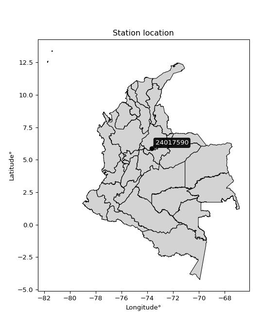

<div align="center">


</div>

# PMax24h Station (Rain, Pmax24h): 24017590

Maximum Precipitation in 24 hours (PMax24h) is the greatest amount of rainfall for a specific duration that is meteorologically possible for a given location, acting as a "worst-case" scenario for extreme storms, crucial for designing safety-critical infrastructure like bridges, river deviations, dams, spillways, and nuclear plants to prevent catastrophic failure. The PMax24h is related with the Probable Maximum Precipitation (PMP) and it is calculated by hydrologists using meteorological data to determine the upper limit of extreme rainfall, often leading to the Probable Maximum Flood (PMF) for flood control design, and is increasingly being studied for climate change impacts. Probable Maximum Precipitation (PMP) is the theoretical upper limit of rainfall, a deterministic estimate for extreme events, while probability distributions (like GEV, Gumbel) describe the likelihood and frequency of various precipitation amounts, including rare ones, showing how often events occur, with PMP representing the extreme end of these distributions, used for critical infrastructure design to ensure safety against the worst conceivable weather, unlike standard statistical forecasts which cover typical probabilities.

The most common probability distributions in hydrology, used for analyzing floods, rainfall, and streamflow, include the Normal, Log-Normal, Gumbel, Gamma (including Log-Pearson Type III), and Generalized Extreme Value (GEV) distributions, often chosen based on the data´s skewness and whether modeling extremes or general conditions, with Gumbel and GEV popular for extreme events like floods, while the Normal distribution serves as a baseline, though often requiring transformations for skewed hydrological data. These distributions help in designing water infrastructure, managing water resources, and forecasting hydrologic events.

> Hydrological data often isn´t perfectly normal (it´s skewed), so different distributions are needed for different applications, such as: **Flood Frequency Analysis**: Using Gumbel, GEV, or Log-Pearson Type III for predicting extreme flood magnitudes and their return periods, **Rainfall Analysis**: Normal for annual totals, but Log-Normal, Weibull, or GEV for intensity or extreme daily rainfall, **Streamflow Modeling**: Gamma and Log-Normal for maximum flows, GEV for minimum flows, and Kappa for daily flows.

<div align="center">

</img>

</div>


## A. General information


### 1. General running parameters

• app_version: _v20260225_. • runtime: _2026-02-27 14:50:08.749431_. • Python version: _3.14.0_. • SciPy version: _1.16.3_. • Pandas version: _2.3.3_. • NumPy version: _2.3.5_. • Stations dataset (station_dataset_file): _dataset/pmax24h_in/automatic_colombia_2003_2025.csv_. • Stations catalog (station_catalog_file): _dataset/CNE.xls_. • Minimum year to eval til year_max (date_min): _1900_. • Maximum year to eval since year_min (date_max): _2025_. • Creates, save and include plots into reports (create_plot): _False_. • Plot only fit distributions with Δo > Δ (plot_only_fit): _True_. • Plot only simple graphs avoiding multiple CDFs and multiple Extreme values plots (plot_only_simple): _False_. • Eval low extreme values, if False, evaluates high extreme values (low_extreme): _False_. • Eval every SciPy distribution as logarithmic (pdist_logarithmic_on): _True_. • Standard deviation normalized (ddof): _1.0_. • Return periods to eval in years (Tr): _[2, 2.33, 5, 10, 15, 20, 25, 50, 75, 100, 200, 250, 500, 750, 1000]_. • Minimum data sample per station, 0 means any (minimum_sample): _5_. • Z-Score maximum threshold to adjust a value, 0 means disable (zscore_max): _3.5_. • Z-Score minimum threshold to adjust a value, 0 means disable (zscore_min): _-2.5_. • Avoid zeros, e.g. rain = 0 (avoid_zeros): _True_. • Avoid null values (avoid_nans): _True_. 

:file_folder:Table: [dataset.csv](../../dataset/pmax24h_in/automatic_colombia_2003_2025.csv)

> Delta Degrees of Freedom (DDOF): is a parameter used in the formulas for calculating variance and standard deviation. When ddof=0, the divisor is $N$ (the total number of observations) and this is used when your data set is the entire population. When ddof=1, the divisor is $N-1$ and this is used when your data set is a sample drawn from a larger population. Using $N-1$ provides an unbiased estimate of the population variance (known as Bessel´s correction).


### 2. Station info and location

|   id |   CODIGO | NOMBRE                           | CATEGORIA    | TECNOLOGIA                              | ESTADO   | FECHA_INSTALACION   |   FECHA_SUSPENSION |   ALTITUD |   LATITUD |   LONGITUD | DEPARTAMENTO   | MUNICIPIO       | AREA_OPERATIVA                         | ENTIDAD                                                     | AREA_HIDROGRAFICA   | ZONA_HIDROGRAFICA   | SUBZONA_HIDROGRAFICA   | CORRIENTE   | Catalogo   |   Version |
|-----:|---------:|:---------------------------------|:-------------|:----------------------------------------|:---------|:--------------------|-------------------:|----------:|----------:|-----------:|:---------------|:----------------|:---------------------------------------|:------------------------------------------------------------|:--------------------|:--------------------|:-----------------------|:------------|:-----------|----------:|
|    0 | 24017590 | PUENTE NACIONAL - AUT [24017590] | Limnigráfica | Automática con Telemetría, Convencional | Activa   | 15/02/1974          |                nan |      1650 |   5.87278 |   -73.6778 | Santander      | Puente Nacional | Area Operativa 08 - Santanderes-Arauca | INSTITUTO DE HIDROLOGIA METEOROLOGIA Y ESTUDIOS AMBIENTALES | Magdalena Cauca     | Sogamoso            | Río Suárez             | Suarez      | CNE_IDEAM  |  20251226 |

<div align="center">

Dynamic map: [:earth_americas:Google](http://maps.google.com/maps?q=5.872777778,-73.67777778) [:earth_americas:OSM](https://www.openstreetmap.org/#map=18/5.872777778/-73.67777778&layers=P) [:earth_americas:Bing](https://www.bing.com/maps?cp=5.872777778~-73.67777778&lvl=18) [:earth_americas:Apple](https://maps.apple.com/frame?center=5.872777778%2C-73.67777778&span=0.003%2C0.006)

</div>


<div align="center">

```geojson
{
  "type": "Feature",
  "geometry": {
    "type": "Point", 
    "coordinates": [-73.67777778, 5.872777778]
  }, 
  "properties": {
    "Name": "24017590"
  }
}
```

</div>


### 3. Discrete values table and plot

<div align="center">

|               |           0 |          1 |            2 |          3 |           4 |          5 |            6 |
|:--------------|------------:|-----------:|-------------:|-----------:|------------:|-----------:|-------------:|
| Date          | 2019        | 2020       | 2021         | 2022       | 2023        | 2024       | 2025         |
| Value         |   59.6      |  100       |   69.8       |   47.2     |   60.8      |   90.4     |   69.2       |
| Value_initial |   59.6      |  100       |   69.8       |   47.2     |   60.8      |   90.4     |   69.2       |
| count         |    7        |    7       |    7         |    7       |    7        |    7       |    7         |
| mean          |   71        |   71       |   71         |   71       |   71        |   71       |   71         |
| std           |   18.3597   |   18.3597  |   18.3597    |   18.3597  |   18.3597   |   18.3597  |   18.3597    |
| zscore        |   -0.620924 |    1.57954 |   -0.0653604 |   -1.29631 |   -0.555563 |    1.05666 |   -0.0980406 |


</div>


> The initial value (value_initial) correspond to the initial obtained or null completed value, and value (value) is adjusted only when the initial value is outside the valid range (outlier) definite through the Z-Score value. If Z-Score is active, values out of range or outliers are replaced with the station mean value. A Z-Score (or standard score) measures how many standard deviations a data point is from the mean of a dataset, indicating its relative position; positive scores mean above the mean, negative mean below, and a score of zero is exactly at the mean, allowing for comparison of values from different distributions. It´s calculated using the formula $z=(x–μ)/σ$, where $x$ is the data point, $μ$ is the mean, and $σ$ is the standard deviation, helping identify outliers and understand probability.
>
> <sub>**Note**: In this study, "completing" (filling gaps in) and "extending" (forecasting or lengthening the historical record) rainfall data series are avoided for certain critical analyses because they introduce artificial bias and uncertainty, which can distort the statistics of rare events (extremes), alter day-to-day variability, and compromise the integrity and homogeneity of the original data. Some reasons against Completing/Extending rainfall data are: **Distortion of Extremes and Variability**: The primary issue is that most gap-filling or extension methods rely on averaging or regression with nearby stations, which inherently smooths the data. Rainfall is highly variable in space and time, with a large percentage of zero values and occasional large storms. Infilling methods often underestimate the highest values and overestimate the lowest (zero) values, which severely distorts analyses focused on flood frequency, drought severity, and intensity-duration-frequency (IDF) curves, **Loss of Data Homogeneity**: Infilled or extended data are synthetic estimates, not actual measurements. Combining these estimates with observed data can violate the assumption of data homogeneity, which requires that the data properties do not change over time. Inhomogeneity can lead to incorrect conclusions about long-term trends or changes in climate patterns, **Propagation of Errors**: Errors and biases from the original data (e.g., wind-induced undercatch, instrument errors, site changes) or the data used for imputation can propagate through the analysis, leading to unreliable hydrological models and inaccurate predictions, **Compromised Statistical Integrity**: For statistical analyses, especially those involving the frequency of events, using artificial data can introduce time bias or autocorrelation that doesn´t exist in reality, making it difficult to assess the true probability of events, **Difficulty in Validation**: It is difficult to accurately validate the quality of filled or extended data, especially for past periods where ground-truth measurements are unavailable. The reliability of imputation techniques heavily depends on the density of the surrounding station network and the complexity of the local topography.</sub>


### 4. Active continuous probability distributions from SciPy (80 of 104 available)

A Probability Density Function (PDF) describes the relative likelihood of a continuous random variable falling within a specific range, where the total area under its curve equals 1, and the area over any interval gives the actual probability for that range. Unlike discrete probabilities (like rolling a die), a PDF shows density, not direct probability for a single point (which is zero), with higher points indicating higher likelihood, often visualized as a bell curve for normal distributions.

A log of a probability density function (log-PDF) is simply the logarithm of the PDF´s value, denoted as $log(f(x))$, useful for converting multiplication of probabilities into addition, improving numerical stability with tiny numbers, and connecting to information theory concepts like entropy. Instead of dealing with very small probabilities (e.g., 0.000001), log-PDFs use negative numbers (e.g., $log(0.00001) ≈ -11.51$ that are easier for computers to handle, preventing underflow errors and simplifying complex calculations. In this study, each active probability distribution from SciPy is also evaluated in the $log$ form.

[scipy.stats](https://docs.scipy.org/doc/scipy/reference/stats.html) is a Python´s powerful submodule within the SciPy library for comprehensive statistical analysis, offering over 130 probability distributions (like Normal, Poisson, etc.), functions for descriptive stats (mean, variance), hypothesis testing (t-tests, chi-square), random variable generation, and statistical tests, making it essential for data science, modeling, and research. It provides tools to explore, model, and draw conclusions from data efficiently, working seamlessly with [NumPy](https://numpy.org/).

<div align="center">

|   id | p_dist           |   n_parameter | fit_method   | label                                                                       | active   | ref                                                                                                      |
|-----:|:-----------------|--------------:|:-------------|:----------------------------------------------------------------------------|:---------|:---------------------------------------------------------------------------------------------------------|
|    0 | alpha            |             3 | MLE          | Alpha                                                                       | True     | [:mortar_board:](https://docs.scipy.org/doc/scipy/reference/generated/scipy.stats.alpha.html)            |
|    1 | anglit           |             2 | MM           | Anglit                                                                      | True     | [:mortar_board:](https://docs.scipy.org/doc/scipy/reference/generated/scipy.stats.anglit.html)           |
|    2 | arcsine          |             2 | MM           | Arcsine                                                                     | True     | [:mortar_board:](https://docs.scipy.org/doc/scipy/reference/generated/scipy.stats.arcsine.html)          |
|    3 | argus            |             3 | MLE          | Argus                                                                       | True     | [:mortar_board:](https://docs.scipy.org/doc/scipy/reference/generated/scipy.stats.argus.html)            |
|    4 | beta             |             4 | MLE          | Beta                                                                        | True     | [:mortar_board:](https://docs.scipy.org/doc/scipy/reference/generated/scipy.stats.beta.html)             |
|    5 | betaprime        |             4 | MLE          | Beta prime                                                                  | True     | [:mortar_board:](https://docs.scipy.org/doc/scipy/reference/generated/scipy.stats.betaprime.html)        |
|    6 | bradford         |             3 | MLE          | Bradford                                                                    | True     | [:mortar_board:](https://docs.scipy.org/doc/scipy/reference/generated/scipy.stats.bradford.html)         |
|    7 | burr             |             4 | MLE          | Burr (Type III)                                                             | True     | [:mortar_board:](https://docs.scipy.org/doc/scipy/reference/generated/scipy.stats.burr.html)             |
|    8 | burr12           |             4 | MLE          | Burr (Type III) 12                                                          | True     | [:mortar_board:](https://docs.scipy.org/doc/scipy/reference/generated/scipy.stats.burr12.html)           |
|    9 | cosine           |             2 | MLE          | Cosine                                                                      | True     | [:mortar_board:](https://docs.scipy.org/doc/scipy/reference/generated/scipy.stats.cosine.html)           |
|   10 | crystalball      |             4 | MLE          | Crystalball                                                                 | True     | [:mortar_board:](https://docs.scipy.org/doc/scipy/reference/generated/scipy.stats.crystalball.html)      |
|   11 | dgamma           |             3 | MLE          | Double gamma                                                                | True     | [:mortar_board:](https://docs.scipy.org/doc/scipy/reference/generated/scipy.stats.dgamma.html)           |
|   12 | dweibull         |             3 | MLE          | Double Weibull                                                              | True     | [:mortar_board:](https://docs.scipy.org/doc/scipy/reference/generated/scipy.stats.dweibull.html)         |
|   13 | erlang           |             3 | MLE          | Erlang                                                                      | True     | [:mortar_board:](https://docs.scipy.org/doc/scipy/reference/generated/scipy.stats.erlang.html)           |
|   14 | exponnorm        |             3 | MLE          | Exponentially modified Normal                                               | True     | [:mortar_board:](https://docs.scipy.org/doc/scipy/reference/generated/scipy.stats.exponnorm.html)        |
|   15 | exponpow         |             3 | MLE          | Exponential power                                                           | True     | [:mortar_board:](https://docs.scipy.org/doc/scipy/reference/generated/scipy.stats.exponpow.html)         |
|   16 | exponweib        |             4 | MLE          | Exponentiated Weibull                                                       | True     | [:mortar_board:](https://docs.scipy.org/doc/scipy/reference/generated/scipy.stats.exponweib.html)        |
|   17 | f                |             4 | MLE          | F                                                                           | True     | [:mortar_board:](https://docs.scipy.org/doc/scipy/reference/generated/scipy.stats.f.html)                |
|   18 | fatiguelife      |             3 | MLE          | Fatigue-life (Birnbaum-Saunders)                                            | True     | [:mortar_board:](https://docs.scipy.org/doc/scipy/reference/generated/scipy.stats.fatiguelife.html)      |
|   19 | foldnorm         |             3 | MM           | Fold Normal                                                                 | True     | [:mortar_board:](https://docs.scipy.org/doc/scipy/reference/generated/scipy.stats.foldnorm.html)         |
|   20 | gamma            |             3 | MLE          | Gamma                                                                       | True     | [:mortar_board:](https://docs.scipy.org/doc/scipy/reference/generated/scipy.stats.gamma.html)            |
|   21 | gausshyper       |             6 | MLE          | Gauss hypergeometric                                                        | True     | [:mortar_board:](https://docs.scipy.org/doc/scipy/reference/generated/scipy.stats.gausshyper.html)       |
|   22 | genexpon         |             5 | MLE          | Generalized exponential                                                     | True     | [:mortar_board:](https://docs.scipy.org/doc/scipy/reference/generated/scipy.stats.genexpon.html)         |
|   23 | genextreme       |             3 | MLE          | Generalized exponential                                                     | True     | [:mortar_board:](https://docs.scipy.org/doc/scipy/reference/generated/scipy.stats.genextreme.html)       |
|   24 | gengamma         |             4 | MLE          | Generalized gamma                                                           | True     | [:mortar_board:](https://docs.scipy.org/doc/scipy/reference/generated/scipy.stats.gengamma.html)         |
|   25 | genhalflogistic  |             3 | MLE          | Generalized half-logistic                                                   | True     | [:mortar_board:](https://docs.scipy.org/doc/scipy/reference/generated/scipy.stats.genhalflogistic.html)  |
|   26 | genlogistic      |             3 | MLE          | Generalized logistic                                                        | True     | [:mortar_board:](https://docs.scipy.org/doc/scipy/reference/generated/scipy.stats.genlogistic.html)      |
|   27 | gennorm          |             3 | MLE          | Generalized Normal                                                          | True     | [:mortar_board:](https://docs.scipy.org/doc/scipy/reference/generated/scipy.stats.gennorm.html)          |
|   28 | genpareto        |             3 | MLE          | Generalized Pareto                                                          | True     | [:mortar_board:](https://docs.scipy.org/doc/scipy/reference/generated/scipy.stats.genpareto.html)        |
|   29 | gompertz         |             3 | MLE          | Gompertz (or truncated Gumbel)                                              | True     | [:mortar_board:](https://docs.scipy.org/doc/scipy/reference/generated/scipy.stats.gompertz.html)         |
|   30 | gumbel_l         |             2 | MM           | Gumbel Left Skew                                                            | True     | [:mortar_board:](https://docs.scipy.org/doc/scipy/reference/generated/scipy.stats.gumbel_l.html)         |
|   31 | gumbel_r         |             2 | MM           | Gumbel Right Skew                                                           | True     | [:mortar_board:](https://docs.scipy.org/doc/scipy/reference/generated/scipy.stats.gumbel_r.html)         |
|   32 | halfgennorm      |             3 | MLE          | Upper half of a generalized normal                                          | True     | [:mortar_board:](https://docs.scipy.org/doc/scipy/reference/generated/scipy.stats.halfgennorm.html)      |
|   33 | halflogistic     |             2 | MM           | Half-logistic                                                               | True     | [:mortar_board:](https://docs.scipy.org/doc/scipy/reference/generated/scipy.stats.halflogistic.html)     |
|   34 | halfnorm         |             2 | MM           | Half Normal                                                                 | True     | [:mortar_board:](https://docs.scipy.org/doc/scipy/reference/generated/scipy.stats.halfnorm.html)         |
|   35 | hypsecant        |             2 | MM           | hyperbolic secant                                                           | True     | [:mortar_board:](https://docs.scipy.org/doc/scipy/reference/generated/scipy.stats.hypsecant.html)        |
|   36 | invgamma         |             3 | MLE          | Inverted gamma                                                              | True     | [:mortar_board:](https://docs.scipy.org/doc/scipy/reference/generated/scipy.stats.invgamma.html)         |
|   37 | invgauss         |             3 | MLE          | Inverse Gaussian                                                            | True     | [:mortar_board:](https://docs.scipy.org/doc/scipy/reference/generated/scipy.stats.invgauss.html)         |
|   38 | invweibull       |             3 | MLE          | Inverted Weibull                                                            | True     | [:mortar_board:](https://docs.scipy.org/doc/scipy/reference/generated/scipy.stats.invweibull.html)       |
|   39 | johnsonsb        |             4 | MLE          | Johnson SB                                                                  | True     | [:mortar_board:](https://docs.scipy.org/doc/scipy/reference/generated/scipy.stats.johnsonsb.html)        |
|   40 | johnsonsu        |             4 | MLE          | Johnson Su                                                                  | True     | [:mortar_board:](https://docs.scipy.org/doc/scipy/reference/generated/scipy.stats.johnsonsu.html)        |
|   41 | kappa3           |             3 | MLE          | Kappa 3                                                                     | True     | [:mortar_board:](https://docs.scipy.org/doc/scipy/reference/generated/scipy.stats.kappa3.html)           |
|   42 | kappa4           |             4 | MLE          | Kappa 4                                                                     | True     | [:mortar_board:](https://docs.scipy.org/doc/scipy/reference/generated/scipy.stats.kappa4.html)           |
|   43 | ksone            |             3 | MLE          | Kolmogorov-Smirnov one-sided test statistic distribution                    | True     | [:mortar_board:](https://docs.scipy.org/doc/scipy/reference/generated/scipy.stats.ksone.html)            |
|   44 | kstwobign        |             2 | MLE          | Limiting distribution of scaled Kolmogorov-Smirnov two-sided test statistic | True     | [:mortar_board:](https://docs.scipy.org/doc/scipy/reference/generated/scipy.stats.kstwobign.html)        |
|   45 | laplace          |             2 | MM           | Laplace                                                                     | True     | [:mortar_board:](https://docs.scipy.org/doc/scipy/reference/generated/scipy.stats.laplace.html)          |
|   46 | levy_l           |             2 | MLE          | Left-skewed Levy                                                            | True     | [:mortar_board:](https://docs.scipy.org/doc/scipy/reference/generated/scipy.stats.levy_l.html)           |
|   47 | loggamma         |             3 | MLE          | Log gamma                                                                   | True     | [:mortar_board:](https://docs.scipy.org/doc/scipy/reference/generated/scipy.stats.loggamma.html)         |
|   48 | logistic         |             2 | MM           | Logistic (or Sech-squared)                                                  | True     | [:mortar_board:](https://docs.scipy.org/doc/scipy/reference/generated/scipy.stats.logistic.html)         |
|   49 | loglaplace       |             3 | MLE          | Log-Laplace                                                                 | True     | [:mortar_board:](https://docs.scipy.org/doc/scipy/reference/generated/scipy.stats.loglaplace.html)       |
|   50 | lomax            |             3 | MLE          | Lomax (Pareto of the second kind)                                           | True     | [:mortar_board:](https://docs.scipy.org/doc/scipy/reference/generated/scipy.stats.lomax.html)            |
|   51 | maxwell          |             2 | MM           | Maxwell                                                                     | True     | [:mortar_board:](https://docs.scipy.org/doc/scipy/reference/generated/scipy.stats.maxwell.html)          |
|   52 | mielke           |             4 | MLE          | Mielke Beta-Kappa / Dagum                                                   | True     | [:mortar_board:](https://docs.scipy.org/doc/scipy/reference/generated/scipy.stats.mielke.html)           |
|   53 | moyal            |             2 | MM           | Moyal                                                                       | True     | [:mortar_board:](https://docs.scipy.org/doc/scipy/reference/generated/scipy.stats.moyal.html)            |
|   54 | nakagami         |             3 | MLE          | Nakagami                                                                    | True     | [:mortar_board:](https://docs.scipy.org/doc/scipy/reference/generated/scipy.stats.nakagami.html)         |
|   55 | ncf              |             5 | MLE          | Non-central F distribution                                                  | True     | [:mortar_board:](https://docs.scipy.org/doc/scipy/reference/generated/scipy.stats.ncf.html)              |
|   56 | nct              |             4 | MLE          | Non-central Student’s t                                                     | True     | [:mortar_board:](https://docs.scipy.org/doc/scipy/reference/generated/scipy.stats.nct.html)              |
|   57 | norm             |             2 | MM           | Normal                                                                      | True     | [:mortar_board:](https://docs.scipy.org/doc/scipy/reference/generated/scipy.stats.norm.html)             |
|   58 | pearson3         |             3 | MM           | Pearson type III                                                            | True     | [:mortar_board:](https://docs.scipy.org/doc/scipy/reference/generated/scipy.stats.pearson3.html)         |
|   59 | powerlaw         |             3 | MLE          | Power-function                                                              | True     | [:mortar_board:](https://docs.scipy.org/doc/scipy/reference/generated/scipy.stats.powerlaw.html)         |
|   60 | rayleigh         |             2 | MM           | Rayleigh                                                                    | True     | [:mortar_board:](https://docs.scipy.org/doc/scipy/reference/generated/scipy.stats.rayleigh.html)         |
|   61 | rdist            |             3 | MLE          | R-distributed (symmetric beta)                                              | True     | [:mortar_board:](https://docs.scipy.org/doc/scipy/reference/generated/scipy.stats.rdist.html)            |
|   62 | rice             |             3 | MLE          | Rice                                                                        | True     | [:mortar_board:](https://docs.scipy.org/doc/scipy/reference/generated/scipy.stats.rice.html)             |
|   63 | semicircular     |             2 | MM           | Semicircular                                                                | True     | [:mortar_board:](https://docs.scipy.org/doc/scipy/reference/generated/scipy.stats.semicircular.html)     |
|   64 | skewnorm         |             3 | MLE          | Skew normal                                                                 | True     | [:mortar_board:](https://docs.scipy.org/doc/scipy/reference/generated/scipy.stats.skewnorm.html)         |
|   65 | t                |             3 | MLE          | Student’s t                                                                 | True     | [:mortar_board:](https://docs.scipy.org/doc/scipy/reference/generated/scipy.stats.t.html)                |
|   66 | trapezoid        |             4 | MLE          | Trapezoid                                                                   | True     | [:mortar_board:](https://docs.scipy.org/doc/scipy/reference/generated/scipy.stats.trapezoid.html)        |
|   67 | triang           |             3 | MLE          | Triangular                                                                  | True     | [:mortar_board:](https://docs.scipy.org/doc/scipy/reference/generated/scipy.stats.triang.html)           |
|   68 | truncexpon       |             3 | MLE          | Truncated exponential                                                       | True     | [:mortar_board:](https://docs.scipy.org/doc/scipy/reference/generated/scipy.stats.truncexpon.html)       |
|   69 | truncnorm        |             4 | MLE          | Truncated normal                                                            | True     | [:mortar_board:](https://docs.scipy.org/doc/scipy/reference/generated/scipy.stats.truncnorm.html)        |
|   70 | truncpareto      |             4 | MLE          | Upper truncated Pareto                                                      | True     | [:mortar_board:](https://docs.scipy.org/doc/scipy/reference/generated/scipy.stats.truncpareto.html)      |
|   71 | truncweibull_min |             5 | MLE          | Doubly truncated Weibull minimum                                            | True     | [:mortar_board:](https://docs.scipy.org/doc/scipy/reference/generated/scipy.stats.truncweibull_min.html) |
|   72 | tukeylambda      |             3 | MLE          | Tukey-Lamdba                                                                | True     | [:mortar_board:](https://docs.scipy.org/doc/scipy/reference/generated/scipy.stats.tukeylambda.html)      |
|   73 | uniform          |             2 | MLE          | Uniform                                                                     | True     | [:mortar_board:](https://docs.scipy.org/doc/scipy/reference/generated/scipy.stats.uniform.html)          |
|   74 | vonmises         |             3 | MLE          | Von Mises                                                                   | True     | [:mortar_board:](https://docs.scipy.org/doc/scipy/reference/generated/scipy.stats.vonmises.html)         |
|   75 | vonmises_line    |             3 | MLE          | Von Mises line                                                              | True     | [:mortar_board:](https://docs.scipy.org/doc/scipy/reference/generated/scipy.stats.vonmises_line.html)    |
|   76 | wald             |             2 | MM           | Wald                                                                        | True     | [:mortar_board:](https://docs.scipy.org/doc/scipy/reference/generated/scipy.stats.wald.html)             |
|   77 | weibull_max      |             3 | MLE          | Weibull maximum                                                             | True     | [:mortar_board:](https://docs.scipy.org/doc/scipy/reference/generated/scipy.stats.weibull_max.html)      |
|   78 | weibull_min      |             3 | MLE          | Weibull minimum                                                             | True     | [:mortar_board:](https://docs.scipy.org/doc/scipy/reference/generated/scipy.stats.weibull_min.html)      |
|   79 | wrapcauchy       |             3 | MLE          | Wrapped  Cauchy                                                             | True     | [:mortar_board:](https://docs.scipy.org/doc/scipy/reference/generated/scipy.stats.wrapcauchy.html)       |

</div>

> **n_parameter:** # arguments & localization & scale.
>
> **Fit methods:** (MLE) maximum likelihood, (MM) L-moments.
>
>**Inactive** (With the only purpose of prevent loops, zero divisions, infinite values, over high estimated values or horizontal trending for recurrence intervals estimations, the follow distributions were disabled.)**:** lognorm, norminvgauss, powernorm, powerlognorm, cauchy, halfcauchy, foldcauchy, skewcauchy, chi2, expon, fisk, genhyperbolic, geninvgauss, gibrat, kstwo, laplace_asymmetric, levy, levy_stable, ncx2, pareto, rel_breitwigner, recipinvgauss, studentized_range, loguniform, 


## B. Probability (PDF) vs. Empirical (EDF) distributions functions

A continuous probability distribution (CPD) describes probabilities for variables that can take any value within a range (like rain any time), unlike discrete variables with specific outcomes (like temperature). It uses a Probability Density Function (PDF), a curve where the total area under it equals 1, and the probability of the variable falling within an interval (a to b) is found by calculating the area under the curve between those points. A key feature is that the probability of hitting any single exact value is zero, so probabilities are always expressed for ranges, e.g., $P(a ≤ X ≤ b)$.

<div align="center">

Distributions parameters from station values
|     |   station | p_dist              |   n |              loc |            scale | shape                  | shape1                 | shape2                 | shape3             |
|----:|----------:|:--------------------|----:|-----------------:|-----------------:|:-----------------------|:-----------------------|:-----------------------|:-------------------|
|   0 |  24017590 | alpha               |   7 |    -36.9763      |    694.716       | 6.589549574876765      |                        |                        |                    |
|   1 |  24017590 | anglit              |   7 |     71           |     49.7254      |                        |                        |                        |                    |
|   2 |  24017590 | arcsine             |   7 |     46.9615      |     48.0771      |                        |                        |                        |                    |
|   3 |  24017590 | argus               |   7 |     33.3581      |     69.6492      | 1.7289291745268074e-05 |                        |                        |                    |
|   4 |  24017590 | beta                |   7 |     47.2         |     54.7139      | 0.7540847129791167     | 1.066025641673146      |                        |                    |
|   5 |  24017590 | betaprime           |   7 |     -0.876713    |      4.45105     | 304.4990599735411      | 19.85134253395264      |                        |                    |
|   6 |  24017590 | bradford            |   7 |     47.2         |     52.8001      | 1.0507976606938803     |                        |                        |                    |
|   7 |  24017590 | burr                |   7 |     -8.53667     |     14.4318      | 5.31349371505857       | 4462.11965747199       |                        |                    |
|   8 |  24017590 | burr12              |   7 |     -2.12783     |     49.1291      | 969.9470829813379      | 0.0027770911911690344  |                        |                    |
|   9 |  24017590 | cosine              |   7 |     72.0583      |     14.0586      |                        |                        |                        |                    |
|  10 |  24017590 | crystalball         |   7 |     71           |     16.9978      | 3777.7269232530743     | 9714.71517577108       |                        |                    |
|  11 |  24017590 | dgamma              |   7 |     65.9352      |      9.33437     | 1.4671567472291276     |                        |                        |                    |
|  12 |  24017590 | dweibull            |   7 |     66.5585      |     14.5412      | 1.2109622226297363     |                        |                        |                    |
|  13 |  24017590 | erlang              |   7 |     41.9097      |     11.9681      | 2.430659107374775      |                        |                        |                    |
|  14 |  24017590 | exponnorm           |   7 |     53.8424      |      7.92169     | 2.1659050731098644     |                        |                        |                    |
|  15 |  24017590 | exponpow            |   7 |     47.2         |     42.3283      | 0.7871757456427949     |                        |                        |                    |
|  16 |  24017590 | exponweib           |   7 |     47.2         |      1.23007     | 1.2402835528339593     | 0.27878575133553235    |                        |                    |
|  17 |  24017590 | f                   |   7 |      7.42063     |     59.7998      | 245.84337021135116     | 32.64535649334714      |                        |                    |
|  18 |  24017590 | fatiguelife         |   7 |     47.2         |      8.15531e-06 | 1581.3752303314477     |                        |                        |                    |
|  19 |  24017590 | foldnorm            |   7 |     42.758       |     19.1121      | 1.4052053225729622     |                        |                        |                    |
|  20 |  24017590 | gamma               |   7 |     41.9099      |     11.9682      | 2.430619066847099      |                        |                        |                    |
|  21 |  24017590 | gausshyper          |   7 |     47.1002      |     52.8998      | 0.9315272864316623     | 0.7119503694399933     | 1.316568924978459      | 1.0524417965177724 |
|  22 |  24017590 | genexpon            |   7 |     47.1999      |      3.00524     | 0.1270445369205999     | 1.4676111882082486e-06 | 1.1859608148343617     |                    |
|  23 |  24017590 | genextreme          |   7 |     63.3797      |     14.2177      | 0.05740818853233057    |                        |                        |                    |
|  24 |  24017590 | gengamma            |   7 |     47.2         |      1.21734     | 1.2752230586598725     | 0.26835865726694036    |                        |                    |
|  25 |  24017590 | genhalflogistic     |   7 |     47.1397      |     53.8026      | 1.017825374059285      |                        |                        |                    |
|  26 |  24017590 | genlogistic         |   7 |    -19.7524      |     13.8968      | 384.7403283693275      |                        |                        |                    |
|  27 |  24017590 | gennorm             |   7 |     73.6002      |     26.4017      | 159443.49292899435     |                        |                        |                    |
|  28 |  24017590 | genpareto           |   7 |     -1.09545     |    168.051       | -1.6622969282347089    |                        |                        |                    |
|  29 |  24017590 | gompertz            |   7 |     47.2         |     35.767       | 0.8401144558576682     |                        |                        |                    |
|  30 |  24017590 | gumbel_l            |   7 |     78.6499      |     13.2531      |                        |                        |                        |                    |
|  31 |  24017590 | gumbel_r            |   7 |     63.3501      |     13.2531      |                        |                        |                        |                    |
|  32 |  24017590 | halfgennorm         |   7 |     47.2         |      1.33769     | 0.38128217169406114    |                        |                        |                    |
|  33 |  24017590 | halflogistic        |   7 |     50.8536      |     14.5325      |                        |                        |                        |                    |
|  34 |  24017590 | halfnorm            |   7 |     48.5015      |     28.1976      |                        |                        |                        |                    |
|  35 |  24017590 | hypsecant           |   7 |     71           |     10.8211      |                        |                        |                        |                    |
|  36 |  24017590 | invgamma            |   7 |      4.07568     |   1013.39        | 16.128402215064636     |                        |                        |                    |
|  37 |  24017590 | invgauss            |   7 |     29.9415      |    203.612       | 0.20277964382229707    |                        |                        |                    |
|  38 |  24017590 | invweibull          |   7 |     47.2         |      1.49739     | 0.06420754910817193    |                        |                        |                    |
|  39 |  24017590 | johnsonsb           |   7 |     47.1217      |     52.8783      | -1.3372348661874423    | 0.14614159834695095    |                        |                    |
|  40 |  24017590 | johnsonsu           |   7 |     22.455       |      3.27218     | -9.371278400862035     | 2.8150345180052865     |                        |                    |
|  41 |  24017590 | kappa3              |   7 |     47.0701      |     52.9483      | 140253.77979408216     |                        |                        |                    |
|  42 |  24017590 | kappa4              |   7 |     42.9583      |     56.1828      | 1.0815859175461764     | 0.9773474774735729     |                        |                    |
|  43 |  24017590 | ksone               |   7 |     41.5589      |     58.8822      | 1.0                    |                        |                        |                    |
|  44 |  24017590 | kstwobign           |   7 |     13.7897      |     65.6215      |                        |                        |                        |                    |
|  45 |  24017590 | laplace             |   7 |     71           |     12.0193      |                        |                        |                        |                    |
|  46 |  24017590 | levy_l              |   7 |    102.862       |     12.6237      |                        |                        |                        |                    |
|  47 |  24017590 | loggamma            |   7 |  -4227.94        |    603.529       | 1240.6836510201997     |                        |                        |                    |
|  48 |  24017590 | logistic            |   7 |     71           |      9.37139     |                        |                        |                        |                    |
|  49 |  24017590 | loglaplace          |   7 |     -0.170721    |     69.3707      | 5.375783893194975      |                        |                        |                    |
|  50 |  24017590 | lomax               |   7 |     47.2         |   1454.69        | 61.457951985494674     |                        |                        |                    |
|  51 |  24017590 | maxwell             |   7 |     30.7223      |     25.2403      |                        |                        |                        |                    |
|  52 |  24017590 | mielke              |   7 |    -12.5186      |     67.9561      | 16.93675233086158      | 6.739076386134641      |                        |                    |
|  53 |  24017590 | moyal               |   7 |     61.2796      |      7.65171     |                        |                        |                        |                    |
|  54 |  24017590 | nakagami            |   7 |     59.6         |      8.10004     | 0.1076041694711551     |                        |                        |                    |
|  55 |  24017590 | ncf                 |   7 |     -0.735726    |      0.049812    | 0.14465232470312123    | 58.18509932228021      | 201.1922952829758      |                    |
|  56 |  24017590 | nct                 |   7 |     -0.157686    |      4.85083     | 10.631910475921975     | 13.625433500568349     |                        |                    |
|  57 |  24017590 | norm                |   7 |     71           |     16.9978      |                        |                        |                        |                    |
|  58 |  24017590 | pearson3            |   7 |     71           |     16.9978      | 0.4555065185142282     |                        |                        |                    |
|  59 |  24017590 | powerlaw            |   7 |     47.2         |     52.8         | 0.16959671024646716    |                        |                        |                    |
|  60 |  24017590 | rayleigh            |   7 |     38.4822      |     25.9455      |                        |                        |                        |                    |
|  61 |  24017590 | rdist               |   7 |     58.5477      |     11.3477      | 1.4739404874637807     |                        |                        |                    |
|  62 |  24017590 | rice                |   7 |     40.2059      |     23.9645      | 0.3928026858128057     |                        |                        |                    |
|  63 |  24017590 | semicircular        |   7 |     71           |     33.9956      |                        |                        |                        |                    |
|  64 |  24017590 | skewnorm            |   7 |     49.9199      |     27.0795      | 4.039857427283017      |                        |                        |                    |
|  65 |  24017590 | t                   |   7 |     70.9943      |     17.0022      | 282804.06309092604     |                        |                        |                    |
|  66 |  24017590 | trapezoid           |   7 |     41.92        |     63.36        | 0.9999999999999999     | 1.0                    |                        |                    |
|  67 |  24017590 | triang              |   7 |     28.5829      |     71.4193      | 0.9999999984285626     |                        |                        |                    |
|  68 |  24017590 | truncexpon          |   7 |     47.2         |     50.3839      | 1.0479528431734622     |                        |                        |                    |
|  69 |  24017590 | truncnorm           |   7 |     71           |     16.9978      | -1718.500113358542     | 14958.344359629858     |                        |                    |
|  70 |  24017590 | truncpareto         |   7 |     47.1769      |      0.0231178   | 0.16795178176717407    | 2284.953565565179      |                        |                    |
|  71 |  24017590 | truncweibull_min    |   7 |     47.1723      |     64.4263      | 0.9616798776813258     | 0.00043040779276108177 | 0.8199720513446993     |                    |
|  72 |  24017590 | tukeylambda         |   7 |     73.5952      |     27.0223      | 1.0233865385070127     |                        |                        |                    |
|  73 |  24017590 | uniform             |   7 |     47.2         |     52.8         |                        |                        |                        |                    |
|  74 |  24017590 | vonmises            |   7 |     -3.10376     |      1           | 0.1622517983505374     |                        |                        |                    |
|  75 |  24017590 | vonmises_line       |   7 |     74.407       |      8.66049     | 9.028728503949611e-06  |                        |                        |                    |
|  76 |  24017590 | wald                |   7 |     54.0022      |     16.9978      |                        |                        |                        |                    |
|  77 |  24017590 | weibull_max         |   7 |    100           |      1.41545     | 0.26469104464414395    |                        |                        |                    |
|  78 |  24017590 | weibull_min         |   7 |     44.9304      |     28.6027      | 1.4616004496849375     |                        |                        |                    |
|  79 |  24017590 | wrapcauchy          |   7 |     47.2         |      8.40338     | 0.5                    |                        |                        |                    |
|  80 |  24017590 | logalpha            |   7 |     -2.35664     |    183.57        | 27.8870742516808       |                        |                        |                    |
|  81 |  24017590 | loganglit           |   7 |      4.23453     |      0.692663    |                        |                        |                        |                    |
|  82 |  24017590 | logarcsine          |   7 |      3.8997      |      0.669657    |                        |                        |                        |                    |
|  83 |  24017590 | logargus            |   7 |      3.6939      |      0.955737    | 0.00022971470094232534 |                        |                        |                    |
|  84 |  24017590 | logbeta             |   7 |      3.78795     |      0.817224    | 1.5188456566574216     | 0.749090682195847      |                        |                    |
|  85 |  24017590 | logbetaprime        |   7 |      0.721974    |     25.1078      | 251.57426499945427     | 1799.5059805040628     |                        |                    |
|  86 |  24017590 | logbradford         |   7 |      3.85439     |      0.750782    | 1.066677835374895      |                        |                        |                    |
|  87 |  24017590 | logburr             |   7 | -28255.8         |  28259.9         | 164487.58580271766     | 2.3914223706055395     |                        |                    |
|  88 |  24017590 | logburr12           |   7 |      2.82743     |      1.6121      | 8.182143774922228      | 2.296346765052223      |                        |                    |
|  89 |  24017590 | logcosine           |   7 |      4.23631     |      0.196865    |                        |                        |                        |                    |
|  90 |  24017590 | logcrystalball      |   7 |      4.23453     |      0.236776    | 78.37979538963828      | 220.49997762636798     |                        |                    |
|  91 |  24017590 | logdgamma           |   7 |      4.24563     |      0.23877     | 0.8602580788068706     |                        |                        |                    |
|  92 |  24017590 | logdweibull         |   7 |      4.24563     |      0.188258    | 0.9254489239587801     |                        |                        |                    |
|  93 |  24017590 | logerlang           |   7 |      1.23102     |      0.0185782   | 161.63564875735983     |                        |                        |                    |
|  94 |  24017590 | logexponnorm        |   7 |      4.20703     |      0.235174    | 0.11693046316809899    |                        |                        |                    |
|  95 |  24017590 | logexponpow         |   7 |      3.85439     |      0.499845    | 0.4268517726800239     |                        |                        |                    |
|  96 |  24017590 | logexponweib        |   7 |      3.85439     |      0.731414    | 0.1778348716642316     | 4.483370195953092      |                        |                    |
|  97 |  24017590 | logf                |   7 |      2.56884     |      1.66254     | 108.16828983933142     | 1047.709790838821      |                        |                    |
|  98 |  24017590 | logfatiguelife      |   7 |      1.5777      |      2.64627     | 0.08933372145432512    |                        |                        |                    |
|  99 |  24017590 | logfoldnorm         |   7 |      3.88789     |      0.290511    | 1.0386824652535267     |                        |                        |                    |
| 100 |  24017590 | loggamma            |   7 |      1.30155     |      0.0190853   | 153.68203919706335     |                        |                        |                    |
| 101 |  24017590 | loggausshyper       |   7 |      3.84584     |      0.759328    | 1.1126008429334087     | 0.9388885090896139     | 1.0105377316841442     | 1.068347407326089  |
| 102 |  24017590 | loggenexpon         |   7 |      3.85326     |      0.0102942   | 0.011566296874053278   | 3.478501724851463      | 0.00017295744483265135 |                    |
| 103 |  24017590 | loggenextreme       |   7 |      4.15773     |      0.237208    | 0.33984123446523284    |                        |                        |                    |
| 104 |  24017590 | loggengamma         |   7 |      3.85439     |      0.487666    | 0.41043581116739825    | 1.4656770106350028     |                        |                    |
| 105 |  24017590 | loggenhalflogistic  |   7 |      3.83557     |      0.833211    | 1.0826558903526955     |                        |                        |                    |
| 106 |  24017590 | loggenlogistic      |   7 |      4.01483     |      0.173754    | 2.5033836408327446     |                        |                        |                    |
| 107 |  24017590 | loggennorm          |   7 |      4.22978     |      0.37539     | 3281977.5840021074     |                        |                        |                    |
| 108 |  24017590 | loggenpareto        |   7 |     -0.00731537  |     10.4887      | -2.273989327018782     |                        |                        |                    |
| 109 |  24017590 | loggompertz         |   7 |      3.85439     |      0.674289    | 1.1989827812559248     |                        |                        |                    |
| 110 |  24017590 | loggumbel_l         |   7 |      4.34109     |      0.184613    |                        |                        |                        |                    |
| 111 |  24017590 | loggumbel_r         |   7 |      4.12797     |      0.184613    |                        |                        |                        |                    |
| 112 |  24017590 | loghalfgennorm      |   7 |      3.8542      |      0.751149    | 36674.12457622614      |                        |                        |                    |
| 113 |  24017590 | loghalflogistic     |   7 |      3.95391     |      0.20242     |                        |                        |                        |                    |
| 114 |  24017590 | loghalfnorm         |   7 |      3.92111     |      0.392807    |                        |                        |                        |                    |
| 115 |  24017590 | loghypsecant        |   7 |      4.23453     |      0.150736    |                        |                        |                        |                    |
| 116 |  24017590 | loginvgamma         |   7 |     -2.51579     |   5498.16        | 815.5097679329065      |                        |                        |                    |
| 117 |  24017590 | loginvgauss         |   7 |      2.62169     |     71.6001      | 0.022512572583569243   |                        |                        |                    |
| 118 |  24017590 | loginvweibull       |   7 |     -8.10549e+06 |      8.1055e+06  | 37989840.75554478      |                        |                        |                    |
| 119 |  24017590 | logjohnsonsb        |   7 |      3.85439     |      0.750776    | 0.11563815968226866    | 0.11985776729054042    |                        |                    |
| 120 |  24017590 | logjohnsonsu        |   7 |      3.81982e+06 | 693268           | 39681766.74050824      | 16480347.773218848     |                        |                    |
| 121 |  24017590 | logkappa3           |   7 |      3.85439     |      0.750078    | 2093.3920137299265     |                        |                        |                    |
| 122 |  24017590 | logkappa4           |   7 |      3.85853     |      0.800399    | 0.9934711926969998     | 1.072006037478276      |                        |                    |
| 123 |  24017590 | logksone            |   7 |      3.82442     |      0.820215    | 1.0                    |                        |                        |                    |
| 124 |  24017590 | logkstwobign        |   7 |      3.35649     |      1.00554     |                        |                        |                        |                    |
| 125 |  24017590 | loglaplace          |   7 |      4.23453     |      0.167426    |                        |                        |                        |                    |
| 126 |  24017590 | loglevy_l           |   7 |      4.63929     |      0.149831    |                        |                        |                        |                    |
| 127 |  24017590 | logloggamma         |   7 |    -62.7081      |      9.17105     | 1479.8144299798337     |                        |                        |                    |
| 128 |  24017590 | loglogistic         |   7 |      4.23453     |      0.130541    |                        |                        |                        |                    |
| 129 |  24017590 | logloglaplace       |   7 |     -0.0378383   |      4.27484     | 22.9252048886541       |                        |                        |                    |
| 130 |  24017590 | loglomax            |   7 |      3.85439     |      2.47949e+12 | 601652959128.522       |                        |                        |                    |
| 131 |  24017590 | logmaxwell          |   7 |      3.67347     |      0.351591    |                        |                        |                        |                    |
| 132 |  24017590 | logmielke           |   7 |     -2.06626e+06 |      2.06627e+06 | 23968467.26813495      | 12577247.057808276     |                        |                    |
| 133 |  24017590 | logmoyal            |   7 |      4.09912     |      0.106586    |                        |                        |                        |                    |
| 134 |  24017590 | lognakagami         |   7 |      3.85439     |      0.433947    | 0.18779652033256228    |                        |                        |                    |
| 135 |  24017590 | logncf              |   7 |      0.444724    |      3.77632     | 693.3007202906874      | 1994.5251239081244     | 1.6839557661613789     |                    |
| 136 |  24017590 | lognct              |   7 |     -0.471361    |      0.0590644   | 211.78551511037105     | 79.39155532290631      |                        |                    |
| 137 |  24017590 | lognorm             |   7 |      4.23453     |      0.236776    |                        |                        |                        |                    |
| 138 |  24017590 | logpearson3         |   7 |      4.23453     |      0.236776    | 0.11186426733093574    |                        |                        |                    |
| 139 |  24017590 | logpowerlaw         |   7 |      3.85439     |      0.750776    | 0.18045887649779072    |                        |                        |                    |
| 140 |  24017590 | lograyleigh         |   7 |      3.78156     |      0.361414    |                        |                        |                        |                    |
| 141 |  24017590 | logrdist            |   7 |      4.14089     |      0.464277    | 1.1291072602724221     |                        |                        |                    |
| 142 |  24017590 | logrice             |   7 |      3.74268     |      0.279797    | 1.3439491713856406     |                        |                        |                    |
| 143 |  24017590 | logsemicircular     |   7 |      4.23453     |      0.473551    |                        |                        |                        |                    |
| 144 |  24017590 | logskewnorm         |   7 |      4.01255     |      0.324558    | 1.6179445110767796     |                        |                        |                    |
| 145 |  24017590 | logt                |   7 |      4.23453     |      0.236776    | 5787896883.019396      |                        |                        |                    |
| 146 |  24017590 | logtrapezoid        |   7 |      3.77932     |      0.900932    | 1.0                    | 1.0                    |                        |                    |
| 147 |  24017590 | logtriang           |   7 |      3.63805     |      0.967122    | 0.999999961709749      |                        |                        |                    |
| 148 |  24017590 | logtruncexpon       |   7 |      3.85439     |      0.85673     | 0.876333507684641      |                        |                        |                    |
| 149 |  24017590 | logtruncnorm        |   7 |     -0.0697891   |      1.3135      | 2.987579341604591      | 4.690607479750565      |                        |                    |
| 150 |  24017590 | logtruncpareto      |   7 |      3.85401     |      0.000387622 | 0.16789326102468458    | 1937.8771283958324     |                        |                    |
| 151 |  24017590 | logtruncweibull_min |   7 |      3.84654     |      0.812181    | 1.0966852535013811     | 0.00040935225801031844 | 0.934066315667275      |                    |
| 152 |  24017590 | logtukeylambda      |   7 |      4.22865     |      0.403457    | 1.071539309186757      |                        |                        |                    |
| 153 |  24017590 | loguniform          |   7 |      3.85439     |      0.750776    |                        |                        |                        |                    |
| 154 |  24017590 | logvonmises         |   7 |     -2.04891     |      1           | 18.27271134279829      |                        |                        |                    |
| 155 |  24017590 | logvonmises_line    |   7 |      4.22957     |      0.119556    | 0.06370581198834419    |                        |                        |                    |
| 156 |  24017590 | logwald             |   7 |      3.99776     |      0.23677     |                        |                        |                        |                    |
| 157 |  24017590 | logweibull_max      |   7 |      4.85569     |      0.697953    | 2.9424494789207        |                        |                        |                    |
| 158 |  24017590 | logweibull_min      |   7 |      3.70635     |      0.596132    | 2.4007897010287564     |                        |                        |                    |
| 159 |  24017590 | logwrapcauchy       |   7 |      3.85439     |      0.120424    | 9.003656322118545e-05  |                        |                        |                    |

</div>

> **loc** (Location parameter): This shifts the distribution along the x-axis. For many common distributions, like the normal (Gaussian) distribution, loc represents the mean $μ$. For others, like the uniform distribution, it might represent the minimum value, or for the beta distribution, the left end of the support interval.
>
> **scale** (Scale parameter): This determines the width or spread of the distribution. For the normal distribution, scale represents the standard deviation $σ$. For a uniform distribution, it defines the length of the interval (from $loc$ to $loc + scale$).
>
> **shape** (Shape parameters): Refers to parameters that define the specific form of a probability distribution, distinct from its location (loc) and scale (scale). These parameters are required arguments for most distribution functions. For example, a normal (Gaussian) distribution is fully defined by its location (mean) and scale (standard deviation), so it has no specific shape parameters beyond loc and scale. However, other distributions have intrinsic properties that need specification, as Gamma distribution that takes a shape parameter, often named $a$ or $alpha$.


### 0. Cumulative distribution values - CDF (160 evaluated)

Cumulative Distribution Function (CDF), denoted as $F$<sub>$X$</sub>$(x)$, is a function that gives the probability that a random variable $X$ will take a value less than or equal to a specific value, $x$ (i.e., $(P(X≥x)$. It essentially "accumulates" probabilities from a given point up to the far right (positive infinity), providing a complete picture of the distribution´s probabilities for both discrete (like rain) and continuous (like temperature) variables, helping to find probabilities over ranges or above certain values. Each station is evaluated separately ordering the $x$ values ascending, calculating the CDF and PDF values for the activated distributions and their logarithmic forms.

<div align="center">

CDF ordered by x ascending and calculating $log(f(x))$ separately
|   id |   Station |   date |     x |   count |   mean |     std |     zscore |   Value_initial |   station |   m |     alpha |   alpha_pdf |    anglit |   anglit_pdf |   arcsine |   arcsine_pdf |     argus |   argus_pdf |       beta |    beta_pdf |   betaprime |   betaprime_pdf |    bradford |   bradford_pdf |      burr |   burr_pdf |    burr12 |   burr12_pdf |    cosine |   cosine_pdf |   crystalball |   crystalball_pdf |   dgamma |   dgamma_pdf |   dweibull |   dweibull_pdf |   erlang |   erlang_pdf |   exponnorm |   exponnorm_pdf |    exponpow |   exponpow_pdf |   exponweib |   exponweib_pdf |         f |      f_pdf |   fatiguelife |   fatiguelife_pdf |   foldnorm |   foldnorm_pdf |     gamma |   gamma_pdf |   gausshyper |   gausshyper_pdf |    genexpon |   genexpon_pdf |   genextreme |   genextreme_pdf |    gengamma |   gengamma_pdf |   genhalflogistic |   genhalflogistic_pdf |   genlogistic |   genlogistic_pdf |     gennorm |   gennorm_pdf |   genpareto |   genpareto_pdf |    gompertz |   gompertz_pdf |   gumbel_l |   gumbel_l_pdf |   gumbel_r |   gumbel_r_pdf |   halfgennorm |   halfgennorm_pdf |   halflogistic |   halflogistic_pdf |   halfnorm |   halfnorm_pdf |   hypsecant |   hypsecant_pdf |   invgamma |   invgamma_pdf |   invgauss |   invgauss_pdf |   invweibull |   invweibull_pdf |   johnsonsb |   johnsonsb_pdf |   johnsonsu |   johnsonsu_pdf |     kappa3 |   kappa3_pdf |      kappa4 |   kappa4_pdf |     ksone |   ksone_pdf |   kstwobign |   kstwobign_pdf |   laplace |   laplace_pdf |   levy_l |   levy_l_pdf |   loggamma |   loggamma_pdf |   logistic |   logistic_pdf |   loglaplace |   loglaplace_pdf |       lomax |   lomax_pdf |   maxwell |   maxwell_pdf |   mielke |   mielke_pdf |    moyal |   moyal_pdf |    nakagami |   nakagami_pdf |       ncf |    ncf_pdf |       nct |    nct_pdf |      norm |   norm_pdf |   pearson3 |   pearson3_pdf |   powerlaw |   powerlaw_pdf |   rayleigh |   rayleigh_pdf |       rdist |   rdist_pdf |      rice |   rice_pdf |   semicircular |   semicircular_pdf |   skewnorm |   skewnorm_pdf |         t |      t_pdf |   trapezoid |   trapezoid_pdf |    triang |   triang_pdf |   truncexpon |   truncexpon_pdf |   truncnorm |   truncnorm_pdf |   truncpareto |   truncpareto_pdf |   truncweibull_min |   truncweibull_min_pdf |   tukeylambda |   tukeylambda_pdf |   uniform |   uniform_pdf |   vonmises |   vonmises_pdf |   vonmises_line |   vonmises_line_pdf |     wald |   wald_pdf |   weibull_max |   weibull_max_pdf |   weibull_min |   weibull_min_pdf |   wrapcauchy |   wrapcauchy_pdf |   logalpha |   logalpha_pdf |   loganglit |   loganglit_pdf |   logarcsine |   logarcsine_pdf |   logargus |   logargus_pdf |   logbeta |   logbeta_pdf |   logbetaprime |   logbetaprime_pdf |   logbradford |   logbradford_pdf |   logburr |   logburr_pdf |   logburr12 |   logburr12_pdf |   logcosine |   logcosine_pdf |   logcrystalball |   logcrystalball_pdf |   logdgamma |   logdgamma_pdf |   logdweibull |   logdweibull_pdf |   logerlang |   logerlang_pdf |   logexponnorm |   logexponnorm_pdf |   logexponpow |   logexponpow_pdf |   logexponweib |   logexponweib_pdf |      logf |   logf_pdf |   logfatiguelife |   logfatiguelife_pdf |   logfoldnorm |   logfoldnorm_pdf |   loggausshyper |   loggausshyper_pdf |   loggenexpon |   loggenexpon_pdf |   loggenextreme |   loggenextreme_pdf |   loggengamma |   loggengamma_pdf |   loggenhalflogistic |   loggenhalflogistic_pdf |   loggenlogistic |   loggenlogistic_pdf |   loggennorm |   loggennorm_pdf |   loggenpareto |   loggenpareto_pdf |   loggompertz |   loggompertz_pdf |   loggumbel_l |   loggumbel_l_pdf |   loggumbel_r |   loggumbel_r_pdf |   loghalfgennorm |   loghalfgennorm_pdf |   loghalflogistic |   loghalflogistic_pdf |   loghalfnorm |   loghalfnorm_pdf |   loghypsecant |   loghypsecant_pdf |   loginvgamma |   loginvgamma_pdf |   loginvgauss |   loginvgauss_pdf |   loginvweibull |   loginvweibull_pdf |   logjohnsonsb |   logjohnsonsb_pdf |   logjohnsonsu |   logjohnsonsu_pdf |   logkappa3 |   logkappa3_pdf |   logkappa4 |   logkappa4_pdf |   logksone |   logksone_pdf |   logkstwobign |   logkstwobign_pdf |   loglevy_l |   loglevy_l_pdf |   logloggamma |   logloggamma_pdf |   loglogistic |   loglogistic_pdf |   logloglaplace |   logloglaplace_pdf |    loglomax |   loglomax_pdf |   logmaxwell |   logmaxwell_pdf |   logmielke |   logmielke_pdf |   logmoyal |   logmoyal_pdf |   lognakagami |   lognakagami_pdf |    logncf |   logncf_pdf |    lognct |   lognct_pdf |   lognorm |   lognorm_pdf |   logpearson3 |   logpearson3_pdf |   logpowerlaw |   logpowerlaw_pdf |   lograyleigh |   lograyleigh_pdf |   logrdist |   logrdist_pdf |   logrice |   logrice_pdf |   logsemicircular |   logsemicircular_pdf |   logskewnorm |   logskewnorm_pdf |      logt |   logt_pdf |   logtrapezoid |   logtrapezoid_pdf |   logtriang |   logtriang_pdf |   logtruncexpon |   logtruncexpon_pdf |   logtruncnorm |   logtruncnorm_pdf |   logtruncpareto |   logtruncpareto_pdf |   logtruncweibull_min |   logtruncweibull_min_pdf |   logtukeylambda |   logtukeylambda_pdf |   loguniform |   loguniform_pdf |   logvonmises |   logvonmises_pdf |   logvonmises_line |   logvonmises_line_pdf |   logwald |   logwald_pdf |   logweibull_max |   logweibull_max_pdf |   logweibull_min |   logweibull_min_pdf |   logwrapcauchy |   logwrapcauchy_pdf |
|-----:|----------:|-------:|------:|--------:|-------:|--------:|-----------:|----------------:|----------:|----:|----------:|------------:|----------:|-------------:|----------:|--------------:|----------:|------------:|-----------:|------------:|------------:|----------------:|------------:|---------------:|----------:|-----------:|----------:|-------------:|----------:|-------------:|--------------:|------------------:|---------:|-------------:|-----------:|---------------:|---------:|-------------:|------------:|----------------:|------------:|---------------:|------------:|----------------:|----------:|-----------:|--------------:|------------------:|-----------:|---------------:|----------:|------------:|-------------:|-----------------:|------------:|---------------:|-------------:|-----------------:|------------:|---------------:|------------------:|----------------------:|--------------:|------------------:|------------:|--------------:|------------:|----------------:|------------:|---------------:|-----------:|---------------:|-----------:|---------------:|--------------:|------------------:|---------------:|-------------------:|-----------:|---------------:|------------:|----------------:|-----------:|---------------:|-----------:|---------------:|-------------:|-----------------:|------------:|----------------:|------------:|----------------:|-----------:|-------------:|------------:|-------------:|----------:|------------:|------------:|----------------:|----------:|--------------:|---------:|-------------:|-----------:|---------------:|-----------:|---------------:|-------------:|-----------------:|------------:|------------:|----------:|--------------:|---------:|-------------:|---------:|------------:|------------:|---------------:|----------:|-----------:|----------:|-----------:|----------:|-----------:|-----------:|---------------:|-----------:|---------------:|-----------:|---------------:|------------:|------------:|----------:|-----------:|---------------:|-------------------:|-----------:|---------------:|----------:|-----------:|------------:|----------------:|----------:|-------------:|-------------:|-----------------:|------------:|----------------:|--------------:|------------------:|-------------------:|-----------------------:|--------------:|------------------:|----------:|--------------:|-----------:|---------------:|----------------:|--------------------:|---------:|-----------:|--------------:|------------------:|--------------:|------------------:|-------------:|-----------------:|-----------:|---------------:|------------:|----------------:|-------------:|-----------------:|-----------:|---------------:|----------:|--------------:|---------------:|-------------------:|--------------:|------------------:|----------:|--------------:|------------:|----------------:|------------:|----------------:|-----------------:|---------------------:|------------:|----------------:|--------------:|------------------:|------------:|----------------:|---------------:|-------------------:|--------------:|------------------:|---------------:|-------------------:|----------:|-----------:|-----------------:|---------------------:|--------------:|------------------:|----------------:|--------------------:|--------------:|------------------:|----------------:|--------------------:|--------------:|------------------:|---------------------:|-------------------------:|-----------------:|---------------------:|-------------:|-----------------:|---------------:|-------------------:|--------------:|------------------:|--------------:|------------------:|--------------:|------------------:|-----------------:|---------------------:|------------------:|----------------------:|--------------:|------------------:|---------------:|-------------------:|--------------:|------------------:|--------------:|------------------:|----------------:|--------------------:|---------------:|-------------------:|---------------:|-------------------:|------------:|----------------:|------------:|----------------:|-----------:|---------------:|---------------:|-------------------:|------------:|----------------:|--------------:|------------------:|--------------:|------------------:|----------------:|--------------------:|------------:|---------------:|-------------:|-----------------:|------------:|----------------:|-----------:|---------------:|--------------:|------------------:|----------:|-------------:|----------:|-------------:|----------:|--------------:|--------------:|------------------:|--------------:|------------------:|--------------:|------------------:|-----------:|---------------:|----------:|--------------:|------------------:|----------------------:|--------------:|------------------:|----------:|-----------:|---------------:|-------------------:|------------:|----------------:|----------------:|--------------------:|---------------:|-------------------:|-----------------:|---------------------:|----------------------:|--------------------------:|-----------------:|---------------------:|-------------:|-----------------:|--------------:|------------------:|-------------------:|-----------------------:|----------:|--------------:|-----------------:|---------------------:|-----------------:|---------------------:|----------------:|--------------------:|
|    0 |  24017590 |   2022 |  47.2 |       7 |     71 | 18.3597 | -1.29631   |            47.2 |  24017590 |   1 | 0.0481007 |  0.00980396 | 0.0911922 |   0.0115789  | 0.0448794 |     0.094229  | 0.0586559 |  0.00838946 | 1.1045e-12 | 117.218     |   0.0484911 |      0.00999955 | 1.09989e-07 |      0.0277091 | 0.0334174 | 0.0108232  | 0.0108716 |   0.0529586  | 0.0625191 |   0.00910063 |     0.0807297 |        0.00880641 | 0.125446 |   0.011254   |   0.121568 |     0.010754   | 0.032774 |   0.0131763  |   0.0423332 |      0.00924024 | 3.82182e-13 |    42.3401     | 1.19325e-05 |     5.80645e+08 | 0.0453087 | 0.0100385  |     0.0581091 |       6.90378e+10 |  0.0696904 |     0.0159546  | 0.0327736 |  0.0131764  |   0.00361545 |        0.033697  | 4.64923e-06 |     0.0422742  |    0.0492275 |       0.00978699 | 1.17038e-05 |    5.63649e+08 |       0.000561158 |            0.00930385 |     0.0451481 |        0.0100238  | 2.77855e-05 |     0.0189367 |    0.323455 |      0.00770822 | 1.15889e-11 |     0.0234885  |   0.088988 |     0.00640645 |  0.0339659 |     0.0086686  |   2.67353e-13 |        0.19597    |       0        |         0          |   0        |     0          |   0.0702949 |      0.0064434  |   0.045228 |     0.0100698  |  0.0334884 |     0.0107656  |  0.000245613 |      1.84476e+10 |   0.0110338 |     0.054293    |   0.0433989 |      0.0103824  | 0.00245284 |    0.0188848 | 1.77375e-15 |    0.283862  | 0.0958029 |   0.0169831 |   0.0422014 |      0.01076    |  0.069024 |    0.00574278 | 0.366088 |   0.00304735 |  0.0489577 |       0.470381 |  0.0731252 |     0.00723243 |    0.0516324 |         0.30839  | 3.73857e-12 |  0.042248   | 0.0652194 |    0.0108869  | 0.046544 |   0.0093051  | 0.012095 |  0.00561518 | 0           |    0           | 0.0531955 | 0.00978311 | 0.0435587 | 0.0099996  | 0.0807297 | 0.00880641 |  0.0659557 |     0.0097725  | 0.00203387 |    4.85457e+10 |  0.0548861 |      0.0122396 | 8.14455e-13 | 476.43      | 0.0386626 | 0.0108398  |      0.0940193 |         0.0133718  |  0.0436195 |     0.0100395  | 0.0808338 | 0.00881267 |  0.00694444 |      0.00263047 | 0.0679508 |   0.00729981 |  4.17848e-09 |        0.0305656 |   0.0807297 |      0.00880641 |      0        |        9.99065    |        2.16469e-08 |              0.0357422 |   0.000197556 |         0.0203426 |  0        |     0.0189394 |    8.50712 |       0.185943 |     1.37568e-05 |           0.018377  | 0        | 0          |     0.0738069 |       0.000964333 |     0.0243348 |        0.0154792  |     0        |       0.0568182  |  0.0476193 |       0.472009 |   0.0549422 |        0.657946 |     0        |         0        |  0.0419987 |       0.519622 | 0.0155157 |      0.357711 |      0.0494697 |           0.471168 |   6.32102e-06 |           1.95711 | 0.0431368 |      0.439147 |   0.0550879 |        0.421364 |   0.0428087 |        0.516698 |        0.0541965 |             0.464384 |   0.0775868 |        0.344247 |     0.0698743 |          0.325261 |   0.0491198 |        0.471246 |      0.0541043 |           0.464437 |   3.76095e-07 |       3.61497e+08 |    7.37458e-13 |        1324        | 0.0446544 |   0.478125 |        0.0459507 |             0.475288 |      0        |          0        |      0.00961772 |             1.24461 |    0.00127856 |          1.12857  |       0.0554743 |            0.471423 |   1.00984e-09 |       1.36793e+06 |            0.0114355 |                 0.615053 |        0.0429049 |             0.44243  |  2.50619e-06 |          1.33195 |       0.549924 |        0.263625    |   4.01456e-09 |          1.77814  |     0.0691212 |          0.361162 |     0.0122634 |          0.292356 |         0        |              1.33132 |          0        |              0        |      0        |          0        |      0.0510182 |           0.337013 |      0.049774 |          0.469503 |     0.0424093 |          0.494395 |       0.0325445 |            0.52245  |      0.0191526 |   627156           |       0.053293 |           0.460594 | 2.02872e-11 |         1.32833 |   0.0013326 |         1.19608 |  0.0365444 |        1.21919 |      0.0330434 |           0.601503 |    0.337826 |        0.201857 |     0.0562189 |          0.4682   |     0.0515647 |          0.374638 |       0.0582682 |            0.343199 | 1.76455e-12 |       0.242652 |    0.0334939 |         0.52641  |   0.0468688 |        0.434555 | 0.00162163 |      0.0821163 |   1.85771e-06 |       1.57118e+09 | 0.0492384 |     0.470905 | 0.0468694 |     0.472616 | 0.0541966 |      0.464385 |     0.0507726 |          0.469558 |    0.00178634 |       7.25894e+11 |     0.0201005 |          0.546382 |   0.272215 |    0.918042    |  0.032167 |      0.573195 |         0.0510049 |              0.801697 |     0.0441403 |          0.46988  | 0.0541968 |   0.464386 |     0.00694444 |           0.184994 |   0.0500421 |        0.462611 |     6.77622e-06 |            1.99972  |    3.61428e-07 |           2.49313  |         0        |          602.076     |            0.00986624 |                  1.41781  |       0.00346078 |              1.48731 |     0        |          1.33195 |       1.05451 |          0.460269 |        0.000519229 |                1.24779 |  0        |      0        |        0.0554664 |             0.471379 |        0.0346761 |             0.552452 |     4.38621e-08 |             1.32186 |
|    1 |  24017590 |   2019 |  59.6 |       7 |     71 | 18.3597 | -0.620924  |            59.6 |  24017590 |   2 | 0.272959  |  0.024762   | 0.27869   |   0.0180332  | 0.342723  |     0.0150406 | 0.20519   |  0.0150327  | 0.341808   |   0.0205791 |   0.274317  |      0.0246031  | 0.307092    |      0.0222245 | 0.310631  | 0.0283177  | 0.459312  |   0.0235941  | 0.235672  |   0.01848    |     0.251214  |        0.0187432  | 0.352063 |   0.0256006  |   0.331948 |     0.0236633  | 0.310946 |   0.0262939  |   0.285518  |      0.0280233  | 0.37055     |     0.0222382  | 0.818746    |     0.0076073   | 0.276812  | 0.0251352  |     0.782231  |       0.00925522  |  0.289031  |     0.0197253  | 0.310947  |  0.0262939  |   0.292001   |        0.0195703 | 0.407978    |     0.0250276  |    0.272009  |       0.0245336  | 0.772562    |    0.00823413  |       0.131296    |            0.0119499  |     0.280205  |        0.0256101  | 0.5         |     0.0189382 |    0.424081 |      0.00857574 | 0.293988    |     0.0234549  |   0.21144  |     0.014134   |  0.265259  |     0.0265606  |   0.510431    |        0.0189279  |       0.292158 |         0.0314688  |   0.30612  |     0.0261871  |   0.213606  |      0.0182912  |   0.277836 |     0.0252438  |  0.294802  |     0.0268417  |  0.417665    |      0.00188818  |   0.0656586 |     0.00195889  |   0.282364  |      0.025516   | 0.236624   |    0.0188848 | 0.264798    |    0.0196806 | 0.306393  |   0.0169831 |   0.285602  |      0.0253304  |  0.193665 |    0.0161129  | 0.41093  |   0.00430513 |  0.272655  |       1.45314  |  0.228558  |     0.0188147  |    0.207966  |         1.24214  | 0.406463    |  0.0248638  | 0.273     |    0.0215049  | 0.275636 |   0.0259678  | 0.264422 |  0.0312154  | 0.000476971 |    1.44464e+10 | 0.267583  | 0.0235093  | 0.279963  | 0.0257515  | 0.251214  | 0.0187432  |  0.26395   |     0.0214639  | 0.782146   |    0.0106975   |  0.281968  |      0.0225253 | 0.538293    |   0.0364446 | 0.261623  | 0.0231054  |      0.290589  |         0.0176422  |  0.285162  |     0.0255857  | 0.251375  | 0.0187447  |  0.0778635  |      0.00880809 | 0.188613  |   0.0121619  |  0.335975    |        0.0238973 |   0.251214  |      0.0187432  |      0.896759 |        0.00646776 |        0.329598    |              0.0230463 |   0.236507    |         0.0188755 |  0.234848 |     0.0189394 |   10.4762  |       0.185718 |     0.227889    |           0.0183771 | 0.19713  | 0.0627324  |     0.0882105 |       0.00140324  |     0.313971  |        0.0257576  |     0.388128 |       0.0122989  |  0.274726  |       1.4742   |   0.29426   |        1.31582  |     0.355457 |         1.05787  |  0.243473  |       1.17836  | 0.161125  |      0.858055 |      0.272948  |           1.45169  |   0.394302    |           1.46996 | 0.280966  |      1.6109   |   0.249816  |        1.31592  |   0.270737  |        1.39715  |        0.26753   |             1.39002  |   0.222811  |        1.03796  |     0.213665  |          1.06416  |   0.273178  |        1.45557  |      0.26761   |           1.3912   |   0.653252    |       0.943741    |    0.401841    |           1.36943  | 0.278896  |   1.51012  |        0.276904  |             1.49369  |      0.320624 |          1.60065  |      0.343567   |             1.39661 |    0.342373   |          1.6123   |       0.265768  |            1.34922  |   0.658767    |       1.32929     |            0.181243  |                 0.86308  |        0.282195  |             1.61298  |  0.5         |          1.33195 |       0.617856 |        0.324725    |   0.390768    |          1.53105  |     0.223844  |          1.06536  |     0.288224  |          1.9422   |         0        |              1.33132 |          0.318842 |              2.219    |      0.328423 |          1.85663  |      0.229758  |           1.39529  |      0.272033 |          1.4452   |     0.287795  |          1.55686  |       0.317328  |            1.70714  |      0.508029  |        0.297326    |       0.266473 |           1.39436  | 0.309849    |         1.32833 |   0.291877  |         1.27027 |  0.320935  |        1.21919 |      0.334288  |           1.6764   |    0.397749 |        0.329046 |     0.26818   |          1.37468  |     0.245067  |          1.41725  |       0.221267  |            1.22957  | 0.0550293   |       0.229289 |    0.291596  |         1.57351  |   0.27662   |        1.57394  | 0.291302   |      2.26338   |   0.622531    |       0.957538    | 0.273063  |     1.45448  | 0.275495  |     1.48304  | 0.267531  |      1.39002  |     0.271289  |          1.43304  |    0.809817   |       0.626501    |     0.30138   |          1.63714  |   0.460256 |    0.74941     |  0.28785  |      1.51473  |         0.305766  |              1.27806  |     0.281172  |          1.54604  | 0.267531  |   1.39002  |     0.117132   |           0.759758 |   0.216125  |        0.961393 |     0.408355    |            1.52309  |    0.449241    |           1.44371  |         0.915515 |            0.340978  |            0.383534   |                  1.52559  |       0.316098   |              1.30858 |     0.310694 |          1.33195 |       1.26705 |          1.39191  |        0.301623    |                1.36197 |  0.249957 |      4.33894  |        0.265751  |             1.34921  |        0.28969   |             1.52974  |     0.308311    |             1.32154 |
|    2 |  24017590 |   2023 |  60.8 |       7 |     71 | 18.3597 | -0.555563  |            60.8 |  24017590 |   3 | 0.303065  |  0.0253818  | 0.300579  |   0.0184417  | 0.360514  |     0.0146234 | 0.22357   |  0.015598   | 0.366197   |   0.0200787 |   0.304207  |      0.0251811  | 0.33351     |      0.0218068 | 0.344526  | 0.0281304  | 0.486639  |   0.0219745  | 0.258286  |   0.0192016  |     0.274227  |        0.0196031  | 0.38331  |   0.0263923  |   0.361004 |     0.0247272  | 0.342414 |   0.0261269  |   0.319522  |      0.028593   | 0.396791    |     0.0215045  | 0.827365    |     0.00678583  | 0.307303  | 0.0256482  |     0.792924  |       0.00858126  |  0.312923  |     0.0200898  | 0.342415  |  0.0261269  |   0.315221   |        0.0191344 | 0.437262    |     0.0237897  |    0.30185   |       0.0251684  | 0.781923    |    0.00739449  |       0.145823    |            0.0122652  |     0.311254  |        0.0261017  | 0.5         |     0.0189382 |    0.434433 |      0.00867939 | 0.322039    |     0.0232914  |   0.228994 |     0.015129   |  0.297551  |     0.0272148  |   0.53221     |        0.0174065  |       0.329449 |         0.0306713  |   0.337274 |     0.0257288  |   0.236518  |      0.0199005  |   0.308454 |     0.0257503  |  0.327071  |     0.0269042  |  0.419827    |      0.00172026  |   0.0679673 |     0.00189165  |   0.313248  |      0.0259227  | 0.259286   |    0.0188848 | 0.288324    |    0.0195309 | 0.326773  |   0.0169831 |   0.316187  |      0.0256108  |  0.213999 |    0.0178047  | 0.416195 |   0.00447202 |  0.302289  |       1.51858  |  0.251916  |     0.0201095  |    0.234261  |         1.3992   | 0.43555     |  0.023626   | 0.299155  |    0.0220693  | 0.3072   |   0.0265944  | 0.30215  |  0.0315914  | 0.549906    |    0.0984102   | 0.296218  | 0.0241881  | 0.311175  | 0.0262317  | 0.274227  | 0.0196031  |  0.290159  |     0.0221986  | 0.794495   |    0.00990763  |  0.309236  |      0.0229012 | 0.582185    |   0.0367484 | 0.289663  | 0.0236061  |      0.311895  |         0.0178637  |  0.315992  |     0.0257589  | 0.27439   | 0.0196037  |  0.088792   |      0.00940593 | 0.20349   |   0.0126324  |  0.364313    |        0.0233348 |   0.274227  |      0.0196031  |      0.904111 |        0.00580741 |        0.356943    |              0.0225319 |   0.259149    |         0.0188623 |  0.257576 |     0.0189394 |   10.6936  |       0.170876 |     0.249941    |           0.0183771 | 0.270535 | 0.0591607  |     0.0899296 |       0.00146266  |     0.344744  |        0.0255115  |     0.402045 |       0.0109469  |  0.304767  |       1.53828  |   0.320816  |        1.34781  |     0.376229 |         1.02736  |  0.267429  |       1.22481  | 0.178608  |      0.895994 |      0.302555  |           1.5174   |   0.423297    |           1.43934 | 0.313768  |      1.67759  |   0.276866  |        1.3973   |   0.299127  |        1.45014  |        0.295942  |             1.45936  |   0.244593  |        1.14981  |     0.236082  |          1.1877   |   0.302861  |        1.52115  |      0.296044  |           1.46051  |   0.671371    |       0.875602    |    0.428891    |           1.34475  | 0.309612  |   1.56984  |        0.307311  |             1.55545  |      0.352467 |          1.5938   |      0.371275   |             1.38325 |    0.374444   |          1.60418  |       0.293328  |            1.41498  |   0.684281    |       1.232       |            0.198729  |                 0.891491 |        0.315018  |             1.67756  |  0.5         |          1.33195 |       0.624401 |        0.33195     |   0.42097     |          1.49881  |     0.245949  |          1.15303  |     0.327362  |          1.98015  |         0        |              1.33132 |          0.362358 |              2.14578  |      0.365022 |          1.81477  |      0.258959  |           1.53463  |      0.301516 |          1.51139  |     0.319365  |          1.60859  |       0.351538  |            1.7225   |      0.513826  |        0.284778    |       0.294981 |           1.46466  | 0.336329    |         1.32833 |   0.317239  |         1.27431 |  0.345239  |        1.21919 |      0.367717  |           1.67544  |    0.404475 |        0.345957 |     0.296277  |          1.44329  |     0.274404  |          1.52524  |       0.247121  |            1.36664  | 0.0595891   |       0.228189 |    0.323388  |         1.61433  |   0.308761  |        1.64847  | 0.336521   |      2.2667    |   0.641044    |       0.900988    | 0.302726  |     1.52016  | 0.305705  |     1.54635  | 0.295942  |      1.45936  |     0.300533  |          1.49967  |    0.82189    |       0.585781    |     0.334278  |          1.66164  |   0.475167 |    0.746779    |  0.318477 |      1.55672  |         0.331418  |              1.29515  |     0.312615  |          1.60666  | 0.295943  |   1.45936  |     0.132766   |           0.808877 |   0.235714  |        1.00402  |     0.438366    |            1.48806  |    0.477339    |           1.37584  |         0.921993 |            0.309884  |            0.413701   |                  1.50085  |       0.342165   |              1.30683 |     0.337245 |          1.33195 |       1.29551 |          1.46272  |        0.328904    |                1.37493 |  0.332369 |      3.91231  |        0.293312  |             1.41498  |        0.320615  |             1.5714   |     0.334655    |             1.3215  |
|    3 |  24017590 |   2025 |  69.2 |       7 |     71 | 18.3597 | -0.0980406 |            69.2 |  24017590 |   4 | 0.518548  |  0.024558   | 0.463833  |   0.0200578  | 0.476143  |     0.0132789 | 0.369636  |  0.0190054  | 0.523395   |   0.0175717 |   0.517537  |      0.0243198  | 0.5056      |      0.0192714 | 0.559674  | 0.0222018  | 0.633693  |   0.0138333  | 0.435506  |   0.0224085  |     0.457832  |        0.023339   | 0.567208 |   0.0260981  |   0.559527 |     0.0255965  | 0.546973 |   0.0219203  |   0.550951  |      0.0246409  | 0.558431    |     0.0171546  | 0.868987    |     0.00365853  | 0.522086  | 0.0242017  |     0.850509  |       0.00549125  |  0.488705  |     0.0212964  | 0.546974  |  0.0219202  |   0.465598   |        0.0168738 | 0.605466    |     0.0166789  |    0.516421  |       0.0245808  | 0.828113    |    0.00414153  |       0.259283    |            0.0148772  |     0.528278  |        0.0242382  | 0.5         |     0.0189382 |    0.51081  |      0.00955472 | 0.510295    |     0.0212776  |   0.387469 |     0.0226539  |  0.525641  |     0.0255078  |   0.646558    |        0.0106923  |       0.55889  |         0.0236587  |   0.537081 |     0.0216134  |   0.447295  |      0.0290132  |   0.523787 |     0.0242257  |  0.540694  |     0.022998   |  0.431055    |      0.00105867  |   0.0828905 |     0.0017353   |   0.527616  |      0.0239086  | 0.417917   |    0.0188848 | 0.4488      |    0.0187347 | 0.46943   |   0.0169831 |   0.526122  |      0.0233637  |  0.430457 |    0.0358139  | 0.459718 |   0.00601682 |  0.514753  |       1.68379  |  0.452129  |     0.0264324  |    0.507334  |         2.9426   | 0.602476    |  0.0165444  | 0.492054  |    0.0229844  | 0.52878  |   0.024543   | 0.551194 |  0.0260166  | 0.84833     |    0.0165839   | 0.505503  | 0.0243829  | 0.528863  | 0.0242642  | 0.457832  | 0.023339   |  0.487795  |     0.0238105  | 0.86202    |    0.00664526  |  0.503839  |      0.0226407 | 0.940198    |   0.0636785 | 0.492504  | 0.023768   |      0.466308  |         0.0187002  |  0.52361   |     0.0228218  | 0.457975  | 0.0233339  |  0.185378   |      0.0135908  | 0.323435  |   0.0159261  |  0.544857    |        0.0197514 |   0.457832  |      0.023339   |      0.940619 |        0.00331394 |        0.532521    |              0.0193902 |   0.417337    |         0.0188116 |  0.416667 |     0.0189394 |   12.0063  |       0.134456 |     0.40431     |           0.0183773 | 0.622271 | 0.0275875  |     0.104374  |       0.00202696  |     0.544584  |        0.0215724  |     0.471645 |       0.00671284 |  0.51859   |       1.68263  |   0.503572  |        1.44367  |     0.502351 |         0.950691 |  0.442853  |       1.46773  | 0.31088   |      1.15273  |      0.515032  |           1.68523  |   0.598001    |           1.2679  | 0.540255  |      1.70698  |   0.483507  |        1.72133  |   0.501113  |        1.61689  |        0.504167  |             1.6848   |   0.470198  |        2.91231  |     0.471965  |          2.91945  |   0.515674  |        1.68628  |      0.504368  |           1.68499  |   0.763174    |       0.575267    |    0.593646    |           1.20352  | 0.524862  |   1.67137  |        0.521929  |             1.67676  |      0.552213 |          1.46676  |      0.544749   |             1.29931 |    0.571849   |          1.41084  |       0.495907  |            1.65413  |   0.810674    |       0.760351    |            0.32794   |                 1.11949  |        0.540709  |             1.69657  |  0.5         |          1.33195 |       0.670999 |        0.392972    |   0.599757    |          1.25522  |     0.433928  |          1.74481  |     0.574655  |          1.72442  |         0        |              1.33132 |          0.603896 |              1.56929  |      0.578709 |          1.47004  |      0.505224  |           2.11142  |      0.513566 |          1.68517  |     0.535382  |          1.64414  |       0.565521  |            1.51084  |      0.547857  |        0.253015    |       0.504177 |           1.69345  | 0.50823     |         1.32833 |   0.483991  |         1.30395 |  0.503016  |        1.21919 |      0.572802  |           1.44284  |    0.458328 |        0.50238  |     0.502548  |          1.67328  |     0.504738  |          1.91493  |       0.5       |            2.68141  | 0.0886609   |       0.221136 |    0.537047  |         1.61367  |   0.535437  |        1.73589  | 0.600469   |      1.70904   |   0.739296    |       0.6414      | 0.515464  |     1.6861   | 0.520019  |     1.68139  | 0.504168  |      1.6848   |     0.511604  |          1.68338  |    0.885461   |       0.417633    |     0.547967  |          1.57612  |   0.572064 |    0.75945     |  0.527441 |      1.60753  |         0.503326  |              1.34433  |     0.531385  |          1.68082  | 0.504169  |   1.6848   |     0.258077   |           1.12775  |   0.383551  |        1.28074  |     0.617099    |            1.27943  |    0.629964    |           1.00087  |         0.953298 |            0.191453  |            0.596975   |                  1.32987  |       0.510876   |              1.30231 |     0.509615 |          1.33195 |       1.50462 |          1.69326  |        0.510526    |                1.41717 |  0.672236 |      1.65879  |        0.495894  |             1.65418  |        0.530596  |             1.60612  |     0.505662    |             1.32139 |
|    4 |  24017590 |   2021 |  69.8 |       7 |     71 | 18.3597 | -0.0653604 |            69.8 |  24017590 |   5 | 0.533184  |  0.0242249  | 0.475877  |   0.020087   | 0.484103  |     0.0132582 | 0.3811    |  0.0192057  | 0.533897   |   0.0174345 |   0.532034  |      0.023999   | 0.517115    |      0.0191127 | 0.572829  | 0.0216471  | 0.641865  |   0.0134118  | 0.448979  |   0.022496   |     0.471859  |        0.0234118  | 0.582998 |   0.0264803  |   0.574956 |     0.0257898  | 0.560002 |   0.0215073  |   0.565556  |      0.0240395  | 0.56864     |     0.0168768  | 0.871143    |     0.00353005  | 0.536502  | 0.0238461  |     0.853758  |       0.00533875  |  0.501474  |     0.0212643  | 0.560003  |  0.0215072  |   0.475687   |        0.0167554 | 0.615348    |     0.0162611  |    0.531077  |       0.0242681  | 0.830556    |    0.00400526  |       0.268275    |            0.0150956  |     0.542705  |        0.0238496  | 0.5         |     0.0189382 |    0.516566 |      0.00962991 | 0.523001    |     0.0210761  |   0.401217 |     0.0231711  |  0.54082   |     0.0250828  |   0.652877    |        0.0103763  |       0.572921 |         0.0231123  |   0.549948 |     0.0212736  |   0.464773  |      0.0292356  |   0.538215 |     0.0238644  |  0.55436   |     0.0225528  |  0.431682    |      0.00103028  |   0.0839328 |     0.00173921  |   0.541849  |      0.0235335  | 0.429248   |    0.0188848 | 0.460027    |    0.0186886 | 0.47962   |   0.0169831 |   0.540036  |      0.0230137  |  0.452491 |    0.0376471  | 0.463371 |   0.00616035 |  0.529262  |       1.67713  |  0.468031  |     0.0265679  |    0.532094  |         2.79471  | 0.612277    |  0.0161299  | 0.505807  |    0.0228566  | 0.543372 |   0.0240916  | 0.566605 |  0.0253536  | 0.857952    |    0.0155082   | 0.520059  | 0.0241332  | 0.543303  | 0.0238684  | 0.471859  | 0.0234118  |  0.502047  |     0.0236912  | 0.865963   |    0.00649843  |  0.517368  |      0.0224535 | 0.986208    |   0.106621  | 0.50671   | 0.0235826  |      0.477533  |         0.0187148  |  0.537198  |     0.0224704  | 0.471999  | 0.0234064  |  0.193622   |      0.0138897  | 0.333062  |   0.0161613  |  0.556638    |        0.0195176 |   0.471859  |      0.0234118  |      0.942577 |        0.00321152 |        0.544095    |              0.0191904 |   0.428623    |         0.01881   |  0.42803  |     0.0189394 |   12.088   |       0.138915 |     0.415336    |           0.0183773 | 0.63838  | 0.0261245  |     0.105606  |       0.00208078  |     0.557417  |        0.0212022  |     0.47564  |       0.00660834 |  0.533082  |       1.67428  |   0.516033  |        1.44296  |     0.51056  |         0.951188 |  0.455576  |       1.47963  | 0.320911  |      1.17113  |      0.529554  |           1.67872  |   0.608904    |           1.2579  | 0.554903  |      1.68609  |   0.498384  |        1.72461  |   0.515069  |        1.61599  |        0.518707  |             1.68304  |   0.5       |      197.18     |     0.5       |         28.7479   |   0.530204  |        1.67953  |      0.518909  |           1.68314  |   0.768079    |       0.560965    |    0.603995    |           1.19401  | 0.539244  |   1.66026  |        0.536364  |             1.66692  |      0.564814 |          1.45238  |      0.555944   |             1.29415 |    0.583945   |          1.39124  |       0.510197  |            1.65598  |   0.817134    |       0.736268    |            0.337684  |                 1.13804  |        0.555266  |             1.67548  |  0.5         |          1.33195 |       0.674414 |        0.398231    |   0.610516    |          1.23722  |     0.449141  |          1.7792   |     0.589385  |          1.68782  |         0        |              1.33132 |          0.61727  |              1.52895  |      0.591288 |          1.44394  |      0.523434  |           2.10598  |      0.52809  |          1.6791   |     0.549513  |          1.6292   |       0.57845   |            1.48409  |      0.550042  |        0.253201    |       0.51879  |           1.69167  | 0.519698    |         1.32833 |   0.495258  |         1.30623 |  0.513542  |        1.21919 |      0.585155  |           1.41873  |    0.462727 |        0.516881 |     0.516991  |          1.67232  |     0.521258  |          1.91164  |       0.522599  |            2.55506  | 0.090568    |       0.220664 |    0.550915  |         1.59881  |   0.550345  |        1.71746  | 0.615007   |      1.65881   |   0.744776    |       0.628326    | 0.529993  |     1.67939  | 0.534497  |     1.67236  | 0.518707  |      1.68304  |     0.526116  |          1.6782   |    0.889033   |       0.410065    |     0.561497  |          1.55793  |   0.578632 |    0.762246    |  0.541275 |      1.5972   |         0.51493   |              1.34398  |     0.545836  |          1.66662  | 0.518708  |   1.68304  |     0.267905   |           1.14902  |   0.394687  |        1.2992   |     0.628089    |            1.26661  |    0.638512    |           0.979509 |         0.95493  |            0.186534  |            0.608405   |                  1.31828  |       0.522119   |              1.30238 |     0.521114 |          1.33195 |       1.51923 |          1.69138  |        0.522758    |                1.41653 |  0.686175 |      1.57133  |        0.510184  |             1.65603  |        0.544413  |             1.59448  |     0.51707     |             1.32139 |
|    5 |  24017590 |   2024 |  90.4 |       7 |     71 | 18.3597 |  1.05666   |            90.4 |  24017590 |   6 | 0.871919  |  0.0089651  | 0.851741  |   0.0142928  | 0.798931  |     0.0224245 | 0.811068  |  0.0202419  | 0.854253   |   0.0138932 |   0.871155  |      0.00912363 | 0.863844    |      0.0148994 | 0.851155  | 0.00736686 | 0.818269  |   0.00529048 | 0.861196  |   0.0142982  |     0.873132  |        0.0122365  | 0.92569  |   0.00690028 |   0.918975 |     0.0074895  | 0.859167 |   0.00848604 |   0.867889  |      0.00769975 | 0.828403    |     0.00877778 | 0.917083    |     0.00143093  | 0.869043  | 0.00891523 |     0.927223  |       0.00233032  |  0.861558  |     0.0115652  | 0.859166  |  0.00848602 |   0.800594   |        0.0160744 | 0.838988    |     0.00680675 |    0.874876  |       0.0092328  | 0.884182    |    0.00172554  |       0.684752    |            0.0271778  |     0.870327  |        0.00869664 | 0.5         |     0.0189382 |    0.757389 |      0.0152031  | 0.86069     |     0.0109493  |   0.911684 |     0.0161719  |  0.878187  |     0.00860725 |   0.794606    |        0.00455454 |       0.876536 |         0.00797126 |   0.862691 |     0.00938205 |   0.894969  |      0.00953091 |   0.869997 |     0.00886322 |  0.861628  |     0.0084232  |  0.446714    |      0.000535031 |   0.131963  |     0.00397566  |   0.8687    |      0.00881485 | 0.818274   |    0.0188848 | 0.830981    |    0.0173538 | 0.829472  |   0.0169831 |   0.869064  |      0.00930996 |  0.900463 |    0.00828148 | 0.685817 |   0.0194165  |  0.871427  |       0.836803 |  0.887966  |     0.0106155  |    0.900153  |         0.596367 | 0.83446     |  0.00679205 | 0.866664  |    0.0107985  | 0.861775 |   0.00815081 | 0.881444 |  0.0076898  | 0.988625    |    0.00163052  | 0.871514  | 0.0096165  | 0.869643  | 0.00860227 | 0.873132  | 0.0122365  |  0.870689  |     0.0106298  | 0.96654    |    0.00379449  |  0.864945  |      0.0104161 | 1           |   0         | 0.86954   | 0.0106165  |      0.842479  |         0.0153779  |  0.86505   |     0.00963961 | 0.87314   | 0.0122328  |  0.585457   |      0.0241525  | 0.749181  |   0.0242386  |  0.886652    |        0.0129676 |   0.873132  |      0.0122365  |      0.987147 |        0.00150773 |        0.878478    |              0.0136521 |   0.816579    |         0.0189157 |  0.818182 |     0.0189394 |   15.3636  |       0.178161 |     0.793908    |           0.0183771 | 0.89984  | 0.00552583 |     0.190176  |       0.00870323  |     0.860401  |        0.00883552 |     0.652304 |       0.0170199  |  0.870983  |       0.820655 |   0.851207  |        1.02758  |     0.798123 |         1.60437  |  0.850954  |       1.41109  | 0.715022  |      2.03221  |      0.872143  |           0.83677  |   0.900944    |           1.01759 | 0.866042  |      0.7036   |   0.863452  |        0.887143 |   0.872274  |        0.976821 |        0.872674  |             0.880647 |   0.859519  |        0.635673 |     0.869282  |          0.627558 |   0.872423  |        0.834682 |      0.87266   |           0.879664 |   0.872595    |       0.286469    |    0.86585     |           0.780189 | 0.869508  |   0.798825 |        0.870213  |             0.809263 |      0.85979  |          0.773314 |      0.874955   |             1.19736 |    0.854855   |          0.696589 |       0.875621  |            0.973658 |   0.938252    |       0.270499    |            0.734392  |                 2.10798  |        0.864675  |             0.702969 |  0.5         |          1.33195 |       0.813776 |        0.811417    |   0.856896    |          0.667073 |     0.911079  |          1.16562  |     0.877865  |          0.61942  |         0        |              1.33132 |          0.876249 |              0.57353  |      0.862331 |          0.67485  |      0.894613  |           0.686449 |      0.871735 |          0.841177 |     0.867147  |          0.764532 |       0.849681  |            0.648708 |      0.632641  |        0.516817    |       0.873883 |           0.879307 | 0.863218    |         1.32833 |   0.845461  |         1.42756 |  0.828837  |        1.21919 |      0.852362  |           0.669553 |    0.707811 |        1.7868   |     0.871346  |          0.889541 |     0.887569  |          0.764435 |       0.875483  |            0.628474 | 0.145883    |       0.207262 |    0.86626   |         0.776951 |   0.869323  |        0.714455 | 0.881156   |      0.553359  |   0.867489    |       0.349925    | 0.872231  |     0.834826 | 0.870704  |     0.815079 | 0.872675  |      0.880645 |     0.871675  |          0.849742 |    0.974284   |       0.270552    |     0.864556  |          0.749373 |   0.805124 |    1.12589     |  0.866308 |      0.818535 |         0.841905  |              1.10499  |     0.870499  |          0.774747 | 0.872675  |   0.880644 |     0.64745    |           1.78625  |   0.802176  |        1.85218  |     0.910829    |            0.936584 |    0.824026    |           0.503111 |         0.990436 |            0.103178  |            0.905846   |                  0.989989 |       0.861412   |              1.33433 |     0.865571 |          1.33195 |       1.87335 |          0.873595 |        0.87314     |                1.27476 |  0.899635 |      0.397645 |        0.875624  |             0.973696 |        0.866481  |             0.808916 |     0.858837    |             1.32178 |
|    6 |  24017590 |   2020 | 100   |       7 |     71 | 18.3597 |  1.57954   |           100   |  24017590 |   7 | 0.935462  |  0.00466886 | 0.959671  |   0.00791262 | 1         |     0         | 0.97544   |  0.0119796  | 0.979      |   0.0117467 |   0.936043  |      0.00477823 | 0.999999    |      0.0135114 | 0.906171  | 0.00437085 | 0.860701  |   0.00367403 | 0.961858  |   0.00673852 |     0.956005  |        0.00547581 | 0.970048 |   0.00287988 |   0.967763 |     0.00320026 | 0.922253 |   0.00492692 |   0.9245    |      0.00440036 | 0.89846     |     0.00592225 | 0.928916    |     0.00106279  | 0.932862  | 0.00475018 |     0.946194  |       0.00166581  |  0.944062  |     0.00589958 | 0.922252  |  0.00492692 |   1          |      336.161     | 0.892699    |     0.00453614 |    0.940268  |       0.00478001 | 0.898599    |    0.00130912  |       1           |            0.0707363  |     0.932755  |        0.00467198 | 0.999966    |     0.018938  |    1        |  13527.9        | 0.941372    |     0.00602664 |   0.993313 |     0.00252673 |  0.938988  |     0.00446019 |   0.832279    |        0.00337703 |       0.934263 |         0.00437477 |   0.932201 |     0.00533862 |   0.956417  |      0.00401502 |   0.933389 |     0.00471433 |  0.923626  |     0.00479399 |  0.451346    |      0.00043663  |   0.999972  |     2.93518e+09 |   0.93214   |      0.00475468 | 0.999568   |    0.0188848 | 0.993108    |    0.01591   | 0.992509  |   0.0169831 |   0.93663   |      0.00507421 |  0.955218 |    0.00372589 | 0.964301 |   0.0322599  |  0.937157  |       0.482323 |  0.956666  |     0.00442366 |    0.945357  |         0.326375 | 0.888214    |  0.00455733 | 0.943297  |    0.00550758 | 0.920674 |   0.00448331 | 0.93652  |  0.00413933 | 0.997441    |    0.000429544 | 0.939376  | 0.00492308 | 0.931299  | 0.00461011 | 0.956005  | 0.00547581 |  0.94504   |     0.00526315 | 1          |    0.00321206  |  0.939851  |      0.0054968 | 1           |   0         | 0.944619  | 0.00537989 |      0.966945  |         0.00977202 |  0.935596  |     0.00532862 | 0.955995  | 0.00547539 |  0.840278   |      0.0289352  | 0.999939  |   0.0280028  |  1           |        0.010718  |   0.956005  |      0.00547581 |      1        |        0.00119285 |        1           |              0.0117197 |   1           |         0.0252296 |  1        |     0.0189394 |   16.9229  |       0.13791  |     0.970327    |           0.018377  | 0.939808 | 0.00307914 |     0.999803  |       3.67126e+09 |     0.926108  |        0.00510914 |     1        |       0.0568182  |  0.935611  |       0.476731 |   0.938648  |        0.692906 |     1        |         0        |  0.972598  |       0.902301 | 1         |  12969.3      |      0.937785  |           0.480757 |   0.999998    |           0.94699 | 0.922199  |      0.427465 |   0.932095  |        0.495227 |   0.950113  |        0.567325 |        0.941252  |             0.494852 |   0.910672  |        0.3978   |     0.918977  |          0.379543 |   0.937893  |        0.479491 |      0.94117   |           0.494505 |   0.898316    |       0.225988    |    0.932518    |           0.535793 | 0.932823  |   0.472018 |        0.93417   |             0.474524 |      0.923463 |          0.496664 |      1          |             9.45001 |    0.913099   |          0.466274 |       0.952125  |            0.548572 |   0.96061     |       0.178362    |            1         |                39.6584   |        0.920923  |             0.429514 |  0.999998    |          1.33195 |       1        |        8.27452e+07 |   0.913851    |          0.466418 |     0.984711  |          0.346225 |     0.927368  |          0.378779 |         0.999774 |              1.33113 |          0.922964 |              0.365915 |      0.918397 |          0.445883 |      0.945682  |           0.358604 |      0.937715 |          0.483017 |     0.928323  |          0.463098 |       0.90348   |            0.42981  |      0.999997  |        2.11129e+10 |       0.942185 |           0.491183 | 0.99728     |         1.32389 |   1         |        14.7351  |  0.951886  |        1.21919 |      0.908471  |           0.452011 |    0.963885 |        2.72654  |     0.940742  |          0.501488 |     0.944762  |          0.399772 |       0.924765  |            0.371479 | 0.166546    |       0.20223  |    0.928809  |         0.475897 |   0.925855  |        0.425496 | 0.925809   |      0.347026  |   0.899041    |       0.277717    | 0.937722  |     0.479769 | 0.934976  |     0.475219 | 0.941253  |      0.49485  |     0.938269  |          0.486477 |    1          |       0.240363    |     0.925472  |          0.469927 |   1        |    3.60927e+06 |  0.931882 |      0.493588 |         0.941219  |              0.836743 |     0.932172  |          0.463433 | 0.941253  |   0.494849 |     0.840278   |           2.03493  |   1         |        2.06799  |     0.999999    |            0.832502 |    0.868536    |           0.383863 |         1        |            0.0871777 |            0.999999   |                  0.877451 |       1          |              2.25893 |     1        |          1.33195 |       1.94122 |          0.488814 |        1           |                1.24779 |  0.931905 |      0.254347 |        0.952129  |             0.548573 |        0.931439  |             0.49079  |     0.992244    |             1.32186 |


</div>

An Empirical Distribution Function (EDF) is a step-function estimate of a true cumulative distribution function (CDF) based on observed sample data, representing the proportion of data points less than or equal to a given value. It is calculated by ordering your data and jumping up by $1/n$ (where $n$ is sample size) at each unique data point, allowing analysis without assuming an underlying population distribution, and it gets closer to the true CDF as the sample size grows. For the empirical probability calculations, the parameter $m$ correspond to the order number which means the position of the $x$ values in an ascending order list.

The Kolmogorov-Smirnov (K-S) test is a non-parametric statistical test used to determine if a sample data set comes from a specific theoretical distribution (one-sample) or if two different samples come from the same underlying distribution (two-sample), by comparing their cumulative distribution functions (CDFs). It calculates the maximum vertical difference (D statistic) between these functions, with a small p-value indicating a significant difference and rejection of the null hypothesis (that the data/samples match).


### 1. EDF California (1923)

California´s estimates the true probability distribution of water-related data (like rainfall, streamflow) using observed samples, crucial for risk assessment.

<div align="center">


$P=m/n$


</div>


**1.1. Empirical values**

<div align="center">

|                | 0                   | 1                  | 2                   | 3                  | 4                  | 5                  | 6              |
|:---------------|:--------------------|:-------------------|:--------------------|:-------------------|:-------------------|:-------------------|:---------------|
| date           | 2022                | 2019               | 2023                | 2025               | 2021               | 2024               | 2020           |
| x              | 47.2                | 59.6               | 60.8                | 69.2               | 69.8               | 90.4               | 100.0          |
| m              | 1                   | 2                  | 3                   | 4                  | 5                  | 6                  | 7              |
| empirical_dist | edf_california      | edf_california     | edf_california      | edf_california     | edf_california     | edf_california     | edf_california |
| empirical      | 0.14285714285714285 | 0.2857142857142857 | 0.42857142857142855 | 0.5714285714285714 | 0.7142857142857143 | 0.8571428571428571 | 1.0            |
| empirical_tr   | 1.1666666666666665  | 1.4                | 1.75                | 2.333333333333333  | 3.5                | 6.999999999999997  | inf            |

</div>


**1.2. Kolmogorov-Smirnov fit test (sorted by Δ)**


<div align="center">

|                | 0                   | 1                   | 2                   | 3                   | 4                   | 5                   | 6                   | 7                   | 8                   | 9                   | 10                  | 11                  | 12                  | 13                  | 14                  | 15                  | 16                  | 17                  | 18                  | 19                  | 20                  | 21                  | 22                  | 23                  | 24                  | 25                  | 26                  | 27                  | 28                  | 29                  | 30                  | 31                  | 32                  | 33                  | 34                  | 35                  | 36                  | 37                  | 38                  | 39                  | 40                  | 41                  | 42                  | 43                  | 44                  | 45                  | 46                  | 47                  | 48                  | 49                  | 50                  | 51                  | 52                  | 53                  | 54                  | 55                  | 56                  | 57                  | 58                  | 59                  | 60                  | 61                  | 62                  | 63                  | 64                  | 65                  | 66                  | 67                  | 68                  | 69                  | 70                  | 71                  | 72                  | 73                  | 74                  | 75                  | 76                  | 77                  | 78                  | 79                  | 80                  | 81                  | 82                  | 83                  | 84                  | 85                  | 86                  | 87                  | 88                  | 89                  | 90                  | 91                  | 92                  | 93                  | 94                  | 95                  | 96                  | 97                  | 98                  | 99                  | 100                 | 101                 | 102                 | 103                 | 104                 | 105                 | 106                 | 107                 | 108                 | 109                 | 110                 | 111                 | 112                 | 113                 | 114                 | 115                 | 116                 | 117                 | 118                 | 119                 | 120                 | 121                 | 122                 | 123                 | 124                 | 125                 | 126                 | 127                 | 128                 | 129                 | 130                 | 131                 | 132                 | 133                 | 134                 | 135                 | 136                 | 137                 | 138                 | 139                 | 140                 | 141                 | 142                 | 143                 | 144                 | 145                 | 146                 | 147                 | 148                 | 149                 | 150                 | 151                 | 152                 | 153                 | 154                 | 155                 | 156                 | 157                 | 158                 | 159                 |
|:---------------|:--------------------|:--------------------|:--------------------|:--------------------|:--------------------|:--------------------|:--------------------|:--------------------|:--------------------|:--------------------|:--------------------|:--------------------|:--------------------|:--------------------|:--------------------|:--------------------|:--------------------|:--------------------|:--------------------|:--------------------|:--------------------|:--------------------|:--------------------|:--------------------|:--------------------|:--------------------|:--------------------|:--------------------|:--------------------|:--------------------|:--------------------|:--------------------|:--------------------|:--------------------|:--------------------|:--------------------|:--------------------|:--------------------|:--------------------|:--------------------|:--------------------|:--------------------|:--------------------|:--------------------|:--------------------|:--------------------|:--------------------|:--------------------|:--------------------|:--------------------|:--------------------|:--------------------|:--------------------|:--------------------|:--------------------|:--------------------|:--------------------|:--------------------|:--------------------|:--------------------|:--------------------|:--------------------|:--------------------|:--------------------|:--------------------|:--------------------|:--------------------|:--------------------|:--------------------|:--------------------|:--------------------|:--------------------|:--------------------|:--------------------|:--------------------|:--------------------|:--------------------|:--------------------|:--------------------|:--------------------|:--------------------|:--------------------|:--------------------|:--------------------|:--------------------|:--------------------|:--------------------|:--------------------|:--------------------|:--------------------|:--------------------|:--------------------|:--------------------|:--------------------|:--------------------|:--------------------|:--------------------|:--------------------|:--------------------|:--------------------|:--------------------|:--------------------|:--------------------|:--------------------|:--------------------|:--------------------|:--------------------|:--------------------|:--------------------|:--------------------|:--------------------|:--------------------|:--------------------|:--------------------|:--------------------|:--------------------|:--------------------|:--------------------|:--------------------|:--------------------|:--------------------|:--------------------|:--------------------|:--------------------|:--------------------|:--------------------|:--------------------|:--------------------|:--------------------|:--------------------|:--------------------|:--------------------|:--------------------|:--------------------|:--------------------|:--------------------|:--------------------|:--------------------|:--------------------|:--------------------|:--------------------|:--------------------|:--------------------|:--------------------|:--------------------|:--------------------|:--------------------|:--------------------|:--------------------|:--------------------|:--------------------|:--------------------|:--------------------|:--------------------|:--------------------|:--------------------|:--------------------|:--------------------|:--------------------|:--------------------|
| station        | 24017590            | 24017590            | 24017590            | 24017590            | 24017590            | 24017590            | 24017590            | 24017590            | 24017590            | 24017590            | 24017590            | 24017590            | 24017590            | 24017590            | 24017590            | 24017590            | 24017590            | 24017590            | 24017590            | 24017590            | 24017590            | 24017590            | 24017590            | 24017590            | 24017590            | 24017590            | 24017590            | 24017590            | 24017590            | 24017590            | 24017590            | 24017590            | 24017590            | 24017590            | 24017590            | 24017590            | 24017590            | 24017590            | 24017590            | 24017590            | 24017590            | 24017590            | 24017590            | 24017590            | 24017590            | 24017590            | 24017590            | 24017590            | 24017590            | 24017590            | 24017590            | 24017590            | 24017590            | 24017590            | 24017590            | 24017590            | 24017590            | 24017590            | 24017590            | 24017590            | 24017590            | 24017590            | 24017590            | 24017590            | 24017590            | 24017590            | 24017590            | 24017590            | 24017590            | 24017590            | 24017590            | 24017590            | 24017590            | 24017590            | 24017590            | 24017590            | 24017590            | 24017590            | 24017590            | 24017590            | 24017590            | 24017590            | 24017590            | 24017590            | 24017590            | 24017590            | 24017590            | 24017590            | 24017590            | 24017590            | 24017590            | 24017590            | 24017590            | 24017590            | 24017590            | 24017590            | 24017590            | 24017590            | 24017590            | 24017590            | 24017590            | 24017590            | 24017590            | 24017590            | 24017590            | 24017590            | 24017590            | 24017590            | 24017590            | 24017590            | 24017590            | 24017590            | 24017590            | 24017590            | 24017590            | 24017590            | 24017590            | 24017590            | 24017590            | 24017590            | 24017590            | 24017590            | 24017590            | 24017590            | 24017590            | 24017590            | 24017590            | 24017590            | 24017590            | 24017590            | 24017590            | 24017590            | 24017590            | 24017590            | 24017590            | 24017590            | 24017590            | 24017590            | 24017590            | 24017590            | 24017590            | 24017590            | 24017590            | 24017590            | 24017590            | 24017590            | 24017590            | 24017590            | 24017590            | 24017590            | 24017590            | 24017590            | 24017590            | 24017590            | 24017590            | 24017590            | 24017590            | 24017590            | 24017590            | 24017590            |
| empirical_dist | edf_california      | edf_california      | edf_california      | edf_california      | edf_california      | edf_california      | edf_california      | edf_california      | edf_california      | edf_california      | edf_california      | edf_california      | edf_california      | edf_california      | edf_california      | edf_california      | edf_california      | edf_california      | edf_california      | edf_california      | edf_california      | edf_california      | edf_california      | edf_california      | edf_california      | edf_california      | edf_california      | edf_california      | edf_california      | edf_california      | edf_california      | edf_california      | edf_california      | edf_california      | edf_california      | edf_california      | edf_california      | edf_california      | edf_california      | edf_california      | edf_california      | edf_california      | edf_california      | edf_california      | edf_california      | edf_california      | edf_california      | edf_california      | edf_california      | edf_california      | edf_california      | edf_california      | edf_california      | edf_california      | edf_california      | edf_california      | edf_california      | edf_california      | edf_california      | edf_california      | edf_california      | edf_california      | edf_california      | edf_california      | edf_california      | edf_california      | edf_california      | edf_california      | edf_california      | edf_california      | edf_california      | edf_california      | edf_california      | edf_california      | edf_california      | edf_california      | edf_california      | edf_california      | edf_california      | edf_california      | edf_california      | edf_california      | edf_california      | edf_california      | edf_california      | edf_california      | edf_california      | edf_california      | edf_california      | edf_california      | edf_california      | edf_california      | edf_california      | edf_california      | edf_california      | edf_california      | edf_california      | edf_california      | edf_california      | edf_california      | edf_california      | edf_california      | edf_california      | edf_california      | edf_california      | edf_california      | edf_california      | edf_california      | edf_california      | edf_california      | edf_california      | edf_california      | edf_california      | edf_california      | edf_california      | edf_california      | edf_california      | edf_california      | edf_california      | edf_california      | edf_california      | edf_california      | edf_california      | edf_california      | edf_california      | edf_california      | edf_california      | edf_california      | edf_california      | edf_california      | edf_california      | edf_california      | edf_california      | edf_california      | edf_california      | edf_california      | edf_california      | edf_california      | edf_california      | edf_california      | edf_california      | edf_california      | edf_california      | edf_california      | edf_california      | edf_california      | edf_california      | edf_california      | edf_california      | edf_california      | edf_california      | edf_california      | edf_california      | edf_california      | edf_california      | edf_california      | edf_california      | edf_california      | edf_california      | edf_california      |
| p_dist         | logkstwobign        | loggumbel_r         | dgamma              | logtruncweibull_min | loginvweibull       | dweibull            | logmoyal            | burr                | loggenexpon         | logtruncexpon       | logbradford         | genexpon            | loggompertz         | lomax               | logexponweib        | loghalflogistic     | logwald             | halflogistic        | loghalfnorm         | exponpow            | moyal               | exponnorm           | logfoldnorm         | lograyleigh         | gamma               | erlang              | weibull_min         | truncexpon          | wald                | loggausshyper       | loggenlogistic      | logburr             | invgauss            | logmaxwell          | logtruncnorm        | logmielke           | halfnorm            | loginvgauss         | logskewnorm         | logweibull_min      | truncweibull_min    | mielke              | nct                 | genlogistic         | johnsonsu           | logrice             | gumbel_r            | burr12              | kstwobign           | logrdist            | logf                | invgamma            | skewnorm            | f                   | logfatiguelife      | lognct              | beta                | alpha               | logalpha            | betaprime           | genextreme          | logerlang           | logncf              | logbetaprime        | loggamma            | loggamma            | loginvgamma         | logpearson3         | loghypsecant        | gompertz            | logvonmises_line    | logloglaplace       | logtukeylambda      | loglogistic         | loguniform          | ncf                 | loglaplace          | loglaplace          | logkappa3           | logexponnorm        | logjohnsonsu        | logt                | lognorm             | logcrystalball      | rayleigh            | bradford            | logwrapcauchy       | logloggamma         | genpareto           | loganglit           | logcosine           | logsemicircular     | logksone            | logarcsine          | loggenextreme       | logweibull_max      | rice                | maxwell             | pearson3            | foldnorm            | logdgamma           | logdweibull         | logburr12           | logkappa4           | logjohnsonsb        | halfgennorm         | arcsine             | ksone               | semicircular        | anglit              | gausshyper          | wrapcauchy          | t                   | norm                | crystalball         | truncnorm           | logistic            | hypsecant           | levy_l              | loglevy_l           | kappa4              | logargus            | laplace             | loggumbel_l         | cosine              | kappa3              | nakagami            | tukeylambda         | uniform             | vonmises_line       | gumbel_l            | logtriang           | argus               | lognakagami         | gennorm             | loggennorm          | logexponpow         | rdist               | loggengamma         | loggenhalflogistic  | triang              | logbeta             | loggenpareto        | genhalflogistic     | logtrapezoid        | gengamma            | powerlaw            | fatiguelife         | trapezoid           | logpowerlaw         | exponweib           | invweibull          | truncpareto         | logtruncpareto      | weibull_max         | johnsonsb           | loglomax            | loghalfgennorm      | logvonmises         | vonmises            |
| delta          | 0.12913103469098253 | 0.13059376793772826 | 0.13128741826706358 | 0.1329909016401103  | 0.1358362021241507  | 0.13932982115740133 | 0.14123550981095592 | 0.14145665464181478 | 0.1415785807411661  | 0.14285036663314113 | 0.1428508218330059  | 0.14285249362339938 | 0.14285713884258372 | 0.14285714285340428 | 0.14285714285640538 | 0.14285714285714285 | 0.14285714285714285 | 0.14285714285714285 | 0.14285714285714285 | 0.14564594217113414 | 0.14768060812052786 | 0.14873002750938447 | 0.1494715690408327  | 0.15278918258622354 | 0.15428309692613973 | 0.15428377178295472 | 0.15686916337760326 | 0.15764772297045115 | 0.15803614802307958 | 0.15834210616951838 | 0.15901927313882147 | 0.15938276667048212 | 0.1599256005836056  | 0.16337041639520566 | 0.1635268542099358  | 0.16394025993309636 | 0.16433799023719697 | 0.16477316214281568 | 0.16844931865509039 | 0.16987257268454037 | 0.170190755350351   | 0.17091391914305398 | 0.17098222873607016 | 0.17158022140030527 | 0.1724363232641094  | 0.1730102771839337  | 0.17346592679161377 | 0.1735981616875072  | 0.1742493868086542  | 0.17454173696401581 | 0.17504130961504405 | 0.17607024727436626 | 0.1770878768620774  | 0.17778410968598346 | 0.17792151910299903 | 0.17978822002270223 | 0.18038908101502116 | 0.18110139369903155 | 0.18120336055226183 | 0.18225182702342557 | 0.18320855016900117 | 0.1840813201452024  | 0.1842927692402021  | 0.18473123231820598 | 0.18502358654841478 | 0.18502358654841478 | 0.18619608561224887 | 0.18816964147438286 | 0.19085206392709197 | 0.19128424612414563 | 0.1915275205771858  | 0.1916866851761686  | 0.19216654893484886 | 0.19302734473420013 | 0.193171607969424   | 0.19422661869980362 | 0.1943100102005633  | 0.1943100102005633  | 0.19458809962900336 | 0.19537691875465768 | 0.19549525124164302 | 0.19557772254642503 | 0.19557831561819472 | 0.1955791312641063  | 0.19691768981164703 | 0.19717093781958506 | 0.19721590780174936 | 0.19729431973519607 | 0.19772013659954524 | 0.19825314922343085 | 0.19921668712887297 | 0.19935526441673812 | 0.20074405233117598 | 0.20372534777519313 | 0.20408863705028635 | 0.2041013881103323  | 0.20757591790143504 | 0.2084782762165054  | 0.21223848166959758 | 0.21281150222731826 | 0.2142857142855107  | 0.21428571428568677 | 0.21590206632590603 | 0.21902815619173932 | 0.22450199400221327 | 0.22471630093882888 | 0.23018230055264033 | 0.23466540201655667 | 0.23675286823492092 | 0.2384088849059725  | 0.23859869664351913 | 0.23864527909051614 | 0.24228685612312129 | 0.24242658827027153 | 0.24242658935281464 | 0.24242659092363172 | 0.24625438329146787 | 0.24951224310503078 | 0.25091483217113086 | 0.2515589395550005  | 0.25425850827228375 | 0.258709388687565   | 0.261794464118246   | 0.2651449398096617  | 0.26530707230098705 | 0.28503737511039695 | 0.28523731485894566 | 0.28566221967055483 | 0.2862554112554114  | 0.29894933562404885 | 0.31306874189076417 | 0.31959861581559745 | 0.33318587809068445 | 0.3368164042122207  | 0.3571428571428571  | 0.3571428571428571  | 0.36753752672463635 | 0.36876918483898113 | 0.3730528425303644  | 0.3766016682890872  | 0.38122416402590686 | 0.3933744599684528  | 0.40706694975552377 | 0.44601105302968325 | 0.4463810385460724  | 0.4868476371709355  | 0.4964314367407482  | 0.49651664056456957 | 0.520663491425802   | 0.5241028397139562  | 0.5330313057791498  | 0.5486540439071829  | 0.6110447251377394  | 0.6298006328305438  | 0.6669671976924084  | 0.7251803304541442  | 0.8334537506026687  | 0.8571428571428571  | 1.0162106036699816  | 15.922872694340782  |
| deltao         | 0.48442053926100004 | 0.48442053926100004 | 0.48442053926100004 | 0.48442053926100004 | 0.48442053926100004 | 0.48442053926100004 | 0.48442053926100004 | 0.48442053926100004 | 0.48442053926100004 | 0.48442053926100004 | 0.48442053926100004 | 0.48442053926100004 | 0.48442053926100004 | 0.48442053926100004 | 0.48442053926100004 | 0.48442053926100004 | 0.48442053926100004 | 0.48442053926100004 | 0.48442053926100004 | 0.48442053926100004 | 0.48442053926100004 | 0.48442053926100004 | 0.48442053926100004 | 0.48442053926100004 | 0.48442053926100004 | 0.48442053926100004 | 0.48442053926100004 | 0.48442053926100004 | 0.48442053926100004 | 0.48442053926100004 | 0.48442053926100004 | 0.48442053926100004 | 0.48442053926100004 | 0.48442053926100004 | 0.48442053926100004 | 0.48442053926100004 | 0.48442053926100004 | 0.48442053926100004 | 0.48442053926100004 | 0.48442053926100004 | 0.48442053926100004 | 0.48442053926100004 | 0.48442053926100004 | 0.48442053926100004 | 0.48442053926100004 | 0.48442053926100004 | 0.48442053926100004 | 0.48442053926100004 | 0.48442053926100004 | 0.48442053926100004 | 0.48442053926100004 | 0.48442053926100004 | 0.48442053926100004 | 0.48442053926100004 | 0.48442053926100004 | 0.48442053926100004 | 0.48442053926100004 | 0.48442053926100004 | 0.48442053926100004 | 0.48442053926100004 | 0.48442053926100004 | 0.48442053926100004 | 0.48442053926100004 | 0.48442053926100004 | 0.48442053926100004 | 0.48442053926100004 | 0.48442053926100004 | 0.48442053926100004 | 0.48442053926100004 | 0.48442053926100004 | 0.48442053926100004 | 0.48442053926100004 | 0.48442053926100004 | 0.48442053926100004 | 0.48442053926100004 | 0.48442053926100004 | 0.48442053926100004 | 0.48442053926100004 | 0.48442053926100004 | 0.48442053926100004 | 0.48442053926100004 | 0.48442053926100004 | 0.48442053926100004 | 0.48442053926100004 | 0.48442053926100004 | 0.48442053926100004 | 0.48442053926100004 | 0.48442053926100004 | 0.48442053926100004 | 0.48442053926100004 | 0.48442053926100004 | 0.48442053926100004 | 0.48442053926100004 | 0.48442053926100004 | 0.48442053926100004 | 0.48442053926100004 | 0.48442053926100004 | 0.48442053926100004 | 0.48442053926100004 | 0.48442053926100004 | 0.48442053926100004 | 0.48442053926100004 | 0.48442053926100004 | 0.48442053926100004 | 0.48442053926100004 | 0.48442053926100004 | 0.48442053926100004 | 0.48442053926100004 | 0.48442053926100004 | 0.48442053926100004 | 0.48442053926100004 | 0.48442053926100004 | 0.48442053926100004 | 0.48442053926100004 | 0.48442053926100004 | 0.48442053926100004 | 0.48442053926100004 | 0.48442053926100004 | 0.48442053926100004 | 0.48442053926100004 | 0.48442053926100004 | 0.48442053926100004 | 0.48442053926100004 | 0.48442053926100004 | 0.48442053926100004 | 0.48442053926100004 | 0.48442053926100004 | 0.48442053926100004 | 0.48442053926100004 | 0.48442053926100004 | 0.48442053926100004 | 0.48442053926100004 | 0.48442053926100004 | 0.48442053926100004 | 0.48442053926100004 | 0.48442053926100004 | 0.48442053926100004 | 0.48442053926100004 | 0.48442053926100004 | 0.48442053926100004 | 0.48442053926100004 | 0.48442053926100004 | 0.48442053926100004 | 0.48442053926100004 | 0.48442053926100004 | 0.48442053926100004 | 0.48442053926100004 | 0.48442053926100004 | 0.48442053926100004 | 0.48442053926100004 | 0.48442053926100004 | 0.48442053926100004 | 0.48442053926100004 | 0.48442053926100004 | 0.48442053926100004 | 0.48442053926100004 | 0.48442053926100004 | 0.48442053926100004 | 0.48442053926100004 | 0.48442053926100004 |
| eval           | Δo > Δ              | Δo > Δ              | Δo > Δ              | Δo > Δ              | Δo > Δ              | Δo > Δ              | Δo > Δ              | Δo > Δ              | Δo > Δ              | Δo > Δ              | Δo > Δ              | Δo > Δ              | Δo > Δ              | Δo > Δ              | Δo > Δ              | Δo > Δ              | Δo > Δ              | Δo > Δ              | Δo > Δ              | Δo > Δ              | Δo > Δ              | Δo > Δ              | Δo > Δ              | Δo > Δ              | Δo > Δ              | Δo > Δ              | Δo > Δ              | Δo > Δ              | Δo > Δ              | Δo > Δ              | Δo > Δ              | Δo > Δ              | Δo > Δ              | Δo > Δ              | Δo > Δ              | Δo > Δ              | Δo > Δ              | Δo > Δ              | Δo > Δ              | Δo > Δ              | Δo > Δ              | Δo > Δ              | Δo > Δ              | Δo > Δ              | Δo > Δ              | Δo > Δ              | Δo > Δ              | Δo > Δ              | Δo > Δ              | Δo > Δ              | Δo > Δ              | Δo > Δ              | Δo > Δ              | Δo > Δ              | Δo > Δ              | Δo > Δ              | Δo > Δ              | Δo > Δ              | Δo > Δ              | Δo > Δ              | Δo > Δ              | Δo > Δ              | Δo > Δ              | Δo > Δ              | Δo > Δ              | Δo > Δ              | Δo > Δ              | Δo > Δ              | Δo > Δ              | Δo > Δ              | Δo > Δ              | Δo > Δ              | Δo > Δ              | Δo > Δ              | Δo > Δ              | Δo > Δ              | Δo > Δ              | Δo > Δ              | Δo > Δ              | Δo > Δ              | Δo > Δ              | Δo > Δ              | Δo > Δ              | Δo > Δ              | Δo > Δ              | Δo > Δ              | Δo > Δ              | Δo > Δ              | Δo > Δ              | Δo > Δ              | Δo > Δ              | Δo > Δ              | Δo > Δ              | Δo > Δ              | Δo > Δ              | Δo > Δ              | Δo > Δ              | Δo > Δ              | Δo > Δ              | Δo > Δ              | Δo > Δ              | Δo > Δ              | Δo > Δ              | Δo > Δ              | Δo > Δ              | Δo > Δ              | Δo > Δ              | Δo > Δ              | Δo > Δ              | Δo > Δ              | Δo > Δ              | Δo > Δ              | Δo > Δ              | Δo > Δ              | Δo > Δ              | Δo > Δ              | Δo > Δ              | Δo > Δ              | Δo > Δ              | Δo > Δ              | Δo > Δ              | Δo > Δ              | Δo > Δ              | Δo > Δ              | Δo > Δ              | Δo > Δ              | Δo > Δ              | Δo > Δ              | Δo > Δ              | Δo > Δ              | Δo > Δ              | Δo > Δ              | Δo > Δ              | Δo > Δ              | Δo > Δ              | Δo > Δ              | Δo > Δ              | Δo > Δ              | Δo > Δ              | Δo > Δ              | Δo > Δ              | Δo > Δ              | Δo > Δ              | Δo > Δ              | Δo > Δ              | Δo <= Δ             | Δo <= Δ             | Δo <= Δ             | Δo <= Δ             | Δo <= Δ             | Δo <= Δ             | Δo <= Δ             | Δo <= Δ             | Δo <= Δ             | Δo <= Δ             | Δo <= Δ             | Δo <= Δ             | Δo <= Δ             | Δo <= Δ             | Δo <= Δ             |
| fit            | 1                   | 1                   | 1                   | 1                   | 1                   | 1                   | 1                   | 1                   | 1                   | 1                   | 1                   | 1                   | 1                   | 1                   | 1                   | 1                   | 1                   | 1                   | 1                   | 1                   | 1                   | 1                   | 1                   | 1                   | 1                   | 1                   | 1                   | 1                   | 1                   | 1                   | 1                   | 1                   | 1                   | 1                   | 1                   | 1                   | 1                   | 1                   | 1                   | 1                   | 1                   | 1                   | 1                   | 1                   | 1                   | 1                   | 1                   | 1                   | 1                   | 1                   | 1                   | 1                   | 1                   | 1                   | 1                   | 1                   | 1                   | 1                   | 1                   | 1                   | 1                   | 1                   | 1                   | 1                   | 1                   | 1                   | 1                   | 1                   | 1                   | 1                   | 1                   | 1                   | 1                   | 1                   | 1                   | 1                   | 1                   | 1                   | 1                   | 1                   | 1                   | 1                   | 1                   | 1                   | 1                   | 1                   | 1                   | 1                   | 1                   | 1                   | 1                   | 1                   | 1                   | 1                   | 1                   | 1                   | 1                   | 1                   | 1                   | 1                   | 1                   | 1                   | 1                   | 1                   | 1                   | 1                   | 1                   | 1                   | 1                   | 1                   | 1                   | 1                   | 1                   | 1                   | 1                   | 1                   | 1                   | 1                   | 1                   | 1                   | 1                   | 1                   | 1                   | 1                   | 1                   | 1                   | 1                   | 1                   | 1                   | 1                   | 1                   | 1                   | 1                   | 1                   | 1                   | 1                   | 1                   | 1                   | 1                   | 1                   | 1                   | 1                   | 1                   | 1                   | 1                   | 0                   | 0                   | 0                   | 0                   | 0                   | 0                   | 0                   | 0                   | 0                   | 0                   | 0                   | 0                   | 0                   | 0                   | 0                   |
| n              | 7                   | 7                   | 7                   | 7                   | 7                   | 7                   | 7                   | 7                   | 7                   | 7                   | 7                   | 7                   | 7                   | 7                   | 7                   | 7                   | 7                   | 7                   | 7                   | 7                   | 7                   | 7                   | 7                   | 7                   | 7                   | 7                   | 7                   | 7                   | 7                   | 7                   | 7                   | 7                   | 7                   | 7                   | 7                   | 7                   | 7                   | 7                   | 7                   | 7                   | 7                   | 7                   | 7                   | 7                   | 7                   | 7                   | 7                   | 7                   | 7                   | 7                   | 7                   | 7                   | 7                   | 7                   | 7                   | 7                   | 7                   | 7                   | 7                   | 7                   | 7                   | 7                   | 7                   | 7                   | 7                   | 7                   | 7                   | 7                   | 7                   | 7                   | 7                   | 7                   | 7                   | 7                   | 7                   | 7                   | 7                   | 7                   | 7                   | 7                   | 7                   | 7                   | 7                   | 7                   | 7                   | 7                   | 7                   | 7                   | 7                   | 7                   | 7                   | 7                   | 7                   | 7                   | 7                   | 7                   | 7                   | 7                   | 7                   | 7                   | 7                   | 7                   | 7                   | 7                   | 7                   | 7                   | 7                   | 7                   | 7                   | 7                   | 7                   | 7                   | 7                   | 7                   | 7                   | 7                   | 7                   | 7                   | 7                   | 7                   | 7                   | 7                   | 7                   | 7                   | 7                   | 7                   | 7                   | 7                   | 7                   | 7                   | 7                   | 7                   | 7                   | 7                   | 7                   | 7                   | 7                   | 7                   | 7                   | 7                   | 7                   | 7                   | 7                   | 7                   | 7                   | 7                   | 7                   | 7                   | 7                   | 7                   | 7                   | 7                   | 7                   | 7                   | 7                   | 7                   | 7                   | 7                   | 7                   | 7                   |
| best_fit       | 1                   | 0                   | 0                   | 0                   | 0                   | 0                   | 0                   | 0                   | 0                   | 0                   | 0                   | 0                   | 0                   | 0                   | 0                   | 0                   | 0                   | 0                   | 0                   | 0                   | 0                   | 0                   | 0                   | 0                   | 0                   | 0                   | 0                   | 0                   | 0                   | 0                   | 0                   | 0                   | 0                   | 0                   | 0                   | 0                   | 0                   | 0                   | 0                   | 0                   | 0                   | 0                   | 0                   | 0                   | 0                   | 0                   | 0                   | 0                   | 0                   | 0                   | 0                   | 0                   | 0                   | 0                   | 0                   | 0                   | 0                   | 0                   | 0                   | 0                   | 0                   | 0                   | 0                   | 0                   | 0                   | 0                   | 0                   | 0                   | 0                   | 0                   | 0                   | 0                   | 0                   | 0                   | 0                   | 0                   | 0                   | 0                   | 0                   | 0                   | 0                   | 0                   | 0                   | 0                   | 0                   | 0                   | 0                   | 0                   | 0                   | 0                   | 0                   | 0                   | 0                   | 0                   | 0                   | 0                   | 0                   | 0                   | 0                   | 0                   | 0                   | 0                   | 0                   | 0                   | 0                   | 0                   | 0                   | 0                   | 0                   | 0                   | 0                   | 0                   | 0                   | 0                   | 0                   | 0                   | 0                   | 0                   | 0                   | 0                   | 0                   | 0                   | 0                   | 0                   | 0                   | 0                   | 0                   | 0                   | 0                   | 0                   | 0                   | 0                   | 0                   | 0                   | 0                   | 0                   | 0                   | 0                   | 0                   | 0                   | 0                   | 0                   | 0                   | 0                   | 0                   | 0                   | 0                   | 0                   | 0                   | 0                   | 0                   | 0                   | 0                   | 0                   | 0                   | 0                   | 0                   | 0                   | 0                   | 0                   |
| best_fit_sort  | 1                   | 2                   | 3                   | 4                   | 5                   | 6                   | 7                   | 8                   | 9                   | 10                  | 11                  | 12                  | 13                  | 14                  | 15                  | 16                  | 17                  | 18                  | 19                  | 20                  | 21                  | 22                  | 23                  | 24                  | 25                  | 26                  | 27                  | 28                  | 29                  | 30                  | 31                  | 32                  | 33                  | 34                  | 35                  | 36                  | 37                  | 38                  | 39                  | 40                  | 41                  | 42                  | 43                  | 44                  | 45                  | 46                  | 47                  | 48                  | 49                  | 50                  | 51                  | 52                  | 53                  | 54                  | 55                  | 56                  | 57                  | 58                  | 59                  | 60                  | 61                  | 62                  | 63                  | 64                  | 65                  | 66                  | 67                  | 68                  | 69                  | 70                  | 71                  | 72                  | 73                  | 74                  | 75                  | 76                  | 77                  | 78                  | 79                  | 80                  | 81                  | 82                  | 83                  | 84                  | 85                  | 86                  | 87                  | 88                  | 89                  | 90                  | 91                  | 92                  | 93                  | 94                  | 95                  | 96                  | 97                  | 98                  | 99                  | 100                 | 101                 | 102                 | 103                 | 104                 | 105                 | 106                 | 107                 | 108                 | 109                 | 110                 | 111                 | 112                 | 113                 | 114                 | 115                 | 116                 | 117                 | 118                 | 119                 | 120                 | 121                 | 122                 | 123                 | 124                 | 125                 | 126                 | 127                 | 128                 | 129                 | 130                 | 131                 | 132                 | 133                 | 134                 | 135                 | 136                 | 137                 | 138                 | 139                 | 140                 | 141                 | 142                 | 143                 | 144                 | 145                 | 146                 | 147                 | 148                 | 149                 | 150                 | 151                 | 152                 | 153                 | 154                 | 155                 | 156                 | 157                 | 158                 | 159                 | 160                 |

</div>


**1.3. Best fit**

<div align="center">

|   id |   station | empirical_dist   | p_dist       |    delta |   deltao | eval   |   fit |   n |   best_fit |   best_fit_sort |
|-----:|----------:|:-----------------|:-------------|---------:|---------:|:-------|------:|----:|-----------:|----------------:|
|    0 |  24017590 | edf_california   | logkstwobign | 0.129131 | 0.484421 | Δo > Δ |     1 |   7 |          1 |               1 |

</div>


### 2. EDF Hazen (1930)

Hazen method for plotting positions is a formula used to estimate the empirical cumulative probability distribution of flood events or other hydrological data. This formula often results in biased estimations, particularly when extrapolating to extreme events (high return periods).

<div align="center">


$P=(m-0.5)/n$


</div>


**2.1. Empirical values**

<div align="center">

|                | 0                   | 1                   | 2                   | 3         | 4                  | 5                  | 6                  |
|:---------------|:--------------------|:--------------------|:--------------------|:----------|:-------------------|:-------------------|:-------------------|
| date           | 2022                | 2019                | 2023                | 2025      | 2021               | 2024               | 2020               |
| x              | 47.2                | 59.6                | 60.8                | 69.2      | 69.8               | 90.4               | 100.0              |
| m              | 1                   | 2                   | 3                   | 4         | 5                  | 6                  | 7                  |
| empirical_dist | edf_hazen           | edf_hazen           | edf_hazen           | edf_hazen | edf_hazen          | edf_hazen          | edf_hazen          |
| empirical      | 0.07142857142857142 | 0.21428571428571427 | 0.35714285714285715 | 0.5       | 0.6428571428571429 | 0.7857142857142857 | 0.9285714285714286 |
| empirical_tr   | 1.0769230769230769  | 1.2727272727272727  | 1.5555555555555558  | 2.0       | 2.8000000000000003 | 4.666666666666666  | 14.000000000000007 |

</div>


**2.2. Kolmogorov-Smirnov fit test (sorted by Δ)**


<div align="center">

|                | 0                   | 1                   | 2                   | 3                   | 4                   | 5                   | 6                   | 7                   | 8                   | 9                   | 10                  | 11                  | 12                  | 13                  | 14                  | 15                  | 16                  | 17                  | 18                  | 19                  | 20                  | 21                  | 22                  | 23                  | 24                  | 25                  | 26                  | 27                  | 28                  | 29                  | 30                  | 31                  | 32                  | 33                  | 34                  | 35                  | 36                  | 37                  | 38                  | 39                  | 40                  | 41                  | 42                  | 43                  | 44                  | 45                  | 46                  | 47                  | 48                  | 49                  | 50                  | 51                  | 52                  | 53                  | 54                  | 55                  | 56                  | 57                  | 58                  | 59                  | 60                  | 61                  | 62                  | 63                  | 64                  | 65                  | 66                  | 67                  | 68                  | 69                  | 70                  | 71                  | 72                  | 73                  | 74                  | 75                  | 76                  | 77                  | 78                  | 79                  | 80                  | 81                  | 82                  | 83                  | 84                  | 85                  | 86                  | 87                  | 88                  | 89                  | 90                  | 91                  | 92                  | 93                  | 94                  | 95                  | 96                  | 97                  | 98                  | 99                  | 100                 | 101                 | 102                 | 103                 | 104                 | 105                 | 106                 | 107                 | 108                 | 109                 | 110                 | 111                 | 112                 | 113                 | 114                 | 115                 | 116                 | 117                 | 118                 | 119                 | 120                 | 121                 | 122                 | 123                 | 124                 | 125                 | 126                 | 127                 | 128                 | 129                 | 130                 | 131                 | 132                 | 133                 | 134                 | 135                 | 136                 | 137                 | 138                 | 139                 | 140                 | 141                 | 142                 | 143                 | 144                 | 145                 | 146                 | 147                 | 148                 | 149                 | 150                 | 151                 | 152                 | 153                 | 154                 | 155                 | 156                 | 157                 | 158                 | 159                 |
|:---------------|:--------------------|:--------------------|:--------------------|:--------------------|:--------------------|:--------------------|:--------------------|:--------------------|:--------------------|:--------------------|:--------------------|:--------------------|:--------------------|:--------------------|:--------------------|:--------------------|:--------------------|:--------------------|:--------------------|:--------------------|:--------------------|:--------------------|:--------------------|:--------------------|:--------------------|:--------------------|:--------------------|:--------------------|:--------------------|:--------------------|:--------------------|:--------------------|:--------------------|:--------------------|:--------------------|:--------------------|:--------------------|:--------------------|:--------------------|:--------------------|:--------------------|:--------------------|:--------------------|:--------------------|:--------------------|:--------------------|:--------------------|:--------------------|:--------------------|:--------------------|:--------------------|:--------------------|:--------------------|:--------------------|:--------------------|:--------------------|:--------------------|:--------------------|:--------------------|:--------------------|:--------------------|:--------------------|:--------------------|:--------------------|:--------------------|:--------------------|:--------------------|:--------------------|:--------------------|:--------------------|:--------------------|:--------------------|:--------------------|:--------------------|:--------------------|:--------------------|:--------------------|:--------------------|:--------------------|:--------------------|:--------------------|:--------------------|:--------------------|:--------------------|:--------------------|:--------------------|:--------------------|:--------------------|:--------------------|:--------------------|:--------------------|:--------------------|:--------------------|:--------------------|:--------------------|:--------------------|:--------------------|:--------------------|:--------------------|:--------------------|:--------------------|:--------------------|:--------------------|:--------------------|:--------------------|:--------------------|:--------------------|:--------------------|:--------------------|:--------------------|:--------------------|:--------------------|:--------------------|:--------------------|:--------------------|:--------------------|:--------------------|:--------------------|:--------------------|:--------------------|:--------------------|:--------------------|:--------------------|:--------------------|:--------------------|:--------------------|:--------------------|:--------------------|:--------------------|:--------------------|:--------------------|:--------------------|:--------------------|:--------------------|:--------------------|:--------------------|:--------------------|:--------------------|:--------------------|:--------------------|:--------------------|:--------------------|:--------------------|:--------------------|:--------------------|:--------------------|:--------------------|:--------------------|:--------------------|:--------------------|:--------------------|:--------------------|:--------------------|:--------------------|:--------------------|:--------------------|:--------------------|:--------------------|:--------------------|:--------------------|
| station        | 24017590            | 24017590            | 24017590            | 24017590            | 24017590            | 24017590            | 24017590            | 24017590            | 24017590            | 24017590            | 24017590            | 24017590            | 24017590            | 24017590            | 24017590            | 24017590            | 24017590            | 24017590            | 24017590            | 24017590            | 24017590            | 24017590            | 24017590            | 24017590            | 24017590            | 24017590            | 24017590            | 24017590            | 24017590            | 24017590            | 24017590            | 24017590            | 24017590            | 24017590            | 24017590            | 24017590            | 24017590            | 24017590            | 24017590            | 24017590            | 24017590            | 24017590            | 24017590            | 24017590            | 24017590            | 24017590            | 24017590            | 24017590            | 24017590            | 24017590            | 24017590            | 24017590            | 24017590            | 24017590            | 24017590            | 24017590            | 24017590            | 24017590            | 24017590            | 24017590            | 24017590            | 24017590            | 24017590            | 24017590            | 24017590            | 24017590            | 24017590            | 24017590            | 24017590            | 24017590            | 24017590            | 24017590            | 24017590            | 24017590            | 24017590            | 24017590            | 24017590            | 24017590            | 24017590            | 24017590            | 24017590            | 24017590            | 24017590            | 24017590            | 24017590            | 24017590            | 24017590            | 24017590            | 24017590            | 24017590            | 24017590            | 24017590            | 24017590            | 24017590            | 24017590            | 24017590            | 24017590            | 24017590            | 24017590            | 24017590            | 24017590            | 24017590            | 24017590            | 24017590            | 24017590            | 24017590            | 24017590            | 24017590            | 24017590            | 24017590            | 24017590            | 24017590            | 24017590            | 24017590            | 24017590            | 24017590            | 24017590            | 24017590            | 24017590            | 24017590            | 24017590            | 24017590            | 24017590            | 24017590            | 24017590            | 24017590            | 24017590            | 24017590            | 24017590            | 24017590            | 24017590            | 24017590            | 24017590            | 24017590            | 24017590            | 24017590            | 24017590            | 24017590            | 24017590            | 24017590            | 24017590            | 24017590            | 24017590            | 24017590            | 24017590            | 24017590            | 24017590            | 24017590            | 24017590            | 24017590            | 24017590            | 24017590            | 24017590            | 24017590            | 24017590            | 24017590            | 24017590            | 24017590            | 24017590            | 24017590            |
| empirical_dist | edf_hazen           | edf_hazen           | edf_hazen           | edf_hazen           | edf_hazen           | edf_hazen           | edf_hazen           | edf_hazen           | edf_hazen           | edf_hazen           | edf_hazen           | edf_hazen           | edf_hazen           | edf_hazen           | edf_hazen           | edf_hazen           | edf_hazen           | edf_hazen           | edf_hazen           | edf_hazen           | edf_hazen           | edf_hazen           | edf_hazen           | edf_hazen           | edf_hazen           | edf_hazen           | edf_hazen           | edf_hazen           | edf_hazen           | edf_hazen           | edf_hazen           | edf_hazen           | edf_hazen           | edf_hazen           | edf_hazen           | edf_hazen           | edf_hazen           | edf_hazen           | edf_hazen           | edf_hazen           | edf_hazen           | edf_hazen           | edf_hazen           | edf_hazen           | edf_hazen           | edf_hazen           | edf_hazen           | edf_hazen           | edf_hazen           | edf_hazen           | edf_hazen           | edf_hazen           | edf_hazen           | edf_hazen           | edf_hazen           | edf_hazen           | edf_hazen           | edf_hazen           | edf_hazen           | edf_hazen           | edf_hazen           | edf_hazen           | edf_hazen           | edf_hazen           | edf_hazen           | edf_hazen           | edf_hazen           | edf_hazen           | edf_hazen           | edf_hazen           | edf_hazen           | edf_hazen           | edf_hazen           | edf_hazen           | edf_hazen           | edf_hazen           | edf_hazen           | edf_hazen           | edf_hazen           | edf_hazen           | edf_hazen           | edf_hazen           | edf_hazen           | edf_hazen           | edf_hazen           | edf_hazen           | edf_hazen           | edf_hazen           | edf_hazen           | edf_hazen           | edf_hazen           | edf_hazen           | edf_hazen           | edf_hazen           | edf_hazen           | edf_hazen           | edf_hazen           | edf_hazen           | edf_hazen           | edf_hazen           | edf_hazen           | edf_hazen           | edf_hazen           | edf_hazen           | edf_hazen           | edf_hazen           | edf_hazen           | edf_hazen           | edf_hazen           | edf_hazen           | edf_hazen           | edf_hazen           | edf_hazen           | edf_hazen           | edf_hazen           | edf_hazen           | edf_hazen           | edf_hazen           | edf_hazen           | edf_hazen           | edf_hazen           | edf_hazen           | edf_hazen           | edf_hazen           | edf_hazen           | edf_hazen           | edf_hazen           | edf_hazen           | edf_hazen           | edf_hazen           | edf_hazen           | edf_hazen           | edf_hazen           | edf_hazen           | edf_hazen           | edf_hazen           | edf_hazen           | edf_hazen           | edf_hazen           | edf_hazen           | edf_hazen           | edf_hazen           | edf_hazen           | edf_hazen           | edf_hazen           | edf_hazen           | edf_hazen           | edf_hazen           | edf_hazen           | edf_hazen           | edf_hazen           | edf_hazen           | edf_hazen           | edf_hazen           | edf_hazen           | edf_hazen           | edf_hazen           | edf_hazen           | edf_hazen           | edf_hazen           |
| p_dist         | exponnorm           | lograyleigh         | loggenlogistic      | logburr             | invgauss            | halflogistic        | logmaxwell          | loggumbel_r         | logmielke           | halfnorm            | loginvgauss         | moyal               | burr                | erlang              | gamma               | logskewnorm         | logweibull_min      | mielke              | nct                 | weibull_min         | genlogistic         | logmoyal            | johnsonsu           | logrice             | gumbel_r            | kstwobign           | loginvweibull       | logf                | loghalflogistic     | invgamma            | skewnorm            | logfoldnorm         | f                   | logfatiguelife      | lognct              | alpha               | logalpha            | betaprime           | genextreme          | logerlang           | logncf              | logbetaprime        | loggamma            | loggamma            | loghalfnorm         | loginvgamma         | truncweibull_min    | logpearson3         | loghypsecant        | gompertz            | logkstwobign        | logvonmises_line    | logloglaplace       | logtukeylambda      | loglogistic         | truncexpon          | loguniform          | wald                | ncf                 | loglaplace          | loglaplace          | logkappa3           | logexponnorm        | logjohnsonsu        | logt                | lognorm             | logcrystalball      | rayleigh            | bradford            | logwrapcauchy       | logloggamma         | loganglit           | beta                | logcosine           | logsemicircular     | loggenexpon         | loggausshyper       | logksone            | loggenextreme       | logweibull_max      | dweibull            | rice                | maxwell             | dgamma              | pearson3            | logarcsine          | foldnorm            | logdgamma           | logdweibull         | logburr12           | logkappa4           | exponpow            | arcsine             | ksone               | semicircular        | anglit              | gausshyper          | logtruncweibull_min | t                   | norm                | crystalball         | truncnorm           | logwald             | wrapcauchy          | logistic            | loggompertz         | hypsecant           | logbradford         | kappa4              | logargus            | logexponweib        | laplace             | lomax               | genexpon            | loggumbel_l         | cosine              | logtruncexpon       | kappa3              | tukeylambda         | uniform             | vonmises_line       | logtruncnorm        | gumbel_l            | burr12              | logrdist            | logtriang           | genpareto           | argus               | loglevy_l           | loggennorm          | gennorm             | logjohnsonsb        | levy_l              | halfgennorm         | loggenhalflogistic  | triang              | logbeta             | nakagami            | genhalflogistic     | logtrapezoid        | lognakagami         | logexponpow         | rdist               | loggengamma         | trapezoid           | invweibull          | loggenpareto        | gengamma            | powerlaw            | fatiguelife         | logpowerlaw         | weibull_max         | exponweib           | johnsonsb           | truncpareto         | logtruncpareto      | loglomax            | loghalfgennorm      | logvonmises         | vonmises            |
| delta          | 0.08217422228462157 | 0.0870947727330724  | 0.08759070171025007 | 0.08795419524191073 | 0.08849702915503421 | 0.09082130919590603 | 0.09194184496663427 | 0.09215050402078473 | 0.09251168850452496 | 0.09290941880862558 | 0.09334459071424428 | 0.09572922014979968 | 0.09634525607281094 | 0.09666025300929451 | 0.09666118851182146 | 0.09702074722651899 | 0.09844400125596897 | 0.09948534771448259 | 0.09955365730749877 | 0.09968547031431865 | 0.10015164997173387 | 0.10046913953824876 | 0.101007751835538   | 0.1015817057553623  | 0.10203735536304237 | 0.10282081538008281 | 0.10304202407523258 | 0.10361273818647265 | 0.10455617682661109 | 0.10464167584579487 | 0.10565930543350599 | 0.10633785186755743 | 0.10635553825741206 | 0.10649294767442763 | 0.10835964859413083 | 0.10967282227046016 | 0.10977478912369043 | 0.11082325559485418 | 0.11177997874042978 | 0.112652748716631   | 0.1128641978116307  | 0.11330266088963459 | 0.11359501511984338 | 0.11359501511984338 | 0.11413708380517087 | 0.11476751418367748 | 0.11531214068709947 | 0.11674107004581147 | 0.11942349249852058 | 0.11985567469557423 | 0.12000190431629706 | 0.12009894914861441 | 0.1202581137475972  | 0.12073797750627746 | 0.12159877330562874 | 0.12168952588717377 | 0.12174303654085261 | 0.12227086197900483 | 0.12279804727123222 | 0.1228814387719919  | 0.1228814387719919  | 0.12315952820043197 | 0.12394834732608628 | 0.12406667981307162 | 0.12414915111785363 | 0.12414974418962332 | 0.12415055983553491 | 0.12548911838307564 | 0.12574236639101366 | 0.12578733637317796 | 0.12586574830662467 | 0.12682457779485945 | 0.12752181968735324 | 0.12778811570030157 | 0.12792669298816672 | 0.12808772931009746 | 0.12928159706559048 | 0.12931548090260458 | 0.13266006562171495 | 0.1326728166817609  | 0.13326034602915693 | 0.13614734647286364 | 0.137049704787934   | 0.1399758447652597  | 0.14080991024102618 | 0.1411716505417572  | 0.14138293079874686 | 0.1428571428569393  | 0.14285714285711537 | 0.14447349489733463 | 0.14759958476316792 | 0.15626389034066032 | 0.15875372912406893 | 0.16323683058798527 | 0.16532429680634952 | 0.1669803134774011  | 0.16717012521494773 | 0.16924857372176097 | 0.1708582846945499  | 0.17099801684170013 | 0.17099801792424324 | 0.17099801949506033 | 0.1722358472649157  | 0.17384246376038284 | 0.17482581186289647 | 0.176482528095699   | 0.1780836716764594  | 0.1800160503527137  | 0.18282993684371235 | 0.1872808172589936  | 0.18755562170320775 | 0.19036589268967458 | 0.19217722359574732 | 0.19369255370506036 | 0.1937163683810903  | 0.19387850087241565 | 0.1940696120963348  | 0.21360880368182555 | 0.21423364824198343 | 0.21482683982683998 | 0.22752076419547745 | 0.23495542563850721 | 0.24164017046219277 | 0.24502673311607862 | 0.24597030839258724 | 0.24817004438702606 | 0.2520268167850499  | 0.26175730666211305 | 0.2663974752094318  | 0.2857142857142857  | 0.2857142857142857  | 0.2937429698615578  | 0.2946596822054446  | 0.2961448723674003  | 0.3051730968605158  | 0.30979559259733547 | 0.32194588853988143 | 0.348329524596916   | 0.37458248160111185 | 0.374952467117501   | 0.4082449756407921  | 0.43896609815320775 | 0.44019775626755253 | 0.4444814139589358  | 0.44923491999723064 | 0.47722547247861147 | 0.4784955211840952  | 0.5582762085995069  | 0.5678600081693196  | 0.567945211993141   | 0.5955314111425276  | 0.595538626263837   | 0.6044598772077212  | 0.6537517590255728  | 0.6824732965663108  | 0.7012292042591152  | 0.7620251791740973  | 0.7857142857142857  | 1.0876391750985532  | 15.994301265769353  |
| deltao         | 0.48442053926100004 | 0.48442053926100004 | 0.48442053926100004 | 0.48442053926100004 | 0.48442053926100004 | 0.48442053926100004 | 0.48442053926100004 | 0.48442053926100004 | 0.48442053926100004 | 0.48442053926100004 | 0.48442053926100004 | 0.48442053926100004 | 0.48442053926100004 | 0.48442053926100004 | 0.48442053926100004 | 0.48442053926100004 | 0.48442053926100004 | 0.48442053926100004 | 0.48442053926100004 | 0.48442053926100004 | 0.48442053926100004 | 0.48442053926100004 | 0.48442053926100004 | 0.48442053926100004 | 0.48442053926100004 | 0.48442053926100004 | 0.48442053926100004 | 0.48442053926100004 | 0.48442053926100004 | 0.48442053926100004 | 0.48442053926100004 | 0.48442053926100004 | 0.48442053926100004 | 0.48442053926100004 | 0.48442053926100004 | 0.48442053926100004 | 0.48442053926100004 | 0.48442053926100004 | 0.48442053926100004 | 0.48442053926100004 | 0.48442053926100004 | 0.48442053926100004 | 0.48442053926100004 | 0.48442053926100004 | 0.48442053926100004 | 0.48442053926100004 | 0.48442053926100004 | 0.48442053926100004 | 0.48442053926100004 | 0.48442053926100004 | 0.48442053926100004 | 0.48442053926100004 | 0.48442053926100004 | 0.48442053926100004 | 0.48442053926100004 | 0.48442053926100004 | 0.48442053926100004 | 0.48442053926100004 | 0.48442053926100004 | 0.48442053926100004 | 0.48442053926100004 | 0.48442053926100004 | 0.48442053926100004 | 0.48442053926100004 | 0.48442053926100004 | 0.48442053926100004 | 0.48442053926100004 | 0.48442053926100004 | 0.48442053926100004 | 0.48442053926100004 | 0.48442053926100004 | 0.48442053926100004 | 0.48442053926100004 | 0.48442053926100004 | 0.48442053926100004 | 0.48442053926100004 | 0.48442053926100004 | 0.48442053926100004 | 0.48442053926100004 | 0.48442053926100004 | 0.48442053926100004 | 0.48442053926100004 | 0.48442053926100004 | 0.48442053926100004 | 0.48442053926100004 | 0.48442053926100004 | 0.48442053926100004 | 0.48442053926100004 | 0.48442053926100004 | 0.48442053926100004 | 0.48442053926100004 | 0.48442053926100004 | 0.48442053926100004 | 0.48442053926100004 | 0.48442053926100004 | 0.48442053926100004 | 0.48442053926100004 | 0.48442053926100004 | 0.48442053926100004 | 0.48442053926100004 | 0.48442053926100004 | 0.48442053926100004 | 0.48442053926100004 | 0.48442053926100004 | 0.48442053926100004 | 0.48442053926100004 | 0.48442053926100004 | 0.48442053926100004 | 0.48442053926100004 | 0.48442053926100004 | 0.48442053926100004 | 0.48442053926100004 | 0.48442053926100004 | 0.48442053926100004 | 0.48442053926100004 | 0.48442053926100004 | 0.48442053926100004 | 0.48442053926100004 | 0.48442053926100004 | 0.48442053926100004 | 0.48442053926100004 | 0.48442053926100004 | 0.48442053926100004 | 0.48442053926100004 | 0.48442053926100004 | 0.48442053926100004 | 0.48442053926100004 | 0.48442053926100004 | 0.48442053926100004 | 0.48442053926100004 | 0.48442053926100004 | 0.48442053926100004 | 0.48442053926100004 | 0.48442053926100004 | 0.48442053926100004 | 0.48442053926100004 | 0.48442053926100004 | 0.48442053926100004 | 0.48442053926100004 | 0.48442053926100004 | 0.48442053926100004 | 0.48442053926100004 | 0.48442053926100004 | 0.48442053926100004 | 0.48442053926100004 | 0.48442053926100004 | 0.48442053926100004 | 0.48442053926100004 | 0.48442053926100004 | 0.48442053926100004 | 0.48442053926100004 | 0.48442053926100004 | 0.48442053926100004 | 0.48442053926100004 | 0.48442053926100004 | 0.48442053926100004 | 0.48442053926100004 | 0.48442053926100004 | 0.48442053926100004 | 0.48442053926100004 |
| eval           | Δo > Δ              | Δo > Δ              | Δo > Δ              | Δo > Δ              | Δo > Δ              | Δo > Δ              | Δo > Δ              | Δo > Δ              | Δo > Δ              | Δo > Δ              | Δo > Δ              | Δo > Δ              | Δo > Δ              | Δo > Δ              | Δo > Δ              | Δo > Δ              | Δo > Δ              | Δo > Δ              | Δo > Δ              | Δo > Δ              | Δo > Δ              | Δo > Δ              | Δo > Δ              | Δo > Δ              | Δo > Δ              | Δo > Δ              | Δo > Δ              | Δo > Δ              | Δo > Δ              | Δo > Δ              | Δo > Δ              | Δo > Δ              | Δo > Δ              | Δo > Δ              | Δo > Δ              | Δo > Δ              | Δo > Δ              | Δo > Δ              | Δo > Δ              | Δo > Δ              | Δo > Δ              | Δo > Δ              | Δo > Δ              | Δo > Δ              | Δo > Δ              | Δo > Δ              | Δo > Δ              | Δo > Δ              | Δo > Δ              | Δo > Δ              | Δo > Δ              | Δo > Δ              | Δo > Δ              | Δo > Δ              | Δo > Δ              | Δo > Δ              | Δo > Δ              | Δo > Δ              | Δo > Δ              | Δo > Δ              | Δo > Δ              | Δo > Δ              | Δo > Δ              | Δo > Δ              | Δo > Δ              | Δo > Δ              | Δo > Δ              | Δo > Δ              | Δo > Δ              | Δo > Δ              | Δo > Δ              | Δo > Δ              | Δo > Δ              | Δo > Δ              | Δo > Δ              | Δo > Δ              | Δo > Δ              | Δo > Δ              | Δo > Δ              | Δo > Δ              | Δo > Δ              | Δo > Δ              | Δo > Δ              | Δo > Δ              | Δo > Δ              | Δo > Δ              | Δo > Δ              | Δo > Δ              | Δo > Δ              | Δo > Δ              | Δo > Δ              | Δo > Δ              | Δo > Δ              | Δo > Δ              | Δo > Δ              | Δo > Δ              | Δo > Δ              | Δo > Δ              | Δo > Δ              | Δo > Δ              | Δo > Δ              | Δo > Δ              | Δo > Δ              | Δo > Δ              | Δo > Δ              | Δo > Δ              | Δo > Δ              | Δo > Δ              | Δo > Δ              | Δo > Δ              | Δo > Δ              | Δo > Δ              | Δo > Δ              | Δo > Δ              | Δo > Δ              | Δo > Δ              | Δo > Δ              | Δo > Δ              | Δo > Δ              | Δo > Δ              | Δo > Δ              | Δo > Δ              | Δo > Δ              | Δo > Δ              | Δo > Δ              | Δo > Δ              | Δo > Δ              | Δo > Δ              | Δo > Δ              | Δo > Δ              | Δo > Δ              | Δo > Δ              | Δo > Δ              | Δo > Δ              | Δo > Δ              | Δo > Δ              | Δo > Δ              | Δo > Δ              | Δo > Δ              | Δo > Δ              | Δo > Δ              | Δo > Δ              | Δo > Δ              | Δo > Δ              | Δo > Δ              | Δo > Δ              | Δo > Δ              | Δo <= Δ             | Δo <= Δ             | Δo <= Δ             | Δo <= Δ             | Δo <= Δ             | Δo <= Δ             | Δo <= Δ             | Δo <= Δ             | Δo <= Δ             | Δo <= Δ             | Δo <= Δ             | Δo <= Δ             | Δo <= Δ             |
| fit            | 1                   | 1                   | 1                   | 1                   | 1                   | 1                   | 1                   | 1                   | 1                   | 1                   | 1                   | 1                   | 1                   | 1                   | 1                   | 1                   | 1                   | 1                   | 1                   | 1                   | 1                   | 1                   | 1                   | 1                   | 1                   | 1                   | 1                   | 1                   | 1                   | 1                   | 1                   | 1                   | 1                   | 1                   | 1                   | 1                   | 1                   | 1                   | 1                   | 1                   | 1                   | 1                   | 1                   | 1                   | 1                   | 1                   | 1                   | 1                   | 1                   | 1                   | 1                   | 1                   | 1                   | 1                   | 1                   | 1                   | 1                   | 1                   | 1                   | 1                   | 1                   | 1                   | 1                   | 1                   | 1                   | 1                   | 1                   | 1                   | 1                   | 1                   | 1                   | 1                   | 1                   | 1                   | 1                   | 1                   | 1                   | 1                   | 1                   | 1                   | 1                   | 1                   | 1                   | 1                   | 1                   | 1                   | 1                   | 1                   | 1                   | 1                   | 1                   | 1                   | 1                   | 1                   | 1                   | 1                   | 1                   | 1                   | 1                   | 1                   | 1                   | 1                   | 1                   | 1                   | 1                   | 1                   | 1                   | 1                   | 1                   | 1                   | 1                   | 1                   | 1                   | 1                   | 1                   | 1                   | 1                   | 1                   | 1                   | 1                   | 1                   | 1                   | 1                   | 1                   | 1                   | 1                   | 1                   | 1                   | 1                   | 1                   | 1                   | 1                   | 1                   | 1                   | 1                   | 1                   | 1                   | 1                   | 1                   | 1                   | 1                   | 1                   | 1                   | 1                   | 1                   | 1                   | 1                   | 0                   | 0                   | 0                   | 0                   | 0                   | 0                   | 0                   | 0                   | 0                   | 0                   | 0                   | 0                   | 0                   |
| n              | 7                   | 7                   | 7                   | 7                   | 7                   | 7                   | 7                   | 7                   | 7                   | 7                   | 7                   | 7                   | 7                   | 7                   | 7                   | 7                   | 7                   | 7                   | 7                   | 7                   | 7                   | 7                   | 7                   | 7                   | 7                   | 7                   | 7                   | 7                   | 7                   | 7                   | 7                   | 7                   | 7                   | 7                   | 7                   | 7                   | 7                   | 7                   | 7                   | 7                   | 7                   | 7                   | 7                   | 7                   | 7                   | 7                   | 7                   | 7                   | 7                   | 7                   | 7                   | 7                   | 7                   | 7                   | 7                   | 7                   | 7                   | 7                   | 7                   | 7                   | 7                   | 7                   | 7                   | 7                   | 7                   | 7                   | 7                   | 7                   | 7                   | 7                   | 7                   | 7                   | 7                   | 7                   | 7                   | 7                   | 7                   | 7                   | 7                   | 7                   | 7                   | 7                   | 7                   | 7                   | 7                   | 7                   | 7                   | 7                   | 7                   | 7                   | 7                   | 7                   | 7                   | 7                   | 7                   | 7                   | 7                   | 7                   | 7                   | 7                   | 7                   | 7                   | 7                   | 7                   | 7                   | 7                   | 7                   | 7                   | 7                   | 7                   | 7                   | 7                   | 7                   | 7                   | 7                   | 7                   | 7                   | 7                   | 7                   | 7                   | 7                   | 7                   | 7                   | 7                   | 7                   | 7                   | 7                   | 7                   | 7                   | 7                   | 7                   | 7                   | 7                   | 7                   | 7                   | 7                   | 7                   | 7                   | 7                   | 7                   | 7                   | 7                   | 7                   | 7                   | 7                   | 7                   | 7                   | 7                   | 7                   | 7                   | 7                   | 7                   | 7                   | 7                   | 7                   | 7                   | 7                   | 7                   | 7                   | 7                   |
| best_fit       | 1                   | 0                   | 0                   | 0                   | 0                   | 0                   | 0                   | 0                   | 0                   | 0                   | 0                   | 0                   | 0                   | 0                   | 0                   | 0                   | 0                   | 0                   | 0                   | 0                   | 0                   | 0                   | 0                   | 0                   | 0                   | 0                   | 0                   | 0                   | 0                   | 0                   | 0                   | 0                   | 0                   | 0                   | 0                   | 0                   | 0                   | 0                   | 0                   | 0                   | 0                   | 0                   | 0                   | 0                   | 0                   | 0                   | 0                   | 0                   | 0                   | 0                   | 0                   | 0                   | 0                   | 0                   | 0                   | 0                   | 0                   | 0                   | 0                   | 0                   | 0                   | 0                   | 0                   | 0                   | 0                   | 0                   | 0                   | 0                   | 0                   | 0                   | 0                   | 0                   | 0                   | 0                   | 0                   | 0                   | 0                   | 0                   | 0                   | 0                   | 0                   | 0                   | 0                   | 0                   | 0                   | 0                   | 0                   | 0                   | 0                   | 0                   | 0                   | 0                   | 0                   | 0                   | 0                   | 0                   | 0                   | 0                   | 0                   | 0                   | 0                   | 0                   | 0                   | 0                   | 0                   | 0                   | 0                   | 0                   | 0                   | 0                   | 0                   | 0                   | 0                   | 0                   | 0                   | 0                   | 0                   | 0                   | 0                   | 0                   | 0                   | 0                   | 0                   | 0                   | 0                   | 0                   | 0                   | 0                   | 0                   | 0                   | 0                   | 0                   | 0                   | 0                   | 0                   | 0                   | 0                   | 0                   | 0                   | 0                   | 0                   | 0                   | 0                   | 0                   | 0                   | 0                   | 0                   | 0                   | 0                   | 0                   | 0                   | 0                   | 0                   | 0                   | 0                   | 0                   | 0                   | 0                   | 0                   | 0                   |
| best_fit_sort  | 1                   | 2                   | 3                   | 4                   | 5                   | 6                   | 7                   | 8                   | 9                   | 10                  | 11                  | 12                  | 13                  | 14                  | 15                  | 16                  | 17                  | 18                  | 19                  | 20                  | 21                  | 22                  | 23                  | 24                  | 25                  | 26                  | 27                  | 28                  | 29                  | 30                  | 31                  | 32                  | 33                  | 34                  | 35                  | 36                  | 37                  | 38                  | 39                  | 40                  | 41                  | 42                  | 43                  | 44                  | 45                  | 46                  | 47                  | 48                  | 49                  | 50                  | 51                  | 52                  | 53                  | 54                  | 55                  | 56                  | 57                  | 58                  | 59                  | 60                  | 61                  | 62                  | 63                  | 64                  | 65                  | 66                  | 67                  | 68                  | 69                  | 70                  | 71                  | 72                  | 73                  | 74                  | 75                  | 76                  | 77                  | 78                  | 79                  | 80                  | 81                  | 82                  | 83                  | 84                  | 85                  | 86                  | 87                  | 88                  | 89                  | 90                  | 91                  | 92                  | 93                  | 94                  | 95                  | 96                  | 97                  | 98                  | 99                  | 100                 | 101                 | 102                 | 103                 | 104                 | 105                 | 106                 | 107                 | 108                 | 109                 | 110                 | 111                 | 112                 | 113                 | 114                 | 115                 | 116                 | 117                 | 118                 | 119                 | 120                 | 121                 | 122                 | 123                 | 124                 | 125                 | 126                 | 127                 | 128                 | 129                 | 130                 | 131                 | 132                 | 133                 | 134                 | 135                 | 136                 | 137                 | 138                 | 139                 | 140                 | 141                 | 142                 | 143                 | 144                 | 145                 | 146                 | 147                 | 148                 | 149                 | 150                 | 151                 | 152                 | 153                 | 154                 | 155                 | 156                 | 157                 | 158                 | 159                 | 160                 |

</div>


**2.3. Best fit**

<div align="center">

|   id |   station | empirical_dist   | p_dist    |     delta |   deltao | eval   |   fit |   n |   best_fit |   best_fit_sort |
|-----:|----------:|:-----------------|:----------|----------:|---------:|:-------|------:|----:|-----------:|----------------:|
|    0 |  24017590 | edf_hazen        | exponnorm | 0.0821742 | 0.484421 | Δo > Δ |     1 |   7 |          1 |               1 |

</div>


### 3. EDF Weibull (1939)

Weibull plotting position formula is an empirical method used to estimate the non-exceedance probability or plotting position for a set of observed data, is often recommended or widely used in practice, particularly in flood frequency analysis.

<div align="center">


$P=m/(n+1)$


</div>


**3.1. Empirical values**

<div align="center">

|                | 0                  | 1                  | 2           | 3           | 4                  | 5           | 6           |
|:---------------|:-------------------|:-------------------|:------------|:------------|:-------------------|:------------|:------------|
| date           | 2022               | 2019               | 2023        | 2025        | 2021               | 2024        | 2020        |
| x              | 47.2               | 59.6               | 60.8        | 69.2        | 69.8               | 90.4        | 100.0       |
| m              | 1                  | 2                  | 3           | 4           | 5                  | 6           | 7           |
| empirical_dist | edf_weibull        | edf_weibull        | edf_weibull | edf_weibull | edf_weibull        | edf_weibull | edf_weibull |
| empirical      | 0.125              | 0.25               | 0.375       | 0.5         | 0.625              | 0.75        | 0.875       |
| empirical_tr   | 1.1428571428571428 | 1.3333333333333333 | 1.6         | 2.0         | 2.6666666666666665 | 4.0         | 8.0         |

</div>


**3.2. Kolmogorov-Smirnov fit test (sorted by Δ)**


<div align="center">

|                | 0                   | 1                   | 2                   | 3                   | 4                   | 5                   | 6                   | 7                   | 8                   | 9                   | 10                  | 11                  | 12                  | 13                  | 14                  | 15                  | 16                  | 17                  | 18                  | 19                  | 20                  | 21                  | 22                  | 23                  | 24                  | 25                  | 26                  | 27                  | 28                  | 29                  | 30                  | 31                  | 32                  | 33                  | 34                  | 35                  | 36                  | 37                  | 38                  | 39                  | 40                  | 41                  | 42                  | 43                  | 44                  | 45                  | 46                  | 47                  | 48                  | 49                  | 50                  | 51                  | 52                  | 53                  | 54                  | 55                  | 56                  | 57                  | 58                  | 59                  | 60                  | 61                  | 62                  | 63                  | 64                  | 65                  | 66                  | 67                  | 68                  | 69                  | 70                  | 71                  | 72                  | 73                  | 74                  | 75                  | 76                  | 77                  | 78                  | 79                  | 80                  | 81                  | 82                  | 83                  | 84                  | 85                  | 86                  | 87                  | 88                  | 89                  | 90                  | 91                  | 92                  | 93                  | 94                  | 95                  | 96                  | 97                  | 98                  | 99                  | 100                 | 101                 | 102                 | 103                 | 104                 | 105                 | 106                 | 107                 | 108                 | 109                 | 110                 | 111                 | 112                 | 113                 | 114                 | 115                 | 116                 | 117                 | 118                 | 119                 | 120                 | 121                 | 122                 | 123                 | 124                 | 125                 | 126                 | 127                 | 128                 | 129                 | 130                 | 131                 | 132                 | 133                 | 134                 | 135                 | 136                 | 137                 | 138                 | 139                 | 140                 | 141                 | 142                 | 143                 | 144                 | 145                 | 146                 | 147                 | 148                 | 149                 | 150                 | 151                 | 152                 | 153                 | 154                 | 155                 | 156                 | 157                 | 158                 | 159                 |
|:---------------|:--------------------|:--------------------|:--------------------|:--------------------|:--------------------|:--------------------|:--------------------|:--------------------|:--------------------|:--------------------|:--------------------|:--------------------|:--------------------|:--------------------|:--------------------|:--------------------|:--------------------|:--------------------|:--------------------|:--------------------|:--------------------|:--------------------|:--------------------|:--------------------|:--------------------|:--------------------|:--------------------|:--------------------|:--------------------|:--------------------|:--------------------|:--------------------|:--------------------|:--------------------|:--------------------|:--------------------|:--------------------|:--------------------|:--------------------|:--------------------|:--------------------|:--------------------|:--------------------|:--------------------|:--------------------|:--------------------|:--------------------|:--------------------|:--------------------|:--------------------|:--------------------|:--------------------|:--------------------|:--------------------|:--------------------|:--------------------|:--------------------|:--------------------|:--------------------|:--------------------|:--------------------|:--------------------|:--------------------|:--------------------|:--------------------|:--------------------|:--------------------|:--------------------|:--------------------|:--------------------|:--------------------|:--------------------|:--------------------|:--------------------|:--------------------|:--------------------|:--------------------|:--------------------|:--------------------|:--------------------|:--------------------|:--------------------|:--------------------|:--------------------|:--------------------|:--------------------|:--------------------|:--------------------|:--------------------|:--------------------|:--------------------|:--------------------|:--------------------|:--------------------|:--------------------|:--------------------|:--------------------|:--------------------|:--------------------|:--------------------|:--------------------|:--------------------|:--------------------|:--------------------|:--------------------|:--------------------|:--------------------|:--------------------|:--------------------|:--------------------|:--------------------|:--------------------|:--------------------|:--------------------|:--------------------|:--------------------|:--------------------|:--------------------|:--------------------|:--------------------|:--------------------|:--------------------|:--------------------|:--------------------|:--------------------|:--------------------|:--------------------|:--------------------|:--------------------|:--------------------|:--------------------|:--------------------|:--------------------|:--------------------|:--------------------|:--------------------|:--------------------|:--------------------|:--------------------|:--------------------|:--------------------|:--------------------|:--------------------|:--------------------|:--------------------|:--------------------|:--------------------|:--------------------|:--------------------|:--------------------|:--------------------|:--------------------|:--------------------|:--------------------|:--------------------|:--------------------|:--------------------|:--------------------|:--------------------|:--------------------|
| station        | 24017590            | 24017590            | 24017590            | 24017590            | 24017590            | 24017590            | 24017590            | 24017590            | 24017590            | 24017590            | 24017590            | 24017590            | 24017590            | 24017590            | 24017590            | 24017590            | 24017590            | 24017590            | 24017590            | 24017590            | 24017590            | 24017590            | 24017590            | 24017590            | 24017590            | 24017590            | 24017590            | 24017590            | 24017590            | 24017590            | 24017590            | 24017590            | 24017590            | 24017590            | 24017590            | 24017590            | 24017590            | 24017590            | 24017590            | 24017590            | 24017590            | 24017590            | 24017590            | 24017590            | 24017590            | 24017590            | 24017590            | 24017590            | 24017590            | 24017590            | 24017590            | 24017590            | 24017590            | 24017590            | 24017590            | 24017590            | 24017590            | 24017590            | 24017590            | 24017590            | 24017590            | 24017590            | 24017590            | 24017590            | 24017590            | 24017590            | 24017590            | 24017590            | 24017590            | 24017590            | 24017590            | 24017590            | 24017590            | 24017590            | 24017590            | 24017590            | 24017590            | 24017590            | 24017590            | 24017590            | 24017590            | 24017590            | 24017590            | 24017590            | 24017590            | 24017590            | 24017590            | 24017590            | 24017590            | 24017590            | 24017590            | 24017590            | 24017590            | 24017590            | 24017590            | 24017590            | 24017590            | 24017590            | 24017590            | 24017590            | 24017590            | 24017590            | 24017590            | 24017590            | 24017590            | 24017590            | 24017590            | 24017590            | 24017590            | 24017590            | 24017590            | 24017590            | 24017590            | 24017590            | 24017590            | 24017590            | 24017590            | 24017590            | 24017590            | 24017590            | 24017590            | 24017590            | 24017590            | 24017590            | 24017590            | 24017590            | 24017590            | 24017590            | 24017590            | 24017590            | 24017590            | 24017590            | 24017590            | 24017590            | 24017590            | 24017590            | 24017590            | 24017590            | 24017590            | 24017590            | 24017590            | 24017590            | 24017590            | 24017590            | 24017590            | 24017590            | 24017590            | 24017590            | 24017590            | 24017590            | 24017590            | 24017590            | 24017590            | 24017590            | 24017590            | 24017590            | 24017590            | 24017590            | 24017590            | 24017590            |
| empirical_dist | edf_weibull         | edf_weibull         | edf_weibull         | edf_weibull         | edf_weibull         | edf_weibull         | edf_weibull         | edf_weibull         | edf_weibull         | edf_weibull         | edf_weibull         | edf_weibull         | edf_weibull         | edf_weibull         | edf_weibull         | edf_weibull         | edf_weibull         | edf_weibull         | edf_weibull         | edf_weibull         | edf_weibull         | edf_weibull         | edf_weibull         | edf_weibull         | edf_weibull         | edf_weibull         | edf_weibull         | edf_weibull         | edf_weibull         | edf_weibull         | edf_weibull         | edf_weibull         | edf_weibull         | edf_weibull         | edf_weibull         | edf_weibull         | edf_weibull         | edf_weibull         | edf_weibull         | edf_weibull         | edf_weibull         | edf_weibull         | edf_weibull         | edf_weibull         | edf_weibull         | edf_weibull         | edf_weibull         | edf_weibull         | edf_weibull         | edf_weibull         | edf_weibull         | edf_weibull         | edf_weibull         | edf_weibull         | edf_weibull         | edf_weibull         | edf_weibull         | edf_weibull         | edf_weibull         | edf_weibull         | edf_weibull         | edf_weibull         | edf_weibull         | edf_weibull         | edf_weibull         | edf_weibull         | edf_weibull         | edf_weibull         | edf_weibull         | edf_weibull         | edf_weibull         | edf_weibull         | edf_weibull         | edf_weibull         | edf_weibull         | edf_weibull         | edf_weibull         | edf_weibull         | edf_weibull         | edf_weibull         | edf_weibull         | edf_weibull         | edf_weibull         | edf_weibull         | edf_weibull         | edf_weibull         | edf_weibull         | edf_weibull         | edf_weibull         | edf_weibull         | edf_weibull         | edf_weibull         | edf_weibull         | edf_weibull         | edf_weibull         | edf_weibull         | edf_weibull         | edf_weibull         | edf_weibull         | edf_weibull         | edf_weibull         | edf_weibull         | edf_weibull         | edf_weibull         | edf_weibull         | edf_weibull         | edf_weibull         | edf_weibull         | edf_weibull         | edf_weibull         | edf_weibull         | edf_weibull         | edf_weibull         | edf_weibull         | edf_weibull         | edf_weibull         | edf_weibull         | edf_weibull         | edf_weibull         | edf_weibull         | edf_weibull         | edf_weibull         | edf_weibull         | edf_weibull         | edf_weibull         | edf_weibull         | edf_weibull         | edf_weibull         | edf_weibull         | edf_weibull         | edf_weibull         | edf_weibull         | edf_weibull         | edf_weibull         | edf_weibull         | edf_weibull         | edf_weibull         | edf_weibull         | edf_weibull         | edf_weibull         | edf_weibull         | edf_weibull         | edf_weibull         | edf_weibull         | edf_weibull         | edf_weibull         | edf_weibull         | edf_weibull         | edf_weibull         | edf_weibull         | edf_weibull         | edf_weibull         | edf_weibull         | edf_weibull         | edf_weibull         | edf_weibull         | edf_weibull         | edf_weibull         | edf_weibull         | edf_weibull         |
| p_dist         | loginvweibull       | burr                | logkstwobign        | loganglit           | gamma               | erlang              | logsemicircular     | weibull_min         | logksone            | invgauss            | mielke              | lograyleigh         | loggenlogistic      | rayleigh            | skewnorm            | logburr             | logmaxwell          | logrice             | logweibull_min      | loginvgauss         | exponnorm           | johnsonsu           | f                   | kstwobign           | maxwell             | logmielke           | logf                | rice                | nct                 | invgamma            | logfatiguelife      | genlogistic         | logskewnorm         | lognct              | logalpha            | betaprime           | logloggamma         | loggamma            | loggamma            | ncf                 | logpearson3         | loginvgamma         | alpha               | logbetaprime        | logncf              | logcosine           | logerlang           | logexponnorm        | logcrystalball      | lognorm             | logt                | pearson3            | foldnorm            | loggenexpon         | logjohnsonsu        | genextreme          | bradford            | logvonmises_line    | logwrapcauchy       | logkappa3           | gompertz            | beta                | exponpow            | logtukeylambda      | loggausshyper       | loguniform          | halfnorm            | loghalfnorm         | logfoldnorm         | logarcsine          | loggenextreme       | logweibull_max      | loghalflogistic     | halflogistic        | logburr12           | loggumbel_r         | logloglaplace       | gumbel_r            | truncweibull_min    | logkappa4           | logdgamma           | logmoyal            | moyal               | truncexpon          | loglogistic         | logdweibull         | loggompertz         | arcsine             | loghypsecant        | ksone               | semicircular        | anglit              | gausshyper          | wrapcauchy          | wald                | loglaplace          | loglaplace          | logbradford         | logexponweib        | t                   | norm                | crystalball         | truncnorm           | logtruncweibull_min | lomax               | logistic            | genexpon            | hypsecant           | logtruncexpon       | kappa4              | dweibull            | logargus            | logwald             | laplace             | dgamma              | loggumbel_l         | cosine              | kappa3              | tukeylambda         | uniform             | genpareto           | logtruncnorm        | burr12              | vonmises_line       | logrdist            | loglevy_l           | gumbel_l            | logtriang           | levy_l              | argus               | loggennorm          | gennorm             | logjohnsonsb        | halfgennorm         | loggenhalflogistic  | triang              | logbeta             | nakagami            | genhalflogistic     | logtrapezoid        | lognakagami         | logexponpow         | loggengamma         | invweibull          | loggenpareto        | trapezoid           | rdist               | gengamma            | powerlaw            | fatiguelife         | logpowerlaw         | weibull_max         | exponweib           | johnsonsb           | truncpareto         | logtruncpareto      | loglomax            | loghalfgennorm      | logvonmises         | vonmises            |
| delta          | 0.09968110302854127 | 0.1011554349633923  | 0.10236249824401444 | 0.10896743493771655 | 0.10916637531840168 | 0.10916671297570613 | 0.11006955013102382 | 0.11040052586427829 | 0.11145833804546168 | 0.11162828427851401 | 0.11177475128025116 | 0.11455569326730242 | 0.11467493022758535 | 0.11494503832027547 | 0.11504991834437384 | 0.11604198559462753 | 0.11625996060934762 | 0.11630814129355205 | 0.1164809153108679  | 0.11714741285025831 | 0.11788850799890727 | 0.1186995351830804  | 0.11904289902864773 | 0.11906382752601918 | 0.11919256193079109 | 0.11932267139168906 | 0.11950772280960653 | 0.11953964402707884 | 0.1196429676330294  | 0.11999661836980202 | 0.12021271081298468 | 0.1203265250726866  | 0.12049853799068677 | 0.12070369267725334 | 0.12098309977218347 | 0.1211554814076109  | 0.12134633493709557 | 0.12142670365663943 | 0.12142670365663943 | 0.1215143221889875  | 0.12167461607896757 | 0.12173501172309709 | 0.12191863230743538 | 0.12214341281166008 | 0.12223120945194932 | 0.12227374256920343 | 0.12242259518268916 | 0.1226600738181719  | 0.12267420817481445 | 0.12267479725152342 | 0.12267504445203736 | 0.12295276738388328 | 0.12352578794160396 | 0.12372143788402327 | 0.12388316723631454 | 0.12487624351718574 | 0.12499989001085608 | 0.12499992919771308 | 0.12499995613790658 | 0.12499999997971278 | 0.12499999998841106 | 0.1249999999988955  | 0.12499999999961782 | 0.1249999999999929  | 0.12499999999999678 | 0.125               | 0.125               | 0.125               | 0.125               | 0.125               | 0.12562072439150762 | 0.12562350905472008 | 0.1262490344288848  | 0.12653559491019173 | 0.12661635204019173 | 0.12786478973507043 | 0.12787908854781285 | 0.12818656912563064 | 0.12847804665888873 | 0.12974244190602502 | 0.13040670377427505 | 0.13115603465500525 | 0.13144350586408537 | 0.1366517958902136  | 0.13756903150255584 | 0.13891773903050242 | 0.14076824238141328 | 0.14089658626692603 | 0.14461257875944222 | 0.14537968773084237 | 0.14746715394920662 | 0.1491231706202582  | 0.14931298235780482 | 0.14935956480480184 | 0.14983953806999484 | 0.15015290308920437 | 0.15015290308920437 | 0.15094437853812248 | 0.15184133598892202 | 0.15300114183740698 | 0.15314087398455722 | 0.15314087506710033 | 0.15314087663791742 | 0.15584645198932834 | 0.1564629378814616  | 0.15696866900575357 | 0.15797826799077463 | 0.16022652881931648 | 0.16082883358495248 | 0.16497279398656944 | 0.16897463174344263 | 0.1694236744018507  | 0.1722358472649157  | 0.17250874983253167 | 0.1756901304795454  | 0.1758592255239474  | 0.17602135801527274 | 0.19575166082468265 | 0.19637650538484053 | 0.19696969696969707 | 0.19845538821362135 | 0.1992411399242215  | 0.2093124474017929  | 0.20966362133833455 | 0.2102560226783015  | 0.2128260466380032  | 0.22378302760504987 | 0.23031290152988315 | 0.24108825363401598 | 0.24390016380497015 | 0.25                | 0.25                | 0.2580286841472721  | 0.2604305866531146  | 0.2873159540033729  | 0.29193844974019256 | 0.3040887456827385  | 0.348329524596916   | 0.35672533874396894 | 0.3570953242603581  | 0.3725306899265064  | 0.40325181243892205 | 0.4087671282446501  | 0.42365404390718286 | 0.4249240926126666  | 0.43137777714008774 | 0.44019775626755253 | 0.5225619228852212  | 0.5321457224550339  | 0.5322309262788553  | 0.5598171254282419  | 0.5598243405495513  | 0.5687455914934355  | 0.6180374733112871  | 0.6467590108520251  | 0.6655149185448295  | 0.7084537506026687  | 0.75                | 1.1233534608128388  | 16.047872694340782  |
| deltao         | 0.48442053926100004 | 0.48442053926100004 | 0.48442053926100004 | 0.48442053926100004 | 0.48442053926100004 | 0.48442053926100004 | 0.48442053926100004 | 0.48442053926100004 | 0.48442053926100004 | 0.48442053926100004 | 0.48442053926100004 | 0.48442053926100004 | 0.48442053926100004 | 0.48442053926100004 | 0.48442053926100004 | 0.48442053926100004 | 0.48442053926100004 | 0.48442053926100004 | 0.48442053926100004 | 0.48442053926100004 | 0.48442053926100004 | 0.48442053926100004 | 0.48442053926100004 | 0.48442053926100004 | 0.48442053926100004 | 0.48442053926100004 | 0.48442053926100004 | 0.48442053926100004 | 0.48442053926100004 | 0.48442053926100004 | 0.48442053926100004 | 0.48442053926100004 | 0.48442053926100004 | 0.48442053926100004 | 0.48442053926100004 | 0.48442053926100004 | 0.48442053926100004 | 0.48442053926100004 | 0.48442053926100004 | 0.48442053926100004 | 0.48442053926100004 | 0.48442053926100004 | 0.48442053926100004 | 0.48442053926100004 | 0.48442053926100004 | 0.48442053926100004 | 0.48442053926100004 | 0.48442053926100004 | 0.48442053926100004 | 0.48442053926100004 | 0.48442053926100004 | 0.48442053926100004 | 0.48442053926100004 | 0.48442053926100004 | 0.48442053926100004 | 0.48442053926100004 | 0.48442053926100004 | 0.48442053926100004 | 0.48442053926100004 | 0.48442053926100004 | 0.48442053926100004 | 0.48442053926100004 | 0.48442053926100004 | 0.48442053926100004 | 0.48442053926100004 | 0.48442053926100004 | 0.48442053926100004 | 0.48442053926100004 | 0.48442053926100004 | 0.48442053926100004 | 0.48442053926100004 | 0.48442053926100004 | 0.48442053926100004 | 0.48442053926100004 | 0.48442053926100004 | 0.48442053926100004 | 0.48442053926100004 | 0.48442053926100004 | 0.48442053926100004 | 0.48442053926100004 | 0.48442053926100004 | 0.48442053926100004 | 0.48442053926100004 | 0.48442053926100004 | 0.48442053926100004 | 0.48442053926100004 | 0.48442053926100004 | 0.48442053926100004 | 0.48442053926100004 | 0.48442053926100004 | 0.48442053926100004 | 0.48442053926100004 | 0.48442053926100004 | 0.48442053926100004 | 0.48442053926100004 | 0.48442053926100004 | 0.48442053926100004 | 0.48442053926100004 | 0.48442053926100004 | 0.48442053926100004 | 0.48442053926100004 | 0.48442053926100004 | 0.48442053926100004 | 0.48442053926100004 | 0.48442053926100004 | 0.48442053926100004 | 0.48442053926100004 | 0.48442053926100004 | 0.48442053926100004 | 0.48442053926100004 | 0.48442053926100004 | 0.48442053926100004 | 0.48442053926100004 | 0.48442053926100004 | 0.48442053926100004 | 0.48442053926100004 | 0.48442053926100004 | 0.48442053926100004 | 0.48442053926100004 | 0.48442053926100004 | 0.48442053926100004 | 0.48442053926100004 | 0.48442053926100004 | 0.48442053926100004 | 0.48442053926100004 | 0.48442053926100004 | 0.48442053926100004 | 0.48442053926100004 | 0.48442053926100004 | 0.48442053926100004 | 0.48442053926100004 | 0.48442053926100004 | 0.48442053926100004 | 0.48442053926100004 | 0.48442053926100004 | 0.48442053926100004 | 0.48442053926100004 | 0.48442053926100004 | 0.48442053926100004 | 0.48442053926100004 | 0.48442053926100004 | 0.48442053926100004 | 0.48442053926100004 | 0.48442053926100004 | 0.48442053926100004 | 0.48442053926100004 | 0.48442053926100004 | 0.48442053926100004 | 0.48442053926100004 | 0.48442053926100004 | 0.48442053926100004 | 0.48442053926100004 | 0.48442053926100004 | 0.48442053926100004 | 0.48442053926100004 | 0.48442053926100004 | 0.48442053926100004 | 0.48442053926100004 | 0.48442053926100004 | 0.48442053926100004 |
| eval           | Δo > Δ              | Δo > Δ              | Δo > Δ              | Δo > Δ              | Δo > Δ              | Δo > Δ              | Δo > Δ              | Δo > Δ              | Δo > Δ              | Δo > Δ              | Δo > Δ              | Δo > Δ              | Δo > Δ              | Δo > Δ              | Δo > Δ              | Δo > Δ              | Δo > Δ              | Δo > Δ              | Δo > Δ              | Δo > Δ              | Δo > Δ              | Δo > Δ              | Δo > Δ              | Δo > Δ              | Δo > Δ              | Δo > Δ              | Δo > Δ              | Δo > Δ              | Δo > Δ              | Δo > Δ              | Δo > Δ              | Δo > Δ              | Δo > Δ              | Δo > Δ              | Δo > Δ              | Δo > Δ              | Δo > Δ              | Δo > Δ              | Δo > Δ              | Δo > Δ              | Δo > Δ              | Δo > Δ              | Δo > Δ              | Δo > Δ              | Δo > Δ              | Δo > Δ              | Δo > Δ              | Δo > Δ              | Δo > Δ              | Δo > Δ              | Δo > Δ              | Δo > Δ              | Δo > Δ              | Δo > Δ              | Δo > Δ              | Δo > Δ              | Δo > Δ              | Δo > Δ              | Δo > Δ              | Δo > Δ              | Δo > Δ              | Δo > Δ              | Δo > Δ              | Δo > Δ              | Δo > Δ              | Δo > Δ              | Δo > Δ              | Δo > Δ              | Δo > Δ              | Δo > Δ              | Δo > Δ              | Δo > Δ              | Δo > Δ              | Δo > Δ              | Δo > Δ              | Δo > Δ              | Δo > Δ              | Δo > Δ              | Δo > Δ              | Δo > Δ              | Δo > Δ              | Δo > Δ              | Δo > Δ              | Δo > Δ              | Δo > Δ              | Δo > Δ              | Δo > Δ              | Δo > Δ              | Δo > Δ              | Δo > Δ              | Δo > Δ              | Δo > Δ              | Δo > Δ              | Δo > Δ              | Δo > Δ              | Δo > Δ              | Δo > Δ              | Δo > Δ              | Δo > Δ              | Δo > Δ              | Δo > Δ              | Δo > Δ              | Δo > Δ              | Δo > Δ              | Δo > Δ              | Δo > Δ              | Δo > Δ              | Δo > Δ              | Δo > Δ              | Δo > Δ              | Δo > Δ              | Δo > Δ              | Δo > Δ              | Δo > Δ              | Δo > Δ              | Δo > Δ              | Δo > Δ              | Δo > Δ              | Δo > Δ              | Δo > Δ              | Δo > Δ              | Δo > Δ              | Δo > Δ              | Δo > Δ              | Δo > Δ              | Δo > Δ              | Δo > Δ              | Δo > Δ              | Δo > Δ              | Δo > Δ              | Δo > Δ              | Δo > Δ              | Δo > Δ              | Δo > Δ              | Δo > Δ              | Δo > Δ              | Δo > Δ              | Δo > Δ              | Δo > Δ              | Δo > Δ              | Δo > Δ              | Δo > Δ              | Δo > Δ              | Δo > Δ              | Δo > Δ              | Δo > Δ              | Δo > Δ              | Δo <= Δ             | Δo <= Δ             | Δo <= Δ             | Δo <= Δ             | Δo <= Δ             | Δo <= Δ             | Δo <= Δ             | Δo <= Δ             | Δo <= Δ             | Δo <= Δ             | Δo <= Δ             | Δo <= Δ             | Δo <= Δ             |
| fit            | 1                   | 1                   | 1                   | 1                   | 1                   | 1                   | 1                   | 1                   | 1                   | 1                   | 1                   | 1                   | 1                   | 1                   | 1                   | 1                   | 1                   | 1                   | 1                   | 1                   | 1                   | 1                   | 1                   | 1                   | 1                   | 1                   | 1                   | 1                   | 1                   | 1                   | 1                   | 1                   | 1                   | 1                   | 1                   | 1                   | 1                   | 1                   | 1                   | 1                   | 1                   | 1                   | 1                   | 1                   | 1                   | 1                   | 1                   | 1                   | 1                   | 1                   | 1                   | 1                   | 1                   | 1                   | 1                   | 1                   | 1                   | 1                   | 1                   | 1                   | 1                   | 1                   | 1                   | 1                   | 1                   | 1                   | 1                   | 1                   | 1                   | 1                   | 1                   | 1                   | 1                   | 1                   | 1                   | 1                   | 1                   | 1                   | 1                   | 1                   | 1                   | 1                   | 1                   | 1                   | 1                   | 1                   | 1                   | 1                   | 1                   | 1                   | 1                   | 1                   | 1                   | 1                   | 1                   | 1                   | 1                   | 1                   | 1                   | 1                   | 1                   | 1                   | 1                   | 1                   | 1                   | 1                   | 1                   | 1                   | 1                   | 1                   | 1                   | 1                   | 1                   | 1                   | 1                   | 1                   | 1                   | 1                   | 1                   | 1                   | 1                   | 1                   | 1                   | 1                   | 1                   | 1                   | 1                   | 1                   | 1                   | 1                   | 1                   | 1                   | 1                   | 1                   | 1                   | 1                   | 1                   | 1                   | 1                   | 1                   | 1                   | 1                   | 1                   | 1                   | 1                   | 1                   | 1                   | 0                   | 0                   | 0                   | 0                   | 0                   | 0                   | 0                   | 0                   | 0                   | 0                   | 0                   | 0                   | 0                   |
| n              | 7                   | 7                   | 7                   | 7                   | 7                   | 7                   | 7                   | 7                   | 7                   | 7                   | 7                   | 7                   | 7                   | 7                   | 7                   | 7                   | 7                   | 7                   | 7                   | 7                   | 7                   | 7                   | 7                   | 7                   | 7                   | 7                   | 7                   | 7                   | 7                   | 7                   | 7                   | 7                   | 7                   | 7                   | 7                   | 7                   | 7                   | 7                   | 7                   | 7                   | 7                   | 7                   | 7                   | 7                   | 7                   | 7                   | 7                   | 7                   | 7                   | 7                   | 7                   | 7                   | 7                   | 7                   | 7                   | 7                   | 7                   | 7                   | 7                   | 7                   | 7                   | 7                   | 7                   | 7                   | 7                   | 7                   | 7                   | 7                   | 7                   | 7                   | 7                   | 7                   | 7                   | 7                   | 7                   | 7                   | 7                   | 7                   | 7                   | 7                   | 7                   | 7                   | 7                   | 7                   | 7                   | 7                   | 7                   | 7                   | 7                   | 7                   | 7                   | 7                   | 7                   | 7                   | 7                   | 7                   | 7                   | 7                   | 7                   | 7                   | 7                   | 7                   | 7                   | 7                   | 7                   | 7                   | 7                   | 7                   | 7                   | 7                   | 7                   | 7                   | 7                   | 7                   | 7                   | 7                   | 7                   | 7                   | 7                   | 7                   | 7                   | 7                   | 7                   | 7                   | 7                   | 7                   | 7                   | 7                   | 7                   | 7                   | 7                   | 7                   | 7                   | 7                   | 7                   | 7                   | 7                   | 7                   | 7                   | 7                   | 7                   | 7                   | 7                   | 7                   | 7                   | 7                   | 7                   | 7                   | 7                   | 7                   | 7                   | 7                   | 7                   | 7                   | 7                   | 7                   | 7                   | 7                   | 7                   | 7                   |
| best_fit       | 1                   | 0                   | 0                   | 0                   | 0                   | 0                   | 0                   | 0                   | 0                   | 0                   | 0                   | 0                   | 0                   | 0                   | 0                   | 0                   | 0                   | 0                   | 0                   | 0                   | 0                   | 0                   | 0                   | 0                   | 0                   | 0                   | 0                   | 0                   | 0                   | 0                   | 0                   | 0                   | 0                   | 0                   | 0                   | 0                   | 0                   | 0                   | 0                   | 0                   | 0                   | 0                   | 0                   | 0                   | 0                   | 0                   | 0                   | 0                   | 0                   | 0                   | 0                   | 0                   | 0                   | 0                   | 0                   | 0                   | 0                   | 0                   | 0                   | 0                   | 0                   | 0                   | 0                   | 0                   | 0                   | 0                   | 0                   | 0                   | 0                   | 0                   | 0                   | 0                   | 0                   | 0                   | 0                   | 0                   | 0                   | 0                   | 0                   | 0                   | 0                   | 0                   | 0                   | 0                   | 0                   | 0                   | 0                   | 0                   | 0                   | 0                   | 0                   | 0                   | 0                   | 0                   | 0                   | 0                   | 0                   | 0                   | 0                   | 0                   | 0                   | 0                   | 0                   | 0                   | 0                   | 0                   | 0                   | 0                   | 0                   | 0                   | 0                   | 0                   | 0                   | 0                   | 0                   | 0                   | 0                   | 0                   | 0                   | 0                   | 0                   | 0                   | 0                   | 0                   | 0                   | 0                   | 0                   | 0                   | 0                   | 0                   | 0                   | 0                   | 0                   | 0                   | 0                   | 0                   | 0                   | 0                   | 0                   | 0                   | 0                   | 0                   | 0                   | 0                   | 0                   | 0                   | 0                   | 0                   | 0                   | 0                   | 0                   | 0                   | 0                   | 0                   | 0                   | 0                   | 0                   | 0                   | 0                   | 0                   |
| best_fit_sort  | 1                   | 2                   | 3                   | 4                   | 5                   | 6                   | 7                   | 8                   | 9                   | 10                  | 11                  | 12                  | 13                  | 14                  | 15                  | 16                  | 17                  | 18                  | 19                  | 20                  | 21                  | 22                  | 23                  | 24                  | 25                  | 26                  | 27                  | 28                  | 29                  | 30                  | 31                  | 32                  | 33                  | 34                  | 35                  | 36                  | 37                  | 38                  | 39                  | 40                  | 41                  | 42                  | 43                  | 44                  | 45                  | 46                  | 47                  | 48                  | 49                  | 50                  | 51                  | 52                  | 53                  | 54                  | 55                  | 56                  | 57                  | 58                  | 59                  | 60                  | 61                  | 62                  | 63                  | 64                  | 65                  | 66                  | 67                  | 68                  | 69                  | 70                  | 71                  | 72                  | 73                  | 74                  | 75                  | 76                  | 77                  | 78                  | 79                  | 80                  | 81                  | 82                  | 83                  | 84                  | 85                  | 86                  | 87                  | 88                  | 89                  | 90                  | 91                  | 92                  | 93                  | 94                  | 95                  | 96                  | 97                  | 98                  | 99                  | 100                 | 101                 | 102                 | 103                 | 104                 | 105                 | 106                 | 107                 | 108                 | 109                 | 110                 | 111                 | 112                 | 113                 | 114                 | 115                 | 116                 | 117                 | 118                 | 119                 | 120                 | 121                 | 122                 | 123                 | 124                 | 125                 | 126                 | 127                 | 128                 | 129                 | 130                 | 131                 | 132                 | 133                 | 134                 | 135                 | 136                 | 137                 | 138                 | 139                 | 140                 | 141                 | 142                 | 143                 | 144                 | 145                 | 146                 | 147                 | 148                 | 149                 | 150                 | 151                 | 152                 | 153                 | 154                 | 155                 | 156                 | 157                 | 158                 | 159                 | 160                 |

</div>


**3.3. Best fit**

<div align="center">

|   id |   station | empirical_dist   | p_dist        |     delta |   deltao | eval   |   fit |   n |   best_fit |   best_fit_sort |
|-----:|----------:|:-----------------|:--------------|----------:|---------:|:-------|------:|----:|-----------:|----------------:|
|    0 |  24017590 | edf_weibull      | loginvweibull | 0.0996811 | 0.484421 | Δo > Δ |     1 |   7 |          1 |               1 |

</div>


### 4. EDF Beard (1943)

The Beard formula (or Beard´s plotting position formula) in hydrology is used to estimate the empirical non-exceedance probability _(P)_ of a flood event (or other extreme hydrological data point) within a given dataset.

<div align="center">


$P=(m-0.31)/(n+0.38)$


</div>


**4.1. Empirical values**

<div align="center">

|                | 0                   | 1                   | 2                   | 3         | 4                  | 5                  | 6                  |
|:---------------|:--------------------|:--------------------|:--------------------|:----------|:-------------------|:-------------------|:-------------------|
| date           | 2022                | 2019                | 2023                | 2025      | 2021               | 2024               | 2020               |
| x              | 47.2                | 59.6                | 60.8                | 69.2      | 69.8               | 90.4               | 100.0              |
| m              | 1                   | 2                   | 3                   | 4         | 5                  | 6                  | 7                  |
| empirical_dist | edf_beard           | edf_beard           | edf_beard           | edf_beard | edf_beard          | edf_beard          | edf_beard          |
| empirical      | 0.09349593495934959 | 0.22899728997289973 | 0.36449864498644985 | 0.5       | 0.6355013550135502 | 0.7710027100271003 | 0.9065040650406505 |
| empirical_tr   | 1.1031390134529149  | 1.29701230228471    | 1.5735607675906182  | 2.0       | 2.743494423791822  | 4.366863905325444  | 10.695652173913055 |

</div>


**4.2. Kolmogorov-Smirnov fit test (sorted by Δ)**


<div align="center">

|                | 0                   | 1                   | 2                   | 3                   | 4                   | 5                   | 6                   | 7                   | 8                   | 9                   | 10                  | 11                  | 12                  | 13                  | 14                  | 15                  | 16                  | 17                  | 18                  | 19                  | 20                  | 21                  | 22                  | 23                  | 24                  | 25                  | 26                  | 27                  | 28                  | 29                  | 30                  | 31                  | 32                  | 33                  | 34                  | 35                  | 36                  | 37                  | 38                  | 39                  | 40                  | 41                  | 42                  | 43                  | 44                  | 45                  | 46                  | 47                  | 48                  | 49                  | 50                  | 51                  | 52                  | 53                  | 54                  | 55                  | 56                  | 57                  | 58                  | 59                  | 60                  | 61                  | 62                  | 63                  | 64                  | 65                  | 66                  | 67                  | 68                  | 69                  | 70                  | 71                  | 72                  | 73                  | 74                  | 75                  | 76                  | 77                  | 78                  | 79                  | 80                  | 81                  | 82                  | 83                  | 84                  | 85                  | 86                  | 87                  | 88                  | 89                  | 90                  | 91                  | 92                  | 93                  | 94                  | 95                  | 96                  | 97                  | 98                  | 99                  | 100                 | 101                 | 102                 | 103                 | 104                 | 105                 | 106                 | 107                 | 108                 | 109                 | 110                 | 111                 | 112                 | 113                 | 114                 | 115                 | 116                 | 117                 | 118                 | 119                 | 120                 | 121                 | 122                 | 123                 | 124                 | 125                 | 126                 | 127                 | 128                 | 129                 | 130                 | 131                 | 132                 | 133                 | 134                 | 135                 | 136                 | 137                 | 138                 | 139                 | 140                 | 141                 | 142                 | 143                 | 144                 | 145                 | 146                 | 147                 | 148                 | 149                 | 150                 | 151                 | 152                 | 153                 | 154                 | 155                 | 156                 | 157                 | 158                 | 159                 |
|:---------------|:--------------------|:--------------------|:--------------------|:--------------------|:--------------------|:--------------------|:--------------------|:--------------------|:--------------------|:--------------------|:--------------------|:--------------------|:--------------------|:--------------------|:--------------------|:--------------------|:--------------------|:--------------------|:--------------------|:--------------------|:--------------------|:--------------------|:--------------------|:--------------------|:--------------------|:--------------------|:--------------------|:--------------------|:--------------------|:--------------------|:--------------------|:--------------------|:--------------------|:--------------------|:--------------------|:--------------------|:--------------------|:--------------------|:--------------------|:--------------------|:--------------------|:--------------------|:--------------------|:--------------------|:--------------------|:--------------------|:--------------------|:--------------------|:--------------------|:--------------------|:--------------------|:--------------------|:--------------------|:--------------------|:--------------------|:--------------------|:--------------------|:--------------------|:--------------------|:--------------------|:--------------------|:--------------------|:--------------------|:--------------------|:--------------------|:--------------------|:--------------------|:--------------------|:--------------------|:--------------------|:--------------------|:--------------------|:--------------------|:--------------------|:--------------------|:--------------------|:--------------------|:--------------------|:--------------------|:--------------------|:--------------------|:--------------------|:--------------------|:--------------------|:--------------------|:--------------------|:--------------------|:--------------------|:--------------------|:--------------------|:--------------------|:--------------------|:--------------------|:--------------------|:--------------------|:--------------------|:--------------------|:--------------------|:--------------------|:--------------------|:--------------------|:--------------------|:--------------------|:--------------------|:--------------------|:--------------------|:--------------------|:--------------------|:--------------------|:--------------------|:--------------------|:--------------------|:--------------------|:--------------------|:--------------------|:--------------------|:--------------------|:--------------------|:--------------------|:--------------------|:--------------------|:--------------------|:--------------------|:--------------------|:--------------------|:--------------------|:--------------------|:--------------------|:--------------------|:--------------------|:--------------------|:--------------------|:--------------------|:--------------------|:--------------------|:--------------------|:--------------------|:--------------------|:--------------------|:--------------------|:--------------------|:--------------------|:--------------------|:--------------------|:--------------------|:--------------------|:--------------------|:--------------------|:--------------------|:--------------------|:--------------------|:--------------------|:--------------------|:--------------------|:--------------------|:--------------------|:--------------------|:--------------------|:--------------------|:--------------------|
| station        | 24017590            | 24017590            | 24017590            | 24017590            | 24017590            | 24017590            | 24017590            | 24017590            | 24017590            | 24017590            | 24017590            | 24017590            | 24017590            | 24017590            | 24017590            | 24017590            | 24017590            | 24017590            | 24017590            | 24017590            | 24017590            | 24017590            | 24017590            | 24017590            | 24017590            | 24017590            | 24017590            | 24017590            | 24017590            | 24017590            | 24017590            | 24017590            | 24017590            | 24017590            | 24017590            | 24017590            | 24017590            | 24017590            | 24017590            | 24017590            | 24017590            | 24017590            | 24017590            | 24017590            | 24017590            | 24017590            | 24017590            | 24017590            | 24017590            | 24017590            | 24017590            | 24017590            | 24017590            | 24017590            | 24017590            | 24017590            | 24017590            | 24017590            | 24017590            | 24017590            | 24017590            | 24017590            | 24017590            | 24017590            | 24017590            | 24017590            | 24017590            | 24017590            | 24017590            | 24017590            | 24017590            | 24017590            | 24017590            | 24017590            | 24017590            | 24017590            | 24017590            | 24017590            | 24017590            | 24017590            | 24017590            | 24017590            | 24017590            | 24017590            | 24017590            | 24017590            | 24017590            | 24017590            | 24017590            | 24017590            | 24017590            | 24017590            | 24017590            | 24017590            | 24017590            | 24017590            | 24017590            | 24017590            | 24017590            | 24017590            | 24017590            | 24017590            | 24017590            | 24017590            | 24017590            | 24017590            | 24017590            | 24017590            | 24017590            | 24017590            | 24017590            | 24017590            | 24017590            | 24017590            | 24017590            | 24017590            | 24017590            | 24017590            | 24017590            | 24017590            | 24017590            | 24017590            | 24017590            | 24017590            | 24017590            | 24017590            | 24017590            | 24017590            | 24017590            | 24017590            | 24017590            | 24017590            | 24017590            | 24017590            | 24017590            | 24017590            | 24017590            | 24017590            | 24017590            | 24017590            | 24017590            | 24017590            | 24017590            | 24017590            | 24017590            | 24017590            | 24017590            | 24017590            | 24017590            | 24017590            | 24017590            | 24017590            | 24017590            | 24017590            | 24017590            | 24017590            | 24017590            | 24017590            | 24017590            | 24017590            |
| empirical_dist | edf_beard           | edf_beard           | edf_beard           | edf_beard           | edf_beard           | edf_beard           | edf_beard           | edf_beard           | edf_beard           | edf_beard           | edf_beard           | edf_beard           | edf_beard           | edf_beard           | edf_beard           | edf_beard           | edf_beard           | edf_beard           | edf_beard           | edf_beard           | edf_beard           | edf_beard           | edf_beard           | edf_beard           | edf_beard           | edf_beard           | edf_beard           | edf_beard           | edf_beard           | edf_beard           | edf_beard           | edf_beard           | edf_beard           | edf_beard           | edf_beard           | edf_beard           | edf_beard           | edf_beard           | edf_beard           | edf_beard           | edf_beard           | edf_beard           | edf_beard           | edf_beard           | edf_beard           | edf_beard           | edf_beard           | edf_beard           | edf_beard           | edf_beard           | edf_beard           | edf_beard           | edf_beard           | edf_beard           | edf_beard           | edf_beard           | edf_beard           | edf_beard           | edf_beard           | edf_beard           | edf_beard           | edf_beard           | edf_beard           | edf_beard           | edf_beard           | edf_beard           | edf_beard           | edf_beard           | edf_beard           | edf_beard           | edf_beard           | edf_beard           | edf_beard           | edf_beard           | edf_beard           | edf_beard           | edf_beard           | edf_beard           | edf_beard           | edf_beard           | edf_beard           | edf_beard           | edf_beard           | edf_beard           | edf_beard           | edf_beard           | edf_beard           | edf_beard           | edf_beard           | edf_beard           | edf_beard           | edf_beard           | edf_beard           | edf_beard           | edf_beard           | edf_beard           | edf_beard           | edf_beard           | edf_beard           | edf_beard           | edf_beard           | edf_beard           | edf_beard           | edf_beard           | edf_beard           | edf_beard           | edf_beard           | edf_beard           | edf_beard           | edf_beard           | edf_beard           | edf_beard           | edf_beard           | edf_beard           | edf_beard           | edf_beard           | edf_beard           | edf_beard           | edf_beard           | edf_beard           | edf_beard           | edf_beard           | edf_beard           | edf_beard           | edf_beard           | edf_beard           | edf_beard           | edf_beard           | edf_beard           | edf_beard           | edf_beard           | edf_beard           | edf_beard           | edf_beard           | edf_beard           | edf_beard           | edf_beard           | edf_beard           | edf_beard           | edf_beard           | edf_beard           | edf_beard           | edf_beard           | edf_beard           | edf_beard           | edf_beard           | edf_beard           | edf_beard           | edf_beard           | edf_beard           | edf_beard           | edf_beard           | edf_beard           | edf_beard           | edf_beard           | edf_beard           | edf_beard           | edf_beard           | edf_beard           | edf_beard           |
| p_dist         | burr                | gamma               | erlang              | loginvweibull       | weibull_min         | invgauss            | mielke              | halfnorm            | logfoldnorm         | lograyleigh         | loggenlogistic      | logburr             | logmaxwell          | logrice             | logweibull_min      | loginvgauss         | exponnorm           | johnsonsu           | kstwobign           | skewnorm            | logmielke           | logf                | nct                 | invgamma            | f                   | logfatiguelife      | genlogistic         | loghalfnorm         | logskewnorm         | lognct              | alpha               | logalpha            | betaprime           | genextreme          | loghalflogistic     | logkstwobign        | logerlang           | logncf              | halflogistic        | logbetaprime        | loggamma            | loggamma            | loggumbel_r         | gumbel_r            | loginvgamma         | truncweibull_min    | logpearson3         | logmoyal            | moyal               | gompertz            | logvonmises_line    | beta                | loggenexpon         | logtukeylambda      | loguniform          | loggausshyper       | ncf                 | truncexpon          | logkappa3           | loglogistic         | logexponnorm        | logjohnsonsu        | logt                | lognorm             | logcrystalball      | logloglaplace       | rayleigh            | bradford            | logwrapcauchy       | logloggamma         | loganglit           | logcosine           | logsemicircular     | logksone            | loghypsecant        | loggenextreme       | logweibull_max      | logarcsine          | rice                | wald                | maxwell             | loglaplace          | loglaplace          | pearson3            | foldnorm            | logdgamma           | logdweibull         | logburr12           | logkappa4           | exponpow            | dweibull            | arcsine             | logtruncweibull_min | dgamma              | ksone               | semicircular        | anglit              | gausshyper          | wrapcauchy          | loggompertz         | t                   | norm                | crystalball         | truncnorm           | logbradford         | logistic            | hypsecant           | logwald             | logexponweib        | kappa4              | lomax               | genexpon            | logtruncexpon       | logargus            | laplace             | loggumbel_l         | cosine              | kappa3              | tukeylambda         | uniform             | vonmises_line       | logtruncnorm        | genpareto           | burr12              | logrdist            | gumbel_l            | logtriang           | loglevy_l           | argus               | loggennorm          | gennorm             | levy_l              | logjohnsonsb        | halfgennorm         | loggenhalflogistic  | triang              | logbeta             | nakagami            | genhalflogistic     | logtrapezoid        | lognakagami         | logexponpow         | loggengamma         | rdist               | trapezoid           | invweibull          | loggenpareto        | gengamma            | powerlaw            | fatiguelife         | logpowerlaw         | weibull_max         | exponweib           | johnsonsb           | truncpareto         | logtruncpareto      | loglomax            | loghalfgennorm      | logvonmises         | vonmises            |
| delta          | 0.08163368038562549 | 0.08816366529130137 | 0.08816400294860582 | 0.08833044838804713 | 0.08939781583717799 | 0.09062557425141371 | 0.09212955987088989 | 0.09349593495934959 | 0.09349593495934959 | 0.09355298324020211 | 0.09367222020048505 | 0.09503927556752723 | 0.09525725058224732 | 0.09530543126645175 | 0.0954782052837676  | 0.09614470282315801 | 0.09688579797180696 | 0.0976968251559801  | 0.09806111749891888 | 0.09830351758991329 | 0.09831996136458876 | 0.09850501278250623 | 0.0986402576059291  | 0.09899390834270172 | 0.09899975041381937 | 0.09921000078588438 | 0.0993238150455863  | 0.09942550811798542 | 0.09949582796358647 | 0.10100386075053813 | 0.10231703442686746 | 0.10241900128009773 | 0.10346746775126148 | 0.10442419089683708 | 0.1052463244017845  | 0.10529032862911161 | 0.1052969608730383  | 0.10550840996803801 | 0.10553288488309143 | 0.10594687304604189 | 0.10623922727625068 | 0.10623922727625068 | 0.10686207970797013 | 0.10718385909853034 | 0.10741172634008478 | 0.10747533663178843 | 0.10938528220221877 | 0.11015332462790495 | 0.11044079583698507 | 0.11249988685198153 | 0.11274316130502171 | 0.11281024400016779 | 0.11337615362291201 | 0.11338218966268476 | 0.11438724869725991 | 0.11457002137840502 | 0.11544225942763953 | 0.11564908586311329 | 0.11580374035683927 | 0.11656632147545554 | 0.11659255948249359 | 0.11671089196947892 | 0.11679336327426093 | 0.11679395634603063 | 0.11679477199194221 | 0.1173777335342627  | 0.11813333053948294 | 0.11838657854742096 | 0.11843154852958526 | 0.11850996046303197 | 0.11946878995126675 | 0.12043232785670888 | 0.12057090514457403 | 0.12195969305901189 | 0.12360986873234192 | 0.12530427777812225 | 0.1253170288381682  | 0.12646007485457175 | 0.12879155862927094 | 0.12883682804289454 | 0.1296939169443413  | 0.1302372266155846  | 0.1302372266155846  | 0.13345412239743348 | 0.13402714295515417 | 0.1355013550133466  | 0.13550135501352267 | 0.13711770705374193 | 0.14024379691957523 | 0.14155231465347487 | 0.14797192171634233 | 0.15139794128047623 | 0.15453699803457552 | 0.1546874204524451  | 0.15588104274439257 | 0.15796850896275683 | 0.1596245256338084  | 0.15981433737135503 | 0.15986091981835204 | 0.16177095240851355 | 0.1635024968509572  | 0.16364222899810743 | 0.16364223008065054 | 0.16364223165146763 | 0.16530447466552825 | 0.16747002401930378 | 0.1707278838328667  | 0.1722358472649157  | 0.1728440460160223  | 0.17547414900011965 | 0.17746564790856187 | 0.1789809780178749  | 0.17935803640914935 | 0.1799250294154009  | 0.18301010484608188 | 0.1863605805374976  | 0.18652271302882295 | 0.20625301583823286 | 0.20687786039839073 | 0.20747105198324728 | 0.22016497635188476 | 0.22024384995132176 | 0.22995945325427175 | 0.23031515742889316 | 0.2312587327054018  | 0.23428438261860007 | 0.24081425654343336 | 0.2443301116786536  | 0.25440151881852036 | 0.2710027100271003  | 0.2710027100271003  | 0.2725923186746664  | 0.2790313941743724  | 0.2814332966802149  | 0.2978173090169231  | 0.30243980475374277 | 0.31459010069628873 | 0.348329524596916   | 0.36722669375751915 | 0.3675966792739083  | 0.3935333999536067  | 0.42425452246602235 | 0.4297698382717504  | 0.44019775626755253 | 0.44187913215363794 | 0.4551581089478334  | 0.456428157653317   | 0.5435646329123215  | 0.5531484324821342  | 0.5532336363059556  | 0.5808198354553422  | 0.5808270505766516  | 0.5897483015205358  | 0.6390401833383874  | 0.6677617208791254  | 0.6865176285719298  | 0.7399578156433191  | 0.7710027100271003  | 1.1023507507857384  | 16.016368629300132  |
| deltao         | 0.48442053926100004 | 0.48442053926100004 | 0.48442053926100004 | 0.48442053926100004 | 0.48442053926100004 | 0.48442053926100004 | 0.48442053926100004 | 0.48442053926100004 | 0.48442053926100004 | 0.48442053926100004 | 0.48442053926100004 | 0.48442053926100004 | 0.48442053926100004 | 0.48442053926100004 | 0.48442053926100004 | 0.48442053926100004 | 0.48442053926100004 | 0.48442053926100004 | 0.48442053926100004 | 0.48442053926100004 | 0.48442053926100004 | 0.48442053926100004 | 0.48442053926100004 | 0.48442053926100004 | 0.48442053926100004 | 0.48442053926100004 | 0.48442053926100004 | 0.48442053926100004 | 0.48442053926100004 | 0.48442053926100004 | 0.48442053926100004 | 0.48442053926100004 | 0.48442053926100004 | 0.48442053926100004 | 0.48442053926100004 | 0.48442053926100004 | 0.48442053926100004 | 0.48442053926100004 | 0.48442053926100004 | 0.48442053926100004 | 0.48442053926100004 | 0.48442053926100004 | 0.48442053926100004 | 0.48442053926100004 | 0.48442053926100004 | 0.48442053926100004 | 0.48442053926100004 | 0.48442053926100004 | 0.48442053926100004 | 0.48442053926100004 | 0.48442053926100004 | 0.48442053926100004 | 0.48442053926100004 | 0.48442053926100004 | 0.48442053926100004 | 0.48442053926100004 | 0.48442053926100004 | 0.48442053926100004 | 0.48442053926100004 | 0.48442053926100004 | 0.48442053926100004 | 0.48442053926100004 | 0.48442053926100004 | 0.48442053926100004 | 0.48442053926100004 | 0.48442053926100004 | 0.48442053926100004 | 0.48442053926100004 | 0.48442053926100004 | 0.48442053926100004 | 0.48442053926100004 | 0.48442053926100004 | 0.48442053926100004 | 0.48442053926100004 | 0.48442053926100004 | 0.48442053926100004 | 0.48442053926100004 | 0.48442053926100004 | 0.48442053926100004 | 0.48442053926100004 | 0.48442053926100004 | 0.48442053926100004 | 0.48442053926100004 | 0.48442053926100004 | 0.48442053926100004 | 0.48442053926100004 | 0.48442053926100004 | 0.48442053926100004 | 0.48442053926100004 | 0.48442053926100004 | 0.48442053926100004 | 0.48442053926100004 | 0.48442053926100004 | 0.48442053926100004 | 0.48442053926100004 | 0.48442053926100004 | 0.48442053926100004 | 0.48442053926100004 | 0.48442053926100004 | 0.48442053926100004 | 0.48442053926100004 | 0.48442053926100004 | 0.48442053926100004 | 0.48442053926100004 | 0.48442053926100004 | 0.48442053926100004 | 0.48442053926100004 | 0.48442053926100004 | 0.48442053926100004 | 0.48442053926100004 | 0.48442053926100004 | 0.48442053926100004 | 0.48442053926100004 | 0.48442053926100004 | 0.48442053926100004 | 0.48442053926100004 | 0.48442053926100004 | 0.48442053926100004 | 0.48442053926100004 | 0.48442053926100004 | 0.48442053926100004 | 0.48442053926100004 | 0.48442053926100004 | 0.48442053926100004 | 0.48442053926100004 | 0.48442053926100004 | 0.48442053926100004 | 0.48442053926100004 | 0.48442053926100004 | 0.48442053926100004 | 0.48442053926100004 | 0.48442053926100004 | 0.48442053926100004 | 0.48442053926100004 | 0.48442053926100004 | 0.48442053926100004 | 0.48442053926100004 | 0.48442053926100004 | 0.48442053926100004 | 0.48442053926100004 | 0.48442053926100004 | 0.48442053926100004 | 0.48442053926100004 | 0.48442053926100004 | 0.48442053926100004 | 0.48442053926100004 | 0.48442053926100004 | 0.48442053926100004 | 0.48442053926100004 | 0.48442053926100004 | 0.48442053926100004 | 0.48442053926100004 | 0.48442053926100004 | 0.48442053926100004 | 0.48442053926100004 | 0.48442053926100004 | 0.48442053926100004 | 0.48442053926100004 | 0.48442053926100004 | 0.48442053926100004 |
| eval           | Δo > Δ              | Δo > Δ              | Δo > Δ              | Δo > Δ              | Δo > Δ              | Δo > Δ              | Δo > Δ              | Δo > Δ              | Δo > Δ              | Δo > Δ              | Δo > Δ              | Δo > Δ              | Δo > Δ              | Δo > Δ              | Δo > Δ              | Δo > Δ              | Δo > Δ              | Δo > Δ              | Δo > Δ              | Δo > Δ              | Δo > Δ              | Δo > Δ              | Δo > Δ              | Δo > Δ              | Δo > Δ              | Δo > Δ              | Δo > Δ              | Δo > Δ              | Δo > Δ              | Δo > Δ              | Δo > Δ              | Δo > Δ              | Δo > Δ              | Δo > Δ              | Δo > Δ              | Δo > Δ              | Δo > Δ              | Δo > Δ              | Δo > Δ              | Δo > Δ              | Δo > Δ              | Δo > Δ              | Δo > Δ              | Δo > Δ              | Δo > Δ              | Δo > Δ              | Δo > Δ              | Δo > Δ              | Δo > Δ              | Δo > Δ              | Δo > Δ              | Δo > Δ              | Δo > Δ              | Δo > Δ              | Δo > Δ              | Δo > Δ              | Δo > Δ              | Δo > Δ              | Δo > Δ              | Δo > Δ              | Δo > Δ              | Δo > Δ              | Δo > Δ              | Δo > Δ              | Δo > Δ              | Δo > Δ              | Δo > Δ              | Δo > Δ              | Δo > Δ              | Δo > Δ              | Δo > Δ              | Δo > Δ              | Δo > Δ              | Δo > Δ              | Δo > Δ              | Δo > Δ              | Δo > Δ              | Δo > Δ              | Δo > Δ              | Δo > Δ              | Δo > Δ              | Δo > Δ              | Δo > Δ              | Δo > Δ              | Δo > Δ              | Δo > Δ              | Δo > Δ              | Δo > Δ              | Δo > Δ              | Δo > Δ              | Δo > Δ              | Δo > Δ              | Δo > Δ              | Δo > Δ              | Δo > Δ              | Δo > Δ              | Δo > Δ              | Δo > Δ              | Δo > Δ              | Δo > Δ              | Δo > Δ              | Δo > Δ              | Δo > Δ              | Δo > Δ              | Δo > Δ              | Δo > Δ              | Δo > Δ              | Δo > Δ              | Δo > Δ              | Δo > Δ              | Δo > Δ              | Δo > Δ              | Δo > Δ              | Δo > Δ              | Δo > Δ              | Δo > Δ              | Δo > Δ              | Δo > Δ              | Δo > Δ              | Δo > Δ              | Δo > Δ              | Δo > Δ              | Δo > Δ              | Δo > Δ              | Δo > Δ              | Δo > Δ              | Δo > Δ              | Δo > Δ              | Δo > Δ              | Δo > Δ              | Δo > Δ              | Δo > Δ              | Δo > Δ              | Δo > Δ              | Δo > Δ              | Δo > Δ              | Δo > Δ              | Δo > Δ              | Δo > Δ              | Δo > Δ              | Δo > Δ              | Δo > Δ              | Δo > Δ              | Δo > Δ              | Δo > Δ              | Δo > Δ              | Δo > Δ              | Δo <= Δ             | Δo <= Δ             | Δo <= Δ             | Δo <= Δ             | Δo <= Δ             | Δo <= Δ             | Δo <= Δ             | Δo <= Δ             | Δo <= Δ             | Δo <= Δ             | Δo <= Δ             | Δo <= Δ             | Δo <= Δ             |
| fit            | 1                   | 1                   | 1                   | 1                   | 1                   | 1                   | 1                   | 1                   | 1                   | 1                   | 1                   | 1                   | 1                   | 1                   | 1                   | 1                   | 1                   | 1                   | 1                   | 1                   | 1                   | 1                   | 1                   | 1                   | 1                   | 1                   | 1                   | 1                   | 1                   | 1                   | 1                   | 1                   | 1                   | 1                   | 1                   | 1                   | 1                   | 1                   | 1                   | 1                   | 1                   | 1                   | 1                   | 1                   | 1                   | 1                   | 1                   | 1                   | 1                   | 1                   | 1                   | 1                   | 1                   | 1                   | 1                   | 1                   | 1                   | 1                   | 1                   | 1                   | 1                   | 1                   | 1                   | 1                   | 1                   | 1                   | 1                   | 1                   | 1                   | 1                   | 1                   | 1                   | 1                   | 1                   | 1                   | 1                   | 1                   | 1                   | 1                   | 1                   | 1                   | 1                   | 1                   | 1                   | 1                   | 1                   | 1                   | 1                   | 1                   | 1                   | 1                   | 1                   | 1                   | 1                   | 1                   | 1                   | 1                   | 1                   | 1                   | 1                   | 1                   | 1                   | 1                   | 1                   | 1                   | 1                   | 1                   | 1                   | 1                   | 1                   | 1                   | 1                   | 1                   | 1                   | 1                   | 1                   | 1                   | 1                   | 1                   | 1                   | 1                   | 1                   | 1                   | 1                   | 1                   | 1                   | 1                   | 1                   | 1                   | 1                   | 1                   | 1                   | 1                   | 1                   | 1                   | 1                   | 1                   | 1                   | 1                   | 1                   | 1                   | 1                   | 1                   | 1                   | 1                   | 1                   | 1                   | 0                   | 0                   | 0                   | 0                   | 0                   | 0                   | 0                   | 0                   | 0                   | 0                   | 0                   | 0                   | 0                   |
| n              | 7                   | 7                   | 7                   | 7                   | 7                   | 7                   | 7                   | 7                   | 7                   | 7                   | 7                   | 7                   | 7                   | 7                   | 7                   | 7                   | 7                   | 7                   | 7                   | 7                   | 7                   | 7                   | 7                   | 7                   | 7                   | 7                   | 7                   | 7                   | 7                   | 7                   | 7                   | 7                   | 7                   | 7                   | 7                   | 7                   | 7                   | 7                   | 7                   | 7                   | 7                   | 7                   | 7                   | 7                   | 7                   | 7                   | 7                   | 7                   | 7                   | 7                   | 7                   | 7                   | 7                   | 7                   | 7                   | 7                   | 7                   | 7                   | 7                   | 7                   | 7                   | 7                   | 7                   | 7                   | 7                   | 7                   | 7                   | 7                   | 7                   | 7                   | 7                   | 7                   | 7                   | 7                   | 7                   | 7                   | 7                   | 7                   | 7                   | 7                   | 7                   | 7                   | 7                   | 7                   | 7                   | 7                   | 7                   | 7                   | 7                   | 7                   | 7                   | 7                   | 7                   | 7                   | 7                   | 7                   | 7                   | 7                   | 7                   | 7                   | 7                   | 7                   | 7                   | 7                   | 7                   | 7                   | 7                   | 7                   | 7                   | 7                   | 7                   | 7                   | 7                   | 7                   | 7                   | 7                   | 7                   | 7                   | 7                   | 7                   | 7                   | 7                   | 7                   | 7                   | 7                   | 7                   | 7                   | 7                   | 7                   | 7                   | 7                   | 7                   | 7                   | 7                   | 7                   | 7                   | 7                   | 7                   | 7                   | 7                   | 7                   | 7                   | 7                   | 7                   | 7                   | 7                   | 7                   | 7                   | 7                   | 7                   | 7                   | 7                   | 7                   | 7                   | 7                   | 7                   | 7                   | 7                   | 7                   | 7                   |
| best_fit       | 1                   | 0                   | 0                   | 0                   | 0                   | 0                   | 0                   | 0                   | 0                   | 0                   | 0                   | 0                   | 0                   | 0                   | 0                   | 0                   | 0                   | 0                   | 0                   | 0                   | 0                   | 0                   | 0                   | 0                   | 0                   | 0                   | 0                   | 0                   | 0                   | 0                   | 0                   | 0                   | 0                   | 0                   | 0                   | 0                   | 0                   | 0                   | 0                   | 0                   | 0                   | 0                   | 0                   | 0                   | 0                   | 0                   | 0                   | 0                   | 0                   | 0                   | 0                   | 0                   | 0                   | 0                   | 0                   | 0                   | 0                   | 0                   | 0                   | 0                   | 0                   | 0                   | 0                   | 0                   | 0                   | 0                   | 0                   | 0                   | 0                   | 0                   | 0                   | 0                   | 0                   | 0                   | 0                   | 0                   | 0                   | 0                   | 0                   | 0                   | 0                   | 0                   | 0                   | 0                   | 0                   | 0                   | 0                   | 0                   | 0                   | 0                   | 0                   | 0                   | 0                   | 0                   | 0                   | 0                   | 0                   | 0                   | 0                   | 0                   | 0                   | 0                   | 0                   | 0                   | 0                   | 0                   | 0                   | 0                   | 0                   | 0                   | 0                   | 0                   | 0                   | 0                   | 0                   | 0                   | 0                   | 0                   | 0                   | 0                   | 0                   | 0                   | 0                   | 0                   | 0                   | 0                   | 0                   | 0                   | 0                   | 0                   | 0                   | 0                   | 0                   | 0                   | 0                   | 0                   | 0                   | 0                   | 0                   | 0                   | 0                   | 0                   | 0                   | 0                   | 0                   | 0                   | 0                   | 0                   | 0                   | 0                   | 0                   | 0                   | 0                   | 0                   | 0                   | 0                   | 0                   | 0                   | 0                   | 0                   |
| best_fit_sort  | 1                   | 2                   | 3                   | 4                   | 5                   | 6                   | 7                   | 8                   | 9                   | 10                  | 11                  | 12                  | 13                  | 14                  | 15                  | 16                  | 17                  | 18                  | 19                  | 20                  | 21                  | 22                  | 23                  | 24                  | 25                  | 26                  | 27                  | 28                  | 29                  | 30                  | 31                  | 32                  | 33                  | 34                  | 35                  | 36                  | 37                  | 38                  | 39                  | 40                  | 41                  | 42                  | 43                  | 44                  | 45                  | 46                  | 47                  | 48                  | 49                  | 50                  | 51                  | 52                  | 53                  | 54                  | 55                  | 56                  | 57                  | 58                  | 59                  | 60                  | 61                  | 62                  | 63                  | 64                  | 65                  | 66                  | 67                  | 68                  | 69                  | 70                  | 71                  | 72                  | 73                  | 74                  | 75                  | 76                  | 77                  | 78                  | 79                  | 80                  | 81                  | 82                  | 83                  | 84                  | 85                  | 86                  | 87                  | 88                  | 89                  | 90                  | 91                  | 92                  | 93                  | 94                  | 95                  | 96                  | 97                  | 98                  | 99                  | 100                 | 101                 | 102                 | 103                 | 104                 | 105                 | 106                 | 107                 | 108                 | 109                 | 110                 | 111                 | 112                 | 113                 | 114                 | 115                 | 116                 | 117                 | 118                 | 119                 | 120                 | 121                 | 122                 | 123                 | 124                 | 125                 | 126                 | 127                 | 128                 | 129                 | 130                 | 131                 | 132                 | 133                 | 134                 | 135                 | 136                 | 137                 | 138                 | 139                 | 140                 | 141                 | 142                 | 143                 | 144                 | 145                 | 146                 | 147                 | 148                 | 149                 | 150                 | 151                 | 152                 | 153                 | 154                 | 155                 | 156                 | 157                 | 158                 | 159                 | 160                 |

</div>


**4.3. Best fit**

<div align="center">

|   id |   station | empirical_dist   | p_dist   |     delta |   deltao | eval   |   fit |   n |   best_fit |   best_fit_sort |
|-----:|----------:|:-----------------|:---------|----------:|---------:|:-------|------:|----:|-----------:|----------------:|
|    0 |  24017590 | edf_beard        | burr     | 0.0816337 | 0.484421 | Δo > Δ |     1 |   7 |          1 |               1 |

</div>


### 5. EDF Chegodayev (1955)

The Chegodayev formula is an empirical plotting position formula used in hydrological frequency analysis to estimate the exceedance probability or return period of a specific event from a set of observed data. It is primarily used for plotting observed data points on probability paper to fit a theoretical distribution, particularly for analyzing extreme events like maximum flood flows or rainfall intensities. The constant _b_ value in the generalized plotting position formula is 0.3.

<div align="center">


$P=(m-b)/(n+1-2b)$


</div>


**5.1. Empirical values**

<div align="center">

|                | 0                   | 1                   | 2                   | 3              | 4                  | 5                  | 6                  |
|:---------------|:--------------------|:--------------------|:--------------------|:---------------|:-------------------|:-------------------|:-------------------|
| date           | 2022                | 2019                | 2023                | 2025           | 2021               | 2024               | 2020               |
| x              | 47.2                | 59.6                | 60.8                | 69.2           | 69.8               | 90.4               | 100.0              |
| m              | 1                   | 2                   | 3                   | 4              | 5                  | 6                  | 7                  |
| empirical_dist | edf_chegodayev      | edf_chegodayev      | edf_chegodayev      | edf_chegodayev | edf_chegodayev     | edf_chegodayev     | edf_chegodayev     |
| empirical      | 0.09459459459459459 | 0.22972972972972971 | 0.36486486486486486 | 0.5            | 0.6351351351351351 | 0.7702702702702703 | 0.9054054054054054 |
| empirical_tr   | 1.1044776119402986  | 1.2982456140350878  | 1.574468085106383   | 2.0            | 2.7407407407407405 | 4.352941176470589  | 10.571428571428568 |

</div>


**5.2. Kolmogorov-Smirnov fit test (sorted by Δ)**


<div align="center">

|                | 0                   | 1                   | 2                   | 3                   | 4                   | 5                   | 6                   | 7                   | 8                   | 9                   | 10                  | 11                  | 12                  | 13                  | 14                  | 15                  | 16                  | 17                  | 18                  | 19                  | 20                  | 21                  | 22                  | 23                  | 24                  | 25                  | 26                  | 27                  | 28                  | 29                  | 30                  | 31                  | 32                  | 33                  | 34                  | 35                  | 36                  | 37                  | 38                  | 39                  | 40                  | 41                  | 42                  | 43                  | 44                  | 45                  | 46                  | 47                  | 48                  | 49                  | 50                  | 51                  | 52                  | 53                  | 54                  | 55                  | 56                  | 57                  | 58                  | 59                  | 60                  | 61                  | 62                  | 63                  | 64                  | 65                  | 66                  | 67                  | 68                  | 69                  | 70                  | 71                  | 72                  | 73                  | 74                  | 75                  | 76                  | 77                  | 78                  | 79                  | 80                  | 81                  | 82                  | 83                  | 84                  | 85                  | 86                  | 87                  | 88                  | 89                  | 90                  | 91                  | 92                  | 93                  | 94                  | 95                  | 96                  | 97                  | 98                  | 99                  | 100                 | 101                 | 102                 | 103                 | 104                 | 105                 | 106                 | 107                 | 108                 | 109                 | 110                 | 111                 | 112                 | 113                 | 114                 | 115                 | 116                 | 117                 | 118                 | 119                 | 120                 | 121                 | 122                 | 123                 | 124                 | 125                 | 126                 | 127                 | 128                 | 129                 | 130                 | 131                 | 132                 | 133                 | 134                 | 135                 | 136                 | 137                 | 138                 | 139                 | 140                 | 141                 | 142                 | 143                 | 144                 | 145                 | 146                 | 147                 | 148                 | 149                 | 150                 | 151                 | 152                 | 153                 | 154                 | 155                 | 156                 | 157                 | 158                 | 159                 |
|:---------------|:--------------------|:--------------------|:--------------------|:--------------------|:--------------------|:--------------------|:--------------------|:--------------------|:--------------------|:--------------------|:--------------------|:--------------------|:--------------------|:--------------------|:--------------------|:--------------------|:--------------------|:--------------------|:--------------------|:--------------------|:--------------------|:--------------------|:--------------------|:--------------------|:--------------------|:--------------------|:--------------------|:--------------------|:--------------------|:--------------------|:--------------------|:--------------------|:--------------------|:--------------------|:--------------------|:--------------------|:--------------------|:--------------------|:--------------------|:--------------------|:--------------------|:--------------------|:--------------------|:--------------------|:--------------------|:--------------------|:--------------------|:--------------------|:--------------------|:--------------------|:--------------------|:--------------------|:--------------------|:--------------------|:--------------------|:--------------------|:--------------------|:--------------------|:--------------------|:--------------------|:--------------------|:--------------------|:--------------------|:--------------------|:--------------------|:--------------------|:--------------------|:--------------------|:--------------------|:--------------------|:--------------------|:--------------------|:--------------------|:--------------------|:--------------------|:--------------------|:--------------------|:--------------------|:--------------------|:--------------------|:--------------------|:--------------------|:--------------------|:--------------------|:--------------------|:--------------------|:--------------------|:--------------------|:--------------------|:--------------------|:--------------------|:--------------------|:--------------------|:--------------------|:--------------------|:--------------------|:--------------------|:--------------------|:--------------------|:--------------------|:--------------------|:--------------------|:--------------------|:--------------------|:--------------------|:--------------------|:--------------------|:--------------------|:--------------------|:--------------------|:--------------------|:--------------------|:--------------------|:--------------------|:--------------------|:--------------------|:--------------------|:--------------------|:--------------------|:--------------------|:--------------------|:--------------------|:--------------------|:--------------------|:--------------------|:--------------------|:--------------------|:--------------------|:--------------------|:--------------------|:--------------------|:--------------------|:--------------------|:--------------------|:--------------------|:--------------------|:--------------------|:--------------------|:--------------------|:--------------------|:--------------------|:--------------------|:--------------------|:--------------------|:--------------------|:--------------------|:--------------------|:--------------------|:--------------------|:--------------------|:--------------------|:--------------------|:--------------------|:--------------------|:--------------------|:--------------------|:--------------------|:--------------------|:--------------------|:--------------------|
| station        | 24017590            | 24017590            | 24017590            | 24017590            | 24017590            | 24017590            | 24017590            | 24017590            | 24017590            | 24017590            | 24017590            | 24017590            | 24017590            | 24017590            | 24017590            | 24017590            | 24017590            | 24017590            | 24017590            | 24017590            | 24017590            | 24017590            | 24017590            | 24017590            | 24017590            | 24017590            | 24017590            | 24017590            | 24017590            | 24017590            | 24017590            | 24017590            | 24017590            | 24017590            | 24017590            | 24017590            | 24017590            | 24017590            | 24017590            | 24017590            | 24017590            | 24017590            | 24017590            | 24017590            | 24017590            | 24017590            | 24017590            | 24017590            | 24017590            | 24017590            | 24017590            | 24017590            | 24017590            | 24017590            | 24017590            | 24017590            | 24017590            | 24017590            | 24017590            | 24017590            | 24017590            | 24017590            | 24017590            | 24017590            | 24017590            | 24017590            | 24017590            | 24017590            | 24017590            | 24017590            | 24017590            | 24017590            | 24017590            | 24017590            | 24017590            | 24017590            | 24017590            | 24017590            | 24017590            | 24017590            | 24017590            | 24017590            | 24017590            | 24017590            | 24017590            | 24017590            | 24017590            | 24017590            | 24017590            | 24017590            | 24017590            | 24017590            | 24017590            | 24017590            | 24017590            | 24017590            | 24017590            | 24017590            | 24017590            | 24017590            | 24017590            | 24017590            | 24017590            | 24017590            | 24017590            | 24017590            | 24017590            | 24017590            | 24017590            | 24017590            | 24017590            | 24017590            | 24017590            | 24017590            | 24017590            | 24017590            | 24017590            | 24017590            | 24017590            | 24017590            | 24017590            | 24017590            | 24017590            | 24017590            | 24017590            | 24017590            | 24017590            | 24017590            | 24017590            | 24017590            | 24017590            | 24017590            | 24017590            | 24017590            | 24017590            | 24017590            | 24017590            | 24017590            | 24017590            | 24017590            | 24017590            | 24017590            | 24017590            | 24017590            | 24017590            | 24017590            | 24017590            | 24017590            | 24017590            | 24017590            | 24017590            | 24017590            | 24017590            | 24017590            | 24017590            | 24017590            | 24017590            | 24017590            | 24017590            | 24017590            |
| empirical_dist | edf_chegodayev      | edf_chegodayev      | edf_chegodayev      | edf_chegodayev      | edf_chegodayev      | edf_chegodayev      | edf_chegodayev      | edf_chegodayev      | edf_chegodayev      | edf_chegodayev      | edf_chegodayev      | edf_chegodayev      | edf_chegodayev      | edf_chegodayev      | edf_chegodayev      | edf_chegodayev      | edf_chegodayev      | edf_chegodayev      | edf_chegodayev      | edf_chegodayev      | edf_chegodayev      | edf_chegodayev      | edf_chegodayev      | edf_chegodayev      | edf_chegodayev      | edf_chegodayev      | edf_chegodayev      | edf_chegodayev      | edf_chegodayev      | edf_chegodayev      | edf_chegodayev      | edf_chegodayev      | edf_chegodayev      | edf_chegodayev      | edf_chegodayev      | edf_chegodayev      | edf_chegodayev      | edf_chegodayev      | edf_chegodayev      | edf_chegodayev      | edf_chegodayev      | edf_chegodayev      | edf_chegodayev      | edf_chegodayev      | edf_chegodayev      | edf_chegodayev      | edf_chegodayev      | edf_chegodayev      | edf_chegodayev      | edf_chegodayev      | edf_chegodayev      | edf_chegodayev      | edf_chegodayev      | edf_chegodayev      | edf_chegodayev      | edf_chegodayev      | edf_chegodayev      | edf_chegodayev      | edf_chegodayev      | edf_chegodayev      | edf_chegodayev      | edf_chegodayev      | edf_chegodayev      | edf_chegodayev      | edf_chegodayev      | edf_chegodayev      | edf_chegodayev      | edf_chegodayev      | edf_chegodayev      | edf_chegodayev      | edf_chegodayev      | edf_chegodayev      | edf_chegodayev      | edf_chegodayev      | edf_chegodayev      | edf_chegodayev      | edf_chegodayev      | edf_chegodayev      | edf_chegodayev      | edf_chegodayev      | edf_chegodayev      | edf_chegodayev      | edf_chegodayev      | edf_chegodayev      | edf_chegodayev      | edf_chegodayev      | edf_chegodayev      | edf_chegodayev      | edf_chegodayev      | edf_chegodayev      | edf_chegodayev      | edf_chegodayev      | edf_chegodayev      | edf_chegodayev      | edf_chegodayev      | edf_chegodayev      | edf_chegodayev      | edf_chegodayev      | edf_chegodayev      | edf_chegodayev      | edf_chegodayev      | edf_chegodayev      | edf_chegodayev      | edf_chegodayev      | edf_chegodayev      | edf_chegodayev      | edf_chegodayev      | edf_chegodayev      | edf_chegodayev      | edf_chegodayev      | edf_chegodayev      | edf_chegodayev      | edf_chegodayev      | edf_chegodayev      | edf_chegodayev      | edf_chegodayev      | edf_chegodayev      | edf_chegodayev      | edf_chegodayev      | edf_chegodayev      | edf_chegodayev      | edf_chegodayev      | edf_chegodayev      | edf_chegodayev      | edf_chegodayev      | edf_chegodayev      | edf_chegodayev      | edf_chegodayev      | edf_chegodayev      | edf_chegodayev      | edf_chegodayev      | edf_chegodayev      | edf_chegodayev      | edf_chegodayev      | edf_chegodayev      | edf_chegodayev      | edf_chegodayev      | edf_chegodayev      | edf_chegodayev      | edf_chegodayev      | edf_chegodayev      | edf_chegodayev      | edf_chegodayev      | edf_chegodayev      | edf_chegodayev      | edf_chegodayev      | edf_chegodayev      | edf_chegodayev      | edf_chegodayev      | edf_chegodayev      | edf_chegodayev      | edf_chegodayev      | edf_chegodayev      | edf_chegodayev      | edf_chegodayev      | edf_chegodayev      | edf_chegodayev      | edf_chegodayev      | edf_chegodayev      | edf_chegodayev      |
| p_dist         | burr                | loginvweibull       | gamma               | erlang              | weibull_min         | invgauss            | mielke              | lograyleigh         | loggenlogistic      | logfoldnorm         | halfnorm            | logburr             | logmaxwell          | logrice             | logweibull_min      | loginvgauss         | exponnorm           | skewnorm            | johnsonsu           | loghalfnorm         | f                   | kstwobign           | logmielke           | logf                | nct                 | invgamma            | logfatiguelife      | genlogistic         | logskewnorm         | lognct              | alpha               | logalpha            | betaprime           | logkstwobign        | genextreme          | logerlang           | logncf              | logbetaprime        | loggamma            | loggamma            | loghalflogistic     | halflogistic        | loginvgamma         | loggumbel_r         | gumbel_r            | truncweibull_min    | logpearson3         | logmoyal            | moyal               | beta                | gompertz            | logvonmises_line    | loggenexpon         | logtukeylambda      | loggausshyper       | loguniform          | ncf                 | logkappa3           | logexponnorm        | logjohnsonsu        | truncexpon          | logt                | lognorm             | logcrystalball      | loglogistic         | logloglaplace       | rayleigh            | bradford            | logwrapcauchy       | logloggamma         | loganglit           | logcosine           | logsemicircular     | logksone            | loghypsecant        | loggenextreme       | logweibull_max      | logarcsine          | rice                | maxwell             | wald                | loglaplace          | loglaplace          | pearson3            | foldnorm            | logdgamma           | logdweibull         | logburr12           | logkappa4           | exponpow            | dweibull            | arcsine             | logtruncweibull_min | dgamma              | ksone               | semicircular        | anglit              | gausshyper          | wrapcauchy          | loggompertz         | t                   | norm                | crystalball         | truncnorm           | logbradford         | logistic            | hypsecant           | logexponweib        | logwald             | kappa4              | lomax               | genexpon            | logtruncexpon       | logargus            | laplace             | loggumbel_l         | cosine              | kappa3              | tukeylambda         | uniform             | logtruncnorm        | vonmises_line       | genpareto           | burr12              | logrdist            | gumbel_l            | logtriang           | loglevy_l           | argus               | loggennorm          | gennorm             | levy_l              | logjohnsonsb        | halfgennorm         | loggenhalflogistic  | triang              | logbeta             | nakagami            | genhalflogistic     | logtrapezoid        | lognakagami         | logexponpow         | loggengamma         | rdist               | trapezoid           | invweibull          | loggenpareto        | gengamma            | powerlaw            | fatiguelife         | logpowerlaw         | weibull_max         | exponweib           | johnsonsb           | truncpareto         | logtruncpareto      | loglomax            | loghalfgennorm      | logvonmises         | vonmises            |
| delta          | 0.0809012406287955  | 0.08759800863121714 | 0.08889610504813139 | 0.08889644270543584 | 0.090130255594008   | 0.09135801400824373 | 0.09176333999247477 | 0.09428542299703213 | 0.09440465995731506 | 0.09459459459459459 | 0.09459459459459459 | 0.09577171532435724 | 0.09598969033907734 | 0.09603787102328176 | 0.09621064504059762 | 0.09687714257998803 | 0.09761823772863698 | 0.09793729771149817 | 0.09842926491281012 | 0.09869306836115543 | 0.09877262875837745 | 0.0987935572557489  | 0.09905240112141878 | 0.09923745253933625 | 0.09937269736275911 | 0.09972634809953174 | 0.0999424405427144  | 0.10005625480241631 | 0.10022826772041649 | 0.10063764087212301 | 0.10195081454845234 | 0.10205278140168261 | 0.10310124787284636 | 0.10455788887228162 | 0.10460597324691545 | 0.10493074099462318 | 0.10514219008962289 | 0.10558065316762677 | 0.10587300739783556 | 0.10587300739783556 | 0.10597876415861451 | 0.10626532463992144 | 0.10704550646166966 | 0.10759451946480014 | 0.10791629885536036 | 0.10820777638861845 | 0.10901906232380365 | 0.11088576438473496 | 0.11117323559381509 | 0.1120778042433378  | 0.11213366697356641 | 0.11237694142660659 | 0.11264371386608202 | 0.11301596978426964 | 0.11383758162157503 | 0.1140210288188448  | 0.11507603954922441 | 0.11543752047842415 | 0.11622633960407847 | 0.1163446720910638  | 0.1163815256199433  | 0.11642714339584581 | 0.1164277364676155  | 0.1164285521135271  | 0.11729876123228555 | 0.11774395341267771 | 0.11776711066106782 | 0.11802035866900584 | 0.11806532865117014 | 0.11814374058461685 | 0.11910257007285163 | 0.12006610797829376 | 0.1202046852661589  | 0.12159347318059677 | 0.12434230848917194 | 0.12493805789970713 | 0.12495080895975308 | 0.12572763509774176 | 0.12842533875085582 | 0.12932769706592617 | 0.12956926779972455 | 0.1306034464939996  | 0.1306034464939996  | 0.13308790251901836 | 0.13366092307673905 | 0.13513513513493147 | 0.13513513513510755 | 0.1367514871753268  | 0.1398775770411601  | 0.14081987489664488 | 0.14870436147317234 | 0.15103172140206111 | 0.15380455827774553 | 0.15541986020927512 | 0.15551482286597745 | 0.1576022890843417  | 0.1592583057553933  | 0.1594481174929399  | 0.15949469993993692 | 0.16103851265168356 | 0.16313627697254207 | 0.1632760091196923  | 0.16327601020223542 | 0.1632760117730525  | 0.16457203490869826 | 0.16710380414088866 | 0.17036166395445157 | 0.1721116062591923  | 0.1722358472649157  | 0.17510792912170453 | 0.17673320815173188 | 0.17824853826104492 | 0.17862559665231936 | 0.17955880953698578 | 0.18264388496766676 | 0.18599436065908248 | 0.18615649315040783 | 0.20588679595981774 | 0.20651164051997561 | 0.20710483210483216 | 0.21951141019449177 | 0.21979875647346964 | 0.22886079361902678 | 0.22958271767206317 | 0.2305262929485718  | 0.23391816274018495 | 0.24044803666501824 | 0.24323145204340862 | 0.25403529894010524 | 0.2702702702702703  | 0.2702702702702703  | 0.2714936590394214  | 0.2782989544175424  | 0.28070085692338487 | 0.297451089138508   | 0.30207358487532765 | 0.3142238808178736  | 0.348329524596916   | 0.36686047387910403 | 0.3672304593954932  | 0.3928009601967767  | 0.42352208270919234 | 0.4290373985149204  | 0.44019775626755253 | 0.4415129122752228  | 0.45405944931258824 | 0.45532949801807204 | 0.5428321931554915  | 0.5524159927253042  | 0.5525011965491256  | 0.5800873956985122  | 0.5800946108198216  | 0.5890158617637058  | 0.6383077435815574  | 0.6670292811222954  | 0.6857851888150998  | 0.738859156008074   | 0.7702702702702703  | 1.1030831905425686  | 16.017467288935375  |
| deltao         | 0.48442053926100004 | 0.48442053926100004 | 0.48442053926100004 | 0.48442053926100004 | 0.48442053926100004 | 0.48442053926100004 | 0.48442053926100004 | 0.48442053926100004 | 0.48442053926100004 | 0.48442053926100004 | 0.48442053926100004 | 0.48442053926100004 | 0.48442053926100004 | 0.48442053926100004 | 0.48442053926100004 | 0.48442053926100004 | 0.48442053926100004 | 0.48442053926100004 | 0.48442053926100004 | 0.48442053926100004 | 0.48442053926100004 | 0.48442053926100004 | 0.48442053926100004 | 0.48442053926100004 | 0.48442053926100004 | 0.48442053926100004 | 0.48442053926100004 | 0.48442053926100004 | 0.48442053926100004 | 0.48442053926100004 | 0.48442053926100004 | 0.48442053926100004 | 0.48442053926100004 | 0.48442053926100004 | 0.48442053926100004 | 0.48442053926100004 | 0.48442053926100004 | 0.48442053926100004 | 0.48442053926100004 | 0.48442053926100004 | 0.48442053926100004 | 0.48442053926100004 | 0.48442053926100004 | 0.48442053926100004 | 0.48442053926100004 | 0.48442053926100004 | 0.48442053926100004 | 0.48442053926100004 | 0.48442053926100004 | 0.48442053926100004 | 0.48442053926100004 | 0.48442053926100004 | 0.48442053926100004 | 0.48442053926100004 | 0.48442053926100004 | 0.48442053926100004 | 0.48442053926100004 | 0.48442053926100004 | 0.48442053926100004 | 0.48442053926100004 | 0.48442053926100004 | 0.48442053926100004 | 0.48442053926100004 | 0.48442053926100004 | 0.48442053926100004 | 0.48442053926100004 | 0.48442053926100004 | 0.48442053926100004 | 0.48442053926100004 | 0.48442053926100004 | 0.48442053926100004 | 0.48442053926100004 | 0.48442053926100004 | 0.48442053926100004 | 0.48442053926100004 | 0.48442053926100004 | 0.48442053926100004 | 0.48442053926100004 | 0.48442053926100004 | 0.48442053926100004 | 0.48442053926100004 | 0.48442053926100004 | 0.48442053926100004 | 0.48442053926100004 | 0.48442053926100004 | 0.48442053926100004 | 0.48442053926100004 | 0.48442053926100004 | 0.48442053926100004 | 0.48442053926100004 | 0.48442053926100004 | 0.48442053926100004 | 0.48442053926100004 | 0.48442053926100004 | 0.48442053926100004 | 0.48442053926100004 | 0.48442053926100004 | 0.48442053926100004 | 0.48442053926100004 | 0.48442053926100004 | 0.48442053926100004 | 0.48442053926100004 | 0.48442053926100004 | 0.48442053926100004 | 0.48442053926100004 | 0.48442053926100004 | 0.48442053926100004 | 0.48442053926100004 | 0.48442053926100004 | 0.48442053926100004 | 0.48442053926100004 | 0.48442053926100004 | 0.48442053926100004 | 0.48442053926100004 | 0.48442053926100004 | 0.48442053926100004 | 0.48442053926100004 | 0.48442053926100004 | 0.48442053926100004 | 0.48442053926100004 | 0.48442053926100004 | 0.48442053926100004 | 0.48442053926100004 | 0.48442053926100004 | 0.48442053926100004 | 0.48442053926100004 | 0.48442053926100004 | 0.48442053926100004 | 0.48442053926100004 | 0.48442053926100004 | 0.48442053926100004 | 0.48442053926100004 | 0.48442053926100004 | 0.48442053926100004 | 0.48442053926100004 | 0.48442053926100004 | 0.48442053926100004 | 0.48442053926100004 | 0.48442053926100004 | 0.48442053926100004 | 0.48442053926100004 | 0.48442053926100004 | 0.48442053926100004 | 0.48442053926100004 | 0.48442053926100004 | 0.48442053926100004 | 0.48442053926100004 | 0.48442053926100004 | 0.48442053926100004 | 0.48442053926100004 | 0.48442053926100004 | 0.48442053926100004 | 0.48442053926100004 | 0.48442053926100004 | 0.48442053926100004 | 0.48442053926100004 | 0.48442053926100004 | 0.48442053926100004 | 0.48442053926100004 | 0.48442053926100004 |
| eval           | Δo > Δ              | Δo > Δ              | Δo > Δ              | Δo > Δ              | Δo > Δ              | Δo > Δ              | Δo > Δ              | Δo > Δ              | Δo > Δ              | Δo > Δ              | Δo > Δ              | Δo > Δ              | Δo > Δ              | Δo > Δ              | Δo > Δ              | Δo > Δ              | Δo > Δ              | Δo > Δ              | Δo > Δ              | Δo > Δ              | Δo > Δ              | Δo > Δ              | Δo > Δ              | Δo > Δ              | Δo > Δ              | Δo > Δ              | Δo > Δ              | Δo > Δ              | Δo > Δ              | Δo > Δ              | Δo > Δ              | Δo > Δ              | Δo > Δ              | Δo > Δ              | Δo > Δ              | Δo > Δ              | Δo > Δ              | Δo > Δ              | Δo > Δ              | Δo > Δ              | Δo > Δ              | Δo > Δ              | Δo > Δ              | Δo > Δ              | Δo > Δ              | Δo > Δ              | Δo > Δ              | Δo > Δ              | Δo > Δ              | Δo > Δ              | Δo > Δ              | Δo > Δ              | Δo > Δ              | Δo > Δ              | Δo > Δ              | Δo > Δ              | Δo > Δ              | Δo > Δ              | Δo > Δ              | Δo > Δ              | Δo > Δ              | Δo > Δ              | Δo > Δ              | Δo > Δ              | Δo > Δ              | Δo > Δ              | Δo > Δ              | Δo > Δ              | Δo > Δ              | Δo > Δ              | Δo > Δ              | Δo > Δ              | Δo > Δ              | Δo > Δ              | Δo > Δ              | Δo > Δ              | Δo > Δ              | Δo > Δ              | Δo > Δ              | Δo > Δ              | Δo > Δ              | Δo > Δ              | Δo > Δ              | Δo > Δ              | Δo > Δ              | Δo > Δ              | Δo > Δ              | Δo > Δ              | Δo > Δ              | Δo > Δ              | Δo > Δ              | Δo > Δ              | Δo > Δ              | Δo > Δ              | Δo > Δ              | Δo > Δ              | Δo > Δ              | Δo > Δ              | Δo > Δ              | Δo > Δ              | Δo > Δ              | Δo > Δ              | Δo > Δ              | Δo > Δ              | Δo > Δ              | Δo > Δ              | Δo > Δ              | Δo > Δ              | Δo > Δ              | Δo > Δ              | Δo > Δ              | Δo > Δ              | Δo > Δ              | Δo > Δ              | Δo > Δ              | Δo > Δ              | Δo > Δ              | Δo > Δ              | Δo > Δ              | Δo > Δ              | Δo > Δ              | Δo > Δ              | Δo > Δ              | Δo > Δ              | Δo > Δ              | Δo > Δ              | Δo > Δ              | Δo > Δ              | Δo > Δ              | Δo > Δ              | Δo > Δ              | Δo > Δ              | Δo > Δ              | Δo > Δ              | Δo > Δ              | Δo > Δ              | Δo > Δ              | Δo > Δ              | Δo > Δ              | Δo > Δ              | Δo > Δ              | Δo > Δ              | Δo > Δ              | Δo > Δ              | Δo > Δ              | Δo > Δ              | Δo > Δ              | Δo <= Δ             | Δo <= Δ             | Δo <= Δ             | Δo <= Δ             | Δo <= Δ             | Δo <= Δ             | Δo <= Δ             | Δo <= Δ             | Δo <= Δ             | Δo <= Δ             | Δo <= Δ             | Δo <= Δ             | Δo <= Δ             |
| fit            | 1                   | 1                   | 1                   | 1                   | 1                   | 1                   | 1                   | 1                   | 1                   | 1                   | 1                   | 1                   | 1                   | 1                   | 1                   | 1                   | 1                   | 1                   | 1                   | 1                   | 1                   | 1                   | 1                   | 1                   | 1                   | 1                   | 1                   | 1                   | 1                   | 1                   | 1                   | 1                   | 1                   | 1                   | 1                   | 1                   | 1                   | 1                   | 1                   | 1                   | 1                   | 1                   | 1                   | 1                   | 1                   | 1                   | 1                   | 1                   | 1                   | 1                   | 1                   | 1                   | 1                   | 1                   | 1                   | 1                   | 1                   | 1                   | 1                   | 1                   | 1                   | 1                   | 1                   | 1                   | 1                   | 1                   | 1                   | 1                   | 1                   | 1                   | 1                   | 1                   | 1                   | 1                   | 1                   | 1                   | 1                   | 1                   | 1                   | 1                   | 1                   | 1                   | 1                   | 1                   | 1                   | 1                   | 1                   | 1                   | 1                   | 1                   | 1                   | 1                   | 1                   | 1                   | 1                   | 1                   | 1                   | 1                   | 1                   | 1                   | 1                   | 1                   | 1                   | 1                   | 1                   | 1                   | 1                   | 1                   | 1                   | 1                   | 1                   | 1                   | 1                   | 1                   | 1                   | 1                   | 1                   | 1                   | 1                   | 1                   | 1                   | 1                   | 1                   | 1                   | 1                   | 1                   | 1                   | 1                   | 1                   | 1                   | 1                   | 1                   | 1                   | 1                   | 1                   | 1                   | 1                   | 1                   | 1                   | 1                   | 1                   | 1                   | 1                   | 1                   | 1                   | 1                   | 1                   | 0                   | 0                   | 0                   | 0                   | 0                   | 0                   | 0                   | 0                   | 0                   | 0                   | 0                   | 0                   | 0                   |
| n              | 7                   | 7                   | 7                   | 7                   | 7                   | 7                   | 7                   | 7                   | 7                   | 7                   | 7                   | 7                   | 7                   | 7                   | 7                   | 7                   | 7                   | 7                   | 7                   | 7                   | 7                   | 7                   | 7                   | 7                   | 7                   | 7                   | 7                   | 7                   | 7                   | 7                   | 7                   | 7                   | 7                   | 7                   | 7                   | 7                   | 7                   | 7                   | 7                   | 7                   | 7                   | 7                   | 7                   | 7                   | 7                   | 7                   | 7                   | 7                   | 7                   | 7                   | 7                   | 7                   | 7                   | 7                   | 7                   | 7                   | 7                   | 7                   | 7                   | 7                   | 7                   | 7                   | 7                   | 7                   | 7                   | 7                   | 7                   | 7                   | 7                   | 7                   | 7                   | 7                   | 7                   | 7                   | 7                   | 7                   | 7                   | 7                   | 7                   | 7                   | 7                   | 7                   | 7                   | 7                   | 7                   | 7                   | 7                   | 7                   | 7                   | 7                   | 7                   | 7                   | 7                   | 7                   | 7                   | 7                   | 7                   | 7                   | 7                   | 7                   | 7                   | 7                   | 7                   | 7                   | 7                   | 7                   | 7                   | 7                   | 7                   | 7                   | 7                   | 7                   | 7                   | 7                   | 7                   | 7                   | 7                   | 7                   | 7                   | 7                   | 7                   | 7                   | 7                   | 7                   | 7                   | 7                   | 7                   | 7                   | 7                   | 7                   | 7                   | 7                   | 7                   | 7                   | 7                   | 7                   | 7                   | 7                   | 7                   | 7                   | 7                   | 7                   | 7                   | 7                   | 7                   | 7                   | 7                   | 7                   | 7                   | 7                   | 7                   | 7                   | 7                   | 7                   | 7                   | 7                   | 7                   | 7                   | 7                   | 7                   |
| best_fit       | 1                   | 0                   | 0                   | 0                   | 0                   | 0                   | 0                   | 0                   | 0                   | 0                   | 0                   | 0                   | 0                   | 0                   | 0                   | 0                   | 0                   | 0                   | 0                   | 0                   | 0                   | 0                   | 0                   | 0                   | 0                   | 0                   | 0                   | 0                   | 0                   | 0                   | 0                   | 0                   | 0                   | 0                   | 0                   | 0                   | 0                   | 0                   | 0                   | 0                   | 0                   | 0                   | 0                   | 0                   | 0                   | 0                   | 0                   | 0                   | 0                   | 0                   | 0                   | 0                   | 0                   | 0                   | 0                   | 0                   | 0                   | 0                   | 0                   | 0                   | 0                   | 0                   | 0                   | 0                   | 0                   | 0                   | 0                   | 0                   | 0                   | 0                   | 0                   | 0                   | 0                   | 0                   | 0                   | 0                   | 0                   | 0                   | 0                   | 0                   | 0                   | 0                   | 0                   | 0                   | 0                   | 0                   | 0                   | 0                   | 0                   | 0                   | 0                   | 0                   | 0                   | 0                   | 0                   | 0                   | 0                   | 0                   | 0                   | 0                   | 0                   | 0                   | 0                   | 0                   | 0                   | 0                   | 0                   | 0                   | 0                   | 0                   | 0                   | 0                   | 0                   | 0                   | 0                   | 0                   | 0                   | 0                   | 0                   | 0                   | 0                   | 0                   | 0                   | 0                   | 0                   | 0                   | 0                   | 0                   | 0                   | 0                   | 0                   | 0                   | 0                   | 0                   | 0                   | 0                   | 0                   | 0                   | 0                   | 0                   | 0                   | 0                   | 0                   | 0                   | 0                   | 0                   | 0                   | 0                   | 0                   | 0                   | 0                   | 0                   | 0                   | 0                   | 0                   | 0                   | 0                   | 0                   | 0                   | 0                   |
| best_fit_sort  | 1                   | 2                   | 3                   | 4                   | 5                   | 6                   | 7                   | 8                   | 9                   | 10                  | 11                  | 12                  | 13                  | 14                  | 15                  | 16                  | 17                  | 18                  | 19                  | 20                  | 21                  | 22                  | 23                  | 24                  | 25                  | 26                  | 27                  | 28                  | 29                  | 30                  | 31                  | 32                  | 33                  | 34                  | 35                  | 36                  | 37                  | 38                  | 39                  | 40                  | 41                  | 42                  | 43                  | 44                  | 45                  | 46                  | 47                  | 48                  | 49                  | 50                  | 51                  | 52                  | 53                  | 54                  | 55                  | 56                  | 57                  | 58                  | 59                  | 60                  | 61                  | 62                  | 63                  | 64                  | 65                  | 66                  | 67                  | 68                  | 69                  | 70                  | 71                  | 72                  | 73                  | 74                  | 75                  | 76                  | 77                  | 78                  | 79                  | 80                  | 81                  | 82                  | 83                  | 84                  | 85                  | 86                  | 87                  | 88                  | 89                  | 90                  | 91                  | 92                  | 93                  | 94                  | 95                  | 96                  | 97                  | 98                  | 99                  | 100                 | 101                 | 102                 | 103                 | 104                 | 105                 | 106                 | 107                 | 108                 | 109                 | 110                 | 111                 | 112                 | 113                 | 114                 | 115                 | 116                 | 117                 | 118                 | 119                 | 120                 | 121                 | 122                 | 123                 | 124                 | 125                 | 126                 | 127                 | 128                 | 129                 | 130                 | 131                 | 132                 | 133                 | 134                 | 135                 | 136                 | 137                 | 138                 | 139                 | 140                 | 141                 | 142                 | 143                 | 144                 | 145                 | 146                 | 147                 | 148                 | 149                 | 150                 | 151                 | 152                 | 153                 | 154                 | 155                 | 156                 | 157                 | 158                 | 159                 | 160                 |

</div>


**5.3. Best fit**

<div align="center">

|   id |   station | empirical_dist   | p_dist   |     delta |   deltao | eval   |   fit |   n |   best_fit |   best_fit_sort |
|-----:|----------:|:-----------------|:---------|----------:|---------:|:-------|------:|----:|-----------:|----------------:|
|    0 |  24017590 | edf_chegodayev   | burr     | 0.0809012 | 0.484421 | Δo > Δ |     1 |   7 |          1 |               1 |

</div>


### 6. EDF Blom (1958)

The Blom formula is a specific "plotting position" formula used in hydrology and statistical analysis to estimate the empirical cumulative probability (or non-exceedance probability) of a data series. It is particularly recommended for data that are approximately normally distributed. The constant _a_ is set to 0.375 (or 3/8).

<div align="center">


$P=(m-a)/(n+1-2a)$


</div>


**6.1. Empirical values**

<div align="center">

|                | 0                   | 1                   | 2                  | 3        | 4                  | 5                  | 6                  |
|:---------------|:--------------------|:--------------------|:-------------------|:---------|:-------------------|:-------------------|:-------------------|
| date           | 2022                | 2019                | 2023               | 2025     | 2021               | 2024               | 2020               |
| x              | 47.2                | 59.6                | 60.8               | 69.2     | 69.8               | 90.4               | 100.0              |
| m              | 1                   | 2                   | 3                  | 4        | 5                  | 6                  | 7                  |
| empirical_dist | edf_blom            | edf_blom            | edf_blom           | edf_blom | edf_blom           | edf_blom           | edf_blom           |
| empirical      | 0.08620689655172414 | 0.22413793103448276 | 0.3620689655172414 | 0.5      | 0.6379310344827587 | 0.7758620689655172 | 0.9137931034482759 |
| empirical_tr   | 1.0943396226415094  | 1.288888888888889   | 1.5675675675675675 | 2.0      | 2.7619047619047623 | 4.461538461538462  | 11.600000000000007 |

</div>


**6.2. Kolmogorov-Smirnov fit test (sorted by Δ)**


<div align="center">

|                | 0                   | 1                   | 2                   | 3                   | 4                   | 5                   | 6                   | 7                   | 8                   | 9                   | 10                  | 11                  | 12                  | 13                  | 14                  | 15                  | 16                  | 17                  | 18                  | 19                  | 20                  | 21                  | 22                  | 23                  | 24                  | 25                  | 26                  | 27                  | 28                  | 29                  | 30                  | 31                  | 32                  | 33                  | 34                  | 35                  | 36                  | 37                  | 38                  | 39                  | 40                  | 41                  | 42                  | 43                  | 44                  | 45                  | 46                  | 47                  | 48                  | 49                  | 50                  | 51                  | 52                  | 53                  | 54                  | 55                  | 56                  | 57                  | 58                  | 59                  | 60                  | 61                  | 62                  | 63                  | 64                  | 65                  | 66                  | 67                  | 68                  | 69                  | 70                  | 71                  | 72                  | 73                  | 74                  | 75                  | 76                  | 77                  | 78                  | 79                  | 80                  | 81                  | 82                  | 83                  | 84                  | 85                  | 86                  | 87                  | 88                  | 89                  | 90                  | 91                  | 92                  | 93                  | 94                  | 95                  | 96                  | 97                  | 98                  | 99                  | 100                 | 101                 | 102                 | 103                 | 104                 | 105                 | 106                 | 107                 | 108                 | 109                 | 110                 | 111                 | 112                 | 113                 | 114                 | 115                 | 116                 | 117                 | 118                 | 119                 | 120                 | 121                 | 122                 | 123                 | 124                 | 125                 | 126                 | 127                 | 128                 | 129                 | 130                 | 131                 | 132                 | 133                 | 134                 | 135                 | 136                 | 137                 | 138                 | 139                 | 140                 | 141                 | 142                 | 143                 | 144                 | 145                 | 146                 | 147                 | 148                 | 149                 | 150                 | 151                 | 152                 | 153                 | 154                 | 155                 | 156                 | 157                 | 158                 | 159                 |
|:---------------|:--------------------|:--------------------|:--------------------|:--------------------|:--------------------|:--------------------|:--------------------|:--------------------|:--------------------|:--------------------|:--------------------|:--------------------|:--------------------|:--------------------|:--------------------|:--------------------|:--------------------|:--------------------|:--------------------|:--------------------|:--------------------|:--------------------|:--------------------|:--------------------|:--------------------|:--------------------|:--------------------|:--------------------|:--------------------|:--------------------|:--------------------|:--------------------|:--------------------|:--------------------|:--------------------|:--------------------|:--------------------|:--------------------|:--------------------|:--------------------|:--------------------|:--------------------|:--------------------|:--------------------|:--------------------|:--------------------|:--------------------|:--------------------|:--------------------|:--------------------|:--------------------|:--------------------|:--------------------|:--------------------|:--------------------|:--------------------|:--------------------|:--------------------|:--------------------|:--------------------|:--------------------|:--------------------|:--------------------|:--------------------|:--------------------|:--------------------|:--------------------|:--------------------|:--------------------|:--------------------|:--------------------|:--------------------|:--------------------|:--------------------|:--------------------|:--------------------|:--------------------|:--------------------|:--------------------|:--------------------|:--------------------|:--------------------|:--------------------|:--------------------|:--------------------|:--------------------|:--------------------|:--------------------|:--------------------|:--------------------|:--------------------|:--------------------|:--------------------|:--------------------|:--------------------|:--------------------|:--------------------|:--------------------|:--------------------|:--------------------|:--------------------|:--------------------|:--------------------|:--------------------|:--------------------|:--------------------|:--------------------|:--------------------|:--------------------|:--------------------|:--------------------|:--------------------|:--------------------|:--------------------|:--------------------|:--------------------|:--------------------|:--------------------|:--------------------|:--------------------|:--------------------|:--------------------|:--------------------|:--------------------|:--------------------|:--------------------|:--------------------|:--------------------|:--------------------|:--------------------|:--------------------|:--------------------|:--------------------|:--------------------|:--------------------|:--------------------|:--------------------|:--------------------|:--------------------|:--------------------|:--------------------|:--------------------|:--------------------|:--------------------|:--------------------|:--------------------|:--------------------|:--------------------|:--------------------|:--------------------|:--------------------|:--------------------|:--------------------|:--------------------|:--------------------|:--------------------|:--------------------|:--------------------|:--------------------|:--------------------|
| station        | 24017590            | 24017590            | 24017590            | 24017590            | 24017590            | 24017590            | 24017590            | 24017590            | 24017590            | 24017590            | 24017590            | 24017590            | 24017590            | 24017590            | 24017590            | 24017590            | 24017590            | 24017590            | 24017590            | 24017590            | 24017590            | 24017590            | 24017590            | 24017590            | 24017590            | 24017590            | 24017590            | 24017590            | 24017590            | 24017590            | 24017590            | 24017590            | 24017590            | 24017590            | 24017590            | 24017590            | 24017590            | 24017590            | 24017590            | 24017590            | 24017590            | 24017590            | 24017590            | 24017590            | 24017590            | 24017590            | 24017590            | 24017590            | 24017590            | 24017590            | 24017590            | 24017590            | 24017590            | 24017590            | 24017590            | 24017590            | 24017590            | 24017590            | 24017590            | 24017590            | 24017590            | 24017590            | 24017590            | 24017590            | 24017590            | 24017590            | 24017590            | 24017590            | 24017590            | 24017590            | 24017590            | 24017590            | 24017590            | 24017590            | 24017590            | 24017590            | 24017590            | 24017590            | 24017590            | 24017590            | 24017590            | 24017590            | 24017590            | 24017590            | 24017590            | 24017590            | 24017590            | 24017590            | 24017590            | 24017590            | 24017590            | 24017590            | 24017590            | 24017590            | 24017590            | 24017590            | 24017590            | 24017590            | 24017590            | 24017590            | 24017590            | 24017590            | 24017590            | 24017590            | 24017590            | 24017590            | 24017590            | 24017590            | 24017590            | 24017590            | 24017590            | 24017590            | 24017590            | 24017590            | 24017590            | 24017590            | 24017590            | 24017590            | 24017590            | 24017590            | 24017590            | 24017590            | 24017590            | 24017590            | 24017590            | 24017590            | 24017590            | 24017590            | 24017590            | 24017590            | 24017590            | 24017590            | 24017590            | 24017590            | 24017590            | 24017590            | 24017590            | 24017590            | 24017590            | 24017590            | 24017590            | 24017590            | 24017590            | 24017590            | 24017590            | 24017590            | 24017590            | 24017590            | 24017590            | 24017590            | 24017590            | 24017590            | 24017590            | 24017590            | 24017590            | 24017590            | 24017590            | 24017590            | 24017590            | 24017590            |
| empirical_dist | edf_blom            | edf_blom            | edf_blom            | edf_blom            | edf_blom            | edf_blom            | edf_blom            | edf_blom            | edf_blom            | edf_blom            | edf_blom            | edf_blom            | edf_blom            | edf_blom            | edf_blom            | edf_blom            | edf_blom            | edf_blom            | edf_blom            | edf_blom            | edf_blom            | edf_blom            | edf_blom            | edf_blom            | edf_blom            | edf_blom            | edf_blom            | edf_blom            | edf_blom            | edf_blom            | edf_blom            | edf_blom            | edf_blom            | edf_blom            | edf_blom            | edf_blom            | edf_blom            | edf_blom            | edf_blom            | edf_blom            | edf_blom            | edf_blom            | edf_blom            | edf_blom            | edf_blom            | edf_blom            | edf_blom            | edf_blom            | edf_blom            | edf_blom            | edf_blom            | edf_blom            | edf_blom            | edf_blom            | edf_blom            | edf_blom            | edf_blom            | edf_blom            | edf_blom            | edf_blom            | edf_blom            | edf_blom            | edf_blom            | edf_blom            | edf_blom            | edf_blom            | edf_blom            | edf_blom            | edf_blom            | edf_blom            | edf_blom            | edf_blom            | edf_blom            | edf_blom            | edf_blom            | edf_blom            | edf_blom            | edf_blom            | edf_blom            | edf_blom            | edf_blom            | edf_blom            | edf_blom            | edf_blom            | edf_blom            | edf_blom            | edf_blom            | edf_blom            | edf_blom            | edf_blom            | edf_blom            | edf_blom            | edf_blom            | edf_blom            | edf_blom            | edf_blom            | edf_blom            | edf_blom            | edf_blom            | edf_blom            | edf_blom            | edf_blom            | edf_blom            | edf_blom            | edf_blom            | edf_blom            | edf_blom            | edf_blom            | edf_blom            | edf_blom            | edf_blom            | edf_blom            | edf_blom            | edf_blom            | edf_blom            | edf_blom            | edf_blom            | edf_blom            | edf_blom            | edf_blom            | edf_blom            | edf_blom            | edf_blom            | edf_blom            | edf_blom            | edf_blom            | edf_blom            | edf_blom            | edf_blom            | edf_blom            | edf_blom            | edf_blom            | edf_blom            | edf_blom            | edf_blom            | edf_blom            | edf_blom            | edf_blom            | edf_blom            | edf_blom            | edf_blom            | edf_blom            | edf_blom            | edf_blom            | edf_blom            | edf_blom            | edf_blom            | edf_blom            | edf_blom            | edf_blom            | edf_blom            | edf_blom            | edf_blom            | edf_blom            | edf_blom            | edf_blom            | edf_blom            | edf_blom            | edf_blom            | edf_blom            |
| p_dist         | invgauss            | burr                | erlang              | gamma               | halfnorm            | lograyleigh         | loggenlogistic      | weibull_min         | logburr             | logmaxwell          | loginvgauss         | exponnorm           | loginvweibull       | logmielke           | logweibull_min      | mielke              | nct                 | logskewnorm         | genlogistic         | johnsonsu           | logfoldnorm         | logrice             | kstwobign           | logf                | invgamma            | halflogistic        | skewnorm            | f                   | logfatiguelife      | loggumbel_r         | gumbel_r            | lognct              | loghalflogistic     | loghalfnorm         | alpha               | logalpha            | logmoyal            | truncweibull_min    | moyal               | betaprime           | genextreme          | logerlang           | logncf              | logbetaprime        | loggamma            | loggamma            | loginvgamma         | logkstwobign        | logpearson3         | truncexpon          | gompertz            | logvonmises_line    | logloglaplace       | logtukeylambda      | loglogistic         | loguniform          | beta                | ncf                 | logkappa3           | loggenexpon         | loghypsecant        | logexponnorm        | logjohnsonsu        | logt                | lognorm             | logcrystalball      | loggausshyper       | rayleigh            | bradford            | logwrapcauchy       | logloggamma         | loganglit           | logcosine           | logsemicircular     | wald                | logksone            | loggenextreme       | logweibull_max      | loglaplace          | loglaplace          | rice                | logarcsine          | maxwell             | pearson3            | foldnorm            | logdgamma           | logdweibull         | logburr12           | logkappa4           | dweibull            | exponpow            | dgamma              | arcsine             | ksone               | logtruncweibull_min | semicircular        | anglit              | gausshyper          | wrapcauchy          | t                   | norm                | crystalball         | truncnorm           | loggompertz         | logistic            | logbradford         | logwald             | hypsecant           | logexponweib        | kappa4              | lomax               | logargus            | genexpon            | logtruncexpon       | laplace             | loggumbel_l         | cosine              | kappa3              | tukeylambda         | uniform             | vonmises_line       | logtruncnorm        | burr12              | logrdist            | gumbel_l            | genpareto           | logtriang           | loglevy_l           | argus               | loggennorm          | gennorm             | levy_l              | logjohnsonsb        | halfgennorm         | loggenhalflogistic  | triang              | logbeta             | nakagami            | genhalflogistic     | logtrapezoid        | lognakagami         | logexponpow         | loggengamma         | rdist               | trapezoid           | invweibull          | loggenpareto        | gengamma            | powerlaw            | fatiguelife         | logpowerlaw         | weibull_max         | exponweib           | johnsonsb           | truncpareto         | logtruncpareto      | loglomax            | loghalfgennorm      | logvonmises         | vonmises            |
| delta          | 0.08576621531299677 | 0.08649303932404245 | 0.08680803626052602 | 0.08680897176305297 | 0.08798331043424135 | 0.08869362430178518 | 0.08881286126206811 | 0.08983325356555016 | 0.09017991662911029 | 0.09039789164383039 | 0.09128534388474108 | 0.09202643903339003 | 0.09318980732646409 | 0.09346060242617182 | 0.09351789288158474 | 0.09455923934009836 | 0.09462754893311454 | 0.09463646902516953 | 0.09522554159734964 | 0.09608164346115378 | 0.09648563511878894 | 0.09665559738097806 | 0.09789470700569858 | 0.09868662981208842 | 0.09971556747141064 | 0.10067352594467449 | 0.10073319705912176 | 0.10142942988302783 | 0.1015668393000434  | 0.10200272076955319 | 0.10232450016011341 | 0.1034335402197466  | 0.10389622575258584 | 0.10428486705640239 | 0.10474671389607593 | 0.1048486807493062  | 0.10529396568948801 | 0.10545992393833098 | 0.10558143689856814 | 0.10589714722046994 | 0.10685387036604554 | 0.10772664034224677 | 0.10793808943724648 | 0.10837655251525036 | 0.10866890674545915 | 0.10866890674545915 | 0.10984140580929325 | 0.11014968756752858 | 0.11181496167142724 | 0.11183730913840528 | 0.11492956632119    | 0.11517284077423018 | 0.11533200537321298 | 0.11581186913189323 | 0.11667266493124451 | 0.11681692816646838 | 0.11766960293858475 | 0.117871938896848   | 0.11823341982604774 | 0.11823551256132897 | 0.11875050979392499 | 0.11902223895170205 | 0.11914057143868739 | 0.1192230427434694  | 0.11922363581523909 | 0.11922445146115068 | 0.11942938031682199 | 0.1205630100086914  | 0.12081625801662943 | 0.12086122799879373 | 0.12093963993224044 | 0.12189846942047522 | 0.12286200732591734 | 0.1230005846137825  | 0.1239774691044776  | 0.12438937252822035 | 0.12773395724733072 | 0.12774670830737667 | 0.12780754714637613 | 0.12780754714637613 | 0.1312212380984794  | 0.13131943379298872 | 0.13212359641354976 | 0.13588380186664195 | 0.13645682242436263 | 0.13793103448255506 | 0.13793103448273114 | 0.1395473865229504  | 0.1426734763887837  | 0.1431125627779254  | 0.14641167359189183 | 0.14982806151402817 | 0.1538276207496847  | 0.15831072221360104 | 0.15939635697299248 | 0.1603981884319653  | 0.16205420510301688 | 0.1622440168405635  | 0.16399024701161435 | 0.16593217632016566 | 0.1660719084673159  | 0.166071909549859   | 0.1660719111206761  | 0.16663031134693052 | 0.16989970348851224 | 0.1701638336039452  | 0.1722358472649157  | 0.17315756330207516 | 0.17770340495443926 | 0.17790382846932812 | 0.18232500684697883 | 0.18235470888460936 | 0.18384033695629187 | 0.18421739534756632 | 0.18543978431529035 | 0.18879026000670607 | 0.18895239249803142 | 0.20868269530744132 | 0.2093075398675992  | 0.20990073145245575 | 0.22259465582109322 | 0.22510320888973873 | 0.23517451636731013 | 0.23611809164381875 | 0.23671406208780854 | 0.2372484916618972  | 0.24324393601264183 | 0.25161915008627905 | 0.2568311982877288  | 0.27586206896551724 | 0.27586206896551724 | 0.27988135708229184 | 0.28389075311278933 | 0.2862926556186318  | 0.30024698848613157 | 0.30486948422295124 | 0.3170197801654972  | 0.348329524596916   | 0.3696563732267276  | 0.3700263587431168  | 0.39839275889202364 | 0.4291138814044393  | 0.43462919721016735 | 0.44019775626755253 | 0.4443088116228464  | 0.4624471473554588  | 0.46371719606094247 | 0.5484239918507384  | 0.5580077914205511  | 0.5580929952443725  | 0.5856791943937592  | 0.5856864095150686  | 0.5946076604589527  | 0.6438995422768043  | 0.6726210798175424  | 0.6913769875103467  | 0.7472468540509445  | 0.7758620689655172  | 1.0974913918473215  | 16.009079590892505  |
| deltao         | 0.48442053926100004 | 0.48442053926100004 | 0.48442053926100004 | 0.48442053926100004 | 0.48442053926100004 | 0.48442053926100004 | 0.48442053926100004 | 0.48442053926100004 | 0.48442053926100004 | 0.48442053926100004 | 0.48442053926100004 | 0.48442053926100004 | 0.48442053926100004 | 0.48442053926100004 | 0.48442053926100004 | 0.48442053926100004 | 0.48442053926100004 | 0.48442053926100004 | 0.48442053926100004 | 0.48442053926100004 | 0.48442053926100004 | 0.48442053926100004 | 0.48442053926100004 | 0.48442053926100004 | 0.48442053926100004 | 0.48442053926100004 | 0.48442053926100004 | 0.48442053926100004 | 0.48442053926100004 | 0.48442053926100004 | 0.48442053926100004 | 0.48442053926100004 | 0.48442053926100004 | 0.48442053926100004 | 0.48442053926100004 | 0.48442053926100004 | 0.48442053926100004 | 0.48442053926100004 | 0.48442053926100004 | 0.48442053926100004 | 0.48442053926100004 | 0.48442053926100004 | 0.48442053926100004 | 0.48442053926100004 | 0.48442053926100004 | 0.48442053926100004 | 0.48442053926100004 | 0.48442053926100004 | 0.48442053926100004 | 0.48442053926100004 | 0.48442053926100004 | 0.48442053926100004 | 0.48442053926100004 | 0.48442053926100004 | 0.48442053926100004 | 0.48442053926100004 | 0.48442053926100004 | 0.48442053926100004 | 0.48442053926100004 | 0.48442053926100004 | 0.48442053926100004 | 0.48442053926100004 | 0.48442053926100004 | 0.48442053926100004 | 0.48442053926100004 | 0.48442053926100004 | 0.48442053926100004 | 0.48442053926100004 | 0.48442053926100004 | 0.48442053926100004 | 0.48442053926100004 | 0.48442053926100004 | 0.48442053926100004 | 0.48442053926100004 | 0.48442053926100004 | 0.48442053926100004 | 0.48442053926100004 | 0.48442053926100004 | 0.48442053926100004 | 0.48442053926100004 | 0.48442053926100004 | 0.48442053926100004 | 0.48442053926100004 | 0.48442053926100004 | 0.48442053926100004 | 0.48442053926100004 | 0.48442053926100004 | 0.48442053926100004 | 0.48442053926100004 | 0.48442053926100004 | 0.48442053926100004 | 0.48442053926100004 | 0.48442053926100004 | 0.48442053926100004 | 0.48442053926100004 | 0.48442053926100004 | 0.48442053926100004 | 0.48442053926100004 | 0.48442053926100004 | 0.48442053926100004 | 0.48442053926100004 | 0.48442053926100004 | 0.48442053926100004 | 0.48442053926100004 | 0.48442053926100004 | 0.48442053926100004 | 0.48442053926100004 | 0.48442053926100004 | 0.48442053926100004 | 0.48442053926100004 | 0.48442053926100004 | 0.48442053926100004 | 0.48442053926100004 | 0.48442053926100004 | 0.48442053926100004 | 0.48442053926100004 | 0.48442053926100004 | 0.48442053926100004 | 0.48442053926100004 | 0.48442053926100004 | 0.48442053926100004 | 0.48442053926100004 | 0.48442053926100004 | 0.48442053926100004 | 0.48442053926100004 | 0.48442053926100004 | 0.48442053926100004 | 0.48442053926100004 | 0.48442053926100004 | 0.48442053926100004 | 0.48442053926100004 | 0.48442053926100004 | 0.48442053926100004 | 0.48442053926100004 | 0.48442053926100004 | 0.48442053926100004 | 0.48442053926100004 | 0.48442053926100004 | 0.48442053926100004 | 0.48442053926100004 | 0.48442053926100004 | 0.48442053926100004 | 0.48442053926100004 | 0.48442053926100004 | 0.48442053926100004 | 0.48442053926100004 | 0.48442053926100004 | 0.48442053926100004 | 0.48442053926100004 | 0.48442053926100004 | 0.48442053926100004 | 0.48442053926100004 | 0.48442053926100004 | 0.48442053926100004 | 0.48442053926100004 | 0.48442053926100004 | 0.48442053926100004 | 0.48442053926100004 | 0.48442053926100004 | 0.48442053926100004 |
| eval           | Δo > Δ              | Δo > Δ              | Δo > Δ              | Δo > Δ              | Δo > Δ              | Δo > Δ              | Δo > Δ              | Δo > Δ              | Δo > Δ              | Δo > Δ              | Δo > Δ              | Δo > Δ              | Δo > Δ              | Δo > Δ              | Δo > Δ              | Δo > Δ              | Δo > Δ              | Δo > Δ              | Δo > Δ              | Δo > Δ              | Δo > Δ              | Δo > Δ              | Δo > Δ              | Δo > Δ              | Δo > Δ              | Δo > Δ              | Δo > Δ              | Δo > Δ              | Δo > Δ              | Δo > Δ              | Δo > Δ              | Δo > Δ              | Δo > Δ              | Δo > Δ              | Δo > Δ              | Δo > Δ              | Δo > Δ              | Δo > Δ              | Δo > Δ              | Δo > Δ              | Δo > Δ              | Δo > Δ              | Δo > Δ              | Δo > Δ              | Δo > Δ              | Δo > Δ              | Δo > Δ              | Δo > Δ              | Δo > Δ              | Δo > Δ              | Δo > Δ              | Δo > Δ              | Δo > Δ              | Δo > Δ              | Δo > Δ              | Δo > Δ              | Δo > Δ              | Δo > Δ              | Δo > Δ              | Δo > Δ              | Δo > Δ              | Δo > Δ              | Δo > Δ              | Δo > Δ              | Δo > Δ              | Δo > Δ              | Δo > Δ              | Δo > Δ              | Δo > Δ              | Δo > Δ              | Δo > Δ              | Δo > Δ              | Δo > Δ              | Δo > Δ              | Δo > Δ              | Δo > Δ              | Δo > Δ              | Δo > Δ              | Δo > Δ              | Δo > Δ              | Δo > Δ              | Δo > Δ              | Δo > Δ              | Δo > Δ              | Δo > Δ              | Δo > Δ              | Δo > Δ              | Δo > Δ              | Δo > Δ              | Δo > Δ              | Δo > Δ              | Δo > Δ              | Δo > Δ              | Δo > Δ              | Δo > Δ              | Δo > Δ              | Δo > Δ              | Δo > Δ              | Δo > Δ              | Δo > Δ              | Δo > Δ              | Δo > Δ              | Δo > Δ              | Δo > Δ              | Δo > Δ              | Δo > Δ              | Δo > Δ              | Δo > Δ              | Δo > Δ              | Δo > Δ              | Δo > Δ              | Δo > Δ              | Δo > Δ              | Δo > Δ              | Δo > Δ              | Δo > Δ              | Δo > Δ              | Δo > Δ              | Δo > Δ              | Δo > Δ              | Δo > Δ              | Δo > Δ              | Δo > Δ              | Δo > Δ              | Δo > Δ              | Δo > Δ              | Δo > Δ              | Δo > Δ              | Δo > Δ              | Δo > Δ              | Δo > Δ              | Δo > Δ              | Δo > Δ              | Δo > Δ              | Δo > Δ              | Δo > Δ              | Δo > Δ              | Δo > Δ              | Δo > Δ              | Δo > Δ              | Δo > Δ              | Δo > Δ              | Δo > Δ              | Δo > Δ              | Δo > Δ              | Δo > Δ              | Δo > Δ              | Δo <= Δ             | Δo <= Δ             | Δo <= Δ             | Δo <= Δ             | Δo <= Δ             | Δo <= Δ             | Δo <= Δ             | Δo <= Δ             | Δo <= Δ             | Δo <= Δ             | Δo <= Δ             | Δo <= Δ             | Δo <= Δ             |
| fit            | 1                   | 1                   | 1                   | 1                   | 1                   | 1                   | 1                   | 1                   | 1                   | 1                   | 1                   | 1                   | 1                   | 1                   | 1                   | 1                   | 1                   | 1                   | 1                   | 1                   | 1                   | 1                   | 1                   | 1                   | 1                   | 1                   | 1                   | 1                   | 1                   | 1                   | 1                   | 1                   | 1                   | 1                   | 1                   | 1                   | 1                   | 1                   | 1                   | 1                   | 1                   | 1                   | 1                   | 1                   | 1                   | 1                   | 1                   | 1                   | 1                   | 1                   | 1                   | 1                   | 1                   | 1                   | 1                   | 1                   | 1                   | 1                   | 1                   | 1                   | 1                   | 1                   | 1                   | 1                   | 1                   | 1                   | 1                   | 1                   | 1                   | 1                   | 1                   | 1                   | 1                   | 1                   | 1                   | 1                   | 1                   | 1                   | 1                   | 1                   | 1                   | 1                   | 1                   | 1                   | 1                   | 1                   | 1                   | 1                   | 1                   | 1                   | 1                   | 1                   | 1                   | 1                   | 1                   | 1                   | 1                   | 1                   | 1                   | 1                   | 1                   | 1                   | 1                   | 1                   | 1                   | 1                   | 1                   | 1                   | 1                   | 1                   | 1                   | 1                   | 1                   | 1                   | 1                   | 1                   | 1                   | 1                   | 1                   | 1                   | 1                   | 1                   | 1                   | 1                   | 1                   | 1                   | 1                   | 1                   | 1                   | 1                   | 1                   | 1                   | 1                   | 1                   | 1                   | 1                   | 1                   | 1                   | 1                   | 1                   | 1                   | 1                   | 1                   | 1                   | 1                   | 1                   | 1                   | 0                   | 0                   | 0                   | 0                   | 0                   | 0                   | 0                   | 0                   | 0                   | 0                   | 0                   | 0                   | 0                   |
| n              | 7                   | 7                   | 7                   | 7                   | 7                   | 7                   | 7                   | 7                   | 7                   | 7                   | 7                   | 7                   | 7                   | 7                   | 7                   | 7                   | 7                   | 7                   | 7                   | 7                   | 7                   | 7                   | 7                   | 7                   | 7                   | 7                   | 7                   | 7                   | 7                   | 7                   | 7                   | 7                   | 7                   | 7                   | 7                   | 7                   | 7                   | 7                   | 7                   | 7                   | 7                   | 7                   | 7                   | 7                   | 7                   | 7                   | 7                   | 7                   | 7                   | 7                   | 7                   | 7                   | 7                   | 7                   | 7                   | 7                   | 7                   | 7                   | 7                   | 7                   | 7                   | 7                   | 7                   | 7                   | 7                   | 7                   | 7                   | 7                   | 7                   | 7                   | 7                   | 7                   | 7                   | 7                   | 7                   | 7                   | 7                   | 7                   | 7                   | 7                   | 7                   | 7                   | 7                   | 7                   | 7                   | 7                   | 7                   | 7                   | 7                   | 7                   | 7                   | 7                   | 7                   | 7                   | 7                   | 7                   | 7                   | 7                   | 7                   | 7                   | 7                   | 7                   | 7                   | 7                   | 7                   | 7                   | 7                   | 7                   | 7                   | 7                   | 7                   | 7                   | 7                   | 7                   | 7                   | 7                   | 7                   | 7                   | 7                   | 7                   | 7                   | 7                   | 7                   | 7                   | 7                   | 7                   | 7                   | 7                   | 7                   | 7                   | 7                   | 7                   | 7                   | 7                   | 7                   | 7                   | 7                   | 7                   | 7                   | 7                   | 7                   | 7                   | 7                   | 7                   | 7                   | 7                   | 7                   | 7                   | 7                   | 7                   | 7                   | 7                   | 7                   | 7                   | 7                   | 7                   | 7                   | 7                   | 7                   | 7                   |
| best_fit       | 1                   | 0                   | 0                   | 0                   | 0                   | 0                   | 0                   | 0                   | 0                   | 0                   | 0                   | 0                   | 0                   | 0                   | 0                   | 0                   | 0                   | 0                   | 0                   | 0                   | 0                   | 0                   | 0                   | 0                   | 0                   | 0                   | 0                   | 0                   | 0                   | 0                   | 0                   | 0                   | 0                   | 0                   | 0                   | 0                   | 0                   | 0                   | 0                   | 0                   | 0                   | 0                   | 0                   | 0                   | 0                   | 0                   | 0                   | 0                   | 0                   | 0                   | 0                   | 0                   | 0                   | 0                   | 0                   | 0                   | 0                   | 0                   | 0                   | 0                   | 0                   | 0                   | 0                   | 0                   | 0                   | 0                   | 0                   | 0                   | 0                   | 0                   | 0                   | 0                   | 0                   | 0                   | 0                   | 0                   | 0                   | 0                   | 0                   | 0                   | 0                   | 0                   | 0                   | 0                   | 0                   | 0                   | 0                   | 0                   | 0                   | 0                   | 0                   | 0                   | 0                   | 0                   | 0                   | 0                   | 0                   | 0                   | 0                   | 0                   | 0                   | 0                   | 0                   | 0                   | 0                   | 0                   | 0                   | 0                   | 0                   | 0                   | 0                   | 0                   | 0                   | 0                   | 0                   | 0                   | 0                   | 0                   | 0                   | 0                   | 0                   | 0                   | 0                   | 0                   | 0                   | 0                   | 0                   | 0                   | 0                   | 0                   | 0                   | 0                   | 0                   | 0                   | 0                   | 0                   | 0                   | 0                   | 0                   | 0                   | 0                   | 0                   | 0                   | 0                   | 0                   | 0                   | 0                   | 0                   | 0                   | 0                   | 0                   | 0                   | 0                   | 0                   | 0                   | 0                   | 0                   | 0                   | 0                   | 0                   |
| best_fit_sort  | 1                   | 2                   | 3                   | 4                   | 5                   | 6                   | 7                   | 8                   | 9                   | 10                  | 11                  | 12                  | 13                  | 14                  | 15                  | 16                  | 17                  | 18                  | 19                  | 20                  | 21                  | 22                  | 23                  | 24                  | 25                  | 26                  | 27                  | 28                  | 29                  | 30                  | 31                  | 32                  | 33                  | 34                  | 35                  | 36                  | 37                  | 38                  | 39                  | 40                  | 41                  | 42                  | 43                  | 44                  | 45                  | 46                  | 47                  | 48                  | 49                  | 50                  | 51                  | 52                  | 53                  | 54                  | 55                  | 56                  | 57                  | 58                  | 59                  | 60                  | 61                  | 62                  | 63                  | 64                  | 65                  | 66                  | 67                  | 68                  | 69                  | 70                  | 71                  | 72                  | 73                  | 74                  | 75                  | 76                  | 77                  | 78                  | 79                  | 80                  | 81                  | 82                  | 83                  | 84                  | 85                  | 86                  | 87                  | 88                  | 89                  | 90                  | 91                  | 92                  | 93                  | 94                  | 95                  | 96                  | 97                  | 98                  | 99                  | 100                 | 101                 | 102                 | 103                 | 104                 | 105                 | 106                 | 107                 | 108                 | 109                 | 110                 | 111                 | 112                 | 113                 | 114                 | 115                 | 116                 | 117                 | 118                 | 119                 | 120                 | 121                 | 122                 | 123                 | 124                 | 125                 | 126                 | 127                 | 128                 | 129                 | 130                 | 131                 | 132                 | 133                 | 134                 | 135                 | 136                 | 137                 | 138                 | 139                 | 140                 | 141                 | 142                 | 143                 | 144                 | 145                 | 146                 | 147                 | 148                 | 149                 | 150                 | 151                 | 152                 | 153                 | 154                 | 155                 | 156                 | 157                 | 158                 | 159                 | 160                 |

</div>


**6.3. Best fit**

<div align="center">

|   id |   station | empirical_dist   | p_dist   |     delta |   deltao | eval   |   fit |   n |   best_fit |   best_fit_sort |
|-----:|----------:|:-----------------|:---------|----------:|---------:|:-------|------:|----:|-----------:|----------------:|
|    0 |  24017590 | edf_blom         | invgauss | 0.0857662 | 0.484421 | Δo > Δ |     1 |   7 |          1 |               1 |

</div>


### 7. EDF Tukey (1962)

In hydrology, the Tukey formula is used as a plotting position formula to estimate the empirical probability or frequency of a flood event (or other hydrological data). The formula parameter is given as _c=0.333_ (or 1/3).

<div align="center">


$P=(m-c)/(n+1-2c)$


</div>


**7.1. Empirical values**

<div align="center">

|                | 0                   | 1                   | 2                   | 3         | 4                  | 5                  | 6                  |
|:---------------|:--------------------|:--------------------|:--------------------|:----------|:-------------------|:-------------------|:-------------------|
| date           | 2022                | 2019                | 2023                | 2025      | 2021               | 2024               | 2020               |
| x              | 47.2                | 59.6                | 60.8                | 69.2      | 69.8               | 90.4               | 100.0              |
| m              | 1                   | 2                   | 3                   | 4         | 5                  | 6                  | 7                  |
| empirical_dist | edf_tukey           | edf_tukey           | edf_tukey           | edf_tukey | edf_tukey          | edf_tukey          | edf_tukey          |
| empirical      | 0.09090909090909091 | 0.22727272727272727 | 0.36363636363636365 | 0.5       | 0.6363636363636364 | 0.7727272727272727 | 0.9090909090909091 |
| empirical_tr   | 1.1                 | 1.2941176470588236  | 1.5714285714285714  | 2.0       | 2.75               | 4.3999999999999995 | 10.999999999999996 |

</div>


**7.2. Kolmogorov-Smirnov fit test (sorted by Δ)**


<div align="center">

|                | 0                   | 1                   | 2                   | 3                   | 4                   | 5                   | 6                   | 7                   | 8                   | 9                   | 10                  | 11                  | 12                  | 13                  | 14                  | 15                  | 16                  | 17                  | 18                  | 19                  | 20                  | 21                  | 22                  | 23                  | 24                  | 25                  | 26                  | 27                  | 28                  | 29                  | 30                  | 31                  | 32                  | 33                  | 34                  | 35                  | 36                  | 37                  | 38                  | 39                  | 40                  | 41                  | 42                  | 43                  | 44                  | 45                  | 46                  | 47                  | 48                  | 49                  | 50                  | 51                  | 52                  | 53                  | 54                  | 55                  | 56                  | 57                  | 58                  | 59                  | 60                  | 61                  | 62                  | 63                  | 64                  | 65                  | 66                  | 67                  | 68                  | 69                  | 70                  | 71                  | 72                  | 73                  | 74                  | 75                  | 76                  | 77                  | 78                  | 79                  | 80                  | 81                  | 82                  | 83                  | 84                  | 85                  | 86                  | 87                  | 88                  | 89                  | 90                  | 91                  | 92                  | 93                  | 94                  | 95                  | 96                  | 97                  | 98                  | 99                  | 100                 | 101                 | 102                 | 103                 | 104                 | 105                 | 106                 | 107                 | 108                 | 109                 | 110                 | 111                 | 112                 | 113                 | 114                 | 115                 | 116                 | 117                 | 118                 | 119                 | 120                 | 121                 | 122                 | 123                 | 124                 | 125                 | 126                 | 127                 | 128                 | 129                 | 130                 | 131                 | 132                 | 133                 | 134                 | 135                 | 136                 | 137                 | 138                 | 139                 | 140                 | 141                 | 142                 | 143                 | 144                 | 145                 | 146                 | 147                 | 148                 | 149                 | 150                 | 151                 | 152                 | 153                 | 154                 | 155                 | 156                 | 157                 | 158                 | 159                 |
|:---------------|:--------------------|:--------------------|:--------------------|:--------------------|:--------------------|:--------------------|:--------------------|:--------------------|:--------------------|:--------------------|:--------------------|:--------------------|:--------------------|:--------------------|:--------------------|:--------------------|:--------------------|:--------------------|:--------------------|:--------------------|:--------------------|:--------------------|:--------------------|:--------------------|:--------------------|:--------------------|:--------------------|:--------------------|:--------------------|:--------------------|:--------------------|:--------------------|:--------------------|:--------------------|:--------------------|:--------------------|:--------------------|:--------------------|:--------------------|:--------------------|:--------------------|:--------------------|:--------------------|:--------------------|:--------------------|:--------------------|:--------------------|:--------------------|:--------------------|:--------------------|:--------------------|:--------------------|:--------------------|:--------------------|:--------------------|:--------------------|:--------------------|:--------------------|:--------------------|:--------------------|:--------------------|:--------------------|:--------------------|:--------------------|:--------------------|:--------------------|:--------------------|:--------------------|:--------------------|:--------------------|:--------------------|:--------------------|:--------------------|:--------------------|:--------------------|:--------------------|:--------------------|:--------------------|:--------------------|:--------------------|:--------------------|:--------------------|:--------------------|:--------------------|:--------------------|:--------------------|:--------------------|:--------------------|:--------------------|:--------------------|:--------------------|:--------------------|:--------------------|:--------------------|:--------------------|:--------------------|:--------------------|:--------------------|:--------------------|:--------------------|:--------------------|:--------------------|:--------------------|:--------------------|:--------------------|:--------------------|:--------------------|:--------------------|:--------------------|:--------------------|:--------------------|:--------------------|:--------------------|:--------------------|:--------------------|:--------------------|:--------------------|:--------------------|:--------------------|:--------------------|:--------------------|:--------------------|:--------------------|:--------------------|:--------------------|:--------------------|:--------------------|:--------------------|:--------------------|:--------------------|:--------------------|:--------------------|:--------------------|:--------------------|:--------------------|:--------------------|:--------------------|:--------------------|:--------------------|:--------------------|:--------------------|:--------------------|:--------------------|:--------------------|:--------------------|:--------------------|:--------------------|:--------------------|:--------------------|:--------------------|:--------------------|:--------------------|:--------------------|:--------------------|:--------------------|:--------------------|:--------------------|:--------------------|:--------------------|:--------------------|
| station        | 24017590            | 24017590            | 24017590            | 24017590            | 24017590            | 24017590            | 24017590            | 24017590            | 24017590            | 24017590            | 24017590            | 24017590            | 24017590            | 24017590            | 24017590            | 24017590            | 24017590            | 24017590            | 24017590            | 24017590            | 24017590            | 24017590            | 24017590            | 24017590            | 24017590            | 24017590            | 24017590            | 24017590            | 24017590            | 24017590            | 24017590            | 24017590            | 24017590            | 24017590            | 24017590            | 24017590            | 24017590            | 24017590            | 24017590            | 24017590            | 24017590            | 24017590            | 24017590            | 24017590            | 24017590            | 24017590            | 24017590            | 24017590            | 24017590            | 24017590            | 24017590            | 24017590            | 24017590            | 24017590            | 24017590            | 24017590            | 24017590            | 24017590            | 24017590            | 24017590            | 24017590            | 24017590            | 24017590            | 24017590            | 24017590            | 24017590            | 24017590            | 24017590            | 24017590            | 24017590            | 24017590            | 24017590            | 24017590            | 24017590            | 24017590            | 24017590            | 24017590            | 24017590            | 24017590            | 24017590            | 24017590            | 24017590            | 24017590            | 24017590            | 24017590            | 24017590            | 24017590            | 24017590            | 24017590            | 24017590            | 24017590            | 24017590            | 24017590            | 24017590            | 24017590            | 24017590            | 24017590            | 24017590            | 24017590            | 24017590            | 24017590            | 24017590            | 24017590            | 24017590            | 24017590            | 24017590            | 24017590            | 24017590            | 24017590            | 24017590            | 24017590            | 24017590            | 24017590            | 24017590            | 24017590            | 24017590            | 24017590            | 24017590            | 24017590            | 24017590            | 24017590            | 24017590            | 24017590            | 24017590            | 24017590            | 24017590            | 24017590            | 24017590            | 24017590            | 24017590            | 24017590            | 24017590            | 24017590            | 24017590            | 24017590            | 24017590            | 24017590            | 24017590            | 24017590            | 24017590            | 24017590            | 24017590            | 24017590            | 24017590            | 24017590            | 24017590            | 24017590            | 24017590            | 24017590            | 24017590            | 24017590            | 24017590            | 24017590            | 24017590            | 24017590            | 24017590            | 24017590            | 24017590            | 24017590            | 24017590            |
| empirical_dist | edf_tukey           | edf_tukey           | edf_tukey           | edf_tukey           | edf_tukey           | edf_tukey           | edf_tukey           | edf_tukey           | edf_tukey           | edf_tukey           | edf_tukey           | edf_tukey           | edf_tukey           | edf_tukey           | edf_tukey           | edf_tukey           | edf_tukey           | edf_tukey           | edf_tukey           | edf_tukey           | edf_tukey           | edf_tukey           | edf_tukey           | edf_tukey           | edf_tukey           | edf_tukey           | edf_tukey           | edf_tukey           | edf_tukey           | edf_tukey           | edf_tukey           | edf_tukey           | edf_tukey           | edf_tukey           | edf_tukey           | edf_tukey           | edf_tukey           | edf_tukey           | edf_tukey           | edf_tukey           | edf_tukey           | edf_tukey           | edf_tukey           | edf_tukey           | edf_tukey           | edf_tukey           | edf_tukey           | edf_tukey           | edf_tukey           | edf_tukey           | edf_tukey           | edf_tukey           | edf_tukey           | edf_tukey           | edf_tukey           | edf_tukey           | edf_tukey           | edf_tukey           | edf_tukey           | edf_tukey           | edf_tukey           | edf_tukey           | edf_tukey           | edf_tukey           | edf_tukey           | edf_tukey           | edf_tukey           | edf_tukey           | edf_tukey           | edf_tukey           | edf_tukey           | edf_tukey           | edf_tukey           | edf_tukey           | edf_tukey           | edf_tukey           | edf_tukey           | edf_tukey           | edf_tukey           | edf_tukey           | edf_tukey           | edf_tukey           | edf_tukey           | edf_tukey           | edf_tukey           | edf_tukey           | edf_tukey           | edf_tukey           | edf_tukey           | edf_tukey           | edf_tukey           | edf_tukey           | edf_tukey           | edf_tukey           | edf_tukey           | edf_tukey           | edf_tukey           | edf_tukey           | edf_tukey           | edf_tukey           | edf_tukey           | edf_tukey           | edf_tukey           | edf_tukey           | edf_tukey           | edf_tukey           | edf_tukey           | edf_tukey           | edf_tukey           | edf_tukey           | edf_tukey           | edf_tukey           | edf_tukey           | edf_tukey           | edf_tukey           | edf_tukey           | edf_tukey           | edf_tukey           | edf_tukey           | edf_tukey           | edf_tukey           | edf_tukey           | edf_tukey           | edf_tukey           | edf_tukey           | edf_tukey           | edf_tukey           | edf_tukey           | edf_tukey           | edf_tukey           | edf_tukey           | edf_tukey           | edf_tukey           | edf_tukey           | edf_tukey           | edf_tukey           | edf_tukey           | edf_tukey           | edf_tukey           | edf_tukey           | edf_tukey           | edf_tukey           | edf_tukey           | edf_tukey           | edf_tukey           | edf_tukey           | edf_tukey           | edf_tukey           | edf_tukey           | edf_tukey           | edf_tukey           | edf_tukey           | edf_tukey           | edf_tukey           | edf_tukey           | edf_tukey           | edf_tukey           | edf_tukey           | edf_tukey           | edf_tukey           |
| p_dist         | burr                | gamma               | erlang              | weibull_min         | invgauss            | loginvweibull       | halfnorm            | lograyleigh         | loggenlogistic      | mielke              | logburr             | logfoldnorm         | logmaxwell          | logweibull_min      | loginvgauss         | logrice             | exponnorm           | johnsonsu           | kstwobign           | logmielke           | nct                 | logf                | genlogistic         | logskewnorm         | invgamma            | skewnorm            | f                   | logfatiguelife      | loghalfnorm         | lognct              | alpha               | logalpha            | halflogistic        | loghalflogistic     | betaprime           | loggumbel_r         | genextreme          | gumbel_r            | truncweibull_min    | logerlang           | logncf              | logbetaprime        | logkstwobign        | loggamma            | loggamma            | loginvgamma         | logmoyal            | moyal               | logpearson3         | gompertz            | logvonmises_line    | truncexpon          | logtukeylambda      | beta                | loggenexpon         | loglogistic         | loguniform          | loggausshyper       | ncf                 | logloglaplace       | logkappa3           | logexponnorm        | logjohnsonsu        | logt                | lognorm             | logcrystalball      | rayleigh            | bradford            | logwrapcauchy       | logloggamma         | loganglit           | logcosine           | logsemicircular     | loghypsecant        | logksone            | loggenextreme       | logweibull_max      | wald                | logarcsine          | loglaplace          | loglaplace          | rice                | maxwell             | pearson3            | foldnorm            | logdgamma           | logdweibull         | logburr12           | logkappa4           | exponpow            | dweibull            | arcsine             | dgamma              | logtruncweibull_min | ksone               | semicircular        | anglit              | gausshyper          | wrapcauchy          | loggompertz         | t                   | norm                | crystalball         | truncnorm           | logbradford         | logistic            | hypsecant           | logwald             | logexponweib        | kappa4              | lomax               | genexpon            | logargus            | logtruncexpon       | laplace             | loggumbel_l         | cosine              | kappa3              | tukeylambda         | uniform             | vonmises_line       | logtruncnorm        | burr12              | genpareto           | logrdist            | gumbel_l            | logtriang           | loglevy_l           | argus               | loggennorm          | gennorm             | levy_l              | logjohnsonsb        | halfgennorm         | loggenhalflogistic  | triang              | logbeta             | nakagami            | genhalflogistic     | logtrapezoid        | lognakagami         | logexponpow         | loggengamma         | rdist               | trapezoid           | invweibull          | loggenpareto        | gengamma            | powerlaw            | fatiguelife         | logpowerlaw         | weibull_max         | exponweib           | johnsonsb           | truncpareto         | logtruncpareto      | loglomax            | loghalfgennorm      | logvonmises         | vonmises            |
| delta          | 0.08335824308579795 | 0.08643910259112897 | 0.08643944024843342 | 0.08767325313700558 | 0.0889010115512413  | 0.09005501108821959 | 0.09090909090909091 | 0.09182842054002971 | 0.09194765750031264 | 0.09299184122097603 | 0.09331471286735482 | 0.09335083888054443 | 0.09353268788207492 | 0.0937536425835952  | 0.09442014012298561 | 0.09508819926185574 | 0.09516123527163456 | 0.0959722624558077  | 0.09633655479874648 | 0.09659539866441635 | 0.09691569490575669 | 0.0971192316929661  | 0.09759925234541389 | 0.09777126526341406 | 0.09814816935228832 | 0.09916579893999944 | 0.09986203176390551 | 0.09999944118092108 | 0.10115007081815788 | 0.10186614210062428 | 0.1031793157769536  | 0.10328128263018388 | 0.10380832218291902 | 0.10389622575258584 | 0.10432974910134762 | 0.10513751700779772 | 0.10528647224692322 | 0.10545929639835794 | 0.10575077393161603 | 0.10615924222312445 | 0.10637069131812416 | 0.10680915439612804 | 0.10701489132928407 | 0.10710150862633683 | 0.10710150862633683 | 0.10827400769017093 | 0.10842876192773254 | 0.10871623313681267 | 0.11024756355230492 | 0.11336216820206768 | 0.11360544265510786 | 0.11392452316294088 | 0.11424447101277091 | 0.11453480670034025 | 0.11510071632308447 | 0.11510526681212219 | 0.11524953004734606 | 0.11629458407857748 | 0.11630454077772567 | 0.1165154521841765  | 0.11666602170692542 | 0.11745484083257973 | 0.11757317331956507 | 0.11765564462434708 | 0.11765623769611677 | 0.11765705334202836 | 0.11899561188956909 | 0.11924885989750711 | 0.11929382987967141 | 0.11937224181311812 | 0.1203310713013529  | 0.12129460920679502 | 0.12143318649466017 | 0.12188530603216952 | 0.12282197440909803 | 0.1261665591282084  | 0.12617931018825435 | 0.12711226534272213 | 0.1281846375547442  | 0.1293749452654984  | 0.1293749452654984  | 0.1296538399793571  | 0.13055619829442744 | 0.13431640374751963 | 0.1348894243052403  | 0.13636363636343274 | 0.13636363636360882 | 0.13797998840382808 | 0.14110607826966137 | 0.14327687735364733 | 0.14624735901616992 | 0.15226022263056238 | 0.1529628577522727  | 0.15626156073474798 | 0.15674332409447872 | 0.15883079031284297 | 0.16048680698389456 | 0.16067661872144118 | 0.16085545077336985 | 0.163495515108686   | 0.16436477820104334 | 0.16450451034819358 | 0.1645045114307367  | 0.16450451300155378 | 0.1670290373657007  | 0.16833230536938992 | 0.17159016518295284 | 0.1722358472649157  | 0.17456860871619476 | 0.1763364303502058  | 0.17919021060873433 | 0.18070554071804737 | 0.18078731076548704 | 0.1810825991093218  | 0.18387238619616803 | 0.18722286188758375 | 0.1873849943789091  | 0.207115297188319   | 0.20774014174847688 | 0.20833333333333343 | 0.2210272577019709  | 0.22196841265149422 | 0.23203972012906562 | 0.23254629730453044 | 0.23298329540557425 | 0.23514666396868622 | 0.2416765378935195  | 0.24691695572891229 | 0.2552638001686065  | 0.2727272727272727  | 0.2727272727272727  | 0.27517916272492504 | 0.2807559568745448  | 0.2831578593803873  | 0.29867959036700925 | 0.3033020861038289  | 0.3154523820463749  | 0.348329524596916   | 0.3680889751076053  | 0.36845896062399447 | 0.3952579626537791  | 0.42597908516619476 | 0.4314944009719228  | 0.44019775626755253 | 0.4427414135037241  | 0.4577449529980919  | 0.4590150017035757  | 0.5452891956124939  | 0.5548729951823066  | 0.554958199006128   | 0.5825443981555146  | 0.582551613276824   | 0.5914728642207082  | 0.6407647460385598  | 0.6694862835792978  | 0.6882421912721022  | 0.7425446596935776  | 0.7727272727272727  | 1.1006261880855661  | 16.013781785249872  |
| deltao         | 0.48442053926100004 | 0.48442053926100004 | 0.48442053926100004 | 0.48442053926100004 | 0.48442053926100004 | 0.48442053926100004 | 0.48442053926100004 | 0.48442053926100004 | 0.48442053926100004 | 0.48442053926100004 | 0.48442053926100004 | 0.48442053926100004 | 0.48442053926100004 | 0.48442053926100004 | 0.48442053926100004 | 0.48442053926100004 | 0.48442053926100004 | 0.48442053926100004 | 0.48442053926100004 | 0.48442053926100004 | 0.48442053926100004 | 0.48442053926100004 | 0.48442053926100004 | 0.48442053926100004 | 0.48442053926100004 | 0.48442053926100004 | 0.48442053926100004 | 0.48442053926100004 | 0.48442053926100004 | 0.48442053926100004 | 0.48442053926100004 | 0.48442053926100004 | 0.48442053926100004 | 0.48442053926100004 | 0.48442053926100004 | 0.48442053926100004 | 0.48442053926100004 | 0.48442053926100004 | 0.48442053926100004 | 0.48442053926100004 | 0.48442053926100004 | 0.48442053926100004 | 0.48442053926100004 | 0.48442053926100004 | 0.48442053926100004 | 0.48442053926100004 | 0.48442053926100004 | 0.48442053926100004 | 0.48442053926100004 | 0.48442053926100004 | 0.48442053926100004 | 0.48442053926100004 | 0.48442053926100004 | 0.48442053926100004 | 0.48442053926100004 | 0.48442053926100004 | 0.48442053926100004 | 0.48442053926100004 | 0.48442053926100004 | 0.48442053926100004 | 0.48442053926100004 | 0.48442053926100004 | 0.48442053926100004 | 0.48442053926100004 | 0.48442053926100004 | 0.48442053926100004 | 0.48442053926100004 | 0.48442053926100004 | 0.48442053926100004 | 0.48442053926100004 | 0.48442053926100004 | 0.48442053926100004 | 0.48442053926100004 | 0.48442053926100004 | 0.48442053926100004 | 0.48442053926100004 | 0.48442053926100004 | 0.48442053926100004 | 0.48442053926100004 | 0.48442053926100004 | 0.48442053926100004 | 0.48442053926100004 | 0.48442053926100004 | 0.48442053926100004 | 0.48442053926100004 | 0.48442053926100004 | 0.48442053926100004 | 0.48442053926100004 | 0.48442053926100004 | 0.48442053926100004 | 0.48442053926100004 | 0.48442053926100004 | 0.48442053926100004 | 0.48442053926100004 | 0.48442053926100004 | 0.48442053926100004 | 0.48442053926100004 | 0.48442053926100004 | 0.48442053926100004 | 0.48442053926100004 | 0.48442053926100004 | 0.48442053926100004 | 0.48442053926100004 | 0.48442053926100004 | 0.48442053926100004 | 0.48442053926100004 | 0.48442053926100004 | 0.48442053926100004 | 0.48442053926100004 | 0.48442053926100004 | 0.48442053926100004 | 0.48442053926100004 | 0.48442053926100004 | 0.48442053926100004 | 0.48442053926100004 | 0.48442053926100004 | 0.48442053926100004 | 0.48442053926100004 | 0.48442053926100004 | 0.48442053926100004 | 0.48442053926100004 | 0.48442053926100004 | 0.48442053926100004 | 0.48442053926100004 | 0.48442053926100004 | 0.48442053926100004 | 0.48442053926100004 | 0.48442053926100004 | 0.48442053926100004 | 0.48442053926100004 | 0.48442053926100004 | 0.48442053926100004 | 0.48442053926100004 | 0.48442053926100004 | 0.48442053926100004 | 0.48442053926100004 | 0.48442053926100004 | 0.48442053926100004 | 0.48442053926100004 | 0.48442053926100004 | 0.48442053926100004 | 0.48442053926100004 | 0.48442053926100004 | 0.48442053926100004 | 0.48442053926100004 | 0.48442053926100004 | 0.48442053926100004 | 0.48442053926100004 | 0.48442053926100004 | 0.48442053926100004 | 0.48442053926100004 | 0.48442053926100004 | 0.48442053926100004 | 0.48442053926100004 | 0.48442053926100004 | 0.48442053926100004 | 0.48442053926100004 | 0.48442053926100004 | 0.48442053926100004 | 0.48442053926100004 |
| eval           | Δo > Δ              | Δo > Δ              | Δo > Δ              | Δo > Δ              | Δo > Δ              | Δo > Δ              | Δo > Δ              | Δo > Δ              | Δo > Δ              | Δo > Δ              | Δo > Δ              | Δo > Δ              | Δo > Δ              | Δo > Δ              | Δo > Δ              | Δo > Δ              | Δo > Δ              | Δo > Δ              | Δo > Δ              | Δo > Δ              | Δo > Δ              | Δo > Δ              | Δo > Δ              | Δo > Δ              | Δo > Δ              | Δo > Δ              | Δo > Δ              | Δo > Δ              | Δo > Δ              | Δo > Δ              | Δo > Δ              | Δo > Δ              | Δo > Δ              | Δo > Δ              | Δo > Δ              | Δo > Δ              | Δo > Δ              | Δo > Δ              | Δo > Δ              | Δo > Δ              | Δo > Δ              | Δo > Δ              | Δo > Δ              | Δo > Δ              | Δo > Δ              | Δo > Δ              | Δo > Δ              | Δo > Δ              | Δo > Δ              | Δo > Δ              | Δo > Δ              | Δo > Δ              | Δo > Δ              | Δo > Δ              | Δo > Δ              | Δo > Δ              | Δo > Δ              | Δo > Δ              | Δo > Δ              | Δo > Δ              | Δo > Δ              | Δo > Δ              | Δo > Δ              | Δo > Δ              | Δo > Δ              | Δo > Δ              | Δo > Δ              | Δo > Δ              | Δo > Δ              | Δo > Δ              | Δo > Δ              | Δo > Δ              | Δo > Δ              | Δo > Δ              | Δo > Δ              | Δo > Δ              | Δo > Δ              | Δo > Δ              | Δo > Δ              | Δo > Δ              | Δo > Δ              | Δo > Δ              | Δo > Δ              | Δo > Δ              | Δo > Δ              | Δo > Δ              | Δo > Δ              | Δo > Δ              | Δo > Δ              | Δo > Δ              | Δo > Δ              | Δo > Δ              | Δo > Δ              | Δo > Δ              | Δo > Δ              | Δo > Δ              | Δo > Δ              | Δo > Δ              | Δo > Δ              | Δo > Δ              | Δo > Δ              | Δo > Δ              | Δo > Δ              | Δo > Δ              | Δo > Δ              | Δo > Δ              | Δo > Δ              | Δo > Δ              | Δo > Δ              | Δo > Δ              | Δo > Δ              | Δo > Δ              | Δo > Δ              | Δo > Δ              | Δo > Δ              | Δo > Δ              | Δo > Δ              | Δo > Δ              | Δo > Δ              | Δo > Δ              | Δo > Δ              | Δo > Δ              | Δo > Δ              | Δo > Δ              | Δo > Δ              | Δo > Δ              | Δo > Δ              | Δo > Δ              | Δo > Δ              | Δo > Δ              | Δo > Δ              | Δo > Δ              | Δo > Δ              | Δo > Δ              | Δo > Δ              | Δo > Δ              | Δo > Δ              | Δo > Δ              | Δo > Δ              | Δo > Δ              | Δo > Δ              | Δo > Δ              | Δo > Δ              | Δo > Δ              | Δo > Δ              | Δo > Δ              | Δo > Δ              | Δo <= Δ             | Δo <= Δ             | Δo <= Δ             | Δo <= Δ             | Δo <= Δ             | Δo <= Δ             | Δo <= Δ             | Δo <= Δ             | Δo <= Δ             | Δo <= Δ             | Δo <= Δ             | Δo <= Δ             | Δo <= Δ             |
| fit            | 1                   | 1                   | 1                   | 1                   | 1                   | 1                   | 1                   | 1                   | 1                   | 1                   | 1                   | 1                   | 1                   | 1                   | 1                   | 1                   | 1                   | 1                   | 1                   | 1                   | 1                   | 1                   | 1                   | 1                   | 1                   | 1                   | 1                   | 1                   | 1                   | 1                   | 1                   | 1                   | 1                   | 1                   | 1                   | 1                   | 1                   | 1                   | 1                   | 1                   | 1                   | 1                   | 1                   | 1                   | 1                   | 1                   | 1                   | 1                   | 1                   | 1                   | 1                   | 1                   | 1                   | 1                   | 1                   | 1                   | 1                   | 1                   | 1                   | 1                   | 1                   | 1                   | 1                   | 1                   | 1                   | 1                   | 1                   | 1                   | 1                   | 1                   | 1                   | 1                   | 1                   | 1                   | 1                   | 1                   | 1                   | 1                   | 1                   | 1                   | 1                   | 1                   | 1                   | 1                   | 1                   | 1                   | 1                   | 1                   | 1                   | 1                   | 1                   | 1                   | 1                   | 1                   | 1                   | 1                   | 1                   | 1                   | 1                   | 1                   | 1                   | 1                   | 1                   | 1                   | 1                   | 1                   | 1                   | 1                   | 1                   | 1                   | 1                   | 1                   | 1                   | 1                   | 1                   | 1                   | 1                   | 1                   | 1                   | 1                   | 1                   | 1                   | 1                   | 1                   | 1                   | 1                   | 1                   | 1                   | 1                   | 1                   | 1                   | 1                   | 1                   | 1                   | 1                   | 1                   | 1                   | 1                   | 1                   | 1                   | 1                   | 1                   | 1                   | 1                   | 1                   | 1                   | 1                   | 0                   | 0                   | 0                   | 0                   | 0                   | 0                   | 0                   | 0                   | 0                   | 0                   | 0                   | 0                   | 0                   |
| n              | 7                   | 7                   | 7                   | 7                   | 7                   | 7                   | 7                   | 7                   | 7                   | 7                   | 7                   | 7                   | 7                   | 7                   | 7                   | 7                   | 7                   | 7                   | 7                   | 7                   | 7                   | 7                   | 7                   | 7                   | 7                   | 7                   | 7                   | 7                   | 7                   | 7                   | 7                   | 7                   | 7                   | 7                   | 7                   | 7                   | 7                   | 7                   | 7                   | 7                   | 7                   | 7                   | 7                   | 7                   | 7                   | 7                   | 7                   | 7                   | 7                   | 7                   | 7                   | 7                   | 7                   | 7                   | 7                   | 7                   | 7                   | 7                   | 7                   | 7                   | 7                   | 7                   | 7                   | 7                   | 7                   | 7                   | 7                   | 7                   | 7                   | 7                   | 7                   | 7                   | 7                   | 7                   | 7                   | 7                   | 7                   | 7                   | 7                   | 7                   | 7                   | 7                   | 7                   | 7                   | 7                   | 7                   | 7                   | 7                   | 7                   | 7                   | 7                   | 7                   | 7                   | 7                   | 7                   | 7                   | 7                   | 7                   | 7                   | 7                   | 7                   | 7                   | 7                   | 7                   | 7                   | 7                   | 7                   | 7                   | 7                   | 7                   | 7                   | 7                   | 7                   | 7                   | 7                   | 7                   | 7                   | 7                   | 7                   | 7                   | 7                   | 7                   | 7                   | 7                   | 7                   | 7                   | 7                   | 7                   | 7                   | 7                   | 7                   | 7                   | 7                   | 7                   | 7                   | 7                   | 7                   | 7                   | 7                   | 7                   | 7                   | 7                   | 7                   | 7                   | 7                   | 7                   | 7                   | 7                   | 7                   | 7                   | 7                   | 7                   | 7                   | 7                   | 7                   | 7                   | 7                   | 7                   | 7                   | 7                   |
| best_fit       | 1                   | 0                   | 0                   | 0                   | 0                   | 0                   | 0                   | 0                   | 0                   | 0                   | 0                   | 0                   | 0                   | 0                   | 0                   | 0                   | 0                   | 0                   | 0                   | 0                   | 0                   | 0                   | 0                   | 0                   | 0                   | 0                   | 0                   | 0                   | 0                   | 0                   | 0                   | 0                   | 0                   | 0                   | 0                   | 0                   | 0                   | 0                   | 0                   | 0                   | 0                   | 0                   | 0                   | 0                   | 0                   | 0                   | 0                   | 0                   | 0                   | 0                   | 0                   | 0                   | 0                   | 0                   | 0                   | 0                   | 0                   | 0                   | 0                   | 0                   | 0                   | 0                   | 0                   | 0                   | 0                   | 0                   | 0                   | 0                   | 0                   | 0                   | 0                   | 0                   | 0                   | 0                   | 0                   | 0                   | 0                   | 0                   | 0                   | 0                   | 0                   | 0                   | 0                   | 0                   | 0                   | 0                   | 0                   | 0                   | 0                   | 0                   | 0                   | 0                   | 0                   | 0                   | 0                   | 0                   | 0                   | 0                   | 0                   | 0                   | 0                   | 0                   | 0                   | 0                   | 0                   | 0                   | 0                   | 0                   | 0                   | 0                   | 0                   | 0                   | 0                   | 0                   | 0                   | 0                   | 0                   | 0                   | 0                   | 0                   | 0                   | 0                   | 0                   | 0                   | 0                   | 0                   | 0                   | 0                   | 0                   | 0                   | 0                   | 0                   | 0                   | 0                   | 0                   | 0                   | 0                   | 0                   | 0                   | 0                   | 0                   | 0                   | 0                   | 0                   | 0                   | 0                   | 0                   | 0                   | 0                   | 0                   | 0                   | 0                   | 0                   | 0                   | 0                   | 0                   | 0                   | 0                   | 0                   | 0                   |
| best_fit_sort  | 1                   | 2                   | 3                   | 4                   | 5                   | 6                   | 7                   | 8                   | 9                   | 10                  | 11                  | 12                  | 13                  | 14                  | 15                  | 16                  | 17                  | 18                  | 19                  | 20                  | 21                  | 22                  | 23                  | 24                  | 25                  | 26                  | 27                  | 28                  | 29                  | 30                  | 31                  | 32                  | 33                  | 34                  | 35                  | 36                  | 37                  | 38                  | 39                  | 40                  | 41                  | 42                  | 43                  | 44                  | 45                  | 46                  | 47                  | 48                  | 49                  | 50                  | 51                  | 52                  | 53                  | 54                  | 55                  | 56                  | 57                  | 58                  | 59                  | 60                  | 61                  | 62                  | 63                  | 64                  | 65                  | 66                  | 67                  | 68                  | 69                  | 70                  | 71                  | 72                  | 73                  | 74                  | 75                  | 76                  | 77                  | 78                  | 79                  | 80                  | 81                  | 82                  | 83                  | 84                  | 85                  | 86                  | 87                  | 88                  | 89                  | 90                  | 91                  | 92                  | 93                  | 94                  | 95                  | 96                  | 97                  | 98                  | 99                  | 100                 | 101                 | 102                 | 103                 | 104                 | 105                 | 106                 | 107                 | 108                 | 109                 | 110                 | 111                 | 112                 | 113                 | 114                 | 115                 | 116                 | 117                 | 118                 | 119                 | 120                 | 121                 | 122                 | 123                 | 124                 | 125                 | 126                 | 127                 | 128                 | 129                 | 130                 | 131                 | 132                 | 133                 | 134                 | 135                 | 136                 | 137                 | 138                 | 139                 | 140                 | 141                 | 142                 | 143                 | 144                 | 145                 | 146                 | 147                 | 148                 | 149                 | 150                 | 151                 | 152                 | 153                 | 154                 | 155                 | 156                 | 157                 | 158                 | 159                 | 160                 |

</div>


**7.3. Best fit**

<div align="center">

|   id |   station | empirical_dist   | p_dist   |     delta |   deltao | eval   |   fit |   n |   best_fit |   best_fit_sort |
|-----:|----------:|:-----------------|:---------|----------:|---------:|:-------|------:|----:|-----------:|----------------:|
|    0 |  24017590 | edf_tukey        | burr     | 0.0833582 | 0.484421 | Δo > Δ |     1 |   7 |          1 |               1 |

</div>


### 8. EDF Gringorten (1963)

Gringorten plotting position formula is essential for estimating the probability and return periods of extreme events like floods and heavy rainfall. The constant _a=0.44_.

<div align="center">


$P=(m-a)/(n+1-2a)$


</div>


**8.1. Empirical values**

<div align="center">

|                | 0                   | 1                   | 2                  | 3              | 4                  | 5                  | 6                  |
|:---------------|:--------------------|:--------------------|:-------------------|:---------------|:-------------------|:-------------------|:-------------------|
| date           | 2022                | 2019                | 2023               | 2025           | 2021               | 2024               | 2020               |
| x              | 47.2                | 59.6                | 60.8               | 69.2           | 69.8               | 90.4               | 100.0              |
| m              | 1                   | 2                   | 3                  | 4              | 5                  | 6                  | 7                  |
| empirical_dist | edf_gringorten      | edf_gringorten      | edf_gringorten     | edf_gringorten | edf_gringorten     | edf_gringorten     | edf_gringorten     |
| empirical      | 0.07865168539325844 | 0.21910112359550563 | 0.3595505617977528 | 0.5            | 0.6404494382022471 | 0.7808988764044943 | 0.9213483146067415 |
| empirical_tr   | 1.0853658536585364  | 1.2805755395683454  | 1.5614035087719298 | 2.0            | 2.781249999999999  | 4.564102564102562  | 12.714285714285701 |

</div>


**8.2. Kolmogorov-Smirnov fit test (sorted by Δ)**


<div align="center">

|                | 0                   | 1                   | 2                   | 3                   | 4                   | 5                   | 6                   | 7                   | 8                   | 9                   | 10                  | 11                  | 12                  | 13                  | 14                  | 15                  | 16                  | 17                  | 18                  | 19                  | 20                  | 21                  | 22                  | 23                  | 24                  | 25                  | 26                  | 27                  | 28                  | 29                  | 30                  | 31                  | 32                  | 33                  | 34                  | 35                  | 36                  | 37                  | 38                  | 39                  | 40                  | 41                  | 42                  | 43                  | 44                  | 45                  | 46                  | 47                  | 48                  | 49                  | 50                  | 51                  | 52                  | 53                  | 54                  | 55                  | 56                  | 57                  | 58                  | 59                  | 60                  | 61                  | 62                  | 63                  | 64                  | 65                  | 66                  | 67                  | 68                  | 69                  | 70                  | 71                  | 72                  | 73                  | 74                  | 75                  | 76                  | 77                  | 78                  | 79                  | 80                  | 81                  | 82                  | 83                  | 84                  | 85                  | 86                  | 87                  | 88                  | 89                  | 90                  | 91                  | 92                  | 93                  | 94                  | 95                  | 96                  | 97                  | 98                  | 99                  | 100                 | 101                 | 102                 | 103                 | 104                 | 105                 | 106                 | 107                 | 108                 | 109                 | 110                 | 111                 | 112                 | 113                 | 114                 | 115                 | 116                 | 117                 | 118                 | 119                 | 120                 | 121                 | 122                 | 123                 | 124                 | 125                 | 126                 | 127                 | 128                 | 129                 | 130                 | 131                 | 132                 | 133                 | 134                 | 135                 | 136                 | 137                 | 138                 | 139                 | 140                 | 141                 | 142                 | 143                 | 144                 | 145                 | 146                 | 147                 | 148                 | 149                 | 150                 | 151                 | 152                 | 153                 | 154                 | 155                 | 156                 | 157                 | 158                 | 159                 |
|:---------------|:--------------------|:--------------------|:--------------------|:--------------------|:--------------------|:--------------------|:--------------------|:--------------------|:--------------------|:--------------------|:--------------------|:--------------------|:--------------------|:--------------------|:--------------------|:--------------------|:--------------------|:--------------------|:--------------------|:--------------------|:--------------------|:--------------------|:--------------------|:--------------------|:--------------------|:--------------------|:--------------------|:--------------------|:--------------------|:--------------------|:--------------------|:--------------------|:--------------------|:--------------------|:--------------------|:--------------------|:--------------------|:--------------------|:--------------------|:--------------------|:--------------------|:--------------------|:--------------------|:--------------------|:--------------------|:--------------------|:--------------------|:--------------------|:--------------------|:--------------------|:--------------------|:--------------------|:--------------------|:--------------------|:--------------------|:--------------------|:--------------------|:--------------------|:--------------------|:--------------------|:--------------------|:--------------------|:--------------------|:--------------------|:--------------------|:--------------------|:--------------------|:--------------------|:--------------------|:--------------------|:--------------------|:--------------------|:--------------------|:--------------------|:--------------------|:--------------------|:--------------------|:--------------------|:--------------------|:--------------------|:--------------------|:--------------------|:--------------------|:--------------------|:--------------------|:--------------------|:--------------------|:--------------------|:--------------------|:--------------------|:--------------------|:--------------------|:--------------------|:--------------------|:--------------------|:--------------------|:--------------------|:--------------------|:--------------------|:--------------------|:--------------------|:--------------------|:--------------------|:--------------------|:--------------------|:--------------------|:--------------------|:--------------------|:--------------------|:--------------------|:--------------------|:--------------------|:--------------------|:--------------------|:--------------------|:--------------------|:--------------------|:--------------------|:--------------------|:--------------------|:--------------------|:--------------------|:--------------------|:--------------------|:--------------------|:--------------------|:--------------------|:--------------------|:--------------------|:--------------------|:--------------------|:--------------------|:--------------------|:--------------------|:--------------------|:--------------------|:--------------------|:--------------------|:--------------------|:--------------------|:--------------------|:--------------------|:--------------------|:--------------------|:--------------------|:--------------------|:--------------------|:--------------------|:--------------------|:--------------------|:--------------------|:--------------------|:--------------------|:--------------------|:--------------------|:--------------------|:--------------------|:--------------------|:--------------------|:--------------------|
| station        | 24017590            | 24017590            | 24017590            | 24017590            | 24017590            | 24017590            | 24017590            | 24017590            | 24017590            | 24017590            | 24017590            | 24017590            | 24017590            | 24017590            | 24017590            | 24017590            | 24017590            | 24017590            | 24017590            | 24017590            | 24017590            | 24017590            | 24017590            | 24017590            | 24017590            | 24017590            | 24017590            | 24017590            | 24017590            | 24017590            | 24017590            | 24017590            | 24017590            | 24017590            | 24017590            | 24017590            | 24017590            | 24017590            | 24017590            | 24017590            | 24017590            | 24017590            | 24017590            | 24017590            | 24017590            | 24017590            | 24017590            | 24017590            | 24017590            | 24017590            | 24017590            | 24017590            | 24017590            | 24017590            | 24017590            | 24017590            | 24017590            | 24017590            | 24017590            | 24017590            | 24017590            | 24017590            | 24017590            | 24017590            | 24017590            | 24017590            | 24017590            | 24017590            | 24017590            | 24017590            | 24017590            | 24017590            | 24017590            | 24017590            | 24017590            | 24017590            | 24017590            | 24017590            | 24017590            | 24017590            | 24017590            | 24017590            | 24017590            | 24017590            | 24017590            | 24017590            | 24017590            | 24017590            | 24017590            | 24017590            | 24017590            | 24017590            | 24017590            | 24017590            | 24017590            | 24017590            | 24017590            | 24017590            | 24017590            | 24017590            | 24017590            | 24017590            | 24017590            | 24017590            | 24017590            | 24017590            | 24017590            | 24017590            | 24017590            | 24017590            | 24017590            | 24017590            | 24017590            | 24017590            | 24017590            | 24017590            | 24017590            | 24017590            | 24017590            | 24017590            | 24017590            | 24017590            | 24017590            | 24017590            | 24017590            | 24017590            | 24017590            | 24017590            | 24017590            | 24017590            | 24017590            | 24017590            | 24017590            | 24017590            | 24017590            | 24017590            | 24017590            | 24017590            | 24017590            | 24017590            | 24017590            | 24017590            | 24017590            | 24017590            | 24017590            | 24017590            | 24017590            | 24017590            | 24017590            | 24017590            | 24017590            | 24017590            | 24017590            | 24017590            | 24017590            | 24017590            | 24017590            | 24017590            | 24017590            | 24017590            |
| empirical_dist | edf_gringorten      | edf_gringorten      | edf_gringorten      | edf_gringorten      | edf_gringorten      | edf_gringorten      | edf_gringorten      | edf_gringorten      | edf_gringorten      | edf_gringorten      | edf_gringorten      | edf_gringorten      | edf_gringorten      | edf_gringorten      | edf_gringorten      | edf_gringorten      | edf_gringorten      | edf_gringorten      | edf_gringorten      | edf_gringorten      | edf_gringorten      | edf_gringorten      | edf_gringorten      | edf_gringorten      | edf_gringorten      | edf_gringorten      | edf_gringorten      | edf_gringorten      | edf_gringorten      | edf_gringorten      | edf_gringorten      | edf_gringorten      | edf_gringorten      | edf_gringorten      | edf_gringorten      | edf_gringorten      | edf_gringorten      | edf_gringorten      | edf_gringorten      | edf_gringorten      | edf_gringorten      | edf_gringorten      | edf_gringorten      | edf_gringorten      | edf_gringorten      | edf_gringorten      | edf_gringorten      | edf_gringorten      | edf_gringorten      | edf_gringorten      | edf_gringorten      | edf_gringorten      | edf_gringorten      | edf_gringorten      | edf_gringorten      | edf_gringorten      | edf_gringorten      | edf_gringorten      | edf_gringorten      | edf_gringorten      | edf_gringorten      | edf_gringorten      | edf_gringorten      | edf_gringorten      | edf_gringorten      | edf_gringorten      | edf_gringorten      | edf_gringorten      | edf_gringorten      | edf_gringorten      | edf_gringorten      | edf_gringorten      | edf_gringorten      | edf_gringorten      | edf_gringorten      | edf_gringorten      | edf_gringorten      | edf_gringorten      | edf_gringorten      | edf_gringorten      | edf_gringorten      | edf_gringorten      | edf_gringorten      | edf_gringorten      | edf_gringorten      | edf_gringorten      | edf_gringorten      | edf_gringorten      | edf_gringorten      | edf_gringorten      | edf_gringorten      | edf_gringorten      | edf_gringorten      | edf_gringorten      | edf_gringorten      | edf_gringorten      | edf_gringorten      | edf_gringorten      | edf_gringorten      | edf_gringorten      | edf_gringorten      | edf_gringorten      | edf_gringorten      | edf_gringorten      | edf_gringorten      | edf_gringorten      | edf_gringorten      | edf_gringorten      | edf_gringorten      | edf_gringorten      | edf_gringorten      | edf_gringorten      | edf_gringorten      | edf_gringorten      | edf_gringorten      | edf_gringorten      | edf_gringorten      | edf_gringorten      | edf_gringorten      | edf_gringorten      | edf_gringorten      | edf_gringorten      | edf_gringorten      | edf_gringorten      | edf_gringorten      | edf_gringorten      | edf_gringorten      | edf_gringorten      | edf_gringorten      | edf_gringorten      | edf_gringorten      | edf_gringorten      | edf_gringorten      | edf_gringorten      | edf_gringorten      | edf_gringorten      | edf_gringorten      | edf_gringorten      | edf_gringorten      | edf_gringorten      | edf_gringorten      | edf_gringorten      | edf_gringorten      | edf_gringorten      | edf_gringorten      | edf_gringorten      | edf_gringorten      | edf_gringorten      | edf_gringorten      | edf_gringorten      | edf_gringorten      | edf_gringorten      | edf_gringorten      | edf_gringorten      | edf_gringorten      | edf_gringorten      | edf_gringorten      | edf_gringorten      | edf_gringorten      | edf_gringorten      |
| p_dist         | lograyleigh         | loggenlogistic      | logburr             | invgauss            | exponnorm           | logmaxwell          | logmielke           | halfnorm            | loginvgauss         | burr                | erlang              | gamma               | logskewnorm         | weibull_min         | halflogistic        | logweibull_min      | loggumbel_r         | mielke              | nct                 | genlogistic         | loginvweibull       | johnsonsu           | logrice             | gumbel_r            | kstwobign           | logmoyal            | moyal               | logf                | logfoldnorm         | invgamma            | skewnorm            | loghalflogistic     | f                   | logfatiguelife      | lognct              | alpha               | logalpha            | betaprime           | loghalfnorm         | genextreme          | logerlang           | logncf              | truncweibull_min    | logbetaprime        | loggamma            | loggamma            | loginvgamma         | logpearson3         | logkstwobign        | truncexpon          | loghypsecant        | gompertz            | logvonmises_line    | logloglaplace       | logtukeylambda      | loglogistic         | loguniform          | ncf                 | logkappa3           | logexponnorm        | logjohnsonsu        | logt                | lognorm             | logcrystalball      | wald                | beta                | rayleigh            | loggenexpon         | bradford            | logwrapcauchy       | logloggamma         | loganglit           | loggausshyper       | loglaplace          | loglaplace          | logcosine           | logsemicircular     | logksone            | loggenextreme       | logweibull_max      | rice                | maxwell             | logarcsine          | dweibull            | pearson3            | foldnorm            | logdgamma           | logdweibull         | logburr12           | dgamma              | logkappa4           | exponpow            | arcsine             | ksone               | semicircular        | logtruncweibull_min | anglit              | gausshyper          | t                   | norm                | crystalball         | truncnorm           | wrapcauchy          | loggompertz         | logwald             | logistic            | logbradford         | hypsecant           | kappa4              | logexponweib        | logargus            | lomax               | laplace             | genexpon            | logtruncexpon       | loggumbel_l         | cosine              | kappa3              | tukeylambda         | uniform             | vonmises_line       | logtruncnorm        | gumbel_l            | burr12              | logrdist            | genpareto           | logtriang           | loglevy_l           | argus               | loggennorm          | gennorm             | levy_l              | logjohnsonsb        | halfgennorm         | loggenhalflogistic  | triang              | logbeta             | nakagami            | genhalflogistic     | logtrapezoid        | lognakagami         | logexponpow         | loggengamma         | rdist               | trapezoid           | invweibull          | loggenpareto        | gengamma            | powerlaw            | fatiguelife         | logpowerlaw         | weibull_max         | exponweib           | johnsonsb           | truncpareto         | logtruncpareto      | loglomax            | loghalfgennorm      | logvonmises         | vonmises            |
| delta          | 0.08365681686280813 | 0.08518299705535426 | 0.08554649058701491 | 0.0860893245001384  | 0.08698963159441297 | 0.08953414031173845 | 0.09010398384962914 | 0.09050171415372976 | 0.09093688605934847 | 0.09152984676301959 | 0.09184484369950316 | 0.0918457792020301  | 0.09461304257162317 | 0.0948700610045273  | 0.09563671850569744 | 0.09603629660107316 | 0.09696591333057614 | 0.09707764305958677 | 0.09714595265260295 | 0.09774394531683805 | 0.09822661476544123 | 0.09860004718064219 | 0.09917400110046648 | 0.09962965070814656 | 0.100413110725187   | 0.10046913953824876 | 0.10054462945959108 | 0.10120503353157684 | 0.10152244255776607 | 0.10223397119089905 | 0.10325160077861018 | 0.10389622575258584 | 0.10394783360251625 | 0.10408524301953181 | 0.10595194393923502 | 0.10726511761556434 | 0.10736708446879462 | 0.10841555093995836 | 0.10932167449537952 | 0.10937227408553396 | 0.11024504406173519 | 0.11045649315673489 | 0.11049673137730812 | 0.11089495623473877 | 0.11118731046494756 | 0.11118731046494756 | 0.11235980952878166 | 0.11433336539091565 | 0.11518649500650571 | 0.11687411657738242 | 0.11701578784362476 | 0.11744797004067842 | 0.1176912444937186  | 0.11785040909270139 | 0.11833027285138165 | 0.11919106865073292 | 0.1193353318859568  | 0.12039034261633641 | 0.12075182354553615 | 0.12154064267119047 | 0.12165897515817581 | 0.12174144646295781 | 0.12174203953472751 | 0.1217428551806391  | 0.12227086197900483 | 0.12270641037756189 | 0.12308141372817982 | 0.12327232000030611 | 0.12333466173611785 | 0.12337963171828215 | 0.12345804365172885 | 0.12441687313996364 | 0.12446618775579912 | 0.12528914342688754 | 0.12528914342688754 | 0.12538041104540576 | 0.1255189883332709  | 0.12690777624770877 | 0.13025236096681914 | 0.13026511202686508 | 0.13373964181796782 | 0.13464200013303818 | 0.13635624123196585 | 0.13807575533894834 | 0.13840220558613037 | 0.13897522614385105 | 0.14044943820204348 | 0.14044943820221956 | 0.14206579024243882 | 0.1447912540750511  | 0.1451918801082721  | 0.15144848103086897 | 0.15634602446917312 | 0.16082912593308946 | 0.1629165921514537  | 0.16443316441196962 | 0.1645726088225053  | 0.16476242056005191 | 0.16845058003965407 | 0.16859031218680431 | 0.16859031326934742 | 0.1685903148401645  | 0.1690270544505915  | 0.17166711878590765 | 0.1722358472649157  | 0.17241810720800066 | 0.17520064104292235 | 0.17567596702156357 | 0.18042223218881653 | 0.1827402123934164  | 0.18487311260409778 | 0.18736181428595597 | 0.18795818803477876 | 0.188877144395269   | 0.18925420278654345 | 0.19130866372619448 | 0.19147079621751983 | 0.21120109902692974 | 0.21182594358708762 | 0.21241913517194416 | 0.22511305954058164 | 0.23014001632871586 | 0.23923246580729696 | 0.24021132380628726 | 0.2411548990827959  | 0.2448037028203629  | 0.24576233973213024 | 0.25917436124474474 | 0.25934960200721724 | 0.2808988764044944  | 0.2808988764044944  | 0.28743656824075753 | 0.2889275605517665  | 0.291329463057609   | 0.30276539220562    | 0.30738788794243965 | 0.3195381838849856  | 0.348329524596916   | 0.37217477694621603 | 0.3725447624626052  | 0.4034295663310008  | 0.43415068884341645 | 0.4396660046491445  | 0.44019775626755253 | 0.4468272153423348  | 0.47000235851392436 | 0.47127240721940816 | 0.5534607992897156  | 0.5630445988595283  | 0.5631298026833497  | 0.5907160018327363  | 0.5907232169540456  | 0.5996444678979299  | 0.6489363497157814  | 0.6776578872565195  | 0.6964137949493239  | 0.7548020652094101  | 0.7808988764044943  | 1.0924545844083444  | 16.00152437973404   |
| deltao         | 0.48442053926100004 | 0.48442053926100004 | 0.48442053926100004 | 0.48442053926100004 | 0.48442053926100004 | 0.48442053926100004 | 0.48442053926100004 | 0.48442053926100004 | 0.48442053926100004 | 0.48442053926100004 | 0.48442053926100004 | 0.48442053926100004 | 0.48442053926100004 | 0.48442053926100004 | 0.48442053926100004 | 0.48442053926100004 | 0.48442053926100004 | 0.48442053926100004 | 0.48442053926100004 | 0.48442053926100004 | 0.48442053926100004 | 0.48442053926100004 | 0.48442053926100004 | 0.48442053926100004 | 0.48442053926100004 | 0.48442053926100004 | 0.48442053926100004 | 0.48442053926100004 | 0.48442053926100004 | 0.48442053926100004 | 0.48442053926100004 | 0.48442053926100004 | 0.48442053926100004 | 0.48442053926100004 | 0.48442053926100004 | 0.48442053926100004 | 0.48442053926100004 | 0.48442053926100004 | 0.48442053926100004 | 0.48442053926100004 | 0.48442053926100004 | 0.48442053926100004 | 0.48442053926100004 | 0.48442053926100004 | 0.48442053926100004 | 0.48442053926100004 | 0.48442053926100004 | 0.48442053926100004 | 0.48442053926100004 | 0.48442053926100004 | 0.48442053926100004 | 0.48442053926100004 | 0.48442053926100004 | 0.48442053926100004 | 0.48442053926100004 | 0.48442053926100004 | 0.48442053926100004 | 0.48442053926100004 | 0.48442053926100004 | 0.48442053926100004 | 0.48442053926100004 | 0.48442053926100004 | 0.48442053926100004 | 0.48442053926100004 | 0.48442053926100004 | 0.48442053926100004 | 0.48442053926100004 | 0.48442053926100004 | 0.48442053926100004 | 0.48442053926100004 | 0.48442053926100004 | 0.48442053926100004 | 0.48442053926100004 | 0.48442053926100004 | 0.48442053926100004 | 0.48442053926100004 | 0.48442053926100004 | 0.48442053926100004 | 0.48442053926100004 | 0.48442053926100004 | 0.48442053926100004 | 0.48442053926100004 | 0.48442053926100004 | 0.48442053926100004 | 0.48442053926100004 | 0.48442053926100004 | 0.48442053926100004 | 0.48442053926100004 | 0.48442053926100004 | 0.48442053926100004 | 0.48442053926100004 | 0.48442053926100004 | 0.48442053926100004 | 0.48442053926100004 | 0.48442053926100004 | 0.48442053926100004 | 0.48442053926100004 | 0.48442053926100004 | 0.48442053926100004 | 0.48442053926100004 | 0.48442053926100004 | 0.48442053926100004 | 0.48442053926100004 | 0.48442053926100004 | 0.48442053926100004 | 0.48442053926100004 | 0.48442053926100004 | 0.48442053926100004 | 0.48442053926100004 | 0.48442053926100004 | 0.48442053926100004 | 0.48442053926100004 | 0.48442053926100004 | 0.48442053926100004 | 0.48442053926100004 | 0.48442053926100004 | 0.48442053926100004 | 0.48442053926100004 | 0.48442053926100004 | 0.48442053926100004 | 0.48442053926100004 | 0.48442053926100004 | 0.48442053926100004 | 0.48442053926100004 | 0.48442053926100004 | 0.48442053926100004 | 0.48442053926100004 | 0.48442053926100004 | 0.48442053926100004 | 0.48442053926100004 | 0.48442053926100004 | 0.48442053926100004 | 0.48442053926100004 | 0.48442053926100004 | 0.48442053926100004 | 0.48442053926100004 | 0.48442053926100004 | 0.48442053926100004 | 0.48442053926100004 | 0.48442053926100004 | 0.48442053926100004 | 0.48442053926100004 | 0.48442053926100004 | 0.48442053926100004 | 0.48442053926100004 | 0.48442053926100004 | 0.48442053926100004 | 0.48442053926100004 | 0.48442053926100004 | 0.48442053926100004 | 0.48442053926100004 | 0.48442053926100004 | 0.48442053926100004 | 0.48442053926100004 | 0.48442053926100004 | 0.48442053926100004 | 0.48442053926100004 | 0.48442053926100004 | 0.48442053926100004 | 0.48442053926100004 |
| eval           | Δo > Δ              | Δo > Δ              | Δo > Δ              | Δo > Δ              | Δo > Δ              | Δo > Δ              | Δo > Δ              | Δo > Δ              | Δo > Δ              | Δo > Δ              | Δo > Δ              | Δo > Δ              | Δo > Δ              | Δo > Δ              | Δo > Δ              | Δo > Δ              | Δo > Δ              | Δo > Δ              | Δo > Δ              | Δo > Δ              | Δo > Δ              | Δo > Δ              | Δo > Δ              | Δo > Δ              | Δo > Δ              | Δo > Δ              | Δo > Δ              | Δo > Δ              | Δo > Δ              | Δo > Δ              | Δo > Δ              | Δo > Δ              | Δo > Δ              | Δo > Δ              | Δo > Δ              | Δo > Δ              | Δo > Δ              | Δo > Δ              | Δo > Δ              | Δo > Δ              | Δo > Δ              | Δo > Δ              | Δo > Δ              | Δo > Δ              | Δo > Δ              | Δo > Δ              | Δo > Δ              | Δo > Δ              | Δo > Δ              | Δo > Δ              | Δo > Δ              | Δo > Δ              | Δo > Δ              | Δo > Δ              | Δo > Δ              | Δo > Δ              | Δo > Δ              | Δo > Δ              | Δo > Δ              | Δo > Δ              | Δo > Δ              | Δo > Δ              | Δo > Δ              | Δo > Δ              | Δo > Δ              | Δo > Δ              | Δo > Δ              | Δo > Δ              | Δo > Δ              | Δo > Δ              | Δo > Δ              | Δo > Δ              | Δo > Δ              | Δo > Δ              | Δo > Δ              | Δo > Δ              | Δo > Δ              | Δo > Δ              | Δo > Δ              | Δo > Δ              | Δo > Δ              | Δo > Δ              | Δo > Δ              | Δo > Δ              | Δo > Δ              | Δo > Δ              | Δo > Δ              | Δo > Δ              | Δo > Δ              | Δo > Δ              | Δo > Δ              | Δo > Δ              | Δo > Δ              | Δo > Δ              | Δo > Δ              | Δo > Δ              | Δo > Δ              | Δo > Δ              | Δo > Δ              | Δo > Δ              | Δo > Δ              | Δo > Δ              | Δo > Δ              | Δo > Δ              | Δo > Δ              | Δo > Δ              | Δo > Δ              | Δo > Δ              | Δo > Δ              | Δo > Δ              | Δo > Δ              | Δo > Δ              | Δo > Δ              | Δo > Δ              | Δo > Δ              | Δo > Δ              | Δo > Δ              | Δo > Δ              | Δo > Δ              | Δo > Δ              | Δo > Δ              | Δo > Δ              | Δo > Δ              | Δo > Δ              | Δo > Δ              | Δo > Δ              | Δo > Δ              | Δo > Δ              | Δo > Δ              | Δo > Δ              | Δo > Δ              | Δo > Δ              | Δo > Δ              | Δo > Δ              | Δo > Δ              | Δo > Δ              | Δo > Δ              | Δo > Δ              | Δo > Δ              | Δo > Δ              | Δo > Δ              | Δo > Δ              | Δo > Δ              | Δo > Δ              | Δo > Δ              | Δo > Δ              | Δo > Δ              | Δo <= Δ             | Δo <= Δ             | Δo <= Δ             | Δo <= Δ             | Δo <= Δ             | Δo <= Δ             | Δo <= Δ             | Δo <= Δ             | Δo <= Δ             | Δo <= Δ             | Δo <= Δ             | Δo <= Δ             | Δo <= Δ             |
| fit            | 1                   | 1                   | 1                   | 1                   | 1                   | 1                   | 1                   | 1                   | 1                   | 1                   | 1                   | 1                   | 1                   | 1                   | 1                   | 1                   | 1                   | 1                   | 1                   | 1                   | 1                   | 1                   | 1                   | 1                   | 1                   | 1                   | 1                   | 1                   | 1                   | 1                   | 1                   | 1                   | 1                   | 1                   | 1                   | 1                   | 1                   | 1                   | 1                   | 1                   | 1                   | 1                   | 1                   | 1                   | 1                   | 1                   | 1                   | 1                   | 1                   | 1                   | 1                   | 1                   | 1                   | 1                   | 1                   | 1                   | 1                   | 1                   | 1                   | 1                   | 1                   | 1                   | 1                   | 1                   | 1                   | 1                   | 1                   | 1                   | 1                   | 1                   | 1                   | 1                   | 1                   | 1                   | 1                   | 1                   | 1                   | 1                   | 1                   | 1                   | 1                   | 1                   | 1                   | 1                   | 1                   | 1                   | 1                   | 1                   | 1                   | 1                   | 1                   | 1                   | 1                   | 1                   | 1                   | 1                   | 1                   | 1                   | 1                   | 1                   | 1                   | 1                   | 1                   | 1                   | 1                   | 1                   | 1                   | 1                   | 1                   | 1                   | 1                   | 1                   | 1                   | 1                   | 1                   | 1                   | 1                   | 1                   | 1                   | 1                   | 1                   | 1                   | 1                   | 1                   | 1                   | 1                   | 1                   | 1                   | 1                   | 1                   | 1                   | 1                   | 1                   | 1                   | 1                   | 1                   | 1                   | 1                   | 1                   | 1                   | 1                   | 1                   | 1                   | 1                   | 1                   | 1                   | 1                   | 0                   | 0                   | 0                   | 0                   | 0                   | 0                   | 0                   | 0                   | 0                   | 0                   | 0                   | 0                   | 0                   |
| n              | 7                   | 7                   | 7                   | 7                   | 7                   | 7                   | 7                   | 7                   | 7                   | 7                   | 7                   | 7                   | 7                   | 7                   | 7                   | 7                   | 7                   | 7                   | 7                   | 7                   | 7                   | 7                   | 7                   | 7                   | 7                   | 7                   | 7                   | 7                   | 7                   | 7                   | 7                   | 7                   | 7                   | 7                   | 7                   | 7                   | 7                   | 7                   | 7                   | 7                   | 7                   | 7                   | 7                   | 7                   | 7                   | 7                   | 7                   | 7                   | 7                   | 7                   | 7                   | 7                   | 7                   | 7                   | 7                   | 7                   | 7                   | 7                   | 7                   | 7                   | 7                   | 7                   | 7                   | 7                   | 7                   | 7                   | 7                   | 7                   | 7                   | 7                   | 7                   | 7                   | 7                   | 7                   | 7                   | 7                   | 7                   | 7                   | 7                   | 7                   | 7                   | 7                   | 7                   | 7                   | 7                   | 7                   | 7                   | 7                   | 7                   | 7                   | 7                   | 7                   | 7                   | 7                   | 7                   | 7                   | 7                   | 7                   | 7                   | 7                   | 7                   | 7                   | 7                   | 7                   | 7                   | 7                   | 7                   | 7                   | 7                   | 7                   | 7                   | 7                   | 7                   | 7                   | 7                   | 7                   | 7                   | 7                   | 7                   | 7                   | 7                   | 7                   | 7                   | 7                   | 7                   | 7                   | 7                   | 7                   | 7                   | 7                   | 7                   | 7                   | 7                   | 7                   | 7                   | 7                   | 7                   | 7                   | 7                   | 7                   | 7                   | 7                   | 7                   | 7                   | 7                   | 7                   | 7                   | 7                   | 7                   | 7                   | 7                   | 7                   | 7                   | 7                   | 7                   | 7                   | 7                   | 7                   | 7                   | 7                   |
| best_fit       | 1                   | 0                   | 0                   | 0                   | 0                   | 0                   | 0                   | 0                   | 0                   | 0                   | 0                   | 0                   | 0                   | 0                   | 0                   | 0                   | 0                   | 0                   | 0                   | 0                   | 0                   | 0                   | 0                   | 0                   | 0                   | 0                   | 0                   | 0                   | 0                   | 0                   | 0                   | 0                   | 0                   | 0                   | 0                   | 0                   | 0                   | 0                   | 0                   | 0                   | 0                   | 0                   | 0                   | 0                   | 0                   | 0                   | 0                   | 0                   | 0                   | 0                   | 0                   | 0                   | 0                   | 0                   | 0                   | 0                   | 0                   | 0                   | 0                   | 0                   | 0                   | 0                   | 0                   | 0                   | 0                   | 0                   | 0                   | 0                   | 0                   | 0                   | 0                   | 0                   | 0                   | 0                   | 0                   | 0                   | 0                   | 0                   | 0                   | 0                   | 0                   | 0                   | 0                   | 0                   | 0                   | 0                   | 0                   | 0                   | 0                   | 0                   | 0                   | 0                   | 0                   | 0                   | 0                   | 0                   | 0                   | 0                   | 0                   | 0                   | 0                   | 0                   | 0                   | 0                   | 0                   | 0                   | 0                   | 0                   | 0                   | 0                   | 0                   | 0                   | 0                   | 0                   | 0                   | 0                   | 0                   | 0                   | 0                   | 0                   | 0                   | 0                   | 0                   | 0                   | 0                   | 0                   | 0                   | 0                   | 0                   | 0                   | 0                   | 0                   | 0                   | 0                   | 0                   | 0                   | 0                   | 0                   | 0                   | 0                   | 0                   | 0                   | 0                   | 0                   | 0                   | 0                   | 0                   | 0                   | 0                   | 0                   | 0                   | 0                   | 0                   | 0                   | 0                   | 0                   | 0                   | 0                   | 0                   | 0                   |
| best_fit_sort  | 1                   | 2                   | 3                   | 4                   | 5                   | 6                   | 7                   | 8                   | 9                   | 10                  | 11                  | 12                  | 13                  | 14                  | 15                  | 16                  | 17                  | 18                  | 19                  | 20                  | 21                  | 22                  | 23                  | 24                  | 25                  | 26                  | 27                  | 28                  | 29                  | 30                  | 31                  | 32                  | 33                  | 34                  | 35                  | 36                  | 37                  | 38                  | 39                  | 40                  | 41                  | 42                  | 43                  | 44                  | 45                  | 46                  | 47                  | 48                  | 49                  | 50                  | 51                  | 52                  | 53                  | 54                  | 55                  | 56                  | 57                  | 58                  | 59                  | 60                  | 61                  | 62                  | 63                  | 64                  | 65                  | 66                  | 67                  | 68                  | 69                  | 70                  | 71                  | 72                  | 73                  | 74                  | 75                  | 76                  | 77                  | 78                  | 79                  | 80                  | 81                  | 82                  | 83                  | 84                  | 85                  | 86                  | 87                  | 88                  | 89                  | 90                  | 91                  | 92                  | 93                  | 94                  | 95                  | 96                  | 97                  | 98                  | 99                  | 100                 | 101                 | 102                 | 103                 | 104                 | 105                 | 106                 | 107                 | 108                 | 109                 | 110                 | 111                 | 112                 | 113                 | 114                 | 115                 | 116                 | 117                 | 118                 | 119                 | 120                 | 121                 | 122                 | 123                 | 124                 | 125                 | 126                 | 127                 | 128                 | 129                 | 130                 | 131                 | 132                 | 133                 | 134                 | 135                 | 136                 | 137                 | 138                 | 139                 | 140                 | 141                 | 142                 | 143                 | 144                 | 145                 | 146                 | 147                 | 148                 | 149                 | 150                 | 151                 | 152                 | 153                 | 154                 | 155                 | 156                 | 157                 | 158                 | 159                 | 160                 |

</div>


**8.3. Best fit**

<div align="center">

|   id |   station | empirical_dist   | p_dist      |     delta |   deltao | eval   |   fit |   n |   best_fit |   best_fit_sort |
|-----:|----------:|:-----------------|:------------|----------:|---------:|:-------|------:|----:|-----------:|----------------:|
|    0 |  24017590 | edf_gringorten   | lograyleigh | 0.0836568 | 0.484421 | Δo > Δ |     1 |   7 |          1 |               1 |

</div>


### 9. EDF Filliben (1975)

The specific values of the constants (0.3175) (often denoted as $alpha$) and (0.365) are derived from a method proposed by James J. Filliben in a 1975 paper. This particular formula is the mean value of the $i$-th order statistic of the normal distribution and is considered a robust and effective plotting position formula for the normal probability plot correlation coefficient test for normality.

<div align="center">


$P=(m-0.3175)/(n+0.365)$


</div>


**9.1. Empirical values**

<div align="center">

|                | 0                   | 1                   | 2                   | 3            | 4                  | 5                  | 6                  |
|:---------------|:--------------------|:--------------------|:--------------------|:-------------|:-------------------|:-------------------|:-------------------|
| date           | 2022                | 2019                | 2023                | 2025         | 2021               | 2024               | 2020               |
| x              | 47.2                | 59.6                | 60.8                | 69.2         | 69.8               | 90.4               | 100.0              |
| m              | 1                   | 2                   | 3                   | 4            | 5                  | 6                  | 7                  |
| empirical_dist | edf_filliben        | edf_filliben        | edf_filliben        | edf_filliben | edf_filliben       | edf_filliben       | edf_filliben       |
| empirical      | 0.09266802443991853 | 0.22844534962661237 | 0.36422267481330617 | 0.5          | 0.6357773251866938 | 0.7715546503733877 | 0.9073319755600815 |
| empirical_tr   | 1.1021324354657687  | 1.2960844698636163  | 1.5728777362520021  | 2.0          | 2.7455731593662627 | 4.377414561664191  | 10.791208791208794 |

</div>


**9.2. Kolmogorov-Smirnov fit test (sorted by Δ)**


<div align="center">

|                | 0                   | 1                   | 2                   | 3                   | 4                   | 5                   | 6                   | 7                   | 8                   | 9                   | 10                  | 11                  | 12                  | 13                  | 14                  | 15                  | 16                  | 17                  | 18                  | 19                  | 20                  | 21                  | 22                  | 23                  | 24                  | 25                  | 26                  | 27                  | 28                  | 29                  | 30                  | 31                  | 32                  | 33                  | 34                  | 35                  | 36                  | 37                  | 38                  | 39                  | 40                  | 41                  | 42                  | 43                  | 44                  | 45                  | 46                  | 47                  | 48                  | 49                  | 50                  | 51                  | 52                  | 53                  | 54                  | 55                  | 56                  | 57                  | 58                  | 59                  | 60                  | 61                  | 62                  | 63                  | 64                  | 65                  | 66                  | 67                  | 68                  | 69                  | 70                  | 71                  | 72                  | 73                  | 74                  | 75                  | 76                  | 77                  | 78                  | 79                  | 80                  | 81                  | 82                  | 83                  | 84                  | 85                  | 86                  | 87                  | 88                  | 89                  | 90                  | 91                  | 92                  | 93                  | 94                  | 95                  | 96                  | 97                  | 98                  | 99                  | 100                 | 101                 | 102                 | 103                 | 104                 | 105                 | 106                 | 107                 | 108                 | 109                 | 110                 | 111                 | 112                 | 113                 | 114                 | 115                 | 116                 | 117                 | 118                 | 119                 | 120                 | 121                 | 122                 | 123                 | 124                 | 125                 | 126                 | 127                 | 128                 | 129                 | 130                 | 131                 | 132                 | 133                 | 134                 | 135                 | 136                 | 137                 | 138                 | 139                 | 140                 | 141                 | 142                 | 143                 | 144                 | 145                 | 146                 | 147                 | 148                 | 149                 | 150                 | 151                 | 152                 | 153                 | 154                 | 155                 | 156                 | 157                 | 158                 | 159                 |
|:---------------|:--------------------|:--------------------|:--------------------|:--------------------|:--------------------|:--------------------|:--------------------|:--------------------|:--------------------|:--------------------|:--------------------|:--------------------|:--------------------|:--------------------|:--------------------|:--------------------|:--------------------|:--------------------|:--------------------|:--------------------|:--------------------|:--------------------|:--------------------|:--------------------|:--------------------|:--------------------|:--------------------|:--------------------|:--------------------|:--------------------|:--------------------|:--------------------|:--------------------|:--------------------|:--------------------|:--------------------|:--------------------|:--------------------|:--------------------|:--------------------|:--------------------|:--------------------|:--------------------|:--------------------|:--------------------|:--------------------|:--------------------|:--------------------|:--------------------|:--------------------|:--------------------|:--------------------|:--------------------|:--------------------|:--------------------|:--------------------|:--------------------|:--------------------|:--------------------|:--------------------|:--------------------|:--------------------|:--------------------|:--------------------|:--------------------|:--------------------|:--------------------|:--------------------|:--------------------|:--------------------|:--------------------|:--------------------|:--------------------|:--------------------|:--------------------|:--------------------|:--------------------|:--------------------|:--------------------|:--------------------|:--------------------|:--------------------|:--------------------|:--------------------|:--------------------|:--------------------|:--------------------|:--------------------|:--------------------|:--------------------|:--------------------|:--------------------|:--------------------|:--------------------|:--------------------|:--------------------|:--------------------|:--------------------|:--------------------|:--------------------|:--------------------|:--------------------|:--------------------|:--------------------|:--------------------|:--------------------|:--------------------|:--------------------|:--------------------|:--------------------|:--------------------|:--------------------|:--------------------|:--------------------|:--------------------|:--------------------|:--------------------|:--------------------|:--------------------|:--------------------|:--------------------|:--------------------|:--------------------|:--------------------|:--------------------|:--------------------|:--------------------|:--------------------|:--------------------|:--------------------|:--------------------|:--------------------|:--------------------|:--------------------|:--------------------|:--------------------|:--------------------|:--------------------|:--------------------|:--------------------|:--------------------|:--------------------|:--------------------|:--------------------|:--------------------|:--------------------|:--------------------|:--------------------|:--------------------|:--------------------|:--------------------|:--------------------|:--------------------|:--------------------|:--------------------|:--------------------|:--------------------|:--------------------|:--------------------|:--------------------|
| station        | 24017590            | 24017590            | 24017590            | 24017590            | 24017590            | 24017590            | 24017590            | 24017590            | 24017590            | 24017590            | 24017590            | 24017590            | 24017590            | 24017590            | 24017590            | 24017590            | 24017590            | 24017590            | 24017590            | 24017590            | 24017590            | 24017590            | 24017590            | 24017590            | 24017590            | 24017590            | 24017590            | 24017590            | 24017590            | 24017590            | 24017590            | 24017590            | 24017590            | 24017590            | 24017590            | 24017590            | 24017590            | 24017590            | 24017590            | 24017590            | 24017590            | 24017590            | 24017590            | 24017590            | 24017590            | 24017590            | 24017590            | 24017590            | 24017590            | 24017590            | 24017590            | 24017590            | 24017590            | 24017590            | 24017590            | 24017590            | 24017590            | 24017590            | 24017590            | 24017590            | 24017590            | 24017590            | 24017590            | 24017590            | 24017590            | 24017590            | 24017590            | 24017590            | 24017590            | 24017590            | 24017590            | 24017590            | 24017590            | 24017590            | 24017590            | 24017590            | 24017590            | 24017590            | 24017590            | 24017590            | 24017590            | 24017590            | 24017590            | 24017590            | 24017590            | 24017590            | 24017590            | 24017590            | 24017590            | 24017590            | 24017590            | 24017590            | 24017590            | 24017590            | 24017590            | 24017590            | 24017590            | 24017590            | 24017590            | 24017590            | 24017590            | 24017590            | 24017590            | 24017590            | 24017590            | 24017590            | 24017590            | 24017590            | 24017590            | 24017590            | 24017590            | 24017590            | 24017590            | 24017590            | 24017590            | 24017590            | 24017590            | 24017590            | 24017590            | 24017590            | 24017590            | 24017590            | 24017590            | 24017590            | 24017590            | 24017590            | 24017590            | 24017590            | 24017590            | 24017590            | 24017590            | 24017590            | 24017590            | 24017590            | 24017590            | 24017590            | 24017590            | 24017590            | 24017590            | 24017590            | 24017590            | 24017590            | 24017590            | 24017590            | 24017590            | 24017590            | 24017590            | 24017590            | 24017590            | 24017590            | 24017590            | 24017590            | 24017590            | 24017590            | 24017590            | 24017590            | 24017590            | 24017590            | 24017590            | 24017590            |
| empirical_dist | edf_filliben        | edf_filliben        | edf_filliben        | edf_filliben        | edf_filliben        | edf_filliben        | edf_filliben        | edf_filliben        | edf_filliben        | edf_filliben        | edf_filliben        | edf_filliben        | edf_filliben        | edf_filliben        | edf_filliben        | edf_filliben        | edf_filliben        | edf_filliben        | edf_filliben        | edf_filliben        | edf_filliben        | edf_filliben        | edf_filliben        | edf_filliben        | edf_filliben        | edf_filliben        | edf_filliben        | edf_filliben        | edf_filliben        | edf_filliben        | edf_filliben        | edf_filliben        | edf_filliben        | edf_filliben        | edf_filliben        | edf_filliben        | edf_filliben        | edf_filliben        | edf_filliben        | edf_filliben        | edf_filliben        | edf_filliben        | edf_filliben        | edf_filliben        | edf_filliben        | edf_filliben        | edf_filliben        | edf_filliben        | edf_filliben        | edf_filliben        | edf_filliben        | edf_filliben        | edf_filliben        | edf_filliben        | edf_filliben        | edf_filliben        | edf_filliben        | edf_filliben        | edf_filliben        | edf_filliben        | edf_filliben        | edf_filliben        | edf_filliben        | edf_filliben        | edf_filliben        | edf_filliben        | edf_filliben        | edf_filliben        | edf_filliben        | edf_filliben        | edf_filliben        | edf_filliben        | edf_filliben        | edf_filliben        | edf_filliben        | edf_filliben        | edf_filliben        | edf_filliben        | edf_filliben        | edf_filliben        | edf_filliben        | edf_filliben        | edf_filliben        | edf_filliben        | edf_filliben        | edf_filliben        | edf_filliben        | edf_filliben        | edf_filliben        | edf_filliben        | edf_filliben        | edf_filliben        | edf_filliben        | edf_filliben        | edf_filliben        | edf_filliben        | edf_filliben        | edf_filliben        | edf_filliben        | edf_filliben        | edf_filliben        | edf_filliben        | edf_filliben        | edf_filliben        | edf_filliben        | edf_filliben        | edf_filliben        | edf_filliben        | edf_filliben        | edf_filliben        | edf_filliben        | edf_filliben        | edf_filliben        | edf_filliben        | edf_filliben        | edf_filliben        | edf_filliben        | edf_filliben        | edf_filliben        | edf_filliben        | edf_filliben        | edf_filliben        | edf_filliben        | edf_filliben        | edf_filliben        | edf_filliben        | edf_filliben        | edf_filliben        | edf_filliben        | edf_filliben        | edf_filliben        | edf_filliben        | edf_filliben        | edf_filliben        | edf_filliben        | edf_filliben        | edf_filliben        | edf_filliben        | edf_filliben        | edf_filliben        | edf_filliben        | edf_filliben        | edf_filliben        | edf_filliben        | edf_filliben        | edf_filliben        | edf_filliben        | edf_filliben        | edf_filliben        | edf_filliben        | edf_filliben        | edf_filliben        | edf_filliben        | edf_filliben        | edf_filliben        | edf_filliben        | edf_filliben        | edf_filliben        | edf_filliben        | edf_filliben        |
| p_dist         | burr                | gamma               | erlang              | weibull_min         | loginvweibull       | invgauss            | mielke              | halfnorm            | logfoldnorm         | lograyleigh         | loggenlogistic      | logburr             | logmaxwell          | logrice             | logweibull_min      | loginvgauss         | exponnorm           | johnsonsu           | kstwobign           | logmielke           | logf                | nct                 | invgamma            | skewnorm            | genlogistic         | logskewnorm         | f                   | logfatiguelife      | loghalfnorm         | lognct              | alpha               | logalpha            | betaprime           | loghalflogistic     | genextreme          | halflogistic        | logerlang           | logncf              | logkstwobign        | logbetaprime        | loggumbel_r         | loggamma            | loggamma            | gumbel_r            | truncweibull_min    | loginvgamma         | logmoyal            | logpearson3         | moyal               | gompertz            | logvonmises_line    | beta                | logtukeylambda      | loggenexpon         | loguniform          | truncexpon          | loggausshyper       | ncf                 | loglogistic         | logkappa3           | logexponnorm        | logjohnsonsu        | logt                | lognorm             | logcrystalball      | logloglaplace       | rayleigh            | bradford            | logwrapcauchy       | logloggamma         | loganglit           | logcosine           | logsemicircular     | logksone            | loghypsecant        | loggenextreme       | logweibull_max      | logarcsine          | wald                | rice                | loglaplace          | loglaplace          | maxwell             | pearson3            | foldnorm            | logdgamma           | logdweibull         | logburr12           | logkappa4           | exponpow            | dweibull            | arcsine             | dgamma              | logtruncweibull_min | ksone               | semicircular        | anglit              | gausshyper          | wrapcauchy          | loggompertz         | t                   | norm                | crystalball         | truncnorm           | logbradford         | logistic            | hypsecant           | logwald             | logexponweib        | kappa4              | lomax               | genexpon            | logtruncexpon       | logargus            | laplace             | loggumbel_l         | cosine              | kappa3              | tukeylambda         | uniform             | vonmises_line       | logtruncnorm        | genpareto           | burr12              | logrdist            | gumbel_l            | logtriang           | loglevy_l           | argus               | loggennorm          | gennorm             | levy_l              | logjohnsonsb        | halfgennorm         | loggenhalflogistic  | triang              | logbeta             | nakagami            | genhalflogistic     | logtrapezoid        | lognakagami         | logexponpow         | loggengamma         | rdist               | trapezoid           | invweibull          | loggenpareto        | gengamma            | powerlaw            | fatiguelife         | logpowerlaw         | weibull_max         | exponweib           | johnsonsb           | truncpareto         | logtruncpareto      | loglomax            | loghalfgennorm      | logvonmises         | vonmises            |
| delta          | 0.08218562073191285 | 0.08761172494501401 | 0.08761206260231846 | 0.08884587549089062 | 0.08888238873433449 | 0.09007363390512635 | 0.09240553004403351 | 0.09266802443991853 | 0.09266802443991853 | 0.09300104289391475 | 0.09312027985419769 | 0.09448733522123987 | 0.09470531023595996 | 0.09475349092016438 | 0.09492626493748024 | 0.09559276247687065 | 0.0963338576255196  | 0.09714488480969274 | 0.09750917715263152 | 0.0977680210183014  | 0.09795307243621887 | 0.09808831725964173 | 0.09844196799641436 | 0.09857948776305692 | 0.09877187469929893 | 0.09894388761729911 | 0.09927572058696299 | 0.09941313000397856 | 0.09997744846427278 | 0.10127983092368176 | 0.10259300460001108 | 0.10269497145324136 | 0.1037434379244051  | 0.10469438405549714 | 0.1047001610699807  | 0.10498094453680407 | 0.10557293104618193 | 0.10578438014118163 | 0.10584226897539897 | 0.10622284321918551 | 0.10631013936168277 | 0.1065151974493943  | 0.1065151974493943  | 0.10663191875224298 | 0.10692339628550107 | 0.1076876965132284  | 0.10960138428161759 | 0.1096612523753624  | 0.10988885549069771 | 0.11277585702512516 | 0.11301913147816534 | 0.11336218434645515 | 0.11365815983582839 | 0.11392809396919937 | 0.11466321887040354 | 0.11509714551682593 | 0.11512196172469238 | 0.11571822960078315 | 0.11601438112916818 | 0.1160797105299829  | 0.11686852965563721 | 0.11698686214262255 | 0.11706933344740456 | 0.11706992651917425 | 0.11707074216508584 | 0.11710176336111902 | 0.11840930071262656 | 0.11866254872056459 | 0.11870751870272889 | 0.1187859306361756  | 0.11974476012441038 | 0.1207082980298525  | 0.12084687531771765 | 0.12223566323215551 | 0.12305792838605456 | 0.12558024795126588 | 0.12559299901131182 | 0.1270120152008591  | 0.12828488769660717 | 0.12906752880241457 | 0.12996125644244091 | 0.12996125644244091 | 0.12996988711748492 | 0.1337300925705771  | 0.1343031131282978  | 0.13577732518649022 | 0.1357773251866663  | 0.13739367722688556 | 0.14051976709271885 | 0.14210425499976223 | 0.14741998137005496 | 0.15167391145361986 | 0.15413548010615774 | 0.15508893838086288 | 0.1561570129175362  | 0.15824447913590045 | 0.15990049580695204 | 0.16009030754449866 | 0.16013688999149567 | 0.1623228927548009  | 0.16377846702410082 | 0.16391819917125106 | 0.16391820025379417 | 0.16391820182461125 | 0.1658564150118156  | 0.1677459941924474  | 0.17100385400601031 | 0.1722358472649157  | 0.17339598636230966 | 0.17575011917326328 | 0.17801758825484923 | 0.17953291836416227 | 0.1799099767554367  | 0.18020099958854452 | 0.1832860750192255  | 0.18663655071064122 | 0.18679868320196658 | 0.20652898601137648 | 0.20715383057153436 | 0.2077470221563909  | 0.22044094652502838 | 0.22079579029760912 | 0.23078736377370282 | 0.23086709777518052 | 0.23181067305168915 | 0.2345603527917437  | 0.24109022671657698 | 0.24515802219808466 | 0.254677488991664   | 0.27155465037338766 | 0.27155465037338766 | 0.2734202291940975  | 0.27958333452065975 | 0.28198523702650224 | 0.29809327919006673 | 0.3027157749268864  | 0.31486607086943236 | 0.348329524596916   | 0.3675026639306628  | 0.36787264944705195 | 0.39408534029989406 | 0.4248064628123097  | 0.4303217786180378  | 0.44019775626755253 | 0.44215510232678157 | 0.45598601946726436 | 0.4572560681727481  | 0.5441165732586088  | 0.5537003728284215  | 0.5537855766522429  | 0.5813717758016296  | 0.581378990922939   | 0.5903002418668232  | 0.6395921236846748  | 0.6683136612254128  | 0.6870695689182171  | 0.7407857261627502  | 0.7715546503733877  | 1.1017988104394512  | 16.015540718780702  |
| deltao         | 0.48442053926100004 | 0.48442053926100004 | 0.48442053926100004 | 0.48442053926100004 | 0.48442053926100004 | 0.48442053926100004 | 0.48442053926100004 | 0.48442053926100004 | 0.48442053926100004 | 0.48442053926100004 | 0.48442053926100004 | 0.48442053926100004 | 0.48442053926100004 | 0.48442053926100004 | 0.48442053926100004 | 0.48442053926100004 | 0.48442053926100004 | 0.48442053926100004 | 0.48442053926100004 | 0.48442053926100004 | 0.48442053926100004 | 0.48442053926100004 | 0.48442053926100004 | 0.48442053926100004 | 0.48442053926100004 | 0.48442053926100004 | 0.48442053926100004 | 0.48442053926100004 | 0.48442053926100004 | 0.48442053926100004 | 0.48442053926100004 | 0.48442053926100004 | 0.48442053926100004 | 0.48442053926100004 | 0.48442053926100004 | 0.48442053926100004 | 0.48442053926100004 | 0.48442053926100004 | 0.48442053926100004 | 0.48442053926100004 | 0.48442053926100004 | 0.48442053926100004 | 0.48442053926100004 | 0.48442053926100004 | 0.48442053926100004 | 0.48442053926100004 | 0.48442053926100004 | 0.48442053926100004 | 0.48442053926100004 | 0.48442053926100004 | 0.48442053926100004 | 0.48442053926100004 | 0.48442053926100004 | 0.48442053926100004 | 0.48442053926100004 | 0.48442053926100004 | 0.48442053926100004 | 0.48442053926100004 | 0.48442053926100004 | 0.48442053926100004 | 0.48442053926100004 | 0.48442053926100004 | 0.48442053926100004 | 0.48442053926100004 | 0.48442053926100004 | 0.48442053926100004 | 0.48442053926100004 | 0.48442053926100004 | 0.48442053926100004 | 0.48442053926100004 | 0.48442053926100004 | 0.48442053926100004 | 0.48442053926100004 | 0.48442053926100004 | 0.48442053926100004 | 0.48442053926100004 | 0.48442053926100004 | 0.48442053926100004 | 0.48442053926100004 | 0.48442053926100004 | 0.48442053926100004 | 0.48442053926100004 | 0.48442053926100004 | 0.48442053926100004 | 0.48442053926100004 | 0.48442053926100004 | 0.48442053926100004 | 0.48442053926100004 | 0.48442053926100004 | 0.48442053926100004 | 0.48442053926100004 | 0.48442053926100004 | 0.48442053926100004 | 0.48442053926100004 | 0.48442053926100004 | 0.48442053926100004 | 0.48442053926100004 | 0.48442053926100004 | 0.48442053926100004 | 0.48442053926100004 | 0.48442053926100004 | 0.48442053926100004 | 0.48442053926100004 | 0.48442053926100004 | 0.48442053926100004 | 0.48442053926100004 | 0.48442053926100004 | 0.48442053926100004 | 0.48442053926100004 | 0.48442053926100004 | 0.48442053926100004 | 0.48442053926100004 | 0.48442053926100004 | 0.48442053926100004 | 0.48442053926100004 | 0.48442053926100004 | 0.48442053926100004 | 0.48442053926100004 | 0.48442053926100004 | 0.48442053926100004 | 0.48442053926100004 | 0.48442053926100004 | 0.48442053926100004 | 0.48442053926100004 | 0.48442053926100004 | 0.48442053926100004 | 0.48442053926100004 | 0.48442053926100004 | 0.48442053926100004 | 0.48442053926100004 | 0.48442053926100004 | 0.48442053926100004 | 0.48442053926100004 | 0.48442053926100004 | 0.48442053926100004 | 0.48442053926100004 | 0.48442053926100004 | 0.48442053926100004 | 0.48442053926100004 | 0.48442053926100004 | 0.48442053926100004 | 0.48442053926100004 | 0.48442053926100004 | 0.48442053926100004 | 0.48442053926100004 | 0.48442053926100004 | 0.48442053926100004 | 0.48442053926100004 | 0.48442053926100004 | 0.48442053926100004 | 0.48442053926100004 | 0.48442053926100004 | 0.48442053926100004 | 0.48442053926100004 | 0.48442053926100004 | 0.48442053926100004 | 0.48442053926100004 | 0.48442053926100004 | 0.48442053926100004 | 0.48442053926100004 |
| eval           | Δo > Δ              | Δo > Δ              | Δo > Δ              | Δo > Δ              | Δo > Δ              | Δo > Δ              | Δo > Δ              | Δo > Δ              | Δo > Δ              | Δo > Δ              | Δo > Δ              | Δo > Δ              | Δo > Δ              | Δo > Δ              | Δo > Δ              | Δo > Δ              | Δo > Δ              | Δo > Δ              | Δo > Δ              | Δo > Δ              | Δo > Δ              | Δo > Δ              | Δo > Δ              | Δo > Δ              | Δo > Δ              | Δo > Δ              | Δo > Δ              | Δo > Δ              | Δo > Δ              | Δo > Δ              | Δo > Δ              | Δo > Δ              | Δo > Δ              | Δo > Δ              | Δo > Δ              | Δo > Δ              | Δo > Δ              | Δo > Δ              | Δo > Δ              | Δo > Δ              | Δo > Δ              | Δo > Δ              | Δo > Δ              | Δo > Δ              | Δo > Δ              | Δo > Δ              | Δo > Δ              | Δo > Δ              | Δo > Δ              | Δo > Δ              | Δo > Δ              | Δo > Δ              | Δo > Δ              | Δo > Δ              | Δo > Δ              | Δo > Δ              | Δo > Δ              | Δo > Δ              | Δo > Δ              | Δo > Δ              | Δo > Δ              | Δo > Δ              | Δo > Δ              | Δo > Δ              | Δo > Δ              | Δo > Δ              | Δo > Δ              | Δo > Δ              | Δo > Δ              | Δo > Δ              | Δo > Δ              | Δo > Δ              | Δo > Δ              | Δo > Δ              | Δo > Δ              | Δo > Δ              | Δo > Δ              | Δo > Δ              | Δo > Δ              | Δo > Δ              | Δo > Δ              | Δo > Δ              | Δo > Δ              | Δo > Δ              | Δo > Δ              | Δo > Δ              | Δo > Δ              | Δo > Δ              | Δo > Δ              | Δo > Δ              | Δo > Δ              | Δo > Δ              | Δo > Δ              | Δo > Δ              | Δo > Δ              | Δo > Δ              | Δo > Δ              | Δo > Δ              | Δo > Δ              | Δo > Δ              | Δo > Δ              | Δo > Δ              | Δo > Δ              | Δo > Δ              | Δo > Δ              | Δo > Δ              | Δo > Δ              | Δo > Δ              | Δo > Δ              | Δo > Δ              | Δo > Δ              | Δo > Δ              | Δo > Δ              | Δo > Δ              | Δo > Δ              | Δo > Δ              | Δo > Δ              | Δo > Δ              | Δo > Δ              | Δo > Δ              | Δo > Δ              | Δo > Δ              | Δo > Δ              | Δo > Δ              | Δo > Δ              | Δo > Δ              | Δo > Δ              | Δo > Δ              | Δo > Δ              | Δo > Δ              | Δo > Δ              | Δo > Δ              | Δo > Δ              | Δo > Δ              | Δo > Δ              | Δo > Δ              | Δo > Δ              | Δo > Δ              | Δo > Δ              | Δo > Δ              | Δo > Δ              | Δo > Δ              | Δo > Δ              | Δo > Δ              | Δo > Δ              | Δo > Δ              | Δo > Δ              | Δo <= Δ             | Δo <= Δ             | Δo <= Δ             | Δo <= Δ             | Δo <= Δ             | Δo <= Δ             | Δo <= Δ             | Δo <= Δ             | Δo <= Δ             | Δo <= Δ             | Δo <= Δ             | Δo <= Δ             | Δo <= Δ             |
| fit            | 1                   | 1                   | 1                   | 1                   | 1                   | 1                   | 1                   | 1                   | 1                   | 1                   | 1                   | 1                   | 1                   | 1                   | 1                   | 1                   | 1                   | 1                   | 1                   | 1                   | 1                   | 1                   | 1                   | 1                   | 1                   | 1                   | 1                   | 1                   | 1                   | 1                   | 1                   | 1                   | 1                   | 1                   | 1                   | 1                   | 1                   | 1                   | 1                   | 1                   | 1                   | 1                   | 1                   | 1                   | 1                   | 1                   | 1                   | 1                   | 1                   | 1                   | 1                   | 1                   | 1                   | 1                   | 1                   | 1                   | 1                   | 1                   | 1                   | 1                   | 1                   | 1                   | 1                   | 1                   | 1                   | 1                   | 1                   | 1                   | 1                   | 1                   | 1                   | 1                   | 1                   | 1                   | 1                   | 1                   | 1                   | 1                   | 1                   | 1                   | 1                   | 1                   | 1                   | 1                   | 1                   | 1                   | 1                   | 1                   | 1                   | 1                   | 1                   | 1                   | 1                   | 1                   | 1                   | 1                   | 1                   | 1                   | 1                   | 1                   | 1                   | 1                   | 1                   | 1                   | 1                   | 1                   | 1                   | 1                   | 1                   | 1                   | 1                   | 1                   | 1                   | 1                   | 1                   | 1                   | 1                   | 1                   | 1                   | 1                   | 1                   | 1                   | 1                   | 1                   | 1                   | 1                   | 1                   | 1                   | 1                   | 1                   | 1                   | 1                   | 1                   | 1                   | 1                   | 1                   | 1                   | 1                   | 1                   | 1                   | 1                   | 1                   | 1                   | 1                   | 1                   | 1                   | 1                   | 0                   | 0                   | 0                   | 0                   | 0                   | 0                   | 0                   | 0                   | 0                   | 0                   | 0                   | 0                   | 0                   |
| n              | 7                   | 7                   | 7                   | 7                   | 7                   | 7                   | 7                   | 7                   | 7                   | 7                   | 7                   | 7                   | 7                   | 7                   | 7                   | 7                   | 7                   | 7                   | 7                   | 7                   | 7                   | 7                   | 7                   | 7                   | 7                   | 7                   | 7                   | 7                   | 7                   | 7                   | 7                   | 7                   | 7                   | 7                   | 7                   | 7                   | 7                   | 7                   | 7                   | 7                   | 7                   | 7                   | 7                   | 7                   | 7                   | 7                   | 7                   | 7                   | 7                   | 7                   | 7                   | 7                   | 7                   | 7                   | 7                   | 7                   | 7                   | 7                   | 7                   | 7                   | 7                   | 7                   | 7                   | 7                   | 7                   | 7                   | 7                   | 7                   | 7                   | 7                   | 7                   | 7                   | 7                   | 7                   | 7                   | 7                   | 7                   | 7                   | 7                   | 7                   | 7                   | 7                   | 7                   | 7                   | 7                   | 7                   | 7                   | 7                   | 7                   | 7                   | 7                   | 7                   | 7                   | 7                   | 7                   | 7                   | 7                   | 7                   | 7                   | 7                   | 7                   | 7                   | 7                   | 7                   | 7                   | 7                   | 7                   | 7                   | 7                   | 7                   | 7                   | 7                   | 7                   | 7                   | 7                   | 7                   | 7                   | 7                   | 7                   | 7                   | 7                   | 7                   | 7                   | 7                   | 7                   | 7                   | 7                   | 7                   | 7                   | 7                   | 7                   | 7                   | 7                   | 7                   | 7                   | 7                   | 7                   | 7                   | 7                   | 7                   | 7                   | 7                   | 7                   | 7                   | 7                   | 7                   | 7                   | 7                   | 7                   | 7                   | 7                   | 7                   | 7                   | 7                   | 7                   | 7                   | 7                   | 7                   | 7                   | 7                   |
| best_fit       | 1                   | 0                   | 0                   | 0                   | 0                   | 0                   | 0                   | 0                   | 0                   | 0                   | 0                   | 0                   | 0                   | 0                   | 0                   | 0                   | 0                   | 0                   | 0                   | 0                   | 0                   | 0                   | 0                   | 0                   | 0                   | 0                   | 0                   | 0                   | 0                   | 0                   | 0                   | 0                   | 0                   | 0                   | 0                   | 0                   | 0                   | 0                   | 0                   | 0                   | 0                   | 0                   | 0                   | 0                   | 0                   | 0                   | 0                   | 0                   | 0                   | 0                   | 0                   | 0                   | 0                   | 0                   | 0                   | 0                   | 0                   | 0                   | 0                   | 0                   | 0                   | 0                   | 0                   | 0                   | 0                   | 0                   | 0                   | 0                   | 0                   | 0                   | 0                   | 0                   | 0                   | 0                   | 0                   | 0                   | 0                   | 0                   | 0                   | 0                   | 0                   | 0                   | 0                   | 0                   | 0                   | 0                   | 0                   | 0                   | 0                   | 0                   | 0                   | 0                   | 0                   | 0                   | 0                   | 0                   | 0                   | 0                   | 0                   | 0                   | 0                   | 0                   | 0                   | 0                   | 0                   | 0                   | 0                   | 0                   | 0                   | 0                   | 0                   | 0                   | 0                   | 0                   | 0                   | 0                   | 0                   | 0                   | 0                   | 0                   | 0                   | 0                   | 0                   | 0                   | 0                   | 0                   | 0                   | 0                   | 0                   | 0                   | 0                   | 0                   | 0                   | 0                   | 0                   | 0                   | 0                   | 0                   | 0                   | 0                   | 0                   | 0                   | 0                   | 0                   | 0                   | 0                   | 0                   | 0                   | 0                   | 0                   | 0                   | 0                   | 0                   | 0                   | 0                   | 0                   | 0                   | 0                   | 0                   | 0                   |
| best_fit_sort  | 1                   | 2                   | 3                   | 4                   | 5                   | 6                   | 7                   | 8                   | 9                   | 10                  | 11                  | 12                  | 13                  | 14                  | 15                  | 16                  | 17                  | 18                  | 19                  | 20                  | 21                  | 22                  | 23                  | 24                  | 25                  | 26                  | 27                  | 28                  | 29                  | 30                  | 31                  | 32                  | 33                  | 34                  | 35                  | 36                  | 37                  | 38                  | 39                  | 40                  | 41                  | 42                  | 43                  | 44                  | 45                  | 46                  | 47                  | 48                  | 49                  | 50                  | 51                  | 52                  | 53                  | 54                  | 55                  | 56                  | 57                  | 58                  | 59                  | 60                  | 61                  | 62                  | 63                  | 64                  | 65                  | 66                  | 67                  | 68                  | 69                  | 70                  | 71                  | 72                  | 73                  | 74                  | 75                  | 76                  | 77                  | 78                  | 79                  | 80                  | 81                  | 82                  | 83                  | 84                  | 85                  | 86                  | 87                  | 88                  | 89                  | 90                  | 91                  | 92                  | 93                  | 94                  | 95                  | 96                  | 97                  | 98                  | 99                  | 100                 | 101                 | 102                 | 103                 | 104                 | 105                 | 106                 | 107                 | 108                 | 109                 | 110                 | 111                 | 112                 | 113                 | 114                 | 115                 | 116                 | 117                 | 118                 | 119                 | 120                 | 121                 | 122                 | 123                 | 124                 | 125                 | 126                 | 127                 | 128                 | 129                 | 130                 | 131                 | 132                 | 133                 | 134                 | 135                 | 136                 | 137                 | 138                 | 139                 | 140                 | 141                 | 142                 | 143                 | 144                 | 145                 | 146                 | 147                 | 148                 | 149                 | 150                 | 151                 | 152                 | 153                 | 154                 | 155                 | 156                 | 157                 | 158                 | 159                 | 160                 |

</div>


**9.3. Best fit**

<div align="center">

|   id |   station | empirical_dist   | p_dist   |     delta |   deltao | eval   |   fit |   n |   best_fit |   best_fit_sort |
|-----:|----------:|:-----------------|:---------|----------:|---------:|:-------|------:|----:|-----------:|----------------:|
|    0 |  24017590 | edf_filliben     | burr     | 0.0821856 | 0.484421 | Δo > Δ |     1 |   7 |          1 |               1 |

</div>


### 10. EDF Jenkinson (1977)

The Jenkinson formula in hydrology is an empirical plotting position formula used to estimate the non-exceedance probability _(P)_ or return period _(T)_ of a given ordered observation within a sample. It is a widely used method in the frequency analysis of extreme events such as floods and rainfall, as it provides a distribution-free way to plot data. _a≈0.31_ and _b≈0.38_ are constants derived to approximate the median of the probability distribution for the given rank.

<div align="center">


$P=(m-a)/(n+b)$


</div>


**10.1. Empirical values**

<div align="center">

|                | 0                   | 1                   | 2                   | 3             | 4                  | 5                  | 6                  |
|:---------------|:--------------------|:--------------------|:--------------------|:--------------|:-------------------|:-------------------|:-------------------|
| date           | 2022                | 2019                | 2023                | 2025          | 2021               | 2024               | 2020               |
| x              | 47.2                | 59.6                | 60.8                | 69.2          | 69.8               | 90.4               | 100.0              |
| m              | 1                   | 2                   | 3                   | 4             | 5                  | 6                  | 7                  |
| empirical_dist | edf_jenkinson       | edf_jenkinson       | edf_jenkinson       | edf_jenkinson | edf_jenkinson      | edf_jenkinson      | edf_jenkinson      |
| empirical      | 0.09349593495934959 | 0.22899728997289973 | 0.36449864498644985 | 0.5           | 0.6355013550135502 | 0.7710027100271003 | 0.9065040650406505 |
| empirical_tr   | 1.1031390134529149  | 1.29701230228471    | 1.5735607675906182  | 2.0           | 2.743494423791822  | 4.366863905325444  | 10.695652173913055 |

</div>


**10.2. Kolmogorov-Smirnov fit test (sorted by Δ)**


<div align="center">

|                | 0                   | 1                   | 2                   | 3                   | 4                   | 5                   | 6                   | 7                   | 8                   | 9                   | 10                  | 11                  | 12                  | 13                  | 14                  | 15                  | 16                  | 17                  | 18                  | 19                  | 20                  | 21                  | 22                  | 23                  | 24                  | 25                  | 26                  | 27                  | 28                  | 29                  | 30                  | 31                  | 32                  | 33                  | 34                  | 35                  | 36                  | 37                  | 38                  | 39                  | 40                  | 41                  | 42                  | 43                  | 44                  | 45                  | 46                  | 47                  | 48                  | 49                  | 50                  | 51                  | 52                  | 53                  | 54                  | 55                  | 56                  | 57                  | 58                  | 59                  | 60                  | 61                  | 62                  | 63                  | 64                  | 65                  | 66                  | 67                  | 68                  | 69                  | 70                  | 71                  | 72                  | 73                  | 74                  | 75                  | 76                  | 77                  | 78                  | 79                  | 80                  | 81                  | 82                  | 83                  | 84                  | 85                  | 86                  | 87                  | 88                  | 89                  | 90                  | 91                  | 92                  | 93                  | 94                  | 95                  | 96                  | 97                  | 98                  | 99                  | 100                 | 101                 | 102                 | 103                 | 104                 | 105                 | 106                 | 107                 | 108                 | 109                 | 110                 | 111                 | 112                 | 113                 | 114                 | 115                 | 116                 | 117                 | 118                 | 119                 | 120                 | 121                 | 122                 | 123                 | 124                 | 125                 | 126                 | 127                 | 128                 | 129                 | 130                 | 131                 | 132                 | 133                 | 134                 | 135                 | 136                 | 137                 | 138                 | 139                 | 140                 | 141                 | 142                 | 143                 | 144                 | 145                 | 146                 | 147                 | 148                 | 149                 | 150                 | 151                 | 152                 | 153                 | 154                 | 155                 | 156                 | 157                 | 158                 | 159                 |
|:---------------|:--------------------|:--------------------|:--------------------|:--------------------|:--------------------|:--------------------|:--------------------|:--------------------|:--------------------|:--------------------|:--------------------|:--------------------|:--------------------|:--------------------|:--------------------|:--------------------|:--------------------|:--------------------|:--------------------|:--------------------|:--------------------|:--------------------|:--------------------|:--------------------|:--------------------|:--------------------|:--------------------|:--------------------|:--------------------|:--------------------|:--------------------|:--------------------|:--------------------|:--------------------|:--------------------|:--------------------|:--------------------|:--------------------|:--------------------|:--------------------|:--------------------|:--------------------|:--------------------|:--------------------|:--------------------|:--------------------|:--------------------|:--------------------|:--------------------|:--------------------|:--------------------|:--------------------|:--------------------|:--------------------|:--------------------|:--------------------|:--------------------|:--------------------|:--------------------|:--------------------|:--------------------|:--------------------|:--------------------|:--------------------|:--------------------|:--------------------|:--------------------|:--------------------|:--------------------|:--------------------|:--------------------|:--------------------|:--------------------|:--------------------|:--------------------|:--------------------|:--------------------|:--------------------|:--------------------|:--------------------|:--------------------|:--------------------|:--------------------|:--------------------|:--------------------|:--------------------|:--------------------|:--------------------|:--------------------|:--------------------|:--------------------|:--------------------|:--------------------|:--------------------|:--------------------|:--------------------|:--------------------|:--------------------|:--------------------|:--------------------|:--------------------|:--------------------|:--------------------|:--------------------|:--------------------|:--------------------|:--------------------|:--------------------|:--------------------|:--------------------|:--------------------|:--------------------|:--------------------|:--------------------|:--------------------|:--------------------|:--------------------|:--------------------|:--------------------|:--------------------|:--------------------|:--------------------|:--------------------|:--------------------|:--------------------|:--------------------|:--------------------|:--------------------|:--------------------|:--------------------|:--------------------|:--------------------|:--------------------|:--------------------|:--------------------|:--------------------|:--------------------|:--------------------|:--------------------|:--------------------|:--------------------|:--------------------|:--------------------|:--------------------|:--------------------|:--------------------|:--------------------|:--------------------|:--------------------|:--------------------|:--------------------|:--------------------|:--------------------|:--------------------|:--------------------|:--------------------|:--------------------|:--------------------|:--------------------|:--------------------|
| station        | 24017590            | 24017590            | 24017590            | 24017590            | 24017590            | 24017590            | 24017590            | 24017590            | 24017590            | 24017590            | 24017590            | 24017590            | 24017590            | 24017590            | 24017590            | 24017590            | 24017590            | 24017590            | 24017590            | 24017590            | 24017590            | 24017590            | 24017590            | 24017590            | 24017590            | 24017590            | 24017590            | 24017590            | 24017590            | 24017590            | 24017590            | 24017590            | 24017590            | 24017590            | 24017590            | 24017590            | 24017590            | 24017590            | 24017590            | 24017590            | 24017590            | 24017590            | 24017590            | 24017590            | 24017590            | 24017590            | 24017590            | 24017590            | 24017590            | 24017590            | 24017590            | 24017590            | 24017590            | 24017590            | 24017590            | 24017590            | 24017590            | 24017590            | 24017590            | 24017590            | 24017590            | 24017590            | 24017590            | 24017590            | 24017590            | 24017590            | 24017590            | 24017590            | 24017590            | 24017590            | 24017590            | 24017590            | 24017590            | 24017590            | 24017590            | 24017590            | 24017590            | 24017590            | 24017590            | 24017590            | 24017590            | 24017590            | 24017590            | 24017590            | 24017590            | 24017590            | 24017590            | 24017590            | 24017590            | 24017590            | 24017590            | 24017590            | 24017590            | 24017590            | 24017590            | 24017590            | 24017590            | 24017590            | 24017590            | 24017590            | 24017590            | 24017590            | 24017590            | 24017590            | 24017590            | 24017590            | 24017590            | 24017590            | 24017590            | 24017590            | 24017590            | 24017590            | 24017590            | 24017590            | 24017590            | 24017590            | 24017590            | 24017590            | 24017590            | 24017590            | 24017590            | 24017590            | 24017590            | 24017590            | 24017590            | 24017590            | 24017590            | 24017590            | 24017590            | 24017590            | 24017590            | 24017590            | 24017590            | 24017590            | 24017590            | 24017590            | 24017590            | 24017590            | 24017590            | 24017590            | 24017590            | 24017590            | 24017590            | 24017590            | 24017590            | 24017590            | 24017590            | 24017590            | 24017590            | 24017590            | 24017590            | 24017590            | 24017590            | 24017590            | 24017590            | 24017590            | 24017590            | 24017590            | 24017590            | 24017590            |
| empirical_dist | edf_jenkinson       | edf_jenkinson       | edf_jenkinson       | edf_jenkinson       | edf_jenkinson       | edf_jenkinson       | edf_jenkinson       | edf_jenkinson       | edf_jenkinson       | edf_jenkinson       | edf_jenkinson       | edf_jenkinson       | edf_jenkinson       | edf_jenkinson       | edf_jenkinson       | edf_jenkinson       | edf_jenkinson       | edf_jenkinson       | edf_jenkinson       | edf_jenkinson       | edf_jenkinson       | edf_jenkinson       | edf_jenkinson       | edf_jenkinson       | edf_jenkinson       | edf_jenkinson       | edf_jenkinson       | edf_jenkinson       | edf_jenkinson       | edf_jenkinson       | edf_jenkinson       | edf_jenkinson       | edf_jenkinson       | edf_jenkinson       | edf_jenkinson       | edf_jenkinson       | edf_jenkinson       | edf_jenkinson       | edf_jenkinson       | edf_jenkinson       | edf_jenkinson       | edf_jenkinson       | edf_jenkinson       | edf_jenkinson       | edf_jenkinson       | edf_jenkinson       | edf_jenkinson       | edf_jenkinson       | edf_jenkinson       | edf_jenkinson       | edf_jenkinson       | edf_jenkinson       | edf_jenkinson       | edf_jenkinson       | edf_jenkinson       | edf_jenkinson       | edf_jenkinson       | edf_jenkinson       | edf_jenkinson       | edf_jenkinson       | edf_jenkinson       | edf_jenkinson       | edf_jenkinson       | edf_jenkinson       | edf_jenkinson       | edf_jenkinson       | edf_jenkinson       | edf_jenkinson       | edf_jenkinson       | edf_jenkinson       | edf_jenkinson       | edf_jenkinson       | edf_jenkinson       | edf_jenkinson       | edf_jenkinson       | edf_jenkinson       | edf_jenkinson       | edf_jenkinson       | edf_jenkinson       | edf_jenkinson       | edf_jenkinson       | edf_jenkinson       | edf_jenkinson       | edf_jenkinson       | edf_jenkinson       | edf_jenkinson       | edf_jenkinson       | edf_jenkinson       | edf_jenkinson       | edf_jenkinson       | edf_jenkinson       | edf_jenkinson       | edf_jenkinson       | edf_jenkinson       | edf_jenkinson       | edf_jenkinson       | edf_jenkinson       | edf_jenkinson       | edf_jenkinson       | edf_jenkinson       | edf_jenkinson       | edf_jenkinson       | edf_jenkinson       | edf_jenkinson       | edf_jenkinson       | edf_jenkinson       | edf_jenkinson       | edf_jenkinson       | edf_jenkinson       | edf_jenkinson       | edf_jenkinson       | edf_jenkinson       | edf_jenkinson       | edf_jenkinson       | edf_jenkinson       | edf_jenkinson       | edf_jenkinson       | edf_jenkinson       | edf_jenkinson       | edf_jenkinson       | edf_jenkinson       | edf_jenkinson       | edf_jenkinson       | edf_jenkinson       | edf_jenkinson       | edf_jenkinson       | edf_jenkinson       | edf_jenkinson       | edf_jenkinson       | edf_jenkinson       | edf_jenkinson       | edf_jenkinson       | edf_jenkinson       | edf_jenkinson       | edf_jenkinson       | edf_jenkinson       | edf_jenkinson       | edf_jenkinson       | edf_jenkinson       | edf_jenkinson       | edf_jenkinson       | edf_jenkinson       | edf_jenkinson       | edf_jenkinson       | edf_jenkinson       | edf_jenkinson       | edf_jenkinson       | edf_jenkinson       | edf_jenkinson       | edf_jenkinson       | edf_jenkinson       | edf_jenkinson       | edf_jenkinson       | edf_jenkinson       | edf_jenkinson       | edf_jenkinson       | edf_jenkinson       | edf_jenkinson       | edf_jenkinson       | edf_jenkinson       |
| p_dist         | burr                | gamma               | erlang              | loginvweibull       | weibull_min         | invgauss            | mielke              | halfnorm            | logfoldnorm         | lograyleigh         | loggenlogistic      | logburr             | logmaxwell          | logrice             | logweibull_min      | loginvgauss         | exponnorm           | johnsonsu           | kstwobign           | skewnorm            | logmielke           | logf                | nct                 | invgamma            | f                   | logfatiguelife      | genlogistic         | loghalfnorm         | logskewnorm         | lognct              | alpha               | logalpha            | betaprime           | genextreme          | loghalflogistic     | logkstwobign        | logerlang           | logncf              | halflogistic        | logbetaprime        | loggamma            | loggamma            | loggumbel_r         | gumbel_r            | loginvgamma         | truncweibull_min    | logpearson3         | logmoyal            | moyal               | gompertz            | logvonmises_line    | beta                | loggenexpon         | logtukeylambda      | loguniform          | loggausshyper       | ncf                 | truncexpon          | logkappa3           | loglogistic         | logexponnorm        | logjohnsonsu        | logt                | lognorm             | logcrystalball      | logloglaplace       | rayleigh            | bradford            | logwrapcauchy       | logloggamma         | loganglit           | logcosine           | logsemicircular     | logksone            | loghypsecant        | loggenextreme       | logweibull_max      | logarcsine          | rice                | wald                | maxwell             | loglaplace          | loglaplace          | pearson3            | foldnorm            | logdgamma           | logdweibull         | logburr12           | logkappa4           | exponpow            | dweibull            | arcsine             | logtruncweibull_min | dgamma              | ksone               | semicircular        | anglit              | gausshyper          | wrapcauchy          | loggompertz         | t                   | norm                | crystalball         | truncnorm           | logbradford         | logistic            | hypsecant           | logwald             | logexponweib        | kappa4              | lomax               | genexpon            | logtruncexpon       | logargus            | laplace             | loggumbel_l         | cosine              | kappa3              | tukeylambda         | uniform             | vonmises_line       | logtruncnorm        | genpareto           | burr12              | logrdist            | gumbel_l            | logtriang           | loglevy_l           | argus               | loggennorm          | gennorm             | levy_l              | logjohnsonsb        | halfgennorm         | loggenhalflogistic  | triang              | logbeta             | nakagami            | genhalflogistic     | logtrapezoid        | lognakagami         | logexponpow         | loggengamma         | rdist               | trapezoid           | invweibull          | loggenpareto        | gengamma            | powerlaw            | fatiguelife         | logpowerlaw         | weibull_max         | exponweib           | johnsonsb           | truncpareto         | logtruncpareto      | loglomax            | loghalfgennorm      | logvonmises         | vonmises            |
| delta          | 0.08163368038562549 | 0.08816366529130137 | 0.08816400294860582 | 0.08833044838804713 | 0.08939781583717799 | 0.09062557425141371 | 0.09212955987088989 | 0.09349593495934959 | 0.09349593495934959 | 0.09355298324020211 | 0.09367222020048505 | 0.09503927556752723 | 0.09525725058224732 | 0.09530543126645175 | 0.0954782052837676  | 0.09614470282315801 | 0.09688579797180696 | 0.0976968251559801  | 0.09806111749891888 | 0.09830351758991329 | 0.09831996136458876 | 0.09850501278250623 | 0.0986402576059291  | 0.09899390834270172 | 0.09899975041381937 | 0.09921000078588438 | 0.0993238150455863  | 0.09942550811798542 | 0.09949582796358647 | 0.10100386075053813 | 0.10231703442686746 | 0.10241900128009773 | 0.10346746775126148 | 0.10442419089683708 | 0.1052463244017845  | 0.10529032862911161 | 0.1052969608730383  | 0.10550840996803801 | 0.10553288488309143 | 0.10594687304604189 | 0.10623922727625068 | 0.10623922727625068 | 0.10686207970797013 | 0.10718385909853034 | 0.10741172634008478 | 0.10747533663178843 | 0.10938528220221877 | 0.11015332462790495 | 0.11044079583698507 | 0.11249988685198153 | 0.11274316130502171 | 0.11281024400016779 | 0.11337615362291201 | 0.11338218966268476 | 0.11438724869725991 | 0.11457002137840502 | 0.11544225942763953 | 0.11564908586311329 | 0.11580374035683927 | 0.11656632147545554 | 0.11659255948249359 | 0.11671089196947892 | 0.11679336327426093 | 0.11679395634603063 | 0.11679477199194221 | 0.1173777335342627  | 0.11813333053948294 | 0.11838657854742096 | 0.11843154852958526 | 0.11850996046303197 | 0.11946878995126675 | 0.12043232785670888 | 0.12057090514457403 | 0.12195969305901189 | 0.12360986873234192 | 0.12530427777812225 | 0.1253170288381682  | 0.12646007485457175 | 0.12879155862927094 | 0.12883682804289454 | 0.1296939169443413  | 0.1302372266155846  | 0.1302372266155846  | 0.13345412239743348 | 0.13402714295515417 | 0.1355013550133466  | 0.13550135501352267 | 0.13711770705374193 | 0.14024379691957523 | 0.14155231465347487 | 0.14797192171634233 | 0.15139794128047623 | 0.15453699803457552 | 0.1546874204524451  | 0.15588104274439257 | 0.15796850896275683 | 0.1596245256338084  | 0.15981433737135503 | 0.15986091981835204 | 0.16177095240851355 | 0.1635024968509572  | 0.16364222899810743 | 0.16364223008065054 | 0.16364223165146763 | 0.16530447466552825 | 0.16747002401930378 | 0.1707278838328667  | 0.1722358472649157  | 0.1728440460160223  | 0.17547414900011965 | 0.17746564790856187 | 0.1789809780178749  | 0.17935803640914935 | 0.1799250294154009  | 0.18301010484608188 | 0.1863605805374976  | 0.18652271302882295 | 0.20625301583823286 | 0.20687786039839073 | 0.20747105198324728 | 0.22016497635188476 | 0.22024384995132176 | 0.22995945325427175 | 0.23031515742889316 | 0.2312587327054018  | 0.23428438261860007 | 0.24081425654343336 | 0.2443301116786536  | 0.25440151881852036 | 0.2710027100271003  | 0.2710027100271003  | 0.2725923186746664  | 0.2790313941743724  | 0.2814332966802149  | 0.2978173090169231  | 0.30243980475374277 | 0.31459010069628873 | 0.348329524596916   | 0.36722669375751915 | 0.3675966792739083  | 0.3935333999536067  | 0.42425452246602235 | 0.4297698382717504  | 0.44019775626755253 | 0.44187913215363794 | 0.4551581089478334  | 0.456428157653317   | 0.5435646329123215  | 0.5531484324821342  | 0.5532336363059556  | 0.5808198354553422  | 0.5808270505766516  | 0.5897483015205358  | 0.6390401833383874  | 0.6677617208791254  | 0.6865176285719298  | 0.7399578156433191  | 0.7710027100271003  | 1.1023507507857384  | 16.016368629300132  |
| deltao         | 0.48442053926100004 | 0.48442053926100004 | 0.48442053926100004 | 0.48442053926100004 | 0.48442053926100004 | 0.48442053926100004 | 0.48442053926100004 | 0.48442053926100004 | 0.48442053926100004 | 0.48442053926100004 | 0.48442053926100004 | 0.48442053926100004 | 0.48442053926100004 | 0.48442053926100004 | 0.48442053926100004 | 0.48442053926100004 | 0.48442053926100004 | 0.48442053926100004 | 0.48442053926100004 | 0.48442053926100004 | 0.48442053926100004 | 0.48442053926100004 | 0.48442053926100004 | 0.48442053926100004 | 0.48442053926100004 | 0.48442053926100004 | 0.48442053926100004 | 0.48442053926100004 | 0.48442053926100004 | 0.48442053926100004 | 0.48442053926100004 | 0.48442053926100004 | 0.48442053926100004 | 0.48442053926100004 | 0.48442053926100004 | 0.48442053926100004 | 0.48442053926100004 | 0.48442053926100004 | 0.48442053926100004 | 0.48442053926100004 | 0.48442053926100004 | 0.48442053926100004 | 0.48442053926100004 | 0.48442053926100004 | 0.48442053926100004 | 0.48442053926100004 | 0.48442053926100004 | 0.48442053926100004 | 0.48442053926100004 | 0.48442053926100004 | 0.48442053926100004 | 0.48442053926100004 | 0.48442053926100004 | 0.48442053926100004 | 0.48442053926100004 | 0.48442053926100004 | 0.48442053926100004 | 0.48442053926100004 | 0.48442053926100004 | 0.48442053926100004 | 0.48442053926100004 | 0.48442053926100004 | 0.48442053926100004 | 0.48442053926100004 | 0.48442053926100004 | 0.48442053926100004 | 0.48442053926100004 | 0.48442053926100004 | 0.48442053926100004 | 0.48442053926100004 | 0.48442053926100004 | 0.48442053926100004 | 0.48442053926100004 | 0.48442053926100004 | 0.48442053926100004 | 0.48442053926100004 | 0.48442053926100004 | 0.48442053926100004 | 0.48442053926100004 | 0.48442053926100004 | 0.48442053926100004 | 0.48442053926100004 | 0.48442053926100004 | 0.48442053926100004 | 0.48442053926100004 | 0.48442053926100004 | 0.48442053926100004 | 0.48442053926100004 | 0.48442053926100004 | 0.48442053926100004 | 0.48442053926100004 | 0.48442053926100004 | 0.48442053926100004 | 0.48442053926100004 | 0.48442053926100004 | 0.48442053926100004 | 0.48442053926100004 | 0.48442053926100004 | 0.48442053926100004 | 0.48442053926100004 | 0.48442053926100004 | 0.48442053926100004 | 0.48442053926100004 | 0.48442053926100004 | 0.48442053926100004 | 0.48442053926100004 | 0.48442053926100004 | 0.48442053926100004 | 0.48442053926100004 | 0.48442053926100004 | 0.48442053926100004 | 0.48442053926100004 | 0.48442053926100004 | 0.48442053926100004 | 0.48442053926100004 | 0.48442053926100004 | 0.48442053926100004 | 0.48442053926100004 | 0.48442053926100004 | 0.48442053926100004 | 0.48442053926100004 | 0.48442053926100004 | 0.48442053926100004 | 0.48442053926100004 | 0.48442053926100004 | 0.48442053926100004 | 0.48442053926100004 | 0.48442053926100004 | 0.48442053926100004 | 0.48442053926100004 | 0.48442053926100004 | 0.48442053926100004 | 0.48442053926100004 | 0.48442053926100004 | 0.48442053926100004 | 0.48442053926100004 | 0.48442053926100004 | 0.48442053926100004 | 0.48442053926100004 | 0.48442053926100004 | 0.48442053926100004 | 0.48442053926100004 | 0.48442053926100004 | 0.48442053926100004 | 0.48442053926100004 | 0.48442053926100004 | 0.48442053926100004 | 0.48442053926100004 | 0.48442053926100004 | 0.48442053926100004 | 0.48442053926100004 | 0.48442053926100004 | 0.48442053926100004 | 0.48442053926100004 | 0.48442053926100004 | 0.48442053926100004 | 0.48442053926100004 | 0.48442053926100004 | 0.48442053926100004 | 0.48442053926100004 |
| eval           | Δo > Δ              | Δo > Δ              | Δo > Δ              | Δo > Δ              | Δo > Δ              | Δo > Δ              | Δo > Δ              | Δo > Δ              | Δo > Δ              | Δo > Δ              | Δo > Δ              | Δo > Δ              | Δo > Δ              | Δo > Δ              | Δo > Δ              | Δo > Δ              | Δo > Δ              | Δo > Δ              | Δo > Δ              | Δo > Δ              | Δo > Δ              | Δo > Δ              | Δo > Δ              | Δo > Δ              | Δo > Δ              | Δo > Δ              | Δo > Δ              | Δo > Δ              | Δo > Δ              | Δo > Δ              | Δo > Δ              | Δo > Δ              | Δo > Δ              | Δo > Δ              | Δo > Δ              | Δo > Δ              | Δo > Δ              | Δo > Δ              | Δo > Δ              | Δo > Δ              | Δo > Δ              | Δo > Δ              | Δo > Δ              | Δo > Δ              | Δo > Δ              | Δo > Δ              | Δo > Δ              | Δo > Δ              | Δo > Δ              | Δo > Δ              | Δo > Δ              | Δo > Δ              | Δo > Δ              | Δo > Δ              | Δo > Δ              | Δo > Δ              | Δo > Δ              | Δo > Δ              | Δo > Δ              | Δo > Δ              | Δo > Δ              | Δo > Δ              | Δo > Δ              | Δo > Δ              | Δo > Δ              | Δo > Δ              | Δo > Δ              | Δo > Δ              | Δo > Δ              | Δo > Δ              | Δo > Δ              | Δo > Δ              | Δo > Δ              | Δo > Δ              | Δo > Δ              | Δo > Δ              | Δo > Δ              | Δo > Δ              | Δo > Δ              | Δo > Δ              | Δo > Δ              | Δo > Δ              | Δo > Δ              | Δo > Δ              | Δo > Δ              | Δo > Δ              | Δo > Δ              | Δo > Δ              | Δo > Δ              | Δo > Δ              | Δo > Δ              | Δo > Δ              | Δo > Δ              | Δo > Δ              | Δo > Δ              | Δo > Δ              | Δo > Δ              | Δo > Δ              | Δo > Δ              | Δo > Δ              | Δo > Δ              | Δo > Δ              | Δo > Δ              | Δo > Δ              | Δo > Δ              | Δo > Δ              | Δo > Δ              | Δo > Δ              | Δo > Δ              | Δo > Δ              | Δo > Δ              | Δo > Δ              | Δo > Δ              | Δo > Δ              | Δo > Δ              | Δo > Δ              | Δo > Δ              | Δo > Δ              | Δo > Δ              | Δo > Δ              | Δo > Δ              | Δo > Δ              | Δo > Δ              | Δo > Δ              | Δo > Δ              | Δo > Δ              | Δo > Δ              | Δo > Δ              | Δo > Δ              | Δo > Δ              | Δo > Δ              | Δo > Δ              | Δo > Δ              | Δo > Δ              | Δo > Δ              | Δo > Δ              | Δo > Δ              | Δo > Δ              | Δo > Δ              | Δo > Δ              | Δo > Δ              | Δo > Δ              | Δo > Δ              | Δo > Δ              | Δo > Δ              | Δo > Δ              | Δo > Δ              | Δo <= Δ             | Δo <= Δ             | Δo <= Δ             | Δo <= Δ             | Δo <= Δ             | Δo <= Δ             | Δo <= Δ             | Δo <= Δ             | Δo <= Δ             | Δo <= Δ             | Δo <= Δ             | Δo <= Δ             | Δo <= Δ             |
| fit            | 1                   | 1                   | 1                   | 1                   | 1                   | 1                   | 1                   | 1                   | 1                   | 1                   | 1                   | 1                   | 1                   | 1                   | 1                   | 1                   | 1                   | 1                   | 1                   | 1                   | 1                   | 1                   | 1                   | 1                   | 1                   | 1                   | 1                   | 1                   | 1                   | 1                   | 1                   | 1                   | 1                   | 1                   | 1                   | 1                   | 1                   | 1                   | 1                   | 1                   | 1                   | 1                   | 1                   | 1                   | 1                   | 1                   | 1                   | 1                   | 1                   | 1                   | 1                   | 1                   | 1                   | 1                   | 1                   | 1                   | 1                   | 1                   | 1                   | 1                   | 1                   | 1                   | 1                   | 1                   | 1                   | 1                   | 1                   | 1                   | 1                   | 1                   | 1                   | 1                   | 1                   | 1                   | 1                   | 1                   | 1                   | 1                   | 1                   | 1                   | 1                   | 1                   | 1                   | 1                   | 1                   | 1                   | 1                   | 1                   | 1                   | 1                   | 1                   | 1                   | 1                   | 1                   | 1                   | 1                   | 1                   | 1                   | 1                   | 1                   | 1                   | 1                   | 1                   | 1                   | 1                   | 1                   | 1                   | 1                   | 1                   | 1                   | 1                   | 1                   | 1                   | 1                   | 1                   | 1                   | 1                   | 1                   | 1                   | 1                   | 1                   | 1                   | 1                   | 1                   | 1                   | 1                   | 1                   | 1                   | 1                   | 1                   | 1                   | 1                   | 1                   | 1                   | 1                   | 1                   | 1                   | 1                   | 1                   | 1                   | 1                   | 1                   | 1                   | 1                   | 1                   | 1                   | 1                   | 0                   | 0                   | 0                   | 0                   | 0                   | 0                   | 0                   | 0                   | 0                   | 0                   | 0                   | 0                   | 0                   |
| n              | 7                   | 7                   | 7                   | 7                   | 7                   | 7                   | 7                   | 7                   | 7                   | 7                   | 7                   | 7                   | 7                   | 7                   | 7                   | 7                   | 7                   | 7                   | 7                   | 7                   | 7                   | 7                   | 7                   | 7                   | 7                   | 7                   | 7                   | 7                   | 7                   | 7                   | 7                   | 7                   | 7                   | 7                   | 7                   | 7                   | 7                   | 7                   | 7                   | 7                   | 7                   | 7                   | 7                   | 7                   | 7                   | 7                   | 7                   | 7                   | 7                   | 7                   | 7                   | 7                   | 7                   | 7                   | 7                   | 7                   | 7                   | 7                   | 7                   | 7                   | 7                   | 7                   | 7                   | 7                   | 7                   | 7                   | 7                   | 7                   | 7                   | 7                   | 7                   | 7                   | 7                   | 7                   | 7                   | 7                   | 7                   | 7                   | 7                   | 7                   | 7                   | 7                   | 7                   | 7                   | 7                   | 7                   | 7                   | 7                   | 7                   | 7                   | 7                   | 7                   | 7                   | 7                   | 7                   | 7                   | 7                   | 7                   | 7                   | 7                   | 7                   | 7                   | 7                   | 7                   | 7                   | 7                   | 7                   | 7                   | 7                   | 7                   | 7                   | 7                   | 7                   | 7                   | 7                   | 7                   | 7                   | 7                   | 7                   | 7                   | 7                   | 7                   | 7                   | 7                   | 7                   | 7                   | 7                   | 7                   | 7                   | 7                   | 7                   | 7                   | 7                   | 7                   | 7                   | 7                   | 7                   | 7                   | 7                   | 7                   | 7                   | 7                   | 7                   | 7                   | 7                   | 7                   | 7                   | 7                   | 7                   | 7                   | 7                   | 7                   | 7                   | 7                   | 7                   | 7                   | 7                   | 7                   | 7                   | 7                   |
| best_fit       | 1                   | 0                   | 0                   | 0                   | 0                   | 0                   | 0                   | 0                   | 0                   | 0                   | 0                   | 0                   | 0                   | 0                   | 0                   | 0                   | 0                   | 0                   | 0                   | 0                   | 0                   | 0                   | 0                   | 0                   | 0                   | 0                   | 0                   | 0                   | 0                   | 0                   | 0                   | 0                   | 0                   | 0                   | 0                   | 0                   | 0                   | 0                   | 0                   | 0                   | 0                   | 0                   | 0                   | 0                   | 0                   | 0                   | 0                   | 0                   | 0                   | 0                   | 0                   | 0                   | 0                   | 0                   | 0                   | 0                   | 0                   | 0                   | 0                   | 0                   | 0                   | 0                   | 0                   | 0                   | 0                   | 0                   | 0                   | 0                   | 0                   | 0                   | 0                   | 0                   | 0                   | 0                   | 0                   | 0                   | 0                   | 0                   | 0                   | 0                   | 0                   | 0                   | 0                   | 0                   | 0                   | 0                   | 0                   | 0                   | 0                   | 0                   | 0                   | 0                   | 0                   | 0                   | 0                   | 0                   | 0                   | 0                   | 0                   | 0                   | 0                   | 0                   | 0                   | 0                   | 0                   | 0                   | 0                   | 0                   | 0                   | 0                   | 0                   | 0                   | 0                   | 0                   | 0                   | 0                   | 0                   | 0                   | 0                   | 0                   | 0                   | 0                   | 0                   | 0                   | 0                   | 0                   | 0                   | 0                   | 0                   | 0                   | 0                   | 0                   | 0                   | 0                   | 0                   | 0                   | 0                   | 0                   | 0                   | 0                   | 0                   | 0                   | 0                   | 0                   | 0                   | 0                   | 0                   | 0                   | 0                   | 0                   | 0                   | 0                   | 0                   | 0                   | 0                   | 0                   | 0                   | 0                   | 0                   | 0                   |
| best_fit_sort  | 1                   | 2                   | 3                   | 4                   | 5                   | 6                   | 7                   | 8                   | 9                   | 10                  | 11                  | 12                  | 13                  | 14                  | 15                  | 16                  | 17                  | 18                  | 19                  | 20                  | 21                  | 22                  | 23                  | 24                  | 25                  | 26                  | 27                  | 28                  | 29                  | 30                  | 31                  | 32                  | 33                  | 34                  | 35                  | 36                  | 37                  | 38                  | 39                  | 40                  | 41                  | 42                  | 43                  | 44                  | 45                  | 46                  | 47                  | 48                  | 49                  | 50                  | 51                  | 52                  | 53                  | 54                  | 55                  | 56                  | 57                  | 58                  | 59                  | 60                  | 61                  | 62                  | 63                  | 64                  | 65                  | 66                  | 67                  | 68                  | 69                  | 70                  | 71                  | 72                  | 73                  | 74                  | 75                  | 76                  | 77                  | 78                  | 79                  | 80                  | 81                  | 82                  | 83                  | 84                  | 85                  | 86                  | 87                  | 88                  | 89                  | 90                  | 91                  | 92                  | 93                  | 94                  | 95                  | 96                  | 97                  | 98                  | 99                  | 100                 | 101                 | 102                 | 103                 | 104                 | 105                 | 106                 | 107                 | 108                 | 109                 | 110                 | 111                 | 112                 | 113                 | 114                 | 115                 | 116                 | 117                 | 118                 | 119                 | 120                 | 121                 | 122                 | 123                 | 124                 | 125                 | 126                 | 127                 | 128                 | 129                 | 130                 | 131                 | 132                 | 133                 | 134                 | 135                 | 136                 | 137                 | 138                 | 139                 | 140                 | 141                 | 142                 | 143                 | 144                 | 145                 | 146                 | 147                 | 148                 | 149                 | 150                 | 151                 | 152                 | 153                 | 154                 | 155                 | 156                 | 157                 | 158                 | 159                 | 160                 |

</div>


**10.3. Best fit**

<div align="center">

|   id |   station | empirical_dist   | p_dist   |     delta |   deltao | eval   |   fit |   n |   best_fit |   best_fit_sort |
|-----:|----------:|:-----------------|:---------|----------:|---------:|:-------|------:|----:|-----------:|----------------:|
|    0 |  24017590 | edf_jenkinson    | burr     | 0.0816337 | 0.484421 | Δo > Δ |     1 |   7 |          1 |               1 |

</div>


### 11. EDF Cunnane (1978)

Cunnane´s work in statistical hydrology has focused on the performance and evaluation of different probability distributions (such as GEV, Gumbel, Lognormal) for flood frequency estimation. _b_ is a constant, typically set to 0.4.

<div align="center">


$P=(m-b)/(n+1-2b)$


</div>


**11.1. Empirical values**

<div align="center">

|                | 0                   | 1                   | 2                  | 3           | 4                  | 5                  | 6                  |
|:---------------|:--------------------|:--------------------|:-------------------|:------------|:-------------------|:-------------------|:-------------------|
| date           | 2022                | 2019                | 2023               | 2025        | 2021               | 2024               | 2020               |
| x              | 47.2                | 59.6                | 60.8               | 69.2        | 69.8               | 90.4               | 100.0              |
| m              | 1                   | 2                   | 3                  | 4           | 5                  | 6                  | 7                  |
| empirical_dist | edf_cunnane         | edf_cunnane         | edf_cunnane        | edf_cunnane | edf_cunnane        | edf_cunnane        | edf_cunnane        |
| empirical      | 0.08333333333333333 | 0.22222222222222224 | 0.3611111111111111 | 0.5         | 0.6388888888888888 | 0.7777777777777777 | 0.9166666666666666 |
| empirical_tr   | 1.090909090909091   | 1.2857142857142856  | 1.565217391304348  | 2.0         | 2.7692307692307687 | 4.499999999999998  | 11.999999999999995 |

</div>


**11.2. Kolmogorov-Smirnov fit test (sorted by Δ)**


<div align="center">

|                | 0                   | 1                   | 2                   | 3                   | 4                   | 5                   | 6                   | 7                   | 8                   | 9                   | 10                  | 11                  | 12                  | 13                  | 14                  | 15                  | 16                  | 17                  | 18                  | 19                  | 20                  | 21                  | 22                  | 23                  | 24                  | 25                  | 26                  | 27                  | 28                  | 29                  | 30                  | 31                  | 32                  | 33                  | 34                  | 35                  | 36                  | 37                  | 38                  | 39                  | 40                  | 41                  | 42                  | 43                  | 44                  | 45                  | 46                  | 47                  | 48                  | 49                  | 50                  | 51                  | 52                  | 53                  | 54                  | 55                  | 56                  | 57                  | 58                  | 59                  | 60                  | 61                  | 62                  | 63                  | 64                  | 65                  | 66                  | 67                  | 68                  | 69                  | 70                  | 71                  | 72                  | 73                  | 74                  | 75                  | 76                  | 77                  | 78                  | 79                  | 80                  | 81                  | 82                  | 83                  | 84                  | 85                  | 86                  | 87                  | 88                  | 89                  | 90                  | 91                  | 92                  | 93                  | 94                  | 95                  | 96                  | 97                  | 98                  | 99                  | 100                 | 101                 | 102                 | 103                 | 104                 | 105                 | 106                 | 107                 | 108                 | 109                 | 110                 | 111                 | 112                 | 113                 | 114                 | 115                 | 116                 | 117                 | 118                 | 119                 | 120                 | 121                 | 122                 | 123                 | 124                 | 125                 | 126                 | 127                 | 128                 | 129                 | 130                 | 131                 | 132                 | 133                 | 134                 | 135                 | 136                 | 137                 | 138                 | 139                 | 140                 | 141                 | 142                 | 143                 | 144                 | 145                 | 146                 | 147                 | 148                 | 149                 | 150                 | 151                 | 152                 | 153                 | 154                 | 155                 | 156                 | 157                 | 158                 | 159                 |
|:---------------|:--------------------|:--------------------|:--------------------|:--------------------|:--------------------|:--------------------|:--------------------|:--------------------|:--------------------|:--------------------|:--------------------|:--------------------|:--------------------|:--------------------|:--------------------|:--------------------|:--------------------|:--------------------|:--------------------|:--------------------|:--------------------|:--------------------|:--------------------|:--------------------|:--------------------|:--------------------|:--------------------|:--------------------|:--------------------|:--------------------|:--------------------|:--------------------|:--------------------|:--------------------|:--------------------|:--------------------|:--------------------|:--------------------|:--------------------|:--------------------|:--------------------|:--------------------|:--------------------|:--------------------|:--------------------|:--------------------|:--------------------|:--------------------|:--------------------|:--------------------|:--------------------|:--------------------|:--------------------|:--------------------|:--------------------|:--------------------|:--------------------|:--------------------|:--------------------|:--------------------|:--------------------|:--------------------|:--------------------|:--------------------|:--------------------|:--------------------|:--------------------|:--------------------|:--------------------|:--------------------|:--------------------|:--------------------|:--------------------|:--------------------|:--------------------|:--------------------|:--------------------|:--------------------|:--------------------|:--------------------|:--------------------|:--------------------|:--------------------|:--------------------|:--------------------|:--------------------|:--------------------|:--------------------|:--------------------|:--------------------|:--------------------|:--------------------|:--------------------|:--------------------|:--------------------|:--------------------|:--------------------|:--------------------|:--------------------|:--------------------|:--------------------|:--------------------|:--------------------|:--------------------|:--------------------|:--------------------|:--------------------|:--------------------|:--------------------|:--------------------|:--------------------|:--------------------|:--------------------|:--------------------|:--------------------|:--------------------|:--------------------|:--------------------|:--------------------|:--------------------|:--------------------|:--------------------|:--------------------|:--------------------|:--------------------|:--------------------|:--------------------|:--------------------|:--------------------|:--------------------|:--------------------|:--------------------|:--------------------|:--------------------|:--------------------|:--------------------|:--------------------|:--------------------|:--------------------|:--------------------|:--------------------|:--------------------|:--------------------|:--------------------|:--------------------|:--------------------|:--------------------|:--------------------|:--------------------|:--------------------|:--------------------|:--------------------|:--------------------|:--------------------|:--------------------|:--------------------|:--------------------|:--------------------|:--------------------|:--------------------|
| station        | 24017590            | 24017590            | 24017590            | 24017590            | 24017590            | 24017590            | 24017590            | 24017590            | 24017590            | 24017590            | 24017590            | 24017590            | 24017590            | 24017590            | 24017590            | 24017590            | 24017590            | 24017590            | 24017590            | 24017590            | 24017590            | 24017590            | 24017590            | 24017590            | 24017590            | 24017590            | 24017590            | 24017590            | 24017590            | 24017590            | 24017590            | 24017590            | 24017590            | 24017590            | 24017590            | 24017590            | 24017590            | 24017590            | 24017590            | 24017590            | 24017590            | 24017590            | 24017590            | 24017590            | 24017590            | 24017590            | 24017590            | 24017590            | 24017590            | 24017590            | 24017590            | 24017590            | 24017590            | 24017590            | 24017590            | 24017590            | 24017590            | 24017590            | 24017590            | 24017590            | 24017590            | 24017590            | 24017590            | 24017590            | 24017590            | 24017590            | 24017590            | 24017590            | 24017590            | 24017590            | 24017590            | 24017590            | 24017590            | 24017590            | 24017590            | 24017590            | 24017590            | 24017590            | 24017590            | 24017590            | 24017590            | 24017590            | 24017590            | 24017590            | 24017590            | 24017590            | 24017590            | 24017590            | 24017590            | 24017590            | 24017590            | 24017590            | 24017590            | 24017590            | 24017590            | 24017590            | 24017590            | 24017590            | 24017590            | 24017590            | 24017590            | 24017590            | 24017590            | 24017590            | 24017590            | 24017590            | 24017590            | 24017590            | 24017590            | 24017590            | 24017590            | 24017590            | 24017590            | 24017590            | 24017590            | 24017590            | 24017590            | 24017590            | 24017590            | 24017590            | 24017590            | 24017590            | 24017590            | 24017590            | 24017590            | 24017590            | 24017590            | 24017590            | 24017590            | 24017590            | 24017590            | 24017590            | 24017590            | 24017590            | 24017590            | 24017590            | 24017590            | 24017590            | 24017590            | 24017590            | 24017590            | 24017590            | 24017590            | 24017590            | 24017590            | 24017590            | 24017590            | 24017590            | 24017590            | 24017590            | 24017590            | 24017590            | 24017590            | 24017590            | 24017590            | 24017590            | 24017590            | 24017590            | 24017590            | 24017590            |
| empirical_dist | edf_cunnane         | edf_cunnane         | edf_cunnane         | edf_cunnane         | edf_cunnane         | edf_cunnane         | edf_cunnane         | edf_cunnane         | edf_cunnane         | edf_cunnane         | edf_cunnane         | edf_cunnane         | edf_cunnane         | edf_cunnane         | edf_cunnane         | edf_cunnane         | edf_cunnane         | edf_cunnane         | edf_cunnane         | edf_cunnane         | edf_cunnane         | edf_cunnane         | edf_cunnane         | edf_cunnane         | edf_cunnane         | edf_cunnane         | edf_cunnane         | edf_cunnane         | edf_cunnane         | edf_cunnane         | edf_cunnane         | edf_cunnane         | edf_cunnane         | edf_cunnane         | edf_cunnane         | edf_cunnane         | edf_cunnane         | edf_cunnane         | edf_cunnane         | edf_cunnane         | edf_cunnane         | edf_cunnane         | edf_cunnane         | edf_cunnane         | edf_cunnane         | edf_cunnane         | edf_cunnane         | edf_cunnane         | edf_cunnane         | edf_cunnane         | edf_cunnane         | edf_cunnane         | edf_cunnane         | edf_cunnane         | edf_cunnane         | edf_cunnane         | edf_cunnane         | edf_cunnane         | edf_cunnane         | edf_cunnane         | edf_cunnane         | edf_cunnane         | edf_cunnane         | edf_cunnane         | edf_cunnane         | edf_cunnane         | edf_cunnane         | edf_cunnane         | edf_cunnane         | edf_cunnane         | edf_cunnane         | edf_cunnane         | edf_cunnane         | edf_cunnane         | edf_cunnane         | edf_cunnane         | edf_cunnane         | edf_cunnane         | edf_cunnane         | edf_cunnane         | edf_cunnane         | edf_cunnane         | edf_cunnane         | edf_cunnane         | edf_cunnane         | edf_cunnane         | edf_cunnane         | edf_cunnane         | edf_cunnane         | edf_cunnane         | edf_cunnane         | edf_cunnane         | edf_cunnane         | edf_cunnane         | edf_cunnane         | edf_cunnane         | edf_cunnane         | edf_cunnane         | edf_cunnane         | edf_cunnane         | edf_cunnane         | edf_cunnane         | edf_cunnane         | edf_cunnane         | edf_cunnane         | edf_cunnane         | edf_cunnane         | edf_cunnane         | edf_cunnane         | edf_cunnane         | edf_cunnane         | edf_cunnane         | edf_cunnane         | edf_cunnane         | edf_cunnane         | edf_cunnane         | edf_cunnane         | edf_cunnane         | edf_cunnane         | edf_cunnane         | edf_cunnane         | edf_cunnane         | edf_cunnane         | edf_cunnane         | edf_cunnane         | edf_cunnane         | edf_cunnane         | edf_cunnane         | edf_cunnane         | edf_cunnane         | edf_cunnane         | edf_cunnane         | edf_cunnane         | edf_cunnane         | edf_cunnane         | edf_cunnane         | edf_cunnane         | edf_cunnane         | edf_cunnane         | edf_cunnane         | edf_cunnane         | edf_cunnane         | edf_cunnane         | edf_cunnane         | edf_cunnane         | edf_cunnane         | edf_cunnane         | edf_cunnane         | edf_cunnane         | edf_cunnane         | edf_cunnane         | edf_cunnane         | edf_cunnane         | edf_cunnane         | edf_cunnane         | edf_cunnane         | edf_cunnane         | edf_cunnane         | edf_cunnane         | edf_cunnane         |
| p_dist         | invgauss            | lograyleigh         | loggenlogistic      | logburr             | burr                | logmaxwell          | erlang              | gamma               | halfnorm            | loginvgauss         | exponnorm           | logmielke           | weibull_min         | logskewnorm         | logweibull_min      | loginvweibull       | mielke              | nct                 | genlogistic         | johnsonsu           | logrice             | logfoldnorm         | halflogistic        | kstwobign           | logf                | loggumbel_r         | gumbel_r            | invgamma            | skewnorm            | f                   | logfatiguelife      | logmoyal            | moyal               | loghalflogistic     | lognct              | alpha               | logalpha            | loghalfnorm         | betaprime           | truncweibull_min    | genextreme          | logerlang           | logncf              | logbetaprime        | loggamma            | loggamma            | loginvgamma         | logkstwobign        | logpearson3         | truncexpon          | gompertz            | logvonmises_line    | logloglaplace       | logtukeylambda      | loghypsecant        | loglogistic         | loguniform          | ncf                 | logkappa3           | beta                | logexponnorm        | logjohnsonsu        | loggenexpon         | logt                | lognorm             | logcrystalball      | loggausshyper       | rayleigh            | bradford            | logwrapcauchy       | logloggamma         | wald                | loganglit           | logcosine           | logsemicircular     | logksone            | loglaplace          | loglaplace          | loggenextreme       | logweibull_max      | rice                | maxwell             | logarcsine          | pearson3            | foldnorm            | logdgamma           | logdweibull         | logburr12           | dweibull            | logkappa4           | dgamma              | exponpow            | arcsine             | ksone               | logtruncweibull_min | semicircular        | anglit              | gausshyper          | wrapcauchy          | t                   | norm                | crystalball         | truncnorm           | loggompertz         | logistic            | logbradford         | logwald             | hypsecant           | kappa4              | logexponweib        | logargus            | lomax               | genexpon            | logtruncexpon       | laplace             | loggumbel_l         | cosine              | kappa3              | tukeylambda         | uniform             | vonmises_line       | logtruncnorm        | burr12              | gumbel_l            | logrdist            | genpareto           | logtriang           | loglevy_l           | argus               | loggennorm          | gennorm             | levy_l              | logjohnsonsb        | halfgennorm         | loggenhalflogistic  | triang              | logbeta             | nakagami            | genhalflogistic     | logtrapezoid        | lognakagami         | logexponpow         | loggengamma         | rdist               | trapezoid           | invweibull          | loggenpareto        | gengamma            | powerlaw            | fatiguelife         | logpowerlaw         | weibull_max         | exponweib           | johnsonsb           | truncpareto         | logtruncpareto      | loglomax            | loghalfgennorm      | logvonmises         | vonmises            |
| delta          | 0.08452877518678015 | 0.08677791548952474 | 0.08689715244980767 | 0.08826420781684985 | 0.08840874813630298 | 0.08848218283156994 | 0.08872374507278655 | 0.08872468057531349 | 0.08894116484037151 | 0.08937633674599021 | 0.09011073022112959 | 0.09154489361391138 | 0.09174896237781069 | 0.09305249325826492 | 0.0944757472877149  | 0.09510551613872462 | 0.09551709374622852 | 0.0955854033392447  | 0.0961833960034798  | 0.09703949786728394 | 0.09761345178710823 | 0.09840134393104946 | 0.09875781713241405 | 0.09885256141182874 | 0.09964448421821859 | 0.10008701195729275 | 0.10040879134785297 | 0.1006734218775408  | 0.10169105146525192 | 0.102387284289158   | 0.10252469370617356 | 0.10337825687722757 | 0.1036657280863077  | 0.10389622575258584 | 0.10439139462587677 | 0.10570456830220609 | 0.10580653515543637 | 0.10620057586866291 | 0.10685500162660011 | 0.1073756327505915  | 0.10781172477217571 | 0.10868449474837694 | 0.10889594384337664 | 0.10933440692138052 | 0.10962676115158931 | 0.10962676115158931 | 0.11079926021542341 | 0.1120653963797891  | 0.1127728160775574  | 0.11375301795066581 | 0.11588742072732017 | 0.11613069518036034 | 0.11628985977934314 | 0.1167697235380234  | 0.11683480098166454 | 0.11763051933737467 | 0.11777478257259855 | 0.11882979330297816 | 0.1191912742321779  | 0.11958531175084527 | 0.11998009335783222 | 0.12009842584481756 | 0.1201512213735895  | 0.12018089714959956 | 0.12018149022136926 | 0.12018230586728085 | 0.12134508912908251 | 0.12152086441482157 | 0.1217741124227596  | 0.1218190824049239  | 0.1218974943383706  | 0.12227086197900483 | 0.12285632382660538 | 0.12381986173204751 | 0.12395843901991266 | 0.12534722693435052 | 0.12684969274024585 | 0.12684969274024585 | 0.12869181165346089 | 0.12870456271350683 | 0.13217909250460957 | 0.13308145081967993 | 0.13323514260524924 | 0.13684165627277212 | 0.1374146768304928  | 0.13888888888868522 | 0.1388888888888613  | 0.14050524092908057 | 0.14119685396566495 | 0.14363133079491386 | 0.14791235270176772 | 0.14832738240415236 | 0.15478547515581487 | 0.1592685766197312  | 0.161312065785253   | 0.16135604283809546 | 0.16301205950914704 | 0.16320187124669366 | 0.16590595582387488 | 0.16689003072629582 | 0.16702976287344606 | 0.16702976395598917 | 0.16702976552680626 | 0.16854602015919104 | 0.1708575578946424  | 0.17207954241620574 | 0.1722358472649157  | 0.17411541770820532 | 0.17886168287545828 | 0.17961911376669978 | 0.18331256329073953 | 0.18424071565923936 | 0.1857560457685524  | 0.18613310415982684 | 0.1863976387214205  | 0.18974811441283623 | 0.18991024690416158 | 0.2096405497135715  | 0.21026539427372937 | 0.2108585858585859  | 0.2235525102272234  | 0.22701891770199925 | 0.23709022517957065 | 0.2376719164939387  | 0.23803380045607928 | 0.24012205488028804 | 0.244201790418772   | 0.2544927133046699  | 0.257789052693859   | 0.2777777777777778  | 0.2777777777777778  | 0.28275492030068267 | 0.2858064619250499  | 0.28820836443089237 | 0.30120484289226174 | 0.3058273386290814  | 0.31797763457162737 | 0.348329524596916   | 0.3706142276328578  | 0.37098421314924696 | 0.4003084677042842  | 0.43102959021669984 | 0.4365449060224279  | 0.44019775626755253 | 0.4452666660289766  | 0.4653207105738495  | 0.4665907592793333  | 0.550339700662999   | 0.5599235002328117  | 0.560008704056633   | 0.5875949032060197  | 0.587602118327329   | 0.5965233692712133  | 0.6458152510890648  | 0.6745367886298029  | 0.6932926963226073  | 0.7501204172693352  | 0.7777777777777777  | 1.0955756830350611  | 16.006206027674114  |
| deltao         | 0.48442053926100004 | 0.48442053926100004 | 0.48442053926100004 | 0.48442053926100004 | 0.48442053926100004 | 0.48442053926100004 | 0.48442053926100004 | 0.48442053926100004 | 0.48442053926100004 | 0.48442053926100004 | 0.48442053926100004 | 0.48442053926100004 | 0.48442053926100004 | 0.48442053926100004 | 0.48442053926100004 | 0.48442053926100004 | 0.48442053926100004 | 0.48442053926100004 | 0.48442053926100004 | 0.48442053926100004 | 0.48442053926100004 | 0.48442053926100004 | 0.48442053926100004 | 0.48442053926100004 | 0.48442053926100004 | 0.48442053926100004 | 0.48442053926100004 | 0.48442053926100004 | 0.48442053926100004 | 0.48442053926100004 | 0.48442053926100004 | 0.48442053926100004 | 0.48442053926100004 | 0.48442053926100004 | 0.48442053926100004 | 0.48442053926100004 | 0.48442053926100004 | 0.48442053926100004 | 0.48442053926100004 | 0.48442053926100004 | 0.48442053926100004 | 0.48442053926100004 | 0.48442053926100004 | 0.48442053926100004 | 0.48442053926100004 | 0.48442053926100004 | 0.48442053926100004 | 0.48442053926100004 | 0.48442053926100004 | 0.48442053926100004 | 0.48442053926100004 | 0.48442053926100004 | 0.48442053926100004 | 0.48442053926100004 | 0.48442053926100004 | 0.48442053926100004 | 0.48442053926100004 | 0.48442053926100004 | 0.48442053926100004 | 0.48442053926100004 | 0.48442053926100004 | 0.48442053926100004 | 0.48442053926100004 | 0.48442053926100004 | 0.48442053926100004 | 0.48442053926100004 | 0.48442053926100004 | 0.48442053926100004 | 0.48442053926100004 | 0.48442053926100004 | 0.48442053926100004 | 0.48442053926100004 | 0.48442053926100004 | 0.48442053926100004 | 0.48442053926100004 | 0.48442053926100004 | 0.48442053926100004 | 0.48442053926100004 | 0.48442053926100004 | 0.48442053926100004 | 0.48442053926100004 | 0.48442053926100004 | 0.48442053926100004 | 0.48442053926100004 | 0.48442053926100004 | 0.48442053926100004 | 0.48442053926100004 | 0.48442053926100004 | 0.48442053926100004 | 0.48442053926100004 | 0.48442053926100004 | 0.48442053926100004 | 0.48442053926100004 | 0.48442053926100004 | 0.48442053926100004 | 0.48442053926100004 | 0.48442053926100004 | 0.48442053926100004 | 0.48442053926100004 | 0.48442053926100004 | 0.48442053926100004 | 0.48442053926100004 | 0.48442053926100004 | 0.48442053926100004 | 0.48442053926100004 | 0.48442053926100004 | 0.48442053926100004 | 0.48442053926100004 | 0.48442053926100004 | 0.48442053926100004 | 0.48442053926100004 | 0.48442053926100004 | 0.48442053926100004 | 0.48442053926100004 | 0.48442053926100004 | 0.48442053926100004 | 0.48442053926100004 | 0.48442053926100004 | 0.48442053926100004 | 0.48442053926100004 | 0.48442053926100004 | 0.48442053926100004 | 0.48442053926100004 | 0.48442053926100004 | 0.48442053926100004 | 0.48442053926100004 | 0.48442053926100004 | 0.48442053926100004 | 0.48442053926100004 | 0.48442053926100004 | 0.48442053926100004 | 0.48442053926100004 | 0.48442053926100004 | 0.48442053926100004 | 0.48442053926100004 | 0.48442053926100004 | 0.48442053926100004 | 0.48442053926100004 | 0.48442053926100004 | 0.48442053926100004 | 0.48442053926100004 | 0.48442053926100004 | 0.48442053926100004 | 0.48442053926100004 | 0.48442053926100004 | 0.48442053926100004 | 0.48442053926100004 | 0.48442053926100004 | 0.48442053926100004 | 0.48442053926100004 | 0.48442053926100004 | 0.48442053926100004 | 0.48442053926100004 | 0.48442053926100004 | 0.48442053926100004 | 0.48442053926100004 | 0.48442053926100004 | 0.48442053926100004 | 0.48442053926100004 | 0.48442053926100004 |
| eval           | Δo > Δ              | Δo > Δ              | Δo > Δ              | Δo > Δ              | Δo > Δ              | Δo > Δ              | Δo > Δ              | Δo > Δ              | Δo > Δ              | Δo > Δ              | Δo > Δ              | Δo > Δ              | Δo > Δ              | Δo > Δ              | Δo > Δ              | Δo > Δ              | Δo > Δ              | Δo > Δ              | Δo > Δ              | Δo > Δ              | Δo > Δ              | Δo > Δ              | Δo > Δ              | Δo > Δ              | Δo > Δ              | Δo > Δ              | Δo > Δ              | Δo > Δ              | Δo > Δ              | Δo > Δ              | Δo > Δ              | Δo > Δ              | Δo > Δ              | Δo > Δ              | Δo > Δ              | Δo > Δ              | Δo > Δ              | Δo > Δ              | Δo > Δ              | Δo > Δ              | Δo > Δ              | Δo > Δ              | Δo > Δ              | Δo > Δ              | Δo > Δ              | Δo > Δ              | Δo > Δ              | Δo > Δ              | Δo > Δ              | Δo > Δ              | Δo > Δ              | Δo > Δ              | Δo > Δ              | Δo > Δ              | Δo > Δ              | Δo > Δ              | Δo > Δ              | Δo > Δ              | Δo > Δ              | Δo > Δ              | Δo > Δ              | Δo > Δ              | Δo > Δ              | Δo > Δ              | Δo > Δ              | Δo > Δ              | Δo > Δ              | Δo > Δ              | Δo > Δ              | Δo > Δ              | Δo > Δ              | Δo > Δ              | Δo > Δ              | Δo > Δ              | Δo > Δ              | Δo > Δ              | Δo > Δ              | Δo > Δ              | Δo > Δ              | Δo > Δ              | Δo > Δ              | Δo > Δ              | Δo > Δ              | Δo > Δ              | Δo > Δ              | Δo > Δ              | Δo > Δ              | Δo > Δ              | Δo > Δ              | Δo > Δ              | Δo > Δ              | Δo > Δ              | Δo > Δ              | Δo > Δ              | Δo > Δ              | Δo > Δ              | Δo > Δ              | Δo > Δ              | Δo > Δ              | Δo > Δ              | Δo > Δ              | Δo > Δ              | Δo > Δ              | Δo > Δ              | Δo > Δ              | Δo > Δ              | Δo > Δ              | Δo > Δ              | Δo > Δ              | Δo > Δ              | Δo > Δ              | Δo > Δ              | Δo > Δ              | Δo > Δ              | Δo > Δ              | Δo > Δ              | Δo > Δ              | Δo > Δ              | Δo > Δ              | Δo > Δ              | Δo > Δ              | Δo > Δ              | Δo > Δ              | Δo > Δ              | Δo > Δ              | Δo > Δ              | Δo > Δ              | Δo > Δ              | Δo > Δ              | Δo > Δ              | Δo > Δ              | Δo > Δ              | Δo > Δ              | Δo > Δ              | Δo > Δ              | Δo > Δ              | Δo > Δ              | Δo > Δ              | Δo > Δ              | Δo > Δ              | Δo > Δ              | Δo > Δ              | Δo > Δ              | Δo > Δ              | Δo > Δ              | Δo > Δ              | Δo > Δ              | Δo <= Δ             | Δo <= Δ             | Δo <= Δ             | Δo <= Δ             | Δo <= Δ             | Δo <= Δ             | Δo <= Δ             | Δo <= Δ             | Δo <= Δ             | Δo <= Δ             | Δo <= Δ             | Δo <= Δ             | Δo <= Δ             |
| fit            | 1                   | 1                   | 1                   | 1                   | 1                   | 1                   | 1                   | 1                   | 1                   | 1                   | 1                   | 1                   | 1                   | 1                   | 1                   | 1                   | 1                   | 1                   | 1                   | 1                   | 1                   | 1                   | 1                   | 1                   | 1                   | 1                   | 1                   | 1                   | 1                   | 1                   | 1                   | 1                   | 1                   | 1                   | 1                   | 1                   | 1                   | 1                   | 1                   | 1                   | 1                   | 1                   | 1                   | 1                   | 1                   | 1                   | 1                   | 1                   | 1                   | 1                   | 1                   | 1                   | 1                   | 1                   | 1                   | 1                   | 1                   | 1                   | 1                   | 1                   | 1                   | 1                   | 1                   | 1                   | 1                   | 1                   | 1                   | 1                   | 1                   | 1                   | 1                   | 1                   | 1                   | 1                   | 1                   | 1                   | 1                   | 1                   | 1                   | 1                   | 1                   | 1                   | 1                   | 1                   | 1                   | 1                   | 1                   | 1                   | 1                   | 1                   | 1                   | 1                   | 1                   | 1                   | 1                   | 1                   | 1                   | 1                   | 1                   | 1                   | 1                   | 1                   | 1                   | 1                   | 1                   | 1                   | 1                   | 1                   | 1                   | 1                   | 1                   | 1                   | 1                   | 1                   | 1                   | 1                   | 1                   | 1                   | 1                   | 1                   | 1                   | 1                   | 1                   | 1                   | 1                   | 1                   | 1                   | 1                   | 1                   | 1                   | 1                   | 1                   | 1                   | 1                   | 1                   | 1                   | 1                   | 1                   | 1                   | 1                   | 1                   | 1                   | 1                   | 1                   | 1                   | 1                   | 1                   | 0                   | 0                   | 0                   | 0                   | 0                   | 0                   | 0                   | 0                   | 0                   | 0                   | 0                   | 0                   | 0                   |
| n              | 7                   | 7                   | 7                   | 7                   | 7                   | 7                   | 7                   | 7                   | 7                   | 7                   | 7                   | 7                   | 7                   | 7                   | 7                   | 7                   | 7                   | 7                   | 7                   | 7                   | 7                   | 7                   | 7                   | 7                   | 7                   | 7                   | 7                   | 7                   | 7                   | 7                   | 7                   | 7                   | 7                   | 7                   | 7                   | 7                   | 7                   | 7                   | 7                   | 7                   | 7                   | 7                   | 7                   | 7                   | 7                   | 7                   | 7                   | 7                   | 7                   | 7                   | 7                   | 7                   | 7                   | 7                   | 7                   | 7                   | 7                   | 7                   | 7                   | 7                   | 7                   | 7                   | 7                   | 7                   | 7                   | 7                   | 7                   | 7                   | 7                   | 7                   | 7                   | 7                   | 7                   | 7                   | 7                   | 7                   | 7                   | 7                   | 7                   | 7                   | 7                   | 7                   | 7                   | 7                   | 7                   | 7                   | 7                   | 7                   | 7                   | 7                   | 7                   | 7                   | 7                   | 7                   | 7                   | 7                   | 7                   | 7                   | 7                   | 7                   | 7                   | 7                   | 7                   | 7                   | 7                   | 7                   | 7                   | 7                   | 7                   | 7                   | 7                   | 7                   | 7                   | 7                   | 7                   | 7                   | 7                   | 7                   | 7                   | 7                   | 7                   | 7                   | 7                   | 7                   | 7                   | 7                   | 7                   | 7                   | 7                   | 7                   | 7                   | 7                   | 7                   | 7                   | 7                   | 7                   | 7                   | 7                   | 7                   | 7                   | 7                   | 7                   | 7                   | 7                   | 7                   | 7                   | 7                   | 7                   | 7                   | 7                   | 7                   | 7                   | 7                   | 7                   | 7                   | 7                   | 7                   | 7                   | 7                   | 7                   |
| best_fit       | 1                   | 0                   | 0                   | 0                   | 0                   | 0                   | 0                   | 0                   | 0                   | 0                   | 0                   | 0                   | 0                   | 0                   | 0                   | 0                   | 0                   | 0                   | 0                   | 0                   | 0                   | 0                   | 0                   | 0                   | 0                   | 0                   | 0                   | 0                   | 0                   | 0                   | 0                   | 0                   | 0                   | 0                   | 0                   | 0                   | 0                   | 0                   | 0                   | 0                   | 0                   | 0                   | 0                   | 0                   | 0                   | 0                   | 0                   | 0                   | 0                   | 0                   | 0                   | 0                   | 0                   | 0                   | 0                   | 0                   | 0                   | 0                   | 0                   | 0                   | 0                   | 0                   | 0                   | 0                   | 0                   | 0                   | 0                   | 0                   | 0                   | 0                   | 0                   | 0                   | 0                   | 0                   | 0                   | 0                   | 0                   | 0                   | 0                   | 0                   | 0                   | 0                   | 0                   | 0                   | 0                   | 0                   | 0                   | 0                   | 0                   | 0                   | 0                   | 0                   | 0                   | 0                   | 0                   | 0                   | 0                   | 0                   | 0                   | 0                   | 0                   | 0                   | 0                   | 0                   | 0                   | 0                   | 0                   | 0                   | 0                   | 0                   | 0                   | 0                   | 0                   | 0                   | 0                   | 0                   | 0                   | 0                   | 0                   | 0                   | 0                   | 0                   | 0                   | 0                   | 0                   | 0                   | 0                   | 0                   | 0                   | 0                   | 0                   | 0                   | 0                   | 0                   | 0                   | 0                   | 0                   | 0                   | 0                   | 0                   | 0                   | 0                   | 0                   | 0                   | 0                   | 0                   | 0                   | 0                   | 0                   | 0                   | 0                   | 0                   | 0                   | 0                   | 0                   | 0                   | 0                   | 0                   | 0                   | 0                   |
| best_fit_sort  | 1                   | 2                   | 3                   | 4                   | 5                   | 6                   | 7                   | 8                   | 9                   | 10                  | 11                  | 12                  | 13                  | 14                  | 15                  | 16                  | 17                  | 18                  | 19                  | 20                  | 21                  | 22                  | 23                  | 24                  | 25                  | 26                  | 27                  | 28                  | 29                  | 30                  | 31                  | 32                  | 33                  | 34                  | 35                  | 36                  | 37                  | 38                  | 39                  | 40                  | 41                  | 42                  | 43                  | 44                  | 45                  | 46                  | 47                  | 48                  | 49                  | 50                  | 51                  | 52                  | 53                  | 54                  | 55                  | 56                  | 57                  | 58                  | 59                  | 60                  | 61                  | 62                  | 63                  | 64                  | 65                  | 66                  | 67                  | 68                  | 69                  | 70                  | 71                  | 72                  | 73                  | 74                  | 75                  | 76                  | 77                  | 78                  | 79                  | 80                  | 81                  | 82                  | 83                  | 84                  | 85                  | 86                  | 87                  | 88                  | 89                  | 90                  | 91                  | 92                  | 93                  | 94                  | 95                  | 96                  | 97                  | 98                  | 99                  | 100                 | 101                 | 102                 | 103                 | 104                 | 105                 | 106                 | 107                 | 108                 | 109                 | 110                 | 111                 | 112                 | 113                 | 114                 | 115                 | 116                 | 117                 | 118                 | 119                 | 120                 | 121                 | 122                 | 123                 | 124                 | 125                 | 126                 | 127                 | 128                 | 129                 | 130                 | 131                 | 132                 | 133                 | 134                 | 135                 | 136                 | 137                 | 138                 | 139                 | 140                 | 141                 | 142                 | 143                 | 144                 | 145                 | 146                 | 147                 | 148                 | 149                 | 150                 | 151                 | 152                 | 153                 | 154                 | 155                 | 156                 | 157                 | 158                 | 159                 | 160                 |

</div>


**11.3. Best fit**

<div align="center">

|   id |   station | empirical_dist   | p_dist   |     delta |   deltao | eval   |   fit |   n |   best_fit |   best_fit_sort |
|-----:|----------:|:-----------------|:---------|----------:|---------:|:-------|------:|----:|-----------:|----------------:|
|    0 |  24017590 | edf_cunnane      | invgauss | 0.0845288 | 0.484421 | Δo > Δ |     1 |   7 |          1 |               1 |

</div>


### 12. EDF Adamowski (1981)

The Adamowski formula in hydrology refers to a specific plotting position formula used for estimating the non-parametric empirical distribution of hydrological events (like flood peaks) to calculate their return periods. This formula provides an alternative to traditional parametric methods (like the Gumbel or Log Pearson Type III distributions). 

<div align="center">


$P=(m-0.25)/(n+0.5)$


</div>


**12.1. Empirical values**

<div align="center">

|                | 0                  | 1                   | 2                   | 3             | 4                  | 5                  | 6                  |
|:---------------|:-------------------|:--------------------|:--------------------|:--------------|:-------------------|:-------------------|:-------------------|
| date           | 2022               | 2019                | 2023                | 2025          | 2021               | 2024               | 2020               |
| x              | 47.2               | 59.6                | 60.8                | 69.2          | 69.8               | 90.4               | 100.0              |
| m              | 1                  | 2                   | 3                   | 4             | 5                  | 6                  | 7                  |
| empirical_dist | edf_adamowski      | edf_adamowski       | edf_adamowski       | edf_adamowski | edf_adamowski      | edf_adamowski      | edf_adamowski      |
| empirical      | 0.1                | 0.23333333333333334 | 0.36666666666666664 | 0.5           | 0.6333333333333333 | 0.7666666666666667 | 0.9                |
| empirical_tr   | 1.1111111111111112 | 1.3043478260869565  | 1.5789473684210527  | 2.0           | 2.727272727272727  | 4.2857142857142865 | 10.000000000000002 |

</div>


**12.2. Kolmogorov-Smirnov fit test (sorted by Δ)**


<div align="center">

|                | 0                   | 1                   | 2                   | 3                   | 4                   | 5                   | 6                   | 7                   | 8                   | 9                   | 10                  | 11                  | 12                  | 13                  | 14                  | 15                  | 16                  | 17                  | 18                  | 19                  | 20                  | 21                  | 22                  | 23                  | 24                  | 25                  | 26                  | 27                  | 28                  | 29                  | 30                  | 31                  | 32                  | 33                  | 34                  | 35                  | 36                  | 37                  | 38                  | 39                  | 40                  | 41                  | 42                  | 43                  | 44                  | 45                  | 46                  | 47                  | 48                  | 49                  | 50                  | 51                  | 52                  | 53                  | 54                  | 55                  | 56                  | 57                  | 58                  | 59                  | 60                  | 61                  | 62                  | 63                  | 64                  | 65                  | 66                  | 67                  | 68                  | 69                  | 70                  | 71                  | 72                  | 73                  | 74                  | 75                  | 76                  | 77                  | 78                  | 79                  | 80                  | 81                  | 82                  | 83                  | 84                  | 85                  | 86                  | 87                  | 88                  | 89                  | 90                  | 91                  | 92                  | 93                  | 94                  | 95                  | 96                  | 97                  | 98                  | 99                  | 100                 | 101                 | 102                 | 103                 | 104                 | 105                 | 106                 | 107                 | 108                 | 109                 | 110                 | 111                 | 112                 | 113                 | 114                 | 115                 | 116                 | 117                 | 118                 | 119                 | 120                 | 121                 | 122                 | 123                 | 124                 | 125                 | 126                 | 127                 | 128                 | 129                 | 130                 | 131                 | 132                 | 133                 | 134                 | 135                 | 136                 | 137                 | 138                 | 139                 | 140                 | 141                 | 142                 | 143                 | 144                 | 145                 | 146                 | 147                 | 148                 | 149                 | 150                 | 151                 | 152                 | 153                 | 154                 | 155                 | 156                 | 157                 | 158                 | 159                 |
|:---------------|:--------------------|:--------------------|:--------------------|:--------------------|:--------------------|:--------------------|:--------------------|:--------------------|:--------------------|:--------------------|:--------------------|:--------------------|:--------------------|:--------------------|:--------------------|:--------------------|:--------------------|:--------------------|:--------------------|:--------------------|:--------------------|:--------------------|:--------------------|:--------------------|:--------------------|:--------------------|:--------------------|:--------------------|:--------------------|:--------------------|:--------------------|:--------------------|:--------------------|:--------------------|:--------------------|:--------------------|:--------------------|:--------------------|:--------------------|:--------------------|:--------------------|:--------------------|:--------------------|:--------------------|:--------------------|:--------------------|:--------------------|:--------------------|:--------------------|:--------------------|:--------------------|:--------------------|:--------------------|:--------------------|:--------------------|:--------------------|:--------------------|:--------------------|:--------------------|:--------------------|:--------------------|:--------------------|:--------------------|:--------------------|:--------------------|:--------------------|:--------------------|:--------------------|:--------------------|:--------------------|:--------------------|:--------------------|:--------------------|:--------------------|:--------------------|:--------------------|:--------------------|:--------------------|:--------------------|:--------------------|:--------------------|:--------------------|:--------------------|:--------------------|:--------------------|:--------------------|:--------------------|:--------------------|:--------------------|:--------------------|:--------------------|:--------------------|:--------------------|:--------------------|:--------------------|:--------------------|:--------------------|:--------------------|:--------------------|:--------------------|:--------------------|:--------------------|:--------------------|:--------------------|:--------------------|:--------------------|:--------------------|:--------------------|:--------------------|:--------------------|:--------------------|:--------------------|:--------------------|:--------------------|:--------------------|:--------------------|:--------------------|:--------------------|:--------------------|:--------------------|:--------------------|:--------------------|:--------------------|:--------------------|:--------------------|:--------------------|:--------------------|:--------------------|:--------------------|:--------------------|:--------------------|:--------------------|:--------------------|:--------------------|:--------------------|:--------------------|:--------------------|:--------------------|:--------------------|:--------------------|:--------------------|:--------------------|:--------------------|:--------------------|:--------------------|:--------------------|:--------------------|:--------------------|:--------------------|:--------------------|:--------------------|:--------------------|:--------------------|:--------------------|:--------------------|:--------------------|:--------------------|:--------------------|:--------------------|:--------------------|
| station        | 24017590            | 24017590            | 24017590            | 24017590            | 24017590            | 24017590            | 24017590            | 24017590            | 24017590            | 24017590            | 24017590            | 24017590            | 24017590            | 24017590            | 24017590            | 24017590            | 24017590            | 24017590            | 24017590            | 24017590            | 24017590            | 24017590            | 24017590            | 24017590            | 24017590            | 24017590            | 24017590            | 24017590            | 24017590            | 24017590            | 24017590            | 24017590            | 24017590            | 24017590            | 24017590            | 24017590            | 24017590            | 24017590            | 24017590            | 24017590            | 24017590            | 24017590            | 24017590            | 24017590            | 24017590            | 24017590            | 24017590            | 24017590            | 24017590            | 24017590            | 24017590            | 24017590            | 24017590            | 24017590            | 24017590            | 24017590            | 24017590            | 24017590            | 24017590            | 24017590            | 24017590            | 24017590            | 24017590            | 24017590            | 24017590            | 24017590            | 24017590            | 24017590            | 24017590            | 24017590            | 24017590            | 24017590            | 24017590            | 24017590            | 24017590            | 24017590            | 24017590            | 24017590            | 24017590            | 24017590            | 24017590            | 24017590            | 24017590            | 24017590            | 24017590            | 24017590            | 24017590            | 24017590            | 24017590            | 24017590            | 24017590            | 24017590            | 24017590            | 24017590            | 24017590            | 24017590            | 24017590            | 24017590            | 24017590            | 24017590            | 24017590            | 24017590            | 24017590            | 24017590            | 24017590            | 24017590            | 24017590            | 24017590            | 24017590            | 24017590            | 24017590            | 24017590            | 24017590            | 24017590            | 24017590            | 24017590            | 24017590            | 24017590            | 24017590            | 24017590            | 24017590            | 24017590            | 24017590            | 24017590            | 24017590            | 24017590            | 24017590            | 24017590            | 24017590            | 24017590            | 24017590            | 24017590            | 24017590            | 24017590            | 24017590            | 24017590            | 24017590            | 24017590            | 24017590            | 24017590            | 24017590            | 24017590            | 24017590            | 24017590            | 24017590            | 24017590            | 24017590            | 24017590            | 24017590            | 24017590            | 24017590            | 24017590            | 24017590            | 24017590            | 24017590            | 24017590            | 24017590            | 24017590            | 24017590            | 24017590            |
| empirical_dist | edf_adamowski       | edf_adamowski       | edf_adamowski       | edf_adamowski       | edf_adamowski       | edf_adamowski       | edf_adamowski       | edf_adamowski       | edf_adamowski       | edf_adamowski       | edf_adamowski       | edf_adamowski       | edf_adamowski       | edf_adamowski       | edf_adamowski       | edf_adamowski       | edf_adamowski       | edf_adamowski       | edf_adamowski       | edf_adamowski       | edf_adamowski       | edf_adamowski       | edf_adamowski       | edf_adamowski       | edf_adamowski       | edf_adamowski       | edf_adamowski       | edf_adamowski       | edf_adamowski       | edf_adamowski       | edf_adamowski       | edf_adamowski       | edf_adamowski       | edf_adamowski       | edf_adamowski       | edf_adamowski       | edf_adamowski       | edf_adamowski       | edf_adamowski       | edf_adamowski       | edf_adamowski       | edf_adamowski       | edf_adamowski       | edf_adamowski       | edf_adamowski       | edf_adamowski       | edf_adamowski       | edf_adamowski       | edf_adamowski       | edf_adamowski       | edf_adamowski       | edf_adamowski       | edf_adamowski       | edf_adamowski       | edf_adamowski       | edf_adamowski       | edf_adamowski       | edf_adamowski       | edf_adamowski       | edf_adamowski       | edf_adamowski       | edf_adamowski       | edf_adamowski       | edf_adamowski       | edf_adamowski       | edf_adamowski       | edf_adamowski       | edf_adamowski       | edf_adamowski       | edf_adamowski       | edf_adamowski       | edf_adamowski       | edf_adamowski       | edf_adamowski       | edf_adamowski       | edf_adamowski       | edf_adamowski       | edf_adamowski       | edf_adamowski       | edf_adamowski       | edf_adamowski       | edf_adamowski       | edf_adamowski       | edf_adamowski       | edf_adamowski       | edf_adamowski       | edf_adamowski       | edf_adamowski       | edf_adamowski       | edf_adamowski       | edf_adamowski       | edf_adamowski       | edf_adamowski       | edf_adamowski       | edf_adamowski       | edf_adamowski       | edf_adamowski       | edf_adamowski       | edf_adamowski       | edf_adamowski       | edf_adamowski       | edf_adamowski       | edf_adamowski       | edf_adamowski       | edf_adamowski       | edf_adamowski       | edf_adamowski       | edf_adamowski       | edf_adamowski       | edf_adamowski       | edf_adamowski       | edf_adamowski       | edf_adamowski       | edf_adamowski       | edf_adamowski       | edf_adamowski       | edf_adamowski       | edf_adamowski       | edf_adamowski       | edf_adamowski       | edf_adamowski       | edf_adamowski       | edf_adamowski       | edf_adamowski       | edf_adamowski       | edf_adamowski       | edf_adamowski       | edf_adamowski       | edf_adamowski       | edf_adamowski       | edf_adamowski       | edf_adamowski       | edf_adamowski       | edf_adamowski       | edf_adamowski       | edf_adamowski       | edf_adamowski       | edf_adamowski       | edf_adamowski       | edf_adamowski       | edf_adamowski       | edf_adamowski       | edf_adamowski       | edf_adamowski       | edf_adamowski       | edf_adamowski       | edf_adamowski       | edf_adamowski       | edf_adamowski       | edf_adamowski       | edf_adamowski       | edf_adamowski       | edf_adamowski       | edf_adamowski       | edf_adamowski       | edf_adamowski       | edf_adamowski       | edf_adamowski       | edf_adamowski       | edf_adamowski       |
| p_dist         | loginvweibull       | burr                | gamma               | erlang              | weibull_min         | invgauss            | mielke              | lograyleigh         | loggenlogistic      | skewnorm            | logburr             | logmaxwell          | logrice             | logweibull_min      | loghalfnorm         | logfoldnorm         | halfnorm            | loginvgauss         | logkstwobign        | exponnorm           | johnsonsu           | f                   | kstwobign           | logmielke           | logf                | nct                 | invgamma            | logfatiguelife      | genlogistic         | logskewnorm         | lognct              | logalpha            | betaprime           | loggamma            | loggamma            | loginvgamma         | alpha               | logbetaprime        | logncf              | logerlang           | logpearson3         | genextreme          | beta                | loggenexpon         | loghalflogistic     | halflogistic        | loggausshyper       | gompertz            | logvonmises_line    | loggumbel_r         | logtukeylambda      | gumbel_r            | truncweibull_min    | loguniform          | ncf                 | logkappa3           | logexponnorm        | logmoyal            | logjohnsonsu        | logt                | lognorm             | logcrystalball      | moyal               | rayleigh            | bradford            | logwrapcauchy       | logloggamma         | loganglit           | logcosine           | logsemicircular     | logloglaplace       | logksone            | truncexpon          | loglogistic         | logarcsine          | loggenextreme       | logweibull_max      | rice                | maxwell             | loghypsecant        | pearson3            | foldnorm            | wald                | logdgamma           | logdweibull         | loglaplace          | loglaplace          | logburr12           | exponpow            | logkappa4           | arcsine             | logtruncweibull_min | dweibull            | ksone               | semicircular        | loggompertz         | anglit              | gausshyper          | wrapcauchy          | dgamma              | logbradford         | t                   | norm                | crystalball         | truncnorm           | logistic            | logexponweib        | hypsecant           | logwald             | lomax               | kappa4              | genexpon            | logtruncexpon       | logargus            | laplace             | loggumbel_l         | cosine              | kappa3              | tukeylambda         | uniform             | logtruncnorm        | vonmises_line       | genpareto           | burr12              | logrdist            | gumbel_l            | loglevy_l           | logtriang           | argus               | levy_l              | loggennorm          | gennorm             | logjohnsonsb        | halfgennorm         | loggenhalflogistic  | triang              | logbeta             | nakagami            | genhalflogistic     | logtrapezoid        | lognakagami         | logexponpow         | loggengamma         | trapezoid           | rdist               | invweibull          | loggenpareto        | gengamma            | powerlaw            | fatiguelife         | logpowerlaw         | weibull_max         | exponweib           | johnsonsb           | truncpareto         | logtruncpareto      | loglomax            | loghalfgennorm      | logvonmises         | vonmises            |
| delta          | 0.08399440502761352 | 0.08448876829672558 | 0.09249970865173496 | 0.09250004630903941 | 0.09373385919761157 | 0.0949616176118473  | 0.09510808461358444 | 0.0978890266006357  | 0.09800826356091863 | 0.09838325167770712 | 0.09937531892796081 | 0.0995932939426809  | 0.09964147462688533 | 0.09981424864420119 | 0.1                 | 0.1                 | 0.1                 | 0.1004807461835916  | 0.100954285268678   | 0.10122184133224055 | 0.10203286851641369 | 0.10237623236198101 | 0.10239716085935247 | 0.10265600472502234 | 0.10284105614293981 | 0.10297630096636268 | 0.1033299517031353  | 0.10354604414631796 | 0.10365985840601988 | 0.10383187132402005 | 0.10403702601058662 | 0.10431643310551675 | 0.10448881474094418 | 0.10476003698997272 | 0.10476003698997272 | 0.10524370465986788 | 0.10525196564076866 | 0.10547674614499336 | 0.1055645427852826  | 0.10575592851602245 | 0.10721726052200187 | 0.10820957685051902 | 0.10847420063973418 | 0.1090401102624784  | 0.10958236776221808 | 0.10986892824352501 | 0.11023397801797141 | 0.11033186517176463 | 0.11057513962480481 | 0.11119812306840371 | 0.11121416798246786 | 0.11151990245896393 | 0.11181137999222202 | 0.11221922701704301 | 0.11327423774742262 | 0.11363571867662237 | 0.11442453780227668 | 0.11448936798833853 | 0.11454287028926202 | 0.11462534159404403 | 0.11462593466581372 | 0.11462675031172531 | 0.11477683919741866 | 0.11596530885926604 | 0.11621855686720406 | 0.11626352684936836 | 0.11634193878281507 | 0.11730076827104985 | 0.11826430617649197 | 0.11840288346435712 | 0.1195457552144795  | 0.11979167137879498 | 0.11998512922354687 | 0.12090236483588912 | 0.12277296682281214 | 0.12313625609790535 | 0.1231490071579513  | 0.12662353694905404 | 0.1275258952641244  | 0.1279459120927755  | 0.13128610071721658 | 0.13185912127493726 | 0.13317287140332812 | 0.1333333333331297  | 0.13333333333330577 | 0.13348623642253765 | 0.13348623642253765 | 0.13494968537352503 | 0.13721627129304126 | 0.13807577523935832 | 0.14922991960025933 | 0.1502009546741419  | 0.1523079650767759  | 0.15371302106417567 | 0.15580048728253992 | 0.15743490904807994 | 0.1574565039535915  | 0.15764631569113813 | 0.15769289813813514 | 0.15902346381287868 | 0.16096843130509464 | 0.1613344751707403  | 0.16147420731789053 | 0.16147420840043364 | 0.16147420997125073 | 0.16530200233908687 | 0.16850800265558868 | 0.1685598621526498  | 0.1722358472649157  | 0.17312960454812826 | 0.17330612731990275 | 0.1746449346574413  | 0.17502199304871574 | 0.177757007735184   | 0.18084208316586498 | 0.1841925588572807  | 0.18435469134860605 | 0.20408499415801595 | 0.20470983871817383 | 0.20530303030303038 | 0.21590780659088815 | 0.21799695467166785 | 0.22345538821362135 | 0.22597911406845955 | 0.22692268934496818 | 0.23211636093838317 | 0.2378260466380032  | 0.23864623486321646 | 0.25223349713830345 | 0.266088253634016   | 0.2666666666666667  | 0.2666666666666667  | 0.27469535081393875 | 0.27709725331978124 | 0.2956492873367062  | 0.30027178307352587 | 0.31242207901607183 | 0.348329524596916   | 0.36505867207730225 | 0.3654286575936914  | 0.38919735659317306 | 0.4199184791055887  | 0.4254337949113168  | 0.43971111047342104 | 0.44019775626755253 | 0.4486540439071829  | 0.44992409261266664 | 0.5392285895518878  | 0.5488123891217005  | 0.548897592945522   | 0.5764837920949086  | 0.576491007216218   | 0.5854122581601022  | 0.6347041399779538  | 0.6634256775186917  | 0.6821815852114961  | 0.7334537506026686  | 0.7666666666666667  | 1.1066867941461722  | 16.022872694340784  |
| deltao         | 0.48442053926100004 | 0.48442053926100004 | 0.48442053926100004 | 0.48442053926100004 | 0.48442053926100004 | 0.48442053926100004 | 0.48442053926100004 | 0.48442053926100004 | 0.48442053926100004 | 0.48442053926100004 | 0.48442053926100004 | 0.48442053926100004 | 0.48442053926100004 | 0.48442053926100004 | 0.48442053926100004 | 0.48442053926100004 | 0.48442053926100004 | 0.48442053926100004 | 0.48442053926100004 | 0.48442053926100004 | 0.48442053926100004 | 0.48442053926100004 | 0.48442053926100004 | 0.48442053926100004 | 0.48442053926100004 | 0.48442053926100004 | 0.48442053926100004 | 0.48442053926100004 | 0.48442053926100004 | 0.48442053926100004 | 0.48442053926100004 | 0.48442053926100004 | 0.48442053926100004 | 0.48442053926100004 | 0.48442053926100004 | 0.48442053926100004 | 0.48442053926100004 | 0.48442053926100004 | 0.48442053926100004 | 0.48442053926100004 | 0.48442053926100004 | 0.48442053926100004 | 0.48442053926100004 | 0.48442053926100004 | 0.48442053926100004 | 0.48442053926100004 | 0.48442053926100004 | 0.48442053926100004 | 0.48442053926100004 | 0.48442053926100004 | 0.48442053926100004 | 0.48442053926100004 | 0.48442053926100004 | 0.48442053926100004 | 0.48442053926100004 | 0.48442053926100004 | 0.48442053926100004 | 0.48442053926100004 | 0.48442053926100004 | 0.48442053926100004 | 0.48442053926100004 | 0.48442053926100004 | 0.48442053926100004 | 0.48442053926100004 | 0.48442053926100004 | 0.48442053926100004 | 0.48442053926100004 | 0.48442053926100004 | 0.48442053926100004 | 0.48442053926100004 | 0.48442053926100004 | 0.48442053926100004 | 0.48442053926100004 | 0.48442053926100004 | 0.48442053926100004 | 0.48442053926100004 | 0.48442053926100004 | 0.48442053926100004 | 0.48442053926100004 | 0.48442053926100004 | 0.48442053926100004 | 0.48442053926100004 | 0.48442053926100004 | 0.48442053926100004 | 0.48442053926100004 | 0.48442053926100004 | 0.48442053926100004 | 0.48442053926100004 | 0.48442053926100004 | 0.48442053926100004 | 0.48442053926100004 | 0.48442053926100004 | 0.48442053926100004 | 0.48442053926100004 | 0.48442053926100004 | 0.48442053926100004 | 0.48442053926100004 | 0.48442053926100004 | 0.48442053926100004 | 0.48442053926100004 | 0.48442053926100004 | 0.48442053926100004 | 0.48442053926100004 | 0.48442053926100004 | 0.48442053926100004 | 0.48442053926100004 | 0.48442053926100004 | 0.48442053926100004 | 0.48442053926100004 | 0.48442053926100004 | 0.48442053926100004 | 0.48442053926100004 | 0.48442053926100004 | 0.48442053926100004 | 0.48442053926100004 | 0.48442053926100004 | 0.48442053926100004 | 0.48442053926100004 | 0.48442053926100004 | 0.48442053926100004 | 0.48442053926100004 | 0.48442053926100004 | 0.48442053926100004 | 0.48442053926100004 | 0.48442053926100004 | 0.48442053926100004 | 0.48442053926100004 | 0.48442053926100004 | 0.48442053926100004 | 0.48442053926100004 | 0.48442053926100004 | 0.48442053926100004 | 0.48442053926100004 | 0.48442053926100004 | 0.48442053926100004 | 0.48442053926100004 | 0.48442053926100004 | 0.48442053926100004 | 0.48442053926100004 | 0.48442053926100004 | 0.48442053926100004 | 0.48442053926100004 | 0.48442053926100004 | 0.48442053926100004 | 0.48442053926100004 | 0.48442053926100004 | 0.48442053926100004 | 0.48442053926100004 | 0.48442053926100004 | 0.48442053926100004 | 0.48442053926100004 | 0.48442053926100004 | 0.48442053926100004 | 0.48442053926100004 | 0.48442053926100004 | 0.48442053926100004 | 0.48442053926100004 | 0.48442053926100004 | 0.48442053926100004 | 0.48442053926100004 |
| eval           | Δo > Δ              | Δo > Δ              | Δo > Δ              | Δo > Δ              | Δo > Δ              | Δo > Δ              | Δo > Δ              | Δo > Δ              | Δo > Δ              | Δo > Δ              | Δo > Δ              | Δo > Δ              | Δo > Δ              | Δo > Δ              | Δo > Δ              | Δo > Δ              | Δo > Δ              | Δo > Δ              | Δo > Δ              | Δo > Δ              | Δo > Δ              | Δo > Δ              | Δo > Δ              | Δo > Δ              | Δo > Δ              | Δo > Δ              | Δo > Δ              | Δo > Δ              | Δo > Δ              | Δo > Δ              | Δo > Δ              | Δo > Δ              | Δo > Δ              | Δo > Δ              | Δo > Δ              | Δo > Δ              | Δo > Δ              | Δo > Δ              | Δo > Δ              | Δo > Δ              | Δo > Δ              | Δo > Δ              | Δo > Δ              | Δo > Δ              | Δo > Δ              | Δo > Δ              | Δo > Δ              | Δo > Δ              | Δo > Δ              | Δo > Δ              | Δo > Δ              | Δo > Δ              | Δo > Δ              | Δo > Δ              | Δo > Δ              | Δo > Δ              | Δo > Δ              | Δo > Δ              | Δo > Δ              | Δo > Δ              | Δo > Δ              | Δo > Δ              | Δo > Δ              | Δo > Δ              | Δo > Δ              | Δo > Δ              | Δo > Δ              | Δo > Δ              | Δo > Δ              | Δo > Δ              | Δo > Δ              | Δo > Δ              | Δo > Δ              | Δo > Δ              | Δo > Δ              | Δo > Δ              | Δo > Δ              | Δo > Δ              | Δo > Δ              | Δo > Δ              | Δo > Δ              | Δo > Δ              | Δo > Δ              | Δo > Δ              | Δo > Δ              | Δo > Δ              | Δo > Δ              | Δo > Δ              | Δo > Δ              | Δo > Δ              | Δo > Δ              | Δo > Δ              | Δo > Δ              | Δo > Δ              | Δo > Δ              | Δo > Δ              | Δo > Δ              | Δo > Δ              | Δo > Δ              | Δo > Δ              | Δo > Δ              | Δo > Δ              | Δo > Δ              | Δo > Δ              | Δo > Δ              | Δo > Δ              | Δo > Δ              | Δo > Δ              | Δo > Δ              | Δo > Δ              | Δo > Δ              | Δo > Δ              | Δo > Δ              | Δo > Δ              | Δo > Δ              | Δo > Δ              | Δo > Δ              | Δo > Δ              | Δo > Δ              | Δo > Δ              | Δo > Δ              | Δo > Δ              | Δo > Δ              | Δo > Δ              | Δo > Δ              | Δo > Δ              | Δo > Δ              | Δo > Δ              | Δo > Δ              | Δo > Δ              | Δo > Δ              | Δo > Δ              | Δo > Δ              | Δo > Δ              | Δo > Δ              | Δo > Δ              | Δo > Δ              | Δo > Δ              | Δo > Δ              | Δo > Δ              | Δo > Δ              | Δo > Δ              | Δo > Δ              | Δo > Δ              | Δo > Δ              | Δo > Δ              | Δo > Δ              | Δo <= Δ             | Δo <= Δ             | Δo <= Δ             | Δo <= Δ             | Δo <= Δ             | Δo <= Δ             | Δo <= Δ             | Δo <= Δ             | Δo <= Δ             | Δo <= Δ             | Δo <= Δ             | Δo <= Δ             | Δo <= Δ             |
| fit            | 1                   | 1                   | 1                   | 1                   | 1                   | 1                   | 1                   | 1                   | 1                   | 1                   | 1                   | 1                   | 1                   | 1                   | 1                   | 1                   | 1                   | 1                   | 1                   | 1                   | 1                   | 1                   | 1                   | 1                   | 1                   | 1                   | 1                   | 1                   | 1                   | 1                   | 1                   | 1                   | 1                   | 1                   | 1                   | 1                   | 1                   | 1                   | 1                   | 1                   | 1                   | 1                   | 1                   | 1                   | 1                   | 1                   | 1                   | 1                   | 1                   | 1                   | 1                   | 1                   | 1                   | 1                   | 1                   | 1                   | 1                   | 1                   | 1                   | 1                   | 1                   | 1                   | 1                   | 1                   | 1                   | 1                   | 1                   | 1                   | 1                   | 1                   | 1                   | 1                   | 1                   | 1                   | 1                   | 1                   | 1                   | 1                   | 1                   | 1                   | 1                   | 1                   | 1                   | 1                   | 1                   | 1                   | 1                   | 1                   | 1                   | 1                   | 1                   | 1                   | 1                   | 1                   | 1                   | 1                   | 1                   | 1                   | 1                   | 1                   | 1                   | 1                   | 1                   | 1                   | 1                   | 1                   | 1                   | 1                   | 1                   | 1                   | 1                   | 1                   | 1                   | 1                   | 1                   | 1                   | 1                   | 1                   | 1                   | 1                   | 1                   | 1                   | 1                   | 1                   | 1                   | 1                   | 1                   | 1                   | 1                   | 1                   | 1                   | 1                   | 1                   | 1                   | 1                   | 1                   | 1                   | 1                   | 1                   | 1                   | 1                   | 1                   | 1                   | 1                   | 1                   | 1                   | 1                   | 0                   | 0                   | 0                   | 0                   | 0                   | 0                   | 0                   | 0                   | 0                   | 0                   | 0                   | 0                   | 0                   |
| n              | 7                   | 7                   | 7                   | 7                   | 7                   | 7                   | 7                   | 7                   | 7                   | 7                   | 7                   | 7                   | 7                   | 7                   | 7                   | 7                   | 7                   | 7                   | 7                   | 7                   | 7                   | 7                   | 7                   | 7                   | 7                   | 7                   | 7                   | 7                   | 7                   | 7                   | 7                   | 7                   | 7                   | 7                   | 7                   | 7                   | 7                   | 7                   | 7                   | 7                   | 7                   | 7                   | 7                   | 7                   | 7                   | 7                   | 7                   | 7                   | 7                   | 7                   | 7                   | 7                   | 7                   | 7                   | 7                   | 7                   | 7                   | 7                   | 7                   | 7                   | 7                   | 7                   | 7                   | 7                   | 7                   | 7                   | 7                   | 7                   | 7                   | 7                   | 7                   | 7                   | 7                   | 7                   | 7                   | 7                   | 7                   | 7                   | 7                   | 7                   | 7                   | 7                   | 7                   | 7                   | 7                   | 7                   | 7                   | 7                   | 7                   | 7                   | 7                   | 7                   | 7                   | 7                   | 7                   | 7                   | 7                   | 7                   | 7                   | 7                   | 7                   | 7                   | 7                   | 7                   | 7                   | 7                   | 7                   | 7                   | 7                   | 7                   | 7                   | 7                   | 7                   | 7                   | 7                   | 7                   | 7                   | 7                   | 7                   | 7                   | 7                   | 7                   | 7                   | 7                   | 7                   | 7                   | 7                   | 7                   | 7                   | 7                   | 7                   | 7                   | 7                   | 7                   | 7                   | 7                   | 7                   | 7                   | 7                   | 7                   | 7                   | 7                   | 7                   | 7                   | 7                   | 7                   | 7                   | 7                   | 7                   | 7                   | 7                   | 7                   | 7                   | 7                   | 7                   | 7                   | 7                   | 7                   | 7                   | 7                   |
| best_fit       | 1                   | 0                   | 0                   | 0                   | 0                   | 0                   | 0                   | 0                   | 0                   | 0                   | 0                   | 0                   | 0                   | 0                   | 0                   | 0                   | 0                   | 0                   | 0                   | 0                   | 0                   | 0                   | 0                   | 0                   | 0                   | 0                   | 0                   | 0                   | 0                   | 0                   | 0                   | 0                   | 0                   | 0                   | 0                   | 0                   | 0                   | 0                   | 0                   | 0                   | 0                   | 0                   | 0                   | 0                   | 0                   | 0                   | 0                   | 0                   | 0                   | 0                   | 0                   | 0                   | 0                   | 0                   | 0                   | 0                   | 0                   | 0                   | 0                   | 0                   | 0                   | 0                   | 0                   | 0                   | 0                   | 0                   | 0                   | 0                   | 0                   | 0                   | 0                   | 0                   | 0                   | 0                   | 0                   | 0                   | 0                   | 0                   | 0                   | 0                   | 0                   | 0                   | 0                   | 0                   | 0                   | 0                   | 0                   | 0                   | 0                   | 0                   | 0                   | 0                   | 0                   | 0                   | 0                   | 0                   | 0                   | 0                   | 0                   | 0                   | 0                   | 0                   | 0                   | 0                   | 0                   | 0                   | 0                   | 0                   | 0                   | 0                   | 0                   | 0                   | 0                   | 0                   | 0                   | 0                   | 0                   | 0                   | 0                   | 0                   | 0                   | 0                   | 0                   | 0                   | 0                   | 0                   | 0                   | 0                   | 0                   | 0                   | 0                   | 0                   | 0                   | 0                   | 0                   | 0                   | 0                   | 0                   | 0                   | 0                   | 0                   | 0                   | 0                   | 0                   | 0                   | 0                   | 0                   | 0                   | 0                   | 0                   | 0                   | 0                   | 0                   | 0                   | 0                   | 0                   | 0                   | 0                   | 0                   | 0                   |
| best_fit_sort  | 1                   | 2                   | 3                   | 4                   | 5                   | 6                   | 7                   | 8                   | 9                   | 10                  | 11                  | 12                  | 13                  | 14                  | 15                  | 16                  | 17                  | 18                  | 19                  | 20                  | 21                  | 22                  | 23                  | 24                  | 25                  | 26                  | 27                  | 28                  | 29                  | 30                  | 31                  | 32                  | 33                  | 34                  | 35                  | 36                  | 37                  | 38                  | 39                  | 40                  | 41                  | 42                  | 43                  | 44                  | 45                  | 46                  | 47                  | 48                  | 49                  | 50                  | 51                  | 52                  | 53                  | 54                  | 55                  | 56                  | 57                  | 58                  | 59                  | 60                  | 61                  | 62                  | 63                  | 64                  | 65                  | 66                  | 67                  | 68                  | 69                  | 70                  | 71                  | 72                  | 73                  | 74                  | 75                  | 76                  | 77                  | 78                  | 79                  | 80                  | 81                  | 82                  | 83                  | 84                  | 85                  | 86                  | 87                  | 88                  | 89                  | 90                  | 91                  | 92                  | 93                  | 94                  | 95                  | 96                  | 97                  | 98                  | 99                  | 100                 | 101                 | 102                 | 103                 | 104                 | 105                 | 106                 | 107                 | 108                 | 109                 | 110                 | 111                 | 112                 | 113                 | 114                 | 115                 | 116                 | 117                 | 118                 | 119                 | 120                 | 121                 | 122                 | 123                 | 124                 | 125                 | 126                 | 127                 | 128                 | 129                 | 130                 | 131                 | 132                 | 133                 | 134                 | 135                 | 136                 | 137                 | 138                 | 139                 | 140                 | 141                 | 142                 | 143                 | 144                 | 145                 | 146                 | 147                 | 148                 | 149                 | 150                 | 151                 | 152                 | 153                 | 154                 | 155                 | 156                 | 157                 | 158                 | 159                 | 160                 |

</div>


**12.3. Best fit**

<div align="center">

|   id |   station | empirical_dist   | p_dist        |     delta |   deltao | eval   |   fit |   n |   best_fit |   best_fit_sort |
|-----:|----------:|:-----------------|:--------------|----------:|---------:|:-------|------:|----:|-----------:|----------------:|
|    0 |  24017590 | edf_adamowski    | loginvweibull | 0.0839944 | 0.484421 | Δo > Δ |     1 |   7 |          1 |               1 |

</div>


## C. Best fit & Estimate extreme values for specific return periods - Tr

Best fit in probability distribution analysis means finding the theoretical distribution (like Normal, Poisson, Exponential, etc.) that most accurately mirrors your real-world data´s patterns (shape, center, spread) for better predictions, using methods like visual checks (Q-Q plots), goodness-of-fit tests (Kolmogorov-Smirnov, Chi-Squared), and information criteria (AIC) to score and select the simplest, most representative model.


### 1. Best fit (ordered by delta Δ)

:file_folder:Table: [bestfit_24017590.csv](table/bestfit_24017590.csv)

<div align="center">

|   id |   station | empirical_dist   | p_dist        |     delta |   deltao | eval   |   fit |   n |   best_fit |   best_fit_sort |
|-----:|----------:|:-----------------|:--------------|----------:|---------:|:-------|------:|----:|-----------:|----------------:|
|    0 |  24017590 | edf_chegodayev   | burr          | 0.0809012 | 0.484421 | Δo > Δ |     1 |   7 |          1 |               1 |
|    1 |  24017590 | edf_jenkinson    | burr          | 0.0816337 | 0.484421 | Δo > Δ |     1 |   7 |          1 |               2 |
|    2 |  24017590 | edf_beard        | burr          | 0.0816337 | 0.484421 | Δo > Δ |     1 |   7 |          1 |               3 |
|    3 |  24017590 | edf_hazen        | exponnorm     | 0.0821742 | 0.484421 | Δo > Δ |     1 |   7 |          1 |               4 |
|    4 |  24017590 | edf_filliben     | burr          | 0.0821856 | 0.484421 | Δo > Δ |     1 |   7 |          1 |               5 |
|    5 |  24017590 | edf_tukey        | burr          | 0.0833582 | 0.484421 | Δo > Δ |     1 |   7 |          1 |               6 |
|    6 |  24017590 | edf_gringorten   | lograyleigh   | 0.0836568 | 0.484421 | Δo > Δ |     1 |   7 |          1 |               7 |
|    7 |  24017590 | edf_adamowski    | loginvweibull | 0.0839944 | 0.484421 | Δo > Δ |     1 |   7 |          1 |               8 |
|    8 |  24017590 | edf_cunnane      | invgauss      | 0.0845288 | 0.484421 | Δo > Δ |     1 |   7 |          1 |               9 |
|    9 |  24017590 | edf_blom         | invgauss      | 0.0857662 | 0.484421 | Δo > Δ |     1 |   7 |          1 |              10 |
|   10 |  24017590 | edf_weibull      | loginvweibull | 0.0996811 | 0.484421 | Δo > Δ |     1 |   7 |          1 |              11 |
|   11 |  24017590 | edf_california   | logkstwobign  | 0.129131  | 0.484421 | Δo > Δ |     1 |   7 |          1 |              12 |

</div>


### 2. Extreme values and % difference analysis

In hydrology, a return period (or recurrence interval $Tr$) is the statistical average time between extreme events like floods or droughts of a specific magnitude, indicating how rare an event is, with a 100-year flood, for example, having a 1% chance of occurring in any given year, not that it happens exactly every century. It is a key tool for infrastructure design (like bridges or dams) and risk assessment, calculated from historical data to determine the probability of future events, although it is important to remember it is statistical average, and events can cluster or be missed.

The extreme value porcentage difference is evaluated as $pdiff = 1 - (ETrBf / ETr) * 100$, where _ETrBf_ correspond to the bestfit extreme value for a specific recurrence interval and _ETr_ correspond to the extreme value for one of the most used PDFsused in hydrology.

> risk_rate: assuming the return period as the project useful life.

:file_folder:Table: [extreme_24017590.csv](table/extreme_24017590.csv), all PDFs.  
:file_folder:Table: [extremepdiff_24017590.csv](table/extremepdiff_24017590.csv), % difference between bestfit and most used PDFs in Hydrology.

<div align="center">

Extreme values table for only best fit PDFs
|   id |      tr |   prob_l |     prob_g |    alpha |   anglit |   arcsine |    argus |     beta |   betaprime |   bradford |     burr |   burr12 |   cosine |   crystalball |   dgamma |   dweibull |   erlang |   exponnorm |   exponpow |   exponweib |        f |   fatiguelife |   foldnorm |    gamma |   gausshyper |   genexpon |   genextreme |   gengamma |   genhalflogistic |   genlogistic |   gennorm |   genpareto |   gompertz |   gumbel_l |   gumbel_r |   halfgennorm |   halflogistic |   halfnorm |   hypsecant |   invgamma |   invgauss |      invweibull |   johnsonsb |   johnsonsu |   kappa3 |   kappa4 |    ksone |   kstwobign |   laplace |   levy_l |   loggamma |   logistic |   loglaplace |    lomax |   maxwell |   mielke |    moyal |   nakagami |      ncf |      nct |     norm |   pearson3 |   powerlaw |   rayleigh |   rdist |     rice |   semicircular |   skewnorm |        t |   trapezoid |   triang |   truncexpon |   truncnorm |   truncpareto |   truncweibull_min |   tukeylambda |   uniform |     vonmises |   vonmises_line |     wald |   weibull_max |   weibull_min |   wrapcauchy |   logalpha |   loganglit |   logarcsine |   logargus |   logbeta |   logbetaprime |   logbradford |   logburr |   logburr12 |   logcosine |   logcrystalball |   logdgamma |   logdweibull |   logerlang |   logexponnorm |   logexponpow |   logexponweib |     logf |   logfatiguelife |   logfoldnorm |   loggausshyper |   loggenexpon |   loggenextreme |   loggengamma |   loggenhalflogistic |   loggenlogistic |   loggennorm |   loggenpareto |   loggompertz |   loggumbel_l |   loggumbel_r |   loghalfgennorm |   loghalflogistic |   loghalfnorm |   loghypsecant |   loginvgamma |   loginvgauss |   loginvweibull |   logjohnsonsb |   logjohnsonsu |   logkappa3 |   logkappa4 |   logksone |   logkstwobign |   loglevy_l |   logloggamma |   loglogistic |   logloglaplace |         loglomax |   logmaxwell |   logmielke |   logmoyal |   lognakagami |   logncf |   lognct |   lognorm |   logpearson3 |   logpowerlaw |   lograyleigh |   logrdist |   logrice |   logsemicircular |   logskewnorm |     logt |   logtrapezoid |   logtriang |   logtruncexpon |   logtruncnorm |   logtruncpareto |   logtruncweibull_min |   logtukeylambda |   loguniform |   logvonmises |   logvonmises_line |   logwald |   logweibull_max |   logweibull_min |   logwrapcauchy |   station |   n |   risk_rate |
|-----:|--------:|---------:|-----------:|---------:|---------:|----------:|---------:|---------:|------------:|-----------:|---------:|---------:|---------:|--------------:|---------:|-----------:|---------:|------------:|-----------:|------------:|---------:|--------------:|-----------:|---------:|-------------:|-----------:|-------------:|-----------:|------------------:|--------------:|----------:|------------:|-----------:|-----------:|-----------:|--------------:|---------------:|-----------:|------------:|-----------:|-----------:|----------------:|------------:|------------:|---------:|---------:|---------:|------------:|----------:|---------:|-----------:|-----------:|-------------:|---------:|----------:|---------:|---------:|-----------:|---------:|---------:|---------:|-----------:|-----------:|-----------:|--------:|---------:|---------------:|-----------:|---------:|------------:|---------:|-------------:|------------:|--------------:|-------------------:|--------------:|----------:|-------------:|----------------:|---------:|--------------:|--------------:|-------------:|-----------:|------------:|-------------:|-----------:|----------:|---------------:|--------------:|----------:|------------:|------------:|-----------------:|------------:|--------------:|------------:|---------------:|--------------:|---------------:|---------:|-----------------:|--------------:|----------------:|--------------:|----------------:|--------------:|---------------------:|-----------------:|-------------:|---------------:|--------------:|--------------:|--------------:|-----------------:|------------------:|--------------:|---------------:|--------------:|--------------:|----------------:|---------------:|---------------:|------------:|------------:|-----------:|---------------:|------------:|--------------:|--------------:|----------------:|-----------------:|-------------:|------------:|-----------:|--------------:|---------:|---------:|----------:|--------------:|--------------:|--------------:|-----------:|----------:|------------------:|--------------:|---------:|---------------:|------------:|----------------:|---------------:|-----------------:|----------------------:|-----------------:|-------------:|--------------:|-------------------:|----------:|-----------------:|-----------------:|----------------:|----------:|----:|------------:|
|    0 |    2    | 0.5      | 0.5        |  68.4506 |  71      |   71      |  75.7263 |  67.8803 |     68.4841 |    68.91   |  66.6455 |  61.4191 |  72.0583 |       71      |  65.9352 |    66.5585 |  67.1226 |     67.2084 |    65.9413 |     47.8818 |  68.2967 |       47.2    |    69.7307 |  67.1226 |      71.263  |    63.5961 |      68.5363 |    48.2524 |           82.7216 |       68.0498 |   73.6002 |     68.0603 |    68.7179 |    73.7925 |    68.2075 |       59.0597 |        66.8192 |    67.5206 |     71      |    68.229  |    67.4765 |   498.43        |     99.9944 |     68.0608 |  47.0701 |  71.9481 |  71      |     68.0963 |   71      |  75.1134 |    68.5972 |    71      |      69.029  |  63.6995 |   69.5462 |  68.0464 |  67.306  |    60.3708 |  68.9747 |  68.0279 |  71      |    69.7136 |    48.0865 |    69.0306 | 58.5477 |  69.516  |        71      |    68.1785 |  70.9943 |     86.7223 |  79.0839 |      66.9786 |     71      |       47.5177 |            67.5468 |       73.5952 |   73.6    | -3.10376     |         74.407  |  65.49   |       99.6456 |       67.1893 |      73.6    |    68.4415 |     69.029  |      69.0291 |    71.9006 |   79.8661 |        68.5864 |       64.225  |   67.609  |     69.8654 |     69.1524 |          69.029  |     69.8    |       69.8    |     68.5608 |        69.0208 |       52.7545 |        64.1815 |  68.1829 |          68.304  |       66.8218 |         66.8757 |       65.8813 |         69.3714 |       54.0573 |              79.1152 |          67.5823 |      68.7022 |        38.5326 |       64.2014 |       71.767  |       66.3954 |          47.191  |           65.1241 |       65.7629 |        69.029  |       68.6458 |       67.7402 |         66.3716 |        58.0641 |        69.0295 |     47.2    |     70.0538 |    69.029  |        65.9335 |     74.4362 |       69.0947 |       69.029  |         69.2    |    821.348       |      67.6452 |     67.8155 |    65.5669 |       53.651  |  68.5692 |  68.3833 |   69.029  |       68.725  |       47.967  |       67.1611 |    62.859  |   68.0347 |           69.029  |       67.9292 |  69.029  |        82.7953 |     75.3321 |         63.4368 |        61.8306 |          47.4427 |               64.4947 |          68.6245 |      68.7023 |      0.128875 |            68.688  |   63.9293 |          69.3719 |          67.9027 |         68.9041 |  24017590 |   7 |    0.75     |
|    1 |    2.33 | 0.570815 | 0.429185   |  71.3851 |  74.5332 |   76.3039 |  79.0844 |  71.9465 |     71.4494 |    72.6646 |  69.7072 |  65.1261 |  75.199  |       74.0333 |  69.3379 |    69.6394 |  70.3069 |     70.0198 |    69.9291 |     48.4814 |  71.2678 |       47.8495 |    73.0923 |  70.3069 |      75.6477 |    67.2087 |      71.4708 |    49.1956 |           85.8875 |       70.9993 |   73.6002 |     75.2214 |    72.1141 |    76.4315 |    71.0182 |       63.1968 |        69.7091 |    70.7942 |     73.4275 |    71.1923 |    70.5388 | 12317.6         |     99.9983 |     71.0529 |  47.0701 |  75.7971 |  75.1698 |     71.1622 |   72.8356 |  82.6646 |    71.5661 |    73.6725 |      70.8168 |  67.3599 |   72.6976 |  70.9614 |  69.9667 |    61.0279 |  71.9501 |  70.9728 |  74.0333 |    72.7574 |    49.1358 |    72.2286 | 60.4902 |  72.5807 |        74.7894 |    71.3274 |  74.0284 |     89.79   |  82.5418 |      70.5317 |     74.0333 |       47.7401 |            71.2093 |       77.3606 |   77.3391 | -2.72147     |         78.2604 |  67.479  |       99.8409 |       70.438  |      83.6211 |    71.4053 |     72.5114 |      74.3219 |    75.2913 |   83.5322 |        71.5515 |       67.7463 |   70.4668 |     72.8049 |     72.2615 |          72.0082 |     71.5281 |       71.5464 |     71.5228 |        71.9995 |       55.3228 |        67.9105 |  71.1524 |          71.2711 |       70.0897 |         70.6089 |       69.1494 |         72.4087 |       56.195  |              82.7878 |          70.4557 |      68.7022 |        50.9736 |       67.6511 |       74.4543 |       69.0465 |          47.191  |           67.7989 |       68.8314 |        71.4031 |       71.614  |       70.726  |         69.4438 |        75.6376 |        71.9932 |     47.2    |     73.9303 |    73.1572 |        69.1049 |     81.4157 |       72.0956 |       71.6472 |         71.2058 |   1541.22        |      70.6808 |     70.6441 |    68.0425 |       56.7119 |  71.5321 |  71.3465 |   72.0082 |       71.6993 |       48.8121 |       70.2206 |    69.0863 |   71.1139 |           72.7706 |       70.8633 |  72.0082 |        86.4867 |     78.9434 |         66.791  |        65.4876 |          47.6101 |               67.8651 |          72.4586 |      72.4538 |      0.134409 |            72.2137 |   65.7252 |          72.4092 |          70.975  |         72.6975 |  24017590 |   7 |    0.729209 |
|    2 |    5    | 0.8      | 0.2        |  83.8874 |  86.9992 |   90.4476 |  89.8558 |  86.577  |     84.0153 |    86.2117 |  84.5225 |  87.1674 |  86.5169 |       85.3057 |  79.3465 |    80.0869 |  84.4624 |     83.2842 |    87.3432 |     57.4082 |  84.0414 |       61.6459 |    85.7084 |  84.4624 |      90.3631 |    85.2707 |      83.813  |    63.5263 |           94.3522 |       83.8092 |   73.6002 |     93.0364 |    85.4751 |    84.9569 |    83.229  |       91.6081 |        82.7849 |    84.6383 |     83.1649 |    83.9412 |    84.2593 |     2.09316e+10 |    100      |     83.9889 |  47.0701 |  88.621  |  88.6646 |     84.1851 |   82.0131 |  95.1753 |    84.0705 |    83.9915 |      80.4743 |  85.7982 |   85.1011 |  84.1751 |  82.2911 |    66.6977 |  84.2684 |  83.8138 |  85.3057 |    84.8018 |    61.3651 |    85.0315 | 66.3882 |  84.8388 |        87.7212 |    84.6236 |  85.3037 |     98.5909 |  92.4622 |      84.1253 |     85.3057 |       51.3258 |            84.9024 |       89.5232 |   89.44   | -1.37752     |         90.7315 |  78.6131 |       99.9951 |       84.5408 |      96.0066 |    84.0004 |     86.2622 |      90.5054 |    87.2844 |   93.9905 |        84.021  |       82.1538 |   83.5875 |     84.9927 |     84.6715 |          84.2512 |     83.6718 |       82.841  |     83.9883 |        84.2466 |       74.2689 |        83.7422 |  83.9571 |          83.9774 |       84.431  |         84.925  |       84.319  |         84.4767 |       68.2595 |              93.1173 |          83.6877 |      68.7022 |        88.8066 |       83.79   |       83.8428 |       81.8488 |          47.191  |           81.3431 |       83.4723 |        81.7758 |       84.0777 |       83.8886 |         84.5292 |        99.8248 |        84.1661 |     86.1984 |     87.5389 |    88.2869 |        84.3673 |     94.4489 |       84.3871 |       82.7228 |         82.3782 |  35850.2         |      84.0114 |     83.435  |    80.7864 |       77.0107 |  84.0032 |  83.9836 |   84.2512 |       84.1336 |       58.6983 |       83.93   |    89.986  |   84.2771 |           87.1341 |       83.7129 |  84.2511 |        98.0163 |     90.2938 |         80.9152 |        86.4244 |          50.2912 |               81.7332 |          86.3131 |      86.0574 |      0.15719  |            85.4209 |   76.7516 |          84.4767 |          84.1977 |         86.4641 |  24017590 |   7 |    0.67232  |
|    3 |   10    | 0.9      | 0.1        |  93.9046 |  94.0551 |   93.862  |  95.05   |  93.7593 |     93.9347 |    92.8584 |  98.6389 | inf      |  93.3548 |       92.7836 |  87.1754 |    88.0997 |  95.9909 |     95.178  |   100.262  |     80.4841 |  94.3206 |       80.6952 |    94.1098 |  95.991  |      96.1693 |   101.667  |      93.3942 |   101.086  |           97.3601 |       94.2399 |   73.6002 |     97.7999 |    94.3874 |    89.7035 |    93.1745 |      128.745  |        93.6438 |    94.8825 |     90.9404 |    94.2107 |    95.6821 |     2.49248e+15 |    100      |     94.4111 |  47.0701 |  94.412  |  94.5529 |     94.1005 |   90.3443 |  98.1957 |    93.8422 |    91.591  |      90.3768 | 102.735  |   93.8301 |  95.9453 |  93.0214 |    73.0023 |  93.6931 |  94.3935 |  92.7836 |    93.4434 |    75.5682 |    94.1603 | 68.505  |  93.5665 |        94.3567 |    94.4617 |  92.7835 |    102.029  |  96.3372 |      91.44   |     92.7836 |       60.1131 |            91.9967 |       94.799  |   94.72   | -0.695528    |         96.1731 |  90.4291 |       99.9997 |       95.5395 |      98.1868 |    93.9774 |     95.1713 |      94.9138 |    93.7327 |   97.6067 |        93.7475 |       90.3162 |   95.4977 |     94.6986 |     93.1798 |          93.5006 |     97.5017 |       95.6279 |     93.7195 |        93.5062 |      100.755  |        94.7541 |  94.2914 |          94.1384 |       95.8316 |         92.3091 |       97.3815 |         92.8375 |       80.8116 |              96.8744 |          95.7378 |      68.7022 |        97.5755 |       97.2276 |       89.5737 |       94.0111 |          47.191  |           94.6254 |       96.2763 |        91.1305 |       93.7824 |       94.8371 |         99.2069 |        99.9955 |        93.3565 |     92.9382 |     93.8681 |    95.8335 |        98.2107 |     97.8962 |       93.6297 |       91.9601 |         94.4336 | 623845           |      94.8735 |     94.8695 |    93.8107 |      100.347  |  93.7445 |  94.0426 |   93.5005 |       93.7528 |       71.7464 |       95.3109 |    96.8853 |   94.6141 |           95.572  |       94.2748 |  93.5005 |       102.926  |     95.1582 |         89.3677 |       109.721  |          57.2204 |               89.8695 |          93.041  |      92.7671 |      0.174504 |            92.3327 |   90.4832 |          92.8371 |          94.6418 |         93.2595 |  24017590 |   7 |    0.651322 |
|    4 |   15    | 0.933333 | 0.0666667  |  99.5513 |  97.0681 |   94.5132 |  97.0247 |  96.3051 |     99.4439 |    95.1822 | 107.528  | inf      |  96.4695 |       96.5152 |  91.5657 |    92.4913 | 102.414  |    102.135  |   106.879  |    104.418  | 100.1    |       93.1538 |    98.3044 | 102.414  |      97.8024 |   111.258  |      98.6205 |   140.269  |           98.2834 |      100.124  |   73.6002 |     98.8787 |    98.7276 |    91.8531 |    98.7857 |      155.647  |        99.789  |   100.214  |     95.3779 |    99.9881 |   102.16   |     1.82125e+18 |    100      |    100.253  |  47.0701 |  96.3796 |  96.5156 |     99.3643 |   95.2177 |  99.1082 |    99.229  |    95.7316 |      96.7251 | 112.732  |   98.3088 | 103.103  |  99.2487 |    76.6031 |  98.8253 | 100.448  |  96.5152 |    97.9544 |    82.3529 |    98.8638 | 69.0901 |  98.0589 |        96.9443 |    99.5813 |  96.5161 |    103.132  |  97.5805 |      94.1349 |     96.5152 |       67.1241 |            94.5531 |       96.5477 |   96.48   | -0.454871    |         97.987  |  98.0167 |       99.9999 |      101.479  |      98.8112 |    99.5302 |     99.2507 |      95.7786 |    96.3073 |   98.6052 |        99.1036 |       93.3588 |  102.838  |    100.252  |     97.3339 |          98.4893 |    106.818  |      104.27   |     99.0802 |        98.5031 |      121.05   |       100.153  | 100.109  |          99.8247 |      102.116  |         94.8973 |      104.937  |         96.9686 |       88.8277 |              98.011  |         103.177  |      68.7022 |        99.0286 |      104.683  |       92.2964 |      101.654  |          47.191  |          103.082  |      103.698  |        96.9413 |       99.1213 |      101.122  |        108.586  |        99.9993 |        98.3114 |     95.2999 |     95.9861 |    98.4898 |       106.461  |     98.9622 |       98.5994 |       97.4201 |        102.486  |      3.31721e+06 |     100.981  |    101.864  |   102.312  |      115.737  |  99.1141 |  99.6584 |   98.4893 |       99.0211 |       78.7778 |      101.765  |    98.4614 |  100.297  |           99.0797 |      100.253  |  98.4892 |       104.553  |     96.7739 |         92.6303 |       125.476  |          63.2743 |               92.9883 |          95.3599 |      95.118  |      0.1839   |            94.808  |  100.57   |          96.968  |         100.391  |         95.6412 |  24017590 |   7 |    0.644736 |
|    5 |   20    | 0.95     | 0.05       | 103.521  |  98.8405 |   94.7426 |  98.1086 |  97.6186 |    103.276  |    96.3651 | 114.188  | inf      |  98.385  |       98.9589 |  94.6274 |    95.5128 | 106.867  |    107.071  |   111.234  |    127.531  | 104.148  |      102.378  |   101.052  | 106.867  |      98.524  |   118.063  |     102.205  |   178.211  |           98.7303 |      104.244  |   73.6002 |     99.3049 |   101.516  |    93.1911 |   102.714  |      177.121  |       104.094  |   103.768  |     98.5083 |   104.037  |   106.701  |     1.84284e+20 |    100      |    104.333  |  47.0701 |  97.3735 |  97.497  |    102.91   |   98.6754 |  99.5754 |   102.958  |    98.5935 |     101.498  | 119.865  |  101.281  | 108.366  | 103.659  |    79.0628 | 102.355  | 104.736  |  98.9589 |   100.981  |    86.2198 |   101.99   | 69.3494 | 101.043  |        98.3795 |   102.995  |  98.9605 |    103.676  |  98.1938 |      95.5384 |     98.9589 |       72.2559 |            95.8713 |       97.4188 |   97.36   | -0.332736    |         98.8939 | 103.671  |      100      |      105.523  |      99.1135 |   103.397  |    101.732  |      96.0851 |    97.7505 |   99.0495 |       102.81   |       94.9472 |  108.281  |    104.215  |     99.98   |         101.9    |    114.02   |      110.968  |    102.79   |       101.92   |      137.945  |       103.627  | 104.185  |         103.796  |      106.46   |         96.2037 |      110.297  |         99.6187 |       94.8257 |              98.5528 |         108.698  |      68.7022 |        99.4938 |      109.82   |       94.0328 |      107.372  |          47.191  |          109.453  |      108.962  |       101.262  |      102.813  |      105.576  |        115.676  |        99.9998 |       101.698  |     96.5031 |     97.0355 |    99.8455 |       112.405  |     99.5125 |      101.991  |      101.382  |        108.708  |      1.08558e+07 |     105.25   |    107.03   |   108.794  |      127.401  | 102.832  | 103.576  |  101.9    |      102.655  |       83.048  |      106.294  |    99.0711 |  104.22   |          101.081  |      104.443  | 101.9    |       105.366  |     97.5809 |         94.3605 |       137.679  |          68.0483 |               94.6384 |          96.5286 |      96.3157 |      0.190352 |            96.0767 |  108.812  |          99.6179 |         104.36   |         96.8548 |  24017590 |   7 |    0.641514 |
|    6 |   25    | 0.96     | 0.04       | 106.594  | 100.042  |   94.849  |  98.8076 |  98.4234 |    106.217  |    97.0817 | 119.577  | inf      |  99.7283 |      100.758  |  96.9783 |    97.8111 | 110.273  |    110.899  |   114.442  |    149.565  | 107.27   |      109.707  |   103.074  | 110.273  |      98.9176 |   123.341  |     104.925  |   214.441  |           98.9935 |      107.417  |   73.6002 |     99.5203 |   103.538  |    94.1433 |   105.741  |      195.167  |       107.412  |   106.412  |    100.931  |   107.16   |   110.2    |     6.45584e+21 |    100      |    107.472  |  47.0701 |  97.974  |  98.0858 |    105.566  |  101.357  |  99.8687 |   105.811  |   100.783  |     105.362  | 125.42   |  103.488  | 112.571  | 107.078  |    80.9112 | 105.043  | 108.072  | 100.758  |   103.246  |    88.7049 |   104.313  | 69.4917 | 103.259  |        99.3106 |   105.534  | 100.76   |    104      |  98.5592 |      96.3997 |    100.758  |       76.0741 |            96.6758 |       97.94   |   97.888  | -0.259014    |         99.438  | 108.2    |      100      |      108.576  |      99.2927 |   106.368  |    103.448  |      96.2276 |    98.6925 |   99.2941 |       105.644  |       95.9225 |  112.656  |    107.321  |    101.878  |         104.485  |    119.967  |      116.509  |    105.627  |       104.512  |      152.631  |       106.15   | 107.331  |         106.853  |      109.777  |         96.9878 |      114.463  |        101.529  |       99.661  |              98.8679 |         113.138  |      68.7022 |        99.6949 |      113.726  |       95.2883 |      111.995  |          47.191  |          114.628  |      113.051  |       104.738  |      105.636  |      109.041  |        121.451  |        99.9999 |       104.265  |     97.2324 |     97.6588 |   100.668  |       117.074  |     99.8595 |      104.559  |      104.522  |        113.851  |      2.72296e+07 |     108.535  |    111.171  |   114.1    |      136.873  | 105.676  | 106.59   |  104.485  |      105.427  |       85.8992 |      109.79   |    99.3729 |  107.214  |          102.4    |      107.672  | 104.485  |       105.852  |     98.065  |         95.4328 |       147.75   |          71.8049 |               95.6597 |          97.2313 |      97.0415 |      0.19526  |            96.8475 |  115.897  |         101.528  |         107.388  |         97.5903 |  24017590 |   7 |    0.639603 |
|    7 |   50    | 0.98     | 0.02       | 116.186  | 102.998  |   94.9911 | 100.392  | 100.085  |    115.251  |    98.5304 | 137.71   | inf      | 103.246  |      105.909  | 104.178  |   104.74   | 120.628  |    122.792  |   123.595  |    245.627  | 116.941  |      133.221  |   108.866  | 120.628  |      99.5889 |   139.738  |     113.082  |   372.791  |           99.508  |      117.193  |   73.6002 |     99.8485 |   109.177  |    96.7279 |   115.063  |      259.168  |       117.632  |   114.099  |    108.442  |   116.84   |   120.978  |     3.69591e+26 |    100      |    117.143  |  47.0701 |  99.1881 |  99.2634 |    113.366  |  109.689  | 100.529  |   114.519  |   107.472  |     118.327  | 142.807  |  109.888  | 126.418  | 117.69   |    86.3265 | 113.188  | 118.557  | 105.909  |   109.907  |    94.0705 |   111.056  | 69.7375 | 109.688  |       101.438  |   112.916  | 105.913  |    104.643  |  99.2844 |      98.1677 |    105.909  |       85.9494 |            98.3161 |       98.9778 |   98.944  | -0.110856    |        100.526  | 122.987  |      100      |      117.661  |      99.6476 |   115.503  |    107.798  |      96.4183 |   100.862  |   99.72   |       114.288  |       97.9254 |  127.222  |    117.276  |    107.022  |         112.259  |    140.628  |      135.837  |    114.284  |       112.306  |      208.391  |       113.204  | 117.076  |         116.286  |      119.868  |         98.5424 |      127.505  |        106.739  |      115.747  |              99.4697 |         127.938  |      68.7022 |        99.9369 |      125.469  |       98.7816 |      127.525  |          98.5257 |          132.166  |      125.828  |       116.29   |      114.241  |      119.926  |        141.117  |       100      |       111.981  |     98.7074 |     98.8796 |   102.333  |       131.936  |    100.645  |      112.261  |      114.729  |        131.815  |      4.73835e+08 |     118.655  |    124.901  |   132.278  |      168.694  | 114.359  | 115.878  |  112.259  |      113.851  |       92.3563 |      120.601  |    99.8156 |  116.308  |          105.48   |      117.634  | 112.259  |       106.825  |     99.0327 |         97.6586 |       182.495  |          82.4081 |               97.7768 |          98.6339 |      98.5097 |      0.210113 |            98.4102 |  142.406  |         106.738  |         116.575  |         99.078  |  24017590 |   7 |    0.63583  |
|    8 |   75    | 0.986667 | 0.0133333  | 121.882  | 104.3    |   95.0174 | 101.021  | 100.662  |    120.502  |    99.018  | 149.407  | inf      | 104.925  |      108.673  | 108.334  |   108.67   | 126.558  |    129.749  |   128.463  |    325.088  | 122.617  |      147.383  |   111.974  | 126.558  |      99.7671 |   149.329  |     117.674  |   504.076  |           99.6755 |      122.875  |   73.6002 |     99.9228 |   112.106  |    98.0349 |   120.482  |      302.329  |       123.574  |   118.283  |    112.832  |   122.524  |   127.24   |     2.15336e+29 |    100      |    122.777  |  47.0701 |  99.5986 |  99.656  |    117.657  |  114.562  | 100.8    |   119.543  |   111.335  |     126.638  | 153.069  |  113.367  | 135.137  | 123.896  |    89.2815 | 117.849  | 124.82   | 108.673  |   113.588  |    95.9822 |   114.724  | 69.8043 | 113.182  |       102.287  |   116.935  | 108.678  |    104.856  |  99.5244 |      98.7711 |    108.673  |       90.0831 |            98.8724 |       99.3215 |   99.296  | -0.0613271   |        100.889  | 132.087  |      100      |      122.738  |      99.7652 |   120.821  |    109.769  |      96.4537 |   101.736  |   99.837  |       119.273  |       98.6088 |  136.513  |    123.391  |    109.569  |         116.665  |    154.409  |      148.788  |    119.275  |       116.727  |      249.289  |       116.886  | 122.796  |         121.796  |      125.662  |         99.0498 |      135.235  |        109.337  |      125.945  |              99.659  |         137.39   |      68.7022 |        99.9749 |      132.097  |      100.596  |      137.523  |          99.0203 |          143.568  |      133.381  |       123.623  |      119.199  |      126.418  |        153.979  |       100      |       116.354  |     99.2041 |     99.2731 |   102.894  |       140.903  |    100.97   |      116.617  |      121.072  |        143.909  |      2.51955e+09 |     124.548  |    133.618  |   144.222  |      189.035  | 119.369  | 121.298  |  116.665  |      118.686  |       94.7604 |      126.924  |    99.91   |  121.522  |          106.735  |      123.438  | 116.665  |       107.149  |     99.3552 |         98.4258 |       205.206  |          87.2589 |               98.5057 |          99.0978 |      99.004  |      0.218603 |            98.9372 |  161.649  |         109.335  |         121.834  |         99.579  |  24017590 |   7 |    0.634587 |
|    9 |  100    | 0.99     | 0.01       | 125.98   | 105.073  |   95.0267 | 101.372  | 100.958  |    124.227  |    99.2626 | 158.247  | inf      | 105.978  |      110.543  | 111.263  |   111.412  | 130.719  |    134.685  |   131.732  |    393.824  | 126.666  |      157.572  |   114.076  | 130.719  |      99.8444 |   156.134  |     120.86   |   617.789  |           99.7583 |      126.896  |   73.6002 |     99.9521 |   114.047  |    98.8898 |   124.317  |      335.585  |       127.779  |   121.134  |    115.946  |   126.58   |   131.671  |     1.95146e+31 |    100      |    126.776  |  47.0701 |  99.8055 |  99.8523 |    120.597  |  118.02   | 100.959  |   123.09   |   114.063  |     132.887  | 160.391  |  115.737  | 141.631  | 128.299  |    91.2923 | 121.125  | 129.338  | 110.543  |   116.121  |    96.962  |   117.223  | 69.8337 | 115.562  |       102.763  |   119.672  | 110.548  |    104.962  |  99.6442 |      99.0755 |    110.543  |       92.3419 |            99.1524 |       99.4927 |   99.472  | -0.0365465   |        101.071  | 138.721  |      100      |      126.249  |      99.8239 |   124.596  |    110.959  |      96.4661 |   102.227  |   99.889  |       122.79   |       98.9536 |  143.489  |    127.896  |    111.197  |         119.743  |    165.028  |      158.8    |    122.798  |       119.816  |      282.636  |       119.338  | 126.877  |         125.716  |      129.74   |         99.2992 |      140.775  |        111.001  |      133.554  |              99.7506 |         144.491  |      68.7022 |        99.9869 |      136.704  |      101.802  |      145.07   |          99.2685 |          152.229  |      138.784  |       129.103  |      122.697  |      131.095  |        163.785  |       100      |       119.408  |     99.4533 |     99.4655 |   103.176  |       147.396  |    101.16   |      119.654  |      125.761  |        153.302  |      8.24541e+09 |     128.728  |    140.144  |   153.344  |      204.266  | 122.908  | 125.151  |  119.743  |      122.088  |       96.0146 |      131.42   |    99.9459 |  125.188  |          107.445  |      127.556  | 119.743  |       107.311  |     99.5164 |         98.8143 |       222.298  |          90.0201 |               98.8747 |          99.3281 |      99.252  |      0.224567 |            99.2018 |  177.3    |         110.999  |         125.526  |         99.8304 |  24017590 |   7 |    0.633968 |
|   10 |  200    | 0.995    | 0.005      | 136.109  | 106.535  |   95.0356 | 101.981  | 101.414  |    133.232  |    99.6307 | 181.577  | inf      | 108.119  |      114.783  | 118.265  |   117.88   | 140.609  |    146.578  |   139.061  |    608.668  | 136.534  |      182.515  |   118.844  | 140.609  |      99.9412 |   172.53   |     128.305  |   973.847  |           99.8809 |      136.564  |   73.6002 |     99.9849 |   118.333  |   100.748  |   133.536  |      424.928  |       137.888  |   127.653  |    123.447  |   136.471  |   142.322  |     9.90295e+35 |    100      |    136.448  |  99.7581 | 100.119  | 100.147  |    127.369  |  126.351  | 101.259  |   131.608  |   120.606  |     149.239  | 178.174  |  121.159  | 158.419  | 138.906  |    95.8762 | 128.946  | 140.527  | 114.783  |   121.996  |    98.4623 |   122.941  | 69.8713 | 121.002  |       103.593  |   125.933  | 114.789  |    105.121  |  99.8234 |      99.5356 |    114.783  |       95.9959 |            99.5748 |       99.7483 |   99.736  |  0.000637349 |        101.343  | 155.246  |      100      |      134.436  |      99.912  |   133.736  |    113.242  |      96.478  |   103.086  |   99.956  |       131.234  |       99.4746 |  161.735  |    139.42   |    114.581  |         127.03   |    193.814  |      186.064  |    131.255  |       127.132  |      380.222  |       124.793  | 136.82   |         135.229  |      139.489  |         99.6641 |      154.342  |        114.471  |      153.233  |              99.8825 |         163.084  |      68.7022 |        99.9973 |      147.508  |      104.471  |      164.95   |          99.642  |          175.247  |      151.978  |       143.323  |      131.092  |      142.643  |        189.992  |       100      |       126.636  |     99.8284 |     99.7454 |   103.6    |       163.513  |    101.522  |      126.83   |      137.761  |        179.119  |      1.43482e+11 |     138.828  |    157.146  |   177.762  |      243.793  | 131.409  | 134.5    |  127.03   |      130.226  |       97.9643 |      142.317  |    99.9842 |  133.939  |          108.694  |      137.496  | 127.03   |       107.554  |     99.7582 |         99.4034 |       266.022  |          94.6597 |               99.4339 |          99.67   |      99.6253 |      0.238801 |            99.6001 |  223.191  |         114.469  |         134.322  |        100.209  |  24017590 |   7 |    0.633042 |
|   11 |  250    | 0.996    | 0.004      | 139.46   | 106.907  |   95.0366 | 102.124  | 101.509  |    136.148  |    99.7045 | 189.75   | inf      | 108.706  |      116.079  | 120.505  |   119.925  | 143.757  |    150.406  |   141.274  |    694.582  | 139.752  |      190.643  |   120.301  | 143.758  |      99.957  |   177.808  |     130.636  |  1116.44   |           99.9052 |      139.671  |   73.6002 |     99.9896 |   119.61   |   101.295  |   136.5    |      456.524  |       141.139  |   129.659  |    125.862  |   139.698  |   145.746  |     3.22466e+37 |    100      |    139.579  |  99.8111 | 100.183  | 100.206  |    129.464  |  129.033  | 101.338  |   134.349  |   122.706  |     154.92   | 183.942  |  122.828  | 164.192  | 142.321  |    97.2811 | 131.449  | 144.231  | 116.079  |   123.827  |    98.7668 |   124.701  | 69.8776 | 122.676  |       103.787  |   127.859  | 116.086  |    105.153  |  99.8592 |      99.6282 |    116.079  |       96.7676 |            99.6596 |       99.7991 |   99.7888 |  0.0080754   |        101.397  | 160.713  |      100      |      136.998  |      99.9296 |   136.699  |    113.83   |      96.4794 |   103.288  |   99.9673 |       133.951  |       99.5794 |  168.077  |    143.36   |    115.526  |         129.344  |    204.137  |      195.884  |    133.976  |       129.456  |      417.549  |       126.434  | 140.062  |         138.32   |      142.612  |         99.735  |      158.782  |        115.442  |      159.994  |              99.9078 |         169.552  |      68.7022 |        99.9984 |      150.905  |      105.27   |      171.903  |          99.7169 |          183.363  |      156.284  |       148.226  |      133.791  |      146.454  |        199.278  |       100      |       128.93   |     99.9036 |     99.7995 |   103.685  |       168.849  |    101.616  |      129.104  |      141.852  |        188.512  |      3.59896e+11 |     142.093  |    163.034  |   186.423  |      257.398  | 134.146  | 137.536  |  129.344  |      132.834  |       98.3644 |      145.849  |    99.9893 |  136.739  |          108.989  |      140.707  | 129.344  |       107.603  |     99.8066 |         99.5221 |       280.528  |          95.6676 |               99.5466 |          99.7375 |      99.7001 |      0.243357 |            99.68   |  240.852  |         115.439  |         137.131  |        100.285  |  24017590 |   7 |    0.632858 |
|   12 |  500    | 0.998    | 0.002      | 150.209  | 107.83   |   95.0381 | 102.452  | 101.702  |    145.283  |    99.8522 | 217.422  | inf      | 110.268  |      119.922  | 127.427  |   126.177  | 153.446  |    162.299  |   147.758  |   1021.99   | 149.906  |      216.143  |   124.622  | 153.447  |      99.9838 |   194.205  |     137.684  |  1660.71   |           99.9532 |      149.318  |   99.8962 |     99.9967 |   123.309  |   102.862  |   145.7    |      563.722  |       151.226  |   135.639  |    133.362  |   149.884  |   156.379  |     1.59828e+42 |    100      |    149.378  |  99.917  | 100.311  | 100.323  |    135.745  |  137.364  | 101.54   |   142.884  |   129.221  |     173.984  | 201.993  |  127.809  | 183.376  | 152.929  |   101.453  | 139.206  | 156.093  | 119.922  |   129.358  |    99.3804 |   129.953  | 69.8884 | 127.667  |       104.236  |   133.602  | 119.93   |    105.217  |  99.9307 |      99.8137 |    119.922  |       98.354  |            99.8296 |       99.9003 |   99.8944 |  0.0229522   |        101.506  | 178.097  |      100      |      144.757  |      99.9648 |   145.991  |    115.302  |      96.4814 |   103.754  |   99.987  |       142.404  |       99.7894 |  189.38   |    156.434  |    118.08   |         136.457  |    239.922  |      230.093  |    142.443  |       136.605  |      555.312  |       131.232  | 150.287  |         148.034  |      152.292  |         99.8732 |      172.817  |        118.066  |      182.408  |              99.9565 |         191.3    |      68.7022 |        99.9997 |      161.231  |      107.593  |      195.406  |          99.8668 |          211.025  |      169.861  |       164.551  |      142.19   |      158.619  |        231.089  |       100      |       135.983  |    100.055  |     99.9046 |   103.855  |       185.906  |    101.86   |      136.082  |      155.326  |        221.661  |      6.2627e+12  |     152.302  |    182.744  |   216.108  |      302.527  | 142.67   | 147.075  |  136.456  |      140.924  |       99.1751 |      156.919  |    99.9969 |  145.405  |          109.672  |      150.732  | 136.456  |       107.7    |     99.9033 |         99.7605 |       324.871  |          97.7714 |               99.7728 |          99.8711 |      99.85   |      0.257481 |            99.8399 |  306.839  |         118.063  |         145.804  |        100.436  |  24017590 |   7 |    0.632489 |
|   13 |  750    | 0.998667 | 0.00133333 | 156.765  | 108.238  |   95.0383 | 102.584  | 101.769  |    150.694  |    99.9014 | 235.355  | inf      | 111.024  |      122.057  | 131.455  |   129.77   | 159.057  |    169.256  |   151.306  |   1261.11   | 155.969  |      231.21   |   127.022  | 159.057  |      99.9908 |   203.796  |     141.676  |  2058.94   |           99.969  |      154.957  |   99.9314 |     99.9983 |   125.308  |   103.7    |   151.078  |      632.922  |       157.124  |   138.979  |    137.75   |   155.969  |   162.599  |     8.88063e+44 |    100      |    155.171  |  99.9523 | 100.354  | 100.363  |    139.273  |  142.237  | 101.635  |   147.902  |   133.027  |     186.205  | 212.646  |  130.595  | 195.539  | 159.134  |   103.771  | 143.741  | 163.303  | 122.057  |   132.495  |    99.5863 |   132.89   | 69.8914 | 130.456  |       104.416  |   136.81   | 122.065  |    105.238  |  99.9545 |      99.8758 |    122.057  |       98.8959 |            99.8863 |       99.9338 |   99.9296 |  0.0279113   |        101.542  | 188.519  |      100      |      149.168  |      99.9765 |   151.501  |    115.96   |      96.4817 |   103.942  |   99.9925 |       147.372  |       99.8596 |  203.06   |    164.742  |    119.338  |         140.575  |    263.75   |      253.005  |    147.418  |       140.747  |      653.475  |       133.86   | 156.389  |         153.806  |      157.951  |         99.9176 |      181.21   |        119.358  |      196.564  |              99.972  |         205.28   |      68.7022 |        99.9999 |      167.126  |      108.856  |      210.607  |          99.9169 |          229.091  |      177.952  |       174.922  |      147.123  |      165.98   |        251.989  |       100      |       140.067  |    100.107  |     99.9382 |   103.912  |       196.233  |    101.976  |      140.114  |      163.783  |        244.253  |      3.3301e+13  |     158.328  |    195.348  |   235.618  |      331.017  | 147.683  | 152.744  |  140.575  |      145.659  |       99.4485 |      163.472  |    99.9985 |  150.464  |          109.947  |      156.641  | 140.575  |       107.732  |     99.9355 |         99.8402 |       348.856  |          98.4999 |               99.8484 |          99.915  |      99.8999 |      0.265746 |            99.8932 |  354.782  |         119.355  |         150.852  |        100.487  |  24017590 |   7 |    0.632366 |
|   14 | 1000    | 0.999    | 0.001      | 161.553  | 108.482  |   95.0384 | 102.658  | 101.803  |    154.568  |    99.9261 | 248.932  | inf      | 111.502  |      123.527  | 134.304  |   132.293  | 163.015  |    174.192  |   153.725  |   1454.6    | 160.331  |      241.957  |   128.675  | 163.015  |      99.9939 |   210.601  |     144.451  |  2381.53   |           99.9769 |      158.957  |   99.949  |     99.999  |   126.661  |   104.264  |   154.893  |      684.993  |       161.307  |   141.287  |    140.863  |   160.349  |   167.014  |     7.86013e+46 |    100      |    159.312  |  99.9699 | 100.376  | 100.382  |    141.717  |  145.695  | 101.696  |   151.477  |   135.726  |     195.393  | 220.248  |  132.52   | 204.62   | 163.536  |   105.368  | 146.962  | 168.551  | 123.527  |   134.682  |    99.6894 |   134.919  | 69.8927 | 132.382  |       104.517  |   139.026  | 123.535  |    105.248  |  99.9664 |      99.9068 |    123.527  |       99.1694 |            99.9147 |       99.9505 |   99.9472 |  0.0303909   |        101.56   | 196.017  |      100      |      152.247  |      99.9824 |   155.449  |    116.354  |      96.4818 |   104.048  |   99.9949 |       150.91   |       99.8947 |  213.358  |    170.968  |    120.139  |         143.483  |    282.1    |      270.719  |    150.962  |       143.672  |      732.181  |       135.656  | 160.778  |         157.948  |      161.968  |         99.9394 |      187.251  |        120.179  |      207.102  |              99.9795 |         215.811  |      68.7022 |        99.9999 |      171.247  |      109.714  |      222.102  |          99.9419 |          242.836  |      183.764  |       182.674  |      150.637  |      171.32   |        267.95   |       100      |       142.949  |    100.134  |     99.9546 |   103.94   |       203.722  |    102.049  |      142.956  |      170.059  |        261.939  |      1.0898e+14  |     162.631  |    204.81   |   250.52   |      352.207  | 151.257  | 156.811  |  143.483  |      149.024  |       99.5858 |      168.159  |    99.9991 |  154.052  |          110.103  |      160.857  | 143.483  |       107.748  |     99.9516 |         99.8802 |       364.335  |          98.8695 |               99.8863 |          99.9367 |      99.925  |      0.27162  |            99.9199 |  393.837  |         120.176  |         154.426  |        100.512  |  24017590 |   7 |    0.632305 |


</div>


<sub>**APP DISCLAIMER**: NO WARRANTY - This software is provided by [github.com/rcfdtools](https://github.com/rcfdtools) "as is", without any express or implied warranty, including warranties of merchantability, fitness for a particular purpose, or non-infringement. There is no guarantee that the software will be error-free or operate without interruption. LIMITATION OF LIABILITY - Neither the authors nor copyright holders will be liable for claims or damages arising from the software or its use. You are responsible for determining if the software is appropriate for your use and assume all associated risks, including errors, legal compliance, and data loss. NO PROFESSIONAL ADVICE - The software provides general information and does not offer professional advice. It should not replace consultation with professional advisors.</sub>