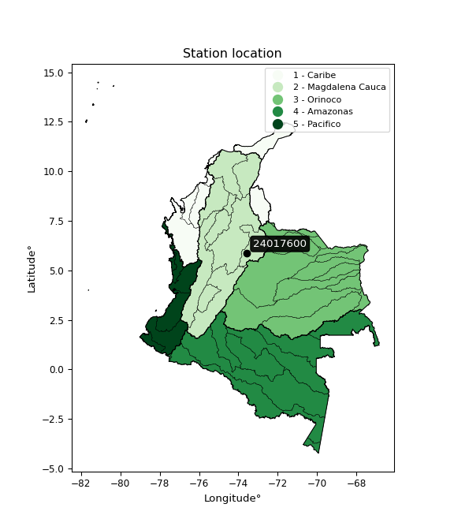

<div align="center">


</div>

# PMax24h Station (Rain, Pmax24h): 24017600

Maximum Precipitation in 24 hours (PMax24h) is the greatest amount of rainfall for a specific duration that is meteorologically possible for a given location, acting as a "worst-case" scenario for extreme storms, crucial for designing safety-critical infrastructure like bridges, river deviations, dams, spillways, and nuclear plants to prevent catastrophic failure. The PMax24h is related with the Probable Maximum Precipitation (PMP) and it is calculated by hydrologists using meteorological data to determine the upper limit of extreme rainfall, often leading to the Probable Maximum Flood (PMF) for flood control design, and is increasingly being studied for climate change impacts. Probable Maximum Precipitation (PMP) is the theoretical upper limit of rainfall, a deterministic estimate for extreme events, while probability distributions (like GEV, Gumbel) describe the likelihood and frequency of various precipitation amounts, including rare ones, showing how often events occur, with PMP representing the extreme end of these distributions, used for critical infrastructure design to ensure safety against the worst conceivable weather, unlike standard statistical forecasts which cover typical probabilities.

The most common probability distributions in hydrology, used for analyzing floods, rainfall, and streamflow, include the Normal, Log-Normal, Gumbel, Gamma (including Log-Pearson Type III), and Generalized Extreme Value (GEV) distributions, often chosen based on the data´s skewness and whether modeling extremes or general conditions, with Gumbel and GEV popular for extreme events like floods, while the Normal distribution serves as a baseline, though often requiring transformations for skewed hydrological data. These distributions help in designing water infrastructure, managing water resources, and forecasting hydrologic events.

> Hydrological data often isn´t perfectly normal (it´s skewed), so different distributions are needed for different applications, such as: **Flood Frequency Analysis**: Using Gumbel, GEV, or Log-Pearson Type III for predicting extreme flood magnitudes and their return periods, **Rainfall Analysis**: Normal for annual totals, but Log-Normal, Weibull, or GEV for intensity or extreme daily rainfall, **Streamflow Modeling**: Gamma and Log-Normal for maximum flows, GEV for minimum flows, and Kappa for daily flows.

<div align="center">

</img>

</div>


## A. General information


### 1. General running parameters

• app_version: _v20260225_. • runtime: _2026-02-27 14:50:08.749431_. • Python version: _3.14.0_. • SciPy version: _1.16.3_. • Pandas version: _2.3.3_. • NumPy version: _2.3.5_. • Stations dataset (station_dataset_file): _dataset/pmax24h_in/automatic_colombia_2003_2025.csv_. • Stations catalog (station_catalog_file): _dataset/CNE.xls_. • Minimum year to eval til year_max (date_min): _1900_. • Maximum year to eval since year_min (date_max): _2025_. • Creates, save and include plots into reports (create_plot): _False_. • Plot only fit distributions with Δo > Δ (plot_only_fit): _True_. • Plot only simple graphs avoiding multiple CDFs and multiple Extreme values plots (plot_only_simple): _False_. • Eval low extreme values, if False, evaluates high extreme values (low_extreme): _False_. • Eval every SciPy distribution as logarithmic (pdist_logarithmic_on): _True_. • Standard deviation normalized (ddof): _1.0_. • Return periods to eval in years (Tr): _[2, 2.33, 5, 10, 15, 20, 25, 50, 75, 100, 200, 250, 500, 750, 1000]_. • Minimum data sample per station, 0 means any (minimum_sample): _5_. • Z-Score maximum threshold to adjust a value, 0 means disable (zscore_max): _3.5_. • Z-Score minimum threshold to adjust a value, 0 means disable (zscore_min): _-2.5_. • Avoid zeros, e.g. rain = 0 (avoid_zeros): _True_. • Avoid null values (avoid_nans): _True_. 

:file_folder:Table: [dataset.csv](../../dataset/pmax24h_in/automatic_colombia_2003_2025.csv)

> Delta Degrees of Freedom (DDOF): is a parameter used in the formulas for calculating variance and standard deviation. When ddof=0, the divisor is $N$ (the total number of observations) and this is used when your data set is the entire population. When ddof=1, the divisor is $N-1$ and this is used when your data set is a sample drawn from a larger population. Using $N-1$ provides an unbiased estimate of the population variance (known as Bessel´s correction).


### 2. Station info and location

|   id |   CODIGO | NOMBRE                      | CATEGORIA    | TECNOLOGIA                              | ESTADO           | FECHA_INSTALACION   |   FECHA_SUSPENSION |   ALTITUD |   LATITUD |   LONGITUD | DEPARTAMENTO   | MUNICIPIO   | AREA_OPERATIVA                              | ENTIDAD                                                     | AREA_HIDROGRAFICA   | ZONA_HIDROGRAFICA   | SUBZONA_HIDROGRAFICA   | CORRIENTE   | Catalogo   |   Version |
|-----:|---------:|:----------------------------|:-------------|:----------------------------------------|:-----------------|:--------------------|-------------------:|----------:|----------:|-----------:|:---------------|:------------|:--------------------------------------------|:------------------------------------------------------------|:--------------------|:--------------------|:-----------------------|:------------|:-----------|----------:|
|    0 | 24017600 | MONIQUIRA  - AUT [24017600] | Limnigráfica | Automática con Telemetría, Convencional | En Mantenimiento | 15/04/1974          |                nan |      1720 |   5.87814 |   -73.5703 | Boyacá         | Moniquirá   | Area Operativa 06 - Boyacá-Casanare-Vichada | INSTITUTO DE HIDROLOGIA METEOROLOGIA Y ESTUDIOS AMBIENTALES | Magdalena Cauca     | Sogamoso            | Río Suárez             | Moniquira   | CNE_IDEAM  |  20251226 |

<div align="center">

Dynamic map: [:earth_americas:Google](http://maps.google.com/maps?q=5.878138889,-73.57025) [:earth_americas:OSM](https://www.openstreetmap.org/#map=18/5.878138889/-73.57025&layers=P) [:earth_americas:Bing](https://www.bing.com/maps?cp=5.878138889~-73.57025&lvl=18) [:earth_americas:Apple](https://maps.apple.com/frame?center=5.878138889%2C-73.57025&span=0.003%2C0.006)

</div>


<div align="center">

```geojson
{
  "type": "Feature",
  "geometry": {
    "type": "Point", 
    "coordinates": [-73.57025, 5.878138889]
  }, 
  "properties": {
    "Name": "24017600"
  }
}
```

</div>


### 3. Discrete values table and plot

<div align="center">

|               |           0 |           1 |          2 |           3 |          4 |           5 |            6 |
|:--------------|------------:|------------:|-----------:|------------:|-----------:|------------:|-------------:|
| Date          | 2019        | 2020        | 2021       | 2022        | 2023       | 2024        | 2025         |
| Value         |   39        |   57.6      |  217.4     |   58.4      |   19.4     |  119.6      |   92.2       |
| Value_initial |   39        |   57.6      |  217.4     |   58.4      |   19.4     |  119.6      |   92.2       |
| count         |    7        |    7        |    7       |    7        |    7       |    7        |    7         |
| mean          |   86.2286   |   86.2286   |   86.2286  |   86.2286   |   86.2286  |   86.2286   |   86.2286    |
| std           |   66.6407   |   66.6407   |   66.6407  |   66.6407   |   66.6407  |   66.6407   |   66.6407    |
| zscore        |   -0.708705 |   -0.429596 |    1.96834 |   -0.417591 |   -1.00282 |    0.500767 |    0.0896064 |


</div>


> The initial value (value_initial) correspond to the initial obtained or null completed value, and value (value) is adjusted only when the initial value is outside the valid range (outlier) definite through the Z-Score value. If Z-Score is active, values out of range or outliers are replaced with the station mean value. A Z-Score (or standard score) measures how many standard deviations a data point is from the mean of a dataset, indicating its relative position; positive scores mean above the mean, negative mean below, and a score of zero is exactly at the mean, allowing for comparison of values from different distributions. It´s calculated using the formula $z=(x–μ)/σ$, where $x$ is the data point, $μ$ is the mean, and $σ$ is the standard deviation, helping identify outliers and understand probability.
>
> <sub>**Note**: In this study, "completing" (filling gaps in) and "extending" (forecasting or lengthening the historical record) rainfall data series are avoided for certain critical analyses because they introduce artificial bias and uncertainty, which can distort the statistics of rare events (extremes), alter day-to-day variability, and compromise the integrity and homogeneity of the original data. Some reasons against Completing/Extending rainfall data are: **Distortion of Extremes and Variability**: The primary issue is that most gap-filling or extension methods rely on averaging or regression with nearby stations, which inherently smooths the data. Rainfall is highly variable in space and time, with a large percentage of zero values and occasional large storms. Infilling methods often underestimate the highest values and overestimate the lowest (zero) values, which severely distorts analyses focused on flood frequency, drought severity, and intensity-duration-frequency (IDF) curves, **Loss of Data Homogeneity**: Infilled or extended data are synthetic estimates, not actual measurements. Combining these estimates with observed data can violate the assumption of data homogeneity, which requires that the data properties do not change over time. Inhomogeneity can lead to incorrect conclusions about long-term trends or changes in climate patterns, **Propagation of Errors**: Errors and biases from the original data (e.g., wind-induced undercatch, instrument errors, site changes) or the data used for imputation can propagate through the analysis, leading to unreliable hydrological models and inaccurate predictions, **Compromised Statistical Integrity**: For statistical analyses, especially those involving the frequency of events, using artificial data can introduce time bias or autocorrelation that doesn´t exist in reality, making it difficult to assess the true probability of events, **Difficulty in Validation**: It is difficult to accurately validate the quality of filled or extended data, especially for past periods where ground-truth measurements are unavailable. The reliability of imputation techniques heavily depends on the density of the surrounding station network and the complexity of the local topography.</sub>


### 4. Active continuous probability distributions from SciPy (80 of 104 available)

A Probability Density Function (PDF) describes the relative likelihood of a continuous random variable falling within a specific range, where the total area under its curve equals 1, and the area over any interval gives the actual probability for that range. Unlike discrete probabilities (like rolling a die), a PDF shows density, not direct probability for a single point (which is zero), with higher points indicating higher likelihood, often visualized as a bell curve for normal distributions.

A log of a probability density function (log-PDF) is simply the logarithm of the PDF´s value, denoted as $log(f(x))$, useful for converting multiplication of probabilities into addition, improving numerical stability with tiny numbers, and connecting to information theory concepts like entropy. Instead of dealing with very small probabilities (e.g., 0.000001), log-PDFs use negative numbers (e.g., $log(0.00001) ≈ -11.51$ that are easier for computers to handle, preventing underflow errors and simplifying complex calculations. In this study, each active probability distribution from SciPy is also evaluated in the $log$ form.

[scipy.stats](https://docs.scipy.org/doc/scipy/reference/stats.html) is a Python´s powerful submodule within the SciPy library for comprehensive statistical analysis, offering over 130 probability distributions (like Normal, Poisson, etc.), functions for descriptive stats (mean, variance), hypothesis testing (t-tests, chi-square), random variable generation, and statistical tests, making it essential for data science, modeling, and research. It provides tools to explore, model, and draw conclusions from data efficiently, working seamlessly with [NumPy](https://numpy.org/).

<div align="center">

|   id | p_dist           |   n_parameter | fit_method   | label                                                                       | active   | ref                                                                                                      |
|-----:|:-----------------|--------------:|:-------------|:----------------------------------------------------------------------------|:---------|:---------------------------------------------------------------------------------------------------------|
|    0 | alpha            |             3 | MLE          | Alpha                                                                       | True     | [:mortar_board:](https://docs.scipy.org/doc/scipy/reference/generated/scipy.stats.alpha.html)            |
|    1 | anglit           |             2 | MM           | Anglit                                                                      | True     | [:mortar_board:](https://docs.scipy.org/doc/scipy/reference/generated/scipy.stats.anglit.html)           |
|    2 | arcsine          |             2 | MM           | Arcsine                                                                     | True     | [:mortar_board:](https://docs.scipy.org/doc/scipy/reference/generated/scipy.stats.arcsine.html)          |
|    3 | argus            |             3 | MLE          | Argus                                                                       | True     | [:mortar_board:](https://docs.scipy.org/doc/scipy/reference/generated/scipy.stats.argus.html)            |
|    4 | beta             |             4 | MLE          | Beta                                                                        | True     | [:mortar_board:](https://docs.scipy.org/doc/scipy/reference/generated/scipy.stats.beta.html)             |
|    5 | betaprime        |             4 | MLE          | Beta prime                                                                  | True     | [:mortar_board:](https://docs.scipy.org/doc/scipy/reference/generated/scipy.stats.betaprime.html)        |
|    6 | bradford         |             3 | MLE          | Bradford                                                                    | True     | [:mortar_board:](https://docs.scipy.org/doc/scipy/reference/generated/scipy.stats.bradford.html)         |
|    7 | burr             |             4 | MLE          | Burr (Type III)                                                             | True     | [:mortar_board:](https://docs.scipy.org/doc/scipy/reference/generated/scipy.stats.burr.html)             |
|    8 | burr12           |             4 | MLE          | Burr (Type III) 12                                                          | True     | [:mortar_board:](https://docs.scipy.org/doc/scipy/reference/generated/scipy.stats.burr12.html)           |
|    9 | cosine           |             2 | MLE          | Cosine                                                                      | True     | [:mortar_board:](https://docs.scipy.org/doc/scipy/reference/generated/scipy.stats.cosine.html)           |
|   10 | crystalball      |             4 | MLE          | Crystalball                                                                 | True     | [:mortar_board:](https://docs.scipy.org/doc/scipy/reference/generated/scipy.stats.crystalball.html)      |
|   11 | dgamma           |             3 | MLE          | Double gamma                                                                | True     | [:mortar_board:](https://docs.scipy.org/doc/scipy/reference/generated/scipy.stats.dgamma.html)           |
|   12 | dweibull         |             3 | MLE          | Double Weibull                                                              | True     | [:mortar_board:](https://docs.scipy.org/doc/scipy/reference/generated/scipy.stats.dweibull.html)         |
|   13 | erlang           |             3 | MLE          | Erlang                                                                      | True     | [:mortar_board:](https://docs.scipy.org/doc/scipy/reference/generated/scipy.stats.erlang.html)           |
|   14 | exponnorm        |             3 | MLE          | Exponentially modified Normal                                               | True     | [:mortar_board:](https://docs.scipy.org/doc/scipy/reference/generated/scipy.stats.exponnorm.html)        |
|   15 | exponpow         |             3 | MLE          | Exponential power                                                           | True     | [:mortar_board:](https://docs.scipy.org/doc/scipy/reference/generated/scipy.stats.exponpow.html)         |
|   16 | exponweib        |             4 | MLE          | Exponentiated Weibull                                                       | True     | [:mortar_board:](https://docs.scipy.org/doc/scipy/reference/generated/scipy.stats.exponweib.html)        |
|   17 | f                |             4 | MLE          | F                                                                           | True     | [:mortar_board:](https://docs.scipy.org/doc/scipy/reference/generated/scipy.stats.f.html)                |
|   18 | fatiguelife      |             3 | MLE          | Fatigue-life (Birnbaum-Saunders)                                            | True     | [:mortar_board:](https://docs.scipy.org/doc/scipy/reference/generated/scipy.stats.fatiguelife.html)      |
|   19 | foldnorm         |             3 | MM           | Fold Normal                                                                 | True     | [:mortar_board:](https://docs.scipy.org/doc/scipy/reference/generated/scipy.stats.foldnorm.html)         |
|   20 | gamma            |             3 | MLE          | Gamma                                                                       | True     | [:mortar_board:](https://docs.scipy.org/doc/scipy/reference/generated/scipy.stats.gamma.html)            |
|   21 | gausshyper       |             6 | MLE          | Gauss hypergeometric                                                        | True     | [:mortar_board:](https://docs.scipy.org/doc/scipy/reference/generated/scipy.stats.gausshyper.html)       |
|   22 | genexpon         |             5 | MLE          | Generalized exponential                                                     | True     | [:mortar_board:](https://docs.scipy.org/doc/scipy/reference/generated/scipy.stats.genexpon.html)         |
|   23 | genextreme       |             3 | MLE          | Generalized exponential                                                     | True     | [:mortar_board:](https://docs.scipy.org/doc/scipy/reference/generated/scipy.stats.genextreme.html)       |
|   24 | gengamma         |             4 | MLE          | Generalized gamma                                                           | True     | [:mortar_board:](https://docs.scipy.org/doc/scipy/reference/generated/scipy.stats.gengamma.html)         |
|   25 | genhalflogistic  |             3 | MLE          | Generalized half-logistic                                                   | True     | [:mortar_board:](https://docs.scipy.org/doc/scipy/reference/generated/scipy.stats.genhalflogistic.html)  |
|   26 | genlogistic      |             3 | MLE          | Generalized logistic                                                        | True     | [:mortar_board:](https://docs.scipy.org/doc/scipy/reference/generated/scipy.stats.genlogistic.html)      |
|   27 | gennorm          |             3 | MLE          | Generalized Normal                                                          | True     | [:mortar_board:](https://docs.scipy.org/doc/scipy/reference/generated/scipy.stats.gennorm.html)          |
|   28 | genpareto        |             3 | MLE          | Generalized Pareto                                                          | True     | [:mortar_board:](https://docs.scipy.org/doc/scipy/reference/generated/scipy.stats.genpareto.html)        |
|   29 | gompertz         |             3 | MLE          | Gompertz (or truncated Gumbel)                                              | True     | [:mortar_board:](https://docs.scipy.org/doc/scipy/reference/generated/scipy.stats.gompertz.html)         |
|   30 | gumbel_l         |             2 | MM           | Gumbel Left Skew                                                            | True     | [:mortar_board:](https://docs.scipy.org/doc/scipy/reference/generated/scipy.stats.gumbel_l.html)         |
|   31 | gumbel_r         |             2 | MM           | Gumbel Right Skew                                                           | True     | [:mortar_board:](https://docs.scipy.org/doc/scipy/reference/generated/scipy.stats.gumbel_r.html)         |
|   32 | halfgennorm      |             3 | MLE          | Upper half of a generalized normal                                          | True     | [:mortar_board:](https://docs.scipy.org/doc/scipy/reference/generated/scipy.stats.halfgennorm.html)      |
|   33 | halflogistic     |             2 | MM           | Half-logistic                                                               | True     | [:mortar_board:](https://docs.scipy.org/doc/scipy/reference/generated/scipy.stats.halflogistic.html)     |
|   34 | halfnorm         |             2 | MM           | Half Normal                                                                 | True     | [:mortar_board:](https://docs.scipy.org/doc/scipy/reference/generated/scipy.stats.halfnorm.html)         |
|   35 | hypsecant        |             2 | MM           | hyperbolic secant                                                           | True     | [:mortar_board:](https://docs.scipy.org/doc/scipy/reference/generated/scipy.stats.hypsecant.html)        |
|   36 | invgamma         |             3 | MLE          | Inverted gamma                                                              | True     | [:mortar_board:](https://docs.scipy.org/doc/scipy/reference/generated/scipy.stats.invgamma.html)         |
|   37 | invgauss         |             3 | MLE          | Inverse Gaussian                                                            | True     | [:mortar_board:](https://docs.scipy.org/doc/scipy/reference/generated/scipy.stats.invgauss.html)         |
|   38 | invweibull       |             3 | MLE          | Inverted Weibull                                                            | True     | [:mortar_board:](https://docs.scipy.org/doc/scipy/reference/generated/scipy.stats.invweibull.html)       |
|   39 | johnsonsb        |             4 | MLE          | Johnson SB                                                                  | True     | [:mortar_board:](https://docs.scipy.org/doc/scipy/reference/generated/scipy.stats.johnsonsb.html)        |
|   40 | johnsonsu        |             4 | MLE          | Johnson Su                                                                  | True     | [:mortar_board:](https://docs.scipy.org/doc/scipy/reference/generated/scipy.stats.johnsonsu.html)        |
|   41 | kappa3           |             3 | MLE          | Kappa 3                                                                     | True     | [:mortar_board:](https://docs.scipy.org/doc/scipy/reference/generated/scipy.stats.kappa3.html)           |
|   42 | kappa4           |             4 | MLE          | Kappa 4                                                                     | True     | [:mortar_board:](https://docs.scipy.org/doc/scipy/reference/generated/scipy.stats.kappa4.html)           |
|   43 | ksone            |             3 | MLE          | Kolmogorov-Smirnov one-sided test statistic distribution                    | True     | [:mortar_board:](https://docs.scipy.org/doc/scipy/reference/generated/scipy.stats.ksone.html)            |
|   44 | kstwobign        |             2 | MLE          | Limiting distribution of scaled Kolmogorov-Smirnov two-sided test statistic | True     | [:mortar_board:](https://docs.scipy.org/doc/scipy/reference/generated/scipy.stats.kstwobign.html)        |
|   45 | laplace          |             2 | MM           | Laplace                                                                     | True     | [:mortar_board:](https://docs.scipy.org/doc/scipy/reference/generated/scipy.stats.laplace.html)          |
|   46 | levy_l           |             2 | MLE          | Left-skewed Levy                                                            | True     | [:mortar_board:](https://docs.scipy.org/doc/scipy/reference/generated/scipy.stats.levy_l.html)           |
|   47 | loggamma         |             3 | MLE          | Log gamma                                                                   | True     | [:mortar_board:](https://docs.scipy.org/doc/scipy/reference/generated/scipy.stats.loggamma.html)         |
|   48 | logistic         |             2 | MM           | Logistic (or Sech-squared)                                                  | True     | [:mortar_board:](https://docs.scipy.org/doc/scipy/reference/generated/scipy.stats.logistic.html)         |
|   49 | loglaplace       |             3 | MLE          | Log-Laplace                                                                 | True     | [:mortar_board:](https://docs.scipy.org/doc/scipy/reference/generated/scipy.stats.loglaplace.html)       |
|   50 | lomax            |             3 | MLE          | Lomax (Pareto of the second kind)                                           | True     | [:mortar_board:](https://docs.scipy.org/doc/scipy/reference/generated/scipy.stats.lomax.html)            |
|   51 | maxwell          |             2 | MM           | Maxwell                                                                     | True     | [:mortar_board:](https://docs.scipy.org/doc/scipy/reference/generated/scipy.stats.maxwell.html)          |
|   52 | mielke           |             4 | MLE          | Mielke Beta-Kappa / Dagum                                                   | True     | [:mortar_board:](https://docs.scipy.org/doc/scipy/reference/generated/scipy.stats.mielke.html)           |
|   53 | moyal            |             2 | MM           | Moyal                                                                       | True     | [:mortar_board:](https://docs.scipy.org/doc/scipy/reference/generated/scipy.stats.moyal.html)            |
|   54 | nakagami         |             3 | MLE          | Nakagami                                                                    | True     | [:mortar_board:](https://docs.scipy.org/doc/scipy/reference/generated/scipy.stats.nakagami.html)         |
|   55 | ncf              |             5 | MLE          | Non-central F distribution                                                  | True     | [:mortar_board:](https://docs.scipy.org/doc/scipy/reference/generated/scipy.stats.ncf.html)              |
|   56 | nct              |             4 | MLE          | Non-central Student’s t                                                     | True     | [:mortar_board:](https://docs.scipy.org/doc/scipy/reference/generated/scipy.stats.nct.html)              |
|   57 | norm             |             2 | MM           | Normal                                                                      | True     | [:mortar_board:](https://docs.scipy.org/doc/scipy/reference/generated/scipy.stats.norm.html)             |
|   58 | pearson3         |             3 | MM           | Pearson type III                                                            | True     | [:mortar_board:](https://docs.scipy.org/doc/scipy/reference/generated/scipy.stats.pearson3.html)         |
|   59 | powerlaw         |             3 | MLE          | Power-function                                                              | True     | [:mortar_board:](https://docs.scipy.org/doc/scipy/reference/generated/scipy.stats.powerlaw.html)         |
|   60 | rayleigh         |             2 | MM           | Rayleigh                                                                    | True     | [:mortar_board:](https://docs.scipy.org/doc/scipy/reference/generated/scipy.stats.rayleigh.html)         |
|   61 | rdist            |             3 | MLE          | R-distributed (symmetric beta)                                              | True     | [:mortar_board:](https://docs.scipy.org/doc/scipy/reference/generated/scipy.stats.rdist.html)            |
|   62 | rice             |             3 | MLE          | Rice                                                                        | True     | [:mortar_board:](https://docs.scipy.org/doc/scipy/reference/generated/scipy.stats.rice.html)             |
|   63 | semicircular     |             2 | MM           | Semicircular                                                                | True     | [:mortar_board:](https://docs.scipy.org/doc/scipy/reference/generated/scipy.stats.semicircular.html)     |
|   64 | skewnorm         |             3 | MLE          | Skew normal                                                                 | True     | [:mortar_board:](https://docs.scipy.org/doc/scipy/reference/generated/scipy.stats.skewnorm.html)         |
|   65 | t                |             3 | MLE          | Student’s t                                                                 | True     | [:mortar_board:](https://docs.scipy.org/doc/scipy/reference/generated/scipy.stats.t.html)                |
|   66 | trapezoid        |             4 | MLE          | Trapezoid                                                                   | True     | [:mortar_board:](https://docs.scipy.org/doc/scipy/reference/generated/scipy.stats.trapezoid.html)        |
|   67 | triang           |             3 | MLE          | Triangular                                                                  | True     | [:mortar_board:](https://docs.scipy.org/doc/scipy/reference/generated/scipy.stats.triang.html)           |
|   68 | truncexpon       |             3 | MLE          | Truncated exponential                                                       | True     | [:mortar_board:](https://docs.scipy.org/doc/scipy/reference/generated/scipy.stats.truncexpon.html)       |
|   69 | truncnorm        |             4 | MLE          | Truncated normal                                                            | True     | [:mortar_board:](https://docs.scipy.org/doc/scipy/reference/generated/scipy.stats.truncnorm.html)        |
|   70 | truncpareto      |             4 | MLE          | Upper truncated Pareto                                                      | True     | [:mortar_board:](https://docs.scipy.org/doc/scipy/reference/generated/scipy.stats.truncpareto.html)      |
|   71 | truncweibull_min |             5 | MLE          | Doubly truncated Weibull minimum                                            | True     | [:mortar_board:](https://docs.scipy.org/doc/scipy/reference/generated/scipy.stats.truncweibull_min.html) |
|   72 | tukeylambda      |             3 | MLE          | Tukey-Lamdba                                                                | True     | [:mortar_board:](https://docs.scipy.org/doc/scipy/reference/generated/scipy.stats.tukeylambda.html)      |
|   73 | uniform          |             2 | MLE          | Uniform                                                                     | True     | [:mortar_board:](https://docs.scipy.org/doc/scipy/reference/generated/scipy.stats.uniform.html)          |
|   74 | vonmises         |             3 | MLE          | Von Mises                                                                   | True     | [:mortar_board:](https://docs.scipy.org/doc/scipy/reference/generated/scipy.stats.vonmises.html)         |
|   75 | vonmises_line    |             3 | MLE          | Von Mises line                                                              | True     | [:mortar_board:](https://docs.scipy.org/doc/scipy/reference/generated/scipy.stats.vonmises_line.html)    |
|   76 | wald             |             2 | MM           | Wald                                                                        | True     | [:mortar_board:](https://docs.scipy.org/doc/scipy/reference/generated/scipy.stats.wald.html)             |
|   77 | weibull_max      |             3 | MLE          | Weibull maximum                                                             | True     | [:mortar_board:](https://docs.scipy.org/doc/scipy/reference/generated/scipy.stats.weibull_max.html)      |
|   78 | weibull_min      |             3 | MLE          | Weibull minimum                                                             | True     | [:mortar_board:](https://docs.scipy.org/doc/scipy/reference/generated/scipy.stats.weibull_min.html)      |
|   79 | wrapcauchy       |             3 | MLE          | Wrapped  Cauchy                                                             | True     | [:mortar_board:](https://docs.scipy.org/doc/scipy/reference/generated/scipy.stats.wrapcauchy.html)       |

</div>

> **n_parameter:** # arguments & localization & scale.
>
> **Fit methods:** (MLE) maximum likelihood, (MM) L-moments.
>
>**Inactive** (With the only purpose of prevent loops, zero divisions, infinite values, over high estimated values or horizontal trending for recurrence intervals estimations, the follow distributions were disabled.)**:** lognorm, norminvgauss, powernorm, powerlognorm, cauchy, halfcauchy, foldcauchy, skewcauchy, chi2, expon, fisk, genhyperbolic, geninvgauss, gibrat, kstwo, laplace_asymmetric, levy, levy_stable, ncx2, pareto, rel_breitwigner, recipinvgauss, studentized_range, loguniform, 


## B. Probability (PDF) vs. Empirical (EDF) distributions functions

A continuous probability distribution (CPD) describes probabilities for variables that can take any value within a range (like rain any time), unlike discrete variables with specific outcomes (like temperature). It uses a Probability Density Function (PDF), a curve where the total area under it equals 1, and the probability of the variable falling within an interval (a to b) is found by calculating the area under the curve between those points. A key feature is that the probability of hitting any single exact value is zero, so probabilities are always expressed for ranges, e.g., $P(a ≤ X ≤ b)$.

<div align="center">

Distributions parameters from station values
|     |   station | p_dist              |   n |              loc |           scale | shape                  | shape1                 | shape2                 | shape3             |
|----:|----------:|:--------------------|----:|-----------------:|----------------:|:-----------------------|:-----------------------|:-----------------------|:-------------------|
|   0 |  24017600 | alpha               |   7 |    -70.5066      |   423.76        | 3.0654496539068488     |                        |                        |                    |
|   1 |  24017600 | anglit              |   7 |     86.2286      |   180.489       |                        |                        |                        |                    |
|   2 |  24017600 | arcsine             |   7 |     -1.02453     |   174.506       |                        |                        |                        |                    |
|   3 |  24017600 | argus               |   7 |    -56.7717      |   285.002       | 1.8081848589403199e-06 |                        |                        |                    |
|   4 |  24017600 | beta                |   7 |     -0.336232    |   217.736       | 0.7771388899628991     | 0.6050149484865512     |                        |                    |
|   5 |  24017600 | betaprime           |   7 |     -0.443084    |    94.8279      | 3.760172501714985      | 5.0836827440189225     |                        |                    |
|   6 |  24017600 | bradford            |   7 |     -0.220524    |   217.621       | 2.0612041472554616     |                        |                        |                    |
|   7 |  24017600 | burr                |   7 |     -0.0703437   |    65.7714      | 2.330392209407221      | 1.0415181419272213     |                        |                    |
|   8 |  24017600 | burr12              |   7 |     -0.705272    |    19.8403      | 296.0806263830757      | 0.0027426984169181016  |                        |                    |
|   9 |  24017600 | cosine              |   7 |     96.7305      |    54.2255      |                        |                        |                        |                    |
|  10 |  24017600 | crystalball         |   7 |     86.2286      |    61.6973      | 6040.61885032452       | 7433.786499633471      |                        |                    |
|  11 |  24017600 | dgamma              |   7 |     77.7236      |    24.9281      | 1.9056125827820818     |                        |                        |                    |
|  12 |  24017600 | dweibull            |   7 |     78.491       |    52.3715      | 1.3347129350999554     |                        |                        |                    |
|  13 |  24017600 | erlang              |   7 |     19.4         |    87.2415      | 0.4840545257693857     |                        |                        |                    |
|  14 |  24017600 | exponnorm           |   7 |     19.3164      |     0.0265965   | 2511.036047904159      |                        |                        |                    |
|  15 |  24017600 | exponpow            |   7 |     19.4         |   114.983       | 0.8678044467561827     |                        |                        |                    |
|  16 |  24017600 | exponweib           |   7 |     19.4         |    24.4358      | 1.4258377142347225     | 0.5469456695604591     |                        |                    |
|  17 |  24017600 | f                   |   7 |     -0.134347    |    71.1407      | 6.941116719028434      | 10.90719591734149      |                        |                    |
|  18 |  24017600 | fatiguelife         |   7 |      4.20877     |    60.4068      | 0.8414843799329484     |                        |                        |                    |
|  19 |  24017600 | foldnorm            |   7 |      3.29273     |   103.341       | 0.07596156334933774    |                        |                        |                    |
|  20 |  24017600 | gamma               |   7 |     19.4         |    53.7373      | 0.7181191162178433     |                        |                        |                    |
|  21 |  24017600 | gausshyper          |   7 |     -0.45975     |   217.86        | 0.8405458448738066     | 0.7794634102244886     | 1.2853893222311195     | 1.0594655574921883 |
|  22 |  24017600 | genexpon            |   7 |     19.4         |   115.559       | 1.724348643131177      | 0.00803763632443361    | 2.629284179970356      |                    |
|  23 |  24017600 | genextreme          |   7 |     52.867       |    35.4183      | -0.3166285332993537    |                        |                        |                    |
|  24 |  24017600 | gengamma            |   7 |     -0.268782    |     0.0389414   | 15.051210752252473     | 0.3592207363020239     |                        |                    |
|  25 |  24017600 | genhalflogistic     |   7 |     -0.413082    |   229.12        | 1.0519101946670342     |                        |                        |                    |
|  26 |  24017600 | genlogistic         |   7 |   -258.786       |    42.1154      | 1912.026401939942      |                        |                        |                    |
|  27 |  24017600 | gennorm             |   7 |     58.4         |     0.063898    | 0.24888604859520974    |                        |                        |                    |
|  28 |  24017600 | genpareto           |   7 |     19.4         |    77.8578      | -0.15896126683413497   |                        |                        |                    |
|  29 |  24017600 | gompertz            |   7 |     19.4         |   265.14        | 3.033971680554549      |                        |                        |                    |
|  30 |  24017600 | gumbel_l            |   7 |    113.996       |    48.1052      |                        |                        |                        |                    |
|  31 |  24017600 | gumbel_r            |   7 |     58.4615      |    48.1052      |                        |                        |                        |                    |
|  32 |  24017600 | halfgennorm         |   7 |     19.4         |   106.36        | 1.4622828055206618     |                        |                        |                    |
|  33 |  24017600 | halflogistic        |   7 |     13.103       |    52.749       |                        |                        |                        |                    |
|  34 |  24017600 | halfnorm            |   7 |      4.56556     |   102.349       |                        |                        |                        |                    |
|  35 |  24017600 | hypsecant           |   7 |     86.2286      |    39.2777      |                        |                        |                        |                    |
|  36 |  24017600 | invgamma            |   7 |    -18.3406      |   277.046       | 3.58866502318788       |                        |                        |                    |
|  37 |  24017600 | invgauss            |   7 |     -0.891177    |   135.694       | 0.6420301408625126     |                        |                        |                    |
|  38 |  24017600 | invweibull          |   7 |    -58.9938      |   111.861       | 3.15827705340261       |                        |                        |                    |
|  39 |  24017600 | johnsonsb           |   7 |     19.4         |   198.018       | 0.28824809534381285    | 0.12534286362652064    |                        |                    |
|  40 |  24017600 | johnsonsu           |   7 |      4.35746     |     0.76267     | -6.396163529617592     | 1.2593310996831542     |                        |                    |
|  41 |  24017600 | kappa3              |   7 |     19.3909      |    64.9673      | 2.4936408364938023     |                        |                        |                    |
|  42 |  24017600 | kappa4              |   7 |     -0.416933    |   213.034       | 1.1024212310090356     | 0.9738543700539151     |                        |                    |
|  43 |  24017600 | ksone               |   7 |     -0.4         |   237.6         | 1.0                    |                        |                        |                    |
|  44 |  24017600 | kstwobign           |   7 |    -93.0302      |   207.167       |                        |                        |                        |                    |
|  45 |  24017600 | laplace             |   7 |     86.2286      |    43.6266      |                        |                        |                        |                    |
|  46 |  24017600 | levy_l              |   7 |    232.711       |    68.2477      |                        |                        |                        |                    |
|  47 |  24017600 | loggamma            |   7 | -21074.2         |  2781.2         | 2015.6507477312934     |                        |                        |                    |
|  48 |  24017600 | logistic            |   7 |     86.2286      |    34.0155      |                        |                        |                        |                    |
|  49 |  24017600 | loglaplace          |   7 |     -0.160475    |    58.5605      | 1.7480954409653826     |                        |                        |                    |
|  50 |  24017600 | lomax               |   7 |     19.4         | 12646.9         | 189.9181185992217      |                        |                        |                    |
|  51 |  24017600 | maxwell             |   7 |    -59.9681      |    91.6152      |                        |                        |                        |                    |
|  52 |  24017600 | mielke              |   7 |     19.3998      |    86.9048      | 0.7108582985063892     | 2.303958407377352      |                        |                    |
|  53 |  24017600 | moyal               |   7 |     50.9461      |    27.7735      |                        |                        |                        |                    |
|  54 |  24017600 | nakagami            |   7 |     19.4         |   113.054       | 0.30505711235441924    |                        |                        |                    |
|  55 |  24017600 | ncf                 |   7 |      0.155936    |     0.335252    | 0.10335904946757839    | 7.747840880842687      | 20.010168294301316     |                    |
|  56 |  24017600 | nct                 |   7 |     -0.0387656   |    21.7039      | 2.2456428119895655     | 2.6212335994417346     |                        |                    |
|  57 |  24017600 | norm                |   7 |     86.2286      |    61.6973      |                        |                        |                        |                    |
|  58 |  24017600 | pearson3            |   7 |     86.2286      |    61.6973      | 1.1225688717320836     |                        |                        |                    |
|  59 |  24017600 | powerlaw            |   7 |     19.4         |   198           | 0.15275885999588226    |                        |                        |                    |
|  60 |  24017600 | rayleigh            |   7 |    -31.8019      |    94.1747      |                        |                        |                        |                    |
|  61 |  24017600 | rdist               |   7 |      0.490231    |   119.11        | 1.1956727149894446     |                        |                        |                    |
|  62 |  24017600 | rice                |   7 |    -11.597       |    81.7814      | 0.00030902820220891675 |                        |                        |                    |
|  63 |  24017600 | semicircular        |   7 |     86.2286      |   123.395       |                        |                        |                        |                    |
|  64 |  24017600 | skewnorm            |   7 |     19.4         |    90.9544      | 35544849.969007835     |                        |                        |                    |
|  65 |  24017600 | t                   |   7 |     85.3362      |    61.3722      | 63.34765923486083      |                        |                        |                    |
|  66 |  24017600 | trapezoid           |   7 |     -0.42        |   237.6         | 1.0                    | 1.0                    |                        |                    |
|  67 |  24017600 | triang              |   7 |     -0.430764    |   217.831       | 0.9999990518511801     |                        |                        |                    |
|  68 |  24017600 | truncexpon          |   7 |     -0.422761    |   211.46        | 1.0300915880605794     |                        |                        |                    |
|  69 |  24017600 | truncnorm           |   7 |     86.2286      |    61.6973      | -880.8420409950519     | 2096.3324146749737     |                        |                    |
|  70 |  24017600 | truncpareto         |   7 |     -0.613536    |    20.0135      | 2.0375854959224326e-09 | 10.893304026245719     |                        |                    |
|  71 |  24017600 | truncweibull_min    |   7 |     -0.309198    |   199.897       | 1.1001261311036608     | 0.0006147094334758847  | 1.0891048898261784     |                    |
|  72 |  24017600 | tukeylambda         |   7 |      0.826204    |   126.601       | 1.0658982940650414     |                        |                        |                    |
|  73 |  24017600 | uniform             |   7 |     19.4         |   198           |                        |                        |                        |                    |
|  74 |  24017600 | vonmises            |   7 |      1.09961     |     1           | 0.6986899288737797     |                        |                        |                    |
|  75 |  24017600 | vonmises_line       |   7 |     73.7604      |    45.7219      | 1.1315686114274883     |                        |                        |                    |
|  76 |  24017600 | wald                |   7 |     24.5313      |    61.6972      |                        |                        |                        |                    |
|  77 |  24017600 | weibull_max         |   7 |    217.4         |     1.56404     | 0.22015850801257086    |                        |                        |                    |
|  78 |  24017600 | weibull_min         |   7 |     19.4         |   167.937       | 0.2986523828913361     |                        |                        |                    |
|  79 |  24017600 | wrapcauchy          |   7 |     19.4         |    31.5127      | 0.30987847228393695    |                        |                        |                    |
|  80 |  24017600 | logalpha            |   7 |    -10.7766      |   302.676       | 20.242147580509084     |                        |                        |                    |
|  81 |  24017600 | loganglit           |   7 |      4.20565     |     2.12508     |                        |                        |                        |                    |
|  82 |  24017600 | logarcsine          |   7 |      3.17835     |     2.05459     |                        |                        |                        |                    |
|  83 |  24017600 | logargus            |   7 |      2.47516     |     3.03768     | 9.786501842476808e-05  |                        |                        |                    |
|  84 |  24017600 | logbeta             |   7 |      2.06699     |     3.31475     | 2.1437208820055385     | 0.8713838440826258     |                        |                    |
|  85 |  24017600 | logbetaprime        |   7 |     -8.82724     |    82.3468      | 367.672634451588       | 2324.399670989683      |                        |                    |
|  86 |  24017600 | logbradford         |   7 |      2.96524     |     2.4165      | 0.97821208400016       |                        |                        |                    |
|  87 |  24017600 | logburr             |   7 |      2.96527     |     2.16069     | 11.0448723297024       | 0.04539751313428389    |                        |                    |
|  88 |  24017600 | logburr12           |   7 |      2.07494     |    11.3885      | 3.305310458083479      | 177.40544525220344     |                        |                    |
|  89 |  24017600 | logcosine           |   7 |      4.19488     |     0.614609    |                        |                        |                        |                    |
|  90 |  24017600 | logcrystalball      |   7 |      4.20565     |     0.726425    | 20.484518052350815     | 26.65581953901394      |                        |                    |
|  91 |  24017600 | logdgamma           |   7 |      4.30442     |     0.266564    | 2.2747862529089655     |                        |                        |                    |
|  92 |  24017600 | logdweibull         |   7 |      4.05352     |     0.625659    | 0.9408595089040447     |                        |                        |                    |
|  93 |  24017600 | logerlang           |   7 |    -18.8652      |     0.0229688   | 1004.3683879575501     |                        |                        |                    |
|  94 |  24017600 | logexponnorm        |   7 |      4.2047      |     0.726423    | 0.0013056068441184546  |                        |                        |                    |
|  95 |  24017600 | logexponpow         |   7 |      2.96527     |     1.53431     | 0.5332431732158927     |                        |                        |                    |
|  96 |  24017600 | logexponweib        |   7 |      2.96527     |     1.31146     | 0.6204634914957241     | 1.1115153348766764     |                        |                    |
|  97 |  24017600 | logf                |   7 |   -114.564       |   118.766       | 349767.68001081725     | 62411.76798046965      |                        |                    |
|  98 |  24017600 | logfatiguelife      |   7 |    -90.7556      |    94.9588      | 0.007655209239995922   |                        |                        |                    |
|  99 |  24017600 | logfoldnorm         |   7 |      1.88798     |     0.724324    | 3.1998762414013857     |                        |                        |                    |
| 100 |  24017600 | loggamma            |   7 |    -18.7128      |     0.0231657   | 989.336490331299       |                        |                        |                    |
| 101 |  24017600 | loggausshyper       |   7 |      2.88987     |     2.49187     | 1.3312196642159975     | 0.9034522741976385     | 1.221855476363309      | 0.7634906283274727 |
| 102 |  24017600 | loggenexpon         |   7 |      2.96235     |     0.00404308  | 0.0012880579288721606  | 0.9206680206635299     | 1.0360384501704719e-05 |                    |
| 103 |  24017600 | loggenextreme       |   7 |      3.98992     |     0.755415    | 0.39583768321222035    |                        |                        |                    |
| 104 |  24017600 | loggengamma         |   7 |      2.96527     |     1.25589     | 0.7203628723048627     | 1.0466565630396398     |                        |                    |
| 105 |  24017600 | loggenhalflogistic  |   7 |      2.7949      |     2.79097     | 1.0789097458161745     |                        |                        |                    |
| 106 |  24017600 | loggenlogistic      |   7 |      4.18823     |     0.428919    | 1.0364115813361703     |                        |                        |                    |
| 107 |  24017600 | loggennorm          |   7 |      4.06733     |     0.555686    | 0.9801464844675947     |                        |                        |                    |
| 108 |  24017600 | loggenpareto        |   7 |     -0.0120363   |    12.398       | -2.298577373508242     |                        |                        |                    |
| 109 |  24017600 | loggompertz         |   7 |      2.96527     |     1.35206     | 0.5397841664808016     |                        |                        |                    |
| 110 |  24017600 | loggumbel_l         |   7 |      4.53258     |     0.566391    |                        |                        |                        |                    |
| 111 |  24017600 | loggumbel_r         |   7 |      3.87872     |     0.566391    |                        |                        |                        |                    |
| 112 |  24017600 | loghalfgennorm      |   7 |      2.96527     |     1.15075     | 0.9440154899181423     |                        |                        |                    |
| 113 |  24017600 | loghalflogistic     |   7 |      3.34468     |     0.621056    |                        |                        |                        |                    |
| 114 |  24017600 | loghalfnorm         |   7 |      3.24414     |     1.20507     |                        |                        |                        |                    |
| 115 |  24017600 | loghypsecant        |   7 |      4.20565     |     0.462456    |                        |                        |                        |                    |
| 116 |  24017600 | loginvgamma         |   7 |     -9.08304     |  4381.04        | 330.66147694821643     |                        |                        |                    |
| 117 |  24017600 | loginvgauss         |   7 |     -0.789744    |   213.726       | 0.023328359475400656   |                        |                        |                    |
| 118 |  24017600 | loginvweibull       |   7 |     -8.55409e+07 |     8.55409e+07 | 119328634.33157691     |                        |                        |                    |
| 119 |  24017600 | logjohnsonsb        |   7 |      2.96527     |     2.41647     | -0.3506409897163874    | 0.14687298072336596    |                        |                    |
| 120 |  24017600 | logjohnsonsu        |   7 |     -6.05338e+06 |     6.18505e+06 | -10316009.067131117    | 11908947.713293545     |                        |                    |
| 121 |  24017600 | logkappa3           |   7 |      2.96527     |     2.41644     | 184118.85093390947     |                        |                        |                    |
| 122 |  24017600 | logkappa4           |   7 |      2.87543     |     2.51842     | 1.036994077263826      | 1.0024273750262984     |                        |                    |
| 123 |  24017600 | logksone            |   7 |      2.94744     |     2.51641     | 1.0                    |                        |                        |                    |
| 124 |  24017600 | logkstwobign        |   7 |      1.37399     |     3.24069     |                        |                        |                        |                    |
| 125 |  24017600 | loglaplace          |   7 |      4.20565     |     0.51366     |                        |                        |                        |                    |
| 126 |  24017600 | loglevy_l           |   7 |      5.50348     |     0.540562    |                        |                        |                        |                    |
| 127 |  24017600 | logloggamma         |   7 |    -19.1811      |     5.68484     | 61.68263481129996      |                        |                        |                    |
| 128 |  24017600 | loglogistic         |   7 |      4.20565     |     0.400499    |                        |                        |                        |                    |
| 129 |  24017600 | logloglaplace       |   7 |     -0.000856087 |     4.06817     | 7.198298050933366      |                        |                        |                    |
| 130 |  24017600 | loglomax            |   7 |      2.96527     |     4.25101e+09 | 2551708546.7574434     |                        |                        |                    |
| 131 |  24017600 | logmaxwell          |   7 |      2.48433     |     1.07868     |                        |                        |                        |                    |
| 132 |  24017600 | logmielke           |   7 |      2.96527     |     2.53472     | 0.6570700353721357     | 6.38915947714828       |                        |                    |
| 133 |  24017600 | logmoyal            |   7 |      3.79023     |     0.327006    |                        |                        |                        |                    |
| 134 |  24017600 | lognakagami         |   7 |      3.66356     |     0.835867    | 0.18735223157119477    |                        |                        |                    |
| 135 |  24017600 | logncf              |   7 |     -9.99507     |     7.82608     | 1464.2864418332688     | 1257.7502253993594     | 1188.7640207253153     |                    |
| 136 |  24017600 | lognct              |   7 |    -24.8762      |     0.665734    | 4891.7733853025875     | 43.67721453365374      |                        |                    |
| 137 |  24017600 | lognorm             |   7 |      4.20565     |     0.726424    |                        |                        |                        |                    |
| 138 |  24017600 | logpearson3         |   7 |      4.20565     |     0.726425    | -0.08242224350779105   |                        |                        |                    |
| 139 |  24017600 | logpowerlaw         |   7 |      2.96527     |     2.41647     | 0.17596930492099327    |                        |                        |                    |
| 140 |  24017600 | lograyleigh         |   7 |      2.81595     |     1.10881     |                        |                        |                        |                    |
| 141 |  24017600 | logrdist            |   7 |      3.87619     |     0.910919    | 1.2210355081382245     |                        |                        |                    |
| 142 |  24017600 | logrice             |   7 |      2.5729      |     0.816514    | 1.670366876820299      |                        |                        |                    |
| 143 |  24017600 | logsemicircular     |   7 |      4.20565     |     1.45285     |                        |                        |                        |                    |
| 144 |  24017600 | logskewnorm         |   7 |      4.58633     |     0.820134    | -0.7146088712160064    |                        |                        |                    |
| 145 |  24017600 | logt                |   7 |      4.20565     |     0.726422    | 1262028944.576758      |                        |                        |                    |
| 146 |  24017600 | logtrapezoid        |   7 |      2.72363     |     2.89976     | 1.0                    | 1.0                    |                        |                    |
| 147 |  24017600 | logtriang           |   7 |      2.36906     |     3.01268     | 0.9999997120006247     |                        |                        |                    |
| 148 |  24017600 | logtruncexpon       |   7 |      2.96527     |     2.55202     | 0.9469063699433047     |                        |                        |                    |
| 149 |  24017600 | logtruncnorm        |   7 |     -0.145989    |     1.8575      | 2.05089909420729       | 7.971914021503906      |                        |                    |
| 150 |  24017600 | logtruncpareto      |   7 |      2.96399     |     0.00128481  | 0.1678814947684256     | 1881.7910079253722     |                        |                    |
| 151 |  24017600 | logtruncweibull_min |   7 |      2.96527     |     2.68603     | 0.7301607880760221     | 1.4801205088239214e-16 | 0.9321208745232493     |                    |
| 152 |  24017600 | logtukeylambda      |   7 |      4.17596     |     1.25282     | 1.034796451426418      |                        |                        |                    |
| 153 |  24017600 | loguniform          |   7 |      2.96527     |     2.41647     |                        |                        |                        |                    |
| 154 |  24017600 | logvonmises         |   7 |     -2.07161     |     1           | 2.469737868882466      |                        |                        |                    |
| 155 |  24017600 | logvonmises_line    |   7 |      4.1735      |     0.384596    | 0.17997060159143474    |                        |                        |                    |
| 156 |  24017600 | logwald             |   7 |      3.47927     |     0.726386    |                        |                        |                        |                    |
| 157 |  24017600 | logweibull_max      |   7 |      5.38174     |     1.92926     | 0.19685561588628614    |                        |                        |                    |
| 158 |  24017600 | logweibull_min      |   7 |      2.07738     |     2.37672     | 3.2939266373054306     |                        |                        |                    |
| 159 |  24017600 | logwrapcauchy       |   7 |      2.96527     |     0.384592    | 0.5                    |                        |                        |                    |

</div>

> **loc** (Location parameter): This shifts the distribution along the x-axis. For many common distributions, like the normal (Gaussian) distribution, loc represents the mean $μ$. For others, like the uniform distribution, it might represent the minimum value, or for the beta distribution, the left end of the support interval.
>
> **scale** (Scale parameter): This determines the width or spread of the distribution. For the normal distribution, scale represents the standard deviation $σ$. For a uniform distribution, it defines the length of the interval (from $loc$ to $loc + scale$).
>
> **shape** (Shape parameters): Refers to parameters that define the specific form of a probability distribution, distinct from its location (loc) and scale (scale). These parameters are required arguments for most distribution functions. For example, a normal (Gaussian) distribution is fully defined by its location (mean) and scale (standard deviation), so it has no specific shape parameters beyond loc and scale. However, other distributions have intrinsic properties that need specification, as Gamma distribution that takes a shape parameter, often named $a$ or $alpha$.


### 0. Cumulative distribution values - CDF (160 evaluated)

Cumulative Distribution Function (CDF), denoted as $F$<sub>$X$</sub>$(x)$, is a function that gives the probability that a random variable $X$ will take a value less than or equal to a specific value, $x$ (i.e., $(P(X≥x)$. It essentially "accumulates" probabilities from a given point up to the far right (positive infinity), providing a complete picture of the distribution´s probabilities for both discrete (like rain) and continuous (like temperature) variables, helping to find probabilities over ranges or above certain values. Each station is evaluated separately ordering the $x$ values ascending, calculating the CDF and PDF values for the activated distributions and their logarithmic forms.

<div align="center">

CDF ordered by x ascending and calculating $log(f(x))$ separately
|   id |   Station |   date |     x |   count |    mean |     std |     zscore |   Value_initial |   station |   m |     alpha |   alpha_pdf |   anglit |   anglit_pdf |   arcsine |   arcsine_pdf |    argus |   argus_pdf |     beta |      beta_pdf |   betaprime |   betaprime_pdf |   bradford |   bradford_pdf |      burr |    burr_pdf |    burr12 |   burr12_pdf |   cosine |   cosine_pdf |   crystalball |   crystalball_pdf |   dgamma |   dgamma_pdf |   dweibull |   dweibull_pdf |      erlang |   erlang_pdf |   exponnorm |   exponnorm_pdf |    exponpow |   exponpow_pdf |   exponweib |   exponweib_pdf |         f |       f_pdf |   fatiguelife |   fatiguelife_pdf |   foldnorm |   foldnorm_pdf |       gamma |     gamma_pdf |   gausshyper |   gausshyper_pdf |    genexpon |   genexpon_pdf |   genextreme |   genextreme_pdf |   gengamma |   gengamma_pdf |   genhalflogistic |   genhalflogistic_pdf |   genlogistic |   genlogistic_pdf |   gennorm |   gennorm_pdf |   genpareto |   genpareto_pdf |    gompertz |   gompertz_pdf |   gumbel_l |   gumbel_l_pdf |   gumbel_r |   gumbel_r_pdf |   halfgennorm |   halfgennorm_pdf |   halflogistic |   halflogistic_pdf |   halfnorm |   halfnorm_pdf |   hypsecant |   hypsecant_pdf |   invgamma |   invgamma_pdf |   invgauss |   invgauss_pdf |   invweibull |   invweibull_pdf |   johnsonsb |   johnsonsb_pdf |   johnsonsu |   johnsonsu_pdf |      kappa3 |   kappa3_pdf |      kappa4 |   kappa4_pdf |     ksone |   ksone_pdf |   kstwobign |   kstwobign_pdf |   laplace |   laplace_pdf |   levy_l |   levy_l_pdf |   loggamma |   loggamma_pdf |   logistic |   logistic_pdf |   loglaplace |   loglaplace_pdf |       lomax |   lomax_pdf |   maxwell |   maxwell_pdf |    mielke |   mielke_pdf |     moyal |   moyal_pdf |    nakagami |   nakagami_pdf |       ncf |     ncf_pdf |       nct |    nct_pdf |     norm |    norm_pdf |   pearson3 |   pearson3_pdf |   powerlaw |   powerlaw_pdf |   rayleigh |   rayleigh_pdf |    rdist |     rdist_pdf |      rice |    rice_pdf |   semicircular |   semicircular_pdf |   skewnorm |   skewnorm_pdf |        t |       t_pdf |   trapezoid |   trapezoid_pdf |     triang |   triang_pdf |   truncexpon |   truncexpon_pdf |   truncnorm |   truncnorm_pdf |   truncpareto |   truncpareto_pdf |   truncweibull_min |   truncweibull_min_pdf |   tukeylambda |   tukeylambda_pdf |   uniform |   uniform_pdf |   vonmises |   vonmises_pdf |   vonmises_line |   vonmises_line_pdf |      wald |    wald_pdf |   weibull_max |   weibull_max_pdf |   weibull_min |   weibull_min_pdf |   wrapcauchy |   wrapcauchy_pdf |   logalpha |   logalpha_pdf |   loganglit |   loganglit_pdf |   logarcsine |   logarcsine_pdf |   logargus |   logargus_pdf |   logbeta |   logbeta_pdf |   logbetaprime |   logbetaprime_pdf |   logbradford |   logbradford_pdf |     logburr |   logburr_pdf |   logburr12 |   logburr12_pdf |   logcosine |   logcosine_pdf |   logcrystalball |   logcrystalball_pdf |   logdgamma |   logdgamma_pdf |   logdweibull |   logdweibull_pdf |   logerlang |   logerlang_pdf |   logexponnorm |   logexponnorm_pdf |   logexponpow |   logexponpow_pdf |   logexponweib |   logexponweib_pdf |      logf |   logf_pdf |   logfatiguelife |   logfatiguelife_pdf |   logfoldnorm |   logfoldnorm_pdf |   loggausshyper |   loggausshyper_pdf |   loggenexpon |   loggenexpon_pdf |   loggenextreme |   loggenextreme_pdf |   loggengamma |   loggengamma_pdf |   loggenhalflogistic |   loggenhalflogistic_pdf |   loggenlogistic |   loggenlogistic_pdf |   loggennorm |   loggennorm_pdf |   loggenpareto |   loggenpareto_pdf |   loggompertz |   loggompertz_pdf |   loggumbel_l |   loggumbel_l_pdf |   loggumbel_r |   loggumbel_r_pdf |   loghalfgennorm |   loghalfgennorm_pdf |   loghalflogistic |   loghalflogistic_pdf |   loghalfnorm |   loghalfnorm_pdf |   loghypsecant |   loghypsecant_pdf |   loginvgamma |   loginvgamma_pdf |   loginvgauss |   loginvgauss_pdf |   loginvweibull |   loginvweibull_pdf |   logjohnsonsb |   logjohnsonsb_pdf |   logjohnsonsu |   logjohnsonsu_pdf |   logkappa3 |   logkappa3_pdf |   logkappa4 |   logkappa4_pdf |   logksone |   logksone_pdf |   logkstwobign |   logkstwobign_pdf |   loglevy_l |   loglevy_l_pdf |   logloggamma |   logloggamma_pdf |   loglogistic |   loglogistic_pdf |   logloglaplace |   logloglaplace_pdf |    loglomax |   loglomax_pdf |   logmaxwell |   logmaxwell_pdf |   logmielke |   logmielke_pdf |    logmoyal |   logmoyal_pdf |   lognakagami |   lognakagami_pdf |    logncf |   logncf_pdf |    lognct |   lognct_pdf |   lognorm |   lognorm_pdf |   logpearson3 |   logpearson3_pdf |   logpowerlaw |   logpowerlaw_pdf |   lograyleigh |   lograyleigh_pdf |    logrdist |   logrdist_pdf |   logrice |   logrice_pdf |   logsemicircular |   logsemicircular_pdf |   logskewnorm |   logskewnorm_pdf |      logt |   logt_pdf |   logtrapezoid |   logtrapezoid_pdf |   logtriang |   logtriang_pdf |   logtruncexpon |   logtruncexpon_pdf |   logtruncnorm |   logtruncnorm_pdf |   logtruncpareto |   logtruncpareto_pdf |   logtruncweibull_min |   logtruncweibull_min_pdf |   logtukeylambda |   logtukeylambda_pdf |   loguniform |   loguniform_pdf |   logvonmises |   logvonmises_pdf |   logvonmises_line |   logvonmises_line_pdf |   logwald |   logwald_pdf |   logweibull_max |   logweibull_max_pdf |   logweibull_min |   logweibull_min_pdf |   logwrapcauchy |   logwrapcauchy_pdf |
|-----:|----------:|-------:|------:|--------:|--------:|--------:|-----------:|----------------:|----------:|----:|----------:|------------:|---------:|-------------:|----------:|--------------:|---------:|------------:|---------:|--------------:|------------:|----------------:|-----------:|---------------:|----------:|------------:|----------:|-------------:|---------:|-------------:|--------------:|------------------:|---------:|-------------:|-----------:|---------------:|------------:|-------------:|------------:|----------------:|------------:|---------------:|------------:|----------------:|----------:|------------:|--------------:|------------------:|-----------:|---------------:|------------:|--------------:|-------------:|-----------------:|------------:|---------------:|-------------:|-----------------:|-----------:|---------------:|------------------:|----------------------:|--------------:|------------------:|----------:|--------------:|------------:|----------------:|------------:|---------------:|-----------:|---------------:|-----------:|---------------:|--------------:|------------------:|---------------:|-------------------:|-----------:|---------------:|------------:|----------------:|-----------:|---------------:|-----------:|---------------:|-------------:|-----------------:|------------:|----------------:|------------:|----------------:|------------:|-------------:|------------:|-------------:|----------:|------------:|------------:|----------------:|----------:|--------------:|---------:|-------------:|-----------:|---------------:|-----------:|---------------:|-------------:|-----------------:|------------:|------------:|----------:|--------------:|----------:|-------------:|----------:|------------:|------------:|---------------:|----------:|------------:|----------:|-----------:|---------:|------------:|-----------:|---------------:|-----------:|---------------:|-----------:|---------------:|---------:|--------------:|----------:|------------:|---------------:|-------------------:|-----------:|---------------:|---------:|------------:|------------:|----------------:|-----------:|-------------:|-------------:|-----------------:|------------:|----------------:|--------------:|------------------:|-------------------:|-----------------------:|--------------:|------------------:|----------:|--------------:|-----------:|---------------:|----------------:|--------------------:|----------:|------------:|--------------:|------------------:|--------------:|------------------:|-------------:|-----------------:|-----------:|---------------:|------------:|----------------:|-------------:|-----------------:|-----------:|---------------:|----------:|--------------:|---------------:|-------------------:|--------------:|------------------:|------------:|--------------:|------------:|----------------:|------------:|----------------:|-----------------:|---------------------:|------------:|----------------:|--------------:|------------------:|------------:|----------------:|---------------:|-------------------:|--------------:|------------------:|---------------:|-------------------:|----------:|-----------:|-----------------:|---------------------:|--------------:|------------------:|----------------:|--------------------:|--------------:|------------------:|----------------:|--------------------:|--------------:|------------------:|---------------------:|-------------------------:|-----------------:|---------------------:|-------------:|-----------------:|---------------:|-------------------:|--------------:|------------------:|--------------:|------------------:|--------------:|------------------:|-----------------:|---------------------:|------------------:|----------------------:|--------------:|------------------:|---------------:|-------------------:|--------------:|------------------:|--------------:|------------------:|----------------:|--------------------:|---------------:|-------------------:|---------------:|-------------------:|------------:|----------------:|------------:|----------------:|-----------:|---------------:|---------------:|-------------------:|------------:|----------------:|--------------:|------------------:|--------------:|------------------:|----------------:|--------------------:|------------:|---------------:|-------------:|-----------------:|------------:|----------------:|------------:|---------------:|--------------:|------------------:|----------:|-------------:|----------:|-------------:|----------:|--------------:|--------------:|------------------:|--------------:|------------------:|--------------:|------------------:|------------:|---------------:|----------:|--------------:|------------------:|----------------------:|--------------:|------------------:|----------:|-----------:|---------------:|-------------------:|------------:|----------------:|----------------:|--------------------:|---------------:|-------------------:|-----------------:|---------------------:|----------------------:|--------------------------:|-----------------:|---------------------:|-------------:|-----------------:|--------------:|------------------:|-------------------:|-----------------------:|----------:|--------------:|-----------------:|---------------------:|-----------------:|---------------------:|----------------:|--------------------:|
|    0 |  24017600 |   2023 |  19.4 |       7 | 86.2286 | 66.6407 | -1.00282   |            19.4 |  24017600 |   1 | 0.0497428 | 0.00538584  | 0.162661 |  0.00408951  |  0.222286 |    0.00567412 | 0.105211 |  0.00271097 | 0.102173 |    0.00410997 |   0.0475811 |     0.0062085   |   0.152348 |     0.00713905 | 0.0491012 | 0.00578198  | 0.0107677 |  0.039184    | 0.115539 |   0.00335829 |      0.139367 |       0.00359646  | 0.148507 |  0.00433056  |   0.154436 |    0.00409817  | 1.31499e-08 |  1.79167e+06 |  0.00125041 |     0.0149422   | 4.70418e-15 |    1.14907     | 4.45719e-13 |    97.8397      | 0.0494794 | 0.00626412  |     0.0380489 |       0.00807597  |   0.123507 |    0.00760624  | 2.63602e-12 | 532.825       |     0.167092 |       0.00671158 | 4.16681e-14 |    0.0149218   |    0.0462617 |      0.00572815  |  0.0526159 |    0.0065248   |         0.0453009 |            0.00239571 |     0.0753595 |       0.00462323  |  0.138624 |   0.00228182  | 2.66304e-08 |     0.0128439   | 2.56198e-13 |    0.0114429   |   0.130603 |    0.00252939  |   0.105145 |    0.00492318  |   1.58945e-11 |       0.0103812   |      0.0596179 |        0.00944517  |   0.115241 |     0.00771424 |    0.11487  |     0.00286149  |  0.0441802 |    0.00598928  |  0.0397716 |    0.00710812  |    0.0462617 |      0.00572815  | 2.74807e-06 |     4.60289e+08 |   0.0385837 |     0.00699674  | 9.65995e-05 |  0.0106701   | 3.37041e-15 |   0.14214    | 0.0833333 |  0.00420875 |   0.0700449 |     0.00459624  |  0.10807  |   0.00247715  | 0.428359 |  0.000901486 |   0.042389 |       0.128653 |   0.122965 |    0.00317045  |    0.0446936 |        0.0870102 | 7.77375e-13 | 0.0150169   |  0.138736 |   0.00449116  | 9.779e-05 |   0.349693   | 0.0776332 | 0.00534289  | 6.62984e-11 | 11385.6        | 0.0457939 | 0.00600701  | 0.0463427 | 0.00490523 | 0.139367 | 0.00359646  |   0.106685 |    0.00566484  |  0.0027662 |    1.18941e+11 |   0.137396 |     0.00498    | 0.557277 |    0.00304982 | 0.0693101 | 0.00431336  |       0.172904 |         0.00433708 |   0        |    0.00877235  | 0.143367 | 0.00362172  |  0.00695848 |     0.000702168 | 0.00828781 |  0.000835854 |     0.139159 |       0.00669626 |    0.139367 |     0.00359646  |      0        |        0.0209226  |           0.112428 |             0.00605698 |      0.576803 |        0.00413704 | 0         |    0.00505051 |    3.34911 |      0.25655   |        0.152523 |         0.00394067  | 0         | 0           |     0.0548518 |       0.000177062 |   1.04735e-05 |       8.80433e+08 |  4.77211e-10 |       0.00958606 |  0.0372364 |       0.130295 |   0.0401402 |        0.184735 |     0        |         0        |  0.0387934 |       0.157257 | 0.0506059 |      0.122467 |      0.0412062 |           0.130167 |   1.91522e-05 |          0.59338  | 4.40115e-06 | 49194.4       |   0.0381768 |        0.138974 |   0.0369116 |        0.15104  |        0.0438638 |             0.127823 |    0.028369 |       0.0840576 |     0.0928755 |         0.135167  |    0.042485 |        0.128978 |      0.0438643 |           0.127824 |   5.17883e-09 |       6.21852e+06 |    2.14212e-11 |      33266.4       | 0.0439413 |   0.129059 |        0.0432542 |             0.12797  |     0.0433947 |          0.127099 |        0.012729 |            0.222342 |   0.000933483 |          0.31999  |       0.0517344 |            0.13197  |   2.45302e-12 |      4164.73      |            0.0315637 |                 0.191589 |        0.0491299 |             0.11223  |    0.0730074 |        0.126091  |       0.294833 |        0.126956    |   6.99804e-09 |          0.399231 |     0.0609055 |         0.104189  |    0.00662727 |         0.0586982 |      7.97808e-10 |             0.846535 |          0        |              0        |      0        |          0        |      0.0434874 |          0.0937436 |     0.0380436 |          0.128895 |     0.0365632 |          0.141478 |       0.0322767 |            0.154592 |     0.00172203 |    13776.6         |       0.043926 |           0.127918 | 2.61275e-11 |        0.413805 | 4.11699e-16 |        1.47259  | 0.00708567 |       0.397392 |      0.0306068 |           0.177596 |    0.355551 |       0.0652075 |     0.0474948 |          0.126939 |     0.0432282 |          0.10327  |       0.0514395 |           0.124835  | 4.19738e-10 |       0.600259 |    0.0222168 |         0.133135 | 2.64593e-06 |      211.145    | 0.000415104 |     0.00846973 |   0           |       0           | 0.0406646 |     0.130628 | 0.0434708 |     0.128347 | 0.0438641 |      0.127824 |     0.0462187 |          0.127419 |    0.00170215 |       6.74473e+11 |    0.00902638 |          0.120354 | 1.26516e-10 |  381876        | 0.0292153 |      0.151734 |         0.0328225 |              0.228155 |     0.0456573 |          0.127057 | 0.0438636 |   0.127823 |     0.00694444 |           0.057476 |    0.039165 |        0.131379 |     5.62078e-08 |            0.640209 |    0           |           0        |         0        |          181.988     |           3.79641e-13 |               8038.55     |      7.10543e-15 |             0.60384  |     0        |         0.413827 |       1.04645 |          0.108807 |        7.03959e-06 |               0.342883 |  0        |     0         |         0.351578 |          0.0299392   |        0.0382839 |             0.139272 |        0        |            1.24148  |
|    1 |  24017600 |   2019 |  39   |       7 | 86.2286 | 66.6407 | -0.708705  |            39   |  24017600 |   2 | 0.210851  | 0.0102132   | 0.250112 |  0.00479893  |  0.317939 |    0.00433866 | 0.164507 |  0.00333152 | 0.177669 |    0.00367254 |   0.22017   |     0.0102438   |   0.282345 |     0.00617271 | 0.215449  | 0.0103186   | 0.430719  |  0.011643    | 0.191358 |   0.00435803 |      0.22199  |       0.00482394  | 0.255072 |  0.00656042  |   0.251776 |    0.0058381   | 0.510379    |  0.0108101   |  0.255268   |     0.0111512   | 0.21363     |    0.00930093  | 0.468831    |     0.0115924   | 0.220357  | 0.0100746   |     0.253339  |       0.0113493   |   0.269555 |    0.00725504  | 0.45889     |   0.0135175   |     0.285832 |       0.00553011 | 0.253777    |    0.0111537   |    0.218948  |      0.0107183   |  0.223291  |    0.00982173  |         0.0945956 |            0.00264054 |     0.197146  |       0.00759797  |  0.20436  |   0.00501415  | 0.226567    |     0.010348    | 0.207671    |    0.00976217  |   0.189698 |    0.00354318  |   0.223433 |    0.00696071  |   0.196684    |       0.00954174  |      0.24066   |        0.00892987  |   0.263461 |     0.00736674 |    0.185818 |     0.00446672  |  0.222061  |    0.0108034   |  0.239484  |    0.0111892   |    0.218948  |      0.0107184   | 0.504554    |     0.00283134  |   0.236537  |     0.0112086   | 0.207557    |  0.0103749   | 0.12501     |   0.00577732 | 0.165825  |  0.00420875 |   0.188628  |     0.00725025  |  0.169363 |   0.0038821   | 0.447196 |  0.00102499  |   0.229793 |       0.423216 |   0.199656 |    0.00469768  |    0.174037  |        0.338818  | 0.254801    | 0.0111733   |  0.239061 |   0.00567057  | 0.343529  |   0.0120687  | 0.214998  | 0.00825708  | 0.265954    |     0.0082207  | 0.220697  | 0.0105897   | 0.212421  | 0.0111144  | 0.22199  | 0.00482394  |   0.236007 |    0.00726723  |  0.702373  |    0.00547417  |   0.246188 |     0.00601782 | 0.617954 |    0.00315573 | 0.174186  | 0.00624738  |       0.262425 |         0.00476637 |   0.170617 |    0.00857102  | 0.226523 | 0.00485347  |  0.0275258  |     0.00139654  | 0.0327666  |  0.00166198  |     0.264507 |       0.00610349 |    0.22199  |     0.00482394  |      0.285896 |        0.0105705  |           0.230503 |             0.00593831 |      0.657977 |        0.00414739 | 0.0989899 |    0.00505051 |    6.55696 |      0.280326  |        0.248332 |         0.00586895  | 0.0968533 | 0.0163235   |     0.0585862 |       0.000205133 |   0.409325    |       0.00473858  |  0.174365    |       0.00770776 |  0.236199  |       0.44732  |   0.255834  |        0.410647 |     0.32306  |         0.364772 |  0.220559  |       0.355574 | 0.178284  |      0.247026 |      0.232855  |           0.431646 |   0.364933    |          0.462614 | 0.567584    |     0.407555  |   0.231806  |        0.421185 |   0.241333  |        0.427021 |        0.227761  |             0.415714 |    0.18989  |       0.451061  |     0.263395  |         0.407322  |    0.230344 |        0.424137 |      0.227763  |           0.415717 |   0.605201    |       0.382279    |    0.558622    |          0.426082  | 0.229341  |   0.417709 |        0.228311  |             0.41837  |     0.227076  |          0.416213 |        0.251058 |            0.393983 |   0.307028    |          0.504057 |       0.225358  |            0.379605 |   0.568456    |         0.442451  |            0.187383  |                 0.260252 |        0.215429  |             0.402193 |    0.245493  |        0.429331  |       0.392067 |        0.153932    |   0.305763    |          0.464546 |     0.193947  |         0.306838  |    0.23175    |         0.598246  |      0.435688    |             0.45356  |          0.251229 |              0.754267 |      0.272196 |          0.623195 |      0.191191  |          0.389011  |     0.233855  |          0.442863 |     0.252658  |          0.471968 |       0.273565  |            0.494662 |     0.314589   |        0.105026    |       0.227848 |           0.41564  | 0.288955    |        0.413805 | 0.300742    |        0.415501 | 0.28458    |       0.397392 |      0.299621  |           0.516021 |    0.412203 |       0.10147   |     0.22478   |          0.40001  |     0.205295  |          0.407364 |       0.235618  |           0.462842  | 0.342397    |       0.394732 |    0.245829  |         0.486346 | 0.428645    |        0.403236 | 0.224859    |     0.708912   |   1.49862e-06 |       1.26447e+09 | 0.233661  |     0.433796 | 0.228714  |     0.41834  | 0.227762  |      0.415716 |     0.225898  |          0.405512 |    0.803761   |       0.202548    |    0.253362   |          0.51474  | 0.414268    |       0.40913  | 0.24033   |      0.446848 |         0.268098  |              0.406543 |     0.225932  |          0.407763 | 0.227761  |   0.415716 |     0.105068   |           0.223565 |    0.184629 |        0.28525  |     0.391106    |            0.486955 |    6.29705e-11 |           1.30195  |         0.909092 |            0.116072  |           0.508736    |                  0.438681 |      0.29029     |             0.410172 |     0.288971 |         0.413827 |       1.21447 |          0.407571 |        0.261008    |               0.428801 |  0.116551 |     1.43402   |         0.37627  |          0.0421379   |        0.231981  |             0.420958 |        0.418946 |            0.207964 |
|    2 |  24017600 |   2020 |  57.6 |       7 | 86.2286 | 66.6407 | -0.429596  |            57.6 |  24017600 |   3 | 0.404669  | 0.0100138   | 0.344031 |  0.00526404  |  0.393588 |    0.00386192 | 0.23156  |  0.00386913 | 0.244325 |    0.00351867 |   0.407245  |     0.00944651  |   0.39036  |     0.00547007 | 0.409177  | 0.00991894  | 0.583297  |  0.00580373  | 0.280011 |   0.0051385  |      0.321318 |       0.00580617  | 0.39128  |  0.00764786  |   0.37291  |    0.00698717  | 0.661595    |  0.00619033  |  0.436303   |     0.00844051  | 0.374132    |    0.00802496  | 0.627341    |     0.0063254   | 0.404603  | 0.00933295  |     0.441644  |       0.00880119  |   0.399723 |    0.00671108  | 0.651651    |   0.00792292  |     0.381957 |       0.00484955 | 0.43498     |    0.00845393  |    0.415896  |      0.00988364  |  0.401727  |    0.0090315   |         0.146161  |            0.00291096 |     0.351961  |       0.00872435  |  0.440452 |   0.0486309   | 0.400001    |     0.00835822  | 0.375108    |    0.00825871  |   0.26629  |    0.00472272  |   0.361291 |    0.00764617  |   0.362927    |       0.00830017  |      0.39843   |        0.00797412  |   0.395661 |     0.00681633 |    0.286167 |     0.00634321  |  0.417617  |    0.00971921  |  0.431232  |    0.0091655   |    0.415896  |      0.00988365  | 0.543342    |     0.00161232  |   0.430012  |     0.00928954  | 0.391445    |  0.00925679  | 0.228707    |   0.00541478 | 0.244108  |  0.00420875 |   0.334217  |     0.00813676  |  0.259405 |   0.00594603  | 0.467564 |  0.00117045  |   0.421181 |       0.539167 |   0.301191 |    0.00618762  |    0.371835  |        0.723895  | 0.436045    | 0.00844336  |  0.351177 |   0.0062953   | 0.533892  |   0.00863543 | 0.375021  | 0.00859744  | 0.397225    |     0.00617694 | 0.413603  | 0.00966078  | 0.421428  | 0.0105187  | 0.321318 | 0.00580617  |   0.374758 |    0.00747185  |  0.777747  |    0.00311015  |   0.362757 |     0.00642367 | 0.678302 |    0.00335306 | 0.3009    | 0.00723299  |       0.353635 |         0.00501844 |   0.325508 |    0.0080318   | 0.32643  | 0.00583776  |  0.0596297  |     0.00205549  | 0.0709704  |  0.00244596  |     0.373182 |       0.00558956 |    0.321318 |     0.00580617  |      0.447087 |        0.00719308 |           0.338405 |             0.00564863 |      0.735275 |        0.00416588 | 0.192929  |    0.00505051 |    9.48628 |      0.284077  |        0.373454 |         0.00747298  | 0.395747  | 0.0134799   |     0.0627055 |       0.000239241 |   0.474077    |       0.0026422   |  0.293118    |       0.00519684 |  0.433521  |       0.541394 |   0.428659  |        0.465756 |     0.452689 |         0.313307 |  0.376262  |       0.438443 | 0.290057  |      0.327846 |      0.426488  |           0.540899 |   0.535068    |          0.41192  | 0.708987    |     0.326497  |   0.419794  |        0.52683  |   0.42711   |        0.511087 |        0.41706   |             0.537274 |    0.411335 |       0.589383  |     0.5       |         5.45083   |    0.422075 |        0.539903 |      0.417064  |           0.537276 |   0.727289    |       0.25583     |    0.695018    |          0.285453  | 0.418864  |   0.536095 |        0.41839   |             0.538129 |     0.416782  |          0.538752 |        0.408896 |            0.4131   |   0.500771    |          0.47647  |       0.399344  |            0.501988 |   0.708273    |         0.288131  |            0.299457  |                 0.317624 |        0.409071  |             0.571205 |    0.487847  |        0.86846   |       0.456478 |        0.178028    |   0.486963    |          0.458067 |     0.348979  |         0.493347  |    0.479768   |         0.622127  |      0.586619    |             0.327832 |          0.515854 |              0.590844 |      0.498193 |          0.52841  |      0.397131  |          0.652672  |     0.430955  |          0.545446 |     0.454403  |          0.537393 |       0.471254  |            0.494596 |     0.352007   |        0.0911369   |       0.417091 |           0.53707  | 0.450323    |        0.413805 | 0.461449    |        0.409226 | 0.439547   |       0.397392 |      0.498844  |           0.485733 |    0.458525 |       0.139427  |     0.40911   |          0.530361 |     0.406166  |          0.602237 |       0.487925  |           0.86628   | 0.479638    |       0.312352 |    0.451372  |         0.543347 | 0.573485    |        0.344709 | 0.503755    |     0.652301   |   0.592016    |       0.549622    | 0.42751   |     0.539438 | 0.418679  |     0.537595 | 0.417062  |      0.537275 |     0.411946  |          0.532669 |    0.869031   |       0.140522    |    0.463592   |          0.539942 | 0.57134     |       0.406368 | 0.434712  |      0.531262 |         0.433463  |              0.435779 |     0.412915  |          0.534721 | 0.417062  |   0.537276 |     0.210335   |           0.316318 |    0.31262  |        0.37118  |     0.567202    |            0.417952 |    0.40985     |           0.828004 |         0.943762 |            0.0691859 |           0.658296    |                  0.337301 |      0.449938    |             0.408912 |     0.450348 |         0.413827 |       1.40846 |          0.567417 |        0.441211    |               0.487185 |  0.569555 |     0.759954  |         0.39489  |          0.0543801   |        0.419842  |             0.526505 |        0.483329 |            0.140967 |
|    3 |  24017600 |   2022 |  58.4 |       7 | 86.2286 | 66.6407 | -0.417591  |            58.4 |  24017600 |   4 | 0.412649  | 0.00993711  | 0.348248 |  0.00527915  |  0.396673 |    0.00384914 | 0.234664 |  0.00389094 | 0.247138 |    0.00351489 |   0.414771  |     0.0093677   |   0.394725 |     0.00544342 | 0.417079  | 0.0098361   | 0.587883  |  0.00566216  | 0.284133 |   0.00516687 |      0.325977 |       0.00584072  | 0.397385 |  0.00761242  |   0.378506 |    0.00699992  | 0.666498    |  0.00606858  |  0.443015   |     0.00834     | 0.380533    |    0.0079766   | 0.632347    |     0.00619041  | 0.412039  | 0.00925843  |     0.448639  |       0.00868872  |   0.405081 |    0.00668379  | 0.657924    |   0.00776037  |     0.385827 |       0.00482552 | 0.441703    |    0.00835364  |    0.423765  |      0.00978833  |  0.408925  |    0.00896257  |         0.148495  |            0.00292355 |     0.358943  |       0.00873009  |  0.5      |   0.317355    | 0.406657    |     0.00828017  | 0.38169     |    0.00819642  |   0.27009  |    0.00477704  |   0.367409 |    0.00764739  |   0.369545    |       0.00824323  |      0.40479   |        0.0079257   |   0.401103 |     0.00678857 |    0.291274 |     0.00642331  |  0.425354  |    0.00962197  |  0.438521  |    0.00905728  |    0.423765  |      0.00978834  | 0.544622    |     0.00158663  |   0.4374    |     0.00918079  | 0.398824    |  0.00919087  | 0.233034    |   0.00540367 | 0.247475  |  0.00420875 |   0.340729  |     0.00814079  |  0.264205 |   0.00605607  | 0.468503 |  0.00117746  |   0.42863  |       0.540893 |   0.306164 |    0.00624503  |    0.381956  |        0.743597  | 0.44276     | 0.00834231  |  0.35622  |   0.00630991  | 0.540751  |   0.0085125  | 0.381888  | 0.00856972  | 0.402142    |     0.0061182  | 0.421296  | 0.00957043  | 0.429798  | 0.010406   | 0.325977 | 0.00584072  |   0.38073  |    0.00745834  |  0.780213  |    0.00305601  |   0.367898 |     0.00642887 | 0.680989 |    0.00336448 | 0.306695  | 0.00725595  |       0.357653 |         0.0050263  |   0.331921 |    0.00800188  | 0.331114 | 0.00587218  |  0.0612854  |     0.00208383  | 0.0729407  |  0.00247968  |     0.377645 |       0.00556845 |    0.325977 |     0.00584072  |      0.452802 |        0.00709557 |           0.342918 |             0.00563443 |      0.738608 |        0.00416692 | 0.19697   |    0.00505051 |    9.70079 |      0.235515  |        0.379452 |         0.00752314  | 0.406422  | 0.013209    |     0.0628976 |       0.000240915 |   0.476172    |       0.0025937   |  0.297241    |       0.00511073 |  0.440993  |       0.542009 |   0.435089  |        0.466588 |     0.457007 |         0.3127   |  0.382327  |       0.440837 | 0.2946    |      0.330894 |      0.433959  |           0.54227  |   0.540739    |          0.410329 | 0.713476    |     0.324428  |   0.427073  |        0.528582 |   0.434168  |        0.512348 |        0.424485  |             0.539317 |    0.419385 |       0.577518  |     0.513624  |         0.916507  |    0.429534 |        0.541611 |      0.424489  |           0.539319 |   0.730795    |       0.252474    |    0.698929    |          0.281629  | 0.426271  |   0.538004 |        0.425826  |             0.540064 |     0.424227  |          0.540814 |        0.414597 |            0.413559 |   0.507327    |          0.474167 |       0.406288  |            0.5049   |   0.712218    |         0.283977  |            0.303855  |                 0.320021 |        0.416972  |             0.574314 |    0.499986  |        0.891967  |       0.458941 |        0.179081    |   0.493274    |          0.457071 |     0.355831  |         0.500188  |    0.488321   |         0.617983  |      0.591115    |             0.324133 |          0.523957 |              0.584061 |      0.505453 |          0.524329 |      0.406176  |          0.658618  |     0.438485  |          0.546399 |     0.461813  |          0.536909 |       0.478059  |            0.492176 |     0.353263   |        0.0910571   |       0.424513 |           0.539112 | 0.45603     |        0.413805 | 0.467093    |        0.409053 | 0.445029   |       0.397392 |      0.505524  |           0.482797 |    0.46046  |       0.141187  |     0.416444  |          0.532996 |     0.414499  |          0.605969 |       0.5       |           0.884709  | 0.483929    |       0.309776 |    0.458862  |         0.542706 | 0.578228    |        0.343081 | 0.5127      |     0.644611   |   0.599504    |       0.536228    | 0.434959  |     0.540655 | 0.426108  |     0.539516 | 0.424487  |      0.539319 |     0.41931   |          0.535093 |    0.870959   |       0.139071    |    0.471029   |          0.53839  | 0.576952    |       0.40738  | 0.442046  |      0.532029 |         0.439477  |              0.436197 |     0.420307  |          0.537081 | 0.424487  |   0.53932  |     0.214721   |           0.319599 |    0.31776  |        0.374219 |     0.572952    |            0.415699 |    0.421176    |           0.814197 |         0.944709 |            0.0681768 |           0.66293     |                  0.334555 |      0.455578    |             0.408898 |     0.456056 |         0.413827 |       1.4163  |          0.570335 |        0.447938    |               0.488097 |  0.57988  |     0.7373    |         0.395644 |          0.0549427   |        0.427116  |             0.528266 |        0.485269 |            0.140304 |
|    4 |  24017600 |   2025 |  92.2 |       7 | 86.2286 | 66.6407 |  0.0896064 |            92.2 |  24017600 |   5 | 0.678342  | 0.00574832  | 0.533061 |  0.00552837  |  0.521801 |    0.00365669 | 0.380408 |  0.00469062 | 0.364859 |    0.00349071 |   0.667913  |     0.00565085  |   0.56203  |     0.00451419 | 0.676991  | 0.00556322  | 0.714556  |  0.00249499  | 0.473421 |   0.00585988 |      0.538552 |       0.00643591  | 0.566702 |  0.00711838  |   0.576959 |    0.00688402  | 0.810961    |  0.00298519  |  0.664227   |     0.00502769  | 0.616826    |    0.0060189   | 0.776528    |     0.0029333   | 0.664114  | 0.00567531  |     0.673512  |       0.00495633  |   0.609027 |    0.00532864  | 0.836452    |   0.00346984  |     0.534716 |       0.00405392 | 0.663412    |    0.00504144  |    0.67969   |      0.0054821   |  0.656328  |    0.00568641  |         0.257286  |            0.00354522 |     0.631744  |       0.00688838  |  0.848444 |   0.00271189  | 0.636612    |     0.00548217  | 0.616585    |    0.00577366  |   0.470417 |    0.00699795  |   0.609013 |    0.00627831  |   0.607235    |       0.00584485  |      0.634999  |        0.00565675  |   0.608128 |     0.00540329 |    0.548208 |     0.00801132  |  0.67724   |    0.00543731  |  0.673942  |    0.00515633  |    0.679691  |      0.0054821   | 0.58717     |     0.00106018  |   0.675139  |     0.00515872  | 0.654587    |  0.00586531  | 0.40944     |   0.00506817 | 0.389731  |  0.00420875 |   0.599087  |     0.00674846  |  0.563961 |   0.00999481  | 0.514153 |  0.00155209  |   0.671913 |       0.491306 |   0.543775 |    0.00729326  |    0.730946  |        0.523797  | 0.663816    | 0.00501955  |  0.569665 |   0.00604826  | 0.753382  |   0.00441835 | 0.634192  | 0.00610336  | 0.576567    |     0.00438298 | 0.674512  | 0.00552042  | 0.692844  | 0.00538275 | 0.538552 | 0.00643591  |   0.61125  |    0.0059476   |  0.858264  |    0.00180093  |   0.579739 |     0.00587597 | 0.807502 |    0.00433265 | 0.553107  | 0.00693553  |       0.530796 |         0.00515318 |   0.576521 |    0.00636799  | 0.544348 | 0.00643378  |  0.151956   |     0.00328127  | 0.18083    |  0.00390433  |     0.551587 |       0.00474587 |    0.538552 |     0.00643591  |      0.642416 |        0.00451157 |           0.522529 |             0.0049818  |      0.880526 |        0.00424441 | 0.367677  |    0.00505051 |   14.9996  |      0.0702944 |        0.643406 |         0.00731888  | 0.704069  | 0.0056054   |     0.0724788 |       0.000334489 |   0.541174    |       0.00146645  |  0.427263    |       0.00301626 |  0.67728   |       0.463986 |   0.647558  |        0.449612 |     0.60028  |         0.325891 |  0.597549  |       0.491786 | 0.470259  |      0.442245 |      0.675362  |           0.4829   |   0.717069    |          0.363823 | 0.847922    |     0.265561  |   0.667147  |        0.492653 |   0.666417  |        0.481666 |        0.669375  |             0.498913 |    0.570624 |       0.5592    |     0.767262  |         0.355941  |    0.672961 |        0.491161 |      0.669378  |           0.498912 |   0.824712    |       0.165779    |    0.803096    |          0.182513  | 0.669739  |   0.494704 |        0.670235  |             0.496371 |     0.669797  |          0.500105 |        0.606425 |            0.42623  |   0.701219    |          0.366899 |       0.646396  |            0.518455 |   0.815634    |         0.178055  |            0.471157  |                 0.420335 |        0.676924  |             0.513164 |    0.776169  |        0.390925  |       0.55063  |        0.227913    |   0.689564    |          0.392519 |     0.626525  |         0.649441  |    0.726099   |         0.41032   |      0.714661    |             0.223512 |          0.739518 |              0.364793 |      0.711779 |          0.376709 |      0.703599  |          0.552238  |     0.678637  |          0.474489 |     0.689419  |          0.436497 |       0.676843  |            0.368532 |     0.396306   |        0.102303    |       0.66931  |           0.498755 | 0.644992    |        0.413805 | 0.652755    |        0.404435 | 0.626495   |       0.397392 |      0.698774  |           0.35764  |    0.542444 |       0.229604  |     0.66321   |          0.512275 |     0.68886   |          0.535163 |       0.767514  |           0.36985   | 0.607656    |       0.235508 |    0.688883  |         0.442576 | 0.723253    |        0.291831 | 0.744679    |     0.376785   |   0.777653    |       0.286194    | 0.674714  |     0.478171 | 0.670213  |     0.495716 | 0.669377  |      0.498913 |     0.665347  |          0.507421 |    0.925746   |       0.104513    |    0.694682   |          0.424155 | 0.781496    |       0.526702 | 0.676676  |      0.46831  |         0.638357  |              0.427541 |     0.666534  |          0.506052 | 0.669377  |   0.498914 |     0.385463   |           0.428212 |    0.51162  |        0.474843 |     0.746765    |            0.347591 |    0.703709    |           0.452306 |         0.970018 |            0.045496  |           0.797978    |                  0.26216  |      0.642342    |             0.409424 |     0.645028 |         0.413827 |       1.67574 |          0.519231 |        0.6682      |               0.458352 |  0.797919 |     0.297864  |         0.42634  |          0.0834127   |        0.667172  |             0.492967 |        0.551536 |            0.166618 |
|    5 |  24017600 |   2024 | 119.6 |       7 | 86.2286 | 66.6407 |  0.500767  |           119.6 |  24017600 |   6 | 0.7994    | 0.00330068  | 0.680709 |  0.00516598  |  0.624925 |    0.00394831 | 0.515311 |  0.00511691 | 0.462115 |    0.00363228 |   0.79046   |     0.00345746  |   0.677876 |     0.00396543 | 0.794035  | 0.00319887  | 0.768596  |  0.00156198  | 0.632274 |   0.00561293 |      0.705708 |       0.00558618  | 0.765057 |  0.00620567  |   0.757557 |    0.00569776  | 0.875671    |  0.00184924  |  0.777225   |     0.00333572  | 0.760422    |    0.00447239  | 0.840268    |     0.00183694  | 0.78776   | 0.00350459  |     0.783082  |       0.00318446  |   0.738237 |    0.0041015   | 0.907776    |   0.00190441  |     0.640131 |       0.00366888 | 0.776734    |    0.00334548  |    0.795982  |      0.0032119   |  0.782102  |    0.0036241   |         0.363228  |            0.00421896 |     0.786917  |       0.0044772   |  0.899089 |   0.00127037  | 0.763038    |     0.00382629  | 0.751748    |    0.00414529  |   0.67488  |    0.00759362  |   0.755353 |    0.00440554  |   0.743438    |       0.00415179  |      0.765543  |        0.00392372  |   0.738961 |     0.00414521 |    0.742775 |     0.00585905  |  0.793461  |    0.00323817  |  0.786732  |    0.00323501  |    0.795983  |      0.00321189  | 0.614575    |     0.000968293 |   0.786995  |     0.00317561  | 0.782009    |  0.00357696  | 0.545747    |   0.00488892 | 0.505051  |  0.00420875 |   0.757203  |     0.00478556  |  0.767318 |   0.0053335   | 0.562704 |  0.00202617  |   0.78748  |       0.391737 |   0.72732  |    0.00583046  |    0.837876  |        0.315626  | 0.776594    | 0.00332849  |  0.720927 |   0.00490096  | 0.845866  |   0.00251276 | 0.771391  | 0.00400107  | 0.68342     |     0.00345576 | 0.792898  | 0.00330638  | 0.804289  | 0.00300501 | 0.705708 | 0.00558618  |   0.751204 |    0.00427668  |  0.901186  |    0.00137389  |   0.725362 |     0.00468838 | 1        | 3411.79       | 0.723845  | 0.00541711  |       0.670048 |         0.00496696 |   0.729386 |    0.00478166  | 0.710695 | 0.00552893  |  0.255161   |     0.00425198  | 0.303631   |  0.00505922  |     0.673552 |       0.0041691  |    0.705708 |     0.00558618  |      0.750733 |        0.00348326 |           0.651552 |             0.00443824 |      1        |        0.00707241 | 0.506061  |    0.00505051 |   19.2699  |      0.220626  |        0.810494 |         0.00475221  | 0.818729  | 0.00307438  |     0.0832787 |       0.000465967 |   0.575598    |       0.00108416  |  0.503193    |       0.0026616  |  0.785494  |       0.364757 |   0.758976  |        0.40253  |     0.690404 |         0.374958 |  0.725649  |       0.487787 | 0.595094  |      0.519818 |      0.788572  |           0.382752 |   0.808802    |          0.341753 | 0.911502    |     0.218637  |   0.784327  |        0.401895 |   0.782859  |        0.407729 |        0.787091  |             0.399948 |    0.727434 |       0.570727  |     0.842804  |         0.234231  |    0.788426 |        0.391126 |      0.787094  |           0.399946 |   0.863181    |       0.131284    |    0.845288    |          0.143438  | 0.786412  |   0.396419 |        0.787218  |             0.397104 |     0.787731  |          0.400404 |        0.718396 |            0.435098 |   0.787163    |          0.293536 |       0.773541  |            0.450374 |   0.856457    |         0.137587  |            0.59091   |                 0.504718 |        0.794029  |             0.38279  |    0.857728  |        0.24715   |       0.616018 |        0.279545    |   0.784018    |          0.331043 |     0.789697  |         0.578939  |    0.816949   |         0.291617  |      0.767136    |             0.18137  |          0.820678 |              0.262849 |      0.798732 |          0.292614 |      0.822523  |          0.364194  |     0.789356  |          0.372881 |     0.790565  |          0.339457 |       0.762229  |            0.288695 |     0.425768   |        0.128003    |       0.786998 |           0.399892 | 0.752661    |        0.413805 | 0.757731    |        0.402559 | 0.729894   |       0.397392 |      0.781899  |           0.282172 |    0.613994 |       0.33019   |     0.784995  |          0.416389 |     0.809145  |          0.385592 |       0.844543  |           0.23386   | 0.664388    |       0.201454 |    0.791756  |         0.346382 | 0.794763    |        0.256348 | 0.826829    |     0.260586   |   0.841842    |       0.211292    | 0.78678   |     0.379007 | 0.787054  |     0.396686 | 0.787093  |      0.399947 |     0.785669  |          0.410528 |    0.951239   |       0.0920285   |    0.793075   |          0.331257 | 0.986205    |       2.84877  | 0.786903  |      0.374853 |         0.746626  |              0.401951 |     0.786297  |          0.407827 | 0.787093  |   0.399947 |     0.504932   |           0.4901   |    0.64263  |        0.532178 |     0.832748    |            0.313899 |    0.802611    |           0.31494  |         0.980826 |            0.0379955 |           0.862146    |                  0.232085 |      0.749028    |             0.410802 |     0.752702 |         0.413827 |       1.79539 |          0.394638 |        0.781193    |               0.40924  |  0.860295 |     0.19119   |         0.452048 |          0.118232    |        0.784478  |             0.402508 |        0.604049 |            0.251716 |
|    6 |  24017600 |   2021 | 217.4 |       7 | 86.2286 | 66.6407 |  1.96834   |           217.4 |  24017600 |   7 | 0.945513  | 0.000573522 | 0.996565 |  0.000648334 |  1        |    0          | 0.979641 |  0.00276503 | 1        | 4645.09       |   0.9513    |     0.000649167 |   1        |     0.0027655  | 0.939626  | 0.000608646 | 0.857258  |  0.000531462 | 0.980435 |   0.00114823 |      0.98325  |       0.000674715 | 0.989442 |  0.000365347 |   0.987344 |    0.000447081 | 0.968479    |  0.000424152 |  0.948491   |     0.000771269 | 0.98105     |    0.000660978 | 0.93888     |     0.000525187 | 0.951477  | 0.000660139 |     0.945195  |       0.000745401 |   0.961163 |    0.000911272 | 0.987124    |   0.000254672 |     1        |       6.58486    | 0.948453    |    0.000772717 |    0.944172  |      0.000619788 |  0.954769  |    0.000695147 |         1         |            0.0534937  |     0.976775  |       0.000545013 |  0.95852  |   0.000288941 | 0.961546    |     0.000829053 | 0.965551    |    0.000831833 |   0.999812 |    3.34713e-05 |   0.96393  |    0.000736129 |   0.956844    |       0.000868368 |      0.959256  |        0.000756682 |   0.962428 |     0.00089712 |    0.97744  |     0.000573883 |  0.944704  |    0.000637074 |  0.946752  |    0.000712253 |    0.944172  |      0.000619786 | 0.927448    |     0.979719    |   0.941772  |     0.000687785 | 0.943897    |  0.000639214 | 0.996301    |   0.00405631 | 0.916667  |  0.00420875 |   0.977575  |     0.000648799 |  0.975272 |   0.000566802 | 0.965249 |  0.00592288  |   0.944933 |       0.147808 |   0.97929  |    0.000596222 |    0.949348  |        0.0986096 | 0.947677    | 0.000773622 |  0.972836 |   0.000816181 | 0.957798  |   0.00044849 | 0.960158  | 0.000716668 | 0.905463    |     0.00132104 | 0.946756  | 0.000638603 | 0.940588  | 0.00057636 | 0.98325  | 0.000674715 |   0.962776 |    0.000786808 |  1         |    0.000771509 |   0.969836 |     0.00084757 | 1        |    0          | 0.980165  | 0.000679128 |       1        |         0          |   0.970513 |    0.000820475 | 0.982386 | 0.000669057 |  0.840432   |     0.00771676  | 0.999999   |  0.00918143  |     1        |       0.00262531 |    0.98325  |     0.000674715 |      1        |        0.00192068 |           1        |             0.00277723 |      1        |        0          | 1         |    0.00505051 |   34.9661  |      0.075814  |        1        |         0.000833689 | 0.957874  | 0.000567764 |     0.999057  |       7.30409e+09 |   0.650206    |       0.000554207 |  1           |       0.00958606 |  0.93451   |       0.147847 |   0.947151  |        0.210563 |     1        |         0        |  0.975459  |       0.274613 | 1         |     59.0086   |      0.942845  |           0.146807 |   1           |          0.299962 | 0.988484    |     0.0461873 |   0.947797  |        0.152792 |   0.956277  |        0.167664 |        0.947277  |             0.148093 |    0.939509 |       0.170104  |     0.934363  |         0.0944063 |    0.945393 |        0.147001 |      0.947279  |           0.148091 |   0.923874    |       0.0765228   |    0.911253    |          0.0828905 | 0.945797  |   0.148845 |        0.946447  |             0.148001 |     0.947769  |          0.147422 |        1        |           11.7843   |   0.915841    |          0.145256 |       0.963837  |            0.173619 |   0.918773    |         0.0770246 |            1         |                10.5237   |        0.939671  |             0.132311 |    0.949383  |        0.0871974 |       1        |        8.32082e+07 |   0.931734    |          0.162788 |     0.988648  |         0.0897598 |    0.932029   |         0.115833  |      0.853404    |             0.112919 |          0.927472 |              0.112547 |      0.923911 |          0.1373   |      0.950052  |          0.107562  |     0.939975  |          0.145501 |     0.930466  |          0.142896 |       0.888729  |            0.146246 |     1          |        5.39751e+08 |       0.947208 |           0.148189 | 0.999945    |        0.413789 | 0.997572    |        0.402957 | 0.96737    |       0.397392 |      0.906124  |           0.143253 |    0.964902 |       0.749855  |     0.951157  |          0.149521 |     0.949625  |          0.119445 |       0.933364  |           0.0891148 | 0.765548    |       0.140732 |    0.934649  |         0.144732 | 0.915602    |        0.143336 | 0.930089    |     0.106622   |   0.932335    |       0.102625    | 0.94038   |     0.148139 | 0.946232  |     0.148178 | 0.947278  |      0.148092 |     0.949775  |          0.149211 |    1          |       0.0728209   |    0.93125    |          0.143475 | 1           |       0        | 0.94058   |      0.15006  |         0.951549  |              0.257264 |     0.949106  |          0.148399 | 0.947278  |   0.148091 |     0.840278   |           0.632236 |    0.999998 |        0.663859 |     0.999986    |            0.248368 |    0.927467    |           0.127325 |         1        |            0.0272729 |           0.984498    |                  0.180736 |      0.997797    |             0.441441 |     1        |         0.413827 |       1.94449 |          0.129714 |        0.999999    |               0.342883 |  0.935052 |     0.0785547 |         0.999044 |          2.11875e+11 |        0.948217  |             0.15283  |        1        |            1.24148  |


</div>

An Empirical Distribution Function (EDF) is a step-function estimate of a true cumulative distribution function (CDF) based on observed sample data, representing the proportion of data points less than or equal to a given value. It is calculated by ordering your data and jumping up by $1/n$ (where $n$ is sample size) at each unique data point, allowing analysis without assuming an underlying population distribution, and it gets closer to the true CDF as the sample size grows. For the empirical probability calculations, the parameter $m$ correspond to the order number which means the position of the $x$ values in an ascending order list.

The Kolmogorov-Smirnov (K-S) test is a non-parametric statistical test used to determine if a sample data set comes from a specific theoretical distribution (one-sample) or if two different samples come from the same underlying distribution (two-sample), by comparing their cumulative distribution functions (CDFs). It calculates the maximum vertical difference (D statistic) between these functions, with a small p-value indicating a significant difference and rejection of the null hypothesis (that the data/samples match).


### 1. EDF California (1923)

California´s estimates the true probability distribution of water-related data (like rainfall, streamflow) using observed samples, crucial for risk assessment.

<div align="center">


$P=m/n$


</div>


**1.1. Empirical values**

<div align="center">

|                | 0                   | 1                  | 2                   | 3                  | 4                  | 5                  | 6              |
|:---------------|:--------------------|:-------------------|:--------------------|:-------------------|:-------------------|:-------------------|:---------------|
| date           | 2023                | 2019               | 2020                | 2022               | 2025               | 2024               | 2021           |
| x              | 19.4                | 39.0               | 57.6                | 58.4               | 92.2               | 119.6              | 217.4          |
| m              | 1                   | 2                  | 3                   | 4                  | 5                  | 6                  | 7              |
| empirical_dist | edf_california      | edf_california     | edf_california      | edf_california     | edf_california     | edf_california     | edf_california |
| empirical      | 0.14285714285714285 | 0.2857142857142857 | 0.42857142857142855 | 0.5714285714285714 | 0.7142857142857143 | 0.8571428571428571 | 1.0            |
| empirical_tr   | 1.1666666666666665  | 1.4                | 1.75                | 2.333333333333333  | 3.5                | 6.999999999999997  | inf            |

</div>


**1.2. Kolmogorov-Smirnov fit test (sorted by Δ)**


<div align="center">

|                | 0                   | 1                   | 2                   | 3                   | 4                   | 5                   | 6                   | 7                   | 8                   | 9                   | 10                  | 11                  | 12                  | 13                  | 14                  | 15                  | 16                  | 17                  | 18                  | 19                  | 20                  | 21                  | 22                  | 23                  | 24                  | 25                  | 26                  | 27                  | 28                  | 29                  | 30                  | 31                  | 32                  | 33                  | 34                  | 35                  | 36                  | 37                  | 38                  | 39                  | 40                  | 41                  | 42                  | 43                  | 44                  | 45                  | 46                  | 47                  | 48                  | 49                  | 50                  | 51                  | 52                  | 53                  | 54                  | 55                  | 56                  | 57                  | 58                  | 59                  | 60                  | 61                  | 62                  | 63                  | 64                  | 65                  | 66                  | 67                  | 68                  | 69                  | 70                  | 71                  | 72                  | 73                  | 74                  | 75                  | 76                  | 77                  | 78                  | 79                  | 80                  | 81                  | 82                  | 83                  | 84                  | 85                  | 86                  | 87                  | 88                  | 89                  | 90                  | 91                  | 92                  | 93                  | 94                  | 95                  | 96                  | 97                  | 98                  | 99                  | 100                 | 101                 | 102                 | 103                 | 104                 | 105                 | 106                 | 107                 | 108                 | 109                 | 110                 | 111                 | 112                 | 113                 | 114                 | 115                 | 116                 | 117                 | 118                 | 119                 | 120                 | 121                 | 122                 | 123                 | 124                 | 125                 | 126                 | 127                 | 128                 | 129                 | 130                 | 131                 | 132                 | 133                 | 134                 | 135                 | 136                 | 137                 | 138                 | 139                 | 140                 | 141                 | 142                 | 143                 | 144                 | 145                 | 146                 | 147                 | 148                 | 149                 | 150                 | 151                 | 152                 | 153                 | 154                 | 155                 | 156                 | 157                 | 158                 | 159                 |
|:---------------|:--------------------|:--------------------|:--------------------|:--------------------|:--------------------|:--------------------|:--------------------|:--------------------|:--------------------|:--------------------|:--------------------|:--------------------|:--------------------|:--------------------|:--------------------|:--------------------|:--------------------|:--------------------|:--------------------|:--------------------|:--------------------|:--------------------|:--------------------|:--------------------|:--------------------|:--------------------|:--------------------|:--------------------|:--------------------|:--------------------|:--------------------|:--------------------|:--------------------|:--------------------|:--------------------|:--------------------|:--------------------|:--------------------|:--------------------|:--------------------|:--------------------|:--------------------|:--------------------|:--------------------|:--------------------|:--------------------|:--------------------|:--------------------|:--------------------|:--------------------|:--------------------|:--------------------|:--------------------|:--------------------|:--------------------|:--------------------|:--------------------|:--------------------|:--------------------|:--------------------|:--------------------|:--------------------|:--------------------|:--------------------|:--------------------|:--------------------|:--------------------|:--------------------|:--------------------|:--------------------|:--------------------|:--------------------|:--------------------|:--------------------|:--------------------|:--------------------|:--------------------|:--------------------|:--------------------|:--------------------|:--------------------|:--------------------|:--------------------|:--------------------|:--------------------|:--------------------|:--------------------|:--------------------|:--------------------|:--------------------|:--------------------|:--------------------|:--------------------|:--------------------|:--------------------|:--------------------|:--------------------|:--------------------|:--------------------|:--------------------|:--------------------|:--------------------|:--------------------|:--------------------|:--------------------|:--------------------|:--------------------|:--------------------|:--------------------|:--------------------|:--------------------|:--------------------|:--------------------|:--------------------|:--------------------|:--------------------|:--------------------|:--------------------|:--------------------|:--------------------|:--------------------|:--------------------|:--------------------|:--------------------|:--------------------|:--------------------|:--------------------|:--------------------|:--------------------|:--------------------|:--------------------|:--------------------|:--------------------|:--------------------|:--------------------|:--------------------|:--------------------|:--------------------|:--------------------|:--------------------|:--------------------|:--------------------|:--------------------|:--------------------|:--------------------|:--------------------|:--------------------|:--------------------|:--------------------|:--------------------|:--------------------|:--------------------|:--------------------|:--------------------|:--------------------|:--------------------|:--------------------|:--------------------|:--------------------|:--------------------|
| station        | 24017600            | 24017600            | 24017600            | 24017600            | 24017600            | 24017600            | 24017600            | 24017600            | 24017600            | 24017600            | 24017600            | 24017600            | 24017600            | 24017600            | 24017600            | 24017600            | 24017600            | 24017600            | 24017600            | 24017600            | 24017600            | 24017600            | 24017600            | 24017600            | 24017600            | 24017600            | 24017600            | 24017600            | 24017600            | 24017600            | 24017600            | 24017600            | 24017600            | 24017600            | 24017600            | 24017600            | 24017600            | 24017600            | 24017600            | 24017600            | 24017600            | 24017600            | 24017600            | 24017600            | 24017600            | 24017600            | 24017600            | 24017600            | 24017600            | 24017600            | 24017600            | 24017600            | 24017600            | 24017600            | 24017600            | 24017600            | 24017600            | 24017600            | 24017600            | 24017600            | 24017600            | 24017600            | 24017600            | 24017600            | 24017600            | 24017600            | 24017600            | 24017600            | 24017600            | 24017600            | 24017600            | 24017600            | 24017600            | 24017600            | 24017600            | 24017600            | 24017600            | 24017600            | 24017600            | 24017600            | 24017600            | 24017600            | 24017600            | 24017600            | 24017600            | 24017600            | 24017600            | 24017600            | 24017600            | 24017600            | 24017600            | 24017600            | 24017600            | 24017600            | 24017600            | 24017600            | 24017600            | 24017600            | 24017600            | 24017600            | 24017600            | 24017600            | 24017600            | 24017600            | 24017600            | 24017600            | 24017600            | 24017600            | 24017600            | 24017600            | 24017600            | 24017600            | 24017600            | 24017600            | 24017600            | 24017600            | 24017600            | 24017600            | 24017600            | 24017600            | 24017600            | 24017600            | 24017600            | 24017600            | 24017600            | 24017600            | 24017600            | 24017600            | 24017600            | 24017600            | 24017600            | 24017600            | 24017600            | 24017600            | 24017600            | 24017600            | 24017600            | 24017600            | 24017600            | 24017600            | 24017600            | 24017600            | 24017600            | 24017600            | 24017600            | 24017600            | 24017600            | 24017600            | 24017600            | 24017600            | 24017600            | 24017600            | 24017600            | 24017600            | 24017600            | 24017600            | 24017600            | 24017600            | 24017600            | 24017600            |
| empirical_dist | edf_california      | edf_california      | edf_california      | edf_california      | edf_california      | edf_california      | edf_california      | edf_california      | edf_california      | edf_california      | edf_california      | edf_california      | edf_california      | edf_california      | edf_california      | edf_california      | edf_california      | edf_california      | edf_california      | edf_california      | edf_california      | edf_california      | edf_california      | edf_california      | edf_california      | edf_california      | edf_california      | edf_california      | edf_california      | edf_california      | edf_california      | edf_california      | edf_california      | edf_california      | edf_california      | edf_california      | edf_california      | edf_california      | edf_california      | edf_california      | edf_california      | edf_california      | edf_california      | edf_california      | edf_california      | edf_california      | edf_california      | edf_california      | edf_california      | edf_california      | edf_california      | edf_california      | edf_california      | edf_california      | edf_california      | edf_california      | edf_california      | edf_california      | edf_california      | edf_california      | edf_california      | edf_california      | edf_california      | edf_california      | edf_california      | edf_california      | edf_california      | edf_california      | edf_california      | edf_california      | edf_california      | edf_california      | edf_california      | edf_california      | edf_california      | edf_california      | edf_california      | edf_california      | edf_california      | edf_california      | edf_california      | edf_california      | edf_california      | edf_california      | edf_california      | edf_california      | edf_california      | edf_california      | edf_california      | edf_california      | edf_california      | edf_california      | edf_california      | edf_california      | edf_california      | edf_california      | edf_california      | edf_california      | edf_california      | edf_california      | edf_california      | edf_california      | edf_california      | edf_california      | edf_california      | edf_california      | edf_california      | edf_california      | edf_california      | edf_california      | edf_california      | edf_california      | edf_california      | edf_california      | edf_california      | edf_california      | edf_california      | edf_california      | edf_california      | edf_california      | edf_california      | edf_california      | edf_california      | edf_california      | edf_california      | edf_california      | edf_california      | edf_california      | edf_california      | edf_california      | edf_california      | edf_california      | edf_california      | edf_california      | edf_california      | edf_california      | edf_california      | edf_california      | edf_california      | edf_california      | edf_california      | edf_california      | edf_california      | edf_california      | edf_california      | edf_california      | edf_california      | edf_california      | edf_california      | edf_california      | edf_california      | edf_california      | edf_california      | edf_california      | edf_california      | edf_california      | edf_california      | edf_california      | edf_california      | edf_california      |
| p_dist         | logdweibull         | loggennorm          | logloglaplace       | loginvgauss         | loginvweibull       | logkstwobign        | logmaxwell          | fatiguelife         | logrice             | logalpha            | logsemicircular     | invgauss            | loginvgamma         | lograyleigh         | johnsonsu           | gennorm             | logksone            | loggumbel_r         | loganglit           | logncf              | logcosine           | logbetaprime        | exponnorm           | nct                 | logerlang           | loggenexpon         | logmoyal            | mielke              | loggamma            | loggamma            | logbradford         | logvonmises_line    | logtruncexpon       | loggompertz         | logrdist            | logkappa3           | lomax               | genexpon            | logtukeylambda      | logkappa4           | loguniform          | loghalflogistic     | truncpareto         | loghalfnorm         | logweibull_min      | logburr12           | logmielke           | logf                | lognct              | logfatiguelife      | invgamma            | logjohnsonsu        | logexponnorm        | lognorm             | logt                | logcrystalball      | logfoldnorm         | invweibull          | genextreme          | ncf                 | logskewnorm         | logdgamma           | logpearson3         | burr                | loggenlogistic      | burr12              | logloggamma         | betaprime           | loggausshyper       | loglogistic         | loghalfgennorm      | alpha               | f                   | gengamma            | genpareto           | loggenextreme       | loghypsecant        | foldnorm            | halflogistic        | logarcsine          | logwald             | halfnorm            | kappa3              | nakagami            | dgamma              | bradford            | wald                | logargus            | loglaplace          | loglaplace          | moyal               | gompertz            | pearson3            | exponpow            | vonmises_line       | dweibull            | truncexpon          | exponweib           | halfgennorm         | rayleigh            | gumbel_r            | genlogistic         | semicircular        | maxwell             | loggumbel_l         | gausshyper          | gamma               | anglit              | truncweibull_min    | logtruncweibull_min | kstwobign           | arcsine             | erlang              | loglomax            | skewnorm            | t                   | loggenpareto        | johnsonsb           | loglevy_l           | norm                | truncnorm           | crystalball         | logwrapcauchy       | logtriang           | rice                | logistic            | loggenhalflogistic  | logexponweib        | logbeta             | hypsecant           | logburr             | loggengamma         | lognakagami         | logtruncnorm        | cosine              | levy_l              | gumbel_l            | laplace             | logexponpow         | kappa4              | argus               | weibull_min         | ksone               | wrapcauchy          | logtrapezoid        | uniform             | beta                | logweibull_max      | rdist               | powerlaw            | logjohnsonsb        | tukeylambda         | genhalflogistic     | logpowerlaw         | triang              | trapezoid           | logtruncpareto      | weibull_max         | logvonmises         | vonmises            |
| delta          | 0.07142857142858167 | 0.07144254441255687 | 0.09141760624761436 | 0.1096160662657007  | 0.11127054874087727 | 0.11225033484143927 | 0.12064029324930456 | 0.12278915532707901 | 0.12938274761287155 | 0.13043534843096938 | 0.13195155046882195 | 0.1329071502509932  | 0.1329431429933146  | 0.13383075812652198 | 0.13402861795730575 | 0.1341585345652092  | 0.1357714723882562  | 0.13622987606807432 | 0.13633909517841658 | 0.1364697164318875  | 0.13726025137093278 | 0.13747002498487015 | 0.1416067365834079  | 0.14163059946489076 | 0.1418941514009413  | 0.14192366012795424 | 0.14244203915243459 | 0.1427593528394035  | 0.14279816071535328 | 0.14279816071535328 | 0.14283799061340405 | 0.14285010326262138 | 0.14285708664931507 | 0.14285713585909976 | 0.14285714273062725 | 0.14285714283101533 | 0.14285714285636547 | 0.1428571428571012  | 0.14285714285713574 | 0.14285714285714243 | 0.14285714285714285 | 0.14285714285714285 | 0.14285714285714285 | 0.14285714285714285 | 0.14431212094611323 | 0.14435549627288236 | 0.14491346835076352 | 0.14515712064448505 | 0.1453210509851247  | 0.14560260699591526 | 0.14607501224203573 | 0.1469156252059235  | 0.1469398020286023  | 0.14694116737707819 | 0.14694159229818043 | 0.1469431169706505  | 0.14720108565914736 | 0.14766351851205778 | 0.14766385689929756 | 0.15013303116561644 | 0.15112120447263644 | 0.15204326978010535 | 0.15211854463972924 | 0.1543491275622843  | 0.15445654693820499 | 0.1547254515316248  | 0.15498487344627443 | 0.15665741891403911 | 0.15683134388059577 | 0.15692918947443457 | 0.15804752775523928 | 0.15877932581524784 | 0.1593892489971428  | 0.16250371691233811 | 0.16477184674332213 | 0.16514013356524898 | 0.16525301074330367 | 0.16634726902539798 | 0.1666388121973182  | 0.16673867071371662 | 0.16916347273332405 | 0.17032593265929158 | 0.17260441453476832 | 0.17372321490074916 | 0.17404342321951782 | 0.17926678395238127 | 0.18886100903199157 | 0.1891019849347323  | 0.18947306251883433 | 0.18947306251883433 | 0.18954087350562532 | 0.1897385531478562  | 0.19069880105792753 | 0.19089606888021726 | 0.19197641470842614 | 0.19292291379772658 | 0.19378328233824205 | 0.19876977826384495 | 0.20188392015478418 | 0.20353057586470052 | 0.20401956691924505 | 0.21248586855995888 | 0.21377572499762182 | 0.2152090659618035  | 0.21559725329885931 | 0.2170117940875057  | 0.2230795447543233  | 0.22318075397511522 | 0.22851079552900394 | 0.22972480527151645 | 0.23070002374567966 | 0.2322174854802258  | 0.23302366016841086 | 0.2344517900745512  | 0.23950736814203322 | 0.24031442790033908 | 0.24112535625207743 | 0.2425674783319871  | 0.24314879859304417 | 0.24545191155561652 | 0.245451920843531   | 0.24545192267785465 | 0.2530938999187544  | 0.2536681607274299  | 0.26473332458439064 | 0.2652645659434139  | 0.2675738032038057  | 0.27290737923663466 | 0.2768283684459474  | 0.2801548952940697  | 0.2818694000673583  | 0.28274200071197786 | 0.2857127870967655  | 0.2857142856513152  | 0.28729550655643576 | 0.29443847405954393 | 0.30133868030769767 | 0.3072232081279874  | 0.31948692438377846 | 0.33839417804145167 | 0.3418316672584828  | 0.34979413979034035 | 0.352092352092352   | 0.35394952001572766 | 0.35670785149624185 | 0.37445887445887444 | 0.39502806504498833 | 0.40509483710836575 | 0.4144201827737994  | 0.41665839013728245 | 0.43137524542779365 | 0.43394573222350935 | 0.4939149920257161  | 0.5180466597683773  | 0.5535118632830678  | 0.6019818120680915  | 0.6233781634143027  | 0.7738641708510191  | 0.9798859817410166  | 33.96613959726647   |
| deltao         | 0.48442053926100004 | 0.48442053926100004 | 0.48442053926100004 | 0.48442053926100004 | 0.48442053926100004 | 0.48442053926100004 | 0.48442053926100004 | 0.48442053926100004 | 0.48442053926100004 | 0.48442053926100004 | 0.48442053926100004 | 0.48442053926100004 | 0.48442053926100004 | 0.48442053926100004 | 0.48442053926100004 | 0.48442053926100004 | 0.48442053926100004 | 0.48442053926100004 | 0.48442053926100004 | 0.48442053926100004 | 0.48442053926100004 | 0.48442053926100004 | 0.48442053926100004 | 0.48442053926100004 | 0.48442053926100004 | 0.48442053926100004 | 0.48442053926100004 | 0.48442053926100004 | 0.48442053926100004 | 0.48442053926100004 | 0.48442053926100004 | 0.48442053926100004 | 0.48442053926100004 | 0.48442053926100004 | 0.48442053926100004 | 0.48442053926100004 | 0.48442053926100004 | 0.48442053926100004 | 0.48442053926100004 | 0.48442053926100004 | 0.48442053926100004 | 0.48442053926100004 | 0.48442053926100004 | 0.48442053926100004 | 0.48442053926100004 | 0.48442053926100004 | 0.48442053926100004 | 0.48442053926100004 | 0.48442053926100004 | 0.48442053926100004 | 0.48442053926100004 | 0.48442053926100004 | 0.48442053926100004 | 0.48442053926100004 | 0.48442053926100004 | 0.48442053926100004 | 0.48442053926100004 | 0.48442053926100004 | 0.48442053926100004 | 0.48442053926100004 | 0.48442053926100004 | 0.48442053926100004 | 0.48442053926100004 | 0.48442053926100004 | 0.48442053926100004 | 0.48442053926100004 | 0.48442053926100004 | 0.48442053926100004 | 0.48442053926100004 | 0.48442053926100004 | 0.48442053926100004 | 0.48442053926100004 | 0.48442053926100004 | 0.48442053926100004 | 0.48442053926100004 | 0.48442053926100004 | 0.48442053926100004 | 0.48442053926100004 | 0.48442053926100004 | 0.48442053926100004 | 0.48442053926100004 | 0.48442053926100004 | 0.48442053926100004 | 0.48442053926100004 | 0.48442053926100004 | 0.48442053926100004 | 0.48442053926100004 | 0.48442053926100004 | 0.48442053926100004 | 0.48442053926100004 | 0.48442053926100004 | 0.48442053926100004 | 0.48442053926100004 | 0.48442053926100004 | 0.48442053926100004 | 0.48442053926100004 | 0.48442053926100004 | 0.48442053926100004 | 0.48442053926100004 | 0.48442053926100004 | 0.48442053926100004 | 0.48442053926100004 | 0.48442053926100004 | 0.48442053926100004 | 0.48442053926100004 | 0.48442053926100004 | 0.48442053926100004 | 0.48442053926100004 | 0.48442053926100004 | 0.48442053926100004 | 0.48442053926100004 | 0.48442053926100004 | 0.48442053926100004 | 0.48442053926100004 | 0.48442053926100004 | 0.48442053926100004 | 0.48442053926100004 | 0.48442053926100004 | 0.48442053926100004 | 0.48442053926100004 | 0.48442053926100004 | 0.48442053926100004 | 0.48442053926100004 | 0.48442053926100004 | 0.48442053926100004 | 0.48442053926100004 | 0.48442053926100004 | 0.48442053926100004 | 0.48442053926100004 | 0.48442053926100004 | 0.48442053926100004 | 0.48442053926100004 | 0.48442053926100004 | 0.48442053926100004 | 0.48442053926100004 | 0.48442053926100004 | 0.48442053926100004 | 0.48442053926100004 | 0.48442053926100004 | 0.48442053926100004 | 0.48442053926100004 | 0.48442053926100004 | 0.48442053926100004 | 0.48442053926100004 | 0.48442053926100004 | 0.48442053926100004 | 0.48442053926100004 | 0.48442053926100004 | 0.48442053926100004 | 0.48442053926100004 | 0.48442053926100004 | 0.48442053926100004 | 0.48442053926100004 | 0.48442053926100004 | 0.48442053926100004 | 0.48442053926100004 | 0.48442053926100004 | 0.48442053926100004 | 0.48442053926100004 | 0.48442053926100004 |
| eval           | Δo > Δ              | Δo > Δ              | Δo > Δ              | Δo > Δ              | Δo > Δ              | Δo > Δ              | Δo > Δ              | Δo > Δ              | Δo > Δ              | Δo > Δ              | Δo > Δ              | Δo > Δ              | Δo > Δ              | Δo > Δ              | Δo > Δ              | Δo > Δ              | Δo > Δ              | Δo > Δ              | Δo > Δ              | Δo > Δ              | Δo > Δ              | Δo > Δ              | Δo > Δ              | Δo > Δ              | Δo > Δ              | Δo > Δ              | Δo > Δ              | Δo > Δ              | Δo > Δ              | Δo > Δ              | Δo > Δ              | Δo > Δ              | Δo > Δ              | Δo > Δ              | Δo > Δ              | Δo > Δ              | Δo > Δ              | Δo > Δ              | Δo > Δ              | Δo > Δ              | Δo > Δ              | Δo > Δ              | Δo > Δ              | Δo > Δ              | Δo > Δ              | Δo > Δ              | Δo > Δ              | Δo > Δ              | Δo > Δ              | Δo > Δ              | Δo > Δ              | Δo > Δ              | Δo > Δ              | Δo > Δ              | Δo > Δ              | Δo > Δ              | Δo > Δ              | Δo > Δ              | Δo > Δ              | Δo > Δ              | Δo > Δ              | Δo > Δ              | Δo > Δ              | Δo > Δ              | Δo > Δ              | Δo > Δ              | Δo > Δ              | Δo > Δ              | Δo > Δ              | Δo > Δ              | Δo > Δ              | Δo > Δ              | Δo > Δ              | Δo > Δ              | Δo > Δ              | Δo > Δ              | Δo > Δ              | Δo > Δ              | Δo > Δ              | Δo > Δ              | Δo > Δ              | Δo > Δ              | Δo > Δ              | Δo > Δ              | Δo > Δ              | Δo > Δ              | Δo > Δ              | Δo > Δ              | Δo > Δ              | Δo > Δ              | Δo > Δ              | Δo > Δ              | Δo > Δ              | Δo > Δ              | Δo > Δ              | Δo > Δ              | Δo > Δ              | Δo > Δ              | Δo > Δ              | Δo > Δ              | Δo > Δ              | Δo > Δ              | Δo > Δ              | Δo > Δ              | Δo > Δ              | Δo > Δ              | Δo > Δ              | Δo > Δ              | Δo > Δ              | Δo > Δ              | Δo > Δ              | Δo > Δ              | Δo > Δ              | Δo > Δ              | Δo > Δ              | Δo > Δ              | Δo > Δ              | Δo > Δ              | Δo > Δ              | Δo > Δ              | Δo > Δ              | Δo > Δ              | Δo > Δ              | Δo > Δ              | Δo > Δ              | Δo > Δ              | Δo > Δ              | Δo > Δ              | Δo > Δ              | Δo > Δ              | Δo > Δ              | Δo > Δ              | Δo > Δ              | Δo > Δ              | Δo > Δ              | Δo > Δ              | Δo > Δ              | Δo > Δ              | Δo > Δ              | Δo > Δ              | Δo > Δ              | Δo > Δ              | Δo > Δ              | Δo > Δ              | Δo > Δ              | Δo > Δ              | Δo > Δ              | Δo > Δ              | Δo > Δ              | Δo > Δ              | Δo > Δ              | Δo > Δ              | Δo <= Δ             | Δo <= Δ             | Δo <= Δ             | Δo <= Δ             | Δo <= Δ             | Δo <= Δ             | Δo <= Δ             | Δo <= Δ             |
| fit            | 1                   | 1                   | 1                   | 1                   | 1                   | 1                   | 1                   | 1                   | 1                   | 1                   | 1                   | 1                   | 1                   | 1                   | 1                   | 1                   | 1                   | 1                   | 1                   | 1                   | 1                   | 1                   | 1                   | 1                   | 1                   | 1                   | 1                   | 1                   | 1                   | 1                   | 1                   | 1                   | 1                   | 1                   | 1                   | 1                   | 1                   | 1                   | 1                   | 1                   | 1                   | 1                   | 1                   | 1                   | 1                   | 1                   | 1                   | 1                   | 1                   | 1                   | 1                   | 1                   | 1                   | 1                   | 1                   | 1                   | 1                   | 1                   | 1                   | 1                   | 1                   | 1                   | 1                   | 1                   | 1                   | 1                   | 1                   | 1                   | 1                   | 1                   | 1                   | 1                   | 1                   | 1                   | 1                   | 1                   | 1                   | 1                   | 1                   | 1                   | 1                   | 1                   | 1                   | 1                   | 1                   | 1                   | 1                   | 1                   | 1                   | 1                   | 1                   | 1                   | 1                   | 1                   | 1                   | 1                   | 1                   | 1                   | 1                   | 1                   | 1                   | 1                   | 1                   | 1                   | 1                   | 1                   | 1                   | 1                   | 1                   | 1                   | 1                   | 1                   | 1                   | 1                   | 1                   | 1                   | 1                   | 1                   | 1                   | 1                   | 1                   | 1                   | 1                   | 1                   | 1                   | 1                   | 1                   | 1                   | 1                   | 1                   | 1                   | 1                   | 1                   | 1                   | 1                   | 1                   | 1                   | 1                   | 1                   | 1                   | 1                   | 1                   | 1                   | 1                   | 1                   | 1                   | 1                   | 1                   | 1                   | 1                   | 1                   | 1                   | 0                   | 0                   | 0                   | 0                   | 0                   | 0                   | 0                   | 0                   |
| n              | 7                   | 7                   | 7                   | 7                   | 7                   | 7                   | 7                   | 7                   | 7                   | 7                   | 7                   | 7                   | 7                   | 7                   | 7                   | 7                   | 7                   | 7                   | 7                   | 7                   | 7                   | 7                   | 7                   | 7                   | 7                   | 7                   | 7                   | 7                   | 7                   | 7                   | 7                   | 7                   | 7                   | 7                   | 7                   | 7                   | 7                   | 7                   | 7                   | 7                   | 7                   | 7                   | 7                   | 7                   | 7                   | 7                   | 7                   | 7                   | 7                   | 7                   | 7                   | 7                   | 7                   | 7                   | 7                   | 7                   | 7                   | 7                   | 7                   | 7                   | 7                   | 7                   | 7                   | 7                   | 7                   | 7                   | 7                   | 7                   | 7                   | 7                   | 7                   | 7                   | 7                   | 7                   | 7                   | 7                   | 7                   | 7                   | 7                   | 7                   | 7                   | 7                   | 7                   | 7                   | 7                   | 7                   | 7                   | 7                   | 7                   | 7                   | 7                   | 7                   | 7                   | 7                   | 7                   | 7                   | 7                   | 7                   | 7                   | 7                   | 7                   | 7                   | 7                   | 7                   | 7                   | 7                   | 7                   | 7                   | 7                   | 7                   | 7                   | 7                   | 7                   | 7                   | 7                   | 7                   | 7                   | 7                   | 7                   | 7                   | 7                   | 7                   | 7                   | 7                   | 7                   | 7                   | 7                   | 7                   | 7                   | 7                   | 7                   | 7                   | 7                   | 7                   | 7                   | 7                   | 7                   | 7                   | 7                   | 7                   | 7                   | 7                   | 7                   | 7                   | 7                   | 7                   | 7                   | 7                   | 7                   | 7                   | 7                   | 7                   | 7                   | 7                   | 7                   | 7                   | 7                   | 7                   | 7                   | 7                   |
| best_fit       | 1                   | 0                   | 0                   | 0                   | 0                   | 0                   | 0                   | 0                   | 0                   | 0                   | 0                   | 0                   | 0                   | 0                   | 0                   | 0                   | 0                   | 0                   | 0                   | 0                   | 0                   | 0                   | 0                   | 0                   | 0                   | 0                   | 0                   | 0                   | 0                   | 0                   | 0                   | 0                   | 0                   | 0                   | 0                   | 0                   | 0                   | 0                   | 0                   | 0                   | 0                   | 0                   | 0                   | 0                   | 0                   | 0                   | 0                   | 0                   | 0                   | 0                   | 0                   | 0                   | 0                   | 0                   | 0                   | 0                   | 0                   | 0                   | 0                   | 0                   | 0                   | 0                   | 0                   | 0                   | 0                   | 0                   | 0                   | 0                   | 0                   | 0                   | 0                   | 0                   | 0                   | 0                   | 0                   | 0                   | 0                   | 0                   | 0                   | 0                   | 0                   | 0                   | 0                   | 0                   | 0                   | 0                   | 0                   | 0                   | 0                   | 0                   | 0                   | 0                   | 0                   | 0                   | 0                   | 0                   | 0                   | 0                   | 0                   | 0                   | 0                   | 0                   | 0                   | 0                   | 0                   | 0                   | 0                   | 0                   | 0                   | 0                   | 0                   | 0                   | 0                   | 0                   | 0                   | 0                   | 0                   | 0                   | 0                   | 0                   | 0                   | 0                   | 0                   | 0                   | 0                   | 0                   | 0                   | 0                   | 0                   | 0                   | 0                   | 0                   | 0                   | 0                   | 0                   | 0                   | 0                   | 0                   | 0                   | 0                   | 0                   | 0                   | 0                   | 0                   | 0                   | 0                   | 0                   | 0                   | 0                   | 0                   | 0                   | 0                   | 0                   | 0                   | 0                   | 0                   | 0                   | 0                   | 0                   | 0                   |
| best_fit_sort  | 1                   | 2                   | 3                   | 4                   | 5                   | 6                   | 7                   | 8                   | 9                   | 10                  | 11                  | 12                  | 13                  | 14                  | 15                  | 16                  | 17                  | 18                  | 19                  | 20                  | 21                  | 22                  | 23                  | 24                  | 25                  | 26                  | 27                  | 28                  | 29                  | 30                  | 31                  | 32                  | 33                  | 34                  | 35                  | 36                  | 37                  | 38                  | 39                  | 40                  | 41                  | 42                  | 43                  | 44                  | 45                  | 46                  | 47                  | 48                  | 49                  | 50                  | 51                  | 52                  | 53                  | 54                  | 55                  | 56                  | 57                  | 58                  | 59                  | 60                  | 61                  | 62                  | 63                  | 64                  | 65                  | 66                  | 67                  | 68                  | 69                  | 70                  | 71                  | 72                  | 73                  | 74                  | 75                  | 76                  | 77                  | 78                  | 79                  | 80                  | 81                  | 82                  | 83                  | 84                  | 85                  | 86                  | 87                  | 88                  | 89                  | 90                  | 91                  | 92                  | 93                  | 94                  | 95                  | 96                  | 97                  | 98                  | 99                  | 100                 | 101                 | 102                 | 103                 | 104                 | 105                 | 106                 | 107                 | 108                 | 109                 | 110                 | 111                 | 112                 | 113                 | 114                 | 115                 | 116                 | 117                 | 118                 | 119                 | 120                 | 121                 | 122                 | 123                 | 124                 | 125                 | 126                 | 127                 | 128                 | 129                 | 130                 | 131                 | 132                 | 133                 | 134                 | 135                 | 136                 | 137                 | 138                 | 139                 | 140                 | 141                 | 142                 | 143                 | 144                 | 145                 | 146                 | 147                 | 148                 | 149                 | 150                 | 151                 | 152                 | 153                 | 154                 | 155                 | 156                 | 157                 | 158                 | 159                 | 160                 |

</div>


**1.3. Best fit**

<div align="center">

|   id |   station | empirical_dist   | p_dist      |     delta |   deltao | eval   |   fit |   n |   best_fit |   best_fit_sort |
|-----:|----------:|:-----------------|:------------|----------:|---------:|:-------|------:|----:|-----------:|----------------:|
|    0 |  24017600 | edf_california   | logdweibull | 0.0714286 | 0.484421 | Δo > Δ |     1 |   7 |          1 |               1 |

</div>


### 2. EDF Hazen (1930)

Hazen method for plotting positions is a formula used to estimate the empirical cumulative probability distribution of flood events or other hydrological data. This formula often results in biased estimations, particularly when extrapolating to extreme events (high return periods).

<div align="center">


$P=(m-0.5)/n$


</div>


**2.1. Empirical values**

<div align="center">

|                | 0                   | 1                   | 2                   | 3         | 4                  | 5                  | 6                  |
|:---------------|:--------------------|:--------------------|:--------------------|:----------|:-------------------|:-------------------|:-------------------|
| date           | 2023                | 2019                | 2020                | 2022      | 2025               | 2024               | 2021               |
| x              | 19.4                | 39.0                | 57.6                | 58.4      | 92.2               | 119.6              | 217.4              |
| m              | 1                   | 2                   | 3                   | 4         | 5                  | 6                  | 7                  |
| empirical_dist | edf_hazen           | edf_hazen           | edf_hazen           | edf_hazen | edf_hazen          | edf_hazen          | edf_hazen          |
| empirical      | 0.07142857142857142 | 0.21428571428571427 | 0.35714285714285715 | 0.5       | 0.6428571428571429 | 0.7857142857142857 | 0.9285714285714286 |
| empirical_tr   | 1.0769230769230769  | 1.2727272727272727  | 1.5555555555555558  | 2.0       | 2.8000000000000003 | 4.666666666666666  | 14.000000000000007 |

</div>


**2.2. Kolmogorov-Smirnov fit test (sorted by Δ)**


<div align="center">

|                | 0                   | 1                   | 2                   | 3                   | 4                   | 5                   | 6                   | 7                   | 8                   | 9                   | 10                  | 11                  | 12                  | 13                  | 14                  | 15                  | 16                  | 17                  | 18                  | 19                  | 20                  | 21                  | 22                  | 23                  | 24                  | 25                  | 26                  | 27                  | 28                  | 29                  | 30                  | 31                  | 32                  | 33                  | 34                  | 35                  | 36                  | 37                  | 38                  | 39                  | 40                  | 41                  | 42                  | 43                  | 44                  | 45                  | 46                  | 47                  | 48                  | 49                  | 50                  | 51                  | 52                  | 53                  | 54                  | 55                  | 56                  | 57                  | 58                  | 59                  | 60                  | 61                  | 62                  | 63                  | 64                  | 65                  | 66                  | 67                  | 68                  | 69                  | 70                  | 71                  | 72                  | 73                  | 74                  | 75                  | 76                  | 77                  | 78                  | 79                  | 80                  | 81                  | 82                  | 83                  | 84                  | 85                  | 86                  | 87                  | 88                  | 89                  | 90                  | 91                  | 92                  | 93                  | 94                  | 95                  | 96                  | 97                  | 98                  | 99                  | 100                 | 101                 | 102                 | 103                 | 104                 | 105                 | 106                 | 107                 | 108                 | 109                 | 110                 | 111                 | 112                 | 113                 | 114                 | 115                 | 116                 | 117                 | 118                 | 119                 | 120                 | 121                 | 122                 | 123                 | 124                 | 125                 | 126                 | 127                 | 128                 | 129                 | 130                 | 131                 | 132                 | 133                 | 134                 | 135                 | 136                 | 137                 | 138                 | 139                 | 140                 | 141                 | 142                 | 143                 | 144                 | 145                 | 146                 | 147                 | 148                 | 149                 | 150                 | 151                 | 152                 | 153                 | 154                 | 155                 | 156                 | 157                 | 158                 | 159                 |
|:---------------|:--------------------|:--------------------|:--------------------|:--------------------|:--------------------|:--------------------|:--------------------|:--------------------|:--------------------|:--------------------|:--------------------|:--------------------|:--------------------|:--------------------|:--------------------|:--------------------|:--------------------|:--------------------|:--------------------|:--------------------|:--------------------|:--------------------|:--------------------|:--------------------|:--------------------|:--------------------|:--------------------|:--------------------|:--------------------|:--------------------|:--------------------|:--------------------|:--------------------|:--------------------|:--------------------|:--------------------|:--------------------|:--------------------|:--------------------|:--------------------|:--------------------|:--------------------|:--------------------|:--------------------|:--------------------|:--------------------|:--------------------|:--------------------|:--------------------|:--------------------|:--------------------|:--------------------|:--------------------|:--------------------|:--------------------|:--------------------|:--------------------|:--------------------|:--------------------|:--------------------|:--------------------|:--------------------|:--------------------|:--------------------|:--------------------|:--------------------|:--------------------|:--------------------|:--------------------|:--------------------|:--------------------|:--------------------|:--------------------|:--------------------|:--------------------|:--------------------|:--------------------|:--------------------|:--------------------|:--------------------|:--------------------|:--------------------|:--------------------|:--------------------|:--------------------|:--------------------|:--------------------|:--------------------|:--------------------|:--------------------|:--------------------|:--------------------|:--------------------|:--------------------|:--------------------|:--------------------|:--------------------|:--------------------|:--------------------|:--------------------|:--------------------|:--------------------|:--------------------|:--------------------|:--------------------|:--------------------|:--------------------|:--------------------|:--------------------|:--------------------|:--------------------|:--------------------|:--------------------|:--------------------|:--------------------|:--------------------|:--------------------|:--------------------|:--------------------|:--------------------|:--------------------|:--------------------|:--------------------|:--------------------|:--------------------|:--------------------|:--------------------|:--------------------|:--------------------|:--------------------|:--------------------|:--------------------|:--------------------|:--------------------|:--------------------|:--------------------|:--------------------|:--------------------|:--------------------|:--------------------|:--------------------|:--------------------|:--------------------|:--------------------|:--------------------|:--------------------|:--------------------|:--------------------|:--------------------|:--------------------|:--------------------|:--------------------|:--------------------|:--------------------|:--------------------|:--------------------|:--------------------|:--------------------|:--------------------|:--------------------|
| station        | 24017600            | 24017600            | 24017600            | 24017600            | 24017600            | 24017600            | 24017600            | 24017600            | 24017600            | 24017600            | 24017600            | 24017600            | 24017600            | 24017600            | 24017600            | 24017600            | 24017600            | 24017600            | 24017600            | 24017600            | 24017600            | 24017600            | 24017600            | 24017600            | 24017600            | 24017600            | 24017600            | 24017600            | 24017600            | 24017600            | 24017600            | 24017600            | 24017600            | 24017600            | 24017600            | 24017600            | 24017600            | 24017600            | 24017600            | 24017600            | 24017600            | 24017600            | 24017600            | 24017600            | 24017600            | 24017600            | 24017600            | 24017600            | 24017600            | 24017600            | 24017600            | 24017600            | 24017600            | 24017600            | 24017600            | 24017600            | 24017600            | 24017600            | 24017600            | 24017600            | 24017600            | 24017600            | 24017600            | 24017600            | 24017600            | 24017600            | 24017600            | 24017600            | 24017600            | 24017600            | 24017600            | 24017600            | 24017600            | 24017600            | 24017600            | 24017600            | 24017600            | 24017600            | 24017600            | 24017600            | 24017600            | 24017600            | 24017600            | 24017600            | 24017600            | 24017600            | 24017600            | 24017600            | 24017600            | 24017600            | 24017600            | 24017600            | 24017600            | 24017600            | 24017600            | 24017600            | 24017600            | 24017600            | 24017600            | 24017600            | 24017600            | 24017600            | 24017600            | 24017600            | 24017600            | 24017600            | 24017600            | 24017600            | 24017600            | 24017600            | 24017600            | 24017600            | 24017600            | 24017600            | 24017600            | 24017600            | 24017600            | 24017600            | 24017600            | 24017600            | 24017600            | 24017600            | 24017600            | 24017600            | 24017600            | 24017600            | 24017600            | 24017600            | 24017600            | 24017600            | 24017600            | 24017600            | 24017600            | 24017600            | 24017600            | 24017600            | 24017600            | 24017600            | 24017600            | 24017600            | 24017600            | 24017600            | 24017600            | 24017600            | 24017600            | 24017600            | 24017600            | 24017600            | 24017600            | 24017600            | 24017600            | 24017600            | 24017600            | 24017600            | 24017600            | 24017600            | 24017600            | 24017600            | 24017600            | 24017600            |
| empirical_dist | edf_hazen           | edf_hazen           | edf_hazen           | edf_hazen           | edf_hazen           | edf_hazen           | edf_hazen           | edf_hazen           | edf_hazen           | edf_hazen           | edf_hazen           | edf_hazen           | edf_hazen           | edf_hazen           | edf_hazen           | edf_hazen           | edf_hazen           | edf_hazen           | edf_hazen           | edf_hazen           | edf_hazen           | edf_hazen           | edf_hazen           | edf_hazen           | edf_hazen           | edf_hazen           | edf_hazen           | edf_hazen           | edf_hazen           | edf_hazen           | edf_hazen           | edf_hazen           | edf_hazen           | edf_hazen           | edf_hazen           | edf_hazen           | edf_hazen           | edf_hazen           | edf_hazen           | edf_hazen           | edf_hazen           | edf_hazen           | edf_hazen           | edf_hazen           | edf_hazen           | edf_hazen           | edf_hazen           | edf_hazen           | edf_hazen           | edf_hazen           | edf_hazen           | edf_hazen           | edf_hazen           | edf_hazen           | edf_hazen           | edf_hazen           | edf_hazen           | edf_hazen           | edf_hazen           | edf_hazen           | edf_hazen           | edf_hazen           | edf_hazen           | edf_hazen           | edf_hazen           | edf_hazen           | edf_hazen           | edf_hazen           | edf_hazen           | edf_hazen           | edf_hazen           | edf_hazen           | edf_hazen           | edf_hazen           | edf_hazen           | edf_hazen           | edf_hazen           | edf_hazen           | edf_hazen           | edf_hazen           | edf_hazen           | edf_hazen           | edf_hazen           | edf_hazen           | edf_hazen           | edf_hazen           | edf_hazen           | edf_hazen           | edf_hazen           | edf_hazen           | edf_hazen           | edf_hazen           | edf_hazen           | edf_hazen           | edf_hazen           | edf_hazen           | edf_hazen           | edf_hazen           | edf_hazen           | edf_hazen           | edf_hazen           | edf_hazen           | edf_hazen           | edf_hazen           | edf_hazen           | edf_hazen           | edf_hazen           | edf_hazen           | edf_hazen           | edf_hazen           | edf_hazen           | edf_hazen           | edf_hazen           | edf_hazen           | edf_hazen           | edf_hazen           | edf_hazen           | edf_hazen           | edf_hazen           | edf_hazen           | edf_hazen           | edf_hazen           | edf_hazen           | edf_hazen           | edf_hazen           | edf_hazen           | edf_hazen           | edf_hazen           | edf_hazen           | edf_hazen           | edf_hazen           | edf_hazen           | edf_hazen           | edf_hazen           | edf_hazen           | edf_hazen           | edf_hazen           | edf_hazen           | edf_hazen           | edf_hazen           | edf_hazen           | edf_hazen           | edf_hazen           | edf_hazen           | edf_hazen           | edf_hazen           | edf_hazen           | edf_hazen           | edf_hazen           | edf_hazen           | edf_hazen           | edf_hazen           | edf_hazen           | edf_hazen           | edf_hazen           | edf_hazen           | edf_hazen           | edf_hazen           | edf_hazen           | edf_hazen           |
| p_dist         | logbetaprime        | logcosine           | nct                 | logncf              | logerlang           | loggamma            | loggamma            | loganglit           | johnsonsu           | logweibull_min      | logburr12           | logf                | loginvgamma         | lognct              | invgauss            | logfatiguelife      | invgamma            | logjohnsonsu        | logexponnorm        | lognorm             | logt                | logcrystalball      | logfoldnorm         | invweibull          | genextreme          | logsemicircular     | logalpha            | logrice             | genexpon            | ncf                 | lomax               | exponnorm           | logskewnorm         | logdgamma           | logpearson3         | logksone            | burr                | loggenlogistic      | logloggamma         | logvonmises_line    | fatiguelife         | betaprime           | loggausshyper       | loglogistic         | alpha               | f                   | truncpareto         | gengamma            | logtukeylambda      | logkappa3           | loguniform          | genpareto           | loggenextreme       | loghypsecant        | logmaxwell          | foldnorm            | halflogistic        | loginvgauss         | halfnorm            | kappa3              | nakagami            | dgamma              | logkappa4           | lograyleigh         | bradford            | logarcsine          | loginvweibull       | wald                | logargus            | loglaplace          | loglaplace          | moyal               | gompertz            | pearson3            | exponpow            | vonmises_line       | dweibull            | truncexpon          | loggumbel_r         | loggompertz         | halfgennorm         | logloglaplace       | rayleigh            | gumbel_r            | loggennorm          | loghalfnorm         | genlogistic         | logkstwobign        | semicircular        | logdweibull         | loggenexpon         | maxwell             | loggumbel_l         | gausshyper          | logmoyal            | anglit              | truncweibull_min    | loghalflogistic     | kstwobign           | arcsine             | loglomax            | skewnorm            | t                   | norm                | truncnorm           | crystalball         | mielke              | logbradford         | logtriang           | rice                | logistic            | loggenhalflogistic  | logwrapcauchy       | logbeta             | gennorm             | hypsecant           | logtruncexpon       | logwald             | logrdist            | logtruncnorm        | cosine              | logmielke           | loggenpareto        | burr12              | loghalfgennorm      | gumbel_l            | lognakagami         | laplace             | kappa4              | exponweib           | argus               | weibull_min         | ksone               | wrapcauchy          | loglevy_l           | logtrapezoid        | johnsonsb           | gamma               | logtruncweibull_min | uniform             | erlang              | beta                | logweibull_max      | logexponweib        | logburr             | loggengamma         | levy_l              | logjohnsonsb        | logexponpow         | genhalflogistic     | triang              | rdist               | powerlaw            | tukeylambda         | trapezoid           | logpowerlaw         | logtruncpareto      | weibull_max         | logvonmises         | vonmises            |
| delta          | 0.06934521825985984 | 0.06996703019739803 | 0.07020202803631936 | 0.0703667403894015  | 0.07046557997236991 | 0.07136958928678189 | 0.07136958928678189 | 0.07151646973014525 | 0.07286894326462834 | 0.07288354951754183 | 0.07292692484431096 | 0.07372854921591365 | 0.07381226118803474 | 0.07389247955655331 | 0.07408944793974331 | 0.07417403556734387 | 0.07464644081346433 | 0.0754870537773521  | 0.0755112306000309  | 0.07551259594850679 | 0.07551302086960904 | 0.07551454554207909 | 0.07577251423057596 | 0.07623494708348638 | 0.07623528547072617 | 0.07632040080594693 | 0.07637827857035762 | 0.07756961888269132 | 0.0778373869861087  | 0.07870445973704504 | 0.07890258918089338 | 0.07915975175817785 | 0.07969263304406504 | 0.08061469835153395 | 0.08068997321115784 | 0.08240434666647056 | 0.08292055613371291 | 0.08302797550963359 | 0.08355630201770303 | 0.0840684278152567  | 0.0845006551749719  | 0.08522884748546772 | 0.08540277245202438 | 0.08550061804586317 | 0.08735075438667644 | 0.0879606775685714  | 0.08994374002821043 | 0.09107514548376672 | 0.09279525970216845 | 0.09317982139957354 | 0.09320469286873045 | 0.09334327531475073 | 0.09371156213667758 | 0.09382443931473228 | 0.09422917836507749 | 0.09491869759682658 | 0.09521024076874679 | 0.09726033786327576 | 0.09889736123072018 | 0.10117584310619693 | 0.10229464347217776 | 0.10261485179094643 | 0.10430626431908141 | 0.10644946098841973 | 0.10783821252380987 | 0.10877473964683207 | 0.11411092690256985 | 0.11743243760342015 | 0.1176734135061609  | 0.11804449109026294 | 0.11804449109026294 | 0.11811230207705392 | 0.1183099817192848  | 0.11927022962935613 | 0.11946749745164587 | 0.12054784327985474 | 0.12149434236915518 | 0.12235471090967065 | 0.12262555984223766 | 0.12982015952325882 | 0.13045534872621278 | 0.13078164776600992 | 0.13210200443612913 | 0.13259099549067366 | 0.1333121468370594  | 0.14105011233130665 | 0.14105729713138748 | 0.1417010662445634  | 0.14234715356905042 | 0.14285714285715306 | 0.14362821545813947 | 0.1437804945332321  | 0.14416868187028792 | 0.1455832226589343  | 0.14661248569553248 | 0.15175218254654382 | 0.15708222410043254 | 0.15871123221298095 | 0.15927145231710826 | 0.1607889140516544  | 0.1630232186459798  | 0.16807879671346182 | 0.16888585647176768 | 0.17402334012704512 | 0.17402334941495962 | 0.17402335124928325 | 0.17674893868627367 | 0.17792498545414742 | 0.18223958929885853 | 0.19330475315581924 | 0.1938359945148425  | 0.1961452317752343  | 0.20465993246067968 | 0.20539979701737598 | 0.2055871059937806  | 0.20872632386549828 | 0.21005963902335884 | 0.21241246869539582 | 0.214197428235056   | 0.21428571422274376 | 0.21586693512786437 | 0.21634203977933492 | 0.22340411536277552 | 0.2261540229601962  | 0.22947609918381068 | 0.22991010887912627 | 0.23487309206118107 | 0.23579463669941603 | 0.26696560661288027 | 0.27019834969241635 | 0.2704030958299114  | 0.27836556836176896 | 0.2806637806637806  | 0.28252094858715626 | 0.2841222270125443  | 0.28527928006767045 | 0.29026856924160493 | 0.2945081161828947  | 0.30115337670008785 | 0.30303030303030304 | 0.30445223159698226 | 0.32359949361641693 | 0.33366626567979435 | 0.34433595066520606 | 0.3532979714959297  | 0.35417057214054926 | 0.35693039008327254 | 0.35994667399922226 | 0.39091549581234986 | 0.4224864205971447  | 0.48208329185449633 | 0.48584875420237084 | 0.48808696156585385 | 0.5053743036520808  | 0.5305532406395201  | 0.5894752311969487  | 0.6948067348428741  | 0.7024355994224477  | 1.051314553169588   | 34.03756816869504   |
| deltao         | 0.48442053926100004 | 0.48442053926100004 | 0.48442053926100004 | 0.48442053926100004 | 0.48442053926100004 | 0.48442053926100004 | 0.48442053926100004 | 0.48442053926100004 | 0.48442053926100004 | 0.48442053926100004 | 0.48442053926100004 | 0.48442053926100004 | 0.48442053926100004 | 0.48442053926100004 | 0.48442053926100004 | 0.48442053926100004 | 0.48442053926100004 | 0.48442053926100004 | 0.48442053926100004 | 0.48442053926100004 | 0.48442053926100004 | 0.48442053926100004 | 0.48442053926100004 | 0.48442053926100004 | 0.48442053926100004 | 0.48442053926100004 | 0.48442053926100004 | 0.48442053926100004 | 0.48442053926100004 | 0.48442053926100004 | 0.48442053926100004 | 0.48442053926100004 | 0.48442053926100004 | 0.48442053926100004 | 0.48442053926100004 | 0.48442053926100004 | 0.48442053926100004 | 0.48442053926100004 | 0.48442053926100004 | 0.48442053926100004 | 0.48442053926100004 | 0.48442053926100004 | 0.48442053926100004 | 0.48442053926100004 | 0.48442053926100004 | 0.48442053926100004 | 0.48442053926100004 | 0.48442053926100004 | 0.48442053926100004 | 0.48442053926100004 | 0.48442053926100004 | 0.48442053926100004 | 0.48442053926100004 | 0.48442053926100004 | 0.48442053926100004 | 0.48442053926100004 | 0.48442053926100004 | 0.48442053926100004 | 0.48442053926100004 | 0.48442053926100004 | 0.48442053926100004 | 0.48442053926100004 | 0.48442053926100004 | 0.48442053926100004 | 0.48442053926100004 | 0.48442053926100004 | 0.48442053926100004 | 0.48442053926100004 | 0.48442053926100004 | 0.48442053926100004 | 0.48442053926100004 | 0.48442053926100004 | 0.48442053926100004 | 0.48442053926100004 | 0.48442053926100004 | 0.48442053926100004 | 0.48442053926100004 | 0.48442053926100004 | 0.48442053926100004 | 0.48442053926100004 | 0.48442053926100004 | 0.48442053926100004 | 0.48442053926100004 | 0.48442053926100004 | 0.48442053926100004 | 0.48442053926100004 | 0.48442053926100004 | 0.48442053926100004 | 0.48442053926100004 | 0.48442053926100004 | 0.48442053926100004 | 0.48442053926100004 | 0.48442053926100004 | 0.48442053926100004 | 0.48442053926100004 | 0.48442053926100004 | 0.48442053926100004 | 0.48442053926100004 | 0.48442053926100004 | 0.48442053926100004 | 0.48442053926100004 | 0.48442053926100004 | 0.48442053926100004 | 0.48442053926100004 | 0.48442053926100004 | 0.48442053926100004 | 0.48442053926100004 | 0.48442053926100004 | 0.48442053926100004 | 0.48442053926100004 | 0.48442053926100004 | 0.48442053926100004 | 0.48442053926100004 | 0.48442053926100004 | 0.48442053926100004 | 0.48442053926100004 | 0.48442053926100004 | 0.48442053926100004 | 0.48442053926100004 | 0.48442053926100004 | 0.48442053926100004 | 0.48442053926100004 | 0.48442053926100004 | 0.48442053926100004 | 0.48442053926100004 | 0.48442053926100004 | 0.48442053926100004 | 0.48442053926100004 | 0.48442053926100004 | 0.48442053926100004 | 0.48442053926100004 | 0.48442053926100004 | 0.48442053926100004 | 0.48442053926100004 | 0.48442053926100004 | 0.48442053926100004 | 0.48442053926100004 | 0.48442053926100004 | 0.48442053926100004 | 0.48442053926100004 | 0.48442053926100004 | 0.48442053926100004 | 0.48442053926100004 | 0.48442053926100004 | 0.48442053926100004 | 0.48442053926100004 | 0.48442053926100004 | 0.48442053926100004 | 0.48442053926100004 | 0.48442053926100004 | 0.48442053926100004 | 0.48442053926100004 | 0.48442053926100004 | 0.48442053926100004 | 0.48442053926100004 | 0.48442053926100004 | 0.48442053926100004 | 0.48442053926100004 | 0.48442053926100004 | 0.48442053926100004 |
| eval           | Δo > Δ              | Δo > Δ              | Δo > Δ              | Δo > Δ              | Δo > Δ              | Δo > Δ              | Δo > Δ              | Δo > Δ              | Δo > Δ              | Δo > Δ              | Δo > Δ              | Δo > Δ              | Δo > Δ              | Δo > Δ              | Δo > Δ              | Δo > Δ              | Δo > Δ              | Δo > Δ              | Δo > Δ              | Δo > Δ              | Δo > Δ              | Δo > Δ              | Δo > Δ              | Δo > Δ              | Δo > Δ              | Δo > Δ              | Δo > Δ              | Δo > Δ              | Δo > Δ              | Δo > Δ              | Δo > Δ              | Δo > Δ              | Δo > Δ              | Δo > Δ              | Δo > Δ              | Δo > Δ              | Δo > Δ              | Δo > Δ              | Δo > Δ              | Δo > Δ              | Δo > Δ              | Δo > Δ              | Δo > Δ              | Δo > Δ              | Δo > Δ              | Δo > Δ              | Δo > Δ              | Δo > Δ              | Δo > Δ              | Δo > Δ              | Δo > Δ              | Δo > Δ              | Δo > Δ              | Δo > Δ              | Δo > Δ              | Δo > Δ              | Δo > Δ              | Δo > Δ              | Δo > Δ              | Δo > Δ              | Δo > Δ              | Δo > Δ              | Δo > Δ              | Δo > Δ              | Δo > Δ              | Δo > Δ              | Δo > Δ              | Δo > Δ              | Δo > Δ              | Δo > Δ              | Δo > Δ              | Δo > Δ              | Δo > Δ              | Δo > Δ              | Δo > Δ              | Δo > Δ              | Δo > Δ              | Δo > Δ              | Δo > Δ              | Δo > Δ              | Δo > Δ              | Δo > Δ              | Δo > Δ              | Δo > Δ              | Δo > Δ              | Δo > Δ              | Δo > Δ              | Δo > Δ              | Δo > Δ              | Δo > Δ              | Δo > Δ              | Δo > Δ              | Δo > Δ              | Δo > Δ              | Δo > Δ              | Δo > Δ              | Δo > Δ              | Δo > Δ              | Δo > Δ              | Δo > Δ              | Δo > Δ              | Δo > Δ              | Δo > Δ              | Δo > Δ              | Δo > Δ              | Δo > Δ              | Δo > Δ              | Δo > Δ              | Δo > Δ              | Δo > Δ              | Δo > Δ              | Δo > Δ              | Δo > Δ              | Δo > Δ              | Δo > Δ              | Δo > Δ              | Δo > Δ              | Δo > Δ              | Δo > Δ              | Δo > Δ              | Δo > Δ              | Δo > Δ              | Δo > Δ              | Δo > Δ              | Δo > Δ              | Δo > Δ              | Δo > Δ              | Δo > Δ              | Δo > Δ              | Δo > Δ              | Δo > Δ              | Δo > Δ              | Δo > Δ              | Δo > Δ              | Δo > Δ              | Δo > Δ              | Δo > Δ              | Δo > Δ              | Δo > Δ              | Δo > Δ              | Δo > Δ              | Δo > Δ              | Δo > Δ              | Δo > Δ              | Δo > Δ              | Δo > Δ              | Δo > Δ              | Δo > Δ              | Δo > Δ              | Δo > Δ              | Δo > Δ              | Δo <= Δ             | Δo <= Δ             | Δo <= Δ             | Δo <= Δ             | Δo <= Δ             | Δo <= Δ             | Δo <= Δ             | Δo <= Δ             | Δo <= Δ             |
| fit            | 1                   | 1                   | 1                   | 1                   | 1                   | 1                   | 1                   | 1                   | 1                   | 1                   | 1                   | 1                   | 1                   | 1                   | 1                   | 1                   | 1                   | 1                   | 1                   | 1                   | 1                   | 1                   | 1                   | 1                   | 1                   | 1                   | 1                   | 1                   | 1                   | 1                   | 1                   | 1                   | 1                   | 1                   | 1                   | 1                   | 1                   | 1                   | 1                   | 1                   | 1                   | 1                   | 1                   | 1                   | 1                   | 1                   | 1                   | 1                   | 1                   | 1                   | 1                   | 1                   | 1                   | 1                   | 1                   | 1                   | 1                   | 1                   | 1                   | 1                   | 1                   | 1                   | 1                   | 1                   | 1                   | 1                   | 1                   | 1                   | 1                   | 1                   | 1                   | 1                   | 1                   | 1                   | 1                   | 1                   | 1                   | 1                   | 1                   | 1                   | 1                   | 1                   | 1                   | 1                   | 1                   | 1                   | 1                   | 1                   | 1                   | 1                   | 1                   | 1                   | 1                   | 1                   | 1                   | 1                   | 1                   | 1                   | 1                   | 1                   | 1                   | 1                   | 1                   | 1                   | 1                   | 1                   | 1                   | 1                   | 1                   | 1                   | 1                   | 1                   | 1                   | 1                   | 1                   | 1                   | 1                   | 1                   | 1                   | 1                   | 1                   | 1                   | 1                   | 1                   | 1                   | 1                   | 1                   | 1                   | 1                   | 1                   | 1                   | 1                   | 1                   | 1                   | 1                   | 1                   | 1                   | 1                   | 1                   | 1                   | 1                   | 1                   | 1                   | 1                   | 1                   | 1                   | 1                   | 1                   | 1                   | 1                   | 1                   | 0                   | 0                   | 0                   | 0                   | 0                   | 0                   | 0                   | 0                   | 0                   |
| n              | 7                   | 7                   | 7                   | 7                   | 7                   | 7                   | 7                   | 7                   | 7                   | 7                   | 7                   | 7                   | 7                   | 7                   | 7                   | 7                   | 7                   | 7                   | 7                   | 7                   | 7                   | 7                   | 7                   | 7                   | 7                   | 7                   | 7                   | 7                   | 7                   | 7                   | 7                   | 7                   | 7                   | 7                   | 7                   | 7                   | 7                   | 7                   | 7                   | 7                   | 7                   | 7                   | 7                   | 7                   | 7                   | 7                   | 7                   | 7                   | 7                   | 7                   | 7                   | 7                   | 7                   | 7                   | 7                   | 7                   | 7                   | 7                   | 7                   | 7                   | 7                   | 7                   | 7                   | 7                   | 7                   | 7                   | 7                   | 7                   | 7                   | 7                   | 7                   | 7                   | 7                   | 7                   | 7                   | 7                   | 7                   | 7                   | 7                   | 7                   | 7                   | 7                   | 7                   | 7                   | 7                   | 7                   | 7                   | 7                   | 7                   | 7                   | 7                   | 7                   | 7                   | 7                   | 7                   | 7                   | 7                   | 7                   | 7                   | 7                   | 7                   | 7                   | 7                   | 7                   | 7                   | 7                   | 7                   | 7                   | 7                   | 7                   | 7                   | 7                   | 7                   | 7                   | 7                   | 7                   | 7                   | 7                   | 7                   | 7                   | 7                   | 7                   | 7                   | 7                   | 7                   | 7                   | 7                   | 7                   | 7                   | 7                   | 7                   | 7                   | 7                   | 7                   | 7                   | 7                   | 7                   | 7                   | 7                   | 7                   | 7                   | 7                   | 7                   | 7                   | 7                   | 7                   | 7                   | 7                   | 7                   | 7                   | 7                   | 7                   | 7                   | 7                   | 7                   | 7                   | 7                   | 7                   | 7                   | 7                   |
| best_fit       | 1                   | 0                   | 0                   | 0                   | 0                   | 0                   | 0                   | 0                   | 0                   | 0                   | 0                   | 0                   | 0                   | 0                   | 0                   | 0                   | 0                   | 0                   | 0                   | 0                   | 0                   | 0                   | 0                   | 0                   | 0                   | 0                   | 0                   | 0                   | 0                   | 0                   | 0                   | 0                   | 0                   | 0                   | 0                   | 0                   | 0                   | 0                   | 0                   | 0                   | 0                   | 0                   | 0                   | 0                   | 0                   | 0                   | 0                   | 0                   | 0                   | 0                   | 0                   | 0                   | 0                   | 0                   | 0                   | 0                   | 0                   | 0                   | 0                   | 0                   | 0                   | 0                   | 0                   | 0                   | 0                   | 0                   | 0                   | 0                   | 0                   | 0                   | 0                   | 0                   | 0                   | 0                   | 0                   | 0                   | 0                   | 0                   | 0                   | 0                   | 0                   | 0                   | 0                   | 0                   | 0                   | 0                   | 0                   | 0                   | 0                   | 0                   | 0                   | 0                   | 0                   | 0                   | 0                   | 0                   | 0                   | 0                   | 0                   | 0                   | 0                   | 0                   | 0                   | 0                   | 0                   | 0                   | 0                   | 0                   | 0                   | 0                   | 0                   | 0                   | 0                   | 0                   | 0                   | 0                   | 0                   | 0                   | 0                   | 0                   | 0                   | 0                   | 0                   | 0                   | 0                   | 0                   | 0                   | 0                   | 0                   | 0                   | 0                   | 0                   | 0                   | 0                   | 0                   | 0                   | 0                   | 0                   | 0                   | 0                   | 0                   | 0                   | 0                   | 0                   | 0                   | 0                   | 0                   | 0                   | 0                   | 0                   | 0                   | 0                   | 0                   | 0                   | 0                   | 0                   | 0                   | 0                   | 0                   | 0                   |
| best_fit_sort  | 1                   | 2                   | 3                   | 4                   | 5                   | 6                   | 7                   | 8                   | 9                   | 10                  | 11                  | 12                  | 13                  | 14                  | 15                  | 16                  | 17                  | 18                  | 19                  | 20                  | 21                  | 22                  | 23                  | 24                  | 25                  | 26                  | 27                  | 28                  | 29                  | 30                  | 31                  | 32                  | 33                  | 34                  | 35                  | 36                  | 37                  | 38                  | 39                  | 40                  | 41                  | 42                  | 43                  | 44                  | 45                  | 46                  | 47                  | 48                  | 49                  | 50                  | 51                  | 52                  | 53                  | 54                  | 55                  | 56                  | 57                  | 58                  | 59                  | 60                  | 61                  | 62                  | 63                  | 64                  | 65                  | 66                  | 67                  | 68                  | 69                  | 70                  | 71                  | 72                  | 73                  | 74                  | 75                  | 76                  | 77                  | 78                  | 79                  | 80                  | 81                  | 82                  | 83                  | 84                  | 85                  | 86                  | 87                  | 88                  | 89                  | 90                  | 91                  | 92                  | 93                  | 94                  | 95                  | 96                  | 97                  | 98                  | 99                  | 100                 | 101                 | 102                 | 103                 | 104                 | 105                 | 106                 | 107                 | 108                 | 109                 | 110                 | 111                 | 112                 | 113                 | 114                 | 115                 | 116                 | 117                 | 118                 | 119                 | 120                 | 121                 | 122                 | 123                 | 124                 | 125                 | 126                 | 127                 | 128                 | 129                 | 130                 | 131                 | 132                 | 133                 | 134                 | 135                 | 136                 | 137                 | 138                 | 139                 | 140                 | 141                 | 142                 | 143                 | 144                 | 145                 | 146                 | 147                 | 148                 | 149                 | 150                 | 151                 | 152                 | 153                 | 154                 | 155                 | 156                 | 157                 | 158                 | 159                 | 160                 |

</div>


**2.3. Best fit**

<div align="center">

|   id |   station | empirical_dist   | p_dist       |     delta |   deltao | eval   |   fit |   n |   best_fit |   best_fit_sort |
|-----:|----------:|:-----------------|:-------------|----------:|---------:|:-------|------:|----:|-----------:|----------------:|
|    0 |  24017600 | edf_hazen        | logbetaprime | 0.0693452 | 0.484421 | Δo > Δ |     1 |   7 |          1 |               1 |

</div>


### 3. EDF Weibull (1939)

Weibull plotting position formula is an empirical method used to estimate the non-exceedance probability or plotting position for a set of observed data, is often recommended or widely used in practice, particularly in flood frequency analysis.

<div align="center">


$P=m/(n+1)$


</div>


**3.1. Empirical values**

<div align="center">

|                | 0                  | 1                  | 2           | 3           | 4                  | 5           | 6           |
|:---------------|:-------------------|:-------------------|:------------|:------------|:-------------------|:------------|:------------|
| date           | 2023               | 2019               | 2020        | 2022        | 2025               | 2024        | 2021        |
| x              | 19.4               | 39.0               | 57.6        | 58.4        | 92.2               | 119.6       | 217.4       |
| m              | 1                  | 2                  | 3           | 4           | 5                  | 6           | 7           |
| empirical_dist | edf_weibull        | edf_weibull        | edf_weibull | edf_weibull | edf_weibull        | edf_weibull | edf_weibull |
| empirical      | 0.125              | 0.25               | 0.375       | 0.5         | 0.625              | 0.75        | 0.875       |
| empirical_tr   | 1.1428571428571428 | 1.3333333333333333 | 1.6         | 2.0         | 2.6666666666666665 | 4.0         | 8.0         |

</div>


**3.2. Kolmogorov-Smirnov fit test (sorted by Δ)**


<div align="center">

|                | 0                   | 1                   | 2                   | 3                   | 4                   | 5                   | 6                   | 7                   | 8                   | 9                   | 10                  | 11                  | 12                  | 13                  | 14                  | 15                  | 16                  | 17                  | 18                  | 19                  | 20                  | 21                  | 22                  | 23                  | 24                  | 25                  | 26                  | 27                  | 28                  | 29                  | 30                  | 31                  | 32                  | 33                  | 34                  | 35                  | 36                  | 37                  | 38                  | 39                  | 40                  | 41                  | 42                  | 43                  | 44                  | 45                  | 46                  | 47                  | 48                  | 49                  | 50                  | 51                  | 52                  | 53                  | 54                  | 55                  | 56                  | 57                  | 58                  | 59                  | 60                  | 61                  | 62                  | 63                  | 64                  | 65                  | 66                  | 67                  | 68                  | 69                  | 70                  | 71                  | 72                  | 73                  | 74                  | 75                  | 76                  | 77                  | 78                  | 79                  | 80                  | 81                  | 82                  | 83                  | 84                  | 85                  | 86                  | 87                  | 88                  | 89                  | 90                  | 91                  | 92                  | 93                  | 94                  | 95                  | 96                  | 97                  | 98                  | 99                  | 100                 | 101                 | 102                 | 103                 | 104                 | 105                 | 106                 | 107                 | 108                 | 109                 | 110                 | 111                 | 112                 | 113                 | 114                 | 115                 | 116                 | 117                 | 118                 | 119                 | 120                 | 121                 | 122                 | 123                 | 124                 | 125                 | 126                 | 127                 | 128                 | 129                 | 130                 | 131                 | 132                 | 133                 | 134                 | 135                 | 136                 | 137                 | 138                 | 139                 | 140                 | 141                 | 142                 | 143                 | 144                 | 145                 | 146                 | 147                 | 148                 | 149                 | 150                 | 151                 | 152                 | 153                 | 154                 | 155                 | 156                 | 157                 | 158                 | 159                 |
|:---------------|:--------------------|:--------------------|:--------------------|:--------------------|:--------------------|:--------------------|:--------------------|:--------------------|:--------------------|:--------------------|:--------------------|:--------------------|:--------------------|:--------------------|:--------------------|:--------------------|:--------------------|:--------------------|:--------------------|:--------------------|:--------------------|:--------------------|:--------------------|:--------------------|:--------------------|:--------------------|:--------------------|:--------------------|:--------------------|:--------------------|:--------------------|:--------------------|:--------------------|:--------------------|:--------------------|:--------------------|:--------------------|:--------------------|:--------------------|:--------------------|:--------------------|:--------------------|:--------------------|:--------------------|:--------------------|:--------------------|:--------------------|:--------------------|:--------------------|:--------------------|:--------------------|:--------------------|:--------------------|:--------------------|:--------------------|:--------------------|:--------------------|:--------------------|:--------------------|:--------------------|:--------------------|:--------------------|:--------------------|:--------------------|:--------------------|:--------------------|:--------------------|:--------------------|:--------------------|:--------------------|:--------------------|:--------------------|:--------------------|:--------------------|:--------------------|:--------------------|:--------------------|:--------------------|:--------------------|:--------------------|:--------------------|:--------------------|:--------------------|:--------------------|:--------------------|:--------------------|:--------------------|:--------------------|:--------------------|:--------------------|:--------------------|:--------------------|:--------------------|:--------------------|:--------------------|:--------------------|:--------------------|:--------------------|:--------------------|:--------------------|:--------------------|:--------------------|:--------------------|:--------------------|:--------------------|:--------------------|:--------------------|:--------------------|:--------------------|:--------------------|:--------------------|:--------------------|:--------------------|:--------------------|:--------------------|:--------------------|:--------------------|:--------------------|:--------------------|:--------------------|:--------------------|:--------------------|:--------------------|:--------------------|:--------------------|:--------------------|:--------------------|:--------------------|:--------------------|:--------------------|:--------------------|:--------------------|:--------------------|:--------------------|:--------------------|:--------------------|:--------------------|:--------------------|:--------------------|:--------------------|:--------------------|:--------------------|:--------------------|:--------------------|:--------------------|:--------------------|:--------------------|:--------------------|:--------------------|:--------------------|:--------------------|:--------------------|:--------------------|:--------------------|:--------------------|:--------------------|:--------------------|:--------------------|:--------------------|:--------------------|
| station        | 24017600            | 24017600            | 24017600            | 24017600            | 24017600            | 24017600            | 24017600            | 24017600            | 24017600            | 24017600            | 24017600            | 24017600            | 24017600            | 24017600            | 24017600            | 24017600            | 24017600            | 24017600            | 24017600            | 24017600            | 24017600            | 24017600            | 24017600            | 24017600            | 24017600            | 24017600            | 24017600            | 24017600            | 24017600            | 24017600            | 24017600            | 24017600            | 24017600            | 24017600            | 24017600            | 24017600            | 24017600            | 24017600            | 24017600            | 24017600            | 24017600            | 24017600            | 24017600            | 24017600            | 24017600            | 24017600            | 24017600            | 24017600            | 24017600            | 24017600            | 24017600            | 24017600            | 24017600            | 24017600            | 24017600            | 24017600            | 24017600            | 24017600            | 24017600            | 24017600            | 24017600            | 24017600            | 24017600            | 24017600            | 24017600            | 24017600            | 24017600            | 24017600            | 24017600            | 24017600            | 24017600            | 24017600            | 24017600            | 24017600            | 24017600            | 24017600            | 24017600            | 24017600            | 24017600            | 24017600            | 24017600            | 24017600            | 24017600            | 24017600            | 24017600            | 24017600            | 24017600            | 24017600            | 24017600            | 24017600            | 24017600            | 24017600            | 24017600            | 24017600            | 24017600            | 24017600            | 24017600            | 24017600            | 24017600            | 24017600            | 24017600            | 24017600            | 24017600            | 24017600            | 24017600            | 24017600            | 24017600            | 24017600            | 24017600            | 24017600            | 24017600            | 24017600            | 24017600            | 24017600            | 24017600            | 24017600            | 24017600            | 24017600            | 24017600            | 24017600            | 24017600            | 24017600            | 24017600            | 24017600            | 24017600            | 24017600            | 24017600            | 24017600            | 24017600            | 24017600            | 24017600            | 24017600            | 24017600            | 24017600            | 24017600            | 24017600            | 24017600            | 24017600            | 24017600            | 24017600            | 24017600            | 24017600            | 24017600            | 24017600            | 24017600            | 24017600            | 24017600            | 24017600            | 24017600            | 24017600            | 24017600            | 24017600            | 24017600            | 24017600            | 24017600            | 24017600            | 24017600            | 24017600            | 24017600            | 24017600            |
| empirical_dist | edf_weibull         | edf_weibull         | edf_weibull         | edf_weibull         | edf_weibull         | edf_weibull         | edf_weibull         | edf_weibull         | edf_weibull         | edf_weibull         | edf_weibull         | edf_weibull         | edf_weibull         | edf_weibull         | edf_weibull         | edf_weibull         | edf_weibull         | edf_weibull         | edf_weibull         | edf_weibull         | edf_weibull         | edf_weibull         | edf_weibull         | edf_weibull         | edf_weibull         | edf_weibull         | edf_weibull         | edf_weibull         | edf_weibull         | edf_weibull         | edf_weibull         | edf_weibull         | edf_weibull         | edf_weibull         | edf_weibull         | edf_weibull         | edf_weibull         | edf_weibull         | edf_weibull         | edf_weibull         | edf_weibull         | edf_weibull         | edf_weibull         | edf_weibull         | edf_weibull         | edf_weibull         | edf_weibull         | edf_weibull         | edf_weibull         | edf_weibull         | edf_weibull         | edf_weibull         | edf_weibull         | edf_weibull         | edf_weibull         | edf_weibull         | edf_weibull         | edf_weibull         | edf_weibull         | edf_weibull         | edf_weibull         | edf_weibull         | edf_weibull         | edf_weibull         | edf_weibull         | edf_weibull         | edf_weibull         | edf_weibull         | edf_weibull         | edf_weibull         | edf_weibull         | edf_weibull         | edf_weibull         | edf_weibull         | edf_weibull         | edf_weibull         | edf_weibull         | edf_weibull         | edf_weibull         | edf_weibull         | edf_weibull         | edf_weibull         | edf_weibull         | edf_weibull         | edf_weibull         | edf_weibull         | edf_weibull         | edf_weibull         | edf_weibull         | edf_weibull         | edf_weibull         | edf_weibull         | edf_weibull         | edf_weibull         | edf_weibull         | edf_weibull         | edf_weibull         | edf_weibull         | edf_weibull         | edf_weibull         | edf_weibull         | edf_weibull         | edf_weibull         | edf_weibull         | edf_weibull         | edf_weibull         | edf_weibull         | edf_weibull         | edf_weibull         | edf_weibull         | edf_weibull         | edf_weibull         | edf_weibull         | edf_weibull         | edf_weibull         | edf_weibull         | edf_weibull         | edf_weibull         | edf_weibull         | edf_weibull         | edf_weibull         | edf_weibull         | edf_weibull         | edf_weibull         | edf_weibull         | edf_weibull         | edf_weibull         | edf_weibull         | edf_weibull         | edf_weibull         | edf_weibull         | edf_weibull         | edf_weibull         | edf_weibull         | edf_weibull         | edf_weibull         | edf_weibull         | edf_weibull         | edf_weibull         | edf_weibull         | edf_weibull         | edf_weibull         | edf_weibull         | edf_weibull         | edf_weibull         | edf_weibull         | edf_weibull         | edf_weibull         | edf_weibull         | edf_weibull         | edf_weibull         | edf_weibull         | edf_weibull         | edf_weibull         | edf_weibull         | edf_weibull         | edf_weibull         | edf_weibull         | edf_weibull         | edf_weibull         |
| p_dist         | nct                 | genextreme          | invweibull          | ncf                 | logskewnorm         | logpearson3         | invgamma            | logf                | logjohnsonsu        | logexponnorm        | lognorm             | logcrystalball      | logt                | lognct              | logfoldnorm         | logfatiguelife      | logerlang           | loggamma            | loggamma            | burr                | loggenlogistic      | logloggamma         | logbetaprime        | logncf              | loganglit           | invgauss            | betaprime           | loglogistic         | johnsonsu           | logweibull_min      | logburr12           | fatiguelife         | loginvgamma         | alpha               | logalpha            | f                   | logcosine           | loginvgauss         | gengamma            | logsemicircular     | loggenextreme       | loghypsecant        | foldnorm            | halflogistic        | logrice             | loginvweibull       | logdgamma           | halfnorm            | logmaxwell          | dgamma              | lograyleigh         | logargus            | logksone            | loglaplace          | loglaplace          | moyal               | loggumbel_r         | pearson3            | dweibull            | exponnorm           | logkstwobign        | kappa3              | logvonmises_line    | genpareto           | loggompertz         | loglomax            | nakagami            | logkappa3           | bradford            | lomax               | truncexpon          | gausshyper          | gompertz            | vonmises_line       | genexpon            | logtukeylambda      | exponpow            | logkappa4           | loghalfnorm         | logarcsine          | loguniform          | loggausshyper       | truncpareto         | arcsine             | loggenexpon         | logmoyal            | halfgennorm         | rayleigh            | gumbel_r            | loghalflogistic     | genlogistic         | logdweibull         | semicircular        | logloglaplace       | maxwell             | loggumbel_l         | loggennorm          | anglit              | wald                | truncweibull_min    | mielke              | kstwobign           | logbradford         | skewnorm            | t                   | logwrapcauchy       | loggenpareto        | norm                | truncnorm           | crystalball         | logtriang           | logtruncexpon       | rice                | logistic            | logwald             | loggenhalflogistic  | logmielke           | logbeta             | burr12              | hypsecant           | loghalfgennorm      | cosine              | gennorm             | weibull_min         | gumbel_l            | loglevy_l           | laplace             | logrdist            | wrapcauchy          | lognakagami         | logtruncnorm        | exponweib           | ksone               | johnsonsb           | argus               | kappa4              | gamma               | logtruncweibull_min | logtrapezoid        | erlang              | beta                | logweibull_max      | uniform             | levy_l              | logexponweib        | logjohnsonsb        | loggengamma         | logburr             | logexponpow         | genhalflogistic     | rdist               | triang              | tukeylambda         | powerlaw            | trapezoid           | logpowerlaw         | logtruncpareto      | weibull_max         | logvonmises         | vonmises            |
| delta          | 0.07865729581930833 | 0.07873829088035    | 0.0787383478422276  | 0.07920605361195393 | 0.07969263304406504 | 0.08068997321115784 | 0.08081975699325256 | 0.08105868527713965 | 0.08107399191862621 | 0.0811357210951694  | 0.08113591555603833 | 0.08113620779732106 | 0.08113637854575881 | 0.0815292295514646  | 0.08160528858919325 | 0.08174582361579302 | 0.08251496040328649 | 0.08261104270505588 | 0.08261104270505588 | 0.08292055613371291 | 0.08302797550963359 | 0.08355630201770303 | 0.0837938192498805  | 0.08433538464457149 | 0.08485981557158381 | 0.08522840765770945 | 0.08522884748546772 | 0.08550061804586317 | 0.08641634154911529 | 0.08671609500312968 | 0.0868232309326209  | 0.08695110976707747 | 0.08695637335738879 | 0.08735075438667644 | 0.08776355282520171 | 0.0879606775685714  | 0.0880884470753037  | 0.08843678553843998 | 0.09107514548376672 | 0.09217750225824534 | 0.09371156213667758 | 0.09382443931473228 | 0.09491869759682658 | 0.09521024076874679 | 0.09578466589096135 | 0.096253784045427   | 0.09663100215212715 | 0.09889736123072018 | 0.10278315039216171 | 0.11444175549902591 | 0.11597361526937913 | 0.1176734135061609  | 0.11791432953111335 | 0.11804449109026294 | 0.11804449109026294 | 0.11811230207705392 | 0.11837273321093149 | 0.11927022962935613 | 0.12149434236915518 | 0.12374959372626504 | 0.12384392338742056 | 0.12490340049690668 | 0.12499926822558394 | 0.12499997336955623 | 0.1249999930019569  | 0.12499999958026173 | 0.12499999993370157 | 0.1249999999738725  | 0.12499999998517342 | 0.12499999999922262 | 0.12499999999938582 | 0.12499999999956812 | 0.1249999999997438  | 0.12499999999983868 | 0.12499999999995833 | 0.1249999999999929  | 0.1249999999999953  | 0.12499999999999958 | 0.125               | 0.125               | 0.125               | 0.12500000000028422 | 0.1250000228156638  | 0.1250746283373687  | 0.12577107260099663 | 0.12875534283838963 | 0.13045534872621278 | 0.13210200443612913 | 0.13259099549067366 | 0.1408540893558381  | 0.14105729713138748 | 0.1422619312310569  | 0.14234715356905042 | 0.1425140398037985  | 0.1437804945332321  | 0.14416868187028792 | 0.1511692896942023  | 0.15175218254654382 | 0.15314672331770587 | 0.15708222410043254 | 0.15889179582913082 | 0.15927145231710826 | 0.16006784259700457 | 0.16807879671346182 | 0.16888585647176768 | 0.16894564674639395 | 0.16983268679134694 | 0.17402334012704512 | 0.17402334941495962 | 0.17402335124928325 | 0.18223958929885853 | 0.19220249616621599 | 0.19330475315581924 | 0.1938359945148425  | 0.19455532583825297 | 0.1961452317752343  | 0.19848489692219207 | 0.20539979701737598 | 0.20829688010305336 | 0.20872632386549828 | 0.21161895632666783 | 0.21586693512786437 | 0.2234442488509235  | 0.22479413979034035 | 0.22991010887912627 | 0.2305507984411157  | 0.23579463669941603 | 0.23620491299731927 | 0.24680666287287056 | 0.2499985013824798  | 0.24999999993702948 | 0.2523412068352735  | 0.25252525252525254 | 0.25455428352731924 | 0.26533607060544506 | 0.26696560661288027 | 0.27665097332575184 | 0.283296233842945   | 0.28527928006767045 | 0.2865950887398394  | 0.28788520790213123 | 0.29795197996550865 | 0.30303030303030304 | 0.30335896151184394 | 0.3200180796610108  | 0.32423238828493656 | 0.3332725755913043  | 0.3339870177702704  | 0.35520121009806416 | 0.386772134882859   | 0.43227732563094223 | 0.44636900614021063 | 0.4518028750806522  | 0.45237267585156815 | 0.49483895492523444 | 0.553760945482663   | 0.6590924491285884  | 0.666721313708162   | 1.0694919421875126  | 34.09113959726647   |
| deltao         | 0.48442053926100004 | 0.48442053926100004 | 0.48442053926100004 | 0.48442053926100004 | 0.48442053926100004 | 0.48442053926100004 | 0.48442053926100004 | 0.48442053926100004 | 0.48442053926100004 | 0.48442053926100004 | 0.48442053926100004 | 0.48442053926100004 | 0.48442053926100004 | 0.48442053926100004 | 0.48442053926100004 | 0.48442053926100004 | 0.48442053926100004 | 0.48442053926100004 | 0.48442053926100004 | 0.48442053926100004 | 0.48442053926100004 | 0.48442053926100004 | 0.48442053926100004 | 0.48442053926100004 | 0.48442053926100004 | 0.48442053926100004 | 0.48442053926100004 | 0.48442053926100004 | 0.48442053926100004 | 0.48442053926100004 | 0.48442053926100004 | 0.48442053926100004 | 0.48442053926100004 | 0.48442053926100004 | 0.48442053926100004 | 0.48442053926100004 | 0.48442053926100004 | 0.48442053926100004 | 0.48442053926100004 | 0.48442053926100004 | 0.48442053926100004 | 0.48442053926100004 | 0.48442053926100004 | 0.48442053926100004 | 0.48442053926100004 | 0.48442053926100004 | 0.48442053926100004 | 0.48442053926100004 | 0.48442053926100004 | 0.48442053926100004 | 0.48442053926100004 | 0.48442053926100004 | 0.48442053926100004 | 0.48442053926100004 | 0.48442053926100004 | 0.48442053926100004 | 0.48442053926100004 | 0.48442053926100004 | 0.48442053926100004 | 0.48442053926100004 | 0.48442053926100004 | 0.48442053926100004 | 0.48442053926100004 | 0.48442053926100004 | 0.48442053926100004 | 0.48442053926100004 | 0.48442053926100004 | 0.48442053926100004 | 0.48442053926100004 | 0.48442053926100004 | 0.48442053926100004 | 0.48442053926100004 | 0.48442053926100004 | 0.48442053926100004 | 0.48442053926100004 | 0.48442053926100004 | 0.48442053926100004 | 0.48442053926100004 | 0.48442053926100004 | 0.48442053926100004 | 0.48442053926100004 | 0.48442053926100004 | 0.48442053926100004 | 0.48442053926100004 | 0.48442053926100004 | 0.48442053926100004 | 0.48442053926100004 | 0.48442053926100004 | 0.48442053926100004 | 0.48442053926100004 | 0.48442053926100004 | 0.48442053926100004 | 0.48442053926100004 | 0.48442053926100004 | 0.48442053926100004 | 0.48442053926100004 | 0.48442053926100004 | 0.48442053926100004 | 0.48442053926100004 | 0.48442053926100004 | 0.48442053926100004 | 0.48442053926100004 | 0.48442053926100004 | 0.48442053926100004 | 0.48442053926100004 | 0.48442053926100004 | 0.48442053926100004 | 0.48442053926100004 | 0.48442053926100004 | 0.48442053926100004 | 0.48442053926100004 | 0.48442053926100004 | 0.48442053926100004 | 0.48442053926100004 | 0.48442053926100004 | 0.48442053926100004 | 0.48442053926100004 | 0.48442053926100004 | 0.48442053926100004 | 0.48442053926100004 | 0.48442053926100004 | 0.48442053926100004 | 0.48442053926100004 | 0.48442053926100004 | 0.48442053926100004 | 0.48442053926100004 | 0.48442053926100004 | 0.48442053926100004 | 0.48442053926100004 | 0.48442053926100004 | 0.48442053926100004 | 0.48442053926100004 | 0.48442053926100004 | 0.48442053926100004 | 0.48442053926100004 | 0.48442053926100004 | 0.48442053926100004 | 0.48442053926100004 | 0.48442053926100004 | 0.48442053926100004 | 0.48442053926100004 | 0.48442053926100004 | 0.48442053926100004 | 0.48442053926100004 | 0.48442053926100004 | 0.48442053926100004 | 0.48442053926100004 | 0.48442053926100004 | 0.48442053926100004 | 0.48442053926100004 | 0.48442053926100004 | 0.48442053926100004 | 0.48442053926100004 | 0.48442053926100004 | 0.48442053926100004 | 0.48442053926100004 | 0.48442053926100004 | 0.48442053926100004 | 0.48442053926100004 | 0.48442053926100004 |
| eval           | Δo > Δ              | Δo > Δ              | Δo > Δ              | Δo > Δ              | Δo > Δ              | Δo > Δ              | Δo > Δ              | Δo > Δ              | Δo > Δ              | Δo > Δ              | Δo > Δ              | Δo > Δ              | Δo > Δ              | Δo > Δ              | Δo > Δ              | Δo > Δ              | Δo > Δ              | Δo > Δ              | Δo > Δ              | Δo > Δ              | Δo > Δ              | Δo > Δ              | Δo > Δ              | Δo > Δ              | Δo > Δ              | Δo > Δ              | Δo > Δ              | Δo > Δ              | Δo > Δ              | Δo > Δ              | Δo > Δ              | Δo > Δ              | Δo > Δ              | Δo > Δ              | Δo > Δ              | Δo > Δ              | Δo > Δ              | Δo > Δ              | Δo > Δ              | Δo > Δ              | Δo > Δ              | Δo > Δ              | Δo > Δ              | Δo > Δ              | Δo > Δ              | Δo > Δ              | Δo > Δ              | Δo > Δ              | Δo > Δ              | Δo > Δ              | Δo > Δ              | Δo > Δ              | Δo > Δ              | Δo > Δ              | Δo > Δ              | Δo > Δ              | Δo > Δ              | Δo > Δ              | Δo > Δ              | Δo > Δ              | Δo > Δ              | Δo > Δ              | Δo > Δ              | Δo > Δ              | Δo > Δ              | Δo > Δ              | Δo > Δ              | Δo > Δ              | Δo > Δ              | Δo > Δ              | Δo > Δ              | Δo > Δ              | Δo > Δ              | Δo > Δ              | Δo > Δ              | Δo > Δ              | Δo > Δ              | Δo > Δ              | Δo > Δ              | Δo > Δ              | Δo > Δ              | Δo > Δ              | Δo > Δ              | Δo > Δ              | Δo > Δ              | Δo > Δ              | Δo > Δ              | Δo > Δ              | Δo > Δ              | Δo > Δ              | Δo > Δ              | Δo > Δ              | Δo > Δ              | Δo > Δ              | Δo > Δ              | Δo > Δ              | Δo > Δ              | Δo > Δ              | Δo > Δ              | Δo > Δ              | Δo > Δ              | Δo > Δ              | Δo > Δ              | Δo > Δ              | Δo > Δ              | Δo > Δ              | Δo > Δ              | Δo > Δ              | Δo > Δ              | Δo > Δ              | Δo > Δ              | Δo > Δ              | Δo > Δ              | Δo > Δ              | Δo > Δ              | Δo > Δ              | Δo > Δ              | Δo > Δ              | Δo > Δ              | Δo > Δ              | Δo > Δ              | Δo > Δ              | Δo > Δ              | Δo > Δ              | Δo > Δ              | Δo > Δ              | Δo > Δ              | Δo > Δ              | Δo > Δ              | Δo > Δ              | Δo > Δ              | Δo > Δ              | Δo > Δ              | Δo > Δ              | Δo > Δ              | Δo > Δ              | Δo > Δ              | Δo > Δ              | Δo > Δ              | Δo > Δ              | Δo > Δ              | Δo > Δ              | Δo > Δ              | Δo > Δ              | Δo > Δ              | Δo > Δ              | Δo > Δ              | Δo > Δ              | Δo > Δ              | Δo > Δ              | Δo > Δ              | Δo > Δ              | Δo > Δ              | Δo > Δ              | Δo <= Δ             | Δo <= Δ             | Δo <= Δ             | Δo <= Δ             | Δo <= Δ             | Δo <= Δ             |
| fit            | 1                   | 1                   | 1                   | 1                   | 1                   | 1                   | 1                   | 1                   | 1                   | 1                   | 1                   | 1                   | 1                   | 1                   | 1                   | 1                   | 1                   | 1                   | 1                   | 1                   | 1                   | 1                   | 1                   | 1                   | 1                   | 1                   | 1                   | 1                   | 1                   | 1                   | 1                   | 1                   | 1                   | 1                   | 1                   | 1                   | 1                   | 1                   | 1                   | 1                   | 1                   | 1                   | 1                   | 1                   | 1                   | 1                   | 1                   | 1                   | 1                   | 1                   | 1                   | 1                   | 1                   | 1                   | 1                   | 1                   | 1                   | 1                   | 1                   | 1                   | 1                   | 1                   | 1                   | 1                   | 1                   | 1                   | 1                   | 1                   | 1                   | 1                   | 1                   | 1                   | 1                   | 1                   | 1                   | 1                   | 1                   | 1                   | 1                   | 1                   | 1                   | 1                   | 1                   | 1                   | 1                   | 1                   | 1                   | 1                   | 1                   | 1                   | 1                   | 1                   | 1                   | 1                   | 1                   | 1                   | 1                   | 1                   | 1                   | 1                   | 1                   | 1                   | 1                   | 1                   | 1                   | 1                   | 1                   | 1                   | 1                   | 1                   | 1                   | 1                   | 1                   | 1                   | 1                   | 1                   | 1                   | 1                   | 1                   | 1                   | 1                   | 1                   | 1                   | 1                   | 1                   | 1                   | 1                   | 1                   | 1                   | 1                   | 1                   | 1                   | 1                   | 1                   | 1                   | 1                   | 1                   | 1                   | 1                   | 1                   | 1                   | 1                   | 1                   | 1                   | 1                   | 1                   | 1                   | 1                   | 1                   | 1                   | 1                   | 1                   | 1                   | 1                   | 0                   | 0                   | 0                   | 0                   | 0                   | 0                   |
| n              | 7                   | 7                   | 7                   | 7                   | 7                   | 7                   | 7                   | 7                   | 7                   | 7                   | 7                   | 7                   | 7                   | 7                   | 7                   | 7                   | 7                   | 7                   | 7                   | 7                   | 7                   | 7                   | 7                   | 7                   | 7                   | 7                   | 7                   | 7                   | 7                   | 7                   | 7                   | 7                   | 7                   | 7                   | 7                   | 7                   | 7                   | 7                   | 7                   | 7                   | 7                   | 7                   | 7                   | 7                   | 7                   | 7                   | 7                   | 7                   | 7                   | 7                   | 7                   | 7                   | 7                   | 7                   | 7                   | 7                   | 7                   | 7                   | 7                   | 7                   | 7                   | 7                   | 7                   | 7                   | 7                   | 7                   | 7                   | 7                   | 7                   | 7                   | 7                   | 7                   | 7                   | 7                   | 7                   | 7                   | 7                   | 7                   | 7                   | 7                   | 7                   | 7                   | 7                   | 7                   | 7                   | 7                   | 7                   | 7                   | 7                   | 7                   | 7                   | 7                   | 7                   | 7                   | 7                   | 7                   | 7                   | 7                   | 7                   | 7                   | 7                   | 7                   | 7                   | 7                   | 7                   | 7                   | 7                   | 7                   | 7                   | 7                   | 7                   | 7                   | 7                   | 7                   | 7                   | 7                   | 7                   | 7                   | 7                   | 7                   | 7                   | 7                   | 7                   | 7                   | 7                   | 7                   | 7                   | 7                   | 7                   | 7                   | 7                   | 7                   | 7                   | 7                   | 7                   | 7                   | 7                   | 7                   | 7                   | 7                   | 7                   | 7                   | 7                   | 7                   | 7                   | 7                   | 7                   | 7                   | 7                   | 7                   | 7                   | 7                   | 7                   | 7                   | 7                   | 7                   | 7                   | 7                   | 7                   | 7                   |
| best_fit       | 1                   | 0                   | 0                   | 0                   | 0                   | 0                   | 0                   | 0                   | 0                   | 0                   | 0                   | 0                   | 0                   | 0                   | 0                   | 0                   | 0                   | 0                   | 0                   | 0                   | 0                   | 0                   | 0                   | 0                   | 0                   | 0                   | 0                   | 0                   | 0                   | 0                   | 0                   | 0                   | 0                   | 0                   | 0                   | 0                   | 0                   | 0                   | 0                   | 0                   | 0                   | 0                   | 0                   | 0                   | 0                   | 0                   | 0                   | 0                   | 0                   | 0                   | 0                   | 0                   | 0                   | 0                   | 0                   | 0                   | 0                   | 0                   | 0                   | 0                   | 0                   | 0                   | 0                   | 0                   | 0                   | 0                   | 0                   | 0                   | 0                   | 0                   | 0                   | 0                   | 0                   | 0                   | 0                   | 0                   | 0                   | 0                   | 0                   | 0                   | 0                   | 0                   | 0                   | 0                   | 0                   | 0                   | 0                   | 0                   | 0                   | 0                   | 0                   | 0                   | 0                   | 0                   | 0                   | 0                   | 0                   | 0                   | 0                   | 0                   | 0                   | 0                   | 0                   | 0                   | 0                   | 0                   | 0                   | 0                   | 0                   | 0                   | 0                   | 0                   | 0                   | 0                   | 0                   | 0                   | 0                   | 0                   | 0                   | 0                   | 0                   | 0                   | 0                   | 0                   | 0                   | 0                   | 0                   | 0                   | 0                   | 0                   | 0                   | 0                   | 0                   | 0                   | 0                   | 0                   | 0                   | 0                   | 0                   | 0                   | 0                   | 0                   | 0                   | 0                   | 0                   | 0                   | 0                   | 0                   | 0                   | 0                   | 0                   | 0                   | 0                   | 0                   | 0                   | 0                   | 0                   | 0                   | 0                   | 0                   |
| best_fit_sort  | 1                   | 2                   | 3                   | 4                   | 5                   | 6                   | 7                   | 8                   | 9                   | 10                  | 11                  | 12                  | 13                  | 14                  | 15                  | 16                  | 17                  | 18                  | 19                  | 20                  | 21                  | 22                  | 23                  | 24                  | 25                  | 26                  | 27                  | 28                  | 29                  | 30                  | 31                  | 32                  | 33                  | 34                  | 35                  | 36                  | 37                  | 38                  | 39                  | 40                  | 41                  | 42                  | 43                  | 44                  | 45                  | 46                  | 47                  | 48                  | 49                  | 50                  | 51                  | 52                  | 53                  | 54                  | 55                  | 56                  | 57                  | 58                  | 59                  | 60                  | 61                  | 62                  | 63                  | 64                  | 65                  | 66                  | 67                  | 68                  | 69                  | 70                  | 71                  | 72                  | 73                  | 74                  | 75                  | 76                  | 77                  | 78                  | 79                  | 80                  | 81                  | 82                  | 83                  | 84                  | 85                  | 86                  | 87                  | 88                  | 89                  | 90                  | 91                  | 92                  | 93                  | 94                  | 95                  | 96                  | 97                  | 98                  | 99                  | 100                 | 101                 | 102                 | 103                 | 104                 | 105                 | 106                 | 107                 | 108                 | 109                 | 110                 | 111                 | 112                 | 113                 | 114                 | 115                 | 116                 | 117                 | 118                 | 119                 | 120                 | 121                 | 122                 | 123                 | 124                 | 125                 | 126                 | 127                 | 128                 | 129                 | 130                 | 131                 | 132                 | 133                 | 134                 | 135                 | 136                 | 137                 | 138                 | 139                 | 140                 | 141                 | 142                 | 143                 | 144                 | 145                 | 146                 | 147                 | 148                 | 149                 | 150                 | 151                 | 152                 | 153                 | 154                 | 155                 | 156                 | 157                 | 158                 | 159                 | 160                 |

</div>


**3.3. Best fit**

<div align="center">

|   id |   station | empirical_dist   | p_dist   |     delta |   deltao | eval   |   fit |   n |   best_fit |   best_fit_sort |
|-----:|----------:|:-----------------|:---------|----------:|---------:|:-------|------:|----:|-----------:|----------------:|
|    0 |  24017600 | edf_weibull      | nct      | 0.0786573 | 0.484421 | Δo > Δ |     1 |   7 |          1 |               1 |

</div>


### 4. EDF Beard (1943)

The Beard formula (or Beard´s plotting position formula) in hydrology is used to estimate the empirical non-exceedance probability _(P)_ of a flood event (or other extreme hydrological data point) within a given dataset.

<div align="center">


$P=(m-0.31)/(n+0.38)$


</div>


**4.1. Empirical values**

<div align="center">

|                | 0                   | 1                   | 2                   | 3         | 4                  | 5                  | 6                  |
|:---------------|:--------------------|:--------------------|:--------------------|:----------|:-------------------|:-------------------|:-------------------|
| date           | 2023                | 2019                | 2020                | 2022      | 2025               | 2024               | 2021               |
| x              | 19.4                | 39.0                | 57.6                | 58.4      | 92.2               | 119.6              | 217.4              |
| m              | 1                   | 2                   | 3                   | 4         | 5                  | 6                  | 7                  |
| empirical_dist | edf_beard           | edf_beard           | edf_beard           | edf_beard | edf_beard          | edf_beard          | edf_beard          |
| empirical      | 0.09349593495934959 | 0.22899728997289973 | 0.36449864498644985 | 0.5       | 0.6355013550135502 | 0.7710027100271003 | 0.9065040650406505 |
| empirical_tr   | 1.1031390134529149  | 1.29701230228471    | 1.5735607675906182  | 2.0       | 2.743494423791822  | 4.366863905325444  | 10.695652173913055 |

</div>


**4.2. Kolmogorov-Smirnov fit test (sorted by Δ)**


<div align="center">

|                | 0                   | 1                   | 2                   | 3                   | 4                   | 5                   | 6                   | 7                   | 8                   | 9                   | 10                  | 11                  | 12                  | 13                  | 14                  | 15                  | 16                  | 17                  | 18                  | 19                  | 20                  | 21                  | 22                  | 23                  | 24                  | 25                  | 26                  | 27                  | 28                  | 29                  | 30                  | 31                  | 32                  | 33                  | 34                  | 35                  | 36                  | 37                  | 38                  | 39                  | 40                  | 41                  | 42                  | 43                  | 44                  | 45                  | 46                  | 47                  | 48                  | 49                  | 50                  | 51                  | 52                  | 53                  | 54                  | 55                  | 56                  | 57                  | 58                  | 59                  | 60                  | 61                  | 62                  | 63                  | 64                  | 65                  | 66                  | 67                  | 68                  | 69                  | 70                  | 71                  | 72                  | 73                  | 74                  | 75                  | 76                  | 77                  | 78                  | 79                  | 80                  | 81                  | 82                  | 83                  | 84                  | 85                  | 86                  | 87                  | 88                  | 89                  | 90                  | 91                  | 92                  | 93                  | 94                  | 95                  | 96                  | 97                  | 98                  | 99                  | 100                 | 101                 | 102                 | 103                 | 104                 | 105                 | 106                 | 107                 | 108                 | 109                 | 110                 | 111                 | 112                 | 113                 | 114                 | 115                 | 116                 | 117                 | 118                 | 119                 | 120                 | 121                 | 122                 | 123                 | 124                 | 125                 | 126                 | 127                 | 128                 | 129                 | 130                 | 131                 | 132                 | 133                 | 134                 | 135                 | 136                 | 137                 | 138                 | 139                 | 140                 | 141                 | 142                 | 143                 | 144                 | 145                 | 146                 | 147                 | 148                 | 149                 | 150                 | 151                 | 152                 | 153                 | 154                 | 155                 | 156                 | 157                 | 158                 | 159                 |
|:---------------|:--------------------|:--------------------|:--------------------|:--------------------|:--------------------|:--------------------|:--------------------|:--------------------|:--------------------|:--------------------|:--------------------|:--------------------|:--------------------|:--------------------|:--------------------|:--------------------|:--------------------|:--------------------|:--------------------|:--------------------|:--------------------|:--------------------|:--------------------|:--------------------|:--------------------|:--------------------|:--------------------|:--------------------|:--------------------|:--------------------|:--------------------|:--------------------|:--------------------|:--------------------|:--------------------|:--------------------|:--------------------|:--------------------|:--------------------|:--------------------|:--------------------|:--------------------|:--------------------|:--------------------|:--------------------|:--------------------|:--------------------|:--------------------|:--------------------|:--------------------|:--------------------|:--------------------|:--------------------|:--------------------|:--------------------|:--------------------|:--------------------|:--------------------|:--------------------|:--------------------|:--------------------|:--------------------|:--------------------|:--------------------|:--------------------|:--------------------|:--------------------|:--------------------|:--------------------|:--------------------|:--------------------|:--------------------|:--------------------|:--------------------|:--------------------|:--------------------|:--------------------|:--------------------|:--------------------|:--------------------|:--------------------|:--------------------|:--------------------|:--------------------|:--------------------|:--------------------|:--------------------|:--------------------|:--------------------|:--------------------|:--------------------|:--------------------|:--------------------|:--------------------|:--------------------|:--------------------|:--------------------|:--------------------|:--------------------|:--------------------|:--------------------|:--------------------|:--------------------|:--------------------|:--------------------|:--------------------|:--------------------|:--------------------|:--------------------|:--------------------|:--------------------|:--------------------|:--------------------|:--------------------|:--------------------|:--------------------|:--------------------|:--------------------|:--------------------|:--------------------|:--------------------|:--------------------|:--------------------|:--------------------|:--------------------|:--------------------|:--------------------|:--------------------|:--------------------|:--------------------|:--------------------|:--------------------|:--------------------|:--------------------|:--------------------|:--------------------|:--------------------|:--------------------|:--------------------|:--------------------|:--------------------|:--------------------|:--------------------|:--------------------|:--------------------|:--------------------|:--------------------|:--------------------|:--------------------|:--------------------|:--------------------|:--------------------|:--------------------|:--------------------|:--------------------|:--------------------|:--------------------|:--------------------|:--------------------|:--------------------|
| station        | 24017600            | 24017600            | 24017600            | 24017600            | 24017600            | 24017600            | 24017600            | 24017600            | 24017600            | 24017600            | 24017600            | 24017600            | 24017600            | 24017600            | 24017600            | 24017600            | 24017600            | 24017600            | 24017600            | 24017600            | 24017600            | 24017600            | 24017600            | 24017600            | 24017600            | 24017600            | 24017600            | 24017600            | 24017600            | 24017600            | 24017600            | 24017600            | 24017600            | 24017600            | 24017600            | 24017600            | 24017600            | 24017600            | 24017600            | 24017600            | 24017600            | 24017600            | 24017600            | 24017600            | 24017600            | 24017600            | 24017600            | 24017600            | 24017600            | 24017600            | 24017600            | 24017600            | 24017600            | 24017600            | 24017600            | 24017600            | 24017600            | 24017600            | 24017600            | 24017600            | 24017600            | 24017600            | 24017600            | 24017600            | 24017600            | 24017600            | 24017600            | 24017600            | 24017600            | 24017600            | 24017600            | 24017600            | 24017600            | 24017600            | 24017600            | 24017600            | 24017600            | 24017600            | 24017600            | 24017600            | 24017600            | 24017600            | 24017600            | 24017600            | 24017600            | 24017600            | 24017600            | 24017600            | 24017600            | 24017600            | 24017600            | 24017600            | 24017600            | 24017600            | 24017600            | 24017600            | 24017600            | 24017600            | 24017600            | 24017600            | 24017600            | 24017600            | 24017600            | 24017600            | 24017600            | 24017600            | 24017600            | 24017600            | 24017600            | 24017600            | 24017600            | 24017600            | 24017600            | 24017600            | 24017600            | 24017600            | 24017600            | 24017600            | 24017600            | 24017600            | 24017600            | 24017600            | 24017600            | 24017600            | 24017600            | 24017600            | 24017600            | 24017600            | 24017600            | 24017600            | 24017600            | 24017600            | 24017600            | 24017600            | 24017600            | 24017600            | 24017600            | 24017600            | 24017600            | 24017600            | 24017600            | 24017600            | 24017600            | 24017600            | 24017600            | 24017600            | 24017600            | 24017600            | 24017600            | 24017600            | 24017600            | 24017600            | 24017600            | 24017600            | 24017600            | 24017600            | 24017600            | 24017600            | 24017600            | 24017600            |
| empirical_dist | edf_beard           | edf_beard           | edf_beard           | edf_beard           | edf_beard           | edf_beard           | edf_beard           | edf_beard           | edf_beard           | edf_beard           | edf_beard           | edf_beard           | edf_beard           | edf_beard           | edf_beard           | edf_beard           | edf_beard           | edf_beard           | edf_beard           | edf_beard           | edf_beard           | edf_beard           | edf_beard           | edf_beard           | edf_beard           | edf_beard           | edf_beard           | edf_beard           | edf_beard           | edf_beard           | edf_beard           | edf_beard           | edf_beard           | edf_beard           | edf_beard           | edf_beard           | edf_beard           | edf_beard           | edf_beard           | edf_beard           | edf_beard           | edf_beard           | edf_beard           | edf_beard           | edf_beard           | edf_beard           | edf_beard           | edf_beard           | edf_beard           | edf_beard           | edf_beard           | edf_beard           | edf_beard           | edf_beard           | edf_beard           | edf_beard           | edf_beard           | edf_beard           | edf_beard           | edf_beard           | edf_beard           | edf_beard           | edf_beard           | edf_beard           | edf_beard           | edf_beard           | edf_beard           | edf_beard           | edf_beard           | edf_beard           | edf_beard           | edf_beard           | edf_beard           | edf_beard           | edf_beard           | edf_beard           | edf_beard           | edf_beard           | edf_beard           | edf_beard           | edf_beard           | edf_beard           | edf_beard           | edf_beard           | edf_beard           | edf_beard           | edf_beard           | edf_beard           | edf_beard           | edf_beard           | edf_beard           | edf_beard           | edf_beard           | edf_beard           | edf_beard           | edf_beard           | edf_beard           | edf_beard           | edf_beard           | edf_beard           | edf_beard           | edf_beard           | edf_beard           | edf_beard           | edf_beard           | edf_beard           | edf_beard           | edf_beard           | edf_beard           | edf_beard           | edf_beard           | edf_beard           | edf_beard           | edf_beard           | edf_beard           | edf_beard           | edf_beard           | edf_beard           | edf_beard           | edf_beard           | edf_beard           | edf_beard           | edf_beard           | edf_beard           | edf_beard           | edf_beard           | edf_beard           | edf_beard           | edf_beard           | edf_beard           | edf_beard           | edf_beard           | edf_beard           | edf_beard           | edf_beard           | edf_beard           | edf_beard           | edf_beard           | edf_beard           | edf_beard           | edf_beard           | edf_beard           | edf_beard           | edf_beard           | edf_beard           | edf_beard           | edf_beard           | edf_beard           | edf_beard           | edf_beard           | edf_beard           | edf_beard           | edf_beard           | edf_beard           | edf_beard           | edf_beard           | edf_beard           | edf_beard           | edf_beard           | edf_beard           |
| p_dist         | loganglit           | logncf              | johnsonsu           | logcosine           | logbetaprime        | loginvgamma         | invgauss            | logsemicircular     | logalpha            | nct                 | logrice             | logerlang           | loggamma            | loggamma            | logweibull_min      | logburr12           | logf                | lognct              | logfatiguelife      | invgamma            | logjohnsonsu        | logexponnorm        | lognorm             | logt                | logcrystalball      | logfoldnorm         | invweibull          | genextreme          | fatiguelife         | ncf                 | logskewnorm         | logdgamma           | logpearson3         | burr                | loggenlogistic      | logloggamma         | betaprime           | loglogistic         | logksone            | logmaxwell          | alpha               | f                   | loginvgauss         | gengamma            | exponnorm           | logvonmises_line    | genpareto           | logkappa3           | lomax               | genexpon            | logtukeylambda      | loguniform          | loggausshyper       | truncpareto         | loggenextreme       | loghypsecant        | logarcsine          | foldnorm            | halflogistic        | logkappa4           | nakagami            | halfnorm            | lograyleigh         | kappa3              | dgamma              | bradford            | loginvweibull       | loggumbel_r         | logargus            | loglaplace          | loglaplace          | moyal               | gompertz            | pearson3            | exponpow            | vonmises_line       | dweibull            | truncexpon          | loggompertz         | halfgennorm         | gausshyper          | logloglaplace       | rayleigh            | wald                | gumbel_r            | loghalfnorm         | logkstwobign        | logdweibull         | loggenexpon         | logmoyal            | loggennorm          | loglomax            | genlogistic         | semicircular        | maxwell             | loggumbel_l         | arcsine             | loghalflogistic     | anglit              | truncweibull_min    | kstwobign           | skewnorm            | t                   | mielke              | logbradford         | norm                | truncnorm           | crystalball         | logtriang           | logwrapcauchy       | rice                | logistic            | loggenhalflogistic  | loggenpareto        | logtruncexpon       | logwald             | logbeta             | hypsecant           | logmielke           | gennorm             | logrdist            | cosine              | burr12              | loghalfgennorm      | lognakagami         | logtruncnorm        | gumbel_l            | laplace             | weibull_min         | loglevy_l           | exponweib           | argus               | ksone               | kappa4              | wrapcauchy          | johnsonsb           | logtrapezoid        | gamma               | logtruncweibull_min | erlang              | uniform             | beta                | logweibull_max      | logexponweib        | levy_l              | loggengamma         | logburr             | logjohnsonsb        | logexponpow         | genhalflogistic     | rdist               | triang              | powerlaw            | tukeylambda         | trapezoid           | logpowerlaw         | logtruncpareto      | weibull_max         | logvonmises         | vonmises            |
| delta          | 0.06491052374984518 | 0.06504114500331609 | 0.06551315542103564 | 0.06583167994236139 | 0.06604145355629876 | 0.06645647334444205 | 0.06673366009615062 | 0.06896461296235423 | 0.06902249072676492 | 0.07020202803631936 | 0.07021383103909862 | 0.07046557997236991 | 0.07136958928678189 | 0.07136958928678189 | 0.07288354951754183 | 0.07292692484431096 | 0.07372854921591365 | 0.07389247955655331 | 0.07417403556734387 | 0.07464644081346433 | 0.0754870537773521  | 0.0755112306000309  | 0.07551259594850679 | 0.07551302086960904 | 0.07551454554207909 | 0.07577251423057596 | 0.07623494708348638 | 0.07623528547072617 | 0.07714486733137921 | 0.07870445973704504 | 0.07969263304406504 | 0.08061469835153395 | 0.08068997321115784 | 0.08292055613371291 | 0.08302797550963359 | 0.08355630201770303 | 0.08522884748546772 | 0.08550061804586317 | 0.08641026449046293 | 0.0868733905214848  | 0.08735075438667644 | 0.0879606775685714  | 0.08990455001968306 | 0.09107514548376672 | 0.09224552868561463 | 0.09349520318493343 | 0.09349590832890582 | 0.09349593493322209 | 0.09349593495857221 | 0.09349593495930791 | 0.09349593495934248 | 0.09349593495934959 | 0.09349593495963371 | 0.0934959577750133  | 0.09371156213667758 | 0.09382443931473228 | 0.09406316395964662 | 0.09491869759682658 | 0.09521024076874679 | 0.09695047647548871 | 0.0978575094139813  | 0.09889736123072018 | 0.09909367314482703 | 0.10117584310619693 | 0.10261485179094643 | 0.1052748956484213  | 0.10675513905897716 | 0.11526977199864497 | 0.1176734135061609  | 0.11804449109026294 | 0.11804449109026294 | 0.11811230207705392 | 0.1183099817192848  | 0.11927022962935613 | 0.11946749745164587 | 0.12054784327985474 | 0.12149434236915518 | 0.12235471090967065 | 0.12246437167966612 | 0.13045534872621278 | 0.1308716469717489  | 0.1320126847902483  | 0.13210200443612913 | 0.1321440132906056  | 0.13259099549067366 | 0.13369432448771396 | 0.1343452784009707  | 0.13550135501356037 | 0.13627242761454678 | 0.13925669785193978 | 0.14066793468065208 | 0.1409558551152017  | 0.14105729713138748 | 0.14234715356905042 | 0.1437804945332321  | 0.14416868187028792 | 0.146077338364469   | 0.15135544436938825 | 0.15175218254654382 | 0.15708222410043254 | 0.15927145231710826 | 0.16807879671346182 | 0.16888585647176768 | 0.16939315084268097 | 0.17056919761055472 | 0.17402334012704512 | 0.17402334941495962 | 0.17402335124928325 | 0.18223958929885853 | 0.18994835677349423 | 0.19330475315581924 | 0.1938359945148425  | 0.1961452317752343  | 0.20133675183199734 | 0.20270385117976614 | 0.20505668085180312 | 0.20539979701737598 | 0.20872632386549828 | 0.20898625193574222 | 0.2129428938373733  | 0.21520220297021897 | 0.21586693512786437 | 0.2187982351166035  | 0.22212031134021798 | 0.22899579135537954 | 0.2289972899099292  | 0.22991010887912627 | 0.23579463669941603 | 0.25629820483099086 | 0.2620548634817661  | 0.26284256184882365 | 0.26533607060544506 | 0.2659522049765952  | 0.26696560661288027 | 0.26780937289997087 | 0.27555699355441954 | 0.28527928006767045 | 0.287152328339302   | 0.29379758885649515 | 0.29709644375338956 | 0.30303030303030304 | 0.30888791792923154 | 0.31895468999260895 | 0.33051943467456096 | 0.33486302655249434 | 0.34377393060485445 | 0.34448837278382055 | 0.34523509831203686 | 0.37620392012516446 | 0.4077748449099593  | 0.46378139067159263 | 0.46737171616731094 | 0.47337538587866845 | 0.4833069401213026  | 0.5158416649523347  | 0.5747636555097633  | 0.6800951591556887  | 0.6877240237352623  | 1.0439587653259954  | 34.05963553222582   |
| deltao         | 0.48442053926100004 | 0.48442053926100004 | 0.48442053926100004 | 0.48442053926100004 | 0.48442053926100004 | 0.48442053926100004 | 0.48442053926100004 | 0.48442053926100004 | 0.48442053926100004 | 0.48442053926100004 | 0.48442053926100004 | 0.48442053926100004 | 0.48442053926100004 | 0.48442053926100004 | 0.48442053926100004 | 0.48442053926100004 | 0.48442053926100004 | 0.48442053926100004 | 0.48442053926100004 | 0.48442053926100004 | 0.48442053926100004 | 0.48442053926100004 | 0.48442053926100004 | 0.48442053926100004 | 0.48442053926100004 | 0.48442053926100004 | 0.48442053926100004 | 0.48442053926100004 | 0.48442053926100004 | 0.48442053926100004 | 0.48442053926100004 | 0.48442053926100004 | 0.48442053926100004 | 0.48442053926100004 | 0.48442053926100004 | 0.48442053926100004 | 0.48442053926100004 | 0.48442053926100004 | 0.48442053926100004 | 0.48442053926100004 | 0.48442053926100004 | 0.48442053926100004 | 0.48442053926100004 | 0.48442053926100004 | 0.48442053926100004 | 0.48442053926100004 | 0.48442053926100004 | 0.48442053926100004 | 0.48442053926100004 | 0.48442053926100004 | 0.48442053926100004 | 0.48442053926100004 | 0.48442053926100004 | 0.48442053926100004 | 0.48442053926100004 | 0.48442053926100004 | 0.48442053926100004 | 0.48442053926100004 | 0.48442053926100004 | 0.48442053926100004 | 0.48442053926100004 | 0.48442053926100004 | 0.48442053926100004 | 0.48442053926100004 | 0.48442053926100004 | 0.48442053926100004 | 0.48442053926100004 | 0.48442053926100004 | 0.48442053926100004 | 0.48442053926100004 | 0.48442053926100004 | 0.48442053926100004 | 0.48442053926100004 | 0.48442053926100004 | 0.48442053926100004 | 0.48442053926100004 | 0.48442053926100004 | 0.48442053926100004 | 0.48442053926100004 | 0.48442053926100004 | 0.48442053926100004 | 0.48442053926100004 | 0.48442053926100004 | 0.48442053926100004 | 0.48442053926100004 | 0.48442053926100004 | 0.48442053926100004 | 0.48442053926100004 | 0.48442053926100004 | 0.48442053926100004 | 0.48442053926100004 | 0.48442053926100004 | 0.48442053926100004 | 0.48442053926100004 | 0.48442053926100004 | 0.48442053926100004 | 0.48442053926100004 | 0.48442053926100004 | 0.48442053926100004 | 0.48442053926100004 | 0.48442053926100004 | 0.48442053926100004 | 0.48442053926100004 | 0.48442053926100004 | 0.48442053926100004 | 0.48442053926100004 | 0.48442053926100004 | 0.48442053926100004 | 0.48442053926100004 | 0.48442053926100004 | 0.48442053926100004 | 0.48442053926100004 | 0.48442053926100004 | 0.48442053926100004 | 0.48442053926100004 | 0.48442053926100004 | 0.48442053926100004 | 0.48442053926100004 | 0.48442053926100004 | 0.48442053926100004 | 0.48442053926100004 | 0.48442053926100004 | 0.48442053926100004 | 0.48442053926100004 | 0.48442053926100004 | 0.48442053926100004 | 0.48442053926100004 | 0.48442053926100004 | 0.48442053926100004 | 0.48442053926100004 | 0.48442053926100004 | 0.48442053926100004 | 0.48442053926100004 | 0.48442053926100004 | 0.48442053926100004 | 0.48442053926100004 | 0.48442053926100004 | 0.48442053926100004 | 0.48442053926100004 | 0.48442053926100004 | 0.48442053926100004 | 0.48442053926100004 | 0.48442053926100004 | 0.48442053926100004 | 0.48442053926100004 | 0.48442053926100004 | 0.48442053926100004 | 0.48442053926100004 | 0.48442053926100004 | 0.48442053926100004 | 0.48442053926100004 | 0.48442053926100004 | 0.48442053926100004 | 0.48442053926100004 | 0.48442053926100004 | 0.48442053926100004 | 0.48442053926100004 | 0.48442053926100004 | 0.48442053926100004 | 0.48442053926100004 |
| eval           | Δo > Δ              | Δo > Δ              | Δo > Δ              | Δo > Δ              | Δo > Δ              | Δo > Δ              | Δo > Δ              | Δo > Δ              | Δo > Δ              | Δo > Δ              | Δo > Δ              | Δo > Δ              | Δo > Δ              | Δo > Δ              | Δo > Δ              | Δo > Δ              | Δo > Δ              | Δo > Δ              | Δo > Δ              | Δo > Δ              | Δo > Δ              | Δo > Δ              | Δo > Δ              | Δo > Δ              | Δo > Δ              | Δo > Δ              | Δo > Δ              | Δo > Δ              | Δo > Δ              | Δo > Δ              | Δo > Δ              | Δo > Δ              | Δo > Δ              | Δo > Δ              | Δo > Δ              | Δo > Δ              | Δo > Δ              | Δo > Δ              | Δo > Δ              | Δo > Δ              | Δo > Δ              | Δo > Δ              | Δo > Δ              | Δo > Δ              | Δo > Δ              | Δo > Δ              | Δo > Δ              | Δo > Δ              | Δo > Δ              | Δo > Δ              | Δo > Δ              | Δo > Δ              | Δo > Δ              | Δo > Δ              | Δo > Δ              | Δo > Δ              | Δo > Δ              | Δo > Δ              | Δo > Δ              | Δo > Δ              | Δo > Δ              | Δo > Δ              | Δo > Δ              | Δo > Δ              | Δo > Δ              | Δo > Δ              | Δo > Δ              | Δo > Δ              | Δo > Δ              | Δo > Δ              | Δo > Δ              | Δo > Δ              | Δo > Δ              | Δo > Δ              | Δo > Δ              | Δo > Δ              | Δo > Δ              | Δo > Δ              | Δo > Δ              | Δo > Δ              | Δo > Δ              | Δo > Δ              | Δo > Δ              | Δo > Δ              | Δo > Δ              | Δo > Δ              | Δo > Δ              | Δo > Δ              | Δo > Δ              | Δo > Δ              | Δo > Δ              | Δo > Δ              | Δo > Δ              | Δo > Δ              | Δo > Δ              | Δo > Δ              | Δo > Δ              | Δo > Δ              | Δo > Δ              | Δo > Δ              | Δo > Δ              | Δo > Δ              | Δo > Δ              | Δo > Δ              | Δo > Δ              | Δo > Δ              | Δo > Δ              | Δo > Δ              | Δo > Δ              | Δo > Δ              | Δo > Δ              | Δo > Δ              | Δo > Δ              | Δo > Δ              | Δo > Δ              | Δo > Δ              | Δo > Δ              | Δo > Δ              | Δo > Δ              | Δo > Δ              | Δo > Δ              | Δo > Δ              | Δo > Δ              | Δo > Δ              | Δo > Δ              | Δo > Δ              | Δo > Δ              | Δo > Δ              | Δo > Δ              | Δo > Δ              | Δo > Δ              | Δo > Δ              | Δo > Δ              | Δo > Δ              | Δo > Δ              | Δo > Δ              | Δo > Δ              | Δo > Δ              | Δo > Δ              | Δo > Δ              | Δo > Δ              | Δo > Δ              | Δo > Δ              | Δo > Δ              | Δo > Δ              | Δo > Δ              | Δo > Δ              | Δo > Δ              | Δo > Δ              | Δo > Δ              | Δo > Δ              | Δo > Δ              | Δo > Δ              | Δo > Δ              | Δo <= Δ             | Δo <= Δ             | Δo <= Δ             | Δo <= Δ             | Δo <= Δ             | Δo <= Δ             |
| fit            | 1                   | 1                   | 1                   | 1                   | 1                   | 1                   | 1                   | 1                   | 1                   | 1                   | 1                   | 1                   | 1                   | 1                   | 1                   | 1                   | 1                   | 1                   | 1                   | 1                   | 1                   | 1                   | 1                   | 1                   | 1                   | 1                   | 1                   | 1                   | 1                   | 1                   | 1                   | 1                   | 1                   | 1                   | 1                   | 1                   | 1                   | 1                   | 1                   | 1                   | 1                   | 1                   | 1                   | 1                   | 1                   | 1                   | 1                   | 1                   | 1                   | 1                   | 1                   | 1                   | 1                   | 1                   | 1                   | 1                   | 1                   | 1                   | 1                   | 1                   | 1                   | 1                   | 1                   | 1                   | 1                   | 1                   | 1                   | 1                   | 1                   | 1                   | 1                   | 1                   | 1                   | 1                   | 1                   | 1                   | 1                   | 1                   | 1                   | 1                   | 1                   | 1                   | 1                   | 1                   | 1                   | 1                   | 1                   | 1                   | 1                   | 1                   | 1                   | 1                   | 1                   | 1                   | 1                   | 1                   | 1                   | 1                   | 1                   | 1                   | 1                   | 1                   | 1                   | 1                   | 1                   | 1                   | 1                   | 1                   | 1                   | 1                   | 1                   | 1                   | 1                   | 1                   | 1                   | 1                   | 1                   | 1                   | 1                   | 1                   | 1                   | 1                   | 1                   | 1                   | 1                   | 1                   | 1                   | 1                   | 1                   | 1                   | 1                   | 1                   | 1                   | 1                   | 1                   | 1                   | 1                   | 1                   | 1                   | 1                   | 1                   | 1                   | 1                   | 1                   | 1                   | 1                   | 1                   | 1                   | 1                   | 1                   | 1                   | 1                   | 1                   | 1                   | 0                   | 0                   | 0                   | 0                   | 0                   | 0                   |
| n              | 7                   | 7                   | 7                   | 7                   | 7                   | 7                   | 7                   | 7                   | 7                   | 7                   | 7                   | 7                   | 7                   | 7                   | 7                   | 7                   | 7                   | 7                   | 7                   | 7                   | 7                   | 7                   | 7                   | 7                   | 7                   | 7                   | 7                   | 7                   | 7                   | 7                   | 7                   | 7                   | 7                   | 7                   | 7                   | 7                   | 7                   | 7                   | 7                   | 7                   | 7                   | 7                   | 7                   | 7                   | 7                   | 7                   | 7                   | 7                   | 7                   | 7                   | 7                   | 7                   | 7                   | 7                   | 7                   | 7                   | 7                   | 7                   | 7                   | 7                   | 7                   | 7                   | 7                   | 7                   | 7                   | 7                   | 7                   | 7                   | 7                   | 7                   | 7                   | 7                   | 7                   | 7                   | 7                   | 7                   | 7                   | 7                   | 7                   | 7                   | 7                   | 7                   | 7                   | 7                   | 7                   | 7                   | 7                   | 7                   | 7                   | 7                   | 7                   | 7                   | 7                   | 7                   | 7                   | 7                   | 7                   | 7                   | 7                   | 7                   | 7                   | 7                   | 7                   | 7                   | 7                   | 7                   | 7                   | 7                   | 7                   | 7                   | 7                   | 7                   | 7                   | 7                   | 7                   | 7                   | 7                   | 7                   | 7                   | 7                   | 7                   | 7                   | 7                   | 7                   | 7                   | 7                   | 7                   | 7                   | 7                   | 7                   | 7                   | 7                   | 7                   | 7                   | 7                   | 7                   | 7                   | 7                   | 7                   | 7                   | 7                   | 7                   | 7                   | 7                   | 7                   | 7                   | 7                   | 7                   | 7                   | 7                   | 7                   | 7                   | 7                   | 7                   | 7                   | 7                   | 7                   | 7                   | 7                   | 7                   |
| best_fit       | 1                   | 0                   | 0                   | 0                   | 0                   | 0                   | 0                   | 0                   | 0                   | 0                   | 0                   | 0                   | 0                   | 0                   | 0                   | 0                   | 0                   | 0                   | 0                   | 0                   | 0                   | 0                   | 0                   | 0                   | 0                   | 0                   | 0                   | 0                   | 0                   | 0                   | 0                   | 0                   | 0                   | 0                   | 0                   | 0                   | 0                   | 0                   | 0                   | 0                   | 0                   | 0                   | 0                   | 0                   | 0                   | 0                   | 0                   | 0                   | 0                   | 0                   | 0                   | 0                   | 0                   | 0                   | 0                   | 0                   | 0                   | 0                   | 0                   | 0                   | 0                   | 0                   | 0                   | 0                   | 0                   | 0                   | 0                   | 0                   | 0                   | 0                   | 0                   | 0                   | 0                   | 0                   | 0                   | 0                   | 0                   | 0                   | 0                   | 0                   | 0                   | 0                   | 0                   | 0                   | 0                   | 0                   | 0                   | 0                   | 0                   | 0                   | 0                   | 0                   | 0                   | 0                   | 0                   | 0                   | 0                   | 0                   | 0                   | 0                   | 0                   | 0                   | 0                   | 0                   | 0                   | 0                   | 0                   | 0                   | 0                   | 0                   | 0                   | 0                   | 0                   | 0                   | 0                   | 0                   | 0                   | 0                   | 0                   | 0                   | 0                   | 0                   | 0                   | 0                   | 0                   | 0                   | 0                   | 0                   | 0                   | 0                   | 0                   | 0                   | 0                   | 0                   | 0                   | 0                   | 0                   | 0                   | 0                   | 0                   | 0                   | 0                   | 0                   | 0                   | 0                   | 0                   | 0                   | 0                   | 0                   | 0                   | 0                   | 0                   | 0                   | 0                   | 0                   | 0                   | 0                   | 0                   | 0                   | 0                   |
| best_fit_sort  | 1                   | 2                   | 3                   | 4                   | 5                   | 6                   | 7                   | 8                   | 9                   | 10                  | 11                  | 12                  | 13                  | 14                  | 15                  | 16                  | 17                  | 18                  | 19                  | 20                  | 21                  | 22                  | 23                  | 24                  | 25                  | 26                  | 27                  | 28                  | 29                  | 30                  | 31                  | 32                  | 33                  | 34                  | 35                  | 36                  | 37                  | 38                  | 39                  | 40                  | 41                  | 42                  | 43                  | 44                  | 45                  | 46                  | 47                  | 48                  | 49                  | 50                  | 51                  | 52                  | 53                  | 54                  | 55                  | 56                  | 57                  | 58                  | 59                  | 60                  | 61                  | 62                  | 63                  | 64                  | 65                  | 66                  | 67                  | 68                  | 69                  | 70                  | 71                  | 72                  | 73                  | 74                  | 75                  | 76                  | 77                  | 78                  | 79                  | 80                  | 81                  | 82                  | 83                  | 84                  | 85                  | 86                  | 87                  | 88                  | 89                  | 90                  | 91                  | 92                  | 93                  | 94                  | 95                  | 96                  | 97                  | 98                  | 99                  | 100                 | 101                 | 102                 | 103                 | 104                 | 105                 | 106                 | 107                 | 108                 | 109                 | 110                 | 111                 | 112                 | 113                 | 114                 | 115                 | 116                 | 117                 | 118                 | 119                 | 120                 | 121                 | 122                 | 123                 | 124                 | 125                 | 126                 | 127                 | 128                 | 129                 | 130                 | 131                 | 132                 | 133                 | 134                 | 135                 | 136                 | 137                 | 138                 | 139                 | 140                 | 141                 | 142                 | 143                 | 144                 | 145                 | 146                 | 147                 | 148                 | 149                 | 150                 | 151                 | 152                 | 153                 | 154                 | 155                 | 156                 | 157                 | 158                 | 159                 | 160                 |

</div>


**4.3. Best fit**

<div align="center">

|   id |   station | empirical_dist   | p_dist    |     delta |   deltao | eval   |   fit |   n |   best_fit |   best_fit_sort |
|-----:|----------:|:-----------------|:----------|----------:|---------:|:-------|------:|----:|-----------:|----------------:|
|    0 |  24017600 | edf_beard        | loganglit | 0.0649105 | 0.484421 | Δo > Δ |     1 |   7 |          1 |               1 |

</div>


### 5. EDF Chegodayev (1955)

The Chegodayev formula is an empirical plotting position formula used in hydrological frequency analysis to estimate the exceedance probability or return period of a specific event from a set of observed data. It is primarily used for plotting observed data points on probability paper to fit a theoretical distribution, particularly for analyzing extreme events like maximum flood flows or rainfall intensities. The constant _b_ value in the generalized plotting position formula is 0.3.

<div align="center">


$P=(m-b)/(n+1-2b)$


</div>


**5.1. Empirical values**

<div align="center">

|                | 0                   | 1                   | 2                   | 3              | 4                  | 5                  | 6                  |
|:---------------|:--------------------|:--------------------|:--------------------|:---------------|:-------------------|:-------------------|:-------------------|
| date           | 2023                | 2019                | 2020                | 2022           | 2025               | 2024               | 2021               |
| x              | 19.4                | 39.0                | 57.6                | 58.4           | 92.2               | 119.6              | 217.4              |
| m              | 1                   | 2                   | 3                   | 4              | 5                  | 6                  | 7                  |
| empirical_dist | edf_chegodayev      | edf_chegodayev      | edf_chegodayev      | edf_chegodayev | edf_chegodayev     | edf_chegodayev     | edf_chegodayev     |
| empirical      | 0.09459459459459459 | 0.22972972972972971 | 0.36486486486486486 | 0.5            | 0.6351351351351351 | 0.7702702702702703 | 0.9054054054054054 |
| empirical_tr   | 1.1044776119402986  | 1.2982456140350878  | 1.574468085106383   | 2.0            | 2.7407407407407405 | 4.352941176470589  | 10.571428571428568 |

</div>


**5.2. Kolmogorov-Smirnov fit test (sorted by Δ)**


<div align="center">

|                | 0                   | 1                   | 2                   | 3                   | 4                   | 5                   | 6                   | 7                   | 8                   | 9                   | 10                  | 11                  | 12                  | 13                  | 14                  | 15                  | 16                  | 17                  | 18                  | 19                  | 20                  | 21                  | 22                  | 23                  | 24                  | 25                  | 26                  | 27                  | 28                  | 29                  | 30                  | 31                  | 32                  | 33                  | 34                  | 35                  | 36                  | 37                  | 38                  | 39                  | 40                  | 41                  | 42                  | 43                  | 44                  | 45                  | 46                  | 47                  | 48                  | 49                  | 50                  | 51                  | 52                  | 53                  | 54                  | 55                  | 56                  | 57                  | 58                  | 59                  | 60                  | 61                  | 62                  | 63                  | 64                  | 65                  | 66                  | 67                  | 68                  | 69                  | 70                  | 71                  | 72                  | 73                  | 74                  | 75                  | 76                  | 77                  | 78                  | 79                  | 80                  | 81                  | 82                  | 83                  | 84                  | 85                  | 86                  | 87                  | 88                  | 89                  | 90                  | 91                  | 92                  | 93                  | 94                  | 95                  | 96                  | 97                  | 98                  | 99                  | 100                 | 101                 | 102                 | 103                 | 104                 | 105                 | 106                 | 107                 | 108                 | 109                 | 110                 | 111                 | 112                 | 113                 | 114                 | 115                 | 116                 | 117                 | 118                 | 119                 | 120                 | 121                 | 122                 | 123                 | 124                 | 125                 | 126                 | 127                 | 128                 | 129                 | 130                 | 131                 | 132                 | 133                 | 134                 | 135                 | 136                 | 137                 | 138                 | 139                 | 140                 | 141                 | 142                 | 143                 | 144                 | 145                 | 146                 | 147                 | 148                 | 149                 | 150                 | 151                 | 152                 | 153                 | 154                 | 155                 | 156                 | 157                 | 158                 | 159                 |
|:---------------|:--------------------|:--------------------|:--------------------|:--------------------|:--------------------|:--------------------|:--------------------|:--------------------|:--------------------|:--------------------|:--------------------|:--------------------|:--------------------|:--------------------|:--------------------|:--------------------|:--------------------|:--------------------|:--------------------|:--------------------|:--------------------|:--------------------|:--------------------|:--------------------|:--------------------|:--------------------|:--------------------|:--------------------|:--------------------|:--------------------|:--------------------|:--------------------|:--------------------|:--------------------|:--------------------|:--------------------|:--------------------|:--------------------|:--------------------|:--------------------|:--------------------|:--------------------|:--------------------|:--------------------|:--------------------|:--------------------|:--------------------|:--------------------|:--------------------|:--------------------|:--------------------|:--------------------|:--------------------|:--------------------|:--------------------|:--------------------|:--------------------|:--------------------|:--------------------|:--------------------|:--------------------|:--------------------|:--------------------|:--------------------|:--------------------|:--------------------|:--------------------|:--------------------|:--------------------|:--------------------|:--------------------|:--------------------|:--------------------|:--------------------|:--------------------|:--------------------|:--------------------|:--------------------|:--------------------|:--------------------|:--------------------|:--------------------|:--------------------|:--------------------|:--------------------|:--------------------|:--------------------|:--------------------|:--------------------|:--------------------|:--------------------|:--------------------|:--------------------|:--------------------|:--------------------|:--------------------|:--------------------|:--------------------|:--------------------|:--------------------|:--------------------|:--------------------|:--------------------|:--------------------|:--------------------|:--------------------|:--------------------|:--------------------|:--------------------|:--------------------|:--------------------|:--------------------|:--------------------|:--------------------|:--------------------|:--------------------|:--------------------|:--------------------|:--------------------|:--------------------|:--------------------|:--------------------|:--------------------|:--------------------|:--------------------|:--------------------|:--------------------|:--------------------|:--------------------|:--------------------|:--------------------|:--------------------|:--------------------|:--------------------|:--------------------|:--------------------|:--------------------|:--------------------|:--------------------|:--------------------|:--------------------|:--------------------|:--------------------|:--------------------|:--------------------|:--------------------|:--------------------|:--------------------|:--------------------|:--------------------|:--------------------|:--------------------|:--------------------|:--------------------|:--------------------|:--------------------|:--------------------|:--------------------|:--------------------|:--------------------|
| station        | 24017600            | 24017600            | 24017600            | 24017600            | 24017600            | 24017600            | 24017600            | 24017600            | 24017600            | 24017600            | 24017600            | 24017600            | 24017600            | 24017600            | 24017600            | 24017600            | 24017600            | 24017600            | 24017600            | 24017600            | 24017600            | 24017600            | 24017600            | 24017600            | 24017600            | 24017600            | 24017600            | 24017600            | 24017600            | 24017600            | 24017600            | 24017600            | 24017600            | 24017600            | 24017600            | 24017600            | 24017600            | 24017600            | 24017600            | 24017600            | 24017600            | 24017600            | 24017600            | 24017600            | 24017600            | 24017600            | 24017600            | 24017600            | 24017600            | 24017600            | 24017600            | 24017600            | 24017600            | 24017600            | 24017600            | 24017600            | 24017600            | 24017600            | 24017600            | 24017600            | 24017600            | 24017600            | 24017600            | 24017600            | 24017600            | 24017600            | 24017600            | 24017600            | 24017600            | 24017600            | 24017600            | 24017600            | 24017600            | 24017600            | 24017600            | 24017600            | 24017600            | 24017600            | 24017600            | 24017600            | 24017600            | 24017600            | 24017600            | 24017600            | 24017600            | 24017600            | 24017600            | 24017600            | 24017600            | 24017600            | 24017600            | 24017600            | 24017600            | 24017600            | 24017600            | 24017600            | 24017600            | 24017600            | 24017600            | 24017600            | 24017600            | 24017600            | 24017600            | 24017600            | 24017600            | 24017600            | 24017600            | 24017600            | 24017600            | 24017600            | 24017600            | 24017600            | 24017600            | 24017600            | 24017600            | 24017600            | 24017600            | 24017600            | 24017600            | 24017600            | 24017600            | 24017600            | 24017600            | 24017600            | 24017600            | 24017600            | 24017600            | 24017600            | 24017600            | 24017600            | 24017600            | 24017600            | 24017600            | 24017600            | 24017600            | 24017600            | 24017600            | 24017600            | 24017600            | 24017600            | 24017600            | 24017600            | 24017600            | 24017600            | 24017600            | 24017600            | 24017600            | 24017600            | 24017600            | 24017600            | 24017600            | 24017600            | 24017600            | 24017600            | 24017600            | 24017600            | 24017600            | 24017600            | 24017600            | 24017600            |
| empirical_dist | edf_chegodayev      | edf_chegodayev      | edf_chegodayev      | edf_chegodayev      | edf_chegodayev      | edf_chegodayev      | edf_chegodayev      | edf_chegodayev      | edf_chegodayev      | edf_chegodayev      | edf_chegodayev      | edf_chegodayev      | edf_chegodayev      | edf_chegodayev      | edf_chegodayev      | edf_chegodayev      | edf_chegodayev      | edf_chegodayev      | edf_chegodayev      | edf_chegodayev      | edf_chegodayev      | edf_chegodayev      | edf_chegodayev      | edf_chegodayev      | edf_chegodayev      | edf_chegodayev      | edf_chegodayev      | edf_chegodayev      | edf_chegodayev      | edf_chegodayev      | edf_chegodayev      | edf_chegodayev      | edf_chegodayev      | edf_chegodayev      | edf_chegodayev      | edf_chegodayev      | edf_chegodayev      | edf_chegodayev      | edf_chegodayev      | edf_chegodayev      | edf_chegodayev      | edf_chegodayev      | edf_chegodayev      | edf_chegodayev      | edf_chegodayev      | edf_chegodayev      | edf_chegodayev      | edf_chegodayev      | edf_chegodayev      | edf_chegodayev      | edf_chegodayev      | edf_chegodayev      | edf_chegodayev      | edf_chegodayev      | edf_chegodayev      | edf_chegodayev      | edf_chegodayev      | edf_chegodayev      | edf_chegodayev      | edf_chegodayev      | edf_chegodayev      | edf_chegodayev      | edf_chegodayev      | edf_chegodayev      | edf_chegodayev      | edf_chegodayev      | edf_chegodayev      | edf_chegodayev      | edf_chegodayev      | edf_chegodayev      | edf_chegodayev      | edf_chegodayev      | edf_chegodayev      | edf_chegodayev      | edf_chegodayev      | edf_chegodayev      | edf_chegodayev      | edf_chegodayev      | edf_chegodayev      | edf_chegodayev      | edf_chegodayev      | edf_chegodayev      | edf_chegodayev      | edf_chegodayev      | edf_chegodayev      | edf_chegodayev      | edf_chegodayev      | edf_chegodayev      | edf_chegodayev      | edf_chegodayev      | edf_chegodayev      | edf_chegodayev      | edf_chegodayev      | edf_chegodayev      | edf_chegodayev      | edf_chegodayev      | edf_chegodayev      | edf_chegodayev      | edf_chegodayev      | edf_chegodayev      | edf_chegodayev      | edf_chegodayev      | edf_chegodayev      | edf_chegodayev      | edf_chegodayev      | edf_chegodayev      | edf_chegodayev      | edf_chegodayev      | edf_chegodayev      | edf_chegodayev      | edf_chegodayev      | edf_chegodayev      | edf_chegodayev      | edf_chegodayev      | edf_chegodayev      | edf_chegodayev      | edf_chegodayev      | edf_chegodayev      | edf_chegodayev      | edf_chegodayev      | edf_chegodayev      | edf_chegodayev      | edf_chegodayev      | edf_chegodayev      | edf_chegodayev      | edf_chegodayev      | edf_chegodayev      | edf_chegodayev      | edf_chegodayev      | edf_chegodayev      | edf_chegodayev      | edf_chegodayev      | edf_chegodayev      | edf_chegodayev      | edf_chegodayev      | edf_chegodayev      | edf_chegodayev      | edf_chegodayev      | edf_chegodayev      | edf_chegodayev      | edf_chegodayev      | edf_chegodayev      | edf_chegodayev      | edf_chegodayev      | edf_chegodayev      | edf_chegodayev      | edf_chegodayev      | edf_chegodayev      | edf_chegodayev      | edf_chegodayev      | edf_chegodayev      | edf_chegodayev      | edf_chegodayev      | edf_chegodayev      | edf_chegodayev      | edf_chegodayev      | edf_chegodayev      | edf_chegodayev      | edf_chegodayev      | edf_chegodayev      |
| p_dist         | loganglit           | logncf              | johnsonsu           | logcosine           | logbetaprime        | loginvgamma         | invgauss            | logsemicircular     | logalpha            | logrice             | nct                 | logerlang           | loggamma            | loggamma            | logweibull_min      | logburr12           | logf                | lognct              | logfatiguelife      | invgamma            | logjohnsonsu        | logexponnorm        | lognorm             | logt                | logcrystalball      | logfoldnorm         | invweibull          | genextreme          | fatiguelife         | ncf                 | logskewnorm         | logdgamma           | logpearson3         | burr                | loggenlogistic      | logloggamma         | betaprime           | loglogistic         | logmaxwell          | alpha               | logksone            | f                   | loginvgauss         | gengamma            | exponnorm           | loggenextreme       | loghypsecant        | logvonmises_line    | genpareto           | logkappa3           | lomax               | genexpon            | logtukeylambda      | logarcsine          | loguniform          | loggausshyper       | truncpareto         | foldnorm            | halflogistic        | logkappa4           | nakagami            | lograyleigh         | halfnorm            | kappa3              | dgamma              | bradford            | loginvweibull       | loggumbel_r         | logargus            | loglaplace          | loglaplace          | moyal               | gompertz            | pearson3            | exponpow            | vonmises_line       | dweibull            | loggompertz         | truncexpon          | gausshyper          | halfgennorm         | rayleigh            | logloglaplace       | gumbel_r            | wald                | loghalfnorm         | logkstwobign        | logdweibull         | loggenexpon         | logmoyal            | loglomax            | loggennorm          | genlogistic         | semicircular        | maxwell             | loggumbel_l         | arcsine             | loghalflogistic     | anglit              | truncweibull_min    | kstwobign           | skewnorm            | t                   | mielke              | logbradford         | norm                | truncnorm           | crystalball         | logtriang           | logwrapcauchy       | rice                | logistic            | loggenhalflogistic  | loggenpareto        | logtruncexpon       | logwald             | logbeta             | logmielke           | hypsecant           | gennorm             | cosine              | logrdist            | burr12              | loghalfgennorm      | lognakagami         | logtruncnorm        | gumbel_l            | laplace             | weibull_min         | loglevy_l           | exponweib           | ksone               | argus               | kappa4              | wrapcauchy          | johnsonsb           | logtrapezoid        | gamma               | logtruncweibull_min | erlang              | uniform             | beta                | logweibull_max      | logexponweib        | levy_l              | loggengamma         | logburr             | logjohnsonsb        | logexponpow         | genhalflogistic     | rdist               | triang              | powerlaw            | tukeylambda         | trapezoid           | logpowerlaw         | logtruncpareto      | weibull_max         | logvonmises         | vonmises            |
| delta          | 0.06491052374984518 | 0.06504114500331609 | 0.06514693554262063 | 0.06583167994236139 | 0.06604145355629876 | 0.06609025346602704 | 0.06636744021773561 | 0.06859839308393922 | 0.06865627084834991 | 0.06984761116068361 | 0.07020202803631936 | 0.07046557997236991 | 0.07136958928678189 | 0.07136958928678189 | 0.07288354951754183 | 0.07292692484431096 | 0.07372854921591365 | 0.07389247955655331 | 0.07417403556734387 | 0.07464644081346433 | 0.0754870537773521  | 0.0755112306000309  | 0.07551259594850679 | 0.07551302086960904 | 0.07551454554207909 | 0.07577251423057596 | 0.07623494708348638 | 0.07623528547072617 | 0.0767786474529642  | 0.07870445973704504 | 0.07969263304406504 | 0.08061469835153395 | 0.08068997321115784 | 0.08292055613371291 | 0.08302797550963359 | 0.08355630201770303 | 0.08522884748546772 | 0.08550061804586317 | 0.08650717064306979 | 0.08735075438667644 | 0.08750892412570793 | 0.0879606775685714  | 0.08953833014126805 | 0.09107514548376672 | 0.09334418832085963 | 0.09371156213667758 | 0.09382443931473228 | 0.09459386282017856 | 0.09459456796415082 | 0.09459459456846708 | 0.09459459459381721 | 0.09459459459455291 | 0.09459459459458748 | 0.09459459459459463 | 0.09459459459459463 | 0.09459459459487884 | 0.09459461741025843 | 0.09491869759682658 | 0.09521024076874679 | 0.0965842565970737  | 0.0978575094139813  | 0.09872745326641202 | 0.09889736123072018 | 0.10117584310619693 | 0.10261485179094643 | 0.1052748956484213  | 0.10638891918056215 | 0.11490355212022996 | 0.1176734135061609  | 0.11804449109026294 | 0.11804449109026294 | 0.11811230207705392 | 0.1183099817192848  | 0.11927022962935613 | 0.11946749745164587 | 0.12054784327985474 | 0.12149434236915518 | 0.12209815180125111 | 0.12235471090967065 | 0.1301392072149189  | 0.13045534872621278 | 0.13210200443612913 | 0.13237890466866342 | 0.13259099549067366 | 0.1328764530474356  | 0.13332810460929895 | 0.1339790585225557  | 0.13513513513514536 | 0.13590620773613177 | 0.13889047797352477 | 0.13985719547995656 | 0.1410341545590672  | 0.14105729713138748 | 0.14234715356905042 | 0.1437804945332321  | 0.14416868187028792 | 0.145344898607639   | 0.15098922449097324 | 0.15175218254654382 | 0.15708222410043254 | 0.15927145231710826 | 0.16807879671346182 | 0.16888585647176768 | 0.16902693096426596 | 0.17020297773213972 | 0.17402334012704512 | 0.17402334941495962 | 0.17402335124928325 | 0.18223958929885853 | 0.18921591701666424 | 0.19330475315581924 | 0.1938359945148425  | 0.1961452317752343  | 0.20023809219675237 | 0.20233763130135113 | 0.2046904609733881  | 0.20539979701737598 | 0.2086200320573272  | 0.20872632386549828 | 0.21330911371578842 | 0.21586693512786437 | 0.215934642727049   | 0.2184320152381885  | 0.22175409146180297 | 0.22972823111220952 | 0.2297297296667592  | 0.22991010887912627 | 0.23579463669941603 | 0.2551995451957457  | 0.26095620384652113 | 0.26247634197040864 | 0.2652197652197652  | 0.26533607060544506 | 0.26696560661288027 | 0.26707693314314085 | 0.2748245537975895  | 0.28527928006767045 | 0.286786108460887   | 0.29343136897808014 | 0.29673022387497455 | 0.30303030303030304 | 0.3081554781724015  | 0.31822225023577894 | 0.33015321479614596 | 0.33376436691724937 | 0.34340771072643944 | 0.34412215290540554 | 0.34450265855520684 | 0.37547148036833444 | 0.4070424051531293  | 0.46268273103634766 | 0.4666392764104809  | 0.47264294612183844 | 0.4822082804860576  | 0.5151092251955047  | 0.5740312157529333  | 0.6793627193988587  | 0.6869915839784323  | 1.0435925454475803  | 34.060734191861066  |
| deltao         | 0.48442053926100004 | 0.48442053926100004 | 0.48442053926100004 | 0.48442053926100004 | 0.48442053926100004 | 0.48442053926100004 | 0.48442053926100004 | 0.48442053926100004 | 0.48442053926100004 | 0.48442053926100004 | 0.48442053926100004 | 0.48442053926100004 | 0.48442053926100004 | 0.48442053926100004 | 0.48442053926100004 | 0.48442053926100004 | 0.48442053926100004 | 0.48442053926100004 | 0.48442053926100004 | 0.48442053926100004 | 0.48442053926100004 | 0.48442053926100004 | 0.48442053926100004 | 0.48442053926100004 | 0.48442053926100004 | 0.48442053926100004 | 0.48442053926100004 | 0.48442053926100004 | 0.48442053926100004 | 0.48442053926100004 | 0.48442053926100004 | 0.48442053926100004 | 0.48442053926100004 | 0.48442053926100004 | 0.48442053926100004 | 0.48442053926100004 | 0.48442053926100004 | 0.48442053926100004 | 0.48442053926100004 | 0.48442053926100004 | 0.48442053926100004 | 0.48442053926100004 | 0.48442053926100004 | 0.48442053926100004 | 0.48442053926100004 | 0.48442053926100004 | 0.48442053926100004 | 0.48442053926100004 | 0.48442053926100004 | 0.48442053926100004 | 0.48442053926100004 | 0.48442053926100004 | 0.48442053926100004 | 0.48442053926100004 | 0.48442053926100004 | 0.48442053926100004 | 0.48442053926100004 | 0.48442053926100004 | 0.48442053926100004 | 0.48442053926100004 | 0.48442053926100004 | 0.48442053926100004 | 0.48442053926100004 | 0.48442053926100004 | 0.48442053926100004 | 0.48442053926100004 | 0.48442053926100004 | 0.48442053926100004 | 0.48442053926100004 | 0.48442053926100004 | 0.48442053926100004 | 0.48442053926100004 | 0.48442053926100004 | 0.48442053926100004 | 0.48442053926100004 | 0.48442053926100004 | 0.48442053926100004 | 0.48442053926100004 | 0.48442053926100004 | 0.48442053926100004 | 0.48442053926100004 | 0.48442053926100004 | 0.48442053926100004 | 0.48442053926100004 | 0.48442053926100004 | 0.48442053926100004 | 0.48442053926100004 | 0.48442053926100004 | 0.48442053926100004 | 0.48442053926100004 | 0.48442053926100004 | 0.48442053926100004 | 0.48442053926100004 | 0.48442053926100004 | 0.48442053926100004 | 0.48442053926100004 | 0.48442053926100004 | 0.48442053926100004 | 0.48442053926100004 | 0.48442053926100004 | 0.48442053926100004 | 0.48442053926100004 | 0.48442053926100004 | 0.48442053926100004 | 0.48442053926100004 | 0.48442053926100004 | 0.48442053926100004 | 0.48442053926100004 | 0.48442053926100004 | 0.48442053926100004 | 0.48442053926100004 | 0.48442053926100004 | 0.48442053926100004 | 0.48442053926100004 | 0.48442053926100004 | 0.48442053926100004 | 0.48442053926100004 | 0.48442053926100004 | 0.48442053926100004 | 0.48442053926100004 | 0.48442053926100004 | 0.48442053926100004 | 0.48442053926100004 | 0.48442053926100004 | 0.48442053926100004 | 0.48442053926100004 | 0.48442053926100004 | 0.48442053926100004 | 0.48442053926100004 | 0.48442053926100004 | 0.48442053926100004 | 0.48442053926100004 | 0.48442053926100004 | 0.48442053926100004 | 0.48442053926100004 | 0.48442053926100004 | 0.48442053926100004 | 0.48442053926100004 | 0.48442053926100004 | 0.48442053926100004 | 0.48442053926100004 | 0.48442053926100004 | 0.48442053926100004 | 0.48442053926100004 | 0.48442053926100004 | 0.48442053926100004 | 0.48442053926100004 | 0.48442053926100004 | 0.48442053926100004 | 0.48442053926100004 | 0.48442053926100004 | 0.48442053926100004 | 0.48442053926100004 | 0.48442053926100004 | 0.48442053926100004 | 0.48442053926100004 | 0.48442053926100004 | 0.48442053926100004 | 0.48442053926100004 | 0.48442053926100004 |
| eval           | Δo > Δ              | Δo > Δ              | Δo > Δ              | Δo > Δ              | Δo > Δ              | Δo > Δ              | Δo > Δ              | Δo > Δ              | Δo > Δ              | Δo > Δ              | Δo > Δ              | Δo > Δ              | Δo > Δ              | Δo > Δ              | Δo > Δ              | Δo > Δ              | Δo > Δ              | Δo > Δ              | Δo > Δ              | Δo > Δ              | Δo > Δ              | Δo > Δ              | Δo > Δ              | Δo > Δ              | Δo > Δ              | Δo > Δ              | Δo > Δ              | Δo > Δ              | Δo > Δ              | Δo > Δ              | Δo > Δ              | Δo > Δ              | Δo > Δ              | Δo > Δ              | Δo > Δ              | Δo > Δ              | Δo > Δ              | Δo > Δ              | Δo > Δ              | Δo > Δ              | Δo > Δ              | Δo > Δ              | Δo > Δ              | Δo > Δ              | Δo > Δ              | Δo > Δ              | Δo > Δ              | Δo > Δ              | Δo > Δ              | Δo > Δ              | Δo > Δ              | Δo > Δ              | Δo > Δ              | Δo > Δ              | Δo > Δ              | Δo > Δ              | Δo > Δ              | Δo > Δ              | Δo > Δ              | Δo > Δ              | Δo > Δ              | Δo > Δ              | Δo > Δ              | Δo > Δ              | Δo > Δ              | Δo > Δ              | Δo > Δ              | Δo > Δ              | Δo > Δ              | Δo > Δ              | Δo > Δ              | Δo > Δ              | Δo > Δ              | Δo > Δ              | Δo > Δ              | Δo > Δ              | Δo > Δ              | Δo > Δ              | Δo > Δ              | Δo > Δ              | Δo > Δ              | Δo > Δ              | Δo > Δ              | Δo > Δ              | Δo > Δ              | Δo > Δ              | Δo > Δ              | Δo > Δ              | Δo > Δ              | Δo > Δ              | Δo > Δ              | Δo > Δ              | Δo > Δ              | Δo > Δ              | Δo > Δ              | Δo > Δ              | Δo > Δ              | Δo > Δ              | Δo > Δ              | Δo > Δ              | Δo > Δ              | Δo > Δ              | Δo > Δ              | Δo > Δ              | Δo > Δ              | Δo > Δ              | Δo > Δ              | Δo > Δ              | Δo > Δ              | Δo > Δ              | Δo > Δ              | Δo > Δ              | Δo > Δ              | Δo > Δ              | Δo > Δ              | Δo > Δ              | Δo > Δ              | Δo > Δ              | Δo > Δ              | Δo > Δ              | Δo > Δ              | Δo > Δ              | Δo > Δ              | Δo > Δ              | Δo > Δ              | Δo > Δ              | Δo > Δ              | Δo > Δ              | Δo > Δ              | Δo > Δ              | Δo > Δ              | Δo > Δ              | Δo > Δ              | Δo > Δ              | Δo > Δ              | Δo > Δ              | Δo > Δ              | Δo > Δ              | Δo > Δ              | Δo > Δ              | Δo > Δ              | Δo > Δ              | Δo > Δ              | Δo > Δ              | Δo > Δ              | Δo > Δ              | Δo > Δ              | Δo > Δ              | Δo > Δ              | Δo > Δ              | Δo > Δ              | Δo > Δ              | Δo > Δ              | Δo > Δ              | Δo <= Δ             | Δo <= Δ             | Δo <= Δ             | Δo <= Δ             | Δo <= Δ             | Δo <= Δ             |
| fit            | 1                   | 1                   | 1                   | 1                   | 1                   | 1                   | 1                   | 1                   | 1                   | 1                   | 1                   | 1                   | 1                   | 1                   | 1                   | 1                   | 1                   | 1                   | 1                   | 1                   | 1                   | 1                   | 1                   | 1                   | 1                   | 1                   | 1                   | 1                   | 1                   | 1                   | 1                   | 1                   | 1                   | 1                   | 1                   | 1                   | 1                   | 1                   | 1                   | 1                   | 1                   | 1                   | 1                   | 1                   | 1                   | 1                   | 1                   | 1                   | 1                   | 1                   | 1                   | 1                   | 1                   | 1                   | 1                   | 1                   | 1                   | 1                   | 1                   | 1                   | 1                   | 1                   | 1                   | 1                   | 1                   | 1                   | 1                   | 1                   | 1                   | 1                   | 1                   | 1                   | 1                   | 1                   | 1                   | 1                   | 1                   | 1                   | 1                   | 1                   | 1                   | 1                   | 1                   | 1                   | 1                   | 1                   | 1                   | 1                   | 1                   | 1                   | 1                   | 1                   | 1                   | 1                   | 1                   | 1                   | 1                   | 1                   | 1                   | 1                   | 1                   | 1                   | 1                   | 1                   | 1                   | 1                   | 1                   | 1                   | 1                   | 1                   | 1                   | 1                   | 1                   | 1                   | 1                   | 1                   | 1                   | 1                   | 1                   | 1                   | 1                   | 1                   | 1                   | 1                   | 1                   | 1                   | 1                   | 1                   | 1                   | 1                   | 1                   | 1                   | 1                   | 1                   | 1                   | 1                   | 1                   | 1                   | 1                   | 1                   | 1                   | 1                   | 1                   | 1                   | 1                   | 1                   | 1                   | 1                   | 1                   | 1                   | 1                   | 1                   | 1                   | 1                   | 0                   | 0                   | 0                   | 0                   | 0                   | 0                   |
| n              | 7                   | 7                   | 7                   | 7                   | 7                   | 7                   | 7                   | 7                   | 7                   | 7                   | 7                   | 7                   | 7                   | 7                   | 7                   | 7                   | 7                   | 7                   | 7                   | 7                   | 7                   | 7                   | 7                   | 7                   | 7                   | 7                   | 7                   | 7                   | 7                   | 7                   | 7                   | 7                   | 7                   | 7                   | 7                   | 7                   | 7                   | 7                   | 7                   | 7                   | 7                   | 7                   | 7                   | 7                   | 7                   | 7                   | 7                   | 7                   | 7                   | 7                   | 7                   | 7                   | 7                   | 7                   | 7                   | 7                   | 7                   | 7                   | 7                   | 7                   | 7                   | 7                   | 7                   | 7                   | 7                   | 7                   | 7                   | 7                   | 7                   | 7                   | 7                   | 7                   | 7                   | 7                   | 7                   | 7                   | 7                   | 7                   | 7                   | 7                   | 7                   | 7                   | 7                   | 7                   | 7                   | 7                   | 7                   | 7                   | 7                   | 7                   | 7                   | 7                   | 7                   | 7                   | 7                   | 7                   | 7                   | 7                   | 7                   | 7                   | 7                   | 7                   | 7                   | 7                   | 7                   | 7                   | 7                   | 7                   | 7                   | 7                   | 7                   | 7                   | 7                   | 7                   | 7                   | 7                   | 7                   | 7                   | 7                   | 7                   | 7                   | 7                   | 7                   | 7                   | 7                   | 7                   | 7                   | 7                   | 7                   | 7                   | 7                   | 7                   | 7                   | 7                   | 7                   | 7                   | 7                   | 7                   | 7                   | 7                   | 7                   | 7                   | 7                   | 7                   | 7                   | 7                   | 7                   | 7                   | 7                   | 7                   | 7                   | 7                   | 7                   | 7                   | 7                   | 7                   | 7                   | 7                   | 7                   | 7                   |
| best_fit       | 1                   | 0                   | 0                   | 0                   | 0                   | 0                   | 0                   | 0                   | 0                   | 0                   | 0                   | 0                   | 0                   | 0                   | 0                   | 0                   | 0                   | 0                   | 0                   | 0                   | 0                   | 0                   | 0                   | 0                   | 0                   | 0                   | 0                   | 0                   | 0                   | 0                   | 0                   | 0                   | 0                   | 0                   | 0                   | 0                   | 0                   | 0                   | 0                   | 0                   | 0                   | 0                   | 0                   | 0                   | 0                   | 0                   | 0                   | 0                   | 0                   | 0                   | 0                   | 0                   | 0                   | 0                   | 0                   | 0                   | 0                   | 0                   | 0                   | 0                   | 0                   | 0                   | 0                   | 0                   | 0                   | 0                   | 0                   | 0                   | 0                   | 0                   | 0                   | 0                   | 0                   | 0                   | 0                   | 0                   | 0                   | 0                   | 0                   | 0                   | 0                   | 0                   | 0                   | 0                   | 0                   | 0                   | 0                   | 0                   | 0                   | 0                   | 0                   | 0                   | 0                   | 0                   | 0                   | 0                   | 0                   | 0                   | 0                   | 0                   | 0                   | 0                   | 0                   | 0                   | 0                   | 0                   | 0                   | 0                   | 0                   | 0                   | 0                   | 0                   | 0                   | 0                   | 0                   | 0                   | 0                   | 0                   | 0                   | 0                   | 0                   | 0                   | 0                   | 0                   | 0                   | 0                   | 0                   | 0                   | 0                   | 0                   | 0                   | 0                   | 0                   | 0                   | 0                   | 0                   | 0                   | 0                   | 0                   | 0                   | 0                   | 0                   | 0                   | 0                   | 0                   | 0                   | 0                   | 0                   | 0                   | 0                   | 0                   | 0                   | 0                   | 0                   | 0                   | 0                   | 0                   | 0                   | 0                   | 0                   |
| best_fit_sort  | 1                   | 2                   | 3                   | 4                   | 5                   | 6                   | 7                   | 8                   | 9                   | 10                  | 11                  | 12                  | 13                  | 14                  | 15                  | 16                  | 17                  | 18                  | 19                  | 20                  | 21                  | 22                  | 23                  | 24                  | 25                  | 26                  | 27                  | 28                  | 29                  | 30                  | 31                  | 32                  | 33                  | 34                  | 35                  | 36                  | 37                  | 38                  | 39                  | 40                  | 41                  | 42                  | 43                  | 44                  | 45                  | 46                  | 47                  | 48                  | 49                  | 50                  | 51                  | 52                  | 53                  | 54                  | 55                  | 56                  | 57                  | 58                  | 59                  | 60                  | 61                  | 62                  | 63                  | 64                  | 65                  | 66                  | 67                  | 68                  | 69                  | 70                  | 71                  | 72                  | 73                  | 74                  | 75                  | 76                  | 77                  | 78                  | 79                  | 80                  | 81                  | 82                  | 83                  | 84                  | 85                  | 86                  | 87                  | 88                  | 89                  | 90                  | 91                  | 92                  | 93                  | 94                  | 95                  | 96                  | 97                  | 98                  | 99                  | 100                 | 101                 | 102                 | 103                 | 104                 | 105                 | 106                 | 107                 | 108                 | 109                 | 110                 | 111                 | 112                 | 113                 | 114                 | 115                 | 116                 | 117                 | 118                 | 119                 | 120                 | 121                 | 122                 | 123                 | 124                 | 125                 | 126                 | 127                 | 128                 | 129                 | 130                 | 131                 | 132                 | 133                 | 134                 | 135                 | 136                 | 137                 | 138                 | 139                 | 140                 | 141                 | 142                 | 143                 | 144                 | 145                 | 146                 | 147                 | 148                 | 149                 | 150                 | 151                 | 152                 | 153                 | 154                 | 155                 | 156                 | 157                 | 158                 | 159                 | 160                 |

</div>


**5.3. Best fit**

<div align="center">

|   id |   station | empirical_dist   | p_dist    |     delta |   deltao | eval   |   fit |   n |   best_fit |   best_fit_sort |
|-----:|----------:|:-----------------|:----------|----------:|---------:|:-------|------:|----:|-----------:|----------------:|
|    0 |  24017600 | edf_chegodayev   | loganglit | 0.0649105 | 0.484421 | Δo > Δ |     1 |   7 |          1 |               1 |

</div>


### 6. EDF Blom (1958)

The Blom formula is a specific "plotting position" formula used in hydrology and statistical analysis to estimate the empirical cumulative probability (or non-exceedance probability) of a data series. It is particularly recommended for data that are approximately normally distributed. The constant _a_ is set to 0.375 (or 3/8).

<div align="center">


$P=(m-a)/(n+1-2a)$


</div>


**6.1. Empirical values**

<div align="center">

|                | 0                   | 1                   | 2                  | 3        | 4                  | 5                  | 6                  |
|:---------------|:--------------------|:--------------------|:-------------------|:---------|:-------------------|:-------------------|:-------------------|
| date           | 2023                | 2019                | 2020               | 2022     | 2025               | 2024               | 2021               |
| x              | 19.4                | 39.0                | 57.6               | 58.4     | 92.2               | 119.6              | 217.4              |
| m              | 1                   | 2                   | 3                  | 4        | 5                  | 6                  | 7                  |
| empirical_dist | edf_blom            | edf_blom            | edf_blom           | edf_blom | edf_blom           | edf_blom           | edf_blom           |
| empirical      | 0.08620689655172414 | 0.22413793103448276 | 0.3620689655172414 | 0.5      | 0.6379310344827587 | 0.7758620689655172 | 0.9137931034482759 |
| empirical_tr   | 1.0943396226415094  | 1.288888888888889   | 1.5675675675675675 | 2.0      | 2.7619047619047623 | 4.461538461538462  | 11.600000000000007 |

</div>


**6.2. Kolmogorov-Smirnov fit test (sorted by Δ)**


<div align="center">

|                | 0                   | 1                   | 2                   | 3                   | 4                   | 5                   | 6                   | 7                   | 8                   | 9                   | 10                  | 11                  | 12                  | 13                  | 14                  | 15                  | 16                  | 17                  | 18                  | 19                  | 20                  | 21                  | 22                  | 23                  | 24                  | 25                  | 26                  | 27                  | 28                  | 29                  | 30                  | 31                  | 32                  | 33                  | 34                  | 35                  | 36                  | 37                  | 38                  | 39                  | 40                  | 41                  | 42                  | 43                  | 44                  | 45                  | 46                  | 47                  | 48                  | 49                  | 50                  | 51                  | 52                  | 53                  | 54                  | 55                  | 56                  | 57                  | 58                  | 59                  | 60                  | 61                  | 62                  | 63                  | 64                  | 65                  | 66                  | 67                  | 68                  | 69                  | 70                  | 71                  | 72                  | 73                  | 74                  | 75                  | 76                  | 77                  | 78                  | 79                  | 80                  | 81                  | 82                  | 83                  | 84                  | 85                  | 86                  | 87                  | 88                  | 89                  | 90                  | 91                  | 92                  | 93                  | 94                  | 95                  | 96                  | 97                  | 98                  | 99                  | 100                 | 101                 | 102                 | 103                 | 104                 | 105                 | 106                 | 107                 | 108                 | 109                 | 110                 | 111                 | 112                 | 113                 | 114                 | 115                 | 116                 | 117                 | 118                 | 119                 | 120                 | 121                 | 122                 | 123                 | 124                 | 125                 | 126                 | 127                 | 128                 | 129                 | 130                 | 131                 | 132                 | 133                 | 134                 | 135                 | 136                 | 137                 | 138                 | 139                 | 140                 | 141                 | 142                 | 143                 | 144                 | 145                 | 146                 | 147                 | 148                 | 149                 | 150                 | 151                 | 152                 | 153                 | 154                 | 155                 | 156                 | 157                 | 158                 | 159                 |
|:---------------|:--------------------|:--------------------|:--------------------|:--------------------|:--------------------|:--------------------|:--------------------|:--------------------|:--------------------|:--------------------|:--------------------|:--------------------|:--------------------|:--------------------|:--------------------|:--------------------|:--------------------|:--------------------|:--------------------|:--------------------|:--------------------|:--------------------|:--------------------|:--------------------|:--------------------|:--------------------|:--------------------|:--------------------|:--------------------|:--------------------|:--------------------|:--------------------|:--------------------|:--------------------|:--------------------|:--------------------|:--------------------|:--------------------|:--------------------|:--------------------|:--------------------|:--------------------|:--------------------|:--------------------|:--------------------|:--------------------|:--------------------|:--------------------|:--------------------|:--------------------|:--------------------|:--------------------|:--------------------|:--------------------|:--------------------|:--------------------|:--------------------|:--------------------|:--------------------|:--------------------|:--------------------|:--------------------|:--------------------|:--------------------|:--------------------|:--------------------|:--------------------|:--------------------|:--------------------|:--------------------|:--------------------|:--------------------|:--------------------|:--------------------|:--------------------|:--------------------|:--------------------|:--------------------|:--------------------|:--------------------|:--------------------|:--------------------|:--------------------|:--------------------|:--------------------|:--------------------|:--------------------|:--------------------|:--------------------|:--------------------|:--------------------|:--------------------|:--------------------|:--------------------|:--------------------|:--------------------|:--------------------|:--------------------|:--------------------|:--------------------|:--------------------|:--------------------|:--------------------|:--------------------|:--------------------|:--------------------|:--------------------|:--------------------|:--------------------|:--------------------|:--------------------|:--------------------|:--------------------|:--------------------|:--------------------|:--------------------|:--------------------|:--------------------|:--------------------|:--------------------|:--------------------|:--------------------|:--------------------|:--------------------|:--------------------|:--------------------|:--------------------|:--------------------|:--------------------|:--------------------|:--------------------|:--------------------|:--------------------|:--------------------|:--------------------|:--------------------|:--------------------|:--------------------|:--------------------|:--------------------|:--------------------|:--------------------|:--------------------|:--------------------|:--------------------|:--------------------|:--------------------|:--------------------|:--------------------|:--------------------|:--------------------|:--------------------|:--------------------|:--------------------|:--------------------|:--------------------|:--------------------|:--------------------|:--------------------|:--------------------|
| station        | 24017600            | 24017600            | 24017600            | 24017600            | 24017600            | 24017600            | 24017600            | 24017600            | 24017600            | 24017600            | 24017600            | 24017600            | 24017600            | 24017600            | 24017600            | 24017600            | 24017600            | 24017600            | 24017600            | 24017600            | 24017600            | 24017600            | 24017600            | 24017600            | 24017600            | 24017600            | 24017600            | 24017600            | 24017600            | 24017600            | 24017600            | 24017600            | 24017600            | 24017600            | 24017600            | 24017600            | 24017600            | 24017600            | 24017600            | 24017600            | 24017600            | 24017600            | 24017600            | 24017600            | 24017600            | 24017600            | 24017600            | 24017600            | 24017600            | 24017600            | 24017600            | 24017600            | 24017600            | 24017600            | 24017600            | 24017600            | 24017600            | 24017600            | 24017600            | 24017600            | 24017600            | 24017600            | 24017600            | 24017600            | 24017600            | 24017600            | 24017600            | 24017600            | 24017600            | 24017600            | 24017600            | 24017600            | 24017600            | 24017600            | 24017600            | 24017600            | 24017600            | 24017600            | 24017600            | 24017600            | 24017600            | 24017600            | 24017600            | 24017600            | 24017600            | 24017600            | 24017600            | 24017600            | 24017600            | 24017600            | 24017600            | 24017600            | 24017600            | 24017600            | 24017600            | 24017600            | 24017600            | 24017600            | 24017600            | 24017600            | 24017600            | 24017600            | 24017600            | 24017600            | 24017600            | 24017600            | 24017600            | 24017600            | 24017600            | 24017600            | 24017600            | 24017600            | 24017600            | 24017600            | 24017600            | 24017600            | 24017600            | 24017600            | 24017600            | 24017600            | 24017600            | 24017600            | 24017600            | 24017600            | 24017600            | 24017600            | 24017600            | 24017600            | 24017600            | 24017600            | 24017600            | 24017600            | 24017600            | 24017600            | 24017600            | 24017600            | 24017600            | 24017600            | 24017600            | 24017600            | 24017600            | 24017600            | 24017600            | 24017600            | 24017600            | 24017600            | 24017600            | 24017600            | 24017600            | 24017600            | 24017600            | 24017600            | 24017600            | 24017600            | 24017600            | 24017600            | 24017600            | 24017600            | 24017600            | 24017600            |
| empirical_dist | edf_blom            | edf_blom            | edf_blom            | edf_blom            | edf_blom            | edf_blom            | edf_blom            | edf_blom            | edf_blom            | edf_blom            | edf_blom            | edf_blom            | edf_blom            | edf_blom            | edf_blom            | edf_blom            | edf_blom            | edf_blom            | edf_blom            | edf_blom            | edf_blom            | edf_blom            | edf_blom            | edf_blom            | edf_blom            | edf_blom            | edf_blom            | edf_blom            | edf_blom            | edf_blom            | edf_blom            | edf_blom            | edf_blom            | edf_blom            | edf_blom            | edf_blom            | edf_blom            | edf_blom            | edf_blom            | edf_blom            | edf_blom            | edf_blom            | edf_blom            | edf_blom            | edf_blom            | edf_blom            | edf_blom            | edf_blom            | edf_blom            | edf_blom            | edf_blom            | edf_blom            | edf_blom            | edf_blom            | edf_blom            | edf_blom            | edf_blom            | edf_blom            | edf_blom            | edf_blom            | edf_blom            | edf_blom            | edf_blom            | edf_blom            | edf_blom            | edf_blom            | edf_blom            | edf_blom            | edf_blom            | edf_blom            | edf_blom            | edf_blom            | edf_blom            | edf_blom            | edf_blom            | edf_blom            | edf_blom            | edf_blom            | edf_blom            | edf_blom            | edf_blom            | edf_blom            | edf_blom            | edf_blom            | edf_blom            | edf_blom            | edf_blom            | edf_blom            | edf_blom            | edf_blom            | edf_blom            | edf_blom            | edf_blom            | edf_blom            | edf_blom            | edf_blom            | edf_blom            | edf_blom            | edf_blom            | edf_blom            | edf_blom            | edf_blom            | edf_blom            | edf_blom            | edf_blom            | edf_blom            | edf_blom            | edf_blom            | edf_blom            | edf_blom            | edf_blom            | edf_blom            | edf_blom            | edf_blom            | edf_blom            | edf_blom            | edf_blom            | edf_blom            | edf_blom            | edf_blom            | edf_blom            | edf_blom            | edf_blom            | edf_blom            | edf_blom            | edf_blom            | edf_blom            | edf_blom            | edf_blom            | edf_blom            | edf_blom            | edf_blom            | edf_blom            | edf_blom            | edf_blom            | edf_blom            | edf_blom            | edf_blom            | edf_blom            | edf_blom            | edf_blom            | edf_blom            | edf_blom            | edf_blom            | edf_blom            | edf_blom            | edf_blom            | edf_blom            | edf_blom            | edf_blom            | edf_blom            | edf_blom            | edf_blom            | edf_blom            | edf_blom            | edf_blom            | edf_blom            | edf_blom            | edf_blom            | edf_blom            |
| p_dist         | logncf              | logcosine           | logbetaprime        | loganglit           | johnsonsu           | loginvgamma         | invgauss            | nct                 | logerlang           | loggamma            | loggamma            | logsemicircular     | logalpha            | logrice             | logweibull_min      | logburr12           | logf                | lognct              | logfatiguelife      | invgamma            | logjohnsonsu        | logexponnorm        | lognorm             | logt                | logcrystalball      | logfoldnorm         | invweibull          | genextreme          | ncf                 | logksone            | fatiguelife         | logskewnorm         | logdgamma           | logpearson3         | burr                | loggenlogistic      | logloggamma         | exponnorm           | betaprime           | loglogistic         | logvonmises_line    | lomax               | genexpon            | loggausshyper       | truncpareto         | alpha               | logtukeylambda      | f                   | logkappa3           | loguniform          | logmaxwell          | gengamma            | loginvgauss         | genpareto           | loggenextreme       | loghypsecant        | foldnorm            | halflogistic        | nakagami            | halfnorm            | logarcsine          | logkappa4           | kappa3              | lograyleigh         | dgamma              | bradford            | loginvweibull       | logargus            | loggumbel_r         | loglaplace          | loglaplace          | moyal               | gompertz            | pearson3            | exponpow            | vonmises_line       | dweibull            | truncexpon          | loggompertz         | wald                | logloglaplace       | halfgennorm         | rayleigh            | gumbel_r            | gausshyper          | loghalfnorm         | logkstwobign        | logdweibull         | loggennorm          | loggenexpon         | genlogistic         | logmoyal            | semicircular        | maxwell             | loggumbel_l         | loglomax            | arcsine             | anglit              | loghalflogistic     | truncweibull_min    | kstwobign           | skewnorm            | t                   | mielke              | logbradford         | norm                | truncnorm           | crystalball         | logtriang           | rice                | logistic            | logwrapcauchy       | loggenhalflogistic  | logtruncexpon       | logbeta             | logwald             | loggenpareto        | hypsecant           | logrdist            | gennorm             | logmielke           | cosine              | burr12              | logtruncnorm        | loghalfgennorm      | gumbel_l            | lognakagami         | laplace             | weibull_min         | exponweib           | argus               | kappa4              | loglevy_l           | ksone               | wrapcauchy          | johnsonsb           | logtrapezoid        | gamma               | logtruncweibull_min | erlang              | uniform             | beta                | logweibull_max      | logexponweib        | levy_l              | loggengamma         | logburr             | logjohnsonsb        | logexponpow         | genhalflogistic     | rdist               | triang              | powerlaw            | tukeylambda         | trapezoid           | logpowerlaw         | logtruncpareto      | weibull_max         | logvonmises         | vonmises            |
| delta          | 0.06544063201501726 | 0.06583167994236139 | 0.06604145355629876 | 0.06659036135576102 | 0.06794283489024411 | 0.06888615281365051 | 0.06916333956535908 | 0.07020202803631936 | 0.07046557997236991 | 0.07136958928678189 | 0.07136958928678189 | 0.0713942924315627  | 0.07145217019597339 | 0.07264351050830709 | 0.07288354951754183 | 0.07292692484431096 | 0.07372854921591365 | 0.07389247955655331 | 0.07417403556734387 | 0.07464644081346433 | 0.0754870537773521  | 0.0755112306000309  | 0.07551259594850679 | 0.07551302086960904 | 0.07551454554207909 | 0.07577251423057596 | 0.07623494708348638 | 0.07623528547072617 | 0.07870445973704504 | 0.07912122608283749 | 0.07957454680058768 | 0.07969263304406504 | 0.08061469835153395 | 0.08068997321115784 | 0.08292055613371291 | 0.08302797550963359 | 0.08355630201770303 | 0.08495649027798918 | 0.08522884748546772 | 0.08550061804586317 | 0.08620616477730803 | 0.08620689655094677 | 0.08620689655168247 | 0.0862068965520083  | 0.08620691936738789 | 0.08735075438667644 | 0.08786915132778422 | 0.0879606775685714  | 0.0882537130251893  | 0.08827858449434622 | 0.08930306999069326 | 0.09107514548376672 | 0.09233422948889153 | 0.09334327531475073 | 0.09371156213667758 | 0.09382443931473228 | 0.09491869759682658 | 0.09521024076874679 | 0.0978575094139813  | 0.09889736123072018 | 0.09892252289806358 | 0.09938015594469718 | 0.10117584310619693 | 0.1015233526140355  | 0.10261485179094643 | 0.1052748956484213  | 0.10918481852818562 | 0.1176734135061609  | 0.11769945146785343 | 0.11804449109026294 | 0.11804449109026294 | 0.11811230207705392 | 0.1183099817192848  | 0.11927022962935613 | 0.11946749745164587 | 0.12054784327985474 | 0.12149434236915518 | 0.12235471090967065 | 0.12489405114887459 | 0.12728465435218864 | 0.12958300532103983 | 0.13045534872621278 | 0.13210200443612913 | 0.13259099549067366 | 0.13573100591016585 | 0.13612400395692242 | 0.13677495787017918 | 0.13793103448276883 | 0.13823825521144362 | 0.13870210708375524 | 0.14105729713138748 | 0.14168637732114825 | 0.14234715356905042 | 0.1437804945332321  | 0.14416868187028792 | 0.1482448935228271  | 0.15093669730288595 | 0.15175218254654382 | 0.15378512383859672 | 0.15708222410043254 | 0.15927145231710826 | 0.16807879671346182 | 0.16888585647176768 | 0.17182283031188944 | 0.1729988770797632  | 0.17402334012704512 | 0.17402334941495962 | 0.17402335124928325 | 0.18223958929885853 | 0.19330475315581924 | 0.1938359945148425  | 0.1948077157119112  | 0.1961452317752343  | 0.2051335306489746  | 0.20539979701737598 | 0.2074863603210116  | 0.2086257902396228  | 0.20872632386549828 | 0.21034284403180203 | 0.21051321436816484 | 0.21141593140495069 | 0.21586693512786437 | 0.22122791458581198 | 0.22413793097151224 | 0.22454999080942645 | 0.22991010887912627 | 0.22994698368679684 | 0.23579463669941603 | 0.26358724323861626 | 0.2652722413180321  | 0.26533607060544506 | 0.26696560661288027 | 0.26934390188939156 | 0.27081156391501215 | 0.2726687318383878  | 0.2804163524928365  | 0.28527928006767045 | 0.28958200780851046 | 0.2962272683257036  | 0.29952612322259803 | 0.30303030303030304 | 0.3137472768676485  | 0.3238140489310259  | 0.3344837339164376  | 0.3421520649601198  | 0.3462036100740629  | 0.346918052253029   | 0.3500944572504538  | 0.3810632790635814  | 0.41263420384837624 | 0.4710704290792181  | 0.47223107510572787 | 0.4782347448170854  | 0.49059597852892806 | 0.5207010238907517  | 0.5796230144481802  | 0.6849545180941057  | 0.6925833826736792  | 1.0463884447952039  | 34.05234649381819   |
| deltao         | 0.48442053926100004 | 0.48442053926100004 | 0.48442053926100004 | 0.48442053926100004 | 0.48442053926100004 | 0.48442053926100004 | 0.48442053926100004 | 0.48442053926100004 | 0.48442053926100004 | 0.48442053926100004 | 0.48442053926100004 | 0.48442053926100004 | 0.48442053926100004 | 0.48442053926100004 | 0.48442053926100004 | 0.48442053926100004 | 0.48442053926100004 | 0.48442053926100004 | 0.48442053926100004 | 0.48442053926100004 | 0.48442053926100004 | 0.48442053926100004 | 0.48442053926100004 | 0.48442053926100004 | 0.48442053926100004 | 0.48442053926100004 | 0.48442053926100004 | 0.48442053926100004 | 0.48442053926100004 | 0.48442053926100004 | 0.48442053926100004 | 0.48442053926100004 | 0.48442053926100004 | 0.48442053926100004 | 0.48442053926100004 | 0.48442053926100004 | 0.48442053926100004 | 0.48442053926100004 | 0.48442053926100004 | 0.48442053926100004 | 0.48442053926100004 | 0.48442053926100004 | 0.48442053926100004 | 0.48442053926100004 | 0.48442053926100004 | 0.48442053926100004 | 0.48442053926100004 | 0.48442053926100004 | 0.48442053926100004 | 0.48442053926100004 | 0.48442053926100004 | 0.48442053926100004 | 0.48442053926100004 | 0.48442053926100004 | 0.48442053926100004 | 0.48442053926100004 | 0.48442053926100004 | 0.48442053926100004 | 0.48442053926100004 | 0.48442053926100004 | 0.48442053926100004 | 0.48442053926100004 | 0.48442053926100004 | 0.48442053926100004 | 0.48442053926100004 | 0.48442053926100004 | 0.48442053926100004 | 0.48442053926100004 | 0.48442053926100004 | 0.48442053926100004 | 0.48442053926100004 | 0.48442053926100004 | 0.48442053926100004 | 0.48442053926100004 | 0.48442053926100004 | 0.48442053926100004 | 0.48442053926100004 | 0.48442053926100004 | 0.48442053926100004 | 0.48442053926100004 | 0.48442053926100004 | 0.48442053926100004 | 0.48442053926100004 | 0.48442053926100004 | 0.48442053926100004 | 0.48442053926100004 | 0.48442053926100004 | 0.48442053926100004 | 0.48442053926100004 | 0.48442053926100004 | 0.48442053926100004 | 0.48442053926100004 | 0.48442053926100004 | 0.48442053926100004 | 0.48442053926100004 | 0.48442053926100004 | 0.48442053926100004 | 0.48442053926100004 | 0.48442053926100004 | 0.48442053926100004 | 0.48442053926100004 | 0.48442053926100004 | 0.48442053926100004 | 0.48442053926100004 | 0.48442053926100004 | 0.48442053926100004 | 0.48442053926100004 | 0.48442053926100004 | 0.48442053926100004 | 0.48442053926100004 | 0.48442053926100004 | 0.48442053926100004 | 0.48442053926100004 | 0.48442053926100004 | 0.48442053926100004 | 0.48442053926100004 | 0.48442053926100004 | 0.48442053926100004 | 0.48442053926100004 | 0.48442053926100004 | 0.48442053926100004 | 0.48442053926100004 | 0.48442053926100004 | 0.48442053926100004 | 0.48442053926100004 | 0.48442053926100004 | 0.48442053926100004 | 0.48442053926100004 | 0.48442053926100004 | 0.48442053926100004 | 0.48442053926100004 | 0.48442053926100004 | 0.48442053926100004 | 0.48442053926100004 | 0.48442053926100004 | 0.48442053926100004 | 0.48442053926100004 | 0.48442053926100004 | 0.48442053926100004 | 0.48442053926100004 | 0.48442053926100004 | 0.48442053926100004 | 0.48442053926100004 | 0.48442053926100004 | 0.48442053926100004 | 0.48442053926100004 | 0.48442053926100004 | 0.48442053926100004 | 0.48442053926100004 | 0.48442053926100004 | 0.48442053926100004 | 0.48442053926100004 | 0.48442053926100004 | 0.48442053926100004 | 0.48442053926100004 | 0.48442053926100004 | 0.48442053926100004 | 0.48442053926100004 | 0.48442053926100004 | 0.48442053926100004 |
| eval           | Δo > Δ              | Δo > Δ              | Δo > Δ              | Δo > Δ              | Δo > Δ              | Δo > Δ              | Δo > Δ              | Δo > Δ              | Δo > Δ              | Δo > Δ              | Δo > Δ              | Δo > Δ              | Δo > Δ              | Δo > Δ              | Δo > Δ              | Δo > Δ              | Δo > Δ              | Δo > Δ              | Δo > Δ              | Δo > Δ              | Δo > Δ              | Δo > Δ              | Δo > Δ              | Δo > Δ              | Δo > Δ              | Δo > Δ              | Δo > Δ              | Δo > Δ              | Δo > Δ              | Δo > Δ              | Δo > Δ              | Δo > Δ              | Δo > Δ              | Δo > Δ              | Δo > Δ              | Δo > Δ              | Δo > Δ              | Δo > Δ              | Δo > Δ              | Δo > Δ              | Δo > Δ              | Δo > Δ              | Δo > Δ              | Δo > Δ              | Δo > Δ              | Δo > Δ              | Δo > Δ              | Δo > Δ              | Δo > Δ              | Δo > Δ              | Δo > Δ              | Δo > Δ              | Δo > Δ              | Δo > Δ              | Δo > Δ              | Δo > Δ              | Δo > Δ              | Δo > Δ              | Δo > Δ              | Δo > Δ              | Δo > Δ              | Δo > Δ              | Δo > Δ              | Δo > Δ              | Δo > Δ              | Δo > Δ              | Δo > Δ              | Δo > Δ              | Δo > Δ              | Δo > Δ              | Δo > Δ              | Δo > Δ              | Δo > Δ              | Δo > Δ              | Δo > Δ              | Δo > Δ              | Δo > Δ              | Δo > Δ              | Δo > Δ              | Δo > Δ              | Δo > Δ              | Δo > Δ              | Δo > Δ              | Δo > Δ              | Δo > Δ              | Δo > Δ              | Δo > Δ              | Δo > Δ              | Δo > Δ              | Δo > Δ              | Δo > Δ              | Δo > Δ              | Δo > Δ              | Δo > Δ              | Δo > Δ              | Δo > Δ              | Δo > Δ              | Δo > Δ              | Δo > Δ              | Δo > Δ              | Δo > Δ              | Δo > Δ              | Δo > Δ              | Δo > Δ              | Δo > Δ              | Δo > Δ              | Δo > Δ              | Δo > Δ              | Δo > Δ              | Δo > Δ              | Δo > Δ              | Δo > Δ              | Δo > Δ              | Δo > Δ              | Δo > Δ              | Δo > Δ              | Δo > Δ              | Δo > Δ              | Δo > Δ              | Δo > Δ              | Δo > Δ              | Δo > Δ              | Δo > Δ              | Δo > Δ              | Δo > Δ              | Δo > Δ              | Δo > Δ              | Δo > Δ              | Δo > Δ              | Δo > Δ              | Δo > Δ              | Δo > Δ              | Δo > Δ              | Δo > Δ              | Δo > Δ              | Δo > Δ              | Δo > Δ              | Δo > Δ              | Δo > Δ              | Δo > Δ              | Δo > Δ              | Δo > Δ              | Δo > Δ              | Δo > Δ              | Δo > Δ              | Δo > Δ              | Δo > Δ              | Δo > Δ              | Δo > Δ              | Δo > Δ              | Δo > Δ              | Δo > Δ              | Δo > Δ              | Δo <= Δ             | Δo <= Δ             | Δo <= Δ             | Δo <= Δ             | Δo <= Δ             | Δo <= Δ             | Δo <= Δ             |
| fit            | 1                   | 1                   | 1                   | 1                   | 1                   | 1                   | 1                   | 1                   | 1                   | 1                   | 1                   | 1                   | 1                   | 1                   | 1                   | 1                   | 1                   | 1                   | 1                   | 1                   | 1                   | 1                   | 1                   | 1                   | 1                   | 1                   | 1                   | 1                   | 1                   | 1                   | 1                   | 1                   | 1                   | 1                   | 1                   | 1                   | 1                   | 1                   | 1                   | 1                   | 1                   | 1                   | 1                   | 1                   | 1                   | 1                   | 1                   | 1                   | 1                   | 1                   | 1                   | 1                   | 1                   | 1                   | 1                   | 1                   | 1                   | 1                   | 1                   | 1                   | 1                   | 1                   | 1                   | 1                   | 1                   | 1                   | 1                   | 1                   | 1                   | 1                   | 1                   | 1                   | 1                   | 1                   | 1                   | 1                   | 1                   | 1                   | 1                   | 1                   | 1                   | 1                   | 1                   | 1                   | 1                   | 1                   | 1                   | 1                   | 1                   | 1                   | 1                   | 1                   | 1                   | 1                   | 1                   | 1                   | 1                   | 1                   | 1                   | 1                   | 1                   | 1                   | 1                   | 1                   | 1                   | 1                   | 1                   | 1                   | 1                   | 1                   | 1                   | 1                   | 1                   | 1                   | 1                   | 1                   | 1                   | 1                   | 1                   | 1                   | 1                   | 1                   | 1                   | 1                   | 1                   | 1                   | 1                   | 1                   | 1                   | 1                   | 1                   | 1                   | 1                   | 1                   | 1                   | 1                   | 1                   | 1                   | 1                   | 1                   | 1                   | 1                   | 1                   | 1                   | 1                   | 1                   | 1                   | 1                   | 1                   | 1                   | 1                   | 1                   | 1                   | 0                   | 0                   | 0                   | 0                   | 0                   | 0                   | 0                   |
| n              | 7                   | 7                   | 7                   | 7                   | 7                   | 7                   | 7                   | 7                   | 7                   | 7                   | 7                   | 7                   | 7                   | 7                   | 7                   | 7                   | 7                   | 7                   | 7                   | 7                   | 7                   | 7                   | 7                   | 7                   | 7                   | 7                   | 7                   | 7                   | 7                   | 7                   | 7                   | 7                   | 7                   | 7                   | 7                   | 7                   | 7                   | 7                   | 7                   | 7                   | 7                   | 7                   | 7                   | 7                   | 7                   | 7                   | 7                   | 7                   | 7                   | 7                   | 7                   | 7                   | 7                   | 7                   | 7                   | 7                   | 7                   | 7                   | 7                   | 7                   | 7                   | 7                   | 7                   | 7                   | 7                   | 7                   | 7                   | 7                   | 7                   | 7                   | 7                   | 7                   | 7                   | 7                   | 7                   | 7                   | 7                   | 7                   | 7                   | 7                   | 7                   | 7                   | 7                   | 7                   | 7                   | 7                   | 7                   | 7                   | 7                   | 7                   | 7                   | 7                   | 7                   | 7                   | 7                   | 7                   | 7                   | 7                   | 7                   | 7                   | 7                   | 7                   | 7                   | 7                   | 7                   | 7                   | 7                   | 7                   | 7                   | 7                   | 7                   | 7                   | 7                   | 7                   | 7                   | 7                   | 7                   | 7                   | 7                   | 7                   | 7                   | 7                   | 7                   | 7                   | 7                   | 7                   | 7                   | 7                   | 7                   | 7                   | 7                   | 7                   | 7                   | 7                   | 7                   | 7                   | 7                   | 7                   | 7                   | 7                   | 7                   | 7                   | 7                   | 7                   | 7                   | 7                   | 7                   | 7                   | 7                   | 7                   | 7                   | 7                   | 7                   | 7                   | 7                   | 7                   | 7                   | 7                   | 7                   | 7                   |
| best_fit       | 1                   | 0                   | 0                   | 0                   | 0                   | 0                   | 0                   | 0                   | 0                   | 0                   | 0                   | 0                   | 0                   | 0                   | 0                   | 0                   | 0                   | 0                   | 0                   | 0                   | 0                   | 0                   | 0                   | 0                   | 0                   | 0                   | 0                   | 0                   | 0                   | 0                   | 0                   | 0                   | 0                   | 0                   | 0                   | 0                   | 0                   | 0                   | 0                   | 0                   | 0                   | 0                   | 0                   | 0                   | 0                   | 0                   | 0                   | 0                   | 0                   | 0                   | 0                   | 0                   | 0                   | 0                   | 0                   | 0                   | 0                   | 0                   | 0                   | 0                   | 0                   | 0                   | 0                   | 0                   | 0                   | 0                   | 0                   | 0                   | 0                   | 0                   | 0                   | 0                   | 0                   | 0                   | 0                   | 0                   | 0                   | 0                   | 0                   | 0                   | 0                   | 0                   | 0                   | 0                   | 0                   | 0                   | 0                   | 0                   | 0                   | 0                   | 0                   | 0                   | 0                   | 0                   | 0                   | 0                   | 0                   | 0                   | 0                   | 0                   | 0                   | 0                   | 0                   | 0                   | 0                   | 0                   | 0                   | 0                   | 0                   | 0                   | 0                   | 0                   | 0                   | 0                   | 0                   | 0                   | 0                   | 0                   | 0                   | 0                   | 0                   | 0                   | 0                   | 0                   | 0                   | 0                   | 0                   | 0                   | 0                   | 0                   | 0                   | 0                   | 0                   | 0                   | 0                   | 0                   | 0                   | 0                   | 0                   | 0                   | 0                   | 0                   | 0                   | 0                   | 0                   | 0                   | 0                   | 0                   | 0                   | 0                   | 0                   | 0                   | 0                   | 0                   | 0                   | 0                   | 0                   | 0                   | 0                   | 0                   |
| best_fit_sort  | 1                   | 2                   | 3                   | 4                   | 5                   | 6                   | 7                   | 8                   | 9                   | 10                  | 11                  | 12                  | 13                  | 14                  | 15                  | 16                  | 17                  | 18                  | 19                  | 20                  | 21                  | 22                  | 23                  | 24                  | 25                  | 26                  | 27                  | 28                  | 29                  | 30                  | 31                  | 32                  | 33                  | 34                  | 35                  | 36                  | 37                  | 38                  | 39                  | 40                  | 41                  | 42                  | 43                  | 44                  | 45                  | 46                  | 47                  | 48                  | 49                  | 50                  | 51                  | 52                  | 53                  | 54                  | 55                  | 56                  | 57                  | 58                  | 59                  | 60                  | 61                  | 62                  | 63                  | 64                  | 65                  | 66                  | 67                  | 68                  | 69                  | 70                  | 71                  | 72                  | 73                  | 74                  | 75                  | 76                  | 77                  | 78                  | 79                  | 80                  | 81                  | 82                  | 83                  | 84                  | 85                  | 86                  | 87                  | 88                  | 89                  | 90                  | 91                  | 92                  | 93                  | 94                  | 95                  | 96                  | 97                  | 98                  | 99                  | 100                 | 101                 | 102                 | 103                 | 104                 | 105                 | 106                 | 107                 | 108                 | 109                 | 110                 | 111                 | 112                 | 113                 | 114                 | 115                 | 116                 | 117                 | 118                 | 119                 | 120                 | 121                 | 122                 | 123                 | 124                 | 125                 | 126                 | 127                 | 128                 | 129                 | 130                 | 131                 | 132                 | 133                 | 134                 | 135                 | 136                 | 137                 | 138                 | 139                 | 140                 | 141                 | 142                 | 143                 | 144                 | 145                 | 146                 | 147                 | 148                 | 149                 | 150                 | 151                 | 152                 | 153                 | 154                 | 155                 | 156                 | 157                 | 158                 | 159                 | 160                 |

</div>


**6.3. Best fit**

<div align="center">

|   id |   station | empirical_dist   | p_dist   |     delta |   deltao | eval   |   fit |   n |   best_fit |   best_fit_sort |
|-----:|----------:|:-----------------|:---------|----------:|---------:|:-------|------:|----:|-----------:|----------------:|
|    0 |  24017600 | edf_blom         | logncf   | 0.0654406 | 0.484421 | Δo > Δ |     1 |   7 |          1 |               1 |

</div>


### 7. EDF Tukey (1962)

In hydrology, the Tukey formula is used as a plotting position formula to estimate the empirical probability or frequency of a flood event (or other hydrological data). The formula parameter is given as _c=0.333_ (or 1/3).

<div align="center">


$P=(m-c)/(n+1-2c)$


</div>


**7.1. Empirical values**

<div align="center">

|                | 0                   | 1                   | 2                   | 3         | 4                  | 5                  | 6                  |
|:---------------|:--------------------|:--------------------|:--------------------|:----------|:-------------------|:-------------------|:-------------------|
| date           | 2023                | 2019                | 2020                | 2022      | 2025               | 2024               | 2021               |
| x              | 19.4                | 39.0                | 57.6                | 58.4      | 92.2               | 119.6              | 217.4              |
| m              | 1                   | 2                   | 3                   | 4         | 5                  | 6                  | 7                  |
| empirical_dist | edf_tukey           | edf_tukey           | edf_tukey           | edf_tukey | edf_tukey          | edf_tukey          | edf_tukey          |
| empirical      | 0.09090909090909091 | 0.22727272727272727 | 0.36363636363636365 | 0.5       | 0.6363636363636364 | 0.7727272727272727 | 0.9090909090909091 |
| empirical_tr   | 1.1                 | 1.2941176470588236  | 1.5714285714285714  | 2.0       | 2.75               | 4.3999999999999995 | 10.999999999999996 |

</div>


**7.2. Kolmogorov-Smirnov fit test (sorted by Δ)**


<div align="center">

|                | 0                   | 1                   | 2                   | 3                   | 4                   | 5                   | 6                   | 7                   | 8                   | 9                   | 10                  | 11                  | 12                  | 13                  | 14                  | 15                  | 16                  | 17                  | 18                  | 19                  | 20                  | 21                  | 22                  | 23                  | 24                  | 25                  | 26                  | 27                  | 28                  | 29                  | 30                  | 31                  | 32                  | 33                  | 34                  | 35                  | 36                  | 37                  | 38                  | 39                  | 40                  | 41                  | 42                  | 43                  | 44                  | 45                  | 46                  | 47                  | 48                  | 49                  | 50                  | 51                  | 52                  | 53                  | 54                  | 55                  | 56                  | 57                  | 58                  | 59                  | 60                  | 61                  | 62                  | 63                  | 64                  | 65                  | 66                  | 67                  | 68                  | 69                  | 70                  | 71                  | 72                  | 73                  | 74                  | 75                  | 76                  | 77                  | 78                  | 79                  | 80                  | 81                  | 82                  | 83                  | 84                  | 85                  | 86                  | 87                  | 88                  | 89                  | 90                  | 91                  | 92                  | 93                  | 94                  | 95                  | 96                  | 97                  | 98                  | 99                  | 100                 | 101                 | 102                 | 103                 | 104                 | 105                 | 106                 | 107                 | 108                 | 109                 | 110                 | 111                 | 112                 | 113                 | 114                 | 115                 | 116                 | 117                 | 118                 | 119                 | 120                 | 121                 | 122                 | 123                 | 124                 | 125                 | 126                 | 127                 | 128                 | 129                 | 130                 | 131                 | 132                 | 133                 | 134                 | 135                 | 136                 | 137                 | 138                 | 139                 | 140                 | 141                 | 142                 | 143                 | 144                 | 145                 | 146                 | 147                 | 148                 | 149                 | 150                 | 151                 | 152                 | 153                 | 154                 | 155                 | 156                 | 157                 | 158                 | 159                 |
|:---------------|:--------------------|:--------------------|:--------------------|:--------------------|:--------------------|:--------------------|:--------------------|:--------------------|:--------------------|:--------------------|:--------------------|:--------------------|:--------------------|:--------------------|:--------------------|:--------------------|:--------------------|:--------------------|:--------------------|:--------------------|:--------------------|:--------------------|:--------------------|:--------------------|:--------------------|:--------------------|:--------------------|:--------------------|:--------------------|:--------------------|:--------------------|:--------------------|:--------------------|:--------------------|:--------------------|:--------------------|:--------------------|:--------------------|:--------------------|:--------------------|:--------------------|:--------------------|:--------------------|:--------------------|:--------------------|:--------------------|:--------------------|:--------------------|:--------------------|:--------------------|:--------------------|:--------------------|:--------------------|:--------------------|:--------------------|:--------------------|:--------------------|:--------------------|:--------------------|:--------------------|:--------------------|:--------------------|:--------------------|:--------------------|:--------------------|:--------------------|:--------------------|:--------------------|:--------------------|:--------------------|:--------------------|:--------------------|:--------------------|:--------------------|:--------------------|:--------------------|:--------------------|:--------------------|:--------------------|:--------------------|:--------------------|:--------------------|:--------------------|:--------------------|:--------------------|:--------------------|:--------------------|:--------------------|:--------------------|:--------------------|:--------------------|:--------------------|:--------------------|:--------------------|:--------------------|:--------------------|:--------------------|:--------------------|:--------------------|:--------------------|:--------------------|:--------------------|:--------------------|:--------------------|:--------------------|:--------------------|:--------------------|:--------------------|:--------------------|:--------------------|:--------------------|:--------------------|:--------------------|:--------------------|:--------------------|:--------------------|:--------------------|:--------------------|:--------------------|:--------------------|:--------------------|:--------------------|:--------------------|:--------------------|:--------------------|:--------------------|:--------------------|:--------------------|:--------------------|:--------------------|:--------------------|:--------------------|:--------------------|:--------------------|:--------------------|:--------------------|:--------------------|:--------------------|:--------------------|:--------------------|:--------------------|:--------------------|:--------------------|:--------------------|:--------------------|:--------------------|:--------------------|:--------------------|:--------------------|:--------------------|:--------------------|:--------------------|:--------------------|:--------------------|:--------------------|:--------------------|:--------------------|:--------------------|:--------------------|:--------------------|
| station        | 24017600            | 24017600            | 24017600            | 24017600            | 24017600            | 24017600            | 24017600            | 24017600            | 24017600            | 24017600            | 24017600            | 24017600            | 24017600            | 24017600            | 24017600            | 24017600            | 24017600            | 24017600            | 24017600            | 24017600            | 24017600            | 24017600            | 24017600            | 24017600            | 24017600            | 24017600            | 24017600            | 24017600            | 24017600            | 24017600            | 24017600            | 24017600            | 24017600            | 24017600            | 24017600            | 24017600            | 24017600            | 24017600            | 24017600            | 24017600            | 24017600            | 24017600            | 24017600            | 24017600            | 24017600            | 24017600            | 24017600            | 24017600            | 24017600            | 24017600            | 24017600            | 24017600            | 24017600            | 24017600            | 24017600            | 24017600            | 24017600            | 24017600            | 24017600            | 24017600            | 24017600            | 24017600            | 24017600            | 24017600            | 24017600            | 24017600            | 24017600            | 24017600            | 24017600            | 24017600            | 24017600            | 24017600            | 24017600            | 24017600            | 24017600            | 24017600            | 24017600            | 24017600            | 24017600            | 24017600            | 24017600            | 24017600            | 24017600            | 24017600            | 24017600            | 24017600            | 24017600            | 24017600            | 24017600            | 24017600            | 24017600            | 24017600            | 24017600            | 24017600            | 24017600            | 24017600            | 24017600            | 24017600            | 24017600            | 24017600            | 24017600            | 24017600            | 24017600            | 24017600            | 24017600            | 24017600            | 24017600            | 24017600            | 24017600            | 24017600            | 24017600            | 24017600            | 24017600            | 24017600            | 24017600            | 24017600            | 24017600            | 24017600            | 24017600            | 24017600            | 24017600            | 24017600            | 24017600            | 24017600            | 24017600            | 24017600            | 24017600            | 24017600            | 24017600            | 24017600            | 24017600            | 24017600            | 24017600            | 24017600            | 24017600            | 24017600            | 24017600            | 24017600            | 24017600            | 24017600            | 24017600            | 24017600            | 24017600            | 24017600            | 24017600            | 24017600            | 24017600            | 24017600            | 24017600            | 24017600            | 24017600            | 24017600            | 24017600            | 24017600            | 24017600            | 24017600            | 24017600            | 24017600            | 24017600            | 24017600            |
| empirical_dist | edf_tukey           | edf_tukey           | edf_tukey           | edf_tukey           | edf_tukey           | edf_tukey           | edf_tukey           | edf_tukey           | edf_tukey           | edf_tukey           | edf_tukey           | edf_tukey           | edf_tukey           | edf_tukey           | edf_tukey           | edf_tukey           | edf_tukey           | edf_tukey           | edf_tukey           | edf_tukey           | edf_tukey           | edf_tukey           | edf_tukey           | edf_tukey           | edf_tukey           | edf_tukey           | edf_tukey           | edf_tukey           | edf_tukey           | edf_tukey           | edf_tukey           | edf_tukey           | edf_tukey           | edf_tukey           | edf_tukey           | edf_tukey           | edf_tukey           | edf_tukey           | edf_tukey           | edf_tukey           | edf_tukey           | edf_tukey           | edf_tukey           | edf_tukey           | edf_tukey           | edf_tukey           | edf_tukey           | edf_tukey           | edf_tukey           | edf_tukey           | edf_tukey           | edf_tukey           | edf_tukey           | edf_tukey           | edf_tukey           | edf_tukey           | edf_tukey           | edf_tukey           | edf_tukey           | edf_tukey           | edf_tukey           | edf_tukey           | edf_tukey           | edf_tukey           | edf_tukey           | edf_tukey           | edf_tukey           | edf_tukey           | edf_tukey           | edf_tukey           | edf_tukey           | edf_tukey           | edf_tukey           | edf_tukey           | edf_tukey           | edf_tukey           | edf_tukey           | edf_tukey           | edf_tukey           | edf_tukey           | edf_tukey           | edf_tukey           | edf_tukey           | edf_tukey           | edf_tukey           | edf_tukey           | edf_tukey           | edf_tukey           | edf_tukey           | edf_tukey           | edf_tukey           | edf_tukey           | edf_tukey           | edf_tukey           | edf_tukey           | edf_tukey           | edf_tukey           | edf_tukey           | edf_tukey           | edf_tukey           | edf_tukey           | edf_tukey           | edf_tukey           | edf_tukey           | edf_tukey           | edf_tukey           | edf_tukey           | edf_tukey           | edf_tukey           | edf_tukey           | edf_tukey           | edf_tukey           | edf_tukey           | edf_tukey           | edf_tukey           | edf_tukey           | edf_tukey           | edf_tukey           | edf_tukey           | edf_tukey           | edf_tukey           | edf_tukey           | edf_tukey           | edf_tukey           | edf_tukey           | edf_tukey           | edf_tukey           | edf_tukey           | edf_tukey           | edf_tukey           | edf_tukey           | edf_tukey           | edf_tukey           | edf_tukey           | edf_tukey           | edf_tukey           | edf_tukey           | edf_tukey           | edf_tukey           | edf_tukey           | edf_tukey           | edf_tukey           | edf_tukey           | edf_tukey           | edf_tukey           | edf_tukey           | edf_tukey           | edf_tukey           | edf_tukey           | edf_tukey           | edf_tukey           | edf_tukey           | edf_tukey           | edf_tukey           | edf_tukey           | edf_tukey           | edf_tukey           | edf_tukey           | edf_tukey           | edf_tukey           |
| p_dist         | loganglit           | logncf              | logcosine           | logbetaprime        | johnsonsu           | loginvgamma         | invgauss            | logsemicircular     | logalpha            | nct                 | logerlang           | logrice             | loggamma            | loggamma            | logweibull_min      | logburr12           | logf                | lognct              | logfatiguelife      | invgamma            | logjohnsonsu        | logexponnorm        | lognorm             | logt                | logcrystalball      | logfoldnorm         | invweibull          | genextreme          | fatiguelife         | ncf                 | logskewnorm         | logdgamma           | logpearson3         | burr                | loggenlogistic      | logloggamma         | logksone            | betaprime           | loglogistic         | alpha               | logmaxwell          | f                   | exponnorm           | loginvgauss         | logvonmises_line    | logkappa3           | lomax               | genexpon            | logtukeylambda      | loguniform          | loggausshyper       | truncpareto         | gengamma            | genpareto           | loggenextreme       | loghypsecant        | foldnorm            | halflogistic        | logarcsine          | logkappa4           | nakagami            | halfnorm            | lograyleigh         | kappa3              | dgamma              | bradford            | loginvweibull       | loggumbel_r         | logargus            | loglaplace          | loglaplace          | moyal               | gompertz            | pearson3            | exponpow            | vonmises_line       | dweibull            | truncexpon          | loggompertz         | wald                | halfgennorm         | logloglaplace       | rayleigh            | gumbel_r            | gausshyper          | loghalfnorm         | logkstwobign        | logdweibull         | loggenexpon         | loggennorm          | logmoyal            | genlogistic         | semicircular        | loglomax            | maxwell             | loggumbel_l         | arcsine             | anglit              | loghalflogistic     | truncweibull_min    | kstwobign           | skewnorm            | t                   | mielke              | logbradford         | norm                | truncnorm           | crystalball         | logtriang           | logwrapcauchy       | rice                | logistic            | loggenhalflogistic  | logtruncexpon       | loggenpareto        | logbeta             | logwald             | hypsecant           | logmielke           | gennorm             | logrdist            | cosine              | burr12              | loghalfgennorm      | logtruncnorm        | lognakagami         | gumbel_l            | laplace             | weibull_min         | exponweib           | loglevy_l           | argus               | kappa4              | ksone               | wrapcauchy          | johnsonsb           | logtrapezoid        | gamma               | logtruncweibull_min | erlang              | uniform             | beta                | logweibull_max      | logexponweib        | levy_l              | loggengamma         | logburr             | logjohnsonsb        | logexponpow         | genhalflogistic     | rdist               | triang              | powerlaw            | tukeylambda         | trapezoid           | logpowerlaw         | logtruncpareto      | weibull_max         | logvonmises         | vonmises            |
| delta          | 0.06502296323663875 | 0.06504114500331609 | 0.06583167994236139 | 0.06604145355629876 | 0.06637543677112184 | 0.06731875469452825 | 0.06759594144623682 | 0.06982689431244044 | 0.06988477207685112 | 0.07020202803631936 | 0.07046557997236991 | 0.07107611238918482 | 0.07136958928678189 | 0.07136958928678189 | 0.07288354951754183 | 0.07292692484431096 | 0.07372854921591365 | 0.07389247955655331 | 0.07417403556734387 | 0.07464644081346433 | 0.0754870537773521  | 0.0755112306000309  | 0.07551259594850679 | 0.07551302086960904 | 0.07551454554207909 | 0.07577251423057596 | 0.07623494708348638 | 0.07623528547072617 | 0.07800714868146541 | 0.07870445973704504 | 0.07969263304406504 | 0.08061469835153395 | 0.08068997321115784 | 0.08292055613371291 | 0.08302797550963359 | 0.08355630201770303 | 0.08382342044020426 | 0.08522884748546772 | 0.08550061804586317 | 0.08735075438667644 | 0.087735671871571   | 0.0879606775685714  | 0.08965868463535595 | 0.09076683136976926 | 0.09090835913467488 | 0.09090909088296341 | 0.09090909090831353 | 0.09090909090904924 | 0.0909090909090838  | 0.09090909090909094 | 0.09090909090937516 | 0.09090911372475474 | 0.09107514548376672 | 0.09334327531475073 | 0.09371156213667758 | 0.09382443931473228 | 0.09491869759682658 | 0.09521024076874679 | 0.09578772665981908 | 0.09781275782557491 | 0.0978575094139813  | 0.09889736123072018 | 0.09995595449491324 | 0.10117584310619693 | 0.10261485179094643 | 0.1052748956484213  | 0.10761742040906336 | 0.11613205334873117 | 0.1176734135061609  | 0.11804449109026294 | 0.11804449109026294 | 0.11811230207705392 | 0.1183099817192848  | 0.11927022962935613 | 0.11946749745164587 | 0.12054784327985474 | 0.12149434236915518 | 0.12235471090967065 | 0.12332665302975232 | 0.13041945059043314 | 0.13045534872621278 | 0.13115040344016216 | 0.13210200443612913 | 0.13259099549067366 | 0.13259620967192132 | 0.13455660583780016 | 0.13520755975105692 | 0.13636363636364657 | 0.13713470896463298 | 0.13980565333056594 | 0.14011897920202598 | 0.14105729713138748 | 0.14234715356905042 | 0.14354269916546025 | 0.1437804945332321  | 0.14416868187028792 | 0.14780190106464142 | 0.15175218254654382 | 0.15221772571947445 | 0.15708222410043254 | 0.15927145231710826 | 0.16807879671346182 | 0.16888585647176768 | 0.17025543219276718 | 0.17143147896064093 | 0.17402334012704512 | 0.17402334941495962 | 0.17402335124928325 | 0.18223958929885853 | 0.1916729194736667  | 0.19330475315581924 | 0.1938359945148425  | 0.1961452317752343  | 0.20356613252985234 | 0.20392359588225603 | 0.20539979701737598 | 0.20591896220188932 | 0.20872632386549828 | 0.20984853328582842 | 0.21208061248728716 | 0.21347764027004656 | 0.21586693512786437 | 0.21966051646668971 | 0.22298259269030418 | 0.22727272720975675 | 0.22837958556767457 | 0.22991010887912627 | 0.23579463669941603 | 0.2588850488812494  | 0.26370484319890986 | 0.26464170753202476 | 0.26533607060544506 | 0.26696560661288027 | 0.2676767676767676  | 0.26953393560014327 | 0.27728155625459194 | 0.28527928006767045 | 0.2880146096893882  | 0.29465987020658135 | 0.29795872510347576 | 0.30303030303030304 | 0.31061248062940394 | 0.32067925269278136 | 0.33138171602464717 | 0.337449870602753   | 0.34463621195494065 | 0.34535065413390675 | 0.34695966101220926 | 0.37792848282533686 | 0.4094994076101317  | 0.4663682347218513  | 0.46909627886748334 | 0.47509994857884086 | 0.48589378417156126 | 0.5175662276525071  | 0.5764882182099357  | 0.6818197218558611  | 0.6894485864354347  | 1.0448210466760814  | 34.05704868817556   |
| deltao         | 0.48442053926100004 | 0.48442053926100004 | 0.48442053926100004 | 0.48442053926100004 | 0.48442053926100004 | 0.48442053926100004 | 0.48442053926100004 | 0.48442053926100004 | 0.48442053926100004 | 0.48442053926100004 | 0.48442053926100004 | 0.48442053926100004 | 0.48442053926100004 | 0.48442053926100004 | 0.48442053926100004 | 0.48442053926100004 | 0.48442053926100004 | 0.48442053926100004 | 0.48442053926100004 | 0.48442053926100004 | 0.48442053926100004 | 0.48442053926100004 | 0.48442053926100004 | 0.48442053926100004 | 0.48442053926100004 | 0.48442053926100004 | 0.48442053926100004 | 0.48442053926100004 | 0.48442053926100004 | 0.48442053926100004 | 0.48442053926100004 | 0.48442053926100004 | 0.48442053926100004 | 0.48442053926100004 | 0.48442053926100004 | 0.48442053926100004 | 0.48442053926100004 | 0.48442053926100004 | 0.48442053926100004 | 0.48442053926100004 | 0.48442053926100004 | 0.48442053926100004 | 0.48442053926100004 | 0.48442053926100004 | 0.48442053926100004 | 0.48442053926100004 | 0.48442053926100004 | 0.48442053926100004 | 0.48442053926100004 | 0.48442053926100004 | 0.48442053926100004 | 0.48442053926100004 | 0.48442053926100004 | 0.48442053926100004 | 0.48442053926100004 | 0.48442053926100004 | 0.48442053926100004 | 0.48442053926100004 | 0.48442053926100004 | 0.48442053926100004 | 0.48442053926100004 | 0.48442053926100004 | 0.48442053926100004 | 0.48442053926100004 | 0.48442053926100004 | 0.48442053926100004 | 0.48442053926100004 | 0.48442053926100004 | 0.48442053926100004 | 0.48442053926100004 | 0.48442053926100004 | 0.48442053926100004 | 0.48442053926100004 | 0.48442053926100004 | 0.48442053926100004 | 0.48442053926100004 | 0.48442053926100004 | 0.48442053926100004 | 0.48442053926100004 | 0.48442053926100004 | 0.48442053926100004 | 0.48442053926100004 | 0.48442053926100004 | 0.48442053926100004 | 0.48442053926100004 | 0.48442053926100004 | 0.48442053926100004 | 0.48442053926100004 | 0.48442053926100004 | 0.48442053926100004 | 0.48442053926100004 | 0.48442053926100004 | 0.48442053926100004 | 0.48442053926100004 | 0.48442053926100004 | 0.48442053926100004 | 0.48442053926100004 | 0.48442053926100004 | 0.48442053926100004 | 0.48442053926100004 | 0.48442053926100004 | 0.48442053926100004 | 0.48442053926100004 | 0.48442053926100004 | 0.48442053926100004 | 0.48442053926100004 | 0.48442053926100004 | 0.48442053926100004 | 0.48442053926100004 | 0.48442053926100004 | 0.48442053926100004 | 0.48442053926100004 | 0.48442053926100004 | 0.48442053926100004 | 0.48442053926100004 | 0.48442053926100004 | 0.48442053926100004 | 0.48442053926100004 | 0.48442053926100004 | 0.48442053926100004 | 0.48442053926100004 | 0.48442053926100004 | 0.48442053926100004 | 0.48442053926100004 | 0.48442053926100004 | 0.48442053926100004 | 0.48442053926100004 | 0.48442053926100004 | 0.48442053926100004 | 0.48442053926100004 | 0.48442053926100004 | 0.48442053926100004 | 0.48442053926100004 | 0.48442053926100004 | 0.48442053926100004 | 0.48442053926100004 | 0.48442053926100004 | 0.48442053926100004 | 0.48442053926100004 | 0.48442053926100004 | 0.48442053926100004 | 0.48442053926100004 | 0.48442053926100004 | 0.48442053926100004 | 0.48442053926100004 | 0.48442053926100004 | 0.48442053926100004 | 0.48442053926100004 | 0.48442053926100004 | 0.48442053926100004 | 0.48442053926100004 | 0.48442053926100004 | 0.48442053926100004 | 0.48442053926100004 | 0.48442053926100004 | 0.48442053926100004 | 0.48442053926100004 | 0.48442053926100004 | 0.48442053926100004 | 0.48442053926100004 |
| eval           | Δo > Δ              | Δo > Δ              | Δo > Δ              | Δo > Δ              | Δo > Δ              | Δo > Δ              | Δo > Δ              | Δo > Δ              | Δo > Δ              | Δo > Δ              | Δo > Δ              | Δo > Δ              | Δo > Δ              | Δo > Δ              | Δo > Δ              | Δo > Δ              | Δo > Δ              | Δo > Δ              | Δo > Δ              | Δo > Δ              | Δo > Δ              | Δo > Δ              | Δo > Δ              | Δo > Δ              | Δo > Δ              | Δo > Δ              | Δo > Δ              | Δo > Δ              | Δo > Δ              | Δo > Δ              | Δo > Δ              | Δo > Δ              | Δo > Δ              | Δo > Δ              | Δo > Δ              | Δo > Δ              | Δo > Δ              | Δo > Δ              | Δo > Δ              | Δo > Δ              | Δo > Δ              | Δo > Δ              | Δo > Δ              | Δo > Δ              | Δo > Δ              | Δo > Δ              | Δo > Δ              | Δo > Δ              | Δo > Δ              | Δo > Δ              | Δo > Δ              | Δo > Δ              | Δo > Δ              | Δo > Δ              | Δo > Δ              | Δo > Δ              | Δo > Δ              | Δo > Δ              | Δo > Δ              | Δo > Δ              | Δo > Δ              | Δo > Δ              | Δo > Δ              | Δo > Δ              | Δo > Δ              | Δo > Δ              | Δo > Δ              | Δo > Δ              | Δo > Δ              | Δo > Δ              | Δo > Δ              | Δo > Δ              | Δo > Δ              | Δo > Δ              | Δo > Δ              | Δo > Δ              | Δo > Δ              | Δo > Δ              | Δo > Δ              | Δo > Δ              | Δo > Δ              | Δo > Δ              | Δo > Δ              | Δo > Δ              | Δo > Δ              | Δo > Δ              | Δo > Δ              | Δo > Δ              | Δo > Δ              | Δo > Δ              | Δo > Δ              | Δo > Δ              | Δo > Δ              | Δo > Δ              | Δo > Δ              | Δo > Δ              | Δo > Δ              | Δo > Δ              | Δo > Δ              | Δo > Δ              | Δo > Δ              | Δo > Δ              | Δo > Δ              | Δo > Δ              | Δo > Δ              | Δo > Δ              | Δo > Δ              | Δo > Δ              | Δo > Δ              | Δo > Δ              | Δo > Δ              | Δo > Δ              | Δo > Δ              | Δo > Δ              | Δo > Δ              | Δo > Δ              | Δo > Δ              | Δo > Δ              | Δo > Δ              | Δo > Δ              | Δo > Δ              | Δo > Δ              | Δo > Δ              | Δo > Δ              | Δo > Δ              | Δo > Δ              | Δo > Δ              | Δo > Δ              | Δo > Δ              | Δo > Δ              | Δo > Δ              | Δo > Δ              | Δo > Δ              | Δo > Δ              | Δo > Δ              | Δo > Δ              | Δo > Δ              | Δo > Δ              | Δo > Δ              | Δo > Δ              | Δo > Δ              | Δo > Δ              | Δo > Δ              | Δo > Δ              | Δo > Δ              | Δo > Δ              | Δo > Δ              | Δo > Δ              | Δo > Δ              | Δo > Δ              | Δo > Δ              | Δo > Δ              | Δo > Δ              | Δo <= Δ             | Δo <= Δ             | Δo <= Δ             | Δo <= Δ             | Δo <= Δ             | Δo <= Δ             | Δo <= Δ             |
| fit            | 1                   | 1                   | 1                   | 1                   | 1                   | 1                   | 1                   | 1                   | 1                   | 1                   | 1                   | 1                   | 1                   | 1                   | 1                   | 1                   | 1                   | 1                   | 1                   | 1                   | 1                   | 1                   | 1                   | 1                   | 1                   | 1                   | 1                   | 1                   | 1                   | 1                   | 1                   | 1                   | 1                   | 1                   | 1                   | 1                   | 1                   | 1                   | 1                   | 1                   | 1                   | 1                   | 1                   | 1                   | 1                   | 1                   | 1                   | 1                   | 1                   | 1                   | 1                   | 1                   | 1                   | 1                   | 1                   | 1                   | 1                   | 1                   | 1                   | 1                   | 1                   | 1                   | 1                   | 1                   | 1                   | 1                   | 1                   | 1                   | 1                   | 1                   | 1                   | 1                   | 1                   | 1                   | 1                   | 1                   | 1                   | 1                   | 1                   | 1                   | 1                   | 1                   | 1                   | 1                   | 1                   | 1                   | 1                   | 1                   | 1                   | 1                   | 1                   | 1                   | 1                   | 1                   | 1                   | 1                   | 1                   | 1                   | 1                   | 1                   | 1                   | 1                   | 1                   | 1                   | 1                   | 1                   | 1                   | 1                   | 1                   | 1                   | 1                   | 1                   | 1                   | 1                   | 1                   | 1                   | 1                   | 1                   | 1                   | 1                   | 1                   | 1                   | 1                   | 1                   | 1                   | 1                   | 1                   | 1                   | 1                   | 1                   | 1                   | 1                   | 1                   | 1                   | 1                   | 1                   | 1                   | 1                   | 1                   | 1                   | 1                   | 1                   | 1                   | 1                   | 1                   | 1                   | 1                   | 1                   | 1                   | 1                   | 1                   | 1                   | 1                   | 0                   | 0                   | 0                   | 0                   | 0                   | 0                   | 0                   |
| n              | 7                   | 7                   | 7                   | 7                   | 7                   | 7                   | 7                   | 7                   | 7                   | 7                   | 7                   | 7                   | 7                   | 7                   | 7                   | 7                   | 7                   | 7                   | 7                   | 7                   | 7                   | 7                   | 7                   | 7                   | 7                   | 7                   | 7                   | 7                   | 7                   | 7                   | 7                   | 7                   | 7                   | 7                   | 7                   | 7                   | 7                   | 7                   | 7                   | 7                   | 7                   | 7                   | 7                   | 7                   | 7                   | 7                   | 7                   | 7                   | 7                   | 7                   | 7                   | 7                   | 7                   | 7                   | 7                   | 7                   | 7                   | 7                   | 7                   | 7                   | 7                   | 7                   | 7                   | 7                   | 7                   | 7                   | 7                   | 7                   | 7                   | 7                   | 7                   | 7                   | 7                   | 7                   | 7                   | 7                   | 7                   | 7                   | 7                   | 7                   | 7                   | 7                   | 7                   | 7                   | 7                   | 7                   | 7                   | 7                   | 7                   | 7                   | 7                   | 7                   | 7                   | 7                   | 7                   | 7                   | 7                   | 7                   | 7                   | 7                   | 7                   | 7                   | 7                   | 7                   | 7                   | 7                   | 7                   | 7                   | 7                   | 7                   | 7                   | 7                   | 7                   | 7                   | 7                   | 7                   | 7                   | 7                   | 7                   | 7                   | 7                   | 7                   | 7                   | 7                   | 7                   | 7                   | 7                   | 7                   | 7                   | 7                   | 7                   | 7                   | 7                   | 7                   | 7                   | 7                   | 7                   | 7                   | 7                   | 7                   | 7                   | 7                   | 7                   | 7                   | 7                   | 7                   | 7                   | 7                   | 7                   | 7                   | 7                   | 7                   | 7                   | 7                   | 7                   | 7                   | 7                   | 7                   | 7                   | 7                   |
| best_fit       | 1                   | 0                   | 0                   | 0                   | 0                   | 0                   | 0                   | 0                   | 0                   | 0                   | 0                   | 0                   | 0                   | 0                   | 0                   | 0                   | 0                   | 0                   | 0                   | 0                   | 0                   | 0                   | 0                   | 0                   | 0                   | 0                   | 0                   | 0                   | 0                   | 0                   | 0                   | 0                   | 0                   | 0                   | 0                   | 0                   | 0                   | 0                   | 0                   | 0                   | 0                   | 0                   | 0                   | 0                   | 0                   | 0                   | 0                   | 0                   | 0                   | 0                   | 0                   | 0                   | 0                   | 0                   | 0                   | 0                   | 0                   | 0                   | 0                   | 0                   | 0                   | 0                   | 0                   | 0                   | 0                   | 0                   | 0                   | 0                   | 0                   | 0                   | 0                   | 0                   | 0                   | 0                   | 0                   | 0                   | 0                   | 0                   | 0                   | 0                   | 0                   | 0                   | 0                   | 0                   | 0                   | 0                   | 0                   | 0                   | 0                   | 0                   | 0                   | 0                   | 0                   | 0                   | 0                   | 0                   | 0                   | 0                   | 0                   | 0                   | 0                   | 0                   | 0                   | 0                   | 0                   | 0                   | 0                   | 0                   | 0                   | 0                   | 0                   | 0                   | 0                   | 0                   | 0                   | 0                   | 0                   | 0                   | 0                   | 0                   | 0                   | 0                   | 0                   | 0                   | 0                   | 0                   | 0                   | 0                   | 0                   | 0                   | 0                   | 0                   | 0                   | 0                   | 0                   | 0                   | 0                   | 0                   | 0                   | 0                   | 0                   | 0                   | 0                   | 0                   | 0                   | 0                   | 0                   | 0                   | 0                   | 0                   | 0                   | 0                   | 0                   | 0                   | 0                   | 0                   | 0                   | 0                   | 0                   | 0                   |
| best_fit_sort  | 1                   | 2                   | 3                   | 4                   | 5                   | 6                   | 7                   | 8                   | 9                   | 10                  | 11                  | 12                  | 13                  | 14                  | 15                  | 16                  | 17                  | 18                  | 19                  | 20                  | 21                  | 22                  | 23                  | 24                  | 25                  | 26                  | 27                  | 28                  | 29                  | 30                  | 31                  | 32                  | 33                  | 34                  | 35                  | 36                  | 37                  | 38                  | 39                  | 40                  | 41                  | 42                  | 43                  | 44                  | 45                  | 46                  | 47                  | 48                  | 49                  | 50                  | 51                  | 52                  | 53                  | 54                  | 55                  | 56                  | 57                  | 58                  | 59                  | 60                  | 61                  | 62                  | 63                  | 64                  | 65                  | 66                  | 67                  | 68                  | 69                  | 70                  | 71                  | 72                  | 73                  | 74                  | 75                  | 76                  | 77                  | 78                  | 79                  | 80                  | 81                  | 82                  | 83                  | 84                  | 85                  | 86                  | 87                  | 88                  | 89                  | 90                  | 91                  | 92                  | 93                  | 94                  | 95                  | 96                  | 97                  | 98                  | 99                  | 100                 | 101                 | 102                 | 103                 | 104                 | 105                 | 106                 | 107                 | 108                 | 109                 | 110                 | 111                 | 112                 | 113                 | 114                 | 115                 | 116                 | 117                 | 118                 | 119                 | 120                 | 121                 | 122                 | 123                 | 124                 | 125                 | 126                 | 127                 | 128                 | 129                 | 130                 | 131                 | 132                 | 133                 | 134                 | 135                 | 136                 | 137                 | 138                 | 139                 | 140                 | 141                 | 142                 | 143                 | 144                 | 145                 | 146                 | 147                 | 148                 | 149                 | 150                 | 151                 | 152                 | 153                 | 154                 | 155                 | 156                 | 157                 | 158                 | 159                 | 160                 |

</div>


**7.3. Best fit**

<div align="center">

|   id |   station | empirical_dist   | p_dist    |    delta |   deltao | eval   |   fit |   n |   best_fit |   best_fit_sort |
|-----:|----------:|:-----------------|:----------|---------:|---------:|:-------|------:|----:|-----------:|----------------:|
|    0 |  24017600 | edf_tukey        | loganglit | 0.065023 | 0.484421 | Δo > Δ |     1 |   7 |          1 |               1 |

</div>


### 8. EDF Gringorten (1963)

Gringorten plotting position formula is essential for estimating the probability and return periods of extreme events like floods and heavy rainfall. The constant _a=0.44_.

<div align="center">


$P=(m-a)/(n+1-2a)$


</div>


**8.1. Empirical values**

<div align="center">

|                | 0                   | 1                   | 2                  | 3              | 4                  | 5                  | 6                  |
|:---------------|:--------------------|:--------------------|:-------------------|:---------------|:-------------------|:-------------------|:-------------------|
| date           | 2023                | 2019                | 2020               | 2022           | 2025               | 2024               | 2021               |
| x              | 19.4                | 39.0                | 57.6               | 58.4           | 92.2               | 119.6              | 217.4              |
| m              | 1                   | 2                   | 3                  | 4              | 5                  | 6                  | 7                  |
| empirical_dist | edf_gringorten      | edf_gringorten      | edf_gringorten     | edf_gringorten | edf_gringorten     | edf_gringorten     | edf_gringorten     |
| empirical      | 0.07865168539325844 | 0.21910112359550563 | 0.3595505617977528 | 0.5            | 0.6404494382022471 | 0.7808988764044943 | 0.9213483146067415 |
| empirical_tr   | 1.0853658536585364  | 1.2805755395683454  | 1.5614035087719298 | 2.0            | 2.781249999999999  | 4.564102564102562  | 12.714285714285701 |

</div>


**8.2. Kolmogorov-Smirnov fit test (sorted by Δ)**


<div align="center">

|                | 0                   | 1                   | 2                   | 3                   | 4                   | 5                   | 6                   | 7                   | 8                   | 9                   | 10                  | 11                  | 12                  | 13                  | 14                  | 15                  | 16                  | 17                  | 18                  | 19                  | 20                  | 21                  | 22                  | 23                  | 24                  | 25                  | 26                  | 27                  | 28                  | 29                  | 30                  | 31                  | 32                  | 33                  | 34                  | 35                  | 36                  | 37                  | 38                  | 39                  | 40                  | 41                  | 42                  | 43                  | 44                  | 45                  | 46                  | 47                  | 48                  | 49                  | 50                  | 51                  | 52                  | 53                  | 54                  | 55                  | 56                  | 57                  | 58                  | 59                  | 60                  | 61                  | 62                  | 63                  | 64                  | 65                  | 66                  | 67                  | 68                  | 69                  | 70                  | 71                  | 72                  | 73                  | 74                  | 75                  | 76                  | 77                  | 78                  | 79                  | 80                  | 81                  | 82                  | 83                  | 84                  | 85                  | 86                  | 87                  | 88                  | 89                  | 90                  | 91                  | 92                  | 93                  | 94                  | 95                  | 96                  | 97                  | 98                  | 99                  | 100                 | 101                 | 102                 | 103                 | 104                 | 105                 | 106                 | 107                 | 108                 | 109                 | 110                 | 111                 | 112                 | 113                 | 114                 | 115                 | 116                 | 117                 | 118                 | 119                 | 120                 | 121                 | 122                 | 123                 | 124                 | 125                 | 126                 | 127                 | 128                 | 129                 | 130                 | 131                 | 132                 | 133                 | 134                 | 135                 | 136                 | 137                 | 138                 | 139                 | 140                 | 141                 | 142                 | 143                 | 144                 | 145                 | 146                 | 147                 | 148                 | 149                 | 150                 | 151                 | 152                 | 153                 | 154                 | 155                 | 156                 | 157                 | 158                 | 159                 |
|:---------------|:--------------------|:--------------------|:--------------------|:--------------------|:--------------------|:--------------------|:--------------------|:--------------------|:--------------------|:--------------------|:--------------------|:--------------------|:--------------------|:--------------------|:--------------------|:--------------------|:--------------------|:--------------------|:--------------------|:--------------------|:--------------------|:--------------------|:--------------------|:--------------------|:--------------------|:--------------------|:--------------------|:--------------------|:--------------------|:--------------------|:--------------------|:--------------------|:--------------------|:--------------------|:--------------------|:--------------------|:--------------------|:--------------------|:--------------------|:--------------------|:--------------------|:--------------------|:--------------------|:--------------------|:--------------------|:--------------------|:--------------------|:--------------------|:--------------------|:--------------------|:--------------------|:--------------------|:--------------------|:--------------------|:--------------------|:--------------------|:--------------------|:--------------------|:--------------------|:--------------------|:--------------------|:--------------------|:--------------------|:--------------------|:--------------------|:--------------------|:--------------------|:--------------------|:--------------------|:--------------------|:--------------------|:--------------------|:--------------------|:--------------------|:--------------------|:--------------------|:--------------------|:--------------------|:--------------------|:--------------------|:--------------------|:--------------------|:--------------------|:--------------------|:--------------------|:--------------------|:--------------------|:--------------------|:--------------------|:--------------------|:--------------------|:--------------------|:--------------------|:--------------------|:--------------------|:--------------------|:--------------------|:--------------------|:--------------------|:--------------------|:--------------------|:--------------------|:--------------------|:--------------------|:--------------------|:--------------------|:--------------------|:--------------------|:--------------------|:--------------------|:--------------------|:--------------------|:--------------------|:--------------------|:--------------------|:--------------------|:--------------------|:--------------------|:--------------------|:--------------------|:--------------------|:--------------------|:--------------------|:--------------------|:--------------------|:--------------------|:--------------------|:--------------------|:--------------------|:--------------------|:--------------------|:--------------------|:--------------------|:--------------------|:--------------------|:--------------------|:--------------------|:--------------------|:--------------------|:--------------------|:--------------------|:--------------------|:--------------------|:--------------------|:--------------------|:--------------------|:--------------------|:--------------------|:--------------------|:--------------------|:--------------------|:--------------------|:--------------------|:--------------------|:--------------------|:--------------------|:--------------------|:--------------------|:--------------------|:--------------------|
| station        | 24017600            | 24017600            | 24017600            | 24017600            | 24017600            | 24017600            | 24017600            | 24017600            | 24017600            | 24017600            | 24017600            | 24017600            | 24017600            | 24017600            | 24017600            | 24017600            | 24017600            | 24017600            | 24017600            | 24017600            | 24017600            | 24017600            | 24017600            | 24017600            | 24017600            | 24017600            | 24017600            | 24017600            | 24017600            | 24017600            | 24017600            | 24017600            | 24017600            | 24017600            | 24017600            | 24017600            | 24017600            | 24017600            | 24017600            | 24017600            | 24017600            | 24017600            | 24017600            | 24017600            | 24017600            | 24017600            | 24017600            | 24017600            | 24017600            | 24017600            | 24017600            | 24017600            | 24017600            | 24017600            | 24017600            | 24017600            | 24017600            | 24017600            | 24017600            | 24017600            | 24017600            | 24017600            | 24017600            | 24017600            | 24017600            | 24017600            | 24017600            | 24017600            | 24017600            | 24017600            | 24017600            | 24017600            | 24017600            | 24017600            | 24017600            | 24017600            | 24017600            | 24017600            | 24017600            | 24017600            | 24017600            | 24017600            | 24017600            | 24017600            | 24017600            | 24017600            | 24017600            | 24017600            | 24017600            | 24017600            | 24017600            | 24017600            | 24017600            | 24017600            | 24017600            | 24017600            | 24017600            | 24017600            | 24017600            | 24017600            | 24017600            | 24017600            | 24017600            | 24017600            | 24017600            | 24017600            | 24017600            | 24017600            | 24017600            | 24017600            | 24017600            | 24017600            | 24017600            | 24017600            | 24017600            | 24017600            | 24017600            | 24017600            | 24017600            | 24017600            | 24017600            | 24017600            | 24017600            | 24017600            | 24017600            | 24017600            | 24017600            | 24017600            | 24017600            | 24017600            | 24017600            | 24017600            | 24017600            | 24017600            | 24017600            | 24017600            | 24017600            | 24017600            | 24017600            | 24017600            | 24017600            | 24017600            | 24017600            | 24017600            | 24017600            | 24017600            | 24017600            | 24017600            | 24017600            | 24017600            | 24017600            | 24017600            | 24017600            | 24017600            | 24017600            | 24017600            | 24017600            | 24017600            | 24017600            | 24017600            |
| empirical_dist | edf_gringorten      | edf_gringorten      | edf_gringorten      | edf_gringorten      | edf_gringorten      | edf_gringorten      | edf_gringorten      | edf_gringorten      | edf_gringorten      | edf_gringorten      | edf_gringorten      | edf_gringorten      | edf_gringorten      | edf_gringorten      | edf_gringorten      | edf_gringorten      | edf_gringorten      | edf_gringorten      | edf_gringorten      | edf_gringorten      | edf_gringorten      | edf_gringorten      | edf_gringorten      | edf_gringorten      | edf_gringorten      | edf_gringorten      | edf_gringorten      | edf_gringorten      | edf_gringorten      | edf_gringorten      | edf_gringorten      | edf_gringorten      | edf_gringorten      | edf_gringorten      | edf_gringorten      | edf_gringorten      | edf_gringorten      | edf_gringorten      | edf_gringorten      | edf_gringorten      | edf_gringorten      | edf_gringorten      | edf_gringorten      | edf_gringorten      | edf_gringorten      | edf_gringorten      | edf_gringorten      | edf_gringorten      | edf_gringorten      | edf_gringorten      | edf_gringorten      | edf_gringorten      | edf_gringorten      | edf_gringorten      | edf_gringorten      | edf_gringorten      | edf_gringorten      | edf_gringorten      | edf_gringorten      | edf_gringorten      | edf_gringorten      | edf_gringorten      | edf_gringorten      | edf_gringorten      | edf_gringorten      | edf_gringorten      | edf_gringorten      | edf_gringorten      | edf_gringorten      | edf_gringorten      | edf_gringorten      | edf_gringorten      | edf_gringorten      | edf_gringorten      | edf_gringorten      | edf_gringorten      | edf_gringorten      | edf_gringorten      | edf_gringorten      | edf_gringorten      | edf_gringorten      | edf_gringorten      | edf_gringorten      | edf_gringorten      | edf_gringorten      | edf_gringorten      | edf_gringorten      | edf_gringorten      | edf_gringorten      | edf_gringorten      | edf_gringorten      | edf_gringorten      | edf_gringorten      | edf_gringorten      | edf_gringorten      | edf_gringorten      | edf_gringorten      | edf_gringorten      | edf_gringorten      | edf_gringorten      | edf_gringorten      | edf_gringorten      | edf_gringorten      | edf_gringorten      | edf_gringorten      | edf_gringorten      | edf_gringorten      | edf_gringorten      | edf_gringorten      | edf_gringorten      | edf_gringorten      | edf_gringorten      | edf_gringorten      | edf_gringorten      | edf_gringorten      | edf_gringorten      | edf_gringorten      | edf_gringorten      | edf_gringorten      | edf_gringorten      | edf_gringorten      | edf_gringorten      | edf_gringorten      | edf_gringorten      | edf_gringorten      | edf_gringorten      | edf_gringorten      | edf_gringorten      | edf_gringorten      | edf_gringorten      | edf_gringorten      | edf_gringorten      | edf_gringorten      | edf_gringorten      | edf_gringorten      | edf_gringorten      | edf_gringorten      | edf_gringorten      | edf_gringorten      | edf_gringorten      | edf_gringorten      | edf_gringorten      | edf_gringorten      | edf_gringorten      | edf_gringorten      | edf_gringorten      | edf_gringorten      | edf_gringorten      | edf_gringorten      | edf_gringorten      | edf_gringorten      | edf_gringorten      | edf_gringorten      | edf_gringorten      | edf_gringorten      | edf_gringorten      | edf_gringorten      | edf_gringorten      | edf_gringorten      | edf_gringorten      |
| p_dist         | logbetaprime        | logcosine           | logncf              | loganglit           | nct                 | johnsonsu           | logerlang           | loggamma            | loggamma            | loginvgamma         | invgauss            | logweibull_min      | logburr12           | logf                | lognct              | logsemicircular     | logalpha            | logfatiguelife      | invgamma            | logrice             | logjohnsonsu        | logexponnorm        | lognorm             | logt                | logcrystalball      | logfoldnorm         | invweibull          | genextreme          | exponnorm           | lomax               | genexpon            | ncf                 | logskewnorm         | logksone            | logdgamma           | logpearson3         | logvonmises_line    | fatiguelife         | burr                | loggenlogistic      | logloggamma         | betaprime           | loggausshyper       | loglogistic         | alpha               | truncpareto         | f                   | logtukeylambda      | logkappa3           | loguniform          | gengamma            | logmaxwell          | genpareto           | loggenextreme       | loghypsecant        | loginvgauss         | foldnorm            | halflogistic        | nakagami            | halfnorm            | kappa3              | logkappa4           | dgamma              | logarcsine          | lograyleigh         | bradford            | loginvweibull       | logargus            | loglaplace          | loglaplace          | moyal               | gompertz            | pearson3            | exponpow            | loggumbel_r         | vonmises_line       | dweibull            | wald                | truncexpon          | loggompertz         | logloglaplace       | halfgennorm         | rayleigh            | gumbel_r            | loggennorm          | loghalfnorm         | logkstwobign        | logdweibull         | gausshyper          | genlogistic         | loggenexpon         | semicircular        | maxwell             | loggumbel_l         | logmoyal            | anglit              | loglomax            | arcsine             | loghalflogistic     | truncweibull_min    | kstwobign           | skewnorm            | t                   | norm                | truncnorm           | crystalball         | mielke              | logbradford         | logtriang           | rice                | logistic            | loggenhalflogistic  | logwrapcauchy       | logbeta             | logtruncexpon       | gennorm             | hypsecant           | logwald             | logrdist            | logmielke           | cosine              | loggenpareto        | logtruncnorm        | burr12              | loghalfgennorm      | gumbel_l            | lognakagami         | laplace             | argus               | kappa4              | exponweib           | weibull_min         | ksone               | loglevy_l           | wrapcauchy          | logtrapezoid        | johnsonsb           | gamma               | logtruncweibull_min | erlang              | uniform             | beta                | logweibull_max      | logexponweib        | loggengamma         | logburr             | levy_l              | logjohnsonsb        | logexponpow         | genhalflogistic     | triang              | rdist               | powerlaw            | tukeylambda         | trapezoid           | logpowerlaw         | logtruncpareto      | weibull_max         | logvonmises         | vonmises            |
| delta          | 0.0669375136049642  | 0.06755932554250238 | 0.06795903573450585 | 0.0691087650752496  | 0.07020202803631936 | 0.07046123860973269 | 0.07046557997236991 | 0.07136958928678189 | 0.07136958928678189 | 0.0714045565331391  | 0.07168174328484767 | 0.07288354951754183 | 0.07292692484431096 | 0.07372854921591365 | 0.07389247955655331 | 0.07391269615105128 | 0.07397057391546197 | 0.07417403556734387 | 0.07464644081346433 | 0.07516191422779567 | 0.0754870537773521  | 0.0755112306000309  | 0.07551259594850679 | 0.07551302086960904 | 0.07551454554207909 | 0.07577251423057596 | 0.07623494708348638 | 0.07623528547072617 | 0.07740127911952348 | 0.07865168539248106 | 0.07865168539321676 | 0.07870445973704504 | 0.07969263304406504 | 0.07999664201157491 | 0.08061469835153395 | 0.08068997321115784 | 0.08166072316036105 | 0.08209295052007626 | 0.08292055613371291 | 0.08302797550963359 | 0.08355630201770303 | 0.08522884748546772 | 0.08540277245202438 | 0.08550061804586317 | 0.08735075438667644 | 0.08753603537331478 | 0.0879606775685714  | 0.0903875550472728  | 0.09077211674467789 | 0.0907969882138348  | 0.09107514548376672 | 0.09182147371018184 | 0.09334327531475073 | 0.09371156213667758 | 0.09382443931473228 | 0.09485263320838011 | 0.09491869759682658 | 0.09521024076874679 | 0.0978575094139813  | 0.09889736123072018 | 0.10117584310619693 | 0.10189855966418576 | 0.10261485179094643 | 0.10395933033704072 | 0.10404175633352408 | 0.1052748956484213  | 0.1117032222476742  | 0.1176734135061609  | 0.11804449109026294 | 0.11804449109026294 | 0.11811230207705392 | 0.1183099817192848  | 0.11927022962935613 | 0.11946749745164587 | 0.12021785518734202 | 0.12054784327985474 | 0.12149434236915518 | 0.1222478469132115  | 0.12235471090967065 | 0.12741245486836317 | 0.12837394311111427 | 0.13045534872621278 | 0.13210200443612913 | 0.13259099549067366 | 0.1357198514919552  | 0.138642407676411   | 0.13929336158966776 | 0.14044943820225742 | 0.1407678133491429  | 0.14105729713138748 | 0.14122051080324383 | 0.14234715356905042 | 0.1437804945332321  | 0.14416868187028792 | 0.14420478104063683 | 0.15175218254654382 | 0.15580010468129268 | 0.155973504741863   | 0.1563035275580853  | 0.15708222410043254 | 0.15927145231710826 | 0.16807879671346182 | 0.16888585647176768 | 0.17402334012704512 | 0.17402334941495962 | 0.17402335124928325 | 0.17434123403137802 | 0.17551728079925177 | 0.18223958929885853 | 0.19330475315581924 | 0.1938359945148425  | 0.1961452317752343  | 0.19984452315088833 | 0.20539979701737598 | 0.2076519343684632  | 0.20799481064867642 | 0.20872632386549828 | 0.21000476404050017 | 0.21178972358016035 | 0.21393433512443927 | 0.21586693512786437 | 0.2161810013980885  | 0.2191011235325351  | 0.22374631830530056 | 0.22706839452891503 | 0.22991010887912627 | 0.23246538740628542 | 0.23579463669941603 | 0.26558768652012    | 0.26696560661288027 | 0.2677906450375207  | 0.27114245439708184 | 0.2758483713539892  | 0.27689911304785725 | 0.27770553927736485 | 0.28527928006767045 | 0.28545315993181364 | 0.29210041152799904 | 0.2987456720451922  | 0.3020445269420866  | 0.30303030303030304 | 0.3187840843066255  | 0.32885085637000294 | 0.33952054135541476 | 0.34935516283075796 | 0.3494364559725176  | 0.3497072761185855  | 0.35513126468943085 | 0.38610008650255856 | 0.4176710112873533  | 0.4772678825447049  | 0.4786256402376838  | 0.48327155225606255 | 0.49815118968739375 | 0.5257378313297287  | 0.5846598218871574  | 0.6899913255330828  | 0.6976201901126563  | 1.0489068485146924  | 34.04479128265973   |
| deltao         | 0.48442053926100004 | 0.48442053926100004 | 0.48442053926100004 | 0.48442053926100004 | 0.48442053926100004 | 0.48442053926100004 | 0.48442053926100004 | 0.48442053926100004 | 0.48442053926100004 | 0.48442053926100004 | 0.48442053926100004 | 0.48442053926100004 | 0.48442053926100004 | 0.48442053926100004 | 0.48442053926100004 | 0.48442053926100004 | 0.48442053926100004 | 0.48442053926100004 | 0.48442053926100004 | 0.48442053926100004 | 0.48442053926100004 | 0.48442053926100004 | 0.48442053926100004 | 0.48442053926100004 | 0.48442053926100004 | 0.48442053926100004 | 0.48442053926100004 | 0.48442053926100004 | 0.48442053926100004 | 0.48442053926100004 | 0.48442053926100004 | 0.48442053926100004 | 0.48442053926100004 | 0.48442053926100004 | 0.48442053926100004 | 0.48442053926100004 | 0.48442053926100004 | 0.48442053926100004 | 0.48442053926100004 | 0.48442053926100004 | 0.48442053926100004 | 0.48442053926100004 | 0.48442053926100004 | 0.48442053926100004 | 0.48442053926100004 | 0.48442053926100004 | 0.48442053926100004 | 0.48442053926100004 | 0.48442053926100004 | 0.48442053926100004 | 0.48442053926100004 | 0.48442053926100004 | 0.48442053926100004 | 0.48442053926100004 | 0.48442053926100004 | 0.48442053926100004 | 0.48442053926100004 | 0.48442053926100004 | 0.48442053926100004 | 0.48442053926100004 | 0.48442053926100004 | 0.48442053926100004 | 0.48442053926100004 | 0.48442053926100004 | 0.48442053926100004 | 0.48442053926100004 | 0.48442053926100004 | 0.48442053926100004 | 0.48442053926100004 | 0.48442053926100004 | 0.48442053926100004 | 0.48442053926100004 | 0.48442053926100004 | 0.48442053926100004 | 0.48442053926100004 | 0.48442053926100004 | 0.48442053926100004 | 0.48442053926100004 | 0.48442053926100004 | 0.48442053926100004 | 0.48442053926100004 | 0.48442053926100004 | 0.48442053926100004 | 0.48442053926100004 | 0.48442053926100004 | 0.48442053926100004 | 0.48442053926100004 | 0.48442053926100004 | 0.48442053926100004 | 0.48442053926100004 | 0.48442053926100004 | 0.48442053926100004 | 0.48442053926100004 | 0.48442053926100004 | 0.48442053926100004 | 0.48442053926100004 | 0.48442053926100004 | 0.48442053926100004 | 0.48442053926100004 | 0.48442053926100004 | 0.48442053926100004 | 0.48442053926100004 | 0.48442053926100004 | 0.48442053926100004 | 0.48442053926100004 | 0.48442053926100004 | 0.48442053926100004 | 0.48442053926100004 | 0.48442053926100004 | 0.48442053926100004 | 0.48442053926100004 | 0.48442053926100004 | 0.48442053926100004 | 0.48442053926100004 | 0.48442053926100004 | 0.48442053926100004 | 0.48442053926100004 | 0.48442053926100004 | 0.48442053926100004 | 0.48442053926100004 | 0.48442053926100004 | 0.48442053926100004 | 0.48442053926100004 | 0.48442053926100004 | 0.48442053926100004 | 0.48442053926100004 | 0.48442053926100004 | 0.48442053926100004 | 0.48442053926100004 | 0.48442053926100004 | 0.48442053926100004 | 0.48442053926100004 | 0.48442053926100004 | 0.48442053926100004 | 0.48442053926100004 | 0.48442053926100004 | 0.48442053926100004 | 0.48442053926100004 | 0.48442053926100004 | 0.48442053926100004 | 0.48442053926100004 | 0.48442053926100004 | 0.48442053926100004 | 0.48442053926100004 | 0.48442053926100004 | 0.48442053926100004 | 0.48442053926100004 | 0.48442053926100004 | 0.48442053926100004 | 0.48442053926100004 | 0.48442053926100004 | 0.48442053926100004 | 0.48442053926100004 | 0.48442053926100004 | 0.48442053926100004 | 0.48442053926100004 | 0.48442053926100004 | 0.48442053926100004 | 0.48442053926100004 | 0.48442053926100004 |
| eval           | Δo > Δ              | Δo > Δ              | Δo > Δ              | Δo > Δ              | Δo > Δ              | Δo > Δ              | Δo > Δ              | Δo > Δ              | Δo > Δ              | Δo > Δ              | Δo > Δ              | Δo > Δ              | Δo > Δ              | Δo > Δ              | Δo > Δ              | Δo > Δ              | Δo > Δ              | Δo > Δ              | Δo > Δ              | Δo > Δ              | Δo > Δ              | Δo > Δ              | Δo > Δ              | Δo > Δ              | Δo > Δ              | Δo > Δ              | Δo > Δ              | Δo > Δ              | Δo > Δ              | Δo > Δ              | Δo > Δ              | Δo > Δ              | Δo > Δ              | Δo > Δ              | Δo > Δ              | Δo > Δ              | Δo > Δ              | Δo > Δ              | Δo > Δ              | Δo > Δ              | Δo > Δ              | Δo > Δ              | Δo > Δ              | Δo > Δ              | Δo > Δ              | Δo > Δ              | Δo > Δ              | Δo > Δ              | Δo > Δ              | Δo > Δ              | Δo > Δ              | Δo > Δ              | Δo > Δ              | Δo > Δ              | Δo > Δ              | Δo > Δ              | Δo > Δ              | Δo > Δ              | Δo > Δ              | Δo > Δ              | Δo > Δ              | Δo > Δ              | Δo > Δ              | Δo > Δ              | Δo > Δ              | Δo > Δ              | Δo > Δ              | Δo > Δ              | Δo > Δ              | Δo > Δ              | Δo > Δ              | Δo > Δ              | Δo > Δ              | Δo > Δ              | Δo > Δ              | Δo > Δ              | Δo > Δ              | Δo > Δ              | Δo > Δ              | Δo > Δ              | Δo > Δ              | Δo > Δ              | Δo > Δ              | Δo > Δ              | Δo > Δ              | Δo > Δ              | Δo > Δ              | Δo > Δ              | Δo > Δ              | Δo > Δ              | Δo > Δ              | Δo > Δ              | Δo > Δ              | Δo > Δ              | Δo > Δ              | Δo > Δ              | Δo > Δ              | Δo > Δ              | Δo > Δ              | Δo > Δ              | Δo > Δ              | Δo > Δ              | Δo > Δ              | Δo > Δ              | Δo > Δ              | Δo > Δ              | Δo > Δ              | Δo > Δ              | Δo > Δ              | Δo > Δ              | Δo > Δ              | Δo > Δ              | Δo > Δ              | Δo > Δ              | Δo > Δ              | Δo > Δ              | Δo > Δ              | Δo > Δ              | Δo > Δ              | Δo > Δ              | Δo > Δ              | Δo > Δ              | Δo > Δ              | Δo > Δ              | Δo > Δ              | Δo > Δ              | Δo > Δ              | Δo > Δ              | Δo > Δ              | Δo > Δ              | Δo > Δ              | Δo > Δ              | Δo > Δ              | Δo > Δ              | Δo > Δ              | Δo > Δ              | Δo > Δ              | Δo > Δ              | Δo > Δ              | Δo > Δ              | Δo > Δ              | Δo > Δ              | Δo > Δ              | Δo > Δ              | Δo > Δ              | Δo > Δ              | Δo > Δ              | Δo > Δ              | Δo > Δ              | Δo > Δ              | Δo > Δ              | Δo > Δ              | Δo > Δ              | Δo <= Δ             | Δo <= Δ             | Δo <= Δ             | Δo <= Δ             | Δo <= Δ             | Δo <= Δ             | Δo <= Δ             |
| fit            | 1                   | 1                   | 1                   | 1                   | 1                   | 1                   | 1                   | 1                   | 1                   | 1                   | 1                   | 1                   | 1                   | 1                   | 1                   | 1                   | 1                   | 1                   | 1                   | 1                   | 1                   | 1                   | 1                   | 1                   | 1                   | 1                   | 1                   | 1                   | 1                   | 1                   | 1                   | 1                   | 1                   | 1                   | 1                   | 1                   | 1                   | 1                   | 1                   | 1                   | 1                   | 1                   | 1                   | 1                   | 1                   | 1                   | 1                   | 1                   | 1                   | 1                   | 1                   | 1                   | 1                   | 1                   | 1                   | 1                   | 1                   | 1                   | 1                   | 1                   | 1                   | 1                   | 1                   | 1                   | 1                   | 1                   | 1                   | 1                   | 1                   | 1                   | 1                   | 1                   | 1                   | 1                   | 1                   | 1                   | 1                   | 1                   | 1                   | 1                   | 1                   | 1                   | 1                   | 1                   | 1                   | 1                   | 1                   | 1                   | 1                   | 1                   | 1                   | 1                   | 1                   | 1                   | 1                   | 1                   | 1                   | 1                   | 1                   | 1                   | 1                   | 1                   | 1                   | 1                   | 1                   | 1                   | 1                   | 1                   | 1                   | 1                   | 1                   | 1                   | 1                   | 1                   | 1                   | 1                   | 1                   | 1                   | 1                   | 1                   | 1                   | 1                   | 1                   | 1                   | 1                   | 1                   | 1                   | 1                   | 1                   | 1                   | 1                   | 1                   | 1                   | 1                   | 1                   | 1                   | 1                   | 1                   | 1                   | 1                   | 1                   | 1                   | 1                   | 1                   | 1                   | 1                   | 1                   | 1                   | 1                   | 1                   | 1                   | 1                   | 1                   | 0                   | 0                   | 0                   | 0                   | 0                   | 0                   | 0                   |
| n              | 7                   | 7                   | 7                   | 7                   | 7                   | 7                   | 7                   | 7                   | 7                   | 7                   | 7                   | 7                   | 7                   | 7                   | 7                   | 7                   | 7                   | 7                   | 7                   | 7                   | 7                   | 7                   | 7                   | 7                   | 7                   | 7                   | 7                   | 7                   | 7                   | 7                   | 7                   | 7                   | 7                   | 7                   | 7                   | 7                   | 7                   | 7                   | 7                   | 7                   | 7                   | 7                   | 7                   | 7                   | 7                   | 7                   | 7                   | 7                   | 7                   | 7                   | 7                   | 7                   | 7                   | 7                   | 7                   | 7                   | 7                   | 7                   | 7                   | 7                   | 7                   | 7                   | 7                   | 7                   | 7                   | 7                   | 7                   | 7                   | 7                   | 7                   | 7                   | 7                   | 7                   | 7                   | 7                   | 7                   | 7                   | 7                   | 7                   | 7                   | 7                   | 7                   | 7                   | 7                   | 7                   | 7                   | 7                   | 7                   | 7                   | 7                   | 7                   | 7                   | 7                   | 7                   | 7                   | 7                   | 7                   | 7                   | 7                   | 7                   | 7                   | 7                   | 7                   | 7                   | 7                   | 7                   | 7                   | 7                   | 7                   | 7                   | 7                   | 7                   | 7                   | 7                   | 7                   | 7                   | 7                   | 7                   | 7                   | 7                   | 7                   | 7                   | 7                   | 7                   | 7                   | 7                   | 7                   | 7                   | 7                   | 7                   | 7                   | 7                   | 7                   | 7                   | 7                   | 7                   | 7                   | 7                   | 7                   | 7                   | 7                   | 7                   | 7                   | 7                   | 7                   | 7                   | 7                   | 7                   | 7                   | 7                   | 7                   | 7                   | 7                   | 7                   | 7                   | 7                   | 7                   | 7                   | 7                   | 7                   |
| best_fit       | 1                   | 0                   | 0                   | 0                   | 0                   | 0                   | 0                   | 0                   | 0                   | 0                   | 0                   | 0                   | 0                   | 0                   | 0                   | 0                   | 0                   | 0                   | 0                   | 0                   | 0                   | 0                   | 0                   | 0                   | 0                   | 0                   | 0                   | 0                   | 0                   | 0                   | 0                   | 0                   | 0                   | 0                   | 0                   | 0                   | 0                   | 0                   | 0                   | 0                   | 0                   | 0                   | 0                   | 0                   | 0                   | 0                   | 0                   | 0                   | 0                   | 0                   | 0                   | 0                   | 0                   | 0                   | 0                   | 0                   | 0                   | 0                   | 0                   | 0                   | 0                   | 0                   | 0                   | 0                   | 0                   | 0                   | 0                   | 0                   | 0                   | 0                   | 0                   | 0                   | 0                   | 0                   | 0                   | 0                   | 0                   | 0                   | 0                   | 0                   | 0                   | 0                   | 0                   | 0                   | 0                   | 0                   | 0                   | 0                   | 0                   | 0                   | 0                   | 0                   | 0                   | 0                   | 0                   | 0                   | 0                   | 0                   | 0                   | 0                   | 0                   | 0                   | 0                   | 0                   | 0                   | 0                   | 0                   | 0                   | 0                   | 0                   | 0                   | 0                   | 0                   | 0                   | 0                   | 0                   | 0                   | 0                   | 0                   | 0                   | 0                   | 0                   | 0                   | 0                   | 0                   | 0                   | 0                   | 0                   | 0                   | 0                   | 0                   | 0                   | 0                   | 0                   | 0                   | 0                   | 0                   | 0                   | 0                   | 0                   | 0                   | 0                   | 0                   | 0                   | 0                   | 0                   | 0                   | 0                   | 0                   | 0                   | 0                   | 0                   | 0                   | 0                   | 0                   | 0                   | 0                   | 0                   | 0                   | 0                   |
| best_fit_sort  | 1                   | 2                   | 3                   | 4                   | 5                   | 6                   | 7                   | 8                   | 9                   | 10                  | 11                  | 12                  | 13                  | 14                  | 15                  | 16                  | 17                  | 18                  | 19                  | 20                  | 21                  | 22                  | 23                  | 24                  | 25                  | 26                  | 27                  | 28                  | 29                  | 30                  | 31                  | 32                  | 33                  | 34                  | 35                  | 36                  | 37                  | 38                  | 39                  | 40                  | 41                  | 42                  | 43                  | 44                  | 45                  | 46                  | 47                  | 48                  | 49                  | 50                  | 51                  | 52                  | 53                  | 54                  | 55                  | 56                  | 57                  | 58                  | 59                  | 60                  | 61                  | 62                  | 63                  | 64                  | 65                  | 66                  | 67                  | 68                  | 69                  | 70                  | 71                  | 72                  | 73                  | 74                  | 75                  | 76                  | 77                  | 78                  | 79                  | 80                  | 81                  | 82                  | 83                  | 84                  | 85                  | 86                  | 87                  | 88                  | 89                  | 90                  | 91                  | 92                  | 93                  | 94                  | 95                  | 96                  | 97                  | 98                  | 99                  | 100                 | 101                 | 102                 | 103                 | 104                 | 105                 | 106                 | 107                 | 108                 | 109                 | 110                 | 111                 | 112                 | 113                 | 114                 | 115                 | 116                 | 117                 | 118                 | 119                 | 120                 | 121                 | 122                 | 123                 | 124                 | 125                 | 126                 | 127                 | 128                 | 129                 | 130                 | 131                 | 132                 | 133                 | 134                 | 135                 | 136                 | 137                 | 138                 | 139                 | 140                 | 141                 | 142                 | 143                 | 144                 | 145                 | 146                 | 147                 | 148                 | 149                 | 150                 | 151                 | 152                 | 153                 | 154                 | 155                 | 156                 | 157                 | 158                 | 159                 | 160                 |

</div>


**8.3. Best fit**

<div align="center">

|   id |   station | empirical_dist   | p_dist       |     delta |   deltao | eval   |   fit |   n |   best_fit |   best_fit_sort |
|-----:|----------:|:-----------------|:-------------|----------:|---------:|:-------|------:|----:|-----------:|----------------:|
|    0 |  24017600 | edf_gringorten   | logbetaprime | 0.0669375 | 0.484421 | Δo > Δ |     1 |   7 |          1 |               1 |

</div>


### 9. EDF Filliben (1975)

The specific values of the constants (0.3175) (often denoted as $alpha$) and (0.365) are derived from a method proposed by James J. Filliben in a 1975 paper. This particular formula is the mean value of the $i$-th order statistic of the normal distribution and is considered a robust and effective plotting position formula for the normal probability plot correlation coefficient test for normality.

<div align="center">


$P=(m-0.3175)/(n+0.365)$


</div>


**9.1. Empirical values**

<div align="center">

|                | 0                   | 1                   | 2                   | 3            | 4                  | 5                  | 6                  |
|:---------------|:--------------------|:--------------------|:--------------------|:-------------|:-------------------|:-------------------|:-------------------|
| date           | 2023                | 2019                | 2020                | 2022         | 2025               | 2024               | 2021               |
| x              | 19.4                | 39.0                | 57.6                | 58.4         | 92.2               | 119.6              | 217.4              |
| m              | 1                   | 2                   | 3                   | 4            | 5                  | 6                  | 7                  |
| empirical_dist | edf_filliben        | edf_filliben        | edf_filliben        | edf_filliben | edf_filliben       | edf_filliben       | edf_filliben       |
| empirical      | 0.09266802443991853 | 0.22844534962661237 | 0.36422267481330617 | 0.5          | 0.6357773251866938 | 0.7715546503733877 | 0.9073319755600815 |
| empirical_tr   | 1.1021324354657687  | 1.2960844698636163  | 1.5728777362520021  | 2.0          | 2.7455731593662627 | 4.377414561664191  | 10.791208791208794 |

</div>


**9.2. Kolmogorov-Smirnov fit test (sorted by Δ)**


<div align="center">

|                | 0                   | 1                   | 2                   | 3                   | 4                   | 5                   | 6                   | 7                   | 8                   | 9                   | 10                  | 11                  | 12                  | 13                  | 14                  | 15                  | 16                  | 17                  | 18                  | 19                  | 20                  | 21                  | 22                  | 23                  | 24                  | 25                  | 26                  | 27                  | 28                  | 29                  | 30                  | 31                  | 32                  | 33                  | 34                  | 35                  | 36                  | 37                  | 38                  | 39                  | 40                  | 41                  | 42                  | 43                  | 44                  | 45                  | 46                  | 47                  | 48                  | 49                  | 50                  | 51                  | 52                  | 53                  | 54                  | 55                  | 56                  | 57                  | 58                  | 59                  | 60                  | 61                  | 62                  | 63                  | 64                  | 65                  | 66                  | 67                  | 68                  | 69                  | 70                  | 71                  | 72                  | 73                  | 74                  | 75                  | 76                  | 77                  | 78                  | 79                  | 80                  | 81                  | 82                  | 83                  | 84                  | 85                  | 86                  | 87                  | 88                  | 89                  | 90                  | 91                  | 92                  | 93                  | 94                  | 95                  | 96                  | 97                  | 98                  | 99                  | 100                 | 101                 | 102                 | 103                 | 104                 | 105                 | 106                 | 107                 | 108                 | 109                 | 110                 | 111                 | 112                 | 113                 | 114                 | 115                 | 116                 | 117                 | 118                 | 119                 | 120                 | 121                 | 122                 | 123                 | 124                 | 125                 | 126                 | 127                 | 128                 | 129                 | 130                 | 131                 | 132                 | 133                 | 134                 | 135                 | 136                 | 137                 | 138                 | 139                 | 140                 | 141                 | 142                 | 143                 | 144                 | 145                 | 146                 | 147                 | 148                 | 149                 | 150                 | 151                 | 152                 | 153                 | 154                 | 155                 | 156                 | 157                 | 158                 | 159                 |
|:---------------|:--------------------|:--------------------|:--------------------|:--------------------|:--------------------|:--------------------|:--------------------|:--------------------|:--------------------|:--------------------|:--------------------|:--------------------|:--------------------|:--------------------|:--------------------|:--------------------|:--------------------|:--------------------|:--------------------|:--------------------|:--------------------|:--------------------|:--------------------|:--------------------|:--------------------|:--------------------|:--------------------|:--------------------|:--------------------|:--------------------|:--------------------|:--------------------|:--------------------|:--------------------|:--------------------|:--------------------|:--------------------|:--------------------|:--------------------|:--------------------|:--------------------|:--------------------|:--------------------|:--------------------|:--------------------|:--------------------|:--------------------|:--------------------|:--------------------|:--------------------|:--------------------|:--------------------|:--------------------|:--------------------|:--------------------|:--------------------|:--------------------|:--------------------|:--------------------|:--------------------|:--------------------|:--------------------|:--------------------|:--------------------|:--------------------|:--------------------|:--------------------|:--------------------|:--------------------|:--------------------|:--------------------|:--------------------|:--------------------|:--------------------|:--------------------|:--------------------|:--------------------|:--------------------|:--------------------|:--------------------|:--------------------|:--------------------|:--------------------|:--------------------|:--------------------|:--------------------|:--------------------|:--------------------|:--------------------|:--------------------|:--------------------|:--------------------|:--------------------|:--------------------|:--------------------|:--------------------|:--------------------|:--------------------|:--------------------|:--------------------|:--------------------|:--------------------|:--------------------|:--------------------|:--------------------|:--------------------|:--------------------|:--------------------|:--------------------|:--------------------|:--------------------|:--------------------|:--------------------|:--------------------|:--------------------|:--------------------|:--------------------|:--------------------|:--------------------|:--------------------|:--------------------|:--------------------|:--------------------|:--------------------|:--------------------|:--------------------|:--------------------|:--------------------|:--------------------|:--------------------|:--------------------|:--------------------|:--------------------|:--------------------|:--------------------|:--------------------|:--------------------|:--------------------|:--------------------|:--------------------|:--------------------|:--------------------|:--------------------|:--------------------|:--------------------|:--------------------|:--------------------|:--------------------|:--------------------|:--------------------|:--------------------|:--------------------|:--------------------|:--------------------|:--------------------|:--------------------|:--------------------|:--------------------|:--------------------|:--------------------|
| station        | 24017600            | 24017600            | 24017600            | 24017600            | 24017600            | 24017600            | 24017600            | 24017600            | 24017600            | 24017600            | 24017600            | 24017600            | 24017600            | 24017600            | 24017600            | 24017600            | 24017600            | 24017600            | 24017600            | 24017600            | 24017600            | 24017600            | 24017600            | 24017600            | 24017600            | 24017600            | 24017600            | 24017600            | 24017600            | 24017600            | 24017600            | 24017600            | 24017600            | 24017600            | 24017600            | 24017600            | 24017600            | 24017600            | 24017600            | 24017600            | 24017600            | 24017600            | 24017600            | 24017600            | 24017600            | 24017600            | 24017600            | 24017600            | 24017600            | 24017600            | 24017600            | 24017600            | 24017600            | 24017600            | 24017600            | 24017600            | 24017600            | 24017600            | 24017600            | 24017600            | 24017600            | 24017600            | 24017600            | 24017600            | 24017600            | 24017600            | 24017600            | 24017600            | 24017600            | 24017600            | 24017600            | 24017600            | 24017600            | 24017600            | 24017600            | 24017600            | 24017600            | 24017600            | 24017600            | 24017600            | 24017600            | 24017600            | 24017600            | 24017600            | 24017600            | 24017600            | 24017600            | 24017600            | 24017600            | 24017600            | 24017600            | 24017600            | 24017600            | 24017600            | 24017600            | 24017600            | 24017600            | 24017600            | 24017600            | 24017600            | 24017600            | 24017600            | 24017600            | 24017600            | 24017600            | 24017600            | 24017600            | 24017600            | 24017600            | 24017600            | 24017600            | 24017600            | 24017600            | 24017600            | 24017600            | 24017600            | 24017600            | 24017600            | 24017600            | 24017600            | 24017600            | 24017600            | 24017600            | 24017600            | 24017600            | 24017600            | 24017600            | 24017600            | 24017600            | 24017600            | 24017600            | 24017600            | 24017600            | 24017600            | 24017600            | 24017600            | 24017600            | 24017600            | 24017600            | 24017600            | 24017600            | 24017600            | 24017600            | 24017600            | 24017600            | 24017600            | 24017600            | 24017600            | 24017600            | 24017600            | 24017600            | 24017600            | 24017600            | 24017600            | 24017600            | 24017600            | 24017600            | 24017600            | 24017600            | 24017600            |
| empirical_dist | edf_filliben        | edf_filliben        | edf_filliben        | edf_filliben        | edf_filliben        | edf_filliben        | edf_filliben        | edf_filliben        | edf_filliben        | edf_filliben        | edf_filliben        | edf_filliben        | edf_filliben        | edf_filliben        | edf_filliben        | edf_filliben        | edf_filliben        | edf_filliben        | edf_filliben        | edf_filliben        | edf_filliben        | edf_filliben        | edf_filliben        | edf_filliben        | edf_filliben        | edf_filliben        | edf_filliben        | edf_filliben        | edf_filliben        | edf_filliben        | edf_filliben        | edf_filliben        | edf_filliben        | edf_filliben        | edf_filliben        | edf_filliben        | edf_filliben        | edf_filliben        | edf_filliben        | edf_filliben        | edf_filliben        | edf_filliben        | edf_filliben        | edf_filliben        | edf_filliben        | edf_filliben        | edf_filliben        | edf_filliben        | edf_filliben        | edf_filliben        | edf_filliben        | edf_filliben        | edf_filliben        | edf_filliben        | edf_filliben        | edf_filliben        | edf_filliben        | edf_filliben        | edf_filliben        | edf_filliben        | edf_filliben        | edf_filliben        | edf_filliben        | edf_filliben        | edf_filliben        | edf_filliben        | edf_filliben        | edf_filliben        | edf_filliben        | edf_filliben        | edf_filliben        | edf_filliben        | edf_filliben        | edf_filliben        | edf_filliben        | edf_filliben        | edf_filliben        | edf_filliben        | edf_filliben        | edf_filliben        | edf_filliben        | edf_filliben        | edf_filliben        | edf_filliben        | edf_filliben        | edf_filliben        | edf_filliben        | edf_filliben        | edf_filliben        | edf_filliben        | edf_filliben        | edf_filliben        | edf_filliben        | edf_filliben        | edf_filliben        | edf_filliben        | edf_filliben        | edf_filliben        | edf_filliben        | edf_filliben        | edf_filliben        | edf_filliben        | edf_filliben        | edf_filliben        | edf_filliben        | edf_filliben        | edf_filliben        | edf_filliben        | edf_filliben        | edf_filliben        | edf_filliben        | edf_filliben        | edf_filliben        | edf_filliben        | edf_filliben        | edf_filliben        | edf_filliben        | edf_filliben        | edf_filliben        | edf_filliben        | edf_filliben        | edf_filliben        | edf_filliben        | edf_filliben        | edf_filliben        | edf_filliben        | edf_filliben        | edf_filliben        | edf_filliben        | edf_filliben        | edf_filliben        | edf_filliben        | edf_filliben        | edf_filliben        | edf_filliben        | edf_filliben        | edf_filliben        | edf_filliben        | edf_filliben        | edf_filliben        | edf_filliben        | edf_filliben        | edf_filliben        | edf_filliben        | edf_filliben        | edf_filliben        | edf_filliben        | edf_filliben        | edf_filliben        | edf_filliben        | edf_filliben        | edf_filliben        | edf_filliben        | edf_filliben        | edf_filliben        | edf_filliben        | edf_filliben        | edf_filliben        | edf_filliben        | edf_filliben        |
| p_dist         | loganglit           | logncf              | johnsonsu           | logcosine           | logbetaprime        | loginvgamma         | invgauss            | logsemicircular     | logalpha            | nct                 | logerlang           | logrice             | loggamma            | loggamma            | logweibull_min      | logburr12           | logf                | lognct              | logfatiguelife      | invgamma            | logjohnsonsu        | logexponnorm        | lognorm             | logt                | logcrystalball      | logfoldnorm         | invweibull          | genextreme          | fatiguelife         | ncf                 | logskewnorm         | logdgamma           | logpearson3         | burr                | loggenlogistic      | logloggamma         | betaprime           | loglogistic         | logksone            | logmaxwell          | alpha               | f                   | loginvgauss         | gengamma            | exponnorm           | logvonmises_line    | logkappa3           | lomax               | genexpon            | logtukeylambda      | loguniform          | loggausshyper       | truncpareto         | genpareto           | loggenextreme       | loghypsecant        | logarcsine          | foldnorm            | halflogistic        | logkappa4           | nakagami            | halfnorm            | lograyleigh         | kappa3              | dgamma              | bradford            | loginvweibull       | loggumbel_r         | logargus            | loglaplace          | loglaplace          | moyal               | gompertz            | pearson3            | exponpow            | vonmises_line       | dweibull            | truncexpon          | loggompertz         | halfgennorm         | gausshyper          | wald                | logloglaplace       | rayleigh            | gumbel_r            | loghalfnorm         | logkstwobign        | logdweibull         | loggenexpon         | logmoyal            | loggennorm          | genlogistic         | loglomax            | semicircular        | maxwell             | loggumbel_l         | arcsine             | loghalflogistic     | anglit              | truncweibull_min    | kstwobign           | skewnorm            | t                   | mielke              | logbradford         | norm                | truncnorm           | crystalball         | logtriang           | logwrapcauchy       | rice                | logistic            | loggenhalflogistic  | loggenpareto        | logtruncexpon       | logwald             | logbeta             | hypsecant           | logmielke           | gennorm             | logrdist            | cosine              | burr12              | loghalfgennorm      | lognakagami         | logtruncnorm        | gumbel_l            | laplace             | weibull_min         | loglevy_l           | exponweib           | argus               | ksone               | kappa4              | wrapcauchy          | johnsonsb           | logtrapezoid        | gamma               | logtruncweibull_min | erlang              | uniform             | beta                | logweibull_max      | logexponweib        | levy_l              | loggengamma         | logburr             | logjohnsonsb        | logexponpow         | genhalflogistic     | rdist               | triang              | powerlaw            | tukeylambda         | trapezoid           | logpowerlaw         | logtruncpareto      | weibull_max         | logvonmises         | vonmises            |
| delta          | 0.06491052374984518 | 0.06504114500331609 | 0.06578912559417932 | 0.06583167994236139 | 0.06604145355629876 | 0.06673244351758573 | 0.0670096302692943  | 0.06924058313549791 | 0.0692984608999086  | 0.07020202803631936 | 0.07046557997236991 | 0.0704898012122423  | 0.07136958928678189 | 0.07136958928678189 | 0.07288354951754183 | 0.07292692484431096 | 0.07372854921591365 | 0.07389247955655331 | 0.07417403556734387 | 0.07464644081346433 | 0.0754870537773521  | 0.0755112306000309  | 0.07551259594850679 | 0.07551302086960904 | 0.07551454554207909 | 0.07577251423057596 | 0.07623494708348638 | 0.07623528547072617 | 0.07742083750452289 | 0.07870445973704504 | 0.07969263304406504 | 0.08061469835153395 | 0.08068997321115784 | 0.08292055613371291 | 0.08302797550963359 | 0.08355630201770303 | 0.08522884748546772 | 0.08550061804586317 | 0.08558235397103188 | 0.08714936069462847 | 0.08735075438667644 | 0.0879606775685714  | 0.09018052019282674 | 0.09107514548376672 | 0.09141761816618357 | 0.09266729266550244 | 0.09266802441379103 | 0.09266802443914116 | 0.09266802443987686 | 0.09266802443991143 | 0.09266802443991853 | 0.09266802444020272 | 0.09266804725558231 | 0.09334327531475073 | 0.09371156213667758 | 0.09382443931473228 | 0.09461510430593398 | 0.09491869759682658 | 0.09521024076874679 | 0.09722644664863239 | 0.0978575094139813  | 0.09889736123072018 | 0.09936964331797071 | 0.10117584310619693 | 0.10261485179094643 | 0.1052748956484213  | 0.10703110923212084 | 0.11554574217178865 | 0.1176734135061609  | 0.11804449109026294 | 0.11804449109026294 | 0.11811230207705392 | 0.1183099817192848  | 0.11927022962935613 | 0.11946749745164587 | 0.12054784327985474 | 0.12149434236915518 | 0.12235471090967065 | 0.1227403418528098  | 0.13045534872621278 | 0.13142358731803627 | 0.13159207294431824 | 0.13173671461710468 | 0.13210200443612913 | 0.13259099549067366 | 0.13397029466085764 | 0.1346212485741144  | 0.13577732518670405 | 0.13654839778769046 | 0.13953266802508346 | 0.14039196450750846 | 0.14105729713138748 | 0.14178376563463269 | 0.14234715356905042 | 0.1437804945332321  | 0.14416868187028792 | 0.14662927871075637 | 0.15163141454253193 | 0.15175218254654382 | 0.15708222410043254 | 0.15927145231710826 | 0.16807879671346182 | 0.16888585647176768 | 0.16966912101582465 | 0.1708451677836984  | 0.17402334012704512 | 0.17402334941495962 | 0.17402335124928325 | 0.18223958929885853 | 0.1905002971197816  | 0.19330475315581924 | 0.1938359945148425  | 0.1961452317752343  | 0.2021646623514284  | 0.20297982135290982 | 0.2053326510249468  | 0.20539979701737598 | 0.20872632386549828 | 0.2092622221088859  | 0.21266692366422968 | 0.2146502626239316  | 0.21586693512786437 | 0.2190742052897472  | 0.22239628151336166 | 0.22844385100909217 | 0.22844534956364185 | 0.22991010887912627 | 0.23579463669941603 | 0.25712611535042185 | 0.2628827740011972  | 0.26311853202196733 | 0.26533607060544506 | 0.2665041453228826  | 0.26696560661288027 | 0.2683613132462582  | 0.2761089339007069  | 0.28527928006767045 | 0.28742829851244567 | 0.29407355902963883 | 0.29737241392653324 | 0.30303030303030304 | 0.3094398582755189  | 0.3195066303388963  | 0.33079540484770464 | 0.33569093707192543 | 0.34404990077799813 | 0.34476434295696423 | 0.3457870386583242  | 0.3767558604714518  | 0.40832678525624666 | 0.4646093011910237  | 0.4679236565135983  | 0.4739273262249558  | 0.4841348506407337  | 0.5163936052986221  | 0.5753155958560506  | 0.6806470995019761  | 0.6882759640815497  | 1.044234735499139   | 34.058807621706386  |
| deltao         | 0.48442053926100004 | 0.48442053926100004 | 0.48442053926100004 | 0.48442053926100004 | 0.48442053926100004 | 0.48442053926100004 | 0.48442053926100004 | 0.48442053926100004 | 0.48442053926100004 | 0.48442053926100004 | 0.48442053926100004 | 0.48442053926100004 | 0.48442053926100004 | 0.48442053926100004 | 0.48442053926100004 | 0.48442053926100004 | 0.48442053926100004 | 0.48442053926100004 | 0.48442053926100004 | 0.48442053926100004 | 0.48442053926100004 | 0.48442053926100004 | 0.48442053926100004 | 0.48442053926100004 | 0.48442053926100004 | 0.48442053926100004 | 0.48442053926100004 | 0.48442053926100004 | 0.48442053926100004 | 0.48442053926100004 | 0.48442053926100004 | 0.48442053926100004 | 0.48442053926100004 | 0.48442053926100004 | 0.48442053926100004 | 0.48442053926100004 | 0.48442053926100004 | 0.48442053926100004 | 0.48442053926100004 | 0.48442053926100004 | 0.48442053926100004 | 0.48442053926100004 | 0.48442053926100004 | 0.48442053926100004 | 0.48442053926100004 | 0.48442053926100004 | 0.48442053926100004 | 0.48442053926100004 | 0.48442053926100004 | 0.48442053926100004 | 0.48442053926100004 | 0.48442053926100004 | 0.48442053926100004 | 0.48442053926100004 | 0.48442053926100004 | 0.48442053926100004 | 0.48442053926100004 | 0.48442053926100004 | 0.48442053926100004 | 0.48442053926100004 | 0.48442053926100004 | 0.48442053926100004 | 0.48442053926100004 | 0.48442053926100004 | 0.48442053926100004 | 0.48442053926100004 | 0.48442053926100004 | 0.48442053926100004 | 0.48442053926100004 | 0.48442053926100004 | 0.48442053926100004 | 0.48442053926100004 | 0.48442053926100004 | 0.48442053926100004 | 0.48442053926100004 | 0.48442053926100004 | 0.48442053926100004 | 0.48442053926100004 | 0.48442053926100004 | 0.48442053926100004 | 0.48442053926100004 | 0.48442053926100004 | 0.48442053926100004 | 0.48442053926100004 | 0.48442053926100004 | 0.48442053926100004 | 0.48442053926100004 | 0.48442053926100004 | 0.48442053926100004 | 0.48442053926100004 | 0.48442053926100004 | 0.48442053926100004 | 0.48442053926100004 | 0.48442053926100004 | 0.48442053926100004 | 0.48442053926100004 | 0.48442053926100004 | 0.48442053926100004 | 0.48442053926100004 | 0.48442053926100004 | 0.48442053926100004 | 0.48442053926100004 | 0.48442053926100004 | 0.48442053926100004 | 0.48442053926100004 | 0.48442053926100004 | 0.48442053926100004 | 0.48442053926100004 | 0.48442053926100004 | 0.48442053926100004 | 0.48442053926100004 | 0.48442053926100004 | 0.48442053926100004 | 0.48442053926100004 | 0.48442053926100004 | 0.48442053926100004 | 0.48442053926100004 | 0.48442053926100004 | 0.48442053926100004 | 0.48442053926100004 | 0.48442053926100004 | 0.48442053926100004 | 0.48442053926100004 | 0.48442053926100004 | 0.48442053926100004 | 0.48442053926100004 | 0.48442053926100004 | 0.48442053926100004 | 0.48442053926100004 | 0.48442053926100004 | 0.48442053926100004 | 0.48442053926100004 | 0.48442053926100004 | 0.48442053926100004 | 0.48442053926100004 | 0.48442053926100004 | 0.48442053926100004 | 0.48442053926100004 | 0.48442053926100004 | 0.48442053926100004 | 0.48442053926100004 | 0.48442053926100004 | 0.48442053926100004 | 0.48442053926100004 | 0.48442053926100004 | 0.48442053926100004 | 0.48442053926100004 | 0.48442053926100004 | 0.48442053926100004 | 0.48442053926100004 | 0.48442053926100004 | 0.48442053926100004 | 0.48442053926100004 | 0.48442053926100004 | 0.48442053926100004 | 0.48442053926100004 | 0.48442053926100004 | 0.48442053926100004 | 0.48442053926100004 | 0.48442053926100004 |
| eval           | Δo > Δ              | Δo > Δ              | Δo > Δ              | Δo > Δ              | Δo > Δ              | Δo > Δ              | Δo > Δ              | Δo > Δ              | Δo > Δ              | Δo > Δ              | Δo > Δ              | Δo > Δ              | Δo > Δ              | Δo > Δ              | Δo > Δ              | Δo > Δ              | Δo > Δ              | Δo > Δ              | Δo > Δ              | Δo > Δ              | Δo > Δ              | Δo > Δ              | Δo > Δ              | Δo > Δ              | Δo > Δ              | Δo > Δ              | Δo > Δ              | Δo > Δ              | Δo > Δ              | Δo > Δ              | Δo > Δ              | Δo > Δ              | Δo > Δ              | Δo > Δ              | Δo > Δ              | Δo > Δ              | Δo > Δ              | Δo > Δ              | Δo > Δ              | Δo > Δ              | Δo > Δ              | Δo > Δ              | Δo > Δ              | Δo > Δ              | Δo > Δ              | Δo > Δ              | Δo > Δ              | Δo > Δ              | Δo > Δ              | Δo > Δ              | Δo > Δ              | Δo > Δ              | Δo > Δ              | Δo > Δ              | Δo > Δ              | Δo > Δ              | Δo > Δ              | Δo > Δ              | Δo > Δ              | Δo > Δ              | Δo > Δ              | Δo > Δ              | Δo > Δ              | Δo > Δ              | Δo > Δ              | Δo > Δ              | Δo > Δ              | Δo > Δ              | Δo > Δ              | Δo > Δ              | Δo > Δ              | Δo > Δ              | Δo > Δ              | Δo > Δ              | Δo > Δ              | Δo > Δ              | Δo > Δ              | Δo > Δ              | Δo > Δ              | Δo > Δ              | Δo > Δ              | Δo > Δ              | Δo > Δ              | Δo > Δ              | Δo > Δ              | Δo > Δ              | Δo > Δ              | Δo > Δ              | Δo > Δ              | Δo > Δ              | Δo > Δ              | Δo > Δ              | Δo > Δ              | Δo > Δ              | Δo > Δ              | Δo > Δ              | Δo > Δ              | Δo > Δ              | Δo > Δ              | Δo > Δ              | Δo > Δ              | Δo > Δ              | Δo > Δ              | Δo > Δ              | Δo > Δ              | Δo > Δ              | Δo > Δ              | Δo > Δ              | Δo > Δ              | Δo > Δ              | Δo > Δ              | Δo > Δ              | Δo > Δ              | Δo > Δ              | Δo > Δ              | Δo > Δ              | Δo > Δ              | Δo > Δ              | Δo > Δ              | Δo > Δ              | Δo > Δ              | Δo > Δ              | Δo > Δ              | Δo > Δ              | Δo > Δ              | Δo > Δ              | Δo > Δ              | Δo > Δ              | Δo > Δ              | Δo > Δ              | Δo > Δ              | Δo > Δ              | Δo > Δ              | Δo > Δ              | Δo > Δ              | Δo > Δ              | Δo > Δ              | Δo > Δ              | Δo > Δ              | Δo > Δ              | Δo > Δ              | Δo > Δ              | Δo > Δ              | Δo > Δ              | Δo > Δ              | Δo > Δ              | Δo > Δ              | Δo > Δ              | Δo > Δ              | Δo > Δ              | Δo > Δ              | Δo > Δ              | Δo > Δ              | Δo > Δ              | Δo <= Δ             | Δo <= Δ             | Δo <= Δ             | Δo <= Δ             | Δo <= Δ             | Δo <= Δ             |
| fit            | 1                   | 1                   | 1                   | 1                   | 1                   | 1                   | 1                   | 1                   | 1                   | 1                   | 1                   | 1                   | 1                   | 1                   | 1                   | 1                   | 1                   | 1                   | 1                   | 1                   | 1                   | 1                   | 1                   | 1                   | 1                   | 1                   | 1                   | 1                   | 1                   | 1                   | 1                   | 1                   | 1                   | 1                   | 1                   | 1                   | 1                   | 1                   | 1                   | 1                   | 1                   | 1                   | 1                   | 1                   | 1                   | 1                   | 1                   | 1                   | 1                   | 1                   | 1                   | 1                   | 1                   | 1                   | 1                   | 1                   | 1                   | 1                   | 1                   | 1                   | 1                   | 1                   | 1                   | 1                   | 1                   | 1                   | 1                   | 1                   | 1                   | 1                   | 1                   | 1                   | 1                   | 1                   | 1                   | 1                   | 1                   | 1                   | 1                   | 1                   | 1                   | 1                   | 1                   | 1                   | 1                   | 1                   | 1                   | 1                   | 1                   | 1                   | 1                   | 1                   | 1                   | 1                   | 1                   | 1                   | 1                   | 1                   | 1                   | 1                   | 1                   | 1                   | 1                   | 1                   | 1                   | 1                   | 1                   | 1                   | 1                   | 1                   | 1                   | 1                   | 1                   | 1                   | 1                   | 1                   | 1                   | 1                   | 1                   | 1                   | 1                   | 1                   | 1                   | 1                   | 1                   | 1                   | 1                   | 1                   | 1                   | 1                   | 1                   | 1                   | 1                   | 1                   | 1                   | 1                   | 1                   | 1                   | 1                   | 1                   | 1                   | 1                   | 1                   | 1                   | 1                   | 1                   | 1                   | 1                   | 1                   | 1                   | 1                   | 1                   | 1                   | 1                   | 0                   | 0                   | 0                   | 0                   | 0                   | 0                   |
| n              | 7                   | 7                   | 7                   | 7                   | 7                   | 7                   | 7                   | 7                   | 7                   | 7                   | 7                   | 7                   | 7                   | 7                   | 7                   | 7                   | 7                   | 7                   | 7                   | 7                   | 7                   | 7                   | 7                   | 7                   | 7                   | 7                   | 7                   | 7                   | 7                   | 7                   | 7                   | 7                   | 7                   | 7                   | 7                   | 7                   | 7                   | 7                   | 7                   | 7                   | 7                   | 7                   | 7                   | 7                   | 7                   | 7                   | 7                   | 7                   | 7                   | 7                   | 7                   | 7                   | 7                   | 7                   | 7                   | 7                   | 7                   | 7                   | 7                   | 7                   | 7                   | 7                   | 7                   | 7                   | 7                   | 7                   | 7                   | 7                   | 7                   | 7                   | 7                   | 7                   | 7                   | 7                   | 7                   | 7                   | 7                   | 7                   | 7                   | 7                   | 7                   | 7                   | 7                   | 7                   | 7                   | 7                   | 7                   | 7                   | 7                   | 7                   | 7                   | 7                   | 7                   | 7                   | 7                   | 7                   | 7                   | 7                   | 7                   | 7                   | 7                   | 7                   | 7                   | 7                   | 7                   | 7                   | 7                   | 7                   | 7                   | 7                   | 7                   | 7                   | 7                   | 7                   | 7                   | 7                   | 7                   | 7                   | 7                   | 7                   | 7                   | 7                   | 7                   | 7                   | 7                   | 7                   | 7                   | 7                   | 7                   | 7                   | 7                   | 7                   | 7                   | 7                   | 7                   | 7                   | 7                   | 7                   | 7                   | 7                   | 7                   | 7                   | 7                   | 7                   | 7                   | 7                   | 7                   | 7                   | 7                   | 7                   | 7                   | 7                   | 7                   | 7                   | 7                   | 7                   | 7                   | 7                   | 7                   | 7                   |
| best_fit       | 1                   | 0                   | 0                   | 0                   | 0                   | 0                   | 0                   | 0                   | 0                   | 0                   | 0                   | 0                   | 0                   | 0                   | 0                   | 0                   | 0                   | 0                   | 0                   | 0                   | 0                   | 0                   | 0                   | 0                   | 0                   | 0                   | 0                   | 0                   | 0                   | 0                   | 0                   | 0                   | 0                   | 0                   | 0                   | 0                   | 0                   | 0                   | 0                   | 0                   | 0                   | 0                   | 0                   | 0                   | 0                   | 0                   | 0                   | 0                   | 0                   | 0                   | 0                   | 0                   | 0                   | 0                   | 0                   | 0                   | 0                   | 0                   | 0                   | 0                   | 0                   | 0                   | 0                   | 0                   | 0                   | 0                   | 0                   | 0                   | 0                   | 0                   | 0                   | 0                   | 0                   | 0                   | 0                   | 0                   | 0                   | 0                   | 0                   | 0                   | 0                   | 0                   | 0                   | 0                   | 0                   | 0                   | 0                   | 0                   | 0                   | 0                   | 0                   | 0                   | 0                   | 0                   | 0                   | 0                   | 0                   | 0                   | 0                   | 0                   | 0                   | 0                   | 0                   | 0                   | 0                   | 0                   | 0                   | 0                   | 0                   | 0                   | 0                   | 0                   | 0                   | 0                   | 0                   | 0                   | 0                   | 0                   | 0                   | 0                   | 0                   | 0                   | 0                   | 0                   | 0                   | 0                   | 0                   | 0                   | 0                   | 0                   | 0                   | 0                   | 0                   | 0                   | 0                   | 0                   | 0                   | 0                   | 0                   | 0                   | 0                   | 0                   | 0                   | 0                   | 0                   | 0                   | 0                   | 0                   | 0                   | 0                   | 0                   | 0                   | 0                   | 0                   | 0                   | 0                   | 0                   | 0                   | 0                   | 0                   |
| best_fit_sort  | 1                   | 2                   | 3                   | 4                   | 5                   | 6                   | 7                   | 8                   | 9                   | 10                  | 11                  | 12                  | 13                  | 14                  | 15                  | 16                  | 17                  | 18                  | 19                  | 20                  | 21                  | 22                  | 23                  | 24                  | 25                  | 26                  | 27                  | 28                  | 29                  | 30                  | 31                  | 32                  | 33                  | 34                  | 35                  | 36                  | 37                  | 38                  | 39                  | 40                  | 41                  | 42                  | 43                  | 44                  | 45                  | 46                  | 47                  | 48                  | 49                  | 50                  | 51                  | 52                  | 53                  | 54                  | 55                  | 56                  | 57                  | 58                  | 59                  | 60                  | 61                  | 62                  | 63                  | 64                  | 65                  | 66                  | 67                  | 68                  | 69                  | 70                  | 71                  | 72                  | 73                  | 74                  | 75                  | 76                  | 77                  | 78                  | 79                  | 80                  | 81                  | 82                  | 83                  | 84                  | 85                  | 86                  | 87                  | 88                  | 89                  | 90                  | 91                  | 92                  | 93                  | 94                  | 95                  | 96                  | 97                  | 98                  | 99                  | 100                 | 101                 | 102                 | 103                 | 104                 | 105                 | 106                 | 107                 | 108                 | 109                 | 110                 | 111                 | 112                 | 113                 | 114                 | 115                 | 116                 | 117                 | 118                 | 119                 | 120                 | 121                 | 122                 | 123                 | 124                 | 125                 | 126                 | 127                 | 128                 | 129                 | 130                 | 131                 | 132                 | 133                 | 134                 | 135                 | 136                 | 137                 | 138                 | 139                 | 140                 | 141                 | 142                 | 143                 | 144                 | 145                 | 146                 | 147                 | 148                 | 149                 | 150                 | 151                 | 152                 | 153                 | 154                 | 155                 | 156                 | 157                 | 158                 | 159                 | 160                 |

</div>


**9.3. Best fit**

<div align="center">

|   id |   station | empirical_dist   | p_dist    |     delta |   deltao | eval   |   fit |   n |   best_fit |   best_fit_sort |
|-----:|----------:|:-----------------|:----------|----------:|---------:|:-------|------:|----:|-----------:|----------------:|
|    0 |  24017600 | edf_filliben     | loganglit | 0.0649105 | 0.484421 | Δo > Δ |     1 |   7 |          1 |               1 |

</div>


### 10. EDF Jenkinson (1977)

The Jenkinson formula in hydrology is an empirical plotting position formula used to estimate the non-exceedance probability _(P)_ or return period _(T)_ of a given ordered observation within a sample. It is a widely used method in the frequency analysis of extreme events such as floods and rainfall, as it provides a distribution-free way to plot data. _a≈0.31_ and _b≈0.38_ are constants derived to approximate the median of the probability distribution for the given rank.

<div align="center">


$P=(m-a)/(n+b)$


</div>


**10.1. Empirical values**

<div align="center">

|                | 0                   | 1                   | 2                   | 3             | 4                  | 5                  | 6                  |
|:---------------|:--------------------|:--------------------|:--------------------|:--------------|:-------------------|:-------------------|:-------------------|
| date           | 2023                | 2019                | 2020                | 2022          | 2025               | 2024               | 2021               |
| x              | 19.4                | 39.0                | 57.6                | 58.4          | 92.2               | 119.6              | 217.4              |
| m              | 1                   | 2                   | 3                   | 4             | 5                  | 6                  | 7                  |
| empirical_dist | edf_jenkinson       | edf_jenkinson       | edf_jenkinson       | edf_jenkinson | edf_jenkinson      | edf_jenkinson      | edf_jenkinson      |
| empirical      | 0.09349593495934959 | 0.22899728997289973 | 0.36449864498644985 | 0.5           | 0.6355013550135502 | 0.7710027100271003 | 0.9065040650406505 |
| empirical_tr   | 1.1031390134529149  | 1.29701230228471    | 1.5735607675906182  | 2.0           | 2.743494423791822  | 4.366863905325444  | 10.695652173913055 |

</div>


**10.2. Kolmogorov-Smirnov fit test (sorted by Δ)**


<div align="center">

|                | 0                   | 1                   | 2                   | 3                   | 4                   | 5                   | 6                   | 7                   | 8                   | 9                   | 10                  | 11                  | 12                  | 13                  | 14                  | 15                  | 16                  | 17                  | 18                  | 19                  | 20                  | 21                  | 22                  | 23                  | 24                  | 25                  | 26                  | 27                  | 28                  | 29                  | 30                  | 31                  | 32                  | 33                  | 34                  | 35                  | 36                  | 37                  | 38                  | 39                  | 40                  | 41                  | 42                  | 43                  | 44                  | 45                  | 46                  | 47                  | 48                  | 49                  | 50                  | 51                  | 52                  | 53                  | 54                  | 55                  | 56                  | 57                  | 58                  | 59                  | 60                  | 61                  | 62                  | 63                  | 64                  | 65                  | 66                  | 67                  | 68                  | 69                  | 70                  | 71                  | 72                  | 73                  | 74                  | 75                  | 76                  | 77                  | 78                  | 79                  | 80                  | 81                  | 82                  | 83                  | 84                  | 85                  | 86                  | 87                  | 88                  | 89                  | 90                  | 91                  | 92                  | 93                  | 94                  | 95                  | 96                  | 97                  | 98                  | 99                  | 100                 | 101                 | 102                 | 103                 | 104                 | 105                 | 106                 | 107                 | 108                 | 109                 | 110                 | 111                 | 112                 | 113                 | 114                 | 115                 | 116                 | 117                 | 118                 | 119                 | 120                 | 121                 | 122                 | 123                 | 124                 | 125                 | 126                 | 127                 | 128                 | 129                 | 130                 | 131                 | 132                 | 133                 | 134                 | 135                 | 136                 | 137                 | 138                 | 139                 | 140                 | 141                 | 142                 | 143                 | 144                 | 145                 | 146                 | 147                 | 148                 | 149                 | 150                 | 151                 | 152                 | 153                 | 154                 | 155                 | 156                 | 157                 | 158                 | 159                 |
|:---------------|:--------------------|:--------------------|:--------------------|:--------------------|:--------------------|:--------------------|:--------------------|:--------------------|:--------------------|:--------------------|:--------------------|:--------------------|:--------------------|:--------------------|:--------------------|:--------------------|:--------------------|:--------------------|:--------------------|:--------------------|:--------------------|:--------------------|:--------------------|:--------------------|:--------------------|:--------------------|:--------------------|:--------------------|:--------------------|:--------------------|:--------------------|:--------------------|:--------------------|:--------------------|:--------------------|:--------------------|:--------------------|:--------------------|:--------------------|:--------------------|:--------------------|:--------------------|:--------------------|:--------------------|:--------------------|:--------------------|:--------------------|:--------------------|:--------------------|:--------------------|:--------------------|:--------------------|:--------------------|:--------------------|:--------------------|:--------------------|:--------------------|:--------------------|:--------------------|:--------------------|:--------------------|:--------------------|:--------------------|:--------------------|:--------------------|:--------------------|:--------------------|:--------------------|:--------------------|:--------------------|:--------------------|:--------------------|:--------------------|:--------------------|:--------------------|:--------------------|:--------------------|:--------------------|:--------------------|:--------------------|:--------------------|:--------------------|:--------------------|:--------------------|:--------------------|:--------------------|:--------------------|:--------------------|:--------------------|:--------------------|:--------------------|:--------------------|:--------------------|:--------------------|:--------------------|:--------------------|:--------------------|:--------------------|:--------------------|:--------------------|:--------------------|:--------------------|:--------------------|:--------------------|:--------------------|:--------------------|:--------------------|:--------------------|:--------------------|:--------------------|:--------------------|:--------------------|:--------------------|:--------------------|:--------------------|:--------------------|:--------------------|:--------------------|:--------------------|:--------------------|:--------------------|:--------------------|:--------------------|:--------------------|:--------------------|:--------------------|:--------------------|:--------------------|:--------------------|:--------------------|:--------------------|:--------------------|:--------------------|:--------------------|:--------------------|:--------------------|:--------------------|:--------------------|:--------------------|:--------------------|:--------------------|:--------------------|:--------------------|:--------------------|:--------------------|:--------------------|:--------------------|:--------------------|:--------------------|:--------------------|:--------------------|:--------------------|:--------------------|:--------------------|:--------------------|:--------------------|:--------------------|:--------------------|:--------------------|:--------------------|
| station        | 24017600            | 24017600            | 24017600            | 24017600            | 24017600            | 24017600            | 24017600            | 24017600            | 24017600            | 24017600            | 24017600            | 24017600            | 24017600            | 24017600            | 24017600            | 24017600            | 24017600            | 24017600            | 24017600            | 24017600            | 24017600            | 24017600            | 24017600            | 24017600            | 24017600            | 24017600            | 24017600            | 24017600            | 24017600            | 24017600            | 24017600            | 24017600            | 24017600            | 24017600            | 24017600            | 24017600            | 24017600            | 24017600            | 24017600            | 24017600            | 24017600            | 24017600            | 24017600            | 24017600            | 24017600            | 24017600            | 24017600            | 24017600            | 24017600            | 24017600            | 24017600            | 24017600            | 24017600            | 24017600            | 24017600            | 24017600            | 24017600            | 24017600            | 24017600            | 24017600            | 24017600            | 24017600            | 24017600            | 24017600            | 24017600            | 24017600            | 24017600            | 24017600            | 24017600            | 24017600            | 24017600            | 24017600            | 24017600            | 24017600            | 24017600            | 24017600            | 24017600            | 24017600            | 24017600            | 24017600            | 24017600            | 24017600            | 24017600            | 24017600            | 24017600            | 24017600            | 24017600            | 24017600            | 24017600            | 24017600            | 24017600            | 24017600            | 24017600            | 24017600            | 24017600            | 24017600            | 24017600            | 24017600            | 24017600            | 24017600            | 24017600            | 24017600            | 24017600            | 24017600            | 24017600            | 24017600            | 24017600            | 24017600            | 24017600            | 24017600            | 24017600            | 24017600            | 24017600            | 24017600            | 24017600            | 24017600            | 24017600            | 24017600            | 24017600            | 24017600            | 24017600            | 24017600            | 24017600            | 24017600            | 24017600            | 24017600            | 24017600            | 24017600            | 24017600            | 24017600            | 24017600            | 24017600            | 24017600            | 24017600            | 24017600            | 24017600            | 24017600            | 24017600            | 24017600            | 24017600            | 24017600            | 24017600            | 24017600            | 24017600            | 24017600            | 24017600            | 24017600            | 24017600            | 24017600            | 24017600            | 24017600            | 24017600            | 24017600            | 24017600            | 24017600            | 24017600            | 24017600            | 24017600            | 24017600            | 24017600            |
| empirical_dist | edf_jenkinson       | edf_jenkinson       | edf_jenkinson       | edf_jenkinson       | edf_jenkinson       | edf_jenkinson       | edf_jenkinson       | edf_jenkinson       | edf_jenkinson       | edf_jenkinson       | edf_jenkinson       | edf_jenkinson       | edf_jenkinson       | edf_jenkinson       | edf_jenkinson       | edf_jenkinson       | edf_jenkinson       | edf_jenkinson       | edf_jenkinson       | edf_jenkinson       | edf_jenkinson       | edf_jenkinson       | edf_jenkinson       | edf_jenkinson       | edf_jenkinson       | edf_jenkinson       | edf_jenkinson       | edf_jenkinson       | edf_jenkinson       | edf_jenkinson       | edf_jenkinson       | edf_jenkinson       | edf_jenkinson       | edf_jenkinson       | edf_jenkinson       | edf_jenkinson       | edf_jenkinson       | edf_jenkinson       | edf_jenkinson       | edf_jenkinson       | edf_jenkinson       | edf_jenkinson       | edf_jenkinson       | edf_jenkinson       | edf_jenkinson       | edf_jenkinson       | edf_jenkinson       | edf_jenkinson       | edf_jenkinson       | edf_jenkinson       | edf_jenkinson       | edf_jenkinson       | edf_jenkinson       | edf_jenkinson       | edf_jenkinson       | edf_jenkinson       | edf_jenkinson       | edf_jenkinson       | edf_jenkinson       | edf_jenkinson       | edf_jenkinson       | edf_jenkinson       | edf_jenkinson       | edf_jenkinson       | edf_jenkinson       | edf_jenkinson       | edf_jenkinson       | edf_jenkinson       | edf_jenkinson       | edf_jenkinson       | edf_jenkinson       | edf_jenkinson       | edf_jenkinson       | edf_jenkinson       | edf_jenkinson       | edf_jenkinson       | edf_jenkinson       | edf_jenkinson       | edf_jenkinson       | edf_jenkinson       | edf_jenkinson       | edf_jenkinson       | edf_jenkinson       | edf_jenkinson       | edf_jenkinson       | edf_jenkinson       | edf_jenkinson       | edf_jenkinson       | edf_jenkinson       | edf_jenkinson       | edf_jenkinson       | edf_jenkinson       | edf_jenkinson       | edf_jenkinson       | edf_jenkinson       | edf_jenkinson       | edf_jenkinson       | edf_jenkinson       | edf_jenkinson       | edf_jenkinson       | edf_jenkinson       | edf_jenkinson       | edf_jenkinson       | edf_jenkinson       | edf_jenkinson       | edf_jenkinson       | edf_jenkinson       | edf_jenkinson       | edf_jenkinson       | edf_jenkinson       | edf_jenkinson       | edf_jenkinson       | edf_jenkinson       | edf_jenkinson       | edf_jenkinson       | edf_jenkinson       | edf_jenkinson       | edf_jenkinson       | edf_jenkinson       | edf_jenkinson       | edf_jenkinson       | edf_jenkinson       | edf_jenkinson       | edf_jenkinson       | edf_jenkinson       | edf_jenkinson       | edf_jenkinson       | edf_jenkinson       | edf_jenkinson       | edf_jenkinson       | edf_jenkinson       | edf_jenkinson       | edf_jenkinson       | edf_jenkinson       | edf_jenkinson       | edf_jenkinson       | edf_jenkinson       | edf_jenkinson       | edf_jenkinson       | edf_jenkinson       | edf_jenkinson       | edf_jenkinson       | edf_jenkinson       | edf_jenkinson       | edf_jenkinson       | edf_jenkinson       | edf_jenkinson       | edf_jenkinson       | edf_jenkinson       | edf_jenkinson       | edf_jenkinson       | edf_jenkinson       | edf_jenkinson       | edf_jenkinson       | edf_jenkinson       | edf_jenkinson       | edf_jenkinson       | edf_jenkinson       | edf_jenkinson       | edf_jenkinson       |
| p_dist         | loganglit           | logncf              | johnsonsu           | logcosine           | logbetaprime        | loginvgamma         | invgauss            | logsemicircular     | logalpha            | nct                 | logrice             | logerlang           | loggamma            | loggamma            | logweibull_min      | logburr12           | logf                | lognct              | logfatiguelife      | invgamma            | logjohnsonsu        | logexponnorm        | lognorm             | logt                | logcrystalball      | logfoldnorm         | invweibull          | genextreme          | fatiguelife         | ncf                 | logskewnorm         | logdgamma           | logpearson3         | burr                | loggenlogistic      | logloggamma         | betaprime           | loglogistic         | logksone            | logmaxwell          | alpha               | f                   | loginvgauss         | gengamma            | exponnorm           | logvonmises_line    | genpareto           | logkappa3           | lomax               | genexpon            | logtukeylambda      | loguniform          | loggausshyper       | truncpareto         | loggenextreme       | loghypsecant        | logarcsine          | foldnorm            | halflogistic        | logkappa4           | nakagami            | halfnorm            | lograyleigh         | kappa3              | dgamma              | bradford            | loginvweibull       | loggumbel_r         | logargus            | loglaplace          | loglaplace          | moyal               | gompertz            | pearson3            | exponpow            | vonmises_line       | dweibull            | truncexpon          | loggompertz         | halfgennorm         | gausshyper          | logloglaplace       | rayleigh            | wald                | gumbel_r            | loghalfnorm         | logkstwobign        | logdweibull         | loggenexpon         | logmoyal            | loggennorm          | loglomax            | genlogistic         | semicircular        | maxwell             | loggumbel_l         | arcsine             | loghalflogistic     | anglit              | truncweibull_min    | kstwobign           | skewnorm            | t                   | mielke              | logbradford         | norm                | truncnorm           | crystalball         | logtriang           | logwrapcauchy       | rice                | logistic            | loggenhalflogistic  | loggenpareto        | logtruncexpon       | logwald             | logbeta             | hypsecant           | logmielke           | gennorm             | logrdist            | cosine              | burr12              | loghalfgennorm      | lognakagami         | logtruncnorm        | gumbel_l            | laplace             | weibull_min         | loglevy_l           | exponweib           | argus               | ksone               | kappa4              | wrapcauchy          | johnsonsb           | logtrapezoid        | gamma               | logtruncweibull_min | erlang              | uniform             | beta                | logweibull_max      | logexponweib        | levy_l              | loggengamma         | logburr             | logjohnsonsb        | logexponpow         | genhalflogistic     | rdist               | triang              | powerlaw            | tukeylambda         | trapezoid           | logpowerlaw         | logtruncpareto      | weibull_max         | logvonmises         | vonmises            |
| delta          | 0.06491052374984518 | 0.06504114500331609 | 0.06551315542103564 | 0.06583167994236139 | 0.06604145355629876 | 0.06645647334444205 | 0.06673366009615062 | 0.06896461296235423 | 0.06902249072676492 | 0.07020202803631936 | 0.07021383103909862 | 0.07046557997236991 | 0.07136958928678189 | 0.07136958928678189 | 0.07288354951754183 | 0.07292692484431096 | 0.07372854921591365 | 0.07389247955655331 | 0.07417403556734387 | 0.07464644081346433 | 0.0754870537773521  | 0.0755112306000309  | 0.07551259594850679 | 0.07551302086960904 | 0.07551454554207909 | 0.07577251423057596 | 0.07623494708348638 | 0.07623528547072617 | 0.07714486733137921 | 0.07870445973704504 | 0.07969263304406504 | 0.08061469835153395 | 0.08068997321115784 | 0.08292055613371291 | 0.08302797550963359 | 0.08355630201770303 | 0.08522884748546772 | 0.08550061804586317 | 0.08641026449046293 | 0.0868733905214848  | 0.08735075438667644 | 0.0879606775685714  | 0.08990455001968306 | 0.09107514548376672 | 0.09224552868561463 | 0.09349520318493343 | 0.09349590832890582 | 0.09349593493322209 | 0.09349593495857221 | 0.09349593495930791 | 0.09349593495934248 | 0.09349593495934959 | 0.09349593495963371 | 0.0934959577750133  | 0.09371156213667758 | 0.09382443931473228 | 0.09406316395964662 | 0.09491869759682658 | 0.09521024076874679 | 0.09695047647548871 | 0.0978575094139813  | 0.09889736123072018 | 0.09909367314482703 | 0.10117584310619693 | 0.10261485179094643 | 0.1052748956484213  | 0.10675513905897716 | 0.11526977199864497 | 0.1176734135061609  | 0.11804449109026294 | 0.11804449109026294 | 0.11811230207705392 | 0.1183099817192848  | 0.11927022962935613 | 0.11946749745164587 | 0.12054784327985474 | 0.12149434236915518 | 0.12235471090967065 | 0.12246437167966612 | 0.13045534872621278 | 0.1308716469717489  | 0.1320126847902483  | 0.13210200443612913 | 0.1321440132906056  | 0.13259099549067366 | 0.13369432448771396 | 0.1343452784009707  | 0.13550135501356037 | 0.13627242761454678 | 0.13925669785193978 | 0.14066793468065208 | 0.1409558551152017  | 0.14105729713138748 | 0.14234715356905042 | 0.1437804945332321  | 0.14416868187028792 | 0.146077338364469   | 0.15135544436938825 | 0.15175218254654382 | 0.15708222410043254 | 0.15927145231710826 | 0.16807879671346182 | 0.16888585647176768 | 0.16939315084268097 | 0.17056919761055472 | 0.17402334012704512 | 0.17402334941495962 | 0.17402335124928325 | 0.18223958929885853 | 0.18994835677349423 | 0.19330475315581924 | 0.1938359945148425  | 0.1961452317752343  | 0.20133675183199734 | 0.20270385117976614 | 0.20505668085180312 | 0.20539979701737598 | 0.20872632386549828 | 0.20898625193574222 | 0.2129428938373733  | 0.21520220297021897 | 0.21586693512786437 | 0.2187982351166035  | 0.22212031134021798 | 0.22899579135537954 | 0.2289972899099292  | 0.22991010887912627 | 0.23579463669941603 | 0.25629820483099086 | 0.2620548634817661  | 0.26284256184882365 | 0.26533607060544506 | 0.2659522049765952  | 0.26696560661288027 | 0.26780937289997087 | 0.27555699355441954 | 0.28527928006767045 | 0.287152328339302   | 0.29379758885649515 | 0.29709644375338956 | 0.30303030303030304 | 0.30888791792923154 | 0.31895468999260895 | 0.33051943467456096 | 0.33486302655249434 | 0.34377393060485445 | 0.34448837278382055 | 0.34523509831203686 | 0.37620392012516446 | 0.4077748449099593  | 0.46378139067159263 | 0.46737171616731094 | 0.47337538587866845 | 0.4833069401213026  | 0.5158416649523347  | 0.5747636555097633  | 0.6800951591556887  | 0.6877240237352623  | 1.0439587653259954  | 34.05963553222582   |
| deltao         | 0.48442053926100004 | 0.48442053926100004 | 0.48442053926100004 | 0.48442053926100004 | 0.48442053926100004 | 0.48442053926100004 | 0.48442053926100004 | 0.48442053926100004 | 0.48442053926100004 | 0.48442053926100004 | 0.48442053926100004 | 0.48442053926100004 | 0.48442053926100004 | 0.48442053926100004 | 0.48442053926100004 | 0.48442053926100004 | 0.48442053926100004 | 0.48442053926100004 | 0.48442053926100004 | 0.48442053926100004 | 0.48442053926100004 | 0.48442053926100004 | 0.48442053926100004 | 0.48442053926100004 | 0.48442053926100004 | 0.48442053926100004 | 0.48442053926100004 | 0.48442053926100004 | 0.48442053926100004 | 0.48442053926100004 | 0.48442053926100004 | 0.48442053926100004 | 0.48442053926100004 | 0.48442053926100004 | 0.48442053926100004 | 0.48442053926100004 | 0.48442053926100004 | 0.48442053926100004 | 0.48442053926100004 | 0.48442053926100004 | 0.48442053926100004 | 0.48442053926100004 | 0.48442053926100004 | 0.48442053926100004 | 0.48442053926100004 | 0.48442053926100004 | 0.48442053926100004 | 0.48442053926100004 | 0.48442053926100004 | 0.48442053926100004 | 0.48442053926100004 | 0.48442053926100004 | 0.48442053926100004 | 0.48442053926100004 | 0.48442053926100004 | 0.48442053926100004 | 0.48442053926100004 | 0.48442053926100004 | 0.48442053926100004 | 0.48442053926100004 | 0.48442053926100004 | 0.48442053926100004 | 0.48442053926100004 | 0.48442053926100004 | 0.48442053926100004 | 0.48442053926100004 | 0.48442053926100004 | 0.48442053926100004 | 0.48442053926100004 | 0.48442053926100004 | 0.48442053926100004 | 0.48442053926100004 | 0.48442053926100004 | 0.48442053926100004 | 0.48442053926100004 | 0.48442053926100004 | 0.48442053926100004 | 0.48442053926100004 | 0.48442053926100004 | 0.48442053926100004 | 0.48442053926100004 | 0.48442053926100004 | 0.48442053926100004 | 0.48442053926100004 | 0.48442053926100004 | 0.48442053926100004 | 0.48442053926100004 | 0.48442053926100004 | 0.48442053926100004 | 0.48442053926100004 | 0.48442053926100004 | 0.48442053926100004 | 0.48442053926100004 | 0.48442053926100004 | 0.48442053926100004 | 0.48442053926100004 | 0.48442053926100004 | 0.48442053926100004 | 0.48442053926100004 | 0.48442053926100004 | 0.48442053926100004 | 0.48442053926100004 | 0.48442053926100004 | 0.48442053926100004 | 0.48442053926100004 | 0.48442053926100004 | 0.48442053926100004 | 0.48442053926100004 | 0.48442053926100004 | 0.48442053926100004 | 0.48442053926100004 | 0.48442053926100004 | 0.48442053926100004 | 0.48442053926100004 | 0.48442053926100004 | 0.48442053926100004 | 0.48442053926100004 | 0.48442053926100004 | 0.48442053926100004 | 0.48442053926100004 | 0.48442053926100004 | 0.48442053926100004 | 0.48442053926100004 | 0.48442053926100004 | 0.48442053926100004 | 0.48442053926100004 | 0.48442053926100004 | 0.48442053926100004 | 0.48442053926100004 | 0.48442053926100004 | 0.48442053926100004 | 0.48442053926100004 | 0.48442053926100004 | 0.48442053926100004 | 0.48442053926100004 | 0.48442053926100004 | 0.48442053926100004 | 0.48442053926100004 | 0.48442053926100004 | 0.48442053926100004 | 0.48442053926100004 | 0.48442053926100004 | 0.48442053926100004 | 0.48442053926100004 | 0.48442053926100004 | 0.48442053926100004 | 0.48442053926100004 | 0.48442053926100004 | 0.48442053926100004 | 0.48442053926100004 | 0.48442053926100004 | 0.48442053926100004 | 0.48442053926100004 | 0.48442053926100004 | 0.48442053926100004 | 0.48442053926100004 | 0.48442053926100004 | 0.48442053926100004 | 0.48442053926100004 | 0.48442053926100004 |
| eval           | Δo > Δ              | Δo > Δ              | Δo > Δ              | Δo > Δ              | Δo > Δ              | Δo > Δ              | Δo > Δ              | Δo > Δ              | Δo > Δ              | Δo > Δ              | Δo > Δ              | Δo > Δ              | Δo > Δ              | Δo > Δ              | Δo > Δ              | Δo > Δ              | Δo > Δ              | Δo > Δ              | Δo > Δ              | Δo > Δ              | Δo > Δ              | Δo > Δ              | Δo > Δ              | Δo > Δ              | Δo > Δ              | Δo > Δ              | Δo > Δ              | Δo > Δ              | Δo > Δ              | Δo > Δ              | Δo > Δ              | Δo > Δ              | Δo > Δ              | Δo > Δ              | Δo > Δ              | Δo > Δ              | Δo > Δ              | Δo > Δ              | Δo > Δ              | Δo > Δ              | Δo > Δ              | Δo > Δ              | Δo > Δ              | Δo > Δ              | Δo > Δ              | Δo > Δ              | Δo > Δ              | Δo > Δ              | Δo > Δ              | Δo > Δ              | Δo > Δ              | Δo > Δ              | Δo > Δ              | Δo > Δ              | Δo > Δ              | Δo > Δ              | Δo > Δ              | Δo > Δ              | Δo > Δ              | Δo > Δ              | Δo > Δ              | Δo > Δ              | Δo > Δ              | Δo > Δ              | Δo > Δ              | Δo > Δ              | Δo > Δ              | Δo > Δ              | Δo > Δ              | Δo > Δ              | Δo > Δ              | Δo > Δ              | Δo > Δ              | Δo > Δ              | Δo > Δ              | Δo > Δ              | Δo > Δ              | Δo > Δ              | Δo > Δ              | Δo > Δ              | Δo > Δ              | Δo > Δ              | Δo > Δ              | Δo > Δ              | Δo > Δ              | Δo > Δ              | Δo > Δ              | Δo > Δ              | Δo > Δ              | Δo > Δ              | Δo > Δ              | Δo > Δ              | Δo > Δ              | Δo > Δ              | Δo > Δ              | Δo > Δ              | Δo > Δ              | Δo > Δ              | Δo > Δ              | Δo > Δ              | Δo > Δ              | Δo > Δ              | Δo > Δ              | Δo > Δ              | Δo > Δ              | Δo > Δ              | Δo > Δ              | Δo > Δ              | Δo > Δ              | Δo > Δ              | Δo > Δ              | Δo > Δ              | Δo > Δ              | Δo > Δ              | Δo > Δ              | Δo > Δ              | Δo > Δ              | Δo > Δ              | Δo > Δ              | Δo > Δ              | Δo > Δ              | Δo > Δ              | Δo > Δ              | Δo > Δ              | Δo > Δ              | Δo > Δ              | Δo > Δ              | Δo > Δ              | Δo > Δ              | Δo > Δ              | Δo > Δ              | Δo > Δ              | Δo > Δ              | Δo > Δ              | Δo > Δ              | Δo > Δ              | Δo > Δ              | Δo > Δ              | Δo > Δ              | Δo > Δ              | Δo > Δ              | Δo > Δ              | Δo > Δ              | Δo > Δ              | Δo > Δ              | Δo > Δ              | Δo > Δ              | Δo > Δ              | Δo > Δ              | Δo > Δ              | Δo > Δ              | Δo > Δ              | Δo > Δ              | Δo > Δ              | Δo <= Δ             | Δo <= Δ             | Δo <= Δ             | Δo <= Δ             | Δo <= Δ             | Δo <= Δ             |
| fit            | 1                   | 1                   | 1                   | 1                   | 1                   | 1                   | 1                   | 1                   | 1                   | 1                   | 1                   | 1                   | 1                   | 1                   | 1                   | 1                   | 1                   | 1                   | 1                   | 1                   | 1                   | 1                   | 1                   | 1                   | 1                   | 1                   | 1                   | 1                   | 1                   | 1                   | 1                   | 1                   | 1                   | 1                   | 1                   | 1                   | 1                   | 1                   | 1                   | 1                   | 1                   | 1                   | 1                   | 1                   | 1                   | 1                   | 1                   | 1                   | 1                   | 1                   | 1                   | 1                   | 1                   | 1                   | 1                   | 1                   | 1                   | 1                   | 1                   | 1                   | 1                   | 1                   | 1                   | 1                   | 1                   | 1                   | 1                   | 1                   | 1                   | 1                   | 1                   | 1                   | 1                   | 1                   | 1                   | 1                   | 1                   | 1                   | 1                   | 1                   | 1                   | 1                   | 1                   | 1                   | 1                   | 1                   | 1                   | 1                   | 1                   | 1                   | 1                   | 1                   | 1                   | 1                   | 1                   | 1                   | 1                   | 1                   | 1                   | 1                   | 1                   | 1                   | 1                   | 1                   | 1                   | 1                   | 1                   | 1                   | 1                   | 1                   | 1                   | 1                   | 1                   | 1                   | 1                   | 1                   | 1                   | 1                   | 1                   | 1                   | 1                   | 1                   | 1                   | 1                   | 1                   | 1                   | 1                   | 1                   | 1                   | 1                   | 1                   | 1                   | 1                   | 1                   | 1                   | 1                   | 1                   | 1                   | 1                   | 1                   | 1                   | 1                   | 1                   | 1                   | 1                   | 1                   | 1                   | 1                   | 1                   | 1                   | 1                   | 1                   | 1                   | 1                   | 0                   | 0                   | 0                   | 0                   | 0                   | 0                   |
| n              | 7                   | 7                   | 7                   | 7                   | 7                   | 7                   | 7                   | 7                   | 7                   | 7                   | 7                   | 7                   | 7                   | 7                   | 7                   | 7                   | 7                   | 7                   | 7                   | 7                   | 7                   | 7                   | 7                   | 7                   | 7                   | 7                   | 7                   | 7                   | 7                   | 7                   | 7                   | 7                   | 7                   | 7                   | 7                   | 7                   | 7                   | 7                   | 7                   | 7                   | 7                   | 7                   | 7                   | 7                   | 7                   | 7                   | 7                   | 7                   | 7                   | 7                   | 7                   | 7                   | 7                   | 7                   | 7                   | 7                   | 7                   | 7                   | 7                   | 7                   | 7                   | 7                   | 7                   | 7                   | 7                   | 7                   | 7                   | 7                   | 7                   | 7                   | 7                   | 7                   | 7                   | 7                   | 7                   | 7                   | 7                   | 7                   | 7                   | 7                   | 7                   | 7                   | 7                   | 7                   | 7                   | 7                   | 7                   | 7                   | 7                   | 7                   | 7                   | 7                   | 7                   | 7                   | 7                   | 7                   | 7                   | 7                   | 7                   | 7                   | 7                   | 7                   | 7                   | 7                   | 7                   | 7                   | 7                   | 7                   | 7                   | 7                   | 7                   | 7                   | 7                   | 7                   | 7                   | 7                   | 7                   | 7                   | 7                   | 7                   | 7                   | 7                   | 7                   | 7                   | 7                   | 7                   | 7                   | 7                   | 7                   | 7                   | 7                   | 7                   | 7                   | 7                   | 7                   | 7                   | 7                   | 7                   | 7                   | 7                   | 7                   | 7                   | 7                   | 7                   | 7                   | 7                   | 7                   | 7                   | 7                   | 7                   | 7                   | 7                   | 7                   | 7                   | 7                   | 7                   | 7                   | 7                   | 7                   | 7                   |
| best_fit       | 1                   | 0                   | 0                   | 0                   | 0                   | 0                   | 0                   | 0                   | 0                   | 0                   | 0                   | 0                   | 0                   | 0                   | 0                   | 0                   | 0                   | 0                   | 0                   | 0                   | 0                   | 0                   | 0                   | 0                   | 0                   | 0                   | 0                   | 0                   | 0                   | 0                   | 0                   | 0                   | 0                   | 0                   | 0                   | 0                   | 0                   | 0                   | 0                   | 0                   | 0                   | 0                   | 0                   | 0                   | 0                   | 0                   | 0                   | 0                   | 0                   | 0                   | 0                   | 0                   | 0                   | 0                   | 0                   | 0                   | 0                   | 0                   | 0                   | 0                   | 0                   | 0                   | 0                   | 0                   | 0                   | 0                   | 0                   | 0                   | 0                   | 0                   | 0                   | 0                   | 0                   | 0                   | 0                   | 0                   | 0                   | 0                   | 0                   | 0                   | 0                   | 0                   | 0                   | 0                   | 0                   | 0                   | 0                   | 0                   | 0                   | 0                   | 0                   | 0                   | 0                   | 0                   | 0                   | 0                   | 0                   | 0                   | 0                   | 0                   | 0                   | 0                   | 0                   | 0                   | 0                   | 0                   | 0                   | 0                   | 0                   | 0                   | 0                   | 0                   | 0                   | 0                   | 0                   | 0                   | 0                   | 0                   | 0                   | 0                   | 0                   | 0                   | 0                   | 0                   | 0                   | 0                   | 0                   | 0                   | 0                   | 0                   | 0                   | 0                   | 0                   | 0                   | 0                   | 0                   | 0                   | 0                   | 0                   | 0                   | 0                   | 0                   | 0                   | 0                   | 0                   | 0                   | 0                   | 0                   | 0                   | 0                   | 0                   | 0                   | 0                   | 0                   | 0                   | 0                   | 0                   | 0                   | 0                   | 0                   |
| best_fit_sort  | 1                   | 2                   | 3                   | 4                   | 5                   | 6                   | 7                   | 8                   | 9                   | 10                  | 11                  | 12                  | 13                  | 14                  | 15                  | 16                  | 17                  | 18                  | 19                  | 20                  | 21                  | 22                  | 23                  | 24                  | 25                  | 26                  | 27                  | 28                  | 29                  | 30                  | 31                  | 32                  | 33                  | 34                  | 35                  | 36                  | 37                  | 38                  | 39                  | 40                  | 41                  | 42                  | 43                  | 44                  | 45                  | 46                  | 47                  | 48                  | 49                  | 50                  | 51                  | 52                  | 53                  | 54                  | 55                  | 56                  | 57                  | 58                  | 59                  | 60                  | 61                  | 62                  | 63                  | 64                  | 65                  | 66                  | 67                  | 68                  | 69                  | 70                  | 71                  | 72                  | 73                  | 74                  | 75                  | 76                  | 77                  | 78                  | 79                  | 80                  | 81                  | 82                  | 83                  | 84                  | 85                  | 86                  | 87                  | 88                  | 89                  | 90                  | 91                  | 92                  | 93                  | 94                  | 95                  | 96                  | 97                  | 98                  | 99                  | 100                 | 101                 | 102                 | 103                 | 104                 | 105                 | 106                 | 107                 | 108                 | 109                 | 110                 | 111                 | 112                 | 113                 | 114                 | 115                 | 116                 | 117                 | 118                 | 119                 | 120                 | 121                 | 122                 | 123                 | 124                 | 125                 | 126                 | 127                 | 128                 | 129                 | 130                 | 131                 | 132                 | 133                 | 134                 | 135                 | 136                 | 137                 | 138                 | 139                 | 140                 | 141                 | 142                 | 143                 | 144                 | 145                 | 146                 | 147                 | 148                 | 149                 | 150                 | 151                 | 152                 | 153                 | 154                 | 155                 | 156                 | 157                 | 158                 | 159                 | 160                 |

</div>


**10.3. Best fit**

<div align="center">

|   id |   station | empirical_dist   | p_dist    |     delta |   deltao | eval   |   fit |   n |   best_fit |   best_fit_sort |
|-----:|----------:|:-----------------|:----------|----------:|---------:|:-------|------:|----:|-----------:|----------------:|
|    0 |  24017600 | edf_jenkinson    | loganglit | 0.0649105 | 0.484421 | Δo > Δ |     1 |   7 |          1 |               1 |

</div>


### 11. EDF Cunnane (1978)

Cunnane´s work in statistical hydrology has focused on the performance and evaluation of different probability distributions (such as GEV, Gumbel, Lognormal) for flood frequency estimation. _b_ is a constant, typically set to 0.4.

<div align="center">


$P=(m-b)/(n+1-2b)$


</div>


**11.1. Empirical values**

<div align="center">

|                | 0                   | 1                   | 2                  | 3           | 4                  | 5                  | 6                  |
|:---------------|:--------------------|:--------------------|:-------------------|:------------|:-------------------|:-------------------|:-------------------|
| date           | 2023                | 2019                | 2020               | 2022        | 2025               | 2024               | 2021               |
| x              | 19.4                | 39.0                | 57.6               | 58.4        | 92.2               | 119.6              | 217.4              |
| m              | 1                   | 2                   | 3                  | 4           | 5                  | 6                  | 7                  |
| empirical_dist | edf_cunnane         | edf_cunnane         | edf_cunnane        | edf_cunnane | edf_cunnane        | edf_cunnane        | edf_cunnane        |
| empirical      | 0.08333333333333333 | 0.22222222222222224 | 0.3611111111111111 | 0.5         | 0.6388888888888888 | 0.7777777777777777 | 0.9166666666666666 |
| empirical_tr   | 1.090909090909091   | 1.2857142857142856  | 1.565217391304348  | 2.0         | 2.7692307692307687 | 4.499999999999998  | 11.999999999999995 |

</div>


**11.2. Kolmogorov-Smirnov fit test (sorted by Δ)**


<div align="center">

|                | 0                   | 1                   | 2                   | 3                   | 4                   | 5                   | 6                   | 7                   | 8                   | 9                   | 10                  | 11                  | 12                  | 13                  | 14                  | 15                  | 16                  | 17                  | 18                  | 19                  | 20                  | 21                  | 22                  | 23                  | 24                  | 25                  | 26                  | 27                  | 28                  | 29                  | 30                  | 31                  | 32                  | 33                  | 34                  | 35                  | 36                  | 37                  | 38                  | 39                  | 40                  | 41                  | 42                  | 43                  | 44                  | 45                  | 46                  | 47                  | 48                  | 49                  | 50                  | 51                  | 52                  | 53                  | 54                  | 55                  | 56                  | 57                  | 58                  | 59                  | 60                  | 61                  | 62                  | 63                  | 64                  | 65                  | 66                  | 67                  | 68                  | 69                  | 70                  | 71                  | 72                  | 73                  | 74                  | 75                  | 76                  | 77                  | 78                  | 79                  | 80                  | 81                  | 82                  | 83                  | 84                  | 85                  | 86                  | 87                  | 88                  | 89                  | 90                  | 91                  | 92                  | 93                  | 94                  | 95                  | 96                  | 97                  | 98                  | 99                  | 100                 | 101                 | 102                 | 103                 | 104                 | 105                 | 106                 | 107                 | 108                 | 109                 | 110                 | 111                 | 112                 | 113                 | 114                 | 115                 | 116                 | 117                 | 118                 | 119                 | 120                 | 121                 | 122                 | 123                 | 124                 | 125                 | 126                 | 127                 | 128                 | 129                 | 130                 | 131                 | 132                 | 133                 | 134                 | 135                 | 136                 | 137                 | 138                 | 139                 | 140                 | 141                 | 142                 | 143                 | 144                 | 145                 | 146                 | 147                 | 148                 | 149                 | 150                 | 151                 | 152                 | 153                 | 154                 | 155                 | 156                 | 157                 | 158                 | 159                 |
|:---------------|:--------------------|:--------------------|:--------------------|:--------------------|:--------------------|:--------------------|:--------------------|:--------------------|:--------------------|:--------------------|:--------------------|:--------------------|:--------------------|:--------------------|:--------------------|:--------------------|:--------------------|:--------------------|:--------------------|:--------------------|:--------------------|:--------------------|:--------------------|:--------------------|:--------------------|:--------------------|:--------------------|:--------------------|:--------------------|:--------------------|:--------------------|:--------------------|:--------------------|:--------------------|:--------------------|:--------------------|:--------------------|:--------------------|:--------------------|:--------------------|:--------------------|:--------------------|:--------------------|:--------------------|:--------------------|:--------------------|:--------------------|:--------------------|:--------------------|:--------------------|:--------------------|:--------------------|:--------------------|:--------------------|:--------------------|:--------------------|:--------------------|:--------------------|:--------------------|:--------------------|:--------------------|:--------------------|:--------------------|:--------------------|:--------------------|:--------------------|:--------------------|:--------------------|:--------------------|:--------------------|:--------------------|:--------------------|:--------------------|:--------------------|:--------------------|:--------------------|:--------------------|:--------------------|:--------------------|:--------------------|:--------------------|:--------------------|:--------------------|:--------------------|:--------------------|:--------------------|:--------------------|:--------------------|:--------------------|:--------------------|:--------------------|:--------------------|:--------------------|:--------------------|:--------------------|:--------------------|:--------------------|:--------------------|:--------------------|:--------------------|:--------------------|:--------------------|:--------------------|:--------------------|:--------------------|:--------------------|:--------------------|:--------------------|:--------------------|:--------------------|:--------------------|:--------------------|:--------------------|:--------------------|:--------------------|:--------------------|:--------------------|:--------------------|:--------------------|:--------------------|:--------------------|:--------------------|:--------------------|:--------------------|:--------------------|:--------------------|:--------------------|:--------------------|:--------------------|:--------------------|:--------------------|:--------------------|:--------------------|:--------------------|:--------------------|:--------------------|:--------------------|:--------------------|:--------------------|:--------------------|:--------------------|:--------------------|:--------------------|:--------------------|:--------------------|:--------------------|:--------------------|:--------------------|:--------------------|:--------------------|:--------------------|:--------------------|:--------------------|:--------------------|:--------------------|:--------------------|:--------------------|:--------------------|:--------------------|:--------------------|
| station        | 24017600            | 24017600            | 24017600            | 24017600            | 24017600            | 24017600            | 24017600            | 24017600            | 24017600            | 24017600            | 24017600            | 24017600            | 24017600            | 24017600            | 24017600            | 24017600            | 24017600            | 24017600            | 24017600            | 24017600            | 24017600            | 24017600            | 24017600            | 24017600            | 24017600            | 24017600            | 24017600            | 24017600            | 24017600            | 24017600            | 24017600            | 24017600            | 24017600            | 24017600            | 24017600            | 24017600            | 24017600            | 24017600            | 24017600            | 24017600            | 24017600            | 24017600            | 24017600            | 24017600            | 24017600            | 24017600            | 24017600            | 24017600            | 24017600            | 24017600            | 24017600            | 24017600            | 24017600            | 24017600            | 24017600            | 24017600            | 24017600            | 24017600            | 24017600            | 24017600            | 24017600            | 24017600            | 24017600            | 24017600            | 24017600            | 24017600            | 24017600            | 24017600            | 24017600            | 24017600            | 24017600            | 24017600            | 24017600            | 24017600            | 24017600            | 24017600            | 24017600            | 24017600            | 24017600            | 24017600            | 24017600            | 24017600            | 24017600            | 24017600            | 24017600            | 24017600            | 24017600            | 24017600            | 24017600            | 24017600            | 24017600            | 24017600            | 24017600            | 24017600            | 24017600            | 24017600            | 24017600            | 24017600            | 24017600            | 24017600            | 24017600            | 24017600            | 24017600            | 24017600            | 24017600            | 24017600            | 24017600            | 24017600            | 24017600            | 24017600            | 24017600            | 24017600            | 24017600            | 24017600            | 24017600            | 24017600            | 24017600            | 24017600            | 24017600            | 24017600            | 24017600            | 24017600            | 24017600            | 24017600            | 24017600            | 24017600            | 24017600            | 24017600            | 24017600            | 24017600            | 24017600            | 24017600            | 24017600            | 24017600            | 24017600            | 24017600            | 24017600            | 24017600            | 24017600            | 24017600            | 24017600            | 24017600            | 24017600            | 24017600            | 24017600            | 24017600            | 24017600            | 24017600            | 24017600            | 24017600            | 24017600            | 24017600            | 24017600            | 24017600            | 24017600            | 24017600            | 24017600            | 24017600            | 24017600            | 24017600            |
| empirical_dist | edf_cunnane         | edf_cunnane         | edf_cunnane         | edf_cunnane         | edf_cunnane         | edf_cunnane         | edf_cunnane         | edf_cunnane         | edf_cunnane         | edf_cunnane         | edf_cunnane         | edf_cunnane         | edf_cunnane         | edf_cunnane         | edf_cunnane         | edf_cunnane         | edf_cunnane         | edf_cunnane         | edf_cunnane         | edf_cunnane         | edf_cunnane         | edf_cunnane         | edf_cunnane         | edf_cunnane         | edf_cunnane         | edf_cunnane         | edf_cunnane         | edf_cunnane         | edf_cunnane         | edf_cunnane         | edf_cunnane         | edf_cunnane         | edf_cunnane         | edf_cunnane         | edf_cunnane         | edf_cunnane         | edf_cunnane         | edf_cunnane         | edf_cunnane         | edf_cunnane         | edf_cunnane         | edf_cunnane         | edf_cunnane         | edf_cunnane         | edf_cunnane         | edf_cunnane         | edf_cunnane         | edf_cunnane         | edf_cunnane         | edf_cunnane         | edf_cunnane         | edf_cunnane         | edf_cunnane         | edf_cunnane         | edf_cunnane         | edf_cunnane         | edf_cunnane         | edf_cunnane         | edf_cunnane         | edf_cunnane         | edf_cunnane         | edf_cunnane         | edf_cunnane         | edf_cunnane         | edf_cunnane         | edf_cunnane         | edf_cunnane         | edf_cunnane         | edf_cunnane         | edf_cunnane         | edf_cunnane         | edf_cunnane         | edf_cunnane         | edf_cunnane         | edf_cunnane         | edf_cunnane         | edf_cunnane         | edf_cunnane         | edf_cunnane         | edf_cunnane         | edf_cunnane         | edf_cunnane         | edf_cunnane         | edf_cunnane         | edf_cunnane         | edf_cunnane         | edf_cunnane         | edf_cunnane         | edf_cunnane         | edf_cunnane         | edf_cunnane         | edf_cunnane         | edf_cunnane         | edf_cunnane         | edf_cunnane         | edf_cunnane         | edf_cunnane         | edf_cunnane         | edf_cunnane         | edf_cunnane         | edf_cunnane         | edf_cunnane         | edf_cunnane         | edf_cunnane         | edf_cunnane         | edf_cunnane         | edf_cunnane         | edf_cunnane         | edf_cunnane         | edf_cunnane         | edf_cunnane         | edf_cunnane         | edf_cunnane         | edf_cunnane         | edf_cunnane         | edf_cunnane         | edf_cunnane         | edf_cunnane         | edf_cunnane         | edf_cunnane         | edf_cunnane         | edf_cunnane         | edf_cunnane         | edf_cunnane         | edf_cunnane         | edf_cunnane         | edf_cunnane         | edf_cunnane         | edf_cunnane         | edf_cunnane         | edf_cunnane         | edf_cunnane         | edf_cunnane         | edf_cunnane         | edf_cunnane         | edf_cunnane         | edf_cunnane         | edf_cunnane         | edf_cunnane         | edf_cunnane         | edf_cunnane         | edf_cunnane         | edf_cunnane         | edf_cunnane         | edf_cunnane         | edf_cunnane         | edf_cunnane         | edf_cunnane         | edf_cunnane         | edf_cunnane         | edf_cunnane         | edf_cunnane         | edf_cunnane         | edf_cunnane         | edf_cunnane         | edf_cunnane         | edf_cunnane         | edf_cunnane         | edf_cunnane         | edf_cunnane         |
| p_dist         | logcosine           | logbetaprime        | logncf              | loganglit           | johnsonsu           | loginvgamma         | invgauss            | nct                 | logerlang           | loggamma            | loggamma            | logsemicircular     | logalpha            | logweibull_min      | logburr12           | logrice             | logf                | lognct              | logfatiguelife      | invgamma            | logjohnsonsu        | logexponnorm        | lognorm             | logt                | logcrystalball      | logfoldnorm         | invweibull          | genextreme          | logksone            | ncf                 | logskewnorm         | fatiguelife         | logdgamma           | logpearson3         | exponnorm           | burr                | loggenlogistic      | logvonmises_line    | lomax               | genexpon            | logloggamma         | betaprime           | loggausshyper       | loglogistic         | truncpareto         | alpha               | f                   | logtukeylambda      | logkappa3           | loguniform          | logmaxwell          | gengamma            | loginvgauss         | genpareto           | loggenextreme       | loghypsecant        | foldnorm            | halflogistic        | nakagami            | halfnorm            | logkappa4           | logarcsine          | kappa3              | lograyleigh         | dgamma              | bradford            | loginvweibull       | logargus            | loglaplace          | loglaplace          | moyal               | gompertz            | loggumbel_r         | pearson3            | exponpow            | vonmises_line       | dweibull            | truncexpon          | wald                | loggompertz         | logloglaplace       | halfgennorm         | rayleigh            | gumbel_r            | loghalfnorm         | loggennorm          | gausshyper          | logkstwobign        | logdweibull         | loggenexpon         | genlogistic         | semicircular        | logmoyal            | maxwell             | loggumbel_l         | loglomax            | anglit              | arcsine             | loghalflogistic     | truncweibull_min    | kstwobign           | skewnorm            | t                   | mielke              | logbradford         | norm                | truncnorm           | crystalball         | logtriang           | rice                | logistic            | loggenhalflogistic  | logwrapcauchy       | logbeta             | logtruncexpon       | logwald             | hypsecant           | gennorm             | logrdist            | loggenpareto        | logmielke           | cosine              | burr12              | logtruncnorm        | loghalfgennorm      | gumbel_l            | lognakagami         | laplace             | argus               | exponweib           | weibull_min         | kappa4              | loglevy_l           | ksone               | wrapcauchy          | johnsonsb           | logtrapezoid        | gamma               | logtruncweibull_min | erlang              | uniform             | beta                | logweibull_max      | logexponweib        | levy_l              | loggengamma         | logburr             | logjohnsonsb        | logexponpow         | genhalflogistic     | rdist               | triang              | powerlaw            | tukeylambda         | trapezoid           | logpowerlaw         | logtruncpareto      | weibull_max         | logvonmises         | vonmises            |
| delta          | 0.06599877622914407 | 0.06604145355629876 | 0.06639848642114754 | 0.0675482157618913  | 0.06890068929637438 | 0.06984400721978079 | 0.07012119397148936 | 0.07020202803631936 | 0.07046557997236991 | 0.07136958928678189 | 0.07136958928678189 | 0.07235214683769298 | 0.07241002460210366 | 0.07288354951754183 | 0.07292692484431096 | 0.07360136491443736 | 0.07372854921591365 | 0.07389247955655331 | 0.07417403556734387 | 0.07464644081346433 | 0.0754870537773521  | 0.0755112306000309  | 0.07551259594850679 | 0.07551302086960904 | 0.07551454554207909 | 0.07577251423057596 | 0.07623494708348638 | 0.07623528547072617 | 0.07843609269821661 | 0.07870445973704504 | 0.07969263304406504 | 0.08053240120671795 | 0.08061469835153395 | 0.08068997321115784 | 0.08208292705959837 | 0.08292055613371291 | 0.08302797550963359 | 0.08333260155891731 | 0.08333333333255595 | 0.08333333333329165 | 0.08355630201770303 | 0.08522884748546772 | 0.08540277245202438 | 0.08550061804586317 | 0.08597548605995647 | 0.08735075438667644 | 0.0879606775685714  | 0.0888270057339145  | 0.08921156743131958 | 0.0892364389004765  | 0.09026092439682354 | 0.09107514548376672 | 0.0932920838950218  | 0.09334327531475073 | 0.09371156213667758 | 0.09382443931473228 | 0.09491869759682658 | 0.09521024076874679 | 0.0978575094139813  | 0.09889736123072018 | 0.10033801035082746 | 0.1008382317103241  | 0.10117584310619693 | 0.10248120702016578 | 0.10261485179094643 | 0.1052748956484213  | 0.1101426729343159  | 0.1176734135061609  | 0.11804449109026294 | 0.11804449109026294 | 0.11811230207705392 | 0.1183099817192848  | 0.11865730587398371 | 0.11927022962935613 | 0.11946749745164587 | 0.12054784327985474 | 0.12149434236915518 | 0.12235471090967065 | 0.1253689455399281  | 0.12585190555500486 | 0.12862515091490967 | 0.13045534872621278 | 0.13210200443612913 | 0.13259099549067366 | 0.1370818583630527  | 0.13728040080531345 | 0.1376467147224263  | 0.13773281227630946 | 0.1388888888888991  | 0.13965996148988552 | 0.14105729713138748 | 0.14234715356905042 | 0.14264423172727853 | 0.1437804945332321  | 0.14416868187028792 | 0.15111845674121782 | 0.15175218254654382 | 0.1528524061151464  | 0.154742978244727   | 0.15708222410043254 | 0.15927145231710826 | 0.16807879671346182 | 0.16888585647176768 | 0.17278068471801972 | 0.17395673148589347 | 0.17402334012704512 | 0.17402334941495962 | 0.17402335124928325 | 0.18223958929885853 | 0.19330475315581924 | 0.1938359945148425  | 0.1961452317752343  | 0.19672342452417171 | 0.20539979701737598 | 0.20609138505510488 | 0.20844421472714186 | 0.20872632386549828 | 0.20955535996203467 | 0.21022917426680204 | 0.21149935345801363 | 0.21237378581108096 | 0.21586693512786437 | 0.22218576899194226 | 0.22222222215925172 | 0.22550784521555672 | 0.22991010887912627 | 0.2309048380929271  | 0.23579463669941603 | 0.26533607060544506 | 0.2662300957241624  | 0.266460806457007   | 0.26696560661288027 | 0.2722174651077824  | 0.2727272727272726  | 0.27458444065064824 | 0.282332061305097   | 0.28527928006767045 | 0.29053986221464073 | 0.2971851227318339  | 0.3004839776287283  | 0.30303030303030304 | 0.3156629856799089  | 0.32572975774328633 | 0.33639944272869815 | 0.3450256281785106  | 0.3471614644801932  | 0.3478759066591593  | 0.35201016606271424 | 0.38297898787584195 | 0.4145499126606367  | 0.4739439922976089  | 0.4741467839179883  | 0.48015045362934594 | 0.4934695417473189  | 0.5226167327030121  | 0.5815387232604408  | 0.6868702269063662  | 0.6944990914859397  | 1.047346299201334   | 34.049472930599805  |
| deltao         | 0.48442053926100004 | 0.48442053926100004 | 0.48442053926100004 | 0.48442053926100004 | 0.48442053926100004 | 0.48442053926100004 | 0.48442053926100004 | 0.48442053926100004 | 0.48442053926100004 | 0.48442053926100004 | 0.48442053926100004 | 0.48442053926100004 | 0.48442053926100004 | 0.48442053926100004 | 0.48442053926100004 | 0.48442053926100004 | 0.48442053926100004 | 0.48442053926100004 | 0.48442053926100004 | 0.48442053926100004 | 0.48442053926100004 | 0.48442053926100004 | 0.48442053926100004 | 0.48442053926100004 | 0.48442053926100004 | 0.48442053926100004 | 0.48442053926100004 | 0.48442053926100004 | 0.48442053926100004 | 0.48442053926100004 | 0.48442053926100004 | 0.48442053926100004 | 0.48442053926100004 | 0.48442053926100004 | 0.48442053926100004 | 0.48442053926100004 | 0.48442053926100004 | 0.48442053926100004 | 0.48442053926100004 | 0.48442053926100004 | 0.48442053926100004 | 0.48442053926100004 | 0.48442053926100004 | 0.48442053926100004 | 0.48442053926100004 | 0.48442053926100004 | 0.48442053926100004 | 0.48442053926100004 | 0.48442053926100004 | 0.48442053926100004 | 0.48442053926100004 | 0.48442053926100004 | 0.48442053926100004 | 0.48442053926100004 | 0.48442053926100004 | 0.48442053926100004 | 0.48442053926100004 | 0.48442053926100004 | 0.48442053926100004 | 0.48442053926100004 | 0.48442053926100004 | 0.48442053926100004 | 0.48442053926100004 | 0.48442053926100004 | 0.48442053926100004 | 0.48442053926100004 | 0.48442053926100004 | 0.48442053926100004 | 0.48442053926100004 | 0.48442053926100004 | 0.48442053926100004 | 0.48442053926100004 | 0.48442053926100004 | 0.48442053926100004 | 0.48442053926100004 | 0.48442053926100004 | 0.48442053926100004 | 0.48442053926100004 | 0.48442053926100004 | 0.48442053926100004 | 0.48442053926100004 | 0.48442053926100004 | 0.48442053926100004 | 0.48442053926100004 | 0.48442053926100004 | 0.48442053926100004 | 0.48442053926100004 | 0.48442053926100004 | 0.48442053926100004 | 0.48442053926100004 | 0.48442053926100004 | 0.48442053926100004 | 0.48442053926100004 | 0.48442053926100004 | 0.48442053926100004 | 0.48442053926100004 | 0.48442053926100004 | 0.48442053926100004 | 0.48442053926100004 | 0.48442053926100004 | 0.48442053926100004 | 0.48442053926100004 | 0.48442053926100004 | 0.48442053926100004 | 0.48442053926100004 | 0.48442053926100004 | 0.48442053926100004 | 0.48442053926100004 | 0.48442053926100004 | 0.48442053926100004 | 0.48442053926100004 | 0.48442053926100004 | 0.48442053926100004 | 0.48442053926100004 | 0.48442053926100004 | 0.48442053926100004 | 0.48442053926100004 | 0.48442053926100004 | 0.48442053926100004 | 0.48442053926100004 | 0.48442053926100004 | 0.48442053926100004 | 0.48442053926100004 | 0.48442053926100004 | 0.48442053926100004 | 0.48442053926100004 | 0.48442053926100004 | 0.48442053926100004 | 0.48442053926100004 | 0.48442053926100004 | 0.48442053926100004 | 0.48442053926100004 | 0.48442053926100004 | 0.48442053926100004 | 0.48442053926100004 | 0.48442053926100004 | 0.48442053926100004 | 0.48442053926100004 | 0.48442053926100004 | 0.48442053926100004 | 0.48442053926100004 | 0.48442053926100004 | 0.48442053926100004 | 0.48442053926100004 | 0.48442053926100004 | 0.48442053926100004 | 0.48442053926100004 | 0.48442053926100004 | 0.48442053926100004 | 0.48442053926100004 | 0.48442053926100004 | 0.48442053926100004 | 0.48442053926100004 | 0.48442053926100004 | 0.48442053926100004 | 0.48442053926100004 | 0.48442053926100004 | 0.48442053926100004 | 0.48442053926100004 | 0.48442053926100004 |
| eval           | Δo > Δ              | Δo > Δ              | Δo > Δ              | Δo > Δ              | Δo > Δ              | Δo > Δ              | Δo > Δ              | Δo > Δ              | Δo > Δ              | Δo > Δ              | Δo > Δ              | Δo > Δ              | Δo > Δ              | Δo > Δ              | Δo > Δ              | Δo > Δ              | Δo > Δ              | Δo > Δ              | Δo > Δ              | Δo > Δ              | Δo > Δ              | Δo > Δ              | Δo > Δ              | Δo > Δ              | Δo > Δ              | Δo > Δ              | Δo > Δ              | Δo > Δ              | Δo > Δ              | Δo > Δ              | Δo > Δ              | Δo > Δ              | Δo > Δ              | Δo > Δ              | Δo > Δ              | Δo > Δ              | Δo > Δ              | Δo > Δ              | Δo > Δ              | Δo > Δ              | Δo > Δ              | Δo > Δ              | Δo > Δ              | Δo > Δ              | Δo > Δ              | Δo > Δ              | Δo > Δ              | Δo > Δ              | Δo > Δ              | Δo > Δ              | Δo > Δ              | Δo > Δ              | Δo > Δ              | Δo > Δ              | Δo > Δ              | Δo > Δ              | Δo > Δ              | Δo > Δ              | Δo > Δ              | Δo > Δ              | Δo > Δ              | Δo > Δ              | Δo > Δ              | Δo > Δ              | Δo > Δ              | Δo > Δ              | Δo > Δ              | Δo > Δ              | Δo > Δ              | Δo > Δ              | Δo > Δ              | Δo > Δ              | Δo > Δ              | Δo > Δ              | Δo > Δ              | Δo > Δ              | Δo > Δ              | Δo > Δ              | Δo > Δ              | Δo > Δ              | Δo > Δ              | Δo > Δ              | Δo > Δ              | Δo > Δ              | Δo > Δ              | Δo > Δ              | Δo > Δ              | Δo > Δ              | Δo > Δ              | Δo > Δ              | Δo > Δ              | Δo > Δ              | Δo > Δ              | Δo > Δ              | Δo > Δ              | Δo > Δ              | Δo > Δ              | Δo > Δ              | Δo > Δ              | Δo > Δ              | Δo > Δ              | Δo > Δ              | Δo > Δ              | Δo > Δ              | Δo > Δ              | Δo > Δ              | Δo > Δ              | Δo > Δ              | Δo > Δ              | Δo > Δ              | Δo > Δ              | Δo > Δ              | Δo > Δ              | Δo > Δ              | Δo > Δ              | Δo > Δ              | Δo > Δ              | Δo > Δ              | Δo > Δ              | Δo > Δ              | Δo > Δ              | Δo > Δ              | Δo > Δ              | Δo > Δ              | Δo > Δ              | Δo > Δ              | Δo > Δ              | Δo > Δ              | Δo > Δ              | Δo > Δ              | Δo > Δ              | Δo > Δ              | Δo > Δ              | Δo > Δ              | Δo > Δ              | Δo > Δ              | Δo > Δ              | Δo > Δ              | Δo > Δ              | Δo > Δ              | Δo > Δ              | Δo > Δ              | Δo > Δ              | Δo > Δ              | Δo > Δ              | Δo > Δ              | Δo > Δ              | Δo > Δ              | Δo > Δ              | Δo > Δ              | Δo > Δ              | Δo > Δ              | Δo > Δ              | Δo <= Δ             | Δo <= Δ             | Δo <= Δ             | Δo <= Δ             | Δo <= Δ             | Δo <= Δ             | Δo <= Δ             |
| fit            | 1                   | 1                   | 1                   | 1                   | 1                   | 1                   | 1                   | 1                   | 1                   | 1                   | 1                   | 1                   | 1                   | 1                   | 1                   | 1                   | 1                   | 1                   | 1                   | 1                   | 1                   | 1                   | 1                   | 1                   | 1                   | 1                   | 1                   | 1                   | 1                   | 1                   | 1                   | 1                   | 1                   | 1                   | 1                   | 1                   | 1                   | 1                   | 1                   | 1                   | 1                   | 1                   | 1                   | 1                   | 1                   | 1                   | 1                   | 1                   | 1                   | 1                   | 1                   | 1                   | 1                   | 1                   | 1                   | 1                   | 1                   | 1                   | 1                   | 1                   | 1                   | 1                   | 1                   | 1                   | 1                   | 1                   | 1                   | 1                   | 1                   | 1                   | 1                   | 1                   | 1                   | 1                   | 1                   | 1                   | 1                   | 1                   | 1                   | 1                   | 1                   | 1                   | 1                   | 1                   | 1                   | 1                   | 1                   | 1                   | 1                   | 1                   | 1                   | 1                   | 1                   | 1                   | 1                   | 1                   | 1                   | 1                   | 1                   | 1                   | 1                   | 1                   | 1                   | 1                   | 1                   | 1                   | 1                   | 1                   | 1                   | 1                   | 1                   | 1                   | 1                   | 1                   | 1                   | 1                   | 1                   | 1                   | 1                   | 1                   | 1                   | 1                   | 1                   | 1                   | 1                   | 1                   | 1                   | 1                   | 1                   | 1                   | 1                   | 1                   | 1                   | 1                   | 1                   | 1                   | 1                   | 1                   | 1                   | 1                   | 1                   | 1                   | 1                   | 1                   | 1                   | 1                   | 1                   | 1                   | 1                   | 1                   | 1                   | 1                   | 1                   | 0                   | 0                   | 0                   | 0                   | 0                   | 0                   | 0                   |
| n              | 7                   | 7                   | 7                   | 7                   | 7                   | 7                   | 7                   | 7                   | 7                   | 7                   | 7                   | 7                   | 7                   | 7                   | 7                   | 7                   | 7                   | 7                   | 7                   | 7                   | 7                   | 7                   | 7                   | 7                   | 7                   | 7                   | 7                   | 7                   | 7                   | 7                   | 7                   | 7                   | 7                   | 7                   | 7                   | 7                   | 7                   | 7                   | 7                   | 7                   | 7                   | 7                   | 7                   | 7                   | 7                   | 7                   | 7                   | 7                   | 7                   | 7                   | 7                   | 7                   | 7                   | 7                   | 7                   | 7                   | 7                   | 7                   | 7                   | 7                   | 7                   | 7                   | 7                   | 7                   | 7                   | 7                   | 7                   | 7                   | 7                   | 7                   | 7                   | 7                   | 7                   | 7                   | 7                   | 7                   | 7                   | 7                   | 7                   | 7                   | 7                   | 7                   | 7                   | 7                   | 7                   | 7                   | 7                   | 7                   | 7                   | 7                   | 7                   | 7                   | 7                   | 7                   | 7                   | 7                   | 7                   | 7                   | 7                   | 7                   | 7                   | 7                   | 7                   | 7                   | 7                   | 7                   | 7                   | 7                   | 7                   | 7                   | 7                   | 7                   | 7                   | 7                   | 7                   | 7                   | 7                   | 7                   | 7                   | 7                   | 7                   | 7                   | 7                   | 7                   | 7                   | 7                   | 7                   | 7                   | 7                   | 7                   | 7                   | 7                   | 7                   | 7                   | 7                   | 7                   | 7                   | 7                   | 7                   | 7                   | 7                   | 7                   | 7                   | 7                   | 7                   | 7                   | 7                   | 7                   | 7                   | 7                   | 7                   | 7                   | 7                   | 7                   | 7                   | 7                   | 7                   | 7                   | 7                   | 7                   |
| best_fit       | 1                   | 0                   | 0                   | 0                   | 0                   | 0                   | 0                   | 0                   | 0                   | 0                   | 0                   | 0                   | 0                   | 0                   | 0                   | 0                   | 0                   | 0                   | 0                   | 0                   | 0                   | 0                   | 0                   | 0                   | 0                   | 0                   | 0                   | 0                   | 0                   | 0                   | 0                   | 0                   | 0                   | 0                   | 0                   | 0                   | 0                   | 0                   | 0                   | 0                   | 0                   | 0                   | 0                   | 0                   | 0                   | 0                   | 0                   | 0                   | 0                   | 0                   | 0                   | 0                   | 0                   | 0                   | 0                   | 0                   | 0                   | 0                   | 0                   | 0                   | 0                   | 0                   | 0                   | 0                   | 0                   | 0                   | 0                   | 0                   | 0                   | 0                   | 0                   | 0                   | 0                   | 0                   | 0                   | 0                   | 0                   | 0                   | 0                   | 0                   | 0                   | 0                   | 0                   | 0                   | 0                   | 0                   | 0                   | 0                   | 0                   | 0                   | 0                   | 0                   | 0                   | 0                   | 0                   | 0                   | 0                   | 0                   | 0                   | 0                   | 0                   | 0                   | 0                   | 0                   | 0                   | 0                   | 0                   | 0                   | 0                   | 0                   | 0                   | 0                   | 0                   | 0                   | 0                   | 0                   | 0                   | 0                   | 0                   | 0                   | 0                   | 0                   | 0                   | 0                   | 0                   | 0                   | 0                   | 0                   | 0                   | 0                   | 0                   | 0                   | 0                   | 0                   | 0                   | 0                   | 0                   | 0                   | 0                   | 0                   | 0                   | 0                   | 0                   | 0                   | 0                   | 0                   | 0                   | 0                   | 0                   | 0                   | 0                   | 0                   | 0                   | 0                   | 0                   | 0                   | 0                   | 0                   | 0                   | 0                   |
| best_fit_sort  | 1                   | 2                   | 3                   | 4                   | 5                   | 6                   | 7                   | 8                   | 9                   | 10                  | 11                  | 12                  | 13                  | 14                  | 15                  | 16                  | 17                  | 18                  | 19                  | 20                  | 21                  | 22                  | 23                  | 24                  | 25                  | 26                  | 27                  | 28                  | 29                  | 30                  | 31                  | 32                  | 33                  | 34                  | 35                  | 36                  | 37                  | 38                  | 39                  | 40                  | 41                  | 42                  | 43                  | 44                  | 45                  | 46                  | 47                  | 48                  | 49                  | 50                  | 51                  | 52                  | 53                  | 54                  | 55                  | 56                  | 57                  | 58                  | 59                  | 60                  | 61                  | 62                  | 63                  | 64                  | 65                  | 66                  | 67                  | 68                  | 69                  | 70                  | 71                  | 72                  | 73                  | 74                  | 75                  | 76                  | 77                  | 78                  | 79                  | 80                  | 81                  | 82                  | 83                  | 84                  | 85                  | 86                  | 87                  | 88                  | 89                  | 90                  | 91                  | 92                  | 93                  | 94                  | 95                  | 96                  | 97                  | 98                  | 99                  | 100                 | 101                 | 102                 | 103                 | 104                 | 105                 | 106                 | 107                 | 108                 | 109                 | 110                 | 111                 | 112                 | 113                 | 114                 | 115                 | 116                 | 117                 | 118                 | 119                 | 120                 | 121                 | 122                 | 123                 | 124                 | 125                 | 126                 | 127                 | 128                 | 129                 | 130                 | 131                 | 132                 | 133                 | 134                 | 135                 | 136                 | 137                 | 138                 | 139                 | 140                 | 141                 | 142                 | 143                 | 144                 | 145                 | 146                 | 147                 | 148                 | 149                 | 150                 | 151                 | 152                 | 153                 | 154                 | 155                 | 156                 | 157                 | 158                 | 159                 | 160                 |

</div>


**11.3. Best fit**

<div align="center">

|   id |   station | empirical_dist   | p_dist    |     delta |   deltao | eval   |   fit |   n |   best_fit |   best_fit_sort |
|-----:|----------:|:-----------------|:----------|----------:|---------:|:-------|------:|----:|-----------:|----------------:|
|    0 |  24017600 | edf_cunnane      | logcosine | 0.0659988 | 0.484421 | Δo > Δ |     1 |   7 |          1 |               1 |

</div>


### 12. EDF Adamowski (1981)

The Adamowski formula in hydrology refers to a specific plotting position formula used for estimating the non-parametric empirical distribution of hydrological events (like flood peaks) to calculate their return periods. This formula provides an alternative to traditional parametric methods (like the Gumbel or Log Pearson Type III distributions). 

<div align="center">


$P=(m-0.25)/(n+0.5)$


</div>


**12.1. Empirical values**

<div align="center">

|                | 0                  | 1                   | 2                   | 3             | 4                  | 5                  | 6                  |
|:---------------|:-------------------|:--------------------|:--------------------|:--------------|:-------------------|:-------------------|:-------------------|
| date           | 2023               | 2019                | 2020                | 2022          | 2025               | 2024               | 2021               |
| x              | 19.4               | 39.0                | 57.6                | 58.4          | 92.2               | 119.6              | 217.4              |
| m              | 1                  | 2                   | 3                   | 4             | 5                  | 6                  | 7                  |
| empirical_dist | edf_adamowski      | edf_adamowski       | edf_adamowski       | edf_adamowski | edf_adamowski      | edf_adamowski      | edf_adamowski      |
| empirical      | 0.1                | 0.23333333333333334 | 0.36666666666666664 | 0.5           | 0.6333333333333333 | 0.7666666666666667 | 0.9                |
| empirical_tr   | 1.1111111111111112 | 1.3043478260869565  | 1.5789473684210527  | 2.0           | 2.727272727272727  | 4.2857142857142865 | 10.000000000000002 |

</div>


**12.2. Kolmogorov-Smirnov fit test (sorted by Δ)**


<div align="center">

|                | 0                   | 1                   | 2                   | 3                   | 4                   | 5                   | 6                   | 7                   | 8                   | 9                   | 10                  | 11                  | 12                  | 13                  | 14                  | 15                  | 16                  | 17                  | 18                  | 19                  | 20                  | 21                  | 22                  | 23                  | 24                  | 25                  | 26                  | 27                  | 28                  | 29                  | 30                  | 31                  | 32                  | 33                  | 34                  | 35                  | 36                  | 37                  | 38                  | 39                  | 40                  | 41                  | 42                  | 43                  | 44                  | 45                  | 46                  | 47                  | 48                  | 49                  | 50                  | 51                  | 52                  | 53                  | 54                  | 55                  | 56                  | 57                  | 58                  | 59                  | 60                  | 61                  | 62                  | 63                  | 64                  | 65                  | 66                  | 67                  | 68                  | 69                  | 70                  | 71                  | 72                  | 73                  | 74                  | 75                  | 76                  | 77                  | 78                  | 79                  | 80                  | 81                  | 82                  | 83                  | 84                  | 85                  | 86                  | 87                  | 88                  | 89                  | 90                  | 91                  | 92                  | 93                  | 94                  | 95                  | 96                  | 97                  | 98                  | 99                  | 100                 | 101                 | 102                 | 103                 | 104                 | 105                 | 106                 | 107                 | 108                 | 109                 | 110                 | 111                 | 112                 | 113                 | 114                 | 115                 | 116                 | 117                 | 118                 | 119                 | 120                 | 121                 | 122                 | 123                 | 124                 | 125                 | 126                 | 127                 | 128                 | 129                 | 130                 | 131                 | 132                 | 133                 | 134                 | 135                 | 136                 | 137                 | 138                 | 139                 | 140                 | 141                 | 142                 | 143                 | 144                 | 145                 | 146                 | 147                 | 148                 | 149                 | 150                 | 151                 | 152                 | 153                 | 154                 | 155                 | 156                 | 157                 | 158                 | 159                 |
|:---------------|:--------------------|:--------------------|:--------------------|:--------------------|:--------------------|:--------------------|:--------------------|:--------------------|:--------------------|:--------------------|:--------------------|:--------------------|:--------------------|:--------------------|:--------------------|:--------------------|:--------------------|:--------------------|:--------------------|:--------------------|:--------------------|:--------------------|:--------------------|:--------------------|:--------------------|:--------------------|:--------------------|:--------------------|:--------------------|:--------------------|:--------------------|:--------------------|:--------------------|:--------------------|:--------------------|:--------------------|:--------------------|:--------------------|:--------------------|:--------------------|:--------------------|:--------------------|:--------------------|:--------------------|:--------------------|:--------------------|:--------------------|:--------------------|:--------------------|:--------------------|:--------------------|:--------------------|:--------------------|:--------------------|:--------------------|:--------------------|:--------------------|:--------------------|:--------------------|:--------------------|:--------------------|:--------------------|:--------------------|:--------------------|:--------------------|:--------------------|:--------------------|:--------------------|:--------------------|:--------------------|:--------------------|:--------------------|:--------------------|:--------------------|:--------------------|:--------------------|:--------------------|:--------------------|:--------------------|:--------------------|:--------------------|:--------------------|:--------------------|:--------------------|:--------------------|:--------------------|:--------------------|:--------------------|:--------------------|:--------------------|:--------------------|:--------------------|:--------------------|:--------------------|:--------------------|:--------------------|:--------------------|:--------------------|:--------------------|:--------------------|:--------------------|:--------------------|:--------------------|:--------------------|:--------------------|:--------------------|:--------------------|:--------------------|:--------------------|:--------------------|:--------------------|:--------------------|:--------------------|:--------------------|:--------------------|:--------------------|:--------------------|:--------------------|:--------------------|:--------------------|:--------------------|:--------------------|:--------------------|:--------------------|:--------------------|:--------------------|:--------------------|:--------------------|:--------------------|:--------------------|:--------------------|:--------------------|:--------------------|:--------------------|:--------------------|:--------------------|:--------------------|:--------------------|:--------------------|:--------------------|:--------------------|:--------------------|:--------------------|:--------------------|:--------------------|:--------------------|:--------------------|:--------------------|:--------------------|:--------------------|:--------------------|:--------------------|:--------------------|:--------------------|:--------------------|:--------------------|:--------------------|:--------------------|:--------------------|:--------------------|
| station        | 24017600            | 24017600            | 24017600            | 24017600            | 24017600            | 24017600            | 24017600            | 24017600            | 24017600            | 24017600            | 24017600            | 24017600            | 24017600            | 24017600            | 24017600            | 24017600            | 24017600            | 24017600            | 24017600            | 24017600            | 24017600            | 24017600            | 24017600            | 24017600            | 24017600            | 24017600            | 24017600            | 24017600            | 24017600            | 24017600            | 24017600            | 24017600            | 24017600            | 24017600            | 24017600            | 24017600            | 24017600            | 24017600            | 24017600            | 24017600            | 24017600            | 24017600            | 24017600            | 24017600            | 24017600            | 24017600            | 24017600            | 24017600            | 24017600            | 24017600            | 24017600            | 24017600            | 24017600            | 24017600            | 24017600            | 24017600            | 24017600            | 24017600            | 24017600            | 24017600            | 24017600            | 24017600            | 24017600            | 24017600            | 24017600            | 24017600            | 24017600            | 24017600            | 24017600            | 24017600            | 24017600            | 24017600            | 24017600            | 24017600            | 24017600            | 24017600            | 24017600            | 24017600            | 24017600            | 24017600            | 24017600            | 24017600            | 24017600            | 24017600            | 24017600            | 24017600            | 24017600            | 24017600            | 24017600            | 24017600            | 24017600            | 24017600            | 24017600            | 24017600            | 24017600            | 24017600            | 24017600            | 24017600            | 24017600            | 24017600            | 24017600            | 24017600            | 24017600            | 24017600            | 24017600            | 24017600            | 24017600            | 24017600            | 24017600            | 24017600            | 24017600            | 24017600            | 24017600            | 24017600            | 24017600            | 24017600            | 24017600            | 24017600            | 24017600            | 24017600            | 24017600            | 24017600            | 24017600            | 24017600            | 24017600            | 24017600            | 24017600            | 24017600            | 24017600            | 24017600            | 24017600            | 24017600            | 24017600            | 24017600            | 24017600            | 24017600            | 24017600            | 24017600            | 24017600            | 24017600            | 24017600            | 24017600            | 24017600            | 24017600            | 24017600            | 24017600            | 24017600            | 24017600            | 24017600            | 24017600            | 24017600            | 24017600            | 24017600            | 24017600            | 24017600            | 24017600            | 24017600            | 24017600            | 24017600            | 24017600            |
| empirical_dist | edf_adamowski       | edf_adamowski       | edf_adamowski       | edf_adamowski       | edf_adamowski       | edf_adamowski       | edf_adamowski       | edf_adamowski       | edf_adamowski       | edf_adamowski       | edf_adamowski       | edf_adamowski       | edf_adamowski       | edf_adamowski       | edf_adamowski       | edf_adamowski       | edf_adamowski       | edf_adamowski       | edf_adamowski       | edf_adamowski       | edf_adamowski       | edf_adamowski       | edf_adamowski       | edf_adamowski       | edf_adamowski       | edf_adamowski       | edf_adamowski       | edf_adamowski       | edf_adamowski       | edf_adamowski       | edf_adamowski       | edf_adamowski       | edf_adamowski       | edf_adamowski       | edf_adamowski       | edf_adamowski       | edf_adamowski       | edf_adamowski       | edf_adamowski       | edf_adamowski       | edf_adamowski       | edf_adamowski       | edf_adamowski       | edf_adamowski       | edf_adamowski       | edf_adamowski       | edf_adamowski       | edf_adamowski       | edf_adamowski       | edf_adamowski       | edf_adamowski       | edf_adamowski       | edf_adamowski       | edf_adamowski       | edf_adamowski       | edf_adamowski       | edf_adamowski       | edf_adamowski       | edf_adamowski       | edf_adamowski       | edf_adamowski       | edf_adamowski       | edf_adamowski       | edf_adamowski       | edf_adamowski       | edf_adamowski       | edf_adamowski       | edf_adamowski       | edf_adamowski       | edf_adamowski       | edf_adamowski       | edf_adamowski       | edf_adamowski       | edf_adamowski       | edf_adamowski       | edf_adamowski       | edf_adamowski       | edf_adamowski       | edf_adamowski       | edf_adamowski       | edf_adamowski       | edf_adamowski       | edf_adamowski       | edf_adamowski       | edf_adamowski       | edf_adamowski       | edf_adamowski       | edf_adamowski       | edf_adamowski       | edf_adamowski       | edf_adamowski       | edf_adamowski       | edf_adamowski       | edf_adamowski       | edf_adamowski       | edf_adamowski       | edf_adamowski       | edf_adamowski       | edf_adamowski       | edf_adamowski       | edf_adamowski       | edf_adamowski       | edf_adamowski       | edf_adamowski       | edf_adamowski       | edf_adamowski       | edf_adamowski       | edf_adamowski       | edf_adamowski       | edf_adamowski       | edf_adamowski       | edf_adamowski       | edf_adamowski       | edf_adamowski       | edf_adamowski       | edf_adamowski       | edf_adamowski       | edf_adamowski       | edf_adamowski       | edf_adamowski       | edf_adamowski       | edf_adamowski       | edf_adamowski       | edf_adamowski       | edf_adamowski       | edf_adamowski       | edf_adamowski       | edf_adamowski       | edf_adamowski       | edf_adamowski       | edf_adamowski       | edf_adamowski       | edf_adamowski       | edf_adamowski       | edf_adamowski       | edf_adamowski       | edf_adamowski       | edf_adamowski       | edf_adamowski       | edf_adamowski       | edf_adamowski       | edf_adamowski       | edf_adamowski       | edf_adamowski       | edf_adamowski       | edf_adamowski       | edf_adamowski       | edf_adamowski       | edf_adamowski       | edf_adamowski       | edf_adamowski       | edf_adamowski       | edf_adamowski       | edf_adamowski       | edf_adamowski       | edf_adamowski       | edf_adamowski       | edf_adamowski       | edf_adamowski       | edf_adamowski       |
| p_dist         | johnsonsu           | loginvgamma         | invgauss            | loganglit           | logncf              | logcosine           | logbetaprime        | logalpha            | logsemicircular     | nct                 | logerlang           | logrice             | loggamma            | loggamma            | logweibull_min      | logburr12           | logf                | lognct              | logfatiguelife      | invgamma            | fatiguelife         | logjohnsonsu        | logexponnorm        | lognorm             | logt                | logcrystalball      | logfoldnorm         | invweibull          | genextreme          | ncf                 | logskewnorm         | logdgamma           | logpearson3         | burr                | loggenlogistic      | logloggamma         | logmaxwell          | betaprime           | loglogistic         | alpha               | loginvgauss         | f                   | gengamma            | logksone            | loggenextreme       | loghypsecant        | foldnorm            | halflogistic        | lograyleigh         | exponnorm           | halfnorm            | logvonmises_line    | genpareto           | nakagami            | logkappa3           | lomax               | genexpon            | logtukeylambda      | logkappa4           | loguniform          | logarcsine          | loggausshyper       | truncpareto         | kappa3              | dgamma              | loginvweibull       | bradford            | loggumbel_r         | logargus            | loglaplace          | loglaplace          | moyal               | gompertz            | pearson3            | exponpow            | loggompertz         | vonmises_line       | dweibull            | truncexpon          | gausshyper          | halfgennorm         | loghalfnorm         | rayleigh            | logkstwobign        | gumbel_r            | logdweibull         | loggenexpon         | logloglaplace       | loglomax            | wald                | logmoyal            | genlogistic         | arcsine             | semicircular        | loggennorm          | maxwell             | loggumbel_l         | loghalflogistic     | anglit              | truncweibull_min    | kstwobign           | mielke              | skewnorm            | logbradford         | t                   | norm                | truncnorm           | crystalball         | logtriang           | logwrapcauchy       | rice                | logistic            | loggenpareto        | loggenhalflogistic  | logtruncexpon       | logwald             | logbeta             | logmielke           | hypsecant           | gennorm             | cosine              | burr12              | logrdist            | loghalfgennorm      | gumbel_l            | lognakagami         | logtruncnorm        | laplace             | weibull_min         | loglevy_l           | exponweib           | ksone               | wrapcauchy          | argus               | kappa4              | johnsonsb           | gamma               | logtrapezoid        | logtruncweibull_min | erlang              | uniform             | beta                | logweibull_max      | logexponweib        | levy_l              | logjohnsonsb        | loggengamma         | logburr             | logexponpow         | genhalflogistic     | rdist               | triang              | powerlaw            | tukeylambda         | trapezoid           | logpowerlaw         | logtruncpareto      | weibull_max         | logvonmises         | vonmises            |
| delta          | 0.06334513374081885 | 0.06428845166422525 | 0.06456563841593382 | 0.06491052374984518 | 0.06504114500331609 | 0.06583167994236139 | 0.06604145355629876 | 0.06685446904654813 | 0.06717750225824534 | 0.07020202803631936 | 0.07046557997236991 | 0.07078466589096136 | 0.07136958928678189 | 0.07136958928678189 | 0.07288354951754183 | 0.07292692484431096 | 0.07372854921591365 | 0.07389247955655331 | 0.07417403556734387 | 0.07464644081346433 | 0.07497684565116242 | 0.0754870537773521  | 0.0755112306000309  | 0.07551259594850679 | 0.07551302086960904 | 0.07551454554207909 | 0.07577251423057596 | 0.07623494708348638 | 0.07623528547072617 | 0.07870445973704504 | 0.07969263304406504 | 0.08061469835153395 | 0.08068997321115784 | 0.08292055613371291 | 0.08302797550963359 | 0.08355630201770303 | 0.084705368841268   | 0.08522884748546772 | 0.08550061804586317 | 0.08735075438667644 | 0.08773652833946627 | 0.0879606775685714  | 0.09107514548376672 | 0.09291432953111335 | 0.09371156213667758 | 0.09382443931473228 | 0.09491869759682658 | 0.09521024076874679 | 0.09692565146461024 | 0.09874959372626504 | 0.09889736123072018 | 0.09999926822558391 | 0.09999997336955624 | 0.09999999993370158 | 0.0999999999738725  | 0.09999999999922263 | 0.09999999999995833 | 0.0999999999999929  | 0.09999999999999959 | 0.1                 | 0.1                 | 0.1000000000002842  | 0.10000002281566378 | 0.10117584310619693 | 0.10261485179094643 | 0.10458711737876036 | 0.1052748956484213  | 0.11310175031842817 | 0.1176734135061609  | 0.11804449109026294 | 0.11804449109026294 | 0.11811230207705392 | 0.1183099817192848  | 0.11927022962935613 | 0.11946749745164587 | 0.12029634999944933 | 0.12054784327985474 | 0.12149434236915518 | 0.12235471090967065 | 0.12653560361131533 | 0.13045534872621278 | 0.13152630280749716 | 0.13210200443612913 | 0.13217725672075392 | 0.13259099549067366 | 0.1339285978977236  | 0.13410440593432998 | 0.1341807064704652  | 0.13445179007455121 | 0.1364800566510392  | 0.137088676171723   | 0.14105729713138748 | 0.14174129500403543 | 0.14234715356905042 | 0.142835956360869   | 0.1437804945332321  | 0.14416868187028792 | 0.14918742268917146 | 0.15175218254654382 | 0.15708222410043254 | 0.15927145231710826 | 0.16722512916246418 | 0.16807879671346182 | 0.16840117593033793 | 0.16888585647176768 | 0.17402334012704512 | 0.17402334941495962 | 0.17402335124928325 | 0.18223958929885853 | 0.18561231341306061 | 0.19330475315581924 | 0.1938359945148425  | 0.19483268679134694 | 0.1961452317752343  | 0.20053582949954935 | 0.20288865917158633 | 0.20539979701737598 | 0.20681823025552543 | 0.20872632386549828 | 0.2151109155175902  | 0.21586693512786437 | 0.21663021343638672 | 0.21953824633065255 | 0.2199522896600012  | 0.22991010887912627 | 0.23333183471581315 | 0.23333333327036282 | 0.23579463669941603 | 0.24979413979034037 | 0.2555507984411157  | 0.26067454016860686 | 0.26161616161616164 | 0.2634733295395373  | 0.26533607060544506 | 0.26696560661288027 | 0.2712209501939859  | 0.2849843066590852  | 0.28527928006767045 | 0.29162956717627836 | 0.29492842207317277 | 0.30303030303030304 | 0.30455187456879795 | 0.31461864663217537 | 0.32835141299434417 | 0.32835896151184396 | 0.3408990549516033  | 0.34160590892463766 | 0.34232035110360376 | 0.3718678767647308  | 0.4034388015495257  | 0.45727732563094226 | 0.46303567280687735 | 0.4690393425182348  | 0.4768028750806522  | 0.5115056215919012  | 0.5704276121493297  | 0.6757591157952552  | 0.6833879803748287  | 1.0444919421875127  | 34.06613959726647   |
| deltao         | 0.48442053926100004 | 0.48442053926100004 | 0.48442053926100004 | 0.48442053926100004 | 0.48442053926100004 | 0.48442053926100004 | 0.48442053926100004 | 0.48442053926100004 | 0.48442053926100004 | 0.48442053926100004 | 0.48442053926100004 | 0.48442053926100004 | 0.48442053926100004 | 0.48442053926100004 | 0.48442053926100004 | 0.48442053926100004 | 0.48442053926100004 | 0.48442053926100004 | 0.48442053926100004 | 0.48442053926100004 | 0.48442053926100004 | 0.48442053926100004 | 0.48442053926100004 | 0.48442053926100004 | 0.48442053926100004 | 0.48442053926100004 | 0.48442053926100004 | 0.48442053926100004 | 0.48442053926100004 | 0.48442053926100004 | 0.48442053926100004 | 0.48442053926100004 | 0.48442053926100004 | 0.48442053926100004 | 0.48442053926100004 | 0.48442053926100004 | 0.48442053926100004 | 0.48442053926100004 | 0.48442053926100004 | 0.48442053926100004 | 0.48442053926100004 | 0.48442053926100004 | 0.48442053926100004 | 0.48442053926100004 | 0.48442053926100004 | 0.48442053926100004 | 0.48442053926100004 | 0.48442053926100004 | 0.48442053926100004 | 0.48442053926100004 | 0.48442053926100004 | 0.48442053926100004 | 0.48442053926100004 | 0.48442053926100004 | 0.48442053926100004 | 0.48442053926100004 | 0.48442053926100004 | 0.48442053926100004 | 0.48442053926100004 | 0.48442053926100004 | 0.48442053926100004 | 0.48442053926100004 | 0.48442053926100004 | 0.48442053926100004 | 0.48442053926100004 | 0.48442053926100004 | 0.48442053926100004 | 0.48442053926100004 | 0.48442053926100004 | 0.48442053926100004 | 0.48442053926100004 | 0.48442053926100004 | 0.48442053926100004 | 0.48442053926100004 | 0.48442053926100004 | 0.48442053926100004 | 0.48442053926100004 | 0.48442053926100004 | 0.48442053926100004 | 0.48442053926100004 | 0.48442053926100004 | 0.48442053926100004 | 0.48442053926100004 | 0.48442053926100004 | 0.48442053926100004 | 0.48442053926100004 | 0.48442053926100004 | 0.48442053926100004 | 0.48442053926100004 | 0.48442053926100004 | 0.48442053926100004 | 0.48442053926100004 | 0.48442053926100004 | 0.48442053926100004 | 0.48442053926100004 | 0.48442053926100004 | 0.48442053926100004 | 0.48442053926100004 | 0.48442053926100004 | 0.48442053926100004 | 0.48442053926100004 | 0.48442053926100004 | 0.48442053926100004 | 0.48442053926100004 | 0.48442053926100004 | 0.48442053926100004 | 0.48442053926100004 | 0.48442053926100004 | 0.48442053926100004 | 0.48442053926100004 | 0.48442053926100004 | 0.48442053926100004 | 0.48442053926100004 | 0.48442053926100004 | 0.48442053926100004 | 0.48442053926100004 | 0.48442053926100004 | 0.48442053926100004 | 0.48442053926100004 | 0.48442053926100004 | 0.48442053926100004 | 0.48442053926100004 | 0.48442053926100004 | 0.48442053926100004 | 0.48442053926100004 | 0.48442053926100004 | 0.48442053926100004 | 0.48442053926100004 | 0.48442053926100004 | 0.48442053926100004 | 0.48442053926100004 | 0.48442053926100004 | 0.48442053926100004 | 0.48442053926100004 | 0.48442053926100004 | 0.48442053926100004 | 0.48442053926100004 | 0.48442053926100004 | 0.48442053926100004 | 0.48442053926100004 | 0.48442053926100004 | 0.48442053926100004 | 0.48442053926100004 | 0.48442053926100004 | 0.48442053926100004 | 0.48442053926100004 | 0.48442053926100004 | 0.48442053926100004 | 0.48442053926100004 | 0.48442053926100004 | 0.48442053926100004 | 0.48442053926100004 | 0.48442053926100004 | 0.48442053926100004 | 0.48442053926100004 | 0.48442053926100004 | 0.48442053926100004 | 0.48442053926100004 | 0.48442053926100004 | 0.48442053926100004 |
| eval           | Δo > Δ              | Δo > Δ              | Δo > Δ              | Δo > Δ              | Δo > Δ              | Δo > Δ              | Δo > Δ              | Δo > Δ              | Δo > Δ              | Δo > Δ              | Δo > Δ              | Δo > Δ              | Δo > Δ              | Δo > Δ              | Δo > Δ              | Δo > Δ              | Δo > Δ              | Δo > Δ              | Δo > Δ              | Δo > Δ              | Δo > Δ              | Δo > Δ              | Δo > Δ              | Δo > Δ              | Δo > Δ              | Δo > Δ              | Δo > Δ              | Δo > Δ              | Δo > Δ              | Δo > Δ              | Δo > Δ              | Δo > Δ              | Δo > Δ              | Δo > Δ              | Δo > Δ              | Δo > Δ              | Δo > Δ              | Δo > Δ              | Δo > Δ              | Δo > Δ              | Δo > Δ              | Δo > Δ              | Δo > Δ              | Δo > Δ              | Δo > Δ              | Δo > Δ              | Δo > Δ              | Δo > Δ              | Δo > Δ              | Δo > Δ              | Δo > Δ              | Δo > Δ              | Δo > Δ              | Δo > Δ              | Δo > Δ              | Δo > Δ              | Δo > Δ              | Δo > Δ              | Δo > Δ              | Δo > Δ              | Δo > Δ              | Δo > Δ              | Δo > Δ              | Δo > Δ              | Δo > Δ              | Δo > Δ              | Δo > Δ              | Δo > Δ              | Δo > Δ              | Δo > Δ              | Δo > Δ              | Δo > Δ              | Δo > Δ              | Δo > Δ              | Δo > Δ              | Δo > Δ              | Δo > Δ              | Δo > Δ              | Δo > Δ              | Δo > Δ              | Δo > Δ              | Δo > Δ              | Δo > Δ              | Δo > Δ              | Δo > Δ              | Δo > Δ              | Δo > Δ              | Δo > Δ              | Δo > Δ              | Δo > Δ              | Δo > Δ              | Δo > Δ              | Δo > Δ              | Δo > Δ              | Δo > Δ              | Δo > Δ              | Δo > Δ              | Δo > Δ              | Δo > Δ              | Δo > Δ              | Δo > Δ              | Δo > Δ              | Δo > Δ              | Δo > Δ              | Δo > Δ              | Δo > Δ              | Δo > Δ              | Δo > Δ              | Δo > Δ              | Δo > Δ              | Δo > Δ              | Δo > Δ              | Δo > Δ              | Δo > Δ              | Δo > Δ              | Δo > Δ              | Δo > Δ              | Δo > Δ              | Δo > Δ              | Δo > Δ              | Δo > Δ              | Δo > Δ              | Δo > Δ              | Δo > Δ              | Δo > Δ              | Δo > Δ              | Δo > Δ              | Δo > Δ              | Δo > Δ              | Δo > Δ              | Δo > Δ              | Δo > Δ              | Δo > Δ              | Δo > Δ              | Δo > Δ              | Δo > Δ              | Δo > Δ              | Δo > Δ              | Δo > Δ              | Δo > Δ              | Δo > Δ              | Δo > Δ              | Δo > Δ              | Δo > Δ              | Δo > Δ              | Δo > Δ              | Δo > Δ              | Δo > Δ              | Δo > Δ              | Δo > Δ              | Δo > Δ              | Δo > Δ              | Δo > Δ              | Δo > Δ              | Δo <= Δ             | Δo <= Δ             | Δo <= Δ             | Δo <= Δ             | Δo <= Δ             | Δo <= Δ             |
| fit            | 1                   | 1                   | 1                   | 1                   | 1                   | 1                   | 1                   | 1                   | 1                   | 1                   | 1                   | 1                   | 1                   | 1                   | 1                   | 1                   | 1                   | 1                   | 1                   | 1                   | 1                   | 1                   | 1                   | 1                   | 1                   | 1                   | 1                   | 1                   | 1                   | 1                   | 1                   | 1                   | 1                   | 1                   | 1                   | 1                   | 1                   | 1                   | 1                   | 1                   | 1                   | 1                   | 1                   | 1                   | 1                   | 1                   | 1                   | 1                   | 1                   | 1                   | 1                   | 1                   | 1                   | 1                   | 1                   | 1                   | 1                   | 1                   | 1                   | 1                   | 1                   | 1                   | 1                   | 1                   | 1                   | 1                   | 1                   | 1                   | 1                   | 1                   | 1                   | 1                   | 1                   | 1                   | 1                   | 1                   | 1                   | 1                   | 1                   | 1                   | 1                   | 1                   | 1                   | 1                   | 1                   | 1                   | 1                   | 1                   | 1                   | 1                   | 1                   | 1                   | 1                   | 1                   | 1                   | 1                   | 1                   | 1                   | 1                   | 1                   | 1                   | 1                   | 1                   | 1                   | 1                   | 1                   | 1                   | 1                   | 1                   | 1                   | 1                   | 1                   | 1                   | 1                   | 1                   | 1                   | 1                   | 1                   | 1                   | 1                   | 1                   | 1                   | 1                   | 1                   | 1                   | 1                   | 1                   | 1                   | 1                   | 1                   | 1                   | 1                   | 1                   | 1                   | 1                   | 1                   | 1                   | 1                   | 1                   | 1                   | 1                   | 1                   | 1                   | 1                   | 1                   | 1                   | 1                   | 1                   | 1                   | 1                   | 1                   | 1                   | 1                   | 1                   | 0                   | 0                   | 0                   | 0                   | 0                   | 0                   |
| n              | 7                   | 7                   | 7                   | 7                   | 7                   | 7                   | 7                   | 7                   | 7                   | 7                   | 7                   | 7                   | 7                   | 7                   | 7                   | 7                   | 7                   | 7                   | 7                   | 7                   | 7                   | 7                   | 7                   | 7                   | 7                   | 7                   | 7                   | 7                   | 7                   | 7                   | 7                   | 7                   | 7                   | 7                   | 7                   | 7                   | 7                   | 7                   | 7                   | 7                   | 7                   | 7                   | 7                   | 7                   | 7                   | 7                   | 7                   | 7                   | 7                   | 7                   | 7                   | 7                   | 7                   | 7                   | 7                   | 7                   | 7                   | 7                   | 7                   | 7                   | 7                   | 7                   | 7                   | 7                   | 7                   | 7                   | 7                   | 7                   | 7                   | 7                   | 7                   | 7                   | 7                   | 7                   | 7                   | 7                   | 7                   | 7                   | 7                   | 7                   | 7                   | 7                   | 7                   | 7                   | 7                   | 7                   | 7                   | 7                   | 7                   | 7                   | 7                   | 7                   | 7                   | 7                   | 7                   | 7                   | 7                   | 7                   | 7                   | 7                   | 7                   | 7                   | 7                   | 7                   | 7                   | 7                   | 7                   | 7                   | 7                   | 7                   | 7                   | 7                   | 7                   | 7                   | 7                   | 7                   | 7                   | 7                   | 7                   | 7                   | 7                   | 7                   | 7                   | 7                   | 7                   | 7                   | 7                   | 7                   | 7                   | 7                   | 7                   | 7                   | 7                   | 7                   | 7                   | 7                   | 7                   | 7                   | 7                   | 7                   | 7                   | 7                   | 7                   | 7                   | 7                   | 7                   | 7                   | 7                   | 7                   | 7                   | 7                   | 7                   | 7                   | 7                   | 7                   | 7                   | 7                   | 7                   | 7                   | 7                   |
| best_fit       | 1                   | 0                   | 0                   | 0                   | 0                   | 0                   | 0                   | 0                   | 0                   | 0                   | 0                   | 0                   | 0                   | 0                   | 0                   | 0                   | 0                   | 0                   | 0                   | 0                   | 0                   | 0                   | 0                   | 0                   | 0                   | 0                   | 0                   | 0                   | 0                   | 0                   | 0                   | 0                   | 0                   | 0                   | 0                   | 0                   | 0                   | 0                   | 0                   | 0                   | 0                   | 0                   | 0                   | 0                   | 0                   | 0                   | 0                   | 0                   | 0                   | 0                   | 0                   | 0                   | 0                   | 0                   | 0                   | 0                   | 0                   | 0                   | 0                   | 0                   | 0                   | 0                   | 0                   | 0                   | 0                   | 0                   | 0                   | 0                   | 0                   | 0                   | 0                   | 0                   | 0                   | 0                   | 0                   | 0                   | 0                   | 0                   | 0                   | 0                   | 0                   | 0                   | 0                   | 0                   | 0                   | 0                   | 0                   | 0                   | 0                   | 0                   | 0                   | 0                   | 0                   | 0                   | 0                   | 0                   | 0                   | 0                   | 0                   | 0                   | 0                   | 0                   | 0                   | 0                   | 0                   | 0                   | 0                   | 0                   | 0                   | 0                   | 0                   | 0                   | 0                   | 0                   | 0                   | 0                   | 0                   | 0                   | 0                   | 0                   | 0                   | 0                   | 0                   | 0                   | 0                   | 0                   | 0                   | 0                   | 0                   | 0                   | 0                   | 0                   | 0                   | 0                   | 0                   | 0                   | 0                   | 0                   | 0                   | 0                   | 0                   | 0                   | 0                   | 0                   | 0                   | 0                   | 0                   | 0                   | 0                   | 0                   | 0                   | 0                   | 0                   | 0                   | 0                   | 0                   | 0                   | 0                   | 0                   | 0                   |
| best_fit_sort  | 1                   | 2                   | 3                   | 4                   | 5                   | 6                   | 7                   | 8                   | 9                   | 10                  | 11                  | 12                  | 13                  | 14                  | 15                  | 16                  | 17                  | 18                  | 19                  | 20                  | 21                  | 22                  | 23                  | 24                  | 25                  | 26                  | 27                  | 28                  | 29                  | 30                  | 31                  | 32                  | 33                  | 34                  | 35                  | 36                  | 37                  | 38                  | 39                  | 40                  | 41                  | 42                  | 43                  | 44                  | 45                  | 46                  | 47                  | 48                  | 49                  | 50                  | 51                  | 52                  | 53                  | 54                  | 55                  | 56                  | 57                  | 58                  | 59                  | 60                  | 61                  | 62                  | 63                  | 64                  | 65                  | 66                  | 67                  | 68                  | 69                  | 70                  | 71                  | 72                  | 73                  | 74                  | 75                  | 76                  | 77                  | 78                  | 79                  | 80                  | 81                  | 82                  | 83                  | 84                  | 85                  | 86                  | 87                  | 88                  | 89                  | 90                  | 91                  | 92                  | 93                  | 94                  | 95                  | 96                  | 97                  | 98                  | 99                  | 100                 | 101                 | 102                 | 103                 | 104                 | 105                 | 106                 | 107                 | 108                 | 109                 | 110                 | 111                 | 112                 | 113                 | 114                 | 115                 | 116                 | 117                 | 118                 | 119                 | 120                 | 121                 | 122                 | 123                 | 124                 | 125                 | 126                 | 127                 | 128                 | 129                 | 130                 | 131                 | 132                 | 133                 | 134                 | 135                 | 136                 | 137                 | 138                 | 139                 | 140                 | 141                 | 142                 | 143                 | 144                 | 145                 | 146                 | 147                 | 148                 | 149                 | 150                 | 151                 | 152                 | 153                 | 154                 | 155                 | 156                 | 157                 | 158                 | 159                 | 160                 |

</div>


**12.3. Best fit**

<div align="center">

|   id |   station | empirical_dist   | p_dist    |     delta |   deltao | eval   |   fit |   n |   best_fit |   best_fit_sort |
|-----:|----------:|:-----------------|:----------|----------:|---------:|:-------|------:|----:|-----------:|----------------:|
|    0 |  24017600 | edf_adamowski    | johnsonsu | 0.0633451 | 0.484421 | Δo > Δ |     1 |   7 |          1 |               1 |

</div>


## C. Best fit & Estimate extreme values for specific return periods - Tr

Best fit in probability distribution analysis means finding the theoretical distribution (like Normal, Poisson, Exponential, etc.) that most accurately mirrors your real-world data´s patterns (shape, center, spread) for better predictions, using methods like visual checks (Q-Q plots), goodness-of-fit tests (Kolmogorov-Smirnov, Chi-Squared), and information criteria (AIC) to score and select the simplest, most representative model.


### 1. Best fit (ordered by delta Δ)

:file_folder:Table: [bestfit_24017600.csv](table/bestfit_24017600.csv)

<div align="center">

|   id |   station | empirical_dist   | p_dist       |     delta |   deltao | eval   |   fit |   n |   best_fit |   best_fit_sort |
|-----:|----------:|:-----------------|:-------------|----------:|---------:|:-------|------:|----:|-----------:|----------------:|
|    0 |  24017600 | edf_adamowski    | johnsonsu    | 0.0633451 | 0.484421 | Δo > Δ |     1 |   7 |          1 |               1 |
|    1 |  24017600 | edf_jenkinson    | loganglit    | 0.0649105 | 0.484421 | Δo > Δ |     1 |   7 |          1 |               2 |
|    2 |  24017600 | edf_filliben     | loganglit    | 0.0649105 | 0.484421 | Δo > Δ |     1 |   7 |          1 |               3 |
|    3 |  24017600 | edf_chegodayev   | loganglit    | 0.0649105 | 0.484421 | Δo > Δ |     1 |   7 |          1 |               4 |
|    4 |  24017600 | edf_beard        | loganglit    | 0.0649105 | 0.484421 | Δo > Δ |     1 |   7 |          1 |               5 |
|    5 |  24017600 | edf_tukey        | loganglit    | 0.065023  | 0.484421 | Δo > Δ |     1 |   7 |          1 |               6 |
|    6 |  24017600 | edf_blom         | logncf       | 0.0654406 | 0.484421 | Δo > Δ |     1 |   7 |          1 |               7 |
|    7 |  24017600 | edf_cunnane      | logcosine    | 0.0659988 | 0.484421 | Δo > Δ |     1 |   7 |          1 |               8 |
|    8 |  24017600 | edf_gringorten   | logbetaprime | 0.0669375 | 0.484421 | Δo > Δ |     1 |   7 |          1 |               9 |
|    9 |  24017600 | edf_hazen        | logbetaprime | 0.0693452 | 0.484421 | Δo > Δ |     1 |   7 |          1 |              10 |
|   10 |  24017600 | edf_california   | logdweibull  | 0.0714286 | 0.484421 | Δo > Δ |     1 |   7 |          1 |              11 |
|   11 |  24017600 | edf_weibull      | nct          | 0.0786573 | 0.484421 | Δo > Δ |     1 |   7 |          1 |              12 |

</div>


### 2. Extreme values and % difference analysis

In hydrology, a return period (or recurrence interval $Tr$) is the statistical average time between extreme events like floods or droughts of a specific magnitude, indicating how rare an event is, with a 100-year flood, for example, having a 1% chance of occurring in any given year, not that it happens exactly every century. It is a key tool for infrastructure design (like bridges or dams) and risk assessment, calculated from historical data to determine the probability of future events, although it is important to remember it is statistical average, and events can cluster or be missed.

The extreme value porcentage difference is evaluated as $pdiff = 1 - (ETrBf / ETr) * 100$, where _ETrBf_ correspond to the bestfit extreme value for a specific recurrence interval and _ETr_ correspond to the extreme value for one of the most used PDFsused in hydrology.

> risk_rate: assuming the return period as the project useful life.

:file_folder:Table: [extreme_24017600.csv](table/extreme_24017600.csv), all PDFs.  
:file_folder:Table: [extremepdiff_24017600.csv](table/extremepdiff_24017600.csv), % difference between bestfit and most used PDFs in Hydrology.

<div align="center">

Extreme values table for only best fit PDFs
|   id |      tr |   prob_l |     prob_g |     alpha |   anglit |   arcsine |   argus |    beta |   betaprime |   bradford |      burr |   burr12 |   cosine |   crystalball |   dgamma |   dweibull |   erlang |   exponnorm |   exponpow |   exponweib |        f |   fatiguelife |   foldnorm |    gamma |   gausshyper |   genexpon |   genextreme |   gengamma |   genhalflogistic |   genlogistic |   gennorm |   genpareto |   gompertz |   gumbel_l |   gumbel_r |   halfgennorm |   halflogistic |   halfnorm |   hypsecant |   invgamma |   invgauss |   invweibull |   johnsonsb |   johnsonsu |    kappa3 |   kappa4 |   ksone |   kstwobign |   laplace |   levy_l |   loggamma |   logistic |   loglaplace |    lomax |   maxwell |    mielke |    moyal |   nakagami |      ncf |       nct |     norm |   pearson3 |   powerlaw |   rayleigh |      rdist |     rice |   semicircular |   skewnorm |        t |   trapezoid |   triang |   truncexpon |   truncnorm |   truncpareto |   truncweibull_min |   tukeylambda |   uniform |   vonmises |   vonmises_line |     wald |   weibull_max |   weibull_min |   wrapcauchy |   logalpha |   loganglit |   logarcsine |   logargus |   logbeta |   logbetaprime |   logbradford |   logburr |   logburr12 |   logcosine |   logcrystalball |   logdgamma |   logdweibull |   logerlang |   logexponnorm |   logexponpow |   logexponweib |     logf |   logfatiguelife |   logfoldnorm |   loggausshyper |   loggenexpon |   loggenextreme |   loggengamma |   loggenhalflogistic |   loggenlogistic |   loggennorm |   loggenpareto |   loggompertz |   loggumbel_l |   loggumbel_r |   loghalfgennorm |   loghalflogistic |   loghalfnorm |   loghypsecant |   loginvgamma |   loginvgauss |   loginvweibull |   logjohnsonsb |   logjohnsonsu |   logkappa3 |   logkappa4 |   logksone |   logkstwobign |   loglevy_l |   logloggamma |   loglogistic |   logloglaplace |         loglomax |   logmaxwell |   logmielke |   logmoyal |   lognakagami |   logncf |   lognct |   lognorm |   logpearson3 |   logpowerlaw |   lograyleigh |   logrdist |   logrice |   logsemicircular |   logskewnorm |     logt |   logtrapezoid |   logtriang |   logtruncexpon |   logtruncnorm |   logtruncpareto |   logtruncweibull_min |   logtukeylambda |   loguniform |   logvonmises |   logvonmises_line |    logwald |   logweibull_max |   logweibull_min |   logwrapcauchy |   station |   n |   risk_rate |
|-----:|--------:|---------:|-----------:|----------:|---------:|----------:|--------:|--------:|------------:|-----------:|----------:|---------:|---------:|--------------:|---------:|-----------:|---------:|------------:|-----------:|------------:|---------:|--------------:|-----------:|---------:|-------------:|-----------:|-------------:|-----------:|------------------:|--------------:|----------:|------------:|-----------:|-----------:|-----------:|--------------:|---------------:|-----------:|------------:|-----------:|-----------:|-------------:|------------:|------------:|----------:|---------:|--------:|------------:|----------:|---------:|-----------:|-----------:|-------------:|---------:|----------:|----------:|---------:|-----------:|---------:|----------:|---------:|-----------:|-----------:|-----------:|-----------:|---------:|---------------:|-----------:|---------:|------------:|---------:|-------------:|------------:|--------------:|-------------------:|--------------:|----------:|-----------:|----------------:|---------:|--------------:|--------------:|-------------:|-----------:|------------:|-------------:|-----------:|----------:|---------------:|--------------:|----------:|------------:|------------:|-----------------:|------------:|--------------:|------------:|---------------:|--------------:|---------------:|---------:|-----------------:|--------------:|----------------:|--------------:|----------------:|--------------:|---------------------:|-----------------:|-------------:|---------------:|--------------:|--------------:|--------------:|-----------------:|------------------:|--------------:|---------------:|--------------:|--------------:|----------------:|---------------:|---------------:|------------:|------------:|-----------:|---------------:|------------:|--------------:|--------------:|----------------:|-----------------:|-------------:|------------:|-----------:|--------------:|---------:|---------:|----------:|--------------:|--------------:|--------------:|-----------:|----------:|------------------:|--------------:|---------:|---------------:|------------:|----------------:|---------------:|-----------------:|----------------------:|-----------------:|-------------:|--------------:|-------------------:|-----------:|-----------------:|-----------------:|----------------:|----------:|----:|------------:|
|    0 |    2    | 0.5      | 0.5        |   67.6693 |  86.2286 |   86.2286 | 116.598 | 129.903 |     68.0262 |    78.9249 |   67.302  |  45.8799 |  96.7305 |       86.2286 |  77.7236 |     78.491 |  38.0571 |     65.6081 |    74.3133 |     41.8419 |  68.4557 |       64.6155 |    73.1963 |  42.2011 |      83.7939 |    65.7694 |      66.6315 |    69.1654 |           148.82  |       74.8627 |   58.4    |     70.5    |    73.956  |    96.3645 |    76.0927 |       75.5024 |        71.0536 |    73.5992 |     86.2286 |    66.6062 |    65.5693 |      66.6314 |     37.4493 |     65.6036 |   70.0722 |  110.295 | 118.4   |     78.4156 |   86.2286 |  82.6952 |    66.5595 |    86.2286 |      67.0639 |  65.6421 |   80.9518 |   53.8063 |  72.8205 |    75.9783 |  67.1006 |   65.5167 |  86.2286 |    74.9259 |    21.5186 |    79.0803 |   0.490231 |  84.6932 |        86.2286 |    80.7478 |  85.3362 |     167.589 |  153.599 |      81.6003 |     86.2286 |       65.4412 |            87.7181 |      0.826204 |   118.4   |    1.09961 |         73.7604 |  66.2289 |       217.104 |       68.6233 |      118.4   |    65.1165 |     67.0639 |      67.0641 |    75.4147 |   98.4802 |        65.9181 |       52.9528 |   33.3666 |     66.9428 |     66.346  |          67.0642 |     74.0264 |       57.6    |     66.44   |        67.0638 |       30.7579 |        34.3161 |  66.8787 |          66.8976 |       67.0693 |         71.6852 |       57.5069 |         69.9402 |       33.8359 |              98.5991 |          67.3151 |      58.4009 |        72.6303 |       59.2667 |       75.5645 |       59.5196 |          45.356  |           56.0913 |       57.7975 |        67.0639 |       65.3421 |       62.7241 |         61.086  |        177.402 |        67.0644 |      19.4   |     63.2984 |    67.0639 |        57.7373 |     74.8332 |       68.1069 |       67.0639 |         58.4    |     61.5605      |      63.0242 |     46.9034 |    57.2701 |       49.8729 |  65.8301 |  66.8733 |   67.0639 |       67.7364 |       20.3344 |       61.6506 |    48.2402 |   65.1081 |           67.0639 |       67.5853 |  67.064  |        118.4   |     89.9585 |         49.2838 |        64.7414 |          19.7303 |               38.2369 |          65.1025 |      64.9427 |      0.125982 |            64.9421 |    52.9945 |          161.089 |          66.9418 |         64.9427 |  24017600 |   7 |    0.75     |
|    1 |    2.33 | 0.570815 | 0.429185   |   76.1951 |  99.0531 |  105.48   | 130.339 | 148.345 |     77.1172 |    94.1558 |   75.9687 |  55.519  | 108.845  |       97.2385 |  92.7743 |     91.304 |  45.23   |     75.8076 |    84.8151 |     49.6351 |  77.6548 |       74.393  |    85.2286 |  48.5756 |     101.273  |    75.9714 |      75.3568 |    78.6665 |           161.764 |       83.7958 |   59.4476 |     81.0218 |    84.6036 |   105.943  |    86.2946 |       86.1802 |        81.5428 |    85.4818 |     95.0398 |    75.4977 |    75.0105 |      75.3567 |     77.6196 |     74.928  |   79.3353 |  124.743 | 135.226 |     88.0944 |   92.8913 | 123.52   |    75.8187 |    95.9291 |      72.5367 |  75.8533 |   92.3904 |   62.0494 |  82.4779 |    90.8953 |  76.0288 |   73.7245 |  97.2385 |    85.6174 |    24.4422 |    90.6881 |  23.8273   |  94.7734 |        99.9831 |    91.3075 |  96.3328 |     179.092 |  164.146 |      96.2909 |     97.2385 |       77.6124 |           102.089  |     17.9526   |   132.421 |    1.35051 |         82.6595 |  73.4482 |       217.287 |      115.28   |      143.961 |    74.3788 |     77.9948 |      84.1259 |    87.3095 |  114.062  |        75.1368 |       62.8891 |   39.3114 |     76.4262 |     76.1106 |          76.3464 |     92.2316 |       62.7042 |     75.6726 |        76.3459 |       35.8018 |        40.1506 |  76.1886 |          76.1703 |       76.3237 |         84.791  |       67.0162 |         79.8823 |       39.2092 |             114.862  |          75.9825 |      63.646  |       100.479  |       69.4035 |       84.5858 |       67.1161 |          54.9404 |           63.4644 |       66.4767 |        74.3951 |       74.4928 |       71.846  |         71.1158 |        203.897 |        76.3506 |      19.4   |     75.3237 |    80.1458 |        67.1755 |    103.401  |       77.4822 |       75.1781 |         63.7232 |     79.3958      |      72.1102 |     57.1563 |    64.1668 |       55.4938 |  75.0986 |  76.1548 |   76.3461 |       77.0839 |       21.4373 |       70.6793 |    57.5256 |   74.4795 |           78.8536 |       76.899  |  76.3461 |        136.246 |    104.085  |         58.1009 |        71.9459 |          19.9596 |               45.2912 |          77.4129 |      77.0635 |      0.142295 |            75.0537 |    57.6958 |          196.303 |          76.4269 |        102.733  |  24017600 |   7 |    0.729209 |
|    2 |    5    | 0.8      | 0.2        |  119.782  | 144.301  |  156.818  | 174.415 | 197.13  |    122.431  |   152.6    |  121.5    | 143.269  | 152.499  |      138.154  | 125.564  |    127.542 |  88.6486 |    126.802  |   128.986  |    100.854  | 123.207  |      125.148  |   136.111  |  82.7766 |     165.451  |   126.944  |     120.866  |   124.758  |           195.807 |      122.603  |   78.6901 |    129.962  |   132.237  |   136.888  |   130.616  |      134.676  |       129.004  |   135.732  |    130.384  |   121.658  |   123.848  |     120.866  |    215.051  |    123.848  |  124.885  |  173.191 | 189.68  |    129.208  |  126.203  | 191.157  |   123.557  |   133.384  |     107.373  | 127.03   |  137.412  |  104.097  | 127.212  |   159.687  | 121.792  |  118.193  | 138.154  |   132.041  |    65.348  |   137.159  |  90.4494   | 135.129  |       146.922  |   135.963  | 137.339  |     212.096 |  194.403 |     152.338  |    138.154  |      134.61   |           155.86   |     73.0939   |   177.8   |    2.33014 |        117.441  | 113.862  |       217.398 |      845.761  |      194.359 |   124.568  |    132.873  |     153.969  |   139.665  |  169.573  |       123.288  |      116.568  |   77.5383 |    124.458  |    124.834  |         123.597  |    137.455  |      101.867  |    123.254  |       123.596  |       80.1664 |        90.6613 | 123.854  |         123.586  |      123.388  |        143.981  |      125.066  |        127.025  |       84.7587 |             170.727  |         121.501  |      98.3433 |       190.244  |      125.638  |      121.767  |      113.1    |         145.456  |          110.972  |      120.121  |       112.79   |      123.122  |      123.026  |        137.659  |        217.243 |       123.627  |      19.4   |    132.852  |   142.675  |       127.797  |    176.68   |      124.079  |      116.846  |        101.45   |    283.302       |     122.52   |    122.084  |   108.656  |      100.071  | 123.933  | 123.643  |  123.596  |      123.934  |       38.2903 |      122.156  |    95.4224 |  123.936  |          137.036  |      123.766  | 123.596  |        203.823 |    158.172  |        107.975  |       118.618  |          23.862  |               92.9152 |         135.378  |     134.081  |      0.225992 |           125.287  |    92.8506 |          217.194 |         124.401  |        181.087  |  24017600 |   7 |    0.67232  |
|    3 |   10    | 0.9      | 0.1        |  166.303  | 169.912  |  169.211  | 195.67  | 210.894 |    166.522  |   183.19   |  171.916  | inf      | 178.873  |      165.297  | 149.248  |    153.298 | 134.417  |    173.094  |   160.545  |    163.749  | 167.055  |      173.75   |   173.763  | 115.686  |     194.544  |   173.192  |     169.107  |   167.041  |           207.561 |      154.208  |  120.323  |    169.527  |   169.127  |   154.117  |   166.716  |      173.885  |       168.419  |   172.915  |    158.607  |   169.635  |   171.457  |     169.106  |    217.346  |    173.811  |  171.18   |  195.223 | 213.44  |    160.511  |  156.443  | 207.486  |   171.475  |   160.968  |     153.293  | 173.666  |  169.095  |  147.774  | 166.16   |   213.359  | 168.48   |  169.065  | 165.297  |   168.959  |   118.74   |   170.294  | 110.251    | 163.903  |       171.007  |   169.007  | 164.817  |     224.987 |  206.222 |     182.377  |    165.297  |      171.085  |           184.31   |     96.7778   |   197.6   |    3.03685 |        144.151  | 156.751  |       217.4   |     2760.85   |      206.714 |   178.902  |    179.636  |     178.157  |   175.175  |  194.903  |       172.564  |      157.509  |  113.628  |    170.783  |    168.329  |         170.137  |    180.997  |      162.562  |    170.99   |       170.135  |      165.204  |       191.289  | 171.191  |         170.603  |      169.692  |        179.244  |      196.386  |        166.539  |      174.653  |             195.159  |         171.883  |     146.563  |       211.583  |      183.341  |      149.152  |      173.002  |         357.915  |          176.504  |      186.103  |       157.249  |      174.238  |      181.185  |        235.74   |        217.392 |       170.2    |      19.4   |    170.443  |   183.499  |       208.535  |    201.075  |      168.368  |      161.682  |        161.84   |    898.979       |     177.917  |    196.39   |   171.873  |      166.722  | 174.556  | 170.774  |  170.136  |      169.009  |       73.1948 |      180.446  |   111.273  |  174.712  |          181.967  |      169.205  | 170.135  |        238.55  |    186.26   |        149.595  |       180.578  |          36.2378 |              141.664  |         172.406  |     170.732  |      0.314212 |           163.175  |   153.844  |          217.395 |         170.534  |        200.087  |  24017600 |   7 |    0.651322 |
|    4 |   15    | 0.933333 | 0.0666667  |  199.033  | 180.848  |  171.575  | 203.75  | 214.065 |    194.457  |   194.171  |  207.753  | inf      | 190.887  |      178.841  | 162.217  |    167.013 | 162.823  |    200.173  |   176.423  |    207.404  | 194.615  |      203.052  |   193.357  | 135.404  |     203.54   |   200.241  |     201.829  |   192.471  |           211.094 |      172.04   |  158.134  |    190.729  |   188.543  |   161.919  |   187.083  |      195.344  |       190.724  |   192.266  |    174.713  |   201.55   |   200.743  |     201.829  |    217.405  |    206.083  |  202.69   |  202.736 | 221.36  |    177.128  |  174.132  | 212.419  |   202.17   |   175.997  |     188.787  | 201.025  |  185.352  |  177.859  | 188.764  |   241.636  | 199.138  |  205.803  | 178.841  |   189.29   |   145.443  |   187.366  | 114.832    | 178.729  |       180.399  |   186.203  | 178.659  |     229.123 |  210.014 |     193.419  |    178.841  |      185.312  |           194.743  |    104.555    |   204.2   |    3.37224 |        159.013  | 184.292  |       217.4   |     4738.33   |      210.371 |   215.689  |    204.323  |     183.185  |   190.93   |  203.094  |       204.567  |      174.944  |  133.055  |    199.475  |    192.884  |         199.552  |    209.981  |      215.061  |    201.559  |       199.551  |      247.886  |       295.061  | 201.282  |         200.464  |      198.939  |        192.132  |      248.094  |        187.929  |      267.819  |             203.03   |         207.689  |     185.307  |       215.091  |      219.564  |      163.503  |      219.885  |         609.546  |          229.513  |      233.721  |       190.085  |      208.102  |      221.886  |        319.332  |        217.398 |       199.639  |      19.4   |    185.225  |   199.555  |       270.443  |    209.087  |      195.665  |      192.98   |        217.326  |   1766.48        |     215.449  |    249.12   |   224.28   |      219.539  | 207.741  | 200.724  |  199.551  |      197.024  |       99.2825 |      220.62   |   115.382  |  207.6    |          203.244  |      197.626  | 199.551  |        250.901 |    196.289  |        168.438  |       228.059  |          50.1117 |              166.254  |         186.751  |     185.053  |      0.375276 |           179.246  |   212.765  |          217.399 |         199.032  |        205.888  |  24017600 |   7 |    0.644736 |
|    5 |   20    | 0.95     | 0.05       |  225.72   | 187.282  |  172.407  | 208.185 | 215.325 |    215.428  |   199.816  |  236.815  | inf      | 198.276  |      187.712  | 171.171  |    176.322 | 183.504  |    219.386  |   186.784  |    241.371  | 215.201  |      224.159  |   206.42   | 149.545  |     207.73   |   219.432  |     227.496  |   210.899  |           212.782 |      184.525  |  191.992  |    204.964  |   201.505  |   166.776  |   201.343  |      210.036  |       206.352  |   205.167  |    186.076  |   226.252  |   222.116  |     227.496  |    217.414  |    230.478  |  227.71   |  206.538 | 225.32  |    188.323  |  186.682  | 214.945  |   225.284  |   186.385  |     218.851  | 220.472  |  196.141  |  201.949  | 204.772  |   260.552  | 222.68   |  235.834  | 187.712  |   203.309  |   160.927  |   198.714  | 116.647    | 188.583  |       185.609  |   197.667  | 187.783  |     231.164 |  211.885 |     199.164  |    187.712  |      192.862  |           200.17   |    108.406    |   207.5   |    3.56653 |        169.036  | 204.815  |       217.4   |     6636.35   |      212.153 |   244.371  |    220.401  |     184.989  |   200.173  |  207.055  |       228.87   |      184.539  |  146.35   |    220.611  |    209.732  |         221.52   |    232.511  |      262.88   |    224.572  |       221.518  |      327.72   |       400.41   | 223.831  |         222.829  |      220.773  |        198.692  |      289.892  |        202.226  |      363.161  |             206.864  |         236.723  |     218.954  |       216.205  |      246.262  |      173.125  |      260.085  |         891.297  |          275.878  |      272.061  |       217.294  |      234.143  |      254.265  |        394.941  |        217.399 |       221.626  |      19.4   |    193.091  |   208.102  |       322.2    |    213.313  |      215.739  |      218.086  |        270.659  |   2852.66        |     244.631  |    292.645  |   270.799  |      264.207  | 233.089  | 223.165  |  221.519  |      217.729  |      118.006  |      252.157  |   117.074  |  232.502  |          216.101  |      218.722  | 221.518  |        257.228 |    201.434  |        179.114  |       267.822  |          63.3205 |              180.863  |         194.324  |     192.658  |      0.424528 |           188.018  |   270.919  |          217.4   |         219.986  |        208.756  |  24017600 |   7 |    0.641514 |
|    6 |   25    | 0.96     | 0.04       |  248.892  | 191.641  |  172.794  | 211.045 | 215.965 |    232.417  |   203.255  |  261.77   | inf      | 203.457  |      194.241  | 178.005  |    183.342 | 199.797  |    234.288  |   194.373  |    269.405  | 231.817  |      240.689  |   216.14   | 160.585  |     210.1    |   234.318  |     248.976  |   225.429  |           213.768 |      194.142  |  222.67   |    215.566  |   211.14   |   170.232  |   212.328  |      221.162  |       218.392  |   214.766  |    194.87   |   246.717  |   239.014  |     248.976  |    217.416  |    250.302  |  248.908  |  208.837 | 227.696 |    196.708  |  196.417  | 216.531  |   244.021  |   194.332  |     245.43   | 235.577  |  204.15   |  222.495  | 217.18   |   274.645  | 242.071  |  261.756  | 194.241  |   213.989  |   170.968  |   207.145  | 117.565    | 195.905  |       188.988  |   206.198  | 194.531  |     232.38  |  212.999 |     202.688  |    194.241  |      197.538  |           203.499  |    110.7      |   209.48  |    3.69179 |        176.302  | 221.254  |       217.4   |     8435.89   |      213.211 |   268.228  |    232.01   |     185.832  |   206.369  |  209.364  |       248.695  |      190.603  |  156.567  |    237.468  |    222.417  |         239.222  |    251.247  |      307.518  |    243.225  |       239.22   |      404.922  |       506.717  | 242.048  |         240.891  |      238.362  |        202.632  |      325.495  |        212.785  |      460.152  |             209.12   |         261.651  |     249.26   |       216.684  |      267.507  |      180.315  |      295.993  |        1198.18   |          317.894  |      304.614  |       240.998  |      255.583  |      281.589  |        465.179  |        217.4   |       239.343  |      19.4   |    197.97   |   213.405  |       367.359  |    216.008  |      231.735  |      239.476  |        322.863  |   4137.11        |     268.824  |    330.921  |   313.396  |      303.401  | 253.854  | 241.293  |  239.221  |      234.287  |      131.819  |      278.472  |   117.946  |  252.76   |          224.874  |      235.648  | 239.22   |        261.073 |    204.563  |        185.976  |       302.59   |          75.2508 |              190.509  |         198.995  |     197.37   |      0.466973 |           193.524  |   328.771  |          217.4   |         236.675  |        210.475  |  24017600 |   7 |    0.639603 |
|    7 |   50    | 0.98     | 0.02       |  339.63   | 202.374  |  173.31   | 217.53  | 216.943 |    289.678  |   210.248  |  355.542  | inf      | 217.024  |      212.939  | 198.756  |    204.233 | 251.534  |    280.58   |   215.846  |    365.738  | 287.451  |      292.793  |   244.39   | 195.202  |     214.372  |   280.555  |     325.805  |   271.971  |           215.667 |      223.766  |  345.57   |    246.2    |   239.013  |   179.614  |   246.165  |      254.418  |       255.491  |   242.666  |    222.134  |   318.547  |   293.132  |     325.804  |    217.418  |    317.22   |  326.897  |  213.495 | 232.448 |    221.33   |  226.657  | 220.1    |   307.048  |   218.611  |     350.392  | 282.609  |  227.38   |  299.1    | 255.7    |   315.652  | 309.429  |  360.029  | 212.939  |   246.288  |   192.872  |   231.619  | 118.961    | 217.158  |       196.709  |   230.992  | 214.028  |     234.792 |  215.211 |     209.916  |    212.939  |      207.232  |           210.327  |    115.234    |   213.44  |    3.9593  |        194.523  | 274.928  |       217.4   |    16190.1    |      215.312 |   352.332  |    263.259  |     186.964  |   221.137  |  213.749  |       316.129  |      203.47   |  189.091  |    292.515  |    259.389  |         298.135  |    317.501  |      503.208  |    305.957  |       298.132  |      760.153  |      1044.93   | 302.942  |         301.23   |      296.874  |        210.403  |      455.885  |        242.51   |      961.647  |             213.483  |         355.314  |     373.251  |       217.254  |      336.292  |      201.374  |      440.865  |        3021.57   |          492.014  |      423.073  |       332.22   |      329.755  |      380.44   |        770.207  |        217.4   |       298.312  |      19.4   |    208.096  |   224.421  |       539.967  |    222.203  |      283.927  |      318.721  |        578.992  |  13127.9         |     353.386  |    485.21   |   493.242  |      454.072  | 325.032  | 301.882  |  298.133  |      288.657  |      167.276  |      371.472  |   119.304  |  321.279  |          246.273  |      291.556  | 298.132  |        268.874 |    210.917  |        200.841  |       436.283  |         117.046  |              212.082  |         208.612  |     207.143  |      0.631316 |           205.091  |   618.489  |          217.4   |         291.028  |        213.922  |  24017600 |   7 |    0.63583  |
|    8 |   75    | 0.986667 | 0.0133333  |  411.373  | 207.097  |  173.405  | 220.102 | 217.166 |    326.679  |   212.614  |  424.332  | inf      | 223.503  |      222.972  | 210.633  |    215.922 | 282.437  |    307.659  |   227.168  |    428.475  | 323.124  |      323.718  |   259.769  | 215.636  |     215.596  |   307.602  |     378.986  |   300.231  |           216.273 |      240.985  |  439.216  |    262.616  |   254.056  |   184.358  |   265.833  |      273.078  |       277.056  |   257.854  |    238.067  |   367.191  |   325.825  |     378.985  |    217.418  |    360.343  |  382.922  |  215.074 | 234.032 |    234.878  |  244.346  | 221.567  |   347.539  |   232.633  |     431.524  | 310.201  |  240.009  |  355.021  | 278.225  |   337.978  | 354.505  |  432.798  | 222.972  |   264.68   |   200.744  |   244.934  | 119.275    | 228.72   |       199.793  |   244.489  | 224.606  |     235.591 |  215.943 |     212.381  |    222.972  |      210.567  |           212.657  |    116.721    |   214.76  |    4.05231 |        201.757  | 307.956  |       217.4   |    22517.1    |      216.009 |   409.402  |    278.314  |     187.175  |   227.283  |  215.103  |       360.013  |      207.99   |  209.581  |    326.667  |    279.154  |         335.517  |    362.76   |      673.372  |    346.247  |       335.513  |     1078.98   |      1587.32   | 341.778  |         339.688  |      333.984  |        212.905  |      547.775  |        257.726  |     1481.14   |             214.872  |         424.016  |     473.001  |       217.343  |      378.355  |      212.942  |      555.742  |        5210.07   |          634.23   |      505.914  |       400.771  |      378.986  |      449.488  |       1032.5    |        217.4   |       335.732  |      19.4   |    211.582  |   228.217  |       667.424  |    224.8    |      316.295  |      375.936  |        837.097  |  25796.2         |     410.042  |    611.281  |   643.047  |      565.577  | 371.767  | 340.522  |  335.515  |      322.62   |      182.047  |      434.519  |   119.619  |  365.532  |          255.381  |      326.734  | 335.514  |        271.507 |    213.064  |        206.163  |       535.873  |         140.576  |              220.031  |         211.889  |     210.507  |      0.759931 |           209.111  |   912.449  |          217.4   |         324.638  |        215.076  |  24017600 |   7 |    0.634587 |
|    9 |  100    | 0.99     | 0.01       |  474.386  | 209.905  |  173.439  | 221.538 | 217.255 |    354.675  |   213.804  |  480.777  | inf      | 227.564  |      229.758  | 218.969  |    224.016 | 304.594  |    326.872  |   234.735  |    475.803  | 349.984  |      345.828  |   270.245  | 230.2    |     216.151  |   326.792  |     421.01   |   320.762  |           216.568 |      253.172  |  516.559  |    273.638  |   264.234  |   187.461  |   279.752  |      286.007  |       292.319  |   268.2    |    249.369  |   405.098  |   349.438  |     421.009  |    217.418  |    392.832  |  428.344  |  215.87  | 234.824 |    244.16   |  256.897  | 222.425  |   378      |   242.534  |     500.243  | 329.814  |  248.611  |  400.845  | 294.206  |   353.182  | 389.371  |  492.848  | 229.758  |   277.545  |   204.792  |   254.005  | 119.399    | 236.598  |       201.52   |   253.683  | 231.811  |     235.989 |  216.308 |     213.625  |    229.758  |      212.255  |           213.832  |    117.458    |   215.42  |    4.09928 |        205.556  | 332.036  |       217.4   |    27941.1    |      216.357 |   453.855  |    287.671  |     187.249  |   230.788  |  215.747  |       393.294  |      210.296  |  225.173  |    351.802  |    292.303  |         363.423  |    398.221  |      829.013  |    376.552  |       363.42   |     1372.88   |      2130.71   | 370.862  |         368.477  |      361.679  |        214.12   |      620.845  |        267.572  |     2012.6    |             215.547  |         480.384  |     559.705  |       217.37   |      408.966  |      220.866  |      654.714  |        7680.43   |          759.089  |      571.456  |       457.813  |      416.794  |      504.246  |       1270.51   |        217.4   |       363.667  |      19.4   |    213.345  |   230.14   |       771.72   |    226.332  |      340.118  |      422.414  |       1101.45   |  41657.9         |     453.749  |    724.055  |   776.175  |      656.758  | 407.411  | 369.458  |  363.421  |      347.727  |      190.108  |      483.496  |   119.745  |  398.918  |          260.627  |      352.862  | 363.42   |        272.83  |    214.142  |        208.898  |       617.912  |         155.318  |              224.161  |         213.538  |     212.21   |      0.871826 |           211.153  |  1211.53   |          217.4   |         349.32   |        215.655  |  24017600 |   7 |    0.633968 |
|   10 |  200    | 0.995    | 0.005      |  688.841  | 215.211  |  173.471  | 224.033 | 217.354 |    428.703  |   215.597  |  648.718  | inf      | 235.821  |      245.15   | 238.797  |    242.934 | 358.635  |    373.163  |   251.604  |    599.295  | 420.518  |      399.593  |   294.206  | 265.483  |     216.886  |   373.029  |     539.287  |   371.911  |           217     |      282.47   |  744.194  |    298.214  |   287.262  |   194.206  |   313.217  |      316.223  |       329.015  |   291.864  |    276.596  |   509.668  |   407.615  |     539.286  |    217.418  |    477.943  |  561.302  |  217.081 | 236.012 |    265.538  |  287.136  | 224.05   |   457.683  |   266.283  |     714.181  | 377.191  |  268.292  |  537.136  | 332.71   |   387.927  | 484.532  |  672.988  | 245.15   |   308.011  |   211.008  |   274.76   | 119.537    | 254.622  |       204.531  |   274.712  | 248.322  |     236.585 |  216.855 |     215.504  |    245.15   |      214.812  |           215.608  |    118.548    |   216.41  |    4.17012 |        211.422  | 392.018  |       217.4   |    44670.5    |      216.878 |   576.144  |    306.216  |     187.32   |   237.008  |  216.653  |       481.362  |      213.812  |  267.673  |    415.534  |    320.98   |         435.632  |    496.774  |     1373.46   |    455.811  |       435.627  |     2394.47   |      4300.03   | 446.452  |         443.262  |      433.314  |        215.871  |      827.086  |        288.227  |     4213.87   |             216.523  |         648.079  |     840.304  |       217.394  |      485.178  |      239.121  |      970.892  |       19658.9    |         1169.3    |      755.065  |       630.832  |      518.674  |      658.752  |       2091.97   |        217.4   |       435.956  |      19.4   |    216.016  |   233.054  |      1078.2    |    229.264  |      400.544  |      558.698  |       2236.1    | 132190           |     572.074  |   1115.35   |  1221.36   |      923.827  | 502.499  | 444.663  |  435.629  |      411.801  |      203.136  |      617.339  |   119.887  |  486.548  |          270.033  |      419.994  | 435.627  |        274.823 |    215.768  |        213.096  |       861.658  |         182.41   |              230.561  |         216.017  |     214.789  |      1.23389  |           214.253  |  2454.89   |          217.4   |         411.703  |        216.526  |  24017600 |   7 |    0.633042 |
|   11 |  250    | 0.996    | 0.004      |  785.097  | 216.562  |  173.475  | 224.617 | 217.368 |    454.687  |   215.957  |  714.215  | inf      | 238.084  |      249.854  | 245.114  |    248.868 | 376.201  |    388.066  |   256.674  |    641.864  | 445.121  |      417.031  |   301.577  | 276.89   |     217.014  |   387.914  |     583.189  |   388.891  |           217.084 |      291.889  |  831.002  |    305.566  |   294.269  |   196.19   |   323.976  |      325.696  |       340.812  |   299.144  |    285.361  |   547.796  |   426.698  |     583.188  |    217.418  |    507.5    |  612.448  |  217.326 | 236.25  |    272.154  |  296.871  | 224.472  |   485.329  |   273.907  |     800.916  | 392.48   |  274.351  |  590.318  | 345.105  |   398.606  | 518.899  |  743.744  | 249.854  |   317.679  |   212.273  |   281.149  | 119.557    | 260.17   |       205.238  |   281.182  | 253.417  |     236.704 |  216.964 |     215.882  |    249.854  |      215.327  |           215.965  |    118.763    |   216.608 |    4.18432 |        212.612  | 411.862  |       217.4   |    51284.5    |      216.983 |   620.557  |    311.123  |     187.328  |   238.488  |  216.822  |       512.236  |      214.524  |  283.207  |    437.028  |    329.322  |         460.439  |    532.938  |     1617.56   |    483.304  |       460.434  |     2844.62   |      5379.74   | 472.525  |         469.045  |      457.916  |        216.204  |      903.505  |        294.012  |     5345.49   |             216.711  |         713.474  |     957.962  |       217.396  |      510.419  |      244.774  |     1102      |       26640.8    |         1343.53   |      822.639  |       699.409  |      554.984  |      716.127  |       2455.73   |        217.4   |       460.792  |      19.4   |    216.553  |   233.641  |      1195.76   |    230.033  |      420.932  |      611.172  |       2850.77   | 191710           |     614.371  |   1292.7    |  1413.26   |     1025.85   | 536.081  | 470.603  |  460.436  |      433.54   |      205.886  |      665.569  |   119.908  |  517.032  |          272.288  |      442.914  | 460.434  |        275.223 |    216.094  |        213.95   |       956.148  |         188.695  |              231.872  |         216.512  |     215.309  |      1.37986  |           214.879  |  3100.95   |          217.4   |         432.678  |        216.701  |  24017600 |   7 |    0.632858 |
|   12 |  500    | 0.998    | 0.002      | 1226.21   | 219.91   |  173.48   | 225.96  | 217.39  |    542.873  |   216.678  |  962.458  | inf      | 244.108  |      263.803  | 264.572  |    266.882 | 431.207  |    434.358  |   271.462  |    782.703  | 528.087  |      471.544  |   323.554  | 312.455  |     217.241  |   434.15   |     741.045  |   443.265  |           217.248 |      321.123  | 1147.44   |    326.81   |   314.924  |   201.879  |   357.368  |      354.417  |       377.427  |   320.849  |    312.587  |   682.373  |   486.954  |     741.044  |    217.418  |    606.448  |  803.59   |  217.822 | 236.725 |    291.981  |  327.111  | 225.564  |   577.839  |   297.553  |    1143.44   | 440.086  |  292.429  |  792.141  | 383.607  |   430.417  | 639.015  | 1013.96   | 263.803  |   347.348  |   214.822  |   300.212  | 119.586    | 276.724  |       206.864  |   300.47   | 268.672  |     236.942 |  217.182 |     216.64   |    263.803  |      216.361  |           216.681  |    119.189    |   217.004 |    4.21275 |        215.002  | 474.959  |       217.4   |    76191.1    |      217.191 |   776.4    |    323.634  |     187.34   |   241.925  |  217.139  |       616.647  |      215.956  |  338.951  |    506.921  |    352.591  |         542.626  |    661.384  |     2696.63   |    575.286  |       542.62   |     4764.38   |     10726.6    | 559.255  |         554.773  |      539.396  |        216.844  |     1176.33   |        309.576  |    11188.4    |             217.074  |         961.308  |    1440.17   |       217.399  |      590.89   |      261.731  |     1632.79   |       68742.3    |         2067.64   |     1062.18   |       963.711  |      679.896  |      922.074  |       4039.12   |        217.4   |       543.076  |     216.381 |    217.631  |   234.82   |      1630.59   |    232.031  |      487.267  |      807.374  |       6371.38   | 608337           |     760.103  |   2108.23   |  2223.83   |     1400.9    | 650.509  | 556.896  |  542.622  |      504.654  |      211.538  |      833.045  |   119.939  |  619.258  |          277.553  |      518.386  | 542.619  |        276.023 |    216.747  |        215.672  |      1309.86   |         202.287  |              234.523  |         217.5    |     216.352  |      1.87736  |           216.136  |  6518.03   |          217.4   |         500.668  |        217.05   |  24017600 |   7 |    0.632489 |
|   13 |  750    | 0.998667 | 0.00133333 | 1639.79   | 221.392  |  173.481  | 226.499 | 217.395 |    600.195  |   216.918  | 1145.7    | inf      | 247.027  |      271.552  | 275.852  |    277.155 | 463.65   |    461.437  |   279.516  |    871.059  | 581.614  |      503.645  |   335.832  | 333.337  |     217.306  |   461.197  |     850.737  |   476.229  |           217.301 |      338.214  | 1368.2    |    338.194  |   326.301  |   204.92   |   376.889  |      370.767  |       398.833  |   332.975  |    328.513  |   773.921  |   522.829  |     850.735  |    217.418  |    669.593  |  942.485  |  217.99  | 236.883 |    303.12   |  344.8    | 226.082  |   636.868  |   311.368  |    1408.2    | 468.014  |  302.54   |  941.4    | 406.13   |   448.167  | 719.801  | 1215.15   | 271.552  |   364.477  |   215.678  |   310.872  | 119.593    | 285.981  |       207.519  |   311.246  | 277.248  |     237.022 |  217.255 |     216.893  |    271.552  |      216.707  |           216.92   |    119.329    |   217.136 |    4.22224 |        215.801  | 512.79   |       217.4   |    94144      |      217.261 |   881.54   |    329.332  |     187.342  |   243.32   |  217.236  |       684.098  |      216.436  |  378.002  |    550.052  |    364.451  |         594.462  |    749.36   |     3643.26   |    633.966  |       594.455  |     6361.11   |     16000.6    | 614.213  |         609.069  |      590.768  |        217.045  |     1363.53   |        317.16   |    17230.4    |             217.189  |        1144.23   |    1828.82   |       217.4    |      639.349  |      271.27   |     2054.7    |      119991      |         2660.28   |     1225.18   |      1162.47   |      762.225  |     1064.63   |       5402.84   |        217.4   |       594.977  |     216.73  |    217.991  |   235.214  |      1940.95   |    232.985  |      528.234  |      949.982  |      10585      |      1.19537e+06 |     856.2    |   2874.35   |  2899.13   |     1666.48   | 725.088  | 611.581  |  594.458  |      548.848  |      213.468  |      944.444  |   119.947  |  684.624  |          279.7    |      565.655  | 594.455  |        276.29  |    216.964  |        216.25   |      1566      |         207.146  |              235.417  |         217.827  |     216.701  |      2.1465   |           216.557  | 10175.4    |          217.4   |         542.463  |        217.167  |  24017600 |   7 |    0.632366 |
|   14 | 1000    | 0.999    | 0.001      | 2042.61   | 222.276  |  173.481  | 226.802 | 217.397 |    643.684  |   217.039  | 1296.43   | inf      | 248.868  |      276.887  | 283.816  |    284.336 | 486.772  |    480.649  |   284.993  |    936.391  | 622.032  |      526.506  |   344.311  | 348.184  |     217.335  |   480.387  |     937.546  |   500.14   |           217.327 |      350.336  | 1542.17   |    345.838  |   334.086  |   206.966  |   390.736  |      382.185  |       414.016  |   341.349  |    339.812  |   845.405  |   548.538  |     937.544  |    217.418  |    716.877  | 1055.61   |  218.075 | 236.962 |    310.836  |  357.351  | 226.408  |   681.078  |   321.165  |    1632.45   | 487.866  |  309.529  | 1064.34   | 422.11   |   460.416  | 782.429  | 1381.56   | 276.887  |   376.542  |   216.107  |   318.238  | 119.596    | 292.378  |       207.887  |   318.688  | 283.196  |     237.061 |  217.291 |     217.019  |    276.887  |      216.88   |           217.04   |    119.398    |   217.202 |    4.22698 |        216.201  | 540.003  |       217.4   |   108552      |      217.296 |   963.134  |    332.776  |     187.343  |   244.107  |  217.282  |       735.01   |      216.677  |  409.251  |    581.684  |    372.138  |         633.002  |    818.336  |     4513.83   |    677.908  |       632.994  |     7768.02   |     21216.7    | 655.194  |         649.544  |      628.954  |        217.142  |     1510.1    |        321.94   |    23403.4    |             217.246  |        1294.68   |    2167.03   |       217.4    |      674.326  |      277.885  |     2418.55   |      178345      |         3181.01   |     1352.14   |      1327.88   |      825.165  |     1177.05   |       6641.05   |        217.4   |       633.566  |     216.904 |    218.171  |   235.411  |      2189.97   |    233.586  |      558.293  |     1066.13   |      15445.8    |      1.93039e+06 |     929.63   |   3623.7    |  3499.28   |     1878.34   | 781.697  | 652.361  |  632.997  |      581.403  |      214.442  |     1030.02   |   119.949  |  733.633  |          280.914  |      600.648  | 632.994  |        276.424 |    217.073  |        216.54   |      1773.49   |         209.641  |              235.865  |         217.99   |     216.875  |      2.30844  |           216.767  | 14018.3    |          217.4   |         573.04   |        217.225  |  24017600 |   7 |    0.632305 |


</div>


<sub>**APP DISCLAIMER**: NO WARRANTY - This software is provided by [github.com/rcfdtools](https://github.com/rcfdtools) "as is", without any express or implied warranty, including warranties of merchantability, fitness for a particular purpose, or non-infringement. There is no guarantee that the software will be error-free or operate without interruption. LIMITATION OF LIABILITY - Neither the authors nor copyright holders will be liable for claims or damages arising from the software or its use. You are responsible for determining if the software is appropriate for your use and assume all associated risks, including errors, legal compliance, and data loss. NO PROFESSIONAL ADVICE - The software provides general information and does not offer professional advice. It should not replace consultation with professional advisors.</sub>