<div align="center">


</div>

# Station (rain, Pmax24h): 24017600

Probable Maximum Precipitation (PMP) is the greatest amount of rainfall for a specific duration that is meteorologically possible for a given location, acting as a "worst-case" scenario for extreme storms, crucial for designing safety-critical infrastructure like bridges, river deviations, dams, spillways, and nuclear plants to prevent catastrophic failure. PMP is calculated by hydrologists using meteorological data to determine the upper limit of extreme rainfall, often leading to the Probable Maximum Flood (PMF) for flood control design, and is increasingly being studied for climate change impacts.

<div align="center">

</img>

</div>


## A. General information


### 1. General running parameters

• app_version: _v20251225_. • runtime: _2025-12-26 14:29:50.888910_. • Python version: _3.14.0_. • SciPy version: _1.16.3_. • Pandas version: _2.3.3_. • NumPy version: _2.3.5_. • Stations dataset (station_dataset_file): _dataset/pmax24h_in/automatic_colombia.csv_. • Stations catalog (station_catalog_file): _dataset/CNE_IDEAM.xls_. • Plot only fit distributions with Δo > Δ (plot_only_fit): _True_. • Eval low extreme values, if False, evaluates high extreme values (low_extreme): _False_. • Eval every SciPy distribution as logarithmic (pdist_logarithmic_on): _True_. • Standard deviation normalized (ddof): _1.0_. • Return periods to eval in years (Tr): _[2, 2.33, 5, 10, 15, 20, 25, 50, 75, 100, 200, 250, 500, 750, 1000]_. • Minimum data sample per station, 0 means any (minimum_sample): _5_. • Z-Score threshold to adjust a value, 0 means disable (zscore): _3.5_. • Avoid zeros, e.g. rain = 0 (avoid_zeros): _True_. • Avoid null values (avoid_nans): _True_. [:file_folder:Dataset file.](../../dataset/pmax24h_in/automatic_colombia.csv)


### 2. Station info and location

|   id |   CODIGO | NOMBRE                      | CATEGORIA    | TECNOLOGIA                              | ESTADO           | FECHA_INSTALACION   |   FECHA_SUSPENSION |   ALTITUD |   LATITUD |   LONGITUD | DEPARTAMENTO   | MUNICIPIO   | AREA_OPERATIVA                              | ENTIDAD                                                     | AREA_HIDROGRAFICA   | ZONA_HIDROGRAFICA   | SUBZONA_HIDROGRAFICA   | CORRIENTE   | OBSERVACION                                                                                     | SUBRED                                                                          | Catalogo   |
|-----:|---------:|:----------------------------|:-------------|:----------------------------------------|:-----------------|:--------------------|-------------------:|----------:|----------:|-----------:|:---------------|:------------|:--------------------------------------------|:------------------------------------------------------------|:--------------------|:--------------------|:-----------------------|:------------|:------------------------------------------------------------------------------------------------|:--------------------------------------------------------------------------------|:-----------|
|    0 | 24017600 | MONIQUIRA  - AUT [24017600] | Limnigráfica | Automática con Telemetría, Convencional | En Mantenimiento | 15/04/1974          |                nan |      1720 |   5.87814 |   -73.5703 | Boyacá         | Moniquirá   | Area Operativa 06 - Boyacá-Casanare-Vichada | INSTITUTO DE HIDROLOGIA METEOROLOGIA Y ESTUDIOS AMBIENTALES | Magdalena Cauca     | Sogamoso            | Río Suárez             | Moniquira   | Actualizada Tecnologia y Tipo de Transmision por solicitud del Coordinador del AO. (07/02/2023) | RED ALERTAS - AREA OPERATIVA 06,Altiplano Cundiboyacense y oriente de Santander | CNE_IDEAM  |

<div align="center">

Map location in: [:earth_americas:Google](http://maps.google.com/maps?q=5.878138889,-73.57025) [:earth_americas:OSM](https://www.openstreetmap.org/#map=18/5.878138889/-73.57025&layers=P) [:earth_americas:Bing](https://www.bing.com/maps?cp=5.878138889~-73.57025&lvl=18) [:earth_americas:Apple](https://maps.apple.com/frame?center=5.878138889%2C-73.57025&span=0.003%2C0.006)

</div>


<div align="center">

```geojson
{
  "type": "Feature",
  "geometry": {
    "type": "Point", 
    "coordinates": [-73.57025, 5.878138889]
  }, 
  "properties": {
    "Name": "24017600"
  }
}
```

</div>


### 3. Discrete values table and plot

|               |           0 |           1 |          2 |           3 |          4 |           5 |            6 |
|:--------------|------------:|------------:|-----------:|------------:|-----------:|------------:|-------------:|
| Date          | 2019        | 2020        | 2021       | 2022        | 2023       | 2024        | 2025         |
| Value         |   39        |   57.6      |  217.4     |   58.4      |   19.4     |  119.6      |   87.4       |
| Value_initial |   39        |   57.6      |  217.4     |   58.4      |   19.4     |  119.6      |   87.4       |
| count         |    7        |    7        |    7       |    7        |    7       |    7        |    7         |
| mean          |   85.5429   |   85.5429   |   85.5429  |   85.5429   |   85.5429  |   85.5429   |   85.5429    |
| std           |   66.5937   |   66.5937   |   66.5937  |   66.5937   |   66.5937  |   66.5937   |   66.5937    |
| zscore        |   -0.698908 |   -0.419602 |    1.98003 |   -0.407589 |   -0.99323 |    0.511417 |    0.0278877 |

<div align="center">

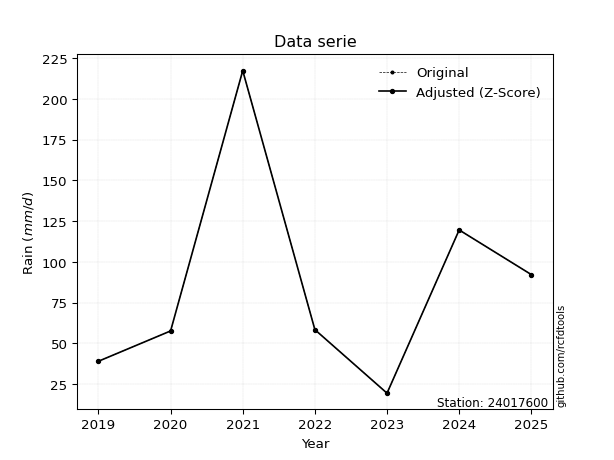</img>

</div>

> If Z-Score is active, values out of range or outliers are replaced with the station mean value.


### 4. Active continuous probability distributions from SciPy (45 of 104 available)

[scipy.stats](https://docs.scipy.org/doc/scipy/reference/stats.html) is a Python´s powerful submodule within the SciPy library for comprehensive statistical analysis, offering over 130 probability distributions (like Normal, Poisson), functions for descriptive stats (mean, variance), hypothesis testing (t-tests, chi-square), random variable generation, and statistical tests, making it essential for data science, modeling, and research. It provides tools to explore, model, and draw conclusions from data efficiently, working seamlessly with NumPy.

<div align="center">

|   id | p_dist             |   n_parameter | fit_method   | label                                                                       | active   | ref                                                                                                        |
|-----:|:-------------------|--------------:|:-------------|:----------------------------------------------------------------------------|:---------|:-----------------------------------------------------------------------------------------------------------|
|    0 | alpha              |             3 | MLE          | Alpha                                                                       | True     | [:mortar_board:](https://docs.scipy.org/doc/scipy/reference/generated/scipy.stats.alpha.html)              |
|    1 | betaprime          |             4 | MLE          | Beta prime                                                                  | True     | [:mortar_board:](https://docs.scipy.org/doc/scipy/reference/generated/scipy.stats.betaprime.html)          |
|    2 | chi2               |             3 | MLE          | Chi²                                                                        | True     | [:mortar_board:](https://docs.scipy.org/doc/scipy/reference/generated/scipy.stats.chi2.html)               |
|    3 | crystalball        |             4 | MLE          | Crystalball                                                                 | True     | [:mortar_board:](https://docs.scipy.org/doc/scipy/reference/generated/scipy.stats.crystalball.html)        |
|    4 | erlang             |             3 | MLE          | Erlang                                                                      | True     | [:mortar_board:](https://docs.scipy.org/doc/scipy/reference/generated/scipy.stats.erlang.html)             |
|    5 | expon              |             2 | MLE          | Exponential                                                                 | True     | [:mortar_board:](https://docs.scipy.org/doc/scipy/reference/generated/scipy.stats.expon.html)              |
|    6 | exponnorm          |             3 | MLE          | Exponentially modified Normal                                               | True     | [:mortar_board:](https://docs.scipy.org/doc/scipy/reference/generated/scipy.stats.exponnorm.html)          |
|    7 | f                  |             4 | MLE          | F                                                                           | True     | [:mortar_board:](https://docs.scipy.org/doc/scipy/reference/generated/scipy.stats.f.html)                  |
|    8 | fatiguelife        |             3 | MLE          | Fatigue-life (Birnbaum-Saunders)                                            | True     | [:mortar_board:](https://docs.scipy.org/doc/scipy/reference/generated/scipy.stats.fatiguelife.html)        |
|    9 | fisk               |             3 | MLE          | Fisk                                                                        | True     | [:mortar_board:](https://docs.scipy.org/doc/scipy/reference/generated/scipy.stats.fisk.html)               |
|   10 | gamma              |             3 | MLE          | Gamma                                                                       | True     | [:mortar_board:](https://docs.scipy.org/doc/scipy/reference/generated/scipy.stats.gamma.html)              |
|   11 | genexpon           |             5 | MLE          | Generalized exponential                                                     | True     | [:mortar_board:](https://docs.scipy.org/doc/scipy/reference/generated/scipy.stats.genexpon.html)           |
|   12 | genlogistic        |             3 | MLE          | Generalized logistic                                                        | True     | [:mortar_board:](https://docs.scipy.org/doc/scipy/reference/generated/scipy.stats.genlogistic.html)        |
|   13 | gibrat             |             2 | MM           | Gibrat                                                                      | True     | [:mortar_board:](https://docs.scipy.org/doc/scipy/reference/generated/scipy.stats.gibrat.html)             |
|   14 | gompertz           |             3 | MLE          | Gompertz (or truncated Gumbel)                                              | True     | [:mortar_board:](https://docs.scipy.org/doc/scipy/reference/generated/scipy.stats.gompertz.html)           |
|   15 | gumbel_l           |             2 | MM           | Gumbel Left Skew                                                            | True     | [:mortar_board:](https://docs.scipy.org/doc/scipy/reference/generated/scipy.stats.gumbel_l.html)           |
|   16 | gumbel_r           |             2 | MM           | Gumbel Right Skew                                                           | True     | [:mortar_board:](https://docs.scipy.org/doc/scipy/reference/generated/scipy.stats.gumbel_r.html)           |
|   17 | halflogistic       |             2 | MM           | Half-logistic                                                               | True     | [:mortar_board:](https://docs.scipy.org/doc/scipy/reference/generated/scipy.stats.halflogistic.html)       |
|   18 | halfnorm           |             2 | MM           | Half Normal                                                                 | True     | [:mortar_board:](https://docs.scipy.org/doc/scipy/reference/generated/scipy.stats.halfnorm.html)           |
|   19 | hypsecant          |             2 | MM           | hyperbolic secant                                                           | True     | [:mortar_board:](https://docs.scipy.org/doc/scipy/reference/generated/scipy.stats.hypsecant.html)          |
|   20 | invgamma           |             3 | MLE          | Inverted gamma                                                              | True     | [:mortar_board:](https://docs.scipy.org/doc/scipy/reference/generated/scipy.stats.invgamma.html)           |
|   21 | invgauss           |             3 | MLE          | Inverse Gaussian                                                            | True     | [:mortar_board:](https://docs.scipy.org/doc/scipy/reference/generated/scipy.stats.invgauss.html)           |
|   22 | invweibull         |             3 | MLE          | Inverted Weibull                                                            | True     | [:mortar_board:](https://docs.scipy.org/doc/scipy/reference/generated/scipy.stats.invweibull.html)         |
|   23 | johnsonsu          |             4 | MLE          | Johnson Su                                                                  | True     | [:mortar_board:](https://docs.scipy.org/doc/scipy/reference/generated/scipy.stats.johnsonsu.html)          |
|   24 | kstwobign          |             2 | MLE          | Limiting distribution of scaled Kolmogorov-Smirnov two-sided test statistic | True     | [:mortar_board:](https://docs.scipy.org/doc/scipy/reference/generated/scipy.stats.kstwobign.html)          |
|   25 | laplace            |             2 | MM           | Laplace                                                                     | True     | [:mortar_board:](https://docs.scipy.org/doc/scipy/reference/generated/scipy.stats.laplace.html)            |
|   26 | laplace_asymmetric |             3 | MLE          | Asymmetric Laplace                                                          | True     | [:mortar_board:](https://docs.scipy.org/doc/scipy/reference/generated/scipy.stats.laplace_asymmetric.html) |
|   27 | loggamma           |             3 | MLE          | Log gamma                                                                   | True     | [:mortar_board:](https://docs.scipy.org/doc/scipy/reference/generated/scipy.stats.loggamma.html)           |
|   28 | logistic           |             2 | MM           | Logistic (or Sech-squared)                                                  | True     | [:mortar_board:](https://docs.scipy.org/doc/scipy/reference/generated/scipy.stats.logistic.html)           |
|   29 | lognorm            |             3 | MLE          | Log Normal                                                                  | True     | [:mortar_board:](https://docs.scipy.org/doc/scipy/reference/generated/scipy.stats.lognorm.html)            |
|   30 | maxwell            |             2 | MM           | Maxwell                                                                     | True     | [:mortar_board:](https://docs.scipy.org/doc/scipy/reference/generated/scipy.stats.maxwell.html)            |
|   31 | mielke             |             4 | MLE          | Mielke Beta-Kappa / Dagum                                                   | True     | [:mortar_board:](https://docs.scipy.org/doc/scipy/reference/generated/scipy.stats.mielke.html)             |
|   32 | moyal              |             2 | MM           | Moyal                                                                       | True     | [:mortar_board:](https://docs.scipy.org/doc/scipy/reference/generated/scipy.stats.moyal.html)              |
|   33 | nakagami           |             3 | MLE          | Nakagami                                                                    | True     | [:mortar_board:](https://docs.scipy.org/doc/scipy/reference/generated/scipy.stats.nakagami.html)           |
|   34 | ncf                |             5 | MLE          | Non-central F distribution                                                  | True     | [:mortar_board:](https://docs.scipy.org/doc/scipy/reference/generated/scipy.stats.ncf.html)                |
|   35 | nct                |             4 | MLE          | Non-central Student’s t                                                     | True     | [:mortar_board:](https://docs.scipy.org/doc/scipy/reference/generated/scipy.stats.nct.html)                |
|   36 | norm               |             2 | MM           | Normal                                                                      | True     | [:mortar_board:](https://docs.scipy.org/doc/scipy/reference/generated/scipy.stats.norm.html)               |
|   37 | pareto             |             3 | MLE          | Pareto                                                                      | True     | [:mortar_board:](https://docs.scipy.org/doc/scipy/reference/generated/scipy.stats.pareto.html)             |
|   38 | pearson3           |             3 | MM           | Pearson type III                                                            | True     | [:mortar_board:](https://docs.scipy.org/doc/scipy/reference/generated/scipy.stats.pearson3.html)           |
|   39 | rayleigh           |             2 | MM           | Rayleigh                                                                    | True     | [:mortar_board:](https://docs.scipy.org/doc/scipy/reference/generated/scipy.stats.rayleigh.html)           |
|   40 | rice               |             3 | MLE          | Rice                                                                        | True     | [:mortar_board:](https://docs.scipy.org/doc/scipy/reference/generated/scipy.stats.rice.html)               |
|   41 | t                  |             3 | MLE          | Student’s t                                                                 | True     | [:mortar_board:](https://docs.scipy.org/doc/scipy/reference/generated/scipy.stats.t.html)                  |
|   42 | truncnorm          |             4 | MLE          | Truncated normal                                                            | True     | [:mortar_board:](https://docs.scipy.org/doc/scipy/reference/generated/scipy.stats.truncnorm.html)          |
|   43 | wald               |             2 | MM           | Wald                                                                        | True     | [:mortar_board:](https://docs.scipy.org/doc/scipy/reference/generated/scipy.stats.wald.html)               |
|   44 | weibull_min        |             3 | MLE          | Weibull minimum                                                             | True     | [:mortar_board:](https://docs.scipy.org/doc/scipy/reference/generated/scipy.stats.weibull_min.html)        |

</div>

> **n_parameter:** # arguments & localization & scale.
>
> **Fit methods:** (MLE) maximum likelihood, (MM) L-moments.
>
>**Inactive:** foldnorm, gennorm, norminvgauss, powernorm, powerlognorm, skewnorm, genextreme, anglit, arcsine, argus, beta, bradford, burr, burr12, cauchy, cosine, halfcauchy, foldcauchy, skewcauchy, wrapcauchy, dgamma, gengamma, exponweib, exponpow, truncexpon, gausshyper, genhalflogistic, genhyperbolic, geninvgauss, halfgennorm, johnsonsb, kappa4, kappa3, ksone, kstwo, loglaplace, levy, levy_l, levy_stable, ncx2, genpareto, truncpareto, lomax, powerlaw, rdist, rel_breitwigner, recipinvgauss, semicircular, studentized_range, trapezoid, triang, truncweibull_min, tukeylambda, uniform, loguniform, vonmises, vonmises_line, weibull_max, dweibull, 


## B. Probability distributions vs. Empirical distributions

A continuous probability distribution (CPD) describes probabilities for variables that can take any value within a range (like rain any time), unlike discrete variables with specific outcomes (like temperature). It uses a Probability Density Function (PDF), a curve where the total area under it equals 1, and the probability of the variable falling within an interval (a to b) is found by calculating the area under the curve between those points. A key feature is that the probability of hitting any single exact value is zero, so probabilities are always expressed for ranges, e.g., $P(a ≤ X ≤ b)$.

<div align="center">

Distributions parameters
|    |   station | p_dist                |   n |              loc |          scale | shape                  | shape1             | shape2              | shape3   |
|---:|----------:|:----------------------|----:|-----------------:|---------------:|:-----------------------|:-------------------|:--------------------|:---------|
|  0 |  24017600 | alpha                 |   7 |    -66.8617      |  403.159       | 3.0148533734855905     |                    |                     |          |
|  1 |  24017600 | betaprime             |   7 |     -0.632865    |   79.6224      | 4.037563283855947      | 4.684827590805922  |                     |          |
|  2 |  24017600 | chi2                  |   7 |     19.4         |   38.4169      | 1.3683117786854258     |                    |                     |          |
|  3 |  24017600 | crystalball           |   7 |     85.5429      |   61.6538      | 5916.24007421265       | 7897.278793140447  |                     |          |
|  4 |  24017600 | erlang                |   7 |     19.4         |   57.6237      | 0.738371019543902      |                    |                     |          |
|  5 |  24017600 | expon                 |   7 |     19.4         |   66.1429      |                        |                    |                     |          |
|  6 |  24017600 | exponnorm             |   7 |     19.3313      |    0.0192355   | 3434.327039504011      |                    |                     |          |
|  7 |  24017600 | f                     |   7 |     -0.163765    |   69.0764      | 7.5280758032590205     | 9.880649574431743  |                     |          |
|  8 |  24017600 | fatiguelife           |   7 |      4.46621     |   59.6422      | 0.8436432966508476     |                    |                     |          |
|  9 |  24017600 | fisk                  |   7 |      9.60173     |   55.5859      | 1.9288749290879788     |                    |                     |          |
| 10 |  24017600 | gamma                 |   7 |     19.4         |   53.9318      | 0.8819795207641454     |                    |                     |          |
| 11 |  24017600 | genexpon              |   7 |     19.4         |  100.16        | 1.421834989446252      | 1.124347989688883  | 0.14362668377841187 |          |
| 12 |  24017600 | genlogistic           |   7 |   -237.017       |   41.5114      | 1243.7284494907558     |                    |                     |          |
| 13 |  24017600 | gibrat                |   7 |     38.5088      |   28.5276      |                        |                    |                     |          |
| 14 |  24017600 | gompertz              |   7 |     19.4         |  291.381       | 3.4867212375921977     |                    |                     |          |
| 15 |  24017600 | gumbel_l              |   7 |    113.29        |   48.0712      |                        |                    |                     |          |
| 16 |  24017600 | gumbel_r              |   7 |     57.7954      |   48.0712      |                        |                    |                     |          |
| 17 |  24017600 | halflogistic          |   7 |     12.4688      |   52.7118      |                        |                    |                     |          |
| 18 |  24017600 | halfnorm              |   7 |      3.93745     |  102.277       |                        |                    |                     |          |
| 19 |  24017600 | hypsecant             |   7 |     85.5429      |   39.25        |                        |                    |                     |          |
| 20 |  24017600 | invgamma              |   7 |    -17.1591      |  266.009       | 3.5306906545835197     |                    |                     |          |
| 21 |  24017600 | invgauss              |   7 |     -0.405717    |  132.122       | 0.6505233373982517     |                    |                     |          |
| 22 |  24017600 | invweibull            |   7 |    -55.6621      |  108.002       | 3.101092598293003      |                    |                     |          |
| 23 |  24017600 | johnsonsu             |   7 |      4.59509     |    0.741745    | -6.4051754626107495    | 1.2576332819653722 |                     |          |
| 24 |  24017600 | kstwobign             |   7 |    -92.2784      |  205.65        |                        |                    |                     |          |
| 25 |  24017600 | laplace               |   7 |     85.5429      |   43.5958      |                        |                    |                     |          |
| 26 |  24017600 | laplace_asymmetric    |   7 |     39           |   29.8198      | 0.4880716623818847     |                    |                     |          |
| 27 |  24017600 | loggamma              |   7 | -16673.7         | 2329.02        | 1334.10009645653       |                    |                     |          |
| 28 |  24017600 | logistic              |   7 |     85.5429      |   33.9915      |                        |                    |                     |          |
| 29 |  24017600 | lognorm               |   7 |     19.4         |    0.281466    | 13.083551701902467     |                    |                     |          |
| 30 |  24017600 | maxwell               |   7 |    -60.5507      |   91.5505      |                        |                    |                     |          |
| 31 |  24017600 | mielke                |   7 |     -0.33372     |   62.9345      | 2.5564331517508205     | 2.3141753654618227 |                     |          |
| 32 |  24017600 | moyal                 |   7 |     50.2853      |   27.7539      |                        |                    |                     |          |
| 33 |  24017600 | nakagami              |   7 |     19.4         |  112.393       | 0.30505711235441924    |                    |                     |          |
| 34 |  24017600 | ncf                   |   7 |     -0.0290904   |    5.96438e-07 | 1.4939697800235665e-07 | 9.626231016923022  | 17.003440574712894  |          |
| 35 |  24017600 | nct                   |   7 |    -33.987       |    9.8819      | 3.128408186953578      | 9.060990932737896  |                     |          |
| 36 |  24017600 | norm                  |   7 |     85.5429      |   61.6538      |                        |                    |                     |          |
| 37 |  24017600 | pareto                |   7 |     19.3434      |    0.0565913   | 0.16812466859313932    |                    |                     |          |
| 38 |  24017600 | pearson3              |   7 |     85.5429      |   61.6538      | 1.1581884075662638     |                    |                     |          |
| 39 |  24017600 | rayleigh              |   7 |    -32.4044      |   94.1083      |                        |                    |                     |          |
| 40 |  24017600 | rice                  |   7 |    -11.6714      |   81.3995      | 0.0022893503544236045  |                    |                     |          |
| 41 |  24017600 | t                     |   7 |     62.2511      |   38.2773      | 2.222576447075019      |                    |                     |          |
| 42 |  24017600 | truncnorm             |   7 |     85.5429      |   61.6538      | -880.6589095508857     | 2112.9838168935357 |                     |          |
| 43 |  24017600 | wald                  |   7 |     23.8891      |   61.6538      |                        |                    |                     |          |
| 44 |  24017600 | weibull_min           |   7 |     19.4         |   53.4714      | 0.7960289787672854     |                    |                     |          |
| 45 |  24017600 | logalpha              |   7 |     -8.97117     |  236.081       | 17.98146747607548      |                    |                     |          |
| 46 |  24017600 | logbetaprime          |   7 |     -9.55881     |   84.9316      | 411.7821226447361      | 2543.820816582198  |                     |          |
| 47 |  24017600 | logchi2               |   7 |      2.96527     |    0.923722    | 1.0935704318435087     |                    |                     |          |
| 48 |  24017600 | logcrystalball        |   7 |      4.19801     |    0.723314    | 8.817968858635052      | 1.2295693716856717 |                     |          |
| 49 |  24017600 | logerlang             |   7 |    -26.2209      |    0.017253    | 1763.0778921245924     |                    |                     |          |
| 50 |  24017600 | logexpon              |   7 |      2.96527     |    1.23274     |                        |                    |                     |          |
| 51 |  24017600 | logexponnorm          |   7 |      4.1977      |    0.723311    | 0.00042272284156976347 |                    |                     |          |
| 52 |  24017600 | logf                  |   7 |   -124.294       |  128.489       | 209264.34191959567     | 90048.43680879258  |                     |          |
| 53 |  24017600 | logfatiguelife        |   7 |    -82.2534      |   86.4468      | 0.008359642104409083   |                    |                     |          |
| 54 |  24017600 | logfisk               |   7 |     -1.18741e+07 |    1.18741e+07 | 28252800.003389806     |                    |                     |          |
| 55 |  24017600 | loggamma              |   7 |    -26.0336      |    0.0173503   | 1742.4212102585734     |                    |                     |          |
| 56 |  24017600 | loggenexpon           |   7 |      2.96527     |    1.37429     | 0.7310005213948996     | 1.0110049199124826 | 0.8109611167790445  |          |
| 57 |  24017600 | loggenlogistic        |   7 |      4.15176     |    0.431354    | 1.078998474337122      |                    |                     |          |
| 58 |  24017600 | loggibrat             |   7 |      3.64624     |    0.33467     |                        |                    |                     |          |
| 59 |  24017600 | loggompertz           |   7 |      2.96527     |    1.00918     | 0.29788408537534194    |                    |                     |          |
| 60 |  24017600 | loggumbel_l           |   7 |      4.52354     |    0.563964    |                        |                    |                     |          |
| 61 |  24017600 | loggumbel_r           |   7 |      3.87248     |    0.563964    |                        |                    |                     |          |
| 62 |  24017600 | loghalflogistic       |   7 |      3.34069     |    0.618424    |                        |                    |                     |          |
| 63 |  24017600 | loghalfnorm           |   7 |      3.24062     |    1.19991     |                        |                    |                     |          |
| 64 |  24017600 | loghypsecant          |   7 |      4.19801     |    0.460475    |                        |                    |                     |          |
| 65 |  24017600 | loginvgamma           |   7 |     -7.75739     | 3179.63        | 267.002446675928       |                    |                     |          |
| 66 |  24017600 | loginvgauss           |   7 |     -1.44681     |  322.796       | 0.01749508337006577    |                    |                     |          |
| 67 |  24017600 | loginvweibull         |   7 |     -3.95301e+07 |    3.95301e+07 | 57528989.53233828      |                    |                     |          |
| 68 |  24017600 | logjohnsonsu          |   7 |     18.1377      |   17.3995      | 22.592607064395594     | 30.81348342782382  |                     |          |
| 69 |  24017600 | logkstwobign          |   7 |      1.38401     |    3.22119     |                        |                    |                     |          |
| 70 |  24017600 | loglaplace            |   7 |      4.19801     |    0.511459    |                        |                    |                     |          |
| 71 |  24017600 | loglaplace_asymmetric |   7 |      4.06732     |    0.553329    | 0.888854373874073      |                    |                     |          |
| 72 |  24017600 | logloggamma           |   7 |    -37.3031      |    8.44464     | 136.74861737993854     |                    |                     |          |
| 73 |  24017600 | loglogistic           |   7 |      4.19801     |    0.398783    |                        |                    |                     |          |
| 74 |  24017600 | loglognorm            |   7 |      2.96527     |    0.00818469  | 12.4754520093178       |                    |                     |          |
| 75 |  24017600 | logmaxwell            |   7 |      2.48406     |    1.07406     |                        |                    |                     |          |
| 76 |  24017600 | logmielke             |   7 |     -0.1141      |    4.63629     | 7.270914302425552      | 12.972243447405086 |                     |          |
| 77 |  24017600 | logmoyal              |   7 |      3.78437     |    0.325605    |                        |                    |                     |          |
| 78 |  24017600 | lognakagami           |   7 |      3.66356     |    0.83112     | 0.18735223157119477    |                    |                     |          |
| 79 |  24017600 | logncf                |   7 |    -14.2528      |   11.1657      | 2439.352330874348      | 2277.8242270240657 | 1588.757756602853   |          |
| 80 |  24017600 | lognct                |   7 |    -34.9788      |    0.71526     | 64582.67580289312      | 54.77199631812822  |                     |          |
| 81 |  24017600 | lognorm               |   7 |      4.19801     |    0.723312    |                        |                    |                     |          |
| 82 |  24017600 | logpareto             |   7 |      2.964       |    0.00127728  | 0.16788003719362957    |                    |                     |          |
| 83 |  24017600 | logpearson3           |   7 |      4.19801     |    0.723311    | -0.05698185721432644   |                    |                     |          |
| 84 |  24017600 | lograyleigh           |   7 |      2.81427     |    1.10406     |                        |                    |                     |          |
| 85 |  24017600 | logrice               |   7 |      2.57612     |    0.813775    | 1.662010238565899      |                    |                     |          |
| 86 |  24017600 | logt                  |   7 |      4.198       |    0.72331     | 642042319.0874648      |                    |                     |          |
| 87 |  24017600 | logtruncnorm          |   7 |     -0.134901    |    1.95822     | 1.934149206244601      | 2.817178625518271  |                     |          |
| 88 |  24017600 | logwald               |   7 |      3.47469     |    0.723313    |                        |                    |                     |          |
| 89 |  24017600 | logweibull_min        |   7 |      2.13684     |    2.30504     | 3.187205780220543      |                    |                     |          |

</div>

> **loc** (Location parameter): This shifts the distribution along the x-axis. For many common distributions, like the normal (Gaussian) distribution, loc represents the mean $μ$. For others, like the uniform distribution, it might represent the minimum value, or for the beta distribution, the left end of the support interval.
>
> **scale** (Scale parameter): This determines the width or spread of the distribution. For the normal distribution, scale represents the standard deviation $σ$. For a uniform distribution, it defines the length of the interval (from $loc$ to $loc + scale$).
>
> **shape** (Shape parameters): Refers to parameters that define the specific form of a probability distribution, distinct from its location (loc) and scale (scale). These parameters are required arguments for most distribution functions. For example, a normal (Gaussian) distribution is fully defined by its location (mean) and scale (standard deviation), so it has no specific shape parameters beyond loc and scale. However, other distributions have intrinsic properties that need specification, as Gamma distribution that takes a shape parameter, often named $a$ or $alpha$.


### 0. Cumulative distribution values - CDF (90 evaluated)

> Ordered by x ascending and calculating $log(f(x))$ separately. 

|   id |   Station |   date |     x |   count |    mean |     std |     zscore |   Value_initial |   station |   m |     alpha |   alpha_pdf |   betaprime |   betaprime_pdf |        chi2 |       chi2_pdf |   crystalball |   crystalball_pdf |      erlang |    erlang_pdf |    expon |   expon_pdf |   exponnorm |   exponnorm_pdf |         f |       f_pdf |   fatiguelife |   fatiguelife_pdf |      fisk |    fisk_pdf |       gamma |   gamma_pdf |    genexpon |   genexpon_pdf |   genlogistic |   genlogistic_pdf |      gibrat |   gibrat_pdf |    gompertz |   gompertz_pdf |   gumbel_l |   gumbel_l_pdf |   gumbel_r |   gumbel_r_pdf |   halflogistic |   halflogistic_pdf |   halfnorm |   halfnorm_pdf |   hypsecant |   hypsecant_pdf |   invgamma |   invgamma_pdf |   invgauss |   invgauss_pdf |   invweibull |   invweibull_pdf |   johnsonsu |   johnsonsu_pdf |   kstwobign |   kstwobign_pdf |   laplace |   laplace_pdf |   laplace_asymmetric |   laplace_asymmetric_pdf |   loggamma |   loggamma_pdf |   logistic |   logistic_pdf |   lognorm |   lognorm_pdf |   maxwell |   maxwell_pdf |    mielke |   mielke_pdf |     moyal |   moyal_pdf |    nakagami |   nakagami_pdf |       ncf |     ncf_pdf |       nct |     nct_pdf |     norm |   norm_pdf |   pareto |   pareto_pdf |   pearson3 |   pearson3_pdf |   rayleigh |   rayleigh_pdf |      rice |    rice_pdf |        t |       t_pdf |   truncnorm |   truncnorm_pdf |     wald |    wald_pdf |   weibull_min |   weibull_min_pdf |   logalpha |   logalpha_pdf |   logbetaprime |   logbetaprime_pdf |     logchi2 |   logchi2_pdf |   logcrystalball |   logcrystalball_pdf |   logerlang |   logerlang_pdf |   logexpon |   logexpon_pdf |   logexponnorm |   logexponnorm_pdf |     logf |   logf_pdf |   logfatiguelife |   logfatiguelife_pdf |   logfisk |   logfisk_pdf |   loggenexpon |   loggenexpon_pdf |   loggenlogistic |   loggenlogistic_pdf |   loggibrat |   loggibrat_pdf |   loggompertz |   loggompertz_pdf |   loggumbel_l |   loggumbel_l_pdf |   loggumbel_r |   loggumbel_r_pdf |   loghalflogistic |   loghalflogistic_pdf |   loghalfnorm |   loghalfnorm_pdf |   loghypsecant |   loghypsecant_pdf |   loginvgamma |   loginvgamma_pdf |   loginvgauss |   loginvgauss_pdf |   loginvweibull |   loginvweibull_pdf |   logjohnsonsu |   logjohnsonsu_pdf |   logkstwobign |   logkstwobign_pdf |   loglaplace |   loglaplace_pdf |   loglaplace_asymmetric |   loglaplace_asymmetric_pdf |   logloggamma |   logloggamma_pdf |   loglogistic |   loglogistic_pdf |   loglognorm |   loglognorm_pdf |   logmaxwell |   logmaxwell_pdf |   logmielke |   logmielke_pdf |    logmoyal |   logmoyal_pdf |   lognakagami |   lognakagami_pdf |    logncf |   logncf_pdf |    lognct |   lognct_pdf |   logpareto |   logpareto_pdf |   logpearson3 |   logpearson3_pdf |   lograyleigh |   lograyleigh_pdf |   logrice |   logrice_pdf |      logt |   logt_pdf |   logtruncnorm |   logtruncnorm_pdf |   logwald |   logwald_pdf |   logweibull_min |   logweibull_min_pdf |
|-----:|----------:|-------:|------:|--------:|--------:|--------:|-----------:|----------------:|----------:|----:|----------:|------------:|------------:|----------------:|------------:|---------------:|--------------:|------------------:|------------:|--------------:|---------:|------------:|------------:|----------------:|----------:|------------:|--------------:|------------------:|----------:|------------:|------------:|------------:|------------:|---------------:|--------------:|------------------:|------------:|-------------:|------------:|---------------:|-----------:|---------------:|-----------:|---------------:|---------------:|-------------------:|-----------:|---------------:|------------:|----------------:|-----------:|---------------:|-----------:|---------------:|-------------:|-----------------:|------------:|----------------:|------------:|----------------:|----------:|--------------:|---------------------:|-------------------------:|-----------:|---------------:|-----------:|---------------:|----------:|--------------:|----------:|--------------:|----------:|-------------:|----------:|------------:|------------:|---------------:|----------:|------------:|----------:|------------:|---------:|-----------:|---------:|-------------:|-----------:|---------------:|-----------:|---------------:|----------:|------------:|---------:|------------:|------------:|----------------:|---------:|------------:|--------------:|------------------:|-----------:|---------------:|---------------:|-------------------:|------------:|--------------:|-----------------:|---------------------:|------------:|----------------:|-----------:|---------------:|---------------:|-------------------:|---------:|-----------:|-----------------:|---------------------:|----------:|--------------:|--------------:|------------------:|-----------------:|---------------------:|------------:|----------------:|--------------:|------------------:|--------------:|------------------:|--------------:|------------------:|------------------:|----------------------:|--------------:|------------------:|---------------:|-------------------:|--------------:|------------------:|--------------:|------------------:|----------------:|--------------------:|---------------:|-------------------:|---------------:|-------------------:|-------------:|-----------------:|------------------------:|----------------------------:|--------------:|------------------:|--------------:|------------------:|-------------:|-----------------:|-------------:|-----------------:|------------:|----------------:|------------:|---------------:|--------------:|------------------:|----------:|-------------:|----------:|-------------:|------------:|----------------:|--------------:|------------------:|--------------:|------------------:|----------:|--------------:|----------:|-----------:|---------------:|-------------------:|----------:|--------------:|-----------------:|---------------------:|
|    0 |  24017600 |   2023 |  19.4 |       7 | 85.5429 | 66.5937 | -0.99323   |            19.4 |  24017600 |   1 | 0.0486386 | 0.0054675   |   0.0472711 |     0.00631245  | 7.36748e-12 | 1418.78        |      0.141678 |        0.00363941 | 1.17181e-12 | 243.541       | 0        | 0.0151188   |  0.00103935 |      0.0151191  | 0.0480183 | 0.00633576  |     0.0378915 |       0.00817715  | 0.0339609 | 0.00645846  | 5.59897e-15 | 1.38997     | 5.42559e-13 |    0.0141956   |     0.0757726 |       0.00470454  | 0           |  0           | 2.82674e-12 |    0.0119662   |   0.132228 |    0.00256022  |   0.108317 |    0.00500831  |      0.0656514 |        0.00944466  |   0.120168 |    0.00771255  |    0.116712 |      0.00290738 |  0.0435512 |    0.00607826  |  0.0394707 |    0.00721654  |    0.0454846 |      0.00580724  |   0.0385576 |     0.00709577  |   0.0703771 |     0.00464235  |  0.109664 |   0.00251548  |            0.0500392 |              0.00343813  |  0.0429285 |       0.129546 |   0.125005 |    0.00321783  | 0.0441631 |      0.129079 |  0.141621 |   0.00453937  | 0.0479381 |  0.00581319  | 0.0810888 | 0.00547603  | 6.65363e-11 | 11426.4        | 0.0524841 | 0.00599979  | 0.0472615 | 0.0058      | 0.141678 | 0.00363941 | 0        |  2.97086     |   0.107907 |    0.00585747  |   0.140592 |    0.00502701  | 0.0702626 | 0.0043599   | 0.184626 | 0.00454548  |    0.141678 |      0.00363941 | 0        | 0           |   1.32493e-13 |      29.6866      |  0.0361919 |       0.131597 |      0.0424276 |           0.132825 | 3.24326e-09 |   3.99327e+06 |        0.0441633 |             0.129079 |   0.0430371 |        0.129752 |   0        |       0.811204 |       0.044163 |           0.129079 | 0.043912 |   0.129734 |        0.0434728 |             0.129405 | 0.0501707 |      0.113385 |   3.12963e-10 |          0.531911 |        0.0480876 |             0.113064 |  0          |        0        |   5.28188e-09 |          0.295173 |     0.0611491 |         0.105042  |    0.00676535 |         0.0599317 |          0        |              0        |      0        |          0        |      0.0437067 |          0.0946187 |     0.0387936 |          0.132673 |     0.0352078 |          0.134374 |       0.0291828 |            0.150098 |      0.0459269 |           0.128608 |      0.0305281 |           0.178372 |    0.0448971 |        0.0877824 |               0.0469536 |                   0.0954672 |     0.0466302 |          0.128549 |     0.0434698 |          0.104268 |   0.00717442 |      3.59459e+12 |    0.0225288 |         0.134878 |   0.0508972 |        0.119585 | 0.000435273 |     0.00885982 |   0           |       0           | 0.0417787 |     0.131035 | 0.0441595 |     0.129213 |    0        |     131.435     |     0.0458087 |          0.128805 |    0.00930933 |          0.122725 | 0.0293092 |      0.153349 | 0.0441632 |   0.129079 |      0         |           0        |  0        |     0         |        0.0376044 |             0.14192  |
|    1 |  24017600 |   2019 |  39   |       7 | 85.5429 | 66.5937 | -0.698908  |            39   |  24017600 |   2 | 0.214018  | 0.0104892   |   0.22401   |     0.0104741   | 0.392054    |    0.0117275   |      0.225152 |        0.00486633 | 0.4281      |   0.0131938   | 0.256457 | 0.0112415   |  0.257502   |      0.0112396  | 0.223719  | 0.0103822   |     0.255981  |       0.0114586   | 0.226412  | 0.0114919   | 0.363463    | 0.013407    | 0.245197    |    0.0109498   |     0.199954  |       0.00774851  | 2.43532e-05 |  0.000212416 | 0.215419    |    0.0100417   |   0.192023 |    0.00358381  |   0.227992 |    0.00701196  |      0.246481  |        0.00890927  |   0.268265 |    0.00735599  |    0.188755 |      0.00453211 |  0.225258  |    0.0110156   |  0.242621  |    0.0113386   |    0.221999  |      0.0109459   |   0.239525  |     0.0113487   |   0.190202  |     0.00732378  |  0.171916 |   0.00394342  |            0.192385  |              0.0132185   |  0.231409  |       0.425725 |   0.202741 |    0.00475522  | 0.229987  |      0.419789 |  0.242773 |   0.00570545  | 0.218192  |  0.0106066   | 0.220405  | 0.00831351  | 0.266901    |     0.0082493  | 0.220188  | 0.0101292   | 0.2215    | 0.0108007   | 0.225152 | 0.00486633 | 0.626031 |  0.00319859  |   0.240789 |    0.00741778  |   0.250125 |    0.00604586  | 0.17614   | 0.00630045  | 0.299925 | 0.00729485  |    0.225152 |      0.00486633 | 0.107626 | 0.0166743   |   0.362257    |       0.0116508   |  0.240838  |       0.460614 |      0.236361  |           0.434765 | 0.582015    |   0.354705    |        0.229987  |             0.419788 |   0.23165   |        0.425822 |   0.432466 |       0.460386 |       0.229987 |           0.41979  | 0.231099 |   0.422383 |        0.231012  |             0.42381  | 0.217658  |      0.405165 |   0.371305    |          0.490603 |        0.218108  |             0.41255  |  0.00153293 |        0.287309 |   0.257076    |          0.43805  |     0.195591  |         0.310441  |    0.23495    |         0.603403  |          0.255272 |              0.755821 |      0.275522 |          0.624901 |      0.193277  |          0.394414  |     0.239361  |          0.450335 |     0.244638  |          0.466326 |       0.278256  |            0.518021 |      0.228331  |           0.411718 |      0.301575  |           0.519511 |    0.175855  |        0.343831  |               0.19421   |                   0.394872  |     0.227956  |          0.40912  |     0.207478  |          0.412332 |   0.639233   |      0.0429769   |    0.24843   |         0.490206 |   0.21715   |        0.390547 | 0.228651    |     0.714647   |   1.50182e-06 |       1.26717e+09 | 0.233895  |     0.431986 | 0.230185  |     0.420126 |    0.653061 |       0.0832576 |     0.228666  |          0.41266  |    0.256113   |          0.518294 | 0.242764  |      0.451093 | 0.229988  |   0.419792 |      0.0141928 |           1.28687  |  0.124297 |     1.45317   |        0.235855  |             0.429117 |
|    2 |  24017600 |   2020 |  57.6 |       7 | 85.5429 | 66.5937 | -0.419602  |            57.6 |  24017600 |   3 | 0.411765  | 0.0101378   |   0.413999  |     0.00952126  | 0.565438    |    0.00745653  |      0.325194 |        0.0058391  | 0.619585    |   0.00802349  | 0.438721 | 0.00848585  |  0.439705   |      0.00848146 | 0.412337  | 0.00947626  |     0.445499  |       0.00883134  | 0.429696  | 0.00984796  | 0.565856    | 0.00877705  | 0.425242    |    0.00850297  |     0.35751   |       0.00885491  | 0.343973    |  0.0192773   | 0.386408    |    0.00837088  |   0.26945  |    0.00477129  |   0.366384 |    0.00765273  |      0.403727  |        0.00793945  |   0.400193 |    0.00679804  |    0.290414 |      0.00641446 |  0.423505  |    0.00979278  |  0.43602   |    0.00920266  |    0.421938  |      0.00996868  |   0.434714  |     0.00933765  |   0.337098  |     0.00819889  |  0.263395 |   0.00604175  |            0.404351  |              0.00974922  |  0.423985  |       0.542532 |   0.305328 |    0.00623988  | 0.420836  |      0.540655 |  0.355374 |   0.00631199  | 0.416195  |  0.0100597   | 0.380739  | 0.0085806   | 0.398612    |     0.00619655 | 0.407953  | 0.00958624  | 0.419913  | 0.00995523  | 0.325194 | 0.0058391  | 0.66564  |  0.0014694   |   0.381475 |    0.00752857  |   0.367037 |    0.0064326   | 0.30379   | 0.00727863  | 0.456698 | 0.00924406  |    0.325194 |      0.0058391  | 0.404649 | 0.0132635   |   0.534725    |       0.00741837  |  0.442681  |       0.549443 |      0.430874  |           0.542066 | 0.694535    |   0.23489     |        0.420834  |             0.540652 |   0.424226  |        0.542433 |   0.586374 |       0.335535 |       0.420836 |           0.540655 | 0.422634 |   0.541154 |        0.423165  |             0.542651 | 0.413017  |      0.576839 |   0.545561    |          0.400134 |        0.415715  |             0.578892 |  0.577839   |        0.960812 |   0.43889     |          0.486905 |     0.352453  |         0.498969  |    0.484126   |         0.622717  |          0.519993 |              0.589893 |      0.501893 |          0.5286   |      0.401722  |          0.658578  |     0.438333  |          0.546767 |     0.446717  |          0.544697 |       0.484216  |            0.511059 |      0.416635  |           0.53711  |      0.501825  |           0.487369 |    0.376949  |        0.737008  |               0.429154  |                   0.872568  |     0.415471  |          0.536171 |     0.410399  |          0.606776 |   0.652461   |      0.0272121   |    0.455183  |         0.545379 |   0.406423  |        0.566805 | 0.508318    |     0.6512     |   0.593238    |       0.550539    | 0.427591  |     0.540899 | 0.42111   |     0.540663 |    0.677929 |       0.0496264 |     0.417274  |          0.5376   |    0.467378   |          0.541491 | 0.438589  |      0.534015 | 0.420838  |   0.540657 |      0.427985  |           0.85736  |  0.574859 |     0.751483  |        0.426164  |             0.529985 |
|    3 |  24017600 |   2022 |  58.4 |       7 | 85.5429 | 66.5937 | -0.407589  |            58.4 |  24017600 |   4 | 0.419841  | 0.0100531   |   0.421581  |     0.00943571  | 0.571353    |    0.00733115  |      0.329879 |        0.00587305 | 0.625942    |   0.00787007  | 0.445469 | 0.00838384  |  0.44645    |      0.00837937 | 0.419885  | 0.0093935   |     0.452518  |       0.00871663  | 0.437527  | 0.00972761  | 0.572817    | 0.00862669  | 0.432008    |    0.00840981  |     0.364595  |       0.00885818  | 0.359201    |  0.0187938   | 0.393077    |    0.00830266  |   0.273289 |    0.00482587  |   0.372506 |    0.0076522   |      0.410059  |        0.00789057  |   0.40562  |    0.00676999  |    0.295577 |      0.00649411 |  0.431298  |    0.00968999  |  0.443338  |    0.009091    |    0.429872  |      0.00986717  |   0.44214   |     0.00922573  |   0.343659  |     0.00820187  |  0.268273 |   0.00615365  |            0.412099  |              0.0096224   |  0.431481  |       0.544257 |   0.310342 |    0.00629657  | 0.428307  |      0.542619 |  0.360429 |   0.00632577  | 0.424207  |  0.00996834  | 0.387592  | 0.00855064  | 0.403545    |     0.00613752 | 0.415592  | 0.00951172  | 0.427839  | 0.00985898  | 0.329879 | 0.00587305 | 0.666801 |  0.0014343   |   0.387491 |    0.00751115  |   0.372184 |    0.006437    | 0.309622  | 0.00730101  | 0.464106 | 0.00927505  |    0.329879 |      0.00587305 | 0.415153 | 0.0129947   |   0.540609    |       0.00729365  |  0.450262  |       0.549698 |      0.43836   |           0.543349 | 0.697754    |   0.231816    |        0.428306  |             0.542617 |   0.43172   |        0.544152 |   0.590976 |       0.331802 |       0.428307 |           0.54262  | 0.430111 |   0.543007 |        0.430663  |             0.544479 | 0.420995  |      0.57999  |   0.551056    |          0.396704 |        0.42372   |             0.58166  |  0.590828   |        0.922768 |   0.445612    |          0.487692 |     0.359383  |         0.505851  |    0.492686   |         0.618416  |          0.528082 |              0.583038 |      0.509156 |          0.524464 |      0.410846  |          0.664327  |     0.44588   |          0.547439 |     0.45423   |          0.54461  |       0.491245  |            0.508174 |      0.424059  |           0.539373 |      0.508527  |           0.484357 |    0.387253  |        0.757154  |               0.44136   |                   0.897385  |     0.422883  |          0.538542 |     0.418793  |          0.610371 |   0.652834   |      0.0268609   |    0.462701  |         0.544645 |   0.414269  |        0.570827 | 0.517247    |     0.643363   |   0.600738    |       0.537105    | 0.435061  |     0.54226  | 0.428582  |     0.542612 |    0.678608 |       0.0489026 |     0.424705  |          0.539835 |    0.474836   |          0.539851 | 0.445959  |      0.534688 | 0.428309  |   0.542621 |      0.439722  |           0.844519 |  0.585069 |     0.729042  |        0.433485  |             0.531494 |
|    4 |  24017600 |   2025 |  87.4 |       7 | 85.5429 | 66.5937 |  0.0278877 |            87.4 |  24017600 |   5 | 0.656774  | 0.00624375  |   0.645853  |     0.00606061  | 0.733336    |    0.00421691  |      0.512015 |        0.00646775 | 0.792734    |   0.00411382  | 0.642306 | 0.0054079   |  0.643132   |      0.00540209 | 0.6441    | 0.00608638  |     0.652675  |       0.00535096  | 0.656665  | 0.0055898   | 0.760092    | 0.00471869  | 0.632613    |    0.00559845  |     0.605415  |       0.00731753  | 0.704962    |  0.00705761  | 0.600078    |    0.00604342  |   0.4421   |    0.0067728   |   0.582642 |    0.00654722  |      0.611155  |        0.00594259  |   0.585524 |    0.00559187  |    0.515055 |      0.00810074 |  0.655831  |    0.00590497  |  0.652779  |    0.00557136  |    0.65823   |      0.00596695  |   0.654174  |     0.00560058  |   0.569969  |     0.00708122  |  0.520852 |   0.0109907   |            0.634267  |              0.00598609  |  0.649219  |       0.508784 |   0.513655 |    0.00734929  | 0.64681   |      0.513768 |  0.544546 |   0.00616712  | 0.656553  |  0.00605955  | 0.608367  | 0.0064593   | 0.556902    |     0.00458472 | 0.644696  | 0.00624358  | 0.657615  | 0.00604107  | 0.512015 | 0.00646775 | 0.696502 |  0.000749751 |   0.588626 |    0.00618234  |   0.555287 |    0.00601585  | 0.523203  | 0.00712913  | 0.713659 | 0.00701923  |    0.512015 |      0.00646775 | 0.679853 | 0.00618623  |   0.70206     |       0.00422322  |  0.662063  |       0.477646 |      0.653393  |           0.49761  | 0.775973    |   0.161807    |        0.646808  |             0.513767 |   0.649389  |        0.508571 |   0.705077 |       0.239242 |       0.64681  |           0.513769 | 0.648127 |   0.511206 |        0.649041  |             0.511417 | 0.654894  |      0.537755 |   0.690921    |          0.298239 |        0.656203  |             0.530582 |  0.816296   |        0.322429 |   0.641516    |          0.470226 |     0.59757   |         0.64952   |    0.707283   |         0.434335  |          0.722786 |              0.386126 |      0.694624 |          0.393244 |      0.678242  |          0.585691  |     0.659082  |          0.485797 |     0.662659  |          0.467863 |       0.673476  |            0.387446 |      0.643124  |           0.519446 |      0.682455  |           0.37322  |    0.70651   |        0.57383   |               0.70768   |                   0.469575  |     0.642283  |          0.521785 |     0.664474  |          0.559072 |   0.662017   |      0.0194678   |    0.668784  |         0.45946  |   0.650019  |        0.55287  | 0.727333    |     0.402014   |   0.763255    |       0.305156    | 0.650138  |     0.498857 | 0.646993  |     0.513361 |    0.694982 |       0.0339904 |     0.643777  |          0.519042 |    0.675405   |          0.441036 | 0.655568  |      0.483131 | 0.646812  |   0.513768 |      0.713227  |           0.531522 |  0.784066 |     0.324286  |        0.646584  |             0.502041 |
|    5 |  24017600 |   2024 | 119.6 |       7 | 85.5429 | 66.5937 |  0.511417  |           119.6 |  24017600 |   6 | 0.804121  | 0.00322017  |   0.793889  |     0.00337468  | 0.837769    |    0.00245365  |      0.709661 |        0.00555508 | 0.889378    |   0.00212576  | 0.78017  | 0.00332356  |  0.78081    |      0.00331798 | 0.793195  | 0.00340755  |     0.786333  |       0.00316087  | 0.788603  | 0.00292331  | 0.872011    | 0.00248117  | 0.776753    |    0.00350454  |     0.793687  |       0.00441751  | 0.85192     |  0.00285063  | 0.760926    |    0.00403491  |   0.680264 |    0.0075842   |   0.758464 |    0.00436197  |      0.768313  |        0.00388618  |   0.741892 |    0.00411583  |    0.746907 |      0.00578995 |  0.79765   |    0.00318501  |  0.790244  |    0.00319932  |    0.800248  |      0.00315524  |   0.790949  |     0.00314317  |   0.761063  |     0.00476355  |  0.771072 |   0.00525114  |            0.784087  |              0.00353393  |  0.791674  |       0.391024 |   0.731438 |    0.00577899  | 0.791134  |      0.39718  |  0.724393 |   0.00486863  | 0.799269  |  0.00312759  | 0.774214  | 0.00395728  | 0.685453    |     0.00345835 | 0.797061  | 0.00345758  | 0.801669  | 0.00320167  | 0.709661 | 0.00555508 | 0.715639 |  0.000476857 |   0.755632 |    0.0042023   |   0.728678 |    0.00465678  | 0.727568  | 0.00539739  | 0.869651 | 0.00303367  |    0.709661 |      0.00555508 | 0.820895 | 0.00303225  |   0.80768     |       0.00251883  |  0.79349   |       0.356058 |      0.792132  |           0.3798   | 0.820698    |   0.125317    |        0.791132  |             0.39718  |   0.791777  |        0.39083  |   0.771332 |       0.185497 |       0.791135 |           0.397179 | 0.791527 |   0.394202 |        0.792349  |             0.393483 | 0.800101  |      0.380554 |   0.773516    |          0.230122 |        0.799236  |             0.374939 |  0.889488   |        0.165797 |   0.778738    |          0.396027 |     0.795549  |         0.575482  |    0.819891   |         0.288701  |          0.823324 |              0.26045  |      0.801687 |          0.290713 |      0.826189  |          0.358981  |     0.793444  |          0.365474 |     0.791408  |          0.34946  |       0.778466  |            0.283717 |      0.789751  |           0.405172 |      0.784866  |           0.280931 |    0.841051  |        0.310776  |               0.823381  |                   0.283717  |     0.789804  |          0.408128 |     0.813032  |          0.381187 |   0.667546   |      0.016007    |    0.795255  |         0.34396  |   0.799653  |        0.390446 | 0.829457    |     0.257862   |   0.84319     |       0.210928    | 0.789469  |     0.382173 | 0.791177  |     0.396745 |    0.704514 |       0.0272538 |     0.790215  |          0.404454 |    0.796422   |          0.328991 | 0.790714  |      0.372172 | 0.791136  |   0.397178 |      0.851603  |           0.360039 |  0.862217 |     0.188872  |        0.78874   |             0.395421 |
|    6 |  24017600 |   2021 | 217.4 |       7 | 85.5429 | 66.5937 |  1.98003   |           217.4 |  24017600 |   7 | 0.946037  | 0.000557162 |   0.950669  |     0.000637504 | 0.961121    |    0.000554094 |      0.983769 |        0.00065726 | 0.982317    |   0.000325862 | 0.949889 | 0.000757613 |  0.950127   |      0.00075496 | 0.951481  | 0.000639933 |     0.946557  |       0.000732068 | 0.927135  | 0.000627083 | 0.980376    | 0.000373418 | 0.954879    |    0.000765713 |     0.978331  |       0.000516295 | 0.966814    |  0.000413443 | 0.966371    |    0.000793941 |   0.999837 |    2.95929e-05 |   0.964499 |    0.000725246 |      0.959841  |        0.000746565 |   0.963121 |    0.000883635 |    0.977883 |      0.00056304 |  0.94578   |    0.000622021 |  0.947903  |    0.000698672 |    0.945221  |      0.000604756 |   0.943364  |     0.000672792 |   0.97855   |     0.000628249 |  0.97571  |   0.000557167 |            0.95644   |              0.000712966 |  0.947562  |       0.144167 |   0.97975  |    0.000583685 | 0.949137  |      0.144546 |  0.973466 |   0.000800453 | 0.941024  |  0.000591543 | 0.960712  | 0.000707213 | 0.906993    |     0.00131121 | 0.954552  | 0.000616004 | 0.947682  | 0.000597934 | 0.983769 | 0.00065726 | 0.746394 |  0.000215279 |   0.962973 |    0.000773657 |   0.97049  |    0.000832374 | 0.980932  | 0.000659222 | 0.976686 | 0.000303312 |    0.983769 |      0.00065726 | 0.958313 | 0.000561549 |   0.941291    |       0.000669188 |  0.937383  |       0.141144 |      0.944514  |           0.143964 | 0.880758    |   0.0797283   |        0.949136  |             0.144548 |   0.947587  |        0.144095 |   0.859176 |       0.114237 |       0.949137 |           0.144545 | 0.9485   |   0.144293 |        0.948777  |             0.14352  | 0.94315   |      0.127578 |   0.879476    |          0.131467 |        0.941208  |             0.128565 |  0.950109   |        0.059324 |   0.948576    |          0.166399 |     0.989747  |         0.0832712 |    0.933488   |         0.113924  |          0.928885 |              0.110905 |      0.925641 |          0.135325 |      0.951403  |          0.105126  |     0.940655  |          0.142164 |     0.934093  |          0.142826 |       0.900368  |            0.137521 |      0.95074   |           0.14556  |      0.908138  |           0.14153  |    0.950588  |        0.0966094 |               0.93237   |                   0.108639  |     0.951717  |          0.1454   |     0.951124  |          0.116572 |   0.675776   |      0.0119271   |    0.93647   |         0.142049 |   0.943132  |        0.123763 | 0.931433    |     0.105032   |   0.933335    |       0.101916    | 0.943318  |     0.146085 | 0.949038  |     0.144526 |    0.718268 |       0.0195625 |     0.950851  |          0.145204 |    0.933057   |          0.141001 | 0.942421  |      0.14689  | 0.949138  |   0.144544 |      0.999997  |           0.159664 |  0.936039 |     0.0775259 |        0.948913  |             0.149243 |

An Empirical Distribution Function (EDF) is a step-function estimate of a true cumulative distribution function (CDF) based on observed sample data, representing the proportion of data points less than or equal to a given value. It is calculated by ordering your data and jumping up by $1/n$ (where $n$ is sample size) at each unique data point, allowing analysis without assuming an underlying population distribution, and it gets closer to the true CDF as the sample size grows.


### 1. Empirical - EDF California (1923)

California´s estimates the true probability distribution of water-related data (like rainfall, streamflow) using observed samples, crucial for risk assessment.

<div align="center">


$P=m/n$


</div>


**1.1. Empirical values**

<div align="center">

|                | 0                   | 1                  | 2                   | 3                  | 4                  | 5                  | 6              |
|:---------------|:--------------------|:-------------------|:--------------------|:-------------------|:-------------------|:-------------------|:---------------|
| date           | 2023                | 2019               | 2020                | 2022               | 2025               | 2024               | 2021           |
| x              | 19.4                | 39.0               | 57.6                | 58.4               | 87.4               | 119.6              | 217.4          |
| m              | 1                   | 2                  | 3                   | 4                  | 5                  | 6                  | 7              |
| empirical_dist | edf_california      | edf_california     | edf_california      | edf_california     | edf_california     | edf_california     | edf_california |
| empirical      | 0.14285714285714285 | 0.2857142857142857 | 0.42857142857142855 | 0.5714285714285714 | 0.7142857142857143 | 0.8571428571428571 | 1.0            |
| empirical_tr   | 1.1666666666666665  | 1.4                | 1.75                | 2.333333333333333  | 3.5                | 6.999999999999997  | inf            |

</div>


**1.2. Kolmogorov-Smirnov fit test (sorted by Δ)**


<div align="center">

|                | 0                   | 1                   | 2                   | 3                   | 4                   | 5                   | 6                   | 7                   | 8                   | 9                   | 10                  | 11                    | 12                  | 13                  | 14                  | 15                  | 16                  | 17                  | 18                  | 19                  | 20                  | 21                  | 22                  | 23                  | 24                  | 25                  | 26                  | 27                  | 28                  | 29                  | 30                  | 31                  | 32                  | 33                  | 34                  | 35                  | 36                  | 37                  | 38                  | 39                  | 40                  | 41                  | 42                  | 43                  | 44                  | 45                  | 46                  | 47                  | 48                  | 49                  | 50                  | 51                  | 52                  | 53                  | 54                  | 55                  | 56                  | 57                  | 58                  | 59                  | 60                  | 61                  | 62                  | 63                  | 64                  | 65                  | 66                  | 67                  | 68                  | 69                  | 70                  | 71                  | 72                  | 73                  | 74                  | 75                  | 76                  | 77                  | 78                  | 79                  | 80                  | 81                  | 82                  | 83                  | 84                  | 85                  | 86                  | 87                  | 88                  | 89                  |
|:---------------|:--------------------|:--------------------|:--------------------|:--------------------|:--------------------|:--------------------|:--------------------|:--------------------|:--------------------|:--------------------|:--------------------|:----------------------|:--------------------|:--------------------|:--------------------|:--------------------|:--------------------|:--------------------|:--------------------|:--------------------|:--------------------|:--------------------|:--------------------|:--------------------|:--------------------|:--------------------|:--------------------|:--------------------|:--------------------|:--------------------|:--------------------|:--------------------|:--------------------|:--------------------|:--------------------|:--------------------|:--------------------|:--------------------|:--------------------|:--------------------|:--------------------|:--------------------|:--------------------|:--------------------|:--------------------|:--------------------|:--------------------|:--------------------|:--------------------|:--------------------|:--------------------|:--------------------|:--------------------|:--------------------|:--------------------|:--------------------|:--------------------|:--------------------|:--------------------|:--------------------|:--------------------|:--------------------|:--------------------|:--------------------|:--------------------|:--------------------|:--------------------|:--------------------|:--------------------|:--------------------|:--------------------|:--------------------|:--------------------|:--------------------|:--------------------|:--------------------|:--------------------|:--------------------|:--------------------|:--------------------|:--------------------|:--------------------|:--------------------|:--------------------|:--------------------|:--------------------|:--------------------|:--------------------|:--------------------|:--------------------|
| station        | 24017600            | 24017600            | 24017600            | 24017600            | 24017600            | 24017600            | 24017600            | 24017600            | 24017600            | 24017600            | 24017600            | 24017600              | 24017600            | 24017600            | 24017600            | 24017600            | 24017600            | 24017600            | 24017600            | 24017600            | 24017600            | 24017600            | 24017600            | 24017600            | 24017600            | 24017600            | 24017600            | 24017600            | 24017600            | 24017600            | 24017600            | 24017600            | 24017600            | 24017600            | 24017600            | 24017600            | 24017600            | 24017600            | 24017600            | 24017600            | 24017600            | 24017600            | 24017600            | 24017600            | 24017600            | 24017600            | 24017600            | 24017600            | 24017600            | 24017600            | 24017600            | 24017600            | 24017600            | 24017600            | 24017600            | 24017600            | 24017600            | 24017600            | 24017600            | 24017600            | 24017600            | 24017600            | 24017600            | 24017600            | 24017600            | 24017600            | 24017600            | 24017600            | 24017600            | 24017600            | 24017600            | 24017600            | 24017600            | 24017600            | 24017600            | 24017600            | 24017600            | 24017600            | 24017600            | 24017600            | 24017600            | 24017600            | 24017600            | 24017600            | 24017600            | 24017600            | 24017600            | 24017600            | 24017600            | 24017600            |
| empirical_dist | edf_california      | edf_california      | edf_california      | edf_california      | edf_california      | edf_california      | edf_california      | edf_california      | edf_california      | edf_california      | edf_california      | edf_california        | edf_california      | edf_california      | edf_california      | edf_california      | edf_california      | edf_california      | edf_california      | edf_california      | edf_california      | edf_california      | edf_california      | edf_california      | edf_california      | edf_california      | edf_california      | edf_california      | edf_california      | edf_california      | edf_california      | edf_california      | edf_california      | edf_california      | edf_california      | edf_california      | edf_california      | edf_california      | edf_california      | edf_california      | edf_california      | edf_california      | edf_california      | edf_california      | edf_california      | edf_california      | edf_california      | edf_california      | edf_california      | edf_california      | edf_california      | edf_california      | edf_california      | edf_california      | edf_california      | edf_california      | edf_california      | edf_california      | edf_california      | edf_california      | edf_california      | edf_california      | edf_california      | edf_california      | edf_california      | edf_california      | edf_california      | edf_california      | edf_california      | edf_california      | edf_california      | edf_california      | edf_california      | edf_california      | edf_california      | edf_california      | edf_california      | edf_california      | edf_california      | edf_california      | edf_california      | edf_california      | edf_california      | edf_california      | edf_california      | edf_california      | edf_california      | edf_california      | edf_california      | edf_california      |
| p_dist         | t                   | logkstwobign        | loginvweibull       | loginvgauss         | fatiguelife         | logmaxwell          | logalpha            | logrice             | loginvgamma         | invgauss            | johnsonsu           | loglaplace_asymmetric | logbetaprime        | lograyleigh         | fisk                | loggumbel_r         | logncf              | logweibull_min      | logerlang           | loggamma            | loggamma            | invgamma            | logfatiguelife      | logf                | invweibull          | exponnorm           | logmoyal            | lognct              | loggompertz         | loggenexpon         | chi2                | genexpon            | weibull_min         | gamma               | loghalflogistic     | loghalfnorm         | expon               | logt                | logexponnorm        | lognorm             | lognorm             | logcrystalball      | nct                 | logpearson3         | mielke              | logjohnsonsu        | loggenlogistic      | logloggamma         | betaprime           | logfisk             | f                   | alpha               | loglogistic         | ncf                 | logmielke           | logexpon            | laplace_asymmetric  | loghypsecant        | halflogistic        | logwald             | halfnorm            | nakagami            | wald                | gompertz            | moyal               | pearson3            | loglaplace          | erlang              | gumbel_r            | rayleigh            | genlogistic         | maxwell             | loggumbel_l         | kstwobign           | truncnorm           | norm                | crystalball         | logistic            | rice                | logtruncnorm        | hypsecant           | loggibrat           | gibrat              | lognakagami         | logchi2             | gumbel_l            | laplace             | pareto              | loglognorm          | logpareto           |
| delta          | 0.10732224168606519 | 0.11232906346310936 | 0.11367432408000698 | 0.11719828820794181 | 0.11891091307104684 | 0.12032832286344002 | 0.12116669652326317 | 0.1254693597524804  | 0.12554850221382358 | 0.1280907472181821  | 0.1292888411778238  | 0.13006831852023282   | 0.1330688646906925  | 0.13354781200444582 | 0.13390192151539854 | 0.13609179217232317 | 0.13636745014509188 | 0.13794368381676703 | 0.13970866147208932 | 0.13994766802063785 | 0.13994766802063785 | 0.14013056481420127 | 0.1407659210759284  | 0.1413176665532933  | 0.14155620458725426 | 0.14181779001794442 | 0.14242187020047842 | 0.14284692784780328 | 0.14285713757526208 | 0.14285714254417972 | 0.14285714284977538 | 0.14285714285660028 | 0.14285714285701034 | 0.14285714285713724 | 0.14285714285714285 | 0.14285714285714285 | 0.14285714285714285 | 0.14311969882485187 | 0.1431214092254291  | 0.14312177442843443 | 0.14312177442843443 | 0.14312304386899743 | 0.1435899720585424  | 0.1467235475412315  | 0.14722180246588296 | 0.14736948344012524 | 0.14770886917604975 | 0.14854534799702312 | 0.14984711716224214 | 0.15043321302709695 | 0.1515431153686536  | 0.15158718828100065 | 0.15263532569023336 | 0.15583607632467888 | 0.1571595466848787  | 0.1578022612429229  | 0.15932923251629438 | 0.1605827989687839  | 0.16136944279923787 | 0.1614170675262609  | 0.16580875028905356 | 0.17168994427060746 | 0.17808786721623748 | 0.17835112018865723 | 0.18383695385958054 | 0.18393740374176415 | 0.18417539250865872 | 0.19101351117213677 | 0.19892227593539802 | 0.199244149356457   | 0.20683335770985234 | 0.21099932576854386 | 0.21204583426924634 | 0.22776983077043883 | 0.2415493106218618  | 0.24154932618537472 | 0.2415493343311107  | 0.2610861754578497  | 0.26180651206394895 | 0.2715215168053611  | 0.2758513101146484  | 0.28418135112515536 | 0.2856899324729162  | 0.2857127838952605  | 0.29630082788773315 | 0.29813938802638057 | 0.30315551107241573 | 0.3403165782266161  | 0.35351866423008127 | 0.36734638620155946 |
| deltao         | 0.48442053926100004 | 0.48442053926100004 | 0.48442053926100004 | 0.48442053926100004 | 0.48442053926100004 | 0.48442053926100004 | 0.48442053926100004 | 0.48442053926100004 | 0.48442053926100004 | 0.48442053926100004 | 0.48442053926100004 | 0.48442053926100004   | 0.48442053926100004 | 0.48442053926100004 | 0.48442053926100004 | 0.48442053926100004 | 0.48442053926100004 | 0.48442053926100004 | 0.48442053926100004 | 0.48442053926100004 | 0.48442053926100004 | 0.48442053926100004 | 0.48442053926100004 | 0.48442053926100004 | 0.48442053926100004 | 0.48442053926100004 | 0.48442053926100004 | 0.48442053926100004 | 0.48442053926100004 | 0.48442053926100004 | 0.48442053926100004 | 0.48442053926100004 | 0.48442053926100004 | 0.48442053926100004 | 0.48442053926100004 | 0.48442053926100004 | 0.48442053926100004 | 0.48442053926100004 | 0.48442053926100004 | 0.48442053926100004 | 0.48442053926100004 | 0.48442053926100004 | 0.48442053926100004 | 0.48442053926100004 | 0.48442053926100004 | 0.48442053926100004 | 0.48442053926100004 | 0.48442053926100004 | 0.48442053926100004 | 0.48442053926100004 | 0.48442053926100004 | 0.48442053926100004 | 0.48442053926100004 | 0.48442053926100004 | 0.48442053926100004 | 0.48442053926100004 | 0.48442053926100004 | 0.48442053926100004 | 0.48442053926100004 | 0.48442053926100004 | 0.48442053926100004 | 0.48442053926100004 | 0.48442053926100004 | 0.48442053926100004 | 0.48442053926100004 | 0.48442053926100004 | 0.48442053926100004 | 0.48442053926100004 | 0.48442053926100004 | 0.48442053926100004 | 0.48442053926100004 | 0.48442053926100004 | 0.48442053926100004 | 0.48442053926100004 | 0.48442053926100004 | 0.48442053926100004 | 0.48442053926100004 | 0.48442053926100004 | 0.48442053926100004 | 0.48442053926100004 | 0.48442053926100004 | 0.48442053926100004 | 0.48442053926100004 | 0.48442053926100004 | 0.48442053926100004 | 0.48442053926100004 | 0.48442053926100004 | 0.48442053926100004 | 0.48442053926100004 | 0.48442053926100004 |
| eval           | Δo > Δ              | Δo > Δ              | Δo > Δ              | Δo > Δ              | Δo > Δ              | Δo > Δ              | Δo > Δ              | Δo > Δ              | Δo > Δ              | Δo > Δ              | Δo > Δ              | Δo > Δ                | Δo > Δ              | Δo > Δ              | Δo > Δ              | Δo > Δ              | Δo > Δ              | Δo > Δ              | Δo > Δ              | Δo > Δ              | Δo > Δ              | Δo > Δ              | Δo > Δ              | Δo > Δ              | Δo > Δ              | Δo > Δ              | Δo > Δ              | Δo > Δ              | Δo > Δ              | Δo > Δ              | Δo > Δ              | Δo > Δ              | Δo > Δ              | Δo > Δ              | Δo > Δ              | Δo > Δ              | Δo > Δ              | Δo > Δ              | Δo > Δ              | Δo > Δ              | Δo > Δ              | Δo > Δ              | Δo > Δ              | Δo > Δ              | Δo > Δ              | Δo > Δ              | Δo > Δ              | Δo > Δ              | Δo > Δ              | Δo > Δ              | Δo > Δ              | Δo > Δ              | Δo > Δ              | Δo > Δ              | Δo > Δ              | Δo > Δ              | Δo > Δ              | Δo > Δ              | Δo > Δ              | Δo > Δ              | Δo > Δ              | Δo > Δ              | Δo > Δ              | Δo > Δ              | Δo > Δ              | Δo > Δ              | Δo > Δ              | Δo > Δ              | Δo > Δ              | Δo > Δ              | Δo > Δ              | Δo > Δ              | Δo > Δ              | Δo > Δ              | Δo > Δ              | Δo > Δ              | Δo > Δ              | Δo > Δ              | Δo > Δ              | Δo > Δ              | Δo > Δ              | Δo > Δ              | Δo > Δ              | Δo > Δ              | Δo > Δ              | Δo > Δ              | Δo > Δ              | Δo > Δ              | Δo > Δ              | Δo > Δ              |
| fit            | 1                   | 1                   | 1                   | 1                   | 1                   | 1                   | 1                   | 1                   | 1                   | 1                   | 1                   | 1                     | 1                   | 1                   | 1                   | 1                   | 1                   | 1                   | 1                   | 1                   | 1                   | 1                   | 1                   | 1                   | 1                   | 1                   | 1                   | 1                   | 1                   | 1                   | 1                   | 1                   | 1                   | 1                   | 1                   | 1                   | 1                   | 1                   | 1                   | 1                   | 1                   | 1                   | 1                   | 1                   | 1                   | 1                   | 1                   | 1                   | 1                   | 1                   | 1                   | 1                   | 1                   | 1                   | 1                   | 1                   | 1                   | 1                   | 1                   | 1                   | 1                   | 1                   | 1                   | 1                   | 1                   | 1                   | 1                   | 1                   | 1                   | 1                   | 1                   | 1                   | 1                   | 1                   | 1                   | 1                   | 1                   | 1                   | 1                   | 1                   | 1                   | 1                   | 1                   | 1                   | 1                   | 1                   | 1                   | 1                   | 1                   | 1                   |
| n              | 7                   | 7                   | 7                   | 7                   | 7                   | 7                   | 7                   | 7                   | 7                   | 7                   | 7                   | 7                     | 7                   | 7                   | 7                   | 7                   | 7                   | 7                   | 7                   | 7                   | 7                   | 7                   | 7                   | 7                   | 7                   | 7                   | 7                   | 7                   | 7                   | 7                   | 7                   | 7                   | 7                   | 7                   | 7                   | 7                   | 7                   | 7                   | 7                   | 7                   | 7                   | 7                   | 7                   | 7                   | 7                   | 7                   | 7                   | 7                   | 7                   | 7                   | 7                   | 7                   | 7                   | 7                   | 7                   | 7                   | 7                   | 7                   | 7                   | 7                   | 7                   | 7                   | 7                   | 7                   | 7                   | 7                   | 7                   | 7                   | 7                   | 7                   | 7                   | 7                   | 7                   | 7                   | 7                   | 7                   | 7                   | 7                   | 7                   | 7                   | 7                   | 7                   | 7                   | 7                   | 7                   | 7                   | 7                   | 7                   | 7                   | 7                   |
| best_fit       | 1                   | 0                   | 0                   | 0                   | 0                   | 0                   | 0                   | 0                   | 0                   | 0                   | 0                   | 0                     | 0                   | 0                   | 0                   | 0                   | 0                   | 0                   | 0                   | 0                   | 0                   | 0                   | 0                   | 0                   | 0                   | 0                   | 0                   | 0                   | 0                   | 0                   | 0                   | 0                   | 0                   | 0                   | 0                   | 0                   | 0                   | 0                   | 0                   | 0                   | 0                   | 0                   | 0                   | 0                   | 0                   | 0                   | 0                   | 0                   | 0                   | 0                   | 0                   | 0                   | 0                   | 0                   | 0                   | 0                   | 0                   | 0                   | 0                   | 0                   | 0                   | 0                   | 0                   | 0                   | 0                   | 0                   | 0                   | 0                   | 0                   | 0                   | 0                   | 0                   | 0                   | 0                   | 0                   | 0                   | 0                   | 0                   | 0                   | 0                   | 0                   | 0                   | 0                   | 0                   | 0                   | 0                   | 0                   | 0                   | 0                   | 0                   |
| best_fit_sort  | 1                   | 2                   | 3                   | 4                   | 5                   | 6                   | 7                   | 8                   | 9                   | 10                  | 11                  | 12                    | 13                  | 14                  | 15                  | 16                  | 17                  | 18                  | 19                  | 20                  | 21                  | 22                  | 23                  | 24                  | 25                  | 26                  | 27                  | 28                  | 29                  | 30                  | 31                  | 32                  | 33                  | 34                  | 35                  | 36                  | 37                  | 38                  | 39                  | 40                  | 41                  | 42                  | 43                  | 44                  | 45                  | 46                  | 47                  | 48                  | 49                  | 50                  | 51                  | 52                  | 53                  | 54                  | 55                  | 56                  | 57                  | 58                  | 59                  | 60                  | 61                  | 62                  | 63                  | 64                  | 65                  | 66                  | 67                  | 68                  | 69                  | 70                  | 71                  | 72                  | 73                  | 74                  | 75                  | 76                  | 77                  | 78                  | 79                  | 80                  | 81                  | 82                  | 83                  | 84                  | 85                  | 86                  | 87                  | 88                  | 89                  | 90                  |

</div>


<div align="center">

</img>

</div>


**1.3. Best fit**

<div align="center">

|   id |   station | empirical_dist   | p_dist   |    delta |   deltao | eval   |   fit |   n |   best_fit |   best_fit_sort |
|-----:|----------:|:-----------------|:---------|---------:|---------:|:-------|------:|----:|-----------:|----------------:|
|    0 |  24017600 | edf_california   | t        | 0.107322 | 0.484421 | Δo > Δ |     1 |   7 |          1 |               1 |

</div>


<div align="center">

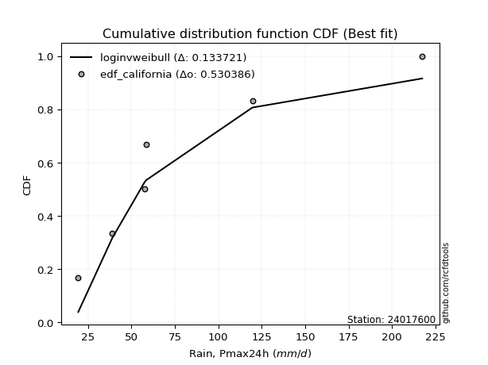</img>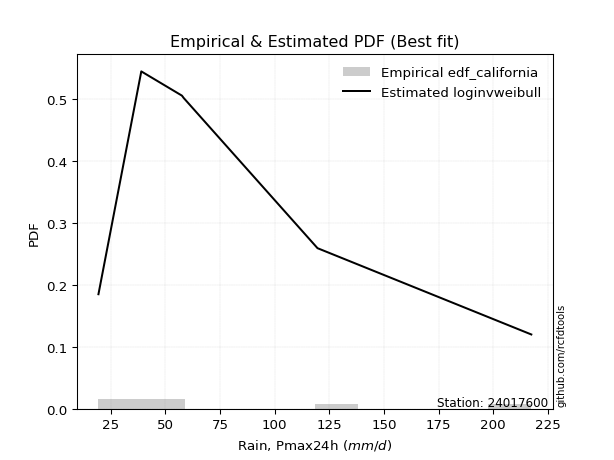</img>

</div>


### 2. Empirical - EDF Hazen (1930)

Hazen method for plotting positions is a formula used to estimate the empirical cumulative probability distribution of flood events or other hydrological data. This formula often results in biased estimations, particularly when extrapolating to extreme events (high return periods).

<div align="center">


$P=(m-0.5)/n$


</div>


**2.1. Empirical values**

<div align="center">

|                | 0                   | 1                   | 2                   | 3         | 4                  | 5                  | 6                  |
|:---------------|:--------------------|:--------------------|:--------------------|:----------|:-------------------|:-------------------|:-------------------|
| date           | 2023                | 2019                | 2020                | 2022      | 2025               | 2024               | 2021               |
| x              | 19.4                | 39.0                | 57.6                | 58.4      | 87.4               | 119.6              | 217.4              |
| m              | 1                   | 2                   | 3                   | 4         | 5                  | 6                  | 7                  |
| empirical_dist | edf_hazen           | edf_hazen           | edf_hazen           | edf_hazen | edf_hazen          | edf_hazen          | edf_hazen          |
| empirical      | 0.07142857142857142 | 0.21428571428571427 | 0.35714285714285715 | 0.5       | 0.6428571428571429 | 0.7857142857142857 | 0.9285714285714286 |
| empirical_tr   | 1.0769230769230769  | 1.2727272727272727  | 1.5555555555555558  | 2.0       | 2.8000000000000003 | 4.666666666666666  | 14.000000000000007 |

</div>


**2.2. Kolmogorov-Smirnov fit test (sorted by Δ)**


<div align="center">

|                | 0                   | 1                   | 2                   | 3                   | 4                   | 5                   | 6                   | 7                   | 8                   | 9                   | 10                  | 11                  | 12                  | 13                  | 14                  | 15                  | 16                    | 17                  | 18                  | 19                  | 20                  | 21                  | 22                  | 23                  | 24                  | 25                  | 26                  | 27                  | 28                  | 29                  | 30                  | 31                  | 32                  | 33                  | 34                  | 35                  | 36                  | 37                  | 38                  | 39                  | 40                  | 41                  | 42                  | 43                  | 44                  | 45                  | 46                  | 47                  | 48                  | 49                  | 50                  | 51                  | 52                  | 53                  | 54                  | 55                  | 56                  | 57                  | 58                  | 59                  | 60                  | 61                  | 62                  | 63                  | 64                  | 65                  | 66                  | 67                  | 68                  | 69                  | 70                  | 71                  | 72                  | 73                  | 74                  | 75                  | 76                  | 77                  | 78                  | 79                  | 80                  | 81                  | 82                  | 83                  | 84                  | 85                  | 86                  | 87                  | 88                  | 89                  |
|:---------------|:--------------------|:--------------------|:--------------------|:--------------------|:--------------------|:--------------------|:--------------------|:--------------------|:--------------------|:--------------------|:--------------------|:--------------------|:--------------------|:--------------------|:--------------------|:--------------------|:----------------------|:--------------------|:--------------------|:--------------------|:--------------------|:--------------------|:--------------------|:--------------------|:--------------------|:--------------------|:--------------------|:--------------------|:--------------------|:--------------------|:--------------------|:--------------------|:--------------------|:--------------------|:--------------------|:--------------------|:--------------------|:--------------------|:--------------------|:--------------------|:--------------------|:--------------------|:--------------------|:--------------------|:--------------------|:--------------------|:--------------------|:--------------------|:--------------------|:--------------------|:--------------------|:--------------------|:--------------------|:--------------------|:--------------------|:--------------------|:--------------------|:--------------------|:--------------------|:--------------------|:--------------------|:--------------------|:--------------------|:--------------------|:--------------------|:--------------------|:--------------------|:--------------------|:--------------------|:--------------------|:--------------------|:--------------------|:--------------------|:--------------------|:--------------------|:--------------------|:--------------------|:--------------------|:--------------------|:--------------------|:--------------------|:--------------------|:--------------------|:--------------------|:--------------------|:--------------------|:--------------------|:--------------------|:--------------------|:--------------------|
| station        | 24017600            | 24017600            | 24017600            | 24017600            | 24017600            | 24017600            | 24017600            | 24017600            | 24017600            | 24017600            | 24017600            | 24017600            | 24017600            | 24017600            | 24017600            | 24017600            | 24017600              | 24017600            | 24017600            | 24017600            | 24017600            | 24017600            | 24017600            | 24017600            | 24017600            | 24017600            | 24017600            | 24017600            | 24017600            | 24017600            | 24017600            | 24017600            | 24017600            | 24017600            | 24017600            | 24017600            | 24017600            | 24017600            | 24017600            | 24017600            | 24017600            | 24017600            | 24017600            | 24017600            | 24017600            | 24017600            | 24017600            | 24017600            | 24017600            | 24017600            | 24017600            | 24017600            | 24017600            | 24017600            | 24017600            | 24017600            | 24017600            | 24017600            | 24017600            | 24017600            | 24017600            | 24017600            | 24017600            | 24017600            | 24017600            | 24017600            | 24017600            | 24017600            | 24017600            | 24017600            | 24017600            | 24017600            | 24017600            | 24017600            | 24017600            | 24017600            | 24017600            | 24017600            | 24017600            | 24017600            | 24017600            | 24017600            | 24017600            | 24017600            | 24017600            | 24017600            | 24017600            | 24017600            | 24017600            | 24017600            |
| empirical_dist | edf_hazen           | edf_hazen           | edf_hazen           | edf_hazen           | edf_hazen           | edf_hazen           | edf_hazen           | edf_hazen           | edf_hazen           | edf_hazen           | edf_hazen           | edf_hazen           | edf_hazen           | edf_hazen           | edf_hazen           | edf_hazen           | edf_hazen             | edf_hazen           | edf_hazen           | edf_hazen           | edf_hazen           | edf_hazen           | edf_hazen           | edf_hazen           | edf_hazen           | edf_hazen           | edf_hazen           | edf_hazen           | edf_hazen           | edf_hazen           | edf_hazen           | edf_hazen           | edf_hazen           | edf_hazen           | edf_hazen           | edf_hazen           | edf_hazen           | edf_hazen           | edf_hazen           | edf_hazen           | edf_hazen           | edf_hazen           | edf_hazen           | edf_hazen           | edf_hazen           | edf_hazen           | edf_hazen           | edf_hazen           | edf_hazen           | edf_hazen           | edf_hazen           | edf_hazen           | edf_hazen           | edf_hazen           | edf_hazen           | edf_hazen           | edf_hazen           | edf_hazen           | edf_hazen           | edf_hazen           | edf_hazen           | edf_hazen           | edf_hazen           | edf_hazen           | edf_hazen           | edf_hazen           | edf_hazen           | edf_hazen           | edf_hazen           | edf_hazen           | edf_hazen           | edf_hazen           | edf_hazen           | edf_hazen           | edf_hazen           | edf_hazen           | edf_hazen           | edf_hazen           | edf_hazen           | edf_hazen           | edf_hazen           | edf_hazen           | edf_hazen           | edf_hazen           | edf_hazen           | edf_hazen           | edf_hazen           | edf_hazen           | edf_hazen           | edf_hazen           |
| p_dist         | logerlang           | loggamma            | loggamma            | invgamma            | logweibull_min      | logfatiguelife      | logf                | invweibull          | logncf              | lognct              | genexpon            | logt                | logexponnorm        | lognorm             | lognorm             | logcrystalball      | loglaplace_asymmetric | nct                 | fisk                | logbetaprime        | logpearson3         | mielke              | logjohnsonsu        | loggenlogistic      | logloggamma         | johnsonsu           | betaprime           | invgauss            | logfisk             | f                   | alpha               | loginvgamma         | loglogistic         | logrice             | expon               | loggompertz         | exponnorm           | ncf                 | logalpha            | logmielke           | laplace_asymmetric  | fatiguelife         | loghypsecant        | loginvgauss         | halflogistic        | halfnorm            | logmaxwell          | nakagami            | wald                | gompertz            | lograyleigh         | moyal               | pearson3            | loglaplace          | t                   | loggumbel_r         | loginvweibull       | gumbel_r            | rayleigh            | genlogistic         | maxwell             | loggumbel_l         | logkstwobign        | loghalfnorm         | logmoyal            | kstwobign           | loghalflogistic     | truncnorm           | norm                | crystalball         | weibull_min         | loggenexpon         | logistic            | rice                | logtruncnorm        | hypsecant           | chi2                | gamma               | gibrat              | logwald             | loggibrat           | gumbel_l            | logexpon            | laplace             | lognakagami         | erlang              | logchi2             | pareto              | loglognorm          | logpareto           |
| delta          | 0.06828009004351793 | 0.06851909659206645 | 0.06851909659206645 | 0.06870199338562988 | 0.06902118134354479 | 0.069337349647357   | 0.06988909512472191 | 0.07012763315868287 | 0.0704478592778024  | 0.07141835641923189 | 0.07142857142802887 | 0.07169112739628047 | 0.0716928377968577  | 0.07169320299986304 | 0.07169320299986304 | 0.07169447244042604 | 0.07201143108584229   | 0.072161400629971   | 0.07255347026521303 | 0.07373088734142175 | 0.07529497611266012 | 0.07579323103731156 | 0.07594091201155384 | 0.07628029774747835 | 0.07711677656845173 | 0.07757150114150552 | 0.07841854573367074 | 0.07887750751404099 | 0.07900464159852555 | 0.08011454394008222 | 0.08015861685242925 | 0.08119061174076286 | 0.08120675426166196 | 0.08144567918253337 | 0.08157849427062674 | 0.08174749053997171 | 0.08256260484745387 | 0.08440750489610749 | 0.08553838564842664 | 0.0857309752563073  | 0.08790066108772299 | 0.08835567336792205 | 0.08915422754021252 | 0.08957461581515985 | 0.08994087137066648 | 0.09438017886048217 | 0.0980402986662523  | 0.10026137284203607 | 0.10665929578766606 | 0.10692254876008583 | 0.1102350496924081  | 0.11240838243100915 | 0.11250883231319275 | 0.11274682108008732 | 0.11319750527042372 | 0.1269831949073466  | 0.12707304525035573 | 0.12749370450682662 | 0.12781557792788562 | 0.13540478628128094 | 0.13957075433997246 | 0.14061726284067494 | 0.14468219871238014 | 0.14475008738487544 | 0.15117545130912374 | 0.15634125934186743 | 0.16284993989790325 | 0.1701207391932904  | 0.17012075475680333 | 0.1701207629025393  | 0.17758199298977823 | 0.18841791202043517 | 0.18965760402927828 | 0.19037794063537755 | 0.20009294537678965 | 0.20442273868607702 | 0.20829500868032397 | 0.20871321338444732 | 0.21426136104434476 | 0.21771626562598784 | 0.2206965380924238  | 0.22671081659780917 | 0.2292308326714943  | 0.23172693964384433 | 0.23609477471749923 | 0.26244208260070817 | 0.36772939931630455 | 0.4117451496551875  | 0.42494723565865267 | 0.43877495763013086 |
| deltao         | 0.48442053926100004 | 0.48442053926100004 | 0.48442053926100004 | 0.48442053926100004 | 0.48442053926100004 | 0.48442053926100004 | 0.48442053926100004 | 0.48442053926100004 | 0.48442053926100004 | 0.48442053926100004 | 0.48442053926100004 | 0.48442053926100004 | 0.48442053926100004 | 0.48442053926100004 | 0.48442053926100004 | 0.48442053926100004 | 0.48442053926100004   | 0.48442053926100004 | 0.48442053926100004 | 0.48442053926100004 | 0.48442053926100004 | 0.48442053926100004 | 0.48442053926100004 | 0.48442053926100004 | 0.48442053926100004 | 0.48442053926100004 | 0.48442053926100004 | 0.48442053926100004 | 0.48442053926100004 | 0.48442053926100004 | 0.48442053926100004 | 0.48442053926100004 | 0.48442053926100004 | 0.48442053926100004 | 0.48442053926100004 | 0.48442053926100004 | 0.48442053926100004 | 0.48442053926100004 | 0.48442053926100004 | 0.48442053926100004 | 0.48442053926100004 | 0.48442053926100004 | 0.48442053926100004 | 0.48442053926100004 | 0.48442053926100004 | 0.48442053926100004 | 0.48442053926100004 | 0.48442053926100004 | 0.48442053926100004 | 0.48442053926100004 | 0.48442053926100004 | 0.48442053926100004 | 0.48442053926100004 | 0.48442053926100004 | 0.48442053926100004 | 0.48442053926100004 | 0.48442053926100004 | 0.48442053926100004 | 0.48442053926100004 | 0.48442053926100004 | 0.48442053926100004 | 0.48442053926100004 | 0.48442053926100004 | 0.48442053926100004 | 0.48442053926100004 | 0.48442053926100004 | 0.48442053926100004 | 0.48442053926100004 | 0.48442053926100004 | 0.48442053926100004 | 0.48442053926100004 | 0.48442053926100004 | 0.48442053926100004 | 0.48442053926100004 | 0.48442053926100004 | 0.48442053926100004 | 0.48442053926100004 | 0.48442053926100004 | 0.48442053926100004 | 0.48442053926100004 | 0.48442053926100004 | 0.48442053926100004 | 0.48442053926100004 | 0.48442053926100004 | 0.48442053926100004 | 0.48442053926100004 | 0.48442053926100004 | 0.48442053926100004 | 0.48442053926100004 | 0.48442053926100004 |
| eval           | Δo > Δ              | Δo > Δ              | Δo > Δ              | Δo > Δ              | Δo > Δ              | Δo > Δ              | Δo > Δ              | Δo > Δ              | Δo > Δ              | Δo > Δ              | Δo > Δ              | Δo > Δ              | Δo > Δ              | Δo > Δ              | Δo > Δ              | Δo > Δ              | Δo > Δ                | Δo > Δ              | Δo > Δ              | Δo > Δ              | Δo > Δ              | Δo > Δ              | Δo > Δ              | Δo > Δ              | Δo > Δ              | Δo > Δ              | Δo > Δ              | Δo > Δ              | Δo > Δ              | Δo > Δ              | Δo > Δ              | Δo > Δ              | Δo > Δ              | Δo > Δ              | Δo > Δ              | Δo > Δ              | Δo > Δ              | Δo > Δ              | Δo > Δ              | Δo > Δ              | Δo > Δ              | Δo > Δ              | Δo > Δ              | Δo > Δ              | Δo > Δ              | Δo > Δ              | Δo > Δ              | Δo > Δ              | Δo > Δ              | Δo > Δ              | Δo > Δ              | Δo > Δ              | Δo > Δ              | Δo > Δ              | Δo > Δ              | Δo > Δ              | Δo > Δ              | Δo > Δ              | Δo > Δ              | Δo > Δ              | Δo > Δ              | Δo > Δ              | Δo > Δ              | Δo > Δ              | Δo > Δ              | Δo > Δ              | Δo > Δ              | Δo > Δ              | Δo > Δ              | Δo > Δ              | Δo > Δ              | Δo > Δ              | Δo > Δ              | Δo > Δ              | Δo > Δ              | Δo > Δ              | Δo > Δ              | Δo > Δ              | Δo > Δ              | Δo > Δ              | Δo > Δ              | Δo > Δ              | Δo > Δ              | Δo > Δ              | Δo > Δ              | Δo > Δ              | Δo > Δ              | Δo > Δ              | Δo > Δ              | Δo > Δ              |
| fit            | 1                   | 1                   | 1                   | 1                   | 1                   | 1                   | 1                   | 1                   | 1                   | 1                   | 1                   | 1                   | 1                   | 1                   | 1                   | 1                   | 1                     | 1                   | 1                   | 1                   | 1                   | 1                   | 1                   | 1                   | 1                   | 1                   | 1                   | 1                   | 1                   | 1                   | 1                   | 1                   | 1                   | 1                   | 1                   | 1                   | 1                   | 1                   | 1                   | 1                   | 1                   | 1                   | 1                   | 1                   | 1                   | 1                   | 1                   | 1                   | 1                   | 1                   | 1                   | 1                   | 1                   | 1                   | 1                   | 1                   | 1                   | 1                   | 1                   | 1                   | 1                   | 1                   | 1                   | 1                   | 1                   | 1                   | 1                   | 1                   | 1                   | 1                   | 1                   | 1                   | 1                   | 1                   | 1                   | 1                   | 1                   | 1                   | 1                   | 1                   | 1                   | 1                   | 1                   | 1                   | 1                   | 1                   | 1                   | 1                   | 1                   | 1                   |
| n              | 7                   | 7                   | 7                   | 7                   | 7                   | 7                   | 7                   | 7                   | 7                   | 7                   | 7                   | 7                   | 7                   | 7                   | 7                   | 7                   | 7                     | 7                   | 7                   | 7                   | 7                   | 7                   | 7                   | 7                   | 7                   | 7                   | 7                   | 7                   | 7                   | 7                   | 7                   | 7                   | 7                   | 7                   | 7                   | 7                   | 7                   | 7                   | 7                   | 7                   | 7                   | 7                   | 7                   | 7                   | 7                   | 7                   | 7                   | 7                   | 7                   | 7                   | 7                   | 7                   | 7                   | 7                   | 7                   | 7                   | 7                   | 7                   | 7                   | 7                   | 7                   | 7                   | 7                   | 7                   | 7                   | 7                   | 7                   | 7                   | 7                   | 7                   | 7                   | 7                   | 7                   | 7                   | 7                   | 7                   | 7                   | 7                   | 7                   | 7                   | 7                   | 7                   | 7                   | 7                   | 7                   | 7                   | 7                   | 7                   | 7                   | 7                   |
| best_fit       | 1                   | 0                   | 0                   | 0                   | 0                   | 0                   | 0                   | 0                   | 0                   | 0                   | 0                   | 0                   | 0                   | 0                   | 0                   | 0                   | 0                     | 0                   | 0                   | 0                   | 0                   | 0                   | 0                   | 0                   | 0                   | 0                   | 0                   | 0                   | 0                   | 0                   | 0                   | 0                   | 0                   | 0                   | 0                   | 0                   | 0                   | 0                   | 0                   | 0                   | 0                   | 0                   | 0                   | 0                   | 0                   | 0                   | 0                   | 0                   | 0                   | 0                   | 0                   | 0                   | 0                   | 0                   | 0                   | 0                   | 0                   | 0                   | 0                   | 0                   | 0                   | 0                   | 0                   | 0                   | 0                   | 0                   | 0                   | 0                   | 0                   | 0                   | 0                   | 0                   | 0                   | 0                   | 0                   | 0                   | 0                   | 0                   | 0                   | 0                   | 0                   | 0                   | 0                   | 0                   | 0                   | 0                   | 0                   | 0                   | 0                   | 0                   |
| best_fit_sort  | 1                   | 2                   | 3                   | 4                   | 5                   | 6                   | 7                   | 8                   | 9                   | 10                  | 11                  | 12                  | 13                  | 14                  | 15                  | 16                  | 17                    | 18                  | 19                  | 20                  | 21                  | 22                  | 23                  | 24                  | 25                  | 26                  | 27                  | 28                  | 29                  | 30                  | 31                  | 32                  | 33                  | 34                  | 35                  | 36                  | 37                  | 38                  | 39                  | 40                  | 41                  | 42                  | 43                  | 44                  | 45                  | 46                  | 47                  | 48                  | 49                  | 50                  | 51                  | 52                  | 53                  | 54                  | 55                  | 56                  | 57                  | 58                  | 59                  | 60                  | 61                  | 62                  | 63                  | 64                  | 65                  | 66                  | 67                  | 68                  | 69                  | 70                  | 71                  | 72                  | 73                  | 74                  | 75                  | 76                  | 77                  | 78                  | 79                  | 80                  | 81                  | 82                  | 83                  | 84                  | 85                  | 86                  | 87                  | 88                  | 89                  | 90                  |

</div>


<div align="center">

</img>

</div>


**2.3. Best fit**

<div align="center">

|   id |   station | empirical_dist   | p_dist    |     delta |   deltao | eval   |   fit |   n |   best_fit |   best_fit_sort |
|-----:|----------:|:-----------------|:----------|----------:|---------:|:-------|------:|----:|-----------:|----------------:|
|    0 |  24017600 | edf_hazen        | logerlang | 0.0682801 | 0.484421 | Δo > Δ |     1 |   7 |          1 |               1 |

</div>


<div align="center">

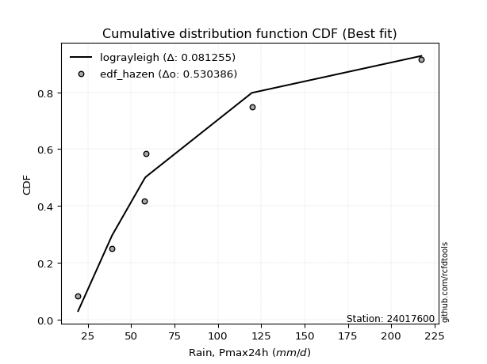</img>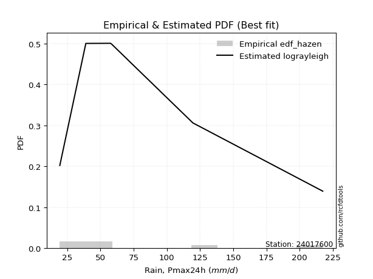</img>

</div>


### 3. Empirical - EDF Weibull (1939)

Weibull plotting position formula is an empirical method used to estimate the non-exceedance probability or plotting position for a set of observed data, is often recommended or widely used in practice, particularly in flood frequency analysis.

<div align="center">


$P=m/(n+1)$


</div>


**3.1. Empirical values**

<div align="center">

|                | 0                  | 1                  | 2           | 3           | 4                  | 5           | 6           |
|:---------------|:-------------------|:-------------------|:------------|:------------|:-------------------|:------------|:------------|
| date           | 2023               | 2019               | 2020        | 2022        | 2025               | 2024        | 2021        |
| x              | 19.4               | 39.0               | 57.6        | 58.4        | 87.4               | 119.6       | 217.4       |
| m              | 1                  | 2                  | 3           | 4           | 5                  | 6           | 7           |
| empirical_dist | edf_weibull        | edf_weibull        | edf_weibull | edf_weibull | edf_weibull        | edf_weibull | edf_weibull |
| empirical      | 0.125              | 0.25               | 0.375       | 0.5         | 0.625              | 0.75        | 0.875       |
| empirical_tr   | 1.1428571428571428 | 1.3333333333333333 | 1.6         | 2.0         | 2.6666666666666665 | 4.0         | 8.0         |

</div>


**3.2. Kolmogorov-Smirnov fit test (sorted by Δ)**


<div align="center">

|                | 0                   | 1                   | 2                   | 3                   | 4                   | 5                   | 6                   | 7                   | 8                   | 9                   | 10                  | 11                  | 12                  | 13                  | 14                  | 15                  | 16                  | 17                  | 18                  | 19                  | 20                  | 21                  | 22                  | 23                  | 24                  | 25                    | 26                  | 27                  | 28                  | 29                  | 30                  | 31                  | 32                  | 33                  | 34                  | 35                  | 36                  | 37                  | 38                  | 39                  | 40                  | 41                  | 42                  | 43                  | 44                  | 45                  | 46                  | 47                  | 48                  | 49                  | 50                  | 51                  | 52                  | 53                  | 54                  | 55                  | 56                  | 57                  | 58                  | 59                  | 60                  | 61                  | 62                  | 63                  | 64                  | 65                  | 66                  | 67                  | 68                  | 69                  | 70                  | 71                  | 72                  | 73                  | 74                  | 75                  | 76                  | 77                  | 78                  | 79                  | 80                  | 81                  | 82                  | 83                  | 84                  | 85                  | 86                  | 87                  | 88                  | 89                  |
|:---------------|:--------------------|:--------------------|:--------------------|:--------------------|:--------------------|:--------------------|:--------------------|:--------------------|:--------------------|:--------------------|:--------------------|:--------------------|:--------------------|:--------------------|:--------------------|:--------------------|:--------------------|:--------------------|:--------------------|:--------------------|:--------------------|:--------------------|:--------------------|:--------------------|:--------------------|:----------------------|:--------------------|:--------------------|:--------------------|:--------------------|:--------------------|:--------------------|:--------------------|:--------------------|:--------------------|:--------------------|:--------------------|:--------------------|:--------------------|:--------------------|:--------------------|:--------------------|:--------------------|:--------------------|:--------------------|:--------------------|:--------------------|:--------------------|:--------------------|:--------------------|:--------------------|:--------------------|:--------------------|:--------------------|:--------------------|:--------------------|:--------------------|:--------------------|:--------------------|:--------------------|:--------------------|:--------------------|:--------------------|:--------------------|:--------------------|:--------------------|:--------------------|:--------------------|:--------------------|:--------------------|:--------------------|:--------------------|:--------------------|:--------------------|:--------------------|:--------------------|:--------------------|:--------------------|:--------------------|:--------------------|:--------------------|:--------------------|:--------------------|:--------------------|:--------------------|:--------------------|:--------------------|:--------------------|:--------------------|:--------------------|
| station        | 24017600            | 24017600            | 24017600            | 24017600            | 24017600            | 24017600            | 24017600            | 24017600            | 24017600            | 24017600            | 24017600            | 24017600            | 24017600            | 24017600            | 24017600            | 24017600            | 24017600            | 24017600            | 24017600            | 24017600            | 24017600            | 24017600            | 24017600            | 24017600            | 24017600            | 24017600              | 24017600            | 24017600            | 24017600            | 24017600            | 24017600            | 24017600            | 24017600            | 24017600            | 24017600            | 24017600            | 24017600            | 24017600            | 24017600            | 24017600            | 24017600            | 24017600            | 24017600            | 24017600            | 24017600            | 24017600            | 24017600            | 24017600            | 24017600            | 24017600            | 24017600            | 24017600            | 24017600            | 24017600            | 24017600            | 24017600            | 24017600            | 24017600            | 24017600            | 24017600            | 24017600            | 24017600            | 24017600            | 24017600            | 24017600            | 24017600            | 24017600            | 24017600            | 24017600            | 24017600            | 24017600            | 24017600            | 24017600            | 24017600            | 24017600            | 24017600            | 24017600            | 24017600            | 24017600            | 24017600            | 24017600            | 24017600            | 24017600            | 24017600            | 24017600            | 24017600            | 24017600            | 24017600            | 24017600            | 24017600            |
| empirical_dist | edf_weibull         | edf_weibull         | edf_weibull         | edf_weibull         | edf_weibull         | edf_weibull         | edf_weibull         | edf_weibull         | edf_weibull         | edf_weibull         | edf_weibull         | edf_weibull         | edf_weibull         | edf_weibull         | edf_weibull         | edf_weibull         | edf_weibull         | edf_weibull         | edf_weibull         | edf_weibull         | edf_weibull         | edf_weibull         | edf_weibull         | edf_weibull         | edf_weibull         | edf_weibull           | edf_weibull         | edf_weibull         | edf_weibull         | edf_weibull         | edf_weibull         | edf_weibull         | edf_weibull         | edf_weibull         | edf_weibull         | edf_weibull         | edf_weibull         | edf_weibull         | edf_weibull         | edf_weibull         | edf_weibull         | edf_weibull         | edf_weibull         | edf_weibull         | edf_weibull         | edf_weibull         | edf_weibull         | edf_weibull         | edf_weibull         | edf_weibull         | edf_weibull         | edf_weibull         | edf_weibull         | edf_weibull         | edf_weibull         | edf_weibull         | edf_weibull         | edf_weibull         | edf_weibull         | edf_weibull         | edf_weibull         | edf_weibull         | edf_weibull         | edf_weibull         | edf_weibull         | edf_weibull         | edf_weibull         | edf_weibull         | edf_weibull         | edf_weibull         | edf_weibull         | edf_weibull         | edf_weibull         | edf_weibull         | edf_weibull         | edf_weibull         | edf_weibull         | edf_weibull         | edf_weibull         | edf_weibull         | edf_weibull         | edf_weibull         | edf_weibull         | edf_weibull         | edf_weibull         | edf_weibull         | edf_weibull         | edf_weibull         | edf_weibull         | edf_weibull         |
| p_dist         | loggenlogistic      | mielke              | nct                 | logloggamma         | betaprime           | logfisk             | logjohnsonsu        | logpearson3         | invweibull          | f                   | alpha               | logcrystalball      | logt                | lognorm             | lognorm             | logexponnorm        | lognct              | logf                | invgamma            | logfatiguelife      | loglogistic         | logerlang           | loggamma            | loggamma            | logbetaprime        | loglaplace_asymmetric | logncf              | ncf                 | invgauss            | logmielke           | loginvgamma         | johnsonsu           | fatiguelife         | logweibull_min      | laplace_asymmetric  | logalpha            | loghypsecant        | loginvgauss         | halflogistic        | fisk                | halfnorm            | logrice             | logmaxwell          | loginvweibull       | moyal               | pearson3            | loglaplace          | lograyleigh         | loggumbel_r         | t                   | exponnorm           | loggompertz         | nakagami            | gompertz            | genexpon            | expon               | logkstwobign        | loghalfnorm         | gumbel_r            | rayleigh            | logmoyal            | genlogistic         | maxwell             | loggumbel_l         | wald                | loghalflogistic     | kstwobign           | weibull_min         | truncnorm           | norm                | crystalball         | loggenexpon         | logistic            | rice                | chi2                | gamma               | logwald             | hypsecant           | logexpon            | gumbel_l            | laplace             | logtruncnorm        | erlang              | loggibrat           | gibrat              | lognakagami         | logchi2             | pareto              | loglognorm          | logpareto           |
| delta          | 0.07691242013986382 | 0.07706192032271163 | 0.07773850963507382 | 0.07836983203668718 | 0.07841854573367074 | 0.07900464159852555 | 0.07907312534416158 | 0.07919127366562784 | 0.07951544988245748 | 0.08011454394008222 | 0.08015861685242925 | 0.08083665813545951 | 0.0808367750850163  | 0.08083687618582927 | 0.08083687618582927 | 0.08083697658109776 | 0.08084047319555686 | 0.08108797923464929 | 0.08144876099246443 | 0.08152716875996946 | 0.08153023134605034 | 0.0819629319871795  | 0.08207152888480229 | 0.08207152888480229 | 0.082572442340169   | 0.0826804414298733    | 0.08322133225020635 | 0.08440750489610749 | 0.08552929879254254 | 0.0857309752563073  | 0.0862063909100322  | 0.08644237105977878 | 0.08710851137381967 | 0.08739556997567242 | 0.08790066108772299 | 0.08880805815606857 | 0.08915422754021252 | 0.08979224700787516 | 0.08994087137066648 | 0.09103908113093687 | 0.09438017886048217 | 0.0956907648655537  | 0.10247118000629717 | 0.10921590239321288 | 0.11240838243100915 | 0.11250883231319275 | 0.11274682108008732 | 0.11569066914730299 | 0.11823464931518031 | 0.11965058088157732 | 0.12396064716080157 | 0.12499999471811925 | 0.12499999993346372 | 0.12499999999717326 | 0.12499999999945745 | 0.125               | 0.1268250558552373  | 0.1268929445277326  | 0.12749370450682662 | 0.12781557792788562 | 0.1333183084519809  | 0.13540478628128094 | 0.13957075433997246 | 0.14061726284067494 | 0.14237358150195178 | 0.1449927970407604  | 0.15634125934186743 | 0.15972485013263538 | 0.1701207391932904  | 0.17012075475680333 | 0.1701207629025393  | 0.17056076916329233 | 0.18965760402927828 | 0.19037794063537755 | 0.19043786582318112 | 0.19085607052730447 | 0.199859122768845   | 0.20442273868607702 | 0.21137368981435145 | 0.22671081659780917 | 0.23172693964384433 | 0.23580723109107538 | 0.24458493974356532 | 0.24846706541086966 | 0.2499756467586305  | 0.2499984981809748  | 0.33201511360201885 | 0.3760308639409018  | 0.38923294994436697 | 0.40306067191584516 |
| deltao         | 0.48442053926100004 | 0.48442053926100004 | 0.48442053926100004 | 0.48442053926100004 | 0.48442053926100004 | 0.48442053926100004 | 0.48442053926100004 | 0.48442053926100004 | 0.48442053926100004 | 0.48442053926100004 | 0.48442053926100004 | 0.48442053926100004 | 0.48442053926100004 | 0.48442053926100004 | 0.48442053926100004 | 0.48442053926100004 | 0.48442053926100004 | 0.48442053926100004 | 0.48442053926100004 | 0.48442053926100004 | 0.48442053926100004 | 0.48442053926100004 | 0.48442053926100004 | 0.48442053926100004 | 0.48442053926100004 | 0.48442053926100004   | 0.48442053926100004 | 0.48442053926100004 | 0.48442053926100004 | 0.48442053926100004 | 0.48442053926100004 | 0.48442053926100004 | 0.48442053926100004 | 0.48442053926100004 | 0.48442053926100004 | 0.48442053926100004 | 0.48442053926100004 | 0.48442053926100004 | 0.48442053926100004 | 0.48442053926100004 | 0.48442053926100004 | 0.48442053926100004 | 0.48442053926100004 | 0.48442053926100004 | 0.48442053926100004 | 0.48442053926100004 | 0.48442053926100004 | 0.48442053926100004 | 0.48442053926100004 | 0.48442053926100004 | 0.48442053926100004 | 0.48442053926100004 | 0.48442053926100004 | 0.48442053926100004 | 0.48442053926100004 | 0.48442053926100004 | 0.48442053926100004 | 0.48442053926100004 | 0.48442053926100004 | 0.48442053926100004 | 0.48442053926100004 | 0.48442053926100004 | 0.48442053926100004 | 0.48442053926100004 | 0.48442053926100004 | 0.48442053926100004 | 0.48442053926100004 | 0.48442053926100004 | 0.48442053926100004 | 0.48442053926100004 | 0.48442053926100004 | 0.48442053926100004 | 0.48442053926100004 | 0.48442053926100004 | 0.48442053926100004 | 0.48442053926100004 | 0.48442053926100004 | 0.48442053926100004 | 0.48442053926100004 | 0.48442053926100004 | 0.48442053926100004 | 0.48442053926100004 | 0.48442053926100004 | 0.48442053926100004 | 0.48442053926100004 | 0.48442053926100004 | 0.48442053926100004 | 0.48442053926100004 | 0.48442053926100004 | 0.48442053926100004 |
| eval           | Δo > Δ              | Δo > Δ              | Δo > Δ              | Δo > Δ              | Δo > Δ              | Δo > Δ              | Δo > Δ              | Δo > Δ              | Δo > Δ              | Δo > Δ              | Δo > Δ              | Δo > Δ              | Δo > Δ              | Δo > Δ              | Δo > Δ              | Δo > Δ              | Δo > Δ              | Δo > Δ              | Δo > Δ              | Δo > Δ              | Δo > Δ              | Δo > Δ              | Δo > Δ              | Δo > Δ              | Δo > Δ              | Δo > Δ                | Δo > Δ              | Δo > Δ              | Δo > Δ              | Δo > Δ              | Δo > Δ              | Δo > Δ              | Δo > Δ              | Δo > Δ              | Δo > Δ              | Δo > Δ              | Δo > Δ              | Δo > Δ              | Δo > Δ              | Δo > Δ              | Δo > Δ              | Δo > Δ              | Δo > Δ              | Δo > Δ              | Δo > Δ              | Δo > Δ              | Δo > Δ              | Δo > Δ              | Δo > Δ              | Δo > Δ              | Δo > Δ              | Δo > Δ              | Δo > Δ              | Δo > Δ              | Δo > Δ              | Δo > Δ              | Δo > Δ              | Δo > Δ              | Δo > Δ              | Δo > Δ              | Δo > Δ              | Δo > Δ              | Δo > Δ              | Δo > Δ              | Δo > Δ              | Δo > Δ              | Δo > Δ              | Δo > Δ              | Δo > Δ              | Δo > Δ              | Δo > Δ              | Δo > Δ              | Δo > Δ              | Δo > Δ              | Δo > Δ              | Δo > Δ              | Δo > Δ              | Δo > Δ              | Δo > Δ              | Δo > Δ              | Δo > Δ              | Δo > Δ              | Δo > Δ              | Δo > Δ              | Δo > Δ              | Δo > Δ              | Δo > Δ              | Δo > Δ              | Δo > Δ              | Δo > Δ              |
| fit            | 1                   | 1                   | 1                   | 1                   | 1                   | 1                   | 1                   | 1                   | 1                   | 1                   | 1                   | 1                   | 1                   | 1                   | 1                   | 1                   | 1                   | 1                   | 1                   | 1                   | 1                   | 1                   | 1                   | 1                   | 1                   | 1                     | 1                   | 1                   | 1                   | 1                   | 1                   | 1                   | 1                   | 1                   | 1                   | 1                   | 1                   | 1                   | 1                   | 1                   | 1                   | 1                   | 1                   | 1                   | 1                   | 1                   | 1                   | 1                   | 1                   | 1                   | 1                   | 1                   | 1                   | 1                   | 1                   | 1                   | 1                   | 1                   | 1                   | 1                   | 1                   | 1                   | 1                   | 1                   | 1                   | 1                   | 1                   | 1                   | 1                   | 1                   | 1                   | 1                   | 1                   | 1                   | 1                   | 1                   | 1                   | 1                   | 1                   | 1                   | 1                   | 1                   | 1                   | 1                   | 1                   | 1                   | 1                   | 1                   | 1                   | 1                   |
| n              | 7                   | 7                   | 7                   | 7                   | 7                   | 7                   | 7                   | 7                   | 7                   | 7                   | 7                   | 7                   | 7                   | 7                   | 7                   | 7                   | 7                   | 7                   | 7                   | 7                   | 7                   | 7                   | 7                   | 7                   | 7                   | 7                     | 7                   | 7                   | 7                   | 7                   | 7                   | 7                   | 7                   | 7                   | 7                   | 7                   | 7                   | 7                   | 7                   | 7                   | 7                   | 7                   | 7                   | 7                   | 7                   | 7                   | 7                   | 7                   | 7                   | 7                   | 7                   | 7                   | 7                   | 7                   | 7                   | 7                   | 7                   | 7                   | 7                   | 7                   | 7                   | 7                   | 7                   | 7                   | 7                   | 7                   | 7                   | 7                   | 7                   | 7                   | 7                   | 7                   | 7                   | 7                   | 7                   | 7                   | 7                   | 7                   | 7                   | 7                   | 7                   | 7                   | 7                   | 7                   | 7                   | 7                   | 7                   | 7                   | 7                   | 7                   |
| best_fit       | 1                   | 0                   | 0                   | 0                   | 0                   | 0                   | 0                   | 0                   | 0                   | 0                   | 0                   | 0                   | 0                   | 0                   | 0                   | 0                   | 0                   | 0                   | 0                   | 0                   | 0                   | 0                   | 0                   | 0                   | 0                   | 0                     | 0                   | 0                   | 0                   | 0                   | 0                   | 0                   | 0                   | 0                   | 0                   | 0                   | 0                   | 0                   | 0                   | 0                   | 0                   | 0                   | 0                   | 0                   | 0                   | 0                   | 0                   | 0                   | 0                   | 0                   | 0                   | 0                   | 0                   | 0                   | 0                   | 0                   | 0                   | 0                   | 0                   | 0                   | 0                   | 0                   | 0                   | 0                   | 0                   | 0                   | 0                   | 0                   | 0                   | 0                   | 0                   | 0                   | 0                   | 0                   | 0                   | 0                   | 0                   | 0                   | 0                   | 0                   | 0                   | 0                   | 0                   | 0                   | 0                   | 0                   | 0                   | 0                   | 0                   | 0                   |
| best_fit_sort  | 1                   | 2                   | 3                   | 4                   | 5                   | 6                   | 7                   | 8                   | 9                   | 10                  | 11                  | 12                  | 13                  | 14                  | 15                  | 16                  | 17                  | 18                  | 19                  | 20                  | 21                  | 22                  | 23                  | 24                  | 25                  | 26                    | 27                  | 28                  | 29                  | 30                  | 31                  | 32                  | 33                  | 34                  | 35                  | 36                  | 37                  | 38                  | 39                  | 40                  | 41                  | 42                  | 43                  | 44                  | 45                  | 46                  | 47                  | 48                  | 49                  | 50                  | 51                  | 52                  | 53                  | 54                  | 55                  | 56                  | 57                  | 58                  | 59                  | 60                  | 61                  | 62                  | 63                  | 64                  | 65                  | 66                  | 67                  | 68                  | 69                  | 70                  | 71                  | 72                  | 73                  | 74                  | 75                  | 76                  | 77                  | 78                  | 79                  | 80                  | 81                  | 82                  | 83                  | 84                  | 85                  | 86                  | 87                  | 88                  | 89                  | 90                  |

</div>


<div align="center">

</img>

</div>


**3.3. Best fit**

<div align="center">

|   id |   station | empirical_dist   | p_dist         |     delta |   deltao | eval   |   fit |   n |   best_fit |   best_fit_sort |
|-----:|----------:|:-----------------|:---------------|----------:|---------:|:-------|------:|----:|-----------:|----------------:|
|    0 |  24017600 | edf_weibull      | loggenlogistic | 0.0769124 | 0.484421 | Δo > Δ |     1 |   7 |          1 |               1 |

</div>


<div align="center">

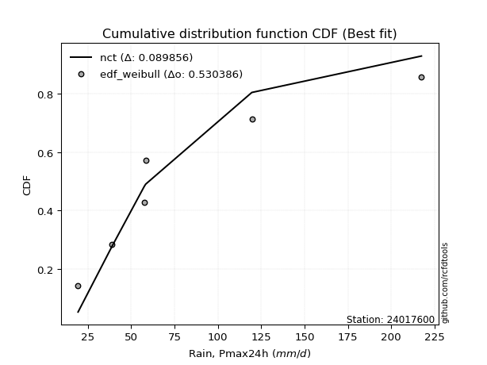</img>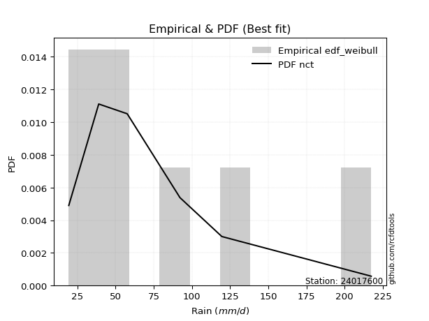</img>

</div>


### 4. Empirical - EDF Beard (1943)

The Beard formula (or Beard´s plotting position formula) in hydrology is used to estimate the empirical non-exceedance probability _(P)_ of a flood event (or other extreme hydrological data point) within a given dataset.

<div align="center">


$P=(m-0.31)/(n+0.38)$


</div>


**4.1. Empirical values**

<div align="center">

|                | 0                   | 1                   | 2                   | 3         | 4                  | 5                  | 6                  |
|:---------------|:--------------------|:--------------------|:--------------------|:----------|:-------------------|:-------------------|:-------------------|
| date           | 2023                | 2019                | 2020                | 2022      | 2025               | 2024               | 2021               |
| x              | 19.4                | 39.0                | 57.6                | 58.4      | 87.4               | 119.6              | 217.4              |
| m              | 1                   | 2                   | 3                   | 4         | 5                  | 6                  | 7                  |
| empirical_dist | edf_beard           | edf_beard           | edf_beard           | edf_beard | edf_beard          | edf_beard          | edf_beard          |
| empirical      | 0.09349593495934959 | 0.22899728997289973 | 0.36449864498644985 | 0.5       | 0.6355013550135502 | 0.7710027100271003 | 0.9065040650406505 |
| empirical_tr   | 1.1031390134529149  | 1.29701230228471    | 1.5735607675906182  | 2.0       | 2.743494423791822  | 4.366863905325444  | 10.695652173913055 |

</div>


**4.2. Kolmogorov-Smirnov fit test (sorted by Δ)**


<div align="center">

|                | 0                   | 1                   | 2                   | 3                   | 4                   | 5                   | 6                   | 7                   | 8                   | 9                   | 10                  | 11                  | 12                  | 13                  | 14                  | 15                  | 16                  | 17                  | 18                  | 19                  | 20                    | 21                  | 22                  | 23                  | 24                  | 25                  | 26                  | 27                  | 28                  | 29                  | 30                  | 31                  | 32                  | 33                  | 34                  | 35                  | 36                  | 37                  | 38                  | 39                  | 40                  | 41                  | 42                  | 43                  | 44                  | 45                  | 46                  | 47                  | 48                  | 49                  | 50                  | 51                  | 52                  | 53                  | 54                  | 55                  | 56                  | 57                  | 58                  | 59                  | 60                  | 61                  | 62                  | 63                  | 64                  | 65                  | 66                  | 67                  | 68                  | 69                  | 70                  | 71                  | 72                  | 73                  | 74                  | 75                  | 76                  | 77                  | 78                  | 79                  | 80                  | 81                  | 82                  | 83                  | 84                  | 85                  | 86                  | 87                  | 88                  | 89                  |
|:---------------|:--------------------|:--------------------|:--------------------|:--------------------|:--------------------|:--------------------|:--------------------|:--------------------|:--------------------|:--------------------|:--------------------|:--------------------|:--------------------|:--------------------|:--------------------|:--------------------|:--------------------|:--------------------|:--------------------|:--------------------|:----------------------|:--------------------|:--------------------|:--------------------|:--------------------|:--------------------|:--------------------|:--------------------|:--------------------|:--------------------|:--------------------|:--------------------|:--------------------|:--------------------|:--------------------|:--------------------|:--------------------|:--------------------|:--------------------|:--------------------|:--------------------|:--------------------|:--------------------|:--------------------|:--------------------|:--------------------|:--------------------|:--------------------|:--------------------|:--------------------|:--------------------|:--------------------|:--------------------|:--------------------|:--------------------|:--------------------|:--------------------|:--------------------|:--------------------|:--------------------|:--------------------|:--------------------|:--------------------|:--------------------|:--------------------|:--------------------|:--------------------|:--------------------|:--------------------|:--------------------|:--------------------|:--------------------|:--------------------|:--------------------|:--------------------|:--------------------|:--------------------|:--------------------|:--------------------|:--------------------|:--------------------|:--------------------|:--------------------|:--------------------|:--------------------|:--------------------|:--------------------|:--------------------|:--------------------|:--------------------|
| station        | 24017600            | 24017600            | 24017600            | 24017600            | 24017600            | 24017600            | 24017600            | 24017600            | 24017600            | 24017600            | 24017600            | 24017600            | 24017600            | 24017600            | 24017600            | 24017600            | 24017600            | 24017600            | 24017600            | 24017600            | 24017600              | 24017600            | 24017600            | 24017600            | 24017600            | 24017600            | 24017600            | 24017600            | 24017600            | 24017600            | 24017600            | 24017600            | 24017600            | 24017600            | 24017600            | 24017600            | 24017600            | 24017600            | 24017600            | 24017600            | 24017600            | 24017600            | 24017600            | 24017600            | 24017600            | 24017600            | 24017600            | 24017600            | 24017600            | 24017600            | 24017600            | 24017600            | 24017600            | 24017600            | 24017600            | 24017600            | 24017600            | 24017600            | 24017600            | 24017600            | 24017600            | 24017600            | 24017600            | 24017600            | 24017600            | 24017600            | 24017600            | 24017600            | 24017600            | 24017600            | 24017600            | 24017600            | 24017600            | 24017600            | 24017600            | 24017600            | 24017600            | 24017600            | 24017600            | 24017600            | 24017600            | 24017600            | 24017600            | 24017600            | 24017600            | 24017600            | 24017600            | 24017600            | 24017600            | 24017600            |
| empirical_dist | edf_beard           | edf_beard           | edf_beard           | edf_beard           | edf_beard           | edf_beard           | edf_beard           | edf_beard           | edf_beard           | edf_beard           | edf_beard           | edf_beard           | edf_beard           | edf_beard           | edf_beard           | edf_beard           | edf_beard           | edf_beard           | edf_beard           | edf_beard           | edf_beard             | edf_beard           | edf_beard           | edf_beard           | edf_beard           | edf_beard           | edf_beard           | edf_beard           | edf_beard           | edf_beard           | edf_beard           | edf_beard           | edf_beard           | edf_beard           | edf_beard           | edf_beard           | edf_beard           | edf_beard           | edf_beard           | edf_beard           | edf_beard           | edf_beard           | edf_beard           | edf_beard           | edf_beard           | edf_beard           | edf_beard           | edf_beard           | edf_beard           | edf_beard           | edf_beard           | edf_beard           | edf_beard           | edf_beard           | edf_beard           | edf_beard           | edf_beard           | edf_beard           | edf_beard           | edf_beard           | edf_beard           | edf_beard           | edf_beard           | edf_beard           | edf_beard           | edf_beard           | edf_beard           | edf_beard           | edf_beard           | edf_beard           | edf_beard           | edf_beard           | edf_beard           | edf_beard           | edf_beard           | edf_beard           | edf_beard           | edf_beard           | edf_beard           | edf_beard           | edf_beard           | edf_beard           | edf_beard           | edf_beard           | edf_beard           | edf_beard           | edf_beard           | edf_beard           | edf_beard           | edf_beard           |
| p_dist         | logncf              | fisk                | logbetaprime        | logweibull_min      | logerlang           | loggamma            | loggamma            | invgamma            | logfatiguelife      | logf                | invweibull          | johnsonsu           | lognct              | invgauss            | logt                | logexponnorm        | lognorm             | lognorm             | logcrystalball      | nct                 | loglaplace_asymmetric | loginvgamma         | logrice             | logpearson3         | mielke              | logjohnsonsu        | loggenlogistic      | logloggamma         | logalpha            | betaprime           | logfisk             | f                   | alpha               | fatiguelife         | loglogistic         | loginvgauss         | ncf                 | logmielke           | laplace_asymmetric  | loghypsecant        | halflogistic        | logmaxwell          | exponnorm           | loggompertz         | genexpon            | expon               | halfnorm            | nakagami            | t                   | lograyleigh         | gompertz            | moyal               | pearson3            | loglaplace          | loggumbel_r         | loginvweibull       | wald                | gumbel_r            | rayleigh            | genlogistic         | logkstwobign        | loghalfnorm         | maxwell             | loggumbel_l         | logmoyal            | loghalflogistic     | kstwobign           | truncnorm           | norm                | crystalball         | weibull_min         | loggenexpon         | logistic            | rice                | chi2                | gamma               | hypsecant           | logwald             | logtruncnorm        | logexpon            | gumbel_l            | loggibrat           | gibrat              | lognakagami         | laplace             | erlang              | logchi2             | pareto              | loglognorm          | logpareto           |
| delta          | 0.06493887871652049 | 0.06519768242162033 | 0.06637509949782905 | 0.06651511238819563 | 0.06828009004351793 | 0.06851909659206645 | 0.06851909659206645 | 0.06870199338562988 | 0.069337349647357   | 0.06988909512472191 | 0.07012763315868287 | 0.07021571329791282 | 0.07141835641923189 | 0.07152171967044829 | 0.07169112739628047 | 0.0716928377968577  | 0.07169320299986304 | 0.07169320299986304 | 0.07169447244042604 | 0.072161400629971   | 0.07217908641632309   | 0.07383482389717017 | 0.07408989133894067 | 0.07529497611266012 | 0.07579323103731156 | 0.07594091201155384 | 0.07628029774747835 | 0.07711677656845173 | 0.07818259780483394 | 0.07841854573367074 | 0.07900464159852555 | 0.08011454394008222 | 0.08015861685242925 | 0.08099988552432935 | 0.08120675426166196 | 0.08221882797156715 | 0.08440750489610749 | 0.0857309752563073  | 0.08790066108772299 | 0.08915422754021252 | 0.08994087137066648 | 0.0906845108226596  | 0.09245658212015116 | 0.09349592967746884 | 0.09349593495880704 | 0.09349593495934959 | 0.09438017886048217 | 0.09645471773674952 | 0.09864787085447702 | 0.1028792618488154  | 0.10692254876008583 | 0.11240838243100915 | 0.11250883231319275 | 0.11274682108008732 | 0.11962740706375391 | 0.11971725740676303 | 0.12137087147485151 | 0.12749370450682662 | 0.12781557792788562 | 0.13540478628128094 | 0.13732641086878744 | 0.13739429954128274 | 0.13957075433997246 | 0.14061726284067494 | 0.14381966346553104 | 0.15549415205431055 | 0.15634125934186743 | 0.1701207391932904  | 0.17012075475680333 | 0.1701207629025393  | 0.17022620514618553 | 0.18106212417684248 | 0.18965760402927828 | 0.19037794063537755 | 0.20093922083673127 | 0.20135742554085462 | 0.20442273868607702 | 0.21036047778239514 | 0.2148045210639751  | 0.2218750448279016  | 0.22671081659780917 | 0.22746435538376938 | 0.2289729367315302  | 0.22899578815387453 | 0.23172693964384433 | 0.2550862947571155  | 0.35301782362911915 | 0.3970335739680021  | 0.41023565997146727 | 0.42406338194294546 |
| deltao         | 0.48442053926100004 | 0.48442053926100004 | 0.48442053926100004 | 0.48442053926100004 | 0.48442053926100004 | 0.48442053926100004 | 0.48442053926100004 | 0.48442053926100004 | 0.48442053926100004 | 0.48442053926100004 | 0.48442053926100004 | 0.48442053926100004 | 0.48442053926100004 | 0.48442053926100004 | 0.48442053926100004 | 0.48442053926100004 | 0.48442053926100004 | 0.48442053926100004 | 0.48442053926100004 | 0.48442053926100004 | 0.48442053926100004   | 0.48442053926100004 | 0.48442053926100004 | 0.48442053926100004 | 0.48442053926100004 | 0.48442053926100004 | 0.48442053926100004 | 0.48442053926100004 | 0.48442053926100004 | 0.48442053926100004 | 0.48442053926100004 | 0.48442053926100004 | 0.48442053926100004 | 0.48442053926100004 | 0.48442053926100004 | 0.48442053926100004 | 0.48442053926100004 | 0.48442053926100004 | 0.48442053926100004 | 0.48442053926100004 | 0.48442053926100004 | 0.48442053926100004 | 0.48442053926100004 | 0.48442053926100004 | 0.48442053926100004 | 0.48442053926100004 | 0.48442053926100004 | 0.48442053926100004 | 0.48442053926100004 | 0.48442053926100004 | 0.48442053926100004 | 0.48442053926100004 | 0.48442053926100004 | 0.48442053926100004 | 0.48442053926100004 | 0.48442053926100004 | 0.48442053926100004 | 0.48442053926100004 | 0.48442053926100004 | 0.48442053926100004 | 0.48442053926100004 | 0.48442053926100004 | 0.48442053926100004 | 0.48442053926100004 | 0.48442053926100004 | 0.48442053926100004 | 0.48442053926100004 | 0.48442053926100004 | 0.48442053926100004 | 0.48442053926100004 | 0.48442053926100004 | 0.48442053926100004 | 0.48442053926100004 | 0.48442053926100004 | 0.48442053926100004 | 0.48442053926100004 | 0.48442053926100004 | 0.48442053926100004 | 0.48442053926100004 | 0.48442053926100004 | 0.48442053926100004 | 0.48442053926100004 | 0.48442053926100004 | 0.48442053926100004 | 0.48442053926100004 | 0.48442053926100004 | 0.48442053926100004 | 0.48442053926100004 | 0.48442053926100004 | 0.48442053926100004 |
| eval           | Δo > Δ              | Δo > Δ              | Δo > Δ              | Δo > Δ              | Δo > Δ              | Δo > Δ              | Δo > Δ              | Δo > Δ              | Δo > Δ              | Δo > Δ              | Δo > Δ              | Δo > Δ              | Δo > Δ              | Δo > Δ              | Δo > Δ              | Δo > Δ              | Δo > Δ              | Δo > Δ              | Δo > Δ              | Δo > Δ              | Δo > Δ                | Δo > Δ              | Δo > Δ              | Δo > Δ              | Δo > Δ              | Δo > Δ              | Δo > Δ              | Δo > Δ              | Δo > Δ              | Δo > Δ              | Δo > Δ              | Δo > Δ              | Δo > Δ              | Δo > Δ              | Δo > Δ              | Δo > Δ              | Δo > Δ              | Δo > Δ              | Δo > Δ              | Δo > Δ              | Δo > Δ              | Δo > Δ              | Δo > Δ              | Δo > Δ              | Δo > Δ              | Δo > Δ              | Δo > Δ              | Δo > Δ              | Δo > Δ              | Δo > Δ              | Δo > Δ              | Δo > Δ              | Δo > Δ              | Δo > Δ              | Δo > Δ              | Δo > Δ              | Δo > Δ              | Δo > Δ              | Δo > Δ              | Δo > Δ              | Δo > Δ              | Δo > Δ              | Δo > Δ              | Δo > Δ              | Δo > Δ              | Δo > Δ              | Δo > Δ              | Δo > Δ              | Δo > Δ              | Δo > Δ              | Δo > Δ              | Δo > Δ              | Δo > Δ              | Δo > Δ              | Δo > Δ              | Δo > Δ              | Δo > Δ              | Δo > Δ              | Δo > Δ              | Δo > Δ              | Δo > Δ              | Δo > Δ              | Δo > Δ              | Δo > Δ              | Δo > Δ              | Δo > Δ              | Δo > Δ              | Δo > Δ              | Δo > Δ              | Δo > Δ              |
| fit            | 1                   | 1                   | 1                   | 1                   | 1                   | 1                   | 1                   | 1                   | 1                   | 1                   | 1                   | 1                   | 1                   | 1                   | 1                   | 1                   | 1                   | 1                   | 1                   | 1                   | 1                     | 1                   | 1                   | 1                   | 1                   | 1                   | 1                   | 1                   | 1                   | 1                   | 1                   | 1                   | 1                   | 1                   | 1                   | 1                   | 1                   | 1                   | 1                   | 1                   | 1                   | 1                   | 1                   | 1                   | 1                   | 1                   | 1                   | 1                   | 1                   | 1                   | 1                   | 1                   | 1                   | 1                   | 1                   | 1                   | 1                   | 1                   | 1                   | 1                   | 1                   | 1                   | 1                   | 1                   | 1                   | 1                   | 1                   | 1                   | 1                   | 1                   | 1                   | 1                   | 1                   | 1                   | 1                   | 1                   | 1                   | 1                   | 1                   | 1                   | 1                   | 1                   | 1                   | 1                   | 1                   | 1                   | 1                   | 1                   | 1                   | 1                   |
| n              | 7                   | 7                   | 7                   | 7                   | 7                   | 7                   | 7                   | 7                   | 7                   | 7                   | 7                   | 7                   | 7                   | 7                   | 7                   | 7                   | 7                   | 7                   | 7                   | 7                   | 7                     | 7                   | 7                   | 7                   | 7                   | 7                   | 7                   | 7                   | 7                   | 7                   | 7                   | 7                   | 7                   | 7                   | 7                   | 7                   | 7                   | 7                   | 7                   | 7                   | 7                   | 7                   | 7                   | 7                   | 7                   | 7                   | 7                   | 7                   | 7                   | 7                   | 7                   | 7                   | 7                   | 7                   | 7                   | 7                   | 7                   | 7                   | 7                   | 7                   | 7                   | 7                   | 7                   | 7                   | 7                   | 7                   | 7                   | 7                   | 7                   | 7                   | 7                   | 7                   | 7                   | 7                   | 7                   | 7                   | 7                   | 7                   | 7                   | 7                   | 7                   | 7                   | 7                   | 7                   | 7                   | 7                   | 7                   | 7                   | 7                   | 7                   |
| best_fit       | 1                   | 0                   | 0                   | 0                   | 0                   | 0                   | 0                   | 0                   | 0                   | 0                   | 0                   | 0                   | 0                   | 0                   | 0                   | 0                   | 0                   | 0                   | 0                   | 0                   | 0                     | 0                   | 0                   | 0                   | 0                   | 0                   | 0                   | 0                   | 0                   | 0                   | 0                   | 0                   | 0                   | 0                   | 0                   | 0                   | 0                   | 0                   | 0                   | 0                   | 0                   | 0                   | 0                   | 0                   | 0                   | 0                   | 0                   | 0                   | 0                   | 0                   | 0                   | 0                   | 0                   | 0                   | 0                   | 0                   | 0                   | 0                   | 0                   | 0                   | 0                   | 0                   | 0                   | 0                   | 0                   | 0                   | 0                   | 0                   | 0                   | 0                   | 0                   | 0                   | 0                   | 0                   | 0                   | 0                   | 0                   | 0                   | 0                   | 0                   | 0                   | 0                   | 0                   | 0                   | 0                   | 0                   | 0                   | 0                   | 0                   | 0                   |
| best_fit_sort  | 1                   | 2                   | 3                   | 4                   | 5                   | 6                   | 7                   | 8                   | 9                   | 10                  | 11                  | 12                  | 13                  | 14                  | 15                  | 16                  | 17                  | 18                  | 19                  | 20                  | 21                    | 22                  | 23                  | 24                  | 25                  | 26                  | 27                  | 28                  | 29                  | 30                  | 31                  | 32                  | 33                  | 34                  | 35                  | 36                  | 37                  | 38                  | 39                  | 40                  | 41                  | 42                  | 43                  | 44                  | 45                  | 46                  | 47                  | 48                  | 49                  | 50                  | 51                  | 52                  | 53                  | 54                  | 55                  | 56                  | 57                  | 58                  | 59                  | 60                  | 61                  | 62                  | 63                  | 64                  | 65                  | 66                  | 67                  | 68                  | 69                  | 70                  | 71                  | 72                  | 73                  | 74                  | 75                  | 76                  | 77                  | 78                  | 79                  | 80                  | 81                  | 82                  | 83                  | 84                  | 85                  | 86                  | 87                  | 88                  | 89                  | 90                  |

</div>


<div align="center">

</img>

</div>


**4.3. Best fit**

<div align="center">

|   id |   station | empirical_dist   | p_dist   |     delta |   deltao | eval   |   fit |   n |   best_fit |   best_fit_sort |
|-----:|----------:|:-----------------|:---------|----------:|---------:|:-------|------:|----:|-----------:|----------------:|
|    0 |  24017600 | edf_beard        | logncf   | 0.0649389 | 0.484421 | Δo > Δ |     1 |   7 |          1 |               1 |

</div>


<div align="center">

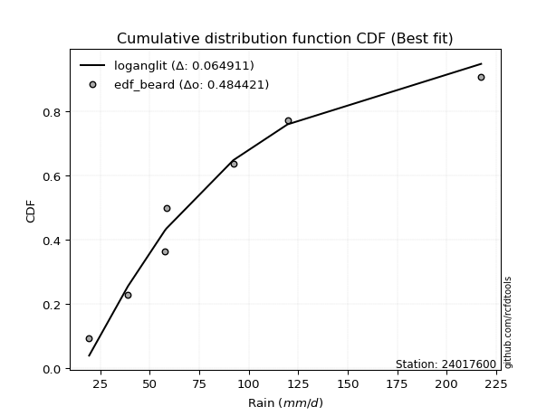</img>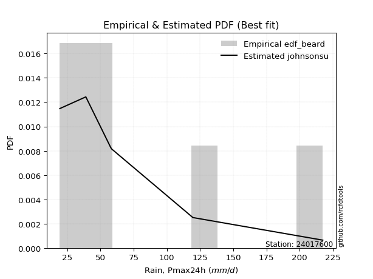</img>

</div>


### 5. Empirical - EDF Chegodayev (1955)

The Chegodayev formula is an empirical plotting position formula used in hydrological frequency analysis to estimate the exceedance probability or return period of a specific event from a set of observed data. It is primarily used for plotting observed data points on probability paper to fit a theoretical distribution, particularly for analyzing extreme events like maximum flood flows or rainfall intensities. The constant _b_ value in the generalized plotting position formula is 0.3.

<div align="center">


$P=(m-b)/(n+1-2b)$


</div>


**5.1. Empirical values**

<div align="center">

|                | 0                   | 1                   | 2                   | 3              | 4                  | 5                  | 6                  |
|:---------------|:--------------------|:--------------------|:--------------------|:---------------|:-------------------|:-------------------|:-------------------|
| date           | 2023                | 2019                | 2020                | 2022           | 2025               | 2024               | 2021               |
| x              | 19.4                | 39.0                | 57.6                | 58.4           | 87.4               | 119.6              | 217.4              |
| m              | 1                   | 2                   | 3                   | 4              | 5                  | 6                  | 7                  |
| empirical_dist | edf_chegodayev      | edf_chegodayev      | edf_chegodayev      | edf_chegodayev | edf_chegodayev     | edf_chegodayev     | edf_chegodayev     |
| empirical      | 0.09459459459459459 | 0.22972972972972971 | 0.36486486486486486 | 0.5            | 0.6351351351351351 | 0.7702702702702703 | 0.9054054054054054 |
| empirical_tr   | 1.1044776119402986  | 1.2982456140350878  | 1.574468085106383   | 2.0            | 2.7407407407407405 | 4.352941176470589  | 10.571428571428568 |

</div>


**5.2. Kolmogorov-Smirnov fit test (sorted by Δ)**


<div align="center">

|                | 0                   | 1                   | 2                   | 3                   | 4                   | 5                   | 6                   | 7                   | 8                   | 9                   | 10                  | 11                  | 12                  | 13                  | 14                  | 15                  | 16                  | 17                  | 18                  | 19                  | 20                    | 21                  | 22                  | 23                  | 24                  | 25                  | 26                  | 27                  | 28                  | 29                  | 30                  | 31                  | 32                  | 33                  | 34                  | 35                  | 36                  | 37                  | 38                  | 39                  | 40                  | 41                  | 42                  | 43                  | 44                  | 45                  | 46                  | 47                  | 48                  | 49                  | 50                  | 51                  | 52                  | 53                  | 54                  | 55                  | 56                  | 57                  | 58                  | 59                  | 60                  | 61                  | 62                  | 63                  | 64                  | 65                  | 66                  | 67                  | 68                  | 69                  | 70                  | 71                  | 72                  | 73                  | 74                  | 75                  | 76                  | 77                  | 78                  | 79                  | 80                  | 81                  | 82                  | 83                  | 84                  | 85                  | 86                  | 87                  | 88                  | 89                  |
|:---------------|:--------------------|:--------------------|:--------------------|:--------------------|:--------------------|:--------------------|:--------------------|:--------------------|:--------------------|:--------------------|:--------------------|:--------------------|:--------------------|:--------------------|:--------------------|:--------------------|:--------------------|:--------------------|:--------------------|:--------------------|:----------------------|:--------------------|:--------------------|:--------------------|:--------------------|:--------------------|:--------------------|:--------------------|:--------------------|:--------------------|:--------------------|:--------------------|:--------------------|:--------------------|:--------------------|:--------------------|:--------------------|:--------------------|:--------------------|:--------------------|:--------------------|:--------------------|:--------------------|:--------------------|:--------------------|:--------------------|:--------------------|:--------------------|:--------------------|:--------------------|:--------------------|:--------------------|:--------------------|:--------------------|:--------------------|:--------------------|:--------------------|:--------------------|:--------------------|:--------------------|:--------------------|:--------------------|:--------------------|:--------------------|:--------------------|:--------------------|:--------------------|:--------------------|:--------------------|:--------------------|:--------------------|:--------------------|:--------------------|:--------------------|:--------------------|:--------------------|:--------------------|:--------------------|:--------------------|:--------------------|:--------------------|:--------------------|:--------------------|:--------------------|:--------------------|:--------------------|:--------------------|:--------------------|:--------------------|:--------------------|
| station        | 24017600            | 24017600            | 24017600            | 24017600            | 24017600            | 24017600            | 24017600            | 24017600            | 24017600            | 24017600            | 24017600            | 24017600            | 24017600            | 24017600            | 24017600            | 24017600            | 24017600            | 24017600            | 24017600            | 24017600            | 24017600              | 24017600            | 24017600            | 24017600            | 24017600            | 24017600            | 24017600            | 24017600            | 24017600            | 24017600            | 24017600            | 24017600            | 24017600            | 24017600            | 24017600            | 24017600            | 24017600            | 24017600            | 24017600            | 24017600            | 24017600            | 24017600            | 24017600            | 24017600            | 24017600            | 24017600            | 24017600            | 24017600            | 24017600            | 24017600            | 24017600            | 24017600            | 24017600            | 24017600            | 24017600            | 24017600            | 24017600            | 24017600            | 24017600            | 24017600            | 24017600            | 24017600            | 24017600            | 24017600            | 24017600            | 24017600            | 24017600            | 24017600            | 24017600            | 24017600            | 24017600            | 24017600            | 24017600            | 24017600            | 24017600            | 24017600            | 24017600            | 24017600            | 24017600            | 24017600            | 24017600            | 24017600            | 24017600            | 24017600            | 24017600            | 24017600            | 24017600            | 24017600            | 24017600            | 24017600            |
| empirical_dist | edf_chegodayev      | edf_chegodayev      | edf_chegodayev      | edf_chegodayev      | edf_chegodayev      | edf_chegodayev      | edf_chegodayev      | edf_chegodayev      | edf_chegodayev      | edf_chegodayev      | edf_chegodayev      | edf_chegodayev      | edf_chegodayev      | edf_chegodayev      | edf_chegodayev      | edf_chegodayev      | edf_chegodayev      | edf_chegodayev      | edf_chegodayev      | edf_chegodayev      | edf_chegodayev        | edf_chegodayev      | edf_chegodayev      | edf_chegodayev      | edf_chegodayev      | edf_chegodayev      | edf_chegodayev      | edf_chegodayev      | edf_chegodayev      | edf_chegodayev      | edf_chegodayev      | edf_chegodayev      | edf_chegodayev      | edf_chegodayev      | edf_chegodayev      | edf_chegodayev      | edf_chegodayev      | edf_chegodayev      | edf_chegodayev      | edf_chegodayev      | edf_chegodayev      | edf_chegodayev      | edf_chegodayev      | edf_chegodayev      | edf_chegodayev      | edf_chegodayev      | edf_chegodayev      | edf_chegodayev      | edf_chegodayev      | edf_chegodayev      | edf_chegodayev      | edf_chegodayev      | edf_chegodayev      | edf_chegodayev      | edf_chegodayev      | edf_chegodayev      | edf_chegodayev      | edf_chegodayev      | edf_chegodayev      | edf_chegodayev      | edf_chegodayev      | edf_chegodayev      | edf_chegodayev      | edf_chegodayev      | edf_chegodayev      | edf_chegodayev      | edf_chegodayev      | edf_chegodayev      | edf_chegodayev      | edf_chegodayev      | edf_chegodayev      | edf_chegodayev      | edf_chegodayev      | edf_chegodayev      | edf_chegodayev      | edf_chegodayev      | edf_chegodayev      | edf_chegodayev      | edf_chegodayev      | edf_chegodayev      | edf_chegodayev      | edf_chegodayev      | edf_chegodayev      | edf_chegodayev      | edf_chegodayev      | edf_chegodayev      | edf_chegodayev      | edf_chegodayev      | edf_chegodayev      | edf_chegodayev      |
| p_dist         | fisk                | logncf              | logbetaprime        | logweibull_min      | logerlang           | loggamma            | loggamma            | invgamma            | logfatiguelife      | johnsonsu           | logf                | invweibull          | invgauss            | lognct              | logt                | logexponnorm        | lognorm             | lognorm             | logcrystalball      | nct                 | loglaplace_asymmetric | loginvgamma         | logrice             | logpearson3         | mielke              | logjohnsonsu        | loggenlogistic      | logloggamma         | logalpha            | betaprime           | logfisk             | f                   | alpha               | fatiguelife         | loglogistic         | loginvgauss         | ncf                 | logmielke           | laplace_asymmetric  | loghypsecant        | halflogistic        | logmaxwell          | exponnorm           | halfnorm            | loggompertz         | genexpon            | expon               | nakagami            | t                   | lograyleigh         | gompertz            | moyal               | pearson3            | loglaplace          | loggumbel_r         | loginvweibull       | wald                | gumbel_r            | rayleigh            | genlogistic         | logkstwobign        | loghalfnorm         | maxwell             | loggumbel_l         | logmoyal            | loghalflogistic     | kstwobign           | weibull_min         | truncnorm           | norm                | crystalball         | loggenexpon         | logistic            | rice                | chi2                | gamma               | hypsecant           | logwald             | logtruncnorm        | logexpon            | gumbel_l            | loggibrat           | gibrat              | lognakagami         | laplace             | erlang              | logchi2             | pareto              | loglognorm          | logpareto           |
| delta          | 0.06483146254320532 | 0.06493887871652049 | 0.06600887961941404 | 0.06651511238819563 | 0.06828009004351793 | 0.06851909659206645 | 0.06851909659206645 | 0.06870199338562988 | 0.069337349647357   | 0.06984949341949781 | 0.06988909512472191 | 0.07012763315868287 | 0.07115549979203328 | 0.07141835641923189 | 0.07169112739628047 | 0.0716928377968577  | 0.07169320299986304 | 0.07169320299986304 | 0.07169447244042604 | 0.072161400629971   | 0.07254530629473821   | 0.07346860401875516 | 0.07372367146052566 | 0.07529497611266012 | 0.07579323103731156 | 0.07594091201155384 | 0.07628029774747835 | 0.07711677656845173 | 0.07781637792641893 | 0.07841854573367074 | 0.07900464159852555 | 0.08011454394008222 | 0.08015861685242925 | 0.08063366564591434 | 0.08120675426166196 | 0.08185260809315215 | 0.08440750489610749 | 0.0857309752563073  | 0.08790066108772299 | 0.08915422754021252 | 0.08994087137066648 | 0.0903182909442446  | 0.09355524175539616 | 0.09438017886048217 | 0.09459458931271383 | 0.09459459459405203 | 0.09459459459459459 | 0.09645471773674952 | 0.09938031061130703 | 0.1025130419704004  | 0.10692254876008583 | 0.11240838243100915 | 0.11250883231319275 | 0.11274682108008732 | 0.1192611871853389  | 0.11935103752834803 | 0.1221033112316815  | 0.12749370450682662 | 0.12781557792788562 | 0.13540478628128094 | 0.13696019099037243 | 0.13702807966286773 | 0.13957075433997246 | 0.14061726284067494 | 0.14345344358711604 | 0.15512793217589554 | 0.15634125934186743 | 0.16985998526777052 | 0.1701207391932904  | 0.17012075475680333 | 0.1701207629025393  | 0.18069590429842747 | 0.18965760402927828 | 0.19037794063537755 | 0.20057300095831626 | 0.2009912056624396  | 0.20442273868607702 | 0.20999425790398013 | 0.2155369608208051  | 0.2215088249494866  | 0.22671081659780917 | 0.22819679514059937 | 0.2297053764883602  | 0.22972822791070452 | 0.23172693964384433 | 0.25472007487870046 | 0.35228538387228914 | 0.3963011342111721  | 0.40950322021463725 | 0.42333094218611544 |
| deltao         | 0.48442053926100004 | 0.48442053926100004 | 0.48442053926100004 | 0.48442053926100004 | 0.48442053926100004 | 0.48442053926100004 | 0.48442053926100004 | 0.48442053926100004 | 0.48442053926100004 | 0.48442053926100004 | 0.48442053926100004 | 0.48442053926100004 | 0.48442053926100004 | 0.48442053926100004 | 0.48442053926100004 | 0.48442053926100004 | 0.48442053926100004 | 0.48442053926100004 | 0.48442053926100004 | 0.48442053926100004 | 0.48442053926100004   | 0.48442053926100004 | 0.48442053926100004 | 0.48442053926100004 | 0.48442053926100004 | 0.48442053926100004 | 0.48442053926100004 | 0.48442053926100004 | 0.48442053926100004 | 0.48442053926100004 | 0.48442053926100004 | 0.48442053926100004 | 0.48442053926100004 | 0.48442053926100004 | 0.48442053926100004 | 0.48442053926100004 | 0.48442053926100004 | 0.48442053926100004 | 0.48442053926100004 | 0.48442053926100004 | 0.48442053926100004 | 0.48442053926100004 | 0.48442053926100004 | 0.48442053926100004 | 0.48442053926100004 | 0.48442053926100004 | 0.48442053926100004 | 0.48442053926100004 | 0.48442053926100004 | 0.48442053926100004 | 0.48442053926100004 | 0.48442053926100004 | 0.48442053926100004 | 0.48442053926100004 | 0.48442053926100004 | 0.48442053926100004 | 0.48442053926100004 | 0.48442053926100004 | 0.48442053926100004 | 0.48442053926100004 | 0.48442053926100004 | 0.48442053926100004 | 0.48442053926100004 | 0.48442053926100004 | 0.48442053926100004 | 0.48442053926100004 | 0.48442053926100004 | 0.48442053926100004 | 0.48442053926100004 | 0.48442053926100004 | 0.48442053926100004 | 0.48442053926100004 | 0.48442053926100004 | 0.48442053926100004 | 0.48442053926100004 | 0.48442053926100004 | 0.48442053926100004 | 0.48442053926100004 | 0.48442053926100004 | 0.48442053926100004 | 0.48442053926100004 | 0.48442053926100004 | 0.48442053926100004 | 0.48442053926100004 | 0.48442053926100004 | 0.48442053926100004 | 0.48442053926100004 | 0.48442053926100004 | 0.48442053926100004 | 0.48442053926100004 |
| eval           | Δo > Δ              | Δo > Δ              | Δo > Δ              | Δo > Δ              | Δo > Δ              | Δo > Δ              | Δo > Δ              | Δo > Δ              | Δo > Δ              | Δo > Δ              | Δo > Δ              | Δo > Δ              | Δo > Δ              | Δo > Δ              | Δo > Δ              | Δo > Δ              | Δo > Δ              | Δo > Δ              | Δo > Δ              | Δo > Δ              | Δo > Δ                | Δo > Δ              | Δo > Δ              | Δo > Δ              | Δo > Δ              | Δo > Δ              | Δo > Δ              | Δo > Δ              | Δo > Δ              | Δo > Δ              | Δo > Δ              | Δo > Δ              | Δo > Δ              | Δo > Δ              | Δo > Δ              | Δo > Δ              | Δo > Δ              | Δo > Δ              | Δo > Δ              | Δo > Δ              | Δo > Δ              | Δo > Δ              | Δo > Δ              | Δo > Δ              | Δo > Δ              | Δo > Δ              | Δo > Δ              | Δo > Δ              | Δo > Δ              | Δo > Δ              | Δo > Δ              | Δo > Δ              | Δo > Δ              | Δo > Δ              | Δo > Δ              | Δo > Δ              | Δo > Δ              | Δo > Δ              | Δo > Δ              | Δo > Δ              | Δo > Δ              | Δo > Δ              | Δo > Δ              | Δo > Δ              | Δo > Δ              | Δo > Δ              | Δo > Δ              | Δo > Δ              | Δo > Δ              | Δo > Δ              | Δo > Δ              | Δo > Δ              | Δo > Δ              | Δo > Δ              | Δo > Δ              | Δo > Δ              | Δo > Δ              | Δo > Δ              | Δo > Δ              | Δo > Δ              | Δo > Δ              | Δo > Δ              | Δo > Δ              | Δo > Δ              | Δo > Δ              | Δo > Δ              | Δo > Δ              | Δo > Δ              | Δo > Δ              | Δo > Δ              |
| fit            | 1                   | 1                   | 1                   | 1                   | 1                   | 1                   | 1                   | 1                   | 1                   | 1                   | 1                   | 1                   | 1                   | 1                   | 1                   | 1                   | 1                   | 1                   | 1                   | 1                   | 1                     | 1                   | 1                   | 1                   | 1                   | 1                   | 1                   | 1                   | 1                   | 1                   | 1                   | 1                   | 1                   | 1                   | 1                   | 1                   | 1                   | 1                   | 1                   | 1                   | 1                   | 1                   | 1                   | 1                   | 1                   | 1                   | 1                   | 1                   | 1                   | 1                   | 1                   | 1                   | 1                   | 1                   | 1                   | 1                   | 1                   | 1                   | 1                   | 1                   | 1                   | 1                   | 1                   | 1                   | 1                   | 1                   | 1                   | 1                   | 1                   | 1                   | 1                   | 1                   | 1                   | 1                   | 1                   | 1                   | 1                   | 1                   | 1                   | 1                   | 1                   | 1                   | 1                   | 1                   | 1                   | 1                   | 1                   | 1                   | 1                   | 1                   |
| n              | 7                   | 7                   | 7                   | 7                   | 7                   | 7                   | 7                   | 7                   | 7                   | 7                   | 7                   | 7                   | 7                   | 7                   | 7                   | 7                   | 7                   | 7                   | 7                   | 7                   | 7                     | 7                   | 7                   | 7                   | 7                   | 7                   | 7                   | 7                   | 7                   | 7                   | 7                   | 7                   | 7                   | 7                   | 7                   | 7                   | 7                   | 7                   | 7                   | 7                   | 7                   | 7                   | 7                   | 7                   | 7                   | 7                   | 7                   | 7                   | 7                   | 7                   | 7                   | 7                   | 7                   | 7                   | 7                   | 7                   | 7                   | 7                   | 7                   | 7                   | 7                   | 7                   | 7                   | 7                   | 7                   | 7                   | 7                   | 7                   | 7                   | 7                   | 7                   | 7                   | 7                   | 7                   | 7                   | 7                   | 7                   | 7                   | 7                   | 7                   | 7                   | 7                   | 7                   | 7                   | 7                   | 7                   | 7                   | 7                   | 7                   | 7                   |
| best_fit       | 1                   | 0                   | 0                   | 0                   | 0                   | 0                   | 0                   | 0                   | 0                   | 0                   | 0                   | 0                   | 0                   | 0                   | 0                   | 0                   | 0                   | 0                   | 0                   | 0                   | 0                     | 0                   | 0                   | 0                   | 0                   | 0                   | 0                   | 0                   | 0                   | 0                   | 0                   | 0                   | 0                   | 0                   | 0                   | 0                   | 0                   | 0                   | 0                   | 0                   | 0                   | 0                   | 0                   | 0                   | 0                   | 0                   | 0                   | 0                   | 0                   | 0                   | 0                   | 0                   | 0                   | 0                   | 0                   | 0                   | 0                   | 0                   | 0                   | 0                   | 0                   | 0                   | 0                   | 0                   | 0                   | 0                   | 0                   | 0                   | 0                   | 0                   | 0                   | 0                   | 0                   | 0                   | 0                   | 0                   | 0                   | 0                   | 0                   | 0                   | 0                   | 0                   | 0                   | 0                   | 0                   | 0                   | 0                   | 0                   | 0                   | 0                   |
| best_fit_sort  | 1                   | 2                   | 3                   | 4                   | 5                   | 6                   | 7                   | 8                   | 9                   | 10                  | 11                  | 12                  | 13                  | 14                  | 15                  | 16                  | 17                  | 18                  | 19                  | 20                  | 21                    | 22                  | 23                  | 24                  | 25                  | 26                  | 27                  | 28                  | 29                  | 30                  | 31                  | 32                  | 33                  | 34                  | 35                  | 36                  | 37                  | 38                  | 39                  | 40                  | 41                  | 42                  | 43                  | 44                  | 45                  | 46                  | 47                  | 48                  | 49                  | 50                  | 51                  | 52                  | 53                  | 54                  | 55                  | 56                  | 57                  | 58                  | 59                  | 60                  | 61                  | 62                  | 63                  | 64                  | 65                  | 66                  | 67                  | 68                  | 69                  | 70                  | 71                  | 72                  | 73                  | 74                  | 75                  | 76                  | 77                  | 78                  | 79                  | 80                  | 81                  | 82                  | 83                  | 84                  | 85                  | 86                  | 87                  | 88                  | 89                  | 90                  |

</div>


<div align="center">

</img>

</div>


**5.3. Best fit**

<div align="center">

|   id |   station | empirical_dist   | p_dist   |     delta |   deltao | eval   |   fit |   n |   best_fit |   best_fit_sort |
|-----:|----------:|:-----------------|:---------|----------:|---------:|:-------|------:|----:|-----------:|----------------:|
|    0 |  24017600 | edf_chegodayev   | fisk     | 0.0648315 | 0.484421 | Δo > Δ |     1 |   7 |          1 |               1 |

</div>


<div align="center">

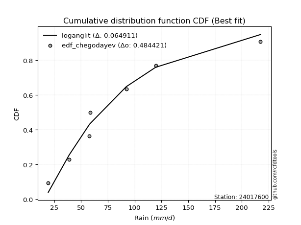</img></img>

</div>


### 6. Empirical - EDF Blom (1958)

The Blom formula is a specific "plotting position" formula used in hydrology and statistical analysis to estimate the empirical cumulative probability (or non-exceedance probability) of a data series. It is particularly recommended for data that are approximately normally distributed. The constant _a_ is set to 0.375 (or 3/8).

<div align="center">


$P=(m-a)/(n+1-2a)$


</div>


**6.1. Empirical values**

<div align="center">

|                | 0                   | 1                   | 2                  | 3        | 4                  | 5                  | 6                  |
|:---------------|:--------------------|:--------------------|:-------------------|:---------|:-------------------|:-------------------|:-------------------|
| date           | 2023                | 2019                | 2020               | 2022     | 2025               | 2024               | 2021               |
| x              | 19.4                | 39.0                | 57.6               | 58.4     | 87.4               | 119.6              | 217.4              |
| m              | 1                   | 2                   | 3                  | 4        | 5                  | 6                  | 7                  |
| empirical_dist | edf_blom            | edf_blom            | edf_blom           | edf_blom | edf_blom           | edf_blom           | edf_blom           |
| empirical      | 0.08620689655172414 | 0.22413793103448276 | 0.3620689655172414 | 0.5      | 0.6379310344827587 | 0.7758620689655172 | 0.9137931034482759 |
| empirical_tr   | 1.0943396226415094  | 1.288888888888889   | 1.5675675675675675 | 2.0      | 2.7619047619047623 | 4.461538461538462  | 11.600000000000007 |

</div>


**6.2. Kolmogorov-Smirnov fit test (sorted by Δ)**


<div align="center">

|                | 0                   | 1                   | 2                   | 3                   | 4                   | 5                   | 6                   | 7                   | 8                   | 9                     | 10                  | 11                  | 12                  | 13                  | 14                  | 15                  | 16                  | 17                  | 18                  | 19                  | 20                  | 21                  | 22                  | 23                  | 24                  | 25                  | 26                  | 27                  | 28                  | 29                  | 30                  | 31                  | 32                  | 33                  | 34                  | 35                  | 36                  | 37                  | 38                  | 39                  | 40                  | 41                  | 42                  | 43                  | 44                  | 45                  | 46                  | 47                  | 48                  | 49                  | 50                  | 51                  | 52                  | 53                  | 54                  | 55                  | 56                  | 57                  | 58                  | 59                  | 60                  | 61                  | 62                  | 63                  | 64                  | 65                  | 66                  | 67                  | 68                  | 69                  | 70                  | 71                  | 72                  | 73                  | 74                  | 75                  | 76                  | 77                  | 78                  | 79                  | 80                  | 81                  | 82                  | 83                  | 84                  | 85                  | 86                  | 87                  | 88                  | 89                  |
|:---------------|:--------------------|:--------------------|:--------------------|:--------------------|:--------------------|:--------------------|:--------------------|:--------------------|:--------------------|:----------------------|:--------------------|:--------------------|:--------------------|:--------------------|:--------------------|:--------------------|:--------------------|:--------------------|:--------------------|:--------------------|:--------------------|:--------------------|:--------------------|:--------------------|:--------------------|:--------------------|:--------------------|:--------------------|:--------------------|:--------------------|:--------------------|:--------------------|:--------------------|:--------------------|:--------------------|:--------------------|:--------------------|:--------------------|:--------------------|:--------------------|:--------------------|:--------------------|:--------------------|:--------------------|:--------------------|:--------------------|:--------------------|:--------------------|:--------------------|:--------------------|:--------------------|:--------------------|:--------------------|:--------------------|:--------------------|:--------------------|:--------------------|:--------------------|:--------------------|:--------------------|:--------------------|:--------------------|:--------------------|:--------------------|:--------------------|:--------------------|:--------------------|:--------------------|:--------------------|:--------------------|:--------------------|:--------------------|:--------------------|:--------------------|:--------------------|:--------------------|:--------------------|:--------------------|:--------------------|:--------------------|:--------------------|:--------------------|:--------------------|:--------------------|:--------------------|:--------------------|:--------------------|:--------------------|:--------------------|:--------------------|
| station        | 24017600            | 24017600            | 24017600            | 24017600            | 24017600            | 24017600            | 24017600            | 24017600            | 24017600            | 24017600              | 24017600            | 24017600            | 24017600            | 24017600            | 24017600            | 24017600            | 24017600            | 24017600            | 24017600            | 24017600            | 24017600            | 24017600            | 24017600            | 24017600            | 24017600            | 24017600            | 24017600            | 24017600            | 24017600            | 24017600            | 24017600            | 24017600            | 24017600            | 24017600            | 24017600            | 24017600            | 24017600            | 24017600            | 24017600            | 24017600            | 24017600            | 24017600            | 24017600            | 24017600            | 24017600            | 24017600            | 24017600            | 24017600            | 24017600            | 24017600            | 24017600            | 24017600            | 24017600            | 24017600            | 24017600            | 24017600            | 24017600            | 24017600            | 24017600            | 24017600            | 24017600            | 24017600            | 24017600            | 24017600            | 24017600            | 24017600            | 24017600            | 24017600            | 24017600            | 24017600            | 24017600            | 24017600            | 24017600            | 24017600            | 24017600            | 24017600            | 24017600            | 24017600            | 24017600            | 24017600            | 24017600            | 24017600            | 24017600            | 24017600            | 24017600            | 24017600            | 24017600            | 24017600            | 24017600            | 24017600            |
| empirical_dist | edf_blom            | edf_blom            | edf_blom            | edf_blom            | edf_blom            | edf_blom            | edf_blom            | edf_blom            | edf_blom            | edf_blom              | edf_blom            | edf_blom            | edf_blom            | edf_blom            | edf_blom            | edf_blom            | edf_blom            | edf_blom            | edf_blom            | edf_blom            | edf_blom            | edf_blom            | edf_blom            | edf_blom            | edf_blom            | edf_blom            | edf_blom            | edf_blom            | edf_blom            | edf_blom            | edf_blom            | edf_blom            | edf_blom            | edf_blom            | edf_blom            | edf_blom            | edf_blom            | edf_blom            | edf_blom            | edf_blom            | edf_blom            | edf_blom            | edf_blom            | edf_blom            | edf_blom            | edf_blom            | edf_blom            | edf_blom            | edf_blom            | edf_blom            | edf_blom            | edf_blom            | edf_blom            | edf_blom            | edf_blom            | edf_blom            | edf_blom            | edf_blom            | edf_blom            | edf_blom            | edf_blom            | edf_blom            | edf_blom            | edf_blom            | edf_blom            | edf_blom            | edf_blom            | edf_blom            | edf_blom            | edf_blom            | edf_blom            | edf_blom            | edf_blom            | edf_blom            | edf_blom            | edf_blom            | edf_blom            | edf_blom            | edf_blom            | edf_blom            | edf_blom            | edf_blom            | edf_blom            | edf_blom            | edf_blom            | edf_blom            | edf_blom            | edf_blom            | edf_blom            | edf_blom            |
| p_dist         | logncf              | logweibull_min      | fisk                | logerlang           | loggamma            | loggamma            | invgamma            | logbetaprime        | logfatiguelife      | loglaplace_asymmetric | logf                | invweibull          | lognct              | logt                | logexponnorm        | lognorm             | lognorm             | logcrystalball      | nct                 | johnsonsu           | invgauss            | logpearson3         | mielke              | logjohnsonsu        | loginvgamma         | loggenlogistic      | logrice             | logloggamma         | betaprime           | logfisk             | f                   | alpha               | logalpha            | loglogistic         | fatiguelife         | ncf                 | loginvgauss         | exponnorm           | logmielke           | loggompertz         | genexpon            | expon               | laplace_asymmetric  | loghypsecant        | halflogistic        | logmaxwell          | halfnorm            | nakagami            | t                   | lograyleigh         | gompertz            | moyal               | pearson3            | loglaplace          | wald                | loggumbel_r         | loginvweibull       | gumbel_r            | rayleigh            | genlogistic         | maxwell             | logkstwobign        | loghalfnorm         | loggumbel_l         | logmoyal            | kstwobign           | loghalflogistic     | truncnorm           | norm                | crystalball         | weibull_min         | loggenexpon         | logistic            | rice                | chi2                | gamma               | hypsecant           | logtruncnorm        | logwald             | loggibrat           | gibrat              | logexpon            | gumbel_l            | lognakagami         | laplace             | erlang              | logchi2             | pareto              | loglognorm          | logpareto           |
| delta          | 0.06552175090341816 | 0.06651511238819563 | 0.0676273618908288  | 0.06828009004351793 | 0.06851909659206645 | 0.06851909659206645 | 0.06870199338562988 | 0.06880477896703752 | 0.069337349647357   | 0.06974940694711462   | 0.06988909512472191 | 0.07012763315868287 | 0.07141835641923189 | 0.07169112739628047 | 0.0716928377968577  | 0.07169320299986304 | 0.07169320299986304 | 0.07169447244042604 | 0.072161400629971   | 0.07264539276712129 | 0.07395139913965676 | 0.07529497611266012 | 0.07579323103731156 | 0.07594091201155384 | 0.07626450336637863 | 0.07628029774747835 | 0.07651957080814914 | 0.07711677656845173 | 0.07841854573367074 | 0.07900464159852555 | 0.08011454394008222 | 0.08015861685242925 | 0.08061227727404241 | 0.08120675426166196 | 0.08342956499353782 | 0.08440750489610749 | 0.08464850744077562 | 0.08516754371252572 | 0.0857309752563073  | 0.08620689126984339 | 0.08620689655118159 | 0.08620689655172414 | 0.08790066108772299 | 0.08915422754021252 | 0.08994087137066648 | 0.09311419029186807 | 0.09438017886048217 | 0.09645471773674952 | 0.098419180147271   | 0.10530894131802387 | 0.10692254876008583 | 0.11240838243100915 | 0.11250883231319275 | 0.11274682108008732 | 0.11651151253643455 | 0.12205708653296238 | 0.1221469368759715  | 0.12749370450682662 | 0.12781557792788562 | 0.13540478628128094 | 0.13957075433997246 | 0.1397560903379959  | 0.1398239790104912  | 0.14061726284067494 | 0.1462493429347395  | 0.15634125934186743 | 0.15792383152351902 | 0.1701207391932904  | 0.17012075475680333 | 0.1701207629025393  | 0.172655884615394   | 0.18349180364605094 | 0.18965760402927828 | 0.19037794063537755 | 0.20336890030593974 | 0.20378710501006309 | 0.20442273868607702 | 0.20994516212555814 | 0.2127901572516036  | 0.22260499644535242 | 0.22411357779311325 | 0.22430472429711007 | 0.22671081659780917 | 0.231168666343115   | 0.23172693964384433 | 0.25751597422632394 | 0.3578771825675361  | 0.40189293290641903 | 0.4150950189098842  | 0.4289227408813624  |
| deltao         | 0.48442053926100004 | 0.48442053926100004 | 0.48442053926100004 | 0.48442053926100004 | 0.48442053926100004 | 0.48442053926100004 | 0.48442053926100004 | 0.48442053926100004 | 0.48442053926100004 | 0.48442053926100004   | 0.48442053926100004 | 0.48442053926100004 | 0.48442053926100004 | 0.48442053926100004 | 0.48442053926100004 | 0.48442053926100004 | 0.48442053926100004 | 0.48442053926100004 | 0.48442053926100004 | 0.48442053926100004 | 0.48442053926100004 | 0.48442053926100004 | 0.48442053926100004 | 0.48442053926100004 | 0.48442053926100004 | 0.48442053926100004 | 0.48442053926100004 | 0.48442053926100004 | 0.48442053926100004 | 0.48442053926100004 | 0.48442053926100004 | 0.48442053926100004 | 0.48442053926100004 | 0.48442053926100004 | 0.48442053926100004 | 0.48442053926100004 | 0.48442053926100004 | 0.48442053926100004 | 0.48442053926100004 | 0.48442053926100004 | 0.48442053926100004 | 0.48442053926100004 | 0.48442053926100004 | 0.48442053926100004 | 0.48442053926100004 | 0.48442053926100004 | 0.48442053926100004 | 0.48442053926100004 | 0.48442053926100004 | 0.48442053926100004 | 0.48442053926100004 | 0.48442053926100004 | 0.48442053926100004 | 0.48442053926100004 | 0.48442053926100004 | 0.48442053926100004 | 0.48442053926100004 | 0.48442053926100004 | 0.48442053926100004 | 0.48442053926100004 | 0.48442053926100004 | 0.48442053926100004 | 0.48442053926100004 | 0.48442053926100004 | 0.48442053926100004 | 0.48442053926100004 | 0.48442053926100004 | 0.48442053926100004 | 0.48442053926100004 | 0.48442053926100004 | 0.48442053926100004 | 0.48442053926100004 | 0.48442053926100004 | 0.48442053926100004 | 0.48442053926100004 | 0.48442053926100004 | 0.48442053926100004 | 0.48442053926100004 | 0.48442053926100004 | 0.48442053926100004 | 0.48442053926100004 | 0.48442053926100004 | 0.48442053926100004 | 0.48442053926100004 | 0.48442053926100004 | 0.48442053926100004 | 0.48442053926100004 | 0.48442053926100004 | 0.48442053926100004 | 0.48442053926100004 |
| eval           | Δo > Δ              | Δo > Δ              | Δo > Δ              | Δo > Δ              | Δo > Δ              | Δo > Δ              | Δo > Δ              | Δo > Δ              | Δo > Δ              | Δo > Δ                | Δo > Δ              | Δo > Δ              | Δo > Δ              | Δo > Δ              | Δo > Δ              | Δo > Δ              | Δo > Δ              | Δo > Δ              | Δo > Δ              | Δo > Δ              | Δo > Δ              | Δo > Δ              | Δo > Δ              | Δo > Δ              | Δo > Δ              | Δo > Δ              | Δo > Δ              | Δo > Δ              | Δo > Δ              | Δo > Δ              | Δo > Δ              | Δo > Δ              | Δo > Δ              | Δo > Δ              | Δo > Δ              | Δo > Δ              | Δo > Δ              | Δo > Δ              | Δo > Δ              | Δo > Δ              | Δo > Δ              | Δo > Δ              | Δo > Δ              | Δo > Δ              | Δo > Δ              | Δo > Δ              | Δo > Δ              | Δo > Δ              | Δo > Δ              | Δo > Δ              | Δo > Δ              | Δo > Δ              | Δo > Δ              | Δo > Δ              | Δo > Δ              | Δo > Δ              | Δo > Δ              | Δo > Δ              | Δo > Δ              | Δo > Δ              | Δo > Δ              | Δo > Δ              | Δo > Δ              | Δo > Δ              | Δo > Δ              | Δo > Δ              | Δo > Δ              | Δo > Δ              | Δo > Δ              | Δo > Δ              | Δo > Δ              | Δo > Δ              | Δo > Δ              | Δo > Δ              | Δo > Δ              | Δo > Δ              | Δo > Δ              | Δo > Δ              | Δo > Δ              | Δo > Δ              | Δo > Δ              | Δo > Δ              | Δo > Δ              | Δo > Δ              | Δo > Δ              | Δo > Δ              | Δo > Δ              | Δo > Δ              | Δo > Δ              | Δo > Δ              |
| fit            | 1                   | 1                   | 1                   | 1                   | 1                   | 1                   | 1                   | 1                   | 1                   | 1                     | 1                   | 1                   | 1                   | 1                   | 1                   | 1                   | 1                   | 1                   | 1                   | 1                   | 1                   | 1                   | 1                   | 1                   | 1                   | 1                   | 1                   | 1                   | 1                   | 1                   | 1                   | 1                   | 1                   | 1                   | 1                   | 1                   | 1                   | 1                   | 1                   | 1                   | 1                   | 1                   | 1                   | 1                   | 1                   | 1                   | 1                   | 1                   | 1                   | 1                   | 1                   | 1                   | 1                   | 1                   | 1                   | 1                   | 1                   | 1                   | 1                   | 1                   | 1                   | 1                   | 1                   | 1                   | 1                   | 1                   | 1                   | 1                   | 1                   | 1                   | 1                   | 1                   | 1                   | 1                   | 1                   | 1                   | 1                   | 1                   | 1                   | 1                   | 1                   | 1                   | 1                   | 1                   | 1                   | 1                   | 1                   | 1                   | 1                   | 1                   |
| n              | 7                   | 7                   | 7                   | 7                   | 7                   | 7                   | 7                   | 7                   | 7                   | 7                     | 7                   | 7                   | 7                   | 7                   | 7                   | 7                   | 7                   | 7                   | 7                   | 7                   | 7                   | 7                   | 7                   | 7                   | 7                   | 7                   | 7                   | 7                   | 7                   | 7                   | 7                   | 7                   | 7                   | 7                   | 7                   | 7                   | 7                   | 7                   | 7                   | 7                   | 7                   | 7                   | 7                   | 7                   | 7                   | 7                   | 7                   | 7                   | 7                   | 7                   | 7                   | 7                   | 7                   | 7                   | 7                   | 7                   | 7                   | 7                   | 7                   | 7                   | 7                   | 7                   | 7                   | 7                   | 7                   | 7                   | 7                   | 7                   | 7                   | 7                   | 7                   | 7                   | 7                   | 7                   | 7                   | 7                   | 7                   | 7                   | 7                   | 7                   | 7                   | 7                   | 7                   | 7                   | 7                   | 7                   | 7                   | 7                   | 7                   | 7                   |
| best_fit       | 1                   | 0                   | 0                   | 0                   | 0                   | 0                   | 0                   | 0                   | 0                   | 0                     | 0                   | 0                   | 0                   | 0                   | 0                   | 0                   | 0                   | 0                   | 0                   | 0                   | 0                   | 0                   | 0                   | 0                   | 0                   | 0                   | 0                   | 0                   | 0                   | 0                   | 0                   | 0                   | 0                   | 0                   | 0                   | 0                   | 0                   | 0                   | 0                   | 0                   | 0                   | 0                   | 0                   | 0                   | 0                   | 0                   | 0                   | 0                   | 0                   | 0                   | 0                   | 0                   | 0                   | 0                   | 0                   | 0                   | 0                   | 0                   | 0                   | 0                   | 0                   | 0                   | 0                   | 0                   | 0                   | 0                   | 0                   | 0                   | 0                   | 0                   | 0                   | 0                   | 0                   | 0                   | 0                   | 0                   | 0                   | 0                   | 0                   | 0                   | 0                   | 0                   | 0                   | 0                   | 0                   | 0                   | 0                   | 0                   | 0                   | 0                   |
| best_fit_sort  | 1                   | 2                   | 3                   | 4                   | 5                   | 6                   | 7                   | 8                   | 9                   | 10                    | 11                  | 12                  | 13                  | 14                  | 15                  | 16                  | 17                  | 18                  | 19                  | 20                  | 21                  | 22                  | 23                  | 24                  | 25                  | 26                  | 27                  | 28                  | 29                  | 30                  | 31                  | 32                  | 33                  | 34                  | 35                  | 36                  | 37                  | 38                  | 39                  | 40                  | 41                  | 42                  | 43                  | 44                  | 45                  | 46                  | 47                  | 48                  | 49                  | 50                  | 51                  | 52                  | 53                  | 54                  | 55                  | 56                  | 57                  | 58                  | 59                  | 60                  | 61                  | 62                  | 63                  | 64                  | 65                  | 66                  | 67                  | 68                  | 69                  | 70                  | 71                  | 72                  | 73                  | 74                  | 75                  | 76                  | 77                  | 78                  | 79                  | 80                  | 81                  | 82                  | 83                  | 84                  | 85                  | 86                  | 87                  | 88                  | 89                  | 90                  |

</div>


<div align="center">

</img>

</div>


**6.3. Best fit**

<div align="center">

|   id |   station | empirical_dist   | p_dist   |     delta |   deltao | eval   |   fit |   n |   best_fit |   best_fit_sort |
|-----:|----------:|:-----------------|:---------|----------:|---------:|:-------|------:|----:|-----------:|----------------:|
|    0 |  24017600 | edf_blom         | logncf   | 0.0655218 | 0.484421 | Δo > Δ |     1 |   7 |          1 |               1 |

</div>


<div align="center">

</img>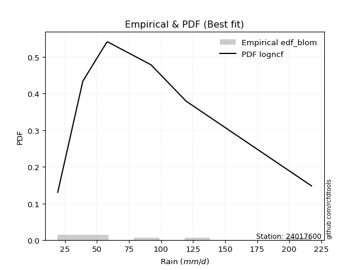</img>

</div>


### 7. Empirical - EDF Tukey (1962)

In hydrology, the Tukey formula is used as a plotting position formula to estimate the empirical probability or frequency of a flood event (or other hydrological data). The formula parameter is given as _c=0.333_ (or 1/3).

<div align="center">


$P=(m-c)/(n+1-2c)$


</div>


**7.1. Empirical values**

<div align="center">

|                | 0                   | 1                   | 2                   | 3         | 4                  | 5                  | 6                  |
|:---------------|:--------------------|:--------------------|:--------------------|:----------|:-------------------|:-------------------|:-------------------|
| date           | 2023                | 2019                | 2020                | 2022      | 2025               | 2024               | 2021               |
| x              | 19.4                | 39.0                | 57.6                | 58.4      | 87.4               | 119.6              | 217.4              |
| m              | 1                   | 2                   | 3                   | 4         | 5                  | 6                  | 7                  |
| empirical_dist | edf_tukey           | edf_tukey           | edf_tukey           | edf_tukey | edf_tukey          | edf_tukey          | edf_tukey          |
| empirical      | 0.09090909090909091 | 0.22727272727272727 | 0.36363636363636365 | 0.5       | 0.6363636363636364 | 0.7727272727272727 | 0.9090909090909091 |
| empirical_tr   | 1.1                 | 1.2941176470588236  | 1.5714285714285714  | 2.0       | 2.75               | 4.3999999999999995 | 10.999999999999996 |

</div>


**7.2. Kolmogorov-Smirnov fit test (sorted by Δ)**


<div align="center">

|                | 0                   | 1                   | 2                   | 3                   | 4                   | 5                   | 6                   | 7                   | 8                   | 9                   | 10                  | 11                  | 12                    | 13                  | 14                  | 15                  | 16                  | 17                  | 18                  | 19                  | 20                  | 21                  | 22                  | 23                  | 24                  | 25                  | 26                  | 27                  | 28                  | 29                  | 30                  | 31                  | 32                  | 33                  | 34                  | 35                  | 36                  | 37                  | 38                  | 39                  | 40                  | 41                  | 42                  | 43                  | 44                  | 45                  | 46                  | 47                  | 48                  | 49                  | 50                  | 51                  | 52                  | 53                  | 54                  | 55                  | 56                  | 57                  | 58                  | 59                  | 60                  | 61                  | 62                  | 63                  | 64                  | 65                  | 66                  | 67                  | 68                  | 69                  | 70                  | 71                  | 72                  | 73                  | 74                  | 75                  | 76                  | 77                  | 78                  | 79                  | 80                  | 81                  | 82                  | 83                  | 84                  | 85                  | 86                  | 87                  | 88                  | 89                  |
|:---------------|:--------------------|:--------------------|:--------------------|:--------------------|:--------------------|:--------------------|:--------------------|:--------------------|:--------------------|:--------------------|:--------------------|:--------------------|:----------------------|:--------------------|:--------------------|:--------------------|:--------------------|:--------------------|:--------------------|:--------------------|:--------------------|:--------------------|:--------------------|:--------------------|:--------------------|:--------------------|:--------------------|:--------------------|:--------------------|:--------------------|:--------------------|:--------------------|:--------------------|:--------------------|:--------------------|:--------------------|:--------------------|:--------------------|:--------------------|:--------------------|:--------------------|:--------------------|:--------------------|:--------------------|:--------------------|:--------------------|:--------------------|:--------------------|:--------------------|:--------------------|:--------------------|:--------------------|:--------------------|:--------------------|:--------------------|:--------------------|:--------------------|:--------------------|:--------------------|:--------------------|:--------------------|:--------------------|:--------------------|:--------------------|:--------------------|:--------------------|:--------------------|:--------------------|:--------------------|:--------------------|:--------------------|:--------------------|:--------------------|:--------------------|:--------------------|:--------------------|:--------------------|:--------------------|:--------------------|:--------------------|:--------------------|:--------------------|:--------------------|:--------------------|:--------------------|:--------------------|:--------------------|:--------------------|:--------------------|:--------------------|
| station        | 24017600            | 24017600            | 24017600            | 24017600            | 24017600            | 24017600            | 24017600            | 24017600            | 24017600            | 24017600            | 24017600            | 24017600            | 24017600              | 24017600            | 24017600            | 24017600            | 24017600            | 24017600            | 24017600            | 24017600            | 24017600            | 24017600            | 24017600            | 24017600            | 24017600            | 24017600            | 24017600            | 24017600            | 24017600            | 24017600            | 24017600            | 24017600            | 24017600            | 24017600            | 24017600            | 24017600            | 24017600            | 24017600            | 24017600            | 24017600            | 24017600            | 24017600            | 24017600            | 24017600            | 24017600            | 24017600            | 24017600            | 24017600            | 24017600            | 24017600            | 24017600            | 24017600            | 24017600            | 24017600            | 24017600            | 24017600            | 24017600            | 24017600            | 24017600            | 24017600            | 24017600            | 24017600            | 24017600            | 24017600            | 24017600            | 24017600            | 24017600            | 24017600            | 24017600            | 24017600            | 24017600            | 24017600            | 24017600            | 24017600            | 24017600            | 24017600            | 24017600            | 24017600            | 24017600            | 24017600            | 24017600            | 24017600            | 24017600            | 24017600            | 24017600            | 24017600            | 24017600            | 24017600            | 24017600            | 24017600            |
| empirical_dist | edf_tukey           | edf_tukey           | edf_tukey           | edf_tukey           | edf_tukey           | edf_tukey           | edf_tukey           | edf_tukey           | edf_tukey           | edf_tukey           | edf_tukey           | edf_tukey           | edf_tukey             | edf_tukey           | edf_tukey           | edf_tukey           | edf_tukey           | edf_tukey           | edf_tukey           | edf_tukey           | edf_tukey           | edf_tukey           | edf_tukey           | edf_tukey           | edf_tukey           | edf_tukey           | edf_tukey           | edf_tukey           | edf_tukey           | edf_tukey           | edf_tukey           | edf_tukey           | edf_tukey           | edf_tukey           | edf_tukey           | edf_tukey           | edf_tukey           | edf_tukey           | edf_tukey           | edf_tukey           | edf_tukey           | edf_tukey           | edf_tukey           | edf_tukey           | edf_tukey           | edf_tukey           | edf_tukey           | edf_tukey           | edf_tukey           | edf_tukey           | edf_tukey           | edf_tukey           | edf_tukey           | edf_tukey           | edf_tukey           | edf_tukey           | edf_tukey           | edf_tukey           | edf_tukey           | edf_tukey           | edf_tukey           | edf_tukey           | edf_tukey           | edf_tukey           | edf_tukey           | edf_tukey           | edf_tukey           | edf_tukey           | edf_tukey           | edf_tukey           | edf_tukey           | edf_tukey           | edf_tukey           | edf_tukey           | edf_tukey           | edf_tukey           | edf_tukey           | edf_tukey           | edf_tukey           | edf_tukey           | edf_tukey           | edf_tukey           | edf_tukey           | edf_tukey           | edf_tukey           | edf_tukey           | edf_tukey           | edf_tukey           | edf_tukey           | edf_tukey           |
| p_dist         | logncf              | fisk                | logweibull_min      | logbetaprime        | logerlang           | loggamma            | loggamma            | invgamma            | logfatiguelife      | logf                | invweibull          | johnsonsu           | loglaplace_asymmetric | lognct              | logt                | logexponnorm        | lognorm             | lognorm             | logcrystalball      | nct                 | invgauss            | loginvgamma         | logrice             | logpearson3         | mielke              | logjohnsonsu        | loggenlogistic      | logloggamma         | betaprime           | logfisk             | logalpha            | f                   | alpha               | loglogistic         | fatiguelife         | loginvgauss         | ncf                 | logmielke           | laplace_asymmetric  | loghypsecant        | exponnorm           | halflogistic        | loggompertz         | genexpon            | expon               | logmaxwell          | halfnorm            | nakagami            | t                   | lograyleigh         | gompertz            | moyal               | pearson3            | loglaplace          | wald                | loggumbel_r         | loginvweibull       | gumbel_r            | rayleigh            | genlogistic         | logkstwobign        | loghalfnorm         | maxwell             | loggumbel_l         | logmoyal            | kstwobign           | loghalflogistic     | truncnorm           | norm                | crystalball         | weibull_min         | loggenexpon         | logistic            | rice                | chi2                | gamma               | hypsecant           | logwald             | logtruncnorm        | logexpon            | loggibrat           | gumbel_l            | gibrat              | lognakagami         | laplace             | erlang              | logchi2             | pareto              | loglognorm          | logpareto           |
| delta          | 0.06493887871652049 | 0.06605996377170653 | 0.06651511238819563 | 0.06723738084791525 | 0.06828009004351793 | 0.06851909659206645 | 0.06851909659206645 | 0.06870199338562988 | 0.069337349647357   | 0.06988909512472191 | 0.07012763315868287 | 0.07107799464799902 | 0.07131680506623694   | 0.07141835641923189 | 0.07169112739628047 | 0.0716928377968577  | 0.07169320299986304 | 0.07169320299986304 | 0.07169447244042604 | 0.072161400629971   | 0.0723840010205345  | 0.07469710524725637 | 0.07495217268902687 | 0.07529497611266012 | 0.07579323103731156 | 0.07594091201155384 | 0.07628029774747835 | 0.07711677656845173 | 0.07841854573367074 | 0.07900464159852555 | 0.07904487915492014 | 0.08011454394008222 | 0.08015861685242925 | 0.08120675426166196 | 0.08186216687441555 | 0.08308110932165336 | 0.08440750489610749 | 0.0857309752563073  | 0.08790066108772299 | 0.08915422754021252 | 0.08986973806989249 | 0.08994087137066648 | 0.09090908562721016 | 0.09090909090854836 | 0.09090909090909091 | 0.0915467921727458  | 0.09438017886048217 | 0.09645471773674952 | 0.09692330815430461 | 0.10374154319890161 | 0.10692254876008583 | 0.11240838243100915 | 0.11250883231319275 | 0.11274682108008732 | 0.11964630877467905 | 0.12048968841384011 | 0.12057953875684924 | 0.12749370450682662 | 0.12781557792788562 | 0.13540478628128094 | 0.13818869221887364 | 0.13825658089136894 | 0.13957075433997246 | 0.14061726284067494 | 0.14468194481561725 | 0.15634125934186743 | 0.15635643340439676 | 0.1701207391932904  | 0.17012075475680333 | 0.1701207629025393  | 0.17108848649627173 | 0.18192440552692868 | 0.18965760402927828 | 0.19037794063537755 | 0.20180150218681747 | 0.20221970689094082 | 0.20442273868607702 | 0.21122275913248134 | 0.21307995836380264 | 0.2227373261779878  | 0.22573979268359692 | 0.22671081659780917 | 0.22724837403135775 | 0.22960126822399274 | 0.23172693964384433 | 0.2559485761072017  | 0.35474238632929156 | 0.3987581366681745  | 0.4119602226716397  | 0.42578794464311787 |
| deltao         | 0.48442053926100004 | 0.48442053926100004 | 0.48442053926100004 | 0.48442053926100004 | 0.48442053926100004 | 0.48442053926100004 | 0.48442053926100004 | 0.48442053926100004 | 0.48442053926100004 | 0.48442053926100004 | 0.48442053926100004 | 0.48442053926100004 | 0.48442053926100004   | 0.48442053926100004 | 0.48442053926100004 | 0.48442053926100004 | 0.48442053926100004 | 0.48442053926100004 | 0.48442053926100004 | 0.48442053926100004 | 0.48442053926100004 | 0.48442053926100004 | 0.48442053926100004 | 0.48442053926100004 | 0.48442053926100004 | 0.48442053926100004 | 0.48442053926100004 | 0.48442053926100004 | 0.48442053926100004 | 0.48442053926100004 | 0.48442053926100004 | 0.48442053926100004 | 0.48442053926100004 | 0.48442053926100004 | 0.48442053926100004 | 0.48442053926100004 | 0.48442053926100004 | 0.48442053926100004 | 0.48442053926100004 | 0.48442053926100004 | 0.48442053926100004 | 0.48442053926100004 | 0.48442053926100004 | 0.48442053926100004 | 0.48442053926100004 | 0.48442053926100004 | 0.48442053926100004 | 0.48442053926100004 | 0.48442053926100004 | 0.48442053926100004 | 0.48442053926100004 | 0.48442053926100004 | 0.48442053926100004 | 0.48442053926100004 | 0.48442053926100004 | 0.48442053926100004 | 0.48442053926100004 | 0.48442053926100004 | 0.48442053926100004 | 0.48442053926100004 | 0.48442053926100004 | 0.48442053926100004 | 0.48442053926100004 | 0.48442053926100004 | 0.48442053926100004 | 0.48442053926100004 | 0.48442053926100004 | 0.48442053926100004 | 0.48442053926100004 | 0.48442053926100004 | 0.48442053926100004 | 0.48442053926100004 | 0.48442053926100004 | 0.48442053926100004 | 0.48442053926100004 | 0.48442053926100004 | 0.48442053926100004 | 0.48442053926100004 | 0.48442053926100004 | 0.48442053926100004 | 0.48442053926100004 | 0.48442053926100004 | 0.48442053926100004 | 0.48442053926100004 | 0.48442053926100004 | 0.48442053926100004 | 0.48442053926100004 | 0.48442053926100004 | 0.48442053926100004 | 0.48442053926100004 |
| eval           | Δo > Δ              | Δo > Δ              | Δo > Δ              | Δo > Δ              | Δo > Δ              | Δo > Δ              | Δo > Δ              | Δo > Δ              | Δo > Δ              | Δo > Δ              | Δo > Δ              | Δo > Δ              | Δo > Δ                | Δo > Δ              | Δo > Δ              | Δo > Δ              | Δo > Δ              | Δo > Δ              | Δo > Δ              | Δo > Δ              | Δo > Δ              | Δo > Δ              | Δo > Δ              | Δo > Δ              | Δo > Δ              | Δo > Δ              | Δo > Δ              | Δo > Δ              | Δo > Δ              | Δo > Δ              | Δo > Δ              | Δo > Δ              | Δo > Δ              | Δo > Δ              | Δo > Δ              | Δo > Δ              | Δo > Δ              | Δo > Δ              | Δo > Δ              | Δo > Δ              | Δo > Δ              | Δo > Δ              | Δo > Δ              | Δo > Δ              | Δo > Δ              | Δo > Δ              | Δo > Δ              | Δo > Δ              | Δo > Δ              | Δo > Δ              | Δo > Δ              | Δo > Δ              | Δo > Δ              | Δo > Δ              | Δo > Δ              | Δo > Δ              | Δo > Δ              | Δo > Δ              | Δo > Δ              | Δo > Δ              | Δo > Δ              | Δo > Δ              | Δo > Δ              | Δo > Δ              | Δo > Δ              | Δo > Δ              | Δo > Δ              | Δo > Δ              | Δo > Δ              | Δo > Δ              | Δo > Δ              | Δo > Δ              | Δo > Δ              | Δo > Δ              | Δo > Δ              | Δo > Δ              | Δo > Δ              | Δo > Δ              | Δo > Δ              | Δo > Δ              | Δo > Δ              | Δo > Δ              | Δo > Δ              | Δo > Δ              | Δo > Δ              | Δo > Δ              | Δo > Δ              | Δo > Δ              | Δo > Δ              | Δo > Δ              |
| fit            | 1                   | 1                   | 1                   | 1                   | 1                   | 1                   | 1                   | 1                   | 1                   | 1                   | 1                   | 1                   | 1                     | 1                   | 1                   | 1                   | 1                   | 1                   | 1                   | 1                   | 1                   | 1                   | 1                   | 1                   | 1                   | 1                   | 1                   | 1                   | 1                   | 1                   | 1                   | 1                   | 1                   | 1                   | 1                   | 1                   | 1                   | 1                   | 1                   | 1                   | 1                   | 1                   | 1                   | 1                   | 1                   | 1                   | 1                   | 1                   | 1                   | 1                   | 1                   | 1                   | 1                   | 1                   | 1                   | 1                   | 1                   | 1                   | 1                   | 1                   | 1                   | 1                   | 1                   | 1                   | 1                   | 1                   | 1                   | 1                   | 1                   | 1                   | 1                   | 1                   | 1                   | 1                   | 1                   | 1                   | 1                   | 1                   | 1                   | 1                   | 1                   | 1                   | 1                   | 1                   | 1                   | 1                   | 1                   | 1                   | 1                   | 1                   |
| n              | 7                   | 7                   | 7                   | 7                   | 7                   | 7                   | 7                   | 7                   | 7                   | 7                   | 7                   | 7                   | 7                     | 7                   | 7                   | 7                   | 7                   | 7                   | 7                   | 7                   | 7                   | 7                   | 7                   | 7                   | 7                   | 7                   | 7                   | 7                   | 7                   | 7                   | 7                   | 7                   | 7                   | 7                   | 7                   | 7                   | 7                   | 7                   | 7                   | 7                   | 7                   | 7                   | 7                   | 7                   | 7                   | 7                   | 7                   | 7                   | 7                   | 7                   | 7                   | 7                   | 7                   | 7                   | 7                   | 7                   | 7                   | 7                   | 7                   | 7                   | 7                   | 7                   | 7                   | 7                   | 7                   | 7                   | 7                   | 7                   | 7                   | 7                   | 7                   | 7                   | 7                   | 7                   | 7                   | 7                   | 7                   | 7                   | 7                   | 7                   | 7                   | 7                   | 7                   | 7                   | 7                   | 7                   | 7                   | 7                   | 7                   | 7                   |
| best_fit       | 1                   | 0                   | 0                   | 0                   | 0                   | 0                   | 0                   | 0                   | 0                   | 0                   | 0                   | 0                   | 0                     | 0                   | 0                   | 0                   | 0                   | 0                   | 0                   | 0                   | 0                   | 0                   | 0                   | 0                   | 0                   | 0                   | 0                   | 0                   | 0                   | 0                   | 0                   | 0                   | 0                   | 0                   | 0                   | 0                   | 0                   | 0                   | 0                   | 0                   | 0                   | 0                   | 0                   | 0                   | 0                   | 0                   | 0                   | 0                   | 0                   | 0                   | 0                   | 0                   | 0                   | 0                   | 0                   | 0                   | 0                   | 0                   | 0                   | 0                   | 0                   | 0                   | 0                   | 0                   | 0                   | 0                   | 0                   | 0                   | 0                   | 0                   | 0                   | 0                   | 0                   | 0                   | 0                   | 0                   | 0                   | 0                   | 0                   | 0                   | 0                   | 0                   | 0                   | 0                   | 0                   | 0                   | 0                   | 0                   | 0                   | 0                   |
| best_fit_sort  | 1                   | 2                   | 3                   | 4                   | 5                   | 6                   | 7                   | 8                   | 9                   | 10                  | 11                  | 12                  | 13                    | 14                  | 15                  | 16                  | 17                  | 18                  | 19                  | 20                  | 21                  | 22                  | 23                  | 24                  | 25                  | 26                  | 27                  | 28                  | 29                  | 30                  | 31                  | 32                  | 33                  | 34                  | 35                  | 36                  | 37                  | 38                  | 39                  | 40                  | 41                  | 42                  | 43                  | 44                  | 45                  | 46                  | 47                  | 48                  | 49                  | 50                  | 51                  | 52                  | 53                  | 54                  | 55                  | 56                  | 57                  | 58                  | 59                  | 60                  | 61                  | 62                  | 63                  | 64                  | 65                  | 66                  | 67                  | 68                  | 69                  | 70                  | 71                  | 72                  | 73                  | 74                  | 75                  | 76                  | 77                  | 78                  | 79                  | 80                  | 81                  | 82                  | 83                  | 84                  | 85                  | 86                  | 87                  | 88                  | 89                  | 90                  |

</div>


<div align="center">

</img>

</div>


**7.3. Best fit**

<div align="center">

|   id |   station | empirical_dist   | p_dist   |     delta |   deltao | eval   |   fit |   n |   best_fit |   best_fit_sort |
|-----:|----------:|:-----------------|:---------|----------:|---------:|:-------|------:|----:|-----------:|----------------:|
|    0 |  24017600 | edf_tukey        | logncf   | 0.0649389 | 0.484421 | Δo > Δ |     1 |   7 |          1 |               1 |

</div>


<div align="center">

</img>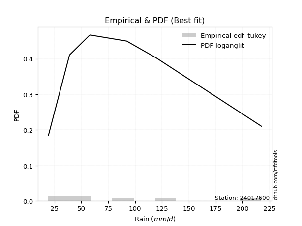</img>

</div>


### 8. Empirical - EDF Gringorten (1963)

Gringorten plotting position formula is essential for estimating the probability and return periods of extreme events like floods and heavy rainfall. The constant _a=0.44_.

<div align="center">


$P=(m-a)/(n+1-2a)$


</div>


**8.1. Empirical values**

<div align="center">

|                | 0                   | 1                   | 2                  | 3              | 4                  | 5                  | 6                  |
|:---------------|:--------------------|:--------------------|:-------------------|:---------------|:-------------------|:-------------------|:-------------------|
| date           | 2023                | 2019                | 2020               | 2022           | 2025               | 2024               | 2021               |
| x              | 19.4                | 39.0                | 57.6               | 58.4           | 87.4               | 119.6              | 217.4              |
| m              | 1                   | 2                   | 3                  | 4              | 5                  | 6                  | 7                  |
| empirical_dist | edf_gringorten      | edf_gringorten      | edf_gringorten     | edf_gringorten | edf_gringorten     | edf_gringorten     | edf_gringorten     |
| empirical      | 0.07865168539325844 | 0.21910112359550563 | 0.3595505617977528 | 0.5            | 0.6404494382022471 | 0.7808988764044943 | 0.9213483146067415 |
| empirical_tr   | 1.0853658536585364  | 1.2805755395683454  | 1.5614035087719298 | 2.0            | 2.781249999999999  | 4.564102564102562  | 12.714285714285701 |

</div>


**8.2. Kolmogorov-Smirnov fit test (sorted by Δ)**


<div align="center">

|                | 0                   | 1                   | 2                   | 3                   | 4                   | 5                   | 6                   | 7                     | 8                   | 9                   | 10                  | 11                  | 12                  | 13                  | 14                  | 15                  | 16                  | 17                  | 18                  | 19                  | 20                  | 21                  | 22                  | 23                  | 24                  | 25                  | 26                  | 27                  | 28                  | 29                  | 30                  | 31                  | 32                  | 33                  | 34                  | 35                  | 36                  | 37                  | 38                  | 39                  | 40                  | 41                  | 42                  | 43                  | 44                  | 45                  | 46                  | 47                  | 48                  | 49                  | 50                  | 51                  | 52                  | 53                  | 54                  | 55                  | 56                  | 57                  | 58                  | 59                  | 60                  | 61                  | 62                  | 63                  | 64                  | 65                  | 66                  | 67                  | 68                  | 69                  | 70                  | 71                  | 72                  | 73                  | 74                  | 75                  | 76                  | 77                  | 78                  | 79                  | 80                  | 81                  | 82                  | 83                  | 84                  | 85                  | 86                  | 87                  | 88                  | 89                  |
|:---------------|:--------------------|:--------------------|:--------------------|:--------------------|:--------------------|:--------------------|:--------------------|:----------------------|:--------------------|:--------------------|:--------------------|:--------------------|:--------------------|:--------------------|:--------------------|:--------------------|:--------------------|:--------------------|:--------------------|:--------------------|:--------------------|:--------------------|:--------------------|:--------------------|:--------------------|:--------------------|:--------------------|:--------------------|:--------------------|:--------------------|:--------------------|:--------------------|:--------------------|:--------------------|:--------------------|:--------------------|:--------------------|:--------------------|:--------------------|:--------------------|:--------------------|:--------------------|:--------------------|:--------------------|:--------------------|:--------------------|:--------------------|:--------------------|:--------------------|:--------------------|:--------------------|:--------------------|:--------------------|:--------------------|:--------------------|:--------------------|:--------------------|:--------------------|:--------------------|:--------------------|:--------------------|:--------------------|:--------------------|:--------------------|:--------------------|:--------------------|:--------------------|:--------------------|:--------------------|:--------------------|:--------------------|:--------------------|:--------------------|:--------------------|:--------------------|:--------------------|:--------------------|:--------------------|:--------------------|:--------------------|:--------------------|:--------------------|:--------------------|:--------------------|:--------------------|:--------------------|:--------------------|:--------------------|:--------------------|:--------------------|
| station        | 24017600            | 24017600            | 24017600            | 24017600            | 24017600            | 24017600            | 24017600            | 24017600              | 24017600            | 24017600            | 24017600            | 24017600            | 24017600            | 24017600            | 24017600            | 24017600            | 24017600            | 24017600            | 24017600            | 24017600            | 24017600            | 24017600            | 24017600            | 24017600            | 24017600            | 24017600            | 24017600            | 24017600            | 24017600            | 24017600            | 24017600            | 24017600            | 24017600            | 24017600            | 24017600            | 24017600            | 24017600            | 24017600            | 24017600            | 24017600            | 24017600            | 24017600            | 24017600            | 24017600            | 24017600            | 24017600            | 24017600            | 24017600            | 24017600            | 24017600            | 24017600            | 24017600            | 24017600            | 24017600            | 24017600            | 24017600            | 24017600            | 24017600            | 24017600            | 24017600            | 24017600            | 24017600            | 24017600            | 24017600            | 24017600            | 24017600            | 24017600            | 24017600            | 24017600            | 24017600            | 24017600            | 24017600            | 24017600            | 24017600            | 24017600            | 24017600            | 24017600            | 24017600            | 24017600            | 24017600            | 24017600            | 24017600            | 24017600            | 24017600            | 24017600            | 24017600            | 24017600            | 24017600            | 24017600            | 24017600            |
| empirical_dist | edf_gringorten      | edf_gringorten      | edf_gringorten      | edf_gringorten      | edf_gringorten      | edf_gringorten      | edf_gringorten      | edf_gringorten        | edf_gringorten      | edf_gringorten      | edf_gringorten      | edf_gringorten      | edf_gringorten      | edf_gringorten      | edf_gringorten      | edf_gringorten      | edf_gringorten      | edf_gringorten      | edf_gringorten      | edf_gringorten      | edf_gringorten      | edf_gringorten      | edf_gringorten      | edf_gringorten      | edf_gringorten      | edf_gringorten      | edf_gringorten      | edf_gringorten      | edf_gringorten      | edf_gringorten      | edf_gringorten      | edf_gringorten      | edf_gringorten      | edf_gringorten      | edf_gringorten      | edf_gringorten      | edf_gringorten      | edf_gringorten      | edf_gringorten      | edf_gringorten      | edf_gringorten      | edf_gringorten      | edf_gringorten      | edf_gringorten      | edf_gringorten      | edf_gringorten      | edf_gringorten      | edf_gringorten      | edf_gringorten      | edf_gringorten      | edf_gringorten      | edf_gringorten      | edf_gringorten      | edf_gringorten      | edf_gringorten      | edf_gringorten      | edf_gringorten      | edf_gringorten      | edf_gringorten      | edf_gringorten      | edf_gringorten      | edf_gringorten      | edf_gringorten      | edf_gringorten      | edf_gringorten      | edf_gringorten      | edf_gringorten      | edf_gringorten      | edf_gringorten      | edf_gringorten      | edf_gringorten      | edf_gringorten      | edf_gringorten      | edf_gringorten      | edf_gringorten      | edf_gringorten      | edf_gringorten      | edf_gringorten      | edf_gringorten      | edf_gringorten      | edf_gringorten      | edf_gringorten      | edf_gringorten      | edf_gringorten      | edf_gringorten      | edf_gringorten      | edf_gringorten      | edf_gringorten      | edf_gringorten      | edf_gringorten      |
| p_dist         | logweibull_min      | logncf              | logerlang           | loggamma            | loggamma            | invgamma            | logfatiguelife      | loglaplace_asymmetric | logf                | invweibull          | fisk                | logbetaprime        | lognct              | logt                | logexponnorm        | lognorm             | lognorm             | logcrystalball      | nct                 | johnsonsu           | logpearson3         | mielke              | logjohnsonsu        | loggenlogistic      | invgauss            | logloggamma         | betaprime           | genexpon            | loginvgamma         | logfisk             | logrice             | expon               | loggompertz         | f                   | exponnorm           | alpha               | loglogistic         | logalpha            | ncf                 | logmielke           | fatiguelife         | loginvgauss         | laplace_asymmetric  | loghypsecant        | halflogistic        | halfnorm            | logmaxwell          | nakagami            | t                   | gompertz            | lograyleigh         | wald                | moyal               | pearson3            | loglaplace          | loggumbel_r         | loginvweibull       | gumbel_r            | rayleigh            | genlogistic         | maxwell             | loggumbel_l         | logkstwobign        | loghalfnorm         | logmoyal            | kstwobign           | loghalflogistic     | truncnorm           | norm                | crystalball         | weibull_min         | loggenexpon         | logistic            | rice                | hypsecant           | logtruncnorm        | chi2                | gamma               | logwald             | loggibrat           | gibrat              | gumbel_l            | logexpon            | laplace             | lognakagami         | erlang              | logchi2             | pareto              | loglognorm          | logpareto           |
| delta          | 0.06661347668864914 | 0.06804015462290675 | 0.06828009004351793 | 0.06851909659206645 | 0.06851909659206645 | 0.06870199338562988 | 0.069337349647357   | 0.06960372643094664   | 0.06988909512472191 | 0.07012763315868287 | 0.07014576561031738 | 0.0713231826865261  | 0.07141835641923189 | 0.07169112739628047 | 0.0716928377968577  | 0.07169320299986304 | 0.07169320299986304 | 0.07169447244042604 | 0.072161400629971   | 0.07516379648660987 | 0.07529497611266012 | 0.07579323103731156 | 0.07594091201155384 | 0.07628029774747835 | 0.07646980285914534 | 0.07711677656845173 | 0.07841854573367074 | 0.07865168539271589 | 0.07878290708586722 | 0.07900464159852555 | 0.07903797452763772 | 0.0791707896157311  | 0.07933978588507606 | 0.08011454394008222 | 0.08015490019255822 | 0.08015861685242925 | 0.08120675426166196 | 0.08313068099353099 | 0.08440750489610749 | 0.0857309752563073  | 0.0859479687130264  | 0.0871669111602642  | 0.08790066108772299 | 0.08915422754021252 | 0.08994087137066648 | 0.09438017886048217 | 0.09563259401135665 | 0.09645471773674952 | 0.1059743913057367  | 0.10692254876008583 | 0.10782734503751246 | 0.11147470509745741 | 0.11240838243100915 | 0.11250883231319275 | 0.11274682108008732 | 0.12457549025245096 | 0.12466534059546008 | 0.12749370450682662 | 0.12781557792788562 | 0.13540478628128094 | 0.13957075433997246 | 0.14061726284067494 | 0.1422744940574845  | 0.1423423827299798  | 0.1487677466542281  | 0.15634125934186743 | 0.1604422352430076  | 0.1701207391932904  | 0.17012075475680333 | 0.1701207629025393  | 0.17517428833488258 | 0.18601020736553953 | 0.18965760402927828 | 0.19037794063537755 | 0.20442273868607702 | 0.204908354686581   | 0.20588730402542832 | 0.20630550872955167 | 0.2153085609710922  | 0.21828883343752814 | 0.2190767703541361  | 0.22671081659780917 | 0.22682312801659865 | 0.23172693964384433 | 0.23368707006260359 | 0.2600343779458125  | 0.36291399000651325 | 0.4069297403453962  | 0.42013182634886137 | 0.43395954832033956 |
| deltao         | 0.48442053926100004 | 0.48442053926100004 | 0.48442053926100004 | 0.48442053926100004 | 0.48442053926100004 | 0.48442053926100004 | 0.48442053926100004 | 0.48442053926100004   | 0.48442053926100004 | 0.48442053926100004 | 0.48442053926100004 | 0.48442053926100004 | 0.48442053926100004 | 0.48442053926100004 | 0.48442053926100004 | 0.48442053926100004 | 0.48442053926100004 | 0.48442053926100004 | 0.48442053926100004 | 0.48442053926100004 | 0.48442053926100004 | 0.48442053926100004 | 0.48442053926100004 | 0.48442053926100004 | 0.48442053926100004 | 0.48442053926100004 | 0.48442053926100004 | 0.48442053926100004 | 0.48442053926100004 | 0.48442053926100004 | 0.48442053926100004 | 0.48442053926100004 | 0.48442053926100004 | 0.48442053926100004 | 0.48442053926100004 | 0.48442053926100004 | 0.48442053926100004 | 0.48442053926100004 | 0.48442053926100004 | 0.48442053926100004 | 0.48442053926100004 | 0.48442053926100004 | 0.48442053926100004 | 0.48442053926100004 | 0.48442053926100004 | 0.48442053926100004 | 0.48442053926100004 | 0.48442053926100004 | 0.48442053926100004 | 0.48442053926100004 | 0.48442053926100004 | 0.48442053926100004 | 0.48442053926100004 | 0.48442053926100004 | 0.48442053926100004 | 0.48442053926100004 | 0.48442053926100004 | 0.48442053926100004 | 0.48442053926100004 | 0.48442053926100004 | 0.48442053926100004 | 0.48442053926100004 | 0.48442053926100004 | 0.48442053926100004 | 0.48442053926100004 | 0.48442053926100004 | 0.48442053926100004 | 0.48442053926100004 | 0.48442053926100004 | 0.48442053926100004 | 0.48442053926100004 | 0.48442053926100004 | 0.48442053926100004 | 0.48442053926100004 | 0.48442053926100004 | 0.48442053926100004 | 0.48442053926100004 | 0.48442053926100004 | 0.48442053926100004 | 0.48442053926100004 | 0.48442053926100004 | 0.48442053926100004 | 0.48442053926100004 | 0.48442053926100004 | 0.48442053926100004 | 0.48442053926100004 | 0.48442053926100004 | 0.48442053926100004 | 0.48442053926100004 | 0.48442053926100004 |
| eval           | Δo > Δ              | Δo > Δ              | Δo > Δ              | Δo > Δ              | Δo > Δ              | Δo > Δ              | Δo > Δ              | Δo > Δ                | Δo > Δ              | Δo > Δ              | Δo > Δ              | Δo > Δ              | Δo > Δ              | Δo > Δ              | Δo > Δ              | Δo > Δ              | Δo > Δ              | Δo > Δ              | Δo > Δ              | Δo > Δ              | Δo > Δ              | Δo > Δ              | Δo > Δ              | Δo > Δ              | Δo > Δ              | Δo > Δ              | Δo > Δ              | Δo > Δ              | Δo > Δ              | Δo > Δ              | Δo > Δ              | Δo > Δ              | Δo > Δ              | Δo > Δ              | Δo > Δ              | Δo > Δ              | Δo > Δ              | Δo > Δ              | Δo > Δ              | Δo > Δ              | Δo > Δ              | Δo > Δ              | Δo > Δ              | Δo > Δ              | Δo > Δ              | Δo > Δ              | Δo > Δ              | Δo > Δ              | Δo > Δ              | Δo > Δ              | Δo > Δ              | Δo > Δ              | Δo > Δ              | Δo > Δ              | Δo > Δ              | Δo > Δ              | Δo > Δ              | Δo > Δ              | Δo > Δ              | Δo > Δ              | Δo > Δ              | Δo > Δ              | Δo > Δ              | Δo > Δ              | Δo > Δ              | Δo > Δ              | Δo > Δ              | Δo > Δ              | Δo > Δ              | Δo > Δ              | Δo > Δ              | Δo > Δ              | Δo > Δ              | Δo > Δ              | Δo > Δ              | Δo > Δ              | Δo > Δ              | Δo > Δ              | Δo > Δ              | Δo > Δ              | Δo > Δ              | Δo > Δ              | Δo > Δ              | Δo > Δ              | Δo > Δ              | Δo > Δ              | Δo > Δ              | Δo > Δ              | Δo > Δ              | Δo > Δ              |
| fit            | 1                   | 1                   | 1                   | 1                   | 1                   | 1                   | 1                   | 1                     | 1                   | 1                   | 1                   | 1                   | 1                   | 1                   | 1                   | 1                   | 1                   | 1                   | 1                   | 1                   | 1                   | 1                   | 1                   | 1                   | 1                   | 1                   | 1                   | 1                   | 1                   | 1                   | 1                   | 1                   | 1                   | 1                   | 1                   | 1                   | 1                   | 1                   | 1                   | 1                   | 1                   | 1                   | 1                   | 1                   | 1                   | 1                   | 1                   | 1                   | 1                   | 1                   | 1                   | 1                   | 1                   | 1                   | 1                   | 1                   | 1                   | 1                   | 1                   | 1                   | 1                   | 1                   | 1                   | 1                   | 1                   | 1                   | 1                   | 1                   | 1                   | 1                   | 1                   | 1                   | 1                   | 1                   | 1                   | 1                   | 1                   | 1                   | 1                   | 1                   | 1                   | 1                   | 1                   | 1                   | 1                   | 1                   | 1                   | 1                   | 1                   | 1                   |
| n              | 7                   | 7                   | 7                   | 7                   | 7                   | 7                   | 7                   | 7                     | 7                   | 7                   | 7                   | 7                   | 7                   | 7                   | 7                   | 7                   | 7                   | 7                   | 7                   | 7                   | 7                   | 7                   | 7                   | 7                   | 7                   | 7                   | 7                   | 7                   | 7                   | 7                   | 7                   | 7                   | 7                   | 7                   | 7                   | 7                   | 7                   | 7                   | 7                   | 7                   | 7                   | 7                   | 7                   | 7                   | 7                   | 7                   | 7                   | 7                   | 7                   | 7                   | 7                   | 7                   | 7                   | 7                   | 7                   | 7                   | 7                   | 7                   | 7                   | 7                   | 7                   | 7                   | 7                   | 7                   | 7                   | 7                   | 7                   | 7                   | 7                   | 7                   | 7                   | 7                   | 7                   | 7                   | 7                   | 7                   | 7                   | 7                   | 7                   | 7                   | 7                   | 7                   | 7                   | 7                   | 7                   | 7                   | 7                   | 7                   | 7                   | 7                   |
| best_fit       | 1                   | 0                   | 0                   | 0                   | 0                   | 0                   | 0                   | 0                     | 0                   | 0                   | 0                   | 0                   | 0                   | 0                   | 0                   | 0                   | 0                   | 0                   | 0                   | 0                   | 0                   | 0                   | 0                   | 0                   | 0                   | 0                   | 0                   | 0                   | 0                   | 0                   | 0                   | 0                   | 0                   | 0                   | 0                   | 0                   | 0                   | 0                   | 0                   | 0                   | 0                   | 0                   | 0                   | 0                   | 0                   | 0                   | 0                   | 0                   | 0                   | 0                   | 0                   | 0                   | 0                   | 0                   | 0                   | 0                   | 0                   | 0                   | 0                   | 0                   | 0                   | 0                   | 0                   | 0                   | 0                   | 0                   | 0                   | 0                   | 0                   | 0                   | 0                   | 0                   | 0                   | 0                   | 0                   | 0                   | 0                   | 0                   | 0                   | 0                   | 0                   | 0                   | 0                   | 0                   | 0                   | 0                   | 0                   | 0                   | 0                   | 0                   |
| best_fit_sort  | 1                   | 2                   | 3                   | 4                   | 5                   | 6                   | 7                   | 8                     | 9                   | 10                  | 11                  | 12                  | 13                  | 14                  | 15                  | 16                  | 17                  | 18                  | 19                  | 20                  | 21                  | 22                  | 23                  | 24                  | 25                  | 26                  | 27                  | 28                  | 29                  | 30                  | 31                  | 32                  | 33                  | 34                  | 35                  | 36                  | 37                  | 38                  | 39                  | 40                  | 41                  | 42                  | 43                  | 44                  | 45                  | 46                  | 47                  | 48                  | 49                  | 50                  | 51                  | 52                  | 53                  | 54                  | 55                  | 56                  | 57                  | 58                  | 59                  | 60                  | 61                  | 62                  | 63                  | 64                  | 65                  | 66                  | 67                  | 68                  | 69                  | 70                  | 71                  | 72                  | 73                  | 74                  | 75                  | 76                  | 77                  | 78                  | 79                  | 80                  | 81                  | 82                  | 83                  | 84                  | 85                  | 86                  | 87                  | 88                  | 89                  | 90                  |

</div>


<div align="center">

</img>

</div>


**8.3. Best fit**

<div align="center">

|   id |   station | empirical_dist   | p_dist         |     delta |   deltao | eval   |   fit |   n |   best_fit |   best_fit_sort |
|-----:|----------:|:-----------------|:---------------|----------:|---------:|:-------|------:|----:|-----------:|----------------:|
|    0 |  24017600 | edf_gringorten   | logweibull_min | 0.0666135 | 0.484421 | Δo > Δ |     1 |   7 |          1 |               1 |

</div>


<div align="center">

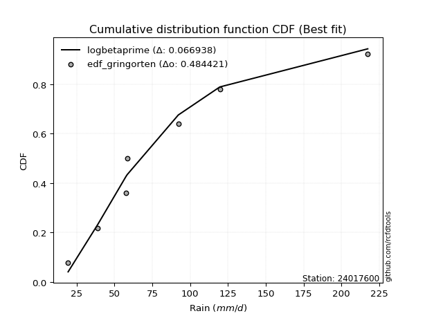</img></img>

</div>


### 9. Empirical - EDF Filliben (1975)

The specific values of the constants (0.3175) (often denoted as $alpha$) and (0.365) are derived from a method proposed by James J. Filliben in a 1975 paper. This particular formula is the mean value of the $i$-th order statistic of the normal distribution and is considered a robust and effective plotting position formula for the normal probability plot correlation coefficient test for normality.

<div align="center">


$P=(m-0.3175)/(n+0.365)$


</div>


**9.1. Empirical values**

<div align="center">

|                | 0                   | 1                   | 2                   | 3            | 4                  | 5                  | 6                  |
|:---------------|:--------------------|:--------------------|:--------------------|:-------------|:-------------------|:-------------------|:-------------------|
| date           | 2023                | 2019                | 2020                | 2022         | 2025               | 2024               | 2021               |
| x              | 19.4                | 39.0                | 57.6                | 58.4         | 87.4               | 119.6              | 217.4              |
| m              | 1                   | 2                   | 3                   | 4            | 5                  | 6                  | 7                  |
| empirical_dist | edf_filliben        | edf_filliben        | edf_filliben        | edf_filliben | edf_filliben       | edf_filliben       | edf_filliben       |
| empirical      | 0.09266802443991853 | 0.22844534962661237 | 0.36422267481330617 | 0.5          | 0.6357773251866938 | 0.7715546503733877 | 0.9073319755600815 |
| empirical_tr   | 1.1021324354657687  | 1.2960844698636163  | 1.5728777362520021  | 2.0          | 2.7455731593662627 | 4.377414561664191  | 10.791208791208794 |

</div>


**9.2. Kolmogorov-Smirnov fit test (sorted by Δ)**


<div align="center">

|                | 0                   | 1                   | 2                   | 3                   | 4                   | 5                   | 6                   | 7                   | 8                   | 9                   | 10                  | 11                  | 12                  | 13                  | 14                  | 15                  | 16                  | 17                  | 18                  | 19                    | 20                  | 21                  | 22                  | 23                  | 24                  | 25                  | 26                  | 27                  | 28                  | 29                  | 30                  | 31                  | 32                  | 33                  | 34                  | 35                  | 36                  | 37                  | 38                  | 39                  | 40                  | 41                  | 42                  | 43                  | 44                  | 45                  | 46                  | 47                  | 48                  | 49                  | 50                  | 51                  | 52                  | 53                  | 54                  | 55                  | 56                  | 57                  | 58                  | 59                  | 60                  | 61                  | 62                  | 63                  | 64                  | 65                  | 66                  | 67                  | 68                  | 69                  | 70                  | 71                  | 72                  | 73                  | 74                  | 75                  | 76                  | 77                  | 78                  | 79                  | 80                  | 81                  | 82                  | 83                  | 84                  | 85                  | 86                  | 87                  | 88                  | 89                  |
|:---------------|:--------------------|:--------------------|:--------------------|:--------------------|:--------------------|:--------------------|:--------------------|:--------------------|:--------------------|:--------------------|:--------------------|:--------------------|:--------------------|:--------------------|:--------------------|:--------------------|:--------------------|:--------------------|:--------------------|:----------------------|:--------------------|:--------------------|:--------------------|:--------------------|:--------------------|:--------------------|:--------------------|:--------------------|:--------------------|:--------------------|:--------------------|:--------------------|:--------------------|:--------------------|:--------------------|:--------------------|:--------------------|:--------------------|:--------------------|:--------------------|:--------------------|:--------------------|:--------------------|:--------------------|:--------------------|:--------------------|:--------------------|:--------------------|:--------------------|:--------------------|:--------------------|:--------------------|:--------------------|:--------------------|:--------------------|:--------------------|:--------------------|:--------------------|:--------------------|:--------------------|:--------------------|:--------------------|:--------------------|:--------------------|:--------------------|:--------------------|:--------------------|:--------------------|:--------------------|:--------------------|:--------------------|:--------------------|:--------------------|:--------------------|:--------------------|:--------------------|:--------------------|:--------------------|:--------------------|:--------------------|:--------------------|:--------------------|:--------------------|:--------------------|:--------------------|:--------------------|:--------------------|:--------------------|:--------------------|:--------------------|
| station        | 24017600            | 24017600            | 24017600            | 24017600            | 24017600            | 24017600            | 24017600            | 24017600            | 24017600            | 24017600            | 24017600            | 24017600            | 24017600            | 24017600            | 24017600            | 24017600            | 24017600            | 24017600            | 24017600            | 24017600              | 24017600            | 24017600            | 24017600            | 24017600            | 24017600            | 24017600            | 24017600            | 24017600            | 24017600            | 24017600            | 24017600            | 24017600            | 24017600            | 24017600            | 24017600            | 24017600            | 24017600            | 24017600            | 24017600            | 24017600            | 24017600            | 24017600            | 24017600            | 24017600            | 24017600            | 24017600            | 24017600            | 24017600            | 24017600            | 24017600            | 24017600            | 24017600            | 24017600            | 24017600            | 24017600            | 24017600            | 24017600            | 24017600            | 24017600            | 24017600            | 24017600            | 24017600            | 24017600            | 24017600            | 24017600            | 24017600            | 24017600            | 24017600            | 24017600            | 24017600            | 24017600            | 24017600            | 24017600            | 24017600            | 24017600            | 24017600            | 24017600            | 24017600            | 24017600            | 24017600            | 24017600            | 24017600            | 24017600            | 24017600            | 24017600            | 24017600            | 24017600            | 24017600            | 24017600            | 24017600            |
| empirical_dist | edf_filliben        | edf_filliben        | edf_filliben        | edf_filliben        | edf_filliben        | edf_filliben        | edf_filliben        | edf_filliben        | edf_filliben        | edf_filliben        | edf_filliben        | edf_filliben        | edf_filliben        | edf_filliben        | edf_filliben        | edf_filliben        | edf_filliben        | edf_filliben        | edf_filliben        | edf_filliben          | edf_filliben        | edf_filliben        | edf_filliben        | edf_filliben        | edf_filliben        | edf_filliben        | edf_filliben        | edf_filliben        | edf_filliben        | edf_filliben        | edf_filliben        | edf_filliben        | edf_filliben        | edf_filliben        | edf_filliben        | edf_filliben        | edf_filliben        | edf_filliben        | edf_filliben        | edf_filliben        | edf_filliben        | edf_filliben        | edf_filliben        | edf_filliben        | edf_filliben        | edf_filliben        | edf_filliben        | edf_filliben        | edf_filliben        | edf_filliben        | edf_filliben        | edf_filliben        | edf_filliben        | edf_filliben        | edf_filliben        | edf_filliben        | edf_filliben        | edf_filliben        | edf_filliben        | edf_filliben        | edf_filliben        | edf_filliben        | edf_filliben        | edf_filliben        | edf_filliben        | edf_filliben        | edf_filliben        | edf_filliben        | edf_filliben        | edf_filliben        | edf_filliben        | edf_filliben        | edf_filliben        | edf_filliben        | edf_filliben        | edf_filliben        | edf_filliben        | edf_filliben        | edf_filliben        | edf_filliben        | edf_filliben        | edf_filliben        | edf_filliben        | edf_filliben        | edf_filliben        | edf_filliben        | edf_filliben        | edf_filliben        | edf_filliben        | edf_filliben        |
| p_dist         | logncf              | fisk                | logweibull_min      | logbetaprime        | logerlang           | loggamma            | loggamma            | invgamma            | logfatiguelife      | logf                | invweibull          | johnsonsu           | lognct              | logt                | logexponnorm        | lognorm             | lognorm             | logcrystalball      | invgauss            | loglaplace_asymmetric | nct                 | loginvgamma         | logrice             | logpearson3         | mielke              | logjohnsonsu        | loggenlogistic      | logloggamma         | betaprime           | logalpha            | logfisk             | f                   | alpha               | loglogistic         | fatiguelife         | loginvgauss         | ncf                 | logmielke           | laplace_asymmetric  | loghypsecant        | halflogistic        | logmaxwell          | exponnorm           | loggompertz         | genexpon            | expon               | halfnorm            | nakagami            | t                   | lograyleigh         | gompertz            | moyal               | pearson3            | loglaplace          | loggumbel_r         | loginvweibull       | wald                | gumbel_r            | rayleigh            | genlogistic         | logkstwobign        | loghalfnorm         | maxwell             | loggumbel_l         | logmoyal            | loghalflogistic     | kstwobign           | truncnorm           | norm                | crystalball         | weibull_min         | loggenexpon         | logistic            | rice                | chi2                | gamma               | hypsecant           | logwald             | logtruncnorm        | logexpon            | gumbel_l            | loggibrat           | gibrat              | lognakagami         | laplace             | erlang              | logchi2             | pareto              | loglognorm          | logpareto           |
| delta          | 0.06493887871652049 | 0.06547365259476401 | 0.06651511238819563 | 0.06665106967097273 | 0.06828009004351793 | 0.06851909659206645 | 0.06851909659206645 | 0.06870199338562988 | 0.069337349647357   | 0.06988909512472191 | 0.07012763315868287 | 0.0704916834710565  | 0.07141835641923189 | 0.07169112739628047 | 0.0716928377968577  | 0.07169320299986304 | 0.07169320299986304 | 0.07169447244042604 | 0.07179768984359197 | 0.07190311624317947   | 0.072161400629971   | 0.07411079407031385 | 0.07436586151208435 | 0.07529497611266012 | 0.07579323103731156 | 0.07594091201155384 | 0.07628029774747835 | 0.07711677656845173 | 0.07841854573367074 | 0.07845856797797762 | 0.07900464159852555 | 0.08011454394008222 | 0.08015861685242925 | 0.08120675426166196 | 0.08127585569747303 | 0.08249479814471083 | 0.08440750489610749 | 0.0857309752563073  | 0.08790066108772299 | 0.08915422754021252 | 0.08994087137066648 | 0.09096048099580328 | 0.09162867160072011 | 0.09266801915803778 | 0.09266802443937598 | 0.09266802443991853 | 0.09438017886048217 | 0.09645471773674952 | 0.09809593050818965 | 0.10315523202195909 | 0.10692254876008583 | 0.11240838243100915 | 0.11250883231319275 | 0.11274682108008732 | 0.11990337723689759 | 0.11999322757990671 | 0.12081893112856415 | 0.12749370450682662 | 0.12781557792788562 | 0.13540478628128094 | 0.13760238104193112 | 0.13767026971442642 | 0.13957075433997246 | 0.14061726284067494 | 0.14409563363867472 | 0.15577012222745423 | 0.15634125934186743 | 0.1701207391932904  | 0.17012075475680333 | 0.1701207629025393  | 0.1705021753193292  | 0.18133809434998616 | 0.18965760402927828 | 0.19037794063537755 | 0.20121519100987495 | 0.2016333957139983  | 0.20442273868607702 | 0.21063644795553882 | 0.21425258071768774 | 0.22215101500104528 | 0.22671081659780917 | 0.22691241503748202 | 0.22842099638524285 | 0.22901495704705022 | 0.23172693964384433 | 0.25536226493025915 | 0.3535697639754065  | 0.39758551431428946 | 0.41078760031775463 | 0.4246153222892328  |
| deltao         | 0.48442053926100004 | 0.48442053926100004 | 0.48442053926100004 | 0.48442053926100004 | 0.48442053926100004 | 0.48442053926100004 | 0.48442053926100004 | 0.48442053926100004 | 0.48442053926100004 | 0.48442053926100004 | 0.48442053926100004 | 0.48442053926100004 | 0.48442053926100004 | 0.48442053926100004 | 0.48442053926100004 | 0.48442053926100004 | 0.48442053926100004 | 0.48442053926100004 | 0.48442053926100004 | 0.48442053926100004   | 0.48442053926100004 | 0.48442053926100004 | 0.48442053926100004 | 0.48442053926100004 | 0.48442053926100004 | 0.48442053926100004 | 0.48442053926100004 | 0.48442053926100004 | 0.48442053926100004 | 0.48442053926100004 | 0.48442053926100004 | 0.48442053926100004 | 0.48442053926100004 | 0.48442053926100004 | 0.48442053926100004 | 0.48442053926100004 | 0.48442053926100004 | 0.48442053926100004 | 0.48442053926100004 | 0.48442053926100004 | 0.48442053926100004 | 0.48442053926100004 | 0.48442053926100004 | 0.48442053926100004 | 0.48442053926100004 | 0.48442053926100004 | 0.48442053926100004 | 0.48442053926100004 | 0.48442053926100004 | 0.48442053926100004 | 0.48442053926100004 | 0.48442053926100004 | 0.48442053926100004 | 0.48442053926100004 | 0.48442053926100004 | 0.48442053926100004 | 0.48442053926100004 | 0.48442053926100004 | 0.48442053926100004 | 0.48442053926100004 | 0.48442053926100004 | 0.48442053926100004 | 0.48442053926100004 | 0.48442053926100004 | 0.48442053926100004 | 0.48442053926100004 | 0.48442053926100004 | 0.48442053926100004 | 0.48442053926100004 | 0.48442053926100004 | 0.48442053926100004 | 0.48442053926100004 | 0.48442053926100004 | 0.48442053926100004 | 0.48442053926100004 | 0.48442053926100004 | 0.48442053926100004 | 0.48442053926100004 | 0.48442053926100004 | 0.48442053926100004 | 0.48442053926100004 | 0.48442053926100004 | 0.48442053926100004 | 0.48442053926100004 | 0.48442053926100004 | 0.48442053926100004 | 0.48442053926100004 | 0.48442053926100004 | 0.48442053926100004 | 0.48442053926100004 |
| eval           | Δo > Δ              | Δo > Δ              | Δo > Δ              | Δo > Δ              | Δo > Δ              | Δo > Δ              | Δo > Δ              | Δo > Δ              | Δo > Δ              | Δo > Δ              | Δo > Δ              | Δo > Δ              | Δo > Δ              | Δo > Δ              | Δo > Δ              | Δo > Δ              | Δo > Δ              | Δo > Δ              | Δo > Δ              | Δo > Δ                | Δo > Δ              | Δo > Δ              | Δo > Δ              | Δo > Δ              | Δo > Δ              | Δo > Δ              | Δo > Δ              | Δo > Δ              | Δo > Δ              | Δo > Δ              | Δo > Δ              | Δo > Δ              | Δo > Δ              | Δo > Δ              | Δo > Δ              | Δo > Δ              | Δo > Δ              | Δo > Δ              | Δo > Δ              | Δo > Δ              | Δo > Δ              | Δo > Δ              | Δo > Δ              | Δo > Δ              | Δo > Δ              | Δo > Δ              | Δo > Δ              | Δo > Δ              | Δo > Δ              | Δo > Δ              | Δo > Δ              | Δo > Δ              | Δo > Δ              | Δo > Δ              | Δo > Δ              | Δo > Δ              | Δo > Δ              | Δo > Δ              | Δo > Δ              | Δo > Δ              | Δo > Δ              | Δo > Δ              | Δo > Δ              | Δo > Δ              | Δo > Δ              | Δo > Δ              | Δo > Δ              | Δo > Δ              | Δo > Δ              | Δo > Δ              | Δo > Δ              | Δo > Δ              | Δo > Δ              | Δo > Δ              | Δo > Δ              | Δo > Δ              | Δo > Δ              | Δo > Δ              | Δo > Δ              | Δo > Δ              | Δo > Δ              | Δo > Δ              | Δo > Δ              | Δo > Δ              | Δo > Δ              | Δo > Δ              | Δo > Δ              | Δo > Δ              | Δo > Δ              | Δo > Δ              |
| fit            | 1                   | 1                   | 1                   | 1                   | 1                   | 1                   | 1                   | 1                   | 1                   | 1                   | 1                   | 1                   | 1                   | 1                   | 1                   | 1                   | 1                   | 1                   | 1                   | 1                     | 1                   | 1                   | 1                   | 1                   | 1                   | 1                   | 1                   | 1                   | 1                   | 1                   | 1                   | 1                   | 1                   | 1                   | 1                   | 1                   | 1                   | 1                   | 1                   | 1                   | 1                   | 1                   | 1                   | 1                   | 1                   | 1                   | 1                   | 1                   | 1                   | 1                   | 1                   | 1                   | 1                   | 1                   | 1                   | 1                   | 1                   | 1                   | 1                   | 1                   | 1                   | 1                   | 1                   | 1                   | 1                   | 1                   | 1                   | 1                   | 1                   | 1                   | 1                   | 1                   | 1                   | 1                   | 1                   | 1                   | 1                   | 1                   | 1                   | 1                   | 1                   | 1                   | 1                   | 1                   | 1                   | 1                   | 1                   | 1                   | 1                   | 1                   |
| n              | 7                   | 7                   | 7                   | 7                   | 7                   | 7                   | 7                   | 7                   | 7                   | 7                   | 7                   | 7                   | 7                   | 7                   | 7                   | 7                   | 7                   | 7                   | 7                   | 7                     | 7                   | 7                   | 7                   | 7                   | 7                   | 7                   | 7                   | 7                   | 7                   | 7                   | 7                   | 7                   | 7                   | 7                   | 7                   | 7                   | 7                   | 7                   | 7                   | 7                   | 7                   | 7                   | 7                   | 7                   | 7                   | 7                   | 7                   | 7                   | 7                   | 7                   | 7                   | 7                   | 7                   | 7                   | 7                   | 7                   | 7                   | 7                   | 7                   | 7                   | 7                   | 7                   | 7                   | 7                   | 7                   | 7                   | 7                   | 7                   | 7                   | 7                   | 7                   | 7                   | 7                   | 7                   | 7                   | 7                   | 7                   | 7                   | 7                   | 7                   | 7                   | 7                   | 7                   | 7                   | 7                   | 7                   | 7                   | 7                   | 7                   | 7                   |
| best_fit       | 1                   | 0                   | 0                   | 0                   | 0                   | 0                   | 0                   | 0                   | 0                   | 0                   | 0                   | 0                   | 0                   | 0                   | 0                   | 0                   | 0                   | 0                   | 0                   | 0                     | 0                   | 0                   | 0                   | 0                   | 0                   | 0                   | 0                   | 0                   | 0                   | 0                   | 0                   | 0                   | 0                   | 0                   | 0                   | 0                   | 0                   | 0                   | 0                   | 0                   | 0                   | 0                   | 0                   | 0                   | 0                   | 0                   | 0                   | 0                   | 0                   | 0                   | 0                   | 0                   | 0                   | 0                   | 0                   | 0                   | 0                   | 0                   | 0                   | 0                   | 0                   | 0                   | 0                   | 0                   | 0                   | 0                   | 0                   | 0                   | 0                   | 0                   | 0                   | 0                   | 0                   | 0                   | 0                   | 0                   | 0                   | 0                   | 0                   | 0                   | 0                   | 0                   | 0                   | 0                   | 0                   | 0                   | 0                   | 0                   | 0                   | 0                   |
| best_fit_sort  | 1                   | 2                   | 3                   | 4                   | 5                   | 6                   | 7                   | 8                   | 9                   | 10                  | 11                  | 12                  | 13                  | 14                  | 15                  | 16                  | 17                  | 18                  | 19                  | 20                    | 21                  | 22                  | 23                  | 24                  | 25                  | 26                  | 27                  | 28                  | 29                  | 30                  | 31                  | 32                  | 33                  | 34                  | 35                  | 36                  | 37                  | 38                  | 39                  | 40                  | 41                  | 42                  | 43                  | 44                  | 45                  | 46                  | 47                  | 48                  | 49                  | 50                  | 51                  | 52                  | 53                  | 54                  | 55                  | 56                  | 57                  | 58                  | 59                  | 60                  | 61                  | 62                  | 63                  | 64                  | 65                  | 66                  | 67                  | 68                  | 69                  | 70                  | 71                  | 72                  | 73                  | 74                  | 75                  | 76                  | 77                  | 78                  | 79                  | 80                  | 81                  | 82                  | 83                  | 84                  | 85                  | 86                  | 87                  | 88                  | 89                  | 90                  |

</div>


<div align="center">

</img>

</div>


**9.3. Best fit**

<div align="center">

|   id |   station | empirical_dist   | p_dist   |     delta |   deltao | eval   |   fit |   n |   best_fit |   best_fit_sort |
|-----:|----------:|:-----------------|:---------|----------:|---------:|:-------|------:|----:|-----------:|----------------:|
|    0 |  24017600 | edf_filliben     | logncf   | 0.0649389 | 0.484421 | Δo > Δ |     1 |   7 |          1 |               1 |

</div>


<div align="center">

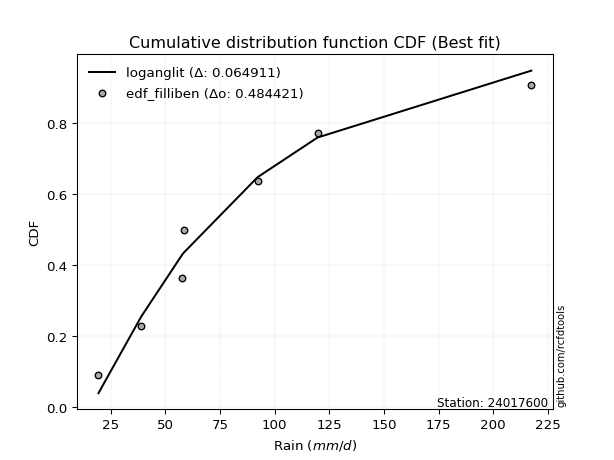</img>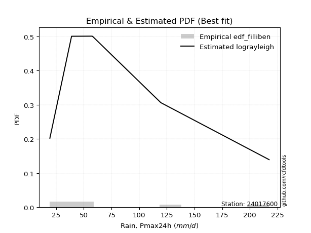</img>

</div>


### 10. Empirical - EDF Jenkinson (1977)

The Jenkinson formula in hydrology is an empirical plotting position formula used to estimate the non-exceedance probability _(P)_ or return period _(T)_ of a given ordered observation within a sample. It is a widely used method in the frequency analysis of extreme events such as floods and rainfall, as it provides a distribution-free way to plot data. _a≈0.31_ and _b≈0.38_ are constants derived to approximate the median of the probability distribution for the given rank.

<div align="center">


$P=(m-a)/(n+b)$


</div>


**10.1. Empirical values**

<div align="center">

|                | 0                   | 1                   | 2                   | 3             | 4                  | 5                  | 6                  |
|:---------------|:--------------------|:--------------------|:--------------------|:--------------|:-------------------|:-------------------|:-------------------|
| date           | 2023                | 2019                | 2020                | 2022          | 2025               | 2024               | 2021               |
| x              | 19.4                | 39.0                | 57.6                | 58.4          | 87.4               | 119.6              | 217.4              |
| m              | 1                   | 2                   | 3                   | 4             | 5                  | 6                  | 7                  |
| empirical_dist | edf_jenkinson       | edf_jenkinson       | edf_jenkinson       | edf_jenkinson | edf_jenkinson      | edf_jenkinson      | edf_jenkinson      |
| empirical      | 0.09349593495934959 | 0.22899728997289973 | 0.36449864498644985 | 0.5           | 0.6355013550135502 | 0.7710027100271003 | 0.9065040650406505 |
| empirical_tr   | 1.1031390134529149  | 1.29701230228471    | 1.5735607675906182  | 2.0           | 2.743494423791822  | 4.366863905325444  | 10.695652173913055 |

</div>


**10.2. Kolmogorov-Smirnov fit test (sorted by Δ)**


<div align="center">

|                | 0                   | 1                   | 2                   | 3                   | 4                   | 5                   | 6                   | 7                   | 8                   | 9                   | 10                  | 11                  | 12                  | 13                  | 14                  | 15                  | 16                  | 17                  | 18                  | 19                  | 20                    | 21                  | 22                  | 23                  | 24                  | 25                  | 26                  | 27                  | 28                  | 29                  | 30                  | 31                  | 32                  | 33                  | 34                  | 35                  | 36                  | 37                  | 38                  | 39                  | 40                  | 41                  | 42                  | 43                  | 44                  | 45                  | 46                  | 47                  | 48                  | 49                  | 50                  | 51                  | 52                  | 53                  | 54                  | 55                  | 56                  | 57                  | 58                  | 59                  | 60                  | 61                  | 62                  | 63                  | 64                  | 65                  | 66                  | 67                  | 68                  | 69                  | 70                  | 71                  | 72                  | 73                  | 74                  | 75                  | 76                  | 77                  | 78                  | 79                  | 80                  | 81                  | 82                  | 83                  | 84                  | 85                  | 86                  | 87                  | 88                  | 89                  |
|:---------------|:--------------------|:--------------------|:--------------------|:--------------------|:--------------------|:--------------------|:--------------------|:--------------------|:--------------------|:--------------------|:--------------------|:--------------------|:--------------------|:--------------------|:--------------------|:--------------------|:--------------------|:--------------------|:--------------------|:--------------------|:----------------------|:--------------------|:--------------------|:--------------------|:--------------------|:--------------------|:--------------------|:--------------------|:--------------------|:--------------------|:--------------------|:--------------------|:--------------------|:--------------------|:--------------------|:--------------------|:--------------------|:--------------------|:--------------------|:--------------------|:--------------------|:--------------------|:--------------------|:--------------------|:--------------------|:--------------------|:--------------------|:--------------------|:--------------------|:--------------------|:--------------------|:--------------------|:--------------------|:--------------------|:--------------------|:--------------------|:--------------------|:--------------------|:--------------------|:--------------------|:--------------------|:--------------------|:--------------------|:--------------------|:--------------------|:--------------------|:--------------------|:--------------------|:--------------------|:--------------------|:--------------------|:--------------------|:--------------------|:--------------------|:--------------------|:--------------------|:--------------------|:--------------------|:--------------------|:--------------------|:--------------------|:--------------------|:--------------------|:--------------------|:--------------------|:--------------------|:--------------------|:--------------------|:--------------------|:--------------------|
| station        | 24017600            | 24017600            | 24017600            | 24017600            | 24017600            | 24017600            | 24017600            | 24017600            | 24017600            | 24017600            | 24017600            | 24017600            | 24017600            | 24017600            | 24017600            | 24017600            | 24017600            | 24017600            | 24017600            | 24017600            | 24017600              | 24017600            | 24017600            | 24017600            | 24017600            | 24017600            | 24017600            | 24017600            | 24017600            | 24017600            | 24017600            | 24017600            | 24017600            | 24017600            | 24017600            | 24017600            | 24017600            | 24017600            | 24017600            | 24017600            | 24017600            | 24017600            | 24017600            | 24017600            | 24017600            | 24017600            | 24017600            | 24017600            | 24017600            | 24017600            | 24017600            | 24017600            | 24017600            | 24017600            | 24017600            | 24017600            | 24017600            | 24017600            | 24017600            | 24017600            | 24017600            | 24017600            | 24017600            | 24017600            | 24017600            | 24017600            | 24017600            | 24017600            | 24017600            | 24017600            | 24017600            | 24017600            | 24017600            | 24017600            | 24017600            | 24017600            | 24017600            | 24017600            | 24017600            | 24017600            | 24017600            | 24017600            | 24017600            | 24017600            | 24017600            | 24017600            | 24017600            | 24017600            | 24017600            | 24017600            |
| empirical_dist | edf_jenkinson       | edf_jenkinson       | edf_jenkinson       | edf_jenkinson       | edf_jenkinson       | edf_jenkinson       | edf_jenkinson       | edf_jenkinson       | edf_jenkinson       | edf_jenkinson       | edf_jenkinson       | edf_jenkinson       | edf_jenkinson       | edf_jenkinson       | edf_jenkinson       | edf_jenkinson       | edf_jenkinson       | edf_jenkinson       | edf_jenkinson       | edf_jenkinson       | edf_jenkinson         | edf_jenkinson       | edf_jenkinson       | edf_jenkinson       | edf_jenkinson       | edf_jenkinson       | edf_jenkinson       | edf_jenkinson       | edf_jenkinson       | edf_jenkinson       | edf_jenkinson       | edf_jenkinson       | edf_jenkinson       | edf_jenkinson       | edf_jenkinson       | edf_jenkinson       | edf_jenkinson       | edf_jenkinson       | edf_jenkinson       | edf_jenkinson       | edf_jenkinson       | edf_jenkinson       | edf_jenkinson       | edf_jenkinson       | edf_jenkinson       | edf_jenkinson       | edf_jenkinson       | edf_jenkinson       | edf_jenkinson       | edf_jenkinson       | edf_jenkinson       | edf_jenkinson       | edf_jenkinson       | edf_jenkinson       | edf_jenkinson       | edf_jenkinson       | edf_jenkinson       | edf_jenkinson       | edf_jenkinson       | edf_jenkinson       | edf_jenkinson       | edf_jenkinson       | edf_jenkinson       | edf_jenkinson       | edf_jenkinson       | edf_jenkinson       | edf_jenkinson       | edf_jenkinson       | edf_jenkinson       | edf_jenkinson       | edf_jenkinson       | edf_jenkinson       | edf_jenkinson       | edf_jenkinson       | edf_jenkinson       | edf_jenkinson       | edf_jenkinson       | edf_jenkinson       | edf_jenkinson       | edf_jenkinson       | edf_jenkinson       | edf_jenkinson       | edf_jenkinson       | edf_jenkinson       | edf_jenkinson       | edf_jenkinson       | edf_jenkinson       | edf_jenkinson       | edf_jenkinson       | edf_jenkinson       |
| p_dist         | logncf              | fisk                | logbetaprime        | logweibull_min      | logerlang           | loggamma            | loggamma            | invgamma            | logfatiguelife      | logf                | invweibull          | johnsonsu           | lognct              | invgauss            | logt                | logexponnorm        | lognorm             | lognorm             | logcrystalball      | nct                 | loglaplace_asymmetric | loginvgamma         | logrice             | logpearson3         | mielke              | logjohnsonsu        | loggenlogistic      | logloggamma         | logalpha            | betaprime           | logfisk             | f                   | alpha               | fatiguelife         | loglogistic         | loginvgauss         | ncf                 | logmielke           | laplace_asymmetric  | loghypsecant        | halflogistic        | logmaxwell          | exponnorm           | loggompertz         | genexpon            | expon               | halfnorm            | nakagami            | t                   | lograyleigh         | gompertz            | moyal               | pearson3            | loglaplace          | loggumbel_r         | loginvweibull       | wald                | gumbel_r            | rayleigh            | genlogistic         | logkstwobign        | loghalfnorm         | maxwell             | loggumbel_l         | logmoyal            | loghalflogistic     | kstwobign           | truncnorm           | norm                | crystalball         | weibull_min         | loggenexpon         | logistic            | rice                | chi2                | gamma               | hypsecant           | logwald             | logtruncnorm        | logexpon            | gumbel_l            | loggibrat           | gibrat              | lognakagami         | laplace             | erlang              | logchi2             | pareto              | loglognorm          | logpareto           |
| delta          | 0.06493887871652049 | 0.06519768242162033 | 0.06637509949782905 | 0.06651511238819563 | 0.06828009004351793 | 0.06851909659206645 | 0.06851909659206645 | 0.06870199338562988 | 0.069337349647357   | 0.06988909512472191 | 0.07012763315868287 | 0.07021571329791282 | 0.07141835641923189 | 0.07152171967044829 | 0.07169112739628047 | 0.0716928377968577  | 0.07169320299986304 | 0.07169320299986304 | 0.07169447244042604 | 0.072161400629971   | 0.07217908641632309   | 0.07383482389717017 | 0.07408989133894067 | 0.07529497611266012 | 0.07579323103731156 | 0.07594091201155384 | 0.07628029774747835 | 0.07711677656845173 | 0.07818259780483394 | 0.07841854573367074 | 0.07900464159852555 | 0.08011454394008222 | 0.08015861685242925 | 0.08099988552432935 | 0.08120675426166196 | 0.08221882797156715 | 0.08440750489610749 | 0.0857309752563073  | 0.08790066108772299 | 0.08915422754021252 | 0.08994087137066648 | 0.0906845108226596  | 0.09245658212015116 | 0.09349592967746884 | 0.09349593495880704 | 0.09349593495934959 | 0.09438017886048217 | 0.09645471773674952 | 0.09864787085447702 | 0.1028792618488154  | 0.10692254876008583 | 0.11240838243100915 | 0.11250883231319275 | 0.11274682108008732 | 0.11962740706375391 | 0.11971725740676303 | 0.12137087147485151 | 0.12749370450682662 | 0.12781557792788562 | 0.13540478628128094 | 0.13732641086878744 | 0.13739429954128274 | 0.13957075433997246 | 0.14061726284067494 | 0.14381966346553104 | 0.15549415205431055 | 0.15634125934186743 | 0.1701207391932904  | 0.17012075475680333 | 0.1701207629025393  | 0.17022620514618553 | 0.18106212417684248 | 0.18965760402927828 | 0.19037794063537755 | 0.20093922083673127 | 0.20135742554085462 | 0.20442273868607702 | 0.21036047778239514 | 0.2148045210639751  | 0.2218750448279016  | 0.22671081659780917 | 0.22746435538376938 | 0.2289729367315302  | 0.22899578815387453 | 0.23172693964384433 | 0.2550862947571155  | 0.35301782362911915 | 0.3970335739680021  | 0.41023565997146727 | 0.42406338194294546 |
| deltao         | 0.48442053926100004 | 0.48442053926100004 | 0.48442053926100004 | 0.48442053926100004 | 0.48442053926100004 | 0.48442053926100004 | 0.48442053926100004 | 0.48442053926100004 | 0.48442053926100004 | 0.48442053926100004 | 0.48442053926100004 | 0.48442053926100004 | 0.48442053926100004 | 0.48442053926100004 | 0.48442053926100004 | 0.48442053926100004 | 0.48442053926100004 | 0.48442053926100004 | 0.48442053926100004 | 0.48442053926100004 | 0.48442053926100004   | 0.48442053926100004 | 0.48442053926100004 | 0.48442053926100004 | 0.48442053926100004 | 0.48442053926100004 | 0.48442053926100004 | 0.48442053926100004 | 0.48442053926100004 | 0.48442053926100004 | 0.48442053926100004 | 0.48442053926100004 | 0.48442053926100004 | 0.48442053926100004 | 0.48442053926100004 | 0.48442053926100004 | 0.48442053926100004 | 0.48442053926100004 | 0.48442053926100004 | 0.48442053926100004 | 0.48442053926100004 | 0.48442053926100004 | 0.48442053926100004 | 0.48442053926100004 | 0.48442053926100004 | 0.48442053926100004 | 0.48442053926100004 | 0.48442053926100004 | 0.48442053926100004 | 0.48442053926100004 | 0.48442053926100004 | 0.48442053926100004 | 0.48442053926100004 | 0.48442053926100004 | 0.48442053926100004 | 0.48442053926100004 | 0.48442053926100004 | 0.48442053926100004 | 0.48442053926100004 | 0.48442053926100004 | 0.48442053926100004 | 0.48442053926100004 | 0.48442053926100004 | 0.48442053926100004 | 0.48442053926100004 | 0.48442053926100004 | 0.48442053926100004 | 0.48442053926100004 | 0.48442053926100004 | 0.48442053926100004 | 0.48442053926100004 | 0.48442053926100004 | 0.48442053926100004 | 0.48442053926100004 | 0.48442053926100004 | 0.48442053926100004 | 0.48442053926100004 | 0.48442053926100004 | 0.48442053926100004 | 0.48442053926100004 | 0.48442053926100004 | 0.48442053926100004 | 0.48442053926100004 | 0.48442053926100004 | 0.48442053926100004 | 0.48442053926100004 | 0.48442053926100004 | 0.48442053926100004 | 0.48442053926100004 | 0.48442053926100004 |
| eval           | Δo > Δ              | Δo > Δ              | Δo > Δ              | Δo > Δ              | Δo > Δ              | Δo > Δ              | Δo > Δ              | Δo > Δ              | Δo > Δ              | Δo > Δ              | Δo > Δ              | Δo > Δ              | Δo > Δ              | Δo > Δ              | Δo > Δ              | Δo > Δ              | Δo > Δ              | Δo > Δ              | Δo > Δ              | Δo > Δ              | Δo > Δ                | Δo > Δ              | Δo > Δ              | Δo > Δ              | Δo > Δ              | Δo > Δ              | Δo > Δ              | Δo > Δ              | Δo > Δ              | Δo > Δ              | Δo > Δ              | Δo > Δ              | Δo > Δ              | Δo > Δ              | Δo > Δ              | Δo > Δ              | Δo > Δ              | Δo > Δ              | Δo > Δ              | Δo > Δ              | Δo > Δ              | Δo > Δ              | Δo > Δ              | Δo > Δ              | Δo > Δ              | Δo > Δ              | Δo > Δ              | Δo > Δ              | Δo > Δ              | Δo > Δ              | Δo > Δ              | Δo > Δ              | Δo > Δ              | Δo > Δ              | Δo > Δ              | Δo > Δ              | Δo > Δ              | Δo > Δ              | Δo > Δ              | Δo > Δ              | Δo > Δ              | Δo > Δ              | Δo > Δ              | Δo > Δ              | Δo > Δ              | Δo > Δ              | Δo > Δ              | Δo > Δ              | Δo > Δ              | Δo > Δ              | Δo > Δ              | Δo > Δ              | Δo > Δ              | Δo > Δ              | Δo > Δ              | Δo > Δ              | Δo > Δ              | Δo > Δ              | Δo > Δ              | Δo > Δ              | Δo > Δ              | Δo > Δ              | Δo > Δ              | Δo > Δ              | Δo > Δ              | Δo > Δ              | Δo > Δ              | Δo > Δ              | Δo > Δ              | Δo > Δ              |
| fit            | 1                   | 1                   | 1                   | 1                   | 1                   | 1                   | 1                   | 1                   | 1                   | 1                   | 1                   | 1                   | 1                   | 1                   | 1                   | 1                   | 1                   | 1                   | 1                   | 1                   | 1                     | 1                   | 1                   | 1                   | 1                   | 1                   | 1                   | 1                   | 1                   | 1                   | 1                   | 1                   | 1                   | 1                   | 1                   | 1                   | 1                   | 1                   | 1                   | 1                   | 1                   | 1                   | 1                   | 1                   | 1                   | 1                   | 1                   | 1                   | 1                   | 1                   | 1                   | 1                   | 1                   | 1                   | 1                   | 1                   | 1                   | 1                   | 1                   | 1                   | 1                   | 1                   | 1                   | 1                   | 1                   | 1                   | 1                   | 1                   | 1                   | 1                   | 1                   | 1                   | 1                   | 1                   | 1                   | 1                   | 1                   | 1                   | 1                   | 1                   | 1                   | 1                   | 1                   | 1                   | 1                   | 1                   | 1                   | 1                   | 1                   | 1                   |
| n              | 7                   | 7                   | 7                   | 7                   | 7                   | 7                   | 7                   | 7                   | 7                   | 7                   | 7                   | 7                   | 7                   | 7                   | 7                   | 7                   | 7                   | 7                   | 7                   | 7                   | 7                     | 7                   | 7                   | 7                   | 7                   | 7                   | 7                   | 7                   | 7                   | 7                   | 7                   | 7                   | 7                   | 7                   | 7                   | 7                   | 7                   | 7                   | 7                   | 7                   | 7                   | 7                   | 7                   | 7                   | 7                   | 7                   | 7                   | 7                   | 7                   | 7                   | 7                   | 7                   | 7                   | 7                   | 7                   | 7                   | 7                   | 7                   | 7                   | 7                   | 7                   | 7                   | 7                   | 7                   | 7                   | 7                   | 7                   | 7                   | 7                   | 7                   | 7                   | 7                   | 7                   | 7                   | 7                   | 7                   | 7                   | 7                   | 7                   | 7                   | 7                   | 7                   | 7                   | 7                   | 7                   | 7                   | 7                   | 7                   | 7                   | 7                   |
| best_fit       | 1                   | 0                   | 0                   | 0                   | 0                   | 0                   | 0                   | 0                   | 0                   | 0                   | 0                   | 0                   | 0                   | 0                   | 0                   | 0                   | 0                   | 0                   | 0                   | 0                   | 0                     | 0                   | 0                   | 0                   | 0                   | 0                   | 0                   | 0                   | 0                   | 0                   | 0                   | 0                   | 0                   | 0                   | 0                   | 0                   | 0                   | 0                   | 0                   | 0                   | 0                   | 0                   | 0                   | 0                   | 0                   | 0                   | 0                   | 0                   | 0                   | 0                   | 0                   | 0                   | 0                   | 0                   | 0                   | 0                   | 0                   | 0                   | 0                   | 0                   | 0                   | 0                   | 0                   | 0                   | 0                   | 0                   | 0                   | 0                   | 0                   | 0                   | 0                   | 0                   | 0                   | 0                   | 0                   | 0                   | 0                   | 0                   | 0                   | 0                   | 0                   | 0                   | 0                   | 0                   | 0                   | 0                   | 0                   | 0                   | 0                   | 0                   |
| best_fit_sort  | 1                   | 2                   | 3                   | 4                   | 5                   | 6                   | 7                   | 8                   | 9                   | 10                  | 11                  | 12                  | 13                  | 14                  | 15                  | 16                  | 17                  | 18                  | 19                  | 20                  | 21                    | 22                  | 23                  | 24                  | 25                  | 26                  | 27                  | 28                  | 29                  | 30                  | 31                  | 32                  | 33                  | 34                  | 35                  | 36                  | 37                  | 38                  | 39                  | 40                  | 41                  | 42                  | 43                  | 44                  | 45                  | 46                  | 47                  | 48                  | 49                  | 50                  | 51                  | 52                  | 53                  | 54                  | 55                  | 56                  | 57                  | 58                  | 59                  | 60                  | 61                  | 62                  | 63                  | 64                  | 65                  | 66                  | 67                  | 68                  | 69                  | 70                  | 71                  | 72                  | 73                  | 74                  | 75                  | 76                  | 77                  | 78                  | 79                  | 80                  | 81                  | 82                  | 83                  | 84                  | 85                  | 86                  | 87                  | 88                  | 89                  | 90                  |

</div>


<div align="center">

</img>

</div>


**10.3. Best fit**

<div align="center">

|   id |   station | empirical_dist   | p_dist   |     delta |   deltao | eval   |   fit |   n |   best_fit |   best_fit_sort |
|-----:|----------:|:-----------------|:---------|----------:|---------:|:-------|------:|----:|-----------:|----------------:|
|    0 |  24017600 | edf_jenkinson    | logncf   | 0.0649389 | 0.484421 | Δo > Δ |     1 |   7 |          1 |               1 |

</div>


<div align="center">

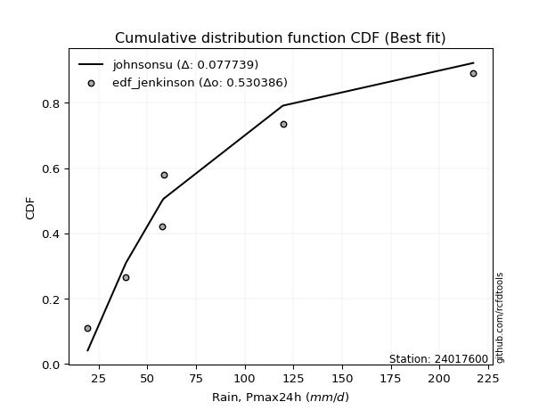</img>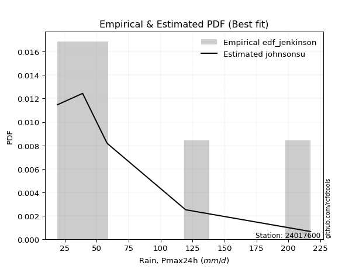</img>

</div>


### 11. Empirical - EDF Cunnane (1978)

Cunnane´s work in statistical hydrology has focused on the performance and evaluation of different probability distributions (such as GEV, Gumbel, Lognormal) for flood frequency estimation. _b_ is a constant, typically set to 0.4.

<div align="center">


$P=(m-b)/(n+1-2b)$


</div>


**11.1. Empirical values**

<div align="center">

|                | 0                   | 1                   | 2                  | 3           | 4                  | 5                  | 6                  |
|:---------------|:--------------------|:--------------------|:-------------------|:------------|:-------------------|:-------------------|:-------------------|
| date           | 2023                | 2019                | 2020               | 2022        | 2025               | 2024               | 2021               |
| x              | 19.4                | 39.0                | 57.6               | 58.4        | 87.4               | 119.6              | 217.4              |
| m              | 1                   | 2                   | 3                  | 4           | 5                  | 6                  | 7                  |
| empirical_dist | edf_cunnane         | edf_cunnane         | edf_cunnane        | edf_cunnane | edf_cunnane        | edf_cunnane        | edf_cunnane        |
| empirical      | 0.08333333333333333 | 0.22222222222222224 | 0.3611111111111111 | 0.5         | 0.6388888888888888 | 0.7777777777777777 | 0.9166666666666666 |
| empirical_tr   | 1.090909090909091   | 1.2857142857142856  | 1.565217391304348  | 2.0         | 2.7692307692307687 | 4.499999999999998  | 11.999999999999995 |

</div>


**11.2. Kolmogorov-Smirnov fit test (sorted by Δ)**


<div align="center">

|                | 0                   | 1                   | 2                   | 3                   | 4                   | 5                   | 6                   | 7                     | 8                   | 9                   | 10                  | 11                  | 12                  | 13                  | 14                  | 15                  | 16                  | 17                  | 18                  | 19                  | 20                  | 21                  | 22                  | 23                  | 24                  | 25                  | 26                  | 27                  | 28                  | 29                  | 30                  | 31                  | 32                  | 33                  | 34                  | 35                  | 36                  | 37                  | 38                  | 39                  | 40                  | 41                  | 42                  | 43                  | 44                  | 45                  | 46                  | 47                  | 48                  | 49                  | 50                  | 51                  | 52                  | 53                  | 54                  | 55                  | 56                  | 57                  | 58                  | 59                  | 60                  | 61                  | 62                  | 63                  | 64                  | 65                  | 66                  | 67                  | 68                  | 69                  | 70                  | 71                  | 72                  | 73                  | 74                  | 75                  | 76                  | 77                  | 78                  | 79                  | 80                  | 81                  | 82                  | 83                  | 84                  | 85                  | 86                  | 87                  | 88                  | 89                  |
|:---------------|:--------------------|:--------------------|:--------------------|:--------------------|:--------------------|:--------------------|:--------------------|:----------------------|:--------------------|:--------------------|:--------------------|:--------------------|:--------------------|:--------------------|:--------------------|:--------------------|:--------------------|:--------------------|:--------------------|:--------------------|:--------------------|:--------------------|:--------------------|:--------------------|:--------------------|:--------------------|:--------------------|:--------------------|:--------------------|:--------------------|:--------------------|:--------------------|:--------------------|:--------------------|:--------------------|:--------------------|:--------------------|:--------------------|:--------------------|:--------------------|:--------------------|:--------------------|:--------------------|:--------------------|:--------------------|:--------------------|:--------------------|:--------------------|:--------------------|:--------------------|:--------------------|:--------------------|:--------------------|:--------------------|:--------------------|:--------------------|:--------------------|:--------------------|:--------------------|:--------------------|:--------------------|:--------------------|:--------------------|:--------------------|:--------------------|:--------------------|:--------------------|:--------------------|:--------------------|:--------------------|:--------------------|:--------------------|:--------------------|:--------------------|:--------------------|:--------------------|:--------------------|:--------------------|:--------------------|:--------------------|:--------------------|:--------------------|:--------------------|:--------------------|:--------------------|:--------------------|:--------------------|:--------------------|:--------------------|:--------------------|
| station        | 24017600            | 24017600            | 24017600            | 24017600            | 24017600            | 24017600            | 24017600            | 24017600              | 24017600            | 24017600            | 24017600            | 24017600            | 24017600            | 24017600            | 24017600            | 24017600            | 24017600            | 24017600            | 24017600            | 24017600            | 24017600            | 24017600            | 24017600            | 24017600            | 24017600            | 24017600            | 24017600            | 24017600            | 24017600            | 24017600            | 24017600            | 24017600            | 24017600            | 24017600            | 24017600            | 24017600            | 24017600            | 24017600            | 24017600            | 24017600            | 24017600            | 24017600            | 24017600            | 24017600            | 24017600            | 24017600            | 24017600            | 24017600            | 24017600            | 24017600            | 24017600            | 24017600            | 24017600            | 24017600            | 24017600            | 24017600            | 24017600            | 24017600            | 24017600            | 24017600            | 24017600            | 24017600            | 24017600            | 24017600            | 24017600            | 24017600            | 24017600            | 24017600            | 24017600            | 24017600            | 24017600            | 24017600            | 24017600            | 24017600            | 24017600            | 24017600            | 24017600            | 24017600            | 24017600            | 24017600            | 24017600            | 24017600            | 24017600            | 24017600            | 24017600            | 24017600            | 24017600            | 24017600            | 24017600            | 24017600            |
| empirical_dist | edf_cunnane         | edf_cunnane         | edf_cunnane         | edf_cunnane         | edf_cunnane         | edf_cunnane         | edf_cunnane         | edf_cunnane           | edf_cunnane         | edf_cunnane         | edf_cunnane         | edf_cunnane         | edf_cunnane         | edf_cunnane         | edf_cunnane         | edf_cunnane         | edf_cunnane         | edf_cunnane         | edf_cunnane         | edf_cunnane         | edf_cunnane         | edf_cunnane         | edf_cunnane         | edf_cunnane         | edf_cunnane         | edf_cunnane         | edf_cunnane         | edf_cunnane         | edf_cunnane         | edf_cunnane         | edf_cunnane         | edf_cunnane         | edf_cunnane         | edf_cunnane         | edf_cunnane         | edf_cunnane         | edf_cunnane         | edf_cunnane         | edf_cunnane         | edf_cunnane         | edf_cunnane         | edf_cunnane         | edf_cunnane         | edf_cunnane         | edf_cunnane         | edf_cunnane         | edf_cunnane         | edf_cunnane         | edf_cunnane         | edf_cunnane         | edf_cunnane         | edf_cunnane         | edf_cunnane         | edf_cunnane         | edf_cunnane         | edf_cunnane         | edf_cunnane         | edf_cunnane         | edf_cunnane         | edf_cunnane         | edf_cunnane         | edf_cunnane         | edf_cunnane         | edf_cunnane         | edf_cunnane         | edf_cunnane         | edf_cunnane         | edf_cunnane         | edf_cunnane         | edf_cunnane         | edf_cunnane         | edf_cunnane         | edf_cunnane         | edf_cunnane         | edf_cunnane         | edf_cunnane         | edf_cunnane         | edf_cunnane         | edf_cunnane         | edf_cunnane         | edf_cunnane         | edf_cunnane         | edf_cunnane         | edf_cunnane         | edf_cunnane         | edf_cunnane         | edf_cunnane         | edf_cunnane         | edf_cunnane         | edf_cunnane         |
| p_dist         | logncf              | logweibull_min      | logerlang           | loggamma            | loggamma            | fisk                | invgamma            | loglaplace_asymmetric | logfatiguelife      | logbetaprime        | logf                | invweibull          | lognct              | logt                | logexponnorm        | lognorm             | lognorm             | logcrystalball      | nct                 | johnsonsu           | invgauss            | logpearson3         | mielke              | logjohnsonsu        | loggenlogistic      | logloggamma         | loginvgamma         | logrice             | betaprime           | logfisk             | f                   | alpha               | loglogistic         | logalpha            | exponnorm           | loggompertz         | genexpon            | expon               | fatiguelife         | ncf                 | loginvgauss         | logmielke           | laplace_asymmetric  | loghypsecant        | halflogistic        | logmaxwell          | halfnorm            | nakagami            | t                   | lograyleigh         | gompertz            | moyal               | pearson3            | loglaplace          | wald                | loggumbel_r         | loginvweibull       | gumbel_r            | rayleigh            | genlogistic         | maxwell             | loggumbel_l         | logkstwobign        | loghalfnorm         | logmoyal            | kstwobign           | loghalflogistic     | truncnorm           | norm                | crystalball         | weibull_min         | loggenexpon         | logistic            | rice                | chi2                | hypsecant           | gamma               | logtruncnorm        | logwald             | loggibrat           | gibrat              | logexpon            | gumbel_l            | laplace             | lognakagami         | erlang              | logchi2             | pareto              | loglognorm          | logpareto           |
| delta          | 0.06647960530954844 | 0.06651511238819563 | 0.06828009004351793 | 0.06851909659206645 | 0.06851909659206645 | 0.06858521629695907 | 0.06870199338562988 | 0.06879155254098446   | 0.069337349647357   | 0.06976263337316779 | 0.06988909512472191 | 0.07012763315868287 | 0.07141835641923189 | 0.07169112739628047 | 0.0716928377968577  | 0.07169320299986304 | 0.07169320299986304 | 0.07169447244042604 | 0.072161400629971   | 0.07360324717325156 | 0.07490925354578704 | 0.07529497611266012 | 0.07579323103731156 | 0.07594091201155384 | 0.07628029774747835 | 0.07711677656845173 | 0.07722235777250891 | 0.07747742521427942 | 0.07841854573367074 | 0.07900464159852555 | 0.08011454394008222 | 0.08015861685242925 | 0.08120675426166196 | 0.08157013168017269 | 0.0822939804941349  | 0.08333332805145258 | 0.08333333333279078 | 0.08333333333333333 | 0.0843874193996681  | 0.08440750489610749 | 0.0856063618469059  | 0.0857309752563073  | 0.08790066108772299 | 0.08915422754021252 | 0.08994087137066648 | 0.09407204469799835 | 0.09438017886048217 | 0.09645471773674952 | 0.10129274336566181 | 0.10626679572415415 | 0.10692254876008583 | 0.11240838243100915 | 0.11250883231319275 | 0.11274682108008732 | 0.11459580372417402 | 0.12301494093909265 | 0.12310479128210178 | 0.12749370450682662 | 0.12781557792788562 | 0.13540478628128094 | 0.13957075433997246 | 0.14061726284067494 | 0.14071394474412618 | 0.14078183341662148 | 0.1472071973408698  | 0.15634125934186743 | 0.1588816859296493  | 0.1701207391932904  | 0.17012075475680333 | 0.1701207629025393  | 0.17361373902152427 | 0.18444965805218122 | 0.18965760402927828 | 0.19037794063537755 | 0.20432675471207    | 0.20442273868607702 | 0.20474495941619336 | 0.2080294533132976  | 0.21374801165773388 | 0.2206892876330919  | 0.22219786898085273 | 0.22526257870324035 | 0.22671081659780917 | 0.23172693964384433 | 0.23212652074924528 | 0.2584738286324542  | 0.35979289137979664 | 0.4038086417186796  | 0.41701072772214476 | 0.43083844969362295 |
| deltao         | 0.48442053926100004 | 0.48442053926100004 | 0.48442053926100004 | 0.48442053926100004 | 0.48442053926100004 | 0.48442053926100004 | 0.48442053926100004 | 0.48442053926100004   | 0.48442053926100004 | 0.48442053926100004 | 0.48442053926100004 | 0.48442053926100004 | 0.48442053926100004 | 0.48442053926100004 | 0.48442053926100004 | 0.48442053926100004 | 0.48442053926100004 | 0.48442053926100004 | 0.48442053926100004 | 0.48442053926100004 | 0.48442053926100004 | 0.48442053926100004 | 0.48442053926100004 | 0.48442053926100004 | 0.48442053926100004 | 0.48442053926100004 | 0.48442053926100004 | 0.48442053926100004 | 0.48442053926100004 | 0.48442053926100004 | 0.48442053926100004 | 0.48442053926100004 | 0.48442053926100004 | 0.48442053926100004 | 0.48442053926100004 | 0.48442053926100004 | 0.48442053926100004 | 0.48442053926100004 | 0.48442053926100004 | 0.48442053926100004 | 0.48442053926100004 | 0.48442053926100004 | 0.48442053926100004 | 0.48442053926100004 | 0.48442053926100004 | 0.48442053926100004 | 0.48442053926100004 | 0.48442053926100004 | 0.48442053926100004 | 0.48442053926100004 | 0.48442053926100004 | 0.48442053926100004 | 0.48442053926100004 | 0.48442053926100004 | 0.48442053926100004 | 0.48442053926100004 | 0.48442053926100004 | 0.48442053926100004 | 0.48442053926100004 | 0.48442053926100004 | 0.48442053926100004 | 0.48442053926100004 | 0.48442053926100004 | 0.48442053926100004 | 0.48442053926100004 | 0.48442053926100004 | 0.48442053926100004 | 0.48442053926100004 | 0.48442053926100004 | 0.48442053926100004 | 0.48442053926100004 | 0.48442053926100004 | 0.48442053926100004 | 0.48442053926100004 | 0.48442053926100004 | 0.48442053926100004 | 0.48442053926100004 | 0.48442053926100004 | 0.48442053926100004 | 0.48442053926100004 | 0.48442053926100004 | 0.48442053926100004 | 0.48442053926100004 | 0.48442053926100004 | 0.48442053926100004 | 0.48442053926100004 | 0.48442053926100004 | 0.48442053926100004 | 0.48442053926100004 | 0.48442053926100004 |
| eval           | Δo > Δ              | Δo > Δ              | Δo > Δ              | Δo > Δ              | Δo > Δ              | Δo > Δ              | Δo > Δ              | Δo > Δ                | Δo > Δ              | Δo > Δ              | Δo > Δ              | Δo > Δ              | Δo > Δ              | Δo > Δ              | Δo > Δ              | Δo > Δ              | Δo > Δ              | Δo > Δ              | Δo > Δ              | Δo > Δ              | Δo > Δ              | Δo > Δ              | Δo > Δ              | Δo > Δ              | Δo > Δ              | Δo > Δ              | Δo > Δ              | Δo > Δ              | Δo > Δ              | Δo > Δ              | Δo > Δ              | Δo > Δ              | Δo > Δ              | Δo > Δ              | Δo > Δ              | Δo > Δ              | Δo > Δ              | Δo > Δ              | Δo > Δ              | Δo > Δ              | Δo > Δ              | Δo > Δ              | Δo > Δ              | Δo > Δ              | Δo > Δ              | Δo > Δ              | Δo > Δ              | Δo > Δ              | Δo > Δ              | Δo > Δ              | Δo > Δ              | Δo > Δ              | Δo > Δ              | Δo > Δ              | Δo > Δ              | Δo > Δ              | Δo > Δ              | Δo > Δ              | Δo > Δ              | Δo > Δ              | Δo > Δ              | Δo > Δ              | Δo > Δ              | Δo > Δ              | Δo > Δ              | Δo > Δ              | Δo > Δ              | Δo > Δ              | Δo > Δ              | Δo > Δ              | Δo > Δ              | Δo > Δ              | Δo > Δ              | Δo > Δ              | Δo > Δ              | Δo > Δ              | Δo > Δ              | Δo > Δ              | Δo > Δ              | Δo > Δ              | Δo > Δ              | Δo > Δ              | Δo > Δ              | Δo > Δ              | Δo > Δ              | Δo > Δ              | Δo > Δ              | Δo > Δ              | Δo > Δ              | Δo > Δ              |
| fit            | 1                   | 1                   | 1                   | 1                   | 1                   | 1                   | 1                   | 1                     | 1                   | 1                   | 1                   | 1                   | 1                   | 1                   | 1                   | 1                   | 1                   | 1                   | 1                   | 1                   | 1                   | 1                   | 1                   | 1                   | 1                   | 1                   | 1                   | 1                   | 1                   | 1                   | 1                   | 1                   | 1                   | 1                   | 1                   | 1                   | 1                   | 1                   | 1                   | 1                   | 1                   | 1                   | 1                   | 1                   | 1                   | 1                   | 1                   | 1                   | 1                   | 1                   | 1                   | 1                   | 1                   | 1                   | 1                   | 1                   | 1                   | 1                   | 1                   | 1                   | 1                   | 1                   | 1                   | 1                   | 1                   | 1                   | 1                   | 1                   | 1                   | 1                   | 1                   | 1                   | 1                   | 1                   | 1                   | 1                   | 1                   | 1                   | 1                   | 1                   | 1                   | 1                   | 1                   | 1                   | 1                   | 1                   | 1                   | 1                   | 1                   | 1                   |
| n              | 7                   | 7                   | 7                   | 7                   | 7                   | 7                   | 7                   | 7                     | 7                   | 7                   | 7                   | 7                   | 7                   | 7                   | 7                   | 7                   | 7                   | 7                   | 7                   | 7                   | 7                   | 7                   | 7                   | 7                   | 7                   | 7                   | 7                   | 7                   | 7                   | 7                   | 7                   | 7                   | 7                   | 7                   | 7                   | 7                   | 7                   | 7                   | 7                   | 7                   | 7                   | 7                   | 7                   | 7                   | 7                   | 7                   | 7                   | 7                   | 7                   | 7                   | 7                   | 7                   | 7                   | 7                   | 7                   | 7                   | 7                   | 7                   | 7                   | 7                   | 7                   | 7                   | 7                   | 7                   | 7                   | 7                   | 7                   | 7                   | 7                   | 7                   | 7                   | 7                   | 7                   | 7                   | 7                   | 7                   | 7                   | 7                   | 7                   | 7                   | 7                   | 7                   | 7                   | 7                   | 7                   | 7                   | 7                   | 7                   | 7                   | 7                   |
| best_fit       | 1                   | 0                   | 0                   | 0                   | 0                   | 0                   | 0                   | 0                     | 0                   | 0                   | 0                   | 0                   | 0                   | 0                   | 0                   | 0                   | 0                   | 0                   | 0                   | 0                   | 0                   | 0                   | 0                   | 0                   | 0                   | 0                   | 0                   | 0                   | 0                   | 0                   | 0                   | 0                   | 0                   | 0                   | 0                   | 0                   | 0                   | 0                   | 0                   | 0                   | 0                   | 0                   | 0                   | 0                   | 0                   | 0                   | 0                   | 0                   | 0                   | 0                   | 0                   | 0                   | 0                   | 0                   | 0                   | 0                   | 0                   | 0                   | 0                   | 0                   | 0                   | 0                   | 0                   | 0                   | 0                   | 0                   | 0                   | 0                   | 0                   | 0                   | 0                   | 0                   | 0                   | 0                   | 0                   | 0                   | 0                   | 0                   | 0                   | 0                   | 0                   | 0                   | 0                   | 0                   | 0                   | 0                   | 0                   | 0                   | 0                   | 0                   |
| best_fit_sort  | 1                   | 2                   | 3                   | 4                   | 5                   | 6                   | 7                   | 8                     | 9                   | 10                  | 11                  | 12                  | 13                  | 14                  | 15                  | 16                  | 17                  | 18                  | 19                  | 20                  | 21                  | 22                  | 23                  | 24                  | 25                  | 26                  | 27                  | 28                  | 29                  | 30                  | 31                  | 32                  | 33                  | 34                  | 35                  | 36                  | 37                  | 38                  | 39                  | 40                  | 41                  | 42                  | 43                  | 44                  | 45                  | 46                  | 47                  | 48                  | 49                  | 50                  | 51                  | 52                  | 53                  | 54                  | 55                  | 56                  | 57                  | 58                  | 59                  | 60                  | 61                  | 62                  | 63                  | 64                  | 65                  | 66                  | 67                  | 68                  | 69                  | 70                  | 71                  | 72                  | 73                  | 74                  | 75                  | 76                  | 77                  | 78                  | 79                  | 80                  | 81                  | 82                  | 83                  | 84                  | 85                  | 86                  | 87                  | 88                  | 89                  | 90                  |

</div>


<div align="center">

</img>

</div>


**11.3. Best fit**

<div align="center">

|   id |   station | empirical_dist   | p_dist   |     delta |   deltao | eval   |   fit |   n |   best_fit |   best_fit_sort |
|-----:|----------:|:-----------------|:---------|----------:|---------:|:-------|------:|----:|-----------:|----------------:|
|    0 |  24017600 | edf_cunnane      | logncf   | 0.0664796 | 0.484421 | Δo > Δ |     1 |   7 |          1 |               1 |

</div>


<div align="center">

</img>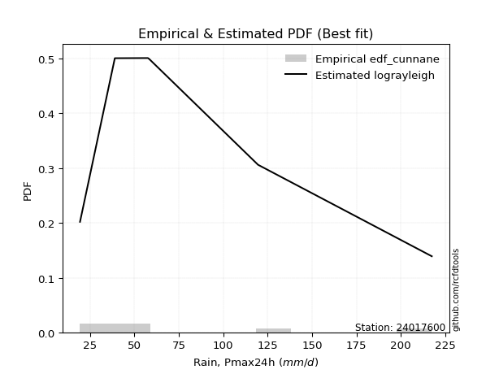</img>

</div>


### 12. Empirical - EDF Adamowski (1981)

The Adamowski formula in hydrology refers to a specific plotting position formula used for estimating the non-parametric empirical distribution of hydrological events (like flood peaks) to calculate their return periods. This formula provides an alternative to traditional parametric methods (like the Gumbel or Log Pearson Type III distributions). 

<div align="center">


$P=(m-0.25)/(n+0.5)$


</div>


**12.1. Empirical values**

<div align="center">

|                | 0                  | 1                   | 2                   | 3             | 4                  | 5                  | 6                  |
|:---------------|:-------------------|:--------------------|:--------------------|:--------------|:-------------------|:-------------------|:-------------------|
| date           | 2023               | 2019                | 2020                | 2022          | 2025               | 2024               | 2021               |
| x              | 19.4               | 39.0                | 57.6                | 58.4          | 87.4               | 119.6              | 217.4              |
| m              | 1                  | 2                   | 3                   | 4             | 5                  | 6                  | 7                  |
| empirical_dist | edf_adamowski      | edf_adamowski       | edf_adamowski       | edf_adamowski | edf_adamowski      | edf_adamowski      | edf_adamowski      |
| empirical      | 0.1                | 0.23333333333333334 | 0.36666666666666664 | 0.5           | 0.6333333333333333 | 0.7666666666666667 | 0.9                |
| empirical_tr   | 1.1111111111111112 | 1.3043478260869565  | 1.5789473684210527  | 2.0           | 2.727272727272727  | 4.2857142857142865 | 10.000000000000002 |

</div>


**12.2. Kolmogorov-Smirnov fit test (sorted by Δ)**


<div align="center">

|                | 0                   | 1                   | 2                   | 3                   | 4                   | 5                   | 6                   | 7                   | 8                   | 9                   | 10                  | 11                  | 12                  | 13                  | 14                  | 15                  | 16                  | 17                  | 18                  | 19                  | 20                  | 21                  | 22                    | 23                  | 24                  | 25                  | 26                  | 27                  | 28                  | 29                  | 30                  | 31                  | 32                  | 33                  | 34                  | 35                  | 36                  | 37                  | 38                  | 39                  | 40                  | 41                  | 42                  | 43                  | 44                  | 45                  | 46                  | 47                  | 48                  | 49                  | 50                  | 51                  | 52                  | 53                  | 54                  | 55                  | 56                  | 57                  | 58                  | 59                  | 60                  | 61                  | 62                  | 63                  | 64                  | 65                  | 66                  | 67                  | 68                  | 69                  | 70                  | 71                  | 72                  | 73                  | 74                  | 75                  | 76                  | 77                  | 78                  | 79                  | 80                  | 81                  | 82                  | 83                  | 84                  | 85                  | 86                  | 87                  | 88                  | 89                  |
|:---------------|:--------------------|:--------------------|:--------------------|:--------------------|:--------------------|:--------------------|:--------------------|:--------------------|:--------------------|:--------------------|:--------------------|:--------------------|:--------------------|:--------------------|:--------------------|:--------------------|:--------------------|:--------------------|:--------------------|:--------------------|:--------------------|:--------------------|:----------------------|:--------------------|:--------------------|:--------------------|:--------------------|:--------------------|:--------------------|:--------------------|:--------------------|:--------------------|:--------------------|:--------------------|:--------------------|:--------------------|:--------------------|:--------------------|:--------------------|:--------------------|:--------------------|:--------------------|:--------------------|:--------------------|:--------------------|:--------------------|:--------------------|:--------------------|:--------------------|:--------------------|:--------------------|:--------------------|:--------------------|:--------------------|:--------------------|:--------------------|:--------------------|:--------------------|:--------------------|:--------------------|:--------------------|:--------------------|:--------------------|:--------------------|:--------------------|:--------------------|:--------------------|:--------------------|:--------------------|:--------------------|:--------------------|:--------------------|:--------------------|:--------------------|:--------------------|:--------------------|:--------------------|:--------------------|:--------------------|:--------------------|:--------------------|:--------------------|:--------------------|:--------------------|:--------------------|:--------------------|:--------------------|:--------------------|:--------------------|:--------------------|
| station        | 24017600            | 24017600            | 24017600            | 24017600            | 24017600            | 24017600            | 24017600            | 24017600            | 24017600            | 24017600            | 24017600            | 24017600            | 24017600            | 24017600            | 24017600            | 24017600            | 24017600            | 24017600            | 24017600            | 24017600            | 24017600            | 24017600            | 24017600              | 24017600            | 24017600            | 24017600            | 24017600            | 24017600            | 24017600            | 24017600            | 24017600            | 24017600            | 24017600            | 24017600            | 24017600            | 24017600            | 24017600            | 24017600            | 24017600            | 24017600            | 24017600            | 24017600            | 24017600            | 24017600            | 24017600            | 24017600            | 24017600            | 24017600            | 24017600            | 24017600            | 24017600            | 24017600            | 24017600            | 24017600            | 24017600            | 24017600            | 24017600            | 24017600            | 24017600            | 24017600            | 24017600            | 24017600            | 24017600            | 24017600            | 24017600            | 24017600            | 24017600            | 24017600            | 24017600            | 24017600            | 24017600            | 24017600            | 24017600            | 24017600            | 24017600            | 24017600            | 24017600            | 24017600            | 24017600            | 24017600            | 24017600            | 24017600            | 24017600            | 24017600            | 24017600            | 24017600            | 24017600            | 24017600            | 24017600            | 24017600            |
| empirical_dist | edf_adamowski       | edf_adamowski       | edf_adamowski       | edf_adamowski       | edf_adamowski       | edf_adamowski       | edf_adamowski       | edf_adamowski       | edf_adamowski       | edf_adamowski       | edf_adamowski       | edf_adamowski       | edf_adamowski       | edf_adamowski       | edf_adamowski       | edf_adamowski       | edf_adamowski       | edf_adamowski       | edf_adamowski       | edf_adamowski       | edf_adamowski       | edf_adamowski       | edf_adamowski         | edf_adamowski       | edf_adamowski       | edf_adamowski       | edf_adamowski       | edf_adamowski       | edf_adamowski       | edf_adamowski       | edf_adamowski       | edf_adamowski       | edf_adamowski       | edf_adamowski       | edf_adamowski       | edf_adamowski       | edf_adamowski       | edf_adamowski       | edf_adamowski       | edf_adamowski       | edf_adamowski       | edf_adamowski       | edf_adamowski       | edf_adamowski       | edf_adamowski       | edf_adamowski       | edf_adamowski       | edf_adamowski       | edf_adamowski       | edf_adamowski       | edf_adamowski       | edf_adamowski       | edf_adamowski       | edf_adamowski       | edf_adamowski       | edf_adamowski       | edf_adamowski       | edf_adamowski       | edf_adamowski       | edf_adamowski       | edf_adamowski       | edf_adamowski       | edf_adamowski       | edf_adamowski       | edf_adamowski       | edf_adamowski       | edf_adamowski       | edf_adamowski       | edf_adamowski       | edf_adamowski       | edf_adamowski       | edf_adamowski       | edf_adamowski       | edf_adamowski       | edf_adamowski       | edf_adamowski       | edf_adamowski       | edf_adamowski       | edf_adamowski       | edf_adamowski       | edf_adamowski       | edf_adamowski       | edf_adamowski       | edf_adamowski       | edf_adamowski       | edf_adamowski       | edf_adamowski       | edf_adamowski       | edf_adamowski       | edf_adamowski       |
| p_dist         | logbetaprime        | logncf              | fisk                | logweibull_min      | johnsonsu           | logerlang           | loggamma            | loggamma            | invgamma            | logfatiguelife      | invgauss            | logf                | invweibull          | lognct              | loginvgamma         | logt                | logexponnorm        | lognorm             | lognorm             | logcrystalball      | logrice             | nct                 | loglaplace_asymmetric | logpearson3         | mielke              | logjohnsonsu        | logalpha            | loggenlogistic      | logloggamma         | betaprime           | fatiguelife         | logfisk             | loginvgauss         | f                   | alpha               | loglogistic         | ncf                 | logmielke           | laplace_asymmetric  | logmaxwell          | loghypsecant        | halflogistic        | halfnorm            | exponnorm           | loggompertz         | nakagami            | genexpon            | expon               | lograyleigh         | t                   | gompertz            | moyal               | pearson3            | loglaplace          | loggumbel_r         | loginvweibull       | wald                | gumbel_r            | rayleigh            | logkstwobign        | loghalfnorm         | genlogistic         | maxwell             | loggumbel_l         | logmoyal            | loghalflogistic     | kstwobign           | weibull_min         | truncnorm           | norm                | crystalball         | loggenexpon         | logistic            | rice                | chi2                | gamma               | hypsecant           | logwald             | logtruncnorm        | logexpon            | gumbel_l            | laplace             | loggibrat           | gibrat              | lognakagami         | erlang              | logchi2             | pareto              | loglognorm          | logpareto           |
| delta          | 0.06420707781761226 | 0.06493887871652049 | 0.06603908113093687 | 0.06651511238819563 | 0.06804769161769603 | 0.06828009004351793 | 0.06851909659206645 | 0.06851909659206645 | 0.06870199338562988 | 0.069337349647357   | 0.0693536979902315  | 0.06988909512472191 | 0.07012763315868287 | 0.07141835641923189 | 0.07166680221695337 | 0.07169112739628047 | 0.0716928377968577  | 0.07169320299986304 | 0.07169320299986304 | 0.07169447244042604 | 0.07192186965872388 | 0.072161400629971   | 0.07434710809654      | 0.07529497611266012 | 0.07579323103731156 | 0.07594091201155384 | 0.07601457612461715 | 0.07628029774747835 | 0.07711677656845173 | 0.07841854573367074 | 0.07883186384411256 | 0.07900464159852555 | 0.08005080629135036 | 0.08011454394008222 | 0.08015861685242925 | 0.08120675426166196 | 0.08440750489610749 | 0.0857309752563073  | 0.08790066108772299 | 0.08851648914244281 | 0.08915422754021252 | 0.08994087137066648 | 0.09438017886048217 | 0.09896064716080158 | 0.09999999471811925 | 0.09999999993346373 | 0.09999999999945745 | 0.1                 | 0.10071124016859861 | 0.1029839142149106  | 0.10692254876008583 | 0.11240838243100915 | 0.11250883231319275 | 0.11274682108008732 | 0.11745938538353712 | 0.11754923572654624 | 0.12570691483528512 | 0.12749370450682662 | 0.12781557792788562 | 0.13515838918857065 | 0.13522627786106595 | 0.13540478628128094 | 0.13957075433997246 | 0.14061726284067494 | 0.14165164178531425 | 0.15332613037409376 | 0.15634125934186743 | 0.16805818346596874 | 0.1701207391932904  | 0.17012075475680333 | 0.1701207629025393  | 0.17889410249662568 | 0.18965760402927828 | 0.19037794063537755 | 0.19877119915651448 | 0.19918940386063783 | 0.20442273868607702 | 0.20819245610217835 | 0.2191405644244087  | 0.2197070231476848  | 0.22671081659780917 | 0.23172693964384433 | 0.231800398744203   | 0.23330898009196382 | 0.23333183151430814 | 0.2529182730768987  | 0.3486817802686855  | 0.39269753060756846 | 0.40589961661103363 | 0.4197273385825118  |
| deltao         | 0.48442053926100004 | 0.48442053926100004 | 0.48442053926100004 | 0.48442053926100004 | 0.48442053926100004 | 0.48442053926100004 | 0.48442053926100004 | 0.48442053926100004 | 0.48442053926100004 | 0.48442053926100004 | 0.48442053926100004 | 0.48442053926100004 | 0.48442053926100004 | 0.48442053926100004 | 0.48442053926100004 | 0.48442053926100004 | 0.48442053926100004 | 0.48442053926100004 | 0.48442053926100004 | 0.48442053926100004 | 0.48442053926100004 | 0.48442053926100004 | 0.48442053926100004   | 0.48442053926100004 | 0.48442053926100004 | 0.48442053926100004 | 0.48442053926100004 | 0.48442053926100004 | 0.48442053926100004 | 0.48442053926100004 | 0.48442053926100004 | 0.48442053926100004 | 0.48442053926100004 | 0.48442053926100004 | 0.48442053926100004 | 0.48442053926100004 | 0.48442053926100004 | 0.48442053926100004 | 0.48442053926100004 | 0.48442053926100004 | 0.48442053926100004 | 0.48442053926100004 | 0.48442053926100004 | 0.48442053926100004 | 0.48442053926100004 | 0.48442053926100004 | 0.48442053926100004 | 0.48442053926100004 | 0.48442053926100004 | 0.48442053926100004 | 0.48442053926100004 | 0.48442053926100004 | 0.48442053926100004 | 0.48442053926100004 | 0.48442053926100004 | 0.48442053926100004 | 0.48442053926100004 | 0.48442053926100004 | 0.48442053926100004 | 0.48442053926100004 | 0.48442053926100004 | 0.48442053926100004 | 0.48442053926100004 | 0.48442053926100004 | 0.48442053926100004 | 0.48442053926100004 | 0.48442053926100004 | 0.48442053926100004 | 0.48442053926100004 | 0.48442053926100004 | 0.48442053926100004 | 0.48442053926100004 | 0.48442053926100004 | 0.48442053926100004 | 0.48442053926100004 | 0.48442053926100004 | 0.48442053926100004 | 0.48442053926100004 | 0.48442053926100004 | 0.48442053926100004 | 0.48442053926100004 | 0.48442053926100004 | 0.48442053926100004 | 0.48442053926100004 | 0.48442053926100004 | 0.48442053926100004 | 0.48442053926100004 | 0.48442053926100004 | 0.48442053926100004 | 0.48442053926100004 |
| eval           | Δo > Δ              | Δo > Δ              | Δo > Δ              | Δo > Δ              | Δo > Δ              | Δo > Δ              | Δo > Δ              | Δo > Δ              | Δo > Δ              | Δo > Δ              | Δo > Δ              | Δo > Δ              | Δo > Δ              | Δo > Δ              | Δo > Δ              | Δo > Δ              | Δo > Δ              | Δo > Δ              | Δo > Δ              | Δo > Δ              | Δo > Δ              | Δo > Δ              | Δo > Δ                | Δo > Δ              | Δo > Δ              | Δo > Δ              | Δo > Δ              | Δo > Δ              | Δo > Δ              | Δo > Δ              | Δo > Δ              | Δo > Δ              | Δo > Δ              | Δo > Δ              | Δo > Δ              | Δo > Δ              | Δo > Δ              | Δo > Δ              | Δo > Δ              | Δo > Δ              | Δo > Δ              | Δo > Δ              | Δo > Δ              | Δo > Δ              | Δo > Δ              | Δo > Δ              | Δo > Δ              | Δo > Δ              | Δo > Δ              | Δo > Δ              | Δo > Δ              | Δo > Δ              | Δo > Δ              | Δo > Δ              | Δo > Δ              | Δo > Δ              | Δo > Δ              | Δo > Δ              | Δo > Δ              | Δo > Δ              | Δo > Δ              | Δo > Δ              | Δo > Δ              | Δo > Δ              | Δo > Δ              | Δo > Δ              | Δo > Δ              | Δo > Δ              | Δo > Δ              | Δo > Δ              | Δo > Δ              | Δo > Δ              | Δo > Δ              | Δo > Δ              | Δo > Δ              | Δo > Δ              | Δo > Δ              | Δo > Δ              | Δo > Δ              | Δo > Δ              | Δo > Δ              | Δo > Δ              | Δo > Δ              | Δo > Δ              | Δo > Δ              | Δo > Δ              | Δo > Δ              | Δo > Δ              | Δo > Δ              | Δo > Δ              |
| fit            | 1                   | 1                   | 1                   | 1                   | 1                   | 1                   | 1                   | 1                   | 1                   | 1                   | 1                   | 1                   | 1                   | 1                   | 1                   | 1                   | 1                   | 1                   | 1                   | 1                   | 1                   | 1                   | 1                     | 1                   | 1                   | 1                   | 1                   | 1                   | 1                   | 1                   | 1                   | 1                   | 1                   | 1                   | 1                   | 1                   | 1                   | 1                   | 1                   | 1                   | 1                   | 1                   | 1                   | 1                   | 1                   | 1                   | 1                   | 1                   | 1                   | 1                   | 1                   | 1                   | 1                   | 1                   | 1                   | 1                   | 1                   | 1                   | 1                   | 1                   | 1                   | 1                   | 1                   | 1                   | 1                   | 1                   | 1                   | 1                   | 1                   | 1                   | 1                   | 1                   | 1                   | 1                   | 1                   | 1                   | 1                   | 1                   | 1                   | 1                   | 1                   | 1                   | 1                   | 1                   | 1                   | 1                   | 1                   | 1                   | 1                   | 1                   |
| n              | 7                   | 7                   | 7                   | 7                   | 7                   | 7                   | 7                   | 7                   | 7                   | 7                   | 7                   | 7                   | 7                   | 7                   | 7                   | 7                   | 7                   | 7                   | 7                   | 7                   | 7                   | 7                   | 7                     | 7                   | 7                   | 7                   | 7                   | 7                   | 7                   | 7                   | 7                   | 7                   | 7                   | 7                   | 7                   | 7                   | 7                   | 7                   | 7                   | 7                   | 7                   | 7                   | 7                   | 7                   | 7                   | 7                   | 7                   | 7                   | 7                   | 7                   | 7                   | 7                   | 7                   | 7                   | 7                   | 7                   | 7                   | 7                   | 7                   | 7                   | 7                   | 7                   | 7                   | 7                   | 7                   | 7                   | 7                   | 7                   | 7                   | 7                   | 7                   | 7                   | 7                   | 7                   | 7                   | 7                   | 7                   | 7                   | 7                   | 7                   | 7                   | 7                   | 7                   | 7                   | 7                   | 7                   | 7                   | 7                   | 7                   | 7                   |
| best_fit       | 1                   | 0                   | 0                   | 0                   | 0                   | 0                   | 0                   | 0                   | 0                   | 0                   | 0                   | 0                   | 0                   | 0                   | 0                   | 0                   | 0                   | 0                   | 0                   | 0                   | 0                   | 0                   | 0                     | 0                   | 0                   | 0                   | 0                   | 0                   | 0                   | 0                   | 0                   | 0                   | 0                   | 0                   | 0                   | 0                   | 0                   | 0                   | 0                   | 0                   | 0                   | 0                   | 0                   | 0                   | 0                   | 0                   | 0                   | 0                   | 0                   | 0                   | 0                   | 0                   | 0                   | 0                   | 0                   | 0                   | 0                   | 0                   | 0                   | 0                   | 0                   | 0                   | 0                   | 0                   | 0                   | 0                   | 0                   | 0                   | 0                   | 0                   | 0                   | 0                   | 0                   | 0                   | 0                   | 0                   | 0                   | 0                   | 0                   | 0                   | 0                   | 0                   | 0                   | 0                   | 0                   | 0                   | 0                   | 0                   | 0                   | 0                   |
| best_fit_sort  | 1                   | 2                   | 3                   | 4                   | 5                   | 6                   | 7                   | 8                   | 9                   | 10                  | 11                  | 12                  | 13                  | 14                  | 15                  | 16                  | 17                  | 18                  | 19                  | 20                  | 21                  | 22                  | 23                    | 24                  | 25                  | 26                  | 27                  | 28                  | 29                  | 30                  | 31                  | 32                  | 33                  | 34                  | 35                  | 36                  | 37                  | 38                  | 39                  | 40                  | 41                  | 42                  | 43                  | 44                  | 45                  | 46                  | 47                  | 48                  | 49                  | 50                  | 51                  | 52                  | 53                  | 54                  | 55                  | 56                  | 57                  | 58                  | 59                  | 60                  | 61                  | 62                  | 63                  | 64                  | 65                  | 66                  | 67                  | 68                  | 69                  | 70                  | 71                  | 72                  | 73                  | 74                  | 75                  | 76                  | 77                  | 78                  | 79                  | 80                  | 81                  | 82                  | 83                  | 84                  | 85                  | 86                  | 87                  | 88                  | 89                  | 90                  |

</div>


<div align="center">

</img>

</div>


**12.3. Best fit**

<div align="center">

|   id |   station | empirical_dist   | p_dist       |     delta |   deltao | eval   |   fit |   n |   best_fit |   best_fit_sort |
|-----:|----------:|:-----------------|:-------------|----------:|---------:|:-------|------:|----:|-----------:|----------------:|
|    0 |  24017600 | edf_adamowski    | logbetaprime | 0.0642071 | 0.484421 | Δo > Δ |     1 |   7 |          1 |               1 |

</div>


<div align="center">

</img>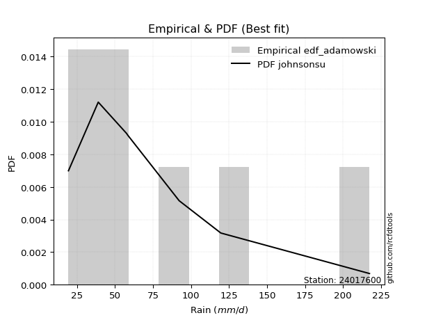</img>

</div>


## C. Best fit & Estimate extreme values for specific return periods - Tr


### 1. Best fit (ordered by delta Δ)

<div align="center">

|   id |   station | empirical_dist   | p_dist         |     delta |   deltao | eval   |   fit |   n |   best_fit |   best_fit_sort |
|-----:|----------:|:-----------------|:---------------|----------:|---------:|:-------|------:|----:|-----------:|----------------:|
|    0 |  24017600 | edf_adamowski    | logbetaprime   | 0.0642071 | 0.484421 | Δo > Δ |     1 |   7 |          1 |               1 |
|    1 |  24017600 | edf_chegodayev   | fisk           | 0.0648315 | 0.484421 | Δo > Δ |     1 |   7 |          1 |               2 |
|    2 |  24017600 | edf_filliben     | logncf         | 0.0649389 | 0.484421 | Δo > Δ |     1 |   7 |          1 |               3 |
|    3 |  24017600 | edf_jenkinson    | logncf         | 0.0649389 | 0.484421 | Δo > Δ |     1 |   7 |          1 |               4 |
|    4 |  24017600 | edf_tukey        | logncf         | 0.0649389 | 0.484421 | Δo > Δ |     1 |   7 |          1 |               5 |
|    5 |  24017600 | edf_beard        | logncf         | 0.0649389 | 0.484421 | Δo > Δ |     1 |   7 |          1 |               6 |
|    6 |  24017600 | edf_blom         | logncf         | 0.0655218 | 0.484421 | Δo > Δ |     1 |   7 |          1 |               7 |
|    7 |  24017600 | edf_cunnane      | logncf         | 0.0664796 | 0.484421 | Δo > Δ |     1 |   7 |          1 |               8 |
|    8 |  24017600 | edf_gringorten   | logweibull_min | 0.0666135 | 0.484421 | Δo > Δ |     1 |   7 |          1 |               9 |
|    9 |  24017600 | edf_hazen        | logerlang      | 0.0682801 | 0.484421 | Δo > Δ |     1 |   7 |          1 |              10 |
|   10 |  24017600 | edf_weibull      | loggenlogistic | 0.0769124 | 0.484421 | Δo > Δ |     1 |   7 |          1 |              11 |
|   11 |  24017600 | edf_california   | t              | 0.107322  | 0.484421 | Δo > Δ |     1 |   7 |          1 |              12 |

</div>

:file_folder:Tables: [bestfit_24017600.csv](table/bestfit_24017600.csv) | [extreme_24017600.csv](table/extreme_24017600.csv)


### 2. Extreme values

In hydrology, a return period (or recurrence interval $Tr$) is the statistical average time between extreme events like floods or droughts of a specific magnitude, indicating how rare an event is, with a 100-year flood, for example, having a 1% chance of occurring in any given year, not that it happens exactly every century. It is a key tool for infrastructure design (like bridges or dams) and risk assessment, calculated from historical data to determine the probability of future events, although it is important to remember it is statistical average, and events can cluster or be missed.

> risk_rate: assuming the return period as the project useful life.

|   id |      tr |   prob_l |     prob_g |     alpha |   betaprime |     chi2 |   crystalball |   erlang |    expon |   exponnorm |        f |   fatiguelife |      fisk |    gamma |   genexpon |   genlogistic |   gibrat |   gompertz |   gumbel_l |   gumbel_r |   halflogistic |   halfnorm |   hypsecant |   invgamma |   invgauss |   invweibull |   johnsonsu |   kstwobign |   laplace |   laplace_asymmetric |   loggamma |   logistic |   lognorm |   maxwell |    mielke |    moyal |   nakagami |      ncf |      nct |     norm |           pareto |   pearson3 |   rayleigh |     rice |        t |   truncnorm |     wald |   weibull_min |   logalpha |   logbetaprime |     logchi2 |   logcrystalball |   logerlang |   logexpon |   logexponnorm |     logf |   logfatiguelife |   logfisk |   loggenexpon |   loggenlogistic |   loggibrat |   loggompertz |   loggumbel_l |   loggumbel_r |   loghalflogistic |   loghalfnorm |   loghypsecant |   loginvgamma |   loginvgauss |   loginvweibull |   logjohnsonsu |   logkstwobign |   loglaplace |   loglaplace_asymmetric |   logloggamma |   loglogistic |    loglognorm |   logmaxwell |   logmielke |   logmoyal |   lognakagami |   logncf |   lognct |     logpareto |   logpearson3 |   lograyleigh |   logrice |     logt |   logtruncnorm |    logwald |   logweibull_min |   station |   n |   risk_rate |
|-----:|--------:|---------:|-----------:|----------:|------------:|---------:|--------------:|---------:|---------:|------------:|---------:|--------------:|----------:|---------:|-----------:|--------------:|---------:|-----------:|-----------:|-----------:|---------------:|-----------:|------------:|-----------:|-----------:|-------------:|------------:|------------:|----------:|---------------------:|-----------:|-----------:|----------:|----------:|----------:|---------:|-----------:|---------:|---------:|---------:|-----------------:|-----------:|-----------:|---------:|---------:|------------:|---------:|--------------:|-----------:|---------------:|------------:|-----------------:|------------:|-----------:|---------------:|---------:|-----------------:|----------:|--------------:|-----------------:|------------:|--------------:|--------------:|--------------:|------------------:|--------------:|---------------:|--------------:|--------------:|----------------:|---------------:|---------------:|-------------:|------------------------:|--------------:|--------------:|--------------:|-------------:|------------:|-----------:|--------------:|---------:|---------:|--------------:|--------------:|--------------:|----------:|---------:|---------------:|-----------:|-----------------:|----------:|----:|------------:|
|    0 |    2    | 0.5      | 0.5        |   66.7911 |     67.1762 |  49.5742 |       85.5429 |  44.9419 |  65.2467 |     65.1214 |  67.4072 |       64.1084 |   65.1876 |  50.6517 |    66.9736 |       73.9903 |  67.0364 |    72.2326 |    95.6716 |    75.4141 |        70.3786 |    72.9224 |     85.5429 |    65.8768 |    64.9605 |      65.8899 |     65.0021 |     77.9117 |   85.5429 |              68.2947 |    66.1641 |    85.5429 |   66.5537 |   80.2698 |   66.4099 |  72.1442 |    75.6471 |  67.7503 |  66.108  |  85.5429 |     22.8369      |    73.9075 |    78.3997 |  84.1693 |  62.2511 |     85.5429 |  65.5572 |       53.1413 |    63.9406 |        65.3794 |     31.841  |          66.5539 |     66.1373 |    45.5924 |        66.5536 |  66.3385 |          66.2519 |   66.77   |       51.5939 |          66.4675 |     53.5656 |       65.2584 |       74.9512 |       59.097  |           55.7066 |       57.3943 |        66.5537 |       64.4645 |       63.5374 |         59.4186 |        67.0962 |        57.3849 |      66.5537 |                 62.5741 |       67.2436 |       66.5537 |  19.5594      |      62.5613 |     67.5958 |    56.8728 |       49.8033 |  65.7858 |  66.5218 |  20.9748      |       67.0124 |       61.2036 |   64.6031 |  66.5534 |        62.9069 |    52.6432 |          66.1208 |  24017600 |   7 |    0.75     |
|    1 |    2.33 | 0.570815 | 0.429185   |   75.1822 |     76.1725 |  58.3268 |       96.545  |  51.9349 |  75.3481 |     75.2103 |  76.4396 |       73.7888 |   74.0444 |  58.1685 |    77.1469 |       82.7961 |  72.6097 |    82.689  |   105.244  |    85.6088 |        80.8604 |    84.7966 |     94.3479 |    74.6501 |    74.3024 |      74.4933 |     74.2121 |     87.5197 |   92.2009 |              77.6255 |    75.3052 |    95.2365 |   75.7232 |   91.7003 |   74.9185 |  81.7948 |    90.4768 |  76.6116 |  74.6909 |  96.545  |     28.0084      |    84.5581 |    89.9992 |  94.2025 |  69.9033 |     96.545  |  72.7715 |       62.7308 |    72.934  |        74.5111 |     37.8099 |          75.7234 |     75.2773 |    55.037  |        75.7231 |  75.4959 |          75.3784 |   75.2721 |       61.4318 |          74.9798 |     57.1849 |       75.4141 |       83.8588 |       66.6052 |           62.9961 |       65.9735 |        73.7962 |       73.5049 |       72.6061 |         68.74   |        76.3235 |        66.7046 |      71.9606 |                 68.8151 |       76.4771 |       74.5696 |  20.9284      |      71.5393 |     76.1358 |    63.6906 |       55.3827 |  74.9852 |  75.6905 |  23.5944      |       76.2269 |       70.1257 |   73.8608 |  75.7228 |        69.2477 |    57.2927 |          75.4857 |  24017600 |   7 |    0.729209 |
|    2 |    5    | 0.8      | 0.2        |  118.337  |    121.442  | 105.868  |      137.432  |  89.2002 | 125.853  |    125.653  | 121.634  |      124.08   |  123.652  |  96.6746 |   126.583  |      121.048  | 104.696  |   129.987  |   136.167  |   129.899  |       128.288  |   135.011  |    129.667  |   120.343  |   122.73   |     119.522  |    122.555  |    128.332  |  125.489  |             124.277  |   122.206  |   132.665  |  122.335  |  136.69   |  119.834  | 126.497  |   158.866  | 120.457  | 119.081  | 137.432  |    832.548       |   131.043  |   136.437  | 134.37   | 101.865  |    137.432  | 113.157  |      116.62   |   121.831  |       122.134  |    102.411  |         122.336  |    122.174  |   141.074  |       122.335  | 122.231  |         121.975  |  119.568  |      135.029  |         119.844  |     83.322  |      126.353  |      120.532  |      111.988  |          109.893  |      118.91   |       111.683  |      121.788  |      122.621  |        129.467  |       122.709  |       126.411  |     106.341  |                110.693  |      122.669  |      115.681  |   2.1027e+130 |     121.274  |    119.707  |   107.606  |       99.5371 | 122.996  | 122.324  |   2.34632e+09 |      122.57   |      120.916  |  122.664  | 122.334  |       104.845  |    92.0166 |         123.109  |  24017600 |   7 |    0.67232  |
|    3 |   10    | 0.9      | 0.1        |  164.857  |    166.132  | 152.061  |      164.555  | 124.864  | 171.7    |    171.443  | 165.85   |      172.27   |  183.253  | 132.355  |   169.672  |      152.202  | 141.272  |   167.145  |   153.383  |   165.973  |       167.675  |   172.168  |    157.87   |   168.04   |   170.048  |     167.483  |    171.957  |    159.405  |  155.708  |             166.627  |   168.968  |   160.23   |  168.169  |  168.351  |  169.832  | 165.418  |   212.224  | 163.036  | 165.588  | 164.555  |  50220.8         |   168.207  |   169.549  | 163.009  | 131.349  |    164.555  | 156.015  |      171.858  |   175.122  |       170.759  |    283.424  |         168.17   |    168.933  |   331.541  |       168.169  | 168.457  |         168.102  |  168.124  |      257.634  |         169.7    |    127.97   |      172.762  |      147.511  |      170.99   |          174.444  |      183.883  |       155.483  |      172.925  |      178.089  |        216.82   |       167.567  |       205.666  |     151.588  |                170.419  |      167.017  |      159.848  | inf           |     175.827  |    167.518  |   169.879  |      165.352  | 172.074  | 168.218  | inf           |      167.41   |      178.315  |  172.699  | 168.168  |       138.635  |   152.136  |         169.244  |  24017600 |   7 |    0.651322 |
|    4 |   15    | 0.933333 | 0.0666667  |  197.855  |    194.742  | 179.846  |      178.09   | 146.185  | 198.518  |    198.228  | 193.97   |      201.331  |  227.955  | 153.407  |   194.203  |      169.777  | 166.5    |   186.87   |   161.18   |   186.326  |       189.965  |   191.505  |    173.965  |   199.864  |   199.188  |     200.126  |    203.877  |    175.902  |  173.384  |             191.399  |   198.787  |   175.248  |  197.11   |  184.596  |  205.472  | 188.006  |   240.335  | 190.074  | 196.912  | 178.09   | 559908           |   188.726  |   186.609  | 177.766  | 151.083  |    178.09   | 183.537  |      206.314  |   211.409  |       202.29   |    529.158  |         197.111  |    198.751  |   546.527  |       197.109  | 197.767  |         197.369  |  202.431  |      369.601  |         205.209  |    172.044  |      199.965  |      161.64   |      217.105  |          226.582  |      230.708  |       187.798  |      206.991  |      216.252  |        290.031  |       195.561  |       266.305  |     186.522  |                219.35   |      194.547  |      190.646  | inf           |     212.743  |    202.082  |   221.425  |      217.396  | 203.929  | 197.214  | inf           |      195.397  |      217.827  |  205.081  | 197.109  |       156.551  |   210.116  |         197.883  |  24017600 |   7 |    0.644736 |
|    5 |   20    | 0.95     | 0.05       |  224.917  |    216.359  | 199.806  |      186.954  | 161.461  | 217.546  |    217.233  | 215.127  |      222.267  |  265.412  | 168.402  |   211.336  |      182.084  | 186.289  |   200.096  |   166.034  |   200.576  |       205.582  |   204.397  |    185.32   |   224.539  |   220.468  |     225.785  |    228.011  |    187.014  |  185.926  |             208.976  |   221.179  |   185.629  |  218.711  |  195.377  |  234.417  | 204.002  |   259.141  | 210.418  | 221.391  | 186.954  |      3.0991e+06  |   202.893  |   197.949  | 187.574  | 166.749  |    186.954  | 204.046  |      231.589  |   239.813  |       226.212  |    831.805  |         218.712  |    221.142  |   779.162  |       218.71   | 219.699  |         219.278  |  230.153  |      474.918  |         234.035  |    217.003  |      219.287  |      171.111  |      256.611  |          272.142  |      268.38   |       214.557  |      233.279  |      246.294  |        355.556  |       216.304  |       316.937  |     216.088  |                262.37   |      214.882  |      215.336  | inf           |     241.427  |    230.649  |   267.136  |      261.352  | 228.112  | 218.863  | inf           |      216.138  |      248.822  |  229.587  | 218.709  |       167.761  |   267.272  |         219.002  |  24017600 |   7 |    0.641514 |
|    6 |   25    | 0.96     | 0.04       |  248.522  |    233.954  | 215.406  |      193.479  | 173.381  | 232.306  |    231.974  | 232.296  |      238.665  |  298.348  | 180.061  |   224.48   |      191.562  | 202.786  |   209.958  |   169.487  |   211.553  |       217.614  |   213.989  |    194.107  |   245.008  |   237.297  |     247.29   |    247.626  |    195.338  |  195.654  |             222.609  |   239.296  |   193.57   |  236.111  |  203.381  |  259.296  | 216.402  |   273.152  | 226.931  | 241.829  | 193.479  |      1.16856e+07 |   213.696  |   206.374  | 194.862  | 180.061  |    193.479  | 220.473  |      251.63   |   263.509  |       245.713  |   1186.63   |         236.112  |    239.258  |  1025.87   |       236.11   | 237.398  |         236.966  |  253.897  |      575.447  |         258.805  |    263.341  |      234.285  |      178.186  |      291.878  |          313.402  |      300.346  |       237.857  |      254.979  |      271.451  |        415.957  |       232.926  |       361.073  |     242.212  |                301.469  |      231.139  |      236.361  | inf           |     265.196  |    255.615  |   308.964  |      299.887  | 247.833  | 236.307  | inf           |      232.759  |      274.672  |  249.517  | 236.109  |       175.46   |   324.08   |         235.857  |  24017600 |   7 |    0.639603 |
|    7 |   50    | 0.98     | 0.02       |  341.833  |    293.759  | 264.39   |      212.164  | 210.725  | 278.152  |    277.764  | 290.332  |      290.355  |  427.648  | 216.401  |   264.566  |      220.762  | 260.941  |   238.62   |   178.862  |   245.366  |       254.686  |   241.87   |    221.352  |   317.022  |   291.225  |     324.425  |    313.851  |    219.78   |  225.872  |             264.959  |   300.028  |   217.832  |  293.979  |  226.594  |  352.947  | 254.894  |   313.919  | 282.808  | 314.679  | 212.164  |      7.21385e+08 |   246.404  |   230.831  | 216.016  | 229.56   |    212.164  | 274.109  |      316.1    |   347.528  |       311.96   |   3649.7    |         293.982  |    299.986  |  2410.92   |       293.978  | 296.457  |         296.021  |  342.719  |     1033.66   |         352      |    520.965  |      280.926  |      198.903  |      433.995  |          484.164  |      416.56   |       327.439  |      330.403  |      361.204  |        674.462  |       287.695  |       529.498  |     345.271  |                464.13   |      284.485  |      314.19   | inf           |     348.208  |    353.357  |   485.322  |      447.786  | 314.887  | 294.347  | inf           |      287.525  |      365.951  |  316.886  | 293.977  |       193.741  |   608.037  |         290.941  |  24017600 |   7 |    0.63583  |
|    8 |   75    | 0.986667 | 0.0133333  |  416.471  |    332.784  | 293.344  |      222.19   | 232.751  | 304.971  |    304.549  | 327.962  |      321.037  |  527.26   | 237.73   |   287.537  |      237.734  | 300.218  |   254.166  |   183.603  |   265.02   |       276.236  |   257.047  |    237.274  |   365.918  |   323.819  |     377.989  |    356.538  |    233.228  |  243.549  |             289.731  |   338.89   |   231.844  |  330.673  |  239.215  |  421.774  | 277.404  |   336.114  | 319.097  | 364.955  | 222.19   |      8.04548e+09 |   265.053  |   244.136  | 227.524  | 265.71   |    222.19   | 307.114  |      355.232  |   404.938  |       355.01   |   7121.9    |         330.676  |    338.846  |  3974.26   |       330.672  | 334.048  |         333.638  |  407.552  |     1447.68   |         420.459  |    825.892  |      308.242  |      210.278  |      546.539  |          623.439  |      497.745  |       394.687  |      380.742  |      422.908  |        893.232  |       322.053  |       653.65   |     424.838  |                597.393  |      317.789  |      370.33   | inf           |     403.777  |    429.189  |   632.003  |      557.052  | 358.506  | 331.17   | inf           |      321.88   |      427.774  |  360.371  | 330.67   |       200.914  |   895.554  |         325.138  |  24017600 |   7 |    0.634587 |
|    9 |  100    | 0.99     | 0.01       |  482.551  |    362.492  | 313.996  |      228.971  | 248.444  | 323.999  |    323.554  | 356.495  |      342.974  |  611.573  | 252.889  |   303.638  |      249.746  | 330.645  |   264.714  |   186.704  |   278.93   |       291.488  |   267.386  |    248.568  |   404.087  |   347.368  |     420.401  |    388.703  |    242.442  |  256.091  |             307.308  |   368.054  |   241.738  |  358.054  |  247.811  |  478.313  | 293.374  |   351.228  | 346.647  | 404.631  | 228.971  |      4.45332e+10 |   278.107  |   253.201  | 235.365  | 295.388  |    228.971  | 331.177  |      383.579  |   449.861  |       387.63   |  11491.5    |         358.057  |    368.009  |  5665.95   |       358.053  | 362.165  |         361.789  |  460.583  |     1834.91   |         476.678  |   1180.17   |      327.637  |      218.069  |      643.42   |          745.606  |      561.935  |       450.605  |      419.536  |      471.354  |       1089.72   |       347.521  |       755.133  |     492.181  |                714.557  |      342.402  |      415.907  | inf           |     446.622  |    494.071  |   762.23   |      646.31   | 391.578  | 358.656  | inf           |      347.344  |      475.773  |  393.164  | 358.051  |       204.748  |  1187.68   |         350.311  |  24017600 |   7 |    0.633968 |
|   10 |  200    | 0.995    | 0.005      |  710.246  |    441.737  | 364.067  |      244.352  | 286.443  | 369.846  |    369.344  | 432.168  |      396.32   |  874.121  | 289.488  |   341.82   |      278.624  | 413.425  |   288.662  |   193.444  |   312.372  |       328.158  |   291.033  |    275.776  |   509.628  |   405.404  |     540.122  |    472.984  |    263.664  |  286.309  |             349.657  |   444.087  |   265.47   |  428.862  |  267.478  |  646.804  | 331.85   |   385.77   | 419.863  | 516.162  | 244.352  |      2.74916e+12 |   309.047  |   273.941  | 253.305  | 384.047  |    244.352  | 391.117  |      453.72   |   574.298  |       473.837  |  36818.6    |         428.867  |    444.036  | 13315.7    |       428.861  | 435.123  |         434.882  |  617.653  |     3231.3    |         644.147  |   3116.72   |      374.41   |      236.012  |      952.535  |         1146.43   |      741.602  |       620.048  |      524.604  |      606.09   |       1757.58   |       412.767  |      1052.9    |     701.599  |               1100.1    |      405.19   |      549.433  | inf           |     562.531  |    701.339  |  1197.08   |      907.371  | 479.066  | 429.77   | inf           |      412.573  |      606.842  |  479.197  | 428.858  |       210.846  |  2399.37   |         414.143  |  24017600 |   7 |    0.633042 |
|   11 |  250    | 0.996    | 0.004      |  813.501  |    469.772  | 380.266  |      249.053  | 298.725  | 384.605  |    384.085  | 458.802  |      413.624  |  980.654  | 301.289  |   353.939  |      287.908  | 443.126  |   295.971  |   195.427  |   323.123  |       339.946  |   298.308  |    284.535  |   548.192  |   424.445  |     584.676  |    502.257  |    270.231  |  296.037  |             363.291  |   470.386  |   273.089  |  453.177  |  273.532  |  712.606  | 344.236  |   396.387  | 445.682  | 557.534  | 249.053  |      1.03662e+13 |   318.874  |   280.326  | 258.827  | 418.804  |    249.053  | 410.947  |      476.822  |   619.78   |       504.025  |  53724.8    |         453.181  |    470.333  | 17531.8    |       453.175  | 460.252  |         460.073  |  678.667  |     3872.08   |         709.527  |   4415.95   |      389.479  |      241.568  |     1080.58   |         1316.48   |      807.675  |       687.15   |      562.222  |      655.486  |       2049.53   |       434.982  |      1166.98   |     786.42   |               1264.04   |      426.487  |      600.807  | inf           |     603.938  |    787.923  |  1384.31   |     1006.97   | 509.73   | 454.2    | inf           |      434.779  |      654.041  |  509.112  | 453.172  |       212.119  |  3027.83   |         435.668  |  24017600 |   7 |    0.632858 |
|   12 |  500    | 0.998    | 0.002      | 1291.68   |    565.692  | 430.796  |      262.992  | 337.002  | 430.452  |    429.875  | 549.445  |      467.715  | 1401.99   | 337.998  |   391.095  |      316.723  | 545.774  |   317.571  |   201.112  |   356.491  |       376.536  |   319.998  |    311.741  |   684.607  |   484.581  |     745.319  |    600.271  |    289.913  |  326.255  |             405.64   |   558.118  |   296.719  |  533.691  |  291.598  |  962.369  | 382.712  |   428.011  | 533.741  | 706.27   | 262.992  |      6.39933e+14 |   349.046  |   299.375  | 275.304  | 551.49   |    262.992  | 473.999  |      550.085  |   780.477  |       605.996  | 175116      |         533.696  |    558.057  | 41202      |       533.689  | 543.718  |         543.801  |  908.95   |     6771.76   |         957.594  |  14723.2    |      436.321  |      258.228  |     1598.35   |         2022.31   |     1041.72   |       945.519  |      692.254  |      830.429  |       3302.18   |       507.922  |      1588.37   |    1121.03   |               1946.07   |      496.14   |      792.734  | inf           |     746.513  |   1145.12   |  2174.05   |     1372.7    | 613.406  | 535.131  | inf           |      507.677  |      817.83   |  609.389  | 533.686  |       214.722  |  6344.36   |         505.638  |  24017600 |   7 |    0.632489 |
|   13 |  750    | 0.998667 | 0.00133333 | 1744.26   |    628.629  | 460.482  |      270.736  | 359.47   | 457.271  |    456.66   | 608.554  |      499.568  | 1728.31   | 359.501  |   412.51   |      333.568  | 613.659  |   329.501  |   204.15   |   375.998  |       397.926  |   332.115  |    327.656  |   777.64   |   520.392  |     857.3    |    662.832  |    300.97   |  343.932  |             430.413  |   613.9    |   310.524  |  584.445  |  301.702  | 1147.04   | 405.218  |   445.657  | 591.314  | 809.646  | 270.736  |      7.13706e+15 |   366.478  |   310.028  | 284.518  | 650.331  |    270.736  | 511.804  |      593.938  |   889.786  |       671.782  | 351210      |         584.451  |    613.834  | 67919.1    |       584.443  | 596.522  |         596.81   | 1078.13   |     9375.16   |        1140.93   |  32649      |      463.743  |      267.599  |     2009.39   |         2599.17   |     1200.85   |      1139.61   |      778.437  |      949.673  |       4364.14   |       553.448  |      1888.72   |    1379.38   |               2504.84   |      539.418  |      932.106  | inf           |     840.463  |   1438.04   |  2831.01   |     1631.32   | 680.367  | 586.174  | inf           |      553.165  |      926.696  |  673.48   | 584.439  |       215.607  |  9885.67   |         548.79   |  24017600 |   7 |    0.632366 |
|   14 | 1000    | 0.999    | 0.001      | 2187.08   |    676.661  | 481.594  |      276.067  | 375.441  | 476.299  |    475.665  | 653.489  |      522.253  | 2005.09   | 374.771  |   427.571  |      345.517  | 665.608  |   337.679  |   206.195  |   389.836  |       413.099  |   340.483  |    338.948  |   850.4    |   546.058  |     946.1    |    709.683  |    308.63   |  356.474  |             447.989  |   655.585  |   320.314  |  622.168  |  308.686  | 1299.09   | 421.187  |   457.835  | 635.156  | 891.487  | 276.067  |      3.95049e+16 |   378.76   |   317.389  | 290.885  | 732.144  |    276.067  | 538.998  |      625.476  |   975.073  |       721.394  | 576525      |         622.175  |    655.514  | 96829.6    |       622.165  | 635.857  |         636.318  | 1216.86   |    11802.1    |        1291.85   |  60054.3    |      483.209  |      274.096  |     2363.55   |         3105.6    |     1324.73   |      1301.03   |      844.559  |     1042.79   |       5318.61   |       587.076  |      2129.49   |    1598.02   |               2996.1    |      571.295  |     1045.55   | inf           |     912.222  |   1697.51   |  3414.31   |     1837.46   | 730.903  | 624.123  | inf           |      586.758  |     1010.28   |  721.517  | 622.161  |       216.053  | 13600.7    |         580.422  |  24017600 |   7 |    0.632305 |

<div align="center">

</img>

</div>


<div align="center">

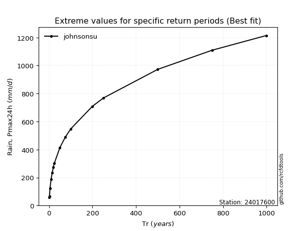</img>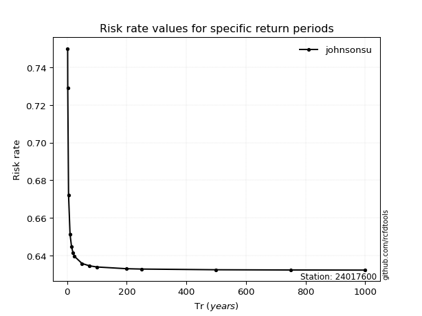</img>

</div>


<sub>**APP DISCLAIMER**: NO WARRANTY - This software is provided by [github.com/rcfdtools](https://github.com/rcfdtools) "as is", without any express or implied warranty, including warranties of merchantability, fitness for a particular purpose, or non-infringement. There is no guarantee that the software will be error-free or operate without interruption. LIMITATION OF LIABILITY - Neither the authors nor copyright holders will be liable for claims or damages arising from the software or its use. You are responsible for determining if the software is appropriate for your use and assume all associated risks, including errors, legal compliance, and data loss. NO PROFESSIONAL ADVICE - The software provides general information and does not offer professional advice. It should not replace consultation with professional advisors.</sub>