<div align="center">


</div>

# PMP Station (Rain, Pmax24h): 24017640

Probable Maximum Precipitation (PMP) is the greatest amount of rainfall for a specific duration that is meteorologically possible for a given location, acting as a "worst-case" scenario for extreme storms, crucial for designing safety-critical infrastructure like bridges, river deviations, dams, spillways, and nuclear plants to prevent catastrophic failure. PMP is calculated by hydrologists using meteorological data to determine the upper limit of extreme rainfall, often leading to the Probable Maximum Flood (PMF) for flood control design, and is increasingly being studied for climate change impacts. Probable Maximum Precipitation (PMP) is the theoretical upper limit of rainfall, a deterministic estimate for extreme events, while probability distributions (like GEV, Gumbel) describe the likelihood and frequency of various precipitation amounts, including rare ones, showing how often events occur, with PMP representing the extreme end of these distributions, used for critical infrastructure design to ensure safety against the worst conceivable weather, unlike standard statistical forecasts which cover typical probabilities.

The most common probability distributions in hydrology, used for analyzing floods, rainfall, and streamflow, include the Normal, Log-Normal, Gumbel, Gamma (including Log-Pearson Type III), and Generalized Extreme Value (GEV) distributions, often chosen based on the data´s skewness and whether modeling extremes or general conditions, with Gumbel and GEV popular for extreme events like floods, while the Normal distribution serves as a baseline, though often requiring transformations for skewed hydrological data. These distributions help in designing water infrastructure, managing water resources, and forecasting hydrologic events.

> Hydrological data often isn´t perfectly normal (it´s skewed), so different distributions are needed for different applications, such as: **Flood Frequency Analysis**: Using Gumbel, GEV, or Log-Pearson Type III for predicting extreme flood magnitudes and their return periods, **Rainfall Analysis**: Normal for annual totals, but Log-Normal, Weibull, or GEV for intensity or extreme daily rainfall, **Streamflow Modeling**: Gamma and Log-Normal for maximum flows, GEV for minimum flows, and Kappa for daily flows.

<div align="center">

</img>

</div>


## A. General information


### 1. General running parameters

• app_version: _v20260103_. • runtime: _2026-01-05 16:20:51.132608_. • Python version: _3.14.0_. • SciPy version: _1.16.3_. • Pandas version: _2.3.3_. • NumPy version: _2.3.5_. • Stations dataset (station_dataset_file): _dataset/pmax24h_in/automatic_colombia_2003_2024.csv_. • Stations catalog (station_catalog_file): _dataset/CNE.xls_. • Minimum year to eval til year_max (date_min): _1900_. • Maximum year to eval since year_min (date_max): _2024_. • Creates, save and include plots into reports (create_plot): _True_. • Plot only fit distributions with Δo > Δ (plot_only_fit): _True_. • Plot only simple graphs avoiding multiple CDFs and multiple Extreme values plots (plot_only_simple): _True_. • Eval low extreme values, if False, evaluates high extreme values (low_extreme): _False_. • Eval every SciPy distribution as logarithmic (pdist_logarithmic_on): _True_. • Standard deviation normalized (ddof): _1.0_. • Return periods to eval in years (Tr): _[2, 2.33, 5, 10, 15, 20, 25, 50, 75, 100, 200, 250, 500, 750, 1000]_. • Minimum data sample per station, 0 means any (minimum_sample): _5_. • Z-Score maximum threshold to adjust a value, 0 means disable (zscore_max): _3.5_. • Z-Score minimum threshold to adjust a value, 0 means disable (zscore_min): _-2.5_. • Avoid zeros, e.g. rain = 0 (avoid_zeros): _True_. • Avoid null values (avoid_nans): _True_. 

[:file_folder:Dataset file](../../dataset/pmax24h_in/automatic_colombia_2003_2024.csv)

> Delta Degrees of Freedom (DDOF): is a parameter used in the formulas for calculating variance and standard deviation. When ddof=0, the divisor is $N$ (the total number of observations) and this is used when your data set is the entire population. When ddof=1, the divisor is $N-1$ and this is used when your data set is a sample drawn from a larger population. Using $N-1$ provides an unbiased estimate of the population variance (known as Bessel´s correction).


### 2. Station info and location

|   id |   CODIGO | NOMBRE                    | CATEGORIA    | TECNOLOGIA                              | ESTADO   | FECHA_INSTALACION   |   FECHA_SUSPENSION |   ALTITUD |   LATITUD |   LONGITUD | DEPARTAMENTO   | MUNICIPIO   | AREA_OPERATIVA                         | ENTIDAD                                                     | AREA_HIDROGRAFICA   | ZONA_HIDROGRAFICA   | SUBZONA_HIDROGRAFICA   | CORRIENTE   | Catalogo   |   Version |
|-----:|---------:|:--------------------------|:-------------|:----------------------------------------|:---------|:--------------------|-------------------:|----------:|----------:|-----------:|:---------------|:------------|:---------------------------------------|:------------------------------------------------------------|:--------------------|:--------------------|:-----------------------|:------------|:-----------|----------:|
|    0 | 24017640 | LA CEIBA - AUT [24017640] | Limnigráfica | Automática con Telemetría, Convencional | Activa   | 15/10/1979          |                nan |       724 |   6.44889 |   -73.3069 | Santander      | Socorro     | Area Operativa 08 - Santanderes-Arauca | INSTITUTO DE HIDROLOGIA METEOROLOGIA Y ESTUDIOS AMBIENTALES | Magdalena Cauca     | Sogamoso            | Río Suárez             | Suarez      | CNE_IDEAM  |  20251226 |

<div align="center">

Dynamic map: [:earth_americas:Google](http://maps.google.com/maps?q=6.448888889,-73.30694444) [:earth_americas:OSM](https://www.openstreetmap.org/#map=18/6.448888889/-73.30694444&layers=P) [:earth_americas:Bing](https://www.bing.com/maps?cp=6.448888889~-73.30694444&lvl=18) [:earth_americas:Apple](https://maps.apple.com/frame?center=6.448888889%2C-73.30694444&span=0.003%2C0.006)

</div>


<div align="center">

```geojson
{
  "type": "Feature",
  "geometry": {
    "type": "Point", 
    "coordinates": [-73.30694444, 6.448888889]
  }, 
  "properties": {
    "Name": "24017640"
  }
}
```

</div>


### 3. Discrete values table and plot

<div align="center">

|               |           0 |           1 |           2 |          3 |           4 |          5 |
|:--------------|------------:|------------:|------------:|-----------:|------------:|-----------:|
| Date          | 2019        | 2020        | 2021        | 2022       | 2023        | 2024       |
| Value         |  119.4      |   82.4      |   53.4      |   14       |   39.2      |  134.4     |
| Value_initial |  119.4      |   82.4      |   53.4      |   14       |   39.2      |  134.4     |
| count         |    6        |    6        |    6        |    6       |    6        |    6       |
| mean          |   73.8      |   73.8      |   73.8      |   73.8     |   73.8      |   73.8     |
| std           |   46.9362   |   46.9362   |   46.9362   |   46.9362  |   46.9362   |   46.9362  |
| zscore        |    0.971531 |    0.183227 |   -0.434632 |   -1.27407 |   -0.737171 |    1.29111 |


</div>


<div align="center">

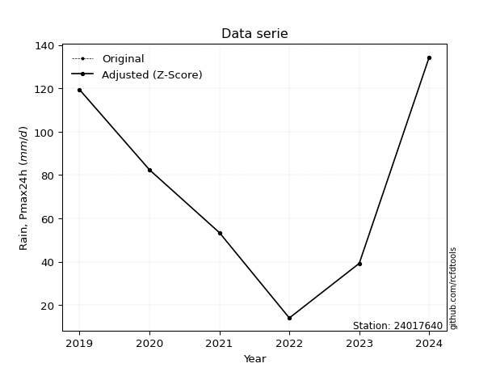</img>

</div>


> The initial value (value_initial) correspond to the initial obtained or null completed value, and value (value) is adjusted only when the initial value is outside the valid range (outlier) definite through the Z-Score value. If Z-Score is active, values out of range or outliers are replaced with the station mean value. A Z-Score (or standard score) measures how many standard deviations a data point is from the mean of a dataset, indicating its relative position; positive scores mean above the mean, negative mean below, and a score of zero is exactly at the mean, allowing for comparison of values from different distributions. It´s calculated using the formula $z=(x–μ)/σ$, where $x$ is the data point, $μ$ is the mean, and $σ$ is the standard deviation, helping identify outliers and understand probability.
>
> <sub>**Note**: In this study, "completing" (filling gaps in) and "extending" (forecasting or lengthening the historical record) rainfall data series are avoided for certain critical analyses because they introduce artificial bias and uncertainty, which can distort the statistics of rare events (extremes), alter day-to-day variability, and compromise the integrity and homogeneity of the original data. Some reasons against Completing/Extending rainfall data are: **Distortion of Extremes and Variability**: The primary issue is that most gap-filling or extension methods rely on averaging or regression with nearby stations, which inherently smooths the data. Rainfall is highly variable in space and time, with a large percentage of zero values and occasional large storms. Infilling methods often underestimate the highest values and overestimate the lowest (zero) values, which severely distorts analyses focused on flood frequency, drought severity, and intensity-duration-frequency (IDF) curves, **Loss of Data Homogeneity**: Infilled or extended data are synthetic estimates, not actual measurements. Combining these estimates with observed data can violate the assumption of data homogeneity, which requires that the data properties do not change over time. Inhomogeneity can lead to incorrect conclusions about long-term trends or changes in climate patterns, **Propagation of Errors**: Errors and biases from the original data (e.g., wind-induced undercatch, instrument errors, site changes) or the data used for imputation can propagate through the analysis, leading to unreliable hydrological models and inaccurate predictions, **Compromised Statistical Integrity**: For statistical analyses, especially those involving the frequency of events, using artificial data can introduce time bias or autocorrelation that doesn´t exist in reality, making it difficult to assess the true probability of events, **Difficulty in Validation**: It is difficult to accurately validate the quality of filled or extended data, especially for past periods where ground-truth measurements are unavailable. The reliability of imputation techniques heavily depends on the density of the surrounding station network and the complexity of the local topography.</sub>


### 4. Active continuous probability distributions from SciPy (44 of 104 available)

A Probability Density Function (PDF) describes the relative likelihood of a continuous random variable falling within a specific range, where the total area under its curve equals 1, and the area over any interval gives the actual probability for that range. Unlike discrete probabilities (like rolling a die), a PDF shows density, not direct probability for a single point (which is zero), with higher points indicating higher likelihood, often visualized as a bell curve for normal distributions.

A log of a probability density function (log-PDF) is simply the logarithm of the PDF´s value, denoted as $log(f(x))$, useful for converting multiplication of probabilities into addition, improving numerical stability with tiny numbers, and connecting to information theory concepts like entropy. Instead of dealing with very small probabilities (e.g., 0.000001), log-PDFs use negative numbers (e.g., $log(0.00001) ≈ -11.51$ that are easier for computers to handle, preventing underflow errors and simplifying complex calculations. In this study, each active probability distribution from SciPy is also evaluated in the $log$ form.

[scipy.stats](https://docs.scipy.org/doc/scipy/reference/stats.html) is a Python´s powerful submodule within the SciPy library for comprehensive statistical analysis, offering over 130 probability distributions (like Normal, Poisson), functions for descriptive stats (mean, variance), hypothesis testing (t-tests, chi-square), random variable generation, and statistical tests, making it essential for data science, modeling, and research. It provides tools to explore, model, and draw conclusions from data efficiently, working seamlessly with NumPy.

<div align="center">

|   id | p_dist             |   n_parameter | fit_method   | label                                                                       | active   | ref                                                                                                        |
|-----:|:-------------------|--------------:|:-------------|:----------------------------------------------------------------------------|:---------|:-----------------------------------------------------------------------------------------------------------|
|    0 | alpha              |             3 | MLE          | Alpha                                                                       | True     | [:mortar_board:](https://docs.scipy.org/doc/scipy/reference/generated/scipy.stats.alpha.html)              |
|    1 | betaprime          |             4 | MLE          | Beta prime                                                                  | True     | [:mortar_board:](https://docs.scipy.org/doc/scipy/reference/generated/scipy.stats.betaprime.html)          |
|    2 | chi2               |             3 | MLE          | Chi²                                                                        | True     | [:mortar_board:](https://docs.scipy.org/doc/scipy/reference/generated/scipy.stats.chi2.html)               |
|    3 | crystalball        |             4 | MLE          | Crystalball                                                                 | True     | [:mortar_board:](https://docs.scipy.org/doc/scipy/reference/generated/scipy.stats.crystalball.html)        |
|    4 | erlang             |             3 | MLE          | Erlang                                                                      | True     | [:mortar_board:](https://docs.scipy.org/doc/scipy/reference/generated/scipy.stats.erlang.html)             |
|    5 | expon              |             2 | MLE          | Exponential                                                                 | True     | [:mortar_board:](https://docs.scipy.org/doc/scipy/reference/generated/scipy.stats.expon.html)              |
|    6 | exponnorm          |             3 | MLE          | Exponentially modified Normal                                               | True     | [:mortar_board:](https://docs.scipy.org/doc/scipy/reference/generated/scipy.stats.exponnorm.html)          |
|    7 | f                  |             4 | MLE          | F                                                                           | True     | [:mortar_board:](https://docs.scipy.org/doc/scipy/reference/generated/scipy.stats.f.html)                  |
|    8 | fatiguelife        |             3 | MLE          | Fatigue-life (Birnbaum-Saunders)                                            | True     | [:mortar_board:](https://docs.scipy.org/doc/scipy/reference/generated/scipy.stats.fatiguelife.html)        |
|    9 | fisk               |             3 | MLE          | Fisk                                                                        | True     | [:mortar_board:](https://docs.scipy.org/doc/scipy/reference/generated/scipy.stats.fisk.html)               |
|   10 | gamma              |             3 | MLE          | Gamma                                                                       | True     | [:mortar_board:](https://docs.scipy.org/doc/scipy/reference/generated/scipy.stats.gamma.html)              |
|   11 | genexpon           |             5 | MLE          | Generalized exponential                                                     | True     | [:mortar_board:](https://docs.scipy.org/doc/scipy/reference/generated/scipy.stats.genexpon.html)           |
|   12 | genlogistic        |             3 | MLE          | Generalized logistic                                                        | True     | [:mortar_board:](https://docs.scipy.org/doc/scipy/reference/generated/scipy.stats.genlogistic.html)        |
|   13 | gibrat             |             2 | MM           | Gibrat                                                                      | True     | [:mortar_board:](https://docs.scipy.org/doc/scipy/reference/generated/scipy.stats.gibrat.html)             |
|   14 | gompertz           |             3 | MLE          | Gompertz (or truncated Gumbel)                                              | True     | [:mortar_board:](https://docs.scipy.org/doc/scipy/reference/generated/scipy.stats.gompertz.html)           |
|   15 | gumbel_l           |             2 | MM           | Gumbel Left Skew                                                            | True     | [:mortar_board:](https://docs.scipy.org/doc/scipy/reference/generated/scipy.stats.gumbel_l.html)           |
|   16 | gumbel_r           |             2 | MM           | Gumbel Right Skew                                                           | True     | [:mortar_board:](https://docs.scipy.org/doc/scipy/reference/generated/scipy.stats.gumbel_r.html)           |
|   17 | halflogistic       |             2 | MM           | Half-logistic                                                               | True     | [:mortar_board:](https://docs.scipy.org/doc/scipy/reference/generated/scipy.stats.halflogistic.html)       |
|   18 | halfnorm           |             2 | MM           | Half Normal                                                                 | True     | [:mortar_board:](https://docs.scipy.org/doc/scipy/reference/generated/scipy.stats.halfnorm.html)           |
|   19 | hypsecant          |             2 | MM           | hyperbolic secant                                                           | True     | [:mortar_board:](https://docs.scipy.org/doc/scipy/reference/generated/scipy.stats.hypsecant.html)          |
|   20 | invgamma           |             3 | MLE          | Inverted gamma                                                              | True     | [:mortar_board:](https://docs.scipy.org/doc/scipy/reference/generated/scipy.stats.invgamma.html)           |
|   21 | invgauss           |             3 | MLE          | Inverse Gaussian                                                            | True     | [:mortar_board:](https://docs.scipy.org/doc/scipy/reference/generated/scipy.stats.invgauss.html)           |
|   22 | invweibull         |             3 | MLE          | Inverted Weibull                                                            | True     | [:mortar_board:](https://docs.scipy.org/doc/scipy/reference/generated/scipy.stats.invweibull.html)         |
|   23 | johnsonsu          |             4 | MLE          | Johnson Su                                                                  | True     | [:mortar_board:](https://docs.scipy.org/doc/scipy/reference/generated/scipy.stats.johnsonsu.html)          |
|   24 | kstwobign          |             2 | MLE          | Limiting distribution of scaled Kolmogorov-Smirnov two-sided test statistic | True     | [:mortar_board:](https://docs.scipy.org/doc/scipy/reference/generated/scipy.stats.kstwobign.html)          |
|   25 | laplace            |             2 | MM           | Laplace                                                                     | True     | [:mortar_board:](https://docs.scipy.org/doc/scipy/reference/generated/scipy.stats.laplace.html)            |
|   26 | laplace_asymmetric |             3 | MLE          | Asymmetric Laplace                                                          | True     | [:mortar_board:](https://docs.scipy.org/doc/scipy/reference/generated/scipy.stats.laplace_asymmetric.html) |
|   27 | loggamma           |             3 | MLE          | Log gamma                                                                   | True     | [:mortar_board:](https://docs.scipy.org/doc/scipy/reference/generated/scipy.stats.loggamma.html)           |
|   28 | logistic           |             2 | MM           | Logistic (or Sech-squared)                                                  | True     | [:mortar_board:](https://docs.scipy.org/doc/scipy/reference/generated/scipy.stats.logistic.html)           |
|   29 | lognorm            |             3 | MLE          | Log Normal                                                                  | True     | [:mortar_board:](https://docs.scipy.org/doc/scipy/reference/generated/scipy.stats.lognorm.html)            |
|   30 | maxwell            |             2 | MM           | Maxwell                                                                     | True     | [:mortar_board:](https://docs.scipy.org/doc/scipy/reference/generated/scipy.stats.maxwell.html)            |
|   31 | mielke             |             4 | MLE          | Mielke Beta-Kappa / Dagum                                                   | True     | [:mortar_board:](https://docs.scipy.org/doc/scipy/reference/generated/scipy.stats.mielke.html)             |
|   32 | moyal              |             2 | MM           | Moyal                                                                       | True     | [:mortar_board:](https://docs.scipy.org/doc/scipy/reference/generated/scipy.stats.moyal.html)              |
|   33 | nakagami           |             3 | MLE          | Nakagami                                                                    | True     | [:mortar_board:](https://docs.scipy.org/doc/scipy/reference/generated/scipy.stats.nakagami.html)           |
|   34 | ncf                |             5 | MLE          | Non-central F distribution                                                  | True     | [:mortar_board:](https://docs.scipy.org/doc/scipy/reference/generated/scipy.stats.ncf.html)                |
|   35 | nct                |             4 | MLE          | Non-central Student’s t                                                     | True     | [:mortar_board:](https://docs.scipy.org/doc/scipy/reference/generated/scipy.stats.nct.html)                |
|   36 | norm               |             2 | MM           | Normal                                                                      | True     | [:mortar_board:](https://docs.scipy.org/doc/scipy/reference/generated/scipy.stats.norm.html)               |
|   37 | pearson3           |             3 | MM           | Pearson type III                                                            | True     | [:mortar_board:](https://docs.scipy.org/doc/scipy/reference/generated/scipy.stats.pearson3.html)           |
|   38 | rayleigh           |             2 | MM           | Rayleigh                                                                    | True     | [:mortar_board:](https://docs.scipy.org/doc/scipy/reference/generated/scipy.stats.rayleigh.html)           |
|   39 | rice               |             3 | MLE          | Rice                                                                        | True     | [:mortar_board:](https://docs.scipy.org/doc/scipy/reference/generated/scipy.stats.rice.html)               |
|   40 | t                  |             3 | MLE          | Student’s t                                                                 | True     | [:mortar_board:](https://docs.scipy.org/doc/scipy/reference/generated/scipy.stats.t.html)                  |
|   41 | truncnorm          |             4 | MLE          | Truncated normal                                                            | True     | [:mortar_board:](https://docs.scipy.org/doc/scipy/reference/generated/scipy.stats.truncnorm.html)          |
|   42 | wald               |             2 | MM           | Wald                                                                        | True     | [:mortar_board:](https://docs.scipy.org/doc/scipy/reference/generated/scipy.stats.wald.html)               |
|   43 | weibull_min        |             3 | MLE          | Weibull minimum                                                             | True     | [:mortar_board:](https://docs.scipy.org/doc/scipy/reference/generated/scipy.stats.weibull_min.html)        |

</div>

> **n_parameter:** # arguments & localization & scale.
>
> **Fit methods:** (MLE) maximum likelihood, (MM) L-moments.
>
>**Inactive** (With the only purpose of prevent loops, zero divisions, infinite values, over high estimated values or horizontal trending for recurrence intervals estimations, the follow distributions were disabled.)**:** foldnorm, gennorm, norminvgauss, powernorm, powerlognorm, skewnorm, genextreme, anglit, arcsine, argus, beta, bradford, burr, burr12, cauchy, cosine, halfcauchy, foldcauchy, skewcauchy, wrapcauchy, dgamma, gengamma, exponweib, exponpow, truncexpon, gausshyper, genhalflogistic, genhyperbolic, geninvgauss, halfgennorm, johnsonsb, kappa4, kappa3, ksone, kstwo, loglaplace, levy, levy_l, levy_stable, ncx2, pareto, genpareto, truncpareto, lomax, powerlaw, rdist, rel_breitwigner, recipinvgauss, semicircular, studentized_range, trapezoid, triang, truncweibull_min, tukeylambda, uniform, loguniform, vonmises, vonmises_line, weibull_max, dweibull, 


## B. Probability (PDF) vs. Empirical (EDF) distributions functions

A continuous probability distribution (CPD) describes probabilities for variables that can take any value within a range (like rain any time), unlike discrete variables with specific outcomes (like temperature). It uses a Probability Density Function (PDF), a curve where the total area under it equals 1, and the probability of the variable falling within an interval (a to b) is found by calculating the area under the curve between those points. A key feature is that the probability of hitting any single exact value is zero, so probabilities are always expressed for ranges, e.g., $P(a ≤ X ≤ b)$.

<div align="center">

Distributions parameters from station values
|    |   station | p_dist                |   n |             loc |           scale | shape                  | shape1                 | shape2                | shape3   |
|---:|----------:|:----------------------|----:|----------------:|----------------:|:-----------------------|:-----------------------|:----------------------|:---------|
|  0 |  24017640 | alpha                 |   6 |    -0.0857516   |    30.8553      | 2.3838226287524785e-10 |                        |                       |          |
|  1 |  24017640 | betaprime             |   6 |   -11.2308      |  2346.84        | 3.3952786787119784     | 94.24264551238792      |                       |          |
|  2 |  24017640 | chi2                  |   6 |    14           |    28.8346      | 0.9307976470174257     |                        |                       |          |
|  3 |  24017640 | crystalball           |   6 |    73.8         |    42.8467      | 6548.6946992524045     | 364.80269915629685     |                       |          |
|  4 |  24017640 | erlang                |   6 |  -342.129       |     4.41277     | 94.19918777517753      |                        |                       |          |
|  5 |  24017640 | expon                 |   6 |    14           |    59.8         |                        |                        |                       |          |
|  6 |  24017640 | exponnorm             |   6 |    70.2979      |    42.7034      | 0.08200997215395978    |                        |                       |          |
|  7 |  24017640 | f                     |   6 |    -3.50437     |    76.9323      | 5.1523941486547145     | 455.41547599241994     |                       |          |
|  8 |  24017640 | fatiguelife           |   6 |    14           |     0.000314475 | 439.11129106727685     |                        |                       |          |
|  9 |  24017640 | fisk                  |   6 |   -56.4909      |   124.222       | 4.736341223151994      |                        |                       |          |
| 10 |  24017640 | gamma                 |   6 |  -358.712       |     4.1798      | 103.52760537406289     |                        |                       |          |
| 11 |  24017640 | genexpon              |   6 |    13.9999      |     1.61209     | 0.027007440704626542   | 2.9194463502032936e-08 | 0.2955906374632903    |          |
| 12 |  24017640 | genlogistic           |   6 |  -183.523       |    37.0014      | 594.266407370326       |                        |                       |          |
| 13 |  24017640 | gibrat                |   6 |    41.1134      |    19.8254      |                        |                        |                       |          |
| 14 |  24017640 | gompertz              |   6 |    14           |    76.2654      | 0.641568332669091      |                        |                       |          |
| 15 |  24017640 | gumbel_l              |   6 |    93.0833      |    33.4074      |                        |                        |                       |          |
| 16 |  24017640 | gumbel_r              |   6 |    54.5167      |    33.4074      |                        |                        |                       |          |
| 17 |  24017640 | halflogistic          |   6 |    23.0167      |    36.6324      |                        |                        |                       |          |
| 18 |  24017640 | halfnorm              |   6 |    17.0877      |    71.0783      |                        |                        |                       |          |
| 19 |  24017640 | hypsecant             |   6 |    73.8         |    27.2771      |                        |                        |                       |          |
| 20 |  24017640 | invgamma              |   6 |  -219.041       | 13392.6         | 46.74292877221512      |                        |                       |          |
| 21 |  24017640 | invgauss              |   6 |   -77.7521      |  1706.47        | 0.0887823432616103     |                        |                       |          |
| 22 |  24017640 | invweibull            |   6 |    -1.02897e+09 |     1.02897e+09 | 27786536.422667146     |                        |                       |          |
| 23 |  24017640 | johnsonsu             |   6 |     4.45849e+08 |     7.99807e+08 | 11364111.052718233     | 21361362.111791544     |                       |          |
| 24 |  24017640 | kstwobign             |   6 |   -75.1889      |   170.141       |                        |                        |                       |          |
| 25 |  24017640 | laplace               |   6 |    73.8         |    30.2972      |                        |                        |                       |          |
| 26 |  24017640 | laplace_asymmetric    |   6 |    53.4         |    33.8163      | 0.742871260565177      |                        |                       |          |
| 27 |  24017640 | loggamma              |   6 | -7195.54        |  1115.54        | 676.6243876717692      |                        |                       |          |
| 28 |  24017640 | logistic              |   6 |    73.8         |    23.6226      |                        |                        |                       |          |
| 29 |  24017640 | lognorm               |   6 |    14           |     0.107356    | 14.201506977611484     |                        |                       |          |
| 30 |  24017640 | maxwell               |   6 |   -27.7287      |    63.6237      |                        |                        |                       |          |
| 31 |  24017640 | mielke                |   6 |    14           |   125.783       | 0.8989479756907545     | 92.86810780855392      |                       |          |
| 32 |  24017640 | moyal                 |   6 |    49.2975      |    19.2878      |                        |                        |                       |          |
| 33 |  24017640 | nakagami              |   6 |    39.2         |    54.4474      | 0.3265126953772489     |                        |                       |          |
| 34 |  24017640 | ncf                   |   6 |    -1.28149     |    26.8103      | 3.041945032304673      | 588.9844121313124      | 5.489083291937346     |          |
| 35 |  24017640 | nct                   |   6 | -2119.53        |    42.7584      | 302436.3774039936      | 51.2955418667364       |                       |          |
| 36 |  24017640 | norm                  |   6 |    73.8         |    42.8467      |                        |                        |                       |          |
| 37 |  24017640 | pearson3              |   6 |    73.8         |    42.8467      | 0.11492144179803293    |                        |                       |          |
| 38 |  24017640 | rayleigh              |   6 |    -8.16825     |    65.4012      |                        |                        |                       |          |
| 39 |  24017640 | rice                  |   6 |    -6.59575     |    54.1734      | 0.9099130812175482     |                        |                       |          |
| 40 |  24017640 | t                     |   6 |    73.8011      |    42.8444      | 1819309.481342508      |                        |                       |          |
| 41 |  24017640 | truncnorm             |   6 |    73.8         |    42.8467      | -292.0237462069899     | 293.38916806531813     |                       |          |
| 42 |  24017640 | wald                  |   6 |    30.9533      |    42.8467      |                        |                        |                       |          |
| 43 |  24017640 | weibull_min           |   6 |    14           |    67.7781      | 0.5930810194095782     |                        |                       |          |
| 44 |  24017640 | logalpha              |   6 |   -14.6696      |   443.247       | 23.710521402466938     |                        |                       |          |
| 45 |  24017640 | logbetaprime          |   6 |    -0.0339573   |    34.7157      | 29.685850278019707     | 254.4473210058905      |                       |          |
| 46 |  24017640 | logchi2               |   6 |     2.63906     |     0.945428    | 1.085000600723519      |                        |                       |          |
| 47 |  24017640 | logcrystalball        |   6 |     4.06341     |     0.767188    | 43.26626595078977      | 264.05483652250587     |                       |          |
| 48 |  24017640 | logerlang             |   6 |    -8.11309     |     0.0513202   | 236.9902937374581      |                        |                       |          |
| 49 |  24017640 | logexpon              |   6 |     2.63906     |     1.42435     |                        |                        |                       |          |
| 50 |  24017640 | logexponnorm          |   6 |     4.06278     |     0.767184    | 0.0008201384564716413  |                        |                       |          |
| 51 |  24017640 | logf                  |   6 |   -41.9721      |    46.0245      | 10080.058713351023     | 22307.125947204928     |                       |          |
| 52 |  24017640 | logfatiguelife        |   6 |  -346.087       |   350.149       | 0.002185397850155233   |                        |                       |          |
| 53 |  24017640 | logfisk               |   6 |    -5.22921e+07 |     5.22921e+07 | 117383690.13917696     |                        |                       |          |
| 54 |  24017640 | loggamma              |   6 |    -6.91036     |     0.0569696   | 192.4670398606787      |                        |                       |          |
| 55 |  24017640 | loggenexpon           |   6 |     2.63906     |     1.48263     | 0.7122513713465344     | 1.0929902896130665     | 0.5837400743643717    |          |
| 56 |  24017640 | loggenlogistic        |   6 |     4.90086     |     4.28886e-06 | 5.109694218942737e-06  |                        |                       |          |
| 57 |  24017640 | loggibrat             |   6 |     3.47818     |     0.354961    |                        |                        |                       |          |
| 58 |  24017640 | loggompertz           |   6 |     2.63906     |     0.699757    | 0.09166709582450885    |                        |                       |          |
| 59 |  24017640 | loggumbel_l           |   6 |     4.40868     |     0.598174    |                        |                        |                       |          |
| 60 |  24017640 | loggumbel_r           |   6 |     3.71813     |     0.598174    |                        |                        |                       |          |
| 61 |  24017640 | loghalflogistic       |   6 |     3.15412     |     0.655915    |                        |                        |                       |          |
| 62 |  24017640 | loghalfnorm           |   6 |     3.04797     |     1.27266     |                        |                        |                       |          |
| 63 |  24017640 | loghypsecant          |   6 |     4.0634      |     0.488407    |                        |                        |                       |          |
| 64 |  24017640 | loginvgamma           |   6 |   -11.8721      |  6542.31        | 411.23478283133863     |                        |                       |          |
| 65 |  24017640 | loginvgauss           |   6 |    -4.29957     |   872.488       | 0.009582050605272688   |                        |                       |          |
| 66 |  24017640 | loginvweibull         |   6 |    -3.38594e+08 |     3.38594e+08 | 454250783.92233145     |                        |                       |          |
| 67 |  24017640 | logjohnsonsu          |   6 |     4.90082     |     1.3719e-13  | 2.45391217495268       | 0.1152063020335766     |                       |          |
| 68 |  24017640 | logkstwobign          |   6 |     0.780723    |     3.74749     |                        |                        |                       |          |
| 69 |  24017640 | loglaplace            |   6 |     4.0634      |     0.542484    |                        |                        |                       |          |
| 70 |  24017640 | loglaplace_asymmetric |   6 |     4.41159     |     0.556302    | 1.360779785128499      |                        |                       |          |
| 71 |  24017640 | logloggamma           |   6 |     4.90083     |     3.56648e-07 | 4.267569531080559e-07  |                        |                       |          |
| 72 |  24017640 | loglogistic           |   6 |     4.0634      |     0.422973    |                        |                        |                       |          |
| 73 |  24017640 | loglognorm            |   6 |     2.63906     |     0.00417029  | 13.361336914015444     |                        |                       |          |
| 74 |  24017640 | logmaxwell            |   6 |     2.24549     |     1.13921     |                        |                        |                       |          |
| 75 |  24017640 | logmielke             |   6 |     1.36965     |     3.53138     | 3.1020452628792023     | 139206.5434061294      |                       |          |
| 76 |  24017640 | logmoyal              |   6 |     3.62468     |     0.345356    |                        |                        |                       |          |
| 77 |  24017640 | lognakagami           |   6 |     3.66868     |     0.668147    | 0.06000655575159501    |                        |                       |          |
| 78 |  24017640 | logncf                |   6 |   -16.3895      |    20.4427      | 2043.6720018643387     | 3904.4029327560174     | 0.0045673357038745616 |          |
| 79 |  24017640 | lognct                |   6 |   -37.4178      |     0.689093    | 7060.7521857427855     | 60.188103608635316     |                       |          |
| 80 |  24017640 | lognorm               |   6 |     4.0634      |     0.767188    |                        |                        |                       |          |
| 81 |  24017640 | logpearson3           |   6 |     4.0634      |     0.767188    | -0.7199357123263492    |                        |                       |          |
| 82 |  24017640 | lograyleigh           |   6 |     2.59573     |     1.17104     |                        |                        |                       |          |
| 83 |  24017640 | logrice               |   6 |     2.12314     |     0.833441    | 2.065677263218106      |                        |                       |          |
| 84 |  24017640 | logt                  |   6 |     4.0634      |     0.767185    | 1073521288.4776181     |                        |                       |          |
| 85 |  24017640 | logtruncnorm          |   6 |    -0.228822    |     1.78663     | 2.1798596945052204     | 2.8711261382981474     |                       |          |
| 86 |  24017640 | logwald               |   6 |     3.29619     |     0.767214    |                        |                        |                       |          |
| 87 |  24017640 | logweibull_min        |   6 |    -2.56673e+07 |     2.56673e+07 | 44535396.98254046      |                        |                       |          |

</div>

> **loc** (Location parameter): This shifts the distribution along the x-axis. For many common distributions, like the normal (Gaussian) distribution, loc represents the mean $μ$. For others, like the uniform distribution, it might represent the minimum value, or for the beta distribution, the left end of the support interval.
>
> **scale** (Scale parameter): This determines the width or spread of the distribution. For the normal distribution, scale represents the standard deviation $σ$. For a uniform distribution, it defines the length of the interval (from $loc$ to $loc + scale$).
>
> **shape** (Shape parameters): Refers to parameters that define the specific form of a probability distribution, distinct from its location (loc) and scale (scale). These parameters are required arguments for most distribution functions. For example, a normal (Gaussian) distribution is fully defined by its location (mean) and scale (standard deviation), so it has no specific shape parameters beyond loc and scale. However, other distributions have intrinsic properties that need specification, as Gamma distribution that takes a shape parameter, often named $a$ or $alpha$.


### 0. Cumulative distribution values - CDF (88 evaluated)

Cumulative Distribution Function (CDF), denoted as $F$<sub>$X$</sub>$(x)$, is a function that gives the probability that a random variable $X$ will take a value less than or equal to a specific value, $x$ (i.e., $(P(X≥x)$. It essentially "accumulates" probabilities from a given point up to the far right (positive infinity), providing a complete picture of the distribution´s probabilities for both discrete (like rain) and continuous (like temperature) variables, helping to find probabilities over ranges or above certain values. Each station is evaluated separately ordering the $x$ values ascending, calculating the CDF and PDF values for the activated distributions and their logarithmic forms.

<div align="center">

CDF ordered by x ascending and calculating $log(f(x))$ separately
|   id |   Station |   date |     x |   count |   mean |     std |    zscore |   Value_initial |   station |   m |     alpha |   alpha_pdf |   betaprime |   betaprime_pdf |        chi2 |    chi2_pdf |   crystalball |   crystalball_pdf |    erlang |   erlang_pdf |    expon |   expon_pdf |   exponnorm |   exponnorm_pdf |         f |      f_pdf |   fatiguelife |   fatiguelife_pdf |      fisk |   fisk_pdf |     gamma |   gamma_pdf |    genexpon |   genexpon_pdf |   genlogistic |   genlogistic_pdf |   gibrat |   gibrat_pdf |    gompertz |   gompertz_pdf |   gumbel_l |   gumbel_l_pdf |   gumbel_r |   gumbel_r_pdf |   halflogistic |   halflogistic_pdf |   halfnorm |   halfnorm_pdf |   hypsecant |   hypsecant_pdf |   invgamma |   invgamma_pdf |   invgauss |   invgauss_pdf |   invweibull |   invweibull_pdf |   johnsonsu |   johnsonsu_pdf |   kstwobign |   kstwobign_pdf |   laplace |   laplace_pdf |   laplace_asymmetric |   laplace_asymmetric_pdf |   loggamma |   loggamma_pdf |   logistic |   logistic_pdf |   lognorm |   lognorm_pdf |   maxwell |   maxwell_pdf |      mielke |   mielke_pdf |     moyal |   moyal_pdf |   nakagami |   nakagami_pdf |       ncf |    ncf_pdf |       nct |    nct_pdf |      norm |   norm_pdf |   pearson3 |   pearson3_pdf |   rayleigh |   rayleigh_pdf |      rice |   rice_pdf |         t |      t_pdf |   truncnorm |   truncnorm_pdf |      wald |   wald_pdf |   weibull_min |   weibull_min_pdf |   logalpha |   logalpha_pdf |   logbetaprime |   logbetaprime_pdf |     logchi2 |   logchi2_pdf |   logcrystalball |   logcrystalball_pdf |   logerlang |   logerlang_pdf |   logexpon |   logexpon_pdf |   logexponnorm |   logexponnorm_pdf |      logf |   logf_pdf |   logfatiguelife |   logfatiguelife_pdf |   logfisk |   logfisk_pdf |   loggenexpon |   loggenexpon_pdf |   loggenlogistic |   loggenlogistic_pdf |   loggibrat |   loggibrat_pdf |   loggompertz |   loggompertz_pdf |   loggumbel_l |   loggumbel_l_pdf |   loggumbel_r |   loggumbel_r_pdf |   loghalflogistic |   loghalflogistic_pdf |   loghalfnorm |   loghalfnorm_pdf |   loghypsecant |   loghypsecant_pdf |   loginvgamma |   loginvgamma_pdf |   loginvgauss |   loginvgauss_pdf |   loginvweibull |   loginvweibull_pdf |   logjohnsonsu |   logjohnsonsu_pdf |   logkstwobign |   logkstwobign_pdf |   loglaplace |   loglaplace_pdf |   loglaplace_asymmetric |   loglaplace_asymmetric_pdf |   logloggamma |   logloggamma_pdf |   loglogistic |   loglogistic_pdf |   loglognorm |   loglognorm_pdf |   logmaxwell |   logmaxwell_pdf |   logmielke |   logmielke_pdf |    logmoyal |   logmoyal_pdf |   lognakagami |   lognakagami_pdf |   logncf |   logncf_pdf |    lognct |   lognct_pdf |   logpearson3 |   logpearson3_pdf |   lograyleigh |   lograyleigh_pdf |   logrice |   logrice_pdf |     logt |   logt_pdf |   logtruncnorm |   logtruncnorm_pdf |   logwald |   logwald_pdf |   logweibull_min |   logweibull_min_pdf |
|-----:|----------:|-------:|------:|--------:|-------:|--------:|----------:|----------------:|----------:|----:|----------:|------------:|------------:|----------------:|------------:|------------:|--------------:|------------------:|----------:|-------------:|---------:|------------:|------------:|----------------:|----------:|-----------:|--------------:|------------------:|----------:|-----------:|----------:|------------:|------------:|---------------:|--------------:|------------------:|---------:|-------------:|------------:|---------------:|-----------:|---------------:|-----------:|---------------:|---------------:|-------------------:|-----------:|---------------:|------------:|----------------:|-----------:|---------------:|-----------:|---------------:|-------------:|-----------------:|------------:|----------------:|------------:|----------------:|----------:|--------------:|---------------------:|-------------------------:|-----------:|---------------:|-----------:|---------------:|----------:|--------------:|----------:|--------------:|------------:|-------------:|----------:|------------:|-----------:|---------------:|----------:|-----------:|----------:|-----------:|----------:|-----------:|-----------:|---------------:|-----------:|---------------:|----------:|-----------:|----------:|-----------:|------------:|----------------:|----------:|-----------:|--------------:|------------------:|-----------:|---------------:|---------------:|-------------------:|------------:|--------------:|-----------------:|---------------------:|------------:|----------------:|-----------:|---------------:|---------------:|-------------------:|----------:|-----------:|-----------------:|---------------------:|----------:|--------------:|--------------:|------------------:|-----------------:|---------------------:|------------:|----------------:|--------------:|------------------:|--------------:|------------------:|--------------:|------------------:|------------------:|----------------------:|--------------:|------------------:|---------------:|-------------------:|--------------:|------------------:|--------------:|------------------:|----------------:|--------------------:|---------------:|-------------------:|---------------:|-------------------:|-------------:|-----------------:|------------------------:|----------------------------:|--------------:|------------------:|--------------:|------------------:|-------------:|-----------------:|-------------:|-----------------:|------------:|----------------:|------------:|---------------:|--------------:|------------------:|---------:|-------------:|----------:|-------------:|--------------:|------------------:|--------------:|------------------:|----------:|--------------:|---------:|-----------:|---------------:|-------------------:|----------:|--------------:|-----------------:|---------------------:|
|    0 |  24017640 |   2022 |  14   |       6 |   73.8 | 46.9362 | -1.27407  |            14   |  24017640 |   1 | 0.0284855 |  0.0112653  |    0.049241 |      0.00513225 | 3.22451e-08 | 4.22405e+06 |     0.0814065 |        0.00351569 | 0.0766144 |   0.00372535 | 0        |  0.0167224  |   0.0813786 |      0.00351645 | 0.0463351 | 0.00573387 |     0.0665522 |       1.34142e+08 | 0.0639514 | 0.00402215 | 0.0736642 |  0.00362796 | 1.41758e-06 |     0.016753   |     0.0579537 |        0.0044502  | 0        |   0          | 1.19935e-13 |     0.00841231 |   0.08948  |     0.00255487 |  0.0346345 |     0.00348643 |       0        |         0          |   0        |     0          |   0.0707902 |      0.00257389 |  0.0654436 |     0.00400844 |  0.0577801 |     0.00441411 |    0.0578966 |       0.00445442 |   0.0814987 |      0.00351709 |   0.0536759 |      0.00480207 | 0.0694653 |    0.0022928  |            0.0741017 |               0.00294977 |  0.0321627 |       0.100035 |  0.0736812 |     0.00288927 | 0.0316853 |     0.0927949 | 0.0660564 |    0.00435056 | 8.03834e-08 |   0.0448388  | 0.0125309 |  0.0022871  | 0          |     0          | 0.0507107 | 0.00561117 | 0.0814409 | 0.00351724 | 0.0814064 | 0.00351569 |  0.0784546 |     0.00361517 |  0.0558273 |     0.00489341 | 0.0467706 | 0.00444561 | 0.0813912 | 0.00351538 |   0.0814065 |      0.00351569 | 0         | 0          |   2.20967e-10 |    36887.7        |   0.028859 |      0.0974794 |      0.0241443 |          0.0979437 | 3.73749e-09 |   4.56573e+06 |        0.0316852 |            0.0927947 |   0.0330907 |        0.101424 |   0        |       0.702076 |       0.031684 |          0.0927921 | 0.0334875 |  0.0980206 |        0.0311274 |             0.092052 | 0.0331319 |     0.0719094 |   8.27086e-10 |          0.480398 |         0        |            0.0804941 |    0        |        0        |    8.6043e-09 |          0.130998 |     0.0505792 |         0.0823807 |    0.00230298 |         0.0233833 |          0        |              0        |      0        |          0        |      0.0344285 |           0.070354 |     0.0280535 |         0.0927456 |     0.0314236 |          0.104682 |       0.0243238 |            0.121272 |       0.1288   |        0.0107064   |      0.0334852 |           0.162783 |     0.036198 |        0.0667264 |               0.0624548 |                   0.0825027 |     0.0667777 |         0.0799047 |     0.0333278 |         0.0761681 |    0.0126887 |      5.52457e+12 |    0.0105819 |        0.0787496 |   0.0418437 |        0.102253 | 3.09954e-05 |    0.000819605 |     0         |       0           | 0.032495 |     0.098162 | 0.0321211 |     0.094455 |     0.0475587 |         0.0921547 |   0.000684252 |          0.031574 | 0.0250161 |      0.105478 | 0.031685 |  0.0927945 |     0          |           0        |  0        |      0        |        0.0448749 |             0.076089 |
|    1 |  24017640 |   2023 |  39.2 |       6 |   73.8 | 46.9362 | -0.737171 |            39.2 |  24017640 |   2 | 0.432215  |  0.0117179  |    0.246645 |      0.00960769 | 0.674039    | 0.0091638   |     0.209681  |        0.00672032 | 0.214568  |   0.00721704 | 0.343875 |  0.010972   |   0.209693  |      0.00672257 | 0.260317  | 0.00999891 |     0.740424  |       0.00414549  | 0.225145  | 0.00863486 | 0.209365  |  0.00715304 | 0.344383    |     0.0109836  |     0.236198  |        0.00920075 | 0        |   0          | 0.222143    |     0.00910578 |   0.180701 |     0.00488787 |  0.205631  |     0.00973558 |       0.217364 |         0.0130042  |   0.244273 |     0.0106952  |   0.174548  |      0.00608317 |  0.220289  |     0.00811896 |  0.231337  |     0.00891564 |    0.236296  |       0.00920565 |   0.20978   |      0.00671913 |   0.243314  |      0.00948407 | 0.159587  |    0.00526738 |            0.202063  |               0.00804352 |  0.319251  |       0.462897 |  0.18775   |     0.00645567 | 0.303447  |     0.455538  | 0.224517  |    0.00798023 | 0.235687    |   0.00840757 | 0.193871  |  0.0115551  | 3.2895e-11 |  3023.22       | 0.250997  | 0.00941619 | 0.209759  | 0.00672197 | 0.209681  | 0.00672032 |  0.211526  |     0.00697214 |  0.230708  |     0.00851936 | 0.212751  | 0.00832336 | 0.209661  | 0.0067203  |   0.209681  |      0.00672032 | 0.0570913 | 0.0202644  |   0.426564    |        0.00750513 |   0.322747 |      0.473024  |      0.342634  |          0.49899   | 0.677056    |   0.247428    |        0.303446  |            0.455538  |   0.320906  |        0.462847 |   0.514643 |       0.340757 |       0.303443 |          0.455537  | 0.311764  |  0.456061  |        0.303121  |             0.457007 | 0.256869  |     0.428498  |   0.467213    |          0.386851 |         0        |            0.274475  |    0.266846 |        1.72549  |    0.264769   |          0.419477 |     0.251904  |         0.362963  |    0.337501   |         0.612847  |          0.373295 |              0.656069 |      0.374252 |          0.55664  |      0.266897  |           0.484645 |     0.310997  |         0.464584  |     0.329116  |          0.464492 |       0.393093  |            0.492407 |       0.144094 |        0.0212211   |      0.407433  |           0.445068 |     0.241526 |        0.445222  |               0.243366  |                   0.321486  |     0.228924  |         0.273925  |     0.282271  |         0.478977  |    0.659942  |      0.026636    |    0.331664  |        0.500903  |   0.264107  |        0.356356 | 0.348098    |    0.697921    |     0.0131519 |       3.55425e+12 | 0.313028 |     0.456488 | 0.30636   |     0.456028 |     0.272788  |         0.385728  |   0.342786    |          0.514215 | 0.315547  |      0.461211 | 0.303447 |  0.45554   |     0.00476238 |           1.64254  |  0.352105 |      1.17033  |        0.239693  |             0.361507 |
|    2 |  24017640 |   2021 |  53.4 |       6 |   73.8 | 46.9362 | -0.434632 |            53.4 |  24017640 |   3 | 0.564015  |  0.00728664 |    0.385944 |      0.00977828 | 0.776228    | 0.00564124  |     0.316996  |        0.0083132  | 0.328586  |   0.00872352 | 0.482561 |  0.00865283 |   0.317041  |      0.00831532 | 0.402062  | 0.00975289 |     0.789901  |       0.00294899  | 0.358797  | 0.00991576 | 0.322864  |  0.00871728 | 0.483186    |     0.00865822 |     0.373986  |        0.00993274 | 0.316163 |   0.028958   | 0.352038    |     0.00913753 |   0.262783 |     0.00672778 |  0.355585  |     0.0110057  |       0.39246  |         0.0115468  |   0.390563 |     0.0098521  |   0.28146   |      0.00902553 |  0.3461    |     0.0094087  |  0.365616  |     0.00975688 |    0.37412   |       0.00993286 |   0.317065  |      0.00831018 |   0.382549  |      0.00987602 | 0.255004  |    0.00841675 |            0.355611  |               0.0141558  |  0.470863  |       0.505703 |  0.296592  |     0.00883159 | 0.455583  |     0.51678   | 0.346483  |    0.00904396 | 0.352223    |   0.00803631 | 0.368594  |  0.0124136  | 0.321003   |     0.0145168  | 0.386822  | 0.00951884 | 0.317093  | 0.00831403 | 0.316996  | 0.0083132  |  0.322281  |     0.00852666 |  0.357964  |     0.00924155 | 0.338991  | 0.00929793 | 0.316978  | 0.00831345 |   0.316996  |      0.0083132  | 0.385589  | 0.0197779  |   0.515624    |        0.00528536 |   0.476342 |      0.507637  |      0.500864  |          0.510657  | 0.74348     |   0.186329    |        0.455582  |            0.51678   |   0.472501  |        0.505684 |   0.609336 |       0.274276 |       0.455579 |          0.516781  | 0.462796  |  0.509199  |        0.455735  |             0.518259 | 0.408935  |     0.542577  |   0.578095    |          0.330104 |         0        |            0.396692  |    0.633771 |        0.753156 |    0.411002   |          0.522706 |     0.385289  |         0.500055  |    0.523179   |         0.566611  |          0.556602 |              0.526131 |      0.534991 |          0.480078 |      0.444499  |           0.641849 |     0.463422  |         0.508868  |     0.478863  |          0.492269 |       0.539705  |            0.44655  |       0.151781 |        0.0293315   |      0.539419  |           0.403268 |     0.427018 |        0.787153  |               0.36611   |                   0.48363   |     0.331388  |         0.396532  |     0.449581  |         0.585044  |    0.667113  |      0.0203162   |    0.489837  |        0.509648  |   0.390609  |        0.464575 | 0.54868     |    0.578763    |     0.79431   |       0.304655    | 0.463473 |     0.504921 | 0.458143  |     0.513998 |     0.409023  |         0.491573  |   0.501654    |          0.502255 | 0.466847  |      0.506124 | 0.455584 |  0.516782  |     0.425793   |           1.1094   |  0.619604 |      0.616606 |        0.374086  |             0.50885  |
|    3 |  24017640 |   2020 |  82.4 |       6 |   73.8 | 46.9362 |  0.183227 |            82.4 |  24017640 |   4 | 0.708353  |  0.00337386 |    0.639954 |      0.00739527 | 0.887433    | 0.00254046  |     0.579539  |        0.00912524 | 0.59463   |   0.00892279 | 0.681398 |  0.00532779 |   0.57961   |      0.00912455 | 0.649169  | 0.00706285 |     0.855901  |       0.00176214  | 0.629172  | 0.0079563  | 0.590433  |  0.00901992 | 0.682066    |     0.00532637 |     0.638029  |        0.00774576 | 0.768395 |   0.00738326 | 0.606038    |     0.00812596 |   0.516306 |     0.0105159  |  0.647893  |     0.00841743 |       0.669882 |         0.00752418 |   0.641841 |     0.00735966 |   0.598735  |      0.0111126  |  0.616112  |     0.00851245 |  0.631078  |     0.00799137 |    0.63808   |       0.00774166 |   0.579495  |      0.0091213  |   0.642444  |      0.00764937 | 0.623562  |    0.0124248  |            0.659221  |               0.00748619 |  0.681203  |       0.442152 |  0.590022  |     0.01024    | 0.675028  |     0.469118  | 0.607781  |    0.0084     | 0.578322    |   0.00760061 | 0.671596  |  0.00801531 | 0.635561   |     0.0082147  | 0.636097  | 0.00735034 | 0.579623  | 0.00912355 | 0.57954   | 0.00912524 |  0.586708  |     0.0090201  |  0.616666  |     0.00811674 | 0.605562  | 0.00853604 | 0.579534  | 0.00912577 |   0.57954   |      0.00912524 | 0.737459  | 0.006959   |   0.634113    |        0.00318975 |   0.684751 |      0.432612  |      0.704223  |          0.409965  | 0.811222    |   0.130282    |        0.675028  |            0.469119  |   0.682857  |        0.442159 |   0.7119   |       0.202268 |       0.675025 |          0.469122  | 0.677387  |  0.45623   |        0.675614  |             0.469512 | 0.64688   |     0.512764  |   0.704062    |          0.251765 |         0        |            0.665111  |    0.833185 |        0.26783  |    0.654445   |          0.570003 |     0.633907  |         0.614997  |    0.730731   |         0.383229  |          0.743634 |              0.340752 |      0.71604  |          0.35313  |      0.70983   |           0.515181 |     0.675047  |         0.444704  |     0.680623  |          0.419618 |       0.708477  |            0.327571 |       0.169614 |        0.0595028   |      0.695135  |           0.311882 |     0.736835 |        0.485111  |               0.649335  |                   0.857769  |     0.556872  |         0.666341  |     0.69491   |         0.501238  |    0.674712  |      0.0152025   |    0.693891  |        0.415361  |   0.629516  |        0.641955 | 0.748929    |    0.351254    |     0.87945   |       0.132458    | 0.675244 |     0.448746 | 0.675697  |     0.46395  |     0.64027   |         0.547649  |   0.699481    |          0.397936 | 0.67877   |      0.44879  | 0.67503  |  0.469119  |     0.789259   |           0.608171 |  0.801265 |      0.27635  |        0.630103  |             0.6383   |
|    4 |  24017640 |   2019 | 119.4 |       6 |   73.8 | 46.9362 |  0.971531 |           119.4 |  24017640 |   5 | 0.796226  |  0.00166785 |    0.843324 |      0.00377849 | 0.949619    | 0.00106141  |     0.856394  |        0.00528496 | 0.857144  |   0.00491359 | 0.828392 |  0.0028697  |   0.856394  |      0.00528292 | 0.842793  | 0.00361584 |     0.906317  |       0.00104627  | 0.838522  | 0.00364609 | 0.856451  |  0.00498063 | 0.828946    |     0.00286568 |     0.847588  |        0.00378737 | 0.915188 |   0.00198439 | 0.852474    |     0.00494296 |   0.889024 |     0.00730298 |  0.866415  |     0.00371881 |       0.865672 |         0.00342063 |   0.849972 |     0.00398366 |   0.881745  |      0.00423629 |  0.855095  |     0.00435451 |  0.851271  |     0.00401912 |    0.847534  |       0.00378607 |   0.856279  |      0.00528541 |   0.853875  |      0.00392439 | 0.889001  |    0.00366366 |            0.848827  |               0.00332094 |  0.822636  |       0.315124 |  0.873288  |     0.00468431 | 0.825694  |     0.335153  | 0.851955  |    0.00462665 | 0.853058    |   0.00727566 | 0.870938  |  0.00331637 | 0.85549    |     0.00400835 | 0.841235  | 0.00387012 | 0.8564    | 0.00528327 | 0.856394  | 0.00528496 |  0.855965  |     0.00509017 |  0.850778  |     0.00445045 | 0.853735  | 0.00469832 | 0.856402  | 0.00528506 |   0.856394  |      0.00528496 | 0.892286  | 0.00238616 |   0.727289    |        0.00199388 |   0.822242 |      0.304965  |      0.832428  |          0.280448  | 0.853248    |   0.0981626   |        0.825694  |            0.335154  |   0.824219  |        0.314671 |   0.777948 |       0.155897 |       0.825693 |          0.335156  | 0.823902  |  0.326767  |        0.826243  |             0.334657 | 0.808133  |     0.348061  |   0.786177    |          0.192565 |         0        |            1.03466   |    0.903441 |        0.131147 |    0.845788   |          0.432185 |     0.845577  |         0.482253  |    0.844719   |         0.238304  |          0.845823 |              0.216936 |      0.827085 |          0.247673 |      0.856443  |           0.284066 |     0.817363  |         0.317537  |     0.8149    |          0.300956 |       0.810958  |            0.227971 |       0.214127 |        0.283778    |      0.795773  |           0.232031 |     0.867168 |        0.244859  |               0.85846   |                   0.346224  |     0.867955  |         1.03858   |     0.845541  |         0.30877   |    0.679815  |      0.0124899   |    0.825207  |        0.290967  |   0.899496  |        0.817584 | 0.851602    |    0.212354    |     0.918679  |       0.0845498   | 0.819472 |     0.322701 | 0.824686  |     0.331773 |     0.827916  |         0.437966  |   0.825097    |          0.278905 | 0.822999  |      0.322527 | 0.825696 |  0.335153  |     0.962536   |           0.347139 |  0.878334 |      0.153725 |        0.84935   |             0.494764 |
|    5 |  24017640 |   2024 | 134.4 |       6 |   73.8 | 46.9362 |  1.29111  |           134.4 |  24017640 |   6 | 0.818533  |  0.00132583 |    0.891721 |      0.00271915 | 0.963162    | 0.000762132 |     0.92137   |        0.00342466 | 0.917852  |   0.00323372 | 0.866463 |  0.00223306 |   0.921346  |      0.00342359 | 0.889353  | 0.00263374 |     0.920598  |       0.000865039 | 0.884412  | 0.00253645 | 0.917912  |  0.00326769 | 0.866956    |     0.0022289  |     0.895607  |        0.0026684  | 0.939274 |   0.00128903 | 0.915344    |     0.00345296 |   0.968076 |     0.00329143 |  0.912542  |     0.00249995 |       0.908747 |         0.00237739 |   0.901152 |     0.00287532 |   0.93124   |      0.00250125 |  0.909408  |     0.00294515 |  0.902017  |     0.00279961 |    0.895541  |       0.00266809 |   0.921272  |      0.00342634 |   0.903853  |      0.00278354 | 0.932345  |    0.00223305 |            0.891266  |               0.00238866 |  0.857336  |       0.271445 |  0.928597  |     0.00280682 | 0.862482  |     0.286607  | 0.910083  |    0.00316772 | 0.961287    |   0.0070558  | 0.912309  |  0.00226405 | 0.906405   |     0.0028267  | 0.890959  | 0.00280094 | 0.921357  | 0.00342387 | 0.92137   | 0.00342466 |  0.91876   |     0.00333236 |  0.907077  |     0.00309723 | 0.912622  | 0.00319687 | 0.921377  | 0.0034246  |   0.92137   |      0.00342466 | 0.922071  | 0.00164014 |   0.754886    |        0.00169766 |   0.855821 |      0.262766  |      0.863239  |          0.240662  | 0.864371    |   0.0899679   |        0.862482  |            0.286607  |   0.858853  |        0.270796 |   0.795652 |       0.143468 |       0.862481 |          0.28661   | 0.859838  |  0.28063   |        0.862963  |             0.285975 | 0.846001  |     0.292456  |   0.807958    |          0.17572  |         0.999948 |            1.19128   |    0.917471 |        0.106983 |    0.892555   |          0.356603 |     0.89738   |         0.390584  |    0.870697   |         0.201542  |          0.869616 |              0.185823 |      0.854575 |          0.217251 |      0.886599  |           0.227305 |     0.852359  |         0.274053  |     0.848175  |          0.261583 |       0.836292  |            0.20058  |       0.992757 |        1.68143e+10 |      0.821835  |           0.208634 |     0.893202 |        0.196869  |               0.894035  |                   0.259202  |     0.999989  |         1.19656   |     0.878663  |         0.252059  |    0.681252  |      0.0118141   |    0.857291  |        0.251554  |   0.999821  |        0.878034 | 0.874757    |    0.179828    |     0.928075  |       0.0745274   | 0.855031 |     0.278345 | 0.861134  |     0.284243 |     0.876032  |         0.373438  |   0.855913    |          0.242199 | 0.858522  |      0.277868 | 0.862484 |  0.286606  |     1          |           0.28765  |  0.895031 |      0.129303 |        0.902142  |             0.394642 |


</div>

An Empirical Distribution Function (EDF) is a step-function estimate of a true cumulative distribution function (CDF) based on observed sample data, representing the proportion of data points less than or equal to a given value. It is calculated by ordering your data and jumping up by $1/n$ (where $n$ is sample size) at each unique data point, allowing analysis without assuming an underlying population distribution, and it gets closer to the true CDF as the sample size grows. For the empirical probability calculations, the parameter $m$ correspond to the order number which means the position of the $x$ values in an ascending order list.

The Kolmogorov-Smirnov (K-S) test is a non-parametric statistical test used to determine if a sample data set comes from a specific theoretical distribution (one-sample) or if two different samples come from the same underlying distribution (two-sample), by comparing their cumulative distribution functions (CDFs). It calculates the maximum vertical difference (D statistic) between these functions, with a small p-value indicating a significant difference and rejection of the null hypothesis (that the data/samples match).


### 1. EDF California (1923)

California´s estimates the true probability distribution of water-related data (like rainfall, streamflow) using observed samples, crucial for risk assessment.

<div align="center">


$P=m/n$


</div>


**1.1. Empirical values**

<div align="center">

|                | 0                   | 1                  | 2              | 3                  | 4                  | 5              |
|:---------------|:--------------------|:-------------------|:---------------|:-------------------|:-------------------|:---------------|
| date           | 2022                | 2023               | 2021           | 2020               | 2019               | 2024           |
| x              | 14.0                | 39.2               | 53.4           | 82.4               | 119.4              | 134.4          |
| m              | 1                   | 2                  | 3              | 4                  | 5                  | 6              |
| empirical_dist | edf_california      | edf_california     | edf_california | edf_california     | edf_california     | edf_california |
| empirical      | 0.16666666666666666 | 0.3333333333333333 | 0.5            | 0.6666666666666666 | 0.8333333333333334 | 1.0            |
| empirical_tr   | 1.2                 | 1.4999999999999998 | 2.0            | 2.9999999999999996 | 6.000000000000002  | inf            |

</div>


**1.2. Kolmogorov-Smirnov fit test (sorted by Δ)**


<div align="center">

|                | 0                   | 1                   | 2                   | 3                  | 4                   | 5                   | 6                   | 7                   | 8                   | 9                   | 10                  | 11                  | 12                 | 13                    | 14                 | 15                 | 16                  | 17                 | 18                 | 19                 | 20                  | 21                 | 22                  | 23                 | 24                  | 25                  | 26                  | 27                  | 28                  | 29                  | 30                  | 31                  | 32                  | 33                  | 34                  | 35                  | 36                  | 37                  | 38                  | 39                  | 40                 | 41                  | 42                  | 43                  | 44                  | 45                  | 46                 | 47                  | 48                  | 49                  | 50                  | 51                  | 52                  | 53                  | 54                  | 55                  | 56                  | 57                  | 58                 | 59                 | 60                  | 61                  | 62                  | 63                  | 64                  | 65                  | 66                  | 67                 | 68                  | 69                  | 70                  | 71                  | 72                  | 73                 | 74                  | 75                  | 76                  | 77                 | 78                 | 79                 | 80                  | 81                 | 82                 | 83                 | 84                 | 85                 | 86                 | 87                 |
|:---------------|:--------------------|:--------------------|:--------------------|:-------------------|:--------------------|:--------------------|:--------------------|:--------------------|:--------------------|:--------------------|:--------------------|:--------------------|:-------------------|:----------------------|:-------------------|:-------------------|:--------------------|:-------------------|:-------------------|:-------------------|:--------------------|:-------------------|:--------------------|:-------------------|:--------------------|:--------------------|:--------------------|:--------------------|:--------------------|:--------------------|:--------------------|:--------------------|:--------------------|:--------------------|:--------------------|:--------------------|:--------------------|:--------------------|:--------------------|:--------------------|:-------------------|:--------------------|:--------------------|:--------------------|:--------------------|:--------------------|:-------------------|:--------------------|:--------------------|:--------------------|:--------------------|:--------------------|:--------------------|:--------------------|:--------------------|:--------------------|:--------------------|:--------------------|:-------------------|:-------------------|:--------------------|:--------------------|:--------------------|:--------------------|:--------------------|:--------------------|:--------------------|:-------------------|:--------------------|:--------------------|:--------------------|:--------------------|:--------------------|:-------------------|:--------------------|:--------------------|:--------------------|:-------------------|:-------------------|:-------------------|:--------------------|:-------------------|:-------------------|:-------------------|:-------------------|:-------------------|:-------------------|:-------------------|
| station        | 24017640            | 24017640            | 24017640            | 24017640           | 24017640            | 24017640            | 24017640            | 24017640            | 24017640            | 24017640            | 24017640            | 24017640            | 24017640           | 24017640              | 24017640           | 24017640           | 24017640            | 24017640           | 24017640           | 24017640           | 24017640            | 24017640           | 24017640            | 24017640           | 24017640            | 24017640            | 24017640            | 24017640            | 24017640            | 24017640            | 24017640            | 24017640            | 24017640            | 24017640            | 24017640            | 24017640            | 24017640            | 24017640            | 24017640            | 24017640            | 24017640           | 24017640            | 24017640            | 24017640            | 24017640            | 24017640            | 24017640           | 24017640            | 24017640            | 24017640            | 24017640            | 24017640            | 24017640            | 24017640            | 24017640            | 24017640            | 24017640            | 24017640            | 24017640           | 24017640           | 24017640            | 24017640            | 24017640            | 24017640            | 24017640            | 24017640            | 24017640            | 24017640           | 24017640            | 24017640            | 24017640            | 24017640            | 24017640            | 24017640           | 24017640            | 24017640            | 24017640            | 24017640           | 24017640           | 24017640           | 24017640            | 24017640           | 24017640           | 24017640           | 24017640           | 24017640           | 24017640           | 24017640           |
| empirical_dist | edf_california      | edf_california      | edf_california      | edf_california     | edf_california      | edf_california      | edf_california      | edf_california      | edf_california      | edf_california      | edf_california      | edf_california      | edf_california     | edf_california        | edf_california     | edf_california     | edf_california      | edf_california     | edf_california     | edf_california     | edf_california      | edf_california     | edf_california      | edf_california     | edf_california      | edf_california      | edf_california      | edf_california      | edf_california      | edf_california      | edf_california      | edf_california      | edf_california      | edf_california      | edf_california      | edf_california      | edf_california      | edf_california      | edf_california      | edf_california      | edf_california     | edf_california      | edf_california      | edf_california      | edf_california      | edf_california      | edf_california     | edf_california      | edf_california      | edf_california      | edf_california      | edf_california      | edf_california      | edf_california      | edf_california      | edf_california      | edf_california      | edf_california      | edf_california     | edf_california     | edf_california      | edf_california      | edf_california      | edf_california      | edf_california      | edf_california      | edf_california      | edf_california     | edf_california      | edf_california      | edf_california      | edf_california      | edf_california      | edf_california     | edf_california      | edf_california      | edf_california      | edf_california     | edf_california     | edf_california     | edf_california      | edf_california     | edf_california     | edf_california     | edf_california     | edf_california     | edf_california     | edf_california     |
| p_dist         | ncf                 | loggumbel_l         | betaprime           | kstwobign          | f                   | logpearson3         | logmielke           | invweibull          | logweibull_min      | genlogistic         | loglaplace          | loghypsecant        | loglogistic        | loglaplace_asymmetric | invgauss           | logfatiguelife     | logt                | logcrystalball     | lognorm            | lognorm            | logexponnorm        | lognct             | logf                | logerlang          | fisk                | logrice             | rayleigh            | logbetaprime        | loggamma            | loggamma            | logalpha            | laplace_asymmetric  | gumbel_r            | logncf              | loginvgamma         | loginvgauss         | maxwell             | invgamma            | logfisk             | moyal               | logmaxwell         | rice                | loginvweibull       | loggumbel_r         | lograyleigh         | logmoyal            | genexpon           | mielke              | loggompertz         | gompertz            | loghalflogistic     | loghalfnorm         | expon               | halflogistic        | halfnorm            | loggibrat           | logwald             | logloggamma         | erlang             | gamma              | pearson3            | logkstwobign        | alpha               | nct                 | johnsonsu           | exponnorm           | truncnorm           | norm               | crystalball         | t                   | loggenexpon         | logistic            | logexpon            | hypsecant          | gumbel_l            | laplace             | weibull_min         | wald               | lognakagami        | loglognorm         | logtruncnorm        | nakagami           | gibrat             | chi2               | logchi2            | fatiguelife        | logjohnsonsu       | loggenlogistic     |
| delta          | 0.11595598716510812 | 0.11608743243062544 | 0.11742563465670884 | 0.1174505259394843 | 0.12033152257658164 | 0.12396825969010905 | 0.12482297840043266 | 0.12588040502605186 | 0.12591387076685007 | 0.12601401068560936 | 0.13046864735138503 | 0.13223817202067992 | 0.1333388668813153 | 0.13389030646447536   | 0.1343844336796396 | 0.1370369605336721 | 0.13751644665428953 | 0.1375179548114197 | 0.1375179548127171 | 0.1375179548127171 | 0.13751887070858426 | 0.1388663356755283 | 0.14016158895375286 | 0.1411469242750385 | 0.14120254096042628 | 0.14165058570580552 | 0.14203618220797026 | 0.14252233314365276 | 0.14266434345527623 | 0.14266434345527623 | 0.14417852236216966 | 0.14438897566192976 | 0.14441528160864747 | 0.14496876929739644 | 0.14764136333236422 | 0.15182456001923939 | 0.15351661340640388 | 0.15389989832225842 | 0.15399929536736257 | 0.15413575833761478 | 0.1560847422349743 | 0.16100934842707115 | 0.16370835248793414 | 0.16436368658047146 | 0.16598241514020987 | 0.16663567130778711 | 0.1666652490901108 | 0.16666658628324288 | 0.16666665806236416 | 0.16666666666654673 | 0.16666666666666666 | 0.16666666666666666 | 0.16666666666666666 | 0.16666666666666666 | 0.16666666666666666 | 0.16666666666666666 | 0.16666666666666666 | 0.16861158997672587 | 0.1714137610912988 | 0.1771356189030901 | 0.17771855270551873 | 0.17816543274917307 | 0.18146676612530288 | 0.18290733836073392 | 0.18293522021425168 | 0.18295940287247142 | 0.18300411265517413 | 0.1830041216401237 | 0.18300412347472172 | 0.18302247074331635 | 0.19204152679128939 | 0.20340783645959448 | 0.20434835689993036 | 0.2185400226169853 | 0.23721657808065788 | 0.24499620444541426 | 0.24511352970598388 | 0.2762420592677468 | 0.3201814127201488 | 0.3266091009744497 | 0.32857095301168254 | 0.3333333333004383 | 0.3333333333333333 | 0.3407059499037948 | 0.3437231407949665 | 0.4070911297671817 | 0.6192066254845494 | 0.8333333333333334 |
| deltao         | 0.530385761606      | 0.530385761606      | 0.530385761606      | 0.530385761606     | 0.530385761606      | 0.530385761606      | 0.530385761606      | 0.530385761606      | 0.530385761606      | 0.530385761606      | 0.530385761606      | 0.530385761606      | 0.530385761606     | 0.530385761606        | 0.530385761606     | 0.530385761606     | 0.530385761606      | 0.530385761606     | 0.530385761606     | 0.530385761606     | 0.530385761606      | 0.530385761606     | 0.530385761606      | 0.530385761606     | 0.530385761606      | 0.530385761606      | 0.530385761606      | 0.530385761606      | 0.530385761606      | 0.530385761606      | 0.530385761606      | 0.530385761606      | 0.530385761606      | 0.530385761606      | 0.530385761606      | 0.530385761606      | 0.530385761606      | 0.530385761606      | 0.530385761606      | 0.530385761606      | 0.530385761606     | 0.530385761606      | 0.530385761606      | 0.530385761606      | 0.530385761606      | 0.530385761606      | 0.530385761606     | 0.530385761606      | 0.530385761606      | 0.530385761606      | 0.530385761606      | 0.530385761606      | 0.530385761606      | 0.530385761606      | 0.530385761606      | 0.530385761606      | 0.530385761606      | 0.530385761606      | 0.530385761606     | 0.530385761606     | 0.530385761606      | 0.530385761606      | 0.530385761606      | 0.530385761606      | 0.530385761606      | 0.530385761606      | 0.530385761606      | 0.530385761606     | 0.530385761606      | 0.530385761606      | 0.530385761606      | 0.530385761606      | 0.530385761606      | 0.530385761606     | 0.530385761606      | 0.530385761606      | 0.530385761606      | 0.530385761606     | 0.530385761606     | 0.530385761606     | 0.530385761606      | 0.530385761606     | 0.530385761606     | 0.530385761606     | 0.530385761606     | 0.530385761606     | 0.530385761606     | 0.530385761606     |
| eval           | Δo > Δ              | Δo > Δ              | Δo > Δ              | Δo > Δ             | Δo > Δ              | Δo > Δ              | Δo > Δ              | Δo > Δ              | Δo > Δ              | Δo > Δ              | Δo > Δ              | Δo > Δ              | Δo > Δ             | Δo > Δ                | Δo > Δ             | Δo > Δ             | Δo > Δ              | Δo > Δ             | Δo > Δ             | Δo > Δ             | Δo > Δ              | Δo > Δ             | Δo > Δ              | Δo > Δ             | Δo > Δ              | Δo > Δ              | Δo > Δ              | Δo > Δ              | Δo > Δ              | Δo > Δ              | Δo > Δ              | Δo > Δ              | Δo > Δ              | Δo > Δ              | Δo > Δ              | Δo > Δ              | Δo > Δ              | Δo > Δ              | Δo > Δ              | Δo > Δ              | Δo > Δ             | Δo > Δ              | Δo > Δ              | Δo > Δ              | Δo > Δ              | Δo > Δ              | Δo > Δ             | Δo > Δ              | Δo > Δ              | Δo > Δ              | Δo > Δ              | Δo > Δ              | Δo > Δ              | Δo > Δ              | Δo > Δ              | Δo > Δ              | Δo > Δ              | Δo > Δ              | Δo > Δ             | Δo > Δ             | Δo > Δ              | Δo > Δ              | Δo > Δ              | Δo > Δ              | Δo > Δ              | Δo > Δ              | Δo > Δ              | Δo > Δ             | Δo > Δ              | Δo > Δ              | Δo > Δ              | Δo > Δ              | Δo > Δ              | Δo > Δ             | Δo > Δ              | Δo > Δ              | Δo > Δ              | Δo > Δ             | Δo > Δ             | Δo > Δ             | Δo > Δ              | Δo > Δ             | Δo > Δ             | Δo > Δ             | Δo > Δ             | Δo > Δ             | Δo <= Δ            | Δo <= Δ            |
| fit            | 1                   | 1                   | 1                   | 1                  | 1                   | 1                   | 1                   | 1                   | 1                   | 1                   | 1                   | 1                   | 1                  | 1                     | 1                  | 1                  | 1                   | 1                  | 1                  | 1                  | 1                   | 1                  | 1                   | 1                  | 1                   | 1                   | 1                   | 1                   | 1                   | 1                   | 1                   | 1                   | 1                   | 1                   | 1                   | 1                   | 1                   | 1                   | 1                   | 1                   | 1                  | 1                   | 1                   | 1                   | 1                   | 1                   | 1                  | 1                   | 1                   | 1                   | 1                   | 1                   | 1                   | 1                   | 1                   | 1                   | 1                   | 1                   | 1                  | 1                  | 1                   | 1                   | 1                   | 1                   | 1                   | 1                   | 1                   | 1                  | 1                   | 1                   | 1                   | 1                   | 1                   | 1                  | 1                   | 1                   | 1                   | 1                  | 1                  | 1                  | 1                   | 1                  | 1                  | 1                  | 1                  | 1                  | 0                  | 0                  |
| n              | 6                   | 6                   | 6                   | 6                  | 6                   | 6                   | 6                   | 6                   | 6                   | 6                   | 6                   | 6                   | 6                  | 6                     | 6                  | 6                  | 6                   | 6                  | 6                  | 6                  | 6                   | 6                  | 6                   | 6                  | 6                   | 6                   | 6                   | 6                   | 6                   | 6                   | 6                   | 6                   | 6                   | 6                   | 6                   | 6                   | 6                   | 6                   | 6                   | 6                   | 6                  | 6                   | 6                   | 6                   | 6                   | 6                   | 6                  | 6                   | 6                   | 6                   | 6                   | 6                   | 6                   | 6                   | 6                   | 6                   | 6                   | 6                   | 6                  | 6                  | 6                   | 6                   | 6                   | 6                   | 6                   | 6                   | 6                   | 6                  | 6                   | 6                   | 6                   | 6                   | 6                   | 6                  | 6                   | 6                   | 6                   | 6                  | 6                  | 6                  | 6                   | 6                  | 6                  | 6                  | 6                  | 6                  | 6                  | 6                  |
| best_fit       | 1                   | 0                   | 0                   | 0                  | 0                   | 0                   | 0                   | 0                   | 0                   | 0                   | 0                   | 0                   | 0                  | 0                     | 0                  | 0                  | 0                   | 0                  | 0                  | 0                  | 0                   | 0                  | 0                   | 0                  | 0                   | 0                   | 0                   | 0                   | 0                   | 0                   | 0                   | 0                   | 0                   | 0                   | 0                   | 0                   | 0                   | 0                   | 0                   | 0                   | 0                  | 0                   | 0                   | 0                   | 0                   | 0                   | 0                  | 0                   | 0                   | 0                   | 0                   | 0                   | 0                   | 0                   | 0                   | 0                   | 0                   | 0                   | 0                  | 0                  | 0                   | 0                   | 0                   | 0                   | 0                   | 0                   | 0                   | 0                  | 0                   | 0                   | 0                   | 0                   | 0                   | 0                  | 0                   | 0                   | 0                   | 0                  | 0                  | 0                  | 0                   | 0                  | 0                  | 0                  | 0                  | 0                  | 0                  | 0                  |
| best_fit_sort  | 1                   | 2                   | 3                   | 4                  | 5                   | 6                   | 7                   | 8                   | 9                   | 10                  | 11                  | 12                  | 13                 | 14                    | 15                 | 16                 | 17                  | 18                 | 19                 | 20                 | 21                  | 22                 | 23                  | 24                 | 25                  | 26                  | 27                  | 28                  | 29                  | 30                  | 31                  | 32                  | 33                  | 34                  | 35                  | 36                  | 37                  | 38                  | 39                  | 40                  | 41                 | 42                  | 43                  | 44                  | 45                  | 46                  | 47                 | 48                  | 49                  | 50                  | 51                  | 52                  | 53                  | 54                  | 55                  | 56                  | 57                  | 58                  | 59                 | 60                 | 61                  | 62                  | 63                  | 64                  | 65                  | 66                  | 67                  | 68                 | 69                  | 70                  | 71                  | 72                  | 73                  | 74                 | 75                  | 76                  | 77                  | 78                 | 79                 | 80                 | 81                  | 82                 | 83                 | 84                 | 85                 | 86                 | 87                 | 88                 |

</div>


**1.3. Best fit**

<div align="center">

|   id |   station | empirical_dist   | p_dist   |    delta |   deltao | eval   |   fit |   n |   best_fit |   best_fit_sort |
|-----:|----------:|:-----------------|:---------|---------:|---------:|:-------|------:|----:|-----------:|----------------:|
|    0 |  24017640 | edf_california   | ncf      | 0.115956 | 0.530386 | Δo > Δ |     1 |   6 |          1 |               1 |

</div>


<div align="center">

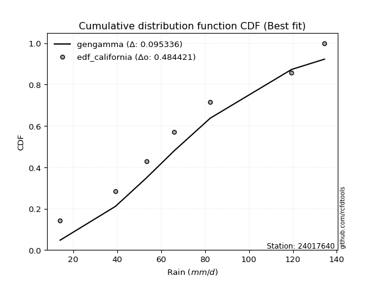</img>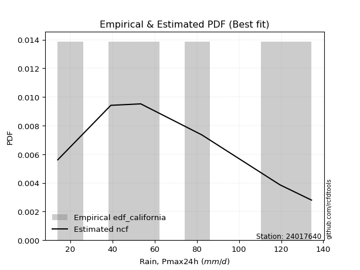</img>

</div>


### 2. EDF Hazen (1930)

Hazen method for plotting positions is a formula used to estimate the empirical cumulative probability distribution of flood events or other hydrological data. This formula often results in biased estimations, particularly when extrapolating to extreme events (high return periods).

<div align="center">


$P=(m-0.5)/n$


</div>


**2.1. Empirical values**

<div align="center">

|                | 0                   | 1                  | 2                  | 3                  | 4         | 5                  |
|:---------------|:--------------------|:-------------------|:-------------------|:-------------------|:----------|:-------------------|
| date           | 2022                | 2023               | 2021               | 2020               | 2019      | 2024               |
| x              | 14.0                | 39.2               | 53.4               | 82.4               | 119.4     | 134.4              |
| m              | 1                   | 2                  | 3                  | 4                  | 5         | 6                  |
| empirical_dist | edf_hazen           | edf_hazen          | edf_hazen          | edf_hazen          | edf_hazen | edf_hazen          |
| empirical      | 0.08333333333333333 | 0.25               | 0.4166666666666667 | 0.5833333333333334 | 0.75      | 0.9166666666666666 |
| empirical_tr   | 1.090909090909091   | 1.3333333333333333 | 1.7142857142857144 | 2.4000000000000004 | 4.0       | 11.999999999999995 |

</div>


**2.2. Kolmogorov-Smirnov fit test (sorted by Δ)**


<div align="center">

|                | 0                  | 1                   | 2                   | 3                   | 4                   | 5                   | 6                   | 7                   | 8                  | 9                   | 10                  | 11                  | 12                  | 13                  | 14                  | 15                  | 16                  | 17                  | 18                  | 19                  | 20                  | 21                  | 22                 | 23                 | 24                  | 25                  | 26                  | 27                  | 28                  | 29                  | 30                  | 31                  | 32                  | 33                | 34                  | 35                  | 36                  | 37                  | 38                  | 39                 | 40                  | 41                  | 42                  | 43                  | 44                  | 45                  | 46                  | 47                  | 48                  | 49                    | 50                  | 51                  | 52                  | 53                  | 54                  | 55                  | 56                  | 57                  | 58                  | 59                 | 60                 | 61                  | 62                  | 63                  | 64                 | 65                  | 66                  | 67                 | 68                  | 69                  | 70                  | 71                 | 72                  | 73                  | 74                  | 75                 | 76                  | 77                  | 78                  | 79             | 80                  | 81                 | 82                | 83                  | 84                  | 85                | 86                 | 87             |
|:---------------|:-------------------|:--------------------|:--------------------|:--------------------|:--------------------|:--------------------|:--------------------|:--------------------|:-------------------|:--------------------|:--------------------|:--------------------|:--------------------|:--------------------|:--------------------|:--------------------|:--------------------|:--------------------|:--------------------|:--------------------|:--------------------|:--------------------|:-------------------|:-------------------|:--------------------|:--------------------|:--------------------|:--------------------|:--------------------|:--------------------|:--------------------|:--------------------|:--------------------|:------------------|:--------------------|:--------------------|:--------------------|:--------------------|:--------------------|:-------------------|:--------------------|:--------------------|:--------------------|:--------------------|:--------------------|:--------------------|:--------------------|:--------------------|:--------------------|:----------------------|:--------------------|:--------------------|:--------------------|:--------------------|:--------------------|:--------------------|:--------------------|:--------------------|:--------------------|:-------------------|:-------------------|:--------------------|:--------------------|:--------------------|:-------------------|:--------------------|:--------------------|:-------------------|:--------------------|:--------------------|:--------------------|:-------------------|:--------------------|:--------------------|:--------------------|:-------------------|:--------------------|:--------------------|:--------------------|:---------------|:--------------------|:-------------------|:------------------|:--------------------|:--------------------|:------------------|:-------------------|:---------------|
| station        | 24017640           | 24017640            | 24017640            | 24017640            | 24017640            | 24017640            | 24017640            | 24017640            | 24017640           | 24017640            | 24017640            | 24017640            | 24017640            | 24017640            | 24017640            | 24017640            | 24017640            | 24017640            | 24017640            | 24017640            | 24017640            | 24017640            | 24017640           | 24017640           | 24017640            | 24017640            | 24017640            | 24017640            | 24017640            | 24017640            | 24017640            | 24017640            | 24017640            | 24017640          | 24017640            | 24017640            | 24017640            | 24017640            | 24017640            | 24017640           | 24017640            | 24017640            | 24017640            | 24017640            | 24017640            | 24017640            | 24017640            | 24017640            | 24017640            | 24017640              | 24017640            | 24017640            | 24017640            | 24017640            | 24017640            | 24017640            | 24017640            | 24017640            | 24017640            | 24017640           | 24017640           | 24017640            | 24017640            | 24017640            | 24017640           | 24017640            | 24017640            | 24017640           | 24017640            | 24017640            | 24017640            | 24017640           | 24017640            | 24017640            | 24017640            | 24017640           | 24017640            | 24017640            | 24017640            | 24017640       | 24017640            | 24017640           | 24017640          | 24017640            | 24017640            | 24017640          | 24017640           | 24017640       |
| empirical_dist | edf_hazen          | edf_hazen           | edf_hazen           | edf_hazen           | edf_hazen           | edf_hazen           | edf_hazen           | edf_hazen           | edf_hazen          | edf_hazen           | edf_hazen           | edf_hazen           | edf_hazen           | edf_hazen           | edf_hazen           | edf_hazen           | edf_hazen           | edf_hazen           | edf_hazen           | edf_hazen           | edf_hazen           | edf_hazen           | edf_hazen          | edf_hazen          | edf_hazen           | edf_hazen           | edf_hazen           | edf_hazen           | edf_hazen           | edf_hazen           | edf_hazen           | edf_hazen           | edf_hazen           | edf_hazen         | edf_hazen           | edf_hazen           | edf_hazen           | edf_hazen           | edf_hazen           | edf_hazen          | edf_hazen           | edf_hazen           | edf_hazen           | edf_hazen           | edf_hazen           | edf_hazen           | edf_hazen           | edf_hazen           | edf_hazen           | edf_hazen             | edf_hazen           | edf_hazen           | edf_hazen           | edf_hazen           | edf_hazen           | edf_hazen           | edf_hazen           | edf_hazen           | edf_hazen           | edf_hazen          | edf_hazen          | edf_hazen           | edf_hazen           | edf_hazen           | edf_hazen          | edf_hazen           | edf_hazen           | edf_hazen          | edf_hazen           | edf_hazen           | edf_hazen           | edf_hazen          | edf_hazen           | edf_hazen           | edf_hazen           | edf_hazen          | edf_hazen           | edf_hazen           | edf_hazen           | edf_hazen      | edf_hazen           | edf_hazen          | edf_hazen         | edf_hazen           | edf_hazen           | edf_hazen         | edf_hazen          | edf_hazen      |
| p_dist         | logfisk            | logpearson3         | fisk                | ncf                 | logexponnorm        | logcrystalball      | lognorm             | lognorm             | logt               | loginvgamma         | logncf              | logfatiguelife      | lognct              | f                   | betaprime           | logf                | logrice             | loggumbel_l         | loggompertz         | loginvgauss         | invweibull          | genlogistic         | loggamma           | loggamma           | expon               | genexpon            | laplace_asymmetric  | logweibull_min      | logerlang           | halfnorm            | rayleigh            | invgauss            | logalpha            | maxwell           | gompertz            | mielke              | rice                | kstwobign           | invgamma            | pearson3           | johnsonsu           | exponnorm           | crystalball         | norm                | truncnorm           | nct                 | t                   | gamma               | erlang              | loglaplace_asymmetric | logmaxwell          | loglogistic         | halflogistic        | lograyleigh         | gumbel_r            | logloggamma         | logbetaprime        | moyal               | logistic            | loghypsecant       | loghalfnorm        | hypsecant           | loginvweibull       | loggumbel_r         | logmielke          | loglaplace          | gumbel_l            | logkstwobign       | loghalflogistic     | laplace             | logmoyal            | weibull_min        | alpha               | wald                | loggenexpon         | logwald            | logtruncnorm        | loggibrat           | nakagami            | gibrat         | logexpon            | lognakagami        | loglognorm        | chi2                | logchi2             | fatiguelife       | logjohnsonsu       | loggenlogistic |
| delta          | 0.0706659620340292 | 0.07791612566008776 | 0.08852224506342499 | 0.09123485976473078 | 0.09169197936910956 | 0.09169447368574535 | 0.09169459279882519 | 0.09169459279882519 | 0.0916962107001208 | 0.09171382396731531 | 0.09191046248986612 | 0.09228023346712366 | 0.09236374579724604 | 0.09279293673903055 | 0.09332393594187294 | 0.09405319207617413 | 0.09543621638177657 | 0.09557682208911067 | 0.09578753759538539 | 0.09728930516918988 | 0.09753375080346449 | 0.09758843655161098 | 0.0978700587334127 | 0.0978700587334127 | 0.09806470010971557 | 0.09873283470466954 | 0.09882697107367666 | 0.09935033017028316 | 0.09952326555391722 | 0.09997156797900664 | 0.10077810536946386 | 0.10127083826300687 | 0.10141781741282185 | 0.101955359126641 | 0.10247355126953428 | 0.10305801587625796 | 0.10373454993977727 | 0.10387533902256585 | 0.10509549418071096 | 0.1059652560622173 | 0.10627925704731533 | 0.10639415673309938 | 0.10639435410397136 | 0.10639436089455967 | 0.10639436479943043 | 0.10640018481422608 | 0.10640153960763754 | 0.10645074361460616 | 0.10714399480970926 | 0.1084600146329191    | 0.11055763089536663 | 0.11157640871469943 | 0.11567225064411224 | 0.11614754451456577 | 0.11641536541077668 | 0.11795473354599995 | 0.12088919790330732 | 0.12093758231278817 | 0.12328845649557152 | 0.1264969990433974 | 0.1327064335803655 | 0.13520668928365198 | 0.14309292840814536 | 0.14739792318020606 | 0.1494958691935495 | 0.15350153220889884 | 0.15388324474732457 | 0.1574327799857968 | 0.16030099481987448 | 0.16166287111208094 | 0.16559530736400085 | 0.1765638979302171 | 0.18221469318207856 | 0.19290872593441352 | 0.21721296123847122 | 0.2179318155470431 | 0.24523761967834923 | 0.24985202819601737 | 0.24999999996710498 | 0.25           | 0.26464313944649676 | 0.3776434499205437 | 0.409942434307783 | 0.42403928323712814 | 0.42705647412829983 | 0.490424463100515 | 0.5358732921512159 | 0.75           |
| deltao         | 0.530385761606     | 0.530385761606      | 0.530385761606      | 0.530385761606      | 0.530385761606      | 0.530385761606      | 0.530385761606      | 0.530385761606      | 0.530385761606     | 0.530385761606      | 0.530385761606      | 0.530385761606      | 0.530385761606      | 0.530385761606      | 0.530385761606      | 0.530385761606      | 0.530385761606      | 0.530385761606      | 0.530385761606      | 0.530385761606      | 0.530385761606      | 0.530385761606      | 0.530385761606     | 0.530385761606     | 0.530385761606      | 0.530385761606      | 0.530385761606      | 0.530385761606      | 0.530385761606      | 0.530385761606      | 0.530385761606      | 0.530385761606      | 0.530385761606      | 0.530385761606    | 0.530385761606      | 0.530385761606      | 0.530385761606      | 0.530385761606      | 0.530385761606      | 0.530385761606     | 0.530385761606      | 0.530385761606      | 0.530385761606      | 0.530385761606      | 0.530385761606      | 0.530385761606      | 0.530385761606      | 0.530385761606      | 0.530385761606      | 0.530385761606        | 0.530385761606      | 0.530385761606      | 0.530385761606      | 0.530385761606      | 0.530385761606      | 0.530385761606      | 0.530385761606      | 0.530385761606      | 0.530385761606      | 0.530385761606     | 0.530385761606     | 0.530385761606      | 0.530385761606      | 0.530385761606      | 0.530385761606     | 0.530385761606      | 0.530385761606      | 0.530385761606     | 0.530385761606      | 0.530385761606      | 0.530385761606      | 0.530385761606     | 0.530385761606      | 0.530385761606      | 0.530385761606      | 0.530385761606     | 0.530385761606      | 0.530385761606      | 0.530385761606      | 0.530385761606 | 0.530385761606      | 0.530385761606     | 0.530385761606    | 0.530385761606      | 0.530385761606      | 0.530385761606    | 0.530385761606     | 0.530385761606 |
| eval           | Δo > Δ             | Δo > Δ              | Δo > Δ              | Δo > Δ              | Δo > Δ              | Δo > Δ              | Δo > Δ              | Δo > Δ              | Δo > Δ             | Δo > Δ              | Δo > Δ              | Δo > Δ              | Δo > Δ              | Δo > Δ              | Δo > Δ              | Δo > Δ              | Δo > Δ              | Δo > Δ              | Δo > Δ              | Δo > Δ              | Δo > Δ              | Δo > Δ              | Δo > Δ             | Δo > Δ             | Δo > Δ              | Δo > Δ              | Δo > Δ              | Δo > Δ              | Δo > Δ              | Δo > Δ              | Δo > Δ              | Δo > Δ              | Δo > Δ              | Δo > Δ            | Δo > Δ              | Δo > Δ              | Δo > Δ              | Δo > Δ              | Δo > Δ              | Δo > Δ             | Δo > Δ              | Δo > Δ              | Δo > Δ              | Δo > Δ              | Δo > Δ              | Δo > Δ              | Δo > Δ              | Δo > Δ              | Δo > Δ              | Δo > Δ                | Δo > Δ              | Δo > Δ              | Δo > Δ              | Δo > Δ              | Δo > Δ              | Δo > Δ              | Δo > Δ              | Δo > Δ              | Δo > Δ              | Δo > Δ             | Δo > Δ             | Δo > Δ              | Δo > Δ              | Δo > Δ              | Δo > Δ             | Δo > Δ              | Δo > Δ              | Δo > Δ             | Δo > Δ              | Δo > Δ              | Δo > Δ              | Δo > Δ             | Δo > Δ              | Δo > Δ              | Δo > Δ              | Δo > Δ             | Δo > Δ              | Δo > Δ              | Δo > Δ              | Δo > Δ         | Δo > Δ              | Δo > Δ             | Δo > Δ            | Δo > Δ              | Δo > Δ              | Δo > Δ            | Δo <= Δ            | Δo <= Δ        |
| fit            | 1                  | 1                   | 1                   | 1                   | 1                   | 1                   | 1                   | 1                   | 1                  | 1                   | 1                   | 1                   | 1                   | 1                   | 1                   | 1                   | 1                   | 1                   | 1                   | 1                   | 1                   | 1                   | 1                  | 1                  | 1                   | 1                   | 1                   | 1                   | 1                   | 1                   | 1                   | 1                   | 1                   | 1                 | 1                   | 1                   | 1                   | 1                   | 1                   | 1                  | 1                   | 1                   | 1                   | 1                   | 1                   | 1                   | 1                   | 1                   | 1                   | 1                     | 1                   | 1                   | 1                   | 1                   | 1                   | 1                   | 1                   | 1                   | 1                   | 1                  | 1                  | 1                   | 1                   | 1                   | 1                  | 1                   | 1                   | 1                  | 1                   | 1                   | 1                   | 1                  | 1                   | 1                   | 1                   | 1                  | 1                   | 1                   | 1                   | 1              | 1                   | 1                  | 1                 | 1                   | 1                   | 1                 | 0                  | 0              |
| n              | 6                  | 6                   | 6                   | 6                   | 6                   | 6                   | 6                   | 6                   | 6                  | 6                   | 6                   | 6                   | 6                   | 6                   | 6                   | 6                   | 6                   | 6                   | 6                   | 6                   | 6                   | 6                   | 6                  | 6                  | 6                   | 6                   | 6                   | 6                   | 6                   | 6                   | 6                   | 6                   | 6                   | 6                 | 6                   | 6                   | 6                   | 6                   | 6                   | 6                  | 6                   | 6                   | 6                   | 6                   | 6                   | 6                   | 6                   | 6                   | 6                   | 6                     | 6                   | 6                   | 6                   | 6                   | 6                   | 6                   | 6                   | 6                   | 6                   | 6                  | 6                  | 6                   | 6                   | 6                   | 6                  | 6                   | 6                   | 6                  | 6                   | 6                   | 6                   | 6                  | 6                   | 6                   | 6                   | 6                  | 6                   | 6                   | 6                   | 6              | 6                   | 6                  | 6                 | 6                   | 6                   | 6                 | 6                  | 6              |
| best_fit       | 1                  | 0                   | 0                   | 0                   | 0                   | 0                   | 0                   | 0                   | 0                  | 0                   | 0                   | 0                   | 0                   | 0                   | 0                   | 0                   | 0                   | 0                   | 0                   | 0                   | 0                   | 0                   | 0                  | 0                  | 0                   | 0                   | 0                   | 0                   | 0                   | 0                   | 0                   | 0                   | 0                   | 0                 | 0                   | 0                   | 0                   | 0                   | 0                   | 0                  | 0                   | 0                   | 0                   | 0                   | 0                   | 0                   | 0                   | 0                   | 0                   | 0                     | 0                   | 0                   | 0                   | 0                   | 0                   | 0                   | 0                   | 0                   | 0                   | 0                  | 0                  | 0                   | 0                   | 0                   | 0                  | 0                   | 0                   | 0                  | 0                   | 0                   | 0                   | 0                  | 0                   | 0                   | 0                   | 0                  | 0                   | 0                   | 0                   | 0              | 0                   | 0                  | 0                 | 0                   | 0                   | 0                 | 0                  | 0              |
| best_fit_sort  | 1                  | 2                   | 3                   | 4                   | 5                   | 6                   | 7                   | 8                   | 9                  | 10                  | 11                  | 12                  | 13                  | 14                  | 15                  | 16                  | 17                  | 18                  | 19                  | 20                  | 21                  | 22                  | 23                 | 24                 | 25                  | 26                  | 27                  | 28                  | 29                  | 30                  | 31                  | 32                  | 33                  | 34                | 35                  | 36                  | 37                  | 38                  | 39                  | 40                 | 41                  | 42                  | 43                  | 44                  | 45                  | 46                  | 47                  | 48                  | 49                  | 50                    | 51                  | 52                  | 53                  | 54                  | 55                  | 56                  | 57                  | 58                  | 59                  | 60                 | 61                 | 62                  | 63                  | 64                  | 65                 | 66                  | 67                  | 68                 | 69                  | 70                  | 71                  | 72                 | 73                  | 74                  | 75                  | 76                 | 77                  | 78                  | 79                  | 80             | 81                  | 82                 | 83                | 84                  | 85                  | 86                | 87                 | 88             |

</div>


**2.3. Best fit**

<div align="center">

|   id |   station | empirical_dist   | p_dist   |    delta |   deltao | eval   |   fit |   n |   best_fit |   best_fit_sort |
|-----:|----------:|:-----------------|:---------|---------:|---------:|:-------|------:|----:|-----------:|----------------:|
|    0 |  24017640 | edf_hazen        | logfisk  | 0.070666 | 0.530386 | Δo > Δ |     1 |   6 |          1 |               1 |

</div>


<div align="center">

</img>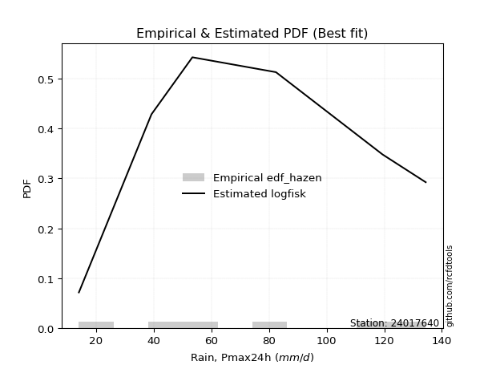</img>

</div>


### 3. EDF Weibull (1939)

Weibull plotting position formula is an empirical method used to estimate the non-exceedance probability or plotting position for a set of observed data, is often recommended or widely used in practice, particularly in flood frequency analysis.

<div align="center">


$P=m/(n+1)$


</div>


**3.1. Empirical values**

<div align="center">

|                | 0                   | 1                  | 2                   | 3                  | 4                  | 5                  |
|:---------------|:--------------------|:-------------------|:--------------------|:-------------------|:-------------------|:-------------------|
| date           | 2022                | 2023               | 2021                | 2020               | 2019               | 2024               |
| x              | 14.0                | 39.2               | 53.4                | 82.4               | 119.4              | 134.4              |
| m              | 1                   | 2                  | 3                   | 4                  | 5                  | 6                  |
| empirical_dist | edf_weibull         | edf_weibull        | edf_weibull         | edf_weibull        | edf_weibull        | edf_weibull        |
| empirical      | 0.14285714285714285 | 0.2857142857142857 | 0.42857142857142855 | 0.5714285714285714 | 0.7142857142857143 | 0.8571428571428571 |
| empirical_tr   | 1.1666666666666665  | 1.4                | 1.75                | 2.333333333333333  | 3.5                | 6.999999999999997  |

</div>


**3.2. Kolmogorov-Smirnov fit test (sorted by Δ)**


<div align="center">

|                | 0                   | 1                   | 2                   | 3                   | 4                   | 5                   | 6                   | 7                  | 8                  | 9                  | 10                  | 11                  | 12                  | 13                 | 14                  | 15                  | 16                  | 17                  | 18                  | 19                  | 20                  | 21                  | 22                  | 23                  | 24                  | 25                  | 26                 | 27                 | 28                  | 29                  | 30                  | 31                  | 32                  | 33                  | 34                 | 35                  | 36                  | 37                  | 38                | 39                  | 40                  | 41                  | 42                  | 43                  | 44                  | 45                  | 46                  | 47                  | 48                  | 49                | 50                  | 51                  | 52                  | 53                  | 54                  | 55                  | 56                  | 57                    | 58                  | 59                  | 60                  | 61                  | 62                  | 63                  | 64                  | 65                  | 66                 | 67                  | 68                  | 69                 | 70                  | 71                  | 72                  | 73                 | 74                  | 75                  | 76                  | 77                  | 78                 | 79                 | 80                 | 81                  | 82                 | 83                  | 84                  | 85                 | 86                 | 87                 |
|:---------------|:--------------------|:--------------------|:--------------------|:--------------------|:--------------------|:--------------------|:--------------------|:-------------------|:-------------------|:-------------------|:--------------------|:--------------------|:--------------------|:-------------------|:--------------------|:--------------------|:--------------------|:--------------------|:--------------------|:--------------------|:--------------------|:--------------------|:--------------------|:--------------------|:--------------------|:--------------------|:-------------------|:-------------------|:--------------------|:--------------------|:--------------------|:--------------------|:--------------------|:--------------------|:-------------------|:--------------------|:--------------------|:--------------------|:------------------|:--------------------|:--------------------|:--------------------|:--------------------|:--------------------|:--------------------|:--------------------|:--------------------|:--------------------|:--------------------|:------------------|:--------------------|:--------------------|:--------------------|:--------------------|:--------------------|:--------------------|:--------------------|:----------------------|:--------------------|:--------------------|:--------------------|:--------------------|:--------------------|:--------------------|:--------------------|:--------------------|:-------------------|:--------------------|:--------------------|:-------------------|:--------------------|:--------------------|:--------------------|:-------------------|:--------------------|:--------------------|:--------------------|:--------------------|:-------------------|:-------------------|:-------------------|:--------------------|:-------------------|:--------------------|:--------------------|:-------------------|:-------------------|:-------------------|
| station        | 24017640            | 24017640            | 24017640            | 24017640            | 24017640            | 24017640            | 24017640            | 24017640           | 24017640           | 24017640           | 24017640            | 24017640            | 24017640            | 24017640           | 24017640            | 24017640            | 24017640            | 24017640            | 24017640            | 24017640            | 24017640            | 24017640            | 24017640            | 24017640            | 24017640            | 24017640            | 24017640           | 24017640           | 24017640            | 24017640            | 24017640            | 24017640            | 24017640            | 24017640            | 24017640           | 24017640            | 24017640            | 24017640            | 24017640          | 24017640            | 24017640            | 24017640            | 24017640            | 24017640            | 24017640            | 24017640            | 24017640            | 24017640            | 24017640            | 24017640          | 24017640            | 24017640            | 24017640            | 24017640            | 24017640            | 24017640            | 24017640            | 24017640              | 24017640            | 24017640            | 24017640            | 24017640            | 24017640            | 24017640            | 24017640            | 24017640            | 24017640           | 24017640            | 24017640            | 24017640           | 24017640            | 24017640            | 24017640            | 24017640           | 24017640            | 24017640            | 24017640            | 24017640            | 24017640           | 24017640           | 24017640           | 24017640            | 24017640           | 24017640            | 24017640            | 24017640           | 24017640           | 24017640           |
| empirical_dist | edf_weibull         | edf_weibull         | edf_weibull         | edf_weibull         | edf_weibull         | edf_weibull         | edf_weibull         | edf_weibull        | edf_weibull        | edf_weibull        | edf_weibull         | edf_weibull         | edf_weibull         | edf_weibull        | edf_weibull         | edf_weibull         | edf_weibull         | edf_weibull         | edf_weibull         | edf_weibull         | edf_weibull         | edf_weibull         | edf_weibull         | edf_weibull         | edf_weibull         | edf_weibull         | edf_weibull        | edf_weibull        | edf_weibull         | edf_weibull         | edf_weibull         | edf_weibull         | edf_weibull         | edf_weibull         | edf_weibull        | edf_weibull         | edf_weibull         | edf_weibull         | edf_weibull       | edf_weibull         | edf_weibull         | edf_weibull         | edf_weibull         | edf_weibull         | edf_weibull         | edf_weibull         | edf_weibull         | edf_weibull         | edf_weibull         | edf_weibull       | edf_weibull         | edf_weibull         | edf_weibull         | edf_weibull         | edf_weibull         | edf_weibull         | edf_weibull         | edf_weibull           | edf_weibull         | edf_weibull         | edf_weibull         | edf_weibull         | edf_weibull         | edf_weibull         | edf_weibull         | edf_weibull         | edf_weibull        | edf_weibull         | edf_weibull         | edf_weibull        | edf_weibull         | edf_weibull         | edf_weibull         | edf_weibull        | edf_weibull         | edf_weibull         | edf_weibull         | edf_weibull         | edf_weibull        | edf_weibull        | edf_weibull        | edf_weibull         | edf_weibull        | edf_weibull         | edf_weibull         | edf_weibull        | edf_weibull        | edf_weibull        |
| p_dist         | logf                | logfisk             | logncf              | loggamma            | loggamma            | lognct              | logexponnorm        | logcrystalball     | lognorm            | lognorm            | logt                | logerlang           | loginvgauss         | logfatiguelife     | logpearson3         | logalpha            | loginvgamma         | logrice             | logkstwobign        | fisk                | ncf                 | f                   | betaprime           | loglogistic         | loggumbel_l         | logmaxwell          | logbetaprime       | invweibull         | genlogistic         | laplace_asymmetric  | logweibull_min      | rayleigh            | invgauss            | loginvweibull       | maxwell            | rice                | kstwobign           | invgamma            | pearson3          | johnsonsu           | exponnorm           | crystalball         | norm                | truncnorm           | nct                 | t                   | loghypsecant        | gamma               | lograyleigh         | genexpon          | mielke              | loggompertz         | weibull_min         | gompertz            | halfnorm            | expon               | erlang              | loglaplace_asymmetric | loghalfnorm         | alpha               | halflogistic        | gumbel_r            | logloggamma         | moyal               | logistic            | loggumbel_r         | loglaplace         | hypsecant           | loghalflogistic     | laplace            | gumbel_l            | logmoyal            | loggenexpon         | logmielke          | wald                | logexpon            | logwald             | loggibrat           | logtruncnorm       | nakagami           | gibrat             | lognakagami         | loglognorm         | chi2                | logchi2             | fatiguelife        | logjohnsonsu       | loggenlogistic     |
| delta          | 0.10961624869644826 | 0.10972520967910854 | 0.11036213633560904 | 0.11069444704405161 | 0.11069444704405161 | 0.11073602064325788 | 0.11140715871572815 | 0.1114084017278768 | 0.1114084223111731 | 0.1114084223111731 | 0.11141003893282075 | 0.11142802745867919 | 0.11143350489676723 | 0.1119570132670874 | 0.11363041137437346 | 0.11399811417113721 | 0.11480361915028083 | 0.11784106189628171 | 0.12370646373423377 | 0.12423653077771069 | 0.12694914547901648 | 0.12850722245331625 | 0.12903822165615864 | 0.13125526588984682 | 0.13129110780339637 | 0.13227521842545048 | 0.1327939598080693 | 0.1332480365177502 | 0.13330272226589668 | 0.13454125678796236 | 0.13506461588456886 | 0.13649239108374955 | 0.13698512397729257 | 0.13704868473748333 | 0.1376696448409267 | 0.13944883565406296 | 0.13958962473685155 | 0.14080977989499666 | 0.141679541776503 | 0.14199354276160103 | 0.14210844244738507 | 0.14210863981825705 | 0.14210864660884537 | 0.14210865051371613 | 0.14211447052851178 | 0.14211582532192324 | 0.14215702604477787 | 0.14216502932889186 | 0.14217289133068606 | 0.142855725280587 | 0.14285706247371907 | 0.14285713425284036 | 0.14285714263617597 | 0.14285714285702292 | 0.14285714285714285 | 0.14285714285714285 | 0.14285828052399496 | 0.1441743003472048    | 0.14461119548512746 | 0.14650040746779286 | 0.15138653635839794 | 0.15212965112506238 | 0.15366901926028564 | 0.15665186802707387 | 0.15900274220985722 | 0.15930268508496803 | 0.1654062941136608 | 0.16745932345704606 | 0.17220575672463645 | 0.1747156122563177 | 0.17473858402241238 | 0.17750006926876283 | 0.18149867552418553 | 0.1852101549078352 | 0.22862301164869922 | 0.22892885373221106 | 0.22983657745180508 | 0.26175679010077935 | 0.2809519053926349 | 0.2857142856813907 | 0.2857142857142857 | 0.36573868801578185 | 0.3742281485934973 | 0.38832499752284244 | 0.39134218841401414 | 0.4547101773862293 | 0.5001590064369303 | 0.7142857142857143 |
| deltao         | 0.530385761606      | 0.530385761606      | 0.530385761606      | 0.530385761606      | 0.530385761606      | 0.530385761606      | 0.530385761606      | 0.530385761606     | 0.530385761606     | 0.530385761606     | 0.530385761606      | 0.530385761606      | 0.530385761606      | 0.530385761606     | 0.530385761606      | 0.530385761606      | 0.530385761606      | 0.530385761606      | 0.530385761606      | 0.530385761606      | 0.530385761606      | 0.530385761606      | 0.530385761606      | 0.530385761606      | 0.530385761606      | 0.530385761606      | 0.530385761606     | 0.530385761606     | 0.530385761606      | 0.530385761606      | 0.530385761606      | 0.530385761606      | 0.530385761606      | 0.530385761606      | 0.530385761606     | 0.530385761606      | 0.530385761606      | 0.530385761606      | 0.530385761606    | 0.530385761606      | 0.530385761606      | 0.530385761606      | 0.530385761606      | 0.530385761606      | 0.530385761606      | 0.530385761606      | 0.530385761606      | 0.530385761606      | 0.530385761606      | 0.530385761606    | 0.530385761606      | 0.530385761606      | 0.530385761606      | 0.530385761606      | 0.530385761606      | 0.530385761606      | 0.530385761606      | 0.530385761606        | 0.530385761606      | 0.530385761606      | 0.530385761606      | 0.530385761606      | 0.530385761606      | 0.530385761606      | 0.530385761606      | 0.530385761606      | 0.530385761606     | 0.530385761606      | 0.530385761606      | 0.530385761606     | 0.530385761606      | 0.530385761606      | 0.530385761606      | 0.530385761606     | 0.530385761606      | 0.530385761606      | 0.530385761606      | 0.530385761606      | 0.530385761606     | 0.530385761606     | 0.530385761606     | 0.530385761606      | 0.530385761606     | 0.530385761606      | 0.530385761606      | 0.530385761606     | 0.530385761606     | 0.530385761606     |
| eval           | Δo > Δ              | Δo > Δ              | Δo > Δ              | Δo > Δ              | Δo > Δ              | Δo > Δ              | Δo > Δ              | Δo > Δ             | Δo > Δ             | Δo > Δ             | Δo > Δ              | Δo > Δ              | Δo > Δ              | Δo > Δ             | Δo > Δ              | Δo > Δ              | Δo > Δ              | Δo > Δ              | Δo > Δ              | Δo > Δ              | Δo > Δ              | Δo > Δ              | Δo > Δ              | Δo > Δ              | Δo > Δ              | Δo > Δ              | Δo > Δ             | Δo > Δ             | Δo > Δ              | Δo > Δ              | Δo > Δ              | Δo > Δ              | Δo > Δ              | Δo > Δ              | Δo > Δ             | Δo > Δ              | Δo > Δ              | Δo > Δ              | Δo > Δ            | Δo > Δ              | Δo > Δ              | Δo > Δ              | Δo > Δ              | Δo > Δ              | Δo > Δ              | Δo > Δ              | Δo > Δ              | Δo > Δ              | Δo > Δ              | Δo > Δ            | Δo > Δ              | Δo > Δ              | Δo > Δ              | Δo > Δ              | Δo > Δ              | Δo > Δ              | Δo > Δ              | Δo > Δ                | Δo > Δ              | Δo > Δ              | Δo > Δ              | Δo > Δ              | Δo > Δ              | Δo > Δ              | Δo > Δ              | Δo > Δ              | Δo > Δ             | Δo > Δ              | Δo > Δ              | Δo > Δ             | Δo > Δ              | Δo > Δ              | Δo > Δ              | Δo > Δ             | Δo > Δ              | Δo > Δ              | Δo > Δ              | Δo > Δ              | Δo > Δ             | Δo > Δ             | Δo > Δ             | Δo > Δ              | Δo > Δ             | Δo > Δ              | Δo > Δ              | Δo > Δ             | Δo > Δ             | Δo <= Δ            |
| fit            | 1                   | 1                   | 1                   | 1                   | 1                   | 1                   | 1                   | 1                  | 1                  | 1                  | 1                   | 1                   | 1                   | 1                  | 1                   | 1                   | 1                   | 1                   | 1                   | 1                   | 1                   | 1                   | 1                   | 1                   | 1                   | 1                   | 1                  | 1                  | 1                   | 1                   | 1                   | 1                   | 1                   | 1                   | 1                  | 1                   | 1                   | 1                   | 1                 | 1                   | 1                   | 1                   | 1                   | 1                   | 1                   | 1                   | 1                   | 1                   | 1                   | 1                 | 1                   | 1                   | 1                   | 1                   | 1                   | 1                   | 1                   | 1                     | 1                   | 1                   | 1                   | 1                   | 1                   | 1                   | 1                   | 1                   | 1                  | 1                   | 1                   | 1                  | 1                   | 1                   | 1                   | 1                  | 1                   | 1                   | 1                   | 1                   | 1                  | 1                  | 1                  | 1                   | 1                  | 1                   | 1                   | 1                  | 1                  | 0                  |
| n              | 6                   | 6                   | 6                   | 6                   | 6                   | 6                   | 6                   | 6                  | 6                  | 6                  | 6                   | 6                   | 6                   | 6                  | 6                   | 6                   | 6                   | 6                   | 6                   | 6                   | 6                   | 6                   | 6                   | 6                   | 6                   | 6                   | 6                  | 6                  | 6                   | 6                   | 6                   | 6                   | 6                   | 6                   | 6                  | 6                   | 6                   | 6                   | 6                 | 6                   | 6                   | 6                   | 6                   | 6                   | 6                   | 6                   | 6                   | 6                   | 6                   | 6                 | 6                   | 6                   | 6                   | 6                   | 6                   | 6                   | 6                   | 6                     | 6                   | 6                   | 6                   | 6                   | 6                   | 6                   | 6                   | 6                   | 6                  | 6                   | 6                   | 6                  | 6                   | 6                   | 6                   | 6                  | 6                   | 6                   | 6                   | 6                   | 6                  | 6                  | 6                  | 6                   | 6                  | 6                   | 6                   | 6                  | 6                  | 6                  |
| best_fit       | 1                   | 0                   | 0                   | 0                   | 0                   | 0                   | 0                   | 0                  | 0                  | 0                  | 0                   | 0                   | 0                   | 0                  | 0                   | 0                   | 0                   | 0                   | 0                   | 0                   | 0                   | 0                   | 0                   | 0                   | 0                   | 0                   | 0                  | 0                  | 0                   | 0                   | 0                   | 0                   | 0                   | 0                   | 0                  | 0                   | 0                   | 0                   | 0                 | 0                   | 0                   | 0                   | 0                   | 0                   | 0                   | 0                   | 0                   | 0                   | 0                   | 0                 | 0                   | 0                   | 0                   | 0                   | 0                   | 0                   | 0                   | 0                     | 0                   | 0                   | 0                   | 0                   | 0                   | 0                   | 0                   | 0                   | 0                  | 0                   | 0                   | 0                  | 0                   | 0                   | 0                   | 0                  | 0                   | 0                   | 0                   | 0                   | 0                  | 0                  | 0                  | 0                   | 0                  | 0                   | 0                   | 0                  | 0                  | 0                  |
| best_fit_sort  | 1                   | 2                   | 3                   | 4                   | 5                   | 6                   | 7                   | 8                  | 9                  | 10                 | 11                  | 12                  | 13                  | 14                 | 15                  | 16                  | 17                  | 18                  | 19                  | 20                  | 21                  | 22                  | 23                  | 24                  | 25                  | 26                  | 27                 | 28                 | 29                  | 30                  | 31                  | 32                  | 33                  | 34                  | 35                 | 36                  | 37                  | 38                  | 39                | 40                  | 41                  | 42                  | 43                  | 44                  | 45                  | 46                  | 47                  | 48                  | 49                  | 50                | 51                  | 52                  | 53                  | 54                  | 55                  | 56                  | 57                  | 58                    | 59                  | 60                  | 61                  | 62                  | 63                  | 64                  | 65                  | 66                  | 67                 | 68                  | 69                  | 70                 | 71                  | 72                  | 73                  | 74                 | 75                  | 76                  | 77                  | 78                  | 79                 | 80                 | 81                 | 82                  | 83                 | 84                  | 85                  | 86                 | 87                 | 88                 |

</div>


**3.3. Best fit**

<div align="center">

|   id |   station | empirical_dist   | p_dist   |    delta |   deltao | eval   |   fit |   n |   best_fit |   best_fit_sort |
|-----:|----------:|:-----------------|:---------|---------:|---------:|:-------|------:|----:|-----------:|----------------:|
|    0 |  24017640 | edf_weibull      | logf     | 0.109616 | 0.530386 | Δo > Δ |     1 |   6 |          1 |               1 |

</div>


<div align="center">

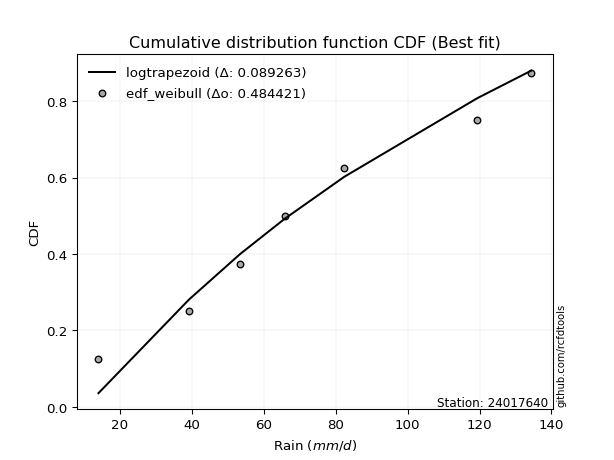</img>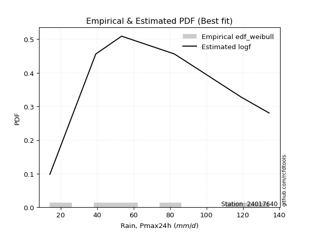</img>

</div>


### 4. EDF Beard (1943)

The Beard formula (or Beard´s plotting position formula) in hydrology is used to estimate the empirical non-exceedance probability _(P)_ of a flood event (or other extreme hydrological data point) within a given dataset.

<div align="center">


$P=(m-0.31)/(n+0.38)$


</div>


**4.1. Empirical values**

<div align="center">

|                | 0                   | 1                   | 2                  | 3                  | 4                  | 5                  |
|:---------------|:--------------------|:--------------------|:-------------------|:-------------------|:-------------------|:-------------------|
| date           | 2022                | 2023                | 2021               | 2020               | 2019               | 2024               |
| x              | 14.0                | 39.2                | 53.4               | 82.4               | 119.4              | 134.4              |
| m              | 1                   | 2                   | 3                  | 4                  | 5                  | 6                  |
| empirical_dist | edf_beard           | edf_beard           | edf_beard          | edf_beard          | edf_beard          | edf_beard          |
| empirical      | 0.10815047021943573 | 0.26489028213166144 | 0.4216300940438871 | 0.5783699059561128 | 0.7351097178683387 | 0.8918495297805643 |
| empirical_tr   | 1.1212653778558874  | 1.3603411513859276  | 1.7289972899728996 | 2.3717472118959106 | 3.7751479289940844 | 9.246376811594207  |

</div>


**4.2. Kolmogorov-Smirnov fit test (sorted by Δ)**


<div align="center">

|                | 0                   | 1                   | 2                   | 3                  | 4                   | 5                   | 6                   | 7                   | 8                   | 9                   | 10                 | 11                  | 12                  | 13                  | 14                  | 15                  | 16                  | 17                  | 18                 | 19                 | 20                  | 21                  | 22                  | 23                  | 24                | 25                  | 26                  | 27                 | 28                  | 29                  | 30                  | 31                  | 32                  | 33                 | 34                  | 35                  | 36                 | 37                  | 38                  | 39                  | 40                  | 41                  | 42                  | 43                  | 44                 | 45                  | 46                | 47                  | 48                  | 49                  | 50                  | 51                  | 52                    | 53                  | 54                 | 55                  | 56                | 57                  | 58                  | 59                 | 60                  | 61                  | 62                  | 63                 | 64                 | 65                 | 66                | 67                  | 68                  | 69                  | 70                  | 71                  | 72                 | 73                 | 74                  | 75                  | 76                  | 77                 | 78                  | 79                 | 80                  | 81                 | 82                  | 83                 | 84                 | 85                 | 86                 | 87                 |
|:---------------|:--------------------|:--------------------|:--------------------|:-------------------|:--------------------|:--------------------|:--------------------|:--------------------|:--------------------|:--------------------|:-------------------|:--------------------|:--------------------|:--------------------|:--------------------|:--------------------|:--------------------|:--------------------|:-------------------|:-------------------|:--------------------|:--------------------|:--------------------|:--------------------|:------------------|:--------------------|:--------------------|:-------------------|:--------------------|:--------------------|:--------------------|:--------------------|:--------------------|:-------------------|:--------------------|:--------------------|:-------------------|:--------------------|:--------------------|:--------------------|:--------------------|:--------------------|:--------------------|:--------------------|:-------------------|:--------------------|:------------------|:--------------------|:--------------------|:--------------------|:--------------------|:--------------------|:----------------------|:--------------------|:-------------------|:--------------------|:------------------|:--------------------|:--------------------|:-------------------|:--------------------|:--------------------|:--------------------|:-------------------|:-------------------|:-------------------|:------------------|:--------------------|:--------------------|:--------------------|:--------------------|:--------------------|:-------------------|:-------------------|:--------------------|:--------------------|:--------------------|:-------------------|:--------------------|:-------------------|:--------------------|:-------------------|:--------------------|:-------------------|:-------------------|:-------------------|:-------------------|:-------------------|
| station        | 24017640            | 24017640            | 24017640            | 24017640           | 24017640            | 24017640            | 24017640            | 24017640            | 24017640            | 24017640            | 24017640           | 24017640            | 24017640            | 24017640            | 24017640            | 24017640            | 24017640            | 24017640            | 24017640           | 24017640           | 24017640            | 24017640            | 24017640            | 24017640            | 24017640          | 24017640            | 24017640            | 24017640           | 24017640            | 24017640            | 24017640            | 24017640            | 24017640            | 24017640           | 24017640            | 24017640            | 24017640           | 24017640            | 24017640            | 24017640            | 24017640            | 24017640            | 24017640            | 24017640            | 24017640           | 24017640            | 24017640          | 24017640            | 24017640            | 24017640            | 24017640            | 24017640            | 24017640              | 24017640            | 24017640           | 24017640            | 24017640          | 24017640            | 24017640            | 24017640           | 24017640            | 24017640            | 24017640            | 24017640           | 24017640           | 24017640           | 24017640          | 24017640            | 24017640            | 24017640            | 24017640            | 24017640            | 24017640           | 24017640           | 24017640            | 24017640            | 24017640            | 24017640           | 24017640            | 24017640           | 24017640            | 24017640           | 24017640            | 24017640           | 24017640           | 24017640           | 24017640           | 24017640           |
| empirical_dist | edf_beard           | edf_beard           | edf_beard           | edf_beard          | edf_beard           | edf_beard           | edf_beard           | edf_beard           | edf_beard           | edf_beard           | edf_beard          | edf_beard           | edf_beard           | edf_beard           | edf_beard           | edf_beard           | edf_beard           | edf_beard           | edf_beard          | edf_beard          | edf_beard           | edf_beard           | edf_beard           | edf_beard           | edf_beard         | edf_beard           | edf_beard           | edf_beard          | edf_beard           | edf_beard           | edf_beard           | edf_beard           | edf_beard           | edf_beard          | edf_beard           | edf_beard           | edf_beard          | edf_beard           | edf_beard           | edf_beard           | edf_beard           | edf_beard           | edf_beard           | edf_beard           | edf_beard          | edf_beard           | edf_beard         | edf_beard           | edf_beard           | edf_beard           | edf_beard           | edf_beard           | edf_beard             | edf_beard           | edf_beard          | edf_beard           | edf_beard         | edf_beard           | edf_beard           | edf_beard          | edf_beard           | edf_beard           | edf_beard           | edf_beard          | edf_beard          | edf_beard          | edf_beard         | edf_beard           | edf_beard           | edf_beard           | edf_beard           | edf_beard           | edf_beard          | edf_beard          | edf_beard           | edf_beard           | edf_beard           | edf_beard          | edf_beard           | edf_beard          | edf_beard           | edf_beard          | edf_beard           | edf_beard          | edf_beard          | edf_beard          | edf_beard          | edf_beard          |
| p_dist         | logfisk             | logpearson3         | logexponnorm        | logcrystalball     | lognorm             | lognorm             | logt                | loginvgamma         | logncf              | logfatiguelife      | lognct             | logf                | logrice             | loginvgauss         | loggamma            | loggamma            | fisk                | logerlang           | ncf                | logalpha           | f                   | genexpon            | expon               | betaprime           | loggumbel_l       | loggompertz         | invweibull          | genlogistic        | laplace_asymmetric  | logweibull_min      | halfnorm            | logmaxwell          | rayleigh            | invgauss           | loglogistic         | maxwell             | gompertz           | mielke              | rice                | kstwobign           | invgamma            | pearson3            | lograyleigh         | johnsonsu           | exponnorm          | crystalball         | norm              | truncnorm           | nct                 | t                   | gamma               | erlang              | loglaplace_asymmetric | logbetaprime        | loginvweibull      | halflogistic        | gumbel_r          | loghypsecant        | logloggamma         | moyal              | loghalfnorm         | logistic            | logkstwobign        | hypsecant          | loggumbel_r        | loglaplace         | gumbel_l          | weibull_min         | logmielke           | loghalflogistic     | laplace             | alpha               | logmoyal           | loggenexpon        | wald                | logwald             | logexpon            | loggibrat          | logtruncnorm        | nakagami           | gibrat              | lognakagami        | loglognorm          | chi2               | logchi2            | fatiguelife        | logjohnsonsu       | loggenlogistic     |
| delta          | 0.07501853704140143 | 0.09280640779174909 | 0.09665540674633011 | 0.0966579010629659 | 0.09665802017604574 | 0.09665802017604574 | 0.09665963807734135 | 0.09667725134453586 | 0.09687388986708667 | 0.09724366084434422 | 0.0973271731744666 | 0.09901661945339468 | 0.10039964375899713 | 0.10225273254641043 | 0.10283348611063325 | 0.10283348611063325 | 0.10341252719508631 | 0.10448669293113777 | 0.1061251418963921 | 0.1063812447900424 | 0.10768321887069188 | 0.10814905264287988 | 0.10815047021943573 | 0.10821421807353426 | 0.110467104220772 | 0.11067781972704671 | 0.11242403293512582 | 0.1124787186832723 | 0.11371725320533799 | 0.11424061230194449 | 0.11486185011066796 | 0.11552105827258718 | 0.11566838750112518 | 0.1161611203946682 | 0.11653983609191998 | 0.11684564125830232 | 0.1173638334011956 | 0.11794829800791928 | 0.11862483207143859 | 0.11876562115422717 | 0.11998577631237228 | 0.12085553819387862 | 0.12111097189178632 | 0.12116953917897666 | 0.1212844388647607 | 0.12128463623563268 | 0.121284643026221 | 0.12128464693109176 | 0.12129046694588741 | 0.12129182173929887 | 0.12134102574626748 | 0.12203427694137059 | 0.12335029676458042   | 0.12585262528052787 | 0.1301073502099419 | 0.13056253277577357 | 0.131305647542438 | 0.13146042642061795 | 0.13284501567766127 | 0.1358278644444495 | 0.13766986095758604 | 0.13817873862723284 | 0.14254249785413536 | 0.1466353198744217 | 0.1523613505574266 | 0.1584649595861194 | 0.158846672124545 | 0.16167361579855566 | 0.16438615132521084 | 0.16526442219709503 | 0.16662629848930138 | 0.16732441105041712 | 0.1705587347412214 | 0.2023226791068098 | 0.20779900806607496 | 0.22289524292426366 | 0.24975285731483532 | 0.2548154555732379 | 0.26012790181001066 | 0.2648902820987664 | 0.26489028213166144 | 0.3726800225433233 | 0.39505215217612155 | 0.4091490011054667 | 0.4121661919966384 | 0.4755341809688536 | 0.5209830100195547 | 0.7351097178683387 |
| deltao         | 0.530385761606      | 0.530385761606      | 0.530385761606      | 0.530385761606     | 0.530385761606      | 0.530385761606      | 0.530385761606      | 0.530385761606      | 0.530385761606      | 0.530385761606      | 0.530385761606     | 0.530385761606      | 0.530385761606      | 0.530385761606      | 0.530385761606      | 0.530385761606      | 0.530385761606      | 0.530385761606      | 0.530385761606     | 0.530385761606     | 0.530385761606      | 0.530385761606      | 0.530385761606      | 0.530385761606      | 0.530385761606    | 0.530385761606      | 0.530385761606      | 0.530385761606     | 0.530385761606      | 0.530385761606      | 0.530385761606      | 0.530385761606      | 0.530385761606      | 0.530385761606     | 0.530385761606      | 0.530385761606      | 0.530385761606     | 0.530385761606      | 0.530385761606      | 0.530385761606      | 0.530385761606      | 0.530385761606      | 0.530385761606      | 0.530385761606      | 0.530385761606     | 0.530385761606      | 0.530385761606    | 0.530385761606      | 0.530385761606      | 0.530385761606      | 0.530385761606      | 0.530385761606      | 0.530385761606        | 0.530385761606      | 0.530385761606     | 0.530385761606      | 0.530385761606    | 0.530385761606      | 0.530385761606      | 0.530385761606     | 0.530385761606      | 0.530385761606      | 0.530385761606      | 0.530385761606     | 0.530385761606     | 0.530385761606     | 0.530385761606    | 0.530385761606      | 0.530385761606      | 0.530385761606      | 0.530385761606      | 0.530385761606      | 0.530385761606     | 0.530385761606     | 0.530385761606      | 0.530385761606      | 0.530385761606      | 0.530385761606     | 0.530385761606      | 0.530385761606     | 0.530385761606      | 0.530385761606     | 0.530385761606      | 0.530385761606     | 0.530385761606     | 0.530385761606     | 0.530385761606     | 0.530385761606     |
| eval           | Δo > Δ              | Δo > Δ              | Δo > Δ              | Δo > Δ             | Δo > Δ              | Δo > Δ              | Δo > Δ              | Δo > Δ              | Δo > Δ              | Δo > Δ              | Δo > Δ             | Δo > Δ              | Δo > Δ              | Δo > Δ              | Δo > Δ              | Δo > Δ              | Δo > Δ              | Δo > Δ              | Δo > Δ             | Δo > Δ             | Δo > Δ              | Δo > Δ              | Δo > Δ              | Δo > Δ              | Δo > Δ            | Δo > Δ              | Δo > Δ              | Δo > Δ             | Δo > Δ              | Δo > Δ              | Δo > Δ              | Δo > Δ              | Δo > Δ              | Δo > Δ             | Δo > Δ              | Δo > Δ              | Δo > Δ             | Δo > Δ              | Δo > Δ              | Δo > Δ              | Δo > Δ              | Δo > Δ              | Δo > Δ              | Δo > Δ              | Δo > Δ             | Δo > Δ              | Δo > Δ            | Δo > Δ              | Δo > Δ              | Δo > Δ              | Δo > Δ              | Δo > Δ              | Δo > Δ                | Δo > Δ              | Δo > Δ             | Δo > Δ              | Δo > Δ            | Δo > Δ              | Δo > Δ              | Δo > Δ             | Δo > Δ              | Δo > Δ              | Δo > Δ              | Δo > Δ             | Δo > Δ             | Δo > Δ             | Δo > Δ            | Δo > Δ              | Δo > Δ              | Δo > Δ              | Δo > Δ              | Δo > Δ              | Δo > Δ             | Δo > Δ             | Δo > Δ              | Δo > Δ              | Δo > Δ              | Δo > Δ             | Δo > Δ              | Δo > Δ             | Δo > Δ              | Δo > Δ             | Δo > Δ              | Δo > Δ             | Δo > Δ             | Δo > Δ             | Δo > Δ             | Δo <= Δ            |
| fit            | 1                   | 1                   | 1                   | 1                  | 1                   | 1                   | 1                   | 1                   | 1                   | 1                   | 1                  | 1                   | 1                   | 1                   | 1                   | 1                   | 1                   | 1                   | 1                  | 1                  | 1                   | 1                   | 1                   | 1                   | 1                 | 1                   | 1                   | 1                  | 1                   | 1                   | 1                   | 1                   | 1                   | 1                  | 1                   | 1                   | 1                  | 1                   | 1                   | 1                   | 1                   | 1                   | 1                   | 1                   | 1                  | 1                   | 1                 | 1                   | 1                   | 1                   | 1                   | 1                   | 1                     | 1                   | 1                  | 1                   | 1                 | 1                   | 1                   | 1                  | 1                   | 1                   | 1                   | 1                  | 1                  | 1                  | 1                 | 1                   | 1                   | 1                   | 1                   | 1                   | 1                  | 1                  | 1                   | 1                   | 1                   | 1                  | 1                   | 1                  | 1                   | 1                  | 1                   | 1                  | 1                  | 1                  | 1                  | 0                  |
| n              | 6                   | 6                   | 6                   | 6                  | 6                   | 6                   | 6                   | 6                   | 6                   | 6                   | 6                  | 6                   | 6                   | 6                   | 6                   | 6                   | 6                   | 6                   | 6                  | 6                  | 6                   | 6                   | 6                   | 6                   | 6                 | 6                   | 6                   | 6                  | 6                   | 6                   | 6                   | 6                   | 6                   | 6                  | 6                   | 6                   | 6                  | 6                   | 6                   | 6                   | 6                   | 6                   | 6                   | 6                   | 6                  | 6                   | 6                 | 6                   | 6                   | 6                   | 6                   | 6                   | 6                     | 6                   | 6                  | 6                   | 6                 | 6                   | 6                   | 6                  | 6                   | 6                   | 6                   | 6                  | 6                  | 6                  | 6                 | 6                   | 6                   | 6                   | 6                   | 6                   | 6                  | 6                  | 6                   | 6                   | 6                   | 6                  | 6                   | 6                  | 6                   | 6                  | 6                   | 6                  | 6                  | 6                  | 6                  | 6                  |
| best_fit       | 1                   | 0                   | 0                   | 0                  | 0                   | 0                   | 0                   | 0                   | 0                   | 0                   | 0                  | 0                   | 0                   | 0                   | 0                   | 0                   | 0                   | 0                   | 0                  | 0                  | 0                   | 0                   | 0                   | 0                   | 0                 | 0                   | 0                   | 0                  | 0                   | 0                   | 0                   | 0                   | 0                   | 0                  | 0                   | 0                   | 0                  | 0                   | 0                   | 0                   | 0                   | 0                   | 0                   | 0                   | 0                  | 0                   | 0                 | 0                   | 0                   | 0                   | 0                   | 0                   | 0                     | 0                   | 0                  | 0                   | 0                 | 0                   | 0                   | 0                  | 0                   | 0                   | 0                   | 0                  | 0                  | 0                  | 0                 | 0                   | 0                   | 0                   | 0                   | 0                   | 0                  | 0                  | 0                   | 0                   | 0                   | 0                  | 0                   | 0                  | 0                   | 0                  | 0                   | 0                  | 0                  | 0                  | 0                  | 0                  |
| best_fit_sort  | 1                   | 2                   | 3                   | 4                  | 5                   | 6                   | 7                   | 8                   | 9                   | 10                  | 11                 | 12                  | 13                  | 14                  | 15                  | 16                  | 17                  | 18                  | 19                 | 20                 | 21                  | 22                  | 23                  | 24                  | 25                | 26                  | 27                  | 28                 | 29                  | 30                  | 31                  | 32                  | 33                  | 34                 | 35                  | 36                  | 37                 | 38                  | 39                  | 40                  | 41                  | 42                  | 43                  | 44                  | 45                 | 46                  | 47                | 48                  | 49                  | 50                  | 51                  | 52                  | 53                    | 54                  | 55                 | 56                  | 57                | 58                  | 59                  | 60                 | 61                  | 62                  | 63                  | 64                 | 65                 | 66                 | 67                | 68                  | 69                  | 70                  | 71                  | 72                  | 73                 | 74                 | 75                  | 76                  | 77                  | 78                 | 79                  | 80                 | 81                  | 82                 | 83                  | 84                 | 85                 | 86                 | 87                 | 88                 |

</div>


**4.3. Best fit**

<div align="center">

|   id |   station | empirical_dist   | p_dist   |     delta |   deltao | eval   |   fit |   n |   best_fit |   best_fit_sort |
|-----:|----------:|:-----------------|:---------|----------:|---------:|:-------|------:|----:|-----------:|----------------:|
|    0 |  24017640 | edf_beard        | logfisk  | 0.0750185 | 0.530386 | Δo > Δ |     1 |   6 |          1 |               1 |

</div>


<div align="center">

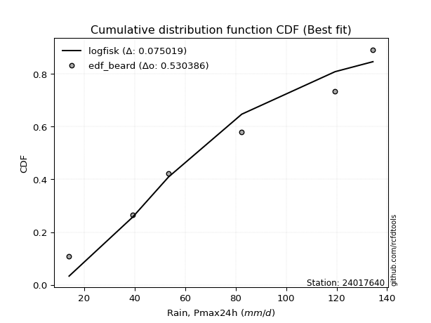</img>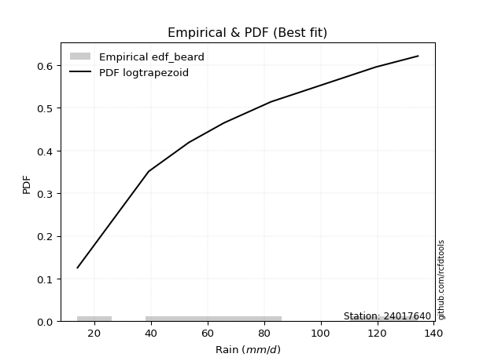</img>

</div>


### 5. EDF Chegodayev (1955)

The Chegodayev formula is an empirical plotting position formula used in hydrological frequency analysis to estimate the exceedance probability or return period of a specific event from a set of observed data. It is primarily used for plotting observed data points on probability paper to fit a theoretical distribution, particularly for analyzing extreme events like maximum flood flows or rainfall intensities. The constant _b_ value in the generalized plotting position formula is 0.3.

<div align="center">


$P=(m-b)/(n+1-2b)$


</div>


**5.1. Empirical values**

<div align="center">

|                | 0                   | 1                  | 2                  | 3                  | 4                 | 5                 |
|:---------------|:--------------------|:-------------------|:-------------------|:-------------------|:------------------|:------------------|
| date           | 2022                | 2023               | 2021               | 2020               | 2019              | 2024              |
| x              | 14.0                | 39.2               | 53.4               | 82.4               | 119.4             | 134.4             |
| m              | 1                   | 2                  | 3                  | 4                  | 5                 | 6                 |
| empirical_dist | edf_chegodayev      | edf_chegodayev     | edf_chegodayev     | edf_chegodayev     | edf_chegodayev    | edf_chegodayev    |
| empirical      | 0.10937499999999999 | 0.265625           | 0.421875           | 0.578125           | 0.734375          | 0.890625          |
| empirical_tr   | 1.1228070175438596  | 1.3617021276595744 | 1.7297297297297298 | 2.3703703703703702 | 3.764705882352941 | 9.142857142857142 |

</div>


**5.2. Kolmogorov-Smirnov fit test (sorted by Δ)**


<div align="center">

|                | 0                   | 1                   | 2                   | 3                   | 4                   | 5                   | 6                   | 7                   | 8                   | 9                   | 10                  | 11                 | 12                  | 13                  | 14                  | 15                  | 16                  | 17                  | 18                  | 19                  | 20                  | 21                  | 22                  | 23                  | 24                  | 25                  | 26                  | 27                  | 28                  | 29                  | 30                  | 31              | 32                  | 33                 | 34                  | 35                | 36                  | 37                  | 38                  | 39                  | 40                  | 41                  | 42                 | 43                  | 44                  | 45                  | 46                  | 47                  | 48                  | 49                  | 50                  | 51                  | 52                    | 53                 | 54                  | 55                  | 56                  | 57                  | 58                  | 59                  | 60                  | 61                  | 62                 | 63                  | 64                  | 65                 | 66                  | 67                 | 68                 | 69                  | 70                  | 71                  | 72                  | 73                  | 74                  | 75                  | 76                  | 77                  | 78                  | 79                | 80             | 81                 | 82                | 83                  | 84                  | 85                | 86                 | 87             |
|:---------------|:--------------------|:--------------------|:--------------------|:--------------------|:--------------------|:--------------------|:--------------------|:--------------------|:--------------------|:--------------------|:--------------------|:-------------------|:--------------------|:--------------------|:--------------------|:--------------------|:--------------------|:--------------------|:--------------------|:--------------------|:--------------------|:--------------------|:--------------------|:--------------------|:--------------------|:--------------------|:--------------------|:--------------------|:--------------------|:--------------------|:--------------------|:----------------|:--------------------|:-------------------|:--------------------|:------------------|:--------------------|:--------------------|:--------------------|:--------------------|:--------------------|:--------------------|:-------------------|:--------------------|:--------------------|:--------------------|:--------------------|:--------------------|:--------------------|:--------------------|:--------------------|:--------------------|:----------------------|:-------------------|:--------------------|:--------------------|:--------------------|:--------------------|:--------------------|:--------------------|:--------------------|:--------------------|:-------------------|:--------------------|:--------------------|:-------------------|:--------------------|:-------------------|:-------------------|:--------------------|:--------------------|:--------------------|:--------------------|:--------------------|:--------------------|:--------------------|:--------------------|:--------------------|:--------------------|:------------------|:---------------|:-------------------|:------------------|:--------------------|:--------------------|:------------------|:-------------------|:---------------|
| station        | 24017640            | 24017640            | 24017640            | 24017640            | 24017640            | 24017640            | 24017640            | 24017640            | 24017640            | 24017640            | 24017640            | 24017640           | 24017640            | 24017640            | 24017640            | 24017640            | 24017640            | 24017640            | 24017640            | 24017640            | 24017640            | 24017640            | 24017640            | 24017640            | 24017640            | 24017640            | 24017640            | 24017640            | 24017640            | 24017640            | 24017640            | 24017640        | 24017640            | 24017640           | 24017640            | 24017640          | 24017640            | 24017640            | 24017640            | 24017640            | 24017640            | 24017640            | 24017640           | 24017640            | 24017640            | 24017640            | 24017640            | 24017640            | 24017640            | 24017640            | 24017640            | 24017640            | 24017640              | 24017640           | 24017640            | 24017640            | 24017640            | 24017640            | 24017640            | 24017640            | 24017640            | 24017640            | 24017640           | 24017640            | 24017640            | 24017640           | 24017640            | 24017640           | 24017640           | 24017640            | 24017640            | 24017640            | 24017640            | 24017640            | 24017640            | 24017640            | 24017640            | 24017640            | 24017640            | 24017640          | 24017640       | 24017640           | 24017640          | 24017640            | 24017640            | 24017640          | 24017640           | 24017640       |
| empirical_dist | edf_chegodayev      | edf_chegodayev      | edf_chegodayev      | edf_chegodayev      | edf_chegodayev      | edf_chegodayev      | edf_chegodayev      | edf_chegodayev      | edf_chegodayev      | edf_chegodayev      | edf_chegodayev      | edf_chegodayev     | edf_chegodayev      | edf_chegodayev      | edf_chegodayev      | edf_chegodayev      | edf_chegodayev      | edf_chegodayev      | edf_chegodayev      | edf_chegodayev      | edf_chegodayev      | edf_chegodayev      | edf_chegodayev      | edf_chegodayev      | edf_chegodayev      | edf_chegodayev      | edf_chegodayev      | edf_chegodayev      | edf_chegodayev      | edf_chegodayev      | edf_chegodayev      | edf_chegodayev  | edf_chegodayev      | edf_chegodayev     | edf_chegodayev      | edf_chegodayev    | edf_chegodayev      | edf_chegodayev      | edf_chegodayev      | edf_chegodayev      | edf_chegodayev      | edf_chegodayev      | edf_chegodayev     | edf_chegodayev      | edf_chegodayev      | edf_chegodayev      | edf_chegodayev      | edf_chegodayev      | edf_chegodayev      | edf_chegodayev      | edf_chegodayev      | edf_chegodayev      | edf_chegodayev        | edf_chegodayev     | edf_chegodayev      | edf_chegodayev      | edf_chegodayev      | edf_chegodayev      | edf_chegodayev      | edf_chegodayev      | edf_chegodayev      | edf_chegodayev      | edf_chegodayev     | edf_chegodayev      | edf_chegodayev      | edf_chegodayev     | edf_chegodayev      | edf_chegodayev     | edf_chegodayev     | edf_chegodayev      | edf_chegodayev      | edf_chegodayev      | edf_chegodayev      | edf_chegodayev      | edf_chegodayev      | edf_chegodayev      | edf_chegodayev      | edf_chegodayev      | edf_chegodayev      | edf_chegodayev    | edf_chegodayev | edf_chegodayev     | edf_chegodayev    | edf_chegodayev      | edf_chegodayev      | edf_chegodayev    | edf_chegodayev     | edf_chegodayev |
| p_dist         | logfisk             | logpearson3         | logexponnorm        | logcrystalball      | lognorm             | lognorm             | logt                | loginvgamma         | logncf              | logfatiguelife      | lognct              | logf               | logrice             | loginvgauss         | loggamma            | loggamma            | fisk                | logerlang           | logalpha            | ncf                 | f                   | betaprime           | genexpon            | expon               | loggumbel_l         | loggompertz         | invweibull          | genlogistic         | laplace_asymmetric  | logweibull_min      | halfnorm            | logmaxwell      | rayleigh            | loglogistic        | invgauss            | maxwell           | gompertz            | mielke              | rice                | kstwobign           | invgamma            | lograyleigh         | pearson3           | johnsonsu           | exponnorm           | crystalball         | norm                | truncnorm           | nct                 | t                   | gamma               | erlang              | loglaplace_asymmetric | logbetaprime       | loginvweibull       | halflogistic        | loghypsecant        | gumbel_r            | logloggamma         | moyal               | loghalfnorm         | logistic            | logkstwobign       | hypsecant           | loggumbel_r         | loglaplace         | gumbel_l            | weibull_min        | logmielke          | loghalflogistic     | alpha               | laplace             | logmoyal            | loggenexpon         | wald                | logwald             | logexpon            | loggibrat           | logtruncnorm        | nakagami          | gibrat         | lognakagami        | loglognorm        | chi2                | logchi2             | fatiguelife       | logjohnsonsu       | loggenlogistic |
| delta          | 0.07624306682196569 | 0.09354112566008776 | 0.09690031270244293 | 0.09690280701907872 | 0.09690292613215856 | 0.09690292613215856 | 0.09690454403345417 | 0.09692215730064868 | 0.09711879582319949 | 0.09748856680045703 | 0.09757207913057941 | 0.0992615254095075 | 0.10064454971510994 | 0.10249763850252325 | 0.10307839206674607 | 0.10307839206674607 | 0.10414724506342499 | 0.10473159888725059 | 0.10662615074615522 | 0.10685985976473078 | 0.10841793673903055 | 0.10894893594187294 | 0.10937358242344414 | 0.10937499999999999 | 0.11120182208911067 | 0.11141253759538539 | 0.11315875080346449 | 0.11321343655161098 | 0.11445197107367666 | 0.11497533017028316 | 0.11559656797900664 | 0.1157659642287 | 0.11640310536946386 | 0.1167847420480328 | 0.11689583826300687 | 0.117580359126641 | 0.11809855126953428 | 0.11868301587625796 | 0.11935954993977727 | 0.11950033902256585 | 0.12072049418071096 | 0.12135587784789914 | 0.1215902560622173 | 0.12190425704731533 | 0.12201915673309938 | 0.12201935410397136 | 0.12201936089455967 | 0.12201936479943043 | 0.12202518481422608 | 0.12202653960763754 | 0.12207574361460616 | 0.12276899480970926 | 0.1240850146329191    | 0.1260975312366407 | 0.13035225616605473 | 0.13129725064411224 | 0.13170533237673077 | 0.13204036541077668 | 0.13357973354599995 | 0.13656258231278817 | 0.13791476691369886 | 0.13891345649557152 | 0.1418077799857968 | 0.14737003774276036 | 0.15260625651353943 | 0.1587098655422322 | 0.15909157808065788 | 0.1609388979302171 | 0.1651208691935495 | 0.16550932815320785 | 0.16658969318207856 | 0.16687120444541426 | 0.17080364069733422 | 0.20158796123847122 | 0.20853372593441352 | 0.22314014888037648 | 0.24901813944649676 | 0.25506036152935074 | 0.26086261967834923 | 0.265624999967105 | 0.265625       | 0.3724351165872104 | 0.394317434307783 | 0.40841428323712814 | 0.41143147412829983 | 0.474799463100515 | 0.5202482921512159 | 0.734375       |
| deltao         | 0.530385761606      | 0.530385761606      | 0.530385761606      | 0.530385761606      | 0.530385761606      | 0.530385761606      | 0.530385761606      | 0.530385761606      | 0.530385761606      | 0.530385761606      | 0.530385761606      | 0.530385761606     | 0.530385761606      | 0.530385761606      | 0.530385761606      | 0.530385761606      | 0.530385761606      | 0.530385761606      | 0.530385761606      | 0.530385761606      | 0.530385761606      | 0.530385761606      | 0.530385761606      | 0.530385761606      | 0.530385761606      | 0.530385761606      | 0.530385761606      | 0.530385761606      | 0.530385761606      | 0.530385761606      | 0.530385761606      | 0.530385761606  | 0.530385761606      | 0.530385761606     | 0.530385761606      | 0.530385761606    | 0.530385761606      | 0.530385761606      | 0.530385761606      | 0.530385761606      | 0.530385761606      | 0.530385761606      | 0.530385761606     | 0.530385761606      | 0.530385761606      | 0.530385761606      | 0.530385761606      | 0.530385761606      | 0.530385761606      | 0.530385761606      | 0.530385761606      | 0.530385761606      | 0.530385761606        | 0.530385761606     | 0.530385761606      | 0.530385761606      | 0.530385761606      | 0.530385761606      | 0.530385761606      | 0.530385761606      | 0.530385761606      | 0.530385761606      | 0.530385761606     | 0.530385761606      | 0.530385761606      | 0.530385761606     | 0.530385761606      | 0.530385761606     | 0.530385761606     | 0.530385761606      | 0.530385761606      | 0.530385761606      | 0.530385761606      | 0.530385761606      | 0.530385761606      | 0.530385761606      | 0.530385761606      | 0.530385761606      | 0.530385761606      | 0.530385761606    | 0.530385761606 | 0.530385761606     | 0.530385761606    | 0.530385761606      | 0.530385761606      | 0.530385761606    | 0.530385761606     | 0.530385761606 |
| eval           | Δo > Δ              | Δo > Δ              | Δo > Δ              | Δo > Δ              | Δo > Δ              | Δo > Δ              | Δo > Δ              | Δo > Δ              | Δo > Δ              | Δo > Δ              | Δo > Δ              | Δo > Δ             | Δo > Δ              | Δo > Δ              | Δo > Δ              | Δo > Δ              | Δo > Δ              | Δo > Δ              | Δo > Δ              | Δo > Δ              | Δo > Δ              | Δo > Δ              | Δo > Δ              | Δo > Δ              | Δo > Δ              | Δo > Δ              | Δo > Δ              | Δo > Δ              | Δo > Δ              | Δo > Δ              | Δo > Δ              | Δo > Δ          | Δo > Δ              | Δo > Δ             | Δo > Δ              | Δo > Δ            | Δo > Δ              | Δo > Δ              | Δo > Δ              | Δo > Δ              | Δo > Δ              | Δo > Δ              | Δo > Δ             | Δo > Δ              | Δo > Δ              | Δo > Δ              | Δo > Δ              | Δo > Δ              | Δo > Δ              | Δo > Δ              | Δo > Δ              | Δo > Δ              | Δo > Δ                | Δo > Δ             | Δo > Δ              | Δo > Δ              | Δo > Δ              | Δo > Δ              | Δo > Δ              | Δo > Δ              | Δo > Δ              | Δo > Δ              | Δo > Δ             | Δo > Δ              | Δo > Δ              | Δo > Δ             | Δo > Δ              | Δo > Δ             | Δo > Δ             | Δo > Δ              | Δo > Δ              | Δo > Δ              | Δo > Δ              | Δo > Δ              | Δo > Δ              | Δo > Δ              | Δo > Δ              | Δo > Δ              | Δo > Δ              | Δo > Δ            | Δo > Δ         | Δo > Δ             | Δo > Δ            | Δo > Δ              | Δo > Δ              | Δo > Δ            | Δo > Δ             | Δo <= Δ        |
| fit            | 1                   | 1                   | 1                   | 1                   | 1                   | 1                   | 1                   | 1                   | 1                   | 1                   | 1                   | 1                  | 1                   | 1                   | 1                   | 1                   | 1                   | 1                   | 1                   | 1                   | 1                   | 1                   | 1                   | 1                   | 1                   | 1                   | 1                   | 1                   | 1                   | 1                   | 1                   | 1               | 1                   | 1                  | 1                   | 1                 | 1                   | 1                   | 1                   | 1                   | 1                   | 1                   | 1                  | 1                   | 1                   | 1                   | 1                   | 1                   | 1                   | 1                   | 1                   | 1                   | 1                     | 1                  | 1                   | 1                   | 1                   | 1                   | 1                   | 1                   | 1                   | 1                   | 1                  | 1                   | 1                   | 1                  | 1                   | 1                  | 1                  | 1                   | 1                   | 1                   | 1                   | 1                   | 1                   | 1                   | 1                   | 1                   | 1                   | 1                 | 1              | 1                  | 1                 | 1                   | 1                   | 1                 | 1                  | 0              |
| n              | 6                   | 6                   | 6                   | 6                   | 6                   | 6                   | 6                   | 6                   | 6                   | 6                   | 6                   | 6                  | 6                   | 6                   | 6                   | 6                   | 6                   | 6                   | 6                   | 6                   | 6                   | 6                   | 6                   | 6                   | 6                   | 6                   | 6                   | 6                   | 6                   | 6                   | 6                   | 6               | 6                   | 6                  | 6                   | 6                 | 6                   | 6                   | 6                   | 6                   | 6                   | 6                   | 6                  | 6                   | 6                   | 6                   | 6                   | 6                   | 6                   | 6                   | 6                   | 6                   | 6                     | 6                  | 6                   | 6                   | 6                   | 6                   | 6                   | 6                   | 6                   | 6                   | 6                  | 6                   | 6                   | 6                  | 6                   | 6                  | 6                  | 6                   | 6                   | 6                   | 6                   | 6                   | 6                   | 6                   | 6                   | 6                   | 6                   | 6                 | 6              | 6                  | 6                 | 6                   | 6                   | 6                 | 6                  | 6              |
| best_fit       | 1                   | 0                   | 0                   | 0                   | 0                   | 0                   | 0                   | 0                   | 0                   | 0                   | 0                   | 0                  | 0                   | 0                   | 0                   | 0                   | 0                   | 0                   | 0                   | 0                   | 0                   | 0                   | 0                   | 0                   | 0                   | 0                   | 0                   | 0                   | 0                   | 0                   | 0                   | 0               | 0                   | 0                  | 0                   | 0                 | 0                   | 0                   | 0                   | 0                   | 0                   | 0                   | 0                  | 0                   | 0                   | 0                   | 0                   | 0                   | 0                   | 0                   | 0                   | 0                   | 0                     | 0                  | 0                   | 0                   | 0                   | 0                   | 0                   | 0                   | 0                   | 0                   | 0                  | 0                   | 0                   | 0                  | 0                   | 0                  | 0                  | 0                   | 0                   | 0                   | 0                   | 0                   | 0                   | 0                   | 0                   | 0                   | 0                   | 0                 | 0              | 0                  | 0                 | 0                   | 0                   | 0                 | 0                  | 0              |
| best_fit_sort  | 1                   | 2                   | 3                   | 4                   | 5                   | 6                   | 7                   | 8                   | 9                   | 10                  | 11                  | 12                 | 13                  | 14                  | 15                  | 16                  | 17                  | 18                  | 19                  | 20                  | 21                  | 22                  | 23                  | 24                  | 25                  | 26                  | 27                  | 28                  | 29                  | 30                  | 31                  | 32              | 33                  | 34                 | 35                  | 36                | 37                  | 38                  | 39                  | 40                  | 41                  | 42                  | 43                 | 44                  | 45                  | 46                  | 47                  | 48                  | 49                  | 50                  | 51                  | 52                  | 53                    | 54                 | 55                  | 56                  | 57                  | 58                  | 59                  | 60                  | 61                  | 62                  | 63                 | 64                  | 65                  | 66                 | 67                  | 68                 | 69                 | 70                  | 71                  | 72                  | 73                  | 74                  | 75                  | 76                  | 77                  | 78                  | 79                  | 80                | 81             | 82                 | 83                | 84                  | 85                  | 86                | 87                 | 88             |

</div>


**5.3. Best fit**

<div align="center">

|   id |   station | empirical_dist   | p_dist   |     delta |   deltao | eval   |   fit |   n |   best_fit |   best_fit_sort |
|-----:|----------:|:-----------------|:---------|----------:|---------:|:-------|------:|----:|-----------:|----------------:|
|    0 |  24017640 | edf_chegodayev   | logfisk  | 0.0762431 | 0.530386 | Δo > Δ |     1 |   6 |          1 |               1 |

</div>


<div align="center">

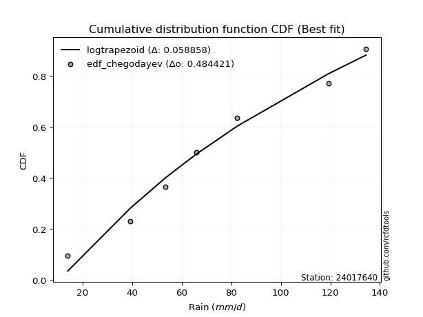</img>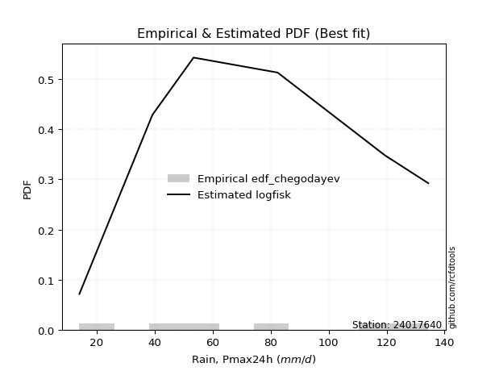</img>

</div>


### 6. EDF Blom (1958)

The Blom formula is a specific "plotting position" formula used in hydrology and statistical analysis to estimate the empirical cumulative probability (or non-exceedance probability) of a data series. It is particularly recommended for data that are approximately normally distributed. The constant _a_ is set to 0.375 (or 3/8).

<div align="center">


$P=(m-a)/(n+1-2a)$


</div>


**6.1. Empirical values**

<div align="center">

|                | 0                  | 1                  | 2                  | 3                 | 4                 | 5                  |
|:---------------|:-------------------|:-------------------|:-------------------|:------------------|:------------------|:-------------------|
| date           | 2022               | 2023               | 2021               | 2020              | 2019              | 2024               |
| x              | 14.0               | 39.2               | 53.4               | 82.4              | 119.4             | 134.4              |
| m              | 1                  | 2                  | 3                  | 4                 | 5                 | 6                  |
| empirical_dist | edf_blom           | edf_blom           | edf_blom           | edf_blom          | edf_blom          | edf_blom           |
| empirical      | 0.1                | 0.26               | 0.42               | 0.58              | 0.74              | 0.9                |
| empirical_tr   | 1.1111111111111112 | 1.3513513513513513 | 1.7241379310344827 | 2.380952380952381 | 3.846153846153846 | 10.000000000000002 |

</div>


**6.2. Kolmogorov-Smirnov fit test (sorted by Δ)**


<div align="center">

|                | 0                   | 1                   | 2                   | 3                   | 4                  | 5                  | 6                  | 7                   | 8                   | 9                   | 10                  | 11                  | 12                | 13                  | 14                  | 15                  | 16                  | 17                  | 18                  | 19                  | 20                  | 21                  | 22                  | 23                  | 24                  | 25                 | 26                 | 27                  | 28                  | 29                  | 30                  | 31                  | 32                  | 33                  | 34                  | 35                  | 36                  | 37                  | 38                  | 39                  | 40                  | 41                 | 42                  | 43                  | 44                  | 45                  | 46                  | 47                 | 48                  | 49                  | 50                  | 51                    | 52                  | 53                  | 54                  | 55                 | 56                  | 57                 | 58                  | 59                  | 60                  | 61                 | 62                  | 63                 | 64                  | 65                  | 66                  | 67                  | 68                 | 69                  | 70                 | 71                  | 72                  | 73                  | 74                  | 75                  | 76                 | 77                  | 78                  | 79                | 80             | 81                 | 82                | 83                  | 84                 | 85                | 86                 | 87             |
|:---------------|:--------------------|:--------------------|:--------------------|:--------------------|:-------------------|:-------------------|:-------------------|:--------------------|:--------------------|:--------------------|:--------------------|:--------------------|:------------------|:--------------------|:--------------------|:--------------------|:--------------------|:--------------------|:--------------------|:--------------------|:--------------------|:--------------------|:--------------------|:--------------------|:--------------------|:-------------------|:-------------------|:--------------------|:--------------------|:--------------------|:--------------------|:--------------------|:--------------------|:--------------------|:--------------------|:--------------------|:--------------------|:--------------------|:--------------------|:--------------------|:--------------------|:-------------------|:--------------------|:--------------------|:--------------------|:--------------------|:--------------------|:-------------------|:--------------------|:--------------------|:--------------------|:----------------------|:--------------------|:--------------------|:--------------------|:-------------------|:--------------------|:-------------------|:--------------------|:--------------------|:--------------------|:-------------------|:--------------------|:-------------------|:--------------------|:--------------------|:--------------------|:--------------------|:-------------------|:--------------------|:-------------------|:--------------------|:--------------------|:--------------------|:--------------------|:--------------------|:-------------------|:--------------------|:--------------------|:------------------|:---------------|:-------------------|:------------------|:--------------------|:-------------------|:------------------|:-------------------|:---------------|
| station        | 24017640            | 24017640            | 24017640            | 24017640            | 24017640           | 24017640           | 24017640           | 24017640            | 24017640            | 24017640            | 24017640            | 24017640            | 24017640          | 24017640            | 24017640            | 24017640            | 24017640            | 24017640            | 24017640            | 24017640            | 24017640            | 24017640            | 24017640            | 24017640            | 24017640            | 24017640           | 24017640           | 24017640            | 24017640            | 24017640            | 24017640            | 24017640            | 24017640            | 24017640            | 24017640            | 24017640            | 24017640            | 24017640            | 24017640            | 24017640            | 24017640            | 24017640           | 24017640            | 24017640            | 24017640            | 24017640            | 24017640            | 24017640           | 24017640            | 24017640            | 24017640            | 24017640              | 24017640            | 24017640            | 24017640            | 24017640           | 24017640            | 24017640           | 24017640            | 24017640            | 24017640            | 24017640           | 24017640            | 24017640           | 24017640            | 24017640            | 24017640            | 24017640            | 24017640           | 24017640            | 24017640           | 24017640            | 24017640            | 24017640            | 24017640            | 24017640            | 24017640           | 24017640            | 24017640            | 24017640          | 24017640       | 24017640           | 24017640          | 24017640            | 24017640           | 24017640          | 24017640           | 24017640       |
| empirical_dist | edf_blom            | edf_blom            | edf_blom            | edf_blom            | edf_blom           | edf_blom           | edf_blom           | edf_blom            | edf_blom            | edf_blom            | edf_blom            | edf_blom            | edf_blom          | edf_blom            | edf_blom            | edf_blom            | edf_blom            | edf_blom            | edf_blom            | edf_blom            | edf_blom            | edf_blom            | edf_blom            | edf_blom            | edf_blom            | edf_blom           | edf_blom           | edf_blom            | edf_blom            | edf_blom            | edf_blom            | edf_blom            | edf_blom            | edf_blom            | edf_blom            | edf_blom            | edf_blom            | edf_blom            | edf_blom            | edf_blom            | edf_blom            | edf_blom           | edf_blom            | edf_blom            | edf_blom            | edf_blom            | edf_blom            | edf_blom           | edf_blom            | edf_blom            | edf_blom            | edf_blom              | edf_blom            | edf_blom            | edf_blom            | edf_blom           | edf_blom            | edf_blom           | edf_blom            | edf_blom            | edf_blom            | edf_blom           | edf_blom            | edf_blom           | edf_blom            | edf_blom            | edf_blom            | edf_blom            | edf_blom           | edf_blom            | edf_blom           | edf_blom            | edf_blom            | edf_blom            | edf_blom            | edf_blom            | edf_blom           | edf_blom            | edf_blom            | edf_blom          | edf_blom       | edf_blom           | edf_blom          | edf_blom            | edf_blom           | edf_blom          | edf_blom           | edf_blom       |
| p_dist         | logfisk             | logpearson3         | logexponnorm        | logcrystalball      | lognorm            | lognorm            | logt               | loginvgamma         | logncf              | logfatiguelife      | lognct              | logf                | fisk              | logrice             | loginvgauss         | loggamma            | loggamma            | ncf                 | expon               | genexpon            | f                   | logerlang           | betaprime           | logalpha            | loggumbel_l         | loggompertz        | invweibull         | genlogistic         | laplace_asymmetric  | logweibull_min      | halfnorm            | rayleigh            | invgauss            | maxwell             | gompertz            | mielke              | rice                | kstwobign           | logmaxwell          | loglogistic         | invgamma            | pearson3           | johnsonsu           | exponnorm           | crystalball         | norm                | truncnorm           | nct                | t                   | gamma               | erlang              | loglaplace_asymmetric | lograyleigh         | logbetaprime        | halflogistic        | gumbel_r           | logloggamma         | loghypsecant       | moyal               | loginvweibull       | logistic            | loghalfnorm        | hypsecant           | logkstwobign       | loggumbel_r         | loglaplace          | gumbel_l            | logmielke           | loghalflogistic    | laplace             | weibull_min        | logmoyal            | alpha               | wald                | loggenexpon         | logwald             | loggibrat          | logexpon            | logtruncnorm        | nakagami          | gibrat         | lognakagami        | loglognorm        | chi2                | logchi2            | fatiguelife       | logjohnsonsu       | loggenlogistic |
| delta          | 0.06813287450284211 | 0.08791612566008777 | 0.09502531270244297 | 0.09502780701907876 | 0.0950279261321586 | 0.0950279261321586 | 0.0950295440334542 | 0.09504715730064872 | 0.09524379582319953 | 0.09561356680045707 | 0.09569707913057945 | 0.09738652540950754 | 0.098522245063425 | 0.09876954971510998 | 0.10062263850252329 | 0.10120339206674611 | 0.10120339206674611 | 0.10123485976473079 | 0.10139803344304898 | 0.10206616803800295 | 0.10279293673903056 | 0.10285659888725063 | 0.10332393594187295 | 0.10475115074615526 | 0.10557682208911068 | 0.1057875375953854 | 0.1075337508034645 | 0.10758843655161099 | 0.10882697107367667 | 0.10935033017028317 | 0.10997156797900665 | 0.11077810536946386 | 0.11127083826300688 | 0.11195535912664101 | 0.11247355126953429 | 0.11305801587625797 | 0.11373454993977727 | 0.11387533902256586 | 0.11389096422870004 | 0.11490974204803284 | 0.11509549418071097 | 0.1159652560622173 | 0.11627925704731534 | 0.11639415673309939 | 0.11639435410397136 | 0.11639436089455968 | 0.11639436479943044 | 0.1164001848142261 | 0.11640153960763755 | 0.11645074361460617 | 0.11714399480970927 | 0.11846001463291911   | 0.11948087784789918 | 0.12422253123664073 | 0.12567225064411225 | 0.1264153654107767 | 0.12795473354599995 | 0.1298303323767308 | 0.13093758231278818 | 0.13309292840814535 | 0.13328845649557153 | 0.1360397669136989 | 0.14174503774276037 | 0.1474327799857968 | 0.15073125651353947 | 0.15683486554223225 | 0.15721657808065786 | 0.15949586919354952 | 0.1636343281532079 | 0.16499620444541424 | 0.1665638979302171 | 0.16892864069733426 | 0.17221469318207855 | 0.20290872593441353 | 0.20721296123847122 | 0.22126514888037652 | 0.2531853615293508 | 0.25464313944649675 | 0.25523761967834924 | 0.259999999967105 | 0.26           | 0.3743101165872104 | 0.399942434307783 | 0.41403928323712813 | 0.4170564741282998 | 0.480424463100515 | 0.5258732921512159 | 0.74           |
| deltao         | 0.530385761606      | 0.530385761606      | 0.530385761606      | 0.530385761606      | 0.530385761606     | 0.530385761606     | 0.530385761606     | 0.530385761606      | 0.530385761606      | 0.530385761606      | 0.530385761606      | 0.530385761606      | 0.530385761606    | 0.530385761606      | 0.530385761606      | 0.530385761606      | 0.530385761606      | 0.530385761606      | 0.530385761606      | 0.530385761606      | 0.530385761606      | 0.530385761606      | 0.530385761606      | 0.530385761606      | 0.530385761606      | 0.530385761606     | 0.530385761606     | 0.530385761606      | 0.530385761606      | 0.530385761606      | 0.530385761606      | 0.530385761606      | 0.530385761606      | 0.530385761606      | 0.530385761606      | 0.530385761606      | 0.530385761606      | 0.530385761606      | 0.530385761606      | 0.530385761606      | 0.530385761606      | 0.530385761606     | 0.530385761606      | 0.530385761606      | 0.530385761606      | 0.530385761606      | 0.530385761606      | 0.530385761606     | 0.530385761606      | 0.530385761606      | 0.530385761606      | 0.530385761606        | 0.530385761606      | 0.530385761606      | 0.530385761606      | 0.530385761606     | 0.530385761606      | 0.530385761606     | 0.530385761606      | 0.530385761606      | 0.530385761606      | 0.530385761606     | 0.530385761606      | 0.530385761606     | 0.530385761606      | 0.530385761606      | 0.530385761606      | 0.530385761606      | 0.530385761606     | 0.530385761606      | 0.530385761606     | 0.530385761606      | 0.530385761606      | 0.530385761606      | 0.530385761606      | 0.530385761606      | 0.530385761606     | 0.530385761606      | 0.530385761606      | 0.530385761606    | 0.530385761606 | 0.530385761606     | 0.530385761606    | 0.530385761606      | 0.530385761606     | 0.530385761606    | 0.530385761606     | 0.530385761606 |
| eval           | Δo > Δ              | Δo > Δ              | Δo > Δ              | Δo > Δ              | Δo > Δ             | Δo > Δ             | Δo > Δ             | Δo > Δ              | Δo > Δ              | Δo > Δ              | Δo > Δ              | Δo > Δ              | Δo > Δ            | Δo > Δ              | Δo > Δ              | Δo > Δ              | Δo > Δ              | Δo > Δ              | Δo > Δ              | Δo > Δ              | Δo > Δ              | Δo > Δ              | Δo > Δ              | Δo > Δ              | Δo > Δ              | Δo > Δ             | Δo > Δ             | Δo > Δ              | Δo > Δ              | Δo > Δ              | Δo > Δ              | Δo > Δ              | Δo > Δ              | Δo > Δ              | Δo > Δ              | Δo > Δ              | Δo > Δ              | Δo > Δ              | Δo > Δ              | Δo > Δ              | Δo > Δ              | Δo > Δ             | Δo > Δ              | Δo > Δ              | Δo > Δ              | Δo > Δ              | Δo > Δ              | Δo > Δ             | Δo > Δ              | Δo > Δ              | Δo > Δ              | Δo > Δ                | Δo > Δ              | Δo > Δ              | Δo > Δ              | Δo > Δ             | Δo > Δ              | Δo > Δ             | Δo > Δ              | Δo > Δ              | Δo > Δ              | Δo > Δ             | Δo > Δ              | Δo > Δ             | Δo > Δ              | Δo > Δ              | Δo > Δ              | Δo > Δ              | Δo > Δ             | Δo > Δ              | Δo > Δ             | Δo > Δ              | Δo > Δ              | Δo > Δ              | Δo > Δ              | Δo > Δ              | Δo > Δ             | Δo > Δ              | Δo > Δ              | Δo > Δ            | Δo > Δ         | Δo > Δ             | Δo > Δ            | Δo > Δ              | Δo > Δ             | Δo > Δ            | Δo > Δ             | Δo <= Δ        |
| fit            | 1                   | 1                   | 1                   | 1                   | 1                  | 1                  | 1                  | 1                   | 1                   | 1                   | 1                   | 1                   | 1                 | 1                   | 1                   | 1                   | 1                   | 1                   | 1                   | 1                   | 1                   | 1                   | 1                   | 1                   | 1                   | 1                  | 1                  | 1                   | 1                   | 1                   | 1                   | 1                   | 1                   | 1                   | 1                   | 1                   | 1                   | 1                   | 1                   | 1                   | 1                   | 1                  | 1                   | 1                   | 1                   | 1                   | 1                   | 1                  | 1                   | 1                   | 1                   | 1                     | 1                   | 1                   | 1                   | 1                  | 1                   | 1                  | 1                   | 1                   | 1                   | 1                  | 1                   | 1                  | 1                   | 1                   | 1                   | 1                   | 1                  | 1                   | 1                  | 1                   | 1                   | 1                   | 1                   | 1                   | 1                  | 1                   | 1                   | 1                 | 1              | 1                  | 1                 | 1                   | 1                  | 1                 | 1                  | 0              |
| n              | 6                   | 6                   | 6                   | 6                   | 6                  | 6                  | 6                  | 6                   | 6                   | 6                   | 6                   | 6                   | 6                 | 6                   | 6                   | 6                   | 6                   | 6                   | 6                   | 6                   | 6                   | 6                   | 6                   | 6                   | 6                   | 6                  | 6                  | 6                   | 6                   | 6                   | 6                   | 6                   | 6                   | 6                   | 6                   | 6                   | 6                   | 6                   | 6                   | 6                   | 6                   | 6                  | 6                   | 6                   | 6                   | 6                   | 6                   | 6                  | 6                   | 6                   | 6                   | 6                     | 6                   | 6                   | 6                   | 6                  | 6                   | 6                  | 6                   | 6                   | 6                   | 6                  | 6                   | 6                  | 6                   | 6                   | 6                   | 6                   | 6                  | 6                   | 6                  | 6                   | 6                   | 6                   | 6                   | 6                   | 6                  | 6                   | 6                   | 6                 | 6              | 6                  | 6                 | 6                   | 6                  | 6                 | 6                  | 6              |
| best_fit       | 1                   | 0                   | 0                   | 0                   | 0                  | 0                  | 0                  | 0                   | 0                   | 0                   | 0                   | 0                   | 0                 | 0                   | 0                   | 0                   | 0                   | 0                   | 0                   | 0                   | 0                   | 0                   | 0                   | 0                   | 0                   | 0                  | 0                  | 0                   | 0                   | 0                   | 0                   | 0                   | 0                   | 0                   | 0                   | 0                   | 0                   | 0                   | 0                   | 0                   | 0                   | 0                  | 0                   | 0                   | 0                   | 0                   | 0                   | 0                  | 0                   | 0                   | 0                   | 0                     | 0                   | 0                   | 0                   | 0                  | 0                   | 0                  | 0                   | 0                   | 0                   | 0                  | 0                   | 0                  | 0                   | 0                   | 0                   | 0                   | 0                  | 0                   | 0                  | 0                   | 0                   | 0                   | 0                   | 0                   | 0                  | 0                   | 0                   | 0                 | 0              | 0                  | 0                 | 0                   | 0                  | 0                 | 0                  | 0              |
| best_fit_sort  | 1                   | 2                   | 3                   | 4                   | 5                  | 6                  | 7                  | 8                   | 9                   | 10                  | 11                  | 12                  | 13                | 14                  | 15                  | 16                  | 17                  | 18                  | 19                  | 20                  | 21                  | 22                  | 23                  | 24                  | 25                  | 26                 | 27                 | 28                  | 29                  | 30                  | 31                  | 32                  | 33                  | 34                  | 35                  | 36                  | 37                  | 38                  | 39                  | 40                  | 41                  | 42                 | 43                  | 44                  | 45                  | 46                  | 47                  | 48                 | 49                  | 50                  | 51                  | 52                    | 53                  | 54                  | 55                  | 56                 | 57                  | 58                 | 59                  | 60                  | 61                  | 62                 | 63                  | 64                 | 65                  | 66                  | 67                  | 68                  | 69                 | 70                  | 71                 | 72                  | 73                  | 74                  | 75                  | 76                  | 77                 | 78                  | 79                  | 80                | 81             | 82                 | 83                | 84                  | 85                 | 86                | 87                 | 88             |

</div>


**6.3. Best fit**

<div align="center">

|   id |   station | empirical_dist   | p_dist   |     delta |   deltao | eval   |   fit |   n |   best_fit |   best_fit_sort |
|-----:|----------:|:-----------------|:---------|----------:|---------:|:-------|------:|----:|-----------:|----------------:|
|    0 |  24017640 | edf_blom         | logfisk  | 0.0681329 | 0.530386 | Δo > Δ |     1 |   6 |          1 |               1 |

</div>


<div align="center">

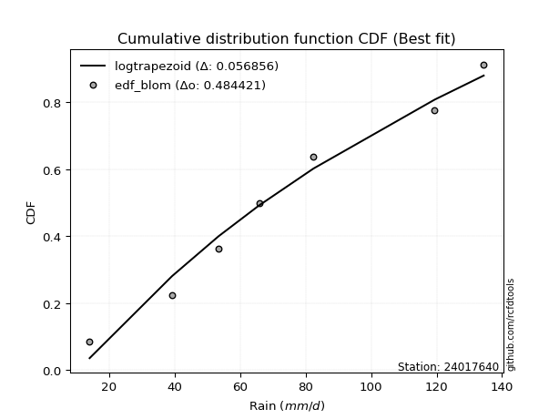</img></img>

</div>


### 7. EDF Tukey (1962)

In hydrology, the Tukey formula is used as a plotting position formula to estimate the empirical probability or frequency of a flood event (or other hydrological data). The formula parameter is given as _c=0.333_ (or 1/3).

<div align="center">


$P=(m-c)/(n+1-2c)$


</div>


**7.1. Empirical values**

<div align="center">

|                | 0                   | 1                  | 2                   | 3                  | 4                  | 5                  |
|:---------------|:--------------------|:-------------------|:--------------------|:-------------------|:-------------------|:-------------------|
| date           | 2022                | 2023               | 2021                | 2020               | 2019               | 2024               |
| x              | 14.0                | 39.2               | 53.4                | 82.4               | 119.4              | 134.4              |
| m              | 1                   | 2                  | 3                   | 4                  | 5                  | 6                  |
| empirical_dist | edf_tukey           | edf_tukey          | edf_tukey           | edf_tukey          | edf_tukey          | edf_tukey          |
| empirical      | 0.10526315789473684 | 0.2631578947368421 | 0.42105263157894735 | 0.5789473684210527 | 0.7368421052631579 | 0.8947368421052632 |
| empirical_tr   | 1.1176470588235294  | 1.357142857142857  | 1.7272727272727273  | 2.375              | 3.7999999999999994 | 9.5                |

</div>


**7.2. Kolmogorov-Smirnov fit test (sorted by Δ)**


<div align="center">

|                | 0                   | 1                   | 2                   | 3                   | 4                   | 5                   | 6                   | 7                   | 8                   | 9                   | 10                  | 11                  | 12                  | 13                  | 14                  | 15                  | 16                  | 17                  | 18                  | 19                  | 20                  | 21                  | 22                 | 23                  | 24                  | 25                  | 26                  | 27                  | 28                  | 29                  | 30                  | 31                | 32                  | 33                  | 34                  | 35                  | 36                  | 37                 | 38                  | 39                | 40                 | 41                  | 42                  | 43                  | 44                 | 45                  | 46                  | 47                  | 48                  | 49                 | 50                  | 51                  | 52                    | 53                  | 54                 | 55                  | 56                  | 57                 | 58                 | 59                  | 60                  | 61                 | 62                 | 63                 | 64                  | 65                  | 66                  | 67                  | 68                | 69                 | 70                 | 71                  | 72                  | 73                  | 74                 | 75                  | 76                  | 77                 | 78                 | 79                  | 80                 | 81                  | 82                 | 83                  | 84                  | 85                 | 86                 | 87                 |
|:---------------|:--------------------|:--------------------|:--------------------|:--------------------|:--------------------|:--------------------|:--------------------|:--------------------|:--------------------|:--------------------|:--------------------|:--------------------|:--------------------|:--------------------|:--------------------|:--------------------|:--------------------|:--------------------|:--------------------|:--------------------|:--------------------|:--------------------|:-------------------|:--------------------|:--------------------|:--------------------|:--------------------|:--------------------|:--------------------|:--------------------|:--------------------|:------------------|:--------------------|:--------------------|:--------------------|:--------------------|:--------------------|:-------------------|:--------------------|:------------------|:-------------------|:--------------------|:--------------------|:--------------------|:-------------------|:--------------------|:--------------------|:--------------------|:--------------------|:-------------------|:--------------------|:--------------------|:----------------------|:--------------------|:-------------------|:--------------------|:--------------------|:-------------------|:-------------------|:--------------------|:--------------------|:-------------------|:-------------------|:-------------------|:--------------------|:--------------------|:--------------------|:--------------------|:------------------|:-------------------|:-------------------|:--------------------|:--------------------|:--------------------|:-------------------|:--------------------|:--------------------|:-------------------|:-------------------|:--------------------|:-------------------|:--------------------|:-------------------|:--------------------|:--------------------|:-------------------|:-------------------|:-------------------|
| station        | 24017640            | 24017640            | 24017640            | 24017640            | 24017640            | 24017640            | 24017640            | 24017640            | 24017640            | 24017640            | 24017640            | 24017640            | 24017640            | 24017640            | 24017640            | 24017640            | 24017640            | 24017640            | 24017640            | 24017640            | 24017640            | 24017640            | 24017640           | 24017640            | 24017640            | 24017640            | 24017640            | 24017640            | 24017640            | 24017640            | 24017640            | 24017640          | 24017640            | 24017640            | 24017640            | 24017640            | 24017640            | 24017640           | 24017640            | 24017640          | 24017640           | 24017640            | 24017640            | 24017640            | 24017640           | 24017640            | 24017640            | 24017640            | 24017640            | 24017640           | 24017640            | 24017640            | 24017640              | 24017640            | 24017640           | 24017640            | 24017640            | 24017640           | 24017640           | 24017640            | 24017640            | 24017640           | 24017640           | 24017640           | 24017640            | 24017640            | 24017640            | 24017640            | 24017640          | 24017640           | 24017640           | 24017640            | 24017640            | 24017640            | 24017640           | 24017640            | 24017640            | 24017640           | 24017640           | 24017640            | 24017640           | 24017640            | 24017640           | 24017640            | 24017640            | 24017640           | 24017640           | 24017640           |
| empirical_dist | edf_tukey           | edf_tukey           | edf_tukey           | edf_tukey           | edf_tukey           | edf_tukey           | edf_tukey           | edf_tukey           | edf_tukey           | edf_tukey           | edf_tukey           | edf_tukey           | edf_tukey           | edf_tukey           | edf_tukey           | edf_tukey           | edf_tukey           | edf_tukey           | edf_tukey           | edf_tukey           | edf_tukey           | edf_tukey           | edf_tukey          | edf_tukey           | edf_tukey           | edf_tukey           | edf_tukey           | edf_tukey           | edf_tukey           | edf_tukey           | edf_tukey           | edf_tukey         | edf_tukey           | edf_tukey           | edf_tukey           | edf_tukey           | edf_tukey           | edf_tukey          | edf_tukey           | edf_tukey         | edf_tukey          | edf_tukey           | edf_tukey           | edf_tukey           | edf_tukey          | edf_tukey           | edf_tukey           | edf_tukey           | edf_tukey           | edf_tukey          | edf_tukey           | edf_tukey           | edf_tukey             | edf_tukey           | edf_tukey          | edf_tukey           | edf_tukey           | edf_tukey          | edf_tukey          | edf_tukey           | edf_tukey           | edf_tukey          | edf_tukey          | edf_tukey          | edf_tukey           | edf_tukey           | edf_tukey           | edf_tukey           | edf_tukey         | edf_tukey          | edf_tukey          | edf_tukey           | edf_tukey           | edf_tukey           | edf_tukey          | edf_tukey           | edf_tukey           | edf_tukey          | edf_tukey          | edf_tukey           | edf_tukey          | edf_tukey           | edf_tukey          | edf_tukey           | edf_tukey           | edf_tukey          | edf_tukey          | edf_tukey          |
| p_dist         | logfisk             | logpearson3         | logexponnorm        | logcrystalball      | lognorm             | lognorm             | logt                | loginvgamma         | logncf              | logfatiguelife      | lognct              | logf                | logrice             | loginvgauss         | fisk                | loggamma            | loggamma            | logerlang           | ncf                 | genexpon            | expon               | logalpha            | f                  | betaprime           | loggumbel_l         | loggompertz         | invweibull          | genlogistic         | laplace_asymmetric  | logweibull_min      | halfnorm            | rayleigh          | invgauss            | logmaxwell          | maxwell             | gompertz            | loglogistic         | mielke             | rice                | kstwobign         | invgamma           | pearson3            | johnsonsu           | exponnorm           | crystalball        | norm                | truncnorm           | nct                 | t                   | gamma              | erlang              | lograyleigh         | loglaplace_asymmetric | logbetaprime        | halflogistic       | gumbel_r            | loginvweibull       | loghypsecant       | logloggamma        | moyal               | logistic            | loghalfnorm        | logkstwobign       | hypsecant          | loggumbel_r         | loglaplace          | gumbel_l            | logmielke           | weibull_min       | loghalflogistic    | laplace            | alpha               | logmoyal            | loggenexpon         | wald               | logwald             | logexpon            | loggibrat          | logtruncnorm       | nakagami            | gibrat             | lognakagami         | loglognorm         | chi2                | logchi2             | fatiguelife        | logjohnsonsu       | loggenlogistic     |
| delta          | 0.07213122471670252 | 0.09107402039692991 | 0.09607794428139027 | 0.09608043859802606 | 0.09608055771110591 | 0.09608055771110591 | 0.09608217561240151 | 0.09609978887959603 | 0.09629642740214683 | 0.09666619837940438 | 0.09674971070952676 | 0.09843915698845485 | 0.09982218129405729 | 0.10167527008147059 | 0.10168013980026713 | 0.10225602364569342 | 0.10225602364569342 | 0.10390923046619793 | 0.10439275450157293 | 0.10526174031818099 | 0.10526315789473684 | 0.10580378232510257 | 0.1059508314758727 | 0.10648183067871508 | 0.10873471682595282 | 0.10894543233222753 | 0.11069164554030664 | 0.11074633128845313 | 0.11198486581051881 | 0.11250822490712531 | 0.11312946271584878 | 0.113936000106306 | 0.11442873299984901 | 0.11494359580764735 | 0.11511325386348314 | 0.11563144600637643 | 0.11596237362698014 | 0.1162159106131001 | 0.11689244467661941 | 0.117033233759408 | 0.1182533889175531 | 0.11912315079905944 | 0.11943715178415748 | 0.11955205146994152 | 0.1195522488408135 | 0.11955225563140182 | 0.11955225953627258 | 0.11955807955106823 | 0.11955943434447969 | 0.1196086383514483 | 0.12030188954655141 | 0.12053350942684649 | 0.12161790936976125   | 0.12527516281558804 | 0.1288301453809544 | 0.12957326014761883 | 0.12993503367130327 | 0.1308829639556781 | 0.1311126282828421 | 0.13409547704963032 | 0.13644635123241367 | 0.1370923984926462 | 0.1442748852489547 | 0.1449029324796025 | 0.15178388809248677 | 0.15788749712117955 | 0.15826920965960523 | 0.16265376393039166 | 0.163406003193375 | 0.1646869597321552 | 0.1660488360243616 | 0.16905679844523647 | 0.16998127227628157 | 0.20405506650162913 | 0.2060666206712556 | 0.22231778045932382 | 0.25148524470965467 | 0.2542379931082981 | 0.2583955144151913 | 0.26315789470394707 | 0.2631578947368421 | 0.37325748500826306 | 0.3967845395709409 | 0.41088138850028605 | 0.41389857939145774 | 0.4772665683636729 | 0.5227153974143739 | 0.7368421052631579 |
| deltao         | 0.530385761606      | 0.530385761606      | 0.530385761606      | 0.530385761606      | 0.530385761606      | 0.530385761606      | 0.530385761606      | 0.530385761606      | 0.530385761606      | 0.530385761606      | 0.530385761606      | 0.530385761606      | 0.530385761606      | 0.530385761606      | 0.530385761606      | 0.530385761606      | 0.530385761606      | 0.530385761606      | 0.530385761606      | 0.530385761606      | 0.530385761606      | 0.530385761606      | 0.530385761606     | 0.530385761606      | 0.530385761606      | 0.530385761606      | 0.530385761606      | 0.530385761606      | 0.530385761606      | 0.530385761606      | 0.530385761606      | 0.530385761606    | 0.530385761606      | 0.530385761606      | 0.530385761606      | 0.530385761606      | 0.530385761606      | 0.530385761606     | 0.530385761606      | 0.530385761606    | 0.530385761606     | 0.530385761606      | 0.530385761606      | 0.530385761606      | 0.530385761606     | 0.530385761606      | 0.530385761606      | 0.530385761606      | 0.530385761606      | 0.530385761606     | 0.530385761606      | 0.530385761606      | 0.530385761606        | 0.530385761606      | 0.530385761606     | 0.530385761606      | 0.530385761606      | 0.530385761606     | 0.530385761606     | 0.530385761606      | 0.530385761606      | 0.530385761606     | 0.530385761606     | 0.530385761606     | 0.530385761606      | 0.530385761606      | 0.530385761606      | 0.530385761606      | 0.530385761606    | 0.530385761606     | 0.530385761606     | 0.530385761606      | 0.530385761606      | 0.530385761606      | 0.530385761606     | 0.530385761606      | 0.530385761606      | 0.530385761606     | 0.530385761606     | 0.530385761606      | 0.530385761606     | 0.530385761606      | 0.530385761606     | 0.530385761606      | 0.530385761606      | 0.530385761606     | 0.530385761606     | 0.530385761606     |
| eval           | Δo > Δ              | Δo > Δ              | Δo > Δ              | Δo > Δ              | Δo > Δ              | Δo > Δ              | Δo > Δ              | Δo > Δ              | Δo > Δ              | Δo > Δ              | Δo > Δ              | Δo > Δ              | Δo > Δ              | Δo > Δ              | Δo > Δ              | Δo > Δ              | Δo > Δ              | Δo > Δ              | Δo > Δ              | Δo > Δ              | Δo > Δ              | Δo > Δ              | Δo > Δ             | Δo > Δ              | Δo > Δ              | Δo > Δ              | Δo > Δ              | Δo > Δ              | Δo > Δ              | Δo > Δ              | Δo > Δ              | Δo > Δ            | Δo > Δ              | Δo > Δ              | Δo > Δ              | Δo > Δ              | Δo > Δ              | Δo > Δ             | Δo > Δ              | Δo > Δ            | Δo > Δ             | Δo > Δ              | Δo > Δ              | Δo > Δ              | Δo > Δ             | Δo > Δ              | Δo > Δ              | Δo > Δ              | Δo > Δ              | Δo > Δ             | Δo > Δ              | Δo > Δ              | Δo > Δ                | Δo > Δ              | Δo > Δ             | Δo > Δ              | Δo > Δ              | Δo > Δ             | Δo > Δ             | Δo > Δ              | Δo > Δ              | Δo > Δ             | Δo > Δ             | Δo > Δ             | Δo > Δ              | Δo > Δ              | Δo > Δ              | Δo > Δ              | Δo > Δ            | Δo > Δ             | Δo > Δ             | Δo > Δ              | Δo > Δ              | Δo > Δ              | Δo > Δ             | Δo > Δ              | Δo > Δ              | Δo > Δ             | Δo > Δ             | Δo > Δ              | Δo > Δ             | Δo > Δ              | Δo > Δ             | Δo > Δ              | Δo > Δ              | Δo > Δ             | Δo > Δ             | Δo <= Δ            |
| fit            | 1                   | 1                   | 1                   | 1                   | 1                   | 1                   | 1                   | 1                   | 1                   | 1                   | 1                   | 1                   | 1                   | 1                   | 1                   | 1                   | 1                   | 1                   | 1                   | 1                   | 1                   | 1                   | 1                  | 1                   | 1                   | 1                   | 1                   | 1                   | 1                   | 1                   | 1                   | 1                 | 1                   | 1                   | 1                   | 1                   | 1                   | 1                  | 1                   | 1                 | 1                  | 1                   | 1                   | 1                   | 1                  | 1                   | 1                   | 1                   | 1                   | 1                  | 1                   | 1                   | 1                     | 1                   | 1                  | 1                   | 1                   | 1                  | 1                  | 1                   | 1                   | 1                  | 1                  | 1                  | 1                   | 1                   | 1                   | 1                   | 1                 | 1                  | 1                  | 1                   | 1                   | 1                   | 1                  | 1                   | 1                   | 1                  | 1                  | 1                   | 1                  | 1                   | 1                  | 1                   | 1                   | 1                  | 1                  | 0                  |
| n              | 6                   | 6                   | 6                   | 6                   | 6                   | 6                   | 6                   | 6                   | 6                   | 6                   | 6                   | 6                   | 6                   | 6                   | 6                   | 6                   | 6                   | 6                   | 6                   | 6                   | 6                   | 6                   | 6                  | 6                   | 6                   | 6                   | 6                   | 6                   | 6                   | 6                   | 6                   | 6                 | 6                   | 6                   | 6                   | 6                   | 6                   | 6                  | 6                   | 6                 | 6                  | 6                   | 6                   | 6                   | 6                  | 6                   | 6                   | 6                   | 6                   | 6                  | 6                   | 6                   | 6                     | 6                   | 6                  | 6                   | 6                   | 6                  | 6                  | 6                   | 6                   | 6                  | 6                  | 6                  | 6                   | 6                   | 6                   | 6                   | 6                 | 6                  | 6                  | 6                   | 6                   | 6                   | 6                  | 6                   | 6                   | 6                  | 6                  | 6                   | 6                  | 6                   | 6                  | 6                   | 6                   | 6                  | 6                  | 6                  |
| best_fit       | 1                   | 0                   | 0                   | 0                   | 0                   | 0                   | 0                   | 0                   | 0                   | 0                   | 0                   | 0                   | 0                   | 0                   | 0                   | 0                   | 0                   | 0                   | 0                   | 0                   | 0                   | 0                   | 0                  | 0                   | 0                   | 0                   | 0                   | 0                   | 0                   | 0                   | 0                   | 0                 | 0                   | 0                   | 0                   | 0                   | 0                   | 0                  | 0                   | 0                 | 0                  | 0                   | 0                   | 0                   | 0                  | 0                   | 0                   | 0                   | 0                   | 0                  | 0                   | 0                   | 0                     | 0                   | 0                  | 0                   | 0                   | 0                  | 0                  | 0                   | 0                   | 0                  | 0                  | 0                  | 0                   | 0                   | 0                   | 0                   | 0                 | 0                  | 0                  | 0                   | 0                   | 0                   | 0                  | 0                   | 0                   | 0                  | 0                  | 0                   | 0                  | 0                   | 0                  | 0                   | 0                   | 0                  | 0                  | 0                  |
| best_fit_sort  | 1                   | 2                   | 3                   | 4                   | 5                   | 6                   | 7                   | 8                   | 9                   | 10                  | 11                  | 12                  | 13                  | 14                  | 15                  | 16                  | 17                  | 18                  | 19                  | 20                  | 21                  | 22                  | 23                 | 24                  | 25                  | 26                  | 27                  | 28                  | 29                  | 30                  | 31                  | 32                | 33                  | 34                  | 35                  | 36                  | 37                  | 38                 | 39                  | 40                | 41                 | 42                  | 43                  | 44                  | 45                 | 46                  | 47                  | 48                  | 49                  | 50                 | 51                  | 52                  | 53                    | 54                  | 55                 | 56                  | 57                  | 58                 | 59                 | 60                  | 61                  | 62                 | 63                 | 64                 | 65                  | 66                  | 67                  | 68                  | 69                | 70                 | 71                 | 72                  | 73                  | 74                  | 75                 | 76                  | 77                  | 78                 | 79                 | 80                  | 81                 | 82                  | 83                 | 84                  | 85                  | 86                 | 87                 | 88                 |

</div>


**7.3. Best fit**

<div align="center">

|   id |   station | empirical_dist   | p_dist   |     delta |   deltao | eval   |   fit |   n |   best_fit |   best_fit_sort |
|-----:|----------:|:-----------------|:---------|----------:|---------:|:-------|------:|----:|-----------:|----------------:|
|    0 |  24017640 | edf_tukey        | logfisk  | 0.0721312 | 0.530386 | Δo > Δ |     1 |   6 |          1 |               1 |

</div>


<div align="center">

</img>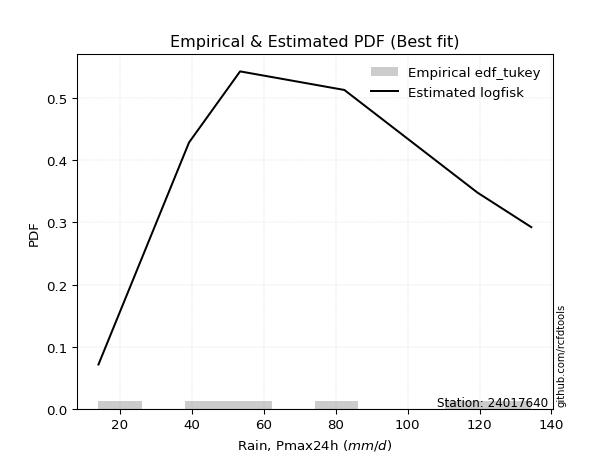</img>

</div>


### 8. EDF Gringorten (1963)

Gringorten plotting position formula is essential for estimating the probability and return periods of extreme events like floods and heavy rainfall. The constant _a=0.44_.

<div align="center">


$P=(m-a)/(n+1-2a)$


</div>


**8.1. Empirical values**

<div align="center">

|                | 0                   | 1                  | 2                   | 3                  | 4                  | 5                  |
|:---------------|:--------------------|:-------------------|:--------------------|:-------------------|:-------------------|:-------------------|
| date           | 2022                | 2023               | 2021                | 2020               | 2019               | 2024               |
| x              | 14.0                | 39.2               | 53.4                | 82.4               | 119.4              | 134.4              |
| m              | 1                   | 2                  | 3                   | 4                  | 5                  | 6                  |
| empirical_dist | edf_gringorten      | edf_gringorten     | edf_gringorten      | edf_gringorten     | edf_gringorten     | edf_gringorten     |
| empirical      | 0.09150326797385622 | 0.2549019607843137 | 0.41830065359477125 | 0.5816993464052288 | 0.7450980392156862 | 0.9084967320261437 |
| empirical_tr   | 1.1007194244604317  | 1.3421052631578947 | 1.7191011235955058  | 2.3906250000000004 | 3.9230769230769216 | 10.928571428571415 |

</div>


**8.2. Kolmogorov-Smirnov fit test (sorted by Δ)**


<div align="center">

|                | 0                   | 1                   | 2                   | 3                   | 4                   | 5                   | 6                   | 7                   | 8                  | 9                   | 10                  | 11                  | 12                 | 13                 | 14                  | 15                  | 16                  | 17                  | 18                  | 19                  | 20                  | 21                 | 22                  | 23                 | 24                  | 25                  | 26                 | 27                  | 28                  | 29                  | 30                  | 31                  | 32                  | 33                  | 34                 | 35                  | 36                  | 37                  | 38                  | 39                  | 40                  | 41                 | 42                  | 43                  | 44                  | 45                 | 46                  | 47                  | 48                  | 49                 | 50                | 51                    | 52                  | 53                  | 54                 | 55                  | 56                  | 57                | 58                  | 59                  | 60                  | 61                  | 62                  | 63                  | 64                 | 65                  | 66                 | 67                  | 68                  | 69                 | 70                  | 71                 | 72                  | 73                  | 74                  | 75                  | 76                  | 77                  | 78                 | 79                 | 80                  | 81                  | 82                 | 83                  | 84                 | 85                 | 86                 | 87                 |
|:---------------|:--------------------|:--------------------|:--------------------|:--------------------|:--------------------|:--------------------|:--------------------|:--------------------|:-------------------|:--------------------|:--------------------|:--------------------|:-------------------|:-------------------|:--------------------|:--------------------|:--------------------|:--------------------|:--------------------|:--------------------|:--------------------|:-------------------|:--------------------|:-------------------|:--------------------|:--------------------|:-------------------|:--------------------|:--------------------|:--------------------|:--------------------|:--------------------|:--------------------|:--------------------|:-------------------|:--------------------|:--------------------|:--------------------|:--------------------|:--------------------|:--------------------|:-------------------|:--------------------|:--------------------|:--------------------|:-------------------|:--------------------|:--------------------|:--------------------|:-------------------|:------------------|:----------------------|:--------------------|:--------------------|:-------------------|:--------------------|:--------------------|:------------------|:--------------------|:--------------------|:--------------------|:--------------------|:--------------------|:--------------------|:-------------------|:--------------------|:-------------------|:--------------------|:--------------------|:-------------------|:--------------------|:-------------------|:--------------------|:--------------------|:--------------------|:--------------------|:--------------------|:--------------------|:-------------------|:-------------------|:--------------------|:--------------------|:-------------------|:--------------------|:-------------------|:-------------------|:-------------------|:-------------------|
| station        | 24017640            | 24017640            | 24017640            | 24017640            | 24017640            | 24017640            | 24017640            | 24017640            | 24017640           | 24017640            | 24017640            | 24017640            | 24017640           | 24017640           | 24017640            | 24017640            | 24017640            | 24017640            | 24017640            | 24017640            | 24017640            | 24017640           | 24017640            | 24017640           | 24017640            | 24017640            | 24017640           | 24017640            | 24017640            | 24017640            | 24017640            | 24017640            | 24017640            | 24017640            | 24017640           | 24017640            | 24017640            | 24017640            | 24017640            | 24017640            | 24017640            | 24017640           | 24017640            | 24017640            | 24017640            | 24017640           | 24017640            | 24017640            | 24017640            | 24017640           | 24017640          | 24017640              | 24017640            | 24017640            | 24017640           | 24017640            | 24017640            | 24017640          | 24017640            | 24017640            | 24017640            | 24017640            | 24017640            | 24017640            | 24017640           | 24017640            | 24017640           | 24017640            | 24017640            | 24017640           | 24017640            | 24017640           | 24017640            | 24017640            | 24017640            | 24017640            | 24017640            | 24017640            | 24017640           | 24017640           | 24017640            | 24017640            | 24017640           | 24017640            | 24017640           | 24017640           | 24017640           | 24017640           |
| empirical_dist | edf_gringorten      | edf_gringorten      | edf_gringorten      | edf_gringorten      | edf_gringorten      | edf_gringorten      | edf_gringorten      | edf_gringorten      | edf_gringorten     | edf_gringorten      | edf_gringorten      | edf_gringorten      | edf_gringorten     | edf_gringorten     | edf_gringorten      | edf_gringorten      | edf_gringorten      | edf_gringorten      | edf_gringorten      | edf_gringorten      | edf_gringorten      | edf_gringorten     | edf_gringorten      | edf_gringorten     | edf_gringorten      | edf_gringorten      | edf_gringorten     | edf_gringorten      | edf_gringorten      | edf_gringorten      | edf_gringorten      | edf_gringorten      | edf_gringorten      | edf_gringorten      | edf_gringorten     | edf_gringorten      | edf_gringorten      | edf_gringorten      | edf_gringorten      | edf_gringorten      | edf_gringorten      | edf_gringorten     | edf_gringorten      | edf_gringorten      | edf_gringorten      | edf_gringorten     | edf_gringorten      | edf_gringorten      | edf_gringorten      | edf_gringorten     | edf_gringorten    | edf_gringorten        | edf_gringorten      | edf_gringorten      | edf_gringorten     | edf_gringorten      | edf_gringorten      | edf_gringorten    | edf_gringorten      | edf_gringorten      | edf_gringorten      | edf_gringorten      | edf_gringorten      | edf_gringorten      | edf_gringorten     | edf_gringorten      | edf_gringorten     | edf_gringorten      | edf_gringorten      | edf_gringorten     | edf_gringorten      | edf_gringorten     | edf_gringorten      | edf_gringorten      | edf_gringorten      | edf_gringorten      | edf_gringorten      | edf_gringorten      | edf_gringorten     | edf_gringorten     | edf_gringorten      | edf_gringorten      | edf_gringorten     | edf_gringorten      | edf_gringorten     | edf_gringorten     | edf_gringorten     | edf_gringorten     |
| p_dist         | logfisk             | logpearson3         | logexponnorm        | logcrystalball      | lognorm             | lognorm             | logt                | loginvgamma         | fisk               | logncf              | logfatiguelife      | lognct              | logf               | ncf                | logrice             | f                   | betaprime           | loginvgauss         | loggamma            | loggamma            | expon               | genexpon           | loggumbel_l         | loggompertz        | logerlang           | invweibull          | genlogistic        | logalpha            | laplace_asymmetric  | logweibull_min      | halfnorm            | rayleigh            | invgauss            | maxwell             | gompertz           | mielke              | rice                | kstwobign           | invgamma            | pearson3            | johnsonsu           | exponnorm          | crystalball         | norm                | truncnorm           | nct                | t                   | gamma               | erlang              | logmaxwell         | loglogistic       | loglaplace_asymmetric | lograyleigh         | halflogistic        | gumbel_r           | logbetaprime        | logloggamma         | moyal             | loghypsecant        | logistic            | loghalfnorm         | hypsecant           | loginvweibull       | loggumbel_r         | logkstwobign       | logmielke           | loglaplace         | gumbel_l            | loghalflogistic     | laplace            | logmoyal            | weibull_min        | alpha               | wald                | loggenexpon         | logwald             | logtruncnorm        | loggibrat           | nakagami           | gibrat             | logexpon            | lognakagami         | loglognorm         | chi2                | logchi2            | fatiguelife        | logjohnsonsu       | loggenlogistic     |
| delta          | 0.06518055939993539 | 0.08281808644440158 | 0.09332596629721412 | 0.09332846061384992 | 0.09332857972692976 | 0.09332857972692976 | 0.09333019762822536 | 0.09334781089541988 | 0.0934242058477388 | 0.09354444941797069 | 0.09391422039522823 | 0.09399773272535061 | 0.0956871790042787 | 0.0961368205490446 | 0.09707020330988114 | 0.09769489752334437 | 0.09822589672618676 | 0.09892329209729445 | 0.09950404566151727 | 0.09950404566151727 | 0.09969868703782014 | 0.1003668216327741 | 0.10047878287342449 | 0.1006894983796992 | 0.10115725248202179 | 0.10243571158777831 | 0.1024903973359248 | 0.10305180434092642 | 0.10372893185799048 | 0.10425229095459698 | 0.10487352876332046 | 0.10568006615377767 | 0.10617279904732069 | 0.10685731991095482 | 0.1073755120538481 | 0.10795997666057178 | 0.10863651072409108 | 0.10877729980687967 | 0.10999745496502478 | 0.11086721684653111 | 0.11118121783162915 | 0.1112961175174132 | 0.11129631488828517 | 0.11129632167887349 | 0.11129632558374425 | 0.1113021455985399 | 0.11130350039195136 | 0.11135270439891998 | 0.11204595559402308 | 0.1121916178234712 | 0.113210395642804 | 0.11336197541723292   | 0.11778153144267034 | 0.12057421142842606 | 0.1213173261950905 | 0.12252318483141189 | 0.12285669433031376 | 0.125839543097102 | 0.12813098597150197 | 0.12819041727988534 | 0.13434042050847006 | 0.13684067621175655 | 0.13819096762383165 | 0.14903191010831063 | 0.1525308192014831 | 0.15439782997786333 | 0.1551355191370034 | 0.15551723167542914 | 0.16193498174797905 | 0.1632968580401855 | 0.16722929429210542 | 0.1716619371459034 | 0.17731273239776485 | 0.19781068671872723 | 0.21231100045415752 | 0.21956580247514768 | 0.25013958046266294 | 0.25148601512412194 | 0.2549019607514187 | 0.2549019607843137 | 0.25974117866218305 | 0.37600946299243915 | 0.4050404735234693 | 0.41913732245281443 | 0.4221545133439861 | 0.4855225023162013 | 0.5309713313669022 | 0.7450980392156862 |
| deltao         | 0.530385761606      | 0.530385761606      | 0.530385761606      | 0.530385761606      | 0.530385761606      | 0.530385761606      | 0.530385761606      | 0.530385761606      | 0.530385761606     | 0.530385761606      | 0.530385761606      | 0.530385761606      | 0.530385761606     | 0.530385761606     | 0.530385761606      | 0.530385761606      | 0.530385761606      | 0.530385761606      | 0.530385761606      | 0.530385761606      | 0.530385761606      | 0.530385761606     | 0.530385761606      | 0.530385761606     | 0.530385761606      | 0.530385761606      | 0.530385761606     | 0.530385761606      | 0.530385761606      | 0.530385761606      | 0.530385761606      | 0.530385761606      | 0.530385761606      | 0.530385761606      | 0.530385761606     | 0.530385761606      | 0.530385761606      | 0.530385761606      | 0.530385761606      | 0.530385761606      | 0.530385761606      | 0.530385761606     | 0.530385761606      | 0.530385761606      | 0.530385761606      | 0.530385761606     | 0.530385761606      | 0.530385761606      | 0.530385761606      | 0.530385761606     | 0.530385761606    | 0.530385761606        | 0.530385761606      | 0.530385761606      | 0.530385761606     | 0.530385761606      | 0.530385761606      | 0.530385761606    | 0.530385761606      | 0.530385761606      | 0.530385761606      | 0.530385761606      | 0.530385761606      | 0.530385761606      | 0.530385761606     | 0.530385761606      | 0.530385761606     | 0.530385761606      | 0.530385761606      | 0.530385761606     | 0.530385761606      | 0.530385761606     | 0.530385761606      | 0.530385761606      | 0.530385761606      | 0.530385761606      | 0.530385761606      | 0.530385761606      | 0.530385761606     | 0.530385761606     | 0.530385761606      | 0.530385761606      | 0.530385761606     | 0.530385761606      | 0.530385761606     | 0.530385761606     | 0.530385761606     | 0.530385761606     |
| eval           | Δo > Δ              | Δo > Δ              | Δo > Δ              | Δo > Δ              | Δo > Δ              | Δo > Δ              | Δo > Δ              | Δo > Δ              | Δo > Δ             | Δo > Δ              | Δo > Δ              | Δo > Δ              | Δo > Δ             | Δo > Δ             | Δo > Δ              | Δo > Δ              | Δo > Δ              | Δo > Δ              | Δo > Δ              | Δo > Δ              | Δo > Δ              | Δo > Δ             | Δo > Δ              | Δo > Δ             | Δo > Δ              | Δo > Δ              | Δo > Δ             | Δo > Δ              | Δo > Δ              | Δo > Δ              | Δo > Δ              | Δo > Δ              | Δo > Δ              | Δo > Δ              | Δo > Δ             | Δo > Δ              | Δo > Δ              | Δo > Δ              | Δo > Δ              | Δo > Δ              | Δo > Δ              | Δo > Δ             | Δo > Δ              | Δo > Δ              | Δo > Δ              | Δo > Δ             | Δo > Δ              | Δo > Δ              | Δo > Δ              | Δo > Δ             | Δo > Δ            | Δo > Δ                | Δo > Δ              | Δo > Δ              | Δo > Δ             | Δo > Δ              | Δo > Δ              | Δo > Δ            | Δo > Δ              | Δo > Δ              | Δo > Δ              | Δo > Δ              | Δo > Δ              | Δo > Δ              | Δo > Δ             | Δo > Δ              | Δo > Δ             | Δo > Δ              | Δo > Δ              | Δo > Δ             | Δo > Δ              | Δo > Δ             | Δo > Δ              | Δo > Δ              | Δo > Δ              | Δo > Δ              | Δo > Δ              | Δo > Δ              | Δo > Δ             | Δo > Δ             | Δo > Δ              | Δo > Δ              | Δo > Δ             | Δo > Δ              | Δo > Δ             | Δo > Δ             | Δo <= Δ            | Δo <= Δ            |
| fit            | 1                   | 1                   | 1                   | 1                   | 1                   | 1                   | 1                   | 1                   | 1                  | 1                   | 1                   | 1                   | 1                  | 1                  | 1                   | 1                   | 1                   | 1                   | 1                   | 1                   | 1                   | 1                  | 1                   | 1                  | 1                   | 1                   | 1                  | 1                   | 1                   | 1                   | 1                   | 1                   | 1                   | 1                   | 1                  | 1                   | 1                   | 1                   | 1                   | 1                   | 1                   | 1                  | 1                   | 1                   | 1                   | 1                  | 1                   | 1                   | 1                   | 1                  | 1                 | 1                     | 1                   | 1                   | 1                  | 1                   | 1                   | 1                 | 1                   | 1                   | 1                   | 1                   | 1                   | 1                   | 1                  | 1                   | 1                  | 1                   | 1                   | 1                  | 1                   | 1                  | 1                   | 1                   | 1                   | 1                   | 1                   | 1                   | 1                  | 1                  | 1                   | 1                   | 1                  | 1                   | 1                  | 1                  | 0                  | 0                  |
| n              | 6                   | 6                   | 6                   | 6                   | 6                   | 6                   | 6                   | 6                   | 6                  | 6                   | 6                   | 6                   | 6                  | 6                  | 6                   | 6                   | 6                   | 6                   | 6                   | 6                   | 6                   | 6                  | 6                   | 6                  | 6                   | 6                   | 6                  | 6                   | 6                   | 6                   | 6                   | 6                   | 6                   | 6                   | 6                  | 6                   | 6                   | 6                   | 6                   | 6                   | 6                   | 6                  | 6                   | 6                   | 6                   | 6                  | 6                   | 6                   | 6                   | 6                  | 6                 | 6                     | 6                   | 6                   | 6                  | 6                   | 6                   | 6                 | 6                   | 6                   | 6                   | 6                   | 6                   | 6                   | 6                  | 6                   | 6                  | 6                   | 6                   | 6                  | 6                   | 6                  | 6                   | 6                   | 6                   | 6                   | 6                   | 6                   | 6                  | 6                  | 6                   | 6                   | 6                  | 6                   | 6                  | 6                  | 6                  | 6                  |
| best_fit       | 1                   | 0                   | 0                   | 0                   | 0                   | 0                   | 0                   | 0                   | 0                  | 0                   | 0                   | 0                   | 0                  | 0                  | 0                   | 0                   | 0                   | 0                   | 0                   | 0                   | 0                   | 0                  | 0                   | 0                  | 0                   | 0                   | 0                  | 0                   | 0                   | 0                   | 0                   | 0                   | 0                   | 0                   | 0                  | 0                   | 0                   | 0                   | 0                   | 0                   | 0                   | 0                  | 0                   | 0                   | 0                   | 0                  | 0                   | 0                   | 0                   | 0                  | 0                 | 0                     | 0                   | 0                   | 0                  | 0                   | 0                   | 0                 | 0                   | 0                   | 0                   | 0                   | 0                   | 0                   | 0                  | 0                   | 0                  | 0                   | 0                   | 0                  | 0                   | 0                  | 0                   | 0                   | 0                   | 0                   | 0                   | 0                   | 0                  | 0                  | 0                   | 0                   | 0                  | 0                   | 0                  | 0                  | 0                  | 0                  |
| best_fit_sort  | 1                   | 2                   | 3                   | 4                   | 5                   | 6                   | 7                   | 8                   | 9                  | 10                  | 11                  | 12                  | 13                 | 14                 | 15                  | 16                  | 17                  | 18                  | 19                  | 20                  | 21                  | 22                 | 23                  | 24                 | 25                  | 26                  | 27                 | 28                  | 29                  | 30                  | 31                  | 32                  | 33                  | 34                  | 35                 | 36                  | 37                  | 38                  | 39                  | 40                  | 41                  | 42                 | 43                  | 44                  | 45                  | 46                 | 47                  | 48                  | 49                  | 50                 | 51                | 52                    | 53                  | 54                  | 55                 | 56                  | 57                  | 58                | 59                  | 60                  | 61                  | 62                  | 63                  | 64                  | 65                 | 66                  | 67                 | 68                  | 69                  | 70                 | 71                  | 72                 | 73                  | 74                  | 75                  | 76                  | 77                  | 78                  | 79                 | 80                 | 81                  | 82                  | 83                 | 84                  | 85                 | 86                 | 87                 | 88                 |

</div>


**8.3. Best fit**

<div align="center">

|   id |   station | empirical_dist   | p_dist   |     delta |   deltao | eval   |   fit |   n |   best_fit |   best_fit_sort |
|-----:|----------:|:-----------------|:---------|----------:|---------:|:-------|------:|----:|-----------:|----------------:|
|    0 |  24017640 | edf_gringorten   | logfisk  | 0.0651806 | 0.530386 | Δo > Δ |     1 |   6 |          1 |               1 |

</div>


<div align="center">

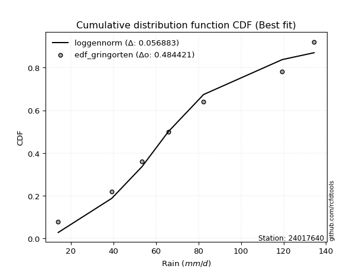</img>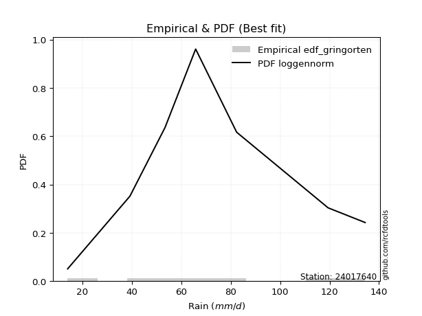</img>

</div>


### 9. EDF Filliben (1975)

The specific values of the constants (0.3175) (often denoted as $alpha$) and (0.365) are derived from a method proposed by James J. Filliben in a 1975 paper. This particular formula is the mean value of the $i$-th order statistic of the normal distribution and is considered a robust and effective plotting position formula for the normal probability plot correlation coefficient test for normality.

<div align="center">


$P=(m-0.3175)/(n+0.365)$


</div>


**9.1. Empirical values**

<div align="center">

|                | 0                   | 1                   | 2                  | 3                  | 4                  | 5                  |
|:---------------|:--------------------|:--------------------|:-------------------|:-------------------|:-------------------|:-------------------|
| date           | 2022                | 2023                | 2021               | 2020               | 2019               | 2024               |
| x              | 14.0                | 39.2                | 53.4               | 82.4               | 119.4              | 134.4              |
| m              | 1                   | 2                   | 3                  | 4                  | 5                  | 6                  |
| empirical_dist | edf_filliben        | edf_filliben        | edf_filliben       | edf_filliben       | edf_filliben       | edf_filliben       |
| empirical      | 0.10722702278083267 | 0.26433621366849963 | 0.4214454045561665 | 0.5785545954438335 | 0.7356637863315004 | 0.8927729772191673 |
| empirical_tr   | 1.1201055873295205  | 1.3593166043780034  | 1.7284453496266123 | 2.3727865796831313 | 3.783060921248143  | 9.326007326007321  |

</div>


**9.2. Kolmogorov-Smirnov fit test (sorted by Δ)**


<div align="center">

|                | 0                   | 1                   | 2                   | 3                   | 4                   | 5                   | 6                   | 7                  | 8                   | 9                   | 10                  | 11                  | 12                  | 13                  | 14                 | 15                 | 16                  | 17                  | 18                  | 19                  | 20                  | 21                  | 22                  | 23                  | 24                  | 25                  | 26                  | 27                  | 28                  | 29                  | 30                  | 31                  | 32                  | 33                  | 34                  | 35                  | 36                  | 37                  | 38                  | 39                  | 40                  | 41                  | 42                  | 43                  | 44                  | 45                  | 46               | 47                  | 48                  | 49                  | 50                  | 51                  | 52                    | 53                  | 54                  | 55                  | 56                  | 57                 | 58                  | 59                  | 60                  | 61                 | 62                  | 63                  | 64                  | 65                  | 66                 | 67                  | 68                 | 69                  | 70                  | 71                  | 72                  | 73                 | 74                  | 75                | 76                 | 77                  | 78                  | 79                 | 80                  | 81                 | 82                  | 83                 | 84                 | 85                 | 86                 | 87                 |
|:---------------|:--------------------|:--------------------|:--------------------|:--------------------|:--------------------|:--------------------|:--------------------|:-------------------|:--------------------|:--------------------|:--------------------|:--------------------|:--------------------|:--------------------|:-------------------|:-------------------|:--------------------|:--------------------|:--------------------|:--------------------|:--------------------|:--------------------|:--------------------|:--------------------|:--------------------|:--------------------|:--------------------|:--------------------|:--------------------|:--------------------|:--------------------|:--------------------|:--------------------|:--------------------|:--------------------|:--------------------|:--------------------|:--------------------|:--------------------|:--------------------|:--------------------|:--------------------|:--------------------|:--------------------|:--------------------|:--------------------|:-----------------|:--------------------|:--------------------|:--------------------|:--------------------|:--------------------|:----------------------|:--------------------|:--------------------|:--------------------|:--------------------|:-------------------|:--------------------|:--------------------|:--------------------|:-------------------|:--------------------|:--------------------|:--------------------|:--------------------|:-------------------|:--------------------|:-------------------|:--------------------|:--------------------|:--------------------|:--------------------|:-------------------|:--------------------|:------------------|:-------------------|:--------------------|:--------------------|:-------------------|:--------------------|:-------------------|:--------------------|:-------------------|:-------------------|:-------------------|:-------------------|:-------------------|
| station        | 24017640            | 24017640            | 24017640            | 24017640            | 24017640            | 24017640            | 24017640            | 24017640           | 24017640            | 24017640            | 24017640            | 24017640            | 24017640            | 24017640            | 24017640           | 24017640           | 24017640            | 24017640            | 24017640            | 24017640            | 24017640            | 24017640            | 24017640            | 24017640            | 24017640            | 24017640            | 24017640            | 24017640            | 24017640            | 24017640            | 24017640            | 24017640            | 24017640            | 24017640            | 24017640            | 24017640            | 24017640            | 24017640            | 24017640            | 24017640            | 24017640            | 24017640            | 24017640            | 24017640            | 24017640            | 24017640            | 24017640         | 24017640            | 24017640            | 24017640            | 24017640            | 24017640            | 24017640              | 24017640            | 24017640            | 24017640            | 24017640            | 24017640           | 24017640            | 24017640            | 24017640            | 24017640           | 24017640            | 24017640            | 24017640            | 24017640            | 24017640           | 24017640            | 24017640           | 24017640            | 24017640            | 24017640            | 24017640            | 24017640           | 24017640            | 24017640          | 24017640           | 24017640            | 24017640            | 24017640           | 24017640            | 24017640           | 24017640            | 24017640           | 24017640           | 24017640           | 24017640           | 24017640           |
| empirical_dist | edf_filliben        | edf_filliben        | edf_filliben        | edf_filliben        | edf_filliben        | edf_filliben        | edf_filliben        | edf_filliben       | edf_filliben        | edf_filliben        | edf_filliben        | edf_filliben        | edf_filliben        | edf_filliben        | edf_filliben       | edf_filliben       | edf_filliben        | edf_filliben        | edf_filliben        | edf_filliben        | edf_filliben        | edf_filliben        | edf_filliben        | edf_filliben        | edf_filliben        | edf_filliben        | edf_filliben        | edf_filliben        | edf_filliben        | edf_filliben        | edf_filliben        | edf_filliben        | edf_filliben        | edf_filliben        | edf_filliben        | edf_filliben        | edf_filliben        | edf_filliben        | edf_filliben        | edf_filliben        | edf_filliben        | edf_filliben        | edf_filliben        | edf_filliben        | edf_filliben        | edf_filliben        | edf_filliben     | edf_filliben        | edf_filliben        | edf_filliben        | edf_filliben        | edf_filliben        | edf_filliben          | edf_filliben        | edf_filliben        | edf_filliben        | edf_filliben        | edf_filliben       | edf_filliben        | edf_filliben        | edf_filliben        | edf_filliben       | edf_filliben        | edf_filliben        | edf_filliben        | edf_filliben        | edf_filliben       | edf_filliben        | edf_filliben       | edf_filliben        | edf_filliben        | edf_filliben        | edf_filliben        | edf_filliben       | edf_filliben        | edf_filliben      | edf_filliben       | edf_filliben        | edf_filliben        | edf_filliben       | edf_filliben        | edf_filliben       | edf_filliben        | edf_filliben       | edf_filliben       | edf_filliben       | edf_filliben       | edf_filliben       |
| p_dist         | logfisk             | logpearson3         | logexponnorm        | logcrystalball      | lognorm             | lognorm             | logt                | loginvgamma        | logncf              | logfatiguelife      | lognct              | logf                | logrice             | loginvgauss         | loggamma           | loggamma           | fisk                | logerlang           | ncf                 | logalpha            | f                   | genexpon            | expon               | betaprime           | loggumbel_l         | loggompertz         | invweibull          | genlogistic         | laplace_asymmetric  | logweibull_min      | halfnorm            | rayleigh            | logmaxwell          | invgauss            | maxwell             | loglogistic         | gompertz            | mielke              | rice                | kstwobign           | invgamma            | pearson3            | johnsonsu           | exponnorm           | crystalball         | norm                | truncnorm        | nct                 | t                   | gamma               | lograyleigh         | erlang              | loglaplace_asymmetric | logbetaprime        | loginvweibull       | halflogistic        | gumbel_r            | loghypsecant       | logloggamma         | moyal               | loghalfnorm         | logistic           | logkstwobign        | hypsecant           | loggumbel_r         | loglaplace          | gumbel_l           | weibull_min         | logmielke          | loghalflogistic     | laplace             | alpha               | logmoyal            | loggenexpon        | wald                | logwald           | logexpon           | loggibrat           | logtruncnorm        | nakagami           | gibrat              | lognakagami        | loglognorm          | chi2               | logchi2            | fatiguelife        | logjohnsonsu       | loggenlogistic     |
| delta          | 0.07409508960279837 | 0.09225233932858734 | 0.09647071725860945 | 0.09647321157524524 | 0.09647333068832509 | 0.09647333068832509 | 0.09647494858962069 | 0.0964925618568152 | 0.09668920037936601 | 0.09705897135662356 | 0.09714248368674594 | 0.09883192996567403 | 0.10021495427127647 | 0.10206804305868977 | 0.1026487966229126 | 0.1026487966229126 | 0.10285845873192456 | 0.10430200344341711 | 0.10557107343323036 | 0.10619655530232175 | 0.10712915040753013 | 0.10722560520427682 | 0.10722702278083267 | 0.10766014961037251 | 0.10991303575761024 | 0.11012375126388496 | 0.11186996447196407 | 0.11192465022011056 | 0.11316318474217624 | 0.11368654383878274 | 0.11430778164750621 | 0.11511431903796343 | 0.11533636878486653 | 0.11560705193150644 | 0.11629157279514057 | 0.11635514660419932 | 0.11680976493803386 | 0.11739422954475753 | 0.11807076360827684 | 0.11821155269106542 | 0.11943170784921053 | 0.12030146973071687 | 0.12061547071581491 | 0.12073037040159895 | 0.12073056777247093 | 0.12073057456305925 | 0.12073057846793 | 0.12073639848272566 | 0.12073775327613712 | 0.12078695728310573 | 0.12092628240406567 | 0.12148020847820884 | 0.12279622830141868   | 0.12566793579280722 | 0.12992266072222125 | 0.13000846431261182 | 0.13075157907927626 | 0.1312757369328973 | 0.13229094721449952 | 0.13527379598128775 | 0.13748517146986539 | 0.1376246701640711 | 0.14309656631729717 | 0.14608125141125994 | 0.15217666106970595 | 0.15828027009839873 | 0.1586619826368244 | 0.16222768426171746 | 0.1638320828620491 | 0.16507973270937437 | 0.16644160900158078 | 0.16787847951357893 | 0.17037404525350075 | 0.2028767475699716 | 0.20724493960291315 | 0.222710553436543 | 0.2503069257779971 | 0.25463076608551727 | 0.25957383334684886 | 0.2643362136356046 | 0.26433621366849963 | 0.3728647120310439 | 0.39560622063928336 | 0.4097030695686285 | 0.4127202604598002 | 0.4760882494320154 | 0.5215370784827165 | 0.7356637863315004 |
| deltao         | 0.530385761606      | 0.530385761606      | 0.530385761606      | 0.530385761606      | 0.530385761606      | 0.530385761606      | 0.530385761606      | 0.530385761606     | 0.530385761606      | 0.530385761606      | 0.530385761606      | 0.530385761606      | 0.530385761606      | 0.530385761606      | 0.530385761606     | 0.530385761606     | 0.530385761606      | 0.530385761606      | 0.530385761606      | 0.530385761606      | 0.530385761606      | 0.530385761606      | 0.530385761606      | 0.530385761606      | 0.530385761606      | 0.530385761606      | 0.530385761606      | 0.530385761606      | 0.530385761606      | 0.530385761606      | 0.530385761606      | 0.530385761606      | 0.530385761606      | 0.530385761606      | 0.530385761606      | 0.530385761606      | 0.530385761606      | 0.530385761606      | 0.530385761606      | 0.530385761606      | 0.530385761606      | 0.530385761606      | 0.530385761606      | 0.530385761606      | 0.530385761606      | 0.530385761606      | 0.530385761606   | 0.530385761606      | 0.530385761606      | 0.530385761606      | 0.530385761606      | 0.530385761606      | 0.530385761606        | 0.530385761606      | 0.530385761606      | 0.530385761606      | 0.530385761606      | 0.530385761606     | 0.530385761606      | 0.530385761606      | 0.530385761606      | 0.530385761606     | 0.530385761606      | 0.530385761606      | 0.530385761606      | 0.530385761606      | 0.530385761606     | 0.530385761606      | 0.530385761606     | 0.530385761606      | 0.530385761606      | 0.530385761606      | 0.530385761606      | 0.530385761606     | 0.530385761606      | 0.530385761606    | 0.530385761606     | 0.530385761606      | 0.530385761606      | 0.530385761606     | 0.530385761606      | 0.530385761606     | 0.530385761606      | 0.530385761606     | 0.530385761606     | 0.530385761606     | 0.530385761606     | 0.530385761606     |
| eval           | Δo > Δ              | Δo > Δ              | Δo > Δ              | Δo > Δ              | Δo > Δ              | Δo > Δ              | Δo > Δ              | Δo > Δ             | Δo > Δ              | Δo > Δ              | Δo > Δ              | Δo > Δ              | Δo > Δ              | Δo > Δ              | Δo > Δ             | Δo > Δ             | Δo > Δ              | Δo > Δ              | Δo > Δ              | Δo > Δ              | Δo > Δ              | Δo > Δ              | Δo > Δ              | Δo > Δ              | Δo > Δ              | Δo > Δ              | Δo > Δ              | Δo > Δ              | Δo > Δ              | Δo > Δ              | Δo > Δ              | Δo > Δ              | Δo > Δ              | Δo > Δ              | Δo > Δ              | Δo > Δ              | Δo > Δ              | Δo > Δ              | Δo > Δ              | Δo > Δ              | Δo > Δ              | Δo > Δ              | Δo > Δ              | Δo > Δ              | Δo > Δ              | Δo > Δ              | Δo > Δ           | Δo > Δ              | Δo > Δ              | Δo > Δ              | Δo > Δ              | Δo > Δ              | Δo > Δ                | Δo > Δ              | Δo > Δ              | Δo > Δ              | Δo > Δ              | Δo > Δ             | Δo > Δ              | Δo > Δ              | Δo > Δ              | Δo > Δ             | Δo > Δ              | Δo > Δ              | Δo > Δ              | Δo > Δ              | Δo > Δ             | Δo > Δ              | Δo > Δ             | Δo > Δ              | Δo > Δ              | Δo > Δ              | Δo > Δ              | Δo > Δ             | Δo > Δ              | Δo > Δ            | Δo > Δ             | Δo > Δ              | Δo > Δ              | Δo > Δ             | Δo > Δ              | Δo > Δ             | Δo > Δ              | Δo > Δ             | Δo > Δ             | Δo > Δ             | Δo > Δ             | Δo <= Δ            |
| fit            | 1                   | 1                   | 1                   | 1                   | 1                   | 1                   | 1                   | 1                  | 1                   | 1                   | 1                   | 1                   | 1                   | 1                   | 1                  | 1                  | 1                   | 1                   | 1                   | 1                   | 1                   | 1                   | 1                   | 1                   | 1                   | 1                   | 1                   | 1                   | 1                   | 1                   | 1                   | 1                   | 1                   | 1                   | 1                   | 1                   | 1                   | 1                   | 1                   | 1                   | 1                   | 1                   | 1                   | 1                   | 1                   | 1                   | 1                | 1                   | 1                   | 1                   | 1                   | 1                   | 1                     | 1                   | 1                   | 1                   | 1                   | 1                  | 1                   | 1                   | 1                   | 1                  | 1                   | 1                   | 1                   | 1                   | 1                  | 1                   | 1                  | 1                   | 1                   | 1                   | 1                   | 1                  | 1                   | 1                 | 1                  | 1                   | 1                   | 1                  | 1                   | 1                  | 1                   | 1                  | 1                  | 1                  | 1                  | 0                  |
| n              | 6                   | 6                   | 6                   | 6                   | 6                   | 6                   | 6                   | 6                  | 6                   | 6                   | 6                   | 6                   | 6                   | 6                   | 6                  | 6                  | 6                   | 6                   | 6                   | 6                   | 6                   | 6                   | 6                   | 6                   | 6                   | 6                   | 6                   | 6                   | 6                   | 6                   | 6                   | 6                   | 6                   | 6                   | 6                   | 6                   | 6                   | 6                   | 6                   | 6                   | 6                   | 6                   | 6                   | 6                   | 6                   | 6                   | 6                | 6                   | 6                   | 6                   | 6                   | 6                   | 6                     | 6                   | 6                   | 6                   | 6                   | 6                  | 6                   | 6                   | 6                   | 6                  | 6                   | 6                   | 6                   | 6                   | 6                  | 6                   | 6                  | 6                   | 6                   | 6                   | 6                   | 6                  | 6                   | 6                 | 6                  | 6                   | 6                   | 6                  | 6                   | 6                  | 6                   | 6                  | 6                  | 6                  | 6                  | 6                  |
| best_fit       | 1                   | 0                   | 0                   | 0                   | 0                   | 0                   | 0                   | 0                  | 0                   | 0                   | 0                   | 0                   | 0                   | 0                   | 0                  | 0                  | 0                   | 0                   | 0                   | 0                   | 0                   | 0                   | 0                   | 0                   | 0                   | 0                   | 0                   | 0                   | 0                   | 0                   | 0                   | 0                   | 0                   | 0                   | 0                   | 0                   | 0                   | 0                   | 0                   | 0                   | 0                   | 0                   | 0                   | 0                   | 0                   | 0                   | 0                | 0                   | 0                   | 0                   | 0                   | 0                   | 0                     | 0                   | 0                   | 0                   | 0                   | 0                  | 0                   | 0                   | 0                   | 0                  | 0                   | 0                   | 0                   | 0                   | 0                  | 0                   | 0                  | 0                   | 0                   | 0                   | 0                   | 0                  | 0                   | 0                 | 0                  | 0                   | 0                   | 0                  | 0                   | 0                  | 0                   | 0                  | 0                  | 0                  | 0                  | 0                  |
| best_fit_sort  | 1                   | 2                   | 3                   | 4                   | 5                   | 6                   | 7                   | 8                  | 9                   | 10                  | 11                  | 12                  | 13                  | 14                  | 15                 | 16                 | 17                  | 18                  | 19                  | 20                  | 21                  | 22                  | 23                  | 24                  | 25                  | 26                  | 27                  | 28                  | 29                  | 30                  | 31                  | 32                  | 33                  | 34                  | 35                  | 36                  | 37                  | 38                  | 39                  | 40                  | 41                  | 42                  | 43                  | 44                  | 45                  | 46                  | 47               | 48                  | 49                  | 50                  | 51                  | 52                  | 53                    | 54                  | 55                  | 56                  | 57                  | 58                 | 59                  | 60                  | 61                  | 62                 | 63                  | 64                  | 65                  | 66                  | 67                 | 68                  | 69                 | 70                  | 71                  | 72                  | 73                  | 74                 | 75                  | 76                | 77                 | 78                  | 79                  | 80                 | 81                  | 82                 | 83                  | 84                 | 85                 | 86                 | 87                 | 88                 |

</div>


**9.3. Best fit**

<div align="center">

|   id |   station | empirical_dist   | p_dist   |     delta |   deltao | eval   |   fit |   n |   best_fit |   best_fit_sort |
|-----:|----------:|:-----------------|:---------|----------:|---------:|:-------|------:|----:|-----------:|----------------:|
|    0 |  24017640 | edf_filliben     | logfisk  | 0.0740951 | 0.530386 | Δo > Δ |     1 |   6 |          1 |               1 |

</div>


<div align="center">

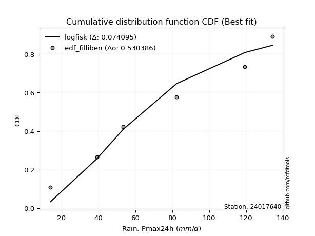</img>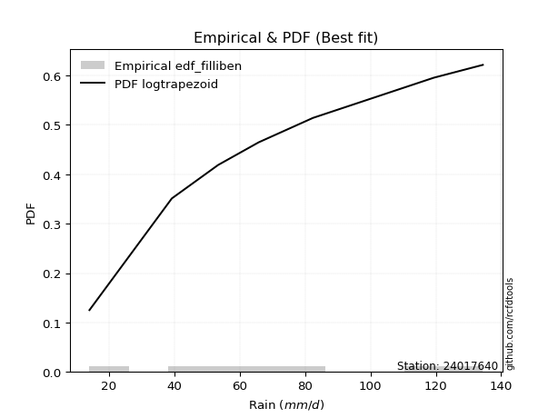</img>

</div>


### 10. EDF Jenkinson (1977)

The Jenkinson formula in hydrology is an empirical plotting position formula used to estimate the non-exceedance probability _(P)_ or return period _(T)_ of a given ordered observation within a sample. It is a widely used method in the frequency analysis of extreme events such as floods and rainfall, as it provides a distribution-free way to plot data. _a≈0.31_ and _b≈0.38_ are constants derived to approximate the median of the probability distribution for the given rank.

<div align="center">


$P=(m-a)/(n+b)$


</div>


**10.1. Empirical values**

<div align="center">

|                | 0                   | 1                   | 2                  | 3                  | 4                  | 5                  |
|:---------------|:--------------------|:--------------------|:-------------------|:-------------------|:-------------------|:-------------------|
| date           | 2022                | 2023                | 2021               | 2020               | 2019               | 2024               |
| x              | 14.0                | 39.2                | 53.4               | 82.4               | 119.4              | 134.4              |
| m              | 1                   | 2                   | 3                  | 4                  | 5                  | 6                  |
| empirical_dist | edf_jenkinson       | edf_jenkinson       | edf_jenkinson      | edf_jenkinson      | edf_jenkinson      | edf_jenkinson      |
| empirical      | 0.10815047021943573 | 0.26489028213166144 | 0.4216300940438871 | 0.5783699059561128 | 0.7351097178683387 | 0.8918495297805643 |
| empirical_tr   | 1.1212653778558874  | 1.3603411513859276  | 1.7289972899728996 | 2.3717472118959106 | 3.7751479289940844 | 9.246376811594207  |

</div>


**10.2. Kolmogorov-Smirnov fit test (sorted by Δ)**


<div align="center">

|                | 0                   | 1                   | 2                   | 3                  | 4                   | 5                   | 6                   | 7                   | 8                   | 9                   | 10                 | 11                  | 12                  | 13                  | 14                  | 15                  | 16                  | 17                  | 18                 | 19                 | 20                  | 21                  | 22                  | 23                  | 24                | 25                  | 26                  | 27                 | 28                  | 29                  | 30                  | 31                  | 32                  | 33                 | 34                  | 35                  | 36                 | 37                  | 38                  | 39                  | 40                  | 41                  | 42                  | 43                  | 44                 | 45                  | 46                | 47                  | 48                  | 49                  | 50                  | 51                  | 52                    | 53                  | 54                 | 55                  | 56                | 57                  | 58                  | 59                 | 60                  | 61                  | 62                  | 63                 | 64                 | 65                 | 66                | 67                  | 68                  | 69                  | 70                  | 71                  | 72                 | 73                 | 74                  | 75                  | 76                  | 77                 | 78                  | 79                 | 80                  | 81                 | 82                  | 83                 | 84                 | 85                 | 86                 | 87                 |
|:---------------|:--------------------|:--------------------|:--------------------|:-------------------|:--------------------|:--------------------|:--------------------|:--------------------|:--------------------|:--------------------|:-------------------|:--------------------|:--------------------|:--------------------|:--------------------|:--------------------|:--------------------|:--------------------|:-------------------|:-------------------|:--------------------|:--------------------|:--------------------|:--------------------|:------------------|:--------------------|:--------------------|:-------------------|:--------------------|:--------------------|:--------------------|:--------------------|:--------------------|:-------------------|:--------------------|:--------------------|:-------------------|:--------------------|:--------------------|:--------------------|:--------------------|:--------------------|:--------------------|:--------------------|:-------------------|:--------------------|:------------------|:--------------------|:--------------------|:--------------------|:--------------------|:--------------------|:----------------------|:--------------------|:-------------------|:--------------------|:------------------|:--------------------|:--------------------|:-------------------|:--------------------|:--------------------|:--------------------|:-------------------|:-------------------|:-------------------|:------------------|:--------------------|:--------------------|:--------------------|:--------------------|:--------------------|:-------------------|:-------------------|:--------------------|:--------------------|:--------------------|:-------------------|:--------------------|:-------------------|:--------------------|:-------------------|:--------------------|:-------------------|:-------------------|:-------------------|:-------------------|:-------------------|
| station        | 24017640            | 24017640            | 24017640            | 24017640           | 24017640            | 24017640            | 24017640            | 24017640            | 24017640            | 24017640            | 24017640           | 24017640            | 24017640            | 24017640            | 24017640            | 24017640            | 24017640            | 24017640            | 24017640           | 24017640           | 24017640            | 24017640            | 24017640            | 24017640            | 24017640          | 24017640            | 24017640            | 24017640           | 24017640            | 24017640            | 24017640            | 24017640            | 24017640            | 24017640           | 24017640            | 24017640            | 24017640           | 24017640            | 24017640            | 24017640            | 24017640            | 24017640            | 24017640            | 24017640            | 24017640           | 24017640            | 24017640          | 24017640            | 24017640            | 24017640            | 24017640            | 24017640            | 24017640              | 24017640            | 24017640           | 24017640            | 24017640          | 24017640            | 24017640            | 24017640           | 24017640            | 24017640            | 24017640            | 24017640           | 24017640           | 24017640           | 24017640          | 24017640            | 24017640            | 24017640            | 24017640            | 24017640            | 24017640           | 24017640           | 24017640            | 24017640            | 24017640            | 24017640           | 24017640            | 24017640           | 24017640            | 24017640           | 24017640            | 24017640           | 24017640           | 24017640           | 24017640           | 24017640           |
| empirical_dist | edf_jenkinson       | edf_jenkinson       | edf_jenkinson       | edf_jenkinson      | edf_jenkinson       | edf_jenkinson       | edf_jenkinson       | edf_jenkinson       | edf_jenkinson       | edf_jenkinson       | edf_jenkinson      | edf_jenkinson       | edf_jenkinson       | edf_jenkinson       | edf_jenkinson       | edf_jenkinson       | edf_jenkinson       | edf_jenkinson       | edf_jenkinson      | edf_jenkinson      | edf_jenkinson       | edf_jenkinson       | edf_jenkinson       | edf_jenkinson       | edf_jenkinson     | edf_jenkinson       | edf_jenkinson       | edf_jenkinson      | edf_jenkinson       | edf_jenkinson       | edf_jenkinson       | edf_jenkinson       | edf_jenkinson       | edf_jenkinson      | edf_jenkinson       | edf_jenkinson       | edf_jenkinson      | edf_jenkinson       | edf_jenkinson       | edf_jenkinson       | edf_jenkinson       | edf_jenkinson       | edf_jenkinson       | edf_jenkinson       | edf_jenkinson      | edf_jenkinson       | edf_jenkinson     | edf_jenkinson       | edf_jenkinson       | edf_jenkinson       | edf_jenkinson       | edf_jenkinson       | edf_jenkinson         | edf_jenkinson       | edf_jenkinson      | edf_jenkinson       | edf_jenkinson     | edf_jenkinson       | edf_jenkinson       | edf_jenkinson      | edf_jenkinson       | edf_jenkinson       | edf_jenkinson       | edf_jenkinson      | edf_jenkinson      | edf_jenkinson      | edf_jenkinson     | edf_jenkinson       | edf_jenkinson       | edf_jenkinson       | edf_jenkinson       | edf_jenkinson       | edf_jenkinson      | edf_jenkinson      | edf_jenkinson       | edf_jenkinson       | edf_jenkinson       | edf_jenkinson      | edf_jenkinson       | edf_jenkinson      | edf_jenkinson       | edf_jenkinson      | edf_jenkinson       | edf_jenkinson      | edf_jenkinson      | edf_jenkinson      | edf_jenkinson      | edf_jenkinson      |
| p_dist         | logfisk             | logpearson3         | logexponnorm        | logcrystalball     | lognorm             | lognorm             | logt                | loginvgamma         | logncf              | logfatiguelife      | lognct             | logf                | logrice             | loginvgauss         | loggamma            | loggamma            | fisk                | logerlang           | ncf                | logalpha           | f                   | genexpon            | expon               | betaprime           | loggumbel_l       | loggompertz         | invweibull          | genlogistic        | laplace_asymmetric  | logweibull_min      | halfnorm            | logmaxwell          | rayleigh            | invgauss           | loglogistic         | maxwell             | gompertz           | mielke              | rice                | kstwobign           | invgamma            | pearson3            | lograyleigh         | johnsonsu           | exponnorm          | crystalball         | norm              | truncnorm           | nct                 | t                   | gamma               | erlang              | loglaplace_asymmetric | logbetaprime        | loginvweibull      | halflogistic        | gumbel_r          | loghypsecant        | logloggamma         | moyal              | loghalfnorm         | logistic            | logkstwobign        | hypsecant          | loggumbel_r        | loglaplace         | gumbel_l          | weibull_min         | logmielke           | loghalflogistic     | laplace             | alpha               | logmoyal           | loggenexpon        | wald                | logwald             | logexpon            | loggibrat          | logtruncnorm        | nakagami           | gibrat              | lognakagami        | loglognorm          | chi2               | logchi2            | fatiguelife        | logjohnsonsu       | loggenlogistic     |
| delta          | 0.07501853704140143 | 0.09280640779174909 | 0.09665540674633011 | 0.0966579010629659 | 0.09665802017604574 | 0.09665802017604574 | 0.09665963807734135 | 0.09667725134453586 | 0.09687388986708667 | 0.09724366084434422 | 0.0973271731744666 | 0.09901661945339468 | 0.10039964375899713 | 0.10225273254641043 | 0.10283348611063325 | 0.10283348611063325 | 0.10341252719508631 | 0.10448669293113777 | 0.1061251418963921 | 0.1063812447900424 | 0.10768321887069188 | 0.10814905264287988 | 0.10815047021943573 | 0.10821421807353426 | 0.110467104220772 | 0.11067781972704671 | 0.11242403293512582 | 0.1124787186832723 | 0.11371725320533799 | 0.11424061230194449 | 0.11486185011066796 | 0.11552105827258718 | 0.11566838750112518 | 0.1161611203946682 | 0.11653983609191998 | 0.11684564125830232 | 0.1173638334011956 | 0.11794829800791928 | 0.11862483207143859 | 0.11876562115422717 | 0.11998577631237228 | 0.12085553819387862 | 0.12111097189178632 | 0.12116953917897666 | 0.1212844388647607 | 0.12128463623563268 | 0.121284643026221 | 0.12128464693109176 | 0.12129046694588741 | 0.12129182173929887 | 0.12134102574626748 | 0.12203427694137059 | 0.12335029676458042   | 0.12585262528052787 | 0.1301073502099419 | 0.13056253277577357 | 0.131305647542438 | 0.13146042642061795 | 0.13284501567766127 | 0.1358278644444495 | 0.13766986095758604 | 0.13817873862723284 | 0.14254249785413536 | 0.1466353198744217 | 0.1523613505574266 | 0.1584649595861194 | 0.158846672124545 | 0.16167361579855566 | 0.16438615132521084 | 0.16526442219709503 | 0.16662629848930138 | 0.16732441105041712 | 0.1705587347412214 | 0.2023226791068098 | 0.20779900806607496 | 0.22289524292426366 | 0.24975285731483532 | 0.2548154555732379 | 0.26012790181001066 | 0.2648902820987664 | 0.26489028213166144 | 0.3726800225433233 | 0.39505215217612155 | 0.4091490011054667 | 0.4121661919966384 | 0.4755341809688536 | 0.5209830100195547 | 0.7351097178683387 |
| deltao         | 0.530385761606      | 0.530385761606      | 0.530385761606      | 0.530385761606     | 0.530385761606      | 0.530385761606      | 0.530385761606      | 0.530385761606      | 0.530385761606      | 0.530385761606      | 0.530385761606     | 0.530385761606      | 0.530385761606      | 0.530385761606      | 0.530385761606      | 0.530385761606      | 0.530385761606      | 0.530385761606      | 0.530385761606     | 0.530385761606     | 0.530385761606      | 0.530385761606      | 0.530385761606      | 0.530385761606      | 0.530385761606    | 0.530385761606      | 0.530385761606      | 0.530385761606     | 0.530385761606      | 0.530385761606      | 0.530385761606      | 0.530385761606      | 0.530385761606      | 0.530385761606     | 0.530385761606      | 0.530385761606      | 0.530385761606     | 0.530385761606      | 0.530385761606      | 0.530385761606      | 0.530385761606      | 0.530385761606      | 0.530385761606      | 0.530385761606      | 0.530385761606     | 0.530385761606      | 0.530385761606    | 0.530385761606      | 0.530385761606      | 0.530385761606      | 0.530385761606      | 0.530385761606      | 0.530385761606        | 0.530385761606      | 0.530385761606     | 0.530385761606      | 0.530385761606    | 0.530385761606      | 0.530385761606      | 0.530385761606     | 0.530385761606      | 0.530385761606      | 0.530385761606      | 0.530385761606     | 0.530385761606     | 0.530385761606     | 0.530385761606    | 0.530385761606      | 0.530385761606      | 0.530385761606      | 0.530385761606      | 0.530385761606      | 0.530385761606     | 0.530385761606     | 0.530385761606      | 0.530385761606      | 0.530385761606      | 0.530385761606     | 0.530385761606      | 0.530385761606     | 0.530385761606      | 0.530385761606     | 0.530385761606      | 0.530385761606     | 0.530385761606     | 0.530385761606     | 0.530385761606     | 0.530385761606     |
| eval           | Δo > Δ              | Δo > Δ              | Δo > Δ              | Δo > Δ             | Δo > Δ              | Δo > Δ              | Δo > Δ              | Δo > Δ              | Δo > Δ              | Δo > Δ              | Δo > Δ             | Δo > Δ              | Δo > Δ              | Δo > Δ              | Δo > Δ              | Δo > Δ              | Δo > Δ              | Δo > Δ              | Δo > Δ             | Δo > Δ             | Δo > Δ              | Δo > Δ              | Δo > Δ              | Δo > Δ              | Δo > Δ            | Δo > Δ              | Δo > Δ              | Δo > Δ             | Δo > Δ              | Δo > Δ              | Δo > Δ              | Δo > Δ              | Δo > Δ              | Δo > Δ             | Δo > Δ              | Δo > Δ              | Δo > Δ             | Δo > Δ              | Δo > Δ              | Δo > Δ              | Δo > Δ              | Δo > Δ              | Δo > Δ              | Δo > Δ              | Δo > Δ             | Δo > Δ              | Δo > Δ            | Δo > Δ              | Δo > Δ              | Δo > Δ              | Δo > Δ              | Δo > Δ              | Δo > Δ                | Δo > Δ              | Δo > Δ             | Δo > Δ              | Δo > Δ            | Δo > Δ              | Δo > Δ              | Δo > Δ             | Δo > Δ              | Δo > Δ              | Δo > Δ              | Δo > Δ             | Δo > Δ             | Δo > Δ             | Δo > Δ            | Δo > Δ              | Δo > Δ              | Δo > Δ              | Δo > Δ              | Δo > Δ              | Δo > Δ             | Δo > Δ             | Δo > Δ              | Δo > Δ              | Δo > Δ              | Δo > Δ             | Δo > Δ              | Δo > Δ             | Δo > Δ              | Δo > Δ             | Δo > Δ              | Δo > Δ             | Δo > Δ             | Δo > Δ             | Δo > Δ             | Δo <= Δ            |
| fit            | 1                   | 1                   | 1                   | 1                  | 1                   | 1                   | 1                   | 1                   | 1                   | 1                   | 1                  | 1                   | 1                   | 1                   | 1                   | 1                   | 1                   | 1                   | 1                  | 1                  | 1                   | 1                   | 1                   | 1                   | 1                 | 1                   | 1                   | 1                  | 1                   | 1                   | 1                   | 1                   | 1                   | 1                  | 1                   | 1                   | 1                  | 1                   | 1                   | 1                   | 1                   | 1                   | 1                   | 1                   | 1                  | 1                   | 1                 | 1                   | 1                   | 1                   | 1                   | 1                   | 1                     | 1                   | 1                  | 1                   | 1                 | 1                   | 1                   | 1                  | 1                   | 1                   | 1                   | 1                  | 1                  | 1                  | 1                 | 1                   | 1                   | 1                   | 1                   | 1                   | 1                  | 1                  | 1                   | 1                   | 1                   | 1                  | 1                   | 1                  | 1                   | 1                  | 1                   | 1                  | 1                  | 1                  | 1                  | 0                  |
| n              | 6                   | 6                   | 6                   | 6                  | 6                   | 6                   | 6                   | 6                   | 6                   | 6                   | 6                  | 6                   | 6                   | 6                   | 6                   | 6                   | 6                   | 6                   | 6                  | 6                  | 6                   | 6                   | 6                   | 6                   | 6                 | 6                   | 6                   | 6                  | 6                   | 6                   | 6                   | 6                   | 6                   | 6                  | 6                   | 6                   | 6                  | 6                   | 6                   | 6                   | 6                   | 6                   | 6                   | 6                   | 6                  | 6                   | 6                 | 6                   | 6                   | 6                   | 6                   | 6                   | 6                     | 6                   | 6                  | 6                   | 6                 | 6                   | 6                   | 6                  | 6                   | 6                   | 6                   | 6                  | 6                  | 6                  | 6                 | 6                   | 6                   | 6                   | 6                   | 6                   | 6                  | 6                  | 6                   | 6                   | 6                   | 6                  | 6                   | 6                  | 6                   | 6                  | 6                   | 6                  | 6                  | 6                  | 6                  | 6                  |
| best_fit       | 1                   | 0                   | 0                   | 0                  | 0                   | 0                   | 0                   | 0                   | 0                   | 0                   | 0                  | 0                   | 0                   | 0                   | 0                   | 0                   | 0                   | 0                   | 0                  | 0                  | 0                   | 0                   | 0                   | 0                   | 0                 | 0                   | 0                   | 0                  | 0                   | 0                   | 0                   | 0                   | 0                   | 0                  | 0                   | 0                   | 0                  | 0                   | 0                   | 0                   | 0                   | 0                   | 0                   | 0                   | 0                  | 0                   | 0                 | 0                   | 0                   | 0                   | 0                   | 0                   | 0                     | 0                   | 0                  | 0                   | 0                 | 0                   | 0                   | 0                  | 0                   | 0                   | 0                   | 0                  | 0                  | 0                  | 0                 | 0                   | 0                   | 0                   | 0                   | 0                   | 0                  | 0                  | 0                   | 0                   | 0                   | 0                  | 0                   | 0                  | 0                   | 0                  | 0                   | 0                  | 0                  | 0                  | 0                  | 0                  |
| best_fit_sort  | 1                   | 2                   | 3                   | 4                  | 5                   | 6                   | 7                   | 8                   | 9                   | 10                  | 11                 | 12                  | 13                  | 14                  | 15                  | 16                  | 17                  | 18                  | 19                 | 20                 | 21                  | 22                  | 23                  | 24                  | 25                | 26                  | 27                  | 28                 | 29                  | 30                  | 31                  | 32                  | 33                  | 34                 | 35                  | 36                  | 37                 | 38                  | 39                  | 40                  | 41                  | 42                  | 43                  | 44                  | 45                 | 46                  | 47                | 48                  | 49                  | 50                  | 51                  | 52                  | 53                    | 54                  | 55                 | 56                  | 57                | 58                  | 59                  | 60                 | 61                  | 62                  | 63                  | 64                 | 65                 | 66                 | 67                | 68                  | 69                  | 70                  | 71                  | 72                  | 73                 | 74                 | 75                  | 76                  | 77                  | 78                 | 79                  | 80                 | 81                  | 82                 | 83                  | 84                 | 85                 | 86                 | 87                 | 88                 |

</div>


**10.3. Best fit**

<div align="center">

|   id |   station | empirical_dist   | p_dist   |     delta |   deltao | eval   |   fit |   n |   best_fit |   best_fit_sort |
|-----:|----------:|:-----------------|:---------|----------:|---------:|:-------|------:|----:|-----------:|----------------:|
|    0 |  24017640 | edf_jenkinson    | logfisk  | 0.0750185 | 0.530386 | Δo > Δ |     1 |   6 |          1 |               1 |

</div>


<div align="center">

</img>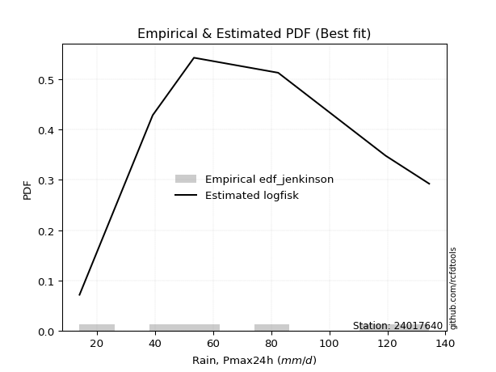</img>

</div>


### 11. EDF Cunnane (1978)

Cunnane´s work in statistical hydrology has focused on the performance and evaluation of different probability distributions (such as GEV, Gumbel, Lognormal) for flood frequency estimation. _b_ is a constant, typically set to 0.4.

<div align="center">


$P=(m-b)/(n+1-2b)$


</div>


**11.1. Empirical values**

<div align="center">

|                | 0                  | 1                   | 2                   | 3                  | 4                  | 5                  |
|:---------------|:-------------------|:--------------------|:--------------------|:-------------------|:-------------------|:-------------------|
| date           | 2022               | 2023                | 2021                | 2020               | 2019               | 2024               |
| x              | 14.0               | 39.2                | 53.4                | 82.4               | 119.4              | 134.4              |
| m              | 1                  | 2                   | 3                   | 4                  | 5                  | 6                  |
| empirical_dist | edf_cunnane        | edf_cunnane         | edf_cunnane         | edf_cunnane        | edf_cunnane        | edf_cunnane        |
| empirical      | 0.0967741935483871 | 0.25806451612903225 | 0.41935483870967744 | 0.5806451612903226 | 0.7419354838709676 | 0.9032258064516128 |
| empirical_tr   | 1.1071428571428572 | 1.3478260869565217  | 1.7222222222222225  | 2.384615384615385  | 3.8749999999999982 | 10.333333333333318 |

</div>


**11.2. Kolmogorov-Smirnov fit test (sorted by Δ)**


<div align="center">

|                | 0                   | 1                   | 2                  | 3                  | 4                   | 5                   | 6                   | 7                   | 8                   | 9                   | 10                 | 11                  | 12                  | 13                  | 14                  | 15                  | 16                  | 17                  | 18                  | 19                  | 20                 | 21                  | 22                  | 23                  | 24                  | 25                 | 26                  | 27                  | 28                  | 29                  | 30                | 31                  | 32                  | 33                  | 34                  | 35                  | 36                  | 37                  | 38                  | 39                  | 40                  | 41                  | 42                 | 43                  | 44                  | 45                  | 46                  | 47                  | 48                 | 49                  | 50                  | 51                    | 52                  | 53                  | 54                 | 55                  | 56                 | 57                  | 58                  | 59                  | 60                 | 61                  | 62                  | 63                  | 64                 | 65                 | 66                  | 67                  | 68                  | 69                 | 70                 | 71                  | 72                 | 73                  | 74                  | 75                  | 76                 | 77                 | 78                 | 79                  | 80                  | 81                  | 82                  | 83                 | 84                 | 85                  | 86                 | 87                 |
|:---------------|:--------------------|:--------------------|:-------------------|:-------------------|:--------------------|:--------------------|:--------------------|:--------------------|:--------------------|:--------------------|:-------------------|:--------------------|:--------------------|:--------------------|:--------------------|:--------------------|:--------------------|:--------------------|:--------------------|:--------------------|:-------------------|:--------------------|:--------------------|:--------------------|:--------------------|:-------------------|:--------------------|:--------------------|:--------------------|:--------------------|:------------------|:--------------------|:--------------------|:--------------------|:--------------------|:--------------------|:--------------------|:--------------------|:--------------------|:--------------------|:--------------------|:--------------------|:-------------------|:--------------------|:--------------------|:--------------------|:--------------------|:--------------------|:-------------------|:--------------------|:--------------------|:----------------------|:--------------------|:--------------------|:-------------------|:--------------------|:-------------------|:--------------------|:--------------------|:--------------------|:-------------------|:--------------------|:--------------------|:--------------------|:-------------------|:-------------------|:--------------------|:--------------------|:--------------------|:-------------------|:-------------------|:--------------------|:-------------------|:--------------------|:--------------------|:--------------------|:-------------------|:-------------------|:-------------------|:--------------------|:--------------------|:--------------------|:--------------------|:-------------------|:-------------------|:--------------------|:-------------------|:-------------------|
| station        | 24017640            | 24017640            | 24017640           | 24017640           | 24017640            | 24017640            | 24017640            | 24017640            | 24017640            | 24017640            | 24017640           | 24017640            | 24017640            | 24017640            | 24017640            | 24017640            | 24017640            | 24017640            | 24017640            | 24017640            | 24017640           | 24017640            | 24017640            | 24017640            | 24017640            | 24017640           | 24017640            | 24017640            | 24017640            | 24017640            | 24017640          | 24017640            | 24017640            | 24017640            | 24017640            | 24017640            | 24017640            | 24017640            | 24017640            | 24017640            | 24017640            | 24017640            | 24017640           | 24017640            | 24017640            | 24017640            | 24017640            | 24017640            | 24017640           | 24017640            | 24017640            | 24017640              | 24017640            | 24017640            | 24017640           | 24017640            | 24017640           | 24017640            | 24017640            | 24017640            | 24017640           | 24017640            | 24017640            | 24017640            | 24017640           | 24017640           | 24017640            | 24017640            | 24017640            | 24017640           | 24017640           | 24017640            | 24017640           | 24017640            | 24017640            | 24017640            | 24017640           | 24017640           | 24017640           | 24017640            | 24017640            | 24017640            | 24017640            | 24017640           | 24017640           | 24017640            | 24017640           | 24017640           |
| empirical_dist | edf_cunnane         | edf_cunnane         | edf_cunnane        | edf_cunnane        | edf_cunnane         | edf_cunnane         | edf_cunnane         | edf_cunnane         | edf_cunnane         | edf_cunnane         | edf_cunnane        | edf_cunnane         | edf_cunnane         | edf_cunnane         | edf_cunnane         | edf_cunnane         | edf_cunnane         | edf_cunnane         | edf_cunnane         | edf_cunnane         | edf_cunnane        | edf_cunnane         | edf_cunnane         | edf_cunnane         | edf_cunnane         | edf_cunnane        | edf_cunnane         | edf_cunnane         | edf_cunnane         | edf_cunnane         | edf_cunnane       | edf_cunnane         | edf_cunnane         | edf_cunnane         | edf_cunnane         | edf_cunnane         | edf_cunnane         | edf_cunnane         | edf_cunnane         | edf_cunnane         | edf_cunnane         | edf_cunnane         | edf_cunnane        | edf_cunnane         | edf_cunnane         | edf_cunnane         | edf_cunnane         | edf_cunnane         | edf_cunnane        | edf_cunnane         | edf_cunnane         | edf_cunnane           | edf_cunnane         | edf_cunnane         | edf_cunnane        | edf_cunnane         | edf_cunnane        | edf_cunnane         | edf_cunnane         | edf_cunnane         | edf_cunnane        | edf_cunnane         | edf_cunnane         | edf_cunnane         | edf_cunnane        | edf_cunnane        | edf_cunnane         | edf_cunnane         | edf_cunnane         | edf_cunnane        | edf_cunnane        | edf_cunnane         | edf_cunnane        | edf_cunnane         | edf_cunnane         | edf_cunnane         | edf_cunnane        | edf_cunnane        | edf_cunnane        | edf_cunnane         | edf_cunnane         | edf_cunnane         | edf_cunnane         | edf_cunnane        | edf_cunnane        | edf_cunnane         | edf_cunnane        | edf_cunnane        |
| p_dist         | logfisk             | logpearson3         | logexponnorm       | logcrystalball     | lognorm             | lognorm             | logt                | loginvgamma         | logncf              | logfatiguelife      | lognct             | fisk                | logf                | logrice             | ncf                 | loginvgauss         | loggamma            | loggamma            | expon               | f                   | betaprime          | genexpon            | logerlang           | loggumbel_l         | loggompertz         | logalpha           | invweibull          | genlogistic         | laplace_asymmetric  | logweibull_min      | halfnorm          | rayleigh            | invgauss            | maxwell             | gompertz            | mielke              | rice                | kstwobign           | invgamma            | logmaxwell          | pearson3            | loglogistic         | johnsonsu          | exponnorm           | crystalball         | norm                | truncnorm           | nct                 | t                  | gamma               | erlang              | loglaplace_asymmetric | lograyleigh         | logbetaprime        | halflogistic       | gumbel_r            | logloggamma        | moyal               | loghypsecant        | logistic            | loginvweibull      | loghalfnorm         | hypsecant           | logkstwobign        | loggumbel_r        | loglaplace         | gumbel_l            | logmielke           | loghalflogistic     | laplace            | logmoyal           | weibull_min         | alpha              | wald                | loggenexpon         | logwald             | loggibrat          | logtruncnorm       | logexpon           | nakagami            | gibrat              | lognakagami         | loglognorm          | chi2               | logchi2            | fatiguelife         | logjohnsonsu       | loggenlogistic     |
| delta          | 0.06623474451484157 | 0.08598064178912013 | 0.0943801514121203 | 0.0943826457287561 | 0.09438276484183594 | 0.09438276484183594 | 0.09438438274313155 | 0.09440199601032606 | 0.09459863453287687 | 0.09496840551013441 | 0.0950519178402568 | 0.09658676119245735 | 0.09674136411918488 | 0.09812438842478732 | 0.09929937589376314 | 0.09997747721220063 | 0.10055823077642345 | 0.10055823077642345 | 0.10075287215272632 | 0.10085745286806291 | 0.1013884520709053 | 0.10142100674768029 | 0.10221143759692797 | 0.10364133821814303 | 0.10385205372441775 | 0.1041059894558326 | 0.10559826693249685 | 0.10565295268064334 | 0.10689148720270902 | 0.10741484629931553 | 0.108036084108039 | 0.10884262149849622 | 0.10933535439203923 | 0.11001987525567336 | 0.11053806739856664 | 0.11112253200529032 | 0.11179906606880963 | 0.11193985515159821 | 0.11316001030974332 | 0.11324580293837738 | 0.11402977219124966 | 0.11426458075771018 | 0.1143437731763477 | 0.11445867286213174 | 0.11445887023300372 | 0.11445887702359203 | 0.11445888092846279 | 0.11446470094325845 | 0.1144660557366699 | 0.11451525974363852 | 0.11520851093874163 | 0.11652453076195146   | 0.11883571655757652 | 0.12357736994631807 | 0.1237367667731446 | 0.12447988153980905 | 0.1260192496750323 | 0.12900209844182053 | 0.12918517108640815 | 0.13135297262460388 | 0.1350284122791131 | 0.13539460562337624 | 0.13980955387179272 | 0.14936826385676455 | 0.1500860952232168 | 0.1561897042519096 | 0.15657141679033532 | 0.15756038532258188 | 0.16298916686288523 | 0.1643510431550917 | 0.1682834794070116 | 0.16849938180118484 | 0.1741501770530463 | 0.20097324206344577 | 0.20914844510943897 | 0.22061998759005386 | 0.2525402002390281 | 0.2533021358073815 | 0.2565786233174645 | 0.25806451609613723 | 0.25806451612903225 | 0.37495527787753297 | 0.40187791817875074 | 0.4159747671080959 | 0.4189919579992676 | 0.48235994697148277 | 0.5278087760221837 | 0.7419354838709676 |
| deltao         | 0.530385761606      | 0.530385761606      | 0.530385761606     | 0.530385761606     | 0.530385761606      | 0.530385761606      | 0.530385761606      | 0.530385761606      | 0.530385761606      | 0.530385761606      | 0.530385761606     | 0.530385761606      | 0.530385761606      | 0.530385761606      | 0.530385761606      | 0.530385761606      | 0.530385761606      | 0.530385761606      | 0.530385761606      | 0.530385761606      | 0.530385761606     | 0.530385761606      | 0.530385761606      | 0.530385761606      | 0.530385761606      | 0.530385761606     | 0.530385761606      | 0.530385761606      | 0.530385761606      | 0.530385761606      | 0.530385761606    | 0.530385761606      | 0.530385761606      | 0.530385761606      | 0.530385761606      | 0.530385761606      | 0.530385761606      | 0.530385761606      | 0.530385761606      | 0.530385761606      | 0.530385761606      | 0.530385761606      | 0.530385761606     | 0.530385761606      | 0.530385761606      | 0.530385761606      | 0.530385761606      | 0.530385761606      | 0.530385761606     | 0.530385761606      | 0.530385761606      | 0.530385761606        | 0.530385761606      | 0.530385761606      | 0.530385761606     | 0.530385761606      | 0.530385761606     | 0.530385761606      | 0.530385761606      | 0.530385761606      | 0.530385761606     | 0.530385761606      | 0.530385761606      | 0.530385761606      | 0.530385761606     | 0.530385761606     | 0.530385761606      | 0.530385761606      | 0.530385761606      | 0.530385761606     | 0.530385761606     | 0.530385761606      | 0.530385761606     | 0.530385761606      | 0.530385761606      | 0.530385761606      | 0.530385761606     | 0.530385761606     | 0.530385761606     | 0.530385761606      | 0.530385761606      | 0.530385761606      | 0.530385761606      | 0.530385761606     | 0.530385761606     | 0.530385761606      | 0.530385761606     | 0.530385761606     |
| eval           | Δo > Δ              | Δo > Δ              | Δo > Δ             | Δo > Δ             | Δo > Δ              | Δo > Δ              | Δo > Δ              | Δo > Δ              | Δo > Δ              | Δo > Δ              | Δo > Δ             | Δo > Δ              | Δo > Δ              | Δo > Δ              | Δo > Δ              | Δo > Δ              | Δo > Δ              | Δo > Δ              | Δo > Δ              | Δo > Δ              | Δo > Δ             | Δo > Δ              | Δo > Δ              | Δo > Δ              | Δo > Δ              | Δo > Δ             | Δo > Δ              | Δo > Δ              | Δo > Δ              | Δo > Δ              | Δo > Δ            | Δo > Δ              | Δo > Δ              | Δo > Δ              | Δo > Δ              | Δo > Δ              | Δo > Δ              | Δo > Δ              | Δo > Δ              | Δo > Δ              | Δo > Δ              | Δo > Δ              | Δo > Δ             | Δo > Δ              | Δo > Δ              | Δo > Δ              | Δo > Δ              | Δo > Δ              | Δo > Δ             | Δo > Δ              | Δo > Δ              | Δo > Δ                | Δo > Δ              | Δo > Δ              | Δo > Δ             | Δo > Δ              | Δo > Δ             | Δo > Δ              | Δo > Δ              | Δo > Δ              | Δo > Δ             | Δo > Δ              | Δo > Δ              | Δo > Δ              | Δo > Δ             | Δo > Δ             | Δo > Δ              | Δo > Δ              | Δo > Δ              | Δo > Δ             | Δo > Δ             | Δo > Δ              | Δo > Δ             | Δo > Δ              | Δo > Δ              | Δo > Δ              | Δo > Δ             | Δo > Δ             | Δo > Δ             | Δo > Δ              | Δo > Δ              | Δo > Δ              | Δo > Δ              | Δo > Δ             | Δo > Δ             | Δo > Δ              | Δo > Δ             | Δo <= Δ            |
| fit            | 1                   | 1                   | 1                  | 1                  | 1                   | 1                   | 1                   | 1                   | 1                   | 1                   | 1                  | 1                   | 1                   | 1                   | 1                   | 1                   | 1                   | 1                   | 1                   | 1                   | 1                  | 1                   | 1                   | 1                   | 1                   | 1                  | 1                   | 1                   | 1                   | 1                   | 1                 | 1                   | 1                   | 1                   | 1                   | 1                   | 1                   | 1                   | 1                   | 1                   | 1                   | 1                   | 1                  | 1                   | 1                   | 1                   | 1                   | 1                   | 1                  | 1                   | 1                   | 1                     | 1                   | 1                   | 1                  | 1                   | 1                  | 1                   | 1                   | 1                   | 1                  | 1                   | 1                   | 1                   | 1                  | 1                  | 1                   | 1                   | 1                   | 1                  | 1                  | 1                   | 1                  | 1                   | 1                   | 1                   | 1                  | 1                  | 1                  | 1                   | 1                   | 1                   | 1                   | 1                  | 1                  | 1                   | 1                  | 0                  |
| n              | 6                   | 6                   | 6                  | 6                  | 6                   | 6                   | 6                   | 6                   | 6                   | 6                   | 6                  | 6                   | 6                   | 6                   | 6                   | 6                   | 6                   | 6                   | 6                   | 6                   | 6                  | 6                   | 6                   | 6                   | 6                   | 6                  | 6                   | 6                   | 6                   | 6                   | 6                 | 6                   | 6                   | 6                   | 6                   | 6                   | 6                   | 6                   | 6                   | 6                   | 6                   | 6                   | 6                  | 6                   | 6                   | 6                   | 6                   | 6                   | 6                  | 6                   | 6                   | 6                     | 6                   | 6                   | 6                  | 6                   | 6                  | 6                   | 6                   | 6                   | 6                  | 6                   | 6                   | 6                   | 6                  | 6                  | 6                   | 6                   | 6                   | 6                  | 6                  | 6                   | 6                  | 6                   | 6                   | 6                   | 6                  | 6                  | 6                  | 6                   | 6                   | 6                   | 6                   | 6                  | 6                  | 6                   | 6                  | 6                  |
| best_fit       | 1                   | 0                   | 0                  | 0                  | 0                   | 0                   | 0                   | 0                   | 0                   | 0                   | 0                  | 0                   | 0                   | 0                   | 0                   | 0                   | 0                   | 0                   | 0                   | 0                   | 0                  | 0                   | 0                   | 0                   | 0                   | 0                  | 0                   | 0                   | 0                   | 0                   | 0                 | 0                   | 0                   | 0                   | 0                   | 0                   | 0                   | 0                   | 0                   | 0                   | 0                   | 0                   | 0                  | 0                   | 0                   | 0                   | 0                   | 0                   | 0                  | 0                   | 0                   | 0                     | 0                   | 0                   | 0                  | 0                   | 0                  | 0                   | 0                   | 0                   | 0                  | 0                   | 0                   | 0                   | 0                  | 0                  | 0                   | 0                   | 0                   | 0                  | 0                  | 0                   | 0                  | 0                   | 0                   | 0                   | 0                  | 0                  | 0                  | 0                   | 0                   | 0                   | 0                   | 0                  | 0                  | 0                   | 0                  | 0                  |
| best_fit_sort  | 1                   | 2                   | 3                  | 4                  | 5                   | 6                   | 7                   | 8                   | 9                   | 10                  | 11                 | 12                  | 13                  | 14                  | 15                  | 16                  | 17                  | 18                  | 19                  | 20                  | 21                 | 22                  | 23                  | 24                  | 25                  | 26                 | 27                  | 28                  | 29                  | 30                  | 31                | 32                  | 33                  | 34                  | 35                  | 36                  | 37                  | 38                  | 39                  | 40                  | 41                  | 42                  | 43                 | 44                  | 45                  | 46                  | 47                  | 48                  | 49                 | 50                  | 51                  | 52                    | 53                  | 54                  | 55                 | 56                  | 57                 | 58                  | 59                  | 60                  | 61                 | 62                  | 63                  | 64                  | 65                 | 66                 | 67                  | 68                  | 69                  | 70                 | 71                 | 72                  | 73                 | 74                  | 75                  | 76                  | 77                 | 78                 | 79                 | 80                  | 81                  | 82                  | 83                  | 84                 | 85                 | 86                  | 87                 | 88                 |

</div>


**11.3. Best fit**

<div align="center">

|   id |   station | empirical_dist   | p_dist   |     delta |   deltao | eval   |   fit |   n |   best_fit |   best_fit_sort |
|-----:|----------:|:-----------------|:---------|----------:|---------:|:-------|------:|----:|-----------:|----------------:|
|    0 |  24017640 | edf_cunnane      | logfisk  | 0.0662347 | 0.530386 | Δo > Δ |     1 |   6 |          1 |               1 |

</div>


<div align="center">

</img></img>

</div>


### 12. EDF Adamowski (1981)

The Adamowski formula in hydrology refers to a specific plotting position formula used for estimating the non-parametric empirical distribution of hydrological events (like flood peaks) to calculate their return periods. This formula provides an alternative to traditional parametric methods (like the Gumbel or Log Pearson Type III distributions). 

<div align="center">


$P=(m-0.25)/(n+0.5)$


</div>


**12.1. Empirical values**

<div align="center">

|                | 0                   | 1                  | 2                  | 3                  | 4                  | 5                  |
|:---------------|:--------------------|:-------------------|:-------------------|:-------------------|:-------------------|:-------------------|
| date           | 2022                | 2023               | 2021               | 2020               | 2019               | 2024               |
| x              | 14.0                | 39.2               | 53.4               | 82.4               | 119.4              | 134.4              |
| m              | 1                   | 2                  | 3                  | 4                  | 5                  | 6                  |
| empirical_dist | edf_adamowski       | edf_adamowski      | edf_adamowski      | edf_adamowski      | edf_adamowski      | edf_adamowski      |
| empirical      | 0.11538461538461539 | 0.2692307692307692 | 0.4230769230769231 | 0.5769230769230769 | 0.7307692307692307 | 0.8846153846153846 |
| empirical_tr   | 1.1304347826086958  | 1.3684210526315788 | 1.7333333333333334 | 2.3636363636363633 | 3.7142857142857135 | 8.666666666666664  |

</div>


**12.2. Kolmogorov-Smirnov fit test (sorted by Δ)**


<div align="center">

|                | 0                   | 1                   | 2                   | 3                   | 4                   | 5                   | 6                  | 7                   | 8                   | 9                   | 10                  | 11                  | 12                  | 13                  | 14                 | 15                 | 16                  | 17                  | 18                  | 19                  | 20                  | 21                  | 22                  | 23                  | 24                 | 25                  | 26                  | 27                  | 28                  | 29                  | 30                  | 31                  | 32                  | 33                  | 34                  | 35                  | 36                  | 37                  | 38                  | 39                  | 40                  | 41                  | 42                  | 43                 | 44                  | 45                  | 46                  | 47                 | 48                  | 49                  | 50                  | 51                  | 52                  | 53                    | 54                  | 55                 | 56                 | 57                  | 58                  | 59                  | 60                | 61                  | 62                 | 63                  | 64                  | 65                  | 66                  | 67                  | 68                  | 69                  | 70                  | 71                 | 72                  | 73                | 74                  | 75                 | 76                  | 77                  | 78                  | 79                 | 80                 | 81                  | 82                  | 83                 | 84                 | 85                 | 86                 | 87                 |
|:---------------|:--------------------|:--------------------|:--------------------|:--------------------|:--------------------|:--------------------|:-------------------|:--------------------|:--------------------|:--------------------|:--------------------|:--------------------|:--------------------|:--------------------|:-------------------|:-------------------|:--------------------|:--------------------|:--------------------|:--------------------|:--------------------|:--------------------|:--------------------|:--------------------|:-------------------|:--------------------|:--------------------|:--------------------|:--------------------|:--------------------|:--------------------|:--------------------|:--------------------|:--------------------|:--------------------|:--------------------|:--------------------|:--------------------|:--------------------|:--------------------|:--------------------|:--------------------|:--------------------|:-------------------|:--------------------|:--------------------|:--------------------|:-------------------|:--------------------|:--------------------|:--------------------|:--------------------|:--------------------|:----------------------|:--------------------|:-------------------|:-------------------|:--------------------|:--------------------|:--------------------|:------------------|:--------------------|:-------------------|:--------------------|:--------------------|:--------------------|:--------------------|:--------------------|:--------------------|:--------------------|:--------------------|:-------------------|:--------------------|:------------------|:--------------------|:-------------------|:--------------------|:--------------------|:--------------------|:-------------------|:-------------------|:--------------------|:--------------------|:-------------------|:-------------------|:-------------------|:-------------------|:-------------------|
| station        | 24017640            | 24017640            | 24017640            | 24017640            | 24017640            | 24017640            | 24017640           | 24017640            | 24017640            | 24017640            | 24017640            | 24017640            | 24017640            | 24017640            | 24017640           | 24017640           | 24017640            | 24017640            | 24017640            | 24017640            | 24017640            | 24017640            | 24017640            | 24017640            | 24017640           | 24017640            | 24017640            | 24017640            | 24017640            | 24017640            | 24017640            | 24017640            | 24017640            | 24017640            | 24017640            | 24017640            | 24017640            | 24017640            | 24017640            | 24017640            | 24017640            | 24017640            | 24017640            | 24017640           | 24017640            | 24017640            | 24017640            | 24017640           | 24017640            | 24017640            | 24017640            | 24017640            | 24017640            | 24017640              | 24017640            | 24017640           | 24017640           | 24017640            | 24017640            | 24017640            | 24017640          | 24017640            | 24017640           | 24017640            | 24017640            | 24017640            | 24017640            | 24017640            | 24017640            | 24017640            | 24017640            | 24017640           | 24017640            | 24017640          | 24017640            | 24017640           | 24017640            | 24017640            | 24017640            | 24017640           | 24017640           | 24017640            | 24017640            | 24017640           | 24017640           | 24017640           | 24017640           | 24017640           |
| empirical_dist | edf_adamowski       | edf_adamowski       | edf_adamowski       | edf_adamowski       | edf_adamowski       | edf_adamowski       | edf_adamowski      | edf_adamowski       | edf_adamowski       | edf_adamowski       | edf_adamowski       | edf_adamowski       | edf_adamowski       | edf_adamowski       | edf_adamowski      | edf_adamowski      | edf_adamowski       | edf_adamowski       | edf_adamowski       | edf_adamowski       | edf_adamowski       | edf_adamowski       | edf_adamowski       | edf_adamowski       | edf_adamowski      | edf_adamowski       | edf_adamowski       | edf_adamowski       | edf_adamowski       | edf_adamowski       | edf_adamowski       | edf_adamowski       | edf_adamowski       | edf_adamowski       | edf_adamowski       | edf_adamowski       | edf_adamowski       | edf_adamowski       | edf_adamowski       | edf_adamowski       | edf_adamowski       | edf_adamowski       | edf_adamowski       | edf_adamowski      | edf_adamowski       | edf_adamowski       | edf_adamowski       | edf_adamowski      | edf_adamowski       | edf_adamowski       | edf_adamowski       | edf_adamowski       | edf_adamowski       | edf_adamowski         | edf_adamowski       | edf_adamowski      | edf_adamowski      | edf_adamowski       | edf_adamowski       | edf_adamowski       | edf_adamowski     | edf_adamowski       | edf_adamowski      | edf_adamowski       | edf_adamowski       | edf_adamowski       | edf_adamowski       | edf_adamowski       | edf_adamowski       | edf_adamowski       | edf_adamowski       | edf_adamowski      | edf_adamowski       | edf_adamowski     | edf_adamowski       | edf_adamowski      | edf_adamowski       | edf_adamowski       | edf_adamowski       | edf_adamowski      | edf_adamowski      | edf_adamowski       | edf_adamowski       | edf_adamowski      | edf_adamowski      | edf_adamowski      | edf_adamowski      | edf_adamowski      |
| p_dist         | logfisk             | logpearson3         | logexponnorm        | logcrystalball      | lognorm             | lognorm             | logt               | loginvgamma         | logncf              | logfatiguelife      | lognct              | logf                | logrice             | loginvgauss         | loggamma           | loggamma           | logerlang           | fisk                | logalpha            | ncf                 | f                   | betaprime           | loggumbel_l         | genexpon            | loggompertz        | expon               | invweibull          | genlogistic         | logmaxwell          | loglogistic         | laplace_asymmetric  | logweibull_min      | halfnorm            | rayleigh            | invgauss            | maxwell             | gompertz            | mielke              | lograyleigh         | rice                | kstwobign           | invgamma            | pearson3            | johnsonsu          | exponnorm           | crystalball         | norm                | truncnorm          | nct                 | t                   | gamma               | erlang              | logbetaprime        | loglaplace_asymmetric | loginvweibull       | loghypsecant       | halflogistic       | gumbel_r            | logloggamma         | logkstwobign        | loghalfnorm       | moyal               | logistic           | hypsecant           | loggumbel_r         | weibull_min         | loglaplace          | gumbel_l            | alpha               | loghalflogistic     | laplace             | logmielke          | logmoyal            | loggenexpon       | wald                | logwald            | logexpon            | loggibrat           | logtruncnorm        | nakagami           | gibrat             | lognakagami         | loglognorm          | chi2               | logchi2            | fatiguelife        | logjohnsonsu       | loggenlogistic     |
| delta          | 0.08225268220658108 | 0.09714689489085704 | 0.09810223577936605 | 0.09810473009600185 | 0.09810484920908169 | 0.09810484920908169 | 0.0981064671103773 | 0.09812408037757181 | 0.09832071890012262 | 0.09869048987738016 | 0.09877400220750254 | 0.10046344848643063 | 0.10184647279203307 | 0.10369956157944638 | 0.1042803151436692 | 0.1042803151436692 | 0.10593352196417372 | 0.10775301429419426 | 0.10782807382307835 | 0.11046562899550005 | 0.11202370596979982 | 0.11255470517264221 | 0.11480759131987994 | 0.11538319780805954 | 0.1153846067803129 | 0.11538461538461539 | 0.11676452003423377 | 0.11681920578238025 | 0.11696788730562313 | 0.11798666512495593 | 0.11805774030444594 | 0.11858109940105244 | 0.11920233720977591 | 0.12000887460023313 | 0.12050160749377614 | 0.12118612835741027 | 0.12170432050030355 | 0.12228878510702723 | 0.12255780092482227 | 0.12296531917054654 | 0.12310610825333512 | 0.12432626341148023 | 0.12519602529298657 | 0.1255100262780846 | 0.12562492596386865 | 0.12562512333474063 | 0.12562513012532894 | 0.1256251340301997 | 0.12563095404499536 | 0.12563230883840681 | 0.12568151284537543 | 0.12637476404047854 | 0.12729945431356382 | 0.12769078386368837   | 0.13155417924297785 | 0.1329072554536539 | 0.1349030198748815 | 0.13564613464154596 | 0.13718550277676922 | 0.13820201075502758 | 0.139116689990622 | 0.14016835154355745 | 0.1425192257263408 | 0.15097580697352964 | 0.15380817959046256 | 0.15733312869944788 | 0.15991178861915534 | 0.16029350115758095 | 0.16298392395130934 | 0.16671125123013097 | 0.16807312752233733 | 0.1687266384243188 | 0.17200556377425735 | 0.197982192007702 | 0.21213949516518274 | 0.2243420719572996 | 0.24541237021572754 | 0.25626228460627387 | 0.26446838890911845 | 0.2692307691978742 | 0.2692307692307692 | 0.37123319351028733 | 0.39071166507701377 | 0.4048085140063589 | 0.4078257048975306 | 0.4711936938697458 | 0.5166425229204468 | 0.7307692307692307 |
| deltao         | 0.530385761606      | 0.530385761606      | 0.530385761606      | 0.530385761606      | 0.530385761606      | 0.530385761606      | 0.530385761606     | 0.530385761606      | 0.530385761606      | 0.530385761606      | 0.530385761606      | 0.530385761606      | 0.530385761606      | 0.530385761606      | 0.530385761606     | 0.530385761606     | 0.530385761606      | 0.530385761606      | 0.530385761606      | 0.530385761606      | 0.530385761606      | 0.530385761606      | 0.530385761606      | 0.530385761606      | 0.530385761606     | 0.530385761606      | 0.530385761606      | 0.530385761606      | 0.530385761606      | 0.530385761606      | 0.530385761606      | 0.530385761606      | 0.530385761606      | 0.530385761606      | 0.530385761606      | 0.530385761606      | 0.530385761606      | 0.530385761606      | 0.530385761606      | 0.530385761606      | 0.530385761606      | 0.530385761606      | 0.530385761606      | 0.530385761606     | 0.530385761606      | 0.530385761606      | 0.530385761606      | 0.530385761606     | 0.530385761606      | 0.530385761606      | 0.530385761606      | 0.530385761606      | 0.530385761606      | 0.530385761606        | 0.530385761606      | 0.530385761606     | 0.530385761606     | 0.530385761606      | 0.530385761606      | 0.530385761606      | 0.530385761606    | 0.530385761606      | 0.530385761606     | 0.530385761606      | 0.530385761606      | 0.530385761606      | 0.530385761606      | 0.530385761606      | 0.530385761606      | 0.530385761606      | 0.530385761606      | 0.530385761606     | 0.530385761606      | 0.530385761606    | 0.530385761606      | 0.530385761606     | 0.530385761606      | 0.530385761606      | 0.530385761606      | 0.530385761606     | 0.530385761606     | 0.530385761606      | 0.530385761606      | 0.530385761606     | 0.530385761606     | 0.530385761606     | 0.530385761606     | 0.530385761606     |
| eval           | Δo > Δ              | Δo > Δ              | Δo > Δ              | Δo > Δ              | Δo > Δ              | Δo > Δ              | Δo > Δ             | Δo > Δ              | Δo > Δ              | Δo > Δ              | Δo > Δ              | Δo > Δ              | Δo > Δ              | Δo > Δ              | Δo > Δ             | Δo > Δ             | Δo > Δ              | Δo > Δ              | Δo > Δ              | Δo > Δ              | Δo > Δ              | Δo > Δ              | Δo > Δ              | Δo > Δ              | Δo > Δ             | Δo > Δ              | Δo > Δ              | Δo > Δ              | Δo > Δ              | Δo > Δ              | Δo > Δ              | Δo > Δ              | Δo > Δ              | Δo > Δ              | Δo > Δ              | Δo > Δ              | Δo > Δ              | Δo > Δ              | Δo > Δ              | Δo > Δ              | Δo > Δ              | Δo > Δ              | Δo > Δ              | Δo > Δ             | Δo > Δ              | Δo > Δ              | Δo > Δ              | Δo > Δ             | Δo > Δ              | Δo > Δ              | Δo > Δ              | Δo > Δ              | Δo > Δ              | Δo > Δ                | Δo > Δ              | Δo > Δ             | Δo > Δ             | Δo > Δ              | Δo > Δ              | Δo > Δ              | Δo > Δ            | Δo > Δ              | Δo > Δ             | Δo > Δ              | Δo > Δ              | Δo > Δ              | Δo > Δ              | Δo > Δ              | Δo > Δ              | Δo > Δ              | Δo > Δ              | Δo > Δ             | Δo > Δ              | Δo > Δ            | Δo > Δ              | Δo > Δ             | Δo > Δ              | Δo > Δ              | Δo > Δ              | Δo > Δ             | Δo > Δ             | Δo > Δ              | Δo > Δ              | Δo > Δ             | Δo > Δ             | Δo > Δ             | Δo > Δ             | Δo <= Δ            |
| fit            | 1                   | 1                   | 1                   | 1                   | 1                   | 1                   | 1                  | 1                   | 1                   | 1                   | 1                   | 1                   | 1                   | 1                   | 1                  | 1                  | 1                   | 1                   | 1                   | 1                   | 1                   | 1                   | 1                   | 1                   | 1                  | 1                   | 1                   | 1                   | 1                   | 1                   | 1                   | 1                   | 1                   | 1                   | 1                   | 1                   | 1                   | 1                   | 1                   | 1                   | 1                   | 1                   | 1                   | 1                  | 1                   | 1                   | 1                   | 1                  | 1                   | 1                   | 1                   | 1                   | 1                   | 1                     | 1                   | 1                  | 1                  | 1                   | 1                   | 1                   | 1                 | 1                   | 1                  | 1                   | 1                   | 1                   | 1                   | 1                   | 1                   | 1                   | 1                   | 1                  | 1                   | 1                 | 1                   | 1                  | 1                   | 1                   | 1                   | 1                  | 1                  | 1                   | 1                   | 1                  | 1                  | 1                  | 1                  | 0                  |
| n              | 6                   | 6                   | 6                   | 6                   | 6                   | 6                   | 6                  | 6                   | 6                   | 6                   | 6                   | 6                   | 6                   | 6                   | 6                  | 6                  | 6                   | 6                   | 6                   | 6                   | 6                   | 6                   | 6                   | 6                   | 6                  | 6                   | 6                   | 6                   | 6                   | 6                   | 6                   | 6                   | 6                   | 6                   | 6                   | 6                   | 6                   | 6                   | 6                   | 6                   | 6                   | 6                   | 6                   | 6                  | 6                   | 6                   | 6                   | 6                  | 6                   | 6                   | 6                   | 6                   | 6                   | 6                     | 6                   | 6                  | 6                  | 6                   | 6                   | 6                   | 6                 | 6                   | 6                  | 6                   | 6                   | 6                   | 6                   | 6                   | 6                   | 6                   | 6                   | 6                  | 6                   | 6                 | 6                   | 6                  | 6                   | 6                   | 6                   | 6                  | 6                  | 6                   | 6                   | 6                  | 6                  | 6                  | 6                  | 6                  |
| best_fit       | 1                   | 0                   | 0                   | 0                   | 0                   | 0                   | 0                  | 0                   | 0                   | 0                   | 0                   | 0                   | 0                   | 0                   | 0                  | 0                  | 0                   | 0                   | 0                   | 0                   | 0                   | 0                   | 0                   | 0                   | 0                  | 0                   | 0                   | 0                   | 0                   | 0                   | 0                   | 0                   | 0                   | 0                   | 0                   | 0                   | 0                   | 0                   | 0                   | 0                   | 0                   | 0                   | 0                   | 0                  | 0                   | 0                   | 0                   | 0                  | 0                   | 0                   | 0                   | 0                   | 0                   | 0                     | 0                   | 0                  | 0                  | 0                   | 0                   | 0                   | 0                 | 0                   | 0                  | 0                   | 0                   | 0                   | 0                   | 0                   | 0                   | 0                   | 0                   | 0                  | 0                   | 0                 | 0                   | 0                  | 0                   | 0                   | 0                   | 0                  | 0                  | 0                   | 0                   | 0                  | 0                  | 0                  | 0                  | 0                  |
| best_fit_sort  | 1                   | 2                   | 3                   | 4                   | 5                   | 6                   | 7                  | 8                   | 9                   | 10                  | 11                  | 12                  | 13                  | 14                  | 15                 | 16                 | 17                  | 18                  | 19                  | 20                  | 21                  | 22                  | 23                  | 24                  | 25                 | 26                  | 27                  | 28                  | 29                  | 30                  | 31                  | 32                  | 33                  | 34                  | 35                  | 36                  | 37                  | 38                  | 39                  | 40                  | 41                  | 42                  | 43                  | 44                 | 45                  | 46                  | 47                  | 48                 | 49                  | 50                  | 51                  | 52                  | 53                  | 54                    | 55                  | 56                 | 57                 | 58                  | 59                  | 60                  | 61                | 62                  | 63                 | 64                  | 65                  | 66                  | 67                  | 68                  | 69                  | 70                  | 71                  | 72                 | 73                  | 74                | 75                  | 76                 | 77                  | 78                  | 79                  | 80                 | 81                 | 82                  | 83                  | 84                 | 85                 | 86                 | 87                 | 88                 |

</div>


**12.3. Best fit**

<div align="center">

|   id |   station | empirical_dist   | p_dist   |     delta |   deltao | eval   |   fit |   n |   best_fit |   best_fit_sort |
|-----:|----------:|:-----------------|:---------|----------:|---------:|:-------|------:|----:|-----------:|----------------:|
|    0 |  24017640 | edf_adamowski    | logfisk  | 0.0822527 | 0.530386 | Δo > Δ |     1 |   6 |          1 |               1 |

</div>


<div align="center">

</img>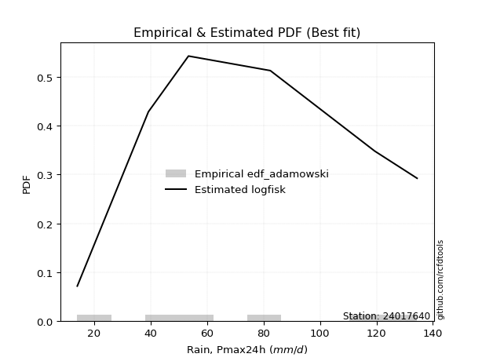</img>

</div>


## C. Best fit & Estimate extreme values for specific return periods - Tr

Best fit in probability distribution analysis means finding the theoretical distribution (like Normal, Poisson, Exponential) that most accurately mirrors your real-world data´s patterns (shape, center, spread) for better predictions, using methods like visual checks (Q-Q plots), goodness-of-fit tests (Kolmogorov-Smirnov, Chi-Squared), and information criteria (AIC) to score and select the simplest, most representative model.


### 1. Best fit (ordered by delta Δ)

<div align="center">

|   id |   station | empirical_dist   | p_dist   |     delta |   deltao | eval   |   fit |   n |   best_fit |   best_fit_sort |
|-----:|----------:|:-----------------|:---------|----------:|---------:|:-------|------:|----:|-----------:|----------------:|
|    0 |  24017640 | edf_gringorten   | logfisk  | 0.0651806 | 0.530386 | Δo > Δ |     1 |   6 |          1 |               1 |
|    1 |  24017640 | edf_cunnane      | logfisk  | 0.0662347 | 0.530386 | Δo > Δ |     1 |   6 |          1 |               2 |
|    2 |  24017640 | edf_blom         | logfisk  | 0.0681329 | 0.530386 | Δo > Δ |     1 |   6 |          1 |               3 |
|    3 |  24017640 | edf_hazen        | logfisk  | 0.070666  | 0.530386 | Δo > Δ |     1 |   6 |          1 |               4 |
|    4 |  24017640 | edf_tukey        | logfisk  | 0.0721312 | 0.530386 | Δo > Δ |     1 |   6 |          1 |               5 |
|    5 |  24017640 | edf_filliben     | logfisk  | 0.0740951 | 0.530386 | Δo > Δ |     1 |   6 |          1 |               6 |
|    6 |  24017640 | edf_beard        | logfisk  | 0.0750185 | 0.530386 | Δo > Δ |     1 |   6 |          1 |               7 |
|    7 |  24017640 | edf_jenkinson    | logfisk  | 0.0750185 | 0.530386 | Δo > Δ |     1 |   6 |          1 |               8 |
|    8 |  24017640 | edf_chegodayev   | logfisk  | 0.0762431 | 0.530386 | Δo > Δ |     1 |   6 |          1 |               9 |
|    9 |  24017640 | edf_adamowski    | logfisk  | 0.0822527 | 0.530386 | Δo > Δ |     1 |   6 |          1 |              10 |
|   10 |  24017640 | edf_weibull      | logf     | 0.109616  | 0.530386 | Δo > Δ |     1 |   6 |          1 |              11 |
|   11 |  24017640 | edf_california   | ncf      | 0.115956  | 0.530386 | Δo > Δ |     1 |   6 |          1 |              12 |

</div>

:file_folder:Tables: [bestfit_24017640.csv](table/bestfit_24017640.csv) | [extreme_24017640.csv](table/extreme_24017640.csv)


### 2. Extreme values

In hydrology, a return period (or recurrence interval $Tr$) is the statistical average time between extreme events like floods or droughts of a specific magnitude, indicating how rare an event is, with a 100-year flood, for example, having a 1% chance of occurring in any given year, not that it happens exactly every century. It is a key tool for infrastructure design (like bridges or dams) and risk assessment, calculated from historical data to determine the probability of future events, although it is important to remember it is statistical average, and events can cluster or be missed.

> risk_rate: assuming the return period as the project useful life.

|   id |      tr |   prob_l |     prob_g |      alpha |   betaprime |     chi2 |   crystalball |   erlang |    expon |   exponnorm |        f |   fatiguelife |     fisk |    gamma |   genexpon |   genlogistic |   gibrat |   gompertz |   gumbel_l |   gumbel_r |   halflogistic |   halfnorm |   hypsecant |   invgamma |   invgauss |   invweibull |   johnsonsu |   kstwobign |   laplace |   laplace_asymmetric |   loggamma |   logistic |   lognorm |   maxwell |   mielke |    moyal |   nakagami |      ncf |      nct |    norm |   pearson3 |   rayleigh |     rice |        t |   truncnorm |     wald |   weibull_min |   logalpha |   logbetaprime |     logchi2 |   logcrystalball |   logerlang |    logexpon |   logexponnorm |     logf |   logfatiguelife |   logfisk |   loggenexpon |   loggenlogistic |   loggibrat |   loggompertz |   loggumbel_l |   loggumbel_r |   loghalflogistic |   loghalfnorm |   loghypsecant |   loginvgamma |   loginvgauss |   loginvweibull |   logjohnsonsu |   logkstwobign |   loglaplace |   loglaplace_asymmetric |   logloggamma |   loglogistic |     loglognorm |   logmaxwell |   logmielke |   logmoyal |   lognakagami |   logncf |   lognct |   logpearson3 |   lograyleigh |   logrice |     logt |   logtruncnorm |    logwald |   logweibull_min |   station |   n |   risk_rate |
|-----:|--------:|---------:|-----------:|-----------:|------------:|---------:|--------------:|---------:|---------:|------------:|---------:|--------------:|---------:|---------:|-----------:|--------------:|---------:|-----------:|-----------:|-----------:|---------------:|-----------:|------------:|-----------:|-----------:|-------------:|------------:|------------:|----------:|---------------------:|-----------:|-----------:|----------:|----------:|---------:|---------:|-----------:|---------:|---------:|--------:|-----------:|-----------:|---------:|---------:|------------:|---------:|--------------:|-----------:|---------------:|------------:|-----------------:|------------:|------------:|---------------:|---------:|-----------------:|----------:|--------------:|-----------------:|------------:|--------------:|--------------:|--------------:|------------------:|--------------:|---------------:|--------------:|--------------:|----------------:|---------------:|---------------:|-------------:|------------------------:|--------------:|--------------:|---------------:|-------------:|------------:|-----------:|--------------:|---------:|---------:|--------------:|--------------:|----------:|---------:|---------------:|-----------:|-----------------:|----------:|----:|------------:|
|    0 |    2    | 0.5      | 0.5        |    45.6604 |     65.4522 |  25.426  |        73.8   |  72.0804 |  55.4502 |     73.7923 |  63.8352 |       14.0003 |  67.731  |  72.6207 |    55.3742 |       66.3563 |  60.9388 |    69.8688 |    80.839  |    66.761  |        63.2615 |    65.0293 |     73.8    |    69.5299 |    67.3538 |      66.3443 |     73.801  |     65.6156 |    73.8   |              64.9484 |    56.5671 |    73.8    |    58.172 |   70.1355 |   72.177 |  64.4885 |    67.9099 |  65.6656 |  73.7898 |  73.8   |    72.9795 |    68.8358 |  70.5735 |  73.8011 |      73.8   |  59.9109 |       50.5345 |    55.951  |        53.3097 |     23.0818 |          58.1721 |     56.384  |     37.575  |        58.1725 |  57.4384 |          58.1416 |   62.9231 |       42.7413 |          inf     |     46.2075 |       62.9056 |       65.986  |       51.2834 |           48.1689 |       49.7182 |        58.172  |       57.3807 |       55.7468 |         48.9473 |        134.384 |        48.5236 |      58.172  |                 67.6096 |       75.3057 |       58.172  |  14.0585       |      54.4776 |     3.93397 |    49.2387 |       39.4554 |  57.4012 |   57.915 |       63.734  |       53.2245 |   57.0121 |  58.1719 |        57.2743 |    45.3632 |          66.9209 |  24017640 |   6 |    0.75     |
|    1 |    2.33 | 0.570815 | 0.429185   |    54.3471 |     73.6002 |  29.9722 |        81.446 |  79.7544 |  64.5829 |     81.4383 |  72.104  |       15.9316 |  75.4403 |  80.2402 |    64.4902 |       74.2075 |  64.812  |    78.1311 |    87.4912 |    73.8459 |        70.5459 |    73.2814 |     79.9191 |    77.2181 |    75.1905 |      74.1977 |     81.4505 |     73.5646 |    78.427 |              71.9005 |    65.1654 |    80.5367 |    66.707 |   78.0792 |   81.413 |  71.1953 |    75.0168 |  73.9851 |  81.4367 |  81.446 |    80.6467 |    76.897  |  78.3988 |  81.4467 |      81.446 |  64.9245 |       65.1109 |    64.4725 |        61.392  |     27.4827 |          66.707  |     64.9489 |     46.7058 |        66.7075 |  66.0422 |          66.6504 |   71.4469 |       52.2424 |          inf     |     49.5256 |       71.2402 |       74.3327 |       58.2198 |           54.8796 |       57.6346 |        64.9079 |       66.0684 |       64.5385 |         57.33   |        134.397 |        57.8083 |      63.1968 |                 74.7404 |       84.1207 |       65.6297 |  14.6481       |      62.8044 |     3.93397 |    55.5213 |       39.9752 |  66.112  |   66.481 |       72.6203 |       61.489  |   65.6455 |  66.7068 |        61.648  |    49.6239 |          75.0588 |  24017640 |   6 |    0.729209 |
|    2 |    5    | 0.8      | 0.2        |   121.705  |    109.108  |  57.9096 |       109.861 | 109.101  | 110.244  |    109.858  | 108.781  |       56.9512 | 109.97   | 109.34   |   110.068  |      108.309  |  87.1109 |   109.73   |   108.981  |   104.626  |       103.506  |   108.178  |    104.464  |   108.299  |   108.161  |     108.317  |    109.878  |    107.33   |   101.561 |             106.659  |   111.436  |   106.548  |   110.951 |  109.345  |  112.133 | 102.262  |   107.27   | 109.744  | 109.857  | 109.861 |   109.601  |   109.17   | 109.185  | 109.86   |     109.861 |  92.9905 |      165.205  |   111.325  |       107.142  |     75.812  |         110.951  |    110.911  |    138.581  |       110.951  | 111.304  |         110.774  |  116.685  |      128.549  |          inf     |     73.8279 |      108.089  |      109.218  |      101.024  |           99.0187 |      107.657  |       100.732  |      113.232  |      113.78   |        113.931  |        134.4   |       121.613  |      95.6292 |                103.662  |      111.536  |      104.561  |   5.21194e+139 |     109.931  |     3.93397 |    96.8363 |       54.435  | 112.631  |  111.178 |      112.26   |      109.586  |  111.487  | 110.95   |        83.8876 |    82.0251 |         108.746  |  24017640 |   6 |    0.67232  |
|    3 |   10    | 0.9      | 0.1        |   245.458  |    137.556  |  87.6798 |       128.71  | 129.296  | 151.695  |    128.714  | 138.632  |      113.589  | 141.056  | 129.333  |   151.442  |      136.08   | 112.529  |   130.203  |   120.946  |   129.696  |       130.879  |   134.001  |    124.064  |   131.339  |   133.686  |     136.106  |    128.736  |    133.038  |   122.561 |             138.212  |   160.566  |   125.704  |   155.492 |  131.348  |  125.872 | 129.31   |   132.195  | 137.752  | 128.712  | 128.71  |   129.21   |   132.181  | 130.655  | 128.708  |     128.71  | 122.775  |      290.583  |   162.817  |       159.622  |    214.191  |         155.492  |    159.513  |    371.942  |       155.493  | 157.806  |         155.232  |  167.458  |      266.662  |          inf     |    116.377  |      137.295  |      135.311  |      158.26   |          161.647  |      170.94   |       143.08   |      164.049  |      169.157  |        199.328  |        134.4   |       214.238  |     139.282  |                137.621  |      123.073  |      147.344  | inf            |     163.013  |     3.93397 |   157.17   |       98.018  | 161.474  |  156.595 |      143.839  |      165.46   |  158.973  | 155.491  |       101.864  |   139.819  |         133.677  |  24017640 |   6 |    0.651322 |
|    4 |   15    | 0.933333 | 0.0666667  |   368.769  |    153.319  | 106.23   |       138.117 | 139.593  | 175.941  |    138.126  | 155.275  |      150.631  | 160.371  | 139.517  |   175.645  |      151.747  | 130.061  |   140.043  |   126.365  |   143.84   |       146.369  |   147.439  |    135.25   |   143.642  |   147.606  |     151.784  |    138.147  |    146.686  |   134.846 |             156.669  |   193.211  |   136.141  |   184.016 |  142.638  |  130.491 | 145.007  |   145.298  | 153.032  | 138.122  | 138.117 |   139.117  |   144.037  | 141.581  | 138.114  |     138.117 | 141.902  |      377.577  |   197.941  |       196.533  |    405.189  |         184.016  |    191.712  |    662.66   |       184.016  | 187.998  |         183.722  |  203.886  |      399.35   |          inf     |    159.292  |      153.179  |      149.097  |      203.873  |          213.316  |      217.44   |       174.808  |      198.202  |      207.473  |        273.291  |        134.4   |       289.366  |     173.549  |                162.433  |      126.871  |      177.621  | inf            |     199.532  |     3.93397 |   208.179  |      144.618  | 193.673  |  185.864 |      160.901  |      204.593  |  189.909  | 184.014  |       110.326  |   196.926  |         146.776  |  24017640 |   6 |    0.644736 |
|    5 |   20    | 0.95     | 0.05       |   491.971  |    164.232  | 119.76   |       144.277 | 146.415  | 193.145  |    144.289  | 166.825  |      178.056  | 174.814  | 146.261  |   192.817  |      162.716  | 143.814  |   146.327  |   129.738  |   153.743  |       157.222  |   156.399  |    143.141  |   152.009  |   157.168  |     162.762  |    144.31   |    155.88   |   143.562 |             169.765  |   218.329  |   143.355  |   205.473 |  150.13   |  132.813 | 156.124  |   154.059  | 163.514  | 144.284  | 144.277 |   145.648  |   151.917  | 148.799  | 144.274  |     144.277 | 156.155  |      445.048  |   225.428  |       225.975  |    643.121  |         205.473  |    216.441  |    998.268  |       205.474  | 210.9    |         205.165  |  233.598  |      527.886  |          inf     |    203.766  |      164.03   |      158.379  |      243.429  |          259.071  |      255.275  |       201.337  |      224.676  |      237.701  |        340.87   |        134.4   |       354.316  |     202.861  |                182.705  |      128.762  |      202.112  | inf            |     228.179  |     3.93397 |   254.031  |      190.657  | 218.327  |  207.968 |      172.46   |      235.598  |  213.41   | 205.472  |       115.279  |   254.18   |         155.57   |  24017640 |   6 |    0.641514 |
|    6 |   25    | 0.96     | 0.04       |   615.131  |    172.571  | 130.429  |       148.811 | 151.478  | 206.489  |    148.827  | 175.661  |      199.846  | 186.509  | 151.265  |   206.136  |      171.165  | 155.279  |   150.868  |   132.138  |   161.372  |       165.583  |   163.065  |    149.248  |   158.331  |   164.439  |     171.218  |    148.846  |    162.766  |   150.322 |             179.922  |   239.006  |   148.874  |   222.853 |  155.693  |  134.218 | 164.741  |   160.585  | 171.472  | 148.82   | 148.811 |   150.478  |   157.772  | 154.139  | 148.808  |     148.811 | 167.571  |      500.558  |   248.343  |       250.864  |    924.51   |         222.853  |    236.77   |   1371.77   |       222.853  | 229.56   |         222.538  |  259.219  |      653.119  |          inf     |    250.196  |      172.238  |      165.334  |      279.055  |          300.912  |      287.637  |       224.601  |      246.591  |      263.042  |        404.116  |        134.4   |       412.348  |     228.966  |                200.156  |      129.893  |      223.103  | inf            |     252.075  |     3.93397 |   296.411  |      235.485  | 238.551  |  225.921 |      181.135  |      261.639  |  232.572  | 222.851  |       118.536  |   311.831  |         162.146  |  24017640 |   6 |    0.639603 |
|    7 |   50    | 0.98     | 0.02       |  1230.73   |    197.923  | 164.354  |       161.796 | 166.167  | 247.939  |    161.823  | 202.568  |      269.759  | 226.033  | 165.772  |   247.511  |      197.193  | 195.694  |   163.462  |   138.653  |   184.87   |       191.347  |   182.441  |    168.182  |   177.241  |   186.375  |     197.266  |    161.837  |    182.988  |   171.323 |             211.475  |   310.453  |   165.735  |   281.186 |  171.825  |  137.163 | 191.492  |   179.569  | 195.406  | 161.811  | 161.796 |   164.414  |   174.769  | 169.541  | 161.793  |     161.796 | 204.845  |      689.995  |   329.399  |       341.162  |   2914.11   |         281.186  |    306.847  |   3681.73   |       281.186  | 292.854  |         280.893  |  356.253  |     1245.17   |          inf     |    515.863  |      196.745  |      185.791  |      425.034  |          477.289  |      406.923  |       315.244  |      323.098  |      353.54   |        682.671  |        134.4   |       643.725  |     333.483  |                265.725  |      132.151  |      301.732  | inf            |     336.493  |     3.93397 |   478.535  |      441.178  | 307.99   |  286.476 |      206.579  |      354.707  |  297.636  | 281.184  |       125.825  |   607.831  |         181.435  |  24017640 |   6 |    0.63583  |
|    8 |   75    | 0.986667 | 0.0133333  |  1846.25   |    212.452  | 184.643  |       168.764 | 174.166  | 272.186  |    168.796  | 218.003  |      311.864  | 251.725  | 173.666  |   271.713  |      212.321  | 222.99   |   169.967  |   141.947  |   198.529  |       206.323  |   192.988  |    179.247  |   187.902  |   198.847  |     212.406  |    168.808  |    194.114  |   183.607 |             229.932  |   357.758  |   175.473  |   318.548 |  180.595  |  138.303 | 207.135  |   189.904  | 208.953  | 168.782  | 168.764 |   171.956  |   184.015  | 177.865  | 168.76   |     168.764 | 227.782  |      812.287  |   384.565  |       404.419  |   5771.02   |         318.547  |    353.115  |   6559.45   |       318.547  | 333.882  |         318.298  |  428.071  |     1799.94   |          inf     |    840.975  |      210.484  |      197.081  |      542.793  |          624.08   |      491.507  |       384.318  |      374.372  |      415.761  |        925.895  |        134.4   |       822.484  |     415.529  |                313.632  |      132.902  |      359.21   | inf            |     393.713  |   132.393   |   633.227  |      623.009  | 353.634  |  325.481 |      220.484  |      418.575  |  339.838  | 318.545  |       128.523  |   916.54   |         192.046  |  24017640 |   6 |    0.634587 |
|    9 |  100    | 0.99     | 0.01       |  2461.75   |    222.657  | 199.199  |       173.476 | 179.622  | 289.389  |    173.513  | 228.846  |      342.16   | 271.26   | 179.05   |   288.885  |      223.028  | 244.135  |   174.268  |   144.102  |   208.196  |       216.923  |   200.173  |    187.095  |   195.328  |   207.567  |     223.121  |    173.523  |    201.737  |   192.323 |             243.028  |   394.008  |   182.349  |   346.593 |  186.569  |  138.971 | 218.234  |   196.943  | 218.398  | 173.497  | 173.476 |   177.082  |   190.315  | 183.514  | 173.472  |     173.476 | 244.505  |      904.01   |   427.595  |       454.667  |   9411.2    |         346.593  |    388.509  |   9881.51   |       346.593  | 364.908  |         346.392  |  487.333  |     2330.29   |          inf     |   1228.01   |      220.003  |      204.834  |      645.367  |          754.513  |      558.989  |       442.308  |      413.973  |      464.585  |       1148.77   |        134.4   |       972.852  |     485.711  |                352.774  |      133.277  |      406.269  | inf            |     438.162  |   132.901   |   772.436  |      788.113  | 388.454  |  354.862 |      229.941  |      468.554  |  371.755  | 346.59   |       129.929  |  1236.51   |         199.32   |  24017640 |   6 |    0.633968 |
|   10 |  200    | 0.995    | 0.005      |  4923.68   |    246.962  | 234.726  |       184.166 | 192.138  | 330.839  |    184.214  | 254.666  |      416.319  | 323.316  | 191.393  |   330.259  |      248.768  | 301.663  |   183.731  |   148.787  |   231.436  |       242.407  |   216.607  |    206.004  |   212.842  |   228.218  |     248.883  |    184.217  |    219.295  |   213.324 |             274.581  |   491.307  |   198.842  |   419.704 |  200.237  |  140.309 | 244.973  |   213.031  | 240.672  | 184.192  | 184.166 |   188.785  |   204.729  | 196.383  | 184.161  |     184.166 | 286.161  |     1141.37   |   546.128  |       596.752  |  30947.9    |         419.704  |    483.273  |  26521.3    |       419.703  | 446.635  |         419.684  |  665.125  |     4302.97   |          inf     |   3439.76   |      242.248  |      222.754  |      978.428  |         1190.78   |      750.225  |       620.53   |      521.491  |      600.159  |       1929.45   |        134.4   |      1432.18   |     707.428  |                468.339  |      133.839  |      545.842  | inf            |     559.653  |   133.663   |  1246.79   |     1346.37   | 481.319  |  431.835 |      251.417  |      606.521  |  455.817  | 419.7    |       132.115  |  2606.95   |         216.095  |  24017640 |   6 |    0.633042 |
|   11 |  250    | 0.996    | 0.004      |  6154.64   |    254.718  | 246.281  |       187.432 | 196.001  | 344.183  |    187.485  | 262.9    |      440.487  | 341.723  | 195.201  |   343.579  |      257.044  | 322.305  |   186.544  |   150.165  |   238.908  |       250.599  |   221.662  |    212.091  |   218.387  |   234.774  |     257.164  |    187.485  |    224.729  |   220.084 |             284.739  |   525.845  |   204.137  |   444.985 |  204.445  |  140.69  | 253.581  |   217.977  | 247.716  | 187.461  | 187.432 |   192.383  |   209.166  | 200.329  | 187.428  |     187.432 | 299.942  |     1222.58   |   589.21   |       649.609  |  45543      |         444.985  |    516.835  |  36444.2    |       444.984  | 475.16   |         445.045  |  734.969  |     5230.46   |          inf     |   4977.72   |      249.223  |      228.32   |     1118.48   |         1378.92   |      821.306  |       691.984  |      560.057  |      649.766  |       2279.46   |        134.4   |      1614.27   |     798.462  |                513.072  |      133.952  |      600.125  | inf            |     603.443  |   133.816   |  1454.56   |     1586.09   | 514.094  |  458.57  |      257.957  |      656.672  |  485.146  | 444.981  |       132.564  |  3336.57   |         221.294  |  24017640 |   6 |    0.632858 |
|   12 |  500    | 0.998    | 0.002      | 12309.4    |    278.644  | 282.478  |       197.12  | 207.565  | 385.634  |    197.184  | 288.283  |      516.304  | 404.675  | 206.597  |   384.953  |      282.728  | 393.64   |   194.672  |   154.115  |   262.097  |       276.028  |   236.736  |    230.998  |   235.39   |   254.907  |     282.87   |    197.177  |    241.012  |   241.085 |             316.291  |   644.085  |   220.558  |   529.269 |  216.999  |  141.79  | 280.32   |   232.71   | 269.262  | 197.154  | 197.12  |   203.11   |   222.404  | 212.063  | 197.114  |     197.12  | 343.76   |     1489.27   |   740.422  |       839.658  | 152453      |         529.268  |    631.472  |  97813.7    |       529.267  | 571.152  |         529.659  | 1001.75   |     9537.41   |          134.18  |  17853.3    |      270.38   |      245.056  |     1694.17   |         2174.07   |     1075.77   |       970.786  |      693.547  |      825.004  |       3824.2    |        134.4   |      2310.67   |    1162.94   |                681.15   |      134.177  |      805.263  | inf            |     755.553  |   134.121   |  2347.78   |     2577.37   | 625.65   |  548.1   |      277.181  |      832.328  |  583.779  | 529.263  |       133.474  |  7312.32   |         236.903  |  24017640 |   6 |    0.632489 |
|   13 |  750    | 0.998667 | 0.00133333 | 18464.1    |    292.547  | 303.838  |       202.501 | 214.059  | 409.88   |    202.573  | 303.013  |      561.099  | 445.964  | 212.993  |   409.156  |      297.743  | 440.817  |   199.054  |   156.227  |   275.654  |       290.893  |   245.157  |    242.058  |   245.21   |   266.544  |     297.897  |    202.561  |    250.16   |   253.369 |             334.749  |   721.536  |   230.152  |   582.805 |  224.021  |  142.399 | 295.961  |   240.933  | 281.66   | 202.539  | 202.501 |   209.106  |   229.807  | 218.601  | 202.495  |     202.501 | 370.033  |     1655.17   |   842.417  |       971.452  | 310611      |         582.805  |    706.362  | 174267      |       582.803  | 632.79   |         583.452  | 1200.42   |    13508.5    |          134.255 |  41548.6    |      282.43   |      254.498  |     2159.62   |         2837.07   |     1250.84   |      1183.39   |      782.126  |      944.026  |       5174.94   |        134.4   |      2826.46   |    1449.05   |                803.953  |      134.251  |      956.186  | inf            |     856.78   |   134.223   |  3106.6    |     3373.29   | 698.233  |  605.265 |      287.701  |      950.3    |  647.051  | 582.799  |       133.781  | 11704.8    |         245.692  |  24017640 |   6 |    0.632366 |
|   14 | 1000    | 0.999    | 0.001      | 24618.9    |    302.379  | 319.064  |       206.206 | 218.558  | 427.084  |    206.284  | 313.42   |      593.053  | 477.467  | 217.424  |   426.327  |      308.394  | 476.92   |   202.017  |   157.648  |   285.27   |       301.438  |   250.973  |    249.905  |   252.132  |   274.746  |     308.556  |    206.268  |    256.497  |   262.085 |             347.844  |   780.494  |   236.956  |   622.781 |  228.875  |  142.822 | 307.058  |   246.608  | 290.375  | 206.246  | 206.206 |   213.251  |   234.923  | 223.109  | 206.2    |     206.206 | 388.932  |     1777.21   |   921.537  |      1075.5    | 515643      |         622.78   |    763.276  | 262525      |       622.778  | 679.129  |         623.641  | 1364.76   |    17271.7    |          134.293 |  79301      |      290.848  |      261.057  |     2565.4    |         3426.63   |     1388.11   |      1361.91   |      850.119  |     1036.73   |       6413.38   |        134.4   |      3249.86   |    1693.8    |                904.289  |      134.289  |     1080.06   | inf            |     934.565  |   134.274   |  3789.5    |     4058.62   | 753.253  |  648.088 |      294.859  |     1041.46   |  694.581  | 622.774  |       133.935  | 16418.3    |         251.79   |  24017640 |   6 |    0.632305 |

<div align="center">

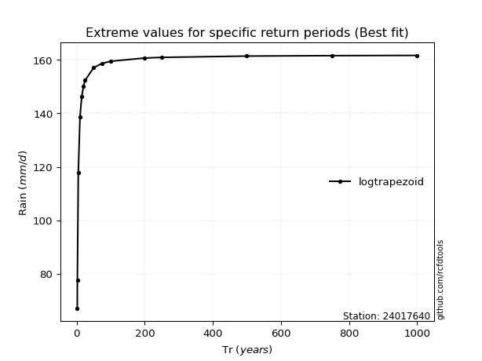</img>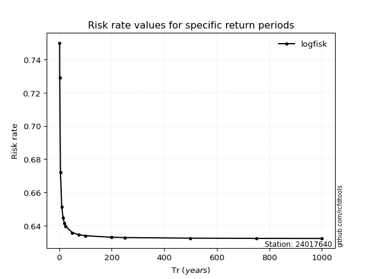</img>

</div>


<sub>**APP DISCLAIMER**: NO WARRANTY - This software is provided by [github.com/rcfdtools](https://github.com/rcfdtools) "as is", without any express or implied warranty, including warranties of merchantability, fitness for a particular purpose, or non-infringement. There is no guarantee that the software will be error-free or operate without interruption. LIMITATION OF LIABILITY - Neither the authors nor copyright holders will be liable for claims or damages arising from the software or its use. You are responsible for determining if the software is appropriate for your use and assume all associated risks, including errors, legal compliance, and data loss. NO PROFESSIONAL ADVICE - The software provides general information and does not offer professional advice. It should not replace consultation with professional advisors.</sub>