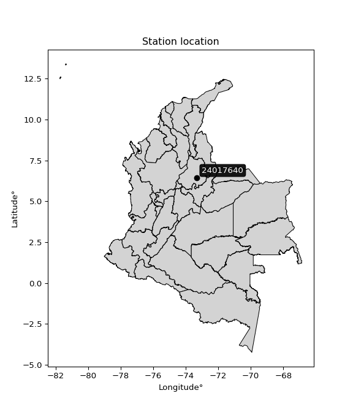

<div align="center">


</div>

# PMP Station (Rain, Pmax24h): 24017640

Probable Maximum Precipitation (PMP) is the greatest amount of rainfall for a specific duration that is meteorologically possible for a given location, acting as a "worst-case" scenario for extreme storms, crucial for designing safety-critical infrastructure like bridges, river deviations, dams, spillways, and nuclear plants to prevent catastrophic failure. PMP is calculated by hydrologists using meteorological data to determine the upper limit of extreme rainfall, often leading to the Probable Maximum Flood (PMF) for flood control design, and is increasingly being studied for climate change impacts. Probable Maximum Precipitation (PMP) is the theoretical upper limit of rainfall, a deterministic estimate for extreme events, while probability distributions (like GEV, Gumbel) describe the likelihood and frequency of various precipitation amounts, including rare ones, showing how often events occur, with PMP representing the extreme end of these distributions, used for critical infrastructure design to ensure safety against the worst conceivable weather, unlike standard statistical forecasts which cover typical probabilities.

The most common probability distributions in hydrology, used for analyzing floods, rainfall, and streamflow, include the Normal, Log-Normal, Gumbel, Gamma (including Log-Pearson Type III), and Generalized Extreme Value (GEV) distributions, often chosen based on the data´s skewness and whether modeling extremes or general conditions, with Gumbel and GEV popular for extreme events like floods, while the Normal distribution serves as a baseline, though often requiring transformations for skewed hydrological data. These distributions help in designing water infrastructure, managing water resources, and forecasting hydrologic events.

> Hydrological data often isn´t perfectly normal (it´s skewed), so different distributions are needed for different applications, such as: **Flood Frequency Analysis**: Using Gumbel, GEV, or Log-Pearson Type III for predicting extreme flood magnitudes and their return periods, **Rainfall Analysis**: Normal for annual totals, but Log-Normal, Weibull, or GEV for intensity or extreme daily rainfall, **Streamflow Modeling**: Gamma and Log-Normal for maximum flows, GEV for minimum flows, and Kappa for daily flows.

<div align="center">

</img>

</div>


## A. General information


### 1. General running parameters

• app_version: _v20260113_. • runtime: _2026-01-13 16:28:34.738620_. • Python version: _3.14.0_. • SciPy version: _1.16.3_. • Pandas version: _2.3.3_. • NumPy version: _2.3.5_. • Stations dataset (station_dataset_file): _dataset/pmax24h_in/automatic_colombia_2003_2025.csv_. • Stations catalog (station_catalog_file): _dataset/CNE.xls_. • Minimum year to eval til year_max (date_min): _1900_. • Maximum year to eval since year_min (date_max): _2025_. • Creates, save and include plots into reports (create_plot): _False_. • Plot only fit distributions with Δo > Δ (plot_only_fit): _True_. • Plot only simple graphs avoiding multiple CDFs and multiple Extreme values plots (plot_only_simple): _True_. • Eval low extreme values, if False, evaluates high extreme values (low_extreme): _False_. • Eval every SciPy distribution as logarithmic (pdist_logarithmic_on): _True_. • Standard deviation normalized (ddof): _1.0_. • Return periods to eval in years (Tr): _[2, 2.33, 5, 10, 15, 20, 25, 50, 75, 100, 200, 250, 500, 750, 1000]_. • Minimum data sample per station, 0 means any (minimum_sample): _5_. • Z-Score maximum threshold to adjust a value, 0 means disable (zscore_max): _3.5_. • Z-Score minimum threshold to adjust a value, 0 means disable (zscore_min): _-2.5_. • Avoid zeros, e.g. rain = 0 (avoid_zeros): _True_. • Avoid null values (avoid_nans): _True_. 

:file_folder:Table: [dataset.csv](../../dataset/pmax24h_in/automatic_colombia_2003_2025.csv)

> Delta Degrees of Freedom (DDOF): is a parameter used in the formulas for calculating variance and standard deviation. When ddof=0, the divisor is $N$ (the total number of observations) and this is used when your data set is the entire population. When ddof=1, the divisor is $N-1$ and this is used when your data set is a sample drawn from a larger population. Using $N-1$ provides an unbiased estimate of the population variance (known as Bessel´s correction).


### 2. Station info and location

|   id |   CODIGO | NOMBRE                    | CATEGORIA    | TECNOLOGIA                              | ESTADO   | FECHA_INSTALACION   |   FECHA_SUSPENSION |   ALTITUD |   LATITUD |   LONGITUD | DEPARTAMENTO   | MUNICIPIO   | AREA_OPERATIVA                         | ENTIDAD                                                     | AREA_HIDROGRAFICA   | ZONA_HIDROGRAFICA   | SUBZONA_HIDROGRAFICA   | CORRIENTE   | Catalogo   |   Version |
|-----:|---------:|:--------------------------|:-------------|:----------------------------------------|:---------|:--------------------|-------------------:|----------:|----------:|-----------:|:---------------|:------------|:---------------------------------------|:------------------------------------------------------------|:--------------------|:--------------------|:-----------------------|:------------|:-----------|----------:|
|    0 | 24017640 | LA CEIBA - AUT [24017640] | Limnigráfica | Automática con Telemetría, Convencional | Activa   | 15/10/1979          |                nan |       724 |   6.44889 |   -73.3069 | Santander      | Socorro     | Area Operativa 08 - Santanderes-Arauca | INSTITUTO DE HIDROLOGIA METEOROLOGIA Y ESTUDIOS AMBIENTALES | Magdalena Cauca     | Sogamoso            | Río Suárez             | Suarez      | CNE_IDEAM  |  20251226 |

<div align="center">

Dynamic map: [:earth_americas:Google](http://maps.google.com/maps?q=6.448888889,-73.30694444) [:earth_americas:OSM](https://www.openstreetmap.org/#map=18/6.448888889/-73.30694444&layers=P) [:earth_americas:Bing](https://www.bing.com/maps?cp=6.448888889~-73.30694444&lvl=18) [:earth_americas:Apple](https://maps.apple.com/frame?center=6.448888889%2C-73.30694444&span=0.003%2C0.006)

</div>


<div align="center">

```geojson
{
  "type": "Feature",
  "geometry": {
    "type": "Point", 
    "coordinates": [-73.30694444, 6.448888889]
  }, 
  "properties": {
    "Name": "24017640"
  }
}
```

</div>


### 3. Discrete values table and plot

<div align="center">

|               |          0 |           1 |           2 |         3 |          4 |          5 |           6 |
|:--------------|-----------:|------------:|------------:|----------:|-----------:|-----------:|------------:|
| Date          | 2019       | 2020        | 2021        | 2022      | 2023       | 2024       | 2025        |
| Value         |  119.4     |   82.4      |   53.4      |   14      |   39.2     |  134.4     |   65.8      |
| Value_initial |  119.4     |   82.4      |   53.4      |   14      |   39.2     |  134.4     |   65.8      |
| count         |    7       |    7        |    7        |    7      |    7       |    7       |    7        |
| mean          |   72.6571  |   72.6571   |   72.6571   |   72.6571 |   72.6571  |   72.6571  |   72.6571   |
| std           |   42.9533  |   42.9533   |   42.9533   |   42.9533 |   42.9533  |   42.9533  |   42.9533   |
| zscore        |    1.08823 |    0.226825 |   -0.448328 |   -1.3656 |   -0.77892 |    1.43744 |   -0.159642 |


</div>


> The initial value (value_initial) correspond to the initial obtained or null completed value, and value (value) is adjusted only when the initial value is outside the valid range (outlier) definite through the Z-Score value. If Z-Score is active, values out of range or outliers are replaced with the station mean value. A Z-Score (or standard score) measures how many standard deviations a data point is from the mean of a dataset, indicating its relative position; positive scores mean above the mean, negative mean below, and a score of zero is exactly at the mean, allowing for comparison of values from different distributions. It´s calculated using the formula $z=(x–μ)/σ$, where $x$ is the data point, $μ$ is the mean, and $σ$ is the standard deviation, helping identify outliers and understand probability.
>
> <sub>**Note**: In this study, "completing" (filling gaps in) and "extending" (forecasting or lengthening the historical record) rainfall data series are avoided for certain critical analyses because they introduce artificial bias and uncertainty, which can distort the statistics of rare events (extremes), alter day-to-day variability, and compromise the integrity and homogeneity of the original data. Some reasons against Completing/Extending rainfall data are: **Distortion of Extremes and Variability**: The primary issue is that most gap-filling or extension methods rely on averaging or regression with nearby stations, which inherently smooths the data. Rainfall is highly variable in space and time, with a large percentage of zero values and occasional large storms. Infilling methods often underestimate the highest values and overestimate the lowest (zero) values, which severely distorts analyses focused on flood frequency, drought severity, and intensity-duration-frequency (IDF) curves, **Loss of Data Homogeneity**: Infilled or extended data are synthetic estimates, not actual measurements. Combining these estimates with observed data can violate the assumption of data homogeneity, which requires that the data properties do not change over time. Inhomogeneity can lead to incorrect conclusions about long-term trends or changes in climate patterns, **Propagation of Errors**: Errors and biases from the original data (e.g., wind-induced undercatch, instrument errors, site changes) or the data used for imputation can propagate through the analysis, leading to unreliable hydrological models and inaccurate predictions, **Compromised Statistical Integrity**: For statistical analyses, especially those involving the frequency of events, using artificial data can introduce time bias or autocorrelation that doesn´t exist in reality, making it difficult to assess the true probability of events, **Difficulty in Validation**: It is difficult to accurately validate the quality of filled or extended data, especially for past periods where ground-truth measurements are unavailable. The reliability of imputation techniques heavily depends on the density of the surrounding station network and the complexity of the local topography.</sub>


### 4. Active continuous probability distributions from SciPy (45 of 104 available)

A Probability Density Function (PDF) describes the relative likelihood of a continuous random variable falling within a specific range, where the total area under its curve equals 1, and the area over any interval gives the actual probability for that range. Unlike discrete probabilities (like rolling a die), a PDF shows density, not direct probability for a single point (which is zero), with higher points indicating higher likelihood, often visualized as a bell curve for normal distributions.

A log of a probability density function (log-PDF) is simply the logarithm of the PDF´s value, denoted as $log(f(x))$, useful for converting multiplication of probabilities into addition, improving numerical stability with tiny numbers, and connecting to information theory concepts like entropy. Instead of dealing with very small probabilities (e.g., 0.000001), log-PDFs use negative numbers (e.g., $log(0.00001) ≈ -11.51$ that are easier for computers to handle, preventing underflow errors and simplifying complex calculations. In this study, each active probability distribution from SciPy is also evaluated in the $log$ form.

[scipy.stats](https://docs.scipy.org/doc/scipy/reference/stats.html) is a Python´s powerful submodule within the SciPy library for comprehensive statistical analysis, offering over 130 probability distributions (like Normal, Poisson), functions for descriptive stats (mean, variance), hypothesis testing (t-tests, chi-square), random variable generation, and statistical tests, making it essential for data science, modeling, and research. It provides tools to explore, model, and draw conclusions from data efficiently, working seamlessly with NumPy.

<div align="center">

|   id | p_dist             |   n_parameter | fit_method   | label                                                                       | active   | ref                                                                                                        |
|-----:|:-------------------|--------------:|:-------------|:----------------------------------------------------------------------------|:---------|:-----------------------------------------------------------------------------------------------------------|
|    0 | alpha              |             3 | MLE          | Alpha                                                                       | True     | [:mortar_board:](https://docs.scipy.org/doc/scipy/reference/generated/scipy.stats.alpha.html)              |
|    1 | betaprime          |             4 | MLE          | Beta prime                                                                  | True     | [:mortar_board:](https://docs.scipy.org/doc/scipy/reference/generated/scipy.stats.betaprime.html)          |
|    2 | chi2               |             3 | MLE          | Chi²                                                                        | True     | [:mortar_board:](https://docs.scipy.org/doc/scipy/reference/generated/scipy.stats.chi2.html)               |
|    3 | crystalball        |             4 | MLE          | Crystalball                                                                 | True     | [:mortar_board:](https://docs.scipy.org/doc/scipy/reference/generated/scipy.stats.crystalball.html)        |
|    4 | dweibull           |             3 | MLE          | Double Weibull                                                              | True     | [:mortar_board:](https://docs.scipy.org/doc/scipy/reference/generated/scipy.stats.dweibull.html)           |
|    5 | erlang             |             3 | MLE          | Erlang                                                                      | True     | [:mortar_board:](https://docs.scipy.org/doc/scipy/reference/generated/scipy.stats.erlang.html)             |
|    6 | expon              |             2 | MLE          | Exponential                                                                 | True     | [:mortar_board:](https://docs.scipy.org/doc/scipy/reference/generated/scipy.stats.expon.html)              |
|    7 | exponnorm          |             3 | MLE          | Exponentially modified Normal                                               | True     | [:mortar_board:](https://docs.scipy.org/doc/scipy/reference/generated/scipy.stats.exponnorm.html)          |
|    8 | f                  |             4 | MLE          | F                                                                           | True     | [:mortar_board:](https://docs.scipy.org/doc/scipy/reference/generated/scipy.stats.f.html)                  |
|    9 | fatiguelife        |             3 | MLE          | Fatigue-life (Birnbaum-Saunders)                                            | True     | [:mortar_board:](https://docs.scipy.org/doc/scipy/reference/generated/scipy.stats.fatiguelife.html)        |
|   10 | fisk               |             3 | MLE          | Fisk                                                                        | True     | [:mortar_board:](https://docs.scipy.org/doc/scipy/reference/generated/scipy.stats.fisk.html)               |
|   11 | gamma              |             3 | MLE          | Gamma                                                                       | True     | [:mortar_board:](https://docs.scipy.org/doc/scipy/reference/generated/scipy.stats.gamma.html)              |
|   12 | genexpon           |             5 | MLE          | Generalized exponential                                                     | True     | [:mortar_board:](https://docs.scipy.org/doc/scipy/reference/generated/scipy.stats.genexpon.html)           |
|   13 | genlogistic        |             3 | MLE          | Generalized logistic                                                        | True     | [:mortar_board:](https://docs.scipy.org/doc/scipy/reference/generated/scipy.stats.genlogistic.html)        |
|   14 | gibrat             |             2 | MM           | Gibrat                                                                      | True     | [:mortar_board:](https://docs.scipy.org/doc/scipy/reference/generated/scipy.stats.gibrat.html)             |
|   15 | gompertz           |             3 | MLE          | Gompertz (or truncated Gumbel)                                              | True     | [:mortar_board:](https://docs.scipy.org/doc/scipy/reference/generated/scipy.stats.gompertz.html)           |
|   16 | gumbel_l           |             2 | MM           | Gumbel Left Skew                                                            | True     | [:mortar_board:](https://docs.scipy.org/doc/scipy/reference/generated/scipy.stats.gumbel_l.html)           |
|   17 | gumbel_r           |             2 | MM           | Gumbel Right Skew                                                           | True     | [:mortar_board:](https://docs.scipy.org/doc/scipy/reference/generated/scipy.stats.gumbel_r.html)           |
|   18 | halflogistic       |             2 | MM           | Half-logistic                                                               | True     | [:mortar_board:](https://docs.scipy.org/doc/scipy/reference/generated/scipy.stats.halflogistic.html)       |
|   19 | halfnorm           |             2 | MM           | Half Normal                                                                 | True     | [:mortar_board:](https://docs.scipy.org/doc/scipy/reference/generated/scipy.stats.halfnorm.html)           |
|   20 | hypsecant          |             2 | MM           | hyperbolic secant                                                           | True     | [:mortar_board:](https://docs.scipy.org/doc/scipy/reference/generated/scipy.stats.hypsecant.html)          |
|   21 | invgamma           |             3 | MLE          | Inverted gamma                                                              | True     | [:mortar_board:](https://docs.scipy.org/doc/scipy/reference/generated/scipy.stats.invgamma.html)           |
|   22 | invgauss           |             3 | MLE          | Inverse Gaussian                                                            | True     | [:mortar_board:](https://docs.scipy.org/doc/scipy/reference/generated/scipy.stats.invgauss.html)           |
|   23 | invweibull         |             3 | MLE          | Inverted Weibull                                                            | True     | [:mortar_board:](https://docs.scipy.org/doc/scipy/reference/generated/scipy.stats.invweibull.html)         |
|   24 | kappa4             |             4 | MLE          | Kappa 4                                                                     | True     | [:mortar_board:](https://docs.scipy.org/doc/scipy/reference/generated/scipy.stats.kappa4.html)             |
|   25 | kstwobign          |             2 | MLE          | Limiting distribution of scaled Kolmogorov-Smirnov two-sided test statistic | True     | [:mortar_board:](https://docs.scipy.org/doc/scipy/reference/generated/scipy.stats.kstwobign.html)          |
|   26 | laplace            |             2 | MM           | Laplace                                                                     | True     | [:mortar_board:](https://docs.scipy.org/doc/scipy/reference/generated/scipy.stats.laplace.html)            |
|   27 | laplace_asymmetric |             3 | MLE          | Asymmetric Laplace                                                          | True     | [:mortar_board:](https://docs.scipy.org/doc/scipy/reference/generated/scipy.stats.laplace_asymmetric.html) |
|   28 | loggamma           |             3 | MLE          | Log gamma                                                                   | True     | [:mortar_board:](https://docs.scipy.org/doc/scipy/reference/generated/scipy.stats.loggamma.html)           |
|   29 | logistic           |             2 | MM           | Logistic (or Sech-squared)                                                  | True     | [:mortar_board:](https://docs.scipy.org/doc/scipy/reference/generated/scipy.stats.logistic.html)           |
|   30 | lognorm            |             3 | MLE          | Log Normal                                                                  | True     | [:mortar_board:](https://docs.scipy.org/doc/scipy/reference/generated/scipy.stats.lognorm.html)            |
|   31 | maxwell            |             2 | MM           | Maxwell                                                                     | True     | [:mortar_board:](https://docs.scipy.org/doc/scipy/reference/generated/scipy.stats.maxwell.html)            |
|   32 | mielke             |             4 | MLE          | Mielke Beta-Kappa / Dagum                                                   | True     | [:mortar_board:](https://docs.scipy.org/doc/scipy/reference/generated/scipy.stats.mielke.html)             |
|   33 | moyal              |             2 | MM           | Moyal                                                                       | True     | [:mortar_board:](https://docs.scipy.org/doc/scipy/reference/generated/scipy.stats.moyal.html)              |
|   34 | nakagami           |             3 | MLE          | Nakagami                                                                    | True     | [:mortar_board:](https://docs.scipy.org/doc/scipy/reference/generated/scipy.stats.nakagami.html)           |
|   35 | ncf                |             5 | MLE          | Non-central F distribution                                                  | True     | [:mortar_board:](https://docs.scipy.org/doc/scipy/reference/generated/scipy.stats.ncf.html)                |
|   36 | nct                |             4 | MLE          | Non-central Student’s t                                                     | True     | [:mortar_board:](https://docs.scipy.org/doc/scipy/reference/generated/scipy.stats.nct.html)                |
|   37 | norm               |             2 | MM           | Normal                                                                      | True     | [:mortar_board:](https://docs.scipy.org/doc/scipy/reference/generated/scipy.stats.norm.html)               |
|   38 | pearson3           |             3 | MM           | Pearson type III                                                            | True     | [:mortar_board:](https://docs.scipy.org/doc/scipy/reference/generated/scipy.stats.pearson3.html)           |
|   39 | rayleigh           |             2 | MM           | Rayleigh                                                                    | True     | [:mortar_board:](https://docs.scipy.org/doc/scipy/reference/generated/scipy.stats.rayleigh.html)           |
|   40 | rice               |             3 | MLE          | Rice                                                                        | True     | [:mortar_board:](https://docs.scipy.org/doc/scipy/reference/generated/scipy.stats.rice.html)               |
|   41 | t                  |             3 | MLE          | Student’s t                                                                 | True     | [:mortar_board:](https://docs.scipy.org/doc/scipy/reference/generated/scipy.stats.t.html)                  |
|   42 | truncnorm          |             4 | MLE          | Truncated normal                                                            | True     | [:mortar_board:](https://docs.scipy.org/doc/scipy/reference/generated/scipy.stats.truncnorm.html)          |
|   43 | wald               |             2 | MM           | Wald                                                                        | True     | [:mortar_board:](https://docs.scipy.org/doc/scipy/reference/generated/scipy.stats.wald.html)               |
|   44 | weibull_min        |             3 | MLE          | Weibull minimum                                                             | True     | [:mortar_board:](https://docs.scipy.org/doc/scipy/reference/generated/scipy.stats.weibull_min.html)        |

</div>

> **n_parameter:** # arguments & localization & scale.
>
> **Fit methods:** (MLE) maximum likelihood, (MM) L-moments.
>
>**Inactive** (With the only purpose of prevent loops, zero divisions, infinite values, over high estimated values or horizontal trending for recurrence intervals estimations, the follow distributions were disabled.)**:** foldnorm, gennorm, norminvgauss, powernorm, powerlognorm, skewnorm, genextreme, anglit, arcsine, argus, beta, bradford, burr, burr12, cauchy, cosine, halfcauchy, foldcauchy, skewcauchy, wrapcauchy, dgamma, gengamma, exponweib, exponpow, truncexpon, gausshyper, genhalflogistic, genhyperbolic, geninvgauss, halfgennorm, johnsonsb, johnsonsu, kappa3, ksone, kstwo, loglaplace, levy, levy_l, levy_stable, ncx2, pareto, genpareto, truncpareto, lomax, powerlaw, rdist, rel_breitwigner, recipinvgauss, semicircular, studentized_range, trapezoid, triang, truncweibull_min, tukeylambda, uniform, loguniform, vonmises, vonmises_line, weibull_max, 


## B. Probability (PDF) vs. Empirical (EDF) distributions functions

A continuous probability distribution (CPD) describes probabilities for variables that can take any value within a range (like rain any time), unlike discrete variables with specific outcomes (like temperature). It uses a Probability Density Function (PDF), a curve where the total area under it equals 1, and the probability of the variable falling within an interval (a to b) is found by calculating the area under the curve between those points. A key feature is that the probability of hitting any single exact value is zero, so probabilities are always expressed for ranges, e.g., $P(a ≤ X ≤ b)$.

<div align="center">

Distributions parameters from station values
|    |   station | p_dist                |   n |              loc |           scale | shape                  | shape1             | shape2               | shape3   |
|---:|----------:|:----------------------|----:|-----------------:|----------------:|:-----------------------|:-------------------|:---------------------|:---------|
|  0 |  24017640 | alpha                 |   7 |     -0.0800739   |    32.7226      | 1.4546654290606634e-10 |                    |                      |          |
|  1 |  24017640 | betaprime             |   7 |    -28.0626      |  4438.64        | 6.035670713033895      | 266.97239062884887 |                      |          |
|  2 |  24017640 | chi2                  |   7 |    -19.2186      |     9.60012     | 9.570271184657397      |                    |                      |          |
|  3 |  24017640 | crystalball           |   7 |     72.6571      |    39.767       | 73.36970481331177      | 14737.93839565956  |                      |          |
|  4 |  24017640 | dweibull              |   7 |     74.6022      |    38.0367      | 1.6450010313638286     |                    |                      |          |
|  5 |  24017640 | erlang                |   7 |    -23.1397      |    18.205       | 5.248390603243056      |                    |                      |          |
|  6 |  24017640 | expon                 |   7 |     14           |    58.6571      |                        |                    |                      |          |
|  7 |  24017640 | exponnorm             |   7 |     65.3781      |    39.0967      | 0.1861801368225793     |                    |                      |          |
|  8 |  24017640 | f                     |   7 |    -20.361       |    92.9663      | 9.87575987784064       | 3229.4493128838176 |                      |          |
|  9 |  24017640 | fatiguelife           |   7 |     14           |     0.000314856 | 387.8832659052971      |                    |                      |          |
| 10 |  24017640 | fisk                  |   7 |    -71.3264      |   139.093       | 5.897225407865422      |                    |                      |          |
| 11 |  24017640 | gamma                 |   7 |    -19.2707      |    19.1766      | 4.79424534483556       |                    |                      |          |
| 12 |  24017640 | genexpon              |   7 |      8.5156      |     2.39308     | 0.013912738931780987   | 0.2028518254656523 | 0.006738641016861455 |          |
| 13 |  24017640 | genlogistic           |   7 |   -131.007       |    34.3421      | 214.86655246856412     |                    |                      |          |
| 14 |  24017640 | gibrat                |   7 |     42.32        |    18.4004      |                        |                    |                      |          |
| 15 |  24017640 | gompertz              |   7 |     14           |    65.8487      | 0.4838303475671022     |                    |                      |          |
| 16 |  24017640 | gumbel_l              |   7 |     90.5544      |    31.0062      |                        |                    |                      |          |
| 17 |  24017640 | gumbel_r              |   7 |     54.7599      |    31.0062      |                        |                    |                      |          |
| 18 |  24017640 | halflogistic          |   7 |     25.524       |    33.9994      |                        |                    |                      |          |
| 19 |  24017640 | halfnorm              |   7 |     20.0212      |    65.9693      |                        |                    |                      |          |
| 20 |  24017640 | hypsecant             |   7 |     72.6571      |    25.3165      |                        |                    |                      |          |
| 21 |  24017640 | invgamma              |   7 |   -197.592       | 12249.5         | 46.33784507375478      |                    |                      |          |
| 22 |  24017640 | invgauss              |   7 |    -82.1448      |  2158.18        | 0.07168547216668494    |                    |                      |          |
| 23 |  24017640 | invweibull            |   7 | -81075.4         | 81129           | 2344.2426562460005     |                    |                      |          |
| 24 |  24017640 | kappa4                |   7 |      3.633       |   137.306       | 1.0818352793769843     | 1.0483505439974756 |                      |          |
| 25 |  24017640 | kstwobign             |   7 |    -67.287       |   160.134       |                        |                    |                      |          |
| 26 |  24017640 | laplace               |   7 |     72.6571      |    28.1195      |                        |                    |                      |          |
| 27 |  24017640 | laplace_asymmetric    |   7 |     65.8         |    32.2561      | 0.8993333212731958     |                    |                      |          |
| 28 |  24017640 | loggamma              |   7 | -11307.8         |  1555.57        | 1504.5753173974554     |                    |                      |          |
| 29 |  24017640 | logistic              |   7 |     72.6571      |    21.9247      |                        |                    |                      |          |
| 30 |  24017640 | lognorm               |   7 |     14           |     0.259527    | 13.32464167701501      |                    |                      |          |
| 31 |  24017640 | maxwell               |   7 |    -21.5739      |    59.0506      |                        |                    |                      |          |
| 32 |  24017640 | mielke                |   7 |     13.9998      |   121.218       | 0.6060578832223509     | 234.33248217717028 |                      |          |
| 33 |  24017640 | moyal                 |   7 |     49.9158      |    17.9014      |                        |                    |                      |          |
| 34 |  24017640 | nakagami              |   7 |     39.2         |    55.2832      | 0.27809848228952416    |                    |                      |          |
| 35 |  24017640 | ncf                   |   7 |     -1.73222     |    17.1161      | 2.5558523197291283     | 681.4546882831035  | 8.524737937650858    |          |
| 36 |  24017640 | nct                   |   7 |  -1677.58        |    39.7552      | 1299990.0782973645     | 44.02520528937282  |                      |          |
| 37 |  24017640 | norm                  |   7 |     72.6571      |    39.767       |                        |                    |                      |          |
| 38 |  24017640 | pearson3              |   7 |     72.6572      |    39.767       | 0.20829388199990867    |                    |                      |          |
| 39 |  24017640 | rayleigh              |   7 |     -3.41944     |    60.7003      |                        |                    |                      |          |
| 40 |  24017640 | rice                  |   7 |     -3.27019     |    50.7297      | 0.924459376779103      |                    |                      |          |
| 41 |  24017640 | t                     |   7 |     72.6569      |    39.7667      | 674753045.6554656      |                    |                      |          |
| 42 |  24017640 | truncnorm             |   7 |     88.5972      |    47.5919      | -422.41396627868903    | 0.9624074660599788 |                      |          |
| 43 |  24017640 | wald                  |   7 |     32.8902      |    39.767       |                        |                    |                      |          |
| 44 |  24017640 | weibull_min           |   7 |      3.35353     |    77.5617      | 1.7496548402725582     |                    |                      |          |
| 45 |  24017640 | logalpha              |   7 |    -16.2635      |   556.581       | 27.397575691208573     |                    |                      |          |
| 46 |  24017640 | logbetaprime          |   7 |   -280.217       |    99.5592      | 606751.5999945027      | 212483.02888883057 |                      |          |
| 47 |  24017640 | logchi2               |   7 |      2.63906     |     0.945428    | 1.085000600723519      |                    |                      |          |
| 48 |  24017640 | logcrystalball        |   7 |      4.90082     |     2.63833e-06 | 3.246655159220157e-06  | 185.30080128226967 |                      |          |
| 49 |  24017640 | logdweibull           |   7 |      4.09901     |     0.599177    | 1.2529600778757262     |                    |                      |          |
| 50 |  24017640 | logerlang             |   7 |     -9.17455     |     0.040821    | 324.817270038126       |                    |                      |          |
| 51 |  24017640 | logexpon              |   7 |      2.63906     |     1.44195     |                        |                    |                      |          |
| 52 |  24017640 | logexponnorm          |   7 |      4.0805      |     0.711585    | 0.0007282791993712383  |                    |                      |          |
| 53 |  24017640 | logf                  |   7 |   -991.545       |   995.626       | 12283892.096997447     | 5750583.1080164015 |                      |          |
| 54 |  24017640 | logfatiguelife        |   7 |   -376           |   380.082       | 0.001865497675081014   |                    |                      |          |
| 55 |  24017640 | logfisk               |   7 |     -4.73006e+07 |     4.73006e+07 | 118619872.95139745     |                    |                      |          |
| 56 |  24017640 | loggamma              |   7 |     -8.59718     |     0.0421937   | 300.49752073961383     |                    |                      |          |
| 57 |  24017640 | loggenexpon           |   7 |      2.63906     |     1.61108e+07 | 6162054.608008467      | 20633395.6464717   | 5104553.033252902    |          |
| 58 |  24017640 | loggenlogistic        |   7 |      4.90084     |     1.35857e-06 | 1.6553775741180912e-06 |                    |                      |          |
| 59 |  24017640 | loggibrat             |   7 |      3.53812     |     0.329273    |                        |                    |                      |          |
| 60 |  24017640 | loggompertz           |   7 |      2.63906     |     0.616073    | 0.06372374628573463    |                    |                      |          |
| 61 |  24017640 | loggumbel_l           |   7 |      4.40126     |     0.554821    |                        |                    |                      |          |
| 62 |  24017640 | loggumbel_r           |   7 |      3.76076     |     0.554821    |                        |                    |                      |          |
| 63 |  24017640 | loghalflogistic       |   7 |      3.23759     |     0.608393    |                        |                    |                      |          |
| 64 |  24017640 | loghalfnorm           |   7 |      3.13917     |     1.18042     |                        |                    |                      |          |
| 65 |  24017640 | loghypsecant          |   7 |      4.08101     |     0.453009    |                        |                    |                      |          |
| 66 |  24017640 | loginvgamma           |   7 |    -13.8737      | 10778.2         | 601.2532127987372      |                    |                      |          |
| 67 |  24017640 | loginvgauss           |   7 |     -3.14356     |   630.756       | 0.011427169406719999   |                    |                      |          |
| 68 |  24017640 | loginvweibull         |   7 |     -1.17458e+08 |     1.17458e+08 | 147057898.86357802     |                    |                      |          |
| 69 |  24017640 | logkappa4             |   7 |      2.55393     |     2.47317     | 1.0356801292401903     | 1.0516663648937294 |                      |          |
| 70 |  24017640 | logkstwobign          |   7 |      0.890732    |     3.64798     |                        |                    |                      |          |
| 71 |  24017640 | loglaplace            |   7 |      4.08101     |     0.503167    |                        |                    |                      |          |
| 72 |  24017640 | loglaplace_asymmetric |   7 |      4.18662     |     0.536427    | 1.103281618439738      |                    |                      |          |
| 73 |  24017640 | logloggamma           |   7 |      4.90086     |     3.69914e-06 | 4.5256076774215015e-06 |                    |                      |          |
| 74 |  24017640 | loglogistic           |   7 |      4.08101     |     0.392318    |                        |                    |                      |          |
| 75 |  24017640 | loglognorm            |   7 |      2.63906     |     0.00971035  | 12.542246985202945     |                    |                      |          |
| 76 |  24017640 | logmaxwell            |   7 |      2.39485     |     1.05664     |                        |                    |                      |          |
| 77 |  24017640 | logmielke             |   7 |      1.69227     |     3.21108     | 2.7702721768202636     | 6373.155607180104  |                      |          |
| 78 |  24017640 | logmoyal              |   7 |      3.67408     |     0.320326    |                        |                    |                      |          |
| 79 |  24017640 | lognakagami           |   7 |      3.66868     |     0.6207      | 0.07021356581357305    |                    |                      |          |
| 80 |  24017640 | logncf                |   7 |    -12.6496      |     9.63453     | 2380.6779251279504     | 1509.5666583937746 | 1748.33511059796     |          |
| 81 |  24017640 | lognct                |   7 |    -34.5041      |     0.614025    | 5386.203952898513      | 62.82868072419794  |                      |          |
| 82 |  24017640 | lognorm               |   7 |      4.08101     |     0.711586    |                        |                    |                      |          |
| 83 |  24017640 | logpearson3           |   7 |      4.08101     |     0.711587    | -0.846872942067241     |                    |                      |          |
| 84 |  24017640 | lograyleigh           |   7 |      2.71967     |     1.08619     |                        |                    |                      |          |
| 85 |  24017640 | logrice               |   7 |      2.10873     |     0.759254    | 2.3719556913804674     |                    |                      |          |
| 86 |  24017640 | logt                  |   7 |      4.08101     |     0.711586    | 1122715878.647432      |                    |                      |          |
| 87 |  24017640 | logtruncnorm          |   7 |     -0.227372    |     1.87033     | 2.08308010023642       | 2.7418665248704697 |                      |          |
| 88 |  24017640 | logwald               |   7 |      3.36945     |     0.711555    |                        |                    |                      |          |
| 89 |  24017640 | logweibull_min        |   7 |     -2.86217e+07 |     2.86217e+07 | 53838834.56202248      |                    |                      |          |

</div>

> **loc** (Location parameter): This shifts the distribution along the x-axis. For many common distributions, like the normal (Gaussian) distribution, loc represents the mean $μ$. For others, like the uniform distribution, it might represent the minimum value, or for the beta distribution, the left end of the support interval.
>
> **scale** (Scale parameter): This determines the width or spread of the distribution. For the normal distribution, scale represents the standard deviation $σ$. For a uniform distribution, it defines the length of the interval (from $loc$ to $loc + scale$).
>
> **shape** (Shape parameters): Refers to parameters that define the specific form of a probability distribution, distinct from its location (loc) and scale (scale). These parameters are required arguments for most distribution functions. For example, a normal (Gaussian) distribution is fully defined by its location (mean) and scale (standard deviation), so it has no specific shape parameters beyond loc and scale. However, other distributions have intrinsic properties that need specification, as Gamma distribution that takes a shape parameter, often named $a$ or $alpha$.


### 0. Cumulative distribution values - CDF (90 evaluated)

Cumulative Distribution Function (CDF), denoted as $F$<sub>$X$</sub>$(x)$, is a function that gives the probability that a random variable $X$ will take a value less than or equal to a specific value, $x$ (i.e., $(P(X≥x)$. It essentially "accumulates" probabilities from a given point up to the far right (positive infinity), providing a complete picture of the distribution´s probabilities for both discrete (like rain) and continuous (like temperature) variables, helping to find probabilities over ranges or above certain values. Each station is evaluated separately ordering the $x$ values ascending, calculating the CDF and PDF values for the activated distributions and their logarithmic forms.

<div align="center">

CDF ordered by x ascending and calculating $log(f(x))$ separately
|   id |   Station |   date |     x |   count |    mean |     std |    zscore |   Value_initial |   station |   m |     alpha |   alpha_pdf |   betaprime |   betaprime_pdf |      chi2 |   chi2_pdf |   crystalball |   crystalball_pdf |   dweibull |   dweibull_pdf |    erlang |   erlang_pdf |    expon |   expon_pdf |   exponnorm |   exponnorm_pdf |         f |      f_pdf |   fatiguelife |   fatiguelife_pdf |      fisk |   fisk_pdf |     gamma |   gamma_pdf |   genexpon |   genexpon_pdf |   genlogistic |   genlogistic_pdf |   gibrat |   gibrat_pdf |    gompertz |   gompertz_pdf |   gumbel_l |   gumbel_l_pdf |   gumbel_r |   gumbel_r_pdf |   halflogistic |   halflogistic_pdf |   halfnorm |   halfnorm_pdf |   hypsecant |   hypsecant_pdf |   invgamma |   invgamma_pdf |   invgauss |   invgauss_pdf |   invweibull |   invweibull_pdf |      kappa4 |   kappa4_pdf |   kstwobign |   kstwobign_pdf |   laplace |   laplace_pdf |   laplace_asymmetric |   laplace_asymmetric_pdf |   loggamma |   loggamma_pdf |   logistic |   logistic_pdf |   lognorm |   lognorm_pdf |   maxwell |   maxwell_pdf |     mielke |   mielke_pdf |      moyal |   moyal_pdf |   nakagami |   nakagami_pdf |       ncf |    ncf_pdf |       nct |    nct_pdf |      norm |   norm_pdf |   pearson3 |   pearson3_pdf |   rayleigh |   rayleigh_pdf |      rice |   rice_pdf |        t |      t_pdf |   truncnorm |   truncnorm_pdf |      wald |   wald_pdf |   weibull_min |   weibull_min_pdf |   logalpha |   logalpha_pdf |   logbetaprime |   logbetaprime_pdf |     logchi2 |   logchi2_pdf |   logcrystalball |   logcrystalball_pdf |   logdweibull |   logdweibull_pdf |   logerlang |   logerlang_pdf |   logexpon |   logexpon_pdf |   logexponnorm |   logexponnorm_pdf |     logf |   logf_pdf |   logfatiguelife |   logfatiguelife_pdf |   logfisk |   logfisk_pdf |   loggenexpon |   loggenexpon_pdf |   loggenlogistic |   loggenlogistic_pdf |   loggibrat |   loggibrat_pdf |   loggompertz |   loggompertz_pdf |   loggumbel_l |   loggumbel_l_pdf |   loggumbel_r |   loggumbel_r_pdf |   loghalflogistic |   loghalflogistic_pdf |   loghalfnorm |   loghalfnorm_pdf |   loghypsecant |   loghypsecant_pdf |   loginvgamma |   loginvgamma_pdf |   loginvgauss |   loginvgauss_pdf |   loginvweibull |   loginvweibull_pdf |   logkappa4 |   logkappa4_pdf |   logkstwobign |   logkstwobign_pdf |   loglaplace |   loglaplace_pdf |   loglaplace_asymmetric |   loglaplace_asymmetric_pdf |   logloggamma |   logloggamma_pdf |   loglogistic |   loglogistic_pdf |   loglognorm |   loglognorm_pdf |   logmaxwell |   logmaxwell_pdf |   logmielke |   logmielke_pdf |   logmoyal |   logmoyal_pdf |   lognakagami |   lognakagami_pdf |    logncf |   logncf_pdf |    lognct |   lognct_pdf |   logpearson3 |   logpearson3_pdf |   lograyleigh |   lograyleigh_pdf |   logrice |   logrice_pdf |      logt |   logt_pdf |   logtruncnorm |   logtruncnorm_pdf |   logwald |   logwald_pdf |   logweibull_min |   logweibull_min_pdf |
|-----:|----------:|-------:|------:|--------:|--------:|--------:|----------:|----------------:|----------:|----:|----------:|------------:|------------:|----------------:|----------:|-----------:|--------------:|------------------:|-----------:|---------------:|----------:|-------------:|---------:|------------:|------------:|----------------:|----------:|-----------:|--------------:|------------------:|----------:|-----------:|----------:|------------:|-----------:|---------------:|--------------:|------------------:|---------:|-------------:|------------:|---------------:|-----------:|---------------:|-----------:|---------------:|---------------:|-------------------:|-----------:|---------------:|------------:|----------------:|-----------:|---------------:|-----------:|---------------:|-------------:|-----------------:|------------:|-------------:|------------:|----------------:|----------:|--------------:|---------------------:|-------------------------:|-----------:|---------------:|-----------:|---------------:|----------:|--------------:|----------:|--------------:|-----------:|-------------:|-----------:|------------:|-----------:|---------------:|----------:|-----------:|----------:|-----------:|----------:|-----------:|-----------:|---------------:|-----------:|---------------:|----------:|-----------:|---------:|-----------:|------------:|----------------:|----------:|-----------:|--------------:|------------------:|-----------:|---------------:|---------------:|-------------------:|------------:|--------------:|-----------------:|---------------------:|--------------:|------------------:|------------:|----------------:|-----------:|---------------:|---------------:|-------------------:|---------:|-----------:|-----------------:|---------------------:|----------:|--------------:|--------------:|------------------:|-----------------:|---------------------:|------------:|----------------:|--------------:|------------------:|--------------:|------------------:|--------------:|------------------:|------------------:|----------------------:|--------------:|------------------:|---------------:|-------------------:|--------------:|------------------:|--------------:|------------------:|----------------:|--------------------:|------------:|----------------:|---------------:|-------------------:|-------------:|-----------------:|------------------------:|----------------------------:|--------------:|------------------:|--------------:|------------------:|-------------:|-----------------:|-------------:|-----------------:|------------:|----------------:|-----------:|---------------:|--------------:|------------------:|----------:|-------------:|----------:|-------------:|--------------:|------------------:|--------------:|------------------:|----------:|--------------:|----------:|-----------:|---------------:|-------------------:|----------:|--------------:|-----------------:|---------------------:|
|    0 |  24017640 |   2022 |  14   |       7 | 72.6571 | 42.9533 | -1.3656   |            14   |  24017640 |   1 | 0.0201237 |  0.00884578 |   0.0432811 |      0.0040715  | 0.0408322 | 0.00421246 |     0.0701035 |        0.0033802  |  0.0581498 |     0.00339613 | 0.0430631 |   0.00420456 | 0        |  0.0170482  |   0.0697657 |      0.00338449 | 0.0412005 | 0.00419142 |     0.0364783 |       1.10107e+08 | 0.0530637 | 0.00347282 | 0.0407853 |  0.00420701 |  0.0348351 |     0.006865   |      0.043819 |        0.00396188 | 0        |   0          | 1.08554e-10 |     0.00734761 |  0.0811838 |     0.00250903 |  0.0241576 |     0.00290079 |       0        |         0          |   0        |     0          |   0.0625515 |      0.00245491 |   0.052418 |     0.00371329 |  0.0466749 |     0.00393613 |    0.0434511 |       0.00393941 | 1.78769e-15 |   0.117719   |   0.0411376 |      0.00433992 | 0.0620918 |    0.00220814 |            0.0749809 |               0.00258475 |  0.0210012 |      0.0748049 |  0.0644411 |     0.0027498  | 0.0213624 |     0.0719483 | 0.0522096 |    0.00409    | 0.00034594 |   0.88843    | 0.00639381 |  0.00147577 | 0          |     0          | 0.0388494 | 0.00461164 | 0.0701219 | 0.00338079 | 0.0701035 | 0.0033802  |  0.0638857 |     0.00351754 |  0.0403409 |     0.004537   | 0.0371751 | 0.00423365 | 0.070103 | 0.00338021 |   0.0703138 |      0.00294927 | 0         | 0          |     0.0305011 |        0.00493536 |  0.0203202 |      0.0764442 |      0.0220435 |          0.0737927 | 3.73749e-09 |   4.56573e+06 |              nan |                  nan |     0.0236252 |          0.061887 |   0.0215457 |       0.0757236 |   0        |       0.693505 |      0.0213618 |          0.0719466 | 0.021262 |  0.0717932 |        0.0207335 |            0.0706719 | 0.0216499 |     0.0531178 |   3.49542e-10 |          0.382481 |         0        |            0.0774349 |    0        |        0        |   1.76017e-07 |          0.103436 |     0.0408862 |         0.0721652 |   0.000525385 |        0.00715074 |          0        |              0        |      0        |          0        |      0.0263786 |          0.0581631 |     0.0199258 |         0.0736712 |      0.021967 |         0.0854427 |       0.0223908 |            0.106501 | 3.93605e-16 |        1.43609  |      0.0243135 |           0.135484 |    0.0284703 |        0.0565821 |               0.0401731 |                   0.0678795 |     0.0628413 |         0.0768814 |     0.0247115 |         0.0614319 |    0.0071627 |      3.57029e+12 |   0.00323125 |        0.0392717 |   0.0339354 |        0.099294 | 4.8853e-07 |    2.00107e-05 |    0          |       0           | 0.0230919 |    0.0803272 | 0.0216238 |    0.0734343 |     0.0387954 |         0.0785963 |      0        |          0        | 0.0177758 |     0.0784502 | 0.0213626 |  0.0719488 |    0           |           0        |  0        |      0        |        0.0355182 |            0.0656107 |
|    1 |  24017640 |   2023 |  39.2 |       7 | 72.6571 | 42.9533 | -0.77892  |            39.2 |  24017640 |   2 | 0.404812  |  0.0119604  |   0.21851   |      0.00936384 | 0.22276   | 0.00960578 |     0.200082  |        0.00704179 |  0.20561   |     0.00848985 | 0.22285   |   0.0095089  | 0.349241 |  0.0110943  |   0.200126  |      0.00706669 | 0.222128  | 0.00957033 |     0.767107  |       0.00442502  | 0.204938  | 0.00869373 | 0.222577  |  0.00960259 |  0.249932  |     0.00962365 |      0.221521 |        0.00968829 | 0        |   0          | 0.201944    |     0.00859769 |  0.173744  |     0.00508581 |  0.191715  |     0.0102129  |       0.198453 |         0.014127   |   0.228736 |     0.0115943  |   0.165936  |      0.00626161 |   0.208394 |     0.00855379 |  0.216004  |     0.00916835 |    0.220085  |       0.00962822 | 0.226256    |   0.00834593 |   0.231553  |      0.00995853 | 0.152138  |    0.00541041 |            0.17874   |               0.00616153 |  0.290485  |      0.478797  |  0.178579  |     0.00669057 | 0.281142  |     0.473993  | 0.213074  |    0.00842744 | 0.385985   |   0.00928283 | 0.177364   |  0.012103   | 1.1276e-09 | 88266.2        | 0.228681  | 0.00969315 | 0.200113  | 0.00704211 | 0.200082  | 0.00704179 |  0.202632  |     0.00754227 |  0.218463  |     0.00904014 | 0.206752  | 0.00876066 | 0.200082 | 0.00704184 |   0.179852  |      0.00587867 | 0.0307427 | 0.0170584  |     0.228276  |        0.00976073 |  0.299382  |      0.486641  |      0.283963  |          0.473701  | 0.677056    |   0.247428    |              nan |                  nan |     0.258289  |          0.496737 |   0.290086  |       0.47531   |   0.510341 |       0.339581 |      0.281138  |          0.47399   | 0.281088 |  0.474265  |        0.279897  |            0.47519   | 0.226391  |     0.439209  |   0.444174    |          0.410744 |         0        |            0.27151   |    0.177461 |        1.99197  |   0.240592    |          0.417797 |     0.23435   |         0.3685    |   0.307117    |        0.653471   |          0.340166 |              0.72674  |      0.346261 |          0.611238 |      0.243577  |          0.486727  |     0.292472  |         0.483828  |      0.317233 |         0.490191  |       0.35108   |            0.460097 | 0.450424    |        0.429351 |      0.39216   |           0.459501 |    0.220333  |        0.437891  |               0.228816  |                   0.386625  |     0.221467  |         0.270947  |     0.259031  |         0.489231  |    0.644995  |      0.0288293   |   0.306918   |        0.530627  |   0.260674  |        0.365379 | 0.313231   |    0.755335    |    0.00642798 |       2.03261e+12 | 0.296667  |    0.473354  | 0.284553  |    0.47517   |     0.249224  |         0.383781  |      0.317285 |          0.549159 | 0.290236  |     0.478785  | 0.281143  |  0.473994  |    2.40852e-06 |           1.56504  |  0.291001 |      1.37919  |        0.221858  |            0.36717   |
|    2 |  24017640 |   2021 |  53.4 |       7 | 72.6571 | 42.9533 | -0.448328 |            53.4 |  24017640 |   3 | 0.540627  |  0.00757022 |   0.360889  |      0.0104059  | 0.367197  | 0.0104477  |     0.314104  |        0.00892209 |  0.341128  |     0.0101196  | 0.366393  |   0.0104233  | 0.489161 |  0.0087089  |   0.314527  |      0.0089482  | 0.366267  | 0.0104418  |     0.819112  |       0.00304631  | 0.344586  | 0.0106783  | 0.366998  |  0.0104486  |  0.388332  |     0.00971201 |      0.368623 |        0.0106873  | 0.305996 |   0.0316593  | 0.327199    |     0.00899268 |  0.260447  |     0.00719631 |  0.35175   |     0.0118531  |       0.388429 |         0.0124873  |   0.387125 |     0.0106416  |   0.278327  |      0.0096456  |   0.342785 |     0.0101368  |  0.356902  |     0.0103937  |    0.366322  |       0.0106299  | 0.343046    |   0.00812663 |   0.378994  |      0.0105011  | 0.252087  |    0.00896486 |            0.291615  |               0.0100526  |  0.450858  |      0.544225  |  0.293524  |     0.00945817 | 0.442346  |     0.554774  | 0.343334  |    0.00972839 | 0.506061   |   0.00778428 | 0.364264   |  0.0133973  | 0.363605   |     0.0140388  | 0.372581  | 0.0103103  | 0.314138  | 0.00892195 | 0.314104  | 0.00892209 |  0.32356   |     0.00934909 |  0.354744  |     0.00995054 | 0.340513  | 0.00988895 | 0.314106 | 0.00892217 |   0.276155  |      0.00766379 | 0.378653  | 0.0215773  |     0.371618  |        0.0102068  |  0.460286  |      0.539265  |      0.444607  |          0.551529  | 0.74348     |   0.186329    |              nan |                  nan |     0.43685   |          0.609747 |   0.449333  |       0.540748  |   0.604827 |       0.274054 |      0.442342  |          0.554773  | 0.442358 |  0.554955  |        0.441621  |            0.556767  | 0.388514  |     0.595777  |   0.563641    |          0.360089 |         0        |            0.395706  |    0.613779 |        0.87017  |   0.391093    |          0.553302 |     0.372596  |         0.52715   |   0.508529    |        0.619811   |          0.542956 |              0.579559 |      0.522581 |          0.525169 |      0.428108  |          0.684811  |     0.453823  |         0.545036  |      0.476228 |         0.523881  |       0.491247  |            0.437176 | 0.583406    |        0.431459 |      0.528957  |           0.419025 |    0.407286  |        0.809444  |               0.385775  |                   0.651835  |     0.323265  |         0.39549   |     0.434616  |         0.626342  |    0.652758  |      0.0219955   |   0.476728   |        0.551758  |   0.389886  |        0.472575 | 0.53365    |    0.638686    |    0.779641   |       0.348441    | 0.454088  |    0.531232  | 0.445413  |    0.551286  |     0.388526  |         0.515145  |      0.48872  |          0.545227 | 0.450787  |     0.545935  | 0.442347  |  0.554774  |    0.407613    |           1.09412  |  0.603347 |      0.700543 |        0.361537  |            0.53887   |
|    3 |  24017640 |   2025 |  65.8 |       7 | 72.6571 | 42.9533 | -0.159642 |            65.8 |  24017640 |   4 | 0.619401  |  0.00531749 |   0.488778  |      0.0100538  | 0.494616  | 0.00994713 |     0.431549  |        0.00988396 |  0.456949  |     0.00768882 | 0.493901  |   0.00998217 | 0.5865   |  0.00704944 |   0.432242  |      0.00990001 | 0.493753  | 0.00996236 |     0.852149  |       0.00233085  | 0.479017  | 0.0107325  | 0.494443  |  0.00995034 |  0.505613  |     0.00911712 |      0.49857  |        0.0100882  | 0.596298 |   0.0164933  | 0.43936     |     0.00904625 |  0.362411  |     0.00925474 |  0.496372  |     0.011213   |       0.531551 |         0.010551   |   0.51228  |     0.00950671 |   0.414819  |      0.0121257  |   0.470604 |     0.0102887  |  0.485431  |     0.0101566  |    0.495669  |       0.0100507  | 0.443091    |   0.00801926 |   0.505526  |      0.0097705  | 0.3918    |    0.0139334  |            0.447147  |               0.0154141  |  0.564333  |      0.535335  |  0.422441  |     0.0111283  | 0.558994  |     0.554497  | 0.465951  |    0.00989965 | 0.597342   |   0.00698884 | 0.521077   |  0.0116394  | 0.510454   |     0.0101475  | 0.497774  | 0.00974456 | 0.431577  | 0.00988338 | 0.431549  | 0.00988396 |  0.444844  |     0.0100538  |  0.478056  |     0.0098055  | 0.464405  | 0.00995679 | 0.431551 | 0.00988403 |   0.379729  |      0.00898231 | 0.58939   | 0.0130882  |     0.49559   |        0.009672   |  0.571836  |      0.522311  |      0.560433  |          0.550035  | 0.779115    |   0.156143    |              nan |                  nan |     0.542988  |          0.587602 |   0.562177  |       0.53289   |   0.658102 |       0.237108 |      0.558989  |          0.554499  | 0.55904  |  0.554535  |        0.558684  |            0.556398  | 0.517515  |     0.626177  |   0.634783    |          0.320974 |         0        |            0.510351  |    0.751042 |        0.488932 |   0.514195    |          0.619542 |     0.49297   |         0.620682  |   0.628676    |        0.525923   |          0.652675 |              0.471747 |      0.625111 |          0.455957 |      0.573546  |          0.683984  |     0.567091  |         0.532616  |      0.5836   |         0.498629  |       0.578517  |            0.396402 | 0.673802    |        0.434658 |      0.612061  |           0.375655 |    0.594666  |        0.805566  |               0.548987  |                   0.927609  |     0.417354  |         0.510601  |     0.566897  |         0.625832  |    0.657016  |      0.0189403   |   0.588773   |        0.515609  |   0.496729  |        0.551677 | 0.653205   |    0.505859    |    0.836538   |       0.21667     | 0.564604  |    0.520565  | 0.561043  |    0.548453  |     0.503674  |         0.582633  |      0.598276 |          0.499497 | 0.564854  |     0.539312  | 0.558995  |  0.554497  |    0.609264    |           0.845951 |  0.721277 |      0.451216 |        0.485497  |            0.64316   |
|    4 |  24017640 |   2020 |  82.4 |       7 | 72.6571 | 42.9533 |  0.226825 |            82.4 |  24017640 |   5 | 0.691564  |  0.00354741 |   0.643326  |      0.00841434 | 0.646556  | 0.00823024 |     0.596771  |        0.00973539 |  0.535556  |     0.00722748 | 0.646773  |   0.00829775 | 0.68842  |  0.00531189 |   0.597544  |      0.00972821 | 0.646063  | 0.00825617 |     0.885246  |       0.00170238  | 0.643343  | 0.00880223 | 0.646448  |  0.00823439 |  0.64588   |     0.00769706 |      0.650837 |        0.0081315  | 0.781864 |   0.0073515  | 0.586589    |     0.00858319 |  0.536407  |     0.011494   |  0.663607  |     0.00877638 |       0.683912 |         0.00782756 |   0.655633 |     0.00773473 |   0.619583  |      0.0116964  |   0.632448 |     0.0089812  |  0.642137  |     0.00855106 |    0.647594  |       0.00812748 | 0.575533    |   0.00795005 |   0.653441  |      0.00796298 | 0.646414  |    0.0125744  |            0.651978  |               0.00970322 |  0.679411  |      0.480964  |  0.609302  |     0.0108578  | 0.678879  |     0.50329   | 0.623579  |    0.00888996 | 0.706952   |   0.00626392 | 0.6865     |  0.00829107 | 0.653915   |     0.00736384 | 0.646572  | 0.00807008 | 0.596787  | 0.00973446 | 0.596771  | 0.00973539 |  0.609339  |     0.00948934 |  0.631917  |     0.00857333 | 0.622573  | 0.00891461 | 0.596774 | 0.00973543 |   0.538649  |      0.00998921 | 0.750263  | 0.00704961 |     0.644323  |        0.0081383  |  0.683388  |      0.46355   |      0.679284  |          0.498792  | 0.811222    |   0.130282    |              nan |                  nan |     0.678784  |          0.56976  |   0.676884  |       0.480152  |   0.70749  |       0.202857 |      0.678875  |          0.503292  | 0.678914 |  0.503181  |        0.678939  |            0.504618  | 0.653453  |     0.567893  |   0.702136    |          0.277853 |         0        |            0.671298  |    0.835364 |        0.283788 |   0.656384    |          0.63135  |     0.638968  |         0.662944  |   0.73387     |        0.409279   |          0.746424 |              0.363952 |      0.718937 |          0.378087 |      0.714048  |          0.549686  |     0.681227  |         0.47561   |      0.689464 |         0.437887  |       0.661698  |            0.342103 | 0.77219     |        0.440598 |      0.690759  |           0.323582 |    0.740797  |        0.515144  |               0.716048  |                   0.58401   |     0.549585  |         0.672375  |     0.699019  |         0.536279  |    0.660986  |      0.0164632   |   0.697298   |        0.445059  |   0.630974  |        0.642797 | 0.751804   |    0.374667    |    0.877121   |       0.150902    | 0.676504  |    0.468102  | 0.679425  |    0.49635   |     0.638695  |         0.607073  |      0.702742 |          0.426286 | 0.681044  |     0.486606  | 0.67888   |  0.503289  |    0.774577    |           0.632299 |  0.803528 |      0.293853 |        0.637467  |            0.691927  |
|    5 |  24017640 |   2019 | 119.4 |       7 | 72.6571 | 42.9533 |  1.08823  |           119.4 |  24017640 |   6 | 0.784181  |  0.00176161 |   0.869153  |      0.00394799 | 0.867231  | 0.00388079 |     0.880086  |        0.00502776 |  0.864932  |     0.0064915  | 0.869231  |   0.0038976  | 0.834185 |  0.00282685 |   0.880044  |      0.00500499 | 0.867465  | 0.00389053 |     0.932102  |       0.000928021 | 0.865499  | 0.0035994  | 0.867238  |  0.00388251 |  0.860619  |     0.00397897 |      0.863871 |        0.00367971 | 0.923995 |   0.00185519 | 0.85253     |     0.0053703  |  0.920763  |     0.00647904 |  0.883081  |     0.00354126 |       0.881075 |         0.00328986 |   0.868045 |     0.00388878 |   0.900355  |      0.00387202 |   0.874958 |     0.00416326 |  0.870932  |     0.0039656  |    0.861347  |       0.00371184 | 0.871069    |   0.00813482 |   0.868058  |      0.00383896 | 0.905148  |    0.00337317 |            0.875952  |               0.00345858 |  0.831434  |      0.331975  |  0.893972  |     0.00432325 | 0.837881  |     0.344877  | 0.872813  |    0.0044559  | 0.918751   |   0.00528287 | 0.885819   |  0.00316731 | 0.852      |     0.0036934  | 0.864688  | 0.00388512 | 0.880075  | 0.00502749 | 0.880086  | 0.00502776 |  0.87799   |     0.00471264 |  0.870881  |     0.00430403 | 0.873487  | 0.0045079  | 0.880089 | 0.00502771 |   0.890852  |      0.00817052 | 0.902983  | 0.00227595 |     0.867844  |        0.00403244 |  0.829353  |      0.318757  |      0.836985  |          0.342686  | 0.853248    |   0.0981626   |              nan |                  nan |     0.846252  |          0.332393 |   0.829085  |       0.333542  |   0.773831 |       0.156849 |      0.837878  |          0.344881  | 0.837857 |  0.344708  |        0.838207  |            0.345025  | 0.82698   |     0.358824  |   0.792455    |          0.210409 |         0        |            1.05483   |    0.908156 |        0.13248  |   0.865073    |          0.452641 |     0.863025  |         0.49079   |   0.85336     |        0.243899   |          0.853701 |              0.222878 |      0.83612  |          0.256484 |      0.866657  |          0.285816  |     0.831128  |         0.326801  |      0.827305 |         0.30244   |       0.771397  |            0.250672 | 0.939413    |        0.468434 |      0.79488   |           0.239163 |    0.875974  |        0.246491  |               0.86758   |                   0.272351  |     0.865168  |         1.05847   |     0.856684  |         0.312951  |    0.666512  |      0.0135276   |   0.835799   |        0.300154  |   0.899165  |        0.806072 | 0.859301   |    0.217328    |    0.921366   |       0.0939754   | 0.825247  |    0.327739  | 0.836264  |    0.340871  |     0.846952  |         0.477788  |      0.835252 |          0.28805  | 0.835029  |     0.335979  | 0.837882  |  0.344876  |    0.958756    |           0.379119 |  0.883906 |      0.156863 |        0.869773  |            0.499352  |
|    6 |  24017640 |   2024 | 134.4 |       7 | 72.6571 | 42.9533 |  1.43744  |           134.4 |  24017640 |   7 | 0.807752  |  0.00140157 |   0.918059  |      0.00263674 | 0.915542  | 0.0026214  |     0.939743  |        0.00300558 |  0.939066  |     0.00352822 | 0.917613  |   0.0026156  | 0.8716   |  0.00218899 |   0.939449  |      0.00299542 | 0.915865  | 0.002624   |     0.944559  |       0.000741149 | 0.909553  | 0.00235819 | 0.915567  |  0.00262213 |  0.910912  |     0.00277179 |      0.909775 |        0.00250445 | 0.946332 |   0.00118489 | 0.920149    |     0.00365178 |  0.983637  |     0.0021704  |  0.926215  |     0.00228965 |       0.921841 |         0.002209   |   0.917049 |     0.00269046 |   0.944588  |      0.00217774 |   0.925671 |     0.00267412 |  0.919846  |     0.00262374 |    0.907738  |       0.00253645 | 0.997882    |   0.00981021 |   0.916218  |      0.00263525 | 0.944361  |    0.00197865 |            0.918349  |               0.00227651 |  0.867679  |      0.280821  |  0.943541  |     0.00242973 | 0.875359  |     0.288708  | 0.927359  |    0.00287992 | 0.995428   |   0.00415875 | 0.924753   |  0.00209546 | 0.899623   |     0.00269406 | 0.913283  | 0.00265108 | 0.93973   | 0.00300566 | 0.939743  | 0.00300558 |  0.934518  |     0.00290274 |  0.924041  |     0.00284124 | 0.928652  | 0.0029081  | 0.939744 | 0.00300553 |   1         |      0.00633994 | 0.931129  | 0.00153406 |     0.918195  |        0.00273427 |  0.864222  |      0.270849  |      0.87426   |          0.287466  | 0.864371    |   0.0899679   |              nan |                  nan |     0.881597  |          0.266531 |   0.865543  |       0.282818  |   0.791652 |       0.144491 |      0.875356  |          0.288712  | 0.875316 |  0.288569  |        0.875686  |            0.288591  | 0.865431  |     0.292058  |   0.816181    |          0.190748 |         0.999979 |            1.21844   |    0.922245 |        0.10677  |   0.912901    |          0.354071 |     0.914616  |         0.378674  |   0.879753    |        0.203144   |          0.877984 |              0.188319 |      0.864404 |          0.221955 |      0.8967    |          0.224049  |     0.866818  |         0.276646  |      0.860503 |         0.258942  |       0.799468  |            0.224018 | 0.997242    |        0.548309 |      0.821706  |           0.214446 |    0.901967  |        0.194831  |               0.896188  |                   0.213513  |     0.99995   |         1.22335   |     0.889895  |         0.249752  |    0.668069  |      0.012796    |   0.86863    |        0.255111  |   0.997819  |        0.855843 | 0.882843   |    0.181551    |    0.931754   |       0.0819116   | 0.861168  |    0.279536  | 0.873357  |    0.286232  |     0.8986    |         0.392381  |      0.866838 |          0.246182 | 0.871663  |     0.28334   | 0.875359  |  0.288707  |    0.999999    |           0.319375 |  0.900849 |      0.130455 |        0.921662  |            0.375278  |


</div>

An Empirical Distribution Function (EDF) is a step-function estimate of a true cumulative distribution function (CDF) based on observed sample data, representing the proportion of data points less than or equal to a given value. It is calculated by ordering your data and jumping up by $1/n$ (where $n$ is sample size) at each unique data point, allowing analysis without assuming an underlying population distribution, and it gets closer to the true CDF as the sample size grows. For the empirical probability calculations, the parameter $m$ correspond to the order number which means the position of the $x$ values in an ascending order list.

The Kolmogorov-Smirnov (K-S) test is a non-parametric statistical test used to determine if a sample data set comes from a specific theoretical distribution (one-sample) or if two different samples come from the same underlying distribution (two-sample), by comparing their cumulative distribution functions (CDFs). It calculates the maximum vertical difference (D statistic) between these functions, with a small p-value indicating a significant difference and rejection of the null hypothesis (that the data/samples match).


### 1. EDF California (1923)

California´s estimates the true probability distribution of water-related data (like rainfall, streamflow) using observed samples, crucial for risk assessment.

<div align="center">


$P=m/n$


</div>


**1.1. Empirical values**

<div align="center">

|                | 0                   | 1                  | 2                   | 3                  | 4                  | 5                  | 6              |
|:---------------|:--------------------|:-------------------|:--------------------|:-------------------|:-------------------|:-------------------|:---------------|
| date           | 2022                | 2023               | 2021                | 2025               | 2020               | 2019               | 2024           |
| x              | 14.0                | 39.2               | 53.4                | 65.8               | 82.4               | 119.4              | 134.4          |
| m              | 1                   | 2                  | 3                   | 4                  | 5                  | 6                  | 7              |
| empirical_dist | edf_california      | edf_california     | edf_california      | edf_california     | edf_california     | edf_california     | edf_california |
| empirical      | 0.14285714285714285 | 0.2857142857142857 | 0.42857142857142855 | 0.5714285714285714 | 0.7142857142857143 | 0.8571428571428571 | 1.0            |
| empirical_tr   | 1.1666666666666665  | 1.4                | 1.75                | 2.333333333333333  | 3.5                | 6.999999999999997  | inf            |

</div>


**1.2. Kolmogorov-Smirnov fit test (sorted by Δ)**


<div align="center">

|                | 0                   | 1                   | 2                   | 3                   | 4                   | 5                   | 6                   | 7                   | 8                   | 9                   | 10                  | 11                  | 12                  | 13                    | 14                  | 15                  | 16                  | 17                  | 18                  | 19                  | 20                  | 21                  | 22                  | 23                  | 24                  | 25                  | 26                  | 27                  | 28                  | 29                  | 30                  | 31                  | 32                  | 33                  | 34                  | 35                  | 36                  | 37                  | 38                  | 39                  | 40                  | 41                  | 42                  | 43                  | 44                  | 45                  | 46                  | 47                  | 48                  | 49                  | 50                  | 51                  | 52                  | 53                  | 54                  | 55                  | 56                  | 57                  | 58                  | 59                  | 60                  | 61                  | 62                  | 63                  | 64                  | 65                  | 66                  | 67                  | 68                  | 69                  | 70                  | 71                  | 72                  | 73                  | 74                  | 75                  | 76                  | 77                  | 78                  | 79                  | 80                  | 81                  | 82                  | 83                  | 84                  | 85                  | 86                  | 87                  | 88                  | 89                  |
|:---------------|:--------------------|:--------------------|:--------------------|:--------------------|:--------------------|:--------------------|:--------------------|:--------------------|:--------------------|:--------------------|:--------------------|:--------------------|:--------------------|:----------------------|:--------------------|:--------------------|:--------------------|:--------------------|:--------------------|:--------------------|:--------------------|:--------------------|:--------------------|:--------------------|:--------------------|:--------------------|:--------------------|:--------------------|:--------------------|:--------------------|:--------------------|:--------------------|:--------------------|:--------------------|:--------------------|:--------------------|:--------------------|:--------------------|:--------------------|:--------------------|:--------------------|:--------------------|:--------------------|:--------------------|:--------------------|:--------------------|:--------------------|:--------------------|:--------------------|:--------------------|:--------------------|:--------------------|:--------------------|:--------------------|:--------------------|:--------------------|:--------------------|:--------------------|:--------------------|:--------------------|:--------------------|:--------------------|:--------------------|:--------------------|:--------------------|:--------------------|:--------------------|:--------------------|:--------------------|:--------------------|:--------------------|:--------------------|:--------------------|:--------------------|:--------------------|:--------------------|:--------------------|:--------------------|:--------------------|:--------------------|:--------------------|:--------------------|:--------------------|:--------------------|:--------------------|:--------------------|:--------------------|:--------------------|:--------------------|:--------------------|
| station        | 24017640            | 24017640            | 24017640            | 24017640            | 24017640            | 24017640            | 24017640            | 24017640            | 24017640            | 24017640            | 24017640            | 24017640            | 24017640            | 24017640              | 24017640            | 24017640            | 24017640            | 24017640            | 24017640            | 24017640            | 24017640            | 24017640            | 24017640            | 24017640            | 24017640            | 24017640            | 24017640            | 24017640            | 24017640            | 24017640            | 24017640            | 24017640            | 24017640            | 24017640            | 24017640            | 24017640            | 24017640            | 24017640            | 24017640            | 24017640            | 24017640            | 24017640            | 24017640            | 24017640            | 24017640            | 24017640            | 24017640            | 24017640            | 24017640            | 24017640            | 24017640            | 24017640            | 24017640            | 24017640            | 24017640            | 24017640            | 24017640            | 24017640            | 24017640            | 24017640            | 24017640            | 24017640            | 24017640            | 24017640            | 24017640            | 24017640            | 24017640            | 24017640            | 24017640            | 24017640            | 24017640            | 24017640            | 24017640            | 24017640            | 24017640            | 24017640            | 24017640            | 24017640            | 24017640            | 24017640            | 24017640            | 24017640            | 24017640            | 24017640            | 24017640            | 24017640            | 24017640            | 24017640            | 24017640            | 24017640            |
| empirical_dist | edf_california      | edf_california      | edf_california      | edf_california      | edf_california      | edf_california      | edf_california      | edf_california      | edf_california      | edf_california      | edf_california      | edf_california      | edf_california      | edf_california        | edf_california      | edf_california      | edf_california      | edf_california      | edf_california      | edf_california      | edf_california      | edf_california      | edf_california      | edf_california      | edf_california      | edf_california      | edf_california      | edf_california      | edf_california      | edf_california      | edf_california      | edf_california      | edf_california      | edf_california      | edf_california      | edf_california      | edf_california      | edf_california      | edf_california      | edf_california      | edf_california      | edf_california      | edf_california      | edf_california      | edf_california      | edf_california      | edf_california      | edf_california      | edf_california      | edf_california      | edf_california      | edf_california      | edf_california      | edf_california      | edf_california      | edf_california      | edf_california      | edf_california      | edf_california      | edf_california      | edf_california      | edf_california      | edf_california      | edf_california      | edf_california      | edf_california      | edf_california      | edf_california      | edf_california      | edf_california      | edf_california      | edf_california      | edf_california      | edf_california      | edf_california      | edf_california      | edf_california      | edf_california      | edf_california      | edf_california      | edf_california      | edf_california      | edf_california      | edf_california      | edf_california      | edf_california      | edf_california      | edf_california      | edf_california      | edf_california      |
| p_dist         | fisk                | invgauss            | genlogistic         | invweibull          | betaprime           | erlang              | invgamma            | f                   | kstwobign           | loggumbel_l         | chi2                | gamma               | rayleigh            | loglaplace_asymmetric | ncf                 | logpearson3         | maxwell             | rice                | logweibull_min      | genexpon            | logmielke           | weibull_min         | loglaplace          | loghypsecant        | loglogistic         | gumbel_r            | logdweibull         | logfatiguelife      | logt                | lognorm             | lognorm             | logexponnorm        | logf                | logbetaprime        | pearson3            | lognct              | logrice             | loggamma            | loggamma            | loginvgamma         | logerlang           | logfisk             | logalpha            | moyal               | laplace_asymmetric  | logncf              | exponnorm           | loginvgauss         | logmaxwell          | nct                 | t                   | crystalball         | norm                | loggumbel_r         | mielke              | logmoyal            | loggompertz         | gompertz            | kappa4              | expon               | halflogistic        | halfnorm            | loghalfnorm         | loghalflogistic     | lograyleigh         | logistic            | hypsecant           | logloggamma         | logkappa4           | logwald             | logkstwobign        | dweibull            | laplace             | loggenexpon         | loggibrat           | truncnorm           | alpha               | loginvweibull       | gumbel_l            | logexpon            | wald                | logtruncnorm        | nakagami            | gibrat              | lognakagami         | loglognorm          | logchi2             | fatiguelife         | loggenlogistic      | logcrystalball      |
| delta          | 0.09241143756807269 | 0.09618228294092643 | 0.09903819109937644 | 0.09940606835804269 | 0.0995759988762413  | 0.09979405076494353 | 0.10082429327467252 | 0.10165660755776344 | 0.10171950275897185 | 0.10197090867148165 | 0.1020249102924086  | 0.10207184989176166 | 0.10251625636050053 | 0.1038122469970677    | 0.10400773285291223 | 0.1040617125287813  | 0.10547731387491638 | 0.10702376688640897 | 0.10733895366857658 | 0.10802204955368905 | 0.10892169428052809 | 0.11235604260369689 | 0.11438688259453697 | 0.11647851160737985 | 0.11814564477480805 | 0.11869956043396329 | 0.11923192028453784 | 0.1243142824441823  | 0.12464073195043024 | 0.12464126078328419 | 0.12464126078328419 | 0.12464359193777352 | 0.1246837181895275  | 0.1257403687181251  | 0.12658493618405786 | 0.1266425407876588  | 0.128336788279501   | 0.13232052102587377 | 0.13232052102587377 | 0.13318248677765687 | 0.13445744234097756 | 0.13456923484627548 | 0.1357779782380596  | 0.13646333557326717 | 0.13695653027120946 | 0.13883207095687555 | 0.1391861106513505  | 0.13949744435888844 | 0.13962589106886647 | 0.13985146152347455 | 0.13987793914228341 | 0.13988001037567704 | 0.13988001250693755 | 0.14233175829170405 | 0.14251120250025182 | 0.14285665432764022 | 0.142856966840415   | 0.14285714274858863 | 0.14285714285714107 | 0.14285714285714285 | 0.14285714285714285 | 0.14285714285714285 | 0.14285714285714285 | 0.14285714285714285 | 0.14285714285714285 | 0.14898710426551276 | 0.15660981939855823 | 0.16470056070520567 | 0.16470960822548797 | 0.1747759596306518  | 0.1782935135364324  | 0.17872986243621247 | 0.17962877398294763 | 0.18381886675253378 | 0.1852076330972972  | 0.19169935297660678 | 0.19224756677809818 | 0.20053236751249603 | 0.20901709732925544 | 0.22462701269924057 | 0.25497156245791547 | 0.28571187719402724 | 0.285714284586683   | 0.2857142857142857  | 0.3510691955518341  | 0.35928100809303154 | 0.39134218841401414 | 0.4813929424581266  | 0.8571428571428571  | nan                 |
| deltao         | 0.48442053926100004 | 0.48442053926100004 | 0.48442053926100004 | 0.48442053926100004 | 0.48442053926100004 | 0.48442053926100004 | 0.48442053926100004 | 0.48442053926100004 | 0.48442053926100004 | 0.48442053926100004 | 0.48442053926100004 | 0.48442053926100004 | 0.48442053926100004 | 0.48442053926100004   | 0.48442053926100004 | 0.48442053926100004 | 0.48442053926100004 | 0.48442053926100004 | 0.48442053926100004 | 0.48442053926100004 | 0.48442053926100004 | 0.48442053926100004 | 0.48442053926100004 | 0.48442053926100004 | 0.48442053926100004 | 0.48442053926100004 | 0.48442053926100004 | 0.48442053926100004 | 0.48442053926100004 | 0.48442053926100004 | 0.48442053926100004 | 0.48442053926100004 | 0.48442053926100004 | 0.48442053926100004 | 0.48442053926100004 | 0.48442053926100004 | 0.48442053926100004 | 0.48442053926100004 | 0.48442053926100004 | 0.48442053926100004 | 0.48442053926100004 | 0.48442053926100004 | 0.48442053926100004 | 0.48442053926100004 | 0.48442053926100004 | 0.48442053926100004 | 0.48442053926100004 | 0.48442053926100004 | 0.48442053926100004 | 0.48442053926100004 | 0.48442053926100004 | 0.48442053926100004 | 0.48442053926100004 | 0.48442053926100004 | 0.48442053926100004 | 0.48442053926100004 | 0.48442053926100004 | 0.48442053926100004 | 0.48442053926100004 | 0.48442053926100004 | 0.48442053926100004 | 0.48442053926100004 | 0.48442053926100004 | 0.48442053926100004 | 0.48442053926100004 | 0.48442053926100004 | 0.48442053926100004 | 0.48442053926100004 | 0.48442053926100004 | 0.48442053926100004 | 0.48442053926100004 | 0.48442053926100004 | 0.48442053926100004 | 0.48442053926100004 | 0.48442053926100004 | 0.48442053926100004 | 0.48442053926100004 | 0.48442053926100004 | 0.48442053926100004 | 0.48442053926100004 | 0.48442053926100004 | 0.48442053926100004 | 0.48442053926100004 | 0.48442053926100004 | 0.48442053926100004 | 0.48442053926100004 | 0.48442053926100004 | 0.48442053926100004 | 0.48442053926100004 | 0.48442053926100004 |
| eval           | Δo > Δ              | Δo > Δ              | Δo > Δ              | Δo > Δ              | Δo > Δ              | Δo > Δ              | Δo > Δ              | Δo > Δ              | Δo > Δ              | Δo > Δ              | Δo > Δ              | Δo > Δ              | Δo > Δ              | Δo > Δ                | Δo > Δ              | Δo > Δ              | Δo > Δ              | Δo > Δ              | Δo > Δ              | Δo > Δ              | Δo > Δ              | Δo > Δ              | Δo > Δ              | Δo > Δ              | Δo > Δ              | Δo > Δ              | Δo > Δ              | Δo > Δ              | Δo > Δ              | Δo > Δ              | Δo > Δ              | Δo > Δ              | Δo > Δ              | Δo > Δ              | Δo > Δ              | Δo > Δ              | Δo > Δ              | Δo > Δ              | Δo > Δ              | Δo > Δ              | Δo > Δ              | Δo > Δ              | Δo > Δ              | Δo > Δ              | Δo > Δ              | Δo > Δ              | Δo > Δ              | Δo > Δ              | Δo > Δ              | Δo > Δ              | Δo > Δ              | Δo > Δ              | Δo > Δ              | Δo > Δ              | Δo > Δ              | Δo > Δ              | Δo > Δ              | Δo > Δ              | Δo > Δ              | Δo > Δ              | Δo > Δ              | Δo > Δ              | Δo > Δ              | Δo > Δ              | Δo > Δ              | Δo > Δ              | Δo > Δ              | Δo > Δ              | Δo > Δ              | Δo > Δ              | Δo > Δ              | Δo > Δ              | Δo > Δ              | Δo > Δ              | Δo > Δ              | Δo > Δ              | Δo > Δ              | Δo > Δ              | Δo > Δ              | Δo > Δ              | Δo > Δ              | Δo > Δ              | Δo > Δ              | Δo > Δ              | Δo > Δ              | Δo > Δ              | Δo > Δ              | Δo > Δ              | Δo <= Δ             | Δo <= Δ             |
| fit            | 1                   | 1                   | 1                   | 1                   | 1                   | 1                   | 1                   | 1                   | 1                   | 1                   | 1                   | 1                   | 1                   | 1                     | 1                   | 1                   | 1                   | 1                   | 1                   | 1                   | 1                   | 1                   | 1                   | 1                   | 1                   | 1                   | 1                   | 1                   | 1                   | 1                   | 1                   | 1                   | 1                   | 1                   | 1                   | 1                   | 1                   | 1                   | 1                   | 1                   | 1                   | 1                   | 1                   | 1                   | 1                   | 1                   | 1                   | 1                   | 1                   | 1                   | 1                   | 1                   | 1                   | 1                   | 1                   | 1                   | 1                   | 1                   | 1                   | 1                   | 1                   | 1                   | 1                   | 1                   | 1                   | 1                   | 1                   | 1                   | 1                   | 1                   | 1                   | 1                   | 1                   | 1                   | 1                   | 1                   | 1                   | 1                   | 1                   | 1                   | 1                   | 1                   | 1                   | 1                   | 1                   | 1                   | 1                   | 1                   | 0                   | 0                   |
| n              | 7                   | 7                   | 7                   | 7                   | 7                   | 7                   | 7                   | 7                   | 7                   | 7                   | 7                   | 7                   | 7                   | 7                     | 7                   | 7                   | 7                   | 7                   | 7                   | 7                   | 7                   | 7                   | 7                   | 7                   | 7                   | 7                   | 7                   | 7                   | 7                   | 7                   | 7                   | 7                   | 7                   | 7                   | 7                   | 7                   | 7                   | 7                   | 7                   | 7                   | 7                   | 7                   | 7                   | 7                   | 7                   | 7                   | 7                   | 7                   | 7                   | 7                   | 7                   | 7                   | 7                   | 7                   | 7                   | 7                   | 7                   | 7                   | 7                   | 7                   | 7                   | 7                   | 7                   | 7                   | 7                   | 7                   | 7                   | 7                   | 7                   | 7                   | 7                   | 7                   | 7                   | 7                   | 7                   | 7                   | 7                   | 7                   | 7                   | 7                   | 7                   | 7                   | 7                   | 7                   | 7                   | 7                   | 7                   | 7                   | 7                   | 7                   |
| best_fit       | 1                   | 0                   | 0                   | 0                   | 0                   | 0                   | 0                   | 0                   | 0                   | 0                   | 0                   | 0                   | 0                   | 0                     | 0                   | 0                   | 0                   | 0                   | 0                   | 0                   | 0                   | 0                   | 0                   | 0                   | 0                   | 0                   | 0                   | 0                   | 0                   | 0                   | 0                   | 0                   | 0                   | 0                   | 0                   | 0                   | 0                   | 0                   | 0                   | 0                   | 0                   | 0                   | 0                   | 0                   | 0                   | 0                   | 0                   | 0                   | 0                   | 0                   | 0                   | 0                   | 0                   | 0                   | 0                   | 0                   | 0                   | 0                   | 0                   | 0                   | 0                   | 0                   | 0                   | 0                   | 0                   | 0                   | 0                   | 0                   | 0                   | 0                   | 0                   | 0                   | 0                   | 0                   | 0                   | 0                   | 0                   | 0                   | 0                   | 0                   | 0                   | 0                   | 0                   | 0                   | 0                   | 0                   | 0                   | 0                   | 0                   | 0                   |
| best_fit_sort  | 1                   | 2                   | 3                   | 4                   | 5                   | 6                   | 7                   | 8                   | 9                   | 10                  | 11                  | 12                  | 13                  | 14                    | 15                  | 16                  | 17                  | 18                  | 19                  | 20                  | 21                  | 22                  | 23                  | 24                  | 25                  | 26                  | 27                  | 28                  | 29                  | 30                  | 31                  | 32                  | 33                  | 34                  | 35                  | 36                  | 37                  | 38                  | 39                  | 40                  | 41                  | 42                  | 43                  | 44                  | 45                  | 46                  | 47                  | 48                  | 49                  | 50                  | 51                  | 52                  | 53                  | 54                  | 55                  | 56                  | 57                  | 58                  | 59                  | 60                  | 61                  | 62                  | 63                  | 64                  | 65                  | 66                  | 67                  | 68                  | 69                  | 70                  | 71                  | 72                  | 73                  | 74                  | 75                  | 76                  | 77                  | 78                  | 79                  | 80                  | 81                  | 82                  | 83                  | 84                  | 85                  | 86                  | 87                  | 88                  | 89                  | 90                  |

</div>


**1.3. Best fit**

<div align="center">

|   id |   station | empirical_dist   | p_dist   |     delta |   deltao | eval   |   fit |   n |   best_fit |   best_fit_sort |
|-----:|----------:|:-----------------|:---------|----------:|---------:|:-------|------:|----:|-----------:|----------------:|
|    0 |  24017640 | edf_california   | fisk     | 0.0924114 | 0.484421 | Δo > Δ |     1 |   7 |          1 |               1 |

</div>


### 2. EDF Hazen (1930)

Hazen method for plotting positions is a formula used to estimate the empirical cumulative probability distribution of flood events or other hydrological data. This formula often results in biased estimations, particularly when extrapolating to extreme events (high return periods).

<div align="center">


$P=(m-0.5)/n$


</div>


**2.1. Empirical values**

<div align="center">

|                | 0                   | 1                   | 2                   | 3         | 4                  | 5                  | 6                  |
|:---------------|:--------------------|:--------------------|:--------------------|:----------|:-------------------|:-------------------|:-------------------|
| date           | 2022                | 2023                | 2021                | 2025      | 2020               | 2019               | 2024               |
| x              | 14.0                | 39.2                | 53.4                | 65.8      | 82.4               | 119.4              | 134.4              |
| m              | 1                   | 2                   | 3                   | 4         | 5                  | 6                  | 7                  |
| empirical_dist | edf_hazen           | edf_hazen           | edf_hazen           | edf_hazen | edf_hazen          | edf_hazen          | edf_hazen          |
| empirical      | 0.07142857142857142 | 0.21428571428571427 | 0.35714285714285715 | 0.5       | 0.6428571428571429 | 0.7857142857142857 | 0.9285714285714286 |
| empirical_tr   | 1.0769230769230769  | 1.2727272727272727  | 1.5555555555555558  | 2.0       | 2.8000000000000003 | 4.666666666666666  | 14.000000000000007 |

</div>


**2.2. Kolmogorov-Smirnov fit test (sorted by Δ)**


<div align="center">

|                | 0                   | 1                   | 2                   | 3                   | 4                   | 5                   | 6                   | 7                   | 8                   | 9                   | 10                  | 11                  | 12                  | 13                  | 14                  | 15                  | 16                    | 17                  | 18                  | 19                  | 20                  | 21                  | 22                  | 23                  | 24                  | 25                  | 26                  | 27                  | 28                  | 29                  | 30                  | 31                  | 32                  | 33                  | 34                  | 35                  | 36                  | 37                  | 38                  | 39                  | 40                  | 41                  | 42                  | 43                  | 44                  | 45                  | 46                  | 47                  | 48                  | 49                  | 50                  | 51                  | 52                  | 53                  | 54                  | 55                  | 56                  | 57                  | 58                  | 59                  | 60                  | 61                  | 62                  | 63                  | 64                  | 65                  | 66                  | 67                  | 68                  | 69                  | 70                  | 71                  | 72                  | 73                  | 74                  | 75                  | 76                  | 77                  | 78                  | 79                  | 80                  | 81                  | 82                  | 83                  | 84                  | 85                  | 86                  | 87                  | 88                  | 89                  |
|:---------------|:--------------------|:--------------------|:--------------------|:--------------------|:--------------------|:--------------------|:--------------------|:--------------------|:--------------------|:--------------------|:--------------------|:--------------------|:--------------------|:--------------------|:--------------------|:--------------------|:----------------------|:--------------------|:--------------------|:--------------------|:--------------------|:--------------------|:--------------------|:--------------------|:--------------------|:--------------------|:--------------------|:--------------------|:--------------------|:--------------------|:--------------------|:--------------------|:--------------------|:--------------------|:--------------------|:--------------------|:--------------------|:--------------------|:--------------------|:--------------------|:--------------------|:--------------------|:--------------------|:--------------------|:--------------------|:--------------------|:--------------------|:--------------------|:--------------------|:--------------------|:--------------------|:--------------------|:--------------------|:--------------------|:--------------------|:--------------------|:--------------------|:--------------------|:--------------------|:--------------------|:--------------------|:--------------------|:--------------------|:--------------------|:--------------------|:--------------------|:--------------------|:--------------------|:--------------------|:--------------------|:--------------------|:--------------------|:--------------------|:--------------------|:--------------------|:--------------------|:--------------------|:--------------------|:--------------------|:--------------------|:--------------------|:--------------------|:--------------------|:--------------------|:--------------------|:--------------------|:--------------------|:--------------------|:--------------------|:--------------------|
| station        | 24017640            | 24017640            | 24017640            | 24017640            | 24017640            | 24017640            | 24017640            | 24017640            | 24017640            | 24017640            | 24017640            | 24017640            | 24017640            | 24017640            | 24017640            | 24017640            | 24017640              | 24017640            | 24017640            | 24017640            | 24017640            | 24017640            | 24017640            | 24017640            | 24017640            | 24017640            | 24017640            | 24017640            | 24017640            | 24017640            | 24017640            | 24017640            | 24017640            | 24017640            | 24017640            | 24017640            | 24017640            | 24017640            | 24017640            | 24017640            | 24017640            | 24017640            | 24017640            | 24017640            | 24017640            | 24017640            | 24017640            | 24017640            | 24017640            | 24017640            | 24017640            | 24017640            | 24017640            | 24017640            | 24017640            | 24017640            | 24017640            | 24017640            | 24017640            | 24017640            | 24017640            | 24017640            | 24017640            | 24017640            | 24017640            | 24017640            | 24017640            | 24017640            | 24017640            | 24017640            | 24017640            | 24017640            | 24017640            | 24017640            | 24017640            | 24017640            | 24017640            | 24017640            | 24017640            | 24017640            | 24017640            | 24017640            | 24017640            | 24017640            | 24017640            | 24017640            | 24017640            | 24017640            | 24017640            | 24017640            |
| empirical_dist | edf_hazen           | edf_hazen           | edf_hazen           | edf_hazen           | edf_hazen           | edf_hazen           | edf_hazen           | edf_hazen           | edf_hazen           | edf_hazen           | edf_hazen           | edf_hazen           | edf_hazen           | edf_hazen           | edf_hazen           | edf_hazen           | edf_hazen             | edf_hazen           | edf_hazen           | edf_hazen           | edf_hazen           | edf_hazen           | edf_hazen           | edf_hazen           | edf_hazen           | edf_hazen           | edf_hazen           | edf_hazen           | edf_hazen           | edf_hazen           | edf_hazen           | edf_hazen           | edf_hazen           | edf_hazen           | edf_hazen           | edf_hazen           | edf_hazen           | edf_hazen           | edf_hazen           | edf_hazen           | edf_hazen           | edf_hazen           | edf_hazen           | edf_hazen           | edf_hazen           | edf_hazen           | edf_hazen           | edf_hazen           | edf_hazen           | edf_hazen           | edf_hazen           | edf_hazen           | edf_hazen           | edf_hazen           | edf_hazen           | edf_hazen           | edf_hazen           | edf_hazen           | edf_hazen           | edf_hazen           | edf_hazen           | edf_hazen           | edf_hazen           | edf_hazen           | edf_hazen           | edf_hazen           | edf_hazen           | edf_hazen           | edf_hazen           | edf_hazen           | edf_hazen           | edf_hazen           | edf_hazen           | edf_hazen           | edf_hazen           | edf_hazen           | edf_hazen           | edf_hazen           | edf_hazen           | edf_hazen           | edf_hazen           | edf_hazen           | edf_hazen           | edf_hazen           | edf_hazen           | edf_hazen           | edf_hazen           | edf_hazen           | edf_hazen           | edf_hazen           |
| p_dist         | logpearson3         | logfisk             | gompertz            | genexpon            | invweibull          | loggumbel_l         | loglogistic         | genlogistic         | ncf                 | loggompertz         | logdweibull         | fisk                | loghypsecant        | chi2                | gamma               | f                   | loglaplace_asymmetric | weibull_min         | halfnorm            | kstwobign           | betaprime           | erlang              | logweibull_min      | logfatiguelife      | rayleigh            | logexponnorm        | lognorm             | lognorm             | logt                | logf                | invgauss            | kappa4              | maxwell             | logbetaprime        | rice                | lognct              | invgamma            | laplace_asymmetric  | logerlang           | pearson3            | logloggamma         | logrice             | loggamma            | loggamma            | exponnorm           | nct                 | norm                | crystalball         | t                   | halflogistic        | loginvgamma         | logncf              | gumbel_r            | loglaplace          | moyal               | logalpha            | dweibull            | logistic            | logmielke           | hypsecant           | loginvgauss         | laplace             | logmaxwell          | truncnorm           | lograyleigh         | expon               | loginvweibull       | gumbel_l            | loggumbel_r         | loghalfnorm         | mielke              | logmoyal            | logkstwobign        | wald                | loghalflogistic     | alpha               | logtruncnorm        | nakagami            | gibrat              | loggenexpon         | logkappa4           | logwald             | loggibrat           | logexpon            | lognakagami         | loglognorm          | logchi2             | fatiguelife         | loggenlogistic      | logcrystalball      |
| delta          | 0.06123727199840778 | 0.06314066341770408 | 0.0714285713200172  | 0.07490465418526782 | 0.07563290665592637 | 0.07731028718993793 | 0.07747300042572464 | 0.07815639175574973 | 0.07897323678592005 | 0.07935832633366557 | 0.07970696055940674 | 0.0797843215487275  | 0.08094255648273785 | 0.08151667917956218 | 0.08152377988017856 | 0.08175110816667919 | 0.08186566900159897   | 0.08213019801180887 | 0.08233115266454916 | 0.08234367325127989 | 0.08343866687606427 | 0.08351642432771245 | 0.08405896088026699 | 0.0844779570145266  | 0.08516662534535546 | 0.08519890582248263 | 0.08520345157116399 | 0.08520345157116399 | 0.08520461977482918 | 0.08521507246538157 | 0.08521786359647732 | 0.08535462957600193 | 0.08709896015922658 | 0.08746443877019505 | 0.08777275692503805 | 0.08826971327342376 | 0.08924380515990837 | 0.09023796990329658 | 0.09219029629696496 | 0.0922756352107843  | 0.09327198927663427 | 0.09364397271062902 | 0.09371564208005934 | 0.09371564208005934 | 0.09433005107101511 | 0.09436114723422839 | 0.09437202999982508 | 0.0943720304893535  | 0.09437486119702343 | 0.09536106038249803 | 0.0966798869490072  | 0.09694481745274003 | 0.09736666195575328 | 0.09793952891197233 | 0.10010425273734946 | 0.10314269211055954 | 0.10730129100764108 | 0.1082578933212135  | 0.11345109087498184 | 0.11464047662305055 | 0.1190849733739161  | 0.11943393397401747 | 0.11958520679601797 | 0.12027078154803539 | 0.13157717700593236 | 0.13495482514927584 | 0.1367941409255163  | 0.13758852590068404 | 0.15138571303133802 | 0.16543776745704747 | 0.1716996848788739  | 0.17650694380153348 | 0.17787398421682019 | 0.18354299102934404 | 0.18581308425741988 | 0.19052639787409167 | 0.21428330576545584 | 0.2142857131581116  | 0.21428571428571427 | 0.22988815293265644 | 0.2361381796540594  | 0.2462045310592232  | 0.2566362045258686  | 0.29605558412781197 | 0.4224977669804055  | 0.43070957952160294 | 0.46277075984258553 | 0.552821513886698   | 0.7857142857142857  | nan                 |
| deltao         | 0.48442053926100004 | 0.48442053926100004 | 0.48442053926100004 | 0.48442053926100004 | 0.48442053926100004 | 0.48442053926100004 | 0.48442053926100004 | 0.48442053926100004 | 0.48442053926100004 | 0.48442053926100004 | 0.48442053926100004 | 0.48442053926100004 | 0.48442053926100004 | 0.48442053926100004 | 0.48442053926100004 | 0.48442053926100004 | 0.48442053926100004   | 0.48442053926100004 | 0.48442053926100004 | 0.48442053926100004 | 0.48442053926100004 | 0.48442053926100004 | 0.48442053926100004 | 0.48442053926100004 | 0.48442053926100004 | 0.48442053926100004 | 0.48442053926100004 | 0.48442053926100004 | 0.48442053926100004 | 0.48442053926100004 | 0.48442053926100004 | 0.48442053926100004 | 0.48442053926100004 | 0.48442053926100004 | 0.48442053926100004 | 0.48442053926100004 | 0.48442053926100004 | 0.48442053926100004 | 0.48442053926100004 | 0.48442053926100004 | 0.48442053926100004 | 0.48442053926100004 | 0.48442053926100004 | 0.48442053926100004 | 0.48442053926100004 | 0.48442053926100004 | 0.48442053926100004 | 0.48442053926100004 | 0.48442053926100004 | 0.48442053926100004 | 0.48442053926100004 | 0.48442053926100004 | 0.48442053926100004 | 0.48442053926100004 | 0.48442053926100004 | 0.48442053926100004 | 0.48442053926100004 | 0.48442053926100004 | 0.48442053926100004 | 0.48442053926100004 | 0.48442053926100004 | 0.48442053926100004 | 0.48442053926100004 | 0.48442053926100004 | 0.48442053926100004 | 0.48442053926100004 | 0.48442053926100004 | 0.48442053926100004 | 0.48442053926100004 | 0.48442053926100004 | 0.48442053926100004 | 0.48442053926100004 | 0.48442053926100004 | 0.48442053926100004 | 0.48442053926100004 | 0.48442053926100004 | 0.48442053926100004 | 0.48442053926100004 | 0.48442053926100004 | 0.48442053926100004 | 0.48442053926100004 | 0.48442053926100004 | 0.48442053926100004 | 0.48442053926100004 | 0.48442053926100004 | 0.48442053926100004 | 0.48442053926100004 | 0.48442053926100004 | 0.48442053926100004 | 0.48442053926100004 |
| eval           | Δo > Δ              | Δo > Δ              | Δo > Δ              | Δo > Δ              | Δo > Δ              | Δo > Δ              | Δo > Δ              | Δo > Δ              | Δo > Δ              | Δo > Δ              | Δo > Δ              | Δo > Δ              | Δo > Δ              | Δo > Δ              | Δo > Δ              | Δo > Δ              | Δo > Δ                | Δo > Δ              | Δo > Δ              | Δo > Δ              | Δo > Δ              | Δo > Δ              | Δo > Δ              | Δo > Δ              | Δo > Δ              | Δo > Δ              | Δo > Δ              | Δo > Δ              | Δo > Δ              | Δo > Δ              | Δo > Δ              | Δo > Δ              | Δo > Δ              | Δo > Δ              | Δo > Δ              | Δo > Δ              | Δo > Δ              | Δo > Δ              | Δo > Δ              | Δo > Δ              | Δo > Δ              | Δo > Δ              | Δo > Δ              | Δo > Δ              | Δo > Δ              | Δo > Δ              | Δo > Δ              | Δo > Δ              | Δo > Δ              | Δo > Δ              | Δo > Δ              | Δo > Δ              | Δo > Δ              | Δo > Δ              | Δo > Δ              | Δo > Δ              | Δo > Δ              | Δo > Δ              | Δo > Δ              | Δo > Δ              | Δo > Δ              | Δo > Δ              | Δo > Δ              | Δo > Δ              | Δo > Δ              | Δo > Δ              | Δo > Δ              | Δo > Δ              | Δo > Δ              | Δo > Δ              | Δo > Δ              | Δo > Δ              | Δo > Δ              | Δo > Δ              | Δo > Δ              | Δo > Δ              | Δo > Δ              | Δo > Δ              | Δo > Δ              | Δo > Δ              | Δo > Δ              | Δo > Δ              | Δo > Δ              | Δo > Δ              | Δo > Δ              | Δo > Δ              | Δo > Δ              | Δo <= Δ             | Δo <= Δ             | Δo <= Δ             |
| fit            | 1                   | 1                   | 1                   | 1                   | 1                   | 1                   | 1                   | 1                   | 1                   | 1                   | 1                   | 1                   | 1                   | 1                   | 1                   | 1                   | 1                     | 1                   | 1                   | 1                   | 1                   | 1                   | 1                   | 1                   | 1                   | 1                   | 1                   | 1                   | 1                   | 1                   | 1                   | 1                   | 1                   | 1                   | 1                   | 1                   | 1                   | 1                   | 1                   | 1                   | 1                   | 1                   | 1                   | 1                   | 1                   | 1                   | 1                   | 1                   | 1                   | 1                   | 1                   | 1                   | 1                   | 1                   | 1                   | 1                   | 1                   | 1                   | 1                   | 1                   | 1                   | 1                   | 1                   | 1                   | 1                   | 1                   | 1                   | 1                   | 1                   | 1                   | 1                   | 1                   | 1                   | 1                   | 1                   | 1                   | 1                   | 1                   | 1                   | 1                   | 1                   | 1                   | 1                   | 1                   | 1                   | 1                   | 1                   | 0                   | 0                   | 0                   |
| n              | 7                   | 7                   | 7                   | 7                   | 7                   | 7                   | 7                   | 7                   | 7                   | 7                   | 7                   | 7                   | 7                   | 7                   | 7                   | 7                   | 7                     | 7                   | 7                   | 7                   | 7                   | 7                   | 7                   | 7                   | 7                   | 7                   | 7                   | 7                   | 7                   | 7                   | 7                   | 7                   | 7                   | 7                   | 7                   | 7                   | 7                   | 7                   | 7                   | 7                   | 7                   | 7                   | 7                   | 7                   | 7                   | 7                   | 7                   | 7                   | 7                   | 7                   | 7                   | 7                   | 7                   | 7                   | 7                   | 7                   | 7                   | 7                   | 7                   | 7                   | 7                   | 7                   | 7                   | 7                   | 7                   | 7                   | 7                   | 7                   | 7                   | 7                   | 7                   | 7                   | 7                   | 7                   | 7                   | 7                   | 7                   | 7                   | 7                   | 7                   | 7                   | 7                   | 7                   | 7                   | 7                   | 7                   | 7                   | 7                   | 7                   | 7                   |
| best_fit       | 1                   | 0                   | 0                   | 0                   | 0                   | 0                   | 0                   | 0                   | 0                   | 0                   | 0                   | 0                   | 0                   | 0                   | 0                   | 0                   | 0                     | 0                   | 0                   | 0                   | 0                   | 0                   | 0                   | 0                   | 0                   | 0                   | 0                   | 0                   | 0                   | 0                   | 0                   | 0                   | 0                   | 0                   | 0                   | 0                   | 0                   | 0                   | 0                   | 0                   | 0                   | 0                   | 0                   | 0                   | 0                   | 0                   | 0                   | 0                   | 0                   | 0                   | 0                   | 0                   | 0                   | 0                   | 0                   | 0                   | 0                   | 0                   | 0                   | 0                   | 0                   | 0                   | 0                   | 0                   | 0                   | 0                   | 0                   | 0                   | 0                   | 0                   | 0                   | 0                   | 0                   | 0                   | 0                   | 0                   | 0                   | 0                   | 0                   | 0                   | 0                   | 0                   | 0                   | 0                   | 0                   | 0                   | 0                   | 0                   | 0                   | 0                   |
| best_fit_sort  | 1                   | 2                   | 3                   | 4                   | 5                   | 6                   | 7                   | 8                   | 9                   | 10                  | 11                  | 12                  | 13                  | 14                  | 15                  | 16                  | 17                    | 18                  | 19                  | 20                  | 21                  | 22                  | 23                  | 24                  | 25                  | 26                  | 27                  | 28                  | 29                  | 30                  | 31                  | 32                  | 33                  | 34                  | 35                  | 36                  | 37                  | 38                  | 39                  | 40                  | 41                  | 42                  | 43                  | 44                  | 45                  | 46                  | 47                  | 48                  | 49                  | 50                  | 51                  | 52                  | 53                  | 54                  | 55                  | 56                  | 57                  | 58                  | 59                  | 60                  | 61                  | 62                  | 63                  | 64                  | 65                  | 66                  | 67                  | 68                  | 69                  | 70                  | 71                  | 72                  | 73                  | 74                  | 75                  | 76                  | 77                  | 78                  | 79                  | 80                  | 81                  | 82                  | 83                  | 84                  | 85                  | 86                  | 87                  | 88                  | 89                  | 90                  |

</div>


**2.3. Best fit**

<div align="center">

|   id |   station | empirical_dist   | p_dist      |     delta |   deltao | eval   |   fit |   n |   best_fit |   best_fit_sort |
|-----:|----------:|:-----------------|:------------|----------:|---------:|:-------|------:|----:|-----------:|----------------:|
|    0 |  24017640 | edf_hazen        | logpearson3 | 0.0612373 | 0.484421 | Δo > Δ |     1 |   7 |          1 |               1 |

</div>


### 3. EDF Weibull (1939)

Weibull plotting position formula is an empirical method used to estimate the non-exceedance probability or plotting position for a set of observed data, is often recommended or widely used in practice, particularly in flood frequency analysis.

<div align="center">


$P=m/(n+1)$


</div>


**3.1. Empirical values**

<div align="center">

|                | 0                  | 1                  | 2           | 3           | 4                  | 5           | 6           |
|:---------------|:-------------------|:-------------------|:------------|:------------|:-------------------|:------------|:------------|
| date           | 2022               | 2023               | 2021        | 2025        | 2020               | 2019        | 2024        |
| x              | 14.0               | 39.2               | 53.4        | 65.8        | 82.4               | 119.4       | 134.4       |
| m              | 1                  | 2                  | 3           | 4           | 5                  | 6           | 7           |
| empirical_dist | edf_weibull        | edf_weibull        | edf_weibull | edf_weibull | edf_weibull        | edf_weibull | edf_weibull |
| empirical      | 0.125              | 0.25               | 0.375       | 0.5         | 0.625              | 0.75        | 0.875       |
| empirical_tr   | 1.1428571428571428 | 1.3333333333333333 | 1.6         | 2.0         | 2.6666666666666665 | 4.0         | 8.0         |

</div>


**3.2. Kolmogorov-Smirnov fit test (sorted by Δ)**


<div align="center">

|                | 0                   | 1                   | 2                   | 3                   | 4                   | 5                   | 6                   | 7                   | 8                   | 9                   | 10                  | 11                  | 12                  | 13                  | 14                  | 15                  | 16                  | 17                  | 18                  | 19                  | 20                  | 21                  | 22                  | 23                  | 24                  | 25                  | 26                  | 27                  | 28                  | 29                  | 30                  | 31                  | 32                    | 33                  | 34                  | 35                  | 36                  | 37                  | 38                  | 39                  | 40                  | 41                  | 42                  | 43                  | 44                  | 45                  | 46                  | 47                  | 48                  | 49                  | 50                  | 51                  | 52                  | 53                  | 54                  | 55                  | 56                  | 57                  | 58                  | 59                  | 60                  | 61                  | 62                  | 63                  | 64                  | 65                  | 66                  | 67                  | 68                  | 69                  | 70                  | 71                  | 72                  | 73                  | 74                  | 75                  | 76                  | 77                  | 78                  | 79                  | 80                  | 81                  | 82                  | 83                  | 84                  | 85                  | 86                  | 87                  | 88                  | 89                  |
|:---------------|:--------------------|:--------------------|:--------------------|:--------------------|:--------------------|:--------------------|:--------------------|:--------------------|:--------------------|:--------------------|:--------------------|:--------------------|:--------------------|:--------------------|:--------------------|:--------------------|:--------------------|:--------------------|:--------------------|:--------------------|:--------------------|:--------------------|:--------------------|:--------------------|:--------------------|:--------------------|:--------------------|:--------------------|:--------------------|:--------------------|:--------------------|:--------------------|:----------------------|:--------------------|:--------------------|:--------------------|:--------------------|:--------------------|:--------------------|:--------------------|:--------------------|:--------------------|:--------------------|:--------------------|:--------------------|:--------------------|:--------------------|:--------------------|:--------------------|:--------------------|:--------------------|:--------------------|:--------------------|:--------------------|:--------------------|:--------------------|:--------------------|:--------------------|:--------------------|:--------------------|:--------------------|:--------------------|:--------------------|:--------------------|:--------------------|:--------------------|:--------------------|:--------------------|:--------------------|:--------------------|:--------------------|:--------------------|:--------------------|:--------------------|:--------------------|:--------------------|:--------------------|:--------------------|:--------------------|:--------------------|:--------------------|:--------------------|:--------------------|:--------------------|:--------------------|:--------------------|:--------------------|:--------------------|:--------------------|:--------------------|
| station        | 24017640            | 24017640            | 24017640            | 24017640            | 24017640            | 24017640            | 24017640            | 24017640            | 24017640            | 24017640            | 24017640            | 24017640            | 24017640            | 24017640            | 24017640            | 24017640            | 24017640            | 24017640            | 24017640            | 24017640            | 24017640            | 24017640            | 24017640            | 24017640            | 24017640            | 24017640            | 24017640            | 24017640            | 24017640            | 24017640            | 24017640            | 24017640            | 24017640              | 24017640            | 24017640            | 24017640            | 24017640            | 24017640            | 24017640            | 24017640            | 24017640            | 24017640            | 24017640            | 24017640            | 24017640            | 24017640            | 24017640            | 24017640            | 24017640            | 24017640            | 24017640            | 24017640            | 24017640            | 24017640            | 24017640            | 24017640            | 24017640            | 24017640            | 24017640            | 24017640            | 24017640            | 24017640            | 24017640            | 24017640            | 24017640            | 24017640            | 24017640            | 24017640            | 24017640            | 24017640            | 24017640            | 24017640            | 24017640            | 24017640            | 24017640            | 24017640            | 24017640            | 24017640            | 24017640            | 24017640            | 24017640            | 24017640            | 24017640            | 24017640            | 24017640            | 24017640            | 24017640            | 24017640            | 24017640            | 24017640            |
| empirical_dist | edf_weibull         | edf_weibull         | edf_weibull         | edf_weibull         | edf_weibull         | edf_weibull         | edf_weibull         | edf_weibull         | edf_weibull         | edf_weibull         | edf_weibull         | edf_weibull         | edf_weibull         | edf_weibull         | edf_weibull         | edf_weibull         | edf_weibull         | edf_weibull         | edf_weibull         | edf_weibull         | edf_weibull         | edf_weibull         | edf_weibull         | edf_weibull         | edf_weibull         | edf_weibull         | edf_weibull         | edf_weibull         | edf_weibull         | edf_weibull         | edf_weibull         | edf_weibull         | edf_weibull           | edf_weibull         | edf_weibull         | edf_weibull         | edf_weibull         | edf_weibull         | edf_weibull         | edf_weibull         | edf_weibull         | edf_weibull         | edf_weibull         | edf_weibull         | edf_weibull         | edf_weibull         | edf_weibull         | edf_weibull         | edf_weibull         | edf_weibull         | edf_weibull         | edf_weibull         | edf_weibull         | edf_weibull         | edf_weibull         | edf_weibull         | edf_weibull         | edf_weibull         | edf_weibull         | edf_weibull         | edf_weibull         | edf_weibull         | edf_weibull         | edf_weibull         | edf_weibull         | edf_weibull         | edf_weibull         | edf_weibull         | edf_weibull         | edf_weibull         | edf_weibull         | edf_weibull         | edf_weibull         | edf_weibull         | edf_weibull         | edf_weibull         | edf_weibull         | edf_weibull         | edf_weibull         | edf_weibull         | edf_weibull         | edf_weibull         | edf_weibull         | edf_weibull         | edf_weibull         | edf_weibull         | edf_weibull         | edf_weibull         | edf_weibull         | edf_weibull         |
| p_dist         | logpearson3         | logdweibull         | logncf              | logbetaprime        | loginvgauss         | logfisk             | lognct              | logerlang           | logt                | lognorm             | lognorm             | logexponnorm        | logf                | loggamma            | loggamma            | logfatiguelife      | logalpha            | loginvgamma         | loglogistic         | logrice             | genexpon            | invweibull          | loggumbel_l         | genlogistic         | ncf                 | dweibull            | fisk                | loginvweibull       | loghypsecant        | chi2                | gamma               | f                   | loglaplace_asymmetric | weibull_min         | kstwobign           | betaprime           | erlang              | logweibull_min      | rayleigh            | invgauss            | logmaxwell          | maxwell             | rice                | logloggamma         | invgamma            | loggompertz         | gompertz            | kappa4              | lograyleigh         | halfnorm            | expon               | laplace_asymmetric  | loglaplace          | pearson3            | exponnorm           | nct                 | norm                | crystalball         | t                   | halflogistic        | gumbel_r            | loggumbel_r         | moyal               | truncnorm           | logistic            | loghalfnorm         | logmielke           | hypsecant           | logkstwobign        | laplace             | logmoyal            | alpha               | loghalflogistic     | mielke              | gumbel_l            | loggenexpon         | logkappa4           | wald                | logwald             | logtruncnorm        | nakagami            | gibrat              | loggibrat           | logexpon            | loglognorm          | lognakagami         | logchi2             | fatiguelife         | loggenlogistic      | logcrystalball      |
| delta          | 0.09695155771269348 | 0.101374777427395   | 0.10190806598660743 | 0.10295653695950274 | 0.10303299915210076 | 0.10335012518026412 | 0.10337620175797563 | 0.10345433075219734 | 0.10363739640539539 | 0.1036375765731718  | 0.1036375765731718  | 0.10363817861269464 | 0.10373803640852747 | 0.10399880686181433 | 0.10399880686181433 | 0.1042665185332801  | 0.10467983819426685 | 0.10507419700776105 | 0.10668442633697439 | 0.10722416739393993 | 0.11061893989955351 | 0.11134719237021207 | 0.11302457290422363 | 0.11387067747003543 | 0.11468752250020575 | 0.11493197507656983 | 0.1154986072630132  | 0.11624731702983793 | 0.11665684219702355 | 0.11723096489384788 | 0.11723806559446426 | 0.11746539388096489 | 0.11757995471588467   | 0.11784448372609457 | 0.11805795896556559 | 0.11915295259034997 | 0.11923071004199814 | 0.11977324659455268 | 0.12088091105964116 | 0.12093214931076302 | 0.12176874821172362 | 0.12281324587351228 | 0.12348704263932375 | 0.12494988108791893 | 0.12495809087419407 | 0.12499982398327214 | 0.12499999989144578 | 0.12499999999999821 | 0.125               | 0.125               | 0.125               | 0.12595225561758228 | 0.12597363718719012 | 0.12798992092507    | 0.1300443367853008  | 0.1300754329485141  | 0.13008631571411078 | 0.1300863162036392  | 0.13008914691130913 | 0.13107534609678373 | 0.13308094767003897 | 0.13352857017419517 | 0.13581853845163516 | 0.14085175421149854 | 0.1439721790354992  | 0.14758062459990462 | 0.14916537658926754 | 0.15035476233733625 | 0.15395701699926412 | 0.15514821968830317 | 0.15864980094439063 | 0.1656272295582255  | 0.16795594140027703 | 0.1687506400655323  | 0.17076306452472223 | 0.1941738672183707  | 0.208405505774237   | 0.21925727674362977 | 0.22834738820208034 | 0.24999759147974157 | 0.24999999887239732 | 0.25                | 0.251042127157175   | 0.26034129841352627 | 0.39499529380731724 | 0.4046406241232626  | 0.42705647412829983 | 0.5171072281724123  | 0.75                | nan                 |
| deltao         | 0.48442053926100004 | 0.48442053926100004 | 0.48442053926100004 | 0.48442053926100004 | 0.48442053926100004 | 0.48442053926100004 | 0.48442053926100004 | 0.48442053926100004 | 0.48442053926100004 | 0.48442053926100004 | 0.48442053926100004 | 0.48442053926100004 | 0.48442053926100004 | 0.48442053926100004 | 0.48442053926100004 | 0.48442053926100004 | 0.48442053926100004 | 0.48442053926100004 | 0.48442053926100004 | 0.48442053926100004 | 0.48442053926100004 | 0.48442053926100004 | 0.48442053926100004 | 0.48442053926100004 | 0.48442053926100004 | 0.48442053926100004 | 0.48442053926100004 | 0.48442053926100004 | 0.48442053926100004 | 0.48442053926100004 | 0.48442053926100004 | 0.48442053926100004 | 0.48442053926100004   | 0.48442053926100004 | 0.48442053926100004 | 0.48442053926100004 | 0.48442053926100004 | 0.48442053926100004 | 0.48442053926100004 | 0.48442053926100004 | 0.48442053926100004 | 0.48442053926100004 | 0.48442053926100004 | 0.48442053926100004 | 0.48442053926100004 | 0.48442053926100004 | 0.48442053926100004 | 0.48442053926100004 | 0.48442053926100004 | 0.48442053926100004 | 0.48442053926100004 | 0.48442053926100004 | 0.48442053926100004 | 0.48442053926100004 | 0.48442053926100004 | 0.48442053926100004 | 0.48442053926100004 | 0.48442053926100004 | 0.48442053926100004 | 0.48442053926100004 | 0.48442053926100004 | 0.48442053926100004 | 0.48442053926100004 | 0.48442053926100004 | 0.48442053926100004 | 0.48442053926100004 | 0.48442053926100004 | 0.48442053926100004 | 0.48442053926100004 | 0.48442053926100004 | 0.48442053926100004 | 0.48442053926100004 | 0.48442053926100004 | 0.48442053926100004 | 0.48442053926100004 | 0.48442053926100004 | 0.48442053926100004 | 0.48442053926100004 | 0.48442053926100004 | 0.48442053926100004 | 0.48442053926100004 | 0.48442053926100004 | 0.48442053926100004 | 0.48442053926100004 | 0.48442053926100004 | 0.48442053926100004 | 0.48442053926100004 | 0.48442053926100004 | 0.48442053926100004 | 0.48442053926100004 |
| eval           | Δo > Δ              | Δo > Δ              | Δo > Δ              | Δo > Δ              | Δo > Δ              | Δo > Δ              | Δo > Δ              | Δo > Δ              | Δo > Δ              | Δo > Δ              | Δo > Δ              | Δo > Δ              | Δo > Δ              | Δo > Δ              | Δo > Δ              | Δo > Δ              | Δo > Δ              | Δo > Δ              | Δo > Δ              | Δo > Δ              | Δo > Δ              | Δo > Δ              | Δo > Δ              | Δo > Δ              | Δo > Δ              | Δo > Δ              | Δo > Δ              | Δo > Δ              | Δo > Δ              | Δo > Δ              | Δo > Δ              | Δo > Δ              | Δo > Δ                | Δo > Δ              | Δo > Δ              | Δo > Δ              | Δo > Δ              | Δo > Δ              | Δo > Δ              | Δo > Δ              | Δo > Δ              | Δo > Δ              | Δo > Δ              | Δo > Δ              | Δo > Δ              | Δo > Δ              | Δo > Δ              | Δo > Δ              | Δo > Δ              | Δo > Δ              | Δo > Δ              | Δo > Δ              | Δo > Δ              | Δo > Δ              | Δo > Δ              | Δo > Δ              | Δo > Δ              | Δo > Δ              | Δo > Δ              | Δo > Δ              | Δo > Δ              | Δo > Δ              | Δo > Δ              | Δo > Δ              | Δo > Δ              | Δo > Δ              | Δo > Δ              | Δo > Δ              | Δo > Δ              | Δo > Δ              | Δo > Δ              | Δo > Δ              | Δo > Δ              | Δo > Δ              | Δo > Δ              | Δo > Δ              | Δo > Δ              | Δo > Δ              | Δo > Δ              | Δo > Δ              | Δo > Δ              | Δo > Δ              | Δo > Δ              | Δo > Δ              | Δo > Δ              | Δo > Δ              | Δo > Δ              | Δo <= Δ             | Δo <= Δ             | Δo <= Δ             |
| fit            | 1                   | 1                   | 1                   | 1                   | 1                   | 1                   | 1                   | 1                   | 1                   | 1                   | 1                   | 1                   | 1                   | 1                   | 1                   | 1                   | 1                   | 1                   | 1                   | 1                   | 1                   | 1                   | 1                   | 1                   | 1                   | 1                   | 1                   | 1                   | 1                   | 1                   | 1                   | 1                   | 1                     | 1                   | 1                   | 1                   | 1                   | 1                   | 1                   | 1                   | 1                   | 1                   | 1                   | 1                   | 1                   | 1                   | 1                   | 1                   | 1                   | 1                   | 1                   | 1                   | 1                   | 1                   | 1                   | 1                   | 1                   | 1                   | 1                   | 1                   | 1                   | 1                   | 1                   | 1                   | 1                   | 1                   | 1                   | 1                   | 1                   | 1                   | 1                   | 1                   | 1                   | 1                   | 1                   | 1                   | 1                   | 1                   | 1                   | 1                   | 1                   | 1                   | 1                   | 1                   | 1                   | 1                   | 1                   | 0                   | 0                   | 0                   |
| n              | 7                   | 7                   | 7                   | 7                   | 7                   | 7                   | 7                   | 7                   | 7                   | 7                   | 7                   | 7                   | 7                   | 7                   | 7                   | 7                   | 7                   | 7                   | 7                   | 7                   | 7                   | 7                   | 7                   | 7                   | 7                   | 7                   | 7                   | 7                   | 7                   | 7                   | 7                   | 7                   | 7                     | 7                   | 7                   | 7                   | 7                   | 7                   | 7                   | 7                   | 7                   | 7                   | 7                   | 7                   | 7                   | 7                   | 7                   | 7                   | 7                   | 7                   | 7                   | 7                   | 7                   | 7                   | 7                   | 7                   | 7                   | 7                   | 7                   | 7                   | 7                   | 7                   | 7                   | 7                   | 7                   | 7                   | 7                   | 7                   | 7                   | 7                   | 7                   | 7                   | 7                   | 7                   | 7                   | 7                   | 7                   | 7                   | 7                   | 7                   | 7                   | 7                   | 7                   | 7                   | 7                   | 7                   | 7                   | 7                   | 7                   | 7                   |
| best_fit       | 1                   | 0                   | 0                   | 0                   | 0                   | 0                   | 0                   | 0                   | 0                   | 0                   | 0                   | 0                   | 0                   | 0                   | 0                   | 0                   | 0                   | 0                   | 0                   | 0                   | 0                   | 0                   | 0                   | 0                   | 0                   | 0                   | 0                   | 0                   | 0                   | 0                   | 0                   | 0                   | 0                     | 0                   | 0                   | 0                   | 0                   | 0                   | 0                   | 0                   | 0                   | 0                   | 0                   | 0                   | 0                   | 0                   | 0                   | 0                   | 0                   | 0                   | 0                   | 0                   | 0                   | 0                   | 0                   | 0                   | 0                   | 0                   | 0                   | 0                   | 0                   | 0                   | 0                   | 0                   | 0                   | 0                   | 0                   | 0                   | 0                   | 0                   | 0                   | 0                   | 0                   | 0                   | 0                   | 0                   | 0                   | 0                   | 0                   | 0                   | 0                   | 0                   | 0                   | 0                   | 0                   | 0                   | 0                   | 0                   | 0                   | 0                   |
| best_fit_sort  | 1                   | 2                   | 3                   | 4                   | 5                   | 6                   | 7                   | 8                   | 9                   | 10                  | 11                  | 12                  | 13                  | 14                  | 15                  | 16                  | 17                  | 18                  | 19                  | 20                  | 21                  | 22                  | 23                  | 24                  | 25                  | 26                  | 27                  | 28                  | 29                  | 30                  | 31                  | 32                  | 33                    | 34                  | 35                  | 36                  | 37                  | 38                  | 39                  | 40                  | 41                  | 42                  | 43                  | 44                  | 45                  | 46                  | 47                  | 48                  | 49                  | 50                  | 51                  | 52                  | 53                  | 54                  | 55                  | 56                  | 57                  | 58                  | 59                  | 60                  | 61                  | 62                  | 63                  | 64                  | 65                  | 66                  | 67                  | 68                  | 69                  | 70                  | 71                  | 72                  | 73                  | 74                  | 75                  | 76                  | 77                  | 78                  | 79                  | 80                  | 81                  | 82                  | 83                  | 84                  | 85                  | 86                  | 87                  | 88                  | 89                  | 90                  |

</div>


**3.3. Best fit**

<div align="center">

|   id |   station | empirical_dist   | p_dist      |     delta |   deltao | eval   |   fit |   n |   best_fit |   best_fit_sort |
|-----:|----------:|:-----------------|:------------|----------:|---------:|:-------|------:|----:|-----------:|----------------:|
|    0 |  24017640 | edf_weibull      | logpearson3 | 0.0969516 | 0.484421 | Δo > Δ |     1 |   7 |          1 |               1 |

</div>


### 4. EDF Beard (1943)

The Beard formula (or Beard´s plotting position formula) in hydrology is used to estimate the empirical non-exceedance probability _(P)_ of a flood event (or other extreme hydrological data point) within a given dataset.

<div align="center">


$P=(m-0.31)/(n+0.38)$


</div>


**4.1. Empirical values**

<div align="center">

|                | 0                   | 1                   | 2                   | 3         | 4                  | 5                  | 6                  |
|:---------------|:--------------------|:--------------------|:--------------------|:----------|:-------------------|:-------------------|:-------------------|
| date           | 2022                | 2023                | 2021                | 2025      | 2020               | 2019               | 2024               |
| x              | 14.0                | 39.2                | 53.4                | 65.8      | 82.4               | 119.4              | 134.4              |
| m              | 1                   | 2                   | 3                   | 4         | 5                  | 6                  | 7                  |
| empirical_dist | edf_beard           | edf_beard           | edf_beard           | edf_beard | edf_beard          | edf_beard          | edf_beard          |
| empirical      | 0.09349593495934959 | 0.22899728997289973 | 0.36449864498644985 | 0.5       | 0.6355013550135502 | 0.7710027100271003 | 0.9065040650406505 |
| empirical_tr   | 1.1031390134529149  | 1.29701230228471    | 1.5735607675906182  | 2.0       | 2.743494423791822  | 4.366863905325444  | 10.695652173913055 |

</div>


**4.2. Kolmogorov-Smirnov fit test (sorted by Δ)**


<div align="center">

|                | 0                   | 1                   | 2                   | 3                   | 4                   | 5                   | 6                   | 7                   | 8                   | 9                   | 10                  | 11                  | 12                  | 13                  | 14                  | 15                  | 16                  | 17                  | 18                  | 19                  | 20                  | 21                  | 22                  | 23                  | 24                  | 25                  | 26                  | 27                  | 28                  | 29                  | 30                  | 31                  | 32                    | 33                  | 34                  | 35                  | 36                  | 37                  | 38                  | 39                  | 40                  | 41                  | 42                  | 43                  | 44                  | 45                  | 46                  | 47                  | 48                  | 49                  | 50                  | 51                  | 52                  | 53                  | 54                  | 55                  | 56                  | 57                  | 58                  | 59                  | 60                  | 61                  | 62                  | 63                  | 64                  | 65                  | 66                  | 67                  | 68                  | 69                  | 70                  | 71                  | 72                  | 73                  | 74                  | 75                  | 76                  | 77                  | 78                  | 79                  | 80                  | 81                  | 82                  | 83                  | 84                  | 85                  | 86                  | 87                  | 88                  | 89                  |
|:---------------|:--------------------|:--------------------|:--------------------|:--------------------|:--------------------|:--------------------|:--------------------|:--------------------|:--------------------|:--------------------|:--------------------|:--------------------|:--------------------|:--------------------|:--------------------|:--------------------|:--------------------|:--------------------|:--------------------|:--------------------|:--------------------|:--------------------|:--------------------|:--------------------|:--------------------|:--------------------|:--------------------|:--------------------|:--------------------|:--------------------|:--------------------|:--------------------|:----------------------|:--------------------|:--------------------|:--------------------|:--------------------|:--------------------|:--------------------|:--------------------|:--------------------|:--------------------|:--------------------|:--------------------|:--------------------|:--------------------|:--------------------|:--------------------|:--------------------|:--------------------|:--------------------|:--------------------|:--------------------|:--------------------|:--------------------|:--------------------|:--------------------|:--------------------|:--------------------|:--------------------|:--------------------|:--------------------|:--------------------|:--------------------|:--------------------|:--------------------|:--------------------|:--------------------|:--------------------|:--------------------|:--------------------|:--------------------|:--------------------|:--------------------|:--------------------|:--------------------|:--------------------|:--------------------|:--------------------|:--------------------|:--------------------|:--------------------|:--------------------|:--------------------|:--------------------|:--------------------|:--------------------|:--------------------|:--------------------|:--------------------|
| station        | 24017640            | 24017640            | 24017640            | 24017640            | 24017640            | 24017640            | 24017640            | 24017640            | 24017640            | 24017640            | 24017640            | 24017640            | 24017640            | 24017640            | 24017640            | 24017640            | 24017640            | 24017640            | 24017640            | 24017640            | 24017640            | 24017640            | 24017640            | 24017640            | 24017640            | 24017640            | 24017640            | 24017640            | 24017640            | 24017640            | 24017640            | 24017640            | 24017640              | 24017640            | 24017640            | 24017640            | 24017640            | 24017640            | 24017640            | 24017640            | 24017640            | 24017640            | 24017640            | 24017640            | 24017640            | 24017640            | 24017640            | 24017640            | 24017640            | 24017640            | 24017640            | 24017640            | 24017640            | 24017640            | 24017640            | 24017640            | 24017640            | 24017640            | 24017640            | 24017640            | 24017640            | 24017640            | 24017640            | 24017640            | 24017640            | 24017640            | 24017640            | 24017640            | 24017640            | 24017640            | 24017640            | 24017640            | 24017640            | 24017640            | 24017640            | 24017640            | 24017640            | 24017640            | 24017640            | 24017640            | 24017640            | 24017640            | 24017640            | 24017640            | 24017640            | 24017640            | 24017640            | 24017640            | 24017640            | 24017640            |
| empirical_dist | edf_beard           | edf_beard           | edf_beard           | edf_beard           | edf_beard           | edf_beard           | edf_beard           | edf_beard           | edf_beard           | edf_beard           | edf_beard           | edf_beard           | edf_beard           | edf_beard           | edf_beard           | edf_beard           | edf_beard           | edf_beard           | edf_beard           | edf_beard           | edf_beard           | edf_beard           | edf_beard           | edf_beard           | edf_beard           | edf_beard           | edf_beard           | edf_beard           | edf_beard           | edf_beard           | edf_beard           | edf_beard           | edf_beard             | edf_beard           | edf_beard           | edf_beard           | edf_beard           | edf_beard           | edf_beard           | edf_beard           | edf_beard           | edf_beard           | edf_beard           | edf_beard           | edf_beard           | edf_beard           | edf_beard           | edf_beard           | edf_beard           | edf_beard           | edf_beard           | edf_beard           | edf_beard           | edf_beard           | edf_beard           | edf_beard           | edf_beard           | edf_beard           | edf_beard           | edf_beard           | edf_beard           | edf_beard           | edf_beard           | edf_beard           | edf_beard           | edf_beard           | edf_beard           | edf_beard           | edf_beard           | edf_beard           | edf_beard           | edf_beard           | edf_beard           | edf_beard           | edf_beard           | edf_beard           | edf_beard           | edf_beard           | edf_beard           | edf_beard           | edf_beard           | edf_beard           | edf_beard           | edf_beard           | edf_beard           | edf_beard           | edf_beard           | edf_beard           | edf_beard           | edf_beard           |
| p_dist         | logfisk             | logdweibull         | logpearson3         | logfatiguelife      | logexponnorm        | lognorm             | lognorm             | logt                | logf                | logbetaprime        | lognct              | logerlang           | loglogistic         | logrice             | loggamma            | loggamma            | loginvgamma         | logncf              | genexpon            | invweibull          | loggumbel_l         | genlogistic         | gompertz            | ncf                 | loggompertz         | logloggamma         | fisk                | loghypsecant        | logalpha            | chi2                | gamma               | f                   | loglaplace_asymmetric | weibull_min         | halfnorm            | kstwobign           | betaprime           | erlang              | logweibull_min      | rayleigh            | invgauss            | dweibull            | kappa4              | maxwell             | rice                | invgamma            | laplace_asymmetric  | loglaplace          | pearson3            | exponnorm           | nct                 | norm                | crystalball         | t                   | halflogistic        | loginvgauss         | gumbel_r            | logmaxwell          | moyal               | truncnorm           | logistic            | lograyleigh         | expon               | loginvweibull       | logmielke           | hypsecant           | laplace             | loggumbel_r         | gumbel_l            | mielke              | loghalfnorm         | logkstwobign        | logmoyal            | alpha               | loghalflogistic     | wald                | loggenexpon         | logkappa4           | logtruncnorm        | nakagami            | gibrat              | logwald             | loggibrat           | logexpon            | lognakagami         | loglognorm          | logchi2             | fatiguelife         | loggenlogistic      | logcrystalball      |
| delta          | 0.07184606013961373 | 0.07524912811226525 | 0.07594884768559318 | 0.0771221691709339  | 0.07784311797888993 | 0.07784766372757129 | 0.07784766372757129 | 0.07784883193123648 | 0.07785928462178887 | 0.08010865092660235 | 0.08091392542983106 | 0.08483450845337226 | 0.08568171630987409 | 0.08628818486703632 | 0.08635985423646664 | 0.08635985423646664 | 0.0893240991054145  | 0.08958902960914733 | 0.08961622987245321 | 0.09034448234311176 | 0.09202186287712333 | 0.09286796744293513 | 0.09349593485079537 | 0.09368481247310545 | 0.09406990202085097 | 0.0941653332604171  | 0.0944958972359129  | 0.09565413216992324 | 0.09578690426696684 | 0.09622825486674758 | 0.09623535556736396 | 0.09646268385386458 | 0.09657724468878437   | 0.09684177369899427 | 0.09704272835173455 | 0.09705524893846529 | 0.09815024256324967 | 0.09822800001489784 | 0.09877053656745238 | 0.09987820103254086 | 0.09992943928366271 | 0.09994550316404838 | 0.10006620526318732 | 0.10181053584641198 | 0.10248433261222345 | 0.10395538084709377 | 0.10494954559048197 | 0.10529531675556503 | 0.1069872108979697  | 0.1090416267582005  | 0.10907272292141379 | 0.10908360568701048 | 0.1090836061765389  | 0.10908643688420883 | 0.11007263606968343 | 0.1117291855303234  | 0.11207823764293867 | 0.11222941895242527 | 0.11481582842453486 | 0.12027078154803539 | 0.12296946900839889 | 0.12422138916233966 | 0.12466191792659315 | 0.12674867204338808 | 0.12816266656216724 | 0.12935205231023594 | 0.13414550966120287 | 0.14402992518774532 | 0.14976035449762193 | 0.15698810919168846 | 0.15808197961345477 | 0.16445837201281427 | 0.16915115595794078 | 0.17612858457177566 | 0.17845729641382718 | 0.1982545667165295  | 0.21517657724547098 | 0.22142660396687394 | 0.2289948814526413  | 0.22899728884529705 | 0.22899728997289973 | 0.2388487432156305  | 0.251042127157175   | 0.28134400844062657 | 0.4151419791368128  | 0.41599800383441754 | 0.44805918415540014 | 0.5381099381995126  | 0.7710027100271003  | nan                 |
| deltao         | 0.48442053926100004 | 0.48442053926100004 | 0.48442053926100004 | 0.48442053926100004 | 0.48442053926100004 | 0.48442053926100004 | 0.48442053926100004 | 0.48442053926100004 | 0.48442053926100004 | 0.48442053926100004 | 0.48442053926100004 | 0.48442053926100004 | 0.48442053926100004 | 0.48442053926100004 | 0.48442053926100004 | 0.48442053926100004 | 0.48442053926100004 | 0.48442053926100004 | 0.48442053926100004 | 0.48442053926100004 | 0.48442053926100004 | 0.48442053926100004 | 0.48442053926100004 | 0.48442053926100004 | 0.48442053926100004 | 0.48442053926100004 | 0.48442053926100004 | 0.48442053926100004 | 0.48442053926100004 | 0.48442053926100004 | 0.48442053926100004 | 0.48442053926100004 | 0.48442053926100004   | 0.48442053926100004 | 0.48442053926100004 | 0.48442053926100004 | 0.48442053926100004 | 0.48442053926100004 | 0.48442053926100004 | 0.48442053926100004 | 0.48442053926100004 | 0.48442053926100004 | 0.48442053926100004 | 0.48442053926100004 | 0.48442053926100004 | 0.48442053926100004 | 0.48442053926100004 | 0.48442053926100004 | 0.48442053926100004 | 0.48442053926100004 | 0.48442053926100004 | 0.48442053926100004 | 0.48442053926100004 | 0.48442053926100004 | 0.48442053926100004 | 0.48442053926100004 | 0.48442053926100004 | 0.48442053926100004 | 0.48442053926100004 | 0.48442053926100004 | 0.48442053926100004 | 0.48442053926100004 | 0.48442053926100004 | 0.48442053926100004 | 0.48442053926100004 | 0.48442053926100004 | 0.48442053926100004 | 0.48442053926100004 | 0.48442053926100004 | 0.48442053926100004 | 0.48442053926100004 | 0.48442053926100004 | 0.48442053926100004 | 0.48442053926100004 | 0.48442053926100004 | 0.48442053926100004 | 0.48442053926100004 | 0.48442053926100004 | 0.48442053926100004 | 0.48442053926100004 | 0.48442053926100004 | 0.48442053926100004 | 0.48442053926100004 | 0.48442053926100004 | 0.48442053926100004 | 0.48442053926100004 | 0.48442053926100004 | 0.48442053926100004 | 0.48442053926100004 | 0.48442053926100004 |
| eval           | Δo > Δ              | Δo > Δ              | Δo > Δ              | Δo > Δ              | Δo > Δ              | Δo > Δ              | Δo > Δ              | Δo > Δ              | Δo > Δ              | Δo > Δ              | Δo > Δ              | Δo > Δ              | Δo > Δ              | Δo > Δ              | Δo > Δ              | Δo > Δ              | Δo > Δ              | Δo > Δ              | Δo > Δ              | Δo > Δ              | Δo > Δ              | Δo > Δ              | Δo > Δ              | Δo > Δ              | Δo > Δ              | Δo > Δ              | Δo > Δ              | Δo > Δ              | Δo > Δ              | Δo > Δ              | Δo > Δ              | Δo > Δ              | Δo > Δ                | Δo > Δ              | Δo > Δ              | Δo > Δ              | Δo > Δ              | Δo > Δ              | Δo > Δ              | Δo > Δ              | Δo > Δ              | Δo > Δ              | Δo > Δ              | Δo > Δ              | Δo > Δ              | Δo > Δ              | Δo > Δ              | Δo > Δ              | Δo > Δ              | Δo > Δ              | Δo > Δ              | Δo > Δ              | Δo > Δ              | Δo > Δ              | Δo > Δ              | Δo > Δ              | Δo > Δ              | Δo > Δ              | Δo > Δ              | Δo > Δ              | Δo > Δ              | Δo > Δ              | Δo > Δ              | Δo > Δ              | Δo > Δ              | Δo > Δ              | Δo > Δ              | Δo > Δ              | Δo > Δ              | Δo > Δ              | Δo > Δ              | Δo > Δ              | Δo > Δ              | Δo > Δ              | Δo > Δ              | Δo > Δ              | Δo > Δ              | Δo > Δ              | Δo > Δ              | Δo > Δ              | Δo > Δ              | Δo > Δ              | Δo > Δ              | Δo > Δ              | Δo > Δ              | Δo > Δ              | Δo > Δ              | Δo <= Δ             | Δo <= Δ             | Δo <= Δ             |
| fit            | 1                   | 1                   | 1                   | 1                   | 1                   | 1                   | 1                   | 1                   | 1                   | 1                   | 1                   | 1                   | 1                   | 1                   | 1                   | 1                   | 1                   | 1                   | 1                   | 1                   | 1                   | 1                   | 1                   | 1                   | 1                   | 1                   | 1                   | 1                   | 1                   | 1                   | 1                   | 1                   | 1                     | 1                   | 1                   | 1                   | 1                   | 1                   | 1                   | 1                   | 1                   | 1                   | 1                   | 1                   | 1                   | 1                   | 1                   | 1                   | 1                   | 1                   | 1                   | 1                   | 1                   | 1                   | 1                   | 1                   | 1                   | 1                   | 1                   | 1                   | 1                   | 1                   | 1                   | 1                   | 1                   | 1                   | 1                   | 1                   | 1                   | 1                   | 1                   | 1                   | 1                   | 1                   | 1                   | 1                   | 1                   | 1                   | 1                   | 1                   | 1                   | 1                   | 1                   | 1                   | 1                   | 1                   | 1                   | 0                   | 0                   | 0                   |
| n              | 7                   | 7                   | 7                   | 7                   | 7                   | 7                   | 7                   | 7                   | 7                   | 7                   | 7                   | 7                   | 7                   | 7                   | 7                   | 7                   | 7                   | 7                   | 7                   | 7                   | 7                   | 7                   | 7                   | 7                   | 7                   | 7                   | 7                   | 7                   | 7                   | 7                   | 7                   | 7                   | 7                     | 7                   | 7                   | 7                   | 7                   | 7                   | 7                   | 7                   | 7                   | 7                   | 7                   | 7                   | 7                   | 7                   | 7                   | 7                   | 7                   | 7                   | 7                   | 7                   | 7                   | 7                   | 7                   | 7                   | 7                   | 7                   | 7                   | 7                   | 7                   | 7                   | 7                   | 7                   | 7                   | 7                   | 7                   | 7                   | 7                   | 7                   | 7                   | 7                   | 7                   | 7                   | 7                   | 7                   | 7                   | 7                   | 7                   | 7                   | 7                   | 7                   | 7                   | 7                   | 7                   | 7                   | 7                   | 7                   | 7                   | 7                   |
| best_fit       | 1                   | 0                   | 0                   | 0                   | 0                   | 0                   | 0                   | 0                   | 0                   | 0                   | 0                   | 0                   | 0                   | 0                   | 0                   | 0                   | 0                   | 0                   | 0                   | 0                   | 0                   | 0                   | 0                   | 0                   | 0                   | 0                   | 0                   | 0                   | 0                   | 0                   | 0                   | 0                   | 0                     | 0                   | 0                   | 0                   | 0                   | 0                   | 0                   | 0                   | 0                   | 0                   | 0                   | 0                   | 0                   | 0                   | 0                   | 0                   | 0                   | 0                   | 0                   | 0                   | 0                   | 0                   | 0                   | 0                   | 0                   | 0                   | 0                   | 0                   | 0                   | 0                   | 0                   | 0                   | 0                   | 0                   | 0                   | 0                   | 0                   | 0                   | 0                   | 0                   | 0                   | 0                   | 0                   | 0                   | 0                   | 0                   | 0                   | 0                   | 0                   | 0                   | 0                   | 0                   | 0                   | 0                   | 0                   | 0                   | 0                   | 0                   |
| best_fit_sort  | 1                   | 2                   | 3                   | 4                   | 5                   | 6                   | 7                   | 8                   | 9                   | 10                  | 11                  | 12                  | 13                  | 14                  | 15                  | 16                  | 17                  | 18                  | 19                  | 20                  | 21                  | 22                  | 23                  | 24                  | 25                  | 26                  | 27                  | 28                  | 29                  | 30                  | 31                  | 32                  | 33                    | 34                  | 35                  | 36                  | 37                  | 38                  | 39                  | 40                  | 41                  | 42                  | 43                  | 44                  | 45                  | 46                  | 47                  | 48                  | 49                  | 50                  | 51                  | 52                  | 53                  | 54                  | 55                  | 56                  | 57                  | 58                  | 59                  | 60                  | 61                  | 62                  | 63                  | 64                  | 65                  | 66                  | 67                  | 68                  | 69                  | 70                  | 71                  | 72                  | 73                  | 74                  | 75                  | 76                  | 77                  | 78                  | 79                  | 80                  | 81                  | 82                  | 83                  | 84                  | 85                  | 86                  | 87                  | 88                  | 89                  | 90                  |

</div>


**4.3. Best fit**

<div align="center">

|   id |   station | empirical_dist   | p_dist   |     delta |   deltao | eval   |   fit |   n |   best_fit |   best_fit_sort |
|-----:|----------:|:-----------------|:---------|----------:|---------:|:-------|------:|----:|-----------:|----------------:|
|    0 |  24017640 | edf_beard        | logfisk  | 0.0718461 | 0.484421 | Δo > Δ |     1 |   7 |          1 |               1 |

</div>


### 5. EDF Chegodayev (1955)

The Chegodayev formula is an empirical plotting position formula used in hydrological frequency analysis to estimate the exceedance probability or return period of a specific event from a set of observed data. It is primarily used for plotting observed data points on probability paper to fit a theoretical distribution, particularly for analyzing extreme events like maximum flood flows or rainfall intensities. The constant _b_ value in the generalized plotting position formula is 0.3.

<div align="center">


$P=(m-b)/(n+1-2b)$


</div>


**5.1. Empirical values**

<div align="center">

|                | 0                   | 1                   | 2                   | 3              | 4                  | 5                  | 6                  |
|:---------------|:--------------------|:--------------------|:--------------------|:---------------|:-------------------|:-------------------|:-------------------|
| date           | 2022                | 2023                | 2021                | 2025           | 2020               | 2019               | 2024               |
| x              | 14.0                | 39.2                | 53.4                | 65.8           | 82.4               | 119.4              | 134.4              |
| m              | 1                   | 2                   | 3                   | 4              | 5                  | 6                  | 7                  |
| empirical_dist | edf_chegodayev      | edf_chegodayev      | edf_chegodayev      | edf_chegodayev | edf_chegodayev     | edf_chegodayev     | edf_chegodayev     |
| empirical      | 0.09459459459459459 | 0.22972972972972971 | 0.36486486486486486 | 0.5            | 0.6351351351351351 | 0.7702702702702703 | 0.9054054054054054 |
| empirical_tr   | 1.1044776119402986  | 1.2982456140350878  | 1.574468085106383   | 2.0            | 2.7407407407407405 | 4.352941176470589  | 10.571428571428568 |

</div>


**5.2. Kolmogorov-Smirnov fit test (sorted by Δ)**


<div align="center">

|                | 0                   | 1                   | 2                   | 3                   | 4                   | 5                   | 6                   | 7                   | 8                   | 9                   | 10                  | 11                  | 12                  | 13                  | 14                  | 15                  | 16                  | 17                  | 18                  | 19                  | 20                  | 21                  | 22                  | 23                  | 24                  | 25                  | 26                  | 27                  | 28                  | 29                  | 30                  | 31                  | 32                    | 33                  | 34                  | 35                  | 36                  | 37                  | 38                  | 39                  | 40                  | 41                  | 42                  | 43                  | 44                  | 45                  | 46                  | 47                  | 48                  | 49                  | 50                  | 51                  | 52                  | 53                  | 54                  | 55                  | 56                  | 57                  | 58                  | 59                  | 60                  | 61                  | 62                  | 63                  | 64                  | 65                  | 66                  | 67                  | 68                  | 69                  | 70                  | 71                  | 72                  | 73                  | 74                  | 75                  | 76                  | 77                  | 78                  | 79                  | 80                  | 81                  | 82                  | 83                  | 84                  | 85                  | 86                  | 87                  | 88                  | 89                  |
|:---------------|:--------------------|:--------------------|:--------------------|:--------------------|:--------------------|:--------------------|:--------------------|:--------------------|:--------------------|:--------------------|:--------------------|:--------------------|:--------------------|:--------------------|:--------------------|:--------------------|:--------------------|:--------------------|:--------------------|:--------------------|:--------------------|:--------------------|:--------------------|:--------------------|:--------------------|:--------------------|:--------------------|:--------------------|:--------------------|:--------------------|:--------------------|:--------------------|:----------------------|:--------------------|:--------------------|:--------------------|:--------------------|:--------------------|:--------------------|:--------------------|:--------------------|:--------------------|:--------------------|:--------------------|:--------------------|:--------------------|:--------------------|:--------------------|:--------------------|:--------------------|:--------------------|:--------------------|:--------------------|:--------------------|:--------------------|:--------------------|:--------------------|:--------------------|:--------------------|:--------------------|:--------------------|:--------------------|:--------------------|:--------------------|:--------------------|:--------------------|:--------------------|:--------------------|:--------------------|:--------------------|:--------------------|:--------------------|:--------------------|:--------------------|:--------------------|:--------------------|:--------------------|:--------------------|:--------------------|:--------------------|:--------------------|:--------------------|:--------------------|:--------------------|:--------------------|:--------------------|:--------------------|:--------------------|:--------------------|:--------------------|
| station        | 24017640            | 24017640            | 24017640            | 24017640            | 24017640            | 24017640            | 24017640            | 24017640            | 24017640            | 24017640            | 24017640            | 24017640            | 24017640            | 24017640            | 24017640            | 24017640            | 24017640            | 24017640            | 24017640            | 24017640            | 24017640            | 24017640            | 24017640            | 24017640            | 24017640            | 24017640            | 24017640            | 24017640            | 24017640            | 24017640            | 24017640            | 24017640            | 24017640              | 24017640            | 24017640            | 24017640            | 24017640            | 24017640            | 24017640            | 24017640            | 24017640            | 24017640            | 24017640            | 24017640            | 24017640            | 24017640            | 24017640            | 24017640            | 24017640            | 24017640            | 24017640            | 24017640            | 24017640            | 24017640            | 24017640            | 24017640            | 24017640            | 24017640            | 24017640            | 24017640            | 24017640            | 24017640            | 24017640            | 24017640            | 24017640            | 24017640            | 24017640            | 24017640            | 24017640            | 24017640            | 24017640            | 24017640            | 24017640            | 24017640            | 24017640            | 24017640            | 24017640            | 24017640            | 24017640            | 24017640            | 24017640            | 24017640            | 24017640            | 24017640            | 24017640            | 24017640            | 24017640            | 24017640            | 24017640            | 24017640            |
| empirical_dist | edf_chegodayev      | edf_chegodayev      | edf_chegodayev      | edf_chegodayev      | edf_chegodayev      | edf_chegodayev      | edf_chegodayev      | edf_chegodayev      | edf_chegodayev      | edf_chegodayev      | edf_chegodayev      | edf_chegodayev      | edf_chegodayev      | edf_chegodayev      | edf_chegodayev      | edf_chegodayev      | edf_chegodayev      | edf_chegodayev      | edf_chegodayev      | edf_chegodayev      | edf_chegodayev      | edf_chegodayev      | edf_chegodayev      | edf_chegodayev      | edf_chegodayev      | edf_chegodayev      | edf_chegodayev      | edf_chegodayev      | edf_chegodayev      | edf_chegodayev      | edf_chegodayev      | edf_chegodayev      | edf_chegodayev        | edf_chegodayev      | edf_chegodayev      | edf_chegodayev      | edf_chegodayev      | edf_chegodayev      | edf_chegodayev      | edf_chegodayev      | edf_chegodayev      | edf_chegodayev      | edf_chegodayev      | edf_chegodayev      | edf_chegodayev      | edf_chegodayev      | edf_chegodayev      | edf_chegodayev      | edf_chegodayev      | edf_chegodayev      | edf_chegodayev      | edf_chegodayev      | edf_chegodayev      | edf_chegodayev      | edf_chegodayev      | edf_chegodayev      | edf_chegodayev      | edf_chegodayev      | edf_chegodayev      | edf_chegodayev      | edf_chegodayev      | edf_chegodayev      | edf_chegodayev      | edf_chegodayev      | edf_chegodayev      | edf_chegodayev      | edf_chegodayev      | edf_chegodayev      | edf_chegodayev      | edf_chegodayev      | edf_chegodayev      | edf_chegodayev      | edf_chegodayev      | edf_chegodayev      | edf_chegodayev      | edf_chegodayev      | edf_chegodayev      | edf_chegodayev      | edf_chegodayev      | edf_chegodayev      | edf_chegodayev      | edf_chegodayev      | edf_chegodayev      | edf_chegodayev      | edf_chegodayev      | edf_chegodayev      | edf_chegodayev      | edf_chegodayev      | edf_chegodayev      | edf_chegodayev      |
| p_dist         | logfisk             | logdweibull         | logpearson3         | logfatiguelife      | logexponnorm        | lognorm             | lognorm             | logt                | logf                | logbetaprime        | lognct              | logerlang           | logrice             | loggamma            | loggamma            | loglogistic         | loginvgamma         | logncf              | genexpon            | invweibull          | loggumbel_l         | genlogistic         | ncf                 | gompertz            | loggompertz         | logloggamma         | fisk                | logalpha            | loghypsecant        | chi2                | gamma               | f                   | loglaplace_asymmetric | weibull_min         | halfnorm            | kstwobign           | betaprime           | erlang              | logweibull_min      | dweibull            | rayleigh            | invgauss            | kappa4              | maxwell             | rice                | invgamma            | laplace_asymmetric  | loglaplace          | pearson3            | exponnorm           | nct                 | norm                | crystalball         | t                   | halflogistic        | loginvgauss         | logmaxwell          | gumbel_r            | moyal               | truncnorm           | logistic            | lograyleigh         | expon               | loginvweibull       | logmielke           | hypsecant           | laplace             | loggumbel_r         | gumbel_l            | mielke              | loghalfnorm         | logkstwobign        | logmoyal            | alpha               | loghalflogistic     | wald                | loggenexpon         | logkappa4           | logtruncnorm        | nakagami            | gibrat              | logwald             | loggibrat           | logexpon            | lognakagami         | loglognorm          | logchi2             | fatiguelife         | loggenlogistic      | logcrystalball      |
| delta          | 0.07294471977485872 | 0.07598156786909527 | 0.0766812874424232  | 0.07675594929251889 | 0.07747689810047492 | 0.07748144384915628 | 0.07748144384915628 | 0.07748261205282148 | 0.07749306474337386 | 0.07974243104818735 | 0.08054770555141605 | 0.08446828857495725 | 0.08592196498862131 | 0.08599363435805163 | 0.08599363435805163 | 0.0864141560667041  | 0.08895787922699949 | 0.08922280973073232 | 0.09034866962928323 | 0.09107692209994178 | 0.09275430263395334 | 0.09360040719976515 | 0.09441725222993547 | 0.09459459448604036 | 0.09480234177768099 | 0.09489777301724711 | 0.09522833699274291 | 0.09542068438855184 | 0.09638657192675326 | 0.09696069462357759 | 0.09696779532419397 | 0.0971951236106946  | 0.09730968444561439   | 0.09757421345582429 | 0.09777516810856457 | 0.0977876886952953  | 0.09888268232007968 | 0.09896043977172786 | 0.0995029763242824  | 0.09957928328563326 | 0.10061064078937088 | 0.10066187904049273 | 0.10079864502001734 | 0.10254297560324199 | 0.10321677236905347 | 0.10468782060392379 | 0.10568198534731199 | 0.10570336691691984 | 0.10771965065479971 | 0.10977406651503052 | 0.1098051626782438  | 0.1098160454438405  | 0.10981604593336891 | 0.10981887664103884 | 0.11080507582651344 | 0.1113629656519084  | 0.11186319907401027 | 0.11281067739976869 | 0.11554826818136488 | 0.12058148394122825 | 0.12370190876522891 | 0.12385516928392465 | 0.12429569804817814 | 0.12638245216497307 | 0.12889510631899725 | 0.13008449206706596 | 0.13487794941803288 | 0.14366370530933031 | 0.15049279425445194 | 0.15625566943485847 | 0.15771575973503976 | 0.16409215213439926 | 0.16878493607952577 | 0.17576236469336065 | 0.17809107653541217 | 0.19898700647335948 | 0.214444137488641   | 0.22069416421004395 | 0.22972732120947129 | 0.22972972860212704 | 0.22972972972972971 | 0.23848252333721548 | 0.251042127157175   | 0.28061156868379655 | 0.41477575925839777 | 0.4152655640775875  | 0.4473267443985701  | 0.5373774984426826  | 0.7702702702702703  | nan                 |
| deltao         | 0.48442053926100004 | 0.48442053926100004 | 0.48442053926100004 | 0.48442053926100004 | 0.48442053926100004 | 0.48442053926100004 | 0.48442053926100004 | 0.48442053926100004 | 0.48442053926100004 | 0.48442053926100004 | 0.48442053926100004 | 0.48442053926100004 | 0.48442053926100004 | 0.48442053926100004 | 0.48442053926100004 | 0.48442053926100004 | 0.48442053926100004 | 0.48442053926100004 | 0.48442053926100004 | 0.48442053926100004 | 0.48442053926100004 | 0.48442053926100004 | 0.48442053926100004 | 0.48442053926100004 | 0.48442053926100004 | 0.48442053926100004 | 0.48442053926100004 | 0.48442053926100004 | 0.48442053926100004 | 0.48442053926100004 | 0.48442053926100004 | 0.48442053926100004 | 0.48442053926100004   | 0.48442053926100004 | 0.48442053926100004 | 0.48442053926100004 | 0.48442053926100004 | 0.48442053926100004 | 0.48442053926100004 | 0.48442053926100004 | 0.48442053926100004 | 0.48442053926100004 | 0.48442053926100004 | 0.48442053926100004 | 0.48442053926100004 | 0.48442053926100004 | 0.48442053926100004 | 0.48442053926100004 | 0.48442053926100004 | 0.48442053926100004 | 0.48442053926100004 | 0.48442053926100004 | 0.48442053926100004 | 0.48442053926100004 | 0.48442053926100004 | 0.48442053926100004 | 0.48442053926100004 | 0.48442053926100004 | 0.48442053926100004 | 0.48442053926100004 | 0.48442053926100004 | 0.48442053926100004 | 0.48442053926100004 | 0.48442053926100004 | 0.48442053926100004 | 0.48442053926100004 | 0.48442053926100004 | 0.48442053926100004 | 0.48442053926100004 | 0.48442053926100004 | 0.48442053926100004 | 0.48442053926100004 | 0.48442053926100004 | 0.48442053926100004 | 0.48442053926100004 | 0.48442053926100004 | 0.48442053926100004 | 0.48442053926100004 | 0.48442053926100004 | 0.48442053926100004 | 0.48442053926100004 | 0.48442053926100004 | 0.48442053926100004 | 0.48442053926100004 | 0.48442053926100004 | 0.48442053926100004 | 0.48442053926100004 | 0.48442053926100004 | 0.48442053926100004 | 0.48442053926100004 |
| eval           | Δo > Δ              | Δo > Δ              | Δo > Δ              | Δo > Δ              | Δo > Δ              | Δo > Δ              | Δo > Δ              | Δo > Δ              | Δo > Δ              | Δo > Δ              | Δo > Δ              | Δo > Δ              | Δo > Δ              | Δo > Δ              | Δo > Δ              | Δo > Δ              | Δo > Δ              | Δo > Δ              | Δo > Δ              | Δo > Δ              | Δo > Δ              | Δo > Δ              | Δo > Δ              | Δo > Δ              | Δo > Δ              | Δo > Δ              | Δo > Δ              | Δo > Δ              | Δo > Δ              | Δo > Δ              | Δo > Δ              | Δo > Δ              | Δo > Δ                | Δo > Δ              | Δo > Δ              | Δo > Δ              | Δo > Δ              | Δo > Δ              | Δo > Δ              | Δo > Δ              | Δo > Δ              | Δo > Δ              | Δo > Δ              | Δo > Δ              | Δo > Δ              | Δo > Δ              | Δo > Δ              | Δo > Δ              | Δo > Δ              | Δo > Δ              | Δo > Δ              | Δo > Δ              | Δo > Δ              | Δo > Δ              | Δo > Δ              | Δo > Δ              | Δo > Δ              | Δo > Δ              | Δo > Δ              | Δo > Δ              | Δo > Δ              | Δo > Δ              | Δo > Δ              | Δo > Δ              | Δo > Δ              | Δo > Δ              | Δo > Δ              | Δo > Δ              | Δo > Δ              | Δo > Δ              | Δo > Δ              | Δo > Δ              | Δo > Δ              | Δo > Δ              | Δo > Δ              | Δo > Δ              | Δo > Δ              | Δo > Δ              | Δo > Δ              | Δo > Δ              | Δo > Δ              | Δo > Δ              | Δo > Δ              | Δo > Δ              | Δo > Δ              | Δo > Δ              | Δo > Δ              | Δo <= Δ             | Δo <= Δ             | Δo <= Δ             |
| fit            | 1                   | 1                   | 1                   | 1                   | 1                   | 1                   | 1                   | 1                   | 1                   | 1                   | 1                   | 1                   | 1                   | 1                   | 1                   | 1                   | 1                   | 1                   | 1                   | 1                   | 1                   | 1                   | 1                   | 1                   | 1                   | 1                   | 1                   | 1                   | 1                   | 1                   | 1                   | 1                   | 1                     | 1                   | 1                   | 1                   | 1                   | 1                   | 1                   | 1                   | 1                   | 1                   | 1                   | 1                   | 1                   | 1                   | 1                   | 1                   | 1                   | 1                   | 1                   | 1                   | 1                   | 1                   | 1                   | 1                   | 1                   | 1                   | 1                   | 1                   | 1                   | 1                   | 1                   | 1                   | 1                   | 1                   | 1                   | 1                   | 1                   | 1                   | 1                   | 1                   | 1                   | 1                   | 1                   | 1                   | 1                   | 1                   | 1                   | 1                   | 1                   | 1                   | 1                   | 1                   | 1                   | 1                   | 1                   | 0                   | 0                   | 0                   |
| n              | 7                   | 7                   | 7                   | 7                   | 7                   | 7                   | 7                   | 7                   | 7                   | 7                   | 7                   | 7                   | 7                   | 7                   | 7                   | 7                   | 7                   | 7                   | 7                   | 7                   | 7                   | 7                   | 7                   | 7                   | 7                   | 7                   | 7                   | 7                   | 7                   | 7                   | 7                   | 7                   | 7                     | 7                   | 7                   | 7                   | 7                   | 7                   | 7                   | 7                   | 7                   | 7                   | 7                   | 7                   | 7                   | 7                   | 7                   | 7                   | 7                   | 7                   | 7                   | 7                   | 7                   | 7                   | 7                   | 7                   | 7                   | 7                   | 7                   | 7                   | 7                   | 7                   | 7                   | 7                   | 7                   | 7                   | 7                   | 7                   | 7                   | 7                   | 7                   | 7                   | 7                   | 7                   | 7                   | 7                   | 7                   | 7                   | 7                   | 7                   | 7                   | 7                   | 7                   | 7                   | 7                   | 7                   | 7                   | 7                   | 7                   | 7                   |
| best_fit       | 1                   | 0                   | 0                   | 0                   | 0                   | 0                   | 0                   | 0                   | 0                   | 0                   | 0                   | 0                   | 0                   | 0                   | 0                   | 0                   | 0                   | 0                   | 0                   | 0                   | 0                   | 0                   | 0                   | 0                   | 0                   | 0                   | 0                   | 0                   | 0                   | 0                   | 0                   | 0                   | 0                     | 0                   | 0                   | 0                   | 0                   | 0                   | 0                   | 0                   | 0                   | 0                   | 0                   | 0                   | 0                   | 0                   | 0                   | 0                   | 0                   | 0                   | 0                   | 0                   | 0                   | 0                   | 0                   | 0                   | 0                   | 0                   | 0                   | 0                   | 0                   | 0                   | 0                   | 0                   | 0                   | 0                   | 0                   | 0                   | 0                   | 0                   | 0                   | 0                   | 0                   | 0                   | 0                   | 0                   | 0                   | 0                   | 0                   | 0                   | 0                   | 0                   | 0                   | 0                   | 0                   | 0                   | 0                   | 0                   | 0                   | 0                   |
| best_fit_sort  | 1                   | 2                   | 3                   | 4                   | 5                   | 6                   | 7                   | 8                   | 9                   | 10                  | 11                  | 12                  | 13                  | 14                  | 15                  | 16                  | 17                  | 18                  | 19                  | 20                  | 21                  | 22                  | 23                  | 24                  | 25                  | 26                  | 27                  | 28                  | 29                  | 30                  | 31                  | 32                  | 33                    | 34                  | 35                  | 36                  | 37                  | 38                  | 39                  | 40                  | 41                  | 42                  | 43                  | 44                  | 45                  | 46                  | 47                  | 48                  | 49                  | 50                  | 51                  | 52                  | 53                  | 54                  | 55                  | 56                  | 57                  | 58                  | 59                  | 60                  | 61                  | 62                  | 63                  | 64                  | 65                  | 66                  | 67                  | 68                  | 69                  | 70                  | 71                  | 72                  | 73                  | 74                  | 75                  | 76                  | 77                  | 78                  | 79                  | 80                  | 81                  | 82                  | 83                  | 84                  | 85                  | 86                  | 87                  | 88                  | 89                  | 90                  |

</div>


**5.3. Best fit**

<div align="center">

|   id |   station | empirical_dist   | p_dist   |     delta |   deltao | eval   |   fit |   n |   best_fit |   best_fit_sort |
|-----:|----------:|:-----------------|:---------|----------:|---------:|:-------|------:|----:|-----------:|----------------:|
|    0 |  24017640 | edf_chegodayev   | logfisk  | 0.0729447 | 0.484421 | Δo > Δ |     1 |   7 |          1 |               1 |

</div>


### 6. EDF Blom (1958)

The Blom formula is a specific "plotting position" formula used in hydrology and statistical analysis to estimate the empirical cumulative probability (or non-exceedance probability) of a data series. It is particularly recommended for data that are approximately normally distributed. The constant _a_ is set to 0.375 (or 3/8).

<div align="center">


$P=(m-a)/(n+1-2a)$


</div>


**6.1. Empirical values**

<div align="center">

|                | 0                   | 1                   | 2                  | 3        | 4                  | 5                  | 6                  |
|:---------------|:--------------------|:--------------------|:-------------------|:---------|:-------------------|:-------------------|:-------------------|
| date           | 2022                | 2023                | 2021               | 2025     | 2020               | 2019               | 2024               |
| x              | 14.0                | 39.2                | 53.4               | 65.8     | 82.4               | 119.4              | 134.4              |
| m              | 1                   | 2                   | 3                  | 4        | 5                  | 6                  | 7                  |
| empirical_dist | edf_blom            | edf_blom            | edf_blom           | edf_blom | edf_blom           | edf_blom           | edf_blom           |
| empirical      | 0.08620689655172414 | 0.22413793103448276 | 0.3620689655172414 | 0.5      | 0.6379310344827587 | 0.7758620689655172 | 0.9137931034482759 |
| empirical_tr   | 1.0943396226415094  | 1.288888888888889   | 1.5675675675675675 | 2.0      | 2.7619047619047623 | 4.461538461538462  | 11.600000000000007 |

</div>


**6.2. Kolmogorov-Smirnov fit test (sorted by Δ)**


<div align="center">

|                | 0                   | 1                   | 2                   | 3                   | 4                   | 5                   | 6                   | 7                   | 8                   | 9                   | 10                  | 11                  | 12                  | 13                  | 14                  | 15                  | 16                  | 17                  | 18                  | 19                  | 20                  | 21                  | 22                  | 23                  | 24                  | 25                  | 26                  | 27                  | 28                  | 29                    | 30                  | 31                  | 32                  | 33                  | 34                  | 35                  | 36                  | 37                  | 38                  | 39                  | 40                  | 41                  | 42                  | 43                  | 44                  | 45                  | 46                  | 47                  | 48                  | 49                  | 50                  | 51                  | 52                  | 53                  | 54                  | 55                  | 56                  | 57                  | 58                  | 59                  | 60                  | 61                  | 62                  | 63                  | 64                  | 65                  | 66                  | 67                  | 68                  | 69                  | 70                  | 71                  | 72                  | 73                  | 74                  | 75                  | 76                  | 77                  | 78                  | 79                  | 80                  | 81                  | 82                  | 83                  | 84                  | 85                  | 86                  | 87                  | 88                  | 89                  |
|:---------------|:--------------------|:--------------------|:--------------------|:--------------------|:--------------------|:--------------------|:--------------------|:--------------------|:--------------------|:--------------------|:--------------------|:--------------------|:--------------------|:--------------------|:--------------------|:--------------------|:--------------------|:--------------------|:--------------------|:--------------------|:--------------------|:--------------------|:--------------------|:--------------------|:--------------------|:--------------------|:--------------------|:--------------------|:--------------------|:----------------------|:--------------------|:--------------------|:--------------------|:--------------------|:--------------------|:--------------------|:--------------------|:--------------------|:--------------------|:--------------------|:--------------------|:--------------------|:--------------------|:--------------------|:--------------------|:--------------------|:--------------------|:--------------------|:--------------------|:--------------------|:--------------------|:--------------------|:--------------------|:--------------------|:--------------------|:--------------------|:--------------------|:--------------------|:--------------------|:--------------------|:--------------------|:--------------------|:--------------------|:--------------------|:--------------------|:--------------------|:--------------------|:--------------------|:--------------------|:--------------------|:--------------------|:--------------------|:--------------------|:--------------------|:--------------------|:--------------------|:--------------------|:--------------------|:--------------------|:--------------------|:--------------------|:--------------------|:--------------------|:--------------------|:--------------------|:--------------------|:--------------------|:--------------------|:--------------------|:--------------------|
| station        | 24017640            | 24017640            | 24017640            | 24017640            | 24017640            | 24017640            | 24017640            | 24017640            | 24017640            | 24017640            | 24017640            | 24017640            | 24017640            | 24017640            | 24017640            | 24017640            | 24017640            | 24017640            | 24017640            | 24017640            | 24017640            | 24017640            | 24017640            | 24017640            | 24017640            | 24017640            | 24017640            | 24017640            | 24017640            | 24017640              | 24017640            | 24017640            | 24017640            | 24017640            | 24017640            | 24017640            | 24017640            | 24017640            | 24017640            | 24017640            | 24017640            | 24017640            | 24017640            | 24017640            | 24017640            | 24017640            | 24017640            | 24017640            | 24017640            | 24017640            | 24017640            | 24017640            | 24017640            | 24017640            | 24017640            | 24017640            | 24017640            | 24017640            | 24017640            | 24017640            | 24017640            | 24017640            | 24017640            | 24017640            | 24017640            | 24017640            | 24017640            | 24017640            | 24017640            | 24017640            | 24017640            | 24017640            | 24017640            | 24017640            | 24017640            | 24017640            | 24017640            | 24017640            | 24017640            | 24017640            | 24017640            | 24017640            | 24017640            | 24017640            | 24017640            | 24017640            | 24017640            | 24017640            | 24017640            | 24017640            |
| empirical_dist | edf_blom            | edf_blom            | edf_blom            | edf_blom            | edf_blom            | edf_blom            | edf_blom            | edf_blom            | edf_blom            | edf_blom            | edf_blom            | edf_blom            | edf_blom            | edf_blom            | edf_blom            | edf_blom            | edf_blom            | edf_blom            | edf_blom            | edf_blom            | edf_blom            | edf_blom            | edf_blom            | edf_blom            | edf_blom            | edf_blom            | edf_blom            | edf_blom            | edf_blom            | edf_blom              | edf_blom            | edf_blom            | edf_blom            | edf_blom            | edf_blom            | edf_blom            | edf_blom            | edf_blom            | edf_blom            | edf_blom            | edf_blom            | edf_blom            | edf_blom            | edf_blom            | edf_blom            | edf_blom            | edf_blom            | edf_blom            | edf_blom            | edf_blom            | edf_blom            | edf_blom            | edf_blom            | edf_blom            | edf_blom            | edf_blom            | edf_blom            | edf_blom            | edf_blom            | edf_blom            | edf_blom            | edf_blom            | edf_blom            | edf_blom            | edf_blom            | edf_blom            | edf_blom            | edf_blom            | edf_blom            | edf_blom            | edf_blom            | edf_blom            | edf_blom            | edf_blom            | edf_blom            | edf_blom            | edf_blom            | edf_blom            | edf_blom            | edf_blom            | edf_blom            | edf_blom            | edf_blom            | edf_blom            | edf_blom            | edf_blom            | edf_blom            | edf_blom            | edf_blom            | edf_blom            |
| p_dist         | logfisk             | logpearson3         | logdweibull         | logfatiguelife      | logexponnorm        | lognorm             | lognorm             | logt                | logf                | loglogistic         | logbetaprime        | lognct              | genexpon            | invweibull          | gompertz            | loggumbel_l         | logerlang           | genlogistic         | logrice             | loggamma            | loggamma            | ncf                 | loggompertz         | logloggamma         | fisk                | loghypsecant        | chi2                | gamma               | f                   | loglaplace_asymmetric | loginvgamma         | weibull_min         | logncf              | halfnorm            | kstwobign           | betaprime           | erlang              | logweibull_min      | rayleigh            | invgauss            | kappa4              | maxwell             | rice                | logalpha            | invgamma            | laplace_asymmetric  | pearson3            | dweibull            | loglaplace          | exponnorm           | nct                 | norm                | crystalball         | t                   | halflogistic        | gumbel_r            | moyal               | loginvgauss         | logmaxwell          | logistic            | truncnorm           | logmielke           | hypsecant           | lograyleigh         | expon               | loginvweibull       | laplace             | gumbel_l            | loggumbel_r         | loghalfnorm         | mielke              | logkstwobign        | logmoyal            | alpha               | loghalflogistic     | wald                | loggenexpon         | logtruncnorm        | nakagami            | gibrat              | logkappa4           | logwald             | loggibrat           | logexpon            | lognakagami         | loglognorm          | logchi2             | fatiguelife         | loggenlogistic      | logcrystalball      |
| delta          | 0.06455702173198827 | 0.07108948874717624 | 0.0747808521850225  | 0.07955184864014236 | 0.0802727974480984  | 0.08027734319677976 | 0.08027734319677976 | 0.08027851140044495 | 0.08028896409099734 | 0.08082235737145715 | 0.08253833039581082 | 0.08334360489903953 | 0.08475687093403628 | 0.08548512340469483 | 0.08620689644316992 | 0.08716250393870639 | 0.08726418792258073 | 0.0880086085045182  | 0.08871786433624479 | 0.0887895337056751  | 0.0887895337056751  | 0.08882545353468851 | 0.08921054308243404 | 0.08930597432200016 | 0.08963653829749596 | 0.09079477323150631 | 0.09136889592833064 | 0.09137599662894702 | 0.09160332491544765 | 0.09171788575036743   | 0.09175377857462297 | 0.09198241476057734 | 0.0920187090783558  | 0.09218336941331762 | 0.09219589000004835 | 0.09329088362483273 | 0.09336864107648091 | 0.09391117762903545 | 0.09501884209412392 | 0.09507008034524578 | 0.09520684632477039 | 0.09695117690799504 | 0.09762497367380651 | 0.09821658373617531 | 0.09909602190867683 | 0.10009018665206504 | 0.10212785195955276 | 0.10237518263325684 | 0.10286563728635656 | 0.10418226781978357 | 0.10421336398299685 | 0.10422424674859354 | 0.10422424723812196 | 0.10422707794579189 | 0.10521327713126649 | 0.10721887870452174 | 0.10995646948611792 | 0.11415886499953187 | 0.11465909842163374 | 0.11811011006998196 | 0.12027078154803539 | 0.1233033076237503  | 0.12449269337181901 | 0.12665106863154812 | 0.12709159739580161 | 0.12917835151259655 | 0.12928615072278593 | 0.144900995559205   | 0.1464596046569538  | 0.16051165908266324 | 0.16184746813010542 | 0.1680217674680517  | 0.17158083542714925 | 0.18067418112532319 | 0.18088697588303565 | 0.19339520777811253 | 0.22003593618388795 | 0.22413552251422433 | 0.22413792990688008 | 0.22413793103448276 | 0.2262859629052909  | 0.24127842268483896 | 0.2517100961514844  | 0.2862033673790435  | 0.41757165860602125 | 0.4208573627728345  | 0.45291854309381707 | 0.5429692971379295  | 0.7758620689655172  | nan                 |
| deltao         | 0.48442053926100004 | 0.48442053926100004 | 0.48442053926100004 | 0.48442053926100004 | 0.48442053926100004 | 0.48442053926100004 | 0.48442053926100004 | 0.48442053926100004 | 0.48442053926100004 | 0.48442053926100004 | 0.48442053926100004 | 0.48442053926100004 | 0.48442053926100004 | 0.48442053926100004 | 0.48442053926100004 | 0.48442053926100004 | 0.48442053926100004 | 0.48442053926100004 | 0.48442053926100004 | 0.48442053926100004 | 0.48442053926100004 | 0.48442053926100004 | 0.48442053926100004 | 0.48442053926100004 | 0.48442053926100004 | 0.48442053926100004 | 0.48442053926100004 | 0.48442053926100004 | 0.48442053926100004 | 0.48442053926100004   | 0.48442053926100004 | 0.48442053926100004 | 0.48442053926100004 | 0.48442053926100004 | 0.48442053926100004 | 0.48442053926100004 | 0.48442053926100004 | 0.48442053926100004 | 0.48442053926100004 | 0.48442053926100004 | 0.48442053926100004 | 0.48442053926100004 | 0.48442053926100004 | 0.48442053926100004 | 0.48442053926100004 | 0.48442053926100004 | 0.48442053926100004 | 0.48442053926100004 | 0.48442053926100004 | 0.48442053926100004 | 0.48442053926100004 | 0.48442053926100004 | 0.48442053926100004 | 0.48442053926100004 | 0.48442053926100004 | 0.48442053926100004 | 0.48442053926100004 | 0.48442053926100004 | 0.48442053926100004 | 0.48442053926100004 | 0.48442053926100004 | 0.48442053926100004 | 0.48442053926100004 | 0.48442053926100004 | 0.48442053926100004 | 0.48442053926100004 | 0.48442053926100004 | 0.48442053926100004 | 0.48442053926100004 | 0.48442053926100004 | 0.48442053926100004 | 0.48442053926100004 | 0.48442053926100004 | 0.48442053926100004 | 0.48442053926100004 | 0.48442053926100004 | 0.48442053926100004 | 0.48442053926100004 | 0.48442053926100004 | 0.48442053926100004 | 0.48442053926100004 | 0.48442053926100004 | 0.48442053926100004 | 0.48442053926100004 | 0.48442053926100004 | 0.48442053926100004 | 0.48442053926100004 | 0.48442053926100004 | 0.48442053926100004 | 0.48442053926100004 |
| eval           | Δo > Δ              | Δo > Δ              | Δo > Δ              | Δo > Δ              | Δo > Δ              | Δo > Δ              | Δo > Δ              | Δo > Δ              | Δo > Δ              | Δo > Δ              | Δo > Δ              | Δo > Δ              | Δo > Δ              | Δo > Δ              | Δo > Δ              | Δo > Δ              | Δo > Δ              | Δo > Δ              | Δo > Δ              | Δo > Δ              | Δo > Δ              | Δo > Δ              | Δo > Δ              | Δo > Δ              | Δo > Δ              | Δo > Δ              | Δo > Δ              | Δo > Δ              | Δo > Δ              | Δo > Δ                | Δo > Δ              | Δo > Δ              | Δo > Δ              | Δo > Δ              | Δo > Δ              | Δo > Δ              | Δo > Δ              | Δo > Δ              | Δo > Δ              | Δo > Δ              | Δo > Δ              | Δo > Δ              | Δo > Δ              | Δo > Δ              | Δo > Δ              | Δo > Δ              | Δo > Δ              | Δo > Δ              | Δo > Δ              | Δo > Δ              | Δo > Δ              | Δo > Δ              | Δo > Δ              | Δo > Δ              | Δo > Δ              | Δo > Δ              | Δo > Δ              | Δo > Δ              | Δo > Δ              | Δo > Δ              | Δo > Δ              | Δo > Δ              | Δo > Δ              | Δo > Δ              | Δo > Δ              | Δo > Δ              | Δo > Δ              | Δo > Δ              | Δo > Δ              | Δo > Δ              | Δo > Δ              | Δo > Δ              | Δo > Δ              | Δo > Δ              | Δo > Δ              | Δo > Δ              | Δo > Δ              | Δo > Δ              | Δo > Δ              | Δo > Δ              | Δo > Δ              | Δo > Δ              | Δo > Δ              | Δo > Δ              | Δo > Δ              | Δo > Δ              | Δo > Δ              | Δo <= Δ             | Δo <= Δ             | Δo <= Δ             |
| fit            | 1                   | 1                   | 1                   | 1                   | 1                   | 1                   | 1                   | 1                   | 1                   | 1                   | 1                   | 1                   | 1                   | 1                   | 1                   | 1                   | 1                   | 1                   | 1                   | 1                   | 1                   | 1                   | 1                   | 1                   | 1                   | 1                   | 1                   | 1                   | 1                   | 1                     | 1                   | 1                   | 1                   | 1                   | 1                   | 1                   | 1                   | 1                   | 1                   | 1                   | 1                   | 1                   | 1                   | 1                   | 1                   | 1                   | 1                   | 1                   | 1                   | 1                   | 1                   | 1                   | 1                   | 1                   | 1                   | 1                   | 1                   | 1                   | 1                   | 1                   | 1                   | 1                   | 1                   | 1                   | 1                   | 1                   | 1                   | 1                   | 1                   | 1                   | 1                   | 1                   | 1                   | 1                   | 1                   | 1                   | 1                   | 1                   | 1                   | 1                   | 1                   | 1                   | 1                   | 1                   | 1                   | 1                   | 1                   | 0                   | 0                   | 0                   |
| n              | 7                   | 7                   | 7                   | 7                   | 7                   | 7                   | 7                   | 7                   | 7                   | 7                   | 7                   | 7                   | 7                   | 7                   | 7                   | 7                   | 7                   | 7                   | 7                   | 7                   | 7                   | 7                   | 7                   | 7                   | 7                   | 7                   | 7                   | 7                   | 7                   | 7                     | 7                   | 7                   | 7                   | 7                   | 7                   | 7                   | 7                   | 7                   | 7                   | 7                   | 7                   | 7                   | 7                   | 7                   | 7                   | 7                   | 7                   | 7                   | 7                   | 7                   | 7                   | 7                   | 7                   | 7                   | 7                   | 7                   | 7                   | 7                   | 7                   | 7                   | 7                   | 7                   | 7                   | 7                   | 7                   | 7                   | 7                   | 7                   | 7                   | 7                   | 7                   | 7                   | 7                   | 7                   | 7                   | 7                   | 7                   | 7                   | 7                   | 7                   | 7                   | 7                   | 7                   | 7                   | 7                   | 7                   | 7                   | 7                   | 7                   | 7                   |
| best_fit       | 1                   | 0                   | 0                   | 0                   | 0                   | 0                   | 0                   | 0                   | 0                   | 0                   | 0                   | 0                   | 0                   | 0                   | 0                   | 0                   | 0                   | 0                   | 0                   | 0                   | 0                   | 0                   | 0                   | 0                   | 0                   | 0                   | 0                   | 0                   | 0                   | 0                     | 0                   | 0                   | 0                   | 0                   | 0                   | 0                   | 0                   | 0                   | 0                   | 0                   | 0                   | 0                   | 0                   | 0                   | 0                   | 0                   | 0                   | 0                   | 0                   | 0                   | 0                   | 0                   | 0                   | 0                   | 0                   | 0                   | 0                   | 0                   | 0                   | 0                   | 0                   | 0                   | 0                   | 0                   | 0                   | 0                   | 0                   | 0                   | 0                   | 0                   | 0                   | 0                   | 0                   | 0                   | 0                   | 0                   | 0                   | 0                   | 0                   | 0                   | 0                   | 0                   | 0                   | 0                   | 0                   | 0                   | 0                   | 0                   | 0                   | 0                   |
| best_fit_sort  | 1                   | 2                   | 3                   | 4                   | 5                   | 6                   | 7                   | 8                   | 9                   | 10                  | 11                  | 12                  | 13                  | 14                  | 15                  | 16                  | 17                  | 18                  | 19                  | 20                  | 21                  | 22                  | 23                  | 24                  | 25                  | 26                  | 27                  | 28                  | 29                  | 30                    | 31                  | 32                  | 33                  | 34                  | 35                  | 36                  | 37                  | 38                  | 39                  | 40                  | 41                  | 42                  | 43                  | 44                  | 45                  | 46                  | 47                  | 48                  | 49                  | 50                  | 51                  | 52                  | 53                  | 54                  | 55                  | 56                  | 57                  | 58                  | 59                  | 60                  | 61                  | 62                  | 63                  | 64                  | 65                  | 66                  | 67                  | 68                  | 69                  | 70                  | 71                  | 72                  | 73                  | 74                  | 75                  | 76                  | 77                  | 78                  | 79                  | 80                  | 81                  | 82                  | 83                  | 84                  | 85                  | 86                  | 87                  | 88                  | 89                  | 90                  |

</div>


**6.3. Best fit**

<div align="center">

|   id |   station | empirical_dist   | p_dist   |    delta |   deltao | eval   |   fit |   n |   best_fit |   best_fit_sort |
|-----:|----------:|:-----------------|:---------|---------:|---------:|:-------|------:|----:|-----------:|----------------:|
|    0 |  24017640 | edf_blom         | logfisk  | 0.064557 | 0.484421 | Δo > Δ |     1 |   7 |          1 |               1 |

</div>


### 7. EDF Tukey (1962)

In hydrology, the Tukey formula is used as a plotting position formula to estimate the empirical probability or frequency of a flood event (or other hydrological data). The formula parameter is given as _c=0.333_ (or 1/3).

<div align="center">


$P=(m-c)/(n+1-2c)$


</div>


**7.1. Empirical values**

<div align="center">

|                | 0                   | 1                   | 2                   | 3         | 4                  | 5                  | 6                  |
|:---------------|:--------------------|:--------------------|:--------------------|:----------|:-------------------|:-------------------|:-------------------|
| date           | 2022                | 2023                | 2021                | 2025      | 2020               | 2019               | 2024               |
| x              | 14.0                | 39.2                | 53.4                | 65.8      | 82.4               | 119.4              | 134.4              |
| m              | 1                   | 2                   | 3                   | 4         | 5                  | 6                  | 7                  |
| empirical_dist | edf_tukey           | edf_tukey           | edf_tukey           | edf_tukey | edf_tukey          | edf_tukey          | edf_tukey          |
| empirical      | 0.09090909090909091 | 0.22727272727272727 | 0.36363636363636365 | 0.5       | 0.6363636363636364 | 0.7727272727272727 | 0.9090909090909091 |
| empirical_tr   | 1.1                 | 1.2941176470588236  | 1.5714285714285714  | 2.0       | 2.75               | 4.3999999999999995 | 10.999999999999996 |

</div>


**7.2. Kolmogorov-Smirnov fit test (sorted by Δ)**


<div align="center">

|                | 0                   | 1                   | 2                   | 3                   | 4                   | 5                   | 6                   | 7                   | 8                   | 9                   | 10                  | 11                  | 12                  | 13                  | 14                  | 15                  | 16                  | 17                  | 18                  | 19                  | 20                  | 21                  | 22                  | 23                  | 24                  | 25                  | 26                  | 27                  | 28                  | 29                  | 30                  | 31                    | 32                  | 33                  | 34                  | 35                  | 36                  | 37                  | 38                  | 39                  | 40                  | 41                  | 42                  | 43                  | 44                  | 45                  | 46                  | 47                  | 48                  | 49                  | 50                  | 51                  | 52                  | 53                  | 54                  | 55                  | 56                  | 57                  | 58                  | 59                  | 60                  | 61                  | 62                  | 63                  | 64                  | 65                  | 66                  | 67                  | 68                  | 69                  | 70                  | 71                  | 72                  | 73                  | 74                  | 75                  | 76                  | 77                  | 78                  | 79                  | 80                  | 81                  | 82                  | 83                  | 84                  | 85                  | 86                  | 87                  | 88                  | 89                  |
|:---------------|:--------------------|:--------------------|:--------------------|:--------------------|:--------------------|:--------------------|:--------------------|:--------------------|:--------------------|:--------------------|:--------------------|:--------------------|:--------------------|:--------------------|:--------------------|:--------------------|:--------------------|:--------------------|:--------------------|:--------------------|:--------------------|:--------------------|:--------------------|:--------------------|:--------------------|:--------------------|:--------------------|:--------------------|:--------------------|:--------------------|:--------------------|:----------------------|:--------------------|:--------------------|:--------------------|:--------------------|:--------------------|:--------------------|:--------------------|:--------------------|:--------------------|:--------------------|:--------------------|:--------------------|:--------------------|:--------------------|:--------------------|:--------------------|:--------------------|:--------------------|:--------------------|:--------------------|:--------------------|:--------------------|:--------------------|:--------------------|:--------------------|:--------------------|:--------------------|:--------------------|:--------------------|:--------------------|:--------------------|:--------------------|:--------------------|:--------------------|:--------------------|:--------------------|:--------------------|:--------------------|:--------------------|:--------------------|:--------------------|:--------------------|:--------------------|:--------------------|:--------------------|:--------------------|:--------------------|:--------------------|:--------------------|:--------------------|:--------------------|:--------------------|:--------------------|:--------------------|:--------------------|:--------------------|:--------------------|:--------------------|
| station        | 24017640            | 24017640            | 24017640            | 24017640            | 24017640            | 24017640            | 24017640            | 24017640            | 24017640            | 24017640            | 24017640            | 24017640            | 24017640            | 24017640            | 24017640            | 24017640            | 24017640            | 24017640            | 24017640            | 24017640            | 24017640            | 24017640            | 24017640            | 24017640            | 24017640            | 24017640            | 24017640            | 24017640            | 24017640            | 24017640            | 24017640            | 24017640              | 24017640            | 24017640            | 24017640            | 24017640            | 24017640            | 24017640            | 24017640            | 24017640            | 24017640            | 24017640            | 24017640            | 24017640            | 24017640            | 24017640            | 24017640            | 24017640            | 24017640            | 24017640            | 24017640            | 24017640            | 24017640            | 24017640            | 24017640            | 24017640            | 24017640            | 24017640            | 24017640            | 24017640            | 24017640            | 24017640            | 24017640            | 24017640            | 24017640            | 24017640            | 24017640            | 24017640            | 24017640            | 24017640            | 24017640            | 24017640            | 24017640            | 24017640            | 24017640            | 24017640            | 24017640            | 24017640            | 24017640            | 24017640            | 24017640            | 24017640            | 24017640            | 24017640            | 24017640            | 24017640            | 24017640            | 24017640            | 24017640            | 24017640            |
| empirical_dist | edf_tukey           | edf_tukey           | edf_tukey           | edf_tukey           | edf_tukey           | edf_tukey           | edf_tukey           | edf_tukey           | edf_tukey           | edf_tukey           | edf_tukey           | edf_tukey           | edf_tukey           | edf_tukey           | edf_tukey           | edf_tukey           | edf_tukey           | edf_tukey           | edf_tukey           | edf_tukey           | edf_tukey           | edf_tukey           | edf_tukey           | edf_tukey           | edf_tukey           | edf_tukey           | edf_tukey           | edf_tukey           | edf_tukey           | edf_tukey           | edf_tukey           | edf_tukey             | edf_tukey           | edf_tukey           | edf_tukey           | edf_tukey           | edf_tukey           | edf_tukey           | edf_tukey           | edf_tukey           | edf_tukey           | edf_tukey           | edf_tukey           | edf_tukey           | edf_tukey           | edf_tukey           | edf_tukey           | edf_tukey           | edf_tukey           | edf_tukey           | edf_tukey           | edf_tukey           | edf_tukey           | edf_tukey           | edf_tukey           | edf_tukey           | edf_tukey           | edf_tukey           | edf_tukey           | edf_tukey           | edf_tukey           | edf_tukey           | edf_tukey           | edf_tukey           | edf_tukey           | edf_tukey           | edf_tukey           | edf_tukey           | edf_tukey           | edf_tukey           | edf_tukey           | edf_tukey           | edf_tukey           | edf_tukey           | edf_tukey           | edf_tukey           | edf_tukey           | edf_tukey           | edf_tukey           | edf_tukey           | edf_tukey           | edf_tukey           | edf_tukey           | edf_tukey           | edf_tukey           | edf_tukey           | edf_tukey           | edf_tukey           | edf_tukey           | edf_tukey           |
| p_dist         | logfisk             | logdweibull         | logpearson3         | logfatiguelife      | logexponnorm        | lognorm             | lognorm             | logt                | logf                | logbetaprime        | lognct              | loglogistic         | logerlang           | logrice             | loggamma            | loggamma            | genexpon            | invweibull          | loginvgamma         | loggumbel_l         | logncf              | gompertz            | genlogistic         | ncf                 | loggompertz         | logloggamma         | fisk                | loghypsecant        | chi2                | gamma               | f                   | loglaplace_asymmetric | weibull_min         | halfnorm            | kstwobign           | betaprime           | erlang              | logalpha            | logweibull_min      | rayleigh            | invgauss            | kappa4              | maxwell             | rice                | dweibull            | invgamma            | laplace_asymmetric  | loglaplace          | pearson3            | exponnorm           | nct                 | norm                | crystalball         | t                   | halflogistic        | gumbel_r            | loginvgauss         | moyal               | logmaxwell          | truncnorm           | logistic            | lograyleigh         | expon               | logmielke           | loginvweibull       | hypsecant           | laplace             | loggumbel_r         | gumbel_l            | mielke              | loghalfnorm         | logkstwobign        | logmoyal            | alpha               | loghalflogistic     | wald                | loggenexpon         | logkappa4           | logtruncnorm        | nakagami            | gibrat              | logwald             | loggibrat           | logexpon            | lognakagami         | loglognorm          | logchi2             | fatiguelife         | loggenlogistic      | logcrystalball      |
| delta          | 0.06925921608935504 | 0.07352456541209285 | 0.07422428498542077 | 0.0779844505210201  | 0.07870539932897613 | 0.0787099450776575  | 0.0787099450776575  | 0.07871111328132269 | 0.07872156597187507 | 0.08097093227668856 | 0.08177620677991726 | 0.08395715360970168 | 0.08569678980345846 | 0.08715046621712252 | 0.08722213558655284 | 0.08722213558655284 | 0.08789166717228081 | 0.08861991964293936 | 0.0901863804555007  | 0.09029730017695092 | 0.09045131095923353 | 0.09090909080053669 | 0.09114340474276272 | 0.09196024977293304 | 0.09234533932067857 | 0.09244077056024469 | 0.09277133453574049 | 0.09392956946975084 | 0.09450369216657517 | 0.09451079286719155 | 0.09473812115369218 | 0.09485268198861196   | 0.09511721099882187 | 0.09531816565156215 | 0.09533068623829288 | 0.09642567986307726 | 0.09650343731472544 | 0.09664918561705305 | 0.09704597386727998 | 0.09815363833236845 | 0.09820487658349031 | 0.09834164256301492 | 0.10008597314623957 | 0.10075976991205104 | 0.10080778451413452 | 0.10223081814692137 | 0.10322498289030957 | 0.10443303540547888 | 0.10526264819779729 | 0.1073170640580281  | 0.10734816022124138 | 0.10735904298683807 | 0.10735904347636649 | 0.10736187418403642 | 0.10834807336951102 | 0.11035367494276627 | 0.11259146688040961 | 0.11309126572436246 | 0.11309170030251148 | 0.12027078154803539 | 0.12124490630822649 | 0.12508367051242586 | 0.12552419927667935 | 0.12643810386199483 | 0.12761095339347428 | 0.12762748961006354 | 0.13242094696103046 | 0.14489220653783152 | 0.14803579179744952 | 0.15871267189186092 | 0.15894426096354097 | 0.16532065336290047 | 0.17001343730802698 | 0.17753938488707868 | 0.17931957776391338 | 0.19653000401635703 | 0.21690113994564345 | 0.2231511666670464  | 0.22727031875246884 | 0.2272727261451246  | 0.22727272727272727 | 0.2397110245657167  | 0.251042127157175   | 0.283068571140799   | 0.416004260486899   | 0.41772256653458995 | 0.44978374685557254 | 0.539834500899685   | 0.7727272727272727  | nan                 |
| deltao         | 0.48442053926100004 | 0.48442053926100004 | 0.48442053926100004 | 0.48442053926100004 | 0.48442053926100004 | 0.48442053926100004 | 0.48442053926100004 | 0.48442053926100004 | 0.48442053926100004 | 0.48442053926100004 | 0.48442053926100004 | 0.48442053926100004 | 0.48442053926100004 | 0.48442053926100004 | 0.48442053926100004 | 0.48442053926100004 | 0.48442053926100004 | 0.48442053926100004 | 0.48442053926100004 | 0.48442053926100004 | 0.48442053926100004 | 0.48442053926100004 | 0.48442053926100004 | 0.48442053926100004 | 0.48442053926100004 | 0.48442053926100004 | 0.48442053926100004 | 0.48442053926100004 | 0.48442053926100004 | 0.48442053926100004 | 0.48442053926100004 | 0.48442053926100004   | 0.48442053926100004 | 0.48442053926100004 | 0.48442053926100004 | 0.48442053926100004 | 0.48442053926100004 | 0.48442053926100004 | 0.48442053926100004 | 0.48442053926100004 | 0.48442053926100004 | 0.48442053926100004 | 0.48442053926100004 | 0.48442053926100004 | 0.48442053926100004 | 0.48442053926100004 | 0.48442053926100004 | 0.48442053926100004 | 0.48442053926100004 | 0.48442053926100004 | 0.48442053926100004 | 0.48442053926100004 | 0.48442053926100004 | 0.48442053926100004 | 0.48442053926100004 | 0.48442053926100004 | 0.48442053926100004 | 0.48442053926100004 | 0.48442053926100004 | 0.48442053926100004 | 0.48442053926100004 | 0.48442053926100004 | 0.48442053926100004 | 0.48442053926100004 | 0.48442053926100004 | 0.48442053926100004 | 0.48442053926100004 | 0.48442053926100004 | 0.48442053926100004 | 0.48442053926100004 | 0.48442053926100004 | 0.48442053926100004 | 0.48442053926100004 | 0.48442053926100004 | 0.48442053926100004 | 0.48442053926100004 | 0.48442053926100004 | 0.48442053926100004 | 0.48442053926100004 | 0.48442053926100004 | 0.48442053926100004 | 0.48442053926100004 | 0.48442053926100004 | 0.48442053926100004 | 0.48442053926100004 | 0.48442053926100004 | 0.48442053926100004 | 0.48442053926100004 | 0.48442053926100004 | 0.48442053926100004 |
| eval           | Δo > Δ              | Δo > Δ              | Δo > Δ              | Δo > Δ              | Δo > Δ              | Δo > Δ              | Δo > Δ              | Δo > Δ              | Δo > Δ              | Δo > Δ              | Δo > Δ              | Δo > Δ              | Δo > Δ              | Δo > Δ              | Δo > Δ              | Δo > Δ              | Δo > Δ              | Δo > Δ              | Δo > Δ              | Δo > Δ              | Δo > Δ              | Δo > Δ              | Δo > Δ              | Δo > Δ              | Δo > Δ              | Δo > Δ              | Δo > Δ              | Δo > Δ              | Δo > Δ              | Δo > Δ              | Δo > Δ              | Δo > Δ                | Δo > Δ              | Δo > Δ              | Δo > Δ              | Δo > Δ              | Δo > Δ              | Δo > Δ              | Δo > Δ              | Δo > Δ              | Δo > Δ              | Δo > Δ              | Δo > Δ              | Δo > Δ              | Δo > Δ              | Δo > Δ              | Δo > Δ              | Δo > Δ              | Δo > Δ              | Δo > Δ              | Δo > Δ              | Δo > Δ              | Δo > Δ              | Δo > Δ              | Δo > Δ              | Δo > Δ              | Δo > Δ              | Δo > Δ              | Δo > Δ              | Δo > Δ              | Δo > Δ              | Δo > Δ              | Δo > Δ              | Δo > Δ              | Δo > Δ              | Δo > Δ              | Δo > Δ              | Δo > Δ              | Δo > Δ              | Δo > Δ              | Δo > Δ              | Δo > Δ              | Δo > Δ              | Δo > Δ              | Δo > Δ              | Δo > Δ              | Δo > Δ              | Δo > Δ              | Δo > Δ              | Δo > Δ              | Δo > Δ              | Δo > Δ              | Δo > Δ              | Δo > Δ              | Δo > Δ              | Δo > Δ              | Δo > Δ              | Δo <= Δ             | Δo <= Δ             | Δo <= Δ             |
| fit            | 1                   | 1                   | 1                   | 1                   | 1                   | 1                   | 1                   | 1                   | 1                   | 1                   | 1                   | 1                   | 1                   | 1                   | 1                   | 1                   | 1                   | 1                   | 1                   | 1                   | 1                   | 1                   | 1                   | 1                   | 1                   | 1                   | 1                   | 1                   | 1                   | 1                   | 1                   | 1                     | 1                   | 1                   | 1                   | 1                   | 1                   | 1                   | 1                   | 1                   | 1                   | 1                   | 1                   | 1                   | 1                   | 1                   | 1                   | 1                   | 1                   | 1                   | 1                   | 1                   | 1                   | 1                   | 1                   | 1                   | 1                   | 1                   | 1                   | 1                   | 1                   | 1                   | 1                   | 1                   | 1                   | 1                   | 1                   | 1                   | 1                   | 1                   | 1                   | 1                   | 1                   | 1                   | 1                   | 1                   | 1                   | 1                   | 1                   | 1                   | 1                   | 1                   | 1                   | 1                   | 1                   | 1                   | 1                   | 0                   | 0                   | 0                   |
| n              | 7                   | 7                   | 7                   | 7                   | 7                   | 7                   | 7                   | 7                   | 7                   | 7                   | 7                   | 7                   | 7                   | 7                   | 7                   | 7                   | 7                   | 7                   | 7                   | 7                   | 7                   | 7                   | 7                   | 7                   | 7                   | 7                   | 7                   | 7                   | 7                   | 7                   | 7                   | 7                     | 7                   | 7                   | 7                   | 7                   | 7                   | 7                   | 7                   | 7                   | 7                   | 7                   | 7                   | 7                   | 7                   | 7                   | 7                   | 7                   | 7                   | 7                   | 7                   | 7                   | 7                   | 7                   | 7                   | 7                   | 7                   | 7                   | 7                   | 7                   | 7                   | 7                   | 7                   | 7                   | 7                   | 7                   | 7                   | 7                   | 7                   | 7                   | 7                   | 7                   | 7                   | 7                   | 7                   | 7                   | 7                   | 7                   | 7                   | 7                   | 7                   | 7                   | 7                   | 7                   | 7                   | 7                   | 7                   | 7                   | 7                   | 7                   |
| best_fit       | 1                   | 0                   | 0                   | 0                   | 0                   | 0                   | 0                   | 0                   | 0                   | 0                   | 0                   | 0                   | 0                   | 0                   | 0                   | 0                   | 0                   | 0                   | 0                   | 0                   | 0                   | 0                   | 0                   | 0                   | 0                   | 0                   | 0                   | 0                   | 0                   | 0                   | 0                   | 0                     | 0                   | 0                   | 0                   | 0                   | 0                   | 0                   | 0                   | 0                   | 0                   | 0                   | 0                   | 0                   | 0                   | 0                   | 0                   | 0                   | 0                   | 0                   | 0                   | 0                   | 0                   | 0                   | 0                   | 0                   | 0                   | 0                   | 0                   | 0                   | 0                   | 0                   | 0                   | 0                   | 0                   | 0                   | 0                   | 0                   | 0                   | 0                   | 0                   | 0                   | 0                   | 0                   | 0                   | 0                   | 0                   | 0                   | 0                   | 0                   | 0                   | 0                   | 0                   | 0                   | 0                   | 0                   | 0                   | 0                   | 0                   | 0                   |
| best_fit_sort  | 1                   | 2                   | 3                   | 4                   | 5                   | 6                   | 7                   | 8                   | 9                   | 10                  | 11                  | 12                  | 13                  | 14                  | 15                  | 16                  | 17                  | 18                  | 19                  | 20                  | 21                  | 22                  | 23                  | 24                  | 25                  | 26                  | 27                  | 28                  | 29                  | 30                  | 31                  | 32                    | 33                  | 34                  | 35                  | 36                  | 37                  | 38                  | 39                  | 40                  | 41                  | 42                  | 43                  | 44                  | 45                  | 46                  | 47                  | 48                  | 49                  | 50                  | 51                  | 52                  | 53                  | 54                  | 55                  | 56                  | 57                  | 58                  | 59                  | 60                  | 61                  | 62                  | 63                  | 64                  | 65                  | 66                  | 67                  | 68                  | 69                  | 70                  | 71                  | 72                  | 73                  | 74                  | 75                  | 76                  | 77                  | 78                  | 79                  | 80                  | 81                  | 82                  | 83                  | 84                  | 85                  | 86                  | 87                  | 88                  | 89                  | 90                  |

</div>


**7.3. Best fit**

<div align="center">

|   id |   station | empirical_dist   | p_dist   |     delta |   deltao | eval   |   fit |   n |   best_fit |   best_fit_sort |
|-----:|----------:|:-----------------|:---------|----------:|---------:|:-------|------:|----:|-----------:|----------------:|
|    0 |  24017640 | edf_tukey        | logfisk  | 0.0692592 | 0.484421 | Δo > Δ |     1 |   7 |          1 |               1 |

</div>


### 8. EDF Gringorten (1963)

Gringorten plotting position formula is essential for estimating the probability and return periods of extreme events like floods and heavy rainfall. The constant _a=0.44_.

<div align="center">


$P=(m-a)/(n+1-2a)$


</div>


**8.1. Empirical values**

<div align="center">

|                | 0                   | 1                   | 2                  | 3              | 4                  | 5                  | 6                  |
|:---------------|:--------------------|:--------------------|:-------------------|:---------------|:-------------------|:-------------------|:-------------------|
| date           | 2022                | 2023                | 2021               | 2025           | 2020               | 2019               | 2024               |
| x              | 14.0                | 39.2                | 53.4               | 65.8           | 82.4               | 119.4              | 134.4              |
| m              | 1                   | 2                   | 3                  | 4              | 5                  | 6                  | 7                  |
| empirical_dist | edf_gringorten      | edf_gringorten      | edf_gringorten     | edf_gringorten | edf_gringorten     | edf_gringorten     | edf_gringorten     |
| empirical      | 0.07865168539325844 | 0.21910112359550563 | 0.3595505617977528 | 0.5            | 0.6404494382022471 | 0.7808988764044943 | 0.9213483146067415 |
| empirical_tr   | 1.0853658536585364  | 1.2805755395683454  | 1.5614035087719298 | 2.0            | 2.781249999999999  | 4.564102564102562  | 12.714285714285701 |

</div>


**8.2. Kolmogorov-Smirnov fit test (sorted by Δ)**


<div align="center">

|                | 0                   | 1                   | 2                   | 3                   | 4                   | 5                   | 6                   | 7                   | 8                   | 9                   | 10                  | 11                  | 12                  | 13                  | 14                  | 15                  | 16                  | 17                  | 18                  | 19                  | 20                  | 21                  | 22                  | 23                  | 24                    | 25                  | 26                  | 27                  | 28                  | 29                  | 30                  | 31                  | 32                  | 33                  | 34                  | 35                  | 36                  | 37                  | 38                  | 39                  | 40                  | 41                  | 42                  | 43                  | 44                  | 45                  | 46                  | 47                  | 48                  | 49                  | 50                  | 51                  | 52                  | 53                  | 54                  | 55                  | 56                  | 57                  | 58                  | 59                  | 60                  | 61                  | 62                  | 63                  | 64                  | 65                  | 66                  | 67                  | 68                  | 69                  | 70                  | 71                  | 72                  | 73                  | 74                  | 75                  | 76                  | 77                  | 78                  | 79                  | 80                  | 81                  | 82                  | 83                  | 84                  | 85                  | 86                  | 87                  | 88                  | 89                  |
|:---------------|:--------------------|:--------------------|:--------------------|:--------------------|:--------------------|:--------------------|:--------------------|:--------------------|:--------------------|:--------------------|:--------------------|:--------------------|:--------------------|:--------------------|:--------------------|:--------------------|:--------------------|:--------------------|:--------------------|:--------------------|:--------------------|:--------------------|:--------------------|:--------------------|:----------------------|:--------------------|:--------------------|:--------------------|:--------------------|:--------------------|:--------------------|:--------------------|:--------------------|:--------------------|:--------------------|:--------------------|:--------------------|:--------------------|:--------------------|:--------------------|:--------------------|:--------------------|:--------------------|:--------------------|:--------------------|:--------------------|:--------------------|:--------------------|:--------------------|:--------------------|:--------------------|:--------------------|:--------------------|:--------------------|:--------------------|:--------------------|:--------------------|:--------------------|:--------------------|:--------------------|:--------------------|:--------------------|:--------------------|:--------------------|:--------------------|:--------------------|:--------------------|:--------------------|:--------------------|:--------------------|:--------------------|:--------------------|:--------------------|:--------------------|:--------------------|:--------------------|:--------------------|:--------------------|:--------------------|:--------------------|:--------------------|:--------------------|:--------------------|:--------------------|:--------------------|:--------------------|:--------------------|:--------------------|:--------------------|:--------------------|
| station        | 24017640            | 24017640            | 24017640            | 24017640            | 24017640            | 24017640            | 24017640            | 24017640            | 24017640            | 24017640            | 24017640            | 24017640            | 24017640            | 24017640            | 24017640            | 24017640            | 24017640            | 24017640            | 24017640            | 24017640            | 24017640            | 24017640            | 24017640            | 24017640            | 24017640              | 24017640            | 24017640            | 24017640            | 24017640            | 24017640            | 24017640            | 24017640            | 24017640            | 24017640            | 24017640            | 24017640            | 24017640            | 24017640            | 24017640            | 24017640            | 24017640            | 24017640            | 24017640            | 24017640            | 24017640            | 24017640            | 24017640            | 24017640            | 24017640            | 24017640            | 24017640            | 24017640            | 24017640            | 24017640            | 24017640            | 24017640            | 24017640            | 24017640            | 24017640            | 24017640            | 24017640            | 24017640            | 24017640            | 24017640            | 24017640            | 24017640            | 24017640            | 24017640            | 24017640            | 24017640            | 24017640            | 24017640            | 24017640            | 24017640            | 24017640            | 24017640            | 24017640            | 24017640            | 24017640            | 24017640            | 24017640            | 24017640            | 24017640            | 24017640            | 24017640            | 24017640            | 24017640            | 24017640            | 24017640            | 24017640            |
| empirical_dist | edf_gringorten      | edf_gringorten      | edf_gringorten      | edf_gringorten      | edf_gringorten      | edf_gringorten      | edf_gringorten      | edf_gringorten      | edf_gringorten      | edf_gringorten      | edf_gringorten      | edf_gringorten      | edf_gringorten      | edf_gringorten      | edf_gringorten      | edf_gringorten      | edf_gringorten      | edf_gringorten      | edf_gringorten      | edf_gringorten      | edf_gringorten      | edf_gringorten      | edf_gringorten      | edf_gringorten      | edf_gringorten        | edf_gringorten      | edf_gringorten      | edf_gringorten      | edf_gringorten      | edf_gringorten      | edf_gringorten      | edf_gringorten      | edf_gringorten      | edf_gringorten      | edf_gringorten      | edf_gringorten      | edf_gringorten      | edf_gringorten      | edf_gringorten      | edf_gringorten      | edf_gringorten      | edf_gringorten      | edf_gringorten      | edf_gringorten      | edf_gringorten      | edf_gringorten      | edf_gringorten      | edf_gringorten      | edf_gringorten      | edf_gringorten      | edf_gringorten      | edf_gringorten      | edf_gringorten      | edf_gringorten      | edf_gringorten      | edf_gringorten      | edf_gringorten      | edf_gringorten      | edf_gringorten      | edf_gringorten      | edf_gringorten      | edf_gringorten      | edf_gringorten      | edf_gringorten      | edf_gringorten      | edf_gringorten      | edf_gringorten      | edf_gringorten      | edf_gringorten      | edf_gringorten      | edf_gringorten      | edf_gringorten      | edf_gringorten      | edf_gringorten      | edf_gringorten      | edf_gringorten      | edf_gringorten      | edf_gringorten      | edf_gringorten      | edf_gringorten      | edf_gringorten      | edf_gringorten      | edf_gringorten      | edf_gringorten      | edf_gringorten      | edf_gringorten      | edf_gringorten      | edf_gringorten      | edf_gringorten      | edf_gringorten      |
| p_dist         | logfisk             | logpearson3         | loglogistic         | logdweibull         | gompertz            | genexpon            | invweibull          | logfatiguelife      | loggumbel_l         | logexponnorm        | lognorm             | lognorm             | logt                | logf                | genlogistic         | ncf                 | loggompertz         | fisk                | logbetaprime        | loghypsecant        | lognct              | chi2                | gamma               | f                   | loglaplace_asymmetric | weibull_min         | halfnorm            | kstwobign           | betaprime           | erlang              | logweibull_min      | logerlang           | rayleigh            | invgauss            | kappa4              | logloggamma         | logrice             | loggamma            | loggamma            | maxwell             | rice                | invgamma            | loginvgamma         | logncf              | laplace_asymmetric  | pearson3            | exponnorm           | nct                 | norm                | crystalball         | t                   | halflogistic        | loglaplace          | logalpha            | gumbel_r            | dweibull            | moyal               | logistic            | loginvgauss         | logmaxwell          | logmielke           | hypsecant           | truncnorm           | laplace             | lograyleigh         | expon               | loginvweibull       | gumbel_l            | loggumbel_r         | loghalfnorm         | mielke              | logkstwobign        | logmoyal            | loghalflogistic     | alpha               | wald                | logtruncnorm        | nakagami            | gibrat              | loggenexpon         | logkappa4           | logwald             | loggibrat           | logexpon            | lognakagami         | loglognorm          | logchi2             | fatiguelife         | loggenlogistic      | logcrystalball      |
| delta          | 0.05700181057352257 | 0.06605268130819919 | 0.0757855499324801  | 0.07729925590451109 | 0.07865168528470422 | 0.07972006349505922 | 0.08044831596571778 | 0.08207025235963095 | 0.08212569649972934 | 0.08279120116758698 | 0.08279574691626834 | 0.08279574691626834 | 0.08279691511993353 | 0.08280736781048592 | 0.08297180106554114 | 0.08378864609571146 | 0.08417373564345698 | 0.0845997308585189  | 0.0850567341152994  | 0.08575796579252926 | 0.08586200861852811 | 0.08633208848935359 | 0.08633918918996997 | 0.0865665174764706  | 0.08668107831139038   | 0.08694560732160028 | 0.08714656197434056 | 0.0871590825610713  | 0.08825407618585568 | 0.08833183363750385 | 0.0888743701900584  | 0.08978259164206931 | 0.08998203465514687 | 0.09003327290626872 | 0.09017003888579334 | 0.09086428462173846 | 0.09123626805573337 | 0.09130793742516369 | 0.09130793742516369 | 0.09191436946901799 | 0.09258816623482946 | 0.09405921446969978 | 0.09427218229411155 | 0.09453711279784438 | 0.09505337921308799 | 0.09709104452057571 | 0.09914546038080652 | 0.0991765565440198  | 0.09918743930961649 | 0.0991874397991449  | 0.09919027050681484 | 0.10017646969228944 | 0.10034723356686814 | 0.1007349874556639  | 0.10218207126554468 | 0.10489358635274526 | 0.10491966204714087 | 0.1130733026310049  | 0.11667726871902045 | 0.11717750214112232 | 0.11826650018477325 | 0.11945588593284195 | 0.12027078154803539 | 0.12424934328380888 | 0.1291694723510367  | 0.1301394158394845  | 0.13197873161572496 | 0.13986418812022794 | 0.14897800837644237 | 0.16303006280215182 | 0.16688427556908256 | 0.17305857490702883 | 0.17409923914663783 | 0.18340537960252423 | 0.18571098856430032 | 0.1883584003391354  | 0.2190987150752472  | 0.21910112246790295 | 0.21910112359550563 | 0.22507274362286508 | 0.23132277034426804 | 0.24379682640432754 | 0.25422849987097296 | 0.29124017481802067 | 0.4200900623255098  | 0.42589417021181164 | 0.45795535053279424 | 0.5480061045769067  | 0.7808988764044943  | nan                 |
| deltao         | 0.48442053926100004 | 0.48442053926100004 | 0.48442053926100004 | 0.48442053926100004 | 0.48442053926100004 | 0.48442053926100004 | 0.48442053926100004 | 0.48442053926100004 | 0.48442053926100004 | 0.48442053926100004 | 0.48442053926100004 | 0.48442053926100004 | 0.48442053926100004 | 0.48442053926100004 | 0.48442053926100004 | 0.48442053926100004 | 0.48442053926100004 | 0.48442053926100004 | 0.48442053926100004 | 0.48442053926100004 | 0.48442053926100004 | 0.48442053926100004 | 0.48442053926100004 | 0.48442053926100004 | 0.48442053926100004   | 0.48442053926100004 | 0.48442053926100004 | 0.48442053926100004 | 0.48442053926100004 | 0.48442053926100004 | 0.48442053926100004 | 0.48442053926100004 | 0.48442053926100004 | 0.48442053926100004 | 0.48442053926100004 | 0.48442053926100004 | 0.48442053926100004 | 0.48442053926100004 | 0.48442053926100004 | 0.48442053926100004 | 0.48442053926100004 | 0.48442053926100004 | 0.48442053926100004 | 0.48442053926100004 | 0.48442053926100004 | 0.48442053926100004 | 0.48442053926100004 | 0.48442053926100004 | 0.48442053926100004 | 0.48442053926100004 | 0.48442053926100004 | 0.48442053926100004 | 0.48442053926100004 | 0.48442053926100004 | 0.48442053926100004 | 0.48442053926100004 | 0.48442053926100004 | 0.48442053926100004 | 0.48442053926100004 | 0.48442053926100004 | 0.48442053926100004 | 0.48442053926100004 | 0.48442053926100004 | 0.48442053926100004 | 0.48442053926100004 | 0.48442053926100004 | 0.48442053926100004 | 0.48442053926100004 | 0.48442053926100004 | 0.48442053926100004 | 0.48442053926100004 | 0.48442053926100004 | 0.48442053926100004 | 0.48442053926100004 | 0.48442053926100004 | 0.48442053926100004 | 0.48442053926100004 | 0.48442053926100004 | 0.48442053926100004 | 0.48442053926100004 | 0.48442053926100004 | 0.48442053926100004 | 0.48442053926100004 | 0.48442053926100004 | 0.48442053926100004 | 0.48442053926100004 | 0.48442053926100004 | 0.48442053926100004 | 0.48442053926100004 | 0.48442053926100004 |
| eval           | Δo > Δ              | Δo > Δ              | Δo > Δ              | Δo > Δ              | Δo > Δ              | Δo > Δ              | Δo > Δ              | Δo > Δ              | Δo > Δ              | Δo > Δ              | Δo > Δ              | Δo > Δ              | Δo > Δ              | Δo > Δ              | Δo > Δ              | Δo > Δ              | Δo > Δ              | Δo > Δ              | Δo > Δ              | Δo > Δ              | Δo > Δ              | Δo > Δ              | Δo > Δ              | Δo > Δ              | Δo > Δ                | Δo > Δ              | Δo > Δ              | Δo > Δ              | Δo > Δ              | Δo > Δ              | Δo > Δ              | Δo > Δ              | Δo > Δ              | Δo > Δ              | Δo > Δ              | Δo > Δ              | Δo > Δ              | Δo > Δ              | Δo > Δ              | Δo > Δ              | Δo > Δ              | Δo > Δ              | Δo > Δ              | Δo > Δ              | Δo > Δ              | Δo > Δ              | Δo > Δ              | Δo > Δ              | Δo > Δ              | Δo > Δ              | Δo > Δ              | Δo > Δ              | Δo > Δ              | Δo > Δ              | Δo > Δ              | Δo > Δ              | Δo > Δ              | Δo > Δ              | Δo > Δ              | Δo > Δ              | Δo > Δ              | Δo > Δ              | Δo > Δ              | Δo > Δ              | Δo > Δ              | Δo > Δ              | Δo > Δ              | Δo > Δ              | Δo > Δ              | Δo > Δ              | Δo > Δ              | Δo > Δ              | Δo > Δ              | Δo > Δ              | Δo > Δ              | Δo > Δ              | Δo > Δ              | Δo > Δ              | Δo > Δ              | Δo > Δ              | Δo > Δ              | Δo > Δ              | Δo > Δ              | Δo > Δ              | Δo > Δ              | Δo > Δ              | Δo > Δ              | Δo <= Δ             | Δo <= Δ             | Δo <= Δ             |
| fit            | 1                   | 1                   | 1                   | 1                   | 1                   | 1                   | 1                   | 1                   | 1                   | 1                   | 1                   | 1                   | 1                   | 1                   | 1                   | 1                   | 1                   | 1                   | 1                   | 1                   | 1                   | 1                   | 1                   | 1                   | 1                     | 1                   | 1                   | 1                   | 1                   | 1                   | 1                   | 1                   | 1                   | 1                   | 1                   | 1                   | 1                   | 1                   | 1                   | 1                   | 1                   | 1                   | 1                   | 1                   | 1                   | 1                   | 1                   | 1                   | 1                   | 1                   | 1                   | 1                   | 1                   | 1                   | 1                   | 1                   | 1                   | 1                   | 1                   | 1                   | 1                   | 1                   | 1                   | 1                   | 1                   | 1                   | 1                   | 1                   | 1                   | 1                   | 1                   | 1                   | 1                   | 1                   | 1                   | 1                   | 1                   | 1                   | 1                   | 1                   | 1                   | 1                   | 1                   | 1                   | 1                   | 1                   | 1                   | 0                   | 0                   | 0                   |
| n              | 7                   | 7                   | 7                   | 7                   | 7                   | 7                   | 7                   | 7                   | 7                   | 7                   | 7                   | 7                   | 7                   | 7                   | 7                   | 7                   | 7                   | 7                   | 7                   | 7                   | 7                   | 7                   | 7                   | 7                   | 7                     | 7                   | 7                   | 7                   | 7                   | 7                   | 7                   | 7                   | 7                   | 7                   | 7                   | 7                   | 7                   | 7                   | 7                   | 7                   | 7                   | 7                   | 7                   | 7                   | 7                   | 7                   | 7                   | 7                   | 7                   | 7                   | 7                   | 7                   | 7                   | 7                   | 7                   | 7                   | 7                   | 7                   | 7                   | 7                   | 7                   | 7                   | 7                   | 7                   | 7                   | 7                   | 7                   | 7                   | 7                   | 7                   | 7                   | 7                   | 7                   | 7                   | 7                   | 7                   | 7                   | 7                   | 7                   | 7                   | 7                   | 7                   | 7                   | 7                   | 7                   | 7                   | 7                   | 7                   | 7                   | 7                   |
| best_fit       | 1                   | 0                   | 0                   | 0                   | 0                   | 0                   | 0                   | 0                   | 0                   | 0                   | 0                   | 0                   | 0                   | 0                   | 0                   | 0                   | 0                   | 0                   | 0                   | 0                   | 0                   | 0                   | 0                   | 0                   | 0                     | 0                   | 0                   | 0                   | 0                   | 0                   | 0                   | 0                   | 0                   | 0                   | 0                   | 0                   | 0                   | 0                   | 0                   | 0                   | 0                   | 0                   | 0                   | 0                   | 0                   | 0                   | 0                   | 0                   | 0                   | 0                   | 0                   | 0                   | 0                   | 0                   | 0                   | 0                   | 0                   | 0                   | 0                   | 0                   | 0                   | 0                   | 0                   | 0                   | 0                   | 0                   | 0                   | 0                   | 0                   | 0                   | 0                   | 0                   | 0                   | 0                   | 0                   | 0                   | 0                   | 0                   | 0                   | 0                   | 0                   | 0                   | 0                   | 0                   | 0                   | 0                   | 0                   | 0                   | 0                   | 0                   |
| best_fit_sort  | 1                   | 2                   | 3                   | 4                   | 5                   | 6                   | 7                   | 8                   | 9                   | 10                  | 11                  | 12                  | 13                  | 14                  | 15                  | 16                  | 17                  | 18                  | 19                  | 20                  | 21                  | 22                  | 23                  | 24                  | 25                    | 26                  | 27                  | 28                  | 29                  | 30                  | 31                  | 32                  | 33                  | 34                  | 35                  | 36                  | 37                  | 38                  | 39                  | 40                  | 41                  | 42                  | 43                  | 44                  | 45                  | 46                  | 47                  | 48                  | 49                  | 50                  | 51                  | 52                  | 53                  | 54                  | 55                  | 56                  | 57                  | 58                  | 59                  | 60                  | 61                  | 62                  | 63                  | 64                  | 65                  | 66                  | 67                  | 68                  | 69                  | 70                  | 71                  | 72                  | 73                  | 74                  | 75                  | 76                  | 77                  | 78                  | 79                  | 80                  | 81                  | 82                  | 83                  | 84                  | 85                  | 86                  | 87                  | 88                  | 89                  | 90                  |

</div>


**8.3. Best fit**

<div align="center">

|   id |   station | empirical_dist   | p_dist   |     delta |   deltao | eval   |   fit |   n |   best_fit |   best_fit_sort |
|-----:|----------:|:-----------------|:---------|----------:|---------:|:-------|------:|----:|-----------:|----------------:|
|    0 |  24017640 | edf_gringorten   | logfisk  | 0.0570018 | 0.484421 | Δo > Δ |     1 |   7 |          1 |               1 |

</div>


### 9. EDF Filliben (1975)

The specific values of the constants (0.3175) (often denoted as $alpha$) and (0.365) are derived from a method proposed by James J. Filliben in a 1975 paper. This particular formula is the mean value of the $i$-th order statistic of the normal distribution and is considered a robust and effective plotting position formula for the normal probability plot correlation coefficient test for normality.

<div align="center">


$P=(m-0.3175)/(n+0.365)$


</div>


**9.1. Empirical values**

<div align="center">

|                | 0                   | 1                   | 2                   | 3            | 4                  | 5                  | 6                  |
|:---------------|:--------------------|:--------------------|:--------------------|:-------------|:-------------------|:-------------------|:-------------------|
| date           | 2022                | 2023                | 2021                | 2025         | 2020               | 2019               | 2024               |
| x              | 14.0                | 39.2                | 53.4                | 65.8         | 82.4               | 119.4              | 134.4              |
| m              | 1                   | 2                   | 3                   | 4            | 5                  | 6                  | 7                  |
| empirical_dist | edf_filliben        | edf_filliben        | edf_filliben        | edf_filliben | edf_filliben       | edf_filliben       | edf_filliben       |
| empirical      | 0.09266802443991853 | 0.22844534962661237 | 0.36422267481330617 | 0.5          | 0.6357773251866938 | 0.7715546503733877 | 0.9073319755600815 |
| empirical_tr   | 1.1021324354657687  | 1.2960844698636163  | 1.5728777362520021  | 2.0          | 2.7455731593662627 | 4.377414561664191  | 10.791208791208794 |

</div>


**9.2. Kolmogorov-Smirnov fit test (sorted by Δ)**


<div align="center">

|                | 0                   | 1                   | 2                   | 3                   | 4                   | 5                   | 6                   | 7                   | 8                   | 9                   | 10                  | 11                  | 12                  | 13                  | 14                  | 15                  | 16                  | 17                  | 18                  | 19                  | 20                  | 21                  | 22                  | 23                  | 24                  | 25                  | 26                  | 27                  | 28                  | 29                  | 30                  | 31                    | 32                  | 33                  | 34                  | 35                  | 36                  | 37                  | 38                  | 39                  | 40                  | 41                  | 42                  | 43                  | 44                  | 45                  | 46                  | 47                  | 48                  | 49                  | 50                  | 51                  | 52                  | 53                  | 54                  | 55                  | 56                  | 57                  | 58                  | 59                  | 60                  | 61                  | 62                  | 63                  | 64                  | 65                  | 66                  | 67                  | 68                  | 69                  | 70                  | 71                  | 72                  | 73                  | 74                  | 75                  | 76                  | 77                  | 78                  | 79                  | 80                  | 81                  | 82                  | 83                  | 84                  | 85                  | 86                  | 87                  | 88                  | 89                  |
|:---------------|:--------------------|:--------------------|:--------------------|:--------------------|:--------------------|:--------------------|:--------------------|:--------------------|:--------------------|:--------------------|:--------------------|:--------------------|:--------------------|:--------------------|:--------------------|:--------------------|:--------------------|:--------------------|:--------------------|:--------------------|:--------------------|:--------------------|:--------------------|:--------------------|:--------------------|:--------------------|:--------------------|:--------------------|:--------------------|:--------------------|:--------------------|:----------------------|:--------------------|:--------------------|:--------------------|:--------------------|:--------------------|:--------------------|:--------------------|:--------------------|:--------------------|:--------------------|:--------------------|:--------------------|:--------------------|:--------------------|:--------------------|:--------------------|:--------------------|:--------------------|:--------------------|:--------------------|:--------------------|:--------------------|:--------------------|:--------------------|:--------------------|:--------------------|:--------------------|:--------------------|:--------------------|:--------------------|:--------------------|:--------------------|:--------------------|:--------------------|:--------------------|:--------------------|:--------------------|:--------------------|:--------------------|:--------------------|:--------------------|:--------------------|:--------------------|:--------------------|:--------------------|:--------------------|:--------------------|:--------------------|:--------------------|:--------------------|:--------------------|:--------------------|:--------------------|:--------------------|:--------------------|:--------------------|:--------------------|:--------------------|
| station        | 24017640            | 24017640            | 24017640            | 24017640            | 24017640            | 24017640            | 24017640            | 24017640            | 24017640            | 24017640            | 24017640            | 24017640            | 24017640            | 24017640            | 24017640            | 24017640            | 24017640            | 24017640            | 24017640            | 24017640            | 24017640            | 24017640            | 24017640            | 24017640            | 24017640            | 24017640            | 24017640            | 24017640            | 24017640            | 24017640            | 24017640            | 24017640              | 24017640            | 24017640            | 24017640            | 24017640            | 24017640            | 24017640            | 24017640            | 24017640            | 24017640            | 24017640            | 24017640            | 24017640            | 24017640            | 24017640            | 24017640            | 24017640            | 24017640            | 24017640            | 24017640            | 24017640            | 24017640            | 24017640            | 24017640            | 24017640            | 24017640            | 24017640            | 24017640            | 24017640            | 24017640            | 24017640            | 24017640            | 24017640            | 24017640            | 24017640            | 24017640            | 24017640            | 24017640            | 24017640            | 24017640            | 24017640            | 24017640            | 24017640            | 24017640            | 24017640            | 24017640            | 24017640            | 24017640            | 24017640            | 24017640            | 24017640            | 24017640            | 24017640            | 24017640            | 24017640            | 24017640            | 24017640            | 24017640            | 24017640            |
| empirical_dist | edf_filliben        | edf_filliben        | edf_filliben        | edf_filliben        | edf_filliben        | edf_filliben        | edf_filliben        | edf_filliben        | edf_filliben        | edf_filliben        | edf_filliben        | edf_filliben        | edf_filliben        | edf_filliben        | edf_filliben        | edf_filliben        | edf_filliben        | edf_filliben        | edf_filliben        | edf_filliben        | edf_filliben        | edf_filliben        | edf_filliben        | edf_filliben        | edf_filliben        | edf_filliben        | edf_filliben        | edf_filliben        | edf_filliben        | edf_filliben        | edf_filliben        | edf_filliben          | edf_filliben        | edf_filliben        | edf_filliben        | edf_filliben        | edf_filliben        | edf_filliben        | edf_filliben        | edf_filliben        | edf_filliben        | edf_filliben        | edf_filliben        | edf_filliben        | edf_filliben        | edf_filliben        | edf_filliben        | edf_filliben        | edf_filliben        | edf_filliben        | edf_filliben        | edf_filliben        | edf_filliben        | edf_filliben        | edf_filliben        | edf_filliben        | edf_filliben        | edf_filliben        | edf_filliben        | edf_filliben        | edf_filliben        | edf_filliben        | edf_filliben        | edf_filliben        | edf_filliben        | edf_filliben        | edf_filliben        | edf_filliben        | edf_filliben        | edf_filliben        | edf_filliben        | edf_filliben        | edf_filliben        | edf_filliben        | edf_filliben        | edf_filliben        | edf_filliben        | edf_filliben        | edf_filliben        | edf_filliben        | edf_filliben        | edf_filliben        | edf_filliben        | edf_filliben        | edf_filliben        | edf_filliben        | edf_filliben        | edf_filliben        | edf_filliben        | edf_filliben        |
| p_dist         | logfisk             | logdweibull         | logpearson3         | logfatiguelife      | logexponnorm        | lognorm             | lognorm             | logt                | logf                | logbetaprime        | lognct              | logerlang           | loglogistic         | logrice             | loggamma            | loggamma            | genexpon            | loginvgamma         | invweibull          | logncf              | loggumbel_l         | genlogistic         | gompertz            | ncf                 | loggompertz         | logloggamma         | fisk                | loghypsecant        | chi2                | gamma               | f                   | loglaplace_asymmetric | logalpha            | weibull_min         | halfnorm            | kstwobign           | betaprime           | erlang              | logweibull_min      | rayleigh            | invgauss            | kappa4              | dweibull            | maxwell             | rice                | invgamma            | laplace_asymmetric  | loglaplace          | pearson3            | exponnorm           | nct                 | norm                | crystalball         | t                   | halflogistic        | gumbel_r            | loginvgauss         | logmaxwell          | moyal               | truncnorm           | logistic            | lograyleigh         | expon               | loginvweibull       | logmielke           | hypsecant           | laplace             | loggumbel_r         | gumbel_l            | mielke              | loghalfnorm         | logkstwobign        | logmoyal            | alpha               | loghalflogistic     | wald                | loggenexpon         | logkappa4           | logtruncnorm        | nakagami            | gibrat              | logwald             | loggibrat           | logexpon            | lognakagami         | loglognorm          | logchi2             | fatiguelife         | loggenlogistic      | logcrystalball      |
| delta          | 0.07101814962018266 | 0.07469718776597789 | 0.07539690733930582 | 0.07739813934407758 | 0.07811908815203361 | 0.07812363390071497 | 0.07812363390071497 | 0.07812480210438016 | 0.07813525479493255 | 0.08038462109974603 | 0.08118989560297474 | 0.08511047862651594 | 0.08512977596358673 | 0.08656415504018    | 0.08663582440961032 | 0.08663582440961032 | 0.08906428952616585 | 0.08960006927855818 | 0.0897925419968244  | 0.08986499978229101 | 0.09146992253083597 | 0.09231602709664777 | 0.09266802433136431 | 0.09313287212681809 | 0.09351796167456361 | 0.09361339291412973 | 0.09394395688962554 | 0.09510219182363588 | 0.09567631452046022 | 0.0956834152210766  | 0.09591074350757722 | 0.09602530434249701   | 0.09606287444011052 | 0.09628983335270691 | 0.09649078800544719 | 0.09650330859217793 | 0.09759830221696231 | 0.09767605966861048 | 0.09821859622116502 | 0.0993262606862535  | 0.09937749893737535 | 0.09951426491689996 | 0.100221473337192   | 0.10125859550012462 | 0.10193239226593609 | 0.10340344050080641 | 0.10439760524419461 | 0.1050193465824214  | 0.10643527055168234 | 0.10848968641191314 | 0.10852078257512643 | 0.10853166534072312 | 0.10853166583025153 | 0.10853449653792147 | 0.10952069572339607 | 0.11152629729665131 | 0.11200515570346709 | 0.11250538912556896 | 0.1142638880782475  | 0.12027078154803539 | 0.12241752866211153 | 0.12449735933548334 | 0.12493788809973683 | 0.12702464221653176 | 0.12761072621587988 | 0.12880011196394858 | 0.1335935693149155  | 0.144305895360889   | 0.14920841415133457 | 0.15754004953797582 | 0.15835794978659845 | 0.16473434218595795 | 0.16942712613108446 | 0.17640455474491934 | 0.17873326658697086 | 0.19770262637024213 | 0.21572851759175835 | 0.2219785443131613  | 0.22844294110635394 | 0.2284453484990097  | 0.22844534962661237 | 0.23912471338877417 | 0.251042127157175   | 0.28189594878691393 | 0.41541794930995646 | 0.4165499441807049  | 0.4486111245016875  | 0.5386618785457999  | 0.7715546503733877  | nan                 |
| deltao         | 0.48442053926100004 | 0.48442053926100004 | 0.48442053926100004 | 0.48442053926100004 | 0.48442053926100004 | 0.48442053926100004 | 0.48442053926100004 | 0.48442053926100004 | 0.48442053926100004 | 0.48442053926100004 | 0.48442053926100004 | 0.48442053926100004 | 0.48442053926100004 | 0.48442053926100004 | 0.48442053926100004 | 0.48442053926100004 | 0.48442053926100004 | 0.48442053926100004 | 0.48442053926100004 | 0.48442053926100004 | 0.48442053926100004 | 0.48442053926100004 | 0.48442053926100004 | 0.48442053926100004 | 0.48442053926100004 | 0.48442053926100004 | 0.48442053926100004 | 0.48442053926100004 | 0.48442053926100004 | 0.48442053926100004 | 0.48442053926100004 | 0.48442053926100004   | 0.48442053926100004 | 0.48442053926100004 | 0.48442053926100004 | 0.48442053926100004 | 0.48442053926100004 | 0.48442053926100004 | 0.48442053926100004 | 0.48442053926100004 | 0.48442053926100004 | 0.48442053926100004 | 0.48442053926100004 | 0.48442053926100004 | 0.48442053926100004 | 0.48442053926100004 | 0.48442053926100004 | 0.48442053926100004 | 0.48442053926100004 | 0.48442053926100004 | 0.48442053926100004 | 0.48442053926100004 | 0.48442053926100004 | 0.48442053926100004 | 0.48442053926100004 | 0.48442053926100004 | 0.48442053926100004 | 0.48442053926100004 | 0.48442053926100004 | 0.48442053926100004 | 0.48442053926100004 | 0.48442053926100004 | 0.48442053926100004 | 0.48442053926100004 | 0.48442053926100004 | 0.48442053926100004 | 0.48442053926100004 | 0.48442053926100004 | 0.48442053926100004 | 0.48442053926100004 | 0.48442053926100004 | 0.48442053926100004 | 0.48442053926100004 | 0.48442053926100004 | 0.48442053926100004 | 0.48442053926100004 | 0.48442053926100004 | 0.48442053926100004 | 0.48442053926100004 | 0.48442053926100004 | 0.48442053926100004 | 0.48442053926100004 | 0.48442053926100004 | 0.48442053926100004 | 0.48442053926100004 | 0.48442053926100004 | 0.48442053926100004 | 0.48442053926100004 | 0.48442053926100004 | 0.48442053926100004 |
| eval           | Δo > Δ              | Δo > Δ              | Δo > Δ              | Δo > Δ              | Δo > Δ              | Δo > Δ              | Δo > Δ              | Δo > Δ              | Δo > Δ              | Δo > Δ              | Δo > Δ              | Δo > Δ              | Δo > Δ              | Δo > Δ              | Δo > Δ              | Δo > Δ              | Δo > Δ              | Δo > Δ              | Δo > Δ              | Δo > Δ              | Δo > Δ              | Δo > Δ              | Δo > Δ              | Δo > Δ              | Δo > Δ              | Δo > Δ              | Δo > Δ              | Δo > Δ              | Δo > Δ              | Δo > Δ              | Δo > Δ              | Δo > Δ                | Δo > Δ              | Δo > Δ              | Δo > Δ              | Δo > Δ              | Δo > Δ              | Δo > Δ              | Δo > Δ              | Δo > Δ              | Δo > Δ              | Δo > Δ              | Δo > Δ              | Δo > Δ              | Δo > Δ              | Δo > Δ              | Δo > Δ              | Δo > Δ              | Δo > Δ              | Δo > Δ              | Δo > Δ              | Δo > Δ              | Δo > Δ              | Δo > Δ              | Δo > Δ              | Δo > Δ              | Δo > Δ              | Δo > Δ              | Δo > Δ              | Δo > Δ              | Δo > Δ              | Δo > Δ              | Δo > Δ              | Δo > Δ              | Δo > Δ              | Δo > Δ              | Δo > Δ              | Δo > Δ              | Δo > Δ              | Δo > Δ              | Δo > Δ              | Δo > Δ              | Δo > Δ              | Δo > Δ              | Δo > Δ              | Δo > Δ              | Δo > Δ              | Δo > Δ              | Δo > Δ              | Δo > Δ              | Δo > Δ              | Δo > Δ              | Δo > Δ              | Δo > Δ              | Δo > Δ              | Δo > Δ              | Δo > Δ              | Δo <= Δ             | Δo <= Δ             | Δo <= Δ             |
| fit            | 1                   | 1                   | 1                   | 1                   | 1                   | 1                   | 1                   | 1                   | 1                   | 1                   | 1                   | 1                   | 1                   | 1                   | 1                   | 1                   | 1                   | 1                   | 1                   | 1                   | 1                   | 1                   | 1                   | 1                   | 1                   | 1                   | 1                   | 1                   | 1                   | 1                   | 1                   | 1                     | 1                   | 1                   | 1                   | 1                   | 1                   | 1                   | 1                   | 1                   | 1                   | 1                   | 1                   | 1                   | 1                   | 1                   | 1                   | 1                   | 1                   | 1                   | 1                   | 1                   | 1                   | 1                   | 1                   | 1                   | 1                   | 1                   | 1                   | 1                   | 1                   | 1                   | 1                   | 1                   | 1                   | 1                   | 1                   | 1                   | 1                   | 1                   | 1                   | 1                   | 1                   | 1                   | 1                   | 1                   | 1                   | 1                   | 1                   | 1                   | 1                   | 1                   | 1                   | 1                   | 1                   | 1                   | 1                   | 0                   | 0                   | 0                   |
| n              | 7                   | 7                   | 7                   | 7                   | 7                   | 7                   | 7                   | 7                   | 7                   | 7                   | 7                   | 7                   | 7                   | 7                   | 7                   | 7                   | 7                   | 7                   | 7                   | 7                   | 7                   | 7                   | 7                   | 7                   | 7                   | 7                   | 7                   | 7                   | 7                   | 7                   | 7                   | 7                     | 7                   | 7                   | 7                   | 7                   | 7                   | 7                   | 7                   | 7                   | 7                   | 7                   | 7                   | 7                   | 7                   | 7                   | 7                   | 7                   | 7                   | 7                   | 7                   | 7                   | 7                   | 7                   | 7                   | 7                   | 7                   | 7                   | 7                   | 7                   | 7                   | 7                   | 7                   | 7                   | 7                   | 7                   | 7                   | 7                   | 7                   | 7                   | 7                   | 7                   | 7                   | 7                   | 7                   | 7                   | 7                   | 7                   | 7                   | 7                   | 7                   | 7                   | 7                   | 7                   | 7                   | 7                   | 7                   | 7                   | 7                   | 7                   |
| best_fit       | 1                   | 0                   | 0                   | 0                   | 0                   | 0                   | 0                   | 0                   | 0                   | 0                   | 0                   | 0                   | 0                   | 0                   | 0                   | 0                   | 0                   | 0                   | 0                   | 0                   | 0                   | 0                   | 0                   | 0                   | 0                   | 0                   | 0                   | 0                   | 0                   | 0                   | 0                   | 0                     | 0                   | 0                   | 0                   | 0                   | 0                   | 0                   | 0                   | 0                   | 0                   | 0                   | 0                   | 0                   | 0                   | 0                   | 0                   | 0                   | 0                   | 0                   | 0                   | 0                   | 0                   | 0                   | 0                   | 0                   | 0                   | 0                   | 0                   | 0                   | 0                   | 0                   | 0                   | 0                   | 0                   | 0                   | 0                   | 0                   | 0                   | 0                   | 0                   | 0                   | 0                   | 0                   | 0                   | 0                   | 0                   | 0                   | 0                   | 0                   | 0                   | 0                   | 0                   | 0                   | 0                   | 0                   | 0                   | 0                   | 0                   | 0                   |
| best_fit_sort  | 1                   | 2                   | 3                   | 4                   | 5                   | 6                   | 7                   | 8                   | 9                   | 10                  | 11                  | 12                  | 13                  | 14                  | 15                  | 16                  | 17                  | 18                  | 19                  | 20                  | 21                  | 22                  | 23                  | 24                  | 25                  | 26                  | 27                  | 28                  | 29                  | 30                  | 31                  | 32                    | 33                  | 34                  | 35                  | 36                  | 37                  | 38                  | 39                  | 40                  | 41                  | 42                  | 43                  | 44                  | 45                  | 46                  | 47                  | 48                  | 49                  | 50                  | 51                  | 52                  | 53                  | 54                  | 55                  | 56                  | 57                  | 58                  | 59                  | 60                  | 61                  | 62                  | 63                  | 64                  | 65                  | 66                  | 67                  | 68                  | 69                  | 70                  | 71                  | 72                  | 73                  | 74                  | 75                  | 76                  | 77                  | 78                  | 79                  | 80                  | 81                  | 82                  | 83                  | 84                  | 85                  | 86                  | 87                  | 88                  | 89                  | 90                  |

</div>


**9.3. Best fit**

<div align="center">

|   id |   station | empirical_dist   | p_dist   |     delta |   deltao | eval   |   fit |   n |   best_fit |   best_fit_sort |
|-----:|----------:|:-----------------|:---------|----------:|---------:|:-------|------:|----:|-----------:|----------------:|
|    0 |  24017640 | edf_filliben     | logfisk  | 0.0710181 | 0.484421 | Δo > Δ |     1 |   7 |          1 |               1 |

</div>


### 10. EDF Jenkinson (1977)

The Jenkinson formula in hydrology is an empirical plotting position formula used to estimate the non-exceedance probability _(P)_ or return period _(T)_ of a given ordered observation within a sample. It is a widely used method in the frequency analysis of extreme events such as floods and rainfall, as it provides a distribution-free way to plot data. _a≈0.31_ and _b≈0.38_ are constants derived to approximate the median of the probability distribution for the given rank.

<div align="center">


$P=(m-a)/(n+b)$


</div>


**10.1. Empirical values**

<div align="center">

|                | 0                   | 1                   | 2                   | 3             | 4                  | 5                  | 6                  |
|:---------------|:--------------------|:--------------------|:--------------------|:--------------|:-------------------|:-------------------|:-------------------|
| date           | 2022                | 2023                | 2021                | 2025          | 2020               | 2019               | 2024               |
| x              | 14.0                | 39.2                | 53.4                | 65.8          | 82.4               | 119.4              | 134.4              |
| m              | 1                   | 2                   | 3                   | 4             | 5                  | 6                  | 7                  |
| empirical_dist | edf_jenkinson       | edf_jenkinson       | edf_jenkinson       | edf_jenkinson | edf_jenkinson      | edf_jenkinson      | edf_jenkinson      |
| empirical      | 0.09349593495934959 | 0.22899728997289973 | 0.36449864498644985 | 0.5           | 0.6355013550135502 | 0.7710027100271003 | 0.9065040650406505 |
| empirical_tr   | 1.1031390134529149  | 1.29701230228471    | 1.5735607675906182  | 2.0           | 2.743494423791822  | 4.366863905325444  | 10.695652173913055 |

</div>


**10.2. Kolmogorov-Smirnov fit test (sorted by Δ)**


<div align="center">

|                | 0                   | 1                   | 2                   | 3                   | 4                   | 5                   | 6                   | 7                   | 8                   | 9                   | 10                  | 11                  | 12                  | 13                  | 14                  | 15                  | 16                  | 17                  | 18                  | 19                  | 20                  | 21                  | 22                  | 23                  | 24                  | 25                  | 26                  | 27                  | 28                  | 29                  | 30                  | 31                  | 32                    | 33                  | 34                  | 35                  | 36                  | 37                  | 38                  | 39                  | 40                  | 41                  | 42                  | 43                  | 44                  | 45                  | 46                  | 47                  | 48                  | 49                  | 50                  | 51                  | 52                  | 53                  | 54                  | 55                  | 56                  | 57                  | 58                  | 59                  | 60                  | 61                  | 62                  | 63                  | 64                  | 65                  | 66                  | 67                  | 68                  | 69                  | 70                  | 71                  | 72                  | 73                  | 74                  | 75                  | 76                  | 77                  | 78                  | 79                  | 80                  | 81                  | 82                  | 83                  | 84                  | 85                  | 86                  | 87                  | 88                  | 89                  |
|:---------------|:--------------------|:--------------------|:--------------------|:--------------------|:--------------------|:--------------------|:--------------------|:--------------------|:--------------------|:--------------------|:--------------------|:--------------------|:--------------------|:--------------------|:--------------------|:--------------------|:--------------------|:--------------------|:--------------------|:--------------------|:--------------------|:--------------------|:--------------------|:--------------------|:--------------------|:--------------------|:--------------------|:--------------------|:--------------------|:--------------------|:--------------------|:--------------------|:----------------------|:--------------------|:--------------------|:--------------------|:--------------------|:--------------------|:--------------------|:--------------------|:--------------------|:--------------------|:--------------------|:--------------------|:--------------------|:--------------------|:--------------------|:--------------------|:--------------------|:--------------------|:--------------------|:--------------------|:--------------------|:--------------------|:--------------------|:--------------------|:--------------------|:--------------------|:--------------------|:--------------------|:--------------------|:--------------------|:--------------------|:--------------------|:--------------------|:--------------------|:--------------------|:--------------------|:--------------------|:--------------------|:--------------------|:--------------------|:--------------------|:--------------------|:--------------------|:--------------------|:--------------------|:--------------------|:--------------------|:--------------------|:--------------------|:--------------------|:--------------------|:--------------------|:--------------------|:--------------------|:--------------------|:--------------------|:--------------------|:--------------------|
| station        | 24017640            | 24017640            | 24017640            | 24017640            | 24017640            | 24017640            | 24017640            | 24017640            | 24017640            | 24017640            | 24017640            | 24017640            | 24017640            | 24017640            | 24017640            | 24017640            | 24017640            | 24017640            | 24017640            | 24017640            | 24017640            | 24017640            | 24017640            | 24017640            | 24017640            | 24017640            | 24017640            | 24017640            | 24017640            | 24017640            | 24017640            | 24017640            | 24017640              | 24017640            | 24017640            | 24017640            | 24017640            | 24017640            | 24017640            | 24017640            | 24017640            | 24017640            | 24017640            | 24017640            | 24017640            | 24017640            | 24017640            | 24017640            | 24017640            | 24017640            | 24017640            | 24017640            | 24017640            | 24017640            | 24017640            | 24017640            | 24017640            | 24017640            | 24017640            | 24017640            | 24017640            | 24017640            | 24017640            | 24017640            | 24017640            | 24017640            | 24017640            | 24017640            | 24017640            | 24017640            | 24017640            | 24017640            | 24017640            | 24017640            | 24017640            | 24017640            | 24017640            | 24017640            | 24017640            | 24017640            | 24017640            | 24017640            | 24017640            | 24017640            | 24017640            | 24017640            | 24017640            | 24017640            | 24017640            | 24017640            |
| empirical_dist | edf_jenkinson       | edf_jenkinson       | edf_jenkinson       | edf_jenkinson       | edf_jenkinson       | edf_jenkinson       | edf_jenkinson       | edf_jenkinson       | edf_jenkinson       | edf_jenkinson       | edf_jenkinson       | edf_jenkinson       | edf_jenkinson       | edf_jenkinson       | edf_jenkinson       | edf_jenkinson       | edf_jenkinson       | edf_jenkinson       | edf_jenkinson       | edf_jenkinson       | edf_jenkinson       | edf_jenkinson       | edf_jenkinson       | edf_jenkinson       | edf_jenkinson       | edf_jenkinson       | edf_jenkinson       | edf_jenkinson       | edf_jenkinson       | edf_jenkinson       | edf_jenkinson       | edf_jenkinson       | edf_jenkinson         | edf_jenkinson       | edf_jenkinson       | edf_jenkinson       | edf_jenkinson       | edf_jenkinson       | edf_jenkinson       | edf_jenkinson       | edf_jenkinson       | edf_jenkinson       | edf_jenkinson       | edf_jenkinson       | edf_jenkinson       | edf_jenkinson       | edf_jenkinson       | edf_jenkinson       | edf_jenkinson       | edf_jenkinson       | edf_jenkinson       | edf_jenkinson       | edf_jenkinson       | edf_jenkinson       | edf_jenkinson       | edf_jenkinson       | edf_jenkinson       | edf_jenkinson       | edf_jenkinson       | edf_jenkinson       | edf_jenkinson       | edf_jenkinson       | edf_jenkinson       | edf_jenkinson       | edf_jenkinson       | edf_jenkinson       | edf_jenkinson       | edf_jenkinson       | edf_jenkinson       | edf_jenkinson       | edf_jenkinson       | edf_jenkinson       | edf_jenkinson       | edf_jenkinson       | edf_jenkinson       | edf_jenkinson       | edf_jenkinson       | edf_jenkinson       | edf_jenkinson       | edf_jenkinson       | edf_jenkinson       | edf_jenkinson       | edf_jenkinson       | edf_jenkinson       | edf_jenkinson       | edf_jenkinson       | edf_jenkinson       | edf_jenkinson       | edf_jenkinson       | edf_jenkinson       |
| p_dist         | logfisk             | logdweibull         | logpearson3         | logfatiguelife      | logexponnorm        | lognorm             | lognorm             | logt                | logf                | logbetaprime        | lognct              | logerlang           | loglogistic         | logrice             | loggamma            | loggamma            | loginvgamma         | logncf              | genexpon            | invweibull          | loggumbel_l         | genlogistic         | gompertz            | ncf                 | loggompertz         | logloggamma         | fisk                | loghypsecant        | logalpha            | chi2                | gamma               | f                   | loglaplace_asymmetric | weibull_min         | halfnorm            | kstwobign           | betaprime           | erlang              | logweibull_min      | rayleigh            | invgauss            | dweibull            | kappa4              | maxwell             | rice                | invgamma            | laplace_asymmetric  | loglaplace          | pearson3            | exponnorm           | nct                 | norm                | crystalball         | t                   | halflogistic        | loginvgauss         | gumbel_r            | logmaxwell          | moyal               | truncnorm           | logistic            | lograyleigh         | expon               | loginvweibull       | logmielke           | hypsecant           | laplace             | loggumbel_r         | gumbel_l            | mielke              | loghalfnorm         | logkstwobign        | logmoyal            | alpha               | loghalflogistic     | wald                | loggenexpon         | logkappa4           | logtruncnorm        | nakagami            | gibrat              | logwald             | loggibrat           | logexpon            | lognakagami         | loglognorm          | logchi2             | fatiguelife         | loggenlogistic      | logcrystalball      |
| delta          | 0.07184606013961373 | 0.07524912811226525 | 0.07594884768559318 | 0.0771221691709339  | 0.07784311797888993 | 0.07784766372757129 | 0.07784766372757129 | 0.07784883193123648 | 0.07785928462178887 | 0.08010865092660235 | 0.08091392542983106 | 0.08483450845337226 | 0.08568171630987409 | 0.08628818486703632 | 0.08635985423646664 | 0.08635985423646664 | 0.0893240991054145  | 0.08958902960914733 | 0.08961622987245321 | 0.09034448234311176 | 0.09202186287712333 | 0.09286796744293513 | 0.09349593485079537 | 0.09368481247310545 | 0.09406990202085097 | 0.0941653332604171  | 0.0944958972359129  | 0.09565413216992324 | 0.09578690426696684 | 0.09622825486674758 | 0.09623535556736396 | 0.09646268385386458 | 0.09657724468878437   | 0.09684177369899427 | 0.09704272835173455 | 0.09705524893846529 | 0.09815024256324967 | 0.09822800001489784 | 0.09877053656745238 | 0.09987820103254086 | 0.09992943928366271 | 0.09994550316404838 | 0.10006620526318732 | 0.10181053584641198 | 0.10248433261222345 | 0.10395538084709377 | 0.10494954559048197 | 0.10529531675556503 | 0.1069872108979697  | 0.1090416267582005  | 0.10907272292141379 | 0.10908360568701048 | 0.1090836061765389  | 0.10908643688420883 | 0.11007263606968343 | 0.1117291855303234  | 0.11207823764293867 | 0.11222941895242527 | 0.11481582842453486 | 0.12027078154803539 | 0.12296946900839889 | 0.12422138916233966 | 0.12466191792659315 | 0.12674867204338808 | 0.12816266656216724 | 0.12935205231023594 | 0.13414550966120287 | 0.14402992518774532 | 0.14976035449762193 | 0.15698810919168846 | 0.15808197961345477 | 0.16445837201281427 | 0.16915115595794078 | 0.17612858457177566 | 0.17845729641382718 | 0.1982545667165295  | 0.21517657724547098 | 0.22142660396687394 | 0.2289948814526413  | 0.22899728884529705 | 0.22899728997289973 | 0.2388487432156305  | 0.251042127157175   | 0.28134400844062657 | 0.4151419791368128  | 0.41599800383441754 | 0.44805918415540014 | 0.5381099381995126  | 0.7710027100271003  | nan                 |
| deltao         | 0.48442053926100004 | 0.48442053926100004 | 0.48442053926100004 | 0.48442053926100004 | 0.48442053926100004 | 0.48442053926100004 | 0.48442053926100004 | 0.48442053926100004 | 0.48442053926100004 | 0.48442053926100004 | 0.48442053926100004 | 0.48442053926100004 | 0.48442053926100004 | 0.48442053926100004 | 0.48442053926100004 | 0.48442053926100004 | 0.48442053926100004 | 0.48442053926100004 | 0.48442053926100004 | 0.48442053926100004 | 0.48442053926100004 | 0.48442053926100004 | 0.48442053926100004 | 0.48442053926100004 | 0.48442053926100004 | 0.48442053926100004 | 0.48442053926100004 | 0.48442053926100004 | 0.48442053926100004 | 0.48442053926100004 | 0.48442053926100004 | 0.48442053926100004 | 0.48442053926100004   | 0.48442053926100004 | 0.48442053926100004 | 0.48442053926100004 | 0.48442053926100004 | 0.48442053926100004 | 0.48442053926100004 | 0.48442053926100004 | 0.48442053926100004 | 0.48442053926100004 | 0.48442053926100004 | 0.48442053926100004 | 0.48442053926100004 | 0.48442053926100004 | 0.48442053926100004 | 0.48442053926100004 | 0.48442053926100004 | 0.48442053926100004 | 0.48442053926100004 | 0.48442053926100004 | 0.48442053926100004 | 0.48442053926100004 | 0.48442053926100004 | 0.48442053926100004 | 0.48442053926100004 | 0.48442053926100004 | 0.48442053926100004 | 0.48442053926100004 | 0.48442053926100004 | 0.48442053926100004 | 0.48442053926100004 | 0.48442053926100004 | 0.48442053926100004 | 0.48442053926100004 | 0.48442053926100004 | 0.48442053926100004 | 0.48442053926100004 | 0.48442053926100004 | 0.48442053926100004 | 0.48442053926100004 | 0.48442053926100004 | 0.48442053926100004 | 0.48442053926100004 | 0.48442053926100004 | 0.48442053926100004 | 0.48442053926100004 | 0.48442053926100004 | 0.48442053926100004 | 0.48442053926100004 | 0.48442053926100004 | 0.48442053926100004 | 0.48442053926100004 | 0.48442053926100004 | 0.48442053926100004 | 0.48442053926100004 | 0.48442053926100004 | 0.48442053926100004 | 0.48442053926100004 |
| eval           | Δo > Δ              | Δo > Δ              | Δo > Δ              | Δo > Δ              | Δo > Δ              | Δo > Δ              | Δo > Δ              | Δo > Δ              | Δo > Δ              | Δo > Δ              | Δo > Δ              | Δo > Δ              | Δo > Δ              | Δo > Δ              | Δo > Δ              | Δo > Δ              | Δo > Δ              | Δo > Δ              | Δo > Δ              | Δo > Δ              | Δo > Δ              | Δo > Δ              | Δo > Δ              | Δo > Δ              | Δo > Δ              | Δo > Δ              | Δo > Δ              | Δo > Δ              | Δo > Δ              | Δo > Δ              | Δo > Δ              | Δo > Δ              | Δo > Δ                | Δo > Δ              | Δo > Δ              | Δo > Δ              | Δo > Δ              | Δo > Δ              | Δo > Δ              | Δo > Δ              | Δo > Δ              | Δo > Δ              | Δo > Δ              | Δo > Δ              | Δo > Δ              | Δo > Δ              | Δo > Δ              | Δo > Δ              | Δo > Δ              | Δo > Δ              | Δo > Δ              | Δo > Δ              | Δo > Δ              | Δo > Δ              | Δo > Δ              | Δo > Δ              | Δo > Δ              | Δo > Δ              | Δo > Δ              | Δo > Δ              | Δo > Δ              | Δo > Δ              | Δo > Δ              | Δo > Δ              | Δo > Δ              | Δo > Δ              | Δo > Δ              | Δo > Δ              | Δo > Δ              | Δo > Δ              | Δo > Δ              | Δo > Δ              | Δo > Δ              | Δo > Δ              | Δo > Δ              | Δo > Δ              | Δo > Δ              | Δo > Δ              | Δo > Δ              | Δo > Δ              | Δo > Δ              | Δo > Δ              | Δo > Δ              | Δo > Δ              | Δo > Δ              | Δo > Δ              | Δo > Δ              | Δo <= Δ             | Δo <= Δ             | Δo <= Δ             |
| fit            | 1                   | 1                   | 1                   | 1                   | 1                   | 1                   | 1                   | 1                   | 1                   | 1                   | 1                   | 1                   | 1                   | 1                   | 1                   | 1                   | 1                   | 1                   | 1                   | 1                   | 1                   | 1                   | 1                   | 1                   | 1                   | 1                   | 1                   | 1                   | 1                   | 1                   | 1                   | 1                   | 1                     | 1                   | 1                   | 1                   | 1                   | 1                   | 1                   | 1                   | 1                   | 1                   | 1                   | 1                   | 1                   | 1                   | 1                   | 1                   | 1                   | 1                   | 1                   | 1                   | 1                   | 1                   | 1                   | 1                   | 1                   | 1                   | 1                   | 1                   | 1                   | 1                   | 1                   | 1                   | 1                   | 1                   | 1                   | 1                   | 1                   | 1                   | 1                   | 1                   | 1                   | 1                   | 1                   | 1                   | 1                   | 1                   | 1                   | 1                   | 1                   | 1                   | 1                   | 1                   | 1                   | 1                   | 1                   | 0                   | 0                   | 0                   |
| n              | 7                   | 7                   | 7                   | 7                   | 7                   | 7                   | 7                   | 7                   | 7                   | 7                   | 7                   | 7                   | 7                   | 7                   | 7                   | 7                   | 7                   | 7                   | 7                   | 7                   | 7                   | 7                   | 7                   | 7                   | 7                   | 7                   | 7                   | 7                   | 7                   | 7                   | 7                   | 7                   | 7                     | 7                   | 7                   | 7                   | 7                   | 7                   | 7                   | 7                   | 7                   | 7                   | 7                   | 7                   | 7                   | 7                   | 7                   | 7                   | 7                   | 7                   | 7                   | 7                   | 7                   | 7                   | 7                   | 7                   | 7                   | 7                   | 7                   | 7                   | 7                   | 7                   | 7                   | 7                   | 7                   | 7                   | 7                   | 7                   | 7                   | 7                   | 7                   | 7                   | 7                   | 7                   | 7                   | 7                   | 7                   | 7                   | 7                   | 7                   | 7                   | 7                   | 7                   | 7                   | 7                   | 7                   | 7                   | 7                   | 7                   | 7                   |
| best_fit       | 1                   | 0                   | 0                   | 0                   | 0                   | 0                   | 0                   | 0                   | 0                   | 0                   | 0                   | 0                   | 0                   | 0                   | 0                   | 0                   | 0                   | 0                   | 0                   | 0                   | 0                   | 0                   | 0                   | 0                   | 0                   | 0                   | 0                   | 0                   | 0                   | 0                   | 0                   | 0                   | 0                     | 0                   | 0                   | 0                   | 0                   | 0                   | 0                   | 0                   | 0                   | 0                   | 0                   | 0                   | 0                   | 0                   | 0                   | 0                   | 0                   | 0                   | 0                   | 0                   | 0                   | 0                   | 0                   | 0                   | 0                   | 0                   | 0                   | 0                   | 0                   | 0                   | 0                   | 0                   | 0                   | 0                   | 0                   | 0                   | 0                   | 0                   | 0                   | 0                   | 0                   | 0                   | 0                   | 0                   | 0                   | 0                   | 0                   | 0                   | 0                   | 0                   | 0                   | 0                   | 0                   | 0                   | 0                   | 0                   | 0                   | 0                   |
| best_fit_sort  | 1                   | 2                   | 3                   | 4                   | 5                   | 6                   | 7                   | 8                   | 9                   | 10                  | 11                  | 12                  | 13                  | 14                  | 15                  | 16                  | 17                  | 18                  | 19                  | 20                  | 21                  | 22                  | 23                  | 24                  | 25                  | 26                  | 27                  | 28                  | 29                  | 30                  | 31                  | 32                  | 33                    | 34                  | 35                  | 36                  | 37                  | 38                  | 39                  | 40                  | 41                  | 42                  | 43                  | 44                  | 45                  | 46                  | 47                  | 48                  | 49                  | 50                  | 51                  | 52                  | 53                  | 54                  | 55                  | 56                  | 57                  | 58                  | 59                  | 60                  | 61                  | 62                  | 63                  | 64                  | 65                  | 66                  | 67                  | 68                  | 69                  | 70                  | 71                  | 72                  | 73                  | 74                  | 75                  | 76                  | 77                  | 78                  | 79                  | 80                  | 81                  | 82                  | 83                  | 84                  | 85                  | 86                  | 87                  | 88                  | 89                  | 90                  |

</div>


**10.3. Best fit**

<div align="center">

|   id |   station | empirical_dist   | p_dist   |     delta |   deltao | eval   |   fit |   n |   best_fit |   best_fit_sort |
|-----:|----------:|:-----------------|:---------|----------:|---------:|:-------|------:|----:|-----------:|----------------:|
|    0 |  24017640 | edf_jenkinson    | logfisk  | 0.0718461 | 0.484421 | Δo > Δ |     1 |   7 |          1 |               1 |

</div>


### 11. EDF Cunnane (1978)

Cunnane´s work in statistical hydrology has focused on the performance and evaluation of different probability distributions (such as GEV, Gumbel, Lognormal) for flood frequency estimation. _b_ is a constant, typically set to 0.4.

<div align="center">


$P=(m-b)/(n+1-2b)$


</div>


**11.1. Empirical values**

<div align="center">

|                | 0                   | 1                   | 2                  | 3           | 4                  | 5                  | 6                  |
|:---------------|:--------------------|:--------------------|:-------------------|:------------|:-------------------|:-------------------|:-------------------|
| date           | 2022                | 2023                | 2021               | 2025        | 2020               | 2019               | 2024               |
| x              | 14.0                | 39.2                | 53.4               | 65.8        | 82.4               | 119.4              | 134.4              |
| m              | 1                   | 2                   | 3                  | 4           | 5                  | 6                  | 7                  |
| empirical_dist | edf_cunnane         | edf_cunnane         | edf_cunnane        | edf_cunnane | edf_cunnane        | edf_cunnane        | edf_cunnane        |
| empirical      | 0.08333333333333333 | 0.22222222222222224 | 0.3611111111111111 | 0.5         | 0.6388888888888888 | 0.7777777777777777 | 0.9166666666666666 |
| empirical_tr   | 1.090909090909091   | 1.2857142857142856  | 1.565217391304348  | 2.0         | 2.7692307692307687 | 4.499999999999998  | 11.999999999999995 |

</div>


**11.2. Kolmogorov-Smirnov fit test (sorted by Δ)**


<div align="center">

|                | 0                   | 1                   | 2                   | 3                   | 4                   | 5                   | 6                   | 7                   | 8                   | 9                   | 10                  | 11                  | 12                  | 13                  | 14                  | 15                  | 16                  | 17                  | 18                  | 19                  | 20                  | 21                  | 22                  | 23                  | 24                  | 25                  | 26                  | 27                  | 28                  | 29                    | 30                  | 31                  | 32                  | 33                  | 34                  | 35                  | 36                  | 37                  | 38                  | 39                  | 40                  | 41                  | 42                  | 43                  | 44                  | 45                  | 46                  | 47                  | 48                  | 49                  | 50                  | 51                  | 52                  | 53                  | 54                  | 55                  | 56                  | 57                  | 58                  | 59                  | 60                  | 61                  | 62                  | 63                  | 64                  | 65                  | 66                  | 67                  | 68                  | 69                  | 70                  | 71                  | 72                  | 73                  | 74                  | 75                  | 76                  | 77                  | 78                  | 79                  | 80                  | 81                  | 82                  | 83                  | 84                  | 85                  | 86                  | 87                  | 88                  | 89                  |
|:---------------|:--------------------|:--------------------|:--------------------|:--------------------|:--------------------|:--------------------|:--------------------|:--------------------|:--------------------|:--------------------|:--------------------|:--------------------|:--------------------|:--------------------|:--------------------|:--------------------|:--------------------|:--------------------|:--------------------|:--------------------|:--------------------|:--------------------|:--------------------|:--------------------|:--------------------|:--------------------|:--------------------|:--------------------|:--------------------|:----------------------|:--------------------|:--------------------|:--------------------|:--------------------|:--------------------|:--------------------|:--------------------|:--------------------|:--------------------|:--------------------|:--------------------|:--------------------|:--------------------|:--------------------|:--------------------|:--------------------|:--------------------|:--------------------|:--------------------|:--------------------|:--------------------|:--------------------|:--------------------|:--------------------|:--------------------|:--------------------|:--------------------|:--------------------|:--------------------|:--------------------|:--------------------|:--------------------|:--------------------|:--------------------|:--------------------|:--------------------|:--------------------|:--------------------|:--------------------|:--------------------|:--------------------|:--------------------|:--------------------|:--------------------|:--------------------|:--------------------|:--------------------|:--------------------|:--------------------|:--------------------|:--------------------|:--------------------|:--------------------|:--------------------|:--------------------|:--------------------|:--------------------|:--------------------|:--------------------|:--------------------|
| station        | 24017640            | 24017640            | 24017640            | 24017640            | 24017640            | 24017640            | 24017640            | 24017640            | 24017640            | 24017640            | 24017640            | 24017640            | 24017640            | 24017640            | 24017640            | 24017640            | 24017640            | 24017640            | 24017640            | 24017640            | 24017640            | 24017640            | 24017640            | 24017640            | 24017640            | 24017640            | 24017640            | 24017640            | 24017640            | 24017640              | 24017640            | 24017640            | 24017640            | 24017640            | 24017640            | 24017640            | 24017640            | 24017640            | 24017640            | 24017640            | 24017640            | 24017640            | 24017640            | 24017640            | 24017640            | 24017640            | 24017640            | 24017640            | 24017640            | 24017640            | 24017640            | 24017640            | 24017640            | 24017640            | 24017640            | 24017640            | 24017640            | 24017640            | 24017640            | 24017640            | 24017640            | 24017640            | 24017640            | 24017640            | 24017640            | 24017640            | 24017640            | 24017640            | 24017640            | 24017640            | 24017640            | 24017640            | 24017640            | 24017640            | 24017640            | 24017640            | 24017640            | 24017640            | 24017640            | 24017640            | 24017640            | 24017640            | 24017640            | 24017640            | 24017640            | 24017640            | 24017640            | 24017640            | 24017640            | 24017640            |
| empirical_dist | edf_cunnane         | edf_cunnane         | edf_cunnane         | edf_cunnane         | edf_cunnane         | edf_cunnane         | edf_cunnane         | edf_cunnane         | edf_cunnane         | edf_cunnane         | edf_cunnane         | edf_cunnane         | edf_cunnane         | edf_cunnane         | edf_cunnane         | edf_cunnane         | edf_cunnane         | edf_cunnane         | edf_cunnane         | edf_cunnane         | edf_cunnane         | edf_cunnane         | edf_cunnane         | edf_cunnane         | edf_cunnane         | edf_cunnane         | edf_cunnane         | edf_cunnane         | edf_cunnane         | edf_cunnane           | edf_cunnane         | edf_cunnane         | edf_cunnane         | edf_cunnane         | edf_cunnane         | edf_cunnane         | edf_cunnane         | edf_cunnane         | edf_cunnane         | edf_cunnane         | edf_cunnane         | edf_cunnane         | edf_cunnane         | edf_cunnane         | edf_cunnane         | edf_cunnane         | edf_cunnane         | edf_cunnane         | edf_cunnane         | edf_cunnane         | edf_cunnane         | edf_cunnane         | edf_cunnane         | edf_cunnane         | edf_cunnane         | edf_cunnane         | edf_cunnane         | edf_cunnane         | edf_cunnane         | edf_cunnane         | edf_cunnane         | edf_cunnane         | edf_cunnane         | edf_cunnane         | edf_cunnane         | edf_cunnane         | edf_cunnane         | edf_cunnane         | edf_cunnane         | edf_cunnane         | edf_cunnane         | edf_cunnane         | edf_cunnane         | edf_cunnane         | edf_cunnane         | edf_cunnane         | edf_cunnane         | edf_cunnane         | edf_cunnane         | edf_cunnane         | edf_cunnane         | edf_cunnane         | edf_cunnane         | edf_cunnane         | edf_cunnane         | edf_cunnane         | edf_cunnane         | edf_cunnane         | edf_cunnane         | edf_cunnane         |
| p_dist         | logfisk             | logpearson3         | logdweibull         | loglogistic         | logfatiguelife      | logexponnorm        | lognorm             | lognorm             | logt                | logf                | genexpon            | gompertz            | logbetaprime        | invweibull          | lognct              | loggumbel_l         | genlogistic         | ncf                 | loggompertz         | fisk                | logerlang           | loghypsecant        | logloggamma         | chi2                | gamma               | logrice             | f                   | loggamma            | loggamma            | loglaplace_asymmetric | weibull_min         | halfnorm            | kstwobign           | betaprime           | erlang              | logweibull_min      | loginvgamma         | logncf              | rayleigh            | invgauss            | kappa4              | maxwell             | rice                | invgamma            | laplace_asymmetric  | logalpha            | pearson3            | loglaplace          | exponnorm           | nct                 | norm                | crystalball         | t                   | halflogistic        | dweibull            | gumbel_r            | moyal               | loginvgauss         | logmaxwell          | logistic            | truncnorm           | logmielke           | hypsecant           | laplace             | lograyleigh         | expon               | loginvweibull       | gumbel_l            | loggumbel_r         | loghalfnorm         | mielke              | logkstwobign        | logmoyal            | loghalflogistic     | alpha               | wald                | loggenexpon         | logtruncnorm        | nakagami            | gibrat              | logkappa4           | logwald             | loggibrat           | logexpon            | lognakagami         | loglognorm          | logchi2             | fatiguelife         | loggenlogistic      | logcrystalball      |
| delta          | 0.06168345851359746 | 0.0691737799349158  | 0.07573870659115278 | 0.07890664855919671 | 0.08050970304627264 | 0.08123065185422867 | 0.08123519760291004 | 0.08123519760291004 | 0.08123636580657523 | 0.08124681849712762 | 0.08284116212177584 | 0.08333333322477911 | 0.0834961848019411  | 0.08356941459243439 | 0.0843014593051698  | 0.08524679512644595 | 0.08609289969225775 | 0.08690974472242807 | 0.0872948342701736  | 0.08772082948523552 | 0.088222042328711   | 0.08887906441924587 | 0.0893037353083802  | 0.0894531871160702  | 0.08946028781668658 | 0.08967571874237507 | 0.0896876161031872  | 0.08974738811180538 | 0.08974738811180538 | 0.08980217693810699   | 0.0900667059483169  | 0.09026766060105718 | 0.09028018118778791 | 0.09137517481257229 | 0.09145293226422047 | 0.091995468816775   | 0.09271163298075324 | 0.09297656348448607 | 0.09310313328186348 | 0.09315437153298534 | 0.09329113751250995 | 0.0950354680957346  | 0.09570926486154607 | 0.09718031309641639 | 0.0981744778398046  | 0.09917443814230559 | 0.10021214314729232 | 0.1019077828802264  | 0.10226655900752313 | 0.10229765517073641 | 0.1023085379363331  | 0.10230853842586152 | 0.10231136913353145 | 0.10329756831900605 | 0.10333303703938701 | 0.1053031698922613  | 0.10804076067385748 | 0.11511671940566215 | 0.11561695282776402 | 0.11619440125772151 | 0.12027078154803539 | 0.12138759881148986 | 0.12257698455955857 | 0.1273704419105255  | 0.1276089230376784  | 0.1280494518019319  | 0.13013620591872682 | 0.14298528674694455 | 0.14741745906308407 | 0.16146951348879351 | 0.16376317694236595 | 0.16993747628031222 | 0.17253868983327952 | 0.18184483028916593 | 0.1825898899375837  | 0.191479498965852   | 0.22195164499614847 | 0.2222198137019638  | 0.22222222109461956 | 0.22222222222222224 | 0.22820167171755143 | 0.24223627709096923 | 0.25266795055761465 | 0.28811907619130406 | 0.4185295130121515  | 0.42277307158509503 | 0.4548342519060776  | 0.5448850059501901  | 0.7777777777777777  | nan                 |
| deltao         | 0.48442053926100004 | 0.48442053926100004 | 0.48442053926100004 | 0.48442053926100004 | 0.48442053926100004 | 0.48442053926100004 | 0.48442053926100004 | 0.48442053926100004 | 0.48442053926100004 | 0.48442053926100004 | 0.48442053926100004 | 0.48442053926100004 | 0.48442053926100004 | 0.48442053926100004 | 0.48442053926100004 | 0.48442053926100004 | 0.48442053926100004 | 0.48442053926100004 | 0.48442053926100004 | 0.48442053926100004 | 0.48442053926100004 | 0.48442053926100004 | 0.48442053926100004 | 0.48442053926100004 | 0.48442053926100004 | 0.48442053926100004 | 0.48442053926100004 | 0.48442053926100004 | 0.48442053926100004 | 0.48442053926100004   | 0.48442053926100004 | 0.48442053926100004 | 0.48442053926100004 | 0.48442053926100004 | 0.48442053926100004 | 0.48442053926100004 | 0.48442053926100004 | 0.48442053926100004 | 0.48442053926100004 | 0.48442053926100004 | 0.48442053926100004 | 0.48442053926100004 | 0.48442053926100004 | 0.48442053926100004 | 0.48442053926100004 | 0.48442053926100004 | 0.48442053926100004 | 0.48442053926100004 | 0.48442053926100004 | 0.48442053926100004 | 0.48442053926100004 | 0.48442053926100004 | 0.48442053926100004 | 0.48442053926100004 | 0.48442053926100004 | 0.48442053926100004 | 0.48442053926100004 | 0.48442053926100004 | 0.48442053926100004 | 0.48442053926100004 | 0.48442053926100004 | 0.48442053926100004 | 0.48442053926100004 | 0.48442053926100004 | 0.48442053926100004 | 0.48442053926100004 | 0.48442053926100004 | 0.48442053926100004 | 0.48442053926100004 | 0.48442053926100004 | 0.48442053926100004 | 0.48442053926100004 | 0.48442053926100004 | 0.48442053926100004 | 0.48442053926100004 | 0.48442053926100004 | 0.48442053926100004 | 0.48442053926100004 | 0.48442053926100004 | 0.48442053926100004 | 0.48442053926100004 | 0.48442053926100004 | 0.48442053926100004 | 0.48442053926100004 | 0.48442053926100004 | 0.48442053926100004 | 0.48442053926100004 | 0.48442053926100004 | 0.48442053926100004 | 0.48442053926100004 |
| eval           | Δo > Δ              | Δo > Δ              | Δo > Δ              | Δo > Δ              | Δo > Δ              | Δo > Δ              | Δo > Δ              | Δo > Δ              | Δo > Δ              | Δo > Δ              | Δo > Δ              | Δo > Δ              | Δo > Δ              | Δo > Δ              | Δo > Δ              | Δo > Δ              | Δo > Δ              | Δo > Δ              | Δo > Δ              | Δo > Δ              | Δo > Δ              | Δo > Δ              | Δo > Δ              | Δo > Δ              | Δo > Δ              | Δo > Δ              | Δo > Δ              | Δo > Δ              | Δo > Δ              | Δo > Δ                | Δo > Δ              | Δo > Δ              | Δo > Δ              | Δo > Δ              | Δo > Δ              | Δo > Δ              | Δo > Δ              | Δo > Δ              | Δo > Δ              | Δo > Δ              | Δo > Δ              | Δo > Δ              | Δo > Δ              | Δo > Δ              | Δo > Δ              | Δo > Δ              | Δo > Δ              | Δo > Δ              | Δo > Δ              | Δo > Δ              | Δo > Δ              | Δo > Δ              | Δo > Δ              | Δo > Δ              | Δo > Δ              | Δo > Δ              | Δo > Δ              | Δo > Δ              | Δo > Δ              | Δo > Δ              | Δo > Δ              | Δo > Δ              | Δo > Δ              | Δo > Δ              | Δo > Δ              | Δo > Δ              | Δo > Δ              | Δo > Δ              | Δo > Δ              | Δo > Δ              | Δo > Δ              | Δo > Δ              | Δo > Δ              | Δo > Δ              | Δo > Δ              | Δo > Δ              | Δo > Δ              | Δo > Δ              | Δo > Δ              | Δo > Δ              | Δo > Δ              | Δo > Δ              | Δo > Δ              | Δo > Δ              | Δo > Δ              | Δo > Δ              | Δo > Δ              | Δo <= Δ             | Δo <= Δ             | Δo <= Δ             |
| fit            | 1                   | 1                   | 1                   | 1                   | 1                   | 1                   | 1                   | 1                   | 1                   | 1                   | 1                   | 1                   | 1                   | 1                   | 1                   | 1                   | 1                   | 1                   | 1                   | 1                   | 1                   | 1                   | 1                   | 1                   | 1                   | 1                   | 1                   | 1                   | 1                   | 1                     | 1                   | 1                   | 1                   | 1                   | 1                   | 1                   | 1                   | 1                   | 1                   | 1                   | 1                   | 1                   | 1                   | 1                   | 1                   | 1                   | 1                   | 1                   | 1                   | 1                   | 1                   | 1                   | 1                   | 1                   | 1                   | 1                   | 1                   | 1                   | 1                   | 1                   | 1                   | 1                   | 1                   | 1                   | 1                   | 1                   | 1                   | 1                   | 1                   | 1                   | 1                   | 1                   | 1                   | 1                   | 1                   | 1                   | 1                   | 1                   | 1                   | 1                   | 1                   | 1                   | 1                   | 1                   | 1                   | 1                   | 1                   | 0                   | 0                   | 0                   |
| n              | 7                   | 7                   | 7                   | 7                   | 7                   | 7                   | 7                   | 7                   | 7                   | 7                   | 7                   | 7                   | 7                   | 7                   | 7                   | 7                   | 7                   | 7                   | 7                   | 7                   | 7                   | 7                   | 7                   | 7                   | 7                   | 7                   | 7                   | 7                   | 7                   | 7                     | 7                   | 7                   | 7                   | 7                   | 7                   | 7                   | 7                   | 7                   | 7                   | 7                   | 7                   | 7                   | 7                   | 7                   | 7                   | 7                   | 7                   | 7                   | 7                   | 7                   | 7                   | 7                   | 7                   | 7                   | 7                   | 7                   | 7                   | 7                   | 7                   | 7                   | 7                   | 7                   | 7                   | 7                   | 7                   | 7                   | 7                   | 7                   | 7                   | 7                   | 7                   | 7                   | 7                   | 7                   | 7                   | 7                   | 7                   | 7                   | 7                   | 7                   | 7                   | 7                   | 7                   | 7                   | 7                   | 7                   | 7                   | 7                   | 7                   | 7                   |
| best_fit       | 1                   | 0                   | 0                   | 0                   | 0                   | 0                   | 0                   | 0                   | 0                   | 0                   | 0                   | 0                   | 0                   | 0                   | 0                   | 0                   | 0                   | 0                   | 0                   | 0                   | 0                   | 0                   | 0                   | 0                   | 0                   | 0                   | 0                   | 0                   | 0                   | 0                     | 0                   | 0                   | 0                   | 0                   | 0                   | 0                   | 0                   | 0                   | 0                   | 0                   | 0                   | 0                   | 0                   | 0                   | 0                   | 0                   | 0                   | 0                   | 0                   | 0                   | 0                   | 0                   | 0                   | 0                   | 0                   | 0                   | 0                   | 0                   | 0                   | 0                   | 0                   | 0                   | 0                   | 0                   | 0                   | 0                   | 0                   | 0                   | 0                   | 0                   | 0                   | 0                   | 0                   | 0                   | 0                   | 0                   | 0                   | 0                   | 0                   | 0                   | 0                   | 0                   | 0                   | 0                   | 0                   | 0                   | 0                   | 0                   | 0                   | 0                   |
| best_fit_sort  | 1                   | 2                   | 3                   | 4                   | 5                   | 6                   | 7                   | 8                   | 9                   | 10                  | 11                  | 12                  | 13                  | 14                  | 15                  | 16                  | 17                  | 18                  | 19                  | 20                  | 21                  | 22                  | 23                  | 24                  | 25                  | 26                  | 27                  | 28                  | 29                  | 30                    | 31                  | 32                  | 33                  | 34                  | 35                  | 36                  | 37                  | 38                  | 39                  | 40                  | 41                  | 42                  | 43                  | 44                  | 45                  | 46                  | 47                  | 48                  | 49                  | 50                  | 51                  | 52                  | 53                  | 54                  | 55                  | 56                  | 57                  | 58                  | 59                  | 60                  | 61                  | 62                  | 63                  | 64                  | 65                  | 66                  | 67                  | 68                  | 69                  | 70                  | 71                  | 72                  | 73                  | 74                  | 75                  | 76                  | 77                  | 78                  | 79                  | 80                  | 81                  | 82                  | 83                  | 84                  | 85                  | 86                  | 87                  | 88                  | 89                  | 90                  |

</div>


**11.3. Best fit**

<div align="center">

|   id |   station | empirical_dist   | p_dist   |     delta |   deltao | eval   |   fit |   n |   best_fit |   best_fit_sort |
|-----:|----------:|:-----------------|:---------|----------:|---------:|:-------|------:|----:|-----------:|----------------:|
|    0 |  24017640 | edf_cunnane      | logfisk  | 0.0616835 | 0.484421 | Δo > Δ |     1 |   7 |          1 |               1 |

</div>


### 12. EDF Adamowski (1981)

The Adamowski formula in hydrology refers to a specific plotting position formula used for estimating the non-parametric empirical distribution of hydrological events (like flood peaks) to calculate their return periods. This formula provides an alternative to traditional parametric methods (like the Gumbel or Log Pearson Type III distributions). 

<div align="center">


$P=(m-0.25)/(n+0.5)$


</div>


**12.1. Empirical values**

<div align="center">

|                | 0                  | 1                   | 2                   | 3             | 4                  | 5                  | 6                  |
|:---------------|:-------------------|:--------------------|:--------------------|:--------------|:-------------------|:-------------------|:-------------------|
| date           | 2022               | 2023                | 2021                | 2025          | 2020               | 2019               | 2024               |
| x              | 14.0               | 39.2                | 53.4                | 65.8          | 82.4               | 119.4              | 134.4              |
| m              | 1                  | 2                   | 3                   | 4             | 5                  | 6                  | 7                  |
| empirical_dist | edf_adamowski      | edf_adamowski       | edf_adamowski       | edf_adamowski | edf_adamowski      | edf_adamowski      | edf_adamowski      |
| empirical      | 0.1                | 0.23333333333333334 | 0.36666666666666664 | 0.5           | 0.6333333333333333 | 0.7666666666666667 | 0.9                |
| empirical_tr   | 1.1111111111111112 | 1.3043478260869565  | 1.5789473684210527  | 2.0           | 2.727272727272727  | 4.2857142857142865 | 10.000000000000002 |

</div>


**12.2. Kolmogorov-Smirnov fit test (sorted by Δ)**


<div align="center">

|                | 0                   | 1                   | 2                   | 3                   | 4                   | 5                   | 6                   | 7                   | 8                   | 9                   | 10                  | 11                  | 12                  | 13                  | 14                  | 15                  | 16                  | 17                  | 18                  | 19                  | 20                  | 21                  | 22                  | 23                  | 24                  | 25                  | 26                  | 27                  | 28                  | 29                  | 30                  | 31                  | 32                  | 33                    | 34                  | 35                  | 36                  | 37                  | 38                  | 39                  | 40                  | 41                  | 42                  | 43                  | 44                  | 45                  | 46                  | 47                  | 48                  | 49                  | 50                  | 51                  | 52                  | 53                  | 54                  | 55                  | 56                  | 57                  | 58                  | 59                  | 60                  | 61                  | 62                  | 63                  | 64                  | 65                  | 66                  | 67                  | 68                  | 69                  | 70                  | 71                  | 72                  | 73                  | 74                  | 75                  | 76                  | 77                  | 78                  | 79                  | 80                  | 81                  | 82                  | 83                  | 84                  | 85                  | 86                  | 87                  | 88                  | 89                  |
|:---------------|:--------------------|:--------------------|:--------------------|:--------------------|:--------------------|:--------------------|:--------------------|:--------------------|:--------------------|:--------------------|:--------------------|:--------------------|:--------------------|:--------------------|:--------------------|:--------------------|:--------------------|:--------------------|:--------------------|:--------------------|:--------------------|:--------------------|:--------------------|:--------------------|:--------------------|:--------------------|:--------------------|:--------------------|:--------------------|:--------------------|:--------------------|:--------------------|:--------------------|:----------------------|:--------------------|:--------------------|:--------------------|:--------------------|:--------------------|:--------------------|:--------------------|:--------------------|:--------------------|:--------------------|:--------------------|:--------------------|:--------------------|:--------------------|:--------------------|:--------------------|:--------------------|:--------------------|:--------------------|:--------------------|:--------------------|:--------------------|:--------------------|:--------------------|:--------------------|:--------------------|:--------------------|:--------------------|:--------------------|:--------------------|:--------------------|:--------------------|:--------------------|:--------------------|:--------------------|:--------------------|:--------------------|:--------------------|:--------------------|:--------------------|:--------------------|:--------------------|:--------------------|:--------------------|:--------------------|:--------------------|:--------------------|:--------------------|:--------------------|:--------------------|:--------------------|:--------------------|:--------------------|:--------------------|:--------------------|:--------------------|
| station        | 24017640            | 24017640            | 24017640            | 24017640            | 24017640            | 24017640            | 24017640            | 24017640            | 24017640            | 24017640            | 24017640            | 24017640            | 24017640            | 24017640            | 24017640            | 24017640            | 24017640            | 24017640            | 24017640            | 24017640            | 24017640            | 24017640            | 24017640            | 24017640            | 24017640            | 24017640            | 24017640            | 24017640            | 24017640            | 24017640            | 24017640            | 24017640            | 24017640            | 24017640              | 24017640            | 24017640            | 24017640            | 24017640            | 24017640            | 24017640            | 24017640            | 24017640            | 24017640            | 24017640            | 24017640            | 24017640            | 24017640            | 24017640            | 24017640            | 24017640            | 24017640            | 24017640            | 24017640            | 24017640            | 24017640            | 24017640            | 24017640            | 24017640            | 24017640            | 24017640            | 24017640            | 24017640            | 24017640            | 24017640            | 24017640            | 24017640            | 24017640            | 24017640            | 24017640            | 24017640            | 24017640            | 24017640            | 24017640            | 24017640            | 24017640            | 24017640            | 24017640            | 24017640            | 24017640            | 24017640            | 24017640            | 24017640            | 24017640            | 24017640            | 24017640            | 24017640            | 24017640            | 24017640            | 24017640            | 24017640            |
| empirical_dist | edf_adamowski       | edf_adamowski       | edf_adamowski       | edf_adamowski       | edf_adamowski       | edf_adamowski       | edf_adamowski       | edf_adamowski       | edf_adamowski       | edf_adamowski       | edf_adamowski       | edf_adamowski       | edf_adamowski       | edf_adamowski       | edf_adamowski       | edf_adamowski       | edf_adamowski       | edf_adamowski       | edf_adamowski       | edf_adamowski       | edf_adamowski       | edf_adamowski       | edf_adamowski       | edf_adamowski       | edf_adamowski       | edf_adamowski       | edf_adamowski       | edf_adamowski       | edf_adamowski       | edf_adamowski       | edf_adamowski       | edf_adamowski       | edf_adamowski       | edf_adamowski         | edf_adamowski       | edf_adamowski       | edf_adamowski       | edf_adamowski       | edf_adamowski       | edf_adamowski       | edf_adamowski       | edf_adamowski       | edf_adamowski       | edf_adamowski       | edf_adamowski       | edf_adamowski       | edf_adamowski       | edf_adamowski       | edf_adamowski       | edf_adamowski       | edf_adamowski       | edf_adamowski       | edf_adamowski       | edf_adamowski       | edf_adamowski       | edf_adamowski       | edf_adamowski       | edf_adamowski       | edf_adamowski       | edf_adamowski       | edf_adamowski       | edf_adamowski       | edf_adamowski       | edf_adamowski       | edf_adamowski       | edf_adamowski       | edf_adamowski       | edf_adamowski       | edf_adamowski       | edf_adamowski       | edf_adamowski       | edf_adamowski       | edf_adamowski       | edf_adamowski       | edf_adamowski       | edf_adamowski       | edf_adamowski       | edf_adamowski       | edf_adamowski       | edf_adamowski       | edf_adamowski       | edf_adamowski       | edf_adamowski       | edf_adamowski       | edf_adamowski       | edf_adamowski       | edf_adamowski       | edf_adamowski       | edf_adamowski       | edf_adamowski       |
| p_dist         | logbetaprime        | logfisk             | logt                | lognorm             | lognorm             | logexponnorm        | logf                | lognct              | logfatiguelife      | logdweibull         | logpearson3         | logerlang           | logrice             | loggamma            | loggamma            | loginvgamma         | logncf              | loglogistic         | logalpha            | genexpon            | invweibull          | loggumbel_l         | genlogistic         | ncf                 | dweibull            | fisk                | logloggamma         | loghypsecant        | loggompertz         | gompertz            | chi2                | gamma               | f                   | loglaplace_asymmetric | weibull_min         | halfnorm            | kstwobign           | betaprime           | erlang              | logweibull_min      | rayleigh            | invgauss            | kappa4              | maxwell             | rice                | invgamma            | laplace_asymmetric  | loglaplace          | loginvgauss         | logmaxwell          | pearson3            | exponnorm           | nct                 | norm                | crystalball         | t                   | halflogistic        | gumbel_r            | moyal               | lograyleigh         | expon               | truncnorm           | loginvweibull       | logistic            | logmielke           | hypsecant           | laplace             | loggumbel_r         | mielke              | gumbel_l            | loghalfnorm         | logkstwobign        | logmoyal            | alpha               | loghalflogistic     | wald                | loggenexpon         | logkappa4           | logtruncnorm        | nakagami            | gibrat              | logwald             | loggibrat           | logexpon            | loglognorm          | lognakagami         | logchi2             | fatiguelife         | loggenlogistic      | logcrystalball      |
| delta          | 0.07795653695950275 | 0.07835012518026413 | 0.0786373964053954  | 0.0786375765731718  | 0.0786375765731718  | 0.07863817861269465 | 0.07873803640852747 | 0.07874590374961427 | 0.07926651853328011 | 0.07958517147269883 | 0.08028489104602676 | 0.08266648677315547 | 0.08412016318681953 | 0.08419183255624985 | 0.08419183255624985 | 0.08715607742519771 | 0.08742100792893054 | 0.09001775967030767 | 0.09361888258675005 | 0.0939522732328868  | 0.09468052570354535 | 0.09635790623755691 | 0.09720401080336871 | 0.09802085583353903 | 0.09826530840990311 | 0.09883194059634648 | 0.09994988108791891 | 0.09999017553035683 | 0.09999982398327215 | 0.09999999989144578 | 0.10056429822718116 | 0.10057139892779754 | 0.10079872721429817 | 0.10091328804921795   | 0.10117781705942785 | 0.10137877171216814 | 0.10139129229889887 | 0.10248628592368325 | 0.10256404337533143 | 0.10310657992788597 | 0.10421424439297444 | 0.1042654826440963  | 0.10440224862362091 | 0.10614657920684556 | 0.10682037597265703 | 0.10829142420752735 | 0.10928558895091556 | 0.1093069705205234  | 0.10956116385010661 | 0.11006139727220848 | 0.11132325425840328 | 0.11337767011863409 | 0.11340876628184737 | 0.11341964904744406 | 0.11341964953697248 | 0.11342248024464241 | 0.11440867943011701 | 0.11641428100337226 | 0.11915187178496844 | 0.12205336748212287 | 0.12249389624637635 | 0.12418508754483182 | 0.12458065036317129 | 0.12730551236883247 | 0.13249870992260082 | 0.13368809567066953 | 0.13848155302163645 | 0.14186190350752853 | 0.15265206583125485 | 0.1540963978580555  | 0.15591395793323798 | 0.16229035033259748 | 0.166983134277724   | 0.17396056289155887 | 0.1762892747336104  | 0.2025906100769631  | 0.21084053388503737 | 0.21709056060644033 | 0.2333309248130749  | 0.23333333220573066 | 0.23333333333333334 | 0.2366807215354137  | 0.251042127157175   | 0.27700796508019293 | 0.4116619604739839  | 0.412973957456596   | 0.4437231407949665  | 0.5337738948390789  | 0.7666666666666667  | nan                 |
| deltao         | 0.48442053926100004 | 0.48442053926100004 | 0.48442053926100004 | 0.48442053926100004 | 0.48442053926100004 | 0.48442053926100004 | 0.48442053926100004 | 0.48442053926100004 | 0.48442053926100004 | 0.48442053926100004 | 0.48442053926100004 | 0.48442053926100004 | 0.48442053926100004 | 0.48442053926100004 | 0.48442053926100004 | 0.48442053926100004 | 0.48442053926100004 | 0.48442053926100004 | 0.48442053926100004 | 0.48442053926100004 | 0.48442053926100004 | 0.48442053926100004 | 0.48442053926100004 | 0.48442053926100004 | 0.48442053926100004 | 0.48442053926100004 | 0.48442053926100004 | 0.48442053926100004 | 0.48442053926100004 | 0.48442053926100004 | 0.48442053926100004 | 0.48442053926100004 | 0.48442053926100004 | 0.48442053926100004   | 0.48442053926100004 | 0.48442053926100004 | 0.48442053926100004 | 0.48442053926100004 | 0.48442053926100004 | 0.48442053926100004 | 0.48442053926100004 | 0.48442053926100004 | 0.48442053926100004 | 0.48442053926100004 | 0.48442053926100004 | 0.48442053926100004 | 0.48442053926100004 | 0.48442053926100004 | 0.48442053926100004 | 0.48442053926100004 | 0.48442053926100004 | 0.48442053926100004 | 0.48442053926100004 | 0.48442053926100004 | 0.48442053926100004 | 0.48442053926100004 | 0.48442053926100004 | 0.48442053926100004 | 0.48442053926100004 | 0.48442053926100004 | 0.48442053926100004 | 0.48442053926100004 | 0.48442053926100004 | 0.48442053926100004 | 0.48442053926100004 | 0.48442053926100004 | 0.48442053926100004 | 0.48442053926100004 | 0.48442053926100004 | 0.48442053926100004 | 0.48442053926100004 | 0.48442053926100004 | 0.48442053926100004 | 0.48442053926100004 | 0.48442053926100004 | 0.48442053926100004 | 0.48442053926100004 | 0.48442053926100004 | 0.48442053926100004 | 0.48442053926100004 | 0.48442053926100004 | 0.48442053926100004 | 0.48442053926100004 | 0.48442053926100004 | 0.48442053926100004 | 0.48442053926100004 | 0.48442053926100004 | 0.48442053926100004 | 0.48442053926100004 | 0.48442053926100004 |
| eval           | Δo > Δ              | Δo > Δ              | Δo > Δ              | Δo > Δ              | Δo > Δ              | Δo > Δ              | Δo > Δ              | Δo > Δ              | Δo > Δ              | Δo > Δ              | Δo > Δ              | Δo > Δ              | Δo > Δ              | Δo > Δ              | Δo > Δ              | Δo > Δ              | Δo > Δ              | Δo > Δ              | Δo > Δ              | Δo > Δ              | Δo > Δ              | Δo > Δ              | Δo > Δ              | Δo > Δ              | Δo > Δ              | Δo > Δ              | Δo > Δ              | Δo > Δ              | Δo > Δ              | Δo > Δ              | Δo > Δ              | Δo > Δ              | Δo > Δ              | Δo > Δ                | Δo > Δ              | Δo > Δ              | Δo > Δ              | Δo > Δ              | Δo > Δ              | Δo > Δ              | Δo > Δ              | Δo > Δ              | Δo > Δ              | Δo > Δ              | Δo > Δ              | Δo > Δ              | Δo > Δ              | Δo > Δ              | Δo > Δ              | Δo > Δ              | Δo > Δ              | Δo > Δ              | Δo > Δ              | Δo > Δ              | Δo > Δ              | Δo > Δ              | Δo > Δ              | Δo > Δ              | Δo > Δ              | Δo > Δ              | Δo > Δ              | Δo > Δ              | Δo > Δ              | Δo > Δ              | Δo > Δ              | Δo > Δ              | Δo > Δ              | Δo > Δ              | Δo > Δ              | Δo > Δ              | Δo > Δ              | Δo > Δ              | Δo > Δ              | Δo > Δ              | Δo > Δ              | Δo > Δ              | Δo > Δ              | Δo > Δ              | Δo > Δ              | Δo > Δ              | Δo > Δ              | Δo > Δ              | Δo > Δ              | Δo > Δ              | Δo > Δ              | Δo > Δ              | Δo > Δ              | Δo <= Δ             | Δo <= Δ             | Δo <= Δ             |
| fit            | 1                   | 1                   | 1                   | 1                   | 1                   | 1                   | 1                   | 1                   | 1                   | 1                   | 1                   | 1                   | 1                   | 1                   | 1                   | 1                   | 1                   | 1                   | 1                   | 1                   | 1                   | 1                   | 1                   | 1                   | 1                   | 1                   | 1                   | 1                   | 1                   | 1                   | 1                   | 1                   | 1                   | 1                     | 1                   | 1                   | 1                   | 1                   | 1                   | 1                   | 1                   | 1                   | 1                   | 1                   | 1                   | 1                   | 1                   | 1                   | 1                   | 1                   | 1                   | 1                   | 1                   | 1                   | 1                   | 1                   | 1                   | 1                   | 1                   | 1                   | 1                   | 1                   | 1                   | 1                   | 1                   | 1                   | 1                   | 1                   | 1                   | 1                   | 1                   | 1                   | 1                   | 1                   | 1                   | 1                   | 1                   | 1                   | 1                   | 1                   | 1                   | 1                   | 1                   | 1                   | 1                   | 1                   | 1                   | 0                   | 0                   | 0                   |
| n              | 7                   | 7                   | 7                   | 7                   | 7                   | 7                   | 7                   | 7                   | 7                   | 7                   | 7                   | 7                   | 7                   | 7                   | 7                   | 7                   | 7                   | 7                   | 7                   | 7                   | 7                   | 7                   | 7                   | 7                   | 7                   | 7                   | 7                   | 7                   | 7                   | 7                   | 7                   | 7                   | 7                   | 7                     | 7                   | 7                   | 7                   | 7                   | 7                   | 7                   | 7                   | 7                   | 7                   | 7                   | 7                   | 7                   | 7                   | 7                   | 7                   | 7                   | 7                   | 7                   | 7                   | 7                   | 7                   | 7                   | 7                   | 7                   | 7                   | 7                   | 7                   | 7                   | 7                   | 7                   | 7                   | 7                   | 7                   | 7                   | 7                   | 7                   | 7                   | 7                   | 7                   | 7                   | 7                   | 7                   | 7                   | 7                   | 7                   | 7                   | 7                   | 7                   | 7                   | 7                   | 7                   | 7                   | 7                   | 7                   | 7                   | 7                   |
| best_fit       | 1                   | 0                   | 0                   | 0                   | 0                   | 0                   | 0                   | 0                   | 0                   | 0                   | 0                   | 0                   | 0                   | 0                   | 0                   | 0                   | 0                   | 0                   | 0                   | 0                   | 0                   | 0                   | 0                   | 0                   | 0                   | 0                   | 0                   | 0                   | 0                   | 0                   | 0                   | 0                   | 0                   | 0                     | 0                   | 0                   | 0                   | 0                   | 0                   | 0                   | 0                   | 0                   | 0                   | 0                   | 0                   | 0                   | 0                   | 0                   | 0                   | 0                   | 0                   | 0                   | 0                   | 0                   | 0                   | 0                   | 0                   | 0                   | 0                   | 0                   | 0                   | 0                   | 0                   | 0                   | 0                   | 0                   | 0                   | 0                   | 0                   | 0                   | 0                   | 0                   | 0                   | 0                   | 0                   | 0                   | 0                   | 0                   | 0                   | 0                   | 0                   | 0                   | 0                   | 0                   | 0                   | 0                   | 0                   | 0                   | 0                   | 0                   |
| best_fit_sort  | 1                   | 2                   | 3                   | 4                   | 5                   | 6                   | 7                   | 8                   | 9                   | 10                  | 11                  | 12                  | 13                  | 14                  | 15                  | 16                  | 17                  | 18                  | 19                  | 20                  | 21                  | 22                  | 23                  | 24                  | 25                  | 26                  | 27                  | 28                  | 29                  | 30                  | 31                  | 32                  | 33                  | 34                    | 35                  | 36                  | 37                  | 38                  | 39                  | 40                  | 41                  | 42                  | 43                  | 44                  | 45                  | 46                  | 47                  | 48                  | 49                  | 50                  | 51                  | 52                  | 53                  | 54                  | 55                  | 56                  | 57                  | 58                  | 59                  | 60                  | 61                  | 62                  | 63                  | 64                  | 65                  | 66                  | 67                  | 68                  | 69                  | 70                  | 71                  | 72                  | 73                  | 74                  | 75                  | 76                  | 77                  | 78                  | 79                  | 80                  | 81                  | 82                  | 83                  | 84                  | 85                  | 86                  | 87                  | 88                  | 89                  | 90                  |

</div>


**12.3. Best fit**

<div align="center">

|   id |   station | empirical_dist   | p_dist       |     delta |   deltao | eval   |   fit |   n |   best_fit |   best_fit_sort |
|-----:|----------:|:-----------------|:-------------|----------:|---------:|:-------|------:|----:|-----------:|----------------:|
|    0 |  24017640 | edf_adamowski    | logbetaprime | 0.0779565 | 0.484421 | Δo > Δ |     1 |   7 |          1 |               1 |

</div>


## C. Best fit & Estimate extreme values for specific return periods - Tr

Best fit in probability distribution analysis means finding the theoretical distribution (like Normal, Poisson, Exponential) that most accurately mirrors your real-world data´s patterns (shape, center, spread) for better predictions, using methods like visual checks (Q-Q plots), goodness-of-fit tests (Kolmogorov-Smirnov, Chi-Squared), and information criteria (AIC) to score and select the simplest, most representative model.


### 1. Best fit (ordered by delta Δ)

:file_folder:Table: [bestfit_24017640.csv](table/bestfit_24017640.csv)

<div align="center">

|   id |   station | empirical_dist   | p_dist       |     delta |   deltao | eval   |   fit |   n |   best_fit |   best_fit_sort |
|-----:|----------:|:-----------------|:-------------|----------:|---------:|:-------|------:|----:|-----------:|----------------:|
|    0 |  24017640 | edf_gringorten   | logfisk      | 0.0570018 | 0.484421 | Δo > Δ |     1 |   7 |          1 |               1 |
|    1 |  24017640 | edf_hazen        | logpearson3  | 0.0612373 | 0.484421 | Δo > Δ |     1 |   7 |          1 |               2 |
|    2 |  24017640 | edf_cunnane      | logfisk      | 0.0616835 | 0.484421 | Δo > Δ |     1 |   7 |          1 |               3 |
|    3 |  24017640 | edf_blom         | logfisk      | 0.064557  | 0.484421 | Δo > Δ |     1 |   7 |          1 |               4 |
|    4 |  24017640 | edf_tukey        | logfisk      | 0.0692592 | 0.484421 | Δo > Δ |     1 |   7 |          1 |               5 |
|    5 |  24017640 | edf_filliben     | logfisk      | 0.0710181 | 0.484421 | Δo > Δ |     1 |   7 |          1 |               6 |
|    6 |  24017640 | edf_beard        | logfisk      | 0.0718461 | 0.484421 | Δo > Δ |     1 |   7 |          1 |               7 |
|    7 |  24017640 | edf_jenkinson    | logfisk      | 0.0718461 | 0.484421 | Δo > Δ |     1 |   7 |          1 |               8 |
|    8 |  24017640 | edf_chegodayev   | logfisk      | 0.0729447 | 0.484421 | Δo > Δ |     1 |   7 |          1 |               9 |
|    9 |  24017640 | edf_adamowski    | logbetaprime | 0.0779565 | 0.484421 | Δo > Δ |     1 |   7 |          1 |              10 |
|   10 |  24017640 | edf_california   | fisk         | 0.0924114 | 0.484421 | Δo > Δ |     1 |   7 |          1 |              11 |
|   11 |  24017640 | edf_weibull      | logpearson3  | 0.0969516 | 0.484421 | Δo > Δ |     1 |   7 |          1 |              12 |

</div>


### 2. Extreme values and % difference analysis

In hydrology, a return period (or recurrence interval $Tr$) is the statistical average time between extreme events like floods or droughts of a specific magnitude, indicating how rare an event is, with a 100-year flood, for example, having a 1% chance of occurring in any given year, not that it happens exactly every century. It is a key tool for infrastructure design (like bridges or dams) and risk assessment, calculated from historical data to determine the probability of future events, although it is important to remember it is statistical average, and events can cluster or be missed.

The extreme value porcentage difference is evaluated as $pdiff = 1 - (ETrBf / ETr) * 100$, where _ETrBf_ correspond to the bestfit extreme value for a specific recurrence interval and _ETr_ correspond to the extreme value for one of the most used PDFsused in hydrology.

> risk_rate: assuming the return period as the project useful life.

:file_folder:Table: [extreme_24017640.csv](table/extreme_24017640.csv), all PDFs.  
:file_folder:Table: [extremepdiff_24017640.csv](table/extremepdiff_24017640.csv), % difference between bestfit and most used PDFs in Hydrology.

<div align="center">

Extreme values table for only best fit PDFs
|   id |      tr |   prob_l |     prob_g |      alpha |   betaprime |     chi2 |   crystalball |   dweibull |   erlang |    expon |   exponnorm |        f |   fatiguelife |     fisk |    gamma |   genexpon |   genlogistic |   gibrat |   gompertz |   gumbel_l |   gumbel_r |   halflogistic |   halfnorm |   hypsecant |   invgamma |   invgauss |   invweibull |   kappa4 |   kstwobign |   laplace |   laplace_asymmetric |   loggamma |   logistic |   lognorm |   maxwell |   mielke |    moyal |   nakagami |      ncf |      nct |     norm |   pearson3 |   rayleigh |     rice |        t |   truncnorm |     wald |   weibull_min |   logalpha |   logbetaprime |     logchi2 |   logcrystalball |   logdweibull |   logerlang |    logexpon |   logexponnorm |     logf |   logfatiguelife |   logfisk |   loggenexpon |   loggenlogistic |   loggibrat |   loggompertz |   loggumbel_l |   loggumbel_r |   loghalflogistic |   loghalfnorm |   loghypsecant |   loginvgamma |   loginvgauss |   loginvweibull |   logkappa4 |   logkstwobign |   loglaplace |   loglaplace_asymmetric |   logloggamma |   loglogistic |     loglognorm |   logmaxwell |   logmielke |   logmoyal |   lognakagami |   logncf |   lognct |   logpearson3 |   lograyleigh |   logrice |     logt |   logtruncnorm |    logwald |   logweibull_min |   station |   n |   risk_rate |
|-----:|--------:|---------:|-----------:|-----------:|------------:|---------:|--------------:|-----------:|---------:|---------:|------------:|---------:|--------------:|---------:|---------:|-----------:|--------------:|---------:|-----------:|-----------:|-----------:|---------------:|-----------:|------------:|-----------:|-----------:|-------------:|---------:|------------:|----------:|---------------------:|-----------:|-----------:|----------:|----------:|---------:|---------:|-----------:|---------:|---------:|---------:|-----------:|-----------:|---------:|---------:|------------:|---------:|--------------:|-----------:|---------------:|------------:|-----------------:|--------------:|------------:|------------:|---------------:|---------:|-----------------:|----------:|--------------:|-----------------:|------------:|--------------:|--------------:|--------------:|------------------:|--------------:|---------------:|--------------:|--------------:|----------------:|------------:|---------------:|-------------:|------------------------:|--------------:|--------------:|---------------:|-------------:|------------:|-----------:|--------------:|---------:|---------:|--------------:|--------------:|----------:|---------:|---------------:|-----------:|-----------------:|----------:|----:|------------:|
|    0 |    2    | 0.5      | 0.5        |    48.4345 |     66.9204 |  66.3424 |       72.6571 |    74.6022 |  66.4123 |  54.658  |     72.58   |  66.4285 |       14.0003 |  67.7668 |  66.3597 |    65.1858 |       65.9418 |  60.7204 |    72.5375 |    79.1902 |    66.1241 |        62.8761 |    64.5169 |     72.6571 |    68.6726 |    67.2408 |      66.2317 |  72.9148 |     65.2358 |   72.6571 |              69.404  |     58.432 |    72.6571 |   59.2051 |   69.256  |  52.6244 |  64.015  |    64.7812 |  66.0286 |  72.6548 |  72.6571 |    71.2775 |    68.0497 |  69.3961 |  72.6569 |     78.5059 |  59.7663 |       66.2567 |    57.4824 |        59.0048 |     23.0818 |                0 |       60.2808 |     58.6286 |     38.0363 |        59.2055 |  59.1976 |          59.2596 |   63.9865 |       45.0654 |          inf     |     47.8176 |       64.3033 |       66.5471 |       52.6731 |           49.6989 |       51.1801 |        59.2051 |       58.1148 |       55.884  |         54.4839 |     43.9956 |        49.884  |      59.2051 |                 62.259  |       76.2714 |       59.2051 |  14.1366       |      55.7093 |     5.43179 |    50.7223 |       39.7116 |  58.2124 |  58.9255 |       65.3859 |       54.5196 |   58.4186 |  59.2049 |        58.3748 |    47.0097 |          67.2902 |  24017640 |   7 |    0.75     |
|    1 |    2.33 | 0.570815 | 0.429185   |    57.6469 |     74.2411 |  73.7334 |       79.7536 |    86.7387 |  73.7697 |  63.6162 |     79.6738 |  73.81   |       15.5091 |  74.6583 |  73.749  |    73.1721 |       73.2355 |  64.3152 |    80.5713 |    85.3642 |    72.6997 |        69.6369 |    72.1758 |     78.3364 |    75.7982 |    74.4861 |      73.5726 |  81.8066 |     72.7173 |   76.9516 |              74.8816 |     66.603 |    78.9096 |   67.2213 |   76.6287 |  62.0596 |  70.2396 |    72.1484 |  73.5603 |  79.7518 |  79.7536 |    78.403  |    75.5315 |  76.7506 |  79.7533 |     85.6084 |  64.4196 |       73.8387 |    65.6716 |        67.0566 |     27.4827 |                0 |       68.9058 |     66.8777 |     47.4064 |        67.2218 |  67.2157 |          67.2541 |   71.6927 |       54.4802 |          inf     |     50.9947 |       72.0131 |       74.3204 |       59.2502 |           56.0902 |       58.6974 |        65.5381 |       66.2622 |       64.1425 |         64.5407 |     51.8637 |        59.1534 |      63.934  |                 67.4064 |       84.9927 |       66.2137 |  15.3345       |      63.5657 |     5.43179 |    56.6986 |       40.5274 |  66.5912 |  66.9855 |       73.6746 |       62.3299 |   66.5324 |  67.2212 |        62.955  |    51.0913 |          74.804  |  24017640 |   7 |    0.729209 |
|    2 |    5    | 0.8      | 0.2        |   129.081  |    104.799  | 104.889  |      106.126  |   110.67   | 104.605  | 108.405  |    106.083  | 104.883  |       47.5548 | 104.627  | 104.894  |   106.212  |      104.904  |  85.0113 |   110.452  |   105.31   |   101.267  |       100.228  |   104.564  |    101.117  |   104.615  |   104.59   |     105.473  | 110.594  |    104.497  |   98.4228 |             102.268  |    109.185 |   103.051  |  107.759  |  105.647  |  97.8807 |  99.073  |   106.972  | 105.313  | 106.127  | 106.126  |   105.66   |   105.484  | 105.661  | 106.125  |    108.965  |  90.4683 |      105.159  |   109.433  |       107.933  |     75.812  |                0 |      105.405  |    109.916  |    142.563  |       107.759  | 107.76   |         107.678  |  111.215  |      123.825  |          inf     |     73.8529 |      104.829  |      106.196  |       98.7858 |           96.9669 |      104.788  |        98.521  |      109.131  |      109.593  |        134.72   |     87.754  |       122.009  |      93.8835 |                 97.7092 |      111.997  |      101.99   |   1.21931e+163 |     106.839  |   105.092   |    94.9821 |       56.9096 | 110.924  | 108.077  |      108.815  |      106.53   |  108.265  | 107.758  |        85.8763 |    81.427  |         105.304  |  24017640 |   7 |    0.67232  |
|    3 |   10    | 0.9      | 0.1        |   260.323  |    128.133  | 128.902  |      123.621  |   125.4    | 128.224  | 149.063  |    123.651  | 128.803  |       91.8018 | 130.565  | 128.896  |   130.648  |      130.684  | 108.602  |   129.286  |   116.415  |   124.535  |       125.633  |   128.531  |    119.309  |   125.988  |   127.552  |     131.464  | 122.94   |    128.693  |  117.914  |             127.129  |    152.605 |   120.831  |  147.369  |  126.069  | 115.874  | 124.177  |   134.54   | 129.696  | 123.623  | 123.621  |   124.425  |   126.841  | 125.805  | 123.62   |    120.528  | 118.112  |      128.284  |   155.768  |       148.081  |    214.191  |                0 |      144.751  |    153.85   |    387.327  |       147.37   | 147.401  |         147.185  |  153.674  |      234.951  |          inf     |    112.645  |      129.784  |      129.541  |      149.801  |          152.776  |      160.9    |       136.426  |      153.498  |      159.685  |        245.325  |    109.642  |       211.728  |     133.063  |                136.867  |      123.315  |      140.193  | inf            |     153.969  |   119.524   |   148.843  |       97.6641 | 157.076  | 148.692  |      134.882  |      156.115  |  149.885  | 147.369  |       103.792  |   133.532  |         127.389  |  24017640 |   7 |    0.651322 |
|    4 |   15    | 0.933333 | 0.0666667  |   391.096  |    140.736  | 141.922  |      132.351  |   132.834  | 140.988  | 172.846  |    132.434  | 141.766  |      120.74   | 146.272  | 141.908  |   143.497  |      145.227  | 124.875  |   138.232  |   121.444  |   137.663  |       140.01   |   141.003  |    129.69   |   137.404  |   139.972  |     146.132  | 126.968  |    141.538  |  129.315  |             141.672  |    180.728 |   130.518  |  172.286  |  136.547  | 122.175  | 138.746  |   149.112  | 142.868  | 132.355  | 132.351  |   133.995  |   137.846  | 136.053  | 132.35   |    124.804  | 135.864  |      140.419  |   186.612  |       173.423  |    405.189  |                0 |      171.926  |    182.324  |    695.012  |       172.288  | 172.349  |         172.044  |  183.281  |      332.562  |          inf     |    150.72   |      143.066  |      141.739  |      189.466  |          197.598  |      201.131  |       164.276  |      182.554  |      193.939  |        344.037  |    117.857  |       283.702  |     163.178  |                166.693  |      127.036  |      166.727  | inf            |     185.721  |   124.507   |   193.175  |      137.046  | 187.394  | 174.442  |      148.313  |      190.091  |  176.39   | 172.286  |       111.993  |   183.456  |         138.861  |  24017640 |   7 |    0.644736 |
|    5 |   20    | 0.95     | 0.05       |   521.755  |    149.344  | 150.83   |      138.068  |   137.755  | 149.708  | 189.721  |    138.194  | 150.633  |      142.165  | 157.837  | 150.811  |   152.132  |      155.409  | 137.639  |   143.915  |   124.574  |   146.854  |       150.083  |   149.319  |    137.014  |   145.169  |   148.467  |     156.403  | 128.953  |    150.191  |  137.405  |             151.99   |    202.05  |   137.213  |  190.845  |  143.501  | 125.38   | 149.064  |   158.868  | 151.861  | 138.073  | 138.068  |   140.337  |   145.16   | 142.821  | 138.067  |    127.055  | 149.092  |      148.561  |   210.402  |       192.335  |    643.121  |                0 |      193.42   |    203.917  |   1052.32   |       190.846  | 190.934  |         190.564  |  207.015  |      421.737  |          inf     |    189.396  |      152.04   |      149.905  |      223.337  |          236.626  |      233.398  |       187.279  |      204.736  |      220.788  |        435.949  |    122.117  |       345.518  |     188.593  |                191.718  |      128.887  |      187.947  | inf            |     210.33   |   127.032   |   232.345  |      173.743  | 210.574  | 193.713  |      157.162  |      216.672  |  196.269  | 190.845  |       116.718  |   232.45   |         146.517  |  24017640 |   7 |    0.641514 |
|    6 |   25    | 0.96     | 0.04       |   652.367  |    155.863  | 157.583  |      142.277  |   141.408  | 156.31   | 202.81   |    142.437  | 157.353  |      159.188  | 167.098  | 157.56   |   158.596  |      163.252  | 148.28   |   148.008  |   126.802  |   153.934  |       157.844  |   155.506  |    142.682  |   151.038  |   154.908  |     164.316  | 130.13   |    156.672  |  143.679  |             159.993  |    219.42  |   142.335  |  205.772  |  148.664  | 127.321  | 157.062  |   166.139  | 158.667  | 142.282  | 142.277  |   145.043  |   150.594  | 147.828  | 142.276  |    128.447  | 159.688  |      154.647  |   230.028  |       207.568  |    924.51   |                0 |      211.492  |    221.512  |   1451.73   |       205.774  | 205.887  |         205.463  |  227.226  |      504.888  |          inf     |    229.123  |      158.779  |      156.001  |      253.501  |          271.877  |      260.721  |       207.27   |      222.9    |      243.197  |        523.169  |    124.712  |       400.493  |     211.003  |                213.689  |      129.995  |      205.987  | inf            |     230.686  |   128.557   |   268.093  |      208.044  | 229.575  | 209.266  |      163.673  |      238.8    |  212.336  | 205.772  |       119.793  |   280.974  |         152.222  |  24017640 |   7 |    0.639603 |
|    7 |   50    | 0.98     | 0.02       |  1305.23   |    175.402  | 177.846  |      154.329  |   152.019  | 176.091  | 243.468  |    154.609  | 177.519  |      213.807  | 197.774  | 177.81   |   177.592  |      187.41   | 185.79   |   159.307  |   132.849  |   175.744  |       181.755  |   173.489  |    160.255  |   168.593  |   174.253  |     188.696  | 132.44   |    175.705  |  163.17   |             184.854  |    278.368 |   157.984  |  255.296  |  163.636  | 131.243  | 181.89   |   187.302  | 179.037  | 154.335  | 154.329  |   158.699  |   166.368  | 162.267  | 154.328  |    131.34   | 194.283  |      172.487  |   298.185  |       258.233  |   2914.11   |                0 |      276.502  |    281.237  |   3944.19   |       255.298  | 255.511  |         254.911  |  302.042  |      865.823  |          inf     |    448.312  |      178.67   |      173.828  |      374.515  |          417.061  |      359.686  |       283.857  |      285.123  |      322.629  |        917.571  |    129.955  |       617.865  |     299.058  |                299.327  |      132.204  |      272.554  | inf            |     301.561  |   131.633   |   418.05   |      354.41   | 294.763  | 261.179  |      182.138  |      316.683  |  266.078  | 255.296  |       126.583  |   521.797  |         168.851  |  24017640 |   7 |    0.63583  |
|    8 |   75    | 0.986667 | 0.0133333  |  1957.99   |    186.428  | 189.291  |      160.795  |   157.809  | 187.245  | 267.252  |    161.153  | 188.908  |      246.7    | 217.259  | 189.247  |   188.071  |      201.451  | 211.124  |   165.117  |   135.906  |   188.421  |       195.655  |   183.278  |    170.524  |   178.494  |   185.198  |     202.87   | 133.19   |    186.177  |  174.572  |             199.397  |    316.625 |   167.022  |  286.615  |  171.776  | 132.565  | 196.409  |   198.823  | 190.508  | 160.803  | 160.795  |   166.136  |   174.95   | 170.069  | 160.794  |    132.34   | 215.571  |      182.294  |   343.619  |       290.362  |   5771.02   |                0 |      321.661  |    320.008  |   7077.37   |       286.617  | 286.906  |         286.195  |  356.008  |     1173.7    |          inf     |    705.454  |      189.685  |      183.604  |      469.876  |          534.836  |      428.545  |       341.119  |      325.951  |      376.813  |       1271.92   |    131.7    |       784.323  |     366.741  |                364.555  |      132.939  |      320.399  | inf            |     348.847  |   132.665   |   542.073  |      474.587  | 337.599  | 294.236  |      191.835  |      369.249  |  300.371  | 286.614  |       129.063  |   763.713  |         177.939  |  24017640 |   7 |    0.634587 |
|    9 |  100    | 0.99     | 0.01       |  2610.74   |    194.104  | 197.261  |      165.169  |   161.764  | 195.006  | 284.126  |    165.585  | 196.84   |      270.368  | 231.859  | 197.212  |   195.269  |      211.388  | 230.749  |   168.949  |   137.906  |   197.393  |       205.493  |   189.947  |    177.809  |   185.39   |   192.83   |     212.904  | 133.558  |    193.351  |  182.661  |             209.715  |    345.589 |   173.404  |  309.947  |  177.321  | 133.234  | 206.709  |   206.669  | 198.483  | 165.177  | 165.169  |   171.21   |   180.797  | 175.364  | 165.168  |    132.847  | 231.093  |      189.014  |   378.606  |       314.34   |   9411.2    |                0 |      357.363  |    349.365  |  10715.9    |       309.95   | 310.302  |         309.509  |  399.82   |     1450.47   |          inf     |   1002.28   |      197.265  |      190.294  |      551.706  |          637.786  |      482.859  |       388.613  |      357.077  |      419.135  |       1602.64   |    132.565  |       923.587  |     423.862  |                419.286  |      133.306  |      359.155  | inf            |     385.233  |   133.182   |   651.787  |      578.961  | 370.282  | 318.971  |      198.274  |      409.974  |  326.058  | 309.947  |       130.348  |  1008.19   |         184.147  |  24017640 |   7 |    0.633968 |
|   10 |  200    | 0.995    | 0.005      |  5221.65   |    212.18   | 216.033  |      175.09   |   170.85   | 213.261  | 324.784  |    175.656  | 215.521  |      328.303  | 269.965  | 215.971  |   211.917  |      235.279  | 284.142  |   177.357  |   142.254  |   218.963  |       229.145  |   205.199  |    195.359  |   201.66   |   210.842  |     237.03   | 134.099  |    209.876  |  202.152  |             234.576  |    422.042 |   188.711  |  370.158  |  190.006  | 134.299  | 231.527  |   224.595  | 217.224  | 175.1    | 175.09   |   182.849  |   194.175  | 187.424  | 175.089  |    133.618  | 269.754  |      204.505  |   473.252  |       376.363  |  30947.9    |                0 |      457.703  |    426.865  |  29113.7    |       370.161  | 370.697  |         369.7    |  528.171  |     2387.48   |          inf     |   2605.81   |      214.825  |      205.688  |      811.58   |          973.829  |      634.376  |       531.984  |      440.066  |      535.93   |       2793.49   |    133.842  |      1345.76   |     600.749  |                587.319  |      133.856  |      472.324  | inf            |     483.398  |   133.96    |  1016.17   |      910.607  | 457.502  | 383.186  |      212.423  |      520.861  |  392.828  | 370.157  |       132.336  |  2013.62   |         198.398  |  24017640 |   7 |    0.633042 |
|   11 |  250    | 0.996    | 0.004      |  6527.1    |    217.891  | 221.963  |      178.122  |   173.659  | 219.022  | 337.873  |    178.739  | 221.422  |      347.184  | 283.187  | 221.896  |   217.092  |      242.96   | 303.3    |   179.851  |   143.533  |   225.897  |       236.749  |   209.892  |    201.008  |   206.812  |   216.544  |     244.788  | 134.205  |    214.99   |  208.427  |             242.579  |    448.784 |   193.626  |  390.794  |  193.911  | 134.541  | 239.516  |   230.104  | 223.133  | 178.133  | 178.122  |   186.443  |   198.293  | 191.122  | 178.121  |    133.773  | 282.544  |      209.304  |   507.102  |       397.665  |  45543      |                0 |      494.843  |    453.976  |  40164      |       390.798  | 391.404  |         390.338  |  577.554  |     2794.36   |          inf     |   3671.38   |      220.29   |      210.45   |      918.798  |         1115.77   |      689.939  |       588.575  |      469.361  |      578.444  |       3339.84   |    134.093  |      1512.05   |     672.132  |                654.625  |      133.966  |      515.739  | inf            |     518.383  |   134.116   |  1172.34   |     1046.01   | 488.311  | 405.315  |      216.601  |      560.692  |  415.859  | 390.794  |       132.743  |  2531.45   |         202.797  |  24017640 |   7 |    0.632858 |
|   12 |  500    | 0.998    | 0.002      | 13054.3    |    235.346  | 240.085  |      187.113  |   182.075  | 236.612  | 378.531  |    187.901  | 239.458  |      406.414  | 327.539  | 240.004  |   232.673  |      266.799  | 369.508  |   187.043  |   147.2    |   247.42   |       260.349  |   223.882  |    218.556  |   222.611  |   234.006  |     268.871  | 134.412  |    230.316  |  227.918  |             267.44   |    539.006 |   208.867  |  459.007  |  205.564  | 135.137  | 264.333  |   246.51   | 241.159  | 187.125  | 187.113  |   197.2    |   210.58   | 202.117  | 187.112  |    134.086  | 323.213  |      223.705  |   623.976  |       468.228  | 152453      |                0 |      627.748  |    545.45   | 109121      |       459.011  | 459.872  |         458.587  |  762.041  |     4519.92   |          inf     |  12005.4    |      236.753  |      224.722  |     1350.45   |         1702.09   |      886.193  |       805.699  |      569.138  |      727.868  |       5814.51   |    134.584  |      2143.84   |     952.627  |                916.973  |      134.186  |      677.441  | inf            |     638.563  |   134.428   |  1827.72   |     1577.67   | 593.303  | 478.862  |      228.532  |      698.572  |  492.459  | 459.006  |       133.565  |  5240.88   |         215.956  |  24017640 |   7 |    0.632489 |
|   13 |  750    | 0.998667 | 0.00133333 | 19581.5    |    245.384  | 250.501  |      192.108  |   186.806  | 246.712  | 402.315  |    193.002  | 249.827  |      441.41   | 355.976  | 250.412  |   241.48   |      280.735  | 413.294  |   190.913  |   149.159  |   260.003  |       274.146  |   231.697  |    228.821  |   231.738  |   244.07   |     282.953  | 134.479  |    238.926  |  239.319  |             281.983  |    597.131 |   217.771  |  501.919  |  212.081  | 135.421  | 278.849  |   255.661  | 251.5    | 192.121  | 192.108  |   203.241  |   217.451  | 208.243  | 192.107  |    134.19   | 347.598  |      231.811  |   701.335  |       512.727  | 310611      |                0 |      719.443  |    604.384  | 195804      |       501.923  | 502.961  |         501.545  |  896.007  |     5959.36   |          inf     |  26282.5    |      246.059  |      232.742  |     1691.45   |         2178.73   |     1019.21   |       968.154  |      634.135  |      828.8    |       8040.38   |    134.744  |      2608.39   |    1168.22   |               1116.8    |      134.259  |      794.454  | inf            |     717.548  |   134.535   |  2369.86   |     1981.65   | 661.731  | 525.426  |      234.837  |      789.963  |  540.988  | 501.918  |       133.842  |  8107.57   |         223.335  |  24017640 |   7 |    0.632366 |
|   14 | 1000    | 0.999    | 0.001      | 26108.7    |    252.438  | 257.818  |      195.546  |   190.086  | 253.803  | 419.189  |    196.519  | 257.111  |      466.373  | 377.363  | 257.724  |   247.604  |      290.62   | 446.802  |   193.527  |   150.478  |   268.928  |       283.933  |   237.095  |    236.105  |   238.172  |   251.152  |     292.944  | 134.512  |    244.891  |  247.409  |             292.301  |    640.925 |   224.086  |  533.774  |  216.585  | 135.606  | 289.149  |   261.975  | 258.756  | 195.56   | 195.546  |   207.427  |   222.199  | 212.467  | 195.545  |    134.243  | 365.138  |      237.433  |   760.637  |       545.809  | 515643      |                0 |      791.609  |    648.789  | 296468      |       533.778  | 534.956  |         533.445  | 1005.05   |     7237.28   |          134.292 |  47871.1    |      252.531  |      238.3    |     1984.35   |         2595.73   |     1122.56   |      1102.92   |      683.455  |      907.157  |      10118.7    |    134.822  |      2988.03   |    1350.18   |               1284.46   |      134.296  |      889.491  | inf            |     777.778  |   134.591   |  2849.48   |     2317.97   | 713.668  | 560.129  |      239.035  |      860.014  |  577.167  | 533.773  |       133.981  | 11096.7    |         228.443  |  24017640 |   7 |    0.632305 |


</div>


<sub>**APP DISCLAIMER**: NO WARRANTY - This software is provided by [github.com/rcfdtools](https://github.com/rcfdtools) "as is", without any express or implied warranty, including warranties of merchantability, fitness for a particular purpose, or non-infringement. There is no guarantee that the software will be error-free or operate without interruption. LIMITATION OF LIABILITY - Neither the authors nor copyright holders will be liable for claims or damages arising from the software or its use. You are responsible for determining if the software is appropriate for your use and assume all associated risks, including errors, legal compliance, and data loss. NO PROFESSIONAL ADVICE - The software provides general information and does not offer professional advice. It should not replace consultation with professional advisors.</sub>