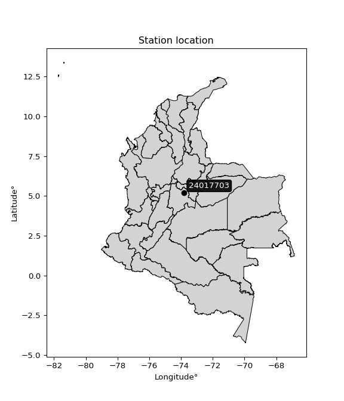

<div align="center">


</div>

# PMP Station (Rain, Pmax24h): 24017703

Probable Maximum Precipitation (PMP) is the greatest amount of rainfall for a specific duration that is meteorologically possible for a given location, acting as a "worst-case" scenario for extreme storms, crucial for designing safety-critical infrastructure like bridges, river deviations, dams, spillways, and nuclear plants to prevent catastrophic failure. PMP is calculated by hydrologists using meteorological data to determine the upper limit of extreme rainfall, often leading to the Probable Maximum Flood (PMF) for flood control design, and is increasingly being studied for climate change impacts. Probable Maximum Precipitation (PMP) is the theoretical upper limit of rainfall, a deterministic estimate for extreme events, while probability distributions (like GEV, Gumbel) describe the likelihood and frequency of various precipitation amounts, including rare ones, showing how often events occur, with PMP representing the extreme end of these distributions, used for critical infrastructure design to ensure safety against the worst conceivable weather, unlike standard statistical forecasts which cover typical probabilities.

The most common probability distributions in hydrology, used for analyzing floods, rainfall, and streamflow, include the Normal, Log-Normal, Gumbel, Gamma (including Log-Pearson Type III), and Generalized Extreme Value (GEV) distributions, often chosen based on the data´s skewness and whether modeling extremes or general conditions, with Gumbel and GEV popular for extreme events like floods, while the Normal distribution serves as a baseline, though often requiring transformations for skewed hydrological data. These distributions help in designing water infrastructure, managing water resources, and forecasting hydrologic events.

> Hydrological data often isn´t perfectly normal (it´s skewed), so different distributions are needed for different applications, such as: **Flood Frequency Analysis**: Using Gumbel, GEV, or Log-Pearson Type III for predicting extreme flood magnitudes and their return periods, **Rainfall Analysis**: Normal for annual totals, but Log-Normal, Weibull, or GEV for intensity or extreme daily rainfall, **Streamflow Modeling**: Gamma and Log-Normal for maximum flows, GEV for minimum flows, and Kappa for daily flows.

<div align="center">

</img>

</div>


## A. General information


### 1. General running parameters

• app_version: _v20260113_. • runtime: _2026-01-13 16:28:34.738620_. • Python version: _3.14.0_. • SciPy version: _1.16.3_. • Pandas version: _2.3.3_. • NumPy version: _2.3.5_. • Stations dataset (station_dataset_file): _dataset/pmax24h_in/automatic_colombia_2003_2025.csv_. • Stations catalog (station_catalog_file): _dataset/CNE.xls_. • Minimum year to eval til year_max (date_min): _1900_. • Maximum year to eval since year_min (date_max): _2025_. • Creates, save and include plots into reports (create_plot): _False_. • Plot only fit distributions with Δo > Δ (plot_only_fit): _True_. • Plot only simple graphs avoiding multiple CDFs and multiple Extreme values plots (plot_only_simple): _True_. • Eval low extreme values, if False, evaluates high extreme values (low_extreme): _False_. • Eval every SciPy distribution as logarithmic (pdist_logarithmic_on): _True_. • Standard deviation normalized (ddof): _1.0_. • Return periods to eval in years (Tr): _[2, 2.33, 5, 10, 15, 20, 25, 50, 75, 100, 200, 250, 500, 750, 1000]_. • Minimum data sample per station, 0 means any (minimum_sample): _5_. • Z-Score maximum threshold to adjust a value, 0 means disable (zscore_max): _3.5_. • Z-Score minimum threshold to adjust a value, 0 means disable (zscore_min): _-2.5_. • Avoid zeros, e.g. rain = 0 (avoid_zeros): _True_. • Avoid null values (avoid_nans): _True_. 

:file_folder:Table: [dataset.csv](../../dataset/pmax24h_in/automatic_colombia_2003_2025.csv)

> Delta Degrees of Freedom (DDOF): is a parameter used in the formulas for calculating variance and standard deviation. When ddof=0, the divisor is $N$ (the total number of observations) and this is used when your data set is the entire population. When ddof=1, the divisor is $N-1$ and this is used when your data set is a sample drawn from a larger population. Using $N-1$ provides an unbiased estimate of the population variance (known as Bessel´s correction).


### 2. Station info and location

|   id |   CODIGO | NOMBRE                                  | CATEGORIA    | TECNOLOGIA                | ESTADO   |   FECHA_INSTALACION |   FECHA_SUSPENSION |   ALTITUD |   LATITUD |   LONGITUD | DEPARTAMENTO   | MUNICIPIO   | AREA_OPERATIVA                            | ENTIDAD                                       | AREA_HIDROGRAFICA   | ZONA_HIDROGRAFICA   | SUBZONA_HIDROGRAFICA   | CORRIENTE      | Catalogo   |   Version |
|-----:|---------:|:----------------------------------------|:-------------|:--------------------------|:---------|--------------------:|-------------------:|----------:|----------:|-----------:|:---------------|:------------|:------------------------------------------|:----------------------------------------------|:--------------------|:--------------------|:-----------------------|:---------------|:-----------|----------:|
|    0 | 24017703 | FUQUENE  TICHA MARIA  - AUT  [24017703] | Limnigráfica | Automática con Telemetría | Activa   |                 nan |                nan |      2568 |   5.19794 |   -73.8047 | Cundinamarca   | Guachetá    | Area Operativa 11 - Cundinamarca-Amazonas | CORPORACION AUTONOMA REGIONAL DE CUNDINAMARCA | Magdalena Cauca     | Alto Magdalena      | Río Bogotá             | Quebrada Honda | CNE_OE     |  20251226 |

<div align="center">

Dynamic map: [:earth_americas:Google](http://maps.google.com/maps?q=5.197944444,-73.80466667) [:earth_americas:OSM](https://www.openstreetmap.org/#map=18/5.197944444/-73.80466667&layers=P) [:earth_americas:Bing](https://www.bing.com/maps?cp=5.197944444~-73.80466667&lvl=18) [:earth_americas:Apple](https://maps.apple.com/frame?center=5.197944444%2C-73.80466667&span=0.003%2C0.006)

</div>


<div align="center">

```geojson
{
  "type": "Feature",
  "geometry": {
    "type": "Point", 
    "coordinates": [-73.80466667, 5.197944444]
  }, 
  "properties": {
    "Name": "24017703"
  }
}
```

</div>


### 3. Discrete values table and plot

<div align="center">

|               |          0 |           1 |           2 |           3 |            4 |          5 |          6 |
|:--------------|-----------:|------------:|------------:|------------:|-------------:|-----------:|-----------:|
| Date          | 2015       | 2016        | 2017        | 2018        | 2019         | 2020       | 2021       |
| Value         |   12.7     |   37.3      |   30.2      |   21.4      |   27.3       |   46.3     |   14.5     |
| Value_initial |   12.7     |   37.3      |   30.2      |   21.4      |   27.3       |   46.3     |   14.5     |
| count         |    7       |    7        |    7        |    7        |    7         |    7       |    7       |
| mean          |   27.1     |   27.1      |   27.1      |   27.1      |   27.1       |   27.1     |   27.1     |
| std           |   12.1171  |   12.1171   |   12.1171   |   12.1171   |   12.1171    |   12.1171  |   12.1171  |
| zscore        |   -1.18841 |    0.841788 |    0.255837 |   -0.470411 |    0.0165056 |    1.58454 |   -1.03986 |


</div>


> The initial value (value_initial) correspond to the initial obtained or null completed value, and value (value) is adjusted only when the initial value is outside the valid range (outlier) definite through the Z-Score value. If Z-Score is active, values out of range or outliers are replaced with the station mean value. A Z-Score (or standard score) measures how many standard deviations a data point is from the mean of a dataset, indicating its relative position; positive scores mean above the mean, negative mean below, and a score of zero is exactly at the mean, allowing for comparison of values from different distributions. It´s calculated using the formula $z=(x–μ)/σ$, where $x$ is the data point, $μ$ is the mean, and $σ$ is the standard deviation, helping identify outliers and understand probability.
>
> <sub>**Note**: In this study, "completing" (filling gaps in) and "extending" (forecasting or lengthening the historical record) rainfall data series are avoided for certain critical analyses because they introduce artificial bias and uncertainty, which can distort the statistics of rare events (extremes), alter day-to-day variability, and compromise the integrity and homogeneity of the original data. Some reasons against Completing/Extending rainfall data are: **Distortion of Extremes and Variability**: The primary issue is that most gap-filling or extension methods rely on averaging or regression with nearby stations, which inherently smooths the data. Rainfall is highly variable in space and time, with a large percentage of zero values and occasional large storms. Infilling methods often underestimate the highest values and overestimate the lowest (zero) values, which severely distorts analyses focused on flood frequency, drought severity, and intensity-duration-frequency (IDF) curves, **Loss of Data Homogeneity**: Infilled or extended data are synthetic estimates, not actual measurements. Combining these estimates with observed data can violate the assumption of data homogeneity, which requires that the data properties do not change over time. Inhomogeneity can lead to incorrect conclusions about long-term trends or changes in climate patterns, **Propagation of Errors**: Errors and biases from the original data (e.g., wind-induced undercatch, instrument errors, site changes) or the data used for imputation can propagate through the analysis, leading to unreliable hydrological models and inaccurate predictions, **Compromised Statistical Integrity**: For statistical analyses, especially those involving the frequency of events, using artificial data can introduce time bias or autocorrelation that doesn´t exist in reality, making it difficult to assess the true probability of events, **Difficulty in Validation**: It is difficult to accurately validate the quality of filled or extended data, especially for past periods where ground-truth measurements are unavailable. The reliability of imputation techniques heavily depends on the density of the surrounding station network and the complexity of the local topography.</sub>


### 4. Active continuous probability distributions from SciPy (45 of 104 available)

A Probability Density Function (PDF) describes the relative likelihood of a continuous random variable falling within a specific range, where the total area under its curve equals 1, and the area over any interval gives the actual probability for that range. Unlike discrete probabilities (like rolling a die), a PDF shows density, not direct probability for a single point (which is zero), with higher points indicating higher likelihood, often visualized as a bell curve for normal distributions.

A log of a probability density function (log-PDF) is simply the logarithm of the PDF´s value, denoted as $log(f(x))$, useful for converting multiplication of probabilities into addition, improving numerical stability with tiny numbers, and connecting to information theory concepts like entropy. Instead of dealing with very small probabilities (e.g., 0.000001), log-PDFs use negative numbers (e.g., $log(0.00001) ≈ -11.51$ that are easier for computers to handle, preventing underflow errors and simplifying complex calculations. In this study, each active probability distribution from SciPy is also evaluated in the $log$ form.

[scipy.stats](https://docs.scipy.org/doc/scipy/reference/stats.html) is a Python´s powerful submodule within the SciPy library for comprehensive statistical analysis, offering over 130 probability distributions (like Normal, Poisson), functions for descriptive stats (mean, variance), hypothesis testing (t-tests, chi-square), random variable generation, and statistical tests, making it essential for data science, modeling, and research. It provides tools to explore, model, and draw conclusions from data efficiently, working seamlessly with NumPy.

<div align="center">

|   id | p_dist             |   n_parameter | fit_method   | label                                                                       | active   | ref                                                                                                        |
|-----:|:-------------------|--------------:|:-------------|:----------------------------------------------------------------------------|:---------|:-----------------------------------------------------------------------------------------------------------|
|    0 | alpha              |             3 | MLE          | Alpha                                                                       | True     | [:mortar_board:](https://docs.scipy.org/doc/scipy/reference/generated/scipy.stats.alpha.html)              |
|    1 | betaprime          |             4 | MLE          | Beta prime                                                                  | True     | [:mortar_board:](https://docs.scipy.org/doc/scipy/reference/generated/scipy.stats.betaprime.html)          |
|    2 | chi2               |             3 | MLE          | Chi²                                                                        | True     | [:mortar_board:](https://docs.scipy.org/doc/scipy/reference/generated/scipy.stats.chi2.html)               |
|    3 | crystalball        |             4 | MLE          | Crystalball                                                                 | True     | [:mortar_board:](https://docs.scipy.org/doc/scipy/reference/generated/scipy.stats.crystalball.html)        |
|    4 | dweibull           |             3 | MLE          | Double Weibull                                                              | True     | [:mortar_board:](https://docs.scipy.org/doc/scipy/reference/generated/scipy.stats.dweibull.html)           |
|    5 | erlang             |             3 | MLE          | Erlang                                                                      | True     | [:mortar_board:](https://docs.scipy.org/doc/scipy/reference/generated/scipy.stats.erlang.html)             |
|    6 | expon              |             2 | MLE          | Exponential                                                                 | True     | [:mortar_board:](https://docs.scipy.org/doc/scipy/reference/generated/scipy.stats.expon.html)              |
|    7 | exponnorm          |             3 | MLE          | Exponentially modified Normal                                               | True     | [:mortar_board:](https://docs.scipy.org/doc/scipy/reference/generated/scipy.stats.exponnorm.html)          |
|    8 | f                  |             4 | MLE          | F                                                                           | True     | [:mortar_board:](https://docs.scipy.org/doc/scipy/reference/generated/scipy.stats.f.html)                  |
|    9 | fatiguelife        |             3 | MLE          | Fatigue-life (Birnbaum-Saunders)                                            | True     | [:mortar_board:](https://docs.scipy.org/doc/scipy/reference/generated/scipy.stats.fatiguelife.html)        |
|   10 | fisk               |             3 | MLE          | Fisk                                                                        | True     | [:mortar_board:](https://docs.scipy.org/doc/scipy/reference/generated/scipy.stats.fisk.html)               |
|   11 | gamma              |             3 | MLE          | Gamma                                                                       | True     | [:mortar_board:](https://docs.scipy.org/doc/scipy/reference/generated/scipy.stats.gamma.html)              |
|   12 | genexpon           |             5 | MLE          | Generalized exponential                                                     | True     | [:mortar_board:](https://docs.scipy.org/doc/scipy/reference/generated/scipy.stats.genexpon.html)           |
|   13 | genlogistic        |             3 | MLE          | Generalized logistic                                                        | True     | [:mortar_board:](https://docs.scipy.org/doc/scipy/reference/generated/scipy.stats.genlogistic.html)        |
|   14 | gibrat             |             2 | MM           | Gibrat                                                                      | True     | [:mortar_board:](https://docs.scipy.org/doc/scipy/reference/generated/scipy.stats.gibrat.html)             |
|   15 | gompertz           |             3 | MLE          | Gompertz (or truncated Gumbel)                                              | True     | [:mortar_board:](https://docs.scipy.org/doc/scipy/reference/generated/scipy.stats.gompertz.html)           |
|   16 | gumbel_l           |             2 | MM           | Gumbel Left Skew                                                            | True     | [:mortar_board:](https://docs.scipy.org/doc/scipy/reference/generated/scipy.stats.gumbel_l.html)           |
|   17 | gumbel_r           |             2 | MM           | Gumbel Right Skew                                                           | True     | [:mortar_board:](https://docs.scipy.org/doc/scipy/reference/generated/scipy.stats.gumbel_r.html)           |
|   18 | halflogistic       |             2 | MM           | Half-logistic                                                               | True     | [:mortar_board:](https://docs.scipy.org/doc/scipy/reference/generated/scipy.stats.halflogistic.html)       |
|   19 | halfnorm           |             2 | MM           | Half Normal                                                                 | True     | [:mortar_board:](https://docs.scipy.org/doc/scipy/reference/generated/scipy.stats.halfnorm.html)           |
|   20 | hypsecant          |             2 | MM           | hyperbolic secant                                                           | True     | [:mortar_board:](https://docs.scipy.org/doc/scipy/reference/generated/scipy.stats.hypsecant.html)          |
|   21 | invgamma           |             3 | MLE          | Inverted gamma                                                              | True     | [:mortar_board:](https://docs.scipy.org/doc/scipy/reference/generated/scipy.stats.invgamma.html)           |
|   22 | invgauss           |             3 | MLE          | Inverse Gaussian                                                            | True     | [:mortar_board:](https://docs.scipy.org/doc/scipy/reference/generated/scipy.stats.invgauss.html)           |
|   23 | invweibull         |             3 | MLE          | Inverted Weibull                                                            | True     | [:mortar_board:](https://docs.scipy.org/doc/scipy/reference/generated/scipy.stats.invweibull.html)         |
|   24 | kappa4             |             4 | MLE          | Kappa 4                                                                     | True     | [:mortar_board:](https://docs.scipy.org/doc/scipy/reference/generated/scipy.stats.kappa4.html)             |
|   25 | kstwobign          |             2 | MLE          | Limiting distribution of scaled Kolmogorov-Smirnov two-sided test statistic | True     | [:mortar_board:](https://docs.scipy.org/doc/scipy/reference/generated/scipy.stats.kstwobign.html)          |
|   26 | laplace            |             2 | MM           | Laplace                                                                     | True     | [:mortar_board:](https://docs.scipy.org/doc/scipy/reference/generated/scipy.stats.laplace.html)            |
|   27 | laplace_asymmetric |             3 | MLE          | Asymmetric Laplace                                                          | True     | [:mortar_board:](https://docs.scipy.org/doc/scipy/reference/generated/scipy.stats.laplace_asymmetric.html) |
|   28 | loggamma           |             3 | MLE          | Log gamma                                                                   | True     | [:mortar_board:](https://docs.scipy.org/doc/scipy/reference/generated/scipy.stats.loggamma.html)           |
|   29 | logistic           |             2 | MM           | Logistic (or Sech-squared)                                                  | True     | [:mortar_board:](https://docs.scipy.org/doc/scipy/reference/generated/scipy.stats.logistic.html)           |
|   30 | lognorm            |             3 | MLE          | Log Normal                                                                  | True     | [:mortar_board:](https://docs.scipy.org/doc/scipy/reference/generated/scipy.stats.lognorm.html)            |
|   31 | maxwell            |             2 | MM           | Maxwell                                                                     | True     | [:mortar_board:](https://docs.scipy.org/doc/scipy/reference/generated/scipy.stats.maxwell.html)            |
|   32 | mielke             |             4 | MLE          | Mielke Beta-Kappa / Dagum                                                   | True     | [:mortar_board:](https://docs.scipy.org/doc/scipy/reference/generated/scipy.stats.mielke.html)             |
|   33 | moyal              |             2 | MM           | Moyal                                                                       | True     | [:mortar_board:](https://docs.scipy.org/doc/scipy/reference/generated/scipy.stats.moyal.html)              |
|   34 | nakagami           |             3 | MLE          | Nakagami                                                                    | True     | [:mortar_board:](https://docs.scipy.org/doc/scipy/reference/generated/scipy.stats.nakagami.html)           |
|   35 | ncf                |             5 | MLE          | Non-central F distribution                                                  | True     | [:mortar_board:](https://docs.scipy.org/doc/scipy/reference/generated/scipy.stats.ncf.html)                |
|   36 | nct                |             4 | MLE          | Non-central Student’s t                                                     | True     | [:mortar_board:](https://docs.scipy.org/doc/scipy/reference/generated/scipy.stats.nct.html)                |
|   37 | norm               |             2 | MM           | Normal                                                                      | True     | [:mortar_board:](https://docs.scipy.org/doc/scipy/reference/generated/scipy.stats.norm.html)               |
|   38 | pearson3           |             3 | MM           | Pearson type III                                                            | True     | [:mortar_board:](https://docs.scipy.org/doc/scipy/reference/generated/scipy.stats.pearson3.html)           |
|   39 | rayleigh           |             2 | MM           | Rayleigh                                                                    | True     | [:mortar_board:](https://docs.scipy.org/doc/scipy/reference/generated/scipy.stats.rayleigh.html)           |
|   40 | rice               |             3 | MLE          | Rice                                                                        | True     | [:mortar_board:](https://docs.scipy.org/doc/scipy/reference/generated/scipy.stats.rice.html)               |
|   41 | t                  |             3 | MLE          | Student’s t                                                                 | True     | [:mortar_board:](https://docs.scipy.org/doc/scipy/reference/generated/scipy.stats.t.html)                  |
|   42 | truncnorm          |             4 | MLE          | Truncated normal                                                            | True     | [:mortar_board:](https://docs.scipy.org/doc/scipy/reference/generated/scipy.stats.truncnorm.html)          |
|   43 | wald               |             2 | MM           | Wald                                                                        | True     | [:mortar_board:](https://docs.scipy.org/doc/scipy/reference/generated/scipy.stats.wald.html)               |
|   44 | weibull_min        |             3 | MLE          | Weibull minimum                                                             | True     | [:mortar_board:](https://docs.scipy.org/doc/scipy/reference/generated/scipy.stats.weibull_min.html)        |

</div>

> **n_parameter:** # arguments & localization & scale.
>
> **Fit methods:** (MLE) maximum likelihood, (MM) L-moments.
>
>**Inactive** (With the only purpose of prevent loops, zero divisions, infinite values, over high estimated values or horizontal trending for recurrence intervals estimations, the follow distributions were disabled.)**:** foldnorm, gennorm, norminvgauss, powernorm, powerlognorm, skewnorm, genextreme, anglit, arcsine, argus, beta, bradford, burr, burr12, cauchy, cosine, halfcauchy, foldcauchy, skewcauchy, wrapcauchy, dgamma, gengamma, exponweib, exponpow, truncexpon, gausshyper, genhalflogistic, genhyperbolic, geninvgauss, halfgennorm, johnsonsb, johnsonsu, kappa3, ksone, kstwo, loglaplace, levy, levy_l, levy_stable, ncx2, pareto, genpareto, truncpareto, lomax, powerlaw, rdist, rel_breitwigner, recipinvgauss, semicircular, studentized_range, trapezoid, triang, truncweibull_min, tukeylambda, uniform, loguniform, vonmises, vonmises_line, weibull_max, 


## B. Probability (PDF) vs. Empirical (EDF) distributions functions

A continuous probability distribution (CPD) describes probabilities for variables that can take any value within a range (like rain any time), unlike discrete variables with specific outcomes (like temperature). It uses a Probability Density Function (PDF), a curve where the total area under it equals 1, and the probability of the variable falling within an interval (a to b) is found by calculating the area under the curve between those points. A key feature is that the probability of hitting any single exact value is zero, so probabilities are always expressed for ranges, e.g., $P(a ≤ X ≤ b)$.

<div align="center">

Distributions parameters from station values
|    |   station | p_dist                |   n |             loc |          scale | shape                 | shape1              | shape2              | shape3   |
|---:|----------:|:----------------------|----:|----------------:|---------------:|:----------------------|:--------------------|:--------------------|:---------|
|  0 |  24017703 | alpha                 |   7 |   -62.6976      |  720.993       | 8.15321479871231      |                     |                     |          |
|  1 |  24017703 | betaprime             |   7 |    -1.35655     |  221.737       | 6.870437325199461     | 54.77753610875095   |                     |          |
|  2 |  24017703 | chi2                  |   7 |    12.7         |    6.59566     | 1.7193443746139183    |                     |                     |          |
|  3 |  24017703 | crystalball           |   7 |    27.1         |   11.2182      | 3159.233226656861     | 293.2735309681616   |                     |          |
|  4 |  24017703 | dweibull              |   7 |    24.8874      |   10.8317      | 1.6362036252720995    |                     |                     |          |
|  5 |  24017703 | erlang                |   7 |    12.7         |   12.0431      | 0.808565689922845     |                     |                     |          |
|  6 |  24017703 | expon                 |   7 |    12.7         |   14.4         |                       |                     |                     |          |
|  7 |  24017703 | exponnorm             |   7 |    23.3483      |   10.5834      | 0.35448590235205907   |                     |                     |          |
|  8 |  24017703 | f                     |   7 |    12.7         |   15.3632      | 0.48244776003719125   | 511.43847819943994  |                     |          |
|  9 |  24017703 | fatiguelife           |   7 |    12.7         |    7.26045e-06 | 1150.8270249289803    |                     |                     |          |
| 10 |  24017703 | fisk                  |   7 |    -0.0185787   |   25.1719      | 3.738001390941701     |                     |                     |          |
| 11 |  24017703 | gamma                 |   7 |    12.7         |   12.2543      | 0.6012208252141333    |                     |                     |          |
| 12 |  24017703 | genexpon              |   7 |    12.7         |    3.51816     | 0.2224400274978232    | 0.03510324396861583 | 0.3091661791268253  |          |
| 13 |  24017703 | genlogistic           |   7 |   -38.9587      |    9.4006      | 633.986672549619      |                     |                     |          |
| 14 |  24017703 | gibrat                |   7 |    18.5419      |    5.19076     |                       |                     |                     |          |
| 15 |  24017703 | gompertz              |   7 |    12.7         |   27.529       | 1.194542332781817     |                     |                     |          |
| 16 |  24017703 | gumbel_l              |   7 |    32.1488      |    8.74681     |                       |                     |                     |          |
| 17 |  24017703 | gumbel_r              |   7 |    22.0512      |    8.74681     |                       |                     |                     |          |
| 18 |  24017703 | halflogistic          |   7 |    13.8038      |    9.59117     |                       |                     |                     |          |
| 19 |  24017703 | halfnorm              |   7 |    12.2515      |   18.6099      |                       |                     |                     |          |
| 20 |  24017703 | hypsecant             |   7 |    27.1         |    7.14174     |                       |                     |                     |          |
| 21 |  24017703 | invgamma              |   7 |   -20.4241      |  813.445       | 18.099262012650353    |                     |                     |          |
| 22 |  24017703 | invgauss              |   7 |     2.5632      |   89.1856      | 0.2751205901527504    |                     |                     |          |
| 23 |  24017703 | invweibull            |   7 |    -8.45801e+08 |    8.45801e+08 | 89191050.95858565     |                     |                     |          |
| 24 |  24017703 | kappa4                |   7 |     7.5757      |   36.9742      | 1.1601169741262836    | 0.9428140901701623  |                     |          |
| 25 |  24017703 | kstwobign             |   7 |   -10.7429      |   43.2599      |                       |                     |                     |          |
| 26 |  24017703 | laplace               |   7 |    27.1         |    7.93248     |                       |                     |                     |          |
| 27 |  24017703 | laplace_asymmetric    |   7 |    27.3         |    9.31292     | 1.010788254093173     |                     |                     |          |
| 28 |  24017703 | loggamma              |   7 | -2896.83        |  407.868       | 1298.780537145975     |                     |                     |          |
| 29 |  24017703 | logistic              |   7 |    27.1         |    6.18493     |                       |                     |                     |          |
| 30 |  24017703 | lognorm               |   7 |    12.7         |    0.0667023   | 12.791002530942404    |                     |                     |          |
| 31 |  24017703 | maxwell               |   7 |     0.517517    |   16.6581      |                       |                     |                     |          |
| 32 |  24017703 | mielke                |   7 |    -0.172254    |   36.287       | 2.2514303148595225    | 6.495402678182405   |                     |          |
| 33 |  24017703 | moyal                 |   7 |    20.6847      |    5.04998     |                       |                     |                     |          |
| 34 |  24017703 | nakagami              |   7 |    12.7         |   15.9072      | 0.31792502575165377   |                     |                     |          |
| 35 |  24017703 | ncf                   |   7 |    -0.848001    |   20.6892      | 11.820046792488846    | 206.82472448637816  | 3.9997828854560087  |          |
| 36 |  24017703 | nct                   |   7 |    -0.0487098   |    9.34279     | 14.427333197583314    | 2.749228530480342   |                     |          |
| 37 |  24017703 | norm                  |   7 |    27.1         |   11.2182      |                       |                     |                     |          |
| 38 |  24017703 | pearson3              |   7 |    27.1         |   11.2182      | 0.30328646838775153   |                     |                     |          |
| 39 |  24017703 | rayleigh              |   7 |     5.63888     |   17.1235      |                       |                     |                     |          |
| 40 |  24017703 | rice                  |   7 |     6.97406     |   14.9866      | 0.6031419814224508    |                     |                     |          |
| 41 |  24017703 | t                     |   7 |    27.0999      |   11.2183      | 414556898.65108407    |                     |                     |          |
| 42 |  24017703 | truncnorm             |   7 |     1.32309     |   34.8029      | -279.99737953691283   | 1.2923331037451025  |                     |          |
| 43 |  24017703 | wald                  |   7 |    15.8818      |   11.2182      |                       |                     |                     |          |
| 44 |  24017703 | weibull_min           |   7 |    12.7         |   16.0564      | 0.6328599890763715    |                     |                     |          |
| 45 |  24017703 | logalpha              |   7 |    -6.70935     |  219.742       | 22.218374224503023    |                     |                     |          |
| 46 |  24017703 | logbetaprime          |   7 |    -1.76456     |   12.6214      | 132.3578816584848     | 336.80688195836524  |                     |          |
| 47 |  24017703 | logchi2               |   7 |     2.5416      |    0.975226    | 1.0248115652292311    |                     |                     |          |
| 48 |  24017703 | logcrystalball        |   7 |     3.20686     |    0.44109     | 135.25804511073318    | 602.6564156736479   |                     |          |
| 49 |  24017703 | logdweibull           |   7 |     3.17309     |    0.437933    | 1.9025419730796989    |                     |                     |          |
| 50 |  24017703 | logerlang             |   7 |    -4.85137     |    0.0245514   | 328.24156731778464    |                     |                     |          |
| 51 |  24017703 | logexpon              |   7 |     2.5416      |    0.665256    |                       |                     |                     |          |
| 52 |  24017703 | logexponnorm          |   7 |     3.20646     |    0.441092    | 0.0009073349647739723 |                     |                     |          |
| 53 |  24017703 | logf                  |   7 |  -190.223       |  193.431       | 1115052.2145592775    | 583486.6550119016   |                     |          |
| 54 |  24017703 | logfatiguelife        |   7 |   -55.675       |   58.8832      | 0.007494387260762458  |                     |                     |          |
| 55 |  24017703 | logfisk               |   7 |    -1.75937e+07 |    1.75937e+07 | 64966088.75269061     |                     |                     |          |
| 56 |  24017703 | loggamma              |   7 |    -5.19063     |    0.023425    | 358.36881542810215    |                     |                     |          |
| 57 |  24017703 | loggenexpon           |   7 |     2.5416      |    0.900907    | 0.8603179290424128    | 4.192859620017062   | 0.24051892876841036 |          |
| 58 |  24017703 | loggenlogistic        |   7 |     3.59227     |    0.152869    | 0.3389861220199022    |                     |                     |          |
| 59 |  24017703 | loggibrat             |   7 |     2.87035     |    0.204104    |                       |                     |                     |          |
| 60 |  24017703 | loggompertz           |   7 |     2.5416      |    1.03766     | 0.9611690245084735    |                     |                     |          |
| 61 |  24017703 | loggumbel_l           |   7 |     3.40537     |    0.343917    |                       |                     |                     |          |
| 62 |  24017703 | loggumbel_r           |   7 |     3.00834     |    0.343917    |                       |                     |                     |          |
| 63 |  24017703 | loghalflogistic       |   7 |     2.68402     |    0.377143    |                       |                     |                     |          |
| 64 |  24017703 | loghalfnorm           |   7 |     2.62298     |    0.731774    |                       |                     |                     |          |
| 65 |  24017703 | loghypsecant          |   7 |     3.20686     |    0.280807    |                       |                     |                     |          |
| 66 |  24017703 | loginvgamma           |   7 |    -5.95519     | 3834.67        | 419.6353479644681     |                     |                     |          |
| 67 |  24017703 | loginvgauss           |   7 |     0.301801    |  114.363       | 0.025338599077503236  |                     |                     |          |
| 68 |  24017703 | loginvweibull         |   7 |    -5.41233e+07 |    5.41233e+07 | 130810145.51291469    |                     |                     |          |
| 69 |  24017703 | logkappa4             |   7 |     2.40298     |    1.48727     | 1.1028377854831608    | 1.009373107679819   |                     |          |
| 70 |  24017703 | logkstwobign          |   7 |     1.56355     |    1.87269     |                       |                     |                     |          |
| 71 |  24017703 | loglaplace            |   7 |     3.20686     |    0.311898    |                       |                     |                     |          |
| 72 |  24017703 | loglaplace_asymmetric |   7 |     3.40784     |    0.340426    | 1.337847415059354     |                     |                     |          |
| 73 |  24017703 | logloggamma           |   7 |     2.55359     |    0.713559    | 2.9816499844335826    |                     |                     |          |
| 74 |  24017703 | loglogistic           |   7 |     3.20686     |    0.243186    |                       |                     |                     |          |
| 75 |  24017703 | loglognorm            |   7 |     2.5416      |    0.00432649  | 12.229621216696003    |                     |                     |          |
| 76 |  24017703 | logmaxwell            |   7 |     2.16166     |    0.654981    |                       |                     |                     |          |
| 77 |  24017703 | logmielke             |   7 |     2.5416      |    1.29855     | 0.6477702782135981    | 286.19820795392945  |                     |          |
| 78 |  24017703 | logmoyal              |   7 |     2.95461     |    0.19856     |                       |                     |                     |          |
| 79 |  24017703 | lognakagami           |   7 |     2.5416      |    1.00182     | 0.40930187702749765   |                     |                     |          |
| 80 |  24017703 | logncf                |   7 |   -62.7564      |   62.2792      | 76519.47336848834     | 105335.47527152096  | 4525.938973722174   |          |
| 81 |  24017703 | lognct                |   7 |    -4.13214     |    0.361914    | 385.18219221801866    | 20.258297195031876  |                     |          |
| 82 |  24017703 | lognorm               |   7 |     3.20686     |    0.44109     |                       |                     |                     |          |
| 83 |  24017703 | logpearson3           |   7 |     3.20686     |    0.441091    | -0.20214702650832705  |                     |                     |          |
| 84 |  24017703 | lograyleigh           |   7 |     2.36303     |    0.67328     |                       |                     |                     |          |
| 85 |  24017703 | logrice               |   7 |     2.30464     |    0.515381    | 1.340519398941233     |                     |                     |          |
| 86 |  24017703 | logt                  |   7 |     3.20686     |    0.441091    | 4887813679.118649     |                     |                     |          |
| 87 |  24017703 | logtruncnorm          |   7 |    -0.144419    |    1.17989     | 2.7187297311352143    | 3.372844005362464   |                     |          |
| 88 |  24017703 | logwald               |   7 |     2.76579     |    0.441066    |                       |                     |                     |          |
| 89 |  24017703 | logweibull_min        |   7 |     1.83766     |    1.5257      | 3.6028853462040304    |                     |                     |          |

</div>

> **loc** (Location parameter): This shifts the distribution along the x-axis. For many common distributions, like the normal (Gaussian) distribution, loc represents the mean $μ$. For others, like the uniform distribution, it might represent the minimum value, or for the beta distribution, the left end of the support interval.
>
> **scale** (Scale parameter): This determines the width or spread of the distribution. For the normal distribution, scale represents the standard deviation $σ$. For a uniform distribution, it defines the length of the interval (from $loc$ to $loc + scale$).
>
> **shape** (Shape parameters): Refers to parameters that define the specific form of a probability distribution, distinct from its location (loc) and scale (scale). These parameters are required arguments for most distribution functions. For example, a normal (Gaussian) distribution is fully defined by its location (mean) and scale (standard deviation), so it has no specific shape parameters beyond loc and scale. However, other distributions have intrinsic properties that need specification, as Gamma distribution that takes a shape parameter, often named $a$ or $alpha$.


### 0. Cumulative distribution values - CDF (90 evaluated)

Cumulative Distribution Function (CDF), denoted as $F$<sub>$X$</sub>$(x)$, is a function that gives the probability that a random variable $X$ will take a value less than or equal to a specific value, $x$ (i.e., $(P(X≥x)$. It essentially "accumulates" probabilities from a given point up to the far right (positive infinity), providing a complete picture of the distribution´s probabilities for both discrete (like rain) and continuous (like temperature) variables, helping to find probabilities over ranges or above certain values. Each station is evaluated separately ordering the $x$ values ascending, calculating the CDF and PDF values for the activated distributions and their logarithmic forms.

<div align="center">

CDF ordered by x ascending and calculating $log(f(x))$ separately
|   id |   Station |   date |    x |   count |   mean |     std |     zscore |   Value_initial |   station |   m |     alpha |   alpha_pdf |   betaprime |   betaprime_pdf |        chi2 |    chi2_pdf |   crystalball |   crystalball_pdf |   dweibull |   dweibull_pdf |      erlang |   erlang_pdf |    expon |   expon_pdf |   exponnorm |   exponnorm_pdf |          f |       f_pdf |   fatiguelife |   fatiguelife_pdf |      fisk |   fisk_pdf |       gamma |       gamma_pdf |    genexpon |   genexpon_pdf |   genlogistic |   genlogistic_pdf |   gibrat |   gibrat_pdf |    gompertz |   gompertz_pdf |   gumbel_l |   gumbel_l_pdf |   gumbel_r |   gumbel_r_pdf |   halflogistic |   halflogistic_pdf |   halfnorm |   halfnorm_pdf |   hypsecant |   hypsecant_pdf |   invgamma |   invgamma_pdf |   invgauss |   invgauss_pdf |   invweibull |   invweibull_pdf |      kappa4 |   kappa4_pdf |   kstwobign |   kstwobign_pdf |   laplace |   laplace_pdf |   laplace_asymmetric |   laplace_asymmetric_pdf |   loggamma |   loggamma_pdf |   logistic |   logistic_pdf |   lognorm |   lognorm_pdf |   maxwell |   maxwell_pdf |    mielke |   mielke_pdf |     moyal |   moyal_pdf |    nakagami |   nakagami_pdf |       ncf |    ncf_pdf |       nct |    nct_pdf |      norm |   norm_pdf |   pearson3 |   pearson3_pdf |   rayleigh |   rayleigh_pdf |      rice |   rice_pdf |         t |     t_pdf |   truncnorm |   truncnorm_pdf |     wald |   wald_pdf |   weibull_min |   weibull_min_pdf |   logalpha |   logalpha_pdf |   logbetaprime |   logbetaprime_pdf |     logchi2 |   logchi2_pdf |   logcrystalball |   logcrystalball_pdf |   logdweibull |   logdweibull_pdf |   logerlang |   logerlang_pdf |   logexpon |   logexpon_pdf |   logexponnorm |   logexponnorm_pdf |      logf |   logf_pdf |   logfatiguelife |   logfatiguelife_pdf |   logfisk |   logfisk_pdf |   loggenexpon |   loggenexpon_pdf |   loggenlogistic |   loggenlogistic_pdf |   loggibrat |   loggibrat_pdf |   loggompertz |   loggompertz_pdf |   loggumbel_l |   loggumbel_l_pdf |   loggumbel_r |   loggumbel_r_pdf |   loghalflogistic |   loghalflogistic_pdf |   loghalfnorm |   loghalfnorm_pdf |   loghypsecant |   loghypsecant_pdf |   loginvgamma |   loginvgamma_pdf |   loginvgauss |   loginvgauss_pdf |   loginvweibull |   loginvweibull_pdf |   logkappa4 |   logkappa4_pdf |   logkstwobign |   logkstwobign_pdf |   loglaplace |   loglaplace_pdf |   loglaplace_asymmetric |   loglaplace_asymmetric_pdf |   logloggamma |   logloggamma_pdf |   loglogistic |   loglogistic_pdf |   loglognorm |   loglognorm_pdf |   logmaxwell |   logmaxwell_pdf |   logmielke |   logmielke_pdf |   logmoyal |   logmoyal_pdf |   lognakagami |   lognakagami_pdf |    logncf |   logncf_pdf |    lognct |   lognct_pdf |   logpearson3 |   logpearson3_pdf |   lograyleigh |   lograyleigh_pdf |   logrice |   logrice_pdf |      logt |   logt_pdf |   logtruncnorm |   logtruncnorm_pdf |   logwald |   logwald_pdf |   logweibull_min |   logweibull_min_pdf |
|-----:|----------:|-------:|-----:|--------:|-------:|--------:|-----------:|----------------:|----------:|----:|----------:|------------:|------------:|----------------:|------------:|------------:|--------------:|------------------:|-----------:|---------------:|------------:|-------------:|---------:|------------:|------------:|----------------:|-----------:|------------:|--------------:|------------------:|----------:|-----------:|------------:|----------------:|------------:|---------------:|--------------:|------------------:|---------:|-------------:|------------:|---------------:|-----------:|---------------:|-----------:|---------------:|---------------:|-------------------:|-----------:|---------------:|------------:|----------------:|-----------:|---------------:|-----------:|---------------:|-------------:|-----------------:|------------:|-------------:|------------:|----------------:|----------:|--------------:|---------------------:|-------------------------:|-----------:|---------------:|-----------:|---------------:|----------:|--------------:|----------:|--------------:|----------:|-------------:|----------:|------------:|------------:|---------------:|----------:|-----------:|----------:|-----------:|----------:|-----------:|-----------:|---------------:|-----------:|---------------:|----------:|-----------:|----------:|----------:|------------:|----------------:|---------:|-----------:|--------------:|------------------:|-----------:|---------------:|---------------:|-------------------:|------------:|--------------:|-----------------:|---------------------:|--------------:|------------------:|------------:|----------------:|-----------:|---------------:|---------------:|-------------------:|----------:|-----------:|-----------------:|---------------------:|----------:|--------------:|--------------:|------------------:|-----------------:|---------------------:|------------:|----------------:|--------------:|------------------:|--------------:|------------------:|--------------:|------------------:|------------------:|----------------------:|--------------:|------------------:|---------------:|-------------------:|--------------:|------------------:|--------------:|------------------:|----------------:|--------------------:|------------:|----------------:|---------------:|-------------------:|-------------:|-----------------:|------------------------:|----------------------------:|--------------:|------------------:|--------------:|------------------:|-------------:|-----------------:|-------------:|-----------------:|------------:|----------------:|-----------:|---------------:|--------------:|------------------:|----------:|-------------:|----------:|-------------:|--------------:|------------------:|--------------:|------------------:|----------:|--------------:|----------:|-----------:|---------------:|-------------------:|----------:|--------------:|-----------------:|---------------------:|
|    0 |  24017703 |   2015 | 12.7 |       7 |   27.1 | 12.1171 | -1.18841   |            12.7 |  24017703 |   1 | 0.0793681 |  0.0187423  |   0.0764586 |      0.0210118  | 2.39483e-14 | 11.5898     |     0.0996365 |        0.0156025  |   0.148681 |      0.0242088 | 1.38637e-11 |  27.2005     | 0        |  0.0694444  |   0.0979589 |      0.0157843  | 0.00165598 | 3.15139e+06 |     0.0989759 |       3.38987e+10 | 0.0723059 |  0.0197142 | 3.35922e-10 | 113695          | 3.04923e-11 |     0.0632262  |      0.074427 |        0.0205265  | 0        |   0          | 3.12945e-13 |      0.0433922 |   0.102576 |     0.0111041  |  0.0543261 |     0.018091   |      0         |         0          |  0.0192287 |     0.0428618  |   0.0842673 |      0.0116619  |  0.0743587 |     0.0200166  |  0.0607501 |      0.025656  |    0.0750189 |       0.0204893  | 1.76779e-14 |    4.27004   |   0.0692886 |      0.0218781  | 0.0813929 |    0.0102607  |             0.107157 |               0.0113835  |  0.0645559 |       0.300465 |  0.0888111 |      0.013084  | 0.0657506 |      0.290028 | 0.0888259 |    0.0196064  | 0.0969306 |   0.0169335  | 0.0274788 |  0.0153293  | 5.58308e-11 | 19984.7        | 0.0759829 | 0.0204853  | 0.0861124 | 0.0170249  | 0.0996365 | 0.0156025  |  0.0923478 |     0.0170571  |  0.0815081 |     0.0221189  | 0.0590683 | 0.0200214  | 0.0996393 | 0.0156028 |    0.696464 |      0.0120488  | 0        | 0          |   7.98016e-11 |    28430.8        |  0.0623893 |       0.315346 |       0.088884 |           0.356281 | 1.08852e-08 |   1.25597e+07 |        0.0657505 |             0.290027 |     0.0672351 |          0.40643  |   0.0640455 |        0.298507 |   0        |       1.50318  |       0.065752 |           0.290031 | 0.0656372 |   0.290151 |        0.0643626 |             0.288403 | 0.0743298 |      0.254067 |   7.36065e-11 |          0.954946 |        0.0972771 |             0.215488 |    0        |        0        |   1.75722e-09 |          0.926282 |     0.0779363 |          0.217544 |     0.0205467 |          0.232106 |          0        |              0        |     0         |          0        |      0.0593931 |           0.210283 |     0.0636261 |          0.308062 |     0.0607374 |          0.341256 |       0.0546152 |            0.383779 |  3.4131e-15 |       20.6894   |      0.0521115 |           0.428684 |    0.0592449 |         0.18995  |               0.0957654 |                    0.210271 |     0.0791853 |          0.253545 |     0.0609058 |          0.235196 |   0.00723262 |      3.69307e+12 |    0.0469752 |         0.346434 | 3.20286e-08 |     5931.01     | 0.00466551 |       0.103869 |   2.11398e-13 |        389.677    | 0.0656727 |     0.291487 | 0.0638593 |     0.295549 |     0.0706419 |          0.278954 |     0.0345626 |          0.380325 | 0.0427759 |      0.358594 | 0.0657509 |   0.290028 |    0           |           0        |  0        |      0        |        0.0597526 |             0.296499 |
|    1 |  24017703 |   2021 | 14.5 |       7 |   27.1 | 12.1171 | -1.03986   |            14.5 |  24017703 |   2 | 0.117739  |  0.0238785  |   0.119463  |      0.0266721  | 0.178752    |  0.0792671  |     0.130682  |        0.0189257  |   0.196538 |      0.0289075 | 0.215656    |   0.0891021  | 0.117503 |  0.0612845  |   0.129437  |      0.0192248  | 0.46308    | 0.0606588   |     0.667368  |       0.0436622   | 0.113345  |  0.0258746 | 0.334557    |      0.101853   | 0.108773    |     0.0576499  |      0.116953 |        0.0266531  | 0        |   0          | 0.0775443   |      0.042732  |   0.124496 |     0.0133081  |  0.093388  |     0.0253146  |      0.0362771 |         0.0520627  |  0.0961701 |     0.0425624  |   0.108011  |      0.0148354  |  0.115676  |     0.0258319  |  0.11497   |      0.0341115 |    0.117392  |       0.0265191  | 0.0832433   |    0.0397973 |   0.114672  |      0.0283768  | 0.102126  |    0.0128743  |             0.129738 |               0.0137823  |  0.114365  |       0.45538  |  0.115351  |      0.016499  | 0.113579  |      0.436174 | 0.127869  |    0.0237268  | 0.130076  |   0.0199044  | 0.0650724 |  0.0265814  | 0.194021    |     0.0683267  | 0.117821  | 0.0259155  | 0.120777  | 0.0215266  | 0.130682  | 0.0189257  |  0.126558  |     0.02097    |  0.125318  |     0.0264335  | 0.0998768 | 0.0251943  | 0.130686  | 0.018926  |    0.71796  |      0.0118309  | 0        | 0          |   0.221471    |        0.068526   |  0.115168  |       0.484914 |       0.145054 |           0.492094 | 0.277937    |   1.02704     |        0.113579  |             0.436173 |     0.138793  |          0.678289 |   0.113544  |        0.452646 |   0.180648 |       1.23163  |       0.113581 |           0.436177 | 0.113489  |   0.436363 |        0.112051  |             0.435734 | 0.115826  |      0.378157 |   0.128345    |          0.973426 |        0.130451  |             0.288564 |    0        |        0        |   0.122749    |          0.923298 |     0.112453  |          0.307862 |     0.0711816 |          0.546932 |          0        |              0        |     0.0557434 |          1.08768  |      0.0947912 |           0.3326   |     0.114881  |          0.469325 |     0.118236  |          0.528577 |       0.121178  |            0.618108 |  0.122177   |        0.836224 |      0.126653  |           0.686002 |    0.0906175 |         0.290536 |               0.128116  |                    0.281302 |     0.119615  |          0.360924 |     0.100603  |          0.372069 |   0.610195   |      0.23666     |    0.106372  |         0.549136 | 0.228035    |        1.11443  | 0.0427266  |       0.522504 |   0.149075    |          0.916011 | 0.113751  |     0.438402 | 0.112813  |     0.447332 |     0.116011  |          0.410105 |     0.101266  |          0.616837 | 0.102874  |      0.545208 | 0.11358   |   0.436173 |    0           |           0        |  0        |      0        |        0.108377  |             0.440535 |
|    2 |  24017703 |   2018 | 21.4 |       7 |   27.1 | 12.1171 | -0.470411  |            21.4 |  24017703 |   3 | 0.337215  |  0.0372354  |   0.35406   |      0.0380769  | 0.553635    |  0.0376623  |     0.305691  |        0.0312554  |   0.427544 |      0.0314035 | 0.609744    |   0.0371599  | 0.45347  |  0.0379534  |   0.30767   |      0.0317993  | 0.66348    | 0.0164673   |     0.829246  |       0.0138727   | 0.353527  |  0.0398861 | 0.713059    |      0.0309438  | 0.437965    |     0.0385324  |      0.356668 |        0.0390835  | 0.275351 |   0.116818   | 0.358521    |      0.0381807 |   0.253694 |     0.0249672  |  0.340517  |     0.0419393  |      0.37652   |         0.0447408  |  0.376995  |     0.0379944  |   0.269288  |      0.0333667  |  0.349108  |     0.0385018  |  0.392679  |      0.0405569 |    0.355288  |       0.0387705  | 0.321804    |    0.031586  |   0.361068  |      0.0389717  | 0.243726  |    0.030725   |             0.270025 |               0.0286852  |  0.381471  |       0.869314 |  0.284633  |      0.0329215 | 0.372494  |      0.857848 | 0.33413   |    0.0343069  | 0.306516  |   0.0309347  | 0.351529  |  0.0476864  | 0.517064    |     0.035147   | 0.346684  | 0.0374432  | 0.324418  | 0.0358678  | 0.305691  | 0.0312554  |  0.318867  |     0.0335629  |  0.345316  |     0.0351912  | 0.32131   | 0.0365926  | 0.305696  | 0.0312556 |    0.796102 |      0.0107618  | 0.35781  | 0.0792885  |   0.492645    |        0.0250425  |  0.394822  |       0.885799 |       0.402323 |           0.777668 | 0.525778    |   0.43126     |        0.372494  |             0.857848 |     0.465355  |          0.579552 |   0.379296  |        0.865796 |   0.543581 |       0.686081 |       0.372496 |           0.857846 | 0.372279  |   0.856641 |        0.371259  |             0.85865  | 0.355428  |      0.845965 |   0.483065    |          0.806493 |        0.306275  |             0.658459 |    0.477785 |        2.06339  |   0.46637     |          0.817275 |     0.309235  |          0.743065 |     0.426521  |          1.05676  |          0.464433 |              1.03979  |     0.452717  |          0.909726 |      0.344018  |           1.00016  |     0.387235  |          0.873493 |     0.411282  |          0.88807  |       0.438763  |            0.873588 |  0.423901   |        0.738481 |      0.457328  |           0.867984 |    0.315648  |         1.01202  |               0.301144  |                    0.661219 |     0.339296  |          0.777547 |     0.356647  |          0.943517 |   0.652425   |      0.0578969   |    0.405598  |         0.895017 | 0.553995    |        0.687752 | 0.447017   |       1.1442   |   0.444326    |          0.643928 | 0.373236  |     0.857027 | 0.375401  |     0.856489 |     0.361158  |          0.830776 |     0.417856  |          0.899422 | 0.394437  |      0.880729 | 0.372494  |   0.857846 |    3.34236e-06 |           2.89019  |  0.499257 |      1.50892  |        0.365181  |             0.847928 |
|    3 |  24017703 |   2019 | 27.3 |       7 |   27.1 | 12.1171 |  0.0165056 |            27.3 |  24017703 |   4 | 0.556446  |  0.0351563  |   0.571063  |      0.0338832  | 0.726371    |  0.022393   |     0.507112  |        0.0355563  |   0.541054 |      0.0266664 | 0.774722    |   0.0206191  | 0.637195 |  0.0251948  |   0.511489  |      0.0357385  | 0.739157   | 0.0101341   |     0.891064  |       0.00787969  | 0.575888  |  0.0334195 | 0.843891    |      0.0155531  | 0.627199    |     0.0262594  |      0.576608 |        0.0337572  | 0.699549 |   0.0397263  | 0.566392    |      0.0319769 |   0.436983 |     0.036976   |  0.577662  |     0.036242   |      0.606631  |         0.0329469  |  0.581273  |     0.0309177  |   0.508913  |      0.0445529  |  0.569072  |     0.0342863  |  0.604723  |      0.0306189 |    0.573799  |       0.0336108  | 0.499838    |    0.0289673 |   0.57821   |      0.033295   | 0.512449  |    0.0614626  |             0.505365 |               0.0536857  |  0.598043  |       0.865218 |  0.508083  |      0.0404103 | 0.589701  |      0.881486 | 0.539864  |    0.0339979  | 0.507029  |   0.0356963  | 0.603447  |  0.0358569  | 0.690959    |     0.0244909  | 0.562292  | 0.0340384  | 0.543391  | 0.0362498  | 0.507112  | 0.0355563  |  0.527256  |     0.0353927  |  0.550718  |     0.0331906  | 0.537885  | 0.0353212  | 0.507117  | 0.0355562 |    0.856309 |      0.0096199  | 0.67512  | 0.0346265  |   0.609996    |        0.015918   |  0.610201  |       0.840248 |       0.591668 |           0.748421 | 0.615467    |   0.315806    |        0.589701  |             0.881486 |     0.549738  |          0.670842 |   0.595252  |        0.864032 |   0.683478 |       0.47579  |       0.589703 |           0.881482 | 0.589069  |   0.879508 |        0.588416  |             0.88026  | 0.575387  |      0.902158 |   0.657364    |          0.621875 |        0.505825  |             0.971462 |    0.776447 |        0.684511 |   0.649489    |          0.678797 |     0.528101  |          1.03046  |     0.657203  |          0.802139 |          0.678195 |              0.715976 |     0.649997  |          0.704525 |      0.611063  |           1.06525  |     0.602241  |          0.849331 |     0.621073  |          0.797882 |       0.632967  |            0.699639 |  0.600607   |        0.714847 |      0.648535  |           0.687239 |    0.637183  |         1.16326  |               0.514003  |                    1.12859  |     0.552419  |          0.937021 |     0.601406  |          0.985735 |   0.663923   |      0.0389749   |    0.617112  |         0.807554 | 0.709983    |        0.600961 | 0.68044    |       0.760212 |   0.586881    |          0.528639 | 0.589748  |     0.876987 | 0.589516  |     0.859145 |     0.577213  |          0.901035 |     0.625678  |          0.779402 | 0.606819  |      0.828427 | 0.5897    |   0.881484 |    0.535323    |           1.6144   |  0.745092 |      0.651853 |        0.582273  |             0.894196 |
|    4 |  24017703 |   2017 | 30.2 |       7 |   27.1 | 12.1171 |  0.255837  |            30.2 |  24017703 |   5 | 0.652491  |  0.0308642  |   0.662932  |      0.0293395  | 0.783938    |  0.0175225  |     0.608855  |        0.0342298  |   0.63391  |      0.0351473 | 0.826961    |   0.0156541  | 0.703372 |  0.0205991  |   0.61333   |      0.0341134  | 0.765958   | 0.00843927  |     0.911339  |       0.00618981  | 0.664418  |  0.0275807 | 0.882652    |      0.0114199  | 0.696362    |     0.0215766  |      0.667319 |        0.0287041  | 0.790778 |   0.0246671  | 0.653942    |      0.0283556 |   0.550794 |     0.0410993  |  0.674414  |     0.0303721  |      0.693545  |         0.0270559  |  0.665186  |     0.0269283  |   0.634023  |      0.0406776  |  0.661768  |     0.0295022  |  0.685675  |      0.0252721 |    0.664232  |       0.0286568  | 0.5824      |    0.0279921 |   0.668122  |      0.0286378  | 0.661742  |    0.0426422  |             0.638932 |               0.0391889  |  0.681965  |       0.791542 |  0.622746  |      0.0379848 | 0.67568   |      0.815265 | 0.634583  |    0.0310894  | 0.609286  |   0.0343505  | 0.696682  |  0.0285411  | 0.755914    |     0.0203965  | 0.655044  | 0.029771   | 0.643487  | 0.0324673  | 0.608855  | 0.0342298  |  0.62664   |     0.0328243  |  0.642522  |     0.0299442  | 0.635719  | 0.0319272  | 0.60886   | 0.0342296 |    0.883326 |      0.00900849 | 0.758862 | 0.0239358  |   0.652154    |        0.0132837  |  0.691025  |       0.756283 |       0.66449  |           0.690715 | 0.645607    |   0.282294    |        0.67568   |             0.815265 |     0.631567  |          0.911757 |   0.679125  |        0.791755 |   0.728044 |       0.408799 |       0.675681 |           0.81526  | 0.674857  |   0.813515 |        0.674245  |             0.813607 | 0.66299   |      0.825047 |   0.716185    |          0.543751 |        0.607922  |             1.03756  |    0.83355  |        0.464454 |   0.714553    |          0.609279 |     0.634763  |          1.06965  |     0.731264  |          0.665486 |          0.744102 |              0.591702 |     0.716524  |          0.613434 |      0.710546  |           0.89449  |     0.684323  |          0.771604 |     0.697281  |          0.708681 |       0.69885   |            0.605216 |  0.672411   |        0.707874 |      0.713392  |           0.597518 |    0.737509  |         0.841594 |               0.641556  |                    1.40866  |     0.646798  |          0.92313  |     0.695606  |          0.870685 |   0.667611   |      0.0342835   |    0.694468  |         0.721687 | 0.769322    |        0.575295 | 0.749417   |       0.609832 |   0.637951    |          0.483309 | 0.675246  |     0.810398 | 0.673047  |     0.789943 |     0.666042  |          0.851081 |     0.700034  |          0.691385 | 0.686795  |      0.751754 | 0.675679  |   0.815264 |    0.679344    |           1.25235  |  0.801655 |      0.479552 |        0.670137  |             0.839454 |
|    5 |  24017703 |   2016 | 37.3 |       7 |   27.1 | 12.1171 |  0.841788  |            37.3 |  24017703 |   6 | 0.827188  |  0.0184382  |   0.828557  |      0.0175665  | 0.877955    |  0.00975191 |     0.818387  |        0.0235217  |   0.856705 |      0.0236054 | 0.908364    |   0.00813348 | 0.818833 |  0.0125811  |   0.820087  |      0.0229774  | 0.815679   | 0.00583023  |     0.945142  |       0.00360905  | 0.813345  |  0.0152065 | 0.940351    |      0.00558548 | 0.81738     |     0.0131588  |      0.826882 |        0.0167182  | 0.90056  |   0.00931757 | 0.821796    |      0.018898  |   0.835039 |     0.0339858  |  0.839514  |     0.0167899  |      0.84109   |         0.015252   |  0.821691  |     0.01733    |   0.850207  |      0.0202087  |  0.826929  |     0.0173594  |  0.82522   |      0.0147411 |    0.824065  |       0.0168155  | 0.773504    |    0.0258578 |   0.830374  |      0.0173864  | 0.861793  |    0.017423   |             0.832922 |               0.018134   |  0.825879  |       0.561095 |  0.838779  |      0.0218643 | 0.82494   |      0.584532 | 0.818866  |    0.0203993  | 0.813866  |   0.0219066  | 0.846962  |  0.0149651  | 0.870698    |     0.0123765  | 0.824632  | 0.0181402  | 0.828613  | 0.0194989  | 0.818387  | 0.0235217  |  0.821354  |     0.0213553  |  0.819021  |     0.019542   | 0.822841  | 0.0204658  | 0.81839   | 0.0235214 |    0.941778 |      0.00744907 | 0.874975 | 0.010856   |   0.730171    |        0.0090933  |  0.827106  |       0.526924 |       0.793319 |           0.522669 | 0.699148    |   0.227768    |        0.82494   |             0.584532 |     0.822372  |          0.784348 |   0.823374  |        0.563877 |   0.802005 |       0.297622 |       0.82494  |           0.584529 | 0.823881  |   0.584199 |        0.823214  |             0.583834 | 0.810972  |      0.566057 |   0.814656    |          0.392613 |        0.813322  |             0.82314  |    0.903137 |        0.229013 |   0.826838    |          0.45302  |     0.844491  |          0.841512 |     0.844183  |          0.415778 |          0.845325 |              0.378405 |     0.826515  |          0.4318   |      0.855803  |           0.496125 |     0.824145  |          0.544711 |     0.824224  |          0.492132 |       0.806463  |            0.419254 |  0.820675   |        0.697385 |      0.820395  |           0.420153 |    0.866616  |         0.427651 |               0.843671  |                    0.614362 |     0.823517  |          0.713379 |     0.844846  |          0.539017 |   0.674064   |      0.0273479   |    0.824552  |         0.507406 | 0.886084    |        0.532749 | 0.851124   |       0.370508 |   0.730348    |          0.392964 | 0.823636  |     0.5817   | 0.817603  |     0.568335 |     0.82421   |          0.626139 |     0.824469  |          0.486339 | 0.82365   |      0.53738  | 0.824939  |   0.584533 |    0.88284     |           0.719085 |  0.877996 |      0.268271 |        0.825767  |             0.615771 |
|    6 |  24017703 |   2020 | 46.3 |       7 |   27.1 | 12.1171 |  1.58454   |            46.3 |  24017703 |   7 | 0.938031  |  0.00741405 |   0.935972  |      0.00738868 | 0.940283    |  0.00471828 |     0.956506  |        0.00822074 |   0.976316 |      0.0055195 | 0.958521    |   0.00362911 | 0.903028 |  0.00673416 |   0.954659  |      0.00807276 | 0.859111   | 0.003996    |     0.969209  |       0.00193397  | 0.907164  |  0.0067965 | 0.973978    |      0.00236648 | 0.904825    |     0.00691762 |      0.929617 |        0.00721679 | 0.953194 |   0.00352441 | 0.942372    |      0.0084745 |   0.993541 |     0.00372326 |  0.939396  |     0.00671435 |      0.934663  |         0.00658962 |  0.932689  |     0.00804108 |   0.956784  |      0.00603264 |  0.93274   |     0.00729793 |  0.918964  |      0.0069769 |    0.92783   |       0.00732897 | 0.990361    |    0.0207716 |   0.93823   |      0.00753063 | 0.955558  |    0.00560251 |             0.937094 |               0.00682752 |  0.920169  |       0.318948 |  0.957071  |      0.006643  | 0.922833  |      0.327956 | 0.9438    |    0.00828405 | 0.938624  |   0.00759465 | 0.936899  |  0.00623463 | 0.949408    |     0.00572102 | 0.935857  | 0.00764023 | 0.94339   | 0.00737668 | 0.956506  | 0.00822074 |  0.948664  |     0.00805678 |  0.940353  |     0.00827144 | 0.946743  | 0.00808062 | 0.956506  | 0.0082206 |    1        |      0.00551421 | 0.94009  | 0.00464072 |   0.797234    |        0.00609418 |  0.916039  |       0.30471  |       0.886283 |           0.34072  | 0.743709    |   0.186486    |        0.922833  |             0.327957 |     0.944333  |          0.35117  |   0.918406  |        0.322716 |   0.85693  |       0.215059 |       0.922833 |           0.327955 | 0.921881  |   0.329166 |        0.921204  |             0.329538 | 0.905037  |      0.317359 |   0.885223    |          0.265596 |        0.93896   |             0.35304  |    0.939822 |        0.123756 |   0.907654    |          0.297541 |     0.969471  |          0.309723 |     0.913611  |          0.240014 |          0.909755 |              0.228488 |     0.902373  |          0.276526 |      0.932308  |           0.23925  |     0.916191  |          0.314864 |     0.908357  |          0.294916 |       0.88023   |            0.2714   |  0.970984   |        0.697175 |      0.89458   |           0.273019 |    0.933299  |         0.213855 |               0.933146  |                    0.262732 |     0.940334  |          0.36449  |     0.929796  |          0.268419 |   0.679433   |      0.0226224   |    0.911438  |         0.304049 | 0.996853    |        0.375184 | 0.913278   |       0.217515 |   0.805986    |          0.308448 | 0.92131   |     0.328677 | 0.914035  |     0.330523 |     0.92854   |          0.343169 |     0.908403  |          0.297463 | 0.915325  |      0.317226 | 0.922832  |   0.327958 |    0.999987    |           0.394209 |  0.922778 |      0.157669 |        0.928629  |             0.339836 |


</div>

An Empirical Distribution Function (EDF) is a step-function estimate of a true cumulative distribution function (CDF) based on observed sample data, representing the proportion of data points less than or equal to a given value. It is calculated by ordering your data and jumping up by $1/n$ (where $n$ is sample size) at each unique data point, allowing analysis without assuming an underlying population distribution, and it gets closer to the true CDF as the sample size grows. For the empirical probability calculations, the parameter $m$ correspond to the order number which means the position of the $x$ values in an ascending order list.

The Kolmogorov-Smirnov (K-S) test is a non-parametric statistical test used to determine if a sample data set comes from a specific theoretical distribution (one-sample) or if two different samples come from the same underlying distribution (two-sample), by comparing their cumulative distribution functions (CDFs). It calculates the maximum vertical difference (D statistic) between these functions, with a small p-value indicating a significant difference and rejection of the null hypothesis (that the data/samples match).


### 1. EDF California (1923)

California´s estimates the true probability distribution of water-related data (like rainfall, streamflow) using observed samples, crucial for risk assessment.

<div align="center">


$P=m/n$


</div>


**1.1. Empirical values**

<div align="center">

|                | 0                   | 1                  | 2                   | 3                  | 4                  | 5                  | 6              |
|:---------------|:--------------------|:-------------------|:--------------------|:-------------------|:-------------------|:-------------------|:---------------|
| date           | 2015                | 2021               | 2018                | 2019               | 2017               | 2016               | 2020           |
| x              | 12.7                | 14.5               | 21.4                | 27.3               | 30.2               | 37.3               | 46.3           |
| m              | 1                   | 2                  | 3                   | 4                  | 5                  | 6                  | 7              |
| empirical_dist | edf_california      | edf_california     | edf_california      | edf_california     | edf_california     | edf_california     | edf_california |
| empirical      | 0.14285714285714285 | 0.2857142857142857 | 0.42857142857142855 | 0.5714285714285714 | 0.7142857142857143 | 0.8571428571428571 | 1.0            |
| empirical_tr   | 1.1666666666666665  | 1.4                | 1.75                | 2.333333333333333  | 3.5                | 6.999999999999997  | inf            |

</div>


**1.2. Kolmogorov-Smirnov fit test (sorted by Δ)**


<div align="center">

|                | 0                   | 1                   | 2                   | 3                   | 4                   | 5                   | 6                   | 7                   | 8                   | 9                   | 10                  | 11                  | 12                  | 13                  | 14                    | 15                  | 16                  | 17                  | 18                  | 19                  | 20                  | 21                  | 22                  | 23                  | 24                  | 25                  | 26                  | 27                  | 28                  | 29                  | 30                  | 31                  | 32                  | 33                  | 34                  | 35                  | 36                  | 37                  | 38                  | 39                  | 40                  | 41                  | 42                  | 43                  | 44                  | 45                  | 46                  | 47                  | 48                  | 49                  | 50                  | 51                  | 52                  | 53                  | 54                  | 55                  | 56                  | 57                  | 58                  | 59                  | 60                  | 61                  | 62                  | 63                  | 64                  | 65                  | 66                  | 67                  | 68                  | 69                  | 70                  | 71                  | 72                  | 73                  | 74                  | 75                  | 76                  | 77                  | 78                  | 79                  | 80                  | 81                  | 82                  | 83                  | 84                  | 85                  | 86                  | 87                  | 88                  | 89                  |
|:---------------|:--------------------|:--------------------|:--------------------|:--------------------|:--------------------|:--------------------|:--------------------|:--------------------|:--------------------|:--------------------|:--------------------|:--------------------|:--------------------|:--------------------|:----------------------|:--------------------|:--------------------|:--------------------|:--------------------|:--------------------|:--------------------|:--------------------|:--------------------|:--------------------|:--------------------|:--------------------|:--------------------|:--------------------|:--------------------|:--------------------|:--------------------|:--------------------|:--------------------|:--------------------|:--------------------|:--------------------|:--------------------|:--------------------|:--------------------|:--------------------|:--------------------|:--------------------|:--------------------|:--------------------|:--------------------|:--------------------|:--------------------|:--------------------|:--------------------|:--------------------|:--------------------|:--------------------|:--------------------|:--------------------|:--------------------|:--------------------|:--------------------|:--------------------|:--------------------|:--------------------|:--------------------|:--------------------|:--------------------|:--------------------|:--------------------|:--------------------|:--------------------|:--------------------|:--------------------|:--------------------|:--------------------|:--------------------|:--------------------|:--------------------|:--------------------|:--------------------|:--------------------|:--------------------|:--------------------|:--------------------|:--------------------|:--------------------|:--------------------|:--------------------|:--------------------|:--------------------|:--------------------|:--------------------|:--------------------|:--------------------|
| station        | 24017703            | 24017703            | 24017703            | 24017703            | 24017703            | 24017703            | 24017703            | 24017703            | 24017703            | 24017703            | 24017703            | 24017703            | 24017703            | 24017703            | 24017703              | 24017703            | 24017703            | 24017703            | 24017703            | 24017703            | 24017703            | 24017703            | 24017703            | 24017703            | 24017703            | 24017703            | 24017703            | 24017703            | 24017703            | 24017703            | 24017703            | 24017703            | 24017703            | 24017703            | 24017703            | 24017703            | 24017703            | 24017703            | 24017703            | 24017703            | 24017703            | 24017703            | 24017703            | 24017703            | 24017703            | 24017703            | 24017703            | 24017703            | 24017703            | 24017703            | 24017703            | 24017703            | 24017703            | 24017703            | 24017703            | 24017703            | 24017703            | 24017703            | 24017703            | 24017703            | 24017703            | 24017703            | 24017703            | 24017703            | 24017703            | 24017703            | 24017703            | 24017703            | 24017703            | 24017703            | 24017703            | 24017703            | 24017703            | 24017703            | 24017703            | 24017703            | 24017703            | 24017703            | 24017703            | 24017703            | 24017703            | 24017703            | 24017703            | 24017703            | 24017703            | 24017703            | 24017703            | 24017703            | 24017703            | 24017703            |
| empirical_dist | edf_california      | edf_california      | edf_california      | edf_california      | edf_california      | edf_california      | edf_california      | edf_california      | edf_california      | edf_california      | edf_california      | edf_california      | edf_california      | edf_california      | edf_california        | edf_california      | edf_california      | edf_california      | edf_california      | edf_california      | edf_california      | edf_california      | edf_california      | edf_california      | edf_california      | edf_california      | edf_california      | edf_california      | edf_california      | edf_california      | edf_california      | edf_california      | edf_california      | edf_california      | edf_california      | edf_california      | edf_california      | edf_california      | edf_california      | edf_california      | edf_california      | edf_california      | edf_california      | edf_california      | edf_california      | edf_california      | edf_california      | edf_california      | edf_california      | edf_california      | edf_california      | edf_california      | edf_california      | edf_california      | edf_california      | edf_california      | edf_california      | edf_california      | edf_california      | edf_california      | edf_california      | edf_california      | edf_california      | edf_california      | edf_california      | edf_california      | edf_california      | edf_california      | edf_california      | edf_california      | edf_california      | edf_california      | edf_california      | edf_california      | edf_california      | edf_california      | edf_california      | edf_california      | edf_california      | edf_california      | edf_california      | edf_california      | edf_california      | edf_california      | edf_california      | edf_california      | edf_california      | edf_california      | edf_california      | edf_california      |
| p_dist         | dweibull            | logbetaprime        | logmielke           | nakagami            | logexpon            | logdweibull         | chi2                | t                   | norm                | crystalball         | loggenlogistic      | mielke              | exponnorm           | loggenexpon         | loglaplace_asymmetric | maxwell             | laplace_asymmetric  | logkstwobign        | pearson3            | rayleigh            | loggompertz         | logkappa4           | loginvweibull       | nct                 | logloggamma         | betaprime           | loginvgauss         | ncf                 | alpha               | expon               | invweibull          | genlogistic         | logpearson3         | logfisk             | invgamma            | logistic            | logalpha            | invgauss            | loginvgamma         | kstwobign           | loggamma            | loggamma            | logncf              | logexponnorm        | logt                | lognorm             | lognorm             | logcrystalball      | logerlang           | logf                | fisk                | lognct              | loggumbel_l         | logfatiguelife      | gumbel_l            | genexpon            | logweibull_min      | hypsecant           | logmaxwell          | logrice             | lograyleigh         | laplace             | loglogistic         | rice                | halfnorm            | loghypsecant        | gumbel_r            | lognakagami         | loglaplace          | kappa4              | weibull_min         | erlang              | gompertz            | loggumbel_r         | moyal               | loghalfnorm         | f                   | logmoyal            | halflogistic        | logchi2             | gamma               | loggibrat           | gibrat              | loghalflogistic     | wald                | logwald             | loglognorm          | fatiguelife         | logtruncnorm        | truncnorm           |
| delta          | 0.08917630896349296 | 0.1406600012084947  | 0.14285711082850783 | 0.14285714280131204 | 0.14306952876944867 | 0.14692103449582344 | 0.15494214095993553 | 0.15502878470078005 | 0.1550321321779204  | 0.15503213729641158 | 0.15526289115322242 | 0.15563831626700778 | 0.1562769650156161  | 0.15736901738377143 | 0.15759871334045425   | 0.15784529361191393 | 0.15854646716977017 | 0.15906100023084474 | 0.15915612794562814 | 0.160396739709098   | 0.16296558446813453 | 0.1635375259603323  | 0.16453648979355218 | 0.1649375177464744  | 0.16609878952091    | 0.16625123335554942 | 0.1674780312790449  | 0.16789287575384046 | 0.1679755537882118  | 0.16821118829888104 | 0.16832243484113651 | 0.16876105877831152 | 0.16970293426907185 | 0.16988855668826253 | 0.17003839769596946 | 0.17036307916248455 | 0.17054599602618864 | 0.17074399111538419 | 0.17083310404663316 | 0.1710422363005484  | 0.1713496885574907  | 0.1713496885574907  | 0.1719635290972964  | 0.1721331242054225  | 0.17213463699547465 | 0.17213495425112801 | 0.17213495425112801 | 0.17213507221952806 | 0.17217072389353266 | 0.1722255661889389  | 0.1723688270004015  | 0.17290135148777983 | 0.17326113404253043 | 0.17366288556357617 | 0.17487734478263234 | 0.1769417663938222  | 0.177337546487096   | 0.17770282711111035 | 0.17934205294471595 | 0.18283981201463137 | 0.1844486312028163  | 0.18484566352527912 | 0.18511146288472585 | 0.1858375062999302  | 0.18954414522519258 | 0.19092306338978984 | 0.19232633433725194 | 0.19401405074775235 | 0.19509676114009958 | 0.2024710243313544  | 0.2027655795041684  | 0.20329384825407493 | 0.2081699434112554  | 0.2145326466123983  | 0.2206418801724045  | 0.2299708900611815  | 0.2349088041798702  | 0.24298773141930904 | 0.2494372156714308  | 0.25629065677135177 | 0.2844876341815518  | 0.2857142857142857  | 0.2857142857142857  | 0.2857142857142857  | 0.2857142857142857  | 0.2857142857142857  | 0.32448060871142625 | 0.400674680335881   | 0.42856808621249315 | 0.5536071686667379  |
| deltao         | 0.48442053926100004 | 0.48442053926100004 | 0.48442053926100004 | 0.48442053926100004 | 0.48442053926100004 | 0.48442053926100004 | 0.48442053926100004 | 0.48442053926100004 | 0.48442053926100004 | 0.48442053926100004 | 0.48442053926100004 | 0.48442053926100004 | 0.48442053926100004 | 0.48442053926100004 | 0.48442053926100004   | 0.48442053926100004 | 0.48442053926100004 | 0.48442053926100004 | 0.48442053926100004 | 0.48442053926100004 | 0.48442053926100004 | 0.48442053926100004 | 0.48442053926100004 | 0.48442053926100004 | 0.48442053926100004 | 0.48442053926100004 | 0.48442053926100004 | 0.48442053926100004 | 0.48442053926100004 | 0.48442053926100004 | 0.48442053926100004 | 0.48442053926100004 | 0.48442053926100004 | 0.48442053926100004 | 0.48442053926100004 | 0.48442053926100004 | 0.48442053926100004 | 0.48442053926100004 | 0.48442053926100004 | 0.48442053926100004 | 0.48442053926100004 | 0.48442053926100004 | 0.48442053926100004 | 0.48442053926100004 | 0.48442053926100004 | 0.48442053926100004 | 0.48442053926100004 | 0.48442053926100004 | 0.48442053926100004 | 0.48442053926100004 | 0.48442053926100004 | 0.48442053926100004 | 0.48442053926100004 | 0.48442053926100004 | 0.48442053926100004 | 0.48442053926100004 | 0.48442053926100004 | 0.48442053926100004 | 0.48442053926100004 | 0.48442053926100004 | 0.48442053926100004 | 0.48442053926100004 | 0.48442053926100004 | 0.48442053926100004 | 0.48442053926100004 | 0.48442053926100004 | 0.48442053926100004 | 0.48442053926100004 | 0.48442053926100004 | 0.48442053926100004 | 0.48442053926100004 | 0.48442053926100004 | 0.48442053926100004 | 0.48442053926100004 | 0.48442053926100004 | 0.48442053926100004 | 0.48442053926100004 | 0.48442053926100004 | 0.48442053926100004 | 0.48442053926100004 | 0.48442053926100004 | 0.48442053926100004 | 0.48442053926100004 | 0.48442053926100004 | 0.48442053926100004 | 0.48442053926100004 | 0.48442053926100004 | 0.48442053926100004 | 0.48442053926100004 | 0.48442053926100004 |
| eval           | Δo > Δ              | Δo > Δ              | Δo > Δ              | Δo > Δ              | Δo > Δ              | Δo > Δ              | Δo > Δ              | Δo > Δ              | Δo > Δ              | Δo > Δ              | Δo > Δ              | Δo > Δ              | Δo > Δ              | Δo > Δ              | Δo > Δ                | Δo > Δ              | Δo > Δ              | Δo > Δ              | Δo > Δ              | Δo > Δ              | Δo > Δ              | Δo > Δ              | Δo > Δ              | Δo > Δ              | Δo > Δ              | Δo > Δ              | Δo > Δ              | Δo > Δ              | Δo > Δ              | Δo > Δ              | Δo > Δ              | Δo > Δ              | Δo > Δ              | Δo > Δ              | Δo > Δ              | Δo > Δ              | Δo > Δ              | Δo > Δ              | Δo > Δ              | Δo > Δ              | Δo > Δ              | Δo > Δ              | Δo > Δ              | Δo > Δ              | Δo > Δ              | Δo > Δ              | Δo > Δ              | Δo > Δ              | Δo > Δ              | Δo > Δ              | Δo > Δ              | Δo > Δ              | Δo > Δ              | Δo > Δ              | Δo > Δ              | Δo > Δ              | Δo > Δ              | Δo > Δ              | Δo > Δ              | Δo > Δ              | Δo > Δ              | Δo > Δ              | Δo > Δ              | Δo > Δ              | Δo > Δ              | Δo > Δ              | Δo > Δ              | Δo > Δ              | Δo > Δ              | Δo > Δ              | Δo > Δ              | Δo > Δ              | Δo > Δ              | Δo > Δ              | Δo > Δ              | Δo > Δ              | Δo > Δ              | Δo > Δ              | Δo > Δ              | Δo > Δ              | Δo > Δ              | Δo > Δ              | Δo > Δ              | Δo > Δ              | Δo > Δ              | Δo > Δ              | Δo > Δ              | Δo > Δ              | Δo > Δ              | Δo <= Δ             |
| fit            | 1                   | 1                   | 1                   | 1                   | 1                   | 1                   | 1                   | 1                   | 1                   | 1                   | 1                   | 1                   | 1                   | 1                   | 1                     | 1                   | 1                   | 1                   | 1                   | 1                   | 1                   | 1                   | 1                   | 1                   | 1                   | 1                   | 1                   | 1                   | 1                   | 1                   | 1                   | 1                   | 1                   | 1                   | 1                   | 1                   | 1                   | 1                   | 1                   | 1                   | 1                   | 1                   | 1                   | 1                   | 1                   | 1                   | 1                   | 1                   | 1                   | 1                   | 1                   | 1                   | 1                   | 1                   | 1                   | 1                   | 1                   | 1                   | 1                   | 1                   | 1                   | 1                   | 1                   | 1                   | 1                   | 1                   | 1                   | 1                   | 1                   | 1                   | 1                   | 1                   | 1                   | 1                   | 1                   | 1                   | 1                   | 1                   | 1                   | 1                   | 1                   | 1                   | 1                   | 1                   | 1                   | 1                   | 1                   | 1                   | 1                   | 0                   |
| n              | 7                   | 7                   | 7                   | 7                   | 7                   | 7                   | 7                   | 7                   | 7                   | 7                   | 7                   | 7                   | 7                   | 7                   | 7                     | 7                   | 7                   | 7                   | 7                   | 7                   | 7                   | 7                   | 7                   | 7                   | 7                   | 7                   | 7                   | 7                   | 7                   | 7                   | 7                   | 7                   | 7                   | 7                   | 7                   | 7                   | 7                   | 7                   | 7                   | 7                   | 7                   | 7                   | 7                   | 7                   | 7                   | 7                   | 7                   | 7                   | 7                   | 7                   | 7                   | 7                   | 7                   | 7                   | 7                   | 7                   | 7                   | 7                   | 7                   | 7                   | 7                   | 7                   | 7                   | 7                   | 7                   | 7                   | 7                   | 7                   | 7                   | 7                   | 7                   | 7                   | 7                   | 7                   | 7                   | 7                   | 7                   | 7                   | 7                   | 7                   | 7                   | 7                   | 7                   | 7                   | 7                   | 7                   | 7                   | 7                   | 7                   | 7                   |
| best_fit       | 1                   | 0                   | 0                   | 0                   | 0                   | 0                   | 0                   | 0                   | 0                   | 0                   | 0                   | 0                   | 0                   | 0                   | 0                     | 0                   | 0                   | 0                   | 0                   | 0                   | 0                   | 0                   | 0                   | 0                   | 0                   | 0                   | 0                   | 0                   | 0                   | 0                   | 0                   | 0                   | 0                   | 0                   | 0                   | 0                   | 0                   | 0                   | 0                   | 0                   | 0                   | 0                   | 0                   | 0                   | 0                   | 0                   | 0                   | 0                   | 0                   | 0                   | 0                   | 0                   | 0                   | 0                   | 0                   | 0                   | 0                   | 0                   | 0                   | 0                   | 0                   | 0                   | 0                   | 0                   | 0                   | 0                   | 0                   | 0                   | 0                   | 0                   | 0                   | 0                   | 0                   | 0                   | 0                   | 0                   | 0                   | 0                   | 0                   | 0                   | 0                   | 0                   | 0                   | 0                   | 0                   | 0                   | 0                   | 0                   | 0                   | 0                   |
| best_fit_sort  | 1                   | 2                   | 3                   | 4                   | 5                   | 6                   | 7                   | 8                   | 9                   | 10                  | 11                  | 12                  | 13                  | 14                  | 15                    | 16                  | 17                  | 18                  | 19                  | 20                  | 21                  | 22                  | 23                  | 24                  | 25                  | 26                  | 27                  | 28                  | 29                  | 30                  | 31                  | 32                  | 33                  | 34                  | 35                  | 36                  | 37                  | 38                  | 39                  | 40                  | 41                  | 42                  | 43                  | 44                  | 45                  | 46                  | 47                  | 48                  | 49                  | 50                  | 51                  | 52                  | 53                  | 54                  | 55                  | 56                  | 57                  | 58                  | 59                  | 60                  | 61                  | 62                  | 63                  | 64                  | 65                  | 66                  | 67                  | 68                  | 69                  | 70                  | 71                  | 72                  | 73                  | 74                  | 75                  | 76                  | 77                  | 78                  | 79                  | 80                  | 81                  | 82                  | 83                  | 84                  | 85                  | 86                  | 87                  | 88                  | 89                  | 90                  |

</div>


**1.3. Best fit**

<div align="center">

|   id |   station | empirical_dist   | p_dist   |     delta |   deltao | eval   |   fit |   n |   best_fit |   best_fit_sort |
|-----:|----------:|:-----------------|:---------|----------:|---------:|:-------|------:|----:|-----------:|----------------:|
|    0 |  24017703 | edf_california   | dweibull | 0.0891763 | 0.484421 | Δo > Δ |     1 |   7 |          1 |               1 |

</div>


### 2. EDF Hazen (1930)

Hazen method for plotting positions is a formula used to estimate the empirical cumulative probability distribution of flood events or other hydrological data. This formula often results in biased estimations, particularly when extrapolating to extreme events (high return periods).

<div align="center">


$P=(m-0.5)/n$


</div>


**2.1. Empirical values**

<div align="center">

|                | 0                   | 1                   | 2                   | 3         | 4                  | 5                  | 6                  |
|:---------------|:--------------------|:--------------------|:--------------------|:----------|:-------------------|:-------------------|:-------------------|
| date           | 2015                | 2021                | 2018                | 2019      | 2017               | 2016               | 2020               |
| x              | 12.7                | 14.5                | 21.4                | 27.3      | 30.2               | 37.3               | 46.3               |
| m              | 1                   | 2                   | 3                   | 4         | 5                  | 6                  | 7                  |
| empirical_dist | edf_hazen           | edf_hazen           | edf_hazen           | edf_hazen | edf_hazen          | edf_hazen          | edf_hazen          |
| empirical      | 0.07142857142857142 | 0.21428571428571427 | 0.35714285714285715 | 0.5       | 0.6428571428571429 | 0.7857142857142857 | 0.9285714285714286 |
| empirical_tr   | 1.0769230769230769  | 1.2727272727272727  | 1.5555555555555558  | 2.0       | 2.8000000000000003 | 4.666666666666666  | 14.000000000000007 |

</div>


**2.2. Kolmogorov-Smirnov fit test (sorted by Δ)**


<div align="center">

|                | 0                   | 1                   | 2                   | 3                   | 4                   | 5                   | 6                   | 7                     | 8                   | 9                   | 10                  | 11                  | 12                  | 13                  | 14                  | 15                  | 16                  | 17                  | 18                  | 19                  | 20                  | 21                  | 22                  | 23                  | 24                  | 25                  | 26                  | 27                  | 28                  | 29                  | 30                  | 31                  | 32                  | 33                  | 34                  | 35                  | 36                  | 37                  | 38                  | 39                  | 40                  | 41                  | 42                  | 43                  | 44                  | 45                  | 46                  | 47                  | 48                  | 49                  | 50                  | 51                  | 52                  | 53                  | 54                  | 55                  | 56                  | 57                  | 58                  | 59                  | 60                  | 61                  | 62                  | 63                  | 64                  | 65                  | 66                  | 67                  | 68                  | 69                  | 70                  | 71                  | 72                  | 73                  | 74                  | 75                  | 76                  | 77                  | 78                  | 79                  | 80                  | 81                  | 82                  | 83                  | 84                  | 85                  | 86                  | 87                  | 88                  | 89                  |
|:---------------|:--------------------|:--------------------|:--------------------|:--------------------|:--------------------|:--------------------|:--------------------|:----------------------|:--------------------|:--------------------|:--------------------|:--------------------|:--------------------|:--------------------|:--------------------|:--------------------|:--------------------|:--------------------|:--------------------|:--------------------|:--------------------|:--------------------|:--------------------|:--------------------|:--------------------|:--------------------|:--------------------|:--------------------|:--------------------|:--------------------|:--------------------|:--------------------|:--------------------|:--------------------|:--------------------|:--------------------|:--------------------|:--------------------|:--------------------|:--------------------|:--------------------|:--------------------|:--------------------|:--------------------|:--------------------|:--------------------|:--------------------|:--------------------|:--------------------|:--------------------|:--------------------|:--------------------|:--------------------|:--------------------|:--------------------|:--------------------|:--------------------|:--------------------|:--------------------|:--------------------|:--------------------|:--------------------|:--------------------|:--------------------|:--------------------|:--------------------|:--------------------|:--------------------|:--------------------|:--------------------|:--------------------|:--------------------|:--------------------|:--------------------|:--------------------|:--------------------|:--------------------|:--------------------|:--------------------|:--------------------|:--------------------|:--------------------|:--------------------|:--------------------|:--------------------|:--------------------|:--------------------|:--------------------|:--------------------|:--------------------|
| station        | 24017703            | 24017703            | 24017703            | 24017703            | 24017703            | 24017703            | 24017703            | 24017703              | 24017703            | 24017703            | 24017703            | 24017703            | 24017703            | 24017703            | 24017703            | 24017703            | 24017703            | 24017703            | 24017703            | 24017703            | 24017703            | 24017703            | 24017703            | 24017703            | 24017703            | 24017703            | 24017703            | 24017703            | 24017703            | 24017703            | 24017703            | 24017703            | 24017703            | 24017703            | 24017703            | 24017703            | 24017703            | 24017703            | 24017703            | 24017703            | 24017703            | 24017703            | 24017703            | 24017703            | 24017703            | 24017703            | 24017703            | 24017703            | 24017703            | 24017703            | 24017703            | 24017703            | 24017703            | 24017703            | 24017703            | 24017703            | 24017703            | 24017703            | 24017703            | 24017703            | 24017703            | 24017703            | 24017703            | 24017703            | 24017703            | 24017703            | 24017703            | 24017703            | 24017703            | 24017703            | 24017703            | 24017703            | 24017703            | 24017703            | 24017703            | 24017703            | 24017703            | 24017703            | 24017703            | 24017703            | 24017703            | 24017703            | 24017703            | 24017703            | 24017703            | 24017703            | 24017703            | 24017703            | 24017703            | 24017703            |
| empirical_dist | edf_hazen           | edf_hazen           | edf_hazen           | edf_hazen           | edf_hazen           | edf_hazen           | edf_hazen           | edf_hazen             | edf_hazen           | edf_hazen           | edf_hazen           | edf_hazen           | edf_hazen           | edf_hazen           | edf_hazen           | edf_hazen           | edf_hazen           | edf_hazen           | edf_hazen           | edf_hazen           | edf_hazen           | edf_hazen           | edf_hazen           | edf_hazen           | edf_hazen           | edf_hazen           | edf_hazen           | edf_hazen           | edf_hazen           | edf_hazen           | edf_hazen           | edf_hazen           | edf_hazen           | edf_hazen           | edf_hazen           | edf_hazen           | edf_hazen           | edf_hazen           | edf_hazen           | edf_hazen           | edf_hazen           | edf_hazen           | edf_hazen           | edf_hazen           | edf_hazen           | edf_hazen           | edf_hazen           | edf_hazen           | edf_hazen           | edf_hazen           | edf_hazen           | edf_hazen           | edf_hazen           | edf_hazen           | edf_hazen           | edf_hazen           | edf_hazen           | edf_hazen           | edf_hazen           | edf_hazen           | edf_hazen           | edf_hazen           | edf_hazen           | edf_hazen           | edf_hazen           | edf_hazen           | edf_hazen           | edf_hazen           | edf_hazen           | edf_hazen           | edf_hazen           | edf_hazen           | edf_hazen           | edf_hazen           | edf_hazen           | edf_hazen           | edf_hazen           | edf_hazen           | edf_hazen           | edf_hazen           | edf_hazen           | edf_hazen           | edf_hazen           | edf_hazen           | edf_hazen           | edf_hazen           | edf_hazen           | edf_hazen           | edf_hazen           | edf_hazen           |
| p_dist         | dweibull            | t                   | norm                | crystalball         | loggenlogistic      | mielke              | exponnorm           | loglaplace_asymmetric | maxwell             | laplace_asymmetric  | pearson3            | rayleigh            | logbetaprime        | nct                 | logloggamma         | betaprime           | ncf                 | alpha               | invweibull          | genlogistic         | logpearson3         | logfisk             | invgamma            | logistic            | kstwobign           | loggamma            | loggamma            | logncf              | logkappa4           | logexponnorm        | logt                | lognorm             | lognorm             | logcrystalball      | logerlang           | logf                | fisk                | lognct              | loggumbel_l         | logfatiguelife      | loginvgamma         | gumbel_l            | invgauss            | logweibull_min      | hypsecant           | logdweibull         | logalpha            | logrice             | laplace             | loglogistic         | rice                | logmaxwell          | halfnorm            | loghypsecant        | gumbel_r            | loginvgauss         | lognakagami         | lograyleigh         | genexpon            | kappa4              | loginvweibull       | weibull_min         | gompertz            | loglaplace          | expon               | logkstwobign        | moyal               | loggompertz         | loggumbel_r         | loggenexpon         | loghalfnorm         | halflogistic        | logmoyal            | logchi2             | logexpon            | nakagami            | logmielke           | loghalflogistic     | gibrat              | wald                | chi2                | logwald             | erlang              | loggibrat           | f                   | gamma               | logtruncnorm        | loglognorm          | fatiguelife         | truncnorm           |
| delta          | 0.07725217955605854 | 0.08360021327220862 | 0.08360356074934897 | 0.08360356586784015 | 0.083834319724651   | 0.08420974483843635 | 0.08484839358704468 | 0.08617014191188282   | 0.08641672218334251 | 0.08711789574119877 | 0.08772755651705672 | 0.08896816828052659 | 0.09166772340099527 | 0.09350894631790296 | 0.0946702180923386  | 0.09482266192697798 | 0.09646430432526903 | 0.09654698235964038 | 0.0968938634125651  | 0.0973324873497401  | 0.09827436284050044 | 0.0984599852596911  | 0.09860982626739805 | 0.09893450773391313 | 0.09961366487197698 | 0.09992111712891927 | 0.09992111712891927 | 0.10053495766872499 | 0.10060710769364345 | 0.10070455277685109 | 0.10070606556690322 | 0.10070638282255659 | 0.10070638282255659 | 0.10070650079095665 | 0.10074215246496122 | 0.10079699476036746 | 0.10094025557183006 | 0.1014727800592084  | 0.10183256261395901 | 0.10223431413500475 | 0.10224128942934896 | 0.10344877335406094 | 0.1047226218772529  | 0.10590897505852455 | 0.10627425568253894 | 0.10821206142639722 | 0.11020100736241145 | 0.11141124058605995 | 0.11341709209670772 | 0.11368289145615444 | 0.11440893487135878 | 0.11711233120935427 | 0.11811557379662115 | 0.11949449196121842 | 0.12089776290868051 | 0.1210732975050024  | 0.12258547931918096 | 0.1256779141035691  | 0.1271986700479646  | 0.13104245290278294 | 0.13296712129620514 | 0.13550166830876392 | 0.13674137198268396 | 0.13718317623065324 | 0.13719467701294885 | 0.1485345897673318  | 0.1492133087438331  | 0.14948933869311676 | 0.15720323635274558 | 0.15736392278615186 | 0.15854231863261006 | 0.17800864424285937 | 0.18044043512015118 | 0.18486208534278037 | 0.18643773712850714 | 0.19095891816416377 | 0.2099833815737493  | 0.21428571428571427 | 0.21428571428571427 | 0.21428571428571427 | 0.22637071238850692 | 0.24509230465447407 | 0.2747224196826463  | 0.2764468032172174  | 0.3063373756084416  | 0.3559162056101232  | 0.35713951478392175 | 0.39590918013999765 | 0.4721032517644524  | 0.6250357400953093  |
| deltao         | 0.48442053926100004 | 0.48442053926100004 | 0.48442053926100004 | 0.48442053926100004 | 0.48442053926100004 | 0.48442053926100004 | 0.48442053926100004 | 0.48442053926100004   | 0.48442053926100004 | 0.48442053926100004 | 0.48442053926100004 | 0.48442053926100004 | 0.48442053926100004 | 0.48442053926100004 | 0.48442053926100004 | 0.48442053926100004 | 0.48442053926100004 | 0.48442053926100004 | 0.48442053926100004 | 0.48442053926100004 | 0.48442053926100004 | 0.48442053926100004 | 0.48442053926100004 | 0.48442053926100004 | 0.48442053926100004 | 0.48442053926100004 | 0.48442053926100004 | 0.48442053926100004 | 0.48442053926100004 | 0.48442053926100004 | 0.48442053926100004 | 0.48442053926100004 | 0.48442053926100004 | 0.48442053926100004 | 0.48442053926100004 | 0.48442053926100004 | 0.48442053926100004 | 0.48442053926100004 | 0.48442053926100004 | 0.48442053926100004 | 0.48442053926100004 | 0.48442053926100004 | 0.48442053926100004 | 0.48442053926100004 | 0.48442053926100004 | 0.48442053926100004 | 0.48442053926100004 | 0.48442053926100004 | 0.48442053926100004 | 0.48442053926100004 | 0.48442053926100004 | 0.48442053926100004 | 0.48442053926100004 | 0.48442053926100004 | 0.48442053926100004 | 0.48442053926100004 | 0.48442053926100004 | 0.48442053926100004 | 0.48442053926100004 | 0.48442053926100004 | 0.48442053926100004 | 0.48442053926100004 | 0.48442053926100004 | 0.48442053926100004 | 0.48442053926100004 | 0.48442053926100004 | 0.48442053926100004 | 0.48442053926100004 | 0.48442053926100004 | 0.48442053926100004 | 0.48442053926100004 | 0.48442053926100004 | 0.48442053926100004 | 0.48442053926100004 | 0.48442053926100004 | 0.48442053926100004 | 0.48442053926100004 | 0.48442053926100004 | 0.48442053926100004 | 0.48442053926100004 | 0.48442053926100004 | 0.48442053926100004 | 0.48442053926100004 | 0.48442053926100004 | 0.48442053926100004 | 0.48442053926100004 | 0.48442053926100004 | 0.48442053926100004 | 0.48442053926100004 | 0.48442053926100004 |
| eval           | Δo > Δ              | Δo > Δ              | Δo > Δ              | Δo > Δ              | Δo > Δ              | Δo > Δ              | Δo > Δ              | Δo > Δ                | Δo > Δ              | Δo > Δ              | Δo > Δ              | Δo > Δ              | Δo > Δ              | Δo > Δ              | Δo > Δ              | Δo > Δ              | Δo > Δ              | Δo > Δ              | Δo > Δ              | Δo > Δ              | Δo > Δ              | Δo > Δ              | Δo > Δ              | Δo > Δ              | Δo > Δ              | Δo > Δ              | Δo > Δ              | Δo > Δ              | Δo > Δ              | Δo > Δ              | Δo > Δ              | Δo > Δ              | Δo > Δ              | Δo > Δ              | Δo > Δ              | Δo > Δ              | Δo > Δ              | Δo > Δ              | Δo > Δ              | Δo > Δ              | Δo > Δ              | Δo > Δ              | Δo > Δ              | Δo > Δ              | Δo > Δ              | Δo > Δ              | Δo > Δ              | Δo > Δ              | Δo > Δ              | Δo > Δ              | Δo > Δ              | Δo > Δ              | Δo > Δ              | Δo > Δ              | Δo > Δ              | Δo > Δ              | Δo > Δ              | Δo > Δ              | Δo > Δ              | Δo > Δ              | Δo > Δ              | Δo > Δ              | Δo > Δ              | Δo > Δ              | Δo > Δ              | Δo > Δ              | Δo > Δ              | Δo > Δ              | Δo > Δ              | Δo > Δ              | Δo > Δ              | Δo > Δ              | Δo > Δ              | Δo > Δ              | Δo > Δ              | Δo > Δ              | Δo > Δ              | Δo > Δ              | Δo > Δ              | Δo > Δ              | Δo > Δ              | Δo > Δ              | Δo > Δ              | Δo > Δ              | Δo > Δ              | Δo > Δ              | Δo > Δ              | Δo > Δ              | Δo > Δ              | Δo <= Δ             |
| fit            | 1                   | 1                   | 1                   | 1                   | 1                   | 1                   | 1                   | 1                     | 1                   | 1                   | 1                   | 1                   | 1                   | 1                   | 1                   | 1                   | 1                   | 1                   | 1                   | 1                   | 1                   | 1                   | 1                   | 1                   | 1                   | 1                   | 1                   | 1                   | 1                   | 1                   | 1                   | 1                   | 1                   | 1                   | 1                   | 1                   | 1                   | 1                   | 1                   | 1                   | 1                   | 1                   | 1                   | 1                   | 1                   | 1                   | 1                   | 1                   | 1                   | 1                   | 1                   | 1                   | 1                   | 1                   | 1                   | 1                   | 1                   | 1                   | 1                   | 1                   | 1                   | 1                   | 1                   | 1                   | 1                   | 1                   | 1                   | 1                   | 1                   | 1                   | 1                   | 1                   | 1                   | 1                   | 1                   | 1                   | 1                   | 1                   | 1                   | 1                   | 1                   | 1                   | 1                   | 1                   | 1                   | 1                   | 1                   | 1                   | 1                   | 0                   |
| n              | 7                   | 7                   | 7                   | 7                   | 7                   | 7                   | 7                   | 7                     | 7                   | 7                   | 7                   | 7                   | 7                   | 7                   | 7                   | 7                   | 7                   | 7                   | 7                   | 7                   | 7                   | 7                   | 7                   | 7                   | 7                   | 7                   | 7                   | 7                   | 7                   | 7                   | 7                   | 7                   | 7                   | 7                   | 7                   | 7                   | 7                   | 7                   | 7                   | 7                   | 7                   | 7                   | 7                   | 7                   | 7                   | 7                   | 7                   | 7                   | 7                   | 7                   | 7                   | 7                   | 7                   | 7                   | 7                   | 7                   | 7                   | 7                   | 7                   | 7                   | 7                   | 7                   | 7                   | 7                   | 7                   | 7                   | 7                   | 7                   | 7                   | 7                   | 7                   | 7                   | 7                   | 7                   | 7                   | 7                   | 7                   | 7                   | 7                   | 7                   | 7                   | 7                   | 7                   | 7                   | 7                   | 7                   | 7                   | 7                   | 7                   | 7                   |
| best_fit       | 1                   | 0                   | 0                   | 0                   | 0                   | 0                   | 0                   | 0                     | 0                   | 0                   | 0                   | 0                   | 0                   | 0                   | 0                   | 0                   | 0                   | 0                   | 0                   | 0                   | 0                   | 0                   | 0                   | 0                   | 0                   | 0                   | 0                   | 0                   | 0                   | 0                   | 0                   | 0                   | 0                   | 0                   | 0                   | 0                   | 0                   | 0                   | 0                   | 0                   | 0                   | 0                   | 0                   | 0                   | 0                   | 0                   | 0                   | 0                   | 0                   | 0                   | 0                   | 0                   | 0                   | 0                   | 0                   | 0                   | 0                   | 0                   | 0                   | 0                   | 0                   | 0                   | 0                   | 0                   | 0                   | 0                   | 0                   | 0                   | 0                   | 0                   | 0                   | 0                   | 0                   | 0                   | 0                   | 0                   | 0                   | 0                   | 0                   | 0                   | 0                   | 0                   | 0                   | 0                   | 0                   | 0                   | 0                   | 0                   | 0                   | 0                   |
| best_fit_sort  | 1                   | 2                   | 3                   | 4                   | 5                   | 6                   | 7                   | 8                     | 9                   | 10                  | 11                  | 12                  | 13                  | 14                  | 15                  | 16                  | 17                  | 18                  | 19                  | 20                  | 21                  | 22                  | 23                  | 24                  | 25                  | 26                  | 27                  | 28                  | 29                  | 30                  | 31                  | 32                  | 33                  | 34                  | 35                  | 36                  | 37                  | 38                  | 39                  | 40                  | 41                  | 42                  | 43                  | 44                  | 45                  | 46                  | 47                  | 48                  | 49                  | 50                  | 51                  | 52                  | 53                  | 54                  | 55                  | 56                  | 57                  | 58                  | 59                  | 60                  | 61                  | 62                  | 63                  | 64                  | 65                  | 66                  | 67                  | 68                  | 69                  | 70                  | 71                  | 72                  | 73                  | 74                  | 75                  | 76                  | 77                  | 78                  | 79                  | 80                  | 81                  | 82                  | 83                  | 84                  | 85                  | 86                  | 87                  | 88                  | 89                  | 90                  |

</div>


**2.3. Best fit**

<div align="center">

|   id |   station | empirical_dist   | p_dist   |     delta |   deltao | eval   |   fit |   n |   best_fit |   best_fit_sort |
|-----:|----------:|:-----------------|:---------|----------:|---------:|:-------|------:|----:|-----------:|----------------:|
|    0 |  24017703 | edf_hazen        | dweibull | 0.0772522 | 0.484421 | Δo > Δ |     1 |   7 |          1 |               1 |

</div>


### 3. EDF Weibull (1939)

Weibull plotting position formula is an empirical method used to estimate the non-exceedance probability or plotting position for a set of observed data, is often recommended or widely used in practice, particularly in flood frequency analysis.

<div align="center">


$P=m/(n+1)$


</div>


**3.1. Empirical values**

<div align="center">

|                | 0                  | 1                  | 2           | 3           | 4                  | 5           | 6           |
|:---------------|:-------------------|:-------------------|:------------|:------------|:-------------------|:------------|:------------|
| date           | 2015               | 2021               | 2018        | 2019        | 2017               | 2016        | 2020        |
| x              | 12.7               | 14.5               | 21.4        | 27.3        | 30.2               | 37.3        | 46.3        |
| m              | 1                  | 2                  | 3           | 4           | 5                  | 6           | 7           |
| empirical_dist | edf_weibull        | edf_weibull        | edf_weibull | edf_weibull | edf_weibull        | edf_weibull | edf_weibull |
| empirical      | 0.125              | 0.25               | 0.375       | 0.5         | 0.625              | 0.75        | 0.875       |
| empirical_tr   | 1.1428571428571428 | 1.3333333333333333 | 1.6         | 2.0         | 2.6666666666666665 | 4.0         | 8.0         |

</div>


**3.2. Kolmogorov-Smirnov fit test (sorted by Δ)**


<div align="center">

|                | 0                   | 1                   | 2                   | 3                   | 4                   | 5                   | 6                   | 7                   | 8                   | 9                   | 10                    | 11                  | 12                  | 13                  | 14                  | 15                  | 16                  | 17                  | 18                  | 19                  | 20                  | 21                  | 22                  | 23                  | 24                  | 25                  | 26                  | 27                  | 28                  | 29                  | 30                  | 31                  | 32                  | 33                  | 34                  | 35                  | 36                  | 37                  | 38                  | 39                  | 40                  | 41                  | 42                  | 43                  | 44                  | 45                  | 46                  | 47                  | 48                  | 49                  | 50                  | 51                  | 52                  | 53                  | 54                  | 55                  | 56                  | 57                  | 58                  | 59                  | 60                  | 61                  | 62                  | 63                  | 64                  | 65                  | 66                  | 67                  | 68                  | 69                  | 70                  | 71                  | 72                  | 73                  | 74                  | 75                  | 76                  | 77                  | 78                  | 79                  | 80                  | 81                  | 82                  | 83                  | 84                  | 85                  | 86                  | 87                  | 88                  | 89                  |
|:---------------|:--------------------|:--------------------|:--------------------|:--------------------|:--------------------|:--------------------|:--------------------|:--------------------|:--------------------|:--------------------|:----------------------|:--------------------|:--------------------|:--------------------|:--------------------|:--------------------|:--------------------|:--------------------|:--------------------|:--------------------|:--------------------|:--------------------|:--------------------|:--------------------|:--------------------|:--------------------|:--------------------|:--------------------|:--------------------|:--------------------|:--------------------|:--------------------|:--------------------|:--------------------|:--------------------|:--------------------|:--------------------|:--------------------|:--------------------|:--------------------|:--------------------|:--------------------|:--------------------|:--------------------|:--------------------|:--------------------|:--------------------|:--------------------|:--------------------|:--------------------|:--------------------|:--------------------|:--------------------|:--------------------|:--------------------|:--------------------|:--------------------|:--------------------|:--------------------|:--------------------|:--------------------|:--------------------|:--------------------|:--------------------|:--------------------|:--------------------|:--------------------|:--------------------|:--------------------|:--------------------|:--------------------|:--------------------|:--------------------|:--------------------|:--------------------|:--------------------|:--------------------|:--------------------|:--------------------|:--------------------|:--------------------|:--------------------|:--------------------|:--------------------|:--------------------|:--------------------|:--------------------|:--------------------|:--------------------|:--------------------|
| station        | 24017703            | 24017703            | 24017703            | 24017703            | 24017703            | 24017703            | 24017703            | 24017703            | 24017703            | 24017703            | 24017703              | 24017703            | 24017703            | 24017703            | 24017703            | 24017703            | 24017703            | 24017703            | 24017703            | 24017703            | 24017703            | 24017703            | 24017703            | 24017703            | 24017703            | 24017703            | 24017703            | 24017703            | 24017703            | 24017703            | 24017703            | 24017703            | 24017703            | 24017703            | 24017703            | 24017703            | 24017703            | 24017703            | 24017703            | 24017703            | 24017703            | 24017703            | 24017703            | 24017703            | 24017703            | 24017703            | 24017703            | 24017703            | 24017703            | 24017703            | 24017703            | 24017703            | 24017703            | 24017703            | 24017703            | 24017703            | 24017703            | 24017703            | 24017703            | 24017703            | 24017703            | 24017703            | 24017703            | 24017703            | 24017703            | 24017703            | 24017703            | 24017703            | 24017703            | 24017703            | 24017703            | 24017703            | 24017703            | 24017703            | 24017703            | 24017703            | 24017703            | 24017703            | 24017703            | 24017703            | 24017703            | 24017703            | 24017703            | 24017703            | 24017703            | 24017703            | 24017703            | 24017703            | 24017703            | 24017703            |
| empirical_dist | edf_weibull         | edf_weibull         | edf_weibull         | edf_weibull         | edf_weibull         | edf_weibull         | edf_weibull         | edf_weibull         | edf_weibull         | edf_weibull         | edf_weibull           | edf_weibull         | edf_weibull         | edf_weibull         | edf_weibull         | edf_weibull         | edf_weibull         | edf_weibull         | edf_weibull         | edf_weibull         | edf_weibull         | edf_weibull         | edf_weibull         | edf_weibull         | edf_weibull         | edf_weibull         | edf_weibull         | edf_weibull         | edf_weibull         | edf_weibull         | edf_weibull         | edf_weibull         | edf_weibull         | edf_weibull         | edf_weibull         | edf_weibull         | edf_weibull         | edf_weibull         | edf_weibull         | edf_weibull         | edf_weibull         | edf_weibull         | edf_weibull         | edf_weibull         | edf_weibull         | edf_weibull         | edf_weibull         | edf_weibull         | edf_weibull         | edf_weibull         | edf_weibull         | edf_weibull         | edf_weibull         | edf_weibull         | edf_weibull         | edf_weibull         | edf_weibull         | edf_weibull         | edf_weibull         | edf_weibull         | edf_weibull         | edf_weibull         | edf_weibull         | edf_weibull         | edf_weibull         | edf_weibull         | edf_weibull         | edf_weibull         | edf_weibull         | edf_weibull         | edf_weibull         | edf_weibull         | edf_weibull         | edf_weibull         | edf_weibull         | edf_weibull         | edf_weibull         | edf_weibull         | edf_weibull         | edf_weibull         | edf_weibull         | edf_weibull         | edf_weibull         | edf_weibull         | edf_weibull         | edf_weibull         | edf_weibull         | edf_weibull         | edf_weibull         | edf_weibull         |
| p_dist         | logbetaprime        | dweibull            | logdweibull         | t                   | norm                | crystalball         | loggenlogistic      | mielke              | laplace_asymmetric  | exponnorm           | loglaplace_asymmetric | maxwell             | pearson3            | rayleigh            | weibull_min         | lognakagami         | gumbel_l            | logkappa4           | nct                 | logloggamma         | betaprime           | loginvgauss         | ncf                 | alpha               | invweibull          | loginvweibull       | genlogistic         | logpearson3         | logfisk             | invgamma            | logistic            | logalpha            | invgauss            | loginvgamma         | kstwobign           | loggamma            | loggamma            | logncf              | logexponnorm        | logt                | lognorm             | lognorm             | logcrystalball      | logerlang           | logf                | fisk                | lognct              | expon               | loggumbel_l         | logfatiguelife      | genexpon            | logweibull_min      | hypsecant           | logmaxwell          | logrice             | laplace             | logkstwobign        | lograyleigh         | loglogistic         | loggompertz         | rice                | logchi2             | halfnorm            | loghypsecant        | gumbel_r            | loggenexpon         | loglaplace          | kappa4              | gompertz            | loggumbel_r         | logexpon            | moyal               | nakagami            | loghalfnorm         | logmoyal            | logmielke           | halflogistic        | chi2                | gibrat              | loghalflogistic     | wald                | logwald             | erlang              | loggibrat           | f                   | gamma               | loglognorm          | logtruncnorm        | fatiguelife         | truncnorm           |
| delta          | 0.104945715494209   | 0.10670516173935674 | 0.11120674878153775 | 0.11931449898649435 | 0.11931784646363469 | 0.11931785158212588 | 0.11954860543893672 | 0.11992403055272208 | 0.12026211062267844 | 0.12056267930133041 | 0.12188442762616855   | 0.12213100789762824 | 0.12344184223134244 | 0.12468245399481231 | 0.12499999992019845 | 0.1249999999997886  | 0.1255039774888489  | 0.1278232402460466  | 0.1292232320321887  | 0.1303845038066243  | 0.13053694764126372 | 0.1317637455647592  | 0.13217859003955476 | 0.1322612680739261  | 0.13260814912685082 | 0.13296712129620514 | 0.13304677306402582 | 0.13398864855478615 | 0.13417427097397683 | 0.13432411198168376 | 0.13464879344819886 | 0.13483171031190294 | 0.1350297054010985  | 0.13511881833234746 | 0.1353279505862627  | 0.135635402843205   | 0.135635402843205   | 0.1362492433830107  | 0.1364188384911368  | 0.13642035128118896 | 0.13642066853684232 | 0.13642066853684232 | 0.13642078650524236 | 0.13645643817924696 | 0.1365112804746532  | 0.1366545412861158  | 0.13718706577349413 | 0.13719467701294885 | 0.13754684832824474 | 0.13794859984929048 | 0.1412274806795365  | 0.1416232607728103  | 0.14198854139682465 | 0.14362776723043025 | 0.14712552630034567 | 0.14787449064135993 | 0.1485345897673318  | 0.1487343454885306  | 0.14939717717044015 | 0.14948933869311676 | 0.1501232205856445  | 0.15077796307647218 | 0.15382985951090689 | 0.15520877767550414 | 0.15661204862296624 | 0.15736392278615186 | 0.15938247542581388 | 0.1667567386170687  | 0.1724556576969697  | 0.1788183608981126  | 0.1834776249988046  | 0.1849275944581188  | 0.19095891816416377 | 0.1942566043468958  | 0.20727344570502335 | 0.2099833815737493  | 0.2137229299571451  | 0.22637071238850692 | 0.25                | 0.25                | 0.25                | 0.25                | 0.2747224196826463  | 0.2764468032172174  | 0.28848023275129875 | 0.3438911442477106  | 0.36019489442571195 | 0.3749966576410646  | 0.45424610890730954 | 0.5714643115238807  |
| deltao         | 0.48442053926100004 | 0.48442053926100004 | 0.48442053926100004 | 0.48442053926100004 | 0.48442053926100004 | 0.48442053926100004 | 0.48442053926100004 | 0.48442053926100004 | 0.48442053926100004 | 0.48442053926100004 | 0.48442053926100004   | 0.48442053926100004 | 0.48442053926100004 | 0.48442053926100004 | 0.48442053926100004 | 0.48442053926100004 | 0.48442053926100004 | 0.48442053926100004 | 0.48442053926100004 | 0.48442053926100004 | 0.48442053926100004 | 0.48442053926100004 | 0.48442053926100004 | 0.48442053926100004 | 0.48442053926100004 | 0.48442053926100004 | 0.48442053926100004 | 0.48442053926100004 | 0.48442053926100004 | 0.48442053926100004 | 0.48442053926100004 | 0.48442053926100004 | 0.48442053926100004 | 0.48442053926100004 | 0.48442053926100004 | 0.48442053926100004 | 0.48442053926100004 | 0.48442053926100004 | 0.48442053926100004 | 0.48442053926100004 | 0.48442053926100004 | 0.48442053926100004 | 0.48442053926100004 | 0.48442053926100004 | 0.48442053926100004 | 0.48442053926100004 | 0.48442053926100004 | 0.48442053926100004 | 0.48442053926100004 | 0.48442053926100004 | 0.48442053926100004 | 0.48442053926100004 | 0.48442053926100004 | 0.48442053926100004 | 0.48442053926100004 | 0.48442053926100004 | 0.48442053926100004 | 0.48442053926100004 | 0.48442053926100004 | 0.48442053926100004 | 0.48442053926100004 | 0.48442053926100004 | 0.48442053926100004 | 0.48442053926100004 | 0.48442053926100004 | 0.48442053926100004 | 0.48442053926100004 | 0.48442053926100004 | 0.48442053926100004 | 0.48442053926100004 | 0.48442053926100004 | 0.48442053926100004 | 0.48442053926100004 | 0.48442053926100004 | 0.48442053926100004 | 0.48442053926100004 | 0.48442053926100004 | 0.48442053926100004 | 0.48442053926100004 | 0.48442053926100004 | 0.48442053926100004 | 0.48442053926100004 | 0.48442053926100004 | 0.48442053926100004 | 0.48442053926100004 | 0.48442053926100004 | 0.48442053926100004 | 0.48442053926100004 | 0.48442053926100004 | 0.48442053926100004 |
| eval           | Δo > Δ              | Δo > Δ              | Δo > Δ              | Δo > Δ              | Δo > Δ              | Δo > Δ              | Δo > Δ              | Δo > Δ              | Δo > Δ              | Δo > Δ              | Δo > Δ                | Δo > Δ              | Δo > Δ              | Δo > Δ              | Δo > Δ              | Δo > Δ              | Δo > Δ              | Δo > Δ              | Δo > Δ              | Δo > Δ              | Δo > Δ              | Δo > Δ              | Δo > Δ              | Δo > Δ              | Δo > Δ              | Δo > Δ              | Δo > Δ              | Δo > Δ              | Δo > Δ              | Δo > Δ              | Δo > Δ              | Δo > Δ              | Δo > Δ              | Δo > Δ              | Δo > Δ              | Δo > Δ              | Δo > Δ              | Δo > Δ              | Δo > Δ              | Δo > Δ              | Δo > Δ              | Δo > Δ              | Δo > Δ              | Δo > Δ              | Δo > Δ              | Δo > Δ              | Δo > Δ              | Δo > Δ              | Δo > Δ              | Δo > Δ              | Δo > Δ              | Δo > Δ              | Δo > Δ              | Δo > Δ              | Δo > Δ              | Δo > Δ              | Δo > Δ              | Δo > Δ              | Δo > Δ              | Δo > Δ              | Δo > Δ              | Δo > Δ              | Δo > Δ              | Δo > Δ              | Δo > Δ              | Δo > Δ              | Δo > Δ              | Δo > Δ              | Δo > Δ              | Δo > Δ              | Δo > Δ              | Δo > Δ              | Δo > Δ              | Δo > Δ              | Δo > Δ              | Δo > Δ              | Δo > Δ              | Δo > Δ              | Δo > Δ              | Δo > Δ              | Δo > Δ              | Δo > Δ              | Δo > Δ              | Δo > Δ              | Δo > Δ              | Δo > Δ              | Δo > Δ              | Δo > Δ              | Δo > Δ              | Δo <= Δ             |
| fit            | 1                   | 1                   | 1                   | 1                   | 1                   | 1                   | 1                   | 1                   | 1                   | 1                   | 1                     | 1                   | 1                   | 1                   | 1                   | 1                   | 1                   | 1                   | 1                   | 1                   | 1                   | 1                   | 1                   | 1                   | 1                   | 1                   | 1                   | 1                   | 1                   | 1                   | 1                   | 1                   | 1                   | 1                   | 1                   | 1                   | 1                   | 1                   | 1                   | 1                   | 1                   | 1                   | 1                   | 1                   | 1                   | 1                   | 1                   | 1                   | 1                   | 1                   | 1                   | 1                   | 1                   | 1                   | 1                   | 1                   | 1                   | 1                   | 1                   | 1                   | 1                   | 1                   | 1                   | 1                   | 1                   | 1                   | 1                   | 1                   | 1                   | 1                   | 1                   | 1                   | 1                   | 1                   | 1                   | 1                   | 1                   | 1                   | 1                   | 1                   | 1                   | 1                   | 1                   | 1                   | 1                   | 1                   | 1                   | 1                   | 1                   | 0                   |
| n              | 7                   | 7                   | 7                   | 7                   | 7                   | 7                   | 7                   | 7                   | 7                   | 7                   | 7                     | 7                   | 7                   | 7                   | 7                   | 7                   | 7                   | 7                   | 7                   | 7                   | 7                   | 7                   | 7                   | 7                   | 7                   | 7                   | 7                   | 7                   | 7                   | 7                   | 7                   | 7                   | 7                   | 7                   | 7                   | 7                   | 7                   | 7                   | 7                   | 7                   | 7                   | 7                   | 7                   | 7                   | 7                   | 7                   | 7                   | 7                   | 7                   | 7                   | 7                   | 7                   | 7                   | 7                   | 7                   | 7                   | 7                   | 7                   | 7                   | 7                   | 7                   | 7                   | 7                   | 7                   | 7                   | 7                   | 7                   | 7                   | 7                   | 7                   | 7                   | 7                   | 7                   | 7                   | 7                   | 7                   | 7                   | 7                   | 7                   | 7                   | 7                   | 7                   | 7                   | 7                   | 7                   | 7                   | 7                   | 7                   | 7                   | 7                   |
| best_fit       | 1                   | 0                   | 0                   | 0                   | 0                   | 0                   | 0                   | 0                   | 0                   | 0                   | 0                     | 0                   | 0                   | 0                   | 0                   | 0                   | 0                   | 0                   | 0                   | 0                   | 0                   | 0                   | 0                   | 0                   | 0                   | 0                   | 0                   | 0                   | 0                   | 0                   | 0                   | 0                   | 0                   | 0                   | 0                   | 0                   | 0                   | 0                   | 0                   | 0                   | 0                   | 0                   | 0                   | 0                   | 0                   | 0                   | 0                   | 0                   | 0                   | 0                   | 0                   | 0                   | 0                   | 0                   | 0                   | 0                   | 0                   | 0                   | 0                   | 0                   | 0                   | 0                   | 0                   | 0                   | 0                   | 0                   | 0                   | 0                   | 0                   | 0                   | 0                   | 0                   | 0                   | 0                   | 0                   | 0                   | 0                   | 0                   | 0                   | 0                   | 0                   | 0                   | 0                   | 0                   | 0                   | 0                   | 0                   | 0                   | 0                   | 0                   |
| best_fit_sort  | 1                   | 2                   | 3                   | 4                   | 5                   | 6                   | 7                   | 8                   | 9                   | 10                  | 11                    | 12                  | 13                  | 14                  | 15                  | 16                  | 17                  | 18                  | 19                  | 20                  | 21                  | 22                  | 23                  | 24                  | 25                  | 26                  | 27                  | 28                  | 29                  | 30                  | 31                  | 32                  | 33                  | 34                  | 35                  | 36                  | 37                  | 38                  | 39                  | 40                  | 41                  | 42                  | 43                  | 44                  | 45                  | 46                  | 47                  | 48                  | 49                  | 50                  | 51                  | 52                  | 53                  | 54                  | 55                  | 56                  | 57                  | 58                  | 59                  | 60                  | 61                  | 62                  | 63                  | 64                  | 65                  | 66                  | 67                  | 68                  | 69                  | 70                  | 71                  | 72                  | 73                  | 74                  | 75                  | 76                  | 77                  | 78                  | 79                  | 80                  | 81                  | 82                  | 83                  | 84                  | 85                  | 86                  | 87                  | 88                  | 89                  | 90                  |

</div>


**3.3. Best fit**

<div align="center">

|   id |   station | empirical_dist   | p_dist       |    delta |   deltao | eval   |   fit |   n |   best_fit |   best_fit_sort |
|-----:|----------:|:-----------------|:-------------|---------:|---------:|:-------|------:|----:|-----------:|----------------:|
|    0 |  24017703 | edf_weibull      | logbetaprime | 0.104946 | 0.484421 | Δo > Δ |     1 |   7 |          1 |               1 |

</div>


### 4. EDF Beard (1943)

The Beard formula (or Beard´s plotting position formula) in hydrology is used to estimate the empirical non-exceedance probability _(P)_ of a flood event (or other extreme hydrological data point) within a given dataset.

<div align="center">


$P=(m-0.31)/(n+0.38)$


</div>


**4.1. Empirical values**

<div align="center">

|                | 0                   | 1                   | 2                   | 3         | 4                  | 5                  | 6                  |
|:---------------|:--------------------|:--------------------|:--------------------|:----------|:-------------------|:-------------------|:-------------------|
| date           | 2015                | 2021                | 2018                | 2019      | 2017               | 2016               | 2020               |
| x              | 12.7                | 14.5                | 21.4                | 27.3      | 30.2               | 37.3               | 46.3               |
| m              | 1                   | 2                   | 3                   | 4         | 5                  | 6                  | 7                  |
| empirical_dist | edf_beard           | edf_beard           | edf_beard           | edf_beard | edf_beard          | edf_beard          | edf_beard          |
| empirical      | 0.09349593495934959 | 0.22899728997289973 | 0.36449864498644985 | 0.5       | 0.6355013550135502 | 0.7710027100271003 | 0.9065040650406505 |
| empirical_tr   | 1.1031390134529149  | 1.29701230228471    | 1.5735607675906182  | 2.0       | 2.743494423791822  | 4.366863905325444  | 10.695652173913055 |

</div>


**4.2. Kolmogorov-Smirnov fit test (sorted by Δ)**


<div align="center">

|                | 0                   | 1                   | 2                   | 3                   | 4                   | 5                   | 6                   | 7                   | 8                   | 9                   | 10                  | 11                    | 12                  | 13                  | 14                  | 15                  | 16                  | 17                  | 18                  | 19                  | 20                  | 21                  | 22                  | 23                  | 24                  | 25                  | 26                  | 27                  | 28                  | 29                  | 30                  | 31                  | 32                  | 33                  | 34                  | 35                  | 36                  | 37                  | 38                  | 39                  | 40                  | 41                  | 42                  | 43                  | 44                  | 45                  | 46                  | 47                  | 48                  | 49                  | 50                  | 51                  | 52                  | 53                  | 54                  | 55                  | 56                  | 57                  | 58                  | 59                  | 60                  | 61                  | 62                  | 63                  | 64                  | 65                  | 66                  | 67                  | 68                  | 69                  | 70                  | 71                  | 72                  | 73                  | 74                  | 75                  | 76                  | 77                  | 78                  | 79                  | 80                  | 81                  | 82                  | 83                  | 84                  | 85                  | 86                  | 87                  | 88                  | 89                  |
|:---------------|:--------------------|:--------------------|:--------------------|:--------------------|:--------------------|:--------------------|:--------------------|:--------------------|:--------------------|:--------------------|:--------------------|:----------------------|:--------------------|:--------------------|:--------------------|:--------------------|:--------------------|:--------------------|:--------------------|:--------------------|:--------------------|:--------------------|:--------------------|:--------------------|:--------------------|:--------------------|:--------------------|:--------------------|:--------------------|:--------------------|:--------------------|:--------------------|:--------------------|:--------------------|:--------------------|:--------------------|:--------------------|:--------------------|:--------------------|:--------------------|:--------------------|:--------------------|:--------------------|:--------------------|:--------------------|:--------------------|:--------------------|:--------------------|:--------------------|:--------------------|:--------------------|:--------------------|:--------------------|:--------------------|:--------------------|:--------------------|:--------------------|:--------------------|:--------------------|:--------------------|:--------------------|:--------------------|:--------------------|:--------------------|:--------------------|:--------------------|:--------------------|:--------------------|:--------------------|:--------------------|:--------------------|:--------------------|:--------------------|:--------------------|:--------------------|:--------------------|:--------------------|:--------------------|:--------------------|:--------------------|:--------------------|:--------------------|:--------------------|:--------------------|:--------------------|:--------------------|:--------------------|:--------------------|:--------------------|:--------------------|
| station        | 24017703            | 24017703            | 24017703            | 24017703            | 24017703            | 24017703            | 24017703            | 24017703            | 24017703            | 24017703            | 24017703            | 24017703              | 24017703            | 24017703            | 24017703            | 24017703            | 24017703            | 24017703            | 24017703            | 24017703            | 24017703            | 24017703            | 24017703            | 24017703            | 24017703            | 24017703            | 24017703            | 24017703            | 24017703            | 24017703            | 24017703            | 24017703            | 24017703            | 24017703            | 24017703            | 24017703            | 24017703            | 24017703            | 24017703            | 24017703            | 24017703            | 24017703            | 24017703            | 24017703            | 24017703            | 24017703            | 24017703            | 24017703            | 24017703            | 24017703            | 24017703            | 24017703            | 24017703            | 24017703            | 24017703            | 24017703            | 24017703            | 24017703            | 24017703            | 24017703            | 24017703            | 24017703            | 24017703            | 24017703            | 24017703            | 24017703            | 24017703            | 24017703            | 24017703            | 24017703            | 24017703            | 24017703            | 24017703            | 24017703            | 24017703            | 24017703            | 24017703            | 24017703            | 24017703            | 24017703            | 24017703            | 24017703            | 24017703            | 24017703            | 24017703            | 24017703            | 24017703            | 24017703            | 24017703            | 24017703            |
| empirical_dist | edf_beard           | edf_beard           | edf_beard           | edf_beard           | edf_beard           | edf_beard           | edf_beard           | edf_beard           | edf_beard           | edf_beard           | edf_beard           | edf_beard             | edf_beard           | edf_beard           | edf_beard           | edf_beard           | edf_beard           | edf_beard           | edf_beard           | edf_beard           | edf_beard           | edf_beard           | edf_beard           | edf_beard           | edf_beard           | edf_beard           | edf_beard           | edf_beard           | edf_beard           | edf_beard           | edf_beard           | edf_beard           | edf_beard           | edf_beard           | edf_beard           | edf_beard           | edf_beard           | edf_beard           | edf_beard           | edf_beard           | edf_beard           | edf_beard           | edf_beard           | edf_beard           | edf_beard           | edf_beard           | edf_beard           | edf_beard           | edf_beard           | edf_beard           | edf_beard           | edf_beard           | edf_beard           | edf_beard           | edf_beard           | edf_beard           | edf_beard           | edf_beard           | edf_beard           | edf_beard           | edf_beard           | edf_beard           | edf_beard           | edf_beard           | edf_beard           | edf_beard           | edf_beard           | edf_beard           | edf_beard           | edf_beard           | edf_beard           | edf_beard           | edf_beard           | edf_beard           | edf_beard           | edf_beard           | edf_beard           | edf_beard           | edf_beard           | edf_beard           | edf_beard           | edf_beard           | edf_beard           | edf_beard           | edf_beard           | edf_beard           | edf_beard           | edf_beard           | edf_beard           | edf_beard           |
| p_dist         | dweibull            | logbetaprime        | t                   | norm                | crystalball         | loggenlogistic      | mielke              | laplace_asymmetric  | exponnorm           | lognakagami         | logdweibull         | loglaplace_asymmetric | maxwell             | pearson3            | rayleigh            | logkappa4           | nct                 | logloggamma         | betaprime           | gumbel_l            | ncf                 | alpha               | invweibull          | genlogistic         | logpearson3         | logfisk             | invgamma            | logistic            | logalpha            | invgauss            | loginvgamma         | kstwobign           | loggamma            | loggamma            | logncf              | logexponnorm        | logt                | lognorm             | lognorm             | logcrystalball      | logerlang           | logf                | fisk                | lognct              | loggumbel_l         | logfatiguelife      | logweibull_min      | hypsecant           | loginvgauss         | logmaxwell          | logrice             | laplace             | genexpon            | lograyleigh         | weibull_min         | loglogistic         | rice                | halfnorm            | loginvweibull       | loghypsecant        | gumbel_r            | expon               | loglaplace          | kappa4              | logkstwobign        | loggompertz         | gompertz            | loggenexpon         | loggumbel_r         | logchi2             | moyal               | loghalfnorm         | logexpon            | logmoyal            | nakagami            | halflogistic        | logmielke           | chi2                | gibrat              | loghalflogistic     | wald                | logwald             | erlang              | loggibrat           | f                   | gamma               | logtruncnorm        | loglognorm          | fatiguelife         | truncnorm           |
| delta          | 0.08570245171225643 | 0.09166772340099527 | 0.09831178895939408 | 0.09831513643653442 | 0.0983151415550256  | 0.09854589541183645 | 0.0989213205256218  | 0.09925940059557817 | 0.09955996927423014 | 0.10051811578840286 | 0.10085627358280452 | 0.10088171759906828   | 0.10112829787052796 | 0.10243913220424217 | 0.10367974396771204 | 0.10682053021894633 | 0.10822052200508842 | 0.10938179377952405 | 0.10953423761416343 | 0.11080456119765364 | 0.11117588001245449 | 0.11125855804682583 | 0.11160543909975056 | 0.11204406303692555 | 0.11298593852768589 | 0.11317156094687655 | 0.1133214019545835  | 0.11364608342109858 | 0.11382900028480267 | 0.11402699537399821 | 0.11411610830524718 | 0.11432524055916243 | 0.11463269281610472 | 0.11463269281610472 | 0.11524653335591044 | 0.11541612846403654 | 0.11541764125408867 | 0.11541795850974204 | 0.11541795850974204 | 0.1154180764781421  | 0.11545372815214668 | 0.11550857044755292 | 0.11565183125901551 | 0.11618435574639385 | 0.11654413830114446 | 0.1169458898221902  | 0.12062055074571    | 0.12098583136972439 | 0.1210732975050024  | 0.12262505720332996 | 0.1261228162732454  | 0.12687178061425966 | 0.1271986700479646  | 0.12773163546143032 | 0.12814588046517122 | 0.1283944671433399  | 0.12912051055854423 | 0.13282714948380658 | 0.13296712129620514 | 0.13420606764840387 | 0.13560933859586596 | 0.13719467701294885 | 0.1383797653987136  | 0.1457540285899684  | 0.1485345897673318  | 0.14948933869311676 | 0.15145294766986941 | 0.15736392278615186 | 0.15781565087101235 | 0.16279472181200227 | 0.16392488443101855 | 0.17325389431979552 | 0.1834776249988046  | 0.18627073567792307 | 0.19095891816416377 | 0.19272021993004482 | 0.2099833815737493  | 0.22637071238850692 | 0.22899728997289973 | 0.22899728997289973 | 0.22899728997289973 | 0.24509230465447407 | 0.2747224196826463  | 0.2764468032172174  | 0.2989815877648489  | 0.3485604177665305  | 0.36449530262751445 | 0.38119760445281226 | 0.4647474639208597  | 0.6029683765645311  |
| deltao         | 0.48442053926100004 | 0.48442053926100004 | 0.48442053926100004 | 0.48442053926100004 | 0.48442053926100004 | 0.48442053926100004 | 0.48442053926100004 | 0.48442053926100004 | 0.48442053926100004 | 0.48442053926100004 | 0.48442053926100004 | 0.48442053926100004   | 0.48442053926100004 | 0.48442053926100004 | 0.48442053926100004 | 0.48442053926100004 | 0.48442053926100004 | 0.48442053926100004 | 0.48442053926100004 | 0.48442053926100004 | 0.48442053926100004 | 0.48442053926100004 | 0.48442053926100004 | 0.48442053926100004 | 0.48442053926100004 | 0.48442053926100004 | 0.48442053926100004 | 0.48442053926100004 | 0.48442053926100004 | 0.48442053926100004 | 0.48442053926100004 | 0.48442053926100004 | 0.48442053926100004 | 0.48442053926100004 | 0.48442053926100004 | 0.48442053926100004 | 0.48442053926100004 | 0.48442053926100004 | 0.48442053926100004 | 0.48442053926100004 | 0.48442053926100004 | 0.48442053926100004 | 0.48442053926100004 | 0.48442053926100004 | 0.48442053926100004 | 0.48442053926100004 | 0.48442053926100004 | 0.48442053926100004 | 0.48442053926100004 | 0.48442053926100004 | 0.48442053926100004 | 0.48442053926100004 | 0.48442053926100004 | 0.48442053926100004 | 0.48442053926100004 | 0.48442053926100004 | 0.48442053926100004 | 0.48442053926100004 | 0.48442053926100004 | 0.48442053926100004 | 0.48442053926100004 | 0.48442053926100004 | 0.48442053926100004 | 0.48442053926100004 | 0.48442053926100004 | 0.48442053926100004 | 0.48442053926100004 | 0.48442053926100004 | 0.48442053926100004 | 0.48442053926100004 | 0.48442053926100004 | 0.48442053926100004 | 0.48442053926100004 | 0.48442053926100004 | 0.48442053926100004 | 0.48442053926100004 | 0.48442053926100004 | 0.48442053926100004 | 0.48442053926100004 | 0.48442053926100004 | 0.48442053926100004 | 0.48442053926100004 | 0.48442053926100004 | 0.48442053926100004 | 0.48442053926100004 | 0.48442053926100004 | 0.48442053926100004 | 0.48442053926100004 | 0.48442053926100004 | 0.48442053926100004 |
| eval           | Δo > Δ              | Δo > Δ              | Δo > Δ              | Δo > Δ              | Δo > Δ              | Δo > Δ              | Δo > Δ              | Δo > Δ              | Δo > Δ              | Δo > Δ              | Δo > Δ              | Δo > Δ                | Δo > Δ              | Δo > Δ              | Δo > Δ              | Δo > Δ              | Δo > Δ              | Δo > Δ              | Δo > Δ              | Δo > Δ              | Δo > Δ              | Δo > Δ              | Δo > Δ              | Δo > Δ              | Δo > Δ              | Δo > Δ              | Δo > Δ              | Δo > Δ              | Δo > Δ              | Δo > Δ              | Δo > Δ              | Δo > Δ              | Δo > Δ              | Δo > Δ              | Δo > Δ              | Δo > Δ              | Δo > Δ              | Δo > Δ              | Δo > Δ              | Δo > Δ              | Δo > Δ              | Δo > Δ              | Δo > Δ              | Δo > Δ              | Δo > Δ              | Δo > Δ              | Δo > Δ              | Δo > Δ              | Δo > Δ              | Δo > Δ              | Δo > Δ              | Δo > Δ              | Δo > Δ              | Δo > Δ              | Δo > Δ              | Δo > Δ              | Δo > Δ              | Δo > Δ              | Δo > Δ              | Δo > Δ              | Δo > Δ              | Δo > Δ              | Δo > Δ              | Δo > Δ              | Δo > Δ              | Δo > Δ              | Δo > Δ              | Δo > Δ              | Δo > Δ              | Δo > Δ              | Δo > Δ              | Δo > Δ              | Δo > Δ              | Δo > Δ              | Δo > Δ              | Δo > Δ              | Δo > Δ              | Δo > Δ              | Δo > Δ              | Δo > Δ              | Δo > Δ              | Δo > Δ              | Δo > Δ              | Δo > Δ              | Δo > Δ              | Δo > Δ              | Δo > Δ              | Δo > Δ              | Δo > Δ              | Δo <= Δ             |
| fit            | 1                   | 1                   | 1                   | 1                   | 1                   | 1                   | 1                   | 1                   | 1                   | 1                   | 1                   | 1                     | 1                   | 1                   | 1                   | 1                   | 1                   | 1                   | 1                   | 1                   | 1                   | 1                   | 1                   | 1                   | 1                   | 1                   | 1                   | 1                   | 1                   | 1                   | 1                   | 1                   | 1                   | 1                   | 1                   | 1                   | 1                   | 1                   | 1                   | 1                   | 1                   | 1                   | 1                   | 1                   | 1                   | 1                   | 1                   | 1                   | 1                   | 1                   | 1                   | 1                   | 1                   | 1                   | 1                   | 1                   | 1                   | 1                   | 1                   | 1                   | 1                   | 1                   | 1                   | 1                   | 1                   | 1                   | 1                   | 1                   | 1                   | 1                   | 1                   | 1                   | 1                   | 1                   | 1                   | 1                   | 1                   | 1                   | 1                   | 1                   | 1                   | 1                   | 1                   | 1                   | 1                   | 1                   | 1                   | 1                   | 1                   | 0                   |
| n              | 7                   | 7                   | 7                   | 7                   | 7                   | 7                   | 7                   | 7                   | 7                   | 7                   | 7                   | 7                     | 7                   | 7                   | 7                   | 7                   | 7                   | 7                   | 7                   | 7                   | 7                   | 7                   | 7                   | 7                   | 7                   | 7                   | 7                   | 7                   | 7                   | 7                   | 7                   | 7                   | 7                   | 7                   | 7                   | 7                   | 7                   | 7                   | 7                   | 7                   | 7                   | 7                   | 7                   | 7                   | 7                   | 7                   | 7                   | 7                   | 7                   | 7                   | 7                   | 7                   | 7                   | 7                   | 7                   | 7                   | 7                   | 7                   | 7                   | 7                   | 7                   | 7                   | 7                   | 7                   | 7                   | 7                   | 7                   | 7                   | 7                   | 7                   | 7                   | 7                   | 7                   | 7                   | 7                   | 7                   | 7                   | 7                   | 7                   | 7                   | 7                   | 7                   | 7                   | 7                   | 7                   | 7                   | 7                   | 7                   | 7                   | 7                   |
| best_fit       | 1                   | 0                   | 0                   | 0                   | 0                   | 0                   | 0                   | 0                   | 0                   | 0                   | 0                   | 0                     | 0                   | 0                   | 0                   | 0                   | 0                   | 0                   | 0                   | 0                   | 0                   | 0                   | 0                   | 0                   | 0                   | 0                   | 0                   | 0                   | 0                   | 0                   | 0                   | 0                   | 0                   | 0                   | 0                   | 0                   | 0                   | 0                   | 0                   | 0                   | 0                   | 0                   | 0                   | 0                   | 0                   | 0                   | 0                   | 0                   | 0                   | 0                   | 0                   | 0                   | 0                   | 0                   | 0                   | 0                   | 0                   | 0                   | 0                   | 0                   | 0                   | 0                   | 0                   | 0                   | 0                   | 0                   | 0                   | 0                   | 0                   | 0                   | 0                   | 0                   | 0                   | 0                   | 0                   | 0                   | 0                   | 0                   | 0                   | 0                   | 0                   | 0                   | 0                   | 0                   | 0                   | 0                   | 0                   | 0                   | 0                   | 0                   |
| best_fit_sort  | 1                   | 2                   | 3                   | 4                   | 5                   | 6                   | 7                   | 8                   | 9                   | 10                  | 11                  | 12                    | 13                  | 14                  | 15                  | 16                  | 17                  | 18                  | 19                  | 20                  | 21                  | 22                  | 23                  | 24                  | 25                  | 26                  | 27                  | 28                  | 29                  | 30                  | 31                  | 32                  | 33                  | 34                  | 35                  | 36                  | 37                  | 38                  | 39                  | 40                  | 41                  | 42                  | 43                  | 44                  | 45                  | 46                  | 47                  | 48                  | 49                  | 50                  | 51                  | 52                  | 53                  | 54                  | 55                  | 56                  | 57                  | 58                  | 59                  | 60                  | 61                  | 62                  | 63                  | 64                  | 65                  | 66                  | 67                  | 68                  | 69                  | 70                  | 71                  | 72                  | 73                  | 74                  | 75                  | 76                  | 77                  | 78                  | 79                  | 80                  | 81                  | 82                  | 83                  | 84                  | 85                  | 86                  | 87                  | 88                  | 89                  | 90                  |

</div>


**4.3. Best fit**

<div align="center">

|   id |   station | empirical_dist   | p_dist   |     delta |   deltao | eval   |   fit |   n |   best_fit |   best_fit_sort |
|-----:|----------:|:-----------------|:---------|----------:|---------:|:-------|------:|----:|-----------:|----------------:|
|    0 |  24017703 | edf_beard        | dweibull | 0.0857025 | 0.484421 | Δo > Δ |     1 |   7 |          1 |               1 |

</div>


### 5. EDF Chegodayev (1955)

The Chegodayev formula is an empirical plotting position formula used in hydrological frequency analysis to estimate the exceedance probability or return period of a specific event from a set of observed data. It is primarily used for plotting observed data points on probability paper to fit a theoretical distribution, particularly for analyzing extreme events like maximum flood flows or rainfall intensities. The constant _b_ value in the generalized plotting position formula is 0.3.

<div align="center">


$P=(m-b)/(n+1-2b)$


</div>


**5.1. Empirical values**

<div align="center">

|                | 0                   | 1                   | 2                   | 3              | 4                  | 5                  | 6                  |
|:---------------|:--------------------|:--------------------|:--------------------|:---------------|:-------------------|:-------------------|:-------------------|
| date           | 2015                | 2021                | 2018                | 2019           | 2017               | 2016               | 2020               |
| x              | 12.7                | 14.5                | 21.4                | 27.3           | 30.2               | 37.3               | 46.3               |
| m              | 1                   | 2                   | 3                   | 4              | 5                  | 6                  | 7                  |
| empirical_dist | edf_chegodayev      | edf_chegodayev      | edf_chegodayev      | edf_chegodayev | edf_chegodayev     | edf_chegodayev     | edf_chegodayev     |
| empirical      | 0.09459459459459459 | 0.22972972972972971 | 0.36486486486486486 | 0.5            | 0.6351351351351351 | 0.7702702702702703 | 0.9054054054054054 |
| empirical_tr   | 1.1044776119402986  | 1.2982456140350878  | 1.574468085106383   | 2.0            | 2.7407407407407405 | 4.352941176470589  | 10.571428571428568 |

</div>


**5.2. Kolmogorov-Smirnov fit test (sorted by Δ)**


<div align="center">

|                | 0                   | 1                   | 2                   | 3                   | 4                   | 5                   | 6                   | 7                   | 8                   | 9                   | 10                  | 11                    | 12                  | 13                  | 14                  | 15                  | 16                  | 17                  | 18                  | 19                  | 20                  | 21                  | 22                  | 23                  | 24                  | 25                  | 26                  | 27                  | 28                  | 29                  | 30                  | 31                  | 32                  | 33                  | 34                  | 35                  | 36                  | 37                  | 38                  | 39                  | 40                  | 41                  | 42                  | 43                  | 44                  | 45                  | 46                  | 47                  | 48                  | 49                  | 50                  | 51                  | 52                  | 53                  | 54                  | 55                  | 56                  | 57                  | 58                  | 59                  | 60                  | 61                  | 62                  | 63                  | 64                  | 65                  | 66                  | 67                  | 68                  | 69                  | 70                  | 71                  | 72                  | 73                  | 74                  | 75                  | 76                  | 77                  | 78                  | 79                  | 80                  | 81                  | 82                  | 83                  | 84                  | 85                  | 86                  | 87                  | 88                  | 89                  |
|:---------------|:--------------------|:--------------------|:--------------------|:--------------------|:--------------------|:--------------------|:--------------------|:--------------------|:--------------------|:--------------------|:--------------------|:----------------------|:--------------------|:--------------------|:--------------------|:--------------------|:--------------------|:--------------------|:--------------------|:--------------------|:--------------------|:--------------------|:--------------------|:--------------------|:--------------------|:--------------------|:--------------------|:--------------------|:--------------------|:--------------------|:--------------------|:--------------------|:--------------------|:--------------------|:--------------------|:--------------------|:--------------------|:--------------------|:--------------------|:--------------------|:--------------------|:--------------------|:--------------------|:--------------------|:--------------------|:--------------------|:--------------------|:--------------------|:--------------------|:--------------------|:--------------------|:--------------------|:--------------------|:--------------------|:--------------------|:--------------------|:--------------------|:--------------------|:--------------------|:--------------------|:--------------------|:--------------------|:--------------------|:--------------------|:--------------------|:--------------------|:--------------------|:--------------------|:--------------------|:--------------------|:--------------------|:--------------------|:--------------------|:--------------------|:--------------------|:--------------------|:--------------------|:--------------------|:--------------------|:--------------------|:--------------------|:--------------------|:--------------------|:--------------------|:--------------------|:--------------------|:--------------------|:--------------------|:--------------------|:--------------------|
| station        | 24017703            | 24017703            | 24017703            | 24017703            | 24017703            | 24017703            | 24017703            | 24017703            | 24017703            | 24017703            | 24017703            | 24017703              | 24017703            | 24017703            | 24017703            | 24017703            | 24017703            | 24017703            | 24017703            | 24017703            | 24017703            | 24017703            | 24017703            | 24017703            | 24017703            | 24017703            | 24017703            | 24017703            | 24017703            | 24017703            | 24017703            | 24017703            | 24017703            | 24017703            | 24017703            | 24017703            | 24017703            | 24017703            | 24017703            | 24017703            | 24017703            | 24017703            | 24017703            | 24017703            | 24017703            | 24017703            | 24017703            | 24017703            | 24017703            | 24017703            | 24017703            | 24017703            | 24017703            | 24017703            | 24017703            | 24017703            | 24017703            | 24017703            | 24017703            | 24017703            | 24017703            | 24017703            | 24017703            | 24017703            | 24017703            | 24017703            | 24017703            | 24017703            | 24017703            | 24017703            | 24017703            | 24017703            | 24017703            | 24017703            | 24017703            | 24017703            | 24017703            | 24017703            | 24017703            | 24017703            | 24017703            | 24017703            | 24017703            | 24017703            | 24017703            | 24017703            | 24017703            | 24017703            | 24017703            | 24017703            |
| empirical_dist | edf_chegodayev      | edf_chegodayev      | edf_chegodayev      | edf_chegodayev      | edf_chegodayev      | edf_chegodayev      | edf_chegodayev      | edf_chegodayev      | edf_chegodayev      | edf_chegodayev      | edf_chegodayev      | edf_chegodayev        | edf_chegodayev      | edf_chegodayev      | edf_chegodayev      | edf_chegodayev      | edf_chegodayev      | edf_chegodayev      | edf_chegodayev      | edf_chegodayev      | edf_chegodayev      | edf_chegodayev      | edf_chegodayev      | edf_chegodayev      | edf_chegodayev      | edf_chegodayev      | edf_chegodayev      | edf_chegodayev      | edf_chegodayev      | edf_chegodayev      | edf_chegodayev      | edf_chegodayev      | edf_chegodayev      | edf_chegodayev      | edf_chegodayev      | edf_chegodayev      | edf_chegodayev      | edf_chegodayev      | edf_chegodayev      | edf_chegodayev      | edf_chegodayev      | edf_chegodayev      | edf_chegodayev      | edf_chegodayev      | edf_chegodayev      | edf_chegodayev      | edf_chegodayev      | edf_chegodayev      | edf_chegodayev      | edf_chegodayev      | edf_chegodayev      | edf_chegodayev      | edf_chegodayev      | edf_chegodayev      | edf_chegodayev      | edf_chegodayev      | edf_chegodayev      | edf_chegodayev      | edf_chegodayev      | edf_chegodayev      | edf_chegodayev      | edf_chegodayev      | edf_chegodayev      | edf_chegodayev      | edf_chegodayev      | edf_chegodayev      | edf_chegodayev      | edf_chegodayev      | edf_chegodayev      | edf_chegodayev      | edf_chegodayev      | edf_chegodayev      | edf_chegodayev      | edf_chegodayev      | edf_chegodayev      | edf_chegodayev      | edf_chegodayev      | edf_chegodayev      | edf_chegodayev      | edf_chegodayev      | edf_chegodayev      | edf_chegodayev      | edf_chegodayev      | edf_chegodayev      | edf_chegodayev      | edf_chegodayev      | edf_chegodayev      | edf_chegodayev      | edf_chegodayev      | edf_chegodayev      |
| p_dist         | dweibull            | logbetaprime        | t                   | norm                | crystalball         | loggenlogistic      | lognakagami         | mielke              | laplace_asymmetric  | exponnorm           | logdweibull         | loglaplace_asymmetric | maxwell             | pearson3            | rayleigh            | logkappa4           | nct                 | logloggamma         | betaprime           | gumbel_l            | ncf                 | alpha               | invweibull          | genlogistic         | logpearson3         | logfisk             | invgamma            | logistic            | logalpha            | invgauss            | loginvgamma         | kstwobign           | loggamma            | loggamma            | logncf              | logexponnorm        | logt                | lognorm             | lognorm             | logcrystalball      | logerlang           | logf                | fisk                | lognct              | loggumbel_l         | logfatiguelife      | loginvgauss         | logweibull_min      | hypsecant           | logmaxwell          | logrice             | genexpon            | laplace             | weibull_min         | lograyleigh         | loglogistic         | rice                | loginvweibull       | halfnorm            | loghypsecant        | gumbel_r            | expon               | loglaplace          | kappa4              | logkstwobign        | loggompertz         | gompertz            | loggenexpon         | loggumbel_r         | logchi2             | moyal               | loghalfnorm         | logexpon            | logmoyal            | nakagami            | halflogistic        | logmielke           | chi2                | gibrat              | loghalflogistic     | wald                | logwald             | erlang              | loggibrat           | f                   | gamma               | logtruncnorm        | loglognorm          | fatiguelife         | truncnorm           |
| delta          | 0.08643489146908645 | 0.09166772340099527 | 0.09904422871622406 | 0.0990475761933644  | 0.09904758131185559 | 0.09927833516866644 | 0.09941945615315773 | 0.09965376028245179 | 0.09999184035240816 | 0.10029240903106013 | 0.10049005370438951 | 0.10161415735589827   | 0.10186073762735795 | 0.10317157196107216 | 0.10441218372454203 | 0.10755296997577632 | 0.1089529617619184  | 0.11011423353635404 | 0.11026667737099342 | 0.11117078107606865 | 0.11190831976928448 | 0.11199099780365582 | 0.11233787885658054 | 0.11277650279375553 | 0.11371837828451588 | 0.11390400070370654 | 0.11405384171141349 | 0.11437852317792857 | 0.11456144004163266 | 0.1147594351308282  | 0.11484854806207717 | 0.11505768031599242 | 0.11536513257293471 | 0.11536513257293471 | 0.11597897311274043 | 0.11614856822086653 | 0.11615008101091866 | 0.11615039826657203 | 0.11615039826657203 | 0.11615051623497209 | 0.11618616790897666 | 0.1162410102043829  | 0.1163842710158455  | 0.11691679550322384 | 0.11727657805797445 | 0.11767832957902019 | 0.1210732975050024  | 0.12135299050253999 | 0.12171827112655438 | 0.12335749696015995 | 0.1268552560300754  | 0.1271986700479646  | 0.12760422037108965 | 0.12777966058675622 | 0.1284640752182603  | 0.12912690690016987 | 0.12985295031537422 | 0.13296712129620514 | 0.1335595892406366  | 0.13493850740523386 | 0.13634177835269595 | 0.13719467701294885 | 0.1391122051555436  | 0.1464864683467984  | 0.1485345897673318  | 0.14948933869311676 | 0.1521853874266994  | 0.15736392278615186 | 0.1585480906278423  | 0.16169606217675714 | 0.1646573241878485  | 0.1739863340766255  | 0.1834776249988046  | 0.18700317543475306 | 0.19095891816416377 | 0.1934526596868748  | 0.2099833815737493  | 0.22637071238850692 | 0.22972972972972971 | 0.22972972972972971 | 0.22972972972972971 | 0.24509230465447407 | 0.2747224196826463  | 0.2764468032172174  | 0.2986153678864339  | 0.3481941978881155  | 0.36486152250592946 | 0.38046516469598224 | 0.4643812440424447  | 0.601869716929286   |
| deltao         | 0.48442053926100004 | 0.48442053926100004 | 0.48442053926100004 | 0.48442053926100004 | 0.48442053926100004 | 0.48442053926100004 | 0.48442053926100004 | 0.48442053926100004 | 0.48442053926100004 | 0.48442053926100004 | 0.48442053926100004 | 0.48442053926100004   | 0.48442053926100004 | 0.48442053926100004 | 0.48442053926100004 | 0.48442053926100004 | 0.48442053926100004 | 0.48442053926100004 | 0.48442053926100004 | 0.48442053926100004 | 0.48442053926100004 | 0.48442053926100004 | 0.48442053926100004 | 0.48442053926100004 | 0.48442053926100004 | 0.48442053926100004 | 0.48442053926100004 | 0.48442053926100004 | 0.48442053926100004 | 0.48442053926100004 | 0.48442053926100004 | 0.48442053926100004 | 0.48442053926100004 | 0.48442053926100004 | 0.48442053926100004 | 0.48442053926100004 | 0.48442053926100004 | 0.48442053926100004 | 0.48442053926100004 | 0.48442053926100004 | 0.48442053926100004 | 0.48442053926100004 | 0.48442053926100004 | 0.48442053926100004 | 0.48442053926100004 | 0.48442053926100004 | 0.48442053926100004 | 0.48442053926100004 | 0.48442053926100004 | 0.48442053926100004 | 0.48442053926100004 | 0.48442053926100004 | 0.48442053926100004 | 0.48442053926100004 | 0.48442053926100004 | 0.48442053926100004 | 0.48442053926100004 | 0.48442053926100004 | 0.48442053926100004 | 0.48442053926100004 | 0.48442053926100004 | 0.48442053926100004 | 0.48442053926100004 | 0.48442053926100004 | 0.48442053926100004 | 0.48442053926100004 | 0.48442053926100004 | 0.48442053926100004 | 0.48442053926100004 | 0.48442053926100004 | 0.48442053926100004 | 0.48442053926100004 | 0.48442053926100004 | 0.48442053926100004 | 0.48442053926100004 | 0.48442053926100004 | 0.48442053926100004 | 0.48442053926100004 | 0.48442053926100004 | 0.48442053926100004 | 0.48442053926100004 | 0.48442053926100004 | 0.48442053926100004 | 0.48442053926100004 | 0.48442053926100004 | 0.48442053926100004 | 0.48442053926100004 | 0.48442053926100004 | 0.48442053926100004 | 0.48442053926100004 |
| eval           | Δo > Δ              | Δo > Δ              | Δo > Δ              | Δo > Δ              | Δo > Δ              | Δo > Δ              | Δo > Δ              | Δo > Δ              | Δo > Δ              | Δo > Δ              | Δo > Δ              | Δo > Δ                | Δo > Δ              | Δo > Δ              | Δo > Δ              | Δo > Δ              | Δo > Δ              | Δo > Δ              | Δo > Δ              | Δo > Δ              | Δo > Δ              | Δo > Δ              | Δo > Δ              | Δo > Δ              | Δo > Δ              | Δo > Δ              | Δo > Δ              | Δo > Δ              | Δo > Δ              | Δo > Δ              | Δo > Δ              | Δo > Δ              | Δo > Δ              | Δo > Δ              | Δo > Δ              | Δo > Δ              | Δo > Δ              | Δo > Δ              | Δo > Δ              | Δo > Δ              | Δo > Δ              | Δo > Δ              | Δo > Δ              | Δo > Δ              | Δo > Δ              | Δo > Δ              | Δo > Δ              | Δo > Δ              | Δo > Δ              | Δo > Δ              | Δo > Δ              | Δo > Δ              | Δo > Δ              | Δo > Δ              | Δo > Δ              | Δo > Δ              | Δo > Δ              | Δo > Δ              | Δo > Δ              | Δo > Δ              | Δo > Δ              | Δo > Δ              | Δo > Δ              | Δo > Δ              | Δo > Δ              | Δo > Δ              | Δo > Δ              | Δo > Δ              | Δo > Δ              | Δo > Δ              | Δo > Δ              | Δo > Δ              | Δo > Δ              | Δo > Δ              | Δo > Δ              | Δo > Δ              | Δo > Δ              | Δo > Δ              | Δo > Δ              | Δo > Δ              | Δo > Δ              | Δo > Δ              | Δo > Δ              | Δo > Δ              | Δo > Δ              | Δo > Δ              | Δo > Δ              | Δo > Δ              | Δo > Δ              | Δo <= Δ             |
| fit            | 1                   | 1                   | 1                   | 1                   | 1                   | 1                   | 1                   | 1                   | 1                   | 1                   | 1                   | 1                     | 1                   | 1                   | 1                   | 1                   | 1                   | 1                   | 1                   | 1                   | 1                   | 1                   | 1                   | 1                   | 1                   | 1                   | 1                   | 1                   | 1                   | 1                   | 1                   | 1                   | 1                   | 1                   | 1                   | 1                   | 1                   | 1                   | 1                   | 1                   | 1                   | 1                   | 1                   | 1                   | 1                   | 1                   | 1                   | 1                   | 1                   | 1                   | 1                   | 1                   | 1                   | 1                   | 1                   | 1                   | 1                   | 1                   | 1                   | 1                   | 1                   | 1                   | 1                   | 1                   | 1                   | 1                   | 1                   | 1                   | 1                   | 1                   | 1                   | 1                   | 1                   | 1                   | 1                   | 1                   | 1                   | 1                   | 1                   | 1                   | 1                   | 1                   | 1                   | 1                   | 1                   | 1                   | 1                   | 1                   | 1                   | 0                   |
| n              | 7                   | 7                   | 7                   | 7                   | 7                   | 7                   | 7                   | 7                   | 7                   | 7                   | 7                   | 7                     | 7                   | 7                   | 7                   | 7                   | 7                   | 7                   | 7                   | 7                   | 7                   | 7                   | 7                   | 7                   | 7                   | 7                   | 7                   | 7                   | 7                   | 7                   | 7                   | 7                   | 7                   | 7                   | 7                   | 7                   | 7                   | 7                   | 7                   | 7                   | 7                   | 7                   | 7                   | 7                   | 7                   | 7                   | 7                   | 7                   | 7                   | 7                   | 7                   | 7                   | 7                   | 7                   | 7                   | 7                   | 7                   | 7                   | 7                   | 7                   | 7                   | 7                   | 7                   | 7                   | 7                   | 7                   | 7                   | 7                   | 7                   | 7                   | 7                   | 7                   | 7                   | 7                   | 7                   | 7                   | 7                   | 7                   | 7                   | 7                   | 7                   | 7                   | 7                   | 7                   | 7                   | 7                   | 7                   | 7                   | 7                   | 7                   |
| best_fit       | 1                   | 0                   | 0                   | 0                   | 0                   | 0                   | 0                   | 0                   | 0                   | 0                   | 0                   | 0                     | 0                   | 0                   | 0                   | 0                   | 0                   | 0                   | 0                   | 0                   | 0                   | 0                   | 0                   | 0                   | 0                   | 0                   | 0                   | 0                   | 0                   | 0                   | 0                   | 0                   | 0                   | 0                   | 0                   | 0                   | 0                   | 0                   | 0                   | 0                   | 0                   | 0                   | 0                   | 0                   | 0                   | 0                   | 0                   | 0                   | 0                   | 0                   | 0                   | 0                   | 0                   | 0                   | 0                   | 0                   | 0                   | 0                   | 0                   | 0                   | 0                   | 0                   | 0                   | 0                   | 0                   | 0                   | 0                   | 0                   | 0                   | 0                   | 0                   | 0                   | 0                   | 0                   | 0                   | 0                   | 0                   | 0                   | 0                   | 0                   | 0                   | 0                   | 0                   | 0                   | 0                   | 0                   | 0                   | 0                   | 0                   | 0                   |
| best_fit_sort  | 1                   | 2                   | 3                   | 4                   | 5                   | 6                   | 7                   | 8                   | 9                   | 10                  | 11                  | 12                    | 13                  | 14                  | 15                  | 16                  | 17                  | 18                  | 19                  | 20                  | 21                  | 22                  | 23                  | 24                  | 25                  | 26                  | 27                  | 28                  | 29                  | 30                  | 31                  | 32                  | 33                  | 34                  | 35                  | 36                  | 37                  | 38                  | 39                  | 40                  | 41                  | 42                  | 43                  | 44                  | 45                  | 46                  | 47                  | 48                  | 49                  | 50                  | 51                  | 52                  | 53                  | 54                  | 55                  | 56                  | 57                  | 58                  | 59                  | 60                  | 61                  | 62                  | 63                  | 64                  | 65                  | 66                  | 67                  | 68                  | 69                  | 70                  | 71                  | 72                  | 73                  | 74                  | 75                  | 76                  | 77                  | 78                  | 79                  | 80                  | 81                  | 82                  | 83                  | 84                  | 85                  | 86                  | 87                  | 88                  | 89                  | 90                  |

</div>


**5.3. Best fit**

<div align="center">

|   id |   station | empirical_dist   | p_dist   |     delta |   deltao | eval   |   fit |   n |   best_fit |   best_fit_sort |
|-----:|----------:|:-----------------|:---------|----------:|---------:|:-------|------:|----:|-----------:|----------------:|
|    0 |  24017703 | edf_chegodayev   | dweibull | 0.0864349 | 0.484421 | Δo > Δ |     1 |   7 |          1 |               1 |

</div>


### 6. EDF Blom (1958)

The Blom formula is a specific "plotting position" formula used in hydrology and statistical analysis to estimate the empirical cumulative probability (or non-exceedance probability) of a data series. It is particularly recommended for data that are approximately normally distributed. The constant _a_ is set to 0.375 (or 3/8).

<div align="center">


$P=(m-a)/(n+1-2a)$


</div>


**6.1. Empirical values**

<div align="center">

|                | 0                   | 1                   | 2                  | 3        | 4                  | 5                  | 6                  |
|:---------------|:--------------------|:--------------------|:-------------------|:---------|:-------------------|:-------------------|:-------------------|
| date           | 2015                | 2021                | 2018               | 2019     | 2017               | 2016               | 2020               |
| x              | 12.7                | 14.5                | 21.4               | 27.3     | 30.2               | 37.3               | 46.3               |
| m              | 1                   | 2                   | 3                  | 4        | 5                  | 6                  | 7                  |
| empirical_dist | edf_blom            | edf_blom            | edf_blom           | edf_blom | edf_blom           | edf_blom           | edf_blom           |
| empirical      | 0.08620689655172414 | 0.22413793103448276 | 0.3620689655172414 | 0.5      | 0.6379310344827587 | 0.7758620689655172 | 0.9137931034482759 |
| empirical_tr   | 1.0943396226415094  | 1.288888888888889   | 1.5675675675675675 | 2.0      | 2.7619047619047623 | 4.461538461538462  | 11.600000000000007 |

</div>


**6.2. Kolmogorov-Smirnov fit test (sorted by Δ)**


<div align="center">

|                | 0                   | 1                   | 2                   | 3                   | 4                   | 5                   | 6                   | 7                   | 8                   | 9                     | 10                  | 11                  | 12                  | 13                  | 14                  | 15                  | 16                  | 17                  | 18                  | 19                  | 20                  | 21                  | 22                  | 23                  | 24                  | 25                  | 26                  | 27                  | 28                  | 29                  | 30                  | 31                  | 32                  | 33                  | 34                  | 35                  | 36                  | 37                  | 38                  | 39                  | 40                  | 41                  | 42                  | 43                  | 44                  | 45                  | 46                  | 47                  | 48                  | 49                  | 50                  | 51                  | 52                  | 53                  | 54                  | 55                  | 56                  | 57                  | 58                  | 59                  | 60                  | 61                  | 62                  | 63                  | 64                  | 65                  | 66                  | 67                  | 68                  | 69                  | 70                  | 71                  | 72                  | 73                  | 74                  | 75                  | 76                  | 77                  | 78                  | 79                  | 80                  | 81                  | 82                  | 83                  | 84                  | 85                  | 86                  | 87                  | 88                  | 89                  |
|:---------------|:--------------------|:--------------------|:--------------------|:--------------------|:--------------------|:--------------------|:--------------------|:--------------------|:--------------------|:----------------------|:--------------------|:--------------------|:--------------------|:--------------------|:--------------------|:--------------------|:--------------------|:--------------------|:--------------------|:--------------------|:--------------------|:--------------------|:--------------------|:--------------------|:--------------------|:--------------------|:--------------------|:--------------------|:--------------------|:--------------------|:--------------------|:--------------------|:--------------------|:--------------------|:--------------------|:--------------------|:--------------------|:--------------------|:--------------------|:--------------------|:--------------------|:--------------------|:--------------------|:--------------------|:--------------------|:--------------------|:--------------------|:--------------------|:--------------------|:--------------------|:--------------------|:--------------------|:--------------------|:--------------------|:--------------------|:--------------------|:--------------------|:--------------------|:--------------------|:--------------------|:--------------------|:--------------------|:--------------------|:--------------------|:--------------------|:--------------------|:--------------------|:--------------------|:--------------------|:--------------------|:--------------------|:--------------------|:--------------------|:--------------------|:--------------------|:--------------------|:--------------------|:--------------------|:--------------------|:--------------------|:--------------------|:--------------------|:--------------------|:--------------------|:--------------------|:--------------------|:--------------------|:--------------------|:--------------------|:--------------------|
| station        | 24017703            | 24017703            | 24017703            | 24017703            | 24017703            | 24017703            | 24017703            | 24017703            | 24017703            | 24017703              | 24017703            | 24017703            | 24017703            | 24017703            | 24017703            | 24017703            | 24017703            | 24017703            | 24017703            | 24017703            | 24017703            | 24017703            | 24017703            | 24017703            | 24017703            | 24017703            | 24017703            | 24017703            | 24017703            | 24017703            | 24017703            | 24017703            | 24017703            | 24017703            | 24017703            | 24017703            | 24017703            | 24017703            | 24017703            | 24017703            | 24017703            | 24017703            | 24017703            | 24017703            | 24017703            | 24017703            | 24017703            | 24017703            | 24017703            | 24017703            | 24017703            | 24017703            | 24017703            | 24017703            | 24017703            | 24017703            | 24017703            | 24017703            | 24017703            | 24017703            | 24017703            | 24017703            | 24017703            | 24017703            | 24017703            | 24017703            | 24017703            | 24017703            | 24017703            | 24017703            | 24017703            | 24017703            | 24017703            | 24017703            | 24017703            | 24017703            | 24017703            | 24017703            | 24017703            | 24017703            | 24017703            | 24017703            | 24017703            | 24017703            | 24017703            | 24017703            | 24017703            | 24017703            | 24017703            | 24017703            |
| empirical_dist | edf_blom            | edf_blom            | edf_blom            | edf_blom            | edf_blom            | edf_blom            | edf_blom            | edf_blom            | edf_blom            | edf_blom              | edf_blom            | edf_blom            | edf_blom            | edf_blom            | edf_blom            | edf_blom            | edf_blom            | edf_blom            | edf_blom            | edf_blom            | edf_blom            | edf_blom            | edf_blom            | edf_blom            | edf_blom            | edf_blom            | edf_blom            | edf_blom            | edf_blom            | edf_blom            | edf_blom            | edf_blom            | edf_blom            | edf_blom            | edf_blom            | edf_blom            | edf_blom            | edf_blom            | edf_blom            | edf_blom            | edf_blom            | edf_blom            | edf_blom            | edf_blom            | edf_blom            | edf_blom            | edf_blom            | edf_blom            | edf_blom            | edf_blom            | edf_blom            | edf_blom            | edf_blom            | edf_blom            | edf_blom            | edf_blom            | edf_blom            | edf_blom            | edf_blom            | edf_blom            | edf_blom            | edf_blom            | edf_blom            | edf_blom            | edf_blom            | edf_blom            | edf_blom            | edf_blom            | edf_blom            | edf_blom            | edf_blom            | edf_blom            | edf_blom            | edf_blom            | edf_blom            | edf_blom            | edf_blom            | edf_blom            | edf_blom            | edf_blom            | edf_blom            | edf_blom            | edf_blom            | edf_blom            | edf_blom            | edf_blom            | edf_blom            | edf_blom            | edf_blom            | edf_blom            |
| p_dist         | dweibull            | logbetaprime        | t                   | norm                | crystalball         | loggenlogistic      | mielke              | laplace_asymmetric  | exponnorm           | loglaplace_asymmetric | maxwell             | pearson3            | rayleigh            | logkappa4           | logdweibull         | nct                 | logloggamma         | betaprime           | ncf                 | alpha               | invweibull          | genlogistic         | lognakagami         | logpearson3         | logfisk             | gumbel_l            | invgamma            | logistic            | invgauss            | loginvgamma         | kstwobign           | loggamma            | loggamma            | logalpha            | logncf              | logexponnorm        | logt                | lognorm             | lognorm             | logcrystalball      | logerlang           | logf                | fisk                | lognct              | loggumbel_l         | logfatiguelife      | logweibull_min      | hypsecant           | logmaxwell          | loginvgauss         | logrice             | laplace             | loglogistic         | rice                | lograyleigh         | genexpon            | halfnorm            | loghypsecant        | weibull_min         | gumbel_r            | loginvweibull       | loglaplace          | expon               | kappa4              | gompertz            | logkstwobign        | loggompertz         | loggumbel_r         | loggenexpon         | moyal               | loghalfnorm         | logchi2             | logmoyal            | logexpon            | halflogistic        | nakagami            | logmielke           | loghalflogistic     | gibrat              | wald                | chi2                | logwald             | erlang              | loggibrat           | f                   | gamma               | logtruncnorm        | loglognorm          | fatiguelife         | truncnorm           |
| delta          | 0.0808430927738395  | 0.09166772340099527 | 0.09345243002097711 | 0.09345577749811745 | 0.09345578261660864 | 0.09368653647341948 | 0.09406196158720484 | 0.0944000416571612  | 0.09470061033581317 | 0.09602235866065131   | 0.096268938932111   | 0.0975797732658252  | 0.09882038502929508 | 0.10196117128052937 | 0.10328595305201299 | 0.10336116306667145 | 0.10452243484110708 | 0.10467487867574647 | 0.10631652107403752 | 0.10639919910840887 | 0.10674608016133359 | 0.10718470409850858 | 0.10780715419602827 | 0.10812657958926893 | 0.10831220200845959 | 0.10837488172844517 | 0.10846204301616653 | 0.10878672448268162 | 0.10916763643558125 | 0.10925674936683022 | 0.10946588162074547 | 0.10977333387768776 | 0.10977333387768776 | 0.11020100736241145 | 0.11038717441749347 | 0.11055676952561957 | 0.1105582823156717  | 0.11055859957132508 | 0.11055859957132508 | 0.11055871753972514 | 0.11059436921372971 | 0.11064921150913595 | 0.11079247232059855 | 0.11132499680797689 | 0.1116847793627275  | 0.11208653088377324 | 0.11576119180729304 | 0.11612647243130743 | 0.117765698264913   | 0.1210732975050024  | 0.12126345733482843 | 0.1220124216758427  | 0.12353510820492293 | 0.12426115162012727 | 0.1256779141035691  | 0.1271986700479646  | 0.12796779054538965 | 0.1293467087099869  | 0.1305755599343797  | 0.130749979657449   | 0.13296712129620514 | 0.13718317623065324 | 0.13719467701294885 | 0.14089466965155145 | 0.14659358873145245 | 0.1485345897673318  | 0.14948933869311676 | 0.15720323635274558 | 0.15736392278615186 | 0.15906552549260156 | 0.16839453538137855 | 0.17008376021962768 | 0.1814113767395061  | 0.1834776249988046  | 0.18786086099162785 | 0.19095891816416377 | 0.2099833815737493  | 0.22413793103448276 | 0.22413793103448276 | 0.22413793103448276 | 0.22637071238850692 | 0.24509230465447407 | 0.2747224196826463  | 0.2764468032172174  | 0.30141126723405737 | 0.350990097235739   | 0.362065623158306   | 0.3860569633912292  | 0.46717714339006816 | 0.6102574149721565  |
| deltao         | 0.48442053926100004 | 0.48442053926100004 | 0.48442053926100004 | 0.48442053926100004 | 0.48442053926100004 | 0.48442053926100004 | 0.48442053926100004 | 0.48442053926100004 | 0.48442053926100004 | 0.48442053926100004   | 0.48442053926100004 | 0.48442053926100004 | 0.48442053926100004 | 0.48442053926100004 | 0.48442053926100004 | 0.48442053926100004 | 0.48442053926100004 | 0.48442053926100004 | 0.48442053926100004 | 0.48442053926100004 | 0.48442053926100004 | 0.48442053926100004 | 0.48442053926100004 | 0.48442053926100004 | 0.48442053926100004 | 0.48442053926100004 | 0.48442053926100004 | 0.48442053926100004 | 0.48442053926100004 | 0.48442053926100004 | 0.48442053926100004 | 0.48442053926100004 | 0.48442053926100004 | 0.48442053926100004 | 0.48442053926100004 | 0.48442053926100004 | 0.48442053926100004 | 0.48442053926100004 | 0.48442053926100004 | 0.48442053926100004 | 0.48442053926100004 | 0.48442053926100004 | 0.48442053926100004 | 0.48442053926100004 | 0.48442053926100004 | 0.48442053926100004 | 0.48442053926100004 | 0.48442053926100004 | 0.48442053926100004 | 0.48442053926100004 | 0.48442053926100004 | 0.48442053926100004 | 0.48442053926100004 | 0.48442053926100004 | 0.48442053926100004 | 0.48442053926100004 | 0.48442053926100004 | 0.48442053926100004 | 0.48442053926100004 | 0.48442053926100004 | 0.48442053926100004 | 0.48442053926100004 | 0.48442053926100004 | 0.48442053926100004 | 0.48442053926100004 | 0.48442053926100004 | 0.48442053926100004 | 0.48442053926100004 | 0.48442053926100004 | 0.48442053926100004 | 0.48442053926100004 | 0.48442053926100004 | 0.48442053926100004 | 0.48442053926100004 | 0.48442053926100004 | 0.48442053926100004 | 0.48442053926100004 | 0.48442053926100004 | 0.48442053926100004 | 0.48442053926100004 | 0.48442053926100004 | 0.48442053926100004 | 0.48442053926100004 | 0.48442053926100004 | 0.48442053926100004 | 0.48442053926100004 | 0.48442053926100004 | 0.48442053926100004 | 0.48442053926100004 | 0.48442053926100004 |
| eval           | Δo > Δ              | Δo > Δ              | Δo > Δ              | Δo > Δ              | Δo > Δ              | Δo > Δ              | Δo > Δ              | Δo > Δ              | Δo > Δ              | Δo > Δ                | Δo > Δ              | Δo > Δ              | Δo > Δ              | Δo > Δ              | Δo > Δ              | Δo > Δ              | Δo > Δ              | Δo > Δ              | Δo > Δ              | Δo > Δ              | Δo > Δ              | Δo > Δ              | Δo > Δ              | Δo > Δ              | Δo > Δ              | Δo > Δ              | Δo > Δ              | Δo > Δ              | Δo > Δ              | Δo > Δ              | Δo > Δ              | Δo > Δ              | Δo > Δ              | Δo > Δ              | Δo > Δ              | Δo > Δ              | Δo > Δ              | Δo > Δ              | Δo > Δ              | Δo > Δ              | Δo > Δ              | Δo > Δ              | Δo > Δ              | Δo > Δ              | Δo > Δ              | Δo > Δ              | Δo > Δ              | Δo > Δ              | Δo > Δ              | Δo > Δ              | Δo > Δ              | Δo > Δ              | Δo > Δ              | Δo > Δ              | Δo > Δ              | Δo > Δ              | Δo > Δ              | Δo > Δ              | Δo > Δ              | Δo > Δ              | Δo > Δ              | Δo > Δ              | Δo > Δ              | Δo > Δ              | Δo > Δ              | Δo > Δ              | Δo > Δ              | Δo > Δ              | Δo > Δ              | Δo > Δ              | Δo > Δ              | Δo > Δ              | Δo > Δ              | Δo > Δ              | Δo > Δ              | Δo > Δ              | Δo > Δ              | Δo > Δ              | Δo > Δ              | Δo > Δ              | Δo > Δ              | Δo > Δ              | Δo > Δ              | Δo > Δ              | Δo > Δ              | Δo > Δ              | Δo > Δ              | Δo > Δ              | Δo > Δ              | Δo <= Δ             |
| fit            | 1                   | 1                   | 1                   | 1                   | 1                   | 1                   | 1                   | 1                   | 1                   | 1                     | 1                   | 1                   | 1                   | 1                   | 1                   | 1                   | 1                   | 1                   | 1                   | 1                   | 1                   | 1                   | 1                   | 1                   | 1                   | 1                   | 1                   | 1                   | 1                   | 1                   | 1                   | 1                   | 1                   | 1                   | 1                   | 1                   | 1                   | 1                   | 1                   | 1                   | 1                   | 1                   | 1                   | 1                   | 1                   | 1                   | 1                   | 1                   | 1                   | 1                   | 1                   | 1                   | 1                   | 1                   | 1                   | 1                   | 1                   | 1                   | 1                   | 1                   | 1                   | 1                   | 1                   | 1                   | 1                   | 1                   | 1                   | 1                   | 1                   | 1                   | 1                   | 1                   | 1                   | 1                   | 1                   | 1                   | 1                   | 1                   | 1                   | 1                   | 1                   | 1                   | 1                   | 1                   | 1                   | 1                   | 1                   | 1                   | 1                   | 0                   |
| n              | 7                   | 7                   | 7                   | 7                   | 7                   | 7                   | 7                   | 7                   | 7                   | 7                     | 7                   | 7                   | 7                   | 7                   | 7                   | 7                   | 7                   | 7                   | 7                   | 7                   | 7                   | 7                   | 7                   | 7                   | 7                   | 7                   | 7                   | 7                   | 7                   | 7                   | 7                   | 7                   | 7                   | 7                   | 7                   | 7                   | 7                   | 7                   | 7                   | 7                   | 7                   | 7                   | 7                   | 7                   | 7                   | 7                   | 7                   | 7                   | 7                   | 7                   | 7                   | 7                   | 7                   | 7                   | 7                   | 7                   | 7                   | 7                   | 7                   | 7                   | 7                   | 7                   | 7                   | 7                   | 7                   | 7                   | 7                   | 7                   | 7                   | 7                   | 7                   | 7                   | 7                   | 7                   | 7                   | 7                   | 7                   | 7                   | 7                   | 7                   | 7                   | 7                   | 7                   | 7                   | 7                   | 7                   | 7                   | 7                   | 7                   | 7                   |
| best_fit       | 1                   | 0                   | 0                   | 0                   | 0                   | 0                   | 0                   | 0                   | 0                   | 0                     | 0                   | 0                   | 0                   | 0                   | 0                   | 0                   | 0                   | 0                   | 0                   | 0                   | 0                   | 0                   | 0                   | 0                   | 0                   | 0                   | 0                   | 0                   | 0                   | 0                   | 0                   | 0                   | 0                   | 0                   | 0                   | 0                   | 0                   | 0                   | 0                   | 0                   | 0                   | 0                   | 0                   | 0                   | 0                   | 0                   | 0                   | 0                   | 0                   | 0                   | 0                   | 0                   | 0                   | 0                   | 0                   | 0                   | 0                   | 0                   | 0                   | 0                   | 0                   | 0                   | 0                   | 0                   | 0                   | 0                   | 0                   | 0                   | 0                   | 0                   | 0                   | 0                   | 0                   | 0                   | 0                   | 0                   | 0                   | 0                   | 0                   | 0                   | 0                   | 0                   | 0                   | 0                   | 0                   | 0                   | 0                   | 0                   | 0                   | 0                   |
| best_fit_sort  | 1                   | 2                   | 3                   | 4                   | 5                   | 6                   | 7                   | 8                   | 9                   | 10                    | 11                  | 12                  | 13                  | 14                  | 15                  | 16                  | 17                  | 18                  | 19                  | 20                  | 21                  | 22                  | 23                  | 24                  | 25                  | 26                  | 27                  | 28                  | 29                  | 30                  | 31                  | 32                  | 33                  | 34                  | 35                  | 36                  | 37                  | 38                  | 39                  | 40                  | 41                  | 42                  | 43                  | 44                  | 45                  | 46                  | 47                  | 48                  | 49                  | 50                  | 51                  | 52                  | 53                  | 54                  | 55                  | 56                  | 57                  | 58                  | 59                  | 60                  | 61                  | 62                  | 63                  | 64                  | 65                  | 66                  | 67                  | 68                  | 69                  | 70                  | 71                  | 72                  | 73                  | 74                  | 75                  | 76                  | 77                  | 78                  | 79                  | 80                  | 81                  | 82                  | 83                  | 84                  | 85                  | 86                  | 87                  | 88                  | 89                  | 90                  |

</div>


**6.3. Best fit**

<div align="center">

|   id |   station | empirical_dist   | p_dist   |     delta |   deltao | eval   |   fit |   n |   best_fit |   best_fit_sort |
|-----:|----------:|:-----------------|:---------|----------:|---------:|:-------|------:|----:|-----------:|----------------:|
|    0 |  24017703 | edf_blom         | dweibull | 0.0808431 | 0.484421 | Δo > Δ |     1 |   7 |          1 |               1 |

</div>


### 7. EDF Tukey (1962)

In hydrology, the Tukey formula is used as a plotting position formula to estimate the empirical probability or frequency of a flood event (or other hydrological data). The formula parameter is given as _c=0.333_ (or 1/3).

<div align="center">


$P=(m-c)/(n+1-2c)$


</div>


**7.1. Empirical values**

<div align="center">

|                | 0                   | 1                   | 2                   | 3         | 4                  | 5                  | 6                  |
|:---------------|:--------------------|:--------------------|:--------------------|:----------|:-------------------|:-------------------|:-------------------|
| date           | 2015                | 2021                | 2018                | 2019      | 2017               | 2016               | 2020               |
| x              | 12.7                | 14.5                | 21.4                | 27.3      | 30.2               | 37.3               | 46.3               |
| m              | 1                   | 2                   | 3                   | 4         | 5                  | 6                  | 7                  |
| empirical_dist | edf_tukey           | edf_tukey           | edf_tukey           | edf_tukey | edf_tukey          | edf_tukey          | edf_tukey          |
| empirical      | 0.09090909090909091 | 0.22727272727272727 | 0.36363636363636365 | 0.5       | 0.6363636363636364 | 0.7727272727272727 | 0.9090909090909091 |
| empirical_tr   | 1.1                 | 1.2941176470588236  | 1.5714285714285714  | 2.0       | 2.75               | 4.3999999999999995 | 10.999999999999996 |

</div>


**7.2. Kolmogorov-Smirnov fit test (sorted by Δ)**


<div align="center">

|                | 0                   | 1                   | 2                   | 3                   | 4                   | 5                   | 6                   | 7                   | 8                   | 9                     | 10                  | 11                  | 12                  | 13                  | 14                  | 15                  | 16                  | 17                  | 18                  | 19                  | 20                  | 21                  | 22                  | 23                  | 24                  | 25                  | 26                  | 27                  | 28                  | 29                  | 30                  | 31                  | 32                  | 33                  | 34                  | 35                  | 36                  | 37                  | 38                  | 39                  | 40                  | 41                  | 42                  | 43                  | 44                  | 45                  | 46                  | 47                  | 48                  | 49                  | 50                  | 51                  | 52                  | 53                  | 54                  | 55                  | 56                  | 57                  | 58                  | 59                  | 60                  | 61                  | 62                  | 63                  | 64                  | 65                  | 66                  | 67                  | 68                  | 69                  | 70                  | 71                  | 72                  | 73                  | 74                  | 75                  | 76                  | 77                  | 78                  | 79                  | 80                  | 81                  | 82                  | 83                  | 84                  | 85                  | 86                  | 87                  | 88                  | 89                  |
|:---------------|:--------------------|:--------------------|:--------------------|:--------------------|:--------------------|:--------------------|:--------------------|:--------------------|:--------------------|:----------------------|:--------------------|:--------------------|:--------------------|:--------------------|:--------------------|:--------------------|:--------------------|:--------------------|:--------------------|:--------------------|:--------------------|:--------------------|:--------------------|:--------------------|:--------------------|:--------------------|:--------------------|:--------------------|:--------------------|:--------------------|:--------------------|:--------------------|:--------------------|:--------------------|:--------------------|:--------------------|:--------------------|:--------------------|:--------------------|:--------------------|:--------------------|:--------------------|:--------------------|:--------------------|:--------------------|:--------------------|:--------------------|:--------------------|:--------------------|:--------------------|:--------------------|:--------------------|:--------------------|:--------------------|:--------------------|:--------------------|:--------------------|:--------------------|:--------------------|:--------------------|:--------------------|:--------------------|:--------------------|:--------------------|:--------------------|:--------------------|:--------------------|:--------------------|:--------------------|:--------------------|:--------------------|:--------------------|:--------------------|:--------------------|:--------------------|:--------------------|:--------------------|:--------------------|:--------------------|:--------------------|:--------------------|:--------------------|:--------------------|:--------------------|:--------------------|:--------------------|:--------------------|:--------------------|:--------------------|:--------------------|
| station        | 24017703            | 24017703            | 24017703            | 24017703            | 24017703            | 24017703            | 24017703            | 24017703            | 24017703            | 24017703              | 24017703            | 24017703            | 24017703            | 24017703            | 24017703            | 24017703            | 24017703            | 24017703            | 24017703            | 24017703            | 24017703            | 24017703            | 24017703            | 24017703            | 24017703            | 24017703            | 24017703            | 24017703            | 24017703            | 24017703            | 24017703            | 24017703            | 24017703            | 24017703            | 24017703            | 24017703            | 24017703            | 24017703            | 24017703            | 24017703            | 24017703            | 24017703            | 24017703            | 24017703            | 24017703            | 24017703            | 24017703            | 24017703            | 24017703            | 24017703            | 24017703            | 24017703            | 24017703            | 24017703            | 24017703            | 24017703            | 24017703            | 24017703            | 24017703            | 24017703            | 24017703            | 24017703            | 24017703            | 24017703            | 24017703            | 24017703            | 24017703            | 24017703            | 24017703            | 24017703            | 24017703            | 24017703            | 24017703            | 24017703            | 24017703            | 24017703            | 24017703            | 24017703            | 24017703            | 24017703            | 24017703            | 24017703            | 24017703            | 24017703            | 24017703            | 24017703            | 24017703            | 24017703            | 24017703            | 24017703            |
| empirical_dist | edf_tukey           | edf_tukey           | edf_tukey           | edf_tukey           | edf_tukey           | edf_tukey           | edf_tukey           | edf_tukey           | edf_tukey           | edf_tukey             | edf_tukey           | edf_tukey           | edf_tukey           | edf_tukey           | edf_tukey           | edf_tukey           | edf_tukey           | edf_tukey           | edf_tukey           | edf_tukey           | edf_tukey           | edf_tukey           | edf_tukey           | edf_tukey           | edf_tukey           | edf_tukey           | edf_tukey           | edf_tukey           | edf_tukey           | edf_tukey           | edf_tukey           | edf_tukey           | edf_tukey           | edf_tukey           | edf_tukey           | edf_tukey           | edf_tukey           | edf_tukey           | edf_tukey           | edf_tukey           | edf_tukey           | edf_tukey           | edf_tukey           | edf_tukey           | edf_tukey           | edf_tukey           | edf_tukey           | edf_tukey           | edf_tukey           | edf_tukey           | edf_tukey           | edf_tukey           | edf_tukey           | edf_tukey           | edf_tukey           | edf_tukey           | edf_tukey           | edf_tukey           | edf_tukey           | edf_tukey           | edf_tukey           | edf_tukey           | edf_tukey           | edf_tukey           | edf_tukey           | edf_tukey           | edf_tukey           | edf_tukey           | edf_tukey           | edf_tukey           | edf_tukey           | edf_tukey           | edf_tukey           | edf_tukey           | edf_tukey           | edf_tukey           | edf_tukey           | edf_tukey           | edf_tukey           | edf_tukey           | edf_tukey           | edf_tukey           | edf_tukey           | edf_tukey           | edf_tukey           | edf_tukey           | edf_tukey           | edf_tukey           | edf_tukey           | edf_tukey           |
| p_dist         | dweibull            | logbetaprime        | t                   | norm                | crystalball         | loggenlogistic      | mielke              | laplace_asymmetric  | exponnorm           | loglaplace_asymmetric | maxwell             | pearson3            | logdweibull         | rayleigh            | lognakagami         | logkappa4           | nct                 | logloggamma         | betaprime           | ncf                 | alpha               | invweibull          | gumbel_l            | genlogistic         | logpearson3         | logfisk             | invgamma            | logistic            | logalpha            | invgauss            | loginvgamma         | kstwobign           | loggamma            | loggamma            | logncf              | logexponnorm        | logt                | lognorm             | lognorm             | logcrystalball      | logerlang           | logf                | fisk                | lognct              | loggumbel_l         | logfatiguelife      | logweibull_min      | hypsecant           | logmaxwell          | loginvgauss         | logrice             | laplace             | lograyleigh         | loglogistic         | genexpon            | rice                | weibull_min         | halfnorm            | loghypsecant        | loginvweibull       | gumbel_r            | loglaplace          | expon               | kappa4              | logkstwobign        | loggompertz         | gompertz            | loggumbel_r         | loggenexpon         | moyal               | logchi2             | loghalfnorm         | logexpon            | logmoyal            | nakagami            | halflogistic        | logmielke           | chi2                | gibrat              | loghalflogistic     | wald                | logwald             | erlang              | loggibrat           | f                   | gamma               | logtruncnorm        | loglognorm          | fatiguelife         | truncnorm           |
| delta          | 0.08397788901208403 | 0.09166772340099527 | 0.09658722625922161 | 0.09659057373636196 | 0.09659057885485314 | 0.09682133271166399 | 0.09719675782544934 | 0.09753483789540571 | 0.09783540657405768 | 0.09915715489889582   | 0.0994037351703555  | 0.1007145695040697  | 0.10171855493289073 | 0.10195518126753958 | 0.10310495983866141 | 0.10509596751877387 | 0.10649595930491595 | 0.10765723107935159 | 0.10780967491399097 | 0.10945131731228203 | 0.10953399534665337 | 0.1098808763995781  | 0.10994227984756744 | 0.11031950033675308 | 0.11126137582751343 | 0.1114469982467041  | 0.11159683925441104 | 0.11192152072092612 | 0.1121044375846302  | 0.11230243267382575 | 0.11239154560507472 | 0.11260067785898997 | 0.11290813011593226 | 0.11290813011593226 | 0.11352197065573798 | 0.11369156576386408 | 0.11369307855391621 | 0.11369339580956958 | 0.11369339580956958 | 0.11369351377796964 | 0.11372916545197422 | 0.11378400774738046 | 0.11392726855884305 | 0.11445979304622139 | 0.114819575600972   | 0.11522132712201774 | 0.11889598804553754 | 0.11926126866955193 | 0.1209004945031575  | 0.1210732975050024  | 0.12439825357307294 | 0.1251472179140872  | 0.12600707276125786 | 0.12666990444316745 | 0.1271986700479646  | 0.12739594785837177 | 0.12900816181525743 | 0.13110258678363412 | 0.1324815049482314  | 0.13296712129620514 | 0.1338847758956935  | 0.13718317623065324 | 0.13719467701294885 | 0.14402946588979593 | 0.1485345897673318  | 0.14948933869311676 | 0.14972838496969695 | 0.15720323635274558 | 0.15736392278615186 | 0.1622003217308461  | 0.16538156586226083 | 0.17152933161962305 | 0.1834776249988046  | 0.1845461729777506  | 0.19095891816416377 | 0.19099565722987236 | 0.2099833815737493  | 0.22637071238850692 | 0.22727272727272727 | 0.22727272727272727 | 0.22727272727272727 | 0.24509230465447407 | 0.2747224196826463  | 0.2764468032172174  | 0.2998438691149351  | 0.3494226991166167  | 0.36363302127742825 | 0.38292216715298466 | 0.4656097452709459  | 0.6055552206147897  |
| deltao         | 0.48442053926100004 | 0.48442053926100004 | 0.48442053926100004 | 0.48442053926100004 | 0.48442053926100004 | 0.48442053926100004 | 0.48442053926100004 | 0.48442053926100004 | 0.48442053926100004 | 0.48442053926100004   | 0.48442053926100004 | 0.48442053926100004 | 0.48442053926100004 | 0.48442053926100004 | 0.48442053926100004 | 0.48442053926100004 | 0.48442053926100004 | 0.48442053926100004 | 0.48442053926100004 | 0.48442053926100004 | 0.48442053926100004 | 0.48442053926100004 | 0.48442053926100004 | 0.48442053926100004 | 0.48442053926100004 | 0.48442053926100004 | 0.48442053926100004 | 0.48442053926100004 | 0.48442053926100004 | 0.48442053926100004 | 0.48442053926100004 | 0.48442053926100004 | 0.48442053926100004 | 0.48442053926100004 | 0.48442053926100004 | 0.48442053926100004 | 0.48442053926100004 | 0.48442053926100004 | 0.48442053926100004 | 0.48442053926100004 | 0.48442053926100004 | 0.48442053926100004 | 0.48442053926100004 | 0.48442053926100004 | 0.48442053926100004 | 0.48442053926100004 | 0.48442053926100004 | 0.48442053926100004 | 0.48442053926100004 | 0.48442053926100004 | 0.48442053926100004 | 0.48442053926100004 | 0.48442053926100004 | 0.48442053926100004 | 0.48442053926100004 | 0.48442053926100004 | 0.48442053926100004 | 0.48442053926100004 | 0.48442053926100004 | 0.48442053926100004 | 0.48442053926100004 | 0.48442053926100004 | 0.48442053926100004 | 0.48442053926100004 | 0.48442053926100004 | 0.48442053926100004 | 0.48442053926100004 | 0.48442053926100004 | 0.48442053926100004 | 0.48442053926100004 | 0.48442053926100004 | 0.48442053926100004 | 0.48442053926100004 | 0.48442053926100004 | 0.48442053926100004 | 0.48442053926100004 | 0.48442053926100004 | 0.48442053926100004 | 0.48442053926100004 | 0.48442053926100004 | 0.48442053926100004 | 0.48442053926100004 | 0.48442053926100004 | 0.48442053926100004 | 0.48442053926100004 | 0.48442053926100004 | 0.48442053926100004 | 0.48442053926100004 | 0.48442053926100004 | 0.48442053926100004 |
| eval           | Δo > Δ              | Δo > Δ              | Δo > Δ              | Δo > Δ              | Δo > Δ              | Δo > Δ              | Δo > Δ              | Δo > Δ              | Δo > Δ              | Δo > Δ                | Δo > Δ              | Δo > Δ              | Δo > Δ              | Δo > Δ              | Δo > Δ              | Δo > Δ              | Δo > Δ              | Δo > Δ              | Δo > Δ              | Δo > Δ              | Δo > Δ              | Δo > Δ              | Δo > Δ              | Δo > Δ              | Δo > Δ              | Δo > Δ              | Δo > Δ              | Δo > Δ              | Δo > Δ              | Δo > Δ              | Δo > Δ              | Δo > Δ              | Δo > Δ              | Δo > Δ              | Δo > Δ              | Δo > Δ              | Δo > Δ              | Δo > Δ              | Δo > Δ              | Δo > Δ              | Δo > Δ              | Δo > Δ              | Δo > Δ              | Δo > Δ              | Δo > Δ              | Δo > Δ              | Δo > Δ              | Δo > Δ              | Δo > Δ              | Δo > Δ              | Δo > Δ              | Δo > Δ              | Δo > Δ              | Δo > Δ              | Δo > Δ              | Δo > Δ              | Δo > Δ              | Δo > Δ              | Δo > Δ              | Δo > Δ              | Δo > Δ              | Δo > Δ              | Δo > Δ              | Δo > Δ              | Δo > Δ              | Δo > Δ              | Δo > Δ              | Δo > Δ              | Δo > Δ              | Δo > Δ              | Δo > Δ              | Δo > Δ              | Δo > Δ              | Δo > Δ              | Δo > Δ              | Δo > Δ              | Δo > Δ              | Δo > Δ              | Δo > Δ              | Δo > Δ              | Δo > Δ              | Δo > Δ              | Δo > Δ              | Δo > Δ              | Δo > Δ              | Δo > Δ              | Δo > Δ              | Δo > Δ              | Δo > Δ              | Δo <= Δ             |
| fit            | 1                   | 1                   | 1                   | 1                   | 1                   | 1                   | 1                   | 1                   | 1                   | 1                     | 1                   | 1                   | 1                   | 1                   | 1                   | 1                   | 1                   | 1                   | 1                   | 1                   | 1                   | 1                   | 1                   | 1                   | 1                   | 1                   | 1                   | 1                   | 1                   | 1                   | 1                   | 1                   | 1                   | 1                   | 1                   | 1                   | 1                   | 1                   | 1                   | 1                   | 1                   | 1                   | 1                   | 1                   | 1                   | 1                   | 1                   | 1                   | 1                   | 1                   | 1                   | 1                   | 1                   | 1                   | 1                   | 1                   | 1                   | 1                   | 1                   | 1                   | 1                   | 1                   | 1                   | 1                   | 1                   | 1                   | 1                   | 1                   | 1                   | 1                   | 1                   | 1                   | 1                   | 1                   | 1                   | 1                   | 1                   | 1                   | 1                   | 1                   | 1                   | 1                   | 1                   | 1                   | 1                   | 1                   | 1                   | 1                   | 1                   | 0                   |
| n              | 7                   | 7                   | 7                   | 7                   | 7                   | 7                   | 7                   | 7                   | 7                   | 7                     | 7                   | 7                   | 7                   | 7                   | 7                   | 7                   | 7                   | 7                   | 7                   | 7                   | 7                   | 7                   | 7                   | 7                   | 7                   | 7                   | 7                   | 7                   | 7                   | 7                   | 7                   | 7                   | 7                   | 7                   | 7                   | 7                   | 7                   | 7                   | 7                   | 7                   | 7                   | 7                   | 7                   | 7                   | 7                   | 7                   | 7                   | 7                   | 7                   | 7                   | 7                   | 7                   | 7                   | 7                   | 7                   | 7                   | 7                   | 7                   | 7                   | 7                   | 7                   | 7                   | 7                   | 7                   | 7                   | 7                   | 7                   | 7                   | 7                   | 7                   | 7                   | 7                   | 7                   | 7                   | 7                   | 7                   | 7                   | 7                   | 7                   | 7                   | 7                   | 7                   | 7                   | 7                   | 7                   | 7                   | 7                   | 7                   | 7                   | 7                   |
| best_fit       | 1                   | 0                   | 0                   | 0                   | 0                   | 0                   | 0                   | 0                   | 0                   | 0                     | 0                   | 0                   | 0                   | 0                   | 0                   | 0                   | 0                   | 0                   | 0                   | 0                   | 0                   | 0                   | 0                   | 0                   | 0                   | 0                   | 0                   | 0                   | 0                   | 0                   | 0                   | 0                   | 0                   | 0                   | 0                   | 0                   | 0                   | 0                   | 0                   | 0                   | 0                   | 0                   | 0                   | 0                   | 0                   | 0                   | 0                   | 0                   | 0                   | 0                   | 0                   | 0                   | 0                   | 0                   | 0                   | 0                   | 0                   | 0                   | 0                   | 0                   | 0                   | 0                   | 0                   | 0                   | 0                   | 0                   | 0                   | 0                   | 0                   | 0                   | 0                   | 0                   | 0                   | 0                   | 0                   | 0                   | 0                   | 0                   | 0                   | 0                   | 0                   | 0                   | 0                   | 0                   | 0                   | 0                   | 0                   | 0                   | 0                   | 0                   |
| best_fit_sort  | 1                   | 2                   | 3                   | 4                   | 5                   | 6                   | 7                   | 8                   | 9                   | 10                    | 11                  | 12                  | 13                  | 14                  | 15                  | 16                  | 17                  | 18                  | 19                  | 20                  | 21                  | 22                  | 23                  | 24                  | 25                  | 26                  | 27                  | 28                  | 29                  | 30                  | 31                  | 32                  | 33                  | 34                  | 35                  | 36                  | 37                  | 38                  | 39                  | 40                  | 41                  | 42                  | 43                  | 44                  | 45                  | 46                  | 47                  | 48                  | 49                  | 50                  | 51                  | 52                  | 53                  | 54                  | 55                  | 56                  | 57                  | 58                  | 59                  | 60                  | 61                  | 62                  | 63                  | 64                  | 65                  | 66                  | 67                  | 68                  | 69                  | 70                  | 71                  | 72                  | 73                  | 74                  | 75                  | 76                  | 77                  | 78                  | 79                  | 80                  | 81                  | 82                  | 83                  | 84                  | 85                  | 86                  | 87                  | 88                  | 89                  | 90                  |

</div>


**7.3. Best fit**

<div align="center">

|   id |   station | empirical_dist   | p_dist   |     delta |   deltao | eval   |   fit |   n |   best_fit |   best_fit_sort |
|-----:|----------:|:-----------------|:---------|----------:|---------:|:-------|------:|----:|-----------:|----------------:|
|    0 |  24017703 | edf_tukey        | dweibull | 0.0839779 | 0.484421 | Δo > Δ |     1 |   7 |          1 |               1 |

</div>


### 8. EDF Gringorten (1963)

Gringorten plotting position formula is essential for estimating the probability and return periods of extreme events like floods and heavy rainfall. The constant _a=0.44_.

<div align="center">


$P=(m-a)/(n+1-2a)$


</div>


**8.1. Empirical values**

<div align="center">

|                | 0                   | 1                   | 2                  | 3              | 4                  | 5                  | 6                  |
|:---------------|:--------------------|:--------------------|:-------------------|:---------------|:-------------------|:-------------------|:-------------------|
| date           | 2015                | 2021                | 2018               | 2019           | 2017               | 2016               | 2020               |
| x              | 12.7                | 14.5                | 21.4               | 27.3           | 30.2               | 37.3               | 46.3               |
| m              | 1                   | 2                   | 3                  | 4              | 5                  | 6                  | 7                  |
| empirical_dist | edf_gringorten      | edf_gringorten      | edf_gringorten     | edf_gringorten | edf_gringorten     | edf_gringorten     | edf_gringorten     |
| empirical      | 0.07865168539325844 | 0.21910112359550563 | 0.3595505617977528 | 0.5            | 0.6404494382022471 | 0.7808988764044943 | 0.9213483146067415 |
| empirical_tr   | 1.0853658536585364  | 1.2805755395683454  | 1.5614035087719298 | 2.0            | 2.781249999999999  | 4.564102564102562  | 12.714285714285701 |

</div>


**8.2. Kolmogorov-Smirnov fit test (sorted by Δ)**


<div align="center">

|                | 0                   | 1                   | 2                   | 3                   | 4                   | 5                   | 6                   | 7                   | 8                     | 9                   | 10                  | 11                  | 12                  | 13                  | 14                  | 15                  | 16                  | 17                  | 18                  | 19                  | 20                  | 21                  | 22                  | 23                  | 24                  | 25                  | 26                  | 27                  | 28                  | 29                  | 30                  | 31                  | 32                  | 33                  | 34                  | 35                  | 36                  | 37                  | 38                  | 39                  | 40                  | 41                  | 42                  | 43                  | 44                  | 45                  | 46                  | 47                  | 48                  | 49                  | 50                  | 51                  | 52                  | 53                  | 54                  | 55                  | 56                  | 57                  | 58                  | 59                  | 60                  | 61                  | 62                  | 63                  | 64                  | 65                  | 66                  | 67                  | 68                  | 69                  | 70                  | 71                  | 72                  | 73                  | 74                  | 75                  | 76                  | 77                  | 78                  | 79                  | 80                  | 81                  | 82                  | 83                  | 84                  | 85                  | 86                  | 87                  | 88                  | 89                  |
|:---------------|:--------------------|:--------------------|:--------------------|:--------------------|:--------------------|:--------------------|:--------------------|:--------------------|:----------------------|:--------------------|:--------------------|:--------------------|:--------------------|:--------------------|:--------------------|:--------------------|:--------------------|:--------------------|:--------------------|:--------------------|:--------------------|:--------------------|:--------------------|:--------------------|:--------------------|:--------------------|:--------------------|:--------------------|:--------------------|:--------------------|:--------------------|:--------------------|:--------------------|:--------------------|:--------------------|:--------------------|:--------------------|:--------------------|:--------------------|:--------------------|:--------------------|:--------------------|:--------------------|:--------------------|:--------------------|:--------------------|:--------------------|:--------------------|:--------------------|:--------------------|:--------------------|:--------------------|:--------------------|:--------------------|:--------------------|:--------------------|:--------------------|:--------------------|:--------------------|:--------------------|:--------------------|:--------------------|:--------------------|:--------------------|:--------------------|:--------------------|:--------------------|:--------------------|:--------------------|:--------------------|:--------------------|:--------------------|:--------------------|:--------------------|:--------------------|:--------------------|:--------------------|:--------------------|:--------------------|:--------------------|:--------------------|:--------------------|:--------------------|:--------------------|:--------------------|:--------------------|:--------------------|:--------------------|:--------------------|:--------------------|
| station        | 24017703            | 24017703            | 24017703            | 24017703            | 24017703            | 24017703            | 24017703            | 24017703            | 24017703              | 24017703            | 24017703            | 24017703            | 24017703            | 24017703            | 24017703            | 24017703            | 24017703            | 24017703            | 24017703            | 24017703            | 24017703            | 24017703            | 24017703            | 24017703            | 24017703            | 24017703            | 24017703            | 24017703            | 24017703            | 24017703            | 24017703            | 24017703            | 24017703            | 24017703            | 24017703            | 24017703            | 24017703            | 24017703            | 24017703            | 24017703            | 24017703            | 24017703            | 24017703            | 24017703            | 24017703            | 24017703            | 24017703            | 24017703            | 24017703            | 24017703            | 24017703            | 24017703            | 24017703            | 24017703            | 24017703            | 24017703            | 24017703            | 24017703            | 24017703            | 24017703            | 24017703            | 24017703            | 24017703            | 24017703            | 24017703            | 24017703            | 24017703            | 24017703            | 24017703            | 24017703            | 24017703            | 24017703            | 24017703            | 24017703            | 24017703            | 24017703            | 24017703            | 24017703            | 24017703            | 24017703            | 24017703            | 24017703            | 24017703            | 24017703            | 24017703            | 24017703            | 24017703            | 24017703            | 24017703            | 24017703            |
| empirical_dist | edf_gringorten      | edf_gringorten      | edf_gringorten      | edf_gringorten      | edf_gringorten      | edf_gringorten      | edf_gringorten      | edf_gringorten      | edf_gringorten        | edf_gringorten      | edf_gringorten      | edf_gringorten      | edf_gringorten      | edf_gringorten      | edf_gringorten      | edf_gringorten      | edf_gringorten      | edf_gringorten      | edf_gringorten      | edf_gringorten      | edf_gringorten      | edf_gringorten      | edf_gringorten      | edf_gringorten      | edf_gringorten      | edf_gringorten      | edf_gringorten      | edf_gringorten      | edf_gringorten      | edf_gringorten      | edf_gringorten      | edf_gringorten      | edf_gringorten      | edf_gringorten      | edf_gringorten      | edf_gringorten      | edf_gringorten      | edf_gringorten      | edf_gringorten      | edf_gringorten      | edf_gringorten      | edf_gringorten      | edf_gringorten      | edf_gringorten      | edf_gringorten      | edf_gringorten      | edf_gringorten      | edf_gringorten      | edf_gringorten      | edf_gringorten      | edf_gringorten      | edf_gringorten      | edf_gringorten      | edf_gringorten      | edf_gringorten      | edf_gringorten      | edf_gringorten      | edf_gringorten      | edf_gringorten      | edf_gringorten      | edf_gringorten      | edf_gringorten      | edf_gringorten      | edf_gringorten      | edf_gringorten      | edf_gringorten      | edf_gringorten      | edf_gringorten      | edf_gringorten      | edf_gringorten      | edf_gringorten      | edf_gringorten      | edf_gringorten      | edf_gringorten      | edf_gringorten      | edf_gringorten      | edf_gringorten      | edf_gringorten      | edf_gringorten      | edf_gringorten      | edf_gringorten      | edf_gringorten      | edf_gringorten      | edf_gringorten      | edf_gringorten      | edf_gringorten      | edf_gringorten      | edf_gringorten      | edf_gringorten      | edf_gringorten      |
| p_dist         | dweibull            | t                   | norm                | crystalball         | loggenlogistic      | mielke              | laplace_asymmetric  | exponnorm           | loglaplace_asymmetric | maxwell             | logbetaprime        | pearson3            | rayleigh            | nct                 | logloggamma         | betaprime           | logkappa4           | ncf                 | alpha               | invweibull          | genlogistic         | logpearson3         | logfisk             | invgamma            | logistic            | loginvgamma         | kstwobign           | invgauss            | loggamma            | loggamma            | logncf              | logexponnorm        | logt                | lognorm             | lognorm             | logcrystalball      | logerlang           | logf                | fisk                | logdweibull         | gumbel_l            | lognct              | loggumbel_l         | logfatiguelife      | logalpha            | logweibull_min      | hypsecant           | lognakagami         | logrice             | laplace             | logmaxwell          | loglogistic         | rice                | loginvgauss         | halfnorm            | loghypsecant        | lograyleigh         | gumbel_r            | genexpon            | loginvweibull       | weibull_min         | kappa4              | loglaplace          | expon               | gompertz            | logkstwobign        | loggompertz         | moyal               | loggumbel_r         | loggenexpon         | loghalfnorm         | logchi2             | logmoyal            | halflogistic        | logexpon            | nakagami            | logmielke           | loghalflogistic     | gibrat              | wald                | chi2                | logwald             | erlang              | loggibrat           | f                   | gamma               | logtruncnorm        | loglognorm          | fatiguelife         | truncnorm           |
| delta          | 0.07580628533486244 | 0.08841562258199998 | 0.08841897005914032 | 0.0884189751776315  | 0.08864972903444235 | 0.0890251541482277  | 0.08952560039609442 | 0.08966380289683604 | 0.09098555122167418   | 0.09123213149313386 | 0.09166772340099527 | 0.09254296582684807 | 0.09378357759031794 | 0.09832435562769432 | 0.09948562740212995 | 0.09963807123676933 | 0.10060710769364345 | 0.10127971363506039 | 0.10136239166943173 | 0.10170927272235646 | 0.10214789665953145 | 0.10308977215029179 | 0.10327539456948245 | 0.1034252355771894  | 0.10374991704370448 | 0.10421994192785308 | 0.10442907418176833 | 0.1047226218772529  | 0.10473652643871062 | 0.10473652643871062 | 0.10535036697851634 | 0.10551996208664244 | 0.10552147487669457 | 0.10552179213234794 | 0.10552179213234794 | 0.105521910100748   | 0.10555756177475258 | 0.10561240407015882 | 0.10575566488162141 | 0.10580435677150157 | 0.10585647800895659 | 0.10628818936899975 | 0.10664797192375036 | 0.1070497234447961  | 0.11020100736241145 | 0.1107243843683159  | 0.11108966499233029 | 0.11536236535449385 | 0.1162266498958513  | 0.11697561423686556 | 0.11711233120935427 | 0.1184983007659458  | 0.11922434418115013 | 0.1210732975050024  | 0.1229309831064125  | 0.12430990127100977 | 0.1256779141035691  | 0.12571317221847186 | 0.1271986700479646  | 0.13296712129620514 | 0.13309396365386827 | 0.1358578622125743  | 0.13718317623065324 | 0.13719467701294885 | 0.14155678129247531 | 0.1485345897673318  | 0.14948933869311676 | 0.15402871805362445 | 0.15720323635274558 | 0.15736392278615186 | 0.16335772794240142 | 0.17763897137809326 | 0.18044043512015118 | 0.18282405355265072 | 0.1840300324736115  | 0.19095891816416377 | 0.2099833815737493  | 0.21910112359550563 | 0.21910112359550563 | 0.21910112359550563 | 0.22637071238850692 | 0.24509230465447407 | 0.2747224196826463  | 0.2764468032172174  | 0.30392967095354595 | 0.35350850095522757 | 0.3595472194388174  | 0.39109377083020636 | 0.46969554710955674 | 0.6178126261306223  |
| deltao         | 0.48442053926100004 | 0.48442053926100004 | 0.48442053926100004 | 0.48442053926100004 | 0.48442053926100004 | 0.48442053926100004 | 0.48442053926100004 | 0.48442053926100004 | 0.48442053926100004   | 0.48442053926100004 | 0.48442053926100004 | 0.48442053926100004 | 0.48442053926100004 | 0.48442053926100004 | 0.48442053926100004 | 0.48442053926100004 | 0.48442053926100004 | 0.48442053926100004 | 0.48442053926100004 | 0.48442053926100004 | 0.48442053926100004 | 0.48442053926100004 | 0.48442053926100004 | 0.48442053926100004 | 0.48442053926100004 | 0.48442053926100004 | 0.48442053926100004 | 0.48442053926100004 | 0.48442053926100004 | 0.48442053926100004 | 0.48442053926100004 | 0.48442053926100004 | 0.48442053926100004 | 0.48442053926100004 | 0.48442053926100004 | 0.48442053926100004 | 0.48442053926100004 | 0.48442053926100004 | 0.48442053926100004 | 0.48442053926100004 | 0.48442053926100004 | 0.48442053926100004 | 0.48442053926100004 | 0.48442053926100004 | 0.48442053926100004 | 0.48442053926100004 | 0.48442053926100004 | 0.48442053926100004 | 0.48442053926100004 | 0.48442053926100004 | 0.48442053926100004 | 0.48442053926100004 | 0.48442053926100004 | 0.48442053926100004 | 0.48442053926100004 | 0.48442053926100004 | 0.48442053926100004 | 0.48442053926100004 | 0.48442053926100004 | 0.48442053926100004 | 0.48442053926100004 | 0.48442053926100004 | 0.48442053926100004 | 0.48442053926100004 | 0.48442053926100004 | 0.48442053926100004 | 0.48442053926100004 | 0.48442053926100004 | 0.48442053926100004 | 0.48442053926100004 | 0.48442053926100004 | 0.48442053926100004 | 0.48442053926100004 | 0.48442053926100004 | 0.48442053926100004 | 0.48442053926100004 | 0.48442053926100004 | 0.48442053926100004 | 0.48442053926100004 | 0.48442053926100004 | 0.48442053926100004 | 0.48442053926100004 | 0.48442053926100004 | 0.48442053926100004 | 0.48442053926100004 | 0.48442053926100004 | 0.48442053926100004 | 0.48442053926100004 | 0.48442053926100004 | 0.48442053926100004 |
| eval           | Δo > Δ              | Δo > Δ              | Δo > Δ              | Δo > Δ              | Δo > Δ              | Δo > Δ              | Δo > Δ              | Δo > Δ              | Δo > Δ                | Δo > Δ              | Δo > Δ              | Δo > Δ              | Δo > Δ              | Δo > Δ              | Δo > Δ              | Δo > Δ              | Δo > Δ              | Δo > Δ              | Δo > Δ              | Δo > Δ              | Δo > Δ              | Δo > Δ              | Δo > Δ              | Δo > Δ              | Δo > Δ              | Δo > Δ              | Δo > Δ              | Δo > Δ              | Δo > Δ              | Δo > Δ              | Δo > Δ              | Δo > Δ              | Δo > Δ              | Δo > Δ              | Δo > Δ              | Δo > Δ              | Δo > Δ              | Δo > Δ              | Δo > Δ              | Δo > Δ              | Δo > Δ              | Δo > Δ              | Δo > Δ              | Δo > Δ              | Δo > Δ              | Δo > Δ              | Δo > Δ              | Δo > Δ              | Δo > Δ              | Δo > Δ              | Δo > Δ              | Δo > Δ              | Δo > Δ              | Δo > Δ              | Δo > Δ              | Δo > Δ              | Δo > Δ              | Δo > Δ              | Δo > Δ              | Δo > Δ              | Δo > Δ              | Δo > Δ              | Δo > Δ              | Δo > Δ              | Δo > Δ              | Δo > Δ              | Δo > Δ              | Δo > Δ              | Δo > Δ              | Δo > Δ              | Δo > Δ              | Δo > Δ              | Δo > Δ              | Δo > Δ              | Δo > Δ              | Δo > Δ              | Δo > Δ              | Δo > Δ              | Δo > Δ              | Δo > Δ              | Δo > Δ              | Δo > Δ              | Δo > Δ              | Δo > Δ              | Δo > Δ              | Δo > Δ              | Δo > Δ              | Δo > Δ              | Δo > Δ              | Δo <= Δ             |
| fit            | 1                   | 1                   | 1                   | 1                   | 1                   | 1                   | 1                   | 1                   | 1                     | 1                   | 1                   | 1                   | 1                   | 1                   | 1                   | 1                   | 1                   | 1                   | 1                   | 1                   | 1                   | 1                   | 1                   | 1                   | 1                   | 1                   | 1                   | 1                   | 1                   | 1                   | 1                   | 1                   | 1                   | 1                   | 1                   | 1                   | 1                   | 1                   | 1                   | 1                   | 1                   | 1                   | 1                   | 1                   | 1                   | 1                   | 1                   | 1                   | 1                   | 1                   | 1                   | 1                   | 1                   | 1                   | 1                   | 1                   | 1                   | 1                   | 1                   | 1                   | 1                   | 1                   | 1                   | 1                   | 1                   | 1                   | 1                   | 1                   | 1                   | 1                   | 1                   | 1                   | 1                   | 1                   | 1                   | 1                   | 1                   | 1                   | 1                   | 1                   | 1                   | 1                   | 1                   | 1                   | 1                   | 1                   | 1                   | 1                   | 1                   | 0                   |
| n              | 7                   | 7                   | 7                   | 7                   | 7                   | 7                   | 7                   | 7                   | 7                     | 7                   | 7                   | 7                   | 7                   | 7                   | 7                   | 7                   | 7                   | 7                   | 7                   | 7                   | 7                   | 7                   | 7                   | 7                   | 7                   | 7                   | 7                   | 7                   | 7                   | 7                   | 7                   | 7                   | 7                   | 7                   | 7                   | 7                   | 7                   | 7                   | 7                   | 7                   | 7                   | 7                   | 7                   | 7                   | 7                   | 7                   | 7                   | 7                   | 7                   | 7                   | 7                   | 7                   | 7                   | 7                   | 7                   | 7                   | 7                   | 7                   | 7                   | 7                   | 7                   | 7                   | 7                   | 7                   | 7                   | 7                   | 7                   | 7                   | 7                   | 7                   | 7                   | 7                   | 7                   | 7                   | 7                   | 7                   | 7                   | 7                   | 7                   | 7                   | 7                   | 7                   | 7                   | 7                   | 7                   | 7                   | 7                   | 7                   | 7                   | 7                   |
| best_fit       | 1                   | 0                   | 0                   | 0                   | 0                   | 0                   | 0                   | 0                   | 0                     | 0                   | 0                   | 0                   | 0                   | 0                   | 0                   | 0                   | 0                   | 0                   | 0                   | 0                   | 0                   | 0                   | 0                   | 0                   | 0                   | 0                   | 0                   | 0                   | 0                   | 0                   | 0                   | 0                   | 0                   | 0                   | 0                   | 0                   | 0                   | 0                   | 0                   | 0                   | 0                   | 0                   | 0                   | 0                   | 0                   | 0                   | 0                   | 0                   | 0                   | 0                   | 0                   | 0                   | 0                   | 0                   | 0                   | 0                   | 0                   | 0                   | 0                   | 0                   | 0                   | 0                   | 0                   | 0                   | 0                   | 0                   | 0                   | 0                   | 0                   | 0                   | 0                   | 0                   | 0                   | 0                   | 0                   | 0                   | 0                   | 0                   | 0                   | 0                   | 0                   | 0                   | 0                   | 0                   | 0                   | 0                   | 0                   | 0                   | 0                   | 0                   |
| best_fit_sort  | 1                   | 2                   | 3                   | 4                   | 5                   | 6                   | 7                   | 8                   | 9                     | 10                  | 11                  | 12                  | 13                  | 14                  | 15                  | 16                  | 17                  | 18                  | 19                  | 20                  | 21                  | 22                  | 23                  | 24                  | 25                  | 26                  | 27                  | 28                  | 29                  | 30                  | 31                  | 32                  | 33                  | 34                  | 35                  | 36                  | 37                  | 38                  | 39                  | 40                  | 41                  | 42                  | 43                  | 44                  | 45                  | 46                  | 47                  | 48                  | 49                  | 50                  | 51                  | 52                  | 53                  | 54                  | 55                  | 56                  | 57                  | 58                  | 59                  | 60                  | 61                  | 62                  | 63                  | 64                  | 65                  | 66                  | 67                  | 68                  | 69                  | 70                  | 71                  | 72                  | 73                  | 74                  | 75                  | 76                  | 77                  | 78                  | 79                  | 80                  | 81                  | 82                  | 83                  | 84                  | 85                  | 86                  | 87                  | 88                  | 89                  | 90                  |

</div>


**8.3. Best fit**

<div align="center">

|   id |   station | empirical_dist   | p_dist   |     delta |   deltao | eval   |   fit |   n |   best_fit |   best_fit_sort |
|-----:|----------:|:-----------------|:---------|----------:|---------:|:-------|------:|----:|-----------:|----------------:|
|    0 |  24017703 | edf_gringorten   | dweibull | 0.0758063 | 0.484421 | Δo > Δ |     1 |   7 |          1 |               1 |

</div>


### 9. EDF Filliben (1975)

The specific values of the constants (0.3175) (often denoted as $alpha$) and (0.365) are derived from a method proposed by James J. Filliben in a 1975 paper. This particular formula is the mean value of the $i$-th order statistic of the normal distribution and is considered a robust and effective plotting position formula for the normal probability plot correlation coefficient test for normality.

<div align="center">


$P=(m-0.3175)/(n+0.365)$


</div>


**9.1. Empirical values**

<div align="center">

|                | 0                   | 1                   | 2                   | 3            | 4                  | 5                  | 6                  |
|:---------------|:--------------------|:--------------------|:--------------------|:-------------|:-------------------|:-------------------|:-------------------|
| date           | 2015                | 2021                | 2018                | 2019         | 2017               | 2016               | 2020               |
| x              | 12.7                | 14.5                | 21.4                | 27.3         | 30.2               | 37.3               | 46.3               |
| m              | 1                   | 2                   | 3                   | 4            | 5                  | 6                  | 7                  |
| empirical_dist | edf_filliben        | edf_filliben        | edf_filliben        | edf_filliben | edf_filliben       | edf_filliben       | edf_filliben       |
| empirical      | 0.09266802443991853 | 0.22844534962661237 | 0.36422267481330617 | 0.5          | 0.6357773251866938 | 0.7715546503733877 | 0.9073319755600815 |
| empirical_tr   | 1.1021324354657687  | 1.2960844698636163  | 1.5728777362520021  | 2.0          | 2.7455731593662627 | 4.377414561664191  | 10.791208791208794 |

</div>


**9.2. Kolmogorov-Smirnov fit test (sorted by Δ)**


<div align="center">

|                | 0                   | 1                   | 2                   | 3                   | 4                   | 5                   | 6                   | 7                   | 8                   | 9                     | 10                  | 11                  | 12                  | 13                  | 14                  | 15                  | 16                  | 17                  | 18                  | 19                  | 20                  | 21                  | 22                  | 23                  | 24                  | 25                  | 26                  | 27                  | 28                  | 29                  | 30                  | 31                  | 32                  | 33                  | 34                  | 35                  | 36                  | 37                  | 38                  | 39                  | 40                  | 41                  | 42                  | 43                  | 44                  | 45                  | 46                  | 47                  | 48                  | 49                  | 50                  | 51                  | 52                  | 53                  | 54                  | 55                  | 56                  | 57                  | 58                  | 59                  | 60                  | 61                  | 62                  | 63                  | 64                  | 65                  | 66                  | 67                  | 68                  | 69                  | 70                  | 71                  | 72                  | 73                  | 74                  | 75                  | 76                  | 77                  | 78                  | 79                  | 80                  | 81                  | 82                  | 83                  | 84                  | 85                  | 86                  | 87                  | 88                  | 89                  |
|:---------------|:--------------------|:--------------------|:--------------------|:--------------------|:--------------------|:--------------------|:--------------------|:--------------------|:--------------------|:----------------------|:--------------------|:--------------------|:--------------------|:--------------------|:--------------------|:--------------------|:--------------------|:--------------------|:--------------------|:--------------------|:--------------------|:--------------------|:--------------------|:--------------------|:--------------------|:--------------------|:--------------------|:--------------------|:--------------------|:--------------------|:--------------------|:--------------------|:--------------------|:--------------------|:--------------------|:--------------------|:--------------------|:--------------------|:--------------------|:--------------------|:--------------------|:--------------------|:--------------------|:--------------------|:--------------------|:--------------------|:--------------------|:--------------------|:--------------------|:--------------------|:--------------------|:--------------------|:--------------------|:--------------------|:--------------------|:--------------------|:--------------------|:--------------------|:--------------------|:--------------------|:--------------------|:--------------------|:--------------------|:--------------------|:--------------------|:--------------------|:--------------------|:--------------------|:--------------------|:--------------------|:--------------------|:--------------------|:--------------------|:--------------------|:--------------------|:--------------------|:--------------------|:--------------------|:--------------------|:--------------------|:--------------------|:--------------------|:--------------------|:--------------------|:--------------------|:--------------------|:--------------------|:--------------------|:--------------------|:--------------------|
| station        | 24017703            | 24017703            | 24017703            | 24017703            | 24017703            | 24017703            | 24017703            | 24017703            | 24017703            | 24017703              | 24017703            | 24017703            | 24017703            | 24017703            | 24017703            | 24017703            | 24017703            | 24017703            | 24017703            | 24017703            | 24017703            | 24017703            | 24017703            | 24017703            | 24017703            | 24017703            | 24017703            | 24017703            | 24017703            | 24017703            | 24017703            | 24017703            | 24017703            | 24017703            | 24017703            | 24017703            | 24017703            | 24017703            | 24017703            | 24017703            | 24017703            | 24017703            | 24017703            | 24017703            | 24017703            | 24017703            | 24017703            | 24017703            | 24017703            | 24017703            | 24017703            | 24017703            | 24017703            | 24017703            | 24017703            | 24017703            | 24017703            | 24017703            | 24017703            | 24017703            | 24017703            | 24017703            | 24017703            | 24017703            | 24017703            | 24017703            | 24017703            | 24017703            | 24017703            | 24017703            | 24017703            | 24017703            | 24017703            | 24017703            | 24017703            | 24017703            | 24017703            | 24017703            | 24017703            | 24017703            | 24017703            | 24017703            | 24017703            | 24017703            | 24017703            | 24017703            | 24017703            | 24017703            | 24017703            | 24017703            |
| empirical_dist | edf_filliben        | edf_filliben        | edf_filliben        | edf_filliben        | edf_filliben        | edf_filliben        | edf_filliben        | edf_filliben        | edf_filliben        | edf_filliben          | edf_filliben        | edf_filliben        | edf_filliben        | edf_filliben        | edf_filliben        | edf_filliben        | edf_filliben        | edf_filliben        | edf_filliben        | edf_filliben        | edf_filliben        | edf_filliben        | edf_filliben        | edf_filliben        | edf_filliben        | edf_filliben        | edf_filliben        | edf_filliben        | edf_filliben        | edf_filliben        | edf_filliben        | edf_filliben        | edf_filliben        | edf_filliben        | edf_filliben        | edf_filliben        | edf_filliben        | edf_filliben        | edf_filliben        | edf_filliben        | edf_filliben        | edf_filliben        | edf_filliben        | edf_filliben        | edf_filliben        | edf_filliben        | edf_filliben        | edf_filliben        | edf_filliben        | edf_filliben        | edf_filliben        | edf_filliben        | edf_filliben        | edf_filliben        | edf_filliben        | edf_filliben        | edf_filliben        | edf_filliben        | edf_filliben        | edf_filliben        | edf_filliben        | edf_filliben        | edf_filliben        | edf_filliben        | edf_filliben        | edf_filliben        | edf_filliben        | edf_filliben        | edf_filliben        | edf_filliben        | edf_filliben        | edf_filliben        | edf_filliben        | edf_filliben        | edf_filliben        | edf_filliben        | edf_filliben        | edf_filliben        | edf_filliben        | edf_filliben        | edf_filliben        | edf_filliben        | edf_filliben        | edf_filliben        | edf_filliben        | edf_filliben        | edf_filliben        | edf_filliben        | edf_filliben        | edf_filliben        |
| p_dist         | dweibull            | logbetaprime        | t                   | norm                | crystalball         | loggenlogistic      | mielke              | laplace_asymmetric  | exponnorm           | loglaplace_asymmetric | maxwell             | logdweibull         | lognakagami         | pearson3            | rayleigh            | logkappa4           | nct                 | logloggamma         | betaprime           | gumbel_l            | ncf                 | alpha               | invweibull          | genlogistic         | logpearson3         | logfisk             | invgamma            | logistic            | logalpha            | invgauss            | loginvgamma         | kstwobign           | loggamma            | loggamma            | logncf              | logexponnorm        | logt                | lognorm             | lognorm             | logcrystalball      | logerlang           | logf                | fisk                | lognct              | loggumbel_l         | logfatiguelife      | logweibull_min      | hypsecant           | loginvgauss         | logmaxwell          | logrice             | laplace             | lograyleigh         | genexpon            | loglogistic         | weibull_min         | rice                | halfnorm            | loginvweibull       | loghypsecant        | gumbel_r            | expon               | loglaplace          | kappa4              | logkstwobign        | loggompertz         | gompertz            | loggumbel_r         | loggenexpon         | moyal               | logchi2             | loghalfnorm         | logexpon            | logmoyal            | nakagami            | halflogistic        | logmielke           | chi2                | gibrat              | loghalflogistic     | wald                | logwald             | erlang              | loggibrat           | f                   | gamma               | logtruncnorm        | loglognorm          | fatiguelife         | truncnorm           |
| delta          | 0.08515051136596907 | 0.09166772340099527 | 0.09775984861310671 | 0.09776319609024706 | 0.09776320120873824 | 0.09799395506554909 | 0.09836938017933444 | 0.09870746024929081 | 0.09900802892794278 | 0.10032977725278092   | 0.1005763575242406  | 0.1011322437559482  | 0.10134602630783385 | 0.1018871918579548  | 0.10312780362142468 | 0.10626858987265897 | 0.10766858165880105 | 0.10882985343323669 | 0.10898229726787607 | 0.11052859102450996 | 0.11062393966616713 | 0.11070661770053847 | 0.1110534987534632  | 0.11149212269063818 | 0.11243399818139853 | 0.1126196206005892  | 0.11276946160829614 | 0.11309414307481122 | 0.1132770599385153  | 0.11347505502771085 | 0.11356416795895982 | 0.11377330021287507 | 0.11408075246981736 | 0.11408075246981736 | 0.11469459300962308 | 0.11486418811774918 | 0.11486570090780131 | 0.11486601816345468 | 0.11486601816345468 | 0.11486613613185474 | 0.11490178780585932 | 0.11495663010126556 | 0.11509989091272815 | 0.11563241540010649 | 0.1159921979548571  | 0.11639394947590284 | 0.12006861039942264 | 0.12043389102343703 | 0.1210732975050024  | 0.1220731168570426  | 0.12557087592695804 | 0.1263198402679723  | 0.12717969511514296 | 0.1271986700479646  | 0.12784252679705255 | 0.1284218506383149  | 0.12856857021225687 | 0.13227520913751922 | 0.13296712129620514 | 0.1336541273021165  | 0.1350573982495786  | 0.13719467701294885 | 0.13782782505242624 | 0.14520208824368103 | 0.1485345897673318  | 0.14948933869311676 | 0.15090100732358205 | 0.157263710524725   | 0.15736392278615186 | 0.1633729440847312  | 0.16362263233143326 | 0.17270195397350815 | 0.1834776249988046  | 0.1857187953316357  | 0.19095891816416377 | 0.19216827958375746 | 0.2099833815737493  | 0.22637071238850692 | 0.22844534962661237 | 0.22844534962661237 | 0.22844534962661237 | 0.24509230465447407 | 0.2747224196826463  | 0.2764468032172174  | 0.2992575579379926  | 0.3488363879396742  | 0.36421933245437077 | 0.3817495447990996  | 0.4650234340940034  | 0.6037962870839622  |
| deltao         | 0.48442053926100004 | 0.48442053926100004 | 0.48442053926100004 | 0.48442053926100004 | 0.48442053926100004 | 0.48442053926100004 | 0.48442053926100004 | 0.48442053926100004 | 0.48442053926100004 | 0.48442053926100004   | 0.48442053926100004 | 0.48442053926100004 | 0.48442053926100004 | 0.48442053926100004 | 0.48442053926100004 | 0.48442053926100004 | 0.48442053926100004 | 0.48442053926100004 | 0.48442053926100004 | 0.48442053926100004 | 0.48442053926100004 | 0.48442053926100004 | 0.48442053926100004 | 0.48442053926100004 | 0.48442053926100004 | 0.48442053926100004 | 0.48442053926100004 | 0.48442053926100004 | 0.48442053926100004 | 0.48442053926100004 | 0.48442053926100004 | 0.48442053926100004 | 0.48442053926100004 | 0.48442053926100004 | 0.48442053926100004 | 0.48442053926100004 | 0.48442053926100004 | 0.48442053926100004 | 0.48442053926100004 | 0.48442053926100004 | 0.48442053926100004 | 0.48442053926100004 | 0.48442053926100004 | 0.48442053926100004 | 0.48442053926100004 | 0.48442053926100004 | 0.48442053926100004 | 0.48442053926100004 | 0.48442053926100004 | 0.48442053926100004 | 0.48442053926100004 | 0.48442053926100004 | 0.48442053926100004 | 0.48442053926100004 | 0.48442053926100004 | 0.48442053926100004 | 0.48442053926100004 | 0.48442053926100004 | 0.48442053926100004 | 0.48442053926100004 | 0.48442053926100004 | 0.48442053926100004 | 0.48442053926100004 | 0.48442053926100004 | 0.48442053926100004 | 0.48442053926100004 | 0.48442053926100004 | 0.48442053926100004 | 0.48442053926100004 | 0.48442053926100004 | 0.48442053926100004 | 0.48442053926100004 | 0.48442053926100004 | 0.48442053926100004 | 0.48442053926100004 | 0.48442053926100004 | 0.48442053926100004 | 0.48442053926100004 | 0.48442053926100004 | 0.48442053926100004 | 0.48442053926100004 | 0.48442053926100004 | 0.48442053926100004 | 0.48442053926100004 | 0.48442053926100004 | 0.48442053926100004 | 0.48442053926100004 | 0.48442053926100004 | 0.48442053926100004 | 0.48442053926100004 |
| eval           | Δo > Δ              | Δo > Δ              | Δo > Δ              | Δo > Δ              | Δo > Δ              | Δo > Δ              | Δo > Δ              | Δo > Δ              | Δo > Δ              | Δo > Δ                | Δo > Δ              | Δo > Δ              | Δo > Δ              | Δo > Δ              | Δo > Δ              | Δo > Δ              | Δo > Δ              | Δo > Δ              | Δo > Δ              | Δo > Δ              | Δo > Δ              | Δo > Δ              | Δo > Δ              | Δo > Δ              | Δo > Δ              | Δo > Δ              | Δo > Δ              | Δo > Δ              | Δo > Δ              | Δo > Δ              | Δo > Δ              | Δo > Δ              | Δo > Δ              | Δo > Δ              | Δo > Δ              | Δo > Δ              | Δo > Δ              | Δo > Δ              | Δo > Δ              | Δo > Δ              | Δo > Δ              | Δo > Δ              | Δo > Δ              | Δo > Δ              | Δo > Δ              | Δo > Δ              | Δo > Δ              | Δo > Δ              | Δo > Δ              | Δo > Δ              | Δo > Δ              | Δo > Δ              | Δo > Δ              | Δo > Δ              | Δo > Δ              | Δo > Δ              | Δo > Δ              | Δo > Δ              | Δo > Δ              | Δo > Δ              | Δo > Δ              | Δo > Δ              | Δo > Δ              | Δo > Δ              | Δo > Δ              | Δo > Δ              | Δo > Δ              | Δo > Δ              | Δo > Δ              | Δo > Δ              | Δo > Δ              | Δo > Δ              | Δo > Δ              | Δo > Δ              | Δo > Δ              | Δo > Δ              | Δo > Δ              | Δo > Δ              | Δo > Δ              | Δo > Δ              | Δo > Δ              | Δo > Δ              | Δo > Δ              | Δo > Δ              | Δo > Δ              | Δo > Δ              | Δo > Δ              | Δo > Δ              | Δo > Δ              | Δo <= Δ             |
| fit            | 1                   | 1                   | 1                   | 1                   | 1                   | 1                   | 1                   | 1                   | 1                   | 1                     | 1                   | 1                   | 1                   | 1                   | 1                   | 1                   | 1                   | 1                   | 1                   | 1                   | 1                   | 1                   | 1                   | 1                   | 1                   | 1                   | 1                   | 1                   | 1                   | 1                   | 1                   | 1                   | 1                   | 1                   | 1                   | 1                   | 1                   | 1                   | 1                   | 1                   | 1                   | 1                   | 1                   | 1                   | 1                   | 1                   | 1                   | 1                   | 1                   | 1                   | 1                   | 1                   | 1                   | 1                   | 1                   | 1                   | 1                   | 1                   | 1                   | 1                   | 1                   | 1                   | 1                   | 1                   | 1                   | 1                   | 1                   | 1                   | 1                   | 1                   | 1                   | 1                   | 1                   | 1                   | 1                   | 1                   | 1                   | 1                   | 1                   | 1                   | 1                   | 1                   | 1                   | 1                   | 1                   | 1                   | 1                   | 1                   | 1                   | 0                   |
| n              | 7                   | 7                   | 7                   | 7                   | 7                   | 7                   | 7                   | 7                   | 7                   | 7                     | 7                   | 7                   | 7                   | 7                   | 7                   | 7                   | 7                   | 7                   | 7                   | 7                   | 7                   | 7                   | 7                   | 7                   | 7                   | 7                   | 7                   | 7                   | 7                   | 7                   | 7                   | 7                   | 7                   | 7                   | 7                   | 7                   | 7                   | 7                   | 7                   | 7                   | 7                   | 7                   | 7                   | 7                   | 7                   | 7                   | 7                   | 7                   | 7                   | 7                   | 7                   | 7                   | 7                   | 7                   | 7                   | 7                   | 7                   | 7                   | 7                   | 7                   | 7                   | 7                   | 7                   | 7                   | 7                   | 7                   | 7                   | 7                   | 7                   | 7                   | 7                   | 7                   | 7                   | 7                   | 7                   | 7                   | 7                   | 7                   | 7                   | 7                   | 7                   | 7                   | 7                   | 7                   | 7                   | 7                   | 7                   | 7                   | 7                   | 7                   |
| best_fit       | 1                   | 0                   | 0                   | 0                   | 0                   | 0                   | 0                   | 0                   | 0                   | 0                     | 0                   | 0                   | 0                   | 0                   | 0                   | 0                   | 0                   | 0                   | 0                   | 0                   | 0                   | 0                   | 0                   | 0                   | 0                   | 0                   | 0                   | 0                   | 0                   | 0                   | 0                   | 0                   | 0                   | 0                   | 0                   | 0                   | 0                   | 0                   | 0                   | 0                   | 0                   | 0                   | 0                   | 0                   | 0                   | 0                   | 0                   | 0                   | 0                   | 0                   | 0                   | 0                   | 0                   | 0                   | 0                   | 0                   | 0                   | 0                   | 0                   | 0                   | 0                   | 0                   | 0                   | 0                   | 0                   | 0                   | 0                   | 0                   | 0                   | 0                   | 0                   | 0                   | 0                   | 0                   | 0                   | 0                   | 0                   | 0                   | 0                   | 0                   | 0                   | 0                   | 0                   | 0                   | 0                   | 0                   | 0                   | 0                   | 0                   | 0                   |
| best_fit_sort  | 1                   | 2                   | 3                   | 4                   | 5                   | 6                   | 7                   | 8                   | 9                   | 10                    | 11                  | 12                  | 13                  | 14                  | 15                  | 16                  | 17                  | 18                  | 19                  | 20                  | 21                  | 22                  | 23                  | 24                  | 25                  | 26                  | 27                  | 28                  | 29                  | 30                  | 31                  | 32                  | 33                  | 34                  | 35                  | 36                  | 37                  | 38                  | 39                  | 40                  | 41                  | 42                  | 43                  | 44                  | 45                  | 46                  | 47                  | 48                  | 49                  | 50                  | 51                  | 52                  | 53                  | 54                  | 55                  | 56                  | 57                  | 58                  | 59                  | 60                  | 61                  | 62                  | 63                  | 64                  | 65                  | 66                  | 67                  | 68                  | 69                  | 70                  | 71                  | 72                  | 73                  | 74                  | 75                  | 76                  | 77                  | 78                  | 79                  | 80                  | 81                  | 82                  | 83                  | 84                  | 85                  | 86                  | 87                  | 88                  | 89                  | 90                  |

</div>


**9.3. Best fit**

<div align="center">

|   id |   station | empirical_dist   | p_dist   |     delta |   deltao | eval   |   fit |   n |   best_fit |   best_fit_sort |
|-----:|----------:|:-----------------|:---------|----------:|---------:|:-------|------:|----:|-----------:|----------------:|
|    0 |  24017703 | edf_filliben     | dweibull | 0.0851505 | 0.484421 | Δo > Δ |     1 |   7 |          1 |               1 |

</div>


### 10. EDF Jenkinson (1977)

The Jenkinson formula in hydrology is an empirical plotting position formula used to estimate the non-exceedance probability _(P)_ or return period _(T)_ of a given ordered observation within a sample. It is a widely used method in the frequency analysis of extreme events such as floods and rainfall, as it provides a distribution-free way to plot data. _a≈0.31_ and _b≈0.38_ are constants derived to approximate the median of the probability distribution for the given rank.

<div align="center">


$P=(m-a)/(n+b)$


</div>


**10.1. Empirical values**

<div align="center">

|                | 0                   | 1                   | 2                   | 3             | 4                  | 5                  | 6                  |
|:---------------|:--------------------|:--------------------|:--------------------|:--------------|:-------------------|:-------------------|:-------------------|
| date           | 2015                | 2021                | 2018                | 2019          | 2017               | 2016               | 2020               |
| x              | 12.7                | 14.5                | 21.4                | 27.3          | 30.2               | 37.3               | 46.3               |
| m              | 1                   | 2                   | 3                   | 4             | 5                  | 6                  | 7                  |
| empirical_dist | edf_jenkinson       | edf_jenkinson       | edf_jenkinson       | edf_jenkinson | edf_jenkinson      | edf_jenkinson      | edf_jenkinson      |
| empirical      | 0.09349593495934959 | 0.22899728997289973 | 0.36449864498644985 | 0.5           | 0.6355013550135502 | 0.7710027100271003 | 0.9065040650406505 |
| empirical_tr   | 1.1031390134529149  | 1.29701230228471    | 1.5735607675906182  | 2.0           | 2.743494423791822  | 4.366863905325444  | 10.695652173913055 |

</div>


**10.2. Kolmogorov-Smirnov fit test (sorted by Δ)**


<div align="center">

|                | 0                   | 1                   | 2                   | 3                   | 4                   | 5                   | 6                   | 7                   | 8                   | 9                   | 10                  | 11                    | 12                  | 13                  | 14                  | 15                  | 16                  | 17                  | 18                  | 19                  | 20                  | 21                  | 22                  | 23                  | 24                  | 25                  | 26                  | 27                  | 28                  | 29                  | 30                  | 31                  | 32                  | 33                  | 34                  | 35                  | 36                  | 37                  | 38                  | 39                  | 40                  | 41                  | 42                  | 43                  | 44                  | 45                  | 46                  | 47                  | 48                  | 49                  | 50                  | 51                  | 52                  | 53                  | 54                  | 55                  | 56                  | 57                  | 58                  | 59                  | 60                  | 61                  | 62                  | 63                  | 64                  | 65                  | 66                  | 67                  | 68                  | 69                  | 70                  | 71                  | 72                  | 73                  | 74                  | 75                  | 76                  | 77                  | 78                  | 79                  | 80                  | 81                  | 82                  | 83                  | 84                  | 85                  | 86                  | 87                  | 88                  | 89                  |
|:---------------|:--------------------|:--------------------|:--------------------|:--------------------|:--------------------|:--------------------|:--------------------|:--------------------|:--------------------|:--------------------|:--------------------|:----------------------|:--------------------|:--------------------|:--------------------|:--------------------|:--------------------|:--------------------|:--------------------|:--------------------|:--------------------|:--------------------|:--------------------|:--------------------|:--------------------|:--------------------|:--------------------|:--------------------|:--------------------|:--------------------|:--------------------|:--------------------|:--------------------|:--------------------|:--------------------|:--------------------|:--------------------|:--------------------|:--------------------|:--------------------|:--------------------|:--------------------|:--------------------|:--------------------|:--------------------|:--------------------|:--------------------|:--------------------|:--------------------|:--------------------|:--------------------|:--------------------|:--------------------|:--------------------|:--------------------|:--------------------|:--------------------|:--------------------|:--------------------|:--------------------|:--------------------|:--------------------|:--------------------|:--------------------|:--------------------|:--------------------|:--------------------|:--------------------|:--------------------|:--------------------|:--------------------|:--------------------|:--------------------|:--------------------|:--------------------|:--------------------|:--------------------|:--------------------|:--------------------|:--------------------|:--------------------|:--------------------|:--------------------|:--------------------|:--------------------|:--------------------|:--------------------|:--------------------|:--------------------|:--------------------|
| station        | 24017703            | 24017703            | 24017703            | 24017703            | 24017703            | 24017703            | 24017703            | 24017703            | 24017703            | 24017703            | 24017703            | 24017703              | 24017703            | 24017703            | 24017703            | 24017703            | 24017703            | 24017703            | 24017703            | 24017703            | 24017703            | 24017703            | 24017703            | 24017703            | 24017703            | 24017703            | 24017703            | 24017703            | 24017703            | 24017703            | 24017703            | 24017703            | 24017703            | 24017703            | 24017703            | 24017703            | 24017703            | 24017703            | 24017703            | 24017703            | 24017703            | 24017703            | 24017703            | 24017703            | 24017703            | 24017703            | 24017703            | 24017703            | 24017703            | 24017703            | 24017703            | 24017703            | 24017703            | 24017703            | 24017703            | 24017703            | 24017703            | 24017703            | 24017703            | 24017703            | 24017703            | 24017703            | 24017703            | 24017703            | 24017703            | 24017703            | 24017703            | 24017703            | 24017703            | 24017703            | 24017703            | 24017703            | 24017703            | 24017703            | 24017703            | 24017703            | 24017703            | 24017703            | 24017703            | 24017703            | 24017703            | 24017703            | 24017703            | 24017703            | 24017703            | 24017703            | 24017703            | 24017703            | 24017703            | 24017703            |
| empirical_dist | edf_jenkinson       | edf_jenkinson       | edf_jenkinson       | edf_jenkinson       | edf_jenkinson       | edf_jenkinson       | edf_jenkinson       | edf_jenkinson       | edf_jenkinson       | edf_jenkinson       | edf_jenkinson       | edf_jenkinson         | edf_jenkinson       | edf_jenkinson       | edf_jenkinson       | edf_jenkinson       | edf_jenkinson       | edf_jenkinson       | edf_jenkinson       | edf_jenkinson       | edf_jenkinson       | edf_jenkinson       | edf_jenkinson       | edf_jenkinson       | edf_jenkinson       | edf_jenkinson       | edf_jenkinson       | edf_jenkinson       | edf_jenkinson       | edf_jenkinson       | edf_jenkinson       | edf_jenkinson       | edf_jenkinson       | edf_jenkinson       | edf_jenkinson       | edf_jenkinson       | edf_jenkinson       | edf_jenkinson       | edf_jenkinson       | edf_jenkinson       | edf_jenkinson       | edf_jenkinson       | edf_jenkinson       | edf_jenkinson       | edf_jenkinson       | edf_jenkinson       | edf_jenkinson       | edf_jenkinson       | edf_jenkinson       | edf_jenkinson       | edf_jenkinson       | edf_jenkinson       | edf_jenkinson       | edf_jenkinson       | edf_jenkinson       | edf_jenkinson       | edf_jenkinson       | edf_jenkinson       | edf_jenkinson       | edf_jenkinson       | edf_jenkinson       | edf_jenkinson       | edf_jenkinson       | edf_jenkinson       | edf_jenkinson       | edf_jenkinson       | edf_jenkinson       | edf_jenkinson       | edf_jenkinson       | edf_jenkinson       | edf_jenkinson       | edf_jenkinson       | edf_jenkinson       | edf_jenkinson       | edf_jenkinson       | edf_jenkinson       | edf_jenkinson       | edf_jenkinson       | edf_jenkinson       | edf_jenkinson       | edf_jenkinson       | edf_jenkinson       | edf_jenkinson       | edf_jenkinson       | edf_jenkinson       | edf_jenkinson       | edf_jenkinson       | edf_jenkinson       | edf_jenkinson       | edf_jenkinson       |
| p_dist         | dweibull            | logbetaprime        | t                   | norm                | crystalball         | loggenlogistic      | mielke              | laplace_asymmetric  | exponnorm           | lognakagami         | logdweibull         | loglaplace_asymmetric | maxwell             | pearson3            | rayleigh            | logkappa4           | nct                 | logloggamma         | betaprime           | gumbel_l            | ncf                 | alpha               | invweibull          | genlogistic         | logpearson3         | logfisk             | invgamma            | logistic            | logalpha            | invgauss            | loginvgamma         | kstwobign           | loggamma            | loggamma            | logncf              | logexponnorm        | logt                | lognorm             | lognorm             | logcrystalball      | logerlang           | logf                | fisk                | lognct              | loggumbel_l         | logfatiguelife      | logweibull_min      | hypsecant           | loginvgauss         | logmaxwell          | logrice             | laplace             | genexpon            | lograyleigh         | weibull_min         | loglogistic         | rice                | halfnorm            | loginvweibull       | loghypsecant        | gumbel_r            | expon               | loglaplace          | kappa4              | logkstwobign        | loggompertz         | gompertz            | loggenexpon         | loggumbel_r         | logchi2             | moyal               | loghalfnorm         | logexpon            | logmoyal            | nakagami            | halflogistic        | logmielke           | chi2                | gibrat              | loghalflogistic     | wald                | logwald             | erlang              | loggibrat           | f                   | gamma               | logtruncnorm        | loglognorm          | fatiguelife         | truncnorm           |
| delta          | 0.08570245171225643 | 0.09166772340099527 | 0.09831178895939408 | 0.09831513643653442 | 0.0983151415550256  | 0.09854589541183645 | 0.0989213205256218  | 0.09925940059557817 | 0.09955996927423014 | 0.10051811578840286 | 0.10085627358280452 | 0.10088171759906828   | 0.10112829787052796 | 0.10243913220424217 | 0.10367974396771204 | 0.10682053021894633 | 0.10822052200508842 | 0.10938179377952405 | 0.10953423761416343 | 0.11080456119765364 | 0.11117588001245449 | 0.11125855804682583 | 0.11160543909975056 | 0.11204406303692555 | 0.11298593852768589 | 0.11317156094687655 | 0.1133214019545835  | 0.11364608342109858 | 0.11382900028480267 | 0.11402699537399821 | 0.11411610830524718 | 0.11432524055916243 | 0.11463269281610472 | 0.11463269281610472 | 0.11524653335591044 | 0.11541612846403654 | 0.11541764125408867 | 0.11541795850974204 | 0.11541795850974204 | 0.1154180764781421  | 0.11545372815214668 | 0.11550857044755292 | 0.11565183125901551 | 0.11618435574639385 | 0.11654413830114446 | 0.1169458898221902  | 0.12062055074571    | 0.12098583136972439 | 0.1210732975050024  | 0.12262505720332996 | 0.1261228162732454  | 0.12687178061425966 | 0.1271986700479646  | 0.12773163546143032 | 0.12814588046517122 | 0.1283944671433399  | 0.12912051055854423 | 0.13282714948380658 | 0.13296712129620514 | 0.13420606764840387 | 0.13560933859586596 | 0.13719467701294885 | 0.1383797653987136  | 0.1457540285899684  | 0.1485345897673318  | 0.14948933869311676 | 0.15145294766986941 | 0.15736392278615186 | 0.15781565087101235 | 0.16279472181200227 | 0.16392488443101855 | 0.17325389431979552 | 0.1834776249988046  | 0.18627073567792307 | 0.19095891816416377 | 0.19272021993004482 | 0.2099833815737493  | 0.22637071238850692 | 0.22899728997289973 | 0.22899728997289973 | 0.22899728997289973 | 0.24509230465447407 | 0.2747224196826463  | 0.2764468032172174  | 0.2989815877648489  | 0.3485604177665305  | 0.36449530262751445 | 0.38119760445281226 | 0.4647474639208597  | 0.6029683765645311  |
| deltao         | 0.48442053926100004 | 0.48442053926100004 | 0.48442053926100004 | 0.48442053926100004 | 0.48442053926100004 | 0.48442053926100004 | 0.48442053926100004 | 0.48442053926100004 | 0.48442053926100004 | 0.48442053926100004 | 0.48442053926100004 | 0.48442053926100004   | 0.48442053926100004 | 0.48442053926100004 | 0.48442053926100004 | 0.48442053926100004 | 0.48442053926100004 | 0.48442053926100004 | 0.48442053926100004 | 0.48442053926100004 | 0.48442053926100004 | 0.48442053926100004 | 0.48442053926100004 | 0.48442053926100004 | 0.48442053926100004 | 0.48442053926100004 | 0.48442053926100004 | 0.48442053926100004 | 0.48442053926100004 | 0.48442053926100004 | 0.48442053926100004 | 0.48442053926100004 | 0.48442053926100004 | 0.48442053926100004 | 0.48442053926100004 | 0.48442053926100004 | 0.48442053926100004 | 0.48442053926100004 | 0.48442053926100004 | 0.48442053926100004 | 0.48442053926100004 | 0.48442053926100004 | 0.48442053926100004 | 0.48442053926100004 | 0.48442053926100004 | 0.48442053926100004 | 0.48442053926100004 | 0.48442053926100004 | 0.48442053926100004 | 0.48442053926100004 | 0.48442053926100004 | 0.48442053926100004 | 0.48442053926100004 | 0.48442053926100004 | 0.48442053926100004 | 0.48442053926100004 | 0.48442053926100004 | 0.48442053926100004 | 0.48442053926100004 | 0.48442053926100004 | 0.48442053926100004 | 0.48442053926100004 | 0.48442053926100004 | 0.48442053926100004 | 0.48442053926100004 | 0.48442053926100004 | 0.48442053926100004 | 0.48442053926100004 | 0.48442053926100004 | 0.48442053926100004 | 0.48442053926100004 | 0.48442053926100004 | 0.48442053926100004 | 0.48442053926100004 | 0.48442053926100004 | 0.48442053926100004 | 0.48442053926100004 | 0.48442053926100004 | 0.48442053926100004 | 0.48442053926100004 | 0.48442053926100004 | 0.48442053926100004 | 0.48442053926100004 | 0.48442053926100004 | 0.48442053926100004 | 0.48442053926100004 | 0.48442053926100004 | 0.48442053926100004 | 0.48442053926100004 | 0.48442053926100004 |
| eval           | Δo > Δ              | Δo > Δ              | Δo > Δ              | Δo > Δ              | Δo > Δ              | Δo > Δ              | Δo > Δ              | Δo > Δ              | Δo > Δ              | Δo > Δ              | Δo > Δ              | Δo > Δ                | Δo > Δ              | Δo > Δ              | Δo > Δ              | Δo > Δ              | Δo > Δ              | Δo > Δ              | Δo > Δ              | Δo > Δ              | Δo > Δ              | Δo > Δ              | Δo > Δ              | Δo > Δ              | Δo > Δ              | Δo > Δ              | Δo > Δ              | Δo > Δ              | Δo > Δ              | Δo > Δ              | Δo > Δ              | Δo > Δ              | Δo > Δ              | Δo > Δ              | Δo > Δ              | Δo > Δ              | Δo > Δ              | Δo > Δ              | Δo > Δ              | Δo > Δ              | Δo > Δ              | Δo > Δ              | Δo > Δ              | Δo > Δ              | Δo > Δ              | Δo > Δ              | Δo > Δ              | Δo > Δ              | Δo > Δ              | Δo > Δ              | Δo > Δ              | Δo > Δ              | Δo > Δ              | Δo > Δ              | Δo > Δ              | Δo > Δ              | Δo > Δ              | Δo > Δ              | Δo > Δ              | Δo > Δ              | Δo > Δ              | Δo > Δ              | Δo > Δ              | Δo > Δ              | Δo > Δ              | Δo > Δ              | Δo > Δ              | Δo > Δ              | Δo > Δ              | Δo > Δ              | Δo > Δ              | Δo > Δ              | Δo > Δ              | Δo > Δ              | Δo > Δ              | Δo > Δ              | Δo > Δ              | Δo > Δ              | Δo > Δ              | Δo > Δ              | Δo > Δ              | Δo > Δ              | Δo > Δ              | Δo > Δ              | Δo > Δ              | Δo > Δ              | Δo > Δ              | Δo > Δ              | Δo > Δ              | Δo <= Δ             |
| fit            | 1                   | 1                   | 1                   | 1                   | 1                   | 1                   | 1                   | 1                   | 1                   | 1                   | 1                   | 1                     | 1                   | 1                   | 1                   | 1                   | 1                   | 1                   | 1                   | 1                   | 1                   | 1                   | 1                   | 1                   | 1                   | 1                   | 1                   | 1                   | 1                   | 1                   | 1                   | 1                   | 1                   | 1                   | 1                   | 1                   | 1                   | 1                   | 1                   | 1                   | 1                   | 1                   | 1                   | 1                   | 1                   | 1                   | 1                   | 1                   | 1                   | 1                   | 1                   | 1                   | 1                   | 1                   | 1                   | 1                   | 1                   | 1                   | 1                   | 1                   | 1                   | 1                   | 1                   | 1                   | 1                   | 1                   | 1                   | 1                   | 1                   | 1                   | 1                   | 1                   | 1                   | 1                   | 1                   | 1                   | 1                   | 1                   | 1                   | 1                   | 1                   | 1                   | 1                   | 1                   | 1                   | 1                   | 1                   | 1                   | 1                   | 0                   |
| n              | 7                   | 7                   | 7                   | 7                   | 7                   | 7                   | 7                   | 7                   | 7                   | 7                   | 7                   | 7                     | 7                   | 7                   | 7                   | 7                   | 7                   | 7                   | 7                   | 7                   | 7                   | 7                   | 7                   | 7                   | 7                   | 7                   | 7                   | 7                   | 7                   | 7                   | 7                   | 7                   | 7                   | 7                   | 7                   | 7                   | 7                   | 7                   | 7                   | 7                   | 7                   | 7                   | 7                   | 7                   | 7                   | 7                   | 7                   | 7                   | 7                   | 7                   | 7                   | 7                   | 7                   | 7                   | 7                   | 7                   | 7                   | 7                   | 7                   | 7                   | 7                   | 7                   | 7                   | 7                   | 7                   | 7                   | 7                   | 7                   | 7                   | 7                   | 7                   | 7                   | 7                   | 7                   | 7                   | 7                   | 7                   | 7                   | 7                   | 7                   | 7                   | 7                   | 7                   | 7                   | 7                   | 7                   | 7                   | 7                   | 7                   | 7                   |
| best_fit       | 1                   | 0                   | 0                   | 0                   | 0                   | 0                   | 0                   | 0                   | 0                   | 0                   | 0                   | 0                     | 0                   | 0                   | 0                   | 0                   | 0                   | 0                   | 0                   | 0                   | 0                   | 0                   | 0                   | 0                   | 0                   | 0                   | 0                   | 0                   | 0                   | 0                   | 0                   | 0                   | 0                   | 0                   | 0                   | 0                   | 0                   | 0                   | 0                   | 0                   | 0                   | 0                   | 0                   | 0                   | 0                   | 0                   | 0                   | 0                   | 0                   | 0                   | 0                   | 0                   | 0                   | 0                   | 0                   | 0                   | 0                   | 0                   | 0                   | 0                   | 0                   | 0                   | 0                   | 0                   | 0                   | 0                   | 0                   | 0                   | 0                   | 0                   | 0                   | 0                   | 0                   | 0                   | 0                   | 0                   | 0                   | 0                   | 0                   | 0                   | 0                   | 0                   | 0                   | 0                   | 0                   | 0                   | 0                   | 0                   | 0                   | 0                   |
| best_fit_sort  | 1                   | 2                   | 3                   | 4                   | 5                   | 6                   | 7                   | 8                   | 9                   | 10                  | 11                  | 12                    | 13                  | 14                  | 15                  | 16                  | 17                  | 18                  | 19                  | 20                  | 21                  | 22                  | 23                  | 24                  | 25                  | 26                  | 27                  | 28                  | 29                  | 30                  | 31                  | 32                  | 33                  | 34                  | 35                  | 36                  | 37                  | 38                  | 39                  | 40                  | 41                  | 42                  | 43                  | 44                  | 45                  | 46                  | 47                  | 48                  | 49                  | 50                  | 51                  | 52                  | 53                  | 54                  | 55                  | 56                  | 57                  | 58                  | 59                  | 60                  | 61                  | 62                  | 63                  | 64                  | 65                  | 66                  | 67                  | 68                  | 69                  | 70                  | 71                  | 72                  | 73                  | 74                  | 75                  | 76                  | 77                  | 78                  | 79                  | 80                  | 81                  | 82                  | 83                  | 84                  | 85                  | 86                  | 87                  | 88                  | 89                  | 90                  |

</div>


**10.3. Best fit**

<div align="center">

|   id |   station | empirical_dist   | p_dist   |     delta |   deltao | eval   |   fit |   n |   best_fit |   best_fit_sort |
|-----:|----------:|:-----------------|:---------|----------:|---------:|:-------|------:|----:|-----------:|----------------:|
|    0 |  24017703 | edf_jenkinson    | dweibull | 0.0857025 | 0.484421 | Δo > Δ |     1 |   7 |          1 |               1 |

</div>


### 11. EDF Cunnane (1978)

Cunnane´s work in statistical hydrology has focused on the performance and evaluation of different probability distributions (such as GEV, Gumbel, Lognormal) for flood frequency estimation. _b_ is a constant, typically set to 0.4.

<div align="center">


$P=(m-b)/(n+1-2b)$


</div>


**11.1. Empirical values**

<div align="center">

|                | 0                   | 1                   | 2                  | 3           | 4                  | 5                  | 6                  |
|:---------------|:--------------------|:--------------------|:-------------------|:------------|:-------------------|:-------------------|:-------------------|
| date           | 2015                | 2021                | 2018               | 2019        | 2017               | 2016               | 2020               |
| x              | 12.7                | 14.5                | 21.4               | 27.3        | 30.2               | 37.3               | 46.3               |
| m              | 1                   | 2                   | 3                  | 4           | 5                  | 6                  | 7                  |
| empirical_dist | edf_cunnane         | edf_cunnane         | edf_cunnane        | edf_cunnane | edf_cunnane        | edf_cunnane        | edf_cunnane        |
| empirical      | 0.08333333333333333 | 0.22222222222222224 | 0.3611111111111111 | 0.5         | 0.6388888888888888 | 0.7777777777777777 | 0.9166666666666666 |
| empirical_tr   | 1.090909090909091   | 1.2857142857142856  | 1.565217391304348  | 2.0         | 2.7692307692307687 | 4.499999999999998  | 11.999999999999995 |

</div>


**11.2. Kolmogorov-Smirnov fit test (sorted by Δ)**


<div align="center">

|                | 0                   | 1                   | 2                   | 3                   | 4                   | 5                   | 6                   | 7                   | 8                   | 9                     | 10                  | 11                  | 12                  | 13                  | 14                  | 15                  | 16                  | 17                  | 18                  | 19                  | 20                  | 21                  | 22                  | 23                  | 24                  | 25                  | 26                  | 27                  | 28                  | 29                  | 30                  | 31                  | 32                  | 33                  | 34                  | 35                  | 36                  | 37                  | 38                  | 39                  | 40                  | 41                  | 42                  | 43                  | 44                  | 45                  | 46                  | 47                  | 48                  | 49                  | 50                  | 51                  | 52                  | 53                  | 54                  | 55                  | 56                  | 57                  | 58                  | 59                  | 60                  | 61                  | 62                  | 63                  | 64                  | 65                  | 66                  | 67                  | 68                  | 69                  | 70                  | 71                  | 72                  | 73                  | 74                  | 75                  | 76                  | 77                  | 78                  | 79                  | 80                  | 81                  | 82                  | 83                  | 84                  | 85                  | 86                  | 87                  | 88                  | 89                  |
|:---------------|:--------------------|:--------------------|:--------------------|:--------------------|:--------------------|:--------------------|:--------------------|:--------------------|:--------------------|:----------------------|:--------------------|:--------------------|:--------------------|:--------------------|:--------------------|:--------------------|:--------------------|:--------------------|:--------------------|:--------------------|:--------------------|:--------------------|:--------------------|:--------------------|:--------------------|:--------------------|:--------------------|:--------------------|:--------------------|:--------------------|:--------------------|:--------------------|:--------------------|:--------------------|:--------------------|:--------------------|:--------------------|:--------------------|:--------------------|:--------------------|:--------------------|:--------------------|:--------------------|:--------------------|:--------------------|:--------------------|:--------------------|:--------------------|:--------------------|:--------------------|:--------------------|:--------------------|:--------------------|:--------------------|:--------------------|:--------------------|:--------------------|:--------------------|:--------------------|:--------------------|:--------------------|:--------------------|:--------------------|:--------------------|:--------------------|:--------------------|:--------------------|:--------------------|:--------------------|:--------------------|:--------------------|:--------------------|:--------------------|:--------------------|:--------------------|:--------------------|:--------------------|:--------------------|:--------------------|:--------------------|:--------------------|:--------------------|:--------------------|:--------------------|:--------------------|:--------------------|:--------------------|:--------------------|:--------------------|:--------------------|
| station        | 24017703            | 24017703            | 24017703            | 24017703            | 24017703            | 24017703            | 24017703            | 24017703            | 24017703            | 24017703              | 24017703            | 24017703            | 24017703            | 24017703            | 24017703            | 24017703            | 24017703            | 24017703            | 24017703            | 24017703            | 24017703            | 24017703            | 24017703            | 24017703            | 24017703            | 24017703            | 24017703            | 24017703            | 24017703            | 24017703            | 24017703            | 24017703            | 24017703            | 24017703            | 24017703            | 24017703            | 24017703            | 24017703            | 24017703            | 24017703            | 24017703            | 24017703            | 24017703            | 24017703            | 24017703            | 24017703            | 24017703            | 24017703            | 24017703            | 24017703            | 24017703            | 24017703            | 24017703            | 24017703            | 24017703            | 24017703            | 24017703            | 24017703            | 24017703            | 24017703            | 24017703            | 24017703            | 24017703            | 24017703            | 24017703            | 24017703            | 24017703            | 24017703            | 24017703            | 24017703            | 24017703            | 24017703            | 24017703            | 24017703            | 24017703            | 24017703            | 24017703            | 24017703            | 24017703            | 24017703            | 24017703            | 24017703            | 24017703            | 24017703            | 24017703            | 24017703            | 24017703            | 24017703            | 24017703            | 24017703            |
| empirical_dist | edf_cunnane         | edf_cunnane         | edf_cunnane         | edf_cunnane         | edf_cunnane         | edf_cunnane         | edf_cunnane         | edf_cunnane         | edf_cunnane         | edf_cunnane           | edf_cunnane         | edf_cunnane         | edf_cunnane         | edf_cunnane         | edf_cunnane         | edf_cunnane         | edf_cunnane         | edf_cunnane         | edf_cunnane         | edf_cunnane         | edf_cunnane         | edf_cunnane         | edf_cunnane         | edf_cunnane         | edf_cunnane         | edf_cunnane         | edf_cunnane         | edf_cunnane         | edf_cunnane         | edf_cunnane         | edf_cunnane         | edf_cunnane         | edf_cunnane         | edf_cunnane         | edf_cunnane         | edf_cunnane         | edf_cunnane         | edf_cunnane         | edf_cunnane         | edf_cunnane         | edf_cunnane         | edf_cunnane         | edf_cunnane         | edf_cunnane         | edf_cunnane         | edf_cunnane         | edf_cunnane         | edf_cunnane         | edf_cunnane         | edf_cunnane         | edf_cunnane         | edf_cunnane         | edf_cunnane         | edf_cunnane         | edf_cunnane         | edf_cunnane         | edf_cunnane         | edf_cunnane         | edf_cunnane         | edf_cunnane         | edf_cunnane         | edf_cunnane         | edf_cunnane         | edf_cunnane         | edf_cunnane         | edf_cunnane         | edf_cunnane         | edf_cunnane         | edf_cunnane         | edf_cunnane         | edf_cunnane         | edf_cunnane         | edf_cunnane         | edf_cunnane         | edf_cunnane         | edf_cunnane         | edf_cunnane         | edf_cunnane         | edf_cunnane         | edf_cunnane         | edf_cunnane         | edf_cunnane         | edf_cunnane         | edf_cunnane         | edf_cunnane         | edf_cunnane         | edf_cunnane         | edf_cunnane         | edf_cunnane         | edf_cunnane         |
| p_dist         | dweibull            | t                   | norm                | crystalball         | logbetaprime        | loggenlogistic      | mielke              | laplace_asymmetric  | exponnorm           | loglaplace_asymmetric | maxwell             | pearson3            | rayleigh            | logkappa4           | nct                 | logloggamma         | betaprime           | logdweibull         | ncf                 | alpha               | invweibull          | genlogistic         | logpearson3         | logfisk             | invgamma            | logistic            | invgauss            | loginvgamma         | gumbel_l            | kstwobign           | loggamma            | loggamma            | logncf              | logexponnorm        | logt                | lognorm             | lognorm             | logcrystalball      | logerlang           | logf                | fisk                | lognct              | loggumbel_l         | logfatiguelife      | logalpha            | lognakagami         | logweibull_min      | hypsecant           | logmaxwell          | logrice             | laplace             | loginvgauss         | loglogistic         | rice                | lograyleigh         | halfnorm            | genexpon            | loghypsecant        | gumbel_r            | weibull_min         | loginvweibull       | loglaplace          | expon               | kappa4              | gompertz            | logkstwobign        | loggompertz         | moyal               | loggumbel_r         | loggenexpon         | loghalfnorm         | logchi2             | logmoyal            | logexpon            | halflogistic        | nakagami            | logmielke           | loghalflogistic     | gibrat              | wald                | chi2                | logwald             | erlang              | loggibrat           | f                   | gamma               | logtruncnorm        | loglognorm          | fatiguelife         | truncnorm           |
| delta          | 0.07892738396157906 | 0.09153672120871659 | 0.09154006868585693 | 0.09154007380434812 | 0.09166772340099527 | 0.09177082766115896 | 0.09214625277494431 | 0.09248433284490068 | 0.09278490152355265 | 0.09410664984839079   | 0.09435323011985047 | 0.09566406445356468 | 0.09690467621703455 | 0.10060710769364345 | 0.10144545425441093 | 0.10260672602884656 | 0.10275916986348595 | 0.10424380745814327 | 0.104400812261777   | 0.10448349029614834 | 0.10483037134907307 | 0.10526899528624806 | 0.1062108707770084  | 0.10639649319619907 | 0.10654633420390601 | 0.1068710156704211  | 0.10725192762332073 | 0.1073410405545697  | 0.1074170273223149  | 0.10755017280848495 | 0.10785762506542723 | 0.10785762506542723 | 0.10847146560523295 | 0.10864106071335905 | 0.10864257350341118 | 0.10864289075906455 | 0.10864289075906455 | 0.10864300872746462 | 0.10867866040146919 | 0.10873350269687543 | 0.10887676350833803 | 0.10940928799571636 | 0.10976907055046697 | 0.11017082207151271 | 0.11020100736241145 | 0.11068071741441898 | 0.11384548299503251 | 0.1142107636190469  | 0.11711233120935427 | 0.11934774852256791 | 0.12009671286358217 | 0.1210732975050024  | 0.1216193993926624  | 0.12234544280786674 | 0.1256779141035691  | 0.1260520817331291  | 0.1271986700479646  | 0.12743099989772638 | 0.12883427084518848 | 0.13153341434050997 | 0.13296712129620514 | 0.13718317623065324 | 0.13719467701294885 | 0.1389789608392909  | 0.14467787991919193 | 0.1485345897673318  | 0.14948933869311676 | 0.15714981668034106 | 0.15720323635274558 | 0.15736392278615186 | 0.16647882656911803 | 0.1729573234380184  | 0.18044043512015118 | 0.1834776249988046  | 0.18594515217936733 | 0.19095891816416377 | 0.2099833815737493  | 0.22222222222222224 | 0.22222222222222224 | 0.22222222222222224 | 0.22637071238850692 | 0.24509230465447407 | 0.2747224196826463  | 0.2764468032172174  | 0.30236912164018764 | 0.35194795164186926 | 0.3611077687521757  | 0.38797267220348974 | 0.46813499779619844 | 0.6131309781905473  |
| deltao         | 0.48442053926100004 | 0.48442053926100004 | 0.48442053926100004 | 0.48442053926100004 | 0.48442053926100004 | 0.48442053926100004 | 0.48442053926100004 | 0.48442053926100004 | 0.48442053926100004 | 0.48442053926100004   | 0.48442053926100004 | 0.48442053926100004 | 0.48442053926100004 | 0.48442053926100004 | 0.48442053926100004 | 0.48442053926100004 | 0.48442053926100004 | 0.48442053926100004 | 0.48442053926100004 | 0.48442053926100004 | 0.48442053926100004 | 0.48442053926100004 | 0.48442053926100004 | 0.48442053926100004 | 0.48442053926100004 | 0.48442053926100004 | 0.48442053926100004 | 0.48442053926100004 | 0.48442053926100004 | 0.48442053926100004 | 0.48442053926100004 | 0.48442053926100004 | 0.48442053926100004 | 0.48442053926100004 | 0.48442053926100004 | 0.48442053926100004 | 0.48442053926100004 | 0.48442053926100004 | 0.48442053926100004 | 0.48442053926100004 | 0.48442053926100004 | 0.48442053926100004 | 0.48442053926100004 | 0.48442053926100004 | 0.48442053926100004 | 0.48442053926100004 | 0.48442053926100004 | 0.48442053926100004 | 0.48442053926100004 | 0.48442053926100004 | 0.48442053926100004 | 0.48442053926100004 | 0.48442053926100004 | 0.48442053926100004 | 0.48442053926100004 | 0.48442053926100004 | 0.48442053926100004 | 0.48442053926100004 | 0.48442053926100004 | 0.48442053926100004 | 0.48442053926100004 | 0.48442053926100004 | 0.48442053926100004 | 0.48442053926100004 | 0.48442053926100004 | 0.48442053926100004 | 0.48442053926100004 | 0.48442053926100004 | 0.48442053926100004 | 0.48442053926100004 | 0.48442053926100004 | 0.48442053926100004 | 0.48442053926100004 | 0.48442053926100004 | 0.48442053926100004 | 0.48442053926100004 | 0.48442053926100004 | 0.48442053926100004 | 0.48442053926100004 | 0.48442053926100004 | 0.48442053926100004 | 0.48442053926100004 | 0.48442053926100004 | 0.48442053926100004 | 0.48442053926100004 | 0.48442053926100004 | 0.48442053926100004 | 0.48442053926100004 | 0.48442053926100004 | 0.48442053926100004 |
| eval           | Δo > Δ              | Δo > Δ              | Δo > Δ              | Δo > Δ              | Δo > Δ              | Δo > Δ              | Δo > Δ              | Δo > Δ              | Δo > Δ              | Δo > Δ                | Δo > Δ              | Δo > Δ              | Δo > Δ              | Δo > Δ              | Δo > Δ              | Δo > Δ              | Δo > Δ              | Δo > Δ              | Δo > Δ              | Δo > Δ              | Δo > Δ              | Δo > Δ              | Δo > Δ              | Δo > Δ              | Δo > Δ              | Δo > Δ              | Δo > Δ              | Δo > Δ              | Δo > Δ              | Δo > Δ              | Δo > Δ              | Δo > Δ              | Δo > Δ              | Δo > Δ              | Δo > Δ              | Δo > Δ              | Δo > Δ              | Δo > Δ              | Δo > Δ              | Δo > Δ              | Δo > Δ              | Δo > Δ              | Δo > Δ              | Δo > Δ              | Δo > Δ              | Δo > Δ              | Δo > Δ              | Δo > Δ              | Δo > Δ              | Δo > Δ              | Δo > Δ              | Δo > Δ              | Δo > Δ              | Δo > Δ              | Δo > Δ              | Δo > Δ              | Δo > Δ              | Δo > Δ              | Δo > Δ              | Δo > Δ              | Δo > Δ              | Δo > Δ              | Δo > Δ              | Δo > Δ              | Δo > Δ              | Δo > Δ              | Δo > Δ              | Δo > Δ              | Δo > Δ              | Δo > Δ              | Δo > Δ              | Δo > Δ              | Δo > Δ              | Δo > Δ              | Δo > Δ              | Δo > Δ              | Δo > Δ              | Δo > Δ              | Δo > Δ              | Δo > Δ              | Δo > Δ              | Δo > Δ              | Δo > Δ              | Δo > Δ              | Δo > Δ              | Δo > Δ              | Δo > Δ              | Δo > Δ              | Δo > Δ              | Δo <= Δ             |
| fit            | 1                   | 1                   | 1                   | 1                   | 1                   | 1                   | 1                   | 1                   | 1                   | 1                     | 1                   | 1                   | 1                   | 1                   | 1                   | 1                   | 1                   | 1                   | 1                   | 1                   | 1                   | 1                   | 1                   | 1                   | 1                   | 1                   | 1                   | 1                   | 1                   | 1                   | 1                   | 1                   | 1                   | 1                   | 1                   | 1                   | 1                   | 1                   | 1                   | 1                   | 1                   | 1                   | 1                   | 1                   | 1                   | 1                   | 1                   | 1                   | 1                   | 1                   | 1                   | 1                   | 1                   | 1                   | 1                   | 1                   | 1                   | 1                   | 1                   | 1                   | 1                   | 1                   | 1                   | 1                   | 1                   | 1                   | 1                   | 1                   | 1                   | 1                   | 1                   | 1                   | 1                   | 1                   | 1                   | 1                   | 1                   | 1                   | 1                   | 1                   | 1                   | 1                   | 1                   | 1                   | 1                   | 1                   | 1                   | 1                   | 1                   | 0                   |
| n              | 7                   | 7                   | 7                   | 7                   | 7                   | 7                   | 7                   | 7                   | 7                   | 7                     | 7                   | 7                   | 7                   | 7                   | 7                   | 7                   | 7                   | 7                   | 7                   | 7                   | 7                   | 7                   | 7                   | 7                   | 7                   | 7                   | 7                   | 7                   | 7                   | 7                   | 7                   | 7                   | 7                   | 7                   | 7                   | 7                   | 7                   | 7                   | 7                   | 7                   | 7                   | 7                   | 7                   | 7                   | 7                   | 7                   | 7                   | 7                   | 7                   | 7                   | 7                   | 7                   | 7                   | 7                   | 7                   | 7                   | 7                   | 7                   | 7                   | 7                   | 7                   | 7                   | 7                   | 7                   | 7                   | 7                   | 7                   | 7                   | 7                   | 7                   | 7                   | 7                   | 7                   | 7                   | 7                   | 7                   | 7                   | 7                   | 7                   | 7                   | 7                   | 7                   | 7                   | 7                   | 7                   | 7                   | 7                   | 7                   | 7                   | 7                   |
| best_fit       | 1                   | 0                   | 0                   | 0                   | 0                   | 0                   | 0                   | 0                   | 0                   | 0                     | 0                   | 0                   | 0                   | 0                   | 0                   | 0                   | 0                   | 0                   | 0                   | 0                   | 0                   | 0                   | 0                   | 0                   | 0                   | 0                   | 0                   | 0                   | 0                   | 0                   | 0                   | 0                   | 0                   | 0                   | 0                   | 0                   | 0                   | 0                   | 0                   | 0                   | 0                   | 0                   | 0                   | 0                   | 0                   | 0                   | 0                   | 0                   | 0                   | 0                   | 0                   | 0                   | 0                   | 0                   | 0                   | 0                   | 0                   | 0                   | 0                   | 0                   | 0                   | 0                   | 0                   | 0                   | 0                   | 0                   | 0                   | 0                   | 0                   | 0                   | 0                   | 0                   | 0                   | 0                   | 0                   | 0                   | 0                   | 0                   | 0                   | 0                   | 0                   | 0                   | 0                   | 0                   | 0                   | 0                   | 0                   | 0                   | 0                   | 0                   |
| best_fit_sort  | 1                   | 2                   | 3                   | 4                   | 5                   | 6                   | 7                   | 8                   | 9                   | 10                    | 11                  | 12                  | 13                  | 14                  | 15                  | 16                  | 17                  | 18                  | 19                  | 20                  | 21                  | 22                  | 23                  | 24                  | 25                  | 26                  | 27                  | 28                  | 29                  | 30                  | 31                  | 32                  | 33                  | 34                  | 35                  | 36                  | 37                  | 38                  | 39                  | 40                  | 41                  | 42                  | 43                  | 44                  | 45                  | 46                  | 47                  | 48                  | 49                  | 50                  | 51                  | 52                  | 53                  | 54                  | 55                  | 56                  | 57                  | 58                  | 59                  | 60                  | 61                  | 62                  | 63                  | 64                  | 65                  | 66                  | 67                  | 68                  | 69                  | 70                  | 71                  | 72                  | 73                  | 74                  | 75                  | 76                  | 77                  | 78                  | 79                  | 80                  | 81                  | 82                  | 83                  | 84                  | 85                  | 86                  | 87                  | 88                  | 89                  | 90                  |

</div>


**11.3. Best fit**

<div align="center">

|   id |   station | empirical_dist   | p_dist   |     delta |   deltao | eval   |   fit |   n |   best_fit |   best_fit_sort |
|-----:|----------:|:-----------------|:---------|----------:|---------:|:-------|------:|----:|-----------:|----------------:|
|    0 |  24017703 | edf_cunnane      | dweibull | 0.0789274 | 0.484421 | Δo > Δ |     1 |   7 |          1 |               1 |

</div>


### 12. EDF Adamowski (1981)

The Adamowski formula in hydrology refers to a specific plotting position formula used for estimating the non-parametric empirical distribution of hydrological events (like flood peaks) to calculate their return periods. This formula provides an alternative to traditional parametric methods (like the Gumbel or Log Pearson Type III distributions). 

<div align="center">


$P=(m-0.25)/(n+0.5)$


</div>


**12.1. Empirical values**

<div align="center">

|                | 0                  | 1                   | 2                   | 3             | 4                  | 5                  | 6                  |
|:---------------|:-------------------|:--------------------|:--------------------|:--------------|:-------------------|:-------------------|:-------------------|
| date           | 2015               | 2021                | 2018                | 2019          | 2017               | 2016               | 2020               |
| x              | 12.7               | 14.5                | 21.4                | 27.3          | 30.2               | 37.3               | 46.3               |
| m              | 1                  | 2                   | 3                   | 4             | 5                  | 6                  | 7                  |
| empirical_dist | edf_adamowski      | edf_adamowski       | edf_adamowski       | edf_adamowski | edf_adamowski      | edf_adamowski      | edf_adamowski      |
| empirical      | 0.1                | 0.23333333333333334 | 0.36666666666666664 | 0.5           | 0.6333333333333333 | 0.7666666666666667 | 0.9                |
| empirical_tr   | 1.1111111111111112 | 1.3043478260869565  | 1.5789473684210527  | 2.0           | 2.727272727272727  | 4.2857142857142865 | 10.000000000000002 |

</div>


**12.2. Kolmogorov-Smirnov fit test (sorted by Δ)**


<div align="center">

|                | 0                   | 1                   | 2                   | 3                   | 4                   | 5                   | 6                   | 7                   | 8                   | 9                   | 10                  | 11                    | 12                  | 13                  | 14                  | 15                  | 16                  | 17                  | 18                  | 19                  | 20                  | 21                  | 22                  | 23                  | 24                  | 25                  | 26                  | 27                  | 28                  | 29                  | 30                  | 31                  | 32                  | 33                  | 34                  | 35                  | 36                  | 37                  | 38                  | 39                  | 40                  | 41                  | 42                  | 43                  | 44                  | 45                  | 46                  | 47                  | 48                  | 49                  | 50                  | 51                  | 52                  | 53                  | 54                  | 55                  | 56                  | 57                  | 58                  | 59                  | 60                  | 61                  | 62                  | 63                  | 64                  | 65                  | 66                  | 67                  | 68                  | 69                  | 70                  | 71                  | 72                  | 73                  | 74                  | 75                  | 76                  | 77                  | 78                  | 79                  | 80                  | 81                  | 82                  | 83                  | 84                  | 85                  | 86                  | 87                  | 88                  | 89                  |
|:---------------|:--------------------|:--------------------|:--------------------|:--------------------|:--------------------|:--------------------|:--------------------|:--------------------|:--------------------|:--------------------|:--------------------|:----------------------|:--------------------|:--------------------|:--------------------|:--------------------|:--------------------|:--------------------|:--------------------|:--------------------|:--------------------|:--------------------|:--------------------|:--------------------|:--------------------|:--------------------|:--------------------|:--------------------|:--------------------|:--------------------|:--------------------|:--------------------|:--------------------|:--------------------|:--------------------|:--------------------|:--------------------|:--------------------|:--------------------|:--------------------|:--------------------|:--------------------|:--------------------|:--------------------|:--------------------|:--------------------|:--------------------|:--------------------|:--------------------|:--------------------|:--------------------|:--------------------|:--------------------|:--------------------|:--------------------|:--------------------|:--------------------|:--------------------|:--------------------|:--------------------|:--------------------|:--------------------|:--------------------|:--------------------|:--------------------|:--------------------|:--------------------|:--------------------|:--------------------|:--------------------|:--------------------|:--------------------|:--------------------|:--------------------|:--------------------|:--------------------|:--------------------|:--------------------|:--------------------|:--------------------|:--------------------|:--------------------|:--------------------|:--------------------|:--------------------|:--------------------|:--------------------|:--------------------|:--------------------|:--------------------|
| station        | 24017703            | 24017703            | 24017703            | 24017703            | 24017703            | 24017703            | 24017703            | 24017703            | 24017703            | 24017703            | 24017703            | 24017703              | 24017703            | 24017703            | 24017703            | 24017703            | 24017703            | 24017703            | 24017703            | 24017703            | 24017703            | 24017703            | 24017703            | 24017703            | 24017703            | 24017703            | 24017703            | 24017703            | 24017703            | 24017703            | 24017703            | 24017703            | 24017703            | 24017703            | 24017703            | 24017703            | 24017703            | 24017703            | 24017703            | 24017703            | 24017703            | 24017703            | 24017703            | 24017703            | 24017703            | 24017703            | 24017703            | 24017703            | 24017703            | 24017703            | 24017703            | 24017703            | 24017703            | 24017703            | 24017703            | 24017703            | 24017703            | 24017703            | 24017703            | 24017703            | 24017703            | 24017703            | 24017703            | 24017703            | 24017703            | 24017703            | 24017703            | 24017703            | 24017703            | 24017703            | 24017703            | 24017703            | 24017703            | 24017703            | 24017703            | 24017703            | 24017703            | 24017703            | 24017703            | 24017703            | 24017703            | 24017703            | 24017703            | 24017703            | 24017703            | 24017703            | 24017703            | 24017703            | 24017703            | 24017703            |
| empirical_dist | edf_adamowski       | edf_adamowski       | edf_adamowski       | edf_adamowski       | edf_adamowski       | edf_adamowski       | edf_adamowski       | edf_adamowski       | edf_adamowski       | edf_adamowski       | edf_adamowski       | edf_adamowski         | edf_adamowski       | edf_adamowski       | edf_adamowski       | edf_adamowski       | edf_adamowski       | edf_adamowski       | edf_adamowski       | edf_adamowski       | edf_adamowski       | edf_adamowski       | edf_adamowski       | edf_adamowski       | edf_adamowski       | edf_adamowski       | edf_adamowski       | edf_adamowski       | edf_adamowski       | edf_adamowski       | edf_adamowski       | edf_adamowski       | edf_adamowski       | edf_adamowski       | edf_adamowski       | edf_adamowski       | edf_adamowski       | edf_adamowski       | edf_adamowski       | edf_adamowski       | edf_adamowski       | edf_adamowski       | edf_adamowski       | edf_adamowski       | edf_adamowski       | edf_adamowski       | edf_adamowski       | edf_adamowski       | edf_adamowski       | edf_adamowski       | edf_adamowski       | edf_adamowski       | edf_adamowski       | edf_adamowski       | edf_adamowski       | edf_adamowski       | edf_adamowski       | edf_adamowski       | edf_adamowski       | edf_adamowski       | edf_adamowski       | edf_adamowski       | edf_adamowski       | edf_adamowski       | edf_adamowski       | edf_adamowski       | edf_adamowski       | edf_adamowski       | edf_adamowski       | edf_adamowski       | edf_adamowski       | edf_adamowski       | edf_adamowski       | edf_adamowski       | edf_adamowski       | edf_adamowski       | edf_adamowski       | edf_adamowski       | edf_adamowski       | edf_adamowski       | edf_adamowski       | edf_adamowski       | edf_adamowski       | edf_adamowski       | edf_adamowski       | edf_adamowski       | edf_adamowski       | edf_adamowski       | edf_adamowski       | edf_adamowski       |
| p_dist         | dweibull            | logbetaprime        | logdweibull         | lognakagami         | t                   | norm                | crystalball         | loggenlogistic      | mielke              | laplace_asymmetric  | exponnorm           | loglaplace_asymmetric | maxwell             | pearson3            | rayleigh            | logkappa4           | nct                 | gumbel_l            | logloggamma         | betaprime           | ncf                 | alpha               | invweibull          | genlogistic         | logpearson3         | logfisk             | invgamma            | logistic            | logalpha            | invgauss            | loginvgamma         | kstwobign           | loggamma            | loggamma            | logncf              | logexponnorm        | logt                | lognorm             | lognorm             | logcrystalball      | logerlang           | logf                | fisk                | lognct              | loggumbel_l         | loginvgauss         | logfatiguelife      | logweibull_min      | hypsecant           | weibull_min         | logmaxwell          | genexpon            | logrice             | laplace             | lograyleigh         | loglogistic         | loginvweibull       | rice                | halfnorm            | expon               | loghypsecant        | gumbel_r            | loglaplace          | logkstwobign        | loggompertz         | kappa4              | gompertz            | loggenexpon         | logchi2             | loggumbel_r         | moyal               | loghalfnorm         | logexpon            | logmoyal            | nakagami            | halflogistic        | logmielke           | chi2                | gibrat              | loghalflogistic     | wald                | logwald             | erlang              | loggibrat           | f                   | gamma               | logtruncnorm        | loglognorm          | fatiguelife         | truncnorm           |
| delta          | 0.09003849507269002 | 0.09166772340099527 | 0.09868825190258773 | 0.0999999999997886  | 0.10264783231982769 | 0.10265117979696803 | 0.10265118491545921 | 0.10288193877227006 | 0.10325736388605541 | 0.10359544395601178 | 0.10389601263466375 | 0.10521776095950189   | 0.10546434123096157 | 0.10677517556467578 | 0.10801578732814565 | 0.11115657357937994 | 0.11255656536552203 | 0.11297258287787043 | 0.11371783713995766 | 0.11387028097459705 | 0.1155119233728881  | 0.11559460140725944 | 0.11594148246018417 | 0.11638010639735916 | 0.1173219818881195  | 0.11750760430731017 | 0.11765744531501711 | 0.11798212678153219 | 0.11816504364523628 | 0.11836303873443182 | 0.1184521516656808  | 0.11866128391959604 | 0.11896873617653833 | 0.11896873617653833 | 0.11958257671634405 | 0.11975217182447015 | 0.11975368461452228 | 0.11975400187017565 | 0.11975400187017565 | 0.11975411983857571 | 0.11978977151258029 | 0.11984461380798653 | 0.11998787461944913 | 0.12052039910682746 | 0.12088018166157807 | 0.1210732975050024  | 0.12128193318262381 | 0.12495659410614361 | 0.125321874730158   | 0.12597785878495443 | 0.12696110056376358 | 0.1271986700479646  | 0.130458859633679   | 0.13120782397469327 | 0.13206767882186393 | 0.1327305105037735  | 0.13296712129620514 | 0.13345655391897784 | 0.13716319284424022 | 0.13719467701294885 | 0.13854211100883748 | 0.13994538195629957 | 0.14271580875914722 | 0.1485345897673318  | 0.14948933869311676 | 0.15009007195040203 | 0.15578899103030303 | 0.15736392278615186 | 0.15911129640980554 | 0.16215169423144593 | 0.16826092779145213 | 0.17758993768022913 | 0.1834776249988046  | 0.19060677903835668 | 0.19095891816416377 | 0.19705626329047843 | 0.2099833815737493  | 0.22637071238850692 | 0.23333333333333334 | 0.23333333333333334 | 0.23333333333333334 | 0.24509230465447407 | 0.2747224196826463  | 0.2764468032172174  | 0.2968135660846321  | 0.3463923960863137  | 0.36666332430773124 | 0.3768615610923786  | 0.4625794422406429  | 0.5964643115238807  |
| deltao         | 0.48442053926100004 | 0.48442053926100004 | 0.48442053926100004 | 0.48442053926100004 | 0.48442053926100004 | 0.48442053926100004 | 0.48442053926100004 | 0.48442053926100004 | 0.48442053926100004 | 0.48442053926100004 | 0.48442053926100004 | 0.48442053926100004   | 0.48442053926100004 | 0.48442053926100004 | 0.48442053926100004 | 0.48442053926100004 | 0.48442053926100004 | 0.48442053926100004 | 0.48442053926100004 | 0.48442053926100004 | 0.48442053926100004 | 0.48442053926100004 | 0.48442053926100004 | 0.48442053926100004 | 0.48442053926100004 | 0.48442053926100004 | 0.48442053926100004 | 0.48442053926100004 | 0.48442053926100004 | 0.48442053926100004 | 0.48442053926100004 | 0.48442053926100004 | 0.48442053926100004 | 0.48442053926100004 | 0.48442053926100004 | 0.48442053926100004 | 0.48442053926100004 | 0.48442053926100004 | 0.48442053926100004 | 0.48442053926100004 | 0.48442053926100004 | 0.48442053926100004 | 0.48442053926100004 | 0.48442053926100004 | 0.48442053926100004 | 0.48442053926100004 | 0.48442053926100004 | 0.48442053926100004 | 0.48442053926100004 | 0.48442053926100004 | 0.48442053926100004 | 0.48442053926100004 | 0.48442053926100004 | 0.48442053926100004 | 0.48442053926100004 | 0.48442053926100004 | 0.48442053926100004 | 0.48442053926100004 | 0.48442053926100004 | 0.48442053926100004 | 0.48442053926100004 | 0.48442053926100004 | 0.48442053926100004 | 0.48442053926100004 | 0.48442053926100004 | 0.48442053926100004 | 0.48442053926100004 | 0.48442053926100004 | 0.48442053926100004 | 0.48442053926100004 | 0.48442053926100004 | 0.48442053926100004 | 0.48442053926100004 | 0.48442053926100004 | 0.48442053926100004 | 0.48442053926100004 | 0.48442053926100004 | 0.48442053926100004 | 0.48442053926100004 | 0.48442053926100004 | 0.48442053926100004 | 0.48442053926100004 | 0.48442053926100004 | 0.48442053926100004 | 0.48442053926100004 | 0.48442053926100004 | 0.48442053926100004 | 0.48442053926100004 | 0.48442053926100004 | 0.48442053926100004 |
| eval           | Δo > Δ              | Δo > Δ              | Δo > Δ              | Δo > Δ              | Δo > Δ              | Δo > Δ              | Δo > Δ              | Δo > Δ              | Δo > Δ              | Δo > Δ              | Δo > Δ              | Δo > Δ                | Δo > Δ              | Δo > Δ              | Δo > Δ              | Δo > Δ              | Δo > Δ              | Δo > Δ              | Δo > Δ              | Δo > Δ              | Δo > Δ              | Δo > Δ              | Δo > Δ              | Δo > Δ              | Δo > Δ              | Δo > Δ              | Δo > Δ              | Δo > Δ              | Δo > Δ              | Δo > Δ              | Δo > Δ              | Δo > Δ              | Δo > Δ              | Δo > Δ              | Δo > Δ              | Δo > Δ              | Δo > Δ              | Δo > Δ              | Δo > Δ              | Δo > Δ              | Δo > Δ              | Δo > Δ              | Δo > Δ              | Δo > Δ              | Δo > Δ              | Δo > Δ              | Δo > Δ              | Δo > Δ              | Δo > Δ              | Δo > Δ              | Δo > Δ              | Δo > Δ              | Δo > Δ              | Δo > Δ              | Δo > Δ              | Δo > Δ              | Δo > Δ              | Δo > Δ              | Δo > Δ              | Δo > Δ              | Δo > Δ              | Δo > Δ              | Δo > Δ              | Δo > Δ              | Δo > Δ              | Δo > Δ              | Δo > Δ              | Δo > Δ              | Δo > Δ              | Δo > Δ              | Δo > Δ              | Δo > Δ              | Δo > Δ              | Δo > Δ              | Δo > Δ              | Δo > Δ              | Δo > Δ              | Δo > Δ              | Δo > Δ              | Δo > Δ              | Δo > Δ              | Δo > Δ              | Δo > Δ              | Δo > Δ              | Δo > Δ              | Δo > Δ              | Δo > Δ              | Δo > Δ              | Δo > Δ              | Δo <= Δ             |
| fit            | 1                   | 1                   | 1                   | 1                   | 1                   | 1                   | 1                   | 1                   | 1                   | 1                   | 1                   | 1                     | 1                   | 1                   | 1                   | 1                   | 1                   | 1                   | 1                   | 1                   | 1                   | 1                   | 1                   | 1                   | 1                   | 1                   | 1                   | 1                   | 1                   | 1                   | 1                   | 1                   | 1                   | 1                   | 1                   | 1                   | 1                   | 1                   | 1                   | 1                   | 1                   | 1                   | 1                   | 1                   | 1                   | 1                   | 1                   | 1                   | 1                   | 1                   | 1                   | 1                   | 1                   | 1                   | 1                   | 1                   | 1                   | 1                   | 1                   | 1                   | 1                   | 1                   | 1                   | 1                   | 1                   | 1                   | 1                   | 1                   | 1                   | 1                   | 1                   | 1                   | 1                   | 1                   | 1                   | 1                   | 1                   | 1                   | 1                   | 1                   | 1                   | 1                   | 1                   | 1                   | 1                   | 1                   | 1                   | 1                   | 1                   | 0                   |
| n              | 7                   | 7                   | 7                   | 7                   | 7                   | 7                   | 7                   | 7                   | 7                   | 7                   | 7                   | 7                     | 7                   | 7                   | 7                   | 7                   | 7                   | 7                   | 7                   | 7                   | 7                   | 7                   | 7                   | 7                   | 7                   | 7                   | 7                   | 7                   | 7                   | 7                   | 7                   | 7                   | 7                   | 7                   | 7                   | 7                   | 7                   | 7                   | 7                   | 7                   | 7                   | 7                   | 7                   | 7                   | 7                   | 7                   | 7                   | 7                   | 7                   | 7                   | 7                   | 7                   | 7                   | 7                   | 7                   | 7                   | 7                   | 7                   | 7                   | 7                   | 7                   | 7                   | 7                   | 7                   | 7                   | 7                   | 7                   | 7                   | 7                   | 7                   | 7                   | 7                   | 7                   | 7                   | 7                   | 7                   | 7                   | 7                   | 7                   | 7                   | 7                   | 7                   | 7                   | 7                   | 7                   | 7                   | 7                   | 7                   | 7                   | 7                   |
| best_fit       | 1                   | 0                   | 0                   | 0                   | 0                   | 0                   | 0                   | 0                   | 0                   | 0                   | 0                   | 0                     | 0                   | 0                   | 0                   | 0                   | 0                   | 0                   | 0                   | 0                   | 0                   | 0                   | 0                   | 0                   | 0                   | 0                   | 0                   | 0                   | 0                   | 0                   | 0                   | 0                   | 0                   | 0                   | 0                   | 0                   | 0                   | 0                   | 0                   | 0                   | 0                   | 0                   | 0                   | 0                   | 0                   | 0                   | 0                   | 0                   | 0                   | 0                   | 0                   | 0                   | 0                   | 0                   | 0                   | 0                   | 0                   | 0                   | 0                   | 0                   | 0                   | 0                   | 0                   | 0                   | 0                   | 0                   | 0                   | 0                   | 0                   | 0                   | 0                   | 0                   | 0                   | 0                   | 0                   | 0                   | 0                   | 0                   | 0                   | 0                   | 0                   | 0                   | 0                   | 0                   | 0                   | 0                   | 0                   | 0                   | 0                   | 0                   |
| best_fit_sort  | 1                   | 2                   | 3                   | 4                   | 5                   | 6                   | 7                   | 8                   | 9                   | 10                  | 11                  | 12                    | 13                  | 14                  | 15                  | 16                  | 17                  | 18                  | 19                  | 20                  | 21                  | 22                  | 23                  | 24                  | 25                  | 26                  | 27                  | 28                  | 29                  | 30                  | 31                  | 32                  | 33                  | 34                  | 35                  | 36                  | 37                  | 38                  | 39                  | 40                  | 41                  | 42                  | 43                  | 44                  | 45                  | 46                  | 47                  | 48                  | 49                  | 50                  | 51                  | 52                  | 53                  | 54                  | 55                  | 56                  | 57                  | 58                  | 59                  | 60                  | 61                  | 62                  | 63                  | 64                  | 65                  | 66                  | 67                  | 68                  | 69                  | 70                  | 71                  | 72                  | 73                  | 74                  | 75                  | 76                  | 77                  | 78                  | 79                  | 80                  | 81                  | 82                  | 83                  | 84                  | 85                  | 86                  | 87                  | 88                  | 89                  | 90                  |

</div>


**12.3. Best fit**

<div align="center">

|   id |   station | empirical_dist   | p_dist   |     delta |   deltao | eval   |   fit |   n |   best_fit |   best_fit_sort |
|-----:|----------:|:-----------------|:---------|----------:|---------:|:-------|------:|----:|-----------:|----------------:|
|    0 |  24017703 | edf_adamowski    | dweibull | 0.0900385 | 0.484421 | Δo > Δ |     1 |   7 |          1 |               1 |

</div>


## C. Best fit & Estimate extreme values for specific return periods - Tr

Best fit in probability distribution analysis means finding the theoretical distribution (like Normal, Poisson, Exponential) that most accurately mirrors your real-world data´s patterns (shape, center, spread) for better predictions, using methods like visual checks (Q-Q plots), goodness-of-fit tests (Kolmogorov-Smirnov, Chi-Squared), and information criteria (AIC) to score and select the simplest, most representative model.


### 1. Best fit (ordered by delta Δ)

:file_folder:Table: [bestfit_24017703.csv](table/bestfit_24017703.csv)

<div align="center">

|   id |   station | empirical_dist   | p_dist       |     delta |   deltao | eval   |   fit |   n |   best_fit |   best_fit_sort |
|-----:|----------:|:-----------------|:-------------|----------:|---------:|:-------|------:|----:|-----------:|----------------:|
|    0 |  24017703 | edf_gringorten   | dweibull     | 0.0758063 | 0.484421 | Δo > Δ |     1 |   7 |          1 |               1 |
|    1 |  24017703 | edf_hazen        | dweibull     | 0.0772522 | 0.484421 | Δo > Δ |     1 |   7 |          1 |               2 |
|    2 |  24017703 | edf_cunnane      | dweibull     | 0.0789274 | 0.484421 | Δo > Δ |     1 |   7 |          1 |               3 |
|    3 |  24017703 | edf_blom         | dweibull     | 0.0808431 | 0.484421 | Δo > Δ |     1 |   7 |          1 |               4 |
|    4 |  24017703 | edf_tukey        | dweibull     | 0.0839779 | 0.484421 | Δo > Δ |     1 |   7 |          1 |               5 |
|    5 |  24017703 | edf_filliben     | dweibull     | 0.0851505 | 0.484421 | Δo > Δ |     1 |   7 |          1 |               6 |
|    6 |  24017703 | edf_beard        | dweibull     | 0.0857025 | 0.484421 | Δo > Δ |     1 |   7 |          1 |               7 |
|    7 |  24017703 | edf_jenkinson    | dweibull     | 0.0857025 | 0.484421 | Δo > Δ |     1 |   7 |          1 |               8 |
|    8 |  24017703 | edf_chegodayev   | dweibull     | 0.0864349 | 0.484421 | Δo > Δ |     1 |   7 |          1 |               9 |
|    9 |  24017703 | edf_california   | dweibull     | 0.0891763 | 0.484421 | Δo > Δ |     1 |   7 |          1 |              10 |
|   10 |  24017703 | edf_adamowski    | dweibull     | 0.0900385 | 0.484421 | Δo > Δ |     1 |   7 |          1 |              11 |
|   11 |  24017703 | edf_weibull      | logbetaprime | 0.104946  | 0.484421 | Δo > Δ |     1 |   7 |          1 |              12 |

</div>


### 2. Extreme values and % difference analysis

In hydrology, a return period (or recurrence interval $Tr$) is the statistical average time between extreme events like floods or droughts of a specific magnitude, indicating how rare an event is, with a 100-year flood, for example, having a 1% chance of occurring in any given year, not that it happens exactly every century. It is a key tool for infrastructure design (like bridges or dams) and risk assessment, calculated from historical data to determine the probability of future events, although it is important to remember it is statistical average, and events can cluster or be missed.

The extreme value porcentage difference is evaluated as $pdiff = 1 - (ETrBf / ETr) * 100$, where _ETrBf_ correspond to the bestfit extreme value for a specific recurrence interval and _ETr_ correspond to the extreme value for one of the most used PDFsused in hydrology.

> risk_rate: assuming the return period as the project useful life.

:file_folder:Table: [extreme_24017703.csv](table/extreme_24017703.csv), all PDFs.  
:file_folder:Table: [extremepdiff_24017703.csv](table/extremepdiff_24017703.csv), % difference between bestfit and most used PDFs in Hydrology.

<div align="center">

Extreme values table for only best fit PDFs
|   id |      tr |   prob_l |     prob_g |   alpha |   betaprime |    chi2 |   crystalball |   dweibull |   erlang |    expon |   exponnorm |        f |   fatiguelife |     fisk |   gamma |   genexpon |   genlogistic |   gibrat |   gompertz |   gumbel_l |   gumbel_r |   halflogistic |   halfnorm |   hypsecant |   invgamma |   invgauss |   invweibull |   kappa4 |   kstwobign |   laplace |   laplace_asymmetric |   loggamma |   logistic |   lognorm |   maxwell |   mielke |   moyal |   nakagami |     ncf |     nct |    norm |   pearson3 |   rayleigh |    rice |       t |   truncnorm |     wald |   weibull_min |   logalpha |   logbetaprime |     logchi2 |   logcrystalball |   logdweibull |   logerlang |   logexpon |   logexponnorm |    logf |   logfatiguelife |   logfisk |   loggenexpon |   loggenlogistic |   loggibrat |   loggompertz |   loggumbel_l |   loggumbel_r |   loghalflogistic |   loghalfnorm |   loghypsecant |   loginvgamma |   loginvgauss |   loginvweibull |   logkappa4 |   logkstwobign |   loglaplace |   loglaplace_asymmetric |   logloggamma |   loglogistic |    loglognorm |   logmaxwell |   logmielke |   logmoyal |   lognakagami |   logncf |   lognct |   logpearson3 |   lograyleigh |   logrice |    logt |   logtruncnorm |   logwald |   logweibull_min |   station |   n |   risk_rate |
|-----:|--------:|---------:|-----------:|--------:|------------:|--------:|--------------:|-----------:|---------:|---------:|------------:|---------:|--------------:|---------:|--------:|-----------:|--------------:|---------:|-----------:|-----------:|-----------:|---------------:|-----------:|------------:|-----------:|-----------:|-------------:|---------:|------------:|----------:|---------------------:|-----------:|-----------:|----------:|----------:|---------:|--------:|-----------:|--------:|--------:|--------:|-----------:|-----------:|--------:|--------:|------------:|---------:|--------------:|-----------:|---------------:|------------:|-----------------:|--------------:|------------:|-----------:|---------------:|--------:|-----------------:|----------:|--------------:|-----------------:|------------:|--------------:|--------------:|--------------:|------------------:|--------------:|---------------:|--------------:|--------------:|----------------:|------------:|---------------:|-------------:|------------------------:|--------------:|--------------:|--------------:|-------------:|------------:|-----------:|--------------:|---------:|---------:|--------------:|--------------:|----------:|--------:|---------------:|----------:|-----------------:|----------:|----:|------------:|
|    0 |    2    | 0.5      | 0.5        | 25.7329 |     25.2801 | 20.0625 |       27.1    |    24.8874 |  18.8356 |  22.6813 |     26.9787 |  15.1955 |       12.7    |  25.1533 | 16.5822 |    23.0977 |       25.1345 |  23.7326 |    25.297  |    28.943  |    25.257  |        24.3408 |    24.8036 |     27.1    |    25.3599 |    24.1786 |      25.2003 |  27.3056 |     25.0579 |   27.1    |              27.1995 |    24.4434 |    27.1    |   24.7014 |   26.1405 |  27.1031 | 24.662  |    20.9219 | 25.5244 | 26.119  | 27.1    |    26.5338 |    25.8003 | 26.2409 | 27.0999 |    -2.96768 |  23.4635 |       21.6977 |    24.0643 |        24.235  |     20.2089 |          24.7014 |       23.8811 |     24.5139 |    20.1403 |        24.7013 | 24.7133 |          24.7342 |   25.1434 |       21.8584 |          27.1363 |     21.638  |       22.3102 |       26.5578 |       22.9747 |           22.1615 |       22.5685 |        24.7014 |       24.2925 |       23.6512 |         22.9849 |     23.7428 |        22.4959 |      24.7014 |                 26.9587 |       25.8043 |       24.7014 |  12.7551      |      23.7869 |     19.826  |    22.4435 |       23.4039 |  24.6892 |  24.6537 |       25.0709 |       23.4707 |   24.1089 | 24.7014 |        26.7244 |   21.4106 |          24.923  |  24017703 |   7 |    0.75     |
|    1 |    2.33 | 0.570815 | 0.429185   | 27.7117 |     27.2927 | 21.866  |       29.1019 |    28.3223 |  20.4066 |  24.8805 |     28.9723 |  17.1263 |       13.0062 |  27.1489 | 17.8283 |    25.2931 |       27.1291 |  24.7467 |    27.4387 |    30.6847 |    27.112  |        26.248  |    26.9642 |     28.7021 |    27.3509 |    26.2282 |      27.2114 |  29.7871 |     27.079  |   28.3115 |              28.6077 |    26.4618 |    28.8638 |   26.7242 |   28.2204 |  29.0948 | 26.418  |    23.0077 | 27.5516 | 28.0648 | 29.1019 |    28.5448 |    27.9109 | 28.2447 | 29.1018 |     2.61508 |  24.7762 |       25.0247 |    26.0706 |        26.5558 |     23.9557 |          26.7242 |       28.1118 |     26.5447 |    22.2941 |        26.7242 | 26.742  |          26.7621 |   27.1622 |       24.0015 |          29.1331 |     22.5183 |       24.451  |       28.4402 |       24.713  |           23.8874 |       24.5697 |        26.3074 |       26.32   |       25.6772 |         25.0929 |     26.1881 |        24.5528 |      25.9064 |                 28.6351 |       27.8407 |       26.4752 |  13.1967      |      25.8138 |     21.9342 |    24.0478 |       26.4931 |  26.72   |  26.7157 |       27.107  |       25.5016 |   26.1559 | 26.7243 |        27.9242 |   22.5446 |          26.9532 |  24017703 |   7 |    0.729209 |
|    2 |    5    | 0.8      | 0.2        | 35.912  |     35.7754 | 31.1537 |       36.5415 |    35.1556 |  28.6041 |  35.8759 |     36.4553 |  34.7696 |       19.5111 |  36.4552 | 24.844  |    36.0372 |       35.7929 |  30.5851 |    36.1898 |    36.3113 |    35.1709 |        34.8778 |    36.101  |     35.1286 |    35.8432 |    35.6963 |      35.9486 |  38.331  |     35.6642 |   34.3685 |              35.6429 |    35.692  |    35.6741 |   35.805  |   36.4065 |  36.6852 | 34.5519 |    32.5316 | 36.0124 | 35.9208 | 36.5415 |    36.3386 |    36.3605 | 36.2306 | 36.5414 |    21.7633  |  32.1245 |       46.7581 |    35.5206 |        37.7851 |     65.6701 |          35.805  |       36.2832 |     35.8448 |    37.0508 |        35.805  | 35.8638 |          35.9009 |   36.5991 |       35.9733 |          36.7128 |     28.3292 |       35.2477 |       35.4824 |       33.9266 |           33.5384 |       35.1909 |        33.8702 |       35.7503 |       35.59   |         36.7375 |     36.2113 |        35.6044 |      32.8728 |                 35.0336 |       36.1274 |       34.6045 |   3.66985e+56 |      35.6154 |     31.8725 |    33.1108 |       45.4202 |  35.8719 |  36.1956 |       35.9366 |       35.5512 |   35.758  | 35.8051 |        33.7368 |   30.0965 |          35.8306 |  24017703 |   7 |    0.67232  |
|    3 |   10    | 0.9      | 0.1        | 42.2251 |     42.3551 | 39.798  |       41.4767 |    39.3755 |  36.317  |  45.8572 |     41.5047 |  59.0561 |       28.4927 |  45.2917 | 31.8531 |    45.6195 |       42.8482 |  37.2402 |    42.2711 |    39.4439 |    41.7347 |        42.0444 |    42.862  |     40.2603 |    42.6053 |    43.8541 |      43.0649 |  42.3537 |     42.2007 |   39.8668 |              42.0292 |    43.6959 |    40.6897 |   43.4729 |   42.1674 |  42.383  | 41.6337 |    39.9185 | 42.4788 | 41.8274 | 41.4767 |    41.7916 |    42.3853 | 41.8872 | 41.4766 |    32.0939  |  39.9228 |       72.6785 |    44.0844 |        48.2992 |    187.128  |          43.4729 |       41.9081 |     43.9243 |    58.757  |        43.4729 | 43.5843 |          43.6607 |   45.5876 |       49.1091 |          42.374  |     36.8029 |       45.1562 |       40.1334 |       43.9162 |           44.4559 |       45.9082 |        41.4426 |       44.133  |       45.0517 |         50.1136 |     41.8047 |        47.249  |      40.8064 |                 41.7911 |       42.2315 |       42.1482 | inf           |      44.6696 |     38.2914 |    43.742  |       68.1598 |  43.6424 |  44.4829 |       43.023  |       45.054  |   44.2492 | 43.473  |        38.2316 |   40.8952 |          42.9817 |  24017703 |   7 |    0.651322 |
|    4 |   15    | 0.933333 | 0.0666667  | 45.6877 |     45.9495 | 44.9076 |       43.9395 |    41.5081 |  40.8965 |  51.6959 |     44.0586 |  75.6144 |       34.3668 |  50.9768 | 36.1152 |    51.1916 |       46.8285 |  41.8305 |    45.291  |    40.8626 |    45.438  |        46.1001 |    46.3804 |     43.1889 |    46.3816 |    48.5648 |      47.0799 |  43.7559 |     45.6708 |   43.0832 |              45.765  |    48.3935 |    43.4224 |   47.8931 |   45.1233 |  45.6331 | 45.7436 |    43.8051 | 45.9754 | 45.0375 | 43.9395 |    44.5984 |    45.4896 | 44.7892 | 43.9394 |    36.1849  |  44.9304 |       90.1999 |    49.2704 |        54.7897 |    357.104  |          47.8931 |       44.9692 |     48.6721 |    76.9494 |        47.8932 | 48.0418 |          48.151  |   51.3821 |       58.0011 |          45.5955 |     44.0829 |       50.9905 |       42.4358 |       50.7998 |           52.1423 |       52.7199 |        46.5004 |       49.1385 |       50.9809 |         59.7082 |     43.8602 |        54.9074 |      46.3074 |                 46.3331 |       45.4526 |       46.9292 | inf           |      50.1749 |     40.8113 |    51.4139 |       84.265  |  48.1385 |  49.3755 |       46.968  |       50.9028 |   49.2672 | 47.8932 |        40.323  |   49.7944 |          46.9616 |  24017703 |   7 |    0.644736 |
|    5 |   20    | 0.95     | 0.05       | 48.0819 |     48.4219 | 48.55   |       45.5523 |    42.9206 |  44.1676 |  55.8385 |     45.7461 |  88.1398 |       38.7159 |  55.3178 | 39.1917 |    55.1369 |       49.6154 |  45.4313 |    47.249  |    41.7457 |    48.0309 |        48.9417 |    48.7262 |     45.255  |    49.0167 |    51.8971 |      49.8911 |  44.4742 |     48.0084 |   45.3652 |              48.4155 |    51.7618 |    45.3112 |   51.0286 |   47.085  |  47.9663 | 48.6543 |    46.4041 | 48.3661 | 47.2489 | 45.5523 |    46.4677 |    47.5529 | 46.7136 | 45.5522 |    38.4225  |  48.6622 |      103.604  |    53.0611 |        59.5844 |    571.023  |          51.0286 |       47.0857 |     52.0788 |    93.1798 |        51.0287 | 51.2066 |          51.3435 |   55.8121 |       64.9205 |          47.9057 |     50.7879 |       55.1449 |       43.9351 |       56.2521 |           58.3063 |       57.8141 |        50.4354 |       52.7653 |       55.4036 |         67.4998 |     44.9249 |        60.7545 |      50.6546 |                 49.8521 |       47.6237 |       50.547  | inf           |      54.1982 |     42.1526 |    57.648  |       97.0813 |  51.3348 |  52.8963 |       49.7083 |       55.2046 |   52.8747 | 51.0287 |        41.5459 |   57.6634 |          49.7245 |  24017703 |   7 |    0.641514 |
|    6 |   25    | 0.96     | 0.04       | 49.9131 |     50.3039 | 51.3834 |       46.7396 |    43.9694 |  46.7152 |  59.0518 |     46.9967 |  98.2261 |       42.1714 |  58.8866 | 41.6028 |    58.1939 |       51.762  |  48.4331 |    48.6773 |    42.3741 |    50.0282 |        51.1309 |    50.4715 |     46.8539 |    51.0439 |    54.4797 |      52.0564 |  44.9126 |     49.7593 |   47.1353 |              50.4715 |    54.4017 |    46.756  |   53.4672 |   48.5413 |  49.8073 | 50.9105 |    48.3402 | 50.178  | 48.9366 | 46.7396 |    47.8596 |    49.0859 | 48.141  | 46.7395 |    39.842   |  51.6512 |      114.532  |    56.0739 |        63.423  |    826.085  |          53.4672 |       48.7054 |     54.7502 |   108.092  |        53.4673 | 53.6696 |          53.8304 |   59.4572 |       70.6642 |          49.7273 |     57.1507 |       58.3752 |       45.0342 |       60.8476 |           63.5481 |       61.9212 |        53.708  |       55.6295 |       58.9699 |         74.1879 |     45.5755 |        65.5384 |      54.3056 |                 52.7646 |       49.2528 |       53.5018 | inf           |      57.3923 |     42.9848 |    62.9955 |      107.872  |  53.8245 |  55.663  |       51.8078 |       58.6344 |   55.7059 | 53.4673 |        42.351  |   64.8543 |          51.8402 |  24017703 |   7 |    0.639603 |
|    7 |   50    | 0.98     | 0.02       | 55.5083 |     55.9955 | 60.2216 |       50.1394 |    47.0179 |  54.6758 |  69.0331 |     50.6241 | 131.232  |       53.2582 |  71.2801 | 49.2045 |    67.6787 |       58.3746 |  59.0146 |    52.6931 |    44.0799 |    56.1807 |        57.8764 |    55.5445 |     51.8112 |    57.2936 |    62.5074 |      58.7268 |  45.8131 |     54.9009 |   52.6337 |              56.8578 |    62.7921 |    51.1706 |   61.1143 |   52.7651 |  55.7831 | 57.9144 |    53.9731 | 55.6169 | 54.08   | 50.1394 |    51.9201 |    53.5359 | 52.2733 | 50.1393 |    42.8921  |  61.4104 |      151.286  |    65.8927 |        76.0838 |   2662.52   |          61.1143 |       53.6604 |     63.2479 |   171.417  |        61.1144 | 61.4021 |          61.6513 |   72.1361 |       90.8203 |          55.6345 |     86.6402 |       68.4496 |       48.1583 |       77.5006 |           82.8508 |       75.5915 |        65.2666 |       64.8558 |       70.8896 |         99.2496 |     46.9019 |        81.8765 |      67.4117 |                 62.9422 |       54.0602 |       63.6433 | inf           |      67.7608 |     44.7138 |    82.9677 |      146.555  |  61.6534 |  64.4987 |       58.2213 |       69.8459 |   64.7177 | 61.1145 |        44.1583 |   95.1873 |          58.2972 |  24017703 |   7 |    0.63583  |
|    8 |   75    | 0.986667 | 0.0133333  | 58.7461 |     59.2417 | 65.4125 |       51.9637 |    48.6822 |  59.3591 |  74.8718 |     52.603  | 151.488  |       59.9352 |  79.5932 | 53.7147 |    73.2224 |       62.218  |  66.1614 |    54.7965 |    44.9425 |    59.7568 |        61.7975 |    58.3061 |     54.7083 |    60.942  |    67.2151 |      62.6039 |  46.1239 |     57.7298 |   55.85   |              60.5936 |    67.8567 |    53.7203 |   65.6589 |   55.0614 |  59.5088 | 62.0102 |    57.0398 | 58.692  | 57.0497 | 51.9637 |    54.1448 |    55.9568 | 54.5148 | 51.9636 |    43.9828  |  67.4158 |      174.655  |    71.9968 |        84.0574 |   5349.74   |          65.6589 |       56.5298 |     68.3824 |   224.491  |        65.6591 | 66.0034 |          66.3146 |   80.6563 |      104.413  |          59.3139 |    114.753  |       74.3683 |       49.8197 |       89.2012 |           96.6627 |       84.2621 |        73.141  |       70.5131 |       78.5157 |        117.542  |     47.3508 |        92.5429 |      76.4993 |                 69.783  |       56.7252 |       70.3544 | inf           |      74.1637 |     45.3103 |    97.465  |      173.163  |  66.3207 |  69.8623 |       61.918  |       76.8213 |   70.1618 | 65.6591 |        44.8302 |  120.537  |          62.0152 |  24017703 |   7 |    0.634587 |
|    9 |  100    | 0.99     | 0.01       | 61.0384 |     61.5166 | 69.1031 |       53.1975 |    49.8194 |  62.6917 |  79.0145 |     53.9565 | 166.206  |       64.7395 |  86.0398 | 56.9379 |    77.1544 |       64.9383 |  71.6977 |    56.197  |    45.5068 |    62.2879 |        64.5728 |    60.1873 |     56.7633 |    63.5366 |    70.5629 |      65.348  |  46.2827 |     59.668  |   58.1321 |              63.2441 |    71.529  |    55.5205 |   68.9228 |   56.6256 |  62.2747 | 64.9159 |    59.1283 | 60.8356 | 59.1501 | 53.1975 |    55.6678 |    57.6062 | 56.0392 | 53.1974 |    44.5442  |  71.7942 |      192.034  |    76.5056 |        89.9915 |   8819      |          68.9228 |       58.5609 |     72.1077 |   271.841  |        68.9229 | 69.3106 |          69.6705 |   87.271  |      114.956  |          62.044  |    142.661  |       78.5783 |       50.9373 |       98.535  |          107.809  |       90.7317 |        79.2962 |       74.6554 |       84.2486 |        132.492  |     47.5762 |       100.643  |      83.6808 |                 75.083  |       58.561  |       75.5146 | inf           |      78.868  |     45.6141 |   109.262  |      194.002  |  69.6792 |  73.7654 |       64.5233 |       81.9684 |   74.1093 | 68.923  |        45.1812 |  143.181  |          64.6342 |  24017703 |   7 |    0.633968 |
|   10 |  200    | 0.995    | 0.005      | 66.5732 |     66.9233 | 78.0171 |       55.9962 |    52.4331 |  70.7489 |  88.9958 |     57.0782 | 202.649  |       76.4996 | 103.713  | 64.7695 |    86.6262 |       71.478  |  86.76   |    59.3049 |    46.7331 |    68.3727 |        71.245  |    64.49   |     61.714  |    69.8325 |    78.6596 |      71.945  |  46.5272 |     64.1322 |   63.6304 |              69.6305 |    80.6708 |    59.8387 |   76.9404 |   60.2041 |  69.4122 | 71.9169 |    63.9016 | 65.8932 | 64.2168 | 55.9962 |    59.1775 |    61.3801 | 59.5196 | 55.9962 |    45.4081  |  82.7006 |      236.51   |    88.0293 |       105.309  |  29809.9    |          76.9404 |       63.4573 |     81.389  |   431.1    |        76.9406 | 77.4438 |          77.9376 |  105.435  |      143.76   |          69.0844 |    257.94   |       88.7546 |       53.4537 |      125.169  |          140.151  |      107.458  |        96.3366 |       85.1104 |       99.2639 |        176.683  |     47.915  |       122.098  |     103.876  |                 89.5655 |       62.8234 |       89.4889 | inf           |      90.7838 |     46.0932 |   143.885  |      251.566  |  77.9512 |  83.5313 |       70.7585 |       95.0801 |   83.9307 | 76.9407 |        45.7281 |  219.843  |          70.8984 |  24017703 |   7 |    0.633042 |
|   11 |  250    | 0.996    | 0.004      | 68.3648 |     68.646  | 80.8924 |       56.8515 |    53.2414 |  73.35   |  92.209  |     58.0483 | 214.636  |       80.3322 | 110.123  | 67.3077 |    89.675  |       73.5804 |  92.1644 |    60.2351 |    47.094  |    70.3289 |        73.39   |    65.8137 |     63.3077 |    71.8777 |    81.276  |      74.0658 |  46.5775 |     65.5138 |   65.4005 |              71.6864 |    83.7077 |    61.2251 |   79.5718 |   61.3057 |  71.8659 | 74.1707 |    65.3688 | 67.4939 | 65.8555 | 56.8515 |    60.2653 |    62.5418 | 60.5889 | 56.8515 |    45.5841  |  86.3087 |      251.585  |    91.9514 |       110.567  |  44275.7    |          79.5718 |       65.0384 |     84.4746 |   500.089  |        79.572  | 80.1158 |          80.6579 |  112.034  |      154.154  |          71.5034 |    319.013  |       92.04   |       54.2174 |      135.176  |          152.485  |      113.199  |       102.566  |       88.6277 |      104.487  |        193.813  |     47.9828 |       129.623  |     111.363  |                 94.7983 |       64.1528 |       94.5023 | inf           |      94.8023 |     46.2003 |   157.218  |      272.494  |  80.6727 |  86.7909 |       72.7565 |       99.5237 |   87.1906 | 79.5721 |        45.8406 |  253.351  |          72.905  |  24017703 |   7 |    0.632858 |
|   12 |  500    | 0.998    | 0.002      | 73.9822 |     73.9564 | 89.8386 |       59.3879 |    55.6639 |  81.4484 | 102.19   |     60.9761 | 252.536  |       92.3552 | 132.635  | 75.2362 |    99.1447 |       80.1058 | 110.842  |    62.9391 |    48.1284 |    76.4005 |        80.0477 |    69.7603 |     68.258  |    78.3059 |    89.4347 |      80.6484 |  46.6807 |     69.654  |   70.8989 |              78.0727 |    93.4544 |    65.5245 |   87.9165 |   64.5928 |  80.0267 | 81.1714 |    69.7397 | 72.3964 | 70.9904 | 59.3879 |    63.5336 |    66.0079 | 63.7736 | 59.3878 |    45.9397  |  97.7813 |      300.668  |   104.852  |       128      | 152678      |          87.9164 |       69.9772 |     94.3849 |   793.066  |        87.9167 | 88.5975 |          89.3064 |  135.241  |      190.367  |          79.5441 |    664.901  |      102.272  |       56.468  |      171.624  |          198.117  |      132.202  |       124.606  |      100.06   |      122.048  |        258.295  |     48.1181 |       155.068  |     138.24   |                113.084  |       68.1679 |      111.908  | inf           |     107.882  |     46.4585 |   207.037  |      345.776  |  89.3238 |  97.3027 |       78.9453 |      114.055  |   97.6392 | 87.9168 |        46.0688 |  397.76   |          79.1195 |  24017703 |   7 |    0.632489 |
|   13 |  750    | 0.998667 | 0.00133333 | 77.3158 |     77.041  | 95.0809 |       60.7968 |    57.0261 |  86.1971 | 108.029  |     62.6395 | 275.116  |       99.4589 | 147.86   | 79.901  |   104.684  |       83.9206 | 123.194  |    64.4058 |    48.6812 |    79.9499 |        83.9398 |    71.9651 |     71.1538 |    82.1272 |    94.2295 |      84.4966 |  46.7162 |     71.9799 |   74.1152 |              81.8085 |    99.3865 |    68.0364 |   92.9244 |   66.4313 |  85.2096 | 85.2666 |    72.1789 | 75.2223 | 74.035  | 60.7968 |    65.3766 |    67.9462 | 65.551  | 60.7968 |    46.0593  | 104.66   |      330.912  |   112.935  |       139.02   | 316711      |          92.9244 |       72.8912 |    100.422  |  1038.62   |        92.9247 | 93.6937 |          94.5123 |  150.964  |      214.586  |          84.6476 |   1080.66   |      108.275  |       57.7089 |      197.328  |          230.881  |      144.175  |       139.632  |      107.123  |      133.331  |        305.516  |     48.163  |       171.494  |     156.876  |                125.374  |       70.4447 |      123.525  | inf           |     115.97   |     46.579  |   243.208  |      394.963  |  94.5302 | 103.737  |       82.5579 |      123.087  |  103.987  | 92.9248 |        46.1459 |  521.287  |          82.7474 |  24017703 |   7 |    0.632366 |
|   14 | 1000    | 0.999    | 0.001      | 79.7072 |     79.2225 | 98.8038 |       61.7669 |    57.9707 |  89.5708 | 112.172  |     63.8018 | 291.297  |      104.526  | 159.704  | 83.2212 |   108.614  |       86.6265 | 132.646  |    65.4011 |    49.0533 |    82.4677 |        86.7006 |    73.4878 |     73.2083 |    84.8694 |    97.6413 |      87.2263 |  46.7344 |     73.5913 |   76.3973 |              84.459  |   103.704  |    69.8178 |   96.5373 |   67.702  |  89.085  | 88.1722 |    73.8623 | 77.2114 | 76.2177 | 61.7669 |    66.6569 |    69.2856 | 66.7778 | 61.7669 |    46.1193  | 109.608  |      353.036  |   118.928  |       147.232  | 532639      |          96.5373 |       74.9721 |    104.818  |  1257.68   |        96.5376 | 97.3728 |          98.2749 |  163.211  |      233.274  |          88.4622 |   1567.13   |      112.541  |       58.5593 |      217.862  |          257.357  |      153.071  |       151.38   |      112.311  |      141.827  |        344.158  |     48.1854 |       183.883  |     171.603  |                134.896  |       72.0313 |      132.487  | inf           |     121.911  |     46.657  |   272.642  |      432.949  |  98.2928 | 108.437  |       85.1196 |      129.743  |  108.6    | 96.5376 |        46.1846 |  633.236  |          85.3203 |  24017703 |   7 |    0.632305 |


</div>


<sub>**APP DISCLAIMER**: NO WARRANTY - This software is provided by [github.com/rcfdtools](https://github.com/rcfdtools) "as is", without any express or implied warranty, including warranties of merchantability, fitness for a particular purpose, or non-infringement. There is no guarantee that the software will be error-free or operate without interruption. LIMITATION OF LIABILITY - Neither the authors nor copyright holders will be liable for claims or damages arising from the software or its use. You are responsible for determining if the software is appropriate for your use and assume all associated risks, including errors, legal compliance, and data loss. NO PROFESSIONAL ADVICE - The software provides general information and does not offer professional advice. It should not replace consultation with professional advisors.</sub>