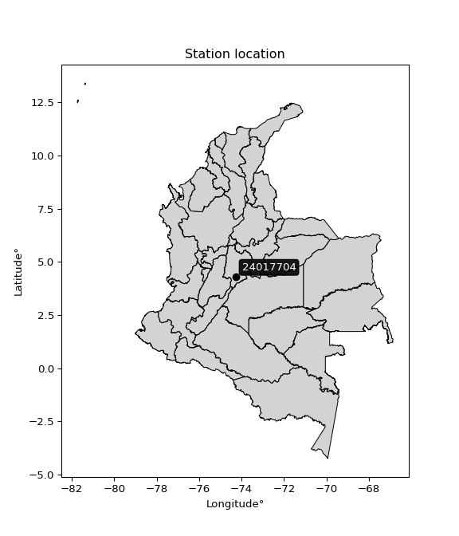

<div align="center">


</div>

# PMP Station (Rain, Pmax24h): 24017704

Probable Maximum Precipitation (PMP) is the greatest amount of rainfall for a specific duration that is meteorologically possible for a given location, acting as a "worst-case" scenario for extreme storms, crucial for designing safety-critical infrastructure like bridges, river deviations, dams, spillways, and nuclear plants to prevent catastrophic failure. PMP is calculated by hydrologists using meteorological data to determine the upper limit of extreme rainfall, often leading to the Probable Maximum Flood (PMF) for flood control design, and is increasingly being studied for climate change impacts. Probable Maximum Precipitation (PMP) is the theoretical upper limit of rainfall, a deterministic estimate for extreme events, while probability distributions (like GEV, Gumbel) describe the likelihood and frequency of various precipitation amounts, including rare ones, showing how often events occur, with PMP representing the extreme end of these distributions, used for critical infrastructure design to ensure safety against the worst conceivable weather, unlike standard statistical forecasts which cover typical probabilities.

The most common probability distributions in hydrology, used for analyzing floods, rainfall, and streamflow, include the Normal, Log-Normal, Gumbel, Gamma (including Log-Pearson Type III), and Generalized Extreme Value (GEV) distributions, often chosen based on the data´s skewness and whether modeling extremes or general conditions, with Gumbel and GEV popular for extreme events like floods, while the Normal distribution serves as a baseline, though often requiring transformations for skewed hydrological data. These distributions help in designing water infrastructure, managing water resources, and forecasting hydrologic events.

> Hydrological data often isn´t perfectly normal (it´s skewed), so different distributions are needed for different applications, such as: **Flood Frequency Analysis**: Using Gumbel, GEV, or Log-Pearson Type III for predicting extreme flood magnitudes and their return periods, **Rainfall Analysis**: Normal for annual totals, but Log-Normal, Weibull, or GEV for intensity or extreme daily rainfall, **Streamflow Modeling**: Gamma and Log-Normal for maximum flows, GEV for minimum flows, and Kappa for daily flows.

<div align="center">

</img>

</div>


## A. General information


### 1. General running parameters

• app_version: _v20260108_. • runtime: _2026-01-09 11:32:22.148588_. • Python version: _3.14.0_. • SciPy version: _1.16.3_. • Pandas version: _2.3.3_. • NumPy version: _2.3.5_. • Stations dataset (station_dataset_file): _dataset/pmax24h_in/automatic_colombia_2003_2024.csv_. • Stations catalog (station_catalog_file): _dataset/CNE.xls_. • Minimum year to eval til year_max (date_min): _1900_. • Maximum year to eval since year_min (date_max): _2024_. • Creates, save and include plots into reports (create_plot): _False_. • Plot only fit distributions with Δo > Δ (plot_only_fit): _True_. • Plot only simple graphs avoiding multiple CDFs and multiple Extreme values plots (plot_only_simple): _True_. • Eval low extreme values, if False, evaluates high extreme values (low_extreme): _False_. • Eval every SciPy distribution as logarithmic (pdist_logarithmic_on): _True_. • Standard deviation normalized (ddof): _1.0_. • Return periods to eval in years (Tr): _[2, 2.33, 5, 10, 15, 20, 25, 50, 75, 100, 200, 250, 500, 750, 1000]_. • Minimum data sample per station, 0 means any (minimum_sample): _5_. • Z-Score maximum threshold to adjust a value, 0 means disable (zscore_max): _3.5_. • Z-Score minimum threshold to adjust a value, 0 means disable (zscore_min): _-2.5_. • Avoid zeros, e.g. rain = 0 (avoid_zeros): _True_. • Avoid null values (avoid_nans): _True_. 

:file_folder:Table: [dataset.csv](../../dataset/pmax24h_in/automatic_colombia_2003_2024.csv)

> Delta Degrees of Freedom (DDOF): is a parameter used in the formulas for calculating variance and standard deviation. When ddof=0, the divisor is $N$ (the total number of observations) and this is used when your data set is the entire population. When ddof=1, the divisor is $N-1$ and this is used when your data set is a sample drawn from a larger population. Using $N-1$ provides an unbiased estimate of the population variance (known as Bessel´s correction).


### 2. Station info and location

|   id |   CODIGO | NOMBRE                              | CATEGORIA    | TECNOLOGIA                | ESTADO   |   FECHA_INSTALACION |   FECHA_SUSPENSION |   ALTITUD |   LATITUD |   LONGITUD | DEPARTAMENTO   | MUNICIPIO        | AREA_OPERATIVA                            | ENTIDAD                                       | AREA_HIDROGRAFICA   | ZONA_HIDROGRAFICA   | SUBZONA_HIDROGRAFICA   | CORRIENTE   | Catalogo   |   Version |
|-----:|---------:|:------------------------------------|:-------------|:--------------------------|:---------|--------------------:|-------------------:|----------:|----------:|-----------:|:---------------|:-----------------|:------------------------------------------|:----------------------------------------------|:--------------------|:--------------------|:-----------------------|:------------|:-----------|----------:|
|    0 | 24017704 | HACIENDA EL HATO  - AUT  [24017704] | Limnigráfica | Automática con Telemetría | Activa   |                 nan |                nan |      2891 |   4.30811 |   -74.2818 | Cundinamarca   | Carmen De Carupa | Area Operativa 11 - Cundinamarca-Amazonas | CORPORACION AUTONOMA REGIONAL DE CUNDINAMARCA | Magdalena Cauca     | Alto Magdalena      | Río Sumapaz            | Suarez      | CNE_OE     |  20251226 |

<div align="center">

Dynamic map: [:earth_americas:Google](http://maps.google.com/maps?q=4.308111111,-74.28175) [:earth_americas:OSM](https://www.openstreetmap.org/#map=18/4.308111111/-74.28175&layers=P) [:earth_americas:Bing](https://www.bing.com/maps?cp=4.308111111~-74.28175&lvl=18) [:earth_americas:Apple](https://maps.apple.com/frame?center=4.308111111%2C-74.28175&span=0.003%2C0.006)

</div>


<div align="center">

```geojson
{
  "type": "Feature",
  "geometry": {
    "type": "Point", 
    "coordinates": [-74.28175, 4.308111111]
  }, 
  "properties": {
    "Name": "24017704"
  }
}
```

</div>


### 3. Discrete values table and plot

<div align="center">

|               |         0 |           1 |          2 |            3 |          4 |           5 |           6 |
|:--------------|----------:|------------:|-----------:|-------------:|-----------:|------------:|------------:|
| Date          | 2015      | 2016        | 2017       | 2018         | 2019       | 2020        | 2021        |
| Value         |    6.1    |   28.5      |   37.4     |   23.3       |   12.9     |   33        |   27.5      |
| Value_initial |    6.1    |   28.5      |   37.4     |   23.3       |   12.9     |   33        |   27.5      |
| count         |    7      |    7        |    7       |    7         |    7       |    7        |    7        |
| mean          |   24.1    |   24.1      |   24.1     |   24.1       |   24.1     |   24.1      |   24.1      |
| std           |   11.0838 |   11.0838   |   11.0838  |   11.0838    |   11.0838  |   11.0838   |   11.0838   |
| zscore        |   -1.624  |    0.396977 |    1.19995 |   -0.0721776 |   -1.01049 |    0.802976 |    0.306755 |


</div>


> The initial value (value_initial) correspond to the initial obtained or null completed value, and value (value) is adjusted only when the initial value is outside the valid range (outlier) definite through the Z-Score value. If Z-Score is active, values out of range or outliers are replaced with the station mean value. A Z-Score (or standard score) measures how many standard deviations a data point is from the mean of a dataset, indicating its relative position; positive scores mean above the mean, negative mean below, and a score of zero is exactly at the mean, allowing for comparison of values from different distributions. It´s calculated using the formula $z=(x–μ)/σ$, where $x$ is the data point, $μ$ is the mean, and $σ$ is the standard deviation, helping identify outliers and understand probability.
>
> <sub>**Note**: In this study, "completing" (filling gaps in) and "extending" (forecasting or lengthening the historical record) rainfall data series are avoided for certain critical analyses because they introduce artificial bias and uncertainty, which can distort the statistics of rare events (extremes), alter day-to-day variability, and compromise the integrity and homogeneity of the original data. Some reasons against Completing/Extending rainfall data are: **Distortion of Extremes and Variability**: The primary issue is that most gap-filling or extension methods rely on averaging or regression with nearby stations, which inherently smooths the data. Rainfall is highly variable in space and time, with a large percentage of zero values and occasional large storms. Infilling methods often underestimate the highest values and overestimate the lowest (zero) values, which severely distorts analyses focused on flood frequency, drought severity, and intensity-duration-frequency (IDF) curves, **Loss of Data Homogeneity**: Infilled or extended data are synthetic estimates, not actual measurements. Combining these estimates with observed data can violate the assumption of data homogeneity, which requires that the data properties do not change over time. Inhomogeneity can lead to incorrect conclusions about long-term trends or changes in climate patterns, **Propagation of Errors**: Errors and biases from the original data (e.g., wind-induced undercatch, instrument errors, site changes) or the data used for imputation can propagate through the analysis, leading to unreliable hydrological models and inaccurate predictions, **Compromised Statistical Integrity**: For statistical analyses, especially those involving the frequency of events, using artificial data can introduce time bias or autocorrelation that doesn´t exist in reality, making it difficult to assess the true probability of events, **Difficulty in Validation**: It is difficult to accurately validate the quality of filled or extended data, especially for past periods where ground-truth measurements are unavailable. The reliability of imputation techniques heavily depends on the density of the surrounding station network and the complexity of the local topography.</sub>


### 4. Active continuous probability distributions from SciPy (45 of 104 available)

A Probability Density Function (PDF) describes the relative likelihood of a continuous random variable falling within a specific range, where the total area under its curve equals 1, and the area over any interval gives the actual probability for that range. Unlike discrete probabilities (like rolling a die), a PDF shows density, not direct probability for a single point (which is zero), with higher points indicating higher likelihood, often visualized as a bell curve for normal distributions.

A log of a probability density function (log-PDF) is simply the logarithm of the PDF´s value, denoted as $log(f(x))$, useful for converting multiplication of probabilities into addition, improving numerical stability with tiny numbers, and connecting to information theory concepts like entropy. Instead of dealing with very small probabilities (e.g., 0.000001), log-PDFs use negative numbers (e.g., $log(0.00001) ≈ -11.51$ that are easier for computers to handle, preventing underflow errors and simplifying complex calculations. In this study, each active probability distribution from SciPy is also evaluated in the $log$ form.

[scipy.stats](https://docs.scipy.org/doc/scipy/reference/stats.html) is a Python´s powerful submodule within the SciPy library for comprehensive statistical analysis, offering over 130 probability distributions (like Normal, Poisson), functions for descriptive stats (mean, variance), hypothesis testing (t-tests, chi-square), random variable generation, and statistical tests, making it essential for data science, modeling, and research. It provides tools to explore, model, and draw conclusions from data efficiently, working seamlessly with NumPy.

<div align="center">

|   id | p_dist             |   n_parameter | fit_method   | label                                                                       | active   | ref                                                                                                        |
|-----:|:-------------------|--------------:|:-------------|:----------------------------------------------------------------------------|:---------|:-----------------------------------------------------------------------------------------------------------|
|    0 | alpha              |             3 | MLE          | Alpha                                                                       | True     | [:mortar_board:](https://docs.scipy.org/doc/scipy/reference/generated/scipy.stats.alpha.html)              |
|    1 | betaprime          |             4 | MLE          | Beta prime                                                                  | True     | [:mortar_board:](https://docs.scipy.org/doc/scipy/reference/generated/scipy.stats.betaprime.html)          |
|    2 | chi2               |             3 | MLE          | Chi²                                                                        | True     | [:mortar_board:](https://docs.scipy.org/doc/scipy/reference/generated/scipy.stats.chi2.html)               |
|    3 | crystalball        |             4 | MLE          | Crystalball                                                                 | True     | [:mortar_board:](https://docs.scipy.org/doc/scipy/reference/generated/scipy.stats.crystalball.html)        |
|    4 | dweibull           |             3 | MLE          | Double Weibull                                                              | True     | [:mortar_board:](https://docs.scipy.org/doc/scipy/reference/generated/scipy.stats.dweibull.html)           |
|    5 | erlang             |             3 | MLE          | Erlang                                                                      | True     | [:mortar_board:](https://docs.scipy.org/doc/scipy/reference/generated/scipy.stats.erlang.html)             |
|    6 | expon              |             2 | MLE          | Exponential                                                                 | True     | [:mortar_board:](https://docs.scipy.org/doc/scipy/reference/generated/scipy.stats.expon.html)              |
|    7 | exponnorm          |             3 | MLE          | Exponentially modified Normal                                               | True     | [:mortar_board:](https://docs.scipy.org/doc/scipy/reference/generated/scipy.stats.exponnorm.html)          |
|    8 | f                  |             4 | MLE          | F                                                                           | True     | [:mortar_board:](https://docs.scipy.org/doc/scipy/reference/generated/scipy.stats.f.html)                  |
|    9 | fatiguelife        |             3 | MLE          | Fatigue-life (Birnbaum-Saunders)                                            | True     | [:mortar_board:](https://docs.scipy.org/doc/scipy/reference/generated/scipy.stats.fatiguelife.html)        |
|   10 | fisk               |             3 | MLE          | Fisk                                                                        | True     | [:mortar_board:](https://docs.scipy.org/doc/scipy/reference/generated/scipy.stats.fisk.html)               |
|   11 | gamma              |             3 | MLE          | Gamma                                                                       | True     | [:mortar_board:](https://docs.scipy.org/doc/scipy/reference/generated/scipy.stats.gamma.html)              |
|   12 | genexpon           |             5 | MLE          | Generalized exponential                                                     | True     | [:mortar_board:](https://docs.scipy.org/doc/scipy/reference/generated/scipy.stats.genexpon.html)           |
|   13 | genlogistic        |             3 | MLE          | Generalized logistic                                                        | True     | [:mortar_board:](https://docs.scipy.org/doc/scipy/reference/generated/scipy.stats.genlogistic.html)        |
|   14 | gibrat             |             2 | MM           | Gibrat                                                                      | True     | [:mortar_board:](https://docs.scipy.org/doc/scipy/reference/generated/scipy.stats.gibrat.html)             |
|   15 | gompertz           |             3 | MLE          | Gompertz (or truncated Gumbel)                                              | True     | [:mortar_board:](https://docs.scipy.org/doc/scipy/reference/generated/scipy.stats.gompertz.html)           |
|   16 | gumbel_l           |             2 | MM           | Gumbel Left Skew                                                            | True     | [:mortar_board:](https://docs.scipy.org/doc/scipy/reference/generated/scipy.stats.gumbel_l.html)           |
|   17 | gumbel_r           |             2 | MM           | Gumbel Right Skew                                                           | True     | [:mortar_board:](https://docs.scipy.org/doc/scipy/reference/generated/scipy.stats.gumbel_r.html)           |
|   18 | halflogistic       |             2 | MM           | Half-logistic                                                               | True     | [:mortar_board:](https://docs.scipy.org/doc/scipy/reference/generated/scipy.stats.halflogistic.html)       |
|   19 | halfnorm           |             2 | MM           | Half Normal                                                                 | True     | [:mortar_board:](https://docs.scipy.org/doc/scipy/reference/generated/scipy.stats.halfnorm.html)           |
|   20 | hypsecant          |             2 | MM           | hyperbolic secant                                                           | True     | [:mortar_board:](https://docs.scipy.org/doc/scipy/reference/generated/scipy.stats.hypsecant.html)          |
|   21 | invgamma           |             3 | MLE          | Inverted gamma                                                              | True     | [:mortar_board:](https://docs.scipy.org/doc/scipy/reference/generated/scipy.stats.invgamma.html)           |
|   22 | invgauss           |             3 | MLE          | Inverse Gaussian                                                            | True     | [:mortar_board:](https://docs.scipy.org/doc/scipy/reference/generated/scipy.stats.invgauss.html)           |
|   23 | invweibull         |             3 | MLE          | Inverted Weibull                                                            | True     | [:mortar_board:](https://docs.scipy.org/doc/scipy/reference/generated/scipy.stats.invweibull.html)         |
|   24 | kappa4             |             4 | MLE          | Kappa 4                                                                     | True     | [:mortar_board:](https://docs.scipy.org/doc/scipy/reference/generated/scipy.stats.kappa4.html)             |
|   25 | kstwobign          |             2 | MLE          | Limiting distribution of scaled Kolmogorov-Smirnov two-sided test statistic | True     | [:mortar_board:](https://docs.scipy.org/doc/scipy/reference/generated/scipy.stats.kstwobign.html)          |
|   26 | laplace            |             2 | MM           | Laplace                                                                     | True     | [:mortar_board:](https://docs.scipy.org/doc/scipy/reference/generated/scipy.stats.laplace.html)            |
|   27 | laplace_asymmetric |             3 | MLE          | Asymmetric Laplace                                                          | True     | [:mortar_board:](https://docs.scipy.org/doc/scipy/reference/generated/scipy.stats.laplace_asymmetric.html) |
|   28 | loggamma           |             3 | MLE          | Log gamma                                                                   | True     | [:mortar_board:](https://docs.scipy.org/doc/scipy/reference/generated/scipy.stats.loggamma.html)           |
|   29 | logistic           |             2 | MM           | Logistic (or Sech-squared)                                                  | True     | [:mortar_board:](https://docs.scipy.org/doc/scipy/reference/generated/scipy.stats.logistic.html)           |
|   30 | lognorm            |             3 | MLE          | Log Normal                                                                  | True     | [:mortar_board:](https://docs.scipy.org/doc/scipy/reference/generated/scipy.stats.lognorm.html)            |
|   31 | maxwell            |             2 | MM           | Maxwell                                                                     | True     | [:mortar_board:](https://docs.scipy.org/doc/scipy/reference/generated/scipy.stats.maxwell.html)            |
|   32 | mielke             |             4 | MLE          | Mielke Beta-Kappa / Dagum                                                   | True     | [:mortar_board:](https://docs.scipy.org/doc/scipy/reference/generated/scipy.stats.mielke.html)             |
|   33 | moyal              |             2 | MM           | Moyal                                                                       | True     | [:mortar_board:](https://docs.scipy.org/doc/scipy/reference/generated/scipy.stats.moyal.html)              |
|   34 | nakagami           |             3 | MLE          | Nakagami                                                                    | True     | [:mortar_board:](https://docs.scipy.org/doc/scipy/reference/generated/scipy.stats.nakagami.html)           |
|   35 | ncf                |             5 | MLE          | Non-central F distribution                                                  | True     | [:mortar_board:](https://docs.scipy.org/doc/scipy/reference/generated/scipy.stats.ncf.html)                |
|   36 | nct                |             4 | MLE          | Non-central Student’s t                                                     | True     | [:mortar_board:](https://docs.scipy.org/doc/scipy/reference/generated/scipy.stats.nct.html)                |
|   37 | norm               |             2 | MM           | Normal                                                                      | True     | [:mortar_board:](https://docs.scipy.org/doc/scipy/reference/generated/scipy.stats.norm.html)               |
|   38 | pearson3           |             3 | MM           | Pearson type III                                                            | True     | [:mortar_board:](https://docs.scipy.org/doc/scipy/reference/generated/scipy.stats.pearson3.html)           |
|   39 | rayleigh           |             2 | MM           | Rayleigh                                                                    | True     | [:mortar_board:](https://docs.scipy.org/doc/scipy/reference/generated/scipy.stats.rayleigh.html)           |
|   40 | rice               |             3 | MLE          | Rice                                                                        | True     | [:mortar_board:](https://docs.scipy.org/doc/scipy/reference/generated/scipy.stats.rice.html)               |
|   41 | t                  |             3 | MLE          | Student’s t                                                                 | True     | [:mortar_board:](https://docs.scipy.org/doc/scipy/reference/generated/scipy.stats.t.html)                  |
|   42 | truncnorm          |             4 | MLE          | Truncated normal                                                            | True     | [:mortar_board:](https://docs.scipy.org/doc/scipy/reference/generated/scipy.stats.truncnorm.html)          |
|   43 | wald               |             2 | MM           | Wald                                                                        | True     | [:mortar_board:](https://docs.scipy.org/doc/scipy/reference/generated/scipy.stats.wald.html)               |
|   44 | weibull_min        |             3 | MLE          | Weibull minimum                                                             | True     | [:mortar_board:](https://docs.scipy.org/doc/scipy/reference/generated/scipy.stats.weibull_min.html)        |

</div>

> **n_parameter:** # arguments & localization & scale.
>
> **Fit methods:** (MLE) maximum likelihood, (MM) L-moments.
>
>**Inactive** (With the only purpose of prevent loops, zero divisions, infinite values, over high estimated values or horizontal trending for recurrence intervals estimations, the follow distributions were disabled.)**:** foldnorm, gennorm, norminvgauss, powernorm, powerlognorm, skewnorm, genextreme, anglit, arcsine, argus, beta, bradford, burr, burr12, cauchy, cosine, halfcauchy, foldcauchy, skewcauchy, wrapcauchy, dgamma, gengamma, exponweib, exponpow, truncexpon, gausshyper, genhalflogistic, genhyperbolic, geninvgauss, halfgennorm, johnsonsb, johnsonsu, kappa3, ksone, kstwo, loglaplace, levy, levy_l, levy_stable, ncx2, pareto, genpareto, truncpareto, lomax, powerlaw, rdist, rel_breitwigner, recipinvgauss, semicircular, studentized_range, trapezoid, triang, truncweibull_min, tukeylambda, uniform, loguniform, vonmises, vonmises_line, weibull_max, 


## B. Probability (PDF) vs. Empirical (EDF) distributions functions

A continuous probability distribution (CPD) describes probabilities for variables that can take any value within a range (like rain any time), unlike discrete variables with specific outcomes (like temperature). It uses a Probability Density Function (PDF), a curve where the total area under it equals 1, and the probability of the variable falling within an interval (a to b) is found by calculating the area under the curve between those points. A key feature is that the probability of hitting any single exact value is zero, so probabilities are always expressed for ranges, e.g., $P(a ≤ X ≤ b)$.

<div align="center">

Distributions parameters from station values
|    |   station | p_dist                |   n |             loc |           scale | shape                  | shape1                 | shape2                | shape3   |
|---:|----------:|:----------------------|----:|----------------:|----------------:|:-----------------------|:-----------------------|:----------------------|:---------|
|  0 |  24017704 | alpha                 |   7 |    -4.42028     |    39.1646      | 1.6669388614430467     |                        |                       |          |
|  1 |  24017704 | betaprime             |   7 |  -402.665       | 25888           | 1743.4240871363468     | 105784.13660953972     |                       |          |
|  2 |  24017704 | chi2                  |   7 |  -106.347       |     0.427989    | 304.3512790659412      |                        |                       |          |
|  3 |  24017704 | crystalball           |   7 |    24.1         |    10.2616      | 797.654272309723       | 572.6035946935044      |                       |          |
|  4 |  24017704 | dweibull              |   7 |    24.9435      |     9.3118      | 1.4263917842768528     |                        |                       |          |
|  5 |  24017704 | erlang                |   7 |  -128.272       |     0.729534    | 208.64987645951499     |                        |                       |          |
|  6 |  24017704 | expon                 |   7 |     6.1         |    18           |                        |                        |                       |          |
|  7 |  24017704 | exponnorm             |   7 |    24.091       |    10.2616      | 0.0008803512926141712  |                        |                       |          |
|  8 |  24017704 | f                     |   7 | -2759.77        |  2783.86        | 251490.28418022013     | 351656.7102128754      |                       |          |
|  9 |  24017704 | fatiguelife           |   7 | -1609.84        |  1633.94        | 0.006257562362450432   |                        |                       |          |
| 10 |  24017704 | fisk                  |   7 |    -6.40492e+08 |     6.40492e+08 | 105730370.48324038     |                        |                       |          |
| 11 |  24017704 | gamma                 |   7 |  -150.5         |     0.624455    | 279.4355460154022      |                        |                       |          |
| 12 |  24017704 | genexpon              |   7 |     6.1         |     1.84557     | 0.10255250827997334    | 1.2618182991621034e-08 | 0.9756982584960865    |          |
| 13 |  24017704 | genlogistic           |   7 |    35.0506      |     2.15998     | 0.18779390469428076    |                        |                       |          |
| 14 |  24017704 | gibrat                |   7 |    16.2718      |     4.74808     |                        |                        |                       |          |
| 15 |  24017704 | gompertz              |   7 |     6.09999     |     3.07965     | 0.00020056331890550873 |                        |                       |          |
| 16 |  24017704 | gumbel_l              |   7 |    28.7183      |     8.00092     |                        |                        |                       |          |
| 17 |  24017704 | gumbel_r              |   7 |    19.4817      |     8.00092     |                        |                        |                       |          |
| 18 |  24017704 | halflogistic          |   7 |    11.9376      |     8.7733      |                        |                        |                       |          |
| 19 |  24017704 | halfnorm              |   7 |    10.5177      |    17.0229      |                        |                        |                       |          |
| 20 |  24017704 | hypsecant             |   7 |    24.1         |     6.53272     |                        |                        |                       |          |
| 21 |  24017704 | invgamma              |   7 |  -122.599       | 27964.4         | 192.03908767070118     |                        |                       |          |
| 22 |  24017704 | invgauss              |   7 |   -48.6599      |  3086.03        | 0.023544315518204878   |                        |                       |          |
| 23 |  24017704 | invweibull            |   7 |    -9.44474e+08 |     9.44474e+08 | 90661912.83719923      |                        |                       |          |
| 24 |  24017704 | kappa4                |   7 |     3.02575     |    34.9451      | 1.0965079786448295     | 1.0100824582831351     |                       |          |
| 25 |  24017704 | kstwobign             |   7 |   -17.5626      |    47.5066      |                        |                        |                       |          |
| 26 |  24017704 | laplace               |   7 |    24.1         |     7.25603     |                        |                        |                       |          |
| 27 |  24017704 | laplace_asymmetric    |   7 |    28.5         |     7.26523     | 1.347661833771538      |                        |                       |          |
| 28 |  24017704 | loggamma              |   7 |    35.6626      |     3.77876     | 0.34062097299982663    |                        |                       |          |
| 29 |  24017704 | logistic              |   7 |    24.1         |     5.6575      |                        |                        |                       |          |
| 30 |  24017704 | lognorm               |   7 |     6.1         |     0.0883224   | 13.166101823751244     |                        |                       |          |
| 31 |  24017704 | maxwell               |   7 |    -0.215633    |    15.2376      |                        |                        |                       |          |
| 32 |  24017704 | mielke                |   7 |     6.08313     |    31.425       | 0.8720478271562373     | 1109.0651856319084     |                       |          |
| 33 |  24017704 | moyal                 |   7 |    18.2318      |     4.61933     |                        |                        |                       |          |
| 34 |  24017704 | nakagami              |   7 |    12.9         |    15.1041      | 0.39306797736644716    |                        |                       |          |
| 35 |  24017704 | ncf                   |   7 |     0.395431    |     7.34695e-06 | 5.752347108351795e-06  | 41.84181897555899      | 18.01064382586825     |          |
| 36 |  24017704 | nct                   |   7 |  -673.714       |    10.2253      | 286545.19820958085     | 68.2436749770834       |                       |          |
| 37 |  24017704 | norm                  |   7 |    24.1         |    10.2616      |                        |                        |                       |          |
| 38 |  24017704 | pearson3              |   7 |    24.1         |    10.2615      | -0.536128870341245     |                        |                       |          |
| 39 |  24017704 | rayleigh              |   7 |     4.469       |    15.6633      |                        |                        |                       |          |
| 40 |  24017704 | rice                  |   7 |     0.126395    |    11.391       | 1.8002415560561618     |                        |                       |          |
| 41 |  24017704 | t                     |   7 |    24.1014      |    10.2622      | 3129086.720297058      |                        |                       |          |
| 42 |  24017704 | truncnorm             |   7 |    24.1         |    10.2616      | -107.14598898802409    | 1093.169716428042      |                       |          |
| 43 |  24017704 | wald                  |   7 |    13.8384      |    10.2616      |                        |                        |                       |          |
| 44 |  24017704 | weibull_min           |   7 |    -1.65091e+08 |     1.65091e+08 | 20381005.872600444     |                        |                       |          |
| 45 |  24017704 | logalpha              |   7 |   -13.7684      |   452.748       | 26.952333052251376     |                        |                       |          |
| 46 |  24017704 | logbetaprime          |   7 |   -11.7919      |    43.7549      | 754.6217610962467      | 2226.650717136744      |                       |          |
| 47 |  24017704 | logchi2               |   7 |     1.80829     |     0.982304    | 1.0211402865009536     |                        |                       |          |
| 48 |  24017704 | logcrystalball        |   7 |     3.04232     |     0.595203    | 2034.79318819201       | 10.188301227052426     |                       |          |
| 49 |  24017704 | logdweibull           |   7 |     3.31419     |     0.489955    | 0.7524511956920165     |                        |                       |          |
| 50 |  24017704 | logerlang             |   7 |    -7.50342     |     0.0370949   | 284.1040765180586      |                        |                       |          |
| 51 |  24017704 | logexpon              |   7 |     1.80829     |     1.23403     |                        |                        |                       |          |
| 52 |  24017704 | logexponnorm          |   7 |     3.04194     |     0.595203    | 0.0006417228628518207  |                        |                       |          |
| 53 |  24017704 | logf                  |   7 |  -897.434       |   900.478       | 21623740.03321792      | 5769168.55357215       |                       |          |
| 54 |  24017704 | logfatiguelife        |   7 |  -469.878       |   472.919       | 0.0012563563967498185  |                        |                       |          |
| 55 |  24017704 | logfisk               |   7 |    -3.21878e+07 |     3.21878e+07 | 98452875.12490135      |                        |                       |          |
| 56 |  24017704 | loggamma              |   7 |    -7.18248     |     0.0381761   | 267.69640092403534     |                        |                       |          |
| 57 |  24017704 | loggenexpon           |   7 |     1.80734     |     0.0206601   | 0.005470091564401756   | 5.147047828225566      | 5.923812328858883e-05 |          |
| 58 |  24017704 | loggenlogistic        |   7 |     3.62202     |     2.23761e-06 | 3.8582761784416605e-06 |                        |                       |          |
| 59 |  24017704 | loggibrat             |   7 |     2.58826     |     0.275403    |                        |                        |                       |          |
| 60 |  24017704 | loggompertz           |   7 |     1.80829     |     0.425358    | 0.03196981761280354    |                        |                       |          |
| 61 |  24017704 | loggumbel_l           |   7 |     3.31019     |     0.464078    |                        |                        |                       |          |
| 62 |  24017704 | loggumbel_r           |   7 |     2.77445     |     0.464078    |                        |                        |                       |          |
| 63 |  24017704 | loghalflogistic       |   7 |     2.3369      |     0.508857    |                        |                        |                       |          |
| 64 |  24017704 | loghalfnorm           |   7 |     2.25453     |     0.987353    |                        |                        |                       |          |
| 65 |  24017704 | loghypsecant          |   7 |     3.04232     |     0.378918    |                        |                        |                       |          |
| 66 |  24017704 | loginvgamma           |   7 |   -11.3611      |  7598.95        | 528.9663118850781      |                        |                       |          |
| 67 |  24017704 | loginvgauss           |   7 |    -3.59304     |   697.478       | 0.009496919789811008   |                        |                       |          |
| 68 |  24017704 | loginvweibull         |   7 |    -3.25432e+07 |     3.25432e+07 | 48319049.85637963      |                        |                       |          |
| 69 |  24017704 | logkappa4             |   7 |     1.66913     |     2.04003     | 1.0733286725135005     | 1.044654571150518      |                       |          |
| 70 |  24017704 | logkstwobign          |   7 |     0.308775    |     3.1219      |                        |                        |                       |          |
| 71 |  24017704 | loglaplace            |   7 |     3.04232     |     0.420872    |                        |                        |                       |          |
| 72 |  24017704 | loglaplace_asymmetric |   7 |     3.49651     |     0.248846    | 2.2666439550925026     |                        |                       |          |
| 73 |  24017704 | logloggamma           |   7 |     3.62192     |     8.15596e-07 | 1.417477321481975e-06  |                        |                       |          |
| 74 |  24017704 | loglogistic           |   7 |     3.04232     |     0.328153    |                        |                        |                       |          |
| 75 |  24017704 | loglognorm            |   7 |     1.80829     |     0.00768557  | 12.730097939431108     |                        |                       |          |
| 76 |  24017704 | logmaxwell            |   7 |     1.63194     |     0.883825    |                        |                        |                       |          |
| 77 |  24017704 | logmielke             |   7 |    -1.60335e+07 |     1.60335e+07 | 27081373.122405782     | 4061194167.81662       |                       |          |
| 78 |  24017704 | logmoyal              |   7 |     2.70194     |     0.267935    |                        |                        |                       |          |
| 79 |  24017704 | lognakagami           |   7 |     2.34219     |     0.940714    | 1.3983199096125811     |                        |                       |          |
| 80 |  24017704 | logncf                |   7 |    -6.00981     |     9.03434     | 552.3449536758148      | 1198.4858248117844     | 0.31532097074002496   |          |
| 81 |  24017704 | lognct                |   7 |   -23.3753      |     0.5449      | 5229.595575317722      | 48.47220268640078      |                       |          |
| 82 |  24017704 | lognorm               |   7 |     3.04232     |     0.595203    |                        |                        |                       |          |
| 83 |  24017704 | logpearson3           |   7 |     3.04232     |     0.595203    | -1.1211823923329631    |                        |                       |          |
| 84 |  24017704 | lograyleigh           |   7 |     1.90369     |     0.908501    |                        |                        |                       |          |
| 85 |  24017704 | logrice               |   7 |  -299.742       |     0.595359    | 508.5728689995923      |                        |                       |          |
| 86 |  24017704 | logt                  |   7 |     3.04232     |     0.595203    | 5211844256.434549      |                        |                       |          |
| 87 |  24017704 | logtruncnorm          |   7 |    -0.113083    |     1.60526     | 1.6634740733286102     | 2.3265794045979695     |                       |          |
| 88 |  24017704 | logwald               |   7 |     2.44716     |     0.595164    |                        |                        |                       |          |
| 89 |  24017704 | logweibull_min        |   7 |    -5.4721e+07  |     5.4721e+07  | 141603134.03056538     |                        |                       |          |

</div>

> **loc** (Location parameter): This shifts the distribution along the x-axis. For many common distributions, like the normal (Gaussian) distribution, loc represents the mean $μ$. For others, like the uniform distribution, it might represent the minimum value, or for the beta distribution, the left end of the support interval.
>
> **scale** (Scale parameter): This determines the width or spread of the distribution. For the normal distribution, scale represents the standard deviation $σ$. For a uniform distribution, it defines the length of the interval (from $loc$ to $loc + scale$).
>
> **shape** (Shape parameters): Refers to parameters that define the specific form of a probability distribution, distinct from its location (loc) and scale (scale). These parameters are required arguments for most distribution functions. For example, a normal (Gaussian) distribution is fully defined by its location (mean) and scale (standard deviation), so it has no specific shape parameters beyond loc and scale. However, other distributions have intrinsic properties that need specification, as Gamma distribution that takes a shape parameter, often named $a$ or $alpha$.


### 0. Cumulative distribution values - CDF (90 evaluated)

Cumulative Distribution Function (CDF), denoted as $F$<sub>$X$</sub>$(x)$, is a function that gives the probability that a random variable $X$ will take a value less than or equal to a specific value, $x$ (i.e., $(P(X≥x)$. It essentially "accumulates" probabilities from a given point up to the far right (positive infinity), providing a complete picture of the distribution´s probabilities for both discrete (like rain) and continuous (like temperature) variables, helping to find probabilities over ranges or above certain values. Each station is evaluated separately ordering the $x$ values ascending, calculating the CDF and PDF values for the activated distributions and their logarithmic forms.

<div align="center">

CDF ordered by x ascending and calculating $log(f(x))$ separately
|   id |   Station |   date |    x |   count |   mean |     std |     zscore |   Value_initial |   station |   m |     alpha |   alpha_pdf |   betaprime |   betaprime_pdf |      chi2 |   chi2_pdf |   crystalball |   crystalball_pdf |   dweibull |   dweibull_pdf |    erlang |   erlang_pdf |    expon |   expon_pdf |   exponnorm |   exponnorm_pdf |         f |      f_pdf |   fatiguelife |   fatiguelife_pdf |      fisk |   fisk_pdf |     gamma |   gamma_pdf |    genexpon |   genexpon_pdf |   genlogistic |   genlogistic_pdf |   gibrat |   gibrat_pdf |    gompertz |   gompertz_pdf |   gumbel_l |   gumbel_l_pdf |   gumbel_r |   gumbel_r_pdf |   halflogistic |   halflogistic_pdf |   halfnorm |   halfnorm_pdf |   hypsecant |   hypsecant_pdf |   invgamma |   invgamma_pdf |   invgauss |   invgauss_pdf |   invweibull |   invweibull_pdf |      kappa4 |   kappa4_pdf |   kstwobign |   kstwobign_pdf |   laplace |   laplace_pdf |   laplace_asymmetric |   laplace_asymmetric_pdf |   loggamma |   loggamma_pdf |   logistic |   logistic_pdf |   lognorm |   lognorm_pdf |   maxwell |   maxwell_pdf |     mielke |   mielke_pdf |       moyal |   moyal_pdf |    nakagami |   nakagami_pdf |       ncf |   ncf_pdf |       nct |    nct_pdf |      norm |   norm_pdf |   pearson3 |   pearson3_pdf |   rayleigh |   rayleigh_pdf |      rice |   rice_pdf |         t |     t_pdf |   truncnorm |   truncnorm_pdf |     wald |   wald_pdf |   weibull_min |   weibull_min_pdf |   logalpha |   logalpha_pdf |   logbetaprime |   logbetaprime_pdf |     logchi2 |   logchi2_pdf |   logcrystalball |   logcrystalball_pdf |   logdweibull |   logdweibull_pdf |   logerlang |   logerlang_pdf |   logexpon |   logexpon_pdf |   logexponnorm |   logexponnorm_pdf |      logf |   logf_pdf |   logfatiguelife |   logfatiguelife_pdf |   logfisk |   logfisk_pdf |   loggenexpon |   loggenexpon_pdf |   loggenlogistic |   loggenlogistic_pdf |   loggibrat |   loggibrat_pdf |   loggompertz |   loggompertz_pdf |   loggumbel_l |   loggumbel_l_pdf |   loggumbel_r |   loggumbel_r_pdf |   loghalflogistic |   loghalflogistic_pdf |   loghalfnorm |   loghalfnorm_pdf |   loghypsecant |   loghypsecant_pdf |   loginvgamma |   loginvgamma_pdf |   loginvgauss |   loginvgauss_pdf |   loginvweibull |   loginvweibull_pdf |   logkappa4 |   logkappa4_pdf |   logkstwobign |   logkstwobign_pdf |   loglaplace |   loglaplace_pdf |   loglaplace_asymmetric |   loglaplace_asymmetric_pdf |   logloggamma |   logloggamma_pdf |   loglogistic |   loglogistic_pdf |   loglognorm |   loglognorm_pdf |   logmaxwell |   logmaxwell_pdf |   logmielke |   logmielke_pdf |    logmoyal |   logmoyal_pdf |   lognakagami |   lognakagami_pdf |    logncf |   logncf_pdf |    lognct |   lognct_pdf |   logpearson3 |   logpearson3_pdf |   lograyleigh |   lograyleigh_pdf |   logrice |   logrice_pdf |      logt |   logt_pdf |   logtruncnorm |   logtruncnorm_pdf |   logwald |   logwald_pdf |   logweibull_min |   logweibull_min_pdf |
|-----:|----------:|-------:|-----:|--------:|-------:|--------:|-----------:|----------------:|----------:|----:|----------:|------------:|------------:|----------------:|----------:|-----------:|--------------:|------------------:|-----------:|---------------:|----------:|-------------:|---------:|------------:|------------:|----------------:|----------:|-----------:|--------------:|------------------:|----------:|-----------:|----------:|------------:|------------:|---------------:|--------------:|------------------:|---------:|-------------:|------------:|---------------:|-----------:|---------------:|-----------:|---------------:|---------------:|-------------------:|-----------:|---------------:|------------:|----------------:|-----------:|---------------:|-----------:|---------------:|-------------:|-----------------:|------------:|-------------:|------------:|----------------:|----------:|--------------:|---------------------:|-------------------------:|-----------:|---------------:|-----------:|---------------:|----------:|--------------:|----------:|--------------:|-----------:|-------------:|------------:|------------:|------------:|---------------:|----------:|----------:|----------:|-----------:|----------:|-----------:|-----------:|---------------:|-----------:|---------------:|----------:|-----------:|----------:|----------:|------------:|----------------:|---------:|-----------:|--------------:|------------------:|-----------:|---------------:|---------------:|-------------------:|------------:|--------------:|-----------------:|---------------------:|--------------:|------------------:|------------:|----------------:|-----------:|---------------:|---------------:|-------------------:|----------:|-----------:|-----------------:|---------------------:|----------:|--------------:|--------------:|------------------:|-----------------:|---------------------:|------------:|----------------:|--------------:|------------------:|--------------:|------------------:|--------------:|------------------:|------------------:|----------------------:|--------------:|------------------:|---------------:|-------------------:|--------------:|------------------:|--------------:|------------------:|----------------:|--------------------:|------------:|----------------:|---------------:|-------------------:|-------------:|-----------------:|------------------------:|----------------------------:|--------------:|------------------:|--------------:|------------------:|-------------:|-----------------:|-------------:|-----------------:|------------:|----------------:|------------:|---------------:|--------------:|------------------:|----------:|-------------:|----------:|-------------:|--------------:|------------------:|--------------:|------------------:|----------:|--------------:|----------:|-----------:|---------------:|-------------------:|----------:|--------------:|-----------------:|---------------------:|
|    0 |  24017704 |   2015 |  6.1 |       7 |   24.1 | 11.0838 | -1.624     |             6.1 |  24017704 |   1 | 0.0208974 |  0.017916   |   0.0396802 |      0.00855515 | 0.0406495 | 0.00912386 |     0.0397053 |        0.00834739 |  0.0325079 |     0.00672551 | 0.0408199 |   0.00903671 | 0        |  0.0555556  |   0.0397049 |      0.00834733 | 0.0396857 | 0.00837904 |     0.0383389 |        0.00823298 | 0.0419611 | 0.00663615 | 0.0394925 |  0.00878316 | 1.44627e-08 |      0.0555669 |     0.0806989 |        0.00701614 | 0        |   0          | 7.94964e-10 |    6.51257e-05 |  0.0574749 |     0.00697302 | 0.00486543 |     0.00323854 |      0         |          0         |   0        |      0         |   0.0404258 |      0.00617158 |   0.03825  |     0.00932566 |   0.03766  |     0.00989278 |    0.0346712 |        0.0111888 | 2.81602e-15 |    0.726512  |   0.0348473 |       0.0131736 | 0.0418425 |    0.00576659 |            0.0654518 |               0.00668484 |  0.0210951 |      0.0883598 |  0.0398635 |     0.00676524 | 0.0190724 |     0.0781316 | 0.0179908 |    0.00825512 | 0.00140715 |    0.0727241 | 0.000200908 | 0.000319956 | 0           |      0         | 0.0269271 | 0.0112896 | 0.0397627 | 0.00835637 | 0.0397053 | 0.00834739 |  0.0523153 |     0.00807535 | 0.00540675 |     0.00661202 | 0.0282826 | 0.00980625 | 0.0397024 | 0.0083464 |   0.0397053 |      0.00834739 | 0        | 0          |     0.0581008 |        0.00696018 |  0.0172828 |      0.0797862 |      0.0211138 |          0.0872052 | 1.15873e-08 |    1.3322e+07 |        0.0190724 |            0.0781316 |     0.0487605 |         0.0567121 |   0.0214647 |       0.0893168 |   0        |       0.810352 |      0.0190724 |          0.0781314 | 0.0191175 |  0.0782148 |        0.0188127 |            0.0775643 | 0.0165362 |     0.0497428 |   0.000250801 |          0.265376 |         0        |            0.0755796 |    0        |        0        |     7.412e-08 |         0.0751599 |     0.0385458 |         0.0814371 |   0.000328953 |        0.00568454 |          0        |              0        |      0        |          0        |      0.0245069 |          0.0646121 |     0.0205019 |         0.0889072 |     0.0201195 |         0.0930479 |       0.0215037 |            0.122588 | 1.36587e-15 |        6.04973  |       0.024842 |           0.160613 |     0.026643 |        0.0633043 |                0.041966 |                   0.0744017 |      0.042765 |         0.0743241 |     0.0227419 |         0.0677268 |   0.00716387 |      7.03622e+12 |   0.00208768 |        0.0352327 |   0.0458193 |       0.0773909 | 1.15926e-07 |    6.27947e-06 |      0        |          0        | 0.0245368 |    0.0992628 | 0.0198473 |    0.0810745 |     0.0398528 |         0.0869964 |      0        |          0        | 0.0190981 |     0.0782004 | 0.0190725 |  0.0781319 |    0           |           0        | 0         |      0        |        0.0209043 |            0.0535253 |
|    1 |  24017704 |   2019 | 12.9 |       7 |   24.1 | 11.0838 | -1.01049   |            12.9 |  24017704 |   2 | 0.290021  |  0.0458421  |   0.14036   |      0.0220323  | 0.147643  | 0.0231745  |     0.137537  |        0.0214297  |  0.118074  |     0.0201834  | 0.146532  |   0.0229045  | 0.314617 |  0.0380768  |   0.137537  |      0.0214297  | 0.137929  | 0.0215115  |     0.135835  |        0.0214724  | 0.118614  | 0.0172579  | 0.143151  |  0.0226161  | 0.31467     |      0.0380817 |     0.145755  |        0.0126718  | 0        |   0          | 0.00162283  |    0.000591547 |  0.129316  |     0.0150694  | 0.102647   |     0.0292055  |      0.0547922 |          0.05682   |   0.111299 |      0.0464144 |   0.113417  |      0.0169963  |   0.150541 |     0.0244837  |   0.156634 |     0.0255667  |    0.173735  |        0.0291888 | 0.244911    |    0.0328879 |   0.19454   |       0.0319363 | 0.106811  |    0.0147204  |            0.131082  |               0.0133879  |  0.223566  |      0.493986  |  0.121354  |     0.018847   | 0.207535  |     0.48085   | 0.136451  |    0.026785   | 0.263773   |    0.0337432 | 0.07493     | 0.031497    | 2.34178e-13 |    103.637     | 0.172791  | 0.0304681 | 0.137659  | 0.0214373  | 0.137537  | 0.0214297  |  0.138372  |     0.0181313  | 0.134861   |     0.0297304  | 0.141812  | 0.0239845  | 0.137522  | 0.0214268 |   0.137537  |      0.0214297  | 0        | 0          |     0.129405  |        0.0148941  |  0.21769   |      0.499929  |      0.220237  |          0.487473  | 0.609829    |    0.320976   |        0.207535  |            0.48085   |     0.124882  |         0.17221   |   0.224593  |       0.494224  |   0.454964 |       0.441671 |      0.207535  |          0.480848  | 0.207295  |  0.479591  |        0.207219  |            0.481758  | 0.142491  |     0.373734  |   0.329172    |          0.536564 |         0        |            0.274944  |    0        |        0        |     0.142717  |         0.374785  |     0.179142  |         0.349169  |   0.202523    |        0.696886   |          0.213173 |              0.937943 |      0.240833 |          0.771007 |      0.17261   |          0.433534  |     0.227866  |         0.504423  |     0.237696  |         0.516929  |       0.282854  |            0.530351 | 0.425266    |        0.535616 |       0.322633 |           0.539062 |     0.157909 |        0.375195  |                0.158326 |                   0.280697  |      0.157173 |         0.273162  |     0.185691  |         0.460792  |   0.640473   |      0.0392223   |   0.221967   |        0.572     |   0.162341  |       0.274201  | 0.190181    |    0.826979    |      0.019907 |          0.251078 | 0.233782  |    0.488322  | 0.211625  |    0.483175  |     0.18456   |         0.346833  |      0.227977 |          0.611297 | 0.207599  |     0.480811  | 0.207536  |  0.48085   |    1.24475e-05 |           1.63451  | 0.0506828 |      1.39863  |        0.136467  |            0.327867  |
|    2 |  24017704 |   2018 | 23.3 |       7 |   24.1 | 11.0838 | -0.0721776 |            23.3 |  24017704 |   3 | 0.630396  |  0.020675   |   0.476224  |      0.0386972  | 0.487623  | 0.0378749  |     0.46893   |        0.0387593  |  0.459602  |     0.033605   | 0.484743  |   0.0379324  | 0.615402 |  0.0213666  |   0.468929  |      0.0387594  | 0.469678  | 0.0387003  |     0.468794  |        0.0389179  | 0.428292  | 0.0404204  | 0.481356  |  0.0382742  | 0.615477    |      0.0213668 |     0.359718  |        0.0311396  | 0.652544 |   0.0525608  | 0.0518408   |    0.016451    |  0.398324  |     0.0382047  | 0.537675   |     0.0416987  |      0.570022  |          0.0384733 |   0.547281 |      0.0353566 |   0.461117  |      0.0483624  |   0.501053 |     0.0378625  |   0.50527  |     0.0362338  |    0.524685  |        0.0324836 | 0.572075    |    0.030468  |   0.549964  |       0.0314269 | 0.447804  |    0.0617147  |            0.379182  |               0.0387273  |  0.578464  |      0.621737  |  0.464708  |     0.0439689  | 0.570762  |     0.659691  | 0.502945  |    0.0379082  | 0.59172    |    0.0299711 | 0.563423    | 0.0422275   | 0.553018    |      0.0365156 | 0.530499  | 0.0326515 | 0.469001  | 0.038741   | 0.46893   | 0.0387593  |  0.433773  |     0.0377409  | 0.514555   |     0.0372605  | 0.483558  | 0.0377544  | 0.468877  | 0.0387566 |   0.46893   |      0.0387593  | 0.635092 | 0.0437664  |     0.393694  |        0.0374528  |  0.575031  |      0.619947  |      0.573412  |          0.623871  | 0.751486    |    0.178687   |        0.570762  |            0.659691  |     0.321256  |         0.645218  |   0.579244  |       0.620932  |   0.662438 |       0.273544 |      0.570761  |          0.659691  | 0.569526  |  0.658267  |        0.571173  |            0.660582  | 0.503407  |     0.764639  |   0.630884    |          0.45066  |         0        |            0.762046  |    0.761162 |        0.553469 |     0.510604  |         0.858946  |     0.506254  |         0.750851  |   0.639749    |        0.615765   |          0.662597 |              0.551202 |      0.634732 |          0.536379 |      0.588014  |          0.808141  |     0.584852  |         0.61593   |     0.590731  |         0.592189  |       0.591594  |            0.461092 | 0.739674    |        0.532439 |       0.620385 |           0.433091 |     0.611446 |        0.923212  |                0.451621 |                   0.800681  |      0.439167 |         0.763257  |     0.580159  |         0.74226   |   0.65742    |      0.021539    |   0.599684   |        0.609845  |   0.440674  |       0.744319  | 0.663825    |    0.588826    |      0.477739 |          1.03906  | 0.574762  |    0.58915   | 0.57223   |    0.649714  |     0.498017  |         0.713255  |      0.608838 |          0.589922 | 0.570748  |     0.659523  | 0.570763  |  0.659691  |    0.708936    |           0.827663 | 0.730675  |      0.517034 |        0.49214   |            0.890439  |
|    3 |  24017704 |   2021 | 27.5 |       7 |   24.1 | 11.0838 |  0.306755  |            27.5 |  24017704 |   4 | 0.703635  |  0.014618   |   0.635755  |      0.0362576  | 0.641949  | 0.0347231  |     0.629804  |        0.0368008  |  0.573165  |     0.0376784  | 0.639736  |   0.0349646  | 0.695441 |  0.01692    |   0.629803  |      0.0368009  | 0.630147  | 0.0366761  |     0.630112  |        0.0368476  | 0.599769  | 0.0396261  | 0.638116  |  0.0354281  | 0.695514    |      0.0169193 |     0.51578   |        0.0435231  | 0.805296 |   0.0245322  | 0.188424    |    0.0550717   |  0.576313  |     0.0454755  | 0.692752   |     0.0317835  |      0.709868  |          0.0282726 |   0.681534 |      0.0284966 |   0.658657  |      0.0427971  |   0.653125 |     0.0337379  |   0.649512 |     0.0318116  |    0.649884  |        0.0268849 | 0.698974    |    0.0299883 |   0.670738  |       0.0259389 | 0.687053  |    0.0431292  |            0.582295  |               0.0594721  |  0.677231  |      0.564383  |  0.645879  |     0.0404276  | 0.676079  |     0.603867  | 0.653525  |    0.0331308  | 0.715794   |    0.0291455 | 0.71384     | 0.0296105   | 0.688899    |      0.0283402 | 0.656161  | 0.0269572 | 0.629789  | 0.0367797  | 0.629804  | 0.0368008  |  0.599288  |     0.0400074  | 0.660748   |     0.0318471  | 0.637921  | 0.0348956  | 0.629745  | 0.0368005 |   0.629804  |      0.0368008  | 0.77309  | 0.0242862  |     0.568452  |        0.0447718  |  0.67323   |      0.559644  |      0.672745  |          0.568904  | 0.779086    |    0.155121   |        0.676079  |            0.603867  |     0.5       |      3424.3       |   0.677878  |       0.563586  |   0.704861 |       0.239167 |      0.676078  |          0.603867  | 0.674663  |  0.603174  |        0.676591  |            0.604189  | 0.627278  |     0.715125  |   0.701433    |          0.399728 |         0        |            1.01412   |    0.83378  |        0.343586 |     0.657083  |         0.888605  |     0.635286  |         0.792681  |   0.731589    |        0.492693   |          0.7444   |              0.438108 |      0.716832 |          0.454311 |      0.710984  |          0.662175  |     0.68231   |         0.554768  |     0.684018  |         0.529178  |       0.663366  |            0.404248 | 0.828299    |        0.537852 |       0.687839 |           0.38058  |     0.73792  |        0.622706  |                0.605873 |                   1.07416   |      0.585764 |         1.01804   |     0.696032  |         0.644735  |   0.66078    |      0.0190967   |   0.694822   |        0.534484  |   0.583028  |       0.984761  | 0.749715    |    0.451432    |      0.641263 |          0.912556 | 0.668469  |    0.536876  | 0.675866  |    0.593961  |     0.621967  |         0.773496  |      0.700373 |          0.512039 | 0.67604   |     0.60374   | 0.676079  |  0.603866  |    0.832467    |           0.667479 | 0.80189   |      0.354878 |        0.646684  |            0.951217  |
|    4 |  24017704 |   2016 | 28.5 |       7 |   24.1 | 11.0838 |  0.396977  |            28.5 |  24017704 |   5 | 0.71769   |  0.0135105  |   0.67133   |      0.0348462  | 0.67596   | 0.0332621  |     0.66596   |        0.0354627  |  0.611908  |     0.0394368  | 0.674001  |   0.0335279  | 0.711899 |  0.0160056  |   0.665959  |      0.0354628  | 0.666175  | 0.0353323  |     0.666301  |        0.0354815  | 0.638666  | 0.0380951  | 0.672844  |  0.033987   | 0.711972    |      0.0160048 |     0.560817  |        0.0465173  | 0.827928 |   0.0208552  | 0.250949    |    0.0703286   |  0.622086  |     0.0459627  | 0.723283   |     0.0292855  |      0.737013  |          0.0260342 |   0.709196 |      0.0268282 |   0.699809  |      0.0394369  |   0.686074 |     0.0321308  |   0.68057  |     0.0302822  |    0.676031  |        0.0254069 | 0.728916    |    0.0298982 |   0.695985  |       0.0245545 | 0.727343  |    0.0375767  |            0.644911  |               0.0658672  |  0.697099  |      0.5479    |  0.68519   |     0.0381272  | 0.697342  |     0.586483  | 0.68585   |    0.0314951  | 0.744853   |    0.0289758 | 0.742092    | 0.0269229   | 0.716327    |      0.0265248 | 0.682375  | 0.0254679 | 0.665925  | 0.0354426  | 0.66596   | 0.0354627  |  0.639089  |     0.0395232  | 0.691775   |     0.0301908  | 0.672147  | 0.0335185  | 0.665901  | 0.0354631 |   0.66596   |      0.0354627  | 0.795867 | 0.0213454  |     0.613568  |        0.045359   |  0.692922  |      0.542817  |      0.692781  |          0.552793  | 0.784545    |    0.150589   |        0.697342  |            0.586483  |     0.56506   |         1.27727   |   0.697717  |       0.547117  |   0.713281 |       0.232344 |      0.697341  |          0.586483  | 0.695905  |  0.585974  |        0.697864  |            0.58668   | 0.652446  |     0.693592  |   0.715504    |          0.388117 |         0        |            1.07854   |    0.845481 |        0.312218 |     0.688644  |         0.877495  |     0.663561  |         0.78973   |   0.748725    |        0.46688    |          0.759644 |              0.415579 |      0.732744 |          0.436724 |      0.733942  |          0.623202  |     0.701825  |         0.537786  |     0.702625  |         0.512567  |       0.677579  |            0.391582 | 0.847544    |        0.539786 |       0.701227 |           0.369125 |     0.759245 |        0.57204   |                0.645481 |                   1.14438   |      0.623279 |         1.08324   |     0.718558  |         0.616275  |   0.661454   |      0.01864     |   0.713579   |        0.515731  |   0.619285  |       1.046     | 0.765364    |    0.425013    |      0.673122 |          0.870749 | 0.687386  |    0.522184  | 0.696781  |    0.576904  |     0.64969   |         0.77821   |      0.718333 |          0.493536 | 0.697299  |     0.586367  | 0.697343  |  0.586482  |    0.855749    |           0.636354 | 0.814089  |      0.328584 |        0.680545  |            0.943337  |
|    5 |  24017704 |   2020 | 33   |       7 |   24.1 | 11.0838 |  0.802976  |            33   |  24017704 |   6 | 0.769218  |  0.00966688 |   0.80942   |      0.0260189  | 0.80738   | 0.024775   |     0.807115  |        0.0266901  |  0.778323  |     0.0319236  | 0.806681  |   0.0250414  | 0.775627 |  0.0124652  |   0.807115  |      0.0266902  | 0.806774  | 0.0265869  |     0.807319  |        0.0266247  | 0.787918  | 0.0275848  | 0.807325  |  0.0253543  | 0.775695    |      0.0124639 |     0.786851  |        0.049323   | 0.89605  |   0.0107911  | 0.712452    |    0.116392    |  0.818721  |     0.0386923  | 0.83144    |     0.0191828  |      0.833767  |          0.0173727 |   0.813402 |      0.0195948 |   0.84042   |      0.0234173  |   0.81178  |     0.0235027  |   0.79958  |     0.0224722  |    0.775548  |        0.0189231 | 0.862739    |    0.0296161 |   0.792695  |       0.0185154 | 0.853351  |    0.0202106  |            0.845894  |               0.0285859  |  0.771876  |      0.469905  |  0.82823   |     0.0251463  | 0.777292  |     0.500959  | 0.809096  |    0.0231232  | 0.873685   |    0.0283055 | 0.839764    | 0.0171089   | 0.818419    |      0.0190503 | 0.782055  | 0.0189316 | 0.807009  | 0.02668    | 0.807115  | 0.0266901  |  0.80347   |     0.0322046  | 0.809665   |     0.0221345  | 0.805374  | 0.0252723  | 0.807063  | 0.0266929 |   0.807115  |      0.0266901  | 0.869744 | 0.0124564  |     0.809314  |        0.03901    |  0.766917  |      0.464646  |      0.768355  |          0.475719  | 0.805351    |    0.133683   |        0.777292  |            0.500959  |     0.689148  |         0.609752  |   0.772385  |       0.469199  |   0.745398 |       0.206318 |      0.777291  |          0.50096   | 0.775837  |  0.501222  |        0.777808  |            0.500698  | 0.746157  |     0.579337  |   0.768847    |          0.339439 |         0        |            1.38874   |    0.88362  |        0.215529 |     0.809886  |         0.756285  |     0.775533  |         0.722637  |   0.809775    |        0.368174   |          0.81422  |              0.331179 |      0.791567 |          0.366337 |      0.813517  |          0.464472  |     0.775039  |         0.459023  |     0.772384  |         0.437695  |       0.731183  |            0.339903 | 0.927563    |        0.554267 |       0.751922 |           0.322686 |     0.830059 |        0.403782  |                0.837072 |                   1.48405   |      0.80415  |         1.39758   |     0.799645  |         0.488227  |   0.66406    |      0.0169704   |   0.783266   |        0.43406   |   0.793287  |       1.3399    | 0.820414    |    0.329411    |      0.786655 |          0.673536 | 0.759029  |    0.453223  | 0.775477  |    0.493659  |     0.762913  |         0.753474  |      0.784959 |          0.414989 | 0.777236  |     0.5009    | 0.777293  |  0.500958  |    0.940314    |           0.520383 | 0.85558   |      0.242731 |        0.811305  |            0.814287  |
|    6 |  24017704 |   2017 | 37.4 |       7 |   24.1 | 11.0838 |  1.19995   |            37.4 |  24017704 |   7 | 0.805934  |  0.00718502 |   0.902412  |      0.0163863  | 0.896623  | 0.015946   |     0.902529  |        0.0167848  |  0.89003   |     0.0190703  | 0.896866  |   0.0160984  | 0.824284 |  0.00976197 |   0.902529  |      0.0167849  | 0.901894  | 0.0167567  |     0.902425  |        0.0167229  | 0.884807  | 0.0168252  | 0.898398  |  0.0161904  | 0.824347    |      0.0097605 |     0.946921  |        0.0207508  | 0.932265 |   0.00619582 | 0.994496    |    0.00929826  |  0.948166  |     0.0191744  | 0.898967   |     0.0119671  |      0.895916  |          0.0112463 |   0.885706 |      0.0134704 |   0.917349  |      0.0125102  |   0.896295 |     0.0151273  |   0.881789 |     0.0150836  |    0.846524  |        0.0135392 | 0.993247    |    0.030115  |   0.862514  |       0.0133799 | 0.92003   |    0.0110212  |            0.931867  |               0.0126384  |  0.826102  |      0.396071  |  0.913003  |     0.0140396  | 0.834815  |     0.417359  | 0.892877  |    0.0151574  | 0.996983   |    0.027167  | 0.900061    | 0.0107607   | 0.888478    |      0.0130219 | 0.852915  | 0.0134756 | 0.902406  | 0.0167867  | 0.902529  | 0.0167848  |  0.918384  |     0.0196126  | 0.890312   |     0.0147231  | 0.896731  | 0.0163615  | 0.902492  | 0.0167885 |   0.902529  |      0.0167848  | 0.913227 | 0.00775071 |     0.942314  |        0.0203159  |  0.820553  |      0.392083  |      0.823318  |          0.401934  | 0.821281    |    0.121117   |        0.834815  |            0.417359  |     0.752771  |         0.426097  |   0.826528  |       0.395445  |   0.769955 |       0.186418 |      0.834814  |          0.417361  | 0.833431  |  0.418215  |        0.835279  |            0.416823  | 0.811695  |     0.467511  |   0.808725    |          0.297896 |         0.999401 |            1.72325   |    0.90698  |        0.161032 |     0.893439  |         0.568933  |     0.858653  |         0.595914  |   0.85119     |        0.295518   |          0.851727 |              0.269782 |      0.833841 |          0.309841 |      0.864108  |          0.347836  |     0.827941  |         0.386001  |     0.822944  |         0.370115  |       0.771056  |            0.297651 | 0.999783    |        0.714472 |       0.789909 |           0.284653 |     0.873776 |        0.299911  |                0.947896 |                   0.474598  |      0.99956  |         1.7372    |     0.853896  |         0.380181  |   0.666107   |      0.0157612   |   0.833131   |        0.362976  |   0.979728  |       1.57809   | 0.857368    |    0.263316    |      0.86003  |          0.500774 | 0.811708  |    0.388059  | 0.832251  |    0.412767  |     0.852282  |         0.662778  |      0.832699 |          0.348231 | 0.834754  |     0.41735   | 0.834815  |  0.417359  |    0.999999    |           0.435372 | 0.882512  |      0.190186 |        0.900288  |            0.594873  |


</div>

An Empirical Distribution Function (EDF) is a step-function estimate of a true cumulative distribution function (CDF) based on observed sample data, representing the proportion of data points less than or equal to a given value. It is calculated by ordering your data and jumping up by $1/n$ (where $n$ is sample size) at each unique data point, allowing analysis without assuming an underlying population distribution, and it gets closer to the true CDF as the sample size grows. For the empirical probability calculations, the parameter $m$ correspond to the order number which means the position of the $x$ values in an ascending order list.

The Kolmogorov-Smirnov (K-S) test is a non-parametric statistical test used to determine if a sample data set comes from a specific theoretical distribution (one-sample) or if two different samples come from the same underlying distribution (two-sample), by comparing their cumulative distribution functions (CDFs). It calculates the maximum vertical difference (D statistic) between these functions, with a small p-value indicating a significant difference and rejection of the null hypothesis (that the data/samples match).


### 1. EDF California (1923)

California´s estimates the true probability distribution of water-related data (like rainfall, streamflow) using observed samples, crucial for risk assessment.

<div align="center">


$P=m/n$


</div>


**1.1. Empirical values**

<div align="center">

|                | 0                   | 1                  | 2                   | 3                  | 4                  | 5                  | 6              |
|:---------------|:--------------------|:-------------------|:--------------------|:-------------------|:-------------------|:-------------------|:---------------|
| date           | 2015                | 2019               | 2018                | 2021               | 2016               | 2020               | 2017           |
| x              | 6.1                 | 12.9               | 23.3                | 27.5               | 28.5               | 33.0               | 37.4           |
| m              | 1                   | 2                  | 3                   | 4                  | 5                  | 6                  | 7              |
| empirical_dist | edf_california      | edf_california     | edf_california      | edf_california     | edf_california     | edf_california     | edf_california |
| empirical      | 0.14285714285714285 | 0.2857142857142857 | 0.42857142857142855 | 0.5714285714285714 | 0.7142857142857143 | 0.8571428571428571 | 1.0            |
| empirical_tr   | 1.1666666666666665  | 1.4                | 1.75                | 2.333333333333333  | 3.5                | 6.999999999999997  | inf            |

</div>


**1.2. Kolmogorov-Smirnov fit test (sorted by Δ)**


<div align="center">

|                | 0                   | 1                     | 2                   | 3                   | 4                   | 5                   | 6                   | 7                   | 8                   | 9                   | 10                  | 11                  | 12                  | 13                  | 14                  | 15                  | 16                  | 17                  | 18                  | 19                  | 20                  | 21                  | 22                  | 23                  | 24                  | 25                  | 26                  | 27                  | 28                  | 29                  | 30                  | 31                  | 32                  | 33                  | 34                  | 35                  | 36                  | 37                  | 38                  | 39                  | 40                  | 41                  | 42                  | 43                  | 44                  | 45                  | 46                  | 47                  | 48                  | 49                  | 50                  | 51                  | 52                  | 53                  | 54                  | 55                  | 56                  | 57                  | 58                  | 59                  | 60                  | 61                  | 62                  | 63                  | 64                  | 65                  | 66                  | 67                  | 68                  | 69                  | 70                  | 71                  | 72                  | 73                  | 74                  | 75                  | 76                  | 77                  | 78                  | 79                  | 80                  | 81                  | 82                  | 83                  | 84                  | 85                  | 86                  | 87                  | 88                  | 89                  |
|:---------------|:--------------------|:----------------------|:--------------------|:--------------------|:--------------------|:--------------------|:--------------------|:--------------------|:--------------------|:--------------------|:--------------------|:--------------------|:--------------------|:--------------------|:--------------------|:--------------------|:--------------------|:--------------------|:--------------------|:--------------------|:--------------------|:--------------------|:--------------------|:--------------------|:--------------------|:--------------------|:--------------------|:--------------------|:--------------------|:--------------------|:--------------------|:--------------------|:--------------------|:--------------------|:--------------------|:--------------------|:--------------------|:--------------------|:--------------------|:--------------------|:--------------------|:--------------------|:--------------------|:--------------------|:--------------------|:--------------------|:--------------------|:--------------------|:--------------------|:--------------------|:--------------------|:--------------------|:--------------------|:--------------------|:--------------------|:--------------------|:--------------------|:--------------------|:--------------------|:--------------------|:--------------------|:--------------------|:--------------------|:--------------------|:--------------------|:--------------------|:--------------------|:--------------------|:--------------------|:--------------------|:--------------------|:--------------------|:--------------------|:--------------------|:--------------------|:--------------------|:--------------------|:--------------------|:--------------------|:--------------------|:--------------------|:--------------------|:--------------------|:--------------------|:--------------------|:--------------------|:--------------------|:--------------------|:--------------------|:--------------------|
| station        | 24017704            | 24017704              | 24017704            | 24017704            | 24017704            | 24017704            | 24017704            | 24017704            | 24017704            | 24017704            | 24017704            | 24017704            | 24017704            | 24017704            | 24017704            | 24017704            | 24017704            | 24017704            | 24017704            | 24017704            | 24017704            | 24017704            | 24017704            | 24017704            | 24017704            | 24017704            | 24017704            | 24017704            | 24017704            | 24017704            | 24017704            | 24017704            | 24017704            | 24017704            | 24017704            | 24017704            | 24017704            | 24017704            | 24017704            | 24017704            | 24017704            | 24017704            | 24017704            | 24017704            | 24017704            | 24017704            | 24017704            | 24017704            | 24017704            | 24017704            | 24017704            | 24017704            | 24017704            | 24017704            | 24017704            | 24017704            | 24017704            | 24017704            | 24017704            | 24017704            | 24017704            | 24017704            | 24017704            | 24017704            | 24017704            | 24017704            | 24017704            | 24017704            | 24017704            | 24017704            | 24017704            | 24017704            | 24017704            | 24017704            | 24017704            | 24017704            | 24017704            | 24017704            | 24017704            | 24017704            | 24017704            | 24017704            | 24017704            | 24017704            | 24017704            | 24017704            | 24017704            | 24017704            | 24017704            | 24017704            |
| empirical_dist | edf_california      | edf_california        | edf_california      | edf_california      | edf_california      | edf_california      | edf_california      | edf_california      | edf_california      | edf_california      | edf_california      | edf_california      | edf_california      | edf_california      | edf_california      | edf_california      | edf_california      | edf_california      | edf_california      | edf_california      | edf_california      | edf_california      | edf_california      | edf_california      | edf_california      | edf_california      | edf_california      | edf_california      | edf_california      | edf_california      | edf_california      | edf_california      | edf_california      | edf_california      | edf_california      | edf_california      | edf_california      | edf_california      | edf_california      | edf_california      | edf_california      | edf_california      | edf_california      | edf_california      | edf_california      | edf_california      | edf_california      | edf_california      | edf_california      | edf_california      | edf_california      | edf_california      | edf_california      | edf_california      | edf_california      | edf_california      | edf_california      | edf_california      | edf_california      | edf_california      | edf_california      | edf_california      | edf_california      | edf_california      | edf_california      | edf_california      | edf_california      | edf_california      | edf_california      | edf_california      | edf_california      | edf_california      | edf_california      | edf_california      | edf_california      | edf_california      | edf_california      | edf_california      | edf_california      | edf_california      | edf_california      | edf_california      | edf_california      | edf_california      | edf_california      | edf_california      | edf_california      | edf_california      | edf_california      | edf_california      |
| p_dist         | logmielke           | loglaplace_asymmetric | logloggamma         | invgauss            | invgamma            | kstwobign           | chi2                | erlang              | loggumbel_l         | gamma               | loggompertz         | kappa4              | rice                | betaprime           | ncf                 | pearson3            | logpearson3         | f                   | nct                 | truncnorm           | norm                | crystalball         | exponnorm           | t                   | logweibull_min      | maxwell             | fatiguelife         | rayleigh            | loglogistic         | genlogistic         | invweibull          | laplace_asymmetric  | weibull_min         | gumbel_l            | loghypsecant        | mielke              | logistic            | logfatiguelife      | logt                | lognorm             | lognorm             | logcrystalball      | logexponnorm        | logrice             | logf                | fisk                | dweibull            | lognct              | logmaxwell          | loginvgamma         | hypsecant           | logerlang           | loggamma            | loggamma            | halfnorm            | logbetaprime        | loginvgauss         | laplace             | logalpha            | lograyleigh         | loglaplace          | gumbel_r            | expon               | genexpon            | logncf              | logfisk             | alpha               | loggenexpon         | loghalfnorm         | logkstwobign        | moyal               | loggumbel_r         | loginvweibull       | halflogistic        | logexpon            | loghalflogistic     | logmoyal            | logdweibull         | lognakagami         | logtruncnorm        | nakagami            | wald                | gibrat              | logwald             | logkappa4           | logchi2             | loggibrat           | loglognorm          | gompertz            | loggenlogistic      |
| delta          | 0.12337353066625525 | 0.12738839334638163   | 0.12854085714230115 | 0.12908050089381615 | 0.13517371236378328 | 0.13748583596164798 | 0.13807133415204148 | 0.13918278557292982 | 0.1413469474196506  | 0.14256288801935768 | 0.14299692738492442 | 0.14350371222573072 | 0.1439027605142006  | 0.14535421388169004 | 0.14708508950070753 | 0.1473423681468249  | 0.14771760671547063 | 0.14778503579790236 | 0.14805489696043783 | 0.14817681379549458 | 0.14817682044802127 | 0.14817682254233816 | 0.14817761609172733 | 0.14819277470298878 | 0.14924700707106325 | 0.14926343908977704 | 0.14987882084676324 | 0.15085344957635333 | 0.1515879957255863  | 0.15346854857620285 | 0.15347616181034773 | 0.15463214573050235 | 0.15630904958568517 | 0.15639799877516722 | 0.15944269810146655 | 0.16314832099518856 | 0.1643604016182084  | 0.16472140294851179 | 0.16518532084530224 | 0.16518537740494632 | 0.16518537740494632 | 0.16518538791485682 | 0.16518649645565708 | 0.165246246133678   | 0.1665691885012246  | 0.1671004038890501  | 0.16764069515214597 | 0.1677491137261924  | 0.17111258470141294 | 0.17205871252322236 | 0.17229763326602032 | 0.17347203230122232 | 0.17389765821308956 | 0.17389765821308956 | 0.17441505945638364 | 0.17668167253344824 | 0.17705604194405666 | 0.178902877997939   | 0.179447202988556   | 0.1802664502732379  | 0.18287447022191178 | 0.18306775229284727 | 0.18683015202674996 | 0.1869052171341608  | 0.18829203401270278 | 0.1883054494342392  | 0.20182456856897507 | 0.2023126711994792  | 0.2061610381027847  | 0.21009050377844052 | 0.21078428825324658 | 0.21117741969839715 | 0.2289437269706467  | 0.2309220456754943  | 0.23386643763378318 | 0.23402537879849855 | 0.23525313621175176 | 0.24722854551299545 | 0.26580730235175565 | 0.28570183825957063 | 0.2857142857140515  | 0.2857142857142857  | 0.2857142857142857  | 0.3021037745970346  | 0.3111022770559391  | 0.3241148979332702  | 0.3325908071204961  | 0.35475865488251734 | 0.46333675356794957 | 0.8571428571428571  |
| deltao         | 0.48442053926100004 | 0.48442053926100004   | 0.48442053926100004 | 0.48442053926100004 | 0.48442053926100004 | 0.48442053926100004 | 0.48442053926100004 | 0.48442053926100004 | 0.48442053926100004 | 0.48442053926100004 | 0.48442053926100004 | 0.48442053926100004 | 0.48442053926100004 | 0.48442053926100004 | 0.48442053926100004 | 0.48442053926100004 | 0.48442053926100004 | 0.48442053926100004 | 0.48442053926100004 | 0.48442053926100004 | 0.48442053926100004 | 0.48442053926100004 | 0.48442053926100004 | 0.48442053926100004 | 0.48442053926100004 | 0.48442053926100004 | 0.48442053926100004 | 0.48442053926100004 | 0.48442053926100004 | 0.48442053926100004 | 0.48442053926100004 | 0.48442053926100004 | 0.48442053926100004 | 0.48442053926100004 | 0.48442053926100004 | 0.48442053926100004 | 0.48442053926100004 | 0.48442053926100004 | 0.48442053926100004 | 0.48442053926100004 | 0.48442053926100004 | 0.48442053926100004 | 0.48442053926100004 | 0.48442053926100004 | 0.48442053926100004 | 0.48442053926100004 | 0.48442053926100004 | 0.48442053926100004 | 0.48442053926100004 | 0.48442053926100004 | 0.48442053926100004 | 0.48442053926100004 | 0.48442053926100004 | 0.48442053926100004 | 0.48442053926100004 | 0.48442053926100004 | 0.48442053926100004 | 0.48442053926100004 | 0.48442053926100004 | 0.48442053926100004 | 0.48442053926100004 | 0.48442053926100004 | 0.48442053926100004 | 0.48442053926100004 | 0.48442053926100004 | 0.48442053926100004 | 0.48442053926100004 | 0.48442053926100004 | 0.48442053926100004 | 0.48442053926100004 | 0.48442053926100004 | 0.48442053926100004 | 0.48442053926100004 | 0.48442053926100004 | 0.48442053926100004 | 0.48442053926100004 | 0.48442053926100004 | 0.48442053926100004 | 0.48442053926100004 | 0.48442053926100004 | 0.48442053926100004 | 0.48442053926100004 | 0.48442053926100004 | 0.48442053926100004 | 0.48442053926100004 | 0.48442053926100004 | 0.48442053926100004 | 0.48442053926100004 | 0.48442053926100004 | 0.48442053926100004 |
| eval           | Δo > Δ              | Δo > Δ                | Δo > Δ              | Δo > Δ              | Δo > Δ              | Δo > Δ              | Δo > Δ              | Δo > Δ              | Δo > Δ              | Δo > Δ              | Δo > Δ              | Δo > Δ              | Δo > Δ              | Δo > Δ              | Δo > Δ              | Δo > Δ              | Δo > Δ              | Δo > Δ              | Δo > Δ              | Δo > Δ              | Δo > Δ              | Δo > Δ              | Δo > Δ              | Δo > Δ              | Δo > Δ              | Δo > Δ              | Δo > Δ              | Δo > Δ              | Δo > Δ              | Δo > Δ              | Δo > Δ              | Δo > Δ              | Δo > Δ              | Δo > Δ              | Δo > Δ              | Δo > Δ              | Δo > Δ              | Δo > Δ              | Δo > Δ              | Δo > Δ              | Δo > Δ              | Δo > Δ              | Δo > Δ              | Δo > Δ              | Δo > Δ              | Δo > Δ              | Δo > Δ              | Δo > Δ              | Δo > Δ              | Δo > Δ              | Δo > Δ              | Δo > Δ              | Δo > Δ              | Δo > Δ              | Δo > Δ              | Δo > Δ              | Δo > Δ              | Δo > Δ              | Δo > Δ              | Δo > Δ              | Δo > Δ              | Δo > Δ              | Δo > Δ              | Δo > Δ              | Δo > Δ              | Δo > Δ              | Δo > Δ              | Δo > Δ              | Δo > Δ              | Δo > Δ              | Δo > Δ              | Δo > Δ              | Δo > Δ              | Δo > Δ              | Δo > Δ              | Δo > Δ              | Δo > Δ              | Δo > Δ              | Δo > Δ              | Δo > Δ              | Δo > Δ              | Δo > Δ              | Δo > Δ              | Δo > Δ              | Δo > Δ              | Δo > Δ              | Δo > Δ              | Δo > Δ              | Δo > Δ              | Δo <= Δ             |
| fit            | 1                   | 1                     | 1                   | 1                   | 1                   | 1                   | 1                   | 1                   | 1                   | 1                   | 1                   | 1                   | 1                   | 1                   | 1                   | 1                   | 1                   | 1                   | 1                   | 1                   | 1                   | 1                   | 1                   | 1                   | 1                   | 1                   | 1                   | 1                   | 1                   | 1                   | 1                   | 1                   | 1                   | 1                   | 1                   | 1                   | 1                   | 1                   | 1                   | 1                   | 1                   | 1                   | 1                   | 1                   | 1                   | 1                   | 1                   | 1                   | 1                   | 1                   | 1                   | 1                   | 1                   | 1                   | 1                   | 1                   | 1                   | 1                   | 1                   | 1                   | 1                   | 1                   | 1                   | 1                   | 1                   | 1                   | 1                   | 1                   | 1                   | 1                   | 1                   | 1                   | 1                   | 1                   | 1                   | 1                   | 1                   | 1                   | 1                   | 1                   | 1                   | 1                   | 1                   | 1                   | 1                   | 1                   | 1                   | 1                   | 1                   | 0                   |
| n              | 7                   | 7                     | 7                   | 7                   | 7                   | 7                   | 7                   | 7                   | 7                   | 7                   | 7                   | 7                   | 7                   | 7                   | 7                   | 7                   | 7                   | 7                   | 7                   | 7                   | 7                   | 7                   | 7                   | 7                   | 7                   | 7                   | 7                   | 7                   | 7                   | 7                   | 7                   | 7                   | 7                   | 7                   | 7                   | 7                   | 7                   | 7                   | 7                   | 7                   | 7                   | 7                   | 7                   | 7                   | 7                   | 7                   | 7                   | 7                   | 7                   | 7                   | 7                   | 7                   | 7                   | 7                   | 7                   | 7                   | 7                   | 7                   | 7                   | 7                   | 7                   | 7                   | 7                   | 7                   | 7                   | 7                   | 7                   | 7                   | 7                   | 7                   | 7                   | 7                   | 7                   | 7                   | 7                   | 7                   | 7                   | 7                   | 7                   | 7                   | 7                   | 7                   | 7                   | 7                   | 7                   | 7                   | 7                   | 7                   | 7                   | 7                   |
| best_fit       | 1                   | 0                     | 0                   | 0                   | 0                   | 0                   | 0                   | 0                   | 0                   | 0                   | 0                   | 0                   | 0                   | 0                   | 0                   | 0                   | 0                   | 0                   | 0                   | 0                   | 0                   | 0                   | 0                   | 0                   | 0                   | 0                   | 0                   | 0                   | 0                   | 0                   | 0                   | 0                   | 0                   | 0                   | 0                   | 0                   | 0                   | 0                   | 0                   | 0                   | 0                   | 0                   | 0                   | 0                   | 0                   | 0                   | 0                   | 0                   | 0                   | 0                   | 0                   | 0                   | 0                   | 0                   | 0                   | 0                   | 0                   | 0                   | 0                   | 0                   | 0                   | 0                   | 0                   | 0                   | 0                   | 0                   | 0                   | 0                   | 0                   | 0                   | 0                   | 0                   | 0                   | 0                   | 0                   | 0                   | 0                   | 0                   | 0                   | 0                   | 0                   | 0                   | 0                   | 0                   | 0                   | 0                   | 0                   | 0                   | 0                   | 0                   |
| best_fit_sort  | 1                   | 2                     | 3                   | 4                   | 5                   | 6                   | 7                   | 8                   | 9                   | 10                  | 11                  | 12                  | 13                  | 14                  | 15                  | 16                  | 17                  | 18                  | 19                  | 20                  | 21                  | 22                  | 23                  | 24                  | 25                  | 26                  | 27                  | 28                  | 29                  | 30                  | 31                  | 32                  | 33                  | 34                  | 35                  | 36                  | 37                  | 38                  | 39                  | 40                  | 41                  | 42                  | 43                  | 44                  | 45                  | 46                  | 47                  | 48                  | 49                  | 50                  | 51                  | 52                  | 53                  | 54                  | 55                  | 56                  | 57                  | 58                  | 59                  | 60                  | 61                  | 62                  | 63                  | 64                  | 65                  | 66                  | 67                  | 68                  | 69                  | 70                  | 71                  | 72                  | 73                  | 74                  | 75                  | 76                  | 77                  | 78                  | 79                  | 80                  | 81                  | 82                  | 83                  | 84                  | 85                  | 86                  | 87                  | 88                  | 89                  | 90                  |

</div>


**1.3. Best fit**

<div align="center">

|   id |   station | empirical_dist   | p_dist    |    delta |   deltao | eval   |   fit |   n |   best_fit |   best_fit_sort |
|-----:|----------:|:-----------------|:----------|---------:|---------:|:-------|------:|----:|-----------:|----------------:|
|    0 |  24017704 | edf_california   | logmielke | 0.123374 | 0.484421 | Δo > Δ |     1 |   7 |          1 |               1 |

</div>


### 2. EDF Hazen (1930)

Hazen method for plotting positions is a formula used to estimate the empirical cumulative probability distribution of flood events or other hydrological data. This formula often results in biased estimations, particularly when extrapolating to extreme events (high return periods).

<div align="center">


$P=(m-0.5)/n$


</div>


**2.1. Empirical values**

<div align="center">

|                | 0                   | 1                   | 2                   | 3         | 4                  | 5                  | 6                  |
|:---------------|:--------------------|:--------------------|:--------------------|:----------|:-------------------|:-------------------|:-------------------|
| date           | 2015                | 2019                | 2018                | 2021      | 2016               | 2020               | 2017               |
| x              | 6.1                 | 12.9                | 23.3                | 27.5      | 28.5               | 33.0               | 37.4               |
| m              | 1                   | 2                   | 3                   | 4         | 5                  | 6                  | 7                  |
| empirical_dist | edf_hazen           | edf_hazen           | edf_hazen           | edf_hazen | edf_hazen          | edf_hazen          | edf_hazen          |
| empirical      | 0.07142857142857142 | 0.21428571428571427 | 0.35714285714285715 | 0.5       | 0.6428571428571429 | 0.7857142857142857 | 0.9285714285714286 |
| empirical_tr   | 1.0769230769230769  | 1.2727272727272727  | 1.5555555555555558  | 2.0       | 2.8000000000000003 | 4.666666666666666  | 14.000000000000007 |

</div>


**2.2. Kolmogorov-Smirnov fit test (sorted by Δ)**


<div align="center">

|                | 0                   | 1                   | 2                   | 3                   | 4                   | 5                   | 6                   | 7                   | 8                   | 9                     | 10                  | 11                  | 12                  | 13                  | 14                  | 15                  | 16                  | 17                  | 18                  | 19                  | 20                  | 21                  | 22                  | 23                  | 24                  | 25                  | 26                  | 27                  | 28                  | 29                  | 30                  | 31                  | 32                  | 33                  | 34                  | 35                  | 36                  | 37                  | 38                  | 39                  | 40                  | 41                  | 42                  | 43                  | 44                  | 45                  | 46                  | 47                  | 48                  | 49                  | 50                  | 51                  | 52                  | 53                  | 54                  | 55                  | 56                  | 57                  | 58                  | 59                  | 60                  | 61                  | 62                  | 63                  | 64                  | 65                  | 66                  | 67                  | 68                  | 69                  | 70                  | 71                  | 72                  | 73                  | 74                  | 75                  | 76                  | 77                  | 78                  | 79                  | 80                  | 81                  | 82                  | 83                  | 84                  | 85                  | 86                  | 87                  | 88                  | 89                  |
|:---------------|:--------------------|:--------------------|:--------------------|:--------------------|:--------------------|:--------------------|:--------------------|:--------------------|:--------------------|:----------------------|:--------------------|:--------------------|:--------------------|:--------------------|:--------------------|:--------------------|:--------------------|:--------------------|:--------------------|:--------------------|:--------------------|:--------------------|:--------------------|:--------------------|:--------------------|:--------------------|:--------------------|:--------------------|:--------------------|:--------------------|:--------------------|:--------------------|:--------------------|:--------------------|:--------------------|:--------------------|:--------------------|:--------------------|:--------------------|:--------------------|:--------------------|:--------------------|:--------------------|:--------------------|:--------------------|:--------------------|:--------------------|:--------------------|:--------------------|:--------------------|:--------------------|:--------------------|:--------------------|:--------------------|:--------------------|:--------------------|:--------------------|:--------------------|:--------------------|:--------------------|:--------------------|:--------------------|:--------------------|:--------------------|:--------------------|:--------------------|:--------------------|:--------------------|:--------------------|:--------------------|:--------------------|:--------------------|:--------------------|:--------------------|:--------------------|:--------------------|:--------------------|:--------------------|:--------------------|:--------------------|:--------------------|:--------------------|:--------------------|:--------------------|:--------------------|:--------------------|:--------------------|:--------------------|:--------------------|:--------------------|
| station        | 24017704            | 24017704            | 24017704            | 24017704            | 24017704            | 24017704            | 24017704            | 24017704            | 24017704            | 24017704              | 24017704            | 24017704            | 24017704            | 24017704            | 24017704            | 24017704            | 24017704            | 24017704            | 24017704            | 24017704            | 24017704            | 24017704            | 24017704            | 24017704            | 24017704            | 24017704            | 24017704            | 24017704            | 24017704            | 24017704            | 24017704            | 24017704            | 24017704            | 24017704            | 24017704            | 24017704            | 24017704            | 24017704            | 24017704            | 24017704            | 24017704            | 24017704            | 24017704            | 24017704            | 24017704            | 24017704            | 24017704            | 24017704            | 24017704            | 24017704            | 24017704            | 24017704            | 24017704            | 24017704            | 24017704            | 24017704            | 24017704            | 24017704            | 24017704            | 24017704            | 24017704            | 24017704            | 24017704            | 24017704            | 24017704            | 24017704            | 24017704            | 24017704            | 24017704            | 24017704            | 24017704            | 24017704            | 24017704            | 24017704            | 24017704            | 24017704            | 24017704            | 24017704            | 24017704            | 24017704            | 24017704            | 24017704            | 24017704            | 24017704            | 24017704            | 24017704            | 24017704            | 24017704            | 24017704            | 24017704            |
| empirical_dist | edf_hazen           | edf_hazen           | edf_hazen           | edf_hazen           | edf_hazen           | edf_hazen           | edf_hazen           | edf_hazen           | edf_hazen           | edf_hazen             | edf_hazen           | edf_hazen           | edf_hazen           | edf_hazen           | edf_hazen           | edf_hazen           | edf_hazen           | edf_hazen           | edf_hazen           | edf_hazen           | edf_hazen           | edf_hazen           | edf_hazen           | edf_hazen           | edf_hazen           | edf_hazen           | edf_hazen           | edf_hazen           | edf_hazen           | edf_hazen           | edf_hazen           | edf_hazen           | edf_hazen           | edf_hazen           | edf_hazen           | edf_hazen           | edf_hazen           | edf_hazen           | edf_hazen           | edf_hazen           | edf_hazen           | edf_hazen           | edf_hazen           | edf_hazen           | edf_hazen           | edf_hazen           | edf_hazen           | edf_hazen           | edf_hazen           | edf_hazen           | edf_hazen           | edf_hazen           | edf_hazen           | edf_hazen           | edf_hazen           | edf_hazen           | edf_hazen           | edf_hazen           | edf_hazen           | edf_hazen           | edf_hazen           | edf_hazen           | edf_hazen           | edf_hazen           | edf_hazen           | edf_hazen           | edf_hazen           | edf_hazen           | edf_hazen           | edf_hazen           | edf_hazen           | edf_hazen           | edf_hazen           | edf_hazen           | edf_hazen           | edf_hazen           | edf_hazen           | edf_hazen           | edf_hazen           | edf_hazen           | edf_hazen           | edf_hazen           | edf_hazen           | edf_hazen           | edf_hazen           | edf_hazen           | edf_hazen           | edf_hazen           | edf_hazen           | edf_hazen           |
| p_dist         | genlogistic         | laplace_asymmetric  | logmielke           | weibull_min         | gumbel_l            | logloggamma         | pearson3            | fisk                | dweibull            | loglaplace_asymmetric | t                   | nct                 | exponnorm           | norm                | truncnorm           | crystalball         | fatiguelife         | f                   | betaprime           | rice                | gamma               | erlang              | logpearson3         | chi2                | logistic            | logfisk             | logweibull_min      | loggumbel_l         | invgauss            | invgamma            | maxwell             | loggompertz         | hypsecant           | rayleigh            | invweibull          | ncf                 | logdweibull         | laplace             | halfnorm            | gumbel_r            | kstwobign           | lognakagami         | logf                | halflogistic        | logrice             | logexponnorm        | lognorm             | lognorm             | logcrystalball      | logt                | moyal               | logfatiguelife      | nakagami            | kappa4              | lognct              | logbetaprime        | logncf              | logalpha            | loggamma            | loggamma            | logerlang           | loglogistic         | loginvgamma         | loghypsecant        | loginvgauss         | loginvweibull       | mielke              | logmaxwell          | lograyleigh         | loglaplace          | expon               | genexpon            | logkstwobign        | alpha               | loggenexpon         | loghalfnorm         | wald                | loggumbel_r         | logexpon            | gibrat              | loghalflogistic     | logmoyal            | logtruncnorm        | logwald             | logkappa4           | gompertz            | logchi2             | loggibrat           | loglognorm          | loggenlogistic      |
| delta          | 0.08203997714763145 | 0.08320357430193093 | 0.08353114587333793 | 0.08488047815711375 | 0.0849694273465958  | 0.08576421130410239 | 0.09928798433390251 | 0.09976852645219314 | 0.10245873798377764 | 0.10587345774414558   | 0.129744665705535   | 0.12978889479689404 | 0.1298031453216748  | 0.129803527489734   | 0.1298035452692875  | 0.12980356063782394 | 0.13011166781900474 | 0.13014650613413603 | 0.13575525776897224 | 0.13792068214497932 | 0.1381162864244968  | 0.13973573713891052 | 0.14087452875964251 | 0.14194927223337905 | 0.14587857027957252 | 0.14626447125384384 | 0.1466843774791423  | 0.14911085464522494 | 0.14951179584977348 | 0.15312487566004385 | 0.1535253449405094  | 0.1570827299001717  | 0.1586571094312127  | 0.16074806836865396 | 0.1675422228839511  | 0.17335639745103099 | 0.17579997408442405 | 0.18705344210315955 | 0.19013792854645267 | 0.19275201382001173 | 0.19282081385097577 | 0.19437873092318422 | 0.21238322491534062 | 0.2128786879326991  | 0.21360473375335814 | 0.21361802719530393 | 0.21361939604139973 | 0.21361939604139973 | 0.2136194031825171  | 0.21361969509417106 | 0.21383971115246148 | 0.21402978761372032 | 0.2142857142854801  | 0.21493228365430211 | 0.21508745687398895 | 0.21626910622072476 | 0.21761891271810446 | 0.2178880914258245  | 0.22132065254877226 | 0.22132065254877226 | 0.2221015033761236  | 0.22301656715415769 | 0.22770933395494936 | 0.23087126953003795 | 0.2335882475423388  | 0.23445078717985884 | 0.23457689242375995 | 0.24254115612998434 | 0.2516950217018093  | 0.2543030416504832  | 0.25825872345532136 | 0.2583337885627322  | 0.26324261630296114 | 0.27325313999754647 | 0.2737412426280506  | 0.2775896095313561  | 0.2779487008745239  | 0.28260599112696855 | 0.30529500906235457 | 0.30529633265237466 | 0.30545395022706995 | 0.30668170764032315 | 0.35179352512976864 | 0.373532346025606   | 0.3825308484845105  | 0.39190818213937817 | 0.3955434693618416  | 0.4040193785490675  | 0.42618722631108874 | 0.7857142857142857  |
| deltao         | 0.48442053926100004 | 0.48442053926100004 | 0.48442053926100004 | 0.48442053926100004 | 0.48442053926100004 | 0.48442053926100004 | 0.48442053926100004 | 0.48442053926100004 | 0.48442053926100004 | 0.48442053926100004   | 0.48442053926100004 | 0.48442053926100004 | 0.48442053926100004 | 0.48442053926100004 | 0.48442053926100004 | 0.48442053926100004 | 0.48442053926100004 | 0.48442053926100004 | 0.48442053926100004 | 0.48442053926100004 | 0.48442053926100004 | 0.48442053926100004 | 0.48442053926100004 | 0.48442053926100004 | 0.48442053926100004 | 0.48442053926100004 | 0.48442053926100004 | 0.48442053926100004 | 0.48442053926100004 | 0.48442053926100004 | 0.48442053926100004 | 0.48442053926100004 | 0.48442053926100004 | 0.48442053926100004 | 0.48442053926100004 | 0.48442053926100004 | 0.48442053926100004 | 0.48442053926100004 | 0.48442053926100004 | 0.48442053926100004 | 0.48442053926100004 | 0.48442053926100004 | 0.48442053926100004 | 0.48442053926100004 | 0.48442053926100004 | 0.48442053926100004 | 0.48442053926100004 | 0.48442053926100004 | 0.48442053926100004 | 0.48442053926100004 | 0.48442053926100004 | 0.48442053926100004 | 0.48442053926100004 | 0.48442053926100004 | 0.48442053926100004 | 0.48442053926100004 | 0.48442053926100004 | 0.48442053926100004 | 0.48442053926100004 | 0.48442053926100004 | 0.48442053926100004 | 0.48442053926100004 | 0.48442053926100004 | 0.48442053926100004 | 0.48442053926100004 | 0.48442053926100004 | 0.48442053926100004 | 0.48442053926100004 | 0.48442053926100004 | 0.48442053926100004 | 0.48442053926100004 | 0.48442053926100004 | 0.48442053926100004 | 0.48442053926100004 | 0.48442053926100004 | 0.48442053926100004 | 0.48442053926100004 | 0.48442053926100004 | 0.48442053926100004 | 0.48442053926100004 | 0.48442053926100004 | 0.48442053926100004 | 0.48442053926100004 | 0.48442053926100004 | 0.48442053926100004 | 0.48442053926100004 | 0.48442053926100004 | 0.48442053926100004 | 0.48442053926100004 | 0.48442053926100004 |
| eval           | Δo > Δ              | Δo > Δ              | Δo > Δ              | Δo > Δ              | Δo > Δ              | Δo > Δ              | Δo > Δ              | Δo > Δ              | Δo > Δ              | Δo > Δ                | Δo > Δ              | Δo > Δ              | Δo > Δ              | Δo > Δ              | Δo > Δ              | Δo > Δ              | Δo > Δ              | Δo > Δ              | Δo > Δ              | Δo > Δ              | Δo > Δ              | Δo > Δ              | Δo > Δ              | Δo > Δ              | Δo > Δ              | Δo > Δ              | Δo > Δ              | Δo > Δ              | Δo > Δ              | Δo > Δ              | Δo > Δ              | Δo > Δ              | Δo > Δ              | Δo > Δ              | Δo > Δ              | Δo > Δ              | Δo > Δ              | Δo > Δ              | Δo > Δ              | Δo > Δ              | Δo > Δ              | Δo > Δ              | Δo > Δ              | Δo > Δ              | Δo > Δ              | Δo > Δ              | Δo > Δ              | Δo > Δ              | Δo > Δ              | Δo > Δ              | Δo > Δ              | Δo > Δ              | Δo > Δ              | Δo > Δ              | Δo > Δ              | Δo > Δ              | Δo > Δ              | Δo > Δ              | Δo > Δ              | Δo > Δ              | Δo > Δ              | Δo > Δ              | Δo > Δ              | Δo > Δ              | Δo > Δ              | Δo > Δ              | Δo > Δ              | Δo > Δ              | Δo > Δ              | Δo > Δ              | Δo > Δ              | Δo > Δ              | Δo > Δ              | Δo > Δ              | Δo > Δ              | Δo > Δ              | Δo > Δ              | Δo > Δ              | Δo > Δ              | Δo > Δ              | Δo > Δ              | Δo > Δ              | Δo > Δ              | Δo > Δ              | Δo > Δ              | Δo > Δ              | Δo > Δ              | Δo > Δ              | Δo > Δ              | Δo <= Δ             |
| fit            | 1                   | 1                   | 1                   | 1                   | 1                   | 1                   | 1                   | 1                   | 1                   | 1                     | 1                   | 1                   | 1                   | 1                   | 1                   | 1                   | 1                   | 1                   | 1                   | 1                   | 1                   | 1                   | 1                   | 1                   | 1                   | 1                   | 1                   | 1                   | 1                   | 1                   | 1                   | 1                   | 1                   | 1                   | 1                   | 1                   | 1                   | 1                   | 1                   | 1                   | 1                   | 1                   | 1                   | 1                   | 1                   | 1                   | 1                   | 1                   | 1                   | 1                   | 1                   | 1                   | 1                   | 1                   | 1                   | 1                   | 1                   | 1                   | 1                   | 1                   | 1                   | 1                   | 1                   | 1                   | 1                   | 1                   | 1                   | 1                   | 1                   | 1                   | 1                   | 1                   | 1                   | 1                   | 1                   | 1                   | 1                   | 1                   | 1                   | 1                   | 1                   | 1                   | 1                   | 1                   | 1                   | 1                   | 1                   | 1                   | 1                   | 0                   |
| n              | 7                   | 7                   | 7                   | 7                   | 7                   | 7                   | 7                   | 7                   | 7                   | 7                     | 7                   | 7                   | 7                   | 7                   | 7                   | 7                   | 7                   | 7                   | 7                   | 7                   | 7                   | 7                   | 7                   | 7                   | 7                   | 7                   | 7                   | 7                   | 7                   | 7                   | 7                   | 7                   | 7                   | 7                   | 7                   | 7                   | 7                   | 7                   | 7                   | 7                   | 7                   | 7                   | 7                   | 7                   | 7                   | 7                   | 7                   | 7                   | 7                   | 7                   | 7                   | 7                   | 7                   | 7                   | 7                   | 7                   | 7                   | 7                   | 7                   | 7                   | 7                   | 7                   | 7                   | 7                   | 7                   | 7                   | 7                   | 7                   | 7                   | 7                   | 7                   | 7                   | 7                   | 7                   | 7                   | 7                   | 7                   | 7                   | 7                   | 7                   | 7                   | 7                   | 7                   | 7                   | 7                   | 7                   | 7                   | 7                   | 7                   | 7                   |
| best_fit       | 1                   | 0                   | 0                   | 0                   | 0                   | 0                   | 0                   | 0                   | 0                   | 0                     | 0                   | 0                   | 0                   | 0                   | 0                   | 0                   | 0                   | 0                   | 0                   | 0                   | 0                   | 0                   | 0                   | 0                   | 0                   | 0                   | 0                   | 0                   | 0                   | 0                   | 0                   | 0                   | 0                   | 0                   | 0                   | 0                   | 0                   | 0                   | 0                   | 0                   | 0                   | 0                   | 0                   | 0                   | 0                   | 0                   | 0                   | 0                   | 0                   | 0                   | 0                   | 0                   | 0                   | 0                   | 0                   | 0                   | 0                   | 0                   | 0                   | 0                   | 0                   | 0                   | 0                   | 0                   | 0                   | 0                   | 0                   | 0                   | 0                   | 0                   | 0                   | 0                   | 0                   | 0                   | 0                   | 0                   | 0                   | 0                   | 0                   | 0                   | 0                   | 0                   | 0                   | 0                   | 0                   | 0                   | 0                   | 0                   | 0                   | 0                   |
| best_fit_sort  | 1                   | 2                   | 3                   | 4                   | 5                   | 6                   | 7                   | 8                   | 9                   | 10                    | 11                  | 12                  | 13                  | 14                  | 15                  | 16                  | 17                  | 18                  | 19                  | 20                  | 21                  | 22                  | 23                  | 24                  | 25                  | 26                  | 27                  | 28                  | 29                  | 30                  | 31                  | 32                  | 33                  | 34                  | 35                  | 36                  | 37                  | 38                  | 39                  | 40                  | 41                  | 42                  | 43                  | 44                  | 45                  | 46                  | 47                  | 48                  | 49                  | 50                  | 51                  | 52                  | 53                  | 54                  | 55                  | 56                  | 57                  | 58                  | 59                  | 60                  | 61                  | 62                  | 63                  | 64                  | 65                  | 66                  | 67                  | 68                  | 69                  | 70                  | 71                  | 72                  | 73                  | 74                  | 75                  | 76                  | 77                  | 78                  | 79                  | 80                  | 81                  | 82                  | 83                  | 84                  | 85                  | 86                  | 87                  | 88                  | 89                  | 90                  |

</div>


**2.3. Best fit**

<div align="center">

|   id |   station | empirical_dist   | p_dist      |   delta |   deltao | eval   |   fit |   n |   best_fit |   best_fit_sort |
|-----:|----------:|:-----------------|:------------|--------:|---------:|:-------|------:|----:|-----------:|----------------:|
|    0 |  24017704 | edf_hazen        | genlogistic | 0.08204 | 0.484421 | Δo > Δ |     1 |   7 |          1 |               1 |

</div>


### 3. EDF Weibull (1939)

Weibull plotting position formula is an empirical method used to estimate the non-exceedance probability or plotting position for a set of observed data, is often recommended or widely used in practice, particularly in flood frequency analysis.

<div align="center">


$P=m/(n+1)$


</div>


**3.1. Empirical values**

<div align="center">

|                | 0                  | 1                  | 2           | 3           | 4                  | 5           | 6           |
|:---------------|:-------------------|:-------------------|:------------|:------------|:-------------------|:------------|:------------|
| date           | 2015               | 2019               | 2018        | 2021        | 2016               | 2020        | 2017        |
| x              | 6.1                | 12.9               | 23.3        | 27.5        | 28.5               | 33.0        | 37.4        |
| m              | 1                  | 2                  | 3           | 4           | 5                  | 6           | 7           |
| empirical_dist | edf_weibull        | edf_weibull        | edf_weibull | edf_weibull | edf_weibull        | edf_weibull | edf_weibull |
| empirical      | 0.125              | 0.25               | 0.375       | 0.5         | 0.625              | 0.75        | 0.875       |
| empirical_tr   | 1.1428571428571428 | 1.3333333333333333 | 1.6         | 2.0         | 2.6666666666666665 | 4.0         | 8.0         |

</div>


**3.2. Kolmogorov-Smirnov fit test (sorted by Δ)**


<div align="center">

|                | 0                   | 1                   | 2                     | 3                   | 4                   | 5                   | 6                   | 7                   | 8                   | 9                   | 10                  | 11                  | 12                  | 13                  | 14                  | 15                  | 16                  | 17                  | 18                  | 19                  | 20                  | 21                  | 22                  | 23                  | 24                  | 25                  | 26                  | 27                  | 28                  | 29                  | 30                  | 31                  | 32                  | 33                  | 34                  | 35                  | 36                  | 37                  | 38                  | 39                  | 40                  | 41                  | 42                  | 43                  | 44                  | 45                  | 46                  | 47                  | 48                  | 49                  | 50                  | 51                  | 52                  | 53                  | 54                  | 55                  | 56                  | 57                  | 58                  | 59                  | 60                  | 61                  | 62                  | 63                  | 64                  | 65                  | 66                  | 67                  | 68                  | 69                  | 70                  | 71                  | 72                  | 73                  | 74                  | 75                  | 76                  | 77                  | 78                  | 79                  | 80                  | 81                  | 82                  | 83                  | 84                  | 85                  | 86                  | 87                  | 88                  | 89                  |
|:---------------|:--------------------|:--------------------|:----------------------|:--------------------|:--------------------|:--------------------|:--------------------|:--------------------|:--------------------|:--------------------|:--------------------|:--------------------|:--------------------|:--------------------|:--------------------|:--------------------|:--------------------|:--------------------|:--------------------|:--------------------|:--------------------|:--------------------|:--------------------|:--------------------|:--------------------|:--------------------|:--------------------|:--------------------|:--------------------|:--------------------|:--------------------|:--------------------|:--------------------|:--------------------|:--------------------|:--------------------|:--------------------|:--------------------|:--------------------|:--------------------|:--------------------|:--------------------|:--------------------|:--------------------|:--------------------|:--------------------|:--------------------|:--------------------|:--------------------|:--------------------|:--------------------|:--------------------|:--------------------|:--------------------|:--------------------|:--------------------|:--------------------|:--------------------|:--------------------|:--------------------|:--------------------|:--------------------|:--------------------|:--------------------|:--------------------|:--------------------|:--------------------|:--------------------|:--------------------|:--------------------|:--------------------|:--------------------|:--------------------|:--------------------|:--------------------|:--------------------|:--------------------|:--------------------|:--------------------|:--------------------|:--------------------|:--------------------|:--------------------|:--------------------|:--------------------|:--------------------|:--------------------|:--------------------|:--------------------|:--------------------|
| station        | 24017704            | 24017704            | 24017704              | 24017704            | 24017704            | 24017704            | 24017704            | 24017704            | 24017704            | 24017704            | 24017704            | 24017704            | 24017704            | 24017704            | 24017704            | 24017704            | 24017704            | 24017704            | 24017704            | 24017704            | 24017704            | 24017704            | 24017704            | 24017704            | 24017704            | 24017704            | 24017704            | 24017704            | 24017704            | 24017704            | 24017704            | 24017704            | 24017704            | 24017704            | 24017704            | 24017704            | 24017704            | 24017704            | 24017704            | 24017704            | 24017704            | 24017704            | 24017704            | 24017704            | 24017704            | 24017704            | 24017704            | 24017704            | 24017704            | 24017704            | 24017704            | 24017704            | 24017704            | 24017704            | 24017704            | 24017704            | 24017704            | 24017704            | 24017704            | 24017704            | 24017704            | 24017704            | 24017704            | 24017704            | 24017704            | 24017704            | 24017704            | 24017704            | 24017704            | 24017704            | 24017704            | 24017704            | 24017704            | 24017704            | 24017704            | 24017704            | 24017704            | 24017704            | 24017704            | 24017704            | 24017704            | 24017704            | 24017704            | 24017704            | 24017704            | 24017704            | 24017704            | 24017704            | 24017704            | 24017704            |
| empirical_dist | edf_weibull         | edf_weibull         | edf_weibull           | edf_weibull         | edf_weibull         | edf_weibull         | edf_weibull         | edf_weibull         | edf_weibull         | edf_weibull         | edf_weibull         | edf_weibull         | edf_weibull         | edf_weibull         | edf_weibull         | edf_weibull         | edf_weibull         | edf_weibull         | edf_weibull         | edf_weibull         | edf_weibull         | edf_weibull         | edf_weibull         | edf_weibull         | edf_weibull         | edf_weibull         | edf_weibull         | edf_weibull         | edf_weibull         | edf_weibull         | edf_weibull         | edf_weibull         | edf_weibull         | edf_weibull         | edf_weibull         | edf_weibull         | edf_weibull         | edf_weibull         | edf_weibull         | edf_weibull         | edf_weibull         | edf_weibull         | edf_weibull         | edf_weibull         | edf_weibull         | edf_weibull         | edf_weibull         | edf_weibull         | edf_weibull         | edf_weibull         | edf_weibull         | edf_weibull         | edf_weibull         | edf_weibull         | edf_weibull         | edf_weibull         | edf_weibull         | edf_weibull         | edf_weibull         | edf_weibull         | edf_weibull         | edf_weibull         | edf_weibull         | edf_weibull         | edf_weibull         | edf_weibull         | edf_weibull         | edf_weibull         | edf_weibull         | edf_weibull         | edf_weibull         | edf_weibull         | edf_weibull         | edf_weibull         | edf_weibull         | edf_weibull         | edf_weibull         | edf_weibull         | edf_weibull         | edf_weibull         | edf_weibull         | edf_weibull         | edf_weibull         | edf_weibull         | edf_weibull         | edf_weibull         | edf_weibull         | edf_weibull         | edf_weibull         | edf_weibull         |
| p_dist         | genlogistic         | logmielke           | loglaplace_asymmetric | pearson3            | laplace_asymmetric  | weibull_min         | gumbel_l            | logpearson3         | logloggamma         | logdweibull         | logfisk             | t                   | nct                 | exponnorm           | norm                | truncnorm           | crystalball         | fatiguelife         | f                   | fisk                | dweibull            | loggumbel_l         | betaprime           | rice                | gamma               | erlang              | chi2                | logistic            | logweibull_min      | invgauss            | invweibull          | invgamma            | maxwell             | ncf                 | loggompertz         | hypsecant           | rayleigh            | kstwobign           | halfnorm            | laplace             | gumbel_r            | logf                | logrice             | logexponnorm        | lognorm             | lognorm             | logcrystalball      | logt                | logfatiguelife      | lognct              | logbetaprime        | kappa4              | logncf              | logalpha            | loggamma            | loggamma            | logerlang           | loglogistic         | loginvgamma         | halflogistic        | loghypsecant        | moyal               | loginvgauss         | loginvweibull       | mielke              | logmaxwell          | lognakagami         | lograyleigh         | loglaplace          | expon               | genexpon            | logkstwobign        | nakagami            | alpha               | loggenexpon         | loghalfnorm         | loggumbel_r         | wald                | logexpon            | loghalflogistic     | logmoyal            | gibrat              | logtruncnorm        | logwald             | logkappa4           | gompertz            | logchi2             | loggibrat           | loglognorm          | loggenlogistic      |
| delta          | 0.1042451647042009  | 0.10472757837616575 | 0.10587345774414558   | 0.11162808243253919 | 0.11891786001621665 | 0.12059476387139947 | 0.12068371306088152 | 0.12301738590249967 | 0.12455971651848596 | 0.12511753995791305 | 0.128407328396701   | 0.129744665705535   | 0.12978889479689404 | 0.1298031453216748  | 0.129803527489734   | 0.1298035452692875  | 0.12980356063782394 | 0.13011166781900474 | 0.13014650613413603 | 0.1313861181747644  | 0.13192640943786027 | 0.13528610795081442 | 0.13575525776897224 | 0.13792068214497932 | 0.1381162864244968  | 0.13973573713891052 | 0.14194927223337905 | 0.14587857027957252 | 0.1466843774791423  | 0.14951179584977348 | 0.14988427471851118 | 0.15312487566004385 | 0.1535253449405094  | 0.1561613459435145  | 0.1570827299001717  | 0.1586571094312127  | 0.16074806836865396 | 0.17496367099383292 | 0.1815342034717755  | 0.18705344210315955 | 0.19275201382001173 | 0.19452608205819777 | 0.1957475908962153  | 0.19576088433816108 | 0.19576225318425688 | 0.19576225318425688 | 0.19576226032537425 | 0.1957625522370282  | 0.19617264475657747 | 0.1972303140168461  | 0.1984119633635819  | 0.19897386732280697 | 0.1997617698609616  | 0.20003094856868164 | 0.2034635096916294  | 0.2034635096916294  | 0.20424436051898076 | 0.20515942429701484 | 0.2098521910978065  | 0.20986785526815066 | 0.2130141266728951  | 0.21383971115246148 | 0.21573110468519596 | 0.216593644322716   | 0.2167197495666171  | 0.2246840132728415  | 0.23009301663746995 | 0.23383787884466645 | 0.23792036154284624 | 0.2404015805981785  | 0.24047664570558935 | 0.2453854734458183  | 0.24999999999976583 | 0.2553959971404036  | 0.25588409977090776 | 0.25973246667421324 | 0.2647488482698257  | 0.27309042937068795 | 0.2874378662052117  | 0.2875968073699271  | 0.2888245647831803  | 0.30529633265237466 | 0.3339363822726258  | 0.3556752031684631  | 0.3646737056273677  | 0.37405103928223526 | 0.37648588325008836 | 0.38616223569192465 | 0.39047294059680304 | 0.75                |
| deltao         | 0.48442053926100004 | 0.48442053926100004 | 0.48442053926100004   | 0.48442053926100004 | 0.48442053926100004 | 0.48442053926100004 | 0.48442053926100004 | 0.48442053926100004 | 0.48442053926100004 | 0.48442053926100004 | 0.48442053926100004 | 0.48442053926100004 | 0.48442053926100004 | 0.48442053926100004 | 0.48442053926100004 | 0.48442053926100004 | 0.48442053926100004 | 0.48442053926100004 | 0.48442053926100004 | 0.48442053926100004 | 0.48442053926100004 | 0.48442053926100004 | 0.48442053926100004 | 0.48442053926100004 | 0.48442053926100004 | 0.48442053926100004 | 0.48442053926100004 | 0.48442053926100004 | 0.48442053926100004 | 0.48442053926100004 | 0.48442053926100004 | 0.48442053926100004 | 0.48442053926100004 | 0.48442053926100004 | 0.48442053926100004 | 0.48442053926100004 | 0.48442053926100004 | 0.48442053926100004 | 0.48442053926100004 | 0.48442053926100004 | 0.48442053926100004 | 0.48442053926100004 | 0.48442053926100004 | 0.48442053926100004 | 0.48442053926100004 | 0.48442053926100004 | 0.48442053926100004 | 0.48442053926100004 | 0.48442053926100004 | 0.48442053926100004 | 0.48442053926100004 | 0.48442053926100004 | 0.48442053926100004 | 0.48442053926100004 | 0.48442053926100004 | 0.48442053926100004 | 0.48442053926100004 | 0.48442053926100004 | 0.48442053926100004 | 0.48442053926100004 | 0.48442053926100004 | 0.48442053926100004 | 0.48442053926100004 | 0.48442053926100004 | 0.48442053926100004 | 0.48442053926100004 | 0.48442053926100004 | 0.48442053926100004 | 0.48442053926100004 | 0.48442053926100004 | 0.48442053926100004 | 0.48442053926100004 | 0.48442053926100004 | 0.48442053926100004 | 0.48442053926100004 | 0.48442053926100004 | 0.48442053926100004 | 0.48442053926100004 | 0.48442053926100004 | 0.48442053926100004 | 0.48442053926100004 | 0.48442053926100004 | 0.48442053926100004 | 0.48442053926100004 | 0.48442053926100004 | 0.48442053926100004 | 0.48442053926100004 | 0.48442053926100004 | 0.48442053926100004 | 0.48442053926100004 |
| eval           | Δo > Δ              | Δo > Δ              | Δo > Δ                | Δo > Δ              | Δo > Δ              | Δo > Δ              | Δo > Δ              | Δo > Δ              | Δo > Δ              | Δo > Δ              | Δo > Δ              | Δo > Δ              | Δo > Δ              | Δo > Δ              | Δo > Δ              | Δo > Δ              | Δo > Δ              | Δo > Δ              | Δo > Δ              | Δo > Δ              | Δo > Δ              | Δo > Δ              | Δo > Δ              | Δo > Δ              | Δo > Δ              | Δo > Δ              | Δo > Δ              | Δo > Δ              | Δo > Δ              | Δo > Δ              | Δo > Δ              | Δo > Δ              | Δo > Δ              | Δo > Δ              | Δo > Δ              | Δo > Δ              | Δo > Δ              | Δo > Δ              | Δo > Δ              | Δo > Δ              | Δo > Δ              | Δo > Δ              | Δo > Δ              | Δo > Δ              | Δo > Δ              | Δo > Δ              | Δo > Δ              | Δo > Δ              | Δo > Δ              | Δo > Δ              | Δo > Δ              | Δo > Δ              | Δo > Δ              | Δo > Δ              | Δo > Δ              | Δo > Δ              | Δo > Δ              | Δo > Δ              | Δo > Δ              | Δo > Δ              | Δo > Δ              | Δo > Δ              | Δo > Δ              | Δo > Δ              | Δo > Δ              | Δo > Δ              | Δo > Δ              | Δo > Δ              | Δo > Δ              | Δo > Δ              | Δo > Δ              | Δo > Δ              | Δo > Δ              | Δo > Δ              | Δo > Δ              | Δo > Δ              | Δo > Δ              | Δo > Δ              | Δo > Δ              | Δo > Δ              | Δo > Δ              | Δo > Δ              | Δo > Δ              | Δo > Δ              | Δo > Δ              | Δo > Δ              | Δo > Δ              | Δo > Δ              | Δo > Δ              | Δo <= Δ             |
| fit            | 1                   | 1                   | 1                     | 1                   | 1                   | 1                   | 1                   | 1                   | 1                   | 1                   | 1                   | 1                   | 1                   | 1                   | 1                   | 1                   | 1                   | 1                   | 1                   | 1                   | 1                   | 1                   | 1                   | 1                   | 1                   | 1                   | 1                   | 1                   | 1                   | 1                   | 1                   | 1                   | 1                   | 1                   | 1                   | 1                   | 1                   | 1                   | 1                   | 1                   | 1                   | 1                   | 1                   | 1                   | 1                   | 1                   | 1                   | 1                   | 1                   | 1                   | 1                   | 1                   | 1                   | 1                   | 1                   | 1                   | 1                   | 1                   | 1                   | 1                   | 1                   | 1                   | 1                   | 1                   | 1                   | 1                   | 1                   | 1                   | 1                   | 1                   | 1                   | 1                   | 1                   | 1                   | 1                   | 1                   | 1                   | 1                   | 1                   | 1                   | 1                   | 1                   | 1                   | 1                   | 1                   | 1                   | 1                   | 1                   | 1                   | 0                   |
| n              | 7                   | 7                   | 7                     | 7                   | 7                   | 7                   | 7                   | 7                   | 7                   | 7                   | 7                   | 7                   | 7                   | 7                   | 7                   | 7                   | 7                   | 7                   | 7                   | 7                   | 7                   | 7                   | 7                   | 7                   | 7                   | 7                   | 7                   | 7                   | 7                   | 7                   | 7                   | 7                   | 7                   | 7                   | 7                   | 7                   | 7                   | 7                   | 7                   | 7                   | 7                   | 7                   | 7                   | 7                   | 7                   | 7                   | 7                   | 7                   | 7                   | 7                   | 7                   | 7                   | 7                   | 7                   | 7                   | 7                   | 7                   | 7                   | 7                   | 7                   | 7                   | 7                   | 7                   | 7                   | 7                   | 7                   | 7                   | 7                   | 7                   | 7                   | 7                   | 7                   | 7                   | 7                   | 7                   | 7                   | 7                   | 7                   | 7                   | 7                   | 7                   | 7                   | 7                   | 7                   | 7                   | 7                   | 7                   | 7                   | 7                   | 7                   |
| best_fit       | 1                   | 0                   | 0                     | 0                   | 0                   | 0                   | 0                   | 0                   | 0                   | 0                   | 0                   | 0                   | 0                   | 0                   | 0                   | 0                   | 0                   | 0                   | 0                   | 0                   | 0                   | 0                   | 0                   | 0                   | 0                   | 0                   | 0                   | 0                   | 0                   | 0                   | 0                   | 0                   | 0                   | 0                   | 0                   | 0                   | 0                   | 0                   | 0                   | 0                   | 0                   | 0                   | 0                   | 0                   | 0                   | 0                   | 0                   | 0                   | 0                   | 0                   | 0                   | 0                   | 0                   | 0                   | 0                   | 0                   | 0                   | 0                   | 0                   | 0                   | 0                   | 0                   | 0                   | 0                   | 0                   | 0                   | 0                   | 0                   | 0                   | 0                   | 0                   | 0                   | 0                   | 0                   | 0                   | 0                   | 0                   | 0                   | 0                   | 0                   | 0                   | 0                   | 0                   | 0                   | 0                   | 0                   | 0                   | 0                   | 0                   | 0                   |
| best_fit_sort  | 1                   | 2                   | 3                     | 4                   | 5                   | 6                   | 7                   | 8                   | 9                   | 10                  | 11                  | 12                  | 13                  | 14                  | 15                  | 16                  | 17                  | 18                  | 19                  | 20                  | 21                  | 22                  | 23                  | 24                  | 25                  | 26                  | 27                  | 28                  | 29                  | 30                  | 31                  | 32                  | 33                  | 34                  | 35                  | 36                  | 37                  | 38                  | 39                  | 40                  | 41                  | 42                  | 43                  | 44                  | 45                  | 46                  | 47                  | 48                  | 49                  | 50                  | 51                  | 52                  | 53                  | 54                  | 55                  | 56                  | 57                  | 58                  | 59                  | 60                  | 61                  | 62                  | 63                  | 64                  | 65                  | 66                  | 67                  | 68                  | 69                  | 70                  | 71                  | 72                  | 73                  | 74                  | 75                  | 76                  | 77                  | 78                  | 79                  | 80                  | 81                  | 82                  | 83                  | 84                  | 85                  | 86                  | 87                  | 88                  | 89                  | 90                  |

</div>


**3.3. Best fit**

<div align="center">

|   id |   station | empirical_dist   | p_dist      |    delta |   deltao | eval   |   fit |   n |   best_fit |   best_fit_sort |
|-----:|----------:|:-----------------|:------------|---------:|---------:|:-------|------:|----:|-----------:|----------------:|
|    0 |  24017704 | edf_weibull      | genlogistic | 0.104245 | 0.484421 | Δo > Δ |     1 |   7 |          1 |               1 |

</div>


### 4. EDF Beard (1943)

The Beard formula (or Beard´s plotting position formula) in hydrology is used to estimate the empirical non-exceedance probability _(P)_ of a flood event (or other extreme hydrological data point) within a given dataset.

<div align="center">


$P=(m-0.31)/(n+0.38)$


</div>


**4.1. Empirical values**

<div align="center">

|                | 0                   | 1                   | 2                   | 3         | 4                  | 5                  | 6                  |
|:---------------|:--------------------|:--------------------|:--------------------|:----------|:-------------------|:-------------------|:-------------------|
| date           | 2015                | 2019                | 2018                | 2021      | 2016               | 2020               | 2017               |
| x              | 6.1                 | 12.9                | 23.3                | 27.5      | 28.5               | 33.0               | 37.4               |
| m              | 1                   | 2                   | 3                   | 4         | 5                  | 6                  | 7                  |
| empirical_dist | edf_beard           | edf_beard           | edf_beard           | edf_beard | edf_beard          | edf_beard          | edf_beard          |
| empirical      | 0.09349593495934959 | 0.22899728997289973 | 0.36449864498644985 | 0.5       | 0.6355013550135502 | 0.7710027100271003 | 0.9065040650406505 |
| empirical_tr   | 1.1031390134529149  | 1.29701230228471    | 1.5735607675906182  | 2.0       | 2.743494423791822  | 4.366863905325444  | 10.695652173913055 |

</div>


**4.2. Kolmogorov-Smirnov fit test (sorted by Δ)**


<div align="center">

|                | 0                   | 1                   | 2                   | 3                   | 4                   | 5                   | 6                   | 7                     | 8                   | 9                   | 10                  | 11                  | 12                  | 13                  | 14                  | 15                  | 16                  | 17                  | 18                  | 19                  | 20                  | 21                  | 22                  | 23                  | 24                  | 25                  | 26                  | 27                  | 28                  | 29                  | 30                  | 31                  | 32                  | 33                  | 34                  | 35                  | 36                  | 37                  | 38                  | 39                  | 40                  | 41                  | 42                  | 43                  | 44                  | 45                  | 46                  | 47                  | 48                  | 49                  | 50                  | 51                  | 52                  | 53                  | 54                  | 55                  | 56                  | 57                  | 58                  | 59                  | 60                  | 61                  | 62                  | 63                  | 64                  | 65                  | 66                  | 67                  | 68                  | 69                  | 70                  | 71                  | 72                  | 73                  | 74                  | 75                  | 76                  | 77                  | 78                  | 79                  | 80                  | 81                  | 82                  | 83                  | 84                  | 85                  | 86                  | 87                  | 88                  | 89                  |
|:---------------|:--------------------|:--------------------|:--------------------|:--------------------|:--------------------|:--------------------|:--------------------|:----------------------|:--------------------|:--------------------|:--------------------|:--------------------|:--------------------|:--------------------|:--------------------|:--------------------|:--------------------|:--------------------|:--------------------|:--------------------|:--------------------|:--------------------|:--------------------|:--------------------|:--------------------|:--------------------|:--------------------|:--------------------|:--------------------|:--------------------|:--------------------|:--------------------|:--------------------|:--------------------|:--------------------|:--------------------|:--------------------|:--------------------|:--------------------|:--------------------|:--------------------|:--------------------|:--------------------|:--------------------|:--------------------|:--------------------|:--------------------|:--------------------|:--------------------|:--------------------|:--------------------|:--------------------|:--------------------|:--------------------|:--------------------|:--------------------|:--------------------|:--------------------|:--------------------|:--------------------|:--------------------|:--------------------|:--------------------|:--------------------|:--------------------|:--------------------|:--------------------|:--------------------|:--------------------|:--------------------|:--------------------|:--------------------|:--------------------|:--------------------|:--------------------|:--------------------|:--------------------|:--------------------|:--------------------|:--------------------|:--------------------|:--------------------|:--------------------|:--------------------|:--------------------|:--------------------|:--------------------|:--------------------|:--------------------|:--------------------|
| station        | 24017704            | 24017704            | 24017704            | 24017704            | 24017704            | 24017704            | 24017704            | 24017704              | 24017704            | 24017704            | 24017704            | 24017704            | 24017704            | 24017704            | 24017704            | 24017704            | 24017704            | 24017704            | 24017704            | 24017704            | 24017704            | 24017704            | 24017704            | 24017704            | 24017704            | 24017704            | 24017704            | 24017704            | 24017704            | 24017704            | 24017704            | 24017704            | 24017704            | 24017704            | 24017704            | 24017704            | 24017704            | 24017704            | 24017704            | 24017704            | 24017704            | 24017704            | 24017704            | 24017704            | 24017704            | 24017704            | 24017704            | 24017704            | 24017704            | 24017704            | 24017704            | 24017704            | 24017704            | 24017704            | 24017704            | 24017704            | 24017704            | 24017704            | 24017704            | 24017704            | 24017704            | 24017704            | 24017704            | 24017704            | 24017704            | 24017704            | 24017704            | 24017704            | 24017704            | 24017704            | 24017704            | 24017704            | 24017704            | 24017704            | 24017704            | 24017704            | 24017704            | 24017704            | 24017704            | 24017704            | 24017704            | 24017704            | 24017704            | 24017704            | 24017704            | 24017704            | 24017704            | 24017704            | 24017704            | 24017704            |
| empirical_dist | edf_beard           | edf_beard           | edf_beard           | edf_beard           | edf_beard           | edf_beard           | edf_beard           | edf_beard             | edf_beard           | edf_beard           | edf_beard           | edf_beard           | edf_beard           | edf_beard           | edf_beard           | edf_beard           | edf_beard           | edf_beard           | edf_beard           | edf_beard           | edf_beard           | edf_beard           | edf_beard           | edf_beard           | edf_beard           | edf_beard           | edf_beard           | edf_beard           | edf_beard           | edf_beard           | edf_beard           | edf_beard           | edf_beard           | edf_beard           | edf_beard           | edf_beard           | edf_beard           | edf_beard           | edf_beard           | edf_beard           | edf_beard           | edf_beard           | edf_beard           | edf_beard           | edf_beard           | edf_beard           | edf_beard           | edf_beard           | edf_beard           | edf_beard           | edf_beard           | edf_beard           | edf_beard           | edf_beard           | edf_beard           | edf_beard           | edf_beard           | edf_beard           | edf_beard           | edf_beard           | edf_beard           | edf_beard           | edf_beard           | edf_beard           | edf_beard           | edf_beard           | edf_beard           | edf_beard           | edf_beard           | edf_beard           | edf_beard           | edf_beard           | edf_beard           | edf_beard           | edf_beard           | edf_beard           | edf_beard           | edf_beard           | edf_beard           | edf_beard           | edf_beard           | edf_beard           | edf_beard           | edf_beard           | edf_beard           | edf_beard           | edf_beard           | edf_beard           | edf_beard           | edf_beard           |
| p_dist         | logmielke           | genlogistic         | logloggamma         | laplace_asymmetric  | pearson3            | weibull_min         | gumbel_l            | loglaplace_asymmetric | fisk                | dweibull            | t                   | nct                 | exponnorm           | norm                | truncnorm           | crystalball         | fatiguelife         | f                   | logpearson3         | betaprime           | rice                | gamma               | logfisk             | erlang              | loggumbel_l         | chi2                | logistic            | logweibull_min      | invgauss            | invgamma            | maxwell             | logdweibull         | loggompertz         | hypsecant           | invweibull          | rayleigh            | ncf                 | halfnorm            | kstwobign           | laplace             | gumbel_r            | logf                | logrice             | logexponnorm        | lognorm             | lognorm             | logcrystalball      | logt                | logfatiguelife      | kappa4              | lognct              | logbetaprime        | lognakagami         | halflogistic        | logncf              | logalpha            | moyal               | loggamma            | loggamma            | logerlang           | loglogistic         | loginvgamma         | loghypsecant        | loginvgauss         | loginvweibull       | mielke              | nakagami            | logmaxwell          | lograyleigh         | loglaplace          | expon               | genexpon            | logkstwobign        | alpha               | loggenexpon         | loghalfnorm         | wald                | loggumbel_r         | logexpon            | loghalflogistic     | logmoyal            | gibrat              | logtruncnorm        | logwald             | logkappa4           | gompertz            | logchi2             | loggibrat           | loglognorm          | loggenlogistic      |
| delta          | 0.08302810246861114 | 0.08324245467710062 | 0.09305565147783545 | 0.09791514998911638 | 0.09928798433390251 | 0.0995920538442992  | 0.09968100303378125 | 0.10587345774414558   | 0.11038340814766412 | 0.11092369941076    | 0.129744665705535   | 0.12978889479689404 | 0.1298031453216748  | 0.129803527489734   | 0.1298035452692875  | 0.12980356063782394 | 0.13011166781900474 | 0.13014650613413603 | 0.13351874091604982 | 0.13575525776897224 | 0.13792068214497932 | 0.1381162864244968  | 0.13890868341025114 | 0.13973573713891052 | 0.14175506680163225 | 0.14194927223337905 | 0.14587857027957252 | 0.1466843774791423  | 0.14951179584977348 | 0.15312487566004385 | 0.1535253449405094  | 0.15373261055364595 | 0.1570827299001717  | 0.1586571094312127  | 0.1601864350403584  | 0.16074806836865396 | 0.1660006096074383  | 0.18278214070285997 | 0.18546502600738307 | 0.18705344210315955 | 0.19275201382001173 | 0.20502743707174792 | 0.20624894590976545 | 0.20626223935171123 | 0.20626360819780704 | 0.20626360819780704 | 0.2062636153389244  | 0.20626390725057836 | 0.20667399977012763 | 0.20757649581070942 | 0.20773166903039625 | 0.20891331837713206 | 0.20909030661036968 | 0.20986785526815066 | 0.21026312487451176 | 0.2105323035822318  | 0.21383971115246148 | 0.21396486470517956 | 0.21396486470517956 | 0.2147457155325309  | 0.215660779310565   | 0.22035354611135666 | 0.22351548168644525 | 0.2262324596987461  | 0.22709499933626615 | 0.22722110458016725 | 0.22899728997266555 | 0.23518536828639164 | 0.2443392338582166  | 0.24694725380689048 | 0.25090293561172866 | 0.2509780007191395  | 0.25588682845936844 | 0.26589735215395377 | 0.2663854547844579  | 0.2702338216877634  | 0.27309042937068795 | 0.27525020328337585 | 0.2979392212187619  | 0.29809816238347725 | 0.29932591979673046 | 0.30529633265237466 | 0.34443773728617594 | 0.3661765581820133  | 0.3751750606409178  | 0.38455239429578547 | 0.3869872382636385  | 0.3966635907054748  | 0.41147565062390334 | 0.7710027100271003  |
| deltao         | 0.48442053926100004 | 0.48442053926100004 | 0.48442053926100004 | 0.48442053926100004 | 0.48442053926100004 | 0.48442053926100004 | 0.48442053926100004 | 0.48442053926100004   | 0.48442053926100004 | 0.48442053926100004 | 0.48442053926100004 | 0.48442053926100004 | 0.48442053926100004 | 0.48442053926100004 | 0.48442053926100004 | 0.48442053926100004 | 0.48442053926100004 | 0.48442053926100004 | 0.48442053926100004 | 0.48442053926100004 | 0.48442053926100004 | 0.48442053926100004 | 0.48442053926100004 | 0.48442053926100004 | 0.48442053926100004 | 0.48442053926100004 | 0.48442053926100004 | 0.48442053926100004 | 0.48442053926100004 | 0.48442053926100004 | 0.48442053926100004 | 0.48442053926100004 | 0.48442053926100004 | 0.48442053926100004 | 0.48442053926100004 | 0.48442053926100004 | 0.48442053926100004 | 0.48442053926100004 | 0.48442053926100004 | 0.48442053926100004 | 0.48442053926100004 | 0.48442053926100004 | 0.48442053926100004 | 0.48442053926100004 | 0.48442053926100004 | 0.48442053926100004 | 0.48442053926100004 | 0.48442053926100004 | 0.48442053926100004 | 0.48442053926100004 | 0.48442053926100004 | 0.48442053926100004 | 0.48442053926100004 | 0.48442053926100004 | 0.48442053926100004 | 0.48442053926100004 | 0.48442053926100004 | 0.48442053926100004 | 0.48442053926100004 | 0.48442053926100004 | 0.48442053926100004 | 0.48442053926100004 | 0.48442053926100004 | 0.48442053926100004 | 0.48442053926100004 | 0.48442053926100004 | 0.48442053926100004 | 0.48442053926100004 | 0.48442053926100004 | 0.48442053926100004 | 0.48442053926100004 | 0.48442053926100004 | 0.48442053926100004 | 0.48442053926100004 | 0.48442053926100004 | 0.48442053926100004 | 0.48442053926100004 | 0.48442053926100004 | 0.48442053926100004 | 0.48442053926100004 | 0.48442053926100004 | 0.48442053926100004 | 0.48442053926100004 | 0.48442053926100004 | 0.48442053926100004 | 0.48442053926100004 | 0.48442053926100004 | 0.48442053926100004 | 0.48442053926100004 | 0.48442053926100004 |
| eval           | Δo > Δ              | Δo > Δ              | Δo > Δ              | Δo > Δ              | Δo > Δ              | Δo > Δ              | Δo > Δ              | Δo > Δ                | Δo > Δ              | Δo > Δ              | Δo > Δ              | Δo > Δ              | Δo > Δ              | Δo > Δ              | Δo > Δ              | Δo > Δ              | Δo > Δ              | Δo > Δ              | Δo > Δ              | Δo > Δ              | Δo > Δ              | Δo > Δ              | Δo > Δ              | Δo > Δ              | Δo > Δ              | Δo > Δ              | Δo > Δ              | Δo > Δ              | Δo > Δ              | Δo > Δ              | Δo > Δ              | Δo > Δ              | Δo > Δ              | Δo > Δ              | Δo > Δ              | Δo > Δ              | Δo > Δ              | Δo > Δ              | Δo > Δ              | Δo > Δ              | Δo > Δ              | Δo > Δ              | Δo > Δ              | Δo > Δ              | Δo > Δ              | Δo > Δ              | Δo > Δ              | Δo > Δ              | Δo > Δ              | Δo > Δ              | Δo > Δ              | Δo > Δ              | Δo > Δ              | Δo > Δ              | Δo > Δ              | Δo > Δ              | Δo > Δ              | Δo > Δ              | Δo > Δ              | Δo > Δ              | Δo > Δ              | Δo > Δ              | Δo > Δ              | Δo > Δ              | Δo > Δ              | Δo > Δ              | Δo > Δ              | Δo > Δ              | Δo > Δ              | Δo > Δ              | Δo > Δ              | Δo > Δ              | Δo > Δ              | Δo > Δ              | Δo > Δ              | Δo > Δ              | Δo > Δ              | Δo > Δ              | Δo > Δ              | Δo > Δ              | Δo > Δ              | Δo > Δ              | Δo > Δ              | Δo > Δ              | Δo > Δ              | Δo > Δ              | Δo > Δ              | Δo > Δ              | Δo > Δ              | Δo <= Δ             |
| fit            | 1                   | 1                   | 1                   | 1                   | 1                   | 1                   | 1                   | 1                     | 1                   | 1                   | 1                   | 1                   | 1                   | 1                   | 1                   | 1                   | 1                   | 1                   | 1                   | 1                   | 1                   | 1                   | 1                   | 1                   | 1                   | 1                   | 1                   | 1                   | 1                   | 1                   | 1                   | 1                   | 1                   | 1                   | 1                   | 1                   | 1                   | 1                   | 1                   | 1                   | 1                   | 1                   | 1                   | 1                   | 1                   | 1                   | 1                   | 1                   | 1                   | 1                   | 1                   | 1                   | 1                   | 1                   | 1                   | 1                   | 1                   | 1                   | 1                   | 1                   | 1                   | 1                   | 1                   | 1                   | 1                   | 1                   | 1                   | 1                   | 1                   | 1                   | 1                   | 1                   | 1                   | 1                   | 1                   | 1                   | 1                   | 1                   | 1                   | 1                   | 1                   | 1                   | 1                   | 1                   | 1                   | 1                   | 1                   | 1                   | 1                   | 0                   |
| n              | 7                   | 7                   | 7                   | 7                   | 7                   | 7                   | 7                   | 7                     | 7                   | 7                   | 7                   | 7                   | 7                   | 7                   | 7                   | 7                   | 7                   | 7                   | 7                   | 7                   | 7                   | 7                   | 7                   | 7                   | 7                   | 7                   | 7                   | 7                   | 7                   | 7                   | 7                   | 7                   | 7                   | 7                   | 7                   | 7                   | 7                   | 7                   | 7                   | 7                   | 7                   | 7                   | 7                   | 7                   | 7                   | 7                   | 7                   | 7                   | 7                   | 7                   | 7                   | 7                   | 7                   | 7                   | 7                   | 7                   | 7                   | 7                   | 7                   | 7                   | 7                   | 7                   | 7                   | 7                   | 7                   | 7                   | 7                   | 7                   | 7                   | 7                   | 7                   | 7                   | 7                   | 7                   | 7                   | 7                   | 7                   | 7                   | 7                   | 7                   | 7                   | 7                   | 7                   | 7                   | 7                   | 7                   | 7                   | 7                   | 7                   | 7                   |
| best_fit       | 1                   | 0                   | 0                   | 0                   | 0                   | 0                   | 0                   | 0                     | 0                   | 0                   | 0                   | 0                   | 0                   | 0                   | 0                   | 0                   | 0                   | 0                   | 0                   | 0                   | 0                   | 0                   | 0                   | 0                   | 0                   | 0                   | 0                   | 0                   | 0                   | 0                   | 0                   | 0                   | 0                   | 0                   | 0                   | 0                   | 0                   | 0                   | 0                   | 0                   | 0                   | 0                   | 0                   | 0                   | 0                   | 0                   | 0                   | 0                   | 0                   | 0                   | 0                   | 0                   | 0                   | 0                   | 0                   | 0                   | 0                   | 0                   | 0                   | 0                   | 0                   | 0                   | 0                   | 0                   | 0                   | 0                   | 0                   | 0                   | 0                   | 0                   | 0                   | 0                   | 0                   | 0                   | 0                   | 0                   | 0                   | 0                   | 0                   | 0                   | 0                   | 0                   | 0                   | 0                   | 0                   | 0                   | 0                   | 0                   | 0                   | 0                   |
| best_fit_sort  | 1                   | 2                   | 3                   | 4                   | 5                   | 6                   | 7                   | 8                     | 9                   | 10                  | 11                  | 12                  | 13                  | 14                  | 15                  | 16                  | 17                  | 18                  | 19                  | 20                  | 21                  | 22                  | 23                  | 24                  | 25                  | 26                  | 27                  | 28                  | 29                  | 30                  | 31                  | 32                  | 33                  | 34                  | 35                  | 36                  | 37                  | 38                  | 39                  | 40                  | 41                  | 42                  | 43                  | 44                  | 45                  | 46                  | 47                  | 48                  | 49                  | 50                  | 51                  | 52                  | 53                  | 54                  | 55                  | 56                  | 57                  | 58                  | 59                  | 60                  | 61                  | 62                  | 63                  | 64                  | 65                  | 66                  | 67                  | 68                  | 69                  | 70                  | 71                  | 72                  | 73                  | 74                  | 75                  | 76                  | 77                  | 78                  | 79                  | 80                  | 81                  | 82                  | 83                  | 84                  | 85                  | 86                  | 87                  | 88                  | 89                  | 90                  |

</div>


**4.3. Best fit**

<div align="center">

|   id |   station | empirical_dist   | p_dist    |     delta |   deltao | eval   |   fit |   n |   best_fit |   best_fit_sort |
|-----:|----------:|:-----------------|:----------|----------:|---------:|:-------|------:|----:|-----------:|----------------:|
|    0 |  24017704 | edf_beard        | logmielke | 0.0830281 | 0.484421 | Δo > Δ |     1 |   7 |          1 |               1 |

</div>


### 5. EDF Chegodayev (1955)

The Chegodayev formula is an empirical plotting position formula used in hydrological frequency analysis to estimate the exceedance probability or return period of a specific event from a set of observed data. It is primarily used for plotting observed data points on probability paper to fit a theoretical distribution, particularly for analyzing extreme events like maximum flood flows or rainfall intensities. The constant _b_ value in the generalized plotting position formula is 0.3.

<div align="center">


$P=(m-b)/(n+1-2b)$


</div>


**5.1. Empirical values**

<div align="center">

|                | 0                   | 1                   | 2                   | 3              | 4                  | 5                  | 6                  |
|:---------------|:--------------------|:--------------------|:--------------------|:---------------|:-------------------|:-------------------|:-------------------|
| date           | 2015                | 2019                | 2018                | 2021           | 2016               | 2020               | 2017               |
| x              | 6.1                 | 12.9                | 23.3                | 27.5           | 28.5               | 33.0               | 37.4               |
| m              | 1                   | 2                   | 3                   | 4              | 5                  | 6                  | 7                  |
| empirical_dist | edf_chegodayev      | edf_chegodayev      | edf_chegodayev      | edf_chegodayev | edf_chegodayev     | edf_chegodayev     | edf_chegodayev     |
| empirical      | 0.09459459459459459 | 0.22972972972972971 | 0.36486486486486486 | 0.5            | 0.6351351351351351 | 0.7702702702702703 | 0.9054054054054054 |
| empirical_tr   | 1.1044776119402986  | 1.2982456140350878  | 1.574468085106383   | 2.0            | 2.7407407407407405 | 4.352941176470589  | 10.571428571428568 |

</div>


**5.2. Kolmogorov-Smirnov fit test (sorted by Δ)**


<div align="center">

|                | 0                   | 1                   | 2                   | 3                   | 4                   | 5                   | 6                   | 7                     | 8                   | 9                   | 10                  | 11                  | 12                  | 13                  | 14                  | 15                  | 16                  | 17                  | 18                  | 19                  | 20                  | 21                  | 22                  | 23                  | 24                  | 25                  | 26                  | 27                  | 28                  | 29                  | 30                  | 31                  | 32                  | 33                  | 34                  | 35                  | 36                  | 37                  | 38                  | 39                  | 40                  | 41                  | 42                  | 43                  | 44                  | 45                  | 46                  | 47                  | 48                  | 49                  | 50                  | 51                  | 52                  | 53                  | 54                  | 55                  | 56                  | 57                  | 58                  | 59                  | 60                  | 61                  | 62                  | 63                  | 64                  | 65                  | 66                  | 67                  | 68                  | 69                  | 70                  | 71                  | 72                  | 73                  | 74                  | 75                  | 76                  | 77                  | 78                  | 79                  | 80                  | 81                  | 82                  | 83                  | 84                  | 85                  | 86                  | 87                  | 88                  | 89                  |
|:---------------|:--------------------|:--------------------|:--------------------|:--------------------|:--------------------|:--------------------|:--------------------|:----------------------|:--------------------|:--------------------|:--------------------|:--------------------|:--------------------|:--------------------|:--------------------|:--------------------|:--------------------|:--------------------|:--------------------|:--------------------|:--------------------|:--------------------|:--------------------|:--------------------|:--------------------|:--------------------|:--------------------|:--------------------|:--------------------|:--------------------|:--------------------|:--------------------|:--------------------|:--------------------|:--------------------|:--------------------|:--------------------|:--------------------|:--------------------|:--------------------|:--------------------|:--------------------|:--------------------|:--------------------|:--------------------|:--------------------|:--------------------|:--------------------|:--------------------|:--------------------|:--------------------|:--------------------|:--------------------|:--------------------|:--------------------|:--------------------|:--------------------|:--------------------|:--------------------|:--------------------|:--------------------|:--------------------|:--------------------|:--------------------|:--------------------|:--------------------|:--------------------|:--------------------|:--------------------|:--------------------|:--------------------|:--------------------|:--------------------|:--------------------|:--------------------|:--------------------|:--------------------|:--------------------|:--------------------|:--------------------|:--------------------|:--------------------|:--------------------|:--------------------|:--------------------|:--------------------|:--------------------|:--------------------|:--------------------|:--------------------|
| station        | 24017704            | 24017704            | 24017704            | 24017704            | 24017704            | 24017704            | 24017704            | 24017704              | 24017704            | 24017704            | 24017704            | 24017704            | 24017704            | 24017704            | 24017704            | 24017704            | 24017704            | 24017704            | 24017704            | 24017704            | 24017704            | 24017704            | 24017704            | 24017704            | 24017704            | 24017704            | 24017704            | 24017704            | 24017704            | 24017704            | 24017704            | 24017704            | 24017704            | 24017704            | 24017704            | 24017704            | 24017704            | 24017704            | 24017704            | 24017704            | 24017704            | 24017704            | 24017704            | 24017704            | 24017704            | 24017704            | 24017704            | 24017704            | 24017704            | 24017704            | 24017704            | 24017704            | 24017704            | 24017704            | 24017704            | 24017704            | 24017704            | 24017704            | 24017704            | 24017704            | 24017704            | 24017704            | 24017704            | 24017704            | 24017704            | 24017704            | 24017704            | 24017704            | 24017704            | 24017704            | 24017704            | 24017704            | 24017704            | 24017704            | 24017704            | 24017704            | 24017704            | 24017704            | 24017704            | 24017704            | 24017704            | 24017704            | 24017704            | 24017704            | 24017704            | 24017704            | 24017704            | 24017704            | 24017704            | 24017704            |
| empirical_dist | edf_chegodayev      | edf_chegodayev      | edf_chegodayev      | edf_chegodayev      | edf_chegodayev      | edf_chegodayev      | edf_chegodayev      | edf_chegodayev        | edf_chegodayev      | edf_chegodayev      | edf_chegodayev      | edf_chegodayev      | edf_chegodayev      | edf_chegodayev      | edf_chegodayev      | edf_chegodayev      | edf_chegodayev      | edf_chegodayev      | edf_chegodayev      | edf_chegodayev      | edf_chegodayev      | edf_chegodayev      | edf_chegodayev      | edf_chegodayev      | edf_chegodayev      | edf_chegodayev      | edf_chegodayev      | edf_chegodayev      | edf_chegodayev      | edf_chegodayev      | edf_chegodayev      | edf_chegodayev      | edf_chegodayev      | edf_chegodayev      | edf_chegodayev      | edf_chegodayev      | edf_chegodayev      | edf_chegodayev      | edf_chegodayev      | edf_chegodayev      | edf_chegodayev      | edf_chegodayev      | edf_chegodayev      | edf_chegodayev      | edf_chegodayev      | edf_chegodayev      | edf_chegodayev      | edf_chegodayev      | edf_chegodayev      | edf_chegodayev      | edf_chegodayev      | edf_chegodayev      | edf_chegodayev      | edf_chegodayev      | edf_chegodayev      | edf_chegodayev      | edf_chegodayev      | edf_chegodayev      | edf_chegodayev      | edf_chegodayev      | edf_chegodayev      | edf_chegodayev      | edf_chegodayev      | edf_chegodayev      | edf_chegodayev      | edf_chegodayev      | edf_chegodayev      | edf_chegodayev      | edf_chegodayev      | edf_chegodayev      | edf_chegodayev      | edf_chegodayev      | edf_chegodayev      | edf_chegodayev      | edf_chegodayev      | edf_chegodayev      | edf_chegodayev      | edf_chegodayev      | edf_chegodayev      | edf_chegodayev      | edf_chegodayev      | edf_chegodayev      | edf_chegodayev      | edf_chegodayev      | edf_chegodayev      | edf_chegodayev      | edf_chegodayev      | edf_chegodayev      | edf_chegodayev      | edf_chegodayev      |
| p_dist         | logmielke           | genlogistic         | logloggamma         | laplace_asymmetric  | pearson3            | weibull_min         | gumbel_l            | loglaplace_asymmetric | fisk                | dweibull            | t                   | nct                 | exponnorm           | norm                | truncnorm           | crystalball         | fatiguelife         | f                   | logpearson3         | betaprime           | rice                | gamma               | logfisk             | erlang              | loggumbel_l         | chi2                | logistic            | logweibull_min      | invgauss            | logdweibull         | invgamma            | maxwell             | loggompertz         | hypsecant           | invweibull          | rayleigh            | ncf                 | halfnorm            | kstwobign           | laplace             | gumbel_r            | logf                | logrice             | logexponnorm        | lognorm             | lognorm             | logcrystalball      | logt                | logfatiguelife      | kappa4              | lognct              | logbetaprime        | lognakagami         | halflogistic        | logncf              | logalpha            | loggamma            | loggamma            | moyal               | logerlang           | loglogistic         | loginvgamma         | loghypsecant        | loginvgauss         | loginvweibull       | mielke              | nakagami            | logmaxwell          | lograyleigh         | loglaplace          | expon               | genexpon            | logkstwobign        | alpha               | loggenexpon         | loghalfnorm         | wald                | loggumbel_r         | logexpon            | loghalflogistic     | logmoyal            | gibrat              | logtruncnorm        | logwald             | logkappa4           | gompertz            | logchi2             | loggibrat           | loglognorm          | loggenlogistic      |
| delta          | 0.08302810246861114 | 0.08397489443393061 | 0.09415431111308059 | 0.09864758974594637 | 0.09928798433390251 | 0.10032449360112919 | 0.10041344279061123 | 0.10587345774414558   | 0.11111584790449411 | 0.11165613916758999 | 0.129744665705535   | 0.12978889479689404 | 0.1298031453216748  | 0.129803527489734   | 0.1298035452692875  | 0.12980356063782394 | 0.13011166781900474 | 0.13014650613413603 | 0.1331525210376348  | 0.13575525776897224 | 0.13792068214497932 | 0.1381162864244968  | 0.13854246353183614 | 0.13973573713891052 | 0.14138884692321724 | 0.14194927223337905 | 0.14587857027957252 | 0.1466843774791423  | 0.14951179584977348 | 0.15263395091840082 | 0.15312487566004385 | 0.1535253449405094  | 0.1570827299001717  | 0.1586571094312127  | 0.1598202151619434  | 0.16074806836865396 | 0.16563438972902328 | 0.18241592082444497 | 0.18509880612896806 | 0.18705344210315955 | 0.19275201382001173 | 0.2046612171933329  | 0.20588272603135044 | 0.20589601947329622 | 0.20589738831939203 | 0.20589738831939203 | 0.2058973954605094  | 0.20589768737216335 | 0.20630777989171262 | 0.2072102759322944  | 0.20736544915198124 | 0.20854709849871705 | 0.20982274636719966 | 0.20986785526815066 | 0.20989690499609676 | 0.2101660837038168  | 0.21359864482676455 | 0.21359864482676455 | 0.21383971115246148 | 0.2143794956541159  | 0.21529455943214998 | 0.21998732623294165 | 0.22314926180803024 | 0.2258662398203311  | 0.22672877945785114 | 0.22685488470175225 | 0.22972972972949554 | 0.23481914840797663 | 0.2439730139798016  | 0.24658103392847547 | 0.25053671573331365 | 0.2506117808407245  | 0.25552060858095343 | 0.26553113227553876 | 0.2660192349060429  | 0.2698676018093484  | 0.27309042937068795 | 0.27488398340496084 | 0.29757300134034687 | 0.29773194250506224 | 0.29895969991831545 | 0.30529633265237466 | 0.34407151740776093 | 0.36581033830359827 | 0.3748088407625028  | 0.38418617441737035 | 0.3866210183852235  | 0.3962973708270598  | 0.4107432108670733  | 0.7702702702702703  |
| deltao         | 0.48442053926100004 | 0.48442053926100004 | 0.48442053926100004 | 0.48442053926100004 | 0.48442053926100004 | 0.48442053926100004 | 0.48442053926100004 | 0.48442053926100004   | 0.48442053926100004 | 0.48442053926100004 | 0.48442053926100004 | 0.48442053926100004 | 0.48442053926100004 | 0.48442053926100004 | 0.48442053926100004 | 0.48442053926100004 | 0.48442053926100004 | 0.48442053926100004 | 0.48442053926100004 | 0.48442053926100004 | 0.48442053926100004 | 0.48442053926100004 | 0.48442053926100004 | 0.48442053926100004 | 0.48442053926100004 | 0.48442053926100004 | 0.48442053926100004 | 0.48442053926100004 | 0.48442053926100004 | 0.48442053926100004 | 0.48442053926100004 | 0.48442053926100004 | 0.48442053926100004 | 0.48442053926100004 | 0.48442053926100004 | 0.48442053926100004 | 0.48442053926100004 | 0.48442053926100004 | 0.48442053926100004 | 0.48442053926100004 | 0.48442053926100004 | 0.48442053926100004 | 0.48442053926100004 | 0.48442053926100004 | 0.48442053926100004 | 0.48442053926100004 | 0.48442053926100004 | 0.48442053926100004 | 0.48442053926100004 | 0.48442053926100004 | 0.48442053926100004 | 0.48442053926100004 | 0.48442053926100004 | 0.48442053926100004 | 0.48442053926100004 | 0.48442053926100004 | 0.48442053926100004 | 0.48442053926100004 | 0.48442053926100004 | 0.48442053926100004 | 0.48442053926100004 | 0.48442053926100004 | 0.48442053926100004 | 0.48442053926100004 | 0.48442053926100004 | 0.48442053926100004 | 0.48442053926100004 | 0.48442053926100004 | 0.48442053926100004 | 0.48442053926100004 | 0.48442053926100004 | 0.48442053926100004 | 0.48442053926100004 | 0.48442053926100004 | 0.48442053926100004 | 0.48442053926100004 | 0.48442053926100004 | 0.48442053926100004 | 0.48442053926100004 | 0.48442053926100004 | 0.48442053926100004 | 0.48442053926100004 | 0.48442053926100004 | 0.48442053926100004 | 0.48442053926100004 | 0.48442053926100004 | 0.48442053926100004 | 0.48442053926100004 | 0.48442053926100004 | 0.48442053926100004 |
| eval           | Δo > Δ              | Δo > Δ              | Δo > Δ              | Δo > Δ              | Δo > Δ              | Δo > Δ              | Δo > Δ              | Δo > Δ                | Δo > Δ              | Δo > Δ              | Δo > Δ              | Δo > Δ              | Δo > Δ              | Δo > Δ              | Δo > Δ              | Δo > Δ              | Δo > Δ              | Δo > Δ              | Δo > Δ              | Δo > Δ              | Δo > Δ              | Δo > Δ              | Δo > Δ              | Δo > Δ              | Δo > Δ              | Δo > Δ              | Δo > Δ              | Δo > Δ              | Δo > Δ              | Δo > Δ              | Δo > Δ              | Δo > Δ              | Δo > Δ              | Δo > Δ              | Δo > Δ              | Δo > Δ              | Δo > Δ              | Δo > Δ              | Δo > Δ              | Δo > Δ              | Δo > Δ              | Δo > Δ              | Δo > Δ              | Δo > Δ              | Δo > Δ              | Δo > Δ              | Δo > Δ              | Δo > Δ              | Δo > Δ              | Δo > Δ              | Δo > Δ              | Δo > Δ              | Δo > Δ              | Δo > Δ              | Δo > Δ              | Δo > Δ              | Δo > Δ              | Δo > Δ              | Δo > Δ              | Δo > Δ              | Δo > Δ              | Δo > Δ              | Δo > Δ              | Δo > Δ              | Δo > Δ              | Δo > Δ              | Δo > Δ              | Δo > Δ              | Δo > Δ              | Δo > Δ              | Δo > Δ              | Δo > Δ              | Δo > Δ              | Δo > Δ              | Δo > Δ              | Δo > Δ              | Δo > Δ              | Δo > Δ              | Δo > Δ              | Δo > Δ              | Δo > Δ              | Δo > Δ              | Δo > Δ              | Δo > Δ              | Δo > Δ              | Δo > Δ              | Δo > Δ              | Δo > Δ              | Δo > Δ              | Δo <= Δ             |
| fit            | 1                   | 1                   | 1                   | 1                   | 1                   | 1                   | 1                   | 1                     | 1                   | 1                   | 1                   | 1                   | 1                   | 1                   | 1                   | 1                   | 1                   | 1                   | 1                   | 1                   | 1                   | 1                   | 1                   | 1                   | 1                   | 1                   | 1                   | 1                   | 1                   | 1                   | 1                   | 1                   | 1                   | 1                   | 1                   | 1                   | 1                   | 1                   | 1                   | 1                   | 1                   | 1                   | 1                   | 1                   | 1                   | 1                   | 1                   | 1                   | 1                   | 1                   | 1                   | 1                   | 1                   | 1                   | 1                   | 1                   | 1                   | 1                   | 1                   | 1                   | 1                   | 1                   | 1                   | 1                   | 1                   | 1                   | 1                   | 1                   | 1                   | 1                   | 1                   | 1                   | 1                   | 1                   | 1                   | 1                   | 1                   | 1                   | 1                   | 1                   | 1                   | 1                   | 1                   | 1                   | 1                   | 1                   | 1                   | 1                   | 1                   | 0                   |
| n              | 7                   | 7                   | 7                   | 7                   | 7                   | 7                   | 7                   | 7                     | 7                   | 7                   | 7                   | 7                   | 7                   | 7                   | 7                   | 7                   | 7                   | 7                   | 7                   | 7                   | 7                   | 7                   | 7                   | 7                   | 7                   | 7                   | 7                   | 7                   | 7                   | 7                   | 7                   | 7                   | 7                   | 7                   | 7                   | 7                   | 7                   | 7                   | 7                   | 7                   | 7                   | 7                   | 7                   | 7                   | 7                   | 7                   | 7                   | 7                   | 7                   | 7                   | 7                   | 7                   | 7                   | 7                   | 7                   | 7                   | 7                   | 7                   | 7                   | 7                   | 7                   | 7                   | 7                   | 7                   | 7                   | 7                   | 7                   | 7                   | 7                   | 7                   | 7                   | 7                   | 7                   | 7                   | 7                   | 7                   | 7                   | 7                   | 7                   | 7                   | 7                   | 7                   | 7                   | 7                   | 7                   | 7                   | 7                   | 7                   | 7                   | 7                   |
| best_fit       | 1                   | 0                   | 0                   | 0                   | 0                   | 0                   | 0                   | 0                     | 0                   | 0                   | 0                   | 0                   | 0                   | 0                   | 0                   | 0                   | 0                   | 0                   | 0                   | 0                   | 0                   | 0                   | 0                   | 0                   | 0                   | 0                   | 0                   | 0                   | 0                   | 0                   | 0                   | 0                   | 0                   | 0                   | 0                   | 0                   | 0                   | 0                   | 0                   | 0                   | 0                   | 0                   | 0                   | 0                   | 0                   | 0                   | 0                   | 0                   | 0                   | 0                   | 0                   | 0                   | 0                   | 0                   | 0                   | 0                   | 0                   | 0                   | 0                   | 0                   | 0                   | 0                   | 0                   | 0                   | 0                   | 0                   | 0                   | 0                   | 0                   | 0                   | 0                   | 0                   | 0                   | 0                   | 0                   | 0                   | 0                   | 0                   | 0                   | 0                   | 0                   | 0                   | 0                   | 0                   | 0                   | 0                   | 0                   | 0                   | 0                   | 0                   |
| best_fit_sort  | 1                   | 2                   | 3                   | 4                   | 5                   | 6                   | 7                   | 8                     | 9                   | 10                  | 11                  | 12                  | 13                  | 14                  | 15                  | 16                  | 17                  | 18                  | 19                  | 20                  | 21                  | 22                  | 23                  | 24                  | 25                  | 26                  | 27                  | 28                  | 29                  | 30                  | 31                  | 32                  | 33                  | 34                  | 35                  | 36                  | 37                  | 38                  | 39                  | 40                  | 41                  | 42                  | 43                  | 44                  | 45                  | 46                  | 47                  | 48                  | 49                  | 50                  | 51                  | 52                  | 53                  | 54                  | 55                  | 56                  | 57                  | 58                  | 59                  | 60                  | 61                  | 62                  | 63                  | 64                  | 65                  | 66                  | 67                  | 68                  | 69                  | 70                  | 71                  | 72                  | 73                  | 74                  | 75                  | 76                  | 77                  | 78                  | 79                  | 80                  | 81                  | 82                  | 83                  | 84                  | 85                  | 86                  | 87                  | 88                  | 89                  | 90                  |

</div>


**5.3. Best fit**

<div align="center">

|   id |   station | empirical_dist   | p_dist    |     delta |   deltao | eval   |   fit |   n |   best_fit |   best_fit_sort |
|-----:|----------:|:-----------------|:----------|----------:|---------:|:-------|------:|----:|-----------:|----------------:|
|    0 |  24017704 | edf_chegodayev   | logmielke | 0.0830281 | 0.484421 | Δo > Δ |     1 |   7 |          1 |               1 |

</div>


### 6. EDF Blom (1958)

The Blom formula is a specific "plotting position" formula used in hydrology and statistical analysis to estimate the empirical cumulative probability (or non-exceedance probability) of a data series. It is particularly recommended for data that are approximately normally distributed. The constant _a_ is set to 0.375 (or 3/8).

<div align="center">


$P=(m-a)/(n+1-2a)$


</div>


**6.1. Empirical values**

<div align="center">

|                | 0                   | 1                   | 2                  | 3        | 4                  | 5                  | 6                  |
|:---------------|:--------------------|:--------------------|:-------------------|:---------|:-------------------|:-------------------|:-------------------|
| date           | 2015                | 2019                | 2018               | 2021     | 2016               | 2020               | 2017               |
| x              | 6.1                 | 12.9                | 23.3               | 27.5     | 28.5               | 33.0               | 37.4               |
| m              | 1                   | 2                   | 3                  | 4        | 5                  | 6                  | 7                  |
| empirical_dist | edf_blom            | edf_blom            | edf_blom           | edf_blom | edf_blom           | edf_blom           | edf_blom           |
| empirical      | 0.08620689655172414 | 0.22413793103448276 | 0.3620689655172414 | 0.5      | 0.6379310344827587 | 0.7758620689655172 | 0.9137931034482759 |
| empirical_tr   | 1.0943396226415094  | 1.288888888888889   | 1.5675675675675675 | 2.0      | 2.7619047619047623 | 4.461538461538462  | 11.600000000000007 |

</div>


**6.2. Kolmogorov-Smirnov fit test (sorted by Δ)**


<div align="center">

|                | 0                   | 1                   | 2                   | 3                   | 4                   | 5                   | 6                   | 7                   | 8                     | 9                   | 10                  | 11                  | 12                  | 13                  | 14                  | 15                  | 16                  | 17                  | 18                  | 19                  | 20                  | 21                  | 22                  | 23                  | 24                  | 25                  | 26                  | 27                  | 28                  | 29                  | 30                  | 31                  | 32                  | 33                  | 34                  | 35                  | 36                  | 37                  | 38                  | 39                  | 40                  | 41                  | 42                  | 43                  | 44                  | 45                  | 46                  | 47                  | 48                  | 49                  | 50                  | 51                  | 52                  | 53                  | 54                  | 55                  | 56                  | 57                  | 58                  | 59                  | 60                  | 61                  | 62                  | 63                  | 64                  | 65                  | 66                  | 67                  | 68                  | 69                  | 70                  | 71                  | 72                  | 73                  | 74                  | 75                  | 76                  | 77                  | 78                  | 79                  | 80                  | 81                  | 82                  | 83                  | 84                  | 85                  | 86                  | 87                  | 88                  | 89                  |
|:---------------|:--------------------|:--------------------|:--------------------|:--------------------|:--------------------|:--------------------|:--------------------|:--------------------|:----------------------|:--------------------|:--------------------|:--------------------|:--------------------|:--------------------|:--------------------|:--------------------|:--------------------|:--------------------|:--------------------|:--------------------|:--------------------|:--------------------|:--------------------|:--------------------|:--------------------|:--------------------|:--------------------|:--------------------|:--------------------|:--------------------|:--------------------|:--------------------|:--------------------|:--------------------|:--------------------|:--------------------|:--------------------|:--------------------|:--------------------|:--------------------|:--------------------|:--------------------|:--------------------|:--------------------|:--------------------|:--------------------|:--------------------|:--------------------|:--------------------|:--------------------|:--------------------|:--------------------|:--------------------|:--------------------|:--------------------|:--------------------|:--------------------|:--------------------|:--------------------|:--------------------|:--------------------|:--------------------|:--------------------|:--------------------|:--------------------|:--------------------|:--------------------|:--------------------|:--------------------|:--------------------|:--------------------|:--------------------|:--------------------|:--------------------|:--------------------|:--------------------|:--------------------|:--------------------|:--------------------|:--------------------|:--------------------|:--------------------|:--------------------|:--------------------|:--------------------|:--------------------|:--------------------|:--------------------|:--------------------|:--------------------|
| station        | 24017704            | 24017704            | 24017704            | 24017704            | 24017704            | 24017704            | 24017704            | 24017704            | 24017704              | 24017704            | 24017704            | 24017704            | 24017704            | 24017704            | 24017704            | 24017704            | 24017704            | 24017704            | 24017704            | 24017704            | 24017704            | 24017704            | 24017704            | 24017704            | 24017704            | 24017704            | 24017704            | 24017704            | 24017704            | 24017704            | 24017704            | 24017704            | 24017704            | 24017704            | 24017704            | 24017704            | 24017704            | 24017704            | 24017704            | 24017704            | 24017704            | 24017704            | 24017704            | 24017704            | 24017704            | 24017704            | 24017704            | 24017704            | 24017704            | 24017704            | 24017704            | 24017704            | 24017704            | 24017704            | 24017704            | 24017704            | 24017704            | 24017704            | 24017704            | 24017704            | 24017704            | 24017704            | 24017704            | 24017704            | 24017704            | 24017704            | 24017704            | 24017704            | 24017704            | 24017704            | 24017704            | 24017704            | 24017704            | 24017704            | 24017704            | 24017704            | 24017704            | 24017704            | 24017704            | 24017704            | 24017704            | 24017704            | 24017704            | 24017704            | 24017704            | 24017704            | 24017704            | 24017704            | 24017704            | 24017704            |
| empirical_dist | edf_blom            | edf_blom            | edf_blom            | edf_blom            | edf_blom            | edf_blom            | edf_blom            | edf_blom            | edf_blom              | edf_blom            | edf_blom            | edf_blom            | edf_blom            | edf_blom            | edf_blom            | edf_blom            | edf_blom            | edf_blom            | edf_blom            | edf_blom            | edf_blom            | edf_blom            | edf_blom            | edf_blom            | edf_blom            | edf_blom            | edf_blom            | edf_blom            | edf_blom            | edf_blom            | edf_blom            | edf_blom            | edf_blom            | edf_blom            | edf_blom            | edf_blom            | edf_blom            | edf_blom            | edf_blom            | edf_blom            | edf_blom            | edf_blom            | edf_blom            | edf_blom            | edf_blom            | edf_blom            | edf_blom            | edf_blom            | edf_blom            | edf_blom            | edf_blom            | edf_blom            | edf_blom            | edf_blom            | edf_blom            | edf_blom            | edf_blom            | edf_blom            | edf_blom            | edf_blom            | edf_blom            | edf_blom            | edf_blom            | edf_blom            | edf_blom            | edf_blom            | edf_blom            | edf_blom            | edf_blom            | edf_blom            | edf_blom            | edf_blom            | edf_blom            | edf_blom            | edf_blom            | edf_blom            | edf_blom            | edf_blom            | edf_blom            | edf_blom            | edf_blom            | edf_blom            | edf_blom            | edf_blom            | edf_blom            | edf_blom            | edf_blom            | edf_blom            | edf_blom            | edf_blom            |
| p_dist         | genlogistic         | logmielke           | logloggamma         | laplace_asymmetric  | weibull_min         | gumbel_l            | pearson3            | fisk                | loglaplace_asymmetric | dweibull            | t                   | nct                 | exponnorm           | norm                | truncnorm           | crystalball         | fatiguelife         | f                   | betaprime           | logpearson3         | rice                | gamma               | erlang              | logfisk             | chi2                | loggumbel_l         | logistic            | logweibull_min      | invgauss            | invgamma            | maxwell             | loggompertz         | hypsecant           | rayleigh            | logdweibull         | invweibull          | ncf                 | halfnorm            | laplace             | kstwobign           | gumbel_r            | lognakagami         | logf                | logrice             | logexponnorm        | lognorm             | lognorm             | logcrystalball      | logt                | logfatiguelife      | halflogistic        | kappa4              | lognct              | logbetaprime        | logncf              | logalpha            | moyal               | loggamma            | loggamma            | logerlang           | loglogistic         | loginvgamma         | nakagami            | loghypsecant        | loginvgauss         | loginvweibull       | mielke              | logmaxwell          | lograyleigh         | loglaplace          | expon               | genexpon            | logkstwobign        | alpha               | loggenexpon         | loghalfnorm         | wald                | loggumbel_r         | logexpon            | loghalflogistic     | logmoyal            | gibrat              | logtruncnorm        | logwald             | logkappa4           | gompertz            | logchi2             | loggibrat           | loglognorm          | loggenlogistic      |
| delta          | 0.07838309573868366 | 0.08302810246861114 | 0.08576661307021005 | 0.09305579105069942 | 0.09473269490588224 | 0.09482164409536428 | 0.09928798433390251 | 0.10552404920924716 | 0.10587345774414558   | 0.10606434047234303 | 0.129744665705535   | 0.12978889479689404 | 0.1298031453216748  | 0.129803527489734   | 0.1298035452692875  | 0.12980356063782394 | 0.13011166781900474 | 0.13014650613413603 | 0.13575525776897224 | 0.13594842038525828 | 0.13792068214497932 | 0.1381162864244968  | 0.13973573713891052 | 0.1413383628794596  | 0.14194927223337905 | 0.1441847462708407  | 0.14587857027957252 | 0.1466843774791423  | 0.14951179584977348 | 0.15312487566004385 | 0.1535253449405094  | 0.1570827299001717  | 0.1586571094312127  | 0.16074806836865396 | 0.16102164896127136 | 0.16261611450956687 | 0.16843028907664676 | 0.18521182017206844 | 0.18705344210315955 | 0.18789470547659154 | 0.19275201382001173 | 0.2042309476719527  | 0.2074571165409564  | 0.20867862537897391 | 0.2086919188209197  | 0.2086932876670155  | 0.2086932876670155  | 0.20869329480813287 | 0.20869358671978683 | 0.2091036792393361  | 0.20986785526815066 | 0.21000617527991788 | 0.21016134849960472 | 0.21134299784634053 | 0.21269280434372023 | 0.21296198305144026 | 0.21383971115246148 | 0.21639454417438803 | 0.21639454417438803 | 0.21717539500173938 | 0.21809045877977346 | 0.22278322558056513 | 0.2241379310342486  | 0.22594516115565372 | 0.22866213916795458 | 0.2295246788054746  | 0.22965078404937572 | 0.2376150477556001  | 0.24676891332742507 | 0.24937693327609894 | 0.25333261508093713 | 0.253407680188348   | 0.2583165079285769  | 0.26832703162316224 | 0.2688151342536664  | 0.27266350115697185 | 0.27309042937068795 | 0.2776798827525843  | 0.30036890068797034 | 0.3005278418526857  | 0.3017555992659389  | 0.30529633265237466 | 0.3468674167553844  | 0.36860623765122175 | 0.3776047401101263  | 0.38698207376499394 | 0.389416917732847   | 0.39909327017468327 | 0.4163350095623203  | 0.7758620689655172  |
| deltao         | 0.48442053926100004 | 0.48442053926100004 | 0.48442053926100004 | 0.48442053926100004 | 0.48442053926100004 | 0.48442053926100004 | 0.48442053926100004 | 0.48442053926100004 | 0.48442053926100004   | 0.48442053926100004 | 0.48442053926100004 | 0.48442053926100004 | 0.48442053926100004 | 0.48442053926100004 | 0.48442053926100004 | 0.48442053926100004 | 0.48442053926100004 | 0.48442053926100004 | 0.48442053926100004 | 0.48442053926100004 | 0.48442053926100004 | 0.48442053926100004 | 0.48442053926100004 | 0.48442053926100004 | 0.48442053926100004 | 0.48442053926100004 | 0.48442053926100004 | 0.48442053926100004 | 0.48442053926100004 | 0.48442053926100004 | 0.48442053926100004 | 0.48442053926100004 | 0.48442053926100004 | 0.48442053926100004 | 0.48442053926100004 | 0.48442053926100004 | 0.48442053926100004 | 0.48442053926100004 | 0.48442053926100004 | 0.48442053926100004 | 0.48442053926100004 | 0.48442053926100004 | 0.48442053926100004 | 0.48442053926100004 | 0.48442053926100004 | 0.48442053926100004 | 0.48442053926100004 | 0.48442053926100004 | 0.48442053926100004 | 0.48442053926100004 | 0.48442053926100004 | 0.48442053926100004 | 0.48442053926100004 | 0.48442053926100004 | 0.48442053926100004 | 0.48442053926100004 | 0.48442053926100004 | 0.48442053926100004 | 0.48442053926100004 | 0.48442053926100004 | 0.48442053926100004 | 0.48442053926100004 | 0.48442053926100004 | 0.48442053926100004 | 0.48442053926100004 | 0.48442053926100004 | 0.48442053926100004 | 0.48442053926100004 | 0.48442053926100004 | 0.48442053926100004 | 0.48442053926100004 | 0.48442053926100004 | 0.48442053926100004 | 0.48442053926100004 | 0.48442053926100004 | 0.48442053926100004 | 0.48442053926100004 | 0.48442053926100004 | 0.48442053926100004 | 0.48442053926100004 | 0.48442053926100004 | 0.48442053926100004 | 0.48442053926100004 | 0.48442053926100004 | 0.48442053926100004 | 0.48442053926100004 | 0.48442053926100004 | 0.48442053926100004 | 0.48442053926100004 | 0.48442053926100004 |
| eval           | Δo > Δ              | Δo > Δ              | Δo > Δ              | Δo > Δ              | Δo > Δ              | Δo > Δ              | Δo > Δ              | Δo > Δ              | Δo > Δ                | Δo > Δ              | Δo > Δ              | Δo > Δ              | Δo > Δ              | Δo > Δ              | Δo > Δ              | Δo > Δ              | Δo > Δ              | Δo > Δ              | Δo > Δ              | Δo > Δ              | Δo > Δ              | Δo > Δ              | Δo > Δ              | Δo > Δ              | Δo > Δ              | Δo > Δ              | Δo > Δ              | Δo > Δ              | Δo > Δ              | Δo > Δ              | Δo > Δ              | Δo > Δ              | Δo > Δ              | Δo > Δ              | Δo > Δ              | Δo > Δ              | Δo > Δ              | Δo > Δ              | Δo > Δ              | Δo > Δ              | Δo > Δ              | Δo > Δ              | Δo > Δ              | Δo > Δ              | Δo > Δ              | Δo > Δ              | Δo > Δ              | Δo > Δ              | Δo > Δ              | Δo > Δ              | Δo > Δ              | Δo > Δ              | Δo > Δ              | Δo > Δ              | Δo > Δ              | Δo > Δ              | Δo > Δ              | Δo > Δ              | Δo > Δ              | Δo > Δ              | Δo > Δ              | Δo > Δ              | Δo > Δ              | Δo > Δ              | Δo > Δ              | Δo > Δ              | Δo > Δ              | Δo > Δ              | Δo > Δ              | Δo > Δ              | Δo > Δ              | Δo > Δ              | Δo > Δ              | Δo > Δ              | Δo > Δ              | Δo > Δ              | Δo > Δ              | Δo > Δ              | Δo > Δ              | Δo > Δ              | Δo > Δ              | Δo > Δ              | Δo > Δ              | Δo > Δ              | Δo > Δ              | Δo > Δ              | Δo > Δ              | Δo > Δ              | Δo > Δ              | Δo <= Δ             |
| fit            | 1                   | 1                   | 1                   | 1                   | 1                   | 1                   | 1                   | 1                   | 1                     | 1                   | 1                   | 1                   | 1                   | 1                   | 1                   | 1                   | 1                   | 1                   | 1                   | 1                   | 1                   | 1                   | 1                   | 1                   | 1                   | 1                   | 1                   | 1                   | 1                   | 1                   | 1                   | 1                   | 1                   | 1                   | 1                   | 1                   | 1                   | 1                   | 1                   | 1                   | 1                   | 1                   | 1                   | 1                   | 1                   | 1                   | 1                   | 1                   | 1                   | 1                   | 1                   | 1                   | 1                   | 1                   | 1                   | 1                   | 1                   | 1                   | 1                   | 1                   | 1                   | 1                   | 1                   | 1                   | 1                   | 1                   | 1                   | 1                   | 1                   | 1                   | 1                   | 1                   | 1                   | 1                   | 1                   | 1                   | 1                   | 1                   | 1                   | 1                   | 1                   | 1                   | 1                   | 1                   | 1                   | 1                   | 1                   | 1                   | 1                   | 0                   |
| n              | 7                   | 7                   | 7                   | 7                   | 7                   | 7                   | 7                   | 7                   | 7                     | 7                   | 7                   | 7                   | 7                   | 7                   | 7                   | 7                   | 7                   | 7                   | 7                   | 7                   | 7                   | 7                   | 7                   | 7                   | 7                   | 7                   | 7                   | 7                   | 7                   | 7                   | 7                   | 7                   | 7                   | 7                   | 7                   | 7                   | 7                   | 7                   | 7                   | 7                   | 7                   | 7                   | 7                   | 7                   | 7                   | 7                   | 7                   | 7                   | 7                   | 7                   | 7                   | 7                   | 7                   | 7                   | 7                   | 7                   | 7                   | 7                   | 7                   | 7                   | 7                   | 7                   | 7                   | 7                   | 7                   | 7                   | 7                   | 7                   | 7                   | 7                   | 7                   | 7                   | 7                   | 7                   | 7                   | 7                   | 7                   | 7                   | 7                   | 7                   | 7                   | 7                   | 7                   | 7                   | 7                   | 7                   | 7                   | 7                   | 7                   | 7                   |
| best_fit       | 1                   | 0                   | 0                   | 0                   | 0                   | 0                   | 0                   | 0                   | 0                     | 0                   | 0                   | 0                   | 0                   | 0                   | 0                   | 0                   | 0                   | 0                   | 0                   | 0                   | 0                   | 0                   | 0                   | 0                   | 0                   | 0                   | 0                   | 0                   | 0                   | 0                   | 0                   | 0                   | 0                   | 0                   | 0                   | 0                   | 0                   | 0                   | 0                   | 0                   | 0                   | 0                   | 0                   | 0                   | 0                   | 0                   | 0                   | 0                   | 0                   | 0                   | 0                   | 0                   | 0                   | 0                   | 0                   | 0                   | 0                   | 0                   | 0                   | 0                   | 0                   | 0                   | 0                   | 0                   | 0                   | 0                   | 0                   | 0                   | 0                   | 0                   | 0                   | 0                   | 0                   | 0                   | 0                   | 0                   | 0                   | 0                   | 0                   | 0                   | 0                   | 0                   | 0                   | 0                   | 0                   | 0                   | 0                   | 0                   | 0                   | 0                   |
| best_fit_sort  | 1                   | 2                   | 3                   | 4                   | 5                   | 6                   | 7                   | 8                   | 9                     | 10                  | 11                  | 12                  | 13                  | 14                  | 15                  | 16                  | 17                  | 18                  | 19                  | 20                  | 21                  | 22                  | 23                  | 24                  | 25                  | 26                  | 27                  | 28                  | 29                  | 30                  | 31                  | 32                  | 33                  | 34                  | 35                  | 36                  | 37                  | 38                  | 39                  | 40                  | 41                  | 42                  | 43                  | 44                  | 45                  | 46                  | 47                  | 48                  | 49                  | 50                  | 51                  | 52                  | 53                  | 54                  | 55                  | 56                  | 57                  | 58                  | 59                  | 60                  | 61                  | 62                  | 63                  | 64                  | 65                  | 66                  | 67                  | 68                  | 69                  | 70                  | 71                  | 72                  | 73                  | 74                  | 75                  | 76                  | 77                  | 78                  | 79                  | 80                  | 81                  | 82                  | 83                  | 84                  | 85                  | 86                  | 87                  | 88                  | 89                  | 90                  |

</div>


**6.3. Best fit**

<div align="center">

|   id |   station | empirical_dist   | p_dist      |     delta |   deltao | eval   |   fit |   n |   best_fit |   best_fit_sort |
|-----:|----------:|:-----------------|:------------|----------:|---------:|:-------|------:|----:|-----------:|----------------:|
|    0 |  24017704 | edf_blom         | genlogistic | 0.0783831 | 0.484421 | Δo > Δ |     1 |   7 |          1 |               1 |

</div>


### 7. EDF Tukey (1962)

In hydrology, the Tukey formula is used as a plotting position formula to estimate the empirical probability or frequency of a flood event (or other hydrological data). The formula parameter is given as _c=0.333_ (or 1/3).

<div align="center">


$P=(m-c)/(n+1-2c)$


</div>


**7.1. Empirical values**

<div align="center">

|                | 0                   | 1                   | 2                   | 3         | 4                  | 5                  | 6                  |
|:---------------|:--------------------|:--------------------|:--------------------|:----------|:-------------------|:-------------------|:-------------------|
| date           | 2015                | 2019                | 2018                | 2021      | 2016               | 2020               | 2017               |
| x              | 6.1                 | 12.9                | 23.3                | 27.5      | 28.5               | 33.0               | 37.4               |
| m              | 1                   | 2                   | 3                   | 4         | 5                  | 6                  | 7                  |
| empirical_dist | edf_tukey           | edf_tukey           | edf_tukey           | edf_tukey | edf_tukey          | edf_tukey          | edf_tukey          |
| empirical      | 0.09090909090909091 | 0.22727272727272727 | 0.36363636363636365 | 0.5       | 0.6363636363636364 | 0.7727272727272727 | 0.9090909090909091 |
| empirical_tr   | 1.1                 | 1.2941176470588236  | 1.5714285714285714  | 2.0       | 2.75               | 4.3999999999999995 | 10.999999999999996 |

</div>


**7.2. Kolmogorov-Smirnov fit test (sorted by Δ)**


<div align="center">

|                | 0                   | 1                   | 2                   | 3                   | 4                   | 5                   | 6                   | 7                     | 8                   | 9                   | 10                  | 11                  | 12                  | 13                  | 14                  | 15                  | 16                  | 17                  | 18                  | 19                  | 20                  | 21                  | 22                  | 23                  | 24                  | 25                  | 26                  | 27                  | 28                  | 29                  | 30                  | 31                  | 32                  | 33                  | 34                  | 35                  | 36                  | 37                  | 38                  | 39                  | 40                  | 41                  | 42                  | 43                  | 44                  | 45                  | 46                  | 47                  | 48                  | 49                  | 50                  | 51                  | 52                  | 53                  | 54                  | 55                  | 56                  | 57                  | 58                  | 59                  | 60                  | 61                  | 62                  | 63                  | 64                  | 65                  | 66                  | 67                  | 68                  | 69                  | 70                  | 71                  | 72                  | 73                  | 74                  | 75                  | 76                  | 77                  | 78                  | 79                  | 80                  | 81                  | 82                  | 83                  | 84                  | 85                  | 86                  | 87                  | 88                  | 89                  |
|:---------------|:--------------------|:--------------------|:--------------------|:--------------------|:--------------------|:--------------------|:--------------------|:----------------------|:--------------------|:--------------------|:--------------------|:--------------------|:--------------------|:--------------------|:--------------------|:--------------------|:--------------------|:--------------------|:--------------------|:--------------------|:--------------------|:--------------------|:--------------------|:--------------------|:--------------------|:--------------------|:--------------------|:--------------------|:--------------------|:--------------------|:--------------------|:--------------------|:--------------------|:--------------------|:--------------------|:--------------------|:--------------------|:--------------------|:--------------------|:--------------------|:--------------------|:--------------------|:--------------------|:--------------------|:--------------------|:--------------------|:--------------------|:--------------------|:--------------------|:--------------------|:--------------------|:--------------------|:--------------------|:--------------------|:--------------------|:--------------------|:--------------------|:--------------------|:--------------------|:--------------------|:--------------------|:--------------------|:--------------------|:--------------------|:--------------------|:--------------------|:--------------------|:--------------------|:--------------------|:--------------------|:--------------------|:--------------------|:--------------------|:--------------------|:--------------------|:--------------------|:--------------------|:--------------------|:--------------------|:--------------------|:--------------------|:--------------------|:--------------------|:--------------------|:--------------------|:--------------------|:--------------------|:--------------------|:--------------------|:--------------------|
| station        | 24017704            | 24017704            | 24017704            | 24017704            | 24017704            | 24017704            | 24017704            | 24017704              | 24017704            | 24017704            | 24017704            | 24017704            | 24017704            | 24017704            | 24017704            | 24017704            | 24017704            | 24017704            | 24017704            | 24017704            | 24017704            | 24017704            | 24017704            | 24017704            | 24017704            | 24017704            | 24017704            | 24017704            | 24017704            | 24017704            | 24017704            | 24017704            | 24017704            | 24017704            | 24017704            | 24017704            | 24017704            | 24017704            | 24017704            | 24017704            | 24017704            | 24017704            | 24017704            | 24017704            | 24017704            | 24017704            | 24017704            | 24017704            | 24017704            | 24017704            | 24017704            | 24017704            | 24017704            | 24017704            | 24017704            | 24017704            | 24017704            | 24017704            | 24017704            | 24017704            | 24017704            | 24017704            | 24017704            | 24017704            | 24017704            | 24017704            | 24017704            | 24017704            | 24017704            | 24017704            | 24017704            | 24017704            | 24017704            | 24017704            | 24017704            | 24017704            | 24017704            | 24017704            | 24017704            | 24017704            | 24017704            | 24017704            | 24017704            | 24017704            | 24017704            | 24017704            | 24017704            | 24017704            | 24017704            | 24017704            |
| empirical_dist | edf_tukey           | edf_tukey           | edf_tukey           | edf_tukey           | edf_tukey           | edf_tukey           | edf_tukey           | edf_tukey             | edf_tukey           | edf_tukey           | edf_tukey           | edf_tukey           | edf_tukey           | edf_tukey           | edf_tukey           | edf_tukey           | edf_tukey           | edf_tukey           | edf_tukey           | edf_tukey           | edf_tukey           | edf_tukey           | edf_tukey           | edf_tukey           | edf_tukey           | edf_tukey           | edf_tukey           | edf_tukey           | edf_tukey           | edf_tukey           | edf_tukey           | edf_tukey           | edf_tukey           | edf_tukey           | edf_tukey           | edf_tukey           | edf_tukey           | edf_tukey           | edf_tukey           | edf_tukey           | edf_tukey           | edf_tukey           | edf_tukey           | edf_tukey           | edf_tukey           | edf_tukey           | edf_tukey           | edf_tukey           | edf_tukey           | edf_tukey           | edf_tukey           | edf_tukey           | edf_tukey           | edf_tukey           | edf_tukey           | edf_tukey           | edf_tukey           | edf_tukey           | edf_tukey           | edf_tukey           | edf_tukey           | edf_tukey           | edf_tukey           | edf_tukey           | edf_tukey           | edf_tukey           | edf_tukey           | edf_tukey           | edf_tukey           | edf_tukey           | edf_tukey           | edf_tukey           | edf_tukey           | edf_tukey           | edf_tukey           | edf_tukey           | edf_tukey           | edf_tukey           | edf_tukey           | edf_tukey           | edf_tukey           | edf_tukey           | edf_tukey           | edf_tukey           | edf_tukey           | edf_tukey           | edf_tukey           | edf_tukey           | edf_tukey           | edf_tukey           |
| p_dist         | genlogistic         | logmielke           | logloggamma         | laplace_asymmetric  | weibull_min         | gumbel_l            | pearson3            | loglaplace_asymmetric | fisk                | dweibull            | t                   | nct                 | exponnorm           | norm                | truncnorm           | crystalball         | fatiguelife         | f                   | logpearson3         | betaprime           | rice                | gamma               | erlang              | logfisk             | chi2                | loggumbel_l         | logistic            | logweibull_min      | invgauss            | invgamma            | maxwell             | logdweibull         | loggompertz         | hypsecant           | rayleigh            | invweibull          | ncf                 | halfnorm            | kstwobign           | laplace             | gumbel_r            | logf                | logrice             | logexponnorm        | lognorm             | lognorm             | logcrystalball      | logt                | lognakagami         | logfatiguelife      | kappa4              | lognct              | logbetaprime        | halflogistic        | logncf              | logalpha            | moyal               | loggamma            | loggamma            | logerlang           | loglogistic         | loginvgamma         | loghypsecant        | loginvgauss         | nakagami            | loginvweibull       | mielke              | logmaxwell          | lograyleigh         | loglaplace          | expon               | genexpon            | logkstwobign        | alpha               | loggenexpon         | loghalfnorm         | wald                | loggumbel_r         | logexpon            | loghalflogistic     | logmoyal            | gibrat              | logtruncnorm        | logwald             | logkappa4           | gompertz            | logchi2             | loggibrat           | loglognorm          | loggenlogistic      |
| delta          | 0.08151789197692816 | 0.08302810246861114 | 0.0904688074275769  | 0.09619058728894392 | 0.09786749114412674 | 0.09795644033360879 | 0.09928798433390251 | 0.10587345774414558   | 0.10865884544749166 | 0.10919913671058754 | 0.129744665705535   | 0.12978889479689404 | 0.1298031453216748  | 0.129803527489734   | 0.1298035452692875  | 0.12980356063782394 | 0.13011166781900474 | 0.13014650613413603 | 0.13438102226613602 | 0.13575525776897224 | 0.13792068214497932 | 0.1381162864244968  | 0.13973573713891052 | 0.13977096476033735 | 0.14194927223337905 | 0.14261734815171845 | 0.14587857027957252 | 0.1466843774791423  | 0.14951179584977348 | 0.15312487566004385 | 0.1535253449405094  | 0.1563194546039045  | 0.1570827299001717  | 0.1586571094312127  | 0.16074806836865396 | 0.1610487163904446  | 0.1668628909575245  | 0.18364442205294618 | 0.18632730735746927 | 0.18705344210315955 | 0.19275201382001173 | 0.20588971842183412 | 0.20711122725985165 | 0.20712452070179743 | 0.20712588954789324 | 0.20712588954789324 | 0.2071258966890106  | 0.20712618860066456 | 0.20736574391019721 | 0.20753628112021383 | 0.20843877716079562 | 0.20859395038048245 | 0.20977559972721826 | 0.20986785526815066 | 0.21112540622459797 | 0.211394584932318   | 0.21383971115246148 | 0.21482714605526576 | 0.21482714605526576 | 0.21560799688261711 | 0.2165230606606512  | 0.22121582746144286 | 0.22437776303653145 | 0.22709474104883232 | 0.2272727272724931  | 0.22795728068635235 | 0.22808338593025346 | 0.23604764963647784 | 0.2452015152083028  | 0.24780953515697668 | 0.25176521696181486 | 0.2518402820692257  | 0.25674910980945465 | 0.26675963350404    | 0.2672477361345441  | 0.2710961030378496  | 0.27309042937068795 | 0.27611248463346205 | 0.2988015025688481  | 0.29896044373356345 | 0.30018820114681666 | 0.30529633265237466 | 0.34530001863626214 | 0.3670388395320995  | 0.376037341991004   | 0.3854146756458716  | 0.3878495196137247  | 0.397525872055561   | 0.41320021332407575 | 0.7727272727272727  |
| deltao         | 0.48442053926100004 | 0.48442053926100004 | 0.48442053926100004 | 0.48442053926100004 | 0.48442053926100004 | 0.48442053926100004 | 0.48442053926100004 | 0.48442053926100004   | 0.48442053926100004 | 0.48442053926100004 | 0.48442053926100004 | 0.48442053926100004 | 0.48442053926100004 | 0.48442053926100004 | 0.48442053926100004 | 0.48442053926100004 | 0.48442053926100004 | 0.48442053926100004 | 0.48442053926100004 | 0.48442053926100004 | 0.48442053926100004 | 0.48442053926100004 | 0.48442053926100004 | 0.48442053926100004 | 0.48442053926100004 | 0.48442053926100004 | 0.48442053926100004 | 0.48442053926100004 | 0.48442053926100004 | 0.48442053926100004 | 0.48442053926100004 | 0.48442053926100004 | 0.48442053926100004 | 0.48442053926100004 | 0.48442053926100004 | 0.48442053926100004 | 0.48442053926100004 | 0.48442053926100004 | 0.48442053926100004 | 0.48442053926100004 | 0.48442053926100004 | 0.48442053926100004 | 0.48442053926100004 | 0.48442053926100004 | 0.48442053926100004 | 0.48442053926100004 | 0.48442053926100004 | 0.48442053926100004 | 0.48442053926100004 | 0.48442053926100004 | 0.48442053926100004 | 0.48442053926100004 | 0.48442053926100004 | 0.48442053926100004 | 0.48442053926100004 | 0.48442053926100004 | 0.48442053926100004 | 0.48442053926100004 | 0.48442053926100004 | 0.48442053926100004 | 0.48442053926100004 | 0.48442053926100004 | 0.48442053926100004 | 0.48442053926100004 | 0.48442053926100004 | 0.48442053926100004 | 0.48442053926100004 | 0.48442053926100004 | 0.48442053926100004 | 0.48442053926100004 | 0.48442053926100004 | 0.48442053926100004 | 0.48442053926100004 | 0.48442053926100004 | 0.48442053926100004 | 0.48442053926100004 | 0.48442053926100004 | 0.48442053926100004 | 0.48442053926100004 | 0.48442053926100004 | 0.48442053926100004 | 0.48442053926100004 | 0.48442053926100004 | 0.48442053926100004 | 0.48442053926100004 | 0.48442053926100004 | 0.48442053926100004 | 0.48442053926100004 | 0.48442053926100004 | 0.48442053926100004 |
| eval           | Δo > Δ              | Δo > Δ              | Δo > Δ              | Δo > Δ              | Δo > Δ              | Δo > Δ              | Δo > Δ              | Δo > Δ                | Δo > Δ              | Δo > Δ              | Δo > Δ              | Δo > Δ              | Δo > Δ              | Δo > Δ              | Δo > Δ              | Δo > Δ              | Δo > Δ              | Δo > Δ              | Δo > Δ              | Δo > Δ              | Δo > Δ              | Δo > Δ              | Δo > Δ              | Δo > Δ              | Δo > Δ              | Δo > Δ              | Δo > Δ              | Δo > Δ              | Δo > Δ              | Δo > Δ              | Δo > Δ              | Δo > Δ              | Δo > Δ              | Δo > Δ              | Δo > Δ              | Δo > Δ              | Δo > Δ              | Δo > Δ              | Δo > Δ              | Δo > Δ              | Δo > Δ              | Δo > Δ              | Δo > Δ              | Δo > Δ              | Δo > Δ              | Δo > Δ              | Δo > Δ              | Δo > Δ              | Δo > Δ              | Δo > Δ              | Δo > Δ              | Δo > Δ              | Δo > Δ              | Δo > Δ              | Δo > Δ              | Δo > Δ              | Δo > Δ              | Δo > Δ              | Δo > Δ              | Δo > Δ              | Δo > Δ              | Δo > Δ              | Δo > Δ              | Δo > Δ              | Δo > Δ              | Δo > Δ              | Δo > Δ              | Δo > Δ              | Δo > Δ              | Δo > Δ              | Δo > Δ              | Δo > Δ              | Δo > Δ              | Δo > Δ              | Δo > Δ              | Δo > Δ              | Δo > Δ              | Δo > Δ              | Δo > Δ              | Δo > Δ              | Δo > Δ              | Δo > Δ              | Δo > Δ              | Δo > Δ              | Δo > Δ              | Δo > Δ              | Δo > Δ              | Δo > Δ              | Δo > Δ              | Δo <= Δ             |
| fit            | 1                   | 1                   | 1                   | 1                   | 1                   | 1                   | 1                   | 1                     | 1                   | 1                   | 1                   | 1                   | 1                   | 1                   | 1                   | 1                   | 1                   | 1                   | 1                   | 1                   | 1                   | 1                   | 1                   | 1                   | 1                   | 1                   | 1                   | 1                   | 1                   | 1                   | 1                   | 1                   | 1                   | 1                   | 1                   | 1                   | 1                   | 1                   | 1                   | 1                   | 1                   | 1                   | 1                   | 1                   | 1                   | 1                   | 1                   | 1                   | 1                   | 1                   | 1                   | 1                   | 1                   | 1                   | 1                   | 1                   | 1                   | 1                   | 1                   | 1                   | 1                   | 1                   | 1                   | 1                   | 1                   | 1                   | 1                   | 1                   | 1                   | 1                   | 1                   | 1                   | 1                   | 1                   | 1                   | 1                   | 1                   | 1                   | 1                   | 1                   | 1                   | 1                   | 1                   | 1                   | 1                   | 1                   | 1                   | 1                   | 1                   | 0                   |
| n              | 7                   | 7                   | 7                   | 7                   | 7                   | 7                   | 7                   | 7                     | 7                   | 7                   | 7                   | 7                   | 7                   | 7                   | 7                   | 7                   | 7                   | 7                   | 7                   | 7                   | 7                   | 7                   | 7                   | 7                   | 7                   | 7                   | 7                   | 7                   | 7                   | 7                   | 7                   | 7                   | 7                   | 7                   | 7                   | 7                   | 7                   | 7                   | 7                   | 7                   | 7                   | 7                   | 7                   | 7                   | 7                   | 7                   | 7                   | 7                   | 7                   | 7                   | 7                   | 7                   | 7                   | 7                   | 7                   | 7                   | 7                   | 7                   | 7                   | 7                   | 7                   | 7                   | 7                   | 7                   | 7                   | 7                   | 7                   | 7                   | 7                   | 7                   | 7                   | 7                   | 7                   | 7                   | 7                   | 7                   | 7                   | 7                   | 7                   | 7                   | 7                   | 7                   | 7                   | 7                   | 7                   | 7                   | 7                   | 7                   | 7                   | 7                   |
| best_fit       | 1                   | 0                   | 0                   | 0                   | 0                   | 0                   | 0                   | 0                     | 0                   | 0                   | 0                   | 0                   | 0                   | 0                   | 0                   | 0                   | 0                   | 0                   | 0                   | 0                   | 0                   | 0                   | 0                   | 0                   | 0                   | 0                   | 0                   | 0                   | 0                   | 0                   | 0                   | 0                   | 0                   | 0                   | 0                   | 0                   | 0                   | 0                   | 0                   | 0                   | 0                   | 0                   | 0                   | 0                   | 0                   | 0                   | 0                   | 0                   | 0                   | 0                   | 0                   | 0                   | 0                   | 0                   | 0                   | 0                   | 0                   | 0                   | 0                   | 0                   | 0                   | 0                   | 0                   | 0                   | 0                   | 0                   | 0                   | 0                   | 0                   | 0                   | 0                   | 0                   | 0                   | 0                   | 0                   | 0                   | 0                   | 0                   | 0                   | 0                   | 0                   | 0                   | 0                   | 0                   | 0                   | 0                   | 0                   | 0                   | 0                   | 0                   |
| best_fit_sort  | 1                   | 2                   | 3                   | 4                   | 5                   | 6                   | 7                   | 8                     | 9                   | 10                  | 11                  | 12                  | 13                  | 14                  | 15                  | 16                  | 17                  | 18                  | 19                  | 20                  | 21                  | 22                  | 23                  | 24                  | 25                  | 26                  | 27                  | 28                  | 29                  | 30                  | 31                  | 32                  | 33                  | 34                  | 35                  | 36                  | 37                  | 38                  | 39                  | 40                  | 41                  | 42                  | 43                  | 44                  | 45                  | 46                  | 47                  | 48                  | 49                  | 50                  | 51                  | 52                  | 53                  | 54                  | 55                  | 56                  | 57                  | 58                  | 59                  | 60                  | 61                  | 62                  | 63                  | 64                  | 65                  | 66                  | 67                  | 68                  | 69                  | 70                  | 71                  | 72                  | 73                  | 74                  | 75                  | 76                  | 77                  | 78                  | 79                  | 80                  | 81                  | 82                  | 83                  | 84                  | 85                  | 86                  | 87                  | 88                  | 89                  | 90                  |

</div>


**7.3. Best fit**

<div align="center">

|   id |   station | empirical_dist   | p_dist      |     delta |   deltao | eval   |   fit |   n |   best_fit |   best_fit_sort |
|-----:|----------:|:-----------------|:------------|----------:|---------:|:-------|------:|----:|-----------:|----------------:|
|    0 |  24017704 | edf_tukey        | genlogistic | 0.0815179 | 0.484421 | Δo > Δ |     1 |   7 |          1 |               1 |

</div>


### 8. EDF Gringorten (1963)

Gringorten plotting position formula is essential for estimating the probability and return periods of extreme events like floods and heavy rainfall. The constant _a=0.44_.

<div align="center">


$P=(m-a)/(n+1-2a)$


</div>


**8.1. Empirical values**

<div align="center">

|                | 0                   | 1                   | 2                  | 3              | 4                  | 5                  | 6                  |
|:---------------|:--------------------|:--------------------|:-------------------|:---------------|:-------------------|:-------------------|:-------------------|
| date           | 2015                | 2019                | 2018               | 2021           | 2016               | 2020               | 2017               |
| x              | 6.1                 | 12.9                | 23.3               | 27.5           | 28.5               | 33.0               | 37.4               |
| m              | 1                   | 2                   | 3                  | 4              | 5                  | 6                  | 7                  |
| empirical_dist | edf_gringorten      | edf_gringorten      | edf_gringorten     | edf_gringorten | edf_gringorten     | edf_gringorten     | edf_gringorten     |
| empirical      | 0.07865168539325844 | 0.21910112359550563 | 0.3595505617977528 | 0.5            | 0.6404494382022471 | 0.7808988764044943 | 0.9213483146067415 |
| empirical_tr   | 1.0853658536585364  | 1.2805755395683454  | 1.5614035087719298 | 2.0            | 2.781249999999999  | 4.564102564102562  | 12.714285714285701 |

</div>


**8.2. Kolmogorov-Smirnov fit test (sorted by Δ)**


<div align="center">

|                | 0                   | 1                   | 2                   | 3                   | 4                   | 5                   | 6                   | 7                   | 8                   | 9                     | 10                  | 11                  | 12                  | 13                  | 14                  | 15                  | 16                  | 17                  | 18                  | 19                  | 20                  | 21                  | 22                  | 23                  | 24                  | 25                  | 26                  | 27                  | 28                  | 29                  | 30                  | 31                  | 32                  | 33                  | 34                  | 35                  | 36                  | 37                  | 38                  | 39                  | 40                  | 41                  | 42                  | 43                  | 44                  | 45                  | 46                  | 47                  | 48                  | 49                  | 50                  | 51                  | 52                  | 53                  | 54                  | 55                  | 56                  | 57                  | 58                  | 59                  | 60                  | 61                  | 62                  | 63                  | 64                  | 65                  | 66                  | 67                  | 68                  | 69                  | 70                  | 71                  | 72                  | 73                  | 74                  | 75                  | 76                  | 77                  | 78                  | 79                  | 80                  | 81                  | 82                  | 83                  | 84                  | 85                  | 86                  | 87                  | 88                  | 89                  |
|:---------------|:--------------------|:--------------------|:--------------------|:--------------------|:--------------------|:--------------------|:--------------------|:--------------------|:--------------------|:----------------------|:--------------------|:--------------------|:--------------------|:--------------------|:--------------------|:--------------------|:--------------------|:--------------------|:--------------------|:--------------------|:--------------------|:--------------------|:--------------------|:--------------------|:--------------------|:--------------------|:--------------------|:--------------------|:--------------------|:--------------------|:--------------------|:--------------------|:--------------------|:--------------------|:--------------------|:--------------------|:--------------------|:--------------------|:--------------------|:--------------------|:--------------------|:--------------------|:--------------------|:--------------------|:--------------------|:--------------------|:--------------------|:--------------------|:--------------------|:--------------------|:--------------------|:--------------------|:--------------------|:--------------------|:--------------------|:--------------------|:--------------------|:--------------------|:--------------------|:--------------------|:--------------------|:--------------------|:--------------------|:--------------------|:--------------------|:--------------------|:--------------------|:--------------------|:--------------------|:--------------------|:--------------------|:--------------------|:--------------------|:--------------------|:--------------------|:--------------------|:--------------------|:--------------------|:--------------------|:--------------------|:--------------------|:--------------------|:--------------------|:--------------------|:--------------------|:--------------------|:--------------------|:--------------------|:--------------------|:--------------------|
| station        | 24017704            | 24017704            | 24017704            | 24017704            | 24017704            | 24017704            | 24017704            | 24017704            | 24017704            | 24017704              | 24017704            | 24017704            | 24017704            | 24017704            | 24017704            | 24017704            | 24017704            | 24017704            | 24017704            | 24017704            | 24017704            | 24017704            | 24017704            | 24017704            | 24017704            | 24017704            | 24017704            | 24017704            | 24017704            | 24017704            | 24017704            | 24017704            | 24017704            | 24017704            | 24017704            | 24017704            | 24017704            | 24017704            | 24017704            | 24017704            | 24017704            | 24017704            | 24017704            | 24017704            | 24017704            | 24017704            | 24017704            | 24017704            | 24017704            | 24017704            | 24017704            | 24017704            | 24017704            | 24017704            | 24017704            | 24017704            | 24017704            | 24017704            | 24017704            | 24017704            | 24017704            | 24017704            | 24017704            | 24017704            | 24017704            | 24017704            | 24017704            | 24017704            | 24017704            | 24017704            | 24017704            | 24017704            | 24017704            | 24017704            | 24017704            | 24017704            | 24017704            | 24017704            | 24017704            | 24017704            | 24017704            | 24017704            | 24017704            | 24017704            | 24017704            | 24017704            | 24017704            | 24017704            | 24017704            | 24017704            |
| empirical_dist | edf_gringorten      | edf_gringorten      | edf_gringorten      | edf_gringorten      | edf_gringorten      | edf_gringorten      | edf_gringorten      | edf_gringorten      | edf_gringorten      | edf_gringorten        | edf_gringorten      | edf_gringorten      | edf_gringorten      | edf_gringorten      | edf_gringorten      | edf_gringorten      | edf_gringorten      | edf_gringorten      | edf_gringorten      | edf_gringorten      | edf_gringorten      | edf_gringorten      | edf_gringorten      | edf_gringorten      | edf_gringorten      | edf_gringorten      | edf_gringorten      | edf_gringorten      | edf_gringorten      | edf_gringorten      | edf_gringorten      | edf_gringorten      | edf_gringorten      | edf_gringorten      | edf_gringorten      | edf_gringorten      | edf_gringorten      | edf_gringorten      | edf_gringorten      | edf_gringorten      | edf_gringorten      | edf_gringorten      | edf_gringorten      | edf_gringorten      | edf_gringorten      | edf_gringorten      | edf_gringorten      | edf_gringorten      | edf_gringorten      | edf_gringorten      | edf_gringorten      | edf_gringorten      | edf_gringorten      | edf_gringorten      | edf_gringorten      | edf_gringorten      | edf_gringorten      | edf_gringorten      | edf_gringorten      | edf_gringorten      | edf_gringorten      | edf_gringorten      | edf_gringorten      | edf_gringorten      | edf_gringorten      | edf_gringorten      | edf_gringorten      | edf_gringorten      | edf_gringorten      | edf_gringorten      | edf_gringorten      | edf_gringorten      | edf_gringorten      | edf_gringorten      | edf_gringorten      | edf_gringorten      | edf_gringorten      | edf_gringorten      | edf_gringorten      | edf_gringorten      | edf_gringorten      | edf_gringorten      | edf_gringorten      | edf_gringorten      | edf_gringorten      | edf_gringorten      | edf_gringorten      | edf_gringorten      | edf_gringorten      | edf_gringorten      |
| p_dist         | genlogistic         | logmielke           | logloggamma         | laplace_asymmetric  | weibull_min         | gumbel_l            | pearson3            | fisk                | dweibull            | loglaplace_asymmetric | t                   | nct                 | exponnorm           | norm                | truncnorm           | crystalball         | fatiguelife         | f                   | betaprime           | rice                | gamma               | logpearson3         | erlang              | chi2                | logfisk             | logistic            | logweibull_min      | loggumbel_l         | invgauss            | invgamma            | maxwell             | loggompertz         | hypsecant           | rayleigh            | invweibull          | logdweibull         | ncf                 | laplace             | halfnorm            | kstwobign           | gumbel_r            | lognakagami         | logf                | halflogistic        | logrice             | logexponnorm        | lognorm             | lognorm             | logcrystalball      | logt                | logfatiguelife      | kappa4              | lognct              | moyal               | logbetaprime        | logncf              | logalpha            | loggamma            | loggamma            | nakagami            | logerlang           | loglogistic         | loginvgamma         | loghypsecant        | loginvgauss         | loginvweibull       | mielke              | logmaxwell          | lograyleigh         | loglaplace          | expon               | genexpon            | logkstwobign        | alpha               | loggenexpon         | loghalfnorm         | wald                | loggumbel_r         | logexpon            | loghalflogistic     | logmoyal            | gibrat              | logtruncnorm        | logwald             | logkappa4           | gompertz            | logchi2             | loggibrat           | loglognorm          | loggenlogistic      |
| delta          | 0.07963227249273563 | 0.08302810246861114 | 0.08576421130410239 | 0.08801898361172228 | 0.0896958874669051  | 0.08978483665638715 | 0.09928798433390251 | 0.10048724177027002 | 0.1010275330333659  | 0.10587345774414558   | 0.129744665705535   | 0.12978889479689404 | 0.1298031453216748  | 0.129803527489734   | 0.1298035452692875  | 0.12980356063782394 | 0.13011166781900474 | 0.13014650613413603 | 0.13575525776897224 | 0.13792068214497932 | 0.1381162864244968  | 0.13846682410474687 | 0.13973573713891052 | 0.14194927223337905 | 0.1438567665989482  | 0.14587857027957252 | 0.1466843774791423  | 0.1467031499903293  | 0.14951179584977348 | 0.15312487566004385 | 0.1535253449405094  | 0.1570827299001717  | 0.1586571094312127  | 0.16074806836865396 | 0.16513451822905545 | 0.16857686011973694 | 0.17094869279613534 | 0.18705344210315955 | 0.18773022389155702 | 0.19041310919608012 | 0.19275201382001173 | 0.19919414023297558 | 0.20997552026044497 | 0.21047098327780345 | 0.2111970290984625  | 0.21121032254040828 | 0.21121169138650409 | 0.21121169138650409 | 0.21121169852762145 | 0.2112119904392754  | 0.21162208295882468 | 0.21252457899940647 | 0.2126797522190933  | 0.21383971115246148 | 0.2138614015658291  | 0.21521120806320881 | 0.21548038677092884 | 0.2189129478938766  | 0.2189129478938766  | 0.21910112359527145 | 0.21969379872122796 | 0.22060886249926204 | 0.2253016293000537  | 0.2284635648751423  | 0.23118054288744316 | 0.2320430825249632  | 0.2321691877688643  | 0.2401334514750887  | 0.24928731704691365 | 0.2518953369955875  | 0.2558510188004257  | 0.25592608390783655 | 0.2608349116480655  | 0.2708454353426508  | 0.27133353797315496 | 0.27518190487646044 | 0.27554099621962824 | 0.2801982864720729  | 0.3028873044074589  | 0.3030462455721743  | 0.3042740029854275  | 0.30529633265237466 | 0.349385820474873   | 0.37112464137071033 | 0.3801231438296149  | 0.38950047748448235 | 0.39193532145233556 | 0.40161167389417185 | 0.42137181700129744 | 0.7808988764044943  |
| deltao         | 0.48442053926100004 | 0.48442053926100004 | 0.48442053926100004 | 0.48442053926100004 | 0.48442053926100004 | 0.48442053926100004 | 0.48442053926100004 | 0.48442053926100004 | 0.48442053926100004 | 0.48442053926100004   | 0.48442053926100004 | 0.48442053926100004 | 0.48442053926100004 | 0.48442053926100004 | 0.48442053926100004 | 0.48442053926100004 | 0.48442053926100004 | 0.48442053926100004 | 0.48442053926100004 | 0.48442053926100004 | 0.48442053926100004 | 0.48442053926100004 | 0.48442053926100004 | 0.48442053926100004 | 0.48442053926100004 | 0.48442053926100004 | 0.48442053926100004 | 0.48442053926100004 | 0.48442053926100004 | 0.48442053926100004 | 0.48442053926100004 | 0.48442053926100004 | 0.48442053926100004 | 0.48442053926100004 | 0.48442053926100004 | 0.48442053926100004 | 0.48442053926100004 | 0.48442053926100004 | 0.48442053926100004 | 0.48442053926100004 | 0.48442053926100004 | 0.48442053926100004 | 0.48442053926100004 | 0.48442053926100004 | 0.48442053926100004 | 0.48442053926100004 | 0.48442053926100004 | 0.48442053926100004 | 0.48442053926100004 | 0.48442053926100004 | 0.48442053926100004 | 0.48442053926100004 | 0.48442053926100004 | 0.48442053926100004 | 0.48442053926100004 | 0.48442053926100004 | 0.48442053926100004 | 0.48442053926100004 | 0.48442053926100004 | 0.48442053926100004 | 0.48442053926100004 | 0.48442053926100004 | 0.48442053926100004 | 0.48442053926100004 | 0.48442053926100004 | 0.48442053926100004 | 0.48442053926100004 | 0.48442053926100004 | 0.48442053926100004 | 0.48442053926100004 | 0.48442053926100004 | 0.48442053926100004 | 0.48442053926100004 | 0.48442053926100004 | 0.48442053926100004 | 0.48442053926100004 | 0.48442053926100004 | 0.48442053926100004 | 0.48442053926100004 | 0.48442053926100004 | 0.48442053926100004 | 0.48442053926100004 | 0.48442053926100004 | 0.48442053926100004 | 0.48442053926100004 | 0.48442053926100004 | 0.48442053926100004 | 0.48442053926100004 | 0.48442053926100004 | 0.48442053926100004 |
| eval           | Δo > Δ              | Δo > Δ              | Δo > Δ              | Δo > Δ              | Δo > Δ              | Δo > Δ              | Δo > Δ              | Δo > Δ              | Δo > Δ              | Δo > Δ                | Δo > Δ              | Δo > Δ              | Δo > Δ              | Δo > Δ              | Δo > Δ              | Δo > Δ              | Δo > Δ              | Δo > Δ              | Δo > Δ              | Δo > Δ              | Δo > Δ              | Δo > Δ              | Δo > Δ              | Δo > Δ              | Δo > Δ              | Δo > Δ              | Δo > Δ              | Δo > Δ              | Δo > Δ              | Δo > Δ              | Δo > Δ              | Δo > Δ              | Δo > Δ              | Δo > Δ              | Δo > Δ              | Δo > Δ              | Δo > Δ              | Δo > Δ              | Δo > Δ              | Δo > Δ              | Δo > Δ              | Δo > Δ              | Δo > Δ              | Δo > Δ              | Δo > Δ              | Δo > Δ              | Δo > Δ              | Δo > Δ              | Δo > Δ              | Δo > Δ              | Δo > Δ              | Δo > Δ              | Δo > Δ              | Δo > Δ              | Δo > Δ              | Δo > Δ              | Δo > Δ              | Δo > Δ              | Δo > Δ              | Δo > Δ              | Δo > Δ              | Δo > Δ              | Δo > Δ              | Δo > Δ              | Δo > Δ              | Δo > Δ              | Δo > Δ              | Δo > Δ              | Δo > Δ              | Δo > Δ              | Δo > Δ              | Δo > Δ              | Δo > Δ              | Δo > Δ              | Δo > Δ              | Δo > Δ              | Δo > Δ              | Δo > Δ              | Δo > Δ              | Δo > Δ              | Δo > Δ              | Δo > Δ              | Δo > Δ              | Δo > Δ              | Δo > Δ              | Δo > Δ              | Δo > Δ              | Δo > Δ              | Δo > Δ              | Δo <= Δ             |
| fit            | 1                   | 1                   | 1                   | 1                   | 1                   | 1                   | 1                   | 1                   | 1                   | 1                     | 1                   | 1                   | 1                   | 1                   | 1                   | 1                   | 1                   | 1                   | 1                   | 1                   | 1                   | 1                   | 1                   | 1                   | 1                   | 1                   | 1                   | 1                   | 1                   | 1                   | 1                   | 1                   | 1                   | 1                   | 1                   | 1                   | 1                   | 1                   | 1                   | 1                   | 1                   | 1                   | 1                   | 1                   | 1                   | 1                   | 1                   | 1                   | 1                   | 1                   | 1                   | 1                   | 1                   | 1                   | 1                   | 1                   | 1                   | 1                   | 1                   | 1                   | 1                   | 1                   | 1                   | 1                   | 1                   | 1                   | 1                   | 1                   | 1                   | 1                   | 1                   | 1                   | 1                   | 1                   | 1                   | 1                   | 1                   | 1                   | 1                   | 1                   | 1                   | 1                   | 1                   | 1                   | 1                   | 1                   | 1                   | 1                   | 1                   | 0                   |
| n              | 7                   | 7                   | 7                   | 7                   | 7                   | 7                   | 7                   | 7                   | 7                   | 7                     | 7                   | 7                   | 7                   | 7                   | 7                   | 7                   | 7                   | 7                   | 7                   | 7                   | 7                   | 7                   | 7                   | 7                   | 7                   | 7                   | 7                   | 7                   | 7                   | 7                   | 7                   | 7                   | 7                   | 7                   | 7                   | 7                   | 7                   | 7                   | 7                   | 7                   | 7                   | 7                   | 7                   | 7                   | 7                   | 7                   | 7                   | 7                   | 7                   | 7                   | 7                   | 7                   | 7                   | 7                   | 7                   | 7                   | 7                   | 7                   | 7                   | 7                   | 7                   | 7                   | 7                   | 7                   | 7                   | 7                   | 7                   | 7                   | 7                   | 7                   | 7                   | 7                   | 7                   | 7                   | 7                   | 7                   | 7                   | 7                   | 7                   | 7                   | 7                   | 7                   | 7                   | 7                   | 7                   | 7                   | 7                   | 7                   | 7                   | 7                   |
| best_fit       | 1                   | 0                   | 0                   | 0                   | 0                   | 0                   | 0                   | 0                   | 0                   | 0                     | 0                   | 0                   | 0                   | 0                   | 0                   | 0                   | 0                   | 0                   | 0                   | 0                   | 0                   | 0                   | 0                   | 0                   | 0                   | 0                   | 0                   | 0                   | 0                   | 0                   | 0                   | 0                   | 0                   | 0                   | 0                   | 0                   | 0                   | 0                   | 0                   | 0                   | 0                   | 0                   | 0                   | 0                   | 0                   | 0                   | 0                   | 0                   | 0                   | 0                   | 0                   | 0                   | 0                   | 0                   | 0                   | 0                   | 0                   | 0                   | 0                   | 0                   | 0                   | 0                   | 0                   | 0                   | 0                   | 0                   | 0                   | 0                   | 0                   | 0                   | 0                   | 0                   | 0                   | 0                   | 0                   | 0                   | 0                   | 0                   | 0                   | 0                   | 0                   | 0                   | 0                   | 0                   | 0                   | 0                   | 0                   | 0                   | 0                   | 0                   |
| best_fit_sort  | 1                   | 2                   | 3                   | 4                   | 5                   | 6                   | 7                   | 8                   | 9                   | 10                    | 11                  | 12                  | 13                  | 14                  | 15                  | 16                  | 17                  | 18                  | 19                  | 20                  | 21                  | 22                  | 23                  | 24                  | 25                  | 26                  | 27                  | 28                  | 29                  | 30                  | 31                  | 32                  | 33                  | 34                  | 35                  | 36                  | 37                  | 38                  | 39                  | 40                  | 41                  | 42                  | 43                  | 44                  | 45                  | 46                  | 47                  | 48                  | 49                  | 50                  | 51                  | 52                  | 53                  | 54                  | 55                  | 56                  | 57                  | 58                  | 59                  | 60                  | 61                  | 62                  | 63                  | 64                  | 65                  | 66                  | 67                  | 68                  | 69                  | 70                  | 71                  | 72                  | 73                  | 74                  | 75                  | 76                  | 77                  | 78                  | 79                  | 80                  | 81                  | 82                  | 83                  | 84                  | 85                  | 86                  | 87                  | 88                  | 89                  | 90                  |

</div>


**8.3. Best fit**

<div align="center">

|   id |   station | empirical_dist   | p_dist      |     delta |   deltao | eval   |   fit |   n |   best_fit |   best_fit_sort |
|-----:|----------:|:-----------------|:------------|----------:|---------:|:-------|------:|----:|-----------:|----------------:|
|    0 |  24017704 | edf_gringorten   | genlogistic | 0.0796323 | 0.484421 | Δo > Δ |     1 |   7 |          1 |               1 |

</div>


### 9. EDF Filliben (1975)

The specific values of the constants (0.3175) (often denoted as $alpha$) and (0.365) are derived from a method proposed by James J. Filliben in a 1975 paper. This particular formula is the mean value of the $i$-th order statistic of the normal distribution and is considered a robust and effective plotting position formula for the normal probability plot correlation coefficient test for normality.

<div align="center">


$P=(m-0.3175)/(n+0.365)$


</div>


**9.1. Empirical values**

<div align="center">

|                | 0                   | 1                   | 2                   | 3            | 4                  | 5                  | 6                  |
|:---------------|:--------------------|:--------------------|:--------------------|:-------------|:-------------------|:-------------------|:-------------------|
| date           | 2015                | 2019                | 2018                | 2021         | 2016               | 2020               | 2017               |
| x              | 6.1                 | 12.9                | 23.3                | 27.5         | 28.5               | 33.0               | 37.4               |
| m              | 1                   | 2                   | 3                   | 4            | 5                  | 6                  | 7                  |
| empirical_dist | edf_filliben        | edf_filliben        | edf_filliben        | edf_filliben | edf_filliben       | edf_filliben       | edf_filliben       |
| empirical      | 0.09266802443991853 | 0.22844534962661237 | 0.36422267481330617 | 0.5          | 0.6357773251866938 | 0.7715546503733877 | 0.9073319755600815 |
| empirical_tr   | 1.1021324354657687  | 1.2960844698636163  | 1.5728777362520021  | 2.0          | 2.7455731593662627 | 4.377414561664191  | 10.791208791208794 |

</div>


**9.2. Kolmogorov-Smirnov fit test (sorted by Δ)**


<div align="center">

|                | 0                   | 1                   | 2                   | 3                   | 4                   | 5                   | 6                   | 7                     | 8                   | 9                   | 10                  | 11                  | 12                  | 13                  | 14                  | 15                  | 16                  | 17                  | 18                  | 19                  | 20                  | 21                  | 22                  | 23                  | 24                  | 25                  | 26                  | 27                  | 28                  | 29                  | 30                  | 31                  | 32                  | 33                  | 34                  | 35                  | 36                  | 37                  | 38                  | 39                  | 40                  | 41                  | 42                  | 43                  | 44                  | 45                  | 46                  | 47                  | 48                  | 49                  | 50                  | 51                  | 52                  | 53                  | 54                  | 55                  | 56                  | 57                  | 58                  | 59                  | 60                  | 61                  | 62                  | 63                  | 64                  | 65                  | 66                  | 67                  | 68                  | 69                  | 70                  | 71                  | 72                  | 73                  | 74                  | 75                  | 76                  | 77                  | 78                  | 79                  | 80                  | 81                  | 82                  | 83                  | 84                  | 85                  | 86                  | 87                  | 88                  | 89                  |
|:---------------|:--------------------|:--------------------|:--------------------|:--------------------|:--------------------|:--------------------|:--------------------|:----------------------|:--------------------|:--------------------|:--------------------|:--------------------|:--------------------|:--------------------|:--------------------|:--------------------|:--------------------|:--------------------|:--------------------|:--------------------|:--------------------|:--------------------|:--------------------|:--------------------|:--------------------|:--------------------|:--------------------|:--------------------|:--------------------|:--------------------|:--------------------|:--------------------|:--------------------|:--------------------|:--------------------|:--------------------|:--------------------|:--------------------|:--------------------|:--------------------|:--------------------|:--------------------|:--------------------|:--------------------|:--------------------|:--------------------|:--------------------|:--------------------|:--------------------|:--------------------|:--------------------|:--------------------|:--------------------|:--------------------|:--------------------|:--------------------|:--------------------|:--------------------|:--------------------|:--------------------|:--------------------|:--------------------|:--------------------|:--------------------|:--------------------|:--------------------|:--------------------|:--------------------|:--------------------|:--------------------|:--------------------|:--------------------|:--------------------|:--------------------|:--------------------|:--------------------|:--------------------|:--------------------|:--------------------|:--------------------|:--------------------|:--------------------|:--------------------|:--------------------|:--------------------|:--------------------|:--------------------|:--------------------|:--------------------|:--------------------|
| station        | 24017704            | 24017704            | 24017704            | 24017704            | 24017704            | 24017704            | 24017704            | 24017704              | 24017704            | 24017704            | 24017704            | 24017704            | 24017704            | 24017704            | 24017704            | 24017704            | 24017704            | 24017704            | 24017704            | 24017704            | 24017704            | 24017704            | 24017704            | 24017704            | 24017704            | 24017704            | 24017704            | 24017704            | 24017704            | 24017704            | 24017704            | 24017704            | 24017704            | 24017704            | 24017704            | 24017704            | 24017704            | 24017704            | 24017704            | 24017704            | 24017704            | 24017704            | 24017704            | 24017704            | 24017704            | 24017704            | 24017704            | 24017704            | 24017704            | 24017704            | 24017704            | 24017704            | 24017704            | 24017704            | 24017704            | 24017704            | 24017704            | 24017704            | 24017704            | 24017704            | 24017704            | 24017704            | 24017704            | 24017704            | 24017704            | 24017704            | 24017704            | 24017704            | 24017704            | 24017704            | 24017704            | 24017704            | 24017704            | 24017704            | 24017704            | 24017704            | 24017704            | 24017704            | 24017704            | 24017704            | 24017704            | 24017704            | 24017704            | 24017704            | 24017704            | 24017704            | 24017704            | 24017704            | 24017704            | 24017704            |
| empirical_dist | edf_filliben        | edf_filliben        | edf_filliben        | edf_filliben        | edf_filliben        | edf_filliben        | edf_filliben        | edf_filliben          | edf_filliben        | edf_filliben        | edf_filliben        | edf_filliben        | edf_filliben        | edf_filliben        | edf_filliben        | edf_filliben        | edf_filliben        | edf_filliben        | edf_filliben        | edf_filliben        | edf_filliben        | edf_filliben        | edf_filliben        | edf_filliben        | edf_filliben        | edf_filliben        | edf_filliben        | edf_filliben        | edf_filliben        | edf_filliben        | edf_filliben        | edf_filliben        | edf_filliben        | edf_filliben        | edf_filliben        | edf_filliben        | edf_filliben        | edf_filliben        | edf_filliben        | edf_filliben        | edf_filliben        | edf_filliben        | edf_filliben        | edf_filliben        | edf_filliben        | edf_filliben        | edf_filliben        | edf_filliben        | edf_filliben        | edf_filliben        | edf_filliben        | edf_filliben        | edf_filliben        | edf_filliben        | edf_filliben        | edf_filliben        | edf_filliben        | edf_filliben        | edf_filliben        | edf_filliben        | edf_filliben        | edf_filliben        | edf_filliben        | edf_filliben        | edf_filliben        | edf_filliben        | edf_filliben        | edf_filliben        | edf_filliben        | edf_filliben        | edf_filliben        | edf_filliben        | edf_filliben        | edf_filliben        | edf_filliben        | edf_filliben        | edf_filliben        | edf_filliben        | edf_filliben        | edf_filliben        | edf_filliben        | edf_filliben        | edf_filliben        | edf_filliben        | edf_filliben        | edf_filliben        | edf_filliben        | edf_filliben        | edf_filliben        | edf_filliben        |
| p_dist         | genlogistic         | logmielke           | logloggamma         | laplace_asymmetric  | weibull_min         | gumbel_l            | pearson3            | loglaplace_asymmetric | fisk                | dweibull            | t                   | nct                 | exponnorm           | norm                | truncnorm           | crystalball         | fatiguelife         | f                   | logpearson3         | betaprime           | rice                | gamma               | logfisk             | erlang              | chi2                | loggumbel_l         | logistic            | logweibull_min      | invgauss            | invgamma            | maxwell             | logdweibull         | loggompertz         | hypsecant           | invweibull          | rayleigh            | ncf                 | halfnorm            | kstwobign           | laplace             | gumbel_r            | logf                | logrice             | logexponnorm        | lognorm             | lognorm             | logcrystalball      | logt                | logfatiguelife      | kappa4              | lognct              | lognakagami         | logbetaprime        | halflogistic        | logncf              | logalpha            | moyal               | loggamma            | loggamma            | logerlang           | loglogistic         | loginvgamma         | loghypsecant        | loginvgauss         | loginvweibull       | mielke              | nakagami            | logmaxwell          | lograyleigh         | loglaplace          | expon               | genexpon            | logkstwobign        | alpha               | loggenexpon         | loghalfnorm         | wald                | loggumbel_r         | logexpon            | loghalflogistic     | logmoyal            | gibrat              | logtruncnorm        | logwald             | logkappa4           | gompertz            | logchi2             | loggibrat           | loglognorm          | loggenlogistic      |
| delta          | 0.08269051433081326 | 0.08302810246861114 | 0.09222774095840447 | 0.09736320964282902 | 0.09904011349801184 | 0.09912906268749389 | 0.09928798433390251 | 0.10587345774414558   | 0.10983146780137676 | 0.11037175906447264 | 0.129744665705535   | 0.12978889479689404 | 0.1298031453216748  | 0.129803527489734   | 0.1298035452692875  | 0.12980356063782394 | 0.13011166781900474 | 0.13014650613413603 | 0.1337947110891935  | 0.13575525776897224 | 0.13792068214497932 | 0.1381162864244968  | 0.13918465358339482 | 0.13973573713891052 | 0.14194927223337905 | 0.14203103697477593 | 0.14587857027957252 | 0.1466843774791423  | 0.14951179584977348 | 0.15312487566004385 | 0.1535253449405094  | 0.15456052107307694 | 0.1570827299001717  | 0.1586571094312127  | 0.16046240521350208 | 0.16074806836865396 | 0.16627657978058197 | 0.18305811087600365 | 0.18574099618052675 | 0.18705344210315955 | 0.19275201382001173 | 0.2053034072448916  | 0.20652491608290913 | 0.2065382095248549  | 0.20653957837095072 | 0.20653957837095072 | 0.20653958551206808 | 0.20653987742372204 | 0.2069499699432713  | 0.2078524659838531  | 0.20800763920353993 | 0.20853836626408231 | 0.20918928855027574 | 0.20986785526815066 | 0.21053909504765544 | 0.21080827375537547 | 0.21383971115246148 | 0.21424083487832324 | 0.21424083487832324 | 0.2150216857056746  | 0.21593674948370867 | 0.22062951628450034 | 0.22379145185958893 | 0.2265084298718898  | 0.22737096950940983 | 0.22749707475331093 | 0.2284453496263782  | 0.23546133845953532 | 0.24461520403136028 | 0.24722322398003416 | 0.25117890578487234 | 0.2512539708922832  | 0.2561627986325121  | 0.26617332232709745 | 0.2666614249576016  | 0.27050979186090707 | 0.27309042937068795 | 0.27552617345651953 | 0.29821519139190555 | 0.29837413255662093 | 0.29960188996987414 | 0.30529633265237466 | 0.3447137074593196  | 0.36645252835515696 | 0.3754510308140615  | 0.3848283644689291  | 0.3872632084367822  | 0.3969395608786185  | 0.4120275909701907  | 0.7715546503733877  |
| deltao         | 0.48442053926100004 | 0.48442053926100004 | 0.48442053926100004 | 0.48442053926100004 | 0.48442053926100004 | 0.48442053926100004 | 0.48442053926100004 | 0.48442053926100004   | 0.48442053926100004 | 0.48442053926100004 | 0.48442053926100004 | 0.48442053926100004 | 0.48442053926100004 | 0.48442053926100004 | 0.48442053926100004 | 0.48442053926100004 | 0.48442053926100004 | 0.48442053926100004 | 0.48442053926100004 | 0.48442053926100004 | 0.48442053926100004 | 0.48442053926100004 | 0.48442053926100004 | 0.48442053926100004 | 0.48442053926100004 | 0.48442053926100004 | 0.48442053926100004 | 0.48442053926100004 | 0.48442053926100004 | 0.48442053926100004 | 0.48442053926100004 | 0.48442053926100004 | 0.48442053926100004 | 0.48442053926100004 | 0.48442053926100004 | 0.48442053926100004 | 0.48442053926100004 | 0.48442053926100004 | 0.48442053926100004 | 0.48442053926100004 | 0.48442053926100004 | 0.48442053926100004 | 0.48442053926100004 | 0.48442053926100004 | 0.48442053926100004 | 0.48442053926100004 | 0.48442053926100004 | 0.48442053926100004 | 0.48442053926100004 | 0.48442053926100004 | 0.48442053926100004 | 0.48442053926100004 | 0.48442053926100004 | 0.48442053926100004 | 0.48442053926100004 | 0.48442053926100004 | 0.48442053926100004 | 0.48442053926100004 | 0.48442053926100004 | 0.48442053926100004 | 0.48442053926100004 | 0.48442053926100004 | 0.48442053926100004 | 0.48442053926100004 | 0.48442053926100004 | 0.48442053926100004 | 0.48442053926100004 | 0.48442053926100004 | 0.48442053926100004 | 0.48442053926100004 | 0.48442053926100004 | 0.48442053926100004 | 0.48442053926100004 | 0.48442053926100004 | 0.48442053926100004 | 0.48442053926100004 | 0.48442053926100004 | 0.48442053926100004 | 0.48442053926100004 | 0.48442053926100004 | 0.48442053926100004 | 0.48442053926100004 | 0.48442053926100004 | 0.48442053926100004 | 0.48442053926100004 | 0.48442053926100004 | 0.48442053926100004 | 0.48442053926100004 | 0.48442053926100004 | 0.48442053926100004 |
| eval           | Δo > Δ              | Δo > Δ              | Δo > Δ              | Δo > Δ              | Δo > Δ              | Δo > Δ              | Δo > Δ              | Δo > Δ                | Δo > Δ              | Δo > Δ              | Δo > Δ              | Δo > Δ              | Δo > Δ              | Δo > Δ              | Δo > Δ              | Δo > Δ              | Δo > Δ              | Δo > Δ              | Δo > Δ              | Δo > Δ              | Δo > Δ              | Δo > Δ              | Δo > Δ              | Δo > Δ              | Δo > Δ              | Δo > Δ              | Δo > Δ              | Δo > Δ              | Δo > Δ              | Δo > Δ              | Δo > Δ              | Δo > Δ              | Δo > Δ              | Δo > Δ              | Δo > Δ              | Δo > Δ              | Δo > Δ              | Δo > Δ              | Δo > Δ              | Δo > Δ              | Δo > Δ              | Δo > Δ              | Δo > Δ              | Δo > Δ              | Δo > Δ              | Δo > Δ              | Δo > Δ              | Δo > Δ              | Δo > Δ              | Δo > Δ              | Δo > Δ              | Δo > Δ              | Δo > Δ              | Δo > Δ              | Δo > Δ              | Δo > Δ              | Δo > Δ              | Δo > Δ              | Δo > Δ              | Δo > Δ              | Δo > Δ              | Δo > Δ              | Δo > Δ              | Δo > Δ              | Δo > Δ              | Δo > Δ              | Δo > Δ              | Δo > Δ              | Δo > Δ              | Δo > Δ              | Δo > Δ              | Δo > Δ              | Δo > Δ              | Δo > Δ              | Δo > Δ              | Δo > Δ              | Δo > Δ              | Δo > Δ              | Δo > Δ              | Δo > Δ              | Δo > Δ              | Δo > Δ              | Δo > Δ              | Δo > Δ              | Δo > Δ              | Δo > Δ              | Δo > Δ              | Δo > Δ              | Δo > Δ              | Δo <= Δ             |
| fit            | 1                   | 1                   | 1                   | 1                   | 1                   | 1                   | 1                   | 1                     | 1                   | 1                   | 1                   | 1                   | 1                   | 1                   | 1                   | 1                   | 1                   | 1                   | 1                   | 1                   | 1                   | 1                   | 1                   | 1                   | 1                   | 1                   | 1                   | 1                   | 1                   | 1                   | 1                   | 1                   | 1                   | 1                   | 1                   | 1                   | 1                   | 1                   | 1                   | 1                   | 1                   | 1                   | 1                   | 1                   | 1                   | 1                   | 1                   | 1                   | 1                   | 1                   | 1                   | 1                   | 1                   | 1                   | 1                   | 1                   | 1                   | 1                   | 1                   | 1                   | 1                   | 1                   | 1                   | 1                   | 1                   | 1                   | 1                   | 1                   | 1                   | 1                   | 1                   | 1                   | 1                   | 1                   | 1                   | 1                   | 1                   | 1                   | 1                   | 1                   | 1                   | 1                   | 1                   | 1                   | 1                   | 1                   | 1                   | 1                   | 1                   | 0                   |
| n              | 7                   | 7                   | 7                   | 7                   | 7                   | 7                   | 7                   | 7                     | 7                   | 7                   | 7                   | 7                   | 7                   | 7                   | 7                   | 7                   | 7                   | 7                   | 7                   | 7                   | 7                   | 7                   | 7                   | 7                   | 7                   | 7                   | 7                   | 7                   | 7                   | 7                   | 7                   | 7                   | 7                   | 7                   | 7                   | 7                   | 7                   | 7                   | 7                   | 7                   | 7                   | 7                   | 7                   | 7                   | 7                   | 7                   | 7                   | 7                   | 7                   | 7                   | 7                   | 7                   | 7                   | 7                   | 7                   | 7                   | 7                   | 7                   | 7                   | 7                   | 7                   | 7                   | 7                   | 7                   | 7                   | 7                   | 7                   | 7                   | 7                   | 7                   | 7                   | 7                   | 7                   | 7                   | 7                   | 7                   | 7                   | 7                   | 7                   | 7                   | 7                   | 7                   | 7                   | 7                   | 7                   | 7                   | 7                   | 7                   | 7                   | 7                   |
| best_fit       | 1                   | 0                   | 0                   | 0                   | 0                   | 0                   | 0                   | 0                     | 0                   | 0                   | 0                   | 0                   | 0                   | 0                   | 0                   | 0                   | 0                   | 0                   | 0                   | 0                   | 0                   | 0                   | 0                   | 0                   | 0                   | 0                   | 0                   | 0                   | 0                   | 0                   | 0                   | 0                   | 0                   | 0                   | 0                   | 0                   | 0                   | 0                   | 0                   | 0                   | 0                   | 0                   | 0                   | 0                   | 0                   | 0                   | 0                   | 0                   | 0                   | 0                   | 0                   | 0                   | 0                   | 0                   | 0                   | 0                   | 0                   | 0                   | 0                   | 0                   | 0                   | 0                   | 0                   | 0                   | 0                   | 0                   | 0                   | 0                   | 0                   | 0                   | 0                   | 0                   | 0                   | 0                   | 0                   | 0                   | 0                   | 0                   | 0                   | 0                   | 0                   | 0                   | 0                   | 0                   | 0                   | 0                   | 0                   | 0                   | 0                   | 0                   |
| best_fit_sort  | 1                   | 2                   | 3                   | 4                   | 5                   | 6                   | 7                   | 8                     | 9                   | 10                  | 11                  | 12                  | 13                  | 14                  | 15                  | 16                  | 17                  | 18                  | 19                  | 20                  | 21                  | 22                  | 23                  | 24                  | 25                  | 26                  | 27                  | 28                  | 29                  | 30                  | 31                  | 32                  | 33                  | 34                  | 35                  | 36                  | 37                  | 38                  | 39                  | 40                  | 41                  | 42                  | 43                  | 44                  | 45                  | 46                  | 47                  | 48                  | 49                  | 50                  | 51                  | 52                  | 53                  | 54                  | 55                  | 56                  | 57                  | 58                  | 59                  | 60                  | 61                  | 62                  | 63                  | 64                  | 65                  | 66                  | 67                  | 68                  | 69                  | 70                  | 71                  | 72                  | 73                  | 74                  | 75                  | 76                  | 77                  | 78                  | 79                  | 80                  | 81                  | 82                  | 83                  | 84                  | 85                  | 86                  | 87                  | 88                  | 89                  | 90                  |

</div>


**9.3. Best fit**

<div align="center">

|   id |   station | empirical_dist   | p_dist      |     delta |   deltao | eval   |   fit |   n |   best_fit |   best_fit_sort |
|-----:|----------:|:-----------------|:------------|----------:|---------:|:-------|------:|----:|-----------:|----------------:|
|    0 |  24017704 | edf_filliben     | genlogistic | 0.0826905 | 0.484421 | Δo > Δ |     1 |   7 |          1 |               1 |

</div>


### 10. EDF Jenkinson (1977)

The Jenkinson formula in hydrology is an empirical plotting position formula used to estimate the non-exceedance probability _(P)_ or return period _(T)_ of a given ordered observation within a sample. It is a widely used method in the frequency analysis of extreme events such as floods and rainfall, as it provides a distribution-free way to plot data. _a≈0.31_ and _b≈0.38_ are constants derived to approximate the median of the probability distribution for the given rank.

<div align="center">


$P=(m-a)/(n+b)$


</div>


**10.1. Empirical values**

<div align="center">

|                | 0                   | 1                   | 2                   | 3             | 4                  | 5                  | 6                  |
|:---------------|:--------------------|:--------------------|:--------------------|:--------------|:-------------------|:-------------------|:-------------------|
| date           | 2015                | 2019                | 2018                | 2021          | 2016               | 2020               | 2017               |
| x              | 6.1                 | 12.9                | 23.3                | 27.5          | 28.5               | 33.0               | 37.4               |
| m              | 1                   | 2                   | 3                   | 4             | 5                  | 6                  | 7                  |
| empirical_dist | edf_jenkinson       | edf_jenkinson       | edf_jenkinson       | edf_jenkinson | edf_jenkinson      | edf_jenkinson      | edf_jenkinson      |
| empirical      | 0.09349593495934959 | 0.22899728997289973 | 0.36449864498644985 | 0.5           | 0.6355013550135502 | 0.7710027100271003 | 0.9065040650406505 |
| empirical_tr   | 1.1031390134529149  | 1.29701230228471    | 1.5735607675906182  | 2.0           | 2.743494423791822  | 4.366863905325444  | 10.695652173913055 |

</div>


**10.2. Kolmogorov-Smirnov fit test (sorted by Δ)**


<div align="center">

|                | 0                   | 1                   | 2                   | 3                   | 4                   | 5                   | 6                   | 7                     | 8                   | 9                   | 10                  | 11                  | 12                  | 13                  | 14                  | 15                  | 16                  | 17                  | 18                  | 19                  | 20                  | 21                  | 22                  | 23                  | 24                  | 25                  | 26                  | 27                  | 28                  | 29                  | 30                  | 31                  | 32                  | 33                  | 34                  | 35                  | 36                  | 37                  | 38                  | 39                  | 40                  | 41                  | 42                  | 43                  | 44                  | 45                  | 46                  | 47                  | 48                  | 49                  | 50                  | 51                  | 52                  | 53                  | 54                  | 55                  | 56                  | 57                  | 58                  | 59                  | 60                  | 61                  | 62                  | 63                  | 64                  | 65                  | 66                  | 67                  | 68                  | 69                  | 70                  | 71                  | 72                  | 73                  | 74                  | 75                  | 76                  | 77                  | 78                  | 79                  | 80                  | 81                  | 82                  | 83                  | 84                  | 85                  | 86                  | 87                  | 88                  | 89                  |
|:---------------|:--------------------|:--------------------|:--------------------|:--------------------|:--------------------|:--------------------|:--------------------|:----------------------|:--------------------|:--------------------|:--------------------|:--------------------|:--------------------|:--------------------|:--------------------|:--------------------|:--------------------|:--------------------|:--------------------|:--------------------|:--------------------|:--------------------|:--------------------|:--------------------|:--------------------|:--------------------|:--------------------|:--------------------|:--------------------|:--------------------|:--------------------|:--------------------|:--------------------|:--------------------|:--------------------|:--------------------|:--------------------|:--------------------|:--------------------|:--------------------|:--------------------|:--------------------|:--------------------|:--------------------|:--------------------|:--------------------|:--------------------|:--------------------|:--------------------|:--------------------|:--------------------|:--------------------|:--------------------|:--------------------|:--------------------|:--------------------|:--------------------|:--------------------|:--------------------|:--------------------|:--------------------|:--------------------|:--------------------|:--------------------|:--------------------|:--------------------|:--------------------|:--------------------|:--------------------|:--------------------|:--------------------|:--------------------|:--------------------|:--------------------|:--------------------|:--------------------|:--------------------|:--------------------|:--------------------|:--------------------|:--------------------|:--------------------|:--------------------|:--------------------|:--------------------|:--------------------|:--------------------|:--------------------|:--------------------|:--------------------|
| station        | 24017704            | 24017704            | 24017704            | 24017704            | 24017704            | 24017704            | 24017704            | 24017704              | 24017704            | 24017704            | 24017704            | 24017704            | 24017704            | 24017704            | 24017704            | 24017704            | 24017704            | 24017704            | 24017704            | 24017704            | 24017704            | 24017704            | 24017704            | 24017704            | 24017704            | 24017704            | 24017704            | 24017704            | 24017704            | 24017704            | 24017704            | 24017704            | 24017704            | 24017704            | 24017704            | 24017704            | 24017704            | 24017704            | 24017704            | 24017704            | 24017704            | 24017704            | 24017704            | 24017704            | 24017704            | 24017704            | 24017704            | 24017704            | 24017704            | 24017704            | 24017704            | 24017704            | 24017704            | 24017704            | 24017704            | 24017704            | 24017704            | 24017704            | 24017704            | 24017704            | 24017704            | 24017704            | 24017704            | 24017704            | 24017704            | 24017704            | 24017704            | 24017704            | 24017704            | 24017704            | 24017704            | 24017704            | 24017704            | 24017704            | 24017704            | 24017704            | 24017704            | 24017704            | 24017704            | 24017704            | 24017704            | 24017704            | 24017704            | 24017704            | 24017704            | 24017704            | 24017704            | 24017704            | 24017704            | 24017704            |
| empirical_dist | edf_jenkinson       | edf_jenkinson       | edf_jenkinson       | edf_jenkinson       | edf_jenkinson       | edf_jenkinson       | edf_jenkinson       | edf_jenkinson         | edf_jenkinson       | edf_jenkinson       | edf_jenkinson       | edf_jenkinson       | edf_jenkinson       | edf_jenkinson       | edf_jenkinson       | edf_jenkinson       | edf_jenkinson       | edf_jenkinson       | edf_jenkinson       | edf_jenkinson       | edf_jenkinson       | edf_jenkinson       | edf_jenkinson       | edf_jenkinson       | edf_jenkinson       | edf_jenkinson       | edf_jenkinson       | edf_jenkinson       | edf_jenkinson       | edf_jenkinson       | edf_jenkinson       | edf_jenkinson       | edf_jenkinson       | edf_jenkinson       | edf_jenkinson       | edf_jenkinson       | edf_jenkinson       | edf_jenkinson       | edf_jenkinson       | edf_jenkinson       | edf_jenkinson       | edf_jenkinson       | edf_jenkinson       | edf_jenkinson       | edf_jenkinson       | edf_jenkinson       | edf_jenkinson       | edf_jenkinson       | edf_jenkinson       | edf_jenkinson       | edf_jenkinson       | edf_jenkinson       | edf_jenkinson       | edf_jenkinson       | edf_jenkinson       | edf_jenkinson       | edf_jenkinson       | edf_jenkinson       | edf_jenkinson       | edf_jenkinson       | edf_jenkinson       | edf_jenkinson       | edf_jenkinson       | edf_jenkinson       | edf_jenkinson       | edf_jenkinson       | edf_jenkinson       | edf_jenkinson       | edf_jenkinson       | edf_jenkinson       | edf_jenkinson       | edf_jenkinson       | edf_jenkinson       | edf_jenkinson       | edf_jenkinson       | edf_jenkinson       | edf_jenkinson       | edf_jenkinson       | edf_jenkinson       | edf_jenkinson       | edf_jenkinson       | edf_jenkinson       | edf_jenkinson       | edf_jenkinson       | edf_jenkinson       | edf_jenkinson       | edf_jenkinson       | edf_jenkinson       | edf_jenkinson       | edf_jenkinson       |
| p_dist         | logmielke           | genlogistic         | logloggamma         | laplace_asymmetric  | pearson3            | weibull_min         | gumbel_l            | loglaplace_asymmetric | fisk                | dweibull            | t                   | nct                 | exponnorm           | norm                | truncnorm           | crystalball         | fatiguelife         | f                   | logpearson3         | betaprime           | rice                | gamma               | logfisk             | erlang              | loggumbel_l         | chi2                | logistic            | logweibull_min      | invgauss            | invgamma            | maxwell             | logdweibull         | loggompertz         | hypsecant           | invweibull          | rayleigh            | ncf                 | halfnorm            | kstwobign           | laplace             | gumbel_r            | logf                | logrice             | logexponnorm        | lognorm             | lognorm             | logcrystalball      | logt                | logfatiguelife      | kappa4              | lognct              | logbetaprime        | lognakagami         | halflogistic        | logncf              | logalpha            | moyal               | loggamma            | loggamma            | logerlang           | loglogistic         | loginvgamma         | loghypsecant        | loginvgauss         | loginvweibull       | mielke              | nakagami            | logmaxwell          | lograyleigh         | loglaplace          | expon               | genexpon            | logkstwobign        | alpha               | loggenexpon         | loghalfnorm         | wald                | loggumbel_r         | logexpon            | loghalflogistic     | logmoyal            | gibrat              | logtruncnorm        | logwald             | logkappa4           | gompertz            | logchi2             | loggibrat           | loglognorm          | loggenlogistic      |
| delta          | 0.08302810246861114 | 0.08324245467710062 | 0.09305565147783545 | 0.09791514998911638 | 0.09928798433390251 | 0.0995920538442992  | 0.09968100303378125 | 0.10587345774414558   | 0.11038340814766412 | 0.11092369941076    | 0.129744665705535   | 0.12978889479689404 | 0.1298031453216748  | 0.129803527489734   | 0.1298035452692875  | 0.12980356063782394 | 0.13011166781900474 | 0.13014650613413603 | 0.13351874091604982 | 0.13575525776897224 | 0.13792068214497932 | 0.1381162864244968  | 0.13890868341025114 | 0.13973573713891052 | 0.14175506680163225 | 0.14194927223337905 | 0.14587857027957252 | 0.1466843774791423  | 0.14951179584977348 | 0.15312487566004385 | 0.1535253449405094  | 0.15373261055364595 | 0.1570827299001717  | 0.1586571094312127  | 0.1601864350403584  | 0.16074806836865396 | 0.1660006096074383  | 0.18278214070285997 | 0.18546502600738307 | 0.18705344210315955 | 0.19275201382001173 | 0.20502743707174792 | 0.20624894590976545 | 0.20626223935171123 | 0.20626360819780704 | 0.20626360819780704 | 0.2062636153389244  | 0.20626390725057836 | 0.20667399977012763 | 0.20757649581070942 | 0.20773166903039625 | 0.20891331837713206 | 0.20909030661036968 | 0.20986785526815066 | 0.21026312487451176 | 0.2105323035822318  | 0.21383971115246148 | 0.21396486470517956 | 0.21396486470517956 | 0.2147457155325309  | 0.215660779310565   | 0.22035354611135666 | 0.22351548168644525 | 0.2262324596987461  | 0.22709499933626615 | 0.22722110458016725 | 0.22899728997266555 | 0.23518536828639164 | 0.2443392338582166  | 0.24694725380689048 | 0.25090293561172866 | 0.2509780007191395  | 0.25588682845936844 | 0.26589735215395377 | 0.2663854547844579  | 0.2702338216877634  | 0.27309042937068795 | 0.27525020328337585 | 0.2979392212187619  | 0.29809816238347725 | 0.29932591979673046 | 0.30529633265237466 | 0.34443773728617594 | 0.3661765581820133  | 0.3751750606409178  | 0.38455239429578547 | 0.3869872382636385  | 0.3966635907054748  | 0.41147565062390334 | 0.7710027100271003  |
| deltao         | 0.48442053926100004 | 0.48442053926100004 | 0.48442053926100004 | 0.48442053926100004 | 0.48442053926100004 | 0.48442053926100004 | 0.48442053926100004 | 0.48442053926100004   | 0.48442053926100004 | 0.48442053926100004 | 0.48442053926100004 | 0.48442053926100004 | 0.48442053926100004 | 0.48442053926100004 | 0.48442053926100004 | 0.48442053926100004 | 0.48442053926100004 | 0.48442053926100004 | 0.48442053926100004 | 0.48442053926100004 | 0.48442053926100004 | 0.48442053926100004 | 0.48442053926100004 | 0.48442053926100004 | 0.48442053926100004 | 0.48442053926100004 | 0.48442053926100004 | 0.48442053926100004 | 0.48442053926100004 | 0.48442053926100004 | 0.48442053926100004 | 0.48442053926100004 | 0.48442053926100004 | 0.48442053926100004 | 0.48442053926100004 | 0.48442053926100004 | 0.48442053926100004 | 0.48442053926100004 | 0.48442053926100004 | 0.48442053926100004 | 0.48442053926100004 | 0.48442053926100004 | 0.48442053926100004 | 0.48442053926100004 | 0.48442053926100004 | 0.48442053926100004 | 0.48442053926100004 | 0.48442053926100004 | 0.48442053926100004 | 0.48442053926100004 | 0.48442053926100004 | 0.48442053926100004 | 0.48442053926100004 | 0.48442053926100004 | 0.48442053926100004 | 0.48442053926100004 | 0.48442053926100004 | 0.48442053926100004 | 0.48442053926100004 | 0.48442053926100004 | 0.48442053926100004 | 0.48442053926100004 | 0.48442053926100004 | 0.48442053926100004 | 0.48442053926100004 | 0.48442053926100004 | 0.48442053926100004 | 0.48442053926100004 | 0.48442053926100004 | 0.48442053926100004 | 0.48442053926100004 | 0.48442053926100004 | 0.48442053926100004 | 0.48442053926100004 | 0.48442053926100004 | 0.48442053926100004 | 0.48442053926100004 | 0.48442053926100004 | 0.48442053926100004 | 0.48442053926100004 | 0.48442053926100004 | 0.48442053926100004 | 0.48442053926100004 | 0.48442053926100004 | 0.48442053926100004 | 0.48442053926100004 | 0.48442053926100004 | 0.48442053926100004 | 0.48442053926100004 | 0.48442053926100004 |
| eval           | Δo > Δ              | Δo > Δ              | Δo > Δ              | Δo > Δ              | Δo > Δ              | Δo > Δ              | Δo > Δ              | Δo > Δ                | Δo > Δ              | Δo > Δ              | Δo > Δ              | Δo > Δ              | Δo > Δ              | Δo > Δ              | Δo > Δ              | Δo > Δ              | Δo > Δ              | Δo > Δ              | Δo > Δ              | Δo > Δ              | Δo > Δ              | Δo > Δ              | Δo > Δ              | Δo > Δ              | Δo > Δ              | Δo > Δ              | Δo > Δ              | Δo > Δ              | Δo > Δ              | Δo > Δ              | Δo > Δ              | Δo > Δ              | Δo > Δ              | Δo > Δ              | Δo > Δ              | Δo > Δ              | Δo > Δ              | Δo > Δ              | Δo > Δ              | Δo > Δ              | Δo > Δ              | Δo > Δ              | Δo > Δ              | Δo > Δ              | Δo > Δ              | Δo > Δ              | Δo > Δ              | Δo > Δ              | Δo > Δ              | Δo > Δ              | Δo > Δ              | Δo > Δ              | Δo > Δ              | Δo > Δ              | Δo > Δ              | Δo > Δ              | Δo > Δ              | Δo > Δ              | Δo > Δ              | Δo > Δ              | Δo > Δ              | Δo > Δ              | Δo > Δ              | Δo > Δ              | Δo > Δ              | Δo > Δ              | Δo > Δ              | Δo > Δ              | Δo > Δ              | Δo > Δ              | Δo > Δ              | Δo > Δ              | Δo > Δ              | Δo > Δ              | Δo > Δ              | Δo > Δ              | Δo > Δ              | Δo > Δ              | Δo > Δ              | Δo > Δ              | Δo > Δ              | Δo > Δ              | Δo > Δ              | Δo > Δ              | Δo > Δ              | Δo > Δ              | Δo > Δ              | Δo > Δ              | Δo > Δ              | Δo <= Δ             |
| fit            | 1                   | 1                   | 1                   | 1                   | 1                   | 1                   | 1                   | 1                     | 1                   | 1                   | 1                   | 1                   | 1                   | 1                   | 1                   | 1                   | 1                   | 1                   | 1                   | 1                   | 1                   | 1                   | 1                   | 1                   | 1                   | 1                   | 1                   | 1                   | 1                   | 1                   | 1                   | 1                   | 1                   | 1                   | 1                   | 1                   | 1                   | 1                   | 1                   | 1                   | 1                   | 1                   | 1                   | 1                   | 1                   | 1                   | 1                   | 1                   | 1                   | 1                   | 1                   | 1                   | 1                   | 1                   | 1                   | 1                   | 1                   | 1                   | 1                   | 1                   | 1                   | 1                   | 1                   | 1                   | 1                   | 1                   | 1                   | 1                   | 1                   | 1                   | 1                   | 1                   | 1                   | 1                   | 1                   | 1                   | 1                   | 1                   | 1                   | 1                   | 1                   | 1                   | 1                   | 1                   | 1                   | 1                   | 1                   | 1                   | 1                   | 0                   |
| n              | 7                   | 7                   | 7                   | 7                   | 7                   | 7                   | 7                   | 7                     | 7                   | 7                   | 7                   | 7                   | 7                   | 7                   | 7                   | 7                   | 7                   | 7                   | 7                   | 7                   | 7                   | 7                   | 7                   | 7                   | 7                   | 7                   | 7                   | 7                   | 7                   | 7                   | 7                   | 7                   | 7                   | 7                   | 7                   | 7                   | 7                   | 7                   | 7                   | 7                   | 7                   | 7                   | 7                   | 7                   | 7                   | 7                   | 7                   | 7                   | 7                   | 7                   | 7                   | 7                   | 7                   | 7                   | 7                   | 7                   | 7                   | 7                   | 7                   | 7                   | 7                   | 7                   | 7                   | 7                   | 7                   | 7                   | 7                   | 7                   | 7                   | 7                   | 7                   | 7                   | 7                   | 7                   | 7                   | 7                   | 7                   | 7                   | 7                   | 7                   | 7                   | 7                   | 7                   | 7                   | 7                   | 7                   | 7                   | 7                   | 7                   | 7                   |
| best_fit       | 1                   | 0                   | 0                   | 0                   | 0                   | 0                   | 0                   | 0                     | 0                   | 0                   | 0                   | 0                   | 0                   | 0                   | 0                   | 0                   | 0                   | 0                   | 0                   | 0                   | 0                   | 0                   | 0                   | 0                   | 0                   | 0                   | 0                   | 0                   | 0                   | 0                   | 0                   | 0                   | 0                   | 0                   | 0                   | 0                   | 0                   | 0                   | 0                   | 0                   | 0                   | 0                   | 0                   | 0                   | 0                   | 0                   | 0                   | 0                   | 0                   | 0                   | 0                   | 0                   | 0                   | 0                   | 0                   | 0                   | 0                   | 0                   | 0                   | 0                   | 0                   | 0                   | 0                   | 0                   | 0                   | 0                   | 0                   | 0                   | 0                   | 0                   | 0                   | 0                   | 0                   | 0                   | 0                   | 0                   | 0                   | 0                   | 0                   | 0                   | 0                   | 0                   | 0                   | 0                   | 0                   | 0                   | 0                   | 0                   | 0                   | 0                   |
| best_fit_sort  | 1                   | 2                   | 3                   | 4                   | 5                   | 6                   | 7                   | 8                     | 9                   | 10                  | 11                  | 12                  | 13                  | 14                  | 15                  | 16                  | 17                  | 18                  | 19                  | 20                  | 21                  | 22                  | 23                  | 24                  | 25                  | 26                  | 27                  | 28                  | 29                  | 30                  | 31                  | 32                  | 33                  | 34                  | 35                  | 36                  | 37                  | 38                  | 39                  | 40                  | 41                  | 42                  | 43                  | 44                  | 45                  | 46                  | 47                  | 48                  | 49                  | 50                  | 51                  | 52                  | 53                  | 54                  | 55                  | 56                  | 57                  | 58                  | 59                  | 60                  | 61                  | 62                  | 63                  | 64                  | 65                  | 66                  | 67                  | 68                  | 69                  | 70                  | 71                  | 72                  | 73                  | 74                  | 75                  | 76                  | 77                  | 78                  | 79                  | 80                  | 81                  | 82                  | 83                  | 84                  | 85                  | 86                  | 87                  | 88                  | 89                  | 90                  |

</div>


**10.3. Best fit**

<div align="center">

|   id |   station | empirical_dist   | p_dist    |     delta |   deltao | eval   |   fit |   n |   best_fit |   best_fit_sort |
|-----:|----------:|:-----------------|:----------|----------:|---------:|:-------|------:|----:|-----------:|----------------:|
|    0 |  24017704 | edf_jenkinson    | logmielke | 0.0830281 | 0.484421 | Δo > Δ |     1 |   7 |          1 |               1 |

</div>


### 11. EDF Cunnane (1978)

Cunnane´s work in statistical hydrology has focused on the performance and evaluation of different probability distributions (such as GEV, Gumbel, Lognormal) for flood frequency estimation. _b_ is a constant, typically set to 0.4.

<div align="center">


$P=(m-b)/(n+1-2b)$


</div>


**11.1. Empirical values**

<div align="center">

|                | 0                   | 1                   | 2                  | 3           | 4                  | 5                  | 6                  |
|:---------------|:--------------------|:--------------------|:-------------------|:------------|:-------------------|:-------------------|:-------------------|
| date           | 2015                | 2019                | 2018               | 2021        | 2016               | 2020               | 2017               |
| x              | 6.1                 | 12.9                | 23.3               | 27.5        | 28.5               | 33.0               | 37.4               |
| m              | 1                   | 2                   | 3                  | 4           | 5                  | 6                  | 7                  |
| empirical_dist | edf_cunnane         | edf_cunnane         | edf_cunnane        | edf_cunnane | edf_cunnane        | edf_cunnane        | edf_cunnane        |
| empirical      | 0.08333333333333333 | 0.22222222222222224 | 0.3611111111111111 | 0.5         | 0.6388888888888888 | 0.7777777777777777 | 0.9166666666666666 |
| empirical_tr   | 1.090909090909091   | 1.2857142857142856  | 1.565217391304348  | 2.0         | 2.7692307692307687 | 4.499999999999998  | 11.999999999999995 |

</div>


**11.2. Kolmogorov-Smirnov fit test (sorted by Δ)**


<div align="center">

|                | 0                   | 1                   | 2                   | 3                   | 4                   | 5                   | 6                   | 7                   | 8                   | 9                     | 10                  | 11                  | 12                  | 13                  | 14                  | 15                  | 16                  | 17                  | 18                  | 19                  | 20                  | 21                  | 22                  | 23                  | 24                  | 25                  | 26                  | 27                  | 28                  | 29                  | 30                  | 31                  | 32                  | 33                  | 34                  | 35                  | 36                  | 37                  | 38                  | 39                  | 40                  | 41                  | 42                  | 43                  | 44                  | 45                  | 46                  | 47                  | 48                  | 49                  | 50                  | 51                  | 52                  | 53                  | 54                  | 55                  | 56                  | 57                  | 58                  | 59                  | 60                  | 61                  | 62                  | 63                  | 64                  | 65                  | 66                  | 67                  | 68                  | 69                  | 70                  | 71                  | 72                  | 73                  | 74                  | 75                  | 76                  | 77                  | 78                  | 79                  | 80                  | 81                  | 82                  | 83                  | 84                  | 85                  | 86                  | 87                  | 88                  | 89                  |
|:---------------|:--------------------|:--------------------|:--------------------|:--------------------|:--------------------|:--------------------|:--------------------|:--------------------|:--------------------|:----------------------|:--------------------|:--------------------|:--------------------|:--------------------|:--------------------|:--------------------|:--------------------|:--------------------|:--------------------|:--------------------|:--------------------|:--------------------|:--------------------|:--------------------|:--------------------|:--------------------|:--------------------|:--------------------|:--------------------|:--------------------|:--------------------|:--------------------|:--------------------|:--------------------|:--------------------|:--------------------|:--------------------|:--------------------|:--------------------|:--------------------|:--------------------|:--------------------|:--------------------|:--------------------|:--------------------|:--------------------|:--------------------|:--------------------|:--------------------|:--------------------|:--------------------|:--------------------|:--------------------|:--------------------|:--------------------|:--------------------|:--------------------|:--------------------|:--------------------|:--------------------|:--------------------|:--------------------|:--------------------|:--------------------|:--------------------|:--------------------|:--------------------|:--------------------|:--------------------|:--------------------|:--------------------|:--------------------|:--------------------|:--------------------|:--------------------|:--------------------|:--------------------|:--------------------|:--------------------|:--------------------|:--------------------|:--------------------|:--------------------|:--------------------|:--------------------|:--------------------|:--------------------|:--------------------|:--------------------|:--------------------|
| station        | 24017704            | 24017704            | 24017704            | 24017704            | 24017704            | 24017704            | 24017704            | 24017704            | 24017704            | 24017704              | 24017704            | 24017704            | 24017704            | 24017704            | 24017704            | 24017704            | 24017704            | 24017704            | 24017704            | 24017704            | 24017704            | 24017704            | 24017704            | 24017704            | 24017704            | 24017704            | 24017704            | 24017704            | 24017704            | 24017704            | 24017704            | 24017704            | 24017704            | 24017704            | 24017704            | 24017704            | 24017704            | 24017704            | 24017704            | 24017704            | 24017704            | 24017704            | 24017704            | 24017704            | 24017704            | 24017704            | 24017704            | 24017704            | 24017704            | 24017704            | 24017704            | 24017704            | 24017704            | 24017704            | 24017704            | 24017704            | 24017704            | 24017704            | 24017704            | 24017704            | 24017704            | 24017704            | 24017704            | 24017704            | 24017704            | 24017704            | 24017704            | 24017704            | 24017704            | 24017704            | 24017704            | 24017704            | 24017704            | 24017704            | 24017704            | 24017704            | 24017704            | 24017704            | 24017704            | 24017704            | 24017704            | 24017704            | 24017704            | 24017704            | 24017704            | 24017704            | 24017704            | 24017704            | 24017704            | 24017704            |
| empirical_dist | edf_cunnane         | edf_cunnane         | edf_cunnane         | edf_cunnane         | edf_cunnane         | edf_cunnane         | edf_cunnane         | edf_cunnane         | edf_cunnane         | edf_cunnane           | edf_cunnane         | edf_cunnane         | edf_cunnane         | edf_cunnane         | edf_cunnane         | edf_cunnane         | edf_cunnane         | edf_cunnane         | edf_cunnane         | edf_cunnane         | edf_cunnane         | edf_cunnane         | edf_cunnane         | edf_cunnane         | edf_cunnane         | edf_cunnane         | edf_cunnane         | edf_cunnane         | edf_cunnane         | edf_cunnane         | edf_cunnane         | edf_cunnane         | edf_cunnane         | edf_cunnane         | edf_cunnane         | edf_cunnane         | edf_cunnane         | edf_cunnane         | edf_cunnane         | edf_cunnane         | edf_cunnane         | edf_cunnane         | edf_cunnane         | edf_cunnane         | edf_cunnane         | edf_cunnane         | edf_cunnane         | edf_cunnane         | edf_cunnane         | edf_cunnane         | edf_cunnane         | edf_cunnane         | edf_cunnane         | edf_cunnane         | edf_cunnane         | edf_cunnane         | edf_cunnane         | edf_cunnane         | edf_cunnane         | edf_cunnane         | edf_cunnane         | edf_cunnane         | edf_cunnane         | edf_cunnane         | edf_cunnane         | edf_cunnane         | edf_cunnane         | edf_cunnane         | edf_cunnane         | edf_cunnane         | edf_cunnane         | edf_cunnane         | edf_cunnane         | edf_cunnane         | edf_cunnane         | edf_cunnane         | edf_cunnane         | edf_cunnane         | edf_cunnane         | edf_cunnane         | edf_cunnane         | edf_cunnane         | edf_cunnane         | edf_cunnane         | edf_cunnane         | edf_cunnane         | edf_cunnane         | edf_cunnane         | edf_cunnane         | edf_cunnane         |
| p_dist         | genlogistic         | logmielke           | logloggamma         | laplace_asymmetric  | weibull_min         | gumbel_l            | pearson3            | fisk                | dweibull            | loglaplace_asymmetric | t                   | nct                 | exponnorm           | norm                | truncnorm           | crystalball         | fatiguelife         | f                   | betaprime           | logpearson3         | rice                | gamma               | erlang              | chi2                | logfisk             | loggumbel_l         | logistic            | logweibull_min      | invgauss            | invgamma            | maxwell             | loggompertz         | hypsecant           | rayleigh            | invweibull          | logdweibull         | ncf                 | halfnorm            | laplace             | kstwobign           | gumbel_r            | lognakagami         | logf                | logrice             | logexponnorm        | lognorm             | lognorm             | logcrystalball      | logt                | halflogistic        | logfatiguelife      | kappa4              | lognct              | logbetaprime        | logncf              | moyal               | logalpha            | loggamma            | loggamma            | logerlang           | loglogistic         | nakagami            | loginvgamma         | loghypsecant        | loginvgauss         | loginvweibull       | mielke              | logmaxwell          | lograyleigh         | loglaplace          | expon               | genexpon            | logkstwobign        | alpha               | loggenexpon         | loghalfnorm         | wald                | loggumbel_r         | logexpon            | loghalflogistic     | logmoyal            | gibrat              | logtruncnorm        | logwald             | logkappa4           | gompertz            | logchi2             | loggibrat           | loglognorm          | loggenlogistic      |
| delta          | 0.07807172317937738 | 0.08302810246861114 | 0.08576421130410239 | 0.09114008223843889 | 0.09281698609362171 | 0.09290593528310376 | 0.09928798433390251 | 0.10360834039698663 | 0.10414863166008251 | 0.10587345774414558   | 0.129744665705535   | 0.12978889479689404 | 0.1298031453216748  | 0.129803527489734   | 0.1298035452692875  | 0.12980356063782394 | 0.13011166781900474 | 0.13014650613413603 | 0.13575525776897224 | 0.13690627479138856 | 0.13792068214497932 | 0.1381162864244968  | 0.13973573713891052 | 0.14194927223337905 | 0.1422962172855899  | 0.145142600676971   | 0.14587857027957252 | 0.1466843774791423  | 0.14951179584977348 | 0.15312487566004385 | 0.1535253449405094  | 0.1570827299001717  | 0.1586571094312127  | 0.16074806836865396 | 0.16357396891569714 | 0.16389521217966208 | 0.16938814348277703 | 0.18616967457819872 | 0.18705344210315955 | 0.18885255988272182 | 0.19275201382001173 | 0.2023152388596922  | 0.20841497094708666 | 0.2096364797851042  | 0.20964977322704997 | 0.20965114207314578 | 0.20965114207314578 | 0.20965114921426314 | 0.2096514411259171  | 0.20986785526815066 | 0.21006153364546637 | 0.21096402968604816 | 0.211119202905735   | 0.2123008522524708  | 0.2136506587498505  | 0.21383971115246148 | 0.21391983745757054 | 0.2173523985805183  | 0.2173523985805183  | 0.21813324940786966 | 0.21904831318590373 | 0.22222222222198806 | 0.2237410799866954  | 0.226903015561784   | 0.22961999357408486 | 0.2304825332116049  | 0.230608638455506   | 0.23857290216173038 | 0.24772676773355534 | 0.2503347876822292  | 0.2542904694870674  | 0.25436553459447825 | 0.2592743623347072  | 0.2692848860292925  | 0.26977298865979665 | 0.27362135556310213 | 0.27398044690626994 | 0.2786377371587146  | 0.3013267550941006  | 0.301485696258816   | 0.3027134536720692  | 0.30529633265237466 | 0.3478252711615147  | 0.369564092057352   | 0.37856259451625657 | 0.3879399281711241  | 0.39037477213897726 | 0.40005112458081354 | 0.41825071837458083 | 0.7777777777777777  |
| deltao         | 0.48442053926100004 | 0.48442053926100004 | 0.48442053926100004 | 0.48442053926100004 | 0.48442053926100004 | 0.48442053926100004 | 0.48442053926100004 | 0.48442053926100004 | 0.48442053926100004 | 0.48442053926100004   | 0.48442053926100004 | 0.48442053926100004 | 0.48442053926100004 | 0.48442053926100004 | 0.48442053926100004 | 0.48442053926100004 | 0.48442053926100004 | 0.48442053926100004 | 0.48442053926100004 | 0.48442053926100004 | 0.48442053926100004 | 0.48442053926100004 | 0.48442053926100004 | 0.48442053926100004 | 0.48442053926100004 | 0.48442053926100004 | 0.48442053926100004 | 0.48442053926100004 | 0.48442053926100004 | 0.48442053926100004 | 0.48442053926100004 | 0.48442053926100004 | 0.48442053926100004 | 0.48442053926100004 | 0.48442053926100004 | 0.48442053926100004 | 0.48442053926100004 | 0.48442053926100004 | 0.48442053926100004 | 0.48442053926100004 | 0.48442053926100004 | 0.48442053926100004 | 0.48442053926100004 | 0.48442053926100004 | 0.48442053926100004 | 0.48442053926100004 | 0.48442053926100004 | 0.48442053926100004 | 0.48442053926100004 | 0.48442053926100004 | 0.48442053926100004 | 0.48442053926100004 | 0.48442053926100004 | 0.48442053926100004 | 0.48442053926100004 | 0.48442053926100004 | 0.48442053926100004 | 0.48442053926100004 | 0.48442053926100004 | 0.48442053926100004 | 0.48442053926100004 | 0.48442053926100004 | 0.48442053926100004 | 0.48442053926100004 | 0.48442053926100004 | 0.48442053926100004 | 0.48442053926100004 | 0.48442053926100004 | 0.48442053926100004 | 0.48442053926100004 | 0.48442053926100004 | 0.48442053926100004 | 0.48442053926100004 | 0.48442053926100004 | 0.48442053926100004 | 0.48442053926100004 | 0.48442053926100004 | 0.48442053926100004 | 0.48442053926100004 | 0.48442053926100004 | 0.48442053926100004 | 0.48442053926100004 | 0.48442053926100004 | 0.48442053926100004 | 0.48442053926100004 | 0.48442053926100004 | 0.48442053926100004 | 0.48442053926100004 | 0.48442053926100004 | 0.48442053926100004 |
| eval           | Δo > Δ              | Δo > Δ              | Δo > Δ              | Δo > Δ              | Δo > Δ              | Δo > Δ              | Δo > Δ              | Δo > Δ              | Δo > Δ              | Δo > Δ                | Δo > Δ              | Δo > Δ              | Δo > Δ              | Δo > Δ              | Δo > Δ              | Δo > Δ              | Δo > Δ              | Δo > Δ              | Δo > Δ              | Δo > Δ              | Δo > Δ              | Δo > Δ              | Δo > Δ              | Δo > Δ              | Δo > Δ              | Δo > Δ              | Δo > Δ              | Δo > Δ              | Δo > Δ              | Δo > Δ              | Δo > Δ              | Δo > Δ              | Δo > Δ              | Δo > Δ              | Δo > Δ              | Δo > Δ              | Δo > Δ              | Δo > Δ              | Δo > Δ              | Δo > Δ              | Δo > Δ              | Δo > Δ              | Δo > Δ              | Δo > Δ              | Δo > Δ              | Δo > Δ              | Δo > Δ              | Δo > Δ              | Δo > Δ              | Δo > Δ              | Δo > Δ              | Δo > Δ              | Δo > Δ              | Δo > Δ              | Δo > Δ              | Δo > Δ              | Δo > Δ              | Δo > Δ              | Δo > Δ              | Δo > Δ              | Δo > Δ              | Δo > Δ              | Δo > Δ              | Δo > Δ              | Δo > Δ              | Δo > Δ              | Δo > Δ              | Δo > Δ              | Δo > Δ              | Δo > Δ              | Δo > Δ              | Δo > Δ              | Δo > Δ              | Δo > Δ              | Δo > Δ              | Δo > Δ              | Δo > Δ              | Δo > Δ              | Δo > Δ              | Δo > Δ              | Δo > Δ              | Δo > Δ              | Δo > Δ              | Δo > Δ              | Δo > Δ              | Δo > Δ              | Δo > Δ              | Δo > Δ              | Δo > Δ              | Δo <= Δ             |
| fit            | 1                   | 1                   | 1                   | 1                   | 1                   | 1                   | 1                   | 1                   | 1                   | 1                     | 1                   | 1                   | 1                   | 1                   | 1                   | 1                   | 1                   | 1                   | 1                   | 1                   | 1                   | 1                   | 1                   | 1                   | 1                   | 1                   | 1                   | 1                   | 1                   | 1                   | 1                   | 1                   | 1                   | 1                   | 1                   | 1                   | 1                   | 1                   | 1                   | 1                   | 1                   | 1                   | 1                   | 1                   | 1                   | 1                   | 1                   | 1                   | 1                   | 1                   | 1                   | 1                   | 1                   | 1                   | 1                   | 1                   | 1                   | 1                   | 1                   | 1                   | 1                   | 1                   | 1                   | 1                   | 1                   | 1                   | 1                   | 1                   | 1                   | 1                   | 1                   | 1                   | 1                   | 1                   | 1                   | 1                   | 1                   | 1                   | 1                   | 1                   | 1                   | 1                   | 1                   | 1                   | 1                   | 1                   | 1                   | 1                   | 1                   | 0                   |
| n              | 7                   | 7                   | 7                   | 7                   | 7                   | 7                   | 7                   | 7                   | 7                   | 7                     | 7                   | 7                   | 7                   | 7                   | 7                   | 7                   | 7                   | 7                   | 7                   | 7                   | 7                   | 7                   | 7                   | 7                   | 7                   | 7                   | 7                   | 7                   | 7                   | 7                   | 7                   | 7                   | 7                   | 7                   | 7                   | 7                   | 7                   | 7                   | 7                   | 7                   | 7                   | 7                   | 7                   | 7                   | 7                   | 7                   | 7                   | 7                   | 7                   | 7                   | 7                   | 7                   | 7                   | 7                   | 7                   | 7                   | 7                   | 7                   | 7                   | 7                   | 7                   | 7                   | 7                   | 7                   | 7                   | 7                   | 7                   | 7                   | 7                   | 7                   | 7                   | 7                   | 7                   | 7                   | 7                   | 7                   | 7                   | 7                   | 7                   | 7                   | 7                   | 7                   | 7                   | 7                   | 7                   | 7                   | 7                   | 7                   | 7                   | 7                   |
| best_fit       | 1                   | 0                   | 0                   | 0                   | 0                   | 0                   | 0                   | 0                   | 0                   | 0                     | 0                   | 0                   | 0                   | 0                   | 0                   | 0                   | 0                   | 0                   | 0                   | 0                   | 0                   | 0                   | 0                   | 0                   | 0                   | 0                   | 0                   | 0                   | 0                   | 0                   | 0                   | 0                   | 0                   | 0                   | 0                   | 0                   | 0                   | 0                   | 0                   | 0                   | 0                   | 0                   | 0                   | 0                   | 0                   | 0                   | 0                   | 0                   | 0                   | 0                   | 0                   | 0                   | 0                   | 0                   | 0                   | 0                   | 0                   | 0                   | 0                   | 0                   | 0                   | 0                   | 0                   | 0                   | 0                   | 0                   | 0                   | 0                   | 0                   | 0                   | 0                   | 0                   | 0                   | 0                   | 0                   | 0                   | 0                   | 0                   | 0                   | 0                   | 0                   | 0                   | 0                   | 0                   | 0                   | 0                   | 0                   | 0                   | 0                   | 0                   |
| best_fit_sort  | 1                   | 2                   | 3                   | 4                   | 5                   | 6                   | 7                   | 8                   | 9                   | 10                    | 11                  | 12                  | 13                  | 14                  | 15                  | 16                  | 17                  | 18                  | 19                  | 20                  | 21                  | 22                  | 23                  | 24                  | 25                  | 26                  | 27                  | 28                  | 29                  | 30                  | 31                  | 32                  | 33                  | 34                  | 35                  | 36                  | 37                  | 38                  | 39                  | 40                  | 41                  | 42                  | 43                  | 44                  | 45                  | 46                  | 47                  | 48                  | 49                  | 50                  | 51                  | 52                  | 53                  | 54                  | 55                  | 56                  | 57                  | 58                  | 59                  | 60                  | 61                  | 62                  | 63                  | 64                  | 65                  | 66                  | 67                  | 68                  | 69                  | 70                  | 71                  | 72                  | 73                  | 74                  | 75                  | 76                  | 77                  | 78                  | 79                  | 80                  | 81                  | 82                  | 83                  | 84                  | 85                  | 86                  | 87                  | 88                  | 89                  | 90                  |

</div>


**11.3. Best fit**

<div align="center">

|   id |   station | empirical_dist   | p_dist      |     delta |   deltao | eval   |   fit |   n |   best_fit |   best_fit_sort |
|-----:|----------:|:-----------------|:------------|----------:|---------:|:-------|------:|----:|-----------:|----------------:|
|    0 |  24017704 | edf_cunnane      | genlogistic | 0.0780717 | 0.484421 | Δo > Δ |     1 |   7 |          1 |               1 |

</div>


### 12. EDF Adamowski (1981)

The Adamowski formula in hydrology refers to a specific plotting position formula used for estimating the non-parametric empirical distribution of hydrological events (like flood peaks) to calculate their return periods. This formula provides an alternative to traditional parametric methods (like the Gumbel or Log Pearson Type III distributions). 

<div align="center">


$P=(m-0.25)/(n+0.5)$


</div>


**12.1. Empirical values**

<div align="center">

|                | 0                  | 1                   | 2                   | 3             | 4                  | 5                  | 6                  |
|:---------------|:-------------------|:--------------------|:--------------------|:--------------|:-------------------|:-------------------|:-------------------|
| date           | 2015               | 2019                | 2018                | 2021          | 2016               | 2020               | 2017               |
| x              | 6.1                | 12.9                | 23.3                | 27.5          | 28.5               | 33.0               | 37.4               |
| m              | 1                  | 2                   | 3                   | 4             | 5                  | 6                  | 7                  |
| empirical_dist | edf_adamowski      | edf_adamowski       | edf_adamowski       | edf_adamowski | edf_adamowski      | edf_adamowski      | edf_adamowski      |
| empirical      | 0.1                | 0.23333333333333334 | 0.36666666666666664 | 0.5           | 0.6333333333333333 | 0.7666666666666667 | 0.9                |
| empirical_tr   | 1.1111111111111112 | 1.3043478260869565  | 1.5789473684210527  | 2.0           | 2.727272727272727  | 4.2857142857142865 | 10.000000000000002 |

</div>


**12.2. Kolmogorov-Smirnov fit test (sorted by Δ)**


<div align="center">

|                | 0                   | 1                   | 2                   | 3                   | 4                   | 5                   | 6                   | 7                     | 8                   | 9                   | 10                  | 11                  | 12                  | 13                  | 14                  | 15                  | 16                  | 17                  | 18                  | 19                  | 20                  | 21                  | 22                  | 23                  | 24                  | 25                  | 26                  | 27                  | 28                  | 29                  | 30                  | 31                  | 32                  | 33                  | 34                  | 35                  | 36                  | 37                  | 38                  | 39                  | 40                  | 41                  | 42                  | 43                  | 44                  | 45                  | 46                  | 47                  | 48                  | 49                  | 50                  | 51                  | 52                  | 53                  | 54                  | 55                  | 56                  | 57                  | 58                  | 59                  | 60                  | 61                  | 62                  | 63                  | 64                  | 65                  | 66                  | 67                  | 68                  | 69                  | 70                  | 71                  | 72                  | 73                  | 74                  | 75                  | 76                  | 77                  | 78                  | 79                  | 80                  | 81                  | 82                  | 83                  | 84                  | 85                  | 86                  | 87                  | 88                  | 89                  |
|:---------------|:--------------------|:--------------------|:--------------------|:--------------------|:--------------------|:--------------------|:--------------------|:----------------------|:--------------------|:--------------------|:--------------------|:--------------------|:--------------------|:--------------------|:--------------------|:--------------------|:--------------------|:--------------------|:--------------------|:--------------------|:--------------------|:--------------------|:--------------------|:--------------------|:--------------------|:--------------------|:--------------------|:--------------------|:--------------------|:--------------------|:--------------------|:--------------------|:--------------------|:--------------------|:--------------------|:--------------------|:--------------------|:--------------------|:--------------------|:--------------------|:--------------------|:--------------------|:--------------------|:--------------------|:--------------------|:--------------------|:--------------------|:--------------------|:--------------------|:--------------------|:--------------------|:--------------------|:--------------------|:--------------------|:--------------------|:--------------------|:--------------------|:--------------------|:--------------------|:--------------------|:--------------------|:--------------------|:--------------------|:--------------------|:--------------------|:--------------------|:--------------------|:--------------------|:--------------------|:--------------------|:--------------------|:--------------------|:--------------------|:--------------------|:--------------------|:--------------------|:--------------------|:--------------------|:--------------------|:--------------------|:--------------------|:--------------------|:--------------------|:--------------------|:--------------------|:--------------------|:--------------------|:--------------------|:--------------------|:--------------------|
| station        | 24017704            | 24017704            | 24017704            | 24017704            | 24017704            | 24017704            | 24017704            | 24017704              | 24017704            | 24017704            | 24017704            | 24017704            | 24017704            | 24017704            | 24017704            | 24017704            | 24017704            | 24017704            | 24017704            | 24017704            | 24017704            | 24017704            | 24017704            | 24017704            | 24017704            | 24017704            | 24017704            | 24017704            | 24017704            | 24017704            | 24017704            | 24017704            | 24017704            | 24017704            | 24017704            | 24017704            | 24017704            | 24017704            | 24017704            | 24017704            | 24017704            | 24017704            | 24017704            | 24017704            | 24017704            | 24017704            | 24017704            | 24017704            | 24017704            | 24017704            | 24017704            | 24017704            | 24017704            | 24017704            | 24017704            | 24017704            | 24017704            | 24017704            | 24017704            | 24017704            | 24017704            | 24017704            | 24017704            | 24017704            | 24017704            | 24017704            | 24017704            | 24017704            | 24017704            | 24017704            | 24017704            | 24017704            | 24017704            | 24017704            | 24017704            | 24017704            | 24017704            | 24017704            | 24017704            | 24017704            | 24017704            | 24017704            | 24017704            | 24017704            | 24017704            | 24017704            | 24017704            | 24017704            | 24017704            | 24017704            |
| empirical_dist | edf_adamowski       | edf_adamowski       | edf_adamowski       | edf_adamowski       | edf_adamowski       | edf_adamowski       | edf_adamowski       | edf_adamowski         | edf_adamowski       | edf_adamowski       | edf_adamowski       | edf_adamowski       | edf_adamowski       | edf_adamowski       | edf_adamowski       | edf_adamowski       | edf_adamowski       | edf_adamowski       | edf_adamowski       | edf_adamowski       | edf_adamowski       | edf_adamowski       | edf_adamowski       | edf_adamowski       | edf_adamowski       | edf_adamowski       | edf_adamowski       | edf_adamowski       | edf_adamowski       | edf_adamowski       | edf_adamowski       | edf_adamowski       | edf_adamowski       | edf_adamowski       | edf_adamowski       | edf_adamowski       | edf_adamowski       | edf_adamowski       | edf_adamowski       | edf_adamowski       | edf_adamowski       | edf_adamowski       | edf_adamowski       | edf_adamowski       | edf_adamowski       | edf_adamowski       | edf_adamowski       | edf_adamowski       | edf_adamowski       | edf_adamowski       | edf_adamowski       | edf_adamowski       | edf_adamowski       | edf_adamowski       | edf_adamowski       | edf_adamowski       | edf_adamowski       | edf_adamowski       | edf_adamowski       | edf_adamowski       | edf_adamowski       | edf_adamowski       | edf_adamowski       | edf_adamowski       | edf_adamowski       | edf_adamowski       | edf_adamowski       | edf_adamowski       | edf_adamowski       | edf_adamowski       | edf_adamowski       | edf_adamowski       | edf_adamowski       | edf_adamowski       | edf_adamowski       | edf_adamowski       | edf_adamowski       | edf_adamowski       | edf_adamowski       | edf_adamowski       | edf_adamowski       | edf_adamowski       | edf_adamowski       | edf_adamowski       | edf_adamowski       | edf_adamowski       | edf_adamowski       | edf_adamowski       | edf_adamowski       | edf_adamowski       |
| p_dist         | logmielke           | genlogistic         | pearson3            | logloggamma         | laplace_asymmetric  | weibull_min         | gumbel_l            | loglaplace_asymmetric | fisk                | dweibull            | t                   | nct                 | exponnorm           | norm                | truncnorm           | crystalball         | fatiguelife         | f                   | logpearson3         | betaprime           | logfisk             | rice                | gamma               | loggumbel_l         | erlang              | chi2                | logistic            | logweibull_min      | logdweibull         | invgauss            | invgamma            | maxwell             | loggompertz         | invweibull          | hypsecant           | rayleigh            | ncf                 | halfnorm            | kstwobign           | laplace             | gumbel_r            | logf                | logrice             | logexponnorm        | lognorm             | lognorm             | logcrystalball      | logt                | logfatiguelife      | kappa4              | lognct              | logbetaprime        | logncf              | logalpha            | halflogistic        | loggamma            | loggamma            | logerlang           | lognakagami         | loglogistic         | moyal               | loginvgamma         | loghypsecant        | loginvgauss         | loginvweibull       | mielke              | logmaxwell          | nakagami            | lograyleigh         | loglaplace          | expon               | genexpon            | logkstwobign        | alpha               | loggenexpon         | loghalfnorm         | loggumbel_r         | wald                | logexpon            | loghalflogistic     | logmoyal            | gibrat              | logtruncnorm        | logwald             | logkappa4           | gompertz            | logchi2             | loggibrat           | loglognorm          | loggenlogistic      |
| delta          | 0.08302810246861114 | 0.08757849803753423 | 0.09928798433390251 | 0.09955971651848594 | 0.10225119334954999 | 0.10392809720473281 | 0.10401704639421486 | 0.10587345774414558   | 0.11471945150809773 | 0.11525974277119361 | 0.129744665705535   | 0.12978889479689404 | 0.1298031453216748  | 0.129803527489734   | 0.1298035452692875  | 0.12980356063782394 | 0.13011166781900474 | 0.13014650613413603 | 0.13135071923583302 | 0.13575525776897224 | 0.13674066173003435 | 0.13792068214497932 | 0.1381162864244968  | 0.13958704512141545 | 0.13973573713891052 | 0.14194927223337905 | 0.14587857027957252 | 0.1466843774791423  | 0.14722854551299547 | 0.14951179584977348 | 0.15312487566004385 | 0.1535253449405094  | 0.1570827299001717  | 0.1580184133601416  | 0.1586571094312127  | 0.16074806836865396 | 0.1638325879272215  | 0.1815342034717755  | 0.18329700432716628 | 0.18705344210315955 | 0.19275201382001173 | 0.20285941539153113 | 0.20408092422954865 | 0.20409421767149444 | 0.20409558651759024 | 0.20409558651759024 | 0.2040955936587076  | 0.20409588557036157 | 0.20450597808991083 | 0.20540847413049262 | 0.20556364735017946 | 0.20674529669691527 | 0.20809510319429497 | 0.208364281902015   | 0.20986785526815066 | 0.21179684302496277 | 0.21179684302496277 | 0.21257769385231412 | 0.2134263499708033  | 0.2134927576303482  | 0.21383971115246148 | 0.21818552443113987 | 0.22134746000622846 | 0.22406443801852932 | 0.22492697765604935 | 0.22505308289995046 | 0.23301734660617485 | 0.23333333333309916 | 0.2421712121779998  | 0.24477923212667368 | 0.24873491393151187 | 0.2488099790389227  | 0.25371880677915165 | 0.263729330473737   | 0.2642174331042411  | 0.2680658000075466  | 0.27308218160315906 | 0.27309042937068795 | 0.2957711995385451  | 0.29593014070326046 | 0.29715789811651366 | 0.30529633265237466 | 0.34226971560595915 | 0.3640085365017965  | 0.37300703896070103 | 0.38238437261556857 | 0.3848192165834217  | 0.394495569025258   | 0.4071396072634697  | 0.7666666666666667  |
| deltao         | 0.48442053926100004 | 0.48442053926100004 | 0.48442053926100004 | 0.48442053926100004 | 0.48442053926100004 | 0.48442053926100004 | 0.48442053926100004 | 0.48442053926100004   | 0.48442053926100004 | 0.48442053926100004 | 0.48442053926100004 | 0.48442053926100004 | 0.48442053926100004 | 0.48442053926100004 | 0.48442053926100004 | 0.48442053926100004 | 0.48442053926100004 | 0.48442053926100004 | 0.48442053926100004 | 0.48442053926100004 | 0.48442053926100004 | 0.48442053926100004 | 0.48442053926100004 | 0.48442053926100004 | 0.48442053926100004 | 0.48442053926100004 | 0.48442053926100004 | 0.48442053926100004 | 0.48442053926100004 | 0.48442053926100004 | 0.48442053926100004 | 0.48442053926100004 | 0.48442053926100004 | 0.48442053926100004 | 0.48442053926100004 | 0.48442053926100004 | 0.48442053926100004 | 0.48442053926100004 | 0.48442053926100004 | 0.48442053926100004 | 0.48442053926100004 | 0.48442053926100004 | 0.48442053926100004 | 0.48442053926100004 | 0.48442053926100004 | 0.48442053926100004 | 0.48442053926100004 | 0.48442053926100004 | 0.48442053926100004 | 0.48442053926100004 | 0.48442053926100004 | 0.48442053926100004 | 0.48442053926100004 | 0.48442053926100004 | 0.48442053926100004 | 0.48442053926100004 | 0.48442053926100004 | 0.48442053926100004 | 0.48442053926100004 | 0.48442053926100004 | 0.48442053926100004 | 0.48442053926100004 | 0.48442053926100004 | 0.48442053926100004 | 0.48442053926100004 | 0.48442053926100004 | 0.48442053926100004 | 0.48442053926100004 | 0.48442053926100004 | 0.48442053926100004 | 0.48442053926100004 | 0.48442053926100004 | 0.48442053926100004 | 0.48442053926100004 | 0.48442053926100004 | 0.48442053926100004 | 0.48442053926100004 | 0.48442053926100004 | 0.48442053926100004 | 0.48442053926100004 | 0.48442053926100004 | 0.48442053926100004 | 0.48442053926100004 | 0.48442053926100004 | 0.48442053926100004 | 0.48442053926100004 | 0.48442053926100004 | 0.48442053926100004 | 0.48442053926100004 | 0.48442053926100004 |
| eval           | Δo > Δ              | Δo > Δ              | Δo > Δ              | Δo > Δ              | Δo > Δ              | Δo > Δ              | Δo > Δ              | Δo > Δ                | Δo > Δ              | Δo > Δ              | Δo > Δ              | Δo > Δ              | Δo > Δ              | Δo > Δ              | Δo > Δ              | Δo > Δ              | Δo > Δ              | Δo > Δ              | Δo > Δ              | Δo > Δ              | Δo > Δ              | Δo > Δ              | Δo > Δ              | Δo > Δ              | Δo > Δ              | Δo > Δ              | Δo > Δ              | Δo > Δ              | Δo > Δ              | Δo > Δ              | Δo > Δ              | Δo > Δ              | Δo > Δ              | Δo > Δ              | Δo > Δ              | Δo > Δ              | Δo > Δ              | Δo > Δ              | Δo > Δ              | Δo > Δ              | Δo > Δ              | Δo > Δ              | Δo > Δ              | Δo > Δ              | Δo > Δ              | Δo > Δ              | Δo > Δ              | Δo > Δ              | Δo > Δ              | Δo > Δ              | Δo > Δ              | Δo > Δ              | Δo > Δ              | Δo > Δ              | Δo > Δ              | Δo > Δ              | Δo > Δ              | Δo > Δ              | Δo > Δ              | Δo > Δ              | Δo > Δ              | Δo > Δ              | Δo > Δ              | Δo > Δ              | Δo > Δ              | Δo > Δ              | Δo > Δ              | Δo > Δ              | Δo > Δ              | Δo > Δ              | Δo > Δ              | Δo > Δ              | Δo > Δ              | Δo > Δ              | Δo > Δ              | Δo > Δ              | Δo > Δ              | Δo > Δ              | Δo > Δ              | Δo > Δ              | Δo > Δ              | Δo > Δ              | Δo > Δ              | Δo > Δ              | Δo > Δ              | Δo > Δ              | Δo > Δ              | Δo > Δ              | Δo > Δ              | Δo <= Δ             |
| fit            | 1                   | 1                   | 1                   | 1                   | 1                   | 1                   | 1                   | 1                     | 1                   | 1                   | 1                   | 1                   | 1                   | 1                   | 1                   | 1                   | 1                   | 1                   | 1                   | 1                   | 1                   | 1                   | 1                   | 1                   | 1                   | 1                   | 1                   | 1                   | 1                   | 1                   | 1                   | 1                   | 1                   | 1                   | 1                   | 1                   | 1                   | 1                   | 1                   | 1                   | 1                   | 1                   | 1                   | 1                   | 1                   | 1                   | 1                   | 1                   | 1                   | 1                   | 1                   | 1                   | 1                   | 1                   | 1                   | 1                   | 1                   | 1                   | 1                   | 1                   | 1                   | 1                   | 1                   | 1                   | 1                   | 1                   | 1                   | 1                   | 1                   | 1                   | 1                   | 1                   | 1                   | 1                   | 1                   | 1                   | 1                   | 1                   | 1                   | 1                   | 1                   | 1                   | 1                   | 1                   | 1                   | 1                   | 1                   | 1                   | 1                   | 0                   |
| n              | 7                   | 7                   | 7                   | 7                   | 7                   | 7                   | 7                   | 7                     | 7                   | 7                   | 7                   | 7                   | 7                   | 7                   | 7                   | 7                   | 7                   | 7                   | 7                   | 7                   | 7                   | 7                   | 7                   | 7                   | 7                   | 7                   | 7                   | 7                   | 7                   | 7                   | 7                   | 7                   | 7                   | 7                   | 7                   | 7                   | 7                   | 7                   | 7                   | 7                   | 7                   | 7                   | 7                   | 7                   | 7                   | 7                   | 7                   | 7                   | 7                   | 7                   | 7                   | 7                   | 7                   | 7                   | 7                   | 7                   | 7                   | 7                   | 7                   | 7                   | 7                   | 7                   | 7                   | 7                   | 7                   | 7                   | 7                   | 7                   | 7                   | 7                   | 7                   | 7                   | 7                   | 7                   | 7                   | 7                   | 7                   | 7                   | 7                   | 7                   | 7                   | 7                   | 7                   | 7                   | 7                   | 7                   | 7                   | 7                   | 7                   | 7                   |
| best_fit       | 1                   | 0                   | 0                   | 0                   | 0                   | 0                   | 0                   | 0                     | 0                   | 0                   | 0                   | 0                   | 0                   | 0                   | 0                   | 0                   | 0                   | 0                   | 0                   | 0                   | 0                   | 0                   | 0                   | 0                   | 0                   | 0                   | 0                   | 0                   | 0                   | 0                   | 0                   | 0                   | 0                   | 0                   | 0                   | 0                   | 0                   | 0                   | 0                   | 0                   | 0                   | 0                   | 0                   | 0                   | 0                   | 0                   | 0                   | 0                   | 0                   | 0                   | 0                   | 0                   | 0                   | 0                   | 0                   | 0                   | 0                   | 0                   | 0                   | 0                   | 0                   | 0                   | 0                   | 0                   | 0                   | 0                   | 0                   | 0                   | 0                   | 0                   | 0                   | 0                   | 0                   | 0                   | 0                   | 0                   | 0                   | 0                   | 0                   | 0                   | 0                   | 0                   | 0                   | 0                   | 0                   | 0                   | 0                   | 0                   | 0                   | 0                   |
| best_fit_sort  | 1                   | 2                   | 3                   | 4                   | 5                   | 6                   | 7                   | 8                     | 9                   | 10                  | 11                  | 12                  | 13                  | 14                  | 15                  | 16                  | 17                  | 18                  | 19                  | 20                  | 21                  | 22                  | 23                  | 24                  | 25                  | 26                  | 27                  | 28                  | 29                  | 30                  | 31                  | 32                  | 33                  | 34                  | 35                  | 36                  | 37                  | 38                  | 39                  | 40                  | 41                  | 42                  | 43                  | 44                  | 45                  | 46                  | 47                  | 48                  | 49                  | 50                  | 51                  | 52                  | 53                  | 54                  | 55                  | 56                  | 57                  | 58                  | 59                  | 60                  | 61                  | 62                  | 63                  | 64                  | 65                  | 66                  | 67                  | 68                  | 69                  | 70                  | 71                  | 72                  | 73                  | 74                  | 75                  | 76                  | 77                  | 78                  | 79                  | 80                  | 81                  | 82                  | 83                  | 84                  | 85                  | 86                  | 87                  | 88                  | 89                  | 90                  |

</div>


**12.3. Best fit**

<div align="center">

|   id |   station | empirical_dist   | p_dist    |     delta |   deltao | eval   |   fit |   n |   best_fit |   best_fit_sort |
|-----:|----------:|:-----------------|:----------|----------:|---------:|:-------|------:|----:|-----------:|----------------:|
|    0 |  24017704 | edf_adamowski    | logmielke | 0.0830281 | 0.484421 | Δo > Δ |     1 |   7 |          1 |               1 |

</div>


## C. Best fit & Estimate extreme values for specific return periods - Tr

Best fit in probability distribution analysis means finding the theoretical distribution (like Normal, Poisson, Exponential) that most accurately mirrors your real-world data´s patterns (shape, center, spread) for better predictions, using methods like visual checks (Q-Q plots), goodness-of-fit tests (Kolmogorov-Smirnov, Chi-Squared), and information criteria (AIC) to score and select the simplest, most representative model.


### 1. Best fit (ordered by delta Δ)

:file_folder:Table: [bestfit_24017704.csv](table/bestfit_24017704.csv)

<div align="center">

|   id |   station | empirical_dist   | p_dist      |     delta |   deltao | eval   |   fit |   n |   best_fit |   best_fit_sort |
|-----:|----------:|:-----------------|:------------|----------:|---------:|:-------|------:|----:|-----------:|----------------:|
|    0 |  24017704 | edf_cunnane      | genlogistic | 0.0780717 | 0.484421 | Δo > Δ |     1 |   7 |          1 |               1 |
|    1 |  24017704 | edf_blom         | genlogistic | 0.0783831 | 0.484421 | Δo > Δ |     1 |   7 |          1 |               2 |
|    2 |  24017704 | edf_gringorten   | genlogistic | 0.0796323 | 0.484421 | Δo > Δ |     1 |   7 |          1 |               3 |
|    3 |  24017704 | edf_tukey        | genlogistic | 0.0815179 | 0.484421 | Δo > Δ |     1 |   7 |          1 |               4 |
|    4 |  24017704 | edf_hazen        | genlogistic | 0.08204   | 0.484421 | Δo > Δ |     1 |   7 |          1 |               5 |
|    5 |  24017704 | edf_filliben     | genlogistic | 0.0826905 | 0.484421 | Δo > Δ |     1 |   7 |          1 |               6 |
|    6 |  24017704 | edf_jenkinson    | logmielke   | 0.0830281 | 0.484421 | Δo > Δ |     1 |   7 |          1 |               7 |
|    7 |  24017704 | edf_adamowski    | logmielke   | 0.0830281 | 0.484421 | Δo > Δ |     1 |   7 |          1 |               8 |
|    8 |  24017704 | edf_chegodayev   | logmielke   | 0.0830281 | 0.484421 | Δo > Δ |     1 |   7 |          1 |               9 |
|    9 |  24017704 | edf_beard        | logmielke   | 0.0830281 | 0.484421 | Δo > Δ |     1 |   7 |          1 |              10 |
|   10 |  24017704 | edf_weibull      | genlogistic | 0.104245  | 0.484421 | Δo > Δ |     1 |   7 |          1 |              11 |
|   11 |  24017704 | edf_california   | logmielke   | 0.123374  | 0.484421 | Δo > Δ |     1 |   7 |          1 |              12 |

</div>


### 2. Extreme values and % difference analysis

In hydrology, a return period (or recurrence interval $Tr$) is the statistical average time between extreme events like floods or droughts of a specific magnitude, indicating how rare an event is, with a 100-year flood, for example, having a 1% chance of occurring in any given year, not that it happens exactly every century. It is a key tool for infrastructure design (like bridges or dams) and risk assessment, calculated from historical data to determine the probability of future events, although it is important to remember it is statistical average, and events can cluster or be missed.

The extreme value porcentage difference is evaluated as $pdiff = 1 - (ETrBf / ETr) * 100$, where _ETrBf_ correspond to the bestfit extreme value for a specific recurrence interval and _ETr_ correspond to the extreme value for one of the most used PDFsused in hydrology.

> risk_rate: assuming the return period as the project useful life.

:file_folder:Table: [extreme_24017704.csv](table/extreme_24017704.csv), all PDFs.  
:file_folder:Table: [extremepdiff_24017704.csv](table/extremepdiff_24017704.csv), % difference between bestfit and most used PDFs in Hydrology.

<div align="center">

Extreme values table for only best fit PDFs
|   id |      tr |   prob_l |     prob_g |     alpha |   betaprime |    chi2 |   crystalball |   dweibull |   erlang |    expon |   exponnorm |       f |   fatiguelife |    fisk |   gamma |   genexpon |   genlogistic |   gibrat |   gompertz |   gumbel_l |   gumbel_r |   halflogistic |   halfnorm |   hypsecant |   invgamma |   invgauss |   invweibull |   kappa4 |   kstwobign |   laplace |   laplace_asymmetric |   loggamma |   logistic |   lognorm |   maxwell |   mielke |   moyal |   nakagami |     ncf |     nct |    norm |   pearson3 |   rayleigh |    rice |       t |   truncnorm |    wald |   weibull_min |   logalpha |   logbetaprime |      logchi2 |   logcrystalball |   logdweibull |   logerlang |   logexpon |   logexponnorm |     logf |   logfatiguelife |   logfisk |   loggenexpon |   loggenlogistic |   loggibrat |   loggompertz |   loggumbel_l |   loggumbel_r |   loghalflogistic |   loghalfnorm |   loghypsecant |   loginvgamma |   loginvgauss |   loginvweibull |   logkappa4 |   logkstwobign |   loglaplace |   loglaplace_asymmetric |   logloggamma |   loglogistic |     loglognorm |   logmaxwell |   logmielke |   logmoyal |   lognakagami |   logncf |   lognct |   logpearson3 |   lograyleigh |   logrice |     logt |   logtruncnorm |   logwald |   logweibull_min |   station |   n |   risk_rate |
|-----:|--------:|---------:|-----------:|----------:|------------:|--------:|--------------:|-----------:|---------:|---------:|------------:|--------:|--------------:|--------:|--------:|-----------:|--------------:|---------:|-----------:|-----------:|-----------:|---------------:|-----------:|------------:|-----------:|-----------:|-------------:|---------:|------------:|----------:|---------------------:|-----------:|-----------:|----------:|----------:|---------:|--------:|-----------:|--------:|--------:|--------:|-----------:|-----------:|--------:|--------:|------------:|--------:|--------------:|-----------:|---------------:|-------------:|-----------------:|--------------:|------------:|-----------:|---------------:|---------:|-----------------:|----------:|--------------:|-----------------:|------------:|--------------:|--------------:|--------------:|------------------:|--------------:|---------------:|--------------:|--------------:|----------------:|------------:|---------------:|-------------:|------------------------:|--------------:|--------------:|---------------:|-------------:|------------:|-----------:|--------------:|---------:|---------:|--------------:|--------------:|----------:|---------:|---------------:|----------:|-----------------:|----------:|----:|------------:|
|    0 |    2    | 0.5      | 0.5        |   18.2597 |     23.914  | 23.6269 |       24.1    |    24.9435 |  23.7024 |  18.5766 |     24.1    | 24.0821 |       24.1004 | 25.0496 | 23.7872 |    18.5741 |       27.1327 |  21.0198 |    31.1934 |    25.7858 |    22.4142 |        21.5761 |    21.9995 |     24.1    |    23.2722 |    23.1547 |      22.5493 |  20.9475 |     21.7526 |   24.1    |              26.0081 |    20.5815 |    24.1    |   20.9538 |   23.2224 |  6.08313 | 21.8699 |    21.9039 | 22.3802 | 24.0985 | 24.1    |    25.0129 |    22.9111 | 23.7357 | 24.1014 |     24.1    | 20.7736 |       25.9398 |    20.6911 |        20.749  |      9.70907 |          20.9538 |       27.5    |     20.5532 |    14.3486 |        20.9538 |  20.9857 |          20.9444 |   23.1964 |       17.7903 |         inf      |     17.5256 |       23.0131 |       23.1062 |       19.0019 |           18.1004 |       18.5504 |        20.9538 |       20.3611 |       20.077  |         19.3219 |     14.8381 |        18.0362 |      20.9538 |                 24.6766 |       25.1058 |       20.9538 |   6.14706      |      19.9138 |     25.1091 |    18.4114 |       23.8066 |  20.5694 |  20.8757 |       23.3648 |       19.5576 |   20.9537 |  20.9538 |        18.7043 |   17.2774 |          23.5058 |  24017704 |   7 |    0.75     |
|    1 |    2.33 | 0.570815 | 0.429185   |   20.7247 |     25.7549 | 25.5179 |       25.9312 |    27.4375 |  25.5889 |  21.3256 |     25.9312 | 25.9174 |       25.926  | 26.7772 | 25.6553 |    21.3225 |       28.7135 |  21.9474 |    31.8065 |    27.379  |    24.111  |        23.3206 |    23.9758 |     25.5655 |    25.1682 |    25.1424 |      24.7586 |  23.2587 |     23.9721 |   25.2081 |              27.305  |    23.0158 |    25.7134 |   23.3019 |   25.1248 | 22.6043  | 23.4762 |    23.7943 | 24.5642 | 25.9307 | 25.9312 |    26.7894 |    24.8417 | 25.6321 | 25.9327 |     25.9312 | 21.9743 |       27.5528 |    23.1423 |        23.2033 |     11.5162  |          23.3019 |       28.6316 |     22.9866 |    17.3244 |        23.3019 |  23.3457 |          23.2874 |   25.4632 |       20.4946 |         inf      |     18.4944 |       24.9621 |       25.3432 |       20.9671 |           20.0278 |       20.8035 |        22.8128 |       22.7774 |       22.5354 |         22.2886 |     16.9525 |        20.8683 |      22.3448 |                 26.5908 |       27.094  |       23.0094 |   6.57192      |      22.2371 |     27.1575 |    20.2092 |       25.5357 |  23.1446 |  23.2493 |       25.7226 |       21.875  |   23.3024 |  23.3019 |        20.0221 |   18.5235 |          25.386  |  24017704 |   7 |    0.729209 |
|    2 |    5    | 0.8      | 0.2        |   36.5954 |     32.6434 | 32.7057 |       32.7364 |    33.7018 |  32.7361 |  35.0699 |     32.7364 | 32.7479 |       32.7283 | 33.4475 | 32.7145 |    35.064  |       33.2692 |  27.2879 |    33.7872 |    32.5258 |    31.4826 |        31.2145 |    32.3334 |     31.4439 |    32.5091 |    33.0187 |      34.3568 |  30.885  |     33.4    |   30.7486 |              31.5947 |    35.1193 |    31.943  |   34.5793 |   32.6128 | 30.4133  | 30.9164 |    32.0683 | 33.9823 | 32.7401 | 32.7364 |    32.8927 |    32.5708 | 32.7891 | 32.7383 |     32.7364 | 28.696  |       32.7635 |    35.5575 |        35.3736 |     31.7251  |          34.5793 |       42.5381 |     35.0815 |    44.4509 |        34.5794 |  34.6852 |          34.5425 |   36.4969 |       36.3372 |         inf      |     25.2097 |       32.5758 |       34.1595 |       32.154  |           31.6574 |       33.7802 |        32.0819 |       34.9139 |       35.2426 |         41.4551 |     26.0875 |        38.7757 |      30.8137 |                 32.1675 |       32.9019 |       33.024  |   8.16183e+150 |      34.3324 |     33.1651 |    31.1151 |       33.6748 |  36.3101 |  34.7392 |       34.6949 |       34.2487 |   34.5836 |  34.5793 |        26.2337 |   27.3548 |          32.5502 |  24017704 |   7 |    0.67232  |
|    3 |   10    | 0.9      | 0.1        |   60.8602 |     37.2541 | 37.6145 |       37.2507 |    37.943  |  37.5969 |  47.5465 |     37.2507 | 37.2878 |       37.2563 | 38.3599 | 37.4995 |    47.5381 |       35.6648 |  33.3754 |    34.8901 |    35.3913 |    37.4868 |        37.7701 |    38.5179 |     36.138  |    37.6484 |    38.6896 |      42.1745 |  34.2588 |     40.5782 |   35.7781 |              35.3315 |    46.7737 |    36.5308 |   44.9299 |   37.8825 | 33.9317  | 37.3943 |    38.3238 | 41.535  | 37.258  | 37.2507 |    36.5221 |    38.0818 | 37.6022 | 37.2529 |     37.2507 | 35.8293 |       35.6646 |    47.8613 |        47.0476 |     90.9519  |          44.9299 |       69.1573 |     46.7209 |   104.559  |        44.93   |  45.1079 |          44.8771 |   47.577  |       54.8522 |         inf      |     35.8852 |       37.8416 |       40.3362 |       45.5492 |           46.3025 |       48.3556 |        42.1217 |       46.7825 |       48.1794 |         68.7193 |     31.389  |        62.1473 |      41.2515 |                 34.8167 |       35.209  |       43.0923 | inf            |      46.6068 |     35.5603 |    45.3055 |       40.9293 |  49.4776 |  45.3993 |       40.3961 |       47.1483 |   44.9386 |  44.9299 |        30.6593 |   41.3725 |          37.3819 |  24017704 |   7 |    0.651322 |
|    4 |   15    | 0.933333 | 0.0666667  |   83.1946 |     39.5673 | 40.1063 |       39.5035 |    40.1608 |  40.0585 |  54.8449 |     39.5035 | 39.5559 |       39.5205 | 41.0365 | 39.918  |    54.8349 |       36.8046 |  37.5743 |    35.3895 |    36.689  |    40.8742 |        41.4799 |    41.7363 |     38.8169 |    40.2978 |    41.6587 |      46.5851 |  35.3852 |     44.3889 |   38.7202 |              37.5173 |    54.0657 |    39.0305 |   51.2016 |   40.5863 | 35.1177  | 41.1538 |    41.5959 | 45.7568 | 39.5126 | 39.5035 |    38.2126 |    40.9214 | 40.0176 | 39.5058 |     39.5035 | 40.41   |       36.9784 |    55.7254 |        54.333  |    174.259   |          51.2016 |       95.3246 |     54.0004 |   172.45   |        51.2017 |  51.4293 |          51.1413 |   54.9708 |       67.863  |         inf      |     45.7812 |       40.5091 |       43.4895 |       55.4386 |           57.4187 |       58.2795 |        49.2026 |       54.2931 |       56.5934 |         91.3942 |     33.3448 |        79.8326 |      48.9273 |                 36.4016 |       35.9535 |       49.8158 | inf            |      54.5204 |     36.3343 |    56.3448 |       45.2415 |  57.9284 |  51.9052 |       43.0438 |       55.5896 |   51.2132 |  51.2016 |        32.5643 |   53.9627 |          39.7999 |  24017704 |   7 |    0.644736 |
|    5 |   20    | 0.95     | 0.05       |  104.802  |     41.0865 | 41.7535 |       40.9788 |    41.6534 |  41.6835 |  60.0232 |     40.9788 | 41.0422 |       41.005  | 42.8864 | 41.5129 |    60.0122 |       37.5521 |  40.868  |    35.7004 |    37.4968 |    43.246  |        44.0791 |    43.882  |     40.7068 |    42.0643 |    43.6547 |      49.6733 |  35.9479 |     46.956  |   40.8076 |              39.0682 |    59.4869 |    40.7582 |   55.7759 |   42.3807 | 35.713   | 43.8163 |    43.7806 | 48.7014 | 40.9892 | 40.9788 |    39.2773 |    42.8087 | 41.6033 | 40.9812 |     40.9788 | 43.8235 |       37.7962 |    61.6511 |        59.7409 |    279.472   |          55.7759 |      121.333  |     59.4108 |   245.947  |        55.776  |  56.0423 |          55.7113 |   60.7424 |       78.1912 |         inf      |     55.4188 |       42.2665 |       45.5756 |       63.6149 |           66.7615 |       66.0034 |        54.9027 |       59.9164 |       62.9986 |        111.591  |     34.3538 |        94.5025 |      55.2249 |                 37.5697 |       36.3215 |       55.0667 | inf            |      60.5008 |     36.7171 |    65.7542 |       48.3521 |  64.3075 |  56.6706 |       44.6849 |       62.0206 |   55.7898 |  55.7759 |        33.6283 |   65.7772 |          41.3834 |  24017704 |   7 |    0.641514 |
|    6 |   25    | 0.96     | 0.04       |  126.044  |     42.2072 | 42.9738 |       42.0648 |    42.7728 |  42.8864 |  64.0398 |     42.0648 | 42.1368 |       42.0986 | 44.3016 | 42.6926 |    64.0279 |       38.108  |  43.6138 |    35.9217 |    38.0716 |    45.073  |        46.0817 |    45.4785 |     42.1694 |    43.3811 |    45.1505 |      52.052  |  36.2851 |     48.8788 |   42.4268 |              40.2712 |    63.8441 |    42.0799 |   59.4023 |   43.7129 | 36.0709  | 45.88   |    45.4071 | 50.9653 | 42.0762 | 42.0648 |    40.0398 |    44.211  | 42.7725 | 42.0673 |     42.0648 | 46.5577 |       38.3781 |    66.4612 |        64.0826 |    405.261   |          59.4023 |      147.333  |     63.7584 |   323.915  |        59.4025 |  59.7008 |          59.3349 |   65.5635 |       86.8774 |         inf      |     64.9868 |       43.5645 |       47.1208 |       70.7261 |           74.9843 |       72.4072 |        59.7636 |       64.4595 |       68.2355 |        130.142  |     34.9672 |       107.231  |      60.6626 |                 38.5014 |       36.541  |       59.4542 | inf            |      65.3611 |     36.9457 |    74.1156 |       50.7993 |  69.4908 |  60.4601 |       45.841  |       67.2758 |   59.4182 |  59.4023 |        34.3081 |   77.0806 |          42.5484 |  24017704 |   7 |    0.639603 |
|    7 |   50    | 0.98     | 0.02       |  230.175  |     45.4269 | 46.505  |       45.1747 |    46.0769 |  46.3619 |  76.5164 |     45.1747 | 45.2734 |       45.2343 | 48.6254 | 46.0973 |    76.502  |       39.7491 |  53.2929 |    36.5222 |    39.6319 |    50.7008 |        52.252  |    50.1189 |     46.704  |    47.2297 |    49.5603 |      59.3798 |  36.9576 |     54.5251 |   47.4563 |              44.0079 |    78.295  |    46.118  |   71.1448 |   47.5764 | 36.7884  | 52.2867 |    50.1367 | 57.9331 | 45.1891 | 45.1747 |    42.1261 |    48.2815 | 46.1283 | 45.1773 |     45.1747 | 55.4847 |       39.9579 |    82.7055 |        78.4541 |   1316.17    |          71.1448 |      278.939  |     78.1721 |   761.923  |        71.145  |  71.5551 |          71.0721 |   82.7956 |      117.995  |         inf      |    113.932  |       47.2974 |       51.5844 |       98.0277 |          107.249  |       94.7703 |        77.7437 |       79.6695 |       86.1442 |        209.008  |     36.2047 |       155.405  |      81.2113 |                 41.5456 |       36.9771 |       75.1458 | inf            |      81.7794 |     37.4065 |   107.472  |       58.6213 |  87.0161 |  72.7962 |       48.8871 |       85.1913 |   71.1671 |  71.1448 |        35.7731 |  129.362  |          45.879  |  24017704 |   7 |    0.63583  |
|    8 |   75    | 0.986667 | 0.0133333  |  333.167  |     47.1609 | 48.4221 |       46.8434 |    47.9099 |  48.2458 |  83.8148 |     46.8434 | 46.9578 |       46.9193 | 51.1227 | 47.9404 |    83.7989 |       40.6718 |  59.8302 |    36.8259 |    40.421  |    53.972  |        55.8387 |    52.645  |     49.3539 |    49.3435 |    52.005  |      63.6389 |  37.1807 |     57.6317 |   50.3983 |              46.1938 |    87.4404 |    48.4503 |   78.375  |   49.677  | 37.0281  | 56.0332 |    52.7115 | 61.9904 | 46.8595 | 46.8434 |    43.1872 |    50.496  | 47.9331 | 46.8461 |     46.8434 | 60.978  |       40.7567 |    93.2073 |        87.5292 |   2656.81    |          78.375  |      414.33   |     87.29   |  1256.65   |        78.3753 |  78.8597 |          78.3019 |   94.7416 |      139.406  |         inf      |    166.465  |       49.3077 |       54.0002 |      118.509  |          132.051  |      109.724  |        90.6608 |       89.402  |       97.8846 |        275.265  |     36.6165 |       190.601  |      96.3226 |                 43.4368 |       37.1217 |       86.0312 | inf            |      92.3756 |     37.5708 |   133.559  |       63.3688 |  98.354  |  80.4384 |       50.3511 |       96.8677 |   78.4016 |  78.375  |        36.296  |  177.899  |          47.6612 |  24017704 |   7 |    0.634587 |
|    9 |  100    | 0.99     | 0.01       |  435.812  |     48.3363 | 49.7277 |       47.972  |    49.1732 |  49.5276 |  88.9931 |     47.972  | 48.0976 |       48.0599 | 52.8859 | 49.1934 |    88.9761 |       41.3164 |  64.8943 |    37.0246 |    40.9371 |    56.2872 |        58.3774 |    54.3658 |     51.2337 |    50.793  |    53.6902 |      66.6534 |  37.292  |     59.7602 |   52.4858 |              47.7447 |    94.2614 |    50.0969 |   83.6774 |   51.1077 | 37.148   | 58.6912 |    54.4654 | 64.8705 | 47.9893 | 47.972  |    43.8822 |    52.0047 | 49.1552 | 47.9748 |     47.972  | 64.9831 |       41.2792 |   101.147  |        94.2885 |   4394.38    |          83.6774 |      553.615  |     94.0885 |  1792.22   |        83.6777 |  84.219  |          83.6053 |  104.2    |      156.188  |         inf      |    223.301  |       50.6694 |       55.6411 |      135.541  |          152.999  |      121.241  |       101.105  |       96.7116 |      106.836  |        334.496  |     36.821  |       219.216  |     108.721  |                 44.8306 |       37.1938 |       94.6532 | inf            |     100.369  |     37.6618 |   155.822  |       66.821  | 106.926  |  86.064  |       51.2718 |      105.726  |   83.7072 |  83.6774 |        36.5645 |  224.418  |          48.8642 |  24017704 |   7 |    0.633968 |
|   10 |  200    | 0.995    | 0.005      |  845.419  |     51.0101 | 52.716  |       50.5321 |    52.1089 |  52.4576 | 101.47   |     50.532  | 50.6847 |       50.6501 | 57.1153 | 52.0549 |   101.45   |       42.8482 |  78.672  |    37.4564 |    42.0589 |    61.8531 |        64.4806 |    58.3016 |     55.7622 |    54.1414 |    57.6088 |      73.9005 |  37.4581 |     64.6626 |   57.5153 |              51.4814 |   111.903  |    54.0469 |   97.0727 |   54.3811 | 37.328   | 65.0951 |    58.4752 | 71.839  | 50.5522 | 50.5321 |    45.3924 |    55.4568 | 51.9315 | 50.535  |     50.5321 | 74.9594 |       42.415  |   122.087  |       111.738  |  14976.3     |          97.0728 |     1145.13   |    111.665  |  4215.72   |        97.0731 |  97.7668 |          97.0081 |  130.918  |      202.62   |         inf      |    496.542  |       53.7626 |       59.382  |      187.188  |          217.984  |      152.332  |       131.476  |      115.807  |      130.722  |        534.407  |     37.1237 |       302.542  |     145.548  |                 48.3753 |       37.3017 |      119.025  | inf            |     121.355  |     37.8322 |   225.915  |       75.4433 | 129.525  | 100.35   |       53.1524 |      129.164  |   97.1111 |  97.0728 |        36.9765 |  400.267  |          51.5848 |  24017704 |   7 |    0.633042 |
|   11 |  250    | 0.996    | 0.004      | 1050.03   |     51.8294 | 53.6366 |       51.3144 |    53.0251 |  53.3593 | 105.486  |     51.3144 | 51.4757 |       51.4424 | 58.4732 | 52.9347 |   105.466  |       43.337  |  83.6155 |    37.5834 |    42.389  |    63.6425 |        66.4427 |    59.5124 |     57.22   |    55.1817 |    58.8333 |      76.2303 |  37.4912 |     66.1798 |   59.1344 |              52.6844 |   117.965  |    55.315  |  101.579  |   55.3888 | 37.3642  | 67.1567 |    59.7083 | 74.0963 | 51.3355 | 51.3144 |    45.8358 |    56.5194 | 52.781  | 51.3174 |     51.3144 | 78.2598 |       42.7491 |   129.413  |       117.724  |  22303.8     |         101.579  |     1458.71   |    117.703  |  5552.16   |       101.58   | 102.327  |         101.519  |  140.872  |      219.532  |         inf      |    661.431  |       54.7087 |       60.5298 |      207.66   |          244.258  |      163.415  |       143.077  |      122.429  |      139.164  |        621.282  |     37.1832 |       334.261  |     159.88   |                 49.575  |       37.3233 |      128.11   | inf            |     128.659  |     37.8781 |   254.611  |       78.3151 | 137.425  | 105.179  |       53.6702 |      137.375  |  101.621  | 101.579  |        37.0603 |  484.712  |          52.4138 |  24017704 |   7 |    0.632858 |
|   12 |  500    | 0.998    | 0.002      | 2072.7    |     54.2648 | 56.3872 |       53.6345 |    55.7942 |  56.0507 | 117.963  |     53.6344 | 53.8228 |       53.7944 | 62.6842 | 55.5586 |   117.94   |       44.848  | 100.7    |    37.9476 |    43.3352 |    69.1963 |        72.5326 |    63.1224 |     61.7482 |    58.3148 |    62.5398 |      83.4617 |  37.5571 |     70.7265 |   64.1639 |              56.4211 |   138.068  |    59.2478 |  116.211  |   58.3956 | 37.4383  | 73.5604 |    63.3833 | 81.1696 | 53.6583 | 53.6345 |    47.102  |    59.69   | 55.3026 | 53.6376 |     53.6345 | 88.7542 |       43.7071 |   154.159  |       137.541  |  77564.9     |         116.211  |     3166.25   |    137.717  | 13060      |       116.212  | 117.142  |         116.169  |  176.819  |      278.886  |          37.3696 |   1781.76   |       57.5154 |       63.9446 |      286.587  |          347.737  |      201.478  |       186.053  |      144.595  |      167.971  |        991.58   |     37.3003 |       450.658  |     214.037  |                 53.4948 |       37.3664 |      160.935  | inf            |     153.173  |     38.0063 |   369.14   |       87.5511 | 164.082  | 120.931  |       55.0542 |      165.11   |  116.263  | 116.211  |        37.2293 |  890.888  |          54.8647 |  24017704 |   7 |    0.632489 |
|   13 |  750    | 0.998667 | 0.00133333 | 3095.19   |     55.6214 | 57.9286 |       54.9233 |    57.3656 |  57.5571 | 125.261  |     54.9233 | 55.1275 |       55.1023 | 65.1445 | 57.0258 |   125.237  |       45.7283 | 111.999  |    38.1422 |    43.8408 |    72.4431 |        76.0928 |    65.1392 |     64.397  |    60.0868 |    64.648  |      87.6891 |  37.5789 |     73.2807 |   67.106  |              58.607  |   150.768  |    61.5455 |  125.232  |   60.0773 | 37.4658  | 77.3064 |    65.4353 | 85.3587 | 54.9487 | 54.9233 |    47.7745 |    61.463  | 56.705  | 54.9265 |     54.9233 | 95.0464 |       44.219  |   170.138  |       150.037  | 161707       |         125.232  |     5059.38   |    150.355  | 21539.9    |       125.232  | 126.281  |         125.204  |  201.927  |      318.841  |          37.3841 |   3431.37   |       59.0747 |       65.848  |      345.975  |          427.494  |      226.48   |       216.951  |      158.755  |      186.788  |       1303.24   |     37.3385 |       533.02   |     253.863  |                 55.9299 |       37.3808 |      183.879  | inf            |     168.867  |     38.0751 |   458.726  |       93.1838 | 181.265  | 130.695  |       55.7287 |      182.993  |  125.289  | 125.232  |        37.286  | 1283.26   |          56.2212 |  24017704 |   7 |    0.632366 |
|   14 | 1000    | 0.999    | 0.001      | 4117.62   |     56.5571 | 58.9953 |       55.8107 |    58.461  |  58.5989 | 130.44   |     55.8106 | 56.026  |       56.0034 | 66.8892 | 58.0399 |   130.414  |       46.352  | 120.645  |    38.2732 |    44.1812 |    74.7461 |        78.6182 |    66.532  |     66.2764 |    61.3201 |    66.1201 |      90.6878 |  37.5898 |     75.0502 |   69.1934 |              60.1579 |   160.224  |    63.175  |  131.846  |   61.2396 | 37.4814  | 79.9642 |    66.8519 | 88.3574 | 55.8371 | 55.8107 |    48.225  |    62.6882 | 57.6711 | 55.8139 |     55.8107 | 99.5725 |       44.5636 |   182.203  |       159.329  | 272933       |         131.846  |     7101.4    |    159.763  | 30720.1    |       131.847  | 132.985  |         131.831  |  221.865  |      349.759  |          37.3913 |   5665.93   |       60.1482 |       67.1608 |      395.421  |          494.929  |      245.535  |       241.937  |      169.371  |      201.095  |       1582.05   |     37.3572 |       598.75   |     286.539  |                 57.7246 |       37.3879 |      202.105  | inf            |     180.645  |     38.1222 |   535.186  |       97.2873 | 194.221  | 137.879  |       56.1558 |      196.471  |  131.909  | 131.846  |        37.3145 | 1668.49   |          57.1531 |  24017704 |   7 |    0.632305 |


</div>


<sub>**APP DISCLAIMER**: NO WARRANTY - This software is provided by [github.com/rcfdtools](https://github.com/rcfdtools) "as is", without any express or implied warranty, including warranties of merchantability, fitness for a particular purpose, or non-infringement. There is no guarantee that the software will be error-free or operate without interruption. LIMITATION OF LIABILITY - Neither the authors nor copyright holders will be liable for claims or damages arising from the software or its use. You are responsible for determining if the software is appropriate for your use and assume all associated risks, including errors, legal compliance, and data loss. NO PROFESSIONAL ADVICE - The software provides general information and does not offer professional advice. It should not replace consultation with professional advisors.</sub>