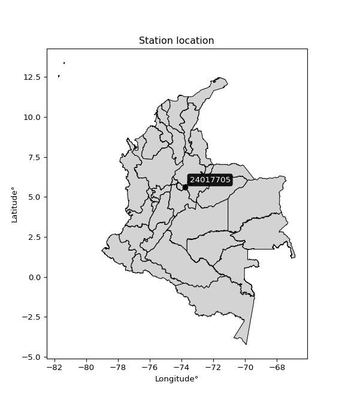

<div align="center">


</div>

# Station (rain, Pmax24h): 24017705

Probable Maximum Precipitation (PMP) is the greatest amount of rainfall for a specific duration that is meteorologically possible for a given location, acting as a "worst-case" scenario for extreme storms, crucial for designing safety-critical infrastructure like bridges, river deviations, dams, spillways, and nuclear plants to prevent catastrophic failure. PMP is calculated by hydrologists using meteorological data to determine the upper limit of extreme rainfall, often leading to the Probable Maximum Flood (PMF) for flood control design, and is increasingly being studied for climate change impacts.

<div align="center">

</img>

</div>


## A. General information


### 1. General running parameters

• app_version: _v20251226_. • runtime: _2025-12-26 15:38:16.554582_. • Python version: _3.14.0_. • SciPy version: _1.16.3_. • Pandas version: _2.3.3_. • NumPy version: _2.3.5_. • Stations dataset (station_dataset_file): _dataset/pmax24h_in/automatic_colombia_2003_2024.csv_. • Stations catalog (station_catalog_file): _dataset/CNE_IDEAM.xls_. • Minimum year to eval til year_max (date_min): _2003_. • Maximum year to eval since year_min (date_max): _2024_. • Creates, save and include plots into reports (create_plot): _False_. • Plot only fit distributions with Δo > Δ (plot_only_fit): _True_. • Eval low extreme values, if False, evaluates high extreme values (low_extreme): _False_. • Eval every SciPy distribution as logarithmic (pdist_logarithmic_on): _True_. • Standard deviation normalized (ddof): _1.0_. • Return periods to eval in years (Tr): _[2, 2.33, 5, 10, 15, 20, 25, 50, 75, 100, 200, 250, 500, 750, 1000]_. • Minimum data sample per station, 0 means any (minimum_sample): _5_. • Z-Score threshold to adjust a value, 0 means disable (zscore): _3.5_. • Avoid zeros, e.g. rain = 0 (avoid_zeros): _True_. • Avoid null values (avoid_nans): _True_. [:file_folder:Dataset file.](../../dataset/pmax24h_in/automatic_colombia_2003_2024.csv)


### 2. Station info and location

|   id |   CODIGO | NOMBRE                                    | CATEGORIA    | TECNOLOGIA                | ESTADO   |   FECHA_INSTALACION |   FECHA_SUSPENSION |   ALTITUD |   LATITUD |   LONGITUD | DEPARTAMENTO   | MUNICIPIO    | AREA_OPERATIVA                            | ENTIDAD                                       | AREA_HIDROGRAFICA   | ZONA_HIDROGRAFICA   | SUBZONA_HIDROGRAFICA   | CORRIENTE   |   OBSERVACION |   SUBRED | Catalogo   |
|-----:|---------:|:------------------------------------------|:-------------|:--------------------------|:---------|--------------------:|-------------------:|----------:|----------:|-----------:|:---------------|:-------------|:------------------------------------------|:----------------------------------------------|:--------------------|:--------------------|:-----------------------|:------------|--------------:|---------:|:-----------|
|    0 | 24017705 | LA BALSA  CHIQUINQUIRA  - AUT  [24017705] | Limnigráfica | Automática con Telemetría | Activa   |                 nan |                nan |      2556 |   5.62444 |   -73.7919 | Boyacá         | Chiquinquirá | Area Operativa 11 - Cundinamarca-Amazonas | CORPORACION AUTONOMA REGIONAL DE CUNDINAMARCA | Magdalena Cauca     | Sogamoso            | Río Suárez             | Suarez      |           nan |      nan | CNE_OE     |

<div align="center">

Map location in: [:earth_americas:Google](http://maps.google.com/maps?q=5.624444444,-73.79194444) [:earth_americas:OSM](https://www.openstreetmap.org/#map=18/5.624444444/-73.79194444&layers=P) [:earth_americas:Bing](https://www.bing.com/maps?cp=5.624444444~-73.79194444&lvl=18) [:earth_americas:Apple](https://maps.apple.com/frame?center=5.624444444%2C-73.79194444&span=0.003%2C0.006)

</div>


<div align="center">

```geojson
{
  "type": "Feature",
  "geometry": {
    "type": "Point", 
    "coordinates": [-73.79194444, 5.624444444]
  }, 
  "properties": {
    "Name": "24017705"
  }
}
```

</div>


### 3. Discrete values table and plot

|               |           0 |          1 |           2 |          3 |           4 |           5 |           6 |
|:--------------|------------:|-----------:|------------:|-----------:|------------:|------------:|------------:|
| Date          | 2015        | 2016       | 2017        | 2018       | 2019        | 2020        | 2021        |
| Value         |   35.2      |   58.8     |   35.7      |   19.7     |   22.3      |   35.2      |   27.4      |
| Value_initial |   35.2      |   58.8     |   35.7      |   19.7     |   22.3      |   35.2      |   27.4      |
| count         |    7        |    7       |    7        |    7       |    7        |    7        |    7        |
| mean          |   33.4714   |   33.4714  |   33.4714   |   33.4714  |   33.4714   |   33.4714   |   33.4714   |
| std           |   12.9344   |   12.9344  |   12.9344   |   12.9344  |   12.9344   |   12.9344   |   12.9344   |
| zscore        |    0.133641 |    1.95823 |    0.172298 |   -1.06471 |   -0.863698 |    0.133641 |   -0.469401 |
> If Z-Score is active, values out of range or outliers are replaced with the station mean value.


### 4. Active continuous probability distributions from SciPy (45 of 104 available)

[scipy.stats](https://docs.scipy.org/doc/scipy/reference/stats.html) is a Python´s powerful submodule within the SciPy library for comprehensive statistical analysis, offering over 130 probability distributions (like Normal, Poisson), functions for descriptive stats (mean, variance), hypothesis testing (t-tests, chi-square), random variable generation, and statistical tests, making it essential for data science, modeling, and research. It provides tools to explore, model, and draw conclusions from data efficiently, working seamlessly with NumPy.

<div align="center">

|   id | p_dist             |   n_parameter | fit_method   | label                                                                       | active   | ref                                                                                                        |
|-----:|:-------------------|--------------:|:-------------|:----------------------------------------------------------------------------|:---------|:-----------------------------------------------------------------------------------------------------------|
|    0 | alpha              |             3 | MLE          | Alpha                                                                       | True     | [:mortar_board:](https://docs.scipy.org/doc/scipy/reference/generated/scipy.stats.alpha.html)              |
|    1 | betaprime          |             4 | MLE          | Beta prime                                                                  | True     | [:mortar_board:](https://docs.scipy.org/doc/scipy/reference/generated/scipy.stats.betaprime.html)          |
|    2 | chi2               |             3 | MLE          | Chi²                                                                        | True     | [:mortar_board:](https://docs.scipy.org/doc/scipy/reference/generated/scipy.stats.chi2.html)               |
|    3 | crystalball        |             4 | MLE          | Crystalball                                                                 | True     | [:mortar_board:](https://docs.scipy.org/doc/scipy/reference/generated/scipy.stats.crystalball.html)        |
|    4 | erlang             |             3 | MLE          | Erlang                                                                      | True     | [:mortar_board:](https://docs.scipy.org/doc/scipy/reference/generated/scipy.stats.erlang.html)             |
|    5 | expon              |             2 | MLE          | Exponential                                                                 | True     | [:mortar_board:](https://docs.scipy.org/doc/scipy/reference/generated/scipy.stats.expon.html)              |
|    6 | exponnorm          |             3 | MLE          | Exponentially modified Normal                                               | True     | [:mortar_board:](https://docs.scipy.org/doc/scipy/reference/generated/scipy.stats.exponnorm.html)          |
|    7 | f                  |             4 | MLE          | F                                                                           | True     | [:mortar_board:](https://docs.scipy.org/doc/scipy/reference/generated/scipy.stats.f.html)                  |
|    8 | fatiguelife        |             3 | MLE          | Fatigue-life (Birnbaum-Saunders)                                            | True     | [:mortar_board:](https://docs.scipy.org/doc/scipy/reference/generated/scipy.stats.fatiguelife.html)        |
|    9 | fisk               |             3 | MLE          | Fisk                                                                        | True     | [:mortar_board:](https://docs.scipy.org/doc/scipy/reference/generated/scipy.stats.fisk.html)               |
|   10 | gamma              |             3 | MLE          | Gamma                                                                       | True     | [:mortar_board:](https://docs.scipy.org/doc/scipy/reference/generated/scipy.stats.gamma.html)              |
|   11 | genexpon           |             5 | MLE          | Generalized exponential                                                     | True     | [:mortar_board:](https://docs.scipy.org/doc/scipy/reference/generated/scipy.stats.genexpon.html)           |
|   12 | genlogistic        |             3 | MLE          | Generalized logistic                                                        | True     | [:mortar_board:](https://docs.scipy.org/doc/scipy/reference/generated/scipy.stats.genlogistic.html)        |
|   13 | gibrat             |             2 | MM           | Gibrat                                                                      | True     | [:mortar_board:](https://docs.scipy.org/doc/scipy/reference/generated/scipy.stats.gibrat.html)             |
|   14 | gompertz           |             3 | MLE          | Gompertz (or truncated Gumbel)                                              | True     | [:mortar_board:](https://docs.scipy.org/doc/scipy/reference/generated/scipy.stats.gompertz.html)           |
|   15 | gumbel_l           |             2 | MM           | Gumbel Left Skew                                                            | True     | [:mortar_board:](https://docs.scipy.org/doc/scipy/reference/generated/scipy.stats.gumbel_l.html)           |
|   16 | gumbel_r           |             2 | MM           | Gumbel Right Skew                                                           | True     | [:mortar_board:](https://docs.scipy.org/doc/scipy/reference/generated/scipy.stats.gumbel_r.html)           |
|   17 | halflogistic       |             2 | MM           | Half-logistic                                                               | True     | [:mortar_board:](https://docs.scipy.org/doc/scipy/reference/generated/scipy.stats.halflogistic.html)       |
|   18 | halfnorm           |             2 | MM           | Half Normal                                                                 | True     | [:mortar_board:](https://docs.scipy.org/doc/scipy/reference/generated/scipy.stats.halfnorm.html)           |
|   19 | hypsecant          |             2 | MM           | hyperbolic secant                                                           | True     | [:mortar_board:](https://docs.scipy.org/doc/scipy/reference/generated/scipy.stats.hypsecant.html)          |
|   20 | invgamma           |             3 | MLE          | Inverted gamma                                                              | True     | [:mortar_board:](https://docs.scipy.org/doc/scipy/reference/generated/scipy.stats.invgamma.html)           |
|   21 | invgauss           |             3 | MLE          | Inverse Gaussian                                                            | True     | [:mortar_board:](https://docs.scipy.org/doc/scipy/reference/generated/scipy.stats.invgauss.html)           |
|   22 | invweibull         |             3 | MLE          | Inverted Weibull                                                            | True     | [:mortar_board:](https://docs.scipy.org/doc/scipy/reference/generated/scipy.stats.invweibull.html)         |
|   23 | johnsonsu          |             4 | MLE          | Johnson Su                                                                  | True     | [:mortar_board:](https://docs.scipy.org/doc/scipy/reference/generated/scipy.stats.johnsonsu.html)          |
|   24 | kstwobign          |             2 | MLE          | Limiting distribution of scaled Kolmogorov-Smirnov two-sided test statistic | True     | [:mortar_board:](https://docs.scipy.org/doc/scipy/reference/generated/scipy.stats.kstwobign.html)          |
|   25 | laplace            |             2 | MM           | Laplace                                                                     | True     | [:mortar_board:](https://docs.scipy.org/doc/scipy/reference/generated/scipy.stats.laplace.html)            |
|   26 | laplace_asymmetric |             3 | MLE          | Asymmetric Laplace                                                          | True     | [:mortar_board:](https://docs.scipy.org/doc/scipy/reference/generated/scipy.stats.laplace_asymmetric.html) |
|   27 | loggamma           |             3 | MLE          | Log gamma                                                                   | True     | [:mortar_board:](https://docs.scipy.org/doc/scipy/reference/generated/scipy.stats.loggamma.html)           |
|   28 | logistic           |             2 | MM           | Logistic (or Sech-squared)                                                  | True     | [:mortar_board:](https://docs.scipy.org/doc/scipy/reference/generated/scipy.stats.logistic.html)           |
|   29 | lognorm            |             3 | MLE          | Log Normal                                                                  | True     | [:mortar_board:](https://docs.scipy.org/doc/scipy/reference/generated/scipy.stats.lognorm.html)            |
|   30 | maxwell            |             2 | MM           | Maxwell                                                                     | True     | [:mortar_board:](https://docs.scipy.org/doc/scipy/reference/generated/scipy.stats.maxwell.html)            |
|   31 | mielke             |             4 | MLE          | Mielke Beta-Kappa / Dagum                                                   | True     | [:mortar_board:](https://docs.scipy.org/doc/scipy/reference/generated/scipy.stats.mielke.html)             |
|   32 | moyal              |             2 | MM           | Moyal                                                                       | True     | [:mortar_board:](https://docs.scipy.org/doc/scipy/reference/generated/scipy.stats.moyal.html)              |
|   33 | nakagami           |             3 | MLE          | Nakagami                                                                    | True     | [:mortar_board:](https://docs.scipy.org/doc/scipy/reference/generated/scipy.stats.nakagami.html)           |
|   34 | ncf                |             5 | MLE          | Non-central F distribution                                                  | True     | [:mortar_board:](https://docs.scipy.org/doc/scipy/reference/generated/scipy.stats.ncf.html)                |
|   35 | nct                |             4 | MLE          | Non-central Student’s t                                                     | True     | [:mortar_board:](https://docs.scipy.org/doc/scipy/reference/generated/scipy.stats.nct.html)                |
|   36 | norm               |             2 | MM           | Normal                                                                      | True     | [:mortar_board:](https://docs.scipy.org/doc/scipy/reference/generated/scipy.stats.norm.html)               |
|   37 | pareto             |             3 | MLE          | Pareto                                                                      | True     | [:mortar_board:](https://docs.scipy.org/doc/scipy/reference/generated/scipy.stats.pareto.html)             |
|   38 | pearson3           |             3 | MM           | Pearson type III                                                            | True     | [:mortar_board:](https://docs.scipy.org/doc/scipy/reference/generated/scipy.stats.pearson3.html)           |
|   39 | rayleigh           |             2 | MM           | Rayleigh                                                                    | True     | [:mortar_board:](https://docs.scipy.org/doc/scipy/reference/generated/scipy.stats.rayleigh.html)           |
|   40 | rice               |             3 | MLE          | Rice                                                                        | True     | [:mortar_board:](https://docs.scipy.org/doc/scipy/reference/generated/scipy.stats.rice.html)               |
|   41 | t                  |             3 | MLE          | Student’s t                                                                 | True     | [:mortar_board:](https://docs.scipy.org/doc/scipy/reference/generated/scipy.stats.t.html)                  |
|   42 | truncnorm          |             4 | MLE          | Truncated normal                                                            | True     | [:mortar_board:](https://docs.scipy.org/doc/scipy/reference/generated/scipy.stats.truncnorm.html)          |
|   43 | wald               |             2 | MM           | Wald                                                                        | True     | [:mortar_board:](https://docs.scipy.org/doc/scipy/reference/generated/scipy.stats.wald.html)               |
|   44 | weibull_min        |             3 | MLE          | Weibull minimum                                                             | True     | [:mortar_board:](https://docs.scipy.org/doc/scipy/reference/generated/scipy.stats.weibull_min.html)        |

</div>

> **n_parameter:** # arguments & localization & scale.
>
> **Fit methods:** (MLE) maximum likelihood, (MM) L-moments.
>
>**Inactive:** foldnorm, gennorm, norminvgauss, powernorm, powerlognorm, skewnorm, genextreme, anglit, arcsine, argus, beta, bradford, burr, burr12, cauchy, cosine, halfcauchy, foldcauchy, skewcauchy, wrapcauchy, dgamma, gengamma, exponweib, exponpow, truncexpon, gausshyper, genhalflogistic, genhyperbolic, geninvgauss, halfgennorm, johnsonsb, kappa4, kappa3, ksone, kstwo, loglaplace, levy, levy_l, levy_stable, ncx2, genpareto, truncpareto, lomax, powerlaw, rdist, rel_breitwigner, recipinvgauss, semicircular, studentized_range, trapezoid, triang, truncweibull_min, tukeylambda, uniform, loguniform, vonmises, vonmises_line, weibull_max, dweibull, 


## B. Probability distributions vs. Empirical distributions

A continuous probability distribution (CPD) describes probabilities for variables that can take any value within a range (like rain any time), unlike discrete variables with specific outcomes (like temperature). It uses a Probability Density Function (PDF), a curve where the total area under it equals 1, and the probability of the variable falling within an interval (a to b) is found by calculating the area under the curve between those points. A key feature is that the probability of hitting any single exact value is zero, so probabilities are always expressed for ranges, e.g., $P(a ≤ X ≤ b)$.

<div align="center">

Distributions parameters
|    |   station | p_dist                |   n |             loc |         scale | shape                  | shape1             | shape2                 | shape3   |
|---:|----------:|:----------------------|----:|----------------:|--------------:|:-----------------------|:-------------------|:-----------------------|:---------|
|  0 |  24017705 | alpha                 |   7 |    -8.63453     | 156.806       | 3.995768091181419      |                    |                        |          |
|  1 |  24017705 | betaprime             |   7 |    -0.835912    |   1.73043     | 186.75560518224103     | 10.425482060995996 |                        |          |
|  2 |  24017705 | chi2                  |   7 |    19.7         |   4.45032     | 0.6744104638930415     |                    |                        |          |
|  3 |  24017705 | crystalball           |   7 |    33.4714      |  11.9749      | 3553.3890827318755     | 26.489782305157348 |                        |          |
|  4 |  24017705 | erlang                |   7 |    19.7         |  12.9408      | 0.6581954169064856     |                    |                        |          |
|  5 |  24017705 | expon                 |   7 |    19.7         |  13.7714      |                        |                    |                        |          |
|  6 |  24017705 | exponnorm             |   7 |    19.6757      |   0.00853946  | 1603.5991071700332     |                    |                        |          |
|  7 |  24017705 | f                     |   7 |    10.1797      |  19.2545      | 40.2779998695117       | 10.295060232110885 |                        |          |
|  8 |  24017705 | fatiguelife           |   7 |    19.7         |   1.48412e-05 | 1053.926155151984      |                    |                        |          |
|  9 |  24017705 | fisk                  |   7 |    16.1836      |  13.9241      | 2.2108021469331662     |                    |                        |          |
| 10 |  24017705 | gamma                 |   7 |    19.7         |  19.4084      | 0.18055487584855875    |                    |                        |          |
| 11 |  24017705 | genexpon              |   7 |    19.697       |   0.469493    | 0.028445325320093272   | 1.6204218623069875 | 0.0001340179305673755  |          |
| 12 |  24017705 | genlogistic           |   7 |   -29.6266      |   8.73634     | 743.1044927987098      |                    |                        |          |
| 13 |  24017705 | gibrat                |   7 |    24.3361      |   5.54086     |                        |                    |                        |          |
| 14 |  24017705 | gompertz              |   7 |    19.7         |  25.2123      | 0.986464866866569      |                    |                        |          |
| 15 |  24017705 | gumbel_l              |   7 |    38.8608      |   9.33682     |                        |                    |                        |          |
| 16 |  24017705 | gumbel_r              |   7 |    28.0821      |   9.33682     |                        |                    |                        |          |
| 17 |  24017705 | halflogistic          |   7 |    19.2783      |  10.2381      |                        |                    |                        |          |
| 18 |  24017705 | halfnorm              |   7 |    17.6213      |  19.8652      |                        |                    |                        |          |
| 19 |  24017705 | hypsecant             |   7 |    33.4714      |   7.62348     |                        |                    |                        |          |
| 20 |  24017705 | invgamma              |   7 |     7.84805     | 111.333       | 5.302094647449204      |                    |                        |          |
| 21 |  24017705 | invgauss              |   7 |    14.3718      |  36.9415      | 0.5170235247723959     |                    |                        |          |
| 22 |  24017705 | invweibull            |   7 |   -18.8941      |  46.2319      | 5.7428910702785965     |                    |                        |          |
| 23 |  24017705 | johnsonsu             |   7 |    15.2829      |   0.200524    | -7.030454453469147     | 1.4141859945164543 |                        |          |
| 24 |  24017705 | kstwobign             |   7 |    -3.20064     |  42.2812      |                        |                    |                        |          |
| 25 |  24017705 | laplace               |   7 |    33.4714      |   8.46756     |                        |                    |                        |          |
| 26 |  24017705 | laplace_asymmetric    |   7 |    35.2         |   8.48204     | 1.106946424696368      |                    |                        |          |
| 27 |  24017705 | loggamma              |   7 | -3777.76        | 508.818       | 1790.984843426093      |                    |                        |          |
| 28 |  24017705 | logistic              |   7 |    33.4714      |   6.60213     |                        |                    |                        |          |
| 29 |  24017705 | lognorm               |   7 |    19.7         |   0.072658    | 12.536071125329057     |                    |                        |          |
| 30 |  24017705 | maxwell               |   7 |     5.09585     |  17.7818      |                        |                    |                        |          |
| 31 |  24017705 | mielke                |   7 |   -17.6157      |  13.2255      | 5283.734865880197      | 5.602881020862728  |                        |          |
| 32 |  24017705 | moyal                 |   7 |    26.6234      |   5.39062     |                        |                    |                        |          |
| 33 |  24017705 | nakagami              |   7 |    19.7         |  24.2712      | 0.44383116259354527    |                    |                        |          |
| 34 |  24017705 | ncf                   |   7 |     7.85255     |   1.23476     | 2818.0581228857204     | 10.604205038979504 | 45096.57847772149      |          |
| 35 |  24017705 | nct                   |   7 |    -0.12444     |   0.645822    | 5.274269225856308      | 44.38055833398792  |                        |          |
| 36 |  24017705 | norm                  |   7 |    33.4714      |  11.9749      |                        |                    |                        |          |
| 37 |  24017705 | pareto                |   7 |    19.6882      |   0.0117617   | 0.16833745128001562    |                    |                        |          |
| 38 |  24017705 | pearson3              |   7 |    33.4715      |  11.9749      | 1.0017533694868912     |                    |                        |          |
| 39 |  24017705 | rayleigh              |   7 |    10.5627      |  18.2785      |                        |                    |                        |          |
| 40 |  24017705 | rice                  |   7 |    13.7352      |  16.3236      | 0.00035050724165979104 |                    |                        |          |
| 41 |  24017705 | t                     |   7 |    31.3603      |   8.53118     | 3.327412756458288      |                    |                        |          |
| 42 |  24017705 | truncnorm             |   7 |     5.30266     |  22.9495      | 0.6273470503098384     | 11.495203253684284 |                        |          |
| 43 |  24017705 | wald                  |   7 |    21.4965      |  11.975       |                        |                    |                        |          |
| 44 |  24017705 | weibull_min           |   7 |    19.7         |  10.9929      | 0.19174745591049291    |                    |                        |          |
| 45 |  24017705 | logalpha              |   7 |     0.0451329   |  34.8445      | 10.324321144399985     |                    |                        |          |
| 46 |  24017705 | logbetaprime          |   7 |     2.41764     |   4.11691     | 11.52160685759549      | 46.92388705068112  |                        |          |
| 47 |  24017705 | logchi2               |   7 |     2.98062     |   0.984988    | 1.0224881782145903     |                    |                        |          |
| 48 |  24017705 | logcrystalball        |   7 |     3.45245     |   0.335711    | 408.3853310940333      | 4.6013322172220015 |                        |          |
| 49 |  24017705 | logerlang             |   7 |     2.98062     |   0.551659    | 0.6882278849050316     |                    |                        |          |
| 50 |  24017705 | logexpon              |   7 |     2.98062     |   0.471829    |                        |                    |                        |          |
| 51 |  24017705 | logexponnorm          |   7 |     3.23112     |   0.260606    | 0.8492760300377487     |                    |                        |          |
| 52 |  24017705 | logf                  |   7 |     1.80083     |   1.6106      | 125.68752797887873     | 77.80938310648915  |                        |          |
| 53 |  24017705 | logfatiguelife        |   7 |     2.22722     |   1.1787      | 0.28090839673863394    |                    |                        |          |
| 54 |  24017705 | logfisk               |   7 |     1.79111     |   1.63361     | 8.387084445715743      |                    |                        |          |
| 55 |  24017705 | loggamma              |   7 |     2.98062     |   0.525798    | 0.5279101335965208     |                    |                        |          |
| 56 |  24017705 | loggenexpon           |   7 |     2.9772      |   0.00540665  | 0.006571619757952546   | 4.207872558452071  | 1.7305137161425065e-05 |          |
| 57 |  24017705 | loggenlogistic        |   7 |     1.64453     |   0.286749    | 311.40958126338796     |                    |                        |          |
| 58 |  24017705 | loggibrat             |   7 |     3.19632     |   0.155351    |                        |                    |                        |          |
| 59 |  24017705 | loggompertz           |   7 |     2.98062     |   0.777218    | 0.9933796347993968     |                    |                        |          |
| 60 |  24017705 | loggumbel_l           |   7 |     3.60354     |   0.261753    |                        |                    |                        |          |
| 61 |  24017705 | loggumbel_r           |   7 |     3.30136     |   0.261753    |                        |                    |                        |          |
| 62 |  24017705 | loghalflogistic       |   7 |     3.05458     |   0.287       |                        |                    |                        |          |
| 63 |  24017705 | loghalfnorm           |   7 |     3.00806     |   0.556952    |                        |                    |                        |          |
| 64 |  24017705 | loghypsecant          |   7 |     3.45245     |   0.21372     |                        |                    |                        |          |
| 65 |  24017705 | loginvgamma           |   7 |    -0.369774    | 496.933       | 131.05375458167316     |                    |                        |          |
| 66 |  24017705 | loginvgauss           |   7 |     2.18088     |  17.1688      | 0.07406266152518576    |                    |                        |          |
| 67 |  24017705 | loginvweibull         |   7 |    -7.68745e+06 |   7.68745e+06 | 26759102.2304644       |                    |                        |          |
| 68 |  24017705 | logjohnsonsu          |   7 |     2.05198     |   0.43774     | -8.106855824160988     | 4.37353440383546   |                        |          |
| 69 |  24017705 | logkstwobign          |   7 |     2.28626     |   1.33508     |                        |                    |                        |          |
| 70 |  24017705 | loglaplace            |   7 |     3.45245     |   0.237384    |                        |                    |                        |          |
| 71 |  24017705 | loglaplace_asymmetric |   7 |     3.56105     |   0.241271    | 1.2501216932661228     |                    |                        |          |
| 72 |  24017705 | logloggamma           |   7 |   -63.9793      |   9.95958     | 872.3041450557093      |                    |                        |          |
| 73 |  24017705 | loglogistic           |   7 |     3.45245     |   0.185087    |                        |                    |                        |          |
| 74 |  24017705 | loglognorm            |   7 |     2.98062     |   0.0032677   | 12.111352596457222     |                    |                        |          |
| 75 |  24017705 | logmaxwell            |   7 |     2.65695     |   0.498502    |                        |                    |                        |          |
| 76 |  24017705 | logmielke             |   7 |    -1.14533e+06 |   1.14534e+06 | 253257716.68937904     | 4020937.714753707  |                        |          |
| 77 |  24017705 | logmoyal              |   7 |     3.26047     |   0.151123    |                        |                    |                        |          |
| 78 |  24017705 | lognakagami           |   7 |     2.98062     |   0.442059    | 0.40322947258887654    |                    |                        |          |
| 79 |  24017705 | logncf                |   7 |    -3.40091     |   6.84902     | 387.82304605432455     | 1069.020711360577  | 6.98520718676124e-09   |          |
| 80 |  24017705 | lognct                |   7 |    -0.0979694   |   0.0678102   | 60.333396105978295     | 51.70686605119516  |                        |          |
| 81 |  24017705 | lognorm               |   7 |     3.45245     |   0.335711    |                        |                    |                        |          |
| 82 |  24017705 | logpareto             |   7 |     2.98018     |   0.000442411 | 0.16813978136121657    |                    |                        |          |
| 83 |  24017705 | logpearson3           |   7 |     3.45245     |   0.335711    | 0.35753745992257324    |                    |                        |          |
| 84 |  24017705 | lograyleigh           |   7 |     2.81021     |   0.512429    |                        |                    |                        |          |
| 85 |  24017705 | logrice               |   7 |     2.82942     |   0.446149    | 0.7185259173468082     |                    |                        |          |
| 86 |  24017705 | logt                  |   7 |     3.45244     |   0.335713    | 38445936.06667234      |                    |                        |          |
| 87 |  24017705 | logtruncnorm          |   7 |    -0.166389    |   1.47125     | 2.223252051039788      | 2.9035523282450892 |                        |          |
| 88 |  24017705 | logwald               |   7 |     3.11677     |   0.335678    |                        |                    |                        |          |
| 89 |  24017705 | logweibull_min        |   7 |     2.9456      |   0.548472    | 1.361428806496555      |                    |                        |          |

</div>

> **loc** (Location parameter): This shifts the distribution along the x-axis. For many common distributions, like the normal (Gaussian) distribution, loc represents the mean $μ$. For others, like the uniform distribution, it might represent the minimum value, or for the beta distribution, the left end of the support interval.
>
> **scale** (Scale parameter): This determines the width or spread of the distribution. For the normal distribution, scale represents the standard deviation $σ$. For a uniform distribution, it defines the length of the interval (from $loc$ to $loc + scale$).
>
> **shape** (Shape parameters): Refers to parameters that define the specific form of a probability distribution, distinct from its location (loc) and scale (scale). These parameters are required arguments for most distribution functions. For example, a normal (Gaussian) distribution is fully defined by its location (mean) and scale (standard deviation), so it has no specific shape parameters beyond loc and scale. However, other distributions have intrinsic properties that need specification, as Gamma distribution that takes a shape parameter, often named $a$ or $alpha$.


### 0. Cumulative distribution values - CDF (90 evaluated)

> Ordered by x ascending and calculating $log(f(x))$ separately. 

|   id |   Station |   date |    x |   count |    mean |     std |    zscore |   Value_initial |   station |   m |     alpha |   alpha_pdf |   betaprime |   betaprime_pdf |        chi2 |    chi2_pdf |   crystalball |   crystalball_pdf |      erlang |     erlang_pdf |    expon |   expon_pdf |   exponnorm |   exponnorm_pdf |         f |      f_pdf |   fatiguelife |   fatiguelife_pdf |      fisk |   fisk_pdf |      gamma |   gamma_pdf |    genexpon |   genexpon_pdf |   genlogistic |   genlogistic_pdf |   gibrat |   gibrat_pdf |   gompertz |   gompertz_pdf |   gumbel_l |   gumbel_l_pdf |   gumbel_r |   gumbel_r_pdf |   halflogistic |   halflogistic_pdf |   halfnorm |   halfnorm_pdf |   hypsecant |   hypsecant_pdf |   invgamma |   invgamma_pdf |   invgauss |   invgauss_pdf |   invweibull |   invweibull_pdf |   johnsonsu |   johnsonsu_pdf |   kstwobign |   kstwobign_pdf |   laplace |   laplace_pdf |   laplace_asymmetric |   laplace_asymmetric_pdf |    loggamma |   loggamma_pdf |   logistic |   logistic_pdf |   lognorm |   lognorm_pdf |   maxwell |   maxwell_pdf |   mielke |   mielke_pdf |     moyal |   moyal_pdf |    nakagami |   nakagami_pdf |       ncf |    ncf_pdf |       nct |    nct_pdf |     norm |   norm_pdf |   pareto |   pareto_pdf |   pearson3 |   pearson3_pdf |   rayleigh |   rayleigh_pdf |      rice |   rice_pdf |        t |      t_pdf |   truncnorm |   truncnorm_pdf |        wald |   wald_pdf |   weibull_min |   weibull_min_pdf |   logalpha |   logalpha_pdf |   logbetaprime |   logbetaprime_pdf |     logchi2 |   logchi2_pdf |   logcrystalball |   logcrystalball_pdf |   logerlang |   logerlang_pdf |   logexpon |   logexpon_pdf |   logexponnorm |   logexponnorm_pdf |      logf |   logf_pdf |   logfatiguelife |   logfatiguelife_pdf |   logfisk |   logfisk_pdf |   loggenexpon |   loggenexpon_pdf |   loggenlogistic |   loggenlogistic_pdf |   loggibrat |   loggibrat_pdf |   loggompertz |   loggompertz_pdf |   loggumbel_l |   loggumbel_l_pdf |   loggumbel_r |   loggumbel_r_pdf |   loghalflogistic |   loghalflogistic_pdf |   loghalfnorm |   loghalfnorm_pdf |   loghypsecant |   loghypsecant_pdf |   loginvgamma |   loginvgamma_pdf |   loginvgauss |   loginvgauss_pdf |   loginvweibull |   loginvweibull_pdf |   logjohnsonsu |   logjohnsonsu_pdf |   logkstwobign |   logkstwobign_pdf |   loglaplace |   loglaplace_pdf |   loglaplace_asymmetric |   loglaplace_asymmetric_pdf |   logloggamma |   logloggamma_pdf |   loglogistic |   loglogistic_pdf |   loglognorm |   loglognorm_pdf |   logmaxwell |   logmaxwell_pdf |   logmielke |   logmielke_pdf |   logmoyal |   logmoyal_pdf |   lognakagami |   lognakagami_pdf |   logncf |   logncf_pdf |    lognct |   lognct_pdf |   logpareto |   logpareto_pdf |   logpearson3 |   logpearson3_pdf |   lograyleigh |   lograyleigh_pdf |   logrice |   logrice_pdf |      logt |   logt_pdf |   logtruncnorm |   logtruncnorm_pdf |   logwald |   logwald_pdf |   logweibull_min |   logweibull_min_pdf |
|-----:|----------:|-------:|-----:|--------:|--------:|--------:|----------:|----------------:|----------:|----:|----------:|------------:|------------:|----------------:|------------:|------------:|--------------:|------------------:|------------:|---------------:|---------:|------------:|------------:|----------------:|----------:|-----------:|--------------:|------------------:|----------:|-----------:|-----------:|------------:|------------:|---------------:|--------------:|------------------:|---------:|-------------:|-----------:|---------------:|-----------:|---------------:|-----------:|---------------:|---------------:|-------------------:|-----------:|---------------:|------------:|----------------:|-----------:|---------------:|-----------:|---------------:|-------------:|-----------------:|------------:|----------------:|------------:|----------------:|----------:|--------------:|---------------------:|-------------------------:|------------:|---------------:|-----------:|---------------:|----------:|--------------:|----------:|--------------:|---------:|-------------:|----------:|------------:|------------:|---------------:|----------:|-----------:|----------:|-----------:|---------:|-----------:|---------:|-------------:|-----------:|---------------:|-----------:|---------------:|----------:|-----------:|---------:|-----------:|------------:|----------------:|------------:|-----------:|--------------:|------------------:|-----------:|---------------:|---------------:|-------------------:|------------:|--------------:|-----------------:|---------------------:|------------:|----------------:|-----------:|---------------:|---------------:|-------------------:|----------:|-----------:|-----------------:|---------------------:|----------:|--------------:|--------------:|------------------:|-----------------:|---------------------:|------------:|----------------:|--------------:|------------------:|--------------:|------------------:|--------------:|------------------:|------------------:|----------------------:|--------------:|------------------:|---------------:|-------------------:|--------------:|------------------:|--------------:|------------------:|----------------:|--------------------:|---------------:|-------------------:|---------------:|-------------------:|-------------:|-----------------:|------------------------:|----------------------------:|--------------:|------------------:|--------------:|------------------:|-------------:|-----------------:|-------------:|-----------------:|------------:|----------------:|-----------:|---------------:|--------------:|------------------:|---------:|-------------:|----------:|-------------:|------------:|----------------:|--------------:|------------------:|--------------:|------------------:|----------:|--------------:|----------:|-----------:|---------------:|-------------------:|----------:|--------------:|-----------------:|---------------------:|
|    0 |  24017705 |   2018 | 19.7 |       7 | 33.4714 | 12.9344 | -1.06471  |            19.7 |  24017705 |   1 | 0.0619843 |  0.0238658  |   0.0711277 |      0.0234593  | 7.19118e-06 | 6.8255e+08  |      0.125068 |        0.0171969  | 6.34816e-11 | 11761          | 0        |  0.0726141  |  0.00177212 |      0.0727333  | 0.0548047 | 0.0262609  |     0.0524922 |       1.70927e+10 | 0.0455445 | 0.02733    | 0.00155978 | 7.92704e+10 | 0.000178801 |     0.0605794  |     0.0728489 |        0.0218034  | 0        |   0          | 1.2249e-11 |     0.0391264  |   0.120547 |    0.0120994   |  0.0859441 |     0.0225892  |      0.0205896 |         0.0488163  |  0.0833387 |     0.0399457  |    0.103631 |      0.0133548  |  0.0555498 |     0.0264581  |  0.0469538 |      0.0325157 |    0.0595629 |       0.0250003  |   0.0468313 |      0.0313032  |   0.0690244 |      0.0223368  | 0.0983206 |    0.0116114  |             0.105659 |               0.0112533  | 2.58414e-08 |    7.67973e+06 |   0.110474 |      0.0148845 | 0.0799421 |      0.442597 |  0.120823 |    0.0216021  |      nan |          nan | 0.0573542 |  0.0231081  | 6.92471e-15 |     1.73017    | 0.0555499 | 0.0264581  | 0.0605332 | 0.0250717  | 0.125068 | 0.0171969  | 0        |  14.3123     |  0.0930666 |     0.0250019  |   0.117456 |     0.0241364  | 0.0645831 | 0.0209398  | 0.128364 | 0.0165574  | 9.41044e-07 |      0.0538363  | 0           | 0          |    0.00107027 |       5.77338e+10 |  0.0610814 |       0.488471 |      0.0548863 |           0.526391 | 1.60961e-08 |   9.26505e+06 |        0.0799421 |             0.442597 | 1.59663e-09 |    13901        |   0        |       2.11941  |      0.0675432 |           0.454869 | 0.0601149 |   0.50375  |        0.0540656 |             0.531594 | 0.0653231 |      0.430499 |     0.0041612 |          1.21889  |        0.0530908 |             0.540994 |    0        |        0        |   2.58681e-09 |          1.27812  |     0.0884147 |         0.322386  |      0.033194 |          0.431852 |         0         |              0        |      0        |          0        |      0.0697188 |           0.323613 |     0.0700307 |          0.478363 |     0.0546401 |          0.527236 |       0.0528282 |            0.540763 |      0.0592455 |           0.502461 |      0.0503741 |           0.589229 |    0.0685104 |         0.288606 |                0.089011 |                    0.295111 |     0.0816023 |          0.44043  |     0.0724786 |          0.36321  |   0.00721847 |      3.72269e+12 |    0.0642463 |         0.546501 |   0.0532634 |        0.535785 |  0.0115988 |       0.275551 |   6.27623e-13 |       1139.75     | 0.204616 |     0.52438  | 0.0652544 |     0.480292 |    0        |     380.054     |     0.0690149 |          0.480488 |     0.0537924 |          0.61405  |  0.043428 |      0.562281 | 0.0799447 |   0.442606 |    0           |           0        |  0        |      0        |         0.023341 |             0.896839 |
|    1 |  24017705 |   2019 | 22.3 |       7 | 33.4714 | 12.9344 | -0.863698 |            22.3 |  24017705 |   2 | 0.141593  |  0.0367532  |   0.146295  |      0.0338819  | 0.689634    | 0.0716499   |      0.175436 |        0.0215602  | 0.356849    |     0.0798844  | 0.172045 |  0.0601212  |  0.174395   |      0.0602901  | 0.1434    | 0.0405803  |     0.654366  |       0.0281581   | 0.13959   | 0.0434122  | 0.738301   | 0.0457468   | 0.148744    |     0.0537575  |     0.142843  |        0.0317765  | 0        |   0          | 0.101617   |     0.0389689  |   0.156084 |    0.0153387   |  0.156049  |     0.0310464  |      0.146507  |         0.0477887  |  0.186197  |     0.0390663  |    0.144516 |      0.0183121  |  0.14504   |     0.0410833  |  0.1573    |      0.0489506 |    0.143734  |       0.0388695  |   0.153332  |      0.0476611  |   0.139876  |      0.0317217  | 0.133658  |    0.0157848  |             0.13937  |               0.0148438  | 0.485594    |    1.76784     |   0.155501 |      0.0198906 | 0.150056  |      0.694696 |  0.183289 |    0.0263035  |      nan |          nan | 0.13535   |  0.0362394  | 0.108219    |     0.0368166  | 0.14504   | 0.0410833  | 0.144166  | 0.0383899  | 0.175436 | 0.0215602  | 0.597281 |   0.0259567  |  0.167815  |     0.0320492  |   0.186305 |     0.0285856  | 0.128596  | 0.0280096  | 0.179574 | 0.0230899  | 0.134833    |      0.049822   | 0.000298551 | 0.00292504 |    0.531618   |       0.0261997   |  0.143486  |       0.842482 |      0.145423  |           0.926996 | 0.268535    |   1.06208     |        0.150056  |             0.694696 | 0.361096    |        1.75089  |   0.231058 |       1.62971  |      0.143041  |           0.770831 | 0.145212  |   0.867652 |        0.145745  |             0.938112 | 0.138312  |      0.761025 |     0.16058   |          1.28661  |        0.14831   |             0.984057 |    0        |        0        |   0.157837    |          1.26252  |     0.138127  |         0.489449  |      0.119946 |          0.9718   |         0.0868967 |              1.729    |      0.137592 |          1.41124  |      0.123455  |           0.563276 |     0.148086  |          0.78421  |     0.145393  |          0.928794 |       0.148072  |            0.984483 |      0.144546  |           0.872565 |      0.153303  |           1.043    |    0.115493  |         0.486526 |                0.134259 |                    0.445128 |     0.151077  |          0.68655  |     0.132453  |          0.620838 |   0.617991   |      0.254002    |    0.152047  |         0.862368 |   0.147605  |        0.976516 |  0.0939591 |       1.08748  |   0.277803    |          1.76675  | 0.274906 |     0.606535 | 0.144876  |     0.807038 |    0.612546 |       0.523641  |     0.147431  |          0.787253 |     0.152112  |          0.950539 |  0.137003 |      0.926815 | 0.15006   |   0.694704 |    1.43861e-05 |           2.03498  |  0        |      0        |         0.169126 |             1.31825  |
|    2 |  24017705 |   2021 | 27.4 |       7 | 33.4714 | 12.9344 | -0.469401 |            27.4 |  24017705 |   3 | 0.361009  |  0.0452233  |   0.347735  |      0.0421383  | 0.881878    | 0.019672    |      0.306073 |        0.0292966  | 0.632213    |     0.0371654  | 0.428293 |  0.041514   |  0.43111    |      0.0415434  | 0.372936  | 0.0449275  |     0.752835  |       0.0140173   | 0.382709  | 0.0465644  | 0.866173   | 0.0144497   | 0.390983    |     0.0415155  |     0.337532  |        0.0419311  | 0.27677  |   0.109248   | 0.296961   |     0.0373324  |   0.254    |    0.0234127   |  0.34103   |     0.0392933  |      0.377068  |         0.0418933  |  0.377459  |     0.035582   |    0.269697 |      0.0312937  |  0.377987  |     0.0456166  |  0.406748  |      0.044681  |    0.370721  |       0.0456349  |   0.401326  |      0.0451227  |   0.328565  |      0.039841   | 0.244102  |    0.0288279  |             0.239922 |               0.0255531  | 0.721439    |    0.752734    |   0.285036 |      0.0308674 | 0.336258  |      1.08679  |  0.33455  |    0.0321471  |      nan |          nan | 0.352112  |  0.0446658  | 0.280287    |     0.0313247  | 0.377987  | 0.0456166  | 0.367846  | 0.04509    | 0.306073 | 0.0292966  | 0.664381 |   0.00732612 |  0.3497    |     0.0374348  |   0.345747 |     0.0329713  | 0.295584  | 0.0361245  | 0.3356   | 0.0379097  | 0.367281    |      0.0412303  | 0.358783    | 0.0741571  |    0.607025   |       0.00914019  |  0.364502  |       1.22773  |      0.380554  |           1.25817  | 0.42799     |   0.592901    |        0.336257  |             1.08679  | 0.6165      |        0.88835  |   0.50304  |       1.05326  |      0.352312  |           1.20822  | 0.369524  |   1.22826  |        0.381907  |             1.25421  | 0.352579  |      1.26001  |     0.419299  |          1.18777  |        0.393752  |             1.27792  |    0.37923  |        3.33127  |   0.408631    |          1.15554  |     0.27855   |         0.899887  |      0.380783 |          1.40459  |         0.418544  |              1.43697  |      0.41294  |          1.23616  |      0.302661  |           1.21221  |     0.354774  |          1.16913  |     0.380192  |          1.25243  |       0.393528  |            1.2775   |      0.370773  |           1.24008  |      0.401707  |           1.25183  |    0.275014  |         1.15852  |                0.265763 |                    0.881123 |     0.334987  |          1.07498  |     0.317196  |          1.17016  |   0.648409   |      0.0928489   |    0.367283  |         1.16486  |   0.392317  |        1.2792   |  0.396819  |       1.56216  |   0.57995     |          1.20539  | 0.409634 |     0.68833  | 0.357607  |     1.19586  |    0.67122  |       0.167332  |     0.354268  |          1.16692  |     0.379151  |          1.18297  |  0.36426  |      1.20657  | 0.336262  |   1.08679  |    0.359099    |           1.47619  |  0.42898  |      2.32119  |         0.436886 |             1.20639  |
|    3 |  24017705 |   2015 | 35.2 |       7 | 33.4714 | 12.9344 |  0.133641 |            35.2 |  24017705 |   4 | 0.662242  |  0.0298276  |   0.642852  |      0.0310053  | 0.964168    | 0.0051508   |      0.557388 |        0.0329695  | 0.825467    |     0.0160146  | 0.675516 |  0.0235621  |  0.678149   |      0.0235033  | 0.659852  | 0.0277755  |     0.833893  |       0.00779827  | 0.66576   | 0.0258701  | 0.935806   | 0.00544928  | 0.652678    |     0.0263365  |     0.640859  |        0.0326295  | 0.74962  |   0.0292743  | 0.56732    |     0.0313064  |   0.491174 |    0.0368207   |  0.627151  |     0.0313392  |      0.651307  |         0.0281203  |  0.623789  |     0.0271526  |    0.571564 |      0.0407031  |  0.668125  |     0.0278938  |  0.676425  |      0.0253242 |    0.666459  |       0.0287105  |   0.67466   |      0.0255649  |   0.61852   |      0.032076   | 0.592326  |    0.0481454  |             0.550629 |               0.0586451  | 0.852839    |    0.358025    |   0.565084 |      0.037225  | 0.626837  |      1.12777  |  0.587279 |    0.0306821  |      nan |          nan | 0.651738  |  0.0301681  | 0.500823    |     0.0252664  | 0.668125  | 0.0278939  | 0.663152  | 0.0290205  | 0.557388 | 0.0329695  | 0.70163  |   0.00323798 |  0.620919  |     0.0301262  |   0.596829 |     0.0297304  | 0.578762  | 0.0339331  | 0.659808 | 0.0382108  | 0.636782    |      0.0280548  | 0.719966    | 0.0269677  |    0.656339   |       0.00454088  |  0.660498  |       1.03224  |      0.671466  |           0.980028 | 0.548641    |   0.39614     |        0.626837  |             1.12777  | 0.780225    |        0.473028 |   0.707756 |       0.619386 |      0.656116  |           1.08946  | 0.661561  |   1.00854  |        0.670182  |             0.968182 | 0.661996  |      1.06031  |     0.678241  |          0.858614 |        0.677454  |             0.919429 |    0.8033   |        0.759919 |   0.668089    |          0.895211 |     0.572655  |         1.388     |      0.690185 |          0.977706 |         0.70759   |              0.869888 |      0.67923  |          0.8751   |      0.655202  |           1.31582  |     0.648198  |          1.06766  |     0.669302  |          0.974271 |       0.677093  |            0.919056 |      0.665187  |           1.01382  |      0.678418  |           0.908306 |    0.683562  |         1.33302  |                0.609802 |                    2.02177  |     0.624034  |          1.12924  |     0.642617  |          1.24082  |   0.665555   |      0.0517908   |    0.650853  |         1.01653  |   0.677049  |        0.924161 |  0.711447  |       0.911939 |   0.812858    |          0.67497  | 0.582515 |     0.670312 | 0.652884  |     1.05564  |    0.700982 |       0.0865544 |     0.646842  |          1.06534  |     0.658179  |          0.977404 |  0.652741 |      1.02011  | 0.62684   |   1.12776  |    0.662222    |           0.972961 |  0.771132 |      0.750279 |         0.689575 |             0.803304 |
|    4 |  24017705 |   2020 | 35.2 |       7 | 33.4714 | 12.9344 |  0.133641 |            35.2 |  24017705 |   5 | 0.662242  |  0.0298276  |   0.642852  |      0.0310053  | 0.964168    | 0.0051508   |      0.557388 |        0.0329695  | 0.825467    |     0.0160146  | 0.675516 |  0.0235621  |  0.678149   |      0.0235033  | 0.659852  | 0.0277755  |     0.833893  |       0.00779827  | 0.66576   | 0.0258701  | 0.935806   | 0.00544928  | 0.652678    |     0.0263365  |     0.640859  |        0.0326295  | 0.74962  |   0.0292743  | 0.56732    |     0.0313064  |   0.491174 |    0.0368207   |  0.627151  |     0.0313392  |      0.651307  |         0.0281203  |  0.623789  |     0.0271526  |    0.571564 |      0.0407031  |  0.668125  |     0.0278938  |  0.676425  |      0.0253242 |    0.666459  |       0.0287105  |   0.67466   |      0.0255649  |   0.61852   |      0.032076   | 0.592326  |    0.0481454  |             0.550629 |               0.0586451  | 0.852839    |    0.358025    |   0.565084 |      0.037225  | 0.626837  |      1.12777  |  0.587279 |    0.0306821  |      nan |          nan | 0.651738  |  0.0301681  | 0.500823    |     0.0252664  | 0.668125  | 0.0278939  | 0.663152  | 0.0290205  | 0.557388 | 0.0329695  | 0.70163  |   0.00323798 |  0.620919  |     0.0301262  |   0.596829 |     0.0297304  | 0.578762  | 0.0339331  | 0.659808 | 0.0382108  | 0.636782    |      0.0280548  | 0.719966    | 0.0269677  |    0.656339   |       0.00454088  |  0.660498  |       1.03224  |      0.671466  |           0.980028 | 0.548641    |   0.39614     |        0.626837  |             1.12777  | 0.780225    |        0.473028 |   0.707756 |       0.619386 |      0.656116  |           1.08946  | 0.661561  |   1.00854  |        0.670182  |             0.968182 | 0.661996  |      1.06031  |     0.678241  |          0.858614 |        0.677454  |             0.919429 |    0.8033   |        0.759919 |   0.668089    |          0.895211 |     0.572655  |         1.388     |      0.690185 |          0.977706 |         0.70759   |              0.869888 |      0.67923  |          0.8751   |      0.655202  |           1.31582  |     0.648198  |          1.06766  |     0.669302  |          0.974271 |       0.677093  |            0.919056 |      0.665187  |           1.01382  |      0.678418  |           0.908306 |    0.683562  |         1.33302  |                0.609802 |                    2.02177  |     0.624034  |          1.12924  |     0.642617  |          1.24082  |   0.665555   |      0.0517908   |    0.650853  |         1.01653  |   0.677049  |        0.924161 |  0.711447  |       0.911939 |   0.812858    |          0.67497  | 0.582515 |     0.670312 | 0.652884  |     1.05564  |    0.700982 |       0.0865544 |     0.646842  |          1.06534  |     0.658179  |          0.977404 |  0.652741 |      1.02011  | 0.62684   |   1.12776  |    0.662222    |           0.972961 |  0.771132 |      0.750279 |         0.689575 |             0.803304 |
|    5 |  24017705 |   2017 | 35.7 |       7 | 33.4714 | 12.9344 |  0.172298 |            35.7 |  24017705 |   6 | 0.67686   |  0.028647   |   0.658098  |      0.0299761  | 0.966646    | 0.00476803  |      0.573818 |        0.0327428  | 0.833279    |     0.0152413  | 0.687086 |  0.022722   |  0.689689   |      0.0226606  | 0.673466  | 0.0266844  |     0.837732  |       0.00755993  | 0.678404  | 0.0247143  | 0.938461   | 0.0051743   | 0.665641    |     0.0255176  |     0.656913  |        0.0315875  | 0.763711 |   0.0271236  | 0.582844   |     0.0307877  |   0.509739 |    0.0374289   |  0.642595  |     0.0304366  |      0.665144  |         0.0272307  |  0.637214  |     0.0265461  |    0.591754 |      0.0400312  |  0.68179   |     0.0267709  |  0.688837  |      0.0243285 |    0.680524  |       0.0275529  |   0.687182  |      0.024531   |   0.634347  |      0.0312289  | 0.615702  |    0.0453848  |             0.579015 |               0.0549406  | 0.857794    |    0.344621    |   0.583596 |      0.0368081 | 0.642632  |      1.11157  |  0.602507 |    0.0302237  |      nan |          nan | 0.666544  |  0.029062   | 0.513359    |     0.0248794  | 0.68179   | 0.0267709  | 0.677377  | 0.0278841  | 0.573818 | 0.0327428  | 0.703219 |   0.00312016 |  0.635792  |     0.0293623  |   0.611568 |     0.0292247  | 0.595581  | 0.0333371  | 0.678596 | 0.0369272  | 0.650611    |      0.0272633  | 0.733057    | 0.0254163  |    0.658574   |       0.00439707  |  0.674877  |       1.00658  |      0.685101  |           0.953439 | 0.554176    |   0.388725    |        0.642631  |             1.11157  | 0.786788    |        0.457649 |   0.716363 |       0.601145 |      0.671298  |           1.06315  | 0.675607  |   0.983068 |        0.683653  |             0.942004 | 0.676728  |      1.02846  |     0.690203  |          0.837557 |        0.690228  |             0.891856 |    0.813646 |        0.707804 |   0.68059     |          0.877273 |     0.592303  |         1.3975    |      0.703742 |          0.944613 |         0.719648  |              0.839907 |      0.691418 |          0.853097 |      0.673467  |           1.27364  |     0.663102  |          1.04548  |     0.68286   |          0.948113 |       0.689862  |            0.891525 |      0.679303  |           0.987771 |      0.691054  |           0.883571 |    0.701816  |         1.25613  |                0.637302 |                    1.87928  |     0.639855  |          1.1139   |     0.659922  |          1.21254  |   0.666276   |      0.0505192   |    0.665045  |         0.995653 |   0.689888  |        0.89646  |  0.724053  |       0.875683 |   0.822196    |          0.649254 | 0.591936 |     0.665606 | 0.667607  |     1.03187  |    0.702186 |       0.0841623 |     0.661715  |          1.04351  |     0.671815  |          0.956042 |  0.666976 |      0.998243 | 0.642635  |   1.11156  |    0.675779    |           0.949571 |  0.781421 |      0.70923  |         0.700746 |             0.780765 |
|    6 |  24017705 |   2016 | 58.8 |       7 | 33.4714 | 12.9344 |  1.95823  |            58.8 |  24017705 |   7 | 0.952616  |  0.00340873 |   0.96162   |      0.00362126 | 0.998447    | 0.000196791 |      0.982791 |        0.00355769 | 0.977635    |     0.00188428 | 0.941528 |  0.00424587 |  0.942563   |      0.00419436 | 0.943574  | 0.00382855 |     0.93823   |       0.00239998  | 0.92223   | 0.00372068 | 0.988785   | 0.000756763 | 0.955824    |     0.00436895 |     0.970571  |        0.00331843 | 0.966207 |   0.00217831 | 0.974399   |     0.00472337 |   0.999789 |    0.000191603 |  0.963431  |     0.00384417 |      0.958743  |         0.00394661 |  0.961819  |     0.00468573 |    0.97705  |      0.00300777 |  0.94796   |     0.00364454 |  0.944667  |      0.0039414 |    0.950533  |       0.00356447 |   0.940393  |      0.00385125 |   0.972879  |      0.00376239 | 0.974888  |    0.00296571 |             0.979345 |               0.00269552 | 0.955051    |    0.100057    |   0.978885 |      0.0031307 | 0.967978  |      0.213921 |  0.972282 |    0.00427881 |      nan |          nan | 0.959672  |  0.00373735 | 0.889219    |     0.00862535 | 0.94796   | 0.00364454 | 0.952145  | 0.00357386 | 0.982791 | 0.00355769 | 0.744646 |   0.00109905 |  0.963734  |     0.00413479 |   0.96926  |     0.00443814 | 0.977869  | 0.00374287 | 0.978951 | 0.00204059 | 0.962768    |      0.00433079 | 0.957489    | 0.00295507 |    0.720696   |       0.00174701  |  0.953124  |       0.210251 |      0.948793  |           0.21024  | 0.701063    |   0.22402     |        0.967978  |             0.213921 | 0.924271    |        0.153175 |   0.901493 |       0.208777 |      0.955924  |           0.196395 | 0.9498    |   0.215213 |        0.946545  |             0.214943 | 0.943065  |      0.197251 |     0.941003  |          0.232639 |        0.936981  |             0.212673 |    0.958342 |        0.101456 |   0.95326     |          0.24395  |     0.997611  |         0.0550938 |      0.949122 |          0.189342 |         0.944289  |              0.188708 |      0.944397 |          0.229358 |      0.965316  |           0.161964 |     0.959101  |          0.214494 |     0.947234  |          0.214659 |       0.936726  |            0.21313  |      0.952324  |           0.209875 |      0.944621  |           0.222179 |    0.96356   |         0.153506 |                0.972667 |                    0.141624 |     0.96828   |          0.215721 |     0.966396  |          0.175457 |   0.684375   |      0.0268451   |    0.955654  |         0.227405 |   0.937489  |        0.21234  |  0.945993  |       0.178411 |   0.981081    |          0.101473 | 0.856115 |     0.366529 | 0.956664  |     0.21319  |    0.731174 |       0.0413179 |     0.958881  |          0.217236 |     0.952257  |          0.229809 |  0.956674 |      0.225455 | 0.967978  |   0.213919 |    0.988501    |           0.37841  |  0.946926 |      0.135236 |         0.930794 |             0.222968 |

An Empirical Distribution Function (EDF) is a step-function estimate of a true cumulative distribution function (CDF) based on observed sample data, representing the proportion of data points less than or equal to a given value. It is calculated by ordering your data and jumping up by $1/n$ (where $n$ is sample size) at each unique data point, allowing analysis without assuming an underlying population distribution, and it gets closer to the true CDF as the sample size grows.


### 1. Empirical - EDF California (1923)

California´s estimates the true probability distribution of water-related data (like rainfall, streamflow) using observed samples, crucial for risk assessment.

<div align="center">


$P=m/n$


</div>


**1.1. Empirical values**

<div align="center">

|                | 0                   | 1                  | 2                   | 3                  | 4                  | 5                  | 6              |
|:---------------|:--------------------|:-------------------|:--------------------|:-------------------|:-------------------|:-------------------|:---------------|
| date           | 2018                | 2019               | 2021                | 2015               | 2020               | 2017               | 2016           |
| x              | 19.7                | 22.3               | 27.4                | 35.2               | 35.2               | 35.7               | 58.8           |
| m              | 1                   | 2                  | 3                   | 4                  | 5                  | 6                  | 7              |
| empirical_dist | edf_california      | edf_california     | edf_california      | edf_california     | edf_california     | edf_california     | edf_california |
| empirical      | 0.14285714285714285 | 0.2857142857142857 | 0.42857142857142855 | 0.5714285714285714 | 0.7142857142857143 | 0.8571428571428571 | 1.0            |
| empirical_tr   | 1.1666666666666665  | 1.4                | 1.75                | 2.333333333333333  | 3.5                | 6.999999999999997  | inf            |

</div>


**1.2. Kolmogorov-Smirnov fit test (sorted by Δ)**


<div align="center">

|                | 0                   | 1                   | 2                   | 3                   | 4                   | 5                   | 6                   | 7                   | 8                   | 9                   | 10                  | 11                  | 12                  | 13                  | 14                  | 15                  | 16                  | 17                  | 18                  | 19                  | 20                  | 21                  | 22                  | 23                  | 24                  | 25                  | 26                  | 27                  | 28                  | 29                  | 30                  | 31                  | 32                  | 33                  | 34                  | 35                  | 36                  | 37                  | 38                  | 39                  | 40                  | 41                  | 42                  | 43                  | 44                  | 45                  | 46                  | 47                  | 48                  | 49                  | 50                  | 51                  | 52                  | 53                  | 54                    | 55                  | 56                  | 57                  | 58                  | 59                  | 60                  | 61                  | 62                  | 63                  | 64                  | 65                  | 66                  | 67                  | 68                  | 69                  | 70                  | 71                  | 72                  | 73                  | 74                  | 75                  | 76                  | 77                  | 78                  | 79                  | 80                  | 81                  | 82                  | 83                  | 84                  | 85                  | 86                  | 87                  | 88                  | 89                  |
|:---------------|:--------------------|:--------------------|:--------------------|:--------------------|:--------------------|:--------------------|:--------------------|:--------------------|:--------------------|:--------------------|:--------------------|:--------------------|:--------------------|:--------------------|:--------------------|:--------------------|:--------------------|:--------------------|:--------------------|:--------------------|:--------------------|:--------------------|:--------------------|:--------------------|:--------------------|:--------------------|:--------------------|:--------------------|:--------------------|:--------------------|:--------------------|:--------------------|:--------------------|:--------------------|:--------------------|:--------------------|:--------------------|:--------------------|:--------------------|:--------------------|:--------------------|:--------------------|:--------------------|:--------------------|:--------------------|:--------------------|:--------------------|:--------------------|:--------------------|:--------------------|:--------------------|:--------------------|:--------------------|:--------------------|:----------------------|:--------------------|:--------------------|:--------------------|:--------------------|:--------------------|:--------------------|:--------------------|:--------------------|:--------------------|:--------------------|:--------------------|:--------------------|:--------------------|:--------------------|:--------------------|:--------------------|:--------------------|:--------------------|:--------------------|:--------------------|:--------------------|:--------------------|:--------------------|:--------------------|:--------------------|:--------------------|:--------------------|:--------------------|:--------------------|:--------------------|:--------------------|:--------------------|:--------------------|:--------------------|:--------------------|
| station        | 24017705            | 24017705            | 24017705            | 24017705            | 24017705            | 24017705            | 24017705            | 24017705            | 24017705            | 24017705            | 24017705            | 24017705            | 24017705            | 24017705            | 24017705            | 24017705            | 24017705            | 24017705            | 24017705            | 24017705            | 24017705            | 24017705            | 24017705            | 24017705            | 24017705            | 24017705            | 24017705            | 24017705            | 24017705            | 24017705            | 24017705            | 24017705            | 24017705            | 24017705            | 24017705            | 24017705            | 24017705            | 24017705            | 24017705            | 24017705            | 24017705            | 24017705            | 24017705            | 24017705            | 24017705            | 24017705            | 24017705            | 24017705            | 24017705            | 24017705            | 24017705            | 24017705            | 24017705            | 24017705            | 24017705              | 24017705            | 24017705            | 24017705            | 24017705            | 24017705            | 24017705            | 24017705            | 24017705            | 24017705            | 24017705            | 24017705            | 24017705            | 24017705            | 24017705            | 24017705            | 24017705            | 24017705            | 24017705            | 24017705            | 24017705            | 24017705            | 24017705            | 24017705            | 24017705            | 24017705            | 24017705            | 24017705            | 24017705            | 24017705            | 24017705            | 24017705            | 24017705            | 24017705            | 24017705            | 24017705            |
| empirical_dist | edf_california      | edf_california      | edf_california      | edf_california      | edf_california      | edf_california      | edf_california      | edf_california      | edf_california      | edf_california      | edf_california      | edf_california      | edf_california      | edf_california      | edf_california      | edf_california      | edf_california      | edf_california      | edf_california      | edf_california      | edf_california      | edf_california      | edf_california      | edf_california      | edf_california      | edf_california      | edf_california      | edf_california      | edf_california      | edf_california      | edf_california      | edf_california      | edf_california      | edf_california      | edf_california      | edf_california      | edf_california      | edf_california      | edf_california      | edf_california      | edf_california      | edf_california      | edf_california      | edf_california      | edf_california      | edf_california      | edf_california      | edf_california      | edf_california      | edf_california      | edf_california      | edf_california      | edf_california      | edf_california      | edf_california        | edf_california      | edf_california      | edf_california      | edf_california      | edf_california      | edf_california      | edf_california      | edf_california      | edf_california      | edf_california      | edf_california      | edf_california      | edf_california      | edf_california      | edf_california      | edf_california      | edf_california      | edf_california      | edf_california      | edf_california      | edf_california      | edf_california      | edf_california      | edf_california      | edf_california      | edf_california      | edf_california      | edf_california      | edf_california      | edf_california      | edf_california      | edf_california      | edf_california      | edf_california      | edf_california      |
| p_dist         | logexpon            | logweibull_min      | loghalfnorm         | loggumbel_r         | logkstwobign        | loggenlogistic      | loggenexpon         | logmielke           | loginvweibull       | exponnorm           | invgauss            | johnsonsu           | expon               | loglaplace          | logbetaprime        | logfatiguelife      | loginvgauss         | invgamma            | ncf                 | loggompertz         | invweibull          | logjohnsonsu        | t                   | fisk                | nct                 | alpha               | logfisk             | logf                | logalpha            | loghypsecant        | f                   | lograyleigh         | logexponnorm        | lognct              | logrice             | moyal               | genexpon            | logmoyal            | halflogistic        | logmaxwell          | loginvgamma         | logpearson3         | loglogistic         | loghalflogistic     | betaprime           | genlogistic         | truncnorm           | logerlang           | logt                | lognorm             | lognorm             | logcrystalball      | gumbel_r            | logloggamma         | loglaplace_asymmetric | halfnorm            | pearson3            | kstwobign           | lognakagami         | laplace             | rayleigh            | erlang              | maxwell             | rice                | loggumbel_l         | logncf              | hypsecant           | logistic            | gompertz            | laplace_asymmetric  | weibull_min         | crystalball         | norm                | wald                | logtruncnorm        | gibrat              | logwald             | loggibrat           | loggamma            | loggamma            | logchi2             | pareto              | logpareto           | loglognorm          | nakagami            | gumbel_l            | fatiguelife         | gamma               | chi2                | mielke              |
| delta          | 0.14285714285714285 | 0.1563966892737182  | 0.165725027335062   | 0.1657678874599601  | 0.16608837595312065 | 0.16691502209114395 | 0.16694008205177924 | 0.16725448694675593 | 0.16728066787693796 | 0.16745421881785327 | 0.168306315680959   | 0.16996089271714365 | 0.17005722026031445 | 0.17022098165977512 | 0.17204143743549827 | 0.17348960381850864 | 0.1742831334701852  | 0.17535295629449454 | 0.17535295725040867 | 0.17655315062328836 | 0.17661883842222004 | 0.1778395616022791  | 0.17854680729781036 | 0.17873908463348454 | 0.17976542145870733 | 0.18028272040626725 | 0.18041520996098925 | 0.18153535926760844 | 0.18226538886103982 | 0.1836761386060748  | 0.18367699307851482 | 0.18532782457061414 | 0.18584502650689372 | 0.1895357692584001  | 0.19016678454614788 | 0.1905984601533175  | 0.19150234125062127 | 0.19175520077528918 | 0.1919984756595915  | 0.19209814372511447 | 0.19404110823102072 | 0.195427521079234   | 0.1972206851309568  | 0.19881756521928673 | 0.19904508221656825 | 0.20022952677807337 | 0.20653212569530477 | 0.20879673956725253 | 0.21450795447732351 | 0.2145111906848488  | 0.2145111906848488  | 0.21451151596796847 | 0.2145476356499184  | 0.21728761689407106 | 0.2198412758994569    | 0.21992880967916395 | 0.22135078608842151 | 0.2227963098606972  | 0.2414289653442948  | 0.2414410541382639  | 0.2455744055768333  | 0.2540382454705644  | 0.25463611452122525 | 0.26156177015605087 | 0.26483955049109764 | 0.26520637038672834 | 0.2653890727321475  | 0.27354676901443586 | 0.2742992422542533  | 0.27812796348221214 | 0.27930394011338633 | 0.2833248752640595  | 0.2833248779028552  | 0.2854157342296138  | 0.28569989965808673 | 0.2857142857142857  | 0.2857142857142857  | 0.2857142857142857  | 0.2928675308184108  | 0.2928675308184108  | 0.3029665896576864  | 0.31156635562000157 | 0.3268314865563504  | 0.33227687394151484 | 0.3437835767418126  | 0.3474036314001666  | 0.3686520889141114  | 0.45258677695164673 | 0.4533066305891355  | nan                 |
| deltao         | 0.48442053926100004 | 0.48442053926100004 | 0.48442053926100004 | 0.48442053926100004 | 0.48442053926100004 | 0.48442053926100004 | 0.48442053926100004 | 0.48442053926100004 | 0.48442053926100004 | 0.48442053926100004 | 0.48442053926100004 | 0.48442053926100004 | 0.48442053926100004 | 0.48442053926100004 | 0.48442053926100004 | 0.48442053926100004 | 0.48442053926100004 | 0.48442053926100004 | 0.48442053926100004 | 0.48442053926100004 | 0.48442053926100004 | 0.48442053926100004 | 0.48442053926100004 | 0.48442053926100004 | 0.48442053926100004 | 0.48442053926100004 | 0.48442053926100004 | 0.48442053926100004 | 0.48442053926100004 | 0.48442053926100004 | 0.48442053926100004 | 0.48442053926100004 | 0.48442053926100004 | 0.48442053926100004 | 0.48442053926100004 | 0.48442053926100004 | 0.48442053926100004 | 0.48442053926100004 | 0.48442053926100004 | 0.48442053926100004 | 0.48442053926100004 | 0.48442053926100004 | 0.48442053926100004 | 0.48442053926100004 | 0.48442053926100004 | 0.48442053926100004 | 0.48442053926100004 | 0.48442053926100004 | 0.48442053926100004 | 0.48442053926100004 | 0.48442053926100004 | 0.48442053926100004 | 0.48442053926100004 | 0.48442053926100004 | 0.48442053926100004   | 0.48442053926100004 | 0.48442053926100004 | 0.48442053926100004 | 0.48442053926100004 | 0.48442053926100004 | 0.48442053926100004 | 0.48442053926100004 | 0.48442053926100004 | 0.48442053926100004 | 0.48442053926100004 | 0.48442053926100004 | 0.48442053926100004 | 0.48442053926100004 | 0.48442053926100004 | 0.48442053926100004 | 0.48442053926100004 | 0.48442053926100004 | 0.48442053926100004 | 0.48442053926100004 | 0.48442053926100004 | 0.48442053926100004 | 0.48442053926100004 | 0.48442053926100004 | 0.48442053926100004 | 0.48442053926100004 | 0.48442053926100004 | 0.48442053926100004 | 0.48442053926100004 | 0.48442053926100004 | 0.48442053926100004 | 0.48442053926100004 | 0.48442053926100004 | 0.48442053926100004 | 0.48442053926100004 | 0.48442053926100004 |
| eval           | Δo > Δ              | Δo > Δ              | Δo > Δ              | Δo > Δ              | Δo > Δ              | Δo > Δ              | Δo > Δ              | Δo > Δ              | Δo > Δ              | Δo > Δ              | Δo > Δ              | Δo > Δ              | Δo > Δ              | Δo > Δ              | Δo > Δ              | Δo > Δ              | Δo > Δ              | Δo > Δ              | Δo > Δ              | Δo > Δ              | Δo > Δ              | Δo > Δ              | Δo > Δ              | Δo > Δ              | Δo > Δ              | Δo > Δ              | Δo > Δ              | Δo > Δ              | Δo > Δ              | Δo > Δ              | Δo > Δ              | Δo > Δ              | Δo > Δ              | Δo > Δ              | Δo > Δ              | Δo > Δ              | Δo > Δ              | Δo > Δ              | Δo > Δ              | Δo > Δ              | Δo > Δ              | Δo > Δ              | Δo > Δ              | Δo > Δ              | Δo > Δ              | Δo > Δ              | Δo > Δ              | Δo > Δ              | Δo > Δ              | Δo > Δ              | Δo > Δ              | Δo > Δ              | Δo > Δ              | Δo > Δ              | Δo > Δ                | Δo > Δ              | Δo > Δ              | Δo > Δ              | Δo > Δ              | Δo > Δ              | Δo > Δ              | Δo > Δ              | Δo > Δ              | Δo > Δ              | Δo > Δ              | Δo > Δ              | Δo > Δ              | Δo > Δ              | Δo > Δ              | Δo > Δ              | Δo > Δ              | Δo > Δ              | Δo > Δ              | Δo > Δ              | Δo > Δ              | Δo > Δ              | Δo > Δ              | Δo > Δ              | Δo > Δ              | Δo > Δ              | Δo > Δ              | Δo > Δ              | Δo > Δ              | Δo > Δ              | Δo > Δ              | Δo > Δ              | Δo > Δ              | Δo > Δ              | Δo > Δ              | Δo <= Δ             |
| fit            | 1                   | 1                   | 1                   | 1                   | 1                   | 1                   | 1                   | 1                   | 1                   | 1                   | 1                   | 1                   | 1                   | 1                   | 1                   | 1                   | 1                   | 1                   | 1                   | 1                   | 1                   | 1                   | 1                   | 1                   | 1                   | 1                   | 1                   | 1                   | 1                   | 1                   | 1                   | 1                   | 1                   | 1                   | 1                   | 1                   | 1                   | 1                   | 1                   | 1                   | 1                   | 1                   | 1                   | 1                   | 1                   | 1                   | 1                   | 1                   | 1                   | 1                   | 1                   | 1                   | 1                   | 1                   | 1                     | 1                   | 1                   | 1                   | 1                   | 1                   | 1                   | 1                   | 1                   | 1                   | 1                   | 1                   | 1                   | 1                   | 1                   | 1                   | 1                   | 1                   | 1                   | 1                   | 1                   | 1                   | 1                   | 1                   | 1                   | 1                   | 1                   | 1                   | 1                   | 1                   | 1                   | 1                   | 1                   | 1                   | 1                   | 0                   |
| n              | 7                   | 7                   | 7                   | 7                   | 7                   | 7                   | 7                   | 7                   | 7                   | 7                   | 7                   | 7                   | 7                   | 7                   | 7                   | 7                   | 7                   | 7                   | 7                   | 7                   | 7                   | 7                   | 7                   | 7                   | 7                   | 7                   | 7                   | 7                   | 7                   | 7                   | 7                   | 7                   | 7                   | 7                   | 7                   | 7                   | 7                   | 7                   | 7                   | 7                   | 7                   | 7                   | 7                   | 7                   | 7                   | 7                   | 7                   | 7                   | 7                   | 7                   | 7                   | 7                   | 7                   | 7                   | 7                     | 7                   | 7                   | 7                   | 7                   | 7                   | 7                   | 7                   | 7                   | 7                   | 7                   | 7                   | 7                   | 7                   | 7                   | 7                   | 7                   | 7                   | 7                   | 7                   | 7                   | 7                   | 7                   | 7                   | 7                   | 7                   | 7                   | 7                   | 7                   | 7                   | 7                   | 7                   | 7                   | 7                   | 7                   | 7                   |
| best_fit       | 1                   | 0                   | 0                   | 0                   | 0                   | 0                   | 0                   | 0                   | 0                   | 0                   | 0                   | 0                   | 0                   | 0                   | 0                   | 0                   | 0                   | 0                   | 0                   | 0                   | 0                   | 0                   | 0                   | 0                   | 0                   | 0                   | 0                   | 0                   | 0                   | 0                   | 0                   | 0                   | 0                   | 0                   | 0                   | 0                   | 0                   | 0                   | 0                   | 0                   | 0                   | 0                   | 0                   | 0                   | 0                   | 0                   | 0                   | 0                   | 0                   | 0                   | 0                   | 0                   | 0                   | 0                   | 0                     | 0                   | 0                   | 0                   | 0                   | 0                   | 0                   | 0                   | 0                   | 0                   | 0                   | 0                   | 0                   | 0                   | 0                   | 0                   | 0                   | 0                   | 0                   | 0                   | 0                   | 0                   | 0                   | 0                   | 0                   | 0                   | 0                   | 0                   | 0                   | 0                   | 0                   | 0                   | 0                   | 0                   | 0                   | 0                   |
| best_fit_sort  | 1                   | 2                   | 3                   | 4                   | 5                   | 6                   | 7                   | 8                   | 9                   | 10                  | 11                  | 12                  | 13                  | 14                  | 15                  | 16                  | 17                  | 18                  | 19                  | 20                  | 21                  | 22                  | 23                  | 24                  | 25                  | 26                  | 27                  | 28                  | 29                  | 30                  | 31                  | 32                  | 33                  | 34                  | 35                  | 36                  | 37                  | 38                  | 39                  | 40                  | 41                  | 42                  | 43                  | 44                  | 45                  | 46                  | 47                  | 48                  | 49                  | 50                  | 51                  | 52                  | 53                  | 54                  | 55                    | 56                  | 57                  | 58                  | 59                  | 60                  | 61                  | 62                  | 63                  | 64                  | 65                  | 66                  | 67                  | 68                  | 69                  | 70                  | 71                  | 72                  | 73                  | 74                  | 75                  | 76                  | 77                  | 78                  | 79                  | 80                  | 81                  | 82                  | 83                  | 84                  | 85                  | 86                  | 87                  | 88                  | 89                  | 90                  |

</div>


**1.3. Best fit**

<div align="center">

|   id |   station | empirical_dist   | p_dist   |    delta |   deltao | eval   |   fit |   n |   best_fit |   best_fit_sort |
|-----:|----------:|:-----------------|:---------|---------:|---------:|:-------|------:|----:|-----------:|----------------:|
|    0 |  24017705 | edf_california   | logexpon | 0.142857 | 0.484421 | Δo > Δ |     1 |   7 |          1 |               1 |

</div>


### 2. Empirical - EDF Hazen (1930)

Hazen method for plotting positions is a formula used to estimate the empirical cumulative probability distribution of flood events or other hydrological data. This formula often results in biased estimations, particularly when extrapolating to extreme events (high return periods).

<div align="center">


$P=(m-0.5)/n$


</div>


**2.1. Empirical values**

<div align="center">

|                | 0                   | 1                   | 2                   | 3         | 4                  | 5                  | 6                  |
|:---------------|:--------------------|:--------------------|:--------------------|:----------|:-------------------|:-------------------|:-------------------|
| date           | 2018                | 2019                | 2021                | 2015      | 2020               | 2017               | 2016               |
| x              | 19.7                | 22.3                | 27.4                | 35.2      | 35.2               | 35.7               | 58.8               |
| m              | 1                   | 2                   | 3                   | 4         | 5                  | 6                  | 7                  |
| empirical_dist | edf_hazen           | edf_hazen           | edf_hazen           | edf_hazen | edf_hazen          | edf_hazen          | edf_hazen          |
| empirical      | 0.07142857142857142 | 0.21428571428571427 | 0.35714285714285715 | 0.5       | 0.6428571428571429 | 0.7857142857142857 | 0.9285714285714286 |
| empirical_tr   | 1.0769230769230769  | 1.2727272727272727  | 1.5555555555555558  | 2.0       | 2.8000000000000003 | 4.666666666666666  | 14.000000000000007 |

</div>


**2.2. Kolmogorov-Smirnov fit test (sorted by Δ)**


<div align="center">

|                | 0                   | 1                   | 2                   | 3                   | 4                   | 5                   | 6                   | 7                   | 8                   | 9                   | 10                  | 11                  | 12                    | 13                  | 14                  | 15                  | 16                  | 17                  | 18                  | 19                  | 20                  | 21                  | 22                  | 23                  | 24                  | 25                  | 26                  | 27                  | 28                  | 29                  | 30                  | 31                  | 32                  | 33                  | 34                  | 35                  | 36                  | 37                  | 38                  | 39                  | 40                  | 41                  | 42                  | 43                  | 44                  | 45                  | 46                  | 47                  | 48                  | 49                  | 50                  | 51                  | 52                  | 53                  | 54                  | 55                  | 56                  | 57                  | 58                  | 59                  | 60                  | 61                  | 62                  | 63                  | 64                  | 65                  | 66                  | 67                  | 68                  | 69                  | 70                  | 71                  | 72                  | 73                  | 74                  | 75                  | 76                  | 77                  | 78                  | 79                  | 80                  | 81                  | 82                  | 83                  | 84                  | 85                  | 86                  | 87                  | 88                  | 89                  |
|:---------------|:--------------------|:--------------------|:--------------------|:--------------------|:--------------------|:--------------------|:--------------------|:--------------------|:--------------------|:--------------------|:--------------------|:--------------------|:----------------------|:--------------------|:--------------------|:--------------------|:--------------------|:--------------------|:--------------------|:--------------------|:--------------------|:--------------------|:--------------------|:--------------------|:--------------------|:--------------------|:--------------------|:--------------------|:--------------------|:--------------------|:--------------------|:--------------------|:--------------------|:--------------------|:--------------------|:--------------------|:--------------------|:--------------------|:--------------------|:--------------------|:--------------------|:--------------------|:--------------------|:--------------------|:--------------------|:--------------------|:--------------------|:--------------------|:--------------------|:--------------------|:--------------------|:--------------------|:--------------------|:--------------------|:--------------------|:--------------------|:--------------------|:--------------------|:--------------------|:--------------------|:--------------------|:--------------------|:--------------------|:--------------------|:--------------------|:--------------------|:--------------------|:--------------------|:--------------------|:--------------------|:--------------------|:--------------------|:--------------------|:--------------------|:--------------------|:--------------------|:--------------------|:--------------------|:--------------------|:--------------------|:--------------------|:--------------------|:--------------------|:--------------------|:--------------------|:--------------------|:--------------------|:--------------------|:--------------------|:--------------------|
| station        | 24017705            | 24017705            | 24017705            | 24017705            | 24017705            | 24017705            | 24017705            | 24017705            | 24017705            | 24017705            | 24017705            | 24017705            | 24017705              | 24017705            | 24017705            | 24017705            | 24017705            | 24017705            | 24017705            | 24017705            | 24017705            | 24017705            | 24017705            | 24017705            | 24017705            | 24017705            | 24017705            | 24017705            | 24017705            | 24017705            | 24017705            | 24017705            | 24017705            | 24017705            | 24017705            | 24017705            | 24017705            | 24017705            | 24017705            | 24017705            | 24017705            | 24017705            | 24017705            | 24017705            | 24017705            | 24017705            | 24017705            | 24017705            | 24017705            | 24017705            | 24017705            | 24017705            | 24017705            | 24017705            | 24017705            | 24017705            | 24017705            | 24017705            | 24017705            | 24017705            | 24017705            | 24017705            | 24017705            | 24017705            | 24017705            | 24017705            | 24017705            | 24017705            | 24017705            | 24017705            | 24017705            | 24017705            | 24017705            | 24017705            | 24017705            | 24017705            | 24017705            | 24017705            | 24017705            | 24017705            | 24017705            | 24017705            | 24017705            | 24017705            | 24017705            | 24017705            | 24017705            | 24017705            | 24017705            | 24017705            |
| empirical_dist | edf_hazen           | edf_hazen           | edf_hazen           | edf_hazen           | edf_hazen           | edf_hazen           | edf_hazen           | edf_hazen           | edf_hazen           | edf_hazen           | edf_hazen           | edf_hazen           | edf_hazen             | edf_hazen           | edf_hazen           | edf_hazen           | edf_hazen           | edf_hazen           | edf_hazen           | edf_hazen           | edf_hazen           | edf_hazen           | edf_hazen           | edf_hazen           | edf_hazen           | edf_hazen           | edf_hazen           | edf_hazen           | edf_hazen           | edf_hazen           | edf_hazen           | edf_hazen           | edf_hazen           | edf_hazen           | edf_hazen           | edf_hazen           | edf_hazen           | edf_hazen           | edf_hazen           | edf_hazen           | edf_hazen           | edf_hazen           | edf_hazen           | edf_hazen           | edf_hazen           | edf_hazen           | edf_hazen           | edf_hazen           | edf_hazen           | edf_hazen           | edf_hazen           | edf_hazen           | edf_hazen           | edf_hazen           | edf_hazen           | edf_hazen           | edf_hazen           | edf_hazen           | edf_hazen           | edf_hazen           | edf_hazen           | edf_hazen           | edf_hazen           | edf_hazen           | edf_hazen           | edf_hazen           | edf_hazen           | edf_hazen           | edf_hazen           | edf_hazen           | edf_hazen           | edf_hazen           | edf_hazen           | edf_hazen           | edf_hazen           | edf_hazen           | edf_hazen           | edf_hazen           | edf_hazen           | edf_hazen           | edf_hazen           | edf_hazen           | edf_hazen           | edf_hazen           | edf_hazen           | edf_hazen           | edf_hazen           | edf_hazen           | edf_hazen           | edf_hazen           |
| p_dist         | truncnorm           | genlogistic         | loglogistic         | betaprime           | logt                | lognorm             | lognorm             | logcrystalball      | gumbel_r            | logloggamma         | logpearson3         | loginvgamma         | loglaplace_asymmetric | halfnorm            | pearson3            | logmaxwell          | halflogistic        | kstwobign           | moyal               | genexpon            | logrice             | lognct              | loghypsecant        | logexponnorm        | lograyleigh         | t                   | f                   | logalpha            | logf                | logfisk             | alpha               | nct                 | logjohnsonsu        | fisk                | invweibull          | loggompertz         | ncf                 | invgamma            | loginvgauss         | laplace             | logfatiguelife      | logbetaprime        | rayleigh            | johnsonsu           | expon               | invgauss            | logmielke           | loginvweibull       | loggenlogistic      | exponnorm           | loggenexpon         | logkstwobign        | loghalfnorm         | maxwell             | loglaplace          | logweibull_min      | rice                | loggumbel_r         | loggumbel_l         | logncf              | hypsecant           | logistic            | gompertz            | laplace_asymmetric  | loghalflogistic     | logexpon            | logmoyal            | crystalball         | norm                | logtruncnorm        | wald                | logchi2             | gibrat              | logwald             | nakagami            | gumbel_l            | logerlang           | loggibrat           | lognakagami         | weibull_min         | erlang              | loggamma            | loggamma            | pareto              | logpareto           | loglognorm          | fatiguelife         | gamma               | chi2                | mielke              |
| delta          | 0.13678160044497967 | 0.1408586001648402  | 0.14261731443068204 | 0.14285240179664593 | 0.14307938304875212 | 0.1430826192562774  | 0.1430826192562774  | 0.14308294453939707 | 0.14311906422134701 | 0.14585904546549966 | 0.14684177279075372 | 0.14819788911445642 | 0.1484127044708855    | 0.14850023825059255 | 0.14992221465985012 | 0.15085316218273914 | 0.15130706047200537 | 0.1513677384321258  | 0.15173755462605065 | 0.1526777574130831  | 0.15274113607486173 | 0.15288413396285305 | 0.15520171875461097 | 0.15611550548476838 | 0.1581790849047986  | 0.15980768778900467 | 0.1598520761718658  | 0.16049820244020918 | 0.1615613600220147  | 0.161996041570866   | 0.1622422912142809  | 0.16315225282681955 | 0.16518672642453547 | 0.16575959819507136 | 0.16645930705223388 | 0.1680893156460186  | 0.16812497851876185 | 0.16812498240186668 | 0.16930205860129144 | 0.1700124827096925  | 0.17018164897251054 | 0.17146556067890395 | 0.1741458341482619  | 0.17465956800842775 | 0.17551587718926864 | 0.17642488172788173 | 0.17704877992125267 | 0.17709342828185426 | 0.1774541126949717  | 0.17814894787219382 | 0.1782408137279775  | 0.17841759100461774 | 0.1792300617202185  | 0.18320754309265386 | 0.18356208698443144 | 0.18957513439122353 | 0.19013319872747947 | 0.19018519704533032 | 0.19341097906252624 | 0.19377779895815694 | 0.19396050130357612 | 0.20211819758586447 | 0.2028706708256819  | 0.20669939205364074 | 0.2075902548046623  | 0.20775564524005619 | 0.21144697250308098 | 0.21189630383548808 | 0.2118963064742838  | 0.21427132822951528 | 0.21996602375267915 | 0.23153801822911502 | 0.2496200648933009  | 0.2711315026654164  | 0.2723550053132412  | 0.2759750599715952  | 0.28022531099582393 | 0.3033003679152244  | 0.3128575367728662  | 0.3173324944144973  | 0.3254668168991358  | 0.3642961022469822  | 0.3642961022469822  | 0.38299492704857296 | 0.3982600579849218  | 0.40370544537008624 | 0.4400806603426828  | 0.5240153483802181  | 0.524735202017707   | nan                 |
| deltao         | 0.48442053926100004 | 0.48442053926100004 | 0.48442053926100004 | 0.48442053926100004 | 0.48442053926100004 | 0.48442053926100004 | 0.48442053926100004 | 0.48442053926100004 | 0.48442053926100004 | 0.48442053926100004 | 0.48442053926100004 | 0.48442053926100004 | 0.48442053926100004   | 0.48442053926100004 | 0.48442053926100004 | 0.48442053926100004 | 0.48442053926100004 | 0.48442053926100004 | 0.48442053926100004 | 0.48442053926100004 | 0.48442053926100004 | 0.48442053926100004 | 0.48442053926100004 | 0.48442053926100004 | 0.48442053926100004 | 0.48442053926100004 | 0.48442053926100004 | 0.48442053926100004 | 0.48442053926100004 | 0.48442053926100004 | 0.48442053926100004 | 0.48442053926100004 | 0.48442053926100004 | 0.48442053926100004 | 0.48442053926100004 | 0.48442053926100004 | 0.48442053926100004 | 0.48442053926100004 | 0.48442053926100004 | 0.48442053926100004 | 0.48442053926100004 | 0.48442053926100004 | 0.48442053926100004 | 0.48442053926100004 | 0.48442053926100004 | 0.48442053926100004 | 0.48442053926100004 | 0.48442053926100004 | 0.48442053926100004 | 0.48442053926100004 | 0.48442053926100004 | 0.48442053926100004 | 0.48442053926100004 | 0.48442053926100004 | 0.48442053926100004 | 0.48442053926100004 | 0.48442053926100004 | 0.48442053926100004 | 0.48442053926100004 | 0.48442053926100004 | 0.48442053926100004 | 0.48442053926100004 | 0.48442053926100004 | 0.48442053926100004 | 0.48442053926100004 | 0.48442053926100004 | 0.48442053926100004 | 0.48442053926100004 | 0.48442053926100004 | 0.48442053926100004 | 0.48442053926100004 | 0.48442053926100004 | 0.48442053926100004 | 0.48442053926100004 | 0.48442053926100004 | 0.48442053926100004 | 0.48442053926100004 | 0.48442053926100004 | 0.48442053926100004 | 0.48442053926100004 | 0.48442053926100004 | 0.48442053926100004 | 0.48442053926100004 | 0.48442053926100004 | 0.48442053926100004 | 0.48442053926100004 | 0.48442053926100004 | 0.48442053926100004 | 0.48442053926100004 | 0.48442053926100004 |
| eval           | Δo > Δ              | Δo > Δ              | Δo > Δ              | Δo > Δ              | Δo > Δ              | Δo > Δ              | Δo > Δ              | Δo > Δ              | Δo > Δ              | Δo > Δ              | Δo > Δ              | Δo > Δ              | Δo > Δ                | Δo > Δ              | Δo > Δ              | Δo > Δ              | Δo > Δ              | Δo > Δ              | Δo > Δ              | Δo > Δ              | Δo > Δ              | Δo > Δ              | Δo > Δ              | Δo > Δ              | Δo > Δ              | Δo > Δ              | Δo > Δ              | Δo > Δ              | Δo > Δ              | Δo > Δ              | Δo > Δ              | Δo > Δ              | Δo > Δ              | Δo > Δ              | Δo > Δ              | Δo > Δ              | Δo > Δ              | Δo > Δ              | Δo > Δ              | Δo > Δ              | Δo > Δ              | Δo > Δ              | Δo > Δ              | Δo > Δ              | Δo > Δ              | Δo > Δ              | Δo > Δ              | Δo > Δ              | Δo > Δ              | Δo > Δ              | Δo > Δ              | Δo > Δ              | Δo > Δ              | Δo > Δ              | Δo > Δ              | Δo > Δ              | Δo > Δ              | Δo > Δ              | Δo > Δ              | Δo > Δ              | Δo > Δ              | Δo > Δ              | Δo > Δ              | Δo > Δ              | Δo > Δ              | Δo > Δ              | Δo > Δ              | Δo > Δ              | Δo > Δ              | Δo > Δ              | Δo > Δ              | Δo > Δ              | Δo > Δ              | Δo > Δ              | Δo > Δ              | Δo > Δ              | Δo > Δ              | Δo > Δ              | Δo > Δ              | Δo > Δ              | Δo > Δ              | Δo > Δ              | Δo > Δ              | Δo > Δ              | Δo > Δ              | Δo > Δ              | Δo > Δ              | Δo <= Δ             | Δo <= Δ             | Δo <= Δ             |
| fit            | 1                   | 1                   | 1                   | 1                   | 1                   | 1                   | 1                   | 1                   | 1                   | 1                   | 1                   | 1                   | 1                     | 1                   | 1                   | 1                   | 1                   | 1                   | 1                   | 1                   | 1                   | 1                   | 1                   | 1                   | 1                   | 1                   | 1                   | 1                   | 1                   | 1                   | 1                   | 1                   | 1                   | 1                   | 1                   | 1                   | 1                   | 1                   | 1                   | 1                   | 1                   | 1                   | 1                   | 1                   | 1                   | 1                   | 1                   | 1                   | 1                   | 1                   | 1                   | 1                   | 1                   | 1                   | 1                   | 1                   | 1                   | 1                   | 1                   | 1                   | 1                   | 1                   | 1                   | 1                   | 1                   | 1                   | 1                   | 1                   | 1                   | 1                   | 1                   | 1                   | 1                   | 1                   | 1                   | 1                   | 1                   | 1                   | 1                   | 1                   | 1                   | 1                   | 1                   | 1                   | 1                   | 1                   | 1                   | 0                   | 0                   | 0                   |
| n              | 7                   | 7                   | 7                   | 7                   | 7                   | 7                   | 7                   | 7                   | 7                   | 7                   | 7                   | 7                   | 7                     | 7                   | 7                   | 7                   | 7                   | 7                   | 7                   | 7                   | 7                   | 7                   | 7                   | 7                   | 7                   | 7                   | 7                   | 7                   | 7                   | 7                   | 7                   | 7                   | 7                   | 7                   | 7                   | 7                   | 7                   | 7                   | 7                   | 7                   | 7                   | 7                   | 7                   | 7                   | 7                   | 7                   | 7                   | 7                   | 7                   | 7                   | 7                   | 7                   | 7                   | 7                   | 7                   | 7                   | 7                   | 7                   | 7                   | 7                   | 7                   | 7                   | 7                   | 7                   | 7                   | 7                   | 7                   | 7                   | 7                   | 7                   | 7                   | 7                   | 7                   | 7                   | 7                   | 7                   | 7                   | 7                   | 7                   | 7                   | 7                   | 7                   | 7                   | 7                   | 7                   | 7                   | 7                   | 7                   | 7                   | 7                   |
| best_fit       | 1                   | 0                   | 0                   | 0                   | 0                   | 0                   | 0                   | 0                   | 0                   | 0                   | 0                   | 0                   | 0                     | 0                   | 0                   | 0                   | 0                   | 0                   | 0                   | 0                   | 0                   | 0                   | 0                   | 0                   | 0                   | 0                   | 0                   | 0                   | 0                   | 0                   | 0                   | 0                   | 0                   | 0                   | 0                   | 0                   | 0                   | 0                   | 0                   | 0                   | 0                   | 0                   | 0                   | 0                   | 0                   | 0                   | 0                   | 0                   | 0                   | 0                   | 0                   | 0                   | 0                   | 0                   | 0                   | 0                   | 0                   | 0                   | 0                   | 0                   | 0                   | 0                   | 0                   | 0                   | 0                   | 0                   | 0                   | 0                   | 0                   | 0                   | 0                   | 0                   | 0                   | 0                   | 0                   | 0                   | 0                   | 0                   | 0                   | 0                   | 0                   | 0                   | 0                   | 0                   | 0                   | 0                   | 0                   | 0                   | 0                   | 0                   |
| best_fit_sort  | 1                   | 2                   | 3                   | 4                   | 5                   | 6                   | 7                   | 8                   | 9                   | 10                  | 11                  | 12                  | 13                    | 14                  | 15                  | 16                  | 17                  | 18                  | 19                  | 20                  | 21                  | 22                  | 23                  | 24                  | 25                  | 26                  | 27                  | 28                  | 29                  | 30                  | 31                  | 32                  | 33                  | 34                  | 35                  | 36                  | 37                  | 38                  | 39                  | 40                  | 41                  | 42                  | 43                  | 44                  | 45                  | 46                  | 47                  | 48                  | 49                  | 50                  | 51                  | 52                  | 53                  | 54                  | 55                  | 56                  | 57                  | 58                  | 59                  | 60                  | 61                  | 62                  | 63                  | 64                  | 65                  | 66                  | 67                  | 68                  | 69                  | 70                  | 71                  | 72                  | 73                  | 74                  | 75                  | 76                  | 77                  | 78                  | 79                  | 80                  | 81                  | 82                  | 83                  | 84                  | 85                  | 86                  | 87                  | 88                  | 89                  | 90                  |

</div>


**2.3. Best fit**

<div align="center">

|   id |   station | empirical_dist   | p_dist    |    delta |   deltao | eval   |   fit |   n |   best_fit |   best_fit_sort |
|-----:|----------:|:-----------------|:----------|---------:|---------:|:-------|------:|----:|-----------:|----------------:|
|    0 |  24017705 | edf_hazen        | truncnorm | 0.136782 | 0.484421 | Δo > Δ |     1 |   7 |          1 |               1 |

</div>


### 3. Empirical - EDF Weibull (1939)

Weibull plotting position formula is an empirical method used to estimate the non-exceedance probability or plotting position for a set of observed data, is often recommended or widely used in practice, particularly in flood frequency analysis.

<div align="center">


$P=m/(n+1)$


</div>


**3.1. Empirical values**

<div align="center">

|                | 0                  | 1                  | 2           | 3           | 4                  | 5           | 6           |
|:---------------|:-------------------|:-------------------|:------------|:------------|:-------------------|:------------|:------------|
| date           | 2018               | 2019               | 2021        | 2015        | 2020               | 2017        | 2016        |
| x              | 19.7               | 22.3               | 27.4        | 35.2        | 35.2               | 35.7        | 58.8        |
| m              | 1                  | 2                  | 3           | 4           | 5                  | 6           | 7           |
| empirical_dist | edf_weibull        | edf_weibull        | edf_weibull | edf_weibull | edf_weibull        | edf_weibull | edf_weibull |
| empirical      | 0.125              | 0.25               | 0.375       | 0.5         | 0.625              | 0.75        | 0.875       |
| empirical_tr   | 1.1428571428571428 | 1.3333333333333333 | 1.6         | 2.0         | 2.6666666666666665 | 4.0         | 8.0         |

</div>


**3.2. Kolmogorov-Smirnov fit test (sorted by Δ)**


<div align="center">

|                | 0                     | 1                   | 2                   | 3                   | 4                   | 5                   | 6                   | 7                   | 8                   | 9                   | 10                  | 11                  | 12                  | 13                  | 14                  | 15                  | 16                  | 17                  | 18                  | 19                  | 20                  | 21                  | 22                  | 23                  | 24                  | 25                  | 26                  | 27                  | 28                  | 29                  | 30                  | 31                  | 32                  | 33                  | 34                  | 35                  | 36                  | 37                  | 38                  | 39                  | 40                  | 41                  | 42                  | 43                  | 44                  | 45                  | 46                  | 47                  | 48                  | 49                  | 50                  | 51                  | 52                  | 53                  | 54                  | 55                  | 56                  | 57                  | 58                  | 59                  | 60                  | 61                  | 62                  | 63                  | 64                  | 65                  | 66                  | 67                  | 68                  | 69                  | 70                  | 71                  | 72                  | 73                  | 74                  | 75                  | 76                  | 77                  | 78                  | 79                  | 80                  | 81                  | 82                  | 83                  | 84                  | 85                  | 86                  | 87                  | 88                  | 89                  |
|:---------------|:----------------------|:--------------------|:--------------------|:--------------------|:--------------------|:--------------------|:--------------------|:--------------------|:--------------------|:--------------------|:--------------------|:--------------------|:--------------------|:--------------------|:--------------------|:--------------------|:--------------------|:--------------------|:--------------------|:--------------------|:--------------------|:--------------------|:--------------------|:--------------------|:--------------------|:--------------------|:--------------------|:--------------------|:--------------------|:--------------------|:--------------------|:--------------------|:--------------------|:--------------------|:--------------------|:--------------------|:--------------------|:--------------------|:--------------------|:--------------------|:--------------------|:--------------------|:--------------------|:--------------------|:--------------------|:--------------------|:--------------------|:--------------------|:--------------------|:--------------------|:--------------------|:--------------------|:--------------------|:--------------------|:--------------------|:--------------------|:--------------------|:--------------------|:--------------------|:--------------------|:--------------------|:--------------------|:--------------------|:--------------------|:--------------------|:--------------------|:--------------------|:--------------------|:--------------------|:--------------------|:--------------------|:--------------------|:--------------------|:--------------------|:--------------------|:--------------------|:--------------------|:--------------------|:--------------------|:--------------------|:--------------------|:--------------------|:--------------------|:--------------------|:--------------------|:--------------------|:--------------------|:--------------------|:--------------------|:--------------------|
| station        | 24017705              | 24017705            | 24017705            | 24017705            | 24017705            | 24017705            | 24017705            | 24017705            | 24017705            | 24017705            | 24017705            | 24017705            | 24017705            | 24017705            | 24017705            | 24017705            | 24017705            | 24017705            | 24017705            | 24017705            | 24017705            | 24017705            | 24017705            | 24017705            | 24017705            | 24017705            | 24017705            | 24017705            | 24017705            | 24017705            | 24017705            | 24017705            | 24017705            | 24017705            | 24017705            | 24017705            | 24017705            | 24017705            | 24017705            | 24017705            | 24017705            | 24017705            | 24017705            | 24017705            | 24017705            | 24017705            | 24017705            | 24017705            | 24017705            | 24017705            | 24017705            | 24017705            | 24017705            | 24017705            | 24017705            | 24017705            | 24017705            | 24017705            | 24017705            | 24017705            | 24017705            | 24017705            | 24017705            | 24017705            | 24017705            | 24017705            | 24017705            | 24017705            | 24017705            | 24017705            | 24017705            | 24017705            | 24017705            | 24017705            | 24017705            | 24017705            | 24017705            | 24017705            | 24017705            | 24017705            | 24017705            | 24017705            | 24017705            | 24017705            | 24017705            | 24017705            | 24017705            | 24017705            | 24017705            | 24017705            |
| empirical_dist | edf_weibull           | edf_weibull         | edf_weibull         | edf_weibull         | edf_weibull         | edf_weibull         | edf_weibull         | edf_weibull         | edf_weibull         | edf_weibull         | edf_weibull         | edf_weibull         | edf_weibull         | edf_weibull         | edf_weibull         | edf_weibull         | edf_weibull         | edf_weibull         | edf_weibull         | edf_weibull         | edf_weibull         | edf_weibull         | edf_weibull         | edf_weibull         | edf_weibull         | edf_weibull         | edf_weibull         | edf_weibull         | edf_weibull         | edf_weibull         | edf_weibull         | edf_weibull         | edf_weibull         | edf_weibull         | edf_weibull         | edf_weibull         | edf_weibull         | edf_weibull         | edf_weibull         | edf_weibull         | edf_weibull         | edf_weibull         | edf_weibull         | edf_weibull         | edf_weibull         | edf_weibull         | edf_weibull         | edf_weibull         | edf_weibull         | edf_weibull         | edf_weibull         | edf_weibull         | edf_weibull         | edf_weibull         | edf_weibull         | edf_weibull         | edf_weibull         | edf_weibull         | edf_weibull         | edf_weibull         | edf_weibull         | edf_weibull         | edf_weibull         | edf_weibull         | edf_weibull         | edf_weibull         | edf_weibull         | edf_weibull         | edf_weibull         | edf_weibull         | edf_weibull         | edf_weibull         | edf_weibull         | edf_weibull         | edf_weibull         | edf_weibull         | edf_weibull         | edf_weibull         | edf_weibull         | edf_weibull         | edf_weibull         | edf_weibull         | edf_weibull         | edf_weibull         | edf_weibull         | edf_weibull         | edf_weibull         | edf_weibull         | edf_weibull         | edf_weibull         |
| p_dist         | loglaplace_asymmetric | kstwobign           | pearson3            | halfnorm            | logloggamma         | logcrystalball      | lognorm             | lognorm             | logt                | gumbel_r            | laplace             | truncnorm           | rayleigh            | genlogistic         | loglogistic         | betaprime           | logpearson3         | maxwell             | loginvgamma         | logmaxwell          | halflogistic        | moyal               | genexpon            | logrice             | lognct              | rice                | loghypsecant        | logexponnorm        | loggumbel_l         | logncf              | lograyleigh         | hypsecant           | t                   | f                   | logalpha            | logf                | logfisk             | alpha               | nct                 | logjohnsonsu        | fisk                | logistic            | invweibull          | gompertz            | loggompertz         | ncf                 | invgamma            | loginvgauss         | logfatiguelife      | laplace_asymmetric  | logbetaprime        | johnsonsu           | expon               | crystalball         | norm                | invgauss            | logmielke           | loginvweibull       | loggenlogistic      | exponnorm           | loggenexpon         | logkstwobign        | loghalfnorm         | loglaplace          | logweibull_min      | loggumbel_r         | logchi2             | loghalflogistic     | logexpon            | logmoyal            | nakagami            | gumbel_l            | wald                | logtruncnorm        | gibrat              | logwald             | logerlang           | weibull_min         | loggibrat           | lognakagami         | erlang              | pareto              | loggamma            | loggamma            | logpareto           | loglognorm          | fatiguelife         | gamma               | chi2                | mielke              |
| delta          | 0.11574122745398666   | 0.11851976034978895 | 0.12091938378547606 | 0.12378925046524991 | 0.12403387374485664 | 0.12683680799871477 | 0.12683713333620905 | 0.12683713333620905 | 0.1268404964602341  | 0.12715067944867353 | 0.1342981969954068  | 0.13678160044497967 | 0.1384315484339762  | 0.1408586001648402  | 0.14261731443068204 | 0.14285240179664593 | 0.14684177279075372 | 0.14749325737836816 | 0.14819788911445642 | 0.15085316218273914 | 0.15130706047200537 | 0.15173755462605065 | 0.1526777574130831  | 0.15274113607486173 | 0.15288413396285305 | 0.15441891301319377 | 0.15520171875461097 | 0.15611550548476838 | 0.15769669334824055 | 0.15806351324387125 | 0.1581790849047986  | 0.15824621558929042 | 0.15980768778900467 | 0.1598520761718658  | 0.16049820244020918 | 0.1615613600220147  | 0.161996041570866   | 0.1622422912142809  | 0.16315225282681955 | 0.16518672642453547 | 0.16575959819507136 | 0.16640391187157877 | 0.16645930705223388 | 0.1671563851113962  | 0.1680893156460186  | 0.16812497851876185 | 0.16812498240186668 | 0.16930205860129144 | 0.17018164897251054 | 0.17098510633935504 | 0.17146556067890395 | 0.17465956800842775 | 0.17551587718926864 | 0.17618201812120238 | 0.17618202075999811 | 0.17642488172788173 | 0.17704877992125267 | 0.17709342828185426 | 0.1774541126949717  | 0.17814894787219382 | 0.1782408137279775  | 0.17841759100461774 | 0.1792300617202185  | 0.18356208698443144 | 0.18957513439122353 | 0.19018519704533032 | 0.19582373251482932 | 0.2075902548046623  | 0.20775564524005619 | 0.21144697250308098 | 0.2366407195989555  | 0.24026077425730952 | 0.24970144851532813 | 0.249985613943801   | 0.25                | 0.2711315026654164  | 0.28022531099582393 | 0.2816182087002116  | 0.3033003679152244  | 0.3128575367728662  | 0.3254668168991358  | 0.34728064133428727 | 0.3528389453731551  | 0.3528389453731551  | 0.3625457722706361  | 0.36799115965580054 | 0.4043663746283971  | 0.4911726811737014  | 0.506878059160564   | nan                 |
| deltao         | 0.48442053926100004   | 0.48442053926100004 | 0.48442053926100004 | 0.48442053926100004 | 0.48442053926100004 | 0.48442053926100004 | 0.48442053926100004 | 0.48442053926100004 | 0.48442053926100004 | 0.48442053926100004 | 0.48442053926100004 | 0.48442053926100004 | 0.48442053926100004 | 0.48442053926100004 | 0.48442053926100004 | 0.48442053926100004 | 0.48442053926100004 | 0.48442053926100004 | 0.48442053926100004 | 0.48442053926100004 | 0.48442053926100004 | 0.48442053926100004 | 0.48442053926100004 | 0.48442053926100004 | 0.48442053926100004 | 0.48442053926100004 | 0.48442053926100004 | 0.48442053926100004 | 0.48442053926100004 | 0.48442053926100004 | 0.48442053926100004 | 0.48442053926100004 | 0.48442053926100004 | 0.48442053926100004 | 0.48442053926100004 | 0.48442053926100004 | 0.48442053926100004 | 0.48442053926100004 | 0.48442053926100004 | 0.48442053926100004 | 0.48442053926100004 | 0.48442053926100004 | 0.48442053926100004 | 0.48442053926100004 | 0.48442053926100004 | 0.48442053926100004 | 0.48442053926100004 | 0.48442053926100004 | 0.48442053926100004 | 0.48442053926100004 | 0.48442053926100004 | 0.48442053926100004 | 0.48442053926100004 | 0.48442053926100004 | 0.48442053926100004 | 0.48442053926100004 | 0.48442053926100004 | 0.48442053926100004 | 0.48442053926100004 | 0.48442053926100004 | 0.48442053926100004 | 0.48442053926100004 | 0.48442053926100004 | 0.48442053926100004 | 0.48442053926100004 | 0.48442053926100004 | 0.48442053926100004 | 0.48442053926100004 | 0.48442053926100004 | 0.48442053926100004 | 0.48442053926100004 | 0.48442053926100004 | 0.48442053926100004 | 0.48442053926100004 | 0.48442053926100004 | 0.48442053926100004 | 0.48442053926100004 | 0.48442053926100004 | 0.48442053926100004 | 0.48442053926100004 | 0.48442053926100004 | 0.48442053926100004 | 0.48442053926100004 | 0.48442053926100004 | 0.48442053926100004 | 0.48442053926100004 | 0.48442053926100004 | 0.48442053926100004 | 0.48442053926100004 | 0.48442053926100004 |
| eval           | Δo > Δ                | Δo > Δ              | Δo > Δ              | Δo > Δ              | Δo > Δ              | Δo > Δ              | Δo > Δ              | Δo > Δ              | Δo > Δ              | Δo > Δ              | Δo > Δ              | Δo > Δ              | Δo > Δ              | Δo > Δ              | Δo > Δ              | Δo > Δ              | Δo > Δ              | Δo > Δ              | Δo > Δ              | Δo > Δ              | Δo > Δ              | Δo > Δ              | Δo > Δ              | Δo > Δ              | Δo > Δ              | Δo > Δ              | Δo > Δ              | Δo > Δ              | Δo > Δ              | Δo > Δ              | Δo > Δ              | Δo > Δ              | Δo > Δ              | Δo > Δ              | Δo > Δ              | Δo > Δ              | Δo > Δ              | Δo > Δ              | Δo > Δ              | Δo > Δ              | Δo > Δ              | Δo > Δ              | Δo > Δ              | Δo > Δ              | Δo > Δ              | Δo > Δ              | Δo > Δ              | Δo > Δ              | Δo > Δ              | Δo > Δ              | Δo > Δ              | Δo > Δ              | Δo > Δ              | Δo > Δ              | Δo > Δ              | Δo > Δ              | Δo > Δ              | Δo > Δ              | Δo > Δ              | Δo > Δ              | Δo > Δ              | Δo > Δ              | Δo > Δ              | Δo > Δ              | Δo > Δ              | Δo > Δ              | Δo > Δ              | Δo > Δ              | Δo > Δ              | Δo > Δ              | Δo > Δ              | Δo > Δ              | Δo > Δ              | Δo > Δ              | Δo > Δ              | Δo > Δ              | Δo > Δ              | Δo > Δ              | Δo > Δ              | Δo > Δ              | Δo > Δ              | Δo > Δ              | Δo > Δ              | Δo > Δ              | Δo > Δ              | Δo > Δ              | Δo > Δ              | Δo <= Δ             | Δo <= Δ             | Δo <= Δ             |
| fit            | 1                     | 1                   | 1                   | 1                   | 1                   | 1                   | 1                   | 1                   | 1                   | 1                   | 1                   | 1                   | 1                   | 1                   | 1                   | 1                   | 1                   | 1                   | 1                   | 1                   | 1                   | 1                   | 1                   | 1                   | 1                   | 1                   | 1                   | 1                   | 1                   | 1                   | 1                   | 1                   | 1                   | 1                   | 1                   | 1                   | 1                   | 1                   | 1                   | 1                   | 1                   | 1                   | 1                   | 1                   | 1                   | 1                   | 1                   | 1                   | 1                   | 1                   | 1                   | 1                   | 1                   | 1                   | 1                   | 1                   | 1                   | 1                   | 1                   | 1                   | 1                   | 1                   | 1                   | 1                   | 1                   | 1                   | 1                   | 1                   | 1                   | 1                   | 1                   | 1                   | 1                   | 1                   | 1                   | 1                   | 1                   | 1                   | 1                   | 1                   | 1                   | 1                   | 1                   | 1                   | 1                   | 1                   | 1                   | 0                   | 0                   | 0                   |
| n              | 7                     | 7                   | 7                   | 7                   | 7                   | 7                   | 7                   | 7                   | 7                   | 7                   | 7                   | 7                   | 7                   | 7                   | 7                   | 7                   | 7                   | 7                   | 7                   | 7                   | 7                   | 7                   | 7                   | 7                   | 7                   | 7                   | 7                   | 7                   | 7                   | 7                   | 7                   | 7                   | 7                   | 7                   | 7                   | 7                   | 7                   | 7                   | 7                   | 7                   | 7                   | 7                   | 7                   | 7                   | 7                   | 7                   | 7                   | 7                   | 7                   | 7                   | 7                   | 7                   | 7                   | 7                   | 7                   | 7                   | 7                   | 7                   | 7                   | 7                   | 7                   | 7                   | 7                   | 7                   | 7                   | 7                   | 7                   | 7                   | 7                   | 7                   | 7                   | 7                   | 7                   | 7                   | 7                   | 7                   | 7                   | 7                   | 7                   | 7                   | 7                   | 7                   | 7                   | 7                   | 7                   | 7                   | 7                   | 7                   | 7                   | 7                   |
| best_fit       | 1                     | 0                   | 0                   | 0                   | 0                   | 0                   | 0                   | 0                   | 0                   | 0                   | 0                   | 0                   | 0                   | 0                   | 0                   | 0                   | 0                   | 0                   | 0                   | 0                   | 0                   | 0                   | 0                   | 0                   | 0                   | 0                   | 0                   | 0                   | 0                   | 0                   | 0                   | 0                   | 0                   | 0                   | 0                   | 0                   | 0                   | 0                   | 0                   | 0                   | 0                   | 0                   | 0                   | 0                   | 0                   | 0                   | 0                   | 0                   | 0                   | 0                   | 0                   | 0                   | 0                   | 0                   | 0                   | 0                   | 0                   | 0                   | 0                   | 0                   | 0                   | 0                   | 0                   | 0                   | 0                   | 0                   | 0                   | 0                   | 0                   | 0                   | 0                   | 0                   | 0                   | 0                   | 0                   | 0                   | 0                   | 0                   | 0                   | 0                   | 0                   | 0                   | 0                   | 0                   | 0                   | 0                   | 0                   | 0                   | 0                   | 0                   |
| best_fit_sort  | 1                     | 2                   | 3                   | 4                   | 5                   | 6                   | 7                   | 8                   | 9                   | 10                  | 11                  | 12                  | 13                  | 14                  | 15                  | 16                  | 17                  | 18                  | 19                  | 20                  | 21                  | 22                  | 23                  | 24                  | 25                  | 26                  | 27                  | 28                  | 29                  | 30                  | 31                  | 32                  | 33                  | 34                  | 35                  | 36                  | 37                  | 38                  | 39                  | 40                  | 41                  | 42                  | 43                  | 44                  | 45                  | 46                  | 47                  | 48                  | 49                  | 50                  | 51                  | 52                  | 53                  | 54                  | 55                  | 56                  | 57                  | 58                  | 59                  | 60                  | 61                  | 62                  | 63                  | 64                  | 65                  | 66                  | 67                  | 68                  | 69                  | 70                  | 71                  | 72                  | 73                  | 74                  | 75                  | 76                  | 77                  | 78                  | 79                  | 80                  | 81                  | 82                  | 83                  | 84                  | 85                  | 86                  | 87                  | 88                  | 89                  | 90                  |

</div>


**3.3. Best fit**

<div align="center">

|   id |   station | empirical_dist   | p_dist                |    delta |   deltao | eval   |   fit |   n |   best_fit |   best_fit_sort |
|-----:|----------:|:-----------------|:----------------------|---------:|---------:|:-------|------:|----:|-----------:|----------------:|
|    0 |  24017705 | edf_weibull      | loglaplace_asymmetric | 0.115741 | 0.484421 | Δo > Δ |     1 |   7 |          1 |               1 |

</div>


### 4. Empirical - EDF Beard (1943)

The Beard formula (or Beard´s plotting position formula) in hydrology is used to estimate the empirical non-exceedance probability _(P)_ of a flood event (or other extreme hydrological data point) within a given dataset.

<div align="center">


$P=(m-0.31)/(n+0.38)$


</div>


**4.1. Empirical values**

<div align="center">

|                | 0                   | 1                   | 2                   | 3         | 4                  | 5                  | 6                  |
|:---------------|:--------------------|:--------------------|:--------------------|:----------|:-------------------|:-------------------|:-------------------|
| date           | 2018                | 2019                | 2021                | 2015      | 2020               | 2017               | 2016               |
| x              | 19.7                | 22.3                | 27.4                | 35.2      | 35.2               | 35.7               | 58.8               |
| m              | 1                   | 2                   | 3                   | 4         | 5                  | 6                  | 7                  |
| empirical_dist | edf_beard           | edf_beard           | edf_beard           | edf_beard | edf_beard          | edf_beard          | edf_beard          |
| empirical      | 0.09349593495934959 | 0.22899728997289973 | 0.36449864498644985 | 0.5       | 0.6355013550135502 | 0.7710027100271003 | 0.9065040650406505 |
| empirical_tr   | 1.1031390134529149  | 1.29701230228471    | 1.5735607675906182  | 2.0       | 2.743494423791822  | 4.366863905325444  | 10.695652173913055 |

</div>


**4.2. Kolmogorov-Smirnov fit test (sorted by Δ)**


<div align="center">

|                | 0                   | 1                   | 2                   | 3                   | 4                   | 5                   | 6                     | 7                   | 8                   | 9                   | 10                  | 11                  | 12                  | 13                  | 14                  | 15                  | 16                  | 17                  | 18                  | 19                  | 20                  | 21                  | 22                  | 23                  | 24                  | 25                  | 26                  | 27                  | 28                  | 29                  | 30                  | 31                  | 32                  | 33                  | 34                  | 35                  | 36                  | 37                  | 38                  | 39                  | 40                  | 41                  | 42                  | 43                  | 44                  | 45                  | 46                  | 47                  | 48                  | 49                  | 50                  | 51                  | 52                  | 53                  | 54                  | 55                  | 56                  | 57                  | 58                  | 59                  | 60                  | 61                  | 62                  | 63                  | 64                  | 65                  | 66                  | 67                  | 68                  | 69                  | 70                  | 71                  | 72                  | 73                  | 74                  | 75                  | 76                  | 77                  | 78                  | 79                  | 80                  | 81                  | 82                  | 83                  | 84                  | 85                  | 86                  | 87                  | 88                  | 89                  |
|:---------------|:--------------------|:--------------------|:--------------------|:--------------------|:--------------------|:--------------------|:----------------------|:--------------------|:--------------------|:--------------------|:--------------------|:--------------------|:--------------------|:--------------------|:--------------------|:--------------------|:--------------------|:--------------------|:--------------------|:--------------------|:--------------------|:--------------------|:--------------------|:--------------------|:--------------------|:--------------------|:--------------------|:--------------------|:--------------------|:--------------------|:--------------------|:--------------------|:--------------------|:--------------------|:--------------------|:--------------------|:--------------------|:--------------------|:--------------------|:--------------------|:--------------------|:--------------------|:--------------------|:--------------------|:--------------------|:--------------------|:--------------------|:--------------------|:--------------------|:--------------------|:--------------------|:--------------------|:--------------------|:--------------------|:--------------------|:--------------------|:--------------------|:--------------------|:--------------------|:--------------------|:--------------------|:--------------------|:--------------------|:--------------------|:--------------------|:--------------------|:--------------------|:--------------------|:--------------------|:--------------------|:--------------------|:--------------------|:--------------------|:--------------------|:--------------------|:--------------------|:--------------------|:--------------------|:--------------------|:--------------------|:--------------------|:--------------------|:--------------------|:--------------------|:--------------------|:--------------------|:--------------------|:--------------------|:--------------------|:--------------------|
| station        | 24017705            | 24017705            | 24017705            | 24017705            | 24017705            | 24017705            | 24017705              | 24017705            | 24017705            | 24017705            | 24017705            | 24017705            | 24017705            | 24017705            | 24017705            | 24017705            | 24017705            | 24017705            | 24017705            | 24017705            | 24017705            | 24017705            | 24017705            | 24017705            | 24017705            | 24017705            | 24017705            | 24017705            | 24017705            | 24017705            | 24017705            | 24017705            | 24017705            | 24017705            | 24017705            | 24017705            | 24017705            | 24017705            | 24017705            | 24017705            | 24017705            | 24017705            | 24017705            | 24017705            | 24017705            | 24017705            | 24017705            | 24017705            | 24017705            | 24017705            | 24017705            | 24017705            | 24017705            | 24017705            | 24017705            | 24017705            | 24017705            | 24017705            | 24017705            | 24017705            | 24017705            | 24017705            | 24017705            | 24017705            | 24017705            | 24017705            | 24017705            | 24017705            | 24017705            | 24017705            | 24017705            | 24017705            | 24017705            | 24017705            | 24017705            | 24017705            | 24017705            | 24017705            | 24017705            | 24017705            | 24017705            | 24017705            | 24017705            | 24017705            | 24017705            | 24017705            | 24017705            | 24017705            | 24017705            | 24017705            |
| empirical_dist | edf_beard           | edf_beard           | edf_beard           | edf_beard           | edf_beard           | edf_beard           | edf_beard             | edf_beard           | edf_beard           | edf_beard           | edf_beard           | edf_beard           | edf_beard           | edf_beard           | edf_beard           | edf_beard           | edf_beard           | edf_beard           | edf_beard           | edf_beard           | edf_beard           | edf_beard           | edf_beard           | edf_beard           | edf_beard           | edf_beard           | edf_beard           | edf_beard           | edf_beard           | edf_beard           | edf_beard           | edf_beard           | edf_beard           | edf_beard           | edf_beard           | edf_beard           | edf_beard           | edf_beard           | edf_beard           | edf_beard           | edf_beard           | edf_beard           | edf_beard           | edf_beard           | edf_beard           | edf_beard           | edf_beard           | edf_beard           | edf_beard           | edf_beard           | edf_beard           | edf_beard           | edf_beard           | edf_beard           | edf_beard           | edf_beard           | edf_beard           | edf_beard           | edf_beard           | edf_beard           | edf_beard           | edf_beard           | edf_beard           | edf_beard           | edf_beard           | edf_beard           | edf_beard           | edf_beard           | edf_beard           | edf_beard           | edf_beard           | edf_beard           | edf_beard           | edf_beard           | edf_beard           | edf_beard           | edf_beard           | edf_beard           | edf_beard           | edf_beard           | edf_beard           | edf_beard           | edf_beard           | edf_beard           | edf_beard           | edf_beard           | edf_beard           | edf_beard           | edf_beard           | edf_beard           |
| p_dist         | logt                | lognorm             | lognorm             | logcrystalball      | gumbel_r            | logloggamma         | loglaplace_asymmetric | halfnorm            | pearson3            | kstwobign           | truncnorm           | genlogistic         | loglogistic         | betaprime           | logpearson3         | loginvgamma         | logmaxwell          | halflogistic        | moyal               | genexpon            | logrice             | lognct              | loghypsecant        | laplace             | logexponnorm        | lograyleigh         | rayleigh            | t                   | f                   | logalpha            | logf                | logfisk             | alpha               | nct                 | logjohnsonsu        | fisk                | invweibull          | loggompertz         | ncf                 | invgamma            | maxwell             | loginvgauss         | logfatiguelife      | logbetaprime        | johnsonsu           | rice                | expon               | invgauss            | logmielke           | loginvweibull       | loggenlogistic      | exponnorm           | loggenexpon         | logkstwobign        | loggumbel_l         | logncf              | loghalfnorm         | hypsecant           | loglaplace          | logistic            | gompertz            | logweibull_min      | loggumbel_r         | laplace_asymmetric  | crystalball         | norm                | loghalflogistic     | logexpon            | logmoyal            | logchi2             | wald                | logtruncnorm        | gibrat              | nakagami            | gumbel_l            | logwald             | logerlang           | weibull_min         | loggibrat           | lognakagami         | erlang              | loggamma            | loggamma            | pareto              | logpareto           | loglognorm          | fatiguelife         | gamma               | chi2                | mielke              |
| delta          | 0.12836780736156672 | 0.128371043569092   | 0.128371043569092   | 0.12837136885221168 | 0.12840748853416162 | 0.13114746977831426 | 0.1337011287837001    | 0.13378866256340716 | 0.13521063897266472 | 0.1366561627449404  | 0.13678160044497967 | 0.1408586001648402  | 0.14261731443068204 | 0.14285240179664593 | 0.14684177279075372 | 0.14819788911445642 | 0.15085316218273914 | 0.15130706047200537 | 0.15173755462605065 | 0.1526777574130831  | 0.15274113607486173 | 0.15288413396285305 | 0.15520171875461097 | 0.1553009070225071  | 0.15611550548476838 | 0.1581790849047986  | 0.1594342584610765  | 0.15980768778900467 | 0.1598520761718658  | 0.16049820244020918 | 0.1615613600220147  | 0.161996041570866   | 0.1622422912142809  | 0.16315225282681955 | 0.16518672642453547 | 0.16575959819507136 | 0.16645930705223388 | 0.1680893156460186  | 0.16812497851876185 | 0.16812498240186668 | 0.16849596740546846 | 0.16930205860129144 | 0.17018164897251054 | 0.17146556067890395 | 0.17465956800842775 | 0.17542162304029407 | 0.17551587718926864 | 0.17642488172788173 | 0.17704877992125267 | 0.17709342828185426 | 0.1774541126949717  | 0.17814894787219382 | 0.1782408137279775  | 0.17841759100461774 | 0.17869940337534085 | 0.17906622327097155 | 0.1792300617202185  | 0.17924892561639072 | 0.18356208698443144 | 0.18740662189867907 | 0.1881590951384965  | 0.18957513439122353 | 0.19018519704533032 | 0.19198781636645534 | 0.19718472814830268 | 0.19718473078709842 | 0.2075902548046623  | 0.20775564524005619 | 0.21144697250308098 | 0.21682644254192962 | 0.22869873848822786 | 0.22898290391670073 | 0.2496200648933009  | 0.2576434296260558  | 0.2612634842844098  | 0.2711315026654164  | 0.28022531099582393 | 0.3026209187273119  | 0.3033003679152244  | 0.3128575367728662  | 0.3254668168991358  | 0.3569403144033895  | 0.3569403144033895  | 0.36828335136138757 | 0.3835484822977364  | 0.38899386968290084 | 0.4253690846554974  | 0.5093037726930327  | 0.5173794141741141  | nan                 |
| deltao         | 0.48442053926100004 | 0.48442053926100004 | 0.48442053926100004 | 0.48442053926100004 | 0.48442053926100004 | 0.48442053926100004 | 0.48442053926100004   | 0.48442053926100004 | 0.48442053926100004 | 0.48442053926100004 | 0.48442053926100004 | 0.48442053926100004 | 0.48442053926100004 | 0.48442053926100004 | 0.48442053926100004 | 0.48442053926100004 | 0.48442053926100004 | 0.48442053926100004 | 0.48442053926100004 | 0.48442053926100004 | 0.48442053926100004 | 0.48442053926100004 | 0.48442053926100004 | 0.48442053926100004 | 0.48442053926100004 | 0.48442053926100004 | 0.48442053926100004 | 0.48442053926100004 | 0.48442053926100004 | 0.48442053926100004 | 0.48442053926100004 | 0.48442053926100004 | 0.48442053926100004 | 0.48442053926100004 | 0.48442053926100004 | 0.48442053926100004 | 0.48442053926100004 | 0.48442053926100004 | 0.48442053926100004 | 0.48442053926100004 | 0.48442053926100004 | 0.48442053926100004 | 0.48442053926100004 | 0.48442053926100004 | 0.48442053926100004 | 0.48442053926100004 | 0.48442053926100004 | 0.48442053926100004 | 0.48442053926100004 | 0.48442053926100004 | 0.48442053926100004 | 0.48442053926100004 | 0.48442053926100004 | 0.48442053926100004 | 0.48442053926100004 | 0.48442053926100004 | 0.48442053926100004 | 0.48442053926100004 | 0.48442053926100004 | 0.48442053926100004 | 0.48442053926100004 | 0.48442053926100004 | 0.48442053926100004 | 0.48442053926100004 | 0.48442053926100004 | 0.48442053926100004 | 0.48442053926100004 | 0.48442053926100004 | 0.48442053926100004 | 0.48442053926100004 | 0.48442053926100004 | 0.48442053926100004 | 0.48442053926100004 | 0.48442053926100004 | 0.48442053926100004 | 0.48442053926100004 | 0.48442053926100004 | 0.48442053926100004 | 0.48442053926100004 | 0.48442053926100004 | 0.48442053926100004 | 0.48442053926100004 | 0.48442053926100004 | 0.48442053926100004 | 0.48442053926100004 | 0.48442053926100004 | 0.48442053926100004 | 0.48442053926100004 | 0.48442053926100004 | 0.48442053926100004 |
| eval           | Δo > Δ              | Δo > Δ              | Δo > Δ              | Δo > Δ              | Δo > Δ              | Δo > Δ              | Δo > Δ                | Δo > Δ              | Δo > Δ              | Δo > Δ              | Δo > Δ              | Δo > Δ              | Δo > Δ              | Δo > Δ              | Δo > Δ              | Δo > Δ              | Δo > Δ              | Δo > Δ              | Δo > Δ              | Δo > Δ              | Δo > Δ              | Δo > Δ              | Δo > Δ              | Δo > Δ              | Δo > Δ              | Δo > Δ              | Δo > Δ              | Δo > Δ              | Δo > Δ              | Δo > Δ              | Δo > Δ              | Δo > Δ              | Δo > Δ              | Δo > Δ              | Δo > Δ              | Δo > Δ              | Δo > Δ              | Δo > Δ              | Δo > Δ              | Δo > Δ              | Δo > Δ              | Δo > Δ              | Δo > Δ              | Δo > Δ              | Δo > Δ              | Δo > Δ              | Δo > Δ              | Δo > Δ              | Δo > Δ              | Δo > Δ              | Δo > Δ              | Δo > Δ              | Δo > Δ              | Δo > Δ              | Δo > Δ              | Δo > Δ              | Δo > Δ              | Δo > Δ              | Δo > Δ              | Δo > Δ              | Δo > Δ              | Δo > Δ              | Δo > Δ              | Δo > Δ              | Δo > Δ              | Δo > Δ              | Δo > Δ              | Δo > Δ              | Δo > Δ              | Δo > Δ              | Δo > Δ              | Δo > Δ              | Δo > Δ              | Δo > Δ              | Δo > Δ              | Δo > Δ              | Δo > Δ              | Δo > Δ              | Δo > Δ              | Δo > Δ              | Δo > Δ              | Δo > Δ              | Δo > Δ              | Δo > Δ              | Δo > Δ              | Δo > Δ              | Δo > Δ              | Δo <= Δ             | Δo <= Δ             | Δo <= Δ             |
| fit            | 1                   | 1                   | 1                   | 1                   | 1                   | 1                   | 1                     | 1                   | 1                   | 1                   | 1                   | 1                   | 1                   | 1                   | 1                   | 1                   | 1                   | 1                   | 1                   | 1                   | 1                   | 1                   | 1                   | 1                   | 1                   | 1                   | 1                   | 1                   | 1                   | 1                   | 1                   | 1                   | 1                   | 1                   | 1                   | 1                   | 1                   | 1                   | 1                   | 1                   | 1                   | 1                   | 1                   | 1                   | 1                   | 1                   | 1                   | 1                   | 1                   | 1                   | 1                   | 1                   | 1                   | 1                   | 1                   | 1                   | 1                   | 1                   | 1                   | 1                   | 1                   | 1                   | 1                   | 1                   | 1                   | 1                   | 1                   | 1                   | 1                   | 1                   | 1                   | 1                   | 1                   | 1                   | 1                   | 1                   | 1                   | 1                   | 1                   | 1                   | 1                   | 1                   | 1                   | 1                   | 1                   | 1                   | 1                   | 0                   | 0                   | 0                   |
| n              | 7                   | 7                   | 7                   | 7                   | 7                   | 7                   | 7                     | 7                   | 7                   | 7                   | 7                   | 7                   | 7                   | 7                   | 7                   | 7                   | 7                   | 7                   | 7                   | 7                   | 7                   | 7                   | 7                   | 7                   | 7                   | 7                   | 7                   | 7                   | 7                   | 7                   | 7                   | 7                   | 7                   | 7                   | 7                   | 7                   | 7                   | 7                   | 7                   | 7                   | 7                   | 7                   | 7                   | 7                   | 7                   | 7                   | 7                   | 7                   | 7                   | 7                   | 7                   | 7                   | 7                   | 7                   | 7                   | 7                   | 7                   | 7                   | 7                   | 7                   | 7                   | 7                   | 7                   | 7                   | 7                   | 7                   | 7                   | 7                   | 7                   | 7                   | 7                   | 7                   | 7                   | 7                   | 7                   | 7                   | 7                   | 7                   | 7                   | 7                   | 7                   | 7                   | 7                   | 7                   | 7                   | 7                   | 7                   | 7                   | 7                   | 7                   |
| best_fit       | 1                   | 0                   | 0                   | 0                   | 0                   | 0                   | 0                     | 0                   | 0                   | 0                   | 0                   | 0                   | 0                   | 0                   | 0                   | 0                   | 0                   | 0                   | 0                   | 0                   | 0                   | 0                   | 0                   | 0                   | 0                   | 0                   | 0                   | 0                   | 0                   | 0                   | 0                   | 0                   | 0                   | 0                   | 0                   | 0                   | 0                   | 0                   | 0                   | 0                   | 0                   | 0                   | 0                   | 0                   | 0                   | 0                   | 0                   | 0                   | 0                   | 0                   | 0                   | 0                   | 0                   | 0                   | 0                   | 0                   | 0                   | 0                   | 0                   | 0                   | 0                   | 0                   | 0                   | 0                   | 0                   | 0                   | 0                   | 0                   | 0                   | 0                   | 0                   | 0                   | 0                   | 0                   | 0                   | 0                   | 0                   | 0                   | 0                   | 0                   | 0                   | 0                   | 0                   | 0                   | 0                   | 0                   | 0                   | 0                   | 0                   | 0                   |
| best_fit_sort  | 1                   | 2                   | 3                   | 4                   | 5                   | 6                   | 7                     | 8                   | 9                   | 10                  | 11                  | 12                  | 13                  | 14                  | 15                  | 16                  | 17                  | 18                  | 19                  | 20                  | 21                  | 22                  | 23                  | 24                  | 25                  | 26                  | 27                  | 28                  | 29                  | 30                  | 31                  | 32                  | 33                  | 34                  | 35                  | 36                  | 37                  | 38                  | 39                  | 40                  | 41                  | 42                  | 43                  | 44                  | 45                  | 46                  | 47                  | 48                  | 49                  | 50                  | 51                  | 52                  | 53                  | 54                  | 55                  | 56                  | 57                  | 58                  | 59                  | 60                  | 61                  | 62                  | 63                  | 64                  | 65                  | 66                  | 67                  | 68                  | 69                  | 70                  | 71                  | 72                  | 73                  | 74                  | 75                  | 76                  | 77                  | 78                  | 79                  | 80                  | 81                  | 82                  | 83                  | 84                  | 85                  | 86                  | 87                  | 88                  | 89                  | 90                  |

</div>


**4.3. Best fit**

<div align="center">

|   id |   station | empirical_dist   | p_dist   |    delta |   deltao | eval   |   fit |   n |   best_fit |   best_fit_sort |
|-----:|----------:|:-----------------|:---------|---------:|---------:|:-------|------:|----:|-----------:|----------------:|
|    0 |  24017705 | edf_beard        | logt     | 0.128368 | 0.484421 | Δo > Δ |     1 |   7 |          1 |               1 |

</div>


### 5. Empirical - EDF Chegodayev (1955)

The Chegodayev formula is an empirical plotting position formula used in hydrological frequency analysis to estimate the exceedance probability or return period of a specific event from a set of observed data. It is primarily used for plotting observed data points on probability paper to fit a theoretical distribution, particularly for analyzing extreme events like maximum flood flows or rainfall intensities. The constant _b_ value in the generalized plotting position formula is 0.3.

<div align="center">


$P=(m-b)/(n+1-2b)$


</div>


**5.1. Empirical values**

<div align="center">

|                | 0                   | 1                   | 2                   | 3              | 4                  | 5                  | 6                  |
|:---------------|:--------------------|:--------------------|:--------------------|:---------------|:-------------------|:-------------------|:-------------------|
| date           | 2018                | 2019                | 2021                | 2015           | 2020               | 2017               | 2016               |
| x              | 19.7                | 22.3                | 27.4                | 35.2           | 35.2               | 35.7               | 58.8               |
| m              | 1                   | 2                   | 3                   | 4              | 5                  | 6                  | 7                  |
| empirical_dist | edf_chegodayev      | edf_chegodayev      | edf_chegodayev      | edf_chegodayev | edf_chegodayev     | edf_chegodayev     | edf_chegodayev     |
| empirical      | 0.09459459459459459 | 0.22972972972972971 | 0.36486486486486486 | 0.5            | 0.6351351351351351 | 0.7702702702702703 | 0.9054054054054054 |
| empirical_tr   | 1.1044776119402986  | 1.2982456140350878  | 1.574468085106383   | 2.0            | 2.7407407407407405 | 4.352941176470589  | 10.571428571428568 |

</div>


**5.2. Kolmogorov-Smirnov fit test (sorted by Δ)**


<div align="center">

|                | 0                   | 1                   | 2                   | 3                   | 4                   | 5                   | 6                     | 7                   | 8                   | 9                   | 10                  | 11                  | 12                  | 13                  | 14                  | 15                  | 16                  | 17                  | 18                  | 19                  | 20                  | 21                  | 22                  | 23                  | 24                  | 25                  | 26                  | 27                  | 28                  | 29                  | 30                  | 31                  | 32                  | 33                  | 34                  | 35                  | 36                  | 37                  | 38                  | 39                  | 40                  | 41                  | 42                  | 43                  | 44                  | 45                  | 46                  | 47                  | 48                  | 49                  | 50                  | 51                  | 52                  | 53                  | 54                  | 55                  | 56                  | 57                  | 58                  | 59                  | 60                  | 61                  | 62                  | 63                  | 64                  | 65                  | 66                  | 67                  | 68                  | 69                  | 70                  | 71                  | 72                  | 73                  | 74                  | 75                  | 76                  | 77                  | 78                  | 79                  | 80                  | 81                  | 82                  | 83                  | 84                  | 85                  | 86                  | 87                  | 88                  | 89                  |
|:---------------|:--------------------|:--------------------|:--------------------|:--------------------|:--------------------|:--------------------|:----------------------|:--------------------|:--------------------|:--------------------|:--------------------|:--------------------|:--------------------|:--------------------|:--------------------|:--------------------|:--------------------|:--------------------|:--------------------|:--------------------|:--------------------|:--------------------|:--------------------|:--------------------|:--------------------|:--------------------|:--------------------|:--------------------|:--------------------|:--------------------|:--------------------|:--------------------|:--------------------|:--------------------|:--------------------|:--------------------|:--------------------|:--------------------|:--------------------|:--------------------|:--------------------|:--------------------|:--------------------|:--------------------|:--------------------|:--------------------|:--------------------|:--------------------|:--------------------|:--------------------|:--------------------|:--------------------|:--------------------|:--------------------|:--------------------|:--------------------|:--------------------|:--------------------|:--------------------|:--------------------|:--------------------|:--------------------|:--------------------|:--------------------|:--------------------|:--------------------|:--------------------|:--------------------|:--------------------|:--------------------|:--------------------|:--------------------|:--------------------|:--------------------|:--------------------|:--------------------|:--------------------|:--------------------|:--------------------|:--------------------|:--------------------|:--------------------|:--------------------|:--------------------|:--------------------|:--------------------|:--------------------|:--------------------|:--------------------|:--------------------|
| station        | 24017705            | 24017705            | 24017705            | 24017705            | 24017705            | 24017705            | 24017705              | 24017705            | 24017705            | 24017705            | 24017705            | 24017705            | 24017705            | 24017705            | 24017705            | 24017705            | 24017705            | 24017705            | 24017705            | 24017705            | 24017705            | 24017705            | 24017705            | 24017705            | 24017705            | 24017705            | 24017705            | 24017705            | 24017705            | 24017705            | 24017705            | 24017705            | 24017705            | 24017705            | 24017705            | 24017705            | 24017705            | 24017705            | 24017705            | 24017705            | 24017705            | 24017705            | 24017705            | 24017705            | 24017705            | 24017705            | 24017705            | 24017705            | 24017705            | 24017705            | 24017705            | 24017705            | 24017705            | 24017705            | 24017705            | 24017705            | 24017705            | 24017705            | 24017705            | 24017705            | 24017705            | 24017705            | 24017705            | 24017705            | 24017705            | 24017705            | 24017705            | 24017705            | 24017705            | 24017705            | 24017705            | 24017705            | 24017705            | 24017705            | 24017705            | 24017705            | 24017705            | 24017705            | 24017705            | 24017705            | 24017705            | 24017705            | 24017705            | 24017705            | 24017705            | 24017705            | 24017705            | 24017705            | 24017705            | 24017705            |
| empirical_dist | edf_chegodayev      | edf_chegodayev      | edf_chegodayev      | edf_chegodayev      | edf_chegodayev      | edf_chegodayev      | edf_chegodayev        | edf_chegodayev      | edf_chegodayev      | edf_chegodayev      | edf_chegodayev      | edf_chegodayev      | edf_chegodayev      | edf_chegodayev      | edf_chegodayev      | edf_chegodayev      | edf_chegodayev      | edf_chegodayev      | edf_chegodayev      | edf_chegodayev      | edf_chegodayev      | edf_chegodayev      | edf_chegodayev      | edf_chegodayev      | edf_chegodayev      | edf_chegodayev      | edf_chegodayev      | edf_chegodayev      | edf_chegodayev      | edf_chegodayev      | edf_chegodayev      | edf_chegodayev      | edf_chegodayev      | edf_chegodayev      | edf_chegodayev      | edf_chegodayev      | edf_chegodayev      | edf_chegodayev      | edf_chegodayev      | edf_chegodayev      | edf_chegodayev      | edf_chegodayev      | edf_chegodayev      | edf_chegodayev      | edf_chegodayev      | edf_chegodayev      | edf_chegodayev      | edf_chegodayev      | edf_chegodayev      | edf_chegodayev      | edf_chegodayev      | edf_chegodayev      | edf_chegodayev      | edf_chegodayev      | edf_chegodayev      | edf_chegodayev      | edf_chegodayev      | edf_chegodayev      | edf_chegodayev      | edf_chegodayev      | edf_chegodayev      | edf_chegodayev      | edf_chegodayev      | edf_chegodayev      | edf_chegodayev      | edf_chegodayev      | edf_chegodayev      | edf_chegodayev      | edf_chegodayev      | edf_chegodayev      | edf_chegodayev      | edf_chegodayev      | edf_chegodayev      | edf_chegodayev      | edf_chegodayev      | edf_chegodayev      | edf_chegodayev      | edf_chegodayev      | edf_chegodayev      | edf_chegodayev      | edf_chegodayev      | edf_chegodayev      | edf_chegodayev      | edf_chegodayev      | edf_chegodayev      | edf_chegodayev      | edf_chegodayev      | edf_chegodayev      | edf_chegodayev      | edf_chegodayev      |
| p_dist         | logt                | lognorm             | lognorm             | logcrystalball      | gumbel_r            | logloggamma         | loglaplace_asymmetric | halfnorm            | pearson3            | kstwobign           | truncnorm           | genlogistic         | loglogistic         | betaprime           | logpearson3         | loginvgamma         | logmaxwell          | halflogistic        | moyal               | genexpon            | logrice             | lognct              | laplace             | loghypsecant        | logexponnorm        | lograyleigh         | rayleigh            | t                   | f                   | logalpha            | logf                | logfisk             | alpha               | nct                 | logjohnsonsu        | fisk                | invweibull          | maxwell             | loggompertz         | ncf                 | invgamma            | loginvgauss         | logfatiguelife      | logbetaprime        | johnsonsu           | rice                | expon               | invgauss            | logmielke           | loginvweibull       | loggenlogistic      | loggumbel_l         | exponnorm           | loggenexpon         | logncf              | logkstwobign        | hypsecant           | loghalfnorm         | loglaplace          | logistic            | gompertz            | logweibull_min      | loggumbel_r         | laplace_asymmetric  | crystalball         | norm                | loghalflogistic     | logexpon            | logmoyal            | logchi2             | wald                | logtruncnorm        | gibrat              | nakagami            | gumbel_l            | logwald             | logerlang           | weibull_min         | loggibrat           | lognakagami         | erlang              | loggamma            | loggamma            | pareto              | logpareto           | loglognorm          | fatiguelife         | gamma               | chi2                | mielke              |
| delta          | 0.1276353676047367  | 0.127638603812262   | 0.127638603812262   | 0.12763892909538166 | 0.1276750487773316  | 0.13041503002148425 | 0.1329686890268701    | 0.13305622280657714 | 0.1344781992158347  | 0.1359237229881104  | 0.13678160044497967 | 0.1408586001648402  | 0.14261731443068204 | 0.14285240179664593 | 0.14684177279075372 | 0.14819788911445642 | 0.15085316218273914 | 0.15130706047200537 | 0.15173755462605065 | 0.1526777574130831  | 0.15274113607486173 | 0.15288413396285305 | 0.15456846726567708 | 0.15520171875461097 | 0.15611550548476838 | 0.1581790849047986  | 0.1587018187042465  | 0.15980768778900467 | 0.1598520761718658  | 0.16049820244020918 | 0.1615613600220147  | 0.161996041570866   | 0.1622422912142809  | 0.16315225282681955 | 0.16518672642453547 | 0.16575959819507136 | 0.16645930705223388 | 0.16776352764863844 | 0.1680893156460186  | 0.16812497851876185 | 0.16812498240186668 | 0.16930205860129144 | 0.17018164897251054 | 0.17146556067890395 | 0.17465956800842775 | 0.17468918328346406 | 0.17551587718926864 | 0.17642488172788173 | 0.17704877992125267 | 0.17709342828185426 | 0.1774541126949717  | 0.17796696361851083 | 0.17814894787219382 | 0.1782408137279775  | 0.17833378351414153 | 0.17841759100461774 | 0.1785164858595607  | 0.1792300617202185  | 0.18356208698443144 | 0.18667418214184905 | 0.18742665538166647 | 0.18957513439122353 | 0.19018519704533032 | 0.19125537660962533 | 0.19645228839147266 | 0.1964522910302684  | 0.2075902548046623  | 0.20775564524005619 | 0.21144697250308098 | 0.2160940027850996  | 0.22943117824505785 | 0.22971534367353072 | 0.2496200648933009  | 0.2569109898692258  | 0.2605310445275798  | 0.2711315026654164  | 0.28022531099582393 | 0.3018884789704819  | 0.3033003679152244  | 0.3128575367728662  | 0.3254668168991358  | 0.3565740945249745  | 0.3565740945249745  | 0.36755091160455755 | 0.3828160425409064  | 0.3882614299260708  | 0.42463664489866737 | 0.5085713329362027  | 0.5170131942956993  | nan                 |
| deltao         | 0.48442053926100004 | 0.48442053926100004 | 0.48442053926100004 | 0.48442053926100004 | 0.48442053926100004 | 0.48442053926100004 | 0.48442053926100004   | 0.48442053926100004 | 0.48442053926100004 | 0.48442053926100004 | 0.48442053926100004 | 0.48442053926100004 | 0.48442053926100004 | 0.48442053926100004 | 0.48442053926100004 | 0.48442053926100004 | 0.48442053926100004 | 0.48442053926100004 | 0.48442053926100004 | 0.48442053926100004 | 0.48442053926100004 | 0.48442053926100004 | 0.48442053926100004 | 0.48442053926100004 | 0.48442053926100004 | 0.48442053926100004 | 0.48442053926100004 | 0.48442053926100004 | 0.48442053926100004 | 0.48442053926100004 | 0.48442053926100004 | 0.48442053926100004 | 0.48442053926100004 | 0.48442053926100004 | 0.48442053926100004 | 0.48442053926100004 | 0.48442053926100004 | 0.48442053926100004 | 0.48442053926100004 | 0.48442053926100004 | 0.48442053926100004 | 0.48442053926100004 | 0.48442053926100004 | 0.48442053926100004 | 0.48442053926100004 | 0.48442053926100004 | 0.48442053926100004 | 0.48442053926100004 | 0.48442053926100004 | 0.48442053926100004 | 0.48442053926100004 | 0.48442053926100004 | 0.48442053926100004 | 0.48442053926100004 | 0.48442053926100004 | 0.48442053926100004 | 0.48442053926100004 | 0.48442053926100004 | 0.48442053926100004 | 0.48442053926100004 | 0.48442053926100004 | 0.48442053926100004 | 0.48442053926100004 | 0.48442053926100004 | 0.48442053926100004 | 0.48442053926100004 | 0.48442053926100004 | 0.48442053926100004 | 0.48442053926100004 | 0.48442053926100004 | 0.48442053926100004 | 0.48442053926100004 | 0.48442053926100004 | 0.48442053926100004 | 0.48442053926100004 | 0.48442053926100004 | 0.48442053926100004 | 0.48442053926100004 | 0.48442053926100004 | 0.48442053926100004 | 0.48442053926100004 | 0.48442053926100004 | 0.48442053926100004 | 0.48442053926100004 | 0.48442053926100004 | 0.48442053926100004 | 0.48442053926100004 | 0.48442053926100004 | 0.48442053926100004 | 0.48442053926100004 |
| eval           | Δo > Δ              | Δo > Δ              | Δo > Δ              | Δo > Δ              | Δo > Δ              | Δo > Δ              | Δo > Δ                | Δo > Δ              | Δo > Δ              | Δo > Δ              | Δo > Δ              | Δo > Δ              | Δo > Δ              | Δo > Δ              | Δo > Δ              | Δo > Δ              | Δo > Δ              | Δo > Δ              | Δo > Δ              | Δo > Δ              | Δo > Δ              | Δo > Δ              | Δo > Δ              | Δo > Δ              | Δo > Δ              | Δo > Δ              | Δo > Δ              | Δo > Δ              | Δo > Δ              | Δo > Δ              | Δo > Δ              | Δo > Δ              | Δo > Δ              | Δo > Δ              | Δo > Δ              | Δo > Δ              | Δo > Δ              | Δo > Δ              | Δo > Δ              | Δo > Δ              | Δo > Δ              | Δo > Δ              | Δo > Δ              | Δo > Δ              | Δo > Δ              | Δo > Δ              | Δo > Δ              | Δo > Δ              | Δo > Δ              | Δo > Δ              | Δo > Δ              | Δo > Δ              | Δo > Δ              | Δo > Δ              | Δo > Δ              | Δo > Δ              | Δo > Δ              | Δo > Δ              | Δo > Δ              | Δo > Δ              | Δo > Δ              | Δo > Δ              | Δo > Δ              | Δo > Δ              | Δo > Δ              | Δo > Δ              | Δo > Δ              | Δo > Δ              | Δo > Δ              | Δo > Δ              | Δo > Δ              | Δo > Δ              | Δo > Δ              | Δo > Δ              | Δo > Δ              | Δo > Δ              | Δo > Δ              | Δo > Δ              | Δo > Δ              | Δo > Δ              | Δo > Δ              | Δo > Δ              | Δo > Δ              | Δo > Δ              | Δo > Δ              | Δo > Δ              | Δo > Δ              | Δo <= Δ             | Δo <= Δ             | Δo <= Δ             |
| fit            | 1                   | 1                   | 1                   | 1                   | 1                   | 1                   | 1                     | 1                   | 1                   | 1                   | 1                   | 1                   | 1                   | 1                   | 1                   | 1                   | 1                   | 1                   | 1                   | 1                   | 1                   | 1                   | 1                   | 1                   | 1                   | 1                   | 1                   | 1                   | 1                   | 1                   | 1                   | 1                   | 1                   | 1                   | 1                   | 1                   | 1                   | 1                   | 1                   | 1                   | 1                   | 1                   | 1                   | 1                   | 1                   | 1                   | 1                   | 1                   | 1                   | 1                   | 1                   | 1                   | 1                   | 1                   | 1                   | 1                   | 1                   | 1                   | 1                   | 1                   | 1                   | 1                   | 1                   | 1                   | 1                   | 1                   | 1                   | 1                   | 1                   | 1                   | 1                   | 1                   | 1                   | 1                   | 1                   | 1                   | 1                   | 1                   | 1                   | 1                   | 1                   | 1                   | 1                   | 1                   | 1                   | 1                   | 1                   | 0                   | 0                   | 0                   |
| n              | 7                   | 7                   | 7                   | 7                   | 7                   | 7                   | 7                     | 7                   | 7                   | 7                   | 7                   | 7                   | 7                   | 7                   | 7                   | 7                   | 7                   | 7                   | 7                   | 7                   | 7                   | 7                   | 7                   | 7                   | 7                   | 7                   | 7                   | 7                   | 7                   | 7                   | 7                   | 7                   | 7                   | 7                   | 7                   | 7                   | 7                   | 7                   | 7                   | 7                   | 7                   | 7                   | 7                   | 7                   | 7                   | 7                   | 7                   | 7                   | 7                   | 7                   | 7                   | 7                   | 7                   | 7                   | 7                   | 7                   | 7                   | 7                   | 7                   | 7                   | 7                   | 7                   | 7                   | 7                   | 7                   | 7                   | 7                   | 7                   | 7                   | 7                   | 7                   | 7                   | 7                   | 7                   | 7                   | 7                   | 7                   | 7                   | 7                   | 7                   | 7                   | 7                   | 7                   | 7                   | 7                   | 7                   | 7                   | 7                   | 7                   | 7                   |
| best_fit       | 1                   | 0                   | 0                   | 0                   | 0                   | 0                   | 0                     | 0                   | 0                   | 0                   | 0                   | 0                   | 0                   | 0                   | 0                   | 0                   | 0                   | 0                   | 0                   | 0                   | 0                   | 0                   | 0                   | 0                   | 0                   | 0                   | 0                   | 0                   | 0                   | 0                   | 0                   | 0                   | 0                   | 0                   | 0                   | 0                   | 0                   | 0                   | 0                   | 0                   | 0                   | 0                   | 0                   | 0                   | 0                   | 0                   | 0                   | 0                   | 0                   | 0                   | 0                   | 0                   | 0                   | 0                   | 0                   | 0                   | 0                   | 0                   | 0                   | 0                   | 0                   | 0                   | 0                   | 0                   | 0                   | 0                   | 0                   | 0                   | 0                   | 0                   | 0                   | 0                   | 0                   | 0                   | 0                   | 0                   | 0                   | 0                   | 0                   | 0                   | 0                   | 0                   | 0                   | 0                   | 0                   | 0                   | 0                   | 0                   | 0                   | 0                   |
| best_fit_sort  | 1                   | 2                   | 3                   | 4                   | 5                   | 6                   | 7                     | 8                   | 9                   | 10                  | 11                  | 12                  | 13                  | 14                  | 15                  | 16                  | 17                  | 18                  | 19                  | 20                  | 21                  | 22                  | 23                  | 24                  | 25                  | 26                  | 27                  | 28                  | 29                  | 30                  | 31                  | 32                  | 33                  | 34                  | 35                  | 36                  | 37                  | 38                  | 39                  | 40                  | 41                  | 42                  | 43                  | 44                  | 45                  | 46                  | 47                  | 48                  | 49                  | 50                  | 51                  | 52                  | 53                  | 54                  | 55                  | 56                  | 57                  | 58                  | 59                  | 60                  | 61                  | 62                  | 63                  | 64                  | 65                  | 66                  | 67                  | 68                  | 69                  | 70                  | 71                  | 72                  | 73                  | 74                  | 75                  | 76                  | 77                  | 78                  | 79                  | 80                  | 81                  | 82                  | 83                  | 84                  | 85                  | 86                  | 87                  | 88                  | 89                  | 90                  |

</div>


**5.3. Best fit**

<div align="center">

|   id |   station | empirical_dist   | p_dist   |    delta |   deltao | eval   |   fit |   n |   best_fit |   best_fit_sort |
|-----:|----------:|:-----------------|:---------|---------:|---------:|:-------|------:|----:|-----------:|----------------:|
|    0 |  24017705 | edf_chegodayev   | logt     | 0.127635 | 0.484421 | Δo > Δ |     1 |   7 |          1 |               1 |

</div>


### 6. Empirical - EDF Blom (1958)

The Blom formula is a specific "plotting position" formula used in hydrology and statistical analysis to estimate the empirical cumulative probability (or non-exceedance probability) of a data series. It is particularly recommended for data that are approximately normally distributed. The constant _a_ is set to 0.375 (or 3/8).

<div align="center">


$P=(m-a)/(n+1-2a)$


</div>


**6.1. Empirical values**

<div align="center">

|                | 0                   | 1                   | 2                  | 3        | 4                  | 5                  | 6                  |
|:---------------|:--------------------|:--------------------|:-------------------|:---------|:-------------------|:-------------------|:-------------------|
| date           | 2018                | 2019                | 2021               | 2015     | 2020               | 2017               | 2016               |
| x              | 19.7                | 22.3                | 27.4               | 35.2     | 35.2               | 35.7               | 58.8               |
| m              | 1                   | 2                   | 3                  | 4        | 5                  | 6                  | 7                  |
| empirical_dist | edf_blom            | edf_blom            | edf_blom           | edf_blom | edf_blom           | edf_blom           | edf_blom           |
| empirical      | 0.08620689655172414 | 0.22413793103448276 | 0.3620689655172414 | 0.5      | 0.6379310344827587 | 0.7758620689655172 | 0.9137931034482759 |
| empirical_tr   | 1.0943396226415094  | 1.288888888888889   | 1.5675675675675675 | 2.0      | 2.7619047619047623 | 4.461538461538462  | 11.600000000000007 |

</div>


**6.2. Kolmogorov-Smirnov fit test (sorted by Δ)**


<div align="center">

|                | 0                   | 1                   | 2                   | 3                   | 4                   | 5                   | 6                   | 7                     | 8                   | 9                   | 10                  | 11                  | 12                  | 13                  | 14                  | 15                  | 16                  | 17                  | 18                  | 19                  | 20                  | 21                  | 22                  | 23                  | 24                  | 25                  | 26                  | 27                  | 28                  | 29                  | 30                  | 31                  | 32                  | 33                  | 34                  | 35                  | 36                  | 37                  | 38                  | 39                  | 40                  | 41                  | 42                  | 43                  | 44                  | 45                  | 46                  | 47                  | 48                  | 49                  | 50                  | 51                  | 52                  | 53                  | 54                  | 55                  | 56                  | 57                  | 58                  | 59                  | 60                  | 61                  | 62                  | 63                  | 64                  | 65                  | 66                  | 67                  | 68                  | 69                  | 70                  | 71                  | 72                  | 73                  | 74                  | 75                  | 76                  | 77                  | 78                  | 79                  | 80                  | 81                  | 82                  | 83                  | 84                  | 85                  | 86                  | 87                  | 88                  | 89                  |
|:---------------|:--------------------|:--------------------|:--------------------|:--------------------|:--------------------|:--------------------|:--------------------|:----------------------|:--------------------|:--------------------|:--------------------|:--------------------|:--------------------|:--------------------|:--------------------|:--------------------|:--------------------|:--------------------|:--------------------|:--------------------|:--------------------|:--------------------|:--------------------|:--------------------|:--------------------|:--------------------|:--------------------|:--------------------|:--------------------|:--------------------|:--------------------|:--------------------|:--------------------|:--------------------|:--------------------|:--------------------|:--------------------|:--------------------|:--------------------|:--------------------|:--------------------|:--------------------|:--------------------|:--------------------|:--------------------|:--------------------|:--------------------|:--------------------|:--------------------|:--------------------|:--------------------|:--------------------|:--------------------|:--------------------|:--------------------|:--------------------|:--------------------|:--------------------|:--------------------|:--------------------|:--------------------|:--------------------|:--------------------|:--------------------|:--------------------|:--------------------|:--------------------|:--------------------|:--------------------|:--------------------|:--------------------|:--------------------|:--------------------|:--------------------|:--------------------|:--------------------|:--------------------|:--------------------|:--------------------|:--------------------|:--------------------|:--------------------|:--------------------|:--------------------|:--------------------|:--------------------|:--------------------|:--------------------|:--------------------|:--------------------|
| station        | 24017705            | 24017705            | 24017705            | 24017705            | 24017705            | 24017705            | 24017705            | 24017705              | 24017705            | 24017705            | 24017705            | 24017705            | 24017705            | 24017705            | 24017705            | 24017705            | 24017705            | 24017705            | 24017705            | 24017705            | 24017705            | 24017705            | 24017705            | 24017705            | 24017705            | 24017705            | 24017705            | 24017705            | 24017705            | 24017705            | 24017705            | 24017705            | 24017705            | 24017705            | 24017705            | 24017705            | 24017705            | 24017705            | 24017705            | 24017705            | 24017705            | 24017705            | 24017705            | 24017705            | 24017705            | 24017705            | 24017705            | 24017705            | 24017705            | 24017705            | 24017705            | 24017705            | 24017705            | 24017705            | 24017705            | 24017705            | 24017705            | 24017705            | 24017705            | 24017705            | 24017705            | 24017705            | 24017705            | 24017705            | 24017705            | 24017705            | 24017705            | 24017705            | 24017705            | 24017705            | 24017705            | 24017705            | 24017705            | 24017705            | 24017705            | 24017705            | 24017705            | 24017705            | 24017705            | 24017705            | 24017705            | 24017705            | 24017705            | 24017705            | 24017705            | 24017705            | 24017705            | 24017705            | 24017705            | 24017705            |
| empirical_dist | edf_blom            | edf_blom            | edf_blom            | edf_blom            | edf_blom            | edf_blom            | edf_blom            | edf_blom              | edf_blom            | edf_blom            | edf_blom            | edf_blom            | edf_blom            | edf_blom            | edf_blom            | edf_blom            | edf_blom            | edf_blom            | edf_blom            | edf_blom            | edf_blom            | edf_blom            | edf_blom            | edf_blom            | edf_blom            | edf_blom            | edf_blom            | edf_blom            | edf_blom            | edf_blom            | edf_blom            | edf_blom            | edf_blom            | edf_blom            | edf_blom            | edf_blom            | edf_blom            | edf_blom            | edf_blom            | edf_blom            | edf_blom            | edf_blom            | edf_blom            | edf_blom            | edf_blom            | edf_blom            | edf_blom            | edf_blom            | edf_blom            | edf_blom            | edf_blom            | edf_blom            | edf_blom            | edf_blom            | edf_blom            | edf_blom            | edf_blom            | edf_blom            | edf_blom            | edf_blom            | edf_blom            | edf_blom            | edf_blom            | edf_blom            | edf_blom            | edf_blom            | edf_blom            | edf_blom            | edf_blom            | edf_blom            | edf_blom            | edf_blom            | edf_blom            | edf_blom            | edf_blom            | edf_blom            | edf_blom            | edf_blom            | edf_blom            | edf_blom            | edf_blom            | edf_blom            | edf_blom            | edf_blom            | edf_blom            | edf_blom            | edf_blom            | edf_blom            | edf_blom            | edf_blom            |
| p_dist         | logt                | lognorm             | lognorm             | logcrystalball      | gumbel_r            | logloggamma         | truncnorm           | loglaplace_asymmetric | halfnorm            | pearson3            | genlogistic         | kstwobign           | loglogistic         | betaprime           | logpearson3         | loginvgamma         | logmaxwell          | halflogistic        | moyal               | genexpon            | logrice             | lognct              | loghypsecant        | logexponnorm        | lograyleigh         | t                   | f                   | laplace             | logalpha            | logf                | logfisk             | alpha               | nct                 | rayleigh            | logjohnsonsu        | fisk                | invweibull          | loggompertz         | ncf                 | invgamma            | loginvgauss         | logfatiguelife      | logbetaprime        | maxwell             | johnsonsu           | expon               | invgauss            | logmielke           | loginvweibull       | loggenlogistic      | exponnorm           | loggenexpon         | logkstwobign        | loghalfnorm         | rice                | loggumbel_l         | loglaplace          | logncf              | hypsecant           | logweibull_min      | loggumbel_r         | logistic            | gompertz            | laplace_asymmetric  | crystalball         | norm                | loghalflogistic     | logexpon            | logmoyal            | logchi2             | wald                | logtruncnorm        | gibrat              | nakagami            | gumbel_l            | logwald             | logerlang           | loggibrat           | weibull_min         | lognakagami         | erlang              | loggamma            | loggamma            | pareto              | logpareto           | loglognorm          | fatiguelife         | gamma               | chi2                | mielke              |
| delta          | 0.13322716629998366 | 0.13323040250750895 | 0.13323040250750895 | 0.1332307277906286  | 0.13326684747257855 | 0.1360068287167312  | 0.13678160044497967 | 0.13856048772211704   | 0.1386480215018241  | 0.14006999791108166 | 0.1408586001648402  | 0.14151552168335735 | 0.14261731443068204 | 0.14285240179664593 | 0.14684177279075372 | 0.14819788911445642 | 0.15085316218273914 | 0.15130706047200537 | 0.15173755462605065 | 0.1526777574130831  | 0.15274113607486173 | 0.15288413396285305 | 0.15520171875461097 | 0.15611550548476838 | 0.1581790849047986  | 0.15980768778900467 | 0.1598520761718658  | 0.16016026596092403 | 0.16049820244020918 | 0.1615613600220147  | 0.161996041570866   | 0.1622422912142809  | 0.16315225282681955 | 0.16429361739949344 | 0.16518672642453547 | 0.16575959819507136 | 0.16645930705223388 | 0.1680893156460186  | 0.16812497851876185 | 0.16812498240186668 | 0.16930205860129144 | 0.17018164897251054 | 0.17146556067890395 | 0.1733553263438854  | 0.17465956800842775 | 0.17551587718926864 | 0.17642488172788173 | 0.17704877992125267 | 0.17709342828185426 | 0.1774541126949717  | 0.17814894787219382 | 0.1782408137279775  | 0.17841759100461774 | 0.1792300617202185  | 0.180280981978711   | 0.18355876231375778 | 0.18356208698443144 | 0.18392558220938848 | 0.18410828455480766 | 0.18957513439122353 | 0.19018519704533032 | 0.192265980837096   | 0.19301845407691343 | 0.19684717530487228 | 0.20204408708671961 | 0.20204408972551535 | 0.2075902548046623  | 0.20775564524005619 | 0.21144697250308098 | 0.22168580148034656 | 0.2238393795498109  | 0.22412354497828377 | 0.2496200648933009  | 0.26250278856447273 | 0.26612284322282675 | 0.2711315026654164  | 0.28022531099582393 | 0.3033003679152244  | 0.30748027766572883 | 0.3128575367728662  | 0.3254668168991358  | 0.359369993872598   | 0.359369993872598   | 0.3731427102998045  | 0.38840784123615335 | 0.3938532286213178  | 0.4302284435939143  | 0.5141631316314497  | 0.5198090936433226  | nan                 |
| deltao         | 0.48442053926100004 | 0.48442053926100004 | 0.48442053926100004 | 0.48442053926100004 | 0.48442053926100004 | 0.48442053926100004 | 0.48442053926100004 | 0.48442053926100004   | 0.48442053926100004 | 0.48442053926100004 | 0.48442053926100004 | 0.48442053926100004 | 0.48442053926100004 | 0.48442053926100004 | 0.48442053926100004 | 0.48442053926100004 | 0.48442053926100004 | 0.48442053926100004 | 0.48442053926100004 | 0.48442053926100004 | 0.48442053926100004 | 0.48442053926100004 | 0.48442053926100004 | 0.48442053926100004 | 0.48442053926100004 | 0.48442053926100004 | 0.48442053926100004 | 0.48442053926100004 | 0.48442053926100004 | 0.48442053926100004 | 0.48442053926100004 | 0.48442053926100004 | 0.48442053926100004 | 0.48442053926100004 | 0.48442053926100004 | 0.48442053926100004 | 0.48442053926100004 | 0.48442053926100004 | 0.48442053926100004 | 0.48442053926100004 | 0.48442053926100004 | 0.48442053926100004 | 0.48442053926100004 | 0.48442053926100004 | 0.48442053926100004 | 0.48442053926100004 | 0.48442053926100004 | 0.48442053926100004 | 0.48442053926100004 | 0.48442053926100004 | 0.48442053926100004 | 0.48442053926100004 | 0.48442053926100004 | 0.48442053926100004 | 0.48442053926100004 | 0.48442053926100004 | 0.48442053926100004 | 0.48442053926100004 | 0.48442053926100004 | 0.48442053926100004 | 0.48442053926100004 | 0.48442053926100004 | 0.48442053926100004 | 0.48442053926100004 | 0.48442053926100004 | 0.48442053926100004 | 0.48442053926100004 | 0.48442053926100004 | 0.48442053926100004 | 0.48442053926100004 | 0.48442053926100004 | 0.48442053926100004 | 0.48442053926100004 | 0.48442053926100004 | 0.48442053926100004 | 0.48442053926100004 | 0.48442053926100004 | 0.48442053926100004 | 0.48442053926100004 | 0.48442053926100004 | 0.48442053926100004 | 0.48442053926100004 | 0.48442053926100004 | 0.48442053926100004 | 0.48442053926100004 | 0.48442053926100004 | 0.48442053926100004 | 0.48442053926100004 | 0.48442053926100004 | 0.48442053926100004 |
| eval           | Δo > Δ              | Δo > Δ              | Δo > Δ              | Δo > Δ              | Δo > Δ              | Δo > Δ              | Δo > Δ              | Δo > Δ                | Δo > Δ              | Δo > Δ              | Δo > Δ              | Δo > Δ              | Δo > Δ              | Δo > Δ              | Δo > Δ              | Δo > Δ              | Δo > Δ              | Δo > Δ              | Δo > Δ              | Δo > Δ              | Δo > Δ              | Δo > Δ              | Δo > Δ              | Δo > Δ              | Δo > Δ              | Δo > Δ              | Δo > Δ              | Δo > Δ              | Δo > Δ              | Δo > Δ              | Δo > Δ              | Δo > Δ              | Δo > Δ              | Δo > Δ              | Δo > Δ              | Δo > Δ              | Δo > Δ              | Δo > Δ              | Δo > Δ              | Δo > Δ              | Δo > Δ              | Δo > Δ              | Δo > Δ              | Δo > Δ              | Δo > Δ              | Δo > Δ              | Δo > Δ              | Δo > Δ              | Δo > Δ              | Δo > Δ              | Δo > Δ              | Δo > Δ              | Δo > Δ              | Δo > Δ              | Δo > Δ              | Δo > Δ              | Δo > Δ              | Δo > Δ              | Δo > Δ              | Δo > Δ              | Δo > Δ              | Δo > Δ              | Δo > Δ              | Δo > Δ              | Δo > Δ              | Δo > Δ              | Δo > Δ              | Δo > Δ              | Δo > Δ              | Δo > Δ              | Δo > Δ              | Δo > Δ              | Δo > Δ              | Δo > Δ              | Δo > Δ              | Δo > Δ              | Δo > Δ              | Δo > Δ              | Δo > Δ              | Δo > Δ              | Δo > Δ              | Δo > Δ              | Δo > Δ              | Δo > Δ              | Δo > Δ              | Δo > Δ              | Δo > Δ              | Δo <= Δ             | Δo <= Δ             | Δo <= Δ             |
| fit            | 1                   | 1                   | 1                   | 1                   | 1                   | 1                   | 1                   | 1                     | 1                   | 1                   | 1                   | 1                   | 1                   | 1                   | 1                   | 1                   | 1                   | 1                   | 1                   | 1                   | 1                   | 1                   | 1                   | 1                   | 1                   | 1                   | 1                   | 1                   | 1                   | 1                   | 1                   | 1                   | 1                   | 1                   | 1                   | 1                   | 1                   | 1                   | 1                   | 1                   | 1                   | 1                   | 1                   | 1                   | 1                   | 1                   | 1                   | 1                   | 1                   | 1                   | 1                   | 1                   | 1                   | 1                   | 1                   | 1                   | 1                   | 1                   | 1                   | 1                   | 1                   | 1                   | 1                   | 1                   | 1                   | 1                   | 1                   | 1                   | 1                   | 1                   | 1                   | 1                   | 1                   | 1                   | 1                   | 1                   | 1                   | 1                   | 1                   | 1                   | 1                   | 1                   | 1                   | 1                   | 1                   | 1                   | 1                   | 0                   | 0                   | 0                   |
| n              | 7                   | 7                   | 7                   | 7                   | 7                   | 7                   | 7                   | 7                     | 7                   | 7                   | 7                   | 7                   | 7                   | 7                   | 7                   | 7                   | 7                   | 7                   | 7                   | 7                   | 7                   | 7                   | 7                   | 7                   | 7                   | 7                   | 7                   | 7                   | 7                   | 7                   | 7                   | 7                   | 7                   | 7                   | 7                   | 7                   | 7                   | 7                   | 7                   | 7                   | 7                   | 7                   | 7                   | 7                   | 7                   | 7                   | 7                   | 7                   | 7                   | 7                   | 7                   | 7                   | 7                   | 7                   | 7                   | 7                   | 7                   | 7                   | 7                   | 7                   | 7                   | 7                   | 7                   | 7                   | 7                   | 7                   | 7                   | 7                   | 7                   | 7                   | 7                   | 7                   | 7                   | 7                   | 7                   | 7                   | 7                   | 7                   | 7                   | 7                   | 7                   | 7                   | 7                   | 7                   | 7                   | 7                   | 7                   | 7                   | 7                   | 7                   |
| best_fit       | 1                   | 0                   | 0                   | 0                   | 0                   | 0                   | 0                   | 0                     | 0                   | 0                   | 0                   | 0                   | 0                   | 0                   | 0                   | 0                   | 0                   | 0                   | 0                   | 0                   | 0                   | 0                   | 0                   | 0                   | 0                   | 0                   | 0                   | 0                   | 0                   | 0                   | 0                   | 0                   | 0                   | 0                   | 0                   | 0                   | 0                   | 0                   | 0                   | 0                   | 0                   | 0                   | 0                   | 0                   | 0                   | 0                   | 0                   | 0                   | 0                   | 0                   | 0                   | 0                   | 0                   | 0                   | 0                   | 0                   | 0                   | 0                   | 0                   | 0                   | 0                   | 0                   | 0                   | 0                   | 0                   | 0                   | 0                   | 0                   | 0                   | 0                   | 0                   | 0                   | 0                   | 0                   | 0                   | 0                   | 0                   | 0                   | 0                   | 0                   | 0                   | 0                   | 0                   | 0                   | 0                   | 0                   | 0                   | 0                   | 0                   | 0                   |
| best_fit_sort  | 1                   | 2                   | 3                   | 4                   | 5                   | 6                   | 7                   | 8                     | 9                   | 10                  | 11                  | 12                  | 13                  | 14                  | 15                  | 16                  | 17                  | 18                  | 19                  | 20                  | 21                  | 22                  | 23                  | 24                  | 25                  | 26                  | 27                  | 28                  | 29                  | 30                  | 31                  | 32                  | 33                  | 34                  | 35                  | 36                  | 37                  | 38                  | 39                  | 40                  | 41                  | 42                  | 43                  | 44                  | 45                  | 46                  | 47                  | 48                  | 49                  | 50                  | 51                  | 52                  | 53                  | 54                  | 55                  | 56                  | 57                  | 58                  | 59                  | 60                  | 61                  | 62                  | 63                  | 64                  | 65                  | 66                  | 67                  | 68                  | 69                  | 70                  | 71                  | 72                  | 73                  | 74                  | 75                  | 76                  | 77                  | 78                  | 79                  | 80                  | 81                  | 82                  | 83                  | 84                  | 85                  | 86                  | 87                  | 88                  | 89                  | 90                  |

</div>


**6.3. Best fit**

<div align="center">

|   id |   station | empirical_dist   | p_dist   |    delta |   deltao | eval   |   fit |   n |   best_fit |   best_fit_sort |
|-----:|----------:|:-----------------|:---------|---------:|---------:|:-------|------:|----:|-----------:|----------------:|
|    0 |  24017705 | edf_blom         | logt     | 0.133227 | 0.484421 | Δo > Δ |     1 |   7 |          1 |               1 |

</div>


### 7. Empirical - EDF Tukey (1962)

In hydrology, the Tukey formula is used as a plotting position formula to estimate the empirical probability or frequency of a flood event (or other hydrological data). The formula parameter is given as _c=0.333_ (or 1/3).

<div align="center">


$P=(m-c)/(n+1-2c)$


</div>


**7.1. Empirical values**

<div align="center">

|                | 0                   | 1                   | 2                   | 3         | 4                  | 5                  | 6                  |
|:---------------|:--------------------|:--------------------|:--------------------|:----------|:-------------------|:-------------------|:-------------------|
| date           | 2018                | 2019                | 2021                | 2015      | 2020               | 2017               | 2016               |
| x              | 19.7                | 22.3                | 27.4                | 35.2      | 35.2               | 35.7               | 58.8               |
| m              | 1                   | 2                   | 3                   | 4         | 5                  | 6                  | 7                  |
| empirical_dist | edf_tukey           | edf_tukey           | edf_tukey           | edf_tukey | edf_tukey          | edf_tukey          | edf_tukey          |
| empirical      | 0.09090909090909091 | 0.22727272727272727 | 0.36363636363636365 | 0.5       | 0.6363636363636364 | 0.7727272727272727 | 0.9090909090909091 |
| empirical_tr   | 1.1                 | 1.2941176470588236  | 1.5714285714285714  | 2.0       | 2.75               | 4.3999999999999995 | 10.999999999999996 |

</div>


**7.2. Kolmogorov-Smirnov fit test (sorted by Δ)**


<div align="center">

|                | 0                   | 1                   | 2                   | 3                   | 4                   | 5                   | 6                     | 7                   | 8                   | 9                   | 10                  | 11                  | 12                  | 13                  | 14                  | 15                  | 16                  | 17                  | 18                  | 19                  | 20                  | 21                  | 22                  | 23                  | 24                  | 25                  | 26                  | 27                  | 28                  | 29                  | 30                  | 31                  | 32                  | 33                  | 34                  | 35                  | 36                  | 37                  | 38                  | 39                  | 40                  | 41                  | 42                  | 43                  | 44                  | 45                  | 46                  | 47                  | 48                  | 49                  | 50                  | 51                  | 52                  | 53                  | 54                  | 55                  | 56                  | 57                  | 58                  | 59                  | 60                  | 61                  | 62                  | 63                  | 64                  | 65                  | 66                  | 67                  | 68                  | 69                  | 70                  | 71                  | 72                  | 73                  | 74                  | 75                  | 76                  | 77                  | 78                  | 79                  | 80                  | 81                  | 82                  | 83                  | 84                  | 85                  | 86                  | 87                  | 88                  | 89                  |
|:---------------|:--------------------|:--------------------|:--------------------|:--------------------|:--------------------|:--------------------|:----------------------|:--------------------|:--------------------|:--------------------|:--------------------|:--------------------|:--------------------|:--------------------|:--------------------|:--------------------|:--------------------|:--------------------|:--------------------|:--------------------|:--------------------|:--------------------|:--------------------|:--------------------|:--------------------|:--------------------|:--------------------|:--------------------|:--------------------|:--------------------|:--------------------|:--------------------|:--------------------|:--------------------|:--------------------|:--------------------|:--------------------|:--------------------|:--------------------|:--------------------|:--------------------|:--------------------|:--------------------|:--------------------|:--------------------|:--------------------|:--------------------|:--------------------|:--------------------|:--------------------|:--------------------|:--------------------|:--------------------|:--------------------|:--------------------|:--------------------|:--------------------|:--------------------|:--------------------|:--------------------|:--------------------|:--------------------|:--------------------|:--------------------|:--------------------|:--------------------|:--------------------|:--------------------|:--------------------|:--------------------|:--------------------|:--------------------|:--------------------|:--------------------|:--------------------|:--------------------|:--------------------|:--------------------|:--------------------|:--------------------|:--------------------|:--------------------|:--------------------|:--------------------|:--------------------|:--------------------|:--------------------|:--------------------|:--------------------|:--------------------|
| station        | 24017705            | 24017705            | 24017705            | 24017705            | 24017705            | 24017705            | 24017705              | 24017705            | 24017705            | 24017705            | 24017705            | 24017705            | 24017705            | 24017705            | 24017705            | 24017705            | 24017705            | 24017705            | 24017705            | 24017705            | 24017705            | 24017705            | 24017705            | 24017705            | 24017705            | 24017705            | 24017705            | 24017705            | 24017705            | 24017705            | 24017705            | 24017705            | 24017705            | 24017705            | 24017705            | 24017705            | 24017705            | 24017705            | 24017705            | 24017705            | 24017705            | 24017705            | 24017705            | 24017705            | 24017705            | 24017705            | 24017705            | 24017705            | 24017705            | 24017705            | 24017705            | 24017705            | 24017705            | 24017705            | 24017705            | 24017705            | 24017705            | 24017705            | 24017705            | 24017705            | 24017705            | 24017705            | 24017705            | 24017705            | 24017705            | 24017705            | 24017705            | 24017705            | 24017705            | 24017705            | 24017705            | 24017705            | 24017705            | 24017705            | 24017705            | 24017705            | 24017705            | 24017705            | 24017705            | 24017705            | 24017705            | 24017705            | 24017705            | 24017705            | 24017705            | 24017705            | 24017705            | 24017705            | 24017705            | 24017705            |
| empirical_dist | edf_tukey           | edf_tukey           | edf_tukey           | edf_tukey           | edf_tukey           | edf_tukey           | edf_tukey             | edf_tukey           | edf_tukey           | edf_tukey           | edf_tukey           | edf_tukey           | edf_tukey           | edf_tukey           | edf_tukey           | edf_tukey           | edf_tukey           | edf_tukey           | edf_tukey           | edf_tukey           | edf_tukey           | edf_tukey           | edf_tukey           | edf_tukey           | edf_tukey           | edf_tukey           | edf_tukey           | edf_tukey           | edf_tukey           | edf_tukey           | edf_tukey           | edf_tukey           | edf_tukey           | edf_tukey           | edf_tukey           | edf_tukey           | edf_tukey           | edf_tukey           | edf_tukey           | edf_tukey           | edf_tukey           | edf_tukey           | edf_tukey           | edf_tukey           | edf_tukey           | edf_tukey           | edf_tukey           | edf_tukey           | edf_tukey           | edf_tukey           | edf_tukey           | edf_tukey           | edf_tukey           | edf_tukey           | edf_tukey           | edf_tukey           | edf_tukey           | edf_tukey           | edf_tukey           | edf_tukey           | edf_tukey           | edf_tukey           | edf_tukey           | edf_tukey           | edf_tukey           | edf_tukey           | edf_tukey           | edf_tukey           | edf_tukey           | edf_tukey           | edf_tukey           | edf_tukey           | edf_tukey           | edf_tukey           | edf_tukey           | edf_tukey           | edf_tukey           | edf_tukey           | edf_tukey           | edf_tukey           | edf_tukey           | edf_tukey           | edf_tukey           | edf_tukey           | edf_tukey           | edf_tukey           | edf_tukey           | edf_tukey           | edf_tukey           | edf_tukey           |
| p_dist         | logt                | lognorm             | lognorm             | logcrystalball      | gumbel_r            | logloggamma         | loglaplace_asymmetric | halfnorm            | truncnorm           | pearson3            | kstwobign           | genlogistic         | loglogistic         | betaprime           | logpearson3         | loginvgamma         | logmaxwell          | halflogistic        | moyal               | genexpon            | logrice             | lognct              | loghypsecant        | logexponnorm        | laplace             | lograyleigh         | t                   | f                   | logalpha            | rayleigh            | logf                | logfisk             | alpha               | nct                 | logjohnsonsu        | fisk                | invweibull          | loggompertz         | ncf                 | invgamma            | loginvgauss         | logfatiguelife      | maxwell             | logbetaprime        | johnsonsu           | expon               | invgauss            | logmielke           | loginvweibull       | rice                | loggenlogistic      | exponnorm           | loggenexpon         | logkstwobign        | loghalfnorm         | loggumbel_l         | logncf              | hypsecant           | loglaplace          | logistic            | logweibull_min      | gompertz            | loggumbel_r         | laplace_asymmetric  | crystalball         | norm                | loghalflogistic     | logexpon            | logmoyal            | logchi2             | wald                | logtruncnorm        | gibrat              | nakagami            | gumbel_l            | logwald             | logerlang           | loggibrat           | weibull_min         | lognakagami         | erlang              | loggamma            | loggamma            | pareto              | logpareto           | loglognorm          | fatiguelife         | gamma               | chi2                | mielke              |
| delta          | 0.13009237006173913 | 0.13009560626926442 | 0.13009560626926442 | 0.13009593155238408 | 0.13013205123433402 | 0.13287203247848667 | 0.1354256914838725    | 0.13551322526357956 | 0.13678160044497967 | 0.13693520167283713 | 0.13838072544511282 | 0.1408586001648402  | 0.14261731443068204 | 0.14285240179664593 | 0.14684177279075372 | 0.14819788911445642 | 0.15085316218273914 | 0.15130706047200537 | 0.15173755462605065 | 0.1526777574130831  | 0.15274113607486173 | 0.15288413396285305 | 0.15520171875461097 | 0.15611550548476838 | 0.1570254697226795  | 0.1581790849047986  | 0.15980768778900467 | 0.1598520761718658  | 0.16049820244020918 | 0.1611588211612489  | 0.1615613600220147  | 0.161996041570866   | 0.1622422912142809  | 0.16315225282681955 | 0.16518672642453547 | 0.16575959819507136 | 0.16645930705223388 | 0.1680893156460186  | 0.16812497851876185 | 0.16812498240186668 | 0.16930205860129144 | 0.17018164897251054 | 0.17022053010564087 | 0.17146556067890395 | 0.17465956800842775 | 0.17551587718926864 | 0.17642488172788173 | 0.17704877992125267 | 0.17709342828185426 | 0.17714618574046648 | 0.1774541126949717  | 0.17814894787219382 | 0.1782408137279775  | 0.17841759100461774 | 0.1792300617202185  | 0.18042396607551325 | 0.18079078597114395 | 0.18097348831656312 | 0.18356208698443144 | 0.18913118459885148 | 0.18957513439122353 | 0.1898836578386689  | 0.19018519704533032 | 0.19371237906662775 | 0.19890929084847508 | 0.19890929348727082 | 0.2075902548046623  | 0.20775564524005619 | 0.21144697250308098 | 0.21855100524210203 | 0.2269741757880554  | 0.22725834121652827 | 0.2496200648933009  | 0.2593679923262282  | 0.2629880469845822  | 0.2711315026654164  | 0.28022531099582393 | 0.3033003679152244  | 0.3043454814274843  | 0.3128575367728662  | 0.3254668168991358  | 0.3578025957534757  | 0.3578025957534757  | 0.37000791406156    | 0.3852730449979088  | 0.39071843238307324 | 0.4270936473556698  | 0.5110283353932051  | 0.5182416955242004  | nan                 |
| deltao         | 0.48442053926100004 | 0.48442053926100004 | 0.48442053926100004 | 0.48442053926100004 | 0.48442053926100004 | 0.48442053926100004 | 0.48442053926100004   | 0.48442053926100004 | 0.48442053926100004 | 0.48442053926100004 | 0.48442053926100004 | 0.48442053926100004 | 0.48442053926100004 | 0.48442053926100004 | 0.48442053926100004 | 0.48442053926100004 | 0.48442053926100004 | 0.48442053926100004 | 0.48442053926100004 | 0.48442053926100004 | 0.48442053926100004 | 0.48442053926100004 | 0.48442053926100004 | 0.48442053926100004 | 0.48442053926100004 | 0.48442053926100004 | 0.48442053926100004 | 0.48442053926100004 | 0.48442053926100004 | 0.48442053926100004 | 0.48442053926100004 | 0.48442053926100004 | 0.48442053926100004 | 0.48442053926100004 | 0.48442053926100004 | 0.48442053926100004 | 0.48442053926100004 | 0.48442053926100004 | 0.48442053926100004 | 0.48442053926100004 | 0.48442053926100004 | 0.48442053926100004 | 0.48442053926100004 | 0.48442053926100004 | 0.48442053926100004 | 0.48442053926100004 | 0.48442053926100004 | 0.48442053926100004 | 0.48442053926100004 | 0.48442053926100004 | 0.48442053926100004 | 0.48442053926100004 | 0.48442053926100004 | 0.48442053926100004 | 0.48442053926100004 | 0.48442053926100004 | 0.48442053926100004 | 0.48442053926100004 | 0.48442053926100004 | 0.48442053926100004 | 0.48442053926100004 | 0.48442053926100004 | 0.48442053926100004 | 0.48442053926100004 | 0.48442053926100004 | 0.48442053926100004 | 0.48442053926100004 | 0.48442053926100004 | 0.48442053926100004 | 0.48442053926100004 | 0.48442053926100004 | 0.48442053926100004 | 0.48442053926100004 | 0.48442053926100004 | 0.48442053926100004 | 0.48442053926100004 | 0.48442053926100004 | 0.48442053926100004 | 0.48442053926100004 | 0.48442053926100004 | 0.48442053926100004 | 0.48442053926100004 | 0.48442053926100004 | 0.48442053926100004 | 0.48442053926100004 | 0.48442053926100004 | 0.48442053926100004 | 0.48442053926100004 | 0.48442053926100004 | 0.48442053926100004 |
| eval           | Δo > Δ              | Δo > Δ              | Δo > Δ              | Δo > Δ              | Δo > Δ              | Δo > Δ              | Δo > Δ                | Δo > Δ              | Δo > Δ              | Δo > Δ              | Δo > Δ              | Δo > Δ              | Δo > Δ              | Δo > Δ              | Δo > Δ              | Δo > Δ              | Δo > Δ              | Δo > Δ              | Δo > Δ              | Δo > Δ              | Δo > Δ              | Δo > Δ              | Δo > Δ              | Δo > Δ              | Δo > Δ              | Δo > Δ              | Δo > Δ              | Δo > Δ              | Δo > Δ              | Δo > Δ              | Δo > Δ              | Δo > Δ              | Δo > Δ              | Δo > Δ              | Δo > Δ              | Δo > Δ              | Δo > Δ              | Δo > Δ              | Δo > Δ              | Δo > Δ              | Δo > Δ              | Δo > Δ              | Δo > Δ              | Δo > Δ              | Δo > Δ              | Δo > Δ              | Δo > Δ              | Δo > Δ              | Δo > Δ              | Δo > Δ              | Δo > Δ              | Δo > Δ              | Δo > Δ              | Δo > Δ              | Δo > Δ              | Δo > Δ              | Δo > Δ              | Δo > Δ              | Δo > Δ              | Δo > Δ              | Δo > Δ              | Δo > Δ              | Δo > Δ              | Δo > Δ              | Δo > Δ              | Δo > Δ              | Δo > Δ              | Δo > Δ              | Δo > Δ              | Δo > Δ              | Δo > Δ              | Δo > Δ              | Δo > Δ              | Δo > Δ              | Δo > Δ              | Δo > Δ              | Δo > Δ              | Δo > Δ              | Δo > Δ              | Δo > Δ              | Δo > Δ              | Δo > Δ              | Δo > Δ              | Δo > Δ              | Δo > Δ              | Δo > Δ              | Δo > Δ              | Δo <= Δ             | Δo <= Δ             | Δo <= Δ             |
| fit            | 1                   | 1                   | 1                   | 1                   | 1                   | 1                   | 1                     | 1                   | 1                   | 1                   | 1                   | 1                   | 1                   | 1                   | 1                   | 1                   | 1                   | 1                   | 1                   | 1                   | 1                   | 1                   | 1                   | 1                   | 1                   | 1                   | 1                   | 1                   | 1                   | 1                   | 1                   | 1                   | 1                   | 1                   | 1                   | 1                   | 1                   | 1                   | 1                   | 1                   | 1                   | 1                   | 1                   | 1                   | 1                   | 1                   | 1                   | 1                   | 1                   | 1                   | 1                   | 1                   | 1                   | 1                   | 1                   | 1                   | 1                   | 1                   | 1                   | 1                   | 1                   | 1                   | 1                   | 1                   | 1                   | 1                   | 1                   | 1                   | 1                   | 1                   | 1                   | 1                   | 1                   | 1                   | 1                   | 1                   | 1                   | 1                   | 1                   | 1                   | 1                   | 1                   | 1                   | 1                   | 1                   | 1                   | 1                   | 0                   | 0                   | 0                   |
| n              | 7                   | 7                   | 7                   | 7                   | 7                   | 7                   | 7                     | 7                   | 7                   | 7                   | 7                   | 7                   | 7                   | 7                   | 7                   | 7                   | 7                   | 7                   | 7                   | 7                   | 7                   | 7                   | 7                   | 7                   | 7                   | 7                   | 7                   | 7                   | 7                   | 7                   | 7                   | 7                   | 7                   | 7                   | 7                   | 7                   | 7                   | 7                   | 7                   | 7                   | 7                   | 7                   | 7                   | 7                   | 7                   | 7                   | 7                   | 7                   | 7                   | 7                   | 7                   | 7                   | 7                   | 7                   | 7                   | 7                   | 7                   | 7                   | 7                   | 7                   | 7                   | 7                   | 7                   | 7                   | 7                   | 7                   | 7                   | 7                   | 7                   | 7                   | 7                   | 7                   | 7                   | 7                   | 7                   | 7                   | 7                   | 7                   | 7                   | 7                   | 7                   | 7                   | 7                   | 7                   | 7                   | 7                   | 7                   | 7                   | 7                   | 7                   |
| best_fit       | 1                   | 0                   | 0                   | 0                   | 0                   | 0                   | 0                     | 0                   | 0                   | 0                   | 0                   | 0                   | 0                   | 0                   | 0                   | 0                   | 0                   | 0                   | 0                   | 0                   | 0                   | 0                   | 0                   | 0                   | 0                   | 0                   | 0                   | 0                   | 0                   | 0                   | 0                   | 0                   | 0                   | 0                   | 0                   | 0                   | 0                   | 0                   | 0                   | 0                   | 0                   | 0                   | 0                   | 0                   | 0                   | 0                   | 0                   | 0                   | 0                   | 0                   | 0                   | 0                   | 0                   | 0                   | 0                   | 0                   | 0                   | 0                   | 0                   | 0                   | 0                   | 0                   | 0                   | 0                   | 0                   | 0                   | 0                   | 0                   | 0                   | 0                   | 0                   | 0                   | 0                   | 0                   | 0                   | 0                   | 0                   | 0                   | 0                   | 0                   | 0                   | 0                   | 0                   | 0                   | 0                   | 0                   | 0                   | 0                   | 0                   | 0                   |
| best_fit_sort  | 1                   | 2                   | 3                   | 4                   | 5                   | 6                   | 7                     | 8                   | 9                   | 10                  | 11                  | 12                  | 13                  | 14                  | 15                  | 16                  | 17                  | 18                  | 19                  | 20                  | 21                  | 22                  | 23                  | 24                  | 25                  | 26                  | 27                  | 28                  | 29                  | 30                  | 31                  | 32                  | 33                  | 34                  | 35                  | 36                  | 37                  | 38                  | 39                  | 40                  | 41                  | 42                  | 43                  | 44                  | 45                  | 46                  | 47                  | 48                  | 49                  | 50                  | 51                  | 52                  | 53                  | 54                  | 55                  | 56                  | 57                  | 58                  | 59                  | 60                  | 61                  | 62                  | 63                  | 64                  | 65                  | 66                  | 67                  | 68                  | 69                  | 70                  | 71                  | 72                  | 73                  | 74                  | 75                  | 76                  | 77                  | 78                  | 79                  | 80                  | 81                  | 82                  | 83                  | 84                  | 85                  | 86                  | 87                  | 88                  | 89                  | 90                  |

</div>


**7.3. Best fit**

<div align="center">

|   id |   station | empirical_dist   | p_dist   |    delta |   deltao | eval   |   fit |   n |   best_fit |   best_fit_sort |
|-----:|----------:|:-----------------|:---------|---------:|---------:|:-------|------:|----:|-----------:|----------------:|
|    0 |  24017705 | edf_tukey        | logt     | 0.130092 | 0.484421 | Δo > Δ |     1 |   7 |          1 |               1 |

</div>


### 8. Empirical - EDF Gringorten (1963)

Gringorten plotting position formula is essential for estimating the probability and return periods of extreme events like floods and heavy rainfall. The constant _a=0.44_.

<div align="center">


$P=(m-a)/(n+1-2a)$


</div>


**8.1. Empirical values**

<div align="center">

|                | 0                   | 1                   | 2                  | 3              | 4                  | 5                  | 6                  |
|:---------------|:--------------------|:--------------------|:-------------------|:---------------|:-------------------|:-------------------|:-------------------|
| date           | 2018                | 2019                | 2021               | 2015           | 2020               | 2017               | 2016               |
| x              | 19.7                | 22.3                | 27.4               | 35.2           | 35.2               | 35.7               | 58.8               |
| m              | 1                   | 2                   | 3                  | 4              | 5                  | 6                  | 7                  |
| empirical_dist | edf_gringorten      | edf_gringorten      | edf_gringorten     | edf_gringorten | edf_gringorten     | edf_gringorten     | edf_gringorten     |
| empirical      | 0.07865168539325844 | 0.21910112359550563 | 0.3595505617977528 | 0.5            | 0.6404494382022471 | 0.7808988764044943 | 0.9213483146067415 |
| empirical_tr   | 1.0853658536585364  | 1.2805755395683454  | 1.5614035087719298 | 2.0            | 2.781249999999999  | 4.564102564102562  | 12.714285714285701 |

</div>


**8.2. Kolmogorov-Smirnov fit test (sorted by Δ)**


<div align="center">

|                | 0                   | 1                   | 2                   | 3                   | 4                   | 5                   | 6                   | 7                   | 8                   | 9                   | 10                    | 11                  | 12                  | 13                  | 14                  | 15                  | 16                  | 17                  | 18                  | 19                  | 20                  | 21                  | 22                  | 23                  | 24                  | 25                  | 26                  | 27                  | 28                  | 29                  | 30                  | 31                  | 32                  | 33                  | 34                  | 35                  | 36                  | 37                  | 38                  | 39                  | 40                  | 41                  | 42                  | 43                  | 44                  | 45                  | 46                  | 47                  | 48                  | 49                  | 50                  | 51                  | 52                  | 53                  | 54                  | 55                  | 56                  | 57                  | 58                  | 59                  | 60                  | 61                  | 62                  | 63                  | 64                  | 65                  | 66                  | 67                  | 68                  | 69                  | 70                  | 71                  | 72                  | 73                  | 74                  | 75                  | 76                  | 77                  | 78                  | 79                  | 80                  | 81                  | 82                  | 83                  | 84                  | 85                  | 86                  | 87                  | 88                  | 89                  |
|:---------------|:--------------------|:--------------------|:--------------------|:--------------------|:--------------------|:--------------------|:--------------------|:--------------------|:--------------------|:--------------------|:----------------------|:--------------------|:--------------------|:--------------------|:--------------------|:--------------------|:--------------------|:--------------------|:--------------------|:--------------------|:--------------------|:--------------------|:--------------------|:--------------------|:--------------------|:--------------------|:--------------------|:--------------------|:--------------------|:--------------------|:--------------------|:--------------------|:--------------------|:--------------------|:--------------------|:--------------------|:--------------------|:--------------------|:--------------------|:--------------------|:--------------------|:--------------------|:--------------------|:--------------------|:--------------------|:--------------------|:--------------------|:--------------------|:--------------------|:--------------------|:--------------------|:--------------------|:--------------------|:--------------------|:--------------------|:--------------------|:--------------------|:--------------------|:--------------------|:--------------------|:--------------------|:--------------------|:--------------------|:--------------------|:--------------------|:--------------------|:--------------------|:--------------------|:--------------------|:--------------------|:--------------------|:--------------------|:--------------------|:--------------------|:--------------------|:--------------------|:--------------------|:--------------------|:--------------------|:--------------------|:--------------------|:--------------------|:--------------------|:--------------------|:--------------------|:--------------------|:--------------------|:--------------------|:--------------------|:--------------------|
| station        | 24017705            | 24017705            | 24017705            | 24017705            | 24017705            | 24017705            | 24017705            | 24017705            | 24017705            | 24017705            | 24017705              | 24017705            | 24017705            | 24017705            | 24017705            | 24017705            | 24017705            | 24017705            | 24017705            | 24017705            | 24017705            | 24017705            | 24017705            | 24017705            | 24017705            | 24017705            | 24017705            | 24017705            | 24017705            | 24017705            | 24017705            | 24017705            | 24017705            | 24017705            | 24017705            | 24017705            | 24017705            | 24017705            | 24017705            | 24017705            | 24017705            | 24017705            | 24017705            | 24017705            | 24017705            | 24017705            | 24017705            | 24017705            | 24017705            | 24017705            | 24017705            | 24017705            | 24017705            | 24017705            | 24017705            | 24017705            | 24017705            | 24017705            | 24017705            | 24017705            | 24017705            | 24017705            | 24017705            | 24017705            | 24017705            | 24017705            | 24017705            | 24017705            | 24017705            | 24017705            | 24017705            | 24017705            | 24017705            | 24017705            | 24017705            | 24017705            | 24017705            | 24017705            | 24017705            | 24017705            | 24017705            | 24017705            | 24017705            | 24017705            | 24017705            | 24017705            | 24017705            | 24017705            | 24017705            | 24017705            |
| empirical_dist | edf_gringorten      | edf_gringorten      | edf_gringorten      | edf_gringorten      | edf_gringorten      | edf_gringorten      | edf_gringorten      | edf_gringorten      | edf_gringorten      | edf_gringorten      | edf_gringorten        | edf_gringorten      | edf_gringorten      | edf_gringorten      | edf_gringorten      | edf_gringorten      | edf_gringorten      | edf_gringorten      | edf_gringorten      | edf_gringorten      | edf_gringorten      | edf_gringorten      | edf_gringorten      | edf_gringorten      | edf_gringorten      | edf_gringorten      | edf_gringorten      | edf_gringorten      | edf_gringorten      | edf_gringorten      | edf_gringorten      | edf_gringorten      | edf_gringorten      | edf_gringorten      | edf_gringorten      | edf_gringorten      | edf_gringorten      | edf_gringorten      | edf_gringorten      | edf_gringorten      | edf_gringorten      | edf_gringorten      | edf_gringorten      | edf_gringorten      | edf_gringorten      | edf_gringorten      | edf_gringorten      | edf_gringorten      | edf_gringorten      | edf_gringorten      | edf_gringorten      | edf_gringorten      | edf_gringorten      | edf_gringorten      | edf_gringorten      | edf_gringorten      | edf_gringorten      | edf_gringorten      | edf_gringorten      | edf_gringorten      | edf_gringorten      | edf_gringorten      | edf_gringorten      | edf_gringorten      | edf_gringorten      | edf_gringorten      | edf_gringorten      | edf_gringorten      | edf_gringorten      | edf_gringorten      | edf_gringorten      | edf_gringorten      | edf_gringorten      | edf_gringorten      | edf_gringorten      | edf_gringorten      | edf_gringorten      | edf_gringorten      | edf_gringorten      | edf_gringorten      | edf_gringorten      | edf_gringorten      | edf_gringorten      | edf_gringorten      | edf_gringorten      | edf_gringorten      | edf_gringorten      | edf_gringorten      | edf_gringorten      | edf_gringorten      |
| p_dist         | truncnorm           | logt                | lognorm             | lognorm             | logcrystalball      | gumbel_r            | genlogistic         | logloggamma         | loglogistic         | betaprime           | loglaplace_asymmetric | halfnorm            | pearson3            | kstwobign           | logpearson3         | loginvgamma         | logmaxwell          | halflogistic        | moyal               | genexpon            | logrice             | lognct              | loghypsecant        | logexponnorm        | lograyleigh         | t                   | f                   | logalpha            | logf                | logfisk             | alpha               | nct                 | logjohnsonsu        | laplace             | fisk                | invweibull          | loggompertz         | ncf                 | invgamma            | loginvgauss         | rayleigh            | logfatiguelife      | logbetaprime        | johnsonsu           | expon               | invgauss            | logmielke           | loginvweibull       | loggenlogistic      | exponnorm           | loggenexpon         | maxwell             | logkstwobign        | loghalfnorm         | loglaplace          | rice                | loggumbel_l         | logncf              | hypsecant           | logweibull_min      | loggumbel_r         | logistic            | gompertz            | laplace_asymmetric  | crystalball         | norm                | loghalflogistic     | logexpon            | logmoyal            | logtruncnorm        | wald                | logchi2             | gibrat              | nakagami            | logwald             | gumbel_l            | logerlang           | loggibrat           | weibull_min         | lognakagami         | erlang              | loggamma            | loggamma            | pareto              | logpareto           | loglognorm          | fatiguelife         | gamma               | chi2                | mielke              |
| delta          | 0.13678160044497967 | 0.1382639737389607  | 0.138267209946486   | 0.138267209946486   | 0.13826753522960566 | 0.1383036549115556  | 0.1408586001648402  | 0.14104363615570825 | 0.14261731443068204 | 0.14285240179664593 | 0.1435972951610941    | 0.14368482894080115 | 0.1451068053500587  | 0.1465523291223344  | 0.14684177279075372 | 0.14819788911445642 | 0.15085316218273914 | 0.15130706047200537 | 0.15173755462605065 | 0.1526777574130831  | 0.15274113607486173 | 0.15288413396285305 | 0.15520171875461097 | 0.15611550548476838 | 0.1581790849047986  | 0.15980768778900467 | 0.1598520761718658  | 0.16049820244020918 | 0.1615613600220147  | 0.161996041570866   | 0.1622422912142809  | 0.16315225282681955 | 0.16518672642453547 | 0.16519707339990108 | 0.16575959819507136 | 0.16645930705223388 | 0.1680893156460186  | 0.16812497851876185 | 0.16812498240186668 | 0.16930205860129144 | 0.1693304248384705  | 0.17018164897251054 | 0.17146556067890395 | 0.17465956800842775 | 0.17551587718926864 | 0.17642488172788173 | 0.17704877992125267 | 0.17709342828185426 | 0.1774541126949717  | 0.17814894787219382 | 0.1782408137279775  | 0.17839213378286245 | 0.17841759100461774 | 0.1792300617202185  | 0.18356208698443144 | 0.18531778941768806 | 0.18859556975273484 | 0.18896238964836554 | 0.1891450919937847  | 0.18957513439122353 | 0.19018519704533032 | 0.19730278827607306 | 0.19805526151589048 | 0.20188398274384933 | 0.20708089452569667 | 0.2070808971644924  | 0.2075902548046623  | 0.20775564524005619 | 0.21144697250308098 | 0.21908673753930663 | 0.21996602375267915 | 0.2267226089193236  | 0.2496200648933009  | 0.2675395960034498  | 0.2711315026654164  | 0.2711596506618038  | 0.28022531099582393 | 0.3033003679152244  | 0.312517085104706   | 0.3128575367728662  | 0.3254668168991358  | 0.3618883975920866  | 0.3618883975920866  | 0.37817951773878167 | 0.3934446486751305  | 0.39889003606029494 | 0.4352652510328915  | 0.5191999390704268  | 0.5223274973628113  | nan                 |
| deltao         | 0.48442053926100004 | 0.48442053926100004 | 0.48442053926100004 | 0.48442053926100004 | 0.48442053926100004 | 0.48442053926100004 | 0.48442053926100004 | 0.48442053926100004 | 0.48442053926100004 | 0.48442053926100004 | 0.48442053926100004   | 0.48442053926100004 | 0.48442053926100004 | 0.48442053926100004 | 0.48442053926100004 | 0.48442053926100004 | 0.48442053926100004 | 0.48442053926100004 | 0.48442053926100004 | 0.48442053926100004 | 0.48442053926100004 | 0.48442053926100004 | 0.48442053926100004 | 0.48442053926100004 | 0.48442053926100004 | 0.48442053926100004 | 0.48442053926100004 | 0.48442053926100004 | 0.48442053926100004 | 0.48442053926100004 | 0.48442053926100004 | 0.48442053926100004 | 0.48442053926100004 | 0.48442053926100004 | 0.48442053926100004 | 0.48442053926100004 | 0.48442053926100004 | 0.48442053926100004 | 0.48442053926100004 | 0.48442053926100004 | 0.48442053926100004 | 0.48442053926100004 | 0.48442053926100004 | 0.48442053926100004 | 0.48442053926100004 | 0.48442053926100004 | 0.48442053926100004 | 0.48442053926100004 | 0.48442053926100004 | 0.48442053926100004 | 0.48442053926100004 | 0.48442053926100004 | 0.48442053926100004 | 0.48442053926100004 | 0.48442053926100004 | 0.48442053926100004 | 0.48442053926100004 | 0.48442053926100004 | 0.48442053926100004 | 0.48442053926100004 | 0.48442053926100004 | 0.48442053926100004 | 0.48442053926100004 | 0.48442053926100004 | 0.48442053926100004 | 0.48442053926100004 | 0.48442053926100004 | 0.48442053926100004 | 0.48442053926100004 | 0.48442053926100004 | 0.48442053926100004 | 0.48442053926100004 | 0.48442053926100004 | 0.48442053926100004 | 0.48442053926100004 | 0.48442053926100004 | 0.48442053926100004 | 0.48442053926100004 | 0.48442053926100004 | 0.48442053926100004 | 0.48442053926100004 | 0.48442053926100004 | 0.48442053926100004 | 0.48442053926100004 | 0.48442053926100004 | 0.48442053926100004 | 0.48442053926100004 | 0.48442053926100004 | 0.48442053926100004 | 0.48442053926100004 |
| eval           | Δo > Δ              | Δo > Δ              | Δo > Δ              | Δo > Δ              | Δo > Δ              | Δo > Δ              | Δo > Δ              | Δo > Δ              | Δo > Δ              | Δo > Δ              | Δo > Δ                | Δo > Δ              | Δo > Δ              | Δo > Δ              | Δo > Δ              | Δo > Δ              | Δo > Δ              | Δo > Δ              | Δo > Δ              | Δo > Δ              | Δo > Δ              | Δo > Δ              | Δo > Δ              | Δo > Δ              | Δo > Δ              | Δo > Δ              | Δo > Δ              | Δo > Δ              | Δo > Δ              | Δo > Δ              | Δo > Δ              | Δo > Δ              | Δo > Δ              | Δo > Δ              | Δo > Δ              | Δo > Δ              | Δo > Δ              | Δo > Δ              | Δo > Δ              | Δo > Δ              | Δo > Δ              | Δo > Δ              | Δo > Δ              | Δo > Δ              | Δo > Δ              | Δo > Δ              | Δo > Δ              | Δo > Δ              | Δo > Δ              | Δo > Δ              | Δo > Δ              | Δo > Δ              | Δo > Δ              | Δo > Δ              | Δo > Δ              | Δo > Δ              | Δo > Δ              | Δo > Δ              | Δo > Δ              | Δo > Δ              | Δo > Δ              | Δo > Δ              | Δo > Δ              | Δo > Δ              | Δo > Δ              | Δo > Δ              | Δo > Δ              | Δo > Δ              | Δo > Δ              | Δo > Δ              | Δo > Δ              | Δo > Δ              | Δo > Δ              | Δo > Δ              | Δo > Δ              | Δo > Δ              | Δo > Δ              | Δo > Δ              | Δo > Δ              | Δo > Δ              | Δo > Δ              | Δo > Δ              | Δo > Δ              | Δo > Δ              | Δo > Δ              | Δo > Δ              | Δo > Δ              | Δo <= Δ             | Δo <= Δ             | Δo <= Δ             |
| fit            | 1                   | 1                   | 1                   | 1                   | 1                   | 1                   | 1                   | 1                   | 1                   | 1                   | 1                     | 1                   | 1                   | 1                   | 1                   | 1                   | 1                   | 1                   | 1                   | 1                   | 1                   | 1                   | 1                   | 1                   | 1                   | 1                   | 1                   | 1                   | 1                   | 1                   | 1                   | 1                   | 1                   | 1                   | 1                   | 1                   | 1                   | 1                   | 1                   | 1                   | 1                   | 1                   | 1                   | 1                   | 1                   | 1                   | 1                   | 1                   | 1                   | 1                   | 1                   | 1                   | 1                   | 1                   | 1                   | 1                   | 1                   | 1                   | 1                   | 1                   | 1                   | 1                   | 1                   | 1                   | 1                   | 1                   | 1                   | 1                   | 1                   | 1                   | 1                   | 1                   | 1                   | 1                   | 1                   | 1                   | 1                   | 1                   | 1                   | 1                   | 1                   | 1                   | 1                   | 1                   | 1                   | 1                   | 1                   | 0                   | 0                   | 0                   |
| n              | 7                   | 7                   | 7                   | 7                   | 7                   | 7                   | 7                   | 7                   | 7                   | 7                   | 7                     | 7                   | 7                   | 7                   | 7                   | 7                   | 7                   | 7                   | 7                   | 7                   | 7                   | 7                   | 7                   | 7                   | 7                   | 7                   | 7                   | 7                   | 7                   | 7                   | 7                   | 7                   | 7                   | 7                   | 7                   | 7                   | 7                   | 7                   | 7                   | 7                   | 7                   | 7                   | 7                   | 7                   | 7                   | 7                   | 7                   | 7                   | 7                   | 7                   | 7                   | 7                   | 7                   | 7                   | 7                   | 7                   | 7                   | 7                   | 7                   | 7                   | 7                   | 7                   | 7                   | 7                   | 7                   | 7                   | 7                   | 7                   | 7                   | 7                   | 7                   | 7                   | 7                   | 7                   | 7                   | 7                   | 7                   | 7                   | 7                   | 7                   | 7                   | 7                   | 7                   | 7                   | 7                   | 7                   | 7                   | 7                   | 7                   | 7                   |
| best_fit       | 1                   | 0                   | 0                   | 0                   | 0                   | 0                   | 0                   | 0                   | 0                   | 0                   | 0                     | 0                   | 0                   | 0                   | 0                   | 0                   | 0                   | 0                   | 0                   | 0                   | 0                   | 0                   | 0                   | 0                   | 0                   | 0                   | 0                   | 0                   | 0                   | 0                   | 0                   | 0                   | 0                   | 0                   | 0                   | 0                   | 0                   | 0                   | 0                   | 0                   | 0                   | 0                   | 0                   | 0                   | 0                   | 0                   | 0                   | 0                   | 0                   | 0                   | 0                   | 0                   | 0                   | 0                   | 0                   | 0                   | 0                   | 0                   | 0                   | 0                   | 0                   | 0                   | 0                   | 0                   | 0                   | 0                   | 0                   | 0                   | 0                   | 0                   | 0                   | 0                   | 0                   | 0                   | 0                   | 0                   | 0                   | 0                   | 0                   | 0                   | 0                   | 0                   | 0                   | 0                   | 0                   | 0                   | 0                   | 0                   | 0                   | 0                   |
| best_fit_sort  | 1                   | 2                   | 3                   | 4                   | 5                   | 6                   | 7                   | 8                   | 9                   | 10                  | 11                    | 12                  | 13                  | 14                  | 15                  | 16                  | 17                  | 18                  | 19                  | 20                  | 21                  | 22                  | 23                  | 24                  | 25                  | 26                  | 27                  | 28                  | 29                  | 30                  | 31                  | 32                  | 33                  | 34                  | 35                  | 36                  | 37                  | 38                  | 39                  | 40                  | 41                  | 42                  | 43                  | 44                  | 45                  | 46                  | 47                  | 48                  | 49                  | 50                  | 51                  | 52                  | 53                  | 54                  | 55                  | 56                  | 57                  | 58                  | 59                  | 60                  | 61                  | 62                  | 63                  | 64                  | 65                  | 66                  | 67                  | 68                  | 69                  | 70                  | 71                  | 72                  | 73                  | 74                  | 75                  | 76                  | 77                  | 78                  | 79                  | 80                  | 81                  | 82                  | 83                  | 84                  | 85                  | 86                  | 87                  | 88                  | 89                  | 90                  |

</div>


**8.3. Best fit**

<div align="center">

|   id |   station | empirical_dist   | p_dist    |    delta |   deltao | eval   |   fit |   n |   best_fit |   best_fit_sort |
|-----:|----------:|:-----------------|:----------|---------:|---------:|:-------|------:|----:|-----------:|----------------:|
|    0 |  24017705 | edf_gringorten   | truncnorm | 0.136782 | 0.484421 | Δo > Δ |     1 |   7 |          1 |               1 |

</div>


### 9. Empirical - EDF Filliben (1975)

The specific values of the constants (0.3175) (often denoted as $alpha$) and (0.365) are derived from a method proposed by James J. Filliben in a 1975 paper. This particular formula is the mean value of the $i$-th order statistic of the normal distribution and is considered a robust and effective plotting position formula for the normal probability plot correlation coefficient test for normality.

<div align="center">


$P=(m-0.3175)/(n+0.365)$


</div>


**9.1. Empirical values**

<div align="center">

|                | 0                   | 1                   | 2                   | 3            | 4                  | 5                  | 6                  |
|:---------------|:--------------------|:--------------------|:--------------------|:-------------|:-------------------|:-------------------|:-------------------|
| date           | 2018                | 2019                | 2021                | 2015         | 2020               | 2017               | 2016               |
| x              | 19.7                | 22.3                | 27.4                | 35.2         | 35.2               | 35.7               | 58.8               |
| m              | 1                   | 2                   | 3                   | 4            | 5                  | 6                  | 7                  |
| empirical_dist | edf_filliben        | edf_filliben        | edf_filliben        | edf_filliben | edf_filliben       | edf_filliben       | edf_filliben       |
| empirical      | 0.09266802443991853 | 0.22844534962661237 | 0.36422267481330617 | 0.5          | 0.6357773251866938 | 0.7715546503733877 | 0.9073319755600815 |
| empirical_tr   | 1.1021324354657687  | 1.2960844698636163  | 1.5728777362520021  | 2.0          | 2.7455731593662627 | 4.377414561664191  | 10.791208791208794 |

</div>


**9.2. Kolmogorov-Smirnov fit test (sorted by Δ)**


<div align="center">

|                | 0                   | 1                   | 2                   | 3                   | 4                   | 5                   | 6                     | 7                   | 8                   | 9                   | 10                  | 11                  | 12                  | 13                  | 14                  | 15                  | 16                  | 17                  | 18                  | 19                  | 20                  | 21                  | 22                  | 23                  | 24                  | 25                  | 26                  | 27                  | 28                  | 29                  | 30                  | 31                  | 32                  | 33                  | 34                  | 35                  | 36                  | 37                  | 38                  | 39                  | 40                  | 41                  | 42                  | 43                  | 44                  | 45                  | 46                  | 47                  | 48                  | 49                  | 50                  | 51                  | 52                  | 53                  | 54                  | 55                  | 56                  | 57                  | 58                  | 59                  | 60                  | 61                  | 62                  | 63                  | 64                  | 65                  | 66                  | 67                  | 68                  | 69                  | 70                  | 71                  | 72                  | 73                  | 74                  | 75                  | 76                  | 77                  | 78                  | 79                  | 80                  | 81                  | 82                  | 83                  | 84                  | 85                  | 86                  | 87                  | 88                  | 89                  |
|:---------------|:--------------------|:--------------------|:--------------------|:--------------------|:--------------------|:--------------------|:----------------------|:--------------------|:--------------------|:--------------------|:--------------------|:--------------------|:--------------------|:--------------------|:--------------------|:--------------------|:--------------------|:--------------------|:--------------------|:--------------------|:--------------------|:--------------------|:--------------------|:--------------------|:--------------------|:--------------------|:--------------------|:--------------------|:--------------------|:--------------------|:--------------------|:--------------------|:--------------------|:--------------------|:--------------------|:--------------------|:--------------------|:--------------------|:--------------------|:--------------------|:--------------------|:--------------------|:--------------------|:--------------------|:--------------------|:--------------------|:--------------------|:--------------------|:--------------------|:--------------------|:--------------------|:--------------------|:--------------------|:--------------------|:--------------------|:--------------------|:--------------------|:--------------------|:--------------------|:--------------------|:--------------------|:--------------------|:--------------------|:--------------------|:--------------------|:--------------------|:--------------------|:--------------------|:--------------------|:--------------------|:--------------------|:--------------------|:--------------------|:--------------------|:--------------------|:--------------------|:--------------------|:--------------------|:--------------------|:--------------------|:--------------------|:--------------------|:--------------------|:--------------------|:--------------------|:--------------------|:--------------------|:--------------------|:--------------------|:--------------------|
| station        | 24017705            | 24017705            | 24017705            | 24017705            | 24017705            | 24017705            | 24017705              | 24017705            | 24017705            | 24017705            | 24017705            | 24017705            | 24017705            | 24017705            | 24017705            | 24017705            | 24017705            | 24017705            | 24017705            | 24017705            | 24017705            | 24017705            | 24017705            | 24017705            | 24017705            | 24017705            | 24017705            | 24017705            | 24017705            | 24017705            | 24017705            | 24017705            | 24017705            | 24017705            | 24017705            | 24017705            | 24017705            | 24017705            | 24017705            | 24017705            | 24017705            | 24017705            | 24017705            | 24017705            | 24017705            | 24017705            | 24017705            | 24017705            | 24017705            | 24017705            | 24017705            | 24017705            | 24017705            | 24017705            | 24017705            | 24017705            | 24017705            | 24017705            | 24017705            | 24017705            | 24017705            | 24017705            | 24017705            | 24017705            | 24017705            | 24017705            | 24017705            | 24017705            | 24017705            | 24017705            | 24017705            | 24017705            | 24017705            | 24017705            | 24017705            | 24017705            | 24017705            | 24017705            | 24017705            | 24017705            | 24017705            | 24017705            | 24017705            | 24017705            | 24017705            | 24017705            | 24017705            | 24017705            | 24017705            | 24017705            |
| empirical_dist | edf_filliben        | edf_filliben        | edf_filliben        | edf_filliben        | edf_filliben        | edf_filliben        | edf_filliben          | edf_filliben        | edf_filliben        | edf_filliben        | edf_filliben        | edf_filliben        | edf_filliben        | edf_filliben        | edf_filliben        | edf_filliben        | edf_filliben        | edf_filliben        | edf_filliben        | edf_filliben        | edf_filliben        | edf_filliben        | edf_filliben        | edf_filliben        | edf_filliben        | edf_filliben        | edf_filliben        | edf_filliben        | edf_filliben        | edf_filliben        | edf_filliben        | edf_filliben        | edf_filliben        | edf_filliben        | edf_filliben        | edf_filliben        | edf_filliben        | edf_filliben        | edf_filliben        | edf_filliben        | edf_filliben        | edf_filliben        | edf_filliben        | edf_filliben        | edf_filliben        | edf_filliben        | edf_filliben        | edf_filliben        | edf_filliben        | edf_filliben        | edf_filliben        | edf_filliben        | edf_filliben        | edf_filliben        | edf_filliben        | edf_filliben        | edf_filliben        | edf_filliben        | edf_filliben        | edf_filliben        | edf_filliben        | edf_filliben        | edf_filliben        | edf_filliben        | edf_filliben        | edf_filliben        | edf_filliben        | edf_filliben        | edf_filliben        | edf_filliben        | edf_filliben        | edf_filliben        | edf_filliben        | edf_filliben        | edf_filliben        | edf_filliben        | edf_filliben        | edf_filliben        | edf_filliben        | edf_filliben        | edf_filliben        | edf_filliben        | edf_filliben        | edf_filliben        | edf_filliben        | edf_filliben        | edf_filliben        | edf_filliben        | edf_filliben        | edf_filliben        |
| p_dist         | logt                | lognorm             | lognorm             | logcrystalball      | gumbel_r            | logloggamma         | loglaplace_asymmetric | halfnorm            | pearson3            | truncnorm           | kstwobign           | genlogistic         | loglogistic         | betaprime           | logpearson3         | loginvgamma         | logmaxwell          | halflogistic        | moyal               | genexpon            | logrice             | lognct              | loghypsecant        | laplace             | logexponnorm        | lograyleigh         | t                   | f                   | rayleigh            | logalpha            | logf                | logfisk             | alpha               | nct                 | logjohnsonsu        | fisk                | invweibull          | loggompertz         | ncf                 | invgamma            | maxwell             | loginvgauss         | logfatiguelife      | logbetaprime        | johnsonsu           | expon               | rice                | invgauss            | logmielke           | loginvweibull       | loggenlogistic      | exponnorm           | loggenexpon         | logkstwobign        | loghalfnorm         | loggumbel_l         | logncf              | hypsecant           | loglaplace          | logistic            | gompertz            | logweibull_min      | loggumbel_r         | laplace_asymmetric  | crystalball         | norm                | loghalflogistic     | logexpon            | logmoyal            | logchi2             | wald                | logtruncnorm        | gibrat              | nakagami            | gumbel_l            | logwald             | logerlang           | weibull_min         | loggibrat           | lognakagami         | erlang              | loggamma            | loggamma            | pareto              | logpareto           | loglognorm          | fatiguelife         | gamma               | chi2                | mielke              |
| delta          | 0.12891974770785408 | 0.12892298391537937 | 0.12892298391537937 | 0.12892330919849904 | 0.12895942888044898 | 0.13169941012460162 | 0.13425306912998747   | 0.13434060290969452 | 0.13576257931895208 | 0.13678160044497967 | 0.13720810309122777 | 0.1408586001648402  | 0.14261731443068204 | 0.14285240179664593 | 0.14684177279075372 | 0.14819788911445642 | 0.15085316218273914 | 0.15130706047200537 | 0.15173755462605065 | 0.1526777574130831  | 0.15274113607486173 | 0.15288413396285305 | 0.15520171875461097 | 0.15585284736879446 | 0.15611550548476838 | 0.1581790849047986  | 0.15980768778900467 | 0.1598520761718658  | 0.15998619880736387 | 0.16049820244020918 | 0.1615613600220147  | 0.161996041570866   | 0.1622422912142809  | 0.16315225282681955 | 0.16518672642453547 | 0.16575959819507136 | 0.16645930705223388 | 0.1680893156460186  | 0.16812497851876185 | 0.16812498240186668 | 0.16904790775175582 | 0.16930205860129144 | 0.17018164897251054 | 0.17146556067890395 | 0.17465956800842775 | 0.17551587718926864 | 0.17597356338658143 | 0.17642488172788173 | 0.17704877992125267 | 0.17709342828185426 | 0.1774541126949717  | 0.17814894787219382 | 0.1782408137279775  | 0.17841759100461774 | 0.1792300617202185  | 0.1792513437216282  | 0.1796181636172589  | 0.17980086596267808 | 0.18356208698443144 | 0.18795856224496643 | 0.18871103548478385 | 0.18957513439122353 | 0.19018519704533032 | 0.1925397567127427  | 0.19773666849459004 | 0.19773667113338578 | 0.2075902548046623  | 0.20775564524005619 | 0.21144697250308098 | 0.21737838288821698 | 0.2281467981419405  | 0.22843096357041337 | 0.2496200648933009  | 0.25819536997234316 | 0.2618154246306972  | 0.2711315026654164  | 0.28022531099582393 | 0.30317285907359925 | 0.3033003679152244  | 0.3128575367728662  | 0.3254668168991358  | 0.3572162845765332  | 0.3572162845765332  | 0.36883529170767493 | 0.3841004226440238  | 0.3895458100291882  | 0.42592102500178475 | 0.5098557130393201  | 0.5176553843472579  | nan                 |
| deltao         | 0.48442053926100004 | 0.48442053926100004 | 0.48442053926100004 | 0.48442053926100004 | 0.48442053926100004 | 0.48442053926100004 | 0.48442053926100004   | 0.48442053926100004 | 0.48442053926100004 | 0.48442053926100004 | 0.48442053926100004 | 0.48442053926100004 | 0.48442053926100004 | 0.48442053926100004 | 0.48442053926100004 | 0.48442053926100004 | 0.48442053926100004 | 0.48442053926100004 | 0.48442053926100004 | 0.48442053926100004 | 0.48442053926100004 | 0.48442053926100004 | 0.48442053926100004 | 0.48442053926100004 | 0.48442053926100004 | 0.48442053926100004 | 0.48442053926100004 | 0.48442053926100004 | 0.48442053926100004 | 0.48442053926100004 | 0.48442053926100004 | 0.48442053926100004 | 0.48442053926100004 | 0.48442053926100004 | 0.48442053926100004 | 0.48442053926100004 | 0.48442053926100004 | 0.48442053926100004 | 0.48442053926100004 | 0.48442053926100004 | 0.48442053926100004 | 0.48442053926100004 | 0.48442053926100004 | 0.48442053926100004 | 0.48442053926100004 | 0.48442053926100004 | 0.48442053926100004 | 0.48442053926100004 | 0.48442053926100004 | 0.48442053926100004 | 0.48442053926100004 | 0.48442053926100004 | 0.48442053926100004 | 0.48442053926100004 | 0.48442053926100004 | 0.48442053926100004 | 0.48442053926100004 | 0.48442053926100004 | 0.48442053926100004 | 0.48442053926100004 | 0.48442053926100004 | 0.48442053926100004 | 0.48442053926100004 | 0.48442053926100004 | 0.48442053926100004 | 0.48442053926100004 | 0.48442053926100004 | 0.48442053926100004 | 0.48442053926100004 | 0.48442053926100004 | 0.48442053926100004 | 0.48442053926100004 | 0.48442053926100004 | 0.48442053926100004 | 0.48442053926100004 | 0.48442053926100004 | 0.48442053926100004 | 0.48442053926100004 | 0.48442053926100004 | 0.48442053926100004 | 0.48442053926100004 | 0.48442053926100004 | 0.48442053926100004 | 0.48442053926100004 | 0.48442053926100004 | 0.48442053926100004 | 0.48442053926100004 | 0.48442053926100004 | 0.48442053926100004 | 0.48442053926100004 |
| eval           | Δo > Δ              | Δo > Δ              | Δo > Δ              | Δo > Δ              | Δo > Δ              | Δo > Δ              | Δo > Δ                | Δo > Δ              | Δo > Δ              | Δo > Δ              | Δo > Δ              | Δo > Δ              | Δo > Δ              | Δo > Δ              | Δo > Δ              | Δo > Δ              | Δo > Δ              | Δo > Δ              | Δo > Δ              | Δo > Δ              | Δo > Δ              | Δo > Δ              | Δo > Δ              | Δo > Δ              | Δo > Δ              | Δo > Δ              | Δo > Δ              | Δo > Δ              | Δo > Δ              | Δo > Δ              | Δo > Δ              | Δo > Δ              | Δo > Δ              | Δo > Δ              | Δo > Δ              | Δo > Δ              | Δo > Δ              | Δo > Δ              | Δo > Δ              | Δo > Δ              | Δo > Δ              | Δo > Δ              | Δo > Δ              | Δo > Δ              | Δo > Δ              | Δo > Δ              | Δo > Δ              | Δo > Δ              | Δo > Δ              | Δo > Δ              | Δo > Δ              | Δo > Δ              | Δo > Δ              | Δo > Δ              | Δo > Δ              | Δo > Δ              | Δo > Δ              | Δo > Δ              | Δo > Δ              | Δo > Δ              | Δo > Δ              | Δo > Δ              | Δo > Δ              | Δo > Δ              | Δo > Δ              | Δo > Δ              | Δo > Δ              | Δo > Δ              | Δo > Δ              | Δo > Δ              | Δo > Δ              | Δo > Δ              | Δo > Δ              | Δo > Δ              | Δo > Δ              | Δo > Δ              | Δo > Δ              | Δo > Δ              | Δo > Δ              | Δo > Δ              | Δo > Δ              | Δo > Δ              | Δo > Δ              | Δo > Δ              | Δo > Δ              | Δo > Δ              | Δo > Δ              | Δo <= Δ             | Δo <= Δ             | Δo <= Δ             |
| fit            | 1                   | 1                   | 1                   | 1                   | 1                   | 1                   | 1                     | 1                   | 1                   | 1                   | 1                   | 1                   | 1                   | 1                   | 1                   | 1                   | 1                   | 1                   | 1                   | 1                   | 1                   | 1                   | 1                   | 1                   | 1                   | 1                   | 1                   | 1                   | 1                   | 1                   | 1                   | 1                   | 1                   | 1                   | 1                   | 1                   | 1                   | 1                   | 1                   | 1                   | 1                   | 1                   | 1                   | 1                   | 1                   | 1                   | 1                   | 1                   | 1                   | 1                   | 1                   | 1                   | 1                   | 1                   | 1                   | 1                   | 1                   | 1                   | 1                   | 1                   | 1                   | 1                   | 1                   | 1                   | 1                   | 1                   | 1                   | 1                   | 1                   | 1                   | 1                   | 1                   | 1                   | 1                   | 1                   | 1                   | 1                   | 1                   | 1                   | 1                   | 1                   | 1                   | 1                   | 1                   | 1                   | 1                   | 1                   | 0                   | 0                   | 0                   |
| n              | 7                   | 7                   | 7                   | 7                   | 7                   | 7                   | 7                     | 7                   | 7                   | 7                   | 7                   | 7                   | 7                   | 7                   | 7                   | 7                   | 7                   | 7                   | 7                   | 7                   | 7                   | 7                   | 7                   | 7                   | 7                   | 7                   | 7                   | 7                   | 7                   | 7                   | 7                   | 7                   | 7                   | 7                   | 7                   | 7                   | 7                   | 7                   | 7                   | 7                   | 7                   | 7                   | 7                   | 7                   | 7                   | 7                   | 7                   | 7                   | 7                   | 7                   | 7                   | 7                   | 7                   | 7                   | 7                   | 7                   | 7                   | 7                   | 7                   | 7                   | 7                   | 7                   | 7                   | 7                   | 7                   | 7                   | 7                   | 7                   | 7                   | 7                   | 7                   | 7                   | 7                   | 7                   | 7                   | 7                   | 7                   | 7                   | 7                   | 7                   | 7                   | 7                   | 7                   | 7                   | 7                   | 7                   | 7                   | 7                   | 7                   | 7                   |
| best_fit       | 1                   | 0                   | 0                   | 0                   | 0                   | 0                   | 0                     | 0                   | 0                   | 0                   | 0                   | 0                   | 0                   | 0                   | 0                   | 0                   | 0                   | 0                   | 0                   | 0                   | 0                   | 0                   | 0                   | 0                   | 0                   | 0                   | 0                   | 0                   | 0                   | 0                   | 0                   | 0                   | 0                   | 0                   | 0                   | 0                   | 0                   | 0                   | 0                   | 0                   | 0                   | 0                   | 0                   | 0                   | 0                   | 0                   | 0                   | 0                   | 0                   | 0                   | 0                   | 0                   | 0                   | 0                   | 0                   | 0                   | 0                   | 0                   | 0                   | 0                   | 0                   | 0                   | 0                   | 0                   | 0                   | 0                   | 0                   | 0                   | 0                   | 0                   | 0                   | 0                   | 0                   | 0                   | 0                   | 0                   | 0                   | 0                   | 0                   | 0                   | 0                   | 0                   | 0                   | 0                   | 0                   | 0                   | 0                   | 0                   | 0                   | 0                   |
| best_fit_sort  | 1                   | 2                   | 3                   | 4                   | 5                   | 6                   | 7                     | 8                   | 9                   | 10                  | 11                  | 12                  | 13                  | 14                  | 15                  | 16                  | 17                  | 18                  | 19                  | 20                  | 21                  | 22                  | 23                  | 24                  | 25                  | 26                  | 27                  | 28                  | 29                  | 30                  | 31                  | 32                  | 33                  | 34                  | 35                  | 36                  | 37                  | 38                  | 39                  | 40                  | 41                  | 42                  | 43                  | 44                  | 45                  | 46                  | 47                  | 48                  | 49                  | 50                  | 51                  | 52                  | 53                  | 54                  | 55                  | 56                  | 57                  | 58                  | 59                  | 60                  | 61                  | 62                  | 63                  | 64                  | 65                  | 66                  | 67                  | 68                  | 69                  | 70                  | 71                  | 72                  | 73                  | 74                  | 75                  | 76                  | 77                  | 78                  | 79                  | 80                  | 81                  | 82                  | 83                  | 84                  | 85                  | 86                  | 87                  | 88                  | 89                  | 90                  |

</div>


**9.3. Best fit**

<div align="center">

|   id |   station | empirical_dist   | p_dist   |   delta |   deltao | eval   |   fit |   n |   best_fit |   best_fit_sort |
|-----:|----------:|:-----------------|:---------|--------:|---------:|:-------|------:|----:|-----------:|----------------:|
|    0 |  24017705 | edf_filliben     | logt     | 0.12892 | 0.484421 | Δo > Δ |     1 |   7 |          1 |               1 |

</div>


### 10. Empirical - EDF Jenkinson (1977)

The Jenkinson formula in hydrology is an empirical plotting position formula used to estimate the non-exceedance probability _(P)_ or return period _(T)_ of a given ordered observation within a sample. It is a widely used method in the frequency analysis of extreme events such as floods and rainfall, as it provides a distribution-free way to plot data. _a≈0.31_ and _b≈0.38_ are constants derived to approximate the median of the probability distribution for the given rank.

<div align="center">


$P=(m-a)/(n+b)$


</div>


**10.1. Empirical values**

<div align="center">

|                | 0                   | 1                   | 2                   | 3             | 4                  | 5                  | 6                  |
|:---------------|:--------------------|:--------------------|:--------------------|:--------------|:-------------------|:-------------------|:-------------------|
| date           | 2018                | 2019                | 2021                | 2015          | 2020               | 2017               | 2016               |
| x              | 19.7                | 22.3                | 27.4                | 35.2          | 35.2               | 35.7               | 58.8               |
| m              | 1                   | 2                   | 3                   | 4             | 5                  | 6                  | 7                  |
| empirical_dist | edf_jenkinson       | edf_jenkinson       | edf_jenkinson       | edf_jenkinson | edf_jenkinson      | edf_jenkinson      | edf_jenkinson      |
| empirical      | 0.09349593495934959 | 0.22899728997289973 | 0.36449864498644985 | 0.5           | 0.6355013550135502 | 0.7710027100271003 | 0.9065040650406505 |
| empirical_tr   | 1.1031390134529149  | 1.29701230228471    | 1.5735607675906182  | 2.0           | 2.743494423791822  | 4.366863905325444  | 10.695652173913055 |

</div>


**10.2. Kolmogorov-Smirnov fit test (sorted by Δ)**


<div align="center">

|                | 0                   | 1                   | 2                   | 3                   | 4                   | 5                   | 6                     | 7                   | 8                   | 9                   | 10                  | 11                  | 12                  | 13                  | 14                  | 15                  | 16                  | 17                  | 18                  | 19                  | 20                  | 21                  | 22                  | 23                  | 24                  | 25                  | 26                  | 27                  | 28                  | 29                  | 30                  | 31                  | 32                  | 33                  | 34                  | 35                  | 36                  | 37                  | 38                  | 39                  | 40                  | 41                  | 42                  | 43                  | 44                  | 45                  | 46                  | 47                  | 48                  | 49                  | 50                  | 51                  | 52                  | 53                  | 54                  | 55                  | 56                  | 57                  | 58                  | 59                  | 60                  | 61                  | 62                  | 63                  | 64                  | 65                  | 66                  | 67                  | 68                  | 69                  | 70                  | 71                  | 72                  | 73                  | 74                  | 75                  | 76                  | 77                  | 78                  | 79                  | 80                  | 81                  | 82                  | 83                  | 84                  | 85                  | 86                  | 87                  | 88                  | 89                  |
|:---------------|:--------------------|:--------------------|:--------------------|:--------------------|:--------------------|:--------------------|:----------------------|:--------------------|:--------------------|:--------------------|:--------------------|:--------------------|:--------------------|:--------------------|:--------------------|:--------------------|:--------------------|:--------------------|:--------------------|:--------------------|:--------------------|:--------------------|:--------------------|:--------------------|:--------------------|:--------------------|:--------------------|:--------------------|:--------------------|:--------------------|:--------------------|:--------------------|:--------------------|:--------------------|:--------------------|:--------------------|:--------------------|:--------------------|:--------------------|:--------------------|:--------------------|:--------------------|:--------------------|:--------------------|:--------------------|:--------------------|:--------------------|:--------------------|:--------------------|:--------------------|:--------------------|:--------------------|:--------------------|:--------------------|:--------------------|:--------------------|:--------------------|:--------------------|:--------------------|:--------------------|:--------------------|:--------------------|:--------------------|:--------------------|:--------------------|:--------------------|:--------------------|:--------------------|:--------------------|:--------------------|:--------------------|:--------------------|:--------------------|:--------------------|:--------------------|:--------------------|:--------------------|:--------------------|:--------------------|:--------------------|:--------------------|:--------------------|:--------------------|:--------------------|:--------------------|:--------------------|:--------------------|:--------------------|:--------------------|:--------------------|
| station        | 24017705            | 24017705            | 24017705            | 24017705            | 24017705            | 24017705            | 24017705              | 24017705            | 24017705            | 24017705            | 24017705            | 24017705            | 24017705            | 24017705            | 24017705            | 24017705            | 24017705            | 24017705            | 24017705            | 24017705            | 24017705            | 24017705            | 24017705            | 24017705            | 24017705            | 24017705            | 24017705            | 24017705            | 24017705            | 24017705            | 24017705            | 24017705            | 24017705            | 24017705            | 24017705            | 24017705            | 24017705            | 24017705            | 24017705            | 24017705            | 24017705            | 24017705            | 24017705            | 24017705            | 24017705            | 24017705            | 24017705            | 24017705            | 24017705            | 24017705            | 24017705            | 24017705            | 24017705            | 24017705            | 24017705            | 24017705            | 24017705            | 24017705            | 24017705            | 24017705            | 24017705            | 24017705            | 24017705            | 24017705            | 24017705            | 24017705            | 24017705            | 24017705            | 24017705            | 24017705            | 24017705            | 24017705            | 24017705            | 24017705            | 24017705            | 24017705            | 24017705            | 24017705            | 24017705            | 24017705            | 24017705            | 24017705            | 24017705            | 24017705            | 24017705            | 24017705            | 24017705            | 24017705            | 24017705            | 24017705            |
| empirical_dist | edf_jenkinson       | edf_jenkinson       | edf_jenkinson       | edf_jenkinson       | edf_jenkinson       | edf_jenkinson       | edf_jenkinson         | edf_jenkinson       | edf_jenkinson       | edf_jenkinson       | edf_jenkinson       | edf_jenkinson       | edf_jenkinson       | edf_jenkinson       | edf_jenkinson       | edf_jenkinson       | edf_jenkinson       | edf_jenkinson       | edf_jenkinson       | edf_jenkinson       | edf_jenkinson       | edf_jenkinson       | edf_jenkinson       | edf_jenkinson       | edf_jenkinson       | edf_jenkinson       | edf_jenkinson       | edf_jenkinson       | edf_jenkinson       | edf_jenkinson       | edf_jenkinson       | edf_jenkinson       | edf_jenkinson       | edf_jenkinson       | edf_jenkinson       | edf_jenkinson       | edf_jenkinson       | edf_jenkinson       | edf_jenkinson       | edf_jenkinson       | edf_jenkinson       | edf_jenkinson       | edf_jenkinson       | edf_jenkinson       | edf_jenkinson       | edf_jenkinson       | edf_jenkinson       | edf_jenkinson       | edf_jenkinson       | edf_jenkinson       | edf_jenkinson       | edf_jenkinson       | edf_jenkinson       | edf_jenkinson       | edf_jenkinson       | edf_jenkinson       | edf_jenkinson       | edf_jenkinson       | edf_jenkinson       | edf_jenkinson       | edf_jenkinson       | edf_jenkinson       | edf_jenkinson       | edf_jenkinson       | edf_jenkinson       | edf_jenkinson       | edf_jenkinson       | edf_jenkinson       | edf_jenkinson       | edf_jenkinson       | edf_jenkinson       | edf_jenkinson       | edf_jenkinson       | edf_jenkinson       | edf_jenkinson       | edf_jenkinson       | edf_jenkinson       | edf_jenkinson       | edf_jenkinson       | edf_jenkinson       | edf_jenkinson       | edf_jenkinson       | edf_jenkinson       | edf_jenkinson       | edf_jenkinson       | edf_jenkinson       | edf_jenkinson       | edf_jenkinson       | edf_jenkinson       | edf_jenkinson       |
| p_dist         | logt                | lognorm             | lognorm             | logcrystalball      | gumbel_r            | logloggamma         | loglaplace_asymmetric | halfnorm            | pearson3            | kstwobign           | truncnorm           | genlogistic         | loglogistic         | betaprime           | logpearson3         | loginvgamma         | logmaxwell          | halflogistic        | moyal               | genexpon            | logrice             | lognct              | loghypsecant        | laplace             | logexponnorm        | lograyleigh         | rayleigh            | t                   | f                   | logalpha            | logf                | logfisk             | alpha               | nct                 | logjohnsonsu        | fisk                | invweibull          | loggompertz         | ncf                 | invgamma            | maxwell             | loginvgauss         | logfatiguelife      | logbetaprime        | johnsonsu           | rice                | expon               | invgauss            | logmielke           | loginvweibull       | loggenlogistic      | exponnorm           | loggenexpon         | logkstwobign        | loggumbel_l         | logncf              | loghalfnorm         | hypsecant           | loglaplace          | logistic            | gompertz            | logweibull_min      | loggumbel_r         | laplace_asymmetric  | crystalball         | norm                | loghalflogistic     | logexpon            | logmoyal            | logchi2             | wald                | logtruncnorm        | gibrat              | nakagami            | gumbel_l            | logwald             | logerlang           | weibull_min         | loggibrat           | lognakagami         | erlang              | loggamma            | loggamma            | pareto              | logpareto           | loglognorm          | fatiguelife         | gamma               | chi2                | mielke              |
| delta          | 0.12836780736156672 | 0.128371043569092   | 0.128371043569092   | 0.12837136885221168 | 0.12840748853416162 | 0.13114746977831426 | 0.1337011287837001    | 0.13378866256340716 | 0.13521063897266472 | 0.1366561627449404  | 0.13678160044497967 | 0.1408586001648402  | 0.14261731443068204 | 0.14285240179664593 | 0.14684177279075372 | 0.14819788911445642 | 0.15085316218273914 | 0.15130706047200537 | 0.15173755462605065 | 0.1526777574130831  | 0.15274113607486173 | 0.15288413396285305 | 0.15520171875461097 | 0.1553009070225071  | 0.15611550548476838 | 0.1581790849047986  | 0.1594342584610765  | 0.15980768778900467 | 0.1598520761718658  | 0.16049820244020918 | 0.1615613600220147  | 0.161996041570866   | 0.1622422912142809  | 0.16315225282681955 | 0.16518672642453547 | 0.16575959819507136 | 0.16645930705223388 | 0.1680893156460186  | 0.16812497851876185 | 0.16812498240186668 | 0.16849596740546846 | 0.16930205860129144 | 0.17018164897251054 | 0.17146556067890395 | 0.17465956800842775 | 0.17542162304029407 | 0.17551587718926864 | 0.17642488172788173 | 0.17704877992125267 | 0.17709342828185426 | 0.1774541126949717  | 0.17814894787219382 | 0.1782408137279775  | 0.17841759100461774 | 0.17869940337534085 | 0.17906622327097155 | 0.1792300617202185  | 0.17924892561639072 | 0.18356208698443144 | 0.18740662189867907 | 0.1881590951384965  | 0.18957513439122353 | 0.19018519704533032 | 0.19198781636645534 | 0.19718472814830268 | 0.19718473078709842 | 0.2075902548046623  | 0.20775564524005619 | 0.21144697250308098 | 0.21682644254192962 | 0.22869873848822786 | 0.22898290391670073 | 0.2496200648933009  | 0.2576434296260558  | 0.2612634842844098  | 0.2711315026654164  | 0.28022531099582393 | 0.3026209187273119  | 0.3033003679152244  | 0.3128575367728662  | 0.3254668168991358  | 0.3569403144033895  | 0.3569403144033895  | 0.36828335136138757 | 0.3835484822977364  | 0.38899386968290084 | 0.4253690846554974  | 0.5093037726930327  | 0.5173794141741141  | nan                 |
| deltao         | 0.48442053926100004 | 0.48442053926100004 | 0.48442053926100004 | 0.48442053926100004 | 0.48442053926100004 | 0.48442053926100004 | 0.48442053926100004   | 0.48442053926100004 | 0.48442053926100004 | 0.48442053926100004 | 0.48442053926100004 | 0.48442053926100004 | 0.48442053926100004 | 0.48442053926100004 | 0.48442053926100004 | 0.48442053926100004 | 0.48442053926100004 | 0.48442053926100004 | 0.48442053926100004 | 0.48442053926100004 | 0.48442053926100004 | 0.48442053926100004 | 0.48442053926100004 | 0.48442053926100004 | 0.48442053926100004 | 0.48442053926100004 | 0.48442053926100004 | 0.48442053926100004 | 0.48442053926100004 | 0.48442053926100004 | 0.48442053926100004 | 0.48442053926100004 | 0.48442053926100004 | 0.48442053926100004 | 0.48442053926100004 | 0.48442053926100004 | 0.48442053926100004 | 0.48442053926100004 | 0.48442053926100004 | 0.48442053926100004 | 0.48442053926100004 | 0.48442053926100004 | 0.48442053926100004 | 0.48442053926100004 | 0.48442053926100004 | 0.48442053926100004 | 0.48442053926100004 | 0.48442053926100004 | 0.48442053926100004 | 0.48442053926100004 | 0.48442053926100004 | 0.48442053926100004 | 0.48442053926100004 | 0.48442053926100004 | 0.48442053926100004 | 0.48442053926100004 | 0.48442053926100004 | 0.48442053926100004 | 0.48442053926100004 | 0.48442053926100004 | 0.48442053926100004 | 0.48442053926100004 | 0.48442053926100004 | 0.48442053926100004 | 0.48442053926100004 | 0.48442053926100004 | 0.48442053926100004 | 0.48442053926100004 | 0.48442053926100004 | 0.48442053926100004 | 0.48442053926100004 | 0.48442053926100004 | 0.48442053926100004 | 0.48442053926100004 | 0.48442053926100004 | 0.48442053926100004 | 0.48442053926100004 | 0.48442053926100004 | 0.48442053926100004 | 0.48442053926100004 | 0.48442053926100004 | 0.48442053926100004 | 0.48442053926100004 | 0.48442053926100004 | 0.48442053926100004 | 0.48442053926100004 | 0.48442053926100004 | 0.48442053926100004 | 0.48442053926100004 | 0.48442053926100004 |
| eval           | Δo > Δ              | Δo > Δ              | Δo > Δ              | Δo > Δ              | Δo > Δ              | Δo > Δ              | Δo > Δ                | Δo > Δ              | Δo > Δ              | Δo > Δ              | Δo > Δ              | Δo > Δ              | Δo > Δ              | Δo > Δ              | Δo > Δ              | Δo > Δ              | Δo > Δ              | Δo > Δ              | Δo > Δ              | Δo > Δ              | Δo > Δ              | Δo > Δ              | Δo > Δ              | Δo > Δ              | Δo > Δ              | Δo > Δ              | Δo > Δ              | Δo > Δ              | Δo > Δ              | Δo > Δ              | Δo > Δ              | Δo > Δ              | Δo > Δ              | Δo > Δ              | Δo > Δ              | Δo > Δ              | Δo > Δ              | Δo > Δ              | Δo > Δ              | Δo > Δ              | Δo > Δ              | Δo > Δ              | Δo > Δ              | Δo > Δ              | Δo > Δ              | Δo > Δ              | Δo > Δ              | Δo > Δ              | Δo > Δ              | Δo > Δ              | Δo > Δ              | Δo > Δ              | Δo > Δ              | Δo > Δ              | Δo > Δ              | Δo > Δ              | Δo > Δ              | Δo > Δ              | Δo > Δ              | Δo > Δ              | Δo > Δ              | Δo > Δ              | Δo > Δ              | Δo > Δ              | Δo > Δ              | Δo > Δ              | Δo > Δ              | Δo > Δ              | Δo > Δ              | Δo > Δ              | Δo > Δ              | Δo > Δ              | Δo > Δ              | Δo > Δ              | Δo > Δ              | Δo > Δ              | Δo > Δ              | Δo > Δ              | Δo > Δ              | Δo > Δ              | Δo > Δ              | Δo > Δ              | Δo > Δ              | Δo > Δ              | Δo > Δ              | Δo > Δ              | Δo > Δ              | Δo <= Δ             | Δo <= Δ             | Δo <= Δ             |
| fit            | 1                   | 1                   | 1                   | 1                   | 1                   | 1                   | 1                     | 1                   | 1                   | 1                   | 1                   | 1                   | 1                   | 1                   | 1                   | 1                   | 1                   | 1                   | 1                   | 1                   | 1                   | 1                   | 1                   | 1                   | 1                   | 1                   | 1                   | 1                   | 1                   | 1                   | 1                   | 1                   | 1                   | 1                   | 1                   | 1                   | 1                   | 1                   | 1                   | 1                   | 1                   | 1                   | 1                   | 1                   | 1                   | 1                   | 1                   | 1                   | 1                   | 1                   | 1                   | 1                   | 1                   | 1                   | 1                   | 1                   | 1                   | 1                   | 1                   | 1                   | 1                   | 1                   | 1                   | 1                   | 1                   | 1                   | 1                   | 1                   | 1                   | 1                   | 1                   | 1                   | 1                   | 1                   | 1                   | 1                   | 1                   | 1                   | 1                   | 1                   | 1                   | 1                   | 1                   | 1                   | 1                   | 1                   | 1                   | 0                   | 0                   | 0                   |
| n              | 7                   | 7                   | 7                   | 7                   | 7                   | 7                   | 7                     | 7                   | 7                   | 7                   | 7                   | 7                   | 7                   | 7                   | 7                   | 7                   | 7                   | 7                   | 7                   | 7                   | 7                   | 7                   | 7                   | 7                   | 7                   | 7                   | 7                   | 7                   | 7                   | 7                   | 7                   | 7                   | 7                   | 7                   | 7                   | 7                   | 7                   | 7                   | 7                   | 7                   | 7                   | 7                   | 7                   | 7                   | 7                   | 7                   | 7                   | 7                   | 7                   | 7                   | 7                   | 7                   | 7                   | 7                   | 7                   | 7                   | 7                   | 7                   | 7                   | 7                   | 7                   | 7                   | 7                   | 7                   | 7                   | 7                   | 7                   | 7                   | 7                   | 7                   | 7                   | 7                   | 7                   | 7                   | 7                   | 7                   | 7                   | 7                   | 7                   | 7                   | 7                   | 7                   | 7                   | 7                   | 7                   | 7                   | 7                   | 7                   | 7                   | 7                   |
| best_fit       | 1                   | 0                   | 0                   | 0                   | 0                   | 0                   | 0                     | 0                   | 0                   | 0                   | 0                   | 0                   | 0                   | 0                   | 0                   | 0                   | 0                   | 0                   | 0                   | 0                   | 0                   | 0                   | 0                   | 0                   | 0                   | 0                   | 0                   | 0                   | 0                   | 0                   | 0                   | 0                   | 0                   | 0                   | 0                   | 0                   | 0                   | 0                   | 0                   | 0                   | 0                   | 0                   | 0                   | 0                   | 0                   | 0                   | 0                   | 0                   | 0                   | 0                   | 0                   | 0                   | 0                   | 0                   | 0                   | 0                   | 0                   | 0                   | 0                   | 0                   | 0                   | 0                   | 0                   | 0                   | 0                   | 0                   | 0                   | 0                   | 0                   | 0                   | 0                   | 0                   | 0                   | 0                   | 0                   | 0                   | 0                   | 0                   | 0                   | 0                   | 0                   | 0                   | 0                   | 0                   | 0                   | 0                   | 0                   | 0                   | 0                   | 0                   |
| best_fit_sort  | 1                   | 2                   | 3                   | 4                   | 5                   | 6                   | 7                     | 8                   | 9                   | 10                  | 11                  | 12                  | 13                  | 14                  | 15                  | 16                  | 17                  | 18                  | 19                  | 20                  | 21                  | 22                  | 23                  | 24                  | 25                  | 26                  | 27                  | 28                  | 29                  | 30                  | 31                  | 32                  | 33                  | 34                  | 35                  | 36                  | 37                  | 38                  | 39                  | 40                  | 41                  | 42                  | 43                  | 44                  | 45                  | 46                  | 47                  | 48                  | 49                  | 50                  | 51                  | 52                  | 53                  | 54                  | 55                  | 56                  | 57                  | 58                  | 59                  | 60                  | 61                  | 62                  | 63                  | 64                  | 65                  | 66                  | 67                  | 68                  | 69                  | 70                  | 71                  | 72                  | 73                  | 74                  | 75                  | 76                  | 77                  | 78                  | 79                  | 80                  | 81                  | 82                  | 83                  | 84                  | 85                  | 86                  | 87                  | 88                  | 89                  | 90                  |

</div>


**10.3. Best fit**

<div align="center">

|   id |   station | empirical_dist   | p_dist   |    delta |   deltao | eval   |   fit |   n |   best_fit |   best_fit_sort |
|-----:|----------:|:-----------------|:---------|---------:|---------:|:-------|------:|----:|-----------:|----------------:|
|    0 |  24017705 | edf_jenkinson    | logt     | 0.128368 | 0.484421 | Δo > Δ |     1 |   7 |          1 |               1 |

</div>


### 11. Empirical - EDF Cunnane (1978)

Cunnane´s work in statistical hydrology has focused on the performance and evaluation of different probability distributions (such as GEV, Gumbel, Lognormal) for flood frequency estimation. _b_ is a constant, typically set to 0.4.

<div align="center">


$P=(m-b)/(n+1-2b)$


</div>


**11.1. Empirical values**

<div align="center">

|                | 0                   | 1                   | 2                  | 3           | 4                  | 5                  | 6                  |
|:---------------|:--------------------|:--------------------|:-------------------|:------------|:-------------------|:-------------------|:-------------------|
| date           | 2018                | 2019                | 2021               | 2015        | 2020               | 2017               | 2016               |
| x              | 19.7                | 22.3                | 27.4               | 35.2        | 35.2               | 35.7               | 58.8               |
| m              | 1                   | 2                   | 3                  | 4           | 5                  | 6                  | 7                  |
| empirical_dist | edf_cunnane         | edf_cunnane         | edf_cunnane        | edf_cunnane | edf_cunnane        | edf_cunnane        | edf_cunnane        |
| empirical      | 0.08333333333333333 | 0.22222222222222224 | 0.3611111111111111 | 0.5         | 0.6388888888888888 | 0.7777777777777777 | 0.9166666666666666 |
| empirical_tr   | 1.090909090909091   | 1.2857142857142856  | 1.565217391304348  | 2.0         | 2.7692307692307687 | 4.499999999999998  | 11.999999999999995 |

</div>


**11.2. Kolmogorov-Smirnov fit test (sorted by Δ)**


<div align="center">

|                | 0                   | 1                   | 2                   | 3                   | 4                   | 5                   | 6                   | 7                     | 8                   | 9                   | 10                  | 11                  | 12                  | 13                  | 14                  | 15                  | 16                  | 17                  | 18                  | 19                  | 20                  | 21                  | 22                  | 23                  | 24                  | 25                  | 26                  | 27                  | 28                  | 29                  | 30                  | 31                  | 32                  | 33                  | 34                  | 35                  | 36                  | 37                  | 38                  | 39                  | 40                  | 41                  | 42                  | 43                  | 44                  | 45                  | 46                  | 47                  | 48                  | 49                  | 50                  | 51                  | 52                  | 53                  | 54                  | 55                  | 56                  | 57                  | 58                  | 59                  | 60                  | 61                  | 62                  | 63                  | 64                  | 65                  | 66                  | 67                  | 68                  | 69                  | 70                  | 71                  | 72                  | 73                  | 74                  | 75                  | 76                  | 77                  | 78                  | 79                  | 80                  | 81                  | 82                  | 83                  | 84                  | 85                  | 86                  | 87                  | 88                  | 89                  |
|:---------------|:--------------------|:--------------------|:--------------------|:--------------------|:--------------------|:--------------------|:--------------------|:----------------------|:--------------------|:--------------------|:--------------------|:--------------------|:--------------------|:--------------------|:--------------------|:--------------------|:--------------------|:--------------------|:--------------------|:--------------------|:--------------------|:--------------------|:--------------------|:--------------------|:--------------------|:--------------------|:--------------------|:--------------------|:--------------------|:--------------------|:--------------------|:--------------------|:--------------------|:--------------------|:--------------------|:--------------------|:--------------------|:--------------------|:--------------------|:--------------------|:--------------------|:--------------------|:--------------------|:--------------------|:--------------------|:--------------------|:--------------------|:--------------------|:--------------------|:--------------------|:--------------------|:--------------------|:--------------------|:--------------------|:--------------------|:--------------------|:--------------------|:--------------------|:--------------------|:--------------------|:--------------------|:--------------------|:--------------------|:--------------------|:--------------------|:--------------------|:--------------------|:--------------------|:--------------------|:--------------------|:--------------------|:--------------------|:--------------------|:--------------------|:--------------------|:--------------------|:--------------------|:--------------------|:--------------------|:--------------------|:--------------------|:--------------------|:--------------------|:--------------------|:--------------------|:--------------------|:--------------------|:--------------------|:--------------------|:--------------------|
| station        | 24017705            | 24017705            | 24017705            | 24017705            | 24017705            | 24017705            | 24017705            | 24017705              | 24017705            | 24017705            | 24017705            | 24017705            | 24017705            | 24017705            | 24017705            | 24017705            | 24017705            | 24017705            | 24017705            | 24017705            | 24017705            | 24017705            | 24017705            | 24017705            | 24017705            | 24017705            | 24017705            | 24017705            | 24017705            | 24017705            | 24017705            | 24017705            | 24017705            | 24017705            | 24017705            | 24017705            | 24017705            | 24017705            | 24017705            | 24017705            | 24017705            | 24017705            | 24017705            | 24017705            | 24017705            | 24017705            | 24017705            | 24017705            | 24017705            | 24017705            | 24017705            | 24017705            | 24017705            | 24017705            | 24017705            | 24017705            | 24017705            | 24017705            | 24017705            | 24017705            | 24017705            | 24017705            | 24017705            | 24017705            | 24017705            | 24017705            | 24017705            | 24017705            | 24017705            | 24017705            | 24017705            | 24017705            | 24017705            | 24017705            | 24017705            | 24017705            | 24017705            | 24017705            | 24017705            | 24017705            | 24017705            | 24017705            | 24017705            | 24017705            | 24017705            | 24017705            | 24017705            | 24017705            | 24017705            | 24017705            |
| empirical_dist | edf_cunnane         | edf_cunnane         | edf_cunnane         | edf_cunnane         | edf_cunnane         | edf_cunnane         | edf_cunnane         | edf_cunnane           | edf_cunnane         | edf_cunnane         | edf_cunnane         | edf_cunnane         | edf_cunnane         | edf_cunnane         | edf_cunnane         | edf_cunnane         | edf_cunnane         | edf_cunnane         | edf_cunnane         | edf_cunnane         | edf_cunnane         | edf_cunnane         | edf_cunnane         | edf_cunnane         | edf_cunnane         | edf_cunnane         | edf_cunnane         | edf_cunnane         | edf_cunnane         | edf_cunnane         | edf_cunnane         | edf_cunnane         | edf_cunnane         | edf_cunnane         | edf_cunnane         | edf_cunnane         | edf_cunnane         | edf_cunnane         | edf_cunnane         | edf_cunnane         | edf_cunnane         | edf_cunnane         | edf_cunnane         | edf_cunnane         | edf_cunnane         | edf_cunnane         | edf_cunnane         | edf_cunnane         | edf_cunnane         | edf_cunnane         | edf_cunnane         | edf_cunnane         | edf_cunnane         | edf_cunnane         | edf_cunnane         | edf_cunnane         | edf_cunnane         | edf_cunnane         | edf_cunnane         | edf_cunnane         | edf_cunnane         | edf_cunnane         | edf_cunnane         | edf_cunnane         | edf_cunnane         | edf_cunnane         | edf_cunnane         | edf_cunnane         | edf_cunnane         | edf_cunnane         | edf_cunnane         | edf_cunnane         | edf_cunnane         | edf_cunnane         | edf_cunnane         | edf_cunnane         | edf_cunnane         | edf_cunnane         | edf_cunnane         | edf_cunnane         | edf_cunnane         | edf_cunnane         | edf_cunnane         | edf_cunnane         | edf_cunnane         | edf_cunnane         | edf_cunnane         | edf_cunnane         | edf_cunnane         | edf_cunnane         |
| p_dist         | logt                | lognorm             | lognorm             | logcrystalball      | gumbel_r            | truncnorm           | logloggamma         | loglaplace_asymmetric | halfnorm            | genlogistic         | pearson3            | loglogistic         | betaprime           | kstwobign           | logpearson3         | loginvgamma         | logmaxwell          | halflogistic        | moyal               | genexpon            | logrice             | lognct              | loghypsecant        | logexponnorm        | lograyleigh         | t                   | f                   | logalpha            | logf                | logfisk             | laplace             | alpha               | nct                 | logjohnsonsu        | fisk                | rayleigh            | invweibull          | loggompertz         | ncf                 | invgamma            | loginvgauss         | logfatiguelife      | logbetaprime        | johnsonsu           | maxwell             | expon               | invgauss            | logmielke           | loginvweibull       | loggenlogistic      | exponnorm           | loggenexpon         | logkstwobign        | loghalfnorm         | rice                | loglaplace          | loggumbel_l         | logncf              | hypsecant           | logweibull_min      | loggumbel_r         | logistic            | gompertz            | laplace_asymmetric  | crystalball         | norm                | loghalflogistic     | logexpon            | logmoyal            | wald                | logtruncnorm        | logchi2             | gibrat              | nakagami            | gumbel_l            | logwald             | logerlang           | loggibrat           | weibull_min         | lognakagami         | erlang              | loggamma            | loggamma            | pareto              | logpareto           | loglognorm          | fatiguelife         | gamma               | chi2                | mielke              |
| delta          | 0.1351428751122441  | 0.1351461113197694  | 0.1351461113197694  | 0.13514643660288905 | 0.135182556284839   | 0.13678160044497967 | 0.13792253752899164 | 0.14047619653437748   | 0.14056373031408453 | 0.1408586001648402  | 0.1419857067233421  | 0.14261731443068204 | 0.14285240179664593 | 0.1434312304956178  | 0.14684177279075372 | 0.14819788911445642 | 0.15085316218273914 | 0.15130706047200537 | 0.15173755462605065 | 0.1526777574130831  | 0.15274113607486173 | 0.15288413396285305 | 0.15520171875461097 | 0.15611550548476838 | 0.1581790849047986  | 0.15980768778900467 | 0.1598520761718658  | 0.16049820244020918 | 0.1615613600220147  | 0.161996041570866   | 0.16207597477318447 | 0.1622422912142809  | 0.16315225282681955 | 0.16518672642453547 | 0.16575959819507136 | 0.16620932621175388 | 0.16645930705223388 | 0.1680893156460186  | 0.16812497851876185 | 0.16812498240186668 | 0.16930205860129144 | 0.17018164897251054 | 0.17146556067890395 | 0.17465956800842775 | 0.17527103515614584 | 0.17551587718926864 | 0.17642488172788173 | 0.17704877992125267 | 0.17709342828185426 | 0.1774541126949717  | 0.17814894787219382 | 0.1782408137279775  | 0.17841759100461774 | 0.1792300617202185  | 0.18219669079097145 | 0.18356208698443144 | 0.18547447112601823 | 0.18584129102164892 | 0.1860239933670681  | 0.18957513439122353 | 0.19018519704533032 | 0.19418168964935645 | 0.19493416288917387 | 0.19876288411713272 | 0.20395979589898006 | 0.2039597985377758  | 0.2075902548046623  | 0.20775564524005619 | 0.21144697250308098 | 0.22192367073755037 | 0.22220783616602324 | 0.223601510292607   | 0.2496200648933009  | 0.2644184973767332  | 0.2680385520350872  | 0.2711315026654164  | 0.28022531099582393 | 0.3033003679152244  | 0.3093959864779894  | 0.3128575367728662  | 0.3254668168991358  | 0.36032784827872827 | 0.36032784827872827 | 0.37505841911206506 | 0.3903235500484139  | 0.3957689374335783  | 0.4321441524061749  | 0.5160788404437102  | 0.520766948049453   | nan                 |
| deltao         | 0.48442053926100004 | 0.48442053926100004 | 0.48442053926100004 | 0.48442053926100004 | 0.48442053926100004 | 0.48442053926100004 | 0.48442053926100004 | 0.48442053926100004   | 0.48442053926100004 | 0.48442053926100004 | 0.48442053926100004 | 0.48442053926100004 | 0.48442053926100004 | 0.48442053926100004 | 0.48442053926100004 | 0.48442053926100004 | 0.48442053926100004 | 0.48442053926100004 | 0.48442053926100004 | 0.48442053926100004 | 0.48442053926100004 | 0.48442053926100004 | 0.48442053926100004 | 0.48442053926100004 | 0.48442053926100004 | 0.48442053926100004 | 0.48442053926100004 | 0.48442053926100004 | 0.48442053926100004 | 0.48442053926100004 | 0.48442053926100004 | 0.48442053926100004 | 0.48442053926100004 | 0.48442053926100004 | 0.48442053926100004 | 0.48442053926100004 | 0.48442053926100004 | 0.48442053926100004 | 0.48442053926100004 | 0.48442053926100004 | 0.48442053926100004 | 0.48442053926100004 | 0.48442053926100004 | 0.48442053926100004 | 0.48442053926100004 | 0.48442053926100004 | 0.48442053926100004 | 0.48442053926100004 | 0.48442053926100004 | 0.48442053926100004 | 0.48442053926100004 | 0.48442053926100004 | 0.48442053926100004 | 0.48442053926100004 | 0.48442053926100004 | 0.48442053926100004 | 0.48442053926100004 | 0.48442053926100004 | 0.48442053926100004 | 0.48442053926100004 | 0.48442053926100004 | 0.48442053926100004 | 0.48442053926100004 | 0.48442053926100004 | 0.48442053926100004 | 0.48442053926100004 | 0.48442053926100004 | 0.48442053926100004 | 0.48442053926100004 | 0.48442053926100004 | 0.48442053926100004 | 0.48442053926100004 | 0.48442053926100004 | 0.48442053926100004 | 0.48442053926100004 | 0.48442053926100004 | 0.48442053926100004 | 0.48442053926100004 | 0.48442053926100004 | 0.48442053926100004 | 0.48442053926100004 | 0.48442053926100004 | 0.48442053926100004 | 0.48442053926100004 | 0.48442053926100004 | 0.48442053926100004 | 0.48442053926100004 | 0.48442053926100004 | 0.48442053926100004 | 0.48442053926100004 |
| eval           | Δo > Δ              | Δo > Δ              | Δo > Δ              | Δo > Δ              | Δo > Δ              | Δo > Δ              | Δo > Δ              | Δo > Δ                | Δo > Δ              | Δo > Δ              | Δo > Δ              | Δo > Δ              | Δo > Δ              | Δo > Δ              | Δo > Δ              | Δo > Δ              | Δo > Δ              | Δo > Δ              | Δo > Δ              | Δo > Δ              | Δo > Δ              | Δo > Δ              | Δo > Δ              | Δo > Δ              | Δo > Δ              | Δo > Δ              | Δo > Δ              | Δo > Δ              | Δo > Δ              | Δo > Δ              | Δo > Δ              | Δo > Δ              | Δo > Δ              | Δo > Δ              | Δo > Δ              | Δo > Δ              | Δo > Δ              | Δo > Δ              | Δo > Δ              | Δo > Δ              | Δo > Δ              | Δo > Δ              | Δo > Δ              | Δo > Δ              | Δo > Δ              | Δo > Δ              | Δo > Δ              | Δo > Δ              | Δo > Δ              | Δo > Δ              | Δo > Δ              | Δo > Δ              | Δo > Δ              | Δo > Δ              | Δo > Δ              | Δo > Δ              | Δo > Δ              | Δo > Δ              | Δo > Δ              | Δo > Δ              | Δo > Δ              | Δo > Δ              | Δo > Δ              | Δo > Δ              | Δo > Δ              | Δo > Δ              | Δo > Δ              | Δo > Δ              | Δo > Δ              | Δo > Δ              | Δo > Δ              | Δo > Δ              | Δo > Δ              | Δo > Δ              | Δo > Δ              | Δo > Δ              | Δo > Δ              | Δo > Δ              | Δo > Δ              | Δo > Δ              | Δo > Δ              | Δo > Δ              | Δo > Δ              | Δo > Δ              | Δo > Δ              | Δo > Δ              | Δo > Δ              | Δo <= Δ             | Δo <= Δ             | Δo <= Δ             |
| fit            | 1                   | 1                   | 1                   | 1                   | 1                   | 1                   | 1                   | 1                     | 1                   | 1                   | 1                   | 1                   | 1                   | 1                   | 1                   | 1                   | 1                   | 1                   | 1                   | 1                   | 1                   | 1                   | 1                   | 1                   | 1                   | 1                   | 1                   | 1                   | 1                   | 1                   | 1                   | 1                   | 1                   | 1                   | 1                   | 1                   | 1                   | 1                   | 1                   | 1                   | 1                   | 1                   | 1                   | 1                   | 1                   | 1                   | 1                   | 1                   | 1                   | 1                   | 1                   | 1                   | 1                   | 1                   | 1                   | 1                   | 1                   | 1                   | 1                   | 1                   | 1                   | 1                   | 1                   | 1                   | 1                   | 1                   | 1                   | 1                   | 1                   | 1                   | 1                   | 1                   | 1                   | 1                   | 1                   | 1                   | 1                   | 1                   | 1                   | 1                   | 1                   | 1                   | 1                   | 1                   | 1                   | 1                   | 1                   | 0                   | 0                   | 0                   |
| n              | 7                   | 7                   | 7                   | 7                   | 7                   | 7                   | 7                   | 7                     | 7                   | 7                   | 7                   | 7                   | 7                   | 7                   | 7                   | 7                   | 7                   | 7                   | 7                   | 7                   | 7                   | 7                   | 7                   | 7                   | 7                   | 7                   | 7                   | 7                   | 7                   | 7                   | 7                   | 7                   | 7                   | 7                   | 7                   | 7                   | 7                   | 7                   | 7                   | 7                   | 7                   | 7                   | 7                   | 7                   | 7                   | 7                   | 7                   | 7                   | 7                   | 7                   | 7                   | 7                   | 7                   | 7                   | 7                   | 7                   | 7                   | 7                   | 7                   | 7                   | 7                   | 7                   | 7                   | 7                   | 7                   | 7                   | 7                   | 7                   | 7                   | 7                   | 7                   | 7                   | 7                   | 7                   | 7                   | 7                   | 7                   | 7                   | 7                   | 7                   | 7                   | 7                   | 7                   | 7                   | 7                   | 7                   | 7                   | 7                   | 7                   | 7                   |
| best_fit       | 1                   | 0                   | 0                   | 0                   | 0                   | 0                   | 0                   | 0                     | 0                   | 0                   | 0                   | 0                   | 0                   | 0                   | 0                   | 0                   | 0                   | 0                   | 0                   | 0                   | 0                   | 0                   | 0                   | 0                   | 0                   | 0                   | 0                   | 0                   | 0                   | 0                   | 0                   | 0                   | 0                   | 0                   | 0                   | 0                   | 0                   | 0                   | 0                   | 0                   | 0                   | 0                   | 0                   | 0                   | 0                   | 0                   | 0                   | 0                   | 0                   | 0                   | 0                   | 0                   | 0                   | 0                   | 0                   | 0                   | 0                   | 0                   | 0                   | 0                   | 0                   | 0                   | 0                   | 0                   | 0                   | 0                   | 0                   | 0                   | 0                   | 0                   | 0                   | 0                   | 0                   | 0                   | 0                   | 0                   | 0                   | 0                   | 0                   | 0                   | 0                   | 0                   | 0                   | 0                   | 0                   | 0                   | 0                   | 0                   | 0                   | 0                   |
| best_fit_sort  | 1                   | 2                   | 3                   | 4                   | 5                   | 6                   | 7                   | 8                     | 9                   | 10                  | 11                  | 12                  | 13                  | 14                  | 15                  | 16                  | 17                  | 18                  | 19                  | 20                  | 21                  | 22                  | 23                  | 24                  | 25                  | 26                  | 27                  | 28                  | 29                  | 30                  | 31                  | 32                  | 33                  | 34                  | 35                  | 36                  | 37                  | 38                  | 39                  | 40                  | 41                  | 42                  | 43                  | 44                  | 45                  | 46                  | 47                  | 48                  | 49                  | 50                  | 51                  | 52                  | 53                  | 54                  | 55                  | 56                  | 57                  | 58                  | 59                  | 60                  | 61                  | 62                  | 63                  | 64                  | 65                  | 66                  | 67                  | 68                  | 69                  | 70                  | 71                  | 72                  | 73                  | 74                  | 75                  | 76                  | 77                  | 78                  | 79                  | 80                  | 81                  | 82                  | 83                  | 84                  | 85                  | 86                  | 87                  | 88                  | 89                  | 90                  |

</div>


**11.3. Best fit**

<div align="center">

|   id |   station | empirical_dist   | p_dist   |    delta |   deltao | eval   |   fit |   n |   best_fit |   best_fit_sort |
|-----:|----------:|:-----------------|:---------|---------:|---------:|:-------|------:|----:|-----------:|----------------:|
|    0 |  24017705 | edf_cunnane      | logt     | 0.135143 | 0.484421 | Δo > Δ |     1 |   7 |          1 |               1 |

</div>


### 12. Empirical - EDF Adamowski (1981)

The Adamowski formula in hydrology refers to a specific plotting position formula used for estimating the non-parametric empirical distribution of hydrological events (like flood peaks) to calculate their return periods. This formula provides an alternative to traditional parametric methods (like the Gumbel or Log Pearson Type III distributions). 

<div align="center">


$P=(m-0.25)/(n+0.5)$


</div>


**12.1. Empirical values**

<div align="center">

|                | 0                  | 1                   | 2                   | 3             | 4                  | 5                  | 6                  |
|:---------------|:-------------------|:--------------------|:--------------------|:--------------|:-------------------|:-------------------|:-------------------|
| date           | 2018               | 2019                | 2021                | 2015          | 2020               | 2017               | 2016               |
| x              | 19.7               | 22.3                | 27.4                | 35.2          | 35.2               | 35.7               | 58.8               |
| m              | 1                  | 2                   | 3                   | 4             | 5                  | 6                  | 7                  |
| empirical_dist | edf_adamowski      | edf_adamowski       | edf_adamowski       | edf_adamowski | edf_adamowski      | edf_adamowski      | edf_adamowski      |
| empirical      | 0.1                | 0.23333333333333334 | 0.36666666666666664 | 0.5           | 0.6333333333333333 | 0.7666666666666667 | 0.9                |
| empirical_tr   | 1.1111111111111112 | 1.3043478260869565  | 1.5789473684210527  | 2.0           | 2.727272727272727  | 4.2857142857142865 | 10.000000000000002 |

</div>


**12.2. Kolmogorov-Smirnov fit test (sorted by Δ)**


<div align="center">

|                | 0                   | 1                   | 2                   | 3                   | 4                   | 5                   | 6                     | 7                   | 8                   | 9                   | 10                  | 11                  | 12                  | 13                  | 14                  | 15                  | 16                  | 17                  | 18                  | 19                  | 20                  | 21                  | 22                  | 23                  | 24                  | 25                  | 26                  | 27                  | 28                  | 29                  | 30                  | 31                  | 32                  | 33                  | 34                  | 35                  | 36                  | 37                  | 38                  | 39                  | 40                  | 41                  | 42                  | 43                  | 44                  | 45                  | 46                  | 47                  | 48                  | 49                  | 50                  | 51                  | 52                  | 53                  | 54                  | 55                  | 56                  | 57                  | 58                  | 59                  | 60                  | 61                  | 62                  | 63                  | 64                  | 65                  | 66                  | 67                  | 68                  | 69                  | 70                  | 71                  | 72                  | 73                  | 74                  | 75                  | 76                  | 77                  | 78                  | 79                  | 80                  | 81                  | 82                  | 83                  | 84                  | 85                  | 86                  | 87                  | 88                  | 89                  |
|:---------------|:--------------------|:--------------------|:--------------------|:--------------------|:--------------------|:--------------------|:----------------------|:--------------------|:--------------------|:--------------------|:--------------------|:--------------------|:--------------------|:--------------------|:--------------------|:--------------------|:--------------------|:--------------------|:--------------------|:--------------------|:--------------------|:--------------------|:--------------------|:--------------------|:--------------------|:--------------------|:--------------------|:--------------------|:--------------------|:--------------------|:--------------------|:--------------------|:--------------------|:--------------------|:--------------------|:--------------------|:--------------------|:--------------------|:--------------------|:--------------------|:--------------------|:--------------------|:--------------------|:--------------------|:--------------------|:--------------------|:--------------------|:--------------------|:--------------------|:--------------------|:--------------------|:--------------------|:--------------------|:--------------------|:--------------------|:--------------------|:--------------------|:--------------------|:--------------------|:--------------------|:--------------------|:--------------------|:--------------------|:--------------------|:--------------------|:--------------------|:--------------------|:--------------------|:--------------------|:--------------------|:--------------------|:--------------------|:--------------------|:--------------------|:--------------------|:--------------------|:--------------------|:--------------------|:--------------------|:--------------------|:--------------------|:--------------------|:--------------------|:--------------------|:--------------------|:--------------------|:--------------------|:--------------------|:--------------------|:--------------------|
| station        | 24017705            | 24017705            | 24017705            | 24017705            | 24017705            | 24017705            | 24017705              | 24017705            | 24017705            | 24017705            | 24017705            | 24017705            | 24017705            | 24017705            | 24017705            | 24017705            | 24017705            | 24017705            | 24017705            | 24017705            | 24017705            | 24017705            | 24017705            | 24017705            | 24017705            | 24017705            | 24017705            | 24017705            | 24017705            | 24017705            | 24017705            | 24017705            | 24017705            | 24017705            | 24017705            | 24017705            | 24017705            | 24017705            | 24017705            | 24017705            | 24017705            | 24017705            | 24017705            | 24017705            | 24017705            | 24017705            | 24017705            | 24017705            | 24017705            | 24017705            | 24017705            | 24017705            | 24017705            | 24017705            | 24017705            | 24017705            | 24017705            | 24017705            | 24017705            | 24017705            | 24017705            | 24017705            | 24017705            | 24017705            | 24017705            | 24017705            | 24017705            | 24017705            | 24017705            | 24017705            | 24017705            | 24017705            | 24017705            | 24017705            | 24017705            | 24017705            | 24017705            | 24017705            | 24017705            | 24017705            | 24017705            | 24017705            | 24017705            | 24017705            | 24017705            | 24017705            | 24017705            | 24017705            | 24017705            | 24017705            |
| empirical_dist | edf_adamowski       | edf_adamowski       | edf_adamowski       | edf_adamowski       | edf_adamowski       | edf_adamowski       | edf_adamowski         | edf_adamowski       | edf_adamowski       | edf_adamowski       | edf_adamowski       | edf_adamowski       | edf_adamowski       | edf_adamowski       | edf_adamowski       | edf_adamowski       | edf_adamowski       | edf_adamowski       | edf_adamowski       | edf_adamowski       | edf_adamowski       | edf_adamowski       | edf_adamowski       | edf_adamowski       | edf_adamowski       | edf_adamowski       | edf_adamowski       | edf_adamowski       | edf_adamowski       | edf_adamowski       | edf_adamowski       | edf_adamowski       | edf_adamowski       | edf_adamowski       | edf_adamowski       | edf_adamowski       | edf_adamowski       | edf_adamowski       | edf_adamowski       | edf_adamowski       | edf_adamowski       | edf_adamowski       | edf_adamowski       | edf_adamowski       | edf_adamowski       | edf_adamowski       | edf_adamowski       | edf_adamowski       | edf_adamowski       | edf_adamowski       | edf_adamowski       | edf_adamowski       | edf_adamowski       | edf_adamowski       | edf_adamowski       | edf_adamowski       | edf_adamowski       | edf_adamowski       | edf_adamowski       | edf_adamowski       | edf_adamowski       | edf_adamowski       | edf_adamowski       | edf_adamowski       | edf_adamowski       | edf_adamowski       | edf_adamowski       | edf_adamowski       | edf_adamowski       | edf_adamowski       | edf_adamowski       | edf_adamowski       | edf_adamowski       | edf_adamowski       | edf_adamowski       | edf_adamowski       | edf_adamowski       | edf_adamowski       | edf_adamowski       | edf_adamowski       | edf_adamowski       | edf_adamowski       | edf_adamowski       | edf_adamowski       | edf_adamowski       | edf_adamowski       | edf_adamowski       | edf_adamowski       | edf_adamowski       | edf_adamowski       |
| p_dist         | logloggamma         | logcrystalball      | lognorm             | lognorm             | logt                | gumbel_r            | loglaplace_asymmetric | halfnorm            | pearson3            | kstwobign           | truncnorm           | genlogistic         | loglogistic         | betaprime           | logpearson3         | loginvgamma         | logmaxwell          | laplace             | halflogistic        | moyal               | genexpon            | logrice             | lognct              | rayleigh            | loghypsecant        | logexponnorm        | lograyleigh         | t                   | f                   | logalpha            | logf                | logfisk             | alpha               | nct                 | maxwell             | logjohnsonsu        | fisk                | invweibull          | loggompertz         | ncf                 | invgamma            | loginvgauss         | logfatiguelife      | rice                | logbetaprime        | loggumbel_l         | johnsonsu           | logncf              | hypsecant           | expon               | invgauss            | logmielke           | loginvweibull       | loggenlogistic      | exponnorm           | loggenexpon         | logkstwobign        | loghalfnorm         | logistic            | loglaplace          | gompertz            | laplace_asymmetric  | logweibull_min      | loggumbel_r         | crystalball         | norm                | loghalflogistic     | logexpon            | logmoyal            | logchi2             | wald                | logtruncnorm        | gibrat              | nakagami            | gumbel_l            | logwald             | logerlang           | weibull_min         | loggibrat           | lognakagami         | erlang              | loggamma            | loggamma            | pareto              | logpareto           | loglognorm          | fatiguelife         | gamma               | chi2                | mielke              |
| delta          | 0.12681142641788068 | 0.12683680799871477 | 0.12683713333620905 | 0.12683713333620905 | 0.1268404964602341  | 0.12715067944867353 | 0.12936508542326652   | 0.12945261920297357 | 0.13087459561223114 | 0.13232011938450683 | 0.13678160044497967 | 0.1408586001648402  | 0.14261731443068204 | 0.14285240179664593 | 0.14684177279075372 | 0.14819788911445642 | 0.15085316218273914 | 0.1509648636620735  | 0.15130706047200537 | 0.15173755462605065 | 0.1526777574130831  | 0.15274113607486173 | 0.15288413396285305 | 0.15509821510064292 | 0.15520171875461097 | 0.15611550548476838 | 0.1581790849047986  | 0.15980768778900467 | 0.1598520761718658  | 0.16049820244020918 | 0.1615613600220147  | 0.161996041570866   | 0.1622422912142809  | 0.16315225282681955 | 0.16415992404503488 | 0.16518672642453547 | 0.16575959819507136 | 0.16645930705223388 | 0.1680893156460186  | 0.16812497851876185 | 0.16812498240186668 | 0.16930205860129144 | 0.17018164897251054 | 0.1710855796798605  | 0.17146556067890395 | 0.17436336001490726 | 0.17465956800842775 | 0.17473017991053796 | 0.17491288225595714 | 0.17551587718926864 | 0.17642488172788173 | 0.17704877992125267 | 0.17709342828185426 | 0.1774541126949717  | 0.17814894787219382 | 0.1782408137279775  | 0.17841759100461774 | 0.1792300617202185  | 0.1830705785382455  | 0.18356208698443144 | 0.1838230517780629  | 0.18765177300602176 | 0.18957513439122353 | 0.19018519704533032 | 0.1928486847878691  | 0.19284868742666483 | 0.2075902548046623  | 0.20775564524005619 | 0.21144697250308098 | 0.21249039918149604 | 0.23303478184866147 | 0.23331894727713434 | 0.2496200648933009  | 0.2533073862656222  | 0.25692744092397624 | 0.2711315026654164  | 0.28022531099582393 | 0.29828487536687825 | 0.3033003679152244  | 0.3128575367728662  | 0.3254668168991358  | 0.35477229272317273 | 0.35477229272317273 | 0.36394730800095393 | 0.3792124389373028  | 0.3846578263224672  | 0.42103304129506375 | 0.5049677293325991  | 0.5152113924938975  | nan                 |
| deltao         | 0.48442053926100004 | 0.48442053926100004 | 0.48442053926100004 | 0.48442053926100004 | 0.48442053926100004 | 0.48442053926100004 | 0.48442053926100004   | 0.48442053926100004 | 0.48442053926100004 | 0.48442053926100004 | 0.48442053926100004 | 0.48442053926100004 | 0.48442053926100004 | 0.48442053926100004 | 0.48442053926100004 | 0.48442053926100004 | 0.48442053926100004 | 0.48442053926100004 | 0.48442053926100004 | 0.48442053926100004 | 0.48442053926100004 | 0.48442053926100004 | 0.48442053926100004 | 0.48442053926100004 | 0.48442053926100004 | 0.48442053926100004 | 0.48442053926100004 | 0.48442053926100004 | 0.48442053926100004 | 0.48442053926100004 | 0.48442053926100004 | 0.48442053926100004 | 0.48442053926100004 | 0.48442053926100004 | 0.48442053926100004 | 0.48442053926100004 | 0.48442053926100004 | 0.48442053926100004 | 0.48442053926100004 | 0.48442053926100004 | 0.48442053926100004 | 0.48442053926100004 | 0.48442053926100004 | 0.48442053926100004 | 0.48442053926100004 | 0.48442053926100004 | 0.48442053926100004 | 0.48442053926100004 | 0.48442053926100004 | 0.48442053926100004 | 0.48442053926100004 | 0.48442053926100004 | 0.48442053926100004 | 0.48442053926100004 | 0.48442053926100004 | 0.48442053926100004 | 0.48442053926100004 | 0.48442053926100004 | 0.48442053926100004 | 0.48442053926100004 | 0.48442053926100004 | 0.48442053926100004 | 0.48442053926100004 | 0.48442053926100004 | 0.48442053926100004 | 0.48442053926100004 | 0.48442053926100004 | 0.48442053926100004 | 0.48442053926100004 | 0.48442053926100004 | 0.48442053926100004 | 0.48442053926100004 | 0.48442053926100004 | 0.48442053926100004 | 0.48442053926100004 | 0.48442053926100004 | 0.48442053926100004 | 0.48442053926100004 | 0.48442053926100004 | 0.48442053926100004 | 0.48442053926100004 | 0.48442053926100004 | 0.48442053926100004 | 0.48442053926100004 | 0.48442053926100004 | 0.48442053926100004 | 0.48442053926100004 | 0.48442053926100004 | 0.48442053926100004 | 0.48442053926100004 |
| eval           | Δo > Δ              | Δo > Δ              | Δo > Δ              | Δo > Δ              | Δo > Δ              | Δo > Δ              | Δo > Δ                | Δo > Δ              | Δo > Δ              | Δo > Δ              | Δo > Δ              | Δo > Δ              | Δo > Δ              | Δo > Δ              | Δo > Δ              | Δo > Δ              | Δo > Δ              | Δo > Δ              | Δo > Δ              | Δo > Δ              | Δo > Δ              | Δo > Δ              | Δo > Δ              | Δo > Δ              | Δo > Δ              | Δo > Δ              | Δo > Δ              | Δo > Δ              | Δo > Δ              | Δo > Δ              | Δo > Δ              | Δo > Δ              | Δo > Δ              | Δo > Δ              | Δo > Δ              | Δo > Δ              | Δo > Δ              | Δo > Δ              | Δo > Δ              | Δo > Δ              | Δo > Δ              | Δo > Δ              | Δo > Δ              | Δo > Δ              | Δo > Δ              | Δo > Δ              | Δo > Δ              | Δo > Δ              | Δo > Δ              | Δo > Δ              | Δo > Δ              | Δo > Δ              | Δo > Δ              | Δo > Δ              | Δo > Δ              | Δo > Δ              | Δo > Δ              | Δo > Δ              | Δo > Δ              | Δo > Δ              | Δo > Δ              | Δo > Δ              | Δo > Δ              | Δo > Δ              | Δo > Δ              | Δo > Δ              | Δo > Δ              | Δo > Δ              | Δo > Δ              | Δo > Δ              | Δo > Δ              | Δo > Δ              | Δo > Δ              | Δo > Δ              | Δo > Δ              | Δo > Δ              | Δo > Δ              | Δo > Δ              | Δo > Δ              | Δo > Δ              | Δo > Δ              | Δo > Δ              | Δo > Δ              | Δo > Δ              | Δo > Δ              | Δo > Δ              | Δo > Δ              | Δo <= Δ             | Δo <= Δ             | Δo <= Δ             |
| fit            | 1                   | 1                   | 1                   | 1                   | 1                   | 1                   | 1                     | 1                   | 1                   | 1                   | 1                   | 1                   | 1                   | 1                   | 1                   | 1                   | 1                   | 1                   | 1                   | 1                   | 1                   | 1                   | 1                   | 1                   | 1                   | 1                   | 1                   | 1                   | 1                   | 1                   | 1                   | 1                   | 1                   | 1                   | 1                   | 1                   | 1                   | 1                   | 1                   | 1                   | 1                   | 1                   | 1                   | 1                   | 1                   | 1                   | 1                   | 1                   | 1                   | 1                   | 1                   | 1                   | 1                   | 1                   | 1                   | 1                   | 1                   | 1                   | 1                   | 1                   | 1                   | 1                   | 1                   | 1                   | 1                   | 1                   | 1                   | 1                   | 1                   | 1                   | 1                   | 1                   | 1                   | 1                   | 1                   | 1                   | 1                   | 1                   | 1                   | 1                   | 1                   | 1                   | 1                   | 1                   | 1                   | 1                   | 1                   | 0                   | 0                   | 0                   |
| n              | 7                   | 7                   | 7                   | 7                   | 7                   | 7                   | 7                     | 7                   | 7                   | 7                   | 7                   | 7                   | 7                   | 7                   | 7                   | 7                   | 7                   | 7                   | 7                   | 7                   | 7                   | 7                   | 7                   | 7                   | 7                   | 7                   | 7                   | 7                   | 7                   | 7                   | 7                   | 7                   | 7                   | 7                   | 7                   | 7                   | 7                   | 7                   | 7                   | 7                   | 7                   | 7                   | 7                   | 7                   | 7                   | 7                   | 7                   | 7                   | 7                   | 7                   | 7                   | 7                   | 7                   | 7                   | 7                   | 7                   | 7                   | 7                   | 7                   | 7                   | 7                   | 7                   | 7                   | 7                   | 7                   | 7                   | 7                   | 7                   | 7                   | 7                   | 7                   | 7                   | 7                   | 7                   | 7                   | 7                   | 7                   | 7                   | 7                   | 7                   | 7                   | 7                   | 7                   | 7                   | 7                   | 7                   | 7                   | 7                   | 7                   | 7                   |
| best_fit       | 1                   | 0                   | 0                   | 0                   | 0                   | 0                   | 0                     | 0                   | 0                   | 0                   | 0                   | 0                   | 0                   | 0                   | 0                   | 0                   | 0                   | 0                   | 0                   | 0                   | 0                   | 0                   | 0                   | 0                   | 0                   | 0                   | 0                   | 0                   | 0                   | 0                   | 0                   | 0                   | 0                   | 0                   | 0                   | 0                   | 0                   | 0                   | 0                   | 0                   | 0                   | 0                   | 0                   | 0                   | 0                   | 0                   | 0                   | 0                   | 0                   | 0                   | 0                   | 0                   | 0                   | 0                   | 0                   | 0                   | 0                   | 0                   | 0                   | 0                   | 0                   | 0                   | 0                   | 0                   | 0                   | 0                   | 0                   | 0                   | 0                   | 0                   | 0                   | 0                   | 0                   | 0                   | 0                   | 0                   | 0                   | 0                   | 0                   | 0                   | 0                   | 0                   | 0                   | 0                   | 0                   | 0                   | 0                   | 0                   | 0                   | 0                   |
| best_fit_sort  | 1                   | 2                   | 3                   | 4                   | 5                   | 6                   | 7                     | 8                   | 9                   | 10                  | 11                  | 12                  | 13                  | 14                  | 15                  | 16                  | 17                  | 18                  | 19                  | 20                  | 21                  | 22                  | 23                  | 24                  | 25                  | 26                  | 27                  | 28                  | 29                  | 30                  | 31                  | 32                  | 33                  | 34                  | 35                  | 36                  | 37                  | 38                  | 39                  | 40                  | 41                  | 42                  | 43                  | 44                  | 45                  | 46                  | 47                  | 48                  | 49                  | 50                  | 51                  | 52                  | 53                  | 54                  | 55                  | 56                  | 57                  | 58                  | 59                  | 60                  | 61                  | 62                  | 63                  | 64                  | 65                  | 66                  | 67                  | 68                  | 69                  | 70                  | 71                  | 72                  | 73                  | 74                  | 75                  | 76                  | 77                  | 78                  | 79                  | 80                  | 81                  | 82                  | 83                  | 84                  | 85                  | 86                  | 87                  | 88                  | 89                  | 90                  |

</div>


**12.3. Best fit**

<div align="center">

|   id |   station | empirical_dist   | p_dist      |    delta |   deltao | eval   |   fit |   n |   best_fit |   best_fit_sort |
|-----:|----------:|:-----------------|:------------|---------:|---------:|:-------|------:|----:|-----------:|----------------:|
|    0 |  24017705 | edf_adamowski    | logloggamma | 0.126811 | 0.484421 | Δo > Δ |     1 |   7 |          1 |               1 |

</div>


## C. Best fit & Estimate extreme values for specific return periods - Tr


### 1. Best fit (ordered by delta Δ)

<div align="center">

|   id |   station | empirical_dist   | p_dist                |    delta |   deltao | eval   |   fit |   n |   best_fit |   best_fit_sort |
|-----:|----------:|:-----------------|:----------------------|---------:|---------:|:-------|------:|----:|-----------:|----------------:|
|    0 |  24017705 | edf_weibull      | loglaplace_asymmetric | 0.115741 | 0.484421 | Δo > Δ |     1 |   7 |          1 |               1 |
|    1 |  24017705 | edf_adamowski    | logloggamma           | 0.126811 | 0.484421 | Δo > Δ |     1 |   7 |          1 |               2 |
|    2 |  24017705 | edf_chegodayev   | logt                  | 0.127635 | 0.484421 | Δo > Δ |     1 |   7 |          1 |               3 |
|    3 |  24017705 | edf_jenkinson    | logt                  | 0.128368 | 0.484421 | Δo > Δ |     1 |   7 |          1 |               4 |
|    4 |  24017705 | edf_beard        | logt                  | 0.128368 | 0.484421 | Δo > Δ |     1 |   7 |          1 |               5 |
|    5 |  24017705 | edf_filliben     | logt                  | 0.12892  | 0.484421 | Δo > Δ |     1 |   7 |          1 |               6 |
|    6 |  24017705 | edf_tukey        | logt                  | 0.130092 | 0.484421 | Δo > Δ |     1 |   7 |          1 |               7 |
|    7 |  24017705 | edf_blom         | logt                  | 0.133227 | 0.484421 | Δo > Δ |     1 |   7 |          1 |               8 |
|    8 |  24017705 | edf_cunnane      | logt                  | 0.135143 | 0.484421 | Δo > Δ |     1 |   7 |          1 |               9 |
|    9 |  24017705 | edf_gringorten   | truncnorm             | 0.136782 | 0.484421 | Δo > Δ |     1 |   7 |          1 |              10 |
|   10 |  24017705 | edf_hazen        | truncnorm             | 0.136782 | 0.484421 | Δo > Δ |     1 |   7 |          1 |              11 |
|   11 |  24017705 | edf_california   | logexpon              | 0.142857 | 0.484421 | Δo > Δ |     1 |   7 |          1 |              12 |

</div>

:file_folder:Tables: [bestfit_24017705.csv](table/bestfit_24017705.csv) | [extreme_24017705.csv](table/extreme_24017705.csv)


### 2. Extreme values

In hydrology, a return period (or recurrence interval $Tr$) is the statistical average time between extreme events like floods or droughts of a specific magnitude, indicating how rare an event is, with a 100-year flood, for example, having a 1% chance of occurring in any given year, not that it happens exactly every century. It is a key tool for infrastructure design (like bridges or dams) and risk assessment, calculated from historical data to determine the probability of future events, although it is important to remember it is statistical average, and events can cluster or be missed.

> risk_rate: assuming the return period as the project useful life.

|   id |      tr |   prob_l |     prob_g |    alpha |   betaprime |    chi2 |   crystalball |   erlang |    expon |   exponnorm |        f |   fatiguelife |     fisk |   gamma |   genexpon |   genlogistic |   gibrat |   gompertz |   gumbel_l |   gumbel_r |   halflogistic |   halfnorm |   hypsecant |   invgamma |   invgauss |   invweibull |   johnsonsu |   kstwobign |   laplace |   laplace_asymmetric |   loggamma |   logistic |   lognorm |   maxwell |   mielke |   moyal |   nakagami |      ncf |      nct |    norm |           pareto |   pearson3 |   rayleigh |    rice |        t |   truncnorm |     wald |   weibull_min |   logalpha |   logbetaprime |     logchi2 |   logcrystalball |   logerlang |   logexpon |   logexponnorm |     logf |   logfatiguelife |   logfisk |   loggenexpon |   loggenlogistic |   loggibrat |   loggompertz |   loggumbel_l |   loggumbel_r |   loghalflogistic |   loghalfnorm |   loghypsecant |   loginvgamma |   loginvgauss |   loginvweibull |   logjohnsonsu |   logkstwobign |   loglaplace |   loglaplace_asymmetric |   logloggamma |   loglogistic |    loglognorm |   logmaxwell |   logmielke |   logmoyal |   lognakagami |   logncf |   lognct |        logpareto |   logpearson3 |   lograyleigh |   logrice |    logt |   logtruncnorm |   logwald |   logweibull_min |   station |   n |   risk_rate |
|-----:|--------:|---------:|-----------:|---------:|------------:|--------:|--------------:|---------:|---------:|------------:|---------:|--------------:|---------:|--------:|-----------:|--------------:|---------:|-----------:|-----------:|-----------:|---------------:|-----------:|------------:|-----------:|-----------:|-------------:|------------:|------------:|----------:|---------------------:|-----------:|-----------:|----------:|----------:|---------:|--------:|-----------:|---------:|---------:|--------:|-----------------:|-----------:|-----------:|--------:|---------:|------------:|---------:|--------------:|-----------:|---------------:|------------:|-----------------:|------------:|-----------:|---------------:|---------:|-----------------:|----------:|--------------:|-----------------:|------------:|--------------:|--------------:|--------------:|------------------:|--------------:|---------------:|--------------:|--------------:|----------------:|---------------:|---------------:|-------------:|------------------------:|--------------:|--------------:|--------------:|-------------:|------------:|-----------:|--------------:|---------:|---------:|-----------------:|--------------:|--------------:|----------:|--------:|---------------:|----------:|-----------------:|----------:|----:|------------:|
|    0 |    2    | 0.5      | 0.5        |  30.6082 |     31.1222 | 20.5743 |       33.4714 |  24.472  |  29.2456 |     29.1676 |  30.409  |       19.7    |  30.1077 | 19.972  |    30.2355 |       31.3258 |  29.877  |    33.1177 |    35.4387 |    31.5041 |        30.5261 |    31.0202 |     33.4714 |    30.2367 |    29.6346 |      30.3845 |     29.7425 |     31.7901 |   33.4714 |              34.2944 |    22.4868 |    33.4714 |   31.5776 |   32.4473 |  30.3231 | 30.869  |    35.1675 |  30.2367 |  30.4817 | 33.4714 |     20.4105      |    31.5046 |    32.084  | 32.9547 |  31.3603 |     30.8718 |  29.5896 |       21.3255 |    30.5731 |        30.1574 |     31.4314 |          31.5776 |     24.5165 |    27.3213 |        30.8523 |  30.4694 |          30.1421 |   30.7142 |       29.3914 |          29.8316 |     28.5503 |       29.7257 |       33.3681 |       29.8832 |           29.0751 |       29.4802 |        31.5776 |       30.9297 |       30.1833 |         29.8382 |        30.4079 |        29.6997 |      31.5776 |                 33.1541 |       31.6465 |       31.5776 |  19.7645      |      30.6838 |     29.8611 |    29.3558 |       25.7409 |  31.2059 |  30.8015 |    20.2363       |       30.9533 |       30.3729 |   30.6729 | 31.5775 |        30.394  |   28.3219 |          28.9227 |  24017705 |   7 |    0.75     |
|    1 |    2.33 | 0.570815 | 0.429185   |  32.4426 |     33.0308 | 21.0452 |       35.6084 |  25.8981 |  31.3488 |     31.2589 |  32.3344 |       20.225  |  32.0248 | 20.274  |    32.3567 |       33.1794 |  30.9595 |    35.3119 |    37.2979 |    33.4842 |        32.562  |    33.3265 |     35.1816 |    32.1165 |    31.595  |      32.2383 |     31.6874 |     33.7655 |   34.7646 |              35.5522 |    23.5746 |    35.3542 |   33.5271 |   34.6674 |  32.173  | 32.7435 |    38.0992 |  32.1165 |  32.348  | 35.6084 |     21.4777      |    33.5996 |    34.337  | 34.9667 |  33.0043 |     32.9896 |  30.9908 |       24.2918 |    32.4429 |        32.022  |     37.3078 |          33.5272 |     26.1149 |    29.3627 |        32.6828 |  32.359  |          32.0247 |   32.4996 |       31.407  |          31.7039 |     29.4301 |       31.7974 |       35.1534 |       31.5889 |           30.7827 |       31.4494 |        33.1284 |       32.8404 |       32.0647 |         31.7127 |        32.2738 |        31.6112 |      32.7434 |                 34.5055 |       33.6076 |       33.2891 |  20.2669      |      32.6543 |     31.7301 |    30.9397 |       27.1947 |  34.5934 |  32.6933 |    21.0707       |       32.8731 |       32.3532 |   32.6146 | 33.527  |        32.2629 |   29.4565 |          30.8958 |  24017705 |   7 |    0.729209 |
|    2 |    5    | 0.8      | 0.2        |  41.0784 |     41.5626 | 24.4207 |       43.5498 |  33.7243 |  41.8643 |     41.7152 |  41.7384 |       31.3768 |  42.2507 | 24.0559 |    42.1653 |       41.2306 |  37.1916 |    44.0944 |    43.304  |    42.0867 |        41.7739 |    43.0796 |     42.0416 |    41.2459 |    41.4033 |      41.1363 |     41.5029 |     42.1564 |   41.2302 |              41.4031 |    31.1058 |    42.6239 |   41.8876 |   43.4056 |  41.0739 | 41.426  |    50.6914 |  41.2459 |  41.2022 | 43.5498 |    186.669       |    42.5402 |    43.3566 | 43.0217 |  39.5796 |     42.39   |  38.8349 |      151.21   |    41.2504 |        41.081  |    103.152  |          41.8876 |     36.783  |    42.0979 |        41.0872 |  41.3786 |          41.2425 |   41.1961 |       41.5328 |          41.2971 |     35.0491 |       41.6484 |       41.6    |       40.2043 |           39.8525 |       41.3397 |        40.1534 |       41.5037 |       41.2416 |         41.3224 |        41.147  |        41.2012 |      39.2503 |                 40.0462 |       41.9777 |       40.8143 |   1.63728e+39 |      41.7186 |     41.2838 |    39.4664 |       34.5522 |  51.3282 |  41.4091 | 11294.4          |       41.5791 |       41.6613 |   41.6144 | 41.8875 |        41.4182 |   36.7007 |          41.412  |  24017705 |   7 |    0.67232  |
|    3 |   10    | 0.9      | 0.1        |  49.1342 |     48.7986 | 28.4154 |       48.8179 |  41.3899 |  51.4099 |     51.207  |  50.7249 |       46.7746 |  53.8014 | 30.2699 |    50.1722 |       47.7873 |  44.2955 |    50.0613 |    46.648  |    49.0933 |        49.4239 |    50.2966 |     47.5195 |    49.908  |    50.6265 |      49.5161 |     51.0709 |     48.5451 |   47.0994 |              46.7144 |    41.3917 |    47.9778 |   48.5541 |   49.5552 |  49.486  | 48.9854 |    60.1013 |  49.908  |  49.3963 | 48.8179 |  10274.3         |    49.5227 |    49.7878 | 48.765  |  44.9692 |     49.7001 |  47.1592 |      871.108  |    49.3248 |        49.6944 |    296.744  |          48.5541 |     51.2877 |    58.3842 |        48.7523 |  49.7781 |          50.0715 |   50.0984 |       51.1189 |          51.2149 |     42.7738 |       50.0373 |       45.6885 |       48.9304 |           49.3845 |       50.6108 |        46.8184 |       48.989  |       49.991  |         51.2641 |        49.3562 |        50.4103 |      46.2704 |                 45.7783 |       48.6062 |       47.4239 | inf           |      49.5681 |     51.1361 |    48.7827 |       41.3899 |  67.3815 |  49.1243 |     3.36292e+171 |       49.0811 |       49.8924 |   49.4126 | 48.554  |        48.4776 |   46.3463 |          52.3354 |  24017705 |   7 |    0.651322 |
|    4 |   15    | 0.933333 | 0.0666667  |  54.2159 |     53.0061 | 31.0001 |       51.4468 |  46.0155 |  56.9937 |     56.7594 |  56.3739 |       56.8451 |  62.1233 | 34.7567 |    54.55   |       51.4863 |  49.1955 |    52.9922 |    48.1624 |    53.0464 |        53.7532 |    54.0524 |     50.6456 |    55.3288 |    56.1973 |      54.7501 |     57.081  |     51.9367 |   50.5327 |              49.8213 |    49.3473 |    50.8948 |   52.2677 |   52.7104 |  54.7533 | 53.3726 |    65.0099 |  55.3288 |  54.4602 | 51.4468 | 114040           |    53.3338 |    53.1014 | 51.7243 |  48.2304 |     53.5928 |  52.5047 |     2003.52   |    54.288  |        55.1    |    569.707  |          52.2677 |     62.6335 |    70.6936 |        53.5481 |  54.9862 |          55.6264 |   56.1946 |       56.988  |          57.8268 |     49.0729 |       54.759  |       47.67   |       54.6649 |           55.7566 |       56.2307 |        51.1068 |       53.393  |       55.4807 |         57.8945 |        54.4191 |        56.1087 |      50.9453 |                 49.5045 |       52.2816 |       51.4651 | inf           |      54.1524 |     57.695  |    55.1671 |       45.4871 |  77.4287 |  53.743  |   inf            |       53.4793 |       54.7493 |   53.9513 | 52.2677 |        51.715  |   53.8382 |          59.485  |  24017705 |   7 |    0.644736 |
|    5 |   20    | 0.95     | 0.05       |  58.0572 |     56.0115 | 32.9147 |       53.1685 |  49.343  |  60.9555 |     60.6989 |  60.5992 |       64.301  |  68.9282 | 38.2242 |    57.54   |       54.0763 |  53.0392 |    54.8827 |    49.105  |    55.8143 |        56.7864 |    56.5564 |     52.851  |    59.3728 |    60.2267 |      58.6514 |     61.5538 |     54.2213 |   52.9687 |              52.0256 |    56.0602 |    52.911  |   54.8523 |   54.8045 |  58.6856 | 56.4797 |    68.2847 |  59.3727 |  58.2147 | 53.1685 | 629777           |    55.9499 |    55.3039 | 53.6912 |  50.657  |     56.2159 |  56.4882 |     3378.38   |    57.9579 |        59.1424 |    915.015  |          54.8523 |     72.3011 |    80.9711 |        57.1561 |  58.8549 |          59.7825 |   61.0565 |       61.2869 |          62.9578 |     54.6568 |       58.039  |       48.9465 |       59.0755 |           60.7049 |       60.3202 |        54.3663 |       56.5602 |       59.5816 |         63.0411 |        58.1662 |        60.306  |      54.546  |                 52.3309 |       54.8325 |       54.4578 | inf           |      57.4266 |     62.7809 |    60.188  |       48.4456 |  84.9062 |  57.1008 |   inf            |       56.6336 |       58.2364 |   57.1836 | 54.8522 |        53.5869 |   60.1985 |          64.9414 |  24017705 |   7 |    0.641514 |
|    6 |   25    | 0.96     | 0.04       |  61.1987 |     58.3623 | 34.438  |       54.4358 |  51.9457 |  64.0285 |     63.7546 |  64.0143 |       70.2251 |  74.8069 | 41.049  |    59.7992 |       56.0712 |  56.2434 |    56.2573 |    49.7758 |    57.9462 |        59.1234 |    58.4194 |     54.5578 |    62.6354 |    63.3945 |      61.7967 |     65.1495 |     55.9327 |   54.8582 |              53.7355 |    61.9723 |    54.4534 |   56.8361 |   56.3591 |  61.8594 | 58.888  |    70.7219 |  62.6354 |  61.2319 | 54.4358 |      2.37064e+06 |    57.9374 |    56.9403 | 55.1526 |  52.6232 |     58.1806 |  59.6789 |     4904.97   |    60.9024 |        62.4103 |   1328.36   |          56.8362 |     80.883  |    89.9611 |        60.0929 |  61.9681 |          63.1421 |   65.1928 |       64.7034 |          67.2183 |     59.7945 |       60.547  |       49.8757 |       62.714  |           64.8149 |       63.5547 |        57.0309 |       59.0495 |       62.8931 |         67.3151 |        61.1732 |        63.6544 |      57.5132 |                 54.6338 |       56.7868 |       56.8641 | inf           |      59.9847 |     67.0015 |    64.3919 |       50.7722 |  90.9227 |  59.7608 |   inf            |       59.1073 |       60.9702 |   59.7033 | 56.8361 |        54.8094 |   65.8308 |          69.4094 |  24017705 |   7 |    0.639603 |
|    7 |   50    | 0.98     | 0.02       |  72.0824 |     65.8177 | 39.3414 |       58.0649 |  60.1282 |  73.5741 |     73.2465 |  75.485  |       89.232  |  97.1461 | 50.4282 |    66.5195 |       62.2165 |  67.5386 |    60.104  |    51.5967 |    64.5138 |        66.3239 |    63.8346 |     59.8495 |    73.5584 |    73.455  |      72.3107 |     77.0675 |     60.9579 |   60.7275 |              59.0468 |    85.126  |    59.1657 |   62.9231 |   60.8677 |  72.4905 | 66.3644 |    77.8076 |  73.5584 |  71.2733 | 58.0649 |      1.45585e+08 |    63.9214 |    61.6905 | 59.3947 |  59.3304 |     63.9464 |  70.0964 |    13528      |    70.6824 |        73.3993 |   4329.44   |          62.9232 |    115.025  |   124.764  |        70.1194 |  72.3559 |          74.4266 |   80.5853 |       75.8055 |          82.2411 |     82.0723 |       68.1574 |       52.4878 |       75.3922 |           79.3114 |       73.9748 |        66.1512 |       67.0095 |       73.9956 |         82.3897 |        71.1528 |        74.6006 |      67.7996 |                 62.4539 |       62.7625 |       64.8952 | inf           |      68.0667 |     81.8692 |    79.4068 |       58.1919 | 110.93   |  68.3896 |   inf            |       66.9831 |       69.655  |   67.6298 | 62.9231 |        57.5214 |   88.156  |          84.7227 |  24017705 |   7 |    0.63583  |
|    8 |   75    | 0.986667 | 0.0133333  |  79.4425 |     70.3139 | 42.3064 |       60.0122 |  64.9702 |  79.158  |     78.7988 |  82.8719 |      100.679  | 113.742  | 56.2531 |    70.2658 |       65.7883 |  75.1674 |    62.109  |    52.5175 |    68.3311 |        70.5095 |    66.7825 |     62.942  |    80.5671 |    79.4829 |      79.0404 |     84.5966 |     63.7228 |   64.1608 |              62.1537 |   102.845  |    61.8874 |   66.4537 |   63.319  |  79.3115 | 70.7364 |    81.665  |  80.567  |  77.6795 | 60.0122 |      1.61874e+09 |    67.3132 |    64.2748 | 61.7026 |  63.7744 |     67.1153 |  76.5069 |    22612.3    |    76.9145 |        80.4924 |   8757.57   |          66.4537 |    141.637  |   151.069  |        76.7128 |  79.0048 |          81.6921 |   91.8553 |       82.6646 |          92.4709 |    101.645  |       72.497  |       53.8603 |       83.9079 |           89.1852 |       80.3484 |        72.1422 |       71.8553 |       81.1297 |         92.658  |        77.4978 |        81.4063 |      74.6497 |                 67.5375 |       66.2148 |       70.0406 | inf           |      72.9087 |     91.9822 |    89.7611 |       62.6774 | 123.641  |  73.7325 |   inf            |       71.7505 |       74.8887 |   72.3537 | 66.4537 |        58.517  |  105.51   |          94.7845 |  24017705 |   7 |    0.634587 |
|    9 |  100    | 0.99     | 0.01       |  85.2269 |     73.5751 | 44.445  |       61.3293 |  68.4258 |  83.1198 |     82.7383 |  88.4507 |      108.915  | 127.47   | 60.5067 |    72.8504 |       68.3163 |  81.0772 |    63.4407 |    53.1198 |    71.0328 |        73.472  |    68.7906 |     65.1356 |    85.8483 |    83.8183 |      84.1015 |     90.2025 |     65.6172 |   66.5967 |              64.358  |   117.757  |    63.809  |   68.9532 |   64.9886 |  84.449  | 73.8382 |    84.2926 |  85.8483 |  82.4926 | 61.3293 |      8.94064e+09 |    69.6798 |    66.0354 | 63.2749 |  67.2093 |     69.2847 |  81.1808 |    31647.4    |    81.597  |        85.8605 |  14506.5    |          68.9533 |    164.301  |   173.031  |        81.7588 |  84.0117 |          87.1778 |  101.148  |       87.7038 |         100.471  |    119.963  |       75.5311 |       54.7775 |       90.5102 |           96.908  |       85.0019 |        76.718  |       75.3902 |       86.5098 |        100.69   |        82.2545 |        86.4244 |      79.9257 |                 71.3934 |       68.653  |       73.9172 | inf           |      76.4025 |     99.8857 |    97.9159 |       65.9291 | 133.148  |  77.6725 |   inf            |       75.215  |       78.6778 |   75.7509 | 68.9533 |        59.0343 |  120.28   |         102.466  |  24017705 |   7 |    0.633968 |
|   10 |  200    | 0.995    | 0.005      | 101.626  |     81.7062 | 49.6963 |       64.3168 |  76.8092 |  92.6654 |     92.2302 | 103.168  |      129.077  | 168.798  | 71.093  |    78.8532 |       74.3939 |  97.1553 |    66.387  |    54.4289 |    77.5281 |        80.5942 |    73.3836 |     70.4203 |    99.737  |    94.4467 |      97.3649 |    104.657  |     69.9804 |   72.466  |              69.6693 |   163.751  |    68.4185 |   74.9771 |   68.8085 |  97.9419 | 81.3114 |    90.3012 |  99.7369 |  95.1065 | 64.3168 |      5.49063e+11 |    75.2669 |    70.0639 | 66.8725 |  76.6263 |     74.2756 |  92.8228 |    65729.9    |    93.8846 |       100.077  |  49616.7    |          74.9771 |    235.456  |   239.971  |        95.3169 |  97.1824 |         101.642  |  129.264  |      100.463  |         122.652  |    188.288  |       82.7037 |       56.8252 |      108.587  |          118.323  |       96.6836 |        88.9691 |       84.2734 |      100.672  |        122.965  |        94.6824 |        99.1906 |      94.2207 |                 81.6124 |       74.5096 |       84.1138 | inf           |      85.0386 |    121.777  |   120.737  |       74.0118 | 157.848  |  87.729  |   inf            |       83.8708 |       88.0845 |   84.1083 | 74.9771 |        59.8363 |  166.695  |         123.002  |  24017705 |   7 |    0.633042 |
|   11 |  250    | 0.996    | 0.004      | 107.829  |     84.4134 | 51.4122 |       65.2298 |  79.523  |  95.7384 |     95.2859 | 108.324  |      135.647  | 185.082  | 74.5872 |    80.7239 |       76.3478 | 102.924  |    67.2667 |    54.8141 |    79.6163 |        82.8839 |    74.7965 |     72.1215 |   104.589  |    97.9191 |     101.982  |    109.607  |     71.3307 |   74.3555 |              71.3792 |   182.254  |    69.8984 |   76.9208 |   69.9844 | 102.648  | 83.7172 |    92.1494 | 104.589  |  99.5014 | 65.2298 |      2.06686e+12 |    77.0354 |    71.3039 | 67.9799 |  80.0526 |     75.8184 |  96.6743 |    81502.9    |    98.1751 |       105.078  |  73978      |          76.9209 |    264.525  |   266.614  |       100.143  | 101.789  |         106.706  |  140.475  |      104.763  |         130.776  |    221.344  |       84.9745 |       57.4421 |      115.134  |          126.166  |      100.591  |        93.315  |       87.2521 |      105.624  |        131.125  |        99.0008 |       103.511  |      99.3461 |                 85.204  |       76.3936 |       87.6768 | inf           |      87.8886 |    129.788  |   129.161  |       76.6914 | 166.373  |  91.1501 |   inf            |       86.7571 |       91.2006 |   86.8543 | 76.9209 |        60.0006 |  185.7    |         130.272  |  24017705 |   7 |    0.632858 |
|   12 |  500    | 0.998    | 0.002      | 131.041  |     93.1293 | 56.8072 |       67.9372 |  87.9913 | 105.284  |    104.778  | 125.792  |      156.259  | 247.488  | 85.6596 |    86.3629 |       82.4121 | 122.861  |    69.8184 |    55.9183 |    86.0974 |        89.9907 |    79.0093 |     77.4057 |   120.98   |   108.848  |     117.512  |    125.96   |     75.3772 |   80.2247 |              76.6905 |   254.751  |    74.4879 |   82.9865 |   73.4933 | 118.51   | 91.1902 |    97.6588 | 120.98   | 114.317  | 67.9372 |      1.2693e+14  |    82.4498 |    75.0039 | 71.2841 |  92.1622 |     80.4364 | 108.921  |   151000      |   112.691  |       122.108  | 258198      |          82.9866 |    380.319  |   369.759  |       116.747  | 117.386  |         123.849  |  184.487  |      118.751  |         159.578  |    387.106  |       91.9214 |       59.248  |      138.074  |          153.98   |      113.202  |       108.215  |       96.9096 |      122.363  |        160.063  |       113.521  |       117.62   |     117.114  |                 97.3998 |       82.2553 |       99.7156 | inf           |      96.9736 |    158.163  |   159.264  |       85.2671 | 194.783  | 102.408  |   inf            |       96.0587 |      101.168  |   95.5697 | 82.9867 |        60.3333 |  261.759  |         155.125  |  24017705 |   7 |    0.632489 |
|   13 |  750    | 0.998667 | 0.00133333 | 148.285  |     98.4582 | 60.0026 |       69.4413 |  92.9686 | 110.868  |    110.33   | 137.124  |      168.437  | 294.133  | 92.2681 |    89.5509 |       85.9573 | 136.046  |    71.1995 |    56.5084 |    89.8863 |        94.1453 |    81.3629 |     80.4968 |   131.579  |   115.332  |     127.499  |    136.239  |     77.6505 |   83.658  |              79.7974 |   310.321  |    77.1692 |   86.5604 |   75.4558 | 128.735  | 95.5616 |   100.736  | 131.578  | 123.878  | 69.4413 |      1.41132e+15 |    85.568  |    77.0728 | 73.1318 | 100.433  |     83.0271 | 116.264  |   209948      |   122.112  |       133.232  | 539428      |          86.5605 |    470.738  |   447.717  |       127.708  | 127.511  |         134.959  |  218.675  |      127.391  |         179.27   |    560.245  |       95.9156 |       60.2364 |      153.547  |          172.999  |      120.923  |       118.011  |      102.863  |      133.194  |        179.854  |       122.865  |       126.373  |     128.947  |                105.328  |       85.6968 |      107.5    | inf           |     102.458  |    177.544  |   180.028  |       90.4664 | 212.842  | 109.471  |   inf            |      101.75   |      107.21   |  100.805  | 86.5606 |        60.4454 |  321.582  |         171.392  |  24017705 |   7 |    0.632366 |
|   14 | 1000    | 0.999    | 0.001      | 162.745  |    102.349  | 62.2851 |       70.4768 |  96.5093 | 114.83   |    114.27   | 145.711  |      177.125  | 332.808  | 97.0074 |    91.7673 |       88.4721 | 146.136  |    72.1354 |    56.9055 |    92.5739 |        97.0924 |    82.9882 |     82.6899 |   139.594  |   119.971  |     135.024  |    143.866  |     79.2254 |   86.094  |              82.0017 |   357.154  |    79.0707 |   89.1101 |   76.8122 | 136.45   | 98.6632 |   102.861  | 139.594  | 131.1    | 70.4768 |      7.79502e+15 |    87.761  |    78.5026 | 74.4087 | 106.915  |     84.8205 | 121.546  |   262090      |   129.261  |       141.704  | 911825      |          89.1102 |    547.842  |   512.806  |       136.104  | 135.192  |         143.373  |  247.952  |      133.734  |         194.695  |    743.427  |       98.7208 |       60.9108 |      165.563  |          187.898  |      126.561  |       125.495  |      107.232  |      141.388  |        195.359  |       129.913  |       132.816  |     138.061  |                111.341  |       88.1467 |      113.386  | inf           |     106.43   |    192.715  |   196.383  |       94.2398 | 226.343  | 114.714  |   inf            |      105.907  |      111.595  |  104.583  | 89.1103 |        60.5017 |  372.901  |         183.777  |  24017705 |   7 |    0.632305 |

<sub>**APP DISCLAIMER**: NO WARRANTY - This software is provided by [github.com/rcfdtools](https://github.com/rcfdtools) "as is", without any express or implied warranty, including warranties of merchantability, fitness for a particular purpose, or non-infringement. There is no guarantee that the software will be error-free or operate without interruption. LIMITATION OF LIABILITY - Neither the authors nor copyright holders will be liable for claims or damages arising from the software or its use. You are responsible for determining if the software is appropriate for your use and assume all associated risks, including errors, legal compliance, and data loss. NO PROFESSIONAL ADVICE - The software provides general information and does not offer professional advice. It should not replace consultation with professional advisors.</sub>