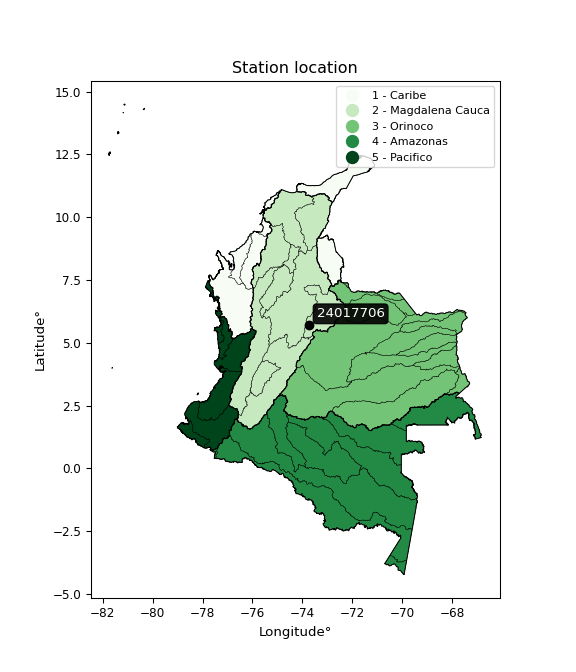

<div align="center">


</div>

# PMP Station (rain, Pmax24h): 24017706

Probable Maximum Precipitation (PMP) is the greatest amount of rainfall for a specific duration that is meteorologically possible for a given location, acting as a "worst-case" scenario for extreme storms, crucial for designing safety-critical infrastructure like bridges, river deviations, dams, spillways, and nuclear plants to prevent catastrophic failure. PMP is calculated by hydrologists using meteorological data to determine the upper limit of extreme rainfall, often leading to the Probable Maximum Flood (PMF) for flood control design, and is increasingly being studied for climate change impacts.

<div align="center">

</img>

</div>


## A. General information


### 1. General running parameters

• app_version: _v20251227_. • runtime: _2025-12-27 09:02:11.367833_. • Python version: _3.14.0_. • SciPy version: _1.16.3_. • Pandas version: _2.3.3_. • NumPy version: _2.3.5_. • Stations dataset (station_dataset_file): _dataset/pmax24h_in/automatic_colombia_2003_2024_filter.csv_. • Stations catalog (station_catalog_file): _dataset/CNE_IDEAM.xls_. • Minimum year to eval til year_max (date_min): _2003_. • Maximum year to eval since year_min (date_max): _2024_. • Creates, save and include plots into reports (create_plot): _False_. • Plot only fit distributions with Δo > Δ (plot_only_fit): _True_. • Eval low extreme values, if False, evaluates high extreme values (low_extreme): _False_. • Eval every SciPy distribution as logarithmic (pdist_logarithmic_on): _True_. • Standard deviation normalized (ddof): _1.0_. • Return periods to eval in years (Tr): _[2, 2.33, 5, 10, 15, 20, 25, 50, 75, 100, 200, 250, 500, 750, 1000]_. • Minimum data sample per station, 0 means any (minimum_sample): _5_. • Z-Score threshold to adjust a value, 0 means disable (zscore): _3.5_. • Avoid zeros, e.g. rain = 0 (avoid_zeros): _True_. • Avoid null values (avoid_nans): _True_. [:file_folder:Dataset file.](../../dataset/pmax24h_in/automatic_colombia_2003_2024_filter.csv)

> Delta Degrees of Freedom (DDOF): is a parameter used in the formulas for calculating variance and standard deviation. When ddof=0, the divisor is $N$ (the total number of observations) and this is used when your data set is the entire population. When ddof=1, the divisor is $N-1$ and this is used when your data set is a sample drawn from a larger population. Using $N-1$ provides an unbiased estimate of the population variance (known as Bessel´s correction).


### 2. Station info and location

|   id |   CODIGO | NOMBRE                            | CATEGORIA    | TECNOLOGIA                | ESTADO   |   FECHA_INSTALACION |   FECHA_SUSPENSION |   ALTITUD |   LATITUD |   LONGITUD | DEPARTAMENTO   | MUNICIPIO   | AREA_OPERATIVA                            | ENTIDAD                                       | AREA_HIDROGRAFICA   | ZONA_HIDROGRAFICA   | SUBZONA_HIDROGRAFICA   | CORRIENTE   | Catalogo   |
|-----:|---------:|:----------------------------------|:-------------|:--------------------------|:---------|--------------------:|-------------------:|----------:|----------:|-----------:|:---------------|:------------|:------------------------------------------|:----------------------------------------------|:--------------------|:--------------------|:-----------------------|:------------|:-----------|
|    0 | 24017706 | PUENTE MERCHAN  - AUT  [24017706] | Limnigráfica | Automática con Telemetría | Activa   |                 nan |                nan |      2552 |   5.69586 |   -73.7542 | Boyacá         | Saboyá      | Area Operativa 11 - Cundinamarca-Amazonas | CORPORACION AUTONOMA REGIONAL DE CUNDINAMARCA | Magdalena Cauca     | Sogamoso            | Río Suárez             | Suarez      | CNE_OE     |

<div align="center">

Map location in: [:earth_americas:Google](http://maps.google.com/maps?q=5.695861111,-73.75425) [:earth_americas:OSM](https://www.openstreetmap.org/#map=18/5.695861111/-73.75425&layers=P) [:earth_americas:Bing](https://www.bing.com/maps?cp=5.695861111~-73.75425&lvl=18) [:earth_americas:Apple](https://maps.apple.com/frame?center=5.695861111%2C-73.75425&span=0.003%2C0.006)

</div>


<div align="center">

```geojson
{
  "type": "Feature",
  "geometry": {
    "type": "Point", 
    "coordinates": [-73.75425, 5.695861111]
  }, 
  "properties": {
    "Name": "24017706"
  }
}
```

</div>


### 3. Discrete values table and plot

|               |           0 |          1 |           2 |           3 |          4 |           5 |
|:--------------|------------:|-----------:|------------:|------------:|-----------:|------------:|
| Date          | 2015        | 2016       | 2017        | 2018        | 2019       | 2020        |
| Value         |   28.6      |   41.5     |   36.2      |   33.8      |   21.8     |   31.5      |
| Value_initial |   28.6      |   41.5     |   36.2      |   33.8      |   21.8     |   31.5      |
| count         |    6        |    6       |    6        |    6        |    6       |    6        |
| mean          |   32.2333   |   32.2333  |   32.2333   |   32.2333   |   32.2333  |   32.2333   |
| std           |    6.73281  |    6.73281 |    6.73281  |    6.73281  |    6.73281 |    6.73281  |
| zscore        |   -0.539646 |    1.37635 |    0.589155 |    0.232692 |   -1.54963 |   -0.108919 |

> The initial value (value_initial) correspond to the initial obtained or null completed value, and value (value) is adjusted only when the initial value is outside the valid range definite through the Z-Score value. If Z-Score is active, values out of range or outliers are replaced with the station mean value


### 4. Active continuous probability distributions from SciPy (45 of 104 available)

[scipy.stats](https://docs.scipy.org/doc/scipy/reference/stats.html) is a Python´s powerful submodule within the SciPy library for comprehensive statistical analysis, offering over 130 probability distributions (like Normal, Poisson), functions for descriptive stats (mean, variance), hypothesis testing (t-tests, chi-square), random variable generation, and statistical tests, making it essential for data science, modeling, and research. It provides tools to explore, model, and draw conclusions from data efficiently, working seamlessly with NumPy.

<div align="center">

|   id | p_dist             |   n_parameter | fit_method   | label                                                                       | active   | ref                                                                                                        |
|-----:|:-------------------|--------------:|:-------------|:----------------------------------------------------------------------------|:---------|:-----------------------------------------------------------------------------------------------------------|
|    0 | alpha              |             3 | MLE          | Alpha                                                                       | True     | [:mortar_board:](https://docs.scipy.org/doc/scipy/reference/generated/scipy.stats.alpha.html)              |
|    1 | betaprime          |             4 | MLE          | Beta prime                                                                  | True     | [:mortar_board:](https://docs.scipy.org/doc/scipy/reference/generated/scipy.stats.betaprime.html)          |
|    2 | chi2               |             3 | MLE          | Chi²                                                                        | True     | [:mortar_board:](https://docs.scipy.org/doc/scipy/reference/generated/scipy.stats.chi2.html)               |
|    3 | crystalball        |             4 | MLE          | Crystalball                                                                 | True     | [:mortar_board:](https://docs.scipy.org/doc/scipy/reference/generated/scipy.stats.crystalball.html)        |
|    4 | erlang             |             3 | MLE          | Erlang                                                                      | True     | [:mortar_board:](https://docs.scipy.org/doc/scipy/reference/generated/scipy.stats.erlang.html)             |
|    5 | expon              |             2 | MLE          | Exponential                                                                 | True     | [:mortar_board:](https://docs.scipy.org/doc/scipy/reference/generated/scipy.stats.expon.html)              |
|    6 | exponnorm          |             3 | MLE          | Exponentially modified Normal                                               | True     | [:mortar_board:](https://docs.scipy.org/doc/scipy/reference/generated/scipy.stats.exponnorm.html)          |
|    7 | f                  |             4 | MLE          | F                                                                           | True     | [:mortar_board:](https://docs.scipy.org/doc/scipy/reference/generated/scipy.stats.f.html)                  |
|    8 | fatiguelife        |             3 | MLE          | Fatigue-life (Birnbaum-Saunders)                                            | True     | [:mortar_board:](https://docs.scipy.org/doc/scipy/reference/generated/scipy.stats.fatiguelife.html)        |
|    9 | fisk               |             3 | MLE          | Fisk                                                                        | True     | [:mortar_board:](https://docs.scipy.org/doc/scipy/reference/generated/scipy.stats.fisk.html)               |
|   10 | gamma              |             3 | MLE          | Gamma                                                                       | True     | [:mortar_board:](https://docs.scipy.org/doc/scipy/reference/generated/scipy.stats.gamma.html)              |
|   11 | genexpon           |             5 | MLE          | Generalized exponential                                                     | True     | [:mortar_board:](https://docs.scipy.org/doc/scipy/reference/generated/scipy.stats.genexpon.html)           |
|   12 | genlogistic        |             3 | MLE          | Generalized logistic                                                        | True     | [:mortar_board:](https://docs.scipy.org/doc/scipy/reference/generated/scipy.stats.genlogistic.html)        |
|   13 | gibrat             |             2 | MM           | Gibrat                                                                      | True     | [:mortar_board:](https://docs.scipy.org/doc/scipy/reference/generated/scipy.stats.gibrat.html)             |
|   14 | gompertz           |             3 | MLE          | Gompertz (or truncated Gumbel)                                              | True     | [:mortar_board:](https://docs.scipy.org/doc/scipy/reference/generated/scipy.stats.gompertz.html)           |
|   15 | gumbel_l           |             2 | MM           | Gumbel Left Skew                                                            | True     | [:mortar_board:](https://docs.scipy.org/doc/scipy/reference/generated/scipy.stats.gumbel_l.html)           |
|   16 | gumbel_r           |             2 | MM           | Gumbel Right Skew                                                           | True     | [:mortar_board:](https://docs.scipy.org/doc/scipy/reference/generated/scipy.stats.gumbel_r.html)           |
|   17 | halflogistic       |             2 | MM           | Half-logistic                                                               | True     | [:mortar_board:](https://docs.scipy.org/doc/scipy/reference/generated/scipy.stats.halflogistic.html)       |
|   18 | halfnorm           |             2 | MM           | Half Normal                                                                 | True     | [:mortar_board:](https://docs.scipy.org/doc/scipy/reference/generated/scipy.stats.halfnorm.html)           |
|   19 | hypsecant          |             2 | MM           | hyperbolic secant                                                           | True     | [:mortar_board:](https://docs.scipy.org/doc/scipy/reference/generated/scipy.stats.hypsecant.html)          |
|   20 | invgamma           |             3 | MLE          | Inverted gamma                                                              | True     | [:mortar_board:](https://docs.scipy.org/doc/scipy/reference/generated/scipy.stats.invgamma.html)           |
|   21 | invgauss           |             3 | MLE          | Inverse Gaussian                                                            | True     | [:mortar_board:](https://docs.scipy.org/doc/scipy/reference/generated/scipy.stats.invgauss.html)           |
|   22 | invweibull         |             3 | MLE          | Inverted Weibull                                                            | True     | [:mortar_board:](https://docs.scipy.org/doc/scipy/reference/generated/scipy.stats.invweibull.html)         |
|   23 | johnsonsu          |             4 | MLE          | Johnson Su                                                                  | True     | [:mortar_board:](https://docs.scipy.org/doc/scipy/reference/generated/scipy.stats.johnsonsu.html)          |
|   24 | kstwobign          |             2 | MLE          | Limiting distribution of scaled Kolmogorov-Smirnov two-sided test statistic | True     | [:mortar_board:](https://docs.scipy.org/doc/scipy/reference/generated/scipy.stats.kstwobign.html)          |
|   25 | laplace            |             2 | MM           | Laplace                                                                     | True     | [:mortar_board:](https://docs.scipy.org/doc/scipy/reference/generated/scipy.stats.laplace.html)            |
|   26 | laplace_asymmetric |             3 | MLE          | Asymmetric Laplace                                                          | True     | [:mortar_board:](https://docs.scipy.org/doc/scipy/reference/generated/scipy.stats.laplace_asymmetric.html) |
|   27 | loggamma           |             3 | MLE          | Log gamma                                                                   | True     | [:mortar_board:](https://docs.scipy.org/doc/scipy/reference/generated/scipy.stats.loggamma.html)           |
|   28 | logistic           |             2 | MM           | Logistic (or Sech-squared)                                                  | True     | [:mortar_board:](https://docs.scipy.org/doc/scipy/reference/generated/scipy.stats.logistic.html)           |
|   29 | lognorm            |             3 | MLE          | Log Normal                                                                  | True     | [:mortar_board:](https://docs.scipy.org/doc/scipy/reference/generated/scipy.stats.lognorm.html)            |
|   30 | maxwell            |             2 | MM           | Maxwell                                                                     | True     | [:mortar_board:](https://docs.scipy.org/doc/scipy/reference/generated/scipy.stats.maxwell.html)            |
|   31 | mielke             |             4 | MLE          | Mielke Beta-Kappa / Dagum                                                   | True     | [:mortar_board:](https://docs.scipy.org/doc/scipy/reference/generated/scipy.stats.mielke.html)             |
|   32 | moyal              |             2 | MM           | Moyal                                                                       | True     | [:mortar_board:](https://docs.scipy.org/doc/scipy/reference/generated/scipy.stats.moyal.html)              |
|   33 | nakagami           |             3 | MLE          | Nakagami                                                                    | True     | [:mortar_board:](https://docs.scipy.org/doc/scipy/reference/generated/scipy.stats.nakagami.html)           |
|   34 | ncf                |             5 | MLE          | Non-central F distribution                                                  | True     | [:mortar_board:](https://docs.scipy.org/doc/scipy/reference/generated/scipy.stats.ncf.html)                |
|   35 | nct                |             4 | MLE          | Non-central Student’s t                                                     | True     | [:mortar_board:](https://docs.scipy.org/doc/scipy/reference/generated/scipy.stats.nct.html)                |
|   36 | norm               |             2 | MM           | Normal                                                                      | True     | [:mortar_board:](https://docs.scipy.org/doc/scipy/reference/generated/scipy.stats.norm.html)               |
|   37 | pareto             |             3 | MLE          | Pareto                                                                      | True     | [:mortar_board:](https://docs.scipy.org/doc/scipy/reference/generated/scipy.stats.pareto.html)             |
|   38 | pearson3           |             3 | MM           | Pearson type III                                                            | True     | [:mortar_board:](https://docs.scipy.org/doc/scipy/reference/generated/scipy.stats.pearson3.html)           |
|   39 | rayleigh           |             2 | MM           | Rayleigh                                                                    | True     | [:mortar_board:](https://docs.scipy.org/doc/scipy/reference/generated/scipy.stats.rayleigh.html)           |
|   40 | rice               |             3 | MLE          | Rice                                                                        | True     | [:mortar_board:](https://docs.scipy.org/doc/scipy/reference/generated/scipy.stats.rice.html)               |
|   41 | t                  |             3 | MLE          | Student’s t                                                                 | True     | [:mortar_board:](https://docs.scipy.org/doc/scipy/reference/generated/scipy.stats.t.html)                  |
|   42 | truncnorm          |             4 | MLE          | Truncated normal                                                            | True     | [:mortar_board:](https://docs.scipy.org/doc/scipy/reference/generated/scipy.stats.truncnorm.html)          |
|   43 | wald               |             2 | MM           | Wald                                                                        | True     | [:mortar_board:](https://docs.scipy.org/doc/scipy/reference/generated/scipy.stats.wald.html)               |
|   44 | weibull_min        |             3 | MLE          | Weibull minimum                                                             | True     | [:mortar_board:](https://docs.scipy.org/doc/scipy/reference/generated/scipy.stats.weibull_min.html)        |

</div>

> **n_parameter:** # arguments & localization & scale.
>
> **Fit methods:** (MLE) maximum likelihood, (MM) L-moments.
>
>**Inactive:** foldnorm, gennorm, norminvgauss, powernorm, powerlognorm, skewnorm, genextreme, anglit, arcsine, argus, beta, bradford, burr, burr12, cauchy, cosine, halfcauchy, foldcauchy, skewcauchy, wrapcauchy, dgamma, gengamma, exponweib, exponpow, truncexpon, gausshyper, genhalflogistic, genhyperbolic, geninvgauss, halfgennorm, johnsonsb, kappa4, kappa3, ksone, kstwo, loglaplace, levy, levy_l, levy_stable, ncx2, genpareto, truncpareto, lomax, powerlaw, rdist, rel_breitwigner, recipinvgauss, semicircular, studentized_range, trapezoid, triang, truncweibull_min, tukeylambda, uniform, loguniform, vonmises, vonmises_line, weibull_max, dweibull, 


## B. Probability distributions vs. Empirical distributions

A continuous probability distribution (CPD) describes probabilities for variables that can take any value within a range (like rain any time), unlike discrete variables with specific outcomes (like temperature). It uses a Probability Density Function (PDF), a curve where the total area under it equals 1, and the probability of the variable falling within an interval (a to b) is found by calculating the area under the curve between those points. A key feature is that the probability of hitting any single exact value is zero, so probabilities are always expressed for ranges, e.g., $P(a ≤ X ≤ b)$.

<div align="center">

Distributions parameters from station values
|    |   station | p_dist                |   n |             loc |           scale | shape                 | shape1               | shape2                | shape3   |
|---:|----------:|:----------------------|----:|----------------:|----------------:|:----------------------|:---------------------|:----------------------|:---------|
|  0 |  24017706 | alpha                 |   6 |   -93.3879      |  2499.24        | 19.94120428024614     |                      |                       |          |
|  1 |  24017706 | betaprime             |   6 |    -1.41703     |   105.54        | 38.16737640637274     | 120.54804614155427   |                       |          |
|  2 |  24017706 | chi2                  |   6 |   -23.5687      |     0.358366    | 155.54804488038502    |                      |                       |          |
|  3 |  24017706 | crystalball           |   6 |    32.2333      |     6.14618     | 1524.499112009194     | 4648.165451510973    |                       |          |
|  4 |  24017706 | erlang                |   6 |   -87.3617      |     0.324106    | 368.94112902391623    |                      |                       |          |
|  5 |  24017706 | expon                 |   6 |    21.8         |    10.4333      |                       |                      |                       |          |
|  6 |  24017706 | exponnorm             |   6 |    32.2275      |     6.14618     | 0.0009479163648474836 |                      |                       |          |
|  7 |  24017706 | f                     |   6 | -1499.78        |  1532.01        | 163900.46289499977    | 503949.4175023141    |                       |          |
|  8 |  24017706 | fatiguelife           |   6 |    21.8         |     4.5162e-06  | 1529.781150095701     |                      |                       |          |
|  9 |  24017706 | fisk                  |   6 |    -5.23862e+08 |     5.23862e+08 | 146308732.10033074    |                      |                       |          |
| 10 |  24017706 | gamma                 |   6 |   -87.5255      |     0.317762    | 376.873492551681      |                      |                       |          |
| 11 |  24017706 | genexpon              |   6 |    21.8         |     2.15908     | 0.19932845762808404   | 0.005046192079177067 | 1.6946557572652154    |          |
| 12 |  24017706 | genlogistic           |   6 |    34.3319      |     3.06343     | 0.6904496443897481    |                      |                       |          |
| 13 |  24017706 | gibrat                |   6 |    27.5446      |     2.84389     |                       |                      |                       |          |
| 14 |  24017706 | gompertz              |   6 |    28.6         |     5.73452     | 0.3736663470047514    |                      |                       |          |
| 15 |  24017706 | gumbel_l              |   6 |    34.9994      |     4.79216     |                       |                      |                       |          |
| 16 |  24017706 | gumbel_r              |   6 |    29.4672      |     4.79216     |                       |                      |                       |          |
| 17 |  24017706 | halflogistic          |   6 |    24.9487      |     5.25477     |                       |                      |                       |          |
| 18 |  24017706 | halfnorm              |   6 |    24.0982      |    10.1959      |                       |                      |                       |          |
| 19 |  24017706 | hypsecant             |   6 |    32.2333      |     3.91278     |                       |                      |                       |          |
| 20 |  24017706 | invgamma              |   6 |   -50.8128      | 14367.2         | 174.05226339156485    |                      |                       |          |
| 21 |  24017706 | invgauss              |   6 |    -2.7947      |   987.189       | 0.03531076439179641   |                      |                       |          |
| 22 |  24017706 | invweibull            |   6 |    -3.78867e+08 |     3.78867e+08 | 62682630.24869735     |                      |                       |          |
| 23 |  24017706 | johnsonsu             |   6 |    -5.98285e+07 |     2.0547e+08  | -9921890.684697159    | 34545328.77321749    |                       |          |
| 24 |  24017706 | kstwobign             |   6 |     7.81751     |    27.9117      |                       |                      |                       |          |
| 25 |  24017706 | laplace               |   6 |    32.2333      |     4.34601     |                       |                      |                       |          |
| 26 |  24017706 | laplace_asymmetric    |   6 |    33.8         |     4.7403      | 1.1787871782028398    |                      |                       |          |
| 27 |  24017706 | loggamma              |   6 |     1.25382     |    16.1339      | 7.315885450568642     |                      |                       |          |
| 28 |  24017706 | logistic              |   6 |    32.2333      |     3.38857     |                       |                      |                       |          |
| 29 |  24017706 | lognorm               |   6 |    21.8         |     0.0304538   | 13.321840334820044    |                      |                       |          |
| 30 |  24017706 | maxwell               |   6 |    17.6695      |     9.12655     |                       |                      |                       |          |
| 31 |  24017706 | mielke                |   6 |    -0.307987    |    37.1841      | 5.416999204060843     | 14.678498872194329   |                       |          |
| 32 |  24017706 | moyal                 |   6 |    28.7186      |     2.76675     |                       |                      |                       |          |
| 33 |  24017706 | nakagami              |   6 |    28.6         |     6.10719     | 0.39492452148898893   |                      |                       |          |
| 34 |  24017706 | ncf                   |   6 |    -0.0612266   |    31.8654      | 77.29469082848587     | 138.81394175937766   | 1.888883560039495e-06 |          |
| 35 |  24017706 | nct                   |   6 |   -83.3352      |     6.11619     | 24271.985327488313    | 18.895731505086253   |                       |          |
| 36 |  24017706 | norm                  |   6 |    32.2333      |     6.14618     |                       |                      |                       |          |
| 37 |  24017706 | pareto                |   6 |    21.7676      |     0.032431    | 0.2035299068081744    |                      |                       |          |
| 38 |  24017706 | pearson3              |   6 |    32.2333      |     6.14621     | -0.23131846231119418  |                      |                       |          |
| 39 |  24017706 | rayleigh              |   6 |    20.4753      |     9.38153     |                       |                      |                       |          |
| 40 |  24017706 | rice                  |   6 |    18.1804      |     6.85344     | 1.7345865974227324    |                      |                       |          |
| 41 |  24017706 | t                     |   6 |    32.2335      |     6.14601     | 7137247.999604033     |                      |                       |          |
| 42 |  24017706 | truncnorm             |   6 |     7.72707     |    12.4882      | 1.6714091338935364    | 2.704540020707591    |                       |          |
| 43 |  24017706 | wald                  |   6 |    26.0871      |     6.14622     |                       |                      |                       |          |
| 44 |  24017706 | weibull_min           |   6 |     9.46466     |    25.0695      | 4.294126035234841     |                      |                       |          |
| 45 |  24017706 | logalpha              |   6 |    -3.67857     |   247.902       | 34.78235267866566     |                      |                       |          |
| 46 |  24017706 | logbetaprime          |   6 |    -0.990257    |     8.84786     | 703.9785373396376     | 1401.2294333672362   |                       |          |
| 47 |  24017706 | logchi2               |   6 |     3.08191     |     0.969496    | 1.063661457488461     |                      |                       |          |
| 48 |  24017706 | logcrystalball        |   6 |     3.45342     |     0.202097    | 451.2936069458775     | 3.7395576196322855   |                       |          |
| 49 |  24017706 | logerlang             |   6 |    -0.000522505 |     0.0122413   | 281.94919921749056    |                      |                       |          |
| 50 |  24017706 | logexpon              |   6 |     3.08191     |     0.37151     |                       |                      |                       |          |
| 51 |  24017706 | logexponnorm          |   6 |     3.45328     |     0.202097    | 0.00066164006824021   |                      |                       |          |
| 52 |  24017706 | logf                  |   6 |  -249.41        |   252.864       | 7649488.716074232     | 5259069.0002812      |                       |          |
| 53 |  24017706 | logfatiguelife        |   6 |   -50.8515      |    54.3028      | 0.0037381557987054316 |                      |                       |          |
| 54 |  24017706 | logfisk               |   6 |    -1.34878e+07 |     1.34878e+07 | 117075767.56700228    |                      |                       |          |
| 55 |  24017706 | loggamma              |   6 |     0.0769938   |     0.0128136   | 263.5531864357265     |                      |                       |          |
| 56 |  24017706 | loggenexpon           |   6 |     3.08166     |     0.0011735   | 0.001250255339533107  | 0.5809052126209344   | 1.612535305687942e-05 |          |
| 57 |  24017706 | loggenlogistic        |   6 |     3.60819     |     0.0685456   | 0.3668534587670679    |                      |                       |          |
| 58 |  24017706 | loggibrat             |   6 |     3.29923     |     0.0935224   |                       |                      |                       |          |
| 59 |  24017706 | loggompertz           |   6 |     3.08138     |     0.206168    | 0.12596161803579356   |                      |                       |          |
| 60 |  24017706 | loggumbel_l           |   6 |     3.54437     |     0.157574    |                       |                      |                       |          |
| 61 |  24017706 | loggumbel_r           |   6 |     3.36247     |     0.157574    |                       |                      |                       |          |
| 62 |  24017706 | loghalflogistic       |   6 |     3.21391     |     0.172769    |                       |                      |                       |          |
| 63 |  24017706 | loghalfnorm           |   6 |     3.18591     |     0.335276    |                       |                      |                       |          |
| 64 |  24017706 | loghypsecant          |   6 |     3.45342     |     0.128659    |                       |                      |                       |          |
| 65 |  24017706 | loginvgamma           |   6 |    -0.462928    |  1390.05        | 356.2258016985884     |                      |                       |          |
| 66 |  24017706 | loginvgauss           |   6 |     1.56658     |   142.641       | 0.01318746844056901   |                      |                       |          |
| 67 |  24017706 | loginvweibull         |   6 |    -1.14509e+07 |     1.14509e+07 | 57874444.616896085    |                      |                       |          |
| 68 |  24017706 | logjohnsonsu          |   6 |     4.01065     |     0.0345653   | 9.333131359414747     | 2.7379143164715636   |                       |          |
| 69 |  24017706 | logkstwobign          |   6 |     2.59672     |     0.978729    |                       |                      |                       |          |
| 70 |  24017706 | loglaplace            |   6 |     3.45342     |     0.142904    |                       |                      |                       |          |
| 71 |  24017706 | loglaplace_asymmetric |   6 |     3.52046     |     0.147103    | 1.2535436458090312    |                      |                       |          |
| 72 |  24017706 | logloggamma           |   6 |     3.55516     |     0.160223    | 0.9657614468622644    |                      |                       |          |
| 73 |  24017706 | loglogistic           |   6 |     3.45342     |     0.111422    |                       |                      |                       |          |
| 74 |  24017706 | loglognorm            |   6 |     3.08191     |     0.00136096  | 12.860571886790876    |                      |                       |          |
| 75 |  24017706 | logmaxwell            |   6 |     2.97453     |     0.300097    |                       |                      |                       |          |
| 76 |  24017706 | logmielke             |   6 |     3.07986     |     0.676018    | 0.9236505936064736    | 18.73142879287041    |                       |          |
| 77 |  24017706 | logmoyal              |   6 |     3.33785     |     0.0909757   |                       |                      |                       |          |
| 78 |  24017706 | lognakagami           |   6 |     3.35341     |     0.162927    | 0.16768519443242624   |                      |                       |          |
| 79 |  24017706 | logncf                |   6 |    -3.40706     |     6.85608     | 375.06158822150405    | 1008.4771333929943   | 0.009394979011554914  |          |
| 80 |  24017706 | lognct                |   6 |    -0.646015    |     0.0614641   | 223.28280362108592    | 66.45758814130835    |                       |          |
| 81 |  24017706 | lognorm               |   6 |     3.45342     |     0.202097    |                       |                      |                       |          |
| 82 |  24017706 | logpareto             |   6 |     3.08073     |     0.00117691  | 0.20344666293998348   |                      |                       |          |
| 83 |  24017706 | logpearson3           |   6 |     3.45342     |     0.202097    | -0.5915129277804082   |                      |                       |          |
| 84 |  24017706 | lograyleigh           |   6 |     3.0668      |     0.308481    |                       |                      |                       |          |
| 85 |  24017706 | logrice               |   6 |     2.94832     |     0.219991    | 2.0286540745018917    |                      |                       |          |
| 86 |  24017706 | logt                  |   6 |     3.45342     |     0.202096    | 1603733800.5463123    |                      |                       |          |
| 87 |  24017706 | logtruncnorm          |   6 |    -0.0742517   |     1.11693     | 2.825753201902736     | 3.402144746832403    |                       |          |
| 88 |  24017706 | logwald               |   6 |     3.2513      |     0.202116    |                       |                      |                       |          |
| 89 |  24017706 | logweibull_min        |   6 |    -0.923232    |     4.46801     | 26.91789750621094     |                      |                       |          |

</div>

> **loc** (Location parameter): This shifts the distribution along the x-axis. For many common distributions, like the normal (Gaussian) distribution, loc represents the mean $μ$. For others, like the uniform distribution, it might represent the minimum value, or for the beta distribution, the left end of the support interval.
>
> **scale** (Scale parameter): This determines the width or spread of the distribution. For the normal distribution, scale represents the standard deviation $σ$. For a uniform distribution, it defines the length of the interval (from $loc$ to $loc + scale$).
>
> **shape** (Shape parameters): Refers to parameters that define the specific form of a probability distribution, distinct from its location (loc) and scale (scale). These parameters are required arguments for most distribution functions. For example, a normal (Gaussian) distribution is fully defined by its location (mean) and scale (standard deviation), so it has no specific shape parameters beyond loc and scale. However, other distributions have intrinsic properties that need specification, as Gamma distribution that takes a shape parameter, often named $a$ or $alpha$.


### 0. Cumulative distribution values - CDF (90 evaluated)

Cumulative Distribution Function (CDF), denoted as $F$<sub>$X$</sub>$(x)$, is a function that gives the probability that a random variable $X$ will take a value less than or equal to a specific value, $x$ (i.e., $(P(X≥x)$. It essentially "accumulates" probabilities from a given point up to the far right (positive infinity), providing a complete picture of the distribution´s probabilities for both discrete (like rain) and continuous (like temperature) variables, helping to find probabilities over ranges or above certain values.

<div align="center">

CDF ordered by x ascending and calculating $log(f(x))$ separately
|   id |   Station |   date |    x |   count |    mean |     std |    zscore |   Value_initial |   station |   m |     alpha |   alpha_pdf |   betaprime |   betaprime_pdf |      chi2 |   chi2_pdf |   crystalball |   crystalball_pdf |    erlang |   erlang_pdf |    expon |   expon_pdf |   exponnorm |   exponnorm_pdf |         f |     f_pdf |   fatiguelife |   fatiguelife_pdf |      fisk |   fisk_pdf |     gamma |   gamma_pdf |    genexpon |   genexpon_pdf |   genlogistic |   genlogistic_pdf |   gibrat |   gibrat_pdf |    gompertz |   gompertz_pdf |   gumbel_l |   gumbel_l_pdf |   gumbel_r |   gumbel_r_pdf |   halflogistic |   halflogistic_pdf |   halfnorm |   halfnorm_pdf |   hypsecant |   hypsecant_pdf |   invgamma |   invgamma_pdf |   invgauss |   invgauss_pdf |   invweibull |   invweibull_pdf |   johnsonsu |   johnsonsu_pdf |   kstwobign |   kstwobign_pdf |   laplace |   laplace_pdf |   laplace_asymmetric |   laplace_asymmetric_pdf |   loggamma |   loggamma_pdf |   logistic |   logistic_pdf |   lognorm |   lognorm_pdf |   maxwell |   maxwell_pdf |    mielke |   mielke_pdf |       moyal |   moyal_pdf |    nakagami |   nakagami_pdf |       ncf |   ncf_pdf |       nct |   nct_pdf |      norm |   norm_pdf |   pareto |   pareto_pdf |   pearson3 |   pearson3_pdf |   rayleigh |   rayleigh_pdf |      rice |   rice_pdf |         t |     t_pdf |   truncnorm |   truncnorm_pdf |     wald |   wald_pdf |   weibull_min |   weibull_min_pdf |   logalpha |   logalpha_pdf |   logbetaprime |   logbetaprime_pdf |     logchi2 |   logchi2_pdf |   logcrystalball |   logcrystalball_pdf |   logerlang |   logerlang_pdf |   logexpon |   logexpon_pdf |   logexponnorm |   logexponnorm_pdf |      logf |   logf_pdf |   logfatiguelife |   logfatiguelife_pdf |   logfisk |   logfisk_pdf |   loggenexpon |   loggenexpon_pdf |   loggenlogistic |   loggenlogistic_pdf |   loggibrat |   loggibrat_pdf |   loggompertz |   loggompertz_pdf |   loggumbel_l |   loggumbel_l_pdf |   loggumbel_r |   loggumbel_r_pdf |   loghalflogistic |   loghalflogistic_pdf |   loghalfnorm |   loghalfnorm_pdf |   loghypsecant |   loghypsecant_pdf |   loginvgamma |   loginvgamma_pdf |   loginvgauss |   loginvgauss_pdf |   loginvweibull |   loginvweibull_pdf |   logjohnsonsu |   logjohnsonsu_pdf |   logkstwobign |   logkstwobign_pdf |   loglaplace |   loglaplace_pdf |   loglaplace_asymmetric |   loglaplace_asymmetric_pdf |   logloggamma |   logloggamma_pdf |   loglogistic |   loglogistic_pdf |   loglognorm |   loglognorm_pdf |   logmaxwell |   logmaxwell_pdf |   logmielke |   logmielke_pdf |    logmoyal |   logmoyal_pdf |   lognakagami |   lognakagami_pdf |   logncf |   logncf_pdf |    lognct |   lognct_pdf |   logpareto |   logpareto_pdf |   logpearson3 |   logpearson3_pdf |   lograyleigh |   lograyleigh_pdf |   logrice |   logrice_pdf |      logt |   logt_pdf |   logtruncnorm |   logtruncnorm_pdf |   logwald |   logwald_pdf |   logweibull_min |   logweibull_min_pdf |
|-----:|----------:|-------:|-----:|--------:|--------:|--------:|----------:|----------------:|----------:|----:|----------:|------------:|------------:|----------------:|----------:|-----------:|--------------:|------------------:|----------:|-------------:|---------:|------------:|------------:|----------------:|----------:|----------:|--------------:|------------------:|----------:|-----------:|----------:|------------:|------------:|---------------:|--------------:|------------------:|---------:|-------------:|------------:|---------------:|-----------:|---------------:|-----------:|---------------:|---------------:|-------------------:|-----------:|---------------:|------------:|----------------:|-----------:|---------------:|-----------:|---------------:|-------------:|-----------------:|------------:|----------------:|------------:|----------------:|----------:|--------------:|---------------------:|-------------------------:|-----------:|---------------:|-----------:|---------------:|----------:|--------------:|----------:|--------------:|----------:|-------------:|------------:|------------:|------------:|---------------:|----------:|----------:|----------:|----------:|----------:|-----------:|---------:|-------------:|-----------:|---------------:|-----------:|---------------:|----------:|-----------:|----------:|----------:|------------:|----------------:|---------:|-----------:|--------------:|------------------:|-----------:|---------------:|---------------:|-------------------:|------------:|--------------:|-----------------:|---------------------:|------------:|----------------:|-----------:|---------------:|---------------:|-------------------:|----------:|-----------:|-----------------:|---------------------:|----------:|--------------:|--------------:|------------------:|-----------------:|---------------------:|------------:|----------------:|--------------:|------------------:|--------------:|------------------:|--------------:|------------------:|------------------:|----------------------:|--------------:|------------------:|---------------:|-------------------:|--------------:|------------------:|--------------:|------------------:|----------------:|--------------------:|---------------:|-------------------:|---------------:|-------------------:|-------------:|-----------------:|------------------------:|----------------------------:|--------------:|------------------:|--------------:|------------------:|-------------:|-----------------:|-------------:|-----------------:|------------:|----------------:|------------:|---------------:|--------------:|------------------:|---------:|-------------:|----------:|-------------:|------------:|----------------:|--------------:|------------------:|--------------:|------------------:|----------:|--------------:|----------:|-----------:|---------------:|-------------------:|----------:|--------------:|-----------------:|---------------------:|
|    0 |  24017706 |   2019 | 21.8 |       6 | 32.2333 | 6.73281 | -1.54963  |            21.8 |  24017706 |   1 | 0.0395554 |   0.0160851 |   0.0313279 |       0.0152612 | 0.0429516 |  0.0165822 |     0.0447982 |         0.0153664 | 0.0439469 |    0.0158762 | 0        |   0.0958466 |   0.0447984 |       0.0153664 | 0.0448516 | 0.0154321 |     0.0484049 |       1.19221e+11 | 0.0487602 |  0.0129542 | 0.0422372 |   0.0155165 | 2.31883e-07 |      0.0923209 |      0.058663 |         0.0130042 | 0        |   0          | 0           |      0         |   0.061665 |      0.0124627 | 0.00706364 |     0.00730041 |       0        |          0         |   0        |      0         |    0.044172 |       0.011253  |  0.0397754 |      0.0162705 |  0.0374884 |      0.0180395 |    0.0352505 |        0.01951   |   0.0460723 |       0.0155934 |   0.0366687 |       0.0231617 | 0.0453285 |     0.0104299 |            0.0679039 |                0.0121522 |  0.0329889 |       0.382555 |  0.0439827 |      0.0124088 | 0.0330111 |      0.364381 | 0.0231946 |     0.0161642 | 0.0598025 |    0.014646  | 0.000480506 |  0.00113488 | 0           |      0         | 0.0346662 | 0.0166965 | 0.0444627 | 0.015311  | 0.0447982 |  0.0153664 | 0        |   6.27579    |  0.0509607 |      0.0151255 | 0.00991919 |      0.0149016 | 0.0319873 |  0.0181831 | 0.0447911 | 0.0153648 | 0           |       0         | 0        |  0         |     0.0464668 |         0.015794  |  0.0295833 |       0.364806 |      0.0298895 |           0.356927 | 5.41824e-09 |   6.48875e+06 |         0.033011 |             0.36438  |   0.0326295 |        0.382726 |   0        |       2.69172  |      0.0330114 |           0.364384 | 0.0332656 |   0.366414 |        0.0339357 |             0.373663 | 0.0331625 |      0.278308 |   0.000271153 |          1.06685  |        0.0597972 |             0.319884 |    0        |        0        |   0.000323677 |          0.612338 |     0.0517494 |          0.319764 |     0.0026516 |         0.0998314 |          0        |              0        |      0        |          0        |       0.035431 |           0.274818 |     0.0314711 |          0.389258 |     0.0334491 |          0.431047 |       0.0254179 |            0.471765 |      0.0575124 |           0.33946  |      0.0333925 |           0.622174 |    0.0371475 |         0.259947 |               0.0566567 |                    0.307248 |     0.0570418 |          0.334786 |     0.0344144 |          0.298236 |    0.0126894 |      5.73997e+12 |    0.0117255 |         0.319277 |  0.00471463 |        2.12747  | 4.46188e-05 |     0.00430849 |   0           |        0          | 0.265115 |     0.585036 | 0.0276931 |     0.361165 |    0        |      172.865    |     0.0467384 |          0.363002 |    0.00119952 |          0.158635 | 0.0257167 |      0.415495 | 0.0330107 |   0.364379 |     2.9694e-06 |           3.25641  |  0        |      0        |        0.0512983 |             0.335769 |
|    1 |  24017706 |   2015 | 28.6 |       6 | 32.2333 | 6.73281 | -0.539646 |            28.6 |  24017706 |   2 | 0.292394  |   0.0577103 |   0.294983  |       0.0606131 | 0.294585  |  0.0570024 |     0.277209  |         0.0545029 | 0.284624  |    0.0556246 | 0.478871 |   0.0499485 |   0.27721   |       0.0545031 | 0.277939  | 0.0545515 |     0.788758  |       0.0170569   | 0.255082  |  0.0530692 | 0.281847  |   0.055875  | 0.473083    |      0.0498711 |      0.248888 |         0.0486113 | 0.160792 |   0.231275   | 8.15364e-10 |      0.0651609 |   0.231299 |      0.0421959 | 0.301684   |     0.0754421  |       0.334094 |          0.0845309 |   0.341173 |      0.0709874 |    0.239552 |       0.0556053 |  0.294987  |      0.0580567 |  0.320473  |      0.0610112 |    0.337562  |        0.0606521 |   0.278767  |       0.0542228 |   0.363703  |       0.0603868 | 0.216717  |     0.0498657 |            0.2293    |                0.0410357 |  0.319831  |       1.75362  |  0.254979  |      0.0560604 | 0.310344  |      1.74651  | 0.302508  |     0.0612107 | 0.253382  |    0.0463301 | 0.306944    |  0.0874158  | 7.22582e-13 |    160.646     | 0.306805  | 0.0602591 | 0.276781  | 0.0545524 | 0.277209  |  0.0545029 | 0.66343  |   0.010026   |  0.268769  |      0.0513455 | 0.312712   |      0.0634449 | 0.291638  |  0.056746  | 0.277194  | 0.054503  | 1.35834e-06 |       0.180018  | 0.279469 |  0.161939  |     0.269127  |         0.0514209 |  0.318751  |       1.78988  |      0.310573  |           1.75479  | 0.377511    |   0.674315    |         0.310344 |             1.74651  |   0.323107  |        1.78035  |   0.518473 |       1.29614  |      0.310346  |           1.74651  | 0.310928  |   1.74461  |        0.31469   |             1.75243  | 0.265809  |      1.69396  |   0.417474    |          1.69543  |        0.253499  |             1.32452  |    0.292581 |        6.3439   |   0.291993    |          1.61838  |     0.257421  |          1.40258  |     0.346743  |         2.33071   |          0.383114 |              2.46926  |      0.382632 |          2.10059  |       0.274273 |           1.87762  |     0.330356  |          1.80502  |     0.347846  |          1.80464  |       0.394111  |            1.8547   |      0.264268  |           1.36067  |      0.411593  |           1.70141  |    0.248328  |         1.73772  |               0.246986  |                    1.3394   |     0.262352  |          1.36407  |     0.289543  |          1.84621  |    0.659751  |      0.10497     |    0.339228  |         1.90998  |  0.433579   |        1.46403  | 0.358597    |     2.64141    |   1.04275e-05 |        7.8747e+09 | 0.439918 |     0.68035  | 0.323885  |     1.82994  |    0.66973  |        0.24642  |     0.284255  |          1.52884  |    0.350542   |          1.95608  | 0.322735  |      1.7676   | 0.310344  |   1.74651  |     0.63432    |           1.59076  |  0.369502 |      4.31421  |        0.26492   |             1.42399  |
|    2 |  24017706 |   2020 | 31.5 |       6 | 32.2333 | 6.73281 | -0.108919 |            31.5 |  24017706 |   3 | 0.471832  |   0.0637666 |   0.480647  |       0.0648883 | 0.472384  |  0.0634549 |     0.452513  |         0.0644486 | 0.461112  |    0.064029  | 0.605333 |   0.0378275 |   0.452514  |       0.0644486 | 0.453155  | 0.0643342 |     0.830971  |       0.0124504   | 0.434934  |  0.0686398 | 0.459586  |   0.0645973 | 0.599566    |      0.0379038 |      0.419378 |         0.0676716 | 0.629271 |   0.0955165  | 0.218025    |      0.0844903 |   0.382324 |      0.0620996 | 0.519805   |     0.070972   |       0.553469 |          0.066004  |   0.532137 |      0.0601276 |    0.440689 |       0.0799431 |  0.475097  |      0.0638667 |  0.50245   |      0.0621778 |    0.510616  |        0.0567823 |   0.452884  |       0.0639493 |   0.532368  |       0.0545658 | 0.422365  |     0.0971847 |            0.385298  |                0.0689533 |  0.500379  |       1.91915  |  0.446107  |      0.0729203 | 0.493225  |      1.97373  | 0.486806  |     0.0636827 | 0.414176  |    0.0640628 | 0.545231    |  0.0726404  | 0.422848    |      0.108009  | 0.488602  | 0.0627449 | 0.452284  | 0.0645285 | 0.452513  |  0.0644486 | 0.686813 |   0.00654953 |  0.437508  |      0.0635043 | 0.498667   |      0.0627978 | 0.468198  |  0.0631252 | 0.4525    | 0.0644501 | 0.429179    |       0.118862  | 0.615913 |  0.0779041 |     0.43711   |         0.0630373 |  0.502568  |       1.94616  |      0.492463  |           1.94404  | 0.436544    |   0.556353    |         0.493225 |             1.97373  |   0.506118  |        1.94079  |   0.628706 |       0.999419 |      0.493228  |           1.97373  | 0.493258  |   1.96919  |        0.497455  |             1.96532  | 0.455701  |      2.15299  |   0.573896    |          1.51887  |        0.414172  |             2.01611  |    0.683499 |        2.36105  |   0.465752    |          1.9509   |     0.422682  |          2.01274  |     0.563368  |         2.05156   |          0.593603 |              1.87428  |      0.569097 |          1.74511  |       0.49151  |           2.47318  |     0.513671  |          1.92125  |     0.527134  |          1.84327  |       0.56468   |            1.63103  |      0.422385  |           1.90758  |      0.567197  |           1.49326  |    0.488135  |         3.41582  |               0.417001  |                    2.26139  |     0.421732  |          1.93054  |     0.4923    |          2.24319  |    0.668381  |      0.0766542   |    0.526533  |         1.90243  |  0.573275   |        1.4306   | 0.589246    |     2.04653    |   0.66511     |        2.19568    | 0.505754 |     0.679882 | 0.510339  |     1.95725  |    0.689488 |        0.171082 |     0.453946  |          1.94961  |    0.537688   |          1.86163  | 0.503936  |      1.92147  | 0.493226  |   1.97374  |     0.769105   |           1.21545  |  0.66124  |      2.0249   |        0.429613  |             1.97112  |
|    3 |  24017706 |   2018 | 33.8 |       6 | 32.2333 | 6.73281 |  0.232692 |            33.8 |  24017706 |   4 | 0.614558  |   0.0590759 |   0.623854  |       0.0584445 | 0.615026  |  0.0593059 |     0.6006    |         0.0628341 | 0.606769  |    0.0612298 | 0.683414 |   0.0303437 |   0.600601  |       0.0628341 | 0.600852  | 0.0626221 |     0.856687  |       0.0100398   | 0.594022  |  0.0673533 | 0.606604  |   0.0618051 | 0.677909    |      0.0304885 |      0.582094 |         0.071278  | 0.784734 |   0.0467433  | 0.424011    |      0.0929427 |   0.540939 |      0.0745827 | 0.66705    |     0.0563592  |       0.686982 |          0.0502454 |   0.65867  |      0.0497625 |    0.624175 |       0.0752392 |  0.617811  |      0.0589741 |  0.637997  |      0.0547582 |    0.631659  |        0.0480108 |   0.599827  |       0.0623721 |   0.648474  |       0.0461143 | 0.651331  |     0.0802275 |            0.581509  |                0.104068  |  0.632181  |       1.78802  |  0.613569  |      0.0699712 | 0.629953  |      1.86833  | 0.627072  |     0.0572785 | 0.571607  |    0.0708384 | 0.689749    |  0.0531522  | 0.636159    |      0.0784324 | 0.626229  | 0.0559136 | 0.600546  | 0.0629003 | 0.6006    |  0.0628341 | 0.700048 |   0.00507372 |  0.586592  |      0.0646282 | 0.635285   |      0.0552157 | 0.610897  |  0.0597357 | 0.600592  | 0.0628362 | 0.658594    |       0.0823025 | 0.75302  |  0.044993  |     0.585292  |         0.0644097 |  0.635655  |       1.79686  |      0.626342  |           1.82035  | 0.473477    |   0.494251    |         0.629953 |             1.86834  |   0.639046  |        1.79752  |   0.692861 |       0.826731 |      0.629955  |           1.86833  | 0.629874  |   1.8636   |        0.633289  |             1.85221  | 0.606842  |      2.07094  |   0.674072    |          1.31717  |        0.571478  |             2.39307  |    0.805389 |        1.24471  |   0.606901    |          2.02044  |     0.576498  |          2.3092   |     0.692881  |         1.61331   |          0.70999  |              1.43519  |      0.681644 |          1.44653  |       0.65883  |           2.1724   |     0.644251  |          1.7531   |     0.651175  |          1.65172  |       0.670157  |            1.35565  |      0.567961  |           2.19043  |      0.664864  |           1.27413  |    0.687228  |         2.18868  |               0.611102  |                    3.314    |     0.569173  |          2.21669  |     0.646042  |          2.0523   |    0.673309  |      0.0639498   |    0.65366   |         1.68191  |  0.673397   |        1.41122  | 0.71396     |     1.50292    |   0.786523    |        1.35656    | 0.553306 |     0.668057 | 0.643288  |     1.78271  |    0.700328 |        0.138648 |     0.596243  |          2.04856  |    0.660877   |          1.61672  | 0.635878  |      1.79039  | 0.629953  |   1.86834  |     0.846725   |           0.994055 |  0.773181 |      1.23243  |        0.578254  |             2.20565  |
|    4 |  24017706 |   2017 | 36.2 |       6 | 32.2333 | 6.73281 |  0.589155 |            36.2 |  24017706 |   5 | 0.743812  |   0.0479057 |   0.750193  |       0.0462948 | 0.745294  |  0.0484544 |     0.740662  |         0.0527057 | 0.742327  |    0.0507382 | 0.74847  |   0.0241083 |   0.740663  |       0.0527056 | 0.740385  | 0.0524973 |     0.878446  |       0.00818133  | 0.740949  |  0.0536077 | 0.743326  |   0.0511065 | 0.743365    |      0.0242926 |      0.741061 |         0.0588096 | 0.86715  |   0.0248094  | 0.643909    |      0.0873217 |   0.723266 |      0.0741878 | 0.782409   |     0.0400625  |       0.78968  |          0.0358155 |   0.764745 |      0.0386898 |    0.778409 |       0.0521679 |  0.746643  |      0.0476729 |  0.755805  |      0.0430724 |    0.73429   |        0.0375212 |   0.739017  |       0.0524623 |   0.747644  |       0.0365515 | 0.799284  |     0.0461841 |            0.769595  |                0.0572956 |  0.745689  |       1.50161  |  0.763254  |      0.0533256 | 0.748941  |      1.57592  | 0.751465  |     0.0458778 | 0.734298  |    0.0617699 | 0.795855    |  0.0360768  | 0.792126    |      0.0523112 | 0.747023  | 0.0443309 | 0.740725  | 0.0527361 | 0.740662  |  0.0527057 | 0.710948 |   0.00407628 |  0.733479  |      0.0562723 | 0.754561   |      0.0438508 | 0.743118  |  0.0495701 | 0.740658  | 0.0527075 | 0.820403    |       0.0540927 | 0.837308 |  0.0270976 |     0.732382  |         0.056661  |  0.749176  |       1.49408  |      0.742041  |           1.5318   | 0.505661    |   0.445691    |         0.748941 |             1.57592  |   0.752726  |        1.49721  |   0.744646 |       0.687342 |      0.748943  |           1.57592  | 0.748577  |   1.57257  |        0.751073  |             1.55794  | 0.736818  |      1.68322  |   0.756882    |          1.09522  |        0.734155  |             2.23696  |    0.870995 |        0.726008 |   0.741281    |          1.8547   |     0.73496   |          2.23348  |     0.788676  |         1.18821   |          0.795299 |              1.06355  |      0.770809 |          1.15497  |       0.786545 |           1.5375   |     0.754581  |          1.44729  |     0.754771  |          1.35727  |       0.753537  |            1.07772  |      0.71997   |           2.17893  |      0.744609  |           1.05161  |    0.806468  |         1.35428  |               0.783248  |                    1.84706  |     0.722288  |          2.17962  |     0.771597  |          1.58169  |    0.677375  |      0.0550164   |    0.758667  |         1.36984  |  0.769515   |        1.38898  | 0.801494    |     1.06819    |   0.862984    |        0.906456   | 0.598491 |     0.647993 | 0.755242  |     1.46462  |    0.709038 |        0.116452 |     0.732714  |          1.88464  |    0.761444   |          1.30925  | 0.749596  |      1.50505  | 0.748942  |   1.57592  |     0.908563   |           0.81423  |  0.841524 |      0.798517 |        0.728554  |             2.11156  |
|    5 |  24017706 |   2016 | 41.5 |       6 | 32.2333 | 6.73281 |  1.37635  |            41.5 |  24017706 |   6 | 0.921161  |   0.0201961 |   0.920049  |       0.0193811 | 0.924728  |  0.0202626 |     0.934186  |         0.0208299 | 0.92947   |    0.0206398 | 0.848653 |   0.0145061 |   0.934186  |       0.0208298 | 0.933419  | 0.0208633 |     0.913915  |       0.00544352  | 0.926296  |  0.0190675 | 0.93091   |   0.0205043 | 0.844605    |      0.0147094 |      0.93847  |         0.0185865 | 0.944161 |   0.00806703 | 0.957994    |      0.0259575 |   0.979402 |      0.0166881 | 0.922016   |     0.0156216  |       0.917799 |          0.0150001 |   0.912131 |      0.0182376 |    0.940561 |       0.0151029 |  0.922627  |      0.0199615 |  0.915676  |      0.0187905 |    0.879407  |        0.0186973 |   0.932656  |       0.0210372 |   0.891338  |       0.0187828 | 0.940713  |     0.0136416 |            0.938326  |                0.0153368 |  0.901951  |       0.789835 |  0.939043  |      0.0168926 | 0.911049  |      0.796552 | 0.922068  |     0.0197146 | 0.941042  |    0.0185112 | 0.920917    |  0.0142447  | 0.956677    |      0.0148143 | 0.912202  | 0.0194736 | 0.934249  | 0.020814  | 0.934186  |  0.0208299 | 0.728776 |   0.00279753 |  0.941366  |      0.0216426 | 0.918829   |      0.0193902 | 0.927904  |  0.0207641 | 0.934187  | 0.0208301 | 0.999963    |       0.0187842 | 0.928326 |  0.0103884 |     0.943066  |         0.0218712 |  0.903432  |       0.773538 |      0.90131   |           0.802792 | 0.56121     |   0.371472    |         0.911049 |             0.796552 |   0.907017  |        0.769112 |   0.823226 |       0.475825 |      0.91105   |           0.796546 | 0.910519  |   0.797314 |        0.911239  |             0.787796 | 0.901632  |      0.769851 |   0.876652    |          0.669408 |        0.941058  |             0.768636 |    0.935409 |        0.295857 |   0.935523    |          0.896757 |     0.95759   |          0.850589 |     0.905067  |         0.572919  |          0.901676 |              0.541125 |      0.892596 |          0.651162 |       0.923666 |           0.587635 |     0.903833  |          0.750585 |     0.896267  |          0.729804 |       0.867748  |            0.622133 |      0.950505  |           0.975806 |      0.860315  |           0.657846 |    0.92561   |         0.520557 |               0.932345  |                    0.576524 |     0.948457  |          0.941195 |     0.920094  |          0.659842 |    0.684002  |      0.042964    |    0.900607  |         0.726323 |  0.942086   |        0.945522 | 0.905554    |     0.516642   |   0.947852    |        0.395789   | 0.683145 |     0.586996 | 0.905336  |     0.748257 |    0.722794 |        0.087442 |     0.930823  |          0.92847  |    0.897831   |          0.707427 | 0.905966  |      0.785928 | 0.91105   |   0.796549 |     0.999998   |           0.541065 |  0.917177 |      0.37292  |        0.945567  |             0.917409 |


</div>

An Empirical Distribution Function (EDF) is a step-function estimate of a true cumulative distribution function (CDF) based on observed sample data, representing the proportion of data points less than or equal to a given value. It is calculated by ordering your data and jumping up by $1/n$ (where $n$ is sample size) at each unique data point, allowing analysis without assuming an underlying population distribution, and it gets closer to the true CDF as the sample size grows.


### 1. Empirical - EDF California (1923)

California´s estimates the true probability distribution of water-related data (like rainfall, streamflow) using observed samples, crucial for risk assessment.

<div align="center">


$P=m/n$


</div>


**1.1. Empirical values**

<div align="center">

|                | 0                   | 1                  | 2              | 3                  | 4                  | 5              |
|:---------------|:--------------------|:-------------------|:---------------|:-------------------|:-------------------|:---------------|
| date           | 2019                | 2015               | 2020           | 2018               | 2017               | 2016           |
| x              | 21.8                | 28.6               | 31.5           | 33.8               | 36.2               | 41.5           |
| m              | 1                   | 2                  | 3              | 4                  | 5                  | 6              |
| empirical_dist | edf_california      | edf_california     | edf_california | edf_california     | edf_california     | edf_california |
| empirical      | 0.16666666666666666 | 0.3333333333333333 | 0.5            | 0.6666666666666666 | 0.8333333333333334 | 1.0            |
| empirical_tr   | 1.2                 | 1.4999999999999998 | 2.0            | 2.9999999999999996 | 6.000000000000002  | inf            |

</div>


**1.2. Kolmogorov-Smirnov fit test (sorted by Δ)**


<div align="center">

|                | 0                   | 1                   | 2                   | 3                     | 4                   | 5                   | 6                   | 7                   | 8                   | 9                   | 10                 | 11                  | 12                  | 13                  | 14                  | 15                  | 16                  | 17                  | 18                  | 19                  | 20                  | 21                  | 22                  | 23                  | 24                  | 25                  | 26                  | 27                 | 28                  | 29                 | 30                  | 31                  | 32                  | 33                  | 34                  | 35                  | 36                  | 37                 | 38                  | 39                  | 40                  | 41                  | 42                  | 43                  | 44                  | 45                  | 46                  | 47                  | 48                  | 49                | 50                  | 51                 | 52                 | 53                  | 54                 | 55                  | 56                 | 57                  | 58                 | 59                  | 60                  | 61                  | 62                  | 63                  | 64                 | 65                  | 66                 | 67                  | 68                  | 69                  | 70                  | 71                  | 72                  | 73                  | 74                  | 75                  | 76                  | 77                 | 78                 | 79                 | 80                 | 81                 | 82                 | 83                  | 84                  | 85                 | 86                 | 87                 | 88                  | 89                  |
|:---------------|:--------------------|:--------------------|:--------------------|:----------------------|:--------------------|:--------------------|:--------------------|:--------------------|:--------------------|:--------------------|:-------------------|:--------------------|:--------------------|:--------------------|:--------------------|:--------------------|:--------------------|:--------------------|:--------------------|:--------------------|:--------------------|:--------------------|:--------------------|:--------------------|:--------------------|:--------------------|:--------------------|:-------------------|:--------------------|:-------------------|:--------------------|:--------------------|:--------------------|:--------------------|:--------------------|:--------------------|:--------------------|:-------------------|:--------------------|:--------------------|:--------------------|:--------------------|:--------------------|:--------------------|:--------------------|:--------------------|:--------------------|:--------------------|:--------------------|:------------------|:--------------------|:-------------------|:-------------------|:--------------------|:-------------------|:--------------------|:-------------------|:--------------------|:-------------------|:--------------------|:--------------------|:--------------------|:--------------------|:--------------------|:-------------------|:--------------------|:-------------------|:--------------------|:--------------------|:--------------------|:--------------------|:--------------------|:--------------------|:--------------------|:--------------------|:--------------------|:--------------------|:-------------------|:-------------------|:-------------------|:-------------------|:-------------------|:-------------------|:--------------------|:--------------------|:-------------------|:-------------------|:-------------------|:--------------------|:--------------------|
| station        | 24017706            | 24017706            | 24017706            | 24017706              | 24017706            | 24017706            | 24017706            | 24017706            | 24017706            | 24017706            | 24017706           | 24017706            | 24017706            | 24017706            | 24017706            | 24017706            | 24017706            | 24017706            | 24017706            | 24017706            | 24017706            | 24017706            | 24017706            | 24017706            | 24017706            | 24017706            | 24017706            | 24017706           | 24017706            | 24017706           | 24017706            | 24017706            | 24017706            | 24017706            | 24017706            | 24017706            | 24017706            | 24017706           | 24017706            | 24017706            | 24017706            | 24017706            | 24017706            | 24017706            | 24017706            | 24017706            | 24017706            | 24017706            | 24017706            | 24017706          | 24017706            | 24017706           | 24017706           | 24017706            | 24017706           | 24017706            | 24017706           | 24017706            | 24017706           | 24017706            | 24017706            | 24017706            | 24017706            | 24017706            | 24017706           | 24017706            | 24017706           | 24017706            | 24017706            | 24017706            | 24017706            | 24017706            | 24017706            | 24017706            | 24017706            | 24017706            | 24017706            | 24017706           | 24017706           | 24017706           | 24017706           | 24017706           | 24017706           | 24017706            | 24017706            | 24017706           | 24017706           | 24017706           | 24017706            | 24017706            |
| empirical_dist | edf_california      | edf_california      | edf_california      | edf_california        | edf_california      | edf_california      | edf_california      | edf_california      | edf_california      | edf_california      | edf_california     | edf_california      | edf_california      | edf_california      | edf_california      | edf_california      | edf_california      | edf_california      | edf_california      | edf_california      | edf_california      | edf_california      | edf_california      | edf_california      | edf_california      | edf_california      | edf_california      | edf_california     | edf_california      | edf_california     | edf_california      | edf_california      | edf_california      | edf_california      | edf_california      | edf_california      | edf_california      | edf_california     | edf_california      | edf_california      | edf_california      | edf_california      | edf_california      | edf_california      | edf_california      | edf_california      | edf_california      | edf_california      | edf_california      | edf_california    | edf_california      | edf_california     | edf_california     | edf_california      | edf_california     | edf_california      | edf_california     | edf_california      | edf_california     | edf_california      | edf_california      | edf_california      | edf_california      | edf_california      | edf_california     | edf_california      | edf_california     | edf_california      | edf_california      | edf_california      | edf_california      | edf_california      | edf_california      | edf_california      | edf_california      | edf_california      | edf_california      | edf_california     | edf_california     | edf_california     | edf_california     | edf_california     | edf_california     | edf_california      | edf_california      | edf_california     | edf_california     | edf_california     | edf_california      | edf_california      |
| p_dist         | mielke              | loggenlogistic      | genlogistic         | loglaplace_asymmetric | logloggamma         | logjohnsonsu        | laplace_asymmetric  | loggumbel_l         | logweibull_min      | pearson3            | fisk               | logpearson3         | weibull_min         | johnsonsu           | laplace             | f                   | exponnorm           | crystalball         | norm                | t                   | nct                 | hypsecant           | logistic            | erlang              | chi2                | gamma               | gumbel_l            | invgamma           | alpha               | invgauss           | loglaplace          | kstwobign           | loghypsecant        | invweibull          | ncf                 | loglogistic         | logfatiguelife      | loginvgauss        | logf                | logfisk             | logexponnorm        | lognorm             | lognorm             | logcrystalball      | logt                | loggamma            | loggamma            | logerlang           | rice                | loginvgamma       | betaprime           | logbetaprime       | logalpha           | lognct              | logkstwobign       | logrice             | loginvweibull      | maxwell             | logmaxwell         | rayleigh            | gumbel_r            | logmielke           | loggumbel_r         | lograyleigh         | moyal              | loggompertz         | loggenexpon        | logmoyal            | genexpon            | logwald             | loghalflogistic     | loghalfnorm         | halfnorm            | wald                | halflogistic        | expon               | gibrat              | loggibrat          | logexpon           | logtruncnorm       | logncf             | loglognorm         | pareto             | lognakagami         | truncnorm           | gompertz           | nakagami           | logpareto          | logchi2             | fatiguelife         |
| delta          | 0.10686417628580197 | 0.10686948748763961 | 0.10800367237267558 | 0.110009967235848     | 0.11104547047110891 | 0.11336322221286521 | 0.11470229354224559 | 0.11491729553277089 | 0.11536837807661823 | 0.11570594673364158 | 0.1179064453494981 | 0.11992830781673136 | 0.12019984144649051 | 0.12059440689554099 | 0.12133811677884349 | 0.12181501811124681 | 0.12186831206418006 | 0.12186848228249107 | 0.12186848635303299 | 0.12187560832039346 | 0.12220394110015613 | 0.12249467495685416 | 0.12268399105035396 | 0.12271980235750474 | 0.12371504536501517 | 0.12442947105246939 | 0.12572735613749153 | 0.1268912744535942 | 0.12711125085491115 | 0.1291783065601082 | 0.12951913033468748 | 0.12999796679726872 | 0.13123567810938205 | 0.13141613513482436 | 0.13200049272411224 | 0.13225222587891597 | 0.13273095587430414 | 0.1332175929267457 | 0.13340106255396542 | 0.13350411883729935 | 0.13365529361915285 | 0.13365557486239688 | 0.13365557486239688 | 0.13365570427741305 | 0.13365596624636022 | 0.13367779817288614 | 0.13367779817288614 | 0.13403719795900707 | 0.13467938272989974 | 0.135195545900107 | 0.13533879511634697 | 0.1367772121138984 | 0.1370833549255021 | 0.13897352339520824 | 0.1396852181307343 | 0.14094992049662344 | 0.1412487942199866 | 0.14347202731037934 | 0.1549411269167655 | 0.15674747188811392 | 0.15960303032364648 | 0.16195203674861586 | 0.16401506460171444 | 0.16546715098274162 | 0.1661861602499318 | 0.16634298940433873 | 0.1663955135274291 | 0.16662204782899268 | 0.16666643478352564 | 0.16666666666666666 | 0.16666666666666666 | 0.16666666666666666 | 0.16666666666666666 | 0.16666666666666666 | 0.16666666666666666 | 0.16666666666666666 | 0.17254088169606469 | 0.1834985234117008 | 0.1851398254311149 | 0.3009870012756138 | 0.3168554220796429 | 0.3264173088310211 | 0.3300971219485069 | 0.33332290584636076 | 0.33333197499246986 | 0.3333333325179688 | 0.3333333333326107 | 0.3363966487753613 | 0.43879045275491835 | 0.45542423746460653 |
| deltao         | 0.530385761606      | 0.530385761606      | 0.530385761606      | 0.530385761606        | 0.530385761606      | 0.530385761606      | 0.530385761606      | 0.530385761606      | 0.530385761606      | 0.530385761606      | 0.530385761606     | 0.530385761606      | 0.530385761606      | 0.530385761606      | 0.530385761606      | 0.530385761606      | 0.530385761606      | 0.530385761606      | 0.530385761606      | 0.530385761606      | 0.530385761606      | 0.530385761606      | 0.530385761606      | 0.530385761606      | 0.530385761606      | 0.530385761606      | 0.530385761606      | 0.530385761606     | 0.530385761606      | 0.530385761606     | 0.530385761606      | 0.530385761606      | 0.530385761606      | 0.530385761606      | 0.530385761606      | 0.530385761606      | 0.530385761606      | 0.530385761606     | 0.530385761606      | 0.530385761606      | 0.530385761606      | 0.530385761606      | 0.530385761606      | 0.530385761606      | 0.530385761606      | 0.530385761606      | 0.530385761606      | 0.530385761606      | 0.530385761606      | 0.530385761606    | 0.530385761606      | 0.530385761606     | 0.530385761606     | 0.530385761606      | 0.530385761606     | 0.530385761606      | 0.530385761606     | 0.530385761606      | 0.530385761606     | 0.530385761606      | 0.530385761606      | 0.530385761606      | 0.530385761606      | 0.530385761606      | 0.530385761606     | 0.530385761606      | 0.530385761606     | 0.530385761606      | 0.530385761606      | 0.530385761606      | 0.530385761606      | 0.530385761606      | 0.530385761606      | 0.530385761606      | 0.530385761606      | 0.530385761606      | 0.530385761606      | 0.530385761606     | 0.530385761606     | 0.530385761606     | 0.530385761606     | 0.530385761606     | 0.530385761606     | 0.530385761606      | 0.530385761606      | 0.530385761606     | 0.530385761606     | 0.530385761606     | 0.530385761606      | 0.530385761606      |
| eval           | Δo > Δ              | Δo > Δ              | Δo > Δ              | Δo > Δ                | Δo > Δ              | Δo > Δ              | Δo > Δ              | Δo > Δ              | Δo > Δ              | Δo > Δ              | Δo > Δ             | Δo > Δ              | Δo > Δ              | Δo > Δ              | Δo > Δ              | Δo > Δ              | Δo > Δ              | Δo > Δ              | Δo > Δ              | Δo > Δ              | Δo > Δ              | Δo > Δ              | Δo > Δ              | Δo > Δ              | Δo > Δ              | Δo > Δ              | Δo > Δ              | Δo > Δ             | Δo > Δ              | Δo > Δ             | Δo > Δ              | Δo > Δ              | Δo > Δ              | Δo > Δ              | Δo > Δ              | Δo > Δ              | Δo > Δ              | Δo > Δ             | Δo > Δ              | Δo > Δ              | Δo > Δ              | Δo > Δ              | Δo > Δ              | Δo > Δ              | Δo > Δ              | Δo > Δ              | Δo > Δ              | Δo > Δ              | Δo > Δ              | Δo > Δ            | Δo > Δ              | Δo > Δ             | Δo > Δ             | Δo > Δ              | Δo > Δ             | Δo > Δ              | Δo > Δ             | Δo > Δ              | Δo > Δ             | Δo > Δ              | Δo > Δ              | Δo > Δ              | Δo > Δ              | Δo > Δ              | Δo > Δ             | Δo > Δ              | Δo > Δ             | Δo > Δ              | Δo > Δ              | Δo > Δ              | Δo > Δ              | Δo > Δ              | Δo > Δ              | Δo > Δ              | Δo > Δ              | Δo > Δ              | Δo > Δ              | Δo > Δ             | Δo > Δ             | Δo > Δ             | Δo > Δ             | Δo > Δ             | Δo > Δ             | Δo > Δ              | Δo > Δ              | Δo > Δ             | Δo > Δ             | Δo > Δ             | Δo > Δ              | Δo > Δ              |
| fit            | 1                   | 1                   | 1                   | 1                     | 1                   | 1                   | 1                   | 1                   | 1                   | 1                   | 1                  | 1                   | 1                   | 1                   | 1                   | 1                   | 1                   | 1                   | 1                   | 1                   | 1                   | 1                   | 1                   | 1                   | 1                   | 1                   | 1                   | 1                  | 1                   | 1                  | 1                   | 1                   | 1                   | 1                   | 1                   | 1                   | 1                   | 1                  | 1                   | 1                   | 1                   | 1                   | 1                   | 1                   | 1                   | 1                   | 1                   | 1                   | 1                   | 1                 | 1                   | 1                  | 1                  | 1                   | 1                  | 1                   | 1                  | 1                   | 1                  | 1                   | 1                   | 1                   | 1                   | 1                   | 1                  | 1                   | 1                  | 1                   | 1                   | 1                   | 1                   | 1                   | 1                   | 1                   | 1                   | 1                   | 1                   | 1                  | 1                  | 1                  | 1                  | 1                  | 1                  | 1                   | 1                   | 1                  | 1                  | 1                  | 1                   | 1                   |
| n              | 6                   | 6                   | 6                   | 6                     | 6                   | 6                   | 6                   | 6                   | 6                   | 6                   | 6                  | 6                   | 6                   | 6                   | 6                   | 6                   | 6                   | 6                   | 6                   | 6                   | 6                   | 6                   | 6                   | 6                   | 6                   | 6                   | 6                   | 6                  | 6                   | 6                  | 6                   | 6                   | 6                   | 6                   | 6                   | 6                   | 6                   | 6                  | 6                   | 6                   | 6                   | 6                   | 6                   | 6                   | 6                   | 6                   | 6                   | 6                   | 6                   | 6                 | 6                   | 6                  | 6                  | 6                   | 6                  | 6                   | 6                  | 6                   | 6                  | 6                   | 6                   | 6                   | 6                   | 6                   | 6                  | 6                   | 6                  | 6                   | 6                   | 6                   | 6                   | 6                   | 6                   | 6                   | 6                   | 6                   | 6                   | 6                  | 6                  | 6                  | 6                  | 6                  | 6                  | 6                   | 6                   | 6                  | 6                  | 6                  | 6                   | 6                   |
| best_fit       | 1                   | 0                   | 0                   | 0                     | 0                   | 0                   | 0                   | 0                   | 0                   | 0                   | 0                  | 0                   | 0                   | 0                   | 0                   | 0                   | 0                   | 0                   | 0                   | 0                   | 0                   | 0                   | 0                   | 0                   | 0                   | 0                   | 0                   | 0                  | 0                   | 0                  | 0                   | 0                   | 0                   | 0                   | 0                   | 0                   | 0                   | 0                  | 0                   | 0                   | 0                   | 0                   | 0                   | 0                   | 0                   | 0                   | 0                   | 0                   | 0                   | 0                 | 0                   | 0                  | 0                  | 0                   | 0                  | 0                   | 0                  | 0                   | 0                  | 0                   | 0                   | 0                   | 0                   | 0                   | 0                  | 0                   | 0                  | 0                   | 0                   | 0                   | 0                   | 0                   | 0                   | 0                   | 0                   | 0                   | 0                   | 0                  | 0                  | 0                  | 0                  | 0                  | 0                  | 0                   | 0                   | 0                  | 0                  | 0                  | 0                   | 0                   |
| best_fit_sort  | 1                   | 2                   | 3                   | 4                     | 5                   | 6                   | 7                   | 8                   | 9                   | 10                  | 11                 | 12                  | 13                  | 14                  | 15                  | 16                  | 17                  | 18                  | 19                  | 20                  | 21                  | 22                  | 23                  | 24                  | 25                  | 26                  | 27                  | 28                 | 29                  | 30                 | 31                  | 32                  | 33                  | 34                  | 35                  | 36                  | 37                  | 38                 | 39                  | 40                  | 41                  | 42                  | 43                  | 44                  | 45                  | 46                  | 47                  | 48                  | 49                  | 50                | 51                  | 52                 | 53                 | 54                  | 55                 | 56                  | 57                 | 58                  | 59                 | 60                  | 61                  | 62                  | 63                  | 64                  | 65                 | 66                  | 67                 | 68                  | 69                  | 70                  | 71                  | 72                  | 73                  | 74                  | 75                  | 76                  | 77                  | 78                 | 79                 | 80                 | 81                 | 82                 | 83                 | 84                  | 85                  | 86                 | 87                 | 88                 | 89                  | 90                  |

</div>


**1.3. Best fit**

<div align="center">

|   id |   station | empirical_dist   | p_dist   |    delta |   deltao | eval   |   fit |   n |   best_fit |   best_fit_sort |
|-----:|----------:|:-----------------|:---------|---------:|---------:|:-------|------:|----:|-----------:|----------------:|
|    0 |  24017706 | edf_california   | mielke   | 0.106864 | 0.530386 | Δo > Δ |     1 |   6 |          1 |               1 |

</div>


### 2. Empirical - EDF Hazen (1930)

Hazen method for plotting positions is a formula used to estimate the empirical cumulative probability distribution of flood events or other hydrological data. This formula often results in biased estimations, particularly when extrapolating to extreme events (high return periods).

<div align="center">


$P=(m-0.5)/n$


</div>


**2.1. Empirical values**

<div align="center">

|                | 0                   | 1                  | 2                  | 3                  | 4         | 5                  |
|:---------------|:--------------------|:-------------------|:-------------------|:-------------------|:----------|:-------------------|
| date           | 2019                | 2015               | 2020               | 2018               | 2017      | 2016               |
| x              | 21.8                | 28.6               | 31.5               | 33.8               | 36.2      | 41.5               |
| m              | 1                   | 2                  | 3                  | 4                  | 5         | 6                  |
| empirical_dist | edf_hazen           | edf_hazen          | edf_hazen          | edf_hazen          | edf_hazen | edf_hazen          |
| empirical      | 0.08333333333333333 | 0.25               | 0.4166666666666667 | 0.5833333333333334 | 0.75      | 0.9166666666666666 |
| empirical_tr   | 1.090909090909091   | 1.3333333333333333 | 1.7142857142857144 | 2.4000000000000004 | 4.0       | 11.999999999999995 |

</div>


**2.2. Kolmogorov-Smirnov fit test (sorted by Δ)**


<div align="center">

|                | 0                    | 1                    | 2                   | 3                   | 4                    | 5                  | 6                   | 7                     | 8                   | 9                   | 10                  | 11                  | 12                   | 13                   | 14                   | 15                   | 16                  | 17                  | 18                 | 19                   | 20                   | 21                  | 22                   | 23                  | 24                  | 25                   | 26                  | 27                  | 28                   | 29                  | 30                  | 31                  | 32                  | 33                  | 34                  | 35                  | 36                  | 37                  | 38                  | 39                  | 40                  | 41                 | 42                  | 43                  | 44                  | 45                  | 46                 | 47                 | 48                  | 49                  | 50                  | 51                  | 52                  | 53                  | 54                  | 55                  | 56                  | 57                  | 58                  | 59                  | 60                 | 61                  | 62                  | 63                 | 64                  | 65                  | 66                  | 67                  | 68                  | 69                  | 70                  | 71                  | 72                  | 73                 | 74                  | 75                 | 76                  | 77                 | 78                  | 79                  | 80                 | 81                 | 82                 | 83                 | 84                | 85                 | 86                 | 87                 | 88                 | 89                 |
|:---------------|:---------------------|:---------------------|:--------------------|:--------------------|:---------------------|:-------------------|:--------------------|:----------------------|:--------------------|:--------------------|:--------------------|:--------------------|:---------------------|:---------------------|:---------------------|:---------------------|:--------------------|:--------------------|:-------------------|:---------------------|:---------------------|:--------------------|:---------------------|:--------------------|:--------------------|:---------------------|:--------------------|:--------------------|:---------------------|:--------------------|:--------------------|:--------------------|:--------------------|:--------------------|:--------------------|:--------------------|:--------------------|:--------------------|:--------------------|:--------------------|:--------------------|:-------------------|:--------------------|:--------------------|:--------------------|:--------------------|:-------------------|:-------------------|:--------------------|:--------------------|:--------------------|:--------------------|:--------------------|:--------------------|:--------------------|:--------------------|:--------------------|:--------------------|:--------------------|:--------------------|:-------------------|:--------------------|:--------------------|:-------------------|:--------------------|:--------------------|:--------------------|:--------------------|:--------------------|:--------------------|:--------------------|:--------------------|:--------------------|:-------------------|:--------------------|:-------------------|:--------------------|:-------------------|:--------------------|:--------------------|:-------------------|:-------------------|:-------------------|:-------------------|:------------------|:-------------------|:-------------------|:-------------------|:-------------------|:-------------------|
| station        | 24017706             | 24017706             | 24017706            | 24017706            | 24017706             | 24017706           | 24017706            | 24017706              | 24017706            | 24017706            | 24017706            | 24017706            | 24017706             | 24017706             | 24017706             | 24017706             | 24017706            | 24017706            | 24017706           | 24017706             | 24017706             | 24017706            | 24017706             | 24017706            | 24017706            | 24017706             | 24017706            | 24017706            | 24017706             | 24017706            | 24017706            | 24017706            | 24017706            | 24017706            | 24017706            | 24017706            | 24017706            | 24017706            | 24017706            | 24017706            | 24017706            | 24017706           | 24017706            | 24017706            | 24017706            | 24017706            | 24017706           | 24017706           | 24017706            | 24017706            | 24017706            | 24017706            | 24017706            | 24017706            | 24017706            | 24017706            | 24017706            | 24017706            | 24017706            | 24017706            | 24017706           | 24017706            | 24017706            | 24017706           | 24017706            | 24017706            | 24017706            | 24017706            | 24017706            | 24017706            | 24017706            | 24017706            | 24017706            | 24017706           | 24017706            | 24017706           | 24017706            | 24017706           | 24017706            | 24017706            | 24017706           | 24017706           | 24017706           | 24017706           | 24017706          | 24017706           | 24017706           | 24017706           | 24017706           | 24017706           |
| empirical_dist | edf_hazen            | edf_hazen            | edf_hazen           | edf_hazen           | edf_hazen            | edf_hazen          | edf_hazen           | edf_hazen             | edf_hazen           | edf_hazen           | edf_hazen           | edf_hazen           | edf_hazen            | edf_hazen            | edf_hazen            | edf_hazen            | edf_hazen           | edf_hazen           | edf_hazen          | edf_hazen            | edf_hazen            | edf_hazen           | edf_hazen            | edf_hazen           | edf_hazen           | edf_hazen            | edf_hazen           | edf_hazen           | edf_hazen            | edf_hazen           | edf_hazen           | edf_hazen           | edf_hazen           | edf_hazen           | edf_hazen           | edf_hazen           | edf_hazen           | edf_hazen           | edf_hazen           | edf_hazen           | edf_hazen           | edf_hazen          | edf_hazen           | edf_hazen           | edf_hazen           | edf_hazen           | edf_hazen          | edf_hazen          | edf_hazen           | edf_hazen           | edf_hazen           | edf_hazen           | edf_hazen           | edf_hazen           | edf_hazen           | edf_hazen           | edf_hazen           | edf_hazen           | edf_hazen           | edf_hazen           | edf_hazen          | edf_hazen           | edf_hazen           | edf_hazen          | edf_hazen           | edf_hazen           | edf_hazen           | edf_hazen           | edf_hazen           | edf_hazen           | edf_hazen           | edf_hazen           | edf_hazen           | edf_hazen          | edf_hazen           | edf_hazen          | edf_hazen           | edf_hazen          | edf_hazen           | edf_hazen           | edf_hazen          | edf_hazen          | edf_hazen          | edf_hazen          | edf_hazen         | edf_hazen          | edf_hazen          | edf_hazen          | edf_hazen          | edf_hazen          |
| p_dist         | mielke               | loggenlogistic       | genlogistic         | laplace_asymmetric  | logloggamma          | logweibull_min     | pearson3            | loglaplace_asymmetric | logjohnsonsu        | fisk                | weibull_min         | johnsonsu           | logpearson3          | f                    | exponnorm            | crystalball          | norm                | t                   | nct                | logistic             | hypsecant            | loggumbel_l         | gamma                | erlang              | logfisk             | rice                 | alpha               | chi2                | invgamma             | gumbel_l            | betaprime           | laplace             | maxwell             | ncf                 | loghypsecant        | loglogistic         | logbetaprime        | logcrystalball      | lognorm             | lognorm             | logt                | logexponnorm       | logf                | logfatiguelife      | rayleigh            | loggompertz         | loggamma           | loggamma           | invgauss            | logalpha            | logrice             | logerlang           | lognct              | invweibull          | loginvgamma         | gumbel_r            | loglaplace          | logmaxwell          | loginvgauss         | halfnorm            | kstwobign          | lograyleigh         | moyal               | halflogistic       | loggumbel_r         | loginvweibull       | loghalfnorm         | logkstwobign        | loggenexpon         | logmoyal            | loghalflogistic     | logmielke           | wald                | gibrat             | genexpon            | expon              | logncf              | logwald            | lognakagami         | truncnorm           | gompertz           | nakagami           | loggibrat          | logexpon           | logchi2           | logtruncnorm       | loglognorm         | pareto             | logpareto          | fatiguelife        |
| delta          | 0.024375708080017655 | 0.024391761377866028 | 0.02467033903934225 | 0.03136896020891228 | 0.031790500967279645 | 0.0320350447432849 | 0.03237261340030825 | 0.03324804121764258   | 0.03383875376543688 | 0.03457311201616477 | 0.03686650811315719 | 0.03726107356220766 | 0.037279520556292245 | 0.038481684777913486 | 0.038534978730846735 | 0.038535148949157744 | 0.03853515301969966 | 0.03854227498706013 | 0.0388706077668228 | 0.039350657717020635 | 0.040842065676011674 | 0.04092343948289401 | 0.042919287704527354 | 0.04444522998820599 | 0.05017078550396603 | 0.051531540138371856 | 0.05516559424771911 | 0.05571731004505437 | 0.058429860096369024 | 0.06273563667962534 | 0.06398047508337817 | 0.06799735183999867 | 0.07013970738840164 | 0.07193528541103361 | 0.07549708273288525 | 0.07563337074423454 | 0.07579635408929147 | 0.07655862494832943 | 0.07655874533740703 | 0.07655874533740703 | 0.07655915028847732 | 0.0765608913550675 | 0.07659134633227749 | 0.08078824831733589 | 0.08200021635701599 | 0.08300965607100538 | 0.0837122129044175 | 0.0837122129044175 | 0.08578366844543778 | 0.08590132512620524 | 0.08726926960711795 | 0.08945104272742294 | 0.09367248893857211 | 0.09394922476211115 | 0.09700439022420321 | 0.10313864966989678 | 0.10389473729199683 | 0.10986656865257766 | 0.11046692355522775 | 0.11547038247348379 | 0.1157012609054629 | 0.12102171579058701 | 0.12856405075624072 | 0.1368028056983039 | 0.14670117608246042 | 0.14801373865093076 | 0.15243065329087307 | 0.16159291794382125 | 0.16747441942022645 | 0.17257982334610494 | 0.17693672474191574 | 0.18357892721245334 | 0.19924628248307025 | 0.2126040496936828 | 0.22308276963627705 | 0.2288707505820642 | 0.23352208874630953 | 0.2445737356847167 | 0.24998957251302747 | 0.24999864165913652 | 0.2499999991846355 | 0.2499999999992774 | 0.2668318567450341 | 0.2684731587644482 | 0.355457119421585 | 0.3843203346089471 | 0.4097506421643544 | 0.4134304552818402 | 0.4197299821086946 | 0.5387575707979398 |
| deltao         | 0.530385761606       | 0.530385761606       | 0.530385761606      | 0.530385761606      | 0.530385761606       | 0.530385761606     | 0.530385761606      | 0.530385761606        | 0.530385761606      | 0.530385761606      | 0.530385761606      | 0.530385761606      | 0.530385761606       | 0.530385761606       | 0.530385761606       | 0.530385761606       | 0.530385761606      | 0.530385761606      | 0.530385761606     | 0.530385761606       | 0.530385761606       | 0.530385761606      | 0.530385761606       | 0.530385761606      | 0.530385761606      | 0.530385761606       | 0.530385761606      | 0.530385761606      | 0.530385761606       | 0.530385761606      | 0.530385761606      | 0.530385761606      | 0.530385761606      | 0.530385761606      | 0.530385761606      | 0.530385761606      | 0.530385761606      | 0.530385761606      | 0.530385761606      | 0.530385761606      | 0.530385761606      | 0.530385761606     | 0.530385761606      | 0.530385761606      | 0.530385761606      | 0.530385761606      | 0.530385761606     | 0.530385761606     | 0.530385761606      | 0.530385761606      | 0.530385761606      | 0.530385761606      | 0.530385761606      | 0.530385761606      | 0.530385761606      | 0.530385761606      | 0.530385761606      | 0.530385761606      | 0.530385761606      | 0.530385761606      | 0.530385761606     | 0.530385761606      | 0.530385761606      | 0.530385761606     | 0.530385761606      | 0.530385761606      | 0.530385761606      | 0.530385761606      | 0.530385761606      | 0.530385761606      | 0.530385761606      | 0.530385761606      | 0.530385761606      | 0.530385761606     | 0.530385761606      | 0.530385761606     | 0.530385761606      | 0.530385761606     | 0.530385761606      | 0.530385761606      | 0.530385761606     | 0.530385761606     | 0.530385761606     | 0.530385761606     | 0.530385761606    | 0.530385761606     | 0.530385761606     | 0.530385761606     | 0.530385761606     | 0.530385761606     |
| eval           | Δo > Δ               | Δo > Δ               | Δo > Δ              | Δo > Δ              | Δo > Δ               | Δo > Δ             | Δo > Δ              | Δo > Δ                | Δo > Δ              | Δo > Δ              | Δo > Δ              | Δo > Δ              | Δo > Δ               | Δo > Δ               | Δo > Δ               | Δo > Δ               | Δo > Δ              | Δo > Δ              | Δo > Δ             | Δo > Δ               | Δo > Δ               | Δo > Δ              | Δo > Δ               | Δo > Δ              | Δo > Δ              | Δo > Δ               | Δo > Δ              | Δo > Δ              | Δo > Δ               | Δo > Δ              | Δo > Δ              | Δo > Δ              | Δo > Δ              | Δo > Δ              | Δo > Δ              | Δo > Δ              | Δo > Δ              | Δo > Δ              | Δo > Δ              | Δo > Δ              | Δo > Δ              | Δo > Δ             | Δo > Δ              | Δo > Δ              | Δo > Δ              | Δo > Δ              | Δo > Δ             | Δo > Δ             | Δo > Δ              | Δo > Δ              | Δo > Δ              | Δo > Δ              | Δo > Δ              | Δo > Δ              | Δo > Δ              | Δo > Δ              | Δo > Δ              | Δo > Δ              | Δo > Δ              | Δo > Δ              | Δo > Δ             | Δo > Δ              | Δo > Δ              | Δo > Δ             | Δo > Δ              | Δo > Δ              | Δo > Δ              | Δo > Δ              | Δo > Δ              | Δo > Δ              | Δo > Δ              | Δo > Δ              | Δo > Δ              | Δo > Δ             | Δo > Δ              | Δo > Δ             | Δo > Δ              | Δo > Δ             | Δo > Δ              | Δo > Δ              | Δo > Δ             | Δo > Δ             | Δo > Δ             | Δo > Δ             | Δo > Δ            | Δo > Δ             | Δo > Δ             | Δo > Δ             | Δo > Δ             | Δo <= Δ            |
| fit            | 1                    | 1                    | 1                   | 1                   | 1                    | 1                  | 1                   | 1                     | 1                   | 1                   | 1                   | 1                   | 1                    | 1                    | 1                    | 1                    | 1                   | 1                   | 1                  | 1                    | 1                    | 1                   | 1                    | 1                   | 1                   | 1                    | 1                   | 1                   | 1                    | 1                   | 1                   | 1                   | 1                   | 1                   | 1                   | 1                   | 1                   | 1                   | 1                   | 1                   | 1                   | 1                  | 1                   | 1                   | 1                   | 1                   | 1                  | 1                  | 1                   | 1                   | 1                   | 1                   | 1                   | 1                   | 1                   | 1                   | 1                   | 1                   | 1                   | 1                   | 1                  | 1                   | 1                   | 1                  | 1                   | 1                   | 1                   | 1                   | 1                   | 1                   | 1                   | 1                   | 1                   | 1                  | 1                   | 1                  | 1                   | 1                  | 1                   | 1                   | 1                  | 1                  | 1                  | 1                  | 1                 | 1                  | 1                  | 1                  | 1                  | 0                  |
| n              | 6                    | 6                    | 6                   | 6                   | 6                    | 6                  | 6                   | 6                     | 6                   | 6                   | 6                   | 6                   | 6                    | 6                    | 6                    | 6                    | 6                   | 6                   | 6                  | 6                    | 6                    | 6                   | 6                    | 6                   | 6                   | 6                    | 6                   | 6                   | 6                    | 6                   | 6                   | 6                   | 6                   | 6                   | 6                   | 6                   | 6                   | 6                   | 6                   | 6                   | 6                   | 6                  | 6                   | 6                   | 6                   | 6                   | 6                  | 6                  | 6                   | 6                   | 6                   | 6                   | 6                   | 6                   | 6                   | 6                   | 6                   | 6                   | 6                   | 6                   | 6                  | 6                   | 6                   | 6                  | 6                   | 6                   | 6                   | 6                   | 6                   | 6                   | 6                   | 6                   | 6                   | 6                  | 6                   | 6                  | 6                   | 6                  | 6                   | 6                   | 6                  | 6                  | 6                  | 6                  | 6                 | 6                  | 6                  | 6                  | 6                  | 6                  |
| best_fit       | 1                    | 0                    | 0                   | 0                   | 0                    | 0                  | 0                   | 0                     | 0                   | 0                   | 0                   | 0                   | 0                    | 0                    | 0                    | 0                    | 0                   | 0                   | 0                  | 0                    | 0                    | 0                   | 0                    | 0                   | 0                   | 0                    | 0                   | 0                   | 0                    | 0                   | 0                   | 0                   | 0                   | 0                   | 0                   | 0                   | 0                   | 0                   | 0                   | 0                   | 0                   | 0                  | 0                   | 0                   | 0                   | 0                   | 0                  | 0                  | 0                   | 0                   | 0                   | 0                   | 0                   | 0                   | 0                   | 0                   | 0                   | 0                   | 0                   | 0                   | 0                  | 0                   | 0                   | 0                  | 0                   | 0                   | 0                   | 0                   | 0                   | 0                   | 0                   | 0                   | 0                   | 0                  | 0                   | 0                  | 0                   | 0                  | 0                   | 0                   | 0                  | 0                  | 0                  | 0                  | 0                 | 0                  | 0                  | 0                  | 0                  | 0                  |
| best_fit_sort  | 1                    | 2                    | 3                   | 4                   | 5                    | 6                  | 7                   | 8                     | 9                   | 10                  | 11                  | 12                  | 13                   | 14                   | 15                   | 16                   | 17                  | 18                  | 19                 | 20                   | 21                   | 22                  | 23                   | 24                  | 25                  | 26                   | 27                  | 28                  | 29                   | 30                  | 31                  | 32                  | 33                  | 34                  | 35                  | 36                  | 37                  | 38                  | 39                  | 40                  | 41                  | 42                 | 43                  | 44                  | 45                  | 46                  | 47                 | 48                 | 49                  | 50                  | 51                  | 52                  | 53                  | 54                  | 55                  | 56                  | 57                  | 58                  | 59                  | 60                  | 61                 | 62                  | 63                  | 64                 | 65                  | 66                  | 67                  | 68                  | 69                  | 70                  | 71                  | 72                  | 73                  | 74                 | 75                  | 76                 | 77                  | 78                 | 79                  | 80                  | 81                 | 82                 | 83                 | 84                 | 85                | 86                 | 87                 | 88                 | 89                 | 90                 |

</div>


**2.3. Best fit**

<div align="center">

|   id |   station | empirical_dist   | p_dist   |     delta |   deltao | eval   |   fit |   n |   best_fit |   best_fit_sort |
|-----:|----------:|:-----------------|:---------|----------:|---------:|:-------|------:|----:|-----------:|----------------:|
|    0 |  24017706 | edf_hazen        | mielke   | 0.0243757 | 0.530386 | Δo > Δ |     1 |   6 |          1 |               1 |

</div>


### 3. Empirical - EDF Weibull (1939)

Weibull plotting position formula is an empirical method used to estimate the non-exceedance probability or plotting position for a set of observed data, is often recommended or widely used in practice, particularly in flood frequency analysis.

<div align="center">


$P=m/(n+1)$


</div>


**3.1. Empirical values**

<div align="center">

|                | 0                   | 1                  | 2                   | 3                  | 4                  | 5                  |
|:---------------|:--------------------|:-------------------|:--------------------|:-------------------|:-------------------|:-------------------|
| date           | 2019                | 2015               | 2020                | 2018               | 2017               | 2016               |
| x              | 21.8                | 28.6               | 31.5                | 33.8               | 36.2               | 41.5               |
| m              | 1                   | 2                  | 3                   | 4                  | 5                  | 6                  |
| empirical_dist | edf_weibull         | edf_weibull        | edf_weibull         | edf_weibull        | edf_weibull        | edf_weibull        |
| empirical      | 0.14285714285714285 | 0.2857142857142857 | 0.42857142857142855 | 0.5714285714285714 | 0.7142857142857143 | 0.8571428571428571 |
| empirical_tr   | 1.1666666666666665  | 1.4                | 1.75                | 2.333333333333333  | 3.5                | 6.999999999999997  |

</div>


**3.2. Kolmogorov-Smirnov fit test (sorted by Δ)**


<div align="center">

|                | 0                   | 1                   | 2                   | 3                   | 4                     | 5                   | 6                   | 7                   | 8                   | 9                   | 10                  | 11                 | 12                  | 13                  | 14                | 15                  | 16                  | 17                  | 18                  | 19                  | 20                  | 21                  | 22                  | 23                  | 24                  | 25                  | 26                  | 27                  | 28                 | 29                  | 30                  | 31                  | 32                  | 33                  | 34                  | 35                 | 36                  | 37                  | 38                  | 39                  | 40                  | 41                  | 42                  | 43                  | 44                  | 45                  | 46                  | 47                  | 48                  | 49                  | 50                 | 51                  | 52                 | 53                  | 54                  | 55                  | 56                 | 57                 | 58                  | 59                 | 60                 | 61                  | 62                 | 63                | 64                  | 65                  | 66                  | 67                  | 68                  | 69                  | 70                  | 71                  | 72              | 73                  | 74                  | 75                 | 76                 | 77                  | 78                  | 79                  | 80                  | 81                  | 82                 | 83                 | 84                  | 85                 | 86                 | 87                 | 88                 | 89                 |
|:---------------|:--------------------|:--------------------|:--------------------|:--------------------|:----------------------|:--------------------|:--------------------|:--------------------|:--------------------|:--------------------|:--------------------|:-------------------|:--------------------|:--------------------|:------------------|:--------------------|:--------------------|:--------------------|:--------------------|:--------------------|:--------------------|:--------------------|:--------------------|:--------------------|:--------------------|:--------------------|:--------------------|:--------------------|:-------------------|:--------------------|:--------------------|:--------------------|:--------------------|:--------------------|:--------------------|:-------------------|:--------------------|:--------------------|:--------------------|:--------------------|:--------------------|:--------------------|:--------------------|:--------------------|:--------------------|:--------------------|:--------------------|:--------------------|:--------------------|:--------------------|:-------------------|:--------------------|:-------------------|:--------------------|:--------------------|:--------------------|:-------------------|:-------------------|:--------------------|:-------------------|:-------------------|:--------------------|:-------------------|:------------------|:--------------------|:--------------------|:--------------------|:--------------------|:--------------------|:--------------------|:--------------------|:--------------------|:----------------|:--------------------|:--------------------|:-------------------|:-------------------|:--------------------|:--------------------|:--------------------|:--------------------|:--------------------|:-------------------|:-------------------|:--------------------|:-------------------|:-------------------|:-------------------|:-------------------|:-------------------|
| station        | 24017706            | 24017706            | 24017706            | 24017706            | 24017706              | 24017706            | 24017706            | 24017706            | 24017706            | 24017706            | 24017706            | 24017706           | 24017706            | 24017706            | 24017706          | 24017706            | 24017706            | 24017706            | 24017706            | 24017706            | 24017706            | 24017706            | 24017706            | 24017706            | 24017706            | 24017706            | 24017706            | 24017706            | 24017706           | 24017706            | 24017706            | 24017706            | 24017706            | 24017706            | 24017706            | 24017706           | 24017706            | 24017706            | 24017706            | 24017706            | 24017706            | 24017706            | 24017706            | 24017706            | 24017706            | 24017706            | 24017706            | 24017706            | 24017706            | 24017706            | 24017706           | 24017706            | 24017706           | 24017706            | 24017706            | 24017706            | 24017706           | 24017706           | 24017706            | 24017706           | 24017706           | 24017706            | 24017706           | 24017706          | 24017706            | 24017706            | 24017706            | 24017706            | 24017706            | 24017706            | 24017706            | 24017706            | 24017706        | 24017706            | 24017706            | 24017706           | 24017706           | 24017706            | 24017706            | 24017706            | 24017706            | 24017706            | 24017706           | 24017706           | 24017706            | 24017706           | 24017706           | 24017706           | 24017706           | 24017706           |
| empirical_dist | edf_weibull         | edf_weibull         | edf_weibull         | edf_weibull         | edf_weibull           | edf_weibull         | edf_weibull         | edf_weibull         | edf_weibull         | edf_weibull         | edf_weibull         | edf_weibull        | edf_weibull         | edf_weibull         | edf_weibull       | edf_weibull         | edf_weibull         | edf_weibull         | edf_weibull         | edf_weibull         | edf_weibull         | edf_weibull         | edf_weibull         | edf_weibull         | edf_weibull         | edf_weibull         | edf_weibull         | edf_weibull         | edf_weibull        | edf_weibull         | edf_weibull         | edf_weibull         | edf_weibull         | edf_weibull         | edf_weibull         | edf_weibull        | edf_weibull         | edf_weibull         | edf_weibull         | edf_weibull         | edf_weibull         | edf_weibull         | edf_weibull         | edf_weibull         | edf_weibull         | edf_weibull         | edf_weibull         | edf_weibull         | edf_weibull         | edf_weibull         | edf_weibull        | edf_weibull         | edf_weibull        | edf_weibull         | edf_weibull         | edf_weibull         | edf_weibull        | edf_weibull        | edf_weibull         | edf_weibull        | edf_weibull        | edf_weibull         | edf_weibull        | edf_weibull       | edf_weibull         | edf_weibull         | edf_weibull         | edf_weibull         | edf_weibull         | edf_weibull         | edf_weibull         | edf_weibull         | edf_weibull     | edf_weibull         | edf_weibull         | edf_weibull        | edf_weibull        | edf_weibull         | edf_weibull         | edf_weibull         | edf_weibull         | edf_weibull         | edf_weibull        | edf_weibull        | edf_weibull         | edf_weibull        | edf_weibull        | edf_weibull        | edf_weibull        | edf_weibull        |
| p_dist         | laplace_asymmetric  | mielke              | loggenlogistic      | genlogistic         | loglaplace_asymmetric | logloggamma         | logweibull_min      | pearson3            | logjohnsonsu        | fisk                | logpearson3         | weibull_min        | johnsonsu           | laplace             | f                 | exponnorm           | crystalball         | norm                | t                   | nct                 | hypsecant           | logistic            | erlang              | chi2                | loggumbel_l         | gamma               | invgamma            | alpha               | invgauss           | kstwobign           | loghypsecant        | invweibull          | ncf                 | loglogistic         | logfatiguelife      | loginvgauss        | logf                | logfisk             | logexponnorm        | lognorm             | lognorm             | logcrystalball      | logt                | loggamma            | loggamma            | logerlang           | rice                | loginvgamma         | betaprime           | logbetaprime        | logalpha           | lognct              | loglaplace         | logrice             | maxwell             | gumbel_l            | logmaxwell         | rayleigh           | gumbel_r            | loginvweibull      | logkstwobign       | loggumbel_r         | lograyleigh        | moyal             | loggompertz         | halflogistic        | halfnorm            | loghalfnorm         | loggenexpon         | logmielke           | logmoyal            | loghalflogistic     | logncf          | wald                | genexpon            | expon              | gibrat             | logwald             | logexpon            | loggibrat           | lognakagami         | truncnorm           | gompertz           | nakagami           | logchi2             | logtruncnorm       | loglognorm         | pareto             | logpareto          | fatiguelife        |
| delta          | 0.08118275192641144 | 0.08389951760382719 | 0.08391557090167556 | 0.08419414856315177 | 0.08620044342632419   | 0.09131431049108918 | 0.09155885426709442 | 0.09189642292411777 | 0.09336256328924641 | 0.09409692153997429 | 0.09611878400720755 | 0.0963903176369667 | 0.09678488308601718 | 0.09752859296931968 | 0.098005494301723 | 0.09805878825465625 | 0.09805895847296726 | 0.09805896254350918 | 0.09806608451086965 | 0.09839441729063232 | 0.09868515114733035 | 0.09887446724083016 | 0.09891027854798093 | 0.09990552155549136 | 0.10044724900670354 | 0.10061994724294558 | 0.10308175064407038 | 0.10330172704538736 | 0.1053687827505844 | 0.10618844298774491 | 0.10742615429985825 | 0.10760661132530057 | 0.10819096891458843 | 0.10844270206939216 | 0.10892143206478033 | 0.1094080691172219 | 0.10959153874444161 | 0.10969459502777555 | 0.10984576980962904 | 0.10984605105287307 | 0.10984605105287307 | 0.10984618046788924 | 0.10984644243683643 | 0.10986827436336233 | 0.10986827436336233 | 0.11022767414948326 | 0.11086985892037593 | 0.11138602209058318 | 0.11152927130682316 | 0.11296768830437459 | 0.1132738311159783 | 0.11516399958568445 | 0.1157994991967588 | 0.11714039668709963 | 0.11966250350085554 | 0.12225944620343487 | 0.1311316031072417 | 0.1329379480785901 | 0.13579350651412267 | 0.1361089767461689 | 0.1386260443324821 | 0.14020554079219064 | 0.1416576271732178 | 0.142376636440408 | 0.14253346559481492 | 0.14285714285714285 | 0.14285714285714285 | 0.14285714285714285 | 0.14532443167730053 | 0.14786464149816764 | 0.16067506144134308 | 0.16503196283715388 | 0.1739982792225 | 0.18734152057830838 | 0.18736848392199135 | 0.1931564648677785 | 0.2133053507628544 | 0.23266897377995482 | 0.23275887305016252 | 0.25492709484027226 | 0.28570385822731315 | 0.28571292737342224 | 0.2857142848989212 | 0.2857142857135631 | 0.29593330989777544 | 0.3486060488946614 | 0.3740363564500687 | 0.3777161695675545 | 0.3840156963944089 | 0.5030432850836541 |
| deltao         | 0.530385761606      | 0.530385761606      | 0.530385761606      | 0.530385761606      | 0.530385761606        | 0.530385761606      | 0.530385761606      | 0.530385761606      | 0.530385761606      | 0.530385761606      | 0.530385761606      | 0.530385761606     | 0.530385761606      | 0.530385761606      | 0.530385761606    | 0.530385761606      | 0.530385761606      | 0.530385761606      | 0.530385761606      | 0.530385761606      | 0.530385761606      | 0.530385761606      | 0.530385761606      | 0.530385761606      | 0.530385761606      | 0.530385761606      | 0.530385761606      | 0.530385761606      | 0.530385761606     | 0.530385761606      | 0.530385761606      | 0.530385761606      | 0.530385761606      | 0.530385761606      | 0.530385761606      | 0.530385761606     | 0.530385761606      | 0.530385761606      | 0.530385761606      | 0.530385761606      | 0.530385761606      | 0.530385761606      | 0.530385761606      | 0.530385761606      | 0.530385761606      | 0.530385761606      | 0.530385761606      | 0.530385761606      | 0.530385761606      | 0.530385761606      | 0.530385761606     | 0.530385761606      | 0.530385761606     | 0.530385761606      | 0.530385761606      | 0.530385761606      | 0.530385761606     | 0.530385761606     | 0.530385761606      | 0.530385761606     | 0.530385761606     | 0.530385761606      | 0.530385761606     | 0.530385761606    | 0.530385761606      | 0.530385761606      | 0.530385761606      | 0.530385761606      | 0.530385761606      | 0.530385761606      | 0.530385761606      | 0.530385761606      | 0.530385761606  | 0.530385761606      | 0.530385761606      | 0.530385761606     | 0.530385761606     | 0.530385761606      | 0.530385761606      | 0.530385761606      | 0.530385761606      | 0.530385761606      | 0.530385761606     | 0.530385761606     | 0.530385761606      | 0.530385761606     | 0.530385761606     | 0.530385761606     | 0.530385761606     | 0.530385761606     |
| eval           | Δo > Δ              | Δo > Δ              | Δo > Δ              | Δo > Δ              | Δo > Δ                | Δo > Δ              | Δo > Δ              | Δo > Δ              | Δo > Δ              | Δo > Δ              | Δo > Δ              | Δo > Δ             | Δo > Δ              | Δo > Δ              | Δo > Δ            | Δo > Δ              | Δo > Δ              | Δo > Δ              | Δo > Δ              | Δo > Δ              | Δo > Δ              | Δo > Δ              | Δo > Δ              | Δo > Δ              | Δo > Δ              | Δo > Δ              | Δo > Δ              | Δo > Δ              | Δo > Δ             | Δo > Δ              | Δo > Δ              | Δo > Δ              | Δo > Δ              | Δo > Δ              | Δo > Δ              | Δo > Δ             | Δo > Δ              | Δo > Δ              | Δo > Δ              | Δo > Δ              | Δo > Δ              | Δo > Δ              | Δo > Δ              | Δo > Δ              | Δo > Δ              | Δo > Δ              | Δo > Δ              | Δo > Δ              | Δo > Δ              | Δo > Δ              | Δo > Δ             | Δo > Δ              | Δo > Δ             | Δo > Δ              | Δo > Δ              | Δo > Δ              | Δo > Δ             | Δo > Δ             | Δo > Δ              | Δo > Δ             | Δo > Δ             | Δo > Δ              | Δo > Δ             | Δo > Δ            | Δo > Δ              | Δo > Δ              | Δo > Δ              | Δo > Δ              | Δo > Δ              | Δo > Δ              | Δo > Δ              | Δo > Δ              | Δo > Δ          | Δo > Δ              | Δo > Δ              | Δo > Δ             | Δo > Δ             | Δo > Δ              | Δo > Δ              | Δo > Δ              | Δo > Δ              | Δo > Δ              | Δo > Δ             | Δo > Δ             | Δo > Δ              | Δo > Δ             | Δo > Δ             | Δo > Δ             | Δo > Δ             | Δo > Δ             |
| fit            | 1                   | 1                   | 1                   | 1                   | 1                     | 1                   | 1                   | 1                   | 1                   | 1                   | 1                   | 1                  | 1                   | 1                   | 1                 | 1                   | 1                   | 1                   | 1                   | 1                   | 1                   | 1                   | 1                   | 1                   | 1                   | 1                   | 1                   | 1                   | 1                  | 1                   | 1                   | 1                   | 1                   | 1                   | 1                   | 1                  | 1                   | 1                   | 1                   | 1                   | 1                   | 1                   | 1                   | 1                   | 1                   | 1                   | 1                   | 1                   | 1                   | 1                   | 1                  | 1                   | 1                  | 1                   | 1                   | 1                   | 1                  | 1                  | 1                   | 1                  | 1                  | 1                   | 1                  | 1                 | 1                   | 1                   | 1                   | 1                   | 1                   | 1                   | 1                   | 1                   | 1               | 1                   | 1                   | 1                  | 1                  | 1                   | 1                   | 1                   | 1                   | 1                   | 1                  | 1                  | 1                   | 1                  | 1                  | 1                  | 1                  | 1                  |
| n              | 6                   | 6                   | 6                   | 6                   | 6                     | 6                   | 6                   | 6                   | 6                   | 6                   | 6                   | 6                  | 6                   | 6                   | 6                 | 6                   | 6                   | 6                   | 6                   | 6                   | 6                   | 6                   | 6                   | 6                   | 6                   | 6                   | 6                   | 6                   | 6                  | 6                   | 6                   | 6                   | 6                   | 6                   | 6                   | 6                  | 6                   | 6                   | 6                   | 6                   | 6                   | 6                   | 6                   | 6                   | 6                   | 6                   | 6                   | 6                   | 6                   | 6                   | 6                  | 6                   | 6                  | 6                   | 6                   | 6                   | 6                  | 6                  | 6                   | 6                  | 6                  | 6                   | 6                  | 6                 | 6                   | 6                   | 6                   | 6                   | 6                   | 6                   | 6                   | 6                   | 6               | 6                   | 6                   | 6                  | 6                  | 6                   | 6                   | 6                   | 6                   | 6                   | 6                  | 6                  | 6                   | 6                  | 6                  | 6                  | 6                  | 6                  |
| best_fit       | 1                   | 0                   | 0                   | 0                   | 0                     | 0                   | 0                   | 0                   | 0                   | 0                   | 0                   | 0                  | 0                   | 0                   | 0                 | 0                   | 0                   | 0                   | 0                   | 0                   | 0                   | 0                   | 0                   | 0                   | 0                   | 0                   | 0                   | 0                   | 0                  | 0                   | 0                   | 0                   | 0                   | 0                   | 0                   | 0                  | 0                   | 0                   | 0                   | 0                   | 0                   | 0                   | 0                   | 0                   | 0                   | 0                   | 0                   | 0                   | 0                   | 0                   | 0                  | 0                   | 0                  | 0                   | 0                   | 0                   | 0                  | 0                  | 0                   | 0                  | 0                  | 0                   | 0                  | 0                 | 0                   | 0                   | 0                   | 0                   | 0                   | 0                   | 0                   | 0                   | 0               | 0                   | 0                   | 0                  | 0                  | 0                   | 0                   | 0                   | 0                   | 0                   | 0                  | 0                  | 0                   | 0                  | 0                  | 0                  | 0                  | 0                  |
| best_fit_sort  | 1                   | 2                   | 3                   | 4                   | 5                     | 6                   | 7                   | 8                   | 9                   | 10                  | 11                  | 12                 | 13                  | 14                  | 15                | 16                  | 17                  | 18                  | 19                  | 20                  | 21                  | 22                  | 23                  | 24                  | 25                  | 26                  | 27                  | 28                  | 29                 | 30                  | 31                  | 32                  | 33                  | 34                  | 35                  | 36                 | 37                  | 38                  | 39                  | 40                  | 41                  | 42                  | 43                  | 44                  | 45                  | 46                  | 47                  | 48                  | 49                  | 50                  | 51                 | 52                  | 53                 | 54                  | 55                  | 56                  | 57                 | 58                 | 59                  | 60                 | 61                 | 62                  | 63                 | 64                | 65                  | 66                  | 67                  | 68                  | 69                  | 70                  | 71                  | 72                  | 73              | 74                  | 75                  | 76                 | 77                 | 78                  | 79                  | 80                  | 81                  | 82                  | 83                 | 84                 | 85                  | 86                 | 87                 | 88                 | 89                 | 90                 |

</div>


**3.3. Best fit**

<div align="center">

|   id |   station | empirical_dist   | p_dist             |     delta |   deltao | eval   |   fit |   n |   best_fit |   best_fit_sort |
|-----:|----------:|:-----------------|:-------------------|----------:|---------:|:-------|------:|----:|-----------:|----------------:|
|    0 |  24017706 | edf_weibull      | laplace_asymmetric | 0.0811828 | 0.530386 | Δo > Δ |     1 |   6 |          1 |               1 |

</div>


### 4. Empirical - EDF Beard (1943)

The Beard formula (or Beard´s plotting position formula) in hydrology is used to estimate the empirical non-exceedance probability _(P)_ of a flood event (or other extreme hydrological data point) within a given dataset.

<div align="center">


$P=(m-0.31)/(n+0.38)$


</div>


**4.1. Empirical values**

<div align="center">

|                | 0                   | 1                   | 2                  | 3                  | 4                  | 5                  |
|:---------------|:--------------------|:--------------------|:-------------------|:-------------------|:-------------------|:-------------------|
| date           | 2019                | 2015                | 2020               | 2018               | 2017               | 2016               |
| x              | 21.8                | 28.6                | 31.5               | 33.8               | 36.2               | 41.5               |
| m              | 1                   | 2                   | 3                  | 4                  | 5                  | 6                  |
| empirical_dist | edf_beard           | edf_beard           | edf_beard          | edf_beard          | edf_beard          | edf_beard          |
| empirical      | 0.10815047021943573 | 0.26489028213166144 | 0.4216300940438871 | 0.5783699059561128 | 0.7351097178683387 | 0.8918495297805643 |
| empirical_tr   | 1.1212653778558874  | 1.3603411513859276  | 1.7289972899728996 | 2.3717472118959106 | 3.7751479289940844 | 9.246376811594207  |

</div>


**4.2. Kolmogorov-Smirnov fit test (sorted by Δ)**


<div align="center">

|                | 0                   | 1                    | 2                   | 3                    | 4                     | 5                    | 6                  | 7                   | 8                  | 9                   | 10                   | 11                   | 12                   | 13                  | 14                  | 15                  | 16                  | 17                  | 18                 | 19                  | 20                  | 21                 | 22                  | 23                  | 24                  | 25                  | 26                  | 27                  | 28                 | 29                  | 30                 | 31                  | 32                  | 33                  | 34                  | 35                  | 36                  | 37                  | 38                  | 39                  | 40                  | 41                  | 42                  | 43                 | 44                  | 45                 | 46                  | 47                 | 48                  | 49                  | 50                  | 51                  | 52                  | 53                  | 54                  | 55                  | 56                 | 57                  | 58                  | 59                  | 60                  | 61                  | 62                  | 63                  | 64                  | 65                  | 66                 | 67                  | 68                | 69                 | 70                 | 71                 | 72                 | 73                  | 74                 | 75                 | 76                  | 77                  | 78                 | 79                 | 80                 | 81                | 82                  | 83                  | 84                  | 85                  | 86                | 87                  | 88                 | 89                 |
|:---------------|:--------------------|:---------------------|:--------------------|:---------------------|:----------------------|:---------------------|:-------------------|:--------------------|:-------------------|:--------------------|:---------------------|:---------------------|:---------------------|:--------------------|:--------------------|:--------------------|:--------------------|:--------------------|:-------------------|:--------------------|:--------------------|:-------------------|:--------------------|:--------------------|:--------------------|:--------------------|:--------------------|:--------------------|:-------------------|:--------------------|:-------------------|:--------------------|:--------------------|:--------------------|:--------------------|:--------------------|:--------------------|:--------------------|:--------------------|:--------------------|:--------------------|:--------------------|:--------------------|:-------------------|:--------------------|:-------------------|:--------------------|:-------------------|:--------------------|:--------------------|:--------------------|:--------------------|:--------------------|:--------------------|:--------------------|:--------------------|:-------------------|:--------------------|:--------------------|:--------------------|:--------------------|:--------------------|:--------------------|:--------------------|:--------------------|:--------------------|:-------------------|:--------------------|:------------------|:-------------------|:-------------------|:-------------------|:-------------------|:--------------------|:-------------------|:-------------------|:--------------------|:--------------------|:-------------------|:-------------------|:-------------------|:------------------|:--------------------|:--------------------|:--------------------|:--------------------|:------------------|:--------------------|:-------------------|:-------------------|
| station        | 24017706            | 24017706             | 24017706            | 24017706             | 24017706              | 24017706             | 24017706           | 24017706            | 24017706           | 24017706            | 24017706             | 24017706             | 24017706             | 24017706            | 24017706            | 24017706            | 24017706            | 24017706            | 24017706           | 24017706            | 24017706            | 24017706           | 24017706            | 24017706            | 24017706            | 24017706            | 24017706            | 24017706            | 24017706           | 24017706            | 24017706           | 24017706            | 24017706            | 24017706            | 24017706            | 24017706            | 24017706            | 24017706            | 24017706            | 24017706            | 24017706            | 24017706            | 24017706            | 24017706           | 24017706            | 24017706           | 24017706            | 24017706           | 24017706            | 24017706            | 24017706            | 24017706            | 24017706            | 24017706            | 24017706            | 24017706            | 24017706           | 24017706            | 24017706            | 24017706            | 24017706            | 24017706            | 24017706            | 24017706            | 24017706            | 24017706            | 24017706           | 24017706            | 24017706          | 24017706           | 24017706           | 24017706           | 24017706           | 24017706            | 24017706           | 24017706           | 24017706            | 24017706            | 24017706           | 24017706           | 24017706           | 24017706          | 24017706            | 24017706            | 24017706            | 24017706            | 24017706          | 24017706            | 24017706           | 24017706           |
| empirical_dist | edf_beard           | edf_beard            | edf_beard           | edf_beard            | edf_beard             | edf_beard            | edf_beard          | edf_beard           | edf_beard          | edf_beard           | edf_beard            | edf_beard            | edf_beard            | edf_beard           | edf_beard           | edf_beard           | edf_beard           | edf_beard           | edf_beard          | edf_beard           | edf_beard           | edf_beard          | edf_beard           | edf_beard           | edf_beard           | edf_beard           | edf_beard           | edf_beard           | edf_beard          | edf_beard           | edf_beard          | edf_beard           | edf_beard           | edf_beard           | edf_beard           | edf_beard           | edf_beard           | edf_beard           | edf_beard           | edf_beard           | edf_beard           | edf_beard           | edf_beard           | edf_beard          | edf_beard           | edf_beard          | edf_beard           | edf_beard          | edf_beard           | edf_beard           | edf_beard           | edf_beard           | edf_beard           | edf_beard           | edf_beard           | edf_beard           | edf_beard          | edf_beard           | edf_beard           | edf_beard           | edf_beard           | edf_beard           | edf_beard           | edf_beard           | edf_beard           | edf_beard           | edf_beard          | edf_beard           | edf_beard         | edf_beard          | edf_beard          | edf_beard          | edf_beard          | edf_beard           | edf_beard          | edf_beard          | edf_beard           | edf_beard           | edf_beard          | edf_beard          | edf_beard          | edf_beard         | edf_beard           | edf_beard           | edf_beard           | edf_beard           | edf_beard         | edf_beard           | edf_beard          | edf_beard          |
| p_dist         | laplace_asymmetric  | mielke               | loggenlogistic      | genlogistic          | loglaplace_asymmetric | logloggamma          | logweibull_min     | pearson3            | logjohnsonsu       | fisk                | logpearson3          | weibull_min          | johnsonsu            | f                   | exponnorm           | crystalball         | norm                | t                   | nct                | hypsecant           | logistic            | erlang             | chi2                | loggumbel_l         | gamma               | invgamma            | alpha               | laplace             | ncf                | loglogistic         | logf               | logfisk             | logexponnorm        | lognorm             | lognorm             | logcrystalball      | logt                | logfatiguelife      | rice                | betaprime           | logbetaprime        | loggamma            | loggamma            | loghypsecant       | invgauss            | logalpha           | logrice             | logerlang          | maxwell             | gumbel_l            | lognct              | invweibull          | loginvgamma         | rayleigh            | gumbel_r            | logmaxwell          | loginvgauss        | loggompertz         | loglaplace          | halfnorm            | kstwobign           | lograyleigh         | moyal               | halflogistic        | loggumbel_r         | loginvweibull       | logkstwobign       | loghalfnorm         | loggenexpon       | logmoyal           | logmielke          | loghalflogistic    | wald               | gibrat              | genexpon           | logncf             | expon               | logwald             | logexpon           | loggibrat          | lognakagami        | truncnorm         | gompertz            | nakagami            | logchi2             | logtruncnorm        | loglognorm        | pareto              | logpareto          | fatiguelife        |
| delta          | 0.04647607928870423 | 0.049192844966119975 | 0.04920889826396835 | 0.049487475925444654 | 0.051493770788617076  | 0.056607637853381965 | 0.0568521816293873 | 0.05718975028641066 | 0.0586558906515392 | 0.05939024890226717 | 0.061412111369500436 | 0.061683644999259594 | 0.062078210448310064 | 0.06329882166401589 | 0.06335211561694915 | 0.06335228583526015 | 0.06335228990580206 | 0.06335941187316253 | 0.0636877446529252 | 0.06397847850962324 | 0.06416779460312304 | 0.0642036059102738 | 0.06519884891778424 | 0.06574057636899633 | 0.06591327460523846 | 0.06837507800636328 | 0.06859505440768024 | 0.07296077921721922 | 0.0734842962768813 | 0.07373602943168506 | 0.0748848661067345 | 0.07498792239006843 | 0.07513909717192194 | 0.07513937841516596 | 0.07513937841516596 | 0.07513950783018214 | 0.07513976979912931 | 0.07582482094011544 | 0.07616318628266881 | 0.07682259866911603 | 0.07826101566666747 | 0.07874878552719705 | 0.07874878552719705 | 0.0804605101101058 | 0.08082024106821734 | 0.0809378977489848 | 0.08243372404939252 | 0.0844876153502025 | 0.08495583086314842 | 0.08755277356572766 | 0.08870906156135167 | 0.08898579738489071 | 0.09204096284698277 | 0.09823127544088299 | 0.10108683387641555 | 0.10490314127535721 | 0.1055034961780073 | 0.10782679295710779 | 0.10885816466921738 | 0.11050695509626335 | 0.11073783352824246 | 0.11605828841336657 | 0.12360062337902028 | 0.13183937832108344 | 0.14173774870523997 | 0.14305031127371032 | 0.1467026358121598 | 0.14746722591365263 | 0.152584137288565 | 0.1676163959688845 | 0.1686886450807919 | 0.1719732973646953 | 0.1942828551058498 | 0.20764062231646235 | 0.2081924875046156 | 0.2087049518602072 | 0.21398046845040275 | 0.23961030830749624 | 0.2535828766327868 | 0.2618684293678137 | 0.2648798546446889 | 0.264888923790798 | 0.26489028131629694 | 0.26489028213093885 | 0.33063998253548266 | 0.36943005247728566 | 0.394860360032693 | 0.39854017315017876 | 0.4048396999770332 | 0.5238672886662784 |
| deltao         | 0.530385761606      | 0.530385761606       | 0.530385761606      | 0.530385761606       | 0.530385761606        | 0.530385761606       | 0.530385761606     | 0.530385761606      | 0.530385761606     | 0.530385761606      | 0.530385761606       | 0.530385761606       | 0.530385761606       | 0.530385761606      | 0.530385761606      | 0.530385761606      | 0.530385761606      | 0.530385761606      | 0.530385761606     | 0.530385761606      | 0.530385761606      | 0.530385761606     | 0.530385761606      | 0.530385761606      | 0.530385761606      | 0.530385761606      | 0.530385761606      | 0.530385761606      | 0.530385761606     | 0.530385761606      | 0.530385761606     | 0.530385761606      | 0.530385761606      | 0.530385761606      | 0.530385761606      | 0.530385761606      | 0.530385761606      | 0.530385761606      | 0.530385761606      | 0.530385761606      | 0.530385761606      | 0.530385761606      | 0.530385761606      | 0.530385761606     | 0.530385761606      | 0.530385761606     | 0.530385761606      | 0.530385761606     | 0.530385761606      | 0.530385761606      | 0.530385761606      | 0.530385761606      | 0.530385761606      | 0.530385761606      | 0.530385761606      | 0.530385761606      | 0.530385761606     | 0.530385761606      | 0.530385761606      | 0.530385761606      | 0.530385761606      | 0.530385761606      | 0.530385761606      | 0.530385761606      | 0.530385761606      | 0.530385761606      | 0.530385761606     | 0.530385761606      | 0.530385761606    | 0.530385761606     | 0.530385761606     | 0.530385761606     | 0.530385761606     | 0.530385761606      | 0.530385761606     | 0.530385761606     | 0.530385761606      | 0.530385761606      | 0.530385761606     | 0.530385761606     | 0.530385761606     | 0.530385761606    | 0.530385761606      | 0.530385761606      | 0.530385761606      | 0.530385761606      | 0.530385761606    | 0.530385761606      | 0.530385761606     | 0.530385761606     |
| eval           | Δo > Δ              | Δo > Δ               | Δo > Δ              | Δo > Δ               | Δo > Δ                | Δo > Δ               | Δo > Δ             | Δo > Δ              | Δo > Δ             | Δo > Δ              | Δo > Δ               | Δo > Δ               | Δo > Δ               | Δo > Δ              | Δo > Δ              | Δo > Δ              | Δo > Δ              | Δo > Δ              | Δo > Δ             | Δo > Δ              | Δo > Δ              | Δo > Δ             | Δo > Δ              | Δo > Δ              | Δo > Δ              | Δo > Δ              | Δo > Δ              | Δo > Δ              | Δo > Δ             | Δo > Δ              | Δo > Δ             | Δo > Δ              | Δo > Δ              | Δo > Δ              | Δo > Δ              | Δo > Δ              | Δo > Δ              | Δo > Δ              | Δo > Δ              | Δo > Δ              | Δo > Δ              | Δo > Δ              | Δo > Δ              | Δo > Δ             | Δo > Δ              | Δo > Δ             | Δo > Δ              | Δo > Δ             | Δo > Δ              | Δo > Δ              | Δo > Δ              | Δo > Δ              | Δo > Δ              | Δo > Δ              | Δo > Δ              | Δo > Δ              | Δo > Δ             | Δo > Δ              | Δo > Δ              | Δo > Δ              | Δo > Δ              | Δo > Δ              | Δo > Δ              | Δo > Δ              | Δo > Δ              | Δo > Δ              | Δo > Δ             | Δo > Δ              | Δo > Δ            | Δo > Δ             | Δo > Δ             | Δo > Δ             | Δo > Δ             | Δo > Δ              | Δo > Δ             | Δo > Δ             | Δo > Δ              | Δo > Δ              | Δo > Δ             | Δo > Δ             | Δo > Δ             | Δo > Δ            | Δo > Δ              | Δo > Δ              | Δo > Δ              | Δo > Δ              | Δo > Δ            | Δo > Δ              | Δo > Δ             | Δo > Δ             |
| fit            | 1                   | 1                    | 1                   | 1                    | 1                     | 1                    | 1                  | 1                   | 1                  | 1                   | 1                    | 1                    | 1                    | 1                   | 1                   | 1                   | 1                   | 1                   | 1                  | 1                   | 1                   | 1                  | 1                   | 1                   | 1                   | 1                   | 1                   | 1                   | 1                  | 1                   | 1                  | 1                   | 1                   | 1                   | 1                   | 1                   | 1                   | 1                   | 1                   | 1                   | 1                   | 1                   | 1                   | 1                  | 1                   | 1                  | 1                   | 1                  | 1                   | 1                   | 1                   | 1                   | 1                   | 1                   | 1                   | 1                   | 1                  | 1                   | 1                   | 1                   | 1                   | 1                   | 1                   | 1                   | 1                   | 1                   | 1                  | 1                   | 1                 | 1                  | 1                  | 1                  | 1                  | 1                   | 1                  | 1                  | 1                   | 1                   | 1                  | 1                  | 1                  | 1                 | 1                   | 1                   | 1                   | 1                   | 1                 | 1                   | 1                  | 1                  |
| n              | 6                   | 6                    | 6                   | 6                    | 6                     | 6                    | 6                  | 6                   | 6                  | 6                   | 6                    | 6                    | 6                    | 6                   | 6                   | 6                   | 6                   | 6                   | 6                  | 6                   | 6                   | 6                  | 6                   | 6                   | 6                   | 6                   | 6                   | 6                   | 6                  | 6                   | 6                  | 6                   | 6                   | 6                   | 6                   | 6                   | 6                   | 6                   | 6                   | 6                   | 6                   | 6                   | 6                   | 6                  | 6                   | 6                  | 6                   | 6                  | 6                   | 6                   | 6                   | 6                   | 6                   | 6                   | 6                   | 6                   | 6                  | 6                   | 6                   | 6                   | 6                   | 6                   | 6                   | 6                   | 6                   | 6                   | 6                  | 6                   | 6                 | 6                  | 6                  | 6                  | 6                  | 6                   | 6                  | 6                  | 6                   | 6                   | 6                  | 6                  | 6                  | 6                 | 6                   | 6                   | 6                   | 6                   | 6                 | 6                   | 6                  | 6                  |
| best_fit       | 1                   | 0                    | 0                   | 0                    | 0                     | 0                    | 0                  | 0                   | 0                  | 0                   | 0                    | 0                    | 0                    | 0                   | 0                   | 0                   | 0                   | 0                   | 0                  | 0                   | 0                   | 0                  | 0                   | 0                   | 0                   | 0                   | 0                   | 0                   | 0                  | 0                   | 0                  | 0                   | 0                   | 0                   | 0                   | 0                   | 0                   | 0                   | 0                   | 0                   | 0                   | 0                   | 0                   | 0                  | 0                   | 0                  | 0                   | 0                  | 0                   | 0                   | 0                   | 0                   | 0                   | 0                   | 0                   | 0                   | 0                  | 0                   | 0                   | 0                   | 0                   | 0                   | 0                   | 0                   | 0                   | 0                   | 0                  | 0                   | 0                 | 0                  | 0                  | 0                  | 0                  | 0                   | 0                  | 0                  | 0                   | 0                   | 0                  | 0                  | 0                  | 0                 | 0                   | 0                   | 0                   | 0                   | 0                 | 0                   | 0                  | 0                  |
| best_fit_sort  | 1                   | 2                    | 3                   | 4                    | 5                     | 6                    | 7                  | 8                   | 9                  | 10                  | 11                   | 12                   | 13                   | 14                  | 15                  | 16                  | 17                  | 18                  | 19                 | 20                  | 21                  | 22                 | 23                  | 24                  | 25                  | 26                  | 27                  | 28                  | 29                 | 30                  | 31                 | 32                  | 33                  | 34                  | 35                  | 36                  | 37                  | 38                  | 39                  | 40                  | 41                  | 42                  | 43                  | 44                 | 45                  | 46                 | 47                  | 48                 | 49                  | 50                  | 51                  | 52                  | 53                  | 54                  | 55                  | 56                  | 57                 | 58                  | 59                  | 60                  | 61                  | 62                  | 63                  | 64                  | 65                  | 66                  | 67                 | 68                  | 69                | 70                 | 71                 | 72                 | 73                 | 74                  | 75                 | 76                 | 77                  | 78                  | 79                 | 80                 | 81                 | 82                | 83                  | 84                  | 85                  | 86                  | 87                | 88                  | 89                 | 90                 |

</div>


**4.3. Best fit**

<div align="center">

|   id |   station | empirical_dist   | p_dist             |     delta |   deltao | eval   |   fit |   n |   best_fit |   best_fit_sort |
|-----:|----------:|:-----------------|:-------------------|----------:|---------:|:-------|------:|----:|-----------:|----------------:|
|    0 |  24017706 | edf_beard        | laplace_asymmetric | 0.0464761 | 0.530386 | Δo > Δ |     1 |   6 |          1 |               1 |

</div>


### 5. Empirical - EDF Chegodayev (1955)

The Chegodayev formula is an empirical plotting position formula used in hydrological frequency analysis to estimate the exceedance probability or return period of a specific event from a set of observed data. It is primarily used for plotting observed data points on probability paper to fit a theoretical distribution, particularly for analyzing extreme events like maximum flood flows or rainfall intensities. The constant _b_ value in the generalized plotting position formula is 0.3.

<div align="center">


$P=(m-b)/(n+1-2b)$


</div>


**5.1. Empirical values**

<div align="center">

|                | 0                   | 1                  | 2                  | 3                  | 4                 | 5                 |
|:---------------|:--------------------|:-------------------|:-------------------|:-------------------|:------------------|:------------------|
| date           | 2019                | 2015               | 2020               | 2018               | 2017              | 2016              |
| x              | 21.8                | 28.6               | 31.5               | 33.8               | 36.2              | 41.5              |
| m              | 1                   | 2                  | 3                  | 4                  | 5                 | 6                 |
| empirical_dist | edf_chegodayev      | edf_chegodayev     | edf_chegodayev     | edf_chegodayev     | edf_chegodayev    | edf_chegodayev    |
| empirical      | 0.10937499999999999 | 0.265625           | 0.421875           | 0.578125           | 0.734375          | 0.890625          |
| empirical_tr   | 1.1228070175438596  | 1.3617021276595744 | 1.7297297297297298 | 2.3703703703703702 | 3.764705882352941 | 9.142857142857142 |

</div>


**5.2. Kolmogorov-Smirnov fit test (sorted by Δ)**


<div align="center">

|                | 0                   | 1                    | 2                   | 3                   | 4                     | 5                    | 6                    | 7                   | 8                   | 9                    | 10                  | 11                  | 12                  | 13                  | 14                 | 15                 | 16                  | 17                  | 18                  | 19                  | 20                  | 21                  | 22                 | 23                  | 24                  | 25                  | 26                 | 27                  | 28                  | 29                  | 30                  | 31                  | 32                  | 33                  | 34                  | 35                  | 36                 | 37                  | 38                  | 39                  | 40                  | 41                  | 42                  | 43                  | 44                  | 45                  | 46                  | 47                  | 48                  | 49                  | 50                  | 51                  | 52                  | 53                  | 54                 | 55                  | 56                  | 57                  | 58                 | 59                  | 60                  | 61                 | 62                  | 63                  | 64                 | 65                  | 66                  | 67                  | 68                  | 69                  | 70                  | 71                  | 72                  | 73                  | 74                  | 75                 | 76                 | 77                  | 78                 | 79                 | 80                  | 81                  | 82                 | 83                 | 84                  | 85                 | 86                 | 87                 | 88                 | 89                 |
|:---------------|:--------------------|:---------------------|:--------------------|:--------------------|:----------------------|:---------------------|:---------------------|:--------------------|:--------------------|:---------------------|:--------------------|:--------------------|:--------------------|:--------------------|:-------------------|:-------------------|:--------------------|:--------------------|:--------------------|:--------------------|:--------------------|:--------------------|:-------------------|:--------------------|:--------------------|:--------------------|:-------------------|:--------------------|:--------------------|:--------------------|:--------------------|:--------------------|:--------------------|:--------------------|:--------------------|:--------------------|:-------------------|:--------------------|:--------------------|:--------------------|:--------------------|:--------------------|:--------------------|:--------------------|:--------------------|:--------------------|:--------------------|:--------------------|:--------------------|:--------------------|:--------------------|:--------------------|:--------------------|:--------------------|:-------------------|:--------------------|:--------------------|:--------------------|:-------------------|:--------------------|:--------------------|:-------------------|:--------------------|:--------------------|:-------------------|:--------------------|:--------------------|:--------------------|:--------------------|:--------------------|:--------------------|:--------------------|:--------------------|:--------------------|:--------------------|:-------------------|:-------------------|:--------------------|:-------------------|:-------------------|:--------------------|:--------------------|:-------------------|:-------------------|:--------------------|:-------------------|:-------------------|:-------------------|:-------------------|:-------------------|
| station        | 24017706            | 24017706             | 24017706            | 24017706            | 24017706              | 24017706             | 24017706             | 24017706            | 24017706            | 24017706             | 24017706            | 24017706            | 24017706            | 24017706            | 24017706           | 24017706           | 24017706            | 24017706            | 24017706            | 24017706            | 24017706            | 24017706            | 24017706           | 24017706            | 24017706            | 24017706            | 24017706           | 24017706            | 24017706            | 24017706            | 24017706            | 24017706            | 24017706            | 24017706            | 24017706            | 24017706            | 24017706           | 24017706            | 24017706            | 24017706            | 24017706            | 24017706            | 24017706            | 24017706            | 24017706            | 24017706            | 24017706            | 24017706            | 24017706            | 24017706            | 24017706            | 24017706            | 24017706            | 24017706            | 24017706           | 24017706            | 24017706            | 24017706            | 24017706           | 24017706            | 24017706            | 24017706           | 24017706            | 24017706            | 24017706           | 24017706            | 24017706            | 24017706            | 24017706            | 24017706            | 24017706            | 24017706            | 24017706            | 24017706            | 24017706            | 24017706           | 24017706           | 24017706            | 24017706           | 24017706           | 24017706            | 24017706            | 24017706           | 24017706           | 24017706            | 24017706           | 24017706           | 24017706           | 24017706           | 24017706           |
| empirical_dist | edf_chegodayev      | edf_chegodayev       | edf_chegodayev      | edf_chegodayev      | edf_chegodayev        | edf_chegodayev       | edf_chegodayev       | edf_chegodayev      | edf_chegodayev      | edf_chegodayev       | edf_chegodayev      | edf_chegodayev      | edf_chegodayev      | edf_chegodayev      | edf_chegodayev     | edf_chegodayev     | edf_chegodayev      | edf_chegodayev      | edf_chegodayev      | edf_chegodayev      | edf_chegodayev      | edf_chegodayev      | edf_chegodayev     | edf_chegodayev      | edf_chegodayev      | edf_chegodayev      | edf_chegodayev     | edf_chegodayev      | edf_chegodayev      | edf_chegodayev      | edf_chegodayev      | edf_chegodayev      | edf_chegodayev      | edf_chegodayev      | edf_chegodayev      | edf_chegodayev      | edf_chegodayev     | edf_chegodayev      | edf_chegodayev      | edf_chegodayev      | edf_chegodayev      | edf_chegodayev      | edf_chegodayev      | edf_chegodayev      | edf_chegodayev      | edf_chegodayev      | edf_chegodayev      | edf_chegodayev      | edf_chegodayev      | edf_chegodayev      | edf_chegodayev      | edf_chegodayev      | edf_chegodayev      | edf_chegodayev      | edf_chegodayev     | edf_chegodayev      | edf_chegodayev      | edf_chegodayev      | edf_chegodayev     | edf_chegodayev      | edf_chegodayev      | edf_chegodayev     | edf_chegodayev      | edf_chegodayev      | edf_chegodayev     | edf_chegodayev      | edf_chegodayev      | edf_chegodayev      | edf_chegodayev      | edf_chegodayev      | edf_chegodayev      | edf_chegodayev      | edf_chegodayev      | edf_chegodayev      | edf_chegodayev      | edf_chegodayev     | edf_chegodayev     | edf_chegodayev      | edf_chegodayev     | edf_chegodayev     | edf_chegodayev      | edf_chegodayev      | edf_chegodayev     | edf_chegodayev     | edf_chegodayev      | edf_chegodayev     | edf_chegodayev     | edf_chegodayev     | edf_chegodayev     | edf_chegodayev     |
| p_dist         | laplace_asymmetric  | mielke               | loggenlogistic      | genlogistic         | loglaplace_asymmetric | logloggamma          | logweibull_min       | pearson3            | logjohnsonsu        | fisk                 | logpearson3         | weibull_min         | johnsonsu           | f                   | exponnorm          | crystalball        | norm                | t                   | nct                 | hypsecant           | logistic            | erlang              | chi2               | loggumbel_l         | gamma               | invgamma            | alpha              | laplace             | ncf                 | loglogistic         | logfatiguelife      | logf                | logfisk             | logexponnorm        | lognorm             | lognorm             | logcrystalball     | logt                | rice                | betaprime           | loggamma            | loggamma            | logbetaprime        | invgauss            | logalpha            | loghypsecant        | logrice             | logerlang           | maxwell             | lognct              | invweibull          | gumbel_l            | loginvgamma         | rayleigh            | gumbel_r           | logmaxwell          | loginvgauss         | loggompertz         | loglaplace         | halfnorm            | kstwobign           | lograyleigh        | moyal               | halflogistic        | loggumbel_r        | loginvweibull       | logkstwobign        | loghalfnorm         | loggenexpon         | logmoyal            | logmielke           | loghalflogistic     | wald                | gibrat              | genexpon            | logncf             | expon              | logwald             | logexpon           | loggibrat          | lognakagami         | truncnorm           | gompertz           | nakagami           | logchi2             | logtruncnorm       | loglognorm         | pareto             | logpareto          | fatiguelife        |
| delta          | 0.04770060906926854 | 0.050417374746684285 | 0.05043342804453266 | 0.05071200570600891 | 0.05271830056918133   | 0.057832167633946274 | 0.058076711409951555 | 0.05841428006697491 | 0.05988042043210351 | 0.060614778682831424 | 0.06263664115006469 | 0.06290817477982386 | 0.06330274022887432 | 0.06452335144458014 | 0.0645766453975134 | 0.0645768156158244 | 0.06457681968636632 | 0.06458394165372679 | 0.06491227443348946 | 0.06520300829018749 | 0.06539232438368729 | 0.06542813569083805 | 0.0664233786983485 | 0.06696510614956064 | 0.06713780438580272 | 0.06959960778692753 | 0.0698195841882445 | 0.07320568517333204 | 0.07470882605744555 | 0.07496055921224931 | 0.07557991498400257 | 0.07610939588729876 | 0.07621245217063269 | 0.07636362695248619 | 0.07636390819573022 | 0.07636390819573022 | 0.0763640376107464 | 0.07636429957969357 | 0.07738771606323307 | 0.07804712844968029 | 0.07850387957108418 | 0.07850387957108418 | 0.07948554544723173 | 0.08057533511210446 | 0.08069299179287193 | 0.08070541606621862 | 0.08365825382995677 | 0.08424270939408962 | 0.08618036064371268 | 0.08846415560523879 | 0.08874089142877783 | 0.08877730334629197 | 0.09179605689086989 | 0.09945580522144724 | 0.1023113636569798 | 0.10465823531924434 | 0.10525859022189443 | 0.10905132273767204 | 0.1091030706253302 | 0.11026204914015048 | 0.11049292757212958 | 0.1158133824572537 | 0.12335571742290741 | 0.13159447236497057 | 0.1414928427491271 | 0.14280540531759744 | 0.14596791794382125 | 0.14722231995753976 | 0.15202086024872907 | 0.16737149001277163 | 0.16795392721245334 | 0.17172839140858243 | 0.19403794914973693 | 0.20739571636034948 | 0.20745776963627705 | 0.2074804220796429 | 0.2132457505820642 | 0.23936540235138337 | 0.2528481587644482 | 0.2616235234117008 | 0.26561457251302745 | 0.26562364165913654 | 0.2656249991846355 | 0.2656249999992774 | 0.32941545275491835 | 0.3686953346089471 | 0.3941256421643544 | 0.3978054552818402 | 0.4041049821086946 | 0.5231325707979398 |
| deltao         | 0.530385761606      | 0.530385761606       | 0.530385761606      | 0.530385761606      | 0.530385761606        | 0.530385761606       | 0.530385761606       | 0.530385761606      | 0.530385761606      | 0.530385761606       | 0.530385761606      | 0.530385761606      | 0.530385761606      | 0.530385761606      | 0.530385761606     | 0.530385761606     | 0.530385761606      | 0.530385761606      | 0.530385761606      | 0.530385761606      | 0.530385761606      | 0.530385761606      | 0.530385761606     | 0.530385761606      | 0.530385761606      | 0.530385761606      | 0.530385761606     | 0.530385761606      | 0.530385761606      | 0.530385761606      | 0.530385761606      | 0.530385761606      | 0.530385761606      | 0.530385761606      | 0.530385761606      | 0.530385761606      | 0.530385761606     | 0.530385761606      | 0.530385761606      | 0.530385761606      | 0.530385761606      | 0.530385761606      | 0.530385761606      | 0.530385761606      | 0.530385761606      | 0.530385761606      | 0.530385761606      | 0.530385761606      | 0.530385761606      | 0.530385761606      | 0.530385761606      | 0.530385761606      | 0.530385761606      | 0.530385761606      | 0.530385761606     | 0.530385761606      | 0.530385761606      | 0.530385761606      | 0.530385761606     | 0.530385761606      | 0.530385761606      | 0.530385761606     | 0.530385761606      | 0.530385761606      | 0.530385761606     | 0.530385761606      | 0.530385761606      | 0.530385761606      | 0.530385761606      | 0.530385761606      | 0.530385761606      | 0.530385761606      | 0.530385761606      | 0.530385761606      | 0.530385761606      | 0.530385761606     | 0.530385761606     | 0.530385761606      | 0.530385761606     | 0.530385761606     | 0.530385761606      | 0.530385761606      | 0.530385761606     | 0.530385761606     | 0.530385761606      | 0.530385761606     | 0.530385761606     | 0.530385761606     | 0.530385761606     | 0.530385761606     |
| eval           | Δo > Δ              | Δo > Δ               | Δo > Δ              | Δo > Δ              | Δo > Δ                | Δo > Δ               | Δo > Δ               | Δo > Δ              | Δo > Δ              | Δo > Δ               | Δo > Δ              | Δo > Δ              | Δo > Δ              | Δo > Δ              | Δo > Δ             | Δo > Δ             | Δo > Δ              | Δo > Δ              | Δo > Δ              | Δo > Δ              | Δo > Δ              | Δo > Δ              | Δo > Δ             | Δo > Δ              | Δo > Δ              | Δo > Δ              | Δo > Δ             | Δo > Δ              | Δo > Δ              | Δo > Δ              | Δo > Δ              | Δo > Δ              | Δo > Δ              | Δo > Δ              | Δo > Δ              | Δo > Δ              | Δo > Δ             | Δo > Δ              | Δo > Δ              | Δo > Δ              | Δo > Δ              | Δo > Δ              | Δo > Δ              | Δo > Δ              | Δo > Δ              | Δo > Δ              | Δo > Δ              | Δo > Δ              | Δo > Δ              | Δo > Δ              | Δo > Δ              | Δo > Δ              | Δo > Δ              | Δo > Δ              | Δo > Δ             | Δo > Δ              | Δo > Δ              | Δo > Δ              | Δo > Δ             | Δo > Δ              | Δo > Δ              | Δo > Δ             | Δo > Δ              | Δo > Δ              | Δo > Δ             | Δo > Δ              | Δo > Δ              | Δo > Δ              | Δo > Δ              | Δo > Δ              | Δo > Δ              | Δo > Δ              | Δo > Δ              | Δo > Δ              | Δo > Δ              | Δo > Δ             | Δo > Δ             | Δo > Δ              | Δo > Δ             | Δo > Δ             | Δo > Δ              | Δo > Δ              | Δo > Δ             | Δo > Δ             | Δo > Δ              | Δo > Δ             | Δo > Δ             | Δo > Δ             | Δo > Δ             | Δo > Δ             |
| fit            | 1                   | 1                    | 1                   | 1                   | 1                     | 1                    | 1                    | 1                   | 1                   | 1                    | 1                   | 1                   | 1                   | 1                   | 1                  | 1                  | 1                   | 1                   | 1                   | 1                   | 1                   | 1                   | 1                  | 1                   | 1                   | 1                   | 1                  | 1                   | 1                   | 1                   | 1                   | 1                   | 1                   | 1                   | 1                   | 1                   | 1                  | 1                   | 1                   | 1                   | 1                   | 1                   | 1                   | 1                   | 1                   | 1                   | 1                   | 1                   | 1                   | 1                   | 1                   | 1                   | 1                   | 1                   | 1                  | 1                   | 1                   | 1                   | 1                  | 1                   | 1                   | 1                  | 1                   | 1                   | 1                  | 1                   | 1                   | 1                   | 1                   | 1                   | 1                   | 1                   | 1                   | 1                   | 1                   | 1                  | 1                  | 1                   | 1                  | 1                  | 1                   | 1                   | 1                  | 1                  | 1                   | 1                  | 1                  | 1                  | 1                  | 1                  |
| n              | 6                   | 6                    | 6                   | 6                   | 6                     | 6                    | 6                    | 6                   | 6                   | 6                    | 6                   | 6                   | 6                   | 6                   | 6                  | 6                  | 6                   | 6                   | 6                   | 6                   | 6                   | 6                   | 6                  | 6                   | 6                   | 6                   | 6                  | 6                   | 6                   | 6                   | 6                   | 6                   | 6                   | 6                   | 6                   | 6                   | 6                  | 6                   | 6                   | 6                   | 6                   | 6                   | 6                   | 6                   | 6                   | 6                   | 6                   | 6                   | 6                   | 6                   | 6                   | 6                   | 6                   | 6                   | 6                  | 6                   | 6                   | 6                   | 6                  | 6                   | 6                   | 6                  | 6                   | 6                   | 6                  | 6                   | 6                   | 6                   | 6                   | 6                   | 6                   | 6                   | 6                   | 6                   | 6                   | 6                  | 6                  | 6                   | 6                  | 6                  | 6                   | 6                   | 6                  | 6                  | 6                   | 6                  | 6                  | 6                  | 6                  | 6                  |
| best_fit       | 1                   | 0                    | 0                   | 0                   | 0                     | 0                    | 0                    | 0                   | 0                   | 0                    | 0                   | 0                   | 0                   | 0                   | 0                  | 0                  | 0                   | 0                   | 0                   | 0                   | 0                   | 0                   | 0                  | 0                   | 0                   | 0                   | 0                  | 0                   | 0                   | 0                   | 0                   | 0                   | 0                   | 0                   | 0                   | 0                   | 0                  | 0                   | 0                   | 0                   | 0                   | 0                   | 0                   | 0                   | 0                   | 0                   | 0                   | 0                   | 0                   | 0                   | 0                   | 0                   | 0                   | 0                   | 0                  | 0                   | 0                   | 0                   | 0                  | 0                   | 0                   | 0                  | 0                   | 0                   | 0                  | 0                   | 0                   | 0                   | 0                   | 0                   | 0                   | 0                   | 0                   | 0                   | 0                   | 0                  | 0                  | 0                   | 0                  | 0                  | 0                   | 0                   | 0                  | 0                  | 0                   | 0                  | 0                  | 0                  | 0                  | 0                  |
| best_fit_sort  | 1                   | 2                    | 3                   | 4                   | 5                     | 6                    | 7                    | 8                   | 9                   | 10                   | 11                  | 12                  | 13                  | 14                  | 15                 | 16                 | 17                  | 18                  | 19                  | 20                  | 21                  | 22                  | 23                 | 24                  | 25                  | 26                  | 27                 | 28                  | 29                  | 30                  | 31                  | 32                  | 33                  | 34                  | 35                  | 36                  | 37                 | 38                  | 39                  | 40                  | 41                  | 42                  | 43                  | 44                  | 45                  | 46                  | 47                  | 48                  | 49                  | 50                  | 51                  | 52                  | 53                  | 54                  | 55                 | 56                  | 57                  | 58                  | 59                 | 60                  | 61                  | 62                 | 63                  | 64                  | 65                 | 66                  | 67                  | 68                  | 69                  | 70                  | 71                  | 72                  | 73                  | 74                  | 75                  | 76                 | 77                 | 78                  | 79                 | 80                 | 81                  | 82                  | 83                 | 84                 | 85                  | 86                 | 87                 | 88                 | 89                 | 90                 |

</div>


**5.3. Best fit**

<div align="center">

|   id |   station | empirical_dist   | p_dist             |     delta |   deltao | eval   |   fit |   n |   best_fit |   best_fit_sort |
|-----:|----------:|:-----------------|:-------------------|----------:|---------:|:-------|------:|----:|-----------:|----------------:|
|    0 |  24017706 | edf_chegodayev   | laplace_asymmetric | 0.0477006 | 0.530386 | Δo > Δ |     1 |   6 |          1 |               1 |

</div>


### 6. Empirical - EDF Blom (1958)

The Blom formula is a specific "plotting position" formula used in hydrology and statistical analysis to estimate the empirical cumulative probability (or non-exceedance probability) of a data series. It is particularly recommended for data that are approximately normally distributed. The constant _a_ is set to 0.375 (or 3/8).

<div align="center">


$P=(m-a)/(n+1-2a)$


</div>


**6.1. Empirical values**

<div align="center">

|                | 0                  | 1                  | 2                  | 3                 | 4                 | 5                  |
|:---------------|:-------------------|:-------------------|:-------------------|:------------------|:------------------|:-------------------|
| date           | 2019               | 2015               | 2020               | 2018              | 2017              | 2016               |
| x              | 21.8               | 28.6               | 31.5               | 33.8              | 36.2              | 41.5               |
| m              | 1                  | 2                  | 3                  | 4                 | 5                 | 6                  |
| empirical_dist | edf_blom           | edf_blom           | edf_blom           | edf_blom          | edf_blom          | edf_blom           |
| empirical      | 0.1                | 0.26               | 0.42               | 0.58              | 0.74              | 0.9                |
| empirical_tr   | 1.1111111111111112 | 1.3513513513513513 | 1.7241379310344827 | 2.380952380952381 | 3.846153846153846 | 10.000000000000002 |

</div>


**6.2. Kolmogorov-Smirnov fit test (sorted by Δ)**


<div align="center">

|                | 0                   | 1                   | 2                    | 3                   | 4                     | 5                   | 6                    | 7                   | 8                   | 9                    | 10                  | 11                  | 12                  | 13                  | 14                  | 15                  | 16                  | 17                   | 18                  | 19                  | 20                  | 21                  | 22                   | 23                   | 24                  | 25                  | 26                  | 27                  | 28                  | 29                  | 30                  | 31                  | 32                  | 33                  | 34                  | 35                  | 36                  | 37                  | 38                 | 39                  | 40                 | 41                  | 42                  | 43                  | 44                 | 45                 | 46                  | 47                  | 48                  | 49                  | 50                  | 51                  | 52                  | 53                  | 54                  | 55                  | 56                  | 57                  | 58                  | 59                  | 60                 | 61                  | 62                  | 63                 | 64                  | 65                  | 66                  | 67                  | 68                  | 69                  | 70                  | 71                  | 72                  | 73                 | 74                  | 75                  | 76                  | 77                 | 78                 | 79                  | 80                  | 81                 | 82                 | 83                 | 84                  | 85                 | 86                 | 87                 | 88                 | 89                 |
|:---------------|:--------------------|:--------------------|:---------------------|:--------------------|:----------------------|:--------------------|:---------------------|:--------------------|:--------------------|:---------------------|:--------------------|:--------------------|:--------------------|:--------------------|:--------------------|:--------------------|:--------------------|:---------------------|:--------------------|:--------------------|:--------------------|:--------------------|:---------------------|:---------------------|:--------------------|:--------------------|:--------------------|:--------------------|:--------------------|:--------------------|:--------------------|:--------------------|:--------------------|:--------------------|:--------------------|:--------------------|:--------------------|:--------------------|:-------------------|:--------------------|:-------------------|:--------------------|:--------------------|:--------------------|:-------------------|:-------------------|:--------------------|:--------------------|:--------------------|:--------------------|:--------------------|:--------------------|:--------------------|:--------------------|:--------------------|:--------------------|:--------------------|:--------------------|:--------------------|:--------------------|:-------------------|:--------------------|:--------------------|:-------------------|:--------------------|:--------------------|:--------------------|:--------------------|:--------------------|:--------------------|:--------------------|:--------------------|:--------------------|:-------------------|:--------------------|:--------------------|:--------------------|:-------------------|:-------------------|:--------------------|:--------------------|:-------------------|:-------------------|:-------------------|:--------------------|:-------------------|:-------------------|:-------------------|:-------------------|:-------------------|
| station        | 24017706            | 24017706            | 24017706             | 24017706            | 24017706              | 24017706            | 24017706             | 24017706            | 24017706            | 24017706             | 24017706            | 24017706            | 24017706            | 24017706            | 24017706            | 24017706            | 24017706            | 24017706             | 24017706            | 24017706            | 24017706            | 24017706            | 24017706             | 24017706             | 24017706            | 24017706            | 24017706            | 24017706            | 24017706            | 24017706            | 24017706            | 24017706            | 24017706            | 24017706            | 24017706            | 24017706            | 24017706            | 24017706            | 24017706           | 24017706            | 24017706           | 24017706            | 24017706            | 24017706            | 24017706           | 24017706           | 24017706            | 24017706            | 24017706            | 24017706            | 24017706            | 24017706            | 24017706            | 24017706            | 24017706            | 24017706            | 24017706            | 24017706            | 24017706            | 24017706            | 24017706           | 24017706            | 24017706            | 24017706           | 24017706            | 24017706            | 24017706            | 24017706            | 24017706            | 24017706            | 24017706            | 24017706            | 24017706            | 24017706           | 24017706            | 24017706            | 24017706            | 24017706           | 24017706           | 24017706            | 24017706            | 24017706           | 24017706           | 24017706           | 24017706            | 24017706           | 24017706           | 24017706           | 24017706           | 24017706           |
| empirical_dist | edf_blom            | edf_blom            | edf_blom             | edf_blom            | edf_blom              | edf_blom            | edf_blom             | edf_blom            | edf_blom            | edf_blom             | edf_blom            | edf_blom            | edf_blom            | edf_blom            | edf_blom            | edf_blom            | edf_blom            | edf_blom             | edf_blom            | edf_blom            | edf_blom            | edf_blom            | edf_blom             | edf_blom             | edf_blom            | edf_blom            | edf_blom            | edf_blom            | edf_blom            | edf_blom            | edf_blom            | edf_blom            | edf_blom            | edf_blom            | edf_blom            | edf_blom            | edf_blom            | edf_blom            | edf_blom           | edf_blom            | edf_blom           | edf_blom            | edf_blom            | edf_blom            | edf_blom           | edf_blom           | edf_blom            | edf_blom            | edf_blom            | edf_blom            | edf_blom            | edf_blom            | edf_blom            | edf_blom            | edf_blom            | edf_blom            | edf_blom            | edf_blom            | edf_blom            | edf_blom            | edf_blom           | edf_blom            | edf_blom            | edf_blom           | edf_blom            | edf_blom            | edf_blom            | edf_blom            | edf_blom            | edf_blom            | edf_blom            | edf_blom            | edf_blom            | edf_blom           | edf_blom            | edf_blom            | edf_blom            | edf_blom           | edf_blom           | edf_blom            | edf_blom            | edf_blom           | edf_blom           | edf_blom           | edf_blom            | edf_blom           | edf_blom           | edf_blom           | edf_blom           | edf_blom           |
| p_dist         | laplace_asymmetric  | mielke              | loggenlogistic       | genlogistic         | loglaplace_asymmetric | logloggamma         | logweibull_min       | pearson3            | logjohnsonsu        | fisk                 | logpearson3         | weibull_min         | johnsonsu           | f                   | exponnorm           | crystalball         | norm                | t                    | nct                 | hypsecant           | logistic            | erlang              | chi2                 | loggumbel_l          | gamma               | invgamma            | alpha               | logfisk             | rice                | ncf                 | betaprime           | laplace             | loglogistic         | logbetaprime        | logcrystalball      | lognorm             | lognorm             | logt                | logexponnorm       | logf                | maxwell            | logfatiguelife      | loghypsecant        | gumbel_l            | loggamma           | loggamma           | invgauss            | logalpha            | logrice             | logerlang           | rayleigh            | lognct              | invweibull          | loginvgamma         | loggompertz         | gumbel_r            | logmaxwell          | loginvgauss         | loglaplace          | halfnorm            | kstwobign          | lograyleigh         | moyal               | halflogistic       | loggumbel_r         | loginvweibull       | loghalfnorm         | logkstwobign        | loggenexpon         | logmoyal            | logmielke           | loghalflogistic     | wald                | gibrat             | genexpon            | logncf              | expon               | logwald            | logexpon           | lognakagami         | truncnorm           | gompertz           | nakagami           | loggibrat          | logchi2             | logtruncnorm       | loglognorm         | pareto             | logpareto          | fatiguelife        |
| delta          | 0.03832560906926852 | 0.04104237474668426 | 0.041058428044532636 | 0.04133700570600893 | 0.04334330056918135   | 0.04845716763394625 | 0.048701711409951574 | 0.04903928006697493 | 0.05050542043210349 | 0.051239778682831444 | 0.05326164115006471 | 0.05353317477982387 | 0.05392774022887434 | 0.05514835144458016 | 0.05520164539751341 | 0.05520181561582442 | 0.05520181968636634 | 0.055208941653726806 | 0.05553727443348948 | 0.05582800829018751 | 0.05601732438368731 | 0.05605313569083808 | 0.057048378698348515 | 0.057590106149560616 | 0.05776280438580274 | 0.06022460778692754 | 0.06044458418824451 | 0.06683745217063271 | 0.06801271606323309 | 0.06860195207770031 | 0.06867212844968032 | 0.07133068517333208 | 0.07230003741090124 | 0.07246302075595817 | 0.07322529161499614 | 0.07322541200407373 | 0.07322541200407373 | 0.07322581695514402 | 0.0732275580217342 | 0.07325801299894419 | 0.0768053606437127 | 0.07745491498400259 | 0.07883041606621866 | 0.07940230334629195 | 0.0803788795710842 | 0.0803788795710842 | 0.08245033511210448 | 0.08256799179287194 | 0.08393593627378465 | 0.08611770939408964 | 0.09008080522144726 | 0.09033915560523881 | 0.09061589142877785 | 0.09367105689086991 | 0.09967632273767206 | 0.09980531633656348 | 0.10653323531924436 | 0.10713359022189445 | 0.10722807062533024 | 0.11213704914015049 | 0.1123679275721296 | 0.11768838245725372 | 0.12523071742290742 | 0.1334694723649706 | 0.14336784274912712 | 0.14468040531759746 | 0.14909731995753978 | 0.15159291794382124 | 0.15747441942022644 | 0.16924649001277164 | 0.17357892721245333 | 0.17360339140858244 | 0.19591294914973695 | 0.2092707163603495 | 0.21308276963627704 | 0.21685542207964292 | 0.21887075058206418 | 0.2412404023513834 | 0.2584731587644482 | 0.25998957251302746 | 0.25999864165913655 | 0.2599999991846355 | 0.2599999999992774 | 0.2634985234117008 | 0.33879045275491837 | 0.3743203346089471 | 0.3997506421643544 | 0.4034304552818402 | 0.4097299821086946 | 0.5287575707979398 |
| deltao         | 0.530385761606      | 0.530385761606      | 0.530385761606       | 0.530385761606      | 0.530385761606        | 0.530385761606      | 0.530385761606       | 0.530385761606      | 0.530385761606      | 0.530385761606       | 0.530385761606      | 0.530385761606      | 0.530385761606      | 0.530385761606      | 0.530385761606      | 0.530385761606      | 0.530385761606      | 0.530385761606       | 0.530385761606      | 0.530385761606      | 0.530385761606      | 0.530385761606      | 0.530385761606       | 0.530385761606       | 0.530385761606      | 0.530385761606      | 0.530385761606      | 0.530385761606      | 0.530385761606      | 0.530385761606      | 0.530385761606      | 0.530385761606      | 0.530385761606      | 0.530385761606      | 0.530385761606      | 0.530385761606      | 0.530385761606      | 0.530385761606      | 0.530385761606     | 0.530385761606      | 0.530385761606     | 0.530385761606      | 0.530385761606      | 0.530385761606      | 0.530385761606     | 0.530385761606     | 0.530385761606      | 0.530385761606      | 0.530385761606      | 0.530385761606      | 0.530385761606      | 0.530385761606      | 0.530385761606      | 0.530385761606      | 0.530385761606      | 0.530385761606      | 0.530385761606      | 0.530385761606      | 0.530385761606      | 0.530385761606      | 0.530385761606     | 0.530385761606      | 0.530385761606      | 0.530385761606     | 0.530385761606      | 0.530385761606      | 0.530385761606      | 0.530385761606      | 0.530385761606      | 0.530385761606      | 0.530385761606      | 0.530385761606      | 0.530385761606      | 0.530385761606     | 0.530385761606      | 0.530385761606      | 0.530385761606      | 0.530385761606     | 0.530385761606     | 0.530385761606      | 0.530385761606      | 0.530385761606     | 0.530385761606     | 0.530385761606     | 0.530385761606      | 0.530385761606     | 0.530385761606     | 0.530385761606     | 0.530385761606     | 0.530385761606     |
| eval           | Δo > Δ              | Δo > Δ              | Δo > Δ               | Δo > Δ              | Δo > Δ                | Δo > Δ              | Δo > Δ               | Δo > Δ              | Δo > Δ              | Δo > Δ               | Δo > Δ              | Δo > Δ              | Δo > Δ              | Δo > Δ              | Δo > Δ              | Δo > Δ              | Δo > Δ              | Δo > Δ               | Δo > Δ              | Δo > Δ              | Δo > Δ              | Δo > Δ              | Δo > Δ               | Δo > Δ               | Δo > Δ              | Δo > Δ              | Δo > Δ              | Δo > Δ              | Δo > Δ              | Δo > Δ              | Δo > Δ              | Δo > Δ              | Δo > Δ              | Δo > Δ              | Δo > Δ              | Δo > Δ              | Δo > Δ              | Δo > Δ              | Δo > Δ             | Δo > Δ              | Δo > Δ             | Δo > Δ              | Δo > Δ              | Δo > Δ              | Δo > Δ             | Δo > Δ             | Δo > Δ              | Δo > Δ              | Δo > Δ              | Δo > Δ              | Δo > Δ              | Δo > Δ              | Δo > Δ              | Δo > Δ              | Δo > Δ              | Δo > Δ              | Δo > Δ              | Δo > Δ              | Δo > Δ              | Δo > Δ              | Δo > Δ             | Δo > Δ              | Δo > Δ              | Δo > Δ             | Δo > Δ              | Δo > Δ              | Δo > Δ              | Δo > Δ              | Δo > Δ              | Δo > Δ              | Δo > Δ              | Δo > Δ              | Δo > Δ              | Δo > Δ             | Δo > Δ              | Δo > Δ              | Δo > Δ              | Δo > Δ             | Δo > Δ             | Δo > Δ              | Δo > Δ              | Δo > Δ             | Δo > Δ             | Δo > Δ             | Δo > Δ              | Δo > Δ             | Δo > Δ             | Δo > Δ             | Δo > Δ             | Δo > Δ             |
| fit            | 1                   | 1                   | 1                    | 1                   | 1                     | 1                   | 1                    | 1                   | 1                   | 1                    | 1                   | 1                   | 1                   | 1                   | 1                   | 1                   | 1                   | 1                    | 1                   | 1                   | 1                   | 1                   | 1                    | 1                    | 1                   | 1                   | 1                   | 1                   | 1                   | 1                   | 1                   | 1                   | 1                   | 1                   | 1                   | 1                   | 1                   | 1                   | 1                  | 1                   | 1                  | 1                   | 1                   | 1                   | 1                  | 1                  | 1                   | 1                   | 1                   | 1                   | 1                   | 1                   | 1                   | 1                   | 1                   | 1                   | 1                   | 1                   | 1                   | 1                   | 1                  | 1                   | 1                   | 1                  | 1                   | 1                   | 1                   | 1                   | 1                   | 1                   | 1                   | 1                   | 1                   | 1                  | 1                   | 1                   | 1                   | 1                  | 1                  | 1                   | 1                   | 1                  | 1                  | 1                  | 1                   | 1                  | 1                  | 1                  | 1                  | 1                  |
| n              | 6                   | 6                   | 6                    | 6                   | 6                     | 6                   | 6                    | 6                   | 6                   | 6                    | 6                   | 6                   | 6                   | 6                   | 6                   | 6                   | 6                   | 6                    | 6                   | 6                   | 6                   | 6                   | 6                    | 6                    | 6                   | 6                   | 6                   | 6                   | 6                   | 6                   | 6                   | 6                   | 6                   | 6                   | 6                   | 6                   | 6                   | 6                   | 6                  | 6                   | 6                  | 6                   | 6                   | 6                   | 6                  | 6                  | 6                   | 6                   | 6                   | 6                   | 6                   | 6                   | 6                   | 6                   | 6                   | 6                   | 6                   | 6                   | 6                   | 6                   | 6                  | 6                   | 6                   | 6                  | 6                   | 6                   | 6                   | 6                   | 6                   | 6                   | 6                   | 6                   | 6                   | 6                  | 6                   | 6                   | 6                   | 6                  | 6                  | 6                   | 6                   | 6                  | 6                  | 6                  | 6                   | 6                  | 6                  | 6                  | 6                  | 6                  |
| best_fit       | 1                   | 0                   | 0                    | 0                   | 0                     | 0                   | 0                    | 0                   | 0                   | 0                    | 0                   | 0                   | 0                   | 0                   | 0                   | 0                   | 0                   | 0                    | 0                   | 0                   | 0                   | 0                   | 0                    | 0                    | 0                   | 0                   | 0                   | 0                   | 0                   | 0                   | 0                   | 0                   | 0                   | 0                   | 0                   | 0                   | 0                   | 0                   | 0                  | 0                   | 0                  | 0                   | 0                   | 0                   | 0                  | 0                  | 0                   | 0                   | 0                   | 0                   | 0                   | 0                   | 0                   | 0                   | 0                   | 0                   | 0                   | 0                   | 0                   | 0                   | 0                  | 0                   | 0                   | 0                  | 0                   | 0                   | 0                   | 0                   | 0                   | 0                   | 0                   | 0                   | 0                   | 0                  | 0                   | 0                   | 0                   | 0                  | 0                  | 0                   | 0                   | 0                  | 0                  | 0                  | 0                   | 0                  | 0                  | 0                  | 0                  | 0                  |
| best_fit_sort  | 1                   | 2                   | 3                    | 4                   | 5                     | 6                   | 7                    | 8                   | 9                   | 10                   | 11                  | 12                  | 13                  | 14                  | 15                  | 16                  | 17                  | 18                   | 19                  | 20                  | 21                  | 22                  | 23                   | 24                   | 25                  | 26                  | 27                  | 28                  | 29                  | 30                  | 31                  | 32                  | 33                  | 34                  | 35                  | 36                  | 37                  | 38                  | 39                 | 40                  | 41                 | 42                  | 43                  | 44                  | 45                 | 46                 | 47                  | 48                  | 49                  | 50                  | 51                  | 52                  | 53                  | 54                  | 55                  | 56                  | 57                  | 58                  | 59                  | 60                  | 61                 | 62                  | 63                  | 64                 | 65                  | 66                  | 67                  | 68                  | 69                  | 70                  | 71                  | 72                  | 73                  | 74                 | 75                  | 76                  | 77                  | 78                 | 79                 | 80                  | 81                  | 82                 | 83                 | 84                 | 85                  | 86                 | 87                 | 88                 | 89                 | 90                 |

</div>


**6.3. Best fit**

<div align="center">

|   id |   station | empirical_dist   | p_dist             |     delta |   deltao | eval   |   fit |   n |   best_fit |   best_fit_sort |
|-----:|----------:|:-----------------|:-------------------|----------:|---------:|:-------|------:|----:|-----------:|----------------:|
|    0 |  24017706 | edf_blom         | laplace_asymmetric | 0.0383256 | 0.530386 | Δo > Δ |     1 |   6 |          1 |               1 |

</div>


### 7. Empirical - EDF Tukey (1962)

In hydrology, the Tukey formula is used as a plotting position formula to estimate the empirical probability or frequency of a flood event (or other hydrological data). The formula parameter is given as _c=0.333_ (or 1/3).

<div align="center">


$P=(m-c)/(n+1-2c)$


</div>


**7.1. Empirical values**

<div align="center">

|                | 0                   | 1                  | 2                   | 3                  | 4                  | 5                  |
|:---------------|:--------------------|:-------------------|:--------------------|:-------------------|:-------------------|:-------------------|
| date           | 2019                | 2015               | 2020                | 2018               | 2017               | 2016               |
| x              | 21.8                | 28.6               | 31.5                | 33.8               | 36.2               | 41.5               |
| m              | 1                   | 2                  | 3                   | 4                  | 5                  | 6                  |
| empirical_dist | edf_tukey           | edf_tukey          | edf_tukey           | edf_tukey          | edf_tukey          | edf_tukey          |
| empirical      | 0.10526315789473684 | 0.2631578947368421 | 0.42105263157894735 | 0.5789473684210527 | 0.7368421052631579 | 0.8947368421052632 |
| empirical_tr   | 1.1176470588235294  | 1.357142857142857  | 1.7272727272727273  | 2.375              | 3.7999999999999994 | 9.5                |

</div>


**7.2. Kolmogorov-Smirnov fit test (sorted by Δ)**


<div align="center">

|                | 0                   | 1                   | 2                    | 3                   | 4                     | 5                   | 6                    | 7                   | 8                    | 9                    | 10                  | 11                 | 12                  | 13                  | 14                  | 15                  | 16                  | 17                  | 18                  | 19                  | 20                  | 21                  | 22                   | 23                  | 24                  | 25                  | 26                  | 27                  | 28                  | 29                  | 30                  | 31                  | 32                  | 33                  | 34                  | 35                  | 36                  | 37                  | 38                  | 39                  | 40                  | 41                  | 42                  | 43                  | 44                  | 45                  | 46                  | 47                  | 48                 | 49                  | 50                  | 51                  | 52                  | 53                 | 54                  | 55                  | 56                | 57                  | 58                  | 59                  | 60                  | 61                  | 62                  | 63                  | 64                  | 65                 | 66                  | 67                  | 68                  | 69                  | 70                  | 71                  | 72                 | 73                  | 74                  | 75                  | 76                 | 77                  | 78                 | 79                  | 80                  | 81                  | 82                 | 83                 | 84                 | 85                | 86                 | 87                 | 88                 | 89                 |
|:---------------|:--------------------|:--------------------|:---------------------|:--------------------|:----------------------|:--------------------|:---------------------|:--------------------|:---------------------|:---------------------|:--------------------|:-------------------|:--------------------|:--------------------|:--------------------|:--------------------|:--------------------|:--------------------|:--------------------|:--------------------|:--------------------|:--------------------|:---------------------|:--------------------|:--------------------|:--------------------|:--------------------|:--------------------|:--------------------|:--------------------|:--------------------|:--------------------|:--------------------|:--------------------|:--------------------|:--------------------|:--------------------|:--------------------|:--------------------|:--------------------|:--------------------|:--------------------|:--------------------|:--------------------|:--------------------|:--------------------|:--------------------|:--------------------|:-------------------|:--------------------|:--------------------|:--------------------|:--------------------|:-------------------|:--------------------|:--------------------|:------------------|:--------------------|:--------------------|:--------------------|:--------------------|:--------------------|:--------------------|:--------------------|:--------------------|:-------------------|:--------------------|:--------------------|:--------------------|:--------------------|:--------------------|:--------------------|:-------------------|:--------------------|:--------------------|:--------------------|:-------------------|:--------------------|:-------------------|:--------------------|:--------------------|:--------------------|:-------------------|:-------------------|:-------------------|:------------------|:-------------------|:-------------------|:-------------------|:-------------------|
| station        | 24017706            | 24017706            | 24017706             | 24017706            | 24017706              | 24017706            | 24017706             | 24017706            | 24017706             | 24017706             | 24017706            | 24017706           | 24017706            | 24017706            | 24017706            | 24017706            | 24017706            | 24017706            | 24017706            | 24017706            | 24017706            | 24017706            | 24017706             | 24017706            | 24017706            | 24017706            | 24017706            | 24017706            | 24017706            | 24017706            | 24017706            | 24017706            | 24017706            | 24017706            | 24017706            | 24017706            | 24017706            | 24017706            | 24017706            | 24017706            | 24017706            | 24017706            | 24017706            | 24017706            | 24017706            | 24017706            | 24017706            | 24017706            | 24017706           | 24017706            | 24017706            | 24017706            | 24017706            | 24017706           | 24017706            | 24017706            | 24017706          | 24017706            | 24017706            | 24017706            | 24017706            | 24017706            | 24017706            | 24017706            | 24017706            | 24017706           | 24017706            | 24017706            | 24017706            | 24017706            | 24017706            | 24017706            | 24017706           | 24017706            | 24017706            | 24017706            | 24017706           | 24017706            | 24017706           | 24017706            | 24017706            | 24017706            | 24017706           | 24017706           | 24017706           | 24017706          | 24017706           | 24017706           | 24017706           | 24017706           |
| empirical_dist | edf_tukey           | edf_tukey           | edf_tukey            | edf_tukey           | edf_tukey             | edf_tukey           | edf_tukey            | edf_tukey           | edf_tukey            | edf_tukey            | edf_tukey           | edf_tukey          | edf_tukey           | edf_tukey           | edf_tukey           | edf_tukey           | edf_tukey           | edf_tukey           | edf_tukey           | edf_tukey           | edf_tukey           | edf_tukey           | edf_tukey            | edf_tukey           | edf_tukey           | edf_tukey           | edf_tukey           | edf_tukey           | edf_tukey           | edf_tukey           | edf_tukey           | edf_tukey           | edf_tukey           | edf_tukey           | edf_tukey           | edf_tukey           | edf_tukey           | edf_tukey           | edf_tukey           | edf_tukey           | edf_tukey           | edf_tukey           | edf_tukey           | edf_tukey           | edf_tukey           | edf_tukey           | edf_tukey           | edf_tukey           | edf_tukey          | edf_tukey           | edf_tukey           | edf_tukey           | edf_tukey           | edf_tukey          | edf_tukey           | edf_tukey           | edf_tukey         | edf_tukey           | edf_tukey           | edf_tukey           | edf_tukey           | edf_tukey           | edf_tukey           | edf_tukey           | edf_tukey           | edf_tukey          | edf_tukey           | edf_tukey           | edf_tukey           | edf_tukey           | edf_tukey           | edf_tukey           | edf_tukey          | edf_tukey           | edf_tukey           | edf_tukey           | edf_tukey          | edf_tukey           | edf_tukey          | edf_tukey           | edf_tukey           | edf_tukey           | edf_tukey          | edf_tukey          | edf_tukey          | edf_tukey         | edf_tukey          | edf_tukey          | edf_tukey          | edf_tukey          |
| p_dist         | laplace_asymmetric  | mielke              | loggenlogistic       | genlogistic         | loglaplace_asymmetric | logloggamma         | logweibull_min       | pearson3            | logjohnsonsu         | fisk                 | logpearson3         | weibull_min        | johnsonsu           | f                   | exponnorm           | crystalball         | norm                | t                   | nct                 | hypsecant           | logistic            | erlang              | chi2                 | loggumbel_l         | gamma               | invgamma            | alpha               | ncf                 | loglogistic         | logfisk             | logf                | logexponnorm        | lognorm             | lognorm             | logcrystalball      | logt                | laplace             | rice                | betaprime           | logbetaprime        | logfatiguelife      | loggamma            | loggamma            | loghypsecant        | invgauss            | logalpha            | maxwell             | logrice             | gumbel_l           | logerlang           | lognct              | invweibull          | loginvgamma         | rayleigh           | gumbel_r            | loggompertz         | logmaxwell        | loginvgauss         | loglaplace          | halfnorm            | kstwobign           | lograyleigh         | moyal               | halflogistic        | loggumbel_r         | loginvweibull      | loghalfnorm         | logkstwobign        | loggenexpon         | logmoyal            | logmielke           | loghalflogistic     | wald               | gibrat              | genexpon            | logncf              | expon              | logwald             | logexpon           | loggibrat           | lognakagami         | truncnorm           | gompertz           | nakagami           | logchi2            | logtruncnorm      | loglognorm         | pareto             | logpareto          | fatiguelife        |
| delta          | 0.04358876696400538 | 0.04630553264142112 | 0.046321585939269494 | 0.04660016360074576 | 0.04860645846391818   | 0.05372032552868311 | 0.053964869304688405 | 0.05430243796171176 | 0.055768578326840346 | 0.056502936577568275 | 0.05852479904480154 | 0.0587963326745607 | 0.05919089812361117 | 0.06041150933931699 | 0.06046480329225024 | 0.06046497351056125 | 0.06046497758110317 | 0.06047209954846364 | 0.06080043232822631 | 0.06109116618492434 | 0.06128048227842414 | 0.06131629358557491 | 0.062311536593085345 | 0.06285326404429747 | 0.06302596228053957 | 0.06548776568166437 | 0.06570774208298134 | 0.07059698395218242 | 0.07124740583195388 | 0.07210061006536954 | 0.07220538141999683 | 0.07225178484722303 | 0.07225206609046705 | 0.07225206609046705 | 0.07225219550548323 | 0.07225245747443042 | 0.07238331675227938 | 0.07327587395796992 | 0.07393528634441715 | 0.07537370334196858 | 0.07640228340505523 | 0.07932624799213683 | 0.07932624799213683 | 0.07988304764516596 | 0.08139770353315712 | 0.08151536021392458 | 0.08206851853844953 | 0.08288330469483729 | 0.0846654612410288 | 0.08506507781514228 | 0.08928652402629145 | 0.08956325984983049 | 0.09261842531192255 | 0.0953439631161841 | 0.09875268475761612 | 0.10493948063240889 | 0.105480603740297 | 0.10608095864294709 | 0.10828070220427755 | 0.11108441756120313 | 0.11131529599318224 | 0.11663575087830635 | 0.12417808584396006 | 0.13241684078602323 | 0.14231521117017976 | 0.1436277737386501 | 0.14804468837859242 | 0.14843502320697916 | 0.15431652468338436 | 0.16819385843382428 | 0.17042103247561124 | 0.17255075982963508 | 0.1948603175707896 | 0.20821808478140214 | 0.20992487489943495 | 0.21159226418490606 | 0.2157128558452221 | 0.24018777077243603 | 0.2553152640276061 | 0.26244589183275346 | 0.26314746724986954 | 0.26315653639597864 | 0.2631578939214776 | 0.2631578947361195 | 0.3335272948601815 | 0.371162439872105 | 0.3965927474275123 | 0.4002725605449981 | 0.4065720873718525 | 0.5255996760610977 |
| deltao         | 0.530385761606      | 0.530385761606      | 0.530385761606       | 0.530385761606      | 0.530385761606        | 0.530385761606      | 0.530385761606       | 0.530385761606      | 0.530385761606       | 0.530385761606       | 0.530385761606      | 0.530385761606     | 0.530385761606      | 0.530385761606      | 0.530385761606      | 0.530385761606      | 0.530385761606      | 0.530385761606      | 0.530385761606      | 0.530385761606      | 0.530385761606      | 0.530385761606      | 0.530385761606       | 0.530385761606      | 0.530385761606      | 0.530385761606      | 0.530385761606      | 0.530385761606      | 0.530385761606      | 0.530385761606      | 0.530385761606      | 0.530385761606      | 0.530385761606      | 0.530385761606      | 0.530385761606      | 0.530385761606      | 0.530385761606      | 0.530385761606      | 0.530385761606      | 0.530385761606      | 0.530385761606      | 0.530385761606      | 0.530385761606      | 0.530385761606      | 0.530385761606      | 0.530385761606      | 0.530385761606      | 0.530385761606      | 0.530385761606     | 0.530385761606      | 0.530385761606      | 0.530385761606      | 0.530385761606      | 0.530385761606     | 0.530385761606      | 0.530385761606      | 0.530385761606    | 0.530385761606      | 0.530385761606      | 0.530385761606      | 0.530385761606      | 0.530385761606      | 0.530385761606      | 0.530385761606      | 0.530385761606      | 0.530385761606     | 0.530385761606      | 0.530385761606      | 0.530385761606      | 0.530385761606      | 0.530385761606      | 0.530385761606      | 0.530385761606     | 0.530385761606      | 0.530385761606      | 0.530385761606      | 0.530385761606     | 0.530385761606      | 0.530385761606     | 0.530385761606      | 0.530385761606      | 0.530385761606      | 0.530385761606     | 0.530385761606     | 0.530385761606     | 0.530385761606    | 0.530385761606     | 0.530385761606     | 0.530385761606     | 0.530385761606     |
| eval           | Δo > Δ              | Δo > Δ              | Δo > Δ               | Δo > Δ              | Δo > Δ                | Δo > Δ              | Δo > Δ               | Δo > Δ              | Δo > Δ               | Δo > Δ               | Δo > Δ              | Δo > Δ             | Δo > Δ              | Δo > Δ              | Δo > Δ              | Δo > Δ              | Δo > Δ              | Δo > Δ              | Δo > Δ              | Δo > Δ              | Δo > Δ              | Δo > Δ              | Δo > Δ               | Δo > Δ              | Δo > Δ              | Δo > Δ              | Δo > Δ              | Δo > Δ              | Δo > Δ              | Δo > Δ              | Δo > Δ              | Δo > Δ              | Δo > Δ              | Δo > Δ              | Δo > Δ              | Δo > Δ              | Δo > Δ              | Δo > Δ              | Δo > Δ              | Δo > Δ              | Δo > Δ              | Δo > Δ              | Δo > Δ              | Δo > Δ              | Δo > Δ              | Δo > Δ              | Δo > Δ              | Δo > Δ              | Δo > Δ             | Δo > Δ              | Δo > Δ              | Δo > Δ              | Δo > Δ              | Δo > Δ             | Δo > Δ              | Δo > Δ              | Δo > Δ            | Δo > Δ              | Δo > Δ              | Δo > Δ              | Δo > Δ              | Δo > Δ              | Δo > Δ              | Δo > Δ              | Δo > Δ              | Δo > Δ             | Δo > Δ              | Δo > Δ              | Δo > Δ              | Δo > Δ              | Δo > Δ              | Δo > Δ              | Δo > Δ             | Δo > Δ              | Δo > Δ              | Δo > Δ              | Δo > Δ             | Δo > Δ              | Δo > Δ             | Δo > Δ              | Δo > Δ              | Δo > Δ              | Δo > Δ             | Δo > Δ             | Δo > Δ             | Δo > Δ            | Δo > Δ             | Δo > Δ             | Δo > Δ             | Δo > Δ             |
| fit            | 1                   | 1                   | 1                    | 1                   | 1                     | 1                   | 1                    | 1                   | 1                    | 1                    | 1                   | 1                  | 1                   | 1                   | 1                   | 1                   | 1                   | 1                   | 1                   | 1                   | 1                   | 1                   | 1                    | 1                   | 1                   | 1                   | 1                   | 1                   | 1                   | 1                   | 1                   | 1                   | 1                   | 1                   | 1                   | 1                   | 1                   | 1                   | 1                   | 1                   | 1                   | 1                   | 1                   | 1                   | 1                   | 1                   | 1                   | 1                   | 1                  | 1                   | 1                   | 1                   | 1                   | 1                  | 1                   | 1                   | 1                 | 1                   | 1                   | 1                   | 1                   | 1                   | 1                   | 1                   | 1                   | 1                  | 1                   | 1                   | 1                   | 1                   | 1                   | 1                   | 1                  | 1                   | 1                   | 1                   | 1                  | 1                   | 1                  | 1                   | 1                   | 1                   | 1                  | 1                  | 1                  | 1                 | 1                  | 1                  | 1                  | 1                  |
| n              | 6                   | 6                   | 6                    | 6                   | 6                     | 6                   | 6                    | 6                   | 6                    | 6                    | 6                   | 6                  | 6                   | 6                   | 6                   | 6                   | 6                   | 6                   | 6                   | 6                   | 6                   | 6                   | 6                    | 6                   | 6                   | 6                   | 6                   | 6                   | 6                   | 6                   | 6                   | 6                   | 6                   | 6                   | 6                   | 6                   | 6                   | 6                   | 6                   | 6                   | 6                   | 6                   | 6                   | 6                   | 6                   | 6                   | 6                   | 6                   | 6                  | 6                   | 6                   | 6                   | 6                   | 6                  | 6                   | 6                   | 6                 | 6                   | 6                   | 6                   | 6                   | 6                   | 6                   | 6                   | 6                   | 6                  | 6                   | 6                   | 6                   | 6                   | 6                   | 6                   | 6                  | 6                   | 6                   | 6                   | 6                  | 6                   | 6                  | 6                   | 6                   | 6                   | 6                  | 6                  | 6                  | 6                 | 6                  | 6                  | 6                  | 6                  |
| best_fit       | 1                   | 0                   | 0                    | 0                   | 0                     | 0                   | 0                    | 0                   | 0                    | 0                    | 0                   | 0                  | 0                   | 0                   | 0                   | 0                   | 0                   | 0                   | 0                   | 0                   | 0                   | 0                   | 0                    | 0                   | 0                   | 0                   | 0                   | 0                   | 0                   | 0                   | 0                   | 0                   | 0                   | 0                   | 0                   | 0                   | 0                   | 0                   | 0                   | 0                   | 0                   | 0                   | 0                   | 0                   | 0                   | 0                   | 0                   | 0                   | 0                  | 0                   | 0                   | 0                   | 0                   | 0                  | 0                   | 0                   | 0                 | 0                   | 0                   | 0                   | 0                   | 0                   | 0                   | 0                   | 0                   | 0                  | 0                   | 0                   | 0                   | 0                   | 0                   | 0                   | 0                  | 0                   | 0                   | 0                   | 0                  | 0                   | 0                  | 0                   | 0                   | 0                   | 0                  | 0                  | 0                  | 0                 | 0                  | 0                  | 0                  | 0                  |
| best_fit_sort  | 1                   | 2                   | 3                    | 4                   | 5                     | 6                   | 7                    | 8                   | 9                    | 10                   | 11                  | 12                 | 13                  | 14                  | 15                  | 16                  | 17                  | 18                  | 19                  | 20                  | 21                  | 22                  | 23                   | 24                  | 25                  | 26                  | 27                  | 28                  | 29                  | 30                  | 31                  | 32                  | 33                  | 34                  | 35                  | 36                  | 37                  | 38                  | 39                  | 40                  | 41                  | 42                  | 43                  | 44                  | 45                  | 46                  | 47                  | 48                  | 49                 | 50                  | 51                  | 52                  | 53                  | 54                 | 55                  | 56                  | 57                | 58                  | 59                  | 60                  | 61                  | 62                  | 63                  | 64                  | 65                  | 66                 | 67                  | 68                  | 69                  | 70                  | 71                  | 72                  | 73                 | 74                  | 75                  | 76                  | 77                 | 78                  | 79                 | 80                  | 81                  | 82                  | 83                 | 84                 | 85                 | 86                | 87                 | 88                 | 89                 | 90                 |

</div>


**7.3. Best fit**

<div align="center">

|   id |   station | empirical_dist   | p_dist             |     delta |   deltao | eval   |   fit |   n |   best_fit |   best_fit_sort |
|-----:|----------:|:-----------------|:-------------------|----------:|---------:|:-------|------:|----:|-----------:|----------------:|
|    0 |  24017706 | edf_tukey        | laplace_asymmetric | 0.0435888 | 0.530386 | Δo > Δ |     1 |   6 |          1 |               1 |

</div>


### 8. Empirical - EDF Gringorten (1963)

Gringorten plotting position formula is essential for estimating the probability and return periods of extreme events like floods and heavy rainfall. The constant _a=0.44_.

<div align="center">


$P=(m-a)/(n+1-2a)$


</div>


**8.1. Empirical values**

<div align="center">

|                | 0                   | 1                  | 2                   | 3                  | 4                  | 5                  |
|:---------------|:--------------------|:-------------------|:--------------------|:-------------------|:-------------------|:-------------------|
| date           | 2019                | 2015               | 2020                | 2018               | 2017               | 2016               |
| x              | 21.8                | 28.6               | 31.5                | 33.8               | 36.2               | 41.5               |
| m              | 1                   | 2                  | 3                   | 4                  | 5                  | 6                  |
| empirical_dist | edf_gringorten      | edf_gringorten     | edf_gringorten      | edf_gringorten     | edf_gringorten     | edf_gringorten     |
| empirical      | 0.09150326797385622 | 0.2549019607843137 | 0.41830065359477125 | 0.5816993464052288 | 0.7450980392156862 | 0.9084967320261437 |
| empirical_tr   | 1.1007194244604317  | 1.3421052631578947 | 1.7191011235955058  | 2.3906250000000004 | 3.9230769230769216 | 10.928571428571415 |

</div>


**8.2. Kolmogorov-Smirnov fit test (sorted by Δ)**


<div align="center">

|                | 0                   | 1                    | 2                   | 3                   | 4                     | 5                  | 6                    | 7                   | 8                   | 9                    | 10                  | 11                  | 12                  | 13                   | 14                  | 15                  | 16                  | 17                  | 18                  | 19                  | 20                  | 21                  | 22                   | 23                  | 24                  | 25                 | 26                   | 27                  | 28                 | 29                   | 30                  | 31                  | 32                  | 33                 | 34                  | 35                 | 36                  | 37                  | 38                  | 39                  | 40                  | 41                  | 42                  | 43                  | 44                  | 45                  | 46                  | 47                  | 48                  | 49                  | 50                  | 51                  | 52                  | 53                  | 54                  | 55                 | 56                 | 57                  | 58                  | 59                  | 60                  | 61                  | 62                  | 63                  | 64                  | 65                 | 66                 | 67                  | 68                  | 69                  | 70                  | 71                  | 72                  | 73                  | 74                  | 75                  | 76                  | 77                  | 78                  | 79                  | 80                 | 81                 | 82                 | 83                  | 84                | 85                 | 86                 | 87                 | 88                 | 89                 |
|:---------------|:--------------------|:---------------------|:--------------------|:--------------------|:----------------------|:-------------------|:---------------------|:--------------------|:--------------------|:---------------------|:--------------------|:--------------------|:--------------------|:---------------------|:--------------------|:--------------------|:--------------------|:--------------------|:--------------------|:--------------------|:--------------------|:--------------------|:---------------------|:--------------------|:--------------------|:-------------------|:---------------------|:--------------------|:-------------------|:---------------------|:--------------------|:--------------------|:--------------------|:-------------------|:--------------------|:-------------------|:--------------------|:--------------------|:--------------------|:--------------------|:--------------------|:--------------------|:--------------------|:--------------------|:--------------------|:--------------------|:--------------------|:--------------------|:--------------------|:--------------------|:--------------------|:--------------------|:--------------------|:--------------------|:--------------------|:-------------------|:-------------------|:--------------------|:--------------------|:--------------------|:--------------------|:--------------------|:--------------------|:--------------------|:--------------------|:-------------------|:-------------------|:--------------------|:--------------------|:--------------------|:--------------------|:--------------------|:--------------------|:--------------------|:--------------------|:--------------------|:--------------------|:--------------------|:--------------------|:--------------------|:-------------------|:-------------------|:-------------------|:--------------------|:------------------|:-------------------|:-------------------|:-------------------|:-------------------|:-------------------|
| station        | 24017706            | 24017706             | 24017706            | 24017706            | 24017706              | 24017706           | 24017706             | 24017706            | 24017706            | 24017706             | 24017706            | 24017706            | 24017706            | 24017706             | 24017706            | 24017706            | 24017706            | 24017706            | 24017706            | 24017706            | 24017706            | 24017706            | 24017706             | 24017706            | 24017706            | 24017706           | 24017706             | 24017706            | 24017706           | 24017706             | 24017706            | 24017706            | 24017706            | 24017706           | 24017706            | 24017706           | 24017706            | 24017706            | 24017706            | 24017706            | 24017706            | 24017706            | 24017706            | 24017706            | 24017706            | 24017706            | 24017706            | 24017706            | 24017706            | 24017706            | 24017706            | 24017706            | 24017706            | 24017706            | 24017706            | 24017706           | 24017706           | 24017706            | 24017706            | 24017706            | 24017706            | 24017706            | 24017706            | 24017706            | 24017706            | 24017706           | 24017706           | 24017706            | 24017706            | 24017706            | 24017706            | 24017706            | 24017706            | 24017706            | 24017706            | 24017706            | 24017706            | 24017706            | 24017706            | 24017706            | 24017706           | 24017706           | 24017706           | 24017706            | 24017706          | 24017706           | 24017706           | 24017706           | 24017706           | 24017706           |
| empirical_dist | edf_gringorten      | edf_gringorten       | edf_gringorten      | edf_gringorten      | edf_gringorten        | edf_gringorten     | edf_gringorten       | edf_gringorten      | edf_gringorten      | edf_gringorten       | edf_gringorten      | edf_gringorten      | edf_gringorten      | edf_gringorten       | edf_gringorten      | edf_gringorten      | edf_gringorten      | edf_gringorten      | edf_gringorten      | edf_gringorten      | edf_gringorten      | edf_gringorten      | edf_gringorten       | edf_gringorten      | edf_gringorten      | edf_gringorten     | edf_gringorten       | edf_gringorten      | edf_gringorten     | edf_gringorten       | edf_gringorten      | edf_gringorten      | edf_gringorten      | edf_gringorten     | edf_gringorten      | edf_gringorten     | edf_gringorten      | edf_gringorten      | edf_gringorten      | edf_gringorten      | edf_gringorten      | edf_gringorten      | edf_gringorten      | edf_gringorten      | edf_gringorten      | edf_gringorten      | edf_gringorten      | edf_gringorten      | edf_gringorten      | edf_gringorten      | edf_gringorten      | edf_gringorten      | edf_gringorten      | edf_gringorten      | edf_gringorten      | edf_gringorten     | edf_gringorten     | edf_gringorten      | edf_gringorten      | edf_gringorten      | edf_gringorten      | edf_gringorten      | edf_gringorten      | edf_gringorten      | edf_gringorten      | edf_gringorten     | edf_gringorten     | edf_gringorten      | edf_gringorten      | edf_gringorten      | edf_gringorten      | edf_gringorten      | edf_gringorten      | edf_gringorten      | edf_gringorten      | edf_gringorten      | edf_gringorten      | edf_gringorten      | edf_gringorten      | edf_gringorten      | edf_gringorten     | edf_gringorten     | edf_gringorten     | edf_gringorten      | edf_gringorten    | edf_gringorten     | edf_gringorten     | edf_gringorten     | edf_gringorten     | edf_gringorten     |
| p_dist         | mielke              | loggenlogistic       | genlogistic         | laplace_asymmetric  | loglaplace_asymmetric | logloggamma        | logweibull_min       | pearson3            | logjohnsonsu        | fisk                 | logpearson3         | weibull_min         | johnsonsu           | f                    | exponnorm           | crystalball         | norm                | t                   | nct                 | hypsecant           | logistic            | erlang              | loggumbel_l          | gamma               | alpha               | chi2               | invgamma             | logfisk             | rice               | betaprime            | maxwell             | laplace             | ncf                 | gumbel_l           | loglogistic         | logbetaprime       | logcrystalball      | lognorm             | lognorm             | logt                | logexponnorm        | logf                | loghypsecant        | logfatiguelife      | rayleigh            | loggamma            | loggamma            | invgauss            | logalpha            | logrice             | logerlang           | loggompertz         | lognct              | invweibull          | loginvgamma         | gumbel_r           | loglaplace         | logmaxwell          | loginvgauss         | halfnorm            | kstwobign           | lograyleigh         | moyal               | halflogistic        | loggumbel_r         | loginvweibull      | loghalfnorm        | logkstwobign        | loggenexpon         | logmoyal            | loghalflogistic     | logmielke           | wald                | gibrat              | genexpon            | expon               | logncf              | logwald             | lognakagami         | truncnorm           | gompertz           | nakagami           | logexpon           | loggibrat           | logchi2           | logtruncnorm       | loglognorm         | pareto             | logpareto          | fatiguelife        |
| delta          | 0.03254564272054061 | 0.032561696018388986 | 0.03284027367986514 | 0.03300294713701685 | 0.038150002001956396  | 0.0399604356078026 | 0.040204979383807786 | 0.04054254804083114 | 0.04200868840595984 | 0.042743046656687655 | 0.04476490912392092 | 0.04503644275368008 | 0.04543100820273055 | 0.046651619418436374 | 0.04670491337136962 | 0.04670508358968063 | 0.04670508766022255 | 0.04671220962758302 | 0.04704054240734569 | 0.04733127626404372 | 0.04752059235754352 | 0.04755640366469429 | 0.049093374123416966 | 0.04926607235965895 | 0.05353160731961454 | 0.0540833231169498 | 0.056795873168264455 | 0.05834072014448892 | 0.0595159840370893 | 0.062346488155273605 | 0.06850572046029707 | 0.06963133876810323 | 0.07030129848292904 | 0.0709055713201483 | 0.07399938381612997 | 0.0741623671611869 | 0.07492463802022487 | 0.07492475840930246 | 0.07492475840930246 | 0.07492516336037275 | 0.07492690442696293 | 0.07495735940417292 | 0.07713106966098981 | 0.07915426138923132 | 0.08158407319530347 | 0.08207822597631292 | 0.08207822597631292 | 0.08414968151733321 | 0.08426733819810067 | 0.08563528267901338 | 0.08781705579931837 | 0.09117959071152827 | 0.09203850201046754 | 0.09231523783400658 | 0.09537040329609864 | 0.1015046627417922 | 0.1055287242201014 | 0.10823258172447309 | 0.10883293662712318 | 0.11383639554537922 | 0.11406727397735833 | 0.11938772886248245 | 0.12693006382813615 | 0.13516881877019932 | 0.14506718915435585 | 0.1463797517228262 | 0.1507966663627685 | 0.15669095715950754 | 0.16257245863591274 | 0.17094583641800037 | 0.17530273781381117 | 0.17867696642813963 | 0.19761229555496568 | 0.21097006276557823 | 0.21818080885196334 | 0.22396878979775048 | 0.22535215410578657 | 0.24293974875661212 | 0.25489153329734116 | 0.25490060244345025 | 0.2549019599689492 | 0.2549019607835911 | 0.2635711979801345 | 0.26519786981692955 | 0.347287184781062 | 0.3794183738246334 | 0.4048486813800407 | 0.4085284944975265 | 0.4148280213243809 | 0.5338556100136261 |
| deltao         | 0.530385761606      | 0.530385761606       | 0.530385761606      | 0.530385761606      | 0.530385761606        | 0.530385761606     | 0.530385761606       | 0.530385761606      | 0.530385761606      | 0.530385761606       | 0.530385761606      | 0.530385761606      | 0.530385761606      | 0.530385761606       | 0.530385761606      | 0.530385761606      | 0.530385761606      | 0.530385761606      | 0.530385761606      | 0.530385761606      | 0.530385761606      | 0.530385761606      | 0.530385761606       | 0.530385761606      | 0.530385761606      | 0.530385761606     | 0.530385761606       | 0.530385761606      | 0.530385761606     | 0.530385761606       | 0.530385761606      | 0.530385761606      | 0.530385761606      | 0.530385761606     | 0.530385761606      | 0.530385761606     | 0.530385761606      | 0.530385761606      | 0.530385761606      | 0.530385761606      | 0.530385761606      | 0.530385761606      | 0.530385761606      | 0.530385761606      | 0.530385761606      | 0.530385761606      | 0.530385761606      | 0.530385761606      | 0.530385761606      | 0.530385761606      | 0.530385761606      | 0.530385761606      | 0.530385761606      | 0.530385761606      | 0.530385761606      | 0.530385761606     | 0.530385761606     | 0.530385761606      | 0.530385761606      | 0.530385761606      | 0.530385761606      | 0.530385761606      | 0.530385761606      | 0.530385761606      | 0.530385761606      | 0.530385761606     | 0.530385761606     | 0.530385761606      | 0.530385761606      | 0.530385761606      | 0.530385761606      | 0.530385761606      | 0.530385761606      | 0.530385761606      | 0.530385761606      | 0.530385761606      | 0.530385761606      | 0.530385761606      | 0.530385761606      | 0.530385761606      | 0.530385761606     | 0.530385761606     | 0.530385761606     | 0.530385761606      | 0.530385761606    | 0.530385761606     | 0.530385761606     | 0.530385761606     | 0.530385761606     | 0.530385761606     |
| eval           | Δo > Δ              | Δo > Δ               | Δo > Δ              | Δo > Δ              | Δo > Δ                | Δo > Δ             | Δo > Δ               | Δo > Δ              | Δo > Δ              | Δo > Δ               | Δo > Δ              | Δo > Δ              | Δo > Δ              | Δo > Δ               | Δo > Δ              | Δo > Δ              | Δo > Δ              | Δo > Δ              | Δo > Δ              | Δo > Δ              | Δo > Δ              | Δo > Δ              | Δo > Δ               | Δo > Δ              | Δo > Δ              | Δo > Δ             | Δo > Δ               | Δo > Δ              | Δo > Δ             | Δo > Δ               | Δo > Δ              | Δo > Δ              | Δo > Δ              | Δo > Δ             | Δo > Δ              | Δo > Δ             | Δo > Δ              | Δo > Δ              | Δo > Δ              | Δo > Δ              | Δo > Δ              | Δo > Δ              | Δo > Δ              | Δo > Δ              | Δo > Δ              | Δo > Δ              | Δo > Δ              | Δo > Δ              | Δo > Δ              | Δo > Δ              | Δo > Δ              | Δo > Δ              | Δo > Δ              | Δo > Δ              | Δo > Δ              | Δo > Δ             | Δo > Δ             | Δo > Δ              | Δo > Δ              | Δo > Δ              | Δo > Δ              | Δo > Δ              | Δo > Δ              | Δo > Δ              | Δo > Δ              | Δo > Δ             | Δo > Δ             | Δo > Δ              | Δo > Δ              | Δo > Δ              | Δo > Δ              | Δo > Δ              | Δo > Δ              | Δo > Δ              | Δo > Δ              | Δo > Δ              | Δo > Δ              | Δo > Δ              | Δo > Δ              | Δo > Δ              | Δo > Δ             | Δo > Δ             | Δo > Δ             | Δo > Δ              | Δo > Δ            | Δo > Δ             | Δo > Δ             | Δo > Δ             | Δo > Δ             | Δo <= Δ            |
| fit            | 1                   | 1                    | 1                   | 1                   | 1                     | 1                  | 1                    | 1                   | 1                   | 1                    | 1                   | 1                   | 1                   | 1                    | 1                   | 1                   | 1                   | 1                   | 1                   | 1                   | 1                   | 1                   | 1                    | 1                   | 1                   | 1                  | 1                    | 1                   | 1                  | 1                    | 1                   | 1                   | 1                   | 1                  | 1                   | 1                  | 1                   | 1                   | 1                   | 1                   | 1                   | 1                   | 1                   | 1                   | 1                   | 1                   | 1                   | 1                   | 1                   | 1                   | 1                   | 1                   | 1                   | 1                   | 1                   | 1                  | 1                  | 1                   | 1                   | 1                   | 1                   | 1                   | 1                   | 1                   | 1                   | 1                  | 1                  | 1                   | 1                   | 1                   | 1                   | 1                   | 1                   | 1                   | 1                   | 1                   | 1                   | 1                   | 1                   | 1                   | 1                  | 1                  | 1                  | 1                   | 1                 | 1                  | 1                  | 1                  | 1                  | 0                  |
| n              | 6                   | 6                    | 6                   | 6                   | 6                     | 6                  | 6                    | 6                   | 6                   | 6                    | 6                   | 6                   | 6                   | 6                    | 6                   | 6                   | 6                   | 6                   | 6                   | 6                   | 6                   | 6                   | 6                    | 6                   | 6                   | 6                  | 6                    | 6                   | 6                  | 6                    | 6                   | 6                   | 6                   | 6                  | 6                   | 6                  | 6                   | 6                   | 6                   | 6                   | 6                   | 6                   | 6                   | 6                   | 6                   | 6                   | 6                   | 6                   | 6                   | 6                   | 6                   | 6                   | 6                   | 6                   | 6                   | 6                  | 6                  | 6                   | 6                   | 6                   | 6                   | 6                   | 6                   | 6                   | 6                   | 6                  | 6                  | 6                   | 6                   | 6                   | 6                   | 6                   | 6                   | 6                   | 6                   | 6                   | 6                   | 6                   | 6                   | 6                   | 6                  | 6                  | 6                  | 6                   | 6                 | 6                  | 6                  | 6                  | 6                  | 6                  |
| best_fit       | 1                   | 0                    | 0                   | 0                   | 0                     | 0                  | 0                    | 0                   | 0                   | 0                    | 0                   | 0                   | 0                   | 0                    | 0                   | 0                   | 0                   | 0                   | 0                   | 0                   | 0                   | 0                   | 0                    | 0                   | 0                   | 0                  | 0                    | 0                   | 0                  | 0                    | 0                   | 0                   | 0                   | 0                  | 0                   | 0                  | 0                   | 0                   | 0                   | 0                   | 0                   | 0                   | 0                   | 0                   | 0                   | 0                   | 0                   | 0                   | 0                   | 0                   | 0                   | 0                   | 0                   | 0                   | 0                   | 0                  | 0                  | 0                   | 0                   | 0                   | 0                   | 0                   | 0                   | 0                   | 0                   | 0                  | 0                  | 0                   | 0                   | 0                   | 0                   | 0                   | 0                   | 0                   | 0                   | 0                   | 0                   | 0                   | 0                   | 0                   | 0                  | 0                  | 0                  | 0                   | 0                 | 0                  | 0                  | 0                  | 0                  | 0                  |
| best_fit_sort  | 1                   | 2                    | 3                   | 4                   | 5                     | 6                  | 7                    | 8                   | 9                   | 10                   | 11                  | 12                  | 13                  | 14                   | 15                  | 16                  | 17                  | 18                  | 19                  | 20                  | 21                  | 22                  | 23                   | 24                  | 25                  | 26                 | 27                   | 28                  | 29                 | 30                   | 31                  | 32                  | 33                  | 34                 | 35                  | 36                 | 37                  | 38                  | 39                  | 40                  | 41                  | 42                  | 43                  | 44                  | 45                  | 46                  | 47                  | 48                  | 49                  | 50                  | 51                  | 52                  | 53                  | 54                  | 55                  | 56                 | 57                 | 58                  | 59                  | 60                  | 61                  | 62                  | 63                  | 64                  | 65                  | 66                 | 67                 | 68                  | 69                  | 70                  | 71                  | 72                  | 73                  | 74                  | 75                  | 76                  | 77                  | 78                  | 79                  | 80                  | 81                 | 82                 | 83                 | 84                  | 85                | 86                 | 87                 | 88                 | 89                 | 90                 |

</div>


**8.3. Best fit**

<div align="center">

|   id |   station | empirical_dist   | p_dist   |     delta |   deltao | eval   |   fit |   n |   best_fit |   best_fit_sort |
|-----:|----------:|:-----------------|:---------|----------:|---------:|:-------|------:|----:|-----------:|----------------:|
|    0 |  24017706 | edf_gringorten   | mielke   | 0.0325456 | 0.530386 | Δo > Δ |     1 |   6 |          1 |               1 |

</div>


### 9. Empirical - EDF Filliben (1975)

The specific values of the constants (0.3175) (often denoted as $alpha$) and (0.365) are derived from a method proposed by James J. Filliben in a 1975 paper. This particular formula is the mean value of the $i$-th order statistic of the normal distribution and is considered a robust and effective plotting position formula for the normal probability plot correlation coefficient test for normality.

<div align="center">


$P=(m-0.3175)/(n+0.365)$


</div>


**9.1. Empirical values**

<div align="center">

|                | 0                   | 1                   | 2                  | 3                  | 4                  | 5                  |
|:---------------|:--------------------|:--------------------|:-------------------|:-------------------|:-------------------|:-------------------|
| date           | 2019                | 2015                | 2020               | 2018               | 2017               | 2016               |
| x              | 21.8                | 28.6                | 31.5               | 33.8               | 36.2               | 41.5               |
| m              | 1                   | 2                   | 3                  | 4                  | 5                  | 6                  |
| empirical_dist | edf_filliben        | edf_filliben        | edf_filliben       | edf_filliben       | edf_filliben       | edf_filliben       |
| empirical      | 0.10722702278083267 | 0.26433621366849963 | 0.4214454045561665 | 0.5785545954438335 | 0.7356637863315004 | 0.8927729772191673 |
| empirical_tr   | 1.1201055873295205  | 1.3593166043780034  | 1.7284453496266123 | 2.3727865796831313 | 3.783060921248143  | 9.326007326007321  |

</div>


**9.2. Kolmogorov-Smirnov fit test (sorted by Δ)**


<div align="center">

|                | 0                   | 1                   | 2                    | 3                   | 4                     | 5                   | 6                    | 7                   | 8                    | 9                    | 10                  | 11                  | 12                | 13                   | 14                   | 15                  | 16                | 17                  | 18                  | 19                  | 20                  | 21                  | 22                  | 23                  | 24                 | 25                  | 26                  | 27                  | 28                  | 29                  | 30                  | 31                  | 32                  | 33                 | 34                 | 35                  | 36                  | 37                  | 38                  | 39                  | 40                  | 41                  | 42                  | 43                  | 44                  | 45                 | 46                  | 47                  | 48                 | 49                 | 50                  | 51                  | 52                  | 53                  | 54                  | 55                  | 56                  | 57                  | 58                  | 59                  | 60                  | 61                  | 62                  | 63                  | 64                  | 65                  | 66                  | 67                  | 68                  | 69                 | 70                 | 71                 | 72                 | 73                  | 74                  | 75                  | 76                  | 77                  | 78                 | 79                 | 80                 | 81                 | 82                  | 83                  | 84                 | 85                  | 86                 | 87                  | 88                | 89                 |
|:---------------|:--------------------|:--------------------|:---------------------|:--------------------|:----------------------|:--------------------|:---------------------|:--------------------|:---------------------|:---------------------|:--------------------|:--------------------|:------------------|:---------------------|:---------------------|:--------------------|:------------------|:--------------------|:--------------------|:--------------------|:--------------------|:--------------------|:--------------------|:--------------------|:-------------------|:--------------------|:--------------------|:--------------------|:--------------------|:--------------------|:--------------------|:--------------------|:--------------------|:-------------------|:-------------------|:--------------------|:--------------------|:--------------------|:--------------------|:--------------------|:--------------------|:--------------------|:--------------------|:--------------------|:--------------------|:-------------------|:--------------------|:--------------------|:-------------------|:-------------------|:--------------------|:--------------------|:--------------------|:--------------------|:--------------------|:--------------------|:--------------------|:--------------------|:--------------------|:--------------------|:--------------------|:--------------------|:--------------------|:--------------------|:--------------------|:--------------------|:--------------------|:--------------------|:--------------------|:-------------------|:-------------------|:-------------------|:-------------------|:--------------------|:--------------------|:--------------------|:--------------------|:--------------------|:-------------------|:-------------------|:-------------------|:-------------------|:--------------------|:--------------------|:-------------------|:--------------------|:-------------------|:--------------------|:------------------|:-------------------|
| station        | 24017706            | 24017706            | 24017706             | 24017706            | 24017706              | 24017706            | 24017706             | 24017706            | 24017706             | 24017706             | 24017706            | 24017706            | 24017706          | 24017706             | 24017706             | 24017706            | 24017706          | 24017706            | 24017706            | 24017706            | 24017706            | 24017706            | 24017706            | 24017706            | 24017706           | 24017706            | 24017706            | 24017706            | 24017706            | 24017706            | 24017706            | 24017706            | 24017706            | 24017706           | 24017706           | 24017706            | 24017706            | 24017706            | 24017706            | 24017706            | 24017706            | 24017706            | 24017706            | 24017706            | 24017706            | 24017706           | 24017706            | 24017706            | 24017706           | 24017706           | 24017706            | 24017706            | 24017706            | 24017706            | 24017706            | 24017706            | 24017706            | 24017706            | 24017706            | 24017706            | 24017706            | 24017706            | 24017706            | 24017706            | 24017706            | 24017706            | 24017706            | 24017706            | 24017706            | 24017706           | 24017706           | 24017706           | 24017706           | 24017706            | 24017706            | 24017706            | 24017706            | 24017706            | 24017706           | 24017706           | 24017706           | 24017706           | 24017706            | 24017706            | 24017706           | 24017706            | 24017706           | 24017706            | 24017706          | 24017706           |
| empirical_dist | edf_filliben        | edf_filliben        | edf_filliben         | edf_filliben        | edf_filliben          | edf_filliben        | edf_filliben         | edf_filliben        | edf_filliben         | edf_filliben         | edf_filliben        | edf_filliben        | edf_filliben      | edf_filliben         | edf_filliben         | edf_filliben        | edf_filliben      | edf_filliben        | edf_filliben        | edf_filliben        | edf_filliben        | edf_filliben        | edf_filliben        | edf_filliben        | edf_filliben       | edf_filliben        | edf_filliben        | edf_filliben        | edf_filliben        | edf_filliben        | edf_filliben        | edf_filliben        | edf_filliben        | edf_filliben       | edf_filliben       | edf_filliben        | edf_filliben        | edf_filliben        | edf_filliben        | edf_filliben        | edf_filliben        | edf_filliben        | edf_filliben        | edf_filliben        | edf_filliben        | edf_filliben       | edf_filliben        | edf_filliben        | edf_filliben       | edf_filliben       | edf_filliben        | edf_filliben        | edf_filliben        | edf_filliben        | edf_filliben        | edf_filliben        | edf_filliben        | edf_filliben        | edf_filliben        | edf_filliben        | edf_filliben        | edf_filliben        | edf_filliben        | edf_filliben        | edf_filliben        | edf_filliben        | edf_filliben        | edf_filliben        | edf_filliben        | edf_filliben       | edf_filliben       | edf_filliben       | edf_filliben       | edf_filliben        | edf_filliben        | edf_filliben        | edf_filliben        | edf_filliben        | edf_filliben       | edf_filliben       | edf_filliben       | edf_filliben       | edf_filliben        | edf_filliben        | edf_filliben       | edf_filliben        | edf_filliben       | edf_filliben        | edf_filliben      | edf_filliben       |
| p_dist         | laplace_asymmetric  | mielke              | loggenlogistic       | genlogistic         | loglaplace_asymmetric | logloggamma         | logweibull_min       | pearson3            | logjohnsonsu         | fisk                 | logpearson3         | weibull_min         | johnsonsu         | f                    | exponnorm            | crystalball         | norm              | t                   | nct                 | hypsecant           | logistic            | erlang              | chi2                | loggumbel_l         | gamma              | invgamma            | alpha               | ncf                 | laplace             | loglogistic         | logf                | logfisk             | logexponnorm        | lognorm            | lognorm            | logcrystalball      | logt                | rice                | betaprime           | logfatiguelife      | logbetaprime        | loggamma            | loggamma            | loghypsecant        | invgauss            | logalpha           | logrice             | maxwell             | logerlang          | gumbel_l           | lognct              | invweibull          | loginvgamma         | rayleigh            | gumbel_r            | logmaxwell          | loginvgauss         | loggompertz         | loglaplace          | halfnorm            | kstwobign           | lograyleigh         | moyal               | halflogistic        | loggumbel_r         | loginvweibull       | logkstwobign        | loghalfnorm         | loggenexpon         | logmoyal           | logmielke          | loghalflogistic    | wald               | gibrat              | genexpon            | logncf              | expon               | logwald             | logexpon           | loggibrat          | lognakagami        | truncnorm          | gompertz            | nakagami            | logchi2            | logtruncnorm        | loglognorm         | pareto              | logpareto         | fatiguelife        |
| delta          | 0.04555263185010128 | 0.04826939752751702 | 0.048285450825365395 | 0.04856402848684159 | 0.05057032335001401   | 0.05568419041477901 | 0.055928734190784236 | 0.05626630284780759 | 0.057732443212936246 | 0.058466801463664106 | 0.06048866393089737 | 0.06076019756065653 | 0.061154763009707 | 0.062375374225412825 | 0.062428668178346074 | 0.06242883839665708 | 0.062428842467199 | 0.06243596443455947 | 0.06276429721432214 | 0.06305503107102017 | 0.06324434716451997 | 0.06328015847167073 | 0.06427540147918118 | 0.06481712893039338 | 0.0649898271666354 | 0.06745163056776021 | 0.06767160696907717 | 0.07256084883827824 | 0.07277608972949856 | 0.07281258199308199 | 0.07396141866813144 | 0.07406447495146537 | 0.07421564973331887 | 0.0742159309765629 | 0.0742159309765629 | 0.07421606039157908 | 0.07421632236052625 | 0.07523973884406575 | 0.07589915123051297 | 0.07600951042783605 | 0.07733756822806441 | 0.07893347501491765 | 0.07893347501491765 | 0.08027582062238514 | 0.08100493055593794 | 0.0811225872367054 | 0.08249053171761811 | 0.08403238342454536 | 0.0846723048379231 | 0.0866293261271247 | 0.08889375104907227 | 0.08917048687261131 | 0.09222565233470337 | 0.09730782800227993 | 0.10016338643781249 | 0.10508783076307782 | 0.10568818566572791 | 0.10690334551850472 | 0.10867347518149673 | 0.11069164458398395 | 0.11092252301596306 | 0.11624297790108717 | 0.12378531286674088 | 0.13202406780880405 | 0.14192243819296058 | 0.14323500076143092 | 0.14725670427532161 | 0.14765191540137323 | 0.15313820575172682 | 0.1678010854566051 | 0.1692427135439537 | 0.1721579868524159 | 0.1944675445935704 | 0.20782531180418296 | 0.20874655596777741 | 0.20962839929881016 | 0.21453453691356456 | 0.23979499779521685 | 0.2541369450959486 | 0.2620531188555343 | 0.2643257861815271 | 0.2643348553276362 | 0.26433621285313513 | 0.26433621366777704 | 0.3315634299740856 | 0.36998412094044747 | 0.3954144284958548 | 0.39909424161334056 | 0.405393768440195 | 0.5244213571294403 |
| deltao         | 0.530385761606      | 0.530385761606      | 0.530385761606       | 0.530385761606      | 0.530385761606        | 0.530385761606      | 0.530385761606       | 0.530385761606      | 0.530385761606       | 0.530385761606       | 0.530385761606      | 0.530385761606      | 0.530385761606    | 0.530385761606       | 0.530385761606       | 0.530385761606      | 0.530385761606    | 0.530385761606      | 0.530385761606      | 0.530385761606      | 0.530385761606      | 0.530385761606      | 0.530385761606      | 0.530385761606      | 0.530385761606     | 0.530385761606      | 0.530385761606      | 0.530385761606      | 0.530385761606      | 0.530385761606      | 0.530385761606      | 0.530385761606      | 0.530385761606      | 0.530385761606     | 0.530385761606     | 0.530385761606      | 0.530385761606      | 0.530385761606      | 0.530385761606      | 0.530385761606      | 0.530385761606      | 0.530385761606      | 0.530385761606      | 0.530385761606      | 0.530385761606      | 0.530385761606     | 0.530385761606      | 0.530385761606      | 0.530385761606     | 0.530385761606     | 0.530385761606      | 0.530385761606      | 0.530385761606      | 0.530385761606      | 0.530385761606      | 0.530385761606      | 0.530385761606      | 0.530385761606      | 0.530385761606      | 0.530385761606      | 0.530385761606      | 0.530385761606      | 0.530385761606      | 0.530385761606      | 0.530385761606      | 0.530385761606      | 0.530385761606      | 0.530385761606      | 0.530385761606      | 0.530385761606     | 0.530385761606     | 0.530385761606     | 0.530385761606     | 0.530385761606      | 0.530385761606      | 0.530385761606      | 0.530385761606      | 0.530385761606      | 0.530385761606     | 0.530385761606     | 0.530385761606     | 0.530385761606     | 0.530385761606      | 0.530385761606      | 0.530385761606     | 0.530385761606      | 0.530385761606     | 0.530385761606      | 0.530385761606    | 0.530385761606     |
| eval           | Δo > Δ              | Δo > Δ              | Δo > Δ               | Δo > Δ              | Δo > Δ                | Δo > Δ              | Δo > Δ               | Δo > Δ              | Δo > Δ               | Δo > Δ               | Δo > Δ              | Δo > Δ              | Δo > Δ            | Δo > Δ               | Δo > Δ               | Δo > Δ              | Δo > Δ            | Δo > Δ              | Δo > Δ              | Δo > Δ              | Δo > Δ              | Δo > Δ              | Δo > Δ              | Δo > Δ              | Δo > Δ             | Δo > Δ              | Δo > Δ              | Δo > Δ              | Δo > Δ              | Δo > Δ              | Δo > Δ              | Δo > Δ              | Δo > Δ              | Δo > Δ             | Δo > Δ             | Δo > Δ              | Δo > Δ              | Δo > Δ              | Δo > Δ              | Δo > Δ              | Δo > Δ              | Δo > Δ              | Δo > Δ              | Δo > Δ              | Δo > Δ              | Δo > Δ             | Δo > Δ              | Δo > Δ              | Δo > Δ             | Δo > Δ             | Δo > Δ              | Δo > Δ              | Δo > Δ              | Δo > Δ              | Δo > Δ              | Δo > Δ              | Δo > Δ              | Δo > Δ              | Δo > Δ              | Δo > Δ              | Δo > Δ              | Δo > Δ              | Δo > Δ              | Δo > Δ              | Δo > Δ              | Δo > Δ              | Δo > Δ              | Δo > Δ              | Δo > Δ              | Δo > Δ             | Δo > Δ             | Δo > Δ             | Δo > Δ             | Δo > Δ              | Δo > Δ              | Δo > Δ              | Δo > Δ              | Δo > Δ              | Δo > Δ             | Δo > Δ             | Δo > Δ             | Δo > Δ             | Δo > Δ              | Δo > Δ              | Δo > Δ             | Δo > Δ              | Δo > Δ             | Δo > Δ              | Δo > Δ            | Δo > Δ             |
| fit            | 1                   | 1                   | 1                    | 1                   | 1                     | 1                   | 1                    | 1                   | 1                    | 1                    | 1                   | 1                   | 1                 | 1                    | 1                    | 1                   | 1                 | 1                   | 1                   | 1                   | 1                   | 1                   | 1                   | 1                   | 1                  | 1                   | 1                   | 1                   | 1                   | 1                   | 1                   | 1                   | 1                   | 1                  | 1                  | 1                   | 1                   | 1                   | 1                   | 1                   | 1                   | 1                   | 1                   | 1                   | 1                   | 1                  | 1                   | 1                   | 1                  | 1                  | 1                   | 1                   | 1                   | 1                   | 1                   | 1                   | 1                   | 1                   | 1                   | 1                   | 1                   | 1                   | 1                   | 1                   | 1                   | 1                   | 1                   | 1                   | 1                   | 1                  | 1                  | 1                  | 1                  | 1                   | 1                   | 1                   | 1                   | 1                   | 1                  | 1                  | 1                  | 1                  | 1                   | 1                   | 1                  | 1                   | 1                  | 1                   | 1                 | 1                  |
| n              | 6                   | 6                   | 6                    | 6                   | 6                     | 6                   | 6                    | 6                   | 6                    | 6                    | 6                   | 6                   | 6                 | 6                    | 6                    | 6                   | 6                 | 6                   | 6                   | 6                   | 6                   | 6                   | 6                   | 6                   | 6                  | 6                   | 6                   | 6                   | 6                   | 6                   | 6                   | 6                   | 6                   | 6                  | 6                  | 6                   | 6                   | 6                   | 6                   | 6                   | 6                   | 6                   | 6                   | 6                   | 6                   | 6                  | 6                   | 6                   | 6                  | 6                  | 6                   | 6                   | 6                   | 6                   | 6                   | 6                   | 6                   | 6                   | 6                   | 6                   | 6                   | 6                   | 6                   | 6                   | 6                   | 6                   | 6                   | 6                   | 6                   | 6                  | 6                  | 6                  | 6                  | 6                   | 6                   | 6                   | 6                   | 6                   | 6                  | 6                  | 6                  | 6                  | 6                   | 6                   | 6                  | 6                   | 6                  | 6                   | 6                 | 6                  |
| best_fit       | 1                   | 0                   | 0                    | 0                   | 0                     | 0                   | 0                    | 0                   | 0                    | 0                    | 0                   | 0                   | 0                 | 0                    | 0                    | 0                   | 0                 | 0                   | 0                   | 0                   | 0                   | 0                   | 0                   | 0                   | 0                  | 0                   | 0                   | 0                   | 0                   | 0                   | 0                   | 0                   | 0                   | 0                  | 0                  | 0                   | 0                   | 0                   | 0                   | 0                   | 0                   | 0                   | 0                   | 0                   | 0                   | 0                  | 0                   | 0                   | 0                  | 0                  | 0                   | 0                   | 0                   | 0                   | 0                   | 0                   | 0                   | 0                   | 0                   | 0                   | 0                   | 0                   | 0                   | 0                   | 0                   | 0                   | 0                   | 0                   | 0                   | 0                  | 0                  | 0                  | 0                  | 0                   | 0                   | 0                   | 0                   | 0                   | 0                  | 0                  | 0                  | 0                  | 0                   | 0                   | 0                  | 0                   | 0                  | 0                   | 0                 | 0                  |
| best_fit_sort  | 1                   | 2                   | 3                    | 4                   | 5                     | 6                   | 7                    | 8                   | 9                    | 10                   | 11                  | 12                  | 13                | 14                   | 15                   | 16                  | 17                | 18                  | 19                  | 20                  | 21                  | 22                  | 23                  | 24                  | 25                 | 26                  | 27                  | 28                  | 29                  | 30                  | 31                  | 32                  | 33                  | 34                 | 35                 | 36                  | 37                  | 38                  | 39                  | 40                  | 41                  | 42                  | 43                  | 44                  | 45                  | 46                 | 47                  | 48                  | 49                 | 50                 | 51                  | 52                  | 53                  | 54                  | 55                  | 56                  | 57                  | 58                  | 59                  | 60                  | 61                  | 62                  | 63                  | 64                  | 65                  | 66                  | 67                  | 68                  | 69                  | 70                 | 71                 | 72                 | 73                 | 74                  | 75                  | 76                  | 77                  | 78                  | 79                 | 80                 | 81                 | 82                 | 83                  | 84                  | 85                 | 86                  | 87                 | 88                  | 89                | 90                 |

</div>


**9.3. Best fit**

<div align="center">

|   id |   station | empirical_dist   | p_dist             |     delta |   deltao | eval   |   fit |   n |   best_fit |   best_fit_sort |
|-----:|----------:|:-----------------|:-------------------|----------:|---------:|:-------|------:|----:|-----------:|----------------:|
|    0 |  24017706 | edf_filliben     | laplace_asymmetric | 0.0455526 | 0.530386 | Δo > Δ |     1 |   6 |          1 |               1 |

</div>


### 10. Empirical - EDF Jenkinson (1977)

The Jenkinson formula in hydrology is an empirical plotting position formula used to estimate the non-exceedance probability _(P)_ or return period _(T)_ of a given ordered observation within a sample. It is a widely used method in the frequency analysis of extreme events such as floods and rainfall, as it provides a distribution-free way to plot data. _a≈0.31_ and _b≈0.38_ are constants derived to approximate the median of the probability distribution for the given rank.

<div align="center">


$P=(m-a)/(n+b)$


</div>


**10.1. Empirical values**

<div align="center">

|                | 0                   | 1                   | 2                  | 3                  | 4                  | 5                  |
|:---------------|:--------------------|:--------------------|:-------------------|:-------------------|:-------------------|:-------------------|
| date           | 2019                | 2015                | 2020               | 2018               | 2017               | 2016               |
| x              | 21.8                | 28.6                | 31.5               | 33.8               | 36.2               | 41.5               |
| m              | 1                   | 2                   | 3                  | 4                  | 5                  | 6                  |
| empirical_dist | edf_jenkinson       | edf_jenkinson       | edf_jenkinson      | edf_jenkinson      | edf_jenkinson      | edf_jenkinson      |
| empirical      | 0.10815047021943573 | 0.26489028213166144 | 0.4216300940438871 | 0.5783699059561128 | 0.7351097178683387 | 0.8918495297805643 |
| empirical_tr   | 1.1212653778558874  | 1.3603411513859276  | 1.7289972899728996 | 2.3717472118959106 | 3.7751479289940844 | 9.246376811594207  |

</div>


**10.2. Kolmogorov-Smirnov fit test (sorted by Δ)**


<div align="center">

|                | 0                   | 1                    | 2                   | 3                    | 4                     | 5                    | 6                  | 7                   | 8                  | 9                   | 10                   | 11                   | 12                   | 13                  | 14                  | 15                  | 16                  | 17                  | 18                 | 19                  | 20                  | 21                 | 22                  | 23                  | 24                  | 25                  | 26                  | 27                  | 28                 | 29                  | 30                 | 31                  | 32                  | 33                  | 34                  | 35                  | 36                  | 37                  | 38                  | 39                  | 40                  | 41                  | 42                  | 43                 | 44                  | 45                 | 46                  | 47                 | 48                  | 49                  | 50                  | 51                  | 52                  | 53                  | 54                  | 55                  | 56                 | 57                  | 58                  | 59                  | 60                  | 61                  | 62                  | 63                  | 64                  | 65                  | 66                 | 67                  | 68                | 69                 | 70                 | 71                 | 72                 | 73                  | 74                 | 75                 | 76                  | 77                  | 78                 | 79                 | 80                 | 81                | 82                  | 83                  | 84                  | 85                  | 86                | 87                  | 88                 | 89                 |
|:---------------|:--------------------|:---------------------|:--------------------|:---------------------|:----------------------|:---------------------|:-------------------|:--------------------|:-------------------|:--------------------|:---------------------|:---------------------|:---------------------|:--------------------|:--------------------|:--------------------|:--------------------|:--------------------|:-------------------|:--------------------|:--------------------|:-------------------|:--------------------|:--------------------|:--------------------|:--------------------|:--------------------|:--------------------|:-------------------|:--------------------|:-------------------|:--------------------|:--------------------|:--------------------|:--------------------|:--------------------|:--------------------|:--------------------|:--------------------|:--------------------|:--------------------|:--------------------|:--------------------|:-------------------|:--------------------|:-------------------|:--------------------|:-------------------|:--------------------|:--------------------|:--------------------|:--------------------|:--------------------|:--------------------|:--------------------|:--------------------|:-------------------|:--------------------|:--------------------|:--------------------|:--------------------|:--------------------|:--------------------|:--------------------|:--------------------|:--------------------|:-------------------|:--------------------|:------------------|:-------------------|:-------------------|:-------------------|:-------------------|:--------------------|:-------------------|:-------------------|:--------------------|:--------------------|:-------------------|:-------------------|:-------------------|:------------------|:--------------------|:--------------------|:--------------------|:--------------------|:------------------|:--------------------|:-------------------|:-------------------|
| station        | 24017706            | 24017706             | 24017706            | 24017706             | 24017706              | 24017706             | 24017706           | 24017706            | 24017706           | 24017706            | 24017706             | 24017706             | 24017706             | 24017706            | 24017706            | 24017706            | 24017706            | 24017706            | 24017706           | 24017706            | 24017706            | 24017706           | 24017706            | 24017706            | 24017706            | 24017706            | 24017706            | 24017706            | 24017706           | 24017706            | 24017706           | 24017706            | 24017706            | 24017706            | 24017706            | 24017706            | 24017706            | 24017706            | 24017706            | 24017706            | 24017706            | 24017706            | 24017706            | 24017706           | 24017706            | 24017706           | 24017706            | 24017706           | 24017706            | 24017706            | 24017706            | 24017706            | 24017706            | 24017706            | 24017706            | 24017706            | 24017706           | 24017706            | 24017706            | 24017706            | 24017706            | 24017706            | 24017706            | 24017706            | 24017706            | 24017706            | 24017706           | 24017706            | 24017706          | 24017706           | 24017706           | 24017706           | 24017706           | 24017706            | 24017706           | 24017706           | 24017706            | 24017706            | 24017706           | 24017706           | 24017706           | 24017706          | 24017706            | 24017706            | 24017706            | 24017706            | 24017706          | 24017706            | 24017706           | 24017706           |
| empirical_dist | edf_jenkinson       | edf_jenkinson        | edf_jenkinson       | edf_jenkinson        | edf_jenkinson         | edf_jenkinson        | edf_jenkinson      | edf_jenkinson       | edf_jenkinson      | edf_jenkinson       | edf_jenkinson        | edf_jenkinson        | edf_jenkinson        | edf_jenkinson       | edf_jenkinson       | edf_jenkinson       | edf_jenkinson       | edf_jenkinson       | edf_jenkinson      | edf_jenkinson       | edf_jenkinson       | edf_jenkinson      | edf_jenkinson       | edf_jenkinson       | edf_jenkinson       | edf_jenkinson       | edf_jenkinson       | edf_jenkinson       | edf_jenkinson      | edf_jenkinson       | edf_jenkinson      | edf_jenkinson       | edf_jenkinson       | edf_jenkinson       | edf_jenkinson       | edf_jenkinson       | edf_jenkinson       | edf_jenkinson       | edf_jenkinson       | edf_jenkinson       | edf_jenkinson       | edf_jenkinson       | edf_jenkinson       | edf_jenkinson      | edf_jenkinson       | edf_jenkinson      | edf_jenkinson       | edf_jenkinson      | edf_jenkinson       | edf_jenkinson       | edf_jenkinson       | edf_jenkinson       | edf_jenkinson       | edf_jenkinson       | edf_jenkinson       | edf_jenkinson       | edf_jenkinson      | edf_jenkinson       | edf_jenkinson       | edf_jenkinson       | edf_jenkinson       | edf_jenkinson       | edf_jenkinson       | edf_jenkinson       | edf_jenkinson       | edf_jenkinson       | edf_jenkinson      | edf_jenkinson       | edf_jenkinson     | edf_jenkinson      | edf_jenkinson      | edf_jenkinson      | edf_jenkinson      | edf_jenkinson       | edf_jenkinson      | edf_jenkinson      | edf_jenkinson       | edf_jenkinson       | edf_jenkinson      | edf_jenkinson      | edf_jenkinson      | edf_jenkinson     | edf_jenkinson       | edf_jenkinson       | edf_jenkinson       | edf_jenkinson       | edf_jenkinson     | edf_jenkinson       | edf_jenkinson      | edf_jenkinson      |
| p_dist         | laplace_asymmetric  | mielke               | loggenlogistic      | genlogistic          | loglaplace_asymmetric | logloggamma          | logweibull_min     | pearson3            | logjohnsonsu       | fisk                | logpearson3          | weibull_min          | johnsonsu            | f                   | exponnorm           | crystalball         | norm                | t                   | nct                | hypsecant           | logistic            | erlang             | chi2                | loggumbel_l         | gamma               | invgamma            | alpha               | laplace             | ncf                | loglogistic         | logf               | logfisk             | logexponnorm        | lognorm             | lognorm             | logcrystalball      | logt                | logfatiguelife      | rice                | betaprime           | logbetaprime        | loggamma            | loggamma            | loghypsecant       | invgauss            | logalpha           | logrice             | logerlang          | maxwell             | gumbel_l            | lognct              | invweibull          | loginvgamma         | rayleigh            | gumbel_r            | logmaxwell          | loginvgauss        | loggompertz         | loglaplace          | halfnorm            | kstwobign           | lograyleigh         | moyal               | halflogistic        | loggumbel_r         | loginvweibull       | logkstwobign       | loghalfnorm         | loggenexpon       | logmoyal           | logmielke          | loghalflogistic    | wald               | gibrat              | genexpon           | logncf             | expon               | logwald             | logexpon           | loggibrat          | lognakagami        | truncnorm         | gompertz            | nakagami            | logchi2             | logtruncnorm        | loglognorm        | pareto              | logpareto          | fatiguelife        |
| delta          | 0.04647607928870423 | 0.049192844966119975 | 0.04920889826396835 | 0.049487475925444654 | 0.051493770788617076  | 0.056607637853381965 | 0.0568521816293873 | 0.05718975028641066 | 0.0586558906515392 | 0.05939024890226717 | 0.061412111369500436 | 0.061683644999259594 | 0.062078210448310064 | 0.06329882166401589 | 0.06335211561694915 | 0.06335228583526015 | 0.06335228990580206 | 0.06335941187316253 | 0.0636877446529252 | 0.06397847850962324 | 0.06416779460312304 | 0.0642036059102738 | 0.06519884891778424 | 0.06574057636899633 | 0.06591327460523846 | 0.06837507800636328 | 0.06859505440768024 | 0.07296077921721922 | 0.0734842962768813 | 0.07373602943168506 | 0.0748848661067345 | 0.07498792239006843 | 0.07513909717192194 | 0.07513937841516596 | 0.07513937841516596 | 0.07513950783018214 | 0.07513976979912931 | 0.07582482094011544 | 0.07616318628266881 | 0.07682259866911603 | 0.07826101566666747 | 0.07874878552719705 | 0.07874878552719705 | 0.0804605101101058 | 0.08082024106821734 | 0.0809378977489848 | 0.08243372404939252 | 0.0844876153502025 | 0.08495583086314842 | 0.08755277356572766 | 0.08870906156135167 | 0.08898579738489071 | 0.09204096284698277 | 0.09823127544088299 | 0.10108683387641555 | 0.10490314127535721 | 0.1055034961780073 | 0.10782679295710779 | 0.10885816466921738 | 0.11050695509626335 | 0.11073783352824246 | 0.11605828841336657 | 0.12360062337902028 | 0.13183937832108344 | 0.14173774870523997 | 0.14305031127371032 | 0.1467026358121598 | 0.14746722591365263 | 0.152584137288565 | 0.1676163959688845 | 0.1686886450807919 | 0.1719732973646953 | 0.1942828551058498 | 0.20764062231646235 | 0.2081924875046156 | 0.2087049518602072 | 0.21398046845040275 | 0.23961030830749624 | 0.2535828766327868 | 0.2618684293678137 | 0.2648798546446889 | 0.264888923790798 | 0.26489028131629694 | 0.26489028213093885 | 0.33063998253548266 | 0.36943005247728566 | 0.394860360032693 | 0.39854017315017876 | 0.4048396999770332 | 0.5238672886662784 |
| deltao         | 0.530385761606      | 0.530385761606       | 0.530385761606      | 0.530385761606       | 0.530385761606        | 0.530385761606       | 0.530385761606     | 0.530385761606      | 0.530385761606     | 0.530385761606      | 0.530385761606       | 0.530385761606       | 0.530385761606       | 0.530385761606      | 0.530385761606      | 0.530385761606      | 0.530385761606      | 0.530385761606      | 0.530385761606     | 0.530385761606      | 0.530385761606      | 0.530385761606     | 0.530385761606      | 0.530385761606      | 0.530385761606      | 0.530385761606      | 0.530385761606      | 0.530385761606      | 0.530385761606     | 0.530385761606      | 0.530385761606     | 0.530385761606      | 0.530385761606      | 0.530385761606      | 0.530385761606      | 0.530385761606      | 0.530385761606      | 0.530385761606      | 0.530385761606      | 0.530385761606      | 0.530385761606      | 0.530385761606      | 0.530385761606      | 0.530385761606     | 0.530385761606      | 0.530385761606     | 0.530385761606      | 0.530385761606     | 0.530385761606      | 0.530385761606      | 0.530385761606      | 0.530385761606      | 0.530385761606      | 0.530385761606      | 0.530385761606      | 0.530385761606      | 0.530385761606     | 0.530385761606      | 0.530385761606      | 0.530385761606      | 0.530385761606      | 0.530385761606      | 0.530385761606      | 0.530385761606      | 0.530385761606      | 0.530385761606      | 0.530385761606     | 0.530385761606      | 0.530385761606    | 0.530385761606     | 0.530385761606     | 0.530385761606     | 0.530385761606     | 0.530385761606      | 0.530385761606     | 0.530385761606     | 0.530385761606      | 0.530385761606      | 0.530385761606     | 0.530385761606     | 0.530385761606     | 0.530385761606    | 0.530385761606      | 0.530385761606      | 0.530385761606      | 0.530385761606      | 0.530385761606    | 0.530385761606      | 0.530385761606     | 0.530385761606     |
| eval           | Δo > Δ              | Δo > Δ               | Δo > Δ              | Δo > Δ               | Δo > Δ                | Δo > Δ               | Δo > Δ             | Δo > Δ              | Δo > Δ             | Δo > Δ              | Δo > Δ               | Δo > Δ               | Δo > Δ               | Δo > Δ              | Δo > Δ              | Δo > Δ              | Δo > Δ              | Δo > Δ              | Δo > Δ             | Δo > Δ              | Δo > Δ              | Δo > Δ             | Δo > Δ              | Δo > Δ              | Δo > Δ              | Δo > Δ              | Δo > Δ              | Δo > Δ              | Δo > Δ             | Δo > Δ              | Δo > Δ             | Δo > Δ              | Δo > Δ              | Δo > Δ              | Δo > Δ              | Δo > Δ              | Δo > Δ              | Δo > Δ              | Δo > Δ              | Δo > Δ              | Δo > Δ              | Δo > Δ              | Δo > Δ              | Δo > Δ             | Δo > Δ              | Δo > Δ             | Δo > Δ              | Δo > Δ             | Δo > Δ              | Δo > Δ              | Δo > Δ              | Δo > Δ              | Δo > Δ              | Δo > Δ              | Δo > Δ              | Δo > Δ              | Δo > Δ             | Δo > Δ              | Δo > Δ              | Δo > Δ              | Δo > Δ              | Δo > Δ              | Δo > Δ              | Δo > Δ              | Δo > Δ              | Δo > Δ              | Δo > Δ             | Δo > Δ              | Δo > Δ            | Δo > Δ             | Δo > Δ             | Δo > Δ             | Δo > Δ             | Δo > Δ              | Δo > Δ             | Δo > Δ             | Δo > Δ              | Δo > Δ              | Δo > Δ             | Δo > Δ             | Δo > Δ             | Δo > Δ            | Δo > Δ              | Δo > Δ              | Δo > Δ              | Δo > Δ              | Δo > Δ            | Δo > Δ              | Δo > Δ             | Δo > Δ             |
| fit            | 1                   | 1                    | 1                   | 1                    | 1                     | 1                    | 1                  | 1                   | 1                  | 1                   | 1                    | 1                    | 1                    | 1                   | 1                   | 1                   | 1                   | 1                   | 1                  | 1                   | 1                   | 1                  | 1                   | 1                   | 1                   | 1                   | 1                   | 1                   | 1                  | 1                   | 1                  | 1                   | 1                   | 1                   | 1                   | 1                   | 1                   | 1                   | 1                   | 1                   | 1                   | 1                   | 1                   | 1                  | 1                   | 1                  | 1                   | 1                  | 1                   | 1                   | 1                   | 1                   | 1                   | 1                   | 1                   | 1                   | 1                  | 1                   | 1                   | 1                   | 1                   | 1                   | 1                   | 1                   | 1                   | 1                   | 1                  | 1                   | 1                 | 1                  | 1                  | 1                  | 1                  | 1                   | 1                  | 1                  | 1                   | 1                   | 1                  | 1                  | 1                  | 1                 | 1                   | 1                   | 1                   | 1                   | 1                 | 1                   | 1                  | 1                  |
| n              | 6                   | 6                    | 6                   | 6                    | 6                     | 6                    | 6                  | 6                   | 6                  | 6                   | 6                    | 6                    | 6                    | 6                   | 6                   | 6                   | 6                   | 6                   | 6                  | 6                   | 6                   | 6                  | 6                   | 6                   | 6                   | 6                   | 6                   | 6                   | 6                  | 6                   | 6                  | 6                   | 6                   | 6                   | 6                   | 6                   | 6                   | 6                   | 6                   | 6                   | 6                   | 6                   | 6                   | 6                  | 6                   | 6                  | 6                   | 6                  | 6                   | 6                   | 6                   | 6                   | 6                   | 6                   | 6                   | 6                   | 6                  | 6                   | 6                   | 6                   | 6                   | 6                   | 6                   | 6                   | 6                   | 6                   | 6                  | 6                   | 6                 | 6                  | 6                  | 6                  | 6                  | 6                   | 6                  | 6                  | 6                   | 6                   | 6                  | 6                  | 6                  | 6                 | 6                   | 6                   | 6                   | 6                   | 6                 | 6                   | 6                  | 6                  |
| best_fit       | 1                   | 0                    | 0                   | 0                    | 0                     | 0                    | 0                  | 0                   | 0                  | 0                   | 0                    | 0                    | 0                    | 0                   | 0                   | 0                   | 0                   | 0                   | 0                  | 0                   | 0                   | 0                  | 0                   | 0                   | 0                   | 0                   | 0                   | 0                   | 0                  | 0                   | 0                  | 0                   | 0                   | 0                   | 0                   | 0                   | 0                   | 0                   | 0                   | 0                   | 0                   | 0                   | 0                   | 0                  | 0                   | 0                  | 0                   | 0                  | 0                   | 0                   | 0                   | 0                   | 0                   | 0                   | 0                   | 0                   | 0                  | 0                   | 0                   | 0                   | 0                   | 0                   | 0                   | 0                   | 0                   | 0                   | 0                  | 0                   | 0                 | 0                  | 0                  | 0                  | 0                  | 0                   | 0                  | 0                  | 0                   | 0                   | 0                  | 0                  | 0                  | 0                 | 0                   | 0                   | 0                   | 0                   | 0                 | 0                   | 0                  | 0                  |
| best_fit_sort  | 1                   | 2                    | 3                   | 4                    | 5                     | 6                    | 7                  | 8                   | 9                  | 10                  | 11                   | 12                   | 13                   | 14                  | 15                  | 16                  | 17                  | 18                  | 19                 | 20                  | 21                  | 22                 | 23                  | 24                  | 25                  | 26                  | 27                  | 28                  | 29                 | 30                  | 31                 | 32                  | 33                  | 34                  | 35                  | 36                  | 37                  | 38                  | 39                  | 40                  | 41                  | 42                  | 43                  | 44                 | 45                  | 46                 | 47                  | 48                 | 49                  | 50                  | 51                  | 52                  | 53                  | 54                  | 55                  | 56                  | 57                 | 58                  | 59                  | 60                  | 61                  | 62                  | 63                  | 64                  | 65                  | 66                  | 67                 | 68                  | 69                | 70                 | 71                 | 72                 | 73                 | 74                  | 75                 | 76                 | 77                  | 78                  | 79                 | 80                 | 81                 | 82                | 83                  | 84                  | 85                  | 86                  | 87                | 88                  | 89                 | 90                 |

</div>


**10.3. Best fit**

<div align="center">

|   id |   station | empirical_dist   | p_dist             |     delta |   deltao | eval   |   fit |   n |   best_fit |   best_fit_sort |
|-----:|----------:|:-----------------|:-------------------|----------:|---------:|:-------|------:|----:|-----------:|----------------:|
|    0 |  24017706 | edf_jenkinson    | laplace_asymmetric | 0.0464761 | 0.530386 | Δo > Δ |     1 |   6 |          1 |               1 |

</div>


### 11. Empirical - EDF Cunnane (1978)

Cunnane´s work in statistical hydrology has focused on the performance and evaluation of different probability distributions (such as GEV, Gumbel, Lognormal) for flood frequency estimation. _b_ is a constant, typically set to 0.4.

<div align="center">


$P=(m-b)/(n+1-2b)$


</div>


**11.1. Empirical values**

<div align="center">

|                | 0                  | 1                   | 2                   | 3                  | 4                  | 5                  |
|:---------------|:-------------------|:--------------------|:--------------------|:-------------------|:-------------------|:-------------------|
| date           | 2019               | 2015                | 2020                | 2018               | 2017               | 2016               |
| x              | 21.8               | 28.6                | 31.5                | 33.8               | 36.2               | 41.5               |
| m              | 1                  | 2                   | 3                   | 4                  | 5                  | 6                  |
| empirical_dist | edf_cunnane        | edf_cunnane         | edf_cunnane         | edf_cunnane        | edf_cunnane        | edf_cunnane        |
| empirical      | 0.0967741935483871 | 0.25806451612903225 | 0.41935483870967744 | 0.5806451612903226 | 0.7419354838709676 | 0.9032258064516128 |
| empirical_tr   | 1.1071428571428572 | 1.3478260869565217  | 1.7222222222222225  | 2.384615384615385  | 3.8749999999999982 | 10.333333333333318 |

</div>


**11.2. Kolmogorov-Smirnov fit test (sorted by Δ)**


<div align="center">

|                | 0                   | 1                   | 2                   | 3                    | 4                     | 5                   | 6                   | 7                   | 8                   | 9                   | 10                 | 11                  | 12                   | 13                  | 14                 | 15                  | 16                   | 17                   | 18                  | 19                 | 20                 | 21                  | 22                 | 23                  | 24                   | 25                  | 26                 | 27                 | 28                  | 29                  | 30                  | 31                  | 32                  | 33                  | 34                  | 35                  | 36                  | 37                  | 38                  | 39                  | 40                  | 41                 | 42                  | 43                | 44                  | 45                  | 46                  | 47                  | 48                 | 49                  | 50                  | 51                  | 52                 | 53                  | 54                  | 55                  | 56                  | 57                 | 58                | 59                  | 60                  | 61                  | 62                  | 63                  | 64                  | 65               | 66                  | 67                | 68                 | 69                 | 70                | 71                  | 72                 | 73                  | 74                 | 75                  | 76                  | 77                  | 78                 | 79                 | 80                  | 81                  | 82                  | 83                 | 84                 | 85                  | 86                  | 87                  | 88                  | 89                 |
|:---------------|:--------------------|:--------------------|:--------------------|:---------------------|:----------------------|:--------------------|:--------------------|:--------------------|:--------------------|:--------------------|:-------------------|:--------------------|:---------------------|:--------------------|:-------------------|:--------------------|:---------------------|:---------------------|:--------------------|:-------------------|:-------------------|:--------------------|:-------------------|:--------------------|:---------------------|:--------------------|:-------------------|:-------------------|:--------------------|:--------------------|:--------------------|:--------------------|:--------------------|:--------------------|:--------------------|:--------------------|:--------------------|:--------------------|:--------------------|:--------------------|:--------------------|:-------------------|:--------------------|:------------------|:--------------------|:--------------------|:--------------------|:--------------------|:-------------------|:--------------------|:--------------------|:--------------------|:-------------------|:--------------------|:--------------------|:--------------------|:--------------------|:-------------------|:------------------|:--------------------|:--------------------|:--------------------|:--------------------|:--------------------|:--------------------|:-----------------|:--------------------|:------------------|:-------------------|:-------------------|:------------------|:--------------------|:-------------------|:--------------------|:-------------------|:--------------------|:--------------------|:--------------------|:-------------------|:-------------------|:--------------------|:--------------------|:--------------------|:-------------------|:-------------------|:--------------------|:--------------------|:--------------------|:--------------------|:-------------------|
| station        | 24017706            | 24017706            | 24017706            | 24017706             | 24017706              | 24017706            | 24017706            | 24017706            | 24017706            | 24017706            | 24017706           | 24017706            | 24017706             | 24017706            | 24017706           | 24017706            | 24017706             | 24017706             | 24017706            | 24017706           | 24017706           | 24017706            | 24017706           | 24017706            | 24017706             | 24017706            | 24017706           | 24017706           | 24017706            | 24017706            | 24017706            | 24017706            | 24017706            | 24017706            | 24017706            | 24017706            | 24017706            | 24017706            | 24017706            | 24017706            | 24017706            | 24017706           | 24017706            | 24017706          | 24017706            | 24017706            | 24017706            | 24017706            | 24017706           | 24017706            | 24017706            | 24017706            | 24017706           | 24017706            | 24017706            | 24017706            | 24017706            | 24017706           | 24017706          | 24017706            | 24017706            | 24017706            | 24017706            | 24017706            | 24017706            | 24017706         | 24017706            | 24017706          | 24017706           | 24017706           | 24017706          | 24017706            | 24017706           | 24017706            | 24017706           | 24017706            | 24017706            | 24017706            | 24017706           | 24017706           | 24017706            | 24017706            | 24017706            | 24017706           | 24017706           | 24017706            | 24017706            | 24017706            | 24017706            | 24017706           |
| empirical_dist | edf_cunnane         | edf_cunnane         | edf_cunnane         | edf_cunnane          | edf_cunnane           | edf_cunnane         | edf_cunnane         | edf_cunnane         | edf_cunnane         | edf_cunnane         | edf_cunnane        | edf_cunnane         | edf_cunnane          | edf_cunnane         | edf_cunnane        | edf_cunnane         | edf_cunnane          | edf_cunnane          | edf_cunnane         | edf_cunnane        | edf_cunnane        | edf_cunnane         | edf_cunnane        | edf_cunnane         | edf_cunnane          | edf_cunnane         | edf_cunnane        | edf_cunnane        | edf_cunnane         | edf_cunnane         | edf_cunnane         | edf_cunnane         | edf_cunnane         | edf_cunnane         | edf_cunnane         | edf_cunnane         | edf_cunnane         | edf_cunnane         | edf_cunnane         | edf_cunnane         | edf_cunnane         | edf_cunnane        | edf_cunnane         | edf_cunnane       | edf_cunnane         | edf_cunnane         | edf_cunnane         | edf_cunnane         | edf_cunnane        | edf_cunnane         | edf_cunnane         | edf_cunnane         | edf_cunnane        | edf_cunnane         | edf_cunnane         | edf_cunnane         | edf_cunnane         | edf_cunnane        | edf_cunnane       | edf_cunnane         | edf_cunnane         | edf_cunnane         | edf_cunnane         | edf_cunnane         | edf_cunnane         | edf_cunnane      | edf_cunnane         | edf_cunnane       | edf_cunnane        | edf_cunnane        | edf_cunnane       | edf_cunnane         | edf_cunnane        | edf_cunnane         | edf_cunnane        | edf_cunnane         | edf_cunnane         | edf_cunnane         | edf_cunnane        | edf_cunnane        | edf_cunnane         | edf_cunnane         | edf_cunnane         | edf_cunnane        | edf_cunnane        | edf_cunnane         | edf_cunnane         | edf_cunnane         | edf_cunnane         | edf_cunnane        |
| p_dist         | laplace_asymmetric  | mielke              | loggenlogistic      | genlogistic          | loglaplace_asymmetric | logloggamma         | logweibull_min      | pearson3            | logjohnsonsu        | fisk                | logpearson3        | weibull_min         | johnsonsu            | f                   | exponnorm          | crystalball         | norm                 | t                    | nct                 | hypsecant          | logistic           | erlang              | chi2               | loggumbel_l         | gamma                | invgamma            | alpha              | logfisk            | rice                | betaprime           | ncf                 | laplace             | loglogistic         | logbetaprime        | maxwell             | logcrystalball      | lognorm             | lognorm             | logt                | logexponnorm        | logf                | gumbel_l           | logfatiguelife      | loghypsecant      | loggamma            | loggamma            | invgauss            | logalpha            | logrice            | logerlang           | rayleigh            | lognct              | invweibull         | loginvgamma         | loggompertz         | gumbel_r            | loglaplace          | logmaxwell         | loginvgauss       | halfnorm            | kstwobign           | lograyleigh         | moyal               | halflogistic        | loggumbel_r         | loginvweibull    | loghalfnorm         | logkstwobign      | loggenexpon        | logmoyal           | loghalflogistic   | logmielke           | wald               | gibrat              | genexpon           | logncf              | expon               | logwald             | lognakagami        | truncnorm          | gompertz            | nakagami            | logexpon            | loggibrat          | logchi2            | logtruncnorm        | loglognorm          | pareto              | logpareto           | fatiguelife        |
| delta          | 0.03509980261765577 | 0.03781656829507152 | 0.03783262159291989 | 0.038111199254396017 | 0.04131255734667494   | 0.04523136118233351 | 0.04547590495833866 | 0.04581347361536202 | 0.04727961398049074 | 0.04801397223121853 | 0.0500358346984518 | 0.05030736832821096 | 0.050701933777261426 | 0.05192254499296725 | 0.0519758389459005 | 0.05197600916421151 | 0.051976013234753426 | 0.051983135202113895 | 0.05231146798187657 | 0.0526022018385746 | 0.0527915179320744 | 0.05282732923922517 | 0.0538225722467356 | 0.05436429969794787 | 0.054536997934189826 | 0.05699880133531463 | 0.0572187777366316 | 0.0636116457190198 | 0.06478690961162017 | 0.06544632199806741 | 0.06924711336802286 | 0.07068552388300942 | 0.07294519870122379 | 0.07310818204628072 | 0.07357955419209979 | 0.07387045290531868 | 0.07387057329439628 | 0.07387057329439628 | 0.07387097824546657 | 0.07387271931205674 | 0.07390317428926674 | 0.0761764968946792 | 0.07810007627432514 | 0.078185254775896 | 0.08102404086140674 | 0.08102404086140674 | 0.08309549640242703 | 0.08321315308319449 | 0.0845810975641072 | 0.08676287068441219 | 0.08685499876983435 | 0.09098431689556136 | 0.0912610527191004 | 0.09431621818119246 | 0.09645051628605915 | 0.10045047762688603 | 0.10658290933500758 | 0.1071783966095669 | 0.107778751512217 | 0.11278221043047304 | 0.11301308886245215 | 0.11833354374757626 | 0.12587587871322997 | 0.13411463365529314 | 0.14401300403944967 | 0.14532556660792 | 0.14974248124786232 | 0.153528401814789 | 0.1594099032911942 | 0.1698916513030942 | 0.174248552698905 | 0.17551441108342108 | 0.1965581104400595 | 0.20991587765067204 | 0.2150182535072448 | 0.22008122853125567 | 0.22080623445303194 | 0.24188556364170594 | 0.2580540886420597 | 0.2580631577881688 | 0.25806451531366775 | 0.25806451612830966 | 0.26040864263541597 | 0.2641436847020234 | 0.3420162592065311 | 0.37625581847991485 | 0.40168612603532217 | 0.40536593915280794 | 0.41166546597966236 | 0.5306930546689076 |
| deltao         | 0.530385761606      | 0.530385761606      | 0.530385761606      | 0.530385761606       | 0.530385761606        | 0.530385761606      | 0.530385761606      | 0.530385761606      | 0.530385761606      | 0.530385761606      | 0.530385761606     | 0.530385761606      | 0.530385761606       | 0.530385761606      | 0.530385761606     | 0.530385761606      | 0.530385761606       | 0.530385761606       | 0.530385761606      | 0.530385761606     | 0.530385761606     | 0.530385761606      | 0.530385761606     | 0.530385761606      | 0.530385761606       | 0.530385761606      | 0.530385761606     | 0.530385761606     | 0.530385761606      | 0.530385761606      | 0.530385761606      | 0.530385761606      | 0.530385761606      | 0.530385761606      | 0.530385761606      | 0.530385761606      | 0.530385761606      | 0.530385761606      | 0.530385761606      | 0.530385761606      | 0.530385761606      | 0.530385761606     | 0.530385761606      | 0.530385761606    | 0.530385761606      | 0.530385761606      | 0.530385761606      | 0.530385761606      | 0.530385761606     | 0.530385761606      | 0.530385761606      | 0.530385761606      | 0.530385761606     | 0.530385761606      | 0.530385761606      | 0.530385761606      | 0.530385761606      | 0.530385761606     | 0.530385761606    | 0.530385761606      | 0.530385761606      | 0.530385761606      | 0.530385761606      | 0.530385761606      | 0.530385761606      | 0.530385761606   | 0.530385761606      | 0.530385761606    | 0.530385761606     | 0.530385761606     | 0.530385761606    | 0.530385761606      | 0.530385761606     | 0.530385761606      | 0.530385761606     | 0.530385761606      | 0.530385761606      | 0.530385761606      | 0.530385761606     | 0.530385761606     | 0.530385761606      | 0.530385761606      | 0.530385761606      | 0.530385761606     | 0.530385761606     | 0.530385761606      | 0.530385761606      | 0.530385761606      | 0.530385761606      | 0.530385761606     |
| eval           | Δo > Δ              | Δo > Δ              | Δo > Δ              | Δo > Δ               | Δo > Δ                | Δo > Δ              | Δo > Δ              | Δo > Δ              | Δo > Δ              | Δo > Δ              | Δo > Δ             | Δo > Δ              | Δo > Δ               | Δo > Δ              | Δo > Δ             | Δo > Δ              | Δo > Δ               | Δo > Δ               | Δo > Δ              | Δo > Δ             | Δo > Δ             | Δo > Δ              | Δo > Δ             | Δo > Δ              | Δo > Δ               | Δo > Δ              | Δo > Δ             | Δo > Δ             | Δo > Δ              | Δo > Δ              | Δo > Δ              | Δo > Δ              | Δo > Δ              | Δo > Δ              | Δo > Δ              | Δo > Δ              | Δo > Δ              | Δo > Δ              | Δo > Δ              | Δo > Δ              | Δo > Δ              | Δo > Δ             | Δo > Δ              | Δo > Δ            | Δo > Δ              | Δo > Δ              | Δo > Δ              | Δo > Δ              | Δo > Δ             | Δo > Δ              | Δo > Δ              | Δo > Δ              | Δo > Δ             | Δo > Δ              | Δo > Δ              | Δo > Δ              | Δo > Δ              | Δo > Δ             | Δo > Δ            | Δo > Δ              | Δo > Δ              | Δo > Δ              | Δo > Δ              | Δo > Δ              | Δo > Δ              | Δo > Δ           | Δo > Δ              | Δo > Δ            | Δo > Δ             | Δo > Δ             | Δo > Δ            | Δo > Δ              | Δo > Δ             | Δo > Δ              | Δo > Δ             | Δo > Δ              | Δo > Δ              | Δo > Δ              | Δo > Δ             | Δo > Δ             | Δo > Δ              | Δo > Δ              | Δo > Δ              | Δo > Δ             | Δo > Δ             | Δo > Δ              | Δo > Δ              | Δo > Δ              | Δo > Δ              | Δo <= Δ            |
| fit            | 1                   | 1                   | 1                   | 1                    | 1                     | 1                   | 1                   | 1                   | 1                   | 1                   | 1                  | 1                   | 1                    | 1                   | 1                  | 1                   | 1                    | 1                    | 1                   | 1                  | 1                  | 1                   | 1                  | 1                   | 1                    | 1                   | 1                  | 1                  | 1                   | 1                   | 1                   | 1                   | 1                   | 1                   | 1                   | 1                   | 1                   | 1                   | 1                   | 1                   | 1                   | 1                  | 1                   | 1                 | 1                   | 1                   | 1                   | 1                   | 1                  | 1                   | 1                   | 1                   | 1                  | 1                   | 1                   | 1                   | 1                   | 1                  | 1                 | 1                   | 1                   | 1                   | 1                   | 1                   | 1                   | 1                | 1                   | 1                 | 1                  | 1                  | 1                 | 1                   | 1                  | 1                   | 1                  | 1                   | 1                   | 1                   | 1                  | 1                  | 1                   | 1                   | 1                   | 1                  | 1                  | 1                   | 1                   | 1                   | 1                   | 0                  |
| n              | 6                   | 6                   | 6                   | 6                    | 6                     | 6                   | 6                   | 6                   | 6                   | 6                   | 6                  | 6                   | 6                    | 6                   | 6                  | 6                   | 6                    | 6                    | 6                   | 6                  | 6                  | 6                   | 6                  | 6                   | 6                    | 6                   | 6                  | 6                  | 6                   | 6                   | 6                   | 6                   | 6                   | 6                   | 6                   | 6                   | 6                   | 6                   | 6                   | 6                   | 6                   | 6                  | 6                   | 6                 | 6                   | 6                   | 6                   | 6                   | 6                  | 6                   | 6                   | 6                   | 6                  | 6                   | 6                   | 6                   | 6                   | 6                  | 6                 | 6                   | 6                   | 6                   | 6                   | 6                   | 6                   | 6                | 6                   | 6                 | 6                  | 6                  | 6                 | 6                   | 6                  | 6                   | 6                  | 6                   | 6                   | 6                   | 6                  | 6                  | 6                   | 6                   | 6                   | 6                  | 6                  | 6                   | 6                   | 6                   | 6                   | 6                  |
| best_fit       | 1                   | 0                   | 0                   | 0                    | 0                     | 0                   | 0                   | 0                   | 0                   | 0                   | 0                  | 0                   | 0                    | 0                   | 0                  | 0                   | 0                    | 0                    | 0                   | 0                  | 0                  | 0                   | 0                  | 0                   | 0                    | 0                   | 0                  | 0                  | 0                   | 0                   | 0                   | 0                   | 0                   | 0                   | 0                   | 0                   | 0                   | 0                   | 0                   | 0                   | 0                   | 0                  | 0                   | 0                 | 0                   | 0                   | 0                   | 0                   | 0                  | 0                   | 0                   | 0                   | 0                  | 0                   | 0                   | 0                   | 0                   | 0                  | 0                 | 0                   | 0                   | 0                   | 0                   | 0                   | 0                   | 0                | 0                   | 0                 | 0                  | 0                  | 0                 | 0                   | 0                  | 0                   | 0                  | 0                   | 0                   | 0                   | 0                  | 0                  | 0                   | 0                   | 0                   | 0                  | 0                  | 0                   | 0                   | 0                   | 0                   | 0                  |
| best_fit_sort  | 1                   | 2                   | 3                   | 4                    | 5                     | 6                   | 7                   | 8                   | 9                   | 10                  | 11                 | 12                  | 13                   | 14                  | 15                 | 16                  | 17                   | 18                   | 19                  | 20                 | 21                 | 22                  | 23                 | 24                  | 25                   | 26                  | 27                 | 28                 | 29                  | 30                  | 31                  | 32                  | 33                  | 34                  | 35                  | 36                  | 37                  | 38                  | 39                  | 40                  | 41                  | 42                 | 43                  | 44                | 45                  | 46                  | 47                  | 48                  | 49                 | 50                  | 51                  | 52                  | 53                 | 54                  | 55                  | 56                  | 57                  | 58                 | 59                | 60                  | 61                  | 62                  | 63                  | 64                  | 65                  | 66               | 67                  | 68                | 69                 | 70                 | 71                | 72                  | 73                 | 74                  | 75                 | 76                  | 77                  | 78                  | 79                 | 80                 | 81                  | 82                  | 83                  | 84                 | 85                 | 86                  | 87                  | 88                  | 89                  | 90                 |

</div>


**11.3. Best fit**

<div align="center">

|   id |   station | empirical_dist   | p_dist             |     delta |   deltao | eval   |   fit |   n |   best_fit |   best_fit_sort |
|-----:|----------:|:-----------------|:-------------------|----------:|---------:|:-------|------:|----:|-----------:|----------------:|
|    0 |  24017706 | edf_cunnane      | laplace_asymmetric | 0.0350998 | 0.530386 | Δo > Δ |     1 |   6 |          1 |               1 |

</div>


### 12. Empirical - EDF Adamowski (1981)

The Adamowski formula in hydrology refers to a specific plotting position formula used for estimating the non-parametric empirical distribution of hydrological events (like flood peaks) to calculate their return periods. This formula provides an alternative to traditional parametric methods (like the Gumbel or Log Pearson Type III distributions). 

<div align="center">


$P=(m-0.25)/(n+0.5)$


</div>


**12.1. Empirical values**

<div align="center">

|                | 0                   | 1                  | 2                  | 3                  | 4                  | 5                  |
|:---------------|:--------------------|:-------------------|:-------------------|:-------------------|:-------------------|:-------------------|
| date           | 2019                | 2015               | 2020               | 2018               | 2017               | 2016               |
| x              | 21.8                | 28.6               | 31.5               | 33.8               | 36.2               | 41.5               |
| m              | 1                   | 2                  | 3                  | 4                  | 5                  | 6                  |
| empirical_dist | edf_adamowski       | edf_adamowski      | edf_adamowski      | edf_adamowski      | edf_adamowski      | edf_adamowski      |
| empirical      | 0.11538461538461539 | 0.2692307692307692 | 0.4230769230769231 | 0.5769230769230769 | 0.7307692307692307 | 0.8846153846153846 |
| empirical_tr   | 1.1304347826086958  | 1.3684210526315788 | 1.7333333333333334 | 2.3636363636363633 | 3.7142857142857135 | 8.666666666666664  |

</div>


**12.2. Kolmogorov-Smirnov fit test (sorted by Δ)**


<div align="center">

|                | 0                   | 1                    | 2                    | 3                   | 4                     | 5                   | 6                   | 7                   | 8                   | 9                   | 10                 | 11                  | 12                  | 13                  | 14                  | 15                 | 16                  | 17                  | 18                  | 19                 | 20                 | 21                  | 22                 | 23                  | 24                  | 25                  | 26                  | 27                 | 28                  | 29                  | 30                 | 31                  | 32                  | 33                  | 34                 | 35                  | 36                  | 37                  | 38                  | 39                  | 40                  | 41                  | 42                  | 43                  | 44                 | 45                  | 46                  | 47                  | 48                  | 49                  | 50                  | 51                  | 52                  | 53                  | 54                  | 55                  | 56                  | 57                  | 58                  | 59                  | 60                  | 61                  | 62                  | 63                 | 64                  | 65                  | 66                  | 67                 | 68                | 69                  | 70                  | 71                  | 72                  | 73                  | 74                  | 75                  | 76                  | 77                 | 78                | 79                  | 80                  | 81                  | 82                 | 83                  | 84                  | 85                 | 86                 | 87                | 88                 | 89                 |
|:---------------|:--------------------|:---------------------|:---------------------|:--------------------|:----------------------|:--------------------|:--------------------|:--------------------|:--------------------|:--------------------|:-------------------|:--------------------|:--------------------|:--------------------|:--------------------|:-------------------|:--------------------|:--------------------|:--------------------|:-------------------|:-------------------|:--------------------|:-------------------|:--------------------|:--------------------|:--------------------|:--------------------|:-------------------|:--------------------|:--------------------|:-------------------|:--------------------|:--------------------|:--------------------|:-------------------|:--------------------|:--------------------|:--------------------|:--------------------|:--------------------|:--------------------|:--------------------|:--------------------|:--------------------|:-------------------|:--------------------|:--------------------|:--------------------|:--------------------|:--------------------|:--------------------|:--------------------|:--------------------|:--------------------|:--------------------|:--------------------|:--------------------|:--------------------|:--------------------|:--------------------|:--------------------|:--------------------|:--------------------|:-------------------|:--------------------|:--------------------|:--------------------|:-------------------|:------------------|:--------------------|:--------------------|:--------------------|:--------------------|:--------------------|:--------------------|:--------------------|:--------------------|:-------------------|:------------------|:--------------------|:--------------------|:--------------------|:-------------------|:--------------------|:--------------------|:-------------------|:-------------------|:------------------|:-------------------|:-------------------|
| station        | 24017706            | 24017706             | 24017706             | 24017706            | 24017706              | 24017706            | 24017706            | 24017706            | 24017706            | 24017706            | 24017706           | 24017706            | 24017706            | 24017706            | 24017706            | 24017706           | 24017706            | 24017706            | 24017706            | 24017706           | 24017706           | 24017706            | 24017706           | 24017706            | 24017706            | 24017706            | 24017706            | 24017706           | 24017706            | 24017706            | 24017706           | 24017706            | 24017706            | 24017706            | 24017706           | 24017706            | 24017706            | 24017706            | 24017706            | 24017706            | 24017706            | 24017706            | 24017706            | 24017706            | 24017706           | 24017706            | 24017706            | 24017706            | 24017706            | 24017706            | 24017706            | 24017706            | 24017706            | 24017706            | 24017706            | 24017706            | 24017706            | 24017706            | 24017706            | 24017706            | 24017706            | 24017706            | 24017706            | 24017706           | 24017706            | 24017706            | 24017706            | 24017706           | 24017706          | 24017706            | 24017706            | 24017706            | 24017706            | 24017706            | 24017706            | 24017706            | 24017706            | 24017706           | 24017706          | 24017706            | 24017706            | 24017706            | 24017706           | 24017706            | 24017706            | 24017706           | 24017706           | 24017706          | 24017706           | 24017706           |
| empirical_dist | edf_adamowski       | edf_adamowski        | edf_adamowski        | edf_adamowski       | edf_adamowski         | edf_adamowski       | edf_adamowski       | edf_adamowski       | edf_adamowski       | edf_adamowski       | edf_adamowski      | edf_adamowski       | edf_adamowski       | edf_adamowski       | edf_adamowski       | edf_adamowski      | edf_adamowski       | edf_adamowski       | edf_adamowski       | edf_adamowski      | edf_adamowski      | edf_adamowski       | edf_adamowski      | edf_adamowski       | edf_adamowski       | edf_adamowski       | edf_adamowski       | edf_adamowski      | edf_adamowski       | edf_adamowski       | edf_adamowski      | edf_adamowski       | edf_adamowski       | edf_adamowski       | edf_adamowski      | edf_adamowski       | edf_adamowski       | edf_adamowski       | edf_adamowski       | edf_adamowski       | edf_adamowski       | edf_adamowski       | edf_adamowski       | edf_adamowski       | edf_adamowski      | edf_adamowski       | edf_adamowski       | edf_adamowski       | edf_adamowski       | edf_adamowski       | edf_adamowski       | edf_adamowski       | edf_adamowski       | edf_adamowski       | edf_adamowski       | edf_adamowski       | edf_adamowski       | edf_adamowski       | edf_adamowski       | edf_adamowski       | edf_adamowski       | edf_adamowski       | edf_adamowski       | edf_adamowski      | edf_adamowski       | edf_adamowski       | edf_adamowski       | edf_adamowski      | edf_adamowski     | edf_adamowski       | edf_adamowski       | edf_adamowski       | edf_adamowski       | edf_adamowski       | edf_adamowski       | edf_adamowski       | edf_adamowski       | edf_adamowski      | edf_adamowski     | edf_adamowski       | edf_adamowski       | edf_adamowski       | edf_adamowski      | edf_adamowski       | edf_adamowski       | edf_adamowski      | edf_adamowski      | edf_adamowski     | edf_adamowski      | edf_adamowski      |
| p_dist         | laplace_asymmetric  | mielke               | loggenlogistic       | genlogistic         | loglaplace_asymmetric | logloggamma         | logweibull_min      | pearson3            | logjohnsonsu        | fisk                | logpearson3        | weibull_min         | johnsonsu           | f                   | exponnorm           | crystalball        | norm                | t                   | nct                 | hypsecant          | logistic           | erlang              | chi2               | loggumbel_l         | gamma               | laplace             | invgamma            | alpha              | invgauss            | ncf                 | loglogistic        | logfatiguelife      | loghypsecant        | logf                | logfisk            | logexponnorm        | lognorm             | lognorm             | logcrystalball      | logt                | loggamma            | loggamma            | logerlang           | rice                | betaprime          | logbetaprime        | logalpha            | invweibull          | lognct              | logrice             | loginvgamma         | maxwell             | gumbel_l            | logmaxwell          | loginvgauss         | rayleigh            | gumbel_r            | kstwobign           | loglaplace          | lograyleigh         | loggompertz         | halfnorm            | moyal               | halflogistic       | loggumbel_r         | loginvweibull       | logkstwobign        | loghalfnorm        | loggenexpon       | logmielke           | logmoyal            | loghalflogistic     | wald                | logncf              | genexpon            | gibrat              | expon               | logwald            | logexpon          | loggibrat           | lognakagami         | truncnorm           | gompertz           | nakagami            | logchi2             | logtruncnorm       | loglognorm         | pareto            | logpareto          | fatiguelife        |
| delta          | 0.05371022445388396 | 0.056426990131299704 | 0.056443043429148076 | 0.05672162109062431 | 0.058727915953796735  | 0.06384178301856169 | 0.06408632679456697 | 0.06442389545159032 | 0.06589003581671893 | 0.06662439406744683 | 0.0686462565346801 | 0.06891779016443925 | 0.06931235561348972 | 0.07053296682919555 | 0.07058626078212879 | 0.0705864310004398 | 0.07058643507098172 | 0.07059355703834219 | 0.07092188981810486 | 0.0712126236748029 | 0.0714019397683027 | 0.07143775107545347 | 0.0724329940829639 | 0.07297472153417606 | 0.07314741977041812 | 0.07440760825025516 | 0.07560922317154292 | 0.0758291995728599 | 0.07937341203518139 | 0.08071844144206097 | 0.0809701745968647 | 0.08144890459225287 | 0.08190733914314174 | 0.08211901127191415 | 0.0822220675552481 | 0.08237324233710158 | 0.08237352358034561 | 0.08237352358034561 | 0.08237365299536178 | 0.08237391496430897 | 0.08239574689083487 | 0.08239574689083487 | 0.08304078631716655 | 0.08339733144784847 | 0.0840567438342957 | 0.08549516083184713 | 0.08580130364345084 | 0.08753896835185476 | 0.08769147211315699 | 0.08966786921457218 | 0.09059413381394682 | 0.09218997602832808 | 0.09478691873090739 | 0.10365907563471426 | 0.10405666714497136 | 0.10546542060606265 | 0.10832097904159521 | 0.10929100449520651 | 0.11030499370225333 | 0.11461145938033063 | 0.11506093812228745 | 0.11538461538461539 | 0.12215379434598433 | 0.1303925492880475 | 0.14029091967220403 | 0.14160348224067437 | 0.14412054982698758 | 0.1460203968806167 | 0.150818937171806 | 0.16434815798168412 | 0.16616956693584856 | 0.17052646833165935 | 0.19283602607281386 | 0.20147080669502748 | 0.20385200040550783 | 0.20781084526834892 | 0.20963998135129497 | 0.2381634792744603 | 0.249242389533679 | 0.26042160033477774 | 0.26922034174379667 | 0.26922941088990576 | 0.2692307684154047 | 0.26923076923004663 | 0.32340583737030293 | 0.3650895653781779 | 0.3905198729335852 | 0.394199686051071 | 0.4004992128779254 | 0.5195268015671706 |
| deltao         | 0.530385761606      | 0.530385761606       | 0.530385761606       | 0.530385761606      | 0.530385761606        | 0.530385761606      | 0.530385761606      | 0.530385761606      | 0.530385761606      | 0.530385761606      | 0.530385761606     | 0.530385761606      | 0.530385761606      | 0.530385761606      | 0.530385761606      | 0.530385761606     | 0.530385761606      | 0.530385761606      | 0.530385761606      | 0.530385761606     | 0.530385761606     | 0.530385761606      | 0.530385761606     | 0.530385761606      | 0.530385761606      | 0.530385761606      | 0.530385761606      | 0.530385761606     | 0.530385761606      | 0.530385761606      | 0.530385761606     | 0.530385761606      | 0.530385761606      | 0.530385761606      | 0.530385761606     | 0.530385761606      | 0.530385761606      | 0.530385761606      | 0.530385761606      | 0.530385761606      | 0.530385761606      | 0.530385761606      | 0.530385761606      | 0.530385761606      | 0.530385761606     | 0.530385761606      | 0.530385761606      | 0.530385761606      | 0.530385761606      | 0.530385761606      | 0.530385761606      | 0.530385761606      | 0.530385761606      | 0.530385761606      | 0.530385761606      | 0.530385761606      | 0.530385761606      | 0.530385761606      | 0.530385761606      | 0.530385761606      | 0.530385761606      | 0.530385761606      | 0.530385761606      | 0.530385761606     | 0.530385761606      | 0.530385761606      | 0.530385761606      | 0.530385761606     | 0.530385761606    | 0.530385761606      | 0.530385761606      | 0.530385761606      | 0.530385761606      | 0.530385761606      | 0.530385761606      | 0.530385761606      | 0.530385761606      | 0.530385761606     | 0.530385761606    | 0.530385761606      | 0.530385761606      | 0.530385761606      | 0.530385761606     | 0.530385761606      | 0.530385761606      | 0.530385761606     | 0.530385761606     | 0.530385761606    | 0.530385761606     | 0.530385761606     |
| eval           | Δo > Δ              | Δo > Δ               | Δo > Δ               | Δo > Δ              | Δo > Δ                | Δo > Δ              | Δo > Δ              | Δo > Δ              | Δo > Δ              | Δo > Δ              | Δo > Δ             | Δo > Δ              | Δo > Δ              | Δo > Δ              | Δo > Δ              | Δo > Δ             | Δo > Δ              | Δo > Δ              | Δo > Δ              | Δo > Δ             | Δo > Δ             | Δo > Δ              | Δo > Δ             | Δo > Δ              | Δo > Δ              | Δo > Δ              | Δo > Δ              | Δo > Δ             | Δo > Δ              | Δo > Δ              | Δo > Δ             | Δo > Δ              | Δo > Δ              | Δo > Δ              | Δo > Δ             | Δo > Δ              | Δo > Δ              | Δo > Δ              | Δo > Δ              | Δo > Δ              | Δo > Δ              | Δo > Δ              | Δo > Δ              | Δo > Δ              | Δo > Δ             | Δo > Δ              | Δo > Δ              | Δo > Δ              | Δo > Δ              | Δo > Δ              | Δo > Δ              | Δo > Δ              | Δo > Δ              | Δo > Δ              | Δo > Δ              | Δo > Δ              | Δo > Δ              | Δo > Δ              | Δo > Δ              | Δo > Δ              | Δo > Δ              | Δo > Δ              | Δo > Δ              | Δo > Δ             | Δo > Δ              | Δo > Δ              | Δo > Δ              | Δo > Δ             | Δo > Δ            | Δo > Δ              | Δo > Δ              | Δo > Δ              | Δo > Δ              | Δo > Δ              | Δo > Δ              | Δo > Δ              | Δo > Δ              | Δo > Δ             | Δo > Δ            | Δo > Δ              | Δo > Δ              | Δo > Δ              | Δo > Δ             | Δo > Δ              | Δo > Δ              | Δo > Δ             | Δo > Δ             | Δo > Δ            | Δo > Δ             | Δo > Δ             |
| fit            | 1                   | 1                    | 1                    | 1                   | 1                     | 1                   | 1                   | 1                   | 1                   | 1                   | 1                  | 1                   | 1                   | 1                   | 1                   | 1                  | 1                   | 1                   | 1                   | 1                  | 1                  | 1                   | 1                  | 1                   | 1                   | 1                   | 1                   | 1                  | 1                   | 1                   | 1                  | 1                   | 1                   | 1                   | 1                  | 1                   | 1                   | 1                   | 1                   | 1                   | 1                   | 1                   | 1                   | 1                   | 1                  | 1                   | 1                   | 1                   | 1                   | 1                   | 1                   | 1                   | 1                   | 1                   | 1                   | 1                   | 1                   | 1                   | 1                   | 1                   | 1                   | 1                   | 1                   | 1                  | 1                   | 1                   | 1                   | 1                  | 1                 | 1                   | 1                   | 1                   | 1                   | 1                   | 1                   | 1                   | 1                   | 1                  | 1                 | 1                   | 1                   | 1                   | 1                  | 1                   | 1                   | 1                  | 1                  | 1                 | 1                  | 1                  |
| n              | 6                   | 6                    | 6                    | 6                   | 6                     | 6                   | 6                   | 6                   | 6                   | 6                   | 6                  | 6                   | 6                   | 6                   | 6                   | 6                  | 6                   | 6                   | 6                   | 6                  | 6                  | 6                   | 6                  | 6                   | 6                   | 6                   | 6                   | 6                  | 6                   | 6                   | 6                  | 6                   | 6                   | 6                   | 6                  | 6                   | 6                   | 6                   | 6                   | 6                   | 6                   | 6                   | 6                   | 6                   | 6                  | 6                   | 6                   | 6                   | 6                   | 6                   | 6                   | 6                   | 6                   | 6                   | 6                   | 6                   | 6                   | 6                   | 6                   | 6                   | 6                   | 6                   | 6                   | 6                  | 6                   | 6                   | 6                   | 6                  | 6                 | 6                   | 6                   | 6                   | 6                   | 6                   | 6                   | 6                   | 6                   | 6                  | 6                 | 6                   | 6                   | 6                   | 6                  | 6                   | 6                   | 6                  | 6                  | 6                 | 6                  | 6                  |
| best_fit       | 1                   | 0                    | 0                    | 0                   | 0                     | 0                   | 0                   | 0                   | 0                   | 0                   | 0                  | 0                   | 0                   | 0                   | 0                   | 0                  | 0                   | 0                   | 0                   | 0                  | 0                  | 0                   | 0                  | 0                   | 0                   | 0                   | 0                   | 0                  | 0                   | 0                   | 0                  | 0                   | 0                   | 0                   | 0                  | 0                   | 0                   | 0                   | 0                   | 0                   | 0                   | 0                   | 0                   | 0                   | 0                  | 0                   | 0                   | 0                   | 0                   | 0                   | 0                   | 0                   | 0                   | 0                   | 0                   | 0                   | 0                   | 0                   | 0                   | 0                   | 0                   | 0                   | 0                   | 0                  | 0                   | 0                   | 0                   | 0                  | 0                 | 0                   | 0                   | 0                   | 0                   | 0                   | 0                   | 0                   | 0                   | 0                  | 0                 | 0                   | 0                   | 0                   | 0                  | 0                   | 0                   | 0                  | 0                  | 0                 | 0                  | 0                  |
| best_fit_sort  | 1                   | 2                    | 3                    | 4                   | 5                     | 6                   | 7                   | 8                   | 9                   | 10                  | 11                 | 12                  | 13                  | 14                  | 15                  | 16                 | 17                  | 18                  | 19                  | 20                 | 21                 | 22                  | 23                 | 24                  | 25                  | 26                  | 27                  | 28                 | 29                  | 30                  | 31                 | 32                  | 33                  | 34                  | 35                 | 36                  | 37                  | 38                  | 39                  | 40                  | 41                  | 42                  | 43                  | 44                  | 45                 | 46                  | 47                  | 48                  | 49                  | 50                  | 51                  | 52                  | 53                  | 54                  | 55                  | 56                  | 57                  | 58                  | 59                  | 60                  | 61                  | 62                  | 63                  | 64                 | 65                  | 66                  | 67                  | 68                 | 69                | 70                  | 71                  | 72                  | 73                  | 74                  | 75                  | 76                  | 77                  | 78                 | 79                | 80                  | 81                  | 82                  | 83                 | 84                  | 85                  | 86                 | 87                 | 88                | 89                 | 90                 |

</div>


**12.3. Best fit**

<div align="center">

|   id |   station | empirical_dist   | p_dist             |     delta |   deltao | eval   |   fit |   n |   best_fit |   best_fit_sort |
|-----:|----------:|:-----------------|:-------------------|----------:|---------:|:-------|------:|----:|-----------:|----------------:|
|    0 |  24017706 | edf_adamowski    | laplace_asymmetric | 0.0537102 | 0.530386 | Δo > Δ |     1 |   6 |          1 |               1 |

</div>


## C. Best fit & Estimate extreme values for specific return periods - Tr


### 1. Best fit (ordered by delta Δ)

<div align="center">

|   id |   station | empirical_dist   | p_dist             |     delta |   deltao | eval   |   fit |   n |   best_fit |   best_fit_sort |
|-----:|----------:|:-----------------|:-------------------|----------:|---------:|:-------|------:|----:|-----------:|----------------:|
|    0 |  24017706 | edf_hazen        | mielke             | 0.0243757 | 0.530386 | Δo > Δ |     1 |   6 |          1 |               1 |
|    1 |  24017706 | edf_gringorten   | mielke             | 0.0325456 | 0.530386 | Δo > Δ |     1 |   6 |          1 |               2 |
|    2 |  24017706 | edf_cunnane      | laplace_asymmetric | 0.0350998 | 0.530386 | Δo > Δ |     1 |   6 |          1 |               3 |
|    3 |  24017706 | edf_blom         | laplace_asymmetric | 0.0383256 | 0.530386 | Δo > Δ |     1 |   6 |          1 |               4 |
|    4 |  24017706 | edf_tukey        | laplace_asymmetric | 0.0435888 | 0.530386 | Δo > Δ |     1 |   6 |          1 |               5 |
|    5 |  24017706 | edf_filliben     | laplace_asymmetric | 0.0455526 | 0.530386 | Δo > Δ |     1 |   6 |          1 |               6 |
|    6 |  24017706 | edf_beard        | laplace_asymmetric | 0.0464761 | 0.530386 | Δo > Δ |     1 |   6 |          1 |               7 |
|    7 |  24017706 | edf_jenkinson    | laplace_asymmetric | 0.0464761 | 0.530386 | Δo > Δ |     1 |   6 |          1 |               8 |
|    8 |  24017706 | edf_chegodayev   | laplace_asymmetric | 0.0477006 | 0.530386 | Δo > Δ |     1 |   6 |          1 |               9 |
|    9 |  24017706 | edf_adamowski    | laplace_asymmetric | 0.0537102 | 0.530386 | Δo > Δ |     1 |   6 |          1 |              10 |
|   10 |  24017706 | edf_weibull      | laplace_asymmetric | 0.0811828 | 0.530386 | Δo > Δ |     1 |   6 |          1 |              11 |
|   11 |  24017706 | edf_california   | mielke             | 0.106864  | 0.530386 | Δo > Δ |     1 |   6 |          1 |              12 |

</div>

:file_folder:Tables: [bestfit_24017706.csv](table/bestfit_24017706.csv) | [extreme_24017706.csv](table/extreme_24017706.csv)


### 2. Extreme values

In hydrology, a return period (or recurrence interval $Tr$) is the statistical average time between extreme events like floods or droughts of a specific magnitude, indicating how rare an event is, with a 100-year flood, for example, having a 1% chance of occurring in any given year, not that it happens exactly every century. It is a key tool for infrastructure design (like bridges or dams) and risk assessment, calculated from historical data to determine the probability of future events, although it is important to remember it is statistical average, and events can cluster or be missed.

> risk_rate: assuming the return period as the project useful life.

|   id |      tr |   prob_l |     prob_g |   alpha |   betaprime |    chi2 |   crystalball |   erlang |   expon |   exponnorm |       f |   fatiguelife |    fisk |   gamma |   genexpon |   genlogistic |   gibrat |   gompertz |   gumbel_l |   gumbel_r |   halflogistic |   halfnorm |   hypsecant |   invgamma |   invgauss |   invweibull |   johnsonsu |   kstwobign |   laplace |   laplace_asymmetric |   loggamma |   logistic |   lognorm |   maxwell |   mielke |   moyal |   nakagami |     ncf |     nct |    norm |           pareto |   pearson3 |   rayleigh |    rice |       t |   truncnorm |    wald |   weibull_min |   logalpha |   logbetaprime |     logchi2 |   logcrystalball |   logerlang |   logexpon |   logexponnorm |    logf |   logfatiguelife |   logfisk |   loggenexpon |   loggenlogistic |   loggibrat |   loggompertz |   loggumbel_l |   loggumbel_r |   loghalflogistic |   loghalfnorm |   loghypsecant |   loginvgamma |   loginvgauss |   loginvweibull |   logjohnsonsu |   logkstwobign |   loglaplace |   loglaplace_asymmetric |   logloggamma |   loglogistic |    loglognorm |   logmaxwell |   logmielke |   logmoyal |   lognakagami |   logncf |   lognct |     logpareto |   logpearson3 |   lograyleigh |   logrice |    logt |   logtruncnorm |   logwald |   logweibull_min |   station |   n |   risk_rate |
|-----:|--------:|---------:|-----------:|--------:|------------:|--------:|--------------:|---------:|--------:|------------:|--------:|--------------:|--------:|--------:|-----------:|--------------:|---------:|-----------:|-----------:|-----------:|---------------:|-----------:|------------:|-----------:|-----------:|-------------:|------------:|------------:|----------:|---------------------:|-----------:|-----------:|----------:|----------:|---------:|--------:|-----------:|--------:|--------:|--------:|-----------------:|-----------:|-----------:|--------:|--------:|------------:|--------:|--------------:|-----------:|---------------:|------------:|-----------------:|------------:|-----------:|---------------:|--------:|-----------------:|----------:|--------------:|-----------------:|------------:|--------------:|--------------:|--------------:|------------------:|--------------:|---------------:|--------------:|--------------:|----------------:|---------------:|---------------:|-------------:|------------------------:|--------------:|--------------:|--------------:|-------------:|------------:|-----------:|--------------:|---------:|---------:|--------------:|--------------:|--------------:|----------:|--------:|---------------:|----------:|-----------------:|----------:|----:|------------:|
|    0 |    2    | 0.5      | 0.5        | 31.9426 |     31.7991 | 31.9357 |       32.2333 |  32.1065 | 29.0318 |     32.2333 | 32.2249 |       21.8    | 32.4372 | 32.1246 |    29.154  |       32.6547 |  30.3884 |    34.6159 |    33.2431 |    31.2236 |        30.7216 |    30.9752 |     32.2333 |    31.8907 |    31.4606 |      31.314  |     32.2333 |     30.9165 |   32.2333 |              32.9561 |    31.4938 |    32.2333 |   31.6083 |   31.7077 |  32.7818 | 30.8976 |    32.2507 | 31.6821 | 32.2359 | 32.2333 |     22.7448      |    32.4701 |    31.5212 | 32.004  | 32.2335 |     32.1249 | 30.241  |       32.4832 |    31.4585 |        31.6224 |     35.7473 |          31.6083 |     31.4009 |    28.2028 |        31.6083 | 31.6041 |          31.5408 |   32.1514 |       30.055  |          32.783  |     29.7476 |       32.0525 |       32.6753 |       30.5761 |           30.0757 |       30.3273 |        31.6083 |       31.277  |       31.0422 |         30.3199 |        32.7453 |        30.1652 |      31.6083 |                 32.5722 |       32.7399 |       31.6083 |  21.8297      |      31.0667 |     29.9357 |    30.2501 |       29.7793 |  31.2347 |  31.3342 |  22.5615      |       32.2409 |       30.8768 |   31.4356 | 31.6083 |        26.5072 |   29.6038 |          32.6015 |  24017706 |   6 |    0.75     |
|    1 |    2.33 | 0.570815 | 0.429185   | 33.0742 |     32.9185 | 33.0684 |       33.3301 |  33.2202 | 30.6252 |     33.3301 | 33.3247 |       22.1366 | 33.4583 | 33.2282 |    30.7675 |       33.6421 |  30.944  |    35.3831 |    34.1973 |    32.2399 |        31.7665 |    32.1589 |     33.1111 |    33.0204 |    32.6236 |      32.5958 |     33.3388 |     32.2205 |   32.8971 |              33.6963 |    32.6884 |    33.1997 |   32.769  |   32.8472 |  33.7888 | 31.8597 |    33.0141 | 32.8409 | 33.3315 | 33.3301 |     23.8372      |    33.5565 |    32.6776 | 33.139  | 33.3303 |     32.8176 | 30.9602 |       33.5757 |    32.6362 |        32.807  |     42.6051 |          32.769  |     32.5775 |    29.8492 |        32.769  | 32.7678 |          32.7047 |   33.2252 |       31.4363 |          33.7906 |     30.2961 |       33.2024 |       33.7168 |       31.6151 |           31.1269 |       31.5311 |        32.5339 |       32.4617 |       32.2647 |         31.6192 |        33.844  |        31.5766 |      32.3057 |                 33.3776 |       33.8251 |       32.6288 |  22.0964      |      32.2528 |     31.4459 |    31.2223 |       30.3777 |  34.7021 |  32.5003 |  23.4757      |       33.3833 |       32.0734 |   32.6253 | 32.769  |        27.5367 |   30.3123 |          33.6861 |  24017706 |   6 |    0.729209 |
|    2 |    5    | 0.8      | 0.2        | 37.4652 |     37.3572 | 37.4126 |       37.4061 |  37.4199 | 38.5918 |     37.4061 | 37.4172 |       29.2863 | 37.4009 | 37.389  |    38.8341 |       37.2838 |  34.1427 |    38.1712 |    37.28   |    36.6552 |        36.4946 |    37.1648 |     36.632  |    37.4035 |    37.2985 |      38.1646 |     37.4471 |     37.7597 |   36.2155 |              36.7691 |    37.6289 |    36.9309 |   37.4688 |   37.3321 |  37.3492 | 36.316  |    36.3527 | 37.4937 | 37.4041 | 37.4061 |    109.913       |    37.463  |    37.3069 | 37.4298 | 37.4061 |     35.8352 | 34.9861 |       37.4722 |    37.5398 |        37.7017 |    119.012  |          37.4688 |     37.4353 |    39.6397 |        37.4688 | 37.4813 |          37.4271 |   37.719  |       37.7533 |          37.3512 |     33.6566 |       37.4184 |       37.3137 |       36.555  |           36.362  |       37.173  |        36.5271 |       37.4283 |       37.5095 |         37.9421 |        37.6084 |        38.346  |      36.0303 |                 36.5433 |       37.5724 |       36.8879 |   1.01936e+31 |      37.3778 |     37.0068 |    36.1496 |       34.1481 |  51.9434 |  37.3953 | 539.076       |       37.5866 |       37.3469 |   37.5135 | 37.4688 |        32.342  |   34.6032 |          37.5051 |  24017706 |   6 |    0.67232  |
|    3 |   10    | 0.9      | 0.1        | 40.5503 |     40.5593 | 40.4128 |       40.11   |  40.2588 | 45.8236 |     40.11   | 40.1371 |       39.1582 | 40.3044 | 40.201  |    46.1567 |       39.8543 |  37.7889 |    39.8902 |    38.9963 |    40.2513 |        40.421  |    40.8689 |     39.4435 |    40.4806 |    40.7244 |      42.7004 |     40.1724 |     41.9772 |   39.228  |              39.5565 |    41.3984 |    39.6788 |   40.9527 |   40.4884 |  39.7899 | 40.196  |    38.8756 | 40.9073 | 40.1071 | 40.11   |   2677.86        |    39.9422 |    40.6078 | 40.319  | 40.1099 |     37.9195 | 39.2587 |       39.9083 |    41.3187 |        41.4327 |    342.365  |          40.9527 |     41.1334 |    51.2821 |        40.9526 | 40.9781 |          40.9377 |   41.4127 |       43.0979 |          39.7904 |     37.9441 |       40.1028 |       39.4801 |       41.1435 |           41.3727 |       41.9882 |        40.065  |       41.2918 |       41.7159 |         44.0153 |        39.8209 |        44.4576 |      39.782  |                 39.64   |       39.8285 |       40.3761 | inf           |      41.4654 |     39.9274 |    41.0686 |       37.928  |  68.6212 |  41.2114 |   2.47355e+43 |       40.2969 |       41.6285 |   41.1932 | 40.9526 |        35.827  |   39.823  |          39.8606 |  24017706 |   6 |    0.651322 |
|    4 |   15    | 0.933333 | 0.0666667  | 42.1449 |     42.239  | 41.9456 |       41.4593 |  41.6913 | 50.054  |     41.4593 | 41.4959 |       45.6146 | 41.8864 | 41.6198 |    50.4402 |       41.2337 |  40.3038 |    40.6991 |    39.7735 |    42.2803 |        42.643  |    42.7966 |     41.0481 |    42.0696 |    42.5363 |      45.2594 |     41.5323 |     44.2161 |   40.9901 |              41.187  |    43.4457 |    41.176  |   42.8106 |   42.1078 |  41.1076 | 42.4477 |    40.1952 | 42.7169 | 41.4563 | 41.4593 |  19494.6         |    41.1463 |    42.3085 | 41.7695 | 41.4592 |     38.851  | 42.0023 |       41.0802 |    43.3856 |        43.4583 |    655.666  |          42.8105 |     43.1392 |    59.6191 |        42.8105 | 42.8438 |          42.8132 |   43.5753 |       46.157  |          41.107  |     41.2157 |       41.3999 |       40.5021 |       43.982  |           44.5084 |       44.7359 |        42.2356 |       43.4175 |       44.0749 |         47.8613 |        40.8406 |        48.0886 |      42.1552 |                 41.5717 |       40.8926 |       42.4136 | inf           |      43.7333 |     41.1322 |    44.2248 |       40.1549 |  79.1145 |  43.3144 | inf           |       41.6137 |       44.0229 |   43.1712 | 42.8105 |        37.3724 |   43.583  |          40.9865 |  24017706 |   6 |    0.644736 |
|    5 |   20    | 0.95     | 0.05       | 43.2099 |     43.3696 | 42.9625 |       42.3429 |  42.6352 | 53.0555 |     42.3429 | 42.3863 |       50.3948 | 42.9798 | 42.5546 |    53.4794 |       42.1817 |  42.2766 |    41.2109 |    40.2573 |    43.7009 |        44.1999 |    44.0818 |     42.18   |    43.1301 |    43.7609 |      47.0512 |     42.423  |     45.7243 |   42.2404 |              42.3439 |    44.8513 |    42.2108 |   44.0727 |   43.1826 |  42.0235 | 44.0424 |    41.0761 | 43.9424 | 42.3399 | 42.3429 |  80058.3         |    41.923  |    43.4389 | 42.722  | 42.3428 |     39.3905 | 44.0468 |       41.8323 |    44.8106 |        44.8487 |   1050.38   |          44.0727 |     44.5151 |    66.344  |        44.0726 | 44.1116 |          44.0887 |   45.1356 |       48.3146 |          42.0222 |     43.9782 |       42.2334 |       41.1516 |       46.0852 |           46.8459 |       46.667  |        43.8372 |       44.888  |       45.7247 |         50.7525 |        41.4786 |        50.7002 |      43.9243 |                 42.9991 |       41.5688 |       43.8816 | inf           |      45.3065 |     41.8639 |    46.6057 |       41.7299 |  86.948  |  44.7708 | inf           |       42.4607 |       45.69   |   44.5204 | 44.0726 |        38.2523 |   46.614  |          41.7068 |  24017706 |   6 |    0.641514 |
|    6 |   25    | 0.96     | 0.04       | 44.0046 |     44.2178 | 43.7176 |       42.9934 |  43.333  | 55.3836 |     42.9933 | 43.042  |       54.1928 | 43.8163 | 43.2456 |    55.8367 |       42.9047 |  43.9212 |    41.5787 |    40.6016 |    44.7951 |        45.3993 |    45.038  |     43.056  |    43.921  |    44.6821 |      48.4313 |     43.0786 |     46.854  |   43.2102 |              43.2412 |    45.9202 |    43.0024 |   45.0255 |   43.9805 |  42.7296 | 45.2785 |    41.732  | 44.8655 | 42.9905 | 42.9934 | 239593           |    42.4888 |    44.2788 | 43.4244 | 42.9932 |     39.7449 | 45.6845 |       42.3784 |    45.8976 |        45.9061 |   1521.28   |          45.0255 |     45.561  |    72.0783 |        45.0254 | 45.0689 |          45.0523 |   46.3669 |       49.9849 |          42.7277 |     46.4222 |       42.8389 |       41.6201 |       47.7736 |           48.7302 |       48.1577 |        45.1183 |       46.0125 |       46.9959 |         53.098  |        41.9334 |        52.749  |      45.3476 |                 44.14   |       42.0564 |       45.0388 | inf           |      46.5109 |     42.3851 |    48.539  |       42.9474 |  93.2645 |  45.8853 | inf           |       43.0758 |       46.9694 |   45.5418 | 45.0254 |        38.8218 |   49.1932 |          42.2288 |  24017706 |   6 |    0.639603 |
|    7 |   50    | 0.98     | 0.02       | 46.3324 |     46.7231 | 45.9109 |       44.856  |  45.3447 | 62.6154 |     44.856  | 44.921  |       66.3786 | 46.3719 | 45.2378 |    63.1594 |       45.1056 |  49.7185 |    42.5903 |    41.5362 |    48.1659 |        49.095  |    47.8174 |     45.772  |    46.2354 |    47.4136 |      52.6828 |     44.956  |     50.1714 |   46.2226 |              46.0286 |    49.151  |    45.421  |   47.8694 |   46.2946 |  44.9294 | 49.1158 |    43.6392 | 47.6117 | 44.8539 | 44.856  |      7.21907e+06 |    44.0814 |    46.7169 | 45.4406 | 44.8559 |     40.5426 | 51.0313 |       43.9077 |    49.2008 |        49.1016 |   4913.53   |          47.8694 |     48.7192 |    93.2481 |        47.8693 | 47.9272 |          47.9319 |   50.3408 |       55.1786 |          44.926  |     56.1724 |       44.5349 |       42.919  |       53.3733 |           55.0261 |       52.7665 |        49.333  |       49.4433 |       50.9249 |         61.0268 |        43.1677 |        59.2562 |      50.0694 |                 47.8804 |       43.4082 |       48.767  | inf           |      50.1881 |     43.8551 |    55.0666 |       46.7056 | 114.348  |  49.2905 | inf           |       44.7939 |       50.8898 |   48.6039 | 47.8693 |        40.0714 |   58.6498 |          43.6862 |  24017706 |   6 |    0.63583  |
|    8 |   75    | 0.986667 | 0.0133333  | 47.6142 |     48.1154 | 47.1069 |       45.8555 |  46.4326 | 66.8458 |     45.8555 | 45.93   |       73.7175 | 47.848  | 46.3149 |    67.4429 |       46.3731 |  53.6341 |    43.1087 |    42.0088 |    50.1252 |        51.2433 |    49.3304 |     47.3592 |    47.5081 |    48.9379 |      55.154  |     45.9634 |     51.9967 |   47.9847 |              47.6591 |    50.9942 |    46.8179 |   49.4687 |   47.5527 |  46.2364 | 51.3597 |    44.6774 | 49.1503 | 45.8539 | 45.8555 |      5.29257e+07 |    44.9191 |    48.0433 | 46.5252 | 45.8553 |     40.8411 | 54.3216 |       44.7079 |    51.0973 |        50.9246 |   9877.11   |          49.4687 |     50.5191 |   108.408  |        49.4686 | 49.5352 |          49.5536 |   52.7894 |       58.2333 |          46.2323 |     63.8918 |       45.4221 |       43.5911 |       56.925  |           59.0533 |       55.4582 |        51.9761 |       51.4224 |       53.2249 |         66.1687 |        43.7896 |        63.1726 |      53.0563 |                 50.2137 |       44.1077 |       51.0593 | inf           |      52.3079 |     44.663  |    59.2834 |       48.8893 | 127.799  |  51.2581 | inf           |       45.6872 |       53.1585 |   50.3342 | 49.4686 |        40.5256 |   65.3516 |          44.4464 |  24017706 |   6 |    0.634587 |
|    9 |  100    | 0.99     | 0.01       | 48.4946 |     49.0766 | 47.9233 |       46.5315 |  47.1717 | 69.8473 |     46.5315 | 46.6127 |       78.9981 | 48.8901 | 47.0467 |    70.482  |       47.2671 |  56.6673 |    43.45   |    42.3179 |    51.5119 |        52.7638 |    50.3611 |     48.4851 |    48.3815 |    49.9924 |      56.903  |     46.6447 |     53.2472 |   49.235  |              48.816  |    52.2868 |    47.8042 |   50.5806 |   48.4096 |  47.178  | 52.9517 |    45.3846 | 50.2178 | 46.5304 | 46.5315 |      2.17533e+08 |    45.4791 |    48.9469 | 47.2596 | 46.5313 |     40.9978 | 56.7205 |       45.2413 |    52.4325 |        52.2031 |  16282.9    |          50.5806 |     51.7806 |   120.636  |        50.5805 | 50.6533 |          50.682  |   54.5895 |       60.4129 |          47.1734 |     70.5935 |       46.0134 |       44.0365 |       59.5807 |           62.0805 |       57.37   |        53.9364 |       52.8197 |       54.8631 |         70.0676 |        44.1947 |        66.0045 |      55.2829 |                 51.9378 |       44.571  |       52.7423 | inf           |      53.8028 |     45.2286 |    62.4694 |       50.4336 | 137.884  |  52.6488 | inf           |       46.2793 |       54.7617 |   51.5405 | 50.5805 |        40.7606 |   70.7158 |          44.9524 |  24017706 |   6 |    0.633968 |
|   10 |  200    | 0.995    | 0.005      | 50.533  |     51.3171 | 49.7981 |       48.0648 |  48.8582 | 77.0791 |     48.0648 | 48.1623 |       91.9239 | 51.39   | 48.7165 |    77.8047 |       49.4094 |  64.9195 |    44.1975 |    42.9898 |    54.8456 |        56.4193 |    52.7184 |     51.1975 |    50.401  |    52.4563 |      61.1077 |     48.1902 |     56.1276 |   52.2474 |              51.6033 |    55.3636 |    50.1701 |   53.1962 |   50.3702 |  49.5059 | 56.7874 |    47.0016 | 52.7222 | 48.0651 | 48.0648 |      6.55498e+09 |    46.7296 |    51.0145 | 48.9283 | 48.0646 |     41.243  | 62.6958 |       46.4287 |    55.6284 |        55.2464 |  55000.6    |          53.1962 |     54.7808 |   156.067  |        53.1961 | 53.2846 |          53.3396 |   59.1618 |       65.7185 |          49.5007 |     92.6025 |       47.3289 |       45.0202 |       66.4832 |           70.0088 |       61.9941 |        58.9679 |       56.177  |       58.8467 |         80.4071 |        45.0686 |        73.0192 |      61.0393 |                 56.3391 |       45.5945 |       57.009  | inf           |      57.3855 |     46.5976 |    70.8666 |       54.1433 | 164.179  |  55.9952 | inf           |       47.5843 |       58.6142 |   54.3885 | 53.1961 |        41.1236 |   86.0705 |          46.0763 |  24017706 |   6 |    0.633042 |
|   11 |  250    | 0.996    | 0.004      | 51.1677 |     52.0187 | 50.3774 |       48.5334 |  49.3763 | 79.4072 |     48.5334 | 48.6361 |       96.1365 | 52.1926 | 49.2295 |    80.162  |       50.0968 |  67.8804 |    44.4188 |    43.1875 |    55.9173 |        57.5945 |    53.4436 |     52.0706 |    51.0289 |    53.2295 |      62.4595 |     48.6625 |     57.019  |   53.2172 |              52.5007 |    56.3457 |    50.9296 |   54.0222 |   50.9738 |  50.2754 | 58.0222 |    47.4988 | 53.5112 | 48.5341 | 48.5334 |      1.96208e+10 |    47.1063 |    51.651  | 49.4388 | 48.5332 |     41.2937 | 64.6726 |       46.7856 |    56.6538 |        56.2179 |  81655.5    |          54.0222 |     55.7377 |   169.556  |        54.0221 | 54.1158 |          54.1798 |   60.7094 |       67.4453 |          50.2702 |    102.073  |       47.7239 |       45.3138 |       68.8679 |           72.7668 |       63.4903 |        60.6854 |       57.2579 |       60.1432 |         84.045  |        45.3236 |        75.3376 |      63.0171 |                 57.8338 |       45.8999 |       58.4508 | inf           |      58.5357 |     47.0459 |    73.8031 |       55.3356 | 173.282  |  57.0741 | inf           |       47.9722 |       59.8539 |   55.2908 | 54.0221 |        41.1978 |   91.8515 |          46.4135 |  24017706 |   6 |    0.632858 |
|   12 |  500    | 0.998    | 0.002      | 53.0831 |     54.1476 | 52.1126 |       49.923  |  50.9205 | 86.6391 |     49.923  | 50.0419 |      109.351  | 54.6816 | 50.7582 |    87.4847 |       52.2277 |  78.1133 |    45.0562 |    43.7542 |    59.2438 |        61.2421 |    55.6059 |     54.7828 |    52.9217 |    55.5789 |      66.655  |     50.0631 |     59.6903 |   56.2296 |              55.288  |    59.3798 |    53.2852 |   56.5479 |   52.7747 |  52.7348 | 61.8577 |    48.9808 | 55.9189 | 49.9254 | 49.923  |      5.91239e+11 |    48.2087 |    53.55   | 50.9546 | 49.9227 |     41.3966 | 70.9583 |       47.8277 |    59.8377 |        59.2197 | 281053      |          56.5479 |     58.6919 |   219.356  |        56.5478 | 56.6579 |          56.7513 |   65.7714 |       72.8765 |          52.7298 |    142.908  |       48.8767 |       46.1662 |       76.8281 |           82.0384 |       68.1689 |        66.3461 |       60.6255 |       64.2247 |         96.4182 |        46.0477 |        82.7356 |      69.5788 |                 62.7347 |       46.7865 |       63.1581 | inf           |      62.1068 |     48.4785 |    83.7236 |       59.0385 | 203.714  |  60.4406 | inf           |       49.0911 |       63.7104 |   58.0578 | 56.5478 |        41.3479 |  112.942  |          47.3967 |  24017706 |   6 |    0.632489 |
|   13 |  750    | 0.998667 | 0.00133333 | 54.1692 |     55.3619 | 53.0879 |       50.695  |  51.7833 | 90.8694 |     50.695  | 50.8233 |      117.159  | 56.1357 | 51.6122 |    91.7681 |       53.4723 |  84.8806 |    45.3987 |    44.0571 |    61.1885 |        63.3745 |    56.8138 |     56.3693 |    53.9933 |    56.921  |      69.1078 |     50.8412 |     61.191  |   57.9918 |              56.9186 |    61.1473 |    54.6614 |   58.0016 |   53.782  |  54.225  | 64.1014 |    49.8082 | 57.3015 | 50.6983 | 50.695  |      4.3346e+12  |    48.8116 |    54.6119 | 51.7976 | 50.6946 |     41.4315 | 74.727  |       48.3965 |    61.7038 |        60.9687 | 582186      |          58.0016 |     60.4114 |   255.017  |        58.0015 | 58.1216 |          58.2332 |   68.9219 |       76.1051 |          54.2205 |    178.528  |       49.5053 |       46.6282 |       81.9013 |           87.9965 |       70.9312 |        69.899  |       62.6071 |       66.6555 |        104.479  |        46.4298 |        87.2059 |      73.7295 |                 65.7918 |       47.2671 |       66.0817 | inf           |      64.1982 |     49.3514 |    90.1338 |       61.2069 | 223.127  |  62.425  | inf           |       49.6919 |       65.9744 |   59.6557 | 58.0015 |        41.3984 |  127.844  |          47.9325 |  24017706 |   6 |    0.632366 |
|   14 | 1000    | 0.999    | 0.001      | 54.9264 |     56.2115 | 53.7641 |       51.2265 |  52.3794 | 93.8709 |     51.2264 | 51.3615 |      122.729  | 57.167  | 52.2023 |    94.8073 |       54.3549 |  90.0594 |    45.6299 |    44.261  |    62.5679 |        64.8871 |    57.6481 |     57.4949 |    54.7396 |    57.8606 |      70.8476 |     51.3769 |     62.2306 |   59.2421 |              58.0754 |    62.3998 |    55.6373 |   59.0241 |   54.4781 |  55.3067 | 65.6933 |    50.3795 | 58.2727 | 51.2306 | 51.2265 |      1.78159e+13 |    49.2228 |    55.3457 | 52.3784 | 51.2261 |     41.449  | 77.4379 |       48.7841 |    63.0313 |        62.2083 | 978010      |          59.0241 |     61.6293 |   283.782  |        59.024  | 59.1514 |          59.2763 |   71.2472 |       78.4205 |          55.3026 |    211.675  |       49.9334 |       46.9418 |       85.7017 |           92.4834 |       72.904  |        72.5346 |       64.0202 |       68.4018 |        110.602  |        46.6848 |        90.4437 |      76.8237 |                 68.0509 |       47.5933 |       68.2368 | inf           |      65.6848 |     49.9889 |    94.9775 |       62.7477 | 237.672  |  63.8416 | inf           |       50.0967 |       67.5857 |   60.782  | 59.024  |        41.4237 |  139.764  |          48.2972 |  24017706 |   6 |    0.632305 |

<sub>**APP DISCLAIMER**: NO WARRANTY - This software is provided by [github.com/rcfdtools](https://github.com/rcfdtools) "as is", without any express or implied warranty, including warranties of merchantability, fitness for a particular purpose, or non-infringement. There is no guarantee that the software will be error-free or operate without interruption. LIMITATION OF LIABILITY - Neither the authors nor copyright holders will be liable for claims or damages arising from the software or its use. You are responsible for determining if the software is appropriate for your use and assume all associated risks, including errors, legal compliance, and data loss. NO PROFESSIONAL ADVICE - The software provides general information and does not offer professional advice. It should not replace consultation with professional advisors.</sub>