<div align="center">


</div>

# Station (rain, Pmax24h): 24017740

Probable Maximum Precipitation (PMP) is the greatest amount of rainfall for a specific duration that is meteorologically possible for a given location, acting as a "worst-case" scenario for extreme storms, crucial for designing safety-critical infrastructure like bridges, river deviations, dams, spillways, and nuclear plants to prevent catastrophic failure. PMP is calculated by hydrologists using meteorological data to determine the upper limit of extreme rainfall, often leading to the Probable Maximum Flood (PMF) for flood control design, and is increasingly being studied for climate change impacts.

<div align="center">

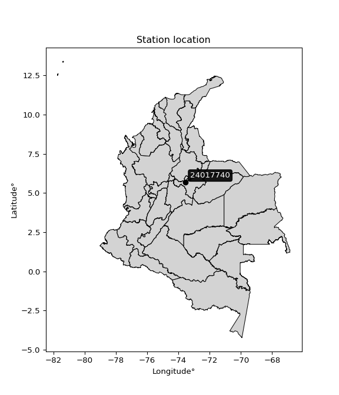</img>

</div>


## A. General information


### 1. General running parameters

• app_version: _v20251225_. • runtime: _2025-12-26 14:29:50.888910_. • Python version: _3.14.0_. • SciPy version: _1.16.3_. • Pandas version: _2.3.3_. • NumPy version: _2.3.5_. • Stations dataset (station_dataset_file): _dataset/pmax24h_in/automatic_colombia.csv_. • Stations catalog (station_catalog_file): _dataset/CNE_IDEAM.xls_. • Plot only fit distributions with Δo > Δ (plot_only_fit): _True_. • Eval low extreme values, if False, evaluates high extreme values (low_extreme): _False_. • Eval every SciPy distribution as logarithmic (pdist_logarithmic_on): _True_. • Standard deviation normalized (ddof): _1.0_. • Return periods to eval in years (Tr): _[2, 2.33, 5, 10, 15, 20, 25, 50, 75, 100, 200, 250, 500, 750, 1000]_. • Minimum data sample per station, 0 means any (minimum_sample): _5_. • Z-Score threshold to adjust a value, 0 means disable (zscore): _3.5_. • Avoid zeros, e.g. rain = 0 (avoid_zeros): _True_. • Avoid null values (avoid_nans): _True_. [:file_folder:Dataset file.](../../dataset/pmax24h_in/automatic_colombia.csv)


### 2. Station info and location

|   id |   CODIGO | NOMBRE                          | CATEGORIA    | TECNOLOGIA                              | ESTADO   | FECHA_INSTALACION   |   FECHA_SUSPENSION |   ALTITUD |   LATITUD |   LONGITUD | DEPARTAMENTO   | MUNICIPIO      | AREA_OPERATIVA                              | ENTIDAD                                                     | AREA_HIDROGRAFICA   | ZONA_HIDROGRAFICA   | SUBZONA_HIDROGRAFICA   | CORRIENTE   | OBSERVACION                                                                                     | SUBRED                                                                          | Catalogo   |
|-----:|---------:|:--------------------------------|:-------------|:----------------------------------------|:---------|:--------------------|-------------------:|----------:|----------:|-----------:|:---------------|:---------------|:--------------------------------------------|:------------------------------------------------------------|:--------------------|:--------------------|:-----------------------|:------------|:------------------------------------------------------------------------------------------------|:--------------------------------------------------------------------------------|:-----------|
|    0 | 24017740 | PUENTE CHACON  - AUT [24017740] | Limnigráfica | Automática con Telemetría, Convencional | Activa   | 15/04/1986          |                nan |      2130 |   5.67789 |   -73.5421 | Boyacá         | Villa De Leiva | Area Operativa 06 - Boyacá-Casanare-Vichada | INSTITUTO DE HIDROLOGIA METEOROLOGIA Y ESTUDIOS AMBIENTALES | Magdalena Cauca     | Sogamoso            | Río Suárez             | Cane        | actualizada Tecnologia y Tipo de Transmision por solicitud del coordinador del AO. (07/02/2023) | Altiplano Cundiboyacense y oriente de Santander,RED ALERTAS - AREA OPERATIVA 06 | CNE_IDEAM  |

<div align="center">

Map location in: [:earth_americas:Google](http://maps.google.com/maps?q=5.677888889,-73.54213889) [:earth_americas:OSM](https://www.openstreetmap.org/#map=18/5.677888889/-73.54213889&layers=P) [:earth_americas:Bing](https://www.bing.com/maps?cp=5.677888889~-73.54213889&lvl=18) [:earth_americas:Apple](https://maps.apple.com/frame?center=5.677888889%2C-73.54213889&span=0.003%2C0.006)

</div>


<div align="center">

```geojson
{
  "type": "Feature",
  "geometry": {
    "type": "Point", 
    "coordinates": [-73.54213889, 5.677888889]
  }, 
  "properties": {
    "Name": "24017740"
  }
}
```

</div>


### 3. Discrete values table and plot

|               |           0 |           1 |           2 |            3 |          4 |          5 |           6 |
|:--------------|------------:|------------:|------------:|-------------:|-----------:|-----------:|------------:|
| Date          | 2019        | 2020        | 2021        | 2022         | 2023       | 2024       | 2025        |
| Value         |   33        |   36.2      |   42.2      |   36.8       |   17.6     |   71.6     |   28.8      |
| Value_initial |   33        |   36.2      |   42.2      |   36.8       |   17.6     |   71.6     |   28.8      |
| count         |    7        |    7        |    7        |    7         |    7       |    7       |    7        |
| mean          |   38.0286   |   38.0286   |   38.0286   |   38.0286    |   38.0286  |   38.0286  |   38.0286   |
| std           |   16.7186   |   16.7186   |   16.7186   |   16.7186    |   16.7186  |   16.7186  |   16.7186   |
| zscore        |   -0.300777 |   -0.109373 |    0.249508 |   -0.0734852 |   -1.22191 |    2.00803 |   -0.551993 |

<div align="center">

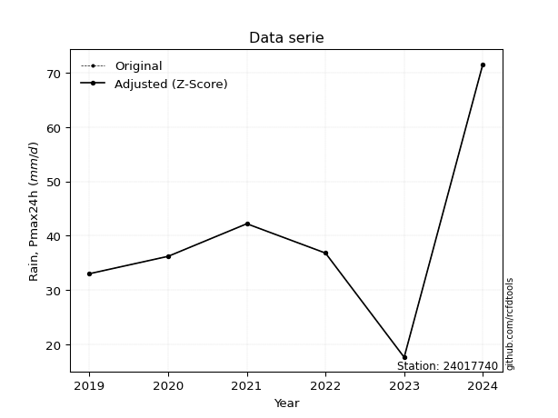</img>

</div>

> If Z-Score is active, values out of range or outliers are replaced with the station mean value.


### 4. Active continuous probability distributions from SciPy (45 of 104 available)

[scipy.stats](https://docs.scipy.org/doc/scipy/reference/stats.html) is a Python´s powerful submodule within the SciPy library for comprehensive statistical analysis, offering over 130 probability distributions (like Normal, Poisson), functions for descriptive stats (mean, variance), hypothesis testing (t-tests, chi-square), random variable generation, and statistical tests, making it essential for data science, modeling, and research. It provides tools to explore, model, and draw conclusions from data efficiently, working seamlessly with NumPy.

<div align="center">

|   id | p_dist             |   n_parameter | fit_method   | label                                                                       | active   | ref                                                                                                        |
|-----:|:-------------------|--------------:|:-------------|:----------------------------------------------------------------------------|:---------|:-----------------------------------------------------------------------------------------------------------|
|    0 | alpha              |             3 | MLE          | Alpha                                                                       | True     | [:mortar_board:](https://docs.scipy.org/doc/scipy/reference/generated/scipy.stats.alpha.html)              |
|    1 | betaprime          |             4 | MLE          | Beta prime                                                                  | True     | [:mortar_board:](https://docs.scipy.org/doc/scipy/reference/generated/scipy.stats.betaprime.html)          |
|    2 | chi2               |             3 | MLE          | Chi²                                                                        | True     | [:mortar_board:](https://docs.scipy.org/doc/scipy/reference/generated/scipy.stats.chi2.html)               |
|    3 | crystalball        |             4 | MLE          | Crystalball                                                                 | True     | [:mortar_board:](https://docs.scipy.org/doc/scipy/reference/generated/scipy.stats.crystalball.html)        |
|    4 | erlang             |             3 | MLE          | Erlang                                                                      | True     | [:mortar_board:](https://docs.scipy.org/doc/scipy/reference/generated/scipy.stats.erlang.html)             |
|    5 | expon              |             2 | MLE          | Exponential                                                                 | True     | [:mortar_board:](https://docs.scipy.org/doc/scipy/reference/generated/scipy.stats.expon.html)              |
|    6 | exponnorm          |             3 | MLE          | Exponentially modified Normal                                               | True     | [:mortar_board:](https://docs.scipy.org/doc/scipy/reference/generated/scipy.stats.exponnorm.html)          |
|    7 | f                  |             4 | MLE          | F                                                                           | True     | [:mortar_board:](https://docs.scipy.org/doc/scipy/reference/generated/scipy.stats.f.html)                  |
|    8 | fatiguelife        |             3 | MLE          | Fatigue-life (Birnbaum-Saunders)                                            | True     | [:mortar_board:](https://docs.scipy.org/doc/scipy/reference/generated/scipy.stats.fatiguelife.html)        |
|    9 | fisk               |             3 | MLE          | Fisk                                                                        | True     | [:mortar_board:](https://docs.scipy.org/doc/scipy/reference/generated/scipy.stats.fisk.html)               |
|   10 | gamma              |             3 | MLE          | Gamma                                                                       | True     | [:mortar_board:](https://docs.scipy.org/doc/scipy/reference/generated/scipy.stats.gamma.html)              |
|   11 | genexpon           |             5 | MLE          | Generalized exponential                                                     | True     | [:mortar_board:](https://docs.scipy.org/doc/scipy/reference/generated/scipy.stats.genexpon.html)           |
|   12 | genlogistic        |             3 | MLE          | Generalized logistic                                                        | True     | [:mortar_board:](https://docs.scipy.org/doc/scipy/reference/generated/scipy.stats.genlogistic.html)        |
|   13 | gibrat             |             2 | MM           | Gibrat                                                                      | True     | [:mortar_board:](https://docs.scipy.org/doc/scipy/reference/generated/scipy.stats.gibrat.html)             |
|   14 | gompertz           |             3 | MLE          | Gompertz (or truncated Gumbel)                                              | True     | [:mortar_board:](https://docs.scipy.org/doc/scipy/reference/generated/scipy.stats.gompertz.html)           |
|   15 | gumbel_l           |             2 | MM           | Gumbel Left Skew                                                            | True     | [:mortar_board:](https://docs.scipy.org/doc/scipy/reference/generated/scipy.stats.gumbel_l.html)           |
|   16 | gumbel_r           |             2 | MM           | Gumbel Right Skew                                                           | True     | [:mortar_board:](https://docs.scipy.org/doc/scipy/reference/generated/scipy.stats.gumbel_r.html)           |
|   17 | halflogistic       |             2 | MM           | Half-logistic                                                               | True     | [:mortar_board:](https://docs.scipy.org/doc/scipy/reference/generated/scipy.stats.halflogistic.html)       |
|   18 | halfnorm           |             2 | MM           | Half Normal                                                                 | True     | [:mortar_board:](https://docs.scipy.org/doc/scipy/reference/generated/scipy.stats.halfnorm.html)           |
|   19 | hypsecant          |             2 | MM           | hyperbolic secant                                                           | True     | [:mortar_board:](https://docs.scipy.org/doc/scipy/reference/generated/scipy.stats.hypsecant.html)          |
|   20 | invgamma           |             3 | MLE          | Inverted gamma                                                              | True     | [:mortar_board:](https://docs.scipy.org/doc/scipy/reference/generated/scipy.stats.invgamma.html)           |
|   21 | invgauss           |             3 | MLE          | Inverse Gaussian                                                            | True     | [:mortar_board:](https://docs.scipy.org/doc/scipy/reference/generated/scipy.stats.invgauss.html)           |
|   22 | invweibull         |             3 | MLE          | Inverted Weibull                                                            | True     | [:mortar_board:](https://docs.scipy.org/doc/scipy/reference/generated/scipy.stats.invweibull.html)         |
|   23 | johnsonsu          |             4 | MLE          | Johnson Su                                                                  | True     | [:mortar_board:](https://docs.scipy.org/doc/scipy/reference/generated/scipy.stats.johnsonsu.html)          |
|   24 | kstwobign          |             2 | MLE          | Limiting distribution of scaled Kolmogorov-Smirnov two-sided test statistic | True     | [:mortar_board:](https://docs.scipy.org/doc/scipy/reference/generated/scipy.stats.kstwobign.html)          |
|   25 | laplace            |             2 | MM           | Laplace                                                                     | True     | [:mortar_board:](https://docs.scipy.org/doc/scipy/reference/generated/scipy.stats.laplace.html)            |
|   26 | laplace_asymmetric |             3 | MLE          | Asymmetric Laplace                                                          | True     | [:mortar_board:](https://docs.scipy.org/doc/scipy/reference/generated/scipy.stats.laplace_asymmetric.html) |
|   27 | loggamma           |             3 | MLE          | Log gamma                                                                   | True     | [:mortar_board:](https://docs.scipy.org/doc/scipy/reference/generated/scipy.stats.loggamma.html)           |
|   28 | logistic           |             2 | MM           | Logistic (or Sech-squared)                                                  | True     | [:mortar_board:](https://docs.scipy.org/doc/scipy/reference/generated/scipy.stats.logistic.html)           |
|   29 | lognorm            |             3 | MLE          | Log Normal                                                                  | True     | [:mortar_board:](https://docs.scipy.org/doc/scipy/reference/generated/scipy.stats.lognorm.html)            |
|   30 | maxwell            |             2 | MM           | Maxwell                                                                     | True     | [:mortar_board:](https://docs.scipy.org/doc/scipy/reference/generated/scipy.stats.maxwell.html)            |
|   31 | mielke             |             4 | MLE          | Mielke Beta-Kappa / Dagum                                                   | True     | [:mortar_board:](https://docs.scipy.org/doc/scipy/reference/generated/scipy.stats.mielke.html)             |
|   32 | moyal              |             2 | MM           | Moyal                                                                       | True     | [:mortar_board:](https://docs.scipy.org/doc/scipy/reference/generated/scipy.stats.moyal.html)              |
|   33 | nakagami           |             3 | MLE          | Nakagami                                                                    | True     | [:mortar_board:](https://docs.scipy.org/doc/scipy/reference/generated/scipy.stats.nakagami.html)           |
|   34 | ncf                |             5 | MLE          | Non-central F distribution                                                  | True     | [:mortar_board:](https://docs.scipy.org/doc/scipy/reference/generated/scipy.stats.ncf.html)                |
|   35 | nct                |             4 | MLE          | Non-central Student’s t                                                     | True     | [:mortar_board:](https://docs.scipy.org/doc/scipy/reference/generated/scipy.stats.nct.html)                |
|   36 | norm               |             2 | MM           | Normal                                                                      | True     | [:mortar_board:](https://docs.scipy.org/doc/scipy/reference/generated/scipy.stats.norm.html)               |
|   37 | pareto             |             3 | MLE          | Pareto                                                                      | True     | [:mortar_board:](https://docs.scipy.org/doc/scipy/reference/generated/scipy.stats.pareto.html)             |
|   38 | pearson3           |             3 | MM           | Pearson type III                                                            | True     | [:mortar_board:](https://docs.scipy.org/doc/scipy/reference/generated/scipy.stats.pearson3.html)           |
|   39 | rayleigh           |             2 | MM           | Rayleigh                                                                    | True     | [:mortar_board:](https://docs.scipy.org/doc/scipy/reference/generated/scipy.stats.rayleigh.html)           |
|   40 | rice               |             3 | MLE          | Rice                                                                        | True     | [:mortar_board:](https://docs.scipy.org/doc/scipy/reference/generated/scipy.stats.rice.html)               |
|   41 | t                  |             3 | MLE          | Student’s t                                                                 | True     | [:mortar_board:](https://docs.scipy.org/doc/scipy/reference/generated/scipy.stats.t.html)                  |
|   42 | truncnorm          |             4 | MLE          | Truncated normal                                                            | True     | [:mortar_board:](https://docs.scipy.org/doc/scipy/reference/generated/scipy.stats.truncnorm.html)          |
|   43 | wald               |             2 | MM           | Wald                                                                        | True     | [:mortar_board:](https://docs.scipy.org/doc/scipy/reference/generated/scipy.stats.wald.html)               |
|   44 | weibull_min        |             3 | MLE          | Weibull minimum                                                             | True     | [:mortar_board:](https://docs.scipy.org/doc/scipy/reference/generated/scipy.stats.weibull_min.html)        |

</div>

> **n_parameter:** # arguments & localization & scale.
>
> **Fit methods:** (MLE) maximum likelihood, (MM) L-moments.
>
>**Inactive:** foldnorm, gennorm, norminvgauss, powernorm, powerlognorm, skewnorm, genextreme, anglit, arcsine, argus, beta, bradford, burr, burr12, cauchy, cosine, halfcauchy, foldcauchy, skewcauchy, wrapcauchy, dgamma, gengamma, exponweib, exponpow, truncexpon, gausshyper, genhalflogistic, genhyperbolic, geninvgauss, halfgennorm, johnsonsb, kappa4, kappa3, ksone, kstwo, loglaplace, levy, levy_l, levy_stable, ncx2, genpareto, truncpareto, lomax, powerlaw, rdist, rel_breitwigner, recipinvgauss, semicircular, studentized_range, trapezoid, triang, truncweibull_min, tukeylambda, uniform, loguniform, vonmises, vonmises_line, weibull_max, dweibull, 


## B. Probability distributions vs. Empirical distributions

A continuous probability distribution (CPD) describes probabilities for variables that can take any value within a range (like rain any time), unlike discrete variables with specific outcomes (like temperature). It uses a Probability Density Function (PDF), a curve where the total area under it equals 1, and the probability of the variable falling within an interval (a to b) is found by calculating the area under the curve between those points. A key feature is that the probability of hitting any single exact value is zero, so probabilities are always expressed for ranges, e.g., $P(a ≤ X ≤ b)$.

<div align="center">

Distributions parameters
|    |   station | p_dist                |   n |             loc |          scale | shape                 | shape1                 | shape2                | shape3   |
|---:|----------:|:----------------------|----:|----------------:|---------------:|:----------------------|:-----------------------|:----------------------|:---------|
|  0 |  24017740 | alpha                 |   7 |   -32.49        |  346.397       | 5.123484352121991     |                        |                       |          |
|  1 |  24017740 | betaprime             |   7 |    -0.268859    |   26.1839      | 16.238400416447313    | 12.100836054385073     |                       |          |
|  2 |  24017740 | chi2                  |   7 |    17.6         |    9.56535     | 1.7602784193636627    |                        |                       |          |
|  3 |  24017740 | crystalball           |   7 |    38.0286      |   15.4784      | 2326.2781833159515    | 4905.074406698834      |                       |          |
|  4 |  24017740 | erlang                |   7 |    13.1591      |   10.1871      | 2.4412758724266697    |                        |                       |          |
|  5 |  24017740 | expon                 |   7 |    17.6         |   20.4286      |                       |                        |                       |          |
|  6 |  24017740 | exponnorm             |   7 |    24.7533      |    7.18126     | 1.8486012392567828    |                        |                       |          |
|  7 |  24017740 | f                     |   7 |    12.1086      |   25.5032      | 5.7688861811854295    | 112.06384698132506     |                       |          |
|  8 |  24017740 | fatiguelife           |   7 |    17.6         |    0.000120759 | 430.606835062699      |                        |                       |          |
|  9 |  24017740 | fisk                  |   7 |     2.04967     |   33.0653      | 4.425904677731129     |                        |                       |          |
| 10 |  24017740 | gamma                 |   7 |    13.1591      |   10.1871      | 2.4412784225282254    |                        |                       |          |
| 11 |  24017740 | genexpon              |   7 |    17.5954      |    1.0911      | 0.053367442933931974  | 4.6418725053562367e-07 | 2.0967833465250756    |          |
| 12 |  24017740 | genlogistic           |   7 |   -34.5624      |   11.5464      | 297.7732079887975     |                        |                       |          |
| 13 |  24017740 | gibrat                |   7 |    26.2205      |    7.16195     |                       |                        |                       |          |
| 14 |  24017740 | gompertz              |   7 |    17.6         |   49.686       | 1.689029432850588     |                        |                       |          |
| 15 |  24017740 | gumbel_l              |   7 |    44.9947      |   12.0685      |                       |                        |                       |          |
| 16 |  24017740 | gumbel_r              |   7 |    31.0625      |   12.0685      |                       |                        |                       |          |
| 17 |  24017740 | halflogistic          |   7 |    19.683       |   13.2335      |                       |                        |                       |          |
| 18 |  24017740 | halfnorm              |   7 |    17.5412      |   25.6771      |                       |                        |                       |          |
| 19 |  24017740 | hypsecant             |   7 |    38.0286      |    9.85388     |                       |                        |                       |          |
| 20 |  24017740 | invgamma              |   7 |    -9.57364     |  487.478       | 11.23938051037715     |                        |                       |          |
| 21 |  24017740 | invgauss              |   7 |     0.470503    |  221.676       | 0.1694279263194223    |                        |                       |          |
| 22 |  24017740 | invweibull            |   7 |    17.6         |    1.29045     | 0.06339682983792852   |                        |                       |          |
| 23 |  24017740 | johnsonsu             |   7 |    34.2323      |    4.68285     | -0.17742777502074425  | 0.6985085994586572     |                       |          |
| 24 |  24017740 | kstwobign             |   7 |   -11.22        |   56.9336      |                       |                        |                       |          |
| 25 |  24017740 | laplace               |   7 |    38.0286      |   10.9449      |                       |                        |                       |          |
| 26 |  24017740 | laplace_asymmetric    |   7 |    36.2         |   10.047       | 0.9131279288311067    |                        |                       |          |
| 27 |  24017740 | loggamma              |   7 | -5558.93        |  727.954       | 2183.8184319155407    |                        |                       |          |
| 28 |  24017740 | logistic              |   7 |    38.0286      |    8.53371     |                       |                        |                       |          |
| 29 |  24017740 | lognorm               |   7 |    17.6         |    0.116468    | 12.71310559702555     |                        |                       |          |
| 30 |  24017740 | maxwell               |   7 |     1.35117     |   22.9842      |                       |                        |                       |          |
| 31 |  24017740 | mielke                |   7 |    -0.121743    |   35.7454      | 4.612560909484939     | 4.816382992296486      |                       |          |
| 32 |  24017740 | moyal                 |   7 |    29.177       |    6.96775     |                       |                        |                       |          |
| 33 |  24017740 | nakagami              |   7 |    28.8         |   19.8083      | 0.06580191765306258   |                        |                       |          |
| 34 |  24017740 | ncf                   |   7 |    -0.10918     |   21.9568      | 28.23891230932557     | 23.838284051942637     | 16.6969872024031      |          |
| 35 |  24017740 | nct                   |   7 |    -0.0646524   |    7.92388     | 6.68044787858363      | 4.244436710253126      |                       |          |
| 36 |  24017740 | norm                  |   7 |    38.0286      |   15.4784      |                       |                        |                       |          |
| 37 |  24017740 | pareto                |   7 |    17.58        |    0.020032    | 0.16790990938521272   |                        |                       |          |
| 38 |  24017740 | pearson3              |   7 |    38.0286      |   15.4784      | 1.096441431907563     |                        |                       |          |
| 39 |  24017740 | rayleigh              |   7 |     8.41742     |   23.6263      |                       |                        |                       |          |
| 40 |  24017740 | rice                  |   7 |    11.37        |   21.7975      | 0.0005375591330285456 |                        |                       |          |
| 41 |  24017740 | t                     |   7 |    37.7638      |   15.5376      | 19.344511770929415    |                        |                       |          |
| 42 |  24017740 | truncnorm             |   7 |    38.0286      |   15.4784      | -171.05171765965008   | 829.7478804141788      |                       |          |
| 43 |  24017740 | wald                  |   7 |    22.5501      |   15.4784      |                       |                        |                       |          |
| 44 |  24017740 | weibull_min           |   7 |    16.3003      |   23.5032      | 1.339354681261739     |                        |                       |          |
| 45 |  24017740 | logalpha              |   7 |    -4.46222     |  163.505       | 20.433210415273535    |                        |                       |          |
| 46 |  24017740 | logbetaprime          |   7 |    -8.8972      |   16.5229      | 1782.8451112353805    | 2365.237380954557      |                       |          |
| 47 |  24017740 | logchi2               |   7 |     2.8679      |    0.984084    | 1.0105782735801863    |                        |                       |          |
| 48 |  24017740 | logcrystalball        |   7 |     3.56184     |    0.390002    | 873.3272827873543     | 24.62443434013597      |                       |          |
| 49 |  24017740 | logerlang             |   7 |   -12.6123      |    0.00940393  | 1719.9363007802165    |                        |                       |          |
| 50 |  24017740 | logexpon              |   7 |     2.8679      |    0.693937    |                       |                        |                       |          |
| 51 |  24017740 | logexponnorm          |   7 |     3.47225     |    0.37959     | 0.2360184695220401    |                        |                       |          |
| 52 |  24017740 | logf                  |   7 |   -22.7267      |   26.2849      | 24422.689190082732    | 14477.084301166922     |                       |          |
| 53 |  24017740 | logfatiguelife        |   7 |   -20.6605      |   24.2193      | 0.016100328249387362  |                        |                       |          |
| 54 |  24017740 | logfisk               |   7 |   -23.2596      |   26.8187      | 126.63058715643753    |                        |                       |          |
| 55 |  24017740 | loggamma              |   7 |   -12.6127      |    0.00940372  | 1720.014098765655     |                        |                       |          |
| 56 |  24017740 | loggenexpon           |   7 |     2.86756     |   62.118       | 41.17856376569016     | 336.6676244841792      | 21.374996305226176    |          |
| 57 |  24017740 | loggenlogistic        |   7 |     3.57429     |    0.20803     | 0.953351661968658     |                        |                       |          |
| 58 |  24017740 | loggibrat             |   7 |     3.26434     |    0.180442    |                       |                        |                       |          |
| 59 |  24017740 | loggompertz           |   7 |     2.8679      |    1.03716     | 0.9466784286014934    |                        |                       |          |
| 60 |  24017740 | loggumbel_l           |   7 |     3.73736     |    0.304083    |                       |                        |                       |          |
| 61 |  24017740 | loggumbel_r           |   7 |     3.38631     |    0.304083    |                       |                        |                       |          |
| 62 |  24017740 | loghalflogistic       |   7 |     3.09961     |    0.333428    |                       |                        |                       |          |
| 63 |  24017740 | loghalfnorm           |   7 |     3.04563     |    0.646965    |                       |                        |                       |          |
| 64 |  24017740 | loghypsecant          |   7 |     3.56184     |    0.248283    |                       |                        |                       |          |
| 65 |  24017740 | loginvgamma           |   7 |    -2.29165     | 1297           | 222.68978486036428    |                        |                       |          |
| 66 |  24017740 | loginvgauss           |   7 |     0.260062    |  226.447       | 0.014555332505211162  |                        |                       |          |
| 67 |  24017740 | loginvweibull         |   7 |    -3.73161e+07 |    3.73161e+07 | 98518820.07338409     |                        |                       |          |
| 68 |  24017740 | logjohnsonsu          |   7 |     3.57486     |    0.124994    | 0.044445973226590524  | 0.680998864342705      |                       |          |
| 69 |  24017740 | logkstwobign          |   7 |     2.00085     |    1.79083     |                       |                        |                       |          |
| 70 |  24017740 | loglaplace            |   7 |     3.56184     |    0.275773    |                       |                        |                       |          |
| 71 |  24017740 | loglaplace_asymmetric |   7 |     3.58906     |    0.269592    | 1.0518192018718073    |                        |                       |          |
| 72 |  24017740 | logloggamma           |   7 |   -82.6263      |   12.456       | 1012.1742152047891    |                        |                       |          |
| 73 |  24017740 | loglogistic           |   7 |     3.56184     |    0.215019    |                       |                        |                       |          |
| 74 |  24017740 | loglognorm            |   7 |     2.8679      |    0.00509998  | 12.280462788139438    |                        |                       |          |
| 75 |  24017740 | logmaxwell            |   7 |     2.6377      |    0.579119    |                       |                        |                       |          |
| 76 |  24017740 | logmielke             |   7 |     2.31134     |    1.46033     | 3.5670234501714275    | 8.28590362585387       |                       |          |
| 77 |  24017740 | logmoyal              |   7 |     3.33881     |    0.175562    |                       |                        |                       |          |
| 78 |  24017740 | lognakagami           |   7 |     3.36038     |    0.388873    | 0.25288722900912863   |                        |                       |          |
| 79 |  24017740 | logncf                |   7 |    -3.56521     |    7.11785     | 510.8855035389281     | 696.4741740846509      | 9.919154078978678e-10 |          |
| 80 |  24017740 | lognct                |   7 |    -3.44391     |    0.359305    | 1080.3123834280818    | 19.484531131715222     |                       |          |
| 81 |  24017740 | lognorm               |   7 |     3.56184     |    0.390002    |                       |                        |                       |          |
| 82 |  24017740 | logpareto             |   7 |     2.86716     |    0.000734316 | 0.1678402348992435    |                        |                       |          |
| 83 |  24017740 | logpearson3           |   7 |     3.56184     |    0.390002    | 0.04851826031626112   |                        |                       |          |
| 84 |  24017740 | lograyleigh           |   7 |     2.81574     |    0.595299    |                       |                        |                       |          |
| 85 |  24017740 | logrice               |   7 |     2.64292     |    0.429818    | 1.842272307860672     |                        |                       |          |
| 86 |  24017740 | logt                  |   7 |     3.56437     |    0.177497    | 1.450248446649827     |                        |                       |          |
| 87 |  24017740 | logtruncnorm          |   7 |    -0.171363    |    1.17763     | 2.999028486652673     | 3.7723898941402716     |                       |          |
| 88 |  24017740 | logwald               |   7 |     3.17186     |    0.389973    |                       |                        |                       |          |
| 89 |  24017740 | logweibull_min        |   7 |     2.45156     |    1.2402      | 3.119930891813726     |                        |                       |          |

</div>

> **loc** (Location parameter): This shifts the distribution along the x-axis. For many common distributions, like the normal (Gaussian) distribution, loc represents the mean $μ$. For others, like the uniform distribution, it might represent the minimum value, or for the beta distribution, the left end of the support interval.
>
> **scale** (Scale parameter): This determines the width or spread of the distribution. For the normal distribution, scale represents the standard deviation $σ$. For a uniform distribution, it defines the length of the interval (from $loc$ to $loc + scale$).
>
> **shape** (Shape parameters): Refers to parameters that define the specific form of a probability distribution, distinct from its location (loc) and scale (scale). These parameters are required arguments for most distribution functions. For example, a normal (Gaussian) distribution is fully defined by its location (mean) and scale (standard deviation), so it has no specific shape parameters beyond loc and scale. However, other distributions have intrinsic properties that need specification, as Gamma distribution that takes a shape parameter, often named $a$ or $alpha$.


### 0. Cumulative distribution values - CDF (90 evaluated)

> Ordered by x ascending and calculating $log(f(x))$ separately. 

|   id |   Station |   date |    x |   count |    mean |     std |     zscore |   Value_initial |   station |   m |     alpha |   alpha_pdf |   betaprime |   betaprime_pdf |        chi2 |   chi2_pdf |   crystalball |   crystalball_pdf |    erlang |   erlang_pdf |    expon |   expon_pdf |   exponnorm |   exponnorm_pdf |         f |      f_pdf |   fatiguelife |   fatiguelife_pdf |      fisk |   fisk_pdf |     gamma |   gamma_pdf |    genexpon |   genexpon_pdf |   genlogistic |   genlogistic_pdf |   gibrat |   gibrat_pdf |    gompertz |   gompertz_pdf |   gumbel_l |   gumbel_l_pdf |   gumbel_r |   gumbel_r_pdf |   halflogistic |   halflogistic_pdf |   halfnorm |   halfnorm_pdf |   hypsecant |   hypsecant_pdf |   invgamma |   invgamma_pdf |   invgauss |   invgauss_pdf |   invweibull |   invweibull_pdf |   johnsonsu |   johnsonsu_pdf |   kstwobign |   kstwobign_pdf |   laplace |   laplace_pdf |   laplace_asymmetric |   laplace_asymmetric_pdf |   loggamma |   loggamma_pdf |   logistic |   logistic_pdf |   lognorm |   lognorm_pdf |   maxwell |   maxwell_pdf |    mielke |   mielke_pdf |     moyal |   moyal_pdf |   nakagami |   nakagami_pdf |       ncf |    ncf_pdf |       nct |    nct_pdf |      norm |   norm_pdf |   pareto |   pareto_pdf |   pearson3 |   pearson3_pdf |   rayleigh |   rayleigh_pdf |      rice |   rice_pdf |        t |      t_pdf |   truncnorm |   truncnorm_pdf |     wald |   wald_pdf |   weibull_min |   weibull_min_pdf |   logalpha |   logalpha_pdf |   logbetaprime |   logbetaprime_pdf |    logchi2 |   logchi2_pdf |   logcrystalball |   logcrystalball_pdf |   logerlang |   logerlang_pdf |   logexpon |   logexpon_pdf |   logexponnorm |   logexponnorm_pdf |      logf |   logf_pdf |   logfatiguelife |   logfatiguelife_pdf |   logfisk |   logfisk_pdf |   loggenexpon |   loggenexpon_pdf |   loggenlogistic |   loggenlogistic_pdf |   loggibrat |   loggibrat_pdf |   loggompertz |   loggompertz_pdf |   loggumbel_l |   loggumbel_l_pdf |   loggumbel_r |   loggumbel_r_pdf |   loghalflogistic |   loghalflogistic_pdf |   loghalfnorm |   loghalfnorm_pdf |   loghypsecant |   loghypsecant_pdf |   loginvgamma |   loginvgamma_pdf |   loginvgauss |   loginvgauss_pdf |   loginvweibull |   loginvweibull_pdf |   logjohnsonsu |   logjohnsonsu_pdf |   logkstwobign |   logkstwobign_pdf |   loglaplace |   loglaplace_pdf |   loglaplace_asymmetric |   loglaplace_asymmetric_pdf |   logloggamma |   logloggamma_pdf |   loglogistic |   loglogistic_pdf |   loglognorm |   loglognorm_pdf |   logmaxwell |   logmaxwell_pdf |   logmielke |   logmielke_pdf |    logmoyal |   logmoyal_pdf |   lognakagami |   lognakagami_pdf |   logncf |   logncf_pdf |   lognct |   lognct_pdf |   logpareto |   logpareto_pdf |   logpearson3 |   logpearson3_pdf |   lograyleigh |   lograyleigh_pdf |   logrice |   logrice_pdf |      logt |   logt_pdf |   logtruncnorm |   logtruncnorm_pdf |   logwald |   logwald_pdf |   logweibull_min |   logweibull_min_pdf |
|-----:|----------:|-------:|-----:|--------:|--------:|--------:|-----------:|----------------:|----------:|----:|----------:|------------:|------------:|----------------:|------------:|-----------:|--------------:|------------------:|----------:|-------------:|---------:|------------:|------------:|----------------:|----------:|-----------:|--------------:|------------------:|----------:|-----------:|----------:|------------:|------------:|---------------:|--------------:|------------------:|---------:|-------------:|------------:|---------------:|-----------:|---------------:|-----------:|---------------:|---------------:|-------------------:|-----------:|---------------:|------------:|----------------:|-----------:|---------------:|-----------:|---------------:|-------------:|-----------------:|------------:|----------------:|------------:|----------------:|----------:|--------------:|---------------------:|-------------------------:|-----------:|---------------:|-----------:|---------------:|----------:|--------------:|----------:|--------------:|----------:|-------------:|----------:|------------:|-----------:|---------------:|----------:|-----------:|----------:|-----------:|----------:|-----------:|---------:|-------------:|-----------:|---------------:|-----------:|---------------:|----------:|-----------:|---------:|-----------:|------------:|----------------:|---------:|-----------:|--------------:|------------------:|-----------:|---------------:|---------------:|-------------------:|-----------:|--------------:|-----------------:|---------------------:|------------:|----------------:|-----------:|---------------:|---------------:|-------------------:|----------:|-----------:|-----------------:|---------------------:|----------:|--------------:|--------------:|------------------:|-----------------:|---------------------:|------------:|----------------:|--------------:|------------------:|--------------:|------------------:|--------------:|------------------:|------------------:|----------------------:|--------------:|------------------:|---------------:|-------------------:|--------------:|------------------:|--------------:|------------------:|----------------:|--------------------:|---------------:|-------------------:|---------------:|-------------------:|-------------:|-----------------:|------------------------:|----------------------------:|--------------:|------------------:|--------------:|------------------:|-------------:|-----------------:|-------------:|-----------------:|------------:|----------------:|------------:|---------------:|--------------:|------------------:|---------:|-------------:|---------:|-------------:|------------:|----------------:|--------------:|------------------:|--------------:|------------------:|----------:|--------------:|----------:|-----------:|---------------:|-------------------:|----------:|--------------:|-----------------:|---------------------:|
|    0 |  24017740 |   2023 | 17.6 |       7 | 38.0286 | 16.7186 | -1.22191   |            17.6 |  24017740 |   1 | 0.0365655 |  0.0110575  |    0.036261 |      0.011673   | 1.49391e-14 | 3.70096    |     0.0934495 |         0.0107879 | 0.0311665 |   0.0150265  | 0        |   0.048951  |   0.0363087 |      0.00928721 | 0.0317827 | 0.0140119  |     0.0482534 |        3.5335e+08 | 0.0342599 | 0.00941691 | 0.0311663 |  0.0150265  | 0.000225902 |      0.0489004 |     0.0394567 |         0.0109866 | 0        |   0          | 2.47233e-07 |     0.0339941  |  0.0981606 |    0.00772068  |  0.0473066 |     0.0119599  |       0        |         0          | 0.00182758 |     0.0310737  |   0.0796613 |      0.00800013 |  0.0363028 |     0.0115205  |  0.0360505 |     0.0123531  |  0.000230185 |      3.44075e+10 |   0.0593369 |      0.00477384 |    0.040162 |      0.0120252  | 0.0773327 |    0.00706563 |            0.0598707 |               0.00652596 |  0.0361394 |       0.209442 |  0.0836415 |     0.00898151 | 0.0375938 |      0.210068 | 0.0810623 |     0.0135136 | 0.0380674 |   0.00958161 | 0.0217299 |  0.00943704 | 0          |    0           | 0.0362886 | 0.0116479  | 0.0371212 | 0.0105359  | 0.0934495 |  0.0107879 | 0        |  8.38209     |  0.0412524 |     0.014008   |  0.0727464 |      0.0152536 | 0.0400214 | 0.0125874  | 0.104818 | 0.0108426  |   0.0934495 |       0.0107879 | 0        | 0          |     0.0204913 |         0.0208985 |  0.0305566 |       0.210234 |      0.0350361 |           0.20897  | 1.4006e-08 |   1.59361e+07 |        0.0375938 |             0.210069 |   0.0361393 |        0.209441 |   0        |       1.44105  |      0.0369333 |           0.209252 | 0.0361383 |   0.209396 |        0.0361288 |             0.209378 | 0.0353364 |      0.165211 |    0.00022414 |          0.66339  |        0.0380571 |             0.16875  |    0        |       0         |   2.95535e-08 |          0.91276  |     0.0556987 |         0.177971  |     0.0040845 |         0.0738844 |          0        |              0        |      0        |          0        |      0.0388606 |           0.156129 |     0.0309032 |          0.210064 |     0.0294391 |          0.214775 |       0.0240728 |            0.236849 |       0.053392 |          0.103072  |      0.0268183 |           0.29464  |    0.0403774 |         0.146416 |               0.0412908 |                    0.145614 |     0.0392359 |          0.212671 |     0.0381502 |          0.170658 |   0.00716732 |      3.64847e+12 |    0.0159351 |         0.201162 |   0.0320315 |        0.205221 | 0.000131614 |      0.0058151 |    0          |       0           | 0.111294 |     0.355584 | 0.036133 |     0.209162 |    0        |     228.567     |     0.0361307 |          0.209438 |    0.00383107 |          0.146619 | 0.0262253 |      0.242501 | 0.0484586 |  0.0946768 |    0           |           0        |  0        |      0        |        0.0326464 |             0.240603 |
|    1 |  24017740 |   2025 | 28.8 |       7 | 38.0286 | 16.7186 | -0.551993  |            28.8 |  24017740 |   2 | 0.298649  |  0.0319964  |    0.30318  |      0.0315856  | 0.504255    | 0.0286007  |     0.275514  |         0.021577  | 0.326137  |   0.0307226  | 0.422041 |   0.0282917 |   0.279071  |      0.0327213  | 0.319556  | 0.0309398  |     0.760289  |        0.00980893 | 0.2813    | 0.0334496  | 0.326136  |  0.0307226  | 0.421918    |      0.0282751 |     0.292427  |         0.0310754 | 0.153581 |   0.0918181  | 0.347576    |     0.0277863  |  0.229988  |    0.016675    |  0.299335  |     0.0299172  |       0.331458 |         0.0336319  | 0.338959   |     0.0282257  |   0.237825  |      0.0219515  |  0.302344  |     0.0316879  |  0.307739  |     0.0311045  |  0.418125    |      0.00206376  |   0.19241   |      0.026634   |    0.293638 |      0.0293029  | 0.215169  |    0.0196593  |            0.202958  |               0.0221226  |  0.304788  |       0.905394 |  0.253236  |     0.0221601  | 0.30273   |      0.895159 | 0.300603  |     0.0242661 | 0.280298  |   0.0328577  | 0.304221  |  0.0347014  | 0.00732761 |    2.71438e+11 | 0.302979  | 0.0315987  | 0.295406  | 0.0322732  | 0.275514  |  0.021577  | 0.654428 |  0.00517155  |  0.312726  |     0.02969    |  0.310737  |      0.0251683 | 0.273638  | 0.0266463  | 0.285326 | 0.0213086  |   0.275514  |       0.021577  | 0.274406 | 0.0646836  |     0.349005  |         0.0299424 |  0.319751  |       0.955208 |      0.306282  |           0.912074 | 0.516485   |   0.447538    |        0.30273   |             0.895159 |   0.304788  |        0.905394 |   0.508201 |       0.708709 |      0.303428  |           0.900511 | 0.304773  |   0.905454 |        0.304744  |             0.905381 | 0.280452  |      0.959953 |    0.417767   |          0.878177 |        0.280326  |             0.94627  |    0.26413  |       3.40486   |   0.437485    |          0.825482 |     0.251333  |         0.712667  |     0.336537  |         1.20528   |          0.372254 |              1.29177  |      0.37338  |          1.09564  |      0.266135  |           0.951311 |     0.318319  |          0.951474 |     0.326994  |          0.966874 |       0.362244  |            0.971131 |       0.198527 |          0.764596  |      0.388231  |           0.93701  |    0.240826  |         0.873278 |               0.234484  |                    0.826921 |     0.302614  |          0.886597 |     0.281518  |          0.940686 |   0.645111   |      0.061551    |    0.330876  |         0.984867 |   0.29914   |        0.955515 | 0.346999    |      1.37328   |    3.0674e-08 |       1.74674e+07 | 0.371528 |     0.661438 | 0.304699 |     0.905782 |    0.664656 |       0.114118  |     0.304801  |          0.905455 |    0.341977   |          1.01129  | 0.316266  |      0.916675 | 0.202691  |  0.864126  |    5.65991e-06 |           2.96407  |  0.3502   |      2.3096   |        0.315527  |             0.890809 |
|    2 |  24017740 |   2019 | 33   |       7 | 38.0286 | 16.7186 | -0.300777  |            33   |  24017740 |   3 | 0.434145  |  0.0317807  |    0.435919 |      0.0309679  | 0.610041    | 0.0221031  |     0.372638  |         0.0244492 | 0.451641  |   0.0286607  | 0.529447 |   0.0230341 |   0.421678  |      0.034117   | 0.446751  | 0.0291883  |     0.796535  |        0.0076162  | 0.427377  | 0.0349959  | 0.451641  |  0.0286607  | 0.529269    |      0.0230243 |     0.42522   |         0.0314474 | 0.478116 |   0.058757   | 0.458663    |     0.0250888  |  0.309359  |    0.0211817   |  0.426698  |     0.0301123  |       0.464594 |         0.0296275  | 0.452857   |     0.0259231  |   0.344185  |      0.0285095  |  0.435661  |     0.0311224  |  0.43749   |     0.030118   |  0.425476    |      0.00149678  |   0.359729  |      0.0539533  |    0.417517 |      0.0291767  | 0.315817  |    0.0288552  |            0.320795  |               0.034967   |  0.436561  |       1.01268  |  0.356805  |     0.0268928  | 0.433485  |      1.00867  | 0.405748  |     0.0255058 | 0.424996  |   0.0349651  | 0.447208  |  0.0326006  | 0.705516   |    0.0220455   | 0.435817  | 0.0309987  | 0.432627  | 0.032258   | 0.372637  |  0.0244492 | 0.672394 |  0.00356732  |  0.436508  |     0.0288042  |  0.418006  |      0.0256304 | 0.388809  | 0.0278241  | 0.381212 | 0.0241268  |   0.372637  |       0.0244492 | 0.499524 | 0.0429694  |     0.468859  |         0.0269534 |  0.455857  |       1.02349  |      0.438622  |           1.01385  | 0.571838   |   0.37013     |        0.433485  |             1.00867  |   0.436561  |        1.01268  |   0.595805 |       0.582466 |      0.434807  |           1.01208  | 0.436557  |   1.01278  |        0.436518  |             1.01271  | 0.426464  |      1.1576   |    0.5326     |          0.80282  |        0.425022  |             1.15387  |    0.599503 |       1.66459   |   0.545616    |          0.760326 |     0.364227  |         0.946946  |     0.498566  |         1.14117   |          0.533609 |              1.07259  |      0.514139 |          0.967377 |      0.417196  |           1.23891  |     0.454171  |          1.02373  |     0.463622  |          1.01936  |       0.492201  |            0.921152 |       0.359988 |          1.72703   |      0.51189   |           0.86843  |    0.394538  |         1.43066  |               0.378973  |                    1.33647  |     0.432312  |          1.00233  |     0.424622  |          1.13626  |   0.652481   |      0.0478567   |    0.467889  |         1.00899  |   0.44265   |        1.13161  | 0.523353    |      1.183     |    0.455735   |       1.65178     | 0.463415 |     0.682323 | 0.436547 |     1.01334  |    0.678098 |       0.0858485 |     0.43658   |          1.0127   |    0.479976   |          0.998971 | 0.447465  |      0.994138 | 0.375371  |  1.69823   |    0.340301    |           2.08172  |  0.591935 |      1.32434  |        0.443443  |             0.973745 |
|    3 |  24017740 |   2020 | 36.2 |       7 | 38.0286 | 16.7186 | -0.109373  |            36.2 |  24017740 |   4 | 0.532111  |  0.0291936  |    0.531265 |      0.0284087  | 0.674438    | 0.0182802  |     0.45298   |         0.0255948 | 0.539213  |   0.0259692  | 0.597673 |   0.0196943 |   0.527233  |      0.031434   | 0.536102  | 0.0265308  |     0.818959  |        0.00645222 | 0.535664  | 0.0322353  | 0.539213  |  0.0259692  | 0.59747     |      0.0196885 |     0.522891  |         0.0293307 | 0.62996  |   0.0378359  | 0.535549    |     0.0229573  |  0.382774  |    0.0246778   |  0.520319  |     0.0281668  |       0.553948 |         0.0261889  | 0.532572   |     0.0238632  |   0.441268  |      0.0317547  |  0.531477  |     0.028542   |  0.530134  |     0.027608   |  0.429824    |      0.00123704  |   0.543028  |      0.0545417  |    0.508344 |      0.0274087  | 0.42307   |    0.0386545  |            0.454685  |               0.0495611  |  0.531006  |       1.01868  |  0.446635  |     0.0289619  | 0.527824  |      1.02044  | 0.487268  |     0.0252832 | 0.533851  |   0.0325924  | 0.545757  |  0.0288201  | 0.759823   |    0.013397    | 0.531265  | 0.0284404  | 0.532045  | 0.0296019  | 0.45298   |  0.0255948 | 0.682605 |  0.00286218  |  0.525533  |     0.0266839  |  0.499122  |      0.0249295 | 0.477327  | 0.0273145  | 0.460433 | 0.0252118  |   0.45298   |       0.0255948 | 0.616476 | 0.0308776  |     0.550756  |         0.0241949 |  0.54985   |       0.998395 |      0.532963  |           1.01528  | 0.604173   |   0.32993     |        0.527824  |             1.02044  |   0.531006  |        1.01868  |   0.646273 |       0.509739 |      0.529352  |           1.02137  | 0.531013  |   1.01878  |        0.530968  |             1.01873  | 0.535186  |      1.17328  |    0.603827   |          0.734685 |        0.533883  |             1.17993  |    0.721586 |       1.03379   |   0.613569    |          0.706975 |     0.458841  |         1.09278   |     0.59847   |         1.01039   |          0.625486 |              0.912893 |      0.59907  |          0.866671 |      0.534831  |           1.27438  |     0.548324  |          1.00156  |     0.556783  |          0.985019 |       0.573959  |            0.841301 |       0.548417 |          2.14372   |      0.588869  |           0.792427 |    0.546999  |         1.64266  |               0.525239  |                    1.85229  |     0.526207  |          1.01733  |     0.531609  |          1.15804  |   0.656604   |      0.0415298   |    0.559554  |         0.964519 |   0.54911   |        1.15208  | 0.623913    |      0.98798   |    0.585873   |       1.20807     | 0.52637  |     0.675315 | 0.531054 |     1.01931  |    0.685426 |       0.0731384 |     0.531025  |          1.01866  |    0.569909   |          0.938534 | 0.539508  |      0.986561 | 0.54691   |  1.87948   |    0.511034    |           1.6247   |  0.694551 |      0.922425 |        0.534023  |             0.975963 |
|    4 |  24017740 |   2022 | 36.8 |       7 | 38.0286 | 16.7186 | -0.0734852 |            36.8 |  24017740 |   5 | 0.54944   |  0.0285622  |    0.548131 |      0.0278062  | 0.685215    | 0.0176485  |     0.468368  |         0.025693  | 0.554627  |   0.025408   | 0.609318 |   0.0191243 |   0.545873  |      0.0306891  | 0.551851  | 0.0259626  |     0.822775  |        0.00626608 | 0.554775  | 0.0314586  | 0.554627  |  0.025408   | 0.609112    |      0.0191191 |     0.540325  |         0.0287771 | 0.651781 |   0.0349458  | 0.549202    |     0.0225532  |  0.39777   |    0.0253056   |  0.53707   |     0.0276635  |       0.569463 |         0.0255303  | 0.546768   |     0.023455   |   0.460416  |      0.0320535  |  0.54842   |     0.0279321  |  0.546528  |     0.0270372  |  0.430555    |      0.001198    |   0.574795  |      0.0512587  |    0.524659 |      0.0269699  | 0.44691   |    0.0408327  |            0.483625  |               0.0469309  |  0.547714  |       1.01376  |  0.46407   |     0.0291443  | 0.544569  |      1.01653  | 0.502395  |     0.0251375 | 0.553192  |   0.0318657  | 0.562811  |  0.0280244  | 0.767586   |    0.0125006   | 0.54815   | 0.0278372  | 0.549611  | 0.0289455  | 0.468368  |  0.025693  | 0.684291 |  0.0027581   |  0.541398  |     0.0261969  |  0.514015  |      0.0247106 | 0.493653  | 0.0271008  | 0.475587 | 0.0252952  |   0.468368  |       0.025693  | 0.634457 | 0.0290784  |     0.565112  |         0.023659  |  0.566182  |       0.988343 |      0.549609  |           1.00961  | 0.609544   |   0.323558    |        0.544569  |             1.01653  |   0.547714  |        1.01376  |   0.654554 |       0.497806 |      0.546108  |           1.01698  | 0.547722  |   1.01386  |        0.547677  |             1.01382  | 0.554405  |      1.16444  |    0.615798   |          0.721649 |        0.553225  |             1.17275  |    0.737919 |       0.954674  |   0.625107    |          0.696822 |     0.476988  |         1.1148    |     0.614859  |         0.98343   |          0.640262 |              0.884847 |      0.613165 |          0.848096 |      0.55569   |           1.26247  |     0.564712  |          0.991974 |     0.572884  |          0.973667 |       0.587654  |            0.824791 |       0.583073 |          2.0651    |      0.601774  |           0.777523 |    0.573214  |         1.5476   |               0.554732  |                    1.73722  |     0.542906  |          1.01407  |     0.550591  |          1.15078  |   0.657279   |      0.0405741   |    0.575311  |         0.952279 |   0.567994  |        1.14478  | 0.639866    |      0.952975  |    0.605267   |       1.15222     | 0.537448 |     0.672344 | 0.547772 |     1.01437  |    0.686613 |       0.0712402 |     0.547733  |          1.01374  |    0.585222   |          0.924358 | 0.555675  |      0.980058 | 0.577408  |  1.82704   |    0.537155    |           1.55372  |  0.709258 |      0.867554 |        0.550032  |             0.971539 |
|    5 |  24017740 |   2021 | 42.2 |       7 | 38.0286 | 16.7186 |  0.249508  |            42.2 |  24017740 |   6 | 0.686405  |  0.0220159  |    0.682051 |      0.0216708  | 0.767034    | 0.0129187  |     0.606227  |         0.0248549 | 0.677609  |   0.0201155  | 0.700067 |   0.014682  |   0.690592  |      0.0227376  | 0.677448  | 0.0205082  |     0.852716  |        0.00490694 | 0.702507  | 0.0230377  | 0.677609  |  0.0201155  | 0.699845    |      0.0146811 |     0.679917  |         0.0227024 | 0.788875 |   0.0180924  | 0.661125    |     0.0189002  |  0.547645  |    0.0297343   |  0.672079  |     0.0221296  |       0.691464 |         0.019718   | 0.663117   |     0.0195942  |   0.630896  |      0.02961    |  0.682803  |     0.0217151  |  0.677372  |     0.0213243  |  0.436248    |      0.000932622 |   0.767832  |      0.0230703  |    0.657919 |      0.0222051  | 0.658455  |    0.0312058  |            0.683902  |               0.0287286  |  0.680591  |       0.90947  |  0.619828  |     0.027613   | 0.67833   |      0.91894  | 0.632195  |     0.0226006 | 0.703673  |   0.0235575  | 0.694486  |  0.0208191  | 0.820528   |    0.00783396  | 0.682205  | 0.0216885  | 0.68795   | 0.022143   | 0.606227  |  0.0248549 | 0.697147 |  0.00206547  |  0.669689  |     0.0211895  |  0.640222  |      0.0217739 | 0.632209  | 0.023865   | 0.610857 | 0.0242851  |   0.606227  |       0.0248549 | 0.757017 | 0.017511   |     0.679823  |         0.0188568 |  0.693178  |       0.853041 |      0.681564  |           0.900785 | 0.650558   |   0.277431    |        0.67833   |             0.91894  |   0.680591  |        0.90947  |   0.716411 |       0.408666 |      0.67966   |           0.915606 | 0.680609  |   0.909512 |        0.680562  |             0.90953  | 0.703129  |      0.978917 |    0.706864   |          0.60732  |        0.703719  |             0.994186 |    0.835065 |       0.519094  |   0.714405    |          0.605759 |     0.638245  |         1.20963   |     0.733423  |         0.747772  |          0.74603  |              0.66497  |      0.718524 |          0.690526 |      0.713448  |           1.00444  |     0.69241   |          0.859238 |     0.697372  |          0.832628 |       0.690497  |            0.675134 |       0.786855 |          0.947056  |      0.699341  |           0.646332 |    0.740234  |         0.941955 |               0.739013  |                    1.01824  |     0.676693  |          0.921595 |     0.698434  |          0.979559 |   0.66236    |      0.0340266   |    0.696813  |         0.812762 |   0.714632  |        0.965096 | 0.751395    |      0.684654  |    0.737191   |       0.801524    | 0.626921 |     0.629428 | 0.68071  |     0.909718 |    0.695434 |       0.058404  |     0.680604  |          0.909411 |    0.70228    |          0.778517 | 0.683524  |      0.87266  | 0.773148  |  1.00159   |    0.714369    |           1.06289  |  0.803211 |      0.537224 |        0.677949  |             0.881934 |
|    6 |  24017740 |   2024 | 71.6 |       7 | 38.0286 | 16.7186 |  2.00803   |            71.6 |  24017740 |   7 | 0.963723  |  0.00254407 |    0.964036 |      0.00269418 | 0.953181    | 0.00252854 |     0.984955  |         0.0024529 | 0.960244  |   0.00307525 | 0.928878 |   0.0034815 |   0.966039  |      0.00255819 | 0.961116  | 0.00299819 |     0.939781  |        0.00171777 | 0.964117  | 0.00220152 | 0.960244  |  0.00307525 | 0.928743    |      0.0034853 |     0.970199  |         0.002542  | 0.967574 |   0.00159901 | 0.9638      |     0.00364854 |  0.999884  |    8.67888e-05 |  0.965826  |     0.00278272 |       0.96121  |         0.00287437 | 0.964737   |     0.00338772 |   0.978908  |      0.00213888 |  0.96397   |     0.00267522 |  0.964422  |     0.00285099 |  0.454204    |      0.00042084  |   0.960813  |      0.00157186 |    0.970958 |      0.00296807 | 0.976727  |    0.00212639 |            0.978154  |               0.00198549 |  0.964124  |       0.196487 |  0.98081   |     0.0022056  | 0.965514  |      0.195735 | 0.974922  |     0.0030369 | 0.967641  |   0.0021012  | 0.962009  |  0.00272413 | 0.940965   |    0.00216608  | 0.964098  | 0.00268821 | 0.963927  | 0.00252331 | 0.984955  |  0.0024529 | 0.734583 |  0.000824994 |  0.965116  |     0.00297861 |  0.972007  |      0.0031685 | 0.978018  | 0.00278655 | 0.979001 | 0.00272449 |   0.984955  |       0.0024529 | 0.959346 | 0.00217503 |     0.956958  |         0.0032792 |  0.956482  |       0.197786 |      0.962503  |           0.198415 | 0.764789   |   0.167846    |        0.965514  |             0.195735 |   0.964124  |        0.196487 |   0.86762  |       0.190766 |      0.964842  |           0.195227 | 0.964121  |   0.196449 |        0.964113  |             0.196509 | 0.965028  |      0.155234 |    0.918253   |          0.223901 |        0.967645  |             0.150376 |    0.9572   |       0.0904197 |   0.933845    |          0.233609 |     0.996926  |         0.0584773 |     0.946964  |         0.169703  |          0.942137 |              0.16852  |      0.941798 |          0.205098 |      0.96346   |           0.146849 |     0.957665  |          0.197221 |     0.954769  |          0.197963 |       0.912367  |            0.220915 |       0.954626 |          0.0918625 |      0.919627  |           0.227536 |    0.961805  |         0.138503 |               0.966824  |                    0.129438 |     0.965984  |          0.196469 |     0.96438   |          0.159758 |   0.676314   |      0.0208518   |    0.953052  |         0.205296 |   0.964576  |        0.141097 | 0.943964    |      0.159328  |    0.960431   |       0.166376    | 0.87974  |     0.311576 | 0.964103 |     0.196248 |    0.718655 |       0.0336348 |     0.964116  |          0.196492 |    0.949632   |          0.20685  | 0.960475  |      0.204398 | 0.952497  |  0.0916238 |    0.999998    |           0.216151 |  0.945389 |      0.120219 |        0.963356  |             0.207757 |

An Empirical Distribution Function (EDF) is a step-function estimate of a true cumulative distribution function (CDF) based on observed sample data, representing the proportion of data points less than or equal to a given value. It is calculated by ordering your data and jumping up by $1/n$ (where $n$ is sample size) at each unique data point, allowing analysis without assuming an underlying population distribution, and it gets closer to the true CDF as the sample size grows.


### 1. Empirical - EDF California (1923)

California´s estimates the true probability distribution of water-related data (like rainfall, streamflow) using observed samples, crucial for risk assessment.

<div align="center">


$P=m/n$


</div>


**1.1. Empirical values**

<div align="center">

|                | 0                   | 1                  | 2                   | 3                  | 4                  | 5                  | 6              |
|:---------------|:--------------------|:-------------------|:--------------------|:-------------------|:-------------------|:-------------------|:---------------|
| date           | 2023                | 2025               | 2019                | 2020               | 2022               | 2021               | 2024           |
| x              | 17.6                | 28.8               | 33.0                | 36.2               | 36.8               | 42.2               | 71.6           |
| m              | 1                   | 2                  | 3                   | 4                  | 5                  | 6                  | 7              |
| empirical_dist | edf_california      | edf_california     | edf_california      | edf_california     | edf_california     | edf_california     | edf_california |
| empirical      | 0.14285714285714285 | 0.2857142857142857 | 0.42857142857142855 | 0.5714285714285714 | 0.7142857142857143 | 0.8571428571428571 | 1.0            |
| empirical_tr   | 1.1666666666666665  | 1.4                | 1.75                | 2.333333333333333  | 3.5                | 6.999999999999997  | inf            |

</div>


**1.2. Kolmogorov-Smirnov fit test (sorted by Δ)**


<div align="center">

|                | 0                   | 1                   | 2                   | 3                   | 4                   | 5                   | 6                   | 7                   | 8                   | 9                   | 10                  | 11                  | 12                  | 13                  | 14                  | 15                  | 16                  | 17                  | 18                  | 19                    | 20                  | 21                  | 22                  | 23                  | 24                  | 25                  | 26                  | 27                  | 28                  | 29                  | 30                  | 31                  | 32                  | 33                  | 34                  | 35                  | 36                  | 37                  | 38                  | 39                  | 40                  | 41                  | 42                  | 43                  | 44                  | 45                  | 46                  | 47                  | 48                  | 49                  | 50                  | 51                  | 52                  | 53                  | 54                  | 55                  | 56                  | 57                  | 58                  | 59                  | 60                  | 61                  | 62                  | 63                  | 64                  | 65                  | 66                  | 67                  | 68                  | 69                  | 70                  | 71                  | 72                  | 73                  | 74                  | 75                  | 76                  | 77                  | 78                  | 79                  | 80                  | 81                  | 82                  | 83                  | 84                  | 85                  | 86                  | 87                  | 88                  | 89                  |
|:---------------|:--------------------|:--------------------|:--------------------|:--------------------|:--------------------|:--------------------|:--------------------|:--------------------|:--------------------|:--------------------|:--------------------|:--------------------|:--------------------|:--------------------|:--------------------|:--------------------|:--------------------|:--------------------|:--------------------|:----------------------|:--------------------|:--------------------|:--------------------|:--------------------|:--------------------|:--------------------|:--------------------|:--------------------|:--------------------|:--------------------|:--------------------|:--------------------|:--------------------|:--------------------|:--------------------|:--------------------|:--------------------|:--------------------|:--------------------|:--------------------|:--------------------|:--------------------|:--------------------|:--------------------|:--------------------|:--------------------|:--------------------|:--------------------|:--------------------|:--------------------|:--------------------|:--------------------|:--------------------|:--------------------|:--------------------|:--------------------|:--------------------|:--------------------|:--------------------|:--------------------|:--------------------|:--------------------|:--------------------|:--------------------|:--------------------|:--------------------|:--------------------|:--------------------|:--------------------|:--------------------|:--------------------|:--------------------|:--------------------|:--------------------|:--------------------|:--------------------|:--------------------|:--------------------|:--------------------|:--------------------|:--------------------|:--------------------|:--------------------|:--------------------|:--------------------|:--------------------|:--------------------|:--------------------|:--------------------|:--------------------|
| station        | 24017740            | 24017740            | 24017740            | 24017740            | 24017740            | 24017740            | 24017740            | 24017740            | 24017740            | 24017740            | 24017740            | 24017740            | 24017740            | 24017740            | 24017740            | 24017740            | 24017740            | 24017740            | 24017740            | 24017740              | 24017740            | 24017740            | 24017740            | 24017740            | 24017740            | 24017740            | 24017740            | 24017740            | 24017740            | 24017740            | 24017740            | 24017740            | 24017740            | 24017740            | 24017740            | 24017740            | 24017740            | 24017740            | 24017740            | 24017740            | 24017740            | 24017740            | 24017740            | 24017740            | 24017740            | 24017740            | 24017740            | 24017740            | 24017740            | 24017740            | 24017740            | 24017740            | 24017740            | 24017740            | 24017740            | 24017740            | 24017740            | 24017740            | 24017740            | 24017740            | 24017740            | 24017740            | 24017740            | 24017740            | 24017740            | 24017740            | 24017740            | 24017740            | 24017740            | 24017740            | 24017740            | 24017740            | 24017740            | 24017740            | 24017740            | 24017740            | 24017740            | 24017740            | 24017740            | 24017740            | 24017740            | 24017740            | 24017740            | 24017740            | 24017740            | 24017740            | 24017740            | 24017740            | 24017740            | 24017740            |
| empirical_dist | edf_california      | edf_california      | edf_california      | edf_california      | edf_california      | edf_california      | edf_california      | edf_california      | edf_california      | edf_california      | edf_california      | edf_california      | edf_california      | edf_california      | edf_california      | edf_california      | edf_california      | edf_california      | edf_california      | edf_california        | edf_california      | edf_california      | edf_california      | edf_california      | edf_california      | edf_california      | edf_california      | edf_california      | edf_california      | edf_california      | edf_california      | edf_california      | edf_california      | edf_california      | edf_california      | edf_california      | edf_california      | edf_california      | edf_california      | edf_california      | edf_california      | edf_california      | edf_california      | edf_california      | edf_california      | edf_california      | edf_california      | edf_california      | edf_california      | edf_california      | edf_california      | edf_california      | edf_california      | edf_california      | edf_california      | edf_california      | edf_california      | edf_california      | edf_california      | edf_california      | edf_california      | edf_california      | edf_california      | edf_california      | edf_california      | edf_california      | edf_california      | edf_california      | edf_california      | edf_california      | edf_california      | edf_california      | edf_california      | edf_california      | edf_california      | edf_california      | edf_california      | edf_california      | edf_california      | edf_california      | edf_california      | edf_california      | edf_california      | edf_california      | edf_california      | edf_california      | edf_california      | edf_california      | edf_california      | edf_california      |
| p_dist         | logjohnsonsu        | logt                | loggumbel_r         | johnsonsu           | loglaplace          | logmoyal            | wald                | gibrat              | loghalfnorm         | loghalflogistic     | logmielke           | loggenexpon         | loggompertz         | lograyleigh         | expon               | genexpon            | logkstwobign        | loghypsecant        | fisk                | loglaplace_asymmetric | loginvgauss         | logfisk             | logmaxwell          | loggenlogistic      | mielke              | moyal               | logwald             | loglogistic         | logalpha            | loginvgamma         | halflogistic        | loginvweibull       | exponnorm           | nct                 | alpha               | loggibrat           | logrice             | invgamma            | ncf                 | betaprime           | logbetaprime        | lognct              | logf                | logpearson3         | logerlang           | loggamma            | loggamma            | logfatiguelife      | genlogistic         | weibull_min         | logexponnorm        | logcrystalball      | lognorm             | lognorm             | logweibull_min      | erlang              | gamma               | f                   | invgauss            | logloggamma         | gumbel_r            | pearson3            | halfnorm            | gompertz            | kstwobign           | rayleigh            | chi2                | logexpon            | rice                | maxwell             | logncf              | laplace_asymmetric  | logchi2             | loggumbel_l         | t                   | logistic            | crystalball         | norm                | truncnorm           | hypsecant           | laplace             | nakagami            | logtruncnorm        | lognakagami         | gumbel_l            | loglognorm          | pareto              | logpareto           | fatiguelife         | invweibull          |
| delta          | 0.13121269170534744 | 0.13687793612479027 | 0.13877264671383635 | 0.13949039673587205 | 0.14107217929143967 | 0.1427255286026893  | 0.14285714285714285 | 0.14285714285714285 | 0.14285714285714285 | 0.14285714285714285 | 0.14629197434057872 | 0.15027844095329612 | 0.15177096825103775 | 0.15486283614897844 | 0.15707596464068352 | 0.15729736909233372 | 0.15780143361837629 | 0.15859592018736057 | 0.15951087248363316 | 0.15955323344809202   | 0.15977051166687284 | 0.1598803900541762  | 0.16032989904820916 | 0.1610604397816643  | 0.1610933147792084  | 0.1626567334903325  | 0.16336322967708233 | 0.16369473071755225 | 0.16396508386971065 | 0.16473272370491743 | 0.16567867437993222 | 0.16664585877286497 | 0.16841257206890015 | 0.16919256723942    | 0.17073822769998004 | 0.17093191286030623 | 0.17361870837626048 | 0.17433959852724323 | 0.17493800003421167 | 0.17509228356371742 | 0.17557864940155887 | 0.17643273871565957 | 0.17653349221061487 | 0.17653837753885393 | 0.17655163907882487 | 0.17655174294579257 | 0.17655174294579257 | 0.17658038678907417 | 0.17722596393724943 | 0.17731940647971312 | 0.1774824217017157  | 0.17881289715093185 | 0.1788129840309095  | 0.1788129840309095  | 0.1791935547157909  | 0.1795339075741803  | 0.17953399007829762 | 0.17969517652851652 | 0.17977122987927563 | 0.18045034319623487 | 0.18506434979045916 | 0.18745419927426232 | 0.1940262156505449  | 0.19601809188130104 | 0.1992242432254553  | 0.21692077787936392 | 0.21854098071355577 | 0.22248628563889195 | 0.22493431713096845 | 0.224947404206279   | 0.23022227267545725 | 0.2306602549091411  | 0.23521102892028067 | 0.23729758883312235 | 0.24628612502843927 | 0.25021539230808987 | 0.2509155792353267  | 0.25091558801509584 | 0.2509156503785671  | 0.2538698362964404  | 0.26737554996378904 | 0.2783866785756005  | 0.2857086258085502  | 0.285714255040273   | 0.31651565312303864 | 0.3593962399819164  | 0.3687139562298031  | 0.37894170044599573 | 0.47457506893727686 | 0.5457963090476483  |
| deltao         | 0.48442053926100004 | 0.48442053926100004 | 0.48442053926100004 | 0.48442053926100004 | 0.48442053926100004 | 0.48442053926100004 | 0.48442053926100004 | 0.48442053926100004 | 0.48442053926100004 | 0.48442053926100004 | 0.48442053926100004 | 0.48442053926100004 | 0.48442053926100004 | 0.48442053926100004 | 0.48442053926100004 | 0.48442053926100004 | 0.48442053926100004 | 0.48442053926100004 | 0.48442053926100004 | 0.48442053926100004   | 0.48442053926100004 | 0.48442053926100004 | 0.48442053926100004 | 0.48442053926100004 | 0.48442053926100004 | 0.48442053926100004 | 0.48442053926100004 | 0.48442053926100004 | 0.48442053926100004 | 0.48442053926100004 | 0.48442053926100004 | 0.48442053926100004 | 0.48442053926100004 | 0.48442053926100004 | 0.48442053926100004 | 0.48442053926100004 | 0.48442053926100004 | 0.48442053926100004 | 0.48442053926100004 | 0.48442053926100004 | 0.48442053926100004 | 0.48442053926100004 | 0.48442053926100004 | 0.48442053926100004 | 0.48442053926100004 | 0.48442053926100004 | 0.48442053926100004 | 0.48442053926100004 | 0.48442053926100004 | 0.48442053926100004 | 0.48442053926100004 | 0.48442053926100004 | 0.48442053926100004 | 0.48442053926100004 | 0.48442053926100004 | 0.48442053926100004 | 0.48442053926100004 | 0.48442053926100004 | 0.48442053926100004 | 0.48442053926100004 | 0.48442053926100004 | 0.48442053926100004 | 0.48442053926100004 | 0.48442053926100004 | 0.48442053926100004 | 0.48442053926100004 | 0.48442053926100004 | 0.48442053926100004 | 0.48442053926100004 | 0.48442053926100004 | 0.48442053926100004 | 0.48442053926100004 | 0.48442053926100004 | 0.48442053926100004 | 0.48442053926100004 | 0.48442053926100004 | 0.48442053926100004 | 0.48442053926100004 | 0.48442053926100004 | 0.48442053926100004 | 0.48442053926100004 | 0.48442053926100004 | 0.48442053926100004 | 0.48442053926100004 | 0.48442053926100004 | 0.48442053926100004 | 0.48442053926100004 | 0.48442053926100004 | 0.48442053926100004 | 0.48442053926100004 |
| eval           | Δo > Δ              | Δo > Δ              | Δo > Δ              | Δo > Δ              | Δo > Δ              | Δo > Δ              | Δo > Δ              | Δo > Δ              | Δo > Δ              | Δo > Δ              | Δo > Δ              | Δo > Δ              | Δo > Δ              | Δo > Δ              | Δo > Δ              | Δo > Δ              | Δo > Δ              | Δo > Δ              | Δo > Δ              | Δo > Δ                | Δo > Δ              | Δo > Δ              | Δo > Δ              | Δo > Δ              | Δo > Δ              | Δo > Δ              | Δo > Δ              | Δo > Δ              | Δo > Δ              | Δo > Δ              | Δo > Δ              | Δo > Δ              | Δo > Δ              | Δo > Δ              | Δo > Δ              | Δo > Δ              | Δo > Δ              | Δo > Δ              | Δo > Δ              | Δo > Δ              | Δo > Δ              | Δo > Δ              | Δo > Δ              | Δo > Δ              | Δo > Δ              | Δo > Δ              | Δo > Δ              | Δo > Δ              | Δo > Δ              | Δo > Δ              | Δo > Δ              | Δo > Δ              | Δo > Δ              | Δo > Δ              | Δo > Δ              | Δo > Δ              | Δo > Δ              | Δo > Δ              | Δo > Δ              | Δo > Δ              | Δo > Δ              | Δo > Δ              | Δo > Δ              | Δo > Δ              | Δo > Δ              | Δo > Δ              | Δo > Δ              | Δo > Δ              | Δo > Δ              | Δo > Δ              | Δo > Δ              | Δo > Δ              | Δo > Δ              | Δo > Δ              | Δo > Δ              | Δo > Δ              | Δo > Δ              | Δo > Δ              | Δo > Δ              | Δo > Δ              | Δo > Δ              | Δo > Δ              | Δo > Δ              | Δo > Δ              | Δo > Δ              | Δo > Δ              | Δo > Δ              | Δo > Δ              | Δo > Δ              | Δo <= Δ             |
| fit            | 1                   | 1                   | 1                   | 1                   | 1                   | 1                   | 1                   | 1                   | 1                   | 1                   | 1                   | 1                   | 1                   | 1                   | 1                   | 1                   | 1                   | 1                   | 1                   | 1                     | 1                   | 1                   | 1                   | 1                   | 1                   | 1                   | 1                   | 1                   | 1                   | 1                   | 1                   | 1                   | 1                   | 1                   | 1                   | 1                   | 1                   | 1                   | 1                   | 1                   | 1                   | 1                   | 1                   | 1                   | 1                   | 1                   | 1                   | 1                   | 1                   | 1                   | 1                   | 1                   | 1                   | 1                   | 1                   | 1                   | 1                   | 1                   | 1                   | 1                   | 1                   | 1                   | 1                   | 1                   | 1                   | 1                   | 1                   | 1                   | 1                   | 1                   | 1                   | 1                   | 1                   | 1                   | 1                   | 1                   | 1                   | 1                   | 1                   | 1                   | 1                   | 1                   | 1                   | 1                   | 1                   | 1                   | 1                   | 1                   | 1                   | 0                   |
| n              | 7                   | 7                   | 7                   | 7                   | 7                   | 7                   | 7                   | 7                   | 7                   | 7                   | 7                   | 7                   | 7                   | 7                   | 7                   | 7                   | 7                   | 7                   | 7                   | 7                     | 7                   | 7                   | 7                   | 7                   | 7                   | 7                   | 7                   | 7                   | 7                   | 7                   | 7                   | 7                   | 7                   | 7                   | 7                   | 7                   | 7                   | 7                   | 7                   | 7                   | 7                   | 7                   | 7                   | 7                   | 7                   | 7                   | 7                   | 7                   | 7                   | 7                   | 7                   | 7                   | 7                   | 7                   | 7                   | 7                   | 7                   | 7                   | 7                   | 7                   | 7                   | 7                   | 7                   | 7                   | 7                   | 7                   | 7                   | 7                   | 7                   | 7                   | 7                   | 7                   | 7                   | 7                   | 7                   | 7                   | 7                   | 7                   | 7                   | 7                   | 7                   | 7                   | 7                   | 7                   | 7                   | 7                   | 7                   | 7                   | 7                   | 7                   |
| best_fit       | 1                   | 0                   | 0                   | 0                   | 0                   | 0                   | 0                   | 0                   | 0                   | 0                   | 0                   | 0                   | 0                   | 0                   | 0                   | 0                   | 0                   | 0                   | 0                   | 0                     | 0                   | 0                   | 0                   | 0                   | 0                   | 0                   | 0                   | 0                   | 0                   | 0                   | 0                   | 0                   | 0                   | 0                   | 0                   | 0                   | 0                   | 0                   | 0                   | 0                   | 0                   | 0                   | 0                   | 0                   | 0                   | 0                   | 0                   | 0                   | 0                   | 0                   | 0                   | 0                   | 0                   | 0                   | 0                   | 0                   | 0                   | 0                   | 0                   | 0                   | 0                   | 0                   | 0                   | 0                   | 0                   | 0                   | 0                   | 0                   | 0                   | 0                   | 0                   | 0                   | 0                   | 0                   | 0                   | 0                   | 0                   | 0                   | 0                   | 0                   | 0                   | 0                   | 0                   | 0                   | 0                   | 0                   | 0                   | 0                   | 0                   | 0                   |
| best_fit_sort  | 1                   | 2                   | 3                   | 4                   | 5                   | 6                   | 7                   | 8                   | 9                   | 10                  | 11                  | 12                  | 13                  | 14                  | 15                  | 16                  | 17                  | 18                  | 19                  | 20                    | 21                  | 22                  | 23                  | 24                  | 25                  | 26                  | 27                  | 28                  | 29                  | 30                  | 31                  | 32                  | 33                  | 34                  | 35                  | 36                  | 37                  | 38                  | 39                  | 40                  | 41                  | 42                  | 43                  | 44                  | 45                  | 46                  | 47                  | 48                  | 49                  | 50                  | 51                  | 52                  | 53                  | 54                  | 55                  | 56                  | 57                  | 58                  | 59                  | 60                  | 61                  | 62                  | 63                  | 64                  | 65                  | 66                  | 67                  | 68                  | 69                  | 70                  | 71                  | 72                  | 73                  | 74                  | 75                  | 76                  | 77                  | 78                  | 79                  | 80                  | 81                  | 82                  | 83                  | 84                  | 85                  | 86                  | 87                  | 88                  | 89                  | 90                  |

</div>


<div align="center">

</img>

</div>


**1.3. Best fit**

<div align="center">

|   id |   station | empirical_dist   | p_dist       |    delta |   deltao | eval   |   fit |   n |   best_fit |   best_fit_sort |
|-----:|----------:|:-----------------|:-------------|---------:|---------:|:-------|------:|----:|-----------:|----------------:|
|    0 |  24017740 | edf_california   | logjohnsonsu | 0.131213 | 0.484421 | Δo > Δ |     1 |   7 |          1 |               1 |

</div>


<div align="center">

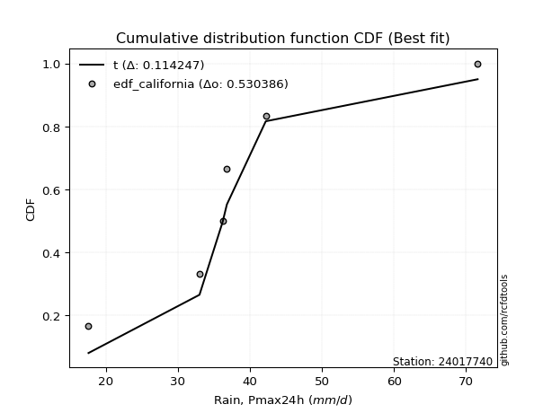</img>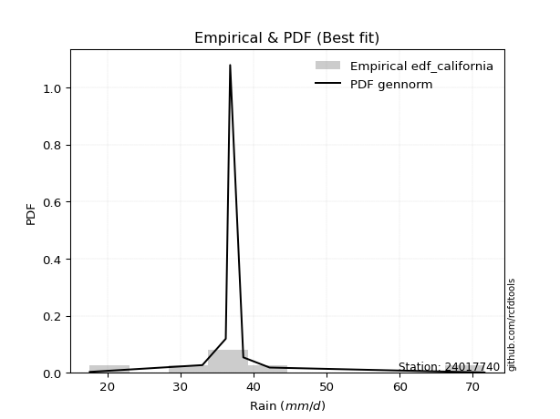</img>

</div>


### 2. Empirical - EDF Hazen (1930)

Hazen method for plotting positions is a formula used to estimate the empirical cumulative probability distribution of flood events or other hydrological data. This formula often results in biased estimations, particularly when extrapolating to extreme events (high return periods).

<div align="center">


$P=(m-0.5)/n$


</div>


**2.1. Empirical values**

<div align="center">

|                | 0                   | 1                   | 2                   | 3         | 4                  | 5                  | 6                  |
|:---------------|:--------------------|:--------------------|:--------------------|:----------|:-------------------|:-------------------|:-------------------|
| date           | 2023                | 2025                | 2019                | 2020      | 2022               | 2021               | 2024               |
| x              | 17.6                | 28.8                | 33.0                | 36.2      | 36.8               | 42.2               | 71.6               |
| m              | 1                   | 2                   | 3                   | 4         | 5                  | 6                  | 7                  |
| empirical_dist | edf_hazen           | edf_hazen           | edf_hazen           | edf_hazen | edf_hazen          | edf_hazen          | edf_hazen          |
| empirical      | 0.07142857142857142 | 0.21428571428571427 | 0.35714285714285715 | 0.5       | 0.6428571428571429 | 0.7857142857142857 | 0.9285714285714286 |
| empirical_tr   | 1.0769230769230769  | 1.2727272727272727  | 1.5555555555555558  | 2.0       | 2.8000000000000003 | 4.666666666666666  | 14.000000000000007 |

</div>


**2.2. Kolmogorov-Smirnov fit test (sorted by Δ)**


<div align="center">

|                | 0                   | 1                   | 2                   | 3                   | 4                   | 5                   | 6                   | 7                     | 8                   | 9                   | 10                  | 11                  | 12                  | 13                  | 14                  | 15                  | 16                  | 17                  | 18                  | 19                  | 20                  | 21                  | 22                  | 23                  | 24                  | 25                  | 26                  | 27                  | 28                  | 29                  | 30                  | 31                  | 32                  | 33                  | 34                  | 35                  | 36                  | 37                  | 38                  | 39                  | 40                  | 41                  | 42                  | 43                  | 44                  | 45                  | 46                  | 47                  | 48                  | 49                  | 50                  | 51                  | 52                  | 53                  | 54                  | 55                  | 56                  | 57                  | 58                  | 59                  | 60                  | 61                  | 62                  | 63                  | 64                  | 65                  | 66                  | 67                  | 68                  | 69                  | 70                  | 71                  | 72                  | 73                  | 74                  | 75                  | 76                  | 77                  | 78                  | 79                  | 80                  | 81                  | 82                  | 83                  | 84                  | 85                  | 86                  | 87                  | 88                  | 89                  |
|:---------------|:--------------------|:--------------------|:--------------------|:--------------------|:--------------------|:--------------------|:--------------------|:----------------------|:--------------------|:--------------------|:--------------------|:--------------------|:--------------------|:--------------------|:--------------------|:--------------------|:--------------------|:--------------------|:--------------------|:--------------------|:--------------------|:--------------------|:--------------------|:--------------------|:--------------------|:--------------------|:--------------------|:--------------------|:--------------------|:--------------------|:--------------------|:--------------------|:--------------------|:--------------------|:--------------------|:--------------------|:--------------------|:--------------------|:--------------------|:--------------------|:--------------------|:--------------------|:--------------------|:--------------------|:--------------------|:--------------------|:--------------------|:--------------------|:--------------------|:--------------------|:--------------------|:--------------------|:--------------------|:--------------------|:--------------------|:--------------------|:--------------------|:--------------------|:--------------------|:--------------------|:--------------------|:--------------------|:--------------------|:--------------------|:--------------------|:--------------------|:--------------------|:--------------------|:--------------------|:--------------------|:--------------------|:--------------------|:--------------------|:--------------------|:--------------------|:--------------------|:--------------------|:--------------------|:--------------------|:--------------------|:--------------------|:--------------------|:--------------------|:--------------------|:--------------------|:--------------------|:--------------------|:--------------------|:--------------------|:--------------------|
| station        | 24017740            | 24017740            | 24017740            | 24017740            | 24017740            | 24017740            | 24017740            | 24017740              | 24017740            | 24017740            | 24017740            | 24017740            | 24017740            | 24017740            | 24017740            | 24017740            | 24017740            | 24017740            | 24017740            | 24017740            | 24017740            | 24017740            | 24017740            | 24017740            | 24017740            | 24017740            | 24017740            | 24017740            | 24017740            | 24017740            | 24017740            | 24017740            | 24017740            | 24017740            | 24017740            | 24017740            | 24017740            | 24017740            | 24017740            | 24017740            | 24017740            | 24017740            | 24017740            | 24017740            | 24017740            | 24017740            | 24017740            | 24017740            | 24017740            | 24017740            | 24017740            | 24017740            | 24017740            | 24017740            | 24017740            | 24017740            | 24017740            | 24017740            | 24017740            | 24017740            | 24017740            | 24017740            | 24017740            | 24017740            | 24017740            | 24017740            | 24017740            | 24017740            | 24017740            | 24017740            | 24017740            | 24017740            | 24017740            | 24017740            | 24017740            | 24017740            | 24017740            | 24017740            | 24017740            | 24017740            | 24017740            | 24017740            | 24017740            | 24017740            | 24017740            | 24017740            | 24017740            | 24017740            | 24017740            | 24017740            |
| empirical_dist | edf_hazen           | edf_hazen           | edf_hazen           | edf_hazen           | edf_hazen           | edf_hazen           | edf_hazen           | edf_hazen             | edf_hazen           | edf_hazen           | edf_hazen           | edf_hazen           | edf_hazen           | edf_hazen           | edf_hazen           | edf_hazen           | edf_hazen           | edf_hazen           | edf_hazen           | edf_hazen           | edf_hazen           | edf_hazen           | edf_hazen           | edf_hazen           | edf_hazen           | edf_hazen           | edf_hazen           | edf_hazen           | edf_hazen           | edf_hazen           | edf_hazen           | edf_hazen           | edf_hazen           | edf_hazen           | edf_hazen           | edf_hazen           | edf_hazen           | edf_hazen           | edf_hazen           | edf_hazen           | edf_hazen           | edf_hazen           | edf_hazen           | edf_hazen           | edf_hazen           | edf_hazen           | edf_hazen           | edf_hazen           | edf_hazen           | edf_hazen           | edf_hazen           | edf_hazen           | edf_hazen           | edf_hazen           | edf_hazen           | edf_hazen           | edf_hazen           | edf_hazen           | edf_hazen           | edf_hazen           | edf_hazen           | edf_hazen           | edf_hazen           | edf_hazen           | edf_hazen           | edf_hazen           | edf_hazen           | edf_hazen           | edf_hazen           | edf_hazen           | edf_hazen           | edf_hazen           | edf_hazen           | edf_hazen           | edf_hazen           | edf_hazen           | edf_hazen           | edf_hazen           | edf_hazen           | edf_hazen           | edf_hazen           | edf_hazen           | edf_hazen           | edf_hazen           | edf_hazen           | edf_hazen           | edf_hazen           | edf_hazen           | edf_hazen           | edf_hazen           |
| p_dist         | logjohnsonsu        | logt                | johnsonsu           | loglaplace          | logmielke           | loghypsecant        | fisk                | loglaplace_asymmetric | logfisk             | loggenlogistic      | mielke              | moyal               | loglogistic         | exponnorm           | nct                 | alpha               | logrice             | invgamma            | ncf                 | betaprime           | loginvgamma         | logbetaprime        | lognct              | logf                | logpearson3         | logerlang           | loggamma            | loggamma            | logfatiguelife      | logalpha            | genlogistic         | logexponnorm        | logcrystalball      | lognorm             | lognorm             | logweibull_min      | f                   | invgauss            | logloggamma         | gamma               | erlang              | loginvgauss         | gumbel_r            | pearson3            | logmaxwell          | halflogistic        | halfnorm            | lograyleigh         | kstwobign           | gibrat              | gompertz            | weibull_min         | loggumbel_r         | wald                | rayleigh            | loginvweibull       | rice                | maxwell             | logncf              | loghalfnorm         | laplace_asymmetric  | loggumbel_l         | logmoyal            | logkstwobign        | t                   | loghalflogistic     | logistic            | crystalball         | norm                | truncnorm           | hypsecant           | laplace             | loggenexpon         | genexpon            | expon               | logtruncnorm        | lognakagami         | loggompertz         | logwald             | loggibrat           | gumbel_l            | chi2                | logexpon            | logchi2             | nakagami            | loglognorm          | pareto              | logpareto           | invweibull          | fatiguelife         |
| delta          | 0.05978412027677604 | 0.06544936469621887 | 0.06806182530730065 | 0.06964360786286827 | 0.08550721635132053 | 0.08716734875878918 | 0.08808230105506176 | 0.08812466201952063   | 0.0884518186256048  | 0.08963186835309289 | 0.08966474335063701 | 0.0912281620617611  | 0.09226615928898085 | 0.09698400064032875 | 0.0977639958108486  | 0.09930965627140864 | 0.10219013694768908 | 0.10291102709867184 | 0.10350942860564027 | 0.10366371213514602 | 0.10403301760677117 | 0.10415007797298748 | 0.10500416728708817 | 0.10510492078204348 | 0.10510980611028253 | 0.10512306765025348 | 0.10512317151722117 | 0.10512317151722117 | 0.10515181536050278 | 0.10546566847183561 | 0.10579739250867803 | 0.10605385027314429 | 0.10738432572236045 | 0.10738441260233811 | 0.10738441260233811 | 0.1077649832872195  | 0.10826660509994512 | 0.10834265845070423 | 0.10902177176766348 | 0.1118505115101642  | 0.11185084235825724 | 0.11270782531712578 | 0.11363577836188776 | 0.11602562784569093 | 0.11659061286721586 | 0.11717240518165725 | 0.1246732753228845  | 0.12769146526166106 | 0.1277956717968839  | 0.12996022955421627 | 0.13328986181032856 | 0.13471952922980326 | 0.14142291144694003 | 0.14238097867692562 | 0.14549220645079253 | 0.14795820838393817 | 0.15350574570239706 | 0.15351883277770761 | 0.15879370124688585 | 0.15909430557358165 | 0.1592316834805697  | 0.16586901740455096 | 0.16620990610506564 | 0.17394526383558664 | 0.17485755359986788 | 0.17646642422748388 | 0.17878682087951847 | 0.1794870078067553  | 0.17948701658652444 | 0.17948707894999572 | 0.182441264867869   | 0.19594697853521764 | 0.20348080231715518 | 0.20763181483217888 | 0.2077549396149825  | 0.2142800543799788  | 0.21428568361170153 | 0.22319953967960918 | 0.23479180110565373 | 0.24236048428887763 | 0.24508708169446725 | 0.28996955214212716 | 0.29391485706746334 | 0.3021996223653479  | 0.3483727102861304  | 0.4308248114104878  | 0.44014252765837447 | 0.45037027187456713 | 0.47436773761907697 | 0.5460036403658483  |
| deltao         | 0.48442053926100004 | 0.48442053926100004 | 0.48442053926100004 | 0.48442053926100004 | 0.48442053926100004 | 0.48442053926100004 | 0.48442053926100004 | 0.48442053926100004   | 0.48442053926100004 | 0.48442053926100004 | 0.48442053926100004 | 0.48442053926100004 | 0.48442053926100004 | 0.48442053926100004 | 0.48442053926100004 | 0.48442053926100004 | 0.48442053926100004 | 0.48442053926100004 | 0.48442053926100004 | 0.48442053926100004 | 0.48442053926100004 | 0.48442053926100004 | 0.48442053926100004 | 0.48442053926100004 | 0.48442053926100004 | 0.48442053926100004 | 0.48442053926100004 | 0.48442053926100004 | 0.48442053926100004 | 0.48442053926100004 | 0.48442053926100004 | 0.48442053926100004 | 0.48442053926100004 | 0.48442053926100004 | 0.48442053926100004 | 0.48442053926100004 | 0.48442053926100004 | 0.48442053926100004 | 0.48442053926100004 | 0.48442053926100004 | 0.48442053926100004 | 0.48442053926100004 | 0.48442053926100004 | 0.48442053926100004 | 0.48442053926100004 | 0.48442053926100004 | 0.48442053926100004 | 0.48442053926100004 | 0.48442053926100004 | 0.48442053926100004 | 0.48442053926100004 | 0.48442053926100004 | 0.48442053926100004 | 0.48442053926100004 | 0.48442053926100004 | 0.48442053926100004 | 0.48442053926100004 | 0.48442053926100004 | 0.48442053926100004 | 0.48442053926100004 | 0.48442053926100004 | 0.48442053926100004 | 0.48442053926100004 | 0.48442053926100004 | 0.48442053926100004 | 0.48442053926100004 | 0.48442053926100004 | 0.48442053926100004 | 0.48442053926100004 | 0.48442053926100004 | 0.48442053926100004 | 0.48442053926100004 | 0.48442053926100004 | 0.48442053926100004 | 0.48442053926100004 | 0.48442053926100004 | 0.48442053926100004 | 0.48442053926100004 | 0.48442053926100004 | 0.48442053926100004 | 0.48442053926100004 | 0.48442053926100004 | 0.48442053926100004 | 0.48442053926100004 | 0.48442053926100004 | 0.48442053926100004 | 0.48442053926100004 | 0.48442053926100004 | 0.48442053926100004 | 0.48442053926100004 |
| eval           | Δo > Δ              | Δo > Δ              | Δo > Δ              | Δo > Δ              | Δo > Δ              | Δo > Δ              | Δo > Δ              | Δo > Δ                | Δo > Δ              | Δo > Δ              | Δo > Δ              | Δo > Δ              | Δo > Δ              | Δo > Δ              | Δo > Δ              | Δo > Δ              | Δo > Δ              | Δo > Δ              | Δo > Δ              | Δo > Δ              | Δo > Δ              | Δo > Δ              | Δo > Δ              | Δo > Δ              | Δo > Δ              | Δo > Δ              | Δo > Δ              | Δo > Δ              | Δo > Δ              | Δo > Δ              | Δo > Δ              | Δo > Δ              | Δo > Δ              | Δo > Δ              | Δo > Δ              | Δo > Δ              | Δo > Δ              | Δo > Δ              | Δo > Δ              | Δo > Δ              | Δo > Δ              | Δo > Δ              | Δo > Δ              | Δo > Δ              | Δo > Δ              | Δo > Δ              | Δo > Δ              | Δo > Δ              | Δo > Δ              | Δo > Δ              | Δo > Δ              | Δo > Δ              | Δo > Δ              | Δo > Δ              | Δo > Δ              | Δo > Δ              | Δo > Δ              | Δo > Δ              | Δo > Δ              | Δo > Δ              | Δo > Δ              | Δo > Δ              | Δo > Δ              | Δo > Δ              | Δo > Δ              | Δo > Δ              | Δo > Δ              | Δo > Δ              | Δo > Δ              | Δo > Δ              | Δo > Δ              | Δo > Δ              | Δo > Δ              | Δo > Δ              | Δo > Δ              | Δo > Δ              | Δo > Δ              | Δo > Δ              | Δo > Δ              | Δo > Δ              | Δo > Δ              | Δo > Δ              | Δo > Δ              | Δo > Δ              | Δo > Δ              | Δo > Δ              | Δo > Δ              | Δo > Δ              | Δo > Δ              | Δo <= Δ             |
| fit            | 1                   | 1                   | 1                   | 1                   | 1                   | 1                   | 1                   | 1                     | 1                   | 1                   | 1                   | 1                   | 1                   | 1                   | 1                   | 1                   | 1                   | 1                   | 1                   | 1                   | 1                   | 1                   | 1                   | 1                   | 1                   | 1                   | 1                   | 1                   | 1                   | 1                   | 1                   | 1                   | 1                   | 1                   | 1                   | 1                   | 1                   | 1                   | 1                   | 1                   | 1                   | 1                   | 1                   | 1                   | 1                   | 1                   | 1                   | 1                   | 1                   | 1                   | 1                   | 1                   | 1                   | 1                   | 1                   | 1                   | 1                   | 1                   | 1                   | 1                   | 1                   | 1                   | 1                   | 1                   | 1                   | 1                   | 1                   | 1                   | 1                   | 1                   | 1                   | 1                   | 1                   | 1                   | 1                   | 1                   | 1                   | 1                   | 1                   | 1                   | 1                   | 1                   | 1                   | 1                   | 1                   | 1                   | 1                   | 1                   | 1                   | 0                   |
| n              | 7                   | 7                   | 7                   | 7                   | 7                   | 7                   | 7                   | 7                     | 7                   | 7                   | 7                   | 7                   | 7                   | 7                   | 7                   | 7                   | 7                   | 7                   | 7                   | 7                   | 7                   | 7                   | 7                   | 7                   | 7                   | 7                   | 7                   | 7                   | 7                   | 7                   | 7                   | 7                   | 7                   | 7                   | 7                   | 7                   | 7                   | 7                   | 7                   | 7                   | 7                   | 7                   | 7                   | 7                   | 7                   | 7                   | 7                   | 7                   | 7                   | 7                   | 7                   | 7                   | 7                   | 7                   | 7                   | 7                   | 7                   | 7                   | 7                   | 7                   | 7                   | 7                   | 7                   | 7                   | 7                   | 7                   | 7                   | 7                   | 7                   | 7                   | 7                   | 7                   | 7                   | 7                   | 7                   | 7                   | 7                   | 7                   | 7                   | 7                   | 7                   | 7                   | 7                   | 7                   | 7                   | 7                   | 7                   | 7                   | 7                   | 7                   |
| best_fit       | 1                   | 0                   | 0                   | 0                   | 0                   | 0                   | 0                   | 0                     | 0                   | 0                   | 0                   | 0                   | 0                   | 0                   | 0                   | 0                   | 0                   | 0                   | 0                   | 0                   | 0                   | 0                   | 0                   | 0                   | 0                   | 0                   | 0                   | 0                   | 0                   | 0                   | 0                   | 0                   | 0                   | 0                   | 0                   | 0                   | 0                   | 0                   | 0                   | 0                   | 0                   | 0                   | 0                   | 0                   | 0                   | 0                   | 0                   | 0                   | 0                   | 0                   | 0                   | 0                   | 0                   | 0                   | 0                   | 0                   | 0                   | 0                   | 0                   | 0                   | 0                   | 0                   | 0                   | 0                   | 0                   | 0                   | 0                   | 0                   | 0                   | 0                   | 0                   | 0                   | 0                   | 0                   | 0                   | 0                   | 0                   | 0                   | 0                   | 0                   | 0                   | 0                   | 0                   | 0                   | 0                   | 0                   | 0                   | 0                   | 0                   | 0                   |
| best_fit_sort  | 1                   | 2                   | 3                   | 4                   | 5                   | 6                   | 7                   | 8                     | 9                   | 10                  | 11                  | 12                  | 13                  | 14                  | 15                  | 16                  | 17                  | 18                  | 19                  | 20                  | 21                  | 22                  | 23                  | 24                  | 25                  | 26                  | 27                  | 28                  | 29                  | 30                  | 31                  | 32                  | 33                  | 34                  | 35                  | 36                  | 37                  | 38                  | 39                  | 40                  | 41                  | 42                  | 43                  | 44                  | 45                  | 46                  | 47                  | 48                  | 49                  | 50                  | 51                  | 52                  | 53                  | 54                  | 55                  | 56                  | 57                  | 58                  | 59                  | 60                  | 61                  | 62                  | 63                  | 64                  | 65                  | 66                  | 67                  | 68                  | 69                  | 70                  | 71                  | 72                  | 73                  | 74                  | 75                  | 76                  | 77                  | 78                  | 79                  | 80                  | 81                  | 82                  | 83                  | 84                  | 85                  | 86                  | 87                  | 88                  | 89                  | 90                  |

</div>


<div align="center">

</img>

</div>


**2.3. Best fit**

<div align="center">

|   id |   station | empirical_dist   | p_dist       |     delta |   deltao | eval   |   fit |   n |   best_fit |   best_fit_sort |
|-----:|----------:|:-----------------|:-------------|----------:|---------:|:-------|------:|----:|-----------:|----------------:|
|    0 |  24017740 | edf_hazen        | logjohnsonsu | 0.0597841 | 0.484421 | Δo > Δ |     1 |   7 |          1 |               1 |

</div>


<div align="center">

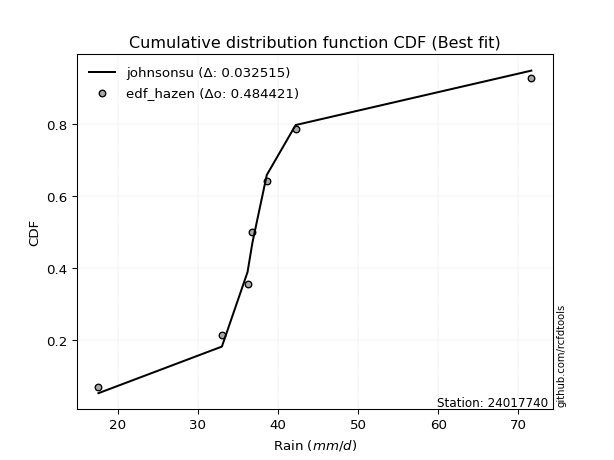</img>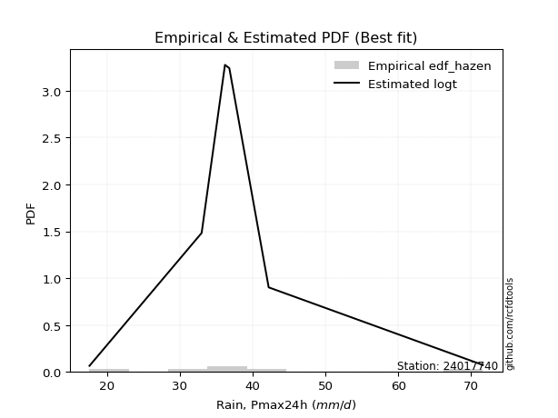</img>

</div>


### 3. Empirical - EDF Weibull (1939)

Weibull plotting position formula is an empirical method used to estimate the non-exceedance probability or plotting position for a set of observed data, is often recommended or widely used in practice, particularly in flood frequency analysis.

<div align="center">


$P=m/(n+1)$


</div>


**3.1. Empirical values**

<div align="center">

|                | 0                  | 1                  | 2           | 3           | 4                  | 5           | 6           |
|:---------------|:-------------------|:-------------------|:------------|:------------|:-------------------|:------------|:------------|
| date           | 2023               | 2025               | 2019        | 2020        | 2022               | 2021        | 2024        |
| x              | 17.6               | 28.8               | 33.0        | 36.2        | 36.8               | 42.2        | 71.6        |
| m              | 1                  | 2                  | 3           | 4           | 5                  | 6           | 7           |
| empirical_dist | edf_weibull        | edf_weibull        | edf_weibull | edf_weibull | edf_weibull        | edf_weibull | edf_weibull |
| empirical      | 0.125              | 0.25               | 0.375       | 0.5         | 0.625              | 0.75        | 0.875       |
| empirical_tr   | 1.1428571428571428 | 1.3333333333333333 | 1.6         | 2.0         | 2.6666666666666665 | 4.0         | 8.0         |

</div>


**3.2. Kolmogorov-Smirnov fit test (sorted by Δ)**


<div align="center">

|                | 0                   | 1                   | 2                   | 3                   | 4                   | 5                   | 6                   | 7                   | 8                   | 9                   | 10                  | 11                  | 12                  | 13                  | 14                  | 15                  | 16                  | 17                  | 18                  | 19                  | 20                  | 21                  | 22                  | 23                  | 24                  | 25                  | 26                  | 27                  | 28                  | 29                  | 30                    | 31                  | 32                  | 33                  | 34                  | 35                  | 36                  | 37                  | 38                  | 39                  | 40                  | 41                  | 42                  | 43                  | 44                  | 45                  | 46                  | 47                  | 48                  | 49                  | 50                  | 51                  | 52                  | 53                  | 54                  | 55                  | 56                  | 57                  | 58                  | 59                  | 60                  | 61                  | 62                  | 63                  | 64                  | 65                  | 66                  | 67                  | 68                  | 69                  | 70                  | 71                  | 72                  | 73                  | 74                  | 75                  | 76                  | 77                  | 78                  | 79                  | 80                  | 81                  | 82                  | 83                  | 84                  | 85                  | 86                  | 87                  | 88                  | 89                  |
|:---------------|:--------------------|:--------------------|:--------------------|:--------------------|:--------------------|:--------------------|:--------------------|:--------------------|:--------------------|:--------------------|:--------------------|:--------------------|:--------------------|:--------------------|:--------------------|:--------------------|:--------------------|:--------------------|:--------------------|:--------------------|:--------------------|:--------------------|:--------------------|:--------------------|:--------------------|:--------------------|:--------------------|:--------------------|:--------------------|:--------------------|:----------------------|:--------------------|:--------------------|:--------------------|:--------------------|:--------------------|:--------------------|:--------------------|:--------------------|:--------------------|:--------------------|:--------------------|:--------------------|:--------------------|:--------------------|:--------------------|:--------------------|:--------------------|:--------------------|:--------------------|:--------------------|:--------------------|:--------------------|:--------------------|:--------------------|:--------------------|:--------------------|:--------------------|:--------------------|:--------------------|:--------------------|:--------------------|:--------------------|:--------------------|:--------------------|:--------------------|:--------------------|:--------------------|:--------------------|:--------------------|:--------------------|:--------------------|:--------------------|:--------------------|:--------------------|:--------------------|:--------------------|:--------------------|:--------------------|:--------------------|:--------------------|:--------------------|:--------------------|:--------------------|:--------------------|:--------------------|:--------------------|:--------------------|:--------------------|:--------------------|
| station        | 24017740            | 24017740            | 24017740            | 24017740            | 24017740            | 24017740            | 24017740            | 24017740            | 24017740            | 24017740            | 24017740            | 24017740            | 24017740            | 24017740            | 24017740            | 24017740            | 24017740            | 24017740            | 24017740            | 24017740            | 24017740            | 24017740            | 24017740            | 24017740            | 24017740            | 24017740            | 24017740            | 24017740            | 24017740            | 24017740            | 24017740              | 24017740            | 24017740            | 24017740            | 24017740            | 24017740            | 24017740            | 24017740            | 24017740            | 24017740            | 24017740            | 24017740            | 24017740            | 24017740            | 24017740            | 24017740            | 24017740            | 24017740            | 24017740            | 24017740            | 24017740            | 24017740            | 24017740            | 24017740            | 24017740            | 24017740            | 24017740            | 24017740            | 24017740            | 24017740            | 24017740            | 24017740            | 24017740            | 24017740            | 24017740            | 24017740            | 24017740            | 24017740            | 24017740            | 24017740            | 24017740            | 24017740            | 24017740            | 24017740            | 24017740            | 24017740            | 24017740            | 24017740            | 24017740            | 24017740            | 24017740            | 24017740            | 24017740            | 24017740            | 24017740            | 24017740            | 24017740            | 24017740            | 24017740            | 24017740            |
| empirical_dist | edf_weibull         | edf_weibull         | edf_weibull         | edf_weibull         | edf_weibull         | edf_weibull         | edf_weibull         | edf_weibull         | edf_weibull         | edf_weibull         | edf_weibull         | edf_weibull         | edf_weibull         | edf_weibull         | edf_weibull         | edf_weibull         | edf_weibull         | edf_weibull         | edf_weibull         | edf_weibull         | edf_weibull         | edf_weibull         | edf_weibull         | edf_weibull         | edf_weibull         | edf_weibull         | edf_weibull         | edf_weibull         | edf_weibull         | edf_weibull         | edf_weibull           | edf_weibull         | edf_weibull         | edf_weibull         | edf_weibull         | edf_weibull         | edf_weibull         | edf_weibull         | edf_weibull         | edf_weibull         | edf_weibull         | edf_weibull         | edf_weibull         | edf_weibull         | edf_weibull         | edf_weibull         | edf_weibull         | edf_weibull         | edf_weibull         | edf_weibull         | edf_weibull         | edf_weibull         | edf_weibull         | edf_weibull         | edf_weibull         | edf_weibull         | edf_weibull         | edf_weibull         | edf_weibull         | edf_weibull         | edf_weibull         | edf_weibull         | edf_weibull         | edf_weibull         | edf_weibull         | edf_weibull         | edf_weibull         | edf_weibull         | edf_weibull         | edf_weibull         | edf_weibull         | edf_weibull         | edf_weibull         | edf_weibull         | edf_weibull         | edf_weibull         | edf_weibull         | edf_weibull         | edf_weibull         | edf_weibull         | edf_weibull         | edf_weibull         | edf_weibull         | edf_weibull         | edf_weibull         | edf_weibull         | edf_weibull         | edf_weibull         | edf_weibull         | edf_weibull         |
| p_dist         | logt                | logjohnsonsu        | johnsonsu           | loglaplace          | loghypsecant        | alpha               | nct                 | invgamma            | betaprime           | ncf                 | lognct              | logfatiguelife      | logpearson3         | logf                | loggamma            | loggamma            | logerlang           | loglogistic         | invgauss            | logexponnorm        | logbetaprime        | logfisk             | pearson3            | lognorm             | lognorm             | logcrystalball      | fisk                | gumbel_r            | logloggamma         | exponnorm           | loglaplace_asymmetric | logweibull_min      | mielke              | loggenlogistic      | logmielke           | f                   | erlang              | gamma               | loginvgamma         | logalpha            | genlogistic         | loginvgauss         | logrice             | kstwobign           | moyal               | weibull_min         | logmaxwell          | rayleigh            | loginvweibull       | lograyleigh         | maxwell             | logncf              | halfnorm            | loggumbel_r         | gompertz            | halflogistic        | wald                | gibrat              | rice                | logkstwobign        | loghalfnorm         | laplace_asymmetric  | loggumbel_l         | logmoyal            | t                   | crystalball         | norm                | truncnorm           | loghalflogistic     | logistic            | hypsecant           | loggenexpon         | genexpon            | expon               | laplace             | loggompertz         | logwald             | loggibrat           | gumbel_l            | logtruncnorm        | lognakagami         | chi2                | logexpon            | logchi2             | nakagami            | loglognorm          | pareto              | logpareto           | invweibull          | fatiguelife         |
| delta          | 0.07749672516907125 | 0.07962624143233388 | 0.0858131300631162  | 0.08680466467976145 | 0.08845966200491273 | 0.08872272510876766 | 0.0889269079192031  | 0.08897033126634324 | 0.08903637556969801 | 0.08909827166085083 | 0.08910305207719349 | 0.08911327666021884 | 0.08911572365605591 | 0.08912114777345259 | 0.08912440897868934 | 0.08912440897868934 | 0.08912445360222887 | 0.08938017119519037 | 0.08942232229956015 | 0.08984217503383207 | 0.0899639336227183  | 0.0900276245997047  | 0.09011583892234787 | 0.0905140805137783  | 0.0905140805137783  | 0.0905140829079224  | 0.09074012774368795 | 0.09082611793783046 | 0.09098355778403555 | 0.09103936608810614 | 0.09182364033517021   | 0.09235364698407744 | 0.09264080194188828 | 0.09264536423095127 | 0.09296850795675676 | 0.09321728713467348 | 0.0938335315228564  | 0.09383370713992073 | 0.0940968114175001  | 0.09444336865985006 | 0.09519901748762571 | 0.09556089774889691 | 0.0987746831057795  | 0.1003410927831534  | 0.10327006095922941 | 0.10450865248399427 | 0.10906492794142003 | 0.11098496559742888 | 0.1172008881961552  | 0.1211689290110757  | 0.12260460776577398 | 0.12307941553260016 | 0.12317241975530817 | 0.12356576858979718 | 0.12499975276703364 | 0.125               | 0.125               | 0.12996022955421627 | 0.13134685136567031 | 0.13823097812130092 | 0.13913863936147475 | 0.1413745406234268  | 0.14801187454740805 | 0.1483527632479228  | 0.14941325088365714 | 0.15663205669538416 | 0.15663206344284442 | 0.15663213057311087 | 0.15860928137034103 | 0.16092967802237557 | 0.16458412201072609 | 0.16776651660286945 | 0.17191752911789315 | 0.17204065390069678 | 0.17808983567807474 | 0.18748525396532345 | 0.21693465824851088 | 0.22450334143173478 | 0.22722993883732434 | 0.24999434009426452 | 0.24999996932598725 | 0.25425526642784146 | 0.25820057135317764 | 0.2664853366510622  | 0.3305155674289876  | 0.3951105256962021  | 0.4044282419440888  | 0.41465598616028143 | 0.42079630904764836 | 0.5102893546515626  |
| deltao         | 0.48442053926100004 | 0.48442053926100004 | 0.48442053926100004 | 0.48442053926100004 | 0.48442053926100004 | 0.48442053926100004 | 0.48442053926100004 | 0.48442053926100004 | 0.48442053926100004 | 0.48442053926100004 | 0.48442053926100004 | 0.48442053926100004 | 0.48442053926100004 | 0.48442053926100004 | 0.48442053926100004 | 0.48442053926100004 | 0.48442053926100004 | 0.48442053926100004 | 0.48442053926100004 | 0.48442053926100004 | 0.48442053926100004 | 0.48442053926100004 | 0.48442053926100004 | 0.48442053926100004 | 0.48442053926100004 | 0.48442053926100004 | 0.48442053926100004 | 0.48442053926100004 | 0.48442053926100004 | 0.48442053926100004 | 0.48442053926100004   | 0.48442053926100004 | 0.48442053926100004 | 0.48442053926100004 | 0.48442053926100004 | 0.48442053926100004 | 0.48442053926100004 | 0.48442053926100004 | 0.48442053926100004 | 0.48442053926100004 | 0.48442053926100004 | 0.48442053926100004 | 0.48442053926100004 | 0.48442053926100004 | 0.48442053926100004 | 0.48442053926100004 | 0.48442053926100004 | 0.48442053926100004 | 0.48442053926100004 | 0.48442053926100004 | 0.48442053926100004 | 0.48442053926100004 | 0.48442053926100004 | 0.48442053926100004 | 0.48442053926100004 | 0.48442053926100004 | 0.48442053926100004 | 0.48442053926100004 | 0.48442053926100004 | 0.48442053926100004 | 0.48442053926100004 | 0.48442053926100004 | 0.48442053926100004 | 0.48442053926100004 | 0.48442053926100004 | 0.48442053926100004 | 0.48442053926100004 | 0.48442053926100004 | 0.48442053926100004 | 0.48442053926100004 | 0.48442053926100004 | 0.48442053926100004 | 0.48442053926100004 | 0.48442053926100004 | 0.48442053926100004 | 0.48442053926100004 | 0.48442053926100004 | 0.48442053926100004 | 0.48442053926100004 | 0.48442053926100004 | 0.48442053926100004 | 0.48442053926100004 | 0.48442053926100004 | 0.48442053926100004 | 0.48442053926100004 | 0.48442053926100004 | 0.48442053926100004 | 0.48442053926100004 | 0.48442053926100004 | 0.48442053926100004 |
| eval           | Δo > Δ              | Δo > Δ              | Δo > Δ              | Δo > Δ              | Δo > Δ              | Δo > Δ              | Δo > Δ              | Δo > Δ              | Δo > Δ              | Δo > Δ              | Δo > Δ              | Δo > Δ              | Δo > Δ              | Δo > Δ              | Δo > Δ              | Δo > Δ              | Δo > Δ              | Δo > Δ              | Δo > Δ              | Δo > Δ              | Δo > Δ              | Δo > Δ              | Δo > Δ              | Δo > Δ              | Δo > Δ              | Δo > Δ              | Δo > Δ              | Δo > Δ              | Δo > Δ              | Δo > Δ              | Δo > Δ                | Δo > Δ              | Δo > Δ              | Δo > Δ              | Δo > Δ              | Δo > Δ              | Δo > Δ              | Δo > Δ              | Δo > Δ              | Δo > Δ              | Δo > Δ              | Δo > Δ              | Δo > Δ              | Δo > Δ              | Δo > Δ              | Δo > Δ              | Δo > Δ              | Δo > Δ              | Δo > Δ              | Δo > Δ              | Δo > Δ              | Δo > Δ              | Δo > Δ              | Δo > Δ              | Δo > Δ              | Δo > Δ              | Δo > Δ              | Δo > Δ              | Δo > Δ              | Δo > Δ              | Δo > Δ              | Δo > Δ              | Δo > Δ              | Δo > Δ              | Δo > Δ              | Δo > Δ              | Δo > Δ              | Δo > Δ              | Δo > Δ              | Δo > Δ              | Δo > Δ              | Δo > Δ              | Δo > Δ              | Δo > Δ              | Δo > Δ              | Δo > Δ              | Δo > Δ              | Δo > Δ              | Δo > Δ              | Δo > Δ              | Δo > Δ              | Δo > Δ              | Δo > Δ              | Δo > Δ              | Δo > Δ              | Δo > Δ              | Δo > Δ              | Δo > Δ              | Δo > Δ              | Δo <= Δ             |
| fit            | 1                   | 1                   | 1                   | 1                   | 1                   | 1                   | 1                   | 1                   | 1                   | 1                   | 1                   | 1                   | 1                   | 1                   | 1                   | 1                   | 1                   | 1                   | 1                   | 1                   | 1                   | 1                   | 1                   | 1                   | 1                   | 1                   | 1                   | 1                   | 1                   | 1                   | 1                     | 1                   | 1                   | 1                   | 1                   | 1                   | 1                   | 1                   | 1                   | 1                   | 1                   | 1                   | 1                   | 1                   | 1                   | 1                   | 1                   | 1                   | 1                   | 1                   | 1                   | 1                   | 1                   | 1                   | 1                   | 1                   | 1                   | 1                   | 1                   | 1                   | 1                   | 1                   | 1                   | 1                   | 1                   | 1                   | 1                   | 1                   | 1                   | 1                   | 1                   | 1                   | 1                   | 1                   | 1                   | 1                   | 1                   | 1                   | 1                   | 1                   | 1                   | 1                   | 1                   | 1                   | 1                   | 1                   | 1                   | 1                   | 1                   | 0                   |
| n              | 7                   | 7                   | 7                   | 7                   | 7                   | 7                   | 7                   | 7                   | 7                   | 7                   | 7                   | 7                   | 7                   | 7                   | 7                   | 7                   | 7                   | 7                   | 7                   | 7                   | 7                   | 7                   | 7                   | 7                   | 7                   | 7                   | 7                   | 7                   | 7                   | 7                   | 7                     | 7                   | 7                   | 7                   | 7                   | 7                   | 7                   | 7                   | 7                   | 7                   | 7                   | 7                   | 7                   | 7                   | 7                   | 7                   | 7                   | 7                   | 7                   | 7                   | 7                   | 7                   | 7                   | 7                   | 7                   | 7                   | 7                   | 7                   | 7                   | 7                   | 7                   | 7                   | 7                   | 7                   | 7                   | 7                   | 7                   | 7                   | 7                   | 7                   | 7                   | 7                   | 7                   | 7                   | 7                   | 7                   | 7                   | 7                   | 7                   | 7                   | 7                   | 7                   | 7                   | 7                   | 7                   | 7                   | 7                   | 7                   | 7                   | 7                   |
| best_fit       | 1                   | 0                   | 0                   | 0                   | 0                   | 0                   | 0                   | 0                   | 0                   | 0                   | 0                   | 0                   | 0                   | 0                   | 0                   | 0                   | 0                   | 0                   | 0                   | 0                   | 0                   | 0                   | 0                   | 0                   | 0                   | 0                   | 0                   | 0                   | 0                   | 0                   | 0                     | 0                   | 0                   | 0                   | 0                   | 0                   | 0                   | 0                   | 0                   | 0                   | 0                   | 0                   | 0                   | 0                   | 0                   | 0                   | 0                   | 0                   | 0                   | 0                   | 0                   | 0                   | 0                   | 0                   | 0                   | 0                   | 0                   | 0                   | 0                   | 0                   | 0                   | 0                   | 0                   | 0                   | 0                   | 0                   | 0                   | 0                   | 0                   | 0                   | 0                   | 0                   | 0                   | 0                   | 0                   | 0                   | 0                   | 0                   | 0                   | 0                   | 0                   | 0                   | 0                   | 0                   | 0                   | 0                   | 0                   | 0                   | 0                   | 0                   |
| best_fit_sort  | 1                   | 2                   | 3                   | 4                   | 5                   | 6                   | 7                   | 8                   | 9                   | 10                  | 11                  | 12                  | 13                  | 14                  | 15                  | 16                  | 17                  | 18                  | 19                  | 20                  | 21                  | 22                  | 23                  | 24                  | 25                  | 26                  | 27                  | 28                  | 29                  | 30                  | 31                    | 32                  | 33                  | 34                  | 35                  | 36                  | 37                  | 38                  | 39                  | 40                  | 41                  | 42                  | 43                  | 44                  | 45                  | 46                  | 47                  | 48                  | 49                  | 50                  | 51                  | 52                  | 53                  | 54                  | 55                  | 56                  | 57                  | 58                  | 59                  | 60                  | 61                  | 62                  | 63                  | 64                  | 65                  | 66                  | 67                  | 68                  | 69                  | 70                  | 71                  | 72                  | 73                  | 74                  | 75                  | 76                  | 77                  | 78                  | 79                  | 80                  | 81                  | 82                  | 83                  | 84                  | 85                  | 86                  | 87                  | 88                  | 89                  | 90                  |

</div>


<div align="center">

</img>

</div>


**3.3. Best fit**

<div align="center">

|   id |   station | empirical_dist   | p_dist   |     delta |   deltao | eval   |   fit |   n |   best_fit |   best_fit_sort |
|-----:|----------:|:-----------------|:---------|----------:|---------:|:-------|------:|----:|-----------:|----------------:|
|    0 |  24017740 | edf_weibull      | logt     | 0.0774967 | 0.484421 | Δo > Δ |     1 |   7 |          1 |               1 |

</div>


<div align="center">

</img></img>

</div>


### 4. Empirical - EDF Beard (1943)

The Beard formula (or Beard´s plotting position formula) in hydrology is used to estimate the empirical non-exceedance probability _(P)_ of a flood event (or other extreme hydrological data point) within a given dataset.

<div align="center">


$P=(m-0.31)/(n+0.38)$


</div>


**4.1. Empirical values**

<div align="center">

|                | 0                   | 1                   | 2                   | 3         | 4                  | 5                  | 6                  |
|:---------------|:--------------------|:--------------------|:--------------------|:----------|:-------------------|:-------------------|:-------------------|
| date           | 2023                | 2025                | 2019                | 2020      | 2022               | 2021               | 2024               |
| x              | 17.6                | 28.8                | 33.0                | 36.2      | 36.8               | 42.2               | 71.6               |
| m              | 1                   | 2                   | 3                   | 4         | 5                  | 6                  | 7                  |
| empirical_dist | edf_beard           | edf_beard           | edf_beard           | edf_beard | edf_beard          | edf_beard          | edf_beard          |
| empirical      | 0.09349593495934959 | 0.22899728997289973 | 0.36449864498644985 | 0.5       | 0.6355013550135502 | 0.7710027100271003 | 0.9065040650406505 |
| empirical_tr   | 1.1031390134529149  | 1.29701230228471    | 1.5735607675906182  | 2.0       | 2.743494423791822  | 4.366863905325444  | 10.695652173913055 |

</div>


**4.2. Kolmogorov-Smirnov fit test (sorted by Δ)**


<div align="center">

|                | 0                    | 1                   | 2                   | 3                    | 4                   | 5                   | 6                   | 7                     | 8                   | 9                   | 10                  | 11                  | 12                  | 13                  | 14                  | 15                  | 16                  | 17                  | 18                  | 19                  | 20                  | 21                  | 22                  | 23                  | 24                  | 25                  | 26                  | 27                  | 28                  | 29                  | 30                  | 31                  | 32                  | 33                  | 34                  | 35                  | 36                  | 37                  | 38                  | 39                  | 40                  | 41                  | 42                  | 43                  | 44                  | 45                  | 46                  | 47                  | 48                  | 49                  | 50                  | 51                  | 52                  | 53                  | 54                  | 55                  | 56                  | 57                  | 58                  | 59                  | 60                  | 61                  | 62                  | 63                  | 64                  | 65                  | 66                  | 67                  | 68                  | 69                  | 70                  | 71                  | 72                  | 73                  | 74                  | 75                  | 76                  | 77                  | 78                  | 79                  | 80                  | 81                  | 82                  | 83                  | 84                  | 85                  | 86                  | 87                  | 88                  | 89                  |
|:---------------|:---------------------|:--------------------|:--------------------|:---------------------|:--------------------|:--------------------|:--------------------|:----------------------|:--------------------|:--------------------|:--------------------|:--------------------|:--------------------|:--------------------|:--------------------|:--------------------|:--------------------|:--------------------|:--------------------|:--------------------|:--------------------|:--------------------|:--------------------|:--------------------|:--------------------|:--------------------|:--------------------|:--------------------|:--------------------|:--------------------|:--------------------|:--------------------|:--------------------|:--------------------|:--------------------|:--------------------|:--------------------|:--------------------|:--------------------|:--------------------|:--------------------|:--------------------|:--------------------|:--------------------|:--------------------|:--------------------|:--------------------|:--------------------|:--------------------|:--------------------|:--------------------|:--------------------|:--------------------|:--------------------|:--------------------|:--------------------|:--------------------|:--------------------|:--------------------|:--------------------|:--------------------|:--------------------|:--------------------|:--------------------|:--------------------|:--------------------|:--------------------|:--------------------|:--------------------|:--------------------|:--------------------|:--------------------|:--------------------|:--------------------|:--------------------|:--------------------|:--------------------|:--------------------|:--------------------|:--------------------|:--------------------|:--------------------|:--------------------|:--------------------|:--------------------|:--------------------|:--------------------|:--------------------|:--------------------|:--------------------|
| station        | 24017740             | 24017740            | 24017740            | 24017740             | 24017740            | 24017740            | 24017740            | 24017740              | 24017740            | 24017740            | 24017740            | 24017740            | 24017740            | 24017740            | 24017740            | 24017740            | 24017740            | 24017740            | 24017740            | 24017740            | 24017740            | 24017740            | 24017740            | 24017740            | 24017740            | 24017740            | 24017740            | 24017740            | 24017740            | 24017740            | 24017740            | 24017740            | 24017740            | 24017740            | 24017740            | 24017740            | 24017740            | 24017740            | 24017740            | 24017740            | 24017740            | 24017740            | 24017740            | 24017740            | 24017740            | 24017740            | 24017740            | 24017740            | 24017740            | 24017740            | 24017740            | 24017740            | 24017740            | 24017740            | 24017740            | 24017740            | 24017740            | 24017740            | 24017740            | 24017740            | 24017740            | 24017740            | 24017740            | 24017740            | 24017740            | 24017740            | 24017740            | 24017740            | 24017740            | 24017740            | 24017740            | 24017740            | 24017740            | 24017740            | 24017740            | 24017740            | 24017740            | 24017740            | 24017740            | 24017740            | 24017740            | 24017740            | 24017740            | 24017740            | 24017740            | 24017740            | 24017740            | 24017740            | 24017740            | 24017740            |
| empirical_dist | edf_beard            | edf_beard           | edf_beard           | edf_beard            | edf_beard           | edf_beard           | edf_beard           | edf_beard             | edf_beard           | edf_beard           | edf_beard           | edf_beard           | edf_beard           | edf_beard           | edf_beard           | edf_beard           | edf_beard           | edf_beard           | edf_beard           | edf_beard           | edf_beard           | edf_beard           | edf_beard           | edf_beard           | edf_beard           | edf_beard           | edf_beard           | edf_beard           | edf_beard           | edf_beard           | edf_beard           | edf_beard           | edf_beard           | edf_beard           | edf_beard           | edf_beard           | edf_beard           | edf_beard           | edf_beard           | edf_beard           | edf_beard           | edf_beard           | edf_beard           | edf_beard           | edf_beard           | edf_beard           | edf_beard           | edf_beard           | edf_beard           | edf_beard           | edf_beard           | edf_beard           | edf_beard           | edf_beard           | edf_beard           | edf_beard           | edf_beard           | edf_beard           | edf_beard           | edf_beard           | edf_beard           | edf_beard           | edf_beard           | edf_beard           | edf_beard           | edf_beard           | edf_beard           | edf_beard           | edf_beard           | edf_beard           | edf_beard           | edf_beard           | edf_beard           | edf_beard           | edf_beard           | edf_beard           | edf_beard           | edf_beard           | edf_beard           | edf_beard           | edf_beard           | edf_beard           | edf_beard           | edf_beard           | edf_beard           | edf_beard           | edf_beard           | edf_beard           | edf_beard           | edf_beard           |
| p_dist         | logjohnsonsu         | logt                | johnsonsu           | loglaplace           | logmielke           | loghypsecant        | fisk                | loglaplace_asymmetric | logfisk             | loggenlogistic      | mielke              | moyal               | loglogistic         | nct                 | alpha               | logrice             | invgamma            | ncf                 | betaprime           | logbetaprime        | exponnorm           | loginvgamma         | lognct              | logf                | logpearson3         | logerlang           | loggamma            | loggamma            | logfatiguelife      | logexponnorm        | logalpha            | logcrystalball      | lognorm             | lognorm             | logweibull_min      | f                   | invgauss            | logloggamma         | genlogistic         | gamma               | erlang              | gumbel_r            | loginvgauss         | pearson3            | halflogistic        | logmaxwell          | halfnorm            | kstwobign           | lograyleigh         | gompertz            | weibull_min         | gibrat              | rayleigh            | loginvweibull       | loggumbel_r         | wald                | maxwell             | rice                | logncf              | loghalfnorm         | laplace_asymmetric  | loggumbel_l         | logmoyal            | logkstwobign        | t                   | crystalball         | norm                | truncnorm           | loghalflogistic     | logistic            | hypsecant           | laplace             | loggenexpon         | genexpon            | expon               | loggompertz         | logwald             | logtruncnorm        | lognakagami         | loggibrat           | gumbel_l            | chi2                | logexpon            | logchi2             | nakagami            | loglognorm          | pareto              | logpareto           | invweibull          | fatiguelife         |
| delta          | 0.052428332433183344 | 0.05809357685262617 | 0.06070603746370795 | 0.062287820019275575 | 0.07815142850772783 | 0.07981156091519648 | 0.08072651321146906 | 0.08076887417592793   | 0.08109603078201211 | 0.0822760805095002  | 0.08230895550704431 | 0.08270968373993465 | 0.08491037144538816 | 0.08589002690661207 | 0.08606177305194773 | 0.08747856126050368 | 0.08819945141148644 | 0.08879785291845488 | 0.08895213644796063 | 0.08943850228580208 | 0.08962821279673605 | 0.0896719110495518  | 0.09029259159990277 | 0.09039334509485808 | 0.09039823042309714 | 0.09041149196306808 | 0.09041159583003577 | 0.09041159583003577 | 0.09044023967331738 | 0.0913422745859589  | 0.09135824168430284 | 0.09267275003517506 | 0.09267283691515271 | 0.09267283691515271 | 0.09305340760003411 | 0.09355502941275973 | 0.09363108276351884 | 0.09431019608047808 | 0.09517608639192754 | 0.09713893582297875 | 0.09713926667107178 | 0.09892420267470237 | 0.09912368744774619 | 0.10131405215850553 | 0.1024608294944718  | 0.10339073755621664 | 0.10996169963569905 | 0.1130840961096985  | 0.1154769835907154  | 0.11857828612314311 | 0.12000795354261781 | 0.12996022955421627 | 0.13078063076360713 | 0.13324663269675271 | 0.13406712360334733 | 0.13502519083333292 | 0.13880725709052222 | 0.14184820637922052 | 0.14408212555970046 | 0.1496399943750249  | 0.151875895636977   | 0.15851322956095826 | 0.15885411826147294 | 0.1592336881484012  | 0.16014597791268248 | 0.16713341170893437 | 0.16713341845639462 | 0.16713348558666108 | 0.16911063638389118 | 0.17143103303592577 | 0.1750854770242763  | 0.18859119069162494 | 0.18876922662996973 | 0.19292023914499343 | 0.19304336392779706 | 0.20848796399242372 | 0.22743601326206103 | 0.22899163006716425 | 0.22899725929888698 | 0.23500469644528493 | 0.23773129385087455 | 0.27525797645494177 | 0.27920328138027795 | 0.2874880466781625  | 0.34101692244253773 | 0.4161132357233024  | 0.4254309519711891  | 0.43565869618738173 | 0.4523003740882989  | 0.5312920646786629  |
| deltao         | 0.48442053926100004  | 0.48442053926100004 | 0.48442053926100004 | 0.48442053926100004  | 0.48442053926100004 | 0.48442053926100004 | 0.48442053926100004 | 0.48442053926100004   | 0.48442053926100004 | 0.48442053926100004 | 0.48442053926100004 | 0.48442053926100004 | 0.48442053926100004 | 0.48442053926100004 | 0.48442053926100004 | 0.48442053926100004 | 0.48442053926100004 | 0.48442053926100004 | 0.48442053926100004 | 0.48442053926100004 | 0.48442053926100004 | 0.48442053926100004 | 0.48442053926100004 | 0.48442053926100004 | 0.48442053926100004 | 0.48442053926100004 | 0.48442053926100004 | 0.48442053926100004 | 0.48442053926100004 | 0.48442053926100004 | 0.48442053926100004 | 0.48442053926100004 | 0.48442053926100004 | 0.48442053926100004 | 0.48442053926100004 | 0.48442053926100004 | 0.48442053926100004 | 0.48442053926100004 | 0.48442053926100004 | 0.48442053926100004 | 0.48442053926100004 | 0.48442053926100004 | 0.48442053926100004 | 0.48442053926100004 | 0.48442053926100004 | 0.48442053926100004 | 0.48442053926100004 | 0.48442053926100004 | 0.48442053926100004 | 0.48442053926100004 | 0.48442053926100004 | 0.48442053926100004 | 0.48442053926100004 | 0.48442053926100004 | 0.48442053926100004 | 0.48442053926100004 | 0.48442053926100004 | 0.48442053926100004 | 0.48442053926100004 | 0.48442053926100004 | 0.48442053926100004 | 0.48442053926100004 | 0.48442053926100004 | 0.48442053926100004 | 0.48442053926100004 | 0.48442053926100004 | 0.48442053926100004 | 0.48442053926100004 | 0.48442053926100004 | 0.48442053926100004 | 0.48442053926100004 | 0.48442053926100004 | 0.48442053926100004 | 0.48442053926100004 | 0.48442053926100004 | 0.48442053926100004 | 0.48442053926100004 | 0.48442053926100004 | 0.48442053926100004 | 0.48442053926100004 | 0.48442053926100004 | 0.48442053926100004 | 0.48442053926100004 | 0.48442053926100004 | 0.48442053926100004 | 0.48442053926100004 | 0.48442053926100004 | 0.48442053926100004 | 0.48442053926100004 | 0.48442053926100004 |
| eval           | Δo > Δ               | Δo > Δ              | Δo > Δ              | Δo > Δ               | Δo > Δ              | Δo > Δ              | Δo > Δ              | Δo > Δ                | Δo > Δ              | Δo > Δ              | Δo > Δ              | Δo > Δ              | Δo > Δ              | Δo > Δ              | Δo > Δ              | Δo > Δ              | Δo > Δ              | Δo > Δ              | Δo > Δ              | Δo > Δ              | Δo > Δ              | Δo > Δ              | Δo > Δ              | Δo > Δ              | Δo > Δ              | Δo > Δ              | Δo > Δ              | Δo > Δ              | Δo > Δ              | Δo > Δ              | Δo > Δ              | Δo > Δ              | Δo > Δ              | Δo > Δ              | Δo > Δ              | Δo > Δ              | Δo > Δ              | Δo > Δ              | Δo > Δ              | Δo > Δ              | Δo > Δ              | Δo > Δ              | Δo > Δ              | Δo > Δ              | Δo > Δ              | Δo > Δ              | Δo > Δ              | Δo > Δ              | Δo > Δ              | Δo > Δ              | Δo > Δ              | Δo > Δ              | Δo > Δ              | Δo > Δ              | Δo > Δ              | Δo > Δ              | Δo > Δ              | Δo > Δ              | Δo > Δ              | Δo > Δ              | Δo > Δ              | Δo > Δ              | Δo > Δ              | Δo > Δ              | Δo > Δ              | Δo > Δ              | Δo > Δ              | Δo > Δ              | Δo > Δ              | Δo > Δ              | Δo > Δ              | Δo > Δ              | Δo > Δ              | Δo > Δ              | Δo > Δ              | Δo > Δ              | Δo > Δ              | Δo > Δ              | Δo > Δ              | Δo > Δ              | Δo > Δ              | Δo > Δ              | Δo > Δ              | Δo > Δ              | Δo > Δ              | Δo > Δ              | Δo > Δ              | Δo > Δ              | Δo > Δ              | Δo <= Δ             |
| fit            | 1                    | 1                   | 1                   | 1                    | 1                   | 1                   | 1                   | 1                     | 1                   | 1                   | 1                   | 1                   | 1                   | 1                   | 1                   | 1                   | 1                   | 1                   | 1                   | 1                   | 1                   | 1                   | 1                   | 1                   | 1                   | 1                   | 1                   | 1                   | 1                   | 1                   | 1                   | 1                   | 1                   | 1                   | 1                   | 1                   | 1                   | 1                   | 1                   | 1                   | 1                   | 1                   | 1                   | 1                   | 1                   | 1                   | 1                   | 1                   | 1                   | 1                   | 1                   | 1                   | 1                   | 1                   | 1                   | 1                   | 1                   | 1                   | 1                   | 1                   | 1                   | 1                   | 1                   | 1                   | 1                   | 1                   | 1                   | 1                   | 1                   | 1                   | 1                   | 1                   | 1                   | 1                   | 1                   | 1                   | 1                   | 1                   | 1                   | 1                   | 1                   | 1                   | 1                   | 1                   | 1                   | 1                   | 1                   | 1                   | 1                   | 0                   |
| n              | 7                    | 7                   | 7                   | 7                    | 7                   | 7                   | 7                   | 7                     | 7                   | 7                   | 7                   | 7                   | 7                   | 7                   | 7                   | 7                   | 7                   | 7                   | 7                   | 7                   | 7                   | 7                   | 7                   | 7                   | 7                   | 7                   | 7                   | 7                   | 7                   | 7                   | 7                   | 7                   | 7                   | 7                   | 7                   | 7                   | 7                   | 7                   | 7                   | 7                   | 7                   | 7                   | 7                   | 7                   | 7                   | 7                   | 7                   | 7                   | 7                   | 7                   | 7                   | 7                   | 7                   | 7                   | 7                   | 7                   | 7                   | 7                   | 7                   | 7                   | 7                   | 7                   | 7                   | 7                   | 7                   | 7                   | 7                   | 7                   | 7                   | 7                   | 7                   | 7                   | 7                   | 7                   | 7                   | 7                   | 7                   | 7                   | 7                   | 7                   | 7                   | 7                   | 7                   | 7                   | 7                   | 7                   | 7                   | 7                   | 7                   | 7                   |
| best_fit       | 1                    | 0                   | 0                   | 0                    | 0                   | 0                   | 0                   | 0                     | 0                   | 0                   | 0                   | 0                   | 0                   | 0                   | 0                   | 0                   | 0                   | 0                   | 0                   | 0                   | 0                   | 0                   | 0                   | 0                   | 0                   | 0                   | 0                   | 0                   | 0                   | 0                   | 0                   | 0                   | 0                   | 0                   | 0                   | 0                   | 0                   | 0                   | 0                   | 0                   | 0                   | 0                   | 0                   | 0                   | 0                   | 0                   | 0                   | 0                   | 0                   | 0                   | 0                   | 0                   | 0                   | 0                   | 0                   | 0                   | 0                   | 0                   | 0                   | 0                   | 0                   | 0                   | 0                   | 0                   | 0                   | 0                   | 0                   | 0                   | 0                   | 0                   | 0                   | 0                   | 0                   | 0                   | 0                   | 0                   | 0                   | 0                   | 0                   | 0                   | 0                   | 0                   | 0                   | 0                   | 0                   | 0                   | 0                   | 0                   | 0                   | 0                   |
| best_fit_sort  | 1                    | 2                   | 3                   | 4                    | 5                   | 6                   | 7                   | 8                     | 9                   | 10                  | 11                  | 12                  | 13                  | 14                  | 15                  | 16                  | 17                  | 18                  | 19                  | 20                  | 21                  | 22                  | 23                  | 24                  | 25                  | 26                  | 27                  | 28                  | 29                  | 30                  | 31                  | 32                  | 33                  | 34                  | 35                  | 36                  | 37                  | 38                  | 39                  | 40                  | 41                  | 42                  | 43                  | 44                  | 45                  | 46                  | 47                  | 48                  | 49                  | 50                  | 51                  | 52                  | 53                  | 54                  | 55                  | 56                  | 57                  | 58                  | 59                  | 60                  | 61                  | 62                  | 63                  | 64                  | 65                  | 66                  | 67                  | 68                  | 69                  | 70                  | 71                  | 72                  | 73                  | 74                  | 75                  | 76                  | 77                  | 78                  | 79                  | 80                  | 81                  | 82                  | 83                  | 84                  | 85                  | 86                  | 87                  | 88                  | 89                  | 90                  |

</div>


<div align="center">

</img>

</div>


**4.3. Best fit**

<div align="center">

|   id |   station | empirical_dist   | p_dist       |     delta |   deltao | eval   |   fit |   n |   best_fit |   best_fit_sort |
|-----:|----------:|:-----------------|:-------------|----------:|---------:|:-------|------:|----:|-----------:|----------------:|
|    0 |  24017740 | edf_beard        | logjohnsonsu | 0.0524283 | 0.484421 | Δo > Δ |     1 |   7 |          1 |               1 |

</div>


<div align="center">

</img></img>

</div>


### 5. Empirical - EDF Chegodayev (1955)

The Chegodayev formula is an empirical plotting position formula used in hydrological frequency analysis to estimate the exceedance probability or return period of a specific event from a set of observed data. It is primarily used for plotting observed data points on probability paper to fit a theoretical distribution, particularly for analyzing extreme events like maximum flood flows or rainfall intensities. The constant _b_ value in the generalized plotting position formula is 0.3.

<div align="center">


$P=(m-b)/(n+1-2b)$


</div>


**5.1. Empirical values**

<div align="center">

|                | 0                   | 1                   | 2                   | 3              | 4                  | 5                  | 6                  |
|:---------------|:--------------------|:--------------------|:--------------------|:---------------|:-------------------|:-------------------|:-------------------|
| date           | 2023                | 2025                | 2019                | 2020           | 2022               | 2021               | 2024               |
| x              | 17.6                | 28.8                | 33.0                | 36.2           | 36.8               | 42.2               | 71.6               |
| m              | 1                   | 2                   | 3                   | 4              | 5                  | 6                  | 7                  |
| empirical_dist | edf_chegodayev      | edf_chegodayev      | edf_chegodayev      | edf_chegodayev | edf_chegodayev     | edf_chegodayev     | edf_chegodayev     |
| empirical      | 0.09459459459459459 | 0.22972972972972971 | 0.36486486486486486 | 0.5            | 0.6351351351351351 | 0.7702702702702703 | 0.9054054054054054 |
| empirical_tr   | 1.1044776119402986  | 1.2982456140350878  | 1.574468085106383   | 2.0            | 2.7407407407407405 | 4.352941176470589  | 10.571428571428568 |

</div>


**5.2. Kolmogorov-Smirnov fit test (sorted by Δ)**


<div align="center">

|                | 0                    | 1                   | 2                   | 3                    | 4                   | 5                   | 6                   | 7                     | 8                   | 9                   | 10                  | 11                  | 12                  | 13                  | 14                  | 15                  | 16                  | 17                  | 18                  | 19                  | 20                  | 21                  | 22                  | 23                  | 24                  | 25                  | 26                  | 27                  | 28                  | 29                  | 30                  | 31                  | 32                  | 33                  | 34                  | 35                  | 36                  | 37                  | 38                  | 39                  | 40                  | 41                  | 42                  | 43                  | 44                  | 45                  | 46                  | 47                  | 48                  | 49                  | 50                  | 51                  | 52                  | 53                  | 54                  | 55                  | 56                  | 57                  | 58                  | 59                  | 60                  | 61                  | 62                  | 63                  | 64                  | 65                  | 66                  | 67                  | 68                  | 69                  | 70                  | 71                  | 72                  | 73                  | 74                  | 75                  | 76                  | 77                  | 78                  | 79                  | 80                  | 81                  | 82                  | 83                  | 84                  | 85                  | 86                  | 87                  | 88                  | 89                  |
|:---------------|:---------------------|:--------------------|:--------------------|:---------------------|:--------------------|:--------------------|:--------------------|:----------------------|:--------------------|:--------------------|:--------------------|:--------------------|:--------------------|:--------------------|:--------------------|:--------------------|:--------------------|:--------------------|:--------------------|:--------------------|:--------------------|:--------------------|:--------------------|:--------------------|:--------------------|:--------------------|:--------------------|:--------------------|:--------------------|:--------------------|:--------------------|:--------------------|:--------------------|:--------------------|:--------------------|:--------------------|:--------------------|:--------------------|:--------------------|:--------------------|:--------------------|:--------------------|:--------------------|:--------------------|:--------------------|:--------------------|:--------------------|:--------------------|:--------------------|:--------------------|:--------------------|:--------------------|:--------------------|:--------------------|:--------------------|:--------------------|:--------------------|:--------------------|:--------------------|:--------------------|:--------------------|:--------------------|:--------------------|:--------------------|:--------------------|:--------------------|:--------------------|:--------------------|:--------------------|:--------------------|:--------------------|:--------------------|:--------------------|:--------------------|:--------------------|:--------------------|:--------------------|:--------------------|:--------------------|:--------------------|:--------------------|:--------------------|:--------------------|:--------------------|:--------------------|:--------------------|:--------------------|:--------------------|:--------------------|:--------------------|
| station        | 24017740             | 24017740            | 24017740            | 24017740             | 24017740            | 24017740            | 24017740            | 24017740              | 24017740            | 24017740            | 24017740            | 24017740            | 24017740            | 24017740            | 24017740            | 24017740            | 24017740            | 24017740            | 24017740            | 24017740            | 24017740            | 24017740            | 24017740            | 24017740            | 24017740            | 24017740            | 24017740            | 24017740            | 24017740            | 24017740            | 24017740            | 24017740            | 24017740            | 24017740            | 24017740            | 24017740            | 24017740            | 24017740            | 24017740            | 24017740            | 24017740            | 24017740            | 24017740            | 24017740            | 24017740            | 24017740            | 24017740            | 24017740            | 24017740            | 24017740            | 24017740            | 24017740            | 24017740            | 24017740            | 24017740            | 24017740            | 24017740            | 24017740            | 24017740            | 24017740            | 24017740            | 24017740            | 24017740            | 24017740            | 24017740            | 24017740            | 24017740            | 24017740            | 24017740            | 24017740            | 24017740            | 24017740            | 24017740            | 24017740            | 24017740            | 24017740            | 24017740            | 24017740            | 24017740            | 24017740            | 24017740            | 24017740            | 24017740            | 24017740            | 24017740            | 24017740            | 24017740            | 24017740            | 24017740            | 24017740            |
| empirical_dist | edf_chegodayev       | edf_chegodayev      | edf_chegodayev      | edf_chegodayev       | edf_chegodayev      | edf_chegodayev      | edf_chegodayev      | edf_chegodayev        | edf_chegodayev      | edf_chegodayev      | edf_chegodayev      | edf_chegodayev      | edf_chegodayev      | edf_chegodayev      | edf_chegodayev      | edf_chegodayev      | edf_chegodayev      | edf_chegodayev      | edf_chegodayev      | edf_chegodayev      | edf_chegodayev      | edf_chegodayev      | edf_chegodayev      | edf_chegodayev      | edf_chegodayev      | edf_chegodayev      | edf_chegodayev      | edf_chegodayev      | edf_chegodayev      | edf_chegodayev      | edf_chegodayev      | edf_chegodayev      | edf_chegodayev      | edf_chegodayev      | edf_chegodayev      | edf_chegodayev      | edf_chegodayev      | edf_chegodayev      | edf_chegodayev      | edf_chegodayev      | edf_chegodayev      | edf_chegodayev      | edf_chegodayev      | edf_chegodayev      | edf_chegodayev      | edf_chegodayev      | edf_chegodayev      | edf_chegodayev      | edf_chegodayev      | edf_chegodayev      | edf_chegodayev      | edf_chegodayev      | edf_chegodayev      | edf_chegodayev      | edf_chegodayev      | edf_chegodayev      | edf_chegodayev      | edf_chegodayev      | edf_chegodayev      | edf_chegodayev      | edf_chegodayev      | edf_chegodayev      | edf_chegodayev      | edf_chegodayev      | edf_chegodayev      | edf_chegodayev      | edf_chegodayev      | edf_chegodayev      | edf_chegodayev      | edf_chegodayev      | edf_chegodayev      | edf_chegodayev      | edf_chegodayev      | edf_chegodayev      | edf_chegodayev      | edf_chegodayev      | edf_chegodayev      | edf_chegodayev      | edf_chegodayev      | edf_chegodayev      | edf_chegodayev      | edf_chegodayev      | edf_chegodayev      | edf_chegodayev      | edf_chegodayev      | edf_chegodayev      | edf_chegodayev      | edf_chegodayev      | edf_chegodayev      | edf_chegodayev      |
| p_dist         | logjohnsonsu         | logt                | johnsonsu           | loglaplace           | logmielke           | loghypsecant        | fisk                | loglaplace_asymmetric | logfisk             | loggenlogistic      | mielke              | moyal               | loglogistic         | nct                 | alpha               | logrice             | invgamma            | ncf                 | betaprime           | logbetaprime        | exponnorm           | loginvgamma         | lognct              | logf                | logpearson3         | logerlang           | loggamma            | loggamma            | logfatiguelife      | logexponnorm        | logalpha            | logcrystalball      | lognorm             | lognorm             | logweibull_min      | f                   | invgauss            | logloggamma         | genlogistic         | gamma               | erlang              | gumbel_r            | loginvgauss         | pearson3            | halflogistic        | logmaxwell          | halfnorm            | kstwobign           | lograyleigh         | gompertz            | weibull_min         | gibrat              | rayleigh            | loginvweibull       | loggumbel_r         | wald                | maxwell             | rice                | logncf              | loghalfnorm         | laplace_asymmetric  | loggumbel_l         | logmoyal            | logkstwobign        | t                   | crystalball         | norm                | truncnorm           | loghalflogistic     | logistic            | hypsecant           | loggenexpon         | laplace             | genexpon            | expon               | loggompertz         | logwald             | logtruncnorm        | lognakagami         | loggibrat           | gumbel_l            | chi2                | logexpon            | logchi2             | nakagami            | loglognorm          | pareto              | logpareto           | invweibull          | fatiguelife         |
| delta          | 0.052062112554768225 | 0.05772735697421105 | 0.06033981758529283 | 0.061921600140860455 | 0.07778520862931282 | 0.07944534103678136 | 0.08036029333305394 | 0.08040265429751281   | 0.08072981090359699 | 0.08190986063108507 | 0.08194273562862919 | 0.08234346386151964 | 0.08454415156697304 | 0.08552380702819695 | 0.08569555317353261 | 0.08674612150367367 | 0.08746701165465642 | 0.08806541316162486 | 0.08821969669113061 | 0.08870606252897206 | 0.08926199291832093 | 0.08930569117113679 | 0.08956015184307276 | 0.08966090533802806 | 0.08966579066626712 | 0.08967905220623806 | 0.08967915607320576 | 0.08967915607320576 | 0.08970779991648736 | 0.09060983482912888 | 0.09099202180588783 | 0.09194031027834504 | 0.0919403971583227  | 0.0919403971583227  | 0.0923209678432041  | 0.09282258965592971 | 0.09289864300668882 | 0.09357775632364806 | 0.09480986651351242 | 0.09640649606614876 | 0.0964068269142418  | 0.09819176291787235 | 0.09875746756933118 | 0.10058161240167551 | 0.10172838973764181 | 0.10302451767780163 | 0.10922925987886906 | 0.11235165635286848 | 0.11511076371230039 | 0.11784584636631312 | 0.11927551378578782 | 0.12996022955421627 | 0.13004819100677711 | 0.13251419293992273 | 0.13370090372493232 | 0.1346589709549179  | 0.1380748173336922  | 0.1414819865008054  | 0.14334968580287044 | 0.1492737744966099  | 0.1515096757585619  | 0.15814700968254314 | 0.15848789838305793 | 0.1585012483915712  | 0.15954838601879223 | 0.16676719183051925 | 0.1667671985779795  | 0.16676726570824596 | 0.16874441650547617 | 0.17106481315751065 | 0.17471925714586117 | 0.18803678687313974 | 0.18822497081320982 | 0.19218779938816344 | 0.19231092417096707 | 0.20775552423559374 | 0.22706979338364602 | 0.22972406982399424 | 0.22972969905571697 | 0.23463847656686992 | 0.23736507397245943 | 0.27452553669811175 | 0.27847084162344793 | 0.2867556069213325  | 0.3406507025641227  | 0.41538079596647237 | 0.42469851221435906 | 0.4349262564305517  | 0.45120171445305374 | 0.5305596249218328  |
| deltao         | 0.48442053926100004  | 0.48442053926100004 | 0.48442053926100004 | 0.48442053926100004  | 0.48442053926100004 | 0.48442053926100004 | 0.48442053926100004 | 0.48442053926100004   | 0.48442053926100004 | 0.48442053926100004 | 0.48442053926100004 | 0.48442053926100004 | 0.48442053926100004 | 0.48442053926100004 | 0.48442053926100004 | 0.48442053926100004 | 0.48442053926100004 | 0.48442053926100004 | 0.48442053926100004 | 0.48442053926100004 | 0.48442053926100004 | 0.48442053926100004 | 0.48442053926100004 | 0.48442053926100004 | 0.48442053926100004 | 0.48442053926100004 | 0.48442053926100004 | 0.48442053926100004 | 0.48442053926100004 | 0.48442053926100004 | 0.48442053926100004 | 0.48442053926100004 | 0.48442053926100004 | 0.48442053926100004 | 0.48442053926100004 | 0.48442053926100004 | 0.48442053926100004 | 0.48442053926100004 | 0.48442053926100004 | 0.48442053926100004 | 0.48442053926100004 | 0.48442053926100004 | 0.48442053926100004 | 0.48442053926100004 | 0.48442053926100004 | 0.48442053926100004 | 0.48442053926100004 | 0.48442053926100004 | 0.48442053926100004 | 0.48442053926100004 | 0.48442053926100004 | 0.48442053926100004 | 0.48442053926100004 | 0.48442053926100004 | 0.48442053926100004 | 0.48442053926100004 | 0.48442053926100004 | 0.48442053926100004 | 0.48442053926100004 | 0.48442053926100004 | 0.48442053926100004 | 0.48442053926100004 | 0.48442053926100004 | 0.48442053926100004 | 0.48442053926100004 | 0.48442053926100004 | 0.48442053926100004 | 0.48442053926100004 | 0.48442053926100004 | 0.48442053926100004 | 0.48442053926100004 | 0.48442053926100004 | 0.48442053926100004 | 0.48442053926100004 | 0.48442053926100004 | 0.48442053926100004 | 0.48442053926100004 | 0.48442053926100004 | 0.48442053926100004 | 0.48442053926100004 | 0.48442053926100004 | 0.48442053926100004 | 0.48442053926100004 | 0.48442053926100004 | 0.48442053926100004 | 0.48442053926100004 | 0.48442053926100004 | 0.48442053926100004 | 0.48442053926100004 | 0.48442053926100004 |
| eval           | Δo > Δ               | Δo > Δ              | Δo > Δ              | Δo > Δ               | Δo > Δ              | Δo > Δ              | Δo > Δ              | Δo > Δ                | Δo > Δ              | Δo > Δ              | Δo > Δ              | Δo > Δ              | Δo > Δ              | Δo > Δ              | Δo > Δ              | Δo > Δ              | Δo > Δ              | Δo > Δ              | Δo > Δ              | Δo > Δ              | Δo > Δ              | Δo > Δ              | Δo > Δ              | Δo > Δ              | Δo > Δ              | Δo > Δ              | Δo > Δ              | Δo > Δ              | Δo > Δ              | Δo > Δ              | Δo > Δ              | Δo > Δ              | Δo > Δ              | Δo > Δ              | Δo > Δ              | Δo > Δ              | Δo > Δ              | Δo > Δ              | Δo > Δ              | Δo > Δ              | Δo > Δ              | Δo > Δ              | Δo > Δ              | Δo > Δ              | Δo > Δ              | Δo > Δ              | Δo > Δ              | Δo > Δ              | Δo > Δ              | Δo > Δ              | Δo > Δ              | Δo > Δ              | Δo > Δ              | Δo > Δ              | Δo > Δ              | Δo > Δ              | Δo > Δ              | Δo > Δ              | Δo > Δ              | Δo > Δ              | Δo > Δ              | Δo > Δ              | Δo > Δ              | Δo > Δ              | Δo > Δ              | Δo > Δ              | Δo > Δ              | Δo > Δ              | Δo > Δ              | Δo > Δ              | Δo > Δ              | Δo > Δ              | Δo > Δ              | Δo > Δ              | Δo > Δ              | Δo > Δ              | Δo > Δ              | Δo > Δ              | Δo > Δ              | Δo > Δ              | Δo > Δ              | Δo > Δ              | Δo > Δ              | Δo > Δ              | Δo > Δ              | Δo > Δ              | Δo > Δ              | Δo > Δ              | Δo > Δ              | Δo <= Δ             |
| fit            | 1                    | 1                   | 1                   | 1                    | 1                   | 1                   | 1                   | 1                     | 1                   | 1                   | 1                   | 1                   | 1                   | 1                   | 1                   | 1                   | 1                   | 1                   | 1                   | 1                   | 1                   | 1                   | 1                   | 1                   | 1                   | 1                   | 1                   | 1                   | 1                   | 1                   | 1                   | 1                   | 1                   | 1                   | 1                   | 1                   | 1                   | 1                   | 1                   | 1                   | 1                   | 1                   | 1                   | 1                   | 1                   | 1                   | 1                   | 1                   | 1                   | 1                   | 1                   | 1                   | 1                   | 1                   | 1                   | 1                   | 1                   | 1                   | 1                   | 1                   | 1                   | 1                   | 1                   | 1                   | 1                   | 1                   | 1                   | 1                   | 1                   | 1                   | 1                   | 1                   | 1                   | 1                   | 1                   | 1                   | 1                   | 1                   | 1                   | 1                   | 1                   | 1                   | 1                   | 1                   | 1                   | 1                   | 1                   | 1                   | 1                   | 0                   |
| n              | 7                    | 7                   | 7                   | 7                    | 7                   | 7                   | 7                   | 7                     | 7                   | 7                   | 7                   | 7                   | 7                   | 7                   | 7                   | 7                   | 7                   | 7                   | 7                   | 7                   | 7                   | 7                   | 7                   | 7                   | 7                   | 7                   | 7                   | 7                   | 7                   | 7                   | 7                   | 7                   | 7                   | 7                   | 7                   | 7                   | 7                   | 7                   | 7                   | 7                   | 7                   | 7                   | 7                   | 7                   | 7                   | 7                   | 7                   | 7                   | 7                   | 7                   | 7                   | 7                   | 7                   | 7                   | 7                   | 7                   | 7                   | 7                   | 7                   | 7                   | 7                   | 7                   | 7                   | 7                   | 7                   | 7                   | 7                   | 7                   | 7                   | 7                   | 7                   | 7                   | 7                   | 7                   | 7                   | 7                   | 7                   | 7                   | 7                   | 7                   | 7                   | 7                   | 7                   | 7                   | 7                   | 7                   | 7                   | 7                   | 7                   | 7                   |
| best_fit       | 1                    | 0                   | 0                   | 0                    | 0                   | 0                   | 0                   | 0                     | 0                   | 0                   | 0                   | 0                   | 0                   | 0                   | 0                   | 0                   | 0                   | 0                   | 0                   | 0                   | 0                   | 0                   | 0                   | 0                   | 0                   | 0                   | 0                   | 0                   | 0                   | 0                   | 0                   | 0                   | 0                   | 0                   | 0                   | 0                   | 0                   | 0                   | 0                   | 0                   | 0                   | 0                   | 0                   | 0                   | 0                   | 0                   | 0                   | 0                   | 0                   | 0                   | 0                   | 0                   | 0                   | 0                   | 0                   | 0                   | 0                   | 0                   | 0                   | 0                   | 0                   | 0                   | 0                   | 0                   | 0                   | 0                   | 0                   | 0                   | 0                   | 0                   | 0                   | 0                   | 0                   | 0                   | 0                   | 0                   | 0                   | 0                   | 0                   | 0                   | 0                   | 0                   | 0                   | 0                   | 0                   | 0                   | 0                   | 0                   | 0                   | 0                   |
| best_fit_sort  | 1                    | 2                   | 3                   | 4                    | 5                   | 6                   | 7                   | 8                     | 9                   | 10                  | 11                  | 12                  | 13                  | 14                  | 15                  | 16                  | 17                  | 18                  | 19                  | 20                  | 21                  | 22                  | 23                  | 24                  | 25                  | 26                  | 27                  | 28                  | 29                  | 30                  | 31                  | 32                  | 33                  | 34                  | 35                  | 36                  | 37                  | 38                  | 39                  | 40                  | 41                  | 42                  | 43                  | 44                  | 45                  | 46                  | 47                  | 48                  | 49                  | 50                  | 51                  | 52                  | 53                  | 54                  | 55                  | 56                  | 57                  | 58                  | 59                  | 60                  | 61                  | 62                  | 63                  | 64                  | 65                  | 66                  | 67                  | 68                  | 69                  | 70                  | 71                  | 72                  | 73                  | 74                  | 75                  | 76                  | 77                  | 78                  | 79                  | 80                  | 81                  | 82                  | 83                  | 84                  | 85                  | 86                  | 87                  | 88                  | 89                  | 90                  |

</div>


<div align="center">

</img>

</div>


**5.3. Best fit**

<div align="center">

|   id |   station | empirical_dist   | p_dist       |     delta |   deltao | eval   |   fit |   n |   best_fit |   best_fit_sort |
|-----:|----------:|:-----------------|:-------------|----------:|---------:|:-------|------:|----:|-----------:|----------------:|
|    0 |  24017740 | edf_chegodayev   | logjohnsonsu | 0.0520621 | 0.484421 | Δo > Δ |     1 |   7 |          1 |               1 |

</div>


<div align="center">

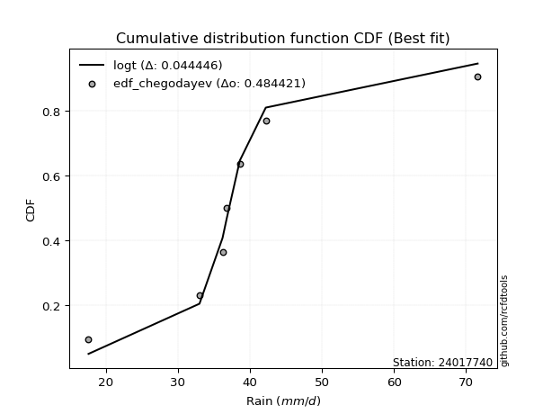</img></img>

</div>


### 6. Empirical - EDF Blom (1958)

The Blom formula is a specific "plotting position" formula used in hydrology and statistical analysis to estimate the empirical cumulative probability (or non-exceedance probability) of a data series. It is particularly recommended for data that are approximately normally distributed. The constant _a_ is set to 0.375 (or 3/8).

<div align="center">


$P=(m-a)/(n+1-2a)$


</div>


**6.1. Empirical values**

<div align="center">

|                | 0                   | 1                   | 2                  | 3        | 4                  | 5                  | 6                  |
|:---------------|:--------------------|:--------------------|:-------------------|:---------|:-------------------|:-------------------|:-------------------|
| date           | 2023                | 2025                | 2019               | 2020     | 2022               | 2021               | 2024               |
| x              | 17.6                | 28.8                | 33.0               | 36.2     | 36.8               | 42.2               | 71.6               |
| m              | 1                   | 2                   | 3                  | 4        | 5                  | 6                  | 7                  |
| empirical_dist | edf_blom            | edf_blom            | edf_blom           | edf_blom | edf_blom           | edf_blom           | edf_blom           |
| empirical      | 0.08620689655172414 | 0.22413793103448276 | 0.3620689655172414 | 0.5      | 0.6379310344827587 | 0.7758620689655172 | 0.9137931034482759 |
| empirical_tr   | 1.0943396226415094  | 1.288888888888889   | 1.5675675675675675 | 2.0      | 2.7619047619047623 | 4.461538461538462  | 11.600000000000007 |

</div>


**6.2. Kolmogorov-Smirnov fit test (sorted by Δ)**


<div align="center">

|                | 0                   | 1                   | 2                   | 3                   | 4                   | 5                   | 6                   | 7                     | 8                   | 9                   | 10                  | 11                  | 12                  | 13                  | 14                  | 15                  | 16                  | 17                  | 18                  | 19                  | 20                  | 21                  | 22                  | 23                  | 24                  | 25                  | 26                  | 27                  | 28                  | 29                  | 30                  | 31                  | 32                  | 33                  | 34                  | 35                  | 36                  | 37                  | 38                  | 39                  | 40                  | 41                  | 42                  | 43                  | 44                  | 45                  | 46                  | 47                  | 48                  | 49                  | 50                  | 51                  | 52                  | 53                  | 54                  | 55                  | 56                  | 57                  | 58                  | 59                  | 60                  | 61                  | 62                  | 63                  | 64                  | 65                  | 66                  | 67                  | 68                  | 69                  | 70                  | 71                  | 72                  | 73                  | 74                  | 75                  | 76                  | 77                  | 78                  | 79                  | 80                  | 81                  | 82                  | 83                  | 84                  | 85                  | 86                  | 87                  | 88                  | 89                  |
|:---------------|:--------------------|:--------------------|:--------------------|:--------------------|:--------------------|:--------------------|:--------------------|:----------------------|:--------------------|:--------------------|:--------------------|:--------------------|:--------------------|:--------------------|:--------------------|:--------------------|:--------------------|:--------------------|:--------------------|:--------------------|:--------------------|:--------------------|:--------------------|:--------------------|:--------------------|:--------------------|:--------------------|:--------------------|:--------------------|:--------------------|:--------------------|:--------------------|:--------------------|:--------------------|:--------------------|:--------------------|:--------------------|:--------------------|:--------------------|:--------------------|:--------------------|:--------------------|:--------------------|:--------------------|:--------------------|:--------------------|:--------------------|:--------------------|:--------------------|:--------------------|:--------------------|:--------------------|:--------------------|:--------------------|:--------------------|:--------------------|:--------------------|:--------------------|:--------------------|:--------------------|:--------------------|:--------------------|:--------------------|:--------------------|:--------------------|:--------------------|:--------------------|:--------------------|:--------------------|:--------------------|:--------------------|:--------------------|:--------------------|:--------------------|:--------------------|:--------------------|:--------------------|:--------------------|:--------------------|:--------------------|:--------------------|:--------------------|:--------------------|:--------------------|:--------------------|:--------------------|:--------------------|:--------------------|:--------------------|:--------------------|
| station        | 24017740            | 24017740            | 24017740            | 24017740            | 24017740            | 24017740            | 24017740            | 24017740              | 24017740            | 24017740            | 24017740            | 24017740            | 24017740            | 24017740            | 24017740            | 24017740            | 24017740            | 24017740            | 24017740            | 24017740            | 24017740            | 24017740            | 24017740            | 24017740            | 24017740            | 24017740            | 24017740            | 24017740            | 24017740            | 24017740            | 24017740            | 24017740            | 24017740            | 24017740            | 24017740            | 24017740            | 24017740            | 24017740            | 24017740            | 24017740            | 24017740            | 24017740            | 24017740            | 24017740            | 24017740            | 24017740            | 24017740            | 24017740            | 24017740            | 24017740            | 24017740            | 24017740            | 24017740            | 24017740            | 24017740            | 24017740            | 24017740            | 24017740            | 24017740            | 24017740            | 24017740            | 24017740            | 24017740            | 24017740            | 24017740            | 24017740            | 24017740            | 24017740            | 24017740            | 24017740            | 24017740            | 24017740            | 24017740            | 24017740            | 24017740            | 24017740            | 24017740            | 24017740            | 24017740            | 24017740            | 24017740            | 24017740            | 24017740            | 24017740            | 24017740            | 24017740            | 24017740            | 24017740            | 24017740            | 24017740            |
| empirical_dist | edf_blom            | edf_blom            | edf_blom            | edf_blom            | edf_blom            | edf_blom            | edf_blom            | edf_blom              | edf_blom            | edf_blom            | edf_blom            | edf_blom            | edf_blom            | edf_blom            | edf_blom            | edf_blom            | edf_blom            | edf_blom            | edf_blom            | edf_blom            | edf_blom            | edf_blom            | edf_blom            | edf_blom            | edf_blom            | edf_blom            | edf_blom            | edf_blom            | edf_blom            | edf_blom            | edf_blom            | edf_blom            | edf_blom            | edf_blom            | edf_blom            | edf_blom            | edf_blom            | edf_blom            | edf_blom            | edf_blom            | edf_blom            | edf_blom            | edf_blom            | edf_blom            | edf_blom            | edf_blom            | edf_blom            | edf_blom            | edf_blom            | edf_blom            | edf_blom            | edf_blom            | edf_blom            | edf_blom            | edf_blom            | edf_blom            | edf_blom            | edf_blom            | edf_blom            | edf_blom            | edf_blom            | edf_blom            | edf_blom            | edf_blom            | edf_blom            | edf_blom            | edf_blom            | edf_blom            | edf_blom            | edf_blom            | edf_blom            | edf_blom            | edf_blom            | edf_blom            | edf_blom            | edf_blom            | edf_blom            | edf_blom            | edf_blom            | edf_blom            | edf_blom            | edf_blom            | edf_blom            | edf_blom            | edf_blom            | edf_blom            | edf_blom            | edf_blom            | edf_blom            | edf_blom            |
| p_dist         | logjohnsonsu        | logt                | johnsonsu           | loglaplace          | logmielke           | loghypsecant        | fisk                | loglaplace_asymmetric | logfisk             | loggenlogistic      | mielke              | moyal               | loglogistic         | nct                 | alpha               | exponnorm           | logrice             | invgamma            | ncf                 | betaprime           | loginvgamma         | logbetaprime        | lognct              | logf                | logpearson3         | logerlang           | loggamma            | loggamma            | logfatiguelife      | logalpha            | logexponnorm        | logcrystalball      | lognorm             | lognorm             | genlogistic         | logweibull_min      | f                   | invgauss            | logloggamma         | gamma               | erlang              | loginvgauss         | gumbel_r            | pearson3            | logmaxwell          | halflogistic        | halfnorm            | lograyleigh         | kstwobign           | gompertz            | weibull_min         | gibrat              | rayleigh            | loggumbel_r         | wald                | loginvweibull       | maxwell             | rice                | logncf              | loghalfnorm         | laplace_asymmetric  | loggumbel_l         | logmoyal            | logkstwobign        | t                   | crystalball         | norm                | truncnorm           | loghalflogistic     | logistic            | hypsecant           | laplace             | loggenexpon         | genexpon            | expon               | loggompertz         | logtruncnorm        | lognakagami         | logwald             | loggibrat           | gumbel_l            | chi2                | logexpon            | logchi2             | nakagami            | loglognorm          | pareto              | logpareto           | invweibull          | fatiguelife         |
| delta          | 0.05485801190239181 | 0.06052325632183464 | 0.06313571693291642 | 0.06471749948848404 | 0.0805811079769363  | 0.08224124038440495 | 0.08315619268067753 | 0.0831985536451364    | 0.08352571025122058 | 0.08470575997870866 | 0.08473863497625278 | 0.08513936320914312 | 0.08734005091459662 | 0.08831970637582054 | 0.08945743952264018 | 0.09205789226594452 | 0.09233792019892062 | 0.09305881034990338 | 0.09365721185687181 | 0.09381149538637756 | 0.09418080085800268 | 0.09429786122421902 | 0.09515195053831971 | 0.09525270403327502 | 0.09525758936151407 | 0.09527085090148502 | 0.09527095476845271 | 0.09527095476845271 | 0.09529959861173432 | 0.09561345172306712 | 0.09620163352437583 | 0.09753210897359199 | 0.09753219585356965 | 0.09753219585356965 | 0.097605765861136   | 0.09791276653845105 | 0.09841438835117666 | 0.09849044170193577 | 0.09916955501889502 | 0.10199829476139571 | 0.10199862560948875 | 0.10285560856835729 | 0.1037835616131193  | 0.10617341109692247 | 0.10673839611844738 | 0.10732018843288876 | 0.11482105857411601 | 0.11790666305992387 | 0.11794345504811543 | 0.12343764506156008 | 0.12486731248103478 | 0.12996022955421627 | 0.13563998970202407 | 0.1364968030725558  | 0.1374548703025414  | 0.13810599163516968 | 0.14366661602893915 | 0.144277885848429   | 0.1489414844981174  | 0.15206967384423337 | 0.15430557510618548 | 0.16094290903016673 | 0.1612837977306814  | 0.16409304708681816 | 0.16500533685109942 | 0.16963479105798684 | 0.16963479983775598 | 0.16963486220122725 | 0.17154031585309965 | 0.17386071250513424 | 0.17751515649348476 | 0.1910208701608334  | 0.1936285855683867  | 0.1977795980834104  | 0.19790272286621402 | 0.2133473229308407  | 0.22413227112874728 | 0.22413790036047002 | 0.2298656927312695  | 0.2374343759144934  | 0.24016097332008302 | 0.2801173353933587  | 0.2840626403186949  | 0.29234740561657946 | 0.3434466019117462  | 0.4209725946617193  | 0.430290310909606   | 0.44051805512579867 | 0.4595894124959243  | 0.5361514236170798  |
| deltao         | 0.48442053926100004 | 0.48442053926100004 | 0.48442053926100004 | 0.48442053926100004 | 0.48442053926100004 | 0.48442053926100004 | 0.48442053926100004 | 0.48442053926100004   | 0.48442053926100004 | 0.48442053926100004 | 0.48442053926100004 | 0.48442053926100004 | 0.48442053926100004 | 0.48442053926100004 | 0.48442053926100004 | 0.48442053926100004 | 0.48442053926100004 | 0.48442053926100004 | 0.48442053926100004 | 0.48442053926100004 | 0.48442053926100004 | 0.48442053926100004 | 0.48442053926100004 | 0.48442053926100004 | 0.48442053926100004 | 0.48442053926100004 | 0.48442053926100004 | 0.48442053926100004 | 0.48442053926100004 | 0.48442053926100004 | 0.48442053926100004 | 0.48442053926100004 | 0.48442053926100004 | 0.48442053926100004 | 0.48442053926100004 | 0.48442053926100004 | 0.48442053926100004 | 0.48442053926100004 | 0.48442053926100004 | 0.48442053926100004 | 0.48442053926100004 | 0.48442053926100004 | 0.48442053926100004 | 0.48442053926100004 | 0.48442053926100004 | 0.48442053926100004 | 0.48442053926100004 | 0.48442053926100004 | 0.48442053926100004 | 0.48442053926100004 | 0.48442053926100004 | 0.48442053926100004 | 0.48442053926100004 | 0.48442053926100004 | 0.48442053926100004 | 0.48442053926100004 | 0.48442053926100004 | 0.48442053926100004 | 0.48442053926100004 | 0.48442053926100004 | 0.48442053926100004 | 0.48442053926100004 | 0.48442053926100004 | 0.48442053926100004 | 0.48442053926100004 | 0.48442053926100004 | 0.48442053926100004 | 0.48442053926100004 | 0.48442053926100004 | 0.48442053926100004 | 0.48442053926100004 | 0.48442053926100004 | 0.48442053926100004 | 0.48442053926100004 | 0.48442053926100004 | 0.48442053926100004 | 0.48442053926100004 | 0.48442053926100004 | 0.48442053926100004 | 0.48442053926100004 | 0.48442053926100004 | 0.48442053926100004 | 0.48442053926100004 | 0.48442053926100004 | 0.48442053926100004 | 0.48442053926100004 | 0.48442053926100004 | 0.48442053926100004 | 0.48442053926100004 | 0.48442053926100004 |
| eval           | Δo > Δ              | Δo > Δ              | Δo > Δ              | Δo > Δ              | Δo > Δ              | Δo > Δ              | Δo > Δ              | Δo > Δ                | Δo > Δ              | Δo > Δ              | Δo > Δ              | Δo > Δ              | Δo > Δ              | Δo > Δ              | Δo > Δ              | Δo > Δ              | Δo > Δ              | Δo > Δ              | Δo > Δ              | Δo > Δ              | Δo > Δ              | Δo > Δ              | Δo > Δ              | Δo > Δ              | Δo > Δ              | Δo > Δ              | Δo > Δ              | Δo > Δ              | Δo > Δ              | Δo > Δ              | Δo > Δ              | Δo > Δ              | Δo > Δ              | Δo > Δ              | Δo > Δ              | Δo > Δ              | Δo > Δ              | Δo > Δ              | Δo > Δ              | Δo > Δ              | Δo > Δ              | Δo > Δ              | Δo > Δ              | Δo > Δ              | Δo > Δ              | Δo > Δ              | Δo > Δ              | Δo > Δ              | Δo > Δ              | Δo > Δ              | Δo > Δ              | Δo > Δ              | Δo > Δ              | Δo > Δ              | Δo > Δ              | Δo > Δ              | Δo > Δ              | Δo > Δ              | Δo > Δ              | Δo > Δ              | Δo > Δ              | Δo > Δ              | Δo > Δ              | Δo > Δ              | Δo > Δ              | Δo > Δ              | Δo > Δ              | Δo > Δ              | Δo > Δ              | Δo > Δ              | Δo > Δ              | Δo > Δ              | Δo > Δ              | Δo > Δ              | Δo > Δ              | Δo > Δ              | Δo > Δ              | Δo > Δ              | Δo > Δ              | Δo > Δ              | Δo > Δ              | Δo > Δ              | Δo > Δ              | Δo > Δ              | Δo > Δ              | Δo > Δ              | Δo > Δ              | Δo > Δ              | Δo > Δ              | Δo <= Δ             |
| fit            | 1                   | 1                   | 1                   | 1                   | 1                   | 1                   | 1                   | 1                     | 1                   | 1                   | 1                   | 1                   | 1                   | 1                   | 1                   | 1                   | 1                   | 1                   | 1                   | 1                   | 1                   | 1                   | 1                   | 1                   | 1                   | 1                   | 1                   | 1                   | 1                   | 1                   | 1                   | 1                   | 1                   | 1                   | 1                   | 1                   | 1                   | 1                   | 1                   | 1                   | 1                   | 1                   | 1                   | 1                   | 1                   | 1                   | 1                   | 1                   | 1                   | 1                   | 1                   | 1                   | 1                   | 1                   | 1                   | 1                   | 1                   | 1                   | 1                   | 1                   | 1                   | 1                   | 1                   | 1                   | 1                   | 1                   | 1                   | 1                   | 1                   | 1                   | 1                   | 1                   | 1                   | 1                   | 1                   | 1                   | 1                   | 1                   | 1                   | 1                   | 1                   | 1                   | 1                   | 1                   | 1                   | 1                   | 1                   | 1                   | 1                   | 0                   |
| n              | 7                   | 7                   | 7                   | 7                   | 7                   | 7                   | 7                   | 7                     | 7                   | 7                   | 7                   | 7                   | 7                   | 7                   | 7                   | 7                   | 7                   | 7                   | 7                   | 7                   | 7                   | 7                   | 7                   | 7                   | 7                   | 7                   | 7                   | 7                   | 7                   | 7                   | 7                   | 7                   | 7                   | 7                   | 7                   | 7                   | 7                   | 7                   | 7                   | 7                   | 7                   | 7                   | 7                   | 7                   | 7                   | 7                   | 7                   | 7                   | 7                   | 7                   | 7                   | 7                   | 7                   | 7                   | 7                   | 7                   | 7                   | 7                   | 7                   | 7                   | 7                   | 7                   | 7                   | 7                   | 7                   | 7                   | 7                   | 7                   | 7                   | 7                   | 7                   | 7                   | 7                   | 7                   | 7                   | 7                   | 7                   | 7                   | 7                   | 7                   | 7                   | 7                   | 7                   | 7                   | 7                   | 7                   | 7                   | 7                   | 7                   | 7                   |
| best_fit       | 1                   | 0                   | 0                   | 0                   | 0                   | 0                   | 0                   | 0                     | 0                   | 0                   | 0                   | 0                   | 0                   | 0                   | 0                   | 0                   | 0                   | 0                   | 0                   | 0                   | 0                   | 0                   | 0                   | 0                   | 0                   | 0                   | 0                   | 0                   | 0                   | 0                   | 0                   | 0                   | 0                   | 0                   | 0                   | 0                   | 0                   | 0                   | 0                   | 0                   | 0                   | 0                   | 0                   | 0                   | 0                   | 0                   | 0                   | 0                   | 0                   | 0                   | 0                   | 0                   | 0                   | 0                   | 0                   | 0                   | 0                   | 0                   | 0                   | 0                   | 0                   | 0                   | 0                   | 0                   | 0                   | 0                   | 0                   | 0                   | 0                   | 0                   | 0                   | 0                   | 0                   | 0                   | 0                   | 0                   | 0                   | 0                   | 0                   | 0                   | 0                   | 0                   | 0                   | 0                   | 0                   | 0                   | 0                   | 0                   | 0                   | 0                   |
| best_fit_sort  | 1                   | 2                   | 3                   | 4                   | 5                   | 6                   | 7                   | 8                     | 9                   | 10                  | 11                  | 12                  | 13                  | 14                  | 15                  | 16                  | 17                  | 18                  | 19                  | 20                  | 21                  | 22                  | 23                  | 24                  | 25                  | 26                  | 27                  | 28                  | 29                  | 30                  | 31                  | 32                  | 33                  | 34                  | 35                  | 36                  | 37                  | 38                  | 39                  | 40                  | 41                  | 42                  | 43                  | 44                  | 45                  | 46                  | 47                  | 48                  | 49                  | 50                  | 51                  | 52                  | 53                  | 54                  | 55                  | 56                  | 57                  | 58                  | 59                  | 60                  | 61                  | 62                  | 63                  | 64                  | 65                  | 66                  | 67                  | 68                  | 69                  | 70                  | 71                  | 72                  | 73                  | 74                  | 75                  | 76                  | 77                  | 78                  | 79                  | 80                  | 81                  | 82                  | 83                  | 84                  | 85                  | 86                  | 87                  | 88                  | 89                  | 90                  |

</div>


<div align="center">

</img>

</div>


**6.3. Best fit**

<div align="center">

|   id |   station | empirical_dist   | p_dist       |    delta |   deltao | eval   |   fit |   n |   best_fit |   best_fit_sort |
|-----:|----------:|:-----------------|:-------------|---------:|---------:|:-------|------:|----:|-----------:|----------------:|
|    0 |  24017740 | edf_blom         | logjohnsonsu | 0.054858 | 0.484421 | Δo > Δ |     1 |   7 |          1 |               1 |

</div>


<div align="center">

</img>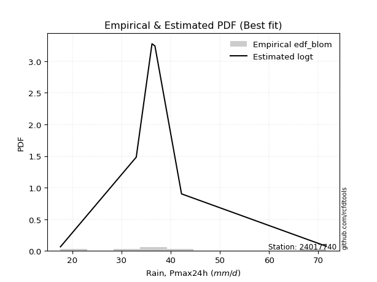</img>

</div>


### 7. Empirical - EDF Tukey (1962)

In hydrology, the Tukey formula is used as a plotting position formula to estimate the empirical probability or frequency of a flood event (or other hydrological data). The formula parameter is given as _c=0.333_ (or 1/3).

<div align="center">


$P=(m-c)/(n+1-2c)$


</div>


**7.1. Empirical values**

<div align="center">

|                | 0                   | 1                   | 2                   | 3         | 4                  | 5                  | 6                  |
|:---------------|:--------------------|:--------------------|:--------------------|:----------|:-------------------|:-------------------|:-------------------|
| date           | 2023                | 2025                | 2019                | 2020      | 2022               | 2021               | 2024               |
| x              | 17.6                | 28.8                | 33.0                | 36.2      | 36.8               | 42.2               | 71.6               |
| m              | 1                   | 2                   | 3                   | 4         | 5                  | 6                  | 7                  |
| empirical_dist | edf_tukey           | edf_tukey           | edf_tukey           | edf_tukey | edf_tukey          | edf_tukey          | edf_tukey          |
| empirical      | 0.09090909090909091 | 0.22727272727272727 | 0.36363636363636365 | 0.5       | 0.6363636363636364 | 0.7727272727272727 | 0.9090909090909091 |
| empirical_tr   | 1.1                 | 1.2941176470588236  | 1.5714285714285714  | 2.0       | 2.75               | 4.3999999999999995 | 10.999999999999996 |

</div>


**7.2. Kolmogorov-Smirnov fit test (sorted by Δ)**


<div align="center">

|                | 0                   | 1                   | 2                   | 3                   | 4                   | 5                   | 6                   | 7                     | 8                   | 9                   | 10                  | 11                  | 12                  | 13                  | 14                  | 15                  | 16                  | 17                  | 18                  | 19                  | 20                  | 21                  | 22                  | 23                  | 24                  | 25                  | 26                  | 27                  | 28                  | 29                  | 30                  | 31                  | 32                  | 33                  | 34                  | 35                  | 36                  | 37                  | 38                  | 39                  | 40                  | 41                  | 42                  | 43                  | 44                  | 45                  | 46                  | 47                  | 48                  | 49                  | 50                  | 51                  | 52                  | 53                  | 54                  | 55                  | 56                  | 57                  | 58                  | 59                  | 60                  | 61                  | 62                  | 63                  | 64                  | 65                  | 66                  | 67                  | 68                  | 69                  | 70                  | 71                  | 72                  | 73                  | 74                  | 75                  | 76                  | 77                  | 78                  | 79                  | 80                  | 81                  | 82                  | 83                  | 84                  | 85                  | 86                  | 87                  | 88                  | 89                  |
|:---------------|:--------------------|:--------------------|:--------------------|:--------------------|:--------------------|:--------------------|:--------------------|:----------------------|:--------------------|:--------------------|:--------------------|:--------------------|:--------------------|:--------------------|:--------------------|:--------------------|:--------------------|:--------------------|:--------------------|:--------------------|:--------------------|:--------------------|:--------------------|:--------------------|:--------------------|:--------------------|:--------------------|:--------------------|:--------------------|:--------------------|:--------------------|:--------------------|:--------------------|:--------------------|:--------------------|:--------------------|:--------------------|:--------------------|:--------------------|:--------------------|:--------------------|:--------------------|:--------------------|:--------------------|:--------------------|:--------------------|:--------------------|:--------------------|:--------------------|:--------------------|:--------------------|:--------------------|:--------------------|:--------------------|:--------------------|:--------------------|:--------------------|:--------------------|:--------------------|:--------------------|:--------------------|:--------------------|:--------------------|:--------------------|:--------------------|:--------------------|:--------------------|:--------------------|:--------------------|:--------------------|:--------------------|:--------------------|:--------------------|:--------------------|:--------------------|:--------------------|:--------------------|:--------------------|:--------------------|:--------------------|:--------------------|:--------------------|:--------------------|:--------------------|:--------------------|:--------------------|:--------------------|:--------------------|:--------------------|:--------------------|
| station        | 24017740            | 24017740            | 24017740            | 24017740            | 24017740            | 24017740            | 24017740            | 24017740              | 24017740            | 24017740            | 24017740            | 24017740            | 24017740            | 24017740            | 24017740            | 24017740            | 24017740            | 24017740            | 24017740            | 24017740            | 24017740            | 24017740            | 24017740            | 24017740            | 24017740            | 24017740            | 24017740            | 24017740            | 24017740            | 24017740            | 24017740            | 24017740            | 24017740            | 24017740            | 24017740            | 24017740            | 24017740            | 24017740            | 24017740            | 24017740            | 24017740            | 24017740            | 24017740            | 24017740            | 24017740            | 24017740            | 24017740            | 24017740            | 24017740            | 24017740            | 24017740            | 24017740            | 24017740            | 24017740            | 24017740            | 24017740            | 24017740            | 24017740            | 24017740            | 24017740            | 24017740            | 24017740            | 24017740            | 24017740            | 24017740            | 24017740            | 24017740            | 24017740            | 24017740            | 24017740            | 24017740            | 24017740            | 24017740            | 24017740            | 24017740            | 24017740            | 24017740            | 24017740            | 24017740            | 24017740            | 24017740            | 24017740            | 24017740            | 24017740            | 24017740            | 24017740            | 24017740            | 24017740            | 24017740            | 24017740            |
| empirical_dist | edf_tukey           | edf_tukey           | edf_tukey           | edf_tukey           | edf_tukey           | edf_tukey           | edf_tukey           | edf_tukey             | edf_tukey           | edf_tukey           | edf_tukey           | edf_tukey           | edf_tukey           | edf_tukey           | edf_tukey           | edf_tukey           | edf_tukey           | edf_tukey           | edf_tukey           | edf_tukey           | edf_tukey           | edf_tukey           | edf_tukey           | edf_tukey           | edf_tukey           | edf_tukey           | edf_tukey           | edf_tukey           | edf_tukey           | edf_tukey           | edf_tukey           | edf_tukey           | edf_tukey           | edf_tukey           | edf_tukey           | edf_tukey           | edf_tukey           | edf_tukey           | edf_tukey           | edf_tukey           | edf_tukey           | edf_tukey           | edf_tukey           | edf_tukey           | edf_tukey           | edf_tukey           | edf_tukey           | edf_tukey           | edf_tukey           | edf_tukey           | edf_tukey           | edf_tukey           | edf_tukey           | edf_tukey           | edf_tukey           | edf_tukey           | edf_tukey           | edf_tukey           | edf_tukey           | edf_tukey           | edf_tukey           | edf_tukey           | edf_tukey           | edf_tukey           | edf_tukey           | edf_tukey           | edf_tukey           | edf_tukey           | edf_tukey           | edf_tukey           | edf_tukey           | edf_tukey           | edf_tukey           | edf_tukey           | edf_tukey           | edf_tukey           | edf_tukey           | edf_tukey           | edf_tukey           | edf_tukey           | edf_tukey           | edf_tukey           | edf_tukey           | edf_tukey           | edf_tukey           | edf_tukey           | edf_tukey           | edf_tukey           | edf_tukey           | edf_tukey           |
| p_dist         | logjohnsonsu        | logt                | johnsonsu           | loglaplace          | logmielke           | loghypsecant        | fisk                | loglaplace_asymmetric | logfisk             | loggenlogistic      | mielke              | moyal               | loglogistic         | nct                 | alpha               | logrice             | invgamma            | exponnorm           | ncf                 | betaprime           | loginvgamma         | logbetaprime        | lognct              | logf                | logpearson3         | logerlang           | loggamma            | loggamma            | logfatiguelife      | logalpha            | logexponnorm        | logcrystalball      | lognorm             | lognorm             | logweibull_min      | f                   | invgauss            | logloggamma         | genlogistic         | gamma               | erlang              | loginvgauss         | gumbel_r            | pearson3            | halflogistic        | logmaxwell          | halfnorm            | kstwobign           | lograyleigh         | gompertz            | weibull_min         | gibrat              | rayleigh            | loggumbel_r         | loginvweibull       | wald                | maxwell             | rice                | logncf              | loghalfnorm         | laplace_asymmetric  | loggumbel_l         | logmoyal            | logkstwobign        | t                   | crystalball         | norm                | truncnorm           | loghalflogistic     | logistic            | hypsecant           | laplace             | loggenexpon         | genexpon            | expon               | loggompertz         | logtruncnorm        | lognakagami         | logwald             | loggibrat           | gumbel_l            | chi2                | logexpon            | logchi2             | nakagami            | loglognorm          | pareto              | logpareto           | invweibull          | fatiguelife         |
| delta          | 0.05329061378326949 | 0.05895585820271232 | 0.0615683188137941  | 0.06315010136936172 | 0.07901370985781403 | 0.08067384226528262 | 0.08158879456155521 | 0.08163115552601408   | 0.08195831213209825 | 0.08313836185958634 | 0.08317123685713046 | 0.08357196509002085 | 0.0857726527954743  | 0.08675230825669822 | 0.08692405440203388 | 0.08920312396067609 | 0.08992401411165885 | 0.0904904941468222  | 0.09052241561862728 | 0.09067669914813303 | 0.09104600461975818 | 0.09116306498597448 | 0.09201715430007518 | 0.09211790779503048 | 0.09212279312326954 | 0.09213605466324049 | 0.09213615853020818 | 0.09213615853020818 | 0.09216480237348978 | 0.09247865548482262 | 0.0930668372861313  | 0.09439731273534746 | 0.09439739961532512 | 0.09439739961532512 | 0.09477797030020652 | 0.09527959211293213 | 0.09535564546369124 | 0.09603475878065049 | 0.09603836774201369 | 0.09886349852315121 | 0.09886382937124424 | 0.09998596879783239 | 0.10064876537487477 | 0.10303861485867793 | 0.10418539219464426 | 0.10425301890630284 | 0.1116862623358715  | 0.1148086588098709  | 0.1163392649408016  | 0.12030284882331557 | 0.12173251624279027 | 0.12996022955421627 | 0.13250519346377954 | 0.13492940495343353 | 0.13497119539692518 | 0.13588747218341912 | 0.14053181979069462 | 0.14271048772930667 | 0.14580668825987286 | 0.1505022757251111  | 0.15273817698706316 | 0.1593755109110444  | 0.15971639961155915 | 0.16095825084857365 | 0.16187054061285489 | 0.1679956930590205  | 0.16799569980648077 | 0.16799576693674723 | 0.16997291773397738 | 0.17229331438601192 | 0.17594775837436244 | 0.1894534720417111  | 0.1904937893301422  | 0.1946448018451659  | 0.19476792662796952 | 0.21021252669259619 | 0.2272670673669918  | 0.22727269659871452 | 0.22829829461214723 | 0.23586697779537114 | 0.2385935752009607  | 0.27698253915511417 | 0.28092784408045035 | 0.28921260937833493 | 0.34187920379262393 | 0.4178377984234748  | 0.4271555146713615  | 0.43738325888755414 | 0.4548872181385574  | 0.5330166273788353  |
| deltao         | 0.48442053926100004 | 0.48442053926100004 | 0.48442053926100004 | 0.48442053926100004 | 0.48442053926100004 | 0.48442053926100004 | 0.48442053926100004 | 0.48442053926100004   | 0.48442053926100004 | 0.48442053926100004 | 0.48442053926100004 | 0.48442053926100004 | 0.48442053926100004 | 0.48442053926100004 | 0.48442053926100004 | 0.48442053926100004 | 0.48442053926100004 | 0.48442053926100004 | 0.48442053926100004 | 0.48442053926100004 | 0.48442053926100004 | 0.48442053926100004 | 0.48442053926100004 | 0.48442053926100004 | 0.48442053926100004 | 0.48442053926100004 | 0.48442053926100004 | 0.48442053926100004 | 0.48442053926100004 | 0.48442053926100004 | 0.48442053926100004 | 0.48442053926100004 | 0.48442053926100004 | 0.48442053926100004 | 0.48442053926100004 | 0.48442053926100004 | 0.48442053926100004 | 0.48442053926100004 | 0.48442053926100004 | 0.48442053926100004 | 0.48442053926100004 | 0.48442053926100004 | 0.48442053926100004 | 0.48442053926100004 | 0.48442053926100004 | 0.48442053926100004 | 0.48442053926100004 | 0.48442053926100004 | 0.48442053926100004 | 0.48442053926100004 | 0.48442053926100004 | 0.48442053926100004 | 0.48442053926100004 | 0.48442053926100004 | 0.48442053926100004 | 0.48442053926100004 | 0.48442053926100004 | 0.48442053926100004 | 0.48442053926100004 | 0.48442053926100004 | 0.48442053926100004 | 0.48442053926100004 | 0.48442053926100004 | 0.48442053926100004 | 0.48442053926100004 | 0.48442053926100004 | 0.48442053926100004 | 0.48442053926100004 | 0.48442053926100004 | 0.48442053926100004 | 0.48442053926100004 | 0.48442053926100004 | 0.48442053926100004 | 0.48442053926100004 | 0.48442053926100004 | 0.48442053926100004 | 0.48442053926100004 | 0.48442053926100004 | 0.48442053926100004 | 0.48442053926100004 | 0.48442053926100004 | 0.48442053926100004 | 0.48442053926100004 | 0.48442053926100004 | 0.48442053926100004 | 0.48442053926100004 | 0.48442053926100004 | 0.48442053926100004 | 0.48442053926100004 | 0.48442053926100004 |
| eval           | Δo > Δ              | Δo > Δ              | Δo > Δ              | Δo > Δ              | Δo > Δ              | Δo > Δ              | Δo > Δ              | Δo > Δ                | Δo > Δ              | Δo > Δ              | Δo > Δ              | Δo > Δ              | Δo > Δ              | Δo > Δ              | Δo > Δ              | Δo > Δ              | Δo > Δ              | Δo > Δ              | Δo > Δ              | Δo > Δ              | Δo > Δ              | Δo > Δ              | Δo > Δ              | Δo > Δ              | Δo > Δ              | Δo > Δ              | Δo > Δ              | Δo > Δ              | Δo > Δ              | Δo > Δ              | Δo > Δ              | Δo > Δ              | Δo > Δ              | Δo > Δ              | Δo > Δ              | Δo > Δ              | Δo > Δ              | Δo > Δ              | Δo > Δ              | Δo > Δ              | Δo > Δ              | Δo > Δ              | Δo > Δ              | Δo > Δ              | Δo > Δ              | Δo > Δ              | Δo > Δ              | Δo > Δ              | Δo > Δ              | Δo > Δ              | Δo > Δ              | Δo > Δ              | Δo > Δ              | Δo > Δ              | Δo > Δ              | Δo > Δ              | Δo > Δ              | Δo > Δ              | Δo > Δ              | Δo > Δ              | Δo > Δ              | Δo > Δ              | Δo > Δ              | Δo > Δ              | Δo > Δ              | Δo > Δ              | Δo > Δ              | Δo > Δ              | Δo > Δ              | Δo > Δ              | Δo > Δ              | Δo > Δ              | Δo > Δ              | Δo > Δ              | Δo > Δ              | Δo > Δ              | Δo > Δ              | Δo > Δ              | Δo > Δ              | Δo > Δ              | Δo > Δ              | Δo > Δ              | Δo > Δ              | Δo > Δ              | Δo > Δ              | Δo > Δ              | Δo > Δ              | Δo > Δ              | Δo > Δ              | Δo <= Δ             |
| fit            | 1                   | 1                   | 1                   | 1                   | 1                   | 1                   | 1                   | 1                     | 1                   | 1                   | 1                   | 1                   | 1                   | 1                   | 1                   | 1                   | 1                   | 1                   | 1                   | 1                   | 1                   | 1                   | 1                   | 1                   | 1                   | 1                   | 1                   | 1                   | 1                   | 1                   | 1                   | 1                   | 1                   | 1                   | 1                   | 1                   | 1                   | 1                   | 1                   | 1                   | 1                   | 1                   | 1                   | 1                   | 1                   | 1                   | 1                   | 1                   | 1                   | 1                   | 1                   | 1                   | 1                   | 1                   | 1                   | 1                   | 1                   | 1                   | 1                   | 1                   | 1                   | 1                   | 1                   | 1                   | 1                   | 1                   | 1                   | 1                   | 1                   | 1                   | 1                   | 1                   | 1                   | 1                   | 1                   | 1                   | 1                   | 1                   | 1                   | 1                   | 1                   | 1                   | 1                   | 1                   | 1                   | 1                   | 1                   | 1                   | 1                   | 0                   |
| n              | 7                   | 7                   | 7                   | 7                   | 7                   | 7                   | 7                   | 7                     | 7                   | 7                   | 7                   | 7                   | 7                   | 7                   | 7                   | 7                   | 7                   | 7                   | 7                   | 7                   | 7                   | 7                   | 7                   | 7                   | 7                   | 7                   | 7                   | 7                   | 7                   | 7                   | 7                   | 7                   | 7                   | 7                   | 7                   | 7                   | 7                   | 7                   | 7                   | 7                   | 7                   | 7                   | 7                   | 7                   | 7                   | 7                   | 7                   | 7                   | 7                   | 7                   | 7                   | 7                   | 7                   | 7                   | 7                   | 7                   | 7                   | 7                   | 7                   | 7                   | 7                   | 7                   | 7                   | 7                   | 7                   | 7                   | 7                   | 7                   | 7                   | 7                   | 7                   | 7                   | 7                   | 7                   | 7                   | 7                   | 7                   | 7                   | 7                   | 7                   | 7                   | 7                   | 7                   | 7                   | 7                   | 7                   | 7                   | 7                   | 7                   | 7                   |
| best_fit       | 1                   | 0                   | 0                   | 0                   | 0                   | 0                   | 0                   | 0                     | 0                   | 0                   | 0                   | 0                   | 0                   | 0                   | 0                   | 0                   | 0                   | 0                   | 0                   | 0                   | 0                   | 0                   | 0                   | 0                   | 0                   | 0                   | 0                   | 0                   | 0                   | 0                   | 0                   | 0                   | 0                   | 0                   | 0                   | 0                   | 0                   | 0                   | 0                   | 0                   | 0                   | 0                   | 0                   | 0                   | 0                   | 0                   | 0                   | 0                   | 0                   | 0                   | 0                   | 0                   | 0                   | 0                   | 0                   | 0                   | 0                   | 0                   | 0                   | 0                   | 0                   | 0                   | 0                   | 0                   | 0                   | 0                   | 0                   | 0                   | 0                   | 0                   | 0                   | 0                   | 0                   | 0                   | 0                   | 0                   | 0                   | 0                   | 0                   | 0                   | 0                   | 0                   | 0                   | 0                   | 0                   | 0                   | 0                   | 0                   | 0                   | 0                   |
| best_fit_sort  | 1                   | 2                   | 3                   | 4                   | 5                   | 6                   | 7                   | 8                     | 9                   | 10                  | 11                  | 12                  | 13                  | 14                  | 15                  | 16                  | 17                  | 18                  | 19                  | 20                  | 21                  | 22                  | 23                  | 24                  | 25                  | 26                  | 27                  | 28                  | 29                  | 30                  | 31                  | 32                  | 33                  | 34                  | 35                  | 36                  | 37                  | 38                  | 39                  | 40                  | 41                  | 42                  | 43                  | 44                  | 45                  | 46                  | 47                  | 48                  | 49                  | 50                  | 51                  | 52                  | 53                  | 54                  | 55                  | 56                  | 57                  | 58                  | 59                  | 60                  | 61                  | 62                  | 63                  | 64                  | 65                  | 66                  | 67                  | 68                  | 69                  | 70                  | 71                  | 72                  | 73                  | 74                  | 75                  | 76                  | 77                  | 78                  | 79                  | 80                  | 81                  | 82                  | 83                  | 84                  | 85                  | 86                  | 87                  | 88                  | 89                  | 90                  |

</div>


<div align="center">

</img>

</div>


**7.3. Best fit**

<div align="center">

|   id |   station | empirical_dist   | p_dist       |     delta |   deltao | eval   |   fit |   n |   best_fit |   best_fit_sort |
|-----:|----------:|:-----------------|:-------------|----------:|---------:|:-------|------:|----:|-----------:|----------------:|
|    0 |  24017740 | edf_tukey        | logjohnsonsu | 0.0532906 | 0.484421 | Δo > Δ |     1 |   7 |          1 |               1 |

</div>


<div align="center">

</img></img>

</div>


### 8. Empirical - EDF Gringorten (1963)

Gringorten plotting position formula is essential for estimating the probability and return periods of extreme events like floods and heavy rainfall. The constant _a=0.44_.

<div align="center">


$P=(m-a)/(n+1-2a)$


</div>


**8.1. Empirical values**

<div align="center">

|                | 0                   | 1                   | 2                  | 3              | 4                  | 5                  | 6                  |
|:---------------|:--------------------|:--------------------|:-------------------|:---------------|:-------------------|:-------------------|:-------------------|
| date           | 2023                | 2025                | 2019               | 2020           | 2022               | 2021               | 2024               |
| x              | 17.6                | 28.8                | 33.0               | 36.2           | 36.8               | 42.2               | 71.6               |
| m              | 1                   | 2                   | 3                  | 4              | 5                  | 6                  | 7                  |
| empirical_dist | edf_gringorten      | edf_gringorten      | edf_gringorten     | edf_gringorten | edf_gringorten     | edf_gringorten     | edf_gringorten     |
| empirical      | 0.07865168539325844 | 0.21910112359550563 | 0.3595505617977528 | 0.5            | 0.6404494382022471 | 0.7808988764044943 | 0.9213483146067415 |
| empirical_tr   | 1.0853658536585364  | 1.2805755395683454  | 1.5614035087719298 | 2.0            | 2.781249999999999  | 4.564102564102562  | 12.714285714285701 |

</div>


**8.2. Kolmogorov-Smirnov fit test (sorted by Δ)**


<div align="center">

|                | 0                   | 1                   | 2                   | 3                   | 4                   | 5                   | 6                   | 7                     | 8                   | 9                   | 10                  | 11                  | 12                  | 13                  | 14                  | 15                  | 16                  | 17                  | 18                  | 19                  | 20                  | 21                  | 22                  | 23                  | 24                  | 25                  | 26                  | 27                  | 28                  | 29                  | 30                  | 31                  | 32                  | 33                  | 34                  | 35                  | 36                  | 37                  | 38                  | 39                  | 40                  | 41                  | 42                  | 43                  | 44                  | 45                  | 46                  | 47                  | 48                  | 49                  | 50                  | 51                  | 52                  | 53                  | 54                  | 55                  | 56                  | 57                  | 58                  | 59                  | 60                  | 61                  | 62                  | 63                  | 64                  | 65                  | 66                  | 67                  | 68                  | 69                  | 70                  | 71                  | 72                  | 73                  | 74                  | 75                  | 76                  | 77                  | 78                  | 79                  | 80                  | 81                  | 82                  | 83                  | 84                  | 85                  | 86                  | 87                  | 88                  | 89                  |
|:---------------|:--------------------|:--------------------|:--------------------|:--------------------|:--------------------|:--------------------|:--------------------|:----------------------|:--------------------|:--------------------|:--------------------|:--------------------|:--------------------|:--------------------|:--------------------|:--------------------|:--------------------|:--------------------|:--------------------|:--------------------|:--------------------|:--------------------|:--------------------|:--------------------|:--------------------|:--------------------|:--------------------|:--------------------|:--------------------|:--------------------|:--------------------|:--------------------|:--------------------|:--------------------|:--------------------|:--------------------|:--------------------|:--------------------|:--------------------|:--------------------|:--------------------|:--------------------|:--------------------|:--------------------|:--------------------|:--------------------|:--------------------|:--------------------|:--------------------|:--------------------|:--------------------|:--------------------|:--------------------|:--------------------|:--------------------|:--------------------|:--------------------|:--------------------|:--------------------|:--------------------|:--------------------|:--------------------|:--------------------|:--------------------|:--------------------|:--------------------|:--------------------|:--------------------|:--------------------|:--------------------|:--------------------|:--------------------|:--------------------|:--------------------|:--------------------|:--------------------|:--------------------|:--------------------|:--------------------|:--------------------|:--------------------|:--------------------|:--------------------|:--------------------|:--------------------|:--------------------|:--------------------|:--------------------|:--------------------|:--------------------|
| station        | 24017740            | 24017740            | 24017740            | 24017740            | 24017740            | 24017740            | 24017740            | 24017740              | 24017740            | 24017740            | 24017740            | 24017740            | 24017740            | 24017740            | 24017740            | 24017740            | 24017740            | 24017740            | 24017740            | 24017740            | 24017740            | 24017740            | 24017740            | 24017740            | 24017740            | 24017740            | 24017740            | 24017740            | 24017740            | 24017740            | 24017740            | 24017740            | 24017740            | 24017740            | 24017740            | 24017740            | 24017740            | 24017740            | 24017740            | 24017740            | 24017740            | 24017740            | 24017740            | 24017740            | 24017740            | 24017740            | 24017740            | 24017740            | 24017740            | 24017740            | 24017740            | 24017740            | 24017740            | 24017740            | 24017740            | 24017740            | 24017740            | 24017740            | 24017740            | 24017740            | 24017740            | 24017740            | 24017740            | 24017740            | 24017740            | 24017740            | 24017740            | 24017740            | 24017740            | 24017740            | 24017740            | 24017740            | 24017740            | 24017740            | 24017740            | 24017740            | 24017740            | 24017740            | 24017740            | 24017740            | 24017740            | 24017740            | 24017740            | 24017740            | 24017740            | 24017740            | 24017740            | 24017740            | 24017740            | 24017740            |
| empirical_dist | edf_gringorten      | edf_gringorten      | edf_gringorten      | edf_gringorten      | edf_gringorten      | edf_gringorten      | edf_gringorten      | edf_gringorten        | edf_gringorten      | edf_gringorten      | edf_gringorten      | edf_gringorten      | edf_gringorten      | edf_gringorten      | edf_gringorten      | edf_gringorten      | edf_gringorten      | edf_gringorten      | edf_gringorten      | edf_gringorten      | edf_gringorten      | edf_gringorten      | edf_gringorten      | edf_gringorten      | edf_gringorten      | edf_gringorten      | edf_gringorten      | edf_gringorten      | edf_gringorten      | edf_gringorten      | edf_gringorten      | edf_gringorten      | edf_gringorten      | edf_gringorten      | edf_gringorten      | edf_gringorten      | edf_gringorten      | edf_gringorten      | edf_gringorten      | edf_gringorten      | edf_gringorten      | edf_gringorten      | edf_gringorten      | edf_gringorten      | edf_gringorten      | edf_gringorten      | edf_gringorten      | edf_gringorten      | edf_gringorten      | edf_gringorten      | edf_gringorten      | edf_gringorten      | edf_gringorten      | edf_gringorten      | edf_gringorten      | edf_gringorten      | edf_gringorten      | edf_gringorten      | edf_gringorten      | edf_gringorten      | edf_gringorten      | edf_gringorten      | edf_gringorten      | edf_gringorten      | edf_gringorten      | edf_gringorten      | edf_gringorten      | edf_gringorten      | edf_gringorten      | edf_gringorten      | edf_gringorten      | edf_gringorten      | edf_gringorten      | edf_gringorten      | edf_gringorten      | edf_gringorten      | edf_gringorten      | edf_gringorten      | edf_gringorten      | edf_gringorten      | edf_gringorten      | edf_gringorten      | edf_gringorten      | edf_gringorten      | edf_gringorten      | edf_gringorten      | edf_gringorten      | edf_gringorten      | edf_gringorten      | edf_gringorten      |
| p_dist         | logjohnsonsu        | logt                | johnsonsu           | loglaplace          | logmielke           | loghypsecant        | fisk                | loglaplace_asymmetric | logfisk             | loggenlogistic      | mielke              | moyal               | loglogistic         | nct                 | alpha               | exponnorm           | logrice             | invgamma            | ncf                 | betaprime           | loginvgamma         | logbetaprime        | lognct              | logf                | logpearson3         | logerlang           | loggamma            | loggamma            | logfatiguelife      | logalpha            | genlogistic         | logexponnorm        | logcrystalball      | lognorm             | lognorm             | logweibull_min      | f                   | invgauss            | logloggamma         | gamma               | erlang              | loginvgauss         | gumbel_r            | pearson3            | logmaxwell          | halflogistic        | halfnorm            | lograyleigh         | kstwobign           | gompertz            | weibull_min         | gibrat              | loggumbel_r         | wald                | rayleigh            | loginvweibull       | rice                | maxwell             | logncf              | loghalfnorm         | laplace_asymmetric  | loggumbel_l         | logmoyal            | logkstwobign        | t                   | loghalflogistic     | crystalball         | norm                | truncnorm           | logistic            | hypsecant           | laplace             | loggenexpon         | genexpon            | expon               | loggompertz         | logtruncnorm        | lognakagami         | logwald             | loggibrat           | gumbel_l            | chi2                | logexpon            | logchi2             | nakagami            | loglognorm          | pareto              | logpareto           | invweibull          | fatiguelife         |
| delta          | 0.05737641562188023 | 0.06304166004132306 | 0.06565412065240483 | 0.06723590320797246 | 0.08309951169642488 | 0.08475964410389336 | 0.08567459640016595 | 0.08571695736462481   | 0.08604411397070899 | 0.08722416369819708 | 0.0872570386957412  | 0.0876577669286317  | 0.08985845463408504 | 0.0929485865010572  | 0.09449424696161723 | 0.09457629598543293 | 0.09737472763789767 | 0.09809561778888043 | 0.09869401929584887 | 0.09884830282535462 | 0.09921760829697981 | 0.09933466866319607 | 0.10018875797729676 | 0.10028951147225207 | 0.10029439680049113 | 0.10030765834046207 | 0.10030776220742976 | 0.10030776220742976 | 0.10033640605071137 | 0.10065025916204426 | 0.10098198319888663 | 0.10123844096335288 | 0.10256891641256904 | 0.1025690032925467  | 0.1025690032925467  | 0.1029495739774281  | 0.10345119579015372 | 0.10352724914091282 | 0.10420636245787207 | 0.10703510220037285 | 0.10703543304846588 | 0.10789241600733443 | 0.10882036905209636 | 0.11121021853589952 | 0.11177520355742451 | 0.1123569958718659  | 0.11985786601309315 | 0.1228760559518697  | 0.12298026248709248 | 0.1284744525005372  | 0.1299041199200119  | 0.12996022955421627 | 0.13901520679204438 | 0.13997327402202997 | 0.14067679714100112 | 0.14314279907414681 | 0.14869033639260565 | 0.1487034234679162  | 0.15397829193709445 | 0.15458807756372195 | 0.1568239788256739  | 0.16346131274965514 | 0.16380220145017    | 0.1691298545257953  | 0.17004214429007647 | 0.17405871957258823 | 0.1746715984969639  | 0.17467160727673303 | 0.1746716696402043  | 0.17637911622462266 | 0.18003356021297318 | 0.19353927388032183 | 0.19866539300736383 | 0.20281640552238753 | 0.20293953030519116 | 0.21838413036981782 | 0.21909546368977015 | 0.21910109292149288 | 0.23238409645075808 | 0.23995277963398198 | 0.24267937703957143 | 0.28515414283233587 | 0.28909944775767205 | 0.2973842130555566  | 0.3459650056312348  | 0.4260094021006965  | 0.4353271183485832  | 0.44555486256477583 | 0.46714462365438986 | 0.541188231056057   |
| deltao         | 0.48442053926100004 | 0.48442053926100004 | 0.48442053926100004 | 0.48442053926100004 | 0.48442053926100004 | 0.48442053926100004 | 0.48442053926100004 | 0.48442053926100004   | 0.48442053926100004 | 0.48442053926100004 | 0.48442053926100004 | 0.48442053926100004 | 0.48442053926100004 | 0.48442053926100004 | 0.48442053926100004 | 0.48442053926100004 | 0.48442053926100004 | 0.48442053926100004 | 0.48442053926100004 | 0.48442053926100004 | 0.48442053926100004 | 0.48442053926100004 | 0.48442053926100004 | 0.48442053926100004 | 0.48442053926100004 | 0.48442053926100004 | 0.48442053926100004 | 0.48442053926100004 | 0.48442053926100004 | 0.48442053926100004 | 0.48442053926100004 | 0.48442053926100004 | 0.48442053926100004 | 0.48442053926100004 | 0.48442053926100004 | 0.48442053926100004 | 0.48442053926100004 | 0.48442053926100004 | 0.48442053926100004 | 0.48442053926100004 | 0.48442053926100004 | 0.48442053926100004 | 0.48442053926100004 | 0.48442053926100004 | 0.48442053926100004 | 0.48442053926100004 | 0.48442053926100004 | 0.48442053926100004 | 0.48442053926100004 | 0.48442053926100004 | 0.48442053926100004 | 0.48442053926100004 | 0.48442053926100004 | 0.48442053926100004 | 0.48442053926100004 | 0.48442053926100004 | 0.48442053926100004 | 0.48442053926100004 | 0.48442053926100004 | 0.48442053926100004 | 0.48442053926100004 | 0.48442053926100004 | 0.48442053926100004 | 0.48442053926100004 | 0.48442053926100004 | 0.48442053926100004 | 0.48442053926100004 | 0.48442053926100004 | 0.48442053926100004 | 0.48442053926100004 | 0.48442053926100004 | 0.48442053926100004 | 0.48442053926100004 | 0.48442053926100004 | 0.48442053926100004 | 0.48442053926100004 | 0.48442053926100004 | 0.48442053926100004 | 0.48442053926100004 | 0.48442053926100004 | 0.48442053926100004 | 0.48442053926100004 | 0.48442053926100004 | 0.48442053926100004 | 0.48442053926100004 | 0.48442053926100004 | 0.48442053926100004 | 0.48442053926100004 | 0.48442053926100004 | 0.48442053926100004 |
| eval           | Δo > Δ              | Δo > Δ              | Δo > Δ              | Δo > Δ              | Δo > Δ              | Δo > Δ              | Δo > Δ              | Δo > Δ                | Δo > Δ              | Δo > Δ              | Δo > Δ              | Δo > Δ              | Δo > Δ              | Δo > Δ              | Δo > Δ              | Δo > Δ              | Δo > Δ              | Δo > Δ              | Δo > Δ              | Δo > Δ              | Δo > Δ              | Δo > Δ              | Δo > Δ              | Δo > Δ              | Δo > Δ              | Δo > Δ              | Δo > Δ              | Δo > Δ              | Δo > Δ              | Δo > Δ              | Δo > Δ              | Δo > Δ              | Δo > Δ              | Δo > Δ              | Δo > Δ              | Δo > Δ              | Δo > Δ              | Δo > Δ              | Δo > Δ              | Δo > Δ              | Δo > Δ              | Δo > Δ              | Δo > Δ              | Δo > Δ              | Δo > Δ              | Δo > Δ              | Δo > Δ              | Δo > Δ              | Δo > Δ              | Δo > Δ              | Δo > Δ              | Δo > Δ              | Δo > Δ              | Δo > Δ              | Δo > Δ              | Δo > Δ              | Δo > Δ              | Δo > Δ              | Δo > Δ              | Δo > Δ              | Δo > Δ              | Δo > Δ              | Δo > Δ              | Δo > Δ              | Δo > Δ              | Δo > Δ              | Δo > Δ              | Δo > Δ              | Δo > Δ              | Δo > Δ              | Δo > Δ              | Δo > Δ              | Δo > Δ              | Δo > Δ              | Δo > Δ              | Δo > Δ              | Δo > Δ              | Δo > Δ              | Δo > Δ              | Δo > Δ              | Δo > Δ              | Δo > Δ              | Δo > Δ              | Δo > Δ              | Δo > Δ              | Δo > Δ              | Δo > Δ              | Δo > Δ              | Δo > Δ              | Δo <= Δ             |
| fit            | 1                   | 1                   | 1                   | 1                   | 1                   | 1                   | 1                   | 1                     | 1                   | 1                   | 1                   | 1                   | 1                   | 1                   | 1                   | 1                   | 1                   | 1                   | 1                   | 1                   | 1                   | 1                   | 1                   | 1                   | 1                   | 1                   | 1                   | 1                   | 1                   | 1                   | 1                   | 1                   | 1                   | 1                   | 1                   | 1                   | 1                   | 1                   | 1                   | 1                   | 1                   | 1                   | 1                   | 1                   | 1                   | 1                   | 1                   | 1                   | 1                   | 1                   | 1                   | 1                   | 1                   | 1                   | 1                   | 1                   | 1                   | 1                   | 1                   | 1                   | 1                   | 1                   | 1                   | 1                   | 1                   | 1                   | 1                   | 1                   | 1                   | 1                   | 1                   | 1                   | 1                   | 1                   | 1                   | 1                   | 1                   | 1                   | 1                   | 1                   | 1                   | 1                   | 1                   | 1                   | 1                   | 1                   | 1                   | 1                   | 1                   | 0                   |
| n              | 7                   | 7                   | 7                   | 7                   | 7                   | 7                   | 7                   | 7                     | 7                   | 7                   | 7                   | 7                   | 7                   | 7                   | 7                   | 7                   | 7                   | 7                   | 7                   | 7                   | 7                   | 7                   | 7                   | 7                   | 7                   | 7                   | 7                   | 7                   | 7                   | 7                   | 7                   | 7                   | 7                   | 7                   | 7                   | 7                   | 7                   | 7                   | 7                   | 7                   | 7                   | 7                   | 7                   | 7                   | 7                   | 7                   | 7                   | 7                   | 7                   | 7                   | 7                   | 7                   | 7                   | 7                   | 7                   | 7                   | 7                   | 7                   | 7                   | 7                   | 7                   | 7                   | 7                   | 7                   | 7                   | 7                   | 7                   | 7                   | 7                   | 7                   | 7                   | 7                   | 7                   | 7                   | 7                   | 7                   | 7                   | 7                   | 7                   | 7                   | 7                   | 7                   | 7                   | 7                   | 7                   | 7                   | 7                   | 7                   | 7                   | 7                   |
| best_fit       | 1                   | 0                   | 0                   | 0                   | 0                   | 0                   | 0                   | 0                     | 0                   | 0                   | 0                   | 0                   | 0                   | 0                   | 0                   | 0                   | 0                   | 0                   | 0                   | 0                   | 0                   | 0                   | 0                   | 0                   | 0                   | 0                   | 0                   | 0                   | 0                   | 0                   | 0                   | 0                   | 0                   | 0                   | 0                   | 0                   | 0                   | 0                   | 0                   | 0                   | 0                   | 0                   | 0                   | 0                   | 0                   | 0                   | 0                   | 0                   | 0                   | 0                   | 0                   | 0                   | 0                   | 0                   | 0                   | 0                   | 0                   | 0                   | 0                   | 0                   | 0                   | 0                   | 0                   | 0                   | 0                   | 0                   | 0                   | 0                   | 0                   | 0                   | 0                   | 0                   | 0                   | 0                   | 0                   | 0                   | 0                   | 0                   | 0                   | 0                   | 0                   | 0                   | 0                   | 0                   | 0                   | 0                   | 0                   | 0                   | 0                   | 0                   |
| best_fit_sort  | 1                   | 2                   | 3                   | 4                   | 5                   | 6                   | 7                   | 8                     | 9                   | 10                  | 11                  | 12                  | 13                  | 14                  | 15                  | 16                  | 17                  | 18                  | 19                  | 20                  | 21                  | 22                  | 23                  | 24                  | 25                  | 26                  | 27                  | 28                  | 29                  | 30                  | 31                  | 32                  | 33                  | 34                  | 35                  | 36                  | 37                  | 38                  | 39                  | 40                  | 41                  | 42                  | 43                  | 44                  | 45                  | 46                  | 47                  | 48                  | 49                  | 50                  | 51                  | 52                  | 53                  | 54                  | 55                  | 56                  | 57                  | 58                  | 59                  | 60                  | 61                  | 62                  | 63                  | 64                  | 65                  | 66                  | 67                  | 68                  | 69                  | 70                  | 71                  | 72                  | 73                  | 74                  | 75                  | 76                  | 77                  | 78                  | 79                  | 80                  | 81                  | 82                  | 83                  | 84                  | 85                  | 86                  | 87                  | 88                  | 89                  | 90                  |

</div>


<div align="center">

</img>

</div>


**8.3. Best fit**

<div align="center">

|   id |   station | empirical_dist   | p_dist       |     delta |   deltao | eval   |   fit |   n |   best_fit |   best_fit_sort |
|-----:|----------:|:-----------------|:-------------|----------:|---------:|:-------|------:|----:|-----------:|----------------:|
|    0 |  24017740 | edf_gringorten   | logjohnsonsu | 0.0573764 | 0.484421 | Δo > Δ |     1 |   7 |          1 |               1 |

</div>


<div align="center">

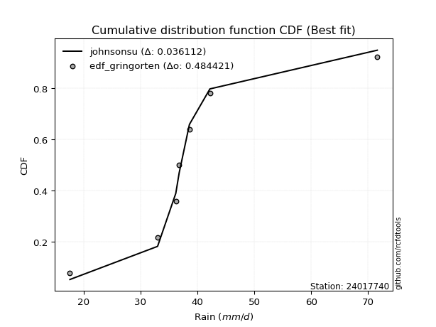</img>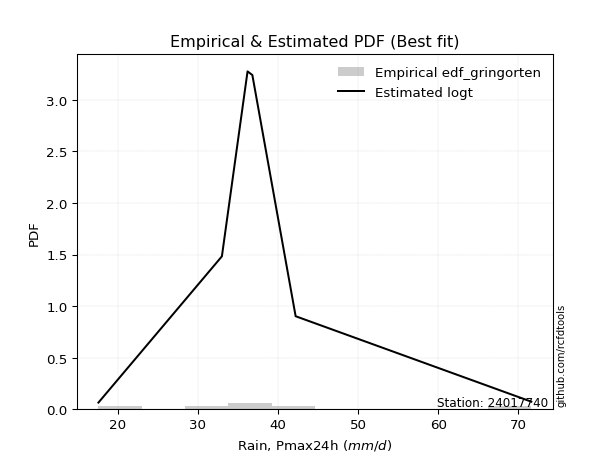</img>

</div>


### 9. Empirical - EDF Filliben (1975)

The specific values of the constants (0.3175) (often denoted as $alpha$) and (0.365) are derived from a method proposed by James J. Filliben in a 1975 paper. This particular formula is the mean value of the $i$-th order statistic of the normal distribution and is considered a robust and effective plotting position formula for the normal probability plot correlation coefficient test for normality.

<div align="center">


$P=(m-0.3175)/(n+0.365)$


</div>


**9.1. Empirical values**

<div align="center">

|                | 0                   | 1                   | 2                   | 3            | 4                  | 5                  | 6                  |
|:---------------|:--------------------|:--------------------|:--------------------|:-------------|:-------------------|:-------------------|:-------------------|
| date           | 2023                | 2025                | 2019                | 2020         | 2022               | 2021               | 2024               |
| x              | 17.6                | 28.8                | 33.0                | 36.2         | 36.8               | 42.2               | 71.6               |
| m              | 1                   | 2                   | 3                   | 4            | 5                  | 6                  | 7                  |
| empirical_dist | edf_filliben        | edf_filliben        | edf_filliben        | edf_filliben | edf_filliben       | edf_filliben       | edf_filliben       |
| empirical      | 0.09266802443991853 | 0.22844534962661237 | 0.36422267481330617 | 0.5          | 0.6357773251866938 | 0.7715546503733877 | 0.9073319755600815 |
| empirical_tr   | 1.1021324354657687  | 1.2960844698636163  | 1.5728777362520021  | 2.0          | 2.7455731593662627 | 4.377414561664191  | 10.791208791208794 |

</div>


**9.2. Kolmogorov-Smirnov fit test (sorted by Δ)**


<div align="center">

|                | 0                   | 1                   | 2                    | 3                   | 4                   | 5                   | 6                   | 7                     | 8                   | 9                   | 10                  | 11                  | 12                  | 13                  | 14                  | 15                  | 16                  | 17                  | 18                  | 19                  | 20                  | 21                  | 22                  | 23                  | 24                  | 25                  | 26                  | 27                  | 28                  | 29                  | 30                  | 31                  | 32                  | 33                  | 34                  | 35                  | 36                  | 37                  | 38                  | 39                  | 40                  | 41                  | 42                  | 43                  | 44                  | 45                  | 46                  | 47                  | 48                  | 49                  | 50                  | 51                  | 52                  | 53                  | 54                  | 55                  | 56                  | 57                  | 58                  | 59                  | 60                  | 61                  | 62                  | 63                  | 64                  | 65                  | 66                  | 67                  | 68                  | 69                  | 70                  | 71                  | 72                  | 73                  | 74                  | 75                  | 76                  | 77                  | 78                  | 79                  | 80                  | 81                  | 82                  | 83                  | 84                  | 85                  | 86                  | 87                  | 88                  | 89                  |
|:---------------|:--------------------|:--------------------|:---------------------|:--------------------|:--------------------|:--------------------|:--------------------|:----------------------|:--------------------|:--------------------|:--------------------|:--------------------|:--------------------|:--------------------|:--------------------|:--------------------|:--------------------|:--------------------|:--------------------|:--------------------|:--------------------|:--------------------|:--------------------|:--------------------|:--------------------|:--------------------|:--------------------|:--------------------|:--------------------|:--------------------|:--------------------|:--------------------|:--------------------|:--------------------|:--------------------|:--------------------|:--------------------|:--------------------|:--------------------|:--------------------|:--------------------|:--------------------|:--------------------|:--------------------|:--------------------|:--------------------|:--------------------|:--------------------|:--------------------|:--------------------|:--------------------|:--------------------|:--------------------|:--------------------|:--------------------|:--------------------|:--------------------|:--------------------|:--------------------|:--------------------|:--------------------|:--------------------|:--------------------|:--------------------|:--------------------|:--------------------|:--------------------|:--------------------|:--------------------|:--------------------|:--------------------|:--------------------|:--------------------|:--------------------|:--------------------|:--------------------|:--------------------|:--------------------|:--------------------|:--------------------|:--------------------|:--------------------|:--------------------|:--------------------|:--------------------|:--------------------|:--------------------|:--------------------|:--------------------|:--------------------|
| station        | 24017740            | 24017740            | 24017740             | 24017740            | 24017740            | 24017740            | 24017740            | 24017740              | 24017740            | 24017740            | 24017740            | 24017740            | 24017740            | 24017740            | 24017740            | 24017740            | 24017740            | 24017740            | 24017740            | 24017740            | 24017740            | 24017740            | 24017740            | 24017740            | 24017740            | 24017740            | 24017740            | 24017740            | 24017740            | 24017740            | 24017740            | 24017740            | 24017740            | 24017740            | 24017740            | 24017740            | 24017740            | 24017740            | 24017740            | 24017740            | 24017740            | 24017740            | 24017740            | 24017740            | 24017740            | 24017740            | 24017740            | 24017740            | 24017740            | 24017740            | 24017740            | 24017740            | 24017740            | 24017740            | 24017740            | 24017740            | 24017740            | 24017740            | 24017740            | 24017740            | 24017740            | 24017740            | 24017740            | 24017740            | 24017740            | 24017740            | 24017740            | 24017740            | 24017740            | 24017740            | 24017740            | 24017740            | 24017740            | 24017740            | 24017740            | 24017740            | 24017740            | 24017740            | 24017740            | 24017740            | 24017740            | 24017740            | 24017740            | 24017740            | 24017740            | 24017740            | 24017740            | 24017740            | 24017740            | 24017740            |
| empirical_dist | edf_filliben        | edf_filliben        | edf_filliben         | edf_filliben        | edf_filliben        | edf_filliben        | edf_filliben        | edf_filliben          | edf_filliben        | edf_filliben        | edf_filliben        | edf_filliben        | edf_filliben        | edf_filliben        | edf_filliben        | edf_filliben        | edf_filliben        | edf_filliben        | edf_filliben        | edf_filliben        | edf_filliben        | edf_filliben        | edf_filliben        | edf_filliben        | edf_filliben        | edf_filliben        | edf_filliben        | edf_filliben        | edf_filliben        | edf_filliben        | edf_filliben        | edf_filliben        | edf_filliben        | edf_filliben        | edf_filliben        | edf_filliben        | edf_filliben        | edf_filliben        | edf_filliben        | edf_filliben        | edf_filliben        | edf_filliben        | edf_filliben        | edf_filliben        | edf_filliben        | edf_filliben        | edf_filliben        | edf_filliben        | edf_filliben        | edf_filliben        | edf_filliben        | edf_filliben        | edf_filliben        | edf_filliben        | edf_filliben        | edf_filliben        | edf_filliben        | edf_filliben        | edf_filliben        | edf_filliben        | edf_filliben        | edf_filliben        | edf_filliben        | edf_filliben        | edf_filliben        | edf_filliben        | edf_filliben        | edf_filliben        | edf_filliben        | edf_filliben        | edf_filliben        | edf_filliben        | edf_filliben        | edf_filliben        | edf_filliben        | edf_filliben        | edf_filliben        | edf_filliben        | edf_filliben        | edf_filliben        | edf_filliben        | edf_filliben        | edf_filliben        | edf_filliben        | edf_filliben        | edf_filliben        | edf_filliben        | edf_filliben        | edf_filliben        | edf_filliben        |
| p_dist         | logjohnsonsu        | logt                | johnsonsu            | loglaplace          | logmielke           | loghypsecant        | fisk                | loglaplace_asymmetric | logfisk             | loggenlogistic      | mielke              | moyal               | loglogistic         | nct                 | alpha               | logrice             | invgamma            | ncf                 | betaprime           | exponnorm           | loginvgamma         | logbetaprime        | lognct              | logf                | logpearson3         | logerlang           | loggamma            | loggamma            | logfatiguelife      | logalpha            | logexponnorm        | logcrystalball      | lognorm             | lognorm             | logweibull_min      | f                   | invgauss            | logloggamma         | genlogistic         | gamma               | erlang              | loginvgauss         | gumbel_r            | pearson3            | halflogistic        | logmaxwell          | halfnorm            | kstwobign           | lograyleigh         | gompertz            | weibull_min         | gibrat              | rayleigh            | loginvweibull       | loggumbel_r         | wald                | maxwell             | rice                | logncf              | loghalfnorm         | laplace_asymmetric  | loggumbel_l         | logmoyal            | logkstwobign        | t                   | crystalball         | norm                | truncnorm           | loghalflogistic     | logistic            | hypsecant           | laplace             | loggenexpon         | genexpon            | expon               | loggompertz         | logwald             | logtruncnorm        | lognakagami         | loggibrat           | gumbel_l            | chi2                | logexpon            | logchi2             | nakagami            | loglognorm          | pareto              | logpareto           | invweibull          | fatiguelife         |
| delta          | 0.05270430260632697 | 0.0583695470257698  | 0.060982007636851576 | 0.0625637901924192  | 0.07842739868087151 | 0.0800875310883401  | 0.08100248338461269 | 0.08104484434907155   | 0.08137200095515573 | 0.08255205068264382 | 0.08258492568018794 | 0.08298565391307833 | 0.08518634161853178 | 0.0861659970797557  | 0.08633774322509136 | 0.08803050160679105 | 0.0887513917577738  | 0.08934979326474224 | 0.08950407679424799 | 0.08990418296987968 | 0.08994788122269548 | 0.08999044263208944 | 0.09084453194619013 | 0.09094528544114544 | 0.0909501707693845  | 0.09096343230935544 | 0.09096353617632313 | 0.09096353617632313 | 0.09099218001960474 | 0.09163421185744652 | 0.09189421493224625 | 0.09322469038146242 | 0.09322477726144007 | 0.09322477726144007 | 0.09360534794632147 | 0.09410696975904709 | 0.0941830231098062  | 0.09486213642676544 | 0.09545205656507116 | 0.09769087616926611 | 0.09769120701735914 | 0.09939965762088987 | 0.09947614302098973 | 0.10186599250479289 | 0.10301276984075916 | 0.10366670772936032 | 0.1105136399819864  | 0.11363603645598586 | 0.11575295376385908 | 0.11913022646943047 | 0.12055989388890517 | 0.12996022955421627 | 0.1313325711098945  | 0.13379857304304008 | 0.134343093776491   | 0.1353011610064766  | 0.13935919743680958 | 0.14212417655236415 | 0.14463406590598782 | 0.14991596454816858 | 0.15215186581012063 | 0.15878919973410188 | 0.15913008843461662 | 0.15978562849468855 | 0.16069791825896984 | 0.167409381882078   | 0.16740938862953825 | 0.1674094557598047  | 0.16938660655703486 | 0.1717070032090694  | 0.17536144719741992 | 0.18886716086476857 | 0.1893211669762571  | 0.1934721794912808  | 0.19359530427408442 | 0.20903990433871109 | 0.2277119834352047  | 0.2284396897208769  | 0.22844531895259962 | 0.2352806666184286  | 0.23800726402401817 | 0.2758099168012291  | 0.2797552217265653  | 0.2880399870244499  | 0.3412928926156814  | 0.41666517606958975 | 0.42598289231747644 | 0.4362106365336691  | 0.45312828460772986 | 0.5318440050249502  |
| deltao         | 0.48442053926100004 | 0.48442053926100004 | 0.48442053926100004  | 0.48442053926100004 | 0.48442053926100004 | 0.48442053926100004 | 0.48442053926100004 | 0.48442053926100004   | 0.48442053926100004 | 0.48442053926100004 | 0.48442053926100004 | 0.48442053926100004 | 0.48442053926100004 | 0.48442053926100004 | 0.48442053926100004 | 0.48442053926100004 | 0.48442053926100004 | 0.48442053926100004 | 0.48442053926100004 | 0.48442053926100004 | 0.48442053926100004 | 0.48442053926100004 | 0.48442053926100004 | 0.48442053926100004 | 0.48442053926100004 | 0.48442053926100004 | 0.48442053926100004 | 0.48442053926100004 | 0.48442053926100004 | 0.48442053926100004 | 0.48442053926100004 | 0.48442053926100004 | 0.48442053926100004 | 0.48442053926100004 | 0.48442053926100004 | 0.48442053926100004 | 0.48442053926100004 | 0.48442053926100004 | 0.48442053926100004 | 0.48442053926100004 | 0.48442053926100004 | 0.48442053926100004 | 0.48442053926100004 | 0.48442053926100004 | 0.48442053926100004 | 0.48442053926100004 | 0.48442053926100004 | 0.48442053926100004 | 0.48442053926100004 | 0.48442053926100004 | 0.48442053926100004 | 0.48442053926100004 | 0.48442053926100004 | 0.48442053926100004 | 0.48442053926100004 | 0.48442053926100004 | 0.48442053926100004 | 0.48442053926100004 | 0.48442053926100004 | 0.48442053926100004 | 0.48442053926100004 | 0.48442053926100004 | 0.48442053926100004 | 0.48442053926100004 | 0.48442053926100004 | 0.48442053926100004 | 0.48442053926100004 | 0.48442053926100004 | 0.48442053926100004 | 0.48442053926100004 | 0.48442053926100004 | 0.48442053926100004 | 0.48442053926100004 | 0.48442053926100004 | 0.48442053926100004 | 0.48442053926100004 | 0.48442053926100004 | 0.48442053926100004 | 0.48442053926100004 | 0.48442053926100004 | 0.48442053926100004 | 0.48442053926100004 | 0.48442053926100004 | 0.48442053926100004 | 0.48442053926100004 | 0.48442053926100004 | 0.48442053926100004 | 0.48442053926100004 | 0.48442053926100004 | 0.48442053926100004 |
| eval           | Δo > Δ              | Δo > Δ              | Δo > Δ               | Δo > Δ              | Δo > Δ              | Δo > Δ              | Δo > Δ              | Δo > Δ                | Δo > Δ              | Δo > Δ              | Δo > Δ              | Δo > Δ              | Δo > Δ              | Δo > Δ              | Δo > Δ              | Δo > Δ              | Δo > Δ              | Δo > Δ              | Δo > Δ              | Δo > Δ              | Δo > Δ              | Δo > Δ              | Δo > Δ              | Δo > Δ              | Δo > Δ              | Δo > Δ              | Δo > Δ              | Δo > Δ              | Δo > Δ              | Δo > Δ              | Δo > Δ              | Δo > Δ              | Δo > Δ              | Δo > Δ              | Δo > Δ              | Δo > Δ              | Δo > Δ              | Δo > Δ              | Δo > Δ              | Δo > Δ              | Δo > Δ              | Δo > Δ              | Δo > Δ              | Δo > Δ              | Δo > Δ              | Δo > Δ              | Δo > Δ              | Δo > Δ              | Δo > Δ              | Δo > Δ              | Δo > Δ              | Δo > Δ              | Δo > Δ              | Δo > Δ              | Δo > Δ              | Δo > Δ              | Δo > Δ              | Δo > Δ              | Δo > Δ              | Δo > Δ              | Δo > Δ              | Δo > Δ              | Δo > Δ              | Δo > Δ              | Δo > Δ              | Δo > Δ              | Δo > Δ              | Δo > Δ              | Δo > Δ              | Δo > Δ              | Δo > Δ              | Δo > Δ              | Δo > Δ              | Δo > Δ              | Δo > Δ              | Δo > Δ              | Δo > Δ              | Δo > Δ              | Δo > Δ              | Δo > Δ              | Δo > Δ              | Δo > Δ              | Δo > Δ              | Δo > Δ              | Δo > Δ              | Δo > Δ              | Δo > Δ              | Δo > Δ              | Δo > Δ              | Δo <= Δ             |
| fit            | 1                   | 1                   | 1                    | 1                   | 1                   | 1                   | 1                   | 1                     | 1                   | 1                   | 1                   | 1                   | 1                   | 1                   | 1                   | 1                   | 1                   | 1                   | 1                   | 1                   | 1                   | 1                   | 1                   | 1                   | 1                   | 1                   | 1                   | 1                   | 1                   | 1                   | 1                   | 1                   | 1                   | 1                   | 1                   | 1                   | 1                   | 1                   | 1                   | 1                   | 1                   | 1                   | 1                   | 1                   | 1                   | 1                   | 1                   | 1                   | 1                   | 1                   | 1                   | 1                   | 1                   | 1                   | 1                   | 1                   | 1                   | 1                   | 1                   | 1                   | 1                   | 1                   | 1                   | 1                   | 1                   | 1                   | 1                   | 1                   | 1                   | 1                   | 1                   | 1                   | 1                   | 1                   | 1                   | 1                   | 1                   | 1                   | 1                   | 1                   | 1                   | 1                   | 1                   | 1                   | 1                   | 1                   | 1                   | 1                   | 1                   | 0                   |
| n              | 7                   | 7                   | 7                    | 7                   | 7                   | 7                   | 7                   | 7                     | 7                   | 7                   | 7                   | 7                   | 7                   | 7                   | 7                   | 7                   | 7                   | 7                   | 7                   | 7                   | 7                   | 7                   | 7                   | 7                   | 7                   | 7                   | 7                   | 7                   | 7                   | 7                   | 7                   | 7                   | 7                   | 7                   | 7                   | 7                   | 7                   | 7                   | 7                   | 7                   | 7                   | 7                   | 7                   | 7                   | 7                   | 7                   | 7                   | 7                   | 7                   | 7                   | 7                   | 7                   | 7                   | 7                   | 7                   | 7                   | 7                   | 7                   | 7                   | 7                   | 7                   | 7                   | 7                   | 7                   | 7                   | 7                   | 7                   | 7                   | 7                   | 7                   | 7                   | 7                   | 7                   | 7                   | 7                   | 7                   | 7                   | 7                   | 7                   | 7                   | 7                   | 7                   | 7                   | 7                   | 7                   | 7                   | 7                   | 7                   | 7                   | 7                   |
| best_fit       | 1                   | 0                   | 0                    | 0                   | 0                   | 0                   | 0                   | 0                     | 0                   | 0                   | 0                   | 0                   | 0                   | 0                   | 0                   | 0                   | 0                   | 0                   | 0                   | 0                   | 0                   | 0                   | 0                   | 0                   | 0                   | 0                   | 0                   | 0                   | 0                   | 0                   | 0                   | 0                   | 0                   | 0                   | 0                   | 0                   | 0                   | 0                   | 0                   | 0                   | 0                   | 0                   | 0                   | 0                   | 0                   | 0                   | 0                   | 0                   | 0                   | 0                   | 0                   | 0                   | 0                   | 0                   | 0                   | 0                   | 0                   | 0                   | 0                   | 0                   | 0                   | 0                   | 0                   | 0                   | 0                   | 0                   | 0                   | 0                   | 0                   | 0                   | 0                   | 0                   | 0                   | 0                   | 0                   | 0                   | 0                   | 0                   | 0                   | 0                   | 0                   | 0                   | 0                   | 0                   | 0                   | 0                   | 0                   | 0                   | 0                   | 0                   |
| best_fit_sort  | 1                   | 2                   | 3                    | 4                   | 5                   | 6                   | 7                   | 8                     | 9                   | 10                  | 11                  | 12                  | 13                  | 14                  | 15                  | 16                  | 17                  | 18                  | 19                  | 20                  | 21                  | 22                  | 23                  | 24                  | 25                  | 26                  | 27                  | 28                  | 29                  | 30                  | 31                  | 32                  | 33                  | 34                  | 35                  | 36                  | 37                  | 38                  | 39                  | 40                  | 41                  | 42                  | 43                  | 44                  | 45                  | 46                  | 47                  | 48                  | 49                  | 50                  | 51                  | 52                  | 53                  | 54                  | 55                  | 56                  | 57                  | 58                  | 59                  | 60                  | 61                  | 62                  | 63                  | 64                  | 65                  | 66                  | 67                  | 68                  | 69                  | 70                  | 71                  | 72                  | 73                  | 74                  | 75                  | 76                  | 77                  | 78                  | 79                  | 80                  | 81                  | 82                  | 83                  | 84                  | 85                  | 86                  | 87                  | 88                  | 89                  | 90                  |

</div>


<div align="center">

</img>

</div>


**9.3. Best fit**

<div align="center">

|   id |   station | empirical_dist   | p_dist       |     delta |   deltao | eval   |   fit |   n |   best_fit |   best_fit_sort |
|-----:|----------:|:-----------------|:-------------|----------:|---------:|:-------|------:|----:|-----------:|----------------:|
|    0 |  24017740 | edf_filliben     | logjohnsonsu | 0.0527043 | 0.484421 | Δo > Δ |     1 |   7 |          1 |               1 |

</div>


<div align="center">

</img></img>

</div>


### 10. Empirical - EDF Jenkinson (1977)

The Jenkinson formula in hydrology is an empirical plotting position formula used to estimate the non-exceedance probability _(P)_ or return period _(T)_ of a given ordered observation within a sample. It is a widely used method in the frequency analysis of extreme events such as floods and rainfall, as it provides a distribution-free way to plot data. _a≈0.31_ and _b≈0.38_ are constants derived to approximate the median of the probability distribution for the given rank.

<div align="center">


$P=(m-a)/(n+b)$


</div>


**10.1. Empirical values**

<div align="center">

|                | 0                   | 1                   | 2                   | 3             | 4                  | 5                  | 6                  |
|:---------------|:--------------------|:--------------------|:--------------------|:--------------|:-------------------|:-------------------|:-------------------|
| date           | 2023                | 2025                | 2019                | 2020          | 2022               | 2021               | 2024               |
| x              | 17.6                | 28.8                | 33.0                | 36.2          | 36.8               | 42.2               | 71.6               |
| m              | 1                   | 2                   | 3                   | 4             | 5                  | 6                  | 7                  |
| empirical_dist | edf_jenkinson       | edf_jenkinson       | edf_jenkinson       | edf_jenkinson | edf_jenkinson      | edf_jenkinson      | edf_jenkinson      |
| empirical      | 0.09349593495934959 | 0.22899728997289973 | 0.36449864498644985 | 0.5           | 0.6355013550135502 | 0.7710027100271003 | 0.9065040650406505 |
| empirical_tr   | 1.1031390134529149  | 1.29701230228471    | 1.5735607675906182  | 2.0           | 2.743494423791822  | 4.366863905325444  | 10.695652173913055 |

</div>


**10.2. Kolmogorov-Smirnov fit test (sorted by Δ)**


<div align="center">

|                | 0                    | 1                   | 2                   | 3                    | 4                   | 5                   | 6                   | 7                     | 8                   | 9                   | 10                  | 11                  | 12                  | 13                  | 14                  | 15                  | 16                  | 17                  | 18                  | 19                  | 20                  | 21                  | 22                  | 23                  | 24                  | 25                  | 26                  | 27                  | 28                  | 29                  | 30                  | 31                  | 32                  | 33                  | 34                  | 35                  | 36                  | 37                  | 38                  | 39                  | 40                  | 41                  | 42                  | 43                  | 44                  | 45                  | 46                  | 47                  | 48                  | 49                  | 50                  | 51                  | 52                  | 53                  | 54                  | 55                  | 56                  | 57                  | 58                  | 59                  | 60                  | 61                  | 62                  | 63                  | 64                  | 65                  | 66                  | 67                  | 68                  | 69                  | 70                  | 71                  | 72                  | 73                  | 74                  | 75                  | 76                  | 77                  | 78                  | 79                  | 80                  | 81                  | 82                  | 83                  | 84                  | 85                  | 86                  | 87                  | 88                  | 89                  |
|:---------------|:---------------------|:--------------------|:--------------------|:---------------------|:--------------------|:--------------------|:--------------------|:----------------------|:--------------------|:--------------------|:--------------------|:--------------------|:--------------------|:--------------------|:--------------------|:--------------------|:--------------------|:--------------------|:--------------------|:--------------------|:--------------------|:--------------------|:--------------------|:--------------------|:--------------------|:--------------------|:--------------------|:--------------------|:--------------------|:--------------------|:--------------------|:--------------------|:--------------------|:--------------------|:--------------------|:--------------------|:--------------------|:--------------------|:--------------------|:--------------------|:--------------------|:--------------------|:--------------------|:--------------------|:--------------------|:--------------------|:--------------------|:--------------------|:--------------------|:--------------------|:--------------------|:--------------------|:--------------------|:--------------------|:--------------------|:--------------------|:--------------------|:--------------------|:--------------------|:--------------------|:--------------------|:--------------------|:--------------------|:--------------------|:--------------------|:--------------------|:--------------------|:--------------------|:--------------------|:--------------------|:--------------------|:--------------------|:--------------------|:--------------------|:--------------------|:--------------------|:--------------------|:--------------------|:--------------------|:--------------------|:--------------------|:--------------------|:--------------------|:--------------------|:--------------------|:--------------------|:--------------------|:--------------------|:--------------------|:--------------------|
| station        | 24017740             | 24017740            | 24017740            | 24017740             | 24017740            | 24017740            | 24017740            | 24017740              | 24017740            | 24017740            | 24017740            | 24017740            | 24017740            | 24017740            | 24017740            | 24017740            | 24017740            | 24017740            | 24017740            | 24017740            | 24017740            | 24017740            | 24017740            | 24017740            | 24017740            | 24017740            | 24017740            | 24017740            | 24017740            | 24017740            | 24017740            | 24017740            | 24017740            | 24017740            | 24017740            | 24017740            | 24017740            | 24017740            | 24017740            | 24017740            | 24017740            | 24017740            | 24017740            | 24017740            | 24017740            | 24017740            | 24017740            | 24017740            | 24017740            | 24017740            | 24017740            | 24017740            | 24017740            | 24017740            | 24017740            | 24017740            | 24017740            | 24017740            | 24017740            | 24017740            | 24017740            | 24017740            | 24017740            | 24017740            | 24017740            | 24017740            | 24017740            | 24017740            | 24017740            | 24017740            | 24017740            | 24017740            | 24017740            | 24017740            | 24017740            | 24017740            | 24017740            | 24017740            | 24017740            | 24017740            | 24017740            | 24017740            | 24017740            | 24017740            | 24017740            | 24017740            | 24017740            | 24017740            | 24017740            | 24017740            |
| empirical_dist | edf_jenkinson        | edf_jenkinson       | edf_jenkinson       | edf_jenkinson        | edf_jenkinson       | edf_jenkinson       | edf_jenkinson       | edf_jenkinson         | edf_jenkinson       | edf_jenkinson       | edf_jenkinson       | edf_jenkinson       | edf_jenkinson       | edf_jenkinson       | edf_jenkinson       | edf_jenkinson       | edf_jenkinson       | edf_jenkinson       | edf_jenkinson       | edf_jenkinson       | edf_jenkinson       | edf_jenkinson       | edf_jenkinson       | edf_jenkinson       | edf_jenkinson       | edf_jenkinson       | edf_jenkinson       | edf_jenkinson       | edf_jenkinson       | edf_jenkinson       | edf_jenkinson       | edf_jenkinson       | edf_jenkinson       | edf_jenkinson       | edf_jenkinson       | edf_jenkinson       | edf_jenkinson       | edf_jenkinson       | edf_jenkinson       | edf_jenkinson       | edf_jenkinson       | edf_jenkinson       | edf_jenkinson       | edf_jenkinson       | edf_jenkinson       | edf_jenkinson       | edf_jenkinson       | edf_jenkinson       | edf_jenkinson       | edf_jenkinson       | edf_jenkinson       | edf_jenkinson       | edf_jenkinson       | edf_jenkinson       | edf_jenkinson       | edf_jenkinson       | edf_jenkinson       | edf_jenkinson       | edf_jenkinson       | edf_jenkinson       | edf_jenkinson       | edf_jenkinson       | edf_jenkinson       | edf_jenkinson       | edf_jenkinson       | edf_jenkinson       | edf_jenkinson       | edf_jenkinson       | edf_jenkinson       | edf_jenkinson       | edf_jenkinson       | edf_jenkinson       | edf_jenkinson       | edf_jenkinson       | edf_jenkinson       | edf_jenkinson       | edf_jenkinson       | edf_jenkinson       | edf_jenkinson       | edf_jenkinson       | edf_jenkinson       | edf_jenkinson       | edf_jenkinson       | edf_jenkinson       | edf_jenkinson       | edf_jenkinson       | edf_jenkinson       | edf_jenkinson       | edf_jenkinson       | edf_jenkinson       |
| p_dist         | logjohnsonsu         | logt                | johnsonsu           | loglaplace           | logmielke           | loghypsecant        | fisk                | loglaplace_asymmetric | logfisk             | loggenlogistic      | mielke              | moyal               | loglogistic         | nct                 | alpha               | logrice             | invgamma            | ncf                 | betaprime           | logbetaprime        | exponnorm           | loginvgamma         | lognct              | logf                | logpearson3         | logerlang           | loggamma            | loggamma            | logfatiguelife      | logexponnorm        | logalpha            | logcrystalball      | lognorm             | lognorm             | logweibull_min      | f                   | invgauss            | logloggamma         | genlogistic         | gamma               | erlang              | gumbel_r            | loginvgauss         | pearson3            | halflogistic        | logmaxwell          | halfnorm            | kstwobign           | lograyleigh         | gompertz            | weibull_min         | gibrat              | rayleigh            | loginvweibull       | loggumbel_r         | wald                | maxwell             | rice                | logncf              | loghalfnorm         | laplace_asymmetric  | loggumbel_l         | logmoyal            | logkstwobign        | t                   | crystalball         | norm                | truncnorm           | loghalflogistic     | logistic            | hypsecant           | laplace             | loggenexpon         | genexpon            | expon               | loggompertz         | logwald             | logtruncnorm        | lognakagami         | loggibrat           | gumbel_l            | chi2                | logexpon            | logchi2             | nakagami            | loglognorm          | pareto              | logpareto           | invweibull          | fatiguelife         |
| delta          | 0.052428332433183344 | 0.05809357685262617 | 0.06070603746370795 | 0.062287820019275575 | 0.07815142850772783 | 0.07981156091519648 | 0.08072651321146906 | 0.08076887417592793   | 0.08109603078201211 | 0.0822760805095002  | 0.08230895550704431 | 0.08270968373993465 | 0.08491037144538816 | 0.08589002690661207 | 0.08606177305194773 | 0.08747856126050368 | 0.08819945141148644 | 0.08879785291845488 | 0.08895213644796063 | 0.08943850228580208 | 0.08962821279673605 | 0.0896719110495518  | 0.09029259159990277 | 0.09039334509485808 | 0.09039823042309714 | 0.09041149196306808 | 0.09041159583003577 | 0.09041159583003577 | 0.09044023967331738 | 0.0913422745859589  | 0.09135824168430284 | 0.09267275003517506 | 0.09267283691515271 | 0.09267283691515271 | 0.09305340760003411 | 0.09355502941275973 | 0.09363108276351884 | 0.09431019608047808 | 0.09517608639192754 | 0.09713893582297875 | 0.09713926667107178 | 0.09892420267470237 | 0.09912368744774619 | 0.10131405215850553 | 0.1024608294944718  | 0.10339073755621664 | 0.10996169963569905 | 0.1130840961096985  | 0.1154769835907154  | 0.11857828612314311 | 0.12000795354261781 | 0.12996022955421627 | 0.13078063076360713 | 0.13324663269675271 | 0.13406712360334733 | 0.13502519083333292 | 0.13880725709052222 | 0.14184820637922052 | 0.14408212555970046 | 0.1496399943750249  | 0.151875895636977   | 0.15851322956095826 | 0.15885411826147294 | 0.1592336881484012  | 0.16014597791268248 | 0.16713341170893437 | 0.16713341845639462 | 0.16713348558666108 | 0.16911063638389118 | 0.17143103303592577 | 0.1750854770242763  | 0.18859119069162494 | 0.18876922662996973 | 0.19292023914499343 | 0.19304336392779706 | 0.20848796399242372 | 0.22743601326206103 | 0.22899163006716425 | 0.22899725929888698 | 0.23500469644528493 | 0.23773129385087455 | 0.27525797645494177 | 0.27920328138027795 | 0.2874880466781625  | 0.34101692244253773 | 0.4161132357233024  | 0.4254309519711891  | 0.43565869618738173 | 0.4523003740882989  | 0.5312920646786629  |
| deltao         | 0.48442053926100004  | 0.48442053926100004 | 0.48442053926100004 | 0.48442053926100004  | 0.48442053926100004 | 0.48442053926100004 | 0.48442053926100004 | 0.48442053926100004   | 0.48442053926100004 | 0.48442053926100004 | 0.48442053926100004 | 0.48442053926100004 | 0.48442053926100004 | 0.48442053926100004 | 0.48442053926100004 | 0.48442053926100004 | 0.48442053926100004 | 0.48442053926100004 | 0.48442053926100004 | 0.48442053926100004 | 0.48442053926100004 | 0.48442053926100004 | 0.48442053926100004 | 0.48442053926100004 | 0.48442053926100004 | 0.48442053926100004 | 0.48442053926100004 | 0.48442053926100004 | 0.48442053926100004 | 0.48442053926100004 | 0.48442053926100004 | 0.48442053926100004 | 0.48442053926100004 | 0.48442053926100004 | 0.48442053926100004 | 0.48442053926100004 | 0.48442053926100004 | 0.48442053926100004 | 0.48442053926100004 | 0.48442053926100004 | 0.48442053926100004 | 0.48442053926100004 | 0.48442053926100004 | 0.48442053926100004 | 0.48442053926100004 | 0.48442053926100004 | 0.48442053926100004 | 0.48442053926100004 | 0.48442053926100004 | 0.48442053926100004 | 0.48442053926100004 | 0.48442053926100004 | 0.48442053926100004 | 0.48442053926100004 | 0.48442053926100004 | 0.48442053926100004 | 0.48442053926100004 | 0.48442053926100004 | 0.48442053926100004 | 0.48442053926100004 | 0.48442053926100004 | 0.48442053926100004 | 0.48442053926100004 | 0.48442053926100004 | 0.48442053926100004 | 0.48442053926100004 | 0.48442053926100004 | 0.48442053926100004 | 0.48442053926100004 | 0.48442053926100004 | 0.48442053926100004 | 0.48442053926100004 | 0.48442053926100004 | 0.48442053926100004 | 0.48442053926100004 | 0.48442053926100004 | 0.48442053926100004 | 0.48442053926100004 | 0.48442053926100004 | 0.48442053926100004 | 0.48442053926100004 | 0.48442053926100004 | 0.48442053926100004 | 0.48442053926100004 | 0.48442053926100004 | 0.48442053926100004 | 0.48442053926100004 | 0.48442053926100004 | 0.48442053926100004 | 0.48442053926100004 |
| eval           | Δo > Δ               | Δo > Δ              | Δo > Δ              | Δo > Δ               | Δo > Δ              | Δo > Δ              | Δo > Δ              | Δo > Δ                | Δo > Δ              | Δo > Δ              | Δo > Δ              | Δo > Δ              | Δo > Δ              | Δo > Δ              | Δo > Δ              | Δo > Δ              | Δo > Δ              | Δo > Δ              | Δo > Δ              | Δo > Δ              | Δo > Δ              | Δo > Δ              | Δo > Δ              | Δo > Δ              | Δo > Δ              | Δo > Δ              | Δo > Δ              | Δo > Δ              | Δo > Δ              | Δo > Δ              | Δo > Δ              | Δo > Δ              | Δo > Δ              | Δo > Δ              | Δo > Δ              | Δo > Δ              | Δo > Δ              | Δo > Δ              | Δo > Δ              | Δo > Δ              | Δo > Δ              | Δo > Δ              | Δo > Δ              | Δo > Δ              | Δo > Δ              | Δo > Δ              | Δo > Δ              | Δo > Δ              | Δo > Δ              | Δo > Δ              | Δo > Δ              | Δo > Δ              | Δo > Δ              | Δo > Δ              | Δo > Δ              | Δo > Δ              | Δo > Δ              | Δo > Δ              | Δo > Δ              | Δo > Δ              | Δo > Δ              | Δo > Δ              | Δo > Δ              | Δo > Δ              | Δo > Δ              | Δo > Δ              | Δo > Δ              | Δo > Δ              | Δo > Δ              | Δo > Δ              | Δo > Δ              | Δo > Δ              | Δo > Δ              | Δo > Δ              | Δo > Δ              | Δo > Δ              | Δo > Δ              | Δo > Δ              | Δo > Δ              | Δo > Δ              | Δo > Δ              | Δo > Δ              | Δo > Δ              | Δo > Δ              | Δo > Δ              | Δo > Δ              | Δo > Δ              | Δo > Δ              | Δo > Δ              | Δo <= Δ             |
| fit            | 1                    | 1                   | 1                   | 1                    | 1                   | 1                   | 1                   | 1                     | 1                   | 1                   | 1                   | 1                   | 1                   | 1                   | 1                   | 1                   | 1                   | 1                   | 1                   | 1                   | 1                   | 1                   | 1                   | 1                   | 1                   | 1                   | 1                   | 1                   | 1                   | 1                   | 1                   | 1                   | 1                   | 1                   | 1                   | 1                   | 1                   | 1                   | 1                   | 1                   | 1                   | 1                   | 1                   | 1                   | 1                   | 1                   | 1                   | 1                   | 1                   | 1                   | 1                   | 1                   | 1                   | 1                   | 1                   | 1                   | 1                   | 1                   | 1                   | 1                   | 1                   | 1                   | 1                   | 1                   | 1                   | 1                   | 1                   | 1                   | 1                   | 1                   | 1                   | 1                   | 1                   | 1                   | 1                   | 1                   | 1                   | 1                   | 1                   | 1                   | 1                   | 1                   | 1                   | 1                   | 1                   | 1                   | 1                   | 1                   | 1                   | 0                   |
| n              | 7                    | 7                   | 7                   | 7                    | 7                   | 7                   | 7                   | 7                     | 7                   | 7                   | 7                   | 7                   | 7                   | 7                   | 7                   | 7                   | 7                   | 7                   | 7                   | 7                   | 7                   | 7                   | 7                   | 7                   | 7                   | 7                   | 7                   | 7                   | 7                   | 7                   | 7                   | 7                   | 7                   | 7                   | 7                   | 7                   | 7                   | 7                   | 7                   | 7                   | 7                   | 7                   | 7                   | 7                   | 7                   | 7                   | 7                   | 7                   | 7                   | 7                   | 7                   | 7                   | 7                   | 7                   | 7                   | 7                   | 7                   | 7                   | 7                   | 7                   | 7                   | 7                   | 7                   | 7                   | 7                   | 7                   | 7                   | 7                   | 7                   | 7                   | 7                   | 7                   | 7                   | 7                   | 7                   | 7                   | 7                   | 7                   | 7                   | 7                   | 7                   | 7                   | 7                   | 7                   | 7                   | 7                   | 7                   | 7                   | 7                   | 7                   |
| best_fit       | 1                    | 0                   | 0                   | 0                    | 0                   | 0                   | 0                   | 0                     | 0                   | 0                   | 0                   | 0                   | 0                   | 0                   | 0                   | 0                   | 0                   | 0                   | 0                   | 0                   | 0                   | 0                   | 0                   | 0                   | 0                   | 0                   | 0                   | 0                   | 0                   | 0                   | 0                   | 0                   | 0                   | 0                   | 0                   | 0                   | 0                   | 0                   | 0                   | 0                   | 0                   | 0                   | 0                   | 0                   | 0                   | 0                   | 0                   | 0                   | 0                   | 0                   | 0                   | 0                   | 0                   | 0                   | 0                   | 0                   | 0                   | 0                   | 0                   | 0                   | 0                   | 0                   | 0                   | 0                   | 0                   | 0                   | 0                   | 0                   | 0                   | 0                   | 0                   | 0                   | 0                   | 0                   | 0                   | 0                   | 0                   | 0                   | 0                   | 0                   | 0                   | 0                   | 0                   | 0                   | 0                   | 0                   | 0                   | 0                   | 0                   | 0                   |
| best_fit_sort  | 1                    | 2                   | 3                   | 4                    | 5                   | 6                   | 7                   | 8                     | 9                   | 10                  | 11                  | 12                  | 13                  | 14                  | 15                  | 16                  | 17                  | 18                  | 19                  | 20                  | 21                  | 22                  | 23                  | 24                  | 25                  | 26                  | 27                  | 28                  | 29                  | 30                  | 31                  | 32                  | 33                  | 34                  | 35                  | 36                  | 37                  | 38                  | 39                  | 40                  | 41                  | 42                  | 43                  | 44                  | 45                  | 46                  | 47                  | 48                  | 49                  | 50                  | 51                  | 52                  | 53                  | 54                  | 55                  | 56                  | 57                  | 58                  | 59                  | 60                  | 61                  | 62                  | 63                  | 64                  | 65                  | 66                  | 67                  | 68                  | 69                  | 70                  | 71                  | 72                  | 73                  | 74                  | 75                  | 76                  | 77                  | 78                  | 79                  | 80                  | 81                  | 82                  | 83                  | 84                  | 85                  | 86                  | 87                  | 88                  | 89                  | 90                  |

</div>


<div align="center">

</img>

</div>


**10.3. Best fit**

<div align="center">

|   id |   station | empirical_dist   | p_dist       |     delta |   deltao | eval   |   fit |   n |   best_fit |   best_fit_sort |
|-----:|----------:|:-----------------|:-------------|----------:|---------:|:-------|------:|----:|-----------:|----------------:|
|    0 |  24017740 | edf_jenkinson    | logjohnsonsu | 0.0524283 | 0.484421 | Δo > Δ |     1 |   7 |          1 |               1 |

</div>


<div align="center">

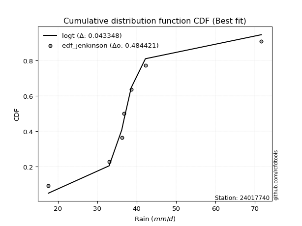</img>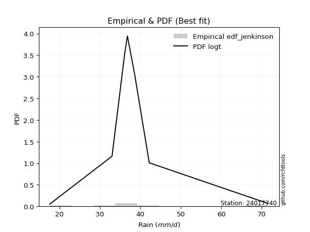</img>

</div>


### 11. Empirical - EDF Cunnane (1978)

Cunnane´s work in statistical hydrology has focused on the performance and evaluation of different probability distributions (such as GEV, Gumbel, Lognormal) for flood frequency estimation. _b_ is a constant, typically set to 0.4.

<div align="center">


$P=(m-b)/(n+1-2b)$


</div>


**11.1. Empirical values**

<div align="center">

|                | 0                   | 1                   | 2                  | 3           | 4                  | 5                  | 6                  |
|:---------------|:--------------------|:--------------------|:-------------------|:------------|:-------------------|:-------------------|:-------------------|
| date           | 2023                | 2025                | 2019               | 2020        | 2022               | 2021               | 2024               |
| x              | 17.6                | 28.8                | 33.0               | 36.2        | 36.8               | 42.2               | 71.6               |
| m              | 1                   | 2                   | 3                  | 4           | 5                  | 6                  | 7                  |
| empirical_dist | edf_cunnane         | edf_cunnane         | edf_cunnane        | edf_cunnane | edf_cunnane        | edf_cunnane        | edf_cunnane        |
| empirical      | 0.08333333333333333 | 0.22222222222222224 | 0.3611111111111111 | 0.5         | 0.6388888888888888 | 0.7777777777777777 | 0.9166666666666666 |
| empirical_tr   | 1.090909090909091   | 1.2857142857142856  | 1.565217391304348  | 2.0         | 2.7692307692307687 | 4.499999999999998  | 11.999999999999995 |

</div>


**11.2. Kolmogorov-Smirnov fit test (sorted by Δ)**


<div align="center">

|                | 0                   | 1                    | 2                   | 3                   | 4                   | 5                   | 6                   | 7                     | 8                   | 9                   | 10                  | 11                  | 12                  | 13                  | 14                  | 15                  | 16                  | 17                  | 18                  | 19                  | 20                  | 21                  | 22                  | 23                  | 24                  | 25                  | 26                  | 27                  | 28                  | 29                  | 30                  | 31                  | 32                  | 33                  | 34                  | 35                  | 36                  | 37                  | 38                  | 39                  | 40                  | 41                  | 42                  | 43                  | 44                  | 45                  | 46                  | 47                  | 48                  | 49                  | 50                  | 51                  | 52                  | 53                  | 54                  | 55                  | 56                  | 57                  | 58                  | 59                  | 60                  | 61                  | 62                  | 63                  | 64                  | 65                  | 66                  | 67                  | 68                  | 69                  | 70                  | 71                  | 72                  | 73                  | 74                  | 75                  | 76                  | 77                  | 78                  | 79                  | 80                  | 81                  | 82                  | 83                  | 84                  | 85                  | 86                  | 87                  | 88                  | 89                  |
|:---------------|:--------------------|:---------------------|:--------------------|:--------------------|:--------------------|:--------------------|:--------------------|:----------------------|:--------------------|:--------------------|:--------------------|:--------------------|:--------------------|:--------------------|:--------------------|:--------------------|:--------------------|:--------------------|:--------------------|:--------------------|:--------------------|:--------------------|:--------------------|:--------------------|:--------------------|:--------------------|:--------------------|:--------------------|:--------------------|:--------------------|:--------------------|:--------------------|:--------------------|:--------------------|:--------------------|:--------------------|:--------------------|:--------------------|:--------------------|:--------------------|:--------------------|:--------------------|:--------------------|:--------------------|:--------------------|:--------------------|:--------------------|:--------------------|:--------------------|:--------------------|:--------------------|:--------------------|:--------------------|:--------------------|:--------------------|:--------------------|:--------------------|:--------------------|:--------------------|:--------------------|:--------------------|:--------------------|:--------------------|:--------------------|:--------------------|:--------------------|:--------------------|:--------------------|:--------------------|:--------------------|:--------------------|:--------------------|:--------------------|:--------------------|:--------------------|:--------------------|:--------------------|:--------------------|:--------------------|:--------------------|:--------------------|:--------------------|:--------------------|:--------------------|:--------------------|:--------------------|:--------------------|:--------------------|:--------------------|:--------------------|
| station        | 24017740            | 24017740             | 24017740            | 24017740            | 24017740            | 24017740            | 24017740            | 24017740              | 24017740            | 24017740            | 24017740            | 24017740            | 24017740            | 24017740            | 24017740            | 24017740            | 24017740            | 24017740            | 24017740            | 24017740            | 24017740            | 24017740            | 24017740            | 24017740            | 24017740            | 24017740            | 24017740            | 24017740            | 24017740            | 24017740            | 24017740            | 24017740            | 24017740            | 24017740            | 24017740            | 24017740            | 24017740            | 24017740            | 24017740            | 24017740            | 24017740            | 24017740            | 24017740            | 24017740            | 24017740            | 24017740            | 24017740            | 24017740            | 24017740            | 24017740            | 24017740            | 24017740            | 24017740            | 24017740            | 24017740            | 24017740            | 24017740            | 24017740            | 24017740            | 24017740            | 24017740            | 24017740            | 24017740            | 24017740            | 24017740            | 24017740            | 24017740            | 24017740            | 24017740            | 24017740            | 24017740            | 24017740            | 24017740            | 24017740            | 24017740            | 24017740            | 24017740            | 24017740            | 24017740            | 24017740            | 24017740            | 24017740            | 24017740            | 24017740            | 24017740            | 24017740            | 24017740            | 24017740            | 24017740            | 24017740            |
| empirical_dist | edf_cunnane         | edf_cunnane          | edf_cunnane         | edf_cunnane         | edf_cunnane         | edf_cunnane         | edf_cunnane         | edf_cunnane           | edf_cunnane         | edf_cunnane         | edf_cunnane         | edf_cunnane         | edf_cunnane         | edf_cunnane         | edf_cunnane         | edf_cunnane         | edf_cunnane         | edf_cunnane         | edf_cunnane         | edf_cunnane         | edf_cunnane         | edf_cunnane         | edf_cunnane         | edf_cunnane         | edf_cunnane         | edf_cunnane         | edf_cunnane         | edf_cunnane         | edf_cunnane         | edf_cunnane         | edf_cunnane         | edf_cunnane         | edf_cunnane         | edf_cunnane         | edf_cunnane         | edf_cunnane         | edf_cunnane         | edf_cunnane         | edf_cunnane         | edf_cunnane         | edf_cunnane         | edf_cunnane         | edf_cunnane         | edf_cunnane         | edf_cunnane         | edf_cunnane         | edf_cunnane         | edf_cunnane         | edf_cunnane         | edf_cunnane         | edf_cunnane         | edf_cunnane         | edf_cunnane         | edf_cunnane         | edf_cunnane         | edf_cunnane         | edf_cunnane         | edf_cunnane         | edf_cunnane         | edf_cunnane         | edf_cunnane         | edf_cunnane         | edf_cunnane         | edf_cunnane         | edf_cunnane         | edf_cunnane         | edf_cunnane         | edf_cunnane         | edf_cunnane         | edf_cunnane         | edf_cunnane         | edf_cunnane         | edf_cunnane         | edf_cunnane         | edf_cunnane         | edf_cunnane         | edf_cunnane         | edf_cunnane         | edf_cunnane         | edf_cunnane         | edf_cunnane         | edf_cunnane         | edf_cunnane         | edf_cunnane         | edf_cunnane         | edf_cunnane         | edf_cunnane         | edf_cunnane         | edf_cunnane         | edf_cunnane         |
| p_dist         | logjohnsonsu        | logt                 | johnsonsu           | loglaplace          | logmielke           | loghypsecant        | fisk                | loglaplace_asymmetric | logfisk             | loggenlogistic      | mielke              | moyal               | loglogistic         | nct                 | alpha               | exponnorm           | logrice             | invgamma            | ncf                 | betaprime           | loginvgamma         | logbetaprime        | lognct              | logf                | logpearson3         | logerlang           | loggamma            | loggamma            | logfatiguelife      | logalpha            | logexponnorm        | genlogistic         | logcrystalball      | lognorm             | lognorm             | logweibull_min      | f                   | invgauss            | logloggamma         | gamma               | erlang              | loginvgauss         | gumbel_r            | pearson3            | logmaxwell          | halflogistic        | halfnorm            | lograyleigh         | kstwobign           | gompertz            | weibull_min         | gibrat              | loggumbel_r         | rayleigh            | wald                | loginvweibull       | rice                | maxwell             | logncf              | loghalfnorm         | laplace_asymmetric  | loggumbel_l         | logmoyal            | logkstwobign        | t                   | crystalball         | norm                | truncnorm           | loghalflogistic     | logistic            | hypsecant           | laplace             | loggenexpon         | genexpon            | expon               | loggompertz         | logtruncnorm        | lognakagami         | logwald             | loggibrat           | gumbel_l            | chi2                | logexpon            | logchi2             | nakagami            | loglognorm          | pareto              | logpareto           | invweibull          | fatiguelife         |
| delta          | 0.05581586630852198 | 0.061481110727964805 | 0.06409357133904658 | 0.06567535389461421 | 0.08153896238306657 | 0.08319909479053511 | 0.0841140470868077  | 0.08415640805126656   | 0.08448356465735074 | 0.08566361438483883 | 0.08569648938238295 | 0.08609721761527339 | 0.08829790532072679 | 0.08982748787434058 | 0.09137314833490062 | 0.09301574667207468 | 0.09425362901118106 | 0.09497451916216382 | 0.09557292066913226 | 0.095727204198638   | 0.0960965096702632  | 0.09621357003647946 | 0.09706765935058015 | 0.09716841284553546 | 0.09717329817377451 | 0.09718655971374546 | 0.09718666358071315 | 0.09718666358071315 | 0.09721530742399476 | 0.09752916053532765 | 0.09811734233663627 | 0.09856362026726617 | 0.09944781778585243 | 0.09944790466583009 | 0.09944790466583009 | 0.09982847535071149 | 0.1003300971634371  | 0.10040615051419621 | 0.10108526383115546 | 0.10391400357365624 | 0.10391433442174927 | 0.10477131738061782 | 0.10569927042537974 | 0.1080891199091829  | 0.1086541049307079  | 0.10923589724514929 | 0.11673676738637653 | 0.1197549573251531  | 0.11985916386037587 | 0.1253533538738206  | 0.1267830212932953  | 0.12996022955421627 | 0.13745465747868607 | 0.1375556985142845  | 0.13841272470867166 | 0.1400217004474302  | 0.14556923776588904 | 0.1455823248411996  | 0.15085719331037784 | 0.15302752825036364 | 0.15526342951231564 | 0.1619007634362969  | 0.1622416521368117  | 0.16600875589907868 | 0.16692104566335986 | 0.17155049987024729 | 0.17155050865001642 | 0.1715505710134877  | 0.17249817025922992 | 0.1748185669112644  | 0.17847301089961493 | 0.19197872456696358 | 0.19554429438064722 | 0.19969530689567092 | 0.19981843167847455 | 0.2152630317431012  | 0.22221656231648676 | 0.2222221915482095  | 0.23082354713739978 | 0.23839223032062368 | 0.24111882772621318 | 0.28203304420561925 | 0.28597834913095543 | 0.29426311442884    | 0.3444044563178765  | 0.4228883034739799  | 0.43220601972186656 | 0.4424337639380592  | 0.462462975714315   | 0.5380671324293403  |
| deltao         | 0.48442053926100004 | 0.48442053926100004  | 0.48442053926100004 | 0.48442053926100004 | 0.48442053926100004 | 0.48442053926100004 | 0.48442053926100004 | 0.48442053926100004   | 0.48442053926100004 | 0.48442053926100004 | 0.48442053926100004 | 0.48442053926100004 | 0.48442053926100004 | 0.48442053926100004 | 0.48442053926100004 | 0.48442053926100004 | 0.48442053926100004 | 0.48442053926100004 | 0.48442053926100004 | 0.48442053926100004 | 0.48442053926100004 | 0.48442053926100004 | 0.48442053926100004 | 0.48442053926100004 | 0.48442053926100004 | 0.48442053926100004 | 0.48442053926100004 | 0.48442053926100004 | 0.48442053926100004 | 0.48442053926100004 | 0.48442053926100004 | 0.48442053926100004 | 0.48442053926100004 | 0.48442053926100004 | 0.48442053926100004 | 0.48442053926100004 | 0.48442053926100004 | 0.48442053926100004 | 0.48442053926100004 | 0.48442053926100004 | 0.48442053926100004 | 0.48442053926100004 | 0.48442053926100004 | 0.48442053926100004 | 0.48442053926100004 | 0.48442053926100004 | 0.48442053926100004 | 0.48442053926100004 | 0.48442053926100004 | 0.48442053926100004 | 0.48442053926100004 | 0.48442053926100004 | 0.48442053926100004 | 0.48442053926100004 | 0.48442053926100004 | 0.48442053926100004 | 0.48442053926100004 | 0.48442053926100004 | 0.48442053926100004 | 0.48442053926100004 | 0.48442053926100004 | 0.48442053926100004 | 0.48442053926100004 | 0.48442053926100004 | 0.48442053926100004 | 0.48442053926100004 | 0.48442053926100004 | 0.48442053926100004 | 0.48442053926100004 | 0.48442053926100004 | 0.48442053926100004 | 0.48442053926100004 | 0.48442053926100004 | 0.48442053926100004 | 0.48442053926100004 | 0.48442053926100004 | 0.48442053926100004 | 0.48442053926100004 | 0.48442053926100004 | 0.48442053926100004 | 0.48442053926100004 | 0.48442053926100004 | 0.48442053926100004 | 0.48442053926100004 | 0.48442053926100004 | 0.48442053926100004 | 0.48442053926100004 | 0.48442053926100004 | 0.48442053926100004 | 0.48442053926100004 |
| eval           | Δo > Δ              | Δo > Δ               | Δo > Δ              | Δo > Δ              | Δo > Δ              | Δo > Δ              | Δo > Δ              | Δo > Δ                | Δo > Δ              | Δo > Δ              | Δo > Δ              | Δo > Δ              | Δo > Δ              | Δo > Δ              | Δo > Δ              | Δo > Δ              | Δo > Δ              | Δo > Δ              | Δo > Δ              | Δo > Δ              | Δo > Δ              | Δo > Δ              | Δo > Δ              | Δo > Δ              | Δo > Δ              | Δo > Δ              | Δo > Δ              | Δo > Δ              | Δo > Δ              | Δo > Δ              | Δo > Δ              | Δo > Δ              | Δo > Δ              | Δo > Δ              | Δo > Δ              | Δo > Δ              | Δo > Δ              | Δo > Δ              | Δo > Δ              | Δo > Δ              | Δo > Δ              | Δo > Δ              | Δo > Δ              | Δo > Δ              | Δo > Δ              | Δo > Δ              | Δo > Δ              | Δo > Δ              | Δo > Δ              | Δo > Δ              | Δo > Δ              | Δo > Δ              | Δo > Δ              | Δo > Δ              | Δo > Δ              | Δo > Δ              | Δo > Δ              | Δo > Δ              | Δo > Δ              | Δo > Δ              | Δo > Δ              | Δo > Δ              | Δo > Δ              | Δo > Δ              | Δo > Δ              | Δo > Δ              | Δo > Δ              | Δo > Δ              | Δo > Δ              | Δo > Δ              | Δo > Δ              | Δo > Δ              | Δo > Δ              | Δo > Δ              | Δo > Δ              | Δo > Δ              | Δo > Δ              | Δo > Δ              | Δo > Δ              | Δo > Δ              | Δo > Δ              | Δo > Δ              | Δo > Δ              | Δo > Δ              | Δo > Δ              | Δo > Δ              | Δo > Δ              | Δo > Δ              | Δo > Δ              | Δo <= Δ             |
| fit            | 1                   | 1                    | 1                   | 1                   | 1                   | 1                   | 1                   | 1                     | 1                   | 1                   | 1                   | 1                   | 1                   | 1                   | 1                   | 1                   | 1                   | 1                   | 1                   | 1                   | 1                   | 1                   | 1                   | 1                   | 1                   | 1                   | 1                   | 1                   | 1                   | 1                   | 1                   | 1                   | 1                   | 1                   | 1                   | 1                   | 1                   | 1                   | 1                   | 1                   | 1                   | 1                   | 1                   | 1                   | 1                   | 1                   | 1                   | 1                   | 1                   | 1                   | 1                   | 1                   | 1                   | 1                   | 1                   | 1                   | 1                   | 1                   | 1                   | 1                   | 1                   | 1                   | 1                   | 1                   | 1                   | 1                   | 1                   | 1                   | 1                   | 1                   | 1                   | 1                   | 1                   | 1                   | 1                   | 1                   | 1                   | 1                   | 1                   | 1                   | 1                   | 1                   | 1                   | 1                   | 1                   | 1                   | 1                   | 1                   | 1                   | 0                   |
| n              | 7                   | 7                    | 7                   | 7                   | 7                   | 7                   | 7                   | 7                     | 7                   | 7                   | 7                   | 7                   | 7                   | 7                   | 7                   | 7                   | 7                   | 7                   | 7                   | 7                   | 7                   | 7                   | 7                   | 7                   | 7                   | 7                   | 7                   | 7                   | 7                   | 7                   | 7                   | 7                   | 7                   | 7                   | 7                   | 7                   | 7                   | 7                   | 7                   | 7                   | 7                   | 7                   | 7                   | 7                   | 7                   | 7                   | 7                   | 7                   | 7                   | 7                   | 7                   | 7                   | 7                   | 7                   | 7                   | 7                   | 7                   | 7                   | 7                   | 7                   | 7                   | 7                   | 7                   | 7                   | 7                   | 7                   | 7                   | 7                   | 7                   | 7                   | 7                   | 7                   | 7                   | 7                   | 7                   | 7                   | 7                   | 7                   | 7                   | 7                   | 7                   | 7                   | 7                   | 7                   | 7                   | 7                   | 7                   | 7                   | 7                   | 7                   |
| best_fit       | 1                   | 0                    | 0                   | 0                   | 0                   | 0                   | 0                   | 0                     | 0                   | 0                   | 0                   | 0                   | 0                   | 0                   | 0                   | 0                   | 0                   | 0                   | 0                   | 0                   | 0                   | 0                   | 0                   | 0                   | 0                   | 0                   | 0                   | 0                   | 0                   | 0                   | 0                   | 0                   | 0                   | 0                   | 0                   | 0                   | 0                   | 0                   | 0                   | 0                   | 0                   | 0                   | 0                   | 0                   | 0                   | 0                   | 0                   | 0                   | 0                   | 0                   | 0                   | 0                   | 0                   | 0                   | 0                   | 0                   | 0                   | 0                   | 0                   | 0                   | 0                   | 0                   | 0                   | 0                   | 0                   | 0                   | 0                   | 0                   | 0                   | 0                   | 0                   | 0                   | 0                   | 0                   | 0                   | 0                   | 0                   | 0                   | 0                   | 0                   | 0                   | 0                   | 0                   | 0                   | 0                   | 0                   | 0                   | 0                   | 0                   | 0                   |
| best_fit_sort  | 1                   | 2                    | 3                   | 4                   | 5                   | 6                   | 7                   | 8                     | 9                   | 10                  | 11                  | 12                  | 13                  | 14                  | 15                  | 16                  | 17                  | 18                  | 19                  | 20                  | 21                  | 22                  | 23                  | 24                  | 25                  | 26                  | 27                  | 28                  | 29                  | 30                  | 31                  | 32                  | 33                  | 34                  | 35                  | 36                  | 37                  | 38                  | 39                  | 40                  | 41                  | 42                  | 43                  | 44                  | 45                  | 46                  | 47                  | 48                  | 49                  | 50                  | 51                  | 52                  | 53                  | 54                  | 55                  | 56                  | 57                  | 58                  | 59                  | 60                  | 61                  | 62                  | 63                  | 64                  | 65                  | 66                  | 67                  | 68                  | 69                  | 70                  | 71                  | 72                  | 73                  | 74                  | 75                  | 76                  | 77                  | 78                  | 79                  | 80                  | 81                  | 82                  | 83                  | 84                  | 85                  | 86                  | 87                  | 88                  | 89                  | 90                  |

</div>


<div align="center">

</img>

</div>


**11.3. Best fit**

<div align="center">

|   id |   station | empirical_dist   | p_dist       |     delta |   deltao | eval   |   fit |   n |   best_fit |   best_fit_sort |
|-----:|----------:|:-----------------|:-------------|----------:|---------:|:-------|------:|----:|-----------:|----------------:|
|    0 |  24017740 | edf_cunnane      | logjohnsonsu | 0.0558159 | 0.484421 | Δo > Δ |     1 |   7 |          1 |               1 |

</div>


<div align="center">

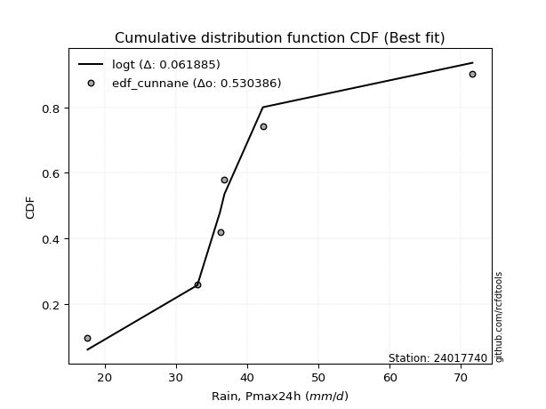</img>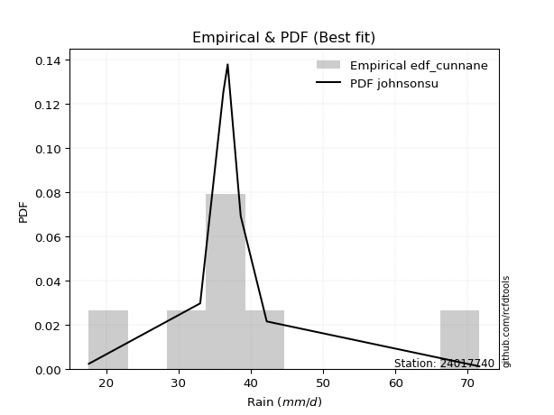</img>

</div>


### 12. Empirical - EDF Adamowski (1981)

The Adamowski formula in hydrology refers to a specific plotting position formula used for estimating the non-parametric empirical distribution of hydrological events (like flood peaks) to calculate their return periods. This formula provides an alternative to traditional parametric methods (like the Gumbel or Log Pearson Type III distributions). 

<div align="center">


$P=(m-0.25)/(n+0.5)$


</div>


**12.1. Empirical values**

<div align="center">

|                | 0                  | 1                   | 2                   | 3             | 4                  | 5                  | 6                  |
|:---------------|:-------------------|:--------------------|:--------------------|:--------------|:-------------------|:-------------------|:-------------------|
| date           | 2023               | 2025                | 2019                | 2020          | 2022               | 2021               | 2024               |
| x              | 17.6               | 28.8                | 33.0                | 36.2          | 36.8               | 42.2               | 71.6               |
| m              | 1                  | 2                   | 3                   | 4             | 5                  | 6                  | 7                  |
| empirical_dist | edf_adamowski      | edf_adamowski       | edf_adamowski       | edf_adamowski | edf_adamowski      | edf_adamowski      | edf_adamowski      |
| empirical      | 0.1                | 0.23333333333333334 | 0.36666666666666664 | 0.5           | 0.6333333333333333 | 0.7666666666666667 | 0.9                |
| empirical_tr   | 1.1111111111111112 | 1.3043478260869565  | 1.5789473684210527  | 2.0           | 2.727272727272727  | 4.2857142857142865 | 10.000000000000002 |

</div>


**12.2. Kolmogorov-Smirnov fit test (sorted by Δ)**


<div align="center">

|                | 0                    | 1                   | 2                   | 3                   | 4                   | 5                   | 6                   | 7                     | 8                   | 9                   | 10                  | 11                  | 12                  | 13                  | 14                  | 15                  | 16                  | 17                  | 18                  | 19                  | 20                  | 21                  | 22                  | 23                  | 24                  | 25                  | 26                  | 27                  | 28                  | 29                  | 30                  | 31                  | 32                  | 33                  | 34                  | 35                  | 36                  | 37                  | 38                  | 39                  | 40                  | 41                  | 42                  | 43                  | 44                  | 45                  | 46                  | 47                  | 48                  | 49                  | 50                  | 51                  | 52                  | 53                  | 54                  | 55                  | 56                  | 57                  | 58                  | 59                  | 60                  | 61                  | 62                  | 63                  | 64                  | 65                  | 66                  | 67                  | 68                  | 69                  | 70                  | 71                  | 72                  | 73                  | 74                  | 75                  | 76                  | 77                  | 78                  | 79                  | 80                  | 81                  | 82                  | 83                  | 84                  | 85                  | 86                  | 87                  | 88                  | 89                  |
|:---------------|:---------------------|:--------------------|:--------------------|:--------------------|:--------------------|:--------------------|:--------------------|:----------------------|:--------------------|:--------------------|:--------------------|:--------------------|:--------------------|:--------------------|:--------------------|:--------------------|:--------------------|:--------------------|:--------------------|:--------------------|:--------------------|:--------------------|:--------------------|:--------------------|:--------------------|:--------------------|:--------------------|:--------------------|:--------------------|:--------------------|:--------------------|:--------------------|:--------------------|:--------------------|:--------------------|:--------------------|:--------------------|:--------------------|:--------------------|:--------------------|:--------------------|:--------------------|:--------------------|:--------------------|:--------------------|:--------------------|:--------------------|:--------------------|:--------------------|:--------------------|:--------------------|:--------------------|:--------------------|:--------------------|:--------------------|:--------------------|:--------------------|:--------------------|:--------------------|:--------------------|:--------------------|:--------------------|:--------------------|:--------------------|:--------------------|:--------------------|:--------------------|:--------------------|:--------------------|:--------------------|:--------------------|:--------------------|:--------------------|:--------------------|:--------------------|:--------------------|:--------------------|:--------------------|:--------------------|:--------------------|:--------------------|:--------------------|:--------------------|:--------------------|:--------------------|:--------------------|:--------------------|:--------------------|:--------------------|:--------------------|
| station        | 24017740             | 24017740            | 24017740            | 24017740            | 24017740            | 24017740            | 24017740            | 24017740              | 24017740            | 24017740            | 24017740            | 24017740            | 24017740            | 24017740            | 24017740            | 24017740            | 24017740            | 24017740            | 24017740            | 24017740            | 24017740            | 24017740            | 24017740            | 24017740            | 24017740            | 24017740            | 24017740            | 24017740            | 24017740            | 24017740            | 24017740            | 24017740            | 24017740            | 24017740            | 24017740            | 24017740            | 24017740            | 24017740            | 24017740            | 24017740            | 24017740            | 24017740            | 24017740            | 24017740            | 24017740            | 24017740            | 24017740            | 24017740            | 24017740            | 24017740            | 24017740            | 24017740            | 24017740            | 24017740            | 24017740            | 24017740            | 24017740            | 24017740            | 24017740            | 24017740            | 24017740            | 24017740            | 24017740            | 24017740            | 24017740            | 24017740            | 24017740            | 24017740            | 24017740            | 24017740            | 24017740            | 24017740            | 24017740            | 24017740            | 24017740            | 24017740            | 24017740            | 24017740            | 24017740            | 24017740            | 24017740            | 24017740            | 24017740            | 24017740            | 24017740            | 24017740            | 24017740            | 24017740            | 24017740            | 24017740            |
| empirical_dist | edf_adamowski        | edf_adamowski       | edf_adamowski       | edf_adamowski       | edf_adamowski       | edf_adamowski       | edf_adamowski       | edf_adamowski         | edf_adamowski       | edf_adamowski       | edf_adamowski       | edf_adamowski       | edf_adamowski       | edf_adamowski       | edf_adamowski       | edf_adamowski       | edf_adamowski       | edf_adamowski       | edf_adamowski       | edf_adamowski       | edf_adamowski       | edf_adamowski       | edf_adamowski       | edf_adamowski       | edf_adamowski       | edf_adamowski       | edf_adamowski       | edf_adamowski       | edf_adamowski       | edf_adamowski       | edf_adamowski       | edf_adamowski       | edf_adamowski       | edf_adamowski       | edf_adamowski       | edf_adamowski       | edf_adamowski       | edf_adamowski       | edf_adamowski       | edf_adamowski       | edf_adamowski       | edf_adamowski       | edf_adamowski       | edf_adamowski       | edf_adamowski       | edf_adamowski       | edf_adamowski       | edf_adamowski       | edf_adamowski       | edf_adamowski       | edf_adamowski       | edf_adamowski       | edf_adamowski       | edf_adamowski       | edf_adamowski       | edf_adamowski       | edf_adamowski       | edf_adamowski       | edf_adamowski       | edf_adamowski       | edf_adamowski       | edf_adamowski       | edf_adamowski       | edf_adamowski       | edf_adamowski       | edf_adamowski       | edf_adamowski       | edf_adamowski       | edf_adamowski       | edf_adamowski       | edf_adamowski       | edf_adamowski       | edf_adamowski       | edf_adamowski       | edf_adamowski       | edf_adamowski       | edf_adamowski       | edf_adamowski       | edf_adamowski       | edf_adamowski       | edf_adamowski       | edf_adamowski       | edf_adamowski       | edf_adamowski       | edf_adamowski       | edf_adamowski       | edf_adamowski       | edf_adamowski       | edf_adamowski       | edf_adamowski       |
| p_dist         | logjohnsonsu         | logt                | johnsonsu           | loglaplace          | logmielke           | loghypsecant        | fisk                | loglaplace_asymmetric | logfisk             | loggenlogistic      | mielke              | moyal               | loglogistic         | logrice             | nct                 | alpha               | invgamma            | logbetaprime        | ncf                 | betaprime           | lognct              | logf                | logpearson3         | logerlang           | loggamma            | loggamma            | logfatiguelife      | logexponnorm        | exponnorm           | loginvgamma         | logweibull_min      | logcrystalball      | lognorm             | lognorm             | logalpha            | f                   | invgauss            | logloggamma         | gamma               | erlang              | genlogistic         | gumbel_r            | loginvgauss         | pearson3            | halflogistic        | logmaxwell          | halfnorm            | kstwobign           | lograyleigh         | gompertz            | weibull_min         | rayleigh            | loginvweibull       | gibrat              | loggumbel_r         | wald                | maxwell             | rice                | logncf              | loghalfnorm         | laplace_asymmetric  | logkstwobign        | loggumbel_l         | logmoyal            | t                   | crystalball         | norm                | truncnorm           | loghalflogistic     | logistic            | hypsecant           | loggenexpon         | laplace             | genexpon            | expon               | loggompertz         | logwald             | loggibrat           | logtruncnorm        | lognakagami         | gumbel_l            | chi2                | logexpon            | logchi2             | nakagami            | loglognorm          | pareto              | logpareto           | invweibull          | fatiguelife         |
| delta          | 0.054626241432333855 | 0.05592555517240927 | 0.06081313006311617 | 0.06180466467976142 | 0.07598340682751104 | 0.07764353923497957 | 0.07855849153125216 | 0.07860085249571103   | 0.0789280091017952  | 0.08010805882928329 | 0.08014093382682741 | 0.08054166205971786 | 0.08274234976517125 | 0.0831425179000701  | 0.08372200522639517 | 0.08389375137173083 | 0.08491304234767694 | 0.0851024589253685  | 0.08518346848660807 | 0.08520279301756273 | 0.08595654823946919 | 0.0860573017344245  | 0.08606218706266355 | 0.0860754486026345  | 0.08607555246960219 | 0.08607555246960219 | 0.0861041963128838  | 0.08722503698445283 | 0.08746019111651915 | 0.08750388936933501 | 0.08871736423960053 | 0.08876387677040387 | 0.08876399454792938 | 0.08876399454792938 | 0.08919022000408605 | 0.08921898605232614 | 0.08929503940308525 | 0.09042734359357829 | 0.09280289246254514 | 0.09280322331063817 | 0.09300806471171064 | 0.09626319311348674 | 0.0969556657675294  | 0.09697800879807195 | 0.1                 | 0.10122271587599985 | 0.10562565627526543 | 0.10874805274926491 | 0.1133089619104986  | 0.1142422427627095  | 0.1156719101821842  | 0.12644458740317355 | 0.1289105893363191  | 0.12996022955421627 | 0.13189910192313054 | 0.13285716915311613 | 0.13447121373008863 | 0.13968018469900362 | 0.13974608219926687 | 0.1474719726948081  | 0.1497078739567601  | 0.15489764478796758 | 0.15634520788074135 | 0.15668609658125615 | 0.15774658421699045 | 0.16496539002871746 | 0.16496539677617772 | 0.16496546390644418 | 0.16694261470367439 | 0.16926301135570887 | 0.1729174553440594  | 0.18443318326953612 | 0.18642316901140804 | 0.18858419578455982 | 0.18870732056736345 | 0.2041519206319901  | 0.22526799158184424 | 0.23283667476506814 | 0.23332767342759786 | 0.2333333026593206  | 0.23556327217065764 | 0.2709219330945081  | 0.2748672380198443  | 0.2831520033177289  | 0.33884890076232094 | 0.41177719236286875 | 0.42109490861075544 | 0.4313226528269481  | 0.4457963090476484  | 0.5269560213182292  |
| deltao         | 0.48442053926100004  | 0.48442053926100004 | 0.48442053926100004 | 0.48442053926100004 | 0.48442053926100004 | 0.48442053926100004 | 0.48442053926100004 | 0.48442053926100004   | 0.48442053926100004 | 0.48442053926100004 | 0.48442053926100004 | 0.48442053926100004 | 0.48442053926100004 | 0.48442053926100004 | 0.48442053926100004 | 0.48442053926100004 | 0.48442053926100004 | 0.48442053926100004 | 0.48442053926100004 | 0.48442053926100004 | 0.48442053926100004 | 0.48442053926100004 | 0.48442053926100004 | 0.48442053926100004 | 0.48442053926100004 | 0.48442053926100004 | 0.48442053926100004 | 0.48442053926100004 | 0.48442053926100004 | 0.48442053926100004 | 0.48442053926100004 | 0.48442053926100004 | 0.48442053926100004 | 0.48442053926100004 | 0.48442053926100004 | 0.48442053926100004 | 0.48442053926100004 | 0.48442053926100004 | 0.48442053926100004 | 0.48442053926100004 | 0.48442053926100004 | 0.48442053926100004 | 0.48442053926100004 | 0.48442053926100004 | 0.48442053926100004 | 0.48442053926100004 | 0.48442053926100004 | 0.48442053926100004 | 0.48442053926100004 | 0.48442053926100004 | 0.48442053926100004 | 0.48442053926100004 | 0.48442053926100004 | 0.48442053926100004 | 0.48442053926100004 | 0.48442053926100004 | 0.48442053926100004 | 0.48442053926100004 | 0.48442053926100004 | 0.48442053926100004 | 0.48442053926100004 | 0.48442053926100004 | 0.48442053926100004 | 0.48442053926100004 | 0.48442053926100004 | 0.48442053926100004 | 0.48442053926100004 | 0.48442053926100004 | 0.48442053926100004 | 0.48442053926100004 | 0.48442053926100004 | 0.48442053926100004 | 0.48442053926100004 | 0.48442053926100004 | 0.48442053926100004 | 0.48442053926100004 | 0.48442053926100004 | 0.48442053926100004 | 0.48442053926100004 | 0.48442053926100004 | 0.48442053926100004 | 0.48442053926100004 | 0.48442053926100004 | 0.48442053926100004 | 0.48442053926100004 | 0.48442053926100004 | 0.48442053926100004 | 0.48442053926100004 | 0.48442053926100004 | 0.48442053926100004 |
| eval           | Δo > Δ               | Δo > Δ              | Δo > Δ              | Δo > Δ              | Δo > Δ              | Δo > Δ              | Δo > Δ              | Δo > Δ                | Δo > Δ              | Δo > Δ              | Δo > Δ              | Δo > Δ              | Δo > Δ              | Δo > Δ              | Δo > Δ              | Δo > Δ              | Δo > Δ              | Δo > Δ              | Δo > Δ              | Δo > Δ              | Δo > Δ              | Δo > Δ              | Δo > Δ              | Δo > Δ              | Δo > Δ              | Δo > Δ              | Δo > Δ              | Δo > Δ              | Δo > Δ              | Δo > Δ              | Δo > Δ              | Δo > Δ              | Δo > Δ              | Δo > Δ              | Δo > Δ              | Δo > Δ              | Δo > Δ              | Δo > Δ              | Δo > Δ              | Δo > Δ              | Δo > Δ              | Δo > Δ              | Δo > Δ              | Δo > Δ              | Δo > Δ              | Δo > Δ              | Δo > Δ              | Δo > Δ              | Δo > Δ              | Δo > Δ              | Δo > Δ              | Δo > Δ              | Δo > Δ              | Δo > Δ              | Δo > Δ              | Δo > Δ              | Δo > Δ              | Δo > Δ              | Δo > Δ              | Δo > Δ              | Δo > Δ              | Δo > Δ              | Δo > Δ              | Δo > Δ              | Δo > Δ              | Δo > Δ              | Δo > Δ              | Δo > Δ              | Δo > Δ              | Δo > Δ              | Δo > Δ              | Δo > Δ              | Δo > Δ              | Δo > Δ              | Δo > Δ              | Δo > Δ              | Δo > Δ              | Δo > Δ              | Δo > Δ              | Δo > Δ              | Δo > Δ              | Δo > Δ              | Δo > Δ              | Δo > Δ              | Δo > Δ              | Δo > Δ              | Δo > Δ              | Δo > Δ              | Δo > Δ              | Δo <= Δ             |
| fit            | 1                    | 1                   | 1                   | 1                   | 1                   | 1                   | 1                   | 1                     | 1                   | 1                   | 1                   | 1                   | 1                   | 1                   | 1                   | 1                   | 1                   | 1                   | 1                   | 1                   | 1                   | 1                   | 1                   | 1                   | 1                   | 1                   | 1                   | 1                   | 1                   | 1                   | 1                   | 1                   | 1                   | 1                   | 1                   | 1                   | 1                   | 1                   | 1                   | 1                   | 1                   | 1                   | 1                   | 1                   | 1                   | 1                   | 1                   | 1                   | 1                   | 1                   | 1                   | 1                   | 1                   | 1                   | 1                   | 1                   | 1                   | 1                   | 1                   | 1                   | 1                   | 1                   | 1                   | 1                   | 1                   | 1                   | 1                   | 1                   | 1                   | 1                   | 1                   | 1                   | 1                   | 1                   | 1                   | 1                   | 1                   | 1                   | 1                   | 1                   | 1                   | 1                   | 1                   | 1                   | 1                   | 1                   | 1                   | 1                   | 1                   | 0                   |
| n              | 7                    | 7                   | 7                   | 7                   | 7                   | 7                   | 7                   | 7                     | 7                   | 7                   | 7                   | 7                   | 7                   | 7                   | 7                   | 7                   | 7                   | 7                   | 7                   | 7                   | 7                   | 7                   | 7                   | 7                   | 7                   | 7                   | 7                   | 7                   | 7                   | 7                   | 7                   | 7                   | 7                   | 7                   | 7                   | 7                   | 7                   | 7                   | 7                   | 7                   | 7                   | 7                   | 7                   | 7                   | 7                   | 7                   | 7                   | 7                   | 7                   | 7                   | 7                   | 7                   | 7                   | 7                   | 7                   | 7                   | 7                   | 7                   | 7                   | 7                   | 7                   | 7                   | 7                   | 7                   | 7                   | 7                   | 7                   | 7                   | 7                   | 7                   | 7                   | 7                   | 7                   | 7                   | 7                   | 7                   | 7                   | 7                   | 7                   | 7                   | 7                   | 7                   | 7                   | 7                   | 7                   | 7                   | 7                   | 7                   | 7                   | 7                   |
| best_fit       | 1                    | 0                   | 0                   | 0                   | 0                   | 0                   | 0                   | 0                     | 0                   | 0                   | 0                   | 0                   | 0                   | 0                   | 0                   | 0                   | 0                   | 0                   | 0                   | 0                   | 0                   | 0                   | 0                   | 0                   | 0                   | 0                   | 0                   | 0                   | 0                   | 0                   | 0                   | 0                   | 0                   | 0                   | 0                   | 0                   | 0                   | 0                   | 0                   | 0                   | 0                   | 0                   | 0                   | 0                   | 0                   | 0                   | 0                   | 0                   | 0                   | 0                   | 0                   | 0                   | 0                   | 0                   | 0                   | 0                   | 0                   | 0                   | 0                   | 0                   | 0                   | 0                   | 0                   | 0                   | 0                   | 0                   | 0                   | 0                   | 0                   | 0                   | 0                   | 0                   | 0                   | 0                   | 0                   | 0                   | 0                   | 0                   | 0                   | 0                   | 0                   | 0                   | 0                   | 0                   | 0                   | 0                   | 0                   | 0                   | 0                   | 0                   |
| best_fit_sort  | 1                    | 2                   | 3                   | 4                   | 5                   | 6                   | 7                   | 8                     | 9                   | 10                  | 11                  | 12                  | 13                  | 14                  | 15                  | 16                  | 17                  | 18                  | 19                  | 20                  | 21                  | 22                  | 23                  | 24                  | 25                  | 26                  | 27                  | 28                  | 29                  | 30                  | 31                  | 32                  | 33                  | 34                  | 35                  | 36                  | 37                  | 38                  | 39                  | 40                  | 41                  | 42                  | 43                  | 44                  | 45                  | 46                  | 47                  | 48                  | 49                  | 50                  | 51                  | 52                  | 53                  | 54                  | 55                  | 56                  | 57                  | 58                  | 59                  | 60                  | 61                  | 62                  | 63                  | 64                  | 65                  | 66                  | 67                  | 68                  | 69                  | 70                  | 71                  | 72                  | 73                  | 74                  | 75                  | 76                  | 77                  | 78                  | 79                  | 80                  | 81                  | 82                  | 83                  | 84                  | 85                  | 86                  | 87                  | 88                  | 89                  | 90                  |

</div>


<div align="center">

</img>

</div>


**12.3. Best fit**

<div align="center">

|   id |   station | empirical_dist   | p_dist       |     delta |   deltao | eval   |   fit |   n |   best_fit |   best_fit_sort |
|-----:|----------:|:-----------------|:-------------|----------:|---------:|:-------|------:|----:|-----------:|----------------:|
|    0 |  24017740 | edf_adamowski    | logjohnsonsu | 0.0546262 | 0.484421 | Δo > Δ |     1 |   7 |          1 |               1 |

</div>


<div align="center">

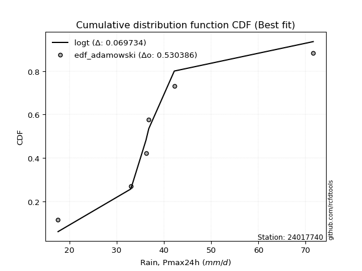</img></img>

</div>


## C. Best fit & Estimate extreme values for specific return periods - Tr


### 1. Best fit (ordered by delta Δ)

<div align="center">

|   id |   station | empirical_dist   | p_dist       |     delta |   deltao | eval   |   fit |   n |   best_fit |   best_fit_sort |
|-----:|----------:|:-----------------|:-------------|----------:|---------:|:-------|------:|----:|-----------:|----------------:|
|    0 |  24017740 | edf_chegodayev   | logjohnsonsu | 0.0520621 | 0.484421 | Δo > Δ |     1 |   7 |          1 |               1 |
|    1 |  24017740 | edf_jenkinson    | logjohnsonsu | 0.0524283 | 0.484421 | Δo > Δ |     1 |   7 |          1 |               2 |
|    2 |  24017740 | edf_beard        | logjohnsonsu | 0.0524283 | 0.484421 | Δo > Δ |     1 |   7 |          1 |               3 |
|    3 |  24017740 | edf_filliben     | logjohnsonsu | 0.0527043 | 0.484421 | Δo > Δ |     1 |   7 |          1 |               4 |
|    4 |  24017740 | edf_tukey        | logjohnsonsu | 0.0532906 | 0.484421 | Δo > Δ |     1 |   7 |          1 |               5 |
|    5 |  24017740 | edf_adamowski    | logjohnsonsu | 0.0546262 | 0.484421 | Δo > Δ |     1 |   7 |          1 |               6 |
|    6 |  24017740 | edf_blom         | logjohnsonsu | 0.054858  | 0.484421 | Δo > Δ |     1 |   7 |          1 |               7 |
|    7 |  24017740 | edf_cunnane      | logjohnsonsu | 0.0558159 | 0.484421 | Δo > Δ |     1 |   7 |          1 |               8 |
|    8 |  24017740 | edf_gringorten   | logjohnsonsu | 0.0573764 | 0.484421 | Δo > Δ |     1 |   7 |          1 |               9 |
|    9 |  24017740 | edf_hazen        | logjohnsonsu | 0.0597841 | 0.484421 | Δo > Δ |     1 |   7 |          1 |              10 |
|   10 |  24017740 | edf_weibull      | logt         | 0.0774967 | 0.484421 | Δo > Δ |     1 |   7 |          1 |              11 |
|   11 |  24017740 | edf_california   | logjohnsonsu | 0.131213  | 0.484421 | Δo > Δ |     1 |   7 |          1 |              12 |

</div>

:file_folder:Tables: [bestfit_24017740.csv](table/bestfit_24017740.csv) | [extreme_24017740.csv](table/extreme_24017740.csv)


### 2. Extreme values

In hydrology, a return period (or recurrence interval $Tr$) is the statistical average time between extreme events like floods or droughts of a specific magnitude, indicating how rare an event is, with a 100-year flood, for example, having a 1% chance of occurring in any given year, not that it happens exactly every century. It is a key tool for infrastructure design (like bridges or dams) and risk assessment, calculated from historical data to determine the probability of future events, although it is important to remember it is statistical average, and events can cluster or be missed.

> risk_rate: assuming the return period as the project useful life.

|   id |      tr |   prob_l |     prob_g |    alpha |   betaprime |     chi2 |   crystalball |   erlang |    expon |   exponnorm |        f |   fatiguelife |     fisk |    gamma |   genexpon |   genlogistic |   gibrat |   gompertz |   gumbel_l |   gumbel_r |   halflogistic |   halfnorm |   hypsecant |   invgamma |   invgauss |      invweibull |   johnsonsu |   kstwobign |   laplace |   laplace_asymmetric |   loggamma |   logistic |   lognorm |   maxwell |   mielke |    moyal |   nakagami |      ncf |      nct |    norm |           pareto |   pearson3 |   rayleigh |    rice |       t |   truncnorm |     wald |   weibull_min |   logalpha |   logbetaprime |     logchi2 |   logcrystalball |   logerlang |   logexpon |   logexponnorm |     logf |   logfatiguelife |   logfisk |   loggenexpon |   loggenlogistic |   loggibrat |   loggompertz |   loggumbel_l |   loggumbel_r |   loghalflogistic |   loghalfnorm |   loghypsecant |   loginvgamma |   loginvgauss |   loginvweibull |   logjohnsonsu |   logkstwobign |   loglaplace |   loglaplace_asymmetric |   logloggamma |   loglogistic |    loglognorm |   logmaxwell |   logmielke |   logmoyal |   lognakagami |   logncf |   lognct |         logpareto |   logpearson3 |   lograyleigh |   logrice |           logt |   logtruncnorm |   logwald |   logweibull_min |   station |   n |   risk_rate |
|-----:|--------:|---------:|-----------:|---------:|------------:|---------:|--------------:|---------:|---------:|------------:|---------:|--------------:|---------:|---------:|-----------:|--------------:|---------:|-----------:|-----------:|-----------:|---------------:|-----------:|------------:|-----------:|-----------:|----------------:|------------:|------------:|----------:|---------------------:|-----------:|-----------:|----------:|----------:|---------:|---------:|-----------:|---------:|---------:|--------:|-----------------:|-----------:|-----------:|--------:|--------:|------------:|---------:|--------------:|-----------:|---------------:|------------:|-----------------:|------------:|-----------:|---------------:|---------:|-----------------:|----------:|--------------:|-----------------:|------------:|--------------:|--------------:|--------------:|------------------:|--------------:|---------------:|--------------:|--------------:|----------------:|---------------:|---------------:|-------------:|------------------------:|--------------:|--------------:|--------------:|-------------:|------------:|-----------:|--------------:|---------:|---------:|------------------:|--------------:|--------------:|----------:|---------------:|---------------:|----------:|-----------------:|----------:|----:|------------:|
|    0 |    2    | 0.5      | 0.5        |  35.1197 |     35.1189 |  28.6519 |       38.0286 |  34.7277 |  31.76   |     35.3468 |  34.8696 |       17.6001 |  35.115  |  34.7277 |    31.7667 |       35.4283 |  33.3825 |    34.6851 |    40.5714 |    35.4857 |        34.2215 |    34.8601 |     38.0286 |    35.1168 |    35.1274 |   435.917       |     35.4346 |     35.8967 |   38.0286 |              37.1546 |    35.1176 |    38.0286 |   35.2278 |   36.7048 |  35.1786 |  34.6648 |    29.1065 |  35.1201 |  35.1369 | 38.0286 |     18.8231      |    35.256  |    36.2352 | 37.0346 | 37.7638 |     38.0286 |  33.0111 |       34.1768 |    34.4564 |        35.0476 |     27.7864 |          35.2278 |     35.1176 |    28.4714 |        35.1766 |  35.1175 |          35.1189 |   35.1346 |       31.7075 |          35.1777 |     31.3364 |       31.1153 |       37.5588 |       33.0415 |           32.0058 |       32.5249 |        35.2278 |       34.512  |       34.2023 |         33.2815 |        35.3993 |        32.5537 |      35.2278 |                 35.698  |       35.2804 |       35.2278 |  17.69        |      34.0722 |     34.6938 |    32.3651 |       33.9473 |  34.8192 |  35.1166 |     18.4085       |       35.1169 |       33.6715 |   34.7866 |     35.3171    |        35.9572 |   31.0446 |          34.9633 |  24017740 |   7 |    0.75     |
|    1 |    2.33 | 0.570815 | 0.429185   |  37.5595 |     37.6287 |  31.3141 |       40.7907 |  37.4449 |  34.8799 |     37.6275 |  37.5407 |       18.3133 |  37.3157 |  37.4449 |    34.8891 |       37.8796 |  34.7817 |    37.7725 |    42.9745 |    38.0451 |        36.853  |    37.8412 |     40.2391 |    37.6144 |    37.7135 | 11883.7         |     36.7227 |     38.5567 |   39.7001 |              38.8349 |    37.6521 |    40.4622 |   37.7669 |   39.5744 |  37.3594 |  37.0876 |    29.6385 |  37.6271 |  37.5435 | 40.7907 |     20.667       |    37.9442 |    39.1474 | 39.7213 | 40.5738 |     40.7907 |  34.8223 |       37.0422 |    36.9732 |        37.5848 |     32.9091 |          37.7669 |     37.6521 |    31.6544 |        37.7091 |  37.6517 |          37.6535 |   37.3245 |       34.6445 |          37.3583 |     32.4607 |       34.1259 |       39.9032 |       35.2425 |           34.1998 |       35.0619 |        37.2456 |       37.0276 |       36.7219 |         36.0653 |        36.584  |        35.3946 |      36.7432 |                 37.1486 |       37.8313 |       37.4556 |  18.4218      |      36.627  |     36.8909 |    34.4024 |       35.7596 |  38.6887 |  37.6495 |     19.6989       |       37.6514 |       36.235  |   37.3751 |     36.6679    |        37.631  |   32.494  |          37.5989 |  24017740 |   7 |    0.729209 |
|    2 |    5    | 0.8      | 0.2        |  48.4087 |     48.7511 |  44.9575 |       51.0556 |  49.5187 |  50.4785 |     48.0549 |  49.3954 |       33.4607 |  47.2773 |  49.5187 |    50.5002 |       48.5244 |  42.8372 |    50.855  |    50.7379 |    49.1645 |        48.76   |    50.4478 |     49.1061 |    48.6974 |    49.1173 |     2.43192e+10 |     43.7588 |     49.8555 |   48.0573 |              47.2364 |    48.868  |    49.8588 |   48.9143 |   50.8692 |  47.0696 |  48.3104 |    39.8032 |  48.7365 |  48.2952 | 51.0556 |    308.982       |    49.5726 |    50.8059 | 50.4774 | 51.1355 |     51.0556 |  44.9612 |       49.8304 |    48.5912 |        48.8933 |     90.1931 |          48.9143 |     48.8679 |    53.7717 |        48.8694 |  48.8667 |          48.8694 |   47.2002 |       50.2496 |          47.0668 |     39.7649 |       49.3084 |       48.5244 |       46.6383 |           46.1652 |       48.1708 |        46.5697 |       48.582  |       48.4834 |         51.1269 |        42.8179 |        50.4994 |      45.3552 |                 45.1793 |       48.9811 |       47.4614 |   3.01816e+69 |      48.6852 |     46.5929 |    45.6453 |       46.0609 |  57.9941 |  48.8597 | 799480            |       48.8677 |       48.6075 |   48.9906 |     43.4454    |        46.2434 |   41.951  |          49.2111 |  24017740 |   7 |    0.67232  |
|    3 |   10    | 0.9      | 0.1        |  57.6722 |     58.0562 |  57.6043 |       57.865  |  59.3478 |  64.6385 |     57.2631 |  59.0953 |       54.3754 |  56.3718 |  59.3478 |    64.6716 |       57.1914 |  52.0195 |    60.332  |    55.0602 |    58.221  |        58.6483 |    59.7763 |     56.1866 |    58.0047 |    58.4404 |     3.36269e+15 |     52.8481 |     58.4581 |   55.6437 |              54.863  |    58.1842 |    56.779  |   58.0697 |   58.8179 |  55.7551 |  58.0815 |    57.1631 |  58.0341 |  57.5501 | 57.865  |  18101.8         |    58.7839 |    59.1186 | 58.1467 | 58.3803 |     57.865  |  55.721  |       60.1096 |    58.8593 |        58.3839 |    257.924  |          58.0697 |     58.1841 |    86.9861 |        58.0952 |  58.183  |          58.1862 |   56.1816 |       66.4419 |          55.7511 |     50.1155 |       63.2408 |       54.1075 |       58.5929 |           59.2264 |       60.9343 |        55.6652 |       58.7125 |       59.0206 |         67.935  |        51.8892 |        66.1916 |      54.9089 |                 53.963  |       58.0787 |       56.5023 | inf           |      59.4809 |     55.488  |    58.3873 |       56.4762 |  76.7649 |  58.1768 |      6.15205e+290 |       58.1849 |       59.9332 |   58.7616 |     52.6054    |        53.7884 |   55.0142 |          58.6647 |  24017740 |   7 |    0.651322 |
|    4 |   15    | 0.933333 | 0.0666667  |  63.1365 |     63.4143 |  65.0672 |       61.263  |  64.8226 |  72.9216 |     62.6458 |  64.5345 |       68.054  |  62.0747 |  64.8226 |    72.9613 |       62.0807 |  58.353  |    65.1389 |    57.0177 |    63.3306 |        64.2442 |    64.6309 |     60.2274 |    63.3822 |    63.6772 |     2.6733e+18  |     59.9079 |     63.025  |   60.0815 |              59.3243 |    63.5067 |    60.5495 |   63.2606 |   62.8963 |  61.134  |  63.7523 |    68.2767 |  63.3903 |  63.0295 | 61.263  | 202330           |    63.847  |    63.4017 | 62.0982 | 62.1108 |     61.263  |  62.6304 |       65.7496 |    64.9845 |        63.8442 |    493.729  |          63.2606 |     63.5066 |   115.251  |        63.3539 |  63.5061 |          63.5093 |   61.804  |       77.048  |          61.13   |     58.7858 |       71.4439 |       56.8431 |       66.6435 |           68.1942 |       68.8625 |        61.6312 |       64.7192 |       65.3559 |         79.7517 |        60.2282 |        76.417  |      61.405  |                 59.8729 |       63.2138 |       62.1334 | inf           |      65.9182 |     61.2535 |    67.3553 |       62.9274 |  88.6199 |  63.5032 |    inf            |       63.5082 |       66.763  |   64.3751 |     61.1371    |        57.7186 |   65.4752 |          63.9626 |  24017740 |   7 |    0.644736 |
|    5 |   20    | 0.95     | 0.05       |  67.0886 |     67.219  |  70.3833 |       63.4883 |  68.6186 |  78.7985 |     66.4648 |  68.3243 |       78.1814 |  66.3625 |  68.6186 |    78.8429 |       65.5039 |  63.3212 |    68.2877 |    58.2361 |    66.9082 |        68.1648 |    67.8674 |     63.078  |    67.2091 |    67.3299 |     2.86949e+20 |     65.8634 |     66.1015 |   63.2302 |              62.4896 |    67.2645 |    63.1556 |   66.9089 |   65.603  |  65.1491 |  67.7684 |    76.1033 |  67.1948 |  66.9953 | 63.4883 |      1.12231e+06 |    67.3348 |    66.2486 | 64.7247 | 64.6059 |     63.4883 |  67.7793 |       69.6211 |    69.4241 |        67.7155 |    791.479  |          66.9089 |     67.2645 |   140.717  |        67.0629 |  67.2646 |          67.2677 |   66.0285 |       85.1486 |          65.1455 |     66.6245 |       77.2849 |       58.6152 |       72.9301 |           75.2746 |       74.7135 |        66.2207 |       69.0563 |       69.9673 |         89.2286 |        68.3246 |        84.1814 |      66.4751 |                 64.4545 |       66.8132 |       66.3502 | inf           |      70.5706 |     65.7245 |    74.5279 |       67.6583 |  97.491  |  67.2654 |    inf            |       67.2668 |       71.7279 |   68.3487 |     69.7538    |        60.1875 |   74.5445 |          67.6557 |  24017740 |   7 |    0.641514 |
|    6 |   25    | 0.96     | 0.04       |  70.2132 |     70.1821 |  74.5167 |       65.1265 |  71.521  |  83.357  |     69.4271 |  71.2329 |       86.2279 |  69.8484 |  71.521  |    83.4051 |       68.1406 |  67.463  |    70.5997 |    59.1031 |    69.6639 |        71.1855 |    70.2756 |     65.2842 |    70.1946 |    70.1353 |     1.05201e+22 |     71.0905 |     68.4058 |   65.6724 |              64.9448 |    70.178  |    65.1492 |   69.7283 |   67.6124 |  68.3964 |  70.8813 |    82.0607 |  70.1585 |  70.1293 | 65.1265 |      4.23899e+06 |    69.9905 |    68.3637 | 66.6762 | 66.4722 |     65.1265 |  71.9035 |       72.5593 |    72.9322 |        70.726  |   1147.42   |          69.7283 |     70.178  |   164.284  |        69.937  |  70.1788 |          70.1818 |   69.4616 |       91.7859 |          68.3934 |     73.9524 |       81.8266 |       59.9098 |       78.1738 |           81.2272 |       79.3872 |        70.006  |       72.4737 |       73.6216 |         97.2894 |        76.3493 |        90.5097 |      70.6942 |                 68.2484 |       69.5896 |       69.7682 | inf           |      74.2356 |     69.4576 |    80.6088 |       71.4158 | 104.657  |  70.1833 |    inf            |       70.1808 |       75.6543 |   71.4344 |     78.6809    |        61.896  |   82.7068 |          70.4919 |  24017740 |   7 |    0.639603 |
|    7 |   50    | 0.98     | 0.02       |  80.3526 |     79.5086 |  87.4014 |       69.8174 |  80.3458 |  97.517  |     78.6289 |  80.1403 |      112.045  |  81.7133 |  80.3458 |    97.5764 |       76.2628 |  82.0628 |    77.1636 |    61.4568 |    78.153  |        80.4926 |    77.2751 |     72.1241 |    79.6202 |    78.734  |     6.92839e+26 |     91.2452 |     75.1726 |   73.2589 |              72.5715 |    79.2693 |    71.2402 |   78.4767 |   73.4401 |  79.3491 |  80.545  |    99.7113 |  79.4916 |  80.2668 | 69.8174 |      2.63067e+08 |    78.014  |    74.5037 | 72.3408 | 71.9749 |     69.8174 |  85.3689 |       81.3776 |    84.2544 |        80.1696 |   3725.04   |          78.4767 |     79.2693 |   265.761  |        78.9009 |  79.2732 |          79.2752 |   81.1435 |      114.563  |          79.3499 |    106.832  |       95.9899 |       63.5701 |       96.8176 |          102.694  |       94.6986 |        83.173  |       83.4451 |       85.4695 |        126.991  |       117.481  |       111.978  |      85.5854 |                 81.5173 |       78.1754 |       81.3412 | inf           |      85.9772 |     82.9144 |   102.832  |       83.5854 | 128.652  |  79.2944 |    inf            |       79.2743 |       88.3123 |   81.0858 |    131.108     |        66.0231 |  116.112  |          79.1906 |  24017740 |   7 |    0.63583  |
|    8 |   75    | 0.986667 | 0.0133333  |  86.6646 |     85.0833 |  94.9641 |       72.3344 |  85.3989 | 105.8    |     84.0115 |  85.2866 |      127.593  |  89.49   |  85.3989 |   105.866  |       80.9836 |  91.9236 |    80.6362 |    62.647  |    83.0871 |        85.9028 |    81.0854 |     76.1213 |    85.275  |    83.7045 |     4.37918e+29 |    106.235  |     78.8956 |   77.6967 |              77.0327 |    84.6439 |    74.7582 |   83.6149 |   76.6086 |  86.4534 |  86.1962 |   109.397  |  85.0737 |  86.5324 | 72.3344 |      2.94301e+09 |    82.5784 |    77.844  | 75.4226 | 75.0372 |     72.3344 |  93.6549 |       86.3502 |    91.2179 |        85.7868 |   7519.27   |          83.6149 |     84.6439 |   352.118  |        84.2    |  84.6504 |          84.6515 |   88.8011 |      129.552  |          86.4582 |    136.961  |      104.311  |       65.5054 |      109.634  |          117.691  |      104.241  |        91.9861 |       90.1505 |       92.7915 |        148.262  |       162.258  |       125.89   |      95.7108 |                 90.4449 |       83.1985 |       88.8805 | inf           |      93.1225 |     92.4319 |   118.568  |       91.062  | 144.018  |  84.6852 |    inf            |       84.6504 |       96.0669 |   86.8045 |    201.563     |        67.6801 |  143.068  |          84.228  |  24017740 |   7 |    0.634587 |
|    9 |  100    | 0.99     | 0.01       |  91.3497 |     89.1046 | 100.339  |       74.0368 |  88.9441 | 111.677  |     87.8306 |  88.9182 |      138.781  |  95.4335 |  88.944  |   111.748  |       84.3248 |  99.5623 |    82.9607 |    63.4254 |    86.5793 |        89.732  |    83.6811 |     78.9567 |    89.3637 |    87.2118 |     4.20401e+31 |    118.538  |     81.4465 |   80.8453 |              80.1981 |    88.4927 |    77.242  |   87.2795 |   78.7667 |  91.8479 |  90.2054 |   115.992  |  89.1019 |  91.151  | 74.0368 |      1.63258e+10 |    85.7694 |    80.1197 | 77.5222 | 77.1574 |     74.0368 |  99.6962 |       89.8065 |    96.3291 |        89.8244 |  12437.9    |          87.2795 |     88.4927 |   429.92   |        87.996  |  88.5013 |          88.5015 |   94.6557 |      141.006  |          91.8564 |    166.027  |      110.229  |       66.803  |      119.718  |          129.612  |      111.286  |        98.7983 |       95.0522 |       98.18   |        165.435  |       211.76   |       136.408  |     103.613  |                 97.3659 |       86.7724 |       94.6206 | inf           |      98.3264 |    100.112  |   131.172  |       96.5318 | 155.567  |  88.5477 |    inf            |       88.5003 |      101.736  |   90.9041 |    296.475     |        68.5767 |  166.589  |          87.7886 |  24017740 |   7 |    0.633968 |
|   10 |  200    | 0.995    | 0.005      | 103.477  |     99.0537 | 113.317  |       77.8984 |  97.3708 | 125.837  |     97.0323 |  97.6232 |      166.165  | 111.39   |  97.3707 |   125.919  |       92.3573 | 120.344  |    88.1515 |    65.1176 |    94.9749 |        98.938  |    89.6178 |     85.7875 |    99.5134 |    95.6136 |     2.45043e+36 |    154.775  |     87.3217 |   88.4317 |              87.8247 |    97.9119 |    83.2001 |   96.1985 |   83.7042 | 106.197  |  99.8651 |   131.016  |  99.074  | 102.942  | 77.8984 |      1.01316e+12 |    93.3213 |    85.3268 | 82.3262 | 82.1293 |     77.8984 | 114.744  |       97.9187 |   109.281  |        99.7578 |  42406.6    |          96.1985 |     97.9119 |   695.478  |        97.2957 |  97.9271 |          97.9246 |  110.388  |      171.675  |         106.218  |    280.267  |      124.534  |       69.7127 |      147.922  |          163.448  |      129.242  |       117.354  |      107.401  |      111.88   |        215.31   |       466.345  |       164.096  |     125.439  |                116.296  |       95.4419 |      109.947  | inf           |     111.353  |    122.615  |   167.318  |      110.291  | 185.783  |  98.0083 |    inf            |       97.9227 |      115.999  |  100.95   |   1100.19      |        70.0205 |  243.389  |          96.3451 |  24017740 |   7 |    0.633042 |
|   11 |  250    | 0.996    | 0.004      | 107.671  |    102.343  | 117.502  |       79.0785 | 100.053  | 130.396  |     99.9946 | 100.417  |      175.09   | 117.07   | 100.053  |   130.481  |       94.9396 | 127.801  |    89.7134 |    65.6154 |    97.674  |       101.898  |    91.4441 |     87.9864 |   102.879  |    98.3071 |     8.34268e+37 |    168.687  |     89.14   |   90.874  |              90.2799 |   100.994  |    85.1129 |   99.1018 |   85.2241 | 111.262  | 102.975  |   135.614  | 102.373  | 106.956  | 79.0785 |      3.82679e+12 |    95.7167 |    86.9297 | 83.805  | 83.6976 |     79.0785 | 119.723  |      100.472  |   113.657  |       103.023  |  63166.8    |          99.1019 |    100.994  |   811.957  |       100.342  | 101.011  |         101.008  |  115.994  |      182.547  |         111.289  |    338.191  |      129.152  |       70.5927 |      158.331  |          176.102  |      135.328  |       124.039  |      111.549  |      116.521  |        234.344  |       632.525  |       173.755  |     133.4    |                123.141  |       98.2554 |      115.376  | inf           |     115.7    |    131.335  |   180.955  |      114.901  | 196.277  | 101.106  |    inf            |      101.006  |      120.78   |  104.24   |   1952.16      |        70.3249 |  275.914  |          99.0977 |  24017740 |   7 |    0.632858 |
|   12 |  500    | 0.998    | 0.002      | 121.783  |    112.859  | 130.519  |       82.578  | 108.308  | 144.556  |    109.196  | 109.081  |      203.087  | 136.632  | 108.308  |   144.653  |      102.955  | 153.571  |    94.2739 |    67.0426 |   106.051  |       111.084  |    96.8895 |     94.8167 |   113.674  |   106.649  |     4.74808e+42 |    220.102  |     94.5889 |   98.4605 |              97.9065 |   110.739  |    91.0452 |  108.237  |   89.7596 | 128.558  | 112.634  |   149.243  | 112.924  | 120.18   | 82.578  |      2.37488e+14 |   103.063  |    91.7121 | 88.2172 | 88.4985 |     82.578  | 135.552  |      108.242  |   127.947  |       113.399  | 219836      |         108.237  |    110.739  |  1313.5    |       109.996  | 110.766  |         110.758  |  135.334  |      219.768  |         128.606  |    647.344  |      143.535  |       73.1775 |      195.541  |          221.964  |      155.23   |       147.333  |      125.02   |      131.712  |        304.817  |      1963.78   |       206.24   |     161.5    |                147.082  |      107.082  |      133.977  | inf           |     129.706  |    164.481  |   230.818  |      129.795  | 231.473  | 110.91   |    inf            |      110.755  |      136.247  |  114.652  |  22909.8       |        70.9508 |  411.129  |         107.658  |  24017740 |   7 |    0.632489 |
|   13 |  750    | 0.998667 | 0.00133333 | 130.923  |    119.235  | 138.145  |       84.5221 | 113.087  | 152.839  |    114.579  | 114.148  |      219.629  | 149.566  | 113.087  |   152.942  |      107.64   | 170.614  |    96.7596 |    67.8054 |   110.949  |       116.454  |    99.9316 |     98.8121 |   120.244  |   111.516  |     2.86028e+45 |    256.727  |     97.65   |  102.898  |             102.368  |   116.57   |    94.511  |  113.671  |   92.2963 | 139.88   | 118.284  |   156.8    | 119.326  | 128.492  | 84.5221 |      2.65684e+15 |   107.303  |    94.3864 | 90.6845 | 91.2702 |     84.5221 | 145.043  |      112.684  |   136.829  |       119.642  | 458554      |         113.671  |    116.57   |  1740.3    |       115.789  | 116.603  |         116.593  |  148.151  |      244.175  |         139.944  |    994.52   |      151.972  |       74.5975 |      221.221  |          254.123  |      167.596  |       162.937  |      133.336  |      141.177  |        355.461  |      4423.54   |       227.085  |     180.607  |                163.19   |      112.313  |      146.202  | inf           |     138.267  |    189.272  |   266.134  |      138.925  | 254.013  | 116.782  |    inf            |      116.588  |      145.744  |  120.885  | 185242         |        71.1646 |  522.189  |         112.678  |  24017740 |   7 |    0.632366 |
|   14 | 1000    | 0.999    | 0.001      | 137.872  |    123.867  | 143.56   |       85.8605 | 116.459  | 158.716  |    118.398  | 117.745  |      231.428  | 159.485  | 116.459  |   158.824  |      110.964  | 183.656  |    98.4508 |    68.3188 |   114.423  |       120.263  |   102.032  |    101.647  |   125.027  |   114.966  |     2.68097e+47 |    286.055  |     99.7706 |  106.047  |             105.533  |   120.769  |    96.9688 |  117.57   |   94.0495 | 148.507  | 122.293  |   161.996  | 123.979  | 134.67   | 85.8605 |      1.47383e+16 |   110.288  |    96.2345 | 92.3896 | 93.2257 |     85.8605 | 151.87   |      115.795  |   143.381  |       124.153  | 774273      |         117.57   |    120.769  |  2124.83   |       119.97   | 120.807  |         120.794  |  157.997  |      262.779  |         148.586  |   1381.39   |      157.969  |       75.5687 |      241.458  |          279.722  |      176.706  |       175.001  |      139.443  |      148.168  |        396.409  |      8497.12   |       242.749  |     195.519  |                175.678  |      116.059  |      155.543  | inf           |     144.512  |    209.971  |   294.421  |      145.594  | 270.942  | 121.013  |    inf            |      120.789  |      152.691  |  125.376  |      1.214e+06 |        71.2726 |  620.197  |         116.25   |  24017740 |   7 |    0.632305 |

<div align="center">

</img>

</div>


<div align="center">

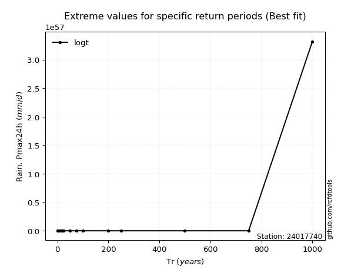</img>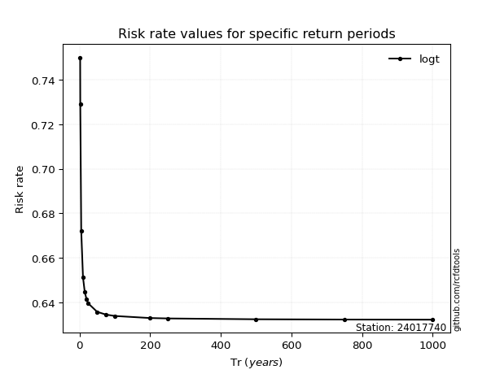</img>

</div>


<sub>**APP DISCLAIMER**: NO WARRANTY - This software is provided by [github.com/rcfdtools](https://github.com/rcfdtools) "as is", without any express or implied warranty, including warranties of merchantability, fitness for a particular purpose, or non-infringement. There is no guarantee that the software will be error-free or operate without interruption. LIMITATION OF LIABILITY - Neither the authors nor copyright holders will be liable for claims or damages arising from the software or its use. You are responsible for determining if the software is appropriate for your use and assume all associated risks, including errors, legal compliance, and data loss. NO PROFESSIONAL ADVICE - The software provides general information and does not offer professional advice. It should not replace consultation with professional advisors.</sub>