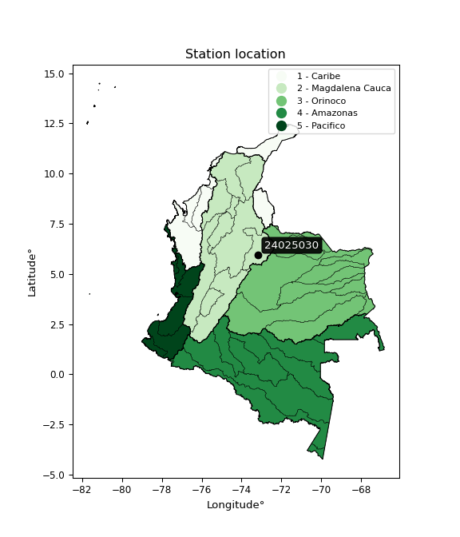

<div align="center">


</div>

# PMax24h Station (Rain): 24025030

Maximum Precipitation in 24 hours (PMax24h) is the greatest amount of rainfall for a specific duration that is meteorologically possible for a given location, acting as a "worst-case" scenario for extreme storms, crucial for designing safety-critical infrastructure like bridges, river deviations, dams, spillways, and nuclear plants to prevent catastrophic failure. The PMax24h is related with the Probable Maximum Precipitation (PMP) and it is calculated by hydrologists using meteorological data to determine the upper limit of extreme rainfall, often leading to the Probable Maximum Flood (PMF) for flood control design, and is increasingly being studied for climate change impacts. Probable Maximum Precipitation (PMP) is the theoretical upper limit of rainfall, a deterministic estimate for extreme events, while probability distributions (like GEV, Gumbel) describe the likelihood and frequency of various precipitation amounts, including rare ones, showing how often events occur, with PMP representing the extreme end of these distributions, used for critical infrastructure design to ensure safety against the worst conceivable weather, unlike standard statistical forecasts which cover typical probabilities.

The most common probability distributions in hydrology, used for analyzing floods, rainfall, and streamflow, include the Normal, Log-Normal, Gumbel, Gamma (including Log-Pearson Type III), and Generalized Extreme Value (GEV) distributions, often chosen based on the data´s skewness and whether modeling extremes or general conditions, with Gumbel and GEV popular for extreme events like floods, while the Normal distribution serves as a baseline, though often requiring transformations for skewed hydrological data. These distributions help in designing water infrastructure, managing water resources, and forecasting hydrologic events.

> Hydrological data often isn´t perfectly normal (it´s skewed), so different distributions are needed for different applications, such as: **Flood Frequency Analysis**: Using Gumbel, GEV, or Log-Pearson Type III for predicting extreme flood magnitudes and their return periods, **Rainfall Analysis**: Normal for annual totals, but Log-Normal, Weibull, or GEV for intensity or extreme daily rainfall, **Streamflow Modeling**: Gamma and Log-Normal for maximum flows, GEV for minimum flows, and Kappa for daily flows.

<div align="center">

</img>

</div>


## A. General information


### 1. General running parameters

• app_version: _v20260225_. • runtime: _2026-02-28 16:54:07.457399_. • Python version: _3.14.0_. • SciPy version: _1.16.3_. • Pandas version: _2.3.3_. • NumPy version: _2.3.5_. • Stations dataset (station_dataset_file): _dataset/pmax24h_in/automatic_colombia_2003_2025.csv_. • Stations catalog (station_catalog_file): _dataset/CNE.xls_. • Minimum year to eval til year_max (date_min): _1900_. • Maximum year to eval since year_min (date_max): _2025_. • Creates, save and include plots into reports (create_plot): _False_. • Plot only fit distributions with Δo > Δ (plot_only_fit): _True_. • Plot only simple graphs avoiding multiple CDFs and multiple Extreme values plots (plot_only_simple): _False_. • Eval low extreme values, if False, evaluates high extreme values (low_extreme): _False_. • Eval every SciPy distribution as logarithmic (pdist_logarithmic_on): _True_. • Standard deviation normalized (ddof): _1.0_. • Return periods to eval in years (Tr): _[2, 2.33, 5, 10, 15, 20, 25, 50, 75, 100, 200, 250, 500, 750, 1000]_. • Minimum data sample per station, 0 means any (minimum_sample): _5_. • Z-Score maximum threshold to adjust a value, 0 means disable (zscore_max): _3.5_. • Z-Score minimum threshold to adjust a value, 0 means disable (zscore_min): _-2.5_. • Avoid zeros, e.g. rain = 0 (avoid_zeros): _True_. • Avoid null values (avoid_nans): _True_. 

:file_folder:Table: [dataset.csv](../../dataset/pmax24h_in/automatic_colombia_2003_2025.csv)

> Delta Degrees of Freedom (DDOF): is a parameter used in the formulas for calculating variance and standard deviation. When ddof=0, the divisor is $N$ (the total number of observations) and this is used when your data set is the entire population. When ddof=1, the divisor is $N-1$ and this is used when your data set is a sample drawn from a larger population. Using $N-1$ provides an unbiased estimate of the population variance (known as Bessel´s correction).


### 2. Station info and location

|   id |   CODIGO | NOMBRE                     | CATEGORIA               | TECNOLOGIA                | ESTADO           | FECHA_INSTALACION   |   FECHA_SUSPENSION |   ALTITUD |   LATITUD |   LONGITUD | DEPARTAMENTO   | MUNICIPIO   | AREA_OPERATIVA                              | ENTIDAD                                                     | AREA_HIDROGRAFICA   | ZONA_HIDROGRAFICA   | SUBZONA_HIDROGRAFICA   |   CORRIENTE | Catalogo   |   Version |
|-----:|---------:|:---------------------------|:------------------------|:--------------------------|:-----------------|:--------------------|-------------------:|----------:|----------:|-----------:|:---------------|:------------|:--------------------------------------------|:------------------------------------------------------------|:--------------------|:--------------------|:-----------------------|------------:|:-----------|----------:|
|    0 | 24025030 | LA SIERRA - AUT [24025030] | Climatológica Principal | Automática con Telemetría | En Mantenimiento | 15/02/1967          |                nan |      2850 |   5.96708 |    -73.162 | Boyacá         | Paipa       | Area Operativa 06 - Boyacá-Casanare-Vichada | INSTITUTO DE HIDROLOGIA METEOROLOGIA Y ESTUDIOS AMBIENTALES | Magdalena Cauca     | Sogamoso            | Río Suárez             |         nan | CNE_IDEAM  |  20251226 |

<div align="center">

Dynamic map: [:earth_americas:Google](http://maps.google.com/maps?q=5.96708,-73.16202) [:earth_americas:OSM](https://www.openstreetmap.org/#map=18/5.96708/-73.16202&layers=P) [:earth_americas:Bing](https://www.bing.com/maps?cp=5.96708~-73.16202&lvl=18) [:earth_americas:Apple](https://maps.apple.com/frame?center=5.96708%2C-73.16202&span=0.003%2C0.006)

</div>


<div align="center">

```geojson
{
  "type": "Feature",
  "geometry": {
    "type": "Point", 
    "coordinates": [-73.16202, 5.96708]
  }, 
  "properties": {
    "Name": "24025030"
  }
}
```

</div>


### 3. Discrete values table and plot

<div align="center">

|               |           0 |            1 |         2 |           3 |          4 |
|:--------------|------------:|-------------:|----------:|------------:|-----------:|
| Date          | 2019        | 2020         | 2021      | 2022        | 2025       |
| Value         |   35.2      |   40.8       |   71.6    |   45.6      |   15       |
| Value_initial |   35.2      |   40.8       |   71.6    |   45.6      |   15       |
| count         |    5        |    5         |    5      |    5        |    5       |
| mean          |   41.64     |   41.64      |   41.64   |   41.64     |   41.64    |
| std           |   20.4031   |   20.4031    |   20.4031 |   20.4031   |   20.4031  |
| zscore        |   -0.315638 |   -0.0411701 |    1.4684 |    0.194088 |   -1.30568 |


</div>


> The initial value (value_initial) correspond to the initial obtained or null completed value, and value (value) is adjusted only when the initial value is outside the valid range (outlier) definite through the Z-Score value. If Z-Score is active, values out of range or outliers are replaced with the station mean value. A Z-Score (or standard score) measures how many standard deviations a data point is from the mean of a dataset, indicating its relative position; positive scores mean above the mean, negative mean below, and a score of zero is exactly at the mean, allowing for comparison of values from different distributions. It´s calculated using the formula $z=(x–μ)/σ$, where $x$ is the data point, $μ$ is the mean, and $σ$ is the standard deviation, helping identify outliers and understand probability.
>
> <sub>**Note**: In this study, "completing" (filling gaps in) and "extending" (forecasting or lengthening the historical record) rainfall data series are avoided for certain critical analyses because they introduce artificial bias and uncertainty, which can distort the statistics of rare events (extremes), alter day-to-day variability, and compromise the integrity and homogeneity of the original data. Some reasons against Completing/Extending rainfall data are: **Distortion of Extremes and Variability**: The primary issue is that most gap-filling or extension methods rely on averaging or regression with nearby stations, which inherently smooths the data. Rainfall is highly variable in space and time, with a large percentage of zero values and occasional large storms. Infilling methods often underestimate the highest values and overestimate the lowest (zero) values, which severely distorts analyses focused on flood frequency, drought severity, and intensity-duration-frequency (IDF) curves, **Loss of Data Homogeneity**: Infilled or extended data are synthetic estimates, not actual measurements. Combining these estimates with observed data can violate the assumption of data homogeneity, which requires that the data properties do not change over time. Inhomogeneity can lead to incorrect conclusions about long-term trends or changes in climate patterns, **Propagation of Errors**: Errors and biases from the original data (e.g., wind-induced undercatch, instrument errors, site changes) or the data used for imputation can propagate through the analysis, leading to unreliable hydrological models and inaccurate predictions, **Compromised Statistical Integrity**: For statistical analyses, especially those involving the frequency of events, using artificial data can introduce time bias or autocorrelation that doesn´t exist in reality, making it difficult to assess the true probability of events, **Difficulty in Validation**: It is difficult to accurately validate the quality of filled or extended data, especially for past periods where ground-truth measurements are unavailable. The reliability of imputation techniques heavily depends on the density of the surrounding station network and the complexity of the local topography.</sub>


### 4. Active continuous probability distributions from SciPy (80 of 104 available)

A Probability Density Function (PDF) describes the relative likelihood of a continuous random variable falling within a specific range, where the total area under its curve equals 1, and the area over any interval gives the actual probability for that range. Unlike discrete probabilities (like rolling a die), a PDF shows density, not direct probability for a single point (which is zero), with higher points indicating higher likelihood, often visualized as a bell curve for normal distributions.

A log of a probability density function (log-PDF) is simply the logarithm of the PDF´s value, denoted as $log(f(x))$, useful for converting multiplication of probabilities into addition, improving numerical stability with tiny numbers, and connecting to information theory concepts like entropy. Instead of dealing with very small probabilities (e.g., 0.000001), log-PDFs use negative numbers (e.g., $log(0.00001) ≈ -11.51$ that are easier for computers to handle, preventing underflow errors and simplifying complex calculations. In this study, each active probability distribution from SciPy is also evaluated in the $log$ form.

[scipy.stats](https://docs.scipy.org/doc/scipy/reference/stats.html) is a Python´s powerful submodule within the SciPy library for comprehensive statistical analysis, offering over 130 probability distributions (like Normal, Poisson, etc.), functions for descriptive stats (mean, variance), hypothesis testing (t-tests, chi-square), random variable generation, and statistical tests, making it essential for data science, modeling, and research. It provides tools to explore, model, and draw conclusions from data efficiently, working seamlessly with [NumPy](https://numpy.org/).

<div align="center">

|   id | p_dist           |   n_parameter | fit_method   | label                                                                       | active   | ref                                                                                                      |
|-----:|:-----------------|--------------:|:-------------|:----------------------------------------------------------------------------|:---------|:---------------------------------------------------------------------------------------------------------|
|    0 | alpha            |             3 | MLE          | Alpha                                                                       | True     | [:mortar_board:](https://docs.scipy.org/doc/scipy/reference/generated/scipy.stats.alpha.html)            |
|    1 | anglit           |             2 | MM           | Anglit                                                                      | True     | [:mortar_board:](https://docs.scipy.org/doc/scipy/reference/generated/scipy.stats.anglit.html)           |
|    2 | arcsine          |             2 | MM           | Arcsine                                                                     | True     | [:mortar_board:](https://docs.scipy.org/doc/scipy/reference/generated/scipy.stats.arcsine.html)          |
|    3 | argus            |             3 | MLE          | Argus                                                                       | True     | [:mortar_board:](https://docs.scipy.org/doc/scipy/reference/generated/scipy.stats.argus.html)            |
|    4 | beta             |             4 | MLE          | Beta                                                                        | True     | [:mortar_board:](https://docs.scipy.org/doc/scipy/reference/generated/scipy.stats.beta.html)             |
|    5 | betaprime        |             4 | MLE          | Beta prime                                                                  | True     | [:mortar_board:](https://docs.scipy.org/doc/scipy/reference/generated/scipy.stats.betaprime.html)        |
|    6 | bradford         |             3 | MLE          | Bradford                                                                    | True     | [:mortar_board:](https://docs.scipy.org/doc/scipy/reference/generated/scipy.stats.bradford.html)         |
|    7 | burr             |             4 | MLE          | Burr (Type III)                                                             | True     | [:mortar_board:](https://docs.scipy.org/doc/scipy/reference/generated/scipy.stats.burr.html)             |
|    8 | burr12           |             4 | MLE          | Burr (Type III) 12                                                          | True     | [:mortar_board:](https://docs.scipy.org/doc/scipy/reference/generated/scipy.stats.burr12.html)           |
|    9 | cosine           |             2 | MLE          | Cosine                                                                      | True     | [:mortar_board:](https://docs.scipy.org/doc/scipy/reference/generated/scipy.stats.cosine.html)           |
|   10 | crystalball      |             4 | MLE          | Crystalball                                                                 | True     | [:mortar_board:](https://docs.scipy.org/doc/scipy/reference/generated/scipy.stats.crystalball.html)      |
|   11 | dgamma           |             3 | MLE          | Double gamma                                                                | True     | [:mortar_board:](https://docs.scipy.org/doc/scipy/reference/generated/scipy.stats.dgamma.html)           |
|   12 | dweibull         |             3 | MLE          | Double Weibull                                                              | True     | [:mortar_board:](https://docs.scipy.org/doc/scipy/reference/generated/scipy.stats.dweibull.html)         |
|   13 | erlang           |             3 | MLE          | Erlang                                                                      | True     | [:mortar_board:](https://docs.scipy.org/doc/scipy/reference/generated/scipy.stats.erlang.html)           |
|   14 | exponnorm        |             3 | MLE          | Exponentially modified Normal                                               | True     | [:mortar_board:](https://docs.scipy.org/doc/scipy/reference/generated/scipy.stats.exponnorm.html)        |
|   15 | exponpow         |             3 | MLE          | Exponential power                                                           | True     | [:mortar_board:](https://docs.scipy.org/doc/scipy/reference/generated/scipy.stats.exponpow.html)         |
|   16 | exponweib        |             4 | MLE          | Exponentiated Weibull                                                       | True     | [:mortar_board:](https://docs.scipy.org/doc/scipy/reference/generated/scipy.stats.exponweib.html)        |
|   17 | f                |             4 | MLE          | F                                                                           | True     | [:mortar_board:](https://docs.scipy.org/doc/scipy/reference/generated/scipy.stats.f.html)                |
|   18 | fatiguelife      |             3 | MLE          | Fatigue-life (Birnbaum-Saunders)                                            | True     | [:mortar_board:](https://docs.scipy.org/doc/scipy/reference/generated/scipy.stats.fatiguelife.html)      |
|   19 | foldnorm         |             3 | MM           | Fold Normal                                                                 | True     | [:mortar_board:](https://docs.scipy.org/doc/scipy/reference/generated/scipy.stats.foldnorm.html)         |
|   20 | gamma            |             3 | MLE          | Gamma                                                                       | True     | [:mortar_board:](https://docs.scipy.org/doc/scipy/reference/generated/scipy.stats.gamma.html)            |
|   21 | gausshyper       |             6 | MLE          | Gauss hypergeometric                                                        | True     | [:mortar_board:](https://docs.scipy.org/doc/scipy/reference/generated/scipy.stats.gausshyper.html)       |
|   22 | genexpon         |             5 | MLE          | Generalized exponential                                                     | True     | [:mortar_board:](https://docs.scipy.org/doc/scipy/reference/generated/scipy.stats.genexpon.html)         |
|   23 | genextreme       |             3 | MLE          | Generalized exponential                                                     | True     | [:mortar_board:](https://docs.scipy.org/doc/scipy/reference/generated/scipy.stats.genextreme.html)       |
|   24 | gengamma         |             4 | MLE          | Generalized gamma                                                           | True     | [:mortar_board:](https://docs.scipy.org/doc/scipy/reference/generated/scipy.stats.gengamma.html)         |
|   25 | genhalflogistic  |             3 | MLE          | Generalized half-logistic                                                   | True     | [:mortar_board:](https://docs.scipy.org/doc/scipy/reference/generated/scipy.stats.genhalflogistic.html)  |
|   26 | genlogistic      |             3 | MLE          | Generalized logistic                                                        | True     | [:mortar_board:](https://docs.scipy.org/doc/scipy/reference/generated/scipy.stats.genlogistic.html)      |
|   27 | gennorm          |             3 | MLE          | Generalized Normal                                                          | True     | [:mortar_board:](https://docs.scipy.org/doc/scipy/reference/generated/scipy.stats.gennorm.html)          |
|   28 | genpareto        |             3 | MLE          | Generalized Pareto                                                          | True     | [:mortar_board:](https://docs.scipy.org/doc/scipy/reference/generated/scipy.stats.genpareto.html)        |
|   29 | gompertz         |             3 | MLE          | Gompertz (or truncated Gumbel)                                              | True     | [:mortar_board:](https://docs.scipy.org/doc/scipy/reference/generated/scipy.stats.gompertz.html)         |
|   30 | gumbel_l         |             2 | MM           | Gumbel Left Skew                                                            | True     | [:mortar_board:](https://docs.scipy.org/doc/scipy/reference/generated/scipy.stats.gumbel_l.html)         |
|   31 | gumbel_r         |             2 | MM           | Gumbel Right Skew                                                           | True     | [:mortar_board:](https://docs.scipy.org/doc/scipy/reference/generated/scipy.stats.gumbel_r.html)         |
|   32 | halfgennorm      |             3 | MLE          | Upper half of a generalized normal                                          | True     | [:mortar_board:](https://docs.scipy.org/doc/scipy/reference/generated/scipy.stats.halfgennorm.html)      |
|   33 | halflogistic     |             2 | MM           | Half-logistic                                                               | True     | [:mortar_board:](https://docs.scipy.org/doc/scipy/reference/generated/scipy.stats.halflogistic.html)     |
|   34 | halfnorm         |             2 | MM           | Half Normal                                                                 | True     | [:mortar_board:](https://docs.scipy.org/doc/scipy/reference/generated/scipy.stats.halfnorm.html)         |
|   35 | hypsecant        |             2 | MM           | hyperbolic secant                                                           | True     | [:mortar_board:](https://docs.scipy.org/doc/scipy/reference/generated/scipy.stats.hypsecant.html)        |
|   36 | invgamma         |             3 | MLE          | Inverted gamma                                                              | True     | [:mortar_board:](https://docs.scipy.org/doc/scipy/reference/generated/scipy.stats.invgamma.html)         |
|   37 | invgauss         |             3 | MLE          | Inverse Gaussian                                                            | True     | [:mortar_board:](https://docs.scipy.org/doc/scipy/reference/generated/scipy.stats.invgauss.html)         |
|   38 | invweibull       |             3 | MLE          | Inverted Weibull                                                            | True     | [:mortar_board:](https://docs.scipy.org/doc/scipy/reference/generated/scipy.stats.invweibull.html)       |
|   39 | johnsonsb        |             4 | MLE          | Johnson SB                                                                  | True     | [:mortar_board:](https://docs.scipy.org/doc/scipy/reference/generated/scipy.stats.johnsonsb.html)        |
|   40 | johnsonsu        |             4 | MLE          | Johnson Su                                                                  | True     | [:mortar_board:](https://docs.scipy.org/doc/scipy/reference/generated/scipy.stats.johnsonsu.html)        |
|   41 | kappa3           |             3 | MLE          | Kappa 3                                                                     | True     | [:mortar_board:](https://docs.scipy.org/doc/scipy/reference/generated/scipy.stats.kappa3.html)           |
|   42 | kappa4           |             4 | MLE          | Kappa 4                                                                     | True     | [:mortar_board:](https://docs.scipy.org/doc/scipy/reference/generated/scipy.stats.kappa4.html)           |
|   43 | ksone            |             3 | MLE          | Kolmogorov-Smirnov one-sided test statistic distribution                    | True     | [:mortar_board:](https://docs.scipy.org/doc/scipy/reference/generated/scipy.stats.ksone.html)            |
|   44 | kstwobign        |             2 | MLE          | Limiting distribution of scaled Kolmogorov-Smirnov two-sided test statistic | True     | [:mortar_board:](https://docs.scipy.org/doc/scipy/reference/generated/scipy.stats.kstwobign.html)        |
|   45 | laplace          |             2 | MM           | Laplace                                                                     | True     | [:mortar_board:](https://docs.scipy.org/doc/scipy/reference/generated/scipy.stats.laplace.html)          |
|   46 | levy_l           |             2 | MLE          | Left-skewed Levy                                                            | True     | [:mortar_board:](https://docs.scipy.org/doc/scipy/reference/generated/scipy.stats.levy_l.html)           |
|   47 | loggamma         |             3 | MLE          | Log gamma                                                                   | True     | [:mortar_board:](https://docs.scipy.org/doc/scipy/reference/generated/scipy.stats.loggamma.html)         |
|   48 | logistic         |             2 | MM           | Logistic (or Sech-squared)                                                  | True     | [:mortar_board:](https://docs.scipy.org/doc/scipy/reference/generated/scipy.stats.logistic.html)         |
|   49 | loglaplace       |             3 | MLE          | Log-Laplace                                                                 | True     | [:mortar_board:](https://docs.scipy.org/doc/scipy/reference/generated/scipy.stats.loglaplace.html)       |
|   50 | lomax            |             3 | MLE          | Lomax (Pareto of the second kind)                                           | True     | [:mortar_board:](https://docs.scipy.org/doc/scipy/reference/generated/scipy.stats.lomax.html)            |
|   51 | maxwell          |             2 | MM           | Maxwell                                                                     | True     | [:mortar_board:](https://docs.scipy.org/doc/scipy/reference/generated/scipy.stats.maxwell.html)          |
|   52 | mielke           |             4 | MLE          | Mielke Beta-Kappa / Dagum                                                   | True     | [:mortar_board:](https://docs.scipy.org/doc/scipy/reference/generated/scipy.stats.mielke.html)           |
|   53 | moyal            |             2 | MM           | Moyal                                                                       | True     | [:mortar_board:](https://docs.scipy.org/doc/scipy/reference/generated/scipy.stats.moyal.html)            |
|   54 | nakagami         |             3 | MLE          | Nakagami                                                                    | True     | [:mortar_board:](https://docs.scipy.org/doc/scipy/reference/generated/scipy.stats.nakagami.html)         |
|   55 | ncf              |             5 | MLE          | Non-central F distribution                                                  | True     | [:mortar_board:](https://docs.scipy.org/doc/scipy/reference/generated/scipy.stats.ncf.html)              |
|   56 | nct              |             4 | MLE          | Non-central Student’s t                                                     | True     | [:mortar_board:](https://docs.scipy.org/doc/scipy/reference/generated/scipy.stats.nct.html)              |
|   57 | norm             |             2 | MM           | Normal                                                                      | True     | [:mortar_board:](https://docs.scipy.org/doc/scipy/reference/generated/scipy.stats.norm.html)             |
|   58 | pearson3         |             3 | MM           | Pearson type III                                                            | True     | [:mortar_board:](https://docs.scipy.org/doc/scipy/reference/generated/scipy.stats.pearson3.html)         |
|   59 | powerlaw         |             3 | MLE          | Power-function                                                              | True     | [:mortar_board:](https://docs.scipy.org/doc/scipy/reference/generated/scipy.stats.powerlaw.html)         |
|   60 | rayleigh         |             2 | MM           | Rayleigh                                                                    | True     | [:mortar_board:](https://docs.scipy.org/doc/scipy/reference/generated/scipy.stats.rayleigh.html)         |
|   61 | rdist            |             3 | MLE          | R-distributed (symmetric beta)                                              | True     | [:mortar_board:](https://docs.scipy.org/doc/scipy/reference/generated/scipy.stats.rdist.html)            |
|   62 | rice             |             3 | MLE          | Rice                                                                        | True     | [:mortar_board:](https://docs.scipy.org/doc/scipy/reference/generated/scipy.stats.rice.html)             |
|   63 | semicircular     |             2 | MM           | Semicircular                                                                | True     | [:mortar_board:](https://docs.scipy.org/doc/scipy/reference/generated/scipy.stats.semicircular.html)     |
|   64 | skewnorm         |             3 | MLE          | Skew normal                                                                 | True     | [:mortar_board:](https://docs.scipy.org/doc/scipy/reference/generated/scipy.stats.skewnorm.html)         |
|   65 | t                |             3 | MLE          | Student’s t                                                                 | True     | [:mortar_board:](https://docs.scipy.org/doc/scipy/reference/generated/scipy.stats.t.html)                |
|   66 | trapezoid        |             4 | MLE          | Trapezoid                                                                   | True     | [:mortar_board:](https://docs.scipy.org/doc/scipy/reference/generated/scipy.stats.trapezoid.html)        |
|   67 | triang           |             3 | MLE          | Triangular                                                                  | True     | [:mortar_board:](https://docs.scipy.org/doc/scipy/reference/generated/scipy.stats.triang.html)           |
|   68 | truncexpon       |             3 | MLE          | Truncated exponential                                                       | True     | [:mortar_board:](https://docs.scipy.org/doc/scipy/reference/generated/scipy.stats.truncexpon.html)       |
|   69 | truncnorm        |             4 | MLE          | Truncated normal                                                            | True     | [:mortar_board:](https://docs.scipy.org/doc/scipy/reference/generated/scipy.stats.truncnorm.html)        |
|   70 | truncpareto      |             4 | MLE          | Upper truncated Pareto                                                      | True     | [:mortar_board:](https://docs.scipy.org/doc/scipy/reference/generated/scipy.stats.truncpareto.html)      |
|   71 | truncweibull_min |             5 | MLE          | Doubly truncated Weibull minimum                                            | True     | [:mortar_board:](https://docs.scipy.org/doc/scipy/reference/generated/scipy.stats.truncweibull_min.html) |
|   72 | tukeylambda      |             3 | MLE          | Tukey-Lamdba                                                                | True     | [:mortar_board:](https://docs.scipy.org/doc/scipy/reference/generated/scipy.stats.tukeylambda.html)      |
|   73 | uniform          |             2 | MLE          | Uniform                                                                     | True     | [:mortar_board:](https://docs.scipy.org/doc/scipy/reference/generated/scipy.stats.uniform.html)          |
|   74 | vonmises         |             3 | MLE          | Von Mises                                                                   | True     | [:mortar_board:](https://docs.scipy.org/doc/scipy/reference/generated/scipy.stats.vonmises.html)         |
|   75 | vonmises_line    |             3 | MLE          | Von Mises line                                                              | True     | [:mortar_board:](https://docs.scipy.org/doc/scipy/reference/generated/scipy.stats.vonmises_line.html)    |
|   76 | wald             |             2 | MM           | Wald                                                                        | True     | [:mortar_board:](https://docs.scipy.org/doc/scipy/reference/generated/scipy.stats.wald.html)             |
|   77 | weibull_max      |             3 | MLE          | Weibull maximum                                                             | True     | [:mortar_board:](https://docs.scipy.org/doc/scipy/reference/generated/scipy.stats.weibull_max.html)      |
|   78 | weibull_min      |             3 | MLE          | Weibull minimum                                                             | True     | [:mortar_board:](https://docs.scipy.org/doc/scipy/reference/generated/scipy.stats.weibull_min.html)      |
|   79 | wrapcauchy       |             3 | MLE          | Wrapped  Cauchy                                                             | True     | [:mortar_board:](https://docs.scipy.org/doc/scipy/reference/generated/scipy.stats.wrapcauchy.html)       |

</div>

> **n_parameter:** # arguments & localization & scale.
>
> **Fit methods:** (MLE) maximum likelihood, (MM) L-moments.
>
>**Inactive** (With the only purpose of prevent loops, zero divisions, infinite values, over high estimated values or horizontal trending for recurrence intervals estimations, the follow distributions were disabled.)**:** lognorm, norminvgauss, powernorm, powerlognorm, cauchy, halfcauchy, foldcauchy, skewcauchy, chi2, expon, fisk, genhyperbolic, geninvgauss, gibrat, kstwo, laplace_asymmetric, levy, levy_stable, ncx2, pareto, rel_breitwigner, recipinvgauss, studentized_range, loguniform, 


## B. Probability (PDF) vs. Empirical (EDF) distributions functions

A continuous probability distribution (CPD) describes probabilities for variables that can take any value within a range (like rain any time), unlike discrete variables with specific outcomes (like temperature). It uses a Probability Density Function (PDF), a curve where the total area under it equals 1, and the probability of the variable falling within an interval (a to b) is found by calculating the area under the curve between those points. A key feature is that the probability of hitting any single exact value is zero, so probabilities are always expressed for ranges, e.g., $P(a ≤ X ≤ b)$.

<div align="center">

Distributions parameters from station values
|     |   station | p_dist              |   n |             loc |           scale | shape                  | shape1                 | shape2                 | shape3             |
|----:|----------:|:--------------------|----:|----------------:|----------------:|:-----------------------|:-----------------------|:-----------------------|:-------------------|
|   0 |  24025030 | alpha               |   5 |  -192.161       |  3011.14        | 12.95787516562909      |                        |                        |                    |
|   1 |  24025030 | anglit              |   5 |    41.64        |    53.386       |                        |                        |                        |                    |
|   2 |  24025030 | arcsine             |   5 |    15.8318      |    51.6163      |                        |                        |                        |                    |
|   3 |  24025030 | argus               |   5 |    -0.173421    |    75.7895      | 1.3099426186300814e-05 |                        |                        |                    |
|   4 |  24025030 | beta                |   5 |     8.84059     |    62.7594      | 1.3259205585344744     | 0.3837590622633368     |                        |                    |
|   5 |  24025030 | betaprime           |   5 |   -31.5668      |  4800.81        | 15.986832640075303     | 1049.3372725662432     |                        |                    |
|   6 |  24025030 | bradford            |   5 |    15           |    56.6         | 0.6325780637137363     |                        |                        |                    |
|   7 |  24025030 | burr                |   5 |    -0.274812    |    53.4459      | 5.762957761760401      | 0.39123421285611043    |                        |                    |
|   8 |  24025030 | burr12              |   5 |    -2.14091     |    16.9864      | 483.45557998578386     | 0.0024474748197271467  |                        |                    |
|   9 |  24025030 | cosine              |   5 |    42.3057      |    15.3746      |                        |                        |                        |                    |
|  10 |  24025030 | crystalball         |   5 |    41.64        |    18.2491      | 2454.348912658502      | 4786.464406008158      |                        |                    |
|  11 |  24025030 | dgamma              |   5 |    40.8         |    17.0336      | 0.5470738055443027     |                        |                        |                    |
|  12 |  24025030 | dweibull            |   5 |    40.8         |    14.3392      | 0.8209923438185689     |                        |                        |                    |
|  13 |  24025030 | erlang              |   5 |   -28.8863      |     4.83798     | 14.577628642140342     |                        |                        |                    |
|  14 |  24025030 | exponnorm           |   5 |    34.6106      |    16.8753      | 0.4165517945822419     |                        |                        |                    |
|  15 |  24025030 | exponpow            |   5 |    15           |     2.00377     | 0.15029862512877734    |                        |                        |                    |
|  16 |  24025030 | exponweib           |   5 |    15           |     0.541127    | 1.419110752335087      | 0.16286738841808257    |                        |                    |
|  17 |  24025030 | f                   |   5 |   -29.6617      |    71.2785      | 29.9705183759922       | 6013.199428403492      |                        |                    |
|  18 |  24025030 | fatiguelife         |   5 |    15           |     1.13096e-05 | 1412.04067994049       |                        |                        |                    |
|  19 |  24025030 | foldnorm            |   5 |  -150.655       |    18.6829      | 10.287135658916121     |                        |                        |                    |
|  20 |  24025030 | gamma               |   5 |   -28.8863      |     4.83797     | 14.577661258172903     |                        |                        |                    |
|  21 |  24025030 | gausshyper          |   5 |    14.8441      |    56.7559      | 0.9713688116227751     | 0.955270305164205      | 1.0285146731201542     | 1.099185339250322  |
|  22 |  24025030 | genexpon            |   5 |    14.998       |     3.01629     | 0.11313654923273986    | 4.5179055379042615e-07 | 0.5253350102833003     |                    |
|  23 |  24025030 | genextreme          |   5 |    16.0823      |     9.00658     | -8.321740204250442     |                        |                        |                    |
|  24 |  24025030 | gengamma            |   5 |    15           |     0.780066    | 1.3052445765536271     | 0.2572483609793226     |                        |                    |
|  25 |  24025030 | genhalflogistic     |   5 |     9.12762     |    66.4805      | 1.0641579933250465     |                        |                        |                    |
|  26 |  24025030 | genlogistic         |   5 |    26.5798      |    12.9602      | 2.296330057936358      |                        |                        |                    |
|  27 |  24025030 | gennorm             |   5 |    40.8         |     0.364816    | 0.35909388124764063    |                        |                        |                    |
|  28 |  24025030 | genpareto           |   5 |     0.0447523   |   106.071       | -1.4823647834534335    |                        |                        |                    |
|  29 |  24025030 | gompertz            |   5 |   -36.8023      |    18.1909      | 0.00812104070405082    |                        |                        |                    |
|  30 |  24025030 | gumbel_l            |   5 |    49.8531      |    14.2288      |                        |                        |                        |                    |
|  31 |  24025030 | gumbel_r            |   5 |    33.4269      |    14.2288      |                        |                        |                        |                    |
|  32 |  24025030 | halfgennorm         |   5 |    15           |     0.765741    | 0.34050151970946735    |                        |                        |                    |
|  33 |  24025030 | halflogistic        |   5 |    20.0106      |    15.6023      |                        |                        |                        |                    |
|  34 |  24025030 | halfnorm            |   5 |    17.4853      |    30.2734      |                        |                        |                        |                    |
|  35 |  24025030 | hypsecant           |   5 |    41.64        |    11.6178      |                        |                        |                        |                    |
|  36 |  24025030 | invgamma            |   5 |  -115.179       | 11530.7         | 74.55707202045905      |                        |                        |                    |
|  37 |  24025030 | invgauss            |   5 |   -52.727       |  2406.73        | 0.03926438582144419    |                        |                        |                    |
|  38 |  24025030 | invweibull          |   5 |    15           |     1.70977     | 0.06296913811311818    |                        |                        |                    |
|  39 |  24025030 | johnsonsb           |   5 |    15           |    56.6         | -0.1649922746411085    | 0.19893355281092395    |                        |                    |
|  40 |  24025030 | johnsonsu           |   5 |   -74.6811      |    43.2955      | -11.605385319982641    | 6.808639278988478      |                        |                    |
|  41 |  24025030 | kappa3              |   5 |    15           |    56.5073      | 283.4463068230241      |                        |                        |                    |
|  42 |  24025030 | kappa4              |   5 |     9.9531      |    60.5749      | 1.090782760576016      | 0.9748975686647294     |                        |                    |
|  43 |  24025030 | ksone               |   5 |    10.0316      |    63.2168      | 1.0                    |                        |                        |                    |
|  44 |  24025030 | kstwobign           |   5 |   -24.4161      |    75.6729      |                        |                        |                        |                    |
|  45 |  24025030 | laplace             |   5 |    41.64        |    12.9041      |                        |                        |                        |                    |
|  46 |  24025030 | levy_l              |   5 |    74.4805      |    11.0194      |                        |                        |                        |                    |
|  47 |  24025030 | loggamma            |   5 | -5101.38        |   705.454       | 1466.5878753789684     |                        |                        |                    |
|  48 |  24025030 | logistic            |   5 |    41.64        |    10.0613      |                        |                        |                        |                    |
|  49 |  24025030 | loglaplace          |   5 |    -0.0948079   |    40.8948      | 2.739810701934294      |                        |                        |                    |
|  50 |  24025030 | lomax               |   5 |    15           |     1.61856e+10 | 516949721.4914553      |                        |                        |                    |
|  51 |  24025030 | maxwell             |   5 |    -1.60275     |    27.0984      |                        |                        |                        |                    |
|  52 |  24025030 | mielke              |   5 |    -0.221697    |    53.4211      | 2.2492840865771346     | 5.760679677842639      |                        |                    |
|  53 |  24025030 | moyal               |   5 |    31.204       |     8.21499     |                        |                        |                        |                    |
|  54 |  24025030 | nakagami            |   5 |    35.2         |    13.4109      | 0.17824782645984671    |                        |                        |                    |
|  55 |  24025030 | ncf                 |   5 |     2.34859     |     0.0790407   | 0.03527147309516615    | 604.1374472882815      | 17.440391241307204     |                    |
|  56 |  24025030 | nct                 |   5 |    -0.29487     |    16.7445      | 28.335865568620143     | 2.435800339600636      |                        |                    |
|  57 |  24025030 | norm                |   5 |    41.64        |    18.2491      |                        |                        |                        |                    |
|  58 |  24025030 | pearson3            |   5 |    41.64        |    18.2491      | 0.2560510240236987     |                        |                        |                    |
|  59 |  24025030 | powerlaw            |   5 |    15           |    56.6         | 0.12366689962719082    |                        |                        |                    |
|  60 |  24025030 | rayleigh            |   5 |     6.72837     |    27.8555      |                        |                        |                        |                    |
|  61 |  24025030 | rdist               |   5 |    10.3993      |    35.2007      | 0.9986646741595137     |                        |                        |                    |
|  62 |  24025030 | rice                |   5 |     5.68605     |    22.463       | 1.1053945554582798     |                        |                        |                    |
|  63 |  24025030 | semicircular        |   5 |    41.64        |    36.4982      |                        |                        |                        |                    |
|  64 |  24025030 | skewnorm            |   5 |    23.6793      |    25.605       | 1.8178573755033964     |                        |                        |                    |
|  65 |  24025030 | t                   |   5 |    41.6402      |    18.2491      | 364566397.6033164      |                        |                        |                    |
|  66 |  24025030 | trapezoid           |   5 |     9.34        |    67.92        | 0.9999999999999999     | 1.0                    |                        |                    |
|  67 |  24025030 | triang              |   5 |    -3.79026     |    75.4381      | 0.9999999995276587     |                        |                        |                    |
|  68 |  24025030 | truncexpon          |   5 |    15           |    53.5341      | 1.0572703823737029     |                        |                        |                    |
|  69 |  24025030 | truncnorm           |   5 |    41.64        |    18.2491      | -160.7562357854108     | 187.35074017188288     |                        |                    |
|  70 |  24025030 | truncpareto         |   5 |    14.7401      |     0.25988     | 0.2612459490869013     | 218.7929241759918      |                        |                    |
|  71 |  24025030 | truncweibull_min    |   5 |    14.9486      |    46.1041      | 0.5862784857827504     | 0.0011106840751313096  | 1.2287721901133508     |                    |
|  72 |  24025030 | tukeylambda         |   5 |    43.438       |    30.3217      | 1.0662417707490799     |                        |                        |                    |
|  73 |  24025030 | uniform             |   5 |    15           |    56.6         |                        |                        |                        |                    |
|  74 |  24025030 | vonmises            |   5 |     2.67749     |     1           | 2.4556261936962644     |                        |                        |                    |
|  75 |  24025030 | vonmises_line       |   5 |    43.3         |     9.00817     | 0.22197118804586863    |                        |                        |                    |
|  76 |  24025030 | wald                |   5 |    23.3908      |    18.2492      |                        |                        |                        |                    |
|  77 |  24025030 | weibull_max         |   5 |    71.6         |     1.50742     | 0.3293394820647618     |                        |                        |                    |
|  78 |  24025030 | weibull_min         |   5 |     7.53963     |    38.3375      | 1.9153859239004944     |                        |                        |                    |
|  79 |  24025030 | wrapcauchy          |   5 |    15           |     9.01212     | 2.8858514570730153e-06 |                        |                        |                    |
|  80 |  24025030 | logalpha            |   5 |   -11.3649      |   426.164       | 28.509951489753078     |                        |                        |                    |
|  81 |  24025030 | loganglit           |   5 |     3.61376     |     1.4955      |                        |                        |                        |                    |
|  82 |  24025030 | logarcsine          |   5 |     2.89081     |     1.4459      |                        |                        |                        |                    |
|  83 |  24025030 | logargus            |   5 |     2.24341     |     2.10611     | 1.5223626348031245     |                        |                        |                    |
|  84 |  24025030 | logbeta             |   5 |     2.13251     |     2.13859     | 2.5330293029581044     | 0.3295489320003561     |                        |                    |
|  85 |  24025030 | logbetaprime        |   5 |   -12.945       |    16.9452      | 2017.2002472976483     | 2064.5492023609086     |                        |                    |
|  86 |  24025030 | logbradford         |   5 |     2.70805     |     1.56306     | 1.074587282914021      |                        |                        |                    |
|  87 |  24025030 | logburr             |   5 |    -0.00779833  |     4.06423     | 25.200688827931454     | 0.281249791670731      |                        |                    |
|  88 |  24025030 | logburr12           |   5 |   -39.8544      |    47.7229      | 107.33206704247948     | 12645.791913700828     |                        |                    |
|  89 |  24025030 | logcosine           |   5 |     3.56539     |     0.432399    |                        |                        |                        |                    |
|  90 |  24025030 | logcrystalball      |   5 |     3.61376     |     0.51121     | 33.095192197031764     | 1.2211970940382466     |                        |                    |
|  91 |  24025030 | logdgamma           |   5 |     3.70868     |     0.385126    | 0.48453091918733837    |                        |                        |                    |
|  92 |  24025030 | logdweibull         |   5 |     3.70868     |     0.35099     | 0.8265312542140641     |                        |                        |                    |
|  93 |  24025030 | logerlang           |   5 |    -4.29702     |     0.0355736   | 222.34342859793355     |                        |                        |                    |
|  94 |  24025030 | logexponnorm        |   5 |     3.61351     |     0.511213    | 0.0004750130772557431  |                        |                        |                    |
|  95 |  24025030 | logexponpow         |   5 |     2.70805     |     1.4748      | 0.7948621538197287     |                        |                        |                    |
|  96 |  24025030 | logexponweib        |   5 |     2.70805     |     1.31509     | 0.26124453427175587    | 1.4842300327845646     |                        |                    |
|  97 |  24025030 | logf                |   5 |  -537.196       |   540.808       | 5983367.169212613      | 3578955.10991966       |                        |                    |
|  98 |  24025030 | logfatiguelife      |   5 |  -199.924       |   203.535       | 0.0025149218043063687  |                        |                        |                    |
|  99 |  24025030 | logfoldnorm         |   5 |     1.47393     |     0.499436    | 4.286693005624793      |                        |                        |                    |
| 100 |  24025030 | loggamma            |   5 |    -4.63354     |     0.0329912   | 249.7401815805315      |                        |                        |                    |
| 101 |  24025030 | loggausshyper       |   5 |     2.67641     |     1.59468     | 1.0151283967439362     | 0.9586375620376961     | 1.0323236193300864     | 1.1444024947353129 |
| 102 |  24025030 | loggenexpon         |   5 |     2.70344     |     0.00658142  | 0.0031714952583718784  | 2.0534987446891417     | 2.1716662128485463e-05 |                    |
| 103 |  24025030 | loggenextreme       |   5 |     3.68199     |     0.751068    | 1.2749206802636017     |                        |                        |                    |
| 104 |  24025030 | loggengamma         |   5 |     2.70805     |     1.06157     | 0.8634682224334546     | 1.0885576500171537     |                        |                    |
| 105 |  24025030 | loggenhalflogistic  |   5 |     2.70694     |     1.68839     | 1.0794233118476106     |                        |                        |                    |
| 106 |  24025030 | loggenlogistic      |   5 |     3.97612     |     0.173926    | 0.38738934696856486    |                        |                        |                    |
| 107 |  24025030 | loggennorm          |   5 |     3.70866     |     0.370462    | 0.977145516788408      |                        |                        |                    |
| 108 |  24025030 | loggenpareto        |   5 |    -0.00477358  |    10.977       | -2.5671955105400395    |                        |                        |                    |
| 109 |  24025030 | loggompertz         |   5 |     2.70805     |     1.13579     | 0.7264785929626165     |                        |                        |                    |
| 110 |  24025030 | loggumbel_l         |   5 |     3.84383     |     0.39859     |                        |                        |                        |                    |
| 111 |  24025030 | loggumbel_r         |   5 |     3.38368     |     0.39859     |                        |                        |                        |                    |
| 112 |  24025030 | loghalfgennorm      |   5 |     2.70804     |     1.56435     | 8910.46689511116       |                        |                        |                    |
| 113 |  24025030 | loghalflogistic     |   5 |     3.00792     |     0.437025    |                        |                        |                        |                    |
| 114 |  24025030 | loghalfnorm         |   5 |     2.93708     |     0.848084    |                        |                        |                        |                    |
| 115 |  24025030 | loghypsecant        |   5 |     3.61376     |     0.325447    |                        |                        |                        |                    |
| 116 |  24025030 | loginvgamma         |   5 |    -8.48781     |  6535.48        | 540.9969225651641      |                        |                        |                    |
| 117 |  24025030 | loginvgauss         |   5 |    -1.39677     |   406.772       | 0.012317451463068951   |                        |                        |                    |
| 118 |  24025030 | loginvweibull       |   5 |    -2.69237e+07 |     2.69237e+07 | 49610110.00080873      |                        |                        |                    |
| 119 |  24025030 | logjohnsonsb        |   5 |     2.70415     |     1.56695     | -0.6128227392930177    | 0.15391469804529356    |                        |                    |
| 120 |  24025030 | logjohnsonsu        |   5 |     3.75701     |     0.184362    | 0.22253478588944492    | 0.7227531026349849     |                        |                    |
| 121 |  24025030 | logkappa3           |   5 |     2.70783     |     1.5608      | 975.2555669608655      |                        |                        |                    |
| 122 |  24025030 | logkappa4           |   5 |     2.58198     |     1.87686     | 1.0722956783517064     | 1.1087935044044885     |                        |                    |
| 123 |  24025030 | logksone            |   5 |     2.55175     |     1.87565     | 1.0                    |                        |                        |                    |
| 124 |  24025030 | logkstwobign        |   5 |     1.44525     |     2.47446     |                        |                        |                        |                    |
| 125 |  24025030 | loglaplace          |   5 |     3.61376     |     0.361481    |                        |                        |                        |                    |
| 126 |  24025030 | loglevy_l           |   5 |     4.327       |     0.21368     |                        |                        |                        |                    |
| 127 |  24025030 | logloggamma         |   5 |     3.95519     |     0.351653    | 0.7974286672103789     |                        |                        |                    |
| 128 |  24025030 | loglogistic         |   5 |     3.61376     |     0.281846    |                        |                        |                        |                    |
| 129 |  24025030 | logloglaplace       |   5 |    -0.0870066   |     3.79569     | 9.652833123542912      |                        |                        |                    |
| 130 |  24025030 | loglomax            |   5 |     2.70805     |     1.77128e+11 | 100899207355.82321     |                        |                        |                    |
| 131 |  24025030 | logmaxwell          |   5 |     2.4024      |     0.759105    |                        |                        |                        |                    |
| 132 |  24025030 | logmielke           |   5 |     2.70805     |     1.50538     | 0.9550505288223469     | 12.620468511151772     |                        |                    |
| 133 |  24025030 | logmoyal            |   5 |     3.32141     |     0.230126    |                        |                        |                        |                    |
| 134 |  24025030 | lognakagami         |   5 |     3.56105     |     0.281652    | 0.0489139642007582     |                        |                        |                    |
| 135 |  24025030 | logncf              |   5 |  -148.101       |   110.242       | 767568.4431064825      | 223752.48322433943     | 288783.822067384       |                    |
| 136 |  24025030 | lognct              |   5 |   -22.1374      |     0.466707    | 7164.56528535371       | 55.167202022317795     |                        |                    |
| 137 |  24025030 | lognorm             |   5 |     3.61376     |     0.511211    |                        |                        |                        |                    |
| 138 |  24025030 | logpearson3         |   5 |     3.61376     |     0.511212    | -0.6728455157545445    |                        |                        |                    |
| 139 |  24025030 | logpowerlaw         |   5 |     2.70805     |     1.56304     | 0.13444696263219896    |                        |                        |                    |
| 140 |  24025030 | lograyleigh         |   5 |     2.63578     |     0.780313    |                        |                        |                        |                    |
| 141 |  24025030 | logrdist            |   5 |     3.3693      |     0.901796    | 1.120100069266573      |                        |                        |                    |
| 142 |  24025030 | logrice             |   5 |     2.35769     |     0.559198    | 1.9700446149726978     |                        |                        |                    |
| 143 |  24025030 | logsemicircular     |   5 |     3.61376     |     1.02242     |                        |                        |                        |                    |
| 144 |  24025030 | logskewnorm         |   5 |     4.2208      |     0.793624    | -3.614551868585952     |                        |                        |                    |
| 145 |  24025030 | logt                |   5 |     3.71927     |     0.243143    | 1.4601218499856925     |                        |                        |                    |
| 146 |  24025030 | logtrapezoid        |   5 |     2.16783     |     2.16889     | 1.0                    | 1.0                    |                        |                    |
| 147 |  24025030 | logtriang           |   5 |     2.14485     |     2.12626     | 0.9999905991284472     |                        |                        |                    |
| 148 |  24025030 | logtruncexpon       |   5 |     2.70794     |     1.90397     | 0.8210010449008911     |                        |                        |                    |
| 149 |  24025030 | logtruncnorm        |   5 |    -0.131164    |     1.26956     | 2.908108316037496      | 3.467547936252439      |                        |                    |
| 150 |  24025030 | logtruncpareto      |   5 |     2.69885     |     0.00920225  | 0.2606674847478993     | 170.85464951639577     |                        |                    |
| 151 |  24025030 | logtruncweibull_min |   5 |     2.6976      |     1.71615     | 1.0455875151842953     | 2.7581115689957762e-08 | 0.9168734539625043     |                    |
| 152 |  24025030 | logtukeylambda      |   5 |     3.48796     |     0.868639    | 1.1091833989875841     |                        |                        |                    |
| 153 |  24025030 | loguniform          |   5 |     2.70805     |     1.56304     |                        |                        |                        |                    |
| 154 |  24025030 | logvonmises         |   5 |    -2.65324     |     1           | 4.3722450229700405     |                        |                        |                    |
| 155 |  24025030 | logvonmises_line    |   5 |     3.48925     |     0.248872    | 3.765622672041862e-05  |                        |                        |                    |
| 156 |  24025030 | logwald             |   5 |     3.10254     |     0.511216    |                        |                        |                        |                    |
| 157 |  24025030 | logweibull_max      |   5 |     4.2711      |     0.7062      | 0.8552724818715394     |                        |                        |                    |
| 158 |  24025030 | logweibull_min      |   5 |  -107.468       |   111.317       | 273.81498116448097     |                        |                        |                    |
| 159 |  24025030 | logwrapcauchy       |   5 |     2.70805     |     0.248766    | 0.5                    |                        |                        |                    |

</div>

> **loc** (Location parameter): This shifts the distribution along the x-axis. For many common distributions, like the normal (Gaussian) distribution, loc represents the mean $μ$. For others, like the uniform distribution, it might represent the minimum value, or for the beta distribution, the left end of the support interval.
>
> **scale** (Scale parameter): This determines the width or spread of the distribution. For the normal distribution, scale represents the standard deviation $σ$. For a uniform distribution, it defines the length of the interval (from $loc$ to $loc + scale$).
>
> **shape** (Shape parameters): Refers to parameters that define the specific form of a probability distribution, distinct from its location (loc) and scale (scale). These parameters are required arguments for most distribution functions. For example, a normal (Gaussian) distribution is fully defined by its location (mean) and scale (standard deviation), so it has no specific shape parameters beyond loc and scale. However, other distributions have intrinsic properties that need specification, as Gamma distribution that takes a shape parameter, often named $a$ or $alpha$.


### 0. Cumulative distribution values - CDF (160 evaluated)

Cumulative Distribution Function (CDF), denoted as $F$<sub>$X$</sub>$(x)$, is a function that gives the probability that a random variable $X$ will take a value less than or equal to a specific value, $x$ (i.e., $(P(X≥x)$. It essentially "accumulates" probabilities from a given point up to the far right (positive infinity), providing a complete picture of the distribution´s probabilities for both discrete (like rain) and continuous (like temperature) variables, helping to find probabilities over ranges or above certain values. Each station is evaluated separately ordering the $x$ values ascending, calculating the CDF and PDF values for the activated distributions and their logarithmic forms.

<div align="center">

CDF ordered by x ascending and calculating $log(f(x))$ separately
|   id |   Station |   date |    x |   count |   mean |     std |     zscore |   Value_initial |   station |   m |     alpha |   alpha_pdf |    anglit |   anglit_pdf |   arcsine |   arcsine_pdf |     argus |   argus_pdf |      beta |    beta_pdf |   betaprime |   betaprime_pdf |    bradford |   bradford_pdf |      burr |   burr_pdf |    burr12 |   burr12_pdf |    cosine |   cosine_pdf |   crystalball |   crystalball_pdf |    dgamma |      dgamma_pdf |   dweibull |   dweibull_pdf |    erlang |   erlang_pdf |   exponnorm |   exponnorm_pdf |   exponpow |   exponpow_pdf |   exponweib |   exponweib_pdf |        f |      f_pdf |   fatiguelife |   fatiguelife_pdf |   foldnorm |   foldnorm_pdf |     gamma |   gamma_pdf |   gausshyper |   gausshyper_pdf |    genexpon |   genexpon_pdf |   genextreme |   genextreme_pdf |    gengamma |   gengamma_pdf |   genhalflogistic |   genhalflogistic_pdf |   genlogistic |   genlogistic_pdf |   gennorm |   gennorm_pdf |   genpareto |   genpareto_pdf |   gompertz |   gompertz_pdf |   gumbel_l |   gumbel_l_pdf |   gumbel_r |   gumbel_r_pdf |   halfgennorm |   halfgennorm_pdf |   halflogistic |   halflogistic_pdf |   halfnorm |   halfnorm_pdf |   hypsecant |   hypsecant_pdf |   invgamma |   invgamma_pdf |   invgauss |   invgauss_pdf |   invweibull |   invweibull_pdf |   johnsonsb |   johnsonsb_pdf |   johnsonsu |   johnsonsu_pdf |     kappa3 |   kappa3_pdf |      kappa4 |   kappa4_pdf |     ksone |   ksone_pdf |   kstwobign |   kstwobign_pdf |   laplace |   laplace_pdf |   levy_l |   levy_l_pdf |   loggamma |   loggamma_pdf |   logistic |   logistic_pdf |   loglaplace |   loglaplace_pdf |       lomax |   lomax_pdf |   maxwell |   maxwell_pdf |    mielke |   mielke_pdf |      moyal |   moyal_pdf |    nakagami |   nakagami_pdf |       ncf |    ncf_pdf |       nct |    nct_pdf |     norm |   norm_pdf |   pearson3 |   pearson3_pdf |   powerlaw |   powerlaw_pdf |   rayleigh |   rayleigh_pdf |    rdist |       rdist_pdf |     rice |   rice_pdf |   semicircular |   semicircular_pdf |   skewnorm |   skewnorm_pdf |         t |      t_pdf |   trapezoid |   trapezoid_pdf |    triang |   triang_pdf |   truncexpon |   truncexpon_pdf |   truncnorm |   truncnorm_pdf |   truncpareto |   truncpareto_pdf |   truncweibull_min |   truncweibull_min_pdf |   tukeylambda |   tukeylambda_pdf |   uniform |   uniform_pdf |   vonmises |   vonmises_pdf |   vonmises_line |   vonmises_line_pdf |     wald |   wald_pdf |   weibull_max |   weibull_max_pdf |   weibull_min |   weibull_min_pdf |   wrapcauchy |   wrapcauchy_pdf |   logalpha |   logalpha_pdf |   loganglit |   loganglit_pdf |   logarcsine |   logarcsine_pdf |   logargus |   logargus_pdf |    logbeta |   logbeta_pdf |   logbetaprime |   logbetaprime_pdf |   logbradford |   logbradford_pdf |   logburr |   logburr_pdf |   logburr12 |   logburr12_pdf |   logcosine |   logcosine_pdf |   logcrystalball |   logcrystalball_pdf |   logdgamma |   logdgamma_pdf |   logdweibull |   logdweibull_pdf |   logerlang |   logerlang_pdf |   logexponnorm |   logexponnorm_pdf |   logexponpow |   logexponpow_pdf |   logexponweib |   logexponweib_pdf |      logf |   logf_pdf |   logfatiguelife |   logfatiguelife_pdf |   logfoldnorm |   logfoldnorm_pdf |   loggausshyper |   loggausshyper_pdf |   loggenexpon |   loggenexpon_pdf |   loggenextreme |   loggenextreme_pdf |   loggengamma |   loggengamma_pdf |   loggenhalflogistic |   loggenhalflogistic_pdf |   loggenlogistic |   loggenlogistic_pdf |   loggennorm |   loggennorm_pdf |   loggenpareto |   loggenpareto_pdf |   loggompertz |   loggompertz_pdf |   loggumbel_l |   loggumbel_l_pdf |   loggumbel_r |   loggumbel_r_pdf |   loghalfgennorm |   loghalfgennorm_pdf |   loghalflogistic |   loghalflogistic_pdf |   loghalfnorm |   loghalfnorm_pdf |   loghypsecant |   loghypsecant_pdf |   loginvgamma |   loginvgamma_pdf |   loginvgauss |   loginvgauss_pdf |   loginvweibull |   loginvweibull_pdf |   logjohnsonsb |   logjohnsonsb_pdf |   logjohnsonsu |   logjohnsonsu_pdf |   logkappa3 |   logkappa3_pdf |   logkappa4 |   logkappa4_pdf |   logksone |   logksone_pdf |   logkstwobign |   logkstwobign_pdf |   loglevy_l |   loglevy_l_pdf |   logloggamma |   logloggamma_pdf |   loglogistic |   loglogistic_pdf |   logloglaplace |   logloglaplace_pdf |   loglomax |   loglomax_pdf |   logmaxwell |   logmaxwell_pdf |   logmielke |   logmielke_pdf |    logmoyal |   logmoyal_pdf |   lognakagami |   lognakagami_pdf |    logncf |   logncf_pdf |    lognct |   lognct_pdf |   lognorm |   lognorm_pdf |   logpearson3 |   logpearson3_pdf |   logpowerlaw |   logpowerlaw_pdf |   lograyleigh |   lograyleigh_pdf |   logrdist |   logrdist_pdf |   logrice |   logrice_pdf |   logsemicircular |   logsemicircular_pdf |   logskewnorm |   logskewnorm_pdf |      logt |   logt_pdf |   logtrapezoid |   logtrapezoid_pdf |   logtriang |   logtriang_pdf |   logtruncexpon |   logtruncexpon_pdf |   logtruncnorm |   logtruncnorm_pdf |   logtruncpareto |   logtruncpareto_pdf |   logtruncweibull_min |   logtruncweibull_min_pdf |   logtukeylambda |   logtukeylambda_pdf |   loguniform |   loguniform_pdf |   logvonmises |   logvonmises_pdf |   logvonmises_line |   logvonmises_line_pdf |   logwald |   logwald_pdf |   logweibull_max |   logweibull_max_pdf |   logweibull_min |   logweibull_min_pdf |   logwrapcauchy |   logwrapcauchy_pdf |
|-----:|----------:|-------:|-----:|--------:|-------:|--------:|-----------:|----------------:|----------:|----:|----------:|------------:|----------:|-------------:|----------:|--------------:|----------:|------------:|----------:|------------:|------------:|----------------:|------------:|---------------:|----------:|-----------:|----------:|-------------:|----------:|-------------:|--------------:|------------------:|----------:|----------------:|-----------:|---------------:|----------:|-------------:|------------:|----------------:|-----------:|---------------:|------------:|----------------:|---------:|-----------:|--------------:|------------------:|-----------:|---------------:|----------:|------------:|-------------:|-----------------:|------------:|---------------:|-------------:|-----------------:|------------:|---------------:|------------------:|----------------------:|--------------:|------------------:|----------:|--------------:|------------:|----------------:|-----------:|---------------:|-----------:|---------------:|-----------:|---------------:|--------------:|------------------:|---------------:|-------------------:|-----------:|---------------:|------------:|----------------:|-----------:|---------------:|-----------:|---------------:|-------------:|-----------------:|------------:|----------------:|------------:|----------------:|-----------:|-------------:|------------:|-------------:|----------:|------------:|------------:|----------------:|----------:|--------------:|---------:|-------------:|-----------:|---------------:|-----------:|---------------:|-------------:|-----------------:|------------:|------------:|----------:|--------------:|----------:|-------------:|-----------:|------------:|------------:|---------------:|----------:|-----------:|----------:|-----------:|---------:|-----------:|-----------:|---------------:|-----------:|---------------:|-----------:|---------------:|---------:|----------------:|---------:|-----------:|---------------:|-------------------:|-----------:|---------------:|----------:|-----------:|------------:|----------------:|----------:|-------------:|-------------:|-----------------:|------------:|----------------:|--------------:|------------------:|-------------------:|-----------------------:|--------------:|------------------:|----------:|--------------:|-----------:|---------------:|----------------:|--------------------:|---------:|-----------:|--------------:|------------------:|--------------:|------------------:|-------------:|-----------------:|-----------:|---------------:|------------:|----------------:|-------------:|-----------------:|-----------:|---------------:|-----------:|--------------:|---------------:|-------------------:|--------------:|------------------:|----------:|--------------:|------------:|----------------:|------------:|----------------:|-----------------:|---------------------:|------------:|----------------:|--------------:|------------------:|------------:|----------------:|---------------:|-------------------:|--------------:|------------------:|---------------:|-------------------:|----------:|-----------:|-----------------:|---------------------:|--------------:|------------------:|----------------:|--------------------:|--------------:|------------------:|----------------:|--------------------:|--------------:|------------------:|---------------------:|-------------------------:|-----------------:|---------------------:|-------------:|-----------------:|---------------:|-------------------:|--------------:|------------------:|--------------:|------------------:|--------------:|------------------:|-----------------:|---------------------:|------------------:|----------------------:|--------------:|------------------:|---------------:|-------------------:|--------------:|------------------:|--------------:|------------------:|----------------:|--------------------:|---------------:|-------------------:|---------------:|-------------------:|------------:|----------------:|------------:|----------------:|-----------:|---------------:|---------------:|-------------------:|------------:|----------------:|--------------:|------------------:|--------------:|------------------:|----------------:|--------------------:|-----------:|---------------:|-------------:|-----------------:|------------:|----------------:|------------:|---------------:|--------------:|------------------:|----------:|-------------:|----------:|-------------:|----------:|--------------:|--------------:|------------------:|--------------:|------------------:|--------------:|------------------:|-----------:|---------------:|----------:|--------------:|------------------:|----------------------:|--------------:|------------------:|----------:|-----------:|---------------:|-------------------:|------------:|----------------:|----------------:|--------------------:|---------------:|-------------------:|-----------------:|---------------------:|----------------------:|--------------------------:|-----------------:|---------------------:|-------------:|-----------------:|--------------:|------------------:|-------------------:|-----------------------:|----------:|--------------:|-----------------:|---------------------:|-----------------:|---------------------:|----------------:|--------------------:|
|    0 |  24025030 |   2025 | 15   |       5 |  41.64 | 20.4031 | -1.30568   |            15   |  24025030 |   1 | 0.0573531 |  0.00806733 | 0.0798015 |   0.0101519  |  0        |     0         | 0.0595163 |  0.00776432 | 0.0158441 | 0.00350681  |   0.0564967 |      0.00839231 | 4.01665e-07 |      0.0228013 | 0.0593574 | 0.00875513 | 0.0106874 |   0.067446   | 0.0615212 |   0.00824216 |      0.072173 |        0.00753228 | 0.0463485 |      0.00329231 |  0.0989805 |     0.00510152 | 0.0561305 |   0.00843411 |   0.0693075 |      0.00758141 | 0.00546582 |    4.62462e+11 | 0.000447779 |     5.81344e+10 | 0.056236 | 0.00842228 |     0.0220561 |       3.78212e+10 |  0.0777369 |     0.00778621 | 0.0561305 |  0.00843411 |   0.00466028 |        0.0289923 | 7.38478e-05 |     0.0375057  |  0.000102935 |   10814.2        | 1.03526e-05 |    1.95673e+09 |         0.0463487 |            0.00828349 |     0.0584561 |        0.00734974 | 0.0664723 |    0.00294454 |    0.146293 |       0.0101751 |   0.123616 |     0.00674825 |  0.0827165 |     0.00556598 |  0.0259609 |     0.00666167 |   1.77355e-13 |        0.235471   |       0        |         0          |   0        |     0          |   0.0640553 |      0.00547644 |  0.0582491 |     0.00817984 |  0.0549059 |     0.00843629 |  0.000223751 |      3.33325e+10 | 5.35699e-07 |    185.713      |   0.0591536 |      0.00805426 | 7.4939e-09 |    0.0173477 | 2.36192e-15 |    0.350441  | 0.0785931 |   0.0158186 |   0.0509964 |      0.0104725  | 0.0634432 |    0.00491652 | 0.333109 |   0.00263146 |  0.0385939 |       0.173419 |  0.0661261 |     0.00613774 |    0.0408157 |         0.112912 | 2.85059e-09 |  0.0319388  | 0.0547203 |    0.0091613  | 0.0593548 |   0.00876443 | 0.00733703 |  0.00357808 | 0           |     0          | 0.0501062 | 0.00941385 | 0.0643431 | 0.00757309 | 0.072173 | 0.00753228 |  0.0644112 |     0.00792527 | 0.00910101 |    6.33597e+11 |  0.0431314 |     0.0102005  | 0.541684 |      0.00911262 | 0.045881 | 0.00968393 |      0.0807543 |         0.0119229  |  0.0587311 |     0.00791091 | 0.0721718 | 0.00753218 |  0.00694444 |      0.00245387 | 0.0620418 |   0.00660362 |  4.19251e-09 |       0.0286236  |    0.072173 |      0.00753227 |   1.46996e-16 |        1.33098    |         6.1786e-05 |             0.315963   |   7.10543e-15 |         0.0295635 |  0        |     0.0176678 |    2.36116 |       0.542317 |     1.76812e-09 |           0.0139781 | 0        | 0          |     0.036867  |       0.000708006 |      0.042561 |         0.0106913 |  5.29265e-07 |        0.0176602 |  0.0381494 |       0.178417 |   0.0319728 |        0.235276 |     0        |         0        |  0.0445067 |       0.194585 | 0.00788162 |    0.0369727  |      0.0365689 |           0.163372 |   8.73846e-07 |          0.942073 |  0.057429 |      0.14987  |    0.056878 |        0.139273 |   0.0385949 |        0.220695 |        0.0382228 |             0.162446 |   0.0107663 |     0.0323004   |     0.0464077 |         0.0911235 |   0.0398631 |        0.175715 |      0.0382243 |           0.16245  |   4.59977e-13 |        823.3      |    1.00226e-06 |        8.75098e+08 | 0.0382959 |   0.163036 |        0.0385422 |             0.164067 |     0.0347115 |          0.153667 |       0.0271979 |            0.863046 |    0.00222773 |          0.485543 |        0.11651  |            0.125691 |   3.69498e-15 |          7.82059  |          0.000329342 |                 0.296351 |        0.0593293 |             0.132055 |    0.0372206 |        0.0953188 |       0.324299 |        0.168393    |    1.0523e-08 |          0.639622 |     0.0562309 |          0.137032 |    0.00430934 |         0.0588897 |         0        |             0.639284 |          0        |              0        |      0        |          0        |      0.0393282 |           0.120536 |     0.0354858 |          0.16654  |     0.0403443 |          0.191733 |       0.0397998 |            0.236427 |      0.0623668 |         4.8547     |      0.0617103 |          0.0826351 | 0.000141151 |        0.636192 | 1.32157e-15 |        6.39067  |  0.0833333 |       0.533147 |      0.0430519 |           0.288898 |    0.283619 |        0.083807 |     0.0627227 |          0.139966 |     0.0386615 |          0.131869 |       0.0260681 |           0.0900272 | 3.7395e-11 |       0.569641 |    0.0165411 |         0.157137 | 4.25044e-13 |        2.42465  | 0.000149957 |     0.00497408 |     0         |       0           | 0.0371857 |     0.160006 | 0.0386628 |     0.165033 | 0.0382234 |      0.162447 |     0.0531887 |          0.155613 |    0.00812494 |       2.45981e+12 |    0.00427989 |          0.118186 |   0.22089  |    0.535708    | 0.0306145 |      0.187614 |         0.0227498 |              0.288904 |      0.056633 |          0.163439 | 0.0442992 |  0.0603939 |       0.062039 |           0.229681 |   0.0701599 |        0.249149 |     0.000107562 |            0.937819 |     0          |           0        |      1.50403e-16 |           38.3742    |            0.00803909 |                  0.802493 |         0.002526 |             0.757293 |     0        |         0.639777 |       1.03669 |          0.143047 |        0.000418437 |               0.639482 |  0        |      0        |         0.139052 |             0.150113 |        0.0577061 |             0.139195 |        0        |            1.91933  |
|    1 |  24025030 |   2019 | 35.2 |       5 |  41.64 | 20.4031 | -0.315638  |            35.2 |  24025030 |   2 | 0.387441  |  0.0223074  | 0.380536  |   0.018189   |  0.419723 |     0.0127366 | 0.308258  |  0.0163391  | 0.125765  | 0.00739332  |   0.391923  |      0.0221346  | 0.415297    |      0.0186017 | 0.383159  | 0.0222551  | 0.60624   |   0.0124773  | 0.355476  |   0.0196176  |      0.362084 |        0.0205412  | 0.226151  |      0.0215284  |  0.314972  |     0.0213394  | 0.392913  |   0.0221506  |   0.366311  |      0.0210004  | 0.955728   |    0.00191946  | 0.774515    |     0.00315251  | 0.39265  | 0.0221473  |     0.828044  |       0.00597192  |  0.367208  |     0.0201592  | 0.392913  |  0.0221506  |   0.449676   |        0.0183306 | 0.531279    |     0.0175811  |  0.494848    |       0.00207097 | 0.8417      |    0.00420538  |         0.248483  |            0.0121111  |     0.385687  |        0.0232065  | 0.224165  |    0.0206647  |    0.366162 |       0.0117469 |   0.341043 |     0.0154033  |  0.300277  |     0.0175595  |  0.413607  |     0.0256627  |   0.602196    |        0.0111804  |       0.451647 |         0.0255095  |   0.441557 |     0.0222088  |   0.331952  |      0.0236682  |  0.389064  |     0.0222144  |  0.394607  |     0.0222175  |  0.42486     |      0.00113369  | 0.388918    |      0.00587078 |   0.384118  |      0.0220218  | 0.350424   |    0.0173477 | 0.393014    |    0.0177295 | 0.398128  |   0.0158186 |   0.435909  |      0.0217567  | 0.303548  |    0.0235234  | 0.403646 |   0.00467526 |  0.474215  |       0.766275 |  0.345229  |     0.0224669  |    0.432158  |         1.19552  | 0.475424    |  0.0167544  | 0.394696  |    0.0215947  | 0.383206  |   0.0222476  | 0.43298    |  0.0280008  | 2.85057e-06 |     1.4302e+08 | 0.41072   | 0.0221776  | 0.373496  | 0.0218188  | 0.362084 | 0.0205412  |  0.376191  |     0.0214422  | 0.880366   |    0.00538971  |  0.406884  |     0.0217636  | 0.748657 |      0.0127365  | 0.390863 | 0.0214442  |      0.388256  |         0.0171688  |  0.38655   |     0.0223405  | 0.362081  | 0.0205412  |  0.144965   |      0.0112115  | 0.267135  |   0.0137027  |  0.481629    |       0.0196269  |    0.362084 |      0.0205412  |   0.900826    |        0.00540361 |         0.672056   |             0.0146483  |   0.357653    |         0.0173097 |  0.35689  |     0.0176678 |    5.93497 |       0.15025  |     0.328447    |           0.0200371 | 0.48046  | 0.0381428  |     0.0576216 |       0.00148785  |      0.414409 |         0.0216998 |  0.356735    |        0.01766   |  0.483261  |       0.762468 |   0.464783  |        0.667013 |     0.476771 |         0.441467 |  0.395083  |       0.656557 | 0.109534   |    0.252869   |      0.461164  |           0.768308 |   0.632376    |          0.593834 |  0.393878 |      0.753751 |    0.388996 |        0.74415  |   0.496801  |        0.73613  |        0.458937  |             0.77625  |   0.18503   |     0.793419    |     0.306678  |         0.839247  |   0.470143  |        0.753162 |      0.458941  |           0.776247 |   0.597499    |          0.463609 |    0.791714    |        0.273505    | 0.460086  |   0.776756 |        0.461153  |             0.775868 |     0.457101  |          0.794163 |       0.628383  |            0.577804 |    0.546843   |          0.617917 |        0.3142   |            0.401828 |   0.610974    |          0.429502 |          0.350338    |                 0.572295 |        0.38344   |             0.782125 |    0.338356  |        0.889476  |       0.5031   |        0.272598    |    0.55649    |          0.601156 |     0.388543  |          0.754616 |    0.526849   |         0.847052  |         0        |             0.639284 |          0.56     |              0.78531  |      0.538108 |          0.717725 |      0.44867   |           0.965379 |     0.470012  |          0.76858  |     0.484102  |          0.725585 |       0.511941  |            0.63159  |      0.279647  |         0.133351   |      0.327747  |          0.97014   | 0.542811    |        0.636192 | 0.531675    |        0.607025 |  0.538106  |       0.533147 |      0.542326  |           0.608734 |    0.402624 |        0.239281 |     0.382146  |          0.719476 |     0.453381  |          0.879299 |       0.340924  |           0.902093  | 0.384858   |       0.350411 |    0.493143  |         0.763925 | 0.581253    |        0.650294 | 0.552425    |     0.863326   |     0.0315682 |       6.95411e+12 | 0.456559  |     0.776232 | 0.461669  |     0.77321  | 0.458939  |      0.776249 |     0.415253  |          0.743274 |    0.921801   |       0.145292    |    0.504911   |          0.752337 |   0.573652 |    0.389373    | 0.471309  |      0.759138 |         0.467194  |              0.62183  |      0.405737 |          0.710688 | 0.301221  |  1.02049   |       0.412631 |           0.592344 |   0.443624  |        0.626502 |     0.644882    |            0.599171 |     0.00056234 |           2.94281  |      0.939866    |            0.125419  |            0.644494   |                  0.605572 |         0.545382 |             0.621116 |     0.545727 |         0.639777 |       1.4446  |          0.798589 |        0.545916    |               0.639529 |  0.623577 |      0.913312 |         0.366169 |             0.443116 |        0.388059  |             0.741172 |        0.515336 |            0.217216 |
|    2 |  24025030 |   2020 | 40.8 |       5 |  41.64 | 20.4031 | -0.0411701 |            40.8 |  24025030 |   3 | 0.51291   |  0.0221232  | 0.484268  |   0.0187222  |  0.489638 |     0.0123402 | 0.404612  |  0.0180027  | 0.170777  | 0.00872602  |   0.515762  |      0.0217429  | 0.516894    |      0.0176981 | 0.511107  | 0.0230093  | 0.666248  |   0.00919661 | 0.468851  |   0.020654   |      0.481643 |        0.0218378  | 0.5       | 167052          |  0.5       |    13.8867     | 0.5167    |   0.0217106  |   0.487904  |      0.0220788  | 0.964619   |    0.00131385  | 0.789887    |     0.00240092  | 0.516457 | 0.0217203  |     0.85761   |       0.00466717  |  0.484239  |     0.0213367  | 0.5167    |  0.0217106  |   0.548425   |        0.01698   | 0.62008     |     0.0142503  |  0.505039    |       0.0016069  | 0.861813    |    0.00307645  |         0.320573  |            0.0136873  |     0.516122  |        0.0228859  | 0.5       |    0.297295   |    0.433714 |       0.0124031 |   0.434691 |     0.0179778  |  0.410967  |     0.0219105  |  0.55123   |     0.023074   |   0.657007    |        0.00857948 |       0.582493 |         0.0211732  |   0.558782 |     0.0195923  |   0.477005  |      0.0273271  |  0.513904  |     0.0220003  |  0.518293  |     0.0216086  |  0.430458    |      0.00088556  | 0.42065     |      0.00554062 |   0.508467  |      0.0220192  | 0.447572   |    0.0173477 | 0.49106     |    0.0173011 | 0.486712  |   0.0158186 |   0.552452  |      0.019671   | 0.468489  |    0.0363055  | 0.432671 |   0.00575275 |  0.586208  |       0.741009 |  0.47914   |     0.0248045  |    0.615476  |         1.06375  | 0.561336    |  0.0140104  | 0.515331  |    0.0211939  | 0.511107  |   0.0230013  | 0.577095   |  0.0231808  | 0.580063    |     0.0359644  | 0.532298  | 0.0209515  | 0.498547  | 0.0224475  | 0.481643 | 0.0218378  |  0.49864   |     0.0219372  | 0.907414   |    0.0043495   |  0.526715  |     0.0207824  | 0.831604 |      0.0179378  | 0.510809 | 0.0211282  |      0.48535   |         0.0174379  |  0.512156  |     0.0221259  | 0.48164   | 0.0218378  |  0.214547   |      0.0136393  | 0.349381  |   0.0156707  |  0.585987    |       0.0176776  |    0.481643 |      0.0218378  |   0.926746    |        0.00398259 |         0.746336   |             0.012041   |   0.454453    |         0.0172691 |  0.45583  |     0.0176678 |    6.73008 |       0.469498 |     0.44568     |           0.0216054 | 0.649087 | 0.0234359  |     0.0671325 |       0.00193894  |      0.533163 |         0.0204796 |  0.455631    |        0.01766   |  0.593934  |       0.727425 |   0.563304  |        0.663293 |     0.541915 |         0.444137 |  0.498841  |       0.748441 | 0.153154   |    0.343754   |      0.574136  |           0.7519   |   0.717356    |          0.558125 |  0.515791 |      0.890224 |    0.50797  |        0.859742 |   0.604523  |        0.716123 |        0.573654  |             0.76705  |   0.5       |     3.56029e+07 |     0.5       |       452.108     |   0.580379  |        0.730774 |      0.573657  |           0.767044 |   0.662037    |          0.411201 |    0.828439    |        0.225828    | 0.574816  |   0.766671 |        0.575682  |             0.764942 |     0.574509  |          0.784813 |       0.711432  |            0.548062 |    0.633595   |          0.555145 |        0.381258 |            0.512723 |   0.669598    |          0.366307 |          0.441266    |                 0.663242 |        0.511163  |             0.93714  |    0.500035  |        1.33603   |       0.54623  |        0.314284    |    0.641827   |          0.552879 |     0.509553  |          0.876623 |    0.642444   |         0.713179  |         0        |             0.639284 |          0.66501  |              0.638134 |      0.637081 |          0.621948 |      0.591555  |           0.937889 |     0.582263  |          0.742166 |     0.588988  |          0.687557 |       0.600449  |            0.564349 |      0.300297  |         0.148492   |      0.514031  |          1.51192   | 0.636736    |        0.636192 | 0.621756    |        0.614    |  0.616818  |       0.533147 |      0.627267  |           0.54016  |    0.443375 |        0.319102 |     0.498303  |          0.848297 |     0.583413  |          0.862324 |       0.500001  |           1.27155   | 0.434475   |       0.322145 |    0.602357  |         0.70809  | 0.676725    |        0.64219  | 0.6664      |     0.681022   |     0.831013  |       0.543642    | 0.571306  |     0.76747  | 0.575721  |     0.761276 | 0.573655  |      0.767048 |     0.530563  |          0.80987  |    0.941799   |       0.126542    |    0.611423   |          0.684699 |   0.632353 |    0.408043    | 0.582443  |      0.737084 |         0.559021  |              0.619969 |      0.518176 |          0.808371 | 0.485226  |  1.39367   |       0.504716 |           0.655114 |   0.540939  |        0.691814 |     0.729999    |            0.554467 |     0.368427   |           2.08424  |      0.95661     |            0.102761  |            0.730415   |                  0.558844 |         0.637209 |             0.623231 |     0.640181 |         0.639777 |       1.56325 |          0.79606  |        0.640334    |               0.639522 |  0.732931 |      0.59571  |         0.439081 |             0.54958  |        0.506708  |             0.858531 |        0.549597 |            0.254344 |
|    3 |  24025030 |   2022 | 45.6 |       5 |  41.64 | 20.4031 |  0.194088  |            45.6 |  24025030 |   4 | 0.615358  |  0.0203553  | 0.573905  |   0.0185258  |  0.549035 |     0.0124815 | 0.493702  |  0.0190539  | 0.215924  | 0.0101383   |   0.616258  |      0.0199446  | 0.600124    |      0.0169906 | 0.618707  | 0.0214953  | 0.705577  |   0.0072972  | 0.567943  |   0.0204669  |      0.585895 |        0.0213522  | 0.755597  |      0.0241953  |  0.667241  |     0.0231752  | 0.616973  |   0.0198872  |   0.592672  |      0.0213208  | 0.970114   |    0.000997343 | 0.800347    |     0.00198184  | 0.616795 | 0.0199033  |     0.87797   |       0.00385283  |  0.586052  |     0.0208546  | 0.616973  |  0.0198872  |   0.627533   |        0.0160069 | 0.682678    |     0.0119023  |  0.512089    |       0.00134587 | 0.875008    |    0.00245978  |         0.390075  |            0.0153216  |     0.621095  |        0.020613   | 0.758078  |    0.0238555  |    0.494873 |       0.0131061 |   0.525297 |     0.0196549  |  0.523663  |     0.0248275  |  0.653731  |     0.0195291  |   0.694296    |        0.00703738 |       0.675098 |         0.0174411  |   0.646951 |     0.0171236  |   0.606456  |      0.0258805  |  0.615782  |     0.0202459  |  0.617788  |     0.019674   |  0.434353    |      0.000745353 | 0.447261    |      0.00559658 |   0.610834  |      0.0204226  | 0.530841   |    0.0173477 | 0.573336    |    0.0169865 | 0.562642  |   0.0158186 |   0.641172  |      0.0172383  | 0.63213   |    0.028508   | 0.463225 |   0.00705064 |  0.665828  |       0.686182 |  0.597146  |     0.0239098  |    0.717321  |         0.782002 | 0.623685    |  0.0120191  | 0.613622  |    0.0195962  | 0.618676  |   0.0214907  | 0.677146   |  0.0185408  | 0.715235    |     0.0223776  | 0.627959  | 0.0187792  | 0.603864  | 0.0211796  | 0.585895 | 0.0213522  |  0.601647  |     0.0207556  | 0.926764   |    0.00374543  |  0.622308  |     0.0189212  | 1        | 438947          | 0.609161 | 0.0196924  |      0.568936  |         0.0173395  |  0.614491  |     0.0203083  | 0.585891  | 0.0213523  |  0.28501    |      0.0157204  | 0.428649  |   0.0173576  |  0.667146    |       0.0161615  |    0.585895 |      0.0213522  |   0.94391     |        0.00321783 |         0.800053   |             0.010413   |   0.537329    |         0.0172676 |  0.540636 |     0.0176678 |    7.07243 |       0.166305 |     0.549996    |           0.0216335 | 0.742259 | 0.0159709  |     0.0777308 |       0.00251519  |      0.627008 |         0.0185117 |  0.540399    |        0.01766   |  0.671755  |       0.667904 |   0.636108  |        0.643422 |     0.592043 |         0.459363 |  0.585703  |       0.812048 | 0.196551   |    0.442392   |      0.65525   |           0.701781 |   0.778069    |          0.533937 |  0.618128 |      0.937651 |    0.606422 |        0.901894 |   0.682045  |        0.674206 |        0.656621  |             0.719447 |   0.782423  |     1.00915     |     0.660387  |         0.976171  |   0.659054  |        0.679593 |      0.656624  |           0.719441 |   0.705672    |          0.373688 |    0.851866    |        0.196189    | 0.657706  |   0.718471 |        0.658358  |             0.716401 |     0.659305  |          0.73422  |       0.771298  |            0.528884 |    0.692378   |          0.501186 |        0.444315 |            0.6266   |   0.707986    |          0.324778 |          0.519659    |                 0.749406 |        0.618601  |             0.979032 |    0.627665  |        0.981293  |       0.583554 |        0.359536    |    0.700941   |          0.509123 |     0.610056  |          0.921324 |    0.715528   |         0.600898  |         0        |             0.639284 |          0.730126 |              0.534199 |      0.702109 |          0.547265 |      0.689359  |           0.810047 |     0.661968  |          0.686597 |     0.662555  |          0.632116 |       0.659974  |            0.505348 |      0.31794   |         0.170859   |      0.678877  |          1.32879   | 0.707497    |        0.636192 | 0.690494    |        0.622586 |  0.676117  |       0.533147 |      0.684238  |           0.483973 |    0.483751 |        0.413672 |     0.596396  |          0.907679 |     0.67512   |          0.778203 |       0.621653  |           0.934785  | 0.469195   |       0.302367 |    0.677543  |         0.641064 | 0.747496    |        0.628354 | 0.734951    |     0.554212   |     0.876816  |       0.318558    | 0.654338  |     0.720212 | 0.657978  |     0.712619 | 0.656622  |      0.719444 |     0.621475  |          0.817829 |    0.95524    |       0.115509    |    0.68381    |          0.614908 |   0.679012 |    0.432923    | 0.66184   |      0.686176 |         0.627487  |              0.60987  |      0.611003 |          0.854914 | 0.634207  |  1.21784   |       0.580211 |           0.702403 |   0.620623  |        0.741019 |     0.789903    |            0.523004 |     0.571833   |           1.59295  |      0.967307    |            0.0900785 |            0.790703   |                  0.525483 |         0.706696 |             0.626529 |     0.711341 |         0.639777 |       1.64935 |          0.745884 |        0.711464    |               0.639512 |  0.790182 |      0.443031 |         0.50576  |             0.653553 |        0.605136  |             0.902764 |        0.581211 |            0.321923 |
|    4 |  24025030 |   2021 | 71.6 |       5 |  41.64 | 20.4031 |  1.4684    |            71.6 |  24025030 |   5 | 0.938428  |  0.00526125 | 0.95057   |   0.00812063 |  1        |     0         | 0.96686   |  0.0120406  | 0.999999  | 4.76114e+07 |   0.936225  |      0.00537425 | 1           |      0.0139664 | 0.936877  | 0.00451164 | 0.823983  |   0.00282436 | 0.953579  |   0.00695263 |      0.949676 |        0.00568069 | 0.96737   |      0.00226556 |  0.923186  |     0.00383545 | 0.935888  |   0.00537178 |   0.947202  |      0.00549194 | 0.985283   |    0.000336976 | 0.836076    |     0.000979037 | 0.935984 | 0.0053718  |     0.943437  |       0.0015917   |  0.946197  |     0.00585145 | 0.935888  |  0.00537178 |   1          |        0.0592457 | 0.880335    |     0.00448846 |  0.537096    |       0.00070879 | 0.916521    |    0.00105234  |         1         |            0.275573   |     0.932293  |        0.00496702 | 0.946192  |    0.00217464 |    1        |    1465.76      |   0.956586 |     0.00750603 |  0.990055  |     0.00322258 |  0.933914  |     0.00448757 |   0.815893    |        0.00310642 |       0.929304 |         0.00437098 |   0.926148 |     0.00533377 |   0.951796  |      0.00413335 |  0.938307  |     0.00528821 |  0.932337  |     0.00538226 |  0.448332    |      0.000400134 | 1           |    986.358      |   0.939169  |      0.00537412 | 0.981863   |    0.0172506 | 0.993069    |    0.0145807 | 0.973925  |   0.0158186 |   0.920084  |      0.00535887 | 0.950949  |    0.0038012  | 0.949522 |   0.0400028  |  0.896958  |       0.326698 |  0.951559  |     0.00458137 |    0.918862  |         0.224459 | 0.835975    |  0.00523876 | 0.937001  |    0.00559183 | 0.936872  |   0.00451278 | 0.931826   |  0.00413927 | 0.971199    |     0.00299203 | 0.92826   | 0.0053343  | 0.943736  | 0.0052831  | 0.949676 | 0.00568069 |  0.943063  |     0.00551936 | 1          |    0.00218493  |  0.933583  |     0.00555278 | 1        |      0          | 0.939118 | 0.00570269 |      0.955735  |         0.00996188 |  0.938734  |     0.00540604 | 0.949676  | 0.00568076 |  0.840278   |      0.0269925  | 0.998733  |   0.026495   |  1           |       0.00994392 |    0.949676 |      0.00568069 |   1           |        0.00148872 |         1          |             0.00574142 |   0.994531    |         0.0193108 |  1        |     0.0176678 |   11.3894  |       0.557316 |     1           |           0.0139781 | 0.936328 | 0.00305696 |     0.999976  |       5.5696e+08  |      0.930983 |         0.0055168 |  0.999562    |        0.0176602 |  0.895189  |       0.316547 |   0.88508   |        0.426515 |     0.863337 |         1.05771  |  0.964088  |       0.651228 | 0.99999    |    7.0056e+09 |      0.89395   |           0.339807 |   0.999994    |          0.454104 |  0.934297 |      0.332208 |    0.939788 |        0.411493 |   0.918608  |        0.345537 |        0.900751  |             0.341413 |   0.958117  |     0.13563     |     0.885785  |         0.247838  |   0.890811  |        0.334317 |      0.900752  |           0.34141  |   0.842744    |          0.23868  |    0.919534    |        0.111617    | 0.901171  |   0.339993 |        0.901049  |             0.339123 |     0.905571  |          0.33692  |       1         |            1.94715  |    0.867122   |          0.27794  |        1        |         3670.52     |   0.823768    |          0.198472 |          1           |                17.6802   |        0.936844  |             0.323406 |    0.885117  |        0.297007  |       0.999999 |        5.00395e+08 |    0.883535   |          0.294973 |     0.946123  |          0.394835 |    0.897701   |         0.243054  |         0.999235 |             0.63889  |          0.89474  |              0.22818  |      0.884275 |          0.273039 |      0.916023  |           0.255054 |     0.893448  |          0.328983 |     0.87873   |          0.321453 |       0.834473  |            0.278239 |      1         |         1.0679e+09 |      0.931476  |          0.174794  | 0.994534    |        0.633156 | 0.996114    |        0.974863 |  0.916667  |       0.533147 |      0.852747  |           0.271513 |    0.949416 |        2.0637   |     0.942339  |          0.428016 |     0.911514  |          0.286171 |       0.868255  |           0.291804  | 0.589498   |       0.233836 |    0.891273  |         0.307749 | 0.96405     |        0.225943 | 0.898923    |     0.218433   |     0.956621  |       0.0978973   | 0.899171  |     0.34367  | 0.899698  |     0.339243 | 0.900751  |      0.341412 |     0.922514  |          0.416697 |    1          |       0.0860161   |    0.888755   |          0.298776 |   1        |    2.16706e+06 | 0.895577  |      0.334516 |         0.879025  |              0.476913 |      0.937052 |          0.410783 | 0.901866  |  0.217816  |       0.940402 |           0.894232 |   0.99999   |        0.940618 |     1           |            0.412657 |     0.999999   |           0.494807 |      1           |            0.0588084 |            1          |                  0.406627 |         1        |             1.1193   |     1        |         0.639777 |       1.89829 |          0.338638 |        0.999996    |               0.639482 |  0.912406 |      0.15728  |         1        |           173.652    |        0.94001   |             0.413611 |        1        |            1.91933  |


</div>

An Empirical Distribution Function (EDF) is a step-function estimate of a true cumulative distribution function (CDF) based on observed sample data, representing the proportion of data points less than or equal to a given value. It is calculated by ordering your data and jumping up by $1/n$ (where $n$ is sample size) at each unique data point, allowing analysis without assuming an underlying population distribution, and it gets closer to the true CDF as the sample size grows. For the empirical probability calculations, the parameter $m$ correspond to the order number which means the position of the $x$ values in an ascending order list.

The Kolmogorov-Smirnov (K-S) test is a non-parametric statistical test used to determine if a sample data set comes from a specific theoretical distribution (one-sample) or if two different samples come from the same underlying distribution (two-sample), by comparing their cumulative distribution functions (CDFs). It calculates the maximum vertical difference (D statistic) between these functions, with a small p-value indicating a significant difference and rejection of the null hypothesis (that the data/samples match).


### 1. EDF California (1923)

California´s estimates the true probability distribution of water-related data (like rainfall, streamflow) using observed samples, crucial for risk assessment.

<div align="center">


$P=m/n$


</div>


**1.1. Empirical values**

<div align="center">

|                | 0              | 1                  | 2              | 3                 | 4              |
|:---------------|:---------------|:-------------------|:---------------|:------------------|:---------------|
| date           | 2025           | 2019               | 2020           | 2022              | 2021           |
| x              | 15.0           | 35.2               | 40.8           | 45.6              | 71.6           |
| m              | 1              | 2                  | 3              | 4                 | 5              |
| empirical_dist | edf_california | edf_california     | edf_california | edf_california    | edf_california |
| empirical      | 0.2            | 0.4                | 0.6            | 0.8               | 1.0            |
| empirical_tr   | 1.25           | 1.6666666666666667 | 2.5            | 5.000000000000001 | inf            |

</div>


**1.2. Kolmogorov-Smirnov fit test (sorted by Δ)**


<div align="center">

|                | 0                   | 1                   | 2                  | 3                  | 4                  | 5                   | 6                   | 7                   | 8                  | 9                   | 10                  | 11                  | 12                  | 13                  | 14                 | 15                 | 16                  | 17                 | 18                  | 19                  | 20                 | 21                  | 22                  | 23                  | 24                 | 25                  | 26                  | 27                 | 28                 | 29                  | 30                 | 31                 | 32                  | 33                  | 34                  | 35                  | 36                  | 37                 | 38                  | 39                  | 40                 | 41                  | 42                 | 43                  | 44                  | 45                  | 46                  | 47                  | 48                 | 49                  | 50                  | 51                  | 52                  | 53                  | 54                 | 55                  | 56                  | 57                 | 58                  | 59                  | 60                  | 61                  | 62                  | 63                  | 64                  | 65                 | 66                 | 67                 | 68                  | 69                  | 70                 | 71                  | 72                 | 73                  | 74                  | 75                  | 76                 | 77                  | 78                  | 79                  | 80                  | 81                  | 82                  | 83                  | 84                 | 85                 | 86                 | 87                 | 88                 | 89                 | 90                  | 91                  | 92                  | 93                 | 94                  | 95                  | 96                  | 97                 | 98                  | 99                  | 100                 | 101                 | 102                 | 103                 | 104                | 105                 | 106                 | 107                 | 108                 | 109                | 110                | 111                 | 112                 | 113                 | 114                 | 115                 | 116                | 117                | 118                 | 119                | 120                | 121                | 122                 | 123                | 124                 | 125                 | 126                | 127                 | 128                | 129                 | 130                 | 131                 | 132                | 133                 | 134                 | 135                | 136                 | 137                 | 138                | 139                 | 140                | 141                | 142                | 143                 | 144                | 145                 | 146                | 147                | 148                | 149                | 150                | 151                | 152                | 153                | 154                | 155                | 156                | 157                | 158                | 159                |
|:---------------|:--------------------|:--------------------|:-------------------|:-------------------|:-------------------|:--------------------|:--------------------|:--------------------|:-------------------|:--------------------|:--------------------|:--------------------|:--------------------|:--------------------|:-------------------|:-------------------|:--------------------|:-------------------|:--------------------|:--------------------|:-------------------|:--------------------|:--------------------|:--------------------|:-------------------|:--------------------|:--------------------|:-------------------|:-------------------|:--------------------|:-------------------|:-------------------|:--------------------|:--------------------|:--------------------|:--------------------|:--------------------|:-------------------|:--------------------|:--------------------|:-------------------|:--------------------|:-------------------|:--------------------|:--------------------|:--------------------|:--------------------|:--------------------|:-------------------|:--------------------|:--------------------|:--------------------|:--------------------|:--------------------|:-------------------|:--------------------|:--------------------|:-------------------|:--------------------|:--------------------|:--------------------|:--------------------|:--------------------|:--------------------|:--------------------|:-------------------|:-------------------|:-------------------|:--------------------|:--------------------|:-------------------|:--------------------|:-------------------|:--------------------|:--------------------|:--------------------|:-------------------|:--------------------|:--------------------|:--------------------|:--------------------|:--------------------|:--------------------|:--------------------|:-------------------|:-------------------|:-------------------|:-------------------|:-------------------|:-------------------|:--------------------|:--------------------|:--------------------|:-------------------|:--------------------|:--------------------|:--------------------|:-------------------|:--------------------|:--------------------|:--------------------|:--------------------|:--------------------|:--------------------|:-------------------|:--------------------|:--------------------|:--------------------|:--------------------|:-------------------|:-------------------|:--------------------|:--------------------|:--------------------|:--------------------|:--------------------|:-------------------|:-------------------|:--------------------|:-------------------|:-------------------|:-------------------|:--------------------|:-------------------|:--------------------|:--------------------|:-------------------|:--------------------|:-------------------|:--------------------|:--------------------|:--------------------|:-------------------|:--------------------|:--------------------|:-------------------|:--------------------|:--------------------|:-------------------|:--------------------|:-------------------|:-------------------|:-------------------|:--------------------|:-------------------|:--------------------|:-------------------|:-------------------|:-------------------|:-------------------|:-------------------|:-------------------|:-------------------|:-------------------|:-------------------|:-------------------|:-------------------|:-------------------|:-------------------|:-------------------|
| station        | 24025030            | 24025030            | 24025030           | 24025030           | 24025030           | 24025030            | 24025030            | 24025030            | 24025030           | 24025030            | 24025030            | 24025030            | 24025030            | 24025030            | 24025030           | 24025030           | 24025030            | 24025030           | 24025030            | 24025030            | 24025030           | 24025030            | 24025030            | 24025030            | 24025030           | 24025030            | 24025030            | 24025030           | 24025030           | 24025030            | 24025030           | 24025030           | 24025030            | 24025030            | 24025030            | 24025030            | 24025030            | 24025030           | 24025030            | 24025030            | 24025030           | 24025030            | 24025030           | 24025030            | 24025030            | 24025030            | 24025030            | 24025030            | 24025030           | 24025030            | 24025030            | 24025030            | 24025030            | 24025030            | 24025030           | 24025030            | 24025030            | 24025030           | 24025030            | 24025030            | 24025030            | 24025030            | 24025030            | 24025030            | 24025030            | 24025030           | 24025030           | 24025030           | 24025030            | 24025030            | 24025030           | 24025030            | 24025030           | 24025030            | 24025030            | 24025030            | 24025030           | 24025030            | 24025030            | 24025030            | 24025030            | 24025030            | 24025030            | 24025030            | 24025030           | 24025030           | 24025030           | 24025030           | 24025030           | 24025030           | 24025030            | 24025030            | 24025030            | 24025030           | 24025030            | 24025030            | 24025030            | 24025030           | 24025030            | 24025030            | 24025030            | 24025030            | 24025030            | 24025030            | 24025030           | 24025030            | 24025030            | 24025030            | 24025030            | 24025030           | 24025030           | 24025030            | 24025030            | 24025030            | 24025030            | 24025030            | 24025030           | 24025030           | 24025030            | 24025030           | 24025030           | 24025030           | 24025030            | 24025030           | 24025030            | 24025030            | 24025030           | 24025030            | 24025030           | 24025030            | 24025030            | 24025030            | 24025030           | 24025030            | 24025030            | 24025030           | 24025030            | 24025030            | 24025030           | 24025030            | 24025030           | 24025030           | 24025030           | 24025030            | 24025030           | 24025030            | 24025030           | 24025030           | 24025030           | 24025030           | 24025030           | 24025030           | 24025030           | 24025030           | 24025030           | 24025030           | 24025030           | 24025030           | 24025030           | 24025030           |
| empirical_dist | edf_california      | edf_california      | edf_california     | edf_california     | edf_california     | edf_california      | edf_california      | edf_california      | edf_california     | edf_california      | edf_california      | edf_california      | edf_california      | edf_california      | edf_california     | edf_california     | edf_california      | edf_california     | edf_california      | edf_california      | edf_california     | edf_california      | edf_california      | edf_california      | edf_california     | edf_california      | edf_california      | edf_california     | edf_california     | edf_california      | edf_california     | edf_california     | edf_california      | edf_california      | edf_california      | edf_california      | edf_california      | edf_california     | edf_california      | edf_california      | edf_california     | edf_california      | edf_california     | edf_california      | edf_california      | edf_california      | edf_california      | edf_california      | edf_california     | edf_california      | edf_california      | edf_california      | edf_california      | edf_california      | edf_california     | edf_california      | edf_california      | edf_california     | edf_california      | edf_california      | edf_california      | edf_california      | edf_california      | edf_california      | edf_california      | edf_california     | edf_california     | edf_california     | edf_california      | edf_california      | edf_california     | edf_california      | edf_california     | edf_california      | edf_california      | edf_california      | edf_california     | edf_california      | edf_california      | edf_california      | edf_california      | edf_california      | edf_california      | edf_california      | edf_california     | edf_california     | edf_california     | edf_california     | edf_california     | edf_california     | edf_california      | edf_california      | edf_california      | edf_california     | edf_california      | edf_california      | edf_california      | edf_california     | edf_california      | edf_california      | edf_california      | edf_california      | edf_california      | edf_california      | edf_california     | edf_california      | edf_california      | edf_california      | edf_california      | edf_california     | edf_california     | edf_california      | edf_california      | edf_california      | edf_california      | edf_california      | edf_california     | edf_california     | edf_california      | edf_california     | edf_california     | edf_california     | edf_california      | edf_california     | edf_california      | edf_california      | edf_california     | edf_california      | edf_california     | edf_california      | edf_california      | edf_california      | edf_california     | edf_california      | edf_california      | edf_california     | edf_california      | edf_california      | edf_california     | edf_california      | edf_california     | edf_california     | edf_california     | edf_california      | edf_california     | edf_california      | edf_california     | edf_california     | edf_california     | edf_california     | edf_california     | edf_california     | edf_california     | edf_california     | edf_california     | edf_california     | edf_california     | edf_california     | edf_california     | edf_california     |
| p_dist         | dweibull            | logksone            | logjohnsonsu       | logdweibull        | logkstwobign       | kstwobign           | loglaplace          | loglaplace          | loginvgauss        | logerlang           | loghypsecant        | lognct              | loglogistic         | logcosine           | loggamma           | loggamma           | logfatiguelife      | logf               | logexponnorm        | lognorm             | logcrystalball     | logalpha            | logncf              | logbetaprime        | loginvgamma        | logfoldnorm         | loginvweibull       | logt               | laplace            | loganglit           | logrice            | ncf                | loggennorm          | weibull_min         | logrdist            | dgamma              | gumbel_r            | gennorm            | logsemicircular     | rayleigh            | logloglaplace      | logpearson3         | genlogistic        | logtriang           | burr                | mielke              | loggenlogistic      | logburr             | invgauss           | erlang              | gamma               | f                   | logmaxwell          | betaprime           | invgamma           | alpha               | skewnorm            | maxwell            | logskewnorm         | johnsonsu           | loggumbel_l         | rice                | moyal               | hypsecant           | logburr12           | logweibull_min     | gausshyper         | loggumbel_r        | lograyleigh         | nct                 | logtukeylambda     | loggenexpon         | pearson3           | logvonmises_line    | logmoyal            | logkappa3           | genexpon           | bradford            | loggompertz         | truncexpon          | lomax               | logexponpow         | logmielke           | logkappa4           | loghalflogistic    | halflogistic       | loghalfnorm        | wald               | loguniform         | halfnorm           | halfgennorm         | logistic            | logloggamma         | burr12             | exponnorm           | logarcsine          | loggengamma         | foldnorm           | norm                | crystalball         | truncnorm           | t                   | logargus            | logdgamma           | loggenpareto       | logwrapcauchy       | logtrapezoid        | logwald             | anglit              | kappa4             | loggausshyper      | semicircular        | cosine              | logbradford         | ksone               | logtruncweibull_min | logtruncexpon      | vonmises_line      | arcsine             | uniform            | wrapcauchy         | tukeylambda        | kappa3              | truncweibull_min   | gompertz            | gumbel_l            | loggenhalflogistic | logweibull_max      | genpareto          | argus               | loglevy_l           | levy_l              | rdist              | johnsonsb           | loggenextreme       | lognakagami        | triang              | exponweib           | logexponweib       | logtruncnorm        | nakagami           | genhalflogistic    | loglomax           | fatiguelife         | gengamma           | genextreme          | powerlaw           | logjohnsonsb       | truncpareto        | trapezoid          | logpowerlaw        | logtruncpareto     | invweibull         | exponpow           | beta               | logbeta            | weibull_max        | loghalfgennorm     | logvonmises        | vonmises           |
| delta          | 0.13275935639628322 | 0.13810588247255817 | 0.1382897086424742 | 0.1535922961778226 | 0.1569480999504108 | 0.15882820163926104 | 0.15918433843067345 | 0.15918433843067345 | 0.1596557082545651 | 0.16013689331544662 | 0.16067180782823512 | 0.16133720163210274 | 0.16133851666814197 | 0.16140507997855943 | 0.1614061052383801 | 0.1614061052383801 | 0.16145780753943878 | 0.1617041364978209 | 0.16177566686469572 | 0.16177664428275448 | 0.1617772409117701 | 0.16185057396458843 | 0.16281428822087474 | 0.16343107080449765 | 0.1645141934841589 | 0.16528853028555834 | 0.16552728150233198 | 0.1657932554309438 | 0.1678695308393221 | 0.16802719493031132 | 0.1693854867310582 | 0.1720410919321087 | 0.17233542072318953 | 0.17299203204151015 | 0.17365171453617145 | 0.17384897919601539 | 0.17403909853885646 | 0.1758348977789999 | 0.17725017802881177 | 0.17769152754480178 | 0.1783474411534678 | 0.17852542437808494 | 0.1789051937220154 | 0.17937700671687806 | 0.18129275954215773 | 0.18132383602324764 | 0.18139885030963232 | 0.18187195106350684 | 0.1822121358945149 | 0.18302678081745705 | 0.18302680536075067 | 0.18320540449538414 | 0.18345894779501798 | 0.18374162100648916 | 0.1842183250512377 | 0.18464201938306013 | 0.18550932475306703 | 0.1863780572856869 | 0.18899678471669512 | 0.18916577282860536 | 0.18994418971635518 | 0.19083898946693656 | 0.19266297172381416 | 0.19354354528417972 | 0.19357787600108778 | 0.1948635976292592 | 0.195339715991136  | 0.1956906646897266 | 0.19572011441001186 | 0.19613614580812078 | 0.197473996853266  | 0.19777226691309677 | 0.1983528035310108 | 0.19958156347947986 | 0.19985004278435944 | 0.19985884876318374 | 0.1999261522082994 | 0.19999959833501815 | 0.19999998947701522 | 0.19999999580749192 | 0.19999999714941274 | 0.19999999999954005 | 0.19999999999957496 | 0.19999999999999868 | 0.2                | 0.2                | 0.2                | 0.2                | 0.2                | 0.2                | 0.20219589055752518 | 0.20285372180126537 | 0.20360435408919353 | 0.2062403192663207 | 0.20732772883945794 | 0.20795653108609458 | 0.21097406831886534 | 0.2139476768411216 | 0.21410543554539185 | 0.21410543970075702 | 0.21410545702020745 | 0.21410868141920636 | 0.21429665539476417 | 0.21496987333224427 | 0.2164459164707595 | 0.21878887734114838 | 0.21978853179563762 | 0.22357722997456664 | 0.22609498728133282 | 0.226664108538158  | 0.2283832757815898 | 0.23106354531631634 | 0.23205704634958058 | 0.23237568479297843 | 0.23735843152991754 | 0.24449407564582637 | 0.2448823680536748 | 0.2500039018881087 | 0.25096481828769035 | 0.2593639575971731 | 0.2596005926163316 | 0.2626711400546313 | 0.26915917471821016 | 0.2720559629453273 | 0.27470288445488267 | 0.27633745268532794 | 0.2803413448721067 | 0.29424012011440714 | 0.3051273052910425 | 0.30629756868416214 | 0.31624900675535916 | 0.33677497047926797 | 0.3486574248534893 | 0.35273932397908947 | 0.35568535773192783 | 0.3684318430467487 | 0.37135121955105255 | 0.37451458095755596 | 0.3917136796094698 | 0.39943765980929735 | 0.399997149426734  | 0.4099253724555511 | 0.4105018573232657 | 0.42804393997406287 | 0.441700392785917  | 0.46290423007866566 | 0.4803662462976558 | 0.4820600158501217 | 0.5008263132258594 | 0.5149899035933634 | 0.5218009540464601 | 0.5398657280846578 | 0.5516682625903144 | 0.5557282794604603 | 0.5840763744842105 | 0.6034490994362971 | 0.7222692182347031 | 0.8                | 1.04459543565256   | 10.389398965051411 |
| deltao         | 0.5865427407550001  | 0.5865427407550001  | 0.5865427407550001 | 0.5865427407550001 | 0.5865427407550001 | 0.5865427407550001  | 0.5865427407550001  | 0.5865427407550001  | 0.5865427407550001 | 0.5865427407550001  | 0.5865427407550001  | 0.5865427407550001  | 0.5865427407550001  | 0.5865427407550001  | 0.5865427407550001 | 0.5865427407550001 | 0.5865427407550001  | 0.5865427407550001 | 0.5865427407550001  | 0.5865427407550001  | 0.5865427407550001 | 0.5865427407550001  | 0.5865427407550001  | 0.5865427407550001  | 0.5865427407550001 | 0.5865427407550001  | 0.5865427407550001  | 0.5865427407550001 | 0.5865427407550001 | 0.5865427407550001  | 0.5865427407550001 | 0.5865427407550001 | 0.5865427407550001  | 0.5865427407550001  | 0.5865427407550001  | 0.5865427407550001  | 0.5865427407550001  | 0.5865427407550001 | 0.5865427407550001  | 0.5865427407550001  | 0.5865427407550001 | 0.5865427407550001  | 0.5865427407550001 | 0.5865427407550001  | 0.5865427407550001  | 0.5865427407550001  | 0.5865427407550001  | 0.5865427407550001  | 0.5865427407550001 | 0.5865427407550001  | 0.5865427407550001  | 0.5865427407550001  | 0.5865427407550001  | 0.5865427407550001  | 0.5865427407550001 | 0.5865427407550001  | 0.5865427407550001  | 0.5865427407550001 | 0.5865427407550001  | 0.5865427407550001  | 0.5865427407550001  | 0.5865427407550001  | 0.5865427407550001  | 0.5865427407550001  | 0.5865427407550001  | 0.5865427407550001 | 0.5865427407550001 | 0.5865427407550001 | 0.5865427407550001  | 0.5865427407550001  | 0.5865427407550001 | 0.5865427407550001  | 0.5865427407550001 | 0.5865427407550001  | 0.5865427407550001  | 0.5865427407550001  | 0.5865427407550001 | 0.5865427407550001  | 0.5865427407550001  | 0.5865427407550001  | 0.5865427407550001  | 0.5865427407550001  | 0.5865427407550001  | 0.5865427407550001  | 0.5865427407550001 | 0.5865427407550001 | 0.5865427407550001 | 0.5865427407550001 | 0.5865427407550001 | 0.5865427407550001 | 0.5865427407550001  | 0.5865427407550001  | 0.5865427407550001  | 0.5865427407550001 | 0.5865427407550001  | 0.5865427407550001  | 0.5865427407550001  | 0.5865427407550001 | 0.5865427407550001  | 0.5865427407550001  | 0.5865427407550001  | 0.5865427407550001  | 0.5865427407550001  | 0.5865427407550001  | 0.5865427407550001 | 0.5865427407550001  | 0.5865427407550001  | 0.5865427407550001  | 0.5865427407550001  | 0.5865427407550001 | 0.5865427407550001 | 0.5865427407550001  | 0.5865427407550001  | 0.5865427407550001  | 0.5865427407550001  | 0.5865427407550001  | 0.5865427407550001 | 0.5865427407550001 | 0.5865427407550001  | 0.5865427407550001 | 0.5865427407550001 | 0.5865427407550001 | 0.5865427407550001  | 0.5865427407550001 | 0.5865427407550001  | 0.5865427407550001  | 0.5865427407550001 | 0.5865427407550001  | 0.5865427407550001 | 0.5865427407550001  | 0.5865427407550001  | 0.5865427407550001  | 0.5865427407550001 | 0.5865427407550001  | 0.5865427407550001  | 0.5865427407550001 | 0.5865427407550001  | 0.5865427407550001  | 0.5865427407550001 | 0.5865427407550001  | 0.5865427407550001 | 0.5865427407550001 | 0.5865427407550001 | 0.5865427407550001  | 0.5865427407550001 | 0.5865427407550001  | 0.5865427407550001 | 0.5865427407550001 | 0.5865427407550001 | 0.5865427407550001 | 0.5865427407550001 | 0.5865427407550001 | 0.5865427407550001 | 0.5865427407550001 | 0.5865427407550001 | 0.5865427407550001 | 0.5865427407550001 | 0.5865427407550001 | 0.5865427407550001 | 0.5865427407550001 |
| eval           | Δo > Δ              | Δo > Δ              | Δo > Δ             | Δo > Δ             | Δo > Δ             | Δo > Δ              | Δo > Δ              | Δo > Δ              | Δo > Δ             | Δo > Δ              | Δo > Δ              | Δo > Δ              | Δo > Δ              | Δo > Δ              | Δo > Δ             | Δo > Δ             | Δo > Δ              | Δo > Δ             | Δo > Δ              | Δo > Δ              | Δo > Δ             | Δo > Δ              | Δo > Δ              | Δo > Δ              | Δo > Δ             | Δo > Δ              | Δo > Δ              | Δo > Δ             | Δo > Δ             | Δo > Δ              | Δo > Δ             | Δo > Δ             | Δo > Δ              | Δo > Δ              | Δo > Δ              | Δo > Δ              | Δo > Δ              | Δo > Δ             | Δo > Δ              | Δo > Δ              | Δo > Δ             | Δo > Δ              | Δo > Δ             | Δo > Δ              | Δo > Δ              | Δo > Δ              | Δo > Δ              | Δo > Δ              | Δo > Δ             | Δo > Δ              | Δo > Δ              | Δo > Δ              | Δo > Δ              | Δo > Δ              | Δo > Δ             | Δo > Δ              | Δo > Δ              | Δo > Δ             | Δo > Δ              | Δo > Δ              | Δo > Δ              | Δo > Δ              | Δo > Δ              | Δo > Δ              | Δo > Δ              | Δo > Δ             | Δo > Δ             | Δo > Δ             | Δo > Δ              | Δo > Δ              | Δo > Δ             | Δo > Δ              | Δo > Δ             | Δo > Δ              | Δo > Δ              | Δo > Δ              | Δo > Δ             | Δo > Δ              | Δo > Δ              | Δo > Δ              | Δo > Δ              | Δo > Δ              | Δo > Δ              | Δo > Δ              | Δo > Δ             | Δo > Δ             | Δo > Δ             | Δo > Δ             | Δo > Δ             | Δo > Δ             | Δo > Δ              | Δo > Δ              | Δo > Δ              | Δo > Δ             | Δo > Δ              | Δo > Δ              | Δo > Δ              | Δo > Δ             | Δo > Δ              | Δo > Δ              | Δo > Δ              | Δo > Δ              | Δo > Δ              | Δo > Δ              | Δo > Δ             | Δo > Δ              | Δo > Δ              | Δo > Δ              | Δo > Δ              | Δo > Δ             | Δo > Δ             | Δo > Δ              | Δo > Δ              | Δo > Δ              | Δo > Δ              | Δo > Δ              | Δo > Δ             | Δo > Δ             | Δo > Δ              | Δo > Δ             | Δo > Δ             | Δo > Δ             | Δo > Δ              | Δo > Δ             | Δo > Δ              | Δo > Δ              | Δo > Δ             | Δo > Δ              | Δo > Δ             | Δo > Δ              | Δo > Δ              | Δo > Δ              | Δo > Δ             | Δo > Δ              | Δo > Δ              | Δo > Δ             | Δo > Δ              | Δo > Δ              | Δo > Δ             | Δo > Δ              | Δo > Δ             | Δo > Δ             | Δo > Δ             | Δo > Δ              | Δo > Δ             | Δo > Δ              | Δo > Δ             | Δo > Δ             | Δo > Δ             | Δo > Δ             | Δo > Δ             | Δo > Δ             | Δo > Δ             | Δo > Δ             | Δo > Δ             | Δo <= Δ            | Δo <= Δ            | Δo <= Δ            | Δo <= Δ            | Δo <= Δ            |
| fit            | 1                   | 1                   | 1                  | 1                  | 1                  | 1                   | 1                   | 1                   | 1                  | 1                   | 1                   | 1                   | 1                   | 1                   | 1                  | 1                  | 1                   | 1                  | 1                   | 1                   | 1                  | 1                   | 1                   | 1                   | 1                  | 1                   | 1                   | 1                  | 1                  | 1                   | 1                  | 1                  | 1                   | 1                   | 1                   | 1                   | 1                   | 1                  | 1                   | 1                   | 1                  | 1                   | 1                  | 1                   | 1                   | 1                   | 1                   | 1                   | 1                  | 1                   | 1                   | 1                   | 1                   | 1                   | 1                  | 1                   | 1                   | 1                  | 1                   | 1                   | 1                   | 1                   | 1                   | 1                   | 1                   | 1                  | 1                  | 1                  | 1                   | 1                   | 1                  | 1                   | 1                  | 1                   | 1                   | 1                   | 1                  | 1                   | 1                   | 1                   | 1                   | 1                   | 1                   | 1                   | 1                  | 1                  | 1                  | 1                  | 1                  | 1                  | 1                   | 1                   | 1                   | 1                  | 1                   | 1                   | 1                   | 1                  | 1                   | 1                   | 1                   | 1                   | 1                   | 1                   | 1                  | 1                   | 1                   | 1                   | 1                   | 1                  | 1                  | 1                   | 1                   | 1                   | 1                   | 1                   | 1                  | 1                  | 1                   | 1                  | 1                  | 1                  | 1                   | 1                  | 1                   | 1                   | 1                  | 1                   | 1                  | 1                   | 1                   | 1                   | 1                  | 1                   | 1                   | 1                  | 1                   | 1                   | 1                  | 1                   | 1                  | 1                  | 1                  | 1                   | 1                  | 1                   | 1                  | 1                  | 1                  | 1                  | 1                  | 1                  | 1                  | 1                  | 1                  | 0                  | 0                  | 0                  | 0                  | 0                  |
| n              | 5                   | 5                   | 5                  | 5                  | 5                  | 5                   | 5                   | 5                   | 5                  | 5                   | 5                   | 5                   | 5                   | 5                   | 5                  | 5                  | 5                   | 5                  | 5                   | 5                   | 5                  | 5                   | 5                   | 5                   | 5                  | 5                   | 5                   | 5                  | 5                  | 5                   | 5                  | 5                  | 5                   | 5                   | 5                   | 5                   | 5                   | 5                  | 5                   | 5                   | 5                  | 5                   | 5                  | 5                   | 5                   | 5                   | 5                   | 5                   | 5                  | 5                   | 5                   | 5                   | 5                   | 5                   | 5                  | 5                   | 5                   | 5                  | 5                   | 5                   | 5                   | 5                   | 5                   | 5                   | 5                   | 5                  | 5                  | 5                  | 5                   | 5                   | 5                  | 5                   | 5                  | 5                   | 5                   | 5                   | 5                  | 5                   | 5                   | 5                   | 5                   | 5                   | 5                   | 5                   | 5                  | 5                  | 5                  | 5                  | 5                  | 5                  | 5                   | 5                   | 5                   | 5                  | 5                   | 5                   | 5                   | 5                  | 5                   | 5                   | 5                   | 5                   | 5                   | 5                   | 5                  | 5                   | 5                   | 5                   | 5                   | 5                  | 5                  | 5                   | 5                   | 5                   | 5                   | 5                   | 5                  | 5                  | 5                   | 5                  | 5                  | 5                  | 5                   | 5                  | 5                   | 5                   | 5                  | 5                   | 5                  | 5                   | 5                   | 5                   | 5                  | 5                   | 5                   | 5                  | 5                   | 5                   | 5                  | 5                   | 5                  | 5                  | 5                  | 5                   | 5                  | 5                   | 5                  | 5                  | 5                  | 5                  | 5                  | 5                  | 5                  | 5                  | 5                  | 5                  | 5                  | 5                  | 5                  | 5                  |
| best_fit       | 1                   | 0                   | 0                  | 0                  | 0                  | 0                   | 0                   | 0                   | 0                  | 0                   | 0                   | 0                   | 0                   | 0                   | 0                  | 0                  | 0                   | 0                  | 0                   | 0                   | 0                  | 0                   | 0                   | 0                   | 0                  | 0                   | 0                   | 0                  | 0                  | 0                   | 0                  | 0                  | 0                   | 0                   | 0                   | 0                   | 0                   | 0                  | 0                   | 0                   | 0                  | 0                   | 0                  | 0                   | 0                   | 0                   | 0                   | 0                   | 0                  | 0                   | 0                   | 0                   | 0                   | 0                   | 0                  | 0                   | 0                   | 0                  | 0                   | 0                   | 0                   | 0                   | 0                   | 0                   | 0                   | 0                  | 0                  | 0                  | 0                   | 0                   | 0                  | 0                   | 0                  | 0                   | 0                   | 0                   | 0                  | 0                   | 0                   | 0                   | 0                   | 0                   | 0                   | 0                   | 0                  | 0                  | 0                  | 0                  | 0                  | 0                  | 0                   | 0                   | 0                   | 0                  | 0                   | 0                   | 0                   | 0                  | 0                   | 0                   | 0                   | 0                   | 0                   | 0                   | 0                  | 0                   | 0                   | 0                   | 0                   | 0                  | 0                  | 0                   | 0                   | 0                   | 0                   | 0                   | 0                  | 0                  | 0                   | 0                  | 0                  | 0                  | 0                   | 0                  | 0                   | 0                   | 0                  | 0                   | 0                  | 0                   | 0                   | 0                   | 0                  | 0                   | 0                   | 0                  | 0                   | 0                   | 0                  | 0                   | 0                  | 0                  | 0                  | 0                   | 0                  | 0                   | 0                  | 0                  | 0                  | 0                  | 0                  | 0                  | 0                  | 0                  | 0                  | 0                  | 0                  | 0                  | 0                  | 0                  |
| best_fit_sort  | 1                   | 2                   | 3                  | 4                  | 5                  | 6                   | 7                   | 8                   | 9                  | 10                  | 11                  | 12                  | 13                  | 14                  | 15                 | 16                 | 17                  | 18                 | 19                  | 20                  | 21                 | 22                  | 23                  | 24                  | 25                 | 26                  | 27                  | 28                 | 29                 | 30                  | 31                 | 32                 | 33                  | 34                  | 35                  | 36                  | 37                  | 38                 | 39                  | 40                  | 41                 | 42                  | 43                 | 44                  | 45                  | 46                  | 47                  | 48                  | 49                 | 50                  | 51                  | 52                  | 53                  | 54                  | 55                 | 56                  | 57                  | 58                 | 59                  | 60                  | 61                  | 62                  | 63                  | 64                  | 65                  | 66                 | 67                 | 68                 | 69                  | 70                  | 71                 | 72                  | 73                 | 74                  | 75                  | 76                  | 77                 | 78                  | 79                  | 80                  | 81                  | 82                  | 83                  | 84                  | 85                 | 86                 | 87                 | 88                 | 89                 | 90                 | 91                  | 92                  | 93                  | 94                 | 95                  | 96                  | 97                  | 98                 | 99                  | 100                 | 101                 | 102                 | 103                 | 104                 | 105                | 106                 | 107                 | 108                 | 109                 | 110                | 111                | 112                 | 113                 | 114                 | 115                 | 116                 | 117                | 118                | 119                 | 120                | 121                | 122                | 123                 | 124                | 125                 | 126                 | 127                | 128                 | 129                | 130                 | 131                 | 132                 | 133                | 134                 | 135                 | 136                | 137                 | 138                 | 139                | 140                 | 141                | 142                | 143                | 144                 | 145                | 146                 | 147                | 148                | 149                | 150                | 151                | 152                | 153                | 154                | 155                | 156                | 157                | 158                | 159                | 160                |

</div>


**1.3. Best fit**

<div align="center">

|   id |   station | empirical_dist   | p_dist   |    delta |   deltao | eval   |   fit |   n |   best_fit |   best_fit_sort |
|-----:|----------:|:-----------------|:---------|---------:|---------:|:-------|------:|----:|-----------:|----------------:|
|    0 |  24025030 | edf_california   | dweibull | 0.132759 | 0.586543 | Δo > Δ |     1 |   5 |          1 |               1 |

</div>


### 2. EDF Hazen (1930)

Hazen method for plotting positions is a formula used to estimate the empirical cumulative probability distribution of flood events or other hydrological data. This formula often results in biased estimations, particularly when extrapolating to extreme events (high return periods).

<div align="center">


$P=(m-0.5)/n$


</div>


**2.1. Empirical values**

<div align="center">

|                | 0                  | 1                  | 2         | 3                 | 4                  |
|:---------------|:-------------------|:-------------------|:----------|:------------------|:-------------------|
| date           | 2025               | 2019               | 2020      | 2022              | 2021               |
| x              | 15.0               | 35.2               | 40.8      | 45.6              | 71.6               |
| m              | 1                  | 2                  | 3         | 4                 | 5                  |
| empirical_dist | edf_hazen          | edf_hazen          | edf_hazen | edf_hazen         | edf_hazen          |
| empirical      | 0.1                | 0.3                | 0.5       | 0.7               | 0.9                |
| empirical_tr   | 1.1111111111111112 | 1.4285714285714286 | 2.0       | 3.333333333333333 | 10.000000000000002 |

</div>


**2.2. Kolmogorov-Smirnov fit test (sorted by Δ)**


<div align="center">

|                | 0                    | 1                  | 2                   | 3                   | 4                   | 5                   | 6                   | 7                   | 8                  | 9                   | 10                  | 11                  | 12                  | 13                  | 14                  | 15                  | 16                  | 17                 | 18                 | 19                  | 20                  | 21                  | 22                  | 23                  | 24                  | 25                 | 26                  | 27                  | 28                  | 29                  | 30                  | 31                  | 32                  | 33                  | 34                  | 35                  | 36                 | 37                  | 38                 | 39                  | 40                  | 41                  | 42                  | 43                  | 44                  | 45                  | 46                 | 47                  | 48                  | 49                  | 50                 | 51                  | 52                 | 53                  | 54                  | 55                 | 56                  | 57                  | 58                  | 59                  | 60                 | 61                  | 62                  | 63                  | 64                  | 65                 | 66                  | 67                  | 68                 | 69                 | 70                  | 71                  | 72                  | 73                 | 74                  | 75                  | 76                 | 77                  | 78                 | 79                  | 80                  | 81                  | 82                  | 83                  | 84                 | 85                 | 86                  | 87                  | 88                  | 89                  | 90                  | 91                  | 92                  | 93                  | 94                 | 95                 | 96                  | 97                 | 98                  | 99                 | 100                 | 101                 | 102                 | 103                 | 104                 | 105                 | 106                 | 107                 | 108                 | 109                | 110                 | 111                | 112                 | 113                 | 114                 | 115                 | 116                | 117                 | 118                | 119                 | 120                | 121                | 122                 | 123                | 124                 | 125                 | 126                | 127                 | 128                | 129                | 130                | 131                 | 132                 | 133                 | 134                | 135                | 136                 | 137                 | 138                 | 139                | 140                 | 141                | 142                 | 143                | 144                | 145                | 146                 | 147                | 148                | 149                | 150                | 151                | 152                | 153                | 154                | 155                | 156                | 157                | 158                | 159                |
|:---------------|:---------------------|:-------------------|:--------------------|:--------------------|:--------------------|:--------------------|:--------------------|:--------------------|:-------------------|:--------------------|:--------------------|:--------------------|:--------------------|:--------------------|:--------------------|:--------------------|:--------------------|:-------------------|:-------------------|:--------------------|:--------------------|:--------------------|:--------------------|:--------------------|:--------------------|:-------------------|:--------------------|:--------------------|:--------------------|:--------------------|:--------------------|:--------------------|:--------------------|:--------------------|:--------------------|:--------------------|:-------------------|:--------------------|:-------------------|:--------------------|:--------------------|:--------------------|:--------------------|:--------------------|:--------------------|:--------------------|:-------------------|:--------------------|:--------------------|:--------------------|:-------------------|:--------------------|:-------------------|:--------------------|:--------------------|:-------------------|:--------------------|:--------------------|:--------------------|:--------------------|:-------------------|:--------------------|:--------------------|:--------------------|:--------------------|:-------------------|:--------------------|:--------------------|:-------------------|:-------------------|:--------------------|:--------------------|:--------------------|:-------------------|:--------------------|:--------------------|:-------------------|:--------------------|:-------------------|:--------------------|:--------------------|:--------------------|:--------------------|:--------------------|:-------------------|:-------------------|:--------------------|:--------------------|:--------------------|:--------------------|:--------------------|:--------------------|:--------------------|:--------------------|:-------------------|:-------------------|:--------------------|:-------------------|:--------------------|:-------------------|:--------------------|:--------------------|:--------------------|:--------------------|:--------------------|:--------------------|:--------------------|:--------------------|:--------------------|:-------------------|:--------------------|:-------------------|:--------------------|:--------------------|:--------------------|:--------------------|:-------------------|:--------------------|:-------------------|:--------------------|:-------------------|:-------------------|:--------------------|:-------------------|:--------------------|:--------------------|:-------------------|:--------------------|:-------------------|:-------------------|:-------------------|:--------------------|:--------------------|:--------------------|:-------------------|:-------------------|:--------------------|:--------------------|:--------------------|:-------------------|:--------------------|:-------------------|:--------------------|:-------------------|:-------------------|:-------------------|:--------------------|:-------------------|:-------------------|:-------------------|:-------------------|:-------------------|:-------------------|:-------------------|:-------------------|:-------------------|:-------------------|:-------------------|:-------------------|:-------------------|
| station        | 24025030             | 24025030           | 24025030            | 24025030            | 24025030            | 24025030            | 24025030            | 24025030            | 24025030           | 24025030            | 24025030            | 24025030            | 24025030            | 24025030            | 24025030            | 24025030            | 24025030            | 24025030           | 24025030           | 24025030            | 24025030            | 24025030            | 24025030            | 24025030            | 24025030            | 24025030           | 24025030            | 24025030            | 24025030            | 24025030            | 24025030            | 24025030            | 24025030            | 24025030            | 24025030            | 24025030            | 24025030           | 24025030            | 24025030           | 24025030            | 24025030            | 24025030            | 24025030            | 24025030            | 24025030            | 24025030            | 24025030           | 24025030            | 24025030            | 24025030            | 24025030           | 24025030            | 24025030           | 24025030            | 24025030            | 24025030           | 24025030            | 24025030            | 24025030            | 24025030            | 24025030           | 24025030            | 24025030            | 24025030            | 24025030            | 24025030           | 24025030            | 24025030            | 24025030           | 24025030           | 24025030            | 24025030            | 24025030            | 24025030           | 24025030            | 24025030            | 24025030           | 24025030            | 24025030           | 24025030            | 24025030            | 24025030            | 24025030            | 24025030            | 24025030           | 24025030           | 24025030            | 24025030            | 24025030            | 24025030            | 24025030            | 24025030            | 24025030            | 24025030            | 24025030           | 24025030           | 24025030            | 24025030           | 24025030            | 24025030           | 24025030            | 24025030            | 24025030            | 24025030            | 24025030            | 24025030            | 24025030            | 24025030            | 24025030            | 24025030           | 24025030            | 24025030           | 24025030            | 24025030            | 24025030            | 24025030            | 24025030           | 24025030            | 24025030           | 24025030            | 24025030           | 24025030           | 24025030            | 24025030           | 24025030            | 24025030            | 24025030           | 24025030            | 24025030           | 24025030           | 24025030           | 24025030            | 24025030            | 24025030            | 24025030           | 24025030           | 24025030            | 24025030            | 24025030            | 24025030           | 24025030            | 24025030           | 24025030            | 24025030           | 24025030           | 24025030           | 24025030            | 24025030           | 24025030           | 24025030           | 24025030           | 24025030           | 24025030           | 24025030           | 24025030           | 24025030           | 24025030           | 24025030           | 24025030           | 24025030           |
| empirical_dist | edf_hazen            | edf_hazen          | edf_hazen           | edf_hazen           | edf_hazen           | edf_hazen           | edf_hazen           | edf_hazen           | edf_hazen          | edf_hazen           | edf_hazen           | edf_hazen           | edf_hazen           | edf_hazen           | edf_hazen           | edf_hazen           | edf_hazen           | edf_hazen          | edf_hazen          | edf_hazen           | edf_hazen           | edf_hazen           | edf_hazen           | edf_hazen           | edf_hazen           | edf_hazen          | edf_hazen           | edf_hazen           | edf_hazen           | edf_hazen           | edf_hazen           | edf_hazen           | edf_hazen           | edf_hazen           | edf_hazen           | edf_hazen           | edf_hazen          | edf_hazen           | edf_hazen          | edf_hazen           | edf_hazen           | edf_hazen           | edf_hazen           | edf_hazen           | edf_hazen           | edf_hazen           | edf_hazen          | edf_hazen           | edf_hazen           | edf_hazen           | edf_hazen          | edf_hazen           | edf_hazen          | edf_hazen           | edf_hazen           | edf_hazen          | edf_hazen           | edf_hazen           | edf_hazen           | edf_hazen           | edf_hazen          | edf_hazen           | edf_hazen           | edf_hazen           | edf_hazen           | edf_hazen          | edf_hazen           | edf_hazen           | edf_hazen          | edf_hazen          | edf_hazen           | edf_hazen           | edf_hazen           | edf_hazen          | edf_hazen           | edf_hazen           | edf_hazen          | edf_hazen           | edf_hazen          | edf_hazen           | edf_hazen           | edf_hazen           | edf_hazen           | edf_hazen           | edf_hazen          | edf_hazen          | edf_hazen           | edf_hazen           | edf_hazen           | edf_hazen           | edf_hazen           | edf_hazen           | edf_hazen           | edf_hazen           | edf_hazen          | edf_hazen          | edf_hazen           | edf_hazen          | edf_hazen           | edf_hazen          | edf_hazen           | edf_hazen           | edf_hazen           | edf_hazen           | edf_hazen           | edf_hazen           | edf_hazen           | edf_hazen           | edf_hazen           | edf_hazen          | edf_hazen           | edf_hazen          | edf_hazen           | edf_hazen           | edf_hazen           | edf_hazen           | edf_hazen          | edf_hazen           | edf_hazen          | edf_hazen           | edf_hazen          | edf_hazen          | edf_hazen           | edf_hazen          | edf_hazen           | edf_hazen           | edf_hazen          | edf_hazen           | edf_hazen          | edf_hazen          | edf_hazen          | edf_hazen           | edf_hazen           | edf_hazen           | edf_hazen          | edf_hazen          | edf_hazen           | edf_hazen           | edf_hazen           | edf_hazen          | edf_hazen           | edf_hazen          | edf_hazen           | edf_hazen          | edf_hazen          | edf_hazen          | edf_hazen           | edf_hazen          | edf_hazen          | edf_hazen          | edf_hazen          | edf_hazen          | edf_hazen          | edf_hazen          | edf_hazen          | edf_hazen          | edf_hazen          | edf_hazen          | edf_hazen          | edf_hazen          |
| p_dist         | dweibull             | logjohnsonsu       | logdweibull         | logt                | laplace             | loggennorm          | dgamma              | gennorm             | logloglaplace      | burr                | mielke              | loggenlogistic      | genlogistic         | skewnorm            | alpha               | invgamma            | johnsonsu           | loggumbel_l        | rice               | betaprime           | f                   | gamma               | erlang              | hypsecant           | logburr12           | logburr            | invgauss            | maxwell             | logweibull_min      | nct                 | pearson3            | logistic            | logloggamma         | logskewnorm         | rayleigh            | exponnorm           | ncf                | gumbel_r            | foldnorm           | norm                | crystalball         | truncnorm           | t                   | logargus            | weibull_min         | logdgamma           | logpearson3        | bradford            | logtrapezoid        | anglit              | kappa4             | semicircular        | cosine             | loglaplace          | loglaplace          | moyal              | kstwobign           | ksone               | halfnorm            | logtriang           | loghypsecant       | gausshyper          | vonmises_line       | arcsine             | halflogistic        | loglogistic        | logncf              | logfoldnorm         | logcrystalball     | lognorm            | logexponnorm        | uniform             | wrapcauchy          | logf               | logfatiguelife      | logbetaprime        | lognct             | tukeylambda         | loganglit          | logsemicircular     | kappa3              | loginvgamma         | logerlang           | logrice             | loggamma           | loggamma           | gompertz            | lomax               | gumbel_l            | logarcsine          | loggenhalflogistic  | wald                | truncexpon          | logalpha            | loginvgauss        | logmaxwell         | logweibull_max      | logcosine          | lograyleigh         | genpareto          | argus               | loginvweibull       | logwrapcauchy       | loglevy_l           | loggenpareto        | loggumbel_r         | genexpon            | logkappa4           | levy_l              | logksone           | loghalfnorm         | logkstwobign       | logkappa3           | logtukeylambda      | loguniform          | logvonmises_line    | loggenexpon        | logmoyal            | johnsonsb          | loggenextreme       | loggompertz        | loghalflogistic    | triang              | logrdist           | logmielke           | logexponpow         | logtruncnorm       | nakagami            | halfgennorm        | burr12             | genhalflogistic    | loglomax            | loggengamma         | logwald             | loggausshyper      | lognakagami        | logbradford         | logtruncweibull_min | logtruncexpon       | genextreme         | truncweibull_min    | logjohnsonsb       | trapezoid           | rdist              | invweibull         | exponweib          | beta                | logexponweib       | logbeta            | fatiguelife        | gengamma           | powerlaw           | truncpareto        | logpowerlaw        | weibull_max        | logtruncpareto     | exponpow           | loghalfgennorm     | logvonmises        | vonmises           |
| delta          | 0.032759356396283135 | 0.0382897086424742 | 0.05359229617782259 | 0.06579325543094372 | 0.06786953083932201 | 0.07233542072318944 | 0.07384897919601535 | 0.07583489777899988 | 0.0783474411534677 | 0.08315949867468031 | 0.08320562582201652 | 0.08344034440998416 | 0.08568689655811079 | 0.08654955100192874 | 0.08744117055350148 | 0.08906393908098365 | 0.08916577282860527 | 0.0899441897163551 | 0.0908628650551766 | 0.09192287517784625 | 0.09265027941697551 | 0.09291303924949107 | 0.09291306879122774 | 0.09354354528417963 | 0.09357787600108769 | 0.0938775135857457 | 0.09460703229818351 | 0.09469634779510244 | 0.09486359762925911 | 0.09613614580812069 | 0.09835280353101072 | 0.10285372180126529 | 0.10360435408919344 | 0.10573742503584466 | 0.10688400142993032 | 0.10732772883945785 | 0.1107200786937706 | 0.11360681519395843 | 0.1139476768411215 | 0.11410543554539176 | 0.11410543970075693 | 0.11410545702020736 | 0.11410868141920627 | 0.11429665539476408 | 0.11440949649089144 | 0.11496987333224423 | 0.1152529706017319 | 0.11529658118888009 | 0.11978853179563753 | 0.12609498728133273 | 0.1266641085381579 | 0.13106354531631625 | 0.1320570463495805 | 0.13215784966463495 | 0.13215784966463495 | 0.1329797502063878 | 0.13590853844249384 | 0.13735843152991745 | 0.14155739307711906 | 0.14362360213783848 | 0.1486697657796195 | 0.14967576421490447 | 0.15000390188810864 | 0.15096481828769026 | 0.15164712042724388 | 0.1533813461727888 | 0.15655880602091193 | 0.15710120108195597 | 0.1589370791790845 | 0.1589385010095713 | 0.15894108195174428 | 0.15936395759717303 | 0.15960059261633153 | 0.1600855231607412 | 0.16115311477052147 | 0.16116413223635712 | 0.161669289644162  | 0.16267114005463124 | 0.1647832848462482 | 0.16719414679316508 | 0.16915917471821007 | 0.17001249713428473 | 0.17014297103733783 | 0.17130918391691913 | 0.1742151737580946 | 0.1742151737580946 | 0.17470288445488258 | 0.17542386630445955 | 0.17633745268532786 | 0.17677080048296245 | 0.18034134487210662 | 0.18045955413621534 | 0.18162946109685113 | 0.18326068216514796 | 0.1841015459589339 | 0.193142855368012  | 0.19424012011440706 | 0.1968010592576488 | 0.20491127077498833 | 0.2051273052910424 | 0.20629756868416205 | 0.21194129244096999 | 0.21533620011207116 | 0.21624900675535907 | 0.22429874823162374 | 0.22684922646820355 | 0.23127882696029106 | 0.23167488891577898 | 0.23677497047926788 | 0.2381058824725582 | 0.23810847206906244 | 0.24232583318785   | 0.24281069477403944 | 0.24538218218448976 | 0.24572705896706998 | 0.24591642556639876 | 0.2468427415502344 | 0.25242506601060893 | 0.2527393239790894 | 0.25568535773192774 | 0.2564904958004875 | 0.2599999786825205 | 0.27135121955105246 | 0.2736517145361715 | 0.28125262226523345 | 0.29749884283648736 | 0.2994376598092973 | 0.29999714942673394 | 0.3021958905575252 | 0.3062403192663207 | 0.309925372455551  | 0.31050185732326574 | 0.31097406831886537 | 0.32357722997456667 | 0.3283832757815898 | 0.3310131033424284 | 0.33237568479297847 | 0.3444940756458264  | 0.34488236805367484 | 0.3629042300786657 | 0.37205596294532733 | 0.3820600158501216 | 0.41498990359336324 | 0.4486574248534893 | 0.4516682625903144 | 0.474514580957556  | 0.48407637448421037 | 0.4917136796094698 | 0.503449099436297  | 0.5280439399740628 | 0.541700392785917  | 0.5803662462976558 | 0.6008263132258593 | 0.6218009540464602 | 0.622269218234703  | 0.6398657280846578 | 0.6557282794604604 | 0.7                | 1.14459543565256   | 10.48939896505141  |
| deltao         | 0.5865427407550001   | 0.5865427407550001 | 0.5865427407550001  | 0.5865427407550001  | 0.5865427407550001  | 0.5865427407550001  | 0.5865427407550001  | 0.5865427407550001  | 0.5865427407550001 | 0.5865427407550001  | 0.5865427407550001  | 0.5865427407550001  | 0.5865427407550001  | 0.5865427407550001  | 0.5865427407550001  | 0.5865427407550001  | 0.5865427407550001  | 0.5865427407550001 | 0.5865427407550001 | 0.5865427407550001  | 0.5865427407550001  | 0.5865427407550001  | 0.5865427407550001  | 0.5865427407550001  | 0.5865427407550001  | 0.5865427407550001 | 0.5865427407550001  | 0.5865427407550001  | 0.5865427407550001  | 0.5865427407550001  | 0.5865427407550001  | 0.5865427407550001  | 0.5865427407550001  | 0.5865427407550001  | 0.5865427407550001  | 0.5865427407550001  | 0.5865427407550001 | 0.5865427407550001  | 0.5865427407550001 | 0.5865427407550001  | 0.5865427407550001  | 0.5865427407550001  | 0.5865427407550001  | 0.5865427407550001  | 0.5865427407550001  | 0.5865427407550001  | 0.5865427407550001 | 0.5865427407550001  | 0.5865427407550001  | 0.5865427407550001  | 0.5865427407550001 | 0.5865427407550001  | 0.5865427407550001 | 0.5865427407550001  | 0.5865427407550001  | 0.5865427407550001 | 0.5865427407550001  | 0.5865427407550001  | 0.5865427407550001  | 0.5865427407550001  | 0.5865427407550001 | 0.5865427407550001  | 0.5865427407550001  | 0.5865427407550001  | 0.5865427407550001  | 0.5865427407550001 | 0.5865427407550001  | 0.5865427407550001  | 0.5865427407550001 | 0.5865427407550001 | 0.5865427407550001  | 0.5865427407550001  | 0.5865427407550001  | 0.5865427407550001 | 0.5865427407550001  | 0.5865427407550001  | 0.5865427407550001 | 0.5865427407550001  | 0.5865427407550001 | 0.5865427407550001  | 0.5865427407550001  | 0.5865427407550001  | 0.5865427407550001  | 0.5865427407550001  | 0.5865427407550001 | 0.5865427407550001 | 0.5865427407550001  | 0.5865427407550001  | 0.5865427407550001  | 0.5865427407550001  | 0.5865427407550001  | 0.5865427407550001  | 0.5865427407550001  | 0.5865427407550001  | 0.5865427407550001 | 0.5865427407550001 | 0.5865427407550001  | 0.5865427407550001 | 0.5865427407550001  | 0.5865427407550001 | 0.5865427407550001  | 0.5865427407550001  | 0.5865427407550001  | 0.5865427407550001  | 0.5865427407550001  | 0.5865427407550001  | 0.5865427407550001  | 0.5865427407550001  | 0.5865427407550001  | 0.5865427407550001 | 0.5865427407550001  | 0.5865427407550001 | 0.5865427407550001  | 0.5865427407550001  | 0.5865427407550001  | 0.5865427407550001  | 0.5865427407550001 | 0.5865427407550001  | 0.5865427407550001 | 0.5865427407550001  | 0.5865427407550001 | 0.5865427407550001 | 0.5865427407550001  | 0.5865427407550001 | 0.5865427407550001  | 0.5865427407550001  | 0.5865427407550001 | 0.5865427407550001  | 0.5865427407550001 | 0.5865427407550001 | 0.5865427407550001 | 0.5865427407550001  | 0.5865427407550001  | 0.5865427407550001  | 0.5865427407550001 | 0.5865427407550001 | 0.5865427407550001  | 0.5865427407550001  | 0.5865427407550001  | 0.5865427407550001 | 0.5865427407550001  | 0.5865427407550001 | 0.5865427407550001  | 0.5865427407550001 | 0.5865427407550001 | 0.5865427407550001 | 0.5865427407550001  | 0.5865427407550001 | 0.5865427407550001 | 0.5865427407550001 | 0.5865427407550001 | 0.5865427407550001 | 0.5865427407550001 | 0.5865427407550001 | 0.5865427407550001 | 0.5865427407550001 | 0.5865427407550001 | 0.5865427407550001 | 0.5865427407550001 | 0.5865427407550001 |
| eval           | Δo > Δ               | Δo > Δ             | Δo > Δ              | Δo > Δ              | Δo > Δ              | Δo > Δ              | Δo > Δ              | Δo > Δ              | Δo > Δ             | Δo > Δ              | Δo > Δ              | Δo > Δ              | Δo > Δ              | Δo > Δ              | Δo > Δ              | Δo > Δ              | Δo > Δ              | Δo > Δ             | Δo > Δ             | Δo > Δ              | Δo > Δ              | Δo > Δ              | Δo > Δ              | Δo > Δ              | Δo > Δ              | Δo > Δ             | Δo > Δ              | Δo > Δ              | Δo > Δ              | Δo > Δ              | Δo > Δ              | Δo > Δ              | Δo > Δ              | Δo > Δ              | Δo > Δ              | Δo > Δ              | Δo > Δ             | Δo > Δ              | Δo > Δ             | Δo > Δ              | Δo > Δ              | Δo > Δ              | Δo > Δ              | Δo > Δ              | Δo > Δ              | Δo > Δ              | Δo > Δ             | Δo > Δ              | Δo > Δ              | Δo > Δ              | Δo > Δ             | Δo > Δ              | Δo > Δ             | Δo > Δ              | Δo > Δ              | Δo > Δ             | Δo > Δ              | Δo > Δ              | Δo > Δ              | Δo > Δ              | Δo > Δ             | Δo > Δ              | Δo > Δ              | Δo > Δ              | Δo > Δ              | Δo > Δ             | Δo > Δ              | Δo > Δ              | Δo > Δ             | Δo > Δ             | Δo > Δ              | Δo > Δ              | Δo > Δ              | Δo > Δ             | Δo > Δ              | Δo > Δ              | Δo > Δ             | Δo > Δ              | Δo > Δ             | Δo > Δ              | Δo > Δ              | Δo > Δ              | Δo > Δ              | Δo > Δ              | Δo > Δ             | Δo > Δ             | Δo > Δ              | Δo > Δ              | Δo > Δ              | Δo > Δ              | Δo > Δ              | Δo > Δ              | Δo > Δ              | Δo > Δ              | Δo > Δ             | Δo > Δ             | Δo > Δ              | Δo > Δ             | Δo > Δ              | Δo > Δ             | Δo > Δ              | Δo > Δ              | Δo > Δ              | Δo > Δ              | Δo > Δ              | Δo > Δ              | Δo > Δ              | Δo > Δ              | Δo > Δ              | Δo > Δ             | Δo > Δ              | Δo > Δ             | Δo > Δ              | Δo > Δ              | Δo > Δ              | Δo > Δ              | Δo > Δ             | Δo > Δ              | Δo > Δ             | Δo > Δ              | Δo > Δ             | Δo > Δ             | Δo > Δ              | Δo > Δ             | Δo > Δ              | Δo > Δ              | Δo > Δ             | Δo > Δ              | Δo > Δ             | Δo > Δ             | Δo > Δ             | Δo > Δ              | Δo > Δ              | Δo > Δ              | Δo > Δ             | Δo > Δ             | Δo > Δ              | Δo > Δ              | Δo > Δ              | Δo > Δ             | Δo > Δ              | Δo > Δ             | Δo > Δ              | Δo > Δ             | Δo > Δ             | Δo > Δ             | Δo > Δ              | Δo > Δ             | Δo > Δ             | Δo > Δ             | Δo > Δ             | Δo > Δ             | Δo <= Δ            | Δo <= Δ            | Δo <= Δ            | Δo <= Δ            | Δo <= Δ            | Δo <= Δ            | Δo <= Δ            | Δo <= Δ            |
| fit            | 1                    | 1                  | 1                   | 1                   | 1                   | 1                   | 1                   | 1                   | 1                  | 1                   | 1                   | 1                   | 1                   | 1                   | 1                   | 1                   | 1                   | 1                  | 1                  | 1                   | 1                   | 1                   | 1                   | 1                   | 1                   | 1                  | 1                   | 1                   | 1                   | 1                   | 1                   | 1                   | 1                   | 1                   | 1                   | 1                   | 1                  | 1                   | 1                  | 1                   | 1                   | 1                   | 1                   | 1                   | 1                   | 1                   | 1                  | 1                   | 1                   | 1                   | 1                  | 1                   | 1                  | 1                   | 1                   | 1                  | 1                   | 1                   | 1                   | 1                   | 1                  | 1                   | 1                   | 1                   | 1                   | 1                  | 1                   | 1                   | 1                  | 1                  | 1                   | 1                   | 1                   | 1                  | 1                   | 1                   | 1                  | 1                   | 1                  | 1                   | 1                   | 1                   | 1                   | 1                   | 1                  | 1                  | 1                   | 1                   | 1                   | 1                   | 1                   | 1                   | 1                   | 1                   | 1                  | 1                  | 1                   | 1                  | 1                   | 1                  | 1                   | 1                   | 1                   | 1                   | 1                   | 1                   | 1                   | 1                   | 1                   | 1                  | 1                   | 1                  | 1                   | 1                   | 1                   | 1                   | 1                  | 1                   | 1                  | 1                   | 1                  | 1                  | 1                   | 1                  | 1                   | 1                   | 1                  | 1                   | 1                  | 1                  | 1                  | 1                   | 1                   | 1                   | 1                  | 1                  | 1                   | 1                   | 1                   | 1                  | 1                   | 1                  | 1                   | 1                  | 1                  | 1                  | 1                   | 1                  | 1                  | 1                  | 1                  | 1                  | 0                  | 0                  | 0                  | 0                  | 0                  | 0                  | 0                  | 0                  |
| n              | 5                    | 5                  | 5                   | 5                   | 5                   | 5                   | 5                   | 5                   | 5                  | 5                   | 5                   | 5                   | 5                   | 5                   | 5                   | 5                   | 5                   | 5                  | 5                  | 5                   | 5                   | 5                   | 5                   | 5                   | 5                   | 5                  | 5                   | 5                   | 5                   | 5                   | 5                   | 5                   | 5                   | 5                   | 5                   | 5                   | 5                  | 5                   | 5                  | 5                   | 5                   | 5                   | 5                   | 5                   | 5                   | 5                   | 5                  | 5                   | 5                   | 5                   | 5                  | 5                   | 5                  | 5                   | 5                   | 5                  | 5                   | 5                   | 5                   | 5                   | 5                  | 5                   | 5                   | 5                   | 5                   | 5                  | 5                   | 5                   | 5                  | 5                  | 5                   | 5                   | 5                   | 5                  | 5                   | 5                   | 5                  | 5                   | 5                  | 5                   | 5                   | 5                   | 5                   | 5                   | 5                  | 5                  | 5                   | 5                   | 5                   | 5                   | 5                   | 5                   | 5                   | 5                   | 5                  | 5                  | 5                   | 5                  | 5                   | 5                  | 5                   | 5                   | 5                   | 5                   | 5                   | 5                   | 5                   | 5                   | 5                   | 5                  | 5                   | 5                  | 5                   | 5                   | 5                   | 5                   | 5                  | 5                   | 5                  | 5                   | 5                  | 5                  | 5                   | 5                  | 5                   | 5                   | 5                  | 5                   | 5                  | 5                  | 5                  | 5                   | 5                   | 5                   | 5                  | 5                  | 5                   | 5                   | 5                   | 5                  | 5                   | 5                  | 5                   | 5                  | 5                  | 5                  | 5                   | 5                  | 5                  | 5                  | 5                  | 5                  | 5                  | 5                  | 5                  | 5                  | 5                  | 5                  | 5                  | 5                  |
| best_fit       | 1                    | 0                  | 0                   | 0                   | 0                   | 0                   | 0                   | 0                   | 0                  | 0                   | 0                   | 0                   | 0                   | 0                   | 0                   | 0                   | 0                   | 0                  | 0                  | 0                   | 0                   | 0                   | 0                   | 0                   | 0                   | 0                  | 0                   | 0                   | 0                   | 0                   | 0                   | 0                   | 0                   | 0                   | 0                   | 0                   | 0                  | 0                   | 0                  | 0                   | 0                   | 0                   | 0                   | 0                   | 0                   | 0                   | 0                  | 0                   | 0                   | 0                   | 0                  | 0                   | 0                  | 0                   | 0                   | 0                  | 0                   | 0                   | 0                   | 0                   | 0                  | 0                   | 0                   | 0                   | 0                   | 0                  | 0                   | 0                   | 0                  | 0                  | 0                   | 0                   | 0                   | 0                  | 0                   | 0                   | 0                  | 0                   | 0                  | 0                   | 0                   | 0                   | 0                   | 0                   | 0                  | 0                  | 0                   | 0                   | 0                   | 0                   | 0                   | 0                   | 0                   | 0                   | 0                  | 0                  | 0                   | 0                  | 0                   | 0                  | 0                   | 0                   | 0                   | 0                   | 0                   | 0                   | 0                   | 0                   | 0                   | 0                  | 0                   | 0                  | 0                   | 0                   | 0                   | 0                   | 0                  | 0                   | 0                  | 0                   | 0                  | 0                  | 0                   | 0                  | 0                   | 0                   | 0                  | 0                   | 0                  | 0                  | 0                  | 0                   | 0                   | 0                   | 0                  | 0                  | 0                   | 0                   | 0                   | 0                  | 0                   | 0                  | 0                   | 0                  | 0                  | 0                  | 0                   | 0                  | 0                  | 0                  | 0                  | 0                  | 0                  | 0                  | 0                  | 0                  | 0                  | 0                  | 0                  | 0                  |
| best_fit_sort  | 1                    | 2                  | 3                   | 4                   | 5                   | 6                   | 7                   | 8                   | 9                  | 10                  | 11                  | 12                  | 13                  | 14                  | 15                  | 16                  | 17                  | 18                 | 19                 | 20                  | 21                  | 22                  | 23                  | 24                  | 25                  | 26                 | 27                  | 28                  | 29                  | 30                  | 31                  | 32                  | 33                  | 34                  | 35                  | 36                  | 37                 | 38                  | 39                 | 40                  | 41                  | 42                  | 43                  | 44                  | 45                  | 46                  | 47                 | 48                  | 49                  | 50                  | 51                 | 52                  | 53                 | 54                  | 55                  | 56                 | 57                  | 58                  | 59                  | 60                  | 61                 | 62                  | 63                  | 64                  | 65                  | 66                 | 67                  | 68                  | 69                 | 70                 | 71                  | 72                  | 73                  | 74                 | 75                  | 76                  | 77                 | 78                  | 79                 | 80                  | 81                  | 82                  | 83                  | 84                  | 85                 | 86                 | 87                  | 88                  | 89                  | 90                  | 91                  | 92                  | 93                  | 94                  | 95                 | 96                 | 97                  | 98                 | 99                  | 100                | 101                 | 102                 | 103                 | 104                 | 105                 | 106                 | 107                 | 108                 | 109                 | 110                | 111                 | 112                | 113                 | 114                 | 115                 | 116                 | 117                | 118                 | 119                | 120                 | 121                | 122                | 123                 | 124                | 125                 | 126                 | 127                | 128                 | 129                | 130                | 131                | 132                 | 133                 | 134                 | 135                | 136                | 137                 | 138                 | 139                 | 140                | 141                 | 142                | 143                 | 144                | 145                | 146                | 147                 | 148                | 149                | 150                | 151                | 152                | 153                | 154                | 155                | 156                | 157                | 158                | 159                | 160                |

</div>


**2.3. Best fit**

<div align="center">

|   id |   station | empirical_dist   | p_dist   |     delta |   deltao | eval   |   fit |   n |   best_fit |   best_fit_sort |
|-----:|----------:|:-----------------|:---------|----------:|---------:|:-------|------:|----:|-----------:|----------------:|
|    0 |  24025030 | edf_hazen        | dweibull | 0.0327594 | 0.586543 | Δo > Δ |     1 |   5 |          1 |               1 |

</div>


### 3. EDF Weibull (1939)

Weibull plotting position formula is an empirical method used to estimate the non-exceedance probability or plotting position for a set of observed data, is often recommended or widely used in practice, particularly in flood frequency analysis.

<div align="center">


$P=m/(n+1)$


</div>


**3.1. Empirical values**

<div align="center">

|                | 0                   | 1                  | 2           | 3                  | 4                  |
|:---------------|:--------------------|:-------------------|:------------|:-------------------|:-------------------|
| date           | 2025                | 2019               | 2020        | 2022               | 2021               |
| x              | 15.0                | 35.2               | 40.8        | 45.6               | 71.6               |
| m              | 1                   | 2                  | 3           | 4                  | 5                  |
| empirical_dist | edf_weibull         | edf_weibull        | edf_weibull | edf_weibull        | edf_weibull        |
| empirical      | 0.16666666666666666 | 0.3333333333333333 | 0.5         | 0.6666666666666666 | 0.8333333333333334 |
| empirical_tr   | 1.2                 | 1.4999999999999998 | 2.0         | 2.9999999999999996 | 6.000000000000002  |

</div>


**3.2. Kolmogorov-Smirnov fit test (sorted by Δ)**


<div align="center">

|                | 0                   | 1                   | 2                  | 3                  | 4                   | 5                   | 6                   | 7                  | 8                   | 9                   | 10                  | 11                  | 12                 | 13                  | 14                  | 15                  | 16                  | 17                  | 18                  | 19                  | 20                  | 21                  | 22                  | 23                  | 24                  | 25                 | 26                  | 27                  | 28                  | 29                  | 30                 | 31                  | 32                  | 33                  | 34                  | 35                  | 36                 | 37                  | 38                 | 39                  | 40                  | 41                  | 42                  | 43                  | 44                  | 45                  | 46                 | 47                 | 48                  | 49                  | 50                  | 51                  | 52                  | 53                  | 54                  | 55                  | 56                  | 57                  | 58                  | 59                  | 60                 | 61                  | 62                  | 63                 | 64                 | 65                 | 66                  | 67                 | 68                 | 69                  | 70                  | 71                  | 72                 | 73                  | 74                  | 75                  | 76                  | 77                 | 78                  | 79                  | 80                  | 81                  | 82                 | 83                  | 84                  | 85                 | 86                  | 87                  | 88                  | 89                  | 90                 | 91                 | 92                  | 93                  | 94                  | 95                  | 96                  | 97                  | 98                 | 99                 | 100                 | 101                 | 102                 | 103                 | 104                 | 105                 | 106                 | 107                 | 108                 | 109                 | 110                | 111                 | 112                | 113                 | 114                 | 115                 | 116                 | 117                | 118                 | 119                 | 120                 | 121                 | 122                 | 123                 | 124                | 125                 | 126                 | 127                | 128                | 129                | 130                 | 131                 | 132                | 133                | 134                 | 135                 | 136                | 137                | 138                 | 139                 | 140                | 141                | 142                | 143                 | 144                | 145                 | 146                 | 147                | 148                | 149                | 150                | 151                | 152                | 153                | 154                | 155                | 156                | 157                | 158                | 159                |
|:---------------|:--------------------|:--------------------|:-------------------|:-------------------|:--------------------|:--------------------|:--------------------|:-------------------|:--------------------|:--------------------|:--------------------|:--------------------|:-------------------|:--------------------|:--------------------|:--------------------|:--------------------|:--------------------|:--------------------|:--------------------|:--------------------|:--------------------|:--------------------|:--------------------|:--------------------|:-------------------|:--------------------|:--------------------|:--------------------|:--------------------|:-------------------|:--------------------|:--------------------|:--------------------|:--------------------|:--------------------|:-------------------|:--------------------|:-------------------|:--------------------|:--------------------|:--------------------|:--------------------|:--------------------|:--------------------|:--------------------|:-------------------|:-------------------|:--------------------|:--------------------|:--------------------|:--------------------|:--------------------|:--------------------|:--------------------|:--------------------|:--------------------|:--------------------|:--------------------|:--------------------|:-------------------|:--------------------|:--------------------|:-------------------|:-------------------|:-------------------|:--------------------|:-------------------|:-------------------|:--------------------|:--------------------|:--------------------|:-------------------|:--------------------|:--------------------|:--------------------|:--------------------|:-------------------|:--------------------|:--------------------|:--------------------|:--------------------|:-------------------|:--------------------|:--------------------|:-------------------|:--------------------|:--------------------|:--------------------|:--------------------|:-------------------|:-------------------|:--------------------|:--------------------|:--------------------|:--------------------|:--------------------|:--------------------|:-------------------|:-------------------|:--------------------|:--------------------|:--------------------|:--------------------|:--------------------|:--------------------|:--------------------|:--------------------|:--------------------|:--------------------|:-------------------|:--------------------|:-------------------|:--------------------|:--------------------|:--------------------|:--------------------|:-------------------|:--------------------|:--------------------|:--------------------|:--------------------|:--------------------|:--------------------|:-------------------|:--------------------|:--------------------|:-------------------|:-------------------|:-------------------|:--------------------|:--------------------|:-------------------|:-------------------|:--------------------|:--------------------|:-------------------|:-------------------|:--------------------|:--------------------|:-------------------|:-------------------|:-------------------|:--------------------|:-------------------|:--------------------|:--------------------|:-------------------|:-------------------|:-------------------|:-------------------|:-------------------|:-------------------|:-------------------|:-------------------|:-------------------|:-------------------|:-------------------|:-------------------|:-------------------|
| station        | 24025030            | 24025030            | 24025030           | 24025030           | 24025030            | 24025030            | 24025030            | 24025030           | 24025030            | 24025030            | 24025030            | 24025030            | 24025030           | 24025030            | 24025030            | 24025030            | 24025030            | 24025030            | 24025030            | 24025030            | 24025030            | 24025030            | 24025030            | 24025030            | 24025030            | 24025030           | 24025030            | 24025030            | 24025030            | 24025030            | 24025030           | 24025030            | 24025030            | 24025030            | 24025030            | 24025030            | 24025030           | 24025030            | 24025030           | 24025030            | 24025030            | 24025030            | 24025030            | 24025030            | 24025030            | 24025030            | 24025030           | 24025030           | 24025030            | 24025030            | 24025030            | 24025030            | 24025030            | 24025030            | 24025030            | 24025030            | 24025030            | 24025030            | 24025030            | 24025030            | 24025030           | 24025030            | 24025030            | 24025030           | 24025030           | 24025030           | 24025030            | 24025030           | 24025030           | 24025030            | 24025030            | 24025030            | 24025030           | 24025030            | 24025030            | 24025030            | 24025030            | 24025030           | 24025030            | 24025030            | 24025030            | 24025030            | 24025030           | 24025030            | 24025030            | 24025030           | 24025030            | 24025030            | 24025030            | 24025030            | 24025030           | 24025030           | 24025030            | 24025030            | 24025030            | 24025030            | 24025030            | 24025030            | 24025030           | 24025030           | 24025030            | 24025030            | 24025030            | 24025030            | 24025030            | 24025030            | 24025030            | 24025030            | 24025030            | 24025030            | 24025030           | 24025030            | 24025030           | 24025030            | 24025030            | 24025030            | 24025030            | 24025030           | 24025030            | 24025030            | 24025030            | 24025030            | 24025030            | 24025030            | 24025030           | 24025030            | 24025030            | 24025030           | 24025030           | 24025030           | 24025030            | 24025030            | 24025030           | 24025030           | 24025030            | 24025030            | 24025030           | 24025030           | 24025030            | 24025030            | 24025030           | 24025030           | 24025030           | 24025030            | 24025030           | 24025030            | 24025030            | 24025030           | 24025030           | 24025030           | 24025030           | 24025030           | 24025030           | 24025030           | 24025030           | 24025030           | 24025030           | 24025030           | 24025030           | 24025030           |
| empirical_dist | edf_weibull         | edf_weibull         | edf_weibull        | edf_weibull        | edf_weibull         | edf_weibull         | edf_weibull         | edf_weibull        | edf_weibull         | edf_weibull         | edf_weibull         | edf_weibull         | edf_weibull        | edf_weibull         | edf_weibull         | edf_weibull         | edf_weibull         | edf_weibull         | edf_weibull         | edf_weibull         | edf_weibull         | edf_weibull         | edf_weibull         | edf_weibull         | edf_weibull         | edf_weibull        | edf_weibull         | edf_weibull         | edf_weibull         | edf_weibull         | edf_weibull        | edf_weibull         | edf_weibull         | edf_weibull         | edf_weibull         | edf_weibull         | edf_weibull        | edf_weibull         | edf_weibull        | edf_weibull         | edf_weibull         | edf_weibull         | edf_weibull         | edf_weibull         | edf_weibull         | edf_weibull         | edf_weibull        | edf_weibull        | edf_weibull         | edf_weibull         | edf_weibull         | edf_weibull         | edf_weibull         | edf_weibull         | edf_weibull         | edf_weibull         | edf_weibull         | edf_weibull         | edf_weibull         | edf_weibull         | edf_weibull        | edf_weibull         | edf_weibull         | edf_weibull        | edf_weibull        | edf_weibull        | edf_weibull         | edf_weibull        | edf_weibull        | edf_weibull         | edf_weibull         | edf_weibull         | edf_weibull        | edf_weibull         | edf_weibull         | edf_weibull         | edf_weibull         | edf_weibull        | edf_weibull         | edf_weibull         | edf_weibull         | edf_weibull         | edf_weibull        | edf_weibull         | edf_weibull         | edf_weibull        | edf_weibull         | edf_weibull         | edf_weibull         | edf_weibull         | edf_weibull        | edf_weibull        | edf_weibull         | edf_weibull         | edf_weibull         | edf_weibull         | edf_weibull         | edf_weibull         | edf_weibull        | edf_weibull        | edf_weibull         | edf_weibull         | edf_weibull         | edf_weibull         | edf_weibull         | edf_weibull         | edf_weibull         | edf_weibull         | edf_weibull         | edf_weibull         | edf_weibull        | edf_weibull         | edf_weibull        | edf_weibull         | edf_weibull         | edf_weibull         | edf_weibull         | edf_weibull        | edf_weibull         | edf_weibull         | edf_weibull         | edf_weibull         | edf_weibull         | edf_weibull         | edf_weibull        | edf_weibull         | edf_weibull         | edf_weibull        | edf_weibull        | edf_weibull        | edf_weibull         | edf_weibull         | edf_weibull        | edf_weibull        | edf_weibull         | edf_weibull         | edf_weibull        | edf_weibull        | edf_weibull         | edf_weibull         | edf_weibull        | edf_weibull        | edf_weibull        | edf_weibull         | edf_weibull        | edf_weibull         | edf_weibull         | edf_weibull        | edf_weibull        | edf_weibull        | edf_weibull        | edf_weibull        | edf_weibull        | edf_weibull        | edf_weibull        | edf_weibull        | edf_weibull        | edf_weibull        | edf_weibull        | edf_weibull        |
| p_dist         | dweibull            | logjohnsonsu        | logtrapezoid       | burr               | mielke              | loggenlogistic      | johnsonsu           | skewnorm           | genlogistic         | invgamma            | logweibull_min      | logloggamma         | logburr            | alpha               | pearson3            | logburr12           | logskewnorm         | betaprime           | nct                 | f                   | gamma               | erlang              | invgauss            | maxwell             | loggumbel_l         | gennorm            | foldnorm            | logpearson3         | exponnorm           | kstwobign           | t                  | truncnorm           | crystalball         | norm                | ncf                 | anglit              | laplace            | logistic            | hypsecant          | cosine              | logdweibull         | rice                | logt                | semicircular        | rayleigh            | weibull_min         | loglaplace         | loglaplace         | loghypsecant        | loglogistic         | logfatiguelife      | lognct              | logf                | logexponnorm        | lognorm             | logcrystalball      | loggennorm          | logncf              | logbetaprime        | logargus            | logfoldnorm        | dgamma              | loganglit           | loginvgamma        | logerlang          | logrice            | ksone               | logloglaplace      | gumbel_r           | loggamma            | loggamma            | gompertz            | logsemicircular    | logalpha            | loginvgauss         | logdgamma           | gumbel_l            | moyal              | logmaxwell          | logcosine           | logtriang           | wrapcauchy          | bradford           | kappa3              | truncexpon          | lomax              | vonmises_line       | gausshyper          | logweibull_max      | tukeylambda         | loggenhalflogistic | kappa4             | arcsine             | uniform             | wald                | logarcsine          | halflogistic        | halfnorm            | loggenpareto       | lograyleigh        | genpareto           | argus               | loginvweibull       | logwrapcauchy       | loglevy_l           | loggumbel_r         | genexpon            | logkappa4           | levy_l              | logksone            | loghalfnorm        | logkstwobign        | logkappa3          | logtukeylambda      | loguniform          | logvonmises_line    | loggenexpon         | logmoyal           | johnsonsb           | loggenextreme       | loggompertz         | loghalflogistic     | triang              | logrdist            | loglomax           | logmielke           | logexponpow         | halfgennorm        | burr12             | genhalflogistic    | loggengamma         | logwald             | loggausshyper      | genextreme         | logbradford         | logtruncweibull_min | logtruncexpon      | lognakagami        | logtruncnorm        | nakagami            | truncweibull_min   | logjohnsonsb       | trapezoid          | invweibull          | rdist              | exponweib           | beta                | logexponweib       | logbeta            | fatiguelife        | gengamma           | powerlaw           | truncpareto        | logpowerlaw        | weibull_max        | logtruncpareto     | exponpow           | loghalfgennorm     | logvonmises        | vonmises           |
| delta          | 0.08985312049597594 | 0.10495637530914084 | 0.107068814183647  | 0.1073092828666081 | 0.10731184494602003 | 0.10733736173384098 | 0.10751306856856249 | 0.107935603004055  | 0.10821054713007024 | 0.10841752485325748 | 0.10896058714564641 | 0.10900551335997855 | 0.1092376826865801 | 0.10931358343665101 | 0.10972972335249953 | 0.10978867288040092 | 0.11003363803928409 | 0.11016996630981787 | 0.11040300707215789 | 0.11043063057700231 | 0.11053613615910132 | 0.11053615883031775 | 0.11176079062905095 | 0.11194633141378399 | 0.11278989986539056 | 0.1128589110451611 | 0.11286384993715293 | 0.11347793150033608 | 0.11386884810421694 | 0.11567023727680206 | 0.1163421673245244 | 0.11634294348767116 | 0.11634294804441092 | 0.11634295012672768 | 0.11656042427459891 | 0.11723677240591956 | 0.1176156341639153 | 0.11822570883102923 | 0.1184624495375518 | 0.12024552188122817 | 0.12025896284448924 | 0.12078563813302957 | 0.12236744335813436 | 0.12240181553148621 | 0.12353528255718423 | 0.12410570548088892 | 0.1258510050973401 | 0.1258510050973401 | 0.12733847449490177 | 0.12800518333480865 | 0.12812447420610543 | 0.12833595631082867 | 0.12837080316448757 | 0.12844233353136236 | 0.12844331094942113 | 0.12844390757843674 | 0.12944602437964786 | 0.12948095488754138 | 0.13009773747116427 | 0.13075502411110274 | 0.131955196952225  | 0.13403706439774643 | 0.13469386159697797 | 0.1366791638009514 | 0.1368096377040045 | 0.1379758505835858 | 0.14059126044537174 | 0.1405985404152741 | 0.1407057652055231 | 0.14088184042476126 | 0.14088184042476126 | 0.14136955112154925 | 0.1439168446954784 | 0.14992734883181463 | 0.15076821262560058 | 0.15590036336599053 | 0.15672163508529036 | 0.1593296383904808 | 0.15980952203467869 | 0.16346772592431547 | 0.16665622577947503 | 0.16666613740141376 | 0.1666662650016848 | 0.16666665917276605 | 0.16666666247415857 | 0.1666666638160794 | 0.16666666570715483 | 0.16666666656927553 | 0.16666666666648633 | 0.16666666666665955 | 0.1666666666666634 | 0.1666666666666643 | 0.16666666666666666 | 0.16666666666666666 | 0.16666666666666666 | 0.16666666666666666 | 0.16666666666666666 | 0.16666666666666666 | 0.1697662980740144 | 0.171577937441655  | 0.17179397195770907 | 0.17296423535082872 | 0.17860795910763666 | 0.18200286677873784 | 0.18291567342202575 | 0.19351589313487022 | 0.19794549362695774 | 0.19834155558244565 | 0.20344163714593455 | 0.20477254913922488 | 0.2047751387357291 | 0.20899249985451668 | 0.2094773614407061 | 0.21204884885115644 | 0.21239372563373665 | 0.21258309223306543 | 0.21350940821690106 | 0.2190917326772756 | 0.21940599064575605 | 0.22235202439859442 | 0.22315716246715417 | 0.22666664534918718 | 0.23801788621771913 | 0.24031838120283816 | 0.2438351906565991 | 0.24791928893190013 | 0.26416550950315404 | 0.2688625572241919 | 0.2729069859329874 | 0.2765920391222177 | 0.27764073498553204 | 0.29024389664123335 | 0.2950499424482565 | 0.296237563411999  | 0.29904235145964514 | 0.3111607423124931  | 0.3115490347203415 | 0.3310131033424284 | 0.33277099314263064 | 0.33333048276006727 | 0.338722629611994  | 0.3487266825167883 | 0.3816565702600299 | 0.38500159592364774 | 0.415324091520156  | 0.44118124762422267 | 0.45074304115087704 | 0.4583803462761365 | 0.4701157661029637 | 0.4947106066407296 | 0.5083670594525838 | 0.5470329129643225 | 0.5674929798925261 | 0.5884676207131267 | 0.5889358849013697 | 0.6065323947513246 | 0.622394946127127  | 0.6666666666666666 | 1.1112621023192268 | 10.556065631718077 |
| deltao         | 0.5865427407550001  | 0.5865427407550001  | 0.5865427407550001 | 0.5865427407550001 | 0.5865427407550001  | 0.5865427407550001  | 0.5865427407550001  | 0.5865427407550001 | 0.5865427407550001  | 0.5865427407550001  | 0.5865427407550001  | 0.5865427407550001  | 0.5865427407550001 | 0.5865427407550001  | 0.5865427407550001  | 0.5865427407550001  | 0.5865427407550001  | 0.5865427407550001  | 0.5865427407550001  | 0.5865427407550001  | 0.5865427407550001  | 0.5865427407550001  | 0.5865427407550001  | 0.5865427407550001  | 0.5865427407550001  | 0.5865427407550001 | 0.5865427407550001  | 0.5865427407550001  | 0.5865427407550001  | 0.5865427407550001  | 0.5865427407550001 | 0.5865427407550001  | 0.5865427407550001  | 0.5865427407550001  | 0.5865427407550001  | 0.5865427407550001  | 0.5865427407550001 | 0.5865427407550001  | 0.5865427407550001 | 0.5865427407550001  | 0.5865427407550001  | 0.5865427407550001  | 0.5865427407550001  | 0.5865427407550001  | 0.5865427407550001  | 0.5865427407550001  | 0.5865427407550001 | 0.5865427407550001 | 0.5865427407550001  | 0.5865427407550001  | 0.5865427407550001  | 0.5865427407550001  | 0.5865427407550001  | 0.5865427407550001  | 0.5865427407550001  | 0.5865427407550001  | 0.5865427407550001  | 0.5865427407550001  | 0.5865427407550001  | 0.5865427407550001  | 0.5865427407550001 | 0.5865427407550001  | 0.5865427407550001  | 0.5865427407550001 | 0.5865427407550001 | 0.5865427407550001 | 0.5865427407550001  | 0.5865427407550001 | 0.5865427407550001 | 0.5865427407550001  | 0.5865427407550001  | 0.5865427407550001  | 0.5865427407550001 | 0.5865427407550001  | 0.5865427407550001  | 0.5865427407550001  | 0.5865427407550001  | 0.5865427407550001 | 0.5865427407550001  | 0.5865427407550001  | 0.5865427407550001  | 0.5865427407550001  | 0.5865427407550001 | 0.5865427407550001  | 0.5865427407550001  | 0.5865427407550001 | 0.5865427407550001  | 0.5865427407550001  | 0.5865427407550001  | 0.5865427407550001  | 0.5865427407550001 | 0.5865427407550001 | 0.5865427407550001  | 0.5865427407550001  | 0.5865427407550001  | 0.5865427407550001  | 0.5865427407550001  | 0.5865427407550001  | 0.5865427407550001 | 0.5865427407550001 | 0.5865427407550001  | 0.5865427407550001  | 0.5865427407550001  | 0.5865427407550001  | 0.5865427407550001  | 0.5865427407550001  | 0.5865427407550001  | 0.5865427407550001  | 0.5865427407550001  | 0.5865427407550001  | 0.5865427407550001 | 0.5865427407550001  | 0.5865427407550001 | 0.5865427407550001  | 0.5865427407550001  | 0.5865427407550001  | 0.5865427407550001  | 0.5865427407550001 | 0.5865427407550001  | 0.5865427407550001  | 0.5865427407550001  | 0.5865427407550001  | 0.5865427407550001  | 0.5865427407550001  | 0.5865427407550001 | 0.5865427407550001  | 0.5865427407550001  | 0.5865427407550001 | 0.5865427407550001 | 0.5865427407550001 | 0.5865427407550001  | 0.5865427407550001  | 0.5865427407550001 | 0.5865427407550001 | 0.5865427407550001  | 0.5865427407550001  | 0.5865427407550001 | 0.5865427407550001 | 0.5865427407550001  | 0.5865427407550001  | 0.5865427407550001 | 0.5865427407550001 | 0.5865427407550001 | 0.5865427407550001  | 0.5865427407550001 | 0.5865427407550001  | 0.5865427407550001  | 0.5865427407550001 | 0.5865427407550001 | 0.5865427407550001 | 0.5865427407550001 | 0.5865427407550001 | 0.5865427407550001 | 0.5865427407550001 | 0.5865427407550001 | 0.5865427407550001 | 0.5865427407550001 | 0.5865427407550001 | 0.5865427407550001 | 0.5865427407550001 |
| eval           | Δo > Δ              | Δo > Δ              | Δo > Δ             | Δo > Δ             | Δo > Δ              | Δo > Δ              | Δo > Δ              | Δo > Δ             | Δo > Δ              | Δo > Δ              | Δo > Δ              | Δo > Δ              | Δo > Δ             | Δo > Δ              | Δo > Δ              | Δo > Δ              | Δo > Δ              | Δo > Δ              | Δo > Δ              | Δo > Δ              | Δo > Δ              | Δo > Δ              | Δo > Δ              | Δo > Δ              | Δo > Δ              | Δo > Δ             | Δo > Δ              | Δo > Δ              | Δo > Δ              | Δo > Δ              | Δo > Δ             | Δo > Δ              | Δo > Δ              | Δo > Δ              | Δo > Δ              | Δo > Δ              | Δo > Δ             | Δo > Δ              | Δo > Δ             | Δo > Δ              | Δo > Δ              | Δo > Δ              | Δo > Δ              | Δo > Δ              | Δo > Δ              | Δo > Δ              | Δo > Δ             | Δo > Δ             | Δo > Δ              | Δo > Δ              | Δo > Δ              | Δo > Δ              | Δo > Δ              | Δo > Δ              | Δo > Δ              | Δo > Δ              | Δo > Δ              | Δo > Δ              | Δo > Δ              | Δo > Δ              | Δo > Δ             | Δo > Δ              | Δo > Δ              | Δo > Δ             | Δo > Δ             | Δo > Δ             | Δo > Δ              | Δo > Δ             | Δo > Δ             | Δo > Δ              | Δo > Δ              | Δo > Δ              | Δo > Δ             | Δo > Δ              | Δo > Δ              | Δo > Δ              | Δo > Δ              | Δo > Δ             | Δo > Δ              | Δo > Δ              | Δo > Δ              | Δo > Δ              | Δo > Δ             | Δo > Δ              | Δo > Δ              | Δo > Δ             | Δo > Δ              | Δo > Δ              | Δo > Δ              | Δo > Δ              | Δo > Δ             | Δo > Δ             | Δo > Δ              | Δo > Δ              | Δo > Δ              | Δo > Δ              | Δo > Δ              | Δo > Δ              | Δo > Δ             | Δo > Δ             | Δo > Δ              | Δo > Δ              | Δo > Δ              | Δo > Δ              | Δo > Δ              | Δo > Δ              | Δo > Δ              | Δo > Δ              | Δo > Δ              | Δo > Δ              | Δo > Δ             | Δo > Δ              | Δo > Δ             | Δo > Δ              | Δo > Δ              | Δo > Δ              | Δo > Δ              | Δo > Δ             | Δo > Δ              | Δo > Δ              | Δo > Δ              | Δo > Δ              | Δo > Δ              | Δo > Δ              | Δo > Δ             | Δo > Δ              | Δo > Δ              | Δo > Δ             | Δo > Δ             | Δo > Δ             | Δo > Δ              | Δo > Δ              | Δo > Δ             | Δo > Δ             | Δo > Δ              | Δo > Δ              | Δo > Δ             | Δo > Δ             | Δo > Δ              | Δo > Δ              | Δo > Δ             | Δo > Δ             | Δo > Δ             | Δo > Δ              | Δo > Δ             | Δo > Δ              | Δo > Δ              | Δo > Δ             | Δo > Δ             | Δo > Δ             | Δo > Δ             | Δo > Δ             | Δo > Δ             | Δo <= Δ            | Δo <= Δ            | Δo <= Δ            | Δo <= Δ            | Δo <= Δ            | Δo <= Δ            | Δo <= Δ            |
| fit            | 1                   | 1                   | 1                  | 1                  | 1                   | 1                   | 1                   | 1                  | 1                   | 1                   | 1                   | 1                   | 1                  | 1                   | 1                   | 1                   | 1                   | 1                   | 1                   | 1                   | 1                   | 1                   | 1                   | 1                   | 1                   | 1                  | 1                   | 1                   | 1                   | 1                   | 1                  | 1                   | 1                   | 1                   | 1                   | 1                   | 1                  | 1                   | 1                  | 1                   | 1                   | 1                   | 1                   | 1                   | 1                   | 1                   | 1                  | 1                  | 1                   | 1                   | 1                   | 1                   | 1                   | 1                   | 1                   | 1                   | 1                   | 1                   | 1                   | 1                   | 1                  | 1                   | 1                   | 1                  | 1                  | 1                  | 1                   | 1                  | 1                  | 1                   | 1                   | 1                   | 1                  | 1                   | 1                   | 1                   | 1                   | 1                  | 1                   | 1                   | 1                   | 1                   | 1                  | 1                   | 1                   | 1                  | 1                   | 1                   | 1                   | 1                   | 1                  | 1                  | 1                   | 1                   | 1                   | 1                   | 1                   | 1                   | 1                  | 1                  | 1                   | 1                   | 1                   | 1                   | 1                   | 1                   | 1                   | 1                   | 1                   | 1                   | 1                  | 1                   | 1                  | 1                   | 1                   | 1                   | 1                   | 1                  | 1                   | 1                   | 1                   | 1                   | 1                   | 1                   | 1                  | 1                   | 1                   | 1                  | 1                  | 1                  | 1                   | 1                   | 1                  | 1                  | 1                   | 1                   | 1                  | 1                  | 1                   | 1                   | 1                  | 1                  | 1                  | 1                   | 1                  | 1                   | 1                   | 1                  | 1                  | 1                  | 1                  | 1                  | 1                  | 0                  | 0                  | 0                  | 0                  | 0                  | 0                  | 0                  |
| n              | 5                   | 5                   | 5                  | 5                  | 5                   | 5                   | 5                   | 5                  | 5                   | 5                   | 5                   | 5                   | 5                  | 5                   | 5                   | 5                   | 5                   | 5                   | 5                   | 5                   | 5                   | 5                   | 5                   | 5                   | 5                   | 5                  | 5                   | 5                   | 5                   | 5                   | 5                  | 5                   | 5                   | 5                   | 5                   | 5                   | 5                  | 5                   | 5                  | 5                   | 5                   | 5                   | 5                   | 5                   | 5                   | 5                   | 5                  | 5                  | 5                   | 5                   | 5                   | 5                   | 5                   | 5                   | 5                   | 5                   | 5                   | 5                   | 5                   | 5                   | 5                  | 5                   | 5                   | 5                  | 5                  | 5                  | 5                   | 5                  | 5                  | 5                   | 5                   | 5                   | 5                  | 5                   | 5                   | 5                   | 5                   | 5                  | 5                   | 5                   | 5                   | 5                   | 5                  | 5                   | 5                   | 5                  | 5                   | 5                   | 5                   | 5                   | 5                  | 5                  | 5                   | 5                   | 5                   | 5                   | 5                   | 5                   | 5                  | 5                  | 5                   | 5                   | 5                   | 5                   | 5                   | 5                   | 5                   | 5                   | 5                   | 5                   | 5                  | 5                   | 5                  | 5                   | 5                   | 5                   | 5                   | 5                  | 5                   | 5                   | 5                   | 5                   | 5                   | 5                   | 5                  | 5                   | 5                   | 5                  | 5                  | 5                  | 5                   | 5                   | 5                  | 5                  | 5                   | 5                   | 5                  | 5                  | 5                   | 5                   | 5                  | 5                  | 5                  | 5                   | 5                  | 5                   | 5                   | 5                  | 5                  | 5                  | 5                  | 5                  | 5                  | 5                  | 5                  | 5                  | 5                  | 5                  | 5                  | 5                  |
| best_fit       | 1                   | 0                   | 0                  | 0                  | 0                   | 0                   | 0                   | 0                  | 0                   | 0                   | 0                   | 0                   | 0                  | 0                   | 0                   | 0                   | 0                   | 0                   | 0                   | 0                   | 0                   | 0                   | 0                   | 0                   | 0                   | 0                  | 0                   | 0                   | 0                   | 0                   | 0                  | 0                   | 0                   | 0                   | 0                   | 0                   | 0                  | 0                   | 0                  | 0                   | 0                   | 0                   | 0                   | 0                   | 0                   | 0                   | 0                  | 0                  | 0                   | 0                   | 0                   | 0                   | 0                   | 0                   | 0                   | 0                   | 0                   | 0                   | 0                   | 0                   | 0                  | 0                   | 0                   | 0                  | 0                  | 0                  | 0                   | 0                  | 0                  | 0                   | 0                   | 0                   | 0                  | 0                   | 0                   | 0                   | 0                   | 0                  | 0                   | 0                   | 0                   | 0                   | 0                  | 0                   | 0                   | 0                  | 0                   | 0                   | 0                   | 0                   | 0                  | 0                  | 0                   | 0                   | 0                   | 0                   | 0                   | 0                   | 0                  | 0                  | 0                   | 0                   | 0                   | 0                   | 0                   | 0                   | 0                   | 0                   | 0                   | 0                   | 0                  | 0                   | 0                  | 0                   | 0                   | 0                   | 0                   | 0                  | 0                   | 0                   | 0                   | 0                   | 0                   | 0                   | 0                  | 0                   | 0                   | 0                  | 0                  | 0                  | 0                   | 0                   | 0                  | 0                  | 0                   | 0                   | 0                  | 0                  | 0                   | 0                   | 0                  | 0                  | 0                  | 0                   | 0                  | 0                   | 0                   | 0                  | 0                  | 0                  | 0                  | 0                  | 0                  | 0                  | 0                  | 0                  | 0                  | 0                  | 0                  | 0                  |
| best_fit_sort  | 1                   | 2                   | 3                  | 4                  | 5                   | 6                   | 7                   | 8                  | 9                   | 10                  | 11                  | 12                  | 13                 | 14                  | 15                  | 16                  | 17                  | 18                  | 19                  | 20                  | 21                  | 22                  | 23                  | 24                  | 25                  | 26                 | 27                  | 28                  | 29                  | 30                  | 31                 | 32                  | 33                  | 34                  | 35                  | 36                  | 37                 | 38                  | 39                 | 40                  | 41                  | 42                  | 43                  | 44                  | 45                  | 46                  | 47                 | 48                 | 49                  | 50                  | 51                  | 52                  | 53                  | 54                  | 55                  | 56                  | 57                  | 58                  | 59                  | 60                  | 61                 | 62                  | 63                  | 64                 | 65                 | 66                 | 67                  | 68                 | 69                 | 70                  | 71                  | 72                  | 73                 | 74                  | 75                  | 76                  | 77                  | 78                 | 79                  | 80                  | 81                  | 82                  | 83                 | 84                  | 85                  | 86                 | 87                  | 88                  | 89                  | 90                  | 91                 | 92                 | 93                  | 94                  | 95                  | 96                  | 97                  | 98                  | 99                 | 100                | 101                 | 102                 | 103                 | 104                 | 105                 | 106                 | 107                 | 108                 | 109                 | 110                 | 111                | 112                 | 113                | 114                 | 115                 | 116                 | 117                 | 118                | 119                 | 120                 | 121                 | 122                 | 123                 | 124                 | 125                | 126                 | 127                 | 128                | 129                | 130                | 131                 | 132                 | 133                | 134                | 135                 | 136                 | 137                | 138                | 139                 | 140                 | 141                | 142                | 143                | 144                 | 145                | 146                 | 147                 | 148                | 149                | 150                | 151                | 152                | 153                | 154                | 155                | 156                | 157                | 158                | 159                | 160                |

</div>


**3.3. Best fit**

<div align="center">

|   id |   station | empirical_dist   | p_dist   |     delta |   deltao | eval   |   fit |   n |   best_fit |   best_fit_sort |
|-----:|----------:|:-----------------|:---------|----------:|---------:|:-------|------:|----:|-----------:|----------------:|
|    0 |  24025030 | edf_weibull      | dweibull | 0.0898531 | 0.586543 | Δo > Δ |     1 |   5 |          1 |               1 |

</div>


### 4. EDF Beard (1943)

The Beard formula (or Beard´s plotting position formula) in hydrology is used to estimate the empirical non-exceedance probability _(P)_ of a flood event (or other extreme hydrological data point) within a given dataset.

<div align="center">


$P=(m-0.31)/(n+0.38)$


</div>


**4.1. Empirical values**

<div align="center">

|                | 0                   | 1                  | 2         | 3                  | 4                  |
|:---------------|:--------------------|:-------------------|:----------|:-------------------|:-------------------|
| date           | 2025                | 2019               | 2020      | 2022               | 2021               |
| x              | 15.0                | 35.2               | 40.8      | 45.6               | 71.6               |
| m              | 1                   | 2                  | 3         | 4                  | 5                  |
| empirical_dist | edf_beard           | edf_beard          | edf_beard | edf_beard          | edf_beard          |
| empirical      | 0.12825278810408922 | 0.3141263940520446 | 0.5       | 0.6858736059479554 | 0.8717472118959109 |
| empirical_tr   | 1.1471215351812367  | 1.4579945799457996 | 2.0       | 3.183431952662722  | 7.797101449275368  |

</div>


**4.2. Kolmogorov-Smirnov fit test (sorted by Δ)**


<div align="center">

|                | 0                   | 1                  | 2                   | 3                   | 4                   | 5                   | 6                  | 7                   | 8                   | 9                   | 10                  | 11                  | 12                  | 13                  | 14                 | 15                 | 16                  | 17                  | 18                  | 19                  | 20                  | 21                  | 22                 | 23                  | 24                  | 25                  | 26                 | 27                  | 28                  | 29                  | 30                  | 31                  | 32                  | 33                  | 34                  | 35                  | 36                  | 37                  | 38                 | 39                  | 40                  | 41                  | 42                 | 43                  | 44                  | 45                  | 46                  | 47                 | 48                  | 49                  | 50                  | 51                  | 52                  | 53                  | 54                  | 55                  | 56                  | 57                  | 58                  | 59                  | 60                  | 61                  | 62                  | 63                  | 64                  | 65                  | 66                 | 67                  | 68                  | 69                  | 70                  | 71                 | 72                 | 73                  | 74                  | 75                  | 76                  | 77                  | 78                  | 79                  | 80                  | 81                 | 82                 | 83                 | 84                  | 85                  | 86                  | 87                  | 88                  | 89                  | 90                 | 91                 | 92                 | 93                  | 94                  | 95                  | 96                  | 97                  | 98                 | 99                  | 100                 | 101                 | 102                 | 103                 | 104                 | 105                | 106                 | 107                 | 108                 | 109                 | 110                | 111                 | 112                | 113                 | 114                 | 115                 | 116                 | 117                | 118                 | 119                 | 120                 | 121                 | 122                 | 123                 | 124                | 125                | 126                 | 127                | 128                | 129                | 130                 | 131                 | 132                 | 133                | 134                | 135                 | 136                 | 137                | 138                | 139                | 140                | 141                | 142                | 143                 | 144                | 145                 | 146                 | 147                | 148                | 149                | 150                | 151                | 152                | 153                | 154                | 155                | 156                | 157                | 158                | 159                |
|:---------------|:--------------------|:-------------------|:--------------------|:--------------------|:--------------------|:--------------------|:-------------------|:--------------------|:--------------------|:--------------------|:--------------------|:--------------------|:--------------------|:--------------------|:-------------------|:-------------------|:--------------------|:--------------------|:--------------------|:--------------------|:--------------------|:--------------------|:-------------------|:--------------------|:--------------------|:--------------------|:-------------------|:--------------------|:--------------------|:--------------------|:--------------------|:--------------------|:--------------------|:--------------------|:--------------------|:--------------------|:--------------------|:--------------------|:-------------------|:--------------------|:--------------------|:--------------------|:-------------------|:--------------------|:--------------------|:--------------------|:--------------------|:-------------------|:--------------------|:--------------------|:--------------------|:--------------------|:--------------------|:--------------------|:--------------------|:--------------------|:--------------------|:--------------------|:--------------------|:--------------------|:--------------------|:--------------------|:--------------------|:--------------------|:--------------------|:--------------------|:-------------------|:--------------------|:--------------------|:--------------------|:--------------------|:-------------------|:-------------------|:--------------------|:--------------------|:--------------------|:--------------------|:--------------------|:--------------------|:--------------------|:--------------------|:-------------------|:-------------------|:-------------------|:--------------------|:--------------------|:--------------------|:--------------------|:--------------------|:--------------------|:-------------------|:-------------------|:-------------------|:--------------------|:--------------------|:--------------------|:--------------------|:--------------------|:-------------------|:--------------------|:--------------------|:--------------------|:--------------------|:--------------------|:--------------------|:-------------------|:--------------------|:--------------------|:--------------------|:--------------------|:-------------------|:--------------------|:-------------------|:--------------------|:--------------------|:--------------------|:--------------------|:-------------------|:--------------------|:--------------------|:--------------------|:--------------------|:--------------------|:--------------------|:-------------------|:-------------------|:--------------------|:-------------------|:-------------------|:-------------------|:--------------------|:--------------------|:--------------------|:-------------------|:-------------------|:--------------------|:--------------------|:-------------------|:-------------------|:-------------------|:-------------------|:-------------------|:-------------------|:--------------------|:-------------------|:--------------------|:--------------------|:-------------------|:-------------------|:-------------------|:-------------------|:-------------------|:-------------------|:-------------------|:-------------------|:-------------------|:-------------------|:-------------------|:-------------------|:-------------------|
| station        | 24025030            | 24025030           | 24025030            | 24025030            | 24025030            | 24025030            | 24025030           | 24025030            | 24025030            | 24025030            | 24025030            | 24025030            | 24025030            | 24025030            | 24025030           | 24025030           | 24025030            | 24025030            | 24025030            | 24025030            | 24025030            | 24025030            | 24025030           | 24025030            | 24025030            | 24025030            | 24025030           | 24025030            | 24025030            | 24025030            | 24025030            | 24025030            | 24025030            | 24025030            | 24025030            | 24025030            | 24025030            | 24025030            | 24025030           | 24025030            | 24025030            | 24025030            | 24025030           | 24025030            | 24025030            | 24025030            | 24025030            | 24025030           | 24025030            | 24025030            | 24025030            | 24025030            | 24025030            | 24025030            | 24025030            | 24025030            | 24025030            | 24025030            | 24025030            | 24025030            | 24025030            | 24025030            | 24025030            | 24025030            | 24025030            | 24025030            | 24025030           | 24025030            | 24025030            | 24025030            | 24025030            | 24025030           | 24025030           | 24025030            | 24025030            | 24025030            | 24025030            | 24025030            | 24025030            | 24025030            | 24025030            | 24025030           | 24025030           | 24025030           | 24025030            | 24025030            | 24025030            | 24025030            | 24025030            | 24025030            | 24025030           | 24025030           | 24025030           | 24025030            | 24025030            | 24025030            | 24025030            | 24025030            | 24025030           | 24025030            | 24025030            | 24025030            | 24025030            | 24025030            | 24025030            | 24025030           | 24025030            | 24025030            | 24025030            | 24025030            | 24025030           | 24025030            | 24025030           | 24025030            | 24025030            | 24025030            | 24025030            | 24025030           | 24025030            | 24025030            | 24025030            | 24025030            | 24025030            | 24025030            | 24025030           | 24025030           | 24025030            | 24025030           | 24025030           | 24025030           | 24025030            | 24025030            | 24025030            | 24025030           | 24025030           | 24025030            | 24025030            | 24025030           | 24025030           | 24025030           | 24025030           | 24025030           | 24025030           | 24025030            | 24025030           | 24025030            | 24025030            | 24025030           | 24025030           | 24025030           | 24025030           | 24025030           | 24025030           | 24025030           | 24025030           | 24025030           | 24025030           | 24025030           | 24025030           | 24025030           |
| empirical_dist | edf_beard           | edf_beard          | edf_beard           | edf_beard           | edf_beard           | edf_beard           | edf_beard          | edf_beard           | edf_beard           | edf_beard           | edf_beard           | edf_beard           | edf_beard           | edf_beard           | edf_beard          | edf_beard          | edf_beard           | edf_beard           | edf_beard           | edf_beard           | edf_beard           | edf_beard           | edf_beard          | edf_beard           | edf_beard           | edf_beard           | edf_beard          | edf_beard           | edf_beard           | edf_beard           | edf_beard           | edf_beard           | edf_beard           | edf_beard           | edf_beard           | edf_beard           | edf_beard           | edf_beard           | edf_beard          | edf_beard           | edf_beard           | edf_beard           | edf_beard          | edf_beard           | edf_beard           | edf_beard           | edf_beard           | edf_beard          | edf_beard           | edf_beard           | edf_beard           | edf_beard           | edf_beard           | edf_beard           | edf_beard           | edf_beard           | edf_beard           | edf_beard           | edf_beard           | edf_beard           | edf_beard           | edf_beard           | edf_beard           | edf_beard           | edf_beard           | edf_beard           | edf_beard          | edf_beard           | edf_beard           | edf_beard           | edf_beard           | edf_beard          | edf_beard          | edf_beard           | edf_beard           | edf_beard           | edf_beard           | edf_beard           | edf_beard           | edf_beard           | edf_beard           | edf_beard          | edf_beard          | edf_beard          | edf_beard           | edf_beard           | edf_beard           | edf_beard           | edf_beard           | edf_beard           | edf_beard          | edf_beard          | edf_beard          | edf_beard           | edf_beard           | edf_beard           | edf_beard           | edf_beard           | edf_beard          | edf_beard           | edf_beard           | edf_beard           | edf_beard           | edf_beard           | edf_beard           | edf_beard          | edf_beard           | edf_beard           | edf_beard           | edf_beard           | edf_beard          | edf_beard           | edf_beard          | edf_beard           | edf_beard           | edf_beard           | edf_beard           | edf_beard          | edf_beard           | edf_beard           | edf_beard           | edf_beard           | edf_beard           | edf_beard           | edf_beard          | edf_beard          | edf_beard           | edf_beard          | edf_beard          | edf_beard          | edf_beard           | edf_beard           | edf_beard           | edf_beard          | edf_beard          | edf_beard           | edf_beard           | edf_beard          | edf_beard          | edf_beard          | edf_beard          | edf_beard          | edf_beard          | edf_beard           | edf_beard          | edf_beard           | edf_beard           | edf_beard          | edf_beard          | edf_beard          | edf_beard          | edf_beard          | edf_beard          | edf_beard          | edf_beard          | edf_beard          | edf_beard          | edf_beard          | edf_beard          | edf_beard          |
| p_dist         | dweibull            | logjohnsonsu       | burr                | mielke              | loggenlogistic      | genlogistic         | skewnorm           | alpha               | invgamma            | johnsonsu           | loggumbel_l         | betaprime           | f                   | gamma               | erlang             | laplace            | logburr12           | logburr             | hypsecant           | invgauss            | maxwell             | logweibull_min      | logdweibull        | nct                 | rice                | logt                | pearson3           | logistic            | logloggamma         | gennorm             | loggennorm          | logskewnorm         | rayleigh            | exponnorm           | dgamma              | ncf                 | foldnorm            | norm                | crystalball        | truncnorm           | t                   | logargus            | weibull_min        | logpearson3         | logloglaplace       | gumbel_r            | logtrapezoid        | anglit             | semicircular        | cosine              | loglaplace          | loglaplace          | moyal               | kstwobign           | ksone               | bradford            | kappa4              | halfnorm            | logdgamma           | logtriang           | loghypsecant        | gausshyper          | vonmises_line       | arcsine             | halflogistic        | loglogistic         | logncf             | logfoldnorm         | logcrystalball      | lognorm             | logexponnorm        | uniform            | wrapcauchy         | logf                | logfatiguelife      | logbetaprime        | lognct              | tukeylambda         | loganglit           | logsemicircular     | kappa3              | loginvgamma        | logerlang          | logrice            | loggamma            | loggamma            | gompertz            | lomax               | gumbel_l            | logarcsine          | loggenhalflogistic | wald               | truncexpon         | logalpha            | loginvgauss         | logmaxwell          | logweibull_max      | logcosine           | lograyleigh        | genpareto           | argus               | loggenpareto        | loginvweibull       | logwrapcauchy       | loglevy_l           | loggumbel_r        | genexpon            | logkappa4           | levy_l              | logksone            | loghalfnorm        | logkstwobign        | logkappa3          | logtukeylambda      | loguniform          | logvonmises_line    | loggenexpon         | logmoyal           | johnsonsb           | loggenextreme       | loggompertz         | loghalflogistic     | triang              | logrdist            | logmielke          | loglomax           | logexponpow         | halfgennorm        | burr12             | genhalflogistic    | loggengamma         | logwald             | logtruncnorm        | nakagami           | loggausshyper      | logbradford         | logtruncweibull_min | logtruncexpon      | lognakagami        | genextreme         | truncweibull_min   | logjohnsonsb       | trapezoid          | invweibull          | rdist              | exponweib           | beta                | logexponweib       | logbeta            | fatiguelife        | gengamma           | powerlaw           | truncpareto        | logpowerlaw        | weibull_max        | logtruncpareto     | exponpow           | loghalfgennorm     | logvonmises        | vonmises           |
| delta          | 0.05143924193339844 | 0.0665424967465634 | 0.06903310462263568 | 0.06907923176997188 | 0.06931395035793952 | 0.07156050250606616 | 0.0724231569498841 | 0.07331477650145685 | 0.07493754502893901 | 0.07503937877656075 | 0.07581779566431057 | 0.07779648112580162 | 0.07852388536493088 | 0.07878664519744644 | 0.0787866747391831 | 0.0792017556013378 | 0.07945148194904317 | 0.07975111953370106 | 0.08004857097497431 | 0.08048063824613888 | 0.08056995374305781 | 0.08073720357721459 | 0.0818450842819118 | 0.08200975175607617 | 0.08237175957045213 | 0.08395356479555692 | 0.0842264094789662 | 0.08872732774922076 | 0.08947796003714892 | 0.08996129183104451 | 0.09103214581707042 | 0.09161103098380002 | 0.09275760737788569 | 0.09320133478741333 | 0.09562318583516893 | 0.09659368464172596 | 0.09982128278907698 | 0.09997904149334724 | 0.0999790456487124 | 0.09997906296816284 | 0.09998228736716175 | 0.10017026134271956 | 0.1002831024388468 | 0.10112657654968726 | 0.10218466185269665 | 0.10229188664294565 | 0.10566213774359301 | 0.1119685932292882 | 0.11693715126427173 | 0.11793065229753597 | 0.11803145561259032 | 0.11803145561259032 | 0.12091575982790338 | 0.12178214439044921 | 0.12323203747787292 | 0.12825238643910736 | 0.12825278810408686 | 0.12825278810408922 | 0.12909626738428887 | 0.12949720808579385 | 0.13454337172757486 | 0.13554937016285984 | 0.13587750783606412 | 0.13683842423564574 | 0.13752072637519924 | 0.13925495212074418 | 0.1424324119688673 | 0.14297480702991133 | 0.14481068512703987 | 0.14481210695752667 | 0.14481468789969965 | 0.1452375635451285 | 0.145474198564287  | 0.14595912910869657 | 0.14702672071847683 | 0.14703773818431248 | 0.14754289559211736 | 0.14854474600258671 | 0.15065689079420358 | 0.15306775274112044 | 0.15503278066616555 | 0.1558861030822401 | 0.1560165769852932 | 0.1571827898648745 | 0.16008877970604996 | 0.16008877970604996 | 0.16057649040283806 | 0.16129747225241492 | 0.16221105863328333 | 0.16264440643091782 | 0.1662149508200621 | 0.1663331600841707 | 0.1675030670448065 | 0.16913428811310333 | 0.16997515190688928 | 0.17901646131596738 | 0.18011372606236253 | 0.18267466520560416 | 0.1907848767229437 | 0.19100091123899787 | 0.19217117463211753 | 0.19604596012753453 | 0.19781489838892535 | 0.20120980606002653 | 0.20212261270331455 | 0.2127228324161589 | 0.21715243290824643 | 0.21754849486373434 | 0.22264857642722335 | 0.22397948842051357 | 0.2239820780170178 | 0.22819943913580537 | 0.2286843007219948 | 0.23125578813244513 | 0.23160066491502534 | 0.23179003151435412 | 0.23271634749818976 | 0.2382986719585643 | 0.23861292992704486 | 0.24155896367988322 | 0.24236410174844286 | 0.24587358463047587 | 0.25722482549900794 | 0.25952532048412685 | 0.2671262282131888 | 0.2822490692191766 | 0.28337244878444273 | 0.2880694965054806 | 0.2921139252142761 | 0.2957989784035065 | 0.29684767426682074 | 0.30945083592252204 | 0.31356405386134195 | 0.3141235434787786 | 0.3142568817295452 | 0.31824929074093383 | 0.33036768159378177 | 0.3307559740016302 | 0.3310131033424284 | 0.3346514419745765 | 0.3579295688932827 | 0.3679336217980771 | 0.4008635095413187 | 0.42341547448622524 | 0.4345310308014447 | 0.46038818690551137 | 0.46994998043216585 | 0.4775872855574252 | 0.4893227053842525 | 0.5139175459220182 | 0.5275739987338723 | 0.5662398522456111 | 0.5866999191738147 | 0.6076745599944156 | 0.6081428241826585 | 0.6257393340326132 | 0.6416018854084158 | 0.6858736059479554 | 1.1304690416005154 | 10.5176517531555   |
| deltao         | 0.5865427407550001  | 0.5865427407550001 | 0.5865427407550001  | 0.5865427407550001  | 0.5865427407550001  | 0.5865427407550001  | 0.5865427407550001 | 0.5865427407550001  | 0.5865427407550001  | 0.5865427407550001  | 0.5865427407550001  | 0.5865427407550001  | 0.5865427407550001  | 0.5865427407550001  | 0.5865427407550001 | 0.5865427407550001 | 0.5865427407550001  | 0.5865427407550001  | 0.5865427407550001  | 0.5865427407550001  | 0.5865427407550001  | 0.5865427407550001  | 0.5865427407550001 | 0.5865427407550001  | 0.5865427407550001  | 0.5865427407550001  | 0.5865427407550001 | 0.5865427407550001  | 0.5865427407550001  | 0.5865427407550001  | 0.5865427407550001  | 0.5865427407550001  | 0.5865427407550001  | 0.5865427407550001  | 0.5865427407550001  | 0.5865427407550001  | 0.5865427407550001  | 0.5865427407550001  | 0.5865427407550001 | 0.5865427407550001  | 0.5865427407550001  | 0.5865427407550001  | 0.5865427407550001 | 0.5865427407550001  | 0.5865427407550001  | 0.5865427407550001  | 0.5865427407550001  | 0.5865427407550001 | 0.5865427407550001  | 0.5865427407550001  | 0.5865427407550001  | 0.5865427407550001  | 0.5865427407550001  | 0.5865427407550001  | 0.5865427407550001  | 0.5865427407550001  | 0.5865427407550001  | 0.5865427407550001  | 0.5865427407550001  | 0.5865427407550001  | 0.5865427407550001  | 0.5865427407550001  | 0.5865427407550001  | 0.5865427407550001  | 0.5865427407550001  | 0.5865427407550001  | 0.5865427407550001 | 0.5865427407550001  | 0.5865427407550001  | 0.5865427407550001  | 0.5865427407550001  | 0.5865427407550001 | 0.5865427407550001 | 0.5865427407550001  | 0.5865427407550001  | 0.5865427407550001  | 0.5865427407550001  | 0.5865427407550001  | 0.5865427407550001  | 0.5865427407550001  | 0.5865427407550001  | 0.5865427407550001 | 0.5865427407550001 | 0.5865427407550001 | 0.5865427407550001  | 0.5865427407550001  | 0.5865427407550001  | 0.5865427407550001  | 0.5865427407550001  | 0.5865427407550001  | 0.5865427407550001 | 0.5865427407550001 | 0.5865427407550001 | 0.5865427407550001  | 0.5865427407550001  | 0.5865427407550001  | 0.5865427407550001  | 0.5865427407550001  | 0.5865427407550001 | 0.5865427407550001  | 0.5865427407550001  | 0.5865427407550001  | 0.5865427407550001  | 0.5865427407550001  | 0.5865427407550001  | 0.5865427407550001 | 0.5865427407550001  | 0.5865427407550001  | 0.5865427407550001  | 0.5865427407550001  | 0.5865427407550001 | 0.5865427407550001  | 0.5865427407550001 | 0.5865427407550001  | 0.5865427407550001  | 0.5865427407550001  | 0.5865427407550001  | 0.5865427407550001 | 0.5865427407550001  | 0.5865427407550001  | 0.5865427407550001  | 0.5865427407550001  | 0.5865427407550001  | 0.5865427407550001  | 0.5865427407550001 | 0.5865427407550001 | 0.5865427407550001  | 0.5865427407550001 | 0.5865427407550001 | 0.5865427407550001 | 0.5865427407550001  | 0.5865427407550001  | 0.5865427407550001  | 0.5865427407550001 | 0.5865427407550001 | 0.5865427407550001  | 0.5865427407550001  | 0.5865427407550001 | 0.5865427407550001 | 0.5865427407550001 | 0.5865427407550001 | 0.5865427407550001 | 0.5865427407550001 | 0.5865427407550001  | 0.5865427407550001 | 0.5865427407550001  | 0.5865427407550001  | 0.5865427407550001 | 0.5865427407550001 | 0.5865427407550001 | 0.5865427407550001 | 0.5865427407550001 | 0.5865427407550001 | 0.5865427407550001 | 0.5865427407550001 | 0.5865427407550001 | 0.5865427407550001 | 0.5865427407550001 | 0.5865427407550001 | 0.5865427407550001 |
| eval           | Δo > Δ              | Δo > Δ             | Δo > Δ              | Δo > Δ              | Δo > Δ              | Δo > Δ              | Δo > Δ             | Δo > Δ              | Δo > Δ              | Δo > Δ              | Δo > Δ              | Δo > Δ              | Δo > Δ              | Δo > Δ              | Δo > Δ             | Δo > Δ             | Δo > Δ              | Δo > Δ              | Δo > Δ              | Δo > Δ              | Δo > Δ              | Δo > Δ              | Δo > Δ             | Δo > Δ              | Δo > Δ              | Δo > Δ              | Δo > Δ             | Δo > Δ              | Δo > Δ              | Δo > Δ              | Δo > Δ              | Δo > Δ              | Δo > Δ              | Δo > Δ              | Δo > Δ              | Δo > Δ              | Δo > Δ              | Δo > Δ              | Δo > Δ             | Δo > Δ              | Δo > Δ              | Δo > Δ              | Δo > Δ             | Δo > Δ              | Δo > Δ              | Δo > Δ              | Δo > Δ              | Δo > Δ             | Δo > Δ              | Δo > Δ              | Δo > Δ              | Δo > Δ              | Δo > Δ              | Δo > Δ              | Δo > Δ              | Δo > Δ              | Δo > Δ              | Δo > Δ              | Δo > Δ              | Δo > Δ              | Δo > Δ              | Δo > Δ              | Δo > Δ              | Δo > Δ              | Δo > Δ              | Δo > Δ              | Δo > Δ             | Δo > Δ              | Δo > Δ              | Δo > Δ              | Δo > Δ              | Δo > Δ             | Δo > Δ             | Δo > Δ              | Δo > Δ              | Δo > Δ              | Δo > Δ              | Δo > Δ              | Δo > Δ              | Δo > Δ              | Δo > Δ              | Δo > Δ             | Δo > Δ             | Δo > Δ             | Δo > Δ              | Δo > Δ              | Δo > Δ              | Δo > Δ              | Δo > Δ              | Δo > Δ              | Δo > Δ             | Δo > Δ             | Δo > Δ             | Δo > Δ              | Δo > Δ              | Δo > Δ              | Δo > Δ              | Δo > Δ              | Δo > Δ             | Δo > Δ              | Δo > Δ              | Δo > Δ              | Δo > Δ              | Δo > Δ              | Δo > Δ              | Δo > Δ             | Δo > Δ              | Δo > Δ              | Δo > Δ              | Δo > Δ              | Δo > Δ             | Δo > Δ              | Δo > Δ             | Δo > Δ              | Δo > Δ              | Δo > Δ              | Δo > Δ              | Δo > Δ             | Δo > Δ              | Δo > Δ              | Δo > Δ              | Δo > Δ              | Δo > Δ              | Δo > Δ              | Δo > Δ             | Δo > Δ             | Δo > Δ              | Δo > Δ             | Δo > Δ             | Δo > Δ             | Δo > Δ              | Δo > Δ              | Δo > Δ              | Δo > Δ             | Δo > Δ             | Δo > Δ              | Δo > Δ              | Δo > Δ             | Δo > Δ             | Δo > Δ             | Δo > Δ             | Δo > Δ             | Δo > Δ             | Δo > Δ              | Δo > Δ             | Δo > Δ              | Δo > Δ              | Δo > Δ             | Δo > Δ             | Δo > Δ             | Δo > Δ             | Δo > Δ             | Δo <= Δ            | Δo <= Δ            | Δo <= Δ            | Δo <= Δ            | Δo <= Δ            | Δo <= Δ            | Δo <= Δ            | Δo <= Δ            |
| fit            | 1                   | 1                  | 1                   | 1                   | 1                   | 1                   | 1                  | 1                   | 1                   | 1                   | 1                   | 1                   | 1                   | 1                   | 1                  | 1                  | 1                   | 1                   | 1                   | 1                   | 1                   | 1                   | 1                  | 1                   | 1                   | 1                   | 1                  | 1                   | 1                   | 1                   | 1                   | 1                   | 1                   | 1                   | 1                   | 1                   | 1                   | 1                   | 1                  | 1                   | 1                   | 1                   | 1                  | 1                   | 1                   | 1                   | 1                   | 1                  | 1                   | 1                   | 1                   | 1                   | 1                   | 1                   | 1                   | 1                   | 1                   | 1                   | 1                   | 1                   | 1                   | 1                   | 1                   | 1                   | 1                   | 1                   | 1                  | 1                   | 1                   | 1                   | 1                   | 1                  | 1                  | 1                   | 1                   | 1                   | 1                   | 1                   | 1                   | 1                   | 1                   | 1                  | 1                  | 1                  | 1                   | 1                   | 1                   | 1                   | 1                   | 1                   | 1                  | 1                  | 1                  | 1                   | 1                   | 1                   | 1                   | 1                   | 1                  | 1                   | 1                   | 1                   | 1                   | 1                   | 1                   | 1                  | 1                   | 1                   | 1                   | 1                   | 1                  | 1                   | 1                  | 1                   | 1                   | 1                   | 1                   | 1                  | 1                   | 1                   | 1                   | 1                   | 1                   | 1                   | 1                  | 1                  | 1                   | 1                  | 1                  | 1                  | 1                   | 1                   | 1                   | 1                  | 1                  | 1                   | 1                   | 1                  | 1                  | 1                  | 1                  | 1                  | 1                  | 1                   | 1                  | 1                   | 1                   | 1                  | 1                  | 1                  | 1                  | 1                  | 0                  | 0                  | 0                  | 0                  | 0                  | 0                  | 0                  | 0                  |
| n              | 5                   | 5                  | 5                   | 5                   | 5                   | 5                   | 5                  | 5                   | 5                   | 5                   | 5                   | 5                   | 5                   | 5                   | 5                  | 5                  | 5                   | 5                   | 5                   | 5                   | 5                   | 5                   | 5                  | 5                   | 5                   | 5                   | 5                  | 5                   | 5                   | 5                   | 5                   | 5                   | 5                   | 5                   | 5                   | 5                   | 5                   | 5                   | 5                  | 5                   | 5                   | 5                   | 5                  | 5                   | 5                   | 5                   | 5                   | 5                  | 5                   | 5                   | 5                   | 5                   | 5                   | 5                   | 5                   | 5                   | 5                   | 5                   | 5                   | 5                   | 5                   | 5                   | 5                   | 5                   | 5                   | 5                   | 5                  | 5                   | 5                   | 5                   | 5                   | 5                  | 5                  | 5                   | 5                   | 5                   | 5                   | 5                   | 5                   | 5                   | 5                   | 5                  | 5                  | 5                  | 5                   | 5                   | 5                   | 5                   | 5                   | 5                   | 5                  | 5                  | 5                  | 5                   | 5                   | 5                   | 5                   | 5                   | 5                  | 5                   | 5                   | 5                   | 5                   | 5                   | 5                   | 5                  | 5                   | 5                   | 5                   | 5                   | 5                  | 5                   | 5                  | 5                   | 5                   | 5                   | 5                   | 5                  | 5                   | 5                   | 5                   | 5                   | 5                   | 5                   | 5                  | 5                  | 5                   | 5                  | 5                  | 5                  | 5                   | 5                   | 5                   | 5                  | 5                  | 5                   | 5                   | 5                  | 5                  | 5                  | 5                  | 5                  | 5                  | 5                   | 5                  | 5                   | 5                   | 5                  | 5                  | 5                  | 5                  | 5                  | 5                  | 5                  | 5                  | 5                  | 5                  | 5                  | 5                  | 5                  |
| best_fit       | 1                   | 0                  | 0                   | 0                   | 0                   | 0                   | 0                  | 0                   | 0                   | 0                   | 0                   | 0                   | 0                   | 0                   | 0                  | 0                  | 0                   | 0                   | 0                   | 0                   | 0                   | 0                   | 0                  | 0                   | 0                   | 0                   | 0                  | 0                   | 0                   | 0                   | 0                   | 0                   | 0                   | 0                   | 0                   | 0                   | 0                   | 0                   | 0                  | 0                   | 0                   | 0                   | 0                  | 0                   | 0                   | 0                   | 0                   | 0                  | 0                   | 0                   | 0                   | 0                   | 0                   | 0                   | 0                   | 0                   | 0                   | 0                   | 0                   | 0                   | 0                   | 0                   | 0                   | 0                   | 0                   | 0                   | 0                  | 0                   | 0                   | 0                   | 0                   | 0                  | 0                  | 0                   | 0                   | 0                   | 0                   | 0                   | 0                   | 0                   | 0                   | 0                  | 0                  | 0                  | 0                   | 0                   | 0                   | 0                   | 0                   | 0                   | 0                  | 0                  | 0                  | 0                   | 0                   | 0                   | 0                   | 0                   | 0                  | 0                   | 0                   | 0                   | 0                   | 0                   | 0                   | 0                  | 0                   | 0                   | 0                   | 0                   | 0                  | 0                   | 0                  | 0                   | 0                   | 0                   | 0                   | 0                  | 0                   | 0                   | 0                   | 0                   | 0                   | 0                   | 0                  | 0                  | 0                   | 0                  | 0                  | 0                  | 0                   | 0                   | 0                   | 0                  | 0                  | 0                   | 0                   | 0                  | 0                  | 0                  | 0                  | 0                  | 0                  | 0                   | 0                  | 0                   | 0                   | 0                  | 0                  | 0                  | 0                  | 0                  | 0                  | 0                  | 0                  | 0                  | 0                  | 0                  | 0                  | 0                  |
| best_fit_sort  | 1                   | 2                  | 3                   | 4                   | 5                   | 6                   | 7                  | 8                   | 9                   | 10                  | 11                  | 12                  | 13                  | 14                  | 15                 | 16                 | 17                  | 18                  | 19                  | 20                  | 21                  | 22                  | 23                 | 24                  | 25                  | 26                  | 27                 | 28                  | 29                  | 30                  | 31                  | 32                  | 33                  | 34                  | 35                  | 36                  | 37                  | 38                  | 39                 | 40                  | 41                  | 42                  | 43                 | 44                  | 45                  | 46                  | 47                  | 48                 | 49                  | 50                  | 51                  | 52                  | 53                  | 54                  | 55                  | 56                  | 57                  | 58                  | 59                  | 60                  | 61                  | 62                  | 63                  | 64                  | 65                  | 66                  | 67                 | 68                  | 69                  | 70                  | 71                  | 72                 | 73                 | 74                  | 75                  | 76                  | 77                  | 78                  | 79                  | 80                  | 81                  | 82                 | 83                 | 84                 | 85                  | 86                  | 87                  | 88                  | 89                  | 90                  | 91                 | 92                 | 93                 | 94                  | 95                  | 96                  | 97                  | 98                  | 99                 | 100                 | 101                 | 102                 | 103                 | 104                 | 105                 | 106                | 107                 | 108                 | 109                 | 110                 | 111                | 112                 | 113                | 114                 | 115                 | 116                 | 117                 | 118                | 119                 | 120                 | 121                 | 122                 | 123                 | 124                 | 125                | 126                | 127                 | 128                | 129                | 130                | 131                 | 132                 | 133                 | 134                | 135                | 136                 | 137                 | 138                | 139                | 140                | 141                | 142                | 143                | 144                 | 145                | 146                 | 147                 | 148                | 149                | 150                | 151                | 152                | 153                | 154                | 155                | 156                | 157                | 158                | 159                | 160                |

</div>


**4.3. Best fit**

<div align="center">

|   id |   station | empirical_dist   | p_dist   |     delta |   deltao | eval   |   fit |   n |   best_fit |   best_fit_sort |
|-----:|----------:|:-----------------|:---------|----------:|---------:|:-------|------:|----:|-----------:|----------------:|
|    0 |  24025030 | edf_beard        | dweibull | 0.0514392 | 0.586543 | Δo > Δ |     1 |   5 |          1 |               1 |

</div>


### 5. EDF Chegodayev (1955)

The Chegodayev formula is an empirical plotting position formula used in hydrological frequency analysis to estimate the exceedance probability or return period of a specific event from a set of observed data. It is primarily used for plotting observed data points on probability paper to fit a theoretical distribution, particularly for analyzing extreme events like maximum flood flows or rainfall intensities. The constant _b_ value in the generalized plotting position formula is 0.3.

<div align="center">


$P=(m-b)/(n+1-2b)$


</div>


**5.1. Empirical values**

<div align="center">

|                | 0                   | 1                   | 2              | 3                  | 4                  |
|:---------------|:--------------------|:--------------------|:---------------|:-------------------|:-------------------|
| date           | 2025                | 2019                | 2020           | 2022               | 2021               |
| x              | 15.0                | 35.2                | 40.8           | 45.6               | 71.6               |
| m              | 1                   | 2                   | 3              | 4                  | 5                  |
| empirical_dist | edf_chegodayev      | edf_chegodayev      | edf_chegodayev | edf_chegodayev     | edf_chegodayev     |
| empirical      | 0.12962962962962962 | 0.31481481481481477 | 0.5            | 0.6851851851851851 | 0.8703703703703703 |
| empirical_tr   | 1.148936170212766   | 1.4594594594594594  | 2.0            | 3.1764705882352935 | 7.714285714285713  |

</div>


**5.2. Kolmogorov-Smirnov fit test (sorted by Δ)**


<div align="center">

|                | 0                    | 1                   | 2                   | 3                  | 4                   | 5                  | 6                   | 7                  | 8                   | 9                   | 10                  | 11                  | 12                  | 13                  | 14                  | 15                  | 16                  | 17                  | 18                  | 19                  | 20                  | 21                  | 22                  | 23                 | 24                  | 25                  | 26                  | 27                  | 28                 | 29                  | 30                  | 31                  | 32                  | 33                  | 34                  | 35                  | 36                  | 37                  | 38                  | 39                  | 40                  | 41                  | 42                  | 43                  | 44                  | 45                  | 46                 | 47                  | 48                  | 49                  | 50                  | 51                  | 52                  | 53                  | 54                  | 55                  | 56                  | 57                  | 58                  | 59                 | 60                 | 61                 | 62                 | 63                  | 64                 | 65                  | 66                  | 67                  | 68                  | 69                  | 70                 | 71                 | 72                 | 73                  | 74                  | 75                  | 76                  | 77                 | 78                  | 79                 | 80                  | 81                  | 82                  | 83                  | 84                 | 85                 | 86                  | 87                  | 88                  | 89                  | 90                 | 91                  | 92                  | 93                  | 94                  | 95                  | 96                  | 97                 | 98                  | 99                  | 100                | 101                 | 102                | 103                 | 104                 | 105                 | 106                 | 107                | 108                 | 109                 | 110                 | 111                 | 112                 | 113                 | 114                | 115                 | 116                | 117                 | 118                 | 119                | 120                 | 121                 | 122                | 123                | 124                | 125                 | 126                | 127                 | 128                 | 129                | 130                | 131                | 132                 | 133                | 134                | 135                | 136                 | 137                 | 138                | 139                | 140                 | 141                | 142                | 143                | 144                | 145                | 146                 | 147                 | 148                | 149                | 150                | 151                | 152                | 153                | 154                | 155                | 156                | 157                | 158                | 159                |
|:---------------|:---------------------|:--------------------|:--------------------|:-------------------|:--------------------|:-------------------|:--------------------|:-------------------|:--------------------|:--------------------|:--------------------|:--------------------|:--------------------|:--------------------|:--------------------|:--------------------|:--------------------|:--------------------|:--------------------|:--------------------|:--------------------|:--------------------|:--------------------|:-------------------|:--------------------|:--------------------|:--------------------|:--------------------|:-------------------|:--------------------|:--------------------|:--------------------|:--------------------|:--------------------|:--------------------|:--------------------|:--------------------|:--------------------|:--------------------|:--------------------|:--------------------|:--------------------|:--------------------|:--------------------|:--------------------|:--------------------|:-------------------|:--------------------|:--------------------|:--------------------|:--------------------|:--------------------|:--------------------|:--------------------|:--------------------|:--------------------|:--------------------|:--------------------|:--------------------|:-------------------|:-------------------|:-------------------|:-------------------|:--------------------|:-------------------|:--------------------|:--------------------|:--------------------|:--------------------|:--------------------|:-------------------|:-------------------|:-------------------|:--------------------|:--------------------|:--------------------|:--------------------|:-------------------|:--------------------|:-------------------|:--------------------|:--------------------|:--------------------|:--------------------|:-------------------|:-------------------|:--------------------|:--------------------|:--------------------|:--------------------|:-------------------|:--------------------|:--------------------|:--------------------|:--------------------|:--------------------|:--------------------|:-------------------|:--------------------|:--------------------|:-------------------|:--------------------|:-------------------|:--------------------|:--------------------|:--------------------|:--------------------|:-------------------|:--------------------|:--------------------|:--------------------|:--------------------|:--------------------|:--------------------|:-------------------|:--------------------|:-------------------|:--------------------|:--------------------|:-------------------|:--------------------|:--------------------|:-------------------|:-------------------|:-------------------|:--------------------|:-------------------|:--------------------|:--------------------|:-------------------|:-------------------|:-------------------|:--------------------|:-------------------|:-------------------|:-------------------|:--------------------|:--------------------|:-------------------|:-------------------|:--------------------|:-------------------|:-------------------|:-------------------|:-------------------|:-------------------|:--------------------|:--------------------|:-------------------|:-------------------|:-------------------|:-------------------|:-------------------|:-------------------|:-------------------|:-------------------|:-------------------|:-------------------|:-------------------|:-------------------|
| station        | 24025030             | 24025030            | 24025030            | 24025030           | 24025030            | 24025030           | 24025030            | 24025030           | 24025030            | 24025030            | 24025030            | 24025030            | 24025030            | 24025030            | 24025030            | 24025030            | 24025030            | 24025030            | 24025030            | 24025030            | 24025030            | 24025030            | 24025030            | 24025030           | 24025030            | 24025030            | 24025030            | 24025030            | 24025030           | 24025030            | 24025030            | 24025030            | 24025030            | 24025030            | 24025030            | 24025030            | 24025030            | 24025030            | 24025030            | 24025030            | 24025030            | 24025030            | 24025030            | 24025030            | 24025030            | 24025030            | 24025030           | 24025030            | 24025030            | 24025030            | 24025030            | 24025030            | 24025030            | 24025030            | 24025030            | 24025030            | 24025030            | 24025030            | 24025030            | 24025030           | 24025030           | 24025030           | 24025030           | 24025030            | 24025030           | 24025030            | 24025030            | 24025030            | 24025030            | 24025030            | 24025030           | 24025030           | 24025030           | 24025030            | 24025030            | 24025030            | 24025030            | 24025030           | 24025030            | 24025030           | 24025030            | 24025030            | 24025030            | 24025030            | 24025030           | 24025030           | 24025030            | 24025030            | 24025030            | 24025030            | 24025030           | 24025030            | 24025030            | 24025030            | 24025030            | 24025030            | 24025030            | 24025030           | 24025030            | 24025030            | 24025030           | 24025030            | 24025030           | 24025030            | 24025030            | 24025030            | 24025030            | 24025030           | 24025030            | 24025030            | 24025030            | 24025030            | 24025030            | 24025030            | 24025030           | 24025030            | 24025030           | 24025030            | 24025030            | 24025030           | 24025030            | 24025030            | 24025030           | 24025030           | 24025030           | 24025030            | 24025030           | 24025030            | 24025030            | 24025030           | 24025030           | 24025030           | 24025030            | 24025030           | 24025030           | 24025030           | 24025030            | 24025030            | 24025030           | 24025030           | 24025030            | 24025030           | 24025030           | 24025030           | 24025030           | 24025030           | 24025030            | 24025030            | 24025030           | 24025030           | 24025030           | 24025030           | 24025030           | 24025030           | 24025030           | 24025030           | 24025030           | 24025030           | 24025030           | 24025030           |
| empirical_dist | edf_chegodayev       | edf_chegodayev      | edf_chegodayev      | edf_chegodayev     | edf_chegodayev      | edf_chegodayev     | edf_chegodayev      | edf_chegodayev     | edf_chegodayev      | edf_chegodayev      | edf_chegodayev      | edf_chegodayev      | edf_chegodayev      | edf_chegodayev      | edf_chegodayev      | edf_chegodayev      | edf_chegodayev      | edf_chegodayev      | edf_chegodayev      | edf_chegodayev      | edf_chegodayev      | edf_chegodayev      | edf_chegodayev      | edf_chegodayev     | edf_chegodayev      | edf_chegodayev      | edf_chegodayev      | edf_chegodayev      | edf_chegodayev     | edf_chegodayev      | edf_chegodayev      | edf_chegodayev      | edf_chegodayev      | edf_chegodayev      | edf_chegodayev      | edf_chegodayev      | edf_chegodayev      | edf_chegodayev      | edf_chegodayev      | edf_chegodayev      | edf_chegodayev      | edf_chegodayev      | edf_chegodayev      | edf_chegodayev      | edf_chegodayev      | edf_chegodayev      | edf_chegodayev     | edf_chegodayev      | edf_chegodayev      | edf_chegodayev      | edf_chegodayev      | edf_chegodayev      | edf_chegodayev      | edf_chegodayev      | edf_chegodayev      | edf_chegodayev      | edf_chegodayev      | edf_chegodayev      | edf_chegodayev      | edf_chegodayev     | edf_chegodayev     | edf_chegodayev     | edf_chegodayev     | edf_chegodayev      | edf_chegodayev     | edf_chegodayev      | edf_chegodayev      | edf_chegodayev      | edf_chegodayev      | edf_chegodayev      | edf_chegodayev     | edf_chegodayev     | edf_chegodayev     | edf_chegodayev      | edf_chegodayev      | edf_chegodayev      | edf_chegodayev      | edf_chegodayev     | edf_chegodayev      | edf_chegodayev     | edf_chegodayev      | edf_chegodayev      | edf_chegodayev      | edf_chegodayev      | edf_chegodayev     | edf_chegodayev     | edf_chegodayev      | edf_chegodayev      | edf_chegodayev      | edf_chegodayev      | edf_chegodayev     | edf_chegodayev      | edf_chegodayev      | edf_chegodayev      | edf_chegodayev      | edf_chegodayev      | edf_chegodayev      | edf_chegodayev     | edf_chegodayev      | edf_chegodayev      | edf_chegodayev     | edf_chegodayev      | edf_chegodayev     | edf_chegodayev      | edf_chegodayev      | edf_chegodayev      | edf_chegodayev      | edf_chegodayev     | edf_chegodayev      | edf_chegodayev      | edf_chegodayev      | edf_chegodayev      | edf_chegodayev      | edf_chegodayev      | edf_chegodayev     | edf_chegodayev      | edf_chegodayev     | edf_chegodayev      | edf_chegodayev      | edf_chegodayev     | edf_chegodayev      | edf_chegodayev      | edf_chegodayev     | edf_chegodayev     | edf_chegodayev     | edf_chegodayev      | edf_chegodayev     | edf_chegodayev      | edf_chegodayev      | edf_chegodayev     | edf_chegodayev     | edf_chegodayev     | edf_chegodayev      | edf_chegodayev     | edf_chegodayev     | edf_chegodayev     | edf_chegodayev      | edf_chegodayev      | edf_chegodayev     | edf_chegodayev     | edf_chegodayev      | edf_chegodayev     | edf_chegodayev     | edf_chegodayev     | edf_chegodayev     | edf_chegodayev     | edf_chegodayev      | edf_chegodayev      | edf_chegodayev     | edf_chegodayev     | edf_chegodayev     | edf_chegodayev     | edf_chegodayev     | edf_chegodayev     | edf_chegodayev     | edf_chegodayev     | edf_chegodayev     | edf_chegodayev     | edf_chegodayev     | edf_chegodayev     |
| p_dist         | dweibull             | logjohnsonsu        | burr                | mielke             | loggenlogistic      | genlogistic        | skewnorm            | alpha              | invgamma            | johnsonsu           | loggumbel_l         | betaprime           | f                   | gamma               | erlang              | logburr12           | logburr             | invgauss            | maxwell             | logweibull_min      | laplace             | nct                 | hypsecant           | logdweibull        | pearson3            | rice                | logt                | logistic            | logloggamma        | gennorm             | logskewnorm         | rayleigh            | loggennorm          | exponnorm           | ncf                 | dgamma              | foldnorm            | norm                | crystalball         | truncnorm           | t                   | logargus            | weibull_min         | logpearson3         | logloglaplace       | gumbel_r            | logtrapezoid       | anglit              | semicircular        | cosine              | loglaplace          | loglaplace          | kstwobign           | moyal               | ksone               | logtriang           | bradford            | kappa4              | halfnorm            | logdgamma          | loghypsecant       | gausshyper         | vonmises_line      | arcsine             | halflogistic       | loglogistic         | logncf              | logfoldnorm         | logcrystalball      | lognorm             | logexponnorm       | uniform            | wrapcauchy         | logf                | logfatiguelife      | logbetaprime        | lognct              | tukeylambda        | loganglit           | logsemicircular    | kappa3              | loginvgamma         | logerlang           | logrice             | loggamma           | loggamma           | gompertz            | lomax               | gumbel_l            | logarcsine          | loggenhalflogistic | wald                | truncexpon          | logalpha            | loginvgauss         | logmaxwell          | logweibull_max      | logcosine          | lograyleigh         | genpareto           | argus              | loggenpareto        | loginvweibull      | logwrapcauchy       | loglevy_l           | loggumbel_r         | genexpon            | logkappa4          | levy_l              | logksone            | loghalfnorm         | logkstwobign        | logkappa3           | logtukeylambda      | loguniform         | logvonmises_line    | loggenexpon        | logmoyal            | johnsonsb           | loggenextreme      | loggompertz         | loghalflogistic     | triang             | logrdist           | logmielke          | loglomax            | logexponpow        | halfgennorm         | burr12              | genhalflogistic    | loggengamma        | logwald            | loggausshyper       | logtruncnorm       | nakagami           | logbradford        | logtruncweibull_min | logtruncexpon       | lognakagami        | genextreme         | truncweibull_min    | logjohnsonsb       | trapezoid          | invweibull         | rdist              | exponweib          | beta                | logexponweib        | logbeta            | fatiguelife        | gengamma           | powerlaw           | truncpareto        | logpowerlaw        | weibull_max        | logtruncpareto     | exponpow           | loghalfgennorm     | logvonmises        | vonmises           |
| delta          | 0.052816083458938956 | 0.06791933827210381 | 0.07027224582957106 | 0.070274807908983  | 0.07030032469680395 | 0.0711735100930332 | 0.07173473618711396 | 0.0726263557386867 | 0.07424912426616886 | 0.07435095801379044 | 0.07575286282835358 | 0.07710806036303147 | 0.07783546460216073 | 0.07809822443467629 | 0.07809825397641296 | 0.07876306118627285 | 0.07906269877093092 | 0.07979221748336873 | 0.07988153298028766 | 0.08004878281444427 | 0.08057859712687832 | 0.08132133099330585 | 0.08142541250051483 | 0.0832219258074522 | 0.08353798871619589 | 0.08374860109599254 | 0.08533040632109733 | 0.08803890698645045 | 0.0887895392743786 | 0.09064971259381466 | 0.09092261022102988 | 0.09206918661511554 | 0.09240898734261083 | 0.09251291402464301 | 0.09590526387895582 | 0.09700002736070945 | 0.09913286202630667 | 0.09929062073057693 | 0.09929062488594209 | 0.09929064220539252 | 0.09929386660439143 | 0.09948184057994924 | 0.09959468167607666 | 0.10043815578691712 | 0.10356150337823705 | 0.10366872816848606 | 0.1049737169808227 | 0.11128017246651789 | 0.11624873050150142 | 0.11724223153476565 | 0.11734303484982017 | 0.11734303484982017 | 0.12109372362767906 | 0.12229260135344379 | 0.12254361671510261 | 0.12961918874243805 | 0.12962922796464776 | 0.12962962962962726 | 0.12962962962962962 | 0.129784688147059  | 0.1338549509648047 | 0.1348609494000897 | 0.1351890870732938 | 0.13615000347287542 | 0.1368323056124291 | 0.13856653135797403 | 0.14174399120609715 | 0.14228638626714118 | 0.14412226436426973 | 0.14412368619475652 | 0.1441262671369295 | 0.1445491427823582 | 0.1447857778015167 | 0.14527070834592642 | 0.14633829995570669 | 0.14634931742154234 | 0.14685447482934721 | 0.1478563252398164 | 0.14996847003143343 | 0.1523793319783503 | 0.15434435990339523 | 0.15519768231946995 | 0.15532815622252305 | 0.15649436910210435 | 0.1594003589432798 | 0.1594003589432798 | 0.15988806964006774 | 0.16060905148964477 | 0.16152263787051302 | 0.16195598566814767 | 0.1655265300572918 | 0.16564473932140056 | 0.16681464628203635 | 0.16844586735033318 | 0.16928673114411913 | 0.17832804055319723 | 0.17942530529959222 | 0.181986244442834  | 0.19009645596017355 | 0.19031249047622756 | 0.1914827538693472 | 0.19466911860199412 | 0.1971264776261552 | 0.20052138529725638 | 0.20143419194054424 | 0.21203441165338877 | 0.21646401214547628 | 0.2168600741009642 | 0.22196015566445304 | 0.22329106765774343 | 0.22329365725424766 | 0.22751101837303522 | 0.22799587995922466 | 0.23056736736967498 | 0.2309122441522552 | 0.23110161075158397 | 0.2320279267354196 | 0.23761025119579415 | 0.23792450916427454 | 0.2408705429171129 | 0.24167568098567271 | 0.24518516386770572 | 0.2565364047362376 | 0.2588368997213567 | 0.2664378074504187 | 0.28087222769363607 | 0.2826840280216726 | 0.28738107574271043 | 0.29142550445150595 | 0.2951105576407362 | 0.2961592535040506 | 0.3087624151597519 | 0.31356846096677504 | 0.3142524746241121 | 0.3148119642415487 | 0.3175608699781637 | 0.3296792608310116  | 0.33006755323886006 | 0.3310131033424284 | 0.333274600449036  | 0.35724114813051255 | 0.3672452010353068 | 0.4001750887785484 | 0.4220386329606847 | 0.4338426100386745 | 0.4596997661427412 | 0.46926155966939553 | 0.47689886479465504 | 0.4886342846214822 | 0.5132291251592481 | 0.5268855779711022 | 0.565551431482841  | 0.5860114984110446 | 0.6069861392316453 | 0.6074544034198882 | 0.6250509132698431 | 0.6409134646456456 | 0.6851851851851851 | 1.1297806208377454 | 10.519028594681041 |
| deltao         | 0.5865427407550001   | 0.5865427407550001  | 0.5865427407550001  | 0.5865427407550001 | 0.5865427407550001  | 0.5865427407550001 | 0.5865427407550001  | 0.5865427407550001 | 0.5865427407550001  | 0.5865427407550001  | 0.5865427407550001  | 0.5865427407550001  | 0.5865427407550001  | 0.5865427407550001  | 0.5865427407550001  | 0.5865427407550001  | 0.5865427407550001  | 0.5865427407550001  | 0.5865427407550001  | 0.5865427407550001  | 0.5865427407550001  | 0.5865427407550001  | 0.5865427407550001  | 0.5865427407550001 | 0.5865427407550001  | 0.5865427407550001  | 0.5865427407550001  | 0.5865427407550001  | 0.5865427407550001 | 0.5865427407550001  | 0.5865427407550001  | 0.5865427407550001  | 0.5865427407550001  | 0.5865427407550001  | 0.5865427407550001  | 0.5865427407550001  | 0.5865427407550001  | 0.5865427407550001  | 0.5865427407550001  | 0.5865427407550001  | 0.5865427407550001  | 0.5865427407550001  | 0.5865427407550001  | 0.5865427407550001  | 0.5865427407550001  | 0.5865427407550001  | 0.5865427407550001 | 0.5865427407550001  | 0.5865427407550001  | 0.5865427407550001  | 0.5865427407550001  | 0.5865427407550001  | 0.5865427407550001  | 0.5865427407550001  | 0.5865427407550001  | 0.5865427407550001  | 0.5865427407550001  | 0.5865427407550001  | 0.5865427407550001  | 0.5865427407550001 | 0.5865427407550001 | 0.5865427407550001 | 0.5865427407550001 | 0.5865427407550001  | 0.5865427407550001 | 0.5865427407550001  | 0.5865427407550001  | 0.5865427407550001  | 0.5865427407550001  | 0.5865427407550001  | 0.5865427407550001 | 0.5865427407550001 | 0.5865427407550001 | 0.5865427407550001  | 0.5865427407550001  | 0.5865427407550001  | 0.5865427407550001  | 0.5865427407550001 | 0.5865427407550001  | 0.5865427407550001 | 0.5865427407550001  | 0.5865427407550001  | 0.5865427407550001  | 0.5865427407550001  | 0.5865427407550001 | 0.5865427407550001 | 0.5865427407550001  | 0.5865427407550001  | 0.5865427407550001  | 0.5865427407550001  | 0.5865427407550001 | 0.5865427407550001  | 0.5865427407550001  | 0.5865427407550001  | 0.5865427407550001  | 0.5865427407550001  | 0.5865427407550001  | 0.5865427407550001 | 0.5865427407550001  | 0.5865427407550001  | 0.5865427407550001 | 0.5865427407550001  | 0.5865427407550001 | 0.5865427407550001  | 0.5865427407550001  | 0.5865427407550001  | 0.5865427407550001  | 0.5865427407550001 | 0.5865427407550001  | 0.5865427407550001  | 0.5865427407550001  | 0.5865427407550001  | 0.5865427407550001  | 0.5865427407550001  | 0.5865427407550001 | 0.5865427407550001  | 0.5865427407550001 | 0.5865427407550001  | 0.5865427407550001  | 0.5865427407550001 | 0.5865427407550001  | 0.5865427407550001  | 0.5865427407550001 | 0.5865427407550001 | 0.5865427407550001 | 0.5865427407550001  | 0.5865427407550001 | 0.5865427407550001  | 0.5865427407550001  | 0.5865427407550001 | 0.5865427407550001 | 0.5865427407550001 | 0.5865427407550001  | 0.5865427407550001 | 0.5865427407550001 | 0.5865427407550001 | 0.5865427407550001  | 0.5865427407550001  | 0.5865427407550001 | 0.5865427407550001 | 0.5865427407550001  | 0.5865427407550001 | 0.5865427407550001 | 0.5865427407550001 | 0.5865427407550001 | 0.5865427407550001 | 0.5865427407550001  | 0.5865427407550001  | 0.5865427407550001 | 0.5865427407550001 | 0.5865427407550001 | 0.5865427407550001 | 0.5865427407550001 | 0.5865427407550001 | 0.5865427407550001 | 0.5865427407550001 | 0.5865427407550001 | 0.5865427407550001 | 0.5865427407550001 | 0.5865427407550001 |
| eval           | Δo > Δ               | Δo > Δ              | Δo > Δ              | Δo > Δ             | Δo > Δ              | Δo > Δ             | Δo > Δ              | Δo > Δ             | Δo > Δ              | Δo > Δ              | Δo > Δ              | Δo > Δ              | Δo > Δ              | Δo > Δ              | Δo > Δ              | Δo > Δ              | Δo > Δ              | Δo > Δ              | Δo > Δ              | Δo > Δ              | Δo > Δ              | Δo > Δ              | Δo > Δ              | Δo > Δ             | Δo > Δ              | Δo > Δ              | Δo > Δ              | Δo > Δ              | Δo > Δ             | Δo > Δ              | Δo > Δ              | Δo > Δ              | Δo > Δ              | Δo > Δ              | Δo > Δ              | Δo > Δ              | Δo > Δ              | Δo > Δ              | Δo > Δ              | Δo > Δ              | Δo > Δ              | Δo > Δ              | Δo > Δ              | Δo > Δ              | Δo > Δ              | Δo > Δ              | Δo > Δ             | Δo > Δ              | Δo > Δ              | Δo > Δ              | Δo > Δ              | Δo > Δ              | Δo > Δ              | Δo > Δ              | Δo > Δ              | Δo > Δ              | Δo > Δ              | Δo > Δ              | Δo > Δ              | Δo > Δ             | Δo > Δ             | Δo > Δ             | Δo > Δ             | Δo > Δ              | Δo > Δ             | Δo > Δ              | Δo > Δ              | Δo > Δ              | Δo > Δ              | Δo > Δ              | Δo > Δ             | Δo > Δ             | Δo > Δ             | Δo > Δ              | Δo > Δ              | Δo > Δ              | Δo > Δ              | Δo > Δ             | Δo > Δ              | Δo > Δ             | Δo > Δ              | Δo > Δ              | Δo > Δ              | Δo > Δ              | Δo > Δ             | Δo > Δ             | Δo > Δ              | Δo > Δ              | Δo > Δ              | Δo > Δ              | Δo > Δ             | Δo > Δ              | Δo > Δ              | Δo > Δ              | Δo > Δ              | Δo > Δ              | Δo > Δ              | Δo > Δ             | Δo > Δ              | Δo > Δ              | Δo > Δ             | Δo > Δ              | Δo > Δ             | Δo > Δ              | Δo > Δ              | Δo > Δ              | Δo > Δ              | Δo > Δ             | Δo > Δ              | Δo > Δ              | Δo > Δ              | Δo > Δ              | Δo > Δ              | Δo > Δ              | Δo > Δ             | Δo > Δ              | Δo > Δ             | Δo > Δ              | Δo > Δ              | Δo > Δ             | Δo > Δ              | Δo > Δ              | Δo > Δ             | Δo > Δ             | Δo > Δ             | Δo > Δ              | Δo > Δ             | Δo > Δ              | Δo > Δ              | Δo > Δ             | Δo > Δ             | Δo > Δ             | Δo > Δ              | Δo > Δ             | Δo > Δ             | Δo > Δ             | Δo > Δ              | Δo > Δ              | Δo > Δ             | Δo > Δ             | Δo > Δ              | Δo > Δ             | Δo > Δ             | Δo > Δ             | Δo > Δ             | Δo > Δ             | Δo > Δ              | Δo > Δ              | Δo > Δ             | Δo > Δ             | Δo > Δ             | Δo > Δ             | Δo > Δ             | Δo <= Δ            | Δo <= Δ            | Δo <= Δ            | Δo <= Δ            | Δo <= Δ            | Δo <= Δ            | Δo <= Δ            |
| fit            | 1                    | 1                   | 1                   | 1                  | 1                   | 1                  | 1                   | 1                  | 1                   | 1                   | 1                   | 1                   | 1                   | 1                   | 1                   | 1                   | 1                   | 1                   | 1                   | 1                   | 1                   | 1                   | 1                   | 1                  | 1                   | 1                   | 1                   | 1                   | 1                  | 1                   | 1                   | 1                   | 1                   | 1                   | 1                   | 1                   | 1                   | 1                   | 1                   | 1                   | 1                   | 1                   | 1                   | 1                   | 1                   | 1                   | 1                  | 1                   | 1                   | 1                   | 1                   | 1                   | 1                   | 1                   | 1                   | 1                   | 1                   | 1                   | 1                   | 1                  | 1                  | 1                  | 1                  | 1                   | 1                  | 1                   | 1                   | 1                   | 1                   | 1                   | 1                  | 1                  | 1                  | 1                   | 1                   | 1                   | 1                   | 1                  | 1                   | 1                  | 1                   | 1                   | 1                   | 1                   | 1                  | 1                  | 1                   | 1                   | 1                   | 1                   | 1                  | 1                   | 1                   | 1                   | 1                   | 1                   | 1                   | 1                  | 1                   | 1                   | 1                  | 1                   | 1                  | 1                   | 1                   | 1                   | 1                   | 1                  | 1                   | 1                   | 1                   | 1                   | 1                   | 1                   | 1                  | 1                   | 1                  | 1                   | 1                   | 1                  | 1                   | 1                   | 1                  | 1                  | 1                  | 1                   | 1                  | 1                   | 1                   | 1                  | 1                  | 1                  | 1                   | 1                  | 1                  | 1                  | 1                   | 1                   | 1                  | 1                  | 1                   | 1                  | 1                  | 1                  | 1                  | 1                  | 1                   | 1                   | 1                  | 1                  | 1                  | 1                  | 1                  | 0                  | 0                  | 0                  | 0                  | 0                  | 0                  | 0                  |
| n              | 5                    | 5                   | 5                   | 5                  | 5                   | 5                  | 5                   | 5                  | 5                   | 5                   | 5                   | 5                   | 5                   | 5                   | 5                   | 5                   | 5                   | 5                   | 5                   | 5                   | 5                   | 5                   | 5                   | 5                  | 5                   | 5                   | 5                   | 5                   | 5                  | 5                   | 5                   | 5                   | 5                   | 5                   | 5                   | 5                   | 5                   | 5                   | 5                   | 5                   | 5                   | 5                   | 5                   | 5                   | 5                   | 5                   | 5                  | 5                   | 5                   | 5                   | 5                   | 5                   | 5                   | 5                   | 5                   | 5                   | 5                   | 5                   | 5                   | 5                  | 5                  | 5                  | 5                  | 5                   | 5                  | 5                   | 5                   | 5                   | 5                   | 5                   | 5                  | 5                  | 5                  | 5                   | 5                   | 5                   | 5                   | 5                  | 5                   | 5                  | 5                   | 5                   | 5                   | 5                   | 5                  | 5                  | 5                   | 5                   | 5                   | 5                   | 5                  | 5                   | 5                   | 5                   | 5                   | 5                   | 5                   | 5                  | 5                   | 5                   | 5                  | 5                   | 5                  | 5                   | 5                   | 5                   | 5                   | 5                  | 5                   | 5                   | 5                   | 5                   | 5                   | 5                   | 5                  | 5                   | 5                  | 5                   | 5                   | 5                  | 5                   | 5                   | 5                  | 5                  | 5                  | 5                   | 5                  | 5                   | 5                   | 5                  | 5                  | 5                  | 5                   | 5                  | 5                  | 5                  | 5                   | 5                   | 5                  | 5                  | 5                   | 5                  | 5                  | 5                  | 5                  | 5                  | 5                   | 5                   | 5                  | 5                  | 5                  | 5                  | 5                  | 5                  | 5                  | 5                  | 5                  | 5                  | 5                  | 5                  |
| best_fit       | 1                    | 0                   | 0                   | 0                  | 0                   | 0                  | 0                   | 0                  | 0                   | 0                   | 0                   | 0                   | 0                   | 0                   | 0                   | 0                   | 0                   | 0                   | 0                   | 0                   | 0                   | 0                   | 0                   | 0                  | 0                   | 0                   | 0                   | 0                   | 0                  | 0                   | 0                   | 0                   | 0                   | 0                   | 0                   | 0                   | 0                   | 0                   | 0                   | 0                   | 0                   | 0                   | 0                   | 0                   | 0                   | 0                   | 0                  | 0                   | 0                   | 0                   | 0                   | 0                   | 0                   | 0                   | 0                   | 0                   | 0                   | 0                   | 0                   | 0                  | 0                  | 0                  | 0                  | 0                   | 0                  | 0                   | 0                   | 0                   | 0                   | 0                   | 0                  | 0                  | 0                  | 0                   | 0                   | 0                   | 0                   | 0                  | 0                   | 0                  | 0                   | 0                   | 0                   | 0                   | 0                  | 0                  | 0                   | 0                   | 0                   | 0                   | 0                  | 0                   | 0                   | 0                   | 0                   | 0                   | 0                   | 0                  | 0                   | 0                   | 0                  | 0                   | 0                  | 0                   | 0                   | 0                   | 0                   | 0                  | 0                   | 0                   | 0                   | 0                   | 0                   | 0                   | 0                  | 0                   | 0                  | 0                   | 0                   | 0                  | 0                   | 0                   | 0                  | 0                  | 0                  | 0                   | 0                  | 0                   | 0                   | 0                  | 0                  | 0                  | 0                   | 0                  | 0                  | 0                  | 0                   | 0                   | 0                  | 0                  | 0                   | 0                  | 0                  | 0                  | 0                  | 0                  | 0                   | 0                   | 0                  | 0                  | 0                  | 0                  | 0                  | 0                  | 0                  | 0                  | 0                  | 0                  | 0                  | 0                  |
| best_fit_sort  | 1                    | 2                   | 3                   | 4                  | 5                   | 6                  | 7                   | 8                  | 9                   | 10                  | 11                  | 12                  | 13                  | 14                  | 15                  | 16                  | 17                  | 18                  | 19                  | 20                  | 21                  | 22                  | 23                  | 24                 | 25                  | 26                  | 27                  | 28                  | 29                 | 30                  | 31                  | 32                  | 33                  | 34                  | 35                  | 36                  | 37                  | 38                  | 39                  | 40                  | 41                  | 42                  | 43                  | 44                  | 45                  | 46                  | 47                 | 48                  | 49                  | 50                  | 51                  | 52                  | 53                  | 54                  | 55                  | 56                  | 57                  | 58                  | 59                  | 60                 | 61                 | 62                 | 63                 | 64                  | 65                 | 66                  | 67                  | 68                  | 69                  | 70                  | 71                 | 72                 | 73                 | 74                  | 75                  | 76                  | 77                  | 78                 | 79                  | 80                 | 81                  | 82                  | 83                  | 84                  | 85                 | 86                 | 87                  | 88                  | 89                  | 90                  | 91                 | 92                  | 93                  | 94                  | 95                  | 96                  | 97                  | 98                 | 99                  | 100                 | 101                | 102                 | 103                | 104                 | 105                 | 106                 | 107                 | 108                | 109                 | 110                 | 111                 | 112                 | 113                 | 114                 | 115                | 116                 | 117                | 118                 | 119                 | 120                | 121                 | 122                 | 123                | 124                | 125                | 126                 | 127                | 128                 | 129                 | 130                | 131                | 132                | 133                 | 134                | 135                | 136                | 137                 | 138                 | 139                | 140                | 141                 | 142                | 143                | 144                | 145                | 146                | 147                 | 148                 | 149                | 150                | 151                | 152                | 153                | 154                | 155                | 156                | 157                | 158                | 159                | 160                |

</div>


**5.3. Best fit**

<div align="center">

|   id |   station | empirical_dist   | p_dist   |     delta |   deltao | eval   |   fit |   n |   best_fit |   best_fit_sort |
|-----:|----------:|:-----------------|:---------|----------:|---------:|:-------|------:|----:|-----------:|----------------:|
|    0 |  24025030 | edf_chegodayev   | dweibull | 0.0528161 | 0.586543 | Δo > Δ |     1 |   5 |          1 |               1 |

</div>


### 6. EDF Blom (1958)

The Blom formula is a specific "plotting position" formula used in hydrology and statistical analysis to estimate the empirical cumulative probability (or non-exceedance probability) of a data series. It is particularly recommended for data that are approximately normally distributed. The constant _a_ is set to 0.375 (or 3/8).

<div align="center">


$P=(m-a)/(n+1-2a)$


</div>


**6.1. Empirical values**

<div align="center">

|                | 0                   | 1                   | 2        | 3                  | 4                  |
|:---------------|:--------------------|:--------------------|:---------|:-------------------|:-------------------|
| date           | 2025                | 2019                | 2020     | 2022               | 2021               |
| x              | 15.0                | 35.2                | 40.8     | 45.6               | 71.6               |
| m              | 1                   | 2                   | 3        | 4                  | 5                  |
| empirical_dist | edf_blom            | edf_blom            | edf_blom | edf_blom           | edf_blom           |
| empirical      | 0.11904761904761904 | 0.30952380952380953 | 0.5      | 0.6904761904761905 | 0.8809523809523809 |
| empirical_tr   | 1.135135135135135   | 1.4482758620689655  | 2.0      | 3.230769230769231  | 8.399999999999999  |

</div>


**6.2. Kolmogorov-Smirnov fit test (sorted by Δ)**


<div align="center">

|                | 0                    | 1                   | 2                   | 3                   | 4                   | 5                   | 6                   | 7                   | 8                   | 9                   | 10                  | 11                 | 12                  | 13                 | 14                  | 15                  | 16                  | 17                  | 18                  | 19                  | 20                  | 21                 | 22                  | 23                  | 24                 | 25                  | 26                  | 27                  | 28                 | 29                  | 30                  | 31                 | 32                  | 33                  | 34                  | 35                  | 36                  | 37                  | 38                  | 39                  | 40                  | 41                  | 42                  | 43                  | 44                  | 45                  | 46                  | 47                  | 48                  | 49                  | 50                  | 51                 | 52                 | 53                 | 54                  | 55                  | 56                 | 57                  | 58                  | 59                  | 60                  | 61                  | 62                  | 63                  | 64                  | 65                  | 66                 | 67                  | 68                  | 69                  | 70                  | 71                  | 72                  | 73                  | 74                  | 75                  | 76                  | 77                  | 78                  | 79                  | 80                  | 81                 | 82                  | 83                  | 84                  | 85                  | 86                 | 87                 | 88                  | 89                 | 90                  | 91                 | 92                  | 93                 | 94                  | 95                  | 96                  | 97                  | 98                  | 99                 | 100                 | 101                 | 102                | 103                 | 104                 | 105                | 106                 | 107                 | 108                | 109                 | 110                | 111                 | 112                | 113                 | 114                 | 115                | 116                 | 117                | 118                | 119                 | 120                 | 121                 | 122                 | 123                 | 124                | 125                | 126                 | 127                 | 128                | 129                 | 130                | 131                 | 132                | 133                | 134                | 135                | 136                | 137                 | 138                | 139                | 140                | 141                | 142                 | 143                | 144                 | 145                 | 146                | 147                | 148                | 149                | 150                | 151                | 152                | 153                | 154                | 155                | 156                | 157                | 158                | 159                |
|:---------------|:---------------------|:--------------------|:--------------------|:--------------------|:--------------------|:--------------------|:--------------------|:--------------------|:--------------------|:--------------------|:--------------------|:-------------------|:--------------------|:-------------------|:--------------------|:--------------------|:--------------------|:--------------------|:--------------------|:--------------------|:--------------------|:-------------------|:--------------------|:--------------------|:-------------------|:--------------------|:--------------------|:--------------------|:-------------------|:--------------------|:--------------------|:-------------------|:--------------------|:--------------------|:--------------------|:--------------------|:--------------------|:--------------------|:--------------------|:--------------------|:--------------------|:--------------------|:--------------------|:--------------------|:--------------------|:--------------------|:--------------------|:--------------------|:--------------------|:--------------------|:--------------------|:-------------------|:-------------------|:-------------------|:--------------------|:--------------------|:-------------------|:--------------------|:--------------------|:--------------------|:--------------------|:--------------------|:--------------------|:--------------------|:--------------------|:--------------------|:-------------------|:--------------------|:--------------------|:--------------------|:--------------------|:--------------------|:--------------------|:--------------------|:--------------------|:--------------------|:--------------------|:--------------------|:--------------------|:--------------------|:--------------------|:-------------------|:--------------------|:--------------------|:--------------------|:--------------------|:-------------------|:-------------------|:--------------------|:-------------------|:--------------------|:-------------------|:--------------------|:-------------------|:--------------------|:--------------------|:--------------------|:--------------------|:--------------------|:-------------------|:--------------------|:--------------------|:-------------------|:--------------------|:--------------------|:-------------------|:--------------------|:--------------------|:-------------------|:--------------------|:-------------------|:--------------------|:-------------------|:--------------------|:--------------------|:-------------------|:--------------------|:-------------------|:-------------------|:--------------------|:--------------------|:--------------------|:--------------------|:--------------------|:-------------------|:-------------------|:--------------------|:--------------------|:-------------------|:--------------------|:-------------------|:--------------------|:-------------------|:-------------------|:-------------------|:-------------------|:-------------------|:--------------------|:-------------------|:-------------------|:-------------------|:-------------------|:--------------------|:-------------------|:--------------------|:--------------------|:-------------------|:-------------------|:-------------------|:-------------------|:-------------------|:-------------------|:-------------------|:-------------------|:-------------------|:-------------------|:-------------------|:-------------------|:-------------------|:-------------------|
| station        | 24025030             | 24025030            | 24025030            | 24025030            | 24025030            | 24025030            | 24025030            | 24025030            | 24025030            | 24025030            | 24025030            | 24025030           | 24025030            | 24025030           | 24025030            | 24025030            | 24025030            | 24025030            | 24025030            | 24025030            | 24025030            | 24025030           | 24025030            | 24025030            | 24025030           | 24025030            | 24025030            | 24025030            | 24025030           | 24025030            | 24025030            | 24025030           | 24025030            | 24025030            | 24025030            | 24025030            | 24025030            | 24025030            | 24025030            | 24025030            | 24025030            | 24025030            | 24025030            | 24025030            | 24025030            | 24025030            | 24025030            | 24025030            | 24025030            | 24025030            | 24025030            | 24025030           | 24025030           | 24025030           | 24025030            | 24025030            | 24025030           | 24025030            | 24025030            | 24025030            | 24025030            | 24025030            | 24025030            | 24025030            | 24025030            | 24025030            | 24025030           | 24025030            | 24025030            | 24025030            | 24025030            | 24025030            | 24025030            | 24025030            | 24025030            | 24025030            | 24025030            | 24025030            | 24025030            | 24025030            | 24025030            | 24025030           | 24025030            | 24025030            | 24025030            | 24025030            | 24025030           | 24025030           | 24025030            | 24025030           | 24025030            | 24025030           | 24025030            | 24025030           | 24025030            | 24025030            | 24025030            | 24025030            | 24025030            | 24025030           | 24025030            | 24025030            | 24025030           | 24025030            | 24025030            | 24025030           | 24025030            | 24025030            | 24025030           | 24025030            | 24025030           | 24025030            | 24025030           | 24025030            | 24025030            | 24025030           | 24025030            | 24025030           | 24025030           | 24025030            | 24025030            | 24025030            | 24025030            | 24025030            | 24025030           | 24025030           | 24025030            | 24025030            | 24025030           | 24025030            | 24025030           | 24025030            | 24025030           | 24025030           | 24025030           | 24025030           | 24025030           | 24025030            | 24025030           | 24025030           | 24025030           | 24025030           | 24025030            | 24025030           | 24025030            | 24025030            | 24025030           | 24025030           | 24025030           | 24025030           | 24025030           | 24025030           | 24025030           | 24025030           | 24025030           | 24025030           | 24025030           | 24025030           | 24025030           | 24025030           |
| empirical_dist | edf_blom             | edf_blom            | edf_blom            | edf_blom            | edf_blom            | edf_blom            | edf_blom            | edf_blom            | edf_blom            | edf_blom            | edf_blom            | edf_blom           | edf_blom            | edf_blom           | edf_blom            | edf_blom            | edf_blom            | edf_blom            | edf_blom            | edf_blom            | edf_blom            | edf_blom           | edf_blom            | edf_blom            | edf_blom           | edf_blom            | edf_blom            | edf_blom            | edf_blom           | edf_blom            | edf_blom            | edf_blom           | edf_blom            | edf_blom            | edf_blom            | edf_blom            | edf_blom            | edf_blom            | edf_blom            | edf_blom            | edf_blom            | edf_blom            | edf_blom            | edf_blom            | edf_blom            | edf_blom            | edf_blom            | edf_blom            | edf_blom            | edf_blom            | edf_blom            | edf_blom           | edf_blom           | edf_blom           | edf_blom            | edf_blom            | edf_blom           | edf_blom            | edf_blom            | edf_blom            | edf_blom            | edf_blom            | edf_blom            | edf_blom            | edf_blom            | edf_blom            | edf_blom           | edf_blom            | edf_blom            | edf_blom            | edf_blom            | edf_blom            | edf_blom            | edf_blom            | edf_blom            | edf_blom            | edf_blom            | edf_blom            | edf_blom            | edf_blom            | edf_blom            | edf_blom           | edf_blom            | edf_blom            | edf_blom            | edf_blom            | edf_blom           | edf_blom           | edf_blom            | edf_blom           | edf_blom            | edf_blom           | edf_blom            | edf_blom           | edf_blom            | edf_blom            | edf_blom            | edf_blom            | edf_blom            | edf_blom           | edf_blom            | edf_blom            | edf_blom           | edf_blom            | edf_blom            | edf_blom           | edf_blom            | edf_blom            | edf_blom           | edf_blom            | edf_blom           | edf_blom            | edf_blom           | edf_blom            | edf_blom            | edf_blom           | edf_blom            | edf_blom           | edf_blom           | edf_blom            | edf_blom            | edf_blom            | edf_blom            | edf_blom            | edf_blom           | edf_blom           | edf_blom            | edf_blom            | edf_blom           | edf_blom            | edf_blom           | edf_blom            | edf_blom           | edf_blom           | edf_blom           | edf_blom           | edf_blom           | edf_blom            | edf_blom           | edf_blom           | edf_blom           | edf_blom           | edf_blom            | edf_blom           | edf_blom            | edf_blom            | edf_blom           | edf_blom           | edf_blom           | edf_blom           | edf_blom           | edf_blom           | edf_blom           | edf_blom           | edf_blom           | edf_blom           | edf_blom           | edf_blom           | edf_blom           | edf_blom           |
| p_dist         | dweibull             | logjohnsonsu        | laplace             | logdweibull         | burr                | mielke              | loggenlogistic      | logt                | genlogistic         | skewnorm            | alpha               | invgamma           | johnsonsu           | loggumbel_l        | rice                | loggennorm          | betaprime           | f                   | gamma               | erlang              | hypsecant           | logburr12          | logburr             | invgauss            | maxwell            | logweibull_min      | gennorm             | dgamma              | nct                | pearson3            | logloglaplace       | logistic           | logloggamma         | logskewnorm         | rayleigh            | exponnorm           | ncf                 | gumbel_r            | foldnorm            | norm                | crystalball         | truncnorm           | t                   | logargus            | weibull_min         | logpearson3         | logtrapezoid        | anglit              | bradford            | kappa4              | semicircular        | cosine             | loglaplace         | loglaplace         | moyal               | logdgamma           | kstwobign          | ksone               | halfnorm            | logtriang           | loghypsecant        | gausshyper          | vonmises_line       | arcsine             | halflogistic        | loglogistic         | logncf             | logfoldnorm         | logcrystalball      | lognorm             | logexponnorm        | uniform             | wrapcauchy          | logf                | logfatiguelife      | logbetaprime        | lognct              | tukeylambda         | loganglit           | logsemicircular     | kappa3              | loginvgamma        | logerlang           | logrice             | loggamma            | loggamma            | gompertz           | lomax              | gumbel_l            | logarcsine         | loggenhalflogistic  | wald               | truncexpon          | logalpha           | loginvgauss         | logmaxwell          | logweibull_max      | logcosine           | lograyleigh         | genpareto          | argus               | loginvweibull       | loggenpareto       | logwrapcauchy       | loglevy_l           | loggumbel_r        | genexpon            | logkappa4           | levy_l             | logksone            | loghalfnorm        | logkstwobign        | logkappa3          | logtukeylambda      | loguniform          | logvonmises_line   | loggenexpon         | logmoyal           | johnsonsb          | loggenextreme       | loggompertz         | loghalflogistic     | triang              | logrdist            | logmielke          | logexponpow        | loglomax            | halfgennorm         | burr12             | genhalflogistic     | loggengamma        | logtruncnorm        | nakagami           | logwald            | loggausshyper      | logbradford        | lognakagami        | logtruncweibull_min | logtruncexpon      | genextreme         | truncweibull_min   | logjohnsonsb       | trapezoid           | invweibull         | rdist               | exponweib           | beta               | logexponweib       | logbeta            | fatiguelife        | gengamma           | powerlaw           | truncpareto        | logpowerlaw        | weibull_max        | logtruncpareto     | exponpow           | loghalfgennorm     | logvonmises        | vonmises           |
| delta          | 0.042234072876928375 | 0.05733732769009323 | 0.06999658654486773 | 0.07263991522544162 | 0.07363568915087076 | 0.07368181629820697 | 0.07391653488617461 | 0.07474839573908675 | 0.07616308703430125 | 0.07702574147811919 | 0.07791736102969193 | 0.0795401295571741 | 0.07964196330479578 | 0.0804203801925456 | 0.08133905553136705 | 0.08182697676060025 | 0.08239906565403671 | 0.08312646989316597 | 0.08338922972568152 | 0.08338925926741819 | 0.08401973576037014 | 0.0840540664772782 | 0.08435370406193615 | 0.08508322277437397 | 0.0851725382712929 | 0.08533978810544962 | 0.08535870730280942 | 0.08641801677869887 | 0.0866123362843112 | 0.08882899400720123 | 0.09297949279622647 | 0.0933299122774558 | 0.09408054456538395 | 0.09621361551203511 | 0.09736019190612077 | 0.09780391931564836 | 0.10119626916996105 | 0.10408300567014889 | 0.10442386731731201 | 0.10458162602158227 | 0.10458163017694744 | 0.10458164749639787 | 0.10458487189539678 | 0.10477284587095459 | 0.10488568696708189 | 0.10572916107792235 | 0.11026472227182804 | 0.11657117775752324 | 0.11904721738263718 | 0.11904761904761668 | 0.12153973579250676 | 0.122533236825771  | 0.1226340401408254 | 0.1226340401408254 | 0.12345594068257826 | 0.12449368285605378 | 0.1263847289186843 | 0.12783462200610796 | 0.13203358355330952 | 0.13409979261402893 | 0.13914595625580994 | 0.14015195469109493 | 0.14048009236429915 | 0.14144100876388077 | 0.14212331090343433 | 0.14385753664897927 | 0.1470349964971024 | 0.14757739155814642 | 0.14941326965527496 | 0.14941469148576175 | 0.14941727242793473 | 0.14984014807336354 | 0.15007678309252204 | 0.15056171363693166 | 0.15162930524671192 | 0.15164032271254757 | 0.15214548012035245 | 0.15314733053082175 | 0.15525947532243867 | 0.15767033726935553 | 0.15963536519440058 | 0.1604886876104752 | 0.16061916151352829 | 0.16178537439310958 | 0.16469136423428504 | 0.16469136423428504 | 0.1651790749310731 | 0.16590005678065   | 0.16681364316151837 | 0.1672469909591529 | 0.17081753534829713 | 0.1709357446124058 | 0.17210565157304158 | 0.1737368726413384 | 0.17457773643512436 | 0.18361904584420247 | 0.18471631059059757 | 0.18727724973383925 | 0.19538746125117878 | 0.1956034957672329 | 0.19677375916035256 | 0.20241748291716044 | 0.2052511291840047 | 0.20581239058826162 | 0.20672519723154958 | 0.217325416944394  | 0.22175501743648152 | 0.22215107939196943 | 0.2272511609554584 | 0.22858207294874866 | 0.2285846625452529 | 0.23280202366404046 | 0.2332868852502299 | 0.23585837266068022 | 0.23620324944326043 | 0.2363926160425892 | 0.23731893202642484 | 0.2429012564867994 | 0.2432155144552799 | 0.24616154820811825 | 0.24696668627667795 | 0.25047616915871096 | 0.26182741002724297 | 0.26412790501236194 | 0.2717288127414239 | 0.2879750333126778 | 0.29145423827564665 | 0.29267208103371567 | 0.2967165097425112 | 0.30040156293174153 | 0.3014502587950558 | 0.30896146933310686 | 0.3095209589505435 | 0.3140534204507571 | 0.3188594662577803 | 0.3228518752691689 | 0.3310131033424284 | 0.33497026612201686 | 0.3353585585298653 | 0.3438566110310466 | 0.3625321534215178 | 0.3725362063263121 | 0.40546609406955375 | 0.4326206435426953 | 0.43913361532967976 | 0.46499077143374645 | 0.4745525649604009 | 0.4821898700856603 | 0.4939252899124875 | 0.5185201304502534 | 0.5321765832621075 | 0.5708424367738463 | 0.5913025037020498 | 0.6122771445226506 | 0.6127454087108936 | 0.6303419185608483 | 0.6462044699366508 | 0.6904761904761905 | 1.1350716261287506 | 10.50844658409903  |
| deltao         | 0.5865427407550001   | 0.5865427407550001  | 0.5865427407550001  | 0.5865427407550001  | 0.5865427407550001  | 0.5865427407550001  | 0.5865427407550001  | 0.5865427407550001  | 0.5865427407550001  | 0.5865427407550001  | 0.5865427407550001  | 0.5865427407550001 | 0.5865427407550001  | 0.5865427407550001 | 0.5865427407550001  | 0.5865427407550001  | 0.5865427407550001  | 0.5865427407550001  | 0.5865427407550001  | 0.5865427407550001  | 0.5865427407550001  | 0.5865427407550001 | 0.5865427407550001  | 0.5865427407550001  | 0.5865427407550001 | 0.5865427407550001  | 0.5865427407550001  | 0.5865427407550001  | 0.5865427407550001 | 0.5865427407550001  | 0.5865427407550001  | 0.5865427407550001 | 0.5865427407550001  | 0.5865427407550001  | 0.5865427407550001  | 0.5865427407550001  | 0.5865427407550001  | 0.5865427407550001  | 0.5865427407550001  | 0.5865427407550001  | 0.5865427407550001  | 0.5865427407550001  | 0.5865427407550001  | 0.5865427407550001  | 0.5865427407550001  | 0.5865427407550001  | 0.5865427407550001  | 0.5865427407550001  | 0.5865427407550001  | 0.5865427407550001  | 0.5865427407550001  | 0.5865427407550001 | 0.5865427407550001 | 0.5865427407550001 | 0.5865427407550001  | 0.5865427407550001  | 0.5865427407550001 | 0.5865427407550001  | 0.5865427407550001  | 0.5865427407550001  | 0.5865427407550001  | 0.5865427407550001  | 0.5865427407550001  | 0.5865427407550001  | 0.5865427407550001  | 0.5865427407550001  | 0.5865427407550001 | 0.5865427407550001  | 0.5865427407550001  | 0.5865427407550001  | 0.5865427407550001  | 0.5865427407550001  | 0.5865427407550001  | 0.5865427407550001  | 0.5865427407550001  | 0.5865427407550001  | 0.5865427407550001  | 0.5865427407550001  | 0.5865427407550001  | 0.5865427407550001  | 0.5865427407550001  | 0.5865427407550001 | 0.5865427407550001  | 0.5865427407550001  | 0.5865427407550001  | 0.5865427407550001  | 0.5865427407550001 | 0.5865427407550001 | 0.5865427407550001  | 0.5865427407550001 | 0.5865427407550001  | 0.5865427407550001 | 0.5865427407550001  | 0.5865427407550001 | 0.5865427407550001  | 0.5865427407550001  | 0.5865427407550001  | 0.5865427407550001  | 0.5865427407550001  | 0.5865427407550001 | 0.5865427407550001  | 0.5865427407550001  | 0.5865427407550001 | 0.5865427407550001  | 0.5865427407550001  | 0.5865427407550001 | 0.5865427407550001  | 0.5865427407550001  | 0.5865427407550001 | 0.5865427407550001  | 0.5865427407550001 | 0.5865427407550001  | 0.5865427407550001 | 0.5865427407550001  | 0.5865427407550001  | 0.5865427407550001 | 0.5865427407550001  | 0.5865427407550001 | 0.5865427407550001 | 0.5865427407550001  | 0.5865427407550001  | 0.5865427407550001  | 0.5865427407550001  | 0.5865427407550001  | 0.5865427407550001 | 0.5865427407550001 | 0.5865427407550001  | 0.5865427407550001  | 0.5865427407550001 | 0.5865427407550001  | 0.5865427407550001 | 0.5865427407550001  | 0.5865427407550001 | 0.5865427407550001 | 0.5865427407550001 | 0.5865427407550001 | 0.5865427407550001 | 0.5865427407550001  | 0.5865427407550001 | 0.5865427407550001 | 0.5865427407550001 | 0.5865427407550001 | 0.5865427407550001  | 0.5865427407550001 | 0.5865427407550001  | 0.5865427407550001  | 0.5865427407550001 | 0.5865427407550001 | 0.5865427407550001 | 0.5865427407550001 | 0.5865427407550001 | 0.5865427407550001 | 0.5865427407550001 | 0.5865427407550001 | 0.5865427407550001 | 0.5865427407550001 | 0.5865427407550001 | 0.5865427407550001 | 0.5865427407550001 | 0.5865427407550001 |
| eval           | Δo > Δ               | Δo > Δ              | Δo > Δ              | Δo > Δ              | Δo > Δ              | Δo > Δ              | Δo > Δ              | Δo > Δ              | Δo > Δ              | Δo > Δ              | Δo > Δ              | Δo > Δ             | Δo > Δ              | Δo > Δ             | Δo > Δ              | Δo > Δ              | Δo > Δ              | Δo > Δ              | Δo > Δ              | Δo > Δ              | Δo > Δ              | Δo > Δ             | Δo > Δ              | Δo > Δ              | Δo > Δ             | Δo > Δ              | Δo > Δ              | Δo > Δ              | Δo > Δ             | Δo > Δ              | Δo > Δ              | Δo > Δ             | Δo > Δ              | Δo > Δ              | Δo > Δ              | Δo > Δ              | Δo > Δ              | Δo > Δ              | Δo > Δ              | Δo > Δ              | Δo > Δ              | Δo > Δ              | Δo > Δ              | Δo > Δ              | Δo > Δ              | Δo > Δ              | Δo > Δ              | Δo > Δ              | Δo > Δ              | Δo > Δ              | Δo > Δ              | Δo > Δ             | Δo > Δ             | Δo > Δ             | Δo > Δ              | Δo > Δ              | Δo > Δ             | Δo > Δ              | Δo > Δ              | Δo > Δ              | Δo > Δ              | Δo > Δ              | Δo > Δ              | Δo > Δ              | Δo > Δ              | Δo > Δ              | Δo > Δ             | Δo > Δ              | Δo > Δ              | Δo > Δ              | Δo > Δ              | Δo > Δ              | Δo > Δ              | Δo > Δ              | Δo > Δ              | Δo > Δ              | Δo > Δ              | Δo > Δ              | Δo > Δ              | Δo > Δ              | Δo > Δ              | Δo > Δ             | Δo > Δ              | Δo > Δ              | Δo > Δ              | Δo > Δ              | Δo > Δ             | Δo > Δ             | Δo > Δ              | Δo > Δ             | Δo > Δ              | Δo > Δ             | Δo > Δ              | Δo > Δ             | Δo > Δ              | Δo > Δ              | Δo > Δ              | Δo > Δ              | Δo > Δ              | Δo > Δ             | Δo > Δ              | Δo > Δ              | Δo > Δ             | Δo > Δ              | Δo > Δ              | Δo > Δ             | Δo > Δ              | Δo > Δ              | Δo > Δ             | Δo > Δ              | Δo > Δ             | Δo > Δ              | Δo > Δ             | Δo > Δ              | Δo > Δ              | Δo > Δ             | Δo > Δ              | Δo > Δ             | Δo > Δ             | Δo > Δ              | Δo > Δ              | Δo > Δ              | Δo > Δ              | Δo > Δ              | Δo > Δ             | Δo > Δ             | Δo > Δ              | Δo > Δ              | Δo > Δ             | Δo > Δ              | Δo > Δ             | Δo > Δ              | Δo > Δ             | Δo > Δ             | Δo > Δ             | Δo > Δ             | Δo > Δ             | Δo > Δ              | Δo > Δ             | Δo > Δ             | Δo > Δ             | Δo > Δ             | Δo > Δ              | Δo > Δ             | Δo > Δ              | Δo > Δ              | Δo > Δ             | Δo > Δ             | Δo > Δ             | Δo > Δ             | Δo > Δ             | Δo > Δ             | Δo <= Δ            | Δo <= Δ            | Δo <= Δ            | Δo <= Δ            | Δo <= Δ            | Δo <= Δ            | Δo <= Δ            | Δo <= Δ            |
| fit            | 1                    | 1                   | 1                   | 1                   | 1                   | 1                   | 1                   | 1                   | 1                   | 1                   | 1                   | 1                  | 1                   | 1                  | 1                   | 1                   | 1                   | 1                   | 1                   | 1                   | 1                   | 1                  | 1                   | 1                   | 1                  | 1                   | 1                   | 1                   | 1                  | 1                   | 1                   | 1                  | 1                   | 1                   | 1                   | 1                   | 1                   | 1                   | 1                   | 1                   | 1                   | 1                   | 1                   | 1                   | 1                   | 1                   | 1                   | 1                   | 1                   | 1                   | 1                   | 1                  | 1                  | 1                  | 1                   | 1                   | 1                  | 1                   | 1                   | 1                   | 1                   | 1                   | 1                   | 1                   | 1                   | 1                   | 1                  | 1                   | 1                   | 1                   | 1                   | 1                   | 1                   | 1                   | 1                   | 1                   | 1                   | 1                   | 1                   | 1                   | 1                   | 1                  | 1                   | 1                   | 1                   | 1                   | 1                  | 1                  | 1                   | 1                  | 1                   | 1                  | 1                   | 1                  | 1                   | 1                   | 1                   | 1                   | 1                   | 1                  | 1                   | 1                   | 1                  | 1                   | 1                   | 1                  | 1                   | 1                   | 1                  | 1                   | 1                  | 1                   | 1                  | 1                   | 1                   | 1                  | 1                   | 1                  | 1                  | 1                   | 1                   | 1                   | 1                   | 1                   | 1                  | 1                  | 1                   | 1                   | 1                  | 1                   | 1                  | 1                   | 1                  | 1                  | 1                  | 1                  | 1                  | 1                   | 1                  | 1                  | 1                  | 1                  | 1                   | 1                  | 1                   | 1                   | 1                  | 1                  | 1                  | 1                  | 1                  | 1                  | 0                  | 0                  | 0                  | 0                  | 0                  | 0                  | 0                  | 0                  |
| n              | 5                    | 5                   | 5                   | 5                   | 5                   | 5                   | 5                   | 5                   | 5                   | 5                   | 5                   | 5                  | 5                   | 5                  | 5                   | 5                   | 5                   | 5                   | 5                   | 5                   | 5                   | 5                  | 5                   | 5                   | 5                  | 5                   | 5                   | 5                   | 5                  | 5                   | 5                   | 5                  | 5                   | 5                   | 5                   | 5                   | 5                   | 5                   | 5                   | 5                   | 5                   | 5                   | 5                   | 5                   | 5                   | 5                   | 5                   | 5                   | 5                   | 5                   | 5                   | 5                  | 5                  | 5                  | 5                   | 5                   | 5                  | 5                   | 5                   | 5                   | 5                   | 5                   | 5                   | 5                   | 5                   | 5                   | 5                  | 5                   | 5                   | 5                   | 5                   | 5                   | 5                   | 5                   | 5                   | 5                   | 5                   | 5                   | 5                   | 5                   | 5                   | 5                  | 5                   | 5                   | 5                   | 5                   | 5                  | 5                  | 5                   | 5                  | 5                   | 5                  | 5                   | 5                  | 5                   | 5                   | 5                   | 5                   | 5                   | 5                  | 5                   | 5                   | 5                  | 5                   | 5                   | 5                  | 5                   | 5                   | 5                  | 5                   | 5                  | 5                   | 5                  | 5                   | 5                   | 5                  | 5                   | 5                  | 5                  | 5                   | 5                   | 5                   | 5                   | 5                   | 5                  | 5                  | 5                   | 5                   | 5                  | 5                   | 5                  | 5                   | 5                  | 5                  | 5                  | 5                  | 5                  | 5                   | 5                  | 5                  | 5                  | 5                  | 5                   | 5                  | 5                   | 5                   | 5                  | 5                  | 5                  | 5                  | 5                  | 5                  | 5                  | 5                  | 5                  | 5                  | 5                  | 5                  | 5                  | 5                  |
| best_fit       | 1                    | 0                   | 0                   | 0                   | 0                   | 0                   | 0                   | 0                   | 0                   | 0                   | 0                   | 0                  | 0                   | 0                  | 0                   | 0                   | 0                   | 0                   | 0                   | 0                   | 0                   | 0                  | 0                   | 0                   | 0                  | 0                   | 0                   | 0                   | 0                  | 0                   | 0                   | 0                  | 0                   | 0                   | 0                   | 0                   | 0                   | 0                   | 0                   | 0                   | 0                   | 0                   | 0                   | 0                   | 0                   | 0                   | 0                   | 0                   | 0                   | 0                   | 0                   | 0                  | 0                  | 0                  | 0                   | 0                   | 0                  | 0                   | 0                   | 0                   | 0                   | 0                   | 0                   | 0                   | 0                   | 0                   | 0                  | 0                   | 0                   | 0                   | 0                   | 0                   | 0                   | 0                   | 0                   | 0                   | 0                   | 0                   | 0                   | 0                   | 0                   | 0                  | 0                   | 0                   | 0                   | 0                   | 0                  | 0                  | 0                   | 0                  | 0                   | 0                  | 0                   | 0                  | 0                   | 0                   | 0                   | 0                   | 0                   | 0                  | 0                   | 0                   | 0                  | 0                   | 0                   | 0                  | 0                   | 0                   | 0                  | 0                   | 0                  | 0                   | 0                  | 0                   | 0                   | 0                  | 0                   | 0                  | 0                  | 0                   | 0                   | 0                   | 0                   | 0                   | 0                  | 0                  | 0                   | 0                   | 0                  | 0                   | 0                  | 0                   | 0                  | 0                  | 0                  | 0                  | 0                  | 0                   | 0                  | 0                  | 0                  | 0                  | 0                   | 0                  | 0                   | 0                   | 0                  | 0                  | 0                  | 0                  | 0                  | 0                  | 0                  | 0                  | 0                  | 0                  | 0                  | 0                  | 0                  | 0                  |
| best_fit_sort  | 1                    | 2                   | 3                   | 4                   | 5                   | 6                   | 7                   | 8                   | 9                   | 10                  | 11                  | 12                 | 13                  | 14                 | 15                  | 16                  | 17                  | 18                  | 19                  | 20                  | 21                  | 22                 | 23                  | 24                  | 25                 | 26                  | 27                  | 28                  | 29                 | 30                  | 31                  | 32                 | 33                  | 34                  | 35                  | 36                  | 37                  | 38                  | 39                  | 40                  | 41                  | 42                  | 43                  | 44                  | 45                  | 46                  | 47                  | 48                  | 49                  | 50                  | 51                  | 52                 | 53                 | 54                 | 55                  | 56                  | 57                 | 58                  | 59                  | 60                  | 61                  | 62                  | 63                  | 64                  | 65                  | 66                  | 67                 | 68                  | 69                  | 70                  | 71                  | 72                  | 73                  | 74                  | 75                  | 76                  | 77                  | 78                  | 79                  | 80                  | 81                  | 82                 | 83                  | 84                  | 85                  | 86                  | 87                 | 88                 | 89                  | 90                 | 91                  | 92                 | 93                  | 94                 | 95                  | 96                  | 97                  | 98                  | 99                  | 100                | 101                 | 102                 | 103                | 104                 | 105                 | 106                | 107                 | 108                 | 109                | 110                 | 111                | 112                 | 113                | 114                 | 115                 | 116                | 117                 | 118                | 119                | 120                 | 121                 | 122                 | 123                 | 124                 | 125                | 126                | 127                 | 128                 | 129                | 130                 | 131                | 132                 | 133                | 134                | 135                | 136                | 137                | 138                 | 139                | 140                | 141                | 142                | 143                 | 144                | 145                 | 146                 | 147                | 148                | 149                | 150                | 151                | 152                | 153                | 154                | 155                | 156                | 157                | 158                | 159                | 160                |

</div>


**6.3. Best fit**

<div align="center">

|   id |   station | empirical_dist   | p_dist   |     delta |   deltao | eval   |   fit |   n |   best_fit |   best_fit_sort |
|-----:|----------:|:-----------------|:---------|----------:|---------:|:-------|------:|----:|-----------:|----------------:|
|    0 |  24025030 | edf_blom         | dweibull | 0.0422341 | 0.586543 | Δo > Δ |     1 |   5 |          1 |               1 |

</div>


### 7. EDF Tukey (1962)

In hydrology, the Tukey formula is used as a plotting position formula to estimate the empirical probability or frequency of a flood event (or other hydrological data). The formula parameter is given as _c=0.333_ (or 1/3).

<div align="center">


$P=(m-c)/(n+1-2c)$


</div>


**7.1. Empirical values**

<div align="center">

|                | 0                  | 1                  | 2         | 3         | 4         |
|:---------------|:-------------------|:-------------------|:----------|:----------|:----------|
| date           | 2025               | 2019               | 2020      | 2022      | 2021      |
| x              | 15.0               | 35.2               | 40.8      | 45.6      | 71.6      |
| m              | 1                  | 2                  | 3         | 4         | 5         |
| empirical_dist | edf_tukey          | edf_tukey          | edf_tukey | edf_tukey | edf_tukey |
| empirical      | 0.125              | 0.3125             | 0.5       | 0.6875    | 0.875     |
| empirical_tr   | 1.1428571428571428 | 1.4545454545454546 | 2.0       | 3.2       | 8.0       |

</div>


**7.2. Kolmogorov-Smirnov fit test (sorted by Δ)**


<div align="center">

|                | 0                    | 1                   | 2                  | 3                  | 4                   | 5                   | 6                   | 7                   | 8                   | 9                   | 10                  | 11                  | 12                  | 13                  | 14                  | 15                 | 16                  | 17                  | 18                 | 19                  | 20                  | 21                  | 22                 | 23                  | 24                  | 25                  | 26                  | 27                 | 28                  | 29                  | 30                  | 31                 | 32                  | 33                  | 34                  | 35                  | 36                  | 37                  | 38                  | 39                  | 40                  | 41                 | 42                  | 43                  | 44                  | 45                  | 46                  | 47                  | 48                 | 49                  | 50                  | 51                  | 52                  | 53                  | 54                  | 55                  | 56                  | 57                  | 58                  | 59                  | 60                  | 61                  | 62                  | 63                 | 64                  | 65                 | 66                  | 67                  | 68                 | 69                 | 70                  | 71                  | 72                  | 73                 | 74                  | 75                 | 76                  | 77                  | 78                 | 79                  | 80                  | 81                  | 82                  | 83                  | 84                  | 85                  | 86                  | 87                  | 88                 | 89                  | 90                  | 91                  | 92                  | 93                  | 94                 | 95                 | 96                 | 97                  | 98                  | 99                  | 100                | 101                 | 102                 | 103                 | 104                 | 105                 | 106                 | 107                 | 108                 | 109                | 110                 | 111                | 112                 | 113                 | 114                 | 115                 | 116                 | 117                 | 118                 | 119                | 120                 | 121                | 122                | 123                | 124                 | 125                 | 126                | 127                | 128                | 129                 | 130                 | 131                 | 132                 | 133                 | 134                | 135                 | 136                | 137                 | 138                | 139                 | 140                | 141                 | 142                | 143                | 144                | 145                | 146                | 147                | 148                 | 149                | 150                | 151                | 152                | 153                | 154                | 155                | 156                | 157                | 158                | 159                |
|:---------------|:---------------------|:--------------------|:-------------------|:-------------------|:--------------------|:--------------------|:--------------------|:--------------------|:--------------------|:--------------------|:--------------------|:--------------------|:--------------------|:--------------------|:--------------------|:-------------------|:--------------------|:--------------------|:-------------------|:--------------------|:--------------------|:--------------------|:-------------------|:--------------------|:--------------------|:--------------------|:--------------------|:-------------------|:--------------------|:--------------------|:--------------------|:-------------------|:--------------------|:--------------------|:--------------------|:--------------------|:--------------------|:--------------------|:--------------------|:--------------------|:--------------------|:-------------------|:--------------------|:--------------------|:--------------------|:--------------------|:--------------------|:--------------------|:-------------------|:--------------------|:--------------------|:--------------------|:--------------------|:--------------------|:--------------------|:--------------------|:--------------------|:--------------------|:--------------------|:--------------------|:--------------------|:--------------------|:--------------------|:-------------------|:--------------------|:-------------------|:--------------------|:--------------------|:-------------------|:-------------------|:--------------------|:--------------------|:--------------------|:-------------------|:--------------------|:-------------------|:--------------------|:--------------------|:-------------------|:--------------------|:--------------------|:--------------------|:--------------------|:--------------------|:--------------------|:--------------------|:--------------------|:--------------------|:-------------------|:--------------------|:--------------------|:--------------------|:--------------------|:--------------------|:-------------------|:-------------------|:-------------------|:--------------------|:--------------------|:--------------------|:-------------------|:--------------------|:--------------------|:--------------------|:--------------------|:--------------------|:--------------------|:--------------------|:--------------------|:-------------------|:--------------------|:-------------------|:--------------------|:--------------------|:--------------------|:--------------------|:--------------------|:--------------------|:--------------------|:-------------------|:--------------------|:-------------------|:-------------------|:-------------------|:--------------------|:--------------------|:-------------------|:-------------------|:-------------------|:--------------------|:--------------------|:--------------------|:--------------------|:--------------------|:-------------------|:--------------------|:-------------------|:--------------------|:-------------------|:--------------------|:-------------------|:--------------------|:-------------------|:-------------------|:-------------------|:-------------------|:-------------------|:-------------------|:--------------------|:-------------------|:-------------------|:-------------------|:-------------------|:-------------------|:-------------------|:-------------------|:-------------------|:-------------------|:-------------------|:-------------------|
| station        | 24025030             | 24025030            | 24025030           | 24025030           | 24025030            | 24025030            | 24025030            | 24025030            | 24025030            | 24025030            | 24025030            | 24025030            | 24025030            | 24025030            | 24025030            | 24025030           | 24025030            | 24025030            | 24025030           | 24025030            | 24025030            | 24025030            | 24025030           | 24025030            | 24025030            | 24025030            | 24025030            | 24025030           | 24025030            | 24025030            | 24025030            | 24025030           | 24025030            | 24025030            | 24025030            | 24025030            | 24025030            | 24025030            | 24025030            | 24025030            | 24025030            | 24025030           | 24025030            | 24025030            | 24025030            | 24025030            | 24025030            | 24025030            | 24025030           | 24025030            | 24025030            | 24025030            | 24025030            | 24025030            | 24025030            | 24025030            | 24025030            | 24025030            | 24025030            | 24025030            | 24025030            | 24025030            | 24025030            | 24025030           | 24025030            | 24025030           | 24025030            | 24025030            | 24025030           | 24025030           | 24025030            | 24025030            | 24025030            | 24025030           | 24025030            | 24025030           | 24025030            | 24025030            | 24025030           | 24025030            | 24025030            | 24025030            | 24025030            | 24025030            | 24025030            | 24025030            | 24025030            | 24025030            | 24025030           | 24025030            | 24025030            | 24025030            | 24025030            | 24025030            | 24025030           | 24025030           | 24025030           | 24025030            | 24025030            | 24025030            | 24025030           | 24025030            | 24025030            | 24025030            | 24025030            | 24025030            | 24025030            | 24025030            | 24025030            | 24025030           | 24025030            | 24025030           | 24025030            | 24025030            | 24025030            | 24025030            | 24025030            | 24025030            | 24025030            | 24025030           | 24025030            | 24025030           | 24025030           | 24025030           | 24025030            | 24025030            | 24025030           | 24025030           | 24025030           | 24025030            | 24025030            | 24025030            | 24025030            | 24025030            | 24025030           | 24025030            | 24025030           | 24025030            | 24025030           | 24025030            | 24025030           | 24025030            | 24025030           | 24025030           | 24025030           | 24025030           | 24025030           | 24025030           | 24025030            | 24025030           | 24025030           | 24025030           | 24025030           | 24025030           | 24025030           | 24025030           | 24025030           | 24025030           | 24025030           | 24025030           |
| empirical_dist | edf_tukey            | edf_tukey           | edf_tukey          | edf_tukey          | edf_tukey           | edf_tukey           | edf_tukey           | edf_tukey           | edf_tukey           | edf_tukey           | edf_tukey           | edf_tukey           | edf_tukey           | edf_tukey           | edf_tukey           | edf_tukey          | edf_tukey           | edf_tukey           | edf_tukey          | edf_tukey           | edf_tukey           | edf_tukey           | edf_tukey          | edf_tukey           | edf_tukey           | edf_tukey           | edf_tukey           | edf_tukey          | edf_tukey           | edf_tukey           | edf_tukey           | edf_tukey          | edf_tukey           | edf_tukey           | edf_tukey           | edf_tukey           | edf_tukey           | edf_tukey           | edf_tukey           | edf_tukey           | edf_tukey           | edf_tukey          | edf_tukey           | edf_tukey           | edf_tukey           | edf_tukey           | edf_tukey           | edf_tukey           | edf_tukey          | edf_tukey           | edf_tukey           | edf_tukey           | edf_tukey           | edf_tukey           | edf_tukey           | edf_tukey           | edf_tukey           | edf_tukey           | edf_tukey           | edf_tukey           | edf_tukey           | edf_tukey           | edf_tukey           | edf_tukey          | edf_tukey           | edf_tukey          | edf_tukey           | edf_tukey           | edf_tukey          | edf_tukey          | edf_tukey           | edf_tukey           | edf_tukey           | edf_tukey          | edf_tukey           | edf_tukey          | edf_tukey           | edf_tukey           | edf_tukey          | edf_tukey           | edf_tukey           | edf_tukey           | edf_tukey           | edf_tukey           | edf_tukey           | edf_tukey           | edf_tukey           | edf_tukey           | edf_tukey          | edf_tukey           | edf_tukey           | edf_tukey           | edf_tukey           | edf_tukey           | edf_tukey          | edf_tukey          | edf_tukey          | edf_tukey           | edf_tukey           | edf_tukey           | edf_tukey          | edf_tukey           | edf_tukey           | edf_tukey           | edf_tukey           | edf_tukey           | edf_tukey           | edf_tukey           | edf_tukey           | edf_tukey          | edf_tukey           | edf_tukey          | edf_tukey           | edf_tukey           | edf_tukey           | edf_tukey           | edf_tukey           | edf_tukey           | edf_tukey           | edf_tukey          | edf_tukey           | edf_tukey          | edf_tukey          | edf_tukey          | edf_tukey           | edf_tukey           | edf_tukey          | edf_tukey          | edf_tukey          | edf_tukey           | edf_tukey           | edf_tukey           | edf_tukey           | edf_tukey           | edf_tukey          | edf_tukey           | edf_tukey          | edf_tukey           | edf_tukey          | edf_tukey           | edf_tukey          | edf_tukey           | edf_tukey          | edf_tukey          | edf_tukey          | edf_tukey          | edf_tukey          | edf_tukey          | edf_tukey           | edf_tukey          | edf_tukey          | edf_tukey          | edf_tukey          | edf_tukey          | edf_tukey          | edf_tukey          | edf_tukey          | edf_tukey          | edf_tukey          | edf_tukey          |
| p_dist         | dweibull             | logjohnsonsu        | burr               | mielke             | loggenlogistic      | genlogistic         | skewnorm            | alpha               | laplace             | invgamma            | johnsonsu           | loggumbel_l         | logdweibull         | rice                | betaprime           | f                  | gamma               | erlang              | logt               | hypsecant           | logburr12           | logburr             | invgauss           | maxwell             | logweibull_min      | nct                 | pearson3            | loggennorm         | gennorm             | logistic            | logloggamma         | dgamma             | logskewnorm         | rayleigh            | exponnorm           | ncf                 | logloglaplace       | gumbel_r            | foldnorm            | norm                | crystalball         | truncnorm          | t                   | logargus            | weibull_min         | logpearson3         | logtrapezoid        | anglit              | semicircular       | cosine              | loglaplace          | loglaplace          | moyal               | kstwobign           | ksone               | bradford            | kappa4              | logdgamma           | halfnorm            | logtriang           | loghypsecant        | gausshyper          | vonmises_line       | arcsine            | halflogistic        | loglogistic        | logncf              | logfoldnorm         | logcrystalball     | lognorm            | logexponnorm        | uniform             | wrapcauchy          | logf               | logfatiguelife      | logbetaprime       | lognct              | tukeylambda         | loganglit          | logsemicircular     | kappa3              | loginvgamma         | logerlang           | logrice             | loggamma            | loggamma            | gompertz            | lomax               | gumbel_l           | logarcsine          | loggenhalflogistic  | wald                | truncexpon          | logalpha            | loginvgauss        | logmaxwell         | logweibull_max     | logcosine           | lograyleigh         | genpareto           | argus              | loggenpareto        | loginvweibull       | logwrapcauchy       | loglevy_l           | loggumbel_r         | genexpon            | logkappa4           | levy_l              | logksone           | loghalfnorm         | logkstwobign       | logkappa3           | logtukeylambda      | loguniform          | logvonmises_line    | loggenexpon         | logmoyal            | johnsonsb           | loggenextreme      | loggompertz         | loghalflogistic    | triang             | logrdist           | logmielke           | logexponpow         | loglomax           | halfgennorm        | burr12             | genhalflogistic     | loggengamma         | logwald             | logtruncnorm        | nakagami            | loggausshyper      | logbradford         | lognakagami        | logtruncweibull_min | logtruncexpon      | genextreme          | truncweibull_min   | logjohnsonsb        | trapezoid          | invweibull         | rdist              | exponweib          | beta               | logexponweib       | logbeta             | fatiguelife        | gengamma           | powerlaw           | truncpareto        | logpowerlaw        | weibull_max        | logtruncpareto     | exponpow           | loghalfgennorm     | logvonmises        | vonmises           |
| delta          | 0.048186453829309306 | 0.06328970864247419 | 0.0706594986746803 | 0.0707056258220165 | 0.07094034440998415 | 0.07318689655811078 | 0.07404955100192873 | 0.07494117055350147 | 0.07594896749724867 | 0.07656393908098363 | 0.07666577282860532 | 0.07744418971635514 | 0.07859229617782258 | 0.07911897146636292 | 0.07942287517784624 | 0.0801502794169755 | 0.08041303924949106 | 0.08041306879122773 | 0.0807007766914677 | 0.08104354528417967 | 0.08107787600108773 | 0.08137751358574569 | 0.0821070322981835 | 0.08219634779510243 | 0.08236359762925916 | 0.08363614580812073 | 0.08585280353101077 | 0.0877793577129812 | 0.08833489777899989 | 0.09035372180126533 | 0.09110435408919348 | 0.0923703977310798 | 0.09323742503584465 | 0.09438400142993031 | 0.09482772883945789 | 0.09822007869377058 | 0.09893187374860743 | 0.10110681519395842 | 0.10144767684112155 | 0.10160543554539181 | 0.10160543970075697 | 0.1016054570202074 | 0.10160868141920631 | 0.10179665539476412 | 0.10190949649089143 | 0.10275297060173189 | 0.10728853179563758 | 0.11359498728133277 | 0.1185635453163163 | 0.11955704634958053 | 0.11965784966463494 | 0.11965784966463494 | 0.12047975020638779 | 0.12340853844249383 | 0.12485843152991749 | 0.12499959833501814 | 0.12499999999999764 | 0.12746987333224424 | 0.12905739307711905 | 0.13112360213783847 | 0.13616976577961948 | 0.13717576421490446 | 0.13750390188810868 | 0.1384648182876903 | 0.13914712042724386 | 0.1408813461727888 | 0.14405880602091192 | 0.14460120108195595 | 0.1464370791790845 | 0.1464385010095713 | 0.14644108195174427 | 0.14686395759717308 | 0.14710059261633157 | 0.1475855231607412 | 0.14865311477052146 | 0.1486641322363571 | 0.14916928964416198 | 0.15017114005463128 | 0.1522832848462482 | 0.15469414679316507 | 0.15665917471821011 | 0.15751249713428472 | 0.15764297103733782 | 0.15880918391691912 | 0.16171517375809458 | 0.16171517375809458 | 0.16220288445488262 | 0.16292386630445954 | 0.1638374526853279 | 0.16427080048296244 | 0.16784134487210667 | 0.16795955413621533 | 0.16912946109685112 | 0.17076068216514795 | 0.1716015459589339 | 0.180642855368012  | 0.1817401201144071 | 0.18430105925764878 | 0.19241127077498832 | 0.19262730529104244 | 0.1937975686841621 | 0.19929874823162375 | 0.19944129244096997 | 0.20283620011207115 | 0.20374900675535912 | 0.21434922646820354 | 0.21877882696029105 | 0.21917488891577896 | 0.22427497047926792 | 0.2256058824725582 | 0.22560847206906243 | 0.22982583318785   | 0.23031069477403943 | 0.23288218218448975 | 0.23322705896706997 | 0.23341642556639874 | 0.23434274155023438 | 0.23992506601060892 | 0.24023932397908943 | 0.2431853577319278 | 0.24399049580048748 | 0.2474999786825205 | 0.2588512195510525 | 0.2611517145361715 | 0.26875262226523344 | 0.28499884283648735 | 0.2855018573232657 | 0.2896958905575252 | 0.2937403192663207 | 0.29742537245555106 | 0.29847406831886536 | 0.31107722997456666 | 0.31193765980929733 | 0.31249714942673396 | 0.3158832757815898 | 0.31987568479297845 | 0.3310131033424284 | 0.3319940756458264  | 0.3323823680536748 | 0.33790423007866566 | 0.3595559629453273 | 0.36956001585012166 | 0.4024899035933633 | 0.4266682625903144 | 0.4361574248534893 | 0.462014580957556  | 0.4715763744842104 | 0.4792136796094698 | 0.49094909943629705 | 0.5155439399740629 | 0.529200392785917  | 0.5678662462976558 | 0.5883263132258594 | 0.6093009540464601 | 0.6097692182347031 | 0.6273657280846578 | 0.6432282794604604 | 0.6875             | 1.13209543565256   | 10.514398965051411 |
| deltao         | 0.5865427407550001   | 0.5865427407550001  | 0.5865427407550001 | 0.5865427407550001 | 0.5865427407550001  | 0.5865427407550001  | 0.5865427407550001  | 0.5865427407550001  | 0.5865427407550001  | 0.5865427407550001  | 0.5865427407550001  | 0.5865427407550001  | 0.5865427407550001  | 0.5865427407550001  | 0.5865427407550001  | 0.5865427407550001 | 0.5865427407550001  | 0.5865427407550001  | 0.5865427407550001 | 0.5865427407550001  | 0.5865427407550001  | 0.5865427407550001  | 0.5865427407550001 | 0.5865427407550001  | 0.5865427407550001  | 0.5865427407550001  | 0.5865427407550001  | 0.5865427407550001 | 0.5865427407550001  | 0.5865427407550001  | 0.5865427407550001  | 0.5865427407550001 | 0.5865427407550001  | 0.5865427407550001  | 0.5865427407550001  | 0.5865427407550001  | 0.5865427407550001  | 0.5865427407550001  | 0.5865427407550001  | 0.5865427407550001  | 0.5865427407550001  | 0.5865427407550001 | 0.5865427407550001  | 0.5865427407550001  | 0.5865427407550001  | 0.5865427407550001  | 0.5865427407550001  | 0.5865427407550001  | 0.5865427407550001 | 0.5865427407550001  | 0.5865427407550001  | 0.5865427407550001  | 0.5865427407550001  | 0.5865427407550001  | 0.5865427407550001  | 0.5865427407550001  | 0.5865427407550001  | 0.5865427407550001  | 0.5865427407550001  | 0.5865427407550001  | 0.5865427407550001  | 0.5865427407550001  | 0.5865427407550001  | 0.5865427407550001 | 0.5865427407550001  | 0.5865427407550001 | 0.5865427407550001  | 0.5865427407550001  | 0.5865427407550001 | 0.5865427407550001 | 0.5865427407550001  | 0.5865427407550001  | 0.5865427407550001  | 0.5865427407550001 | 0.5865427407550001  | 0.5865427407550001 | 0.5865427407550001  | 0.5865427407550001  | 0.5865427407550001 | 0.5865427407550001  | 0.5865427407550001  | 0.5865427407550001  | 0.5865427407550001  | 0.5865427407550001  | 0.5865427407550001  | 0.5865427407550001  | 0.5865427407550001  | 0.5865427407550001  | 0.5865427407550001 | 0.5865427407550001  | 0.5865427407550001  | 0.5865427407550001  | 0.5865427407550001  | 0.5865427407550001  | 0.5865427407550001 | 0.5865427407550001 | 0.5865427407550001 | 0.5865427407550001  | 0.5865427407550001  | 0.5865427407550001  | 0.5865427407550001 | 0.5865427407550001  | 0.5865427407550001  | 0.5865427407550001  | 0.5865427407550001  | 0.5865427407550001  | 0.5865427407550001  | 0.5865427407550001  | 0.5865427407550001  | 0.5865427407550001 | 0.5865427407550001  | 0.5865427407550001 | 0.5865427407550001  | 0.5865427407550001  | 0.5865427407550001  | 0.5865427407550001  | 0.5865427407550001  | 0.5865427407550001  | 0.5865427407550001  | 0.5865427407550001 | 0.5865427407550001  | 0.5865427407550001 | 0.5865427407550001 | 0.5865427407550001 | 0.5865427407550001  | 0.5865427407550001  | 0.5865427407550001 | 0.5865427407550001 | 0.5865427407550001 | 0.5865427407550001  | 0.5865427407550001  | 0.5865427407550001  | 0.5865427407550001  | 0.5865427407550001  | 0.5865427407550001 | 0.5865427407550001  | 0.5865427407550001 | 0.5865427407550001  | 0.5865427407550001 | 0.5865427407550001  | 0.5865427407550001 | 0.5865427407550001  | 0.5865427407550001 | 0.5865427407550001 | 0.5865427407550001 | 0.5865427407550001 | 0.5865427407550001 | 0.5865427407550001 | 0.5865427407550001  | 0.5865427407550001 | 0.5865427407550001 | 0.5865427407550001 | 0.5865427407550001 | 0.5865427407550001 | 0.5865427407550001 | 0.5865427407550001 | 0.5865427407550001 | 0.5865427407550001 | 0.5865427407550001 | 0.5865427407550001 |
| eval           | Δo > Δ               | Δo > Δ              | Δo > Δ             | Δo > Δ             | Δo > Δ              | Δo > Δ              | Δo > Δ              | Δo > Δ              | Δo > Δ              | Δo > Δ              | Δo > Δ              | Δo > Δ              | Δo > Δ              | Δo > Δ              | Δo > Δ              | Δo > Δ             | Δo > Δ              | Δo > Δ              | Δo > Δ             | Δo > Δ              | Δo > Δ              | Δo > Δ              | Δo > Δ             | Δo > Δ              | Δo > Δ              | Δo > Δ              | Δo > Δ              | Δo > Δ             | Δo > Δ              | Δo > Δ              | Δo > Δ              | Δo > Δ             | Δo > Δ              | Δo > Δ              | Δo > Δ              | Δo > Δ              | Δo > Δ              | Δo > Δ              | Δo > Δ              | Δo > Δ              | Δo > Δ              | Δo > Δ             | Δo > Δ              | Δo > Δ              | Δo > Δ              | Δo > Δ              | Δo > Δ              | Δo > Δ              | Δo > Δ             | Δo > Δ              | Δo > Δ              | Δo > Δ              | Δo > Δ              | Δo > Δ              | Δo > Δ              | Δo > Δ              | Δo > Δ              | Δo > Δ              | Δo > Δ              | Δo > Δ              | Δo > Δ              | Δo > Δ              | Δo > Δ              | Δo > Δ             | Δo > Δ              | Δo > Δ             | Δo > Δ              | Δo > Δ              | Δo > Δ             | Δo > Δ             | Δo > Δ              | Δo > Δ              | Δo > Δ              | Δo > Δ             | Δo > Δ              | Δo > Δ             | Δo > Δ              | Δo > Δ              | Δo > Δ             | Δo > Δ              | Δo > Δ              | Δo > Δ              | Δo > Δ              | Δo > Δ              | Δo > Δ              | Δo > Δ              | Δo > Δ              | Δo > Δ              | Δo > Δ             | Δo > Δ              | Δo > Δ              | Δo > Δ              | Δo > Δ              | Δo > Δ              | Δo > Δ             | Δo > Δ             | Δo > Δ             | Δo > Δ              | Δo > Δ              | Δo > Δ              | Δo > Δ             | Δo > Δ              | Δo > Δ              | Δo > Δ              | Δo > Δ              | Δo > Δ              | Δo > Δ              | Δo > Δ              | Δo > Δ              | Δo > Δ             | Δo > Δ              | Δo > Δ             | Δo > Δ              | Δo > Δ              | Δo > Δ              | Δo > Δ              | Δo > Δ              | Δo > Δ              | Δo > Δ              | Δo > Δ             | Δo > Δ              | Δo > Δ             | Δo > Δ             | Δo > Δ             | Δo > Δ              | Δo > Δ              | Δo > Δ             | Δo > Δ             | Δo > Δ             | Δo > Δ              | Δo > Δ              | Δo > Δ              | Δo > Δ              | Δo > Δ              | Δo > Δ             | Δo > Δ              | Δo > Δ             | Δo > Δ              | Δo > Δ             | Δo > Δ              | Δo > Δ             | Δo > Δ              | Δo > Δ             | Δo > Δ             | Δo > Δ             | Δo > Δ             | Δo > Δ             | Δo > Δ             | Δo > Δ              | Δo > Δ             | Δo > Δ             | Δo > Δ             | Δo <= Δ            | Δo <= Δ            | Δo <= Δ            | Δo <= Δ            | Δo <= Δ            | Δo <= Δ            | Δo <= Δ            | Δo <= Δ            |
| fit            | 1                    | 1                   | 1                  | 1                  | 1                   | 1                   | 1                   | 1                   | 1                   | 1                   | 1                   | 1                   | 1                   | 1                   | 1                   | 1                  | 1                   | 1                   | 1                  | 1                   | 1                   | 1                   | 1                  | 1                   | 1                   | 1                   | 1                   | 1                  | 1                   | 1                   | 1                   | 1                  | 1                   | 1                   | 1                   | 1                   | 1                   | 1                   | 1                   | 1                   | 1                   | 1                  | 1                   | 1                   | 1                   | 1                   | 1                   | 1                   | 1                  | 1                   | 1                   | 1                   | 1                   | 1                   | 1                   | 1                   | 1                   | 1                   | 1                   | 1                   | 1                   | 1                   | 1                   | 1                  | 1                   | 1                  | 1                   | 1                   | 1                  | 1                  | 1                   | 1                   | 1                   | 1                  | 1                   | 1                  | 1                   | 1                   | 1                  | 1                   | 1                   | 1                   | 1                   | 1                   | 1                   | 1                   | 1                   | 1                   | 1                  | 1                   | 1                   | 1                   | 1                   | 1                   | 1                  | 1                  | 1                  | 1                   | 1                   | 1                   | 1                  | 1                   | 1                   | 1                   | 1                   | 1                   | 1                   | 1                   | 1                   | 1                  | 1                   | 1                  | 1                   | 1                   | 1                   | 1                   | 1                   | 1                   | 1                   | 1                  | 1                   | 1                  | 1                  | 1                  | 1                   | 1                   | 1                  | 1                  | 1                  | 1                   | 1                   | 1                   | 1                   | 1                   | 1                  | 1                   | 1                  | 1                   | 1                  | 1                   | 1                  | 1                   | 1                  | 1                  | 1                  | 1                  | 1                  | 1                  | 1                   | 1                  | 1                  | 1                  | 0                  | 0                  | 0                  | 0                  | 0                  | 0                  | 0                  | 0                  |
| n              | 5                    | 5                   | 5                  | 5                  | 5                   | 5                   | 5                   | 5                   | 5                   | 5                   | 5                   | 5                   | 5                   | 5                   | 5                   | 5                  | 5                   | 5                   | 5                  | 5                   | 5                   | 5                   | 5                  | 5                   | 5                   | 5                   | 5                   | 5                  | 5                   | 5                   | 5                   | 5                  | 5                   | 5                   | 5                   | 5                   | 5                   | 5                   | 5                   | 5                   | 5                   | 5                  | 5                   | 5                   | 5                   | 5                   | 5                   | 5                   | 5                  | 5                   | 5                   | 5                   | 5                   | 5                   | 5                   | 5                   | 5                   | 5                   | 5                   | 5                   | 5                   | 5                   | 5                   | 5                  | 5                   | 5                  | 5                   | 5                   | 5                  | 5                  | 5                   | 5                   | 5                   | 5                  | 5                   | 5                  | 5                   | 5                   | 5                  | 5                   | 5                   | 5                   | 5                   | 5                   | 5                   | 5                   | 5                   | 5                   | 5                  | 5                   | 5                   | 5                   | 5                   | 5                   | 5                  | 5                  | 5                  | 5                   | 5                   | 5                   | 5                  | 5                   | 5                   | 5                   | 5                   | 5                   | 5                   | 5                   | 5                   | 5                  | 5                   | 5                  | 5                   | 5                   | 5                   | 5                   | 5                   | 5                   | 5                   | 5                  | 5                   | 5                  | 5                  | 5                  | 5                   | 5                   | 5                  | 5                  | 5                  | 5                   | 5                   | 5                   | 5                   | 5                   | 5                  | 5                   | 5                  | 5                   | 5                  | 5                   | 5                  | 5                   | 5                  | 5                  | 5                  | 5                  | 5                  | 5                  | 5                   | 5                  | 5                  | 5                  | 5                  | 5                  | 5                  | 5                  | 5                  | 5                  | 5                  | 5                  |
| best_fit       | 1                    | 0                   | 0                  | 0                  | 0                   | 0                   | 0                   | 0                   | 0                   | 0                   | 0                   | 0                   | 0                   | 0                   | 0                   | 0                  | 0                   | 0                   | 0                  | 0                   | 0                   | 0                   | 0                  | 0                   | 0                   | 0                   | 0                   | 0                  | 0                   | 0                   | 0                   | 0                  | 0                   | 0                   | 0                   | 0                   | 0                   | 0                   | 0                   | 0                   | 0                   | 0                  | 0                   | 0                   | 0                   | 0                   | 0                   | 0                   | 0                  | 0                   | 0                   | 0                   | 0                   | 0                   | 0                   | 0                   | 0                   | 0                   | 0                   | 0                   | 0                   | 0                   | 0                   | 0                  | 0                   | 0                  | 0                   | 0                   | 0                  | 0                  | 0                   | 0                   | 0                   | 0                  | 0                   | 0                  | 0                   | 0                   | 0                  | 0                   | 0                   | 0                   | 0                   | 0                   | 0                   | 0                   | 0                   | 0                   | 0                  | 0                   | 0                   | 0                   | 0                   | 0                   | 0                  | 0                  | 0                  | 0                   | 0                   | 0                   | 0                  | 0                   | 0                   | 0                   | 0                   | 0                   | 0                   | 0                   | 0                   | 0                  | 0                   | 0                  | 0                   | 0                   | 0                   | 0                   | 0                   | 0                   | 0                   | 0                  | 0                   | 0                  | 0                  | 0                  | 0                   | 0                   | 0                  | 0                  | 0                  | 0                   | 0                   | 0                   | 0                   | 0                   | 0                  | 0                   | 0                  | 0                   | 0                  | 0                   | 0                  | 0                   | 0                  | 0                  | 0                  | 0                  | 0                  | 0                  | 0                   | 0                  | 0                  | 0                  | 0                  | 0                  | 0                  | 0                  | 0                  | 0                  | 0                  | 0                  |
| best_fit_sort  | 1                    | 2                   | 3                  | 4                  | 5                   | 6                   | 7                   | 8                   | 9                   | 10                  | 11                  | 12                  | 13                  | 14                  | 15                  | 16                 | 17                  | 18                  | 19                 | 20                  | 21                  | 22                  | 23                 | 24                  | 25                  | 26                  | 27                  | 28                 | 29                  | 30                  | 31                  | 32                 | 33                  | 34                  | 35                  | 36                  | 37                  | 38                  | 39                  | 40                  | 41                  | 42                 | 43                  | 44                  | 45                  | 46                  | 47                  | 48                  | 49                 | 50                  | 51                  | 52                  | 53                  | 54                  | 55                  | 56                  | 57                  | 58                  | 59                  | 60                  | 61                  | 62                  | 63                  | 64                 | 65                  | 66                 | 67                  | 68                  | 69                 | 70                 | 71                  | 72                  | 73                  | 74                 | 75                  | 76                 | 77                  | 78                  | 79                 | 80                  | 81                  | 82                  | 83                  | 84                  | 85                  | 86                  | 87                  | 88                  | 89                 | 90                  | 91                  | 92                  | 93                  | 94                  | 95                 | 96                 | 97                 | 98                  | 99                  | 100                 | 101                | 102                 | 103                 | 104                 | 105                 | 106                 | 107                 | 108                 | 109                 | 110                | 111                 | 112                | 113                 | 114                 | 115                 | 116                 | 117                 | 118                 | 119                 | 120                | 121                 | 122                | 123                | 124                | 125                 | 126                 | 127                | 128                | 129                | 130                 | 131                 | 132                 | 133                 | 134                 | 135                | 136                 | 137                | 138                 | 139                | 140                 | 141                | 142                 | 143                | 144                | 145                | 146                | 147                | 148                | 149                 | 150                | 151                | 152                | 153                | 154                | 155                | 156                | 157                | 158                | 159                | 160                |

</div>


**7.3. Best fit**

<div align="center">

|   id |   station | empirical_dist   | p_dist   |     delta |   deltao | eval   |   fit |   n |   best_fit |   best_fit_sort |
|-----:|----------:|:-----------------|:---------|----------:|---------:|:-------|------:|----:|-----------:|----------------:|
|    0 |  24025030 | edf_tukey        | dweibull | 0.0481865 | 0.586543 | Δo > Δ |     1 |   5 |          1 |               1 |

</div>


### 8. EDF Gringorten (1963)

Gringorten plotting position formula is essential for estimating the probability and return periods of extreme events like floods and heavy rainfall. The constant _a=0.44_.

<div align="center">


$P=(m-a)/(n+1-2a)$


</div>


**8.1. Empirical values**

<div align="center">

|                | 0                   | 1                  | 2              | 3                 | 4                  |
|:---------------|:--------------------|:-------------------|:---------------|:------------------|:-------------------|
| date           | 2025                | 2019               | 2020           | 2022              | 2021               |
| x              | 15.0                | 35.2               | 40.8           | 45.6              | 71.6               |
| m              | 1                   | 2                  | 3              | 4                 | 5                  |
| empirical_dist | edf_gringorten      | edf_gringorten     | edf_gringorten | edf_gringorten    | edf_gringorten     |
| empirical      | 0.10937500000000001 | 0.3046875          | 0.5            | 0.6953125         | 0.8906249999999999 |
| empirical_tr   | 1.1228070175438596  | 1.4382022471910112 | 2.0            | 3.282051282051282 | 9.142857142857133  |

</div>


**8.2. Kolmogorov-Smirnov fit test (sorted by Δ)**


<div align="center">

|                | 0                   | 1                    | 2                  | 3                   | 4                   | 5                   | 6                  | 7                  | 8                   | 9                   | 10                  | 11                  | 12                  | 13                  | 14                  | 15                  | 16                  | 17                  | 18                  | 19                  | 20                 | 21                  | 22                  | 23                  | 24                  | 25                  | 26                 | 27                  | 28                  | 29                  | 30                  | 31                  | 32                  | 33                  | 34                  | 35                  | 36                  | 37                  | 38                  | 39                  | 40                  | 41                 | 42                  | 43                  | 44                  | 45                  | 46                  | 47                  | 48                  | 49                  | 50                  | 51                 | 52                  | 53                  | 54                  | 55                 | 56                  | 57                 | 58                  | 59                  | 60                  | 61                  | 62                  | 63                 | 64                  | 65                 | 66                  | 67                  | 68                 | 69                 | 70                  | 71                  | 72                  | 73                 | 74                  | 75                 | 76                  | 77                  | 78                 | 79                  | 80                  | 81                  | 82                  | 83                  | 84                  | 85                  | 86                  | 87                  | 88                 | 89                  | 90                  | 91                  | 92                  | 93                  | 94                 | 95                 | 96                 | 97                  | 98                  | 99                  | 100                | 101                 | 102                 | 103                 | 104                 | 105                 | 106                 | 107                 | 108                 | 109                | 110                 | 111                | 112                 | 113                 | 114                 | 115                 | 116                 | 117                 | 118                 | 119                | 120                | 121                | 122                | 123                | 124                 | 125                 | 126                | 127                | 128                | 129                 | 130                 | 131                 | 132                 | 133                 | 134                | 135                 | 136                | 137                 | 138                | 139                 | 140                | 141                 | 142                | 143                 | 144                | 145                | 146                | 147                | 148                 | 149                | 150                | 151                | 152                | 153                | 154                | 155                | 156                | 157                | 158                | 159                |
|:---------------|:--------------------|:---------------------|:-------------------|:--------------------|:--------------------|:--------------------|:-------------------|:-------------------|:--------------------|:--------------------|:--------------------|:--------------------|:--------------------|:--------------------|:--------------------|:--------------------|:--------------------|:--------------------|:--------------------|:--------------------|:-------------------|:--------------------|:--------------------|:--------------------|:--------------------|:--------------------|:-------------------|:--------------------|:--------------------|:--------------------|:--------------------|:--------------------|:--------------------|:--------------------|:--------------------|:--------------------|:--------------------|:--------------------|:--------------------|:--------------------|:--------------------|:-------------------|:--------------------|:--------------------|:--------------------|:--------------------|:--------------------|:--------------------|:--------------------|:--------------------|:--------------------|:-------------------|:--------------------|:--------------------|:--------------------|:-------------------|:--------------------|:-------------------|:--------------------|:--------------------|:--------------------|:--------------------|:--------------------|:-------------------|:--------------------|:-------------------|:--------------------|:--------------------|:-------------------|:-------------------|:--------------------|:--------------------|:--------------------|:-------------------|:--------------------|:-------------------|:--------------------|:--------------------|:-------------------|:--------------------|:--------------------|:--------------------|:--------------------|:--------------------|:--------------------|:--------------------|:--------------------|:--------------------|:-------------------|:--------------------|:--------------------|:--------------------|:--------------------|:--------------------|:-------------------|:-------------------|:-------------------|:--------------------|:--------------------|:--------------------|:-------------------|:--------------------|:--------------------|:--------------------|:--------------------|:--------------------|:--------------------|:--------------------|:--------------------|:-------------------|:--------------------|:-------------------|:--------------------|:--------------------|:--------------------|:--------------------|:--------------------|:--------------------|:--------------------|:-------------------|:-------------------|:-------------------|:-------------------|:-------------------|:--------------------|:--------------------|:-------------------|:-------------------|:-------------------|:--------------------|:--------------------|:--------------------|:--------------------|:--------------------|:-------------------|:--------------------|:-------------------|:--------------------|:-------------------|:--------------------|:-------------------|:--------------------|:-------------------|:--------------------|:-------------------|:-------------------|:-------------------|:-------------------|:--------------------|:-------------------|:-------------------|:-------------------|:-------------------|:-------------------|:-------------------|:-------------------|:-------------------|:-------------------|:-------------------|:-------------------|
| station        | 24025030            | 24025030             | 24025030           | 24025030            | 24025030            | 24025030            | 24025030           | 24025030           | 24025030            | 24025030            | 24025030            | 24025030            | 24025030            | 24025030            | 24025030            | 24025030            | 24025030            | 24025030            | 24025030            | 24025030            | 24025030           | 24025030            | 24025030            | 24025030            | 24025030            | 24025030            | 24025030           | 24025030            | 24025030            | 24025030            | 24025030            | 24025030            | 24025030            | 24025030            | 24025030            | 24025030            | 24025030            | 24025030            | 24025030            | 24025030            | 24025030            | 24025030           | 24025030            | 24025030            | 24025030            | 24025030            | 24025030            | 24025030            | 24025030            | 24025030            | 24025030            | 24025030           | 24025030            | 24025030            | 24025030            | 24025030           | 24025030            | 24025030           | 24025030            | 24025030            | 24025030            | 24025030            | 24025030            | 24025030           | 24025030            | 24025030           | 24025030            | 24025030            | 24025030           | 24025030           | 24025030            | 24025030            | 24025030            | 24025030           | 24025030            | 24025030           | 24025030            | 24025030            | 24025030           | 24025030            | 24025030            | 24025030            | 24025030            | 24025030            | 24025030            | 24025030            | 24025030            | 24025030            | 24025030           | 24025030            | 24025030            | 24025030            | 24025030            | 24025030            | 24025030           | 24025030           | 24025030           | 24025030            | 24025030            | 24025030            | 24025030           | 24025030            | 24025030            | 24025030            | 24025030            | 24025030            | 24025030            | 24025030            | 24025030            | 24025030           | 24025030            | 24025030           | 24025030            | 24025030            | 24025030            | 24025030            | 24025030            | 24025030            | 24025030            | 24025030           | 24025030           | 24025030           | 24025030           | 24025030           | 24025030            | 24025030            | 24025030           | 24025030           | 24025030           | 24025030            | 24025030            | 24025030            | 24025030            | 24025030            | 24025030           | 24025030            | 24025030           | 24025030            | 24025030           | 24025030            | 24025030           | 24025030            | 24025030           | 24025030            | 24025030           | 24025030           | 24025030           | 24025030           | 24025030            | 24025030           | 24025030           | 24025030           | 24025030           | 24025030           | 24025030           | 24025030           | 24025030           | 24025030           | 24025030           | 24025030           |
| empirical_dist | edf_gringorten      | edf_gringorten       | edf_gringorten     | edf_gringorten      | edf_gringorten      | edf_gringorten      | edf_gringorten     | edf_gringorten     | edf_gringorten      | edf_gringorten      | edf_gringorten      | edf_gringorten      | edf_gringorten      | edf_gringorten      | edf_gringorten      | edf_gringorten      | edf_gringorten      | edf_gringorten      | edf_gringorten      | edf_gringorten      | edf_gringorten     | edf_gringorten      | edf_gringorten      | edf_gringorten      | edf_gringorten      | edf_gringorten      | edf_gringorten     | edf_gringorten      | edf_gringorten      | edf_gringorten      | edf_gringorten      | edf_gringorten      | edf_gringorten      | edf_gringorten      | edf_gringorten      | edf_gringorten      | edf_gringorten      | edf_gringorten      | edf_gringorten      | edf_gringorten      | edf_gringorten      | edf_gringorten     | edf_gringorten      | edf_gringorten      | edf_gringorten      | edf_gringorten      | edf_gringorten      | edf_gringorten      | edf_gringorten      | edf_gringorten      | edf_gringorten      | edf_gringorten     | edf_gringorten      | edf_gringorten      | edf_gringorten      | edf_gringorten     | edf_gringorten      | edf_gringorten     | edf_gringorten      | edf_gringorten      | edf_gringorten      | edf_gringorten      | edf_gringorten      | edf_gringorten     | edf_gringorten      | edf_gringorten     | edf_gringorten      | edf_gringorten      | edf_gringorten     | edf_gringorten     | edf_gringorten      | edf_gringorten      | edf_gringorten      | edf_gringorten     | edf_gringorten      | edf_gringorten     | edf_gringorten      | edf_gringorten      | edf_gringorten     | edf_gringorten      | edf_gringorten      | edf_gringorten      | edf_gringorten      | edf_gringorten      | edf_gringorten      | edf_gringorten      | edf_gringorten      | edf_gringorten      | edf_gringorten     | edf_gringorten      | edf_gringorten      | edf_gringorten      | edf_gringorten      | edf_gringorten      | edf_gringorten     | edf_gringorten     | edf_gringorten     | edf_gringorten      | edf_gringorten      | edf_gringorten      | edf_gringorten     | edf_gringorten      | edf_gringorten      | edf_gringorten      | edf_gringorten      | edf_gringorten      | edf_gringorten      | edf_gringorten      | edf_gringorten      | edf_gringorten     | edf_gringorten      | edf_gringorten     | edf_gringorten      | edf_gringorten      | edf_gringorten      | edf_gringorten      | edf_gringorten      | edf_gringorten      | edf_gringorten      | edf_gringorten     | edf_gringorten     | edf_gringorten     | edf_gringorten     | edf_gringorten     | edf_gringorten      | edf_gringorten      | edf_gringorten     | edf_gringorten     | edf_gringorten     | edf_gringorten      | edf_gringorten      | edf_gringorten      | edf_gringorten      | edf_gringorten      | edf_gringorten     | edf_gringorten      | edf_gringorten     | edf_gringorten      | edf_gringorten     | edf_gringorten      | edf_gringorten     | edf_gringorten      | edf_gringorten     | edf_gringorten      | edf_gringorten     | edf_gringorten     | edf_gringorten     | edf_gringorten     | edf_gringorten      | edf_gringorten     | edf_gringorten     | edf_gringorten     | edf_gringorten     | edf_gringorten     | edf_gringorten     | edf_gringorten     | edf_gringorten     | edf_gringorten     | edf_gringorten     | edf_gringorten     |
| p_dist         | dweibull            | logjohnsonsu         | logdweibull        | laplace             | logt                | loggennorm          | burr               | mielke             | dgamma              | loggenlogistic      | gennorm             | genlogistic         | skewnorm            | alpha               | logloglaplace       | invgamma            | johnsonsu           | loggumbel_l         | rice                | betaprime           | f                  | gamma               | erlang              | hypsecant           | logburr12           | logburr             | invgauss           | maxwell             | logweibull_min      | nct                 | pearson3            | logistic            | logloggamma         | logskewnorm         | rayleigh            | exponnorm           | ncf                 | gumbel_r            | foldnorm            | norm                | crystalball         | truncnorm          | t                   | logargus            | weibull_min         | logpearson3         | bradford            | logtrapezoid        | logdgamma           | anglit              | kappa4              | semicircular       | cosine              | loglaplace          | loglaplace          | moyal              | kstwobign           | ksone              | halfnorm            | logtriang           | loghypsecant        | gausshyper          | vonmises_line       | arcsine            | halflogistic        | loglogistic        | logncf              | logfoldnorm         | logcrystalball     | lognorm            | logexponnorm        | uniform             | wrapcauchy          | logf               | logfatiguelife      | logbetaprime       | lognct              | tukeylambda         | loganglit          | logsemicircular     | kappa3              | loginvgamma         | logerlang           | logrice             | loggamma            | loggamma            | gompertz            | lomax               | gumbel_l           | logarcsine          | loggenhalflogistic  | wald                | truncexpon          | logalpha            | loginvgauss        | logmaxwell         | logweibull_max     | logcosine           | lograyleigh         | genpareto           | argus              | loginvweibull       | logwrapcauchy       | loglevy_l           | loggenpareto        | loggumbel_r         | genexpon            | logkappa4           | levy_l              | logksone           | loghalfnorm         | logkstwobign       | logkappa3           | logtukeylambda      | loguniform          | logvonmises_line    | loggenexpon         | logmoyal            | johnsonsb           | loggenextreme      | loggompertz        | loghalflogistic    | triang             | logrdist           | logmielke           | logexponpow         | halfgennorm        | loglomax           | burr12             | logtruncnorm        | nakagami            | genhalflogistic     | loggengamma         | logwald             | loggausshyper      | logbradford         | lognakagami        | logtruncweibull_min | logtruncexpon      | genextreme          | truncweibull_min   | logjohnsonsb        | trapezoid          | invweibull          | rdist              | exponweib          | beta               | logexponweib       | logbeta             | fatiguelife        | gengamma           | powerlaw           | truncpareto        | logpowerlaw        | weibull_max        | logtruncpareto     | exponpow           | loghalfgennorm     | logvonmises        | vonmises           |
| delta          | 0.03256145382930942 | 0.047664708642474206 | 0.0629672961778226 | 0.06318203083932206 | 0.06507577669146772 | 0.07215435771298122 | 0.0784719986746803 | 0.0785181258220165 | 0.07853647919601536 | 0.07875284440998415 | 0.08052239777899989 | 0.08099939655811078 | 0.08186205100192873 | 0.08275367055350147 | 0.08330687374860743 | 0.08437643908098363 | 0.08447827282860532 | 0.08525668971635514 | 0.08617536505517659 | 0.08723537517784624 | 0.0879627794169755 | 0.08822553924949106 | 0.08822556879122773 | 0.08885604528417967 | 0.08889037600108773 | 0.08919001358574569 | 0.0899195322981835 | 0.09000884779510243 | 0.09017609762925916 | 0.09144864580812073 | 0.09366530353101077 | 0.09816622180126533 | 0.09891685408919348 | 0.10104992503584465 | 0.10219650142993031 | 0.10264022883945789 | 0.10603257869377058 | 0.10891931519395842 | 0.10926017684112155 | 0.10941793554539181 | 0.10941793970075697 | 0.1094179570202074 | 0.10942118141920631 | 0.10960915539476412 | 0.10972199649089143 | 0.11056547060173189 | 0.11060908118888008 | 0.11510103179563758 | 0.11965737333224424 | 0.12140748728133277 | 0.12197660853815795 | 0.1263760453163163 | 0.12736954634958053 | 0.12747034966463494 | 0.12747034966463494 | 0.1282922502063878 | 0.13122103844249383 | 0.1326709315299175 | 0.13686989307711905 | 0.13893610213783847 | 0.14398226577961948 | 0.14498826421490446 | 0.14531640188810868 | 0.1462773182876903 | 0.14695962042724386 | 0.1486938461727888 | 0.15187130602091192 | 0.15241370108195595 | 0.1542495791790845 | 0.1542510010095713 | 0.15425358195174427 | 0.15467645759717308 | 0.15491309261633157 | 0.1553980231607412 | 0.15646561477052146 | 0.1564766322363571 | 0.15698178964416198 | 0.15798364005463128 | 0.1600957848462482 | 0.16250664679316507 | 0.16447167471821011 | 0.16532499713428472 | 0.16545547103733782 | 0.16662168391691912 | 0.16952767375809458 | 0.16952767375809458 | 0.17001538445488262 | 0.17073636630445954 | 0.1716499526853279 | 0.17208330048296244 | 0.17565384487210667 | 0.17577205413621533 | 0.17694196109685112 | 0.17857318216514795 | 0.1794140459589339 | 0.188455355368012  | 0.1895526201144071 | 0.19211355925764878 | 0.20022377077498832 | 0.20043980529104244 | 0.2016100686841621 | 0.20725379244096997 | 0.21064870011207115 | 0.21156150675535912 | 0.21492374823162375 | 0.22216172646820354 | 0.22659132696029105 | 0.22698738891577896 | 0.23208747047926792 | 0.2334183824725582 | 0.23342097206906243 | 0.23763833318785   | 0.23812319477403943 | 0.24069468218448975 | 0.24103955896706997 | 0.24122892556639874 | 0.24215524155023438 | 0.24773756601060892 | 0.24805182397908943 | 0.2509978577319278 | 0.2518029958004875 | 0.2553124786825205 | 0.2666637195510525 | 0.2689642145361715 | 0.27656512226523344 | 0.29281134283648735 | 0.2975083905575252 | 0.3011268573232656 | 0.3015528192663207 | 0.30412515980929733 | 0.30468464942673396 | 0.30523787245555106 | 0.30628656831886536 | 0.31888972997456666 | 0.3236957757815898 | 0.32768818479297845 | 0.3310131033424284 | 0.3398065756458264  | 0.3401948680536748 | 0.35352923007866555 | 0.3673684629453273 | 0.37737251585012166 | 0.4103024035933633 | 0.44229326259031426 | 0.4439699248534893 | 0.469827080957556  | 0.4793888744842104 | 0.4870261796094698 | 0.49876159943629705 | 0.5233564399740629 | 0.537012892785917  | 0.5756787462976558 | 0.5961388132258594 | 0.6171134540464601 | 0.6175817182347031 | 0.6351782280846578 | 0.6510407794604604 | 0.6953125          | 1.13990793565256   | 10.498773965051411 |
| deltao         | 0.5865427407550001  | 0.5865427407550001   | 0.5865427407550001 | 0.5865427407550001  | 0.5865427407550001  | 0.5865427407550001  | 0.5865427407550001 | 0.5865427407550001 | 0.5865427407550001  | 0.5865427407550001  | 0.5865427407550001  | 0.5865427407550001  | 0.5865427407550001  | 0.5865427407550001  | 0.5865427407550001  | 0.5865427407550001  | 0.5865427407550001  | 0.5865427407550001  | 0.5865427407550001  | 0.5865427407550001  | 0.5865427407550001 | 0.5865427407550001  | 0.5865427407550001  | 0.5865427407550001  | 0.5865427407550001  | 0.5865427407550001  | 0.5865427407550001 | 0.5865427407550001  | 0.5865427407550001  | 0.5865427407550001  | 0.5865427407550001  | 0.5865427407550001  | 0.5865427407550001  | 0.5865427407550001  | 0.5865427407550001  | 0.5865427407550001  | 0.5865427407550001  | 0.5865427407550001  | 0.5865427407550001  | 0.5865427407550001  | 0.5865427407550001  | 0.5865427407550001 | 0.5865427407550001  | 0.5865427407550001  | 0.5865427407550001  | 0.5865427407550001  | 0.5865427407550001  | 0.5865427407550001  | 0.5865427407550001  | 0.5865427407550001  | 0.5865427407550001  | 0.5865427407550001 | 0.5865427407550001  | 0.5865427407550001  | 0.5865427407550001  | 0.5865427407550001 | 0.5865427407550001  | 0.5865427407550001 | 0.5865427407550001  | 0.5865427407550001  | 0.5865427407550001  | 0.5865427407550001  | 0.5865427407550001  | 0.5865427407550001 | 0.5865427407550001  | 0.5865427407550001 | 0.5865427407550001  | 0.5865427407550001  | 0.5865427407550001 | 0.5865427407550001 | 0.5865427407550001  | 0.5865427407550001  | 0.5865427407550001  | 0.5865427407550001 | 0.5865427407550001  | 0.5865427407550001 | 0.5865427407550001  | 0.5865427407550001  | 0.5865427407550001 | 0.5865427407550001  | 0.5865427407550001  | 0.5865427407550001  | 0.5865427407550001  | 0.5865427407550001  | 0.5865427407550001  | 0.5865427407550001  | 0.5865427407550001  | 0.5865427407550001  | 0.5865427407550001 | 0.5865427407550001  | 0.5865427407550001  | 0.5865427407550001  | 0.5865427407550001  | 0.5865427407550001  | 0.5865427407550001 | 0.5865427407550001 | 0.5865427407550001 | 0.5865427407550001  | 0.5865427407550001  | 0.5865427407550001  | 0.5865427407550001 | 0.5865427407550001  | 0.5865427407550001  | 0.5865427407550001  | 0.5865427407550001  | 0.5865427407550001  | 0.5865427407550001  | 0.5865427407550001  | 0.5865427407550001  | 0.5865427407550001 | 0.5865427407550001  | 0.5865427407550001 | 0.5865427407550001  | 0.5865427407550001  | 0.5865427407550001  | 0.5865427407550001  | 0.5865427407550001  | 0.5865427407550001  | 0.5865427407550001  | 0.5865427407550001 | 0.5865427407550001 | 0.5865427407550001 | 0.5865427407550001 | 0.5865427407550001 | 0.5865427407550001  | 0.5865427407550001  | 0.5865427407550001 | 0.5865427407550001 | 0.5865427407550001 | 0.5865427407550001  | 0.5865427407550001  | 0.5865427407550001  | 0.5865427407550001  | 0.5865427407550001  | 0.5865427407550001 | 0.5865427407550001  | 0.5865427407550001 | 0.5865427407550001  | 0.5865427407550001 | 0.5865427407550001  | 0.5865427407550001 | 0.5865427407550001  | 0.5865427407550001 | 0.5865427407550001  | 0.5865427407550001 | 0.5865427407550001 | 0.5865427407550001 | 0.5865427407550001 | 0.5865427407550001  | 0.5865427407550001 | 0.5865427407550001 | 0.5865427407550001 | 0.5865427407550001 | 0.5865427407550001 | 0.5865427407550001 | 0.5865427407550001 | 0.5865427407550001 | 0.5865427407550001 | 0.5865427407550001 | 0.5865427407550001 |
| eval           | Δo > Δ              | Δo > Δ               | Δo > Δ             | Δo > Δ              | Δo > Δ              | Δo > Δ              | Δo > Δ             | Δo > Δ             | Δo > Δ              | Δo > Δ              | Δo > Δ              | Δo > Δ              | Δo > Δ              | Δo > Δ              | Δo > Δ              | Δo > Δ              | Δo > Δ              | Δo > Δ              | Δo > Δ              | Δo > Δ              | Δo > Δ             | Δo > Δ              | Δo > Δ              | Δo > Δ              | Δo > Δ              | Δo > Δ              | Δo > Δ             | Δo > Δ              | Δo > Δ              | Δo > Δ              | Δo > Δ              | Δo > Δ              | Δo > Δ              | Δo > Δ              | Δo > Δ              | Δo > Δ              | Δo > Δ              | Δo > Δ              | Δo > Δ              | Δo > Δ              | Δo > Δ              | Δo > Δ             | Δo > Δ              | Δo > Δ              | Δo > Δ              | Δo > Δ              | Δo > Δ              | Δo > Δ              | Δo > Δ              | Δo > Δ              | Δo > Δ              | Δo > Δ             | Δo > Δ              | Δo > Δ              | Δo > Δ              | Δo > Δ             | Δo > Δ              | Δo > Δ             | Δo > Δ              | Δo > Δ              | Δo > Δ              | Δo > Δ              | Δo > Δ              | Δo > Δ             | Δo > Δ              | Δo > Δ             | Δo > Δ              | Δo > Δ              | Δo > Δ             | Δo > Δ             | Δo > Δ              | Δo > Δ              | Δo > Δ              | Δo > Δ             | Δo > Δ              | Δo > Δ             | Δo > Δ              | Δo > Δ              | Δo > Δ             | Δo > Δ              | Δo > Δ              | Δo > Δ              | Δo > Δ              | Δo > Δ              | Δo > Δ              | Δo > Δ              | Δo > Δ              | Δo > Δ              | Δo > Δ             | Δo > Δ              | Δo > Δ              | Δo > Δ              | Δo > Δ              | Δo > Δ              | Δo > Δ             | Δo > Δ             | Δo > Δ             | Δo > Δ              | Δo > Δ              | Δo > Δ              | Δo > Δ             | Δo > Δ              | Δo > Δ              | Δo > Δ              | Δo > Δ              | Δo > Δ              | Δo > Δ              | Δo > Δ              | Δo > Δ              | Δo > Δ             | Δo > Δ              | Δo > Δ             | Δo > Δ              | Δo > Δ              | Δo > Δ              | Δo > Δ              | Δo > Δ              | Δo > Δ              | Δo > Δ              | Δo > Δ             | Δo > Δ             | Δo > Δ             | Δo > Δ             | Δo > Δ             | Δo > Δ              | Δo > Δ              | Δo > Δ             | Δo > Δ             | Δo > Δ             | Δo > Δ              | Δo > Δ              | Δo > Δ              | Δo > Δ              | Δo > Δ              | Δo > Δ             | Δo > Δ              | Δo > Δ             | Δo > Δ              | Δo > Δ             | Δo > Δ              | Δo > Δ             | Δo > Δ              | Δo > Δ             | Δo > Δ              | Δo > Δ             | Δo > Δ             | Δo > Δ             | Δo > Δ             | Δo > Δ              | Δo > Δ             | Δo > Δ             | Δo > Δ             | Δo <= Δ            | Δo <= Δ            | Δo <= Δ            | Δo <= Δ            | Δo <= Δ            | Δo <= Δ            | Δo <= Δ            | Δo <= Δ            |
| fit            | 1                   | 1                    | 1                  | 1                   | 1                   | 1                   | 1                  | 1                  | 1                   | 1                   | 1                   | 1                   | 1                   | 1                   | 1                   | 1                   | 1                   | 1                   | 1                   | 1                   | 1                  | 1                   | 1                   | 1                   | 1                   | 1                   | 1                  | 1                   | 1                   | 1                   | 1                   | 1                   | 1                   | 1                   | 1                   | 1                   | 1                   | 1                   | 1                   | 1                   | 1                   | 1                  | 1                   | 1                   | 1                   | 1                   | 1                   | 1                   | 1                   | 1                   | 1                   | 1                  | 1                   | 1                   | 1                   | 1                  | 1                   | 1                  | 1                   | 1                   | 1                   | 1                   | 1                   | 1                  | 1                   | 1                  | 1                   | 1                   | 1                  | 1                  | 1                   | 1                   | 1                   | 1                  | 1                   | 1                  | 1                   | 1                   | 1                  | 1                   | 1                   | 1                   | 1                   | 1                   | 1                   | 1                   | 1                   | 1                   | 1                  | 1                   | 1                   | 1                   | 1                   | 1                   | 1                  | 1                  | 1                  | 1                   | 1                   | 1                   | 1                  | 1                   | 1                   | 1                   | 1                   | 1                   | 1                   | 1                   | 1                   | 1                  | 1                   | 1                  | 1                   | 1                   | 1                   | 1                   | 1                   | 1                   | 1                   | 1                  | 1                  | 1                  | 1                  | 1                  | 1                   | 1                   | 1                  | 1                  | 1                  | 1                   | 1                   | 1                   | 1                   | 1                   | 1                  | 1                   | 1                  | 1                   | 1                  | 1                   | 1                  | 1                   | 1                  | 1                   | 1                  | 1                  | 1                  | 1                  | 1                   | 1                  | 1                  | 1                  | 0                  | 0                  | 0                  | 0                  | 0                  | 0                  | 0                  | 0                  |
| n              | 5                   | 5                    | 5                  | 5                   | 5                   | 5                   | 5                  | 5                  | 5                   | 5                   | 5                   | 5                   | 5                   | 5                   | 5                   | 5                   | 5                   | 5                   | 5                   | 5                   | 5                  | 5                   | 5                   | 5                   | 5                   | 5                   | 5                  | 5                   | 5                   | 5                   | 5                   | 5                   | 5                   | 5                   | 5                   | 5                   | 5                   | 5                   | 5                   | 5                   | 5                   | 5                  | 5                   | 5                   | 5                   | 5                   | 5                   | 5                   | 5                   | 5                   | 5                   | 5                  | 5                   | 5                   | 5                   | 5                  | 5                   | 5                  | 5                   | 5                   | 5                   | 5                   | 5                   | 5                  | 5                   | 5                  | 5                   | 5                   | 5                  | 5                  | 5                   | 5                   | 5                   | 5                  | 5                   | 5                  | 5                   | 5                   | 5                  | 5                   | 5                   | 5                   | 5                   | 5                   | 5                   | 5                   | 5                   | 5                   | 5                  | 5                   | 5                   | 5                   | 5                   | 5                   | 5                  | 5                  | 5                  | 5                   | 5                   | 5                   | 5                  | 5                   | 5                   | 5                   | 5                   | 5                   | 5                   | 5                   | 5                   | 5                  | 5                   | 5                  | 5                   | 5                   | 5                   | 5                   | 5                   | 5                   | 5                   | 5                  | 5                  | 5                  | 5                  | 5                  | 5                   | 5                   | 5                  | 5                  | 5                  | 5                   | 5                   | 5                   | 5                   | 5                   | 5                  | 5                   | 5                  | 5                   | 5                  | 5                   | 5                  | 5                   | 5                  | 5                   | 5                  | 5                  | 5                  | 5                  | 5                   | 5                  | 5                  | 5                  | 5                  | 5                  | 5                  | 5                  | 5                  | 5                  | 5                  | 5                  |
| best_fit       | 1                   | 0                    | 0                  | 0                   | 0                   | 0                   | 0                  | 0                  | 0                   | 0                   | 0                   | 0                   | 0                   | 0                   | 0                   | 0                   | 0                   | 0                   | 0                   | 0                   | 0                  | 0                   | 0                   | 0                   | 0                   | 0                   | 0                  | 0                   | 0                   | 0                   | 0                   | 0                   | 0                   | 0                   | 0                   | 0                   | 0                   | 0                   | 0                   | 0                   | 0                   | 0                  | 0                   | 0                   | 0                   | 0                   | 0                   | 0                   | 0                   | 0                   | 0                   | 0                  | 0                   | 0                   | 0                   | 0                  | 0                   | 0                  | 0                   | 0                   | 0                   | 0                   | 0                   | 0                  | 0                   | 0                  | 0                   | 0                   | 0                  | 0                  | 0                   | 0                   | 0                   | 0                  | 0                   | 0                  | 0                   | 0                   | 0                  | 0                   | 0                   | 0                   | 0                   | 0                   | 0                   | 0                   | 0                   | 0                   | 0                  | 0                   | 0                   | 0                   | 0                   | 0                   | 0                  | 0                  | 0                  | 0                   | 0                   | 0                   | 0                  | 0                   | 0                   | 0                   | 0                   | 0                   | 0                   | 0                   | 0                   | 0                  | 0                   | 0                  | 0                   | 0                   | 0                   | 0                   | 0                   | 0                   | 0                   | 0                  | 0                  | 0                  | 0                  | 0                  | 0                   | 0                   | 0                  | 0                  | 0                  | 0                   | 0                   | 0                   | 0                   | 0                   | 0                  | 0                   | 0                  | 0                   | 0                  | 0                   | 0                  | 0                   | 0                  | 0                   | 0                  | 0                  | 0                  | 0                  | 0                   | 0                  | 0                  | 0                  | 0                  | 0                  | 0                  | 0                  | 0                  | 0                  | 0                  | 0                  |
| best_fit_sort  | 1                   | 2                    | 3                  | 4                   | 5                   | 6                   | 7                  | 8                  | 9                   | 10                  | 11                  | 12                  | 13                  | 14                  | 15                  | 16                  | 17                  | 18                  | 19                  | 20                  | 21                 | 22                  | 23                  | 24                  | 25                  | 26                  | 27                 | 28                  | 29                  | 30                  | 31                  | 32                  | 33                  | 34                  | 35                  | 36                  | 37                  | 38                  | 39                  | 40                  | 41                  | 42                 | 43                  | 44                  | 45                  | 46                  | 47                  | 48                  | 49                  | 50                  | 51                  | 52                 | 53                  | 54                  | 55                  | 56                 | 57                  | 58                 | 59                  | 60                  | 61                  | 62                  | 63                  | 64                 | 65                  | 66                 | 67                  | 68                  | 69                 | 70                 | 71                  | 72                  | 73                  | 74                 | 75                  | 76                 | 77                  | 78                  | 79                 | 80                  | 81                  | 82                  | 83                  | 84                  | 85                  | 86                  | 87                  | 88                  | 89                 | 90                  | 91                  | 92                  | 93                  | 94                  | 95                 | 96                 | 97                 | 98                  | 99                  | 100                 | 101                | 102                 | 103                 | 104                 | 105                 | 106                 | 107                 | 108                 | 109                 | 110                | 111                 | 112                | 113                 | 114                 | 115                 | 116                 | 117                 | 118                 | 119                 | 120                | 121                | 122                | 123                | 124                | 125                 | 126                 | 127                | 128                | 129                | 130                 | 131                 | 132                 | 133                 | 134                 | 135                | 136                 | 137                | 138                 | 139                | 140                 | 141                | 142                 | 143                | 144                 | 145                | 146                | 147                | 148                | 149                 | 150                | 151                | 152                | 153                | 154                | 155                | 156                | 157                | 158                | 159                | 160                |

</div>


**8.3. Best fit**

<div align="center">

|   id |   station | empirical_dist   | p_dist   |     delta |   deltao | eval   |   fit |   n |   best_fit |   best_fit_sort |
|-----:|----------:|:-----------------|:---------|----------:|---------:|:-------|------:|----:|-----------:|----------------:|
|    0 |  24025030 | edf_gringorten   | dweibull | 0.0325615 | 0.586543 | Δo > Δ |     1 |   5 |          1 |               1 |

</div>


### 9. EDF Filliben (1975)

The specific values of the constants (0.3175) (often denoted as $alpha$) and (0.365) are derived from a method proposed by James J. Filliben in a 1975 paper. This particular formula is the mean value of the $i$-th order statistic of the normal distribution and is considered a robust and effective plotting position formula for the normal probability plot correlation coefficient test for normality.

<div align="center">


$P=(m-0.3175)/(n+0.365)$


</div>


**9.1. Empirical values**

<div align="center">

|                | 0                   | 1                  | 2            | 3                  | 4                  |
|:---------------|:--------------------|:-------------------|:-------------|:-------------------|:-------------------|
| date           | 2025                | 2019               | 2020         | 2022               | 2021               |
| x              | 15.0                | 35.2               | 40.8         | 45.6               | 71.6               |
| m              | 1                   | 2                  | 3            | 4                  | 5                  |
| empirical_dist | edf_filliben        | edf_filliben       | edf_filliben | edf_filliben       | edf_filliben       |
| empirical      | 0.12721342031686858 | 0.3136067101584343 | 0.5          | 0.6863932898415657 | 0.8727865796831314 |
| empirical_tr   | 1.1457554725040042  | 1.456890699253225  | 2.0          | 3.188707280832095  | 7.860805860805863  |

</div>


**9.2. Kolmogorov-Smirnov fit test (sorted by Δ)**


<div align="center">

|                | 0                   | 1                   | 2                   | 3                   | 4                   | 5                  | 6                   | 7                   | 8                   | 9                   | 10                 | 11                  | 12                  | 13                  | 14                  | 15                  | 16                  | 17                 | 18                  | 19                  | 20                  | 21                  | 22                  | 23                 | 24                 | 25                  | 26                  | 27                 | 28                  | 29                  | 30                  | 31                  | 32                  | 33                  | 34                  | 35                  | 36                  | 37                  | 38                  | 39                  | 40                  | 41                  | 42                  | 43                  | 44                  | 45                  | 46                  | 47                  | 48                  | 49                 | 50                  | 51                  | 52                  | 53                  | 54                  | 55                  | 56                  | 57                  | 58                  | 59                 | 60                 | 61                  | 62                  | 63                  | 64                 | 65                  | 66                  | 67                  | 68                  | 69                 | 70                 | 71                  | 72                  | 73                  | 74                  | 75                  | 76                 | 77                  | 78                  | 79                 | 80                  | 81                  | 82                  | 83                  | 84                 | 85                 | 86                 | 87                  | 88                  | 89                  | 90                  | 91                  | 92                  | 93                  | 94                  | 95                  | 96                  | 97                 | 98                  | 99                 | 100                 | 101                 | 102                | 103                 | 104                | 105                 | 106                 | 107                | 108                | 109                 | 110                 | 111                 | 112                 | 113                 | 114                | 115                 | 116                | 117                 | 118                | 119                 | 120                | 121                 | 122                 | 123                | 124                 | 125                 | 126                | 127                | 128                 | 129                 | 130                | 131                | 132                | 133                 | 134                 | 135                | 136                 | 137                | 138                 | 139                | 140                 | 141                | 142                 | 143                | 144                | 145                | 146                | 147                 | 148                | 149                | 150                | 151                | 152                | 153                | 154                | 155                | 156                | 157                | 158                | 159                |
|:---------------|:--------------------|:--------------------|:--------------------|:--------------------|:--------------------|:-------------------|:--------------------|:--------------------|:--------------------|:--------------------|:-------------------|:--------------------|:--------------------|:--------------------|:--------------------|:--------------------|:--------------------|:-------------------|:--------------------|:--------------------|:--------------------|:--------------------|:--------------------|:-------------------|:-------------------|:--------------------|:--------------------|:-------------------|:--------------------|:--------------------|:--------------------|:--------------------|:--------------------|:--------------------|:--------------------|:--------------------|:--------------------|:--------------------|:--------------------|:--------------------|:--------------------|:--------------------|:--------------------|:--------------------|:--------------------|:--------------------|:--------------------|:--------------------|:--------------------|:-------------------|:--------------------|:--------------------|:--------------------|:--------------------|:--------------------|:--------------------|:--------------------|:--------------------|:--------------------|:-------------------|:-------------------|:--------------------|:--------------------|:--------------------|:-------------------|:--------------------|:--------------------|:--------------------|:--------------------|:-------------------|:-------------------|:--------------------|:--------------------|:--------------------|:--------------------|:--------------------|:-------------------|:--------------------|:--------------------|:-------------------|:--------------------|:--------------------|:--------------------|:--------------------|:-------------------|:-------------------|:-------------------|:--------------------|:--------------------|:--------------------|:--------------------|:--------------------|:--------------------|:--------------------|:--------------------|:--------------------|:--------------------|:-------------------|:--------------------|:-------------------|:--------------------|:--------------------|:-------------------|:--------------------|:-------------------|:--------------------|:--------------------|:-------------------|:-------------------|:--------------------|:--------------------|:--------------------|:--------------------|:--------------------|:-------------------|:--------------------|:-------------------|:--------------------|:-------------------|:--------------------|:-------------------|:--------------------|:--------------------|:-------------------|:--------------------|:--------------------|:-------------------|:-------------------|:--------------------|:--------------------|:-------------------|:-------------------|:-------------------|:--------------------|:--------------------|:-------------------|:--------------------|:-------------------|:--------------------|:-------------------|:--------------------|:-------------------|:--------------------|:-------------------|:-------------------|:-------------------|:-------------------|:--------------------|:-------------------|:-------------------|:-------------------|:-------------------|:-------------------|:-------------------|:-------------------|:-------------------|:-------------------|:-------------------|:-------------------|:-------------------|
| station        | 24025030            | 24025030            | 24025030            | 24025030            | 24025030            | 24025030           | 24025030            | 24025030            | 24025030            | 24025030            | 24025030           | 24025030            | 24025030            | 24025030            | 24025030            | 24025030            | 24025030            | 24025030           | 24025030            | 24025030            | 24025030            | 24025030            | 24025030            | 24025030           | 24025030           | 24025030            | 24025030            | 24025030           | 24025030            | 24025030            | 24025030            | 24025030            | 24025030            | 24025030            | 24025030            | 24025030            | 24025030            | 24025030            | 24025030            | 24025030            | 24025030            | 24025030            | 24025030            | 24025030            | 24025030            | 24025030            | 24025030            | 24025030            | 24025030            | 24025030           | 24025030            | 24025030            | 24025030            | 24025030            | 24025030            | 24025030            | 24025030            | 24025030            | 24025030            | 24025030           | 24025030           | 24025030            | 24025030            | 24025030            | 24025030           | 24025030            | 24025030            | 24025030            | 24025030            | 24025030           | 24025030           | 24025030            | 24025030            | 24025030            | 24025030            | 24025030            | 24025030           | 24025030            | 24025030            | 24025030           | 24025030            | 24025030            | 24025030            | 24025030            | 24025030           | 24025030           | 24025030           | 24025030            | 24025030            | 24025030            | 24025030            | 24025030            | 24025030            | 24025030            | 24025030            | 24025030            | 24025030            | 24025030           | 24025030            | 24025030           | 24025030            | 24025030            | 24025030           | 24025030            | 24025030           | 24025030            | 24025030            | 24025030           | 24025030           | 24025030            | 24025030            | 24025030            | 24025030            | 24025030            | 24025030           | 24025030            | 24025030           | 24025030            | 24025030           | 24025030            | 24025030           | 24025030            | 24025030            | 24025030           | 24025030            | 24025030            | 24025030           | 24025030           | 24025030            | 24025030            | 24025030           | 24025030           | 24025030           | 24025030            | 24025030            | 24025030           | 24025030            | 24025030           | 24025030            | 24025030           | 24025030            | 24025030           | 24025030            | 24025030           | 24025030           | 24025030           | 24025030           | 24025030            | 24025030           | 24025030           | 24025030           | 24025030           | 24025030           | 24025030           | 24025030           | 24025030           | 24025030           | 24025030           | 24025030           | 24025030           |
| empirical_dist | edf_filliben        | edf_filliben        | edf_filliben        | edf_filliben        | edf_filliben        | edf_filliben       | edf_filliben        | edf_filliben        | edf_filliben        | edf_filliben        | edf_filliben       | edf_filliben        | edf_filliben        | edf_filliben        | edf_filliben        | edf_filliben        | edf_filliben        | edf_filliben       | edf_filliben        | edf_filliben        | edf_filliben        | edf_filliben        | edf_filliben        | edf_filliben       | edf_filliben       | edf_filliben        | edf_filliben        | edf_filliben       | edf_filliben        | edf_filliben        | edf_filliben        | edf_filliben        | edf_filliben        | edf_filliben        | edf_filliben        | edf_filliben        | edf_filliben        | edf_filliben        | edf_filliben        | edf_filliben        | edf_filliben        | edf_filliben        | edf_filliben        | edf_filliben        | edf_filliben        | edf_filliben        | edf_filliben        | edf_filliben        | edf_filliben        | edf_filliben       | edf_filliben        | edf_filliben        | edf_filliben        | edf_filliben        | edf_filliben        | edf_filliben        | edf_filliben        | edf_filliben        | edf_filliben        | edf_filliben       | edf_filliben       | edf_filliben        | edf_filliben        | edf_filliben        | edf_filliben       | edf_filliben        | edf_filliben        | edf_filliben        | edf_filliben        | edf_filliben       | edf_filliben       | edf_filliben        | edf_filliben        | edf_filliben        | edf_filliben        | edf_filliben        | edf_filliben       | edf_filliben        | edf_filliben        | edf_filliben       | edf_filliben        | edf_filliben        | edf_filliben        | edf_filliben        | edf_filliben       | edf_filliben       | edf_filliben       | edf_filliben        | edf_filliben        | edf_filliben        | edf_filliben        | edf_filliben        | edf_filliben        | edf_filliben        | edf_filliben        | edf_filliben        | edf_filliben        | edf_filliben       | edf_filliben        | edf_filliben       | edf_filliben        | edf_filliben        | edf_filliben       | edf_filliben        | edf_filliben       | edf_filliben        | edf_filliben        | edf_filliben       | edf_filliben       | edf_filliben        | edf_filliben        | edf_filliben        | edf_filliben        | edf_filliben        | edf_filliben       | edf_filliben        | edf_filliben       | edf_filliben        | edf_filliben       | edf_filliben        | edf_filliben       | edf_filliben        | edf_filliben        | edf_filliben       | edf_filliben        | edf_filliben        | edf_filliben       | edf_filliben       | edf_filliben        | edf_filliben        | edf_filliben       | edf_filliben       | edf_filliben       | edf_filliben        | edf_filliben        | edf_filliben       | edf_filliben        | edf_filliben       | edf_filliben        | edf_filliben       | edf_filliben        | edf_filliben       | edf_filliben        | edf_filliben       | edf_filliben       | edf_filliben       | edf_filliben       | edf_filliben        | edf_filliben       | edf_filliben       | edf_filliben       | edf_filliben       | edf_filliben       | edf_filliben       | edf_filliben       | edf_filliben       | edf_filliben       | edf_filliben       | edf_filliben       | edf_filliben       |
| p_dist         | dweibull            | logjohnsonsu        | burr                | mielke              | loggenlogistic      | genlogistic        | skewnorm            | alpha               | invgamma            | johnsonsu           | loggumbel_l        | laplace             | betaprime           | f                   | gamma               | erlang              | hypsecant           | logburr12          | logburr             | logdweibull         | invgauss            | maxwell             | logweibull_min      | rice               | nct                | logt                | pearson3            | logistic           | gennorm             | loggennorm          | logloggamma         | logskewnorm         | rayleigh            | exponnorm           | dgamma              | ncf                 | foldnorm            | norm                | crystalball         | truncnorm           | t                   | logargus            | weibull_min         | logloglaplace       | gumbel_r            | logpearson3         | logtrapezoid        | anglit              | semicircular        | cosine             | loglaplace          | loglaplace          | moyal               | kstwobign           | ksone               | bradford            | kappa4              | halfnorm            | logdgamma           | logtriang          | loghypsecant       | gausshyper          | vonmises_line       | arcsine             | halflogistic       | loglogistic         | logncf              | logfoldnorm         | logcrystalball      | lognorm            | logexponnorm       | uniform             | wrapcauchy          | logf                | logfatiguelife      | logbetaprime        | lognct             | tukeylambda         | loganglit           | logsemicircular    | kappa3              | loginvgamma         | logerlang           | logrice             | loggamma           | loggamma           | gompertz           | lomax               | gumbel_l            | logarcsine          | loggenhalflogistic  | wald                | truncexpon          | logalpha            | loginvgauss         | logmaxwell          | logweibull_max      | logcosine          | lograyleigh         | genpareto          | argus               | loggenpareto        | loginvweibull      | logwrapcauchy       | loglevy_l          | loggumbel_r         | genexpon            | logkappa4          | levy_l             | logksone            | loghalfnorm         | logkstwobign        | logkappa3           | logtukeylambda      | loguniform         | logvonmises_line    | loggenexpon        | logmoyal            | johnsonsb          | loggenextreme       | loggompertz        | loghalflogistic     | triang              | logrdist           | logmielke           | loglomax            | logexponpow        | halfgennorm        | burr12              | genhalflogistic     | loggengamma        | logwald            | logtruncnorm       | nakagami            | loggausshyper       | logbradford        | logtruncweibull_min | lognakagami        | logtruncexpon       | genextreme         | truncweibull_min    | logjohnsonsb       | trapezoid           | invweibull         | rdist              | exponweib          | beta               | logexponweib        | logbeta            | fatiguelife        | gengamma           | powerlaw           | truncpareto        | logpowerlaw        | weibull_max        | logtruncpareto     | exponpow           | loghalfgennorm     | logvonmises        | vonmises           |
| delta          | 0.05039987414617786 | 0.06550312895934277 | 0.06955278851624602 | 0.06959891566358223 | 0.06983363425154987 | 0.0720801863996765 | 0.07294284084349445 | 0.07383446039506719 | 0.07545722892254936 | 0.07555906267017098 | 0.0763374795579208 | 0.07816238781411722 | 0.07831616501941197 | 0.07904356925854122 | 0.07930632909105678 | 0.07930635863279345 | 0.07993683512574534 | 0.0799711658426534 | 0.08027080342731141 | 0.08080571649469116 | 0.08100032213974923 | 0.08108963763666815 | 0.08125688747082482 | 0.0813323917832315 | 0.0825294356496864 | 0.08291419700833629 | 0.08474609337257644 | 0.089247011642831  | 0.08944160793743416 | 0.08999277802984978 | 0.08999764393075915 | 0.09213071487741037 | 0.09327729127149603 | 0.09372101868102356 | 0.09458381804794835 | 0.09711336853533631 | 0.10034096668268722 | 0.10049872538695748 | 0.10049872954232264 | 0.10049874686177307 | 0.10050197126077198 | 0.10068994523632979 | 0.10080278633245715 | 0.10114529406547601 | 0.10125251885572502 | 0.10164626044329761 | 0.10618182163720324 | 0.11248827712289844 | 0.11745683515788197 | 0.1184503361911462 | 0.11855113950620066 | 0.11855113950620066 | 0.11987639204068275 | 0.12230182828405955 | 0.12375172137148316 | 0.12721301865188672 | 0.12721342031686622 | 0.12795068291868478 | 0.12857658349067852 | 0.1300168919794042 | 0.1350630556211852 | 0.13606905405647018 | 0.13639719172967435 | 0.13735810812925597 | 0.1380404102688096 | 0.13977463601435453 | 0.14295209586247765 | 0.14349449092352168 | 0.14533036902065022 | 0.145331790851137  | 0.14533437179331   | 0.14575724743873875 | 0.14599388245789724 | 0.14647881300230692 | 0.14754640461208718 | 0.14755742207792283 | 0.1480625794857277 | 0.14906442989619695 | 0.15117657468781392 | 0.1535874366347308 | 0.15555246455977578 | 0.15640578697585045 | 0.15653626087890354 | 0.15770247375848484 | 0.1606084635996603 | 0.1606084635996603 | 0.1610961742964483 | 0.16181715614602526 | 0.16273074252689357 | 0.16316409032452817 | 0.16673463471367234 | 0.16685284397778105 | 0.16802275093841684 | 0.16965397200671367 | 0.17049483580049962 | 0.17953614520957772 | 0.18063340995597277 | 0.1831943490992145 | 0.19130456061655404 | 0.1915205951326081 | 0.19269085852572776 | 0.19708532791475517 | 0.1983345822825357 | 0.20172948995363688 | 0.2026422965969248 | 0.21324251630976926 | 0.21767211680185677 | 0.2180681787573447 | 0.2231682603208336 | 0.22449917231412392 | 0.22450176191062815 | 0.22871912302941572 | 0.22920398461560515 | 0.23177547202605547 | 0.2321203488086357 | 0.23230971540796447 | 0.2332360313918001 | 0.23881835585217465 | 0.2391326138206551 | 0.24207864757349346 | 0.2428837856420532 | 0.24639326852408622 | 0.25774450939261817 | 0.2600450043777372 | 0.26764591210679917 | 0.28328843700639716 | 0.2838921326780531 | 0.2885891803990909 | 0.29263360910788644 | 0.29631866229711673 | 0.2973673581604311 | 0.3099705198161324 | 0.3130443699677316 | 0.31360385958516823 | 0.31477656562315554 | 0.3187689746345442 | 0.3308873654873921  | 0.3310131033424284 | 0.33127565789524055 | 0.3356908097617971 | 0.35844925278689305 | 0.3684533056916873 | 0.40138319343492895 | 0.4244548422734458 | 0.435050714695055  | 0.4609078707991217 | 0.4704696643257761 | 0.47810696945103554 | 0.4898423892778627 | 0.5144372298156286 | 0.5280936826274827 | 0.5667595361392215 | 0.587219603067425  | 0.6081942438880259 | 0.6086625080762688 | 0.6262590179262235 | 0.6421215693020261 | 0.6863932898415657 | 1.1309887254941258 | 10.51661238536828  |
| deltao         | 0.5865427407550001  | 0.5865427407550001  | 0.5865427407550001  | 0.5865427407550001  | 0.5865427407550001  | 0.5865427407550001 | 0.5865427407550001  | 0.5865427407550001  | 0.5865427407550001  | 0.5865427407550001  | 0.5865427407550001 | 0.5865427407550001  | 0.5865427407550001  | 0.5865427407550001  | 0.5865427407550001  | 0.5865427407550001  | 0.5865427407550001  | 0.5865427407550001 | 0.5865427407550001  | 0.5865427407550001  | 0.5865427407550001  | 0.5865427407550001  | 0.5865427407550001  | 0.5865427407550001 | 0.5865427407550001 | 0.5865427407550001  | 0.5865427407550001  | 0.5865427407550001 | 0.5865427407550001  | 0.5865427407550001  | 0.5865427407550001  | 0.5865427407550001  | 0.5865427407550001  | 0.5865427407550001  | 0.5865427407550001  | 0.5865427407550001  | 0.5865427407550001  | 0.5865427407550001  | 0.5865427407550001  | 0.5865427407550001  | 0.5865427407550001  | 0.5865427407550001  | 0.5865427407550001  | 0.5865427407550001  | 0.5865427407550001  | 0.5865427407550001  | 0.5865427407550001  | 0.5865427407550001  | 0.5865427407550001  | 0.5865427407550001 | 0.5865427407550001  | 0.5865427407550001  | 0.5865427407550001  | 0.5865427407550001  | 0.5865427407550001  | 0.5865427407550001  | 0.5865427407550001  | 0.5865427407550001  | 0.5865427407550001  | 0.5865427407550001 | 0.5865427407550001 | 0.5865427407550001  | 0.5865427407550001  | 0.5865427407550001  | 0.5865427407550001 | 0.5865427407550001  | 0.5865427407550001  | 0.5865427407550001  | 0.5865427407550001  | 0.5865427407550001 | 0.5865427407550001 | 0.5865427407550001  | 0.5865427407550001  | 0.5865427407550001  | 0.5865427407550001  | 0.5865427407550001  | 0.5865427407550001 | 0.5865427407550001  | 0.5865427407550001  | 0.5865427407550001 | 0.5865427407550001  | 0.5865427407550001  | 0.5865427407550001  | 0.5865427407550001  | 0.5865427407550001 | 0.5865427407550001 | 0.5865427407550001 | 0.5865427407550001  | 0.5865427407550001  | 0.5865427407550001  | 0.5865427407550001  | 0.5865427407550001  | 0.5865427407550001  | 0.5865427407550001  | 0.5865427407550001  | 0.5865427407550001  | 0.5865427407550001  | 0.5865427407550001 | 0.5865427407550001  | 0.5865427407550001 | 0.5865427407550001  | 0.5865427407550001  | 0.5865427407550001 | 0.5865427407550001  | 0.5865427407550001 | 0.5865427407550001  | 0.5865427407550001  | 0.5865427407550001 | 0.5865427407550001 | 0.5865427407550001  | 0.5865427407550001  | 0.5865427407550001  | 0.5865427407550001  | 0.5865427407550001  | 0.5865427407550001 | 0.5865427407550001  | 0.5865427407550001 | 0.5865427407550001  | 0.5865427407550001 | 0.5865427407550001  | 0.5865427407550001 | 0.5865427407550001  | 0.5865427407550001  | 0.5865427407550001 | 0.5865427407550001  | 0.5865427407550001  | 0.5865427407550001 | 0.5865427407550001 | 0.5865427407550001  | 0.5865427407550001  | 0.5865427407550001 | 0.5865427407550001 | 0.5865427407550001 | 0.5865427407550001  | 0.5865427407550001  | 0.5865427407550001 | 0.5865427407550001  | 0.5865427407550001 | 0.5865427407550001  | 0.5865427407550001 | 0.5865427407550001  | 0.5865427407550001 | 0.5865427407550001  | 0.5865427407550001 | 0.5865427407550001 | 0.5865427407550001 | 0.5865427407550001 | 0.5865427407550001  | 0.5865427407550001 | 0.5865427407550001 | 0.5865427407550001 | 0.5865427407550001 | 0.5865427407550001 | 0.5865427407550001 | 0.5865427407550001 | 0.5865427407550001 | 0.5865427407550001 | 0.5865427407550001 | 0.5865427407550001 | 0.5865427407550001 |
| eval           | Δo > Δ              | Δo > Δ              | Δo > Δ              | Δo > Δ              | Δo > Δ              | Δo > Δ             | Δo > Δ              | Δo > Δ              | Δo > Δ              | Δo > Δ              | Δo > Δ             | Δo > Δ              | Δo > Δ              | Δo > Δ              | Δo > Δ              | Δo > Δ              | Δo > Δ              | Δo > Δ             | Δo > Δ              | Δo > Δ              | Δo > Δ              | Δo > Δ              | Δo > Δ              | Δo > Δ             | Δo > Δ             | Δo > Δ              | Δo > Δ              | Δo > Δ             | Δo > Δ              | Δo > Δ              | Δo > Δ              | Δo > Δ              | Δo > Δ              | Δo > Δ              | Δo > Δ              | Δo > Δ              | Δo > Δ              | Δo > Δ              | Δo > Δ              | Δo > Δ              | Δo > Δ              | Δo > Δ              | Δo > Δ              | Δo > Δ              | Δo > Δ              | Δo > Δ              | Δo > Δ              | Δo > Δ              | Δo > Δ              | Δo > Δ             | Δo > Δ              | Δo > Δ              | Δo > Δ              | Δo > Δ              | Δo > Δ              | Δo > Δ              | Δo > Δ              | Δo > Δ              | Δo > Δ              | Δo > Δ             | Δo > Δ             | Δo > Δ              | Δo > Δ              | Δo > Δ              | Δo > Δ             | Δo > Δ              | Δo > Δ              | Δo > Δ              | Δo > Δ              | Δo > Δ             | Δo > Δ             | Δo > Δ              | Δo > Δ              | Δo > Δ              | Δo > Δ              | Δo > Δ              | Δo > Δ             | Δo > Δ              | Δo > Δ              | Δo > Δ             | Δo > Δ              | Δo > Δ              | Δo > Δ              | Δo > Δ              | Δo > Δ             | Δo > Δ             | Δo > Δ             | Δo > Δ              | Δo > Δ              | Δo > Δ              | Δo > Δ              | Δo > Δ              | Δo > Δ              | Δo > Δ              | Δo > Δ              | Δo > Δ              | Δo > Δ              | Δo > Δ             | Δo > Δ              | Δo > Δ             | Δo > Δ              | Δo > Δ              | Δo > Δ             | Δo > Δ              | Δo > Δ             | Δo > Δ              | Δo > Δ              | Δo > Δ             | Δo > Δ             | Δo > Δ              | Δo > Δ              | Δo > Δ              | Δo > Δ              | Δo > Δ              | Δo > Δ             | Δo > Δ              | Δo > Δ             | Δo > Δ              | Δo > Δ             | Δo > Δ              | Δo > Δ             | Δo > Δ              | Δo > Δ              | Δo > Δ             | Δo > Δ              | Δo > Δ              | Δo > Δ             | Δo > Δ             | Δo > Δ              | Δo > Δ              | Δo > Δ             | Δo > Δ             | Δo > Δ             | Δo > Δ              | Δo > Δ              | Δo > Δ             | Δo > Δ              | Δo > Δ             | Δo > Δ              | Δo > Δ             | Δo > Δ              | Δo > Δ             | Δo > Δ              | Δo > Δ             | Δo > Δ             | Δo > Δ             | Δo > Δ             | Δo > Δ              | Δo > Δ             | Δo > Δ             | Δo > Δ             | Δo > Δ             | Δo <= Δ            | Δo <= Δ            | Δo <= Δ            | Δo <= Δ            | Δo <= Δ            | Δo <= Δ            | Δo <= Δ            | Δo <= Δ            |
| fit            | 1                   | 1                   | 1                   | 1                   | 1                   | 1                  | 1                   | 1                   | 1                   | 1                   | 1                  | 1                   | 1                   | 1                   | 1                   | 1                   | 1                   | 1                  | 1                   | 1                   | 1                   | 1                   | 1                   | 1                  | 1                  | 1                   | 1                   | 1                  | 1                   | 1                   | 1                   | 1                   | 1                   | 1                   | 1                   | 1                   | 1                   | 1                   | 1                   | 1                   | 1                   | 1                   | 1                   | 1                   | 1                   | 1                   | 1                   | 1                   | 1                   | 1                  | 1                   | 1                   | 1                   | 1                   | 1                   | 1                   | 1                   | 1                   | 1                   | 1                  | 1                  | 1                   | 1                   | 1                   | 1                  | 1                   | 1                   | 1                   | 1                   | 1                  | 1                  | 1                   | 1                   | 1                   | 1                   | 1                   | 1                  | 1                   | 1                   | 1                  | 1                   | 1                   | 1                   | 1                   | 1                  | 1                  | 1                  | 1                   | 1                   | 1                   | 1                   | 1                   | 1                   | 1                   | 1                   | 1                   | 1                   | 1                  | 1                   | 1                  | 1                   | 1                   | 1                  | 1                   | 1                  | 1                   | 1                   | 1                  | 1                  | 1                   | 1                   | 1                   | 1                   | 1                   | 1                  | 1                   | 1                  | 1                   | 1                  | 1                   | 1                  | 1                   | 1                   | 1                  | 1                   | 1                   | 1                  | 1                  | 1                   | 1                   | 1                  | 1                  | 1                  | 1                   | 1                   | 1                  | 1                   | 1                  | 1                   | 1                  | 1                   | 1                  | 1                   | 1                  | 1                  | 1                  | 1                  | 1                   | 1                  | 1                  | 1                  | 1                  | 0                  | 0                  | 0                  | 0                  | 0                  | 0                  | 0                  | 0                  |
| n              | 5                   | 5                   | 5                   | 5                   | 5                   | 5                  | 5                   | 5                   | 5                   | 5                   | 5                  | 5                   | 5                   | 5                   | 5                   | 5                   | 5                   | 5                  | 5                   | 5                   | 5                   | 5                   | 5                   | 5                  | 5                  | 5                   | 5                   | 5                  | 5                   | 5                   | 5                   | 5                   | 5                   | 5                   | 5                   | 5                   | 5                   | 5                   | 5                   | 5                   | 5                   | 5                   | 5                   | 5                   | 5                   | 5                   | 5                   | 5                   | 5                   | 5                  | 5                   | 5                   | 5                   | 5                   | 5                   | 5                   | 5                   | 5                   | 5                   | 5                  | 5                  | 5                   | 5                   | 5                   | 5                  | 5                   | 5                   | 5                   | 5                   | 5                  | 5                  | 5                   | 5                   | 5                   | 5                   | 5                   | 5                  | 5                   | 5                   | 5                  | 5                   | 5                   | 5                   | 5                   | 5                  | 5                  | 5                  | 5                   | 5                   | 5                   | 5                   | 5                   | 5                   | 5                   | 5                   | 5                   | 5                   | 5                  | 5                   | 5                  | 5                   | 5                   | 5                  | 5                   | 5                  | 5                   | 5                   | 5                  | 5                  | 5                   | 5                   | 5                   | 5                   | 5                   | 5                  | 5                   | 5                  | 5                   | 5                  | 5                   | 5                  | 5                   | 5                   | 5                  | 5                   | 5                   | 5                  | 5                  | 5                   | 5                   | 5                  | 5                  | 5                  | 5                   | 5                   | 5                  | 5                   | 5                  | 5                   | 5                  | 5                   | 5                  | 5                   | 5                  | 5                  | 5                  | 5                  | 5                   | 5                  | 5                  | 5                  | 5                  | 5                  | 5                  | 5                  | 5                  | 5                  | 5                  | 5                  | 5                  |
| best_fit       | 1                   | 0                   | 0                   | 0                   | 0                   | 0                  | 0                   | 0                   | 0                   | 0                   | 0                  | 0                   | 0                   | 0                   | 0                   | 0                   | 0                   | 0                  | 0                   | 0                   | 0                   | 0                   | 0                   | 0                  | 0                  | 0                   | 0                   | 0                  | 0                   | 0                   | 0                   | 0                   | 0                   | 0                   | 0                   | 0                   | 0                   | 0                   | 0                   | 0                   | 0                   | 0                   | 0                   | 0                   | 0                   | 0                   | 0                   | 0                   | 0                   | 0                  | 0                   | 0                   | 0                   | 0                   | 0                   | 0                   | 0                   | 0                   | 0                   | 0                  | 0                  | 0                   | 0                   | 0                   | 0                  | 0                   | 0                   | 0                   | 0                   | 0                  | 0                  | 0                   | 0                   | 0                   | 0                   | 0                   | 0                  | 0                   | 0                   | 0                  | 0                   | 0                   | 0                   | 0                   | 0                  | 0                  | 0                  | 0                   | 0                   | 0                   | 0                   | 0                   | 0                   | 0                   | 0                   | 0                   | 0                   | 0                  | 0                   | 0                  | 0                   | 0                   | 0                  | 0                   | 0                  | 0                   | 0                   | 0                  | 0                  | 0                   | 0                   | 0                   | 0                   | 0                   | 0                  | 0                   | 0                  | 0                   | 0                  | 0                   | 0                  | 0                   | 0                   | 0                  | 0                   | 0                   | 0                  | 0                  | 0                   | 0                   | 0                  | 0                  | 0                  | 0                   | 0                   | 0                  | 0                   | 0                  | 0                   | 0                  | 0                   | 0                  | 0                   | 0                  | 0                  | 0                  | 0                  | 0                   | 0                  | 0                  | 0                  | 0                  | 0                  | 0                  | 0                  | 0                  | 0                  | 0                  | 0                  | 0                  |
| best_fit_sort  | 1                   | 2                   | 3                   | 4                   | 5                   | 6                  | 7                   | 8                   | 9                   | 10                  | 11                 | 12                  | 13                  | 14                  | 15                  | 16                  | 17                  | 18                 | 19                  | 20                  | 21                  | 22                  | 23                  | 24                 | 25                 | 26                  | 27                  | 28                 | 29                  | 30                  | 31                  | 32                  | 33                  | 34                  | 35                  | 36                  | 37                  | 38                  | 39                  | 40                  | 41                  | 42                  | 43                  | 44                  | 45                  | 46                  | 47                  | 48                  | 49                  | 50                 | 51                  | 52                  | 53                  | 54                  | 55                  | 56                  | 57                  | 58                  | 59                  | 60                 | 61                 | 62                  | 63                  | 64                  | 65                 | 66                  | 67                  | 68                  | 69                  | 70                 | 71                 | 72                  | 73                  | 74                  | 75                  | 76                  | 77                 | 78                  | 79                  | 80                 | 81                  | 82                  | 83                  | 84                  | 85                 | 86                 | 87                 | 88                  | 89                  | 90                  | 91                  | 92                  | 93                  | 94                  | 95                  | 96                  | 97                  | 98                 | 99                  | 100                | 101                 | 102                 | 103                | 104                 | 105                | 106                 | 107                 | 108                | 109                | 110                 | 111                 | 112                 | 113                 | 114                 | 115                | 116                 | 117                | 118                 | 119                | 120                 | 121                | 122                 | 123                 | 124                | 125                 | 126                 | 127                | 128                | 129                 | 130                 | 131                | 132                | 133                | 134                 | 135                 | 136                | 137                 | 138                | 139                 | 140                | 141                 | 142                | 143                 | 144                | 145                | 146                | 147                | 148                 | 149                | 150                | 151                | 152                | 153                | 154                | 155                | 156                | 157                | 158                | 159                | 160                |

</div>


**9.3. Best fit**

<div align="center">

|   id |   station | empirical_dist   | p_dist   |     delta |   deltao | eval   |   fit |   n |   best_fit |   best_fit_sort |
|-----:|----------:|:-----------------|:---------|----------:|---------:|:-------|------:|----:|-----------:|----------------:|
|    0 |  24025030 | edf_filliben     | dweibull | 0.0503999 | 0.586543 | Δo > Δ |     1 |   5 |          1 |               1 |

</div>


### 10. EDF Jenkinson (1977)

The Jenkinson formula in hydrology is an empirical plotting position formula used to estimate the non-exceedance probability _(P)_ or return period _(T)_ of a given ordered observation within a sample. It is a widely used method in the frequency analysis of extreme events such as floods and rainfall, as it provides a distribution-free way to plot data. _a≈0.31_ and _b≈0.38_ are constants derived to approximate the median of the probability distribution for the given rank.

<div align="center">


$P=(m-a)/(n+b)$


</div>


**10.1. Empirical values**

<div align="center">

|                | 0                   | 1                  | 2             | 3                  | 4                  |
|:---------------|:--------------------|:-------------------|:--------------|:-------------------|:-------------------|
| date           | 2025                | 2019               | 2020          | 2022               | 2021               |
| x              | 15.0                | 35.2               | 40.8          | 45.6               | 71.6               |
| m              | 1                   | 2                  | 3             | 4                  | 5                  |
| empirical_dist | edf_jenkinson       | edf_jenkinson      | edf_jenkinson | edf_jenkinson      | edf_jenkinson      |
| empirical      | 0.12825278810408922 | 0.3141263940520446 | 0.5           | 0.6858736059479554 | 0.8717472118959109 |
| empirical_tr   | 1.1471215351812367  | 1.4579945799457996 | 2.0           | 3.183431952662722  | 7.797101449275368  |

</div>


**10.2. Kolmogorov-Smirnov fit test (sorted by Δ)**


<div align="center">

|                | 0                   | 1                  | 2                   | 3                   | 4                   | 5                   | 6                  | 7                   | 8                   | 9                   | 10                  | 11                  | 12                  | 13                  | 14                 | 15                 | 16                  | 17                  | 18                  | 19                  | 20                  | 21                  | 22                 | 23                  | 24                  | 25                  | 26                 | 27                  | 28                  | 29                  | 30                  | 31                  | 32                  | 33                  | 34                  | 35                  | 36                  | 37                  | 38                 | 39                  | 40                  | 41                  | 42                 | 43                  | 44                  | 45                  | 46                  | 47                 | 48                  | 49                  | 50                  | 51                  | 52                  | 53                  | 54                  | 55                  | 56                  | 57                  | 58                  | 59                  | 60                  | 61                  | 62                  | 63                  | 64                  | 65                  | 66                 | 67                  | 68                  | 69                  | 70                  | 71                 | 72                 | 73                  | 74                  | 75                  | 76                  | 77                  | 78                  | 79                  | 80                  | 81                 | 82                 | 83                 | 84                  | 85                  | 86                  | 87                  | 88                  | 89                  | 90                 | 91                 | 92                 | 93                  | 94                  | 95                  | 96                  | 97                  | 98                 | 99                  | 100                 | 101                 | 102                 | 103                 | 104                 | 105                | 106                 | 107                 | 108                 | 109                 | 110                | 111                 | 112                | 113                 | 114                 | 115                 | 116                 | 117                | 118                 | 119                 | 120                 | 121                 | 122                 | 123                 | 124                | 125                | 126                 | 127                | 128                | 129                | 130                 | 131                 | 132                 | 133                | 134                | 135                 | 136                 | 137                | 138                | 139                | 140                | 141                | 142                | 143                 | 144                | 145                 | 146                 | 147                | 148                | 149                | 150                | 151                | 152                | 153                | 154                | 155                | 156                | 157                | 158                | 159                |
|:---------------|:--------------------|:-------------------|:--------------------|:--------------------|:--------------------|:--------------------|:-------------------|:--------------------|:--------------------|:--------------------|:--------------------|:--------------------|:--------------------|:--------------------|:-------------------|:-------------------|:--------------------|:--------------------|:--------------------|:--------------------|:--------------------|:--------------------|:-------------------|:--------------------|:--------------------|:--------------------|:-------------------|:--------------------|:--------------------|:--------------------|:--------------------|:--------------------|:--------------------|:--------------------|:--------------------|:--------------------|:--------------------|:--------------------|:-------------------|:--------------------|:--------------------|:--------------------|:-------------------|:--------------------|:--------------------|:--------------------|:--------------------|:-------------------|:--------------------|:--------------------|:--------------------|:--------------------|:--------------------|:--------------------|:--------------------|:--------------------|:--------------------|:--------------------|:--------------------|:--------------------|:--------------------|:--------------------|:--------------------|:--------------------|:--------------------|:--------------------|:-------------------|:--------------------|:--------------------|:--------------------|:--------------------|:-------------------|:-------------------|:--------------------|:--------------------|:--------------------|:--------------------|:--------------------|:--------------------|:--------------------|:--------------------|:-------------------|:-------------------|:-------------------|:--------------------|:--------------------|:--------------------|:--------------------|:--------------------|:--------------------|:-------------------|:-------------------|:-------------------|:--------------------|:--------------------|:--------------------|:--------------------|:--------------------|:-------------------|:--------------------|:--------------------|:--------------------|:--------------------|:--------------------|:--------------------|:-------------------|:--------------------|:--------------------|:--------------------|:--------------------|:-------------------|:--------------------|:-------------------|:--------------------|:--------------------|:--------------------|:--------------------|:-------------------|:--------------------|:--------------------|:--------------------|:--------------------|:--------------------|:--------------------|:-------------------|:-------------------|:--------------------|:-------------------|:-------------------|:-------------------|:--------------------|:--------------------|:--------------------|:-------------------|:-------------------|:--------------------|:--------------------|:-------------------|:-------------------|:-------------------|:-------------------|:-------------------|:-------------------|:--------------------|:-------------------|:--------------------|:--------------------|:-------------------|:-------------------|:-------------------|:-------------------|:-------------------|:-------------------|:-------------------|:-------------------|:-------------------|:-------------------|:-------------------|:-------------------|:-------------------|
| station        | 24025030            | 24025030           | 24025030            | 24025030            | 24025030            | 24025030            | 24025030           | 24025030            | 24025030            | 24025030            | 24025030            | 24025030            | 24025030            | 24025030            | 24025030           | 24025030           | 24025030            | 24025030            | 24025030            | 24025030            | 24025030            | 24025030            | 24025030           | 24025030            | 24025030            | 24025030            | 24025030           | 24025030            | 24025030            | 24025030            | 24025030            | 24025030            | 24025030            | 24025030            | 24025030            | 24025030            | 24025030            | 24025030            | 24025030           | 24025030            | 24025030            | 24025030            | 24025030           | 24025030            | 24025030            | 24025030            | 24025030            | 24025030           | 24025030            | 24025030            | 24025030            | 24025030            | 24025030            | 24025030            | 24025030            | 24025030            | 24025030            | 24025030            | 24025030            | 24025030            | 24025030            | 24025030            | 24025030            | 24025030            | 24025030            | 24025030            | 24025030           | 24025030            | 24025030            | 24025030            | 24025030            | 24025030           | 24025030           | 24025030            | 24025030            | 24025030            | 24025030            | 24025030            | 24025030            | 24025030            | 24025030            | 24025030           | 24025030           | 24025030           | 24025030            | 24025030            | 24025030            | 24025030            | 24025030            | 24025030            | 24025030           | 24025030           | 24025030           | 24025030            | 24025030            | 24025030            | 24025030            | 24025030            | 24025030           | 24025030            | 24025030            | 24025030            | 24025030            | 24025030            | 24025030            | 24025030           | 24025030            | 24025030            | 24025030            | 24025030            | 24025030           | 24025030            | 24025030           | 24025030            | 24025030            | 24025030            | 24025030            | 24025030           | 24025030            | 24025030            | 24025030            | 24025030            | 24025030            | 24025030            | 24025030           | 24025030           | 24025030            | 24025030           | 24025030           | 24025030           | 24025030            | 24025030            | 24025030            | 24025030           | 24025030           | 24025030            | 24025030            | 24025030           | 24025030           | 24025030           | 24025030           | 24025030           | 24025030           | 24025030            | 24025030           | 24025030            | 24025030            | 24025030           | 24025030           | 24025030           | 24025030           | 24025030           | 24025030           | 24025030           | 24025030           | 24025030           | 24025030           | 24025030           | 24025030           | 24025030           |
| empirical_dist | edf_jenkinson       | edf_jenkinson      | edf_jenkinson       | edf_jenkinson       | edf_jenkinson       | edf_jenkinson       | edf_jenkinson      | edf_jenkinson       | edf_jenkinson       | edf_jenkinson       | edf_jenkinson       | edf_jenkinson       | edf_jenkinson       | edf_jenkinson       | edf_jenkinson      | edf_jenkinson      | edf_jenkinson       | edf_jenkinson       | edf_jenkinson       | edf_jenkinson       | edf_jenkinson       | edf_jenkinson       | edf_jenkinson      | edf_jenkinson       | edf_jenkinson       | edf_jenkinson       | edf_jenkinson      | edf_jenkinson       | edf_jenkinson       | edf_jenkinson       | edf_jenkinson       | edf_jenkinson       | edf_jenkinson       | edf_jenkinson       | edf_jenkinson       | edf_jenkinson       | edf_jenkinson       | edf_jenkinson       | edf_jenkinson      | edf_jenkinson       | edf_jenkinson       | edf_jenkinson       | edf_jenkinson      | edf_jenkinson       | edf_jenkinson       | edf_jenkinson       | edf_jenkinson       | edf_jenkinson      | edf_jenkinson       | edf_jenkinson       | edf_jenkinson       | edf_jenkinson       | edf_jenkinson       | edf_jenkinson       | edf_jenkinson       | edf_jenkinson       | edf_jenkinson       | edf_jenkinson       | edf_jenkinson       | edf_jenkinson       | edf_jenkinson       | edf_jenkinson       | edf_jenkinson       | edf_jenkinson       | edf_jenkinson       | edf_jenkinson       | edf_jenkinson      | edf_jenkinson       | edf_jenkinson       | edf_jenkinson       | edf_jenkinson       | edf_jenkinson      | edf_jenkinson      | edf_jenkinson       | edf_jenkinson       | edf_jenkinson       | edf_jenkinson       | edf_jenkinson       | edf_jenkinson       | edf_jenkinson       | edf_jenkinson       | edf_jenkinson      | edf_jenkinson      | edf_jenkinson      | edf_jenkinson       | edf_jenkinson       | edf_jenkinson       | edf_jenkinson       | edf_jenkinson       | edf_jenkinson       | edf_jenkinson      | edf_jenkinson      | edf_jenkinson      | edf_jenkinson       | edf_jenkinson       | edf_jenkinson       | edf_jenkinson       | edf_jenkinson       | edf_jenkinson      | edf_jenkinson       | edf_jenkinson       | edf_jenkinson       | edf_jenkinson       | edf_jenkinson       | edf_jenkinson       | edf_jenkinson      | edf_jenkinson       | edf_jenkinson       | edf_jenkinson       | edf_jenkinson       | edf_jenkinson      | edf_jenkinson       | edf_jenkinson      | edf_jenkinson       | edf_jenkinson       | edf_jenkinson       | edf_jenkinson       | edf_jenkinson      | edf_jenkinson       | edf_jenkinson       | edf_jenkinson       | edf_jenkinson       | edf_jenkinson       | edf_jenkinson       | edf_jenkinson      | edf_jenkinson      | edf_jenkinson       | edf_jenkinson      | edf_jenkinson      | edf_jenkinson      | edf_jenkinson       | edf_jenkinson       | edf_jenkinson       | edf_jenkinson      | edf_jenkinson      | edf_jenkinson       | edf_jenkinson       | edf_jenkinson      | edf_jenkinson      | edf_jenkinson      | edf_jenkinson      | edf_jenkinson      | edf_jenkinson      | edf_jenkinson       | edf_jenkinson      | edf_jenkinson       | edf_jenkinson       | edf_jenkinson      | edf_jenkinson      | edf_jenkinson      | edf_jenkinson      | edf_jenkinson      | edf_jenkinson      | edf_jenkinson      | edf_jenkinson      | edf_jenkinson      | edf_jenkinson      | edf_jenkinson      | edf_jenkinson      | edf_jenkinson      |
| p_dist         | dweibull            | logjohnsonsu       | burr                | mielke              | loggenlogistic      | genlogistic         | skewnorm           | alpha               | invgamma            | johnsonsu           | loggumbel_l         | betaprime           | f                   | gamma               | erlang             | laplace            | logburr12           | logburr             | hypsecant           | invgauss            | maxwell             | logweibull_min      | logdweibull        | nct                 | rice                | logt                | pearson3           | logistic            | logloggamma         | gennorm             | loggennorm          | logskewnorm         | rayleigh            | exponnorm           | dgamma              | ncf                 | foldnorm            | norm                | crystalball        | truncnorm           | t                   | logargus            | weibull_min        | logpearson3         | logloglaplace       | gumbel_r            | logtrapezoid        | anglit             | semicircular        | cosine              | loglaplace          | loglaplace          | moyal               | kstwobign           | ksone               | bradford            | kappa4              | halfnorm            | logdgamma           | logtriang           | loghypsecant        | gausshyper          | vonmises_line       | arcsine             | halflogistic        | loglogistic         | logncf             | logfoldnorm         | logcrystalball      | lognorm             | logexponnorm        | uniform            | wrapcauchy         | logf                | logfatiguelife      | logbetaprime        | lognct              | tukeylambda         | loganglit           | logsemicircular     | kappa3              | loginvgamma        | logerlang          | logrice            | loggamma            | loggamma            | gompertz            | lomax               | gumbel_l            | logarcsine          | loggenhalflogistic | wald               | truncexpon         | logalpha            | loginvgauss         | logmaxwell          | logweibull_max      | logcosine           | lograyleigh        | genpareto           | argus               | loggenpareto        | loginvweibull       | logwrapcauchy       | loglevy_l           | loggumbel_r        | genexpon            | logkappa4           | levy_l              | logksone            | loghalfnorm        | logkstwobign        | logkappa3          | logtukeylambda      | loguniform          | logvonmises_line    | loggenexpon         | logmoyal           | johnsonsb           | loggenextreme       | loggompertz         | loghalflogistic     | triang              | logrdist            | logmielke          | loglomax           | logexponpow         | halfgennorm        | burr12             | genhalflogistic    | loggengamma         | logwald             | logtruncnorm        | nakagami           | loggausshyper      | logbradford         | logtruncweibull_min | logtruncexpon      | lognakagami        | genextreme         | truncweibull_min   | logjohnsonsb       | trapezoid          | invweibull          | rdist              | exponweib           | beta                | logexponweib       | logbeta            | fatiguelife        | gengamma           | powerlaw           | truncpareto        | logpowerlaw        | weibull_max        | logtruncpareto     | exponpow           | loghalfgennorm     | logvonmises        | vonmises           |
| delta          | 0.05143924193339844 | 0.0665424967465634 | 0.06903310462263568 | 0.06907923176997188 | 0.06931395035793952 | 0.07156050250606616 | 0.0724231569498841 | 0.07331477650145685 | 0.07493754502893901 | 0.07503937877656075 | 0.07581779566431057 | 0.07779648112580162 | 0.07852388536493088 | 0.07878664519744644 | 0.0787866747391831 | 0.0792017556013378 | 0.07945148194904317 | 0.07975111953370106 | 0.08004857097497431 | 0.08048063824613888 | 0.08056995374305781 | 0.08073720357721459 | 0.0818450842819118 | 0.08200975175607617 | 0.08237175957045213 | 0.08395356479555692 | 0.0842264094789662 | 0.08872732774922076 | 0.08947796003714892 | 0.08996129183104451 | 0.09103214581707042 | 0.09161103098380002 | 0.09275760737788569 | 0.09320133478741333 | 0.09562318583516893 | 0.09659368464172596 | 0.09982128278907698 | 0.09997904149334724 | 0.0999790456487124 | 0.09997906296816284 | 0.09998228736716175 | 0.10017026134271956 | 0.1002831024388468 | 0.10112657654968726 | 0.10218466185269665 | 0.10229188664294565 | 0.10566213774359301 | 0.1119685932292882 | 0.11693715126427173 | 0.11793065229753597 | 0.11803145561259032 | 0.11803145561259032 | 0.12091575982790338 | 0.12178214439044921 | 0.12323203747787292 | 0.12825238643910736 | 0.12825278810408686 | 0.12825278810408922 | 0.12909626738428887 | 0.12949720808579385 | 0.13454337172757486 | 0.13554937016285984 | 0.13587750783606412 | 0.13683842423564574 | 0.13752072637519924 | 0.13925495212074418 | 0.1424324119688673 | 0.14297480702991133 | 0.14481068512703987 | 0.14481210695752667 | 0.14481468789969965 | 0.1452375635451285 | 0.145474198564287  | 0.14595912910869657 | 0.14702672071847683 | 0.14703773818431248 | 0.14754289559211736 | 0.14854474600258671 | 0.15065689079420358 | 0.15306775274112044 | 0.15503278066616555 | 0.1558861030822401 | 0.1560165769852932 | 0.1571827898648745 | 0.16008877970604996 | 0.16008877970604996 | 0.16057649040283806 | 0.16129747225241492 | 0.16221105863328333 | 0.16264440643091782 | 0.1662149508200621 | 0.1663331600841707 | 0.1675030670448065 | 0.16913428811310333 | 0.16997515190688928 | 0.17901646131596738 | 0.18011372606236253 | 0.18267466520560416 | 0.1907848767229437 | 0.19100091123899787 | 0.19217117463211753 | 0.19604596012753453 | 0.19781489838892535 | 0.20120980606002653 | 0.20212261270331455 | 0.2127228324161589 | 0.21715243290824643 | 0.21754849486373434 | 0.22264857642722335 | 0.22397948842051357 | 0.2239820780170178 | 0.22819943913580537 | 0.2286843007219948 | 0.23125578813244513 | 0.23160066491502534 | 0.23179003151435412 | 0.23271634749818976 | 0.2382986719585643 | 0.23861292992704486 | 0.24155896367988322 | 0.24236410174844286 | 0.24587358463047587 | 0.25722482549900794 | 0.25952532048412685 | 0.2671262282131888 | 0.2822490692191766 | 0.28337244878444273 | 0.2880694965054806 | 0.2921139252142761 | 0.2957989784035065 | 0.29684767426682074 | 0.30945083592252204 | 0.31356405386134195 | 0.3141235434787786 | 0.3142568817295452 | 0.31824929074093383 | 0.33036768159378177 | 0.3307559740016302 | 0.3310131033424284 | 0.3346514419745765 | 0.3579295688932827 | 0.3679336217980771 | 0.4008635095413187 | 0.42341547448622524 | 0.4345310308014447 | 0.46038818690551137 | 0.46994998043216585 | 0.4775872855574252 | 0.4893227053842525 | 0.5139175459220182 | 0.5275739987338723 | 0.5662398522456111 | 0.5866999191738147 | 0.6076745599944156 | 0.6081428241826585 | 0.6257393340326132 | 0.6416018854084158 | 0.6858736059479554 | 1.1304690416005154 | 10.5176517531555   |
| deltao         | 0.5865427407550001  | 0.5865427407550001 | 0.5865427407550001  | 0.5865427407550001  | 0.5865427407550001  | 0.5865427407550001  | 0.5865427407550001 | 0.5865427407550001  | 0.5865427407550001  | 0.5865427407550001  | 0.5865427407550001  | 0.5865427407550001  | 0.5865427407550001  | 0.5865427407550001  | 0.5865427407550001 | 0.5865427407550001 | 0.5865427407550001  | 0.5865427407550001  | 0.5865427407550001  | 0.5865427407550001  | 0.5865427407550001  | 0.5865427407550001  | 0.5865427407550001 | 0.5865427407550001  | 0.5865427407550001  | 0.5865427407550001  | 0.5865427407550001 | 0.5865427407550001  | 0.5865427407550001  | 0.5865427407550001  | 0.5865427407550001  | 0.5865427407550001  | 0.5865427407550001  | 0.5865427407550001  | 0.5865427407550001  | 0.5865427407550001  | 0.5865427407550001  | 0.5865427407550001  | 0.5865427407550001 | 0.5865427407550001  | 0.5865427407550001  | 0.5865427407550001  | 0.5865427407550001 | 0.5865427407550001  | 0.5865427407550001  | 0.5865427407550001  | 0.5865427407550001  | 0.5865427407550001 | 0.5865427407550001  | 0.5865427407550001  | 0.5865427407550001  | 0.5865427407550001  | 0.5865427407550001  | 0.5865427407550001  | 0.5865427407550001  | 0.5865427407550001  | 0.5865427407550001  | 0.5865427407550001  | 0.5865427407550001  | 0.5865427407550001  | 0.5865427407550001  | 0.5865427407550001  | 0.5865427407550001  | 0.5865427407550001  | 0.5865427407550001  | 0.5865427407550001  | 0.5865427407550001 | 0.5865427407550001  | 0.5865427407550001  | 0.5865427407550001  | 0.5865427407550001  | 0.5865427407550001 | 0.5865427407550001 | 0.5865427407550001  | 0.5865427407550001  | 0.5865427407550001  | 0.5865427407550001  | 0.5865427407550001  | 0.5865427407550001  | 0.5865427407550001  | 0.5865427407550001  | 0.5865427407550001 | 0.5865427407550001 | 0.5865427407550001 | 0.5865427407550001  | 0.5865427407550001  | 0.5865427407550001  | 0.5865427407550001  | 0.5865427407550001  | 0.5865427407550001  | 0.5865427407550001 | 0.5865427407550001 | 0.5865427407550001 | 0.5865427407550001  | 0.5865427407550001  | 0.5865427407550001  | 0.5865427407550001  | 0.5865427407550001  | 0.5865427407550001 | 0.5865427407550001  | 0.5865427407550001  | 0.5865427407550001  | 0.5865427407550001  | 0.5865427407550001  | 0.5865427407550001  | 0.5865427407550001 | 0.5865427407550001  | 0.5865427407550001  | 0.5865427407550001  | 0.5865427407550001  | 0.5865427407550001 | 0.5865427407550001  | 0.5865427407550001 | 0.5865427407550001  | 0.5865427407550001  | 0.5865427407550001  | 0.5865427407550001  | 0.5865427407550001 | 0.5865427407550001  | 0.5865427407550001  | 0.5865427407550001  | 0.5865427407550001  | 0.5865427407550001  | 0.5865427407550001  | 0.5865427407550001 | 0.5865427407550001 | 0.5865427407550001  | 0.5865427407550001 | 0.5865427407550001 | 0.5865427407550001 | 0.5865427407550001  | 0.5865427407550001  | 0.5865427407550001  | 0.5865427407550001 | 0.5865427407550001 | 0.5865427407550001  | 0.5865427407550001  | 0.5865427407550001 | 0.5865427407550001 | 0.5865427407550001 | 0.5865427407550001 | 0.5865427407550001 | 0.5865427407550001 | 0.5865427407550001  | 0.5865427407550001 | 0.5865427407550001  | 0.5865427407550001  | 0.5865427407550001 | 0.5865427407550001 | 0.5865427407550001 | 0.5865427407550001 | 0.5865427407550001 | 0.5865427407550001 | 0.5865427407550001 | 0.5865427407550001 | 0.5865427407550001 | 0.5865427407550001 | 0.5865427407550001 | 0.5865427407550001 | 0.5865427407550001 |
| eval           | Δo > Δ              | Δo > Δ             | Δo > Δ              | Δo > Δ              | Δo > Δ              | Δo > Δ              | Δo > Δ             | Δo > Δ              | Δo > Δ              | Δo > Δ              | Δo > Δ              | Δo > Δ              | Δo > Δ              | Δo > Δ              | Δo > Δ             | Δo > Δ             | Δo > Δ              | Δo > Δ              | Δo > Δ              | Δo > Δ              | Δo > Δ              | Δo > Δ              | Δo > Δ             | Δo > Δ              | Δo > Δ              | Δo > Δ              | Δo > Δ             | Δo > Δ              | Δo > Δ              | Δo > Δ              | Δo > Δ              | Δo > Δ              | Δo > Δ              | Δo > Δ              | Δo > Δ              | Δo > Δ              | Δo > Δ              | Δo > Δ              | Δo > Δ             | Δo > Δ              | Δo > Δ              | Δo > Δ              | Δo > Δ             | Δo > Δ              | Δo > Δ              | Δo > Δ              | Δo > Δ              | Δo > Δ             | Δo > Δ              | Δo > Δ              | Δo > Δ              | Δo > Δ              | Δo > Δ              | Δo > Δ              | Δo > Δ              | Δo > Δ              | Δo > Δ              | Δo > Δ              | Δo > Δ              | Δo > Δ              | Δo > Δ              | Δo > Δ              | Δo > Δ              | Δo > Δ              | Δo > Δ              | Δo > Δ              | Δo > Δ             | Δo > Δ              | Δo > Δ              | Δo > Δ              | Δo > Δ              | Δo > Δ             | Δo > Δ             | Δo > Δ              | Δo > Δ              | Δo > Δ              | Δo > Δ              | Δo > Δ              | Δo > Δ              | Δo > Δ              | Δo > Δ              | Δo > Δ             | Δo > Δ             | Δo > Δ             | Δo > Δ              | Δo > Δ              | Δo > Δ              | Δo > Δ              | Δo > Δ              | Δo > Δ              | Δo > Δ             | Δo > Δ             | Δo > Δ             | Δo > Δ              | Δo > Δ              | Δo > Δ              | Δo > Δ              | Δo > Δ              | Δo > Δ             | Δo > Δ              | Δo > Δ              | Δo > Δ              | Δo > Δ              | Δo > Δ              | Δo > Δ              | Δo > Δ             | Δo > Δ              | Δo > Δ              | Δo > Δ              | Δo > Δ              | Δo > Δ             | Δo > Δ              | Δo > Δ             | Δo > Δ              | Δo > Δ              | Δo > Δ              | Δo > Δ              | Δo > Δ             | Δo > Δ              | Δo > Δ              | Δo > Δ              | Δo > Δ              | Δo > Δ              | Δo > Δ              | Δo > Δ             | Δo > Δ             | Δo > Δ              | Δo > Δ             | Δo > Δ             | Δo > Δ             | Δo > Δ              | Δo > Δ              | Δo > Δ              | Δo > Δ             | Δo > Δ             | Δo > Δ              | Δo > Δ              | Δo > Δ             | Δo > Δ             | Δo > Δ             | Δo > Δ             | Δo > Δ             | Δo > Δ             | Δo > Δ              | Δo > Δ             | Δo > Δ              | Δo > Δ              | Δo > Δ             | Δo > Δ             | Δo > Δ             | Δo > Δ             | Δo > Δ             | Δo <= Δ            | Δo <= Δ            | Δo <= Δ            | Δo <= Δ            | Δo <= Δ            | Δo <= Δ            | Δo <= Δ            | Δo <= Δ            |
| fit            | 1                   | 1                  | 1                   | 1                   | 1                   | 1                   | 1                  | 1                   | 1                   | 1                   | 1                   | 1                   | 1                   | 1                   | 1                  | 1                  | 1                   | 1                   | 1                   | 1                   | 1                   | 1                   | 1                  | 1                   | 1                   | 1                   | 1                  | 1                   | 1                   | 1                   | 1                   | 1                   | 1                   | 1                   | 1                   | 1                   | 1                   | 1                   | 1                  | 1                   | 1                   | 1                   | 1                  | 1                   | 1                   | 1                   | 1                   | 1                  | 1                   | 1                   | 1                   | 1                   | 1                   | 1                   | 1                   | 1                   | 1                   | 1                   | 1                   | 1                   | 1                   | 1                   | 1                   | 1                   | 1                   | 1                   | 1                  | 1                   | 1                   | 1                   | 1                   | 1                  | 1                  | 1                   | 1                   | 1                   | 1                   | 1                   | 1                   | 1                   | 1                   | 1                  | 1                  | 1                  | 1                   | 1                   | 1                   | 1                   | 1                   | 1                   | 1                  | 1                  | 1                  | 1                   | 1                   | 1                   | 1                   | 1                   | 1                  | 1                   | 1                   | 1                   | 1                   | 1                   | 1                   | 1                  | 1                   | 1                   | 1                   | 1                   | 1                  | 1                   | 1                  | 1                   | 1                   | 1                   | 1                   | 1                  | 1                   | 1                   | 1                   | 1                   | 1                   | 1                   | 1                  | 1                  | 1                   | 1                  | 1                  | 1                  | 1                   | 1                   | 1                   | 1                  | 1                  | 1                   | 1                   | 1                  | 1                  | 1                  | 1                  | 1                  | 1                  | 1                   | 1                  | 1                   | 1                   | 1                  | 1                  | 1                  | 1                  | 1                  | 0                  | 0                  | 0                  | 0                  | 0                  | 0                  | 0                  | 0                  |
| n              | 5                   | 5                  | 5                   | 5                   | 5                   | 5                   | 5                  | 5                   | 5                   | 5                   | 5                   | 5                   | 5                   | 5                   | 5                  | 5                  | 5                   | 5                   | 5                   | 5                   | 5                   | 5                   | 5                  | 5                   | 5                   | 5                   | 5                  | 5                   | 5                   | 5                   | 5                   | 5                   | 5                   | 5                   | 5                   | 5                   | 5                   | 5                   | 5                  | 5                   | 5                   | 5                   | 5                  | 5                   | 5                   | 5                   | 5                   | 5                  | 5                   | 5                   | 5                   | 5                   | 5                   | 5                   | 5                   | 5                   | 5                   | 5                   | 5                   | 5                   | 5                   | 5                   | 5                   | 5                   | 5                   | 5                   | 5                  | 5                   | 5                   | 5                   | 5                   | 5                  | 5                  | 5                   | 5                   | 5                   | 5                   | 5                   | 5                   | 5                   | 5                   | 5                  | 5                  | 5                  | 5                   | 5                   | 5                   | 5                   | 5                   | 5                   | 5                  | 5                  | 5                  | 5                   | 5                   | 5                   | 5                   | 5                   | 5                  | 5                   | 5                   | 5                   | 5                   | 5                   | 5                   | 5                  | 5                   | 5                   | 5                   | 5                   | 5                  | 5                   | 5                  | 5                   | 5                   | 5                   | 5                   | 5                  | 5                   | 5                   | 5                   | 5                   | 5                   | 5                   | 5                  | 5                  | 5                   | 5                  | 5                  | 5                  | 5                   | 5                   | 5                   | 5                  | 5                  | 5                   | 5                   | 5                  | 5                  | 5                  | 5                  | 5                  | 5                  | 5                   | 5                  | 5                   | 5                   | 5                  | 5                  | 5                  | 5                  | 5                  | 5                  | 5                  | 5                  | 5                  | 5                  | 5                  | 5                  | 5                  |
| best_fit       | 1                   | 0                  | 0                   | 0                   | 0                   | 0                   | 0                  | 0                   | 0                   | 0                   | 0                   | 0                   | 0                   | 0                   | 0                  | 0                  | 0                   | 0                   | 0                   | 0                   | 0                   | 0                   | 0                  | 0                   | 0                   | 0                   | 0                  | 0                   | 0                   | 0                   | 0                   | 0                   | 0                   | 0                   | 0                   | 0                   | 0                   | 0                   | 0                  | 0                   | 0                   | 0                   | 0                  | 0                   | 0                   | 0                   | 0                   | 0                  | 0                   | 0                   | 0                   | 0                   | 0                   | 0                   | 0                   | 0                   | 0                   | 0                   | 0                   | 0                   | 0                   | 0                   | 0                   | 0                   | 0                   | 0                   | 0                  | 0                   | 0                   | 0                   | 0                   | 0                  | 0                  | 0                   | 0                   | 0                   | 0                   | 0                   | 0                   | 0                   | 0                   | 0                  | 0                  | 0                  | 0                   | 0                   | 0                   | 0                   | 0                   | 0                   | 0                  | 0                  | 0                  | 0                   | 0                   | 0                   | 0                   | 0                   | 0                  | 0                   | 0                   | 0                   | 0                   | 0                   | 0                   | 0                  | 0                   | 0                   | 0                   | 0                   | 0                  | 0                   | 0                  | 0                   | 0                   | 0                   | 0                   | 0                  | 0                   | 0                   | 0                   | 0                   | 0                   | 0                   | 0                  | 0                  | 0                   | 0                  | 0                  | 0                  | 0                   | 0                   | 0                   | 0                  | 0                  | 0                   | 0                   | 0                  | 0                  | 0                  | 0                  | 0                  | 0                  | 0                   | 0                  | 0                   | 0                   | 0                  | 0                  | 0                  | 0                  | 0                  | 0                  | 0                  | 0                  | 0                  | 0                  | 0                  | 0                  | 0                  |
| best_fit_sort  | 1                   | 2                  | 3                   | 4                   | 5                   | 6                   | 7                  | 8                   | 9                   | 10                  | 11                  | 12                  | 13                  | 14                  | 15                 | 16                 | 17                  | 18                  | 19                  | 20                  | 21                  | 22                  | 23                 | 24                  | 25                  | 26                  | 27                 | 28                  | 29                  | 30                  | 31                  | 32                  | 33                  | 34                  | 35                  | 36                  | 37                  | 38                  | 39                 | 40                  | 41                  | 42                  | 43                 | 44                  | 45                  | 46                  | 47                  | 48                 | 49                  | 50                  | 51                  | 52                  | 53                  | 54                  | 55                  | 56                  | 57                  | 58                  | 59                  | 60                  | 61                  | 62                  | 63                  | 64                  | 65                  | 66                  | 67                 | 68                  | 69                  | 70                  | 71                  | 72                 | 73                 | 74                  | 75                  | 76                  | 77                  | 78                  | 79                  | 80                  | 81                  | 82                 | 83                 | 84                 | 85                  | 86                  | 87                  | 88                  | 89                  | 90                  | 91                 | 92                 | 93                 | 94                  | 95                  | 96                  | 97                  | 98                  | 99                 | 100                 | 101                 | 102                 | 103                 | 104                 | 105                 | 106                | 107                 | 108                 | 109                 | 110                 | 111                | 112                 | 113                | 114                 | 115                 | 116                 | 117                 | 118                | 119                 | 120                 | 121                 | 122                 | 123                 | 124                 | 125                | 126                | 127                 | 128                | 129                | 130                | 131                 | 132                 | 133                 | 134                | 135                | 136                 | 137                 | 138                | 139                | 140                | 141                | 142                | 143                | 144                 | 145                | 146                 | 147                 | 148                | 149                | 150                | 151                | 152                | 153                | 154                | 155                | 156                | 157                | 158                | 159                | 160                |

</div>


**10.3. Best fit**

<div align="center">

|   id |   station | empirical_dist   | p_dist   |     delta |   deltao | eval   |   fit |   n |   best_fit |   best_fit_sort |
|-----:|----------:|:-----------------|:---------|----------:|---------:|:-------|------:|----:|-----------:|----------------:|
|    0 |  24025030 | edf_jenkinson    | dweibull | 0.0514392 | 0.586543 | Δo > Δ |     1 |   5 |          1 |               1 |

</div>


### 11. EDF Cunnane (1978)

Cunnane´s work in statistical hydrology has focused on the performance and evaluation of different probability distributions (such as GEV, Gumbel, Lognormal) for flood frequency estimation. _b_ is a constant, typically set to 0.4.

<div align="center">


$P=(m-b)/(n+1-2b)$


</div>


**11.1. Empirical values**

<div align="center">

|                | 0                   | 1                  | 2           | 3                  | 4                  |
|:---------------|:--------------------|:-------------------|:------------|:-------------------|:-------------------|
| date           | 2025                | 2019               | 2020        | 2022               | 2021               |
| x              | 15.0                | 35.2               | 40.8        | 45.6               | 71.6               |
| m              | 1                   | 2                  | 3           | 4                  | 5                  |
| empirical_dist | edf_cunnane         | edf_cunnane        | edf_cunnane | edf_cunnane        | edf_cunnane        |
| empirical      | 0.11538461538461538 | 0.3076923076923077 | 0.5         | 0.6923076923076923 | 0.8846153846153845 |
| empirical_tr   | 1.1304347826086958  | 1.4444444444444444 | 2.0         | 3.25               | 8.666666666666655  |

</div>


**11.2. Kolmogorov-Smirnov fit test (sorted by Δ)**


<div align="center">

|                | 0                    | 1                   | 2                  | 3                   | 4                   | 5                   | 6                  | 7                   | 8                   | 9                   | 10                  | 11                  | 12                  | 13                  | 14                  | 15                  | 16                  | 17                 | 18                  | 19                  | 20                  | 21                  | 22                  | 23                  | 24                  | 25                  | 26                  | 27                  | 28                  | 29                  | 30                  | 31                  | 32                  | 33                  | 34                 | 35                  | 36                  | 37                  | 38                  | 39                 | 40                  | 41                  | 42                 | 43                  | 44                  | 45                  | 46                  | 47                  | 48                  | 49                  | 50                  | 51                  | 52                  | 53                  | 54                  | 55                  | 56                  | 57                  | 58                  | 59                  | 60                  | 61                  | 62                  | 63                 | 64                  | 65                 | 66                 | 67                  | 68                  | 69                  | 70                  | 71                  | 72                  | 73                  | 74                  | 75                 | 76                  | 77                  | 78                 | 79                  | 80                 | 81                  | 82                 | 83                 | 84                  | 85                  | 86                 | 87                  | 88                 | 89                  | 90                  | 91                  | 92                 | 93                  | 94                 | 95                 | 96                 | 97                  | 98                 | 99                  | 100                 | 101                 | 102                 | 103                | 104                 | 105                 | 106                 | 107                 | 108                | 109                 | 110                 | 111                 | 112                 | 113                 | 114                 | 115                 | 116                 | 117                | 118                 | 119                 | 120                 | 121                | 122                | 123                 | 124                 | 125                 | 126                | 127                | 128                | 129                 | 130                 | 131                 | 132                 | 133                 | 134                | 135                 | 136                | 137                 | 138                | 139                | 140                | 141                 | 142                | 143                 | 144                | 145                | 146                | 147                | 148                 | 149                | 150                | 151                | 152                | 153                | 154                | 155                | 156                | 157                | 158                | 159                |
|:---------------|:---------------------|:--------------------|:-------------------|:--------------------|:--------------------|:--------------------|:-------------------|:--------------------|:--------------------|:--------------------|:--------------------|:--------------------|:--------------------|:--------------------|:--------------------|:--------------------|:--------------------|:-------------------|:--------------------|:--------------------|:--------------------|:--------------------|:--------------------|:--------------------|:--------------------|:--------------------|:--------------------|:--------------------|:--------------------|:--------------------|:--------------------|:--------------------|:--------------------|:--------------------|:-------------------|:--------------------|:--------------------|:--------------------|:--------------------|:-------------------|:--------------------|:--------------------|:-------------------|:--------------------|:--------------------|:--------------------|:--------------------|:--------------------|:--------------------|:--------------------|:--------------------|:--------------------|:--------------------|:--------------------|:--------------------|:--------------------|:--------------------|:--------------------|:--------------------|:--------------------|:--------------------|:--------------------|:--------------------|:-------------------|:--------------------|:-------------------|:-------------------|:--------------------|:--------------------|:--------------------|:--------------------|:--------------------|:--------------------|:--------------------|:--------------------|:-------------------|:--------------------|:--------------------|:-------------------|:--------------------|:-------------------|:--------------------|:-------------------|:-------------------|:--------------------|:--------------------|:-------------------|:--------------------|:-------------------|:--------------------|:--------------------|:--------------------|:-------------------|:--------------------|:-------------------|:-------------------|:-------------------|:--------------------|:-------------------|:--------------------|:--------------------|:--------------------|:--------------------|:-------------------|:--------------------|:--------------------|:--------------------|:--------------------|:-------------------|:--------------------|:--------------------|:--------------------|:--------------------|:--------------------|:--------------------|:--------------------|:--------------------|:-------------------|:--------------------|:--------------------|:--------------------|:-------------------|:-------------------|:--------------------|:--------------------|:--------------------|:-------------------|:-------------------|:-------------------|:--------------------|:--------------------|:--------------------|:--------------------|:--------------------|:-------------------|:--------------------|:-------------------|:--------------------|:-------------------|:-------------------|:-------------------|:--------------------|:-------------------|:--------------------|:-------------------|:-------------------|:-------------------|:-------------------|:--------------------|:-------------------|:-------------------|:-------------------|:-------------------|:-------------------|:-------------------|:-------------------|:-------------------|:-------------------|:-------------------|:-------------------|
| station        | 24025030             | 24025030            | 24025030           | 24025030            | 24025030            | 24025030            | 24025030           | 24025030            | 24025030            | 24025030            | 24025030            | 24025030            | 24025030            | 24025030            | 24025030            | 24025030            | 24025030            | 24025030           | 24025030            | 24025030            | 24025030            | 24025030            | 24025030            | 24025030            | 24025030            | 24025030            | 24025030            | 24025030            | 24025030            | 24025030            | 24025030            | 24025030            | 24025030            | 24025030            | 24025030           | 24025030            | 24025030            | 24025030            | 24025030            | 24025030           | 24025030            | 24025030            | 24025030           | 24025030            | 24025030            | 24025030            | 24025030            | 24025030            | 24025030            | 24025030            | 24025030            | 24025030            | 24025030            | 24025030            | 24025030            | 24025030            | 24025030            | 24025030            | 24025030            | 24025030            | 24025030            | 24025030            | 24025030            | 24025030           | 24025030            | 24025030           | 24025030           | 24025030            | 24025030            | 24025030            | 24025030            | 24025030            | 24025030            | 24025030            | 24025030            | 24025030           | 24025030            | 24025030            | 24025030           | 24025030            | 24025030           | 24025030            | 24025030           | 24025030           | 24025030            | 24025030            | 24025030           | 24025030            | 24025030           | 24025030            | 24025030            | 24025030            | 24025030           | 24025030            | 24025030           | 24025030           | 24025030           | 24025030            | 24025030           | 24025030            | 24025030            | 24025030            | 24025030            | 24025030           | 24025030            | 24025030            | 24025030            | 24025030            | 24025030           | 24025030            | 24025030            | 24025030            | 24025030            | 24025030            | 24025030            | 24025030            | 24025030            | 24025030           | 24025030            | 24025030            | 24025030            | 24025030           | 24025030           | 24025030            | 24025030            | 24025030            | 24025030           | 24025030           | 24025030           | 24025030            | 24025030            | 24025030            | 24025030            | 24025030            | 24025030           | 24025030            | 24025030           | 24025030            | 24025030           | 24025030           | 24025030           | 24025030            | 24025030           | 24025030            | 24025030           | 24025030           | 24025030           | 24025030           | 24025030            | 24025030           | 24025030           | 24025030           | 24025030           | 24025030           | 24025030           | 24025030           | 24025030           | 24025030           | 24025030           | 24025030           |
| empirical_dist | edf_cunnane          | edf_cunnane         | edf_cunnane        | edf_cunnane         | edf_cunnane         | edf_cunnane         | edf_cunnane        | edf_cunnane         | edf_cunnane         | edf_cunnane         | edf_cunnane         | edf_cunnane         | edf_cunnane         | edf_cunnane         | edf_cunnane         | edf_cunnane         | edf_cunnane         | edf_cunnane        | edf_cunnane         | edf_cunnane         | edf_cunnane         | edf_cunnane         | edf_cunnane         | edf_cunnane         | edf_cunnane         | edf_cunnane         | edf_cunnane         | edf_cunnane         | edf_cunnane         | edf_cunnane         | edf_cunnane         | edf_cunnane         | edf_cunnane         | edf_cunnane         | edf_cunnane        | edf_cunnane         | edf_cunnane         | edf_cunnane         | edf_cunnane         | edf_cunnane        | edf_cunnane         | edf_cunnane         | edf_cunnane        | edf_cunnane         | edf_cunnane         | edf_cunnane         | edf_cunnane         | edf_cunnane         | edf_cunnane         | edf_cunnane         | edf_cunnane         | edf_cunnane         | edf_cunnane         | edf_cunnane         | edf_cunnane         | edf_cunnane         | edf_cunnane         | edf_cunnane         | edf_cunnane         | edf_cunnane         | edf_cunnane         | edf_cunnane         | edf_cunnane         | edf_cunnane        | edf_cunnane         | edf_cunnane        | edf_cunnane        | edf_cunnane         | edf_cunnane         | edf_cunnane         | edf_cunnane         | edf_cunnane         | edf_cunnane         | edf_cunnane         | edf_cunnane         | edf_cunnane        | edf_cunnane         | edf_cunnane         | edf_cunnane        | edf_cunnane         | edf_cunnane        | edf_cunnane         | edf_cunnane        | edf_cunnane        | edf_cunnane         | edf_cunnane         | edf_cunnane        | edf_cunnane         | edf_cunnane        | edf_cunnane         | edf_cunnane         | edf_cunnane         | edf_cunnane        | edf_cunnane         | edf_cunnane        | edf_cunnane        | edf_cunnane        | edf_cunnane         | edf_cunnane        | edf_cunnane         | edf_cunnane         | edf_cunnane         | edf_cunnane         | edf_cunnane        | edf_cunnane         | edf_cunnane         | edf_cunnane         | edf_cunnane         | edf_cunnane        | edf_cunnane         | edf_cunnane         | edf_cunnane         | edf_cunnane         | edf_cunnane         | edf_cunnane         | edf_cunnane         | edf_cunnane         | edf_cunnane        | edf_cunnane         | edf_cunnane         | edf_cunnane         | edf_cunnane        | edf_cunnane        | edf_cunnane         | edf_cunnane         | edf_cunnane         | edf_cunnane        | edf_cunnane        | edf_cunnane        | edf_cunnane         | edf_cunnane         | edf_cunnane         | edf_cunnane         | edf_cunnane         | edf_cunnane        | edf_cunnane         | edf_cunnane        | edf_cunnane         | edf_cunnane        | edf_cunnane        | edf_cunnane        | edf_cunnane         | edf_cunnane        | edf_cunnane         | edf_cunnane        | edf_cunnane        | edf_cunnane        | edf_cunnane        | edf_cunnane         | edf_cunnane        | edf_cunnane        | edf_cunnane        | edf_cunnane        | edf_cunnane        | edf_cunnane        | edf_cunnane        | edf_cunnane        | edf_cunnane        | edf_cunnane        | edf_cunnane        |
| p_dist         | dweibull             | logjohnsonsu        | laplace            | logdweibull         | logt                | burr                | mielke             | loggenlogistic      | genlogistic         | loggennorm          | skewnorm            | alpha               | invgamma            | johnsonsu           | loggumbel_l         | dgamma              | rice                | gennorm            | betaprime           | f                   | gamma               | erlang              | hypsecant           | logburr12           | logburr             | invgauss            | maxwell             | logweibull_min      | nct                 | logloglaplace       | pearson3            | logistic            | logloggamma         | logskewnorm         | rayleigh           | exponnorm           | ncf                 | gumbel_r            | foldnorm            | norm               | crystalball         | truncnorm           | t                  | logargus            | weibull_min         | logpearson3         | logtrapezoid        | bradford            | anglit              | kappa4              | logdgamma           | semicircular        | cosine              | loglaplace          | loglaplace          | moyal               | kstwobign           | ksone               | halfnorm            | logtriang           | loghypsecant        | gausshyper          | vonmises_line       | arcsine            | halflogistic        | loglogistic        | logncf             | logfoldnorm         | logcrystalball      | lognorm             | logexponnorm        | uniform             | wrapcauchy          | logf                | logfatiguelife      | logbetaprime       | lognct              | tukeylambda         | loganglit          | logsemicircular     | kappa3             | loginvgamma         | logerlang          | logrice            | loggamma            | loggamma            | gompertz           | lomax               | gumbel_l           | logarcsine          | loggenhalflogistic  | wald                | truncexpon         | logalpha            | loginvgauss        | logmaxwell         | logweibull_max     | logcosine           | lograyleigh        | genpareto           | argus               | loginvweibull       | logwrapcauchy       | loglevy_l          | loggenpareto        | loggumbel_r         | genexpon            | logkappa4           | levy_l             | logksone            | loghalfnorm         | logkstwobign        | logkappa3           | logtukeylambda      | loguniform          | logvonmises_line    | loggenexpon         | logmoyal           | johnsonsb           | loggenextreme       | loggompertz         | loghalflogistic    | triang             | logrdist            | logmielke           | logexponpow         | halfgennorm        | loglomax           | burr12             | genhalflogistic     | loggengamma         | logtruncnorm        | nakagami            | logwald             | loggausshyper      | logbradford         | lognakagami        | logtruncweibull_min | logtruncexpon      | genextreme         | truncweibull_min   | logjohnsonsb        | trapezoid          | invweibull          | rdist              | exponweib          | beta               | logexponweib       | logbeta             | fatiguelife        | gengamma           | powerlaw           | truncpareto        | logpowerlaw        | weibull_max        | logtruncpareto     | exponpow           | loghalfgennorm     | logvonmises        | vonmises           |
| delta          | 0.038571069213924836 | 0.05367432402708957 | 0.0663335828818642 | 0.06897691156243796 | 0.07108539207608308 | 0.07546719098237259 | 0.0755133181297088 | 0.07574803671767644 | 0.07799458886580307 | 0.07816397309759658 | 0.07885724330962102 | 0.07974886286119376 | 0.08137163138867592 | 0.08147346513629761 | 0.08225188202404743 | 0.08275501311569533 | 0.08317055736286888 | 0.0835272054713076 | 0.08423056748553853 | 0.08495797172466779 | 0.08522073155718335 | 0.08522076109892002 | 0.08585123759187197 | 0.08588556830878002 | 0.08618520589343798 | 0.08691472460587579 | 0.08700404010279472 | 0.08717128993695145 | 0.08844383811581302 | 0.08931648913322279 | 0.09066049583870306 | 0.09516141410895762 | 0.09591204639688578 | 0.09804511734353694 | 0.0991916937376226 | 0.09963542114715018 | 0.10302777100146288 | 0.10591450750165071 | 0.10625536914881384 | 0.1064131278530841 | 0.10641313200844926 | 0.10641314932789969 | 0.1064163737268986 | 0.10660434770245641 | 0.10671718879858372 | 0.10756066290942418 | 0.11209622410332987 | 0.11538421371963352 | 0.11840267958902506 | 0.11897180084585024 | 0.12266218102455195 | 0.12337123762400859 | 0.12436473865727282 | 0.12446554197232723 | 0.12446554197232723 | 0.12528744251408008 | 0.12821623075018612 | 0.12966612383760978 | 0.13386508538481134 | 0.13593129444553076 | 0.14097745808731177 | 0.14198345652259675 | 0.14231159419580097 | 0.1432725105953826 | 0.14395481273493616 | 0.1456890384804811 | 0.1488664983286042 | 0.14940889338964825 | 0.15124477148677679 | 0.15124619331726358 | 0.15124877425943656 | 0.15167164990486537 | 0.15190828492402386 | 0.15239321546843348 | 0.15346080707821375 | 0.1534718245440494 | 0.15397698195185427 | 0.15497883236232357 | 0.1570909771539405 | 0.15950183910085736 | 0.1614668670259024 | 0.16232018944197701 | 0.1624506633450301 | 0.1636168762246114 | 0.16652286606578687 | 0.16652286606578687 | 0.1670105767625749 | 0.16773155861215183 | 0.1686451449930202 | 0.16907849279065473 | 0.17264903717979896 | 0.17276724644390762 | 0.1739371534045434 | 0.17556837447284024 | 0.1764092382666262 | 0.1854505476757043 | 0.1865478124220994 | 0.18910875156534107 | 0.1972189630826806 | 0.19743499759873473 | 0.19860526099185438 | 0.20424898474866227 | 0.20764389241976344 | 0.2085566990630514 | 0.20891413284700838 | 0.21915691877589583 | 0.22358651926798334 | 0.22398258122347126 | 0.2290826627869602 | 0.23041357478025049 | 0.23041616437675472 | 0.23463352549554228 | 0.23511838708173172 | 0.23768987449218204 | 0.23803475127476226 | 0.23822411787409103 | 0.23915043385792667 | 0.2447327583183012 | 0.24504701628678172 | 0.24799305003962008 | 0.24879818810817977 | 0.2523076709902128 | 0.2636589118587448 | 0.26595940684386377 | 0.27356031457292573 | 0.28980653514417964 | 0.2945035828652175 | 0.2951172419386502 | 0.298548011574013  | 0.30223306476324335 | 0.30328176062655765 | 0.30712996750160504 | 0.30768945711904166 | 0.31588492228225895 | 0.3206909680892821 | 0.32468337710067074 | 0.3310131033424284 | 0.3368017679535187  | 0.3371900603613671 | 0.3475196146940501 | 0.3643636552530196 | 0.37436770815781395 | 0.4072975959010556 | 0.43628364720569884 | 0.4409651171611816 | 0.4668222732652483 | 0.4763840667919027 | 0.4840213719171621 | 0.49575679174398934 | 0.5203516322817552 | 0.5340080850936093 | 0.5726739386053481 | 0.5931340055335517 | 0.6141086463541524 | 0.6145769105423954 | 0.6321734203923501 | 0.6480359717681526 | 0.6923076923076923 | 1.1369031279602524 | 10.504783580436026 |
| deltao         | 0.5865427407550001   | 0.5865427407550001  | 0.5865427407550001 | 0.5865427407550001  | 0.5865427407550001  | 0.5865427407550001  | 0.5865427407550001 | 0.5865427407550001  | 0.5865427407550001  | 0.5865427407550001  | 0.5865427407550001  | 0.5865427407550001  | 0.5865427407550001  | 0.5865427407550001  | 0.5865427407550001  | 0.5865427407550001  | 0.5865427407550001  | 0.5865427407550001 | 0.5865427407550001  | 0.5865427407550001  | 0.5865427407550001  | 0.5865427407550001  | 0.5865427407550001  | 0.5865427407550001  | 0.5865427407550001  | 0.5865427407550001  | 0.5865427407550001  | 0.5865427407550001  | 0.5865427407550001  | 0.5865427407550001  | 0.5865427407550001  | 0.5865427407550001  | 0.5865427407550001  | 0.5865427407550001  | 0.5865427407550001 | 0.5865427407550001  | 0.5865427407550001  | 0.5865427407550001  | 0.5865427407550001  | 0.5865427407550001 | 0.5865427407550001  | 0.5865427407550001  | 0.5865427407550001 | 0.5865427407550001  | 0.5865427407550001  | 0.5865427407550001  | 0.5865427407550001  | 0.5865427407550001  | 0.5865427407550001  | 0.5865427407550001  | 0.5865427407550001  | 0.5865427407550001  | 0.5865427407550001  | 0.5865427407550001  | 0.5865427407550001  | 0.5865427407550001  | 0.5865427407550001  | 0.5865427407550001  | 0.5865427407550001  | 0.5865427407550001  | 0.5865427407550001  | 0.5865427407550001  | 0.5865427407550001  | 0.5865427407550001 | 0.5865427407550001  | 0.5865427407550001 | 0.5865427407550001 | 0.5865427407550001  | 0.5865427407550001  | 0.5865427407550001  | 0.5865427407550001  | 0.5865427407550001  | 0.5865427407550001  | 0.5865427407550001  | 0.5865427407550001  | 0.5865427407550001 | 0.5865427407550001  | 0.5865427407550001  | 0.5865427407550001 | 0.5865427407550001  | 0.5865427407550001 | 0.5865427407550001  | 0.5865427407550001 | 0.5865427407550001 | 0.5865427407550001  | 0.5865427407550001  | 0.5865427407550001 | 0.5865427407550001  | 0.5865427407550001 | 0.5865427407550001  | 0.5865427407550001  | 0.5865427407550001  | 0.5865427407550001 | 0.5865427407550001  | 0.5865427407550001 | 0.5865427407550001 | 0.5865427407550001 | 0.5865427407550001  | 0.5865427407550001 | 0.5865427407550001  | 0.5865427407550001  | 0.5865427407550001  | 0.5865427407550001  | 0.5865427407550001 | 0.5865427407550001  | 0.5865427407550001  | 0.5865427407550001  | 0.5865427407550001  | 0.5865427407550001 | 0.5865427407550001  | 0.5865427407550001  | 0.5865427407550001  | 0.5865427407550001  | 0.5865427407550001  | 0.5865427407550001  | 0.5865427407550001  | 0.5865427407550001  | 0.5865427407550001 | 0.5865427407550001  | 0.5865427407550001  | 0.5865427407550001  | 0.5865427407550001 | 0.5865427407550001 | 0.5865427407550001  | 0.5865427407550001  | 0.5865427407550001  | 0.5865427407550001 | 0.5865427407550001 | 0.5865427407550001 | 0.5865427407550001  | 0.5865427407550001  | 0.5865427407550001  | 0.5865427407550001  | 0.5865427407550001  | 0.5865427407550001 | 0.5865427407550001  | 0.5865427407550001 | 0.5865427407550001  | 0.5865427407550001 | 0.5865427407550001 | 0.5865427407550001 | 0.5865427407550001  | 0.5865427407550001 | 0.5865427407550001  | 0.5865427407550001 | 0.5865427407550001 | 0.5865427407550001 | 0.5865427407550001 | 0.5865427407550001  | 0.5865427407550001 | 0.5865427407550001 | 0.5865427407550001 | 0.5865427407550001 | 0.5865427407550001 | 0.5865427407550001 | 0.5865427407550001 | 0.5865427407550001 | 0.5865427407550001 | 0.5865427407550001 | 0.5865427407550001 |
| eval           | Δo > Δ               | Δo > Δ              | Δo > Δ             | Δo > Δ              | Δo > Δ              | Δo > Δ              | Δo > Δ             | Δo > Δ              | Δo > Δ              | Δo > Δ              | Δo > Δ              | Δo > Δ              | Δo > Δ              | Δo > Δ              | Δo > Δ              | Δo > Δ              | Δo > Δ              | Δo > Δ             | Δo > Δ              | Δo > Δ              | Δo > Δ              | Δo > Δ              | Δo > Δ              | Δo > Δ              | Δo > Δ              | Δo > Δ              | Δo > Δ              | Δo > Δ              | Δo > Δ              | Δo > Δ              | Δo > Δ              | Δo > Δ              | Δo > Δ              | Δo > Δ              | Δo > Δ             | Δo > Δ              | Δo > Δ              | Δo > Δ              | Δo > Δ              | Δo > Δ             | Δo > Δ              | Δo > Δ              | Δo > Δ             | Δo > Δ              | Δo > Δ              | Δo > Δ              | Δo > Δ              | Δo > Δ              | Δo > Δ              | Δo > Δ              | Δo > Δ              | Δo > Δ              | Δo > Δ              | Δo > Δ              | Δo > Δ              | Δo > Δ              | Δo > Δ              | Δo > Δ              | Δo > Δ              | Δo > Δ              | Δo > Δ              | Δo > Δ              | Δo > Δ              | Δo > Δ             | Δo > Δ              | Δo > Δ             | Δo > Δ             | Δo > Δ              | Δo > Δ              | Δo > Δ              | Δo > Δ              | Δo > Δ              | Δo > Δ              | Δo > Δ              | Δo > Δ              | Δo > Δ             | Δo > Δ              | Δo > Δ              | Δo > Δ             | Δo > Δ              | Δo > Δ             | Δo > Δ              | Δo > Δ             | Δo > Δ             | Δo > Δ              | Δo > Δ              | Δo > Δ             | Δo > Δ              | Δo > Δ             | Δo > Δ              | Δo > Δ              | Δo > Δ              | Δo > Δ             | Δo > Δ              | Δo > Δ             | Δo > Δ             | Δo > Δ             | Δo > Δ              | Δo > Δ             | Δo > Δ              | Δo > Δ              | Δo > Δ              | Δo > Δ              | Δo > Δ             | Δo > Δ              | Δo > Δ              | Δo > Δ              | Δo > Δ              | Δo > Δ             | Δo > Δ              | Δo > Δ              | Δo > Δ              | Δo > Δ              | Δo > Δ              | Δo > Δ              | Δo > Δ              | Δo > Δ              | Δo > Δ             | Δo > Δ              | Δo > Δ              | Δo > Δ              | Δo > Δ             | Δo > Δ             | Δo > Δ              | Δo > Δ              | Δo > Δ              | Δo > Δ             | Δo > Δ             | Δo > Δ             | Δo > Δ              | Δo > Δ              | Δo > Δ              | Δo > Δ              | Δo > Δ              | Δo > Δ             | Δo > Δ              | Δo > Δ             | Δo > Δ              | Δo > Δ             | Δo > Δ             | Δo > Δ             | Δo > Δ              | Δo > Δ             | Δo > Δ              | Δo > Δ             | Δo > Δ             | Δo > Δ             | Δo > Δ             | Δo > Δ              | Δo > Δ             | Δo > Δ             | Δo > Δ             | Δo <= Δ            | Δo <= Δ            | Δo <= Δ            | Δo <= Δ            | Δo <= Δ            | Δo <= Δ            | Δo <= Δ            | Δo <= Δ            |
| fit            | 1                    | 1                   | 1                  | 1                   | 1                   | 1                   | 1                  | 1                   | 1                   | 1                   | 1                   | 1                   | 1                   | 1                   | 1                   | 1                   | 1                   | 1                  | 1                   | 1                   | 1                   | 1                   | 1                   | 1                   | 1                   | 1                   | 1                   | 1                   | 1                   | 1                   | 1                   | 1                   | 1                   | 1                   | 1                  | 1                   | 1                   | 1                   | 1                   | 1                  | 1                   | 1                   | 1                  | 1                   | 1                   | 1                   | 1                   | 1                   | 1                   | 1                   | 1                   | 1                   | 1                   | 1                   | 1                   | 1                   | 1                   | 1                   | 1                   | 1                   | 1                   | 1                   | 1                   | 1                  | 1                   | 1                  | 1                  | 1                   | 1                   | 1                   | 1                   | 1                   | 1                   | 1                   | 1                   | 1                  | 1                   | 1                   | 1                  | 1                   | 1                  | 1                   | 1                  | 1                  | 1                   | 1                   | 1                  | 1                   | 1                  | 1                   | 1                   | 1                   | 1                  | 1                   | 1                  | 1                  | 1                  | 1                   | 1                  | 1                   | 1                   | 1                   | 1                   | 1                  | 1                   | 1                   | 1                   | 1                   | 1                  | 1                   | 1                   | 1                   | 1                   | 1                   | 1                   | 1                   | 1                   | 1                  | 1                   | 1                   | 1                   | 1                  | 1                  | 1                   | 1                   | 1                   | 1                  | 1                  | 1                  | 1                   | 1                   | 1                   | 1                   | 1                   | 1                  | 1                   | 1                  | 1                   | 1                  | 1                  | 1                  | 1                   | 1                  | 1                   | 1                  | 1                  | 1                  | 1                  | 1                   | 1                  | 1                  | 1                  | 0                  | 0                  | 0                  | 0                  | 0                  | 0                  | 0                  | 0                  |
| n              | 5                    | 5                   | 5                  | 5                   | 5                   | 5                   | 5                  | 5                   | 5                   | 5                   | 5                   | 5                   | 5                   | 5                   | 5                   | 5                   | 5                   | 5                  | 5                   | 5                   | 5                   | 5                   | 5                   | 5                   | 5                   | 5                   | 5                   | 5                   | 5                   | 5                   | 5                   | 5                   | 5                   | 5                   | 5                  | 5                   | 5                   | 5                   | 5                   | 5                  | 5                   | 5                   | 5                  | 5                   | 5                   | 5                   | 5                   | 5                   | 5                   | 5                   | 5                   | 5                   | 5                   | 5                   | 5                   | 5                   | 5                   | 5                   | 5                   | 5                   | 5                   | 5                   | 5                   | 5                  | 5                   | 5                  | 5                  | 5                   | 5                   | 5                   | 5                   | 5                   | 5                   | 5                   | 5                   | 5                  | 5                   | 5                   | 5                  | 5                   | 5                  | 5                   | 5                  | 5                  | 5                   | 5                   | 5                  | 5                   | 5                  | 5                   | 5                   | 5                   | 5                  | 5                   | 5                  | 5                  | 5                  | 5                   | 5                  | 5                   | 5                   | 5                   | 5                   | 5                  | 5                   | 5                   | 5                   | 5                   | 5                  | 5                   | 5                   | 5                   | 5                   | 5                   | 5                   | 5                   | 5                   | 5                  | 5                   | 5                   | 5                   | 5                  | 5                  | 5                   | 5                   | 5                   | 5                  | 5                  | 5                  | 5                   | 5                   | 5                   | 5                   | 5                   | 5                  | 5                   | 5                  | 5                   | 5                  | 5                  | 5                  | 5                   | 5                  | 5                   | 5                  | 5                  | 5                  | 5                  | 5                   | 5                  | 5                  | 5                  | 5                  | 5                  | 5                  | 5                  | 5                  | 5                  | 5                  | 5                  |
| best_fit       | 1                    | 0                   | 0                  | 0                   | 0                   | 0                   | 0                  | 0                   | 0                   | 0                   | 0                   | 0                   | 0                   | 0                   | 0                   | 0                   | 0                   | 0                  | 0                   | 0                   | 0                   | 0                   | 0                   | 0                   | 0                   | 0                   | 0                   | 0                   | 0                   | 0                   | 0                   | 0                   | 0                   | 0                   | 0                  | 0                   | 0                   | 0                   | 0                   | 0                  | 0                   | 0                   | 0                  | 0                   | 0                   | 0                   | 0                   | 0                   | 0                   | 0                   | 0                   | 0                   | 0                   | 0                   | 0                   | 0                   | 0                   | 0                   | 0                   | 0                   | 0                   | 0                   | 0                   | 0                  | 0                   | 0                  | 0                  | 0                   | 0                   | 0                   | 0                   | 0                   | 0                   | 0                   | 0                   | 0                  | 0                   | 0                   | 0                  | 0                   | 0                  | 0                   | 0                  | 0                  | 0                   | 0                   | 0                  | 0                   | 0                  | 0                   | 0                   | 0                   | 0                  | 0                   | 0                  | 0                  | 0                  | 0                   | 0                  | 0                   | 0                   | 0                   | 0                   | 0                  | 0                   | 0                   | 0                   | 0                   | 0                  | 0                   | 0                   | 0                   | 0                   | 0                   | 0                   | 0                   | 0                   | 0                  | 0                   | 0                   | 0                   | 0                  | 0                  | 0                   | 0                   | 0                   | 0                  | 0                  | 0                  | 0                   | 0                   | 0                   | 0                   | 0                   | 0                  | 0                   | 0                  | 0                   | 0                  | 0                  | 0                  | 0                   | 0                  | 0                   | 0                  | 0                  | 0                  | 0                  | 0                   | 0                  | 0                  | 0                  | 0                  | 0                  | 0                  | 0                  | 0                  | 0                  | 0                  | 0                  |
| best_fit_sort  | 1                    | 2                   | 3                  | 4                   | 5                   | 6                   | 7                  | 8                   | 9                   | 10                  | 11                  | 12                  | 13                  | 14                  | 15                  | 16                  | 17                  | 18                 | 19                  | 20                  | 21                  | 22                  | 23                  | 24                  | 25                  | 26                  | 27                  | 28                  | 29                  | 30                  | 31                  | 32                  | 33                  | 34                  | 35                 | 36                  | 37                  | 38                  | 39                  | 40                 | 41                  | 42                  | 43                 | 44                  | 45                  | 46                  | 47                  | 48                  | 49                  | 50                  | 51                  | 52                  | 53                  | 54                  | 55                  | 56                  | 57                  | 58                  | 59                  | 60                  | 61                  | 62                  | 63                  | 64                 | 65                  | 66                 | 67                 | 68                  | 69                  | 70                  | 71                  | 72                  | 73                  | 74                  | 75                  | 76                 | 77                  | 78                  | 79                 | 80                  | 81                 | 82                  | 83                 | 84                 | 85                  | 86                  | 87                 | 88                  | 89                 | 90                  | 91                  | 92                  | 93                 | 94                  | 95                 | 96                 | 97                 | 98                  | 99                 | 100                 | 101                 | 102                 | 103                 | 104                | 105                 | 106                 | 107                 | 108                 | 109                | 110                 | 111                 | 112                 | 113                 | 114                 | 115                 | 116                 | 117                 | 118                | 119                 | 120                 | 121                 | 122                | 123                | 124                 | 125                 | 126                 | 127                | 128                | 129                | 130                 | 131                 | 132                 | 133                 | 134                 | 135                | 136                 | 137                | 138                 | 139                | 140                | 141                | 142                 | 143                | 144                 | 145                | 146                | 147                | 148                | 149                 | 150                | 151                | 152                | 153                | 154                | 155                | 156                | 157                | 158                | 159                | 160                |

</div>


**11.3. Best fit**

<div align="center">

|   id |   station | empirical_dist   | p_dist   |     delta |   deltao | eval   |   fit |   n |   best_fit |   best_fit_sort |
|-----:|----------:|:-----------------|:---------|----------:|---------:|:-------|------:|----:|-----------:|----------------:|
|    0 |  24025030 | edf_cunnane      | dweibull | 0.0385711 | 0.586543 | Δo > Δ |     1 |   5 |          1 |               1 |

</div>


### 12. EDF Adamowski (1981)

The Adamowski formula in hydrology refers to a specific plotting position formula used for estimating the non-parametric empirical distribution of hydrological events (like flood peaks) to calculate their return periods. This formula provides an alternative to traditional parametric methods (like the Gumbel or Log Pearson Type III distributions). 

<div align="center">


$P=(m-0.25)/(n+0.5)$


</div>


**12.1. Empirical values**

<div align="center">

|                | 0                   | 1                  | 2             | 3                  | 4                  |
|:---------------|:--------------------|:-------------------|:--------------|:-------------------|:-------------------|
| date           | 2025                | 2019               | 2020          | 2022               | 2021               |
| x              | 15.0                | 35.2               | 40.8          | 45.6               | 71.6               |
| m              | 1                   | 2                  | 3             | 4                  | 5                  |
| empirical_dist | edf_adamowski       | edf_adamowski      | edf_adamowski | edf_adamowski      | edf_adamowski      |
| empirical      | 0.13636363636363635 | 0.3181818181818182 | 0.5           | 0.6818181818181818 | 0.8636363636363636 |
| empirical_tr   | 1.1578947368421053  | 1.4666666666666666 | 2.0           | 3.1428571428571423 | 7.333333333333334  |

</div>


**12.2. Kolmogorov-Smirnov fit test (sorted by Δ)**


<div align="center">

|                | 0                   | 1                   | 2                   | 3                   | 4                   | 5                   | 6                  | 7                   | 8                   | 9                  | 10                 | 11                  | 12                  | 13                  | 14                  | 15                 | 16                  | 17                  | 18                  | 19                  | 20                  | 21                  | 22                  | 23                  | 24                  | 25                  | 26                  | 27                  | 28                  | 29                  | 30                  | 31                  | 32                  | 33                  | 34                  | 35                  | 36                  | 37                  | 38                  | 39                  | 40                  | 41                  | 42                  | 43                  | 44                  | 45                  | 46                  | 47                  | 48                  | 49                 | 50                  | 51                  | 52                  | 53                  | 54                 | 55                 | 56                  | 57                  | 58                  | 59                 | 60                  | 61                  | 62                 | 63                  | 64                  | 65                  | 66                  | 67                  | 68                  | 69                 | 70                 | 71                  | 72                  | 73                  | 74                  | 75                  | 76                 | 77                  | 78                  | 79                 | 80                  | 81                  | 82                  | 83                  | 84                 | 85                 | 86                 | 87                  | 88                  | 89                  | 90                  | 91                  | 92                  | 93                  | 94                  | 95                  | 96                  | 97                 | 98                  | 99                 | 100                | 101                 | 102                | 103                 | 104                | 105                 | 106                 | 107                | 108                | 109                 | 110                 | 111                 | 112                 | 113                 | 114                | 115                 | 116                | 117                 | 118                | 119                 | 120                | 121                 | 122                 | 123                | 124                 | 125                 | 126                | 127                | 128                 | 129                 | 130                | 131                | 132                 | 133                | 134                | 135                 | 136                 | 137                | 138                 | 139                | 140                 | 141                | 142                 | 143                | 144                | 145                | 146                | 147                 | 148                | 149                | 150                | 151                | 152                | 153                | 154                | 155                | 156                | 157                | 158                | 159                |
|:---------------|:--------------------|:--------------------|:--------------------|:--------------------|:--------------------|:--------------------|:-------------------|:--------------------|:--------------------|:-------------------|:-------------------|:--------------------|:--------------------|:--------------------|:--------------------|:-------------------|:--------------------|:--------------------|:--------------------|:--------------------|:--------------------|:--------------------|:--------------------|:--------------------|:--------------------|:--------------------|:--------------------|:--------------------|:--------------------|:--------------------|:--------------------|:--------------------|:--------------------|:--------------------|:--------------------|:--------------------|:--------------------|:--------------------|:--------------------|:--------------------|:--------------------|:--------------------|:--------------------|:--------------------|:--------------------|:--------------------|:--------------------|:--------------------|:--------------------|:-------------------|:--------------------|:--------------------|:--------------------|:--------------------|:-------------------|:-------------------|:--------------------|:--------------------|:--------------------|:-------------------|:--------------------|:--------------------|:-------------------|:--------------------|:--------------------|:--------------------|:--------------------|:--------------------|:--------------------|:-------------------|:-------------------|:--------------------|:--------------------|:--------------------|:--------------------|:--------------------|:-------------------|:--------------------|:--------------------|:-------------------|:--------------------|:--------------------|:--------------------|:--------------------|:-------------------|:-------------------|:-------------------|:--------------------|:--------------------|:--------------------|:--------------------|:--------------------|:--------------------|:--------------------|:--------------------|:--------------------|:--------------------|:-------------------|:--------------------|:-------------------|:-------------------|:--------------------|:-------------------|:--------------------|:-------------------|:--------------------|:--------------------|:-------------------|:-------------------|:--------------------|:--------------------|:--------------------|:--------------------|:--------------------|:-------------------|:--------------------|:-------------------|:--------------------|:-------------------|:--------------------|:-------------------|:--------------------|:--------------------|:-------------------|:--------------------|:--------------------|:-------------------|:-------------------|:--------------------|:--------------------|:-------------------|:-------------------|:--------------------|:-------------------|:-------------------|:--------------------|:--------------------|:-------------------|:--------------------|:-------------------|:--------------------|:-------------------|:--------------------|:-------------------|:-------------------|:-------------------|:-------------------|:--------------------|:-------------------|:-------------------|:-------------------|:-------------------|:-------------------|:-------------------|:-------------------|:-------------------|:-------------------|:-------------------|:-------------------|:-------------------|
| station        | 24025030            | 24025030            | 24025030            | 24025030            | 24025030            | 24025030            | 24025030           | 24025030            | 24025030            | 24025030           | 24025030           | 24025030            | 24025030            | 24025030            | 24025030            | 24025030           | 24025030            | 24025030            | 24025030            | 24025030            | 24025030            | 24025030            | 24025030            | 24025030            | 24025030            | 24025030            | 24025030            | 24025030            | 24025030            | 24025030            | 24025030            | 24025030            | 24025030            | 24025030            | 24025030            | 24025030            | 24025030            | 24025030            | 24025030            | 24025030            | 24025030            | 24025030            | 24025030            | 24025030            | 24025030            | 24025030            | 24025030            | 24025030            | 24025030            | 24025030           | 24025030            | 24025030            | 24025030            | 24025030            | 24025030           | 24025030           | 24025030            | 24025030            | 24025030            | 24025030           | 24025030            | 24025030            | 24025030           | 24025030            | 24025030            | 24025030            | 24025030            | 24025030            | 24025030            | 24025030           | 24025030           | 24025030            | 24025030            | 24025030            | 24025030            | 24025030            | 24025030           | 24025030            | 24025030            | 24025030           | 24025030            | 24025030            | 24025030            | 24025030            | 24025030           | 24025030           | 24025030           | 24025030            | 24025030            | 24025030            | 24025030            | 24025030            | 24025030            | 24025030            | 24025030            | 24025030            | 24025030            | 24025030           | 24025030            | 24025030           | 24025030           | 24025030            | 24025030           | 24025030            | 24025030           | 24025030            | 24025030            | 24025030           | 24025030           | 24025030            | 24025030            | 24025030            | 24025030            | 24025030            | 24025030           | 24025030            | 24025030           | 24025030            | 24025030           | 24025030            | 24025030           | 24025030            | 24025030            | 24025030           | 24025030            | 24025030            | 24025030           | 24025030           | 24025030            | 24025030            | 24025030           | 24025030           | 24025030            | 24025030           | 24025030           | 24025030            | 24025030            | 24025030           | 24025030            | 24025030           | 24025030            | 24025030           | 24025030            | 24025030           | 24025030           | 24025030           | 24025030           | 24025030            | 24025030           | 24025030           | 24025030           | 24025030           | 24025030           | 24025030           | 24025030           | 24025030           | 24025030           | 24025030           | 24025030           | 24025030           |
| empirical_dist | edf_adamowski       | edf_adamowski       | edf_adamowski       | edf_adamowski       | edf_adamowski       | edf_adamowski       | edf_adamowski      | edf_adamowski       | edf_adamowski       | edf_adamowski      | edf_adamowski      | edf_adamowski       | edf_adamowski       | edf_adamowski       | edf_adamowski       | edf_adamowski      | edf_adamowski       | edf_adamowski       | edf_adamowski       | edf_adamowski       | edf_adamowski       | edf_adamowski       | edf_adamowski       | edf_adamowski       | edf_adamowski       | edf_adamowski       | edf_adamowski       | edf_adamowski       | edf_adamowski       | edf_adamowski       | edf_adamowski       | edf_adamowski       | edf_adamowski       | edf_adamowski       | edf_adamowski       | edf_adamowski       | edf_adamowski       | edf_adamowski       | edf_adamowski       | edf_adamowski       | edf_adamowski       | edf_adamowski       | edf_adamowski       | edf_adamowski       | edf_adamowski       | edf_adamowski       | edf_adamowski       | edf_adamowski       | edf_adamowski       | edf_adamowski      | edf_adamowski       | edf_adamowski       | edf_adamowski       | edf_adamowski       | edf_adamowski      | edf_adamowski      | edf_adamowski       | edf_adamowski       | edf_adamowski       | edf_adamowski      | edf_adamowski       | edf_adamowski       | edf_adamowski      | edf_adamowski       | edf_adamowski       | edf_adamowski       | edf_adamowski       | edf_adamowski       | edf_adamowski       | edf_adamowski      | edf_adamowski      | edf_adamowski       | edf_adamowski       | edf_adamowski       | edf_adamowski       | edf_adamowski       | edf_adamowski      | edf_adamowski       | edf_adamowski       | edf_adamowski      | edf_adamowski       | edf_adamowski       | edf_adamowski       | edf_adamowski       | edf_adamowski      | edf_adamowski      | edf_adamowski      | edf_adamowski       | edf_adamowski       | edf_adamowski       | edf_adamowski       | edf_adamowski       | edf_adamowski       | edf_adamowski       | edf_adamowski       | edf_adamowski       | edf_adamowski       | edf_adamowski      | edf_adamowski       | edf_adamowski      | edf_adamowski      | edf_adamowski       | edf_adamowski      | edf_adamowski       | edf_adamowski      | edf_adamowski       | edf_adamowski       | edf_adamowski      | edf_adamowski      | edf_adamowski       | edf_adamowski       | edf_adamowski       | edf_adamowski       | edf_adamowski       | edf_adamowski      | edf_adamowski       | edf_adamowski      | edf_adamowski       | edf_adamowski      | edf_adamowski       | edf_adamowski      | edf_adamowski       | edf_adamowski       | edf_adamowski      | edf_adamowski       | edf_adamowski       | edf_adamowski      | edf_adamowski      | edf_adamowski       | edf_adamowski       | edf_adamowski      | edf_adamowski      | edf_adamowski       | edf_adamowski      | edf_adamowski      | edf_adamowski       | edf_adamowski       | edf_adamowski      | edf_adamowski       | edf_adamowski      | edf_adamowski       | edf_adamowski      | edf_adamowski       | edf_adamowski      | edf_adamowski      | edf_adamowski      | edf_adamowski      | edf_adamowski       | edf_adamowski      | edf_adamowski      | edf_adamowski      | edf_adamowski      | edf_adamowski      | edf_adamowski      | edf_adamowski      | edf_adamowski      | edf_adamowski      | edf_adamowski      | edf_adamowski      | edf_adamowski      |
| p_dist         | dweibull            | logjohnsonsu        | burr                | mielke              | loggenlogistic      | johnsonsu           | skewnorm           | genlogistic         | invgamma            | logweibull_min     | logburr            | alpha               | logburr12           | betaprime           | nct                 | f                  | pearson3            | gamma               | erlang              | invgauss            | maxwell             | loggumbel_l         | logloggamma         | laplace             | logskewnorm         | logistic            | hypsecant           | exponnorm           | logdweibull         | rice                | logt                | ncf                 | rayleigh            | gennorm             | foldnorm            | norm                | crystalball         | truncnorm           | t                   | weibull_min         | logpearson3         | loggennorm          | logargus            | logtrapezoid        | dgamma              | anglit              | logloglaplace       | gumbel_r            | semicircular        | cosine             | loglaplace          | loglaplace          | kstwobign           | ksone               | moyal              | loghypsecant       | logdgamma           | loglogistic         | logtriang           | bradford           | vonmises_line       | gausshyper          | kappa4             | halfnorm            | arcsine             | halflogistic        | logncf              | logfoldnorm         | logcrystalball      | lognorm            | logexponnorm       | uniform             | wrapcauchy          | logf                | logfatiguelife      | logbetaprime        | lognct             | tukeylambda         | loganglit           | logsemicircular    | kappa3              | loginvgamma         | logerlang           | logrice             | loggamma           | loggamma           | gompertz           | lomax               | gumbel_l            | logarcsine          | loggenhalflogistic  | wald                | truncexpon          | logalpha            | loginvgauss         | logmaxwell          | logweibull_max      | logcosine          | lograyleigh         | genpareto          | loggenpareto       | argus               | loginvweibull      | logwrapcauchy       | loglevy_l          | loggumbel_r         | genexpon            | logkappa4          | levy_l             | logksone            | loghalfnorm         | logkstwobign        | logkappa3           | logtukeylambda      | loguniform         | logvonmises_line    | loggenexpon        | logmoyal            | johnsonsb          | loggenextreme       | loggompertz        | loghalflogistic     | triang              | logrdist           | logmielke           | loglomax            | logexponpow        | halfgennorm        | burr12              | genhalflogistic     | loggengamma        | logwald            | loggausshyper       | logbradford        | logtruncnorm       | nakagami            | logtruncweibull_min | genextreme         | logtruncexpon       | lognakagami        | truncweibull_min    | logjohnsonsb       | trapezoid           | invweibull         | rdist              | exponweib          | beta               | logexponweib        | logbeta            | fatiguelife        | gengamma           | powerlaw           | truncpareto        | logpowerlaw        | weibull_max        | logtruncpareto     | exponpow           | loghalfgennorm     | logvonmises        | vonmises           |
| delta          | 0.05955009019294566 | 0.07465334500611054 | 0.07700625256357779 | 0.07700881464298973 | 0.07703433143081068 | 0.07721003826553219 | 0.0776325727010247 | 0.07790751682703993 | 0.07811449455022718 | 0.0786575568426161 | 0.0789346523835498 | 0.07901055313362071 | 0.07948564257737062 | 0.07986693600678757 | 0.08009997676912761 | 0.080127600273972  | 0.08017098534919254 | 0.08023310585607102 | 0.08023312852728745 | 0.08145776032602065 | 0.08164330111075369 | 0.08248686956236029 | 0.08542253590737525 | 0.08731260386088502 | 0.08755560685402647 | 0.08792267852799895 | 0.08815941923452153 | 0.08914591065763966 | 0.08995593254145894 | 0.09048260782999927 | 0.09206441305510406 | 0.09253826051195241 | 0.09323225225415392 | 0.09401671596081806 | 0.09576585865930332 | 0.09592361736357358 | 0.09592362151893874 | 0.09592363883838917 | 0.09592686323738808 | 0.09622767830907325 | 0.09707115241991371 | 0.09914299407661756 | 0.10045199380807246 | 0.10160671361381934 | 0.10373403409471615 | 0.10791316909951454 | 0.11029551011224378 | 0.11040273490249279 | 0.11288172713449807 | 0.1138752281677623 | 0.11547625846247045 | 0.11547625846247045 | 0.11772672026067565 | 0.11917661334809926 | 0.1290266080874505 | 0.1304879475978013 | 0.13315169151406242 | 0.13519952799097062 | 0.13635319547644476 | 0.1363632346986545 | 0.13636363540412455 | 0.13636363626624526 | 0.136363636363634  | 0.13636363636363635 | 0.13636363636363635 | 0.13636363636363635 | 0.13837698783909375 | 0.13891938290013778 | 0.14075526099726632 | 0.1407566828277531 | 0.1407592637699261 | 0.14118213941535485 | 0.14141877443451334 | 0.14190370497892302 | 0.14297129658870328 | 0.14298231405453893 | 0.1434874714623438 | 0.14448932187281305 | 0.14660146666443002 | 0.1490123286113469 | 0.15097735653639188 | 0.15183067895246655 | 0.15196115285551964 | 0.15312736573510094 | 0.1560333555762764 | 0.1560333555762764 | 0.1565210662730644 | 0.15724204812264136 | 0.15815563450350967 | 0.15858898230114427 | 0.16215952669028844 | 0.16227773595439715 | 0.16344764291503294 | 0.16507886398332977 | 0.16591972777711572 | 0.17496103718619382 | 0.17605830193258887 | 0.1786192410758306 | 0.18672945259317014 | 0.1869454871092242 | 0.1879351118679874 | 0.18811575050234386 | 0.1937594742591518 | 0.19715438193025298 | 0.1980671885735409 | 0.20866740828638536 | 0.21309700877847287 | 0.2134930707339608 | 0.2185931522974497 | 0.21992406429074002 | 0.21992665388724425 | 0.22414401500603182 | 0.22462887659222125 | 0.22720036400267157 | 0.2275452407852518 | 0.22773460738458057 | 0.2286609233684162 | 0.23424324782879075 | 0.2345575057972712 | 0.23750353955010955 | 0.2383086776186693 | 0.24181816050070232 | 0.25316940136923427 | 0.2554698963543533 | 0.26307080408341527 | 0.27413822095962936 | 0.2793170246546692 | 0.284014072375707  | 0.28805850108450254 | 0.29174355427373283 | 0.2927922501370472 | 0.3053954117927485 | 0.31020145759977164 | 0.3141938666111603 | 0.3176194779911155 | 0.31817896760855213 | 0.3263122574640082  | 0.3265405937150293 | 0.32670054987185665 | 0.3310131033424284 | 0.35387414476350915 | 0.3638781976683034 | 0.39680808541154505 | 0.415304626226678  | 0.4304756066716711 | 0.4563327627757378 | 0.4658945563023922 | 0.47353186142765163 | 0.4852672812544788 | 0.5098621217922448 | 0.5235185746040989 | 0.5621844281158377 | 0.5826444950440413 | 0.6036191358646419 | 0.6040874000528849 | 0.6216839099028397 | 0.6375464612786421 | 0.6818181818181818 | 1.126413617470742  | 10.525762601415048 |
| deltao         | 0.5865427407550001  | 0.5865427407550001  | 0.5865427407550001  | 0.5865427407550001  | 0.5865427407550001  | 0.5865427407550001  | 0.5865427407550001 | 0.5865427407550001  | 0.5865427407550001  | 0.5865427407550001 | 0.5865427407550001 | 0.5865427407550001  | 0.5865427407550001  | 0.5865427407550001  | 0.5865427407550001  | 0.5865427407550001 | 0.5865427407550001  | 0.5865427407550001  | 0.5865427407550001  | 0.5865427407550001  | 0.5865427407550001  | 0.5865427407550001  | 0.5865427407550001  | 0.5865427407550001  | 0.5865427407550001  | 0.5865427407550001  | 0.5865427407550001  | 0.5865427407550001  | 0.5865427407550001  | 0.5865427407550001  | 0.5865427407550001  | 0.5865427407550001  | 0.5865427407550001  | 0.5865427407550001  | 0.5865427407550001  | 0.5865427407550001  | 0.5865427407550001  | 0.5865427407550001  | 0.5865427407550001  | 0.5865427407550001  | 0.5865427407550001  | 0.5865427407550001  | 0.5865427407550001  | 0.5865427407550001  | 0.5865427407550001  | 0.5865427407550001  | 0.5865427407550001  | 0.5865427407550001  | 0.5865427407550001  | 0.5865427407550001 | 0.5865427407550001  | 0.5865427407550001  | 0.5865427407550001  | 0.5865427407550001  | 0.5865427407550001 | 0.5865427407550001 | 0.5865427407550001  | 0.5865427407550001  | 0.5865427407550001  | 0.5865427407550001 | 0.5865427407550001  | 0.5865427407550001  | 0.5865427407550001 | 0.5865427407550001  | 0.5865427407550001  | 0.5865427407550001  | 0.5865427407550001  | 0.5865427407550001  | 0.5865427407550001  | 0.5865427407550001 | 0.5865427407550001 | 0.5865427407550001  | 0.5865427407550001  | 0.5865427407550001  | 0.5865427407550001  | 0.5865427407550001  | 0.5865427407550001 | 0.5865427407550001  | 0.5865427407550001  | 0.5865427407550001 | 0.5865427407550001  | 0.5865427407550001  | 0.5865427407550001  | 0.5865427407550001  | 0.5865427407550001 | 0.5865427407550001 | 0.5865427407550001 | 0.5865427407550001  | 0.5865427407550001  | 0.5865427407550001  | 0.5865427407550001  | 0.5865427407550001  | 0.5865427407550001  | 0.5865427407550001  | 0.5865427407550001  | 0.5865427407550001  | 0.5865427407550001  | 0.5865427407550001 | 0.5865427407550001  | 0.5865427407550001 | 0.5865427407550001 | 0.5865427407550001  | 0.5865427407550001 | 0.5865427407550001  | 0.5865427407550001 | 0.5865427407550001  | 0.5865427407550001  | 0.5865427407550001 | 0.5865427407550001 | 0.5865427407550001  | 0.5865427407550001  | 0.5865427407550001  | 0.5865427407550001  | 0.5865427407550001  | 0.5865427407550001 | 0.5865427407550001  | 0.5865427407550001 | 0.5865427407550001  | 0.5865427407550001 | 0.5865427407550001  | 0.5865427407550001 | 0.5865427407550001  | 0.5865427407550001  | 0.5865427407550001 | 0.5865427407550001  | 0.5865427407550001  | 0.5865427407550001 | 0.5865427407550001 | 0.5865427407550001  | 0.5865427407550001  | 0.5865427407550001 | 0.5865427407550001 | 0.5865427407550001  | 0.5865427407550001 | 0.5865427407550001 | 0.5865427407550001  | 0.5865427407550001  | 0.5865427407550001 | 0.5865427407550001  | 0.5865427407550001 | 0.5865427407550001  | 0.5865427407550001 | 0.5865427407550001  | 0.5865427407550001 | 0.5865427407550001 | 0.5865427407550001 | 0.5865427407550001 | 0.5865427407550001  | 0.5865427407550001 | 0.5865427407550001 | 0.5865427407550001 | 0.5865427407550001 | 0.5865427407550001 | 0.5865427407550001 | 0.5865427407550001 | 0.5865427407550001 | 0.5865427407550001 | 0.5865427407550001 | 0.5865427407550001 | 0.5865427407550001 |
| eval           | Δo > Δ              | Δo > Δ              | Δo > Δ              | Δo > Δ              | Δo > Δ              | Δo > Δ              | Δo > Δ             | Δo > Δ              | Δo > Δ              | Δo > Δ             | Δo > Δ             | Δo > Δ              | Δo > Δ              | Δo > Δ              | Δo > Δ              | Δo > Δ             | Δo > Δ              | Δo > Δ              | Δo > Δ              | Δo > Δ              | Δo > Δ              | Δo > Δ              | Δo > Δ              | Δo > Δ              | Δo > Δ              | Δo > Δ              | Δo > Δ              | Δo > Δ              | Δo > Δ              | Δo > Δ              | Δo > Δ              | Δo > Δ              | Δo > Δ              | Δo > Δ              | Δo > Δ              | Δo > Δ              | Δo > Δ              | Δo > Δ              | Δo > Δ              | Δo > Δ              | Δo > Δ              | Δo > Δ              | Δo > Δ              | Δo > Δ              | Δo > Δ              | Δo > Δ              | Δo > Δ              | Δo > Δ              | Δo > Δ              | Δo > Δ             | Δo > Δ              | Δo > Δ              | Δo > Δ              | Δo > Δ              | Δo > Δ             | Δo > Δ             | Δo > Δ              | Δo > Δ              | Δo > Δ              | Δo > Δ             | Δo > Δ              | Δo > Δ              | Δo > Δ             | Δo > Δ              | Δo > Δ              | Δo > Δ              | Δo > Δ              | Δo > Δ              | Δo > Δ              | Δo > Δ             | Δo > Δ             | Δo > Δ              | Δo > Δ              | Δo > Δ              | Δo > Δ              | Δo > Δ              | Δo > Δ             | Δo > Δ              | Δo > Δ              | Δo > Δ             | Δo > Δ              | Δo > Δ              | Δo > Δ              | Δo > Δ              | Δo > Δ             | Δo > Δ             | Δo > Δ             | Δo > Δ              | Δo > Δ              | Δo > Δ              | Δo > Δ              | Δo > Δ              | Δo > Δ              | Δo > Δ              | Δo > Δ              | Δo > Δ              | Δo > Δ              | Δo > Δ             | Δo > Δ              | Δo > Δ             | Δo > Δ             | Δo > Δ              | Δo > Δ             | Δo > Δ              | Δo > Δ             | Δo > Δ              | Δo > Δ              | Δo > Δ             | Δo > Δ             | Δo > Δ              | Δo > Δ              | Δo > Δ              | Δo > Δ              | Δo > Δ              | Δo > Δ             | Δo > Δ              | Δo > Δ             | Δo > Δ              | Δo > Δ             | Δo > Δ              | Δo > Δ             | Δo > Δ              | Δo > Δ              | Δo > Δ             | Δo > Δ              | Δo > Δ              | Δo > Δ             | Δo > Δ             | Δo > Δ              | Δo > Δ              | Δo > Δ             | Δo > Δ             | Δo > Δ              | Δo > Δ             | Δo > Δ             | Δo > Δ              | Δo > Δ              | Δo > Δ             | Δo > Δ              | Δo > Δ             | Δo > Δ              | Δo > Δ             | Δo > Δ              | Δo > Δ             | Δo > Δ             | Δo > Δ             | Δo > Δ             | Δo > Δ              | Δo > Δ             | Δo > Δ             | Δo > Δ             | Δo > Δ             | Δo > Δ             | Δo <= Δ            | Δo <= Δ            | Δo <= Δ            | Δo <= Δ            | Δo <= Δ            | Δo <= Δ            | Δo <= Δ            |
| fit            | 1                   | 1                   | 1                   | 1                   | 1                   | 1                   | 1                  | 1                   | 1                   | 1                  | 1                  | 1                   | 1                   | 1                   | 1                   | 1                  | 1                   | 1                   | 1                   | 1                   | 1                   | 1                   | 1                   | 1                   | 1                   | 1                   | 1                   | 1                   | 1                   | 1                   | 1                   | 1                   | 1                   | 1                   | 1                   | 1                   | 1                   | 1                   | 1                   | 1                   | 1                   | 1                   | 1                   | 1                   | 1                   | 1                   | 1                   | 1                   | 1                   | 1                  | 1                   | 1                   | 1                   | 1                   | 1                  | 1                  | 1                   | 1                   | 1                   | 1                  | 1                   | 1                   | 1                  | 1                   | 1                   | 1                   | 1                   | 1                   | 1                   | 1                  | 1                  | 1                   | 1                   | 1                   | 1                   | 1                   | 1                  | 1                   | 1                   | 1                  | 1                   | 1                   | 1                   | 1                   | 1                  | 1                  | 1                  | 1                   | 1                   | 1                   | 1                   | 1                   | 1                   | 1                   | 1                   | 1                   | 1                   | 1                  | 1                   | 1                  | 1                  | 1                   | 1                  | 1                   | 1                  | 1                   | 1                   | 1                  | 1                  | 1                   | 1                   | 1                   | 1                   | 1                   | 1                  | 1                   | 1                  | 1                   | 1                  | 1                   | 1                  | 1                   | 1                   | 1                  | 1                   | 1                   | 1                  | 1                  | 1                   | 1                   | 1                  | 1                  | 1                   | 1                  | 1                  | 1                   | 1                   | 1                  | 1                   | 1                  | 1                   | 1                  | 1                   | 1                  | 1                  | 1                  | 1                  | 1                   | 1                  | 1                  | 1                  | 1                  | 1                  | 0                  | 0                  | 0                  | 0                  | 0                  | 0                  | 0                  |
| n              | 5                   | 5                   | 5                   | 5                   | 5                   | 5                   | 5                  | 5                   | 5                   | 5                  | 5                  | 5                   | 5                   | 5                   | 5                   | 5                  | 5                   | 5                   | 5                   | 5                   | 5                   | 5                   | 5                   | 5                   | 5                   | 5                   | 5                   | 5                   | 5                   | 5                   | 5                   | 5                   | 5                   | 5                   | 5                   | 5                   | 5                   | 5                   | 5                   | 5                   | 5                   | 5                   | 5                   | 5                   | 5                   | 5                   | 5                   | 5                   | 5                   | 5                  | 5                   | 5                   | 5                   | 5                   | 5                  | 5                  | 5                   | 5                   | 5                   | 5                  | 5                   | 5                   | 5                  | 5                   | 5                   | 5                   | 5                   | 5                   | 5                   | 5                  | 5                  | 5                   | 5                   | 5                   | 5                   | 5                   | 5                  | 5                   | 5                   | 5                  | 5                   | 5                   | 5                   | 5                   | 5                  | 5                  | 5                  | 5                   | 5                   | 5                   | 5                   | 5                   | 5                   | 5                   | 5                   | 5                   | 5                   | 5                  | 5                   | 5                  | 5                  | 5                   | 5                  | 5                   | 5                  | 5                   | 5                   | 5                  | 5                  | 5                   | 5                   | 5                   | 5                   | 5                   | 5                  | 5                   | 5                  | 5                   | 5                  | 5                   | 5                  | 5                   | 5                   | 5                  | 5                   | 5                   | 5                  | 5                  | 5                   | 5                   | 5                  | 5                  | 5                   | 5                  | 5                  | 5                   | 5                   | 5                  | 5                   | 5                  | 5                   | 5                  | 5                   | 5                  | 5                  | 5                  | 5                  | 5                   | 5                  | 5                  | 5                  | 5                  | 5                  | 5                  | 5                  | 5                  | 5                  | 5                  | 5                  | 5                  |
| best_fit       | 1                   | 0                   | 0                   | 0                   | 0                   | 0                   | 0                  | 0                   | 0                   | 0                  | 0                  | 0                   | 0                   | 0                   | 0                   | 0                  | 0                   | 0                   | 0                   | 0                   | 0                   | 0                   | 0                   | 0                   | 0                   | 0                   | 0                   | 0                   | 0                   | 0                   | 0                   | 0                   | 0                   | 0                   | 0                   | 0                   | 0                   | 0                   | 0                   | 0                   | 0                   | 0                   | 0                   | 0                   | 0                   | 0                   | 0                   | 0                   | 0                   | 0                  | 0                   | 0                   | 0                   | 0                   | 0                  | 0                  | 0                   | 0                   | 0                   | 0                  | 0                   | 0                   | 0                  | 0                   | 0                   | 0                   | 0                   | 0                   | 0                   | 0                  | 0                  | 0                   | 0                   | 0                   | 0                   | 0                   | 0                  | 0                   | 0                   | 0                  | 0                   | 0                   | 0                   | 0                   | 0                  | 0                  | 0                  | 0                   | 0                   | 0                   | 0                   | 0                   | 0                   | 0                   | 0                   | 0                   | 0                   | 0                  | 0                   | 0                  | 0                  | 0                   | 0                  | 0                   | 0                  | 0                   | 0                   | 0                  | 0                  | 0                   | 0                   | 0                   | 0                   | 0                   | 0                  | 0                   | 0                  | 0                   | 0                  | 0                   | 0                  | 0                   | 0                   | 0                  | 0                   | 0                   | 0                  | 0                  | 0                   | 0                   | 0                  | 0                  | 0                   | 0                  | 0                  | 0                   | 0                   | 0                  | 0                   | 0                  | 0                   | 0                  | 0                   | 0                  | 0                  | 0                  | 0                  | 0                   | 0                  | 0                  | 0                  | 0                  | 0                  | 0                  | 0                  | 0                  | 0                  | 0                  | 0                  | 0                  |
| best_fit_sort  | 1                   | 2                   | 3                   | 4                   | 5                   | 6                   | 7                  | 8                   | 9                   | 10                 | 11                 | 12                  | 13                  | 14                  | 15                  | 16                 | 17                  | 18                  | 19                  | 20                  | 21                  | 22                  | 23                  | 24                  | 25                  | 26                  | 27                  | 28                  | 29                  | 30                  | 31                  | 32                  | 33                  | 34                  | 35                  | 36                  | 37                  | 38                  | 39                  | 40                  | 41                  | 42                  | 43                  | 44                  | 45                  | 46                  | 47                  | 48                  | 49                  | 50                 | 51                  | 52                  | 53                  | 54                  | 55                 | 56                 | 57                  | 58                  | 59                  | 60                 | 61                  | 62                  | 63                 | 64                  | 65                  | 66                  | 67                  | 68                  | 69                  | 70                 | 71                 | 72                  | 73                  | 74                  | 75                  | 76                  | 77                 | 78                  | 79                  | 80                 | 81                  | 82                  | 83                  | 84                  | 85                 | 86                 | 87                 | 88                  | 89                  | 90                  | 91                  | 92                  | 93                  | 94                  | 95                  | 96                  | 97                  | 98                 | 99                  | 100                | 101                | 102                 | 103                | 104                 | 105                | 106                 | 107                 | 108                | 109                | 110                 | 111                 | 112                 | 113                 | 114                 | 115                | 116                 | 117                | 118                 | 119                | 120                 | 121                | 122                 | 123                 | 124                | 125                 | 126                 | 127                | 128                | 129                 | 130                 | 131                | 132                | 133                 | 134                | 135                | 136                 | 137                 | 138                | 139                 | 140                | 141                 | 142                | 143                 | 144                | 145                | 146                | 147                | 148                 | 149                | 150                | 151                | 152                | 153                | 154                | 155                | 156                | 157                | 158                | 159                | 160                |

</div>


**12.3. Best fit**

<div align="center">

|   id |   station | empirical_dist   | p_dist   |     delta |   deltao | eval   |   fit |   n |   best_fit |   best_fit_sort |
|-----:|----------:|:-----------------|:---------|----------:|---------:|:-------|------:|----:|-----------:|----------------:|
|    0 |  24025030 | edf_adamowski    | dweibull | 0.0595501 | 0.586543 | Δo > Δ |     1 |   5 |          1 |               1 |

</div>


## C. Best fit & Estimate extreme values for specific return periods - Tr

Best fit in probability distribution analysis means finding the theoretical distribution (like Normal, Poisson, Exponential, etc.) that most accurately mirrors your real-world data´s patterns (shape, center, spread) for better predictions, using methods like visual checks (Q-Q plots), goodness-of-fit tests (Kolmogorov-Smirnov, Chi-Squared), and information criteria (AIC) to score and select the simplest, most representative model.


### 1. Best fit (ordered by delta Δ)

:file_folder:Table: [bestfit_24025030.csv](table/bestfit_24025030.csv)

<div align="center">

|   id |   station | empirical_dist   | p_dist   |     delta |   deltao | eval   |   fit |   n |   best_fit |   best_fit_sort |
|-----:|----------:|:-----------------|:---------|----------:|---------:|:-------|------:|----:|-----------:|----------------:|
|    0 |  24025030 | edf_gringorten   | dweibull | 0.0325615 | 0.586543 | Δo > Δ |     1 |   5 |          1 |               1 |
|    1 |  24025030 | edf_hazen        | dweibull | 0.0327594 | 0.586543 | Δo > Δ |     1 |   5 |          1 |               2 |
|    2 |  24025030 | edf_cunnane      | dweibull | 0.0385711 | 0.586543 | Δo > Δ |     1 |   5 |          1 |               3 |
|    3 |  24025030 | edf_blom         | dweibull | 0.0422341 | 0.586543 | Δo > Δ |     1 |   5 |          1 |               4 |
|    4 |  24025030 | edf_tukey        | dweibull | 0.0481865 | 0.586543 | Δo > Δ |     1 |   5 |          1 |               5 |
|    5 |  24025030 | edf_filliben     | dweibull | 0.0503999 | 0.586543 | Δo > Δ |     1 |   5 |          1 |               6 |
|    6 |  24025030 | edf_beard        | dweibull | 0.0514392 | 0.586543 | Δo > Δ |     1 |   5 |          1 |               7 |
|    7 |  24025030 | edf_jenkinson    | dweibull | 0.0514392 | 0.586543 | Δo > Δ |     1 |   5 |          1 |               8 |
|    8 |  24025030 | edf_chegodayev   | dweibull | 0.0528161 | 0.586543 | Δo > Δ |     1 |   5 |          1 |               9 |
|    9 |  24025030 | edf_adamowski    | dweibull | 0.0595501 | 0.586543 | Δo > Δ |     1 |   5 |          1 |              10 |
|   10 |  24025030 | edf_weibull      | dweibull | 0.0898531 | 0.586543 | Δo > Δ |     1 |   5 |          1 |              11 |
|   11 |  24025030 | edf_california   | dweibull | 0.132759  | 0.586543 | Δo > Δ |     1 |   5 |          1 |              12 |

</div>


### 2. Extreme values and % difference analysis

In hydrology, a return period (or recurrence interval $Tr$) is the statistical average time between extreme events like floods or droughts of a specific magnitude, indicating how rare an event is, with a 100-year flood, for example, having a 1% chance of occurring in any given year, not that it happens exactly every century. It is a key tool for infrastructure design (like bridges or dams) and risk assessment, calculated from historical data to determine the probability of future events, although it is important to remember it is statistical average, and events can cluster or be missed.

The extreme value porcentage difference is evaluated as $pdiff = 1 - (ETrBf / ETr) * 100$, where _ETrBf_ correspond to the bestfit extreme value for a specific recurrence interval and _ETr_ correspond to the extreme value for one of the most used PDFsused in hydrology.

> risk_rate: assuming the return period as the project useful life.

:file_folder:Table: [extreme_24025030.csv](table/extreme_24025030.csv), all PDFs.  
:file_folder:Table: [extremepdiff_24025030.csv](table/extremepdiff_24025030.csv), % difference between bestfit and most used PDFs in Hydrology.

<div align="center">

Extreme values table for only best fit PDFs
|   id |      tr |   prob_l |     prob_g |    alpha |   anglit |   arcsine |   argus |    beta |   betaprime |   bradford |     burr |   burr12 |   cosine |   crystalball |   dgamma |   dweibull |   erlang |   exponnorm |   exponpow |   exponweib |        f |   fatiguelife |   foldnorm |    gamma |   gausshyper |   genexpon |       genextreme |   gengamma |   genhalflogistic |   genlogistic |   gennorm |   genpareto |   gompertz |   gumbel_l |   gumbel_r |   halfgennorm |   halflogistic |   halfnorm |   hypsecant |   invgamma |   invgauss |      invweibull |   johnsonsb |   johnsonsu |   kappa3 |   kappa4 |   ksone |   kstwobign |   laplace |   levy_l |   loggamma |   logistic |   loglaplace |    lomax |   maxwell |   mielke |    moyal |   nakagami |      ncf |      nct |    norm |   pearson3 |   powerlaw |   rayleigh |   rdist |     rice |   semicircular |   skewnorm |       t |   trapezoid |   triang |   truncexpon |   truncnorm |   truncpareto |   truncweibull_min |   tukeylambda |   uniform |   vonmises |   vonmises_line |     wald |   weibull_max |   weibull_min |   wrapcauchy |   logalpha |   loganglit |   logarcsine |   logargus |   logbeta |   logbetaprime |   logbradford |   logburr |   logburr12 |   logcosine |   logcrystalball |   logdgamma |   logdweibull |   logerlang |   logexponnorm |   logexponpow |   logexponweib |     logf |   logfatiguelife |   logfoldnorm |   loggausshyper |   loggenexpon |   loggenextreme |   loggengamma |   loggenhalflogistic |   loggenlogistic |   loggennorm |   loggenpareto |   loggompertz |   loggumbel_l |   loggumbel_r |   loghalfgennorm |   loghalflogistic |   loghalfnorm |   loghypsecant |   loginvgamma |   loginvgauss |   loginvweibull |   logjohnsonsb |   logjohnsonsu |   logkappa3 |   logkappa4 |   logksone |   logkstwobign |   loglevy_l |   logloggamma |   loglogistic |   logloglaplace |         loglomax |   logmaxwell |   logmielke |   logmoyal |   lognakagami |   logncf |   lognct |   lognorm |   logpearson3 |   logpowerlaw |   lograyleigh |   logrdist |   logrice |   logsemicircular |   logskewnorm |             logt |   logtrapezoid |   logtriang |   logtruncexpon |   logtruncnorm |   logtruncpareto |   logtruncweibull_min |   logtukeylambda |   loguniform |   logvonmises |   logvonmises_line |   logwald |   logweibull_max |   logweibull_min |   logwrapcauchy |   station |   n |   risk_rate |
|-----:|--------:|---------:|-----------:|---------:|---------:|----------:|--------:|--------:|------------:|-----------:|---------:|---------:|---------:|--------------:|---------:|-----------:|---------:|------------:|-----------:|------------:|---------:|--------------:|-----------:|---------:|-------------:|-----------:|-----------------:|-----------:|------------------:|--------------:|----------:|------------:|-----------:|-----------:|-----------:|--------------:|---------------:|-----------:|------------:|-----------:|-----------:|----------------:|------------:|------------:|---------:|---------:|--------:|------------:|----------:|---------:|-----------:|-----------:|-------------:|---------:|----------:|---------:|---------:|-----------:|---------:|---------:|--------:|-----------:|-----------:|-----------:|--------:|---------:|---------------:|-----------:|--------:|------------:|---------:|-------------:|------------:|--------------:|-------------------:|--------------:|----------:|-----------:|----------------:|---------:|--------------:|--------------:|-------------:|-----------:|------------:|-------------:|-----------:|----------:|---------------:|--------------:|----------:|------------:|------------:|-----------------:|------------:|--------------:|------------:|---------------:|--------------:|---------------:|---------:|-----------------:|--------------:|----------------:|--------------:|----------------:|--------------:|---------------------:|-----------------:|-------------:|---------------:|--------------:|--------------:|--------------:|-----------------:|------------------:|--------------:|---------------:|--------------:|--------------:|----------------:|---------------:|---------------:|------------:|------------:|-----------:|---------------:|------------:|--------------:|--------------:|----------------:|-----------------:|-------------:|------------:|-----------:|--------------:|---------:|---------:|----------:|--------------:|--------------:|--------------:|-----------:|----------:|------------------:|--------------:|-----------------:|---------------:|------------:|----------------:|---------------:|-----------------:|----------------------:|-----------------:|-------------:|--------------:|-------------------:|----------:|-----------------:|-----------------:|----------------:|----------:|----:|------------:|
|    0 |    2    | 0.5      | 0.5        |  40.2181 |  41.64   |   41.64   | 45.93   | 64.1736 |     40.0779 |    39.8494 |  40.3177 |  28.374  |  42.3057 |       41.64   |  40.8    |    40.8    |  40.0341 |     41.3479 |    15.0281 |     15.3971 |  40.0455 |       15      |    41.5383 |  40.0341 |      38.0003 |    33.4777 |     37.8536      |    15.7536 |           52.1931 |       40.0987 |   40.8    |     45.9903 |    44.3007 |    44.638  |    38.642  |       27.8298 |        37.1515 |    37.9044 |     41.64   |    40.17   |    39.9579 |   591.441       |     54.4063 |     40.4161 |  43.8222 |  41.3173 | 41.64   |     38.2088 |   41.64   |  50.2588 |    36.4046 |    41.64   |      37.1052 |  36.7023 |   40.0792 |  40.3176 |  37.6741 |    38.8644 |  39.2773 |  40.8647 | 41.64   |    40.862  |    15.2083 |    39.5257 | 10.3993 |  40.2895 |        41.64   |    40.2522 | 41.6402 |     57.3667 |  49.5525 |      36.1443 |     41.64   |       16.3365 |            25.7383 |       43.438  |   43.3    |    2.67749 |         43.3    |  35.7243 |       71.1046 |       39.2004 |      43.3124 |    35.982  |     37.1052 |      37.1052 |    40.8632 |   65.5811 |        37.0219 |       28.4617 |   40.0773 |     40.4223 |     35.3533 |          37.1052 |     40.8    |       40.8    |     36.6232 |        37.105  |       28.9681 |        18.7949 |  37.0485 |          37.0017 |       37.146  |         28.4485 |       32.6823 |         49.4962 |       28.0234 |              44.4016 |          40.3145 |      40.7989 |        34.8001 |       32.1034 |       40.356  |       34.1162 |          14.9999 |           32.7217 |       33.4183 |        37.1052 |       36.6009 |       35.9811 |         34.5444 |        69.5744 |        40.4208 |     32.9093 |     33.4081 |    32.7719 |        32.886  |     47.3379 |       40.8817 |       37.1052 |         40.8    |     50.6462      |      35.5178 |     31.0807 |    33.2036 |       35.2287 |  37.2183 |  36.9839 |   37.1052 |       39.2787 |       15.1358 |       34.9713 |    29.0581 |   36.5555 |           37.1052 |       39.8856 |     41.2343      |        40.5067 |     38.4109 |         28.0337 |        43.6904 |          15.685  |               28.1166 |          32.7192 |      32.7719 |     0.0704227 |            32.7613 |   31.4387 |          45.197  |          40.4816 |         32.7719 |  24025030 |   5 |    0.75     |
|    1 |    2.33 | 0.570815 | 0.429185   |  43.463  |  45.4333 |   47.3344 | 49.5841 | 66.6604 |     43.3776 |    43.8874 |  43.4224 |  32.578  |  45.7404 |       44.8966 |  41.1912 |    42.2537 |  43.3377 |     44.5819 |    15.0772 |     16.0832 |  43.3479 |       15.7181 |    44.8723 |  43.3377 |      42.1299 |    37.5494 |    148.479       |    16.4557 |           55.8944 |       43.238  |   41.3399 |     51.1786 |    47.8849 |    47.4713 |    41.6595 |       32.5832 |        40.254  |    41.4191 |     44.2462 |    43.4314 |    43.2775 | 16742.3         |     63.0508 |     43.679  |  47.9043 |  45.4517 | 46.1167 |     41.7442 |   43.6107 |  56.8504 |    39.9653 |    44.5093 |      39.2112 |  41.484  |   43.4626 |  43.4232 |  40.5306 |    40.547  |  42.671  |  44.0612 | 44.8966 |    44.133  |    15.6078 |    42.9591 | 18.1731 |  43.6872 |        45.7084 |    43.5    | 44.8967 |     60.6551 |  53.205  |      39.9486 |     44.8966 |       16.9919 |            29.1256 |       47.5389 |   47.3082 |    2.79966 |         46.5657 |  37.8597 |       71.3398 |       42.669  |      47.3223 |    39.5344 |     41.2651 |      43.5222 |    44.7666 |   67.8192 |        40.6204 |       31.8066 |   43.3451 |     43.8274 |     38.9387 |          40.6494 |     41.0193 |       42.3012 |     40.2711 |        40.6492 |       33.2732 |        20.7153 |  40.5879 |          40.5415 |       40.6086 |         31.9216 |       36.6101 |         54.0204 |       32.1996 |              48.695  |          43.4242 |      43.2118 |        43.9751 |       36.0539 |       43.6895 |       37.1255 |          14.9999 |           35.6926 |       36.8762 |        39.9155 |       40.1778 |       39.7436 |         38.7581 |        70.9502 |        42.3411 |     36.7841 |     37.5397 |    37.4272 |        36.9163 |     53.7923 |       44.3261 |       40.2107 |         43.3459 |     66.2188      |      39.0488 |     34.6398 |    35.9698 |       35.3113 |  40.7739 |  40.5382 |   40.6493 |       42.866  |       15.3666 |       38.5019 |    34.9443 |   40.1636 |           41.5843 |       43.489  |     43.4076      |        44.9916 |     42.5759 |         31.2268 |        45.5709 |          16.021  |               31.2859 |          36.6709 |      36.6078 |     0.0769207 |            36.5975 |   33.3767 |          50.0022 |          43.8914 |         44.0898 |  24025030 |   5 |    0.729209 |
|    2 |    5    | 0.8      | 0.2        |  56.3596 |  58.817  |   62.5192 | 61.3052 | 70.9356 |     56.5369 |    57.9595 |  55.6647 |  64.0539 |  58.1178 |       56.9988 |  47.7258 |    53.6908 |  56.533  |     56.7793 |    16.518  |     45.4257 |  56.5329 |       30.9726 |    57.2622 |  56.533  |      57.0504 |    57.9065 | 285286           |    27.6939 |           65.5713 |       56.1585 |   47.6977 |     65.0156 |    59.5044 |    56.6243 |    54.7692 |       66.8026 |        54.2924 |    56.2822 |     54.7004 |    56.3823 |    56.6782 |     3.78386e+10 |     71.2431 |     56.5358 |  61.1155 |  59.2707 | 60.605  |     56.7619 |   53.4639 |  67.7711 |    56.8814 |    55.5879 |      51.6752 |  65.3912 |   56.7792 |  55.6674 |  53.7623 |    50.092  |  56.6106 |  56.4406 | 56.9988 |    56.7281 |    24.3149 |    56.7045 | 38.8911 |  56.9003 |        59.5921 |    56.4552 | 56.999  |     70.0895 |  63.6836 |      54.5246 |     56.9988 |       23.7693 |            45.5949 |       60.7421 |   60.28   |    3.26391 |         58.3136 |  49.8136 |       71.5841 |       56.69   |      60.2999 |    56.6962 |     60.0353 |      66.5956 |    58.4967 |   71.2281 |        57.6018 |       47.5277 |   56.019  |     56.9728 |     55.1521 |          57.0543 |     46.4549 |       55.9492 |     57.6945 |        57.0541 |       60.7902 |        36.3054 |  56.9731 |          56.9528 |       56.5537 |         48.1642 |       58.2787 |         65.6318 |       63.981  |              61.8759 |          55.6769 |      57.8205 |        66.8497 |       56.5203 |       56.4588 |       53.5998 |          14.9999 |           52.8871 |       55.9212 |        53.4965 |       57.3024 |       58.5354 |         63.9028 |        71.5912 |        51.1602 |     52.7366 |     54.2151 |    57.5278 |        60.3237 |     66.4798 |       57.304  |       54.8431 |         59.5395 |    253.004       |      56.7042 |     49.6434 |    52.1089 |       38.8916 |  57.2655 |  57.0681 |   57.0543 |       57.5092 |       20.1929 |       56.5857 |    58.4595 |   57.2277 |           61.3532 |       57.1157 |     54.7258      |        60.8093 |     57.2045 |         46.4935 |        54.4337 |          19.721  |               46.418  |          52.8788 |      52.378  |     0.107134  |            52.3709 |   46.6523 |          63.3602 |          57.0191 |         63.6168 |  24025030 |   5 |    0.67232  |
|    3 |   10    | 0.9      | 0.1        |  65.7232 |  66.3923 |   66.185  | 66.9573 | 71.4911 |     66.0691 |    64.6126 |  65.25   | inf      |  65.5958 |       65.0272 |  56.1479 |    66.4013 |  66.1053 |     65.0819 |    21.5448 |    223.542  |  66.0943 |       52.0353 |    65.4814 |  66.1053 |      64.2662 |    76.3862 |      1.47017e+08 |    58.5403 |           68.878  |       66.2205 |   58.2174 |     69.2434 |    65.9919 |    61.7203 |    65.4469 |      113.924  |        65.9507 |    67.2806 |     63.0484 |    65.7575 |    66.5498 |     5.67008e+15 |     71.5607 |     65.744  |  66.88   |  65.5346 | 66.9267 |     68.196  |   62.4083 |  70.4076 |    72.2774 |    63.7469 |      66.3894 |  87.0936 |   66.1507 |  65.252  |  65.2825 |    58.4836 |  67.0283 |  65.1997 | 65.0272 |    65.4702 |    39.1441 |    66.5052 | 43.8839 |  66.0091 |        66.7161 |    65.7913 | 65.0273 |     73.7746 |  67.7766 |      62.3844 |     65.0272 |       35.0478 |            56.6788 |       66.4126 |   65.94   |    3.59485 |         64.6006 |  62.4994 |       71.5984 |       66.7957 |      65.9623 |    72.7165 |     74.2279 |      73.7976 |    65.7167 |   71.5546 |        72.9147 |       57.9012 |   65.7359 |     65.977  |     68.0612 |          71.443  |     55.4064 |       76.1657 |     73.6622 |        71.4429 |       94.8957 |        61.1233 |  71.3548 |          71.3797 |       70.4503 |         58.6439 |       81.6753 |         69.2457 |      118.039  |              67.0835 |          65.2605 |      75.5503 |        70.7754 |       75.9242 |       65.1222 |       72.288  |          14.9999 |           73.3111 |       76.1005 |        67.5905 |       73.0755 |       76.8842 |         96.0265 |        71.5995 |        62.473  |     61.713  |     63.0214 |    69.3963 |        87.6729 |     69.9671 |       65.912  |       68.9261 |         81.2363 |    854.244       |      73.7273 |     59.5642 |    71.9557 |       49.5998 |  71.7735 |  71.6638 |   71.443  |       68.1111 |       30.6289 |       74.4631 |    67.4159 |   72.5682 |           74.9042 |       66.2922 |     70.9983      |        68.4031 |     64.1994 |         56.9965 |        60.9333 |          27.2543 |               56.8873 |          61.7945 |      61.2394 |     0.134392  |            61.2354 |   66.5592 |          68.0507 |          65.979  |         67.8581 |  24025030 |   5 |    0.651322 |
|    4 |   15    | 0.933333 | 0.0666667  |  70.6647 |  69.6271 |   66.8842 | 69.1061 | 71.5621 |     71.0721 |    66.9038 |  70.8374 | inf      |  69.0021 |       69.0335 |  61.5572 |    74.4603 |  71.1323 |     69.3122 |    27.1121 |    522.14   |  71.115  |       65.8106 |    69.5829 |  71.1323 |      66.7385 |    87.1961 |      4.98328e+09 |    91.5776 |           69.8643 |       71.811  |   66.5341 |     70.3081 |    68.9329 |    64.0282 |    71.4712 |      149.129  |        72.5483 |    73.0042 |     67.8125 |    70.6905 |    71.7862 |     4.71682e+18 |     71.587  |     70.556  |  68.8014 |  67.6674 | 69.034  |     74.2661 |   67.6405 |  71.2041 |    81.587  |    68.1923 |      76.8692 |  99.7886 |   70.9591 |  70.8386 |  71.9683 |    63.0233 |  72.5817 |  69.7716 | 69.0335 |    69.9496 |    47.3986 |    71.555  | 44.8346 |  70.622  |        69.4942 |    70.6354 | 69.0336 |     74.957  |  69.0898 |      65.2835 |     69.0335 |       42.5225 |            61.149  |       68.2745 |   67.8267 |    3.77331 |         66.8784 |  70.6457 |       71.5996 |       72.0321 |      67.8498 |    82.5816 |     81.2684 |      75.2572 |    68.5544 |   71.5867 |        82.1173 |       62.0421 |   71.394  |     70.5217 |     74.9039 |          79.9282 |     62.2224 |       92.5648 |     83.3597 |        79.9281 |      119.161  |        81.9035 |  79.84   |          79.9005 |       78.6141 |         62.7237 |       97.3015 |         70.2182 |      168.188  |              68.7046 |          70.8451 |      88.4248 |        71.3077 |       87.5684 |       69.4714 |       85.5768 |          64.5866 |           88.1915 |       89.335  |        77.2406 |       82.6967 |       88.522  |        120.832  |        71.5999 |        72.3804 |     65.0327 |     66.0802 |    73.8736 |       106.922  |     71.0561 |       70.1762 |       78.0667 |         98.4688 |   1740.64        |      84.3581 |     64.5034 |    86.7769 |       59.1345 |  80.3468 |  80.3101 |   79.9282 |       73.5721 |       38.2327 |       85.7781 |    69.53   |   81.7438 |           80.9663 |       70.967  |     87.0551      |        71.0352 |     66.6203 |         61.3153 |        63.8303 |          33.4779 |               61.2173 |          65.011  |      64.5146 |     0.151027  |            64.512  |   83.6209 |          69.4151 |          70.4918 |         69.124  |  24025030 |   5 |    0.644736 |
|    5 |   20    | 0.95     | 0.05       |  74.0048 |  71.53   |   67.1304 | 70.2855 | 71.5821 |     74.4388 |    68.0635 |  74.8931 | inf      |  71.0969 |       71.6571 |  65.5354 |    80.4021 |  74.5159 |     72.1211 |    32.5164 |    901.506  |  74.4942 |       76.0095 |    72.2689 |  74.5159 |      67.979  |    94.8659 |      5.87336e+10 |   124.045  |           70.3337 |       75.7031 |   73.444  |     70.7566 |    70.7642 |    65.4647 |    75.6892 |      177.72   |        77.1707 |    76.8201 |     71.1734 |    74.0178 |    75.3311 |     5.22637e+20 |     71.5937 |     73.7887 |  69.7622 |  68.7459 | 70.0876 |     78.3551 |   71.3527 |  71.612  |    88.3761 |    71.2648 |      85.2934 | 108.796  |   74.1503 |  74.8936 |  76.7033 |    66.0811 |  76.3478 |  72.8471 | 71.6571 |    72.9255 |    52.3839 |    74.9115 | 45.1691 |  73.662  |        71.0351 |    73.8637 | 71.6573 |     75.5402 |  69.7377 |      66.7941 |     71.6571 |       47.5681 |            63.5596 |       69.1964 |   68.77   |    3.8973  |         68.0434 |  76.7163 |       71.5998 |       75.5227 |      68.7936 |    89.8575 |     85.718  |      75.7781 |    70.1327 |   71.5945 |        88.8039 |       64.2631 |   75.5208 |     73.5111 |     79.4495 |          86.0238 |     67.8176 |      106.855  |     90.4494 |        86.0238 |      138.409  |       100.134  |  85.9374 |          86.0272 |       84.4664 |         64.8752 |      109.344  |         70.6502 |      215.86   |              69.4852 |          74.8982 |      98.9016 |        71.4602 |       95.9456 |       72.3241 |       96.3101 |          66.2926 |          100.382  |       99.4141 |        84.8659 |       89.7513 |       97.2567 |        141.922  |        71.6    |        81.7573 |     66.7589 |     67.6075 |    76.2195 |       122.219  |     71.6203 |       72.9532 |       85.0835 |        113.434  |   2884.28        |      92.2466 |     67.8378 |    99.0854 |       67.2199 |  86.5134 |  86.5383 |   86.0238 |       77.1863 |       43.6123 |       94.2346 |    70.3519 |   88.3873 |           84.5378 |       74.0793 |    104.07        |        72.3707 |     67.8479 |         63.6646 |        65.4831 |          38.354  |               63.5797 |          66.6564 |      66.2174 |     0.163303  |            66.2155 |   99.1219 |          70.0481 |          73.4568 |         69.7455 |  24025030 |   5 |    0.641514 |
|    6 |   25    | 0.96     | 0.04       |  76.5182 |  72.8195 |   67.2447 | 71.0461 | 71.59   |     76.9633 |    68.7639 |  78.1166 | inf      |  72.5659 |       73.5885 |  68.6847 |    85.1249 |  77.0533 |     74.211  |    37.6274 |   1337.4    |  77.0284 |       84.113  |    74.2462 |  77.0533 |      68.7221 |   100.815  |      3.92756e+11 |   155.362  |           70.6068 |       78.6921 |   79.3971 |     70.9941 |    72.0677 |    66.487  |    78.9382 |      202.036  |        80.7321 |    79.6593 |     73.7744 |    76.5176 |    78.0002 |     1.96355e+22 |     71.5963 |     76.2107 |  70.3386 |  69.3981 | 70.7197 |     81.418  |   74.2322 |  71.868  |    93.7601 |    73.6152 |      92.4584 | 115.782  |   76.5194 |  78.1165 |  80.3734 |    68.3656 |  79.186  |  75.1553 | 73.5885 |    75.1378 |    55.6872 |    77.4052 | 45.3242 |  75.9085 |        72.0347 |    76.2653 | 73.5886 |     75.8877 |  70.1236 |      67.7214 |     73.5885 |       51.1564 |            65.0669 |       69.7456 |   69.336  |    3.99314 |         68.7489 |  81.5787 |       71.5999 |       78.1211 |      69.3598 |    95.6756 |     88.8711 |      76.021  |    71.1582 |   71.5972 |        94.093  |       65.6473 |   78.8194 |     75.717  |     82.8007 |          90.8061 |     72.6265 |      119.758  |     96.0818 |        90.8061 |      154.538  |       116.575  |  90.7222 |          90.8372 |       89.0511 |         66.1992 |      119.265  |         70.8889 |      261.726  |              69.9416 |          78.1197 |     107.894  |        71.5211 |      102.505  |       74.4251 |      105.487  |          67.3377 |          110.912  |      107.644  |        91.2804 |       95.3683 |      104.329  |        160.645  |        71.6    |        90.879  |     67.8165 |     68.5158 |    77.6626 |       135.093  |     71.9767 |       74.9887 |       90.8743 |        126.963  |   4267.39        |      98.5764 |     70.3845 |   109.815  |       74.214  |  91.3559 |  91.4342 |   90.8061 |       79.8589 |       47.5503 |      101.053  |    70.7589 |   93.6275 |           86.9386 |       76.4007 |    122.475       |        73.1782 |     68.59   |         65.1407 |        66.5541 |          42.1975 |               65.0668 |          67.6525 |      67.2605 |     0.173152  |            67.259  |  113.586  |          70.4087 |          75.6431 |         70.1164 |  24025030 |   5 |    0.639603 |
|    7 |   50    | 0.98     | 0.02       |  83.9857 |  75.9939 |   67.3972 | 72.7706 | 71.5984 |     84.411  |    70.175  |  88.7043 | inf      |  76.4126 |       79.1191 |  78.7398 |   100.356  |  84.5403 |     80.3168 |    59.1458 |   3971.18   |  84.5056 |      110.113  |    79.9083 |  84.5403 |      70.1963 |   119.295  |      1.36863e+14 |   294.612  |           71.1301 |       87.8667 |  101.32   |     71.3832 |    75.6072 |    69.2619 |    88.9468 |      290.018  |        91.7052 |    87.9118 |     81.8387 |    83.9219 |    85.9288 |     1.39438e+27 |     71.5992 |     83.3499 |  71.4922 |  70.7181 | 71.9841 |     90.412  |   83.1766 |  72.4444 |   111.218  |    80.7966 |     118.785  | 137.485  |   83.3903 |  88.7024 |  91.767  |    75.0268 |  87.6249 |  81.9891 | 79.1191 |    81.5746 |    63.0694 |    84.6442 | 45.5311 |  82.3762 |        74.3184 |    83.2454 | 79.1192 |     76.5774 |  70.8896 |      69.6256 |     79.1191 |       59.9504 |            68.2282 |       70.831  |   70.468  |    4.29669 |         70.1705 |  97.4545 |       71.6    |       85.6862 |      70.4923 |   114.824  |     97.1358 |      76.3466 |    73.5048 |   71.5997 |       111.165  |       68.5378 |   89.8068 |     82.0529 |     92.2611 |         106.023  |     90.5152 |      172.887  |    114.4    |       106.023  |      211.585  |       183.143  | 105.953  |         106.159  |      103.604  |         68.9079 |      153.552  |         71.3091 |      474.013  |              70.819  |          88.7011 |     141.499  |        71.5867 |      123.191  |       80.4412 |      139.625  |          69.4777 |          150.822  |      135.642  |       114.416  |      113.713  |      128.113  |        235.319  |        71.6    |       135.794  |     69.9823 |     70.2871 |    80.6313 |       181.283  |     72.7857 |       80.7735 |      111.124  |        183.277  |  14408.5         |     119.499  |     78.3759 |   151.103  |       99.8951 | 106.789  | 107.065  |  106.023  |       87.5282 |       57.571  |      123.771  |    71.3547 |  110.452  |           92.6819 |       83.2147 |    243.87        |        74.8076 |     70.0869 |         68.2539 |        68.9065 |          53.1299 |               68.2103 |          69.6528 |      69.3963 |     0.205991  |            69.3958 |  177.202  |          71.0741 |          81.9147 |         70.8569 |  24025030 |   5 |    0.63583  |
|    8 |   75    | 0.986667 | 0.0133333  |  88.1663 |  77.391  |   67.4255 | 73.4545 | 71.5994 |     88.5423 |    70.6485 |  95.3909 | inf      |  78.2496 |       82.0867 |  84.7699 |   109.616  |  88.6936 |     83.6797 |    76.0106 |   6938.63   |  88.6536 |      125.771  |    82.9464 |  88.6936 |      70.6795 |   130.105  |      4.11045e+15 |   412.039  |           71.2959 |       93.1845 |  116.646  |     71.4811 |    77.3977 |    70.6651 |    94.7641 |      350.625  |        98.0838 |    92.4041 |     86.5514 |    88.0507 |    90.3611 |     9.20797e+29 |     71.5996 |     87.3088 |  71.8803 |  71.165  | 72.4055 |     95.3604 |   88.4088 |  72.6812 |   121.993  |    84.9444 |     137.536  | 150.18   |   87.1259 |  95.3879 |  98.4297 |    78.655  |  92.3449 |  85.8042 | 82.0867 |    85.0909 |    65.7782 |    88.5825 | 45.5694 |  85.865  |        75.2306 |    87.045  | 82.0868 |     76.8057 |  71.1432 |      70.2757 |     82.0867 |       63.467  |            69.3278 |       71.187  |   70.8453 |    4.48347 |         70.6465 | 107.224  |       71.6    |       89.8152 |      70.8698 |   126.852  |    101.013  |      76.4071 |    74.4438 |   71.5999 |       121.649  |       69.5391 |   96.8888 |     85.4609 |     97.153  |         115.213  |    103.371  |      216.051  |    125.746  |       115.213  |      250.034  |       235.39   | 115.156  |         115.426  |      112.369  |         69.8207 |      176.238  |         71.4271 |      668.972  |              71.0966 |          95.3843 |     165.905  |        71.5953 |      135.493  |       83.6662 |      164.337  |          70.206  |          180.326  |      153.833  |       130.563  |      125.133  |      143.426  |        293.778  |        71.6    |       182.301  |     70.7195 |     70.8516 |    81.6458 |       213.124  |     73.1208 |       83.8487 |      124.816  |        230.046  |  29359.2         |     132.681  |     83.284  |   182.109  |      117.725  | 116.127  | 116.543  |  115.213  |       91.6276 |       61.7183 |      138.207  |    71.4809 |  120.714  |           95.081  |       86.9869 |    434.932       |        75.355  |     70.5897 |         69.3423 |        69.7623 |          58.1812 |               69.3116 |          70.3164 |      70.1233 |     0.227138  |            70.1231 |  232.981  |          71.2735 |          85.2834 |         71.1041 |  24025030 |   5 |    0.634587 |
|    9 |  100    | 0.99     | 0.01       |  91.0663 |  78.2217 |   67.4354 | 73.8363 | 71.5997 |     91.3906 |    70.8858 | 100.393  | inf      |  79.401  |       84.0938 |  89.1    |   116.325  |  91.557  |     85.9942 |    90.0082 |  10018.5    |  91.5135 |      137.037  |    85.0012 |  91.557  |      70.918  |   137.774  |      4.56751e+16 |   514.765  |           71.3765 |       96.9443 |  128.685  |     71.5224 |    78.5689 |    71.583  |    98.8814 |      397.909  |       102.598  |    95.4644 |     89.8944 |    90.9074 |    93.431  |     9.11797e+31 |     71.5998 |     90.0386 |  72.08   |  71.3906 | 72.6162 |     98.7509 |   92.121  |  72.8197 |   129.911  |    87.8727 |     152.609  | 159.187  |   89.6704 | 100.389  | 103.157  |    81.1244 |  95.614  |  88.4481 | 84.0938 |    87.4941 |    67.1821 |    91.2656 | 45.5828 |  88.231  |        75.7415 |    89.6334 | 84.0939 |     76.9195 |  71.2697 |      70.6037 |     84.0938 |       65.3548 |            69.8866 |       71.3632 |   71.034  |    4.62182 |         70.8848 | 114.346  |       71.6    |       92.6332 |      71.0585 |   135.789  |    103.391  |      76.4283 |    74.9699 |   71.6    |       129.328  |       70.0471 |  102.267  |     87.768  |    100.351  |         121.877  |    113.745  |      253.888  |    134.1    |       121.877  |      279.684  |       279.766  | 121.83   |         122.15   |      118.714  |         70.2763 |      193.606  |         71.4804 |      853.184  |              71.2313 |         100.384  |     185.772  |        71.5978 |      144.304  |       85.8453 |      184.428  |          70.5731 |          204.634  |      167.603  |       143.381  |      133.57   |      154.975  |        343.733  |        71.6    |       231.725  |     71.091  |     71.125  |    82.1579 |       238.112  |     73.3174 |       85.9168 |      135.486  |        271.898  |  48648.9         |     142.484  |     86.9379 |   207.892  |      131.676  | 122.905  | 123.431  |  121.877  |       94.3839 |       63.9763 |      148.995  |    71.5287 |  128.198  |           96.4514 |       89.5897 |    730.259       |        75.6295 |     70.8417 |         69.8964 |        70.2054 |          61.071  |               69.8728 |          70.6457 |      70.4896 |     0.243209  |            70.4895 |  284.43   |          71.3671 |          87.562  |         71.2278 |  24025030 |   5 |    0.633968 |
|   10 |  200    | 0.995    | 0.005      |  97.8723 |  79.7911 |   67.445  | 74.4998 | 71.6    |     98.0146 |    71.2425 | 113.436  | inf      |  81.7421 |       88.6466 |  99.6761 |   132.926  |  98.2159 |     91.3824 |   130.941  |  22387.9    |  98.1644 |      164.616  |    89.6623 |  98.2158 |      71.2693 |   156.254  |      1.49233e+19 |   840.78   |           71.4934 |      105.974  |  161.819  |     71.5722 |    81.1153 |    73.578  |   108.78   |      527.082  |       113.452  |   102.464  |     97.9479 |    97.5862 |   100.614  |     5.72591e+36 |     71.5999 |     96.3912 |  72.4121 |  71.733  | 72.9323 |    106.56   |  101.065  |  73.082  |   149.983  |    94.8974 |     196.063  | 180.889  |   95.4917 | 113.43   | 114.545  |    86.761  | 103.26   |  94.6491 | 88.6466 |    93.0199 |    69.3517 |    97.4048 | 45.5957 |  93.6148 |        76.6321 |    95.5534 | 88.6467 |     77.09   |  71.459  |      71.0995 |     88.6466 |       68.3629 |            70.7363 |       71.6242 |   71.317  |    4.97082 |         71.2423 | 132.088  |       71.6    |       99.0959 |      71.3417 |   158.805  |    108.038  |      76.4487 |    75.8877 |   71.6    |       148.71   |       70.8184 |  116.632  |     93.0051 |    107.18   |         138.455  |    143.772  |      378.334  |    155.337  |       138.456  |      359.517  |       417.27   | 138.442  |         138.898  |      134.467  |         70.9535 |      240.127  |         71.5507 |     1527.3    |              71.4258 |         113.424  |     244.124  |        71.5996 |      165.793  |       90.7795 |      243.36   |          71.1272 |          277.34   |      203.91   |       179.667  |      155.122  |      185.347  |        501.401  |        71.6    |       466.465  |     71.6528 |     71.517  |    82.932  |       307.382  |     73.6913 |       90.5719 |      164.951  |        415.391  | 164259           |     167.721  |     96.5205 |   286.017  |      169.953  | 139.797  | 140.627  |  138.456  |      100.561  |       67.6193 |      176.954  |    71.5793 |  146.964  |           98.8881 |       95.6611 |   4230.63        |        76.0423 |     71.2207 |         70.7404 |        70.89   |          65.9498 |               70.7281 |          71.1334 |      71.0426 |     0.286446  |            71.0428 |  467.543  |          71.4966 |          92.7291 |         71.4137 |  24025030 |   5 |    0.633042 |
|   11 |  250    | 0.996    | 0.004      | 100.018  |  80.1906 |   67.4461 | 74.6551 | 71.6    |    100.084  |    71.3139 | 117.962  | inf      |  82.3839 |       90.0379 | 103.117  |   138.392  | 100.296  |     93.0719 |   146.338  |  28402      | 100.243  |      173.604  |    91.0866 | 100.296  |      71.3381 |   162.203  |      9.59708e+19 |   972.771  |           71.516  |      108.876  |  173.766  |     71.58   |    81.8646 |    74.165  |   111.962  |      573.419  |       116.942  |   104.617  |    100.54   |    99.6839 |   102.87   |     1.99671e+38 |     71.6    |     98.378  |  72.4923 |  71.8023 | 72.9955 |    108.977  |  103.945  |  73.1503 |   156.76   |    97.1526 |     212.534  | 187.876  |   97.2837 | 117.956  | 118.212  |    88.4911 | 105.662  |  96.6039 | 90.0379 |    94.7293 |    69.795  |    99.2945 | 45.5973 |  95.2642 |        76.8411 |    97.3746 | 90.0381 |     77.124  |  71.4968 |      71.1992 |     90.0379 |       68.9913 |            70.9079 |       71.6757 |   71.3736 |    5.08261 |         71.3138 | 137.958  |       71.6    |      101.089  |      71.3983 |   166.688  |    109.253  |      76.4512 |    76.1031 |   71.6    |       155.228  |       70.974  |  121.737  |     94.606  |    109.132  |         143.958  |    155.185  |      431.383  |    162.524  |       143.959  |      387.825  |       472.472  | 143.958  |         144.463  |      139.686  |         71.0871 |      256.603  |         71.5629 |     1840.24   |              71.4631 |         117.949  |     266.611  |        71.5998 |      172.785  |       92.2845 |      266.05   |          71.2385 |          305.815  |      216.589  |       193.201  |      162.45   |      195.946  |        566.105  |        71.6    |       608.879  |     71.767  |     71.5916 |    83.0877 |       332.658  |     73.7889 |       91.9843 |      175.708  |        479.266  | 243026           |     176.355  |     99.8878 |   316.953  |      183.749  | 145.412  | 146.352  |  143.958  |      102.422  |       68.3873 |      186.574  |    71.5861 |  153.237  |           99.4686 |       97.566  |   9106.9         |        76.125  |     71.2967 |         70.9111 |        71.0299 |          67.0134 |               70.9011 |          71.2295 |      71.1537 |     0.302015  |            71.154  |  551.098  |          71.5204 |          94.3071 |         71.4509 |  24025030 |   5 |    0.632858 |
|   12 |  500    | 0.998    | 0.002      | 106.572  |  81.1809 |   67.4477 | 75.0122 | 71.6    |    106.349  |    71.4569 | 133.156  | inf      |  84.0918 |       94.1639 | 113.897  |   155.715  | 106.593  |     98.2169 |   201.209  |  56356.1    | 106.532  |      201.799  |    95.3107 | 106.593  |      71.4731 |   180.683  |      3.09639e+22 |  1482      |           71.5599 |      117.878  |  215.016  |     71.5929 |    84.0129 |    75.8477 |   121.839  |      732.807  |       127.772  |   111.037  |    108.593  |   106.067  |   109.734  |     1.22412e+43 |     71.6    |    104.398  |  72.6992 |  71.9425 | 73.122  |    116.219  |  112.889  |  73.3266 |   178.849  |   104.147  |     273.051  | 209.578  |  102.631  | 133.149  | 129.6    |    93.637  | 112.962  | 102.579  | 94.1639 |    99.8561 |    70.6911 |   104.933  | 45.5993 | 100.166  |        77.3222 |   102.805  | 94.164  |     77.192  |  71.5723 |      71.3992 |     94.1639 |       70.2763 |            71.2528 |       71.7776 |   71.4868 |    5.3881  |         71.4569 | 156.621  |       71.6    |      107.047  |      71.5115 |   192.77   |    112.327  |      76.4545 |    76.5993 |   71.6    |       176.392  |       71.2866 |  139.335  |     99.3536 |    114.502  |         161.597  |    197.232  |      653.642  |    186.012  |       161.597  |      484.198  |       686.615  | 161.645  |         162.319  |      156.384  |         71.3505 |      312.85   |         71.5847 |     3273.49   |              71.5353 |         133.145  |     350.724  |        71.6    |      194.716  |       96.7387 |      350.852  |          71.4618 |          414.197  |      259.266  |       242.092  |      186.509  |      231.669  |        825.095  |        71.6    |      1617.48   |     72.0084 |     71.7343 |    83.4    |       421.55   |     74.0416 |       96.1449 |      213.738  |        763.756  | 820556           |     204.853  |    111.427  |   436.059  |      231.517  | 163.435  | 164.759  |  161.597  |      107.847  |       69.9648 |      218.499  |    71.596  |  173.475  |          100.818  |      103.361  | 243218           |        76.2905 |     71.4486 |         71.2543 |        71.3129 |          69.2377 |               71.2492 |          71.419  |      71.3765 |     0.357177  |            71.3769 |  929.574  |          71.5646 |          98.9828 |         71.5254 |  24025030 |   5 |    0.632489 |
|   13 |  750    | 0.998667 | 0.00133333 | 110.341  |  81.6194 |   67.4479 | 75.1557 | 71.6    |    109.912  |    71.5046 | 142.911  | inf      |  84.9194 |       96.456  | 120.258  |   166.074  | 110.172  |    101.171  |   238.289  |  81426      | 110.109  |      218.457  |    97.6572 | 110.172  |      71.517  |   191.493  |      9.06667e+23 |  1858.86   |           71.5739 |      123.139  |  242.141  |     71.5961 |    85.1612 |    76.747  |   127.613  |      837.274  |       134.103  |   114.624  |    113.304  |   109.72   |   113.66   |     7.70186e+45 |     71.6    |    107.828  |  72.8027 |  71.99   | 73.1641 |    120.288  |  118.122  |  73.4102 |   192.535  |   108.233  |     316.153  | 222.273  |  105.622  | 142.904  | 136.262  |    96.5033 | 117.134  | 106.019  | 96.456  |   102.741  |    70.9926 |   108.086  | 45.5997 | 102.895  |        77.5158 |   105.838  | 96.4561 |     77.2147 |  71.5975 |      71.4661 |     96.456  |       70.7132 |            71.3683 |       71.811  |   71.5245 |    5.51986 |         71.5046 | 167.811  |       71.6    |      110.385  |      71.5493 |   209.217  |    113.715  |      76.4551 |    76.799  |   71.6    |       189.446  |       71.3912 |  151.016  |    101.99   |    117.199  |         172.313  |    227.262  |      837.878  |    200.606  |       172.313  |      546.684  |       847.888  | 172.394  |         173.179  |      166.508  |         71.4364 |      349.554  |         71.5909 |     4575.78   |              71.5582 |         142.903  |     411.877  |        71.6    |      207.685  |       99.2067 |      412.449  |          71.5363 |          494.569  |      286.67   |       276.241  |      201.544  |      254.681  |       1028.37   |        71.6    |      3224.99   |     72.103  |     71.779  |    83.5043 |       481.534  |     74.1618 |       98.4381 |      239.659  |       1019.18   |      1.672e+06   |     222.755  |    119.06   |   525.523  |      263.121  | 174.404  | 175.981  |  172.313  |      110.791  |       70.5034 |      238.675  |    71.598  |  185.862  |          101.366  |      106.681  |      3.92462e+06 |        76.3457 |     71.4993 |         71.3692 |        71.4082 |          70.0092 |               71.3659 |          71.4809 |      71.4509 |     0.395608  |            71.4514 | 1271.8    |          71.578  |         101.577  |         71.5503 |  24025030 |   5 |    0.632366 |
|   14 | 1000    | 0.999    | 0.001      | 112.992  |  81.8807 |   67.448  | 75.2362 | 71.6    |    112.399  |    71.5284 | 150.256  | inf      |  85.4415 |       98.034  | 124.792  |   173.519  | 112.671  |    103.249  |   266.837  | 104379      | 112.605  |      230.34   |    99.2728 | 112.671  |      71.5386 |   199.163  |      9.94852e+24 |  2166.24   |           71.5808 |      126.87   |  262.77   |     71.5974 |    85.9341 |    77.3523 |   131.709  |      916.605  |       138.595  |   117.101  |    116.646  |   112.282  |   116.411  |     7.44514e+47 |     71.6    |    110.225  |  72.8716 |  72.0139 | 73.1852 |    123.106  |  121.834  |  73.4628 |   202.604  |   111.131  |     350.801  | 231.281  |  107.689  | 150.249  | 140.989  |    98.4791 | 120.055  | 108.441  | 98.034  |   104.743  |    71.1439 |   110.265  | 45.5998 | 104.777  |        77.6246 |   107.933  | 98.0341 |     77.226  |  71.6101 |      71.4995 |     98.034  |       70.9333 |            71.4261 |       71.8276 |   71.5434 |    5.59113 |         71.5285 | 175.86   |       71.6    |      112.695  |      71.5682 |   221.453  |    114.551  |      76.4553 |    76.9112 |   71.6    |       199.024  |       71.4436 |  160.01   |    103.805  |    118.932  |         180.101  |    251.445  |     1001.49   |    211.362  |       180.101  |      593.843  |       981.759  | 180.209  |         181.079  |      173.856  |         71.4788 |      377.422  |         71.5937 |     5798.33   |              71.5694 |         150.251  |     461.692  |        71.6    |      216.946  |      100.903  |      462.592  |          71.5736 |          560.867  |      307.269  |       303.354  |      212.666  |      272.031  |       1202.24   |        71.6    |      5588.26   |     72.1588 |     71.8006 |    83.5566 |       528.027  |     74.2374 |      100.009  |      259.925  |       1260.09   |      2.77054e+06 |     236.035  |    124.934  |   599.922  |      287.293  | 182.385  | 184.155  |  180.101  |      112.786  |       70.7751 |      253.697  |    71.5988 |  194.907  |          101.676  |      109.01   |      4.7694e+07  |        76.3733 |     71.5247 |         71.4268 |        71.456  |          70.4009 |               71.4243 |          71.5115 |      71.4882 |     0.426537  |            71.4886 | 1593.48   |          71.5843 |         103.361  |         71.5627 |  24025030 |   5 |    0.632305 |


</div>


<sub>**APP DISCLAIMER**: NO WARRANTY - This software is provided by [github.com/rcfdtools](https://github.com/rcfdtools) "as is", without any express or implied warranty, including warranties of merchantability, fitness for a particular purpose, or non-infringement. There is no guarantee that the software will be error-free or operate without interruption. LIMITATION OF LIABILITY - Neither the authors nor copyright holders will be liable for claims or damages arising from the software or its use. You are responsible for determining if the software is appropriate for your use and assume all associated risks, including errors, legal compliance, and data loss. NO PROFESSIONAL ADVICE - The software provides general information and does not offer professional advice. It should not replace consultation with professional advisors.</sub>