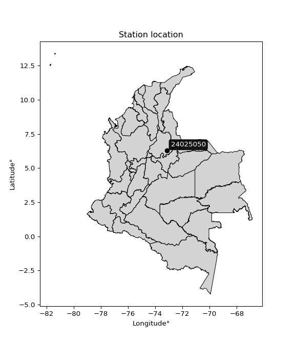

<div align="center">


</div>

# PMax24h Station (Rain, Pmax24h): 24025050

Maximum Precipitation in 24 hours (PMax24h) is the greatest amount of rainfall for a specific duration that is meteorologically possible for a given location, acting as a "worst-case" scenario for extreme storms, crucial for designing safety-critical infrastructure like bridges, river deviations, dams, spillways, and nuclear plants to prevent catastrophic failure. The PMax24h is related with the Probable Maximum Precipitation (PMP) and it is calculated by hydrologists using meteorological data to determine the upper limit of extreme rainfall, often leading to the Probable Maximum Flood (PMF) for flood control design, and is increasingly being studied for climate change impacts. Probable Maximum Precipitation (PMP) is the theoretical upper limit of rainfall, a deterministic estimate for extreme events, while probability distributions (like GEV, Gumbel) describe the likelihood and frequency of various precipitation amounts, including rare ones, showing how often events occur, with PMP representing the extreme end of these distributions, used for critical infrastructure design to ensure safety against the worst conceivable weather, unlike standard statistical forecasts which cover typical probabilities.

The most common probability distributions in hydrology, used for analyzing floods, rainfall, and streamflow, include the Normal, Log-Normal, Gumbel, Gamma (including Log-Pearson Type III), and Generalized Extreme Value (GEV) distributions, often chosen based on the data´s skewness and whether modeling extremes or general conditions, with Gumbel and GEV popular for extreme events like floods, while the Normal distribution serves as a baseline, though often requiring transformations for skewed hydrological data. These distributions help in designing water infrastructure, managing water resources, and forecasting hydrologic events.

> Hydrological data often isn´t perfectly normal (it´s skewed), so different distributions are needed for different applications, such as: **Flood Frequency Analysis**: Using Gumbel, GEV, or Log-Pearson Type III for predicting extreme flood magnitudes and their return periods, **Rainfall Analysis**: Normal for annual totals, but Log-Normal, Weibull, or GEV for intensity or extreme daily rainfall, **Streamflow Modeling**: Gamma and Log-Normal for maximum flows, GEV for minimum flows, and Kappa for daily flows.

<div align="center">

</img>

</div>


## A. General information


### 1. General running parameters

• app_version: _v20260225_. • runtime: _2026-02-27 14:50:08.749431_. • Python version: _3.14.0_. • SciPy version: _1.16.3_. • Pandas version: _2.3.3_. • NumPy version: _2.3.5_. • Stations dataset (station_dataset_file): _dataset/pmax24h_in/automatic_colombia_2003_2025.csv_. • Stations catalog (station_catalog_file): _dataset/CNE.xls_. • Minimum year to eval til year_max (date_min): _1900_. • Maximum year to eval since year_min (date_max): _2025_. • Creates, save and include plots into reports (create_plot): _False_. • Plot only fit distributions with Δo > Δ (plot_only_fit): _True_. • Plot only simple graphs avoiding multiple CDFs and multiple Extreme values plots (plot_only_simple): _False_. • Eval low extreme values, if False, evaluates high extreme values (low_extreme): _False_. • Eval every SciPy distribution as logarithmic (pdist_logarithmic_on): _True_. • Standard deviation normalized (ddof): _1.0_. • Return periods to eval in years (Tr): _[2, 2.33, 5, 10, 15, 20, 25, 50, 75, 100, 200, 250, 500, 750, 1000]_. • Minimum data sample per station, 0 means any (minimum_sample): _5_. • Z-Score maximum threshold to adjust a value, 0 means disable (zscore_max): _3.5_. • Z-Score minimum threshold to adjust a value, 0 means disable (zscore_min): _-2.5_. • Avoid zeros, e.g. rain = 0 (avoid_zeros): _True_. • Avoid null values (avoid_nans): _True_. 

:file_folder:Table: [dataset.csv](../../dataset/pmax24h_in/automatic_colombia_2003_2025.csv)

> Delta Degrees of Freedom (DDOF): is a parameter used in the formulas for calculating variance and standard deviation. When ddof=0, the divisor is $N$ (the total number of observations) and this is used when your data set is the entire population. When ddof=1, the divisor is $N-1$ and this is used when your data set is a sample drawn from a larger population. Using $N-1$ provides an unbiased estimate of the population variance (known as Bessel´s correction).


### 2. Station info and location

|   id |   CODIGO | NOMBRE             | CATEGORIA               | TECNOLOGIA   | ESTADO   | FECHA_INSTALACION   |   FECHA_SUSPENSION |   ALTITUD |   LATITUD |   LONGITUD | DEPARTAMENTO   | MUNICIPIO   | AREA_OPERATIVA                         | ENTIDAD                                                     | AREA_HIDROGRAFICA   | ZONA_HIDROGRAFICA   | SUBZONA_HIDROGRAFICA   |   CORRIENTE | Catalogo   |   Version |
|-----:|---------:|:-------------------|:------------------------|:-------------|:---------|:--------------------|-------------------:|----------:|----------:|-----------:|:---------------|:------------|:---------------------------------------|:------------------------------------------------------------|:--------------------|:--------------------|:-----------------------|------------:|:-----------|----------:|
|    0 | 24025050 | CHARALA [24025050] | Climatológica Ordinaria | Convencional | Activa   | 15/11/1973          |                nan |      1350 |   6.27417 |   -73.1506 | Santander      | Charalá     | Area Operativa 08 - Santanderes-Arauca | INSTITUTO DE HIDROLOGIA METEOROLOGIA Y ESTUDIOS AMBIENTALES | Magdalena Cauca     | Sogamoso            | Río Fonce              |         nan | CNE_IDEAM  |  20251226 |

<div align="center">

Dynamic map: [:earth_americas:Google](http://maps.google.com/maps?q=6.274166667,-73.15055556) [:earth_americas:OSM](https://www.openstreetmap.org/#map=18/6.274166667/-73.15055556&layers=P) [:earth_americas:Bing](https://www.bing.com/maps?cp=6.274166667~-73.15055556&lvl=18) [:earth_americas:Apple](https://maps.apple.com/frame?center=6.274166667%2C-73.15055556&span=0.003%2C0.006)

</div>


<div align="center">

```geojson
{
  "type": "Feature",
  "geometry": {
    "type": "Point", 
    "coordinates": [-73.15055556, 6.274166667]
  }, 
  "properties": {
    "Name": "24025050"
  }
}
```

</div>


### 3. Discrete values table and plot

<div align="center">

|               |          0 |            1 |          2 |           3 |          4 |           5 |
|:--------------|-----------:|-------------:|-----------:|------------:|-----------:|------------:|
| Date          | 2016       | 2017         | 2018       | 2019        | 2020       | 2021        |
| Value         |   54.9     |   54         |   62.9     |   60.8      |   40.3     |   50.6      |
| Value_initial |   54.9     |   54         |   62.9     |   60.8      |   40.3     |   50.6      |
| count         |    6       |    6         |    6       |    6        |    6       |    6        |
| mean          |   53.9167  |   53.9167    |   53.9167  |   53.9167   |   53.9167  |   53.9167   |
| std           |    8.06806 |    8.06806   |    8.06806 |    8.06806  |    8.06806 |    8.06806  |
| zscore        |    0.12188 |    0.0103288 |    1.11344 |    0.853158 |   -1.68772 |   -0.411086 |


</div>


> The initial value (value_initial) correspond to the initial obtained or null completed value, and value (value) is adjusted only when the initial value is outside the valid range (outlier) definite through the Z-Score value. If Z-Score is active, values out of range or outliers are replaced with the station mean value. A Z-Score (or standard score) measures how many standard deviations a data point is from the mean of a dataset, indicating its relative position; positive scores mean above the mean, negative mean below, and a score of zero is exactly at the mean, allowing for comparison of values from different distributions. It´s calculated using the formula $z=(x–μ)/σ$, where $x$ is the data point, $μ$ is the mean, and $σ$ is the standard deviation, helping identify outliers and understand probability.
>
> <sub>**Note**: In this study, "completing" (filling gaps in) and "extending" (forecasting or lengthening the historical record) rainfall data series are avoided for certain critical analyses because they introduce artificial bias and uncertainty, which can distort the statistics of rare events (extremes), alter day-to-day variability, and compromise the integrity and homogeneity of the original data. Some reasons against Completing/Extending rainfall data are: **Distortion of Extremes and Variability**: The primary issue is that most gap-filling or extension methods rely on averaging or regression with nearby stations, which inherently smooths the data. Rainfall is highly variable in space and time, with a large percentage of zero values and occasional large storms. Infilling methods often underestimate the highest values and overestimate the lowest (zero) values, which severely distorts analyses focused on flood frequency, drought severity, and intensity-duration-frequency (IDF) curves, **Loss of Data Homogeneity**: Infilled or extended data are synthetic estimates, not actual measurements. Combining these estimates with observed data can violate the assumption of data homogeneity, which requires that the data properties do not change over time. Inhomogeneity can lead to incorrect conclusions about long-term trends or changes in climate patterns, **Propagation of Errors**: Errors and biases from the original data (e.g., wind-induced undercatch, instrument errors, site changes) or the data used for imputation can propagate through the analysis, leading to unreliable hydrological models and inaccurate predictions, **Compromised Statistical Integrity**: For statistical analyses, especially those involving the frequency of events, using artificial data can introduce time bias or autocorrelation that doesn´t exist in reality, making it difficult to assess the true probability of events, **Difficulty in Validation**: It is difficult to accurately validate the quality of filled or extended data, especially for past periods where ground-truth measurements are unavailable. The reliability of imputation techniques heavily depends on the density of the surrounding station network and the complexity of the local topography.</sub>


### 4. Active continuous probability distributions from SciPy (80 of 104 available)

A Probability Density Function (PDF) describes the relative likelihood of a continuous random variable falling within a specific range, where the total area under its curve equals 1, and the area over any interval gives the actual probability for that range. Unlike discrete probabilities (like rolling a die), a PDF shows density, not direct probability for a single point (which is zero), with higher points indicating higher likelihood, often visualized as a bell curve for normal distributions.

A log of a probability density function (log-PDF) is simply the logarithm of the PDF´s value, denoted as $log(f(x))$, useful for converting multiplication of probabilities into addition, improving numerical stability with tiny numbers, and connecting to information theory concepts like entropy. Instead of dealing with very small probabilities (e.g., 0.000001), log-PDFs use negative numbers (e.g., $log(0.00001) ≈ -11.51$ that are easier for computers to handle, preventing underflow errors and simplifying complex calculations. In this study, each active probability distribution from SciPy is also evaluated in the $log$ form.

[scipy.stats](https://docs.scipy.org/doc/scipy/reference/stats.html) is a Python´s powerful submodule within the SciPy library for comprehensive statistical analysis, offering over 130 probability distributions (like Normal, Poisson, etc.), functions for descriptive stats (mean, variance), hypothesis testing (t-tests, chi-square), random variable generation, and statistical tests, making it essential for data science, modeling, and research. It provides tools to explore, model, and draw conclusions from data efficiently, working seamlessly with [NumPy](https://numpy.org/).

<div align="center">

|   id | p_dist           |   n_parameter | fit_method   | label                                                                       | active   | ref                                                                                                      |
|-----:|:-----------------|--------------:|:-------------|:----------------------------------------------------------------------------|:---------|:---------------------------------------------------------------------------------------------------------|
|    0 | alpha            |             3 | MLE          | Alpha                                                                       | True     | [:mortar_board:](https://docs.scipy.org/doc/scipy/reference/generated/scipy.stats.alpha.html)            |
|    1 | anglit           |             2 | MM           | Anglit                                                                      | True     | [:mortar_board:](https://docs.scipy.org/doc/scipy/reference/generated/scipy.stats.anglit.html)           |
|    2 | arcsine          |             2 | MM           | Arcsine                                                                     | True     | [:mortar_board:](https://docs.scipy.org/doc/scipy/reference/generated/scipy.stats.arcsine.html)          |
|    3 | argus            |             3 | MLE          | Argus                                                                       | True     | [:mortar_board:](https://docs.scipy.org/doc/scipy/reference/generated/scipy.stats.argus.html)            |
|    4 | beta             |             4 | MLE          | Beta                                                                        | True     | [:mortar_board:](https://docs.scipy.org/doc/scipy/reference/generated/scipy.stats.beta.html)             |
|    5 | betaprime        |             4 | MLE          | Beta prime                                                                  | True     | [:mortar_board:](https://docs.scipy.org/doc/scipy/reference/generated/scipy.stats.betaprime.html)        |
|    6 | bradford         |             3 | MLE          | Bradford                                                                    | True     | [:mortar_board:](https://docs.scipy.org/doc/scipy/reference/generated/scipy.stats.bradford.html)         |
|    7 | burr             |             4 | MLE          | Burr (Type III)                                                             | True     | [:mortar_board:](https://docs.scipy.org/doc/scipy/reference/generated/scipy.stats.burr.html)             |
|    8 | burr12           |             4 | MLE          | Burr (Type III) 12                                                          | True     | [:mortar_board:](https://docs.scipy.org/doc/scipy/reference/generated/scipy.stats.burr12.html)           |
|    9 | cosine           |             2 | MLE          | Cosine                                                                      | True     | [:mortar_board:](https://docs.scipy.org/doc/scipy/reference/generated/scipy.stats.cosine.html)           |
|   10 | crystalball      |             4 | MLE          | Crystalball                                                                 | True     | [:mortar_board:](https://docs.scipy.org/doc/scipy/reference/generated/scipy.stats.crystalball.html)      |
|   11 | dgamma           |             3 | MLE          | Double gamma                                                                | True     | [:mortar_board:](https://docs.scipy.org/doc/scipy/reference/generated/scipy.stats.dgamma.html)           |
|   12 | dweibull         |             3 | MLE          | Double Weibull                                                              | True     | [:mortar_board:](https://docs.scipy.org/doc/scipy/reference/generated/scipy.stats.dweibull.html)         |
|   13 | erlang           |             3 | MLE          | Erlang                                                                      | True     | [:mortar_board:](https://docs.scipy.org/doc/scipy/reference/generated/scipy.stats.erlang.html)           |
|   14 | exponnorm        |             3 | MLE          | Exponentially modified Normal                                               | True     | [:mortar_board:](https://docs.scipy.org/doc/scipy/reference/generated/scipy.stats.exponnorm.html)        |
|   15 | exponpow         |             3 | MLE          | Exponential power                                                           | True     | [:mortar_board:](https://docs.scipy.org/doc/scipy/reference/generated/scipy.stats.exponpow.html)         |
|   16 | exponweib        |             4 | MLE          | Exponentiated Weibull                                                       | True     | [:mortar_board:](https://docs.scipy.org/doc/scipy/reference/generated/scipy.stats.exponweib.html)        |
|   17 | f                |             4 | MLE          | F                                                                           | True     | [:mortar_board:](https://docs.scipy.org/doc/scipy/reference/generated/scipy.stats.f.html)                |
|   18 | fatiguelife      |             3 | MLE          | Fatigue-life (Birnbaum-Saunders)                                            | True     | [:mortar_board:](https://docs.scipy.org/doc/scipy/reference/generated/scipy.stats.fatiguelife.html)      |
|   19 | foldnorm         |             3 | MM           | Fold Normal                                                                 | True     | [:mortar_board:](https://docs.scipy.org/doc/scipy/reference/generated/scipy.stats.foldnorm.html)         |
|   20 | gamma            |             3 | MLE          | Gamma                                                                       | True     | [:mortar_board:](https://docs.scipy.org/doc/scipy/reference/generated/scipy.stats.gamma.html)            |
|   21 | gausshyper       |             6 | MLE          | Gauss hypergeometric                                                        | True     | [:mortar_board:](https://docs.scipy.org/doc/scipy/reference/generated/scipy.stats.gausshyper.html)       |
|   22 | genexpon         |             5 | MLE          | Generalized exponential                                                     | True     | [:mortar_board:](https://docs.scipy.org/doc/scipy/reference/generated/scipy.stats.genexpon.html)         |
|   23 | genextreme       |             3 | MLE          | Generalized exponential                                                     | True     | [:mortar_board:](https://docs.scipy.org/doc/scipy/reference/generated/scipy.stats.genextreme.html)       |
|   24 | gengamma         |             4 | MLE          | Generalized gamma                                                           | True     | [:mortar_board:](https://docs.scipy.org/doc/scipy/reference/generated/scipy.stats.gengamma.html)         |
|   25 | genhalflogistic  |             3 | MLE          | Generalized half-logistic                                                   | True     | [:mortar_board:](https://docs.scipy.org/doc/scipy/reference/generated/scipy.stats.genhalflogistic.html)  |
|   26 | genlogistic      |             3 | MLE          | Generalized logistic                                                        | True     | [:mortar_board:](https://docs.scipy.org/doc/scipy/reference/generated/scipy.stats.genlogistic.html)      |
|   27 | gennorm          |             3 | MLE          | Generalized Normal                                                          | True     | [:mortar_board:](https://docs.scipy.org/doc/scipy/reference/generated/scipy.stats.gennorm.html)          |
|   28 | genpareto        |             3 | MLE          | Generalized Pareto                                                          | True     | [:mortar_board:](https://docs.scipy.org/doc/scipy/reference/generated/scipy.stats.genpareto.html)        |
|   29 | gompertz         |             3 | MLE          | Gompertz (or truncated Gumbel)                                              | True     | [:mortar_board:](https://docs.scipy.org/doc/scipy/reference/generated/scipy.stats.gompertz.html)         |
|   30 | gumbel_l         |             2 | MM           | Gumbel Left Skew                                                            | True     | [:mortar_board:](https://docs.scipy.org/doc/scipy/reference/generated/scipy.stats.gumbel_l.html)         |
|   31 | gumbel_r         |             2 | MM           | Gumbel Right Skew                                                           | True     | [:mortar_board:](https://docs.scipy.org/doc/scipy/reference/generated/scipy.stats.gumbel_r.html)         |
|   32 | halfgennorm      |             3 | MLE          | Upper half of a generalized normal                                          | True     | [:mortar_board:](https://docs.scipy.org/doc/scipy/reference/generated/scipy.stats.halfgennorm.html)      |
|   33 | halflogistic     |             2 | MM           | Half-logistic                                                               | True     | [:mortar_board:](https://docs.scipy.org/doc/scipy/reference/generated/scipy.stats.halflogistic.html)     |
|   34 | halfnorm         |             2 | MM           | Half Normal                                                                 | True     | [:mortar_board:](https://docs.scipy.org/doc/scipy/reference/generated/scipy.stats.halfnorm.html)         |
|   35 | hypsecant        |             2 | MM           | hyperbolic secant                                                           | True     | [:mortar_board:](https://docs.scipy.org/doc/scipy/reference/generated/scipy.stats.hypsecant.html)        |
|   36 | invgamma         |             3 | MLE          | Inverted gamma                                                              | True     | [:mortar_board:](https://docs.scipy.org/doc/scipy/reference/generated/scipy.stats.invgamma.html)         |
|   37 | invgauss         |             3 | MLE          | Inverse Gaussian                                                            | True     | [:mortar_board:](https://docs.scipy.org/doc/scipy/reference/generated/scipy.stats.invgauss.html)         |
|   38 | invweibull       |             3 | MLE          | Inverted Weibull                                                            | True     | [:mortar_board:](https://docs.scipy.org/doc/scipy/reference/generated/scipy.stats.invweibull.html)       |
|   39 | johnsonsb        |             4 | MLE          | Johnson SB                                                                  | True     | [:mortar_board:](https://docs.scipy.org/doc/scipy/reference/generated/scipy.stats.johnsonsb.html)        |
|   40 | johnsonsu        |             4 | MLE          | Johnson Su                                                                  | True     | [:mortar_board:](https://docs.scipy.org/doc/scipy/reference/generated/scipy.stats.johnsonsu.html)        |
|   41 | kappa3           |             3 | MLE          | Kappa 3                                                                     | True     | [:mortar_board:](https://docs.scipy.org/doc/scipy/reference/generated/scipy.stats.kappa3.html)           |
|   42 | kappa4           |             4 | MLE          | Kappa 4                                                                     | True     | [:mortar_board:](https://docs.scipy.org/doc/scipy/reference/generated/scipy.stats.kappa4.html)           |
|   43 | ksone            |             3 | MLE          | Kolmogorov-Smirnov one-sided test statistic distribution                    | True     | [:mortar_board:](https://docs.scipy.org/doc/scipy/reference/generated/scipy.stats.ksone.html)            |
|   44 | kstwobign        |             2 | MLE          | Limiting distribution of scaled Kolmogorov-Smirnov two-sided test statistic | True     | [:mortar_board:](https://docs.scipy.org/doc/scipy/reference/generated/scipy.stats.kstwobign.html)        |
|   45 | laplace          |             2 | MM           | Laplace                                                                     | True     | [:mortar_board:](https://docs.scipy.org/doc/scipy/reference/generated/scipy.stats.laplace.html)          |
|   46 | levy_l           |             2 | MLE          | Left-skewed Levy                                                            | True     | [:mortar_board:](https://docs.scipy.org/doc/scipy/reference/generated/scipy.stats.levy_l.html)           |
|   47 | loggamma         |             3 | MLE          | Log gamma                                                                   | True     | [:mortar_board:](https://docs.scipy.org/doc/scipy/reference/generated/scipy.stats.loggamma.html)         |
|   48 | logistic         |             2 | MM           | Logistic (or Sech-squared)                                                  | True     | [:mortar_board:](https://docs.scipy.org/doc/scipy/reference/generated/scipy.stats.logistic.html)         |
|   49 | loglaplace       |             3 | MLE          | Log-Laplace                                                                 | True     | [:mortar_board:](https://docs.scipy.org/doc/scipy/reference/generated/scipy.stats.loglaplace.html)       |
|   50 | lomax            |             3 | MLE          | Lomax (Pareto of the second kind)                                           | True     | [:mortar_board:](https://docs.scipy.org/doc/scipy/reference/generated/scipy.stats.lomax.html)            |
|   51 | maxwell          |             2 | MM           | Maxwell                                                                     | True     | [:mortar_board:](https://docs.scipy.org/doc/scipy/reference/generated/scipy.stats.maxwell.html)          |
|   52 | mielke           |             4 | MLE          | Mielke Beta-Kappa / Dagum                                                   | True     | [:mortar_board:](https://docs.scipy.org/doc/scipy/reference/generated/scipy.stats.mielke.html)           |
|   53 | moyal            |             2 | MM           | Moyal                                                                       | True     | [:mortar_board:](https://docs.scipy.org/doc/scipy/reference/generated/scipy.stats.moyal.html)            |
|   54 | nakagami         |             3 | MLE          | Nakagami                                                                    | True     | [:mortar_board:](https://docs.scipy.org/doc/scipy/reference/generated/scipy.stats.nakagami.html)         |
|   55 | ncf              |             5 | MLE          | Non-central F distribution                                                  | True     | [:mortar_board:](https://docs.scipy.org/doc/scipy/reference/generated/scipy.stats.ncf.html)              |
|   56 | nct              |             4 | MLE          | Non-central Student’s t                                                     | True     | [:mortar_board:](https://docs.scipy.org/doc/scipy/reference/generated/scipy.stats.nct.html)              |
|   57 | norm             |             2 | MM           | Normal                                                                      | True     | [:mortar_board:](https://docs.scipy.org/doc/scipy/reference/generated/scipy.stats.norm.html)             |
|   58 | pearson3         |             3 | MM           | Pearson type III                                                            | True     | [:mortar_board:](https://docs.scipy.org/doc/scipy/reference/generated/scipy.stats.pearson3.html)         |
|   59 | powerlaw         |             3 | MLE          | Power-function                                                              | True     | [:mortar_board:](https://docs.scipy.org/doc/scipy/reference/generated/scipy.stats.powerlaw.html)         |
|   60 | rayleigh         |             2 | MM           | Rayleigh                                                                    | True     | [:mortar_board:](https://docs.scipy.org/doc/scipy/reference/generated/scipy.stats.rayleigh.html)         |
|   61 | rdist            |             3 | MLE          | R-distributed (symmetric beta)                                              | True     | [:mortar_board:](https://docs.scipy.org/doc/scipy/reference/generated/scipy.stats.rdist.html)            |
|   62 | rice             |             3 | MLE          | Rice                                                                        | True     | [:mortar_board:](https://docs.scipy.org/doc/scipy/reference/generated/scipy.stats.rice.html)             |
|   63 | semicircular     |             2 | MM           | Semicircular                                                                | True     | [:mortar_board:](https://docs.scipy.org/doc/scipy/reference/generated/scipy.stats.semicircular.html)     |
|   64 | skewnorm         |             3 | MLE          | Skew normal                                                                 | True     | [:mortar_board:](https://docs.scipy.org/doc/scipy/reference/generated/scipy.stats.skewnorm.html)         |
|   65 | t                |             3 | MLE          | Student’s t                                                                 | True     | [:mortar_board:](https://docs.scipy.org/doc/scipy/reference/generated/scipy.stats.t.html)                |
|   66 | trapezoid        |             4 | MLE          | Trapezoid                                                                   | True     | [:mortar_board:](https://docs.scipy.org/doc/scipy/reference/generated/scipy.stats.trapezoid.html)        |
|   67 | triang           |             3 | MLE          | Triangular                                                                  | True     | [:mortar_board:](https://docs.scipy.org/doc/scipy/reference/generated/scipy.stats.triang.html)           |
|   68 | truncexpon       |             3 | MLE          | Truncated exponential                                                       | True     | [:mortar_board:](https://docs.scipy.org/doc/scipy/reference/generated/scipy.stats.truncexpon.html)       |
|   69 | truncnorm        |             4 | MLE          | Truncated normal                                                            | True     | [:mortar_board:](https://docs.scipy.org/doc/scipy/reference/generated/scipy.stats.truncnorm.html)        |
|   70 | truncpareto      |             4 | MLE          | Upper truncated Pareto                                                      | True     | [:mortar_board:](https://docs.scipy.org/doc/scipy/reference/generated/scipy.stats.truncpareto.html)      |
|   71 | truncweibull_min |             5 | MLE          | Doubly truncated Weibull minimum                                            | True     | [:mortar_board:](https://docs.scipy.org/doc/scipy/reference/generated/scipy.stats.truncweibull_min.html) |
|   72 | tukeylambda      |             3 | MLE          | Tukey-Lamdba                                                                | True     | [:mortar_board:](https://docs.scipy.org/doc/scipy/reference/generated/scipy.stats.tukeylambda.html)      |
|   73 | uniform          |             2 | MLE          | Uniform                                                                     | True     | [:mortar_board:](https://docs.scipy.org/doc/scipy/reference/generated/scipy.stats.uniform.html)          |
|   74 | vonmises         |             3 | MLE          | Von Mises                                                                   | True     | [:mortar_board:](https://docs.scipy.org/doc/scipy/reference/generated/scipy.stats.vonmises.html)         |
|   75 | vonmises_line    |             3 | MLE          | Von Mises line                                                              | True     | [:mortar_board:](https://docs.scipy.org/doc/scipy/reference/generated/scipy.stats.vonmises_line.html)    |
|   76 | wald             |             2 | MM           | Wald                                                                        | True     | [:mortar_board:](https://docs.scipy.org/doc/scipy/reference/generated/scipy.stats.wald.html)             |
|   77 | weibull_max      |             3 | MLE          | Weibull maximum                                                             | True     | [:mortar_board:](https://docs.scipy.org/doc/scipy/reference/generated/scipy.stats.weibull_max.html)      |
|   78 | weibull_min      |             3 | MLE          | Weibull minimum                                                             | True     | [:mortar_board:](https://docs.scipy.org/doc/scipy/reference/generated/scipy.stats.weibull_min.html)      |
|   79 | wrapcauchy       |             3 | MLE          | Wrapped  Cauchy                                                             | True     | [:mortar_board:](https://docs.scipy.org/doc/scipy/reference/generated/scipy.stats.wrapcauchy.html)       |

</div>

> **n_parameter:** # arguments & localization & scale.
>
> **Fit methods:** (MLE) maximum likelihood, (MM) L-moments.
>
>**Inactive** (With the only purpose of prevent loops, zero divisions, infinite values, over high estimated values or horizontal trending for recurrence intervals estimations, the follow distributions were disabled.)**:** lognorm, norminvgauss, powernorm, powerlognorm, cauchy, halfcauchy, foldcauchy, skewcauchy, chi2, expon, fisk, genhyperbolic, geninvgauss, gibrat, kstwo, laplace_asymmetric, levy, levy_stable, ncx2, pareto, rel_breitwigner, recipinvgauss, studentized_range, loguniform, 


## B. Probability (PDF) vs. Empirical (EDF) distributions functions

A continuous probability distribution (CPD) describes probabilities for variables that can take any value within a range (like rain any time), unlike discrete variables with specific outcomes (like temperature). It uses a Probability Density Function (PDF), a curve where the total area under it equals 1, and the probability of the variable falling within an interval (a to b) is found by calculating the area under the curve between those points. A key feature is that the probability of hitting any single exact value is zero, so probabilities are always expressed for ranges, e.g., $P(a ≤ X ≤ b)$.

<div align="center">

Distributions parameters from station values
|     |   station | p_dist              |   n |              loc |           scale | shape                  | shape1                 | shape2               | shape3             |
|----:|----------:|:--------------------|----:|-----------------:|----------------:|:-----------------------|:-----------------------|:---------------------|:-------------------|
|   0 |  24025050 | alpha               |   6 |   -132.856       |  4623.95        | 24.812697408926184     |                        |                      |                    |
|   1 |  24025050 | anglit              |   6 |     53.9167      |    21.5459      |                        |                        |                      |                    |
|   2 |  24025050 | arcsine             |   6 |     43.5009      |    20.8316      |                        |                        |                      |                    |
|   3 |  24025050 | argus               |   6 |     33.5665      |    30.3         | 1.758395756191667      |                        |                      |                    |
|   4 |  24025050 | beta                |   6 |     32.6602      |    30.2398      | 2.564915190387535      | 0.7121687587532692     |                      |                    |
|   5 |  24025050 | betaprime           |   6 |     -0.966055    |    20.9306      | 171.84288289564202     | 66.59448754152424      |                      |                    |
|   6 |  24025050 | bradford            |   6 |     40.3         |    22.6001      | 1.0637561470388492     |                        |                      |                    |
|   7 |  24025050 | burr                |   6 |      2.38014     |    60.9344      | 455.27714975160484     | 0.011396481596943075   |                      |                    |
|   8 |  24025050 | burr12              |   6 |     -8.88654     |    49.0738      | 1866.020173956159      | 0.002239119961399392   |                      |                    |
|   9 |  24025050 | cosine              |   6 |     53.1883      |     6.23326     |                        |                        |                      |                    |
|  10 |  24025050 | crystalball         |   6 |     53.9159      |     7.36512     | 32744.048321491828     | 2462.756188294084      |                      |                    |
|  11 |  24025050 | dgamma              |   6 |     54.9         |     9.4513      | 0.3285378293599499     |                        |                      |                    |
|  12 |  24025050 | dweibull            |   6 |     54           |     5.85138     | 0.9081446877714486     |                        |                      |                    |
|  13 |  24025050 | erlang              |   6 |    -64.8374      |     0.467015    | 254.20484711080235     |                        |                      |                    |
|  14 |  24025050 | exponnorm           |   6 |     53.9107      |     7.36508     | 0.0008147878894861447  |                        |                      |                    |
|  15 |  24025050 | exponpow            |   6 |     50.6         |     1.31654     | 0.19131453429828016    |                        |                      |                    |
|  16 |  24025050 | exponweib           |   6 |     40.3         |     1.28968     | 1.1042414947346146     | 0.3983004782328686     |                      |                    |
|  17 |  24025050 | f                   |   6 |  -1061.42        |  1115.32        | 88362.36825288867      | 93684.76471876739      |                      |                    |
|  18 |  24025050 | fatiguelife         |   6 |     40.3         |     6.21242e-06 | 1423.5717492719723     |                        |                      |                    |
|  19 |  24025050 | foldnorm            |   6 |     26.0375      |     7.21495     | 3.865905440613493      |                        |                      |                    |
|  20 |  24025050 | gamma               |   6 |    -70.0328      |     0.450068    | 275.24043662151564     |                        |                      |                    |
|  21 |  24025050 | gausshyper          |   6 |     39.8716      |    23.0284      | 1.126840714027646      | 0.9137549670903615     | 0.8795090737890341   | 1.093333175778715  |
|  22 |  24025050 | genexpon            |   6 |     39.5872      |     1.15763     | 6.529259729507766e-09  | 0.0830810213854164     | 3.2085128503701528   |                    |
|  23 |  24025050 | genextreme          |   6 |     53.5323      |    10.8323      | 1.1563439870500107     |                        |                      |                    |
|  24 |  24025050 | gengamma            |   6 |     40.3         |     1.33846     | 1.0940174690479054     | 0.32095250666035946    |                      |                    |
|  25 |  24025050 | genhalflogistic     |   6 |     40.2979      |    23.7394      | 1.0503169721527192     |                        |                      |                    |
|  26 |  24025050 | genlogistic         |   6 |     62.9001      |     1.05477e-05 | 1.174871026806591e-06  |                        |                      |                    |
|  27 |  24025050 | gennorm             |   6 |     54.3505      |     8.32801     | 1.4300659764239252     |                        |                      |                    |
|  28 |  24025050 | genpareto           |   6 |     -0.118103    |   145.122       | -2.3028542687354054    |                        |                      |                    |
|  29 |  24025050 | gompertz            |   6 |     50.3553      |     1.72481     | 0.002638495404956793   |                        |                      |                    |
|  30 |  24025050 | gumbel_l            |   6 |     57.2314      |     5.74255     |                        |                        |                      |                    |
|  31 |  24025050 | gumbel_r            |   6 |     50.602       |     5.74255     |                        |                        |                      |                    |
|  32 |  24025050 | halfgennorm         |   6 |     40.3         |     1.20411     | 0.413553234598996      |                        |                      |                    |
|  33 |  24025050 | halflogistic        |   6 |     45.1874      |     6.29687     |                        |                        |                      |                    |
|  34 |  24025050 | halfnorm            |   6 |     44.1682      |    12.2179      |                        |                        |                      |                    |
|  35 |  24025050 | hypsecant           |   6 |     53.9167      |     4.68877     |                        |                        |                      |                    |
|  36 |  24025050 | invgamma            |   6 |   -106.361       | 71542           | 447.4671008966757      |                        |                      |                    |
|  37 |  24025050 | invgauss            |   6 |     -2.35914     |  2795.38        | 0.020075267268097864   |                        |                      |                    |
|  38 |  24025050 | invweibull          |   6 |     -7.60665e+06 |     7.6067e+06  | 978728.2695983481      |                        |                      |                    |
|  39 |  24025050 | johnsonsb           |   6 |     29.3952      |    33.5048      | -0.2515882697472892    | 0.11528059060300812    |                      |                    |
|  40 |  24025050 | johnsonsu           |   6 |     67.3428      |     0.175817    | 8.18304846808444       | 1.6823129934494698     |                      |                    |
|  41 |  24025050 | kappa3              |   6 |     40.3         |    27.0209      | 331.8418951237427      |                        |                      |                    |
|  42 |  24025050 | kappa4              |   6 |     38.8606      |    26.3147      | 1.0580156450201383     | 1.088637711881919      |                      |                    |
|  43 |  24025050 | ksone               |   6 |     38.04        |    27.12        | 1.0                    |                        |                      |                    |
|  44 |  24025050 | kstwobign           |   6 |     22.5582      |    35.8226      |                        |                        |                      |                    |
|  45 |  24025050 | laplace             |   6 |     53.9167      |     5.20791     |                        |                        |                      |                    |
|  46 |  24025050 | levy_l              |   6 |     63.56        |     2.70538     |                        |                        |                      |                    |
|  47 |  24025050 | loggamma            |   6 |     62.9002      |     1.41116e-05 | 1.5693888653879215e-06 |                        |                      |                    |
|  48 |  24025050 | logistic            |   6 |     53.9167      |     4.06059     |                        |                        |                      |                    |
|  49 |  24025050 | loglaplace          |   6 |     -0.170647    |    54.9379      | 9.32795547442495       |                        |                      |                    |
|  50 |  24025050 | lomax               |   6 |     40.3         |   563.424       | 41.55482563996392      |                        |                      |                    |
|  51 |  24025050 | maxwell             |   6 |     36.4645      |    10.9365      |                        |                        |                      |                    |
|  52 |  24025050 | mielke              |   6 |    -20.4871      |    83.4497      | 8.339988410833646      | 6482.56018553339       |                      |                    |
|  53 |  24025050 | moyal               |   6 |     49.7048      |     3.31546     |                        |                        |                      |                    |
|  54 |  24025050 | nakagami            |   6 |     50.6         |     7.16417     | 0.27831550656700066    |                        |                      |                    |
|  55 |  24025050 | ncf                 |   6 |     -2.98257     |    57.0449      | 124.0572069108639      | 858.4673384864832      | 0.15623752549474024  |                    |
|  56 |  24025050 | nct                 |   6 |     -1.08694     |     0.291643    | 23.515405339543406     | 182.7118158819328      |                      |                    |
|  57 |  24025050 | norm                |   6 |     53.9167      |     7.3651      |                        |                        |                      |                    |
|  58 |  24025050 | pearson3            |   6 |     53.9167      |     7.36511     | -0.6295807879907227    |                        |                      |                    |
|  59 |  24025050 | powerlaw            |   6 |     40.3         |    22.6         | 0.15992885991237452    |                        |                      |                    |
|  60 |  24025050 | rayleigh            |   6 |     39.8268      |    11.2421      |                        |                        |                      |                    |
|  61 |  24025050 | rdist               |   6 |     47.6         |     7.30003     | 1.223468479366031      |                        |                      |                    |
|  62 |  24025050 | rice                |   6 |     35.3893      |     8.00615     | 2.0497631343614273     |                        |                      |                    |
|  63 |  24025050 | semicircular        |   6 |     53.9167      |    14.7302      |                        |                        |                      |                    |
|  64 |  24025050 | skewnorm            |   6 |     62.9         |    11.6169      | -17957623.950375646    |                        |                      |                    |
|  65 |  24025050 | t                   |   6 |     53.9166      |     7.36499     | 4344295.548441295      |                        |                      |                    |
|  66 |  24025050 | trapezoid           |   6 |     33.085       |    31.2475      | 1.0                    | 1.0                    |                      |                    |
|  67 |  24025050 | triang              |   6 |     34.9995      |    27.9005      | 0.9999999986890062     |                        |                      |                    |
|  68 |  24025050 | truncexpon          |   6 |     40.2982      |    33.9213      | 0.666301119519122      |                        |                      |                    |
|  69 |  24025050 | truncnorm           |   6 |    -16.1671      |    13.1774      | 5.059534609471111      | 643.8701469611373      |                      |                    |
|  70 |  24025050 | truncpareto         |   6 |     40.2568      |     0.043197    | 0.20343700635319253    | 524.1844668838503      |                      |                    |
|  71 |  24025050 | truncweibull_min    |   6 |     40.1588      |    26.6702      | 1.0536793051345006     | 0.0029300551964901154  | 0.8526808643697052   |                    |
|  72 |  24025050 | tukeylambda         |   6 |     56.75        |     6.49677     | 1.0563846056444777     |                        |                      |                    |
|  73 |  24025050 | uniform             |   6 |     40.3         |    22.6         |                        |                        |                      |                    |
|  74 |  24025050 | vonmises            |   6 |     -1.74251     |     1           | 0.5398137650263489     |                        |                      |                    |
|  75 |  24025050 | vonmises_line       |   6 |     51.5584      |     3.61015     | 5.2461695545595333e-05 |                        |                      |                    |
|  76 |  24025050 | wald                |   6 |     46.5516      |     7.3651      |                        |                        |                      |                    |
|  77 |  24025050 | weibull_max         |   6 |     62.9         |     1.51939     | 0.42312291068318086    |                        |                      |                    |
|  78 |  24025050 | weibull_min         |   6 |     -9.82728e+07 |     9.82729e+07 | 16925634.39515768      |                        |                      |                    |
|  79 |  24025050 | wrapcauchy          |   6 |     40.3         |     3.5969      | 0.5                    |                        |                      |                    |
|  80 |  24025050 | logalpha            |   6 |     -3.06519     |   332.931       | 47.28660997884995      |                        |                      |                    |
|  81 |  24025050 | loganglit           |   6 |      3.97732     |     0.425044    |                        |                        |                      |                    |
|  82 |  24025050 | logarcsine          |   6 |      3.77183     |     0.410987    |                        |                        |                      |                    |
|  83 |  24025050 | logargus            |   6 |      3.54268     |     0.615257    | 2.087091176423963      |                        |                      |                    |
|  84 |  24025050 | logbeta             |   6 |      3.59857     |     0.542979    | 1.512345546128938      | 0.6306781156184191     |                      |                    |
|  85 |  24025050 | logbetaprime        |   6 |     -4.05988     |    23.116       | 1021.5709975933937     | 2938.8590485769164     |                      |                    |
|  86 |  24025050 | logbradford         |   6 |      3.69635     |     0.445198    | 1.0096011736960744     |                        |                      |                    |
|  87 |  24025050 | logburr             |   6 | -53461.7         | 53465.9         | 19402809.591767613     | 0.01614876233028504    |                      |                    |
|  88 |  24025050 | logburr12           |   6 |    -15.451       |    20.4851      | 180.5523170468535      | 7724.776922588197      |                      |                    |
|  89 |  24025050 | logcosine           |   6 |      3.95859     |     0.124355    |                        |                        |                      |                    |
|  90 |  24025050 | logcrystalball      |   6 |      3.97732     |     0.145294    | 898.3003458878344      | 1.0430612024880919     |                      |                    |
|  91 |  24025050 | logdgamma           |   6 |      4.00551     |     0.106244    | 0.9106433231000111     |                        |                      |                    |
|  92 |  24025050 | logdweibull         |   6 |      4.00551     |     0.105585    | 0.8853800310729295     |                        |                      |                    |
|  93 |  24025050 | logerlang           |   6 |      1.63571     |     0.00979348  | 238.9414747254416      |                        |                      |                    |
|  94 |  24025050 | logexponnorm        |   6 |      3.97723     |     0.145294    | 0.0006169942273218088  |                        |                      |                    |
|  95 |  24025050 | logexponpow         |   6 |    -18.1687      |    22.2729      | 160.91357869545817     |                        |                      |                    |
|  96 |  24025050 | logexponweib        |   6 |      3.69635     |     0.510284    | 0.23709856761626938    | 2.0329102459560717     |                      |                    |
|  97 |  24025050 | logf                |   6 |   -103.808       |   107.785       | 4022237.703193805      | 1493122.0069739618     |                      |                    |
|  98 |  24025050 | logfatiguelife      |   6 |    -45.1459      |    49.1223      | 0.002962390159215917   |                        |                      |                    |
|  99 |  24025050 | logfoldnorm         |   6 |      3.73679     |     0.160811    | 1.4268881815018704     |                        |                      |                    |
| 100 |  24025050 | loggamma            |   6 |      1.59502     |     0.0091299   | 260.7603653640871      |                        |                      |                    |
| 101 |  24025050 | loggausshyper       |   6 |      3.68908     |     0.452468    | 1.193841043291029      | 0.9607359380478825     | 1.0155837996866035   | 0.9056610200702897 |
| 102 |  24025050 | loggenexpon         |   6 |      3.69612     |     0.00232456  | 0.003079848320280184   | 2.3886550015138734     | 2.82353727621768e-05 |                    |
| 103 |  24025050 | loggenextreme       |   6 |      3.96481     |     0.220834    | 1.249484639433903      |                        |                      |                    |
| 104 |  24025050 | loggengamma         |   6 |      3.69635     |     0.711059    | 0.26811721789782916    | 1.4758307984615797     |                      |                    |
| 105 |  24025050 | loggenhalflogistic  |   6 |      3.65925     |     0.527847    | 1.0944464912507934     |                        |                      |                    |
| 106 |  24025050 | loggenlogistic      |   6 |      4.14157     |     1.42931e-06 | 8.666471138668909e-06  |                        |                      |                    |
| 107 |  24025050 | loggennorm          |   6 |      3.98898     |     0.0116708   | 0.45421936039183497    |                        |                      |                    |
| 108 |  24025050 | loggenpareto        |   6 |     -0.00584793  |    13.7345      | -3.311608119252094     |                        |                      |                    |
| 109 |  24025050 | loggompertz         |   6 |      3.68079     |     0.123957    | 0.05977886373495991    |                        |                      |                    |
| 110 |  24025050 | loggumbel_l         |   6 |      4.04271     |     0.113286    |                        |                        |                      |                    |
| 111 |  24025050 | loggumbel_r         |   6 |      3.91193     |     0.113286    |                        |                        |                      |                    |
| 112 |  24025050 | loghalfgennorm      |   6 |      3.69634     |     0.447123    | 1141.978490139532      |                        |                      |                    |
| 113 |  24025050 | loghalflogistic     |   6 |      3.80509     |     0.124236    |                        |                        |                      |                    |
| 114 |  24025050 | loghalfnorm         |   6 |      3.78503     |     0.241004    |                        |                        |                      |                    |
| 115 |  24025050 | loghypsecant        |   6 |      3.97732     |     0.0924973   |                        |                        |                      |                    |
| 116 |  24025050 | loginvgamma         |   6 |     -4.0609      | 24019.4         | 2989.4720983638563     |                        |                      |                    |
| 117 |  24025050 | loginvgauss         |   6 |      2.59487     |   104.048       | 0.013295786013787877   |                        |                      |                    |
| 118 |  24025050 | loginvweibull       |   6 |     -2.44937e+07 |     2.44937e+07 | 152542681.90867925     |                        |                      |                    |
| 119 |  24025050 | logjohnsonsb        |   6 |      3.32568     |     0.815868    | -0.19594963781873287   | 0.11050420902377171    |                      |                    |
| 120 |  24025050 | logjohnsonsu        |   6 |      4.1788      |     0.00141161  | 6.382552269250747      | 1.1934039758378083     |                      |                    |
| 121 |  24025050 | logkappa3           |   6 |      3.69635     |     0.444939    | 3127.2293182684225     |                        |                      |                    |
| 122 |  24025050 | logkappa4           |   6 |      3.64754     |     0.530945    | 1.1016299721139022     | 1.0747711327721279     |                      |                    |
| 123 |  24025050 | logksone            |   6 |      3.65183     |     0.534234    | 1.0                    |                        |                      |                    |
| 124 |  24025050 | logkstwobign        |   6 |      3.33473     |     0.733947    |                        |                        |                      |                    |
| 125 |  24025050 | loglaplace          |   6 |      3.97732     |     0.102739    |                        |                        |                      |                    |
| 126 |  24025050 | loglevy_l           |   6 |      4.15275     |     0.0458884   |                        |                        |                      |                    |
| 127 |  24025050 | logloggamma         |   6 |      4.14157     |     2.03621e-06 | 1.2422711685901233e-05 |                        |                      |                    |
| 128 |  24025050 | loglogistic         |   6 |      3.97732     |     0.080105    |                        |                        |                      |                    |
| 129 |  24025050 | logloglaplace       |   6 |     -0.0890369   |     4.09455     | 37.48206165475443      |                        |                      |                    |
| 130 |  24025050 | loglomax            |   6 |      3.69635     |  8853.74        | 31440.89964097028      |                        |                      |                    |
| 131 |  24025050 | logmaxwell          |   6 |      3.63304     |     0.21575     |                        |                        |                      |                    |
| 132 |  24025050 | logmielke           |   6 |      3.47601     |     0.665874    | 2.888322534528861      | 13925.107621174633     |                      |                    |
| 133 |  24025050 | logmoyal            |   6 |      3.89423     |     0.0654055   |                        |                        |                      |                    |
| 134 |  24025050 | lognakagami         |   6 |    -78.3296      |    82.307       | 79977.39710992432      |                        |                      |                    |
| 135 |  24025050 | logncf              |   6 |     -5.10378     |     9.07516     | 1232.3566590086407     | 1778.3703868668235     | 0.1162166624360578   |                    |
| 136 |  24025050 | lognct              |   6 |     -4.60478     |     0.0694659   | 582.1567335024863      | 123.4909925828206      |                      |                    |
| 137 |  24025050 | lognorm             |   6 |      3.97732     |     0.145294    |                        |                        |                      |                    |
| 138 |  24025050 | logpearson3         |   6 |      3.97732     |     0.145294    | -0.8514827222123476    |                        |                      |                    |
| 139 |  24025050 | logpowerlaw         |   6 |      3.69635     |     0.445195    | 0.1663166462321829     |                        |                      |                    |
| 140 |  24025050 | lograyleigh         |   6 |      3.69937     |     0.221776    |                        |                        |                      |                    |
| 141 |  24025050 | logrdist            |   6 |      5.61485     |     1.70494e-29 | 1.3053444187261127     |                        |                      |                    |
| 142 |  24025050 | logrice             |   6 |      3.59156     |     0.156393    | 2.2242410288007886     |                        |                      |                    |
| 143 |  24025050 | logsemicircular     |   6 |      3.97732     |     0.290589    |                        |                        |                      |                    |
| 144 |  24025050 | logskewnorm         |   6 |      4.14155     |     0.219251    | -20047917.860744663    |                        |                      |                    |
| 145 |  24025050 | logt                |   6 |      3.97732     |     0.145295    | 32250045.420197837     |                        |                      |                    |
| 146 |  24025050 | logtrapezoid        |   6 |      3.56637     |     0.616432    | 1.0                    | 1.0                    |                      |                    |
| 147 |  24025050 | logtriang           |   6 |      3.59856     |     0.542986    | 0.9999999558133743     |                        |                      |                    |
| 148 |  24025050 | logtruncexpon       |   6 |      3.69635     |     0.540501    | 0.8236846149459014     |                        |                      |                    |
| 149 |  24025050 | logtruncnorm        |   6 |     -0.0438073   |     1.06873     | 3.497905137983331      | 3.9162053345920143     |                      |                    |
| 150 |  24025050 | logtruncpareto      |   6 |      3.69545     |     0.000899967 | 0.20339555088942676    | 495.67865837425785     |                      |                    |
| 151 |  24025050 | logtruncweibull_min |   6 |      3.6914      |     0.532749    | 1.081106887545363      | 0.00040448951075904623 | 0.8449580671163262   |                    |
| 152 |  24025050 | logtukeylambda      |   6 |      5.61485     |     1.70494e-29 | 1.3053444187261127     |                        |                      |                    |
| 153 |  24025050 | loguniform          |   6 |      3.69635     |     0.445195    |                        |                        |                      |                    |
| 154 |  24025050 | logvonmises         |   6 |     -2.30542     |     1           | 47.85100796248516      |                        |                      |                    |
| 155 |  24025050 | logvonmises_line    |   6 |      3.91761     |     0.0712822   | 0.00017219441840169125 |                        |                      |                    |
| 156 |  24025050 | logwald             |   6 |      3.83195     |     0.145374    |                        |                        |                      |                    |
| 157 |  24025050 | logweibull_max      |   6 |      4.14155     |     0.163234    | 0.9825021985115641     |                        |                      |                    |
| 158 |  24025050 | logweibull_min      |   6 |     -6.98364e+06 |     6.98365e+06 | 64903220.5427217       |                        |                      |                    |
| 159 |  24025050 | logwrapcauchy       |   6 |      3.69635     |     0.0708549   | 0.5                    |                        |                      |                    |

</div>

> **loc** (Location parameter): This shifts the distribution along the x-axis. For many common distributions, like the normal (Gaussian) distribution, loc represents the mean $μ$. For others, like the uniform distribution, it might represent the minimum value, or for the beta distribution, the left end of the support interval.
>
> **scale** (Scale parameter): This determines the width or spread of the distribution. For the normal distribution, scale represents the standard deviation $σ$. For a uniform distribution, it defines the length of the interval (from $loc$ to $loc + scale$).
>
> **shape** (Shape parameters): Refers to parameters that define the specific form of a probability distribution, distinct from its location (loc) and scale (scale). These parameters are required arguments for most distribution functions. For example, a normal (Gaussian) distribution is fully defined by its location (mean) and scale (standard deviation), so it has no specific shape parameters beyond loc and scale. However, other distributions have intrinsic properties that need specification, as Gamma distribution that takes a shape parameter, often named $a$ or $alpha$.


### 0. Cumulative distribution values - CDF (160 evaluated)

Cumulative Distribution Function (CDF), denoted as $F$<sub>$X$</sub>$(x)$, is a function that gives the probability that a random variable $X$ will take a value less than or equal to a specific value, $x$ (i.e., $(P(X≥x)$. It essentially "accumulates" probabilities from a given point up to the far right (positive infinity), providing a complete picture of the distribution´s probabilities for both discrete (like rain) and continuous (like temperature) variables, helping to find probabilities over ranges or above certain values. Each station is evaluated separately ordering the $x$ values ascending, calculating the CDF and PDF values for the activated distributions and their logarithmic forms.

<div align="center">

CDF ordered by x ascending and calculating $log(f(x))$ separately
|   id |   Station |   date |    x |   count |    mean |     std |     zscore |   Value_initial |   station |   m |     alpha |   alpha_pdf |    anglit |   anglit_pdf |   arcsine |   arcsine_pdf |     argus |   argus_pdf |      beta |      beta_pdf |   betaprime |   betaprime_pdf |    bradford |   bradford_pdf |      burr |   burr_pdf |     burr12 |   burr12_pdf |    cosine |   cosine_pdf |   crystalball |   crystalball_pdf |   dgamma |   dgamma_pdf |   dweibull |   dweibull_pdf |    erlang |   erlang_pdf |   exponnorm |   exponnorm_pdf |   exponpow |   exponpow_pdf |   exponweib |   exponweib_pdf |         f |      f_pdf |   fatiguelife |   fatiguelife_pdf |   foldnorm |   foldnorm_pdf |     gamma |   gamma_pdf |   gausshyper |   gausshyper_pdf |   genexpon |   genexpon_pdf |   genextreme |   genextreme_pdf |   gengamma |   gengamma_pdf |   genhalflogistic |   genhalflogistic_pdf |   genlogistic |   genlogistic_pdf |   gennorm |   gennorm_pdf |   genpareto |   genpareto_pdf |    gompertz |   gompertz_pdf |   gumbel_l |   gumbel_l_pdf |   gumbel_r |   gumbel_r_pdf |   halfgennorm |   halfgennorm_pdf |   halflogistic |   halflogistic_pdf |   halfnorm |   halfnorm_pdf |   hypsecant |   hypsecant_pdf |   invgamma |   invgamma_pdf |   invgauss |   invgauss_pdf |   invweibull |   invweibull_pdf |   johnsonsb |   johnsonsb_pdf |   johnsonsu |   johnsonsu_pdf |      kappa3 |   kappa3_pdf |      kappa4 |   kappa4_pdf |     ksone |   ksone_pdf |   kstwobign |   kstwobign_pdf |   laplace |   laplace_pdf |   levy_l |   levy_l_pdf |   loggamma |   loggamma_pdf |   logistic |   logistic_pdf |   loglaplace |   loglaplace_pdf |       lomax |   lomax_pdf |   maxwell |   maxwell_pdf |    mielke |   mielke_pdf |       moyal |   moyal_pdf |    nakagami |   nakagami_pdf |       ncf |    ncf_pdf |       nct |   nct_pdf |      norm |   norm_pdf |   pearson3 |   pearson3_pdf |   powerlaw |   powerlaw_pdf |    rayleigh |   rayleigh_pdf |      rdist |     rdist_pdf |      rice |   rice_pdf |   semicircular |   semicircular_pdf |   skewnorm |   skewnorm_pdf |         t |     t_pdf |   trapezoid |   trapezoid_pdf |   triang |   triang_pdf |   truncexpon |   truncexpon_pdf |   truncnorm |   truncnorm_pdf |   truncpareto |   truncpareto_pdf |   truncweibull_min |   truncweibull_min_pdf |   tukeylambda |   tukeylambda_pdf |   uniform |   uniform_pdf |   vonmises |   vonmises_pdf |   vonmises_line |   vonmises_line_pdf |     wald |   wald_pdf |   weibull_max |   weibull_max_pdf |   weibull_min |   weibull_min_pdf |   wrapcauchy |   wrapcauchy_pdf |   logalpha |   logalpha_pdf |   loganglit |   loganglit_pdf |   logarcsine |   logarcsine_pdf |   logargus |   logargus_pdf |   logbeta |   logbeta_pdf |   logbetaprime |   logbetaprime_pdf |   logbradford |   logbradford_pdf |   logburr |   logburr_pdf |   logburr12 |   logburr12_pdf |   logcosine |   logcosine_pdf |   logcrystalball |   logcrystalball_pdf |   logdgamma |   logdgamma_pdf |   logdweibull |   logdweibull_pdf |   logerlang |   logerlang_pdf |   logexponnorm |   logexponnorm_pdf |   logexponpow |   logexponpow_pdf |   logexponweib |   logexponweib_pdf |      logf |   logf_pdf |   logfatiguelife |   logfatiguelife_pdf |   logfoldnorm |   logfoldnorm_pdf |   loggausshyper |   loggausshyper_pdf |   loggenexpon |   loggenexpon_pdf |   loggenextreme |   loggenextreme_pdf |   loggengamma |   loggengamma_pdf |   loggenhalflogistic |   loggenhalflogistic_pdf |   loggenlogistic |   loggenlogistic_pdf |   loggennorm |   loggennorm_pdf |   loggenpareto |   loggenpareto_pdf |   loggompertz |   loggompertz_pdf |   loggumbel_l |   loggumbel_l_pdf |   loggumbel_r |   loggumbel_r_pdf |   loghalfgennorm |   loghalfgennorm_pdf |   loghalflogistic |   loghalflogistic_pdf |   loghalfnorm |   loghalfnorm_pdf |   loghypsecant |   loghypsecant_pdf |   loginvgamma |   loginvgamma_pdf |   loginvgauss |   loginvgauss_pdf |   loginvweibull |   loginvweibull_pdf |   logjohnsonsb |   logjohnsonsb_pdf |   logjohnsonsu |   logjohnsonsu_pdf |   logkappa3 |   logkappa3_pdf |   logkappa4 |   logkappa4_pdf |   logksone |   logksone_pdf |   logkstwobign |   logkstwobign_pdf |   loglevy_l |   loglevy_l_pdf |   logloggamma |   logloggamma_pdf |   loglogistic |   loglogistic_pdf |   logloglaplace |   logloglaplace_pdf |    loglomax |   loglomax_pdf |   logmaxwell |   logmaxwell_pdf |   logmielke |   logmielke_pdf |   logmoyal |   logmoyal_pdf |   lognakagami |   lognakagami_pdf |   logncf |   logncf_pdf |   lognct |   lognct_pdf |   lognorm |   lognorm_pdf |   logpearson3 |   logpearson3_pdf |   logpowerlaw |   logpowerlaw_pdf |   lograyleigh |   lograyleigh_pdf |   logrdist |   logrdist_pdf |   logrice |   logrice_pdf |   logsemicircular |   logsemicircular_pdf |   logskewnorm |   logskewnorm_pdf |      logt |   logt_pdf |   logtrapezoid |   logtrapezoid_pdf |   logtriang |   logtriang_pdf |   logtruncexpon |   logtruncexpon_pdf |   logtruncnorm |   logtruncnorm_pdf |   logtruncpareto |   logtruncpareto_pdf |   logtruncweibull_min |   logtruncweibull_min_pdf |   logtukeylambda |   logtukeylambda_pdf |   loguniform |   loguniform_pdf |   logvonmises |   logvonmises_pdf |   logvonmises_line |   logvonmises_line_pdf |   logwald |   logwald_pdf |   logweibull_max |   logweibull_max_pdf |   logweibull_min |   logweibull_min_pdf |   logwrapcauchy |   logwrapcauchy_pdf |
|-----:|----------:|-------:|-----:|--------:|--------:|--------:|-----------:|----------------:|----------:|----:|----------:|------------:|----------:|-------------:|----------:|--------------:|----------:|------------:|----------:|--------------:|------------:|----------------:|------------:|---------------:|----------:|-----------:|-----------:|-------------:|----------:|-------------:|--------------:|------------------:|---------:|-------------:|-----------:|---------------:|----------:|-------------:|------------:|----------------:|-----------:|---------------:|------------:|----------------:|----------:|-----------:|--------------:|------------------:|-----------:|---------------:|----------:|------------:|-------------:|-----------------:|-----------:|---------------:|-------------:|-----------------:|-----------:|---------------:|------------------:|----------------------:|--------------:|------------------:|----------:|--------------:|------------:|----------------:|------------:|---------------:|-----------:|---------------:|-----------:|---------------:|--------------:|------------------:|---------------:|-------------------:|-----------:|---------------:|------------:|----------------:|-----------:|---------------:|-----------:|---------------:|-------------:|-----------------:|------------:|----------------:|------------:|----------------:|------------:|-------------:|------------:|-------------:|----------:|------------:|------------:|----------------:|----------:|--------------:|---------:|-------------:|-----------:|---------------:|-----------:|---------------:|-------------:|-----------------:|------------:|------------:|----------:|--------------:|----------:|-------------:|------------:|------------:|------------:|---------------:|----------:|-----------:|----------:|----------:|----------:|-----------:|-----------:|---------------:|-----------:|---------------:|------------:|---------------:|-----------:|--------------:|----------:|-----------:|---------------:|-------------------:|-----------:|---------------:|----------:|----------:|------------:|----------------:|---------:|-------------:|-------------:|-----------------:|------------:|----------------:|--------------:|------------------:|-------------------:|-----------------------:|--------------:|------------------:|----------:|--------------:|-----------:|---------------:|----------------:|--------------------:|---------:|-----------:|--------------:|------------------:|--------------:|------------------:|-------------:|-----------------:|-----------:|---------------:|------------:|----------------:|-------------:|-----------------:|-----------:|---------------:|----------:|--------------:|---------------:|-------------------:|--------------:|------------------:|----------:|--------------:|------------:|----------------:|------------:|----------------:|-----------------:|---------------------:|------------:|----------------:|--------------:|------------------:|------------:|----------------:|---------------:|-------------------:|--------------:|------------------:|---------------:|-------------------:|----------:|-----------:|-----------------:|---------------------:|--------------:|------------------:|----------------:|--------------------:|--------------:|------------------:|----------------:|--------------------:|--------------:|------------------:|---------------------:|-------------------------:|-----------------:|---------------------:|-------------:|-----------------:|---------------:|-------------------:|--------------:|------------------:|--------------:|------------------:|--------------:|------------------:|-----------------:|---------------------:|------------------:|----------------------:|--------------:|------------------:|---------------:|-------------------:|--------------:|------------------:|--------------:|------------------:|----------------:|--------------------:|---------------:|-------------------:|---------------:|-------------------:|------------:|----------------:|------------:|----------------:|-----------:|---------------:|---------------:|-------------------:|------------:|----------------:|--------------:|------------------:|--------------:|------------------:|----------------:|--------------------:|------------:|---------------:|-------------:|-----------------:|------------:|----------------:|-----------:|---------------:|--------------:|------------------:|---------:|-------------:|---------:|-------------:|----------:|--------------:|--------------:|------------------:|--------------:|------------------:|--------------:|------------------:|-----------:|---------------:|----------:|--------------:|------------------:|----------------------:|--------------:|------------------:|----------:|-----------:|---------------:|-------------------:|------------:|----------------:|----------------:|--------------------:|---------------:|-------------------:|-----------------:|---------------------:|----------------------:|--------------------------:|-----------------:|---------------------:|-------------:|-----------------:|--------------:|------------------:|-------------------:|-----------------------:|----------:|--------------:|-----------------:|---------------------:|-----------------:|---------------------:|----------------:|--------------------:|
|    0 |  24025050 |   2020 | 40.3 |       6 | 53.9167 | 8.06806 | -1.68772   |            40.3 |  24025050 |   1 | 0.0292973 |   0.010289  | 0.0233515 |    0.0140182 |  0        |     0         | 0.0376352 |   0.0114649 | 0.0178402 |    0.00614307 |   0.0275077 |       0.0110064 | 9.22108e-07 |      0.0649646 | 0.0853452 |  0.0116777 | 0.00957554 |    0.0829886 | 0.0310112 |    0.0133622 |     0.0322501 |        0.00980805 | 0.022328 |  0.00309918  |  0.0573558 |     0.00823259 | 0.0302402 |   0.00997766 |   0.0322424 |      0.00980616 |  0         |    0           | 5.35371e-07 |      3.3139e+07 | 0.0322417 | 0.00988327 |     0.0331857 |        7.4649e+10 |  0.0294385 |     0.00928401 | 0.0311396 |   0.0101554 |    0.0147824 |        0.0385944 |  0.0284404 |      0.0600573 |     0.117453 |       0.00962566 | 9.3146e-06 |    4.60292e+08 |        4.4178e-05 |             0.021064  |      0        |        0.00898583 | 0.0335929 |    0.00799027 |    0.359371 |     0.0123093   | 0           |     0          |  0.0510728 |     0.00866268 |   0.002446 |     0.00256132 |   1.63654e-11 |        0.273213   |       0        |          0         |   0        |      0         |   0.0348506 |      0.00741794 |  0.0308775 |      0.010346  |  0.0303359 |      0.011499  |    0.0304411 |        0.0136772 |    0.368587 |      0.00591003 |   0.0728712 |      0.00861423 | 6.17795e-09 |    0.0363666 | 8.32282e-16 |    0.286308  | 0.0833333 |   0.0368732 |   0.0331098 |       0.016906  | 0.0365981 |    0.00702741 | 0.266929 |   0.00551892 |  0.0253618 |       0.436188 |   0.033785 |     0.00803912 |     0.032453 |         0.315879 | 3.56243e-10 |   0.0737541 | 0.0110583 |    0.00843806 | 0.0711723 |   0.00976482 | 3.62426e-05 | 9.81967e-05 | 0           |      0         | 0.0263763 | 0.00968834 | 0.0236704 | 0.0109838 | 0.0322427 | 0.00980622 |  0.0466336 |     0.00978438 | 0.00331665 |    7.46512e+10 | 0.000885479 |     0.00374083 | 0.00037272 |     3.48288   | 0.0252676 |  0.0111532 |      0.0123328 |          0.0164842 |  0.0517209 |      0.0103514 | 0.0322417 | 0.0098061 |    0.053314 |       0.0147787 | 0.036092 |    0.0136183 |  0.000107941 |        0.060606  |   0         |      0          |      0        |        6.53864    |         0.00325116 |              0.0522452 |   0           |         0         |  0        |     0.0442478 |    7.11778 |       0.12195  |      0.00366816 |           0.0440831 | 0        |  0         |     0.0435473 |       0.00255508  |     0.0517036 |        0.00867068 |     0        |        0.132743  |  0.0254505 |       0.432026 |   0.0153854 |         0.57914 |     0        |          0       |  0.0348745 |       0.477723 | 0.0437744 |      0.697817 |       0.167387 |           0.884218 |   1.90099e-06 |           3.24923 | 0.0709807 |      0.415979 |   0.0383878 |        0.354942 |   0.0277055 |        0.624067 |        0.0265684 |             0.423268 |   0.0228051 |        0.219821 |      0.037554 |          0.278422 |   0.0285148 |        0.469183 |       0.026568 |           0.423263 |     0.0510724 |           0.37553 |    5.50698e-08 |         5.9771e+07 | 0.0272778 |   0.431661 |        0.0268127 |             0.428299 |      0        |           0       |       0.0100328 |             1.63623 |    0.00030819 |           1.32741 |        0.123118 |             0.4636  |   1.06673e-06 |       9.50486e+08 |            0.0365528 |                  1.02481 |         0        |             0.407674 |    0.0450881 |         0.234532 |       0.490288 |        0.345729    |    0.00796622 |          0.542422 |     0.0459211 |          0.395904 |    0.00122368 |         0.0724352 |         0        |              2.23765 |          0        |              0        |      0        |           0       |       0.030502 |           0.329256 |     0.0262783 |          0.434576 |     0.0270228 |          0.495165 |       0.0286921 |             0.63455 |       0.414419 |        0.212921    |      0.0796917 |           0.366672 | 6.48644e-09 |         2.24172 |  3.2907e-15 |        56.2304  |  0.0833333 |        1.87184 |      0.0315805 |           0.800297 |    0.248822 |        0.263576 |     0.0661229 |           0.40341 |     0.0290986 |          0.352685 |       0.0263627 |            0.261038 | 2.30544e-06 |       3.55114  |   0.00655098 |         0.305077 |   0.0409955 |        0.537391 | 5.6485e-06 |    0.000929436 |     0.0266899 |          0.424709 | 0.279249 |     0.727293 | 0.13367  |     0.870476 | 0.0265685 |      0.423269 |     0.0443664 |          0.434278 |    0.00319942 |       1.19822e+12 |      0        |           0       |          0 |              0 | 0.0219048 |      0.472315 |        0.00359601 |              0.558969 |     0.0423028 |          0.463117 | 0.0265687 |   0.423271 |      0.0444637 |           0.684144 |    0.032435 |        0.663359 |     1.46912e-05 |             3.29679 |     0.00802219 |           4.31477  |         0        |           315.213    |             0.0108454 |                   2.44104 |                0 |                    0 |     0        |          2.24621 |       1.02649 |          0.419058 |         0.00599283 |                2.23236 |  0        |      0        |        0.0685714 |             0.405548 |        0.0390832 |             0.356031 |        0        |            6.73862  |
|    1 |  24025050 |   2021 | 50.6 |       6 | 53.9167 | 8.06806 | -0.411086  |            50.6 |  24025050 |   2 | 0.347546  |   0.0507573 | 0.348485  |    0.0442304 |  0.396846 |     0.0322384 | 0.275184  |   0.0371515 | 0.177847  |    0.0278356  |   0.365884  |       0.0508208 | 0.545577    |      0.0437529 | 0.296929  |  0.0319502 | 0.552465   |    0.0314342 | 0.369709  |    0.0488966 |     0.326275  |        0.0489456  | 0.110913 |  0.0209416   |  0.271466  |     0.0442864  | 0.335901  |   0.049898   |   0.326239  |      0.0489437  |  0.0018636 |    5.01777e+10 | 0.888537    |      0.00980492 | 0.327875  | 0.0489768  |     0.817135  |        0.0116359  |  0.322214  |     0.0497078  | 0.337906  |   0.0498252 |    0.471688  |        0.0433677 |  0.534422  |      0.0334138 |     0.282083 |       0.0250995  | 0.831495   |    0.00975663  |        0.28181    |             0.0356293 |      0        |        0.0283021  | 0.2817    |    0.0480086  |    0.508099 |     0.0173663   | 0.000402186 |     0.00176225 |  0.270305  |     0.0400428  |   0.367753 |     0.0640621  |   0.588335    |        0.0240681  |       0.405145 |          0.0663709 |   0.401407 |      0.0568547 |   0.291562  |      0.0538454  |  0.342025  |      0.0497947 |  0.367143  |      0.0503388 |    0.395373  |        0.0472048 |    0.425124 |      0.00580354 |   0.258435  |      0.0324888  | 0.374576    |    0.0363666 | 0.445959    |    0.0420396 | 0.463127  |   0.0368732 |   0.427633  |       0.0461555 | 0.264478  |    0.0507838  | 0.35225  |   0.0126704  |  0.36952   |       2.59748  |   0.306445 |     0.0523412  |     0.297414 |         2.89485  | 0.528958    |   0.0341176 | 0.356503  |    0.0528646  | 0.262578  |   0.0308058  | 0.382273    | 0.0717746   | 3.46115e-09 | 271143         | 0.332772  | 0.0490933  | 0.379111  | 0.051364  | 0.326239  | 0.0489436  |  0.29645   |     0.0428846  | 0.881903   |    0.0136934   | 0.368187    |     0.0538567  | 0.653588   |     0.0537416 | 0.338586  |  0.04929   |      0.357879  |          0.0421089 |  0.289688  |      0.0392115 | 0.326242  | 0.0489445 |    0.314188 |       0.0358765 | 0.312646 |    0.0400815 |  0.538483    |        0.0447347 |   0.0374332 |      0.383581   |      0.932884 |        0.00895919 |         0.543014   |              0.0455435 |   7.10543e-15 |         0.132771  |  0.455752 |     0.0442478 |    8.8984  |       0.114042 |      0.457746   |           0.0440877 | 0.407015 |  0.110524  |     0.0886837 |       0.00739097  |     0.268688  |        0.0394131  |     0.485166 |        0.0150053 |  0.363598  |       2.55852  |   0.37575   |         2.2789  |     0.41637  |          1.60405 |  0.280952  |       1.9356   | 0.309392  |      1.68296  |       0.432115 |           1.35431  |   0.596286    |           2.14309 | 0.269413  |      1.57887  |   0.28147   |        2.21326  |   0.411917  |        2.51037  |        0.356686  |             2.56662  |   0.210519  |        2.10931  |      0.225639 |          1.94891  |   0.373227  |        2.53845  |       0.356684 |           2.56661  |     0.266944  |           1.89231 |    0.662489    |         1.27148    | 0.358854  |   2.55974  |        0.359244  |             2.57179  |      0.391473 |           2.48299 |       0.520626  |             2.26458 |    0.465007   |           2.22806 |        0.306946 |             1.33341 |   0.679311    |       1.01851     |            0.348398  |                  1.84471 |         0        |             1.62052  |    0.207735  |         1.99073  |       0.589378 |        0.569843    |    0.306032   |          2.37995  |     0.295679  |          2.17926  |    0.406839   |         3.22976   |         0        |              2.23765 |          0.444925 |              3.2279   |      0.435675 |           2.80391 |       0.325752 |           2.93842  |     0.364495  |          2.57793  |     0.385737  |          2.50033  |       0.42293   |             2.26663 |       0.466455 |        0.27531     |      0.259295  |           1.51678  | 0.510216    |         2.24172 |  0.519718   |         2.13113 |  0.509364  |        1.87184 |      0.460423  |           2.21013  |    0.34573  |        0.706347 |     0.265094  |           1.61731 |     0.339334  |          2.79866  |       0.235202  |            2.19683  | 0.554355    |       1.58251  |   0.38901    |         2.70903  |   0.318206  |        2.0518   | 0.42558    |    3.53815     |     0.35691   |          2.56375  | 0.460744 |     0.838565 | 0.416906 |     1.50978  | 0.356686  |      2.56662  |     0.311887  |          2.20009  |    0.894415   |       0.653585    |      0.401149 |           2.73444 |          0 |              0 | 0.367594  |      2.55763  |        0.383736   |              2.15352  |     0.32098   |          2.22392  | 0.356687  |   2.56662  |      0.3365    |           1.88208  |    0.359114 |        2.20728  |     0.612406    |             2.16378 |     0.696062   |           2.00185  |         0.942463 |             0.402576 |             0.592472  |                   2.23178 |                0 |                    0 |     0.511237 |          2.24621 |       1.35525 |          2.56821  |         0.514169   |                2.23313 |  0.470441 |      4.90003  |        0.265448  |             1.58971  |        0.281478  |             2.20736  |        0.503747 |            0.749566 |
|    2 |  24025050 |   2017 | 54   |       6 | 53.9167 | 8.06806 |  0.0103288 |            54   |  24025050 |   3 | 0.526576  |   0.052716  | 0.503868  |    0.0464112 |  0.502547 |     0.0305612 | 0.421688  |   0.0493108 | 0.292211  |    0.0400864  |   0.539826  |       0.0498438 | 0.686853    |      0.039496  | 0.422851  |  0.0425027 | 0.645212   |    0.0235724 | 0.541393  |    0.0508502 |     0.504553  |        0.0541629  | 0.247502 |  0.0857662   |  0.5       |     1.81949    | 0.514763  |   0.0534995  |   0.504514  |      0.0541632  |  0.901421  |    0.0220605   | 0.915244    |      0.00628884 | 0.505795  | 0.0539243  |     0.851563  |        0.00881485 |  0.50388   |     0.0552913  | 0.516336  |   0.0533339 |    0.617096  |        0.0422318 |  0.635229  |      0.0261789 |     0.384168 |       0.0357115  | 0.859023   |    0.00674158  |        0.416683   |             0.0442015 |      0        |        0.0413326  | 0.476937  |    0.0653767  |    0.572575 |     0.0208547   | 0.0190098   |     0.0124166  |  0.434286  |     0.0561194  |   0.575008 |     0.0554097  |   0.658594    |        0.0177557  |       0.604218 |          0.0504156 |   0.57901  |      0.0472421 |   0.505657  |      0.067877   |  0.51895   |      0.0525098 |  0.540182  |      0.0498293 |    0.549287  |        0.0423437 |    0.446559 |      0.00697338 |   0.394991  |      0.0485432  | 0.498223    |    0.0363666 | 0.589447    |    0.0424548 | 0.588496  |   0.0368732 |   0.575769  |       0.0403405 | 0.507937  |    0.0944837  | 0.405252 |   0.0192704  |  0.543933  |       2.67933  |   0.50513  |     0.0615609  |     0.55365  |         4.34452  | 0.63151     |   0.0265325 | 0.537378  |    0.0518661  | 0.387684  |   0.0434072  | 0.60082     | 0.0549042   | 0.506568    |      0.0789526 | 0.506607  | 0.051463   | 0.550689  | 0.0480467 | 0.504514  | 0.0541631  |  0.462606  |     0.0539098  | 0.923067   |    0.0107756   | 0.54829     |     0.0506563  | 0.872086   |     0.088294  | 0.514692  |  0.052654  |      0.503602  |          0.043218  |  0.4436    |      0.0512149 | 0.504519  | 0.0541639 |    0.448007 |       0.0428408 | 0.463774 |    0.048817  |  0.683206    |        0.0404683 |   0.759562  |      0.100377   |      0.958474 |        0.00636393 |         0.689465   |              0.0406521 |   0.279517    |         0.0804895 |  0.606195 |     0.0442478 |    9.30611 |       0.215296 |      0.607644   |           0.0440872 | 0.672578 |  0.0532568 |     0.120909  |       0.0121444   |     0.429937  |        0.0551794  |     0.53661  |        0.0163033 |  0.535973  |       2.65829  |   0.527422  |         2.34916 |     0.518074 |          1.5515  |  0.430941  |       2.70837  | 0.431795  |      2.10652  |       0.520842 |           1.36308  |   0.729288    |           1.95311 | 0.394399  |      2.31134  |   0.454097  |        3.06892  |   0.577423  |        2.52164  |        0.531985  |             2.73692  |   0.411562  |        4.48661  |      0.411984 |          4.27283  |   0.543244  |        2.60968  |       0.531982 |           2.73693  |     0.419225  |           2.82505 |    0.736927    |         1.02836    | 0.53338   |   2.72114  |        0.534505  |             2.73054  |      0.554839 |           2.48412 |       0.666074  |             2.20901 |    0.602537   |           1.9769  |        0.411095 |             1.91705 |   0.738188    |       0.804827    |            0.482187  |                  2.29829 |         0        |             2.40383  |    0.5       |        17.6407   |       0.631126 |        0.730118    |    0.482418   |          2.99953  |     0.46331   |          2.94831  |    0.602577   |         2.69433   |         0.654844 |              2.23765 |          0.629196 |              2.43131  |      0.602598 |           2.3142  |       0.540024 |           3.41412  |     0.538776  |          2.69514  |     0.549563  |          2.46663  |       0.563291  |             2.01349 |       0.48662  |        0.355225    |      0.384403  |           2.40209  | 0.656001    |         2.24172 |  0.658192   |         2.13261 |  0.631095  |        1.87184 |      0.59531   |           1.91556  |    0.403429 |        1.12089  |     0.394193  |           2.40494 |     0.53633   |          3.10443  |       0.429658  |            3.94909  | 0.64625     |       1.25617  |   0.563482   |         2.58112  |   0.470713  |        2.65038  | 0.627924   |    2.62857     |     0.531963  |          2.73256  | 0.515292 |     0.83637  | 0.516064 |     1.52384  | 0.531985  |      2.73692  |     0.475407  |          2.7911   |    0.932594   |       0.530036    |      0.573731 |           2.51002 |          0 |              0 | 0.539813  |      2.65763  |        0.525541   |              2.18903  |     0.486532  |          2.85667  | 0.531986  |   2.73692  |      0.470026  |           2.22436  |    0.517003 |        2.64843  |     0.744987    |             1.91849 |     0.812522   |           1.5941   |         0.964925 |             0.29782  |             0.730356  |                   2.00996 |                0 |                    0 |     0.657314 |          2.24621 |       1.53086 |          2.7441   |         0.65939    |                2.23295 |  0.698273 |      2.43701  |        0.3923    |             2.36404  |        0.453906  |             3.0703   |        0.556567 |            0.93592  |
|    3 |  24025050 |   2016 | 54.9 |       6 | 53.9167 | 8.06806 |  0.12188   |            54.9 |  24025050 |   4 | 0.573497  |   0.0514375 | 0.545576  |    0.0462194 |  0.530096 |     0.0306974 | 0.467612  |   0.0527473 | 0.330063  |    0.044096   |   0.583929  |       0.0480751 | 0.721949    |      0.0385043 | 0.462526  |  0.045694  | 0.665664   |    0.0219002 | 0.586864  |    0.0501097 |     0.553144  |        0.0536851  | 0.499994 |  2.78016e+08 |  0.583478  |     0.076774   | 0.562569  |   0.0526112  |   0.553106  |      0.053686   |  0.918307  |    0.015976    | 0.920619    |      0.00567043 | 0.554146  | 0.0533899  |     0.859233  |        0.00823902 |  0.553483  |     0.0547962  | 0.563989  |   0.0524373 |    0.655003  |        0.0420135 |  0.658046  |      0.0245415 |     0.41794  |       0.039415   | 0.864838   |    0.00619342  |        0.45772    |             0.0470389 |      0        |        0.0456909  | 0.536007  |    0.0647444  |    0.591911 |     0.0221512   | 0.0335719   |     0.0206121  |  0.486407  |     0.0595937  |   0.623069 |     0.0513314  |   0.674002    |        0.0165077  |       0.647643 |          0.046099  |   0.620256 |      0.0444025 |   0.566272  |      0.0664217  |  0.565792  |      0.0514672 |  0.584332  |      0.0481925 |    0.586477  |        0.0402671 |    0.453062 |      0.00749965 |   0.440832  |      0.0533387  | 0.530953    |    0.0363666 | 0.627746    |    0.0426631 | 0.621681  |   0.0368732 |   0.61117   |       0.0383087 | 0.58603   |    0.0794886  | 0.423789 |   0.0220249  |  0.587758  |       2.61818  |   0.560247 |     0.0606735  |     0.619983 |         3.69887  | 0.654615    |   0.0248302 | 0.58329   |    0.0500705  | 0.428528  |   0.0474075  | 0.647804    | 0.0495213   | 0.572734    |      0.0685216 | 0.552505  | 0.0504267  | 0.592981  | 0.0458694 | 0.553106  | 0.0536859  |  0.511924  |     0.0555662  | 0.932508   |    0.0102147   | 0.592962    |     0.0485452  | 1          | 45706.6       | 0.561775  |  0.051859  |      0.542467  |          0.0431223 |  0.49104   |      0.0541839 | 0.553112  | 0.0536866 |    0.487394 |       0.0446843 | 0.50875  |    0.0511293 |  0.719149    |        0.0394087 |   0.835244  |      0.069611   |      0.963986 |        0.00589621 |         0.725492   |              0.0394111 |   0.351828    |         0.0802245 |  0.646018 |     0.0442478 |    9.52383 |       0.253599 |      0.647322   |           0.0440868 | 0.716439 |  0.0445325 |     0.132718  |       0.0141761   |     0.481201  |        0.0586371  |     0.551935 |        0.0178626 |  0.579505  |       2.60375  |   0.56613   |         2.33203 |     0.543806 |          1.56379 |  0.47754   |       2.93123  | 0.467733  |      2.24484  |       0.543308 |           1.35456  |   0.761213    |           1.91007 | 0.434515  |      2.54644  |   0.506238  |        3.23337  |   0.618704  |        2.46964  |        0.576921  |             2.69455  |   0.5       |       80.3945   |      0.5      |        172.101    |   0.585944  |        2.55203  |       0.576919 |           2.69456  |     0.468043  |           3.08115 |    0.753483    |         0.97538    | 0.578047  |   2.6778   |        0.579314  |             2.68555  |      0.59547  |           2.42841 |       0.702479  |             2.19606 |    0.634528   |           1.89291 |        0.444423 |             2.12047 |   0.751124    |       0.761003    |            0.52137   |                  2.44549 |         0        |             2.65724  |    0.635255  |         5.46993  |       0.64368  |        0.790964    |    0.532829   |          3.09359  |     0.513295  |          3.09373  |    0.645474   |         2.49431   |         0.691831 |              2.23765 |          0.667714 |              2.23026  |      0.639732 |           2.17858 |       0.595544 |           3.28742  |     0.58293   |          2.64199  |     0.589768  |          2.39434  |       0.595821  |             1.92144 |       0.492758 |        0.388857    |      0.426532  |           2.70064  | 0.693055    |         2.24172 |  0.693486   |         2.13831 |  0.662035  |        1.87184 |      0.626224  |           1.82434  |    0.423333 |        1.29432  |     0.436018  |           2.66011 |     0.587083  |          3.02623  |       0.5       |            4.57707  | 0.666416    |       1.18456  |   0.605369   |         2.48351  |   0.515867  |        2.81395  | 0.669291   |    2.37811     |     0.576827  |          2.69019  | 0.529093 |     0.833335 | 0.541166 |     1.51238  | 0.576921  |      2.69455  |     0.522401  |          2.88999  |    0.941156   |       0.506304    |      0.614337 |           2.40053 |          0 |              0 | 0.583353  |      2.60548  |        0.561663   |              2.18046  |     0.534965  |          3.00198  | 0.576922  |   2.69455  |      0.507512  |           2.31136  |    0.561706 |        2.76055  |     0.776218    |             1.86071 |     0.838116   |           1.50354  |         0.969688 |             0.278819 |             0.763125  |                   1.95509 |                0 |                    0 |     0.694442 |          2.24621 |       1.57592 |          2.70213  |         0.696299   |                2.23287 |  0.735426 |      2.07069  |        0.43343   |             2.61715  |        0.506097  |             3.23796  |        0.572987 |            1.05818  |
|    4 |  24025050 |   2019 | 60.8 |       6 | 53.9167 | 8.06806 |  0.853158  |            60.8 |  24025050 |   5 | 0.825258  |   0.031753  | 0.798175  |    0.0372565 |  0.729806 |     0.0407191 | 0.835725  |   0.0673441 | 0.704723  |    0.0936505  |   0.815387  |       0.0292595 | 0.932257    |      0.0330624 | 0.803599  |  0.0713716 | 0.768977   |    0.0138516 | 0.843876  |    0.0342801 |     0.825024  |        0.0349964  | 0.916785 |  0.0142968   |  0.841077  |     0.024327   | 0.824512  |   0.0333944  |   0.825     |      0.0349996  |  0.966314  |    0.00410428  | 0.945675    |      0.00316789 | 0.824074  | 0.0347536  |     0.899031  |        0.00550064 |  0.829506  |     0.0351388  | 0.825026  |   0.0332844 |    0.902662  |        0.0430422 |  0.77609   |      0.0160696 |     0.760025 |       0.0858839  | 0.893702   |    0.00387855  |        0.811408   |             0.0774408 |      0        |        0.0881537  | 0.827165  |    0.0330208  |    0.771695 |     0.0472095   | 0.67459     |     0.212306   |  0.844577  |     0.0503846  |   0.844225 |     0.0248945  |   0.752869    |        0.0108148  |       0.845374 |          0.0226575 |   0.82657  |      0.0258559 |   0.855854  |      0.0297029  |  0.820967  |      0.0326054 |  0.81788   |      0.0296602 |    0.778977  |        0.0250343 |    0.524021 |      0.0233222  |   0.824401  |      0.0663998  | 0.745516    |    0.0363666 | 0.887482    |    0.0464555 | 0.839233  |   0.0368732 |   0.7955    |       0.0242984 | 0.86666   |    0.0256033  | 0.677857 |   0.0876633  |  0.815652  |       1.74276  |   0.844901 |     0.032272   |     0.859295 |         1.36954  | 0.773521    |   0.0161173 | 0.824604  |    0.0303819  | 0.803344  |   0.0824224  | 0.851161    | 0.022184    | 0.8464      |      0.0293789 | 0.804292  | 0.0327505  | 0.809826  | 0.0272245 | 0.825     | 0.0349996  |  0.825917  |     0.0440373  | 0.984524   |    0.00768067  | 0.824519    |     0.0291206  | 1          |     0         | 0.822394  |  0.033663  |      0.786276  |          0.0382097 |  0.856546  |      0.0675702 | 0.825007  | 0.0349992 |    0.786682 |       0.0567694 | 0.85513  |    0.0662879 |  0.932563    |        0.0331172 |   0.987643  |      0.0056293  |      0.992233 |        0.00392309 |         0.935414   |              0.0319495 |   0.825528    |         0.0812047 |  0.90708  |     0.0442478 |   10.427   |       0.248561 |      0.907424   |           0.0440835 | 0.878018 |  0.0160623 |     0.317666  |       0.0733987   |     0.836821  |        0.0509507  |     0.766473 |        0.0798417 |  0.808044  |       1.7671   |   0.787645  |         1.92439 |     0.718557 |          2.00287 |  0.841231  |       3.93406  | 0.769007  |      4.20325  |       0.675654 |           1.21538  |   0.944013    |           1.68128 | 0.790322  |      4.6316   |   0.837177  |        2.7279   |   0.838937  |        1.74574  |        0.815027  |             1.837    |   0.828438  |        1.70442  |      0.810557 |          1.59473  |   0.809573  |        1.73057  |       0.815025 |           1.83701  |     0.832363  |           3.45657 |    0.838309    |         0.699558   | 0.814632  |   1.82703  |        0.816062  |             1.8229   |      0.810182 |           1.68831 |       0.924079  |             2.17201 |    0.798105   |           1.30179 |        0.765616 |             4.81938 |   0.81727     |       0.54953     |            0.837353  |                  4.02063 |         0        |             4.93433  |    0.86806   |         1.00372  |       0.765665 |        2.0839      |    0.836417   |          2.46807  |     0.83018   |          2.65782  |    0.837113   |         1.31381   |         0.920242 |              2.23765 |          0.838893 |              1.19232  |      0.819235 |           1.35187 |       0.847311 |           1.58816  |     0.814502  |          1.77986  |     0.797881  |          1.61941  |       0.760171  |             1.29818 |       0.55988  |        1.33937     |      0.809482  |           4.55444  | 0.921882    |         2.24172 |  0.916819   |         2.28916 |  0.853106  |        1.87184 |      0.78256   |           1.24304  |    0.686535 |        5.35716  |     0.812766  |           4.95861 |     0.835649  |          1.7145   |       0.80133   |            1.77441  | 0.767842    |       0.82439  |   0.815953   |         1.59254  |   0.858356  |        3.92542  | 0.844822   |    1.1712      |     0.814611  |          1.83574  | 0.612432 |     0.793787 | 0.687518 |     1.32451  | 0.815027  |      1.837    |     0.815439  |          2.53221  |    0.986891   |       0.399127    |      0.816232 |           1.52524 |          0 |              0 | 0.812639  |      1.77516  |        0.775518   |              1.95833  |     0.87692   |          3.59576  | 0.815027  |   1.83699  |      0.770868  |           2.84862  |    0.878834 |        3.45299  |     0.949296    |             1.54049 |     0.966711   |           1.04224  |         0.993592 |             0.197966 |             0.946106  |                   1.63626 |                0 |                    0 |     0.923727 |          2.24621 |       1.81463 |          1.83998  |         0.924196   |                2.2324  |  0.873362 |      0.850497 |        0.807496  |             4.99569  |        0.838226  |             2.73864  |        0.798671 |            4.64536  |
|    5 |  24025050 |   2018 | 62.9 |       6 | 53.9167 | 8.06806 |  1.11344   |            62.9 |  24025050 |   6 | 0.883318  |   0.0236642 | 0.870272  |    0.0311896 |  0.831084 |     0.0603831 | 0.96551   |   0.0506402 | 1         | 1902.14       |   0.869489  |       0.0223962 | 0.999998    |      0.0314789 | 0.964721  |  0.0791697 | 0.795929   |    0.0118777 | 0.907113  |    0.0258587 |     0.888731  |        0.0257412  | 0.941098 |  0.00933148  |  0.884291  |     0.0172796  | 0.885469  |   0.0247549  |   0.888714  |      0.0257442  |  0.973591  |    0.00291888  | 0.951765    |      0.00265328 | 0.88742   | 0.0256418  |     0.909847  |        0.00481965 |  0.893117  |     0.0255285  | 0.88579   |   0.0246805 |    1         |        0.806914  |  0.807416  |      0.0138214 |     1        |      13.2564     | 0.901296   |    0.00337313  |        1          |             0.489653  |      0.999984 |        0.111385   | 0.88603   |    0.0233991  |    1        |     7.32281e+06 | 0.97762     |     0.0493355  |  0.931678  |     0.0319272  |   0.889166 |     0.018189   |   0.774122    |        0.00946885 |       0.886741 |          0.016968  |   0.874759 |      0.0201619 |   0.906954  |      0.019563   |  0.880744  |      0.0244227 |  0.872698  |      0.0226654 |    0.826435  |        0.0202709 |    0.999953 |      3.036e+09  |   0.9433    |      0.0431124  | 0.821886    |    0.0363666 | 0.991609    |    0.0580836 | 0.916667  |   0.0368732 |   0.841786  |       0.0198655 | 0.910908  |    0.017107   | 0.9571   |   0.157613   |  0.868668  |       1.38163  |   0.90135  |     0.0218977  |     0.898896 |         0.98409  | 0.804907    |   0.013834  | 0.880483  |    0.0229585  | 0.99376   |   0.0986252  | 0.891266    | 0.0162962   | 0.898861    |      0.0209273 | 0.86497   | 0.0251165  | 0.860411  | 0.0210954 | 0.888714  | 0.0257442  |  0.905765  |     0.0316344  | 1          |    0.0070765   | 0.878296    |     0.0222187  | 1          |     0         | 0.884087  |  0.0251556 |      0.862619  |          0.0342513 |  1         |      0.0686834 | 0.88872   | 0.0257436 |    0.910415 |       0.0610709 | 1        |    0.0716833 |  1           |        0.0311292 |   0.995312  |      0.00219123 |      1        |        0.00348947 |         1          |              0.0295862 |   1           |         0.132771  |  1        |     0.0442478 |   10.8659  |       0.130331 |      0.999999   |           0.0440831 | 0.906898 |  0.0117152 |     0.999999  |       5.14626e+07 |     0.92594   |        0.0332008  |     1        |        0.132743  |  0.862014  |       1.41278  |   0.849048  |         1.68454 |     0.794727 |          2.57692 |  0.964863  |       3.02953  | 1         | 943069        |       0.715709 |           1.14204  |   0.999995    |           1.61686 | 0.962774  |      5.10372  |   0.916469  |        1.91066  |   0.892528  |        1.40701  |        0.870821  |             1.4496   |   0.87735   |        1.20678  |      0.856961 |          1.16511  |   0.862495  |        1.38761  |       0.87082  |           1.44961  |     0.933002  |           2.34267 |    0.860745    |         0.622999   | 0.870168  |   1.44435  |        0.871415  |             1.43791  |      0.86212  |           1.37056 |       1         |             8.12259 |    0.838962   |           1.10625 |        1        |          6943.64    |   0.834996    |       0.495592    |            1         |                 90.228   |         0.999837 |             6.06242  |    0.896739  |         0.709202 |       0.999985 |        9.97696e+09 |    0.909264   |          1.8004   |     0.908618  |          1.93008  |    0.876561   |         1.01942   |         0.996218 |              2.22098 |          0.875014 |              0.943167 |      0.860939 |           1.10848 |       0.893165 |           1.13344  |     0.868648  |          1.4105   |     0.847824  |          1.3241   |       0.80096   |             1.10711 |       0.999944 |        2.79112e+11 |      0.95041   |           3.27979  | 0.998002    |         2.23741 |  0.99998    |         4.22315 |  0.916667  |        1.87184 |      0.821721  |           1.06581  |    0.956967 |        9.29871  |     0.999853  |           6.09999 |     0.885958  |          1.2613   |       0.853125  |            1.30128  | 0.794213    |       0.730743 |   0.864625   |         1.2776   |   0.998523  |        4.32997  | 0.879991   |    0.91047     |     0.870387  |          1.44975  | 0.63905  |     0.773413 | 0.730883 |     1.22753  | 0.870821  |      1.4496   |     0.892639  |          1.98475  |    1          |       0.373582    |      0.862981 |           1.23183 |          0 |              0 | 0.866801  |      1.4155   |        0.839586   |              1.80739  |     1         |          3.63914  | 0.870821  |   1.4496   |      0.870631  |           3.02734  |    0.999996 |        3.68333  |     0.999996    |             1.44669 |     1          |           0.920767 |         1        |             0.179975 |             1         |                   1.53882 |                0 |                    0 |     1        |          2.24621 |       1.87049 |          1.45075  |         0.999999   |                2.23236 |  0.898739 |      0.654384 |        1         |            10.6934   |        0.917705  |             1.91009  |        1        |            6.73862  |


</div>

An Empirical Distribution Function (EDF) is a step-function estimate of a true cumulative distribution function (CDF) based on observed sample data, representing the proportion of data points less than or equal to a given value. It is calculated by ordering your data and jumping up by $1/n$ (where $n$ is sample size) at each unique data point, allowing analysis without assuming an underlying population distribution, and it gets closer to the true CDF as the sample size grows. For the empirical probability calculations, the parameter $m$ correspond to the order number which means the position of the $x$ values in an ascending order list.

The Kolmogorov-Smirnov (K-S) test is a non-parametric statistical test used to determine if a sample data set comes from a specific theoretical distribution (one-sample) or if two different samples come from the same underlying distribution (two-sample), by comparing their cumulative distribution functions (CDFs). It calculates the maximum vertical difference (D statistic) between these functions, with a small p-value indicating a significant difference and rejection of the null hypothesis (that the data/samples match).


### 1. EDF California (1923)

California´s estimates the true probability distribution of water-related data (like rainfall, streamflow) using observed samples, crucial for risk assessment.

<div align="center">


$P=m/n$


</div>


**1.1. Empirical values**

<div align="center">

|                | 0                   | 1                  | 2              | 3                  | 4                  | 5              |
|:---------------|:--------------------|:-------------------|:---------------|:-------------------|:-------------------|:---------------|
| date           | 2020                | 2021               | 2017           | 2016               | 2019               | 2018           |
| x              | 40.3                | 50.6               | 54.0           | 54.9               | 60.8               | 62.9           |
| m              | 1                   | 2                  | 3              | 4                  | 5                  | 6              |
| empirical_dist | edf_california      | edf_california     | edf_california | edf_california     | edf_california     | edf_california |
| empirical      | 0.16666666666666666 | 0.3333333333333333 | 0.5            | 0.6666666666666666 | 0.8333333333333334 | 1.0            |
| empirical_tr   | 1.2                 | 1.4999999999999998 | 2.0            | 2.9999999999999996 | 6.000000000000002  | inf            |

</div>


**1.2. Kolmogorov-Smirnov fit test (sorted by Δ)**


<div align="center">

|                | 0                   | 1                  | 2                   | 3                   | 4                   | 5                   | 6                   | 7                  | 8                   | 9                   | 10                  | 11                  | 12                  | 13                  | 14                  | 15                  | 16                  | 17                  | 18                  | 19                  | 20                | 21                  | 22                  | 23                  | 24                  | 25                 | 26                  | 27                | 28                  | 29                 | 30                 | 31                  | 32                  | 33                  | 34                 | 35                  | 36                 | 37                  | 38                 | 39                 | 40                  | 41                  | 42                  | 43                  | 44                 | 45                  | 46                 | 47                  | 48                 | 49                  | 50                 | 51                  | 52                  | 53                 | 54                  | 55                  | 56                 | 57                  | 58                  | 59                  | 60                 | 61                 | 62                 | 63                  | 64                  | 65                  | 66                 | 67                  | 68                 | 69                  | 70                  | 71                  | 72                  | 73                  | 74                  | 75                  | 76                  | 77                  | 78                  | 79                  | 80                  | 81                 | 82                  | 83                  | 84                  | 85                 | 86                  | 87                | 88                  | 89                  | 90                 | 91                 | 92                  | 93                  | 94                  | 95                  | 96                  | 97                  | 98                 | 99                 | 100                 | 101                | 102                | 103                 | 104                 | 105                 | 106                 | 107                 | 108                 | 109                 | 110                | 111                | 112                 | 113                 | 114                 | 115                 | 116                 | 117                 | 118                | 119                 | 120                 | 121                | 122                 | 123                 | 124                 | 125                 | 126                 | 127                | 128                | 129                 | 130                 | 131                | 132                 | 133                | 134                | 135                 | 136                 | 137                | 138                | 139                 | 140                | 141                | 142                 | 143                | 144                 | 145                | 146               | 147                | 148                | 149                | 150                | 151               | 152                | 153                | 154                | 155                | 156            | 157            | 158                | 159               |
|:---------------|:--------------------|:-------------------|:--------------------|:--------------------|:--------------------|:--------------------|:--------------------|:-------------------|:--------------------|:--------------------|:--------------------|:--------------------|:--------------------|:--------------------|:--------------------|:--------------------|:--------------------|:--------------------|:--------------------|:--------------------|:------------------|:--------------------|:--------------------|:--------------------|:--------------------|:-------------------|:--------------------|:------------------|:--------------------|:-------------------|:-------------------|:--------------------|:--------------------|:--------------------|:-------------------|:--------------------|:-------------------|:--------------------|:-------------------|:-------------------|:--------------------|:--------------------|:--------------------|:--------------------|:-------------------|:--------------------|:-------------------|:--------------------|:-------------------|:--------------------|:-------------------|:--------------------|:--------------------|:-------------------|:--------------------|:--------------------|:-------------------|:--------------------|:--------------------|:--------------------|:-------------------|:-------------------|:-------------------|:--------------------|:--------------------|:--------------------|:-------------------|:--------------------|:-------------------|:--------------------|:--------------------|:--------------------|:--------------------|:--------------------|:--------------------|:--------------------|:--------------------|:--------------------|:--------------------|:--------------------|:--------------------|:-------------------|:--------------------|:--------------------|:--------------------|:-------------------|:--------------------|:------------------|:--------------------|:--------------------|:-------------------|:-------------------|:--------------------|:--------------------|:--------------------|:--------------------|:--------------------|:--------------------|:-------------------|:-------------------|:--------------------|:-------------------|:-------------------|:--------------------|:--------------------|:--------------------|:--------------------|:--------------------|:--------------------|:--------------------|:-------------------|:-------------------|:--------------------|:--------------------|:--------------------|:--------------------|:--------------------|:--------------------|:-------------------|:--------------------|:--------------------|:-------------------|:--------------------|:--------------------|:--------------------|:--------------------|:--------------------|:-------------------|:-------------------|:--------------------|:--------------------|:-------------------|:--------------------|:-------------------|:-------------------|:--------------------|:--------------------|:-------------------|:-------------------|:--------------------|:-------------------|:-------------------|:--------------------|:-------------------|:--------------------|:-------------------|:------------------|:-------------------|:-------------------|:-------------------|:-------------------|:------------------|:-------------------|:-------------------|:-------------------|:-------------------|:---------------|:---------------|:-------------------|:------------------|
| station        | 24025050            | 24025050           | 24025050            | 24025050            | 24025050            | 24025050            | 24025050            | 24025050           | 24025050            | 24025050            | 24025050            | 24025050            | 24025050            | 24025050            | 24025050            | 24025050            | 24025050            | 24025050            | 24025050            | 24025050            | 24025050          | 24025050            | 24025050            | 24025050            | 24025050            | 24025050           | 24025050            | 24025050          | 24025050            | 24025050           | 24025050           | 24025050            | 24025050            | 24025050            | 24025050           | 24025050            | 24025050           | 24025050            | 24025050           | 24025050           | 24025050            | 24025050            | 24025050            | 24025050            | 24025050           | 24025050            | 24025050           | 24025050            | 24025050           | 24025050            | 24025050           | 24025050            | 24025050            | 24025050           | 24025050            | 24025050            | 24025050           | 24025050            | 24025050            | 24025050            | 24025050           | 24025050           | 24025050           | 24025050            | 24025050            | 24025050            | 24025050           | 24025050            | 24025050           | 24025050            | 24025050            | 24025050            | 24025050            | 24025050            | 24025050            | 24025050            | 24025050            | 24025050            | 24025050            | 24025050            | 24025050            | 24025050           | 24025050            | 24025050            | 24025050            | 24025050           | 24025050            | 24025050          | 24025050            | 24025050            | 24025050           | 24025050           | 24025050            | 24025050            | 24025050            | 24025050            | 24025050            | 24025050            | 24025050           | 24025050           | 24025050            | 24025050           | 24025050           | 24025050            | 24025050            | 24025050            | 24025050            | 24025050            | 24025050            | 24025050            | 24025050           | 24025050           | 24025050            | 24025050            | 24025050            | 24025050            | 24025050            | 24025050            | 24025050           | 24025050            | 24025050            | 24025050           | 24025050            | 24025050            | 24025050            | 24025050            | 24025050            | 24025050           | 24025050           | 24025050            | 24025050            | 24025050           | 24025050            | 24025050           | 24025050           | 24025050            | 24025050            | 24025050           | 24025050           | 24025050            | 24025050           | 24025050           | 24025050            | 24025050           | 24025050            | 24025050           | 24025050          | 24025050           | 24025050           | 24025050           | 24025050           | 24025050          | 24025050           | 24025050           | 24025050           | 24025050           | 24025050       | 24025050       | 24025050           | 24025050          |
| empirical_dist | edf_california      | edf_california     | edf_california      | edf_california      | edf_california      | edf_california      | edf_california      | edf_california     | edf_california      | edf_california      | edf_california      | edf_california      | edf_california      | edf_california      | edf_california      | edf_california      | edf_california      | edf_california      | edf_california      | edf_california      | edf_california    | edf_california      | edf_california      | edf_california      | edf_california      | edf_california     | edf_california      | edf_california    | edf_california      | edf_california     | edf_california     | edf_california      | edf_california      | edf_california      | edf_california     | edf_california      | edf_california     | edf_california      | edf_california     | edf_california     | edf_california      | edf_california      | edf_california      | edf_california      | edf_california     | edf_california      | edf_california     | edf_california      | edf_california     | edf_california      | edf_california     | edf_california      | edf_california      | edf_california     | edf_california      | edf_california      | edf_california     | edf_california      | edf_california      | edf_california      | edf_california     | edf_california     | edf_california     | edf_california      | edf_california      | edf_california      | edf_california     | edf_california      | edf_california     | edf_california      | edf_california      | edf_california      | edf_california      | edf_california      | edf_california      | edf_california      | edf_california      | edf_california      | edf_california      | edf_california      | edf_california      | edf_california     | edf_california      | edf_california      | edf_california      | edf_california     | edf_california      | edf_california    | edf_california      | edf_california      | edf_california     | edf_california     | edf_california      | edf_california      | edf_california      | edf_california      | edf_california      | edf_california      | edf_california     | edf_california     | edf_california      | edf_california     | edf_california     | edf_california      | edf_california      | edf_california      | edf_california      | edf_california      | edf_california      | edf_california      | edf_california     | edf_california     | edf_california      | edf_california      | edf_california      | edf_california      | edf_california      | edf_california      | edf_california     | edf_california      | edf_california      | edf_california     | edf_california      | edf_california      | edf_california      | edf_california      | edf_california      | edf_california     | edf_california     | edf_california      | edf_california      | edf_california     | edf_california      | edf_california     | edf_california     | edf_california      | edf_california      | edf_california     | edf_california     | edf_california      | edf_california     | edf_california     | edf_california      | edf_california     | edf_california      | edf_california     | edf_california    | edf_california     | edf_california     | edf_california     | edf_california     | edf_california    | edf_california     | edf_california     | edf_california     | edf_california     | edf_california | edf_california | edf_california     | edf_california    |
| p_dist         | dweibull            | loggennorm         | ksone               | laplace             | logskewnorm         | hypsecant           | logistic            | gennorm            | loglaplace          | loglaplace          | logtriang           | crystalball         | norm                | exponnorm           | f                   | t                   | gamma               | cosine              | invgamma            | loghypsecant        | invgauss          | erlang              | foldnorm            | alpha               | loglogistic         | logerlang          | logcosine           | betaprime         | logf                | logfatiguelife     | lognakagami        | logt                | lognorm             | logcrystalball      | logexponnorm       | ncf                 | loginvgamma        | logalpha            | loggamma           | loggamma           | rice                | nct                 | anglit              | logpearson3         | logrice            | loggenhalflogistic  | logmielke          | loganglit           | gausshyper         | loginvgauss         | loggumbel_l        | semicircular        | pearson3            | maxwell            | triang              | kstwobign           | loggompertz        | logtrapezoid        | logmaxwell          | logburr12           | logweibull_min     | vonmises_line      | logsemicircular    | gumbel_r            | loggumbel_r         | rayleigh            | loggenexpon        | moyal               | logmoyal           | logloglaplace       | logdgamma           | kappa4              | lograyleigh         | halflogistic        | halfnorm            | wrapcauchy          | uniform             | logfoldnorm         | loghalflogistic     | loghalfnorm         | logdweibull         | arcsine            | logwrapcauchy       | wald                | invweibull          | skewnorm           | logksone            | logkappa3         | loguniform          | kappa3              | logkstwobign       | trapezoid          | gumbel_l            | logvonmises_line    | weibull_min         | logkappa4           | loggausshyper       | logargus            | genpareto          | lomax              | logwald             | logexponpow        | logbeta            | loginvweibull       | argus               | genexpon            | burr                | truncexpon          | logarcsine          | genhalflogistic     | truncweibull_min   | bradford           | burr12              | loglomax            | loggenextreme       | johnsonsu           | logloggamma         | logburr             | logweibull_max     | mielke              | logjohnsonsu        | levy_l             | loglevy_l           | genextreme          | dgamma              | halfgennorm         | logtruncweibull_min | logbradford        | lognct             | logjohnsonsb        | logtruncexpon       | logbetaprime       | truncnorm           | johnsonsb          | loggenpareto       | logexponweib        | nakagami            | tukeylambda        | loghalfgennorm     | beta                | loggengamma        | logncf             | logtruncnorm        | rdist              | exponpow            | fatiguelife        | gengamma          | weibull_max        | powerlaw           | exponweib          | logpowerlaw        | truncpareto       | logtruncpareto     | gompertz           | genlogistic        | loggenlogistic     | logtukeylambda | logrdist       | logvonmises        | vonmises          |
| delta          | 0.11570893527213133 | 0.1255987214347215 | 0.12979351032448389 | 0.13006853295212145 | 0.13170150369881195 | 0.13181606328853968 | 0.13288164194893237 | 0.1330737613291374 | 0.13421364191137003 | 0.13421364191137003 | 0.13423164375534175 | 0.13441652382244104 | 0.13442397252965727 | 0.13442425395833907 | 0.13442493850381249 | 0.13442499197754382 | 0.13552705309865665 | 0.13565551583528307 | 0.13578912589571013 | 0.13616467894563325 | 0.136330748981849 | 0.13642642272794359 | 0.13722812353165506 | 0.13736933945746532 | 0.13756809347793822 | 0.1381518272994528 | 0.13896117599630098 | 0.139158967367584 | 0.13938884778162175 | 0.1398539992934987 | 0.1399767933567333 | 0.14009794913189288 | 0.14009816445670445 | 0.14009826720600188 | 0.1400986666427972 | 0.14029038979739705 | 0.1403883758057764 | 0.14121618132744618 | 0.1413048965596878 | 0.1413048965596878 | 0.14139907013193626 | 0.14299627592153116 | 0.14331520146142762 | 0.14426549325622473 | 0.1447618852338896 | 0.14529627044015292 | 0.1507993335716148 | 0.15128127026357055 | 0.1518842655537544 | 0.15217564678744566 | 0.1533719960762222 | 0.15433389633751812 | 0.15474261162958258 | 0.1556084068152691 | 0.15791699813809124 | 0.15821384610917022 | 0.1587004495925503 | 0.15915494331659918 | 0.16011568515297175 | 0.16042857255798137 | 0.1605698931576437 | 0.1629985111812912 | 0.1630706600794319 | 0.16422066953877562 | 0.16544298715970462 | 0.16578118795943425 | 0.1663584765250216 | 0.16663042404069647 | 0.1666610181634107 | 0.16666665381257662 | 0.16666666666658825 | 0.16666666666666582 | 0.16666666666666666 | 0.16666666666666666 | 0.16666666666666666 | 0.16666666666666666 | 0.16666666666666666 | 0.16666666666666666 | 0.16666666666666666 | 0.16666666666666666 | 0.16666666666683927 | 0.1689157392662578 | 0.17041379735307244 | 0.17257772482973122 | 0.17356489681653675 | 0.1756262325775365 | 0.17603103395521286 | 0.176882867241902 | 0.17790390741292234 | 0.17811392978912732 | 0.1782790919128472 | 0.1792729721329267 | 0.18025973158402442 | 0.18083562159944971 | 0.18546517173093335 | 0.18638436976420608 | 0.18729228186077934 | 0.18912698506708603 | 0.1927043704970922 | 0.1956241861928642 | 0.19827316705497688 | 0.1986236414257816 | 0.1989334943805312 | 0.19904030486154256 | 0.19905479462944442 | 0.20108824714949042 | 0.20414067220571908 | 0.20514921364018907 | 0.20527334902843464 | 0.20894703023482797 | 0.2096810524027432 | 0.2122435229000163 | 0.21913172485570936 | 0.22102178324314042 | 0.22224371309998736 | 0.22583494576752366 | 0.23064838962871925 | 0.23215159736450958 | 0.2332361816366464 | 0.23813874243595423 | 0.24013510032726104 | 0.2428772289792157 | 0.24333331315807916 | 0.24872648064931452 | 0.25249806551317494 | 0.25500144162138755 | 0.25913823906199    | 0.2629524564736608 | 0.2691170848108322 | 0.27345330142289237 | 0.27907307840827317 | 0.2842913687693529 | 0.29590018039934085 | 0.3093121498434347 | 0.3236213151070283 | 0.32915614810716026 | 0.33333332987218345 | 0.3333333333333262 | 0.3333333333333333 | 0.33660405482754374 | 0.3459775059738864 | 0.3609503606187716 | 0.36272877187693214 | 0.3720863312756111 | 0.40142102109900857 | 0.4838015627453433 | 0.498161745094239 | 0.5339486910817111 | 0.5485697962087168 | 0.5552039470993158 | 0.5610816551543187 | 0.599550640068119 | 0.6091300730146472 | 0.6330947790981998 | 0.8333333333333334 | 0.8333333333333334 | 1.0            | 1.0            | 1.0308608060555144 | 9.865943711880806 |
| deltao         | 0.530385761606      | 0.530385761606     | 0.530385761606      | 0.530385761606      | 0.530385761606      | 0.530385761606      | 0.530385761606      | 0.530385761606     | 0.530385761606      | 0.530385761606      | 0.530385761606      | 0.530385761606      | 0.530385761606      | 0.530385761606      | 0.530385761606      | 0.530385761606      | 0.530385761606      | 0.530385761606      | 0.530385761606      | 0.530385761606      | 0.530385761606    | 0.530385761606      | 0.530385761606      | 0.530385761606      | 0.530385761606      | 0.530385761606     | 0.530385761606      | 0.530385761606    | 0.530385761606      | 0.530385761606     | 0.530385761606     | 0.530385761606      | 0.530385761606      | 0.530385761606      | 0.530385761606     | 0.530385761606      | 0.530385761606     | 0.530385761606      | 0.530385761606     | 0.530385761606     | 0.530385761606      | 0.530385761606      | 0.530385761606      | 0.530385761606      | 0.530385761606     | 0.530385761606      | 0.530385761606     | 0.530385761606      | 0.530385761606     | 0.530385761606      | 0.530385761606     | 0.530385761606      | 0.530385761606      | 0.530385761606     | 0.530385761606      | 0.530385761606      | 0.530385761606     | 0.530385761606      | 0.530385761606      | 0.530385761606      | 0.530385761606     | 0.530385761606     | 0.530385761606     | 0.530385761606      | 0.530385761606      | 0.530385761606      | 0.530385761606     | 0.530385761606      | 0.530385761606     | 0.530385761606      | 0.530385761606      | 0.530385761606      | 0.530385761606      | 0.530385761606      | 0.530385761606      | 0.530385761606      | 0.530385761606      | 0.530385761606      | 0.530385761606      | 0.530385761606      | 0.530385761606      | 0.530385761606     | 0.530385761606      | 0.530385761606      | 0.530385761606      | 0.530385761606     | 0.530385761606      | 0.530385761606    | 0.530385761606      | 0.530385761606      | 0.530385761606     | 0.530385761606     | 0.530385761606      | 0.530385761606      | 0.530385761606      | 0.530385761606      | 0.530385761606      | 0.530385761606      | 0.530385761606     | 0.530385761606     | 0.530385761606      | 0.530385761606     | 0.530385761606     | 0.530385761606      | 0.530385761606      | 0.530385761606      | 0.530385761606      | 0.530385761606      | 0.530385761606      | 0.530385761606      | 0.530385761606     | 0.530385761606     | 0.530385761606      | 0.530385761606      | 0.530385761606      | 0.530385761606      | 0.530385761606      | 0.530385761606      | 0.530385761606     | 0.530385761606      | 0.530385761606      | 0.530385761606     | 0.530385761606      | 0.530385761606      | 0.530385761606      | 0.530385761606      | 0.530385761606      | 0.530385761606     | 0.530385761606     | 0.530385761606      | 0.530385761606      | 0.530385761606     | 0.530385761606      | 0.530385761606     | 0.530385761606     | 0.530385761606      | 0.530385761606      | 0.530385761606     | 0.530385761606     | 0.530385761606      | 0.530385761606     | 0.530385761606     | 0.530385761606      | 0.530385761606     | 0.530385761606      | 0.530385761606     | 0.530385761606    | 0.530385761606     | 0.530385761606     | 0.530385761606     | 0.530385761606     | 0.530385761606    | 0.530385761606     | 0.530385761606     | 0.530385761606     | 0.530385761606     | 0.530385761606 | 0.530385761606 | 0.530385761606     | 0.530385761606    |
| eval           | Δo > Δ              | Δo > Δ             | Δo > Δ              | Δo > Δ              | Δo > Δ              | Δo > Δ              | Δo > Δ              | Δo > Δ             | Δo > Δ              | Δo > Δ              | Δo > Δ              | Δo > Δ              | Δo > Δ              | Δo > Δ              | Δo > Δ              | Δo > Δ              | Δo > Δ              | Δo > Δ              | Δo > Δ              | Δo > Δ              | Δo > Δ            | Δo > Δ              | Δo > Δ              | Δo > Δ              | Δo > Δ              | Δo > Δ             | Δo > Δ              | Δo > Δ            | Δo > Δ              | Δo > Δ             | Δo > Δ             | Δo > Δ              | Δo > Δ              | Δo > Δ              | Δo > Δ             | Δo > Δ              | Δo > Δ             | Δo > Δ              | Δo > Δ             | Δo > Δ             | Δo > Δ              | Δo > Δ              | Δo > Δ              | Δo > Δ              | Δo > Δ             | Δo > Δ              | Δo > Δ             | Δo > Δ              | Δo > Δ             | Δo > Δ              | Δo > Δ             | Δo > Δ              | Δo > Δ              | Δo > Δ             | Δo > Δ              | Δo > Δ              | Δo > Δ             | Δo > Δ              | Δo > Δ              | Δo > Δ              | Δo > Δ             | Δo > Δ             | Δo > Δ             | Δo > Δ              | Δo > Δ              | Δo > Δ              | Δo > Δ             | Δo > Δ              | Δo > Δ             | Δo > Δ              | Δo > Δ              | Δo > Δ              | Δo > Δ              | Δo > Δ              | Δo > Δ              | Δo > Δ              | Δo > Δ              | Δo > Δ              | Δo > Δ              | Δo > Δ              | Δo > Δ              | Δo > Δ             | Δo > Δ              | Δo > Δ              | Δo > Δ              | Δo > Δ             | Δo > Δ              | Δo > Δ            | Δo > Δ              | Δo > Δ              | Δo > Δ             | Δo > Δ             | Δo > Δ              | Δo > Δ              | Δo > Δ              | Δo > Δ              | Δo > Δ              | Δo > Δ              | Δo > Δ             | Δo > Δ             | Δo > Δ              | Δo > Δ             | Δo > Δ             | Δo > Δ              | Δo > Δ              | Δo > Δ              | Δo > Δ              | Δo > Δ              | Δo > Δ              | Δo > Δ              | Δo > Δ             | Δo > Δ             | Δo > Δ              | Δo > Δ              | Δo > Δ              | Δo > Δ              | Δo > Δ              | Δo > Δ              | Δo > Δ             | Δo > Δ              | Δo > Δ              | Δo > Δ             | Δo > Δ              | Δo > Δ              | Δo > Δ              | Δo > Δ              | Δo > Δ              | Δo > Δ             | Δo > Δ             | Δo > Δ              | Δo > Δ              | Δo > Δ             | Δo > Δ              | Δo > Δ             | Δo > Δ             | Δo > Δ              | Δo > Δ              | Δo > Δ             | Δo > Δ             | Δo > Δ              | Δo > Δ             | Δo > Δ             | Δo > Δ              | Δo > Δ             | Δo > Δ              | Δo > Δ             | Δo > Δ            | Δo <= Δ            | Δo <= Δ            | Δo <= Δ            | Δo <= Δ            | Δo <= Δ           | Δo <= Δ            | Δo <= Δ            | Δo <= Δ            | Δo <= Δ            | Δo <= Δ        | Δo <= Δ        | Δo <= Δ            | Δo <= Δ           |
| fit            | 1                   | 1                  | 1                   | 1                   | 1                   | 1                   | 1                   | 1                  | 1                   | 1                   | 1                   | 1                   | 1                   | 1                   | 1                   | 1                   | 1                   | 1                   | 1                   | 1                   | 1                 | 1                   | 1                   | 1                   | 1                   | 1                  | 1                   | 1                 | 1                   | 1                  | 1                  | 1                   | 1                   | 1                   | 1                  | 1                   | 1                  | 1                   | 1                  | 1                  | 1                   | 1                   | 1                   | 1                   | 1                  | 1                   | 1                  | 1                   | 1                  | 1                   | 1                  | 1                   | 1                   | 1                  | 1                   | 1                   | 1                  | 1                   | 1                   | 1                   | 1                  | 1                  | 1                  | 1                   | 1                   | 1                   | 1                  | 1                   | 1                  | 1                   | 1                   | 1                   | 1                   | 1                   | 1                   | 1                   | 1                   | 1                   | 1                   | 1                   | 1                   | 1                  | 1                   | 1                   | 1                   | 1                  | 1                   | 1                 | 1                   | 1                   | 1                  | 1                  | 1                   | 1                   | 1                   | 1                   | 1                   | 1                   | 1                  | 1                  | 1                   | 1                  | 1                  | 1                   | 1                   | 1                   | 1                   | 1                   | 1                   | 1                   | 1                  | 1                  | 1                   | 1                   | 1                   | 1                   | 1                   | 1                   | 1                  | 1                   | 1                   | 1                  | 1                   | 1                   | 1                   | 1                   | 1                   | 1                  | 1                  | 1                   | 1                   | 1                  | 1                   | 1                  | 1                  | 1                   | 1                   | 1                  | 1                  | 1                   | 1                  | 1                  | 1                   | 1                  | 1                   | 1                  | 1                 | 0                  | 0                  | 0                  | 0                  | 0                 | 0                  | 0                  | 0                  | 0                  | 0              | 0              | 0                  | 0                 |
| n              | 6                   | 6                  | 6                   | 6                   | 6                   | 6                   | 6                   | 6                  | 6                   | 6                   | 6                   | 6                   | 6                   | 6                   | 6                   | 6                   | 6                   | 6                   | 6                   | 6                   | 6                 | 6                   | 6                   | 6                   | 6                   | 6                  | 6                   | 6                 | 6                   | 6                  | 6                  | 6                   | 6                   | 6                   | 6                  | 6                   | 6                  | 6                   | 6                  | 6                  | 6                   | 6                   | 6                   | 6                   | 6                  | 6                   | 6                  | 6                   | 6                  | 6                   | 6                  | 6                   | 6                   | 6                  | 6                   | 6                   | 6                  | 6                   | 6                   | 6                   | 6                  | 6                  | 6                  | 6                   | 6                   | 6                   | 6                  | 6                   | 6                  | 6                   | 6                   | 6                   | 6                   | 6                   | 6                   | 6                   | 6                   | 6                   | 6                   | 6                   | 6                   | 6                  | 6                   | 6                   | 6                   | 6                  | 6                   | 6                 | 6                   | 6                   | 6                  | 6                  | 6                   | 6                   | 6                   | 6                   | 6                   | 6                   | 6                  | 6                  | 6                   | 6                  | 6                  | 6                   | 6                   | 6                   | 6                   | 6                   | 6                   | 6                   | 6                  | 6                  | 6                   | 6                   | 6                   | 6                   | 6                   | 6                   | 6                  | 6                   | 6                   | 6                  | 6                   | 6                   | 6                   | 6                   | 6                   | 6                  | 6                  | 6                   | 6                   | 6                  | 6                   | 6                  | 6                  | 6                   | 6                   | 6                  | 6                  | 6                   | 6                  | 6                  | 6                   | 6                  | 6                   | 6                  | 6                 | 6                  | 6                  | 6                  | 6                  | 6                 | 6                  | 6                  | 6                  | 6                  | 6              | 6              | 6                  | 6                 |
| best_fit       | 1                   | 0                  | 0                   | 0                   | 0                   | 0                   | 0                   | 0                  | 0                   | 0                   | 0                   | 0                   | 0                   | 0                   | 0                   | 0                   | 0                   | 0                   | 0                   | 0                   | 0                 | 0                   | 0                   | 0                   | 0                   | 0                  | 0                   | 0                 | 0                   | 0                  | 0                  | 0                   | 0                   | 0                   | 0                  | 0                   | 0                  | 0                   | 0                  | 0                  | 0                   | 0                   | 0                   | 0                   | 0                  | 0                   | 0                  | 0                   | 0                  | 0                   | 0                  | 0                   | 0                   | 0                  | 0                   | 0                   | 0                  | 0                   | 0                   | 0                   | 0                  | 0                  | 0                  | 0                   | 0                   | 0                   | 0                  | 0                   | 0                  | 0                   | 0                   | 0                   | 0                   | 0                   | 0                   | 0                   | 0                   | 0                   | 0                   | 0                   | 0                   | 0                  | 0                   | 0                   | 0                   | 0                  | 0                   | 0                 | 0                   | 0                   | 0                  | 0                  | 0                   | 0                   | 0                   | 0                   | 0                   | 0                   | 0                  | 0                  | 0                   | 0                  | 0                  | 0                   | 0                   | 0                   | 0                   | 0                   | 0                   | 0                   | 0                  | 0                  | 0                   | 0                   | 0                   | 0                   | 0                   | 0                   | 0                  | 0                   | 0                   | 0                  | 0                   | 0                   | 0                   | 0                   | 0                   | 0                  | 0                  | 0                   | 0                   | 0                  | 0                   | 0                  | 0                  | 0                   | 0                   | 0                  | 0                  | 0                   | 0                  | 0                  | 0                   | 0                  | 0                   | 0                  | 0                 | 0                  | 0                  | 0                  | 0                  | 0                 | 0                  | 0                  | 0                  | 0                  | 0              | 0              | 0                  | 0                 |
| best_fit_sort  | 1                   | 2                  | 3                   | 4                   | 5                   | 6                   | 7                   | 8                  | 9                   | 10                  | 11                  | 12                  | 13                  | 14                  | 15                  | 16                  | 17                  | 18                  | 19                  | 20                  | 21                | 22                  | 23                  | 24                  | 25                  | 26                 | 27                  | 28                | 29                  | 30                 | 31                 | 32                  | 33                  | 34                  | 35                 | 36                  | 37                 | 38                  | 39                 | 40                 | 41                  | 42                  | 43                  | 44                  | 45                 | 46                  | 47                 | 48                  | 49                 | 50                  | 51                 | 52                  | 53                  | 54                 | 55                  | 56                  | 57                 | 58                  | 59                  | 60                  | 61                 | 62                 | 63                 | 64                  | 65                  | 66                  | 67                 | 68                  | 69                 | 70                  | 71                  | 72                  | 73                  | 74                  | 75                  | 76                  | 77                  | 78                  | 79                  | 80                  | 81                  | 82                 | 83                  | 84                  | 85                  | 86                 | 87                  | 88                | 89                  | 90                  | 91                 | 92                 | 93                  | 94                  | 95                  | 96                  | 97                  | 98                  | 99                 | 100                | 101                 | 102                | 103                | 104                 | 105                 | 106                 | 107                 | 108                 | 109                 | 110                 | 111                | 112                | 113                 | 114                 | 115                 | 116                 | 117                 | 118                 | 119                | 120                 | 121                 | 122                | 123                 | 124                 | 125                 | 126                 | 127                 | 128                | 129                | 130                 | 131                 | 132                | 133                 | 134                | 135                | 136                 | 137                 | 138                | 139                | 140                 | 141                | 142                | 143                 | 144                | 145                 | 146                | 147               | 148                | 149                | 150                | 151                | 152               | 153                | 154                | 155                | 156                | 157            | 158            | 159                | 160               |

</div>


**1.3. Best fit**

<div align="center">

|   id |   station | empirical_dist   | p_dist   |    delta |   deltao | eval   |   fit |   n |   best_fit |   best_fit_sort |
|-----:|----------:|:-----------------|:---------|---------:|---------:|:-------|------:|----:|-----------:|----------------:|
|    0 |  24025050 | edf_california   | dweibull | 0.115709 | 0.530386 | Δo > Δ |     1 |   6 |          1 |               1 |

</div>


### 2. EDF Hazen (1930)

Hazen method for plotting positions is a formula used to estimate the empirical cumulative probability distribution of flood events or other hydrological data. This formula often results in biased estimations, particularly when extrapolating to extreme events (high return periods).

<div align="center">


$P=(m-0.5)/n$


</div>


**2.1. Empirical values**

<div align="center">

|                | 0                   | 1                  | 2                  | 3                  | 4         | 5                  |
|:---------------|:--------------------|:-------------------|:-------------------|:-------------------|:----------|:-------------------|
| date           | 2020                | 2021               | 2017               | 2016               | 2019      | 2018               |
| x              | 40.3                | 50.6               | 54.0               | 54.9               | 60.8      | 62.9               |
| m              | 1                   | 2                  | 3                  | 4                  | 5         | 6                  |
| empirical_dist | edf_hazen           | edf_hazen          | edf_hazen          | edf_hazen          | edf_hazen | edf_hazen          |
| empirical      | 0.08333333333333333 | 0.25               | 0.4166666666666667 | 0.5833333333333334 | 0.75      | 0.9166666666666666 |
| empirical_tr   | 1.090909090909091   | 1.3333333333333333 | 1.7142857142857144 | 2.4000000000000004 | 4.0       | 11.999999999999995 |

</div>


**2.2. Kolmogorov-Smirnov fit test (sorted by Δ)**


<div align="center">

|                | 0                   | 1                   | 2                   | 3                  | 4                   | 5                   | 6                   | 7                   | 8                   | 9                   | 10                  | 11                  | 12                 | 13                  | 14                  | 15                  | 16                  | 17                  | 18                  | 19                  | 20                  | 21                  | 22                  | 23                  | 24                 | 25                  | 26                  | 27                 | 28                  | 29                  | 30                  | 31                  | 32                  | 33                 | 34                  | 35                  | 36                  | 37                  | 38                  | 39                  | 40                  | 41                  | 42                  | 43                  | 44                 | 45                  | 46                  | 47                  | 48                  | 49                  | 50                  | 51                  | 52                 | 53                  | 54                  | 55                 | 56                  | 57                  | 58                  | 59                 | 60                  | 61                 | 62                | 63                  | 64                  | 65                  | 66                  | 67                  | 68                  | 69                  | 70                 | 71                 | 72                 | 73                  | 74                 | 75                  | 76                 | 77                  | 78                | 79                  | 80                  | 81                  | 82                  | 83                  | 84                  | 85                  | 86                  | 87                  | 88                  | 89                  | 90                  | 91                  | 92                  | 93                 | 94                  | 95                  | 96                  | 97                 | 98                  | 99                  | 100                 | 101                 | 102                 | 103                 | 104                 | 105                | 106                | 107                | 108                | 109                 | 110                | 111                | 112            | 113                | 114                 | 115                 | 116                 | 117                | 118                 | 119                 | 120                | 121                 | 122                 | 123                 | 124                | 125                | 126                 | 127                 | 128                | 129                | 130                | 131                | 132                 | 133                | 134                 | 135                 | 136                | 137                | 138                | 139                 | 140                | 141                | 142                 | 143                | 144                | 145                | 146                | 147                | 148                | 149                | 150                | 151                | 152                | 153                | 154            | 155            | 156                | 157                | 158                | 159              |
|:---------------|:--------------------|:--------------------|:--------------------|:-------------------|:--------------------|:--------------------|:--------------------|:--------------------|:--------------------|:--------------------|:--------------------|:--------------------|:-------------------|:--------------------|:--------------------|:--------------------|:--------------------|:--------------------|:--------------------|:--------------------|:--------------------|:--------------------|:--------------------|:--------------------|:-------------------|:--------------------|:--------------------|:-------------------|:--------------------|:--------------------|:--------------------|:--------------------|:--------------------|:-------------------|:--------------------|:--------------------|:--------------------|:--------------------|:--------------------|:--------------------|:--------------------|:--------------------|:--------------------|:--------------------|:-------------------|:--------------------|:--------------------|:--------------------|:--------------------|:--------------------|:--------------------|:--------------------|:-------------------|:--------------------|:--------------------|:-------------------|:--------------------|:--------------------|:--------------------|:-------------------|:--------------------|:-------------------|:------------------|:--------------------|:--------------------|:--------------------|:--------------------|:--------------------|:--------------------|:--------------------|:-------------------|:-------------------|:-------------------|:--------------------|:-------------------|:--------------------|:-------------------|:--------------------|:------------------|:--------------------|:--------------------|:--------------------|:--------------------|:--------------------|:--------------------|:--------------------|:--------------------|:--------------------|:--------------------|:--------------------|:--------------------|:--------------------|:--------------------|:-------------------|:--------------------|:--------------------|:--------------------|:-------------------|:--------------------|:--------------------|:--------------------|:--------------------|:--------------------|:--------------------|:--------------------|:-------------------|:-------------------|:-------------------|:-------------------|:--------------------|:-------------------|:-------------------|:---------------|:-------------------|:--------------------|:--------------------|:--------------------|:-------------------|:--------------------|:--------------------|:-------------------|:--------------------|:--------------------|:--------------------|:-------------------|:-------------------|:--------------------|:--------------------|:-------------------|:-------------------|:-------------------|:-------------------|:--------------------|:-------------------|:--------------------|:--------------------|:-------------------|:-------------------|:-------------------|:--------------------|:-------------------|:-------------------|:--------------------|:-------------------|:-------------------|:-------------------|:-------------------|:-------------------|:-------------------|:-------------------|:-------------------|:-------------------|:-------------------|:-------------------|:---------------|:---------------|:-------------------|:-------------------|:-------------------|:-----------------|
| station        | 24025050            | 24025050            | 24025050            | 24025050           | 24025050            | 24025050            | 24025050            | 24025050            | 24025050            | 24025050            | 24025050            | 24025050            | 24025050           | 24025050            | 24025050            | 24025050            | 24025050            | 24025050            | 24025050            | 24025050            | 24025050            | 24025050            | 24025050            | 24025050            | 24025050           | 24025050            | 24025050            | 24025050           | 24025050            | 24025050            | 24025050            | 24025050            | 24025050            | 24025050           | 24025050            | 24025050            | 24025050            | 24025050            | 24025050            | 24025050            | 24025050            | 24025050            | 24025050            | 24025050            | 24025050           | 24025050            | 24025050            | 24025050            | 24025050            | 24025050            | 24025050            | 24025050            | 24025050           | 24025050            | 24025050            | 24025050           | 24025050            | 24025050            | 24025050            | 24025050           | 24025050            | 24025050           | 24025050          | 24025050            | 24025050            | 24025050            | 24025050            | 24025050            | 24025050            | 24025050            | 24025050           | 24025050           | 24025050           | 24025050            | 24025050           | 24025050            | 24025050           | 24025050            | 24025050          | 24025050            | 24025050            | 24025050            | 24025050            | 24025050            | 24025050            | 24025050            | 24025050            | 24025050            | 24025050            | 24025050            | 24025050            | 24025050            | 24025050            | 24025050           | 24025050            | 24025050            | 24025050            | 24025050           | 24025050            | 24025050            | 24025050            | 24025050            | 24025050            | 24025050            | 24025050            | 24025050           | 24025050           | 24025050           | 24025050           | 24025050            | 24025050           | 24025050           | 24025050       | 24025050           | 24025050            | 24025050            | 24025050            | 24025050           | 24025050            | 24025050            | 24025050           | 24025050            | 24025050            | 24025050            | 24025050           | 24025050           | 24025050            | 24025050            | 24025050           | 24025050           | 24025050           | 24025050           | 24025050            | 24025050           | 24025050            | 24025050            | 24025050           | 24025050           | 24025050           | 24025050            | 24025050           | 24025050           | 24025050            | 24025050           | 24025050           | 24025050           | 24025050           | 24025050           | 24025050           | 24025050           | 24025050           | 24025050           | 24025050           | 24025050           | 24025050       | 24025050       | 24025050           | 24025050           | 24025050           | 24025050         |
| empirical_dist | edf_hazen           | edf_hazen           | edf_hazen           | edf_hazen          | edf_hazen           | edf_hazen           | edf_hazen           | edf_hazen           | edf_hazen           | edf_hazen           | edf_hazen           | edf_hazen           | edf_hazen          | edf_hazen           | edf_hazen           | edf_hazen           | edf_hazen           | edf_hazen           | edf_hazen           | edf_hazen           | edf_hazen           | edf_hazen           | edf_hazen           | edf_hazen           | edf_hazen          | edf_hazen           | edf_hazen           | edf_hazen          | edf_hazen           | edf_hazen           | edf_hazen           | edf_hazen           | edf_hazen           | edf_hazen          | edf_hazen           | edf_hazen           | edf_hazen           | edf_hazen           | edf_hazen           | edf_hazen           | edf_hazen           | edf_hazen           | edf_hazen           | edf_hazen           | edf_hazen          | edf_hazen           | edf_hazen           | edf_hazen           | edf_hazen           | edf_hazen           | edf_hazen           | edf_hazen           | edf_hazen          | edf_hazen           | edf_hazen           | edf_hazen          | edf_hazen           | edf_hazen           | edf_hazen           | edf_hazen          | edf_hazen           | edf_hazen          | edf_hazen         | edf_hazen           | edf_hazen           | edf_hazen           | edf_hazen           | edf_hazen           | edf_hazen           | edf_hazen           | edf_hazen          | edf_hazen          | edf_hazen          | edf_hazen           | edf_hazen          | edf_hazen           | edf_hazen          | edf_hazen           | edf_hazen         | edf_hazen           | edf_hazen           | edf_hazen           | edf_hazen           | edf_hazen           | edf_hazen           | edf_hazen           | edf_hazen           | edf_hazen           | edf_hazen           | edf_hazen           | edf_hazen           | edf_hazen           | edf_hazen           | edf_hazen          | edf_hazen           | edf_hazen           | edf_hazen           | edf_hazen          | edf_hazen           | edf_hazen           | edf_hazen           | edf_hazen           | edf_hazen           | edf_hazen           | edf_hazen           | edf_hazen          | edf_hazen          | edf_hazen          | edf_hazen          | edf_hazen           | edf_hazen          | edf_hazen          | edf_hazen      | edf_hazen          | edf_hazen           | edf_hazen           | edf_hazen           | edf_hazen          | edf_hazen           | edf_hazen           | edf_hazen          | edf_hazen           | edf_hazen           | edf_hazen           | edf_hazen          | edf_hazen          | edf_hazen           | edf_hazen           | edf_hazen          | edf_hazen          | edf_hazen          | edf_hazen          | edf_hazen           | edf_hazen          | edf_hazen           | edf_hazen           | edf_hazen          | edf_hazen          | edf_hazen          | edf_hazen           | edf_hazen          | edf_hazen          | edf_hazen           | edf_hazen          | edf_hazen          | edf_hazen          | edf_hazen          | edf_hazen          | edf_hazen          | edf_hazen          | edf_hazen          | edf_hazen          | edf_hazen          | edf_hazen          | edf_hazen      | edf_hazen      | edf_hazen          | edf_hazen          | edf_hazen          | edf_hazen        |
| p_dist         | logpearson3         | pearson3            | gennorm             | loggumbel_l        | logloglaplace       | logdgamma           | logdweibull         | loggompertz         | logtrapezoid        | logburr12           | foldnorm            | exponnorm           | norm               | t                   | crystalball         | logweibull_min      | f                   | ncf                 | dweibull            | logistic            | trapezoid           | gumbel_l            | rice                | erlang              | loggenhalflogistic | anglit              | gamma               | weibull_min        | invgamma            | triang              | logargus            | hypsecant           | skewnorm            | semicircular       | logmielke           | alpha               | logexponpow         | lognakagami         | logexponnorm        | logcrystalball      | lognorm             | logt                | logbeta             | argus               | laplace            | logf                | logfatiguelife      | loggennorm          | logalpha            | loglogistic         | maxwell             | burr                | loginvgamma        | logrice             | betaprime           | loghypsecant       | invgauss            | kappa3              | cosine              | genhalflogistic    | loganglit           | logerlang          | logskewnorm       | loggamma            | loggamma            | logtriang           | rayleigh            | logsemicircular     | nct                 | loginvgauss         | loglaplace         | loglaplace         | loggenextreme      | logfoldnorm         | johnsonsu          | invweibull          | logmaxwell         | arcsine             | logloggamma       | logburr             | logweibull_max      | mielke              | logjohnsonsu        | lograyleigh         | gumbel_r            | logcosine           | halfnorm            | genextreme          | loglevy_l           | logarcsine          | dgamma              | loginvweibull       | kstwobign           | levy_l             | moyal               | lognct              | loggumbel_r         | loghalfnorm        | halflogistic        | kappa4              | logbetaprime        | uniform             | vonmises_line       | logkstwobign        | logmoyal            | loghalflogistic    | ksone              | loggenexpon        | gausshyper         | wrapcauchy          | nakagami           | tukeylambda        | loghalfgennorm | beta               | logwrapcauchy       | wald                | logksone            | logkappa3          | loguniform          | logvonmises_line    | logkappa4          | loggausshyper       | genpareto           | logncf              | lomax              | logwald            | genexpon            | johnsonsb           | truncexpon         | truncweibull_min   | bradford           | burr12             | loglomax            | logjohnsonsb       | halfgennorm         | logtruncweibull_min | truncnorm          | logbradford        | logtruncexpon      | loggenpareto        | logexponweib       | loggengamma        | logtruncnorm        | weibull_max        | rdist              | exponpow           | gompertz           | fatiguelife        | gengamma           | powerlaw           | exponweib          | logpowerlaw        | truncpareto        | logtruncpareto     | genlogistic    | loggenlogistic | logtukeylambda     | logrdist           | logvonmises        | vonmises         |
| delta          | 0.06543879875514302 | 0.07591722474244245 | 0.07716481695590027 | 0.0801804403987102 | 0.08333332047924336 | 0.08333333333325499 | 0.08333333333350601 | 0.08641732191280016 | 0.08649967626043403 | 0.08717678667025708 | 0.08721345471716763 | 0.08784701649044707 | 0.0878471177059264 | 0.08785247625005338 | 0.08788592554333247 | 0.08822574328398258 | 0.08912872284134904 | 0.08994009532710517 | 0.09107733066168544 | 0.09490083230327928 | 0.09593963879959344 | 0.09692639825069116 | 0.09802557835849995 | 0.09809620029763993 | 0.0983981016666115 | 0.09848506813271968 | 0.09966974842242865 | 0.1021318383976001 | 0.10228335501866687 | 0.10513028764418264 | 0.10579365173375277 | 0.10585368156609798 | 0.10654643435957034 | 0.1078786428950631 | 0.10835614430710294 | 0.10990921307823481 | 0.11529030809244833 | 0.11529605893375688 | 0.11531580906168454 | 0.11531794619918728 | 0.11531804735440082 | 0.11531908036693622 | 0.11560016104719795 | 0.11572146129611116 | 0.1166600994028828 | 0.11671353387666122 | 0.11783812370345542 | 0.11805960688256811 | 0.11930682062944115 | 0.11966302387084277 | 0.12071150093037103 | 0.12080733887238582 | 0.1221095140540816 | 0.12314654748188131 | 0.12315934911028131 | 0.1233573852239444 | 0.12351573853426151 | 0.12457639819295513 | 0.12472612231749775 | 0.1256136969014947 | 0.12574958834668043 | 0.1265777907905295 | 0.126919909206753 | 0.12726637092310683 | 0.12726637092310683 | 0.12883444916555276 | 0.13162382120242105 | 0.13373565324278103 | 0.13402216141017737 | 0.13573734019554679 | 0.1369832887220374 | 0.1369832887220374 | 0.1389103797666541 | 0.14147265033698248 | 0.1425016124341904 | 0.14537269688273968 | 0.1468155221888982 | 0.14684560219529935 | 0.147315056295386 | 0.14881826403117632 | 0.14990284830331313 | 0.15480540910262097 | 0.15680176699392778 | 0.15706386161530955 | 0.15834171563803828 | 0.16191711520814017 | 0.16234341816332892 | 0.16539314731598126 | 0.16548839684062172 | 0.16636958654480993 | 0.16916473217984163 | 0.17293047986524468 | 0.17763310021976347 | 0.1835957080348511 | 0.18415287959397925 | 0.18578375147749882 | 0.18591052037654227 | 0.1859312617836118 | 0.18755123455960782 | 0.19595856464564532 | 0.20095803543601953 | 0.20575221238938068 | 0.20774617662204492 | 0.21042290637376693 | 0.21125777691927766 | 0.2125290158483873 | 0.2131268436578172 | 0.2150065922588894 | 0.2216882299066515 | 0.23516574418710262 | 0.2499999965388501 | 0.2499999999999929 | 0.25           | 0.2532707214942105 | 0.25374713068640575 | 0.25591105816306453 | 0.25936436728854617 | 0.2602162005752353 | 0.26123724074625565 | 0.26416895493278303 | 0.2697177030975394 | 0.27062561519411266 | 0.27603770383042553 | 0.27761702728543824 | 0.2789575195261975 | 0.2816065003883102 | 0.28442158048282373 | 0.28525363990998376 | 0.2884825469735224 | 0.2930143857360765 | 0.2955768562333496 | 0.3024650581890427 | 0.30435511657647374 | 0.3310853332721892 | 0.33833477495472086 | 0.34247157239532333 | 0.3428957992855271 | 0.3462857898069941 | 0.3624064117416065 | 0.40695464844036167 | 0.4124894814404936 | 0.4293108393072197 | 0.44606210521026546 | 0.4506153577483778 | 0.4554196646089444 | 0.4847543544323419 | 0.5497614457648665 | 0.5671348960786766 | 0.5814950784275723 | 0.6319031295420502 | 0.6385372804326491 | 0.6444149884876521 | 0.6828839734014523 | 0.6924634063479805 | 0.75           | 0.75           | 0.9166666666666666 | 0.9166666666666666 | 1.1141941393888477 | 9.94927704521414 |
| deltao         | 0.530385761606      | 0.530385761606      | 0.530385761606      | 0.530385761606     | 0.530385761606      | 0.530385761606      | 0.530385761606      | 0.530385761606      | 0.530385761606      | 0.530385761606      | 0.530385761606      | 0.530385761606      | 0.530385761606     | 0.530385761606      | 0.530385761606      | 0.530385761606      | 0.530385761606      | 0.530385761606      | 0.530385761606      | 0.530385761606      | 0.530385761606      | 0.530385761606      | 0.530385761606      | 0.530385761606      | 0.530385761606     | 0.530385761606      | 0.530385761606      | 0.530385761606     | 0.530385761606      | 0.530385761606      | 0.530385761606      | 0.530385761606      | 0.530385761606      | 0.530385761606     | 0.530385761606      | 0.530385761606      | 0.530385761606      | 0.530385761606      | 0.530385761606      | 0.530385761606      | 0.530385761606      | 0.530385761606      | 0.530385761606      | 0.530385761606      | 0.530385761606     | 0.530385761606      | 0.530385761606      | 0.530385761606      | 0.530385761606      | 0.530385761606      | 0.530385761606      | 0.530385761606      | 0.530385761606     | 0.530385761606      | 0.530385761606      | 0.530385761606     | 0.530385761606      | 0.530385761606      | 0.530385761606      | 0.530385761606     | 0.530385761606      | 0.530385761606     | 0.530385761606    | 0.530385761606      | 0.530385761606      | 0.530385761606      | 0.530385761606      | 0.530385761606      | 0.530385761606      | 0.530385761606      | 0.530385761606     | 0.530385761606     | 0.530385761606     | 0.530385761606      | 0.530385761606     | 0.530385761606      | 0.530385761606     | 0.530385761606      | 0.530385761606    | 0.530385761606      | 0.530385761606      | 0.530385761606      | 0.530385761606      | 0.530385761606      | 0.530385761606      | 0.530385761606      | 0.530385761606      | 0.530385761606      | 0.530385761606      | 0.530385761606      | 0.530385761606      | 0.530385761606      | 0.530385761606      | 0.530385761606     | 0.530385761606      | 0.530385761606      | 0.530385761606      | 0.530385761606     | 0.530385761606      | 0.530385761606      | 0.530385761606      | 0.530385761606      | 0.530385761606      | 0.530385761606      | 0.530385761606      | 0.530385761606     | 0.530385761606     | 0.530385761606     | 0.530385761606     | 0.530385761606      | 0.530385761606     | 0.530385761606     | 0.530385761606 | 0.530385761606     | 0.530385761606      | 0.530385761606      | 0.530385761606      | 0.530385761606     | 0.530385761606      | 0.530385761606      | 0.530385761606     | 0.530385761606      | 0.530385761606      | 0.530385761606      | 0.530385761606     | 0.530385761606     | 0.530385761606      | 0.530385761606      | 0.530385761606     | 0.530385761606     | 0.530385761606     | 0.530385761606     | 0.530385761606      | 0.530385761606     | 0.530385761606      | 0.530385761606      | 0.530385761606     | 0.530385761606     | 0.530385761606     | 0.530385761606      | 0.530385761606     | 0.530385761606     | 0.530385761606      | 0.530385761606     | 0.530385761606     | 0.530385761606     | 0.530385761606     | 0.530385761606     | 0.530385761606     | 0.530385761606     | 0.530385761606     | 0.530385761606     | 0.530385761606     | 0.530385761606     | 0.530385761606 | 0.530385761606 | 0.530385761606     | 0.530385761606     | 0.530385761606     | 0.530385761606   |
| eval           | Δo > Δ              | Δo > Δ              | Δo > Δ              | Δo > Δ             | Δo > Δ              | Δo > Δ              | Δo > Δ              | Δo > Δ              | Δo > Δ              | Δo > Δ              | Δo > Δ              | Δo > Δ              | Δo > Δ             | Δo > Δ              | Δo > Δ              | Δo > Δ              | Δo > Δ              | Δo > Δ              | Δo > Δ              | Δo > Δ              | Δo > Δ              | Δo > Δ              | Δo > Δ              | Δo > Δ              | Δo > Δ             | Δo > Δ              | Δo > Δ              | Δo > Δ             | Δo > Δ              | Δo > Δ              | Δo > Δ              | Δo > Δ              | Δo > Δ              | Δo > Δ             | Δo > Δ              | Δo > Δ              | Δo > Δ              | Δo > Δ              | Δo > Δ              | Δo > Δ              | Δo > Δ              | Δo > Δ              | Δo > Δ              | Δo > Δ              | Δo > Δ             | Δo > Δ              | Δo > Δ              | Δo > Δ              | Δo > Δ              | Δo > Δ              | Δo > Δ              | Δo > Δ              | Δo > Δ             | Δo > Δ              | Δo > Δ              | Δo > Δ             | Δo > Δ              | Δo > Δ              | Δo > Δ              | Δo > Δ             | Δo > Δ              | Δo > Δ             | Δo > Δ            | Δo > Δ              | Δo > Δ              | Δo > Δ              | Δo > Δ              | Δo > Δ              | Δo > Δ              | Δo > Δ              | Δo > Δ             | Δo > Δ             | Δo > Δ             | Δo > Δ              | Δo > Δ             | Δo > Δ              | Δo > Δ             | Δo > Δ              | Δo > Δ            | Δo > Δ              | Δo > Δ              | Δo > Δ              | Δo > Δ              | Δo > Δ              | Δo > Δ              | Δo > Δ              | Δo > Δ              | Δo > Δ              | Δo > Δ              | Δo > Δ              | Δo > Δ              | Δo > Δ              | Δo > Δ              | Δo > Δ             | Δo > Δ              | Δo > Δ              | Δo > Δ              | Δo > Δ             | Δo > Δ              | Δo > Δ              | Δo > Δ              | Δo > Δ              | Δo > Δ              | Δo > Δ              | Δo > Δ              | Δo > Δ             | Δo > Δ             | Δo > Δ             | Δo > Δ             | Δo > Δ              | Δo > Δ             | Δo > Δ             | Δo > Δ         | Δo > Δ             | Δo > Δ              | Δo > Δ              | Δo > Δ              | Δo > Δ             | Δo > Δ              | Δo > Δ              | Δo > Δ             | Δo > Δ              | Δo > Δ              | Δo > Δ              | Δo > Δ             | Δo > Δ             | Δo > Δ              | Δo > Δ              | Δo > Δ             | Δo > Δ             | Δo > Δ             | Δo > Δ             | Δo > Δ              | Δo > Δ             | Δo > Δ              | Δo > Δ              | Δo > Δ             | Δo > Δ             | Δo > Δ             | Δo > Δ              | Δo > Δ             | Δo > Δ             | Δo > Δ              | Δo > Δ             | Δo > Δ             | Δo > Δ             | Δo <= Δ            | Δo <= Δ            | Δo <= Δ            | Δo <= Δ            | Δo <= Δ            | Δo <= Δ            | Δo <= Δ            | Δo <= Δ            | Δo <= Δ        | Δo <= Δ        | Δo <= Δ            | Δo <= Δ            | Δo <= Δ            | Δo <= Δ          |
| fit            | 1                   | 1                   | 1                   | 1                  | 1                   | 1                   | 1                   | 1                   | 1                   | 1                   | 1                   | 1                   | 1                  | 1                   | 1                   | 1                   | 1                   | 1                   | 1                   | 1                   | 1                   | 1                   | 1                   | 1                   | 1                  | 1                   | 1                   | 1                  | 1                   | 1                   | 1                   | 1                   | 1                   | 1                  | 1                   | 1                   | 1                   | 1                   | 1                   | 1                   | 1                   | 1                   | 1                   | 1                   | 1                  | 1                   | 1                   | 1                   | 1                   | 1                   | 1                   | 1                   | 1                  | 1                   | 1                   | 1                  | 1                   | 1                   | 1                   | 1                  | 1                   | 1                  | 1                 | 1                   | 1                   | 1                   | 1                   | 1                   | 1                   | 1                   | 1                  | 1                  | 1                  | 1                   | 1                  | 1                   | 1                  | 1                   | 1                 | 1                   | 1                   | 1                   | 1                   | 1                   | 1                   | 1                   | 1                   | 1                   | 1                   | 1                   | 1                   | 1                   | 1                   | 1                  | 1                   | 1                   | 1                   | 1                  | 1                   | 1                   | 1                   | 1                   | 1                   | 1                   | 1                   | 1                  | 1                  | 1                  | 1                  | 1                   | 1                  | 1                  | 1              | 1                  | 1                   | 1                   | 1                   | 1                  | 1                   | 1                   | 1                  | 1                   | 1                   | 1                   | 1                  | 1                  | 1                   | 1                   | 1                  | 1                  | 1                  | 1                  | 1                   | 1                  | 1                   | 1                   | 1                  | 1                  | 1                  | 1                   | 1                  | 1                  | 1                   | 1                  | 1                  | 1                  | 0                  | 0                  | 0                  | 0                  | 0                  | 0                  | 0                  | 0                  | 0              | 0              | 0                  | 0                  | 0                  | 0                |
| n              | 6                   | 6                   | 6                   | 6                  | 6                   | 6                   | 6                   | 6                   | 6                   | 6                   | 6                   | 6                   | 6                  | 6                   | 6                   | 6                   | 6                   | 6                   | 6                   | 6                   | 6                   | 6                   | 6                   | 6                   | 6                  | 6                   | 6                   | 6                  | 6                   | 6                   | 6                   | 6                   | 6                   | 6                  | 6                   | 6                   | 6                   | 6                   | 6                   | 6                   | 6                   | 6                   | 6                   | 6                   | 6                  | 6                   | 6                   | 6                   | 6                   | 6                   | 6                   | 6                   | 6                  | 6                   | 6                   | 6                  | 6                   | 6                   | 6                   | 6                  | 6                   | 6                  | 6                 | 6                   | 6                   | 6                   | 6                   | 6                   | 6                   | 6                   | 6                  | 6                  | 6                  | 6                   | 6                  | 6                   | 6                  | 6                   | 6                 | 6                   | 6                   | 6                   | 6                   | 6                   | 6                   | 6                   | 6                   | 6                   | 6                   | 6                   | 6                   | 6                   | 6                   | 6                  | 6                   | 6                   | 6                   | 6                  | 6                   | 6                   | 6                   | 6                   | 6                   | 6                   | 6                   | 6                  | 6                  | 6                  | 6                  | 6                   | 6                  | 6                  | 6              | 6                  | 6                   | 6                   | 6                   | 6                  | 6                   | 6                   | 6                  | 6                   | 6                   | 6                   | 6                  | 6                  | 6                   | 6                   | 6                  | 6                  | 6                  | 6                  | 6                   | 6                  | 6                   | 6                   | 6                  | 6                  | 6                  | 6                   | 6                  | 6                  | 6                   | 6                  | 6                  | 6                  | 6                  | 6                  | 6                  | 6                  | 6                  | 6                  | 6                  | 6                  | 6              | 6              | 6                  | 6                  | 6                  | 6                |
| best_fit       | 1                   | 0                   | 0                   | 0                  | 0                   | 0                   | 0                   | 0                   | 0                   | 0                   | 0                   | 0                   | 0                  | 0                   | 0                   | 0                   | 0                   | 0                   | 0                   | 0                   | 0                   | 0                   | 0                   | 0                   | 0                  | 0                   | 0                   | 0                  | 0                   | 0                   | 0                   | 0                   | 0                   | 0                  | 0                   | 0                   | 0                   | 0                   | 0                   | 0                   | 0                   | 0                   | 0                   | 0                   | 0                  | 0                   | 0                   | 0                   | 0                   | 0                   | 0                   | 0                   | 0                  | 0                   | 0                   | 0                  | 0                   | 0                   | 0                   | 0                  | 0                   | 0                  | 0                 | 0                   | 0                   | 0                   | 0                   | 0                   | 0                   | 0                   | 0                  | 0                  | 0                  | 0                   | 0                  | 0                   | 0                  | 0                   | 0                 | 0                   | 0                   | 0                   | 0                   | 0                   | 0                   | 0                   | 0                   | 0                   | 0                   | 0                   | 0                   | 0                   | 0                   | 0                  | 0                   | 0                   | 0                   | 0                  | 0                   | 0                   | 0                   | 0                   | 0                   | 0                   | 0                   | 0                  | 0                  | 0                  | 0                  | 0                   | 0                  | 0                  | 0              | 0                  | 0                   | 0                   | 0                   | 0                  | 0                   | 0                   | 0                  | 0                   | 0                   | 0                   | 0                  | 0                  | 0                   | 0                   | 0                  | 0                  | 0                  | 0                  | 0                   | 0                  | 0                   | 0                   | 0                  | 0                  | 0                  | 0                   | 0                  | 0                  | 0                   | 0                  | 0                  | 0                  | 0                  | 0                  | 0                  | 0                  | 0                  | 0                  | 0                  | 0                  | 0              | 0              | 0                  | 0                  | 0                  | 0                |
| best_fit_sort  | 1                   | 2                   | 3                   | 4                  | 5                   | 6                   | 7                   | 8                   | 9                   | 10                  | 11                  | 12                  | 13                 | 14                  | 15                  | 16                  | 17                  | 18                  | 19                  | 20                  | 21                  | 22                  | 23                  | 24                  | 25                 | 26                  | 27                  | 28                 | 29                  | 30                  | 31                  | 32                  | 33                  | 34                 | 35                  | 36                  | 37                  | 38                  | 39                  | 40                  | 41                  | 42                  | 43                  | 44                  | 45                 | 46                  | 47                  | 48                  | 49                  | 50                  | 51                  | 52                  | 53                 | 54                  | 55                  | 56                 | 57                  | 58                  | 59                  | 60                 | 61                  | 62                 | 63                | 64                  | 65                  | 66                  | 67                  | 68                  | 69                  | 70                  | 71                 | 72                 | 73                 | 74                  | 75                 | 76                  | 77                 | 78                  | 79                | 80                  | 81                  | 82                  | 83                  | 84                  | 85                  | 86                  | 87                  | 88                  | 89                  | 90                  | 91                  | 92                  | 93                  | 94                 | 95                  | 96                  | 97                  | 98                 | 99                  | 100                 | 101                 | 102                 | 103                 | 104                 | 105                 | 106                | 107                | 108                | 109                | 110                 | 111                | 112                | 113            | 114                | 115                 | 116                 | 117                 | 118                | 119                 | 120                 | 121                | 122                 | 123                 | 124                 | 125                | 126                | 127                 | 128                 | 129                | 130                | 131                | 132                | 133                 | 134                | 135                 | 136                 | 137                | 138                | 139                | 140                 | 141                | 142                | 143                 | 144                | 145                | 146                | 147                | 148                | 149                | 150                | 151                | 152                | 153                | 154                | 155            | 156            | 157                | 158                | 159                | 160              |

</div>


**2.3. Best fit**

<div align="center">

|   id |   station | empirical_dist   | p_dist      |     delta |   deltao | eval   |   fit |   n |   best_fit |   best_fit_sort |
|-----:|----------:|:-----------------|:------------|----------:|---------:|:-------|------:|----:|-----------:|----------------:|
|    0 |  24025050 | edf_hazen        | logpearson3 | 0.0654388 | 0.530386 | Δo > Δ |     1 |   6 |          1 |               1 |

</div>


### 3. EDF Weibull (1939)

Weibull plotting position formula is an empirical method used to estimate the non-exceedance probability or plotting position for a set of observed data, is often recommended or widely used in practice, particularly in flood frequency analysis.

<div align="center">


$P=m/(n+1)$


</div>


**3.1. Empirical values**

<div align="center">

|                | 0                   | 1                  | 2                   | 3                  | 4                  | 5                  |
|:---------------|:--------------------|:-------------------|:--------------------|:-------------------|:-------------------|:-------------------|
| date           | 2020                | 2021               | 2017                | 2016               | 2019               | 2018               |
| x              | 40.3                | 50.6               | 54.0                | 54.9               | 60.8               | 62.9               |
| m              | 1                   | 2                  | 3                   | 4                  | 5                  | 6                  |
| empirical_dist | edf_weibull         | edf_weibull        | edf_weibull         | edf_weibull        | edf_weibull        | edf_weibull        |
| empirical      | 0.14285714285714285 | 0.2857142857142857 | 0.42857142857142855 | 0.5714285714285714 | 0.7142857142857143 | 0.8571428571428571 |
| empirical_tr   | 1.1666666666666665  | 1.4                | 1.75                | 2.333333333333333  | 3.5                | 6.999999999999997  |

</div>


**3.2. Kolmogorov-Smirnov fit test (sorted by Δ)**


<div align="center">

|                | 0                  | 1                   | 2                   | 3                   | 4                   | 5                   | 6                  | 7                   | 8                   | 9                   | 10                  | 11                  | 12                  | 13                  | 14                  | 15                  | 16                 | 17                  | 18                  | 19                 | 20                  | 21                 | 22                 | 23                 | 24                  | 25                  | 26                  | 27                  | 28                  | 29                  | 30                  | 31                  | 32                | 33                | 34                  | 35                  | 36                  | 37                  | 38                  | 39                 | 40                 | 41                  | 42                  | 43                 | 44                  | 45                  | 46                  | 47                  | 48                  | 49                  | 50                  | 51                  | 52                  | 53                  | 54                  | 55                  | 56                 | 57                  | 58                 | 59                  | 60                  | 61                  | 62                 | 63                  | 64                  | 65                  | 66                  | 67                  | 68                  | 69                | 70                  | 71                  | 72                  | 73                  | 74                  | 75                  | 76                 | 77                | 78                  | 79                 | 80                 | 81                 | 82                 | 83                  | 84                  | 85                  | 86                  | 87                  | 88                 | 89                  | 90                 | 91                  | 92                 | 93                 | 94                  | 95                  | 96                  | 97                 | 98                  | 99                  | 100                 | 101                | 102                | 103                 | 104                 | 105                 | 106                | 107                 | 108                 | 109                 | 110                 | 111                | 112                 | 113                 | 114                 | 115                 | 116                 | 117                | 118                | 119                 | 120                | 121                 | 122                 | 123                 | 124                | 125                | 126                | 127               | 128                 | 129                 | 130                 | 131                 | 132                | 133                | 134                 | 135                 | 136                | 137                | 138                 | 139                 | 140                | 141               | 142                 | 143                | 144                 | 145              | 146                | 147                | 148                | 149                | 150                | 151                | 152                | 153                | 154                | 155                | 156                | 157                | 158                | 159                |
|:---------------|:-------------------|:--------------------|:--------------------|:--------------------|:--------------------|:--------------------|:-------------------|:--------------------|:--------------------|:--------------------|:--------------------|:--------------------|:--------------------|:--------------------|:--------------------|:--------------------|:-------------------|:--------------------|:--------------------|:-------------------|:--------------------|:-------------------|:-------------------|:-------------------|:--------------------|:--------------------|:--------------------|:--------------------|:--------------------|:--------------------|:--------------------|:--------------------|:------------------|:------------------|:--------------------|:--------------------|:--------------------|:--------------------|:--------------------|:-------------------|:-------------------|:--------------------|:--------------------|:-------------------|:--------------------|:--------------------|:--------------------|:--------------------|:--------------------|:--------------------|:--------------------|:--------------------|:--------------------|:--------------------|:--------------------|:--------------------|:-------------------|:--------------------|:-------------------|:--------------------|:--------------------|:--------------------|:-------------------|:--------------------|:--------------------|:--------------------|:--------------------|:--------------------|:--------------------|:------------------|:--------------------|:--------------------|:--------------------|:--------------------|:--------------------|:--------------------|:-------------------|:------------------|:--------------------|:-------------------|:-------------------|:-------------------|:-------------------|:--------------------|:--------------------|:--------------------|:--------------------|:--------------------|:-------------------|:--------------------|:-------------------|:--------------------|:-------------------|:-------------------|:--------------------|:--------------------|:--------------------|:-------------------|:--------------------|:--------------------|:--------------------|:-------------------|:-------------------|:--------------------|:--------------------|:--------------------|:-------------------|:--------------------|:--------------------|:--------------------|:--------------------|:-------------------|:--------------------|:--------------------|:--------------------|:--------------------|:--------------------|:-------------------|:-------------------|:--------------------|:-------------------|:--------------------|:--------------------|:--------------------|:-------------------|:-------------------|:-------------------|:------------------|:--------------------|:--------------------|:--------------------|:--------------------|:-------------------|:-------------------|:--------------------|:--------------------|:-------------------|:-------------------|:--------------------|:--------------------|:-------------------|:------------------|:--------------------|:-------------------|:--------------------|:-----------------|:-------------------|:-------------------|:-------------------|:-------------------|:-------------------|:-------------------|:-------------------|:-------------------|:-------------------|:-------------------|:-------------------|:-------------------|:-------------------|:-------------------|
| station        | 24025050           | 24025050            | 24025050            | 24025050            | 24025050            | 24025050            | 24025050           | 24025050            | 24025050            | 24025050            | 24025050            | 24025050            | 24025050            | 24025050            | 24025050            | 24025050            | 24025050           | 24025050            | 24025050            | 24025050           | 24025050            | 24025050           | 24025050           | 24025050           | 24025050            | 24025050            | 24025050            | 24025050            | 24025050            | 24025050            | 24025050            | 24025050            | 24025050          | 24025050          | 24025050            | 24025050            | 24025050            | 24025050            | 24025050            | 24025050           | 24025050           | 24025050            | 24025050            | 24025050           | 24025050            | 24025050            | 24025050            | 24025050            | 24025050            | 24025050            | 24025050            | 24025050            | 24025050            | 24025050            | 24025050            | 24025050            | 24025050           | 24025050            | 24025050           | 24025050            | 24025050            | 24025050            | 24025050           | 24025050            | 24025050            | 24025050            | 24025050            | 24025050            | 24025050            | 24025050          | 24025050            | 24025050            | 24025050            | 24025050            | 24025050            | 24025050            | 24025050           | 24025050          | 24025050            | 24025050           | 24025050           | 24025050           | 24025050           | 24025050            | 24025050            | 24025050            | 24025050            | 24025050            | 24025050           | 24025050            | 24025050           | 24025050            | 24025050           | 24025050           | 24025050            | 24025050            | 24025050            | 24025050           | 24025050            | 24025050            | 24025050            | 24025050           | 24025050           | 24025050            | 24025050            | 24025050            | 24025050           | 24025050            | 24025050            | 24025050            | 24025050            | 24025050           | 24025050            | 24025050            | 24025050            | 24025050            | 24025050            | 24025050           | 24025050           | 24025050            | 24025050           | 24025050            | 24025050            | 24025050            | 24025050           | 24025050           | 24025050           | 24025050          | 24025050            | 24025050            | 24025050            | 24025050            | 24025050           | 24025050           | 24025050            | 24025050            | 24025050           | 24025050           | 24025050            | 24025050            | 24025050           | 24025050          | 24025050            | 24025050           | 24025050            | 24025050         | 24025050           | 24025050           | 24025050           | 24025050           | 24025050           | 24025050           | 24025050           | 24025050           | 24025050           | 24025050           | 24025050           | 24025050           | 24025050           | 24025050           |
| empirical_dist | edf_weibull        | edf_weibull         | edf_weibull         | edf_weibull         | edf_weibull         | edf_weibull         | edf_weibull        | edf_weibull         | edf_weibull         | edf_weibull         | edf_weibull         | edf_weibull         | edf_weibull         | edf_weibull         | edf_weibull         | edf_weibull         | edf_weibull        | edf_weibull         | edf_weibull         | edf_weibull        | edf_weibull         | edf_weibull        | edf_weibull        | edf_weibull        | edf_weibull         | edf_weibull         | edf_weibull         | edf_weibull         | edf_weibull         | edf_weibull         | edf_weibull         | edf_weibull         | edf_weibull       | edf_weibull       | edf_weibull         | edf_weibull         | edf_weibull         | edf_weibull         | edf_weibull         | edf_weibull        | edf_weibull        | edf_weibull         | edf_weibull         | edf_weibull        | edf_weibull         | edf_weibull         | edf_weibull         | edf_weibull         | edf_weibull         | edf_weibull         | edf_weibull         | edf_weibull         | edf_weibull         | edf_weibull         | edf_weibull         | edf_weibull         | edf_weibull        | edf_weibull         | edf_weibull        | edf_weibull         | edf_weibull         | edf_weibull         | edf_weibull        | edf_weibull         | edf_weibull         | edf_weibull         | edf_weibull         | edf_weibull         | edf_weibull         | edf_weibull       | edf_weibull         | edf_weibull         | edf_weibull         | edf_weibull         | edf_weibull         | edf_weibull         | edf_weibull        | edf_weibull       | edf_weibull         | edf_weibull        | edf_weibull        | edf_weibull        | edf_weibull        | edf_weibull         | edf_weibull         | edf_weibull         | edf_weibull         | edf_weibull         | edf_weibull        | edf_weibull         | edf_weibull        | edf_weibull         | edf_weibull        | edf_weibull        | edf_weibull         | edf_weibull         | edf_weibull         | edf_weibull        | edf_weibull         | edf_weibull         | edf_weibull         | edf_weibull        | edf_weibull        | edf_weibull         | edf_weibull         | edf_weibull         | edf_weibull        | edf_weibull         | edf_weibull         | edf_weibull         | edf_weibull         | edf_weibull        | edf_weibull         | edf_weibull         | edf_weibull         | edf_weibull         | edf_weibull         | edf_weibull        | edf_weibull        | edf_weibull         | edf_weibull        | edf_weibull         | edf_weibull         | edf_weibull         | edf_weibull        | edf_weibull        | edf_weibull        | edf_weibull       | edf_weibull         | edf_weibull         | edf_weibull         | edf_weibull         | edf_weibull        | edf_weibull        | edf_weibull         | edf_weibull         | edf_weibull        | edf_weibull        | edf_weibull         | edf_weibull         | edf_weibull        | edf_weibull       | edf_weibull         | edf_weibull        | edf_weibull         | edf_weibull      | edf_weibull        | edf_weibull        | edf_weibull        | edf_weibull        | edf_weibull        | edf_weibull        | edf_weibull        | edf_weibull        | edf_weibull        | edf_weibull        | edf_weibull        | edf_weibull        | edf_weibull        | edf_weibull        |
| p_dist         | trapezoid          | logtrapezoid        | logpearson3         | logdweibull         | burr                | f                   | norm               | exponnorm           | t                   | crystalball         | pearson3            | gamma               | invgamma            | invgauss            | erlang              | gennorm             | alpha              | logerlang           | foldnorm            | betaprime          | logf                | loggumbel_l        | logfatiguelife     | lognakagami        | logt                | lognorm             | logcrystalball      | logexponnorm        | ncf                 | logloglaplace       | loginvgamma         | logalpha            | loggamma          | loggamma          | rice                | logexponpow         | anglit              | logdgamma           | invweibull          | logrice            | loginvgauss        | loglogistic         | argus               | nct                | weibull_min         | logburr12           | logweibull_min      | dweibull            | logargus            | loganglit           | cosine              | gumbel_l            | semicircular        | johnsonsu           | logistic            | lognct              | maxwell            | loghypsecant        | loggompertz        | logmaxwell          | logburr             | loginvweibull       | logsemicircular    | hypsecant           | rayleigh            | logloggamma         | skewnorm            | triang              | kappa3              | logbeta           | logweibull_max      | loggenhalflogistic  | genhalflogistic     | arcsine             | logarcsine          | logfoldnorm         | loggenextreme      | mielke            | logmielke           | logjohnsonsu       | loglaplace         | loglaplace         | lograyleigh        | logbetaprime        | gumbel_r            | kstwobign           | levy_l              | loglevy_l           | logcosine          | halfnorm            | laplace            | genextreme          | loggennorm         | logskewnorm        | logtriang           | moyal               | kappa4              | loggumbel_r        | loghalfnorm         | logkstwobign        | halflogistic        | ksone              | loggenexpon        | gausshyper          | uniform             | vonmises_line       | logmoyal           | wrapcauchy          | loghalflogistic     | dgamma              | logwrapcauchy       | logncf             | genpareto           | logksone            | johnsonsb           | logkappa3           | loguniform          | logvonmises_line   | logkappa4          | loggausshyper       | beta               | lomax               | wald                | genexpon            | truncexpon         | bradford           | truncweibull_min   | burr12            | loglomax            | logwald             | logjohnsonsb        | nakagami            | tukeylambda        | loghalfgennorm     | halfgennorm         | logtruncweibull_min | logbradford        | logtruncexpon      | truncnorm           | loggenpareto        | logexponweib       | loggengamma       | logtruncnorm        | weibull_max        | rdist               | exponpow         | fatiguelife        | gompertz           | gengamma           | powerlaw           | exponweib          | logpowerlaw        | truncpareto        | logtruncpareto     | genlogistic        | loggenlogistic     | logtukeylambda     | logrdist           | logvonmises        | vonmises           |
| delta          | 0.0895431679976869 | 0.09839340719102577 | 0.10115308446942872 | 0.10530311532763056 | 0.10890257696762384 | 0.11061541469428866 | 0.1107138730500391 | 0.11071427362546526 | 0.11072089470565205 | 0.11073820188046724 | 0.11163151045672814 | 0.11171752928913284 | 0.11197960208618633 | 0.11252122517232518 | 0.11261689891841979 | 0.11287910267018597 | 0.1135598156479415 | 0.11467302888576764 | 0.11522010568204832 | 0.1153494435580602 | 0.11557932397209794 | 0.1158947261129959 | 0.1160444754839749 | 0.1161672695472095 | 0.11628842532236908 | 0.11628864064718064 | 0.11628874339647806 | 0.11628914283327337 | 0.11648086598787324 | 0.11649440156585619 | 0.11657885199625259 | 0.11740665751792238 | 0.117495372750164 | 0.117495372750164 | 0.11758954632241243 | 0.11807719286553875 | 0.11950567765190381 | 0.12005201759836073 | 0.12071539439202356 | 0.1209523614243658 | 0.1209918607001364 | 0.12136313614007099 | 0.12143937539063154 | 0.1221173995054155 | 0.12253578435015355 | 0.12289107238454278 | 0.12394002899826828 | 0.12679161637597114 | 0.12694518982520864 | 0.12747174645404674 | 0.12959040552889822 | 0.13029148299715587 | 0.13052437252799431 | 0.13059685052942843 | 0.13061511801756498 | 0.13119187480935052 | 0.1317988830057453 | 0.13302534885414485 | 0.1348909257830265 | 0.13630616134344795 | 0.13691350212641434 | 0.13721619415095898 | 0.1392611362699081 | 0.14156796728038368 | 0.14197166414991044 | 0.14271019617441583 | 0.14285691222363084 | 0.14285711136882473 | 0.14285713667919214 | 0.142857142676858 | 0.14285714285713325 | 0.14285714285713758 | 0.14285714285714157 | 0.14285714285714285 | 0.14285714285714285 | 0.14285714285714285 | 0.1428571428571429 | 0.142900647197859 | 0.14407043002138864 | 0.1448970050891658 | 0.1450096840133599 | 0.1450096840133599 | 0.1451590997105477 | 0.14640047533722844 | 0.14643695373327642 | 0.14719788395468786 | 0.14763913374112048 | 0.14809521791998392 | 0.1488514337143622 | 0.15043865625856706 | 0.1523743851171685 | 0.15348838541121929 | 0.1537738925968538 | 0.1626341949210387 | 0.16454873487983845 | 0.17224811768921738 | 0.17319611653290945 | 0.1740057584717804 | 0.17402649987884994 | 0.17470862065948123 | 0.17564647265484595 | 0.1774125579435315 | 0.1792923065446037 | 0.18852458667283206 | 0.19279393173198478 | 0.19313871606851762 | 0.1993530150145158 | 0.19945145847281692 | 0.20062425394362543 | 0.20249882168122013 | 0.21803284497212005 | 0.2180932177616287 | 0.22238445558355469 | 0.22365008157426047 | 0.22572983038617422 | 0.22742949882780245 | 0.22874228396842028 | 0.2308189944728432 | 0.2340034173832537 | 0.23750288857765994 | 0.2413659595894485 | 0.24324323381191182 | 0.24400629625830267 | 0.24870729476853803 | 0.2546350302176133 | 0.2598625705190639 | 0.2608938307012179 | 0.266750772474757 | 0.26864083086218804 | 0.26970173848354834 | 0.27156152374837966 | 0.28571428225313583 | 0.2857142857142786 | 0.2857142857142857 | 0.30262048924043516 | 0.30675728668103763 | 0.3105715040927084 | 0.3266921260273208 | 0.33099103738076524 | 0.34743083891655213 | 0.3767751957262079 | 0.393596553592934 | 0.41034781949597976 | 0.4387105958436158 | 0.44351490270418253 | 0.47284959252758 | 0.5314206103643909 | 0.5378566838601045 | 0.5457807927132866 | 0.5961888438277645 | 0.6028229947183634 | 0.6087007027733664 | 0.6471696876871667 | 0.6567491206336948 | 0.7142857142857143 | 0.7142857142857143 | 0.8571428571428571 | 0.8571428571428571 | 1.1022893774840858 | 10.008800854737949 |
| deltao         | 0.530385761606     | 0.530385761606      | 0.530385761606      | 0.530385761606      | 0.530385761606      | 0.530385761606      | 0.530385761606     | 0.530385761606      | 0.530385761606      | 0.530385761606      | 0.530385761606      | 0.530385761606      | 0.530385761606      | 0.530385761606      | 0.530385761606      | 0.530385761606      | 0.530385761606     | 0.530385761606      | 0.530385761606      | 0.530385761606     | 0.530385761606      | 0.530385761606     | 0.530385761606     | 0.530385761606     | 0.530385761606      | 0.530385761606      | 0.530385761606      | 0.530385761606      | 0.530385761606      | 0.530385761606      | 0.530385761606      | 0.530385761606      | 0.530385761606    | 0.530385761606    | 0.530385761606      | 0.530385761606      | 0.530385761606      | 0.530385761606      | 0.530385761606      | 0.530385761606     | 0.530385761606     | 0.530385761606      | 0.530385761606      | 0.530385761606     | 0.530385761606      | 0.530385761606      | 0.530385761606      | 0.530385761606      | 0.530385761606      | 0.530385761606      | 0.530385761606      | 0.530385761606      | 0.530385761606      | 0.530385761606      | 0.530385761606      | 0.530385761606      | 0.530385761606     | 0.530385761606      | 0.530385761606     | 0.530385761606      | 0.530385761606      | 0.530385761606      | 0.530385761606     | 0.530385761606      | 0.530385761606      | 0.530385761606      | 0.530385761606      | 0.530385761606      | 0.530385761606      | 0.530385761606    | 0.530385761606      | 0.530385761606      | 0.530385761606      | 0.530385761606      | 0.530385761606      | 0.530385761606      | 0.530385761606     | 0.530385761606    | 0.530385761606      | 0.530385761606     | 0.530385761606     | 0.530385761606     | 0.530385761606     | 0.530385761606      | 0.530385761606      | 0.530385761606      | 0.530385761606      | 0.530385761606      | 0.530385761606     | 0.530385761606      | 0.530385761606     | 0.530385761606      | 0.530385761606     | 0.530385761606     | 0.530385761606      | 0.530385761606      | 0.530385761606      | 0.530385761606     | 0.530385761606      | 0.530385761606      | 0.530385761606      | 0.530385761606     | 0.530385761606     | 0.530385761606      | 0.530385761606      | 0.530385761606      | 0.530385761606     | 0.530385761606      | 0.530385761606      | 0.530385761606      | 0.530385761606      | 0.530385761606     | 0.530385761606      | 0.530385761606      | 0.530385761606      | 0.530385761606      | 0.530385761606      | 0.530385761606     | 0.530385761606     | 0.530385761606      | 0.530385761606     | 0.530385761606      | 0.530385761606      | 0.530385761606      | 0.530385761606     | 0.530385761606     | 0.530385761606     | 0.530385761606    | 0.530385761606      | 0.530385761606      | 0.530385761606      | 0.530385761606      | 0.530385761606     | 0.530385761606     | 0.530385761606      | 0.530385761606      | 0.530385761606     | 0.530385761606     | 0.530385761606      | 0.530385761606      | 0.530385761606     | 0.530385761606    | 0.530385761606      | 0.530385761606     | 0.530385761606      | 0.530385761606   | 0.530385761606     | 0.530385761606     | 0.530385761606     | 0.530385761606     | 0.530385761606     | 0.530385761606     | 0.530385761606     | 0.530385761606     | 0.530385761606     | 0.530385761606     | 0.530385761606     | 0.530385761606     | 0.530385761606     | 0.530385761606     |
| eval           | Δo > Δ             | Δo > Δ              | Δo > Δ              | Δo > Δ              | Δo > Δ              | Δo > Δ              | Δo > Δ             | Δo > Δ              | Δo > Δ              | Δo > Δ              | Δo > Δ              | Δo > Δ              | Δo > Δ              | Δo > Δ              | Δo > Δ              | Δo > Δ              | Δo > Δ             | Δo > Δ              | Δo > Δ              | Δo > Δ             | Δo > Δ              | Δo > Δ             | Δo > Δ             | Δo > Δ             | Δo > Δ              | Δo > Δ              | Δo > Δ              | Δo > Δ              | Δo > Δ              | Δo > Δ              | Δo > Δ              | Δo > Δ              | Δo > Δ            | Δo > Δ            | Δo > Δ              | Δo > Δ              | Δo > Δ              | Δo > Δ              | Δo > Δ              | Δo > Δ             | Δo > Δ             | Δo > Δ              | Δo > Δ              | Δo > Δ             | Δo > Δ              | Δo > Δ              | Δo > Δ              | Δo > Δ              | Δo > Δ              | Δo > Δ              | Δo > Δ              | Δo > Δ              | Δo > Δ              | Δo > Δ              | Δo > Δ              | Δo > Δ              | Δo > Δ             | Δo > Δ              | Δo > Δ             | Δo > Δ              | Δo > Δ              | Δo > Δ              | Δo > Δ             | Δo > Δ              | Δo > Δ              | Δo > Δ              | Δo > Δ              | Δo > Δ              | Δo > Δ              | Δo > Δ            | Δo > Δ              | Δo > Δ              | Δo > Δ              | Δo > Δ              | Δo > Δ              | Δo > Δ              | Δo > Δ             | Δo > Δ            | Δo > Δ              | Δo > Δ             | Δo > Δ             | Δo > Δ             | Δo > Δ             | Δo > Δ              | Δo > Δ              | Δo > Δ              | Δo > Δ              | Δo > Δ              | Δo > Δ             | Δo > Δ              | Δo > Δ             | Δo > Δ              | Δo > Δ             | Δo > Δ             | Δo > Δ              | Δo > Δ              | Δo > Δ              | Δo > Δ             | Δo > Δ              | Δo > Δ              | Δo > Δ              | Δo > Δ             | Δo > Δ             | Δo > Δ              | Δo > Δ              | Δo > Δ              | Δo > Δ             | Δo > Δ              | Δo > Δ              | Δo > Δ              | Δo > Δ              | Δo > Δ             | Δo > Δ              | Δo > Δ              | Δo > Δ              | Δo > Δ              | Δo > Δ              | Δo > Δ             | Δo > Δ             | Δo > Δ              | Δo > Δ             | Δo > Δ              | Δo > Δ              | Δo > Δ              | Δo > Δ             | Δo > Δ             | Δo > Δ             | Δo > Δ            | Δo > Δ              | Δo > Δ              | Δo > Δ              | Δo > Δ              | Δo > Δ             | Δo > Δ             | Δo > Δ              | Δo > Δ              | Δo > Δ             | Δo > Δ             | Δo > Δ              | Δo > Δ              | Δo > Δ             | Δo > Δ            | Δo > Δ              | Δo > Δ             | Δo > Δ              | Δo > Δ           | Δo <= Δ            | Δo <= Δ            | Δo <= Δ            | Δo <= Δ            | Δo <= Δ            | Δo <= Δ            | Δo <= Δ            | Δo <= Δ            | Δo <= Δ            | Δo <= Δ            | Δo <= Δ            | Δo <= Δ            | Δo <= Δ            | Δo <= Δ            |
| fit            | 1                  | 1                   | 1                   | 1                   | 1                   | 1                   | 1                  | 1                   | 1                   | 1                   | 1                   | 1                   | 1                   | 1                   | 1                   | 1                   | 1                  | 1                   | 1                   | 1                  | 1                   | 1                  | 1                  | 1                  | 1                   | 1                   | 1                   | 1                   | 1                   | 1                   | 1                   | 1                   | 1                 | 1                 | 1                   | 1                   | 1                   | 1                   | 1                   | 1                  | 1                  | 1                   | 1                   | 1                  | 1                   | 1                   | 1                   | 1                   | 1                   | 1                   | 1                   | 1                   | 1                   | 1                   | 1                   | 1                   | 1                  | 1                   | 1                  | 1                   | 1                   | 1                   | 1                  | 1                   | 1                   | 1                   | 1                   | 1                   | 1                   | 1                 | 1                   | 1                   | 1                   | 1                   | 1                   | 1                   | 1                  | 1                 | 1                   | 1                  | 1                  | 1                  | 1                  | 1                   | 1                   | 1                   | 1                   | 1                   | 1                  | 1                   | 1                  | 1                   | 1                  | 1                  | 1                   | 1                   | 1                   | 1                  | 1                   | 1                   | 1                   | 1                  | 1                  | 1                   | 1                   | 1                   | 1                  | 1                   | 1                   | 1                   | 1                   | 1                  | 1                   | 1                   | 1                   | 1                   | 1                   | 1                  | 1                  | 1                   | 1                  | 1                   | 1                   | 1                   | 1                  | 1                  | 1                  | 1                 | 1                   | 1                   | 1                   | 1                   | 1                  | 1                  | 1                   | 1                   | 1                  | 1                  | 1                   | 1                   | 1                  | 1                 | 1                   | 1                  | 1                   | 1                | 0                  | 0                  | 0                  | 0                  | 0                  | 0                  | 0                  | 0                  | 0                  | 0                  | 0                  | 0                  | 0                  | 0                  |
| n              | 6                  | 6                   | 6                   | 6                   | 6                   | 6                   | 6                  | 6                   | 6                   | 6                   | 6                   | 6                   | 6                   | 6                   | 6                   | 6                   | 6                  | 6                   | 6                   | 6                  | 6                   | 6                  | 6                  | 6                  | 6                   | 6                   | 6                   | 6                   | 6                   | 6                   | 6                   | 6                   | 6                 | 6                 | 6                   | 6                   | 6                   | 6                   | 6                   | 6                  | 6                  | 6                   | 6                   | 6                  | 6                   | 6                   | 6                   | 6                   | 6                   | 6                   | 6                   | 6                   | 6                   | 6                   | 6                   | 6                   | 6                  | 6                   | 6                  | 6                   | 6                   | 6                   | 6                  | 6                   | 6                   | 6                   | 6                   | 6                   | 6                   | 6                 | 6                   | 6                   | 6                   | 6                   | 6                   | 6                   | 6                  | 6                 | 6                   | 6                  | 6                  | 6                  | 6                  | 6                   | 6                   | 6                   | 6                   | 6                   | 6                  | 6                   | 6                  | 6                   | 6                  | 6                  | 6                   | 6                   | 6                   | 6                  | 6                   | 6                   | 6                   | 6                  | 6                  | 6                   | 6                   | 6                   | 6                  | 6                   | 6                   | 6                   | 6                   | 6                  | 6                   | 6                   | 6                   | 6                   | 6                   | 6                  | 6                  | 6                   | 6                  | 6                   | 6                   | 6                   | 6                  | 6                  | 6                  | 6                 | 6                   | 6                   | 6                   | 6                   | 6                  | 6                  | 6                   | 6                   | 6                  | 6                  | 6                   | 6                   | 6                  | 6                 | 6                   | 6                  | 6                   | 6                | 6                  | 6                  | 6                  | 6                  | 6                  | 6                  | 6                  | 6                  | 6                  | 6                  | 6                  | 6                  | 6                  | 6                  |
| best_fit       | 1                  | 0                   | 0                   | 0                   | 0                   | 0                   | 0                  | 0                   | 0                   | 0                   | 0                   | 0                   | 0                   | 0                   | 0                   | 0                   | 0                  | 0                   | 0                   | 0                  | 0                   | 0                  | 0                  | 0                  | 0                   | 0                   | 0                   | 0                   | 0                   | 0                   | 0                   | 0                   | 0                 | 0                 | 0                   | 0                   | 0                   | 0                   | 0                   | 0                  | 0                  | 0                   | 0                   | 0                  | 0                   | 0                   | 0                   | 0                   | 0                   | 0                   | 0                   | 0                   | 0                   | 0                   | 0                   | 0                   | 0                  | 0                   | 0                  | 0                   | 0                   | 0                   | 0                  | 0                   | 0                   | 0                   | 0                   | 0                   | 0                   | 0                 | 0                   | 0                   | 0                   | 0                   | 0                   | 0                   | 0                  | 0                 | 0                   | 0                  | 0                  | 0                  | 0                  | 0                   | 0                   | 0                   | 0                   | 0                   | 0                  | 0                   | 0                  | 0                   | 0                  | 0                  | 0                   | 0                   | 0                   | 0                  | 0                   | 0                   | 0                   | 0                  | 0                  | 0                   | 0                   | 0                   | 0                  | 0                   | 0                   | 0                   | 0                   | 0                  | 0                   | 0                   | 0                   | 0                   | 0                   | 0                  | 0                  | 0                   | 0                  | 0                   | 0                   | 0                   | 0                  | 0                  | 0                  | 0                 | 0                   | 0                   | 0                   | 0                   | 0                  | 0                  | 0                   | 0                   | 0                  | 0                  | 0                   | 0                   | 0                  | 0                 | 0                   | 0                  | 0                   | 0                | 0                  | 0                  | 0                  | 0                  | 0                  | 0                  | 0                  | 0                  | 0                  | 0                  | 0                  | 0                  | 0                  | 0                  |
| best_fit_sort  | 1                  | 2                   | 3                   | 4                   | 5                   | 6                   | 7                  | 8                   | 9                   | 10                  | 11                  | 12                  | 13                  | 14                  | 15                  | 16                  | 17                 | 18                  | 19                  | 20                 | 21                  | 22                 | 23                 | 24                 | 25                  | 26                  | 27                  | 28                  | 29                  | 30                  | 31                  | 32                  | 33                | 34                | 35                  | 36                  | 37                  | 38                  | 39                  | 40                 | 41                 | 42                  | 43                  | 44                 | 45                  | 46                  | 47                  | 48                  | 49                  | 50                  | 51                  | 52                  | 53                  | 54                  | 55                  | 56                  | 57                 | 58                  | 59                 | 60                  | 61                  | 62                  | 63                 | 64                  | 65                  | 66                  | 67                  | 68                  | 69                  | 70                | 71                  | 72                  | 73                  | 74                  | 75                  | 76                  | 77                 | 78                | 79                  | 80                 | 81                 | 82                 | 83                 | 84                  | 85                  | 86                  | 87                  | 88                  | 89                 | 90                  | 91                 | 92                  | 93                 | 94                 | 95                  | 96                  | 97                  | 98                 | 99                  | 100                 | 101                 | 102                | 103                | 104                 | 105                 | 106                 | 107                | 108                 | 109                 | 110                 | 111                 | 112                | 113                 | 114                 | 115                 | 116                 | 117                 | 118                | 119                | 120                 | 121                | 122                 | 123                 | 124                 | 125                | 126                | 127                | 128               | 129                 | 130                 | 131                 | 132                 | 133                | 134                | 135                 | 136                 | 137                | 138                | 139                 | 140                 | 141                | 142               | 143                 | 144                | 145                 | 146              | 147                | 148                | 149                | 150                | 151                | 152                | 153                | 154                | 155                | 156                | 157                | 158                | 159                | 160                |

</div>


**3.3. Best fit**

<div align="center">

|   id |   station | empirical_dist   | p_dist    |     delta |   deltao | eval   |   fit |   n |   best_fit |   best_fit_sort |
|-----:|----------:|:-----------------|:----------|----------:|---------:|:-------|------:|----:|-----------:|----------------:|
|    0 |  24025050 | edf_weibull      | trapezoid | 0.0895432 | 0.530386 | Δo > Δ |     1 |   6 |          1 |               1 |

</div>


### 4. EDF Beard (1943)

The Beard formula (or Beard´s plotting position formula) in hydrology is used to estimate the empirical non-exceedance probability _(P)_ of a flood event (or other extreme hydrological data point) within a given dataset.

<div align="center">


$P=(m-0.31)/(n+0.38)$


</div>


**4.1. Empirical values**

<div align="center">

|                | 0                   | 1                   | 2                  | 3                  | 4                  | 5                  |
|:---------------|:--------------------|:--------------------|:-------------------|:-------------------|:-------------------|:-------------------|
| date           | 2020                | 2021                | 2017               | 2016               | 2019               | 2018               |
| x              | 40.3                | 50.6                | 54.0               | 54.9               | 60.8               | 62.9               |
| m              | 1                   | 2                   | 3                  | 4                  | 5                  | 6                  |
| empirical_dist | edf_beard           | edf_beard           | edf_beard          | edf_beard          | edf_beard          | edf_beard          |
| empirical      | 0.10815047021943573 | 0.26489028213166144 | 0.4216300940438871 | 0.5783699059561128 | 0.7351097178683387 | 0.8918495297805643 |
| empirical_tr   | 1.1212653778558874  | 1.3603411513859276  | 1.7289972899728996 | 2.3717472118959106 | 3.7751479289940844 | 9.246376811594207  |

</div>


**4.2. Kolmogorov-Smirnov fit test (sorted by Δ)**


<div align="center">

|                | 0                  | 1                   | 2                   | 3                   | 4                   | 5                   | 6                   | 7                   | 8                   | 9                   | 10                  | 11                  | 12                  | 13                 | 14                  | 15                 | 16                  | 17                  | 18                  | 19                  | 20                 | 21                  | 22                  | 23                  | 24                 | 25                  | 26                  | 27                  | 28                  | 29                  | 30                 | 31                  | 32                 | 33                  | 34                  | 35                 | 36                  | 37                  | 38                  | 39                 | 40                  | 41                | 42                  | 43                  | 44                 | 45                  | 46                  | 47                  | 48                  | 49                  | 50                  | 51                  | 52                  | 53                  | 54                 | 55                  | 56                  | 57                 | 58                  | 59                  | 60                  | 61                  | 62                  | 63                 | 64                  | 65                  | 66                  | 67                  | 68                  | 69                  | 70                  | 71                  | 72                 | 73                  | 74                  | 75                  | 76                  | 77                  | 78                  | 79                  | 80                  | 81                  | 82                 | 83                  | 84                 | 85                  | 86                  | 87                  | 88                  | 89                  | 90                  | 91                 | 92                 | 93                  | 94                 | 95                 | 96                  | 97                  | 98                  | 99                  | 100                 | 101                 | 102                 | 103                | 104                 | 105                 | 106                 | 107                 | 108                 | 109                 | 110                 | 111                 | 112                 | 113                | 114                 | 115                | 116                | 117                | 118                | 119                 | 120                | 121                | 122                | 123                 | 124                 | 125                 | 126                | 127                 | 128                 | 129                | 130                | 131                 | 132                | 133                 | 134                | 135                 | 136                 | 137                 | 138                 | 139                 | 140                 | 141                 | 142               | 143                 | 144                 | 145                 | 146               | 147                | 148                | 149                | 150                | 151                | 152                | 153                | 154                | 155                | 156                | 157                | 158                | 159               |
|:---------------|:-------------------|:--------------------|:--------------------|:--------------------|:--------------------|:--------------------|:--------------------|:--------------------|:--------------------|:--------------------|:--------------------|:--------------------|:--------------------|:-------------------|:--------------------|:-------------------|:--------------------|:--------------------|:--------------------|:--------------------|:-------------------|:--------------------|:--------------------|:--------------------|:-------------------|:--------------------|:--------------------|:--------------------|:--------------------|:--------------------|:-------------------|:--------------------|:-------------------|:--------------------|:--------------------|:-------------------|:--------------------|:--------------------|:--------------------|:-------------------|:--------------------|:------------------|:--------------------|:--------------------|:-------------------|:--------------------|:--------------------|:--------------------|:--------------------|:--------------------|:--------------------|:--------------------|:--------------------|:--------------------|:-------------------|:--------------------|:--------------------|:-------------------|:--------------------|:--------------------|:--------------------|:--------------------|:--------------------|:-------------------|:--------------------|:--------------------|:--------------------|:--------------------|:--------------------|:--------------------|:--------------------|:--------------------|:-------------------|:--------------------|:--------------------|:--------------------|:--------------------|:--------------------|:--------------------|:--------------------|:--------------------|:--------------------|:-------------------|:--------------------|:-------------------|:--------------------|:--------------------|:--------------------|:--------------------|:--------------------|:--------------------|:-------------------|:-------------------|:--------------------|:-------------------|:-------------------|:--------------------|:--------------------|:--------------------|:--------------------|:--------------------|:--------------------|:--------------------|:-------------------|:--------------------|:--------------------|:--------------------|:--------------------|:--------------------|:--------------------|:--------------------|:--------------------|:--------------------|:-------------------|:--------------------|:-------------------|:-------------------|:-------------------|:-------------------|:--------------------|:-------------------|:-------------------|:-------------------|:--------------------|:--------------------|:--------------------|:-------------------|:--------------------|:--------------------|:-------------------|:-------------------|:--------------------|:-------------------|:--------------------|:-------------------|:--------------------|:--------------------|:--------------------|:--------------------|:--------------------|:--------------------|:--------------------|:------------------|:--------------------|:--------------------|:--------------------|:------------------|:-------------------|:-------------------|:-------------------|:-------------------|:-------------------|:-------------------|:-------------------|:-------------------|:-------------------|:-------------------|:-------------------|:-------------------|:------------------|
| station        | 24025050           | 24025050            | 24025050            | 24025050            | 24025050            | 24025050            | 24025050            | 24025050            | 24025050            | 24025050            | 24025050            | 24025050            | 24025050            | 24025050           | 24025050            | 24025050           | 24025050            | 24025050            | 24025050            | 24025050            | 24025050           | 24025050            | 24025050            | 24025050            | 24025050           | 24025050            | 24025050            | 24025050            | 24025050            | 24025050            | 24025050           | 24025050            | 24025050           | 24025050            | 24025050            | 24025050           | 24025050            | 24025050            | 24025050            | 24025050           | 24025050            | 24025050          | 24025050            | 24025050            | 24025050           | 24025050            | 24025050            | 24025050            | 24025050            | 24025050            | 24025050            | 24025050            | 24025050            | 24025050            | 24025050           | 24025050            | 24025050            | 24025050           | 24025050            | 24025050            | 24025050            | 24025050            | 24025050            | 24025050           | 24025050            | 24025050            | 24025050            | 24025050            | 24025050            | 24025050            | 24025050            | 24025050            | 24025050           | 24025050            | 24025050            | 24025050            | 24025050            | 24025050            | 24025050            | 24025050            | 24025050            | 24025050            | 24025050           | 24025050            | 24025050           | 24025050            | 24025050            | 24025050            | 24025050            | 24025050            | 24025050            | 24025050           | 24025050           | 24025050            | 24025050           | 24025050           | 24025050            | 24025050            | 24025050            | 24025050            | 24025050            | 24025050            | 24025050            | 24025050           | 24025050            | 24025050            | 24025050            | 24025050            | 24025050            | 24025050            | 24025050            | 24025050            | 24025050            | 24025050           | 24025050            | 24025050           | 24025050           | 24025050           | 24025050           | 24025050            | 24025050           | 24025050           | 24025050           | 24025050            | 24025050            | 24025050            | 24025050           | 24025050            | 24025050            | 24025050           | 24025050           | 24025050            | 24025050           | 24025050            | 24025050           | 24025050            | 24025050            | 24025050            | 24025050            | 24025050            | 24025050            | 24025050            | 24025050          | 24025050            | 24025050            | 24025050            | 24025050          | 24025050           | 24025050           | 24025050           | 24025050           | 24025050           | 24025050           | 24025050           | 24025050           | 24025050           | 24025050           | 24025050           | 24025050           | 24025050          |
| empirical_dist | edf_beard          | edf_beard           | edf_beard           | edf_beard           | edf_beard           | edf_beard           | edf_beard           | edf_beard           | edf_beard           | edf_beard           | edf_beard           | edf_beard           | edf_beard           | edf_beard          | edf_beard           | edf_beard          | edf_beard           | edf_beard           | edf_beard           | edf_beard           | edf_beard          | edf_beard           | edf_beard           | edf_beard           | edf_beard          | edf_beard           | edf_beard           | edf_beard           | edf_beard           | edf_beard           | edf_beard          | edf_beard           | edf_beard          | edf_beard           | edf_beard           | edf_beard          | edf_beard           | edf_beard           | edf_beard           | edf_beard          | edf_beard           | edf_beard         | edf_beard           | edf_beard           | edf_beard          | edf_beard           | edf_beard           | edf_beard           | edf_beard           | edf_beard           | edf_beard           | edf_beard           | edf_beard           | edf_beard           | edf_beard          | edf_beard           | edf_beard           | edf_beard          | edf_beard           | edf_beard           | edf_beard           | edf_beard           | edf_beard           | edf_beard          | edf_beard           | edf_beard           | edf_beard           | edf_beard           | edf_beard           | edf_beard           | edf_beard           | edf_beard           | edf_beard          | edf_beard           | edf_beard           | edf_beard           | edf_beard           | edf_beard           | edf_beard           | edf_beard           | edf_beard           | edf_beard           | edf_beard          | edf_beard           | edf_beard          | edf_beard           | edf_beard           | edf_beard           | edf_beard           | edf_beard           | edf_beard           | edf_beard          | edf_beard          | edf_beard           | edf_beard          | edf_beard          | edf_beard           | edf_beard           | edf_beard           | edf_beard           | edf_beard           | edf_beard           | edf_beard           | edf_beard          | edf_beard           | edf_beard           | edf_beard           | edf_beard           | edf_beard           | edf_beard           | edf_beard           | edf_beard           | edf_beard           | edf_beard          | edf_beard           | edf_beard          | edf_beard          | edf_beard          | edf_beard          | edf_beard           | edf_beard          | edf_beard          | edf_beard          | edf_beard           | edf_beard           | edf_beard           | edf_beard          | edf_beard           | edf_beard           | edf_beard          | edf_beard          | edf_beard           | edf_beard          | edf_beard           | edf_beard          | edf_beard           | edf_beard           | edf_beard           | edf_beard           | edf_beard           | edf_beard           | edf_beard           | edf_beard         | edf_beard           | edf_beard           | edf_beard           | edf_beard         | edf_beard          | edf_beard          | edf_beard          | edf_beard          | edf_beard          | edf_beard          | edf_beard          | edf_beard          | edf_beard          | edf_beard          | edf_beard          | edf_beard          | edf_beard         |
| p_dist         | logtrapezoid       | logdweibull         | logpearson3         | logloglaplace       | anglit              | ncf                 | f                   | norm                | exponnorm           | t                   | crystalball         | pearson3            | trapezoid           | gennorm            | rice                | erlang             | logdgamma           | foldnorm            | gamma               | loggumbel_l         | semicircular       | invgamma            | loggompertz         | weibull_min         | logburr12          | logweibull_min      | alpha               | dweibull            | logargus            | loggenhalflogistic  | gumbel_l           | kappa3              | logistic           | logexponpow         | lognakagami         | logexponnorm       | logcrystalball      | lognorm             | logt                | logbeta            | argus               | loganglit         | logf                | logfatiguelife      | logalpha           | loglogistic         | maxwell             | burr                | loginvgamma         | logrice             | betaprime           | loghypsecant        | invgauss            | logsemicircular     | cosine             | triang              | genhalflogistic     | hypsecant          | skewnorm            | logerlang           | loggamma            | loggamma            | logmielke           | rayleigh           | loginvgauss         | nct                 | invweibull          | laplace             | arcsine             | loglaplace          | loglaplace          | loggennorm          | logfoldnorm        | loggenextreme       | johnsonsu           | logskewnorm         | logmaxwell          | logloggamma         | logtriang           | logburr             | logweibull_max      | mielke              | logarcsine         | logjohnsonsu        | lograyleigh        | gumbel_r            | loglevy_l           | logcosine           | halfnorm            | loginvweibull       | levy_l              | genextreme         | lognct             | kstwobign           | logbetaprime       | moyal              | loggumbel_r         | loghalfnorm         | kappa4              | dgamma              | halflogistic        | uniform             | vonmises_line       | logkstwobign       | ksone               | loggenexpon         | logmoyal            | gausshyper          | loghalflogistic     | wrapcauchy          | logwrapcauchy       | logksone            | logkappa3           | loguniform         | beta                | logvonmises_line   | wald               | genpareto          | logncf             | logkappa4           | loggausshyper      | johnsonsb          | lomax              | nakagami            | tukeylambda         | loghalfgennorm      | genexpon           | truncexpon          | logwald             | truncweibull_min   | bradford           | burr12              | loglomax           | logjohnsonsb        | halfgennorm        | logtruncweibull_min | logbradford         | truncnorm           | logtruncexpon       | loggenpareto        | logexponweib        | loggengamma         | logtruncnorm      | weibull_max         | rdist               | exponpow            | gompertz          | fatiguelife        | gengamma           | powerlaw           | exponweib          | logpowerlaw        | truncpareto        | logtruncpareto     | genlogistic        | loggenlogistic     | logtukeylambda     | logrdist           | logvonmises        | vonmises          |
| delta          | 0.0716093941287726 | 0.07836990595628546 | 0.08032908088680435 | 0.08178772892814906 | 0.08479900501419668 | 0.08497666794988473 | 0.08896458903086979 | 0.08988986946741473 | 0.08989027004284089 | 0.08989689112302768 | 0.08991419829784286 | 0.09080750687410377 | 0.09097621142237289 | 0.0920550990875616 | 0.09306215098127951 | 0.0931327729204195 | 0.09332829629444117 | 0.09439610209942395 | 0.09470632104520821 | 0.09507072253037152 | 0.0958176998902872 | 0.09731992764144642 | 0.10130760404446149 | 0.10171178076752918 | 0.1020670688019184 | 0.10311602541564391 | 0.10494578570101437 | 0.10596761279334677 | 0.10612118624258426 | 0.10815047021943036 | 0.1094674794145315 | 0.10968611606129369 | 0.1097911144349406 | 0.11032688071522778 | 0.11033263155653644 | 0.1103523816844641 | 0.11035451882196684 | 0.11035461997718038 | 0.11035565298971578 | 0.1106367336699774 | 0.11075803391889061 | 0.110859306215019 | 0.11175010649944078 | 0.11287469632623498 | 0.1143433932522207 | 0.11469959649362232 | 0.11574807355315059 | 0.11584391149516526 | 0.11714608667686116 | 0.11818312010466087 | 0.11819592173306087 | 0.11839395784672396 | 0.11855231115704107 | 0.11884537111111959 | 0.1197626949402773 | 0.12002056977584397 | 0.12065026952427416 | 0.1207439636977593 | 0.12143671649123167 | 0.12161436341330906 | 0.12230294354588639 | 0.12230294354588639 | 0.12324642643876427 | 0.1266603938252006 | 0.12793319522767782 | 0.12905873403295692 | 0.13048241475107825 | 0.13155038153454413 | 0.13195532006363792 | 0.13201986134481697 | 0.13201986134481697 | 0.13294988901422944 | 0.1332084430526242 | 0.13394695238943355 | 0.13753818505696985 | 0.14181019133841433 | 0.14185209481167776 | 0.14235162891816544 | 0.14372473129721408 | 0.14385483665395576 | 0.14493942092609258 | 0.14984198172540042 | 0.1514793044131485 | 0.15183833961670723 | 0.1521004342380891 | 0.15337828826081784 | 0.15503655244752534 | 0.15579276824190363 | 0.15737999078610848 | 0.15804019773358324 | 0.15877857114874866 | 0.1604297199387607 | 0.1609666145913965 | 0.16274281808810204 | 0.1761408985499172 | 0.1791894522167588 | 0.18094709299932182 | 0.18096783440639136 | 0.18106828251398388 | 0.18167481809859576 | 0.18258780718238737 | 0.19086193025771925 | 0.19285589449038348 | 0.1955326242421055 | 0.19823656152615576 | 0.20011631012722797 | 0.20629434954205722 | 0.20679794777499005 | 0.20756558847116685 | 0.22027546205544118 | 0.23885684855474432 | 0.24447408515688474 | 0.24532591844357388 | 0.2463469586145942 | 0.24830729411698993 | 0.2492786728011216 | 0.2509476307858441 | 0.2512205669443231 | 0.2527998903993359 | 0.25482742096587796 | 0.2557353330624512 | 0.2604365030238813 | 0.2640672373945361 | 0.26489027867051157 | 0.26489028213165433 | 0.26489028213166144 | 0.2695312983511623 | 0.27359226484186094 | 0.27664307301108976 | 0.2781241036044151 | 0.2806865741016882 | 0.28757477605738124 | 0.2894648344448123 | 0.30626819638608677 | 0.3234444928230594 | 0.3275812902636619  | 0.33139550767533266 | 0.33793237190830666 | 0.34751612960994505 | 0.38213751155425923 | 0.39759919930883214 | 0.41442055717555826 | 0.431171823078604 | 0.44565193037115725 | 0.45045623723172395 | 0.47979092705512144 | 0.544798018387646 | 0.5522446139470152 | 0.5666047962959109 | 0.6170128474103888 | 0.6236469983009877 | 0.6295247063559907 | 0.6679936912697909 | 0.6775731242163191 | 0.7351097178683387 | 0.7351097178683387 | 0.8918495297805643 | 0.8918495297805643 | 1.1092307120116274 | 9.974094182100242 |
| deltao         | 0.530385761606     | 0.530385761606      | 0.530385761606      | 0.530385761606      | 0.530385761606      | 0.530385761606      | 0.530385761606      | 0.530385761606      | 0.530385761606      | 0.530385761606      | 0.530385761606      | 0.530385761606      | 0.530385761606      | 0.530385761606     | 0.530385761606      | 0.530385761606     | 0.530385761606      | 0.530385761606      | 0.530385761606      | 0.530385761606      | 0.530385761606     | 0.530385761606      | 0.530385761606      | 0.530385761606      | 0.530385761606     | 0.530385761606      | 0.530385761606      | 0.530385761606      | 0.530385761606      | 0.530385761606      | 0.530385761606     | 0.530385761606      | 0.530385761606     | 0.530385761606      | 0.530385761606      | 0.530385761606     | 0.530385761606      | 0.530385761606      | 0.530385761606      | 0.530385761606     | 0.530385761606      | 0.530385761606    | 0.530385761606      | 0.530385761606      | 0.530385761606     | 0.530385761606      | 0.530385761606      | 0.530385761606      | 0.530385761606      | 0.530385761606      | 0.530385761606      | 0.530385761606      | 0.530385761606      | 0.530385761606      | 0.530385761606     | 0.530385761606      | 0.530385761606      | 0.530385761606     | 0.530385761606      | 0.530385761606      | 0.530385761606      | 0.530385761606      | 0.530385761606      | 0.530385761606     | 0.530385761606      | 0.530385761606      | 0.530385761606      | 0.530385761606      | 0.530385761606      | 0.530385761606      | 0.530385761606      | 0.530385761606      | 0.530385761606     | 0.530385761606      | 0.530385761606      | 0.530385761606      | 0.530385761606      | 0.530385761606      | 0.530385761606      | 0.530385761606      | 0.530385761606      | 0.530385761606      | 0.530385761606     | 0.530385761606      | 0.530385761606     | 0.530385761606      | 0.530385761606      | 0.530385761606      | 0.530385761606      | 0.530385761606      | 0.530385761606      | 0.530385761606     | 0.530385761606     | 0.530385761606      | 0.530385761606     | 0.530385761606     | 0.530385761606      | 0.530385761606      | 0.530385761606      | 0.530385761606      | 0.530385761606      | 0.530385761606      | 0.530385761606      | 0.530385761606     | 0.530385761606      | 0.530385761606      | 0.530385761606      | 0.530385761606      | 0.530385761606      | 0.530385761606      | 0.530385761606      | 0.530385761606      | 0.530385761606      | 0.530385761606     | 0.530385761606      | 0.530385761606     | 0.530385761606     | 0.530385761606     | 0.530385761606     | 0.530385761606      | 0.530385761606     | 0.530385761606     | 0.530385761606     | 0.530385761606      | 0.530385761606      | 0.530385761606      | 0.530385761606     | 0.530385761606      | 0.530385761606      | 0.530385761606     | 0.530385761606     | 0.530385761606      | 0.530385761606     | 0.530385761606      | 0.530385761606     | 0.530385761606      | 0.530385761606      | 0.530385761606      | 0.530385761606      | 0.530385761606      | 0.530385761606      | 0.530385761606      | 0.530385761606    | 0.530385761606      | 0.530385761606      | 0.530385761606      | 0.530385761606    | 0.530385761606     | 0.530385761606     | 0.530385761606     | 0.530385761606     | 0.530385761606     | 0.530385761606     | 0.530385761606     | 0.530385761606     | 0.530385761606     | 0.530385761606     | 0.530385761606     | 0.530385761606     | 0.530385761606    |
| eval           | Δo > Δ             | Δo > Δ              | Δo > Δ              | Δo > Δ              | Δo > Δ              | Δo > Δ              | Δo > Δ              | Δo > Δ              | Δo > Δ              | Δo > Δ              | Δo > Δ              | Δo > Δ              | Δo > Δ              | Δo > Δ             | Δo > Δ              | Δo > Δ             | Δo > Δ              | Δo > Δ              | Δo > Δ              | Δo > Δ              | Δo > Δ             | Δo > Δ              | Δo > Δ              | Δo > Δ              | Δo > Δ             | Δo > Δ              | Δo > Δ              | Δo > Δ              | Δo > Δ              | Δo > Δ              | Δo > Δ             | Δo > Δ              | Δo > Δ             | Δo > Δ              | Δo > Δ              | Δo > Δ             | Δo > Δ              | Δo > Δ              | Δo > Δ              | Δo > Δ             | Δo > Δ              | Δo > Δ            | Δo > Δ              | Δo > Δ              | Δo > Δ             | Δo > Δ              | Δo > Δ              | Δo > Δ              | Δo > Δ              | Δo > Δ              | Δo > Δ              | Δo > Δ              | Δo > Δ              | Δo > Δ              | Δo > Δ             | Δo > Δ              | Δo > Δ              | Δo > Δ             | Δo > Δ              | Δo > Δ              | Δo > Δ              | Δo > Δ              | Δo > Δ              | Δo > Δ             | Δo > Δ              | Δo > Δ              | Δo > Δ              | Δo > Δ              | Δo > Δ              | Δo > Δ              | Δo > Δ              | Δo > Δ              | Δo > Δ             | Δo > Δ              | Δo > Δ              | Δo > Δ              | Δo > Δ              | Δo > Δ              | Δo > Δ              | Δo > Δ              | Δo > Δ              | Δo > Δ              | Δo > Δ             | Δo > Δ              | Δo > Δ             | Δo > Δ              | Δo > Δ              | Δo > Δ              | Δo > Δ              | Δo > Δ              | Δo > Δ              | Δo > Δ             | Δo > Δ             | Δo > Δ              | Δo > Δ             | Δo > Δ             | Δo > Δ              | Δo > Δ              | Δo > Δ              | Δo > Δ              | Δo > Δ              | Δo > Δ              | Δo > Δ              | Δo > Δ             | Δo > Δ              | Δo > Δ              | Δo > Δ              | Δo > Δ              | Δo > Δ              | Δo > Δ              | Δo > Δ              | Δo > Δ              | Δo > Δ              | Δo > Δ             | Δo > Δ              | Δo > Δ             | Δo > Δ             | Δo > Δ             | Δo > Δ             | Δo > Δ              | Δo > Δ             | Δo > Δ             | Δo > Δ             | Δo > Δ              | Δo > Δ              | Δo > Δ              | Δo > Δ             | Δo > Δ              | Δo > Δ              | Δo > Δ             | Δo > Δ             | Δo > Δ              | Δo > Δ             | Δo > Δ              | Δo > Δ             | Δo > Δ              | Δo > Δ              | Δo > Δ              | Δo > Δ              | Δo > Δ              | Δo > Δ              | Δo > Δ              | Δo > Δ            | Δo > Δ              | Δo > Δ              | Δo > Δ              | Δo <= Δ           | Δo <= Δ            | Δo <= Δ            | Δo <= Δ            | Δo <= Δ            | Δo <= Δ            | Δo <= Δ            | Δo <= Δ            | Δo <= Δ            | Δo <= Δ            | Δo <= Δ            | Δo <= Δ            | Δo <= Δ            | Δo <= Δ           |
| fit            | 1                  | 1                   | 1                   | 1                   | 1                   | 1                   | 1                   | 1                   | 1                   | 1                   | 1                   | 1                   | 1                   | 1                  | 1                   | 1                  | 1                   | 1                   | 1                   | 1                   | 1                  | 1                   | 1                   | 1                   | 1                  | 1                   | 1                   | 1                   | 1                   | 1                   | 1                  | 1                   | 1                  | 1                   | 1                   | 1                  | 1                   | 1                   | 1                   | 1                  | 1                   | 1                 | 1                   | 1                   | 1                  | 1                   | 1                   | 1                   | 1                   | 1                   | 1                   | 1                   | 1                   | 1                   | 1                  | 1                   | 1                   | 1                  | 1                   | 1                   | 1                   | 1                   | 1                   | 1                  | 1                   | 1                   | 1                   | 1                   | 1                   | 1                   | 1                   | 1                   | 1                  | 1                   | 1                   | 1                   | 1                   | 1                   | 1                   | 1                   | 1                   | 1                   | 1                  | 1                   | 1                  | 1                   | 1                   | 1                   | 1                   | 1                   | 1                   | 1                  | 1                  | 1                   | 1                  | 1                  | 1                   | 1                   | 1                   | 1                   | 1                   | 1                   | 1                   | 1                  | 1                   | 1                   | 1                   | 1                   | 1                   | 1                   | 1                   | 1                   | 1                   | 1                  | 1                   | 1                  | 1                  | 1                  | 1                  | 1                   | 1                  | 1                  | 1                  | 1                   | 1                   | 1                   | 1                  | 1                   | 1                   | 1                  | 1                  | 1                   | 1                  | 1                   | 1                  | 1                   | 1                   | 1                   | 1                   | 1                   | 1                   | 1                   | 1                 | 1                   | 1                   | 1                   | 0                 | 0                  | 0                  | 0                  | 0                  | 0                  | 0                  | 0                  | 0                  | 0                  | 0                  | 0                  | 0                  | 0                 |
| n              | 6                  | 6                   | 6                   | 6                   | 6                   | 6                   | 6                   | 6                   | 6                   | 6                   | 6                   | 6                   | 6                   | 6                  | 6                   | 6                  | 6                   | 6                   | 6                   | 6                   | 6                  | 6                   | 6                   | 6                   | 6                  | 6                   | 6                   | 6                   | 6                   | 6                   | 6                  | 6                   | 6                  | 6                   | 6                   | 6                  | 6                   | 6                   | 6                   | 6                  | 6                   | 6                 | 6                   | 6                   | 6                  | 6                   | 6                   | 6                   | 6                   | 6                   | 6                   | 6                   | 6                   | 6                   | 6                  | 6                   | 6                   | 6                  | 6                   | 6                   | 6                   | 6                   | 6                   | 6                  | 6                   | 6                   | 6                   | 6                   | 6                   | 6                   | 6                   | 6                   | 6                  | 6                   | 6                   | 6                   | 6                   | 6                   | 6                   | 6                   | 6                   | 6                   | 6                  | 6                   | 6                  | 6                   | 6                   | 6                   | 6                   | 6                   | 6                   | 6                  | 6                  | 6                   | 6                  | 6                  | 6                   | 6                   | 6                   | 6                   | 6                   | 6                   | 6                   | 6                  | 6                   | 6                   | 6                   | 6                   | 6                   | 6                   | 6                   | 6                   | 6                   | 6                  | 6                   | 6                  | 6                  | 6                  | 6                  | 6                   | 6                  | 6                  | 6                  | 6                   | 6                   | 6                   | 6                  | 6                   | 6                   | 6                  | 6                  | 6                   | 6                  | 6                   | 6                  | 6                   | 6                   | 6                   | 6                   | 6                   | 6                   | 6                   | 6                 | 6                   | 6                   | 6                   | 6                 | 6                  | 6                  | 6                  | 6                  | 6                  | 6                  | 6                  | 6                  | 6                  | 6                  | 6                  | 6                  | 6                 |
| best_fit       | 1                  | 0                   | 0                   | 0                   | 0                   | 0                   | 0                   | 0                   | 0                   | 0                   | 0                   | 0                   | 0                   | 0                  | 0                   | 0                  | 0                   | 0                   | 0                   | 0                   | 0                  | 0                   | 0                   | 0                   | 0                  | 0                   | 0                   | 0                   | 0                   | 0                   | 0                  | 0                   | 0                  | 0                   | 0                   | 0                  | 0                   | 0                   | 0                   | 0                  | 0                   | 0                 | 0                   | 0                   | 0                  | 0                   | 0                   | 0                   | 0                   | 0                   | 0                   | 0                   | 0                   | 0                   | 0                  | 0                   | 0                   | 0                  | 0                   | 0                   | 0                   | 0                   | 0                   | 0                  | 0                   | 0                   | 0                   | 0                   | 0                   | 0                   | 0                   | 0                   | 0                  | 0                   | 0                   | 0                   | 0                   | 0                   | 0                   | 0                   | 0                   | 0                   | 0                  | 0                   | 0                  | 0                   | 0                   | 0                   | 0                   | 0                   | 0                   | 0                  | 0                  | 0                   | 0                  | 0                  | 0                   | 0                   | 0                   | 0                   | 0                   | 0                   | 0                   | 0                  | 0                   | 0                   | 0                   | 0                   | 0                   | 0                   | 0                   | 0                   | 0                   | 0                  | 0                   | 0                  | 0                  | 0                  | 0                  | 0                   | 0                  | 0                  | 0                  | 0                   | 0                   | 0                   | 0                  | 0                   | 0                   | 0                  | 0                  | 0                   | 0                  | 0                   | 0                  | 0                   | 0                   | 0                   | 0                   | 0                   | 0                   | 0                   | 0                 | 0                   | 0                   | 0                   | 0                 | 0                  | 0                  | 0                  | 0                  | 0                  | 0                  | 0                  | 0                  | 0                  | 0                  | 0                  | 0                  | 0                 |
| best_fit_sort  | 1                  | 2                   | 3                   | 4                   | 5                   | 6                   | 7                   | 8                   | 9                   | 10                  | 11                  | 12                  | 13                  | 14                 | 15                  | 16                 | 17                  | 18                  | 19                  | 20                  | 21                 | 22                  | 23                  | 24                  | 25                 | 26                  | 27                  | 28                  | 29                  | 30                  | 31                 | 32                  | 33                 | 34                  | 35                  | 36                 | 37                  | 38                  | 39                  | 40                 | 41                  | 42                | 43                  | 44                  | 45                 | 46                  | 47                  | 48                  | 49                  | 50                  | 51                  | 52                  | 53                  | 54                  | 55                 | 56                  | 57                  | 58                 | 59                  | 60                  | 61                  | 62                  | 63                  | 64                 | 65                  | 66                  | 67                  | 68                  | 69                  | 70                  | 71                  | 72                  | 73                 | 74                  | 75                  | 76                  | 77                  | 78                  | 79                  | 80                  | 81                  | 82                  | 83                 | 84                  | 85                 | 86                  | 87                  | 88                  | 89                  | 90                  | 91                  | 92                 | 93                 | 94                  | 95                 | 96                 | 97                  | 98                  | 99                  | 100                 | 101                 | 102                 | 103                 | 104                | 105                 | 106                 | 107                 | 108                 | 109                 | 110                 | 111                 | 112                 | 113                 | 114                | 115                 | 116                | 117                | 118                | 119                | 120                 | 121                | 122                | 123                | 124                 | 125                 | 126                 | 127                | 128                 | 129                 | 130                | 131                | 132                 | 133                | 134                 | 135                | 136                 | 137                 | 138                 | 139                 | 140                 | 141                 | 142                 | 143               | 144                 | 145                 | 146                 | 147               | 148                | 149                | 150                | 151                | 152                | 153                | 154                | 155                | 156                | 157                | 158                | 159                | 160               |

</div>


**4.3. Best fit**

<div align="center">

|   id |   station | empirical_dist   | p_dist       |     delta |   deltao | eval   |   fit |   n |   best_fit |   best_fit_sort |
|-----:|----------:|:-----------------|:-------------|----------:|---------:|:-------|------:|----:|-----------:|----------------:|
|    0 |  24025050 | edf_beard        | logtrapezoid | 0.0716094 | 0.530386 | Δo > Δ |     1 |   6 |          1 |               1 |

</div>


### 5. EDF Chegodayev (1955)

The Chegodayev formula is an empirical plotting position formula used in hydrological frequency analysis to estimate the exceedance probability or return period of a specific event from a set of observed data. It is primarily used for plotting observed data points on probability paper to fit a theoretical distribution, particularly for analyzing extreme events like maximum flood flows or rainfall intensities. The constant _b_ value in the generalized plotting position formula is 0.3.

<div align="center">


$P=(m-b)/(n+1-2b)$


</div>


**5.1. Empirical values**

<div align="center">

|                | 0                   | 1                  | 2                  | 3                  | 4                 | 5                 |
|:---------------|:--------------------|:-------------------|:-------------------|:-------------------|:------------------|:------------------|
| date           | 2020                | 2021               | 2017               | 2016               | 2019              | 2018              |
| x              | 40.3                | 50.6               | 54.0               | 54.9               | 60.8              | 62.9              |
| m              | 1                   | 2                  | 3                  | 4                  | 5                 | 6                 |
| empirical_dist | edf_chegodayev      | edf_chegodayev     | edf_chegodayev     | edf_chegodayev     | edf_chegodayev    | edf_chegodayev    |
| empirical      | 0.10937499999999999 | 0.265625           | 0.421875           | 0.578125           | 0.734375          | 0.890625          |
| empirical_tr   | 1.1228070175438596  | 1.3617021276595744 | 1.7297297297297298 | 2.3703703703703702 | 3.764705882352941 | 9.142857142857142 |

</div>


**5.2. Kolmogorov-Smirnov fit test (sorted by Δ)**


<div align="center">

|                | 0                   | 1                   | 2                   | 3                   | 4                   | 5                   | 6                   | 7                  | 8                   | 9                   | 10                  | 11                  | 12                  | 13                  | 14                  | 15                  | 16                  | 17                  | 18                  | 19                 | 20                  | 21                  | 22                  | 23                  | 24                  | 25                  | 26                 | 27                  | 28                  | 29                  | 30                  | 31                  | 32                  | 33                  | 34                  | 35                 | 36                  | 37                  | 38                  | 39                  | 40                  | 41                  | 42                  | 43                  | 44                  | 45                  | 46                  | 47                  | 48                  | 49                  | 50                | 51                  | 52                  | 53                 | 54                  | 55                  | 56                  | 57                  | 58                  | 59                  | 60                  | 61                  | 62                  | 63                  | 64                  | 65                  | 66                  | 67                  | 68                 | 69                 | 70                 | 71                  | 72                 | 73                  | 74                  | 75                 | 76                  | 77                | 78                  | 79                  | 80                  | 81                 | 82                  | 83                 | 84                  | 85                  | 86                  | 87                  | 88                 | 89                  | 90                 | 91                  | 92                 | 93                  | 94                 | 95                  | 96                  | 97                  | 98                  | 99                 | 100                 | 101                 | 102                 | 103                 | 104                | 105                | 106                 | 107                | 108                 | 109                 | 110                 | 111                 | 112                | 113                 | 114                | 115                 | 116                 | 117                | 118                | 119                | 120                 | 121                | 122                | 123                 | 124                | 125            | 126                 | 127                | 128                | 129                | 130                | 131                | 132                 | 133                | 134                 | 135                 | 136                | 137                | 138                | 139               | 140                | 141                | 142                 | 143                 | 144                | 145                 | 146                | 147                | 148                | 149                | 150                | 151                | 152                | 153                | 154            | 155            | 156            | 157            | 158                | 159               |
|:---------------|:--------------------|:--------------------|:--------------------|:--------------------|:--------------------|:--------------------|:--------------------|:-------------------|:--------------------|:--------------------|:--------------------|:--------------------|:--------------------|:--------------------|:--------------------|:--------------------|:--------------------|:--------------------|:--------------------|:-------------------|:--------------------|:--------------------|:--------------------|:--------------------|:--------------------|:--------------------|:-------------------|:--------------------|:--------------------|:--------------------|:--------------------|:--------------------|:--------------------|:--------------------|:--------------------|:-------------------|:--------------------|:--------------------|:--------------------|:--------------------|:--------------------|:--------------------|:--------------------|:--------------------|:--------------------|:--------------------|:--------------------|:--------------------|:--------------------|:--------------------|:------------------|:--------------------|:--------------------|:-------------------|:--------------------|:--------------------|:--------------------|:--------------------|:--------------------|:--------------------|:--------------------|:--------------------|:--------------------|:--------------------|:--------------------|:--------------------|:--------------------|:--------------------|:-------------------|:-------------------|:-------------------|:--------------------|:-------------------|:--------------------|:--------------------|:-------------------|:--------------------|:------------------|:--------------------|:--------------------|:--------------------|:-------------------|:--------------------|:-------------------|:--------------------|:--------------------|:--------------------|:--------------------|:-------------------|:--------------------|:-------------------|:--------------------|:-------------------|:--------------------|:-------------------|:--------------------|:--------------------|:--------------------|:--------------------|:-------------------|:--------------------|:--------------------|:--------------------|:--------------------|:-------------------|:-------------------|:--------------------|:-------------------|:--------------------|:--------------------|:--------------------|:--------------------|:-------------------|:--------------------|:-------------------|:--------------------|:--------------------|:-------------------|:-------------------|:-------------------|:--------------------|:-------------------|:-------------------|:--------------------|:-------------------|:---------------|:--------------------|:-------------------|:-------------------|:-------------------|:-------------------|:-------------------|:--------------------|:-------------------|:--------------------|:--------------------|:-------------------|:-------------------|:-------------------|:------------------|:-------------------|:-------------------|:--------------------|:--------------------|:-------------------|:--------------------|:-------------------|:-------------------|:-------------------|:-------------------|:-------------------|:-------------------|:-------------------|:-------------------|:---------------|:---------------|:---------------|:---------------|:-------------------|:------------------|
| station        | 24025050            | 24025050            | 24025050            | 24025050            | 24025050            | 24025050            | 24025050            | 24025050           | 24025050            | 24025050            | 24025050            | 24025050            | 24025050            | 24025050            | 24025050            | 24025050            | 24025050            | 24025050            | 24025050            | 24025050           | 24025050            | 24025050            | 24025050            | 24025050            | 24025050            | 24025050            | 24025050           | 24025050            | 24025050            | 24025050            | 24025050            | 24025050            | 24025050            | 24025050            | 24025050            | 24025050           | 24025050            | 24025050            | 24025050            | 24025050            | 24025050            | 24025050            | 24025050            | 24025050            | 24025050            | 24025050            | 24025050            | 24025050            | 24025050            | 24025050            | 24025050          | 24025050            | 24025050            | 24025050           | 24025050            | 24025050            | 24025050            | 24025050            | 24025050            | 24025050            | 24025050            | 24025050            | 24025050            | 24025050            | 24025050            | 24025050            | 24025050            | 24025050            | 24025050           | 24025050           | 24025050           | 24025050            | 24025050           | 24025050            | 24025050            | 24025050           | 24025050            | 24025050          | 24025050            | 24025050            | 24025050            | 24025050           | 24025050            | 24025050           | 24025050            | 24025050            | 24025050            | 24025050            | 24025050           | 24025050            | 24025050           | 24025050            | 24025050           | 24025050            | 24025050           | 24025050            | 24025050            | 24025050            | 24025050            | 24025050           | 24025050            | 24025050            | 24025050            | 24025050            | 24025050           | 24025050           | 24025050            | 24025050           | 24025050            | 24025050            | 24025050            | 24025050            | 24025050           | 24025050            | 24025050           | 24025050            | 24025050            | 24025050           | 24025050           | 24025050           | 24025050            | 24025050           | 24025050           | 24025050            | 24025050           | 24025050       | 24025050            | 24025050           | 24025050           | 24025050           | 24025050           | 24025050           | 24025050            | 24025050           | 24025050            | 24025050            | 24025050           | 24025050           | 24025050           | 24025050          | 24025050           | 24025050           | 24025050            | 24025050            | 24025050           | 24025050            | 24025050           | 24025050           | 24025050           | 24025050           | 24025050           | 24025050           | 24025050           | 24025050           | 24025050       | 24025050       | 24025050       | 24025050       | 24025050           | 24025050          |
| empirical_dist | edf_chegodayev      | edf_chegodayev      | edf_chegodayev      | edf_chegodayev      | edf_chegodayev      | edf_chegodayev      | edf_chegodayev      | edf_chegodayev     | edf_chegodayev      | edf_chegodayev      | edf_chegodayev      | edf_chegodayev      | edf_chegodayev      | edf_chegodayev      | edf_chegodayev      | edf_chegodayev      | edf_chegodayev      | edf_chegodayev      | edf_chegodayev      | edf_chegodayev     | edf_chegodayev      | edf_chegodayev      | edf_chegodayev      | edf_chegodayev      | edf_chegodayev      | edf_chegodayev      | edf_chegodayev     | edf_chegodayev      | edf_chegodayev      | edf_chegodayev      | edf_chegodayev      | edf_chegodayev      | edf_chegodayev      | edf_chegodayev      | edf_chegodayev      | edf_chegodayev     | edf_chegodayev      | edf_chegodayev      | edf_chegodayev      | edf_chegodayev      | edf_chegodayev      | edf_chegodayev      | edf_chegodayev      | edf_chegodayev      | edf_chegodayev      | edf_chegodayev      | edf_chegodayev      | edf_chegodayev      | edf_chegodayev      | edf_chegodayev      | edf_chegodayev    | edf_chegodayev      | edf_chegodayev      | edf_chegodayev     | edf_chegodayev      | edf_chegodayev      | edf_chegodayev      | edf_chegodayev      | edf_chegodayev      | edf_chegodayev      | edf_chegodayev      | edf_chegodayev      | edf_chegodayev      | edf_chegodayev      | edf_chegodayev      | edf_chegodayev      | edf_chegodayev      | edf_chegodayev      | edf_chegodayev     | edf_chegodayev     | edf_chegodayev     | edf_chegodayev      | edf_chegodayev     | edf_chegodayev      | edf_chegodayev      | edf_chegodayev     | edf_chegodayev      | edf_chegodayev    | edf_chegodayev      | edf_chegodayev      | edf_chegodayev      | edf_chegodayev     | edf_chegodayev      | edf_chegodayev     | edf_chegodayev      | edf_chegodayev      | edf_chegodayev      | edf_chegodayev      | edf_chegodayev     | edf_chegodayev      | edf_chegodayev     | edf_chegodayev      | edf_chegodayev     | edf_chegodayev      | edf_chegodayev     | edf_chegodayev      | edf_chegodayev      | edf_chegodayev      | edf_chegodayev      | edf_chegodayev     | edf_chegodayev      | edf_chegodayev      | edf_chegodayev      | edf_chegodayev      | edf_chegodayev     | edf_chegodayev     | edf_chegodayev      | edf_chegodayev     | edf_chegodayev      | edf_chegodayev      | edf_chegodayev      | edf_chegodayev      | edf_chegodayev     | edf_chegodayev      | edf_chegodayev     | edf_chegodayev      | edf_chegodayev      | edf_chegodayev     | edf_chegodayev     | edf_chegodayev     | edf_chegodayev      | edf_chegodayev     | edf_chegodayev     | edf_chegodayev      | edf_chegodayev     | edf_chegodayev | edf_chegodayev      | edf_chegodayev     | edf_chegodayev     | edf_chegodayev     | edf_chegodayev     | edf_chegodayev     | edf_chegodayev      | edf_chegodayev     | edf_chegodayev      | edf_chegodayev      | edf_chegodayev     | edf_chegodayev     | edf_chegodayev     | edf_chegodayev    | edf_chegodayev     | edf_chegodayev     | edf_chegodayev      | edf_chegodayev      | edf_chegodayev     | edf_chegodayev      | edf_chegodayev     | edf_chegodayev     | edf_chegodayev     | edf_chegodayev     | edf_chegodayev     | edf_chegodayev     | edf_chegodayev     | edf_chegodayev     | edf_chegodayev | edf_chegodayev | edf_chegodayev | edf_chegodayev | edf_chegodayev     | edf_chegodayev    |
| p_dist         | logtrapezoid        | logdweibull         | logpearson3         | logloglaplace       | ncf                 | anglit              | f                   | norm               | exponnorm           | t                   | crystalball         | trapezoid           | pearson3            | gennorm             | rice                | erlang              | logdgamma           | gamma               | foldnorm            | loggumbel_l        | semicircular        | invgamma            | loggompertz         | weibull_min         | logburr12           | logweibull_min      | alpha              | dweibull            | logargus            | kappa3              | loggenhalflogistic  | logexponpow         | lognakagami         | logexponnorm        | logcrystalball      | lognorm            | logt                | loganglit           | gumbel_l            | logbeta             | argus               | logistic            | logf                | logfatiguelife      | logalpha            | loglogistic         | maxwell             | burr                | loginvgamma         | logrice             | betaprime         | logsemicircular     | loghypsecant        | invgauss           | cosine              | genhalflogistic     | triang              | logerlang           | hypsecant           | loggamma            | loggamma            | skewnorm            | logmielke           | rayleigh            | loginvgauss         | nct                 | invweibull          | arcsine             | loglaplace         | loglaplace         | laplace            | logfoldnorm         | loggennorm         | loggenextreme       | johnsonsu           | logmaxwell         | logloggamma         | logskewnorm       | logburr             | logtriang           | logweibull_max      | mielke             | logarcsine          | logjohnsonsu       | lograyleigh         | gumbel_r            | loglevy_l           | logcosine           | halfnorm           | loginvweibull       | levy_l             | lognct              | genextreme         | kstwobign           | logbetaprime       | moyal               | kappa4              | loggumbel_r         | loghalfnorm         | halflogistic       | dgamma              | uniform             | vonmises_line       | logkstwobign        | ksone              | loggenexpon        | logmoyal            | gausshyper         | loghalflogistic     | wrapcauchy          | logwrapcauchy       | logksone            | logkappa3          | loguniform          | beta               | logvonmises_line    | genpareto           | wald               | logncf             | logkappa4          | loggausshyper       | johnsonsb          | lomax              | nakagami            | tukeylambda        | loghalfgennorm | genexpon            | truncexpon         | logwald            | truncweibull_min   | bradford           | burr12             | loglomax            | logjohnsonsb       | halfgennorm         | logtruncweibull_min | logbradford        | truncnorm          | logtruncexpon      | loggenpareto      | logexponweib       | loggengamma        | logtruncnorm        | weibull_max         | rdist              | exponpow            | gompertz           | fatiguelife        | gengamma           | powerlaw           | exponweib          | logpowerlaw        | truncpareto        | logtruncpareto     | genlogistic    | loggenlogistic | logtukeylambda | logrdist       | logvonmises        | vonmises          |
| delta          | 0.07087467626043403 | 0.07812500000017264 | 0.08106379875514302 | 0.08301225870871332 | 0.08473176199377186 | 0.08602353479476094 | 0.08969930689920846 | 0.0906245873357534 | 0.09062498791117957 | 0.09063160899136635 | 0.09064891616618154 | 0.09073130546626007 | 0.09154222474244245 | 0.09278981695590027 | 0.09281724502516664 | 0.09288786696430662 | 0.09406301416277985 | 0.09446141508909534 | 0.09513081996776263 | 0.0958054403987102 | 0.09704222967085145 | 0.09707502168533355 | 0.10204232191280016 | 0.10244649863586786 | 0.10280178667025708 | 0.10385074328398258 | 0.1047008797449015 | 0.10670233066168544 | 0.10685590411092294 | 0.10937499382204927 | 0.10937499999999467 | 0.11008197475911496 | 0.11008772560042357 | 0.11010747572835122 | 0.11010961286585397 | 0.1101097140210675 | 0.11011074703360291 | 0.11012458834668043 | 0.11020219728287017 | 0.11039182771386458 | 0.11051312796277779 | 0.11052583230327928 | 0.11150520054332791 | 0.11262979037012211 | 0.11409848729610783 | 0.11445469053750945 | 0.11550316759703771 | 0.11559900553905245 | 0.11690118072074829 | 0.11793821414854799 | 0.117951015776948 | 0.11811065324278103 | 0.11814905189061109 | 0.1183074052009282 | 0.11951778898416443 | 0.12040536356816134 | 0.12075528764418264 | 0.12136945745719618 | 0.12147868156609798 | 0.12205803758977352 | 0.12205803758977352 | 0.12217143435957034 | 0.12398114430710294 | 0.12641548786908774 | 0.12768828927156495 | 0.12881382807684405 | 0.12974769688273968 | 0.13122060219529935 | 0.1317749553887041 | 0.1317749553887041 | 0.1322850994028828 | 0.13296353709651132 | 0.1336846068825681 | 0.13370204643332073 | 0.13729327910085704 | 0.1416071888555649 | 0.14210672296205262 | 0.142544909206753 | 0.14360993069784295 | 0.14445944916555276 | 0.14469451496997976 | 0.1495970757692876 | 0.15074458654480993 | 0.1515934336605944 | 0.15185552828197624 | 0.15313338230470497 | 0.15479164649141253 | 0.15554786228579076 | 0.1571350848299956 | 0.15730547986524468 | 0.1575540413681844 | 0.15974208481083219 | 0.1601848139826479 | 0.16200810021976347 | 0.1749163687693529 | 0.17894454626064593 | 0.18033356464564532 | 0.18070218704320895 | 0.18072292845027849 | 0.1823429012262745 | 0.18240953596693443 | 0.19012721238938068 | 0.19212117662204492 | 0.19479790637376693 | 0.1975018436578172 | 0.1993815922588894 | 0.20604944358594435 | 0.2060632299066515 | 0.20732068251505398 | 0.21954074418710262 | 0.23812213068640575 | 0.24373936728854617 | 0.2445912005752353 | 0.24561224074625565 | 0.2480623881608771 | 0.24854395493278303 | 0.24999603716375884 | 0.2507027248297312 | 0.2515753606187716 | 0.2540927030975394 | 0.25500061519411266 | 0.2592119732433171 | 0.2633325195261975 | 0.26562499653885013 | 0.2656249999999929 | 0.265625       | 0.26879658048282373 | 0.2728575469735224 | 0.2763981670549769 | 0.2773893857360765 | 0.2799518562333496 | 0.2868400581890427 | 0.28873011657647374 | 0.3050436666055225 | 0.32270977495472086 | 0.32684657239532333 | 0.3306607898069941 | 0.3376874659521938 | 0.3467814117416065 | 0.380912981773695 | 0.3968644814404936 | 0.4136858393072197 | 0.43043710521026546 | 0.44540702441504443 | 0.4502113312756111 | 0.47954602109900857 | 0.5445531124315331 | 0.5515098960786766 | 0.5658700784275723 | 0.6162781295420502 | 0.6229122804326491 | 0.6287899884876521 | 0.6672589734014523 | 0.6768384063479805 | 0.734375       | 0.734375       | 0.890625       | 0.890625       | 1.1089858060555144 | 9.975318711880806 |
| deltao         | 0.530385761606      | 0.530385761606      | 0.530385761606      | 0.530385761606      | 0.530385761606      | 0.530385761606      | 0.530385761606      | 0.530385761606     | 0.530385761606      | 0.530385761606      | 0.530385761606      | 0.530385761606      | 0.530385761606      | 0.530385761606      | 0.530385761606      | 0.530385761606      | 0.530385761606      | 0.530385761606      | 0.530385761606      | 0.530385761606     | 0.530385761606      | 0.530385761606      | 0.530385761606      | 0.530385761606      | 0.530385761606      | 0.530385761606      | 0.530385761606     | 0.530385761606      | 0.530385761606      | 0.530385761606      | 0.530385761606      | 0.530385761606      | 0.530385761606      | 0.530385761606      | 0.530385761606      | 0.530385761606     | 0.530385761606      | 0.530385761606      | 0.530385761606      | 0.530385761606      | 0.530385761606      | 0.530385761606      | 0.530385761606      | 0.530385761606      | 0.530385761606      | 0.530385761606      | 0.530385761606      | 0.530385761606      | 0.530385761606      | 0.530385761606      | 0.530385761606    | 0.530385761606      | 0.530385761606      | 0.530385761606     | 0.530385761606      | 0.530385761606      | 0.530385761606      | 0.530385761606      | 0.530385761606      | 0.530385761606      | 0.530385761606      | 0.530385761606      | 0.530385761606      | 0.530385761606      | 0.530385761606      | 0.530385761606      | 0.530385761606      | 0.530385761606      | 0.530385761606     | 0.530385761606     | 0.530385761606     | 0.530385761606      | 0.530385761606     | 0.530385761606      | 0.530385761606      | 0.530385761606     | 0.530385761606      | 0.530385761606    | 0.530385761606      | 0.530385761606      | 0.530385761606      | 0.530385761606     | 0.530385761606      | 0.530385761606     | 0.530385761606      | 0.530385761606      | 0.530385761606      | 0.530385761606      | 0.530385761606     | 0.530385761606      | 0.530385761606     | 0.530385761606      | 0.530385761606     | 0.530385761606      | 0.530385761606     | 0.530385761606      | 0.530385761606      | 0.530385761606      | 0.530385761606      | 0.530385761606     | 0.530385761606      | 0.530385761606      | 0.530385761606      | 0.530385761606      | 0.530385761606     | 0.530385761606     | 0.530385761606      | 0.530385761606     | 0.530385761606      | 0.530385761606      | 0.530385761606      | 0.530385761606      | 0.530385761606     | 0.530385761606      | 0.530385761606     | 0.530385761606      | 0.530385761606      | 0.530385761606     | 0.530385761606     | 0.530385761606     | 0.530385761606      | 0.530385761606     | 0.530385761606     | 0.530385761606      | 0.530385761606     | 0.530385761606 | 0.530385761606      | 0.530385761606     | 0.530385761606     | 0.530385761606     | 0.530385761606     | 0.530385761606     | 0.530385761606      | 0.530385761606     | 0.530385761606      | 0.530385761606      | 0.530385761606     | 0.530385761606     | 0.530385761606     | 0.530385761606    | 0.530385761606     | 0.530385761606     | 0.530385761606      | 0.530385761606      | 0.530385761606     | 0.530385761606      | 0.530385761606     | 0.530385761606     | 0.530385761606     | 0.530385761606     | 0.530385761606     | 0.530385761606     | 0.530385761606     | 0.530385761606     | 0.530385761606 | 0.530385761606 | 0.530385761606 | 0.530385761606 | 0.530385761606     | 0.530385761606    |
| eval           | Δo > Δ              | Δo > Δ              | Δo > Δ              | Δo > Δ              | Δo > Δ              | Δo > Δ              | Δo > Δ              | Δo > Δ             | Δo > Δ              | Δo > Δ              | Δo > Δ              | Δo > Δ              | Δo > Δ              | Δo > Δ              | Δo > Δ              | Δo > Δ              | Δo > Δ              | Δo > Δ              | Δo > Δ              | Δo > Δ             | Δo > Δ              | Δo > Δ              | Δo > Δ              | Δo > Δ              | Δo > Δ              | Δo > Δ              | Δo > Δ             | Δo > Δ              | Δo > Δ              | Δo > Δ              | Δo > Δ              | Δo > Δ              | Δo > Δ              | Δo > Δ              | Δo > Δ              | Δo > Δ             | Δo > Δ              | Δo > Δ              | Δo > Δ              | Δo > Δ              | Δo > Δ              | Δo > Δ              | Δo > Δ              | Δo > Δ              | Δo > Δ              | Δo > Δ              | Δo > Δ              | Δo > Δ              | Δo > Δ              | Δo > Δ              | Δo > Δ            | Δo > Δ              | Δo > Δ              | Δo > Δ             | Δo > Δ              | Δo > Δ              | Δo > Δ              | Δo > Δ              | Δo > Δ              | Δo > Δ              | Δo > Δ              | Δo > Δ              | Δo > Δ              | Δo > Δ              | Δo > Δ              | Δo > Δ              | Δo > Δ              | Δo > Δ              | Δo > Δ             | Δo > Δ             | Δo > Δ             | Δo > Δ              | Δo > Δ             | Δo > Δ              | Δo > Δ              | Δo > Δ             | Δo > Δ              | Δo > Δ            | Δo > Δ              | Δo > Δ              | Δo > Δ              | Δo > Δ             | Δo > Δ              | Δo > Δ             | Δo > Δ              | Δo > Δ              | Δo > Δ              | Δo > Δ              | Δo > Δ             | Δo > Δ              | Δo > Δ             | Δo > Δ              | Δo > Δ             | Δo > Δ              | Δo > Δ             | Δo > Δ              | Δo > Δ              | Δo > Δ              | Δo > Δ              | Δo > Δ             | Δo > Δ              | Δo > Δ              | Δo > Δ              | Δo > Δ              | Δo > Δ             | Δo > Δ             | Δo > Δ              | Δo > Δ             | Δo > Δ              | Δo > Δ              | Δo > Δ              | Δo > Δ              | Δo > Δ             | Δo > Δ              | Δo > Δ             | Δo > Δ              | Δo > Δ              | Δo > Δ             | Δo > Δ             | Δo > Δ             | Δo > Δ              | Δo > Δ             | Δo > Δ             | Δo > Δ              | Δo > Δ             | Δo > Δ         | Δo > Δ              | Δo > Δ             | Δo > Δ             | Δo > Δ             | Δo > Δ             | Δo > Δ             | Δo > Δ              | Δo > Δ             | Δo > Δ              | Δo > Δ              | Δo > Δ             | Δo > Δ             | Δo > Δ             | Δo > Δ            | Δo > Δ             | Δo > Δ             | Δo > Δ              | Δo > Δ              | Δo > Δ             | Δo > Δ              | Δo <= Δ            | Δo <= Δ            | Δo <= Δ            | Δo <= Δ            | Δo <= Δ            | Δo <= Δ            | Δo <= Δ            | Δo <= Δ            | Δo <= Δ        | Δo <= Δ        | Δo <= Δ        | Δo <= Δ        | Δo <= Δ            | Δo <= Δ           |
| fit            | 1                   | 1                   | 1                   | 1                   | 1                   | 1                   | 1                   | 1                  | 1                   | 1                   | 1                   | 1                   | 1                   | 1                   | 1                   | 1                   | 1                   | 1                   | 1                   | 1                  | 1                   | 1                   | 1                   | 1                   | 1                   | 1                   | 1                  | 1                   | 1                   | 1                   | 1                   | 1                   | 1                   | 1                   | 1                   | 1                  | 1                   | 1                   | 1                   | 1                   | 1                   | 1                   | 1                   | 1                   | 1                   | 1                   | 1                   | 1                   | 1                   | 1                   | 1                 | 1                   | 1                   | 1                  | 1                   | 1                   | 1                   | 1                   | 1                   | 1                   | 1                   | 1                   | 1                   | 1                   | 1                   | 1                   | 1                   | 1                   | 1                  | 1                  | 1                  | 1                   | 1                  | 1                   | 1                   | 1                  | 1                   | 1                 | 1                   | 1                   | 1                   | 1                  | 1                   | 1                  | 1                   | 1                   | 1                   | 1                   | 1                  | 1                   | 1                  | 1                   | 1                  | 1                   | 1                  | 1                   | 1                   | 1                   | 1                   | 1                  | 1                   | 1                   | 1                   | 1                   | 1                  | 1                  | 1                   | 1                  | 1                   | 1                   | 1                   | 1                   | 1                  | 1                   | 1                  | 1                   | 1                   | 1                  | 1                  | 1                  | 1                   | 1                  | 1                  | 1                   | 1                  | 1              | 1                   | 1                  | 1                  | 1                  | 1                  | 1                  | 1                   | 1                  | 1                   | 1                   | 1                  | 1                  | 1                  | 1                 | 1                  | 1                  | 1                   | 1                   | 1                  | 1                   | 0                  | 0                  | 0                  | 0                  | 0                  | 0                  | 0                  | 0                  | 0              | 0              | 0              | 0              | 0                  | 0                 |
| n              | 6                   | 6                   | 6                   | 6                   | 6                   | 6                   | 6                   | 6                  | 6                   | 6                   | 6                   | 6                   | 6                   | 6                   | 6                   | 6                   | 6                   | 6                   | 6                   | 6                  | 6                   | 6                   | 6                   | 6                   | 6                   | 6                   | 6                  | 6                   | 6                   | 6                   | 6                   | 6                   | 6                   | 6                   | 6                   | 6                  | 6                   | 6                   | 6                   | 6                   | 6                   | 6                   | 6                   | 6                   | 6                   | 6                   | 6                   | 6                   | 6                   | 6                   | 6                 | 6                   | 6                   | 6                  | 6                   | 6                   | 6                   | 6                   | 6                   | 6                   | 6                   | 6                   | 6                   | 6                   | 6                   | 6                   | 6                   | 6                   | 6                  | 6                  | 6                  | 6                   | 6                  | 6                   | 6                   | 6                  | 6                   | 6                 | 6                   | 6                   | 6                   | 6                  | 6                   | 6                  | 6                   | 6                   | 6                   | 6                   | 6                  | 6                   | 6                  | 6                   | 6                  | 6                   | 6                  | 6                   | 6                   | 6                   | 6                   | 6                  | 6                   | 6                   | 6                   | 6                   | 6                  | 6                  | 6                   | 6                  | 6                   | 6                   | 6                   | 6                   | 6                  | 6                   | 6                  | 6                   | 6                   | 6                  | 6                  | 6                  | 6                   | 6                  | 6                  | 6                   | 6                  | 6              | 6                   | 6                  | 6                  | 6                  | 6                  | 6                  | 6                   | 6                  | 6                   | 6                   | 6                  | 6                  | 6                  | 6                 | 6                  | 6                  | 6                   | 6                   | 6                  | 6                   | 6                  | 6                  | 6                  | 6                  | 6                  | 6                  | 6                  | 6                  | 6              | 6              | 6              | 6              | 6                  | 6                 |
| best_fit       | 1                   | 0                   | 0                   | 0                   | 0                   | 0                   | 0                   | 0                  | 0                   | 0                   | 0                   | 0                   | 0                   | 0                   | 0                   | 0                   | 0                   | 0                   | 0                   | 0                  | 0                   | 0                   | 0                   | 0                   | 0                   | 0                   | 0                  | 0                   | 0                   | 0                   | 0                   | 0                   | 0                   | 0                   | 0                   | 0                  | 0                   | 0                   | 0                   | 0                   | 0                   | 0                   | 0                   | 0                   | 0                   | 0                   | 0                   | 0                   | 0                   | 0                   | 0                 | 0                   | 0                   | 0                  | 0                   | 0                   | 0                   | 0                   | 0                   | 0                   | 0                   | 0                   | 0                   | 0                   | 0                   | 0                   | 0                   | 0                   | 0                  | 0                  | 0                  | 0                   | 0                  | 0                   | 0                   | 0                  | 0                   | 0                 | 0                   | 0                   | 0                   | 0                  | 0                   | 0                  | 0                   | 0                   | 0                   | 0                   | 0                  | 0                   | 0                  | 0                   | 0                  | 0                   | 0                  | 0                   | 0                   | 0                   | 0                   | 0                  | 0                   | 0                   | 0                   | 0                   | 0                  | 0                  | 0                   | 0                  | 0                   | 0                   | 0                   | 0                   | 0                  | 0                   | 0                  | 0                   | 0                   | 0                  | 0                  | 0                  | 0                   | 0                  | 0                  | 0                   | 0                  | 0              | 0                   | 0                  | 0                  | 0                  | 0                  | 0                  | 0                   | 0                  | 0                   | 0                   | 0                  | 0                  | 0                  | 0                 | 0                  | 0                  | 0                   | 0                   | 0                  | 0                   | 0                  | 0                  | 0                  | 0                  | 0                  | 0                  | 0                  | 0                  | 0              | 0              | 0              | 0              | 0                  | 0                 |
| best_fit_sort  | 1                   | 2                   | 3                   | 4                   | 5                   | 6                   | 7                   | 8                  | 9                   | 10                  | 11                  | 12                  | 13                  | 14                  | 15                  | 16                  | 17                  | 18                  | 19                  | 20                 | 21                  | 22                  | 23                  | 24                  | 25                  | 26                  | 27                 | 28                  | 29                  | 30                  | 31                  | 32                  | 33                  | 34                  | 35                  | 36                 | 37                  | 38                  | 39                  | 40                  | 41                  | 42                  | 43                  | 44                  | 45                  | 46                  | 47                  | 48                  | 49                  | 50                  | 51                | 52                  | 53                  | 54                 | 55                  | 56                  | 57                  | 58                  | 59                  | 60                  | 61                  | 62                  | 63                  | 64                  | 65                  | 66                  | 67                  | 68                  | 69                 | 70                 | 71                 | 72                  | 73                 | 74                  | 75                  | 76                 | 77                  | 78                | 79                  | 80                  | 81                  | 82                 | 83                  | 84                 | 85                  | 86                  | 87                  | 88                  | 89                 | 90                  | 91                 | 92                  | 93                 | 94                  | 95                 | 96                  | 97                  | 98                  | 99                  | 100                | 101                 | 102                 | 103                 | 104                 | 105                | 106                | 107                 | 108                | 109                 | 110                 | 111                 | 112                 | 113                | 114                 | 115                | 116                 | 117                 | 118                | 119                | 120                | 121                 | 122                | 123                | 124                 | 125                | 126            | 127                 | 128                | 129                | 130                | 131                | 132                | 133                 | 134                | 135                 | 136                 | 137                | 138                | 139                | 140               | 141                | 142                | 143                 | 144                 | 145                | 146                 | 147                | 148                | 149                | 150                | 151                | 152                | 153                | 154                | 155            | 156            | 157            | 158            | 159                | 160               |

</div>


**5.3. Best fit**

<div align="center">

|   id |   station | empirical_dist   | p_dist       |     delta |   deltao | eval   |   fit |   n |   best_fit |   best_fit_sort |
|-----:|----------:|:-----------------|:-------------|----------:|---------:|:-------|------:|----:|-----------:|----------------:|
|    0 |  24025050 | edf_chegodayev   | logtrapezoid | 0.0708747 | 0.530386 | Δo > Δ |     1 |   6 |          1 |               1 |

</div>


### 6. EDF Blom (1958)

The Blom formula is a specific "plotting position" formula used in hydrology and statistical analysis to estimate the empirical cumulative probability (or non-exceedance probability) of a data series. It is particularly recommended for data that are approximately normally distributed. The constant _a_ is set to 0.375 (or 3/8).

<div align="center">


$P=(m-a)/(n+1-2a)$


</div>


**6.1. Empirical values**

<div align="center">

|                | 0                  | 1                  | 2                  | 3                 | 4                 | 5                  |
|:---------------|:-------------------|:-------------------|:-------------------|:------------------|:------------------|:-------------------|
| date           | 2020               | 2021               | 2017               | 2016              | 2019              | 2018               |
| x              | 40.3               | 50.6               | 54.0               | 54.9              | 60.8              | 62.9               |
| m              | 1                  | 2                  | 3                  | 4                 | 5                 | 6                  |
| empirical_dist | edf_blom           | edf_blom           | edf_blom           | edf_blom          | edf_blom          | edf_blom           |
| empirical      | 0.1                | 0.26               | 0.42               | 0.58              | 0.74              | 0.9                |
| empirical_tr   | 1.1111111111111112 | 1.3513513513513513 | 1.7241379310344827 | 2.380952380952381 | 3.846153846153846 | 10.000000000000002 |

</div>


**6.2. Kolmogorov-Smirnov fit test (sorted by Δ)**


<div align="center">

|                | 0                   | 1                   | 2                   | 3                  | 4                   | 5                   | 6                   | 7                   | 8                   | 9                   | 10                  | 11                  | 12                  | 13                  | 14                  | 15                 | 16                  | 17                  | 18                  | 19                  | 20                  | 21                  | 22                 | 23                  | 24                  | 25                  | 26                  | 27                  | 28                  | 29                  | 30                  | 31                  | 32                  | 33                  | 34                  | 35                  | 36                  | 37                  | 38                  | 39                  | 40                  | 41                  | 42                  | 43                  | 44                  | 45                  | 46                  | 47                  | 48                  | 49                  | 50                 | 51                  | 52                 | 53                  | 54                  | 55                 | 56                  | 57                  | 58                 | 59                 | 60                  | 61                  | 62                  | 63                 | 64                  | 65                  | 66                  | 67                  | 68                 | 69                 | 70                  | 71                  | 72                 | 73                  | 74                | 75                  | 76                | 77                 | 78                  | 79                 | 80                  | 81                  | 82                  | 83                  | 84                  | 85                  | 86                 | 87                  | 88                  | 89                  | 90                  | 91                 | 92                  | 93                 | 94                  | 95                  | 96                  | 97                 | 98                  | 99                  | 100                | 101                 | 102                | 103                 | 104                | 105                | 106                 | 107               | 108                 | 109                | 110                 | 111                 | 112                 | 113                | 114                 | 115                 | 116               | 117                 | 118                | 119                 | 120                | 121            | 122                 | 123                 | 124                 | 125                | 126                | 127                | 128                 | 129                | 130                | 131                 | 132                 | 133                 | 134                 | 135                 | 136                | 137                | 138                | 139                 | 140                 | 141                | 142                 | 143                | 144                | 145                | 146                | 147                | 148                | 149                | 150                | 151                | 152                | 153                | 154            | 155            | 156            | 157            | 158                | 159               |
|:---------------|:--------------------|:--------------------|:--------------------|:-------------------|:--------------------|:--------------------|:--------------------|:--------------------|:--------------------|:--------------------|:--------------------|:--------------------|:--------------------|:--------------------|:--------------------|:-------------------|:--------------------|:--------------------|:--------------------|:--------------------|:--------------------|:--------------------|:-------------------|:--------------------|:--------------------|:--------------------|:--------------------|:--------------------|:--------------------|:--------------------|:--------------------|:--------------------|:--------------------|:--------------------|:--------------------|:--------------------|:--------------------|:--------------------|:--------------------|:--------------------|:--------------------|:--------------------|:--------------------|:--------------------|:--------------------|:--------------------|:--------------------|:--------------------|:--------------------|:--------------------|:-------------------|:--------------------|:-------------------|:--------------------|:--------------------|:-------------------|:--------------------|:--------------------|:-------------------|:-------------------|:--------------------|:--------------------|:--------------------|:-------------------|:--------------------|:--------------------|:--------------------|:--------------------|:-------------------|:-------------------|:--------------------|:--------------------|:-------------------|:--------------------|:------------------|:--------------------|:------------------|:-------------------|:--------------------|:-------------------|:--------------------|:--------------------|:--------------------|:--------------------|:--------------------|:--------------------|:-------------------|:--------------------|:--------------------|:--------------------|:--------------------|:-------------------|:--------------------|:-------------------|:--------------------|:--------------------|:--------------------|:-------------------|:--------------------|:--------------------|:-------------------|:--------------------|:-------------------|:--------------------|:-------------------|:-------------------|:--------------------|:------------------|:--------------------|:-------------------|:--------------------|:--------------------|:--------------------|:-------------------|:--------------------|:--------------------|:------------------|:--------------------|:-------------------|:--------------------|:-------------------|:---------------|:--------------------|:--------------------|:--------------------|:-------------------|:-------------------|:-------------------|:--------------------|:-------------------|:-------------------|:--------------------|:--------------------|:--------------------|:--------------------|:--------------------|:-------------------|:-------------------|:-------------------|:--------------------|:--------------------|:-------------------|:--------------------|:-------------------|:-------------------|:-------------------|:-------------------|:-------------------|:-------------------|:-------------------|:-------------------|:-------------------|:-------------------|:-------------------|:---------------|:---------------|:---------------|:---------------|:-------------------|:------------------|
| station        | 24025050            | 24025050            | 24025050            | 24025050           | 24025050            | 24025050            | 24025050            | 24025050            | 24025050            | 24025050            | 24025050            | 24025050            | 24025050            | 24025050            | 24025050            | 24025050           | 24025050            | 24025050            | 24025050            | 24025050            | 24025050            | 24025050            | 24025050           | 24025050            | 24025050            | 24025050            | 24025050            | 24025050            | 24025050            | 24025050            | 24025050            | 24025050            | 24025050            | 24025050            | 24025050            | 24025050            | 24025050            | 24025050            | 24025050            | 24025050            | 24025050            | 24025050            | 24025050            | 24025050            | 24025050            | 24025050            | 24025050            | 24025050            | 24025050            | 24025050            | 24025050           | 24025050            | 24025050           | 24025050            | 24025050            | 24025050           | 24025050            | 24025050            | 24025050           | 24025050           | 24025050            | 24025050            | 24025050            | 24025050           | 24025050            | 24025050            | 24025050            | 24025050            | 24025050           | 24025050           | 24025050            | 24025050            | 24025050           | 24025050            | 24025050          | 24025050            | 24025050          | 24025050           | 24025050            | 24025050           | 24025050            | 24025050            | 24025050            | 24025050            | 24025050            | 24025050            | 24025050           | 24025050            | 24025050            | 24025050            | 24025050            | 24025050           | 24025050            | 24025050           | 24025050            | 24025050            | 24025050            | 24025050           | 24025050            | 24025050            | 24025050           | 24025050            | 24025050           | 24025050            | 24025050           | 24025050           | 24025050            | 24025050          | 24025050            | 24025050           | 24025050            | 24025050            | 24025050            | 24025050           | 24025050            | 24025050            | 24025050          | 24025050            | 24025050           | 24025050            | 24025050           | 24025050       | 24025050            | 24025050            | 24025050            | 24025050           | 24025050           | 24025050           | 24025050            | 24025050           | 24025050           | 24025050            | 24025050            | 24025050            | 24025050            | 24025050            | 24025050           | 24025050           | 24025050           | 24025050            | 24025050            | 24025050           | 24025050            | 24025050           | 24025050           | 24025050           | 24025050           | 24025050           | 24025050           | 24025050           | 24025050           | 24025050           | 24025050           | 24025050           | 24025050       | 24025050       | 24025050       | 24025050       | 24025050           | 24025050          |
| empirical_dist | edf_blom            | edf_blom            | edf_blom            | edf_blom           | edf_blom            | edf_blom            | edf_blom            | edf_blom            | edf_blom            | edf_blom            | edf_blom            | edf_blom            | edf_blom            | edf_blom            | edf_blom            | edf_blom           | edf_blom            | edf_blom            | edf_blom            | edf_blom            | edf_blom            | edf_blom            | edf_blom           | edf_blom            | edf_blom            | edf_blom            | edf_blom            | edf_blom            | edf_blom            | edf_blom            | edf_blom            | edf_blom            | edf_blom            | edf_blom            | edf_blom            | edf_blom            | edf_blom            | edf_blom            | edf_blom            | edf_blom            | edf_blom            | edf_blom            | edf_blom            | edf_blom            | edf_blom            | edf_blom            | edf_blom            | edf_blom            | edf_blom            | edf_blom            | edf_blom           | edf_blom            | edf_blom           | edf_blom            | edf_blom            | edf_blom           | edf_blom            | edf_blom            | edf_blom           | edf_blom           | edf_blom            | edf_blom            | edf_blom            | edf_blom           | edf_blom            | edf_blom            | edf_blom            | edf_blom            | edf_blom           | edf_blom           | edf_blom            | edf_blom            | edf_blom           | edf_blom            | edf_blom          | edf_blom            | edf_blom          | edf_blom           | edf_blom            | edf_blom           | edf_blom            | edf_blom            | edf_blom            | edf_blom            | edf_blom            | edf_blom            | edf_blom           | edf_blom            | edf_blom            | edf_blom            | edf_blom            | edf_blom           | edf_blom            | edf_blom           | edf_blom            | edf_blom            | edf_blom            | edf_blom           | edf_blom            | edf_blom            | edf_blom           | edf_blom            | edf_blom           | edf_blom            | edf_blom           | edf_blom           | edf_blom            | edf_blom          | edf_blom            | edf_blom           | edf_blom            | edf_blom            | edf_blom            | edf_blom           | edf_blom            | edf_blom            | edf_blom          | edf_blom            | edf_blom           | edf_blom            | edf_blom           | edf_blom       | edf_blom            | edf_blom            | edf_blom            | edf_blom           | edf_blom           | edf_blom           | edf_blom            | edf_blom           | edf_blom           | edf_blom            | edf_blom            | edf_blom            | edf_blom            | edf_blom            | edf_blom           | edf_blom           | edf_blom           | edf_blom            | edf_blom            | edf_blom           | edf_blom            | edf_blom           | edf_blom           | edf_blom           | edf_blom           | edf_blom           | edf_blom           | edf_blom           | edf_blom           | edf_blom           | edf_blom           | edf_blom           | edf_blom       | edf_blom       | edf_blom       | edf_blom       | edf_blom           | edf_blom          |
| p_dist         | logpearson3         | logtrapezoid        | logloglaplace       | logdweibull        | norm                | exponnorm           | t                   | crystalball         | f                   | pearson3            | ncf                 | gennorm             | logdgamma           | anglit              | foldnorm            | loggumbel_l        | trapezoid           | rice                | erlang              | gamma               | loggompertz         | logburr12           | semicircular       | logweibull_min      | weibull_min         | invgamma            | loggenhalflogistic  | dweibull            | logargus            | gumbel_l            | logistic            | alpha               | logexponpow         | lognakagami         | logexponnorm        | logcrystalball      | lognorm             | logt                | logbeta             | argus               | logf                | logfatiguelife      | kappa3              | triang              | loganglit           | hypsecant           | logalpha            | loglogistic         | skewnorm            | maxwell             | burr               | logmielke           | loginvgamma        | logrice             | betaprime           | loghypsecant       | invgauss            | cosine              | genhalflogistic    | logerlang          | logsemicircular     | loggamma            | loggamma            | laplace            | loggennorm          | rayleigh            | loginvgauss         | nct                 | loglaplace         | loglaplace         | logfoldnorm         | invweibull          | loggenextreme      | arcsine             | logskewnorm       | logtriang           | johnsonsu         | logmaxwell         | logloggamma         | logburr            | logweibull_max      | mielke              | logjohnsonsu        | lograyleigh         | gumbel_r            | logarcsine          | loglevy_l          | logcosine           | halfnorm            | genextreme          | loginvweibull       | levy_l             | kstwobign           | lognct             | dgamma              | moyal               | loggumbel_r         | loghalfnorm        | halflogistic        | logbetaprime        | kappa4             | uniform             | vonmises_line      | logkstwobign        | ksone              | loggenexpon        | logmoyal            | loghalflogistic   | gausshyper          | wrapcauchy         | logwrapcauchy       | logksone            | beta                | logkappa3          | loguniform          | wald                | logvonmises_line  | genpareto           | logkappa4          | nakagami            | tukeylambda        | loghalfgennorm | loggausshyper       | logncf              | johnsonsb           | lomax              | genexpon           | logwald            | truncexpon          | truncweibull_min   | bradford           | burr12              | loglomax            | logjohnsonsb        | halfgennorm         | logtruncweibull_min | logbradford        | truncnorm          | logtruncexpon      | loggenpareto        | logexponweib        | loggengamma        | logtruncnorm        | weibull_max        | rdist              | exponpow           | gompertz           | fatiguelife        | gengamma           | powerlaw           | exponweib          | logpowerlaw        | truncpareto        | logtruncpareto     | genlogistic    | loggenlogistic | logtukeylambda | logrdist       | logvonmises        | vonmises          |
| delta          | 0.07543879875514303 | 0.07649967626043402 | 0.07999998714590995 | 0.0800000000001726 | 0.08499958733575341 | 0.08499998791117958 | 0.08500660899136636 | 0.08502391616618155 | 0.08579538950801574 | 0.08591722474244246 | 0.08660676199377187 | 0.08716481695590028 | 0.08843801416277985 | 0.08848506813271967 | 0.08950581996776263 | 0.0901804403987102 | 0.09260630546626003 | 0.09469224502516665 | 0.09476286696430664 | 0.09633641508909535 | 0.09641732191280017 | 0.09717678667025709 | 0.0978786428950631 | 0.09822574328398259 | 0.09879850506426668 | 0.09895002168533357 | 0.09999999999999465 | 0.10107733066168545 | 0.10246031840041936 | 0.10457719728287018 | 0.10490083230327929 | 0.10657587974490151 | 0.11195697475911492 | 0.11196272560042358 | 0.11198247572835124 | 0.11198461286585398 | 0.11198471402106752 | 0.11198574703360292 | 0.11226682771386454 | 0.11238812796277775 | 0.11338020054332792 | 0.11450479037012212 | 0.11457639819295512 | 0.11513028764418265 | 0.11574958834668042 | 0.11585368156609799 | 0.11597348729610785 | 0.11632969053750947 | 0.11654643435957035 | 0.11737816759703773 | 0.1174740055390524 | 0.11835614430710295 | 0.1187761807207483 | 0.11981321414854801 | 0.11982601577694801 | 0.1200240518906111 | 0.12018240520092821 | 0.12139278898416445 | 0.1222803635681613 | 0.1232444574571962 | 0.12373565324278102 | 0.12393303758977353 | 0.12393303758977353 | 0.1266600994028828 | 0.12805960688256812 | 0.12829048786908775 | 0.12956328927156496 | 0.13068882807684407 | 0.1336499553887041 | 0.1336499553887041 | 0.13483853709651134 | 0.13537269688273967 | 0.1355770464333207 | 0.13684560219529934 | 0.136919909206753 | 0.13883444916555276 | 0.139168279100857 | 0.1434821888555649 | 0.14398172296205258 | 0.1454849306978429 | 0.14656951496997972 | 0.15147207576928756 | 0.15346843366059437 | 0.15373052828197625 | 0.15500838230470498 | 0.15636958654480992 | 0.1566666464914125 | 0.15742286228579078 | 0.15901008482999562 | 0.16205981398264785 | 0.16293047986524467 | 0.1669290413681844 | 0.16763310021976346 | 0.1691170848108322 | 0.17678453596693444 | 0.18081954626064595 | 0.18257718704320897 | 0.1825979284502785 | 0.18421790122627452 | 0.18429136876935293 | 0.1859585646456453 | 0.19575221238938068 | 0.1977461766220449 | 0.20042290637376692 | 0.2031268436578172 | 0.2050065922588894 | 0.20792444358594436 | 0.209195682515054 | 0.21168822990665148 | 0.2251657441871026 | 0.24374713068640574 | 0.24936436728854616 | 0.24993738816087707 | 0.2502162005752353 | 0.25123724074625564 | 0.25257772482973123 | 0.254168954932783 | 0.25937103716375887 | 0.2597177030975394 | 0.25999999653885014 | 0.2599999999999929 | 0.26           | 0.26062561519411265 | 0.26095036061877164 | 0.26858697324331704 | 0.2689575195261975 | 0.2744215804828237 | 0.2782731670549769 | 0.27848254697352237 | 0.2830143857360765 | 0.2855768562333496 | 0.29246505818904267 | 0.29435511657647373 | 0.31441866660552253 | 0.32833477495472085 | 0.3324715723953233  | 0.3362857898069941 | 0.3395624659521938 | 0.3524064117416065 | 0.39028798177369495 | 0.40248948144049357 | 0.4193108393072197 | 0.43606210521026545 | 0.4472820244150444 | 0.4520863312756111 | 0.4814210210990086 | 0.5464281124315331 | 0.5571348960786766 | 0.5714950784275723 | 0.6219031295420502 | 0.6285372804326491 | 0.6344149884876521 | 0.6728839734014523 | 0.6824634063479805 | 0.74           | 0.74           | 0.9            | 0.9            | 1.1108608060555145 | 9.965943711880806 |
| deltao         | 0.530385761606      | 0.530385761606      | 0.530385761606      | 0.530385761606     | 0.530385761606      | 0.530385761606      | 0.530385761606      | 0.530385761606      | 0.530385761606      | 0.530385761606      | 0.530385761606      | 0.530385761606      | 0.530385761606      | 0.530385761606      | 0.530385761606      | 0.530385761606     | 0.530385761606      | 0.530385761606      | 0.530385761606      | 0.530385761606      | 0.530385761606      | 0.530385761606      | 0.530385761606     | 0.530385761606      | 0.530385761606      | 0.530385761606      | 0.530385761606      | 0.530385761606      | 0.530385761606      | 0.530385761606      | 0.530385761606      | 0.530385761606      | 0.530385761606      | 0.530385761606      | 0.530385761606      | 0.530385761606      | 0.530385761606      | 0.530385761606      | 0.530385761606      | 0.530385761606      | 0.530385761606      | 0.530385761606      | 0.530385761606      | 0.530385761606      | 0.530385761606      | 0.530385761606      | 0.530385761606      | 0.530385761606      | 0.530385761606      | 0.530385761606      | 0.530385761606     | 0.530385761606      | 0.530385761606     | 0.530385761606      | 0.530385761606      | 0.530385761606     | 0.530385761606      | 0.530385761606      | 0.530385761606     | 0.530385761606     | 0.530385761606      | 0.530385761606      | 0.530385761606      | 0.530385761606     | 0.530385761606      | 0.530385761606      | 0.530385761606      | 0.530385761606      | 0.530385761606     | 0.530385761606     | 0.530385761606      | 0.530385761606      | 0.530385761606     | 0.530385761606      | 0.530385761606    | 0.530385761606      | 0.530385761606    | 0.530385761606     | 0.530385761606      | 0.530385761606     | 0.530385761606      | 0.530385761606      | 0.530385761606      | 0.530385761606      | 0.530385761606      | 0.530385761606      | 0.530385761606     | 0.530385761606      | 0.530385761606      | 0.530385761606      | 0.530385761606      | 0.530385761606     | 0.530385761606      | 0.530385761606     | 0.530385761606      | 0.530385761606      | 0.530385761606      | 0.530385761606     | 0.530385761606      | 0.530385761606      | 0.530385761606     | 0.530385761606      | 0.530385761606     | 0.530385761606      | 0.530385761606     | 0.530385761606     | 0.530385761606      | 0.530385761606    | 0.530385761606      | 0.530385761606     | 0.530385761606      | 0.530385761606      | 0.530385761606      | 0.530385761606     | 0.530385761606      | 0.530385761606      | 0.530385761606    | 0.530385761606      | 0.530385761606     | 0.530385761606      | 0.530385761606     | 0.530385761606 | 0.530385761606      | 0.530385761606      | 0.530385761606      | 0.530385761606     | 0.530385761606     | 0.530385761606     | 0.530385761606      | 0.530385761606     | 0.530385761606     | 0.530385761606      | 0.530385761606      | 0.530385761606      | 0.530385761606      | 0.530385761606      | 0.530385761606     | 0.530385761606     | 0.530385761606     | 0.530385761606      | 0.530385761606      | 0.530385761606     | 0.530385761606      | 0.530385761606     | 0.530385761606     | 0.530385761606     | 0.530385761606     | 0.530385761606     | 0.530385761606     | 0.530385761606     | 0.530385761606     | 0.530385761606     | 0.530385761606     | 0.530385761606     | 0.530385761606 | 0.530385761606 | 0.530385761606 | 0.530385761606 | 0.530385761606     | 0.530385761606    |
| eval           | Δo > Δ              | Δo > Δ              | Δo > Δ              | Δo > Δ             | Δo > Δ              | Δo > Δ              | Δo > Δ              | Δo > Δ              | Δo > Δ              | Δo > Δ              | Δo > Δ              | Δo > Δ              | Δo > Δ              | Δo > Δ              | Δo > Δ              | Δo > Δ             | Δo > Δ              | Δo > Δ              | Δo > Δ              | Δo > Δ              | Δo > Δ              | Δo > Δ              | Δo > Δ             | Δo > Δ              | Δo > Δ              | Δo > Δ              | Δo > Δ              | Δo > Δ              | Δo > Δ              | Δo > Δ              | Δo > Δ              | Δo > Δ              | Δo > Δ              | Δo > Δ              | Δo > Δ              | Δo > Δ              | Δo > Δ              | Δo > Δ              | Δo > Δ              | Δo > Δ              | Δo > Δ              | Δo > Δ              | Δo > Δ              | Δo > Δ              | Δo > Δ              | Δo > Δ              | Δo > Δ              | Δo > Δ              | Δo > Δ              | Δo > Δ              | Δo > Δ             | Δo > Δ              | Δo > Δ             | Δo > Δ              | Δo > Δ              | Δo > Δ             | Δo > Δ              | Δo > Δ              | Δo > Δ             | Δo > Δ             | Δo > Δ              | Δo > Δ              | Δo > Δ              | Δo > Δ             | Δo > Δ              | Δo > Δ              | Δo > Δ              | Δo > Δ              | Δo > Δ             | Δo > Δ             | Δo > Δ              | Δo > Δ              | Δo > Δ             | Δo > Δ              | Δo > Δ            | Δo > Δ              | Δo > Δ            | Δo > Δ             | Δo > Δ              | Δo > Δ             | Δo > Δ              | Δo > Δ              | Δo > Δ              | Δo > Δ              | Δo > Δ              | Δo > Δ              | Δo > Δ             | Δo > Δ              | Δo > Δ              | Δo > Δ              | Δo > Δ              | Δo > Δ             | Δo > Δ              | Δo > Δ             | Δo > Δ              | Δo > Δ              | Δo > Δ              | Δo > Δ             | Δo > Δ              | Δo > Δ              | Δo > Δ             | Δo > Δ              | Δo > Δ             | Δo > Δ              | Δo > Δ             | Δo > Δ             | Δo > Δ              | Δo > Δ            | Δo > Δ              | Δo > Δ             | Δo > Δ              | Δo > Δ              | Δo > Δ              | Δo > Δ             | Δo > Δ              | Δo > Δ              | Δo > Δ            | Δo > Δ              | Δo > Δ             | Δo > Δ              | Δo > Δ             | Δo > Δ         | Δo > Δ              | Δo > Δ              | Δo > Δ              | Δo > Δ             | Δo > Δ             | Δo > Δ             | Δo > Δ              | Δo > Δ             | Δo > Δ             | Δo > Δ              | Δo > Δ              | Δo > Δ              | Δo > Δ              | Δo > Δ              | Δo > Δ             | Δo > Δ             | Δo > Δ             | Δo > Δ              | Δo > Δ              | Δo > Δ             | Δo > Δ              | Δo > Δ             | Δo > Δ             | Δo > Δ             | Δo <= Δ            | Δo <= Δ            | Δo <= Δ            | Δo <= Δ            | Δo <= Δ            | Δo <= Δ            | Δo <= Δ            | Δo <= Δ            | Δo <= Δ        | Δo <= Δ        | Δo <= Δ        | Δo <= Δ        | Δo <= Δ            | Δo <= Δ           |
| fit            | 1                   | 1                   | 1                   | 1                  | 1                   | 1                   | 1                   | 1                   | 1                   | 1                   | 1                   | 1                   | 1                   | 1                   | 1                   | 1                  | 1                   | 1                   | 1                   | 1                   | 1                   | 1                   | 1                  | 1                   | 1                   | 1                   | 1                   | 1                   | 1                   | 1                   | 1                   | 1                   | 1                   | 1                   | 1                   | 1                   | 1                   | 1                   | 1                   | 1                   | 1                   | 1                   | 1                   | 1                   | 1                   | 1                   | 1                   | 1                   | 1                   | 1                   | 1                  | 1                   | 1                  | 1                   | 1                   | 1                  | 1                   | 1                   | 1                  | 1                  | 1                   | 1                   | 1                   | 1                  | 1                   | 1                   | 1                   | 1                   | 1                  | 1                  | 1                   | 1                   | 1                  | 1                   | 1                 | 1                   | 1                 | 1                  | 1                   | 1                  | 1                   | 1                   | 1                   | 1                   | 1                   | 1                   | 1                  | 1                   | 1                   | 1                   | 1                   | 1                  | 1                   | 1                  | 1                   | 1                   | 1                   | 1                  | 1                   | 1                   | 1                  | 1                   | 1                  | 1                   | 1                  | 1                  | 1                   | 1                 | 1                   | 1                  | 1                   | 1                   | 1                   | 1                  | 1                   | 1                   | 1                 | 1                   | 1                  | 1                   | 1                  | 1              | 1                   | 1                   | 1                   | 1                  | 1                  | 1                  | 1                   | 1                  | 1                  | 1                   | 1                   | 1                   | 1                   | 1                   | 1                  | 1                  | 1                  | 1                   | 1                   | 1                  | 1                   | 1                  | 1                  | 1                  | 0                  | 0                  | 0                  | 0                  | 0                  | 0                  | 0                  | 0                  | 0              | 0              | 0              | 0              | 0                  | 0                 |
| n              | 6                   | 6                   | 6                   | 6                  | 6                   | 6                   | 6                   | 6                   | 6                   | 6                   | 6                   | 6                   | 6                   | 6                   | 6                   | 6                  | 6                   | 6                   | 6                   | 6                   | 6                   | 6                   | 6                  | 6                   | 6                   | 6                   | 6                   | 6                   | 6                   | 6                   | 6                   | 6                   | 6                   | 6                   | 6                   | 6                   | 6                   | 6                   | 6                   | 6                   | 6                   | 6                   | 6                   | 6                   | 6                   | 6                   | 6                   | 6                   | 6                   | 6                   | 6                  | 6                   | 6                  | 6                   | 6                   | 6                  | 6                   | 6                   | 6                  | 6                  | 6                   | 6                   | 6                   | 6                  | 6                   | 6                   | 6                   | 6                   | 6                  | 6                  | 6                   | 6                   | 6                  | 6                   | 6                 | 6                   | 6                 | 6                  | 6                   | 6                  | 6                   | 6                   | 6                   | 6                   | 6                   | 6                   | 6                  | 6                   | 6                   | 6                   | 6                   | 6                  | 6                   | 6                  | 6                   | 6                   | 6                   | 6                  | 6                   | 6                   | 6                  | 6                   | 6                  | 6                   | 6                  | 6                  | 6                   | 6                 | 6                   | 6                  | 6                   | 6                   | 6                   | 6                  | 6                   | 6                   | 6                 | 6                   | 6                  | 6                   | 6                  | 6              | 6                   | 6                   | 6                   | 6                  | 6                  | 6                  | 6                   | 6                  | 6                  | 6                   | 6                   | 6                   | 6                   | 6                   | 6                  | 6                  | 6                  | 6                   | 6                   | 6                  | 6                   | 6                  | 6                  | 6                  | 6                  | 6                  | 6                  | 6                  | 6                  | 6                  | 6                  | 6                  | 6              | 6              | 6              | 6              | 6                  | 6                 |
| best_fit       | 1                   | 0                   | 0                   | 0                  | 0                   | 0                   | 0                   | 0                   | 0                   | 0                   | 0                   | 0                   | 0                   | 0                   | 0                   | 0                  | 0                   | 0                   | 0                   | 0                   | 0                   | 0                   | 0                  | 0                   | 0                   | 0                   | 0                   | 0                   | 0                   | 0                   | 0                   | 0                   | 0                   | 0                   | 0                   | 0                   | 0                   | 0                   | 0                   | 0                   | 0                   | 0                   | 0                   | 0                   | 0                   | 0                   | 0                   | 0                   | 0                   | 0                   | 0                  | 0                   | 0                  | 0                   | 0                   | 0                  | 0                   | 0                   | 0                  | 0                  | 0                   | 0                   | 0                   | 0                  | 0                   | 0                   | 0                   | 0                   | 0                  | 0                  | 0                   | 0                   | 0                  | 0                   | 0                 | 0                   | 0                 | 0                  | 0                   | 0                  | 0                   | 0                   | 0                   | 0                   | 0                   | 0                   | 0                  | 0                   | 0                   | 0                   | 0                   | 0                  | 0                   | 0                  | 0                   | 0                   | 0                   | 0                  | 0                   | 0                   | 0                  | 0                   | 0                  | 0                   | 0                  | 0                  | 0                   | 0                 | 0                   | 0                  | 0                   | 0                   | 0                   | 0                  | 0                   | 0                   | 0                 | 0                   | 0                  | 0                   | 0                  | 0              | 0                   | 0                   | 0                   | 0                  | 0                  | 0                  | 0                   | 0                  | 0                  | 0                   | 0                   | 0                   | 0                   | 0                   | 0                  | 0                  | 0                  | 0                   | 0                   | 0                  | 0                   | 0                  | 0                  | 0                  | 0                  | 0                  | 0                  | 0                  | 0                  | 0                  | 0                  | 0                  | 0              | 0              | 0              | 0              | 0                  | 0                 |
| best_fit_sort  | 1                   | 2                   | 3                   | 4                  | 5                   | 6                   | 7                   | 8                   | 9                   | 10                  | 11                  | 12                  | 13                  | 14                  | 15                  | 16                 | 17                  | 18                  | 19                  | 20                  | 21                  | 22                  | 23                 | 24                  | 25                  | 26                  | 27                  | 28                  | 29                  | 30                  | 31                  | 32                  | 33                  | 34                  | 35                  | 36                  | 37                  | 38                  | 39                  | 40                  | 41                  | 42                  | 43                  | 44                  | 45                  | 46                  | 47                  | 48                  | 49                  | 50                  | 51                 | 52                  | 53                 | 54                  | 55                  | 56                 | 57                  | 58                  | 59                 | 60                 | 61                  | 62                  | 63                  | 64                 | 65                  | 66                  | 67                  | 68                  | 69                 | 70                 | 71                  | 72                  | 73                 | 74                  | 75                | 76                  | 77                | 78                 | 79                  | 80                 | 81                  | 82                  | 83                  | 84                  | 85                  | 86                  | 87                 | 88                  | 89                  | 90                  | 91                  | 92                 | 93                  | 94                 | 95                  | 96                  | 97                  | 98                 | 99                  | 100                 | 101                | 102                 | 103                | 104                 | 105                | 106                | 107                 | 108               | 109                 | 110                | 111                 | 112                 | 113                 | 114                | 115                 | 116                 | 117               | 118                 | 119                | 120                 | 121                | 122            | 123                 | 124                 | 125                 | 126                | 127                | 128                | 129                 | 130                | 131                | 132                 | 133                 | 134                 | 135                 | 136                 | 137                | 138                | 139                | 140                 | 141                 | 142                | 143                 | 144                | 145                | 146                | 147                | 148                | 149                | 150                | 151                | 152                | 153                | 154                | 155            | 156            | 157            | 158            | 159                | 160               |

</div>


**6.3. Best fit**

<div align="center">

|   id |   station | empirical_dist   | p_dist      |     delta |   deltao | eval   |   fit |   n |   best_fit |   best_fit_sort |
|-----:|----------:|:-----------------|:------------|----------:|---------:|:-------|------:|----:|-----------:|----------------:|
|    0 |  24025050 | edf_blom         | logpearson3 | 0.0754388 | 0.530386 | Δo > Δ |     1 |   6 |          1 |               1 |

</div>


### 7. EDF Tukey (1962)

In hydrology, the Tukey formula is used as a plotting position formula to estimate the empirical probability or frequency of a flood event (or other hydrological data). The formula parameter is given as _c=0.333_ (or 1/3).

<div align="center">


$P=(m-c)/(n+1-2c)$


</div>


**7.1. Empirical values**

<div align="center">

|                | 0                   | 1                  | 2                   | 3                  | 4                  | 5                  |
|:---------------|:--------------------|:-------------------|:--------------------|:-------------------|:-------------------|:-------------------|
| date           | 2020                | 2021               | 2017                | 2016               | 2019               | 2018               |
| x              | 40.3                | 50.6               | 54.0                | 54.9               | 60.8               | 62.9               |
| m              | 1                   | 2                  | 3                   | 4                  | 5                  | 6                  |
| empirical_dist | edf_tukey           | edf_tukey          | edf_tukey           | edf_tukey          | edf_tukey          | edf_tukey          |
| empirical      | 0.10526315789473684 | 0.2631578947368421 | 0.42105263157894735 | 0.5789473684210527 | 0.7368421052631579 | 0.8947368421052632 |
| empirical_tr   | 1.1176470588235294  | 1.357142857142857  | 1.7272727272727273  | 2.375              | 3.7999999999999994 | 9.5                |

</div>


**7.2. Kolmogorov-Smirnov fit test (sorted by Δ)**


<div align="center">

|                | 0                   | 1                   | 2                   | 3                  | 4                   | 5                   | 6                   | 7                   | 8                   | 9                  | 10                  | 11                  | 12                  | 13                  | 14                  | 15                  | 16                  | 17                 | 18                  | 19                  | 20                  | 21                 | 22                 | 23               | 24                  | 25                  | 26                  | 27                  | 28                  | 29                  | 30                  | 31                  | 32                  | 33                  | 34                  | 35                  | 36                  | 37                  | 38                  | 39                  | 40                  | 41                  | 42                  | 43                  | 44                  | 45                 | 46                  | 47                 | 48                  | 49                  | 50                  | 51                  | 52                  | 53                  | 54                  | 55                  | 56                  | 57                  | 58                | 59                  | 60                  | 61                  | 62                  | 63                 | 64                 | 65                 | 66                  | 67                  | 68                 | 69                  | 70                  | 71                  | 72                  | 73                 | 74                 | 75                  | 76                 | 77                  | 78                  | 79                 | 80                  | 81                  | 82                  | 83                 | 84                  | 85                  | 86                  | 87                  | 88                  | 89                 | 90                  | 91                  | 92                  | 93                  | 94                  | 95                 | 96                  | 97                 | 98                  | 99                  | 100                 | 101                | 102                 | 103                 | 104                | 105                 | 106               | 107                 | 108                | 109                 | 110                 | 111                 | 112                 | 113                 | 114                 | 115                 | 116                 | 117               | 118                | 119                | 120                 | 121                | 122               | 123                | 124                 | 125                | 126                 | 127                | 128                 | 129                 | 130                | 131                | 132                 | 133                | 134                 | 135                 | 136               | 137                 | 138                | 139                 | 140                | 141                | 142                 | 143                | 144                 | 145                | 146                | 147                | 148                | 149               | 150               | 151              | 152                | 153                | 154                | 155                | 156                | 157                | 158               | 159               |
|:---------------|:--------------------|:--------------------|:--------------------|:-------------------|:--------------------|:--------------------|:--------------------|:--------------------|:--------------------|:-------------------|:--------------------|:--------------------|:--------------------|:--------------------|:--------------------|:--------------------|:--------------------|:-------------------|:--------------------|:--------------------|:--------------------|:-------------------|:-------------------|:-----------------|:--------------------|:--------------------|:--------------------|:--------------------|:--------------------|:--------------------|:--------------------|:--------------------|:--------------------|:--------------------|:--------------------|:--------------------|:--------------------|:--------------------|:--------------------|:--------------------|:--------------------|:--------------------|:--------------------|:--------------------|:--------------------|:-------------------|:--------------------|:-------------------|:--------------------|:--------------------|:--------------------|:--------------------|:--------------------|:--------------------|:--------------------|:--------------------|:--------------------|:--------------------|:------------------|:--------------------|:--------------------|:--------------------|:--------------------|:-------------------|:-------------------|:-------------------|:--------------------|:--------------------|:-------------------|:--------------------|:--------------------|:--------------------|:--------------------|:-------------------|:-------------------|:--------------------|:-------------------|:--------------------|:--------------------|:-------------------|:--------------------|:--------------------|:--------------------|:-------------------|:--------------------|:--------------------|:--------------------|:--------------------|:--------------------|:-------------------|:--------------------|:--------------------|:--------------------|:--------------------|:--------------------|:-------------------|:--------------------|:-------------------|:--------------------|:--------------------|:--------------------|:-------------------|:--------------------|:--------------------|:-------------------|:--------------------|:------------------|:--------------------|:-------------------|:--------------------|:--------------------|:--------------------|:--------------------|:--------------------|:--------------------|:--------------------|:--------------------|:------------------|:-------------------|:-------------------|:--------------------|:-------------------|:------------------|:-------------------|:--------------------|:-------------------|:--------------------|:-------------------|:--------------------|:--------------------|:-------------------|:-------------------|:--------------------|:-------------------|:--------------------|:--------------------|:------------------|:--------------------|:-------------------|:--------------------|:-------------------|:-------------------|:--------------------|:-------------------|:--------------------|:-------------------|:-------------------|:-------------------|:-------------------|:------------------|:------------------|:-----------------|:-------------------|:-------------------|:-------------------|:-------------------|:-------------------|:-------------------|:------------------|:------------------|
| station        | 24025050            | 24025050            | 24025050            | 24025050           | 24025050            | 24025050            | 24025050            | 24025050            | 24025050            | 24025050           | 24025050            | 24025050            | 24025050            | 24025050            | 24025050            | 24025050            | 24025050            | 24025050           | 24025050            | 24025050            | 24025050            | 24025050           | 24025050           | 24025050         | 24025050            | 24025050            | 24025050            | 24025050            | 24025050            | 24025050            | 24025050            | 24025050            | 24025050            | 24025050            | 24025050            | 24025050            | 24025050            | 24025050            | 24025050            | 24025050            | 24025050            | 24025050            | 24025050            | 24025050            | 24025050            | 24025050           | 24025050            | 24025050           | 24025050            | 24025050            | 24025050            | 24025050            | 24025050            | 24025050            | 24025050            | 24025050            | 24025050            | 24025050            | 24025050          | 24025050            | 24025050            | 24025050            | 24025050            | 24025050           | 24025050           | 24025050           | 24025050            | 24025050            | 24025050           | 24025050            | 24025050            | 24025050            | 24025050            | 24025050           | 24025050           | 24025050            | 24025050           | 24025050            | 24025050            | 24025050           | 24025050            | 24025050            | 24025050            | 24025050           | 24025050            | 24025050            | 24025050            | 24025050            | 24025050            | 24025050           | 24025050            | 24025050            | 24025050            | 24025050            | 24025050            | 24025050           | 24025050            | 24025050           | 24025050            | 24025050            | 24025050            | 24025050           | 24025050            | 24025050            | 24025050           | 24025050            | 24025050          | 24025050            | 24025050           | 24025050            | 24025050            | 24025050            | 24025050            | 24025050            | 24025050            | 24025050            | 24025050            | 24025050          | 24025050           | 24025050           | 24025050            | 24025050           | 24025050          | 24025050           | 24025050            | 24025050           | 24025050            | 24025050           | 24025050            | 24025050            | 24025050           | 24025050           | 24025050            | 24025050           | 24025050            | 24025050            | 24025050          | 24025050            | 24025050           | 24025050            | 24025050           | 24025050           | 24025050            | 24025050           | 24025050            | 24025050           | 24025050           | 24025050           | 24025050           | 24025050          | 24025050          | 24025050         | 24025050           | 24025050           | 24025050           | 24025050           | 24025050           | 24025050           | 24025050          | 24025050          |
| empirical_dist | edf_tukey           | edf_tukey           | edf_tukey           | edf_tukey          | edf_tukey           | edf_tukey           | edf_tukey           | edf_tukey           | edf_tukey           | edf_tukey          | edf_tukey           | edf_tukey           | edf_tukey           | edf_tukey           | edf_tukey           | edf_tukey           | edf_tukey           | edf_tukey          | edf_tukey           | edf_tukey           | edf_tukey           | edf_tukey          | edf_tukey          | edf_tukey        | edf_tukey           | edf_tukey           | edf_tukey           | edf_tukey           | edf_tukey           | edf_tukey           | edf_tukey           | edf_tukey           | edf_tukey           | edf_tukey           | edf_tukey           | edf_tukey           | edf_tukey           | edf_tukey           | edf_tukey           | edf_tukey           | edf_tukey           | edf_tukey           | edf_tukey           | edf_tukey           | edf_tukey           | edf_tukey          | edf_tukey           | edf_tukey          | edf_tukey           | edf_tukey           | edf_tukey           | edf_tukey           | edf_tukey           | edf_tukey           | edf_tukey           | edf_tukey           | edf_tukey           | edf_tukey           | edf_tukey         | edf_tukey           | edf_tukey           | edf_tukey           | edf_tukey           | edf_tukey          | edf_tukey          | edf_tukey          | edf_tukey           | edf_tukey           | edf_tukey          | edf_tukey           | edf_tukey           | edf_tukey           | edf_tukey           | edf_tukey          | edf_tukey          | edf_tukey           | edf_tukey          | edf_tukey           | edf_tukey           | edf_tukey          | edf_tukey           | edf_tukey           | edf_tukey           | edf_tukey          | edf_tukey           | edf_tukey           | edf_tukey           | edf_tukey           | edf_tukey           | edf_tukey          | edf_tukey           | edf_tukey           | edf_tukey           | edf_tukey           | edf_tukey           | edf_tukey          | edf_tukey           | edf_tukey          | edf_tukey           | edf_tukey           | edf_tukey           | edf_tukey          | edf_tukey           | edf_tukey           | edf_tukey          | edf_tukey           | edf_tukey         | edf_tukey           | edf_tukey          | edf_tukey           | edf_tukey           | edf_tukey           | edf_tukey           | edf_tukey           | edf_tukey           | edf_tukey           | edf_tukey           | edf_tukey         | edf_tukey          | edf_tukey          | edf_tukey           | edf_tukey          | edf_tukey         | edf_tukey          | edf_tukey           | edf_tukey          | edf_tukey           | edf_tukey          | edf_tukey           | edf_tukey           | edf_tukey          | edf_tukey          | edf_tukey           | edf_tukey          | edf_tukey           | edf_tukey           | edf_tukey         | edf_tukey           | edf_tukey          | edf_tukey           | edf_tukey          | edf_tukey          | edf_tukey           | edf_tukey          | edf_tukey           | edf_tukey          | edf_tukey          | edf_tukey          | edf_tukey          | edf_tukey         | edf_tukey         | edf_tukey        | edf_tukey          | edf_tukey          | edf_tukey          | edf_tukey          | edf_tukey          | edf_tukey          | edf_tukey         | edf_tukey         |
| p_dist         | logtrapezoid        | logpearson3         | logloglaplace       | logdweibull        | anglit              | ncf                 | f                   | norm                | exponnorm           | t                  | crystalball         | pearson3            | gennorm             | trapezoid           | logdgamma           | foldnorm            | loggumbel_l         | rice               | erlang              | semicircular        | gamma               | invgamma           | loggompertz        | weibull_min      | logburr12           | logweibull_min      | dweibull            | logargus            | loggenhalflogistic  | alpha               | gumbel_l            | logistic            | logexponpow         | lognakagami         | logexponnorm        | logcrystalball      | lognorm             | logt                | logbeta             | argus               | kappa3              | logf                | loganglit           | logfatiguelife      | logalpha            | loglogistic        | maxwell             | burr               | loginvgamma         | triang              | logrice             | betaprime           | loghypsecant        | hypsecant           | invgauss            | skewnorm            | cosine              | logsemicircular     | genhalflogistic   | logmielke           | logerlang           | loggamma            | loggamma            | rayleigh           | loginvgauss        | nct                | laplace             | loggennorm          | invweibull         | loglaplace          | loglaplace          | arcsine             | logfoldnorm         | loggenextreme      | johnsonsu          | logskewnorm         | logtriang          | logmaxwell          | logloggamma         | logburr            | logweibull_max      | mielke              | logjohnsonsu        | lograyleigh        | logarcsine          | gumbel_r            | loglevy_l           | logcosine           | halfnorm            | loginvweibull      | genextreme          | levy_l              | lognct              | kstwobign           | logbetaprime        | moyal              | dgamma              | loggumbel_r        | loghalfnorm         | kappa4              | halflogistic        | uniform            | vonmises_line       | logkstwobign        | ksone              | loggenexpon         | logmoyal          | loghalflogistic     | gausshyper         | wrapcauchy          | logwrapcauchy       | logksone            | logkappa3           | loguniform          | beta                | logvonmises_line    | wald                | genpareto         | logncf             | logkappa4          | loggausshyper       | nakagami           | tukeylambda       | loghalfgennorm     | johnsonsb           | lomax              | genexpon            | truncexpon         | logwald             | truncweibull_min    | bradford           | burr12             | loglomax            | logjohnsonsb       | halfgennorm         | logtruncweibull_min | logbradford       | truncnorm           | logtruncexpon      | loggenpareto        | logexponweib       | loggengamma        | logtruncnorm        | weibull_max        | rdist               | exponpow           | gompertz           | fatiguelife        | gengamma           | powerlaw          | exponweib         | logpowerlaw      | truncpareto        | logtruncpareto     | genlogistic        | loggenlogistic     | logtukeylambda     | logrdist           | logvonmises       | vonmises          |
| delta          | 0.07334178152359194 | 0.07859669349198517 | 0.07894735556696264 | 0.0789473684212253 | 0.08532717339587759 | 0.08555413041482451 | 0.08723220163605061 | 0.08815748207259555 | 0.08815788264802171 | 0.0881645037282085 | 0.08818181090302368 | 0.08907511947928459 | 0.09032271169274242 | 0.09155367388731273 | 0.09159590889962199 | 0.09266371470460477 | 0.09333833513555234 | 0.0936396134462193 | 0.09371023538535928 | 0.09472074815822101 | 0.09528378351014799 | 0.0978973901063862 | 0.0995752166496423 | 0.09997939337271 | 0.10033468140709922 | 0.10138363802082473 | 0.10423522539852759 | 0.10438879884776509 | 0.10526315789473151 | 0.10552324816595415 | 0.10773509201971232 | 0.10805872704012143 | 0.11090434318016762 | 0.11091009402147622 | 0.11092984414940388 | 0.11093198128690662 | 0.11093208244212016 | 0.11093311545465556 | 0.11121419613491723 | 0.11133549638383045 | 0.11141850345611304 | 0.11232756896438056 | 0.11259169360983834 | 0.11345215879117476 | 0.11492085571716049 | 0.1152770589585621 | 0.11632553601809037 | 0.1164213739601051 | 0.11772354914180094 | 0.11828818238102479 | 0.11876058256960065 | 0.11877338419800065 | 0.11897142031166374 | 0.11901157630294013 | 0.11912977362198085 | 0.11970432909641249 | 0.12034015740521709 | 0.12057775850593894 | 0.121227731989214 | 0.12151403904394509 | 0.12219182587824884 | 0.12288040601082617 | 0.12288040601082617 | 0.1272378562901404 | 0.1285106576926176 | 0.1296361964978967 | 0.12981799413972495 | 0.13121750161941026 | 0.1322148021458976 | 0.13259732380975675 | 0.13259732380975675 | 0.13368770745845726 | 0.13378590551756397 | 0.1345244148543734 | 0.1381156475219097 | 0.14007780394359515 | 0.1419923439023949 | 0.14242955727661755 | 0.14292909138310528 | 0.1444322991188956 | 0.14551688339103241 | 0.15041944419034026 | 0.15241580208164707 | 0.1526778967030289 | 0.15321169180796784 | 0.15395575072575762 | 0.15561401491246518 | 0.15637023070684342 | 0.15795745325104826 | 0.1597725851284026 | 0.16100718240370054 | 0.16166588347344757 | 0.16385392691609535 | 0.16447520548292138 | 0.17902821087461607 | 0.1797669146816986 | 0.17994243070377658 | 0.1815245554642616 | 0.18154529687133114 | 0.18280066990880323 | 0.18316526964732716 | 0.1925943176525386 | 0.19458828188520283 | 0.19726501163692484 | 0.1999689489209751 | 0.20184869752204732 | 0.206871812006997 | 0.20814305093610663 | 0.2085303351698094 | 0.22200784945026053 | 0.24058923594956366 | 0.24620647255170408 | 0.24705830583839322 | 0.24807934600941356 | 0.24888475658192977 | 0.25101106019594094 | 0.25152509325078387 | 0.254107879269022 | 0.2556872027240348 | 0.2565598083606973 | 0.25746772045727057 | 0.2631578912756922 | 0.263157894736835 | 0.2631578947368421 | 0.26332381534858024 | 0.2657996247893554 | 0.27126368574598164 | 0.2753246522366803 | 0.27722053547602954 | 0.27985649099923443 | 0.2824189614965075 | 0.2893071634522006 | 0.29119722183963165 | 0.3091555087107857 | 0.32517688021787877 | 0.32931367765848124 | 0.333127895070152 | 0.33850983437324644 | 0.3492485170047644 | 0.38502482387895814 | 0.3993315867036515 | 0.4161529445703776 | 0.43290421047342337 | 0.4462293928360971 | 0.45103369969666374 | 0.4803683895200612 | 0.5453754808525858 | 0.5539770013418346 | 0.5683371836907303 | 0.618745234805208 | 0.625379385695807 | 0.63125709375081 | 0.6697260786646102 | 0.6793055116111384 | 0.7368421052631579 | 0.7368421052631579 | 0.8947368421052632 | 0.8947368421052632 | 1.109808174476567 | 9.971206869775543 |
| deltao         | 0.530385761606      | 0.530385761606      | 0.530385761606      | 0.530385761606     | 0.530385761606      | 0.530385761606      | 0.530385761606      | 0.530385761606      | 0.530385761606      | 0.530385761606     | 0.530385761606      | 0.530385761606      | 0.530385761606      | 0.530385761606      | 0.530385761606      | 0.530385761606      | 0.530385761606      | 0.530385761606     | 0.530385761606      | 0.530385761606      | 0.530385761606      | 0.530385761606     | 0.530385761606     | 0.530385761606   | 0.530385761606      | 0.530385761606      | 0.530385761606      | 0.530385761606      | 0.530385761606      | 0.530385761606      | 0.530385761606      | 0.530385761606      | 0.530385761606      | 0.530385761606      | 0.530385761606      | 0.530385761606      | 0.530385761606      | 0.530385761606      | 0.530385761606      | 0.530385761606      | 0.530385761606      | 0.530385761606      | 0.530385761606      | 0.530385761606      | 0.530385761606      | 0.530385761606     | 0.530385761606      | 0.530385761606     | 0.530385761606      | 0.530385761606      | 0.530385761606      | 0.530385761606      | 0.530385761606      | 0.530385761606      | 0.530385761606      | 0.530385761606      | 0.530385761606      | 0.530385761606      | 0.530385761606    | 0.530385761606      | 0.530385761606      | 0.530385761606      | 0.530385761606      | 0.530385761606     | 0.530385761606     | 0.530385761606     | 0.530385761606      | 0.530385761606      | 0.530385761606     | 0.530385761606      | 0.530385761606      | 0.530385761606      | 0.530385761606      | 0.530385761606     | 0.530385761606     | 0.530385761606      | 0.530385761606     | 0.530385761606      | 0.530385761606      | 0.530385761606     | 0.530385761606      | 0.530385761606      | 0.530385761606      | 0.530385761606     | 0.530385761606      | 0.530385761606      | 0.530385761606      | 0.530385761606      | 0.530385761606      | 0.530385761606     | 0.530385761606      | 0.530385761606      | 0.530385761606      | 0.530385761606      | 0.530385761606      | 0.530385761606     | 0.530385761606      | 0.530385761606     | 0.530385761606      | 0.530385761606      | 0.530385761606      | 0.530385761606     | 0.530385761606      | 0.530385761606      | 0.530385761606     | 0.530385761606      | 0.530385761606    | 0.530385761606      | 0.530385761606     | 0.530385761606      | 0.530385761606      | 0.530385761606      | 0.530385761606      | 0.530385761606      | 0.530385761606      | 0.530385761606      | 0.530385761606      | 0.530385761606    | 0.530385761606     | 0.530385761606     | 0.530385761606      | 0.530385761606     | 0.530385761606    | 0.530385761606     | 0.530385761606      | 0.530385761606     | 0.530385761606      | 0.530385761606     | 0.530385761606      | 0.530385761606      | 0.530385761606     | 0.530385761606     | 0.530385761606      | 0.530385761606     | 0.530385761606      | 0.530385761606      | 0.530385761606    | 0.530385761606      | 0.530385761606     | 0.530385761606      | 0.530385761606     | 0.530385761606     | 0.530385761606      | 0.530385761606     | 0.530385761606      | 0.530385761606     | 0.530385761606     | 0.530385761606     | 0.530385761606     | 0.530385761606    | 0.530385761606    | 0.530385761606   | 0.530385761606     | 0.530385761606     | 0.530385761606     | 0.530385761606     | 0.530385761606     | 0.530385761606     | 0.530385761606    | 0.530385761606    |
| eval           | Δo > Δ              | Δo > Δ              | Δo > Δ              | Δo > Δ             | Δo > Δ              | Δo > Δ              | Δo > Δ              | Δo > Δ              | Δo > Δ              | Δo > Δ             | Δo > Δ              | Δo > Δ              | Δo > Δ              | Δo > Δ              | Δo > Δ              | Δo > Δ              | Δo > Δ              | Δo > Δ             | Δo > Δ              | Δo > Δ              | Δo > Δ              | Δo > Δ             | Δo > Δ             | Δo > Δ           | Δo > Δ              | Δo > Δ              | Δo > Δ              | Δo > Δ              | Δo > Δ              | Δo > Δ              | Δo > Δ              | Δo > Δ              | Δo > Δ              | Δo > Δ              | Δo > Δ              | Δo > Δ              | Δo > Δ              | Δo > Δ              | Δo > Δ              | Δo > Δ              | Δo > Δ              | Δo > Δ              | Δo > Δ              | Δo > Δ              | Δo > Δ              | Δo > Δ             | Δo > Δ              | Δo > Δ             | Δo > Δ              | Δo > Δ              | Δo > Δ              | Δo > Δ              | Δo > Δ              | Δo > Δ              | Δo > Δ              | Δo > Δ              | Δo > Δ              | Δo > Δ              | Δo > Δ            | Δo > Δ              | Δo > Δ              | Δo > Δ              | Δo > Δ              | Δo > Δ             | Δo > Δ             | Δo > Δ             | Δo > Δ              | Δo > Δ              | Δo > Δ             | Δo > Δ              | Δo > Δ              | Δo > Δ              | Δo > Δ              | Δo > Δ             | Δo > Δ             | Δo > Δ              | Δo > Δ             | Δo > Δ              | Δo > Δ              | Δo > Δ             | Δo > Δ              | Δo > Δ              | Δo > Δ              | Δo > Δ             | Δo > Δ              | Δo > Δ              | Δo > Δ              | Δo > Δ              | Δo > Δ              | Δo > Δ             | Δo > Δ              | Δo > Δ              | Δo > Δ              | Δo > Δ              | Δo > Δ              | Δo > Δ             | Δo > Δ              | Δo > Δ             | Δo > Δ              | Δo > Δ              | Δo > Δ              | Δo > Δ             | Δo > Δ              | Δo > Δ              | Δo > Δ             | Δo > Δ              | Δo > Δ            | Δo > Δ              | Δo > Δ             | Δo > Δ              | Δo > Δ              | Δo > Δ              | Δo > Δ              | Δo > Δ              | Δo > Δ              | Δo > Δ              | Δo > Δ              | Δo > Δ            | Δo > Δ             | Δo > Δ             | Δo > Δ              | Δo > Δ             | Δo > Δ            | Δo > Δ             | Δo > Δ              | Δo > Δ             | Δo > Δ              | Δo > Δ             | Δo > Δ              | Δo > Δ              | Δo > Δ             | Δo > Δ             | Δo > Δ              | Δo > Δ             | Δo > Δ              | Δo > Δ              | Δo > Δ            | Δo > Δ              | Δo > Δ             | Δo > Δ              | Δo > Δ             | Δo > Δ             | Δo > Δ              | Δo > Δ             | Δo > Δ              | Δo > Δ             | Δo <= Δ            | Δo <= Δ            | Δo <= Δ            | Δo <= Δ           | Δo <= Δ           | Δo <= Δ          | Δo <= Δ            | Δo <= Δ            | Δo <= Δ            | Δo <= Δ            | Δo <= Δ            | Δo <= Δ            | Δo <= Δ           | Δo <= Δ           |
| fit            | 1                   | 1                   | 1                   | 1                  | 1                   | 1                   | 1                   | 1                   | 1                   | 1                  | 1                   | 1                   | 1                   | 1                   | 1                   | 1                   | 1                   | 1                  | 1                   | 1                   | 1                   | 1                  | 1                  | 1                | 1                   | 1                   | 1                   | 1                   | 1                   | 1                   | 1                   | 1                   | 1                   | 1                   | 1                   | 1                   | 1                   | 1                   | 1                   | 1                   | 1                   | 1                   | 1                   | 1                   | 1                   | 1                  | 1                   | 1                  | 1                   | 1                   | 1                   | 1                   | 1                   | 1                   | 1                   | 1                   | 1                   | 1                   | 1                 | 1                   | 1                   | 1                   | 1                   | 1                  | 1                  | 1                  | 1                   | 1                   | 1                  | 1                   | 1                   | 1                   | 1                   | 1                  | 1                  | 1                   | 1                  | 1                   | 1                   | 1                  | 1                   | 1                   | 1                   | 1                  | 1                   | 1                   | 1                   | 1                   | 1                   | 1                  | 1                   | 1                   | 1                   | 1                   | 1                   | 1                  | 1                   | 1                  | 1                   | 1                   | 1                   | 1                  | 1                   | 1                   | 1                  | 1                   | 1                 | 1                   | 1                  | 1                   | 1                   | 1                   | 1                   | 1                   | 1                   | 1                   | 1                   | 1                 | 1                  | 1                  | 1                   | 1                  | 1                 | 1                  | 1                   | 1                  | 1                   | 1                  | 1                   | 1                   | 1                  | 1                  | 1                   | 1                  | 1                   | 1                   | 1                 | 1                   | 1                  | 1                   | 1                  | 1                  | 1                   | 1                  | 1                   | 1                  | 0                  | 0                  | 0                  | 0                 | 0                 | 0                | 0                  | 0                  | 0                  | 0                  | 0                  | 0                  | 0                 | 0                 |
| n              | 6                   | 6                   | 6                   | 6                  | 6                   | 6                   | 6                   | 6                   | 6                   | 6                  | 6                   | 6                   | 6                   | 6                   | 6                   | 6                   | 6                   | 6                  | 6                   | 6                   | 6                   | 6                  | 6                  | 6                | 6                   | 6                   | 6                   | 6                   | 6                   | 6                   | 6                   | 6                   | 6                   | 6                   | 6                   | 6                   | 6                   | 6                   | 6                   | 6                   | 6                   | 6                   | 6                   | 6                   | 6                   | 6                  | 6                   | 6                  | 6                   | 6                   | 6                   | 6                   | 6                   | 6                   | 6                   | 6                   | 6                   | 6                   | 6                 | 6                   | 6                   | 6                   | 6                   | 6                  | 6                  | 6                  | 6                   | 6                   | 6                  | 6                   | 6                   | 6                   | 6                   | 6                  | 6                  | 6                   | 6                  | 6                   | 6                   | 6                  | 6                   | 6                   | 6                   | 6                  | 6                   | 6                   | 6                   | 6                   | 6                   | 6                  | 6                   | 6                   | 6                   | 6                   | 6                   | 6                  | 6                   | 6                  | 6                   | 6                   | 6                   | 6                  | 6                   | 6                   | 6                  | 6                   | 6                 | 6                   | 6                  | 6                   | 6                   | 6                   | 6                   | 6                   | 6                   | 6                   | 6                   | 6                 | 6                  | 6                  | 6                   | 6                  | 6                 | 6                  | 6                   | 6                  | 6                   | 6                  | 6                   | 6                   | 6                  | 6                  | 6                   | 6                  | 6                   | 6                   | 6                 | 6                   | 6                  | 6                   | 6                  | 6                  | 6                   | 6                  | 6                   | 6                  | 6                  | 6                  | 6                  | 6                 | 6                 | 6                | 6                  | 6                  | 6                  | 6                  | 6                  | 6                  | 6                 | 6                 |
| best_fit       | 1                   | 0                   | 0                   | 0                  | 0                   | 0                   | 0                   | 0                   | 0                   | 0                  | 0                   | 0                   | 0                   | 0                   | 0                   | 0                   | 0                   | 0                  | 0                   | 0                   | 0                   | 0                  | 0                  | 0                | 0                   | 0                   | 0                   | 0                   | 0                   | 0                   | 0                   | 0                   | 0                   | 0                   | 0                   | 0                   | 0                   | 0                   | 0                   | 0                   | 0                   | 0                   | 0                   | 0                   | 0                   | 0                  | 0                   | 0                  | 0                   | 0                   | 0                   | 0                   | 0                   | 0                   | 0                   | 0                   | 0                   | 0                   | 0                 | 0                   | 0                   | 0                   | 0                   | 0                  | 0                  | 0                  | 0                   | 0                   | 0                  | 0                   | 0                   | 0                   | 0                   | 0                  | 0                  | 0                   | 0                  | 0                   | 0                   | 0                  | 0                   | 0                   | 0                   | 0                  | 0                   | 0                   | 0                   | 0                   | 0                   | 0                  | 0                   | 0                   | 0                   | 0                   | 0                   | 0                  | 0                   | 0                  | 0                   | 0                   | 0                   | 0                  | 0                   | 0                   | 0                  | 0                   | 0                 | 0                   | 0                  | 0                   | 0                   | 0                   | 0                   | 0                   | 0                   | 0                   | 0                   | 0                 | 0                  | 0                  | 0                   | 0                  | 0                 | 0                  | 0                   | 0                  | 0                   | 0                  | 0                   | 0                   | 0                  | 0                  | 0                   | 0                  | 0                   | 0                   | 0                 | 0                   | 0                  | 0                   | 0                  | 0                  | 0                   | 0                  | 0                   | 0                  | 0                  | 0                  | 0                  | 0                 | 0                 | 0                | 0                  | 0                  | 0                  | 0                  | 0                  | 0                  | 0                 | 0                 |
| best_fit_sort  | 1                   | 2                   | 3                   | 4                  | 5                   | 6                   | 7                   | 8                   | 9                   | 10                 | 11                  | 12                  | 13                  | 14                  | 15                  | 16                  | 17                  | 18                 | 19                  | 20                  | 21                  | 22                 | 23                 | 24               | 25                  | 26                  | 27                  | 28                  | 29                  | 30                  | 31                  | 32                  | 33                  | 34                  | 35                  | 36                  | 37                  | 38                  | 39                  | 40                  | 41                  | 42                  | 43                  | 44                  | 45                  | 46                 | 47                  | 48                 | 49                  | 50                  | 51                  | 52                  | 53                  | 54                  | 55                  | 56                  | 57                  | 58                  | 59                | 60                  | 61                  | 62                  | 63                  | 64                 | 65                 | 66                 | 67                  | 68                  | 69                 | 70                  | 71                  | 72                  | 73                  | 74                 | 75                 | 76                  | 77                 | 78                  | 79                  | 80                 | 81                  | 82                  | 83                  | 84                 | 85                  | 86                  | 87                  | 88                  | 89                  | 90                 | 91                  | 92                  | 93                  | 94                  | 95                  | 96                 | 97                  | 98                 | 99                  | 100                 | 101                 | 102                | 103                 | 104                 | 105                | 106                 | 107               | 108                 | 109                | 110                 | 111                 | 112                 | 113                 | 114                 | 115                 | 116                 | 117                 | 118               | 119                | 120                | 121                 | 122                | 123               | 124                | 125                 | 126                | 127                 | 128                | 129                 | 130                 | 131                | 132                | 133                 | 134                | 135                 | 136                 | 137               | 138                 | 139                | 140                 | 141                | 142                | 143                 | 144                | 145                 | 146                | 147                | 148                | 149                | 150               | 151               | 152              | 153                | 154                | 155                | 156                | 157                | 158                | 159               | 160               |

</div>


**7.3. Best fit**

<div align="center">

|   id |   station | empirical_dist   | p_dist       |     delta |   deltao | eval   |   fit |   n |   best_fit |   best_fit_sort |
|-----:|----------:|:-----------------|:-------------|----------:|---------:|:-------|------:|----:|-----------:|----------------:|
|    0 |  24025050 | edf_tukey        | logtrapezoid | 0.0733418 | 0.530386 | Δo > Δ |     1 |   6 |          1 |               1 |

</div>


### 8. EDF Gringorten (1963)

Gringorten plotting position formula is essential for estimating the probability and return periods of extreme events like floods and heavy rainfall. The constant _a=0.44_.

<div align="center">


$P=(m-a)/(n+1-2a)$


</div>


**8.1. Empirical values**

<div align="center">

|                | 0                   | 1                  | 2                   | 3                  | 4                  | 5                  |
|:---------------|:--------------------|:-------------------|:--------------------|:-------------------|:-------------------|:-------------------|
| date           | 2020                | 2021               | 2017                | 2016               | 2019               | 2018               |
| x              | 40.3                | 50.6               | 54.0                | 54.9               | 60.8               | 62.9               |
| m              | 1                   | 2                  | 3                   | 4                  | 5                  | 6                  |
| empirical_dist | edf_gringorten      | edf_gringorten     | edf_gringorten      | edf_gringorten     | edf_gringorten     | edf_gringorten     |
| empirical      | 0.09150326797385622 | 0.2549019607843137 | 0.41830065359477125 | 0.5816993464052288 | 0.7450980392156862 | 0.9084967320261437 |
| empirical_tr   | 1.1007194244604317  | 1.3421052631578947 | 1.7191011235955058  | 2.3906250000000004 | 3.9230769230769216 | 10.928571428571415 |

</div>


**8.2. Kolmogorov-Smirnov fit test (sorted by Δ)**


<div align="center">

|                | 0                   | 1                   | 2                   | 3                   | 4                   | 5                   | 6                   | 7                   | 8                   | 9                  | 10                  | 11                  | 12                 | 13                  | 14                 | 15                  | 16                 | 17                 | 18                 | 19                  | 20                  | 21                  | 22                  | 23                  | 24                  | 25                  | 26                 | 27                  | 28                 | 29                 | 30                 | 31                  | 32                  | 33                 | 34                  | 35                  | 36                  | 37                  | 38                  | 39                  | 40                  | 41                  | 42                  | 43                  | 44                  | 45                  | 46                  | 47                 | 48                  | 49                  | 50                  | 51                  | 52                  | 53                  | 54                  | 55                  | 56                  | 57                  | 58                  | 59                  | 60                  | 61                  | 62                  | 63                  | 64                  | 65                  | 66                 | 67                  | 68                 | 69                  | 70                  | 71                  | 72                  | 73                  | 74                  | 75                  | 76                  | 77                  | 78                  | 79                  | 80                  | 81                 | 82                 | 83                  | 84                 | 85                  | 86                 | 87                  | 88                  | 89                 | 90                  | 91                  | 92                  | 93                 | 94                  | 95                  | 96                 | 97                  | 98                  | 99                 | 100                 | 101                 | 102                | 103                 | 104                | 105                | 106                | 107                 | 108                 | 109                | 110                 | 111                | 112                 | 113                 | 114                 | 115                | 116                | 117                | 118                 | 119                | 120                | 121                 | 122                | 123                | 124                | 125                 | 126              | 127                 | 128                 | 129                | 130                | 131                 | 132                 | 133                | 134                 | 135                 | 136                 | 137                | 138                | 139                 | 140                 | 141               | 142                 | 143                 | 144                | 145                | 146               | 147                | 148                | 149                | 150                | 151                | 152                | 153                | 154                | 155                | 156                | 157                | 158                | 159               |
|:---------------|:--------------------|:--------------------|:--------------------|:--------------------|:--------------------|:--------------------|:--------------------|:--------------------|:--------------------|:-------------------|:--------------------|:--------------------|:-------------------|:--------------------|:-------------------|:--------------------|:-------------------|:-------------------|:-------------------|:--------------------|:--------------------|:--------------------|:--------------------|:--------------------|:--------------------|:--------------------|:-------------------|:--------------------|:-------------------|:-------------------|:-------------------|:--------------------|:--------------------|:-------------------|:--------------------|:--------------------|:--------------------|:--------------------|:--------------------|:--------------------|:--------------------|:--------------------|:--------------------|:--------------------|:--------------------|:--------------------|:--------------------|:-------------------|:--------------------|:--------------------|:--------------------|:--------------------|:--------------------|:--------------------|:--------------------|:--------------------|:--------------------|:--------------------|:--------------------|:--------------------|:--------------------|:--------------------|:--------------------|:--------------------|:--------------------|:--------------------|:-------------------|:--------------------|:-------------------|:--------------------|:--------------------|:--------------------|:--------------------|:--------------------|:--------------------|:--------------------|:--------------------|:--------------------|:--------------------|:--------------------|:--------------------|:-------------------|:-------------------|:--------------------|:-------------------|:--------------------|:-------------------|:--------------------|:--------------------|:-------------------|:--------------------|:--------------------|:--------------------|:-------------------|:--------------------|:--------------------|:-------------------|:--------------------|:--------------------|:-------------------|:--------------------|:--------------------|:-------------------|:--------------------|:-------------------|:-------------------|:-------------------|:--------------------|:--------------------|:-------------------|:--------------------|:-------------------|:--------------------|:--------------------|:--------------------|:-------------------|:-------------------|:-------------------|:--------------------|:-------------------|:-------------------|:--------------------|:-------------------|:-------------------|:-------------------|:--------------------|:-----------------|:--------------------|:--------------------|:-------------------|:-------------------|:--------------------|:--------------------|:-------------------|:--------------------|:--------------------|:--------------------|:-------------------|:-------------------|:--------------------|:--------------------|:------------------|:--------------------|:--------------------|:-------------------|:-------------------|:------------------|:-------------------|:-------------------|:-------------------|:-------------------|:-------------------|:-------------------|:-------------------|:-------------------|:-------------------|:-------------------|:-------------------|:-------------------|:------------------|
| station        | 24025050            | 24025050            | 24025050            | 24025050            | 24025050            | 24025050            | 24025050            | 24025050            | 24025050            | 24025050           | 24025050            | 24025050            | 24025050           | 24025050            | 24025050           | 24025050            | 24025050           | 24025050           | 24025050           | 24025050            | 24025050            | 24025050            | 24025050            | 24025050            | 24025050            | 24025050            | 24025050           | 24025050            | 24025050           | 24025050           | 24025050           | 24025050            | 24025050            | 24025050           | 24025050            | 24025050            | 24025050            | 24025050            | 24025050            | 24025050            | 24025050            | 24025050            | 24025050            | 24025050            | 24025050            | 24025050            | 24025050            | 24025050           | 24025050            | 24025050            | 24025050            | 24025050            | 24025050            | 24025050            | 24025050            | 24025050            | 24025050            | 24025050            | 24025050            | 24025050            | 24025050            | 24025050            | 24025050            | 24025050            | 24025050            | 24025050            | 24025050           | 24025050            | 24025050           | 24025050            | 24025050            | 24025050            | 24025050            | 24025050            | 24025050            | 24025050            | 24025050            | 24025050            | 24025050            | 24025050            | 24025050            | 24025050           | 24025050           | 24025050            | 24025050           | 24025050            | 24025050           | 24025050            | 24025050            | 24025050           | 24025050            | 24025050            | 24025050            | 24025050           | 24025050            | 24025050            | 24025050           | 24025050            | 24025050            | 24025050           | 24025050            | 24025050            | 24025050           | 24025050            | 24025050           | 24025050           | 24025050           | 24025050            | 24025050            | 24025050           | 24025050            | 24025050           | 24025050            | 24025050            | 24025050            | 24025050           | 24025050           | 24025050           | 24025050            | 24025050           | 24025050           | 24025050            | 24025050           | 24025050           | 24025050           | 24025050            | 24025050         | 24025050            | 24025050            | 24025050           | 24025050           | 24025050            | 24025050            | 24025050           | 24025050            | 24025050            | 24025050            | 24025050           | 24025050           | 24025050            | 24025050            | 24025050          | 24025050            | 24025050            | 24025050           | 24025050           | 24025050          | 24025050           | 24025050           | 24025050           | 24025050           | 24025050           | 24025050           | 24025050           | 24025050           | 24025050           | 24025050           | 24025050           | 24025050           | 24025050          |
| empirical_dist | edf_gringorten      | edf_gringorten      | edf_gringorten      | edf_gringorten      | edf_gringorten      | edf_gringorten      | edf_gringorten      | edf_gringorten      | edf_gringorten      | edf_gringorten     | edf_gringorten      | edf_gringorten      | edf_gringorten     | edf_gringorten      | edf_gringorten     | edf_gringorten      | edf_gringorten     | edf_gringorten     | edf_gringorten     | edf_gringorten      | edf_gringorten      | edf_gringorten      | edf_gringorten      | edf_gringorten      | edf_gringorten      | edf_gringorten      | edf_gringorten     | edf_gringorten      | edf_gringorten     | edf_gringorten     | edf_gringorten     | edf_gringorten      | edf_gringorten      | edf_gringorten     | edf_gringorten      | edf_gringorten      | edf_gringorten      | edf_gringorten      | edf_gringorten      | edf_gringorten      | edf_gringorten      | edf_gringorten      | edf_gringorten      | edf_gringorten      | edf_gringorten      | edf_gringorten      | edf_gringorten      | edf_gringorten     | edf_gringorten      | edf_gringorten      | edf_gringorten      | edf_gringorten      | edf_gringorten      | edf_gringorten      | edf_gringorten      | edf_gringorten      | edf_gringorten      | edf_gringorten      | edf_gringorten      | edf_gringorten      | edf_gringorten      | edf_gringorten      | edf_gringorten      | edf_gringorten      | edf_gringorten      | edf_gringorten      | edf_gringorten     | edf_gringorten      | edf_gringorten     | edf_gringorten      | edf_gringorten      | edf_gringorten      | edf_gringorten      | edf_gringorten      | edf_gringorten      | edf_gringorten      | edf_gringorten      | edf_gringorten      | edf_gringorten      | edf_gringorten      | edf_gringorten      | edf_gringorten     | edf_gringorten     | edf_gringorten      | edf_gringorten     | edf_gringorten      | edf_gringorten     | edf_gringorten      | edf_gringorten      | edf_gringorten     | edf_gringorten      | edf_gringorten      | edf_gringorten      | edf_gringorten     | edf_gringorten      | edf_gringorten      | edf_gringorten     | edf_gringorten      | edf_gringorten      | edf_gringorten     | edf_gringorten      | edf_gringorten      | edf_gringorten     | edf_gringorten      | edf_gringorten     | edf_gringorten     | edf_gringorten     | edf_gringorten      | edf_gringorten      | edf_gringorten     | edf_gringorten      | edf_gringorten     | edf_gringorten      | edf_gringorten      | edf_gringorten      | edf_gringorten     | edf_gringorten     | edf_gringorten     | edf_gringorten      | edf_gringorten     | edf_gringorten     | edf_gringorten      | edf_gringorten     | edf_gringorten     | edf_gringorten     | edf_gringorten      | edf_gringorten   | edf_gringorten      | edf_gringorten      | edf_gringorten     | edf_gringorten     | edf_gringorten      | edf_gringorten      | edf_gringorten     | edf_gringorten      | edf_gringorten      | edf_gringorten      | edf_gringorten     | edf_gringorten     | edf_gringorten      | edf_gringorten      | edf_gringorten    | edf_gringorten      | edf_gringorten      | edf_gringorten     | edf_gringorten     | edf_gringorten    | edf_gringorten     | edf_gringorten     | edf_gringorten     | edf_gringorten     | edf_gringorten     | edf_gringorten     | edf_gringorten     | edf_gringorten     | edf_gringorten     | edf_gringorten     | edf_gringorten     | edf_gringorten     | edf_gringorten    |
| p_dist         | logpearson3         | pearson3            | logtrapezoid        | logloglaplace       | logdweibull         | gennorm             | logdgamma           | loggumbel_l         | foldnorm            | exponnorm          | norm                | t                   | crystalball        | f                   | ncf                | loggompertz         | logburr12          | logweibull_min     | loggenhalflogistic | anglit              | trapezoid           | dweibull            | rice                | erlang              | gamma               | gumbel_l            | logistic           | weibull_min         | invgamma           | semicircular       | logargus           | alpha               | triang              | hypsecant          | skewnorm            | logmielke           | logexponpow         | lognakagami         | logexponnorm        | logcrystalball      | lognorm             | logt                | logbeta             | argus               | logf                | logfatiguelife      | logalpha            | loglogistic        | maxwell             | burr                | kappa3              | loginvgamma         | loganglit           | logrice             | betaprime           | laplace             | loghypsecant        | invgauss            | loggennorm          | cosine              | genhalflogistic     | logerlang           | loggamma            | loggamma            | logsemicircular     | rayleigh            | loginvgauss        | logskewnorm         | nct                | logtriang           | loglaplace          | loglaplace          | logfoldnorm         | loggenextreme       | invweibull          | johnsonsu           | arcsine             | logmaxwell          | logloggamma         | logburr             | logweibull_max      | mielke             | logjohnsonsu       | lograyleigh         | gumbel_r           | loglevy_l           | logcosine          | halfnorm            | logarcsine          | genextreme         | loginvweibull       | dgamma              | kstwobign           | levy_l             | lognct              | moyal               | loggumbel_r        | loghalfnorm         | halflogistic        | kappa4             | logbetaprime        | uniform             | vonmises_line      | logkstwobign        | ksone              | logmoyal           | loggenexpon        | loghalflogistic     | gausshyper          | wrapcauchy         | logwrapcauchy       | beta               | wald                | logksone            | nakagami            | tukeylambda        | loghalfgennorm     | logkappa3          | loguniform          | logvonmises_line   | logkappa4          | loggausshyper       | genpareto          | logncf             | lomax              | johnsonsb           | genexpon         | logwald             | truncexpon          | truncweibull_min   | bradford           | burr12              | loglomax            | logjohnsonsb       | halfgennorm         | logtruncweibull_min | truncnorm           | logbradford        | logtruncexpon      | loggenpareto        | logexponweib        | loggengamma       | logtruncnorm        | weibull_max         | rdist              | exponpow           | gompertz          | fatiguelife        | gengamma           | powerlaw           | exponweib          | logpowerlaw        | truncpareto        | logtruncpareto     | genlogistic        | loggenlogistic     | logtukeylambda     | logrdist           | logvonmises        | vonmises          |
| delta          | 0.07034075953945684 | 0.08081918552675627 | 0.08159771547612032 | 0.08169933355113879 | 0.08169934640540144 | 0.08206677774021409 | 0.08333997494709366 | 0.08508240118302401 | 0.08557946778906306 | 0.0862130295623425 | 0.08621313077782183 | 0.08621848932194881 | 0.0862519386152279 | 0.08749473591324447 | 0.0883061083990006 | 0.09131928269711398 | 0.0920787474545709 | 0.0931277040682964 | 0.0934961408822978 | 0.09358310734840597 | 0.09430565187148887 | 0.09597929144599926 | 0.09639159143039538 | 0.09646221336953537 | 0.09803576149432408 | 0.09947915806718399 | 0.0998027930875931 | 0.10049785146949552 | 0.1006493680905623 | 0.1029766821107494 | 0.1041596648056482 | 0.10827522615013024 | 0.11003224842849646 | 0.1107556423504118 | 0.11144839514388416 | 0.11325810509141676 | 0.11365632116434377 | 0.11366207200565231 | 0.11368182213357997 | 0.11368395927108271 | 0.11368406042629625 | 0.11368509343883165 | 0.11396617411909338 | 0.11408747436800659 | 0.11507954694855665 | 0.11620413677535085 | 0.11767283370133658 | 0.1180290369427382 | 0.11907751400226646 | 0.11917335194428125 | 0.11967443740864142 | 0.12047552712597703 | 0.12084762756236672 | 0.12151256055377674 | 0.12152536218217674 | 0.12156206018719662 | 0.12172339829583984 | 0.12188175160615694 | 0.12296156766688193 | 0.12309213538939318 | 0.12397970997339014 | 0.12494380386242493 | 0.12563238399500226 | 0.12563238399500226 | 0.12883369245846732 | 0.12998983427431648 | 0.1312626356767937 | 0.13182186999106682 | 0.1323881744820728 | 0.13373640994986657 | 0.13534930179393284 | 0.13534930179393284 | 0.13657068955266877 | 0.13727639283854953 | 0.14047073609842597 | 0.14086762550608584 | 0.14194364141098564 | 0.14518153526079364 | 0.14568106936728142 | 0.14718427710307175 | 0.14826886137520856 | 0.1531714221745164 | 0.1551677800658232 | 0.15542987468720498 | 0.1567077287099337 | 0.15836599289664133 | 0.1591222086910195 | 0.16070943123522435 | 0.16146762576049623 | 0.1637591603878767 | 0.16802851908093097 | 0.17168649675124825 | 0.17273113943544977 | 0.1754257733943282 | 0.17761381683697586 | 0.18251889266587468 | 0.1842765334484377 | 0.18429727485550723 | 0.18591724763150325 | 0.1910566038613316 | 0.19278810079549658 | 0.20085025160506698 | 0.2028442158377312 | 0.20552094558945322 | 0.2082248828735035 | 0.2096237899911731 | 0.2101046314745757 | 0.21089502892028272 | 0.21678626912233778 | 0.2302637834027889 | 0.24884516990209204 | 0.2516367345661059 | 0.25427707123495996 | 0.25446240650423246 | 0.25490195732316384 | 0.2549019607843066 | 0.2549019607843137 | 0.2553142397909216 | 0.25633527996194194 | 0.2592669941484693 | 0.2648157423132257 | 0.26572365440979895 | 0.2678677691899026 | 0.2694470926449153 | 0.2740555587418838 | 0.27708370526946086 | 0.27951961969851 | 0.27997251346020563 | 0.28358058618920867 | 0.2881124249517628 | 0.2906748954490359 | 0.29756309740472897 | 0.29945315579216003 | 0.3229153986316663 | 0.33343281417040715 | 0.3375696116110096  | 0.34126181235742253 | 0.3413838290226804 | 0.3575044509572928 | 0.39878471379983876 | 0.40758752065617987 | 0.424408878522906 | 0.44116014442595175 | 0.44898137082027323 | 0.4537856776808398 | 0.4831203675042373 | 0.548127458836762 | 0.5622329352943629 | 0.5765931176432586 | 0.6270011687577365 | 0.6336353196483354 | 0.6395130277033384 | 0.6779820126171386 | 0.6875614455636668 | 0.7450980392156862 | 0.7450980392156862 | 0.9084967320261437 | 0.9084967320261437 | 1.1125601524607431 | 9.957446979854662 |
| deltao         | 0.530385761606      | 0.530385761606      | 0.530385761606      | 0.530385761606      | 0.530385761606      | 0.530385761606      | 0.530385761606      | 0.530385761606      | 0.530385761606      | 0.530385761606     | 0.530385761606      | 0.530385761606      | 0.530385761606     | 0.530385761606      | 0.530385761606     | 0.530385761606      | 0.530385761606     | 0.530385761606     | 0.530385761606     | 0.530385761606      | 0.530385761606      | 0.530385761606      | 0.530385761606      | 0.530385761606      | 0.530385761606      | 0.530385761606      | 0.530385761606     | 0.530385761606      | 0.530385761606     | 0.530385761606     | 0.530385761606     | 0.530385761606      | 0.530385761606      | 0.530385761606     | 0.530385761606      | 0.530385761606      | 0.530385761606      | 0.530385761606      | 0.530385761606      | 0.530385761606      | 0.530385761606      | 0.530385761606      | 0.530385761606      | 0.530385761606      | 0.530385761606      | 0.530385761606      | 0.530385761606      | 0.530385761606     | 0.530385761606      | 0.530385761606      | 0.530385761606      | 0.530385761606      | 0.530385761606      | 0.530385761606      | 0.530385761606      | 0.530385761606      | 0.530385761606      | 0.530385761606      | 0.530385761606      | 0.530385761606      | 0.530385761606      | 0.530385761606      | 0.530385761606      | 0.530385761606      | 0.530385761606      | 0.530385761606      | 0.530385761606     | 0.530385761606      | 0.530385761606     | 0.530385761606      | 0.530385761606      | 0.530385761606      | 0.530385761606      | 0.530385761606      | 0.530385761606      | 0.530385761606      | 0.530385761606      | 0.530385761606      | 0.530385761606      | 0.530385761606      | 0.530385761606      | 0.530385761606     | 0.530385761606     | 0.530385761606      | 0.530385761606     | 0.530385761606      | 0.530385761606     | 0.530385761606      | 0.530385761606      | 0.530385761606     | 0.530385761606      | 0.530385761606      | 0.530385761606      | 0.530385761606     | 0.530385761606      | 0.530385761606      | 0.530385761606     | 0.530385761606      | 0.530385761606      | 0.530385761606     | 0.530385761606      | 0.530385761606      | 0.530385761606     | 0.530385761606      | 0.530385761606     | 0.530385761606     | 0.530385761606     | 0.530385761606      | 0.530385761606      | 0.530385761606     | 0.530385761606      | 0.530385761606     | 0.530385761606      | 0.530385761606      | 0.530385761606      | 0.530385761606     | 0.530385761606     | 0.530385761606     | 0.530385761606      | 0.530385761606     | 0.530385761606     | 0.530385761606      | 0.530385761606     | 0.530385761606     | 0.530385761606     | 0.530385761606      | 0.530385761606   | 0.530385761606      | 0.530385761606      | 0.530385761606     | 0.530385761606     | 0.530385761606      | 0.530385761606      | 0.530385761606     | 0.530385761606      | 0.530385761606      | 0.530385761606      | 0.530385761606     | 0.530385761606     | 0.530385761606      | 0.530385761606      | 0.530385761606    | 0.530385761606      | 0.530385761606      | 0.530385761606     | 0.530385761606     | 0.530385761606    | 0.530385761606     | 0.530385761606     | 0.530385761606     | 0.530385761606     | 0.530385761606     | 0.530385761606     | 0.530385761606     | 0.530385761606     | 0.530385761606     | 0.530385761606     | 0.530385761606     | 0.530385761606     | 0.530385761606    |
| eval           | Δo > Δ              | Δo > Δ              | Δo > Δ              | Δo > Δ              | Δo > Δ              | Δo > Δ              | Δo > Δ              | Δo > Δ              | Δo > Δ              | Δo > Δ             | Δo > Δ              | Δo > Δ              | Δo > Δ             | Δo > Δ              | Δo > Δ             | Δo > Δ              | Δo > Δ             | Δo > Δ             | Δo > Δ             | Δo > Δ              | Δo > Δ              | Δo > Δ              | Δo > Δ              | Δo > Δ              | Δo > Δ              | Δo > Δ              | Δo > Δ             | Δo > Δ              | Δo > Δ             | Δo > Δ             | Δo > Δ             | Δo > Δ              | Δo > Δ              | Δo > Δ             | Δo > Δ              | Δo > Δ              | Δo > Δ              | Δo > Δ              | Δo > Δ              | Δo > Δ              | Δo > Δ              | Δo > Δ              | Δo > Δ              | Δo > Δ              | Δo > Δ              | Δo > Δ              | Δo > Δ              | Δo > Δ             | Δo > Δ              | Δo > Δ              | Δo > Δ              | Δo > Δ              | Δo > Δ              | Δo > Δ              | Δo > Δ              | Δo > Δ              | Δo > Δ              | Δo > Δ              | Δo > Δ              | Δo > Δ              | Δo > Δ              | Δo > Δ              | Δo > Δ              | Δo > Δ              | Δo > Δ              | Δo > Δ              | Δo > Δ             | Δo > Δ              | Δo > Δ             | Δo > Δ              | Δo > Δ              | Δo > Δ              | Δo > Δ              | Δo > Δ              | Δo > Δ              | Δo > Δ              | Δo > Δ              | Δo > Δ              | Δo > Δ              | Δo > Δ              | Δo > Δ              | Δo > Δ             | Δo > Δ             | Δo > Δ              | Δo > Δ             | Δo > Δ              | Δo > Δ             | Δo > Δ              | Δo > Δ              | Δo > Δ             | Δo > Δ              | Δo > Δ              | Δo > Δ              | Δo > Δ             | Δo > Δ              | Δo > Δ              | Δo > Δ             | Δo > Δ              | Δo > Δ              | Δo > Δ             | Δo > Δ              | Δo > Δ              | Δo > Δ             | Δo > Δ              | Δo > Δ             | Δo > Δ             | Δo > Δ             | Δo > Δ              | Δo > Δ              | Δo > Δ             | Δo > Δ              | Δo > Δ             | Δo > Δ              | Δo > Δ              | Δo > Δ              | Δo > Δ             | Δo > Δ             | Δo > Δ             | Δo > Δ              | Δo > Δ             | Δo > Δ             | Δo > Δ              | Δo > Δ             | Δo > Δ             | Δo > Δ             | Δo > Δ              | Δo > Δ           | Δo > Δ              | Δo > Δ              | Δo > Δ             | Δo > Δ             | Δo > Δ              | Δo > Δ              | Δo > Δ             | Δo > Δ              | Δo > Δ              | Δo > Δ              | Δo > Δ             | Δo > Δ             | Δo > Δ              | Δo > Δ              | Δo > Δ            | Δo > Δ              | Δo > Δ              | Δo > Δ             | Δo > Δ             | Δo <= Δ           | Δo <= Δ            | Δo <= Δ            | Δo <= Δ            | Δo <= Δ            | Δo <= Δ            | Δo <= Δ            | Δo <= Δ            | Δo <= Δ            | Δo <= Δ            | Δo <= Δ            | Δo <= Δ            | Δo <= Δ            | Δo <= Δ           |
| fit            | 1                   | 1                   | 1                   | 1                   | 1                   | 1                   | 1                   | 1                   | 1                   | 1                  | 1                   | 1                   | 1                  | 1                   | 1                  | 1                   | 1                  | 1                  | 1                  | 1                   | 1                   | 1                   | 1                   | 1                   | 1                   | 1                   | 1                  | 1                   | 1                  | 1                  | 1                  | 1                   | 1                   | 1                  | 1                   | 1                   | 1                   | 1                   | 1                   | 1                   | 1                   | 1                   | 1                   | 1                   | 1                   | 1                   | 1                   | 1                  | 1                   | 1                   | 1                   | 1                   | 1                   | 1                   | 1                   | 1                   | 1                   | 1                   | 1                   | 1                   | 1                   | 1                   | 1                   | 1                   | 1                   | 1                   | 1                  | 1                   | 1                  | 1                   | 1                   | 1                   | 1                   | 1                   | 1                   | 1                   | 1                   | 1                   | 1                   | 1                   | 1                   | 1                  | 1                  | 1                   | 1                  | 1                   | 1                  | 1                   | 1                   | 1                  | 1                   | 1                   | 1                   | 1                  | 1                   | 1                   | 1                  | 1                   | 1                   | 1                  | 1                   | 1                   | 1                  | 1                   | 1                  | 1                  | 1                  | 1                   | 1                   | 1                  | 1                   | 1                  | 1                   | 1                   | 1                   | 1                  | 1                  | 1                  | 1                   | 1                  | 1                  | 1                   | 1                  | 1                  | 1                  | 1                   | 1                | 1                   | 1                   | 1                  | 1                  | 1                   | 1                   | 1                  | 1                   | 1                   | 1                   | 1                  | 1                  | 1                   | 1                   | 1                 | 1                   | 1                   | 1                  | 1                  | 0                 | 0                  | 0                  | 0                  | 0                  | 0                  | 0                  | 0                  | 0                  | 0                  | 0                  | 0                  | 0                  | 0                 |
| n              | 6                   | 6                   | 6                   | 6                   | 6                   | 6                   | 6                   | 6                   | 6                   | 6                  | 6                   | 6                   | 6                  | 6                   | 6                  | 6                   | 6                  | 6                  | 6                  | 6                   | 6                   | 6                   | 6                   | 6                   | 6                   | 6                   | 6                  | 6                   | 6                  | 6                  | 6                  | 6                   | 6                   | 6                  | 6                   | 6                   | 6                   | 6                   | 6                   | 6                   | 6                   | 6                   | 6                   | 6                   | 6                   | 6                   | 6                   | 6                  | 6                   | 6                   | 6                   | 6                   | 6                   | 6                   | 6                   | 6                   | 6                   | 6                   | 6                   | 6                   | 6                   | 6                   | 6                   | 6                   | 6                   | 6                   | 6                  | 6                   | 6                  | 6                   | 6                   | 6                   | 6                   | 6                   | 6                   | 6                   | 6                   | 6                   | 6                   | 6                   | 6                   | 6                  | 6                  | 6                   | 6                  | 6                   | 6                  | 6                   | 6                   | 6                  | 6                   | 6                   | 6                   | 6                  | 6                   | 6                   | 6                  | 6                   | 6                   | 6                  | 6                   | 6                   | 6                  | 6                   | 6                  | 6                  | 6                  | 6                   | 6                   | 6                  | 6                   | 6                  | 6                   | 6                   | 6                   | 6                  | 6                  | 6                  | 6                   | 6                  | 6                  | 6                   | 6                  | 6                  | 6                  | 6                   | 6                | 6                   | 6                   | 6                  | 6                  | 6                   | 6                   | 6                  | 6                   | 6                   | 6                   | 6                  | 6                  | 6                   | 6                   | 6                 | 6                   | 6                   | 6                  | 6                  | 6                 | 6                  | 6                  | 6                  | 6                  | 6                  | 6                  | 6                  | 6                  | 6                  | 6                  | 6                  | 6                  | 6                 |
| best_fit       | 1                   | 0                   | 0                   | 0                   | 0                   | 0                   | 0                   | 0                   | 0                   | 0                  | 0                   | 0                   | 0                  | 0                   | 0                  | 0                   | 0                  | 0                  | 0                  | 0                   | 0                   | 0                   | 0                   | 0                   | 0                   | 0                   | 0                  | 0                   | 0                  | 0                  | 0                  | 0                   | 0                   | 0                  | 0                   | 0                   | 0                   | 0                   | 0                   | 0                   | 0                   | 0                   | 0                   | 0                   | 0                   | 0                   | 0                   | 0                  | 0                   | 0                   | 0                   | 0                   | 0                   | 0                   | 0                   | 0                   | 0                   | 0                   | 0                   | 0                   | 0                   | 0                   | 0                   | 0                   | 0                   | 0                   | 0                  | 0                   | 0                  | 0                   | 0                   | 0                   | 0                   | 0                   | 0                   | 0                   | 0                   | 0                   | 0                   | 0                   | 0                   | 0                  | 0                  | 0                   | 0                  | 0                   | 0                  | 0                   | 0                   | 0                  | 0                   | 0                   | 0                   | 0                  | 0                   | 0                   | 0                  | 0                   | 0                   | 0                  | 0                   | 0                   | 0                  | 0                   | 0                  | 0                  | 0                  | 0                   | 0                   | 0                  | 0                   | 0                  | 0                   | 0                   | 0                   | 0                  | 0                  | 0                  | 0                   | 0                  | 0                  | 0                   | 0                  | 0                  | 0                  | 0                   | 0                | 0                   | 0                   | 0                  | 0                  | 0                   | 0                   | 0                  | 0                   | 0                   | 0                   | 0                  | 0                  | 0                   | 0                   | 0                 | 0                   | 0                   | 0                  | 0                  | 0                 | 0                  | 0                  | 0                  | 0                  | 0                  | 0                  | 0                  | 0                  | 0                  | 0                  | 0                  | 0                  | 0                 |
| best_fit_sort  | 1                   | 2                   | 3                   | 4                   | 5                   | 6                   | 7                   | 8                   | 9                   | 10                 | 11                  | 12                  | 13                 | 14                  | 15                 | 16                  | 17                 | 18                 | 19                 | 20                  | 21                  | 22                  | 23                  | 24                  | 25                  | 26                  | 27                 | 28                  | 29                 | 30                 | 31                 | 32                  | 33                  | 34                 | 35                  | 36                  | 37                  | 38                  | 39                  | 40                  | 41                  | 42                  | 43                  | 44                  | 45                  | 46                  | 47                  | 48                 | 49                  | 50                  | 51                  | 52                  | 53                  | 54                  | 55                  | 56                  | 57                  | 58                  | 59                  | 60                  | 61                  | 62                  | 63                  | 64                  | 65                  | 66                  | 67                 | 68                  | 69                 | 70                  | 71                  | 72                  | 73                  | 74                  | 75                  | 76                  | 77                  | 78                  | 79                  | 80                  | 81                  | 82                 | 83                 | 84                  | 85                 | 86                  | 87                 | 88                  | 89                  | 90                 | 91                  | 92                  | 93                  | 94                 | 95                  | 96                  | 97                 | 98                  | 99                  | 100                | 101                 | 102                 | 103                | 104                 | 105                | 106                | 107                | 108                 | 109                 | 110                | 111                 | 112                | 113                 | 114                 | 115                 | 116                | 117                | 118                | 119                 | 120                | 121                | 122                 | 123                | 124                | 125                | 126                 | 127              | 128                 | 129                 | 130                | 131                | 132                 | 133                 | 134                | 135                 | 136                 | 137                 | 138                | 139                | 140                 | 141                 | 142               | 143                 | 144                 | 145                | 146                | 147               | 148                | 149                | 150                | 151                | 152                | 153                | 154                | 155                | 156                | 157                | 158                | 159                | 160               |

</div>


**8.3. Best fit**

<div align="center">

|   id |   station | empirical_dist   | p_dist      |     delta |   deltao | eval   |   fit |   n |   best_fit |   best_fit_sort |
|-----:|----------:|:-----------------|:------------|----------:|---------:|:-------|------:|----:|-----------:|----------------:|
|    0 |  24025050 | edf_gringorten   | logpearson3 | 0.0703408 | 0.530386 | Δo > Δ |     1 |   6 |          1 |               1 |

</div>


### 9. EDF Filliben (1975)

The specific values of the constants (0.3175) (often denoted as $alpha$) and (0.365) are derived from a method proposed by James J. Filliben in a 1975 paper. This particular formula is the mean value of the $i$-th order statistic of the normal distribution and is considered a robust and effective plotting position formula for the normal probability plot correlation coefficient test for normality.

<div align="center">


$P=(m-0.3175)/(n+0.365)$


</div>


**9.1. Empirical values**

<div align="center">

|                | 0                   | 1                   | 2                  | 3                  | 4                  | 5                  |
|:---------------|:--------------------|:--------------------|:-------------------|:-------------------|:-------------------|:-------------------|
| date           | 2020                | 2021                | 2017               | 2016               | 2019               | 2018               |
| x              | 40.3                | 50.6                | 54.0               | 54.9               | 60.8               | 62.9               |
| m              | 1                   | 2                   | 3                  | 4                  | 5                  | 6                  |
| empirical_dist | edf_filliben        | edf_filliben        | edf_filliben       | edf_filliben       | edf_filliben       | edf_filliben       |
| empirical      | 0.10722702278083267 | 0.26433621366849963 | 0.4214454045561665 | 0.5785545954438335 | 0.7356637863315004 | 0.8927729772191673 |
| empirical_tr   | 1.1201055873295205  | 1.3593166043780034  | 1.7284453496266123 | 2.3727865796831313 | 3.783060921248143  | 9.326007326007321  |

</div>


**9.2. Kolmogorov-Smirnov fit test (sorted by Δ)**


<div align="center">

|                | 0                  | 1                   | 2                  | 3                 | 4                   | 5                   | 6                   | 7                   | 8                   | 9                   | 10                  | 11                  | 12                  | 13                  | 14                  | 15                  | 16                 | 17                 | 18                  | 19                  | 20                  | 21                  | 22                  | 23                  | 24                  | 25                  | 26                  | 27                  | 28                  | 29                  | 30                  | 31                  | 32                 | 33                  | 34                  | 35                 | 36                  | 37                  | 38                  | 39                  | 40                  | 41                 | 42                  | 43                  | 44                 | 45                  | 46                  | 47                  | 48                  | 49                  | 50                  | 51                  | 52                  | 53                 | 54                  | 55                 | 56                  | 57                  | 58                  | 59                  | 60                  | 61                  | 62                  | 63                  | 64                  | 65                  | 66                  | 67                  | 68                  | 69                  | 70                 | 71                  | 72                 | 73                 | 74                 | 75                  | 76                  | 77                 | 78                  | 79                  | 80                  | 81                  | 82                 | 83                 | 84                 | 85                  | 86                | 87                  | 88                  | 89                  | 90                  | 91                  | 92                  | 93                  | 94                  | 95                 | 96                | 97                  | 98                  | 99                  | 100                 | 101                 | 102                | 103                | 104                 | 105                 | 106                 | 107                 | 108                 | 109               | 110                 | 111                 | 112                 | 113                 | 114                | 115                | 116                | 117                 | 118                | 119                 | 120               | 121                | 122                 | 123                | 124                 | 125                | 126                | 127                 | 128                 | 129                | 130              | 131                 | 132                | 133                 | 134                 | 135                 | 136                 | 137                 | 138                 | 139                | 140                 | 141                 | 142                | 143                | 144                 | 145                 | 146                | 147                | 148                | 149                | 150                | 151                | 152                | 153               | 154                | 155                | 156                | 157                | 158                | 159              |
|:---------------|:-------------------|:--------------------|:-------------------|:------------------|:--------------------|:--------------------|:--------------------|:--------------------|:--------------------|:--------------------|:--------------------|:--------------------|:--------------------|:--------------------|:--------------------|:--------------------|:-------------------|:-------------------|:--------------------|:--------------------|:--------------------|:--------------------|:--------------------|:--------------------|:--------------------|:--------------------|:--------------------|:--------------------|:--------------------|:--------------------|:--------------------|:--------------------|:-------------------|:--------------------|:--------------------|:-------------------|:--------------------|:--------------------|:--------------------|:--------------------|:--------------------|:-------------------|:--------------------|:--------------------|:-------------------|:--------------------|:--------------------|:--------------------|:--------------------|:--------------------|:--------------------|:--------------------|:--------------------|:-------------------|:--------------------|:-------------------|:--------------------|:--------------------|:--------------------|:--------------------|:--------------------|:--------------------|:--------------------|:--------------------|:--------------------|:--------------------|:--------------------|:--------------------|:--------------------|:--------------------|:-------------------|:--------------------|:-------------------|:-------------------|:-------------------|:--------------------|:--------------------|:-------------------|:--------------------|:--------------------|:--------------------|:--------------------|:-------------------|:-------------------|:-------------------|:--------------------|:------------------|:--------------------|:--------------------|:--------------------|:--------------------|:--------------------|:--------------------|:--------------------|:--------------------|:-------------------|:------------------|:--------------------|:--------------------|:--------------------|:--------------------|:--------------------|:-------------------|:-------------------|:--------------------|:--------------------|:--------------------|:--------------------|:--------------------|:------------------|:--------------------|:--------------------|:--------------------|:--------------------|:-------------------|:-------------------|:-------------------|:--------------------|:-------------------|:--------------------|:------------------|:-------------------|:--------------------|:-------------------|:--------------------|:-------------------|:-------------------|:--------------------|:--------------------|:-------------------|:-----------------|:--------------------|:-------------------|:--------------------|:--------------------|:--------------------|:--------------------|:--------------------|:--------------------|:-------------------|:--------------------|:--------------------|:-------------------|:-------------------|:--------------------|:--------------------|:-------------------|:-------------------|:-------------------|:-------------------|:-------------------|:-------------------|:-------------------|:------------------|:-------------------|:-------------------|:-------------------|:-------------------|:-------------------|:-----------------|
| station        | 24025050           | 24025050            | 24025050           | 24025050          | 24025050            | 24025050            | 24025050            | 24025050            | 24025050            | 24025050            | 24025050            | 24025050            | 24025050            | 24025050            | 24025050            | 24025050            | 24025050           | 24025050           | 24025050            | 24025050            | 24025050            | 24025050            | 24025050            | 24025050            | 24025050            | 24025050            | 24025050            | 24025050            | 24025050            | 24025050            | 24025050            | 24025050            | 24025050           | 24025050            | 24025050            | 24025050           | 24025050            | 24025050            | 24025050            | 24025050            | 24025050            | 24025050           | 24025050            | 24025050            | 24025050           | 24025050            | 24025050            | 24025050            | 24025050            | 24025050            | 24025050            | 24025050            | 24025050            | 24025050           | 24025050            | 24025050           | 24025050            | 24025050            | 24025050            | 24025050            | 24025050            | 24025050            | 24025050            | 24025050            | 24025050            | 24025050            | 24025050            | 24025050            | 24025050            | 24025050            | 24025050           | 24025050            | 24025050           | 24025050           | 24025050           | 24025050            | 24025050            | 24025050           | 24025050            | 24025050            | 24025050            | 24025050            | 24025050           | 24025050           | 24025050           | 24025050            | 24025050          | 24025050            | 24025050            | 24025050            | 24025050            | 24025050            | 24025050            | 24025050            | 24025050            | 24025050           | 24025050          | 24025050            | 24025050            | 24025050            | 24025050            | 24025050            | 24025050           | 24025050           | 24025050            | 24025050            | 24025050            | 24025050            | 24025050            | 24025050          | 24025050            | 24025050            | 24025050            | 24025050            | 24025050           | 24025050           | 24025050           | 24025050            | 24025050           | 24025050            | 24025050          | 24025050           | 24025050            | 24025050           | 24025050            | 24025050           | 24025050           | 24025050            | 24025050            | 24025050           | 24025050         | 24025050            | 24025050           | 24025050            | 24025050            | 24025050            | 24025050            | 24025050            | 24025050            | 24025050           | 24025050            | 24025050            | 24025050           | 24025050           | 24025050            | 24025050            | 24025050           | 24025050           | 24025050           | 24025050           | 24025050           | 24025050           | 24025050           | 24025050          | 24025050           | 24025050           | 24025050           | 24025050           | 24025050           | 24025050         |
| empirical_dist | edf_filliben       | edf_filliben        | edf_filliben       | edf_filliben      | edf_filliben        | edf_filliben        | edf_filliben        | edf_filliben        | edf_filliben        | edf_filliben        | edf_filliben        | edf_filliben        | edf_filliben        | edf_filliben        | edf_filliben        | edf_filliben        | edf_filliben       | edf_filliben       | edf_filliben        | edf_filliben        | edf_filliben        | edf_filliben        | edf_filliben        | edf_filliben        | edf_filliben        | edf_filliben        | edf_filliben        | edf_filliben        | edf_filliben        | edf_filliben        | edf_filliben        | edf_filliben        | edf_filliben       | edf_filliben        | edf_filliben        | edf_filliben       | edf_filliben        | edf_filliben        | edf_filliben        | edf_filliben        | edf_filliben        | edf_filliben       | edf_filliben        | edf_filliben        | edf_filliben       | edf_filliben        | edf_filliben        | edf_filliben        | edf_filliben        | edf_filliben        | edf_filliben        | edf_filliben        | edf_filliben        | edf_filliben       | edf_filliben        | edf_filliben       | edf_filliben        | edf_filliben        | edf_filliben        | edf_filliben        | edf_filliben        | edf_filliben        | edf_filliben        | edf_filliben        | edf_filliben        | edf_filliben        | edf_filliben        | edf_filliben        | edf_filliben        | edf_filliben        | edf_filliben       | edf_filliben        | edf_filliben       | edf_filliben       | edf_filliben       | edf_filliben        | edf_filliben        | edf_filliben       | edf_filliben        | edf_filliben        | edf_filliben        | edf_filliben        | edf_filliben       | edf_filliben       | edf_filliben       | edf_filliben        | edf_filliben      | edf_filliben        | edf_filliben        | edf_filliben        | edf_filliben        | edf_filliben        | edf_filliben        | edf_filliben        | edf_filliben        | edf_filliben       | edf_filliben      | edf_filliben        | edf_filliben        | edf_filliben        | edf_filliben        | edf_filliben        | edf_filliben       | edf_filliben       | edf_filliben        | edf_filliben        | edf_filliben        | edf_filliben        | edf_filliben        | edf_filliben      | edf_filliben        | edf_filliben        | edf_filliben        | edf_filliben        | edf_filliben       | edf_filliben       | edf_filliben       | edf_filliben        | edf_filliben       | edf_filliben        | edf_filliben      | edf_filliben       | edf_filliben        | edf_filliben       | edf_filliben        | edf_filliben       | edf_filliben       | edf_filliben        | edf_filliben        | edf_filliben       | edf_filliben     | edf_filliben        | edf_filliben       | edf_filliben        | edf_filliben        | edf_filliben        | edf_filliben        | edf_filliben        | edf_filliben        | edf_filliben       | edf_filliben        | edf_filliben        | edf_filliben       | edf_filliben       | edf_filliben        | edf_filliben        | edf_filliben       | edf_filliben       | edf_filliben       | edf_filliben       | edf_filliben       | edf_filliben       | edf_filliben       | edf_filliben      | edf_filliben       | edf_filliben       | edf_filliben       | edf_filliben       | edf_filliben       | edf_filliben     |
| p_dist         | logtrapezoid       | logdweibull         | logpearson3        | logloglaplace     | anglit              | ncf                 | f                   | norm                | exponnorm           | t                   | crystalball         | pearson3            | trapezoid           | gennorm             | logdgamma           | rice                | erlang             | foldnorm           | loggumbel_l         | gamma               | semicircular        | invgamma            | loggompertz         | weibull_min         | logburr12           | logweibull_min      | alpha               | dweibull            | logargus            | loggenhalflogistic  | gumbel_l            | logistic            | kappa3             | logexponpow         | lognakagami         | logexponnorm       | logcrystalball      | lognorm             | logt                | logbeta             | argus               | loganglit          | logf                | logfatiguelife      | logalpha           | loglogistic         | maxwell             | burr                | loginvgamma         | logrice             | betaprime           | loghypsecant        | invgauss            | logsemicircular    | triang              | cosine             | hypsecant           | genhalflogistic     | skewnorm            | logerlang           | loggamma            | loggamma            | logmielke           | rayleigh            | loginvgauss         | nct                 | laplace             | invweibull          | loglaplace          | loglaplace          | loggennorm         | arcsine             | logfoldnorm        | loggenextreme      | johnsonsu          | logskewnorm         | logmaxwell          | logloggamma        | logtriang           | logburr             | logweibull_max      | mielke              | logjohnsonsu       | logarcsine         | lograyleigh        | gumbel_r            | loglevy_l         | logcosine           | halfnorm            | loginvweibull       | levy_l              | genextreme          | lognct              | kstwobign           | logbetaprime        | moyal              | dgamma            | loggumbel_r         | loghalfnorm         | kappa4              | halflogistic        | uniform             | vonmises_line      | logkstwobign       | ksone               | loggenexpon         | logmoyal            | gausshyper          | loghalflogistic     | wrapcauchy        | logwrapcauchy       | logksone            | logkappa3           | loguniform          | beta               | logvonmises_line   | wald               | genpareto           | logncf             | logkappa4           | loggausshyper     | johnsonsb          | nakagami            | tukeylambda        | loghalfgennorm      | lomax              | genexpon           | truncexpon          | logwald             | truncweibull_min   | bradford         | burr12              | loglomax           | logjohnsonsb        | halfgennorm         | logtruncweibull_min | logbradford         | truncnorm           | logtruncexpon       | loggenpareto       | logexponweib        | loggengamma         | logtruncnorm       | weibull_max        | rdist               | exponpow            | gompertz           | fatiguelife        | gengamma           | powerlaw           | exponweib          | logpowerlaw        | truncpareto        | logtruncpareto    | genlogistic        | loggenlogistic     | logtukeylambda     | logrdist           | logvonmises        | vonmises         |
| delta          | 0.0721634625919344 | 0.07855459544400611 | 0.0797750124236426 | 0.080864281489546 | 0.08414885446422005 | 0.08516135743760533 | 0.08841052056770804 | 0.08933580100425298 | 0.08933620157967914 | 0.08934282265986593 | 0.08936012983468111 | 0.09025343841094202 | 0.09116090091009355 | 0.09150103062439985 | 0.09277422783127942 | 0.09324684046900011 | 0.0933174624081401 | 0.0938420336362622 | 0.09451665406720977 | 0.09489101053292881 | 0.09489425245168413 | 0.09750461712916703 | 0.10075353558129974 | 0.10115771230436743 | 0.10151300033875665 | 0.10256195695248216 | 0.10513047518873497 | 0.10541354433018502 | 0.10556711777942251 | 0.10722702278082741 | 0.10891341095136975 | 0.10923704597177886 | 0.1102401845244555 | 0.11051157020294844 | 0.11051732104425704 | 0.1105370711721847 | 0.11053920830968744 | 0.11053930946490098 | 0.11054034247743638 | 0.11082142315769805 | 0.11094272340661127 | 0.1114133746781808 | 0.11193479598716138 | 0.11305938581395558 | 0.1145280827399413 | 0.11488428598134293 | 0.11593276304087119 | 0.11602860098288592 | 0.11733077616458176 | 0.11836780959238147 | 0.11838061122078147 | 0.11857864733444456 | 0.11873700064476167 | 0.1193994395742814 | 0.11946650131268222 | 0.1199473844279979 | 0.12018989523459755 | 0.12083495901199481 | 0.12088264802806992 | 0.12179905290102966 | 0.12248763303360699 | 0.12248763303360699 | 0.12269235797560252 | 0.12684508331292121 | 0.12811788471539842 | 0.12924342352067753 | 0.13099631307138238 | 0.13103648321424005 | 0.13220455083253757 | 0.13220455083253757 | 0.1323958205510677 | 0.13250938852679972 | 0.1333931325403448 | 0.1341316418771542 | 0.1377228745446905 | 0.14125612287525258 | 0.14203678429939837 | 0.1425363184058861 | 0.14317066283405233 | 0.14403952614167642 | 0.14512411041381323 | 0.15002667121312108 | 0.1520230291044279 | 0.1520333728763103 | 0.1522851237258097 | 0.15356297774853844 | 0.155221241935246 | 0.15597745772962424 | 0.15756468027382908 | 0.15859426619674505 | 0.15970201858735172 | 0.16061440942648136 | 0.16189006202999945 | 0.16329688655126384 | 0.17706434598852017 | 0.1793741417044794 | 0.181120749635434 | 0.18113178248704243 | 0.18115252389411196 | 0.18162235097714569 | 0.18277249667010798 | 0.19141599872088105 | 0.1934099629535453 | 0.1960866927052673 | 0.19879062998931757 | 0.20067037859038978 | 0.20647903902977782 | 0.20735201623815186 | 0.20775027795888745 | 0.220829530518603 | 0.23941091701790612 | 0.24502815362004654 | 0.24587998690673568 | 0.24690102707775602 | 0.2484919836047106 | 0.2498327412642834 | 0.2511323202735647 | 0.25214401438292616 | 0.2537233378379389 | 0.25538148942903977 | 0.256289401525613 | 0.2613599504624844 | 0.26433621020734976 | 0.2643362136684925 | 0.26433621366849963 | 0.2646213058576979 | 0.2700853668143241 | 0.27414633330502275 | 0.27682776249881036 | 0.2786781720675769 | 0.28124064256485 | 0.28812884452054305 | 0.2900189029079741 | 0.30719164382468983 | 0.32399856128622123 | 0.3281353587268237  | 0.33194957613849446 | 0.33811706139602726 | 0.34807019807310685 | 0.3830609589928623 | 0.39815326777199395 | 0.41497462563872006 | 0.4317258915417658 | 0.4458366198588779 | 0.45064092671944456 | 0.47997561654284204 | 0.5449827078753666 | 0.5527986824101769 | 0.5671588647590726 | 0.6175669158735506 | 0.6242010667641495 | 0.6300787748191525 | 0.6685477597329528 | 0.678127192679481 | 0.7356637863315004 | 0.7356637863315004 | 0.8927729772191673 | 0.8927729772191673 | 1.1094154014993478 | 9.97317073466164 |
| deltao         | 0.530385761606     | 0.530385761606      | 0.530385761606     | 0.530385761606    | 0.530385761606      | 0.530385761606      | 0.530385761606      | 0.530385761606      | 0.530385761606      | 0.530385761606      | 0.530385761606      | 0.530385761606      | 0.530385761606      | 0.530385761606      | 0.530385761606      | 0.530385761606      | 0.530385761606     | 0.530385761606     | 0.530385761606      | 0.530385761606      | 0.530385761606      | 0.530385761606      | 0.530385761606      | 0.530385761606      | 0.530385761606      | 0.530385761606      | 0.530385761606      | 0.530385761606      | 0.530385761606      | 0.530385761606      | 0.530385761606      | 0.530385761606      | 0.530385761606     | 0.530385761606      | 0.530385761606      | 0.530385761606     | 0.530385761606      | 0.530385761606      | 0.530385761606      | 0.530385761606      | 0.530385761606      | 0.530385761606     | 0.530385761606      | 0.530385761606      | 0.530385761606     | 0.530385761606      | 0.530385761606      | 0.530385761606      | 0.530385761606      | 0.530385761606      | 0.530385761606      | 0.530385761606      | 0.530385761606      | 0.530385761606     | 0.530385761606      | 0.530385761606     | 0.530385761606      | 0.530385761606      | 0.530385761606      | 0.530385761606      | 0.530385761606      | 0.530385761606      | 0.530385761606      | 0.530385761606      | 0.530385761606      | 0.530385761606      | 0.530385761606      | 0.530385761606      | 0.530385761606      | 0.530385761606      | 0.530385761606     | 0.530385761606      | 0.530385761606     | 0.530385761606     | 0.530385761606     | 0.530385761606      | 0.530385761606      | 0.530385761606     | 0.530385761606      | 0.530385761606      | 0.530385761606      | 0.530385761606      | 0.530385761606     | 0.530385761606     | 0.530385761606     | 0.530385761606      | 0.530385761606    | 0.530385761606      | 0.530385761606      | 0.530385761606      | 0.530385761606      | 0.530385761606      | 0.530385761606      | 0.530385761606      | 0.530385761606      | 0.530385761606     | 0.530385761606    | 0.530385761606      | 0.530385761606      | 0.530385761606      | 0.530385761606      | 0.530385761606      | 0.530385761606     | 0.530385761606     | 0.530385761606      | 0.530385761606      | 0.530385761606      | 0.530385761606      | 0.530385761606      | 0.530385761606    | 0.530385761606      | 0.530385761606      | 0.530385761606      | 0.530385761606      | 0.530385761606     | 0.530385761606     | 0.530385761606     | 0.530385761606      | 0.530385761606     | 0.530385761606      | 0.530385761606    | 0.530385761606     | 0.530385761606      | 0.530385761606     | 0.530385761606      | 0.530385761606     | 0.530385761606     | 0.530385761606      | 0.530385761606      | 0.530385761606     | 0.530385761606   | 0.530385761606      | 0.530385761606     | 0.530385761606      | 0.530385761606      | 0.530385761606      | 0.530385761606      | 0.530385761606      | 0.530385761606      | 0.530385761606     | 0.530385761606      | 0.530385761606      | 0.530385761606     | 0.530385761606     | 0.530385761606      | 0.530385761606      | 0.530385761606     | 0.530385761606     | 0.530385761606     | 0.530385761606     | 0.530385761606     | 0.530385761606     | 0.530385761606     | 0.530385761606    | 0.530385761606     | 0.530385761606     | 0.530385761606     | 0.530385761606     | 0.530385761606     | 0.530385761606   |
| eval           | Δo > Δ             | Δo > Δ              | Δo > Δ             | Δo > Δ            | Δo > Δ              | Δo > Δ              | Δo > Δ              | Δo > Δ              | Δo > Δ              | Δo > Δ              | Δo > Δ              | Δo > Δ              | Δo > Δ              | Δo > Δ              | Δo > Δ              | Δo > Δ              | Δo > Δ             | Δo > Δ             | Δo > Δ              | Δo > Δ              | Δo > Δ              | Δo > Δ              | Δo > Δ              | Δo > Δ              | Δo > Δ              | Δo > Δ              | Δo > Δ              | Δo > Δ              | Δo > Δ              | Δo > Δ              | Δo > Δ              | Δo > Δ              | Δo > Δ             | Δo > Δ              | Δo > Δ              | Δo > Δ             | Δo > Δ              | Δo > Δ              | Δo > Δ              | Δo > Δ              | Δo > Δ              | Δo > Δ             | Δo > Δ              | Δo > Δ              | Δo > Δ             | Δo > Δ              | Δo > Δ              | Δo > Δ              | Δo > Δ              | Δo > Δ              | Δo > Δ              | Δo > Δ              | Δo > Δ              | Δo > Δ             | Δo > Δ              | Δo > Δ             | Δo > Δ              | Δo > Δ              | Δo > Δ              | Δo > Δ              | Δo > Δ              | Δo > Δ              | Δo > Δ              | Δo > Δ              | Δo > Δ              | Δo > Δ              | Δo > Δ              | Δo > Δ              | Δo > Δ              | Δo > Δ              | Δo > Δ             | Δo > Δ              | Δo > Δ             | Δo > Δ             | Δo > Δ             | Δo > Δ              | Δo > Δ              | Δo > Δ             | Δo > Δ              | Δo > Δ              | Δo > Δ              | Δo > Δ              | Δo > Δ             | Δo > Δ             | Δo > Δ             | Δo > Δ              | Δo > Δ            | Δo > Δ              | Δo > Δ              | Δo > Δ              | Δo > Δ              | Δo > Δ              | Δo > Δ              | Δo > Δ              | Δo > Δ              | Δo > Δ             | Δo > Δ            | Δo > Δ              | Δo > Δ              | Δo > Δ              | Δo > Δ              | Δo > Δ              | Δo > Δ             | Δo > Δ             | Δo > Δ              | Δo > Δ              | Δo > Δ              | Δo > Δ              | Δo > Δ              | Δo > Δ            | Δo > Δ              | Δo > Δ              | Δo > Δ              | Δo > Δ              | Δo > Δ             | Δo > Δ             | Δo > Δ             | Δo > Δ              | Δo > Δ             | Δo > Δ              | Δo > Δ            | Δo > Δ             | Δo > Δ              | Δo > Δ             | Δo > Δ              | Δo > Δ             | Δo > Δ             | Δo > Δ              | Δo > Δ              | Δo > Δ             | Δo > Δ           | Δo > Δ              | Δo > Δ             | Δo > Δ              | Δo > Δ              | Δo > Δ              | Δo > Δ              | Δo > Δ              | Δo > Δ              | Δo > Δ             | Δo > Δ              | Δo > Δ              | Δo > Δ             | Δo > Δ             | Δo > Δ              | Δo > Δ              | Δo <= Δ            | Δo <= Δ            | Δo <= Δ            | Δo <= Δ            | Δo <= Δ            | Δo <= Δ            | Δo <= Δ            | Δo <= Δ           | Δo <= Δ            | Δo <= Δ            | Δo <= Δ            | Δo <= Δ            | Δo <= Δ            | Δo <= Δ          |
| fit            | 1                  | 1                   | 1                  | 1                 | 1                   | 1                   | 1                   | 1                   | 1                   | 1                   | 1                   | 1                   | 1                   | 1                   | 1                   | 1                   | 1                  | 1                  | 1                   | 1                   | 1                   | 1                   | 1                   | 1                   | 1                   | 1                   | 1                   | 1                   | 1                   | 1                   | 1                   | 1                   | 1                  | 1                   | 1                   | 1                  | 1                   | 1                   | 1                   | 1                   | 1                   | 1                  | 1                   | 1                   | 1                  | 1                   | 1                   | 1                   | 1                   | 1                   | 1                   | 1                   | 1                   | 1                  | 1                   | 1                  | 1                   | 1                   | 1                   | 1                   | 1                   | 1                   | 1                   | 1                   | 1                   | 1                   | 1                   | 1                   | 1                   | 1                   | 1                  | 1                   | 1                  | 1                  | 1                  | 1                   | 1                   | 1                  | 1                   | 1                   | 1                   | 1                   | 1                  | 1                  | 1                  | 1                   | 1                 | 1                   | 1                   | 1                   | 1                   | 1                   | 1                   | 1                   | 1                   | 1                  | 1                 | 1                   | 1                   | 1                   | 1                   | 1                   | 1                  | 1                  | 1                   | 1                   | 1                   | 1                   | 1                   | 1                 | 1                   | 1                   | 1                   | 1                   | 1                  | 1                  | 1                  | 1                   | 1                  | 1                   | 1                 | 1                  | 1                   | 1                  | 1                   | 1                  | 1                  | 1                   | 1                   | 1                  | 1                | 1                   | 1                  | 1                   | 1                   | 1                   | 1                   | 1                   | 1                   | 1                  | 1                   | 1                   | 1                  | 1                  | 1                   | 1                   | 0                  | 0                  | 0                  | 0                  | 0                  | 0                  | 0                  | 0                 | 0                  | 0                  | 0                  | 0                  | 0                  | 0                |
| n              | 6                  | 6                   | 6                  | 6                 | 6                   | 6                   | 6                   | 6                   | 6                   | 6                   | 6                   | 6                   | 6                   | 6                   | 6                   | 6                   | 6                  | 6                  | 6                   | 6                   | 6                   | 6                   | 6                   | 6                   | 6                   | 6                   | 6                   | 6                   | 6                   | 6                   | 6                   | 6                   | 6                  | 6                   | 6                   | 6                  | 6                   | 6                   | 6                   | 6                   | 6                   | 6                  | 6                   | 6                   | 6                  | 6                   | 6                   | 6                   | 6                   | 6                   | 6                   | 6                   | 6                   | 6                  | 6                   | 6                  | 6                   | 6                   | 6                   | 6                   | 6                   | 6                   | 6                   | 6                   | 6                   | 6                   | 6                   | 6                   | 6                   | 6                   | 6                  | 6                   | 6                  | 6                  | 6                  | 6                   | 6                   | 6                  | 6                   | 6                   | 6                   | 6                   | 6                  | 6                  | 6                  | 6                   | 6                 | 6                   | 6                   | 6                   | 6                   | 6                   | 6                   | 6                   | 6                   | 6                  | 6                 | 6                   | 6                   | 6                   | 6                   | 6                   | 6                  | 6                  | 6                   | 6                   | 6                   | 6                   | 6                   | 6                 | 6                   | 6                   | 6                   | 6                   | 6                  | 6                  | 6                  | 6                   | 6                  | 6                   | 6                 | 6                  | 6                   | 6                  | 6                   | 6                  | 6                  | 6                   | 6                   | 6                  | 6                | 6                   | 6                  | 6                   | 6                   | 6                   | 6                   | 6                   | 6                   | 6                  | 6                   | 6                   | 6                  | 6                  | 6                   | 6                   | 6                  | 6                  | 6                  | 6                  | 6                  | 6                  | 6                  | 6                 | 6                  | 6                  | 6                  | 6                  | 6                  | 6                |
| best_fit       | 1                  | 0                   | 0                  | 0                 | 0                   | 0                   | 0                   | 0                   | 0                   | 0                   | 0                   | 0                   | 0                   | 0                   | 0                   | 0                   | 0                  | 0                  | 0                   | 0                   | 0                   | 0                   | 0                   | 0                   | 0                   | 0                   | 0                   | 0                   | 0                   | 0                   | 0                   | 0                   | 0                  | 0                   | 0                   | 0                  | 0                   | 0                   | 0                   | 0                   | 0                   | 0                  | 0                   | 0                   | 0                  | 0                   | 0                   | 0                   | 0                   | 0                   | 0                   | 0                   | 0                   | 0                  | 0                   | 0                  | 0                   | 0                   | 0                   | 0                   | 0                   | 0                   | 0                   | 0                   | 0                   | 0                   | 0                   | 0                   | 0                   | 0                   | 0                  | 0                   | 0                  | 0                  | 0                  | 0                   | 0                   | 0                  | 0                   | 0                   | 0                   | 0                   | 0                  | 0                  | 0                  | 0                   | 0                 | 0                   | 0                   | 0                   | 0                   | 0                   | 0                   | 0                   | 0                   | 0                  | 0                 | 0                   | 0                   | 0                   | 0                   | 0                   | 0                  | 0                  | 0                   | 0                   | 0                   | 0                   | 0                   | 0                 | 0                   | 0                   | 0                   | 0                   | 0                  | 0                  | 0                  | 0                   | 0                  | 0                   | 0                 | 0                  | 0                   | 0                  | 0                   | 0                  | 0                  | 0                   | 0                   | 0                  | 0                | 0                   | 0                  | 0                   | 0                   | 0                   | 0                   | 0                   | 0                   | 0                  | 0                   | 0                   | 0                  | 0                  | 0                   | 0                   | 0                  | 0                  | 0                  | 0                  | 0                  | 0                  | 0                  | 0                 | 0                  | 0                  | 0                  | 0                  | 0                  | 0                |
| best_fit_sort  | 1                  | 2                   | 3                  | 4                 | 5                   | 6                   | 7                   | 8                   | 9                   | 10                  | 11                  | 12                  | 13                  | 14                  | 15                  | 16                  | 17                 | 18                 | 19                  | 20                  | 21                  | 22                  | 23                  | 24                  | 25                  | 26                  | 27                  | 28                  | 29                  | 30                  | 31                  | 32                  | 33                 | 34                  | 35                  | 36                 | 37                  | 38                  | 39                  | 40                  | 41                  | 42                 | 43                  | 44                  | 45                 | 46                  | 47                  | 48                  | 49                  | 50                  | 51                  | 52                  | 53                  | 54                 | 55                  | 56                 | 57                  | 58                  | 59                  | 60                  | 61                  | 62                  | 63                  | 64                  | 65                  | 66                  | 67                  | 68                  | 69                  | 70                  | 71                 | 72                  | 73                 | 74                 | 75                 | 76                  | 77                  | 78                 | 79                  | 80                  | 81                  | 82                  | 83                 | 84                 | 85                 | 86                  | 87                | 88                  | 89                  | 90                  | 91                  | 92                  | 93                  | 94                  | 95                  | 96                 | 97                | 98                  | 99                  | 100                 | 101                 | 102                 | 103                | 104                | 105                 | 106                 | 107                 | 108                 | 109                 | 110               | 111                 | 112                 | 113                 | 114                 | 115                | 116                | 117                | 118                 | 119                | 120                 | 121               | 122                | 123                 | 124                | 125                 | 126                | 127                | 128                 | 129                 | 130                | 131              | 132                 | 133                | 134                 | 135                 | 136                 | 137                 | 138                 | 139                 | 140                | 141                 | 142                 | 143                | 144                | 145                 | 146                 | 147                | 148                | 149                | 150                | 151                | 152                | 153                | 154               | 155                | 156                | 157                | 158                | 159                | 160              |

</div>


**9.3. Best fit**

<div align="center">

|   id |   station | empirical_dist   | p_dist       |     delta |   deltao | eval   |   fit |   n |   best_fit |   best_fit_sort |
|-----:|----------:|:-----------------|:-------------|----------:|---------:|:-------|------:|----:|-----------:|----------------:|
|    0 |  24025050 | edf_filliben     | logtrapezoid | 0.0721635 | 0.530386 | Δo > Δ |     1 |   6 |          1 |               1 |

</div>


### 10. EDF Jenkinson (1977)

The Jenkinson formula in hydrology is an empirical plotting position formula used to estimate the non-exceedance probability _(P)_ or return period _(T)_ of a given ordered observation within a sample. It is a widely used method in the frequency analysis of extreme events such as floods and rainfall, as it provides a distribution-free way to plot data. _a≈0.31_ and _b≈0.38_ are constants derived to approximate the median of the probability distribution for the given rank.

<div align="center">


$P=(m-a)/(n+b)$


</div>


**10.1. Empirical values**

<div align="center">

|                | 0                   | 1                   | 2                  | 3                  | 4                  | 5                  |
|:---------------|:--------------------|:--------------------|:-------------------|:-------------------|:-------------------|:-------------------|
| date           | 2020                | 2021                | 2017               | 2016               | 2019               | 2018               |
| x              | 40.3                | 50.6                | 54.0               | 54.9               | 60.8               | 62.9               |
| m              | 1                   | 2                   | 3                  | 4                  | 5                  | 6                  |
| empirical_dist | edf_jenkinson       | edf_jenkinson       | edf_jenkinson      | edf_jenkinson      | edf_jenkinson      | edf_jenkinson      |
| empirical      | 0.10815047021943573 | 0.26489028213166144 | 0.4216300940438871 | 0.5783699059561128 | 0.7351097178683387 | 0.8918495297805643 |
| empirical_tr   | 1.1212653778558874  | 1.3603411513859276  | 1.7289972899728996 | 2.3717472118959106 | 3.7751479289940844 | 9.246376811594207  |

</div>


**10.2. Kolmogorov-Smirnov fit test (sorted by Δ)**


<div align="center">

|                | 0                  | 1                   | 2                   | 3                   | 4                   | 5                   | 6                   | 7                   | 8                   | 9                   | 10                  | 11                  | 12                  | 13                 | 14                  | 15                 | 16                  | 17                  | 18                  | 19                  | 20                 | 21                  | 22                  | 23                  | 24                 | 25                  | 26                  | 27                  | 28                  | 29                  | 30                 | 31                  | 32                 | 33                  | 34                  | 35                 | 36                  | 37                  | 38                  | 39                 | 40                  | 41                | 42                  | 43                  | 44                 | 45                  | 46                  | 47                  | 48                  | 49                  | 50                  | 51                  | 52                  | 53                  | 54                 | 55                  | 56                  | 57                 | 58                  | 59                  | 60                  | 61                  | 62                  | 63                 | 64                  | 65                  | 66                  | 67                  | 68                  | 69                  | 70                  | 71                  | 72                 | 73                  | 74                  | 75                  | 76                  | 77                  | 78                  | 79                  | 80                  | 81                  | 82                 | 83                  | 84                 | 85                  | 86                  | 87                  | 88                  | 89                  | 90                  | 91                 | 92                 | 93                  | 94                 | 95                 | 96                  | 97                  | 98                  | 99                  | 100                 | 101                 | 102                 | 103                | 104                 | 105                 | 106                 | 107                 | 108                 | 109                 | 110                 | 111                 | 112                 | 113                | 114                 | 115                | 116                | 117                | 118                | 119                 | 120                | 121                | 122                | 123                 | 124                 | 125                 | 126                | 127                 | 128                 | 129                | 130                | 131                 | 132                | 133                 | 134                | 135                 | 136                 | 137                 | 138                 | 139                 | 140                 | 141                 | 142               | 143                 | 144                 | 145                 | 146               | 147                | 148                | 149                | 150                | 151                | 152                | 153                | 154                | 155                | 156                | 157                | 158                | 159               |
|:---------------|:-------------------|:--------------------|:--------------------|:--------------------|:--------------------|:--------------------|:--------------------|:--------------------|:--------------------|:--------------------|:--------------------|:--------------------|:--------------------|:-------------------|:--------------------|:-------------------|:--------------------|:--------------------|:--------------------|:--------------------|:-------------------|:--------------------|:--------------------|:--------------------|:-------------------|:--------------------|:--------------------|:--------------------|:--------------------|:--------------------|:-------------------|:--------------------|:-------------------|:--------------------|:--------------------|:-------------------|:--------------------|:--------------------|:--------------------|:-------------------|:--------------------|:------------------|:--------------------|:--------------------|:-------------------|:--------------------|:--------------------|:--------------------|:--------------------|:--------------------|:--------------------|:--------------------|:--------------------|:--------------------|:-------------------|:--------------------|:--------------------|:-------------------|:--------------------|:--------------------|:--------------------|:--------------------|:--------------------|:-------------------|:--------------------|:--------------------|:--------------------|:--------------------|:--------------------|:--------------------|:--------------------|:--------------------|:-------------------|:--------------------|:--------------------|:--------------------|:--------------------|:--------------------|:--------------------|:--------------------|:--------------------|:--------------------|:-------------------|:--------------------|:-------------------|:--------------------|:--------------------|:--------------------|:--------------------|:--------------------|:--------------------|:-------------------|:-------------------|:--------------------|:-------------------|:-------------------|:--------------------|:--------------------|:--------------------|:--------------------|:--------------------|:--------------------|:--------------------|:-------------------|:--------------------|:--------------------|:--------------------|:--------------------|:--------------------|:--------------------|:--------------------|:--------------------|:--------------------|:-------------------|:--------------------|:-------------------|:-------------------|:-------------------|:-------------------|:--------------------|:-------------------|:-------------------|:-------------------|:--------------------|:--------------------|:--------------------|:-------------------|:--------------------|:--------------------|:-------------------|:-------------------|:--------------------|:-------------------|:--------------------|:-------------------|:--------------------|:--------------------|:--------------------|:--------------------|:--------------------|:--------------------|:--------------------|:------------------|:--------------------|:--------------------|:--------------------|:------------------|:-------------------|:-------------------|:-------------------|:-------------------|:-------------------|:-------------------|:-------------------|:-------------------|:-------------------|:-------------------|:-------------------|:-------------------|:------------------|
| station        | 24025050           | 24025050            | 24025050            | 24025050            | 24025050            | 24025050            | 24025050            | 24025050            | 24025050            | 24025050            | 24025050            | 24025050            | 24025050            | 24025050           | 24025050            | 24025050           | 24025050            | 24025050            | 24025050            | 24025050            | 24025050           | 24025050            | 24025050            | 24025050            | 24025050           | 24025050            | 24025050            | 24025050            | 24025050            | 24025050            | 24025050           | 24025050            | 24025050           | 24025050            | 24025050            | 24025050           | 24025050            | 24025050            | 24025050            | 24025050           | 24025050            | 24025050          | 24025050            | 24025050            | 24025050           | 24025050            | 24025050            | 24025050            | 24025050            | 24025050            | 24025050            | 24025050            | 24025050            | 24025050            | 24025050           | 24025050            | 24025050            | 24025050           | 24025050            | 24025050            | 24025050            | 24025050            | 24025050            | 24025050           | 24025050            | 24025050            | 24025050            | 24025050            | 24025050            | 24025050            | 24025050            | 24025050            | 24025050           | 24025050            | 24025050            | 24025050            | 24025050            | 24025050            | 24025050            | 24025050            | 24025050            | 24025050            | 24025050           | 24025050            | 24025050           | 24025050            | 24025050            | 24025050            | 24025050            | 24025050            | 24025050            | 24025050           | 24025050           | 24025050            | 24025050           | 24025050           | 24025050            | 24025050            | 24025050            | 24025050            | 24025050            | 24025050            | 24025050            | 24025050           | 24025050            | 24025050            | 24025050            | 24025050            | 24025050            | 24025050            | 24025050            | 24025050            | 24025050            | 24025050           | 24025050            | 24025050           | 24025050           | 24025050           | 24025050           | 24025050            | 24025050           | 24025050           | 24025050           | 24025050            | 24025050            | 24025050            | 24025050           | 24025050            | 24025050            | 24025050           | 24025050           | 24025050            | 24025050           | 24025050            | 24025050           | 24025050            | 24025050            | 24025050            | 24025050            | 24025050            | 24025050            | 24025050            | 24025050          | 24025050            | 24025050            | 24025050            | 24025050          | 24025050           | 24025050           | 24025050           | 24025050           | 24025050           | 24025050           | 24025050           | 24025050           | 24025050           | 24025050           | 24025050           | 24025050           | 24025050          |
| empirical_dist | edf_jenkinson      | edf_jenkinson       | edf_jenkinson       | edf_jenkinson       | edf_jenkinson       | edf_jenkinson       | edf_jenkinson       | edf_jenkinson       | edf_jenkinson       | edf_jenkinson       | edf_jenkinson       | edf_jenkinson       | edf_jenkinson       | edf_jenkinson      | edf_jenkinson       | edf_jenkinson      | edf_jenkinson       | edf_jenkinson       | edf_jenkinson       | edf_jenkinson       | edf_jenkinson      | edf_jenkinson       | edf_jenkinson       | edf_jenkinson       | edf_jenkinson      | edf_jenkinson       | edf_jenkinson       | edf_jenkinson       | edf_jenkinson       | edf_jenkinson       | edf_jenkinson      | edf_jenkinson       | edf_jenkinson      | edf_jenkinson       | edf_jenkinson       | edf_jenkinson      | edf_jenkinson       | edf_jenkinson       | edf_jenkinson       | edf_jenkinson      | edf_jenkinson       | edf_jenkinson     | edf_jenkinson       | edf_jenkinson       | edf_jenkinson      | edf_jenkinson       | edf_jenkinson       | edf_jenkinson       | edf_jenkinson       | edf_jenkinson       | edf_jenkinson       | edf_jenkinson       | edf_jenkinson       | edf_jenkinson       | edf_jenkinson      | edf_jenkinson       | edf_jenkinson       | edf_jenkinson      | edf_jenkinson       | edf_jenkinson       | edf_jenkinson       | edf_jenkinson       | edf_jenkinson       | edf_jenkinson      | edf_jenkinson       | edf_jenkinson       | edf_jenkinson       | edf_jenkinson       | edf_jenkinson       | edf_jenkinson       | edf_jenkinson       | edf_jenkinson       | edf_jenkinson      | edf_jenkinson       | edf_jenkinson       | edf_jenkinson       | edf_jenkinson       | edf_jenkinson       | edf_jenkinson       | edf_jenkinson       | edf_jenkinson       | edf_jenkinson       | edf_jenkinson      | edf_jenkinson       | edf_jenkinson      | edf_jenkinson       | edf_jenkinson       | edf_jenkinson       | edf_jenkinson       | edf_jenkinson       | edf_jenkinson       | edf_jenkinson      | edf_jenkinson      | edf_jenkinson       | edf_jenkinson      | edf_jenkinson      | edf_jenkinson       | edf_jenkinson       | edf_jenkinson       | edf_jenkinson       | edf_jenkinson       | edf_jenkinson       | edf_jenkinson       | edf_jenkinson      | edf_jenkinson       | edf_jenkinson       | edf_jenkinson       | edf_jenkinson       | edf_jenkinson       | edf_jenkinson       | edf_jenkinson       | edf_jenkinson       | edf_jenkinson       | edf_jenkinson      | edf_jenkinson       | edf_jenkinson      | edf_jenkinson      | edf_jenkinson      | edf_jenkinson      | edf_jenkinson       | edf_jenkinson      | edf_jenkinson      | edf_jenkinson      | edf_jenkinson       | edf_jenkinson       | edf_jenkinson       | edf_jenkinson      | edf_jenkinson       | edf_jenkinson       | edf_jenkinson      | edf_jenkinson      | edf_jenkinson       | edf_jenkinson      | edf_jenkinson       | edf_jenkinson      | edf_jenkinson       | edf_jenkinson       | edf_jenkinson       | edf_jenkinson       | edf_jenkinson       | edf_jenkinson       | edf_jenkinson       | edf_jenkinson     | edf_jenkinson       | edf_jenkinson       | edf_jenkinson       | edf_jenkinson     | edf_jenkinson      | edf_jenkinson      | edf_jenkinson      | edf_jenkinson      | edf_jenkinson      | edf_jenkinson      | edf_jenkinson      | edf_jenkinson      | edf_jenkinson      | edf_jenkinson      | edf_jenkinson      | edf_jenkinson      | edf_jenkinson     |
| p_dist         | logtrapezoid       | logdweibull         | logpearson3         | logloglaplace       | anglit              | ncf                 | f                   | norm                | exponnorm           | t                   | crystalball         | pearson3            | trapezoid           | gennorm            | rice                | erlang             | logdgamma           | foldnorm            | gamma               | loggumbel_l         | semicircular       | invgamma            | loggompertz         | weibull_min         | logburr12          | logweibull_min      | alpha               | dweibull            | logargus            | loggenhalflogistic  | gumbel_l           | kappa3              | logistic           | logexponpow         | lognakagami         | logexponnorm       | logcrystalball      | lognorm             | logt                | logbeta            | argus               | loganglit         | logf                | logfatiguelife      | logalpha           | loglogistic         | maxwell             | burr                | loginvgamma         | logrice             | betaprime           | loghypsecant        | invgauss            | logsemicircular     | cosine             | triang              | genhalflogistic     | hypsecant          | skewnorm            | logerlang           | loggamma            | loggamma            | logmielke           | rayleigh           | loginvgauss         | nct                 | invweibull          | laplace             | arcsine             | loglaplace          | loglaplace          | loggennorm          | logfoldnorm        | loggenextreme       | johnsonsu           | logskewnorm         | logmaxwell          | logloggamma         | logtriang           | logburr             | logweibull_max      | mielke              | logarcsine         | logjohnsonsu        | lograyleigh        | gumbel_r            | loglevy_l           | logcosine           | halfnorm            | loginvweibull       | levy_l              | genextreme         | lognct             | kstwobign           | logbetaprime       | moyal              | loggumbel_r         | loghalfnorm         | kappa4              | dgamma              | halflogistic        | uniform             | vonmises_line       | logkstwobign       | ksone               | loggenexpon         | logmoyal            | gausshyper          | loghalflogistic     | wrapcauchy          | logwrapcauchy       | logksone            | logkappa3           | loguniform         | beta                | logvonmises_line   | wald               | genpareto          | logncf             | logkappa4           | loggausshyper      | johnsonsb          | lomax              | nakagami            | tukeylambda         | loghalfgennorm      | genexpon           | truncexpon          | logwald             | truncweibull_min   | bradford           | burr12              | loglomax           | logjohnsonsb        | halfgennorm        | logtruncweibull_min | logbradford         | truncnorm           | logtruncexpon       | loggenpareto        | logexponweib        | loggengamma         | logtruncnorm      | weibull_max         | rdist               | exponpow            | gompertz          | fatiguelife        | gengamma           | powerlaw           | exponweib          | logpowerlaw        | truncpareto        | logtruncpareto     | genlogistic        | loggenlogistic     | logtukeylambda     | logrdist           | logvonmises        | vonmises          |
| delta          | 0.0716093941287726 | 0.07836990595628546 | 0.08032908088680435 | 0.08178772892814906 | 0.08479900501419668 | 0.08497666794988473 | 0.08896458903086979 | 0.08988986946741473 | 0.08989027004284089 | 0.08989689112302768 | 0.08991419829784286 | 0.09080750687410377 | 0.09097621142237289 | 0.0920550990875616 | 0.09306215098127951 | 0.0931327729204195 | 0.09332829629444117 | 0.09439610209942395 | 0.09470632104520821 | 0.09507072253037152 | 0.0958176998902872 | 0.09731992764144642 | 0.10130760404446149 | 0.10171178076752918 | 0.1020670688019184 | 0.10311602541564391 | 0.10494578570101437 | 0.10596761279334677 | 0.10612118624258426 | 0.10815047021943036 | 0.1094674794145315 | 0.10968611606129369 | 0.1097911144349406 | 0.11032688071522778 | 0.11033263155653644 | 0.1103523816844641 | 0.11035451882196684 | 0.11035461997718038 | 0.11035565298971578 | 0.1106367336699774 | 0.11075803391889061 | 0.110859306215019 | 0.11175010649944078 | 0.11287469632623498 | 0.1143433932522207 | 0.11469959649362232 | 0.11574807355315059 | 0.11584391149516526 | 0.11714608667686116 | 0.11818312010466087 | 0.11819592173306087 | 0.11839395784672396 | 0.11855231115704107 | 0.11884537111111959 | 0.1197626949402773 | 0.12002056977584397 | 0.12065026952427416 | 0.1207439636977593 | 0.12143671649123167 | 0.12161436341330906 | 0.12230294354588639 | 0.12230294354588639 | 0.12324642643876427 | 0.1266603938252006 | 0.12793319522767782 | 0.12905873403295692 | 0.13048241475107825 | 0.13155038153454413 | 0.13195532006363792 | 0.13201986134481697 | 0.13201986134481697 | 0.13294988901422944 | 0.1332084430526242 | 0.13394695238943355 | 0.13753818505696985 | 0.14181019133841433 | 0.14185209481167776 | 0.14235162891816544 | 0.14372473129721408 | 0.14385483665395576 | 0.14493942092609258 | 0.14984198172540042 | 0.1514793044131485 | 0.15183833961670723 | 0.1521004342380891 | 0.15337828826081784 | 0.15503655244752534 | 0.15579276824190363 | 0.15737999078610848 | 0.15804019773358324 | 0.15877857114874866 | 0.1604297199387607 | 0.1609666145913965 | 0.16274281808810204 | 0.1761408985499172 | 0.1791894522167588 | 0.18094709299932182 | 0.18096783440639136 | 0.18106828251398388 | 0.18167481809859576 | 0.18258780718238737 | 0.19086193025771925 | 0.19285589449038348 | 0.1955326242421055 | 0.19823656152615576 | 0.20011631012722797 | 0.20629434954205722 | 0.20679794777499005 | 0.20756558847116685 | 0.22027546205544118 | 0.23885684855474432 | 0.24447408515688474 | 0.24532591844357388 | 0.2463469586145942 | 0.24830729411698993 | 0.2492786728011216 | 0.2509476307858441 | 0.2512205669443231 | 0.2527998903993359 | 0.25482742096587796 | 0.2557353330624512 | 0.2604365030238813 | 0.2640672373945361 | 0.26489027867051157 | 0.26489028213165433 | 0.26489028213166144 | 0.2695312983511623 | 0.27359226484186094 | 0.27664307301108976 | 0.2781241036044151 | 0.2806865741016882 | 0.28757477605738124 | 0.2894648344448123 | 0.30626819638608677 | 0.3234444928230594 | 0.3275812902636619  | 0.33139550767533266 | 0.33793237190830666 | 0.34751612960994505 | 0.38213751155425923 | 0.39759919930883214 | 0.41442055717555826 | 0.431171823078604 | 0.44565193037115725 | 0.45045623723172395 | 0.47979092705512144 | 0.544798018387646 | 0.5522446139470152 | 0.5666047962959109 | 0.6170128474103888 | 0.6236469983009877 | 0.6295247063559907 | 0.6679936912697909 | 0.6775731242163191 | 0.7351097178683387 | 0.7351097178683387 | 0.8918495297805643 | 0.8918495297805643 | 1.1092307120116274 | 9.974094182100242 |
| deltao         | 0.530385761606     | 0.530385761606      | 0.530385761606      | 0.530385761606      | 0.530385761606      | 0.530385761606      | 0.530385761606      | 0.530385761606      | 0.530385761606      | 0.530385761606      | 0.530385761606      | 0.530385761606      | 0.530385761606      | 0.530385761606     | 0.530385761606      | 0.530385761606     | 0.530385761606      | 0.530385761606      | 0.530385761606      | 0.530385761606      | 0.530385761606     | 0.530385761606      | 0.530385761606      | 0.530385761606      | 0.530385761606     | 0.530385761606      | 0.530385761606      | 0.530385761606      | 0.530385761606      | 0.530385761606      | 0.530385761606     | 0.530385761606      | 0.530385761606     | 0.530385761606      | 0.530385761606      | 0.530385761606     | 0.530385761606      | 0.530385761606      | 0.530385761606      | 0.530385761606     | 0.530385761606      | 0.530385761606    | 0.530385761606      | 0.530385761606      | 0.530385761606     | 0.530385761606      | 0.530385761606      | 0.530385761606      | 0.530385761606      | 0.530385761606      | 0.530385761606      | 0.530385761606      | 0.530385761606      | 0.530385761606      | 0.530385761606     | 0.530385761606      | 0.530385761606      | 0.530385761606     | 0.530385761606      | 0.530385761606      | 0.530385761606      | 0.530385761606      | 0.530385761606      | 0.530385761606     | 0.530385761606      | 0.530385761606      | 0.530385761606      | 0.530385761606      | 0.530385761606      | 0.530385761606      | 0.530385761606      | 0.530385761606      | 0.530385761606     | 0.530385761606      | 0.530385761606      | 0.530385761606      | 0.530385761606      | 0.530385761606      | 0.530385761606      | 0.530385761606      | 0.530385761606      | 0.530385761606      | 0.530385761606     | 0.530385761606      | 0.530385761606     | 0.530385761606      | 0.530385761606      | 0.530385761606      | 0.530385761606      | 0.530385761606      | 0.530385761606      | 0.530385761606     | 0.530385761606     | 0.530385761606      | 0.530385761606     | 0.530385761606     | 0.530385761606      | 0.530385761606      | 0.530385761606      | 0.530385761606      | 0.530385761606      | 0.530385761606      | 0.530385761606      | 0.530385761606     | 0.530385761606      | 0.530385761606      | 0.530385761606      | 0.530385761606      | 0.530385761606      | 0.530385761606      | 0.530385761606      | 0.530385761606      | 0.530385761606      | 0.530385761606     | 0.530385761606      | 0.530385761606     | 0.530385761606     | 0.530385761606     | 0.530385761606     | 0.530385761606      | 0.530385761606     | 0.530385761606     | 0.530385761606     | 0.530385761606      | 0.530385761606      | 0.530385761606      | 0.530385761606     | 0.530385761606      | 0.530385761606      | 0.530385761606     | 0.530385761606     | 0.530385761606      | 0.530385761606     | 0.530385761606      | 0.530385761606     | 0.530385761606      | 0.530385761606      | 0.530385761606      | 0.530385761606      | 0.530385761606      | 0.530385761606      | 0.530385761606      | 0.530385761606    | 0.530385761606      | 0.530385761606      | 0.530385761606      | 0.530385761606    | 0.530385761606     | 0.530385761606     | 0.530385761606     | 0.530385761606     | 0.530385761606     | 0.530385761606     | 0.530385761606     | 0.530385761606     | 0.530385761606     | 0.530385761606     | 0.530385761606     | 0.530385761606     | 0.530385761606    |
| eval           | Δo > Δ             | Δo > Δ              | Δo > Δ              | Δo > Δ              | Δo > Δ              | Δo > Δ              | Δo > Δ              | Δo > Δ              | Δo > Δ              | Δo > Δ              | Δo > Δ              | Δo > Δ              | Δo > Δ              | Δo > Δ             | Δo > Δ              | Δo > Δ             | Δo > Δ              | Δo > Δ              | Δo > Δ              | Δo > Δ              | Δo > Δ             | Δo > Δ              | Δo > Δ              | Δo > Δ              | Δo > Δ             | Δo > Δ              | Δo > Δ              | Δo > Δ              | Δo > Δ              | Δo > Δ              | Δo > Δ             | Δo > Δ              | Δo > Δ             | Δo > Δ              | Δo > Δ              | Δo > Δ             | Δo > Δ              | Δo > Δ              | Δo > Δ              | Δo > Δ             | Δo > Δ              | Δo > Δ            | Δo > Δ              | Δo > Δ              | Δo > Δ             | Δo > Δ              | Δo > Δ              | Δo > Δ              | Δo > Δ              | Δo > Δ              | Δo > Δ              | Δo > Δ              | Δo > Δ              | Δo > Δ              | Δo > Δ             | Δo > Δ              | Δo > Δ              | Δo > Δ             | Δo > Δ              | Δo > Δ              | Δo > Δ              | Δo > Δ              | Δo > Δ              | Δo > Δ             | Δo > Δ              | Δo > Δ              | Δo > Δ              | Δo > Δ              | Δo > Δ              | Δo > Δ              | Δo > Δ              | Δo > Δ              | Δo > Δ             | Δo > Δ              | Δo > Δ              | Δo > Δ              | Δo > Δ              | Δo > Δ              | Δo > Δ              | Δo > Δ              | Δo > Δ              | Δo > Δ              | Δo > Δ             | Δo > Δ              | Δo > Δ             | Δo > Δ              | Δo > Δ              | Δo > Δ              | Δo > Δ              | Δo > Δ              | Δo > Δ              | Δo > Δ             | Δo > Δ             | Δo > Δ              | Δo > Δ             | Δo > Δ             | Δo > Δ              | Δo > Δ              | Δo > Δ              | Δo > Δ              | Δo > Δ              | Δo > Δ              | Δo > Δ              | Δo > Δ             | Δo > Δ              | Δo > Δ              | Δo > Δ              | Δo > Δ              | Δo > Δ              | Δo > Δ              | Δo > Δ              | Δo > Δ              | Δo > Δ              | Δo > Δ             | Δo > Δ              | Δo > Δ             | Δo > Δ             | Δo > Δ             | Δo > Δ             | Δo > Δ              | Δo > Δ             | Δo > Δ             | Δo > Δ             | Δo > Δ              | Δo > Δ              | Δo > Δ              | Δo > Δ             | Δo > Δ              | Δo > Δ              | Δo > Δ             | Δo > Δ             | Δo > Δ              | Δo > Δ             | Δo > Δ              | Δo > Δ             | Δo > Δ              | Δo > Δ              | Δo > Δ              | Δo > Δ              | Δo > Δ              | Δo > Δ              | Δo > Δ              | Δo > Δ            | Δo > Δ              | Δo > Δ              | Δo > Δ              | Δo <= Δ           | Δo <= Δ            | Δo <= Δ            | Δo <= Δ            | Δo <= Δ            | Δo <= Δ            | Δo <= Δ            | Δo <= Δ            | Δo <= Δ            | Δo <= Δ            | Δo <= Δ            | Δo <= Δ            | Δo <= Δ            | Δo <= Δ           |
| fit            | 1                  | 1                   | 1                   | 1                   | 1                   | 1                   | 1                   | 1                   | 1                   | 1                   | 1                   | 1                   | 1                   | 1                  | 1                   | 1                  | 1                   | 1                   | 1                   | 1                   | 1                  | 1                   | 1                   | 1                   | 1                  | 1                   | 1                   | 1                   | 1                   | 1                   | 1                  | 1                   | 1                  | 1                   | 1                   | 1                  | 1                   | 1                   | 1                   | 1                  | 1                   | 1                 | 1                   | 1                   | 1                  | 1                   | 1                   | 1                   | 1                   | 1                   | 1                   | 1                   | 1                   | 1                   | 1                  | 1                   | 1                   | 1                  | 1                   | 1                   | 1                   | 1                   | 1                   | 1                  | 1                   | 1                   | 1                   | 1                   | 1                   | 1                   | 1                   | 1                   | 1                  | 1                   | 1                   | 1                   | 1                   | 1                   | 1                   | 1                   | 1                   | 1                   | 1                  | 1                   | 1                  | 1                   | 1                   | 1                   | 1                   | 1                   | 1                   | 1                  | 1                  | 1                   | 1                  | 1                  | 1                   | 1                   | 1                   | 1                   | 1                   | 1                   | 1                   | 1                  | 1                   | 1                   | 1                   | 1                   | 1                   | 1                   | 1                   | 1                   | 1                   | 1                  | 1                   | 1                  | 1                  | 1                  | 1                  | 1                   | 1                  | 1                  | 1                  | 1                   | 1                   | 1                   | 1                  | 1                   | 1                   | 1                  | 1                  | 1                   | 1                  | 1                   | 1                  | 1                   | 1                   | 1                   | 1                   | 1                   | 1                   | 1                   | 1                 | 1                   | 1                   | 1                   | 0                 | 0                  | 0                  | 0                  | 0                  | 0                  | 0                  | 0                  | 0                  | 0                  | 0                  | 0                  | 0                  | 0                 |
| n              | 6                  | 6                   | 6                   | 6                   | 6                   | 6                   | 6                   | 6                   | 6                   | 6                   | 6                   | 6                   | 6                   | 6                  | 6                   | 6                  | 6                   | 6                   | 6                   | 6                   | 6                  | 6                   | 6                   | 6                   | 6                  | 6                   | 6                   | 6                   | 6                   | 6                   | 6                  | 6                   | 6                  | 6                   | 6                   | 6                  | 6                   | 6                   | 6                   | 6                  | 6                   | 6                 | 6                   | 6                   | 6                  | 6                   | 6                   | 6                   | 6                   | 6                   | 6                   | 6                   | 6                   | 6                   | 6                  | 6                   | 6                   | 6                  | 6                   | 6                   | 6                   | 6                   | 6                   | 6                  | 6                   | 6                   | 6                   | 6                   | 6                   | 6                   | 6                   | 6                   | 6                  | 6                   | 6                   | 6                   | 6                   | 6                   | 6                   | 6                   | 6                   | 6                   | 6                  | 6                   | 6                  | 6                   | 6                   | 6                   | 6                   | 6                   | 6                   | 6                  | 6                  | 6                   | 6                  | 6                  | 6                   | 6                   | 6                   | 6                   | 6                   | 6                   | 6                   | 6                  | 6                   | 6                   | 6                   | 6                   | 6                   | 6                   | 6                   | 6                   | 6                   | 6                  | 6                   | 6                  | 6                  | 6                  | 6                  | 6                   | 6                  | 6                  | 6                  | 6                   | 6                   | 6                   | 6                  | 6                   | 6                   | 6                  | 6                  | 6                   | 6                  | 6                   | 6                  | 6                   | 6                   | 6                   | 6                   | 6                   | 6                   | 6                   | 6                 | 6                   | 6                   | 6                   | 6                 | 6                  | 6                  | 6                  | 6                  | 6                  | 6                  | 6                  | 6                  | 6                  | 6                  | 6                  | 6                  | 6                 |
| best_fit       | 1                  | 0                   | 0                   | 0                   | 0                   | 0                   | 0                   | 0                   | 0                   | 0                   | 0                   | 0                   | 0                   | 0                  | 0                   | 0                  | 0                   | 0                   | 0                   | 0                   | 0                  | 0                   | 0                   | 0                   | 0                  | 0                   | 0                   | 0                   | 0                   | 0                   | 0                  | 0                   | 0                  | 0                   | 0                   | 0                  | 0                   | 0                   | 0                   | 0                  | 0                   | 0                 | 0                   | 0                   | 0                  | 0                   | 0                   | 0                   | 0                   | 0                   | 0                   | 0                   | 0                   | 0                   | 0                  | 0                   | 0                   | 0                  | 0                   | 0                   | 0                   | 0                   | 0                   | 0                  | 0                   | 0                   | 0                   | 0                   | 0                   | 0                   | 0                   | 0                   | 0                  | 0                   | 0                   | 0                   | 0                   | 0                   | 0                   | 0                   | 0                   | 0                   | 0                  | 0                   | 0                  | 0                   | 0                   | 0                   | 0                   | 0                   | 0                   | 0                  | 0                  | 0                   | 0                  | 0                  | 0                   | 0                   | 0                   | 0                   | 0                   | 0                   | 0                   | 0                  | 0                   | 0                   | 0                   | 0                   | 0                   | 0                   | 0                   | 0                   | 0                   | 0                  | 0                   | 0                  | 0                  | 0                  | 0                  | 0                   | 0                  | 0                  | 0                  | 0                   | 0                   | 0                   | 0                  | 0                   | 0                   | 0                  | 0                  | 0                   | 0                  | 0                   | 0                  | 0                   | 0                   | 0                   | 0                   | 0                   | 0                   | 0                   | 0                 | 0                   | 0                   | 0                   | 0                 | 0                  | 0                  | 0                  | 0                  | 0                  | 0                  | 0                  | 0                  | 0                  | 0                  | 0                  | 0                  | 0                 |
| best_fit_sort  | 1                  | 2                   | 3                   | 4                   | 5                   | 6                   | 7                   | 8                   | 9                   | 10                  | 11                  | 12                  | 13                  | 14                 | 15                  | 16                 | 17                  | 18                  | 19                  | 20                  | 21                 | 22                  | 23                  | 24                  | 25                 | 26                  | 27                  | 28                  | 29                  | 30                  | 31                 | 32                  | 33                 | 34                  | 35                  | 36                 | 37                  | 38                  | 39                  | 40                 | 41                  | 42                | 43                  | 44                  | 45                 | 46                  | 47                  | 48                  | 49                  | 50                  | 51                  | 52                  | 53                  | 54                  | 55                 | 56                  | 57                  | 58                 | 59                  | 60                  | 61                  | 62                  | 63                  | 64                 | 65                  | 66                  | 67                  | 68                  | 69                  | 70                  | 71                  | 72                  | 73                 | 74                  | 75                  | 76                  | 77                  | 78                  | 79                  | 80                  | 81                  | 82                  | 83                 | 84                  | 85                 | 86                  | 87                  | 88                  | 89                  | 90                  | 91                  | 92                 | 93                 | 94                  | 95                 | 96                 | 97                  | 98                  | 99                  | 100                 | 101                 | 102                 | 103                 | 104                | 105                 | 106                 | 107                 | 108                 | 109                 | 110                 | 111                 | 112                 | 113                 | 114                | 115                 | 116                | 117                | 118                | 119                | 120                 | 121                | 122                | 123                | 124                 | 125                 | 126                 | 127                | 128                 | 129                 | 130                | 131                | 132                 | 133                | 134                 | 135                | 136                 | 137                 | 138                 | 139                 | 140                 | 141                 | 142                 | 143               | 144                 | 145                 | 146                 | 147               | 148                | 149                | 150                | 151                | 152                | 153                | 154                | 155                | 156                | 157                | 158                | 159                | 160               |

</div>


**10.3. Best fit**

<div align="center">

|   id |   station | empirical_dist   | p_dist       |     delta |   deltao | eval   |   fit |   n |   best_fit |   best_fit_sort |
|-----:|----------:|:-----------------|:-------------|----------:|---------:|:-------|------:|----:|-----------:|----------------:|
|    0 |  24025050 | edf_jenkinson    | logtrapezoid | 0.0716094 | 0.530386 | Δo > Δ |     1 |   6 |          1 |               1 |

</div>


### 11. EDF Cunnane (1978)

Cunnane´s work in statistical hydrology has focused on the performance and evaluation of different probability distributions (such as GEV, Gumbel, Lognormal) for flood frequency estimation. _b_ is a constant, typically set to 0.4.

<div align="center">


$P=(m-b)/(n+1-2b)$


</div>


**11.1. Empirical values**

<div align="center">

|                | 0                  | 1                   | 2                   | 3                  | 4                  | 5                  |
|:---------------|:-------------------|:--------------------|:--------------------|:-------------------|:-------------------|:-------------------|
| date           | 2020               | 2021                | 2017                | 2016               | 2019               | 2018               |
| x              | 40.3               | 50.6                | 54.0                | 54.9               | 60.8               | 62.9               |
| m              | 1                  | 2                   | 3                   | 4                  | 5                  | 6                  |
| empirical_dist | edf_cunnane        | edf_cunnane         | edf_cunnane         | edf_cunnane        | edf_cunnane        | edf_cunnane        |
| empirical      | 0.0967741935483871 | 0.25806451612903225 | 0.41935483870967744 | 0.5806451612903226 | 0.7419354838709676 | 0.9032258064516128 |
| empirical_tr   | 1.1071428571428572 | 1.3478260869565217  | 1.7222222222222225  | 2.384615384615385  | 3.8749999999999982 | 10.333333333333318 |

</div>


**11.2. Kolmogorov-Smirnov fit test (sorted by Δ)**


<div align="center">

|                | 0                   | 1                   | 2                  | 3                   | 4                   | 5                   | 6                   | 7                   | 8                   | 9                   | 10                  | 11                  | 12                  | 13                  | 14                  | 15                  | 16                  | 17                  | 18                  | 19                 | 20                  | 21                  | 22                 | 23                 | 24                 | 25                  | 26                  | 27                  | 28                  | 29                  | 30                  | 31                  | 32                  | 33                  | 34                  | 35                  | 36                  | 37                  | 38                 | 39                  | 40                | 41                  | 42                  | 43                 | 44                  | 45                 | 46                  | 47                 | 48                  | 49                  | 50                  | 51                  | 52                  | 53                  | 54                  | 55                  | 56                  | 57                | 58                  | 59                  | 60                  | 61                  | 62                  | 63                  | 64                  | 65                 | 66                 | 67                  | 68                  | 69                  | 70                  | 71                  | 72                  | 73                  | 74                  | 75                 | 76                  | 77                  | 78                  | 79                  | 80                  | 81                  | 82                  | 83                 | 84                  | 85                  | 86                  | 87                  | 88                  | 89                 | 90                  | 91                  | 92                 | 93                  | 94                 | 95                 | 96                  | 97                  | 98                  | 99                  | 100                 | 101                 | 102                 | 103                 | 104                 | 105                 | 106                | 107                 | 108                 | 109                 | 110                | 111                 | 112                | 113                 | 114                | 115                | 116                | 117                | 118                 | 119                 | 120                 | 121                | 122                | 123                | 124                 | 125              | 126                | 127                 | 128                 | 129                 | 130                 | 131                 | 132                | 133                | 134                | 135                 | 136                 | 137                 | 138                 | 139                | 140                | 141                 | 142                | 143                 | 144                 | 145                 | 146                | 147                | 148                | 149                | 150                | 151                | 152                | 153                | 154                | 155                | 156                | 157                | 158               | 159               |
|:---------------|:--------------------|:--------------------|:-------------------|:--------------------|:--------------------|:--------------------|:--------------------|:--------------------|:--------------------|:--------------------|:--------------------|:--------------------|:--------------------|:--------------------|:--------------------|:--------------------|:--------------------|:--------------------|:--------------------|:-------------------|:--------------------|:--------------------|:-------------------|:-------------------|:-------------------|:--------------------|:--------------------|:--------------------|:--------------------|:--------------------|:--------------------|:--------------------|:--------------------|:--------------------|:--------------------|:--------------------|:--------------------|:--------------------|:-------------------|:--------------------|:------------------|:--------------------|:--------------------|:-------------------|:--------------------|:-------------------|:--------------------|:-------------------|:--------------------|:--------------------|:--------------------|:--------------------|:--------------------|:--------------------|:--------------------|:--------------------|:--------------------|:------------------|:--------------------|:--------------------|:--------------------|:--------------------|:--------------------|:--------------------|:--------------------|:-------------------|:-------------------|:--------------------|:--------------------|:--------------------|:--------------------|:--------------------|:--------------------|:--------------------|:--------------------|:-------------------|:--------------------|:--------------------|:--------------------|:--------------------|:--------------------|:--------------------|:--------------------|:-------------------|:--------------------|:--------------------|:--------------------|:--------------------|:--------------------|:-------------------|:--------------------|:--------------------|:-------------------|:--------------------|:-------------------|:-------------------|:--------------------|:--------------------|:--------------------|:--------------------|:--------------------|:--------------------|:--------------------|:--------------------|:--------------------|:--------------------|:-------------------|:--------------------|:--------------------|:--------------------|:-------------------|:--------------------|:-------------------|:--------------------|:-------------------|:-------------------|:-------------------|:-------------------|:--------------------|:--------------------|:--------------------|:-------------------|:-------------------|:-------------------|:--------------------|:-----------------|:-------------------|:--------------------|:--------------------|:--------------------|:--------------------|:--------------------|:-------------------|:-------------------|:-------------------|:--------------------|:--------------------|:--------------------|:--------------------|:-------------------|:-------------------|:--------------------|:-------------------|:--------------------|:--------------------|:--------------------|:-------------------|:-------------------|:-------------------|:-------------------|:-------------------|:-------------------|:-------------------|:-------------------|:-------------------|:-------------------|:-------------------|:-------------------|:------------------|:------------------|
| station        | 24025050            | 24025050            | 24025050           | 24025050            | 24025050            | 24025050            | 24025050            | 24025050            | 24025050            | 24025050            | 24025050            | 24025050            | 24025050            | 24025050            | 24025050            | 24025050            | 24025050            | 24025050            | 24025050            | 24025050           | 24025050            | 24025050            | 24025050           | 24025050           | 24025050           | 24025050            | 24025050            | 24025050            | 24025050            | 24025050            | 24025050            | 24025050            | 24025050            | 24025050            | 24025050            | 24025050            | 24025050            | 24025050            | 24025050           | 24025050            | 24025050          | 24025050            | 24025050            | 24025050           | 24025050            | 24025050           | 24025050            | 24025050           | 24025050            | 24025050            | 24025050            | 24025050            | 24025050            | 24025050            | 24025050            | 24025050            | 24025050            | 24025050          | 24025050            | 24025050            | 24025050            | 24025050            | 24025050            | 24025050            | 24025050            | 24025050           | 24025050           | 24025050            | 24025050            | 24025050            | 24025050            | 24025050            | 24025050            | 24025050            | 24025050            | 24025050           | 24025050            | 24025050            | 24025050            | 24025050            | 24025050            | 24025050            | 24025050            | 24025050           | 24025050            | 24025050            | 24025050            | 24025050            | 24025050            | 24025050           | 24025050            | 24025050            | 24025050           | 24025050            | 24025050           | 24025050           | 24025050            | 24025050            | 24025050            | 24025050            | 24025050            | 24025050            | 24025050            | 24025050            | 24025050            | 24025050            | 24025050           | 24025050            | 24025050            | 24025050            | 24025050           | 24025050            | 24025050           | 24025050            | 24025050           | 24025050           | 24025050           | 24025050           | 24025050            | 24025050            | 24025050            | 24025050           | 24025050           | 24025050           | 24025050            | 24025050         | 24025050           | 24025050            | 24025050            | 24025050            | 24025050            | 24025050            | 24025050           | 24025050           | 24025050           | 24025050            | 24025050            | 24025050            | 24025050            | 24025050           | 24025050           | 24025050            | 24025050           | 24025050            | 24025050            | 24025050            | 24025050           | 24025050           | 24025050           | 24025050           | 24025050           | 24025050           | 24025050           | 24025050           | 24025050           | 24025050           | 24025050           | 24025050           | 24025050          | 24025050          |
| empirical_dist | edf_cunnane         | edf_cunnane         | edf_cunnane        | edf_cunnane         | edf_cunnane         | edf_cunnane         | edf_cunnane         | edf_cunnane         | edf_cunnane         | edf_cunnane         | edf_cunnane         | edf_cunnane         | edf_cunnane         | edf_cunnane         | edf_cunnane         | edf_cunnane         | edf_cunnane         | edf_cunnane         | edf_cunnane         | edf_cunnane        | edf_cunnane         | edf_cunnane         | edf_cunnane        | edf_cunnane        | edf_cunnane        | edf_cunnane         | edf_cunnane         | edf_cunnane         | edf_cunnane         | edf_cunnane         | edf_cunnane         | edf_cunnane         | edf_cunnane         | edf_cunnane         | edf_cunnane         | edf_cunnane         | edf_cunnane         | edf_cunnane         | edf_cunnane        | edf_cunnane         | edf_cunnane       | edf_cunnane         | edf_cunnane         | edf_cunnane        | edf_cunnane         | edf_cunnane        | edf_cunnane         | edf_cunnane        | edf_cunnane         | edf_cunnane         | edf_cunnane         | edf_cunnane         | edf_cunnane         | edf_cunnane         | edf_cunnane         | edf_cunnane         | edf_cunnane         | edf_cunnane       | edf_cunnane         | edf_cunnane         | edf_cunnane         | edf_cunnane         | edf_cunnane         | edf_cunnane         | edf_cunnane         | edf_cunnane        | edf_cunnane        | edf_cunnane         | edf_cunnane         | edf_cunnane         | edf_cunnane         | edf_cunnane         | edf_cunnane         | edf_cunnane         | edf_cunnane         | edf_cunnane        | edf_cunnane         | edf_cunnane         | edf_cunnane         | edf_cunnane         | edf_cunnane         | edf_cunnane         | edf_cunnane         | edf_cunnane        | edf_cunnane         | edf_cunnane         | edf_cunnane         | edf_cunnane         | edf_cunnane         | edf_cunnane        | edf_cunnane         | edf_cunnane         | edf_cunnane        | edf_cunnane         | edf_cunnane        | edf_cunnane        | edf_cunnane         | edf_cunnane         | edf_cunnane         | edf_cunnane         | edf_cunnane         | edf_cunnane         | edf_cunnane         | edf_cunnane         | edf_cunnane         | edf_cunnane         | edf_cunnane        | edf_cunnane         | edf_cunnane         | edf_cunnane         | edf_cunnane        | edf_cunnane         | edf_cunnane        | edf_cunnane         | edf_cunnane        | edf_cunnane        | edf_cunnane        | edf_cunnane        | edf_cunnane         | edf_cunnane         | edf_cunnane         | edf_cunnane        | edf_cunnane        | edf_cunnane        | edf_cunnane         | edf_cunnane      | edf_cunnane        | edf_cunnane         | edf_cunnane         | edf_cunnane         | edf_cunnane         | edf_cunnane         | edf_cunnane        | edf_cunnane        | edf_cunnane        | edf_cunnane         | edf_cunnane         | edf_cunnane         | edf_cunnane         | edf_cunnane        | edf_cunnane        | edf_cunnane         | edf_cunnane        | edf_cunnane         | edf_cunnane         | edf_cunnane         | edf_cunnane        | edf_cunnane        | edf_cunnane        | edf_cunnane        | edf_cunnane        | edf_cunnane        | edf_cunnane        | edf_cunnane        | edf_cunnane        | edf_cunnane        | edf_cunnane        | edf_cunnane        | edf_cunnane       | edf_cunnane       |
| p_dist         | logpearson3         | logtrapezoid        | logloglaplace      | logdweibull         | pearson3            | exponnorm           | norm                | t                   | crystalball         | gennorm             | f                   | logdgamma           | ncf                 | foldnorm            | loggumbel_l         | anglit              | trapezoid           | loggompertz         | logburr12           | rice               | erlang              | logweibull_min      | loggenhalflogistic | gamma              | dweibull           | weibull_min         | invgamma            | semicircular        | gumbel_l            | logistic            | logargus            | alpha               | logexponpow         | lognakagami         | logexponnorm        | logcrystalball      | lognorm             | logt                | logbeta            | argus               | triang            | hypsecant           | logf                | skewnorm           | logfatiguelife      | logmielke          | kappa3              | logalpha           | loglogistic         | loganglit           | maxwell             | burr                | loginvgamma         | logrice             | betaprime           | loghypsecant        | invgauss            | cosine            | genhalflogistic     | logerlang           | loggamma            | loggamma            | laplace             | logsemicircular     | loggennorm          | rayleigh           | loginvgauss        | nct                 | loglaplace          | loglaplace          | logskewnorm         | logfoldnorm         | loggenextreme       | logtriang           | invweibull          | arcsine            | johnsonsu           | logmaxwell          | logloggamma         | logburr             | logweibull_max      | mielke              | logjohnsonsu        | lograyleigh        | gumbel_r            | loglevy_l           | logcosine           | logarcsine          | halfnorm            | genextreme         | loginvweibull       | kstwobign           | levy_l             | lognct              | dgamma             | moyal              | loggumbel_r         | loghalfnorm         | halflogistic        | logbetaprime        | kappa4              | uniform             | vonmises_line       | logkstwobign        | ksone               | loggenexpon         | logmoyal           | loghalflogistic     | gausshyper          | wrapcauchy          | logwrapcauchy      | beta                | logksone           | logkappa3           | loguniform         | wald               | logvonmises_line   | nakagami           | tukeylambda         | loghalfgennorm      | logkappa4           | loggausshyper      | genpareto          | logncf             | lomax               | johnsonsb        | genexpon           | logwald             | truncexpon          | truncweibull_min    | bradford            | burr12              | loglomax           | logjohnsonsb       | halfgennorm        | logtruncweibull_min | logbradford         | truncnorm           | logtruncexpon       | loggenpareto       | logexponweib       | loggengamma         | logtruncnorm       | weibull_max         | rdist               | exponpow            | gompertz           | fatiguelife        | gengamma           | powerlaw           | exponweib          | logpowerlaw        | truncpareto        | logtruncpareto     | genlogistic        | loggenlogistic     | logtukeylambda     | logrdist           | logvonmises       | vonmises          |
| delta          | 0.07350331488417539 | 0.07843516013140178 | 0.0806451484362326 | 0.08064516129049526 | 0.08398174087147481 | 0.08515884444743632 | 0.08515894566291565 | 0.08516430420704263 | 0.08519775350032172 | 0.08522933308493263 | 0.08644055079833829 | 0.08650253029181221 | 0.08725192328409442 | 0.08757033609679499 | 0.08824495652774256 | 0.09042055200368743 | 0.09325146675658269 | 0.09448183804183252 | 0.09524130279928944 | 0.0953374063154892 | 0.09540802825462918 | 0.09629025941301494 | 0.0967741935483819 | 0.0969815763794179 | 0.0991418467907178 | 0.09944366635458934 | 0.09959518297565612 | 0.09981412676603085 | 0.10264171341190254 | 0.10296534843231164 | 0.10310547969074202 | 0.10722104103522406 | 0.11260213604943758 | 0.11260788689074613 | 0.11262763701867379 | 0.11262977415617653 | 0.11262987531139007 | 0.11263090832392547 | 0.1129119890041872 | 0.11303328925310041 | 0.113194803773215 | 0.11391819769513034 | 0.11402536183365047 | 0.1146109504886027 | 0.11514995166044467 | 0.1164206604361353 | 0.11651188206392288 | 0.1166186485864304 | 0.11697485182783202 | 0.11768507221764818 | 0.11802332888736028 | 0.11811916682937507 | 0.11942134201107085 | 0.12045837543887056 | 0.12047117706727056 | 0.12066921318093365 | 0.12082756649125076 | 0.122037950274487 | 0.12292552485848396 | 0.12388961874751875 | 0.12457819888009608 | 0.12457819888009608 | 0.12472461553191516 | 0.12567113711374878 | 0.12612412301160048 | 0.1289356491594103 | 0.1302084505618875 | 0.13133398936716661 | 0.13429511667902666 | 0.13429511667902666 | 0.13498442533578536 | 0.13548369838683388 | 0.13622220772364335 | 0.13689896529458512 | 0.13730818075370743 | 0.1387810860662671 | 0.13981344039117966 | 0.14412735014588746 | 0.14462688425237524 | 0.14613009198816557 | 0.14721467626030238 | 0.15211723705961022 | 0.15411359495091703 | 0.1543756895722988 | 0.15565354359502753 | 0.15731180778173515 | 0.15806802357611333 | 0.15830507041577768 | 0.15965524612031817 | 0.1627049752729705 | 0.16486596373621243 | 0.16956858409073122 | 0.1701548478197973 | 0.17234289126244495 | 0.1748490520959668 | 0.1814647075509685 | 0.18322234833353152 | 0.18324308974060105 | 0.18486306251659707 | 0.18751717522096567 | 0.18789404851661307 | 0.19768769626034843 | 0.19968166049301267 | 0.20235839024473468 | 0.20506232752878495 | 0.20694207612985716 | 0.2085696048762669 | 0.20984084380537654 | 0.21362371377761924 | 0.22710122805807037 | 0.2456826145573735 | 0.25058254945119973 | 0.2512998511595139 | 0.25215168444620306 | 0.2531727246172234 | 0.2532228861200538 | 0.2561044388037508 | 0.2580645126678824 | 0.25806451612902515 | 0.25806451612903225 | 0.26165318696850715 | 0.2625610990650804 | 0.2625968436153717 | 0.2641761670703844 | 0.27089300339716527 | 0.27181277969493 | 0.2763570643537915 | 0.27891832834529945 | 0.28041803084449013 | 0.28494986960704427 | 0.28751234010431737 | 0.29440054206001043 | 0.2962906004474415 | 0.3176444730571354 | 0.3302702588256886 | 0.3344070562662911  | 0.33822127367796184 | 0.34020762724251635 | 0.35434189561257423 | 0.3935137882253079 | 0.4044249653114613 | 0.42124632317818744 | 0.4379975890812332 | 0.44792718570536705 | 0.45273149256593365 | 0.48206618238933113 | 0.5470732737218558 | 0.5590703799496444 | 0.5734305622985401 | 0.6238386134130179 | 0.6304727643036169 | 0.6363504723586199 | 0.6748194572724201 | 0.6843988902189483 | 0.7419354838709676 | 0.7419354838709676 | 0.9032258064516128 | 0.9032258064516128 | 1.111505967345837 | 9.962717905429194 |
| deltao         | 0.530385761606      | 0.530385761606      | 0.530385761606     | 0.530385761606      | 0.530385761606      | 0.530385761606      | 0.530385761606      | 0.530385761606      | 0.530385761606      | 0.530385761606      | 0.530385761606      | 0.530385761606      | 0.530385761606      | 0.530385761606      | 0.530385761606      | 0.530385761606      | 0.530385761606      | 0.530385761606      | 0.530385761606      | 0.530385761606     | 0.530385761606      | 0.530385761606      | 0.530385761606     | 0.530385761606     | 0.530385761606     | 0.530385761606      | 0.530385761606      | 0.530385761606      | 0.530385761606      | 0.530385761606      | 0.530385761606      | 0.530385761606      | 0.530385761606      | 0.530385761606      | 0.530385761606      | 0.530385761606      | 0.530385761606      | 0.530385761606      | 0.530385761606     | 0.530385761606      | 0.530385761606    | 0.530385761606      | 0.530385761606      | 0.530385761606     | 0.530385761606      | 0.530385761606     | 0.530385761606      | 0.530385761606     | 0.530385761606      | 0.530385761606      | 0.530385761606      | 0.530385761606      | 0.530385761606      | 0.530385761606      | 0.530385761606      | 0.530385761606      | 0.530385761606      | 0.530385761606    | 0.530385761606      | 0.530385761606      | 0.530385761606      | 0.530385761606      | 0.530385761606      | 0.530385761606      | 0.530385761606      | 0.530385761606     | 0.530385761606     | 0.530385761606      | 0.530385761606      | 0.530385761606      | 0.530385761606      | 0.530385761606      | 0.530385761606      | 0.530385761606      | 0.530385761606      | 0.530385761606     | 0.530385761606      | 0.530385761606      | 0.530385761606      | 0.530385761606      | 0.530385761606      | 0.530385761606      | 0.530385761606      | 0.530385761606     | 0.530385761606      | 0.530385761606      | 0.530385761606      | 0.530385761606      | 0.530385761606      | 0.530385761606     | 0.530385761606      | 0.530385761606      | 0.530385761606     | 0.530385761606      | 0.530385761606     | 0.530385761606     | 0.530385761606      | 0.530385761606      | 0.530385761606      | 0.530385761606      | 0.530385761606      | 0.530385761606      | 0.530385761606      | 0.530385761606      | 0.530385761606      | 0.530385761606      | 0.530385761606     | 0.530385761606      | 0.530385761606      | 0.530385761606      | 0.530385761606     | 0.530385761606      | 0.530385761606     | 0.530385761606      | 0.530385761606     | 0.530385761606     | 0.530385761606     | 0.530385761606     | 0.530385761606      | 0.530385761606      | 0.530385761606      | 0.530385761606     | 0.530385761606     | 0.530385761606     | 0.530385761606      | 0.530385761606   | 0.530385761606     | 0.530385761606      | 0.530385761606      | 0.530385761606      | 0.530385761606      | 0.530385761606      | 0.530385761606     | 0.530385761606     | 0.530385761606     | 0.530385761606      | 0.530385761606      | 0.530385761606      | 0.530385761606      | 0.530385761606     | 0.530385761606     | 0.530385761606      | 0.530385761606     | 0.530385761606      | 0.530385761606      | 0.530385761606      | 0.530385761606     | 0.530385761606     | 0.530385761606     | 0.530385761606     | 0.530385761606     | 0.530385761606     | 0.530385761606     | 0.530385761606     | 0.530385761606     | 0.530385761606     | 0.530385761606     | 0.530385761606     | 0.530385761606    | 0.530385761606    |
| eval           | Δo > Δ              | Δo > Δ              | Δo > Δ             | Δo > Δ              | Δo > Δ              | Δo > Δ              | Δo > Δ              | Δo > Δ              | Δo > Δ              | Δo > Δ              | Δo > Δ              | Δo > Δ              | Δo > Δ              | Δo > Δ              | Δo > Δ              | Δo > Δ              | Δo > Δ              | Δo > Δ              | Δo > Δ              | Δo > Δ             | Δo > Δ              | Δo > Δ              | Δo > Δ             | Δo > Δ             | Δo > Δ             | Δo > Δ              | Δo > Δ              | Δo > Δ              | Δo > Δ              | Δo > Δ              | Δo > Δ              | Δo > Δ              | Δo > Δ              | Δo > Δ              | Δo > Δ              | Δo > Δ              | Δo > Δ              | Δo > Δ              | Δo > Δ             | Δo > Δ              | Δo > Δ            | Δo > Δ              | Δo > Δ              | Δo > Δ             | Δo > Δ              | Δo > Δ             | Δo > Δ              | Δo > Δ             | Δo > Δ              | Δo > Δ              | Δo > Δ              | Δo > Δ              | Δo > Δ              | Δo > Δ              | Δo > Δ              | Δo > Δ              | Δo > Δ              | Δo > Δ            | Δo > Δ              | Δo > Δ              | Δo > Δ              | Δo > Δ              | Δo > Δ              | Δo > Δ              | Δo > Δ              | Δo > Δ             | Δo > Δ             | Δo > Δ              | Δo > Δ              | Δo > Δ              | Δo > Δ              | Δo > Δ              | Δo > Δ              | Δo > Δ              | Δo > Δ              | Δo > Δ             | Δo > Δ              | Δo > Δ              | Δo > Δ              | Δo > Δ              | Δo > Δ              | Δo > Δ              | Δo > Δ              | Δo > Δ             | Δo > Δ              | Δo > Δ              | Δo > Δ              | Δo > Δ              | Δo > Δ              | Δo > Δ             | Δo > Δ              | Δo > Δ              | Δo > Δ             | Δo > Δ              | Δo > Δ             | Δo > Δ             | Δo > Δ              | Δo > Δ              | Δo > Δ              | Δo > Δ              | Δo > Δ              | Δo > Δ              | Δo > Δ              | Δo > Δ              | Δo > Δ              | Δo > Δ              | Δo > Δ             | Δo > Δ              | Δo > Δ              | Δo > Δ              | Δo > Δ             | Δo > Δ              | Δo > Δ             | Δo > Δ              | Δo > Δ             | Δo > Δ             | Δo > Δ             | Δo > Δ             | Δo > Δ              | Δo > Δ              | Δo > Δ              | Δo > Δ             | Δo > Δ             | Δo > Δ             | Δo > Δ              | Δo > Δ           | Δo > Δ             | Δo > Δ              | Δo > Δ              | Δo > Δ              | Δo > Δ              | Δo > Δ              | Δo > Δ             | Δo > Δ             | Δo > Δ             | Δo > Δ              | Δo > Δ              | Δo > Δ              | Δo > Δ              | Δo > Δ             | Δo > Δ             | Δo > Δ              | Δo > Δ             | Δo > Δ              | Δo > Δ              | Δo > Δ              | Δo <= Δ            | Δo <= Δ            | Δo <= Δ            | Δo <= Δ            | Δo <= Δ            | Δo <= Δ            | Δo <= Δ            | Δo <= Δ            | Δo <= Δ            | Δo <= Δ            | Δo <= Δ            | Δo <= Δ            | Δo <= Δ           | Δo <= Δ           |
| fit            | 1                   | 1                   | 1                  | 1                   | 1                   | 1                   | 1                   | 1                   | 1                   | 1                   | 1                   | 1                   | 1                   | 1                   | 1                   | 1                   | 1                   | 1                   | 1                   | 1                  | 1                   | 1                   | 1                  | 1                  | 1                  | 1                   | 1                   | 1                   | 1                   | 1                   | 1                   | 1                   | 1                   | 1                   | 1                   | 1                   | 1                   | 1                   | 1                  | 1                   | 1                 | 1                   | 1                   | 1                  | 1                   | 1                  | 1                   | 1                  | 1                   | 1                   | 1                   | 1                   | 1                   | 1                   | 1                   | 1                   | 1                   | 1                 | 1                   | 1                   | 1                   | 1                   | 1                   | 1                   | 1                   | 1                  | 1                  | 1                   | 1                   | 1                   | 1                   | 1                   | 1                   | 1                   | 1                   | 1                  | 1                   | 1                   | 1                   | 1                   | 1                   | 1                   | 1                   | 1                  | 1                   | 1                   | 1                   | 1                   | 1                   | 1                  | 1                   | 1                   | 1                  | 1                   | 1                  | 1                  | 1                   | 1                   | 1                   | 1                   | 1                   | 1                   | 1                   | 1                   | 1                   | 1                   | 1                  | 1                   | 1                   | 1                   | 1                  | 1                   | 1                  | 1                   | 1                  | 1                  | 1                  | 1                  | 1                   | 1                   | 1                   | 1                  | 1                  | 1                  | 1                   | 1                | 1                  | 1                   | 1                   | 1                   | 1                   | 1                   | 1                  | 1                  | 1                  | 1                   | 1                   | 1                   | 1                   | 1                  | 1                  | 1                   | 1                  | 1                   | 1                   | 1                   | 0                  | 0                  | 0                  | 0                  | 0                  | 0                  | 0                  | 0                  | 0                  | 0                  | 0                  | 0                  | 0                 | 0                 |
| n              | 6                   | 6                   | 6                  | 6                   | 6                   | 6                   | 6                   | 6                   | 6                   | 6                   | 6                   | 6                   | 6                   | 6                   | 6                   | 6                   | 6                   | 6                   | 6                   | 6                  | 6                   | 6                   | 6                  | 6                  | 6                  | 6                   | 6                   | 6                   | 6                   | 6                   | 6                   | 6                   | 6                   | 6                   | 6                   | 6                   | 6                   | 6                   | 6                  | 6                   | 6                 | 6                   | 6                   | 6                  | 6                   | 6                  | 6                   | 6                  | 6                   | 6                   | 6                   | 6                   | 6                   | 6                   | 6                   | 6                   | 6                   | 6                 | 6                   | 6                   | 6                   | 6                   | 6                   | 6                   | 6                   | 6                  | 6                  | 6                   | 6                   | 6                   | 6                   | 6                   | 6                   | 6                   | 6                   | 6                  | 6                   | 6                   | 6                   | 6                   | 6                   | 6                   | 6                   | 6                  | 6                   | 6                   | 6                   | 6                   | 6                   | 6                  | 6                   | 6                   | 6                  | 6                   | 6                  | 6                  | 6                   | 6                   | 6                   | 6                   | 6                   | 6                   | 6                   | 6                   | 6                   | 6                   | 6                  | 6                   | 6                   | 6                   | 6                  | 6                   | 6                  | 6                   | 6                  | 6                  | 6                  | 6                  | 6                   | 6                   | 6                   | 6                  | 6                  | 6                  | 6                   | 6                | 6                  | 6                   | 6                   | 6                   | 6                   | 6                   | 6                  | 6                  | 6                  | 6                   | 6                   | 6                   | 6                   | 6                  | 6                  | 6                   | 6                  | 6                   | 6                   | 6                   | 6                  | 6                  | 6                  | 6                  | 6                  | 6                  | 6                  | 6                  | 6                  | 6                  | 6                  | 6                  | 6                 | 6                 |
| best_fit       | 1                   | 0                   | 0                  | 0                   | 0                   | 0                   | 0                   | 0                   | 0                   | 0                   | 0                   | 0                   | 0                   | 0                   | 0                   | 0                   | 0                   | 0                   | 0                   | 0                  | 0                   | 0                   | 0                  | 0                  | 0                  | 0                   | 0                   | 0                   | 0                   | 0                   | 0                   | 0                   | 0                   | 0                   | 0                   | 0                   | 0                   | 0                   | 0                  | 0                   | 0                 | 0                   | 0                   | 0                  | 0                   | 0                  | 0                   | 0                  | 0                   | 0                   | 0                   | 0                   | 0                   | 0                   | 0                   | 0                   | 0                   | 0                 | 0                   | 0                   | 0                   | 0                   | 0                   | 0                   | 0                   | 0                  | 0                  | 0                   | 0                   | 0                   | 0                   | 0                   | 0                   | 0                   | 0                   | 0                  | 0                   | 0                   | 0                   | 0                   | 0                   | 0                   | 0                   | 0                  | 0                   | 0                   | 0                   | 0                   | 0                   | 0                  | 0                   | 0                   | 0                  | 0                   | 0                  | 0                  | 0                   | 0                   | 0                   | 0                   | 0                   | 0                   | 0                   | 0                   | 0                   | 0                   | 0                  | 0                   | 0                   | 0                   | 0                  | 0                   | 0                  | 0                   | 0                  | 0                  | 0                  | 0                  | 0                   | 0                   | 0                   | 0                  | 0                  | 0                  | 0                   | 0                | 0                  | 0                   | 0                   | 0                   | 0                   | 0                   | 0                  | 0                  | 0                  | 0                   | 0                   | 0                   | 0                   | 0                  | 0                  | 0                   | 0                  | 0                   | 0                   | 0                   | 0                  | 0                  | 0                  | 0                  | 0                  | 0                  | 0                  | 0                  | 0                  | 0                  | 0                  | 0                  | 0                 | 0                 |
| best_fit_sort  | 1                   | 2                   | 3                  | 4                   | 5                   | 6                   | 7                   | 8                   | 9                   | 10                  | 11                  | 12                  | 13                  | 14                  | 15                  | 16                  | 17                  | 18                  | 19                  | 20                 | 21                  | 22                  | 23                 | 24                 | 25                 | 26                  | 27                  | 28                  | 29                  | 30                  | 31                  | 32                  | 33                  | 34                  | 35                  | 36                  | 37                  | 38                  | 39                 | 40                  | 41                | 42                  | 43                  | 44                 | 45                  | 46                 | 47                  | 48                 | 49                  | 50                  | 51                  | 52                  | 53                  | 54                  | 55                  | 56                  | 57                  | 58                | 59                  | 60                  | 61                  | 62                  | 63                  | 64                  | 65                  | 66                 | 67                 | 68                  | 69                  | 70                  | 71                  | 72                  | 73                  | 74                  | 75                  | 76                 | 77                  | 78                  | 79                  | 80                  | 81                  | 82                  | 83                  | 84                 | 85                  | 86                  | 87                  | 88                  | 89                  | 90                 | 91                  | 92                  | 93                 | 94                  | 95                 | 96                 | 97                  | 98                  | 99                  | 100                 | 101                 | 102                 | 103                 | 104                 | 105                 | 106                 | 107                | 108                 | 109                 | 110                 | 111                | 112                 | 113                | 114                 | 115                | 116                | 117                | 118                | 119                 | 120                 | 121                 | 122                | 123                | 124                | 125                 | 126              | 127                | 128                 | 129                 | 130                 | 131                 | 132                 | 133                | 134                | 135                | 136                 | 137                 | 138                 | 139                 | 140                | 141                | 142                 | 143                | 144                 | 145                 | 146                 | 147                | 148                | 149                | 150                | 151                | 152                | 153                | 154                | 155                | 156                | 157                | 158                | 159               | 160               |

</div>


**11.3. Best fit**

<div align="center">

|   id |   station | empirical_dist   | p_dist      |     delta |   deltao | eval   |   fit |   n |   best_fit |   best_fit_sort |
|-----:|----------:|:-----------------|:------------|----------:|---------:|:-------|------:|----:|-----------:|----------------:|
|    0 |  24025050 | edf_cunnane      | logpearson3 | 0.0735033 | 0.530386 | Δo > Δ |     1 |   6 |          1 |               1 |

</div>


### 12. EDF Adamowski (1981)

The Adamowski formula in hydrology refers to a specific plotting position formula used for estimating the non-parametric empirical distribution of hydrological events (like flood peaks) to calculate their return periods. This formula provides an alternative to traditional parametric methods (like the Gumbel or Log Pearson Type III distributions). 

<div align="center">


$P=(m-0.25)/(n+0.5)$


</div>


**12.1. Empirical values**

<div align="center">

|                | 0                   | 1                  | 2                  | 3                  | 4                  | 5                  |
|:---------------|:--------------------|:-------------------|:-------------------|:-------------------|:-------------------|:-------------------|
| date           | 2020                | 2021               | 2017               | 2016               | 2019               | 2018               |
| x              | 40.3                | 50.6               | 54.0               | 54.9               | 60.8               | 62.9               |
| m              | 1                   | 2                  | 3                  | 4                  | 5                  | 6                  |
| empirical_dist | edf_adamowski       | edf_adamowski      | edf_adamowski      | edf_adamowski      | edf_adamowski      | edf_adamowski      |
| empirical      | 0.11538461538461539 | 0.2692307692307692 | 0.4230769230769231 | 0.5769230769230769 | 0.7307692307692307 | 0.8846153846153846 |
| empirical_tr   | 1.1304347826086958  | 1.3684210526315788 | 1.7333333333333334 | 2.3636363636363633 | 3.7142857142857135 | 8.666666666666664  |

</div>


**12.2. Kolmogorov-Smirnov fit test (sorted by Δ)**


<div align="center">

|                | 0                   | 1                   | 2                  | 3                   | 4                   | 5                   | 6                   | 7                   | 8                   | 9                   | 10                  | 11                  | 12                  | 13                  | 14                  | 15                  | 16                  | 17                  | 18                  | 19                 | 20                  | 21                  | 22                  | 23                  | 24                  | 25                  | 26                  | 27                  | 28                  | 29                 | 30                  | 31                 | 32                  | 33                  | 34                  | 35                  | 36                  | 37                  | 38                  | 39                  | 40                  | 41                  | 42                  | 43                  | 44                  | 45                  | 46                  | 47                  | 48                  | 49                  | 50                  | 51                  | 52                  | 53                  | 54                  | 55                  | 56                  | 57                  | 58                  | 59                  | 60                  | 61                  | 62                  | 63                  | 64                  | 65                  | 66                  | 67                  | 68                  | 69                  | 70                  | 71                 | 72                  | 73                 | 74                 | 75                  | 76                 | 77                  | 78                  | 79                  | 80                  | 81                  | 82                  | 83                  | 84                  | 85                 | 86                  | 87                 | 88                  | 89                  | 90                 | 91                  | 92                  | 93                  | 94                  | 95                 | 96                  | 97                  | 98                 | 99                  | 100                | 101                 | 102                | 103                | 104                 | 105                | 106                 | 107                 | 108                | 109                | 110                 | 111                 | 112                | 113                 | 114                 | 115                | 116                | 117                 | 118                 | 119                | 120                 | 121                | 122                | 123                | 124                 | 125                | 126                | 127                 | 128                | 129                | 130                | 131                 | 132                | 133                | 134                 | 135                 | 136                | 137                | 138                 | 139                | 140                 | 141                | 142                 | 143                | 144               | 145                | 146              | 147                | 148                | 149                | 150                | 151                | 152                | 153                | 154                | 155                | 156                | 157                | 158                | 159               |
|:---------------|:--------------------|:--------------------|:-------------------|:--------------------|:--------------------|:--------------------|:--------------------|:--------------------|:--------------------|:--------------------|:--------------------|:--------------------|:--------------------|:--------------------|:--------------------|:--------------------|:--------------------|:--------------------|:--------------------|:-------------------|:--------------------|:--------------------|:--------------------|:--------------------|:--------------------|:--------------------|:--------------------|:--------------------|:--------------------|:-------------------|:--------------------|:-------------------|:--------------------|:--------------------|:--------------------|:--------------------|:--------------------|:--------------------|:--------------------|:--------------------|:--------------------|:--------------------|:--------------------|:--------------------|:--------------------|:--------------------|:--------------------|:--------------------|:--------------------|:--------------------|:--------------------|:--------------------|:--------------------|:--------------------|:--------------------|:--------------------|:--------------------|:--------------------|:--------------------|:--------------------|:--------------------|:--------------------|:--------------------|:--------------------|:--------------------|:--------------------|:--------------------|:--------------------|:--------------------|:--------------------|:--------------------|:-------------------|:--------------------|:-------------------|:-------------------|:--------------------|:-------------------|:--------------------|:--------------------|:--------------------|:--------------------|:--------------------|:--------------------|:--------------------|:--------------------|:-------------------|:--------------------|:-------------------|:--------------------|:--------------------|:-------------------|:--------------------|:--------------------|:--------------------|:--------------------|:-------------------|:--------------------|:--------------------|:-------------------|:--------------------|:-------------------|:--------------------|:-------------------|:-------------------|:--------------------|:-------------------|:--------------------|:--------------------|:-------------------|:-------------------|:--------------------|:--------------------|:-------------------|:--------------------|:--------------------|:-------------------|:-------------------|:--------------------|:--------------------|:-------------------|:--------------------|:-------------------|:-------------------|:-------------------|:--------------------|:-------------------|:-------------------|:--------------------|:-------------------|:-------------------|:-------------------|:--------------------|:-------------------|:-------------------|:--------------------|:--------------------|:-------------------|:-------------------|:--------------------|:-------------------|:--------------------|:-------------------|:--------------------|:-------------------|:------------------|:-------------------|:-----------------|:-------------------|:-------------------|:-------------------|:-------------------|:-------------------|:-------------------|:-------------------|:-------------------|:-------------------|:-------------------|:-------------------|:-------------------|:------------------|
| station        | 24025050            | 24025050            | 24025050           | 24025050            | 24025050            | 24025050            | 24025050            | 24025050            | 24025050            | 24025050            | 24025050            | 24025050            | 24025050            | 24025050            | 24025050            | 24025050            | 24025050            | 24025050            | 24025050            | 24025050           | 24025050            | 24025050            | 24025050            | 24025050            | 24025050            | 24025050            | 24025050            | 24025050            | 24025050            | 24025050           | 24025050            | 24025050           | 24025050            | 24025050            | 24025050            | 24025050            | 24025050            | 24025050            | 24025050            | 24025050            | 24025050            | 24025050            | 24025050            | 24025050            | 24025050            | 24025050            | 24025050            | 24025050            | 24025050            | 24025050            | 24025050            | 24025050            | 24025050            | 24025050            | 24025050            | 24025050            | 24025050            | 24025050            | 24025050            | 24025050            | 24025050            | 24025050            | 24025050            | 24025050            | 24025050            | 24025050            | 24025050            | 24025050            | 24025050            | 24025050            | 24025050            | 24025050           | 24025050            | 24025050           | 24025050           | 24025050            | 24025050           | 24025050            | 24025050            | 24025050            | 24025050            | 24025050            | 24025050            | 24025050            | 24025050            | 24025050           | 24025050            | 24025050           | 24025050            | 24025050            | 24025050           | 24025050            | 24025050            | 24025050            | 24025050            | 24025050           | 24025050            | 24025050            | 24025050           | 24025050            | 24025050           | 24025050            | 24025050           | 24025050           | 24025050            | 24025050           | 24025050            | 24025050            | 24025050           | 24025050           | 24025050            | 24025050            | 24025050           | 24025050            | 24025050            | 24025050           | 24025050           | 24025050            | 24025050            | 24025050           | 24025050            | 24025050           | 24025050           | 24025050           | 24025050            | 24025050           | 24025050           | 24025050            | 24025050           | 24025050           | 24025050           | 24025050            | 24025050           | 24025050           | 24025050            | 24025050            | 24025050           | 24025050           | 24025050            | 24025050           | 24025050            | 24025050           | 24025050            | 24025050           | 24025050          | 24025050           | 24025050         | 24025050           | 24025050           | 24025050           | 24025050           | 24025050           | 24025050           | 24025050           | 24025050           | 24025050           | 24025050           | 24025050           | 24025050           | 24025050          |
| empirical_dist | edf_adamowski       | edf_adamowski       | edf_adamowski      | edf_adamowski       | edf_adamowski       | edf_adamowski       | edf_adamowski       | edf_adamowski       | edf_adamowski       | edf_adamowski       | edf_adamowski       | edf_adamowski       | edf_adamowski       | edf_adamowski       | edf_adamowski       | edf_adamowski       | edf_adamowski       | edf_adamowski       | edf_adamowski       | edf_adamowski      | edf_adamowski       | edf_adamowski       | edf_adamowski       | edf_adamowski       | edf_adamowski       | edf_adamowski       | edf_adamowski       | edf_adamowski       | edf_adamowski       | edf_adamowski      | edf_adamowski       | edf_adamowski      | edf_adamowski       | edf_adamowski       | edf_adamowski       | edf_adamowski       | edf_adamowski       | edf_adamowski       | edf_adamowski       | edf_adamowski       | edf_adamowski       | edf_adamowski       | edf_adamowski       | edf_adamowski       | edf_adamowski       | edf_adamowski       | edf_adamowski       | edf_adamowski       | edf_adamowski       | edf_adamowski       | edf_adamowski       | edf_adamowski       | edf_adamowski       | edf_adamowski       | edf_adamowski       | edf_adamowski       | edf_adamowski       | edf_adamowski       | edf_adamowski       | edf_adamowski       | edf_adamowski       | edf_adamowski       | edf_adamowski       | edf_adamowski       | edf_adamowski       | edf_adamowski       | edf_adamowski       | edf_adamowski       | edf_adamowski       | edf_adamowski       | edf_adamowski       | edf_adamowski      | edf_adamowski       | edf_adamowski      | edf_adamowski      | edf_adamowski       | edf_adamowski      | edf_adamowski       | edf_adamowski       | edf_adamowski       | edf_adamowski       | edf_adamowski       | edf_adamowski       | edf_adamowski       | edf_adamowski       | edf_adamowski      | edf_adamowski       | edf_adamowski      | edf_adamowski       | edf_adamowski       | edf_adamowski      | edf_adamowski       | edf_adamowski       | edf_adamowski       | edf_adamowski       | edf_adamowski      | edf_adamowski       | edf_adamowski       | edf_adamowski      | edf_adamowski       | edf_adamowski      | edf_adamowski       | edf_adamowski      | edf_adamowski      | edf_adamowski       | edf_adamowski      | edf_adamowski       | edf_adamowski       | edf_adamowski      | edf_adamowski      | edf_adamowski       | edf_adamowski       | edf_adamowski      | edf_adamowski       | edf_adamowski       | edf_adamowski      | edf_adamowski      | edf_adamowski       | edf_adamowski       | edf_adamowski      | edf_adamowski       | edf_adamowski      | edf_adamowski      | edf_adamowski      | edf_adamowski       | edf_adamowski      | edf_adamowski      | edf_adamowski       | edf_adamowski      | edf_adamowski      | edf_adamowski      | edf_adamowski       | edf_adamowski      | edf_adamowski      | edf_adamowski       | edf_adamowski       | edf_adamowski      | edf_adamowski      | edf_adamowski       | edf_adamowski      | edf_adamowski       | edf_adamowski      | edf_adamowski       | edf_adamowski      | edf_adamowski     | edf_adamowski      | edf_adamowski    | edf_adamowski      | edf_adamowski      | edf_adamowski      | edf_adamowski      | edf_adamowski      | edf_adamowski      | edf_adamowski      | edf_adamowski      | edf_adamowski      | edf_adamowski      | edf_adamowski      | edf_adamowski      | edf_adamowski     |
| p_dist         | logtrapezoid        | logdweibull         | logpearson3        | ncf                 | logloglaplace       | trapezoid           | rice                | anglit              | f                   | erlang              | norm                | exponnorm           | t                   | crystalball         | gamma               | pearson3            | invgamma            | gennorm             | logdgamma           | foldnorm           | loggumbel_l         | semicircular        | alpha               | weibull_min         | logburr12           | loganglit           | loggompertz         | logweibull_min      | logexponpow         | lognakagami        | logexponnorm        | logcrystalball     | lognorm             | logt                | argus               | logf                | dweibull            | logargus            | logfatiguelife      | logalpha            | loglogistic         | gumbel_l            | logistic            | maxwell             | burr                | logsemicircular     | kappa3              | logbeta             | loggenhalflogistic  | loginvgamma         | logrice             | betaprime           | loghypsecant        | invgauss            | cosine              | genhalflogistic     | logerlang           | loggamma            | loggamma            | triang              | hypsecant           | rayleigh            | skewnorm            | invweibull          | loginvgauss         | logmielke           | nct                 | arcsine             | loglaplace          | loglaplace          | logfoldnorm         | loggenextreme      | laplace             | johnsonsu          | loggennorm         | logmaxwell          | logloggamma        | logburr             | logweibull_max      | logskewnorm         | logarcsine          | logtriang           | mielke              | logjohnsonsu        | lograyleigh         | gumbel_r           | levy_l              | loglevy_l          | loginvweibull       | lognct              | logcosine          | halfnorm            | kstwobign           | genextreme          | logbetaprime        | kappa4             | moyal               | loggumbel_r         | loghalfnorm        | halflogistic        | dgamma             | uniform             | vonmises_line      | logkstwobign       | ksone               | loggenexpon        | gausshyper          | logmoyal            | loghalflogistic    | wrapcauchy         | logwrapcauchy       | logksone            | logkappa3          | loguniform          | genpareto           | logvonmises_line   | logncf             | beta                | wald                | logkappa4          | loggausshyper       | johnsonsb          | lomax              | genexpon           | nakagami            | tukeylambda        | loghalfgennorm     | truncexpon          | truncweibull_min   | logwald            | bradford           | burr12              | loglomax           | logjohnsonsb       | halfgennorm         | logtruncweibull_min | logbradford        | truncnorm          | logtruncexpon       | loggenpareto       | logexponweib        | loggengamma        | logtruncnorm        | weibull_max        | rdist             | exponpow           | gompertz         | fatiguelife        | gengamma           | powerlaw           | exponweib          | logpowerlaw        | truncpareto        | logtruncpareto     | genlogistic        | loggenlogistic     | logtukeylambda     | logrdist           | logvonmises        | vonmises          |
| delta          | 0.07092087971849831 | 0.07978789251166107 | 0.0846695679859123 | 0.08900833851534579 | 0.08902187409332873 | 0.08952938238933694 | 0.09162462766985746 | 0.09203315017937636 | 0.09330507612997774 | 0.09374249564415482 | 0.09423035656652268 | 0.09423075714194884 | 0.09423737822213563 | 0.09425468539695081 | 0.09425697999343918 | 0.09514799397321172 | 0.09587309860841048 | 0.09639558618666955 | 0.09766878339354912 | 0.0987365891985319 | 0.09941120962947947 | 0.10305184505546686 | 0.10349895666797843 | 0.10605226786663713 | 0.10640755590102635 | 0.10651881911591121 | 0.10741839831049904 | 0.10745651251475186 | 0.10888005168219184 | 0.1088858025235005 | 0.10890555265142815 | 0.1089076897889309 | 0.10890779094414443 | 0.10890882395667983 | 0.10931120488585466 | 0.11030327746640484 | 0.11030809989245471 | 0.11046167334169221 | 0.11142786729319903 | 0.11289656421918476 | 0.11325276746058638 | 0.11380796651363945 | 0.11413160153404855 | 0.11430124452011464 | 0.11439708246212932 | 0.11450488401201181 | 0.11538460920666467 | 0.11538461520433052 | 0.11538461538461009 | 0.11569925764382522 | 0.11673629107162492 | 0.11674909270002493 | 0.11694712881368802 | 0.11710548212400512 | 0.11831586590724136 | 0.11920344049123821 | 0.12016753438027311 | 0.12085611451285044 | 0.12085611451285044 | 0.12436105687495191 | 0.12508445079686725 | 0.12521356479216467 | 0.12577720359033961 | 0.12620989988652903 | 0.12648636619464187 | 0.12758691353787222 | 0.12761190499992098 | 0.12761483296453013 | 0.13057303231178102 | 0.13057303231178102 | 0.13176161401958825 | 0.1325001233563976 | 0.13589086863365207 | 0.1360913560239339 | 0.1372903761133374 | 0.14040526577864182 | 0.1409047998851295 | 0.14240800762091982 | 0.14349259189305663 | 0.14615067843752227 | 0.14713881731404072 | 0.14806521839632203 | 0.14839515269236447 | 0.15039151058367128 | 0.15065360520505316 | 0.1519314592277819 | 0.15313363923562595 | 0.1535897234144894 | 0.15369971063447546 | 0.15373246942621677 | 0.1543459392088677 | 0.15593316175307254 | 0.15840233098899426 | 0.15898289090572476 | 0.16890675338473748 | 0.1767277954148761 | 0.17774262318372286 | 0.17950026396628588 | 0.1795210053733554 | 0.18114097814935143 | 0.1860153051977037 | 0.18652144315861147 | 0.1885154073912757 | 0.1911921371429977 | 0.19389607442704798 | 0.1957758230281202 | 0.20245746067588227 | 0.20484752050902127 | 0.2061187594381309 | 0.2159349749563334 | 0.23451636145563654 | 0.24013359805777695 | 0.2409854313444661 | 0.24200647151548643 | 0.24398642177914345 | 0.2449381857020138 | 0.2455657452341562 | 0.24686046508395398 | 0.24950080175280814 | 0.2504869338667702 | 0.25139484596334344 | 0.2532023578587017 | 0.2597267502954283 | 0.2651908112520545 | 0.26923076576961935 | 0.2692307692307621 | 0.2692307692307692 | 0.26925177774275316 | 0.2737836165053073 | 0.2751962439780538 | 0.2763460870025804 | 0.28323428895827346 | 0.2851243473457045 | 0.2990340512209071 | 0.31910400572395164 | 0.3232408031645541  | 0.3270550205762249 | 0.3364855428752707 | 0.34317564251083726 | 0.3749033663890796 | 0.39325871220972436 | 0.4100800700764505 | 0.42683133597949624 | 0.4442051013381213 | 0.449009408198688 | 0.4783440980220855 | 0.54335118935461 | 0.5479041268479075 | 0.5622643091968031 | 0.6126723603112809 | 0.6193065112018799 | 0.6251842192568828 | 0.6636532041706831 | 0.6732326371172113 | 0.7307692307692307 | 0.7307692307692307 | 0.8846153846153846 | 0.8846153846153846 | 1.1077838829785913 | 9.981328327265421 |
| deltao         | 0.530385761606      | 0.530385761606      | 0.530385761606     | 0.530385761606      | 0.530385761606      | 0.530385761606      | 0.530385761606      | 0.530385761606      | 0.530385761606      | 0.530385761606      | 0.530385761606      | 0.530385761606      | 0.530385761606      | 0.530385761606      | 0.530385761606      | 0.530385761606      | 0.530385761606      | 0.530385761606      | 0.530385761606      | 0.530385761606     | 0.530385761606      | 0.530385761606      | 0.530385761606      | 0.530385761606      | 0.530385761606      | 0.530385761606      | 0.530385761606      | 0.530385761606      | 0.530385761606      | 0.530385761606     | 0.530385761606      | 0.530385761606     | 0.530385761606      | 0.530385761606      | 0.530385761606      | 0.530385761606      | 0.530385761606      | 0.530385761606      | 0.530385761606      | 0.530385761606      | 0.530385761606      | 0.530385761606      | 0.530385761606      | 0.530385761606      | 0.530385761606      | 0.530385761606      | 0.530385761606      | 0.530385761606      | 0.530385761606      | 0.530385761606      | 0.530385761606      | 0.530385761606      | 0.530385761606      | 0.530385761606      | 0.530385761606      | 0.530385761606      | 0.530385761606      | 0.530385761606      | 0.530385761606      | 0.530385761606      | 0.530385761606      | 0.530385761606      | 0.530385761606      | 0.530385761606      | 0.530385761606      | 0.530385761606      | 0.530385761606      | 0.530385761606      | 0.530385761606      | 0.530385761606      | 0.530385761606      | 0.530385761606     | 0.530385761606      | 0.530385761606     | 0.530385761606     | 0.530385761606      | 0.530385761606     | 0.530385761606      | 0.530385761606      | 0.530385761606      | 0.530385761606      | 0.530385761606      | 0.530385761606      | 0.530385761606      | 0.530385761606      | 0.530385761606     | 0.530385761606      | 0.530385761606     | 0.530385761606      | 0.530385761606      | 0.530385761606     | 0.530385761606      | 0.530385761606      | 0.530385761606      | 0.530385761606      | 0.530385761606     | 0.530385761606      | 0.530385761606      | 0.530385761606     | 0.530385761606      | 0.530385761606     | 0.530385761606      | 0.530385761606     | 0.530385761606     | 0.530385761606      | 0.530385761606     | 0.530385761606      | 0.530385761606      | 0.530385761606     | 0.530385761606     | 0.530385761606      | 0.530385761606      | 0.530385761606     | 0.530385761606      | 0.530385761606      | 0.530385761606     | 0.530385761606     | 0.530385761606      | 0.530385761606      | 0.530385761606     | 0.530385761606      | 0.530385761606     | 0.530385761606     | 0.530385761606     | 0.530385761606      | 0.530385761606     | 0.530385761606     | 0.530385761606      | 0.530385761606     | 0.530385761606     | 0.530385761606     | 0.530385761606      | 0.530385761606     | 0.530385761606     | 0.530385761606      | 0.530385761606      | 0.530385761606     | 0.530385761606     | 0.530385761606      | 0.530385761606     | 0.530385761606      | 0.530385761606     | 0.530385761606      | 0.530385761606     | 0.530385761606    | 0.530385761606     | 0.530385761606   | 0.530385761606     | 0.530385761606     | 0.530385761606     | 0.530385761606     | 0.530385761606     | 0.530385761606     | 0.530385761606     | 0.530385761606     | 0.530385761606     | 0.530385761606     | 0.530385761606     | 0.530385761606     | 0.530385761606    |
| eval           | Δo > Δ              | Δo > Δ              | Δo > Δ             | Δo > Δ              | Δo > Δ              | Δo > Δ              | Δo > Δ              | Δo > Δ              | Δo > Δ              | Δo > Δ              | Δo > Δ              | Δo > Δ              | Δo > Δ              | Δo > Δ              | Δo > Δ              | Δo > Δ              | Δo > Δ              | Δo > Δ              | Δo > Δ              | Δo > Δ             | Δo > Δ              | Δo > Δ              | Δo > Δ              | Δo > Δ              | Δo > Δ              | Δo > Δ              | Δo > Δ              | Δo > Δ              | Δo > Δ              | Δo > Δ             | Δo > Δ              | Δo > Δ             | Δo > Δ              | Δo > Δ              | Δo > Δ              | Δo > Δ              | Δo > Δ              | Δo > Δ              | Δo > Δ              | Δo > Δ              | Δo > Δ              | Δo > Δ              | Δo > Δ              | Δo > Δ              | Δo > Δ              | Δo > Δ              | Δo > Δ              | Δo > Δ              | Δo > Δ              | Δo > Δ              | Δo > Δ              | Δo > Δ              | Δo > Δ              | Δo > Δ              | Δo > Δ              | Δo > Δ              | Δo > Δ              | Δo > Δ              | Δo > Δ              | Δo > Δ              | Δo > Δ              | Δo > Δ              | Δo > Δ              | Δo > Δ              | Δo > Δ              | Δo > Δ              | Δo > Δ              | Δo > Δ              | Δo > Δ              | Δo > Δ              | Δo > Δ              | Δo > Δ             | Δo > Δ              | Δo > Δ             | Δo > Δ             | Δo > Δ              | Δo > Δ             | Δo > Δ              | Δo > Δ              | Δo > Δ              | Δo > Δ              | Δo > Δ              | Δo > Δ              | Δo > Δ              | Δo > Δ              | Δo > Δ             | Δo > Δ              | Δo > Δ             | Δo > Δ              | Δo > Δ              | Δo > Δ             | Δo > Δ              | Δo > Δ              | Δo > Δ              | Δo > Δ              | Δo > Δ             | Δo > Δ              | Δo > Δ              | Δo > Δ             | Δo > Δ              | Δo > Δ             | Δo > Δ              | Δo > Δ             | Δo > Δ             | Δo > Δ              | Δo > Δ             | Δo > Δ              | Δo > Δ              | Δo > Δ             | Δo > Δ             | Δo > Δ              | Δo > Δ              | Δo > Δ             | Δo > Δ              | Δo > Δ              | Δo > Δ             | Δo > Δ             | Δo > Δ              | Δo > Δ              | Δo > Δ             | Δo > Δ              | Δo > Δ             | Δo > Δ             | Δo > Δ             | Δo > Δ              | Δo > Δ             | Δo > Δ             | Δo > Δ              | Δo > Δ             | Δo > Δ             | Δo > Δ             | Δo > Δ              | Δo > Δ             | Δo > Δ             | Δo > Δ              | Δo > Δ              | Δo > Δ             | Δo > Δ             | Δo > Δ              | Δo > Δ             | Δo > Δ              | Δo > Δ             | Δo > Δ              | Δo > Δ             | Δo > Δ            | Δo > Δ             | Δo <= Δ          | Δo <= Δ            | Δo <= Δ            | Δo <= Δ            | Δo <= Δ            | Δo <= Δ            | Δo <= Δ            | Δo <= Δ            | Δo <= Δ            | Δo <= Δ            | Δo <= Δ            | Δo <= Δ            | Δo <= Δ            | Δo <= Δ           |
| fit            | 1                   | 1                   | 1                  | 1                   | 1                   | 1                   | 1                   | 1                   | 1                   | 1                   | 1                   | 1                   | 1                   | 1                   | 1                   | 1                   | 1                   | 1                   | 1                   | 1                  | 1                   | 1                   | 1                   | 1                   | 1                   | 1                   | 1                   | 1                   | 1                   | 1                  | 1                   | 1                  | 1                   | 1                   | 1                   | 1                   | 1                   | 1                   | 1                   | 1                   | 1                   | 1                   | 1                   | 1                   | 1                   | 1                   | 1                   | 1                   | 1                   | 1                   | 1                   | 1                   | 1                   | 1                   | 1                   | 1                   | 1                   | 1                   | 1                   | 1                   | 1                   | 1                   | 1                   | 1                   | 1                   | 1                   | 1                   | 1                   | 1                   | 1                   | 1                   | 1                  | 1                   | 1                  | 1                  | 1                   | 1                  | 1                   | 1                   | 1                   | 1                   | 1                   | 1                   | 1                   | 1                   | 1                  | 1                   | 1                  | 1                   | 1                   | 1                  | 1                   | 1                   | 1                   | 1                   | 1                  | 1                   | 1                   | 1                  | 1                   | 1                  | 1                   | 1                  | 1                  | 1                   | 1                  | 1                   | 1                   | 1                  | 1                  | 1                   | 1                   | 1                  | 1                   | 1                   | 1                  | 1                  | 1                   | 1                   | 1                  | 1                   | 1                  | 1                  | 1                  | 1                   | 1                  | 1                  | 1                   | 1                  | 1                  | 1                  | 1                   | 1                  | 1                  | 1                   | 1                   | 1                  | 1                  | 1                   | 1                  | 1                   | 1                  | 1                   | 1                  | 1                 | 1                  | 0                | 0                  | 0                  | 0                  | 0                  | 0                  | 0                  | 0                  | 0                  | 0                  | 0                  | 0                  | 0                  | 0                 |
| n              | 6                   | 6                   | 6                  | 6                   | 6                   | 6                   | 6                   | 6                   | 6                   | 6                   | 6                   | 6                   | 6                   | 6                   | 6                   | 6                   | 6                   | 6                   | 6                   | 6                  | 6                   | 6                   | 6                   | 6                   | 6                   | 6                   | 6                   | 6                   | 6                   | 6                  | 6                   | 6                  | 6                   | 6                   | 6                   | 6                   | 6                   | 6                   | 6                   | 6                   | 6                   | 6                   | 6                   | 6                   | 6                   | 6                   | 6                   | 6                   | 6                   | 6                   | 6                   | 6                   | 6                   | 6                   | 6                   | 6                   | 6                   | 6                   | 6                   | 6                   | 6                   | 6                   | 6                   | 6                   | 6                   | 6                   | 6                   | 6                   | 6                   | 6                   | 6                   | 6                  | 6                   | 6                  | 6                  | 6                   | 6                  | 6                   | 6                   | 6                   | 6                   | 6                   | 6                   | 6                   | 6                   | 6                  | 6                   | 6                  | 6                   | 6                   | 6                  | 6                   | 6                   | 6                   | 6                   | 6                  | 6                   | 6                   | 6                  | 6                   | 6                  | 6                   | 6                  | 6                  | 6                   | 6                  | 6                   | 6                   | 6                  | 6                  | 6                   | 6                   | 6                  | 6                   | 6                   | 6                  | 6                  | 6                   | 6                   | 6                  | 6                   | 6                  | 6                  | 6                  | 6                   | 6                  | 6                  | 6                   | 6                  | 6                  | 6                  | 6                   | 6                  | 6                  | 6                   | 6                   | 6                  | 6                  | 6                   | 6                  | 6                   | 6                  | 6                   | 6                  | 6                 | 6                  | 6                | 6                  | 6                  | 6                  | 6                  | 6                  | 6                  | 6                  | 6                  | 6                  | 6                  | 6                  | 6                  | 6                 |
| best_fit       | 1                   | 0                   | 0                  | 0                   | 0                   | 0                   | 0                   | 0                   | 0                   | 0                   | 0                   | 0                   | 0                   | 0                   | 0                   | 0                   | 0                   | 0                   | 0                   | 0                  | 0                   | 0                   | 0                   | 0                   | 0                   | 0                   | 0                   | 0                   | 0                   | 0                  | 0                   | 0                  | 0                   | 0                   | 0                   | 0                   | 0                   | 0                   | 0                   | 0                   | 0                   | 0                   | 0                   | 0                   | 0                   | 0                   | 0                   | 0                   | 0                   | 0                   | 0                   | 0                   | 0                   | 0                   | 0                   | 0                   | 0                   | 0                   | 0                   | 0                   | 0                   | 0                   | 0                   | 0                   | 0                   | 0                   | 0                   | 0                   | 0                   | 0                   | 0                   | 0                  | 0                   | 0                  | 0                  | 0                   | 0                  | 0                   | 0                   | 0                   | 0                   | 0                   | 0                   | 0                   | 0                   | 0                  | 0                   | 0                  | 0                   | 0                   | 0                  | 0                   | 0                   | 0                   | 0                   | 0                  | 0                   | 0                   | 0                  | 0                   | 0                  | 0                   | 0                  | 0                  | 0                   | 0                  | 0                   | 0                   | 0                  | 0                  | 0                   | 0                   | 0                  | 0                   | 0                   | 0                  | 0                  | 0                   | 0                   | 0                  | 0                   | 0                  | 0                  | 0                  | 0                   | 0                  | 0                  | 0                   | 0                  | 0                  | 0                  | 0                   | 0                  | 0                  | 0                   | 0                   | 0                  | 0                  | 0                   | 0                  | 0                   | 0                  | 0                   | 0                  | 0                 | 0                  | 0                | 0                  | 0                  | 0                  | 0                  | 0                  | 0                  | 0                  | 0                  | 0                  | 0                  | 0                  | 0                  | 0                 |
| best_fit_sort  | 1                   | 2                   | 3                  | 4                   | 5                   | 6                   | 7                   | 8                   | 9                   | 10                  | 11                  | 12                  | 13                  | 14                  | 15                  | 16                  | 17                  | 18                  | 19                  | 20                 | 21                  | 22                  | 23                  | 24                  | 25                  | 26                  | 27                  | 28                  | 29                  | 30                 | 31                  | 32                 | 33                  | 34                  | 35                  | 36                  | 37                  | 38                  | 39                  | 40                  | 41                  | 42                  | 43                  | 44                  | 45                  | 46                  | 47                  | 48                  | 49                  | 50                  | 51                  | 52                  | 53                  | 54                  | 55                  | 56                  | 57                  | 58                  | 59                  | 60                  | 61                  | 62                  | 63                  | 64                  | 65                  | 66                  | 67                  | 68                  | 69                  | 70                  | 71                  | 72                 | 73                  | 74                 | 75                 | 76                  | 77                 | 78                  | 79                  | 80                  | 81                  | 82                  | 83                  | 84                  | 85                  | 86                 | 87                  | 88                 | 89                  | 90                  | 91                 | 92                  | 93                  | 94                  | 95                  | 96                 | 97                  | 98                  | 99                 | 100                 | 101                | 102                 | 103                | 104                | 105                 | 106                | 107                 | 108                 | 109                | 110                | 111                 | 112                 | 113                | 114                 | 115                 | 116                | 117                | 118                 | 119                 | 120                | 121                 | 122                | 123                | 124                | 125                 | 126                | 127                | 128                 | 129                | 130                | 131                | 132                 | 133                | 134                | 135                 | 136                 | 137                | 138                | 139                 | 140                | 141                 | 142                | 143                 | 144                | 145               | 146                | 147              | 148                | 149                | 150                | 151                | 152                | 153                | 154                | 155                | 156                | 157                | 158                | 159                | 160               |

</div>


**12.3. Best fit**

<div align="center">

|   id |   station | empirical_dist   | p_dist       |     delta |   deltao | eval   |   fit |   n |   best_fit |   best_fit_sort |
|-----:|----------:|:-----------------|:-------------|----------:|---------:|:-------|------:|----:|-----------:|----------------:|
|    0 |  24025050 | edf_adamowski    | logtrapezoid | 0.0709209 | 0.530386 | Δo > Δ |     1 |   6 |          1 |               1 |

</div>


## C. Best fit & Estimate extreme values for specific return periods - Tr

Best fit in probability distribution analysis means finding the theoretical distribution (like Normal, Poisson, Exponential, etc.) that most accurately mirrors your real-world data´s patterns (shape, center, spread) for better predictions, using methods like visual checks (Q-Q plots), goodness-of-fit tests (Kolmogorov-Smirnov, Chi-Squared), and information criteria (AIC) to score and select the simplest, most representative model.


### 1. Best fit (ordered by delta Δ)

:file_folder:Table: [bestfit_24025050.csv](table/bestfit_24025050.csv)

<div align="center">

|   id |   station | empirical_dist   | p_dist       |     delta |   deltao | eval   |   fit |   n |   best_fit |   best_fit_sort |
|-----:|----------:|:-----------------|:-------------|----------:|---------:|:-------|------:|----:|-----------:|----------------:|
|    0 |  24025050 | edf_hazen        | logpearson3  | 0.0654388 | 0.530386 | Δo > Δ |     1 |   6 |          1 |               1 |
|    1 |  24025050 | edf_gringorten   | logpearson3  | 0.0703408 | 0.530386 | Δo > Δ |     1 |   6 |          1 |               2 |
|    2 |  24025050 | edf_chegodayev   | logtrapezoid | 0.0708747 | 0.530386 | Δo > Δ |     1 |   6 |          1 |               3 |
|    3 |  24025050 | edf_adamowski    | logtrapezoid | 0.0709209 | 0.530386 | Δo > Δ |     1 |   6 |          1 |               4 |
|    4 |  24025050 | edf_beard        | logtrapezoid | 0.0716094 | 0.530386 | Δo > Δ |     1 |   6 |          1 |               5 |
|    5 |  24025050 | edf_jenkinson    | logtrapezoid | 0.0716094 | 0.530386 | Δo > Δ |     1 |   6 |          1 |               6 |
|    6 |  24025050 | edf_filliben     | logtrapezoid | 0.0721635 | 0.530386 | Δo > Δ |     1 |   6 |          1 |               7 |
|    7 |  24025050 | edf_tukey        | logtrapezoid | 0.0733418 | 0.530386 | Δo > Δ |     1 |   6 |          1 |               8 |
|    8 |  24025050 | edf_cunnane      | logpearson3  | 0.0735033 | 0.530386 | Δo > Δ |     1 |   6 |          1 |               9 |
|    9 |  24025050 | edf_blom         | logpearson3  | 0.0754388 | 0.530386 | Δo > Δ |     1 |   6 |          1 |              10 |
|   10 |  24025050 | edf_weibull      | trapezoid    | 0.0895432 | 0.530386 | Δo > Δ |     1 |   6 |          1 |              11 |
|   11 |  24025050 | edf_california   | dweibull     | 0.115709  | 0.530386 | Δo > Δ |     1 |   6 |          1 |              12 |

</div>


### 2. Extreme values and % difference analysis

In hydrology, a return period (or recurrence interval $Tr$) is the statistical average time between extreme events like floods or droughts of a specific magnitude, indicating how rare an event is, with a 100-year flood, for example, having a 1% chance of occurring in any given year, not that it happens exactly every century. It is a key tool for infrastructure design (like bridges or dams) and risk assessment, calculated from historical data to determine the probability of future events, although it is important to remember it is statistical average, and events can cluster or be missed.

The extreme value porcentage difference is evaluated as $pdiff = 1 - (ETrBf / ETr) * 100$, where _ETrBf_ correspond to the bestfit extreme value for a specific recurrence interval and _ETr_ correspond to the extreme value for one of the most used PDFsused in hydrology.

> risk_rate: assuming the return period as the project useful life.

:file_folder:Table: [extreme_24025050.csv](table/extreme_24025050.csv), all PDFs.  
:file_folder:Table: [extremepdiff_24025050.csv](table/extremepdiff_24025050.csv), % difference between bestfit and most used PDFs in Hydrology.

<div align="center">

Extreme values table for only best fit PDFs
|   id |      tr |   prob_l |     prob_g |   alpha |   anglit |   arcsine |   argus |    beta |   betaprime |   bradford |    burr |   burr12 |   cosine |   crystalball |   dgamma |   dweibull |   erlang |   exponnorm |   exponpow |   exponweib |       f |   fatiguelife |   foldnorm |   gamma |   gausshyper |   genexpon |   genextreme |   gengamma |   genhalflogistic |   genlogistic |   gennorm |   genpareto |   gompertz |   gumbel_l |   gumbel_r |   halfgennorm |   halflogistic |   halfnorm |   hypsecant |   invgamma |   invgauss |   invweibull |   johnsonsb |   johnsonsu |   kappa3 |   kappa4 |   ksone |   kstwobign |   laplace |   levy_l |   loggamma |   logistic |   loglaplace |    lomax |   maxwell |   mielke |   moyal |   nakagami |     ncf |     nct |    norm |   pearson3 |   powerlaw |   rayleigh |   rdist |    rice |   semicircular |   skewnorm |       t |   trapezoid |   triang |   truncexpon |   truncnorm |   truncpareto |   truncweibull_min |   tukeylambda |   uniform |   vonmises |   vonmises_line |     wald |   weibull_max |   weibull_min |   wrapcauchy |   logalpha |   loganglit |   logarcsine |   logargus |   logbeta |   logbetaprime |   logbradford |   logburr |   logburr12 |   logcosine |   logcrystalball |   logdgamma |   logdweibull |   logerlang |   logexponnorm |   logexponpow |   logexponweib |    logf |   logfatiguelife |   logfoldnorm |   loggausshyper |   loggenexpon |   loggenextreme |   loggengamma |   loggenhalflogistic |   loggenlogistic |   loggennorm |   loggenpareto |   loggompertz |   loggumbel_l |   loggumbel_r |   loghalfgennorm |   loghalflogistic |   loghalfnorm |   loghypsecant |   loginvgamma |   loginvgauss |   loginvweibull |   logjohnsonsb |   logjohnsonsu |   logkappa3 |   logkappa4 |   logksone |   logkstwobign |   loglevy_l |   logloggamma |   loglogistic |   logloglaplace |   loglomax |   logmaxwell |   logmielke |   logmoyal |   lognakagami |   logncf |   lognct |   lognorm |   logpearson3 |   logpowerlaw |   lograyleigh |   logrdist |   logrice |   logsemicircular |   logskewnorm |    logt |   logtrapezoid |   logtriang |   logtruncexpon |   logtruncnorm |   logtruncpareto |   logtruncweibull_min |   logtukeylambda |   loguniform |   logvonmises |   logvonmises_line |   logwald |   logweibull_max |   logweibull_min |   logwrapcauchy |   station |   n |   risk_rate |
|-----:|--------:|---------:|-----------:|--------:|---------:|----------:|--------:|--------:|------------:|-----------:|--------:|---------:|---------:|--------------:|---------:|-----------:|---------:|------------:|-----------:|------------:|--------:|--------------:|-----------:|--------:|-------------:|-----------:|-------------:|-----------:|------------------:|--------------:|----------:|------------:|-----------:|-----------:|-----------:|--------------:|---------------:|-----------:|------------:|-----------:|-----------:|-------------:|------------:|------------:|---------:|---------:|--------:|------------:|----------:|---------:|-----------:|-----------:|-------------:|---------:|----------:|---------:|--------:|-----------:|--------:|--------:|--------:|-----------:|-----------:|-----------:|--------:|--------:|---------------:|-----------:|--------:|------------:|---------:|-------------:|------------:|--------------:|-------------------:|--------------:|----------:|-----------:|----------------:|---------:|--------------:|--------------:|-------------:|-----------:|------------:|-------------:|-----------:|----------:|---------------:|--------------:|----------:|------------:|------------:|-----------------:|------------:|--------------:|------------:|---------------:|--------------:|---------------:|--------:|-----------------:|--------------:|----------------:|--------------:|----------------:|--------------:|---------------------:|-----------------:|-------------:|---------------:|--------------:|--------------:|--------------:|-----------------:|------------------:|--------------:|---------------:|--------------:|--------------:|----------------:|---------------:|---------------:|------------:|------------:|-----------:|---------------:|------------:|--------------:|--------------:|----------------:|-----------:|-------------:|------------:|-----------:|--------------:|---------:|---------:|----------:|--------------:|--------------:|--------------:|-----------:|----------:|------------------:|--------------:|--------:|---------------:|------------:|----------------:|---------------:|-----------------:|----------------------:|-----------------:|-------------:|--------------:|-------------------:|----------:|-----------------:|-----------------:|----------------:|----------:|----:|------------:|
|    0 |    2    | 0.5      | 0.5        | 53.498  |  53.9167 |   53.9167 | 55.5009 | 58.1156 |     53.2102 |    49.5753 | 55.6945 |  49.0425 |  53.1883 |       53.9159 |  54.9    |    54      |  53.7244 |     53.9167 |    50.6461 |     40.9543 | 53.8925 |       40.3    |    53.9298 | 53.6941 |      51.2547 |    49.6061 |      56.7684 |    40.9282 |           55.7711 |           inf |   54.3505 |     50.1286 |    59.9708 |    55.1266 |    52.7067 |       47.4925 |        52.1052 |    52.409  |     53.9167 |    53.6399 |    53.202  |      52.8672 |     59.5045 |     55.9538 |  54.0489 |  51.8842 | 51.6    |     52.204  |   53.9167 |  57.6132 |    53.1273 |    53.9167 |      53.3739 |  49.7769 |   53.2868 |  56.3073 | 52.3161 |    53.9174 | 53.8717 | 52.967  | 53.9167 |    54.6848 |    40.5964 |    53.0633 | 47.6    | 53.7213 |        53.9167 |    55.0646 | 53.9166 |     55.1803 |  54.7281 |      49.7505 |     52.2252 |       40.6446 |            49.6696 |       56.75   |   51.6    |  -1.74251  |         51.5584 |  51.5292 |       62.261  |       55.2177 |      51.6    |    53.2775 |     53.3739 |      53.3739 |    55.3149 |   55.6723 |        53.182  |       48.4484 |   56.2309 |     54.7939 |     52.3832 |          53.3739 |     54.9    |       54.9    |     53.1181 |        53.374  |       55.4584 |        45.5648 | 53.3432 |          53.3237 |       52.8315 |         50.142  |       51.4093 |         56.2465 |       44.4504 |              54.4142 |         inf      |      54      |        41.4227 |       54.3154 |       54.6633 |       52.115  |          40.2994 |           51.5    |       51.8101 |        53.3739 |       53.232  |       52.9388 |         52.3885 |        55.8757 |        56.2848 |     40.3    |     50.1342 |    50.3475 |        51.5281 |     57.5059 |       56.1461 |       53.3739 |         54.9    |    48.9864 |      52.7148 |     32.3305 |    51.715  |       53.3734 |  53.023  |  53.4346 |   53.3739 |       54.473  |       40.5789 |       52.483  |    274.472 |   53.2008 |           53.3739 |       54.2533 | 53.3739 |        54.7212 |     53.6515 |         48.1514 |        46.5055 |          40.5864 |               48.607  |          274.472 |      50.3475 |     0.0997164 |            50.28   |   50.917  |          56.2124 |          54.7965 |         50.3475 |  24025050 |   6 |    0.75     |
|    1 |    2.33 | 0.570815 | 0.429185   | 54.8479 |  55.4476 |   56.2148 | 56.7353 | 59.1644 |     54.6289 |    51.1822 | 57.0731 |  51.1991 |  54.5808 |       55.2303 |  54.9175 |    54.7389 |  55.0571 |     55.231  |    50.7019 |     41.3487 | 55.2133 |       40.7009 |    55.2173 | 55.0304 |      52.9081 |    51.7341 |      58.1019 |    41.4298 |           57.1148 |           inf |   55.4465 |     53.9154 |    60.313  |    56.2701 |    53.9245 |       49.8971 |        53.3573 |    53.8275 |     54.9685 |    54.9977 |    54.6212 |      54.5154 |     62.1152 |     57.1002 |  55.9961 |  53.5607 | 53.5205 |     53.8776 |   54.712  |  59.2316 |    54.5478 |    55.0747 |      54.218  |  51.8863 |   54.6522 |  57.5367 | 53.4689 |    54.8721 | 55.2652 | 54.4231 | 55.231  |    55.9492 |    40.9785 |    54.449  | 49.0089 | 55.0747 |        55.5586 |    56.315  | 55.2309 |     56.6932 |  56.079  |      51.3306 |     52.5989 |       40.8402 |            51.2166 |       57.6347 |   53.2004 |  -1.46196  |         53.1646 |  52.391  |       62.5129 |       56.3738 |      55.8893 |    54.7176 |     55.0105 |      55.8496 |    56.5573 |   57.251  |        56.0327 |       50.0074 |   57.5163 |     55.983  |     53.8589 |          54.7759 |     55.6025 |       55.5985 |     54.5771 |        54.776  |       56.6323 |        47.4503 | 54.7522 |          54.7269 |       54.3497 |         51.7388 |       53.1563 |         57.7296 |       46.3397 |              55.9786 |         inf      |      54.3658 |        48.8933 |       55.5732 |       55.9104 |       53.3822 |          52.0098 |           52.7881 |       53.2802 |        54.493  |       54.6497 |       54.4705 |         54.2032 |        61.2456 |        57.4568 |     40.3    |     51.829  |    52.2887 |        53.3256 |     59.1062 |       57.3784 |       54.6073 |         55.8255 |    51.1391 |      54.1541 |     32.3305 |    52.9046 |       54.7776 |  57.7427 |  55.9942 |   54.7759 |       55.8161 |       40.921  |       53.9374 |    274.472 |   54.6374 |           55.1311 |       55.5489 | 54.7759 |        56.379  |     55.0807 |         49.6533 |        47.8137 |          40.7487 |               50.115  |          274.472 |      51.9601 |     0.102329  |            51.9    |   51.7905 |          57.4526 |          55.9832 |         54.7865 |  24025050 |   6 |    0.729209 |
|    2 |    5    | 0.8      | 0.2        | 60.0408 |  60.8491 |   62.3432 | 60.272  | 61.7186 |     60.2895 |    56.9855 | 60.7495 | inf      |  59.5989 |       60.1146 |  56.505  |    59.3144 |  60.097  |     60.1153 |    51.6586 |     45.176  | 60.135  |       49.2177 |    60.0021 | 60.0806 |      58.369  |    62.3735 |      61.2466 |    47.9162 |           60.6515 |           inf |   60.0246 |     61.3518 |    61.42   |    59.9641 |    59.2155 |       65.8851 |        59.023  |    59.8261 |     59.1877 |    60.1805 |    60.2172 |      61.6762 |     62.8974 |     60.4377 |  62.2982 |  58.8693 | 59.736  |     60.9868 |   58.6886 |  61.9127 |    60.2705 |    59.5458 |      58.6426 |  62.5498 |   60.0266 |  60.7594 | 58.809  |    59.3836 | 60.6699 | 60.4463 | 60.1153 |    60.2302 |    45.8995 |    59.9965 | 53.062  | 60.1596 |        61.1619 |    59.9569 | 60.1151 |     61.0336 |  59.9545 |      57.0163 |     54.4398 |       43.1957 |            56.8557 |       60.4852 |   58.38   |  -0.379665 |         58.3632 |  57.2154 |       62.8561 |       60.1088 |      61.1907 |    60.5275 |     61.1959 |      63.0274 |    60.1682 |   61.23   |        68.203  |       56.0418 |   60.9264 |     60.0133 |     59.5299 |          60.3165 |     59.8713 |       60.411  |     60.4698 |        60.3165 |       60.247  |        57.8163 | 60.3263 |          60.2803 |       60.4403 |         57.4106 |       60.8888 |         61.2166 |       59.0035 |              60.2198 |         inf      |      57.8596 |        61.6487 |       59.9491 |       60.1369 |       59.2552 |          57.6191 |           59.0313 |       59.9726 |        59.2228 |       60.3183 |       60.8799 |         62.8456 |        62.8957 |        60.6736 |     57.5826 |     57.6835 |    59.0993 |        61.687  |     61.8563 |       60.6424 |       59.6427 |         60.7546 |    63.4073 |      60.2111 |     32.3305 |    58.7821 |       60.3292 |  79.8017 |  66.8661 |   60.3165 |       60.436  |       45.2738 |       60.1752 |    274.472 |   60.3774 |           61.5748 |       59.5014 | 60.3165 |        61.4191 |     59.3957 |         55.6147 |        53.5832 |          42.7302 |               55.9625 |          274.472 |      57.5415 |     0.112662  |            57.51   |   56.9647 |          60.7084 |          59.9954 |         60.8173 |  24025050 |   6 |    0.67232  |
|    3 |   10    | 0.9      | 0.1        | 63.6472 |  63.9064 |   63.8227 | 61.776  | 62.4637 |     64.4129 |    59.8357 | 62.0897 | inf      |  62.6307 |       63.3547 |  59.7593 |    63.8818 |  63.5169 |     63.3554 |    53.9364 |     51.878  | 63.4118 |       60.9772 |    63.1762 | 63.5044 |      60.7381 |    72.0316 |      62.2058 |    62.5203 |           61.8742 |           inf |   63.5307 |     62.5862 |    62.0369 |    62.0208 |    63.5248 |       86.0447 |        63.7281 |    64.2649 |     62.5568 |    63.7414 |    64.2218 |      67.5086 |     62.8999 |     62.0272 |  65.048  |  61.0682 | 62.448  |     66.3995 |   62.2985 |  62.56   |    64.4906 |    62.8387 |      62.971  |  72.4009 |   63.8089 |  61.9149 | 63.4585 |    62.9547 | 64.4581 | 65.0568 | 63.3554 |    62.721  |    51.9949 |    63.9519 | 54.2951 | 63.5668 |        64.037  |    61.4402 | 63.3552 |     62.729  |  61.4682 |      59.8307 |     56.0726 |       47.5994 |            59.7133 |       61.7121 |   60.64   |   0.348553 |         60.6316 |  62.3352 |       62.8926 |       62.1882 |      62.1239 |    64.822  |     65.0004 |      64.8942 |    61.7319 |   62.3445 |        77.8731 |       59.2526 |   62.1635 |     62.3885 |     63.2417 |          64.2978 |     64.2218 |       65.7753 |     64.8297 |        64.2978 |       62.1074 |        67.5512 | 64.3372 |          64.2785 |       64.868  |         60.1282 |       67.157  |         62.2354 |       74.2731 |              61.7025 |         inf      |      63.1965 |        62.7728 |       62.5864 |       62.627  |       64.513  |          60.2525 |           64.7737 |       65.4604 |        63.2927 |       64.4567 |       65.8529 |         70.8934 |        62.8999 |        62.0606 |     60.2094 |     60.3522 |    62.3424 |        68.9217 |     62.5392 |       61.8246 |       63.6457 |         65.7039 |    77.0752 |      64.8755 |     61.4384 |    64.4286 |       64.3202 |  99.4943 |  75.4586 |   64.2978 |       63.1379 |       51.0411 |       65.0588 |    274.472 |   64.5494 |           65.1682 |       61.1907 | 64.2978 |        63.5081 |     61.1716 |         58.9389 |        57.3984 |          46.6389 |               59.1513 |          274.472 |      60.1611 |     0.120104  |            60.1446 |   63.0223 |          61.8693 |          62.3526 |         61.9457 |  24025050 |   6 |    0.651322 |
|    4 |   15    | 0.933333 | 0.0666667  | 65.4977 |  65.2119 |   64.1049 | 62.3176 | 62.6545 |     66.5907 |    60.8326 | 62.51   | inf      |  64.0117 |       64.9716 |  62.1282 |    66.6557 |  65.2464 |     64.9723 |    56.0111 |     57.4672 | 65.0506 |       68.6681 |    64.7601 | 65.235  |      61.5046 |    77.6813 |      62.4745 |    76.4569 |           62.2421 |           inf |   65.4148 |     62.7767 |    62.3164 |    62.9522 |    65.9561 |      100.341  |        66.3908 |    66.5748 |     64.4795 |    65.5563 |    66.3112 |      70.7991 |     62.9    |     62.6779 |  65.9645 |  61.7679 | 63.352  |     69.273  |   64.4101 |  62.7556 |    66.7357 |    64.6328 |      65.6496 |  78.2401 |   65.7495 |  62.275  | 66.1568 |    64.8422 | 66.411  | 67.5706 | 64.9723 |    63.8644 |    54.981  |    65.99   | 54.5867 | 65.2743 |        65.1582 |    61.9282 | 64.9721 |     63.2729 |  61.9539 |      60.8233 |     57.0119 |       50.6503 |            60.7349 |       62.1158 |   61.3933 |   0.663483 |         61.3877 |  65.6229 |       62.8973 |       63.13   |      62.3912 |    67.1108 |     66.6962 |      65.2565 |    62.2998 |   62.608  |        83.2554 |       60.4165 |   62.5527 |     63.4965 |     65.0083 |          66.3817 |     66.9449 |       69.3006 |     67.1539 |        66.3818 |       62.9089 |        73.2208 | 66.4385 |          66.3739 |       67.1984 |         61.0593 |       70.65   |         62.5076 |       84.7972 |              62.1435 |         inf      |      67.4035 |        62.8668 |       63.8274 |       63.7884 |       67.6827 |          61.1567 |           68.2675 |       68.5121 |        65.7396 |       66.6449 |       68.5844 |         75.8805 |        62.9    |        62.5917 |     61.1114 |     61.2371 |    63.4626 |        73.1012 |     62.747  |       62.1942 |       65.9386 |         68.8304 |    86.3984 |      67.4073 |     61.9402 |    67.9511 |       66.41   | 111.271  |  80.2293 |   66.3818 |       64.3693 |       54.0755 |       67.7278 |    274.472 |   66.7459 |           66.6257 |       61.7569 | 66.3817 |        64.1932 |     61.7526 |         60.1792 |        58.9855 |          49.5294 |               60.3305 |          274.472 |      61.0606 |     0.124007  |            61.0494 |   67.2476 |          62.2282 |          63.4504 |         62.2727 |  24025050 |   6 |    0.644736 |
|    5 |   20    | 0.95     | 0.05       | 66.7286 |  65.9799 |   64.2042 | 62.6083 | 62.7365 |     68.0627 |    61.3401 | 62.7166 | inf      |  64.861  |       66.0305 |  63.9503 |    68.6592 |  66.3873 |     66.0312 |    57.8304 |     62.2524 | 66.125  |       74.3623 |    65.7974 | 66.3764 |      61.8786 |    81.6898 |      62.598  |    89.2855 |           62.418  |           inf |   66.6953 |     62.8364 |    62.4903 |    63.532  |    67.6585 |      111.617  |        68.2563 |    68.1149 |     65.8359 |    66.7588 |    67.7131 |      73.1031 |     62.9    |     63.0603 |  66.4228 |  62.1075 | 63.804  |     71.2087 |   65.9083 |  62.8557 |    68.2593 |    65.8728 |      67.6189 |  82.4178 |   67.0374 |  62.4508 | 68.0677 |    66.1059 | 67.7129 | 69.3012 | 66.0312 |    64.5783 |    56.6991 |    67.3446 | 54.7039 | 66.3947 |        65.7801 |    62.1715 | 66.0309 |     63.5413 |  62.1935 |      61.3307 |     57.6714 |       52.7426 |            61.2604 |       62.3159 |   61.77   |   0.836291 |         61.7658 |  68.0729 |       62.8986 |       63.7162 |      62.5206 |    68.6657 |     67.7144 |      65.3845 |    62.6056 |   62.715  |        87.0012 |       61.0174 |   62.7468 |     64.1966 |     66.1192 |          67.783  |     68.9564 |       71.9774 |     68.733  |        67.783  |       63.3945 |        77.2203 | 67.852  |          67.7838 |       68.7699 |         61.527  |       73.0762 |         62.6288 |       93.0085 |              62.3521 |         inf      |      70.9542 |        62.8872 |       64.6145 |       64.5222 |       69.9942 |          61.614  |           70.827  |       70.6253 |        67.5224 |       68.1246 |       70.4723 |         79.5797 |        62.9    |        62.8921 |     61.5674 |     61.674  |    64.0301 |        76.0586 |     62.8537 |       62.3749 |       67.5716 |         71.1603 |    93.6896 |      69.1419 |     62.1882 |    70.5617 |       67.8153 | 119.808  |  83.5458 |   67.783  |       65.1325 |       55.8907 |       69.5621 |    274.472 |   68.2272 |           67.4481 |       62.0411 | 67.7829 |        64.534  |     62.0412 |         60.8278 |        59.8598 |          51.6057 |               60.9452 |          274.472 |      61.5153 |     0.126636  |            61.5069 |   70.5795 |          62.4025 |          64.1434 |         62.4316 |  24025050 |   6 |    0.641514 |
|    6 |   25    | 0.96     | 0.04       | 67.6445 |  66.5003 |   64.2503 | 62.7933 | 62.7806 |     69.1703 |    61.6476 | 62.8407 | inf      |  65.4565 |       66.81   |  65.4283 |    70.231  |  67.2314 |     66.8106 |    59.4413 |     66.4584 | 66.9166 |       78.8866 |    66.5609 | 67.2206 |      62.0985 |    84.799  |      62.6681 |   101.118  |           62.5208 |           inf |   67.6609 |     62.862  |    62.6141 |    63.9446 |    68.9697 |      121.016  |        69.6936 |    69.2607 |     66.8857 |    67.6511 |    68.7624 |      74.8778 |     62.9    |     63.3216 |  66.6978 |  62.3068 | 64.0752 |     72.6587 |   67.0704 |  62.9185 |    69.4087 |    66.8215 |      69.187  |  85.6782 |   67.9935 |  62.555  | 69.549  |    67.0478 | 68.683  | 70.6204 | 66.8106 |    65.0866 |    57.8087 |    68.351  | 54.7637 | 67.2205 |        66.1836 |    62.3174 | 66.8104 |     63.7012 |  62.3363 |      61.6388 |     58.1792 |       54.2423 |            61.5805 |       62.4353 |   61.996  |   0.944408 |         61.9926 |  70.0353 |       62.8992 |       64.1333 |      62.5972 |    69.8397 |     68.4132 |      65.444  |    62.8008 |   62.7701 |        89.8769 |       61.3842 |   62.8661 |     64.6998 |     66.9095 |          68.8333 |     70.5626 |       74.1565 |     69.9252 |        68.8333 |       63.7338 |        80.309  | 68.912  |          68.8411 |       69.9502 |         61.8075 |       74.9348 |         62.696  |       99.8225 |              62.4728 |         inf      |      74.0718 |        62.8939 |       65.1816 |       65.0494 |       71.8284 |          61.8899 |           72.8643 |       72.2398 |        68.9353 |       69.2382 |       71.9149 |         82.5516 |        62.9    |        63.0921 |     61.8427 |     61.9329 |    64.3731 |        78.3519 |     62.9207 |       62.482  |       68.848  |         73.0346 |    99.7663 |      70.4584 |     62.3362 |    72.6539 |       68.8688 | 126.551  |  86.0902 |   68.8333 |       65.6722 |       57.0913 |       70.957  |    274.472 |   69.3398 |           67.987  |       62.2121 | 68.8333 |        64.7378 |     62.2138 |         61.2267 |        60.4142 |          53.1433 |               61.3225 |          274.472 |      61.7898 |     0.128609  |            61.783  |   73.367  |          62.5053 |          64.6412 |         62.526  |  24025050 |   6 |    0.639603 |
|    7 |   50    | 0.98     | 0.02       | 70.3144 |  67.7815 |   64.3119 | 63.2058 | 62.855  |     72.4586 |    62.2693 | 63.1026 | inf      |  67.0161 |       69.0421 |  70.2973 |    75.199  |  69.6684 |     69.0427 |    65.5466 |     82.4541 | 69.1865 |       93.4024 |    68.7475 | 69.6574 |      62.5234 |    94.4571 |      62.7972 |   149.849  |           62.7188 |           inf |   70.5305 |     62.8923 |    62.9503 |    65.0645 |    73.009  |      153.897  |        74.1222 |    72.5913 |     70.1403 |    70.2405 |    71.8495 |      80.3447 |     62.9    |     63.9852 |  67.2479 |  62.6912 | 64.6176 |     76.9163 |   70.6803 |  63.0601 |    72.8366 |    69.7198 |      74.2937 |  95.9183 |   70.7665 |  62.7606 | 74.1472 |    69.789  | 71.5169 | 74.6244 | 69.0427 |    66.4629 |    60.2181 |    71.2726 | 54.856  | 69.5895 |        67.1052 |    62.6088 | 69.0424 |     64.0184 |  62.6196 |      62.2635 |     59.736  |       57.9475 |            62.2323 |       62.6715 |   62.448  |   1.1686   |         62.4463 |  76.4426 |       62.8998 |       65.2656 |      62.7492 |    73.3461 |     70.1643 |      65.5236 |    63.2371 |   62.8567 |        98.7058 |       62.1323 |   63.1318 |     66.0867 |     69.024  |          71.932  |     75.8151 |       81.5251 |     73.4855 |        71.932  |       64.6284 |        89.8373 | 72.0407 |          71.963  |       73.4435 |         62.365  |       80.6112 |         62.8152 |      123.643  |              62.7018 |         inf      |      86.159  |        62.8994 |       66.7497 |       66.5026 |       77.7864 |          62.4456 |           79.5172 |       77.1451 |        73.5065 |       72.546  |       76.3111 |         92.4224 |        62.9    |        63.5784 |     62.3969 |     62.4386 |    65.0646 |        85.4937 |     63.0719 |       62.6936 |       72.8992 |         79.2561 |   121.273  |      74.4202 |     62.6301 |    79.5527 |       71.9776 | 148.271  |  93.895  |   71.932  |       67.114  |       59.7771 |       75.1667 |    274.472 |   72.6323 |           69.2345 |       62.5552 | 71.932  |        65.1443 |     62.5577 |         62.0474 |        61.599  |          57.1289 |               62.0972 |          274.472 |      62.3424 |     0.134441  |            62.339  |   83.2578 |          62.7068 |          66.012  |         62.7134 |  24025050 |   6 |    0.63583  |
|    8 |   75    | 0.986667 | 0.0133333  | 71.7765 |  68.3453 |   64.3233 | 63.3669 | 62.8745 |     74.2973 |    62.4785 | 63.2063 | inf      |  67.7609 |       70.2397 |  73.2963 |    78.1575 |  70.9881 |     70.2404 |    69.8723 |     93.9956 | 70.4063 |      102.145  |    69.9208 | 70.9765 |      62.6581 |   100.107  |      62.8359 |   187.913  |           62.7821 |           inf |   72.1322 |     62.897  |    63.1203 |    65.6308 |    75.3569 |      175.751  |        76.6966 |    74.4043 |     72.0423 |    71.651  |    73.557  |      83.5222 |     62.9    |     64.295  |  67.432  |  62.813  | 64.7984 |     79.2588 |   72.7919 |  63.1182 |    74.7629 |    71.3937 |      77.4539 | 101.988  |   72.2742 |  62.8283 | 76.8362 |    71.2814 | 73.0722 | 76.9212 | 70.2404 |    67.1541 |    61.0806 |    72.862  | 54.8773 | 70.863  |        67.4734 |    62.7059 | 70.2401 |     64.1235 |  62.7134 |      62.4744 |     60.6328 |       59.4382 |            62.453  |       62.7491 |   62.5987 |   1.24502  |         62.5976 |  80.3853 |       62.8999 |       65.8382 |      62.7995 |    75.32   |     70.9491 |      65.5383 |    63.4078 |   62.8773 |       103.832  |       62.386  |   63.2458 |     66.7999 |     70.0572 |          73.6517 |     79.0788 |       86.2809 |     75.4893 |        73.6518 |       65.0663 |        95.3762 | 73.7783 |          73.6972 |       75.3894 |         62.5484 |       83.8831 |         62.8491 |      139.594  |              62.7732 |         inf      |      95.2881 |        62.8998 |       67.5589 |       67.2497 |       81.4739 |          62.6319 |           83.6603 |       79.954  |        76.317  |       74.3963 |       78.8437 |         98.6934 |        62.9    |        63.794  |     62.5827 |     62.6012 |    65.2968 |        89.697  |     63.1341 |       62.7633 |       75.3467 |         83.197  |   135.943  |      76.6668 |     62.7275 |    83.8867 |       73.7034 | 161.584  |  98.4235 |   73.6518 |       67.8245 |       60.7658 |       77.561  |    274.472 |   74.4659 |           69.7392 |       62.67   | 73.6517 |        65.2794 |     62.672  |         62.328  |        62.0187 |          58.8107 |               62.3616 |          274.472 |      62.5277 |     0.137688  |            62.5254 |   89.9958 |          62.7725 |          66.7162 |         62.7756 |  24025050 |   6 |    0.634587 |
|    9 |  100    | 0.99     | 0.01       | 72.7774 |  68.6806 |   64.3273 | 63.4562 | 62.883  |     75.5716 |    62.5835 | 63.268  | inf      |  68.2277 |       71.0498 |  75.4765 |    80.2772 |  71.8856 |     71.0504 |    73.2676 |    103.22   | 71.232  |      108.435  |    70.7143 | 71.8734 |      62.7234 |   104.115  |      62.8541 |   219.747  |           62.813  |           inf |   73.2393 |     62.8984 |    63.2315 |    66.0013 |    77.0185 |      192.446  |        78.5186 |    75.6395 |     73.3915 |    72.6135 |    74.7325 |      85.7712 |     62.9    |     64.4882 |  67.5257 |  62.8721 | 64.8888 |     80.8638 |   74.2901 |  63.1522 |    76.1018 |    72.5756 |      79.7773 | 106.331  |   73.3011 |  62.862  | 78.744  |    72.2977 | 74.138  | 78.5378 | 71.0505 |    67.6034 |    61.5235 |    73.9449 | 54.8858 | 71.7251 |        67.6796 |    62.7544 | 71.0501 |     64.1759 |  62.7601 |      62.5803 |     61.2631 |       60.2402 |            62.5641 |       62.7876 |   62.674  |   1.28343  |         62.6732 |  83.2599 |       62.9    |       66.2128 |      62.8246 |    76.6934 |     71.4199 |      65.5435 |    63.5026 |   62.8856 |       107.465  |       62.5137 |   63.3166 |     67.2708 |     70.7127 |          74.8382 |     81.4835 |       89.868  |     76.8832 |        74.8382 |       65.3474 |        99.2968 | 74.9775 |          74.8943 |       76.7346 |         62.639  |       86.1898 |         62.8645 |      151.896  |              62.8076 |         inf      |     102.909  |        62.8999 |       68.094  |       67.743  |       84.1889 |          62.7253 |           86.7225 |       81.9258 |        78.3755 |       75.6788 |       80.6303 |        103.387  |        62.9    |        63.9243 |     62.6759 |     62.6806 |    65.4131 |        92.6956 |     63.1706 |       62.798  |       77.124  |         86.139  |   147.416  |      78.2358 |     62.7761 |    87.1039 |       74.8941 | 171.326  | 101.632  |   74.8382 |       68.2802 |       61.2792 |       79.2356 |    274.472 |   75.7332 |           70.0234 |       62.7274 | 74.8382 |        65.3469 |     62.7291 |         62.4696 |        62.2337 |          59.7348 |               62.495  |          274.472 |      62.6206 |     0.139931  |            62.6189 |   95.2498 |          62.805  |          67.1809 |         62.8067 |  24025050 |   6 |    0.633968 |
|   10 |  200    | 0.995    | 0.005      | 75.0845 |  69.314  |   64.3312 | 63.6102 | 62.8936 |     78.5572 |    62.7415 | 63.394  | inf      |  69.1768 |       72.8873 |  80.8735 |    85.4477 |  73.9357 |     72.8879 |    82.5143 |    129.163  | 73.1073 |      123.832  |    72.5143 | 73.9216 |      62.8172 |   113.773  |      62.8795 |   314.799  |           62.8581 |           inf |   75.8194 |     62.8997 |    63.4732 |    66.8064 |    81.0134 |      236.79   |        82.8991 |    78.4643 |     76.6418 |    74.8225 |    77.4612 |      91.1779 |     62.9    |     64.8825 |  67.6776 |  62.9572 | 65.0244 |     84.5605 |   77.9    |  63.2166 |    79.2507 |    75.4106 |      85.6656 | 116.918  |   75.6505 |  62.9126 | 83.3403 |    74.6197 | 76.5978 | 82.4061 | 72.8879 |    68.5695 |    62.2026 |    76.4226 | 54.8954 | 73.683  |        68.039  |    62.8272 | 72.8875 |     64.2543 |  62.8302 |      62.7398 |     62.7622 |       61.5201 |            62.7315 |       62.8447 |   62.787  |   1.34121  |         62.7866 |  90.4203 |       62.9    |       67.0268 |      62.8623 |    79.9287 |     72.3179 |      65.5485 |    63.6664 |   62.8952 |       116.233  |       62.7063 |   63.4675 |     68.3065 |     72.0645 |          77.6007 |     87.5947 |       99.29   |     80.1655 |        77.6007 |       65.9442 |       108.733  | 77.7712 |          77.6838 |       79.8757 |         62.7729 |       91.7146 |         62.8851 |      185.206  |              62.8568 |          62.8497 |     126.212  |        62.9    |       69.2734 |       68.8276 |       91.0922 |          62.8656 |           94.5509 |       86.6204 |        83.5655 |       78.6839 |       84.9181 |        115.605  |        62.9    |        64.1799 |     62.8158 |     62.7959 |    65.5881 |        99.989  |     63.2396 |       62.8499 |       81.5603 |         93.7652 |   179.196  |      81.9472 |     62.8488 |    95.3711 |       77.6671 | 195.892  | 109.373  |   77.6007 |       69.2412 |       62.0741 |       83.2047 |    274.472 |   78.6916 |           70.5217 |       62.8136 | 77.6007 |        65.4481 |     62.8146 |         62.6839 |        62.5627 |          61.2385 |               62.6966 |          274.472 |      62.7601 |     0.14517   |            62.7593 |  109.709  |          62.8532 |          68.2021 |         62.8533 |  24025050 |   6 |    0.633042 |
|   11 |  250    | 0.996    | 0.004      | 75.7999 |  69.4752 |   64.3317 | 63.6461 | 62.8953 |     79.4967 |    62.7732 | 63.4303 | inf      |  69.437  |       73.4488 |  82.6472 |    87.1297 |  74.5662 |     73.4494 |    85.799  |    138.679  | 73.6811 |      128.85   |    73.0644 | 74.5514 |      62.8351 |   116.883  |      62.8842 |   351.417  |           62.8669 |           inf |   76.6266 |     62.8998 |    63.5443 |    67.0433 |    82.2977 |      252.319  |        84.3073 |    79.3333 |     77.6881 |    75.5047 |    78.3126 |      92.9161 |     62.9    |     64.9918 |  67.7131 |  62.9735 | 65.0515 |     85.7046 |   79.0621 |  63.2334 |    80.245  |    76.3208 |      87.6523 | 120.364  |   76.3737 |  62.923  | 84.82   |    75.3333 | 77.3613 | 83.6471 | 73.4494 |    68.8504 |    62.3407 |    77.1853 | 54.8968 | 74.2819 |        68.1234 |    62.8418 | 73.449  |     64.2699 |  62.8441 |      62.7718 |     63.2391 |       61.7878 |            62.7651 |       62.856  |   62.8096 |   1.35278  |         62.8093 |  92.7891 |       62.9    |       67.2664 |      62.8699 |    80.9518 |     72.5482 |      65.5491 |    63.7045 |   62.8966 |       119.067  |       62.745  |   63.5123 |     68.6144 |     72.4395 |          78.4651 |     89.6612 |      102.573  |     81.2031 |        78.4651 |       66.1162 |       111.773  | 78.6458 |          78.5572 |       80.861  |         62.7992 |       93.4868 |         62.8888 |      197.122  |              62.8662 |          62.8601 |     135.546  |        62.9    |       69.6247 |       69.15   |       93.4295 |          62.8938 |           97.2149 |       88.1181 |        85.3083 |       79.6297 |       86.2971 |        119.832  |        62.9    |        64.2482 |     62.8438 |     62.8181 |    65.6232 |       102.36   |     63.2576 |       62.8602 |       83.038  |         96.3935 |   190.819  |      83.1248 |     62.8634 |    98.196  |       78.5349 | 204.148  | 111.875  |   78.4651 |       69.515  |       62.2368 |       84.466  |    274.472 |   79.6193 |           70.6391 |       62.8309 | 78.4651 |        65.4683 |     62.8317 |         62.7269 |        62.6295 |          61.5575 |               62.7371 |          274.472 |      62.7881 |     0.146813  |            62.7874 |  114.961  |          62.8627 |          68.5055 |         62.8627 |  24025050 |   6 |    0.632858 |
|   12 |  500    | 0.998    | 0.002      | 77.9506 |  69.8749 |   64.3323 | 63.7283 | 62.8982 |     82.3608 |    62.8366 | 63.5358 | inf      |  70.1294 |       75.114  |  88.2474 |    92.4033 |  76.4471 |     75.1146 |    96.9058 |    172.042  | 75.3841 |      144.592  |    74.6956 | 76.4298 |      62.8696 |   126.541  |      62.8929 |   485.939  |           62.884  |           inf |   79.07   |     62.9    |    63.7482 |    67.7224 |    86.2839 |      304.518  |        88.6783 |    81.9244 |     80.9381 |    77.5481 |    80.8862 |      98.3111 |     62.9    |     65.2883 |  67.8026 |  63.0049 | 65.1058 |     89.133  |   82.672  |  63.2767 |    83.2856 |    79.1435 |      94.1219 | 131.188  |   78.5318 |  62.9455 | 89.4162 |    77.4583 | 79.6583 | 87.5016 | 75.1146 |    69.6448 |    62.6189 |    79.4609 | 54.899  | 76.0595 |        68.3175 |    62.8709 | 75.1142 |     64.3012 |  62.8721 |      62.8358 |     64.7033 |       62.3355 |            62.8325 |       62.8783 |   62.8548 |   1.37593  |         62.8546 | 100.321  |       62.9    |       67.953  |      62.8849 |    84.0851 |     73.1226 |      65.5499 |    63.792  |   62.8989 |       127.925  |       62.8225 |   63.6452 |     69.5052 |     73.4471 |          81.0854 |     96.4057 |      113.616  |     84.3793 |        81.0855 |       66.6001 |       121.242  | 81.2982 |          81.2067 |       83.8551 |         62.851  |       98.9846 |         62.8953 |      238.242  |              62.8842 |          62.8809 |     172.169  |        62.9    |       70.6424 |       70.0826 |      101.073  |          62.9514 |          105.971  |       92.7388 |        90.957  |       82.5127 |       90.5893 |        133.962  |        62.9    |        64.4271 |     62.8999 |     62.8613 |    65.6933 |       109.809  |     63.3041 |       62.8809 |       87.7932 |        105.148  |   231.957  |      86.7401 |     62.8924 |   107.516  |       81.1661 | 230.948  | 119.696  |   81.0855 |       70.2739 |       62.5658 |       88.3443 |    274.472 |   82.4373 |           70.9102 |       62.8654 | 81.0854 |        65.5087 |     62.8659 |         62.8134 |        62.7641 |          62.2151 |               62.8184 |          274.472 |      62.844  |     0.151808  |            62.8437 |  133.388  |          62.8816 |          69.3828 |         62.8813 |  24025050 |   6 |    0.632489 |
|   13 |  750    | 0.998667 | 0.00133333 | 79.1647 |  70.0518 |   64.3324 | 63.7612 | 62.899  |     84.0037 |    62.8577 | 63.5943 | inf      |  70.465  |       76.039  |  91.5775 |    95.5199 |  77.4992 |     76.0396 |   104.006  |    194.327  | 76.3312 |      153.892  |    75.6018 | 77.4801 |      62.8805 |   132.19   |      62.8956 |   580.415  |           62.8896 |           inf |   80.4589 |     62.9    |    63.8571 |    68.0854 |    88.6142 |      337.866  |        91.2336 |    83.3719 |     82.8393 |    78.6964 |    82.3477 |     101.465  |     62.9    |     65.4367 |  67.8463 |  63.0148 | 65.1238 |     91.059  |   84.7836 |  63.2972 |    85.0362 |    80.7927 |      98.1255 | 137.604  |   79.7389 |  62.9548 | 92.1048 |    78.6437 | 80.9559 | 89.7616 | 76.0397 |    70.0618 |    62.7122 |    80.7334 | 54.8995 | 77.0478 |        68.3957 |    62.8806 | 76.0392 |     64.3117 |  62.8814 |      62.8572 |     65.5482 |       62.5217 |            62.855  |       62.8857 |   62.8699 |   1.38365  |         62.8698 | 104.837  |       62.9    |       68.32   |      62.89   |    85.8922 |     73.3783 |      65.55   |    63.8271 |   62.8994 |       133.155  |       62.8484 |   63.7201 |     69.9863 |     73.9405 |          82.5787 |    100.589  |      120.715  |     86.2101 |        82.5788 |       66.8532 |       126.811  | 82.8105 |          82.7178 |       85.5659 |         62.8679 |      102.201  |         62.8972 |      265.43   |              62.8899 |          62.8878 |     200.482  |        62.9    |       71.1928 |       70.5862 |      105.828  |          62.972  |          111.45   |       95.425  |        94.4331 |       84.1664 |       93.1119 |        142.981  |        62.9    |        64.5131 |     62.9188 |     62.875  |    65.7167 |       114.229  |     63.3261 |       62.8878 |       90.6963 |        110.716  |   260.019  |      88.8303 |     62.9021 |   113.372  |       82.6658 | 247.476  | 124.316  |   82.5787 |       70.6619 |       62.6767 |       90.5901 |    274.472 |   84.0469 |           71.0196 |       62.877  | 82.5787 |        65.5222 |     62.8773 |         62.8423 |        62.8092 |          62.4403 |               62.8456 |          274.472 |      62.8627 |     0.154663  |            62.8625 |  145.824  |          62.8878 |          69.8563 |         62.8876 |  24025050 |   6 |    0.632366 |
|   14 | 1000    | 0.999    | 0.001      | 80.0087 |  70.1573 |   64.3324 | 63.7797 | 62.8993 |     85.1571 |    62.8683 | 63.6351 | inf      |  70.6767 |       76.6759 |  93.9608 |    97.7445 |  78.2265 |     76.6765 |   109.301  |    211.424  | 76.9838 |      160.527  |    76.2257 | 78.2062 |      62.8858 |   136.199  |      62.8968 |   655.087  |           62.8923 |           inf |   81.428  |     62.9    |    63.9305 |    68.3297 |    90.2672 |      362.804  |        93.0461 |    84.3716 |     84.1882 |    79.4925 |    83.3674 |     103.702  |     62.9    |     65.5326 |  67.8751 |  63.0196 | 65.1329 |     92.3933 |   86.2818 |  63.3101 |    86.2678 |    81.9622 |     101.069  | 142.194  |   80.5731 |  62.9604 | 94.0124 |    79.4616 | 81.8582 | 91.3699 | 76.6765 |    70.3391 |    62.7591 |    81.6128 | 54.8997 | 77.7286 |        68.4396 |    62.8854 | 76.6761 |     64.3169 |  62.886  |      62.8679 |     66.1427 |       62.6156 |            62.8662 |       62.8893 |   62.8774 |   1.38751  |         62.8773 | 108.086  |       62.9    |       68.567  |      62.8925 |    87.165  |     73.5311 |      65.5501 |    63.8467 |   62.8996 |       136.893  |       62.8613 |   63.7725 |     70.312  |     74.2534 |          83.6228 |    103.67   |      126.061  |     87.4991 |        83.6228 |       67.0215 |       130.779  | 83.8683 |          83.7748 |       86.7641 |         62.8762 |      104.485  |         62.898  |      286.252  |              62.8926 |          62.8913 |     224.592  |        62.9    |       71.5659 |       70.9272 |      109.336  |          62.9832 |          115.508  |       97.3253 |        96.9797 |       85.3272 |       94.9093 |        149.745  |        62.9    |        64.5673 |     62.9284 |     62.8817 |    65.7284 |       117.395  |     63.34   |       62.8912 |       92.8132 |        114.884  |   281.965  |      90.3043 |     62.9069 |   117.72   |       83.7145 | 259.604  | 127.618  |   83.6228 |       70.9155 |       62.7323 |       92.1753 |    274.472 |   85.1739 |           71.0811 |       62.8827 | 83.6228 |        65.5289 |     62.883  |         62.8567 |        62.8319 |          62.5541 |               62.8592 |          274.472 |      62.872  |     0.156664  |            62.8718 |  155.481  |          62.8909 |          70.1767 |         62.8907 |  24025050 |   6 |    0.632305 |


</div>


<sub>**APP DISCLAIMER**: NO WARRANTY - This software is provided by [github.com/rcfdtools](https://github.com/rcfdtools) "as is", without any express or implied warranty, including warranties of merchantability, fitness for a particular purpose, or non-infringement. There is no guarantee that the software will be error-free or operate without interruption. LIMITATION OF LIABILITY - Neither the authors nor copyright holders will be liable for claims or damages arising from the software or its use. You are responsible for determining if the software is appropriate for your use and assume all associated risks, including errors, legal compliance, and data loss. NO PROFESSIONAL ADVICE - The software provides general information and does not offer professional advice. It should not replace consultation with professional advisors.</sub>