<div align="center">


</div>

# PMax24h Station (Rain): 24025090

Maximum Precipitation in 24 hours (PMax24h) is the greatest amount of rainfall for a specific duration that is meteorologically possible for a given location, acting as a "worst-case" scenario for extreme storms, crucial for designing safety-critical infrastructure like bridges, river deviations, dams, spillways, and nuclear plants to prevent catastrophic failure. The PMax24h is related with the Probable Maximum Precipitation (PMP) and it is calculated by hydrologists using meteorological data to determine the upper limit of extreme rainfall, often leading to the Probable Maximum Flood (PMF) for flood control design, and is increasingly being studied for climate change impacts. Probable Maximum Precipitation (PMP) is the theoretical upper limit of rainfall, a deterministic estimate for extreme events, while probability distributions (like GEV, Gumbel) describe the likelihood and frequency of various precipitation amounts, including rare ones, showing how often events occur, with PMP representing the extreme end of these distributions, used for critical infrastructure design to ensure safety against the worst conceivable weather, unlike standard statistical forecasts which cover typical probabilities.

The most common probability distributions in hydrology, used for analyzing floods, rainfall, and streamflow, include the Normal, Log-Normal, Gumbel, Gamma (including Log-Pearson Type III), and Generalized Extreme Value (GEV) distributions, often chosen based on the data´s skewness and whether modeling extremes or general conditions, with Gumbel and GEV popular for extreme events like floods, while the Normal distribution serves as a baseline, though often requiring transformations for skewed hydrological data. These distributions help in designing water infrastructure, managing water resources, and forecasting hydrologic events.

> Hydrological data often isn´t perfectly normal (it´s skewed), so different distributions are needed for different applications, such as: **Flood Frequency Analysis**: Using Gumbel, GEV, or Log-Pearson Type III for predicting extreme flood magnitudes and their return periods, **Rainfall Analysis**: Normal for annual totals, but Log-Normal, Weibull, or GEV for intensity or extreme daily rainfall, **Streamflow Modeling**: Gamma and Log-Normal for maximum flows, GEV for minimum flows, and Kappa for daily flows.

<div align="center">

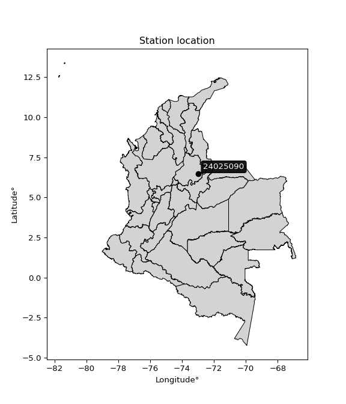</img>

</div>


## A. General information


### 1. General running parameters

• app_version: _v20260312_. • runtime: _2026-03-12 07:15:23.203550_. • Python version: _3.14.0_. • SciPy version: _1.16.3_. • Pandas version: _2.3.3_. • NumPy version: _2.3.5_. • Stations dataset (station_dataset_file): _dataset/pmax24h_in/automatic_colombia_2003_2025.csv_. • Stations catalog (station_catalog_file): _dataset/CNE.xls_. • Minimum year to eval til year_max (date_min): _1900_. • Maximum year to eval since year_min (date_max): _2025_. • Creates, save and include plots into reports (create_plot): _True_. • Plot only fit distributions with Δo > Δ (plot_only_fit): _True_. • Plot only simple graphs avoiding multiple CDFs and multiple Extreme values plots (plot_only_simple): _True_. • Eval low extreme values, if False, evaluates high extreme values (low_extreme): _False_. • Eval every SciPy distribution as logarithmic (pdist_logarithmic_on): _True_. • Standard deviation normalized (ddof): _1.0_. • Return periods to eval in years (Tr): _[2, 2.33, 5, 10, 15, 20, 25, 50, 75, 100, 200, 250, 500, 750, 1000]_. • Minimum data sample per station, 0 means any (minimum_sample): _5_. • Z-Score maximum threshold to adjust a value, 0 means disable (zscore_max): _3.5_. • Z-Score minimum threshold to adjust a value, 0 means disable (zscore_min): _-2.5_. • Avoid zeros, e.g. rain = 0 (avoid_zeros): _True_. • Avoid null values (avoid_nans): _True_. 

:file_folder:Table: [dataset.csv](../../dataset/pmax24h_in/automatic_colombia_2003_2025.csv)

> Delta Degrees of Freedom (DDOF): is a parameter used in the formulas for calculating variance and standard deviation. When ddof=0, the divisor is $N$ (the total number of observations) and this is used when your data set is the entire population. When ddof=1, the divisor is $N-1$ and this is used when your data set is a sample drawn from a larger population. Using $N-1$ provides an unbiased estimate of the population variance (known as Bessel´s correction).


### 2. Station info and location

|   id |   CODIGO | NOMBRE                   | CATEGORIA         | TECNOLOGIA                              | ESTADO   | FECHA_INSTALACION   |   FECHA_SUSPENSION |   ALTITUD |   LATITUD |   LONGITUD | DEPARTAMENTO   | MUNICIPIO   | AREA_OPERATIVA                         | ENTIDAD                                                     | AREA_HIDROGRAFICA   | ZONA_HIDROGRAFICA   | SUBZONA_HIDROGRAFICA   |   CORRIENTE | Catalogo   |   Version |
|-----:|---------:|:-------------------------|:------------------|:----------------------------------------|:---------|:--------------------|-------------------:|----------:|----------:|-----------:|:---------------|:------------|:---------------------------------------|:------------------------------------------------------------|:--------------------|:--------------------|:-----------------------|------------:|:-----------|----------:|
|    0 | 24025090 | MOGOTES - AUT [24025090] | Agrometeorológica | Automática con Telemetría, Convencional | Activa   | 25/10/2004          |                nan |      1673 |      6.47 |   -72.9689 | Santander      | Mogotes     | Area Operativa 08 - Santanderes-Arauca | INSTITUTO DE HIDROLOGIA METEOROLOGIA Y ESTUDIOS AMBIENTALES | Magdalena Cauca     | Sogamoso            | Río Fonce              |         nan | CNE_IDEAM  |  20251226 |

<div align="center">

Dynamic map: [:earth_americas:Google](http://maps.google.com/maps?q=6.47,-72.96888889) [:earth_americas:OSM](https://www.openstreetmap.org/#map=18/6.47/-72.96888889&layers=P) [:earth_americas:Bing](https://www.bing.com/maps?cp=6.47~-72.96888889&lvl=18) [:earth_americas:Apple](https://maps.apple.com/frame?center=6.47%2C-72.96888889&span=0.003%2C0.006)

</div>


<div align="center">

```geojson
{
  "type": "Feature",
  "geometry": {
    "type": "Point", 
    "coordinates": [-72.96888889, 6.47]
  }, 
  "properties": {
    "Name": "24025090"
  }
}
```

</div>


### 3. Discrete values table and plot

<div align="center">

|               |           0 |          1 |           2 |          3 |          4 |          5 |           6 |           7 |           8 |           9 |          10 |          11 |          12 |          13 |         14 |         15 |         16 |         17 |          18 |          19 |         20 |
|:--------------|------------:|-----------:|------------:|-----------:|-----------:|-----------:|------------:|------------:|------------:|------------:|------------:|------------:|------------:|------------:|-----------:|-----------:|-----------:|-----------:|------------:|------------:|-----------:|
| Date          | 2005        | 2006       | 2007        | 2008       | 2009       | 2010       | 2011        | 2012        | 2013        | 2014        | 2015        | 2016        | 2017        | 2018        | 2019       | 2020       | 2021       | 2022       | 2023        | 2024        | 2025       |
| Value         |   80.7      |   72.2     |   53.5      |   39.7     |   34.7     |   70.6     |   68.7      |   65.6      |   65.7      |   85.1      |   62.1      |   57.5      |   68        |   59.2      |  122.1     |   98.5     |   99.3     |  100.9     |   72.3      |   82.8      |  104.2     |
| Value_initial |   80.7      |   72.2     |   53.5      |   39.7     |   34.7     |   70.6     |   68.7      |   65.6      |   65.7      |   85.1      |   62.1      |   57.5      |   68        |   59.2      |  122.1     |   98.5     |   99.3     |  100.9     |   72.3      |   82.8      |  104.2     |
| count         |   21        |   21       |   21        |   21       |   21       |   21       |   21        |   21        |   21        |   21        |   21        |   21        |   21        |   21        |   21       |   21       |   21       |   21       |   21        |   21        |   21       |
| mean          |   74.4476   |   74.4476  |   74.4476   |   74.4476  |   74.4476  |   74.4476  |   74.4476   |   74.4476   |   74.4476   |   74.4476   |   74.4476   |   74.4476   |   74.4476   |   74.4476   |   74.4476  |   74.4476  |   74.4476  |   74.4476  |   74.4476   |   74.4476   |   74.4476  |
| std           |   21.7098   |   21.7098  |   21.7098   |   21.7098  |   21.7098  |   21.7098  |   21.7098   |   21.7098   |   21.7098   |   21.7098   |   21.7098   |   21.7098   |   21.7098   |   21.7098   |   21.7098  |   21.7098  |   21.7098  |   21.7098  |   21.7098   |   21.7098   |   21.7098  |
| zscore        |    0.287998 |   -0.10353 |   -0.964893 |   -1.60055 |   -1.83086 |   -0.17723 |   -0.264748 |   -0.407541 |   -0.402934 |    0.490672 |   -0.568758 |   -0.780644 |   -0.296991 |   -0.702339 |    2.19497 |    1.10791 |    1.14475 |    1.21845 |   -0.098924 |    0.384729 |    1.37046 |


</div>


<div align="center">

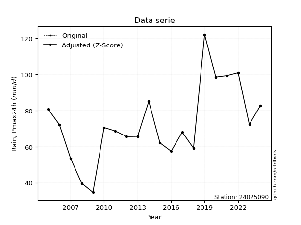</img>

</div>


> The initial value (value_initial) correspond to the initial obtained or null completed value, and value (value) is adjusted only when the initial value is outside the valid range (outlier) definite through the Z-Score value. If Z-Score is active, values out of range or outliers are replaced with the station mean value. A Z-Score (or standard score) measures how many standard deviations a data point is from the mean of a dataset, indicating its relative position; positive scores mean above the mean, negative mean below, and a score of zero is exactly at the mean, allowing for comparison of values from different distributions. It´s calculated using the formula $z=(x–μ)/σ$, where $x$ is the data point, $μ$ is the mean, and $σ$ is the standard deviation, helping identify outliers and understand probability.
>
> <sub>**Note**: In this study, "completing" (filling gaps in) and "extending" (forecasting or lengthening the historical record) rainfall data series are avoided for certain critical analyses because they introduce artificial bias and uncertainty, which can distort the statistics of rare events (extremes), alter day-to-day variability, and compromise the integrity and homogeneity of the original data. Some reasons against Completing/Extending rainfall data are: **Distortion of Extremes and Variability**: The primary issue is that most gap-filling or extension methods rely on averaging or regression with nearby stations, which inherently smooths the data. Rainfall is highly variable in space and time, with a large percentage of zero values and occasional large storms. Infilling methods often underestimate the highest values and overestimate the lowest (zero) values, which severely distorts analyses focused on flood frequency, drought severity, and intensity-duration-frequency (IDF) curves, **Loss of Data Homogeneity**: Infilled or extended data are synthetic estimates, not actual measurements. Combining these estimates with observed data can violate the assumption of data homogeneity, which requires that the data properties do not change over time. Inhomogeneity can lead to incorrect conclusions about long-term trends or changes in climate patterns, **Propagation of Errors**: Errors and biases from the original data (e.g., wind-induced undercatch, instrument errors, site changes) or the data used for imputation can propagate through the analysis, leading to unreliable hydrological models and inaccurate predictions, **Compromised Statistical Integrity**: For statistical analyses, especially those involving the frequency of events, using artificial data can introduce time bias or autocorrelation that doesn´t exist in reality, making it difficult to assess the true probability of events, **Difficulty in Validation**: It is difficult to accurately validate the quality of filled or extended data, especially for past periods where ground-truth measurements are unavailable. The reliability of imputation techniques heavily depends on the density of the surrounding station network and the complexity of the local topography.</sub>


### 4. Active continuous probability distributions from SciPy (80 of 104 available)

A Probability Density Function (PDF) describes the relative likelihood of a continuous random variable falling within a specific range, where the total area under its curve equals 1, and the area over any interval gives the actual probability for that range. Unlike discrete probabilities (like rolling a die), a PDF shows density, not direct probability for a single point (which is zero), with higher points indicating higher likelihood, often visualized as a bell curve for normal distributions.

A log of a probability density function (log-PDF) is simply the logarithm of the PDF´s value, denoted as $log(f(x))$, useful for converting multiplication of probabilities into addition, improving numerical stability with tiny numbers, and connecting to information theory concepts like entropy. Instead of dealing with very small probabilities (e.g., 0.000001), log-PDFs use negative numbers (e.g., $log(0.00001) ≈ -11.51$ that are easier for computers to handle, preventing underflow errors and simplifying complex calculations. In this study, each active probability distribution from SciPy is also evaluated in the $log$ form.

[scipy.stats](https://docs.scipy.org/doc/scipy/reference/stats.html) is a Python´s powerful submodule within the SciPy library for comprehensive statistical analysis, offering over 130 probability distributions (like Normal, Poisson, etc.), functions for descriptive stats (mean, variance), hypothesis testing (t-tests, chi-square), random variable generation, and statistical tests, making it essential for data science, modeling, and research. It provides tools to explore, model, and draw conclusions from data efficiently, working seamlessly with [NumPy](https://numpy.org/).

<div align="center">

|   id | p_dist           |   n_parameter | fit_method   | label                                                                       | active   | ref                                                                                                      |
|-----:|:-----------------|--------------:|:-------------|:----------------------------------------------------------------------------|:---------|:---------------------------------------------------------------------------------------------------------|
|    0 | alpha            |             3 | MLE          | Alpha                                                                       | True     | [:mortar_board:](https://docs.scipy.org/doc/scipy/reference/generated/scipy.stats.alpha.html)            |
|    1 | anglit           |             2 | MM           | Anglit                                                                      | True     | [:mortar_board:](https://docs.scipy.org/doc/scipy/reference/generated/scipy.stats.anglit.html)           |
|    2 | arcsine          |             2 | MM           | Arcsine                                                                     | True     | [:mortar_board:](https://docs.scipy.org/doc/scipy/reference/generated/scipy.stats.arcsine.html)          |
|    3 | argus            |             3 | MLE          | Argus                                                                       | True     | [:mortar_board:](https://docs.scipy.org/doc/scipy/reference/generated/scipy.stats.argus.html)            |
|    4 | beta             |             4 | MLE          | Beta                                                                        | True     | [:mortar_board:](https://docs.scipy.org/doc/scipy/reference/generated/scipy.stats.beta.html)             |
|    5 | betaprime        |             4 | MLE          | Beta prime                                                                  | True     | [:mortar_board:](https://docs.scipy.org/doc/scipy/reference/generated/scipy.stats.betaprime.html)        |
|    6 | bradford         |             3 | MLE          | Bradford                                                                    | True     | [:mortar_board:](https://docs.scipy.org/doc/scipy/reference/generated/scipy.stats.bradford.html)         |
|    7 | burr             |             4 | MLE          | Burr (Type III)                                                             | True     | [:mortar_board:](https://docs.scipy.org/doc/scipy/reference/generated/scipy.stats.burr.html)             |
|    8 | burr12           |             4 | MLE          | Burr (Type III) 12                                                          | True     | [:mortar_board:](https://docs.scipy.org/doc/scipy/reference/generated/scipy.stats.burr12.html)           |
|    9 | cosine           |             2 | MLE          | Cosine                                                                      | True     | [:mortar_board:](https://docs.scipy.org/doc/scipy/reference/generated/scipy.stats.cosine.html)           |
|   10 | crystalball      |             4 | MLE          | Crystalball                                                                 | True     | [:mortar_board:](https://docs.scipy.org/doc/scipy/reference/generated/scipy.stats.crystalball.html)      |
|   11 | dgamma           |             3 | MLE          | Double gamma                                                                | True     | [:mortar_board:](https://docs.scipy.org/doc/scipy/reference/generated/scipy.stats.dgamma.html)           |
|   12 | dweibull         |             3 | MLE          | Double Weibull                                                              | True     | [:mortar_board:](https://docs.scipy.org/doc/scipy/reference/generated/scipy.stats.dweibull.html)         |
|   13 | erlang           |             3 | MLE          | Erlang                                                                      | True     | [:mortar_board:](https://docs.scipy.org/doc/scipy/reference/generated/scipy.stats.erlang.html)           |
|   14 | exponnorm        |             3 | MLE          | Exponentially modified Normal                                               | True     | [:mortar_board:](https://docs.scipy.org/doc/scipy/reference/generated/scipy.stats.exponnorm.html)        |
|   15 | exponpow         |             3 | MLE          | Exponential power                                                           | True     | [:mortar_board:](https://docs.scipy.org/doc/scipy/reference/generated/scipy.stats.exponpow.html)         |
|   16 | exponweib        |             4 | MLE          | Exponentiated Weibull                                                       | True     | [:mortar_board:](https://docs.scipy.org/doc/scipy/reference/generated/scipy.stats.exponweib.html)        |
|   17 | f                |             4 | MLE          | F                                                                           | True     | [:mortar_board:](https://docs.scipy.org/doc/scipy/reference/generated/scipy.stats.f.html)                |
|   18 | fatiguelife      |             3 | MLE          | Fatigue-life (Birnbaum-Saunders)                                            | True     | [:mortar_board:](https://docs.scipy.org/doc/scipy/reference/generated/scipy.stats.fatiguelife.html)      |
|   19 | foldnorm         |             3 | MM           | Fold Normal                                                                 | True     | [:mortar_board:](https://docs.scipy.org/doc/scipy/reference/generated/scipy.stats.foldnorm.html)         |
|   20 | gamma            |             3 | MLE          | Gamma                                                                       | True     | [:mortar_board:](https://docs.scipy.org/doc/scipy/reference/generated/scipy.stats.gamma.html)            |
|   21 | gausshyper       |             6 | MLE          | Gauss hypergeometric                                                        | True     | [:mortar_board:](https://docs.scipy.org/doc/scipy/reference/generated/scipy.stats.gausshyper.html)       |
|   22 | genexpon         |             5 | MLE          | Generalized exponential                                                     | True     | [:mortar_board:](https://docs.scipy.org/doc/scipy/reference/generated/scipy.stats.genexpon.html)         |
|   23 | genextreme       |             3 | MLE          | Generalized exponential                                                     | True     | [:mortar_board:](https://docs.scipy.org/doc/scipy/reference/generated/scipy.stats.genextreme.html)       |
|   24 | gengamma         |             4 | MLE          | Generalized gamma                                                           | True     | [:mortar_board:](https://docs.scipy.org/doc/scipy/reference/generated/scipy.stats.gengamma.html)         |
|   25 | genhalflogistic  |             3 | MLE          | Generalized half-logistic                                                   | True     | [:mortar_board:](https://docs.scipy.org/doc/scipy/reference/generated/scipy.stats.genhalflogistic.html)  |
|   26 | genlogistic      |             3 | MLE          | Generalized logistic                                                        | True     | [:mortar_board:](https://docs.scipy.org/doc/scipy/reference/generated/scipy.stats.genlogistic.html)      |
|   27 | gennorm          |             3 | MLE          | Generalized Normal                                                          | True     | [:mortar_board:](https://docs.scipy.org/doc/scipy/reference/generated/scipy.stats.gennorm.html)          |
|   28 | genpareto        |             3 | MLE          | Generalized Pareto                                                          | True     | [:mortar_board:](https://docs.scipy.org/doc/scipy/reference/generated/scipy.stats.genpareto.html)        |
|   29 | gompertz         |             3 | MLE          | Gompertz (or truncated Gumbel)                                              | True     | [:mortar_board:](https://docs.scipy.org/doc/scipy/reference/generated/scipy.stats.gompertz.html)         |
|   30 | gumbel_l         |             2 | MM           | Gumbel Left Skew                                                            | True     | [:mortar_board:](https://docs.scipy.org/doc/scipy/reference/generated/scipy.stats.gumbel_l.html)         |
|   31 | gumbel_r         |             2 | MM           | Gumbel Right Skew                                                           | True     | [:mortar_board:](https://docs.scipy.org/doc/scipy/reference/generated/scipy.stats.gumbel_r.html)         |
|   32 | halfgennorm      |             3 | MLE          | Upper half of a generalized normal                                          | True     | [:mortar_board:](https://docs.scipy.org/doc/scipy/reference/generated/scipy.stats.halfgennorm.html)      |
|   33 | halflogistic     |             2 | MM           | Half-logistic                                                               | True     | [:mortar_board:](https://docs.scipy.org/doc/scipy/reference/generated/scipy.stats.halflogistic.html)     |
|   34 | halfnorm         |             2 | MM           | Half Normal                                                                 | True     | [:mortar_board:](https://docs.scipy.org/doc/scipy/reference/generated/scipy.stats.halfnorm.html)         |
|   35 | hypsecant        |             2 | MM           | hyperbolic secant                                                           | True     | [:mortar_board:](https://docs.scipy.org/doc/scipy/reference/generated/scipy.stats.hypsecant.html)        |
|   36 | invgamma         |             3 | MLE          | Inverted gamma                                                              | True     | [:mortar_board:](https://docs.scipy.org/doc/scipy/reference/generated/scipy.stats.invgamma.html)         |
|   37 | invgauss         |             3 | MLE          | Inverse Gaussian                                                            | True     | [:mortar_board:](https://docs.scipy.org/doc/scipy/reference/generated/scipy.stats.invgauss.html)         |
|   38 | invweibull       |             3 | MLE          | Inverted Weibull                                                            | True     | [:mortar_board:](https://docs.scipy.org/doc/scipy/reference/generated/scipy.stats.invweibull.html)       |
|   39 | johnsonsb        |             4 | MLE          | Johnson SB                                                                  | True     | [:mortar_board:](https://docs.scipy.org/doc/scipy/reference/generated/scipy.stats.johnsonsb.html)        |
|   40 | johnsonsu        |             4 | MLE          | Johnson Su                                                                  | True     | [:mortar_board:](https://docs.scipy.org/doc/scipy/reference/generated/scipy.stats.johnsonsu.html)        |
|   41 | kappa3           |             3 | MLE          | Kappa 3                                                                     | True     | [:mortar_board:](https://docs.scipy.org/doc/scipy/reference/generated/scipy.stats.kappa3.html)           |
|   42 | kappa4           |             4 | MLE          | Kappa 4                                                                     | True     | [:mortar_board:](https://docs.scipy.org/doc/scipy/reference/generated/scipy.stats.kappa4.html)           |
|   43 | ksone            |             3 | MLE          | Kolmogorov-Smirnov one-sided test statistic distribution                    | True     | [:mortar_board:](https://docs.scipy.org/doc/scipy/reference/generated/scipy.stats.ksone.html)            |
|   44 | kstwobign        |             2 | MLE          | Limiting distribution of scaled Kolmogorov-Smirnov two-sided test statistic | True     | [:mortar_board:](https://docs.scipy.org/doc/scipy/reference/generated/scipy.stats.kstwobign.html)        |
|   45 | laplace          |             2 | MM           | Laplace                                                                     | True     | [:mortar_board:](https://docs.scipy.org/doc/scipy/reference/generated/scipy.stats.laplace.html)          |
|   46 | levy_l           |             2 | MLE          | Left-skewed Levy                                                            | True     | [:mortar_board:](https://docs.scipy.org/doc/scipy/reference/generated/scipy.stats.levy_l.html)           |
|   47 | loggamma         |             3 | MLE          | Log gamma                                                                   | True     | [:mortar_board:](https://docs.scipy.org/doc/scipy/reference/generated/scipy.stats.loggamma.html)         |
|   48 | logistic         |             2 | MM           | Logistic (or Sech-squared)                                                  | True     | [:mortar_board:](https://docs.scipy.org/doc/scipy/reference/generated/scipy.stats.logistic.html)         |
|   49 | loglaplace       |             3 | MLE          | Log-Laplace                                                                 | True     | [:mortar_board:](https://docs.scipy.org/doc/scipy/reference/generated/scipy.stats.loglaplace.html)       |
|   50 | lomax            |             3 | MLE          | Lomax (Pareto of the second kind)                                           | True     | [:mortar_board:](https://docs.scipy.org/doc/scipy/reference/generated/scipy.stats.lomax.html)            |
|   51 | maxwell          |             2 | MM           | Maxwell                                                                     | True     | [:mortar_board:](https://docs.scipy.org/doc/scipy/reference/generated/scipy.stats.maxwell.html)          |
|   52 | mielke           |             4 | MLE          | Mielke Beta-Kappa / Dagum                                                   | True     | [:mortar_board:](https://docs.scipy.org/doc/scipy/reference/generated/scipy.stats.mielke.html)           |
|   53 | moyal            |             2 | MM           | Moyal                                                                       | True     | [:mortar_board:](https://docs.scipy.org/doc/scipy/reference/generated/scipy.stats.moyal.html)            |
|   54 | nakagami         |             3 | MLE          | Nakagami                                                                    | True     | [:mortar_board:](https://docs.scipy.org/doc/scipy/reference/generated/scipy.stats.nakagami.html)         |
|   55 | ncf              |             5 | MLE          | Non-central F distribution                                                  | True     | [:mortar_board:](https://docs.scipy.org/doc/scipy/reference/generated/scipy.stats.ncf.html)              |
|   56 | nct              |             4 | MLE          | Non-central Student’s t                                                     | True     | [:mortar_board:](https://docs.scipy.org/doc/scipy/reference/generated/scipy.stats.nct.html)              |
|   57 | norm             |             2 | MM           | Normal                                                                      | True     | [:mortar_board:](https://docs.scipy.org/doc/scipy/reference/generated/scipy.stats.norm.html)             |
|   58 | pearson3         |             3 | MM           | Pearson type III                                                            | True     | [:mortar_board:](https://docs.scipy.org/doc/scipy/reference/generated/scipy.stats.pearson3.html)         |
|   59 | powerlaw         |             3 | MLE          | Power-function                                                              | True     | [:mortar_board:](https://docs.scipy.org/doc/scipy/reference/generated/scipy.stats.powerlaw.html)         |
|   60 | rayleigh         |             2 | MM           | Rayleigh                                                                    | True     | [:mortar_board:](https://docs.scipy.org/doc/scipy/reference/generated/scipy.stats.rayleigh.html)         |
|   61 | rdist            |             3 | MLE          | R-distributed (symmetric beta)                                              | True     | [:mortar_board:](https://docs.scipy.org/doc/scipy/reference/generated/scipy.stats.rdist.html)            |
|   62 | rice             |             3 | MLE          | Rice                                                                        | True     | [:mortar_board:](https://docs.scipy.org/doc/scipy/reference/generated/scipy.stats.rice.html)             |
|   63 | semicircular     |             2 | MM           | Semicircular                                                                | True     | [:mortar_board:](https://docs.scipy.org/doc/scipy/reference/generated/scipy.stats.semicircular.html)     |
|   64 | skewnorm         |             3 | MLE          | Skew normal                                                                 | True     | [:mortar_board:](https://docs.scipy.org/doc/scipy/reference/generated/scipy.stats.skewnorm.html)         |
|   65 | t                |             3 | MLE          | Student’s t                                                                 | True     | [:mortar_board:](https://docs.scipy.org/doc/scipy/reference/generated/scipy.stats.t.html)                |
|   66 | trapezoid        |             4 | MLE          | Trapezoid                                                                   | True     | [:mortar_board:](https://docs.scipy.org/doc/scipy/reference/generated/scipy.stats.trapezoid.html)        |
|   67 | triang           |             3 | MLE          | Triangular                                                                  | True     | [:mortar_board:](https://docs.scipy.org/doc/scipy/reference/generated/scipy.stats.triang.html)           |
|   68 | truncexpon       |             3 | MLE          | Truncated exponential                                                       | True     | [:mortar_board:](https://docs.scipy.org/doc/scipy/reference/generated/scipy.stats.truncexpon.html)       |
|   69 | truncnorm        |             4 | MLE          | Truncated normal                                                            | True     | [:mortar_board:](https://docs.scipy.org/doc/scipy/reference/generated/scipy.stats.truncnorm.html)        |
|   70 | truncpareto      |             4 | MLE          | Upper truncated Pareto                                                      | True     | [:mortar_board:](https://docs.scipy.org/doc/scipy/reference/generated/scipy.stats.truncpareto.html)      |
|   71 | truncweibull_min |             5 | MLE          | Doubly truncated Weibull minimum                                            | True     | [:mortar_board:](https://docs.scipy.org/doc/scipy/reference/generated/scipy.stats.truncweibull_min.html) |
|   72 | tukeylambda      |             3 | MLE          | Tukey-Lamdba                                                                | True     | [:mortar_board:](https://docs.scipy.org/doc/scipy/reference/generated/scipy.stats.tukeylambda.html)      |
|   73 | uniform          |             2 | MLE          | Uniform                                                                     | True     | [:mortar_board:](https://docs.scipy.org/doc/scipy/reference/generated/scipy.stats.uniform.html)          |
|   74 | vonmises         |             3 | MLE          | Von Mises                                                                   | True     | [:mortar_board:](https://docs.scipy.org/doc/scipy/reference/generated/scipy.stats.vonmises.html)         |
|   75 | vonmises_line    |             3 | MLE          | Von Mises line                                                              | True     | [:mortar_board:](https://docs.scipy.org/doc/scipy/reference/generated/scipy.stats.vonmises_line.html)    |
|   76 | wald             |             2 | MM           | Wald                                                                        | True     | [:mortar_board:](https://docs.scipy.org/doc/scipy/reference/generated/scipy.stats.wald.html)             |
|   77 | weibull_max      |             3 | MLE          | Weibull maximum                                                             | True     | [:mortar_board:](https://docs.scipy.org/doc/scipy/reference/generated/scipy.stats.weibull_max.html)      |
|   78 | weibull_min      |             3 | MLE          | Weibull minimum                                                             | True     | [:mortar_board:](https://docs.scipy.org/doc/scipy/reference/generated/scipy.stats.weibull_min.html)      |
|   79 | wrapcauchy       |             3 | MLE          | Wrapped  Cauchy                                                             | True     | [:mortar_board:](https://docs.scipy.org/doc/scipy/reference/generated/scipy.stats.wrapcauchy.html)       |

</div>

> **n_parameter:** # arguments & localization & scale.
>
> **Fit methods:** (MLE) maximum likelihood, (MM) L-moments.
>
>**Inactive** (With the only purpose of prevent loops, zero divisions, infinite values, over high estimated values or horizontal trending for recurrence intervals estimations, the follow distributions were disabled.)**:** lognorm, norminvgauss, powernorm, powerlognorm, cauchy, halfcauchy, foldcauchy, skewcauchy, chi2, expon, fisk, genhyperbolic, geninvgauss, gibrat, kstwo, laplace_asymmetric, levy, levy_stable, ncx2, pareto, rel_breitwigner, recipinvgauss, studentized_range, loguniform, 


## B. Probability (PDF) vs. Empirical (EDF) distributions functions

A continuous probability distribution (CPD) describes probabilities for variables that can take any value within a range (like rain any time), unlike discrete variables with specific outcomes (like temperature). It uses a Probability Density Function (PDF), a curve where the total area under it equals 1, and the probability of the variable falling within an interval (a to b) is found by calculating the area under the curve between those points. A key feature is that the probability of hitting any single exact value is zero, so probabilities are always expressed for ranges, e.g., $P(a ≤ X ≤ b)$.

<div align="center">

Distributions parameters from station values
|     |   station | p_dist              |   n |             loc |           scale | shape                  | shape1                 | shape2                | shape3             |
|----:|----------:|:--------------------|----:|----------------:|----------------:|:-----------------------|:-----------------------|:----------------------|:-------------------|
|   0 |  24025090 | alpha               |  21 |  -247.801       |  4909.93        | 15.306090475832548     |                        |                       |                    |
|   1 |  24025090 | anglit              |  21 |    74.4476      |    61.9792      |                        |                        |                       |                    |
|   2 |  24025090 | arcsine             |  21 |    44.4853      |    59.9247      |                        |                        |                       |                    |
|   3 |  24025090 | argus               |  21 |    19.7329      |   103.992       | 8.451056214653125e-06  |                        |                       |                    |
|   4 |  24025090 | beta                |  21 |    27.8085      |   109.944       | 2.2753232648788484     | 3.087573746029269      |                       |                    |
|   5 |  24025090 | betaprime           |  21 |   -20.7225      |  5367.39        | 19.80284842707772      | 1114.5955034580438     |                       |                    |
|   6 |  24025090 | bradford            |  21 |    34.7         |    87.4         | 1.084629624137806      |                        |                       |                    |
|   7 |  24025090 | burr                |  21 |    -0.335716    |    79.3495      | 6.984133549931738      | 0.679718069603357      |                       |                    |
|   8 |  24025090 | burr12              |  21 |    -1.4328      |    35.9509      | 575.0244294347301      | 0.0024640445076726976  |                       |                    |
|   9 |  24025090 | cosine              |  21 |    75.6517      |    18.7892      |                        |                        |                       |                    |
|  10 |  24025090 | crystalball         |  21 |    74.4476      |    21.1866      | 2282.033175581711      | 19064.782795703097     |                       |                    |
|  11 |  24025090 | dgamma              |  21 |    70.6         |    17.2785      | 0.9044552915043194     |                        |                       |                    |
|  12 |  24025090 | dweibull            |  21 |    70.6         |    16.7775      | 0.962035904150359      |                        |                       |                    |
|  13 |  24025090 | erlang              |  21 |   -39.6043      |     3.9538      | 28.84612864567381      |                        |                       |                    |
|  14 |  24025090 | exponnorm           |  21 |    62.632       |    17.7803      | 0.6645365092750871     |                        |                       |                    |
|  15 |  24025090 | exponpow            |  21 |    34.7         |     1.72256     | 0.1041613563352417     |                        |                       |                    |
|  16 |  24025090 | exponweib           |  21 |    34.7         |     1.22668     | 1.1733200710895129     | 0.22490700791120727    |                       |                    |
|  17 |  24025090 | f                   |  21 |   -40.1811      |   114.612       | 58.533451795709965     | 13806.384399952516     |                       |                    |
|  18 |  24025090 | fatiguelife         |  21 |   -98.1681      |   171.325       | 0.1227710946494565     |                        |                       |                    |
|  19 |  24025090 | foldnorm            |  21 |    77.4475      |     1.74034     | 1.3266826871522244e-07 |                        |                       |                    |
|  20 |  24025090 | gamma               |  21 |   -39.6043      |     3.9538      | 28.846145203958486     |                        |                       |                    |
|  21 |  24025090 | gausshyper          |  21 |    33.0288      |    89.0712      | 1.1790608949255699     | 0.9181790336561582     | 0.8550409925974778    | 0.9830366267238586 |
|  22 |  24025090 | genexpon            |  21 |    34.6999      |     1.90418     | 0.04802551242008074    | 1.7625360817215293e-06 | 1.1832692054170137    |                    |
|  23 |  24025090 | genextreme          |  21 |    66.5906      |    19.9532      | 0.2112790035414993     |                        |                       |                    |
|  24 |  24025090 | gengamma            |  21 |    34.7         |     1.12802     | 1.3366974880879647     | 0.23338881178004123    |                       |                    |
|  25 |  24025090 | genhalflogistic     |  21 |    34.7         |    42.8111      | 0.35197586362553057    |                        |                       |                    |
|  26 |  24025090 | genlogistic         |  21 |    58.7492      |    14.5995      | 2.1297777877721127     |                        |                       |                    |
|  27 |  24025090 | gennorm             |  21 |    74.8872      |    31.211       | 2.1761026074081897     |                        |                       |                    |
|  28 |  24025090 | genpareto           |  21 |    -1.05615     |   153.558       | -1.2468532229577751    |                        |                       |                    |
|  29 |  24025090 | gompertz            |  21 |  -149.095       |    21.6985      | 2.0324955639222504e-05 |                        |                       |                    |
|  30 |  24025090 | gumbel_l            |  21 |    83.9827      |    16.5191      |                        |                        |                       |                    |
|  31 |  24025090 | gumbel_r            |  21 |    64.9125      |    16.5191      |                        |                        |                       |                    |
|  32 |  24025090 | halfgennorm         |  21 |    34.7         |     1.255       | 0.3413626516046633     |                        |                       |                    |
|  33 |  24025090 | halflogistic        |  21 |    49.3366      |    18.1138      |                        |                        |                       |                    |
|  34 |  24025090 | halfnorm            |  21 |    46.4049      |    35.1463      |                        |                        |                       |                    |
|  35 |  24025090 | hypsecant           |  21 |    74.4476      |    13.4878      |                        |                        |                       |                    |
|  36 |  24025090 | invgamma            |  21 |  -133.299       | 19851.4         | 96.52116713744908      |                        |                       |                    |
|  37 |  24025090 | invgauss            |  21 |   -25.1391      |  1936.42        | 0.05168988128618336    |                        |                       |                    |
|  38 |  24025090 | invweibull          |  21 |    -8.17694e+08 |     8.17694e+08 | 42426257.3079713       |                        |                       |                    |
|  39 |  24025090 | johnsonsb           |  21 |    15.481       |   139.064       | 0.4905774927951634     | 1.4500485139783237     |                       |                    |
|  40 |  24025090 | johnsonsu           |  21 |   -83.6246      |    55.7799      | -13.933596536265412    | 7.929916579049916      |                       |                    |
|  41 |  24025090 | kappa3              |  21 |    34.7         |    59.2554      | 10.548607451763303     |                        |                       |                    |
|  42 |  24025090 | kappa4              |  21 |    27.2276      |    96.0773      | 1.0843796779377723     | 1.012383339663498      |                       |                    |
|  43 |  24025090 | ksone               |  21 |    25.96        |   104.88        | 1.0                    |                        |                       |                    |
|  44 |  24025090 | kstwobign           |  21 |    -5.70433     |    92.0838      |                        |                        |                       |                    |
|  45 |  24025090 | laplace             |  21 |    74.4476      |    14.9812      |                        |                        |                       |                    |
|  46 |  24025090 | levy_l              |  21 |   126.605       |    32.3541      |                        |                        |                       |                    |
|  47 |  24025090 | loggamma            |  21 | -5021.44        |   725.075       | 1128.3606623249764     |                        |                       |                    |
|  48 |  24025090 | logistic            |  21 |    74.4476      |    11.6808      |                        |                        |                       |                    |
|  49 |  24025090 | loglaplace          |  21 |    -0.172053    |    70.7721      | 4.407062277871569      |                        |                       |                    |
|  50 |  24025090 | lomax               |  21 |    34.7         |     2.3637e+11  | 2204824776.829088      |                        |                       |                    |
|  51 |  24025090 | maxwell             |  21 |    24.2443      |    31.4602      |                        |                        |                       |                    |
|  52 |  24025090 | mielke              |  21 |     0.12953     |    78.9895      | 4.69821090962939       | 6.956730734645836      |                       |                    |
|  53 |  24025090 | moyal               |  21 |    62.3318      |     9.53731     |                        |                        |                       |                    |
|  54 |  24025090 | nakagami            |  21 |    14.6977      |    63.395       | 2.0684422649961167     |                        |                       |                    |
|  55 |  24025090 | ncf                 |  21 |    -0.527546    |     0.00368674  | 0.0040908586585588005  | 61.91996631186214      | 80.35921779660075     |                    |
|  56 |  24025090 | nct                 |  21 |   -77.8645      |    15.7052      | 61.487394442488934     | 9.572533186886545      |                       |                    |
|  57 |  24025090 | norm                |  21 |    74.4476      |    21.1866      |                        |                        |                       |                    |
|  58 |  24025090 | pearson3            |  21 |    74.4476      |    21.1866      | 0.2914881203365799     |                        |                       |                    |
|  59 |  24025090 | powerlaw            |  21 |    34.7         |    87.4         | 0.3839128203839797     |                        |                       |                    |
|  60 |  24025090 | rayleigh            |  21 |    33.9165      |    32.3392      |                        |                        |                       |                    |
|  61 |  24025090 | rdist               |  21 |    29.2115      |    55.8885      | 0.9853363859506159     |                        |                       |                    |
|  62 |  24025090 | rice                |  21 |    27.1691      |    24.0913      | 1.620089391852948      |                        |                       |                    |
|  63 |  24025090 | semicircular        |  21 |    74.4476      |    42.3731      |                        |                        |                       |                    |
|  64 |  24025090 | skewnorm            |  21 |    53.5871      |    29.7327      | 1.828707090562997      |                        |                       |                    |
|  65 |  24025090 | t                   |  21 |    74.4468      |    21.1868      | 1487442.73967016       |                        |                       |                    |
|  66 |  24025090 | trapezoid           |  21 |    25.96        |   104.88        | 1.0                    | 1.0                    |                       |                    |
|  67 |  24025090 | triang              |  21 |    27.8277      |   102.394       | 0.3698696592574783     |                        |                       |                    |
|  68 |  24025090 | truncexpon          |  21 |    34.7         |   103.861       | 0.8415084761633476     |                        |                       |                    |
|  69 |  24025090 | truncnorm           |  21 |    74.4476      |    21.1866      | -698.5790788058926     | 1600.7707591779842     |                       |                    |
|  70 |  24025090 | truncpareto         |  21 |    34.7         |     2.74176e-08 | 0.04999999525578644    | 3187737691.08919       |                       |                    |
|  71 |  24025090 | truncweibull_min    |  21 |    33.6598      |   118.714       | 1.2305641833654062     | 0.0003408602122807995  | 0.744982862104252     |                    |
|  72 |  24025090 | tukeylambda         |  21 |    58.5843      |    24.6502      | 1.0320645882588453     |                        |                       |                    |
|  73 |  24025090 | uniform             |  21 |    34.7         |    87.4         |                        |                        |                       |                    |
|  74 |  24025090 | vonmises            |  21 |    -3.11484     |     1           | 0.5255356878613238     |                        |                       |                    |
|  75 |  24025090 | vonmises_line       |  21 |    78.4         |    13.9101      | 0.5484864651643719     |                        |                       |                    |
|  76 |  24025090 | wald                |  21 |    53.261       |    21.1866      |                        |                        |                       |                    |
|  77 |  24025090 | weibull_max         |  21 |   122.1         |     1.51289     | 0.23425286767151998    |                        |                       |                    |
|  78 |  24025090 | weibull_min         |  21 |    23.9286      |    56.8731      | 2.5535132855892457     |                        |                       |                    |
|  79 |  24025090 | wrapcauchy          |  21 |    33.9438      |    14.0305      | 3.14450275982029e-06   |                        |                       |                    |
|  80 |  24025090 | logalpha            |  21 |    -5.4403      |   305.35        | 31.4845885465243       |                        |                       |                    |
|  81 |  24025090 | loganglit           |  21 |     4.26709     |     0.879576    |                        |                        |                       |                    |
|  82 |  24025090 | logarcsine          |  21 |     3.84185     |     0.850491    |                        |                        |                       |                    |
|  83 |  24025090 | logargus            |  21 |     3.4345      |     1.39755     | 0.18758871839744978    |                        |                       |                    |
|  84 |  24025090 | logbeta             |  21 |     2.90418     |     2.01503     | 5.863872582312821      | 2.805131814742847      |                       |                    |
|  85 |  24025090 | logbetaprime        |  21 |  -161.475       |   124.025       | 703200.4069828878      | 526202.9290645756      |                       |                    |
|  86 |  24025090 | logbradford         |  21 |     3.54399     |     1.26086     | 2.4442580268017725e-05 |                        |                       |                    |
|  87 |  24025090 | logburr             |  21 |    -0.142011    |     4.55316     | 33.68551791558472      | 0.5516013266496131     |                       |                    |
|  88 |  24025090 | logburr12           |  21 |    -0.0589155   |     4.93803     | 18.213308419550728     | 7.09247304624953       |                       |                    |
|  89 |  24025090 | logcosine           |  21 |     4.23487     |     0.273084    |                        |                        |                       |                    |
|  90 |  24025090 | logcrystalball      |  21 |     4.26709     |     0.30069     | 30.697806948527827     | 251.43931207010036     |                       |                    |
|  91 |  24025090 | logdgamma           |  21 |     4.25703     |     0.30823     | 0.4227668574251253     |                        |                       |                    |
|  92 |  24025090 | logdweibull         |  21 |     4.24936     |     0.232505    | 1.0544640131644263     |                        |                       |                    |
|  93 |  24025090 | logerlang           |  21 |    -0.766       |     0.0183707   | 273.9815303706956      |                        |                       |                    |
|  94 |  24025090 | logexponnorm        |  21 |     4.26685     |     0.300689    | 0.0008066312231706602  |                        |                       |                    |
|  95 |  24025090 | logexponpow         |  21 |     3.26248     |     1.29257     | 2.8545152014666124     |                        |                       |                    |
|  96 |  24025090 | logexponweib        |  21 |    -1.51632e+07 |     1.51632e+07 | 19.044488316371783     | 16497324.932315357     |                       |                    |
|  97 |  24025090 | logf                |  21 |  -315.802       |   320.069       | 5230023.517036932      | 3991415.7325450117     |                       |                    |
|  98 |  24025090 | logfatiguelife      |  21 |   -76.1795      |    80.4445      | 0.00373177690615317    |                        |                       |                    |
|  99 |  24025090 | logfoldnorm         |  21 |     3.83487     |     0.53757     | 2.062006519313567e-06  |                        |                       |                    |
| 100 |  24025090 | loggamma            |  21 |    -0.896952    |     0.0181617   | 284.28319312382666     |                        |                       |                    |
| 101 |  24025090 | loggausshyper       |  21 |     3.52567     |     1.27917     | 1.2394923884484952     | 0.7910584040223754     | 0.715459636775658     | 0.6474077811112191 |
| 102 |  24025090 | loggenexpon         |  21 |     3.51196     |     0.0198017   | 0.0015254498326477614  | 7.426877594047742      | 0.0001502309313844864 |                    |
| 103 |  24025090 | loggenextreme       |  21 |     4.18663     |     0.322898    | 0.45477564811734683    |                        |                       |                    |
| 104 |  24025090 | loggengamma         |  21 |  -946.906       |   948.094       | 15.290485962083437     | 831.0503878770514      |                       |                    |
| 105 |  24025090 | loggenhalflogistic  |  21 |     3.53109     |     1.40123     | 1.1000894240793635     |                        |                       |                    |
| 106 |  24025090 | loggenlogistic      |  21 |     4.37057     |     0.143592    | 0.6765966139751739     |                        |                       |                    |
| 107 |  24025090 | loggennorm          |  21 |     4.26299     |     0.319782    | 1.3511770029651893     |                        |                       |                    |
| 108 |  24025090 | loggenpareto        |  21 |    -0.0128362   |    12.8607      | -2.669490047024838     |                        |                       |                    |
| 109 |  24025090 | loggompertz         |  21 |     3.54674     |     0.297447    | 0.06101754857796156    |                        |                       |                    |
| 110 |  24025090 | loggumbel_l         |  21 |     4.40242     |     0.234447    |                        |                        |                       |                    |
| 111 |  24025090 | loggumbel_r         |  21 |     4.13177     |     0.234447    |                        |                        |                       |                    |
| 112 |  24025090 | loghalfgennorm      |  21 |     3.54674     |     1.26852     | 23.234595006110766     |                        |                       |                    |
| 113 |  24025090 | loghalflogistic     |  21 |     3.91066     |     0.257109    |                        |                        |                       |                    |
| 114 |  24025090 | loghalfnorm         |  21 |     3.86908     |     0.498834    |                        |                        |                       |                    |
| 115 |  24025090 | loghypsecant        |  21 |     4.26709     |     0.191425    |                        |                        |                       |                    |
| 116 |  24025090 | loginvgamma         |  21 |    -6.54468     | 13688.2         | 1266.9435692811462     |                        |                       |                    |
| 117 |  24025090 | loginvgauss         |  21 |     1.22447     |   280.263       | 0.010835264194969774   |                        |                       |                    |
| 118 |  24025090 | loginvweibull       |  21 |    -5.90082e+07 |     5.90082e+07 | 182910604.41371137     |                        |                       |                    |
| 119 |  24025090 | logjohnsonsb        |  21 |     2.69183     |     2.38581     | -1.193069411991364     | 1.6608945641499193     |                       |                    |
| 120 |  24025090 | logjohnsonsu        |  21 |     5.75516     |     0.371575    | 10.664615400895979     | 5.1331707060013        |                       |                    |
| 121 |  24025090 | logkappa3           |  21 |     3.54674     |     1.25668     | 2710.4119114378527     |                        |                       |                    |
| 122 |  24025090 | logkappa4           |  21 |     3.50422     |     1.42602     | 1.030779699129376      | 1.0964094227077164     |                       |                    |
| 123 |  24025090 | logksone            |  21 |     3.42093     |     1.50972     | 1.0                    |                        |                       |                    |
| 124 |  24025090 | logkstwobign        |  21 |     2.901       |     1.56993     |                        |                        |                       |                    |
| 125 |  24025090 | loglaplace          |  21 |     4.26709     |     0.21262     |                        |                        |                       |                    |
| 126 |  24025090 | loglevy_l           |  21 |     4.85163     |     0.332255    |                        |                        |                       |                    |
| 127 |  24025090 | logloggamma         |  21 |     3.70442     |     0.51952     | 3.439798141459792      |                        |                       |                    |
| 128 |  24025090 | loglogistic         |  21 |     4.26709     |     0.165779    |                        |                        |                       |                    |
| 129 |  24025090 | logloglaplace       |  21 |    -0.0293358   |     4.28637     | 18.7428728047991       |                        |                       |                    |
| 130 |  24025090 | loglomax            |  21 |     3.54674     |    16.7805      | 23.40761284414261      |                        |                       |                    |
| 131 |  24025090 | logmaxwell          |  21 |     3.55459     |     0.446496    |                        |                        |                       |                    |
| 132 |  24025090 | logmielke           |  21 |    -0.190791    |     4.60148     | 18.81026787783636      | 34.020522908257966     |                       |                    |
| 133 |  24025090 | logmoyal            |  21 |     4.09514     |     0.135358    |                        |                        |                       |                    |
| 134 |  24025090 | lognakagami         |  21 |  -113.742       |   118.011       | 38385.94819004534      |                        |                       |                    |
| 135 |  24025090 | logncf              |  21 |     2.6788      |     0.0443301   | 2.747153676927141      | 374.06303009061776     | 95.8416506774158      |                    |
| 136 |  24025090 | lognct              |  21 |    28.617       |     0.300081    | 696264.6445224577      | -81.14397691038272     |                       |                    |
| 137 |  24025090 | lognorm             |  21 |     4.26709     |     0.30069     |                        |                        |                       |                    |
| 138 |  24025090 | logpearson3         |  21 |     4.26709     |     0.30069     | -0.5015366422283636    |                        |                       |                    |
| 139 |  24025090 | logpowerlaw         |  21 |     3.54674     |     1.2581      | 0.44264977855811427    |                        |                       |                    |
| 140 |  24025090 | lograyleigh         |  21 |     3.69177     |     0.45904     |                        |                        |                       |                    |
| 141 |  24025090 | logrdist            |  21 |     4.17682     |     0.630082    | 1.2735571006060504     |                        |                       |                    |
| 142 |  24025090 | logrice             |  21 |   -27.683       |     0.300697    | 106.24883760615185     |                        |                       |                    |
| 143 |  24025090 | logsemicircular     |  21 |     4.26709     |     0.601353    |                        |                        |                       |                    |
| 144 |  24025090 | logskewnorm         |  21 |     4.5711      |     0.427591    | -1.9870056230371405    |                        |                       |                    |
| 145 |  24025090 | logt                |  21 |     4.26714     |     0.300593    | 3357.74718742267       |                        |                       |                    |
| 146 |  24025090 | logtrapezoid        |  21 |     3.42093     |     1.50972     | 1.0                    | 1.0                    |                       |                    |
| 147 |  24025090 | logtriang           |  21 |     3.39771     |     1.46592     | 0.8188970675265335     |                        |                       |                    |
| 148 |  24025090 | logtruncexpon       |  21 |     3.54452     |     1.48702     | 0.8475468064472311     |                        |                       |                    |
| 149 |  24025090 | logtruncnorm        |  21 |     0.280207    |     2.10295     | 1.553308717721116      | 2.151564956493159      |                       |                    |
| 150 |  24025090 | logtruncpareto      |  21 |    -6.71089e+07 |     6.71089e+07 | 93161148.04537824      | 1.0000000187471616     |                       |                    |
| 151 |  24025090 | logtruncweibull_min |  21 |     3.54083     |     1.79705     | 1.137389176405658      | 2.409780097572766e-05  | 0.7033793644767762    |                    |
| 152 |  24025090 | logtukeylambda      |  21 |     4.17551     |     0.714448    | 1.1352506487472636     |                        |                       |                    |
| 153 |  24025090 | loguniform          |  21 |     3.54674     |     1.2581      |                        |                        |                       |                    |
| 154 |  24025090 | logvonmises         |  21 |    -2.0138      |     1           | 11.595036759630197     |                        |                       |                    |
| 155 |  24025090 | logvonmises_line    |  21 |     4.23681     |     0.219657    | 0.8757342532198638     |                        |                       |                    |
| 156 |  24025090 | logwald             |  21 |     3.96637     |     0.300719    |                        |                        |                       |                    |
| 157 |  24025090 | logweibull_max      |  21 |     4.89667     |     0.710067    | 2.1990109333523318     |                        |                       |                    |
| 158 |  24025090 | logweibull_min      |  21 |     2.43286     |     1.95797     | 7.229393648258062      |                        |                       |                    |
| 159 |  24025090 | logwrapcauchy       |  21 |     3.54674     |     0.200233    | 0.5                    |                        |                       |                    |

</div>

> **loc** (Location parameter): This shifts the distribution along the x-axis. For many common distributions, like the normal (Gaussian) distribution, loc represents the mean $μ$. For others, like the uniform distribution, it might represent the minimum value, or for the beta distribution, the left end of the support interval.
>
> **scale** (Scale parameter): This determines the width or spread of the distribution. For the normal distribution, scale represents the standard deviation $σ$. For a uniform distribution, it defines the length of the interval (from $loc$ to $loc + scale$).
>
> **shape** (Shape parameters): Refers to parameters that define the specific form of a probability distribution, distinct from its location (loc) and scale (scale). These parameters are required arguments for most distribution functions. For example, a normal (Gaussian) distribution is fully defined by its location (mean) and scale (standard deviation), so it has no specific shape parameters beyond loc and scale. However, other distributions have intrinsic properties that need specification, as Gamma distribution that takes a shape parameter, often named $a$ or $alpha$.


### 0. Cumulative distribution values - CDF (160 evaluated)

Cumulative Distribution Function (CDF), denoted as $F$<sub>$X$</sub>$(x)$, is a function that gives the probability that a random variable $X$ will take a value less than or equal to a specific value, $x$ (i.e., $(P(X≥x)$. It essentially "accumulates" probabilities from a given point up to the far right (positive infinity), providing a complete picture of the distribution´s probabilities for both discrete (like rain) and continuous (like temperature) variables, helping to find probabilities over ranges or above certain values. Each station is evaluated separately ordering the $x$ values ascending, calculating the CDF and PDF values for the activated distributions and their logarithmic forms.

<div align="center">

CDF ordered by x ascending and calculating $log(f(x))$ separately
|   id |   Station |   date |     x |   count |    mean |     std |    zscore |   Value_initial |   station |   m |     alpha |   alpha_pdf |    anglit |   anglit_pdf |   arcsine |   arcsine_pdf |     argus |   argus_pdf |      beta |   beta_pdf |   betaprime |   betaprime_pdf |    bradford |   bradford_pdf |      burr |   burr_pdf |    burr12 |   burr12_pdf |    cosine |   cosine_pdf |   crystalball |   crystalball_pdf |    dgamma |   dgamma_pdf |   dweibull |   dweibull_pdf |    erlang |   erlang_pdf |   exponnorm |   exponnorm_pdf |   exponpow |   exponpow_pdf |   exponweib |   exponweib_pdf |         f |      f_pdf |   fatiguelife |   fatiguelife_pdf |   foldnorm |   foldnorm_pdf |     gamma |   gamma_pdf |   gausshyper |   gausshyper_pdf |    genexpon |   genexpon_pdf |   genextreme |   genextreme_pdf |    gengamma |   gengamma_pdf |   genhalflogistic |   genhalflogistic_pdf |   genlogistic |   genlogistic_pdf |   gennorm |   gennorm_pdf |   genpareto |   genpareto_pdf |   gompertz |   gompertz_pdf |   gumbel_l |   gumbel_l_pdf |   gumbel_r |   gumbel_r_pdf |   halfgennorm |   halfgennorm_pdf |   halflogistic |   halflogistic_pdf |   halfnorm |   halfnorm_pdf |   hypsecant |   hypsecant_pdf |   invgamma |   invgamma_pdf |   invgauss |   invgauss_pdf |   invweibull |   invweibull_pdf |   johnsonsb |   johnsonsb_pdf |   johnsonsu |   johnsonsu_pdf |      kappa3 |   kappa3_pdf |      kappa4 |   kappa4_pdf |     ksone |   ksone_pdf |   kstwobign |   kstwobign_pdf |   laplace |   laplace_pdf |   levy_l |   levy_l_pdf |   loggamma |   loggamma_pdf |   logistic |   logistic_pdf |   loglaplace |   loglaplace_pdf |       lomax |   lomax_pdf |   maxwell |   maxwell_pdf |    mielke |   mielke_pdf |       moyal |   moyal_pdf |   nakagami |   nakagami_pdf |       ncf |    ncf_pdf |       nct |    nct_pdf |      norm |   norm_pdf |   pearson3 |   pearson3_pdf |    powerlaw |   powerlaw_pdf |    rayleigh |   rayleigh_pdf |    rdist |       rdist_pdf |      rice |   rice_pdf |   semicircular |   semicircular_pdf |   skewnorm |   skewnorm_pdf |         t |      t_pdf |   trapezoid |   trapezoid_pdf |    triang |   triang_pdf |   truncexpon |   truncexpon_pdf |   truncnorm |   truncnorm_pdf |   truncpareto |   truncpareto_pdf |   truncweibull_min |   truncweibull_min_pdf |   tukeylambda |   tukeylambda_pdf |   uniform |   uniform_pdf |   vonmises |   vonmises_pdf |   vonmises_line |   vonmises_line_pdf |       wald |    wald_pdf |   weibull_max |   weibull_max_pdf |   weibull_min |   weibull_min_pdf |   wrapcauchy |   wrapcauchy_pdf |   logalpha |   logalpha_pdf |   loganglit |   loganglit_pdf |   logarcsine |   logarcsine_pdf |   logargus |   logargus_pdf |   logbeta |   logbeta_pdf |   logbetaprime |   logbetaprime_pdf |   logbradford |   logbradford_pdf |   logburr |   logburr_pdf |   logburr12 |   logburr12_pdf |   logcosine |   logcosine_pdf |   logcrystalball |   logcrystalball_pdf |   logdgamma |   logdgamma_pdf |   logdweibull |   logdweibull_pdf |   logerlang |   logerlang_pdf |   logexponnorm |   logexponnorm_pdf |   logexponpow |   logexponpow_pdf |   logexponweib |   logexponweib_pdf |       logf |   logf_pdf |   logfatiguelife |   logfatiguelife_pdf |   logfoldnorm |   logfoldnorm_pdf |   loggausshyper |   loggausshyper_pdf |   loggenexpon |   loggenexpon_pdf |   loggenextreme |   loggenextreme_pdf |   loggengamma |   loggengamma_pdf |   loggenhalflogistic |   loggenhalflogistic_pdf |   loggenlogistic |   loggenlogistic_pdf |   loggennorm |   loggennorm_pdf |   loggenpareto |   loggenpareto_pdf |   loggompertz |   loggompertz_pdf |   loggumbel_l |   loggumbel_l_pdf |   loggumbel_r |   loggumbel_r_pdf |   loghalfgennorm |   loghalfgennorm_pdf |   loghalflogistic |   loghalflogistic_pdf |   loghalfnorm |   loghalfnorm_pdf |   loghypsecant |   loghypsecant_pdf |   loginvgamma |   loginvgamma_pdf |   loginvgauss |   loginvgauss_pdf |   loginvweibull |   loginvweibull_pdf |   logjohnsonsb |   logjohnsonsb_pdf |   logjohnsonsu |   logjohnsonsu_pdf |   logkappa3 |   logkappa3_pdf |   logkappa4 |   logkappa4_pdf |   logksone |   logksone_pdf |   logkstwobign |   logkstwobign_pdf |   loglevy_l |   loglevy_l_pdf |   logloggamma |   logloggamma_pdf |   loglogistic |   loglogistic_pdf |   logloglaplace |   logloglaplace_pdf |    loglomax |   loglomax_pdf |   logmaxwell |   logmaxwell_pdf |   logmielke |   logmielke_pdf |    logmoyal |   logmoyal_pdf |   lognakagami |   lognakagami_pdf |     logncf |   logncf_pdf |     lognct |   lognct_pdf |    lognorm |   lognorm_pdf |   logpearson3 |   logpearson3_pdf |   logpowerlaw |   logpowerlaw_pdf |   lograyleigh |   lograyleigh_pdf |    logrdist |   logrdist_pdf |    logrice |   logrice_pdf |   logsemicircular |   logsemicircular_pdf |   logskewnorm |   logskewnorm_pdf |       logt |   logt_pdf |   logtrapezoid |   logtrapezoid_pdf |   logtriang |   logtriang_pdf |   logtruncexpon |   logtruncexpon_pdf |   logtruncnorm |   logtruncnorm_pdf |   logtruncpareto |   logtruncpareto_pdf |   logtruncweibull_min |   logtruncweibull_min_pdf |   logtukeylambda |   logtukeylambda_pdf |   loguniform |   loguniform_pdf |   logvonmises |   logvonmises_pdf |   logvonmises_line |   logvonmises_line_pdf |     logwald |   logwald_pdf |   logweibull_max |   logweibull_max_pdf |   logweibull_min |   logweibull_min_pdf |   logwrapcauchy |   logwrapcauchy_pdf |
|-----:|----------:|-------:|------:|--------:|--------:|--------:|----------:|----------------:|----------:|----:|----------:|------------:|----------:|-------------:|----------:|--------------:|----------:|------------:|----------:|-----------:|------------:|----------------:|------------:|---------------:|----------:|-----------:|----------:|-------------:|----------:|-------------:|--------------:|------------------:|----------:|-------------:|-----------:|---------------:|----------:|-------------:|------------:|----------------:|-----------:|---------------:|------------:|----------------:|----------:|-----------:|--------------:|------------------:|-----------:|---------------:|----------:|------------:|-------------:|-----------------:|------------:|---------------:|-------------:|-----------------:|------------:|---------------:|------------------:|----------------------:|--------------:|------------------:|----------:|--------------:|------------:|----------------:|-----------:|---------------:|-----------:|---------------:|-----------:|---------------:|--------------:|------------------:|---------------:|-------------------:|-----------:|---------------:|------------:|----------------:|-----------:|---------------:|-----------:|---------------:|-------------:|-----------------:|------------:|----------------:|------------:|----------------:|------------:|-------------:|------------:|-------------:|----------:|------------:|------------:|----------------:|----------:|--------------:|---------:|-------------:|-----------:|---------------:|-----------:|---------------:|-------------:|-----------------:|------------:|------------:|----------:|--------------:|----------:|-------------:|------------:|------------:|-----------:|---------------:|----------:|-----------:|----------:|-----------:|----------:|-----------:|-----------:|---------------:|------------:|---------------:|------------:|---------------:|---------:|----------------:|----------:|-----------:|---------------:|-------------------:|-----------:|---------------:|----------:|-----------:|------------:|----------------:|----------:|-------------:|-------------:|-----------------:|------------:|----------------:|--------------:|------------------:|-------------------:|-----------------------:|--------------:|------------------:|----------:|--------------:|-----------:|---------------:|----------------:|--------------------:|-----------:|------------:|--------------:|------------------:|--------------:|------------------:|-------------:|-----------------:|-----------:|---------------:|------------:|----------------:|-------------:|-----------------:|-----------:|---------------:|----------:|--------------:|---------------:|-------------------:|--------------:|------------------:|----------:|--------------:|------------:|----------------:|------------:|----------------:|-----------------:|---------------------:|------------:|----------------:|--------------:|------------------:|------------:|----------------:|---------------:|-------------------:|--------------:|------------------:|---------------:|-------------------:|-----------:|-----------:|-----------------:|---------------------:|--------------:|------------------:|----------------:|--------------------:|--------------:|------------------:|----------------:|--------------------:|--------------:|------------------:|---------------------:|-------------------------:|-----------------:|---------------------:|-------------:|-----------------:|---------------:|-------------------:|--------------:|------------------:|--------------:|------------------:|--------------:|------------------:|-----------------:|---------------------:|------------------:|----------------------:|--------------:|------------------:|---------------:|-------------------:|--------------:|------------------:|--------------:|------------------:|----------------:|--------------------:|---------------:|-------------------:|---------------:|-------------------:|------------:|----------------:|------------:|----------------:|-----------:|---------------:|---------------:|-------------------:|------------:|----------------:|--------------:|------------------:|--------------:|------------------:|----------------:|--------------------:|------------:|---------------:|-------------:|-----------------:|------------:|----------------:|------------:|---------------:|--------------:|------------------:|-----------:|-------------:|-----------:|-------------:|-----------:|--------------:|--------------:|------------------:|--------------:|------------------:|--------------:|------------------:|------------:|---------------:|-----------:|--------------:|------------------:|----------------------:|--------------:|------------------:|-----------:|-----------:|---------------:|-------------------:|------------:|----------------:|----------------:|--------------------:|---------------:|-------------------:|-----------------:|---------------------:|----------------------:|--------------------------:|-----------------:|---------------------:|-------------:|-----------------:|--------------:|------------------:|-------------------:|-----------------------:|------------:|--------------:|-----------------:|---------------------:|-----------------:|---------------------:|----------------:|--------------------:|
|    0 |  24025090 |   2009 |  34.7 |      21 | 74.4476 | 21.7098 | -1.83086  |            34.7 |  24025090 |   1 | 0.0190327 |  0.002856   | 0.0206193 |  0.00458561  |  0        |     0         | 0.0309103 |  0.00410877 | 0.0123646 | 0.00391272 |   0.0168    |      0.00280431 | 6.01165e-08 |     0.0168937  | 0.0205871 | 0.00278028 | 0.0072556 |   0.0369021  | 0.0225502 |   0.0036268  |     0.0303225 |        0.00324015 | 0.053027  |   0.00317249 |  0.0625364 |     0.00348381 | 0.0185828 |   0.00286229 |   0.0234631 |      0.00293121 |  0.0317401 |    4.65133e+11 | 0.000174917 |     6.49417e+09 | 0.0186009 | 0.00286241 |     0.0189415 |        0.00285712 |   0        |    0           | 0.0185828 |  0.00286229 |    0.0117815 |        0.0082585 | 2.71803e-06 |     0.025221   |    0.0190038 |       0.00282171 | 3.11165e-05 |    1.36591e+09 |       5.49005e-14 |            0.0116792  |     0.0205812 |        0.00251755 | 0.0277564 |    0.00319614 |    0.240472 |      0.00696974 |  0.0924045 |     0.0040563  |  0.0493617 |    0.00291316  | 0.00197475 |    0.000744436 |   4.25495e-13 |        0.144992   |       0        |         0          |   0        |     0          |   0.0333922 |      0.0024712  |  0.0182974 |     0.00281069 |  0.0142426 |     0.00276945 |   0.00996402 |       0.00238267 |   0.0152536 |      0.00336359 |   0.0194268 |      0.00286354 | 5.44754e-09 |   0.0134981  | 1.93596e-15 |    0.181678  | 0.0833333 |  0.00953471 |  0.00941676 |      0.00275386 | 0.0352138 |    0.00235053 | 0.447038 |   0.00215983 |  0.0071799 |      0.0719629 |  0.0322073 |     0.00266849 |    0.0168884 |         0.07943  | 4.22922e-11 |  0.00932785 | 0.0094459 |    0.00265078 | 0.0205611 |   0.00278543 | 2.06992e-05 | 2.06569e-05 |  0.0155516 |     0.00300415 | 0.0100467 | 0.00225497 | 0.0207723 | 0.00291019 | 0.0303225 | 0.00324015 |  0.0211232 |     0.00296838 | 6.65079e-07 |    3.59348e+07 | 0.000293475 |     0.00074899 | 0.530991 |      0.00566513 | 0.0132488 | 0.00354305 |     0.00917076 |         0.00520632 |  0.0180876 |     0.00269083 | 0.0303267 | 0.00324048 |  0.00694444 |      0.00158912 | 0.012179  |   0.00354436 |   4.1336e-08 |       0.0169231  |   0.0303225 |      0.00324015 |      0        |       2.74163e+06 |          0.0057457 |             0.00691459 |   7.10543e-15 |         0.0300094 | 0         |     0.0114416 |    6.52907 |      0.250638  |     4.52248e-09 |          0.00614066 | 0          | 0           |     0.0752958 |       0.000521949 |     0.0141791 |        0.00333739 |   0.00857819 |        0.0113436 | 0.00634927 |      0.0675854 |   0         |        0        |     0        |         0        | 0.00959152 |       0.170649 | 0.0147272 |      0.119043 |     0.00835893 |          0.0757522 |    0.00218341 |          0.793121 | 0.0199924 |      0.100622 |   0.0227885 |        0.113606 |  0.00625356 |        0.109067 |       0.00829508 |            0.0752551 |   0.0123277 |     0.0477043   |     0.0201866 |         0.0972346 |  0.00670652 |       0.0684389 |     0.00829503 |          0.0752548 |     0.0132581 |          0.133126 |     0.00938582 |          0.0824421 | 0.00828523 |  0.0753148 |       0.00812653 |            0.0746981 |      0        |          0        |      0.00591032 |            0.347041 |    0.00439076 |          0.175221 |       0.0164508 |            0.110066 |     0.0123817 |         0.0889197 |           0.00561721 |                 0.361254 |        0.0205683 |            0.0966056 |    0.0145445 |        0.0872294 |       0.395272 |        0.18006     |   2.60161e-07 |          0.205138 |     0.025662  |         0.108041  |   5.41742e-06 |       0.000280196 |      3.88457e-13 |             0.806944 |          0        |              0        |      0        |          0        |      0.0147744 |          0.0771531 |    0.00682916 |          0.068805 |    0.00560141 |         0.0668678 |      0.00339364 |           0.0598119 |      0.0153584 |           0.117009 |      0.0188484 |           0.105528 | 1.17456e-09 |        0.793429 | 4.86426e-06 |        1.02489  |  0.0833333 |       0.662374 |     0.00414972 |          0.0872947 |    0.386161 |        0.135829 |     0.0187342 |          0.104087 |     0.0128022 |         0.0762358 |       0.0167584 |           0.0878338 | 1.50098e-12 |       1.39493  |   0          |         0        |   0.0199981 |        0.100562 | 3.41157e-14 |    7.36582e-12 |    0.00826181 |          0.075025 | 0.00666484 |    0.0783433 | 0.00831426 |    0.0753612 | 0.00829514 |     0.0752555 |     0.0171845 |          0.10386  |   1.44566e-07 |       1.44098e+08 |      0        |          0        | 4.93009e-11 |  224391        | 0.00829511 |     0.0752553 |        0          |              0        |     0.0165905 |          0.105843 | 0.00830162 |  0.0752292 |     0.00694444 |           0.110396 |   0.0126211 |        0.169377 |      0.00260746 |            1.17488  |    4.25698e-07 |           1.27702  |      2.50551e-08 |             1.68142  |            0.00305613 |                  0.589933 |      0.000593405 |             1.02465  |     0        |         0.794849 |       1.00869 |         0.0740482 |        2.10675e-10 |               0.251283 | 0           |    0          |        0.0164525 |             0.110078 |        0.0168023 |             0.10813  |        0        |            2.38455  |
|    1 |  24025090 |   2008 |  39.7 |      21 | 74.4476 | 21.7098 | -1.60055  |            39.7 |  24025090 |   2 | 0.0382068 |  0.00493125 | 0.0496741 |  0.00701109  |  0        |     0         | 0.0547865 |  0.00543598 | 0.0399054 | 0.00707196 |   0.0360088 |      0.00500182 | 0.0819514   |     0.0159067  | 0.0386489 | 0.00454456 | 0.17369   |   0.0284636  | 0.0455648 |   0.00562475 |     0.0504946 |        0.00490631 | 0.0715584 |   0.00429832 |  0.0826874 |     0.0046327  | 0.0378381 |   0.00495529 |   0.0424213 |      0.00475211 |  0.872147  |    0.0090977   | 0.70941     |     0.0174569   | 0.0378539 | 0.0049542  |     0.0381033 |        0.00492262 |   0        |    0           | 0.0378382 |  0.0049553  |    0.0589421 |        0.0101636 | 0.118483    |     0.0222336  |    0.0378694 |       0.00483603 | 0.639539    |    0.0202039   |       0.0595597   |            0.0121367  |     0.0372535 |        0.00427502 | 0.0478926 |    0.00493904 |    0.275523 |      0.00705151 |  0.114929  |     0.0049807  |  0.066221  |    0.00387299  | 0.0100422  |    0.00279699  |   0.231587    |        0.0291893  |       0        |         0          |   0        |     0          |   0.0483285 |      0.00356938 |  0.0372674 |     0.0048964  |  0.0339924 |     0.00527403 |   0.028563   |       0.00526946 |   0.0386694 |      0.00607783 |   0.0385499 |      0.00489921 | 0.0674907   |   0.0134981  | 0.0706681   |    0.0130386 | 0.131007  |  0.00953471 |  0.0317987  |      0.00640725 | 0.0491653 |    0.00328181 | 0.458242 |   0.00232521 |  0.0245962 |      0.204041  |  0.0485788 |     0.00395683 |    0.0318086 |         0.149603 | 0.0455684   |  0.00890279 | 0.0293473 |    0.00542526 | 0.0386564 |   0.00455255 | 0.00105456  | 0.000641128 |  0.0362629 |     0.00538752 | 0.0272341 | 0.0048079  | 0.0400195 | 0.00489923 | 0.0504946 | 0.00490631 |  0.0406642 |     0.00495297 | 0.333405    |    0.0255997   | 0.0158647   |     0.0054424  | 0.559485 |      0.00574083 | 0.0371015 | 0.00601857 |     0.044564   |         0.00859842 |  0.0363168 |     0.00472863 | 0.0505006 | 0.00490671 |  0.0171628  |      0.00249822 | 0.0363476 |   0.00612309 |   0.0826112  |       0.0161277  |   0.0504946 |      0.00490631 |      0.922585 |       0.00580793  |          0.0503092 |             0.0101405  |   0.106752    |         0.0210505 | 0.0572082 |     0.0114416 |    7.23613 |      0.182775  |     0.0310675   |          0.00635973 | 0          | 0           |     0.0780126 |       0.000565735 |     0.0371036 |        0.0058945  |   0.065296   |        0.0113436 | 0.0232565  |      0.201848  |   0.0142033 |        0.269058 |     0        |         0        | 0.0461163  |       0.370774 | 0.0388274 |      0.249199 |     0.0258612  |          0.199763  |    0.108946   |          0.793119 | 0.0388717 |      0.188387 |   0.0438796 |        0.208255 |  0.0345227  |        0.326102 |       0.025708   |            0.198971  |   0.0209081 |     0.0833489   |     0.0384672 |         0.183155  |  0.0234776  |       0.198069  |     0.0257079  |          0.198971  |     0.0400839 |          0.273011 |     0.0281784  |          0.212618  | 0.0257253  |  0.199361  |       0.0255216  |            0.199533  |      0        |          0        |      0.0695636  |            0.547512 |    0.0524318  |          0.52944  |       0.0383798 |            0.226398 |     0.0310544 |         0.200916  |           0.0569895  |                 0.403237 |        0.0386546 |            0.180652  |    0.0319034 |        0.180818  |       0.420371 |        0.193265    |   0.0343196   |          0.311474 |     0.0451123 |         0.188013  |   0.00108195  |       0.0315151   |      0.108624    |             0.806944 |          0        |              0        |      0        |          0        |      0.029831  |          0.155608  |    0.0235923  |          0.197365 |    0.0232798  |         0.216763  |      0.0236093  |           0.274151  |      0.0387825 |           0.241008 |      0.039198  |           0.206527 | 0.106805    |        0.793429 | 0.10511     |        0.761342 |  0.172497  |       0.662374 |     0.0342082  |          0.393939  |    0.40585  |        0.157601 |     0.0388161 |          0.204007 |     0.0283805 |         0.166336  |       0.0334974 |           0.169197  | 0.170576    |       1.14778  |   0.00594106 |         0.138347 |   0.0388655 |        0.188272 | 4.00334e-06 |    0.000328084 |    0.0256274  |          0.198465 | 0.0266411  |    0.238476  | 0.0257429  |    0.199084  | 0.0257082  |     0.198972  |     0.0375832 |          0.209496 |   0.371834    |       1.22272     |      0        |          0        | 0.174053    |       0.844482 | 0.0257081  |     0.198971  |        0.00250094 |              0.239659 |     0.0374479 |          0.214128 | 0.0257036  |  0.198822  |     0.029755   |           0.228514 |   0.0457183 |        0.322367 |      0.153812   |            1.07319  |    0.163523    |           1.15379  |      0.206448    |             1.39482  |            0.10975    |                  0.864165 |      0.11472     |             0.809164 |     0.106996 |         0.794849 |       1.02556 |         0.191562  |        0.0357361   |               0.294695 | 0           |    0          |        0.0383839 |             0.226422 |        0.0379203 |             0.215361 |        0.257488 |            1.27491  |
|    2 |  24025090 |   2007 |  53.5 |      21 | 74.4476 | 21.7098 | -0.964893 |            53.5 |  24025090 |   3 | 0.161163  |  0.0132219  | 0.187178  |  0.0125866   |  0.25357  |     0.0148584 | 0.153908  |  0.0088597  | 0.187947  | 0.013762   |   0.161602  |      0.0134255  | 0.285464    |     0.0136979  | 0.15177   | 0.0125477  | 0.451571  |   0.0141457  | 0.16527   |   0.0117053  |     0.1614    |        0.0115498  | 0.165063  |   0.0101091  |  0.180571  |     0.0103466  | 0.160804  |   0.0131635  |   0.157441  |      0.0123839  |  0.926192  |    0.00189161  | 0.817714    |     0.00396784  | 0.160787  | 0.0131607  |     0.160298  |        0.0131071  |   0        |    0           | 0.160804  |  0.0131635  |    0.209137  |        0.0112587 | 0.377602    |     0.0156981  |    0.157464  |       0.0128123  | 0.768579    |    0.00486429  |       0.234096    |            0.0130574  |     0.150566  |        0.0129356  | 0.160327  |    0.0116581  |    0.374566 |      0.0073121  |  0.205964  |     0.0084403  |  0.146131  |    0.00816584  | 0.135953   |    0.0164226   |   0.478673    |        0.0116756  |       0.11442  |         0.027242   |   0.159984 |     0.0222439  |   0.132748  |      0.00955924 |  0.159988  |     0.0132128  |  0.169006  |     0.0142985  |   0.175938   |       0.015862   |   0.177012  |      0.0136291  |   0.159907  |      0.0130287  | 0.253765    |   0.0134981  | 0.239927    |    0.0117872 | 0.262586  |  0.00953471 |  0.19714    |      0.0165458  | 0.123513  |    0.00824454 | 0.494114 |   0.0029097  |  0.175308  |      0.875419  |  0.142663  |     0.0104711  |    0.129393  |         0.608564 | 0.160848    |  0.00782748 | 0.166078  |    0.0142329  | 0.151868  |   0.0125484  | 0.112094    | 0.0188101   |  0.166908  |     0.0135937  | 0.163302  | 0.0150614  | 0.160512  | 0.0129347  | 0.1614    | 0.0115498  |  0.160736  |     0.012779   | 0.554363    |    0.0113206   | 0.167528    |     0.0155884  | 0.641718 |      0.00626896 | 0.169446  | 0.0131151  |     0.198616   |         0.0130598  |  0.158119  |     0.0133602  | 0.161412  | 0.0115502  |  0.0689513  |      0.00500736 | 0.169955  |   0.0132404  |   0.291021   |       0.0141211  |   0.1614    |      0.0115498  |      0.9598   |       0.00144569  |          0.208775  |             0.0122522  |   0.394528    |         0.0207544 | 0.215103  |     0.0114416 |    9.51664 |      0.251231  |     0.135629    |          0.00943208 | 1.2735e-20 | 2.38773e-18 |     0.0868411 |       0.000724652 |     0.171585  |        0.0134656  |   0.221837   |        0.0113435 | 0.176044   |      0.890381  |   0.196006  |        0.902647 |     0.263769 |         1.01562  | 0.218091   |       0.767677 | 0.180182  |      0.73557  |     0.169735   |          0.838307  |    0.345557   |          0.793114 | 0.154301  |      0.67211  |   0.16458   |        0.668974 |  0.223271   |        0.929138 |       0.169577   |            0.840234  |   0.0734685 |     0.33444     |     0.155291  |         0.709994  |  0.172569   |       0.873817  |     0.169577   |          0.840235  |     0.184996  |          0.727212 |     0.177406   |          0.85399   | 0.169878   |  0.841546  |       0.170562   |            0.84774   |      0.21236  |          1.43136  |      0.256567   |            0.687098 |    0.293133   |          0.993565 |       0.17292   |            0.727704 |     0.164943  |         0.771832  |           0.194799   |                 0.529912 |        0.151845  |            0.671356  |    0.152616  |        0.7296    |       0.483653 |        0.23441     |   0.181719    |          0.719574 |     0.151923  |         0.59608   |   0.147632    |       1.20464     |      0.34936     |             0.806944 |          0.133426 |              1.91008  |      0.175469 |          1.56066  |      0.139567  |          0.705958  |    0.171792   |          0.869171 |    0.188259   |         0.943265  |      0.226316   |           1.04234   |      0.176676  |           0.726759 |      0.164187  |           0.700214 | 0.343509    |        0.793429 | 0.330416    |        0.755188 |  0.370103  |       0.662374 |     0.267398   |          1.04771   |    0.462957 |        0.233434 |     0.163123  |          0.700179 |     0.150116  |         0.769584  |       0.142713  |           0.667211  | 0.449133    |       0.749091 |   0.176124   |         1.0295   |   0.154261  |        0.672094 | 0.125556    |    1.39665     |    0.169151   |          0.838238 | 0.193562   |    0.912138  | 0.169598   |    0.839925  | 0.169578   |     0.840235  |     0.165823  |          0.71734  |   0.62363     |       0.637613    |      0.178559 |          1.12237  | 0.381219    |       0.617859 | 0.169577   |     0.840235  |        0.207751   |              0.929906 |     0.166505  |          0.714802 | 0.169497   |  0.840015  |     0.136976   |           0.490293 |   0.192467  |        0.66143  |      0.443907   |            0.87811  |    0.470129    |           0.908054 |      0.547159    |             0.921847 |            0.373173   |                  0.873155 |      0.349208    |             0.772911 |     0.344123 |         0.794849 |       1.16555 |         0.828505  |        0.187109    |               0.848524 | 5.34276e-06 |    0.00471109 |        0.172935  |             0.727749 |        0.166363  |             0.708935 |        0.444031 |            0.329809 |
|    3 |  24025090 |   2016 |  57.5 |      21 | 74.4476 | 21.7098 | -0.780644 |            57.5 |  24025090 |   4 | 0.21882   |  0.0155491  | 0.239987  |  0.0137812   |  0.308633 |     0.0128825 | 0.191167  |  0.00976156 | 0.245496  | 0.014953   |   0.21989   |      0.0156513  | 0.339181    |     0.0131679  | 0.207593  | 0.0153532  | 0.503557  |   0.0119357  | 0.215314  |   0.0132864  |     0.211878  |        0.0136742  | 0.211143  |   0.013071   |  0.227337  |     0.0131587  | 0.21813   |   0.0154424  |   0.211825  |      0.0147776  |  0.932889  |    0.00148517  | 0.831852    |     0.00315602  | 0.218102  | 0.0154403  |     0.217436  |        0.0154064  |   0        |    0           | 0.21813   |  0.0154424  |    0.254338  |        0.0113336 | 0.437331    |     0.0141917  |    0.213326  |       0.0150671  | 0.785976    |    0.00389775  |       0.28662     |            0.0131928  |     0.208188  |        0.0158345  | 0.211043  |    0.0136721  |    0.403988 |      0.00739959 |  0.242186  |     0.00968591 |  0.1823    |    0.00996243  | 0.208814   |    0.0197993   |   0.521513    |        0.00983577 |       0.221598 |         0.0262478  |   0.247757 |     0.0215983  |   0.176541  |      0.0124282  |  0.217594  |     0.0155318  |  0.230523  |     0.0163646  |   0.243666   |       0.0178509  |   0.234783  |      0.0151887  |   0.216752  |      0.015341   | 0.307758    |   0.0134981  | 0.286729    |    0.0116198 | 0.300725  |  0.00953471 |  0.266225   |      0.0178483  | 0.161313  |    0.0107677  | 0.506176 |   0.00312566 |  0.245096  |      1.05621   |  0.189863  |     0.0131682  |    0.18163   |         0.854246 | 0.191581    |  0.00754081 | 0.227124  |    0.0162086  | 0.207682  |   0.0153484  | 0.197648    | 0.0235019   |  0.225494  |     0.0156329  | 0.228555  | 0.0174465  | 0.217015  | 0.0152681  | 0.211878  | 0.0136742  |  0.216457  |     0.0150358  | 0.596977    |    0.0100521   | 0.23349     |     0.017285   | 0.66733  |      0.00655071 | 0.225613  | 0.0149267  |     0.252338   |         0.0137701  |  0.21663   |     0.0158317  | 0.211892  | 0.0136745  |  0.0904353  |      0.00573464 | 0.227043  |   0.0153033  |   0.346432   |       0.0135876  |   0.211878  |      0.0136742  |      0.965018 |       0.00118061  |          0.258172  |             0.0124285  |   0.477511    |         0.0207404 | 0.26087   |     0.0114416 |   10.0875  |      0.108367  |     0.176464    |          0.0110325  | 0.0638246  | 0.0425193   |     0.0898579 |       0.000785128 |     0.229148  |        0.0152597  |   0.267211   |        0.0113435 | 0.246888   |      1.06979   |   0.264876  |        1.00336  |     0.331009 |         0.868013 | 0.276372   |       0.847563 | 0.238193  |      0.873164 |     0.236944   |          1.02321   |    0.402743   |          0.793113 | 0.209884  |      0.875049 |   0.218881  |        0.840225 |  0.294412   |        1.03946  |       0.236982   |            1.02673   |   0.103111  |     0.50279     |     0.215363  |         0.968101  |  0.242369   |       1.05818   |     0.236982   |          1.02673   |     0.242075  |          0.856449 |     0.245426   |          1.02908   | 0.237373   |  1.02785   |       0.238537   |            1.03484   |      0.313423 |          1.3682   |      0.30696    |            0.710494 |    0.365952   |          1.0208   |       0.230912  |            0.880877 |     0.227276  |         0.957024  |           0.234438   |                 0.570381 |        0.207664  |            0.882642  |    0.21341   |        0.963541  |       0.50104  |        0.248205    |   0.238375    |          0.853474 |     0.20078   |         0.764013  |   0.244985    |       1.46978     |      0.407543    |             0.806944 |          0.267757 |              1.80528  |      0.285832 |          1.49573  |      0.199891  |          0.976935  |    0.241269   |          1.05403  |    0.262522   |         1.10987   |      0.304759   |           1.1225    |      0.234284  |           0.871366 |      0.220863  |           0.873744 | 0.400718    |        0.793429 | 0.384952    |        0.757713 |  0.417862  |       0.662374 |     0.344207   |          1.0744    |    0.480757 |        0.261175 |     0.21989   |          0.876415 |     0.214374  |         1.01592   |       0.199326  |           0.915418  | 0.50048     |       0.676435 |   0.256572   |         1.19201  |   0.209847  |        0.875158 | 0.240524    |    1.7372      |    0.236397   |          1.02434  | 0.264648   |    1.05323   | 0.236975   |    1.02628   | 0.236982   |     1.02673   |     0.223713  |          0.889646 |   0.667637    |       0.585154    |      0.264754 |          1.25619  | 0.425222    |       0.603915 | 0.236982   |     1.02673   |        0.277034   |              0.988465 |     0.224134  |          0.885441 | 0.236891   |  1.02665   |     0.174609   |           0.553562 |   0.243112  |        0.743377 |      0.505711   |            0.836548 |    0.533655    |           0.8544   |      0.610409    |             0.834043 |            0.435616   |                  0.858345 |      0.404834    |             0.770283 |     0.401435 |         0.794849 |       1.23234 |         1.02186   |        0.256612    |               1.08063  | 0.148625    |    3.55468    |        0.23093   |             0.880917 |        0.223483  |             0.877078 |        0.466181 |            0.288786 |
|    4 |  24025090 |   2018 |  59.2 |      21 | 74.4476 | 21.7098 | -0.702339 |            59.2 |  24025090 |   5 | 0.246     |  0.0164127  | 0.263795  |  0.0142206   |  0.330055 |     0.0123412 | 0.208075  |  0.0101294  | 0.271264  | 0.0153516  |   0.247196  |      0.0164568  | 0.361385    |     0.0129548  | 0.234671  | 0.0164942  | 0.523163  |   0.0111429  | 0.238426  |   0.0138963  |     0.23586   |        0.0145338  | 0.234649  |   0.0146153  |  0.250908  |     0.0145999  | 0.245113  |   0.0162881  |   0.237755  |      0.0157178  |  0.935301  |    0.00135574  | 0.83699     |     0.0028951   | 0.245083  | 0.0162864  |     0.244367  |        0.0162633  |   0        |    0           | 0.245113  |  0.0162881  |    0.273622  |        0.0113525 | 0.460947    |     0.013596   |    0.23967   |       0.0159132  | 0.792329    |    0.00358509  |       0.309079    |            0.013228   |     0.236072  |        0.0169532  | 0.234964  |    0.0144619  |    0.4166   |      0.00743876 |  0.259122  |     0.0102412  |  0.199946  |    0.010804    | 0.243378   |    0.02082     |   0.537683    |        0.00919955 |       0.265729 |         0.0256542  |   0.284181 |     0.0212462  |   0.198825  |      0.013801   |  0.244741  |     0.0163899  |  0.258946  |     0.017055   |   0.274514   |       0.018413   |   0.261071  |      0.0157247  |   0.24358   |      0.0162074  | 0.330704    |   0.013498   | 0.30643     |    0.0115586 | 0.316934  |  0.00953471 |  0.296837   |      0.018141   | 0.180697  |    0.0120616  | 0.511574 |   0.00322555 |  0.276818  |      1.12006   |  0.213264  |     0.014364   |    0.208306  |         0.979709 | 0.204299    |  0.00742217 | 0.255271  |    0.0168892  | 0.234751  |   0.0164873  | 0.238624    | 0.024617    |  0.252705  |     0.0163654  | 0.258898  | 0.0182258  | 0.243732  | 0.0161502  | 0.23586   | 0.0145338  |  0.242757  |     0.0158925  | 0.613688    |    0.00961643  | 0.263337    |     0.0178094  | 0.678589 |      0.00669715 | 0.251577  | 0.0156093  |     0.275962   |         0.0140177  |  0.244331  |     0.0167404  | 0.235874  | 0.0145341  |  0.100447   |      0.00604374 | 0.253804  |   0.0161801  |   0.369343   |       0.013367   |   0.23586   |      0.0145338  |      0.96695  |       0.00109475  |          0.279341  |             0.0124735  |   0.512769    |         0.0207399 | 0.28032   |     0.0114416 |   10.3729  |      0.234824  |     0.195858    |          0.0117903  | 0.144651   | 0.0503675   |     0.0912165 |       0.000813441 |     0.255653  |        0.0159103  |   0.286495   |        0.0113435 | 0.27898    |      1.13184   |   0.294605  |        1.03656  |     0.35576  |         0.832558 | 0.301506   |       0.877405 | 0.264427  |      0.927409 |     0.26776    |          1.09117   |    0.425852   |          0.793113 | 0.236682  |      0.965015 |   0.244427  |        0.913523 |  0.325235   |        1.07543  |       0.26791    |            1.09534   |   0.119168  |     0.603701    |     0.245365  |         1.09342   |  0.274169   |       1.12351   |     0.267911   |          1.09534   |     0.267793  |          0.908839 |     0.276335   |          1.09157   | 0.268331   |  1.09631   |       0.269701   |            1.10333   |      0.352836 |          1.33664  |      0.327796   |            0.719697 |    0.395735   |          1.02274  |       0.257467  |            0.941712 |     0.256227  |         1.02977   |           0.251314   |                 0.588191 |        0.234736  |            0.976194  |    0.243006  |        1.06889   |       0.508361 |        0.254406    |   0.264058    |          0.909566 |     0.224135  |         0.839835  |   0.288754    |       1.52992     |      0.431055    |             0.806944 |          0.319516 |              1.74617  |      0.328926 |          1.46158  |      0.230139  |          1.1002    |    0.272954   |          1.11982  |    0.295667   |         1.16377   |      0.337692   |           1.13638   |      0.260519  |           0.929301 |      0.247371  |           0.94581  | 0.423835    |        0.793429 | 0.407048    |        0.759041 |  0.437162  |       0.662374 |     0.375491   |          1.07183   |    0.488551 |        0.273965 |     0.246494  |          0.949729 |     0.245455  |         1.11719   |       0.227756  |           1.03857   | 0.519789    |       0.649193 |   0.292023   |         1.23955  |   0.23665   |        0.96518  | 0.291921    |    1.78253     |    0.267254   |          1.09284  | 0.296007   |    1.09798   | 0.26789    |    1.09486   | 0.267911   |     1.09534   |     0.250662  |          0.960102 |   0.68442     |       0.567145    |      0.301866 |          1.28931  | 0.442762    |       0.600254 | 0.267911   |     1.09534   |        0.306106   |              1.00664  |     0.250964  |          0.956257 | 0.267818   |  1.09533   |     0.19111    |           0.579129 |   0.265254  |        0.776492 |      0.529848   |            0.820316 |    0.558242    |           0.833351 |      0.634226    |             0.800981 |            0.460527   |                  0.851544 |      0.427267    |             0.769585 |     0.424594 |         0.794849 |       1.26318 |         1.09389   |        0.289444    |               1.17217  | 0.251238    |    3.41204    |        0.257487  |             0.941749 |        0.250051  |             0.94662  |        0.474439 |            0.278589 |
|    5 |  24025090 |   2015 |  62.1 |      21 | 74.4476 | 21.7098 | -0.568758 |            62.1 |  24025090 |   6 | 0.295472  |  0.0176528  | 0.306008  |  0.0148706   |  0.364794 |     0.0116598 | 0.238334  |  0.0107334  | 0.316601  | 0.0158851  |   0.296638  |      0.0175869  | 0.398445    |     0.0126069  | 0.28513   | 0.0182574  | 0.553706  |   0.00995309 | 0.280115  |   0.0148318  |     0.280013  |        0.0158889  | 0.281437  |   0.0177778  |  0.297296  |     0.017493   | 0.294188  |   0.0175054  |   0.285469  |      0.0171465  |  0.93896   |    0.00117512  | 0.844833    |     0.00252875  | 0.294153  | 0.0175045  |     0.293399  |        0.0175013  |   0        |    0           | 0.294188  |  0.0175054  |    0.306576  |        0.0113719 | 0.498968    |     0.0126371  |    0.287678  |       0.0171478  | 0.802062    |    0.00314418  |       0.34749     |            0.0132549  |     0.287701  |        0.0185872  | 0.278705  |    0.015672   |    0.438273 |      0.0075086  |  0.290225  |     0.0112142  |  0.233473  |    0.0123377   | 0.305559   |    0.0219306   |   0.562963    |        0.00826318 |       0.338424 |         0.0244419  |   0.34481  |     0.0205474  |   0.242419  |      0.0162855  |  0.294131  |     0.017619   |  0.309782  |     0.0179411  |   0.328847   |       0.0189761  |   0.307788  |      0.0164555  |   0.292479  |      0.0174656  | 0.369848    |   0.0134977  | 0.339811    |    0.0114648 | 0.344584  |  0.00953471 |  0.349796   |      0.0183184  | 0.219291  |    0.0146378  | 0.52119  |   0.00340852 |  0.332575  |      1.20774   |  0.257866  |     0.0163834  |    0.260847  |         1.22683  | 0.225535    |  0.00722409 | 0.305653  |    0.0178036  | 0.285185  |   0.0182475  | 0.31143     | 0.0253672   |  0.301725  |     0.0173923  | 0.313264  | 0.0191893  | 0.292511  | 0.0174415  | 0.280013  | 0.0158889  |  0.290743  |     0.0171559  | 0.640619    |    0.00897598  | 0.315971    |     0.0184337  | 0.698425 |      0.00699418 | 0.298359  | 0.0166192  |     0.317147   |         0.0143721  |  0.294827  |     0.018023   | 0.280028  | 0.0158891  |  0.118738   |      0.00657102 | 0.302895  |   0.0176758  |   0.407571   |       0.0129989  |   0.280013  |      0.0158889  |      0.969942 |       0.000973423 |          0.315586  |             0.0125164  |   0.572922    |         0.0207466 | 0.313501  |     0.0114416 |   10.9299  |      0.101551  |     0.232007    |          0.013151   | 0.287734   | 0.0465101   |     0.0936501 |       0.000865882 |     0.303197  |        0.0168392  |   0.319391   |        0.0113435 | 0.335203   |      1.21518   |   0.345293  |        1.08112  |     0.394525 |         0.791595 | 0.344574   |       0.922966 | 0.310838  |      1.01244  |     0.32235    |          1.18836   |    0.463782   |          0.793112 | 0.286462  |      1.1171   |   0.291027  |        1.03524  |  0.377848   |        1.12215  |       0.322724   |            1.1935    |   0.153354  |     0.846521    |     0.303096  |         1.32634   |  0.330146   |       1.21345   |     0.322724   |          1.19351   |     0.31329   |          0.99335  |     0.330701   |          1.17831   | 0.323183   |  1.19413   |       0.324881   |            1.20077   |      0.415394 |          1.27824  |      0.362574   |            0.734732 |    0.444522   |          1.01542  |       0.304811  |            1.03698  |     0.308184  |         1.14091   |           0.280181   |                 0.619483 |        0.285179  |            1.13337   |    0.298453  |        1.25144   |       0.520789 |        0.265516    |   0.309768    |          1.00187  |     0.267435  |         0.972401  |   0.363142    |       1.56901     |      0.469647    |             0.806944 |          0.400389 |              1.63294  |      0.397317 |          1.39683  |      0.287705  |          1.30652   |    0.328778   |          1.21079  |    0.353044   |         1.23104   |      0.392176   |           1.1379    |      0.307181  |           1.0212   |      0.295406  |           1.06229  | 0.461781    |        0.793429 | 0.443409    |        0.761608 |  0.468839  |       0.662374 |     0.426383   |          1.05381   |    0.502199 |        0.297327 |     0.294767  |          1.06827  |     0.30269   |         1.27319   |       0.282901  |           1.2752    | 0.549814    |       0.606926 |   0.352699   |         1.29264  |   0.28644   |        1.11735  | 0.3771      |    1.76241     |    0.321945   |          1.1909   | 0.34993    |    1.15312   | 0.322679   |    1.19297   | 0.322724   |     1.1935    |     0.29929   |          1.07246  |   0.710896    |       0.540678    |      0.364342 |          1.3182   | 0.471367    |       0.596429 | 0.322724   |     1.1935    |        0.354843   |              1.03025  |     0.299455  |          1.07096  | 0.322633   |  1.1936    |     0.21981    |           0.621094 |   0.303689  |        0.830846 |      0.568455   |            0.794353 |    0.597286    |           0.799587 |      0.671288    |             0.74953  |            0.500969   |                  0.839574 |      0.464053    |             0.768857 |     0.462607 |         0.794849 |       1.31806 |         1.1979    |        0.348798    |               1.3053   | 0.399046    |    2.74849    |        0.304832  |             1.03701  |        0.298025  |             1.0589   |        0.487484 |            0.268225 |
|    6 |  24025090 |   2012 |  65.6 |      21 | 74.4476 | 21.7098 | -0.407541 |            65.6 |  24025090 |   7 | 0.359225  |  0.0186879  | 0.35918   |  0.0154813   |  0.404583 |     0.0111195 | 0.277115  |  0.0114194  | 0.37298   | 0.0162881  |   0.359925  |      0.0184888  | 0.441869    |     0.0122111  | 0.352081  | 0.0198918  | 0.58636   |   0.0087432  | 0.333716  |   0.0157576  |     0.338118  |        0.0172576  | 0.35209   |   0.0229018  |  0.365978  |     0.0219725  | 0.357402  |   0.018531   |   0.347953  |      0.0184783  |  0.942764  |    0.00100616  | 0.853054    |     0.00218336  | 0.357367  | 0.0185313  |     0.356643  |        0.0185514  |   0        |    0           | 0.357402  |  0.018531   |    0.346394  |        0.011379  | 0.541302    |     0.0115693  |    0.349718  |       0.0182231  | 0.812305    |    0.00272627  |       0.393854    |            0.0132281  |     0.355354  |        0.0199473  | 0.335705  |    0.0168407  |    0.464708 |      0.00759848 |  0.331565  |     0.0124096  |  0.280093  |    0.0143219   | 0.383185   |    0.0222509   |   0.590194    |        0.00732868 |       0.421014 |         0.0227106  |   0.415036 |     0.0195564  |   0.304739  |      0.0192971  |  0.357742  |     0.0186411  |  0.373721  |     0.0185031  |   0.395552   |       0.0190348  |   0.36648   |      0.0170257  |   0.355645  |      0.0185435  | 0.417089    |   0.0134967  | 0.379761    |    0.0113661 | 0.377956  |  0.00953471 |  0.413607   |      0.0180691  | 0.277002  |    0.01849    | 0.533539 |   0.00365308 |  0.400835  |      1.27586   |  0.3192    |     0.0186042  |    0.337583  |         1.58773  | 0.250411    |  0.00699205 | 0.369275  |    0.018471   | 0.352098  |   0.0198806  | 0.399488    | 0.0247131   |  0.36418   |     0.0182179  | 0.381558  | 0.0197217  | 0.355671  | 0.0185637  | 0.338118  | 0.0172576  |  0.352888  |     0.0182756  | 0.670877    |    0.00833522  | 0.381174    |     0.0187475  | 0.723676 |      0.00745743 | 0.358228  | 0.0175313  |     0.368044   |         0.014693   |  0.359872  |     0.0190437  | 0.338134  | 0.0172577  |  0.142851   |      0.00720739 | 0.367919  |   0.0194809  |   0.452309   |       0.0125682  |   0.338118  |      0.0172576  |      0.973139 |       0.000857992 |          0.359414  |             0.0125202  |   0.645568    |         0.0207682 | 0.353547  |     0.0114416 |   11.4007  |      0.241289  |     0.280961    |          0.0148147  | 0.43297    | 0.0364753   |     0.0968027 |       0.000937186 |     0.36362   |        0.0176245  |   0.359093   |        0.0113435 | 0.403696   |      1.27674   |   0.405618  |        1.11647  |     0.437077 |         0.763399 | 0.396483   |       0.969396 | 0.368817  |      1.10037  |     0.389923   |          1.2706    |    0.507268   |          0.793111 | 0.352398  |      1.28527  |   0.351524  |        1.16973  |  0.440388   |        1.15536  |       0.390602   |            1.27656   |   0.212673  |     1.39532     |     0.383929  |         1.62551   |  0.398779   |       1.28365   |     0.390603   |          1.27656   |     0.370302  |          1.08498  |     0.397363   |          1.24737   | 0.391083   |  1.27669   |       0.393118   |            1.28223   |      0.483445 |          1.20264  |      0.403336   |            0.752173 |    0.499632   |          0.992364 |       0.36441   |            1.13438  |     0.373786  |         1.24745   |           0.315209   |                 0.658898 |        0.352104  |            1.3044    |    0.372935  |        1.46452   |       0.535733 |        0.279938    |   0.367529    |          1.10386  |     0.325105  |         1.13189   |   0.448554    |       1.5339      |      0.513891    |             0.806944 |          0.485946 |              1.48547  |      0.471608 |          1.31121  |      0.365333  |          1.51623   |    0.397305   |          1.28249  |    0.421849   |         1.27208   |      0.453962   |           1.1113    |      0.365873  |           1.11766  |      0.35711   |           1.18584  | 0.505284    |        0.793429 | 0.485262    |        0.765166 |  0.505157  |       0.662374 |     0.4832     |          1.01601   |    0.519331 |        0.328419 |     0.356855  |          1.19382  |     0.376653  |         1.41626   |       0.361634  |           1.60888   | 0.581843    |       0.561971 |   0.424368   |         1.31476  |   0.352391  |        1.28557  | 0.470716    |    1.63897     |    0.389681   |          1.27399  | 0.414211   |    1.18611   | 0.390528   |    1.27602   | 0.390603   |     1.27655   |     0.361373  |          1.18922  |   0.739799    |       0.514217    |      0.436693 |          1.31474  | 0.50402     |       0.595191 | 0.390603   |     1.27655   |        0.411871   |              1.04839  |     0.361593  |          1.19313  | 0.390521   |  1.27677   |     0.255184   |           0.669206 |   0.350953  |        0.893162 |      0.611216   |            0.765597 |    0.640092    |           0.762072 |      0.710859    |             0.694597 |            0.546603   |                  0.824845 |      0.5062      |             0.768631 |     0.506188 |         0.794849 |       1.38636 |         1.2871    |        0.423558    |               1.41157  | 0.529723    |    2.04878    |        0.364432  |             1.13439  |        0.35942   |             1.17812  |        0.502063 |            0.265039 |
|    7 |  24025090 |   2013 |  65.7 |      21 | 74.4476 | 21.7098 | -0.402934 |            65.7 |  24025090 |   8 | 0.361095  |  0.0187094  | 0.360729  |  0.0154959   |  0.405695 |     0.0111076 | 0.278258  |  0.0114383  | 0.374609  | 0.0162959  |   0.361774  |      0.0185067  | 0.443089    |     0.0122002  | 0.354072  | 0.0199283  | 0.587233  |   0.00871175 | 0.335293  |   0.0157805  |     0.339845  |        0.0172914  | 0.354389  |   0.0230792  |  0.368183  |     0.0221218  | 0.359256  |   0.0185526  |   0.349803  |      0.0185089  |  0.942864  |    0.00100194  | 0.853272    |     0.00217472  | 0.359221  | 0.0185529  |     0.358499  |        0.0185736  |   0        |    0           | 0.359256  |  0.0185526  |    0.347532  |        0.011379  | 0.542457    |     0.0115402  |    0.351542  |       0.0182466  | 0.812577    |    0.00271578  |       0.395177    |            0.0132263  |     0.35735   |        0.0199749  | 0.33739   |    0.0168688  |    0.465468 |      0.00760115 |  0.332808  |     0.0124437  |  0.281528  |    0.0143801   | 0.38541    |    0.022245    |   0.590926    |        0.00730458 |       0.423282 |         0.0226577  |   0.41699  |     0.019526   |   0.306672  |      0.0193792  |  0.359608  |     0.0186623  |  0.375572  |     0.018511   |   0.397456   |       0.0190274  |   0.368183  |      0.017037   |   0.357501  |      0.0185665  | 0.418438    |   0.0134966  | 0.380897    |    0.0113635 | 0.378909  |  0.00953471 |  0.415413   |      0.0180555  | 0.278857  |    0.0186139  | 0.533905 |   0.00366048 |  0.402779  |      1.2772    |  0.321063  |     0.0186616  |    0.340011  |         1.59915  | 0.25111     |  0.00698553 | 0.371123  |    0.018483   | 0.354088  |   0.0199171  | 0.401957    | 0.024675    |  0.366003  |     0.0182346  | 0.38353   | 0.019727   | 0.357528  | 0.018588   | 0.339845  | 0.0172914  |  0.354717  |     0.0183004  | 0.67171     |    0.00831865  | 0.383049    |     0.0187497  | 0.724423 |      0.0074728  | 0.359982  | 0.0175519  |     0.369514   |         0.0147005  |  0.361777  |     0.0190637  | 0.339861  | 0.0172915  |  0.143572   |      0.00722558 | 0.36987   |   0.0195325  |   0.453565   |       0.0125561  |   0.339845  |      0.0172914  |      0.973224 |       0.000855086 |          0.360666  |             0.0125197  |   0.647645    |         0.0207691 | 0.354691  |     0.0114416 |   11.4251  |      0.245678  |     0.282444    |          0.0148611  | 0.436604   | 0.0362004   |     0.0968966 |       0.000939368 |     0.365384  |        0.0176412  |   0.360227   |        0.0113435 | 0.405642   |      1.27788   |   0.407319  |        1.11721  |     0.438239 |         0.762846 | 0.39796    |       0.97059  | 0.370494  |      1.10262  |     0.391859   |          1.27236   |    0.508476   |          0.793111 | 0.354359  |      1.28964  |   0.353309  |        1.17329  |  0.442149   |        1.15596  |       0.392548   |            1.27834   |   0.214817  |     1.41929     |     0.386411  |         1.63393   |  0.400736   |       1.28504   |     0.392549   |          1.27834   |     0.371957  |          1.0874   |     0.399264   |          1.24877   | 0.393029   |  1.27845   |       0.395072   |            1.28396   |      0.485276 |          1.20043  |      0.404482   |            0.752664 |    0.501143   |          0.991519 |       0.36614   |            1.13684  |     0.375688  |         1.24999   |           0.316214   |                 0.660052 |        0.354094  |            1.30879   |    0.375171  |        1.47029   |       0.53616  |        0.280369    |   0.369212    |          1.10657  |     0.326832  |         1.13635   |   0.450889    |       1.5319      |      0.51512     |             0.806944 |          0.488206 |              1.48119  |      0.473603 |          1.30868  |      0.367646  |          1.52116   |    0.39926    |          1.28392  |    0.423787   |         1.27265   |      0.455654   |           1.11019   |      0.367577  |           1.12015  |      0.358918  |           1.18903  | 0.506493    |        0.793429 | 0.486427    |        0.765275 |  0.506166  |       0.662374 |     0.484746   |          1.01475   |    0.519832 |        0.329358 |     0.358676  |          1.19704  |     0.378813  |         1.41944   |       0.364092  |           1.61923   | 0.582698    |       0.560773 |   0.426371   |         1.31479  |   0.354352  |        1.28995  | 0.473209    |    1.63452     |    0.391623   |          1.27578  | 0.416018   |    1.18656   | 0.392473   |    1.2778    | 0.392549   |     1.27834   |     0.363187  |          1.19218  |   0.740582    |       0.513533    |      0.438696 |          1.31412  | 0.504926    |       0.595203 | 0.392548   |     1.27834   |        0.413468   |              1.04876  |     0.363412  |          1.19628  | 0.392467   |  1.27856   |     0.256204   |           0.670542 |   0.352314  |        0.894893 |      0.612381   |            0.764813 |    0.641252    |           0.761047 |      0.711916    |             0.693129 |            0.547859   |                  0.824422 |      0.507371    |             0.768634 |     0.507399 |         0.794849 |       1.38832 |         1.28903   |        0.42571     |               1.4136   | 0.532831    |    2.03206    |        0.366162  |             1.13686  |        0.361217  |             1.1812   |        0.502467 |            0.265077 |
|    8 |  24025090 |   2017 |  68   |      21 | 74.4476 | 21.7098 | -0.296991 |            68   |  24025090 |   9 | 0.404596  |  0.0190765  | 0.39672   |  0.0157865   |  0.430963 |     0.0108785 | 0.305056  |  0.0118601  | 0.41225   | 0.0164174  |   0.404719  |      0.018797   | 0.470865    |     0.0119538  | 0.400734  | 0.0205882  | 0.606471  |   0.00803058 | 0.372148  |   0.0162484  |     0.38044   |        0.0179779  | 0.412773  |   0.0280109  |  0.423381  |     0.0260577  | 0.402402  |   0.0189262  |   0.393087  |      0.0190892  |  0.945064  |    0.000912731 | 0.858057    |     0.00199113  | 0.402368  | 0.0189271  |     0.40171   |        0.018961   |   0        |    0           | 0.402402  |  0.0189262  |    0.373702  |        0.0113765 | 0.568244    |     0.0108898  |    0.394039  |       0.0186702  | 0.81856     |    0.00249262  |       0.425539    |            0.01317    |     0.403879  |        0.020426   | 0.376863  |    0.0174267  |    0.483023 |      0.00766406 |  0.362327  |     0.0132231  |  0.316153  |    0.0157319   | 0.436257   |    0.0219071   |   0.607116    |        0.00678419 |       0.473965 |         0.0214024  |   0.461071 |     0.0187967  |   0.353322  |      0.0211383  |  0.402992  |     0.0190226  |  0.418264  |     0.0185746  |   0.440925   |       0.0187339  |   0.407609  |      0.0172222  |   0.400716  |      0.018972   | 0.449479    |   0.0134949  | 0.406966    |    0.0113059 | 0.400839  |  0.00953471 |  0.456517   |      0.0176614  | 0.32513   |    0.0217026  | 0.542525 |   0.00383785 |  0.447149  |      1.29906   |  0.365404  |     0.0198518  |    0.399738  |         1.88006  | 0.267006    |  0.00683726 | 0.413865  |    0.0186498  | 0.400725  |   0.0205776  | 0.457527    | 0.0235818   |  0.408297  |     0.0185082  | 0.428928  | 0.0197043  | 0.400825  | 0.0190212  | 0.38044   | 0.0179779  |  0.397371  |     0.0187524  | 0.690422    |    0.00795982  | 0.426154    |     0.0187017  | 0.742048 |      0.00786809 | 0.400827  | 0.0179368  |     0.403505   |         0.0148492  |  0.406042  |     0.0193823  | 0.380456  | 0.0179779  |  0.160672   |      0.00764377 | 0.413994  |   0.0188362  |   0.482127   |       0.0122811  |   0.38044   |      0.0179779  |      0.975118 |       0.000793183 |          0.389439  |             0.0124973  |   0.69544     |         0.0207931 | 0.381007  |     0.0114416 |   11.8878  |      0.119508  |     0.317823    |          0.0158888  | 0.512966   | 0.030362    |     0.0991167 |       0.00099202  |     0.406331  |        0.0179359  |   0.386317   |        0.0113434 | 0.449957   |      1.2952    |   0.446005  |        1.13026  |     0.464308 |         0.753263 | 0.431804   |       0.996074 | 0.409272  |      1.15023  |     0.43623    |          1.30401   |    0.535766   |          0.79311  | 0.400352  |      1.38114  |   0.395016  |        1.2495   |  0.4821     |        1.16469  |       0.43713    |            1.31025   |   0.276479  |     2.31044     |     0.44576   |         1.8078    |  0.445392   |       1.30781   |     0.43713    |          1.31025   |     0.410287  |          1.13975  |     0.442682   |          1.27229   | 0.437608   |  1.31003   |       0.439825   |            1.31451   |      0.525704 |          1.14904  |      0.430573   |            0.763913 |    0.5349     |          0.969725 |       0.406167  |            1.18837  |     0.419604  |         1.30027   |           0.339385   |                 0.687058 |        0.400739  |            1.3995    |    0.427935  |        1.59411   |       0.54598  |        0.290565    |   0.408314    |          1.16527  |     0.367657  |         1.23618   |   0.502679    |       1.47472     |      0.542886    |             0.806944 |          0.537488 |              1.38289  |      0.517629 |          1.24975  |      0.421678  |          1.61276   |    0.443895   |          1.30771  |    0.467701   |         1.2772    |      0.493367   |           1.08046   |      0.407049  |           1.173    |      0.401012  |           1.25602  | 0.533794    |        0.793429 | 0.512804    |        0.767879 |  0.528957  |       0.662374 |     0.51914    |          0.983588  |    0.531544 |        0.351808 |     0.401061  |          1.26485  |     0.42873   |         1.47739   |       0.424033  |           1.87053   | 0.601536    |       0.534403 |   0.47153    |         1.30755  |   0.400356  |        1.38145  | 0.527612    |    1.52499     |    0.436118   |          1.30782  | 0.45694    |    1.1899    | 0.437036   |    1.30974   | 0.43713    |     1.31025   |     0.405303  |          1.25405  |   0.757994    |       0.498724    |      0.483592 |          1.29334  | 0.525419    |       0.596161 | 0.43713    |     1.31025   |        0.449677   |              1.05533  |     0.405746  |          1.26268  | 0.437057   |  1.31052   |     0.279796   |           0.700735 |   0.383779  |        0.934    |      0.638396   |            0.747319 |    0.667044    |           0.738174 |      0.735205    |             0.660799 |            0.57606    |                  0.814723 |      0.533821    |             0.76883  |     0.534749 |         0.794849 |       1.43332 |         1.32397   |        0.474962    |               1.44423  | 0.596704    |    1.69237    |        0.40619   |             1.18838  |        0.403004  |             1.2461   |        0.511624 |            0.267775 |
|    9 |  24025090 |   2011 |  68.7 |      21 | 74.4476 | 21.7098 | -0.264748 |            68.7 |  24025090 |  10 | 0.417973  |  0.0191392  | 0.407796  |  0.0158577   |  0.438558 |     0.0108247 | 0.313401  |  0.0119837  | 0.423748  | 0.0164332  |   0.417892  |      0.0188391  | 0.479207    |     0.0118807  | 0.415193  | 0.0207167  | 0.612025  |   0.00783822 | 0.383564  |   0.0163679  |     0.393086  |        0.0181496  | 0.433072  |   0.0300564  |  0.442128  |     0.0275375  | 0.415675  |   0.0189929  |   0.406496  |      0.0192166  |  0.945694  |    0.00088822  | 0.859433    |     0.00194053  | 0.415642  | 0.018994   |     0.415008  |        0.0190314  |   0        |    0           | 0.415675  |  0.0189929  |    0.381665  |        0.011375  | 0.5758      |     0.0106992  |    0.407139  |       0.0187546  | 0.820283    |    0.00243099  |       0.43475     |            0.0131467  |     0.418202  |        0.0204928  | 0.38911   |    0.0175625  |    0.488394 |      0.00768385 |  0.371665  |     0.0134566  |  0.32731   |    0.0161451   | 0.451533   |    0.0217334   |   0.611813    |        0.00663774 |       0.488809 |         0.021008   |   0.474148 |     0.0185644  |   0.368285  |      0.0216081  |  0.416331  |     0.0190837  |  0.431258  |     0.0185498  |   0.453993   |       0.0186012  |   0.419675  |      0.0172505  |   0.414024  |      0.0190475  | 0.458925    |   0.0134942  | 0.414875    |    0.0112894 | 0.407513  |  0.00953471 |  0.468828   |      0.0175126  | 0.340683  |    0.0227407  | 0.545232 |   0.00389464 |  0.460471  |      1.3024    |  0.379409  |     0.0201577  |    0.419464  |         1.97283  | 0.271776    |  0.00679276 | 0.426925  |    0.0186601  | 0.415176  |   0.0207065  | 0.473896    | 0.0231804   |  0.421268  |     0.0185502  | 0.442702  | 0.0196447  | 0.414171  | 0.0191045  | 0.393086  | 0.0181496  |  0.410532  |     0.0188445  | 0.695958    |    0.00785845  | 0.439228    |     0.018651   | 0.747604 |      0.00800674 | 0.413413  | 0.0180192  |     0.413912   |         0.0148853  |  0.419626  |     0.0194253  | 0.393101  | 0.0181496  |  0.166067   |      0.00777104 | 0.427105  |   0.0186243  |   0.490695   |       0.0121986  |   0.393086  |      0.0181496  |      0.975667 |       0.000776045 |          0.398184  |             0.0124872  |   0.709998    |         0.0208022 | 0.389016  |     0.0114416 |   11.9605  |      0.0924725 |     0.329049    |          0.0161815  | 0.53366    | 0.0287794   |     0.0998171 |       0.00100904  |     0.418906  |        0.0179911  |   0.394258   |        0.0113434 | 0.463233   |      1.29718   |   0.457594  |        1.13281  |     0.472012 |         0.751435 | 0.442041   |       1.00309  | 0.421118  |      1.16308  |     0.449618   |          1.31029   |    0.543889   |          0.79311  | 0.414621  |      1.40504  |   0.40792   |        1.27035  |  0.494033   |        1.16551  |       0.450582   |            1.31657   |   0.302779  |     2.871       |     0.46446   |         1.84103   |  0.458805   |       1.31136   |     0.450583   |          1.31657   |     0.422035  |          1.15431  |     0.455733   |          1.27627   | 0.451057   |  1.31624   |       0.453319   |            1.32039   |      0.537392 |          1.13328  |      0.438414   |            0.767326 |    0.544794   |          0.962291 |       0.418409  |            1.20202  |     0.432984  |         1.31239   |           0.346464   |                 0.695456 |        0.415193  |            1.42275   |    0.444432  |        1.62718   |       0.548972 |        0.293791    |   0.420332    |          1.1816   |     0.380467  |         1.26521   |   0.517677    |       1.45381     |      0.551151    |             0.806944 |          0.551499 |              1.35322  |      0.530335 |          1.23159  |      0.438295  |          1.6317    |    0.457309   |          1.31156  |    0.480774   |         1.27554   |      0.50438    |           1.07007   |      0.419136  |           1.18733  |      0.413968  |           1.2739   | 0.541919    |        0.793429 | 0.520672    |        0.768712 |  0.535741  |       0.662374 |     0.529162   |          0.973459  |    0.535184 |        0.358977 |     0.414108  |          1.28288  |     0.443923  |         1.48906   |       0.443606  |           1.95217   | 0.60697     |       0.526806 |   0.484896   |         1.30252  |   0.414628  |        1.40534  | 0.543051    |    1.48988     |    0.449546   |          1.3142   | 0.46912    |    1.18844   | 0.450484   |    1.31607   | 0.450582   |     1.31656   |     0.418231  |          1.27033  |   0.76308     |       0.494542    |      0.496795 |          1.28473  | 0.531528    |       0.596699 | 0.450582   |     1.31656   |        0.460492   |              1.0566   |     0.418769  |          1.28037  | 0.450512   |  1.31686   |     0.287019   |           0.709722 |   0.393404  |        0.94564  |      0.646023   |            0.74219  |    0.67457     |           0.731462 |      0.741925    |             0.651471 |            0.584389   |                  0.81178  |      0.541695    |             0.768938 |     0.542889 |         0.794849 |       1.44692 |         1.33102   |        0.489772    |               1.4475   | 0.613581    |    1.60433    |        0.418431  |             1.20202  |        0.415855  |             1.26347  |        0.514374 |            0.269269 |
|   10 |  24025090 |   2010 |  70.6 |      21 | 74.4476 | 21.7098 | -0.17723  |            70.6 |  24025090 |  11 | 0.454417  |  0.0191951  | 0.43808   |  0.0160102   |  0.459011 |     0.0107124 | 0.336481  |  0.0123076  | 0.454977  | 0.0164279  |   0.453718  |      0.0188469  | 0.501595    |     0.0116869  | 0.454757  | 0.0208865  | 0.626445  |   0.00734784 | 0.414932  |   0.0166368  |     0.427946  |        0.018522   | 0.5       |   0.750535   |  0.5       |     0.104281   | 0.451854  |   0.0190637  |   0.44325   |      0.0194423  |  0.947322  |    0.000827008 | 0.862997    |     0.00181384  | 0.451824  | 0.0190653  |     0.451269  |        0.0191108  |   0        |    0           | 0.451854  |  0.0190637  |    0.403272  |        0.0113691 | 0.595649    |     0.0101986  |    0.442915  |       0.0188788  | 0.824752    |    0.00227642  |       0.459658    |            0.0130689  |     0.457193  |        0.0205103  | 0.422771  |    0.0178503  |    0.503046 |      0.00773916 |  0.397825  |     0.0140765  |  0.359046  |    0.0172585   | 0.492274   |    0.02112     |   0.624065    |        0.00626508 |       0.527691 |         0.019917   |   0.508806 |     0.0179123  |   0.410404  |      0.0226711  |  0.452666  |     0.0191364  |  0.466368  |     0.018385   |   0.488928   |       0.0181519  |   0.452477  |      0.017263   |   0.450328  |      0.0191402  | 0.484561    |   0.0134911  | 0.436283    |    0.0112466 | 0.425629  |  0.00953471 |  0.501676   |      0.017051   | 0.38675   |    0.0258157  | 0.552783 |   0.00405588 |  0.496049  |      1.30414   |  0.418387  |     0.0208325  |    0.47689   |         2.24292  | 0.284569    |  0.00667343 | 0.462338  |    0.0185956  | 0.454723  |   0.0208778  | 0.516818    | 0.0219775   |  0.456553  |     0.0185687  | 0.47979   | 0.019369   | 0.450602  | 0.0192159  | 0.427946  | 0.018522   |  0.446496  |     0.0189862  | 0.71064     |    0.00759955  | 0.474477    |     0.0184334  | 0.763213 |      0.008438   | 0.447802  | 0.0181589  |     0.442272   |         0.0149621  |  0.456556  |     0.0194181  | 0.427961  | 0.0185219  |  0.18116    |      0.0081165  | 0.461944  |   0.0180491  |   0.513661   |       0.0119775  |   0.427946  |      0.018522   |      0.9771   |       0.000732977 |          0.421878  |             0.0124525  |   0.74955     |         0.020832  | 0.410755  |     0.0114416 |   12.1532  |      0.140182  |     0.360502    |          0.0169101  | 0.584581   | 0.0249261   |     0.10178   |       0.00105783  |     0.453173  |        0.0180594  |   0.41581    |        0.0113434 | 0.49862    |      1.29539   |   0.48856   |        1.13661  |     0.492468 |         0.748742 | 0.469648   |       1.02042  | 0.453281  |      1.19396  |     0.485517   |          1.31973   |    0.565526   |          0.79311  | 0.453723  |      1.45907  |   0.443282  |        1.32072  |  0.525818   |        1.16369  |       0.486653   |            1.32601   |   0.5       |     1.91347e+08 |     0.513505  |         1.83219   |  0.494634   |       1.31349   |     0.486653   |          1.32602   |     0.454027  |          1.19037  |     0.490625   |          1.28001   | 0.487088   |  1.32542   |       0.489477   |            1.32859   |      0.567726 |          1.09041  |      0.459473   |            0.776599 |    0.570755   |          0.940546 |       0.451654  |            1.23415  |     0.469156  |         1.33768   |           0.365751   |                 0.718693 |        0.454745  |            1.47415   |    0.489861  |        1.69755   |       0.557109 |        0.302857    |   0.453127    |          1.22182  |     0.416011  |         1.3398    |   0.556504    |       1.39117     |      0.573165    |             0.806943 |          0.587334 |              1.27386  |      0.563263 |          1.18207  |      0.483277  |          1.66055   |    0.493153   |          1.31448  |    0.515443   |         1.26457   |      0.533164   |           1.03941   |      0.452011  |           1.22187  |      0.449315  |           1.31601  | 0.563565    |        0.793429 | 0.541675    |        0.771065 |  0.553811  |       0.662374 |     0.555334   |          0.944875  |    0.54525  |        0.379286 |     0.449703  |          1.32516  |     0.484831  |         1.50664   |       0.5       |           2.18634   | 0.621071    |       0.507113 |   0.520185   |         1.28309  |   0.453738  |        1.45934  | 0.582386    |    1.39331     |    0.485555   |          1.32383  | 0.501434   |    1.17928   | 0.486541   |    1.32555   | 0.486653   |     1.32601   |     0.453421  |          1.30811  |   0.776424    |       0.483864    |      0.531479 |          1.25683  | 0.547832    |       0.598708 | 0.486653   |     1.32601   |        0.489348   |              1.0585   |     0.454285  |          1.32192  | 0.486591   |  1.32633   |     0.306707   |           0.733661 |   0.419625  |        0.976645 |      0.666086   |            0.728698 |    0.694283    |           0.713796 |      0.759366    |             0.62726  |            0.606427   |                  0.803831 |      0.562678    |             0.769336 |     0.564574 |         0.794849 |       1.48341 |         1.34201   |        0.529242    |               1.4428   | 0.654417    |    1.39527    |        0.451676  |             1.23415  |        0.450902  |             1.30455  |        0.521791 |            0.274867 |
|   11 |  24025090 |   2006 |  72.2 |      21 | 74.4476 | 21.7098 | -0.10353  |            72.2 |  24025090 |  12 | 0.48508   |  0.0191152  | 0.463768  |  0.016092    |  0.4761   |     0.0106537 | 0.356382  |  0.0125665  | 0.481222  | 0.0163701  |   0.483799  |      0.0187365  | 0.520167    |     0.0115286  | 0.488151  | 0.0208244  | 0.637893  |   0.00696787 | 0.441688  |   0.0167986  |     0.457757  |        0.0187243  | 0.557759  |   0.0310891  |  0.549507  |     0.0282422  | 0.48232   |   0.019001   |   0.474416  |      0.0194943  |  0.948608  |    0.000780777 | 0.865821    |     0.00171785  | 0.482293  | 0.0190029  |     0.481816  |        0.0190535  |   0        |    0           | 0.482321  |  0.019001   |    0.421458  |        0.0113628 | 0.611642    |     0.00979518 |    0.473125  |       0.0188664  | 0.828299    |    0.00215905  |       0.480504    |            0.0129865  |     0.489899  |        0.0203457  | 0.451464  |    0.0180025  |    0.515467 |      0.00778767 |  0.420751  |     0.0145768  |  0.387395  |    0.0181728   | 0.525559   |    0.0204665   |   0.633856    |        0.00597675 |       0.558813 |         0.0189836  |   0.537011 |     0.0173417  |   0.4472    |      0.0232759  |  0.483234  |     0.0190556  |  0.495603  |     0.0181429  |   0.517608   |       0.0176858  |   0.480058  |      0.0172028  |   0.48093   |      0.0190926  | 0.506144    |   0.0134869  | 0.45425     |    0.0112126 | 0.440885  |  0.00953471 |  0.528608   |      0.0166062  | 0.430341  |    0.0287255  | 0.559387 |   0.00420027 |  0.525217  |      1.29784   |  0.452043  |     0.0212058  |    0.528211  |         2.21893  | 0.295167    |  0.00657458 | 0.491979  |    0.0184407  | 0.488104  |   0.0208173  | 0.551109    | 0.0208758   |  0.486204  |     0.0184786  | 0.510513  | 0.0190181  | 0.481335  | 0.0191811  | 0.457757  | 0.0187243  |  0.476886  |     0.0189836  | 0.722636    |    0.00739811  | 0.503765    |     0.0181652  | 0.777056 |      0.00887987 | 0.476885  | 0.0181805  |     0.466247   |         0.015003   |  0.487528  |     0.0192773  | 0.457772  | 0.0187241  |  0.194379   |      0.00840741 | 0.490435  |   0.0175647  |   0.532679   |       0.0117944  |   0.457757  |      0.0187243  |      0.978246 |       0.000700175 |          0.441773  |             0.0124157  |   0.782905    |         0.020864  | 0.429062  |     0.0114416 |   12.479   |      0.251061  |     0.387989    |          0.0174322  | 0.622182   | 0.0221397   |     0.103508  |       0.0011021   |     0.482051  |        0.0180252  |   0.43396    |        0.0113434 | 0.527561   |      1.28635   |   0.514035  |        1.13646  |     0.509245 |         0.748848 | 0.49266    |       1.03312  | 0.480284  |      1.21536  |     0.515103   |          1.31947   |    0.583299   |          0.79311  | 0.486802  |      1.49107  |   0.47328   |        1.35544  |  0.551838   |        1.15786  |       0.516378   |            1.32564   |   0.682319  |     3.2674      |     0.554639  |         1.80691   |  0.524013   |       1.30735   |     0.516379   |          1.32564   |     0.481003  |          1.21652  |     0.519273   |          1.27564   | 0.516835   |  1.32484   |       0.519248   |            1.32713   |      0.59176  |          1.05437  |      0.476964   |            0.784449 |    0.591614   |          0.920734 |       0.47956   |            1.25556  |     0.49929   |         1.3504    |           0.38208    |                 0.738783 |        0.488129  |            1.50316   |    0.527843  |        1.6747    |       0.563985 |        0.310873    |   0.480839    |          1.25067  |     0.446683  |         1.39676   |   0.587045    |       1.33374     |      0.591248    |             0.806942 |          0.615152 |              1.2088   |      0.589287 |          1.14034  |      0.520519  |          1.65939   |    0.522562   |          1.30895  |    0.543616   |         1.24872   |      0.556148   |           1.01146   |      0.47967   |           1.24586  |      0.479131  |           1.34384  | 0.581346    |        0.793429 | 0.558978    |        0.773153 |  0.568655  |       0.662374 |     0.576231   |          0.919915  |    0.55395  |        0.397413 |     0.479723  |          1.35284  |     0.518613  |         1.50594   |       0.546556  |           1.97245   | 0.63226     |       0.491509 |   0.5487     |         1.26094  |   0.486823  |        1.4913   | 0.612706    |    1.31255     |    0.515233   |          1.32365  | 0.527724   |    1.16624   | 0.516257   |    1.32522   | 0.516378   |     1.32564   |     0.48302   |          1.33242  |   0.787174    |       0.475559    |      0.55934  |          1.22896  | 0.561273    |       0.601006 | 0.516378   |     1.32564   |        0.513071   |              1.05842  |     0.484226  |          1.34908  | 0.516324   |  1.32597   |     0.323369   |           0.753325 |   0.441797  |        1.00211  |      0.682294   |            0.717798 |    0.710119    |           0.699516 |      0.773206    |             0.608047 |            0.624367   |                  0.797192 |      0.579923    |             0.769787 |     0.582386 |         0.794849 |       1.5135  |         1.34241   |        0.561394    |               1.42455  | 0.683996    |    1.24788    |        0.479582  |             1.25555  |        0.480455  |             1.33188  |        0.52802  |            0.281331 |
|   12 |  24025090 |   2023 |  72.3 |      21 | 74.4476 | 21.7098 | -0.098924 |            72.3 |  24025090 |  13 | 0.486991  |  0.0191065  | 0.465377  |  0.0160957   |  0.477165 |     0.0106511 | 0.357639  |  0.0125823  | 0.482859  | 0.0163649  |   0.485672  |      0.0187262  | 0.521319    |     0.0115188  | 0.490233  | 0.0208144  | 0.638589  |   0.00694505 | 0.443368  |   0.0168067  |     0.45963   |        0.0187335  | 0.56085   |   0.0307312  |  0.552319  |     0.0280014  | 0.48422   |   0.0189934  |   0.476365  |      0.0194934  |  0.948686  |    0.000778033 | 0.865993    |     0.00171214  | 0.484193  | 0.0189953  |     0.483721  |        0.0190463  |   0        |    0           | 0.48422   |  0.0189934  |    0.422594  |        0.0113624 | 0.61262     |     0.00977051 |    0.475011  |       0.0188621  | 0.828515    |    0.00215206  |       0.481803    |            0.0129809  |     0.491932  |        0.0203302  | 0.453264  |    0.0180093  |    0.516246 |      0.00779076 |  0.42221   |     0.0146072  |  0.389215  |    0.0182288   | 0.527603   |    0.0204221   |   0.634453    |        0.00595944 |       0.560708 |         0.018925   |   0.538744 |     0.0173054  |   0.449529  |      0.0233038  |  0.485139  |     0.0190468  |  0.497416  |     0.0181249  |   0.519375   |       0.0176544  |   0.481778  |      0.017197   |   0.482839  |      0.0190859  | 0.507493    |   0.0134866  | 0.455372    |    0.0112106 | 0.441838  |  0.00953471 |  0.530267   |      0.0165769  | 0.433223  |    0.0289179  | 0.559807 |   0.00420957 |  0.527013  |      1.29722   |  0.454164  |     0.0212228  |    0.531272  |         2.20453  | 0.295824    |  0.00656845 | 0.493823  |    0.0184281  | 0.490185  |   0.0208074  | 0.553193    | 0.0208051   |  0.488051  |     0.0184698  | 0.512414  | 0.0189929  | 0.483252  | 0.0191751  | 0.45963   | 0.0187335  |  0.478785  |     0.0189797  | 0.723375    |    0.00738599  | 0.505581    |     0.0181461  | 0.777945 |      0.00891043 | 0.478703  | 0.0181789  |     0.467748   |         0.0150048  |  0.489455  |     0.0192646  | 0.459645  | 0.0187333  |  0.195221   |      0.0084256  | 0.49219   |   0.0175344  |   0.533857   |       0.011783   |   0.45963   |      0.0187335  |      0.978316 |       0.00069822  |          0.443015  |             0.0124132  |   0.784992    |         0.0208662 | 0.430206  |     0.0114416 |   12.5042  |      0.251502  |     0.389733    |          0.0174616  | 0.624388   | 0.0219782   |     0.103618  |       0.00110497  |     0.483854  |        0.0180204  |   0.435094   |        0.0113434 | 0.529341   |      1.28558   |   0.515608  |        1.13636  |     0.510281 |         0.748923 | 0.494091   |       1.03385  | 0.481967  |      1.21655  |     0.516929   |          1.31922   |    0.584397   |          0.79311  | 0.488867  |      1.49264  |   0.475158  |        1.35736  |  0.55344    |        1.15738  |       0.518213   |            1.32537   |   0.686754  |     3.14216     |     0.557136  |         1.80119   |  0.525822   |       1.30674   |     0.518213   |          1.32538   |     0.482687  |          1.21802  |     0.521038   |          1.27515   | 0.518667   |  1.32456   |       0.521084   |            1.3268    |      0.593218 |          1.05213  |      0.47805    |            0.784942 |    0.592888   |          0.919457 |       0.481298  |            1.25672  |     0.501159  |         1.35093   |           0.383104   |                 0.740055 |        0.490211  |            1.50452   |    0.530159  |        1.6712    |       0.564416 |        0.311386    |   0.482571    |          1.25231  |     0.448618  |         1.40012   |   0.588889    |       1.33005     |      0.592365    |             0.806942 |          0.616822 |              1.2048   |      0.590863 |          1.13773  |      0.522815  |          1.65857   |    0.524373   |          1.30838  |    0.545343   |         1.24755   |      0.557546   |           1.00966   |      0.481395  |           1.2472   |      0.480992  |           1.34534  | 0.582444    |        0.793429 | 0.560048    |        0.773287 |  0.569572  |       0.662374 |     0.577503   |          0.918336  |    0.554501 |        0.398578 |     0.481596  |          1.35432  |     0.520697  |         1.50545   |       0.549277  |           1.95998   | 0.632939    |       0.490562 |   0.550445   |         1.2594   |   0.488888  |        1.49286  | 0.614519    |    1.30756     |    0.517065   |          1.3234   | 0.529338   |    1.16528   | 0.518091   |    1.32496   | 0.518213   |     1.32537   |     0.484865  |          1.33371  |   0.787832    |       0.475059    |      0.56104  |          1.2271   | 0.562105    |       0.601168 | 0.518213   |     1.32537   |        0.514536   |              1.05837  |     0.486094  |          1.35053  | 0.518159   |  1.32571   |     0.324412   |           0.754539 |   0.443185  |        1.00369  |      0.683287   |            0.71713  |    0.711086    |           0.69864  |      0.774047    |             0.606879 |            0.62547    |                  0.796779 |      0.580989    |             0.769819 |     0.583486 |         0.794849 |       1.51536 |         1.34218   |        0.563365    |               1.42301  | 0.685717    |    1.23942    |        0.481321  |             1.25671  |        0.482299  |             1.33336  |        0.528409 |            0.281789 |
|   13 |  24025090 |   2005 |  80.7 |      21 | 74.4476 | 21.7098 |  0.287998 |            80.7 |  24025090 |  14 | 0.64043   |  0.017015   | 0.600196  |  0.0158072   |  0.566915 |     0.0108628 | 0.468325  |  0.0137013  | 0.616736  | 0.015317   |   0.635749  |      0.0166388  | 0.614793    |     0.0107544  | 0.655037  | 0.0177804  | 0.689821  |   0.00535094 | 0.585011  |   0.0166372  |     0.616045  |        0.0180276  | 0.745505  |   0.0159407  |  0.72933   |     0.0158224  | 0.637226  |   0.0170316  |   0.635075  |      0.017786   |  0.954392  |    0.000594376 | 0.878643    |     0.00132767  | 0.637219  | 0.017034   |     0.637206  |        0.0170856  |   0.938363 |    0.0799568   | 0.637227  |  0.0170316  |    0.517863  |        0.0113197 | 0.686581    |     0.00790506 |    0.628182  |       0.017208   | 0.844466    |    0.00167945  |       0.588221    |            0.0122838  |     0.652075  |        0.0173031  | 0.604302  |    0.0176286  |    0.582862 |      0.00808098 |  0.554195  |     0.0165985  |  0.559471  |    0.0218617   | 0.680764   |    0.0158471   |   0.679115    |        0.00474714 |       0.6992   |         0.0141086  |   0.670827 |     0.0141028  |   0.642538  |      0.021273   |  0.638133  |     0.0169756  |  0.640417  |     0.0156441  |   0.654629   |       0.0143908  |   0.621895  |      0.0159178  |   0.636786  |      0.017148   | 0.62053     |   0.0134019  | 0.54888     |    0.0110602 | 0.52193   |  0.00953471 |  0.657966   |      0.0137278  | 0.670605  |    0.0219873  | 0.598824 |   0.00512901 |  0.66403   |      1.17218   |  0.630712  |     0.01994    |    0.720481  |         1.31464  | 0.348893    |  0.00607343 | 0.641104  |    0.0163229  | 0.65497   |   0.017782   | 0.70264     | 0.0148466   |  0.636773  |     0.0165896  | 0.659972  | 0.0158569  | 0.638062  | 0.0172486  | 0.616045  | 0.0180276  |  0.632852  |     0.0172745  | 0.781597    |    0.00652316  | 0.6488      |     0.0157105  | 0.870526 |      0.014697   | 0.627507  | 0.0168792  |     0.593595   |         0.0148597  |  0.642837  |     0.0168622  | 0.616058  | 0.0180272  |  0.272411   |      0.0099529  | 0.6288    |   0.0149915  |   0.628938   |       0.0108676  |   0.616045  |      0.0180276  |      0.983583 |       0.000564994 |          0.546175  |             0.0121253  |   0.961674    |         0.0213576 | 0.526316  |     0.0114416 |   13.9033  |      0.112355  |     0.542196    |          0.0182547  | 0.763839   | 0.0123534   |     0.11406   |       0.00140115  |     0.630439  |        0.0165466  |   0.530379   |        0.0113434 | 0.664509   |      1.15166   |   0.638729  |        1.09227  |     0.593911 |         0.782334 | 0.610223   |       1.0724   | 0.618943  |      1.25678  |     0.65767    |          1.21504   |    0.671571   |          0.793108 | 0.653332  |      1.44026  |   0.629025  |        1.40523  |  0.676831   |        1.07322  |       0.659541   |            1.2192    |   0.851143  |     0.812106    |     0.723334  |         1.2212    |  0.66384    |       1.18037   |     0.659541   |          1.2192    |     0.621156  |          1.28128  |     0.656269   |          1.16235   | 0.659852   |  1.21765   |       0.662278   |            1.2155    |      0.69888  |          0.869611 |      0.566615   |            0.82808  |    0.687762   |          0.802232 |       0.622135  |            1.28335  |     0.648442  |         1.29719   |           0.470481   |                 0.854625 |        0.654999  |            1.43494   |    0.693343  |        1.27677   |       0.601183 |        0.360777    |   0.624957    |          1.31349  |     0.613801  |         1.56722   |   0.717962    |       1.01468     |      0.681058    |             0.806882 |          0.732273 |              0.901908 |      0.704326 |          0.925785 |      0.692639  |          1.36751   |    0.662706   |          1.18418  |    0.675016   |         1.09369   |      0.659991   |           0.850092  |      0.622088  |           1.29071  |      0.631958  |           1.36818  | 0.669653    |        0.793429 | 0.645702    |        0.786011 |  0.642376  |       0.662374 |     0.671191   |          0.78419   |    0.604149 |        0.512513 |     0.633341  |          1.37227  |     0.678274  |         1.31632   |       0.718853  |           1.19218   | 0.68294     |       0.421095 |   0.680142   |         1.08524  |   0.653363  |        1.4402   | 0.737194    |    0.934885    |    0.658247   |          1.21861  | 0.65133    |    1.0395    | 0.659387   |    1.21906   | 0.659541   |     1.21919   |     0.633754  |          1.34377  |   0.838024    |       0.439516    |      0.686287 |          1.04062  | 0.629182    |       0.622238 | 0.659541   |     1.21919   |        0.629969   |              1.03603  |     0.637228  |          1.36407  | 0.659522   |  1.21947   |     0.412647   |           0.850987 |   0.56037   |        1.12861  |      0.759267   |            0.666035 |    0.78415     |           0.631652 |      0.835912    |             0.520998 |            0.711212   |                  0.763122 |      0.665796    |             0.773862 |     0.670852 |         0.794849 |       1.65848 |         1.23341   |        0.708246    |               1.17813  | 0.791967    |    0.745347   |        0.622154  |             1.2833   |        0.632005  |             1.35838  |        0.562324 |            0.345175 |
|   14 |  24025090 |   2024 |  82.8 |      21 | 74.4476 | 21.7098 |  0.384729 |            82.8 |  24025090 |  15 | 0.675283  |  0.0161626  | 0.633135  |  0.015552    |  0.589924 |     0.0110622 | 0.497323  |  0.0139108  | 0.648459  | 0.0148846  |   0.66985   |      0.0158246  | 0.637192    |     0.0105789  | 0.6911    | 0.016548   | 0.700721  |   0.00503419 | 0.61965   |   0.0163355  |     0.653294  |        0.0174221  | 0.77674   |   0.0138639  |  0.76049   |     0.0139008  | 0.67215   |   0.016213   |   0.671556  |      0.0169358  |  0.955603  |    0.000559572 | 0.881352    |     0.00125417  | 0.672148  | 0.0162153  |     0.672237  |        0.0162615  |   0.997899 |    0.00404848  | 0.672151  |  0.016213   |    0.541623  |        0.0113094 | 0.70275     |     0.00749725 |    0.663557  |       0.0164656  | 0.847896    |    0.00158862  |       0.613767    |            0.0120414  |     0.687254  |        0.0161879  | 0.640896  |    0.0171989  |    0.599919 |      0.00816469 |  0.589332  |     0.016844   |  0.605804  |    0.0222143   | 0.712743   |    0.0146109   |   0.688825    |        0.00450433 |       0.727643 |         0.0129883  |   0.699579 |     0.0132803  |   0.685604  |      0.0197003  |  0.672915  |     0.0161337  |  0.672408  |     0.0148152  |   0.683897   |       0.0134822  |   0.654777  |      0.0153865  |   0.671947  |      0.0163224  | 0.648618    |   0.0133446  | 0.572073    |    0.0110287 | 0.541953  |  0.00953471 |  0.685984   |      0.0129556  | 0.713688  |    0.0191115  | 0.609886 |   0.00541005 |  0.693542  |      1.1245    |  0.671517  |     0.0188842  |    0.752293  |         1.16502  | 0.361523    |  0.00595562 | 0.674576  |    0.0155429  | 0.691038  |   0.0165509  | 0.732381    | 0.0134917   |  0.670831  |     0.0158328  | 0.692248  | 0.0148754  | 0.673425  | 0.0164126  | 0.653294  | 0.0174221  |  0.668328  |     0.0164933  | 0.795108    |    0.0063462   | 0.680964    |     0.0149123  | 0.906246 |      0.0202251  | 0.662294  | 0.016233   |     0.62467    |         0.0147294  |  0.677316  |     0.0159616  | 0.653306  | 0.0174217  |  0.293713   |      0.0103347  | 0.659614  |   0.0143558  |   0.651531   |       0.01065    |   0.653294  |      0.0174221  |      0.984742 |       0.000539122 |          0.571543  |             0.0120335  |   1           |         0         | 0.550343  |     0.0114416 |   14.1063  |      0.116721  |     0.580193    |          0.0178981  | 0.788125   | 0.0108179   |     0.117101  |       0.001497    |     0.664517  |        0.0158928  |   0.5542     |        0.0113434 | 0.693484   |      1.10332   |   0.666536  |        1.07199  |     0.614219 |         0.79945  | 0.637812   |       1.07498  | 0.651138  |      1.24849  |     0.688313   |          1.16942   |    0.691946   |          0.793107 | 0.689567  |      1.378    |   0.664854  |        1.38182  |  0.704003   |        1.04148  |       0.69028    |            1.17282   |   0.870163  |     0.675087    |     0.753124  |         1.09966   |  0.693554   |       1.132     |     0.690281   |          1.17282   |     0.654025  |          1.27619  |     0.68557    |          1.11788   | 0.690551   |  1.17119   |       0.69291    |            1.16815   |      0.720669 |          0.82674  |      0.588036   |            0.839712 |    0.707978   |          0.771494 |       0.654939  |            1.26919  |     0.68128   |         1.25776   |           0.492834   |                 0.885953 |        0.691065  |            1.37031   |    0.724859  |        1.17706   |       0.610637 |        0.37552     |   0.658594    |          1.30354  |     0.65409   |         1.56628   |   0.74308     |       0.941187    |      0.701786    |             0.806819 |          0.754607 |              0.837329 |      0.72747  |          0.876083 |      0.726398  |          1.25968   |    0.692521   |          1.13605  |    0.702485   |         1.04421   |      0.68132    |           0.810393  |      0.655129  |           1.28014  |      0.66681   |           1.34315  | 0.690036    |        0.793429 | 0.665941    |        0.789699 |  0.659392  |       0.662374 |     0.690919   |          0.751626  |    0.617748 |        0.546796 |     0.668273  |          1.34528  |     0.711117  |         1.23918   |       0.74779   |           1.06329   | 0.693568    |       0.406388 |   0.707363   |         1.03347  |   0.689596  |        1.37789  | 0.76022     |    0.858565    |    0.688976   |          1.17262  | 0.677519   |    0.998872  | 0.690124   |    1.17275   | 0.69028    |     1.17282   |     0.667963  |          1.31768  |   0.84922     |       0.432232    |      0.712363 |          0.989186 | 0.645263    |       0.629909 | 0.69028    |     1.17282   |        0.656453   |              1.02548  |     0.671925  |          1.33509  | 0.690268   |  1.17306   |     0.434798   |           0.873529 |   0.589739  |        1.15781  |      0.77623    |            0.654627 |    0.800185    |           0.616702 |      0.84906     |             0.502745 |            0.730713   |                  0.755069 |      0.685694    |             0.775298 |     0.691271 |         0.794849 |       1.68956 |         1.18523   |        0.737492    |               1.09798  | 0.810089    |    0.667273   |        0.654957  |             1.26913  |        0.666622  |             1.3347   |        0.571501 |            0.370113 |
|   15 |  24025090 |   2014 |  85.1 |      21 | 74.4476 | 21.7098 |  0.490672 |            85.1 |  24025090 |  16 | 0.71129   |  0.0151338  | 0.668506  |  0.0151906   |  0.615698 |     0.0113663 | 0.529547  |  0.0141032  | 0.682085  | 0.0143439  |   0.705139  |      0.014849   | 0.661309    |     0.0103932  | 0.727518  | 0.0151089  | 0.711929  |   0.00471687 | 0.656734  |   0.0158925  |     0.692444  |        0.0165942  | 0.806349  |   0.0119373  |  0.790326  |     0.0120897  | 0.708313  |   0.0152179  |   0.709306  |      0.0158701  |  0.95685   |    0.000525181 | 0.884152    |     0.00118133  | 0.708315  | 0.01522    |     0.708503  |        0.0152588  |   0.999989 |    2.90263e-05 | 0.708313  |  0.0152179  |    0.567623  |        0.0112996 | 0.719503    |     0.00707471 |    0.700391  |       0.0155475  | 0.851444    |    0.00149842  |       0.641128    |            0.0117455  |     0.723013  |        0.0148985  | 0.679757  |    0.0165663  |    0.61881  |      0.00826276 |  0.628233  |     0.0169535  |  0.656983  |    0.0222179   | 0.744814   |    0.0132839   |   0.6989      |        0.00425987 |       0.756161 |         0.0118203  |   0.729091 |     0.0123836  |   0.728717  |      0.0177652  |  0.70887   |     0.0151178  |  0.705391  |     0.0138586  |   0.71376    |       0.012488   |   0.689422  |      0.0147266  |   0.708349  |      0.0153155  | 0.679208    |   0.0132486  | 0.597401    |    0.0109966 | 0.563883  |  0.00953471 |  0.714808   |      0.0121088  | 0.754436  |    0.0163915  | 0.622711 |   0.00574709 |  0.72359   |      1.06796   |  0.713401  |     0.017504   |    0.782242  |         1.02416  | 0.375075    |  0.00582921 | 0.709268  |    0.014613   | 0.727463  |   0.0151126  | 0.761801    | 0.0121099   |  0.706206  |     0.0149143  | 0.725192  | 0.0137679  | 0.710016  | 0.01539    | 0.692444  | 0.0165942  |  0.705168  |     0.0155244  | 0.809494    |    0.00616618  | 0.714206    |     0.013987   | 1        | 243882          | 0.698703  | 0.0154091  |     0.658341   |         0.0145416  |  0.71282   |     0.0149006  | 0.692455  | 0.0165937  |  0.317964   |      0.0107529  | 0.691832  |   0.0136595  |   0.675756   |       0.0104168  |   0.692444  |      0.0165942  |      0.985952 |       0.000513319 |          0.599098  |             0.0119255  |   1           |         0         | 0.576659  |     0.0114416 |   14.5626  |      0.247437  |     0.62069     |          0.0172792  | 0.811324   | 0.00939666  |     0.120677  |       0.00161564  |     0.70015   |        0.0150762  |   0.58029    |        0.0113434 | 0.722949   |      1.04671   |   0.695566  |        1.04634  |     0.636432 |         0.822976 | 0.667267   |       1.07459  | 0.685131  |      1.23136  |     0.719606   |          1.11376   |    0.713676   |          0.793107 | 0.72622   |      1.29492  |   0.702196  |        1.34135  |  0.732023   |        1.00316  |       0.721655   |            1.11628   |   0.887067  |     0.563626    |     0.781601  |         0.980899  |  0.723796   |       1.07461   |     0.721656   |          1.11628   |     0.688803  |          1.26058  |     0.715484   |          1.06478   | 0.721881   |  1.11462   |       0.724145   |            1.11073   |      0.742698 |          0.781373 |      0.611223   |            0.853029 |    0.728657   |          0.73787  |       0.689405  |            1.24512  |     0.71505   |         1.20569   |           0.517592   |                 0.921697 |        0.727487  |            1.28595   |    0.755681  |        1.07344   |       0.621162 |        0.393099    |   0.69403     |          1.28097  |     0.696745  |         1.54337   |   0.767821    |       0.865258    |      0.72389     |             0.806687 |          0.776642 |              0.771712 |      0.750753 |          0.8236   |      0.759288  |          1.141     |    0.722876   |          1.07881  |    0.73033    |         0.987795  |      0.702943   |           0.768033  |      0.689938  |           1.25905  |      0.703096  |           1.30331  | 0.711775    |        0.793429 | 0.687636    |        0.794011 |  0.677541  |       0.662374 |     0.711036   |          0.716912  |    0.633277 |        0.587554 |     0.704586  |          1.30315  |     0.743852  |         1.14934   |       0.775224  |           0.941827  | 0.704494    |       0.39129  |   0.73489    |         0.975486 |   0.726246  |        1.29478  | 0.78269     |    0.782573    |    0.720351   |          1.1165   | 0.704256   |    0.952343  | 0.721498   |    1.11629   | 0.721655   |     1.11628   |     0.703548  |          1.27777  |   0.860961    |       0.424824    |      0.738694 |          0.93261  | 0.66265     |       0.63953  | 0.721655   |     1.11628   |        0.68437    |              1.01189  |     0.707926  |          1.29046  | 0.721649   |  1.11648   |     0.459061   |           0.897571 |   0.621888  |        1.18895  |      0.794002   |            0.642676 |    0.816866    |           0.601049 |      0.862576    |             0.483982 |            0.751283   |                  0.746427 |      0.706961    |             0.777076 |     0.713049 |         0.794849 |       1.72125 |         1.12647   |        0.766365    |               1.00937  | 0.827355    |    0.594766   |        0.689421  |             1.24506  |        0.702698  |             1.29646  |        0.582074 |            0.402771 |
|   16 |  24025090 |   2020 |  98.5 |      21 | 74.4476 | 21.7098 |  1.10791  |            98.5 |  24025090 |  17 | 0.870311  |  0.00864671 | 0.850266  |  0.0115139   |  0.796633 |     0.0178157 | 0.721665  |  0.0142666  | 0.84786   | 0.0101578  |   0.862824  |      0.00872184 | 0.793905    |     0.00942857 | 0.875655  | 0.00746356 | 0.765088  |   0.00333067 | 0.842782  |   0.011413   |     0.871868  |        0.00988517 | 0.91429   |   0.00516347 |  0.902147  |     0.00550368 | 0.869214  |   0.00880586 |   0.874445  |      0.00877835 |  0.962824  |    0.000379498 | 0.897714    |     0.000869841 | 0.869231  | 0.00880594 |     0.869619  |        0.00880003 |   1        |    7.68511e-33 | 0.869215  |  0.00880585 |    0.71894   |        0.0113114 | 0.799946    |     0.00504577 |    0.867567  |       0.00932896 | 0.868704    |    0.0011106   |       0.78418     |            0.00945861 |     0.87327   |        0.00785304 | 0.864321  |    0.0104897  |    0.734224 |      0.0090321  |  0.840372  |     0.0134989  |  0.91001   |    0.0131182   | 0.877297   |    0.00695234  |   0.74813     |        0.00316959 |       0.875712 |         0.0064351  |   0.861722 |     0.00756804 |   0.893983  |      0.00771569 |  0.868179  |     0.00869982 |  0.852939  |     0.00827909 |   0.845144   |       0.00737775 |   0.855503  |      0.00985497 |   0.869926  |      0.00881056 | 0.845978    |   0.0109885  | 0.74372     |    0.0108546 | 0.691648  |  0.00953471 |  0.84564    |      0.00757731 | 0.899606  |    0.00670133 | 0.716696 |   0.00856479 |  0.854563  |      0.716174  |  0.886868  |     0.00858958 |    0.890532  |         0.514853 | 0.448502    |  0.00514429 | 0.865548  |    0.00871727 | 0.875643  |   0.00746543 | 0.880649    | 0.00621018  |  0.865943  |     0.00889401 | 0.867678  | 0.0077351  | 0.87183   | 0.00877536 | 0.871868  | 0.00988517 |  0.869927  |     0.00901995 | 0.886181    |    0.00533255  | 0.863869    |     0.00840659 | 1        |      0          | 0.86601   | 0.0093876  |     0.840894   |         0.0123691  |  0.869195  |     0.00855019 | 0.871873  | 0.00988478 |  0.478376   |      0.0131893  | 0.847691  |   0.00960296 |   0.806712   |       0.0091559  |   0.871868  |      0.00988517 |      0.992016 |       0.000400754 |          0.754104  |             0.0111818  |   1           |         0         | 0.729977  |     0.0114416 |   16.7483  |      0.190165  |     0.81457     |          0.0113844  | 0.899268   | 0.00446276  |     0.149088  |       0.00281647  |     0.864309  |        0.0092806  |   0.732292   |        0.0113435 | 0.851295   |      0.703563  |   0.835056  |        0.843882 |     0.774547 |         1.15065  | 0.820795   |       1.00325  | 0.850441  |      0.985965 |     0.856548   |          0.747472  |    0.829651   |          0.793105 | 0.875334  |      0.737131 |   0.870017  |        0.902923 |  0.860388   |        0.738338 |       0.858606   |            0.745213  |   0.942698  |     0.251192    |     0.888002  |         0.518618  |  0.855376   |       0.717868  |     0.858607   |          0.745212  |     0.856659  |          0.978796 |     0.847226   |          0.728775  | 0.858612   |  0.744023  |       0.860103   |            0.738073  |      0.839922 |          0.553308 |      0.742411   |            0.95091  |    0.823108   |          0.554073 |       0.854042  |            0.966415 |     0.864125  |         0.809173  |           0.669074   |                 1.16882  |        0.87565   |            0.735264  |    0.876602  |        0.608273  |       0.688131 |        0.543929    |   0.861234    |          0.949833 |     0.892074  |         1.02487   |   0.867972    |       0.524219    |      0.841529    |             0.798387 |          0.867088 |              0.482594 |      0.851633 |          0.562823 |      0.883515  |          0.595025  |    0.855034   |          0.721197 |    0.851171   |         0.6638    |      0.799302   |           0.55503   |      0.85644   |           0.969281 |      0.867467  |           0.899864 | 0.827798    |        0.793429 | 0.805905    |        0.827057 |  0.774399  |       0.662374 |     0.802668   |          0.539368  |    0.740272 |        0.91081  |     0.868124  |          0.89022  |     0.875246  |         0.658649  |       0.876999  |           0.499069  | 0.75632     |       0.320019 |   0.853893   |         0.652973 |   0.875338  |        0.737045 | 0.872325    |    0.467572    |    0.857486   |          0.747346 | 0.823737   |    0.678717  | 0.858476   |    0.745523  | 0.858606   |     0.745213  |     0.865093  |          0.89062  |   0.920477    |       0.390532    |      0.852614 |          0.628306 | 0.761774    |       0.730038 | 0.858606   |     0.745213  |        0.824672   |              0.893012 |     0.868642  |          0.866665 | 0.858612   |  0.745184  |     0.599694   |           1.02588  |   0.807898  |        1.35514  |      0.883507   |            0.582485 |    0.898912    |           0.522479 |      0.926628    |             0.395065 |            0.857031   |                  0.699819 |      0.82158     |             0.792649 |     0.829279 |         0.794849 |       1.85879 |         0.743784  |        0.881107    |               0.583825 | 0.893275    |    0.336336   |        0.854048  |             0.96634  |        0.866664  |             0.900346 |        0.662671 |            0.771978 |
|   17 |  24025090 |   2021 |  99.3 |      21 | 74.4476 | 21.7098 |  1.14475  |            99.3 |  24025090 |  18 | 0.877086  |  0.00829102 | 0.85936   |  0.0112183   |  0.811348 |     0.0190192 | 0.733057  |  0.0142121  | 0.855872  | 0.00987107 |   0.869666  |      0.00838282 | 0.801427    |     0.00937661 | 0.881485  | 0.00711401 | 0.767727  |   0.0032671  | 0.851776  |   0.0110722  |     0.879607  |        0.00946362 | 0.918321  |   0.00491655 |  0.90645   |     0.00525601 | 0.876116  |   0.00844791 |   0.881311  |      0.00838707 |  0.963125  |    0.000372952 | 0.898404    |     0.000855717 | 0.876132  | 0.00844791 |     0.876515  |        0.00844025 |   1        |    2.65952e-35 | 0.876116  |  0.00844791 |    0.727992  |        0.0113184 | 0.803942    |     0.00494498 |    0.874885  |       0.00896613 | 0.869585    |    0.00109293  |       0.791682    |            0.00929681 |     0.879415  |        0.00751131 | 0.872544  |    0.0100685  |    0.741474 |      0.00909398 |  0.851002  |     0.0130732  |  0.920145  |    0.0122184   | 0.882743   |    0.00666479  |   0.750645    |        0.00311836 |       0.880762 |         0.00619027 |   0.867675 |     0.00731507 |   0.899986  |      0.00729377 |  0.874998  |     0.00834667 |  0.859443  |     0.00798121 |   0.850946   |       0.00712637 |   0.86326   |      0.00953824 |   0.876829  |      0.00844827 | 0.854658    |   0.0107062  | 0.752401    |    0.0108486 | 0.699275  |  0.00953471 |  0.851607   |      0.00734144 | 0.904827  |    0.00635287 | 0.723639 |   0.00879437 |  0.860276  |      0.696346  |  0.89356   |     0.00814249 |    0.894619  |         0.495633 | 0.452602    |  0.00510605 | 0.872389  |    0.00838458 | 0.881475  |   0.00711569 | 0.885517    | 0.00596051  |  0.872919  |     0.00854925 | 0.873744  | 0.0074315  | 0.878703  | 0.00840834 | 0.879607  | 0.00946362 |  0.876994  |     0.00864883 | 0.890431    |    0.00529176  | 0.870471    |     0.00809801 | 1        |      0          | 0.873373  | 0.00902054 |     0.85071    |         0.0121687  |  0.875898  |     0.00821    | 0.879612  | 0.00946325 |  0.488986   |      0.0133348  | 0.855276  |   0.00936078 |   0.814008   |       0.00908565 |   0.879607  |      0.00946362 |      0.992334 |       0.000395545 |          0.763029  |             0.0111327  |   1           |         0         | 0.73913   |     0.0114416 |   16.8735  |      0.126486  |     0.823536    |          0.0110325  | 0.902766   | 0.00428304  |     0.151389  |       0.00293646  |     0.871593  |        0.00892924 |   0.741367   |        0.0113435 | 0.856909   |      0.684496  |   0.841826  |        0.829728 |     0.78402  |         1.19261  | 0.828877   |       0.994989 | 0.858332  |      0.964863 |     0.862508   |          0.726206  |    0.836067   |          0.793105 | 0.881177  |      0.707857 |   0.877196  |        0.871956 |  0.866293   |        0.721635 |       0.864547   |            0.723727  |   0.94469   |     0.241319    |     0.892122  |         0.500178  |  0.861102   |       0.697795  |     0.864548   |          0.723726  |     0.864476  |          0.95374  |     0.853043   |          0.709583  | 0.864544   |  0.722586  |       0.865987   |            0.716644  |      0.844351 |          0.541673 |      0.750133   |            0.958483 |    0.82755    |          0.544097 |       0.861771  |            0.944396 |     0.87057   |         0.784448  |           0.678599   |                 1.18633  |        0.881481  |            0.706513  |    0.881438  |        0.587587  |       0.692584 |        0.557146    |   0.868808    |          0.922745 |     0.900187  |         0.981093  |   0.87215     |       0.508878    |      0.847981    |             0.796715 |          0.870939 |              0.469578 |      0.856133 |          0.549713 |      0.888234  |          0.57194   |    0.860786   |          0.701023 |    0.856469   |         0.646318  |      0.803748   |           0.544297  |      0.864184  |           0.945137 |      0.874631  |           0.871332 | 0.834216    |        0.793429 | 0.812605    |        0.829642 |  0.779757  |       0.662374 |     0.806994   |          0.53017   |    0.747739 |        0.935598 |     0.875209  |          0.861541 |     0.880477  |         0.634803  |       0.880967  |           0.482125  | 0.758894    |       0.316494 |   0.859106   |         0.635824 |   0.881182  |        0.707779 | 0.876053    |    0.454147    |    0.863444   |          0.725932 | 0.829166   |    0.663541  | 0.864419   |    0.724046  | 0.864547   |     0.723727  |     0.872188  |          0.863476 |   0.923629    |       0.388855    |      0.857632 |          0.61238  | 0.767711    |       0.738115 | 0.864547   |     0.723727  |        0.831858   |              0.883785 |     0.875537  |          0.838018 | 0.864553   |  0.723689  |     0.608022   |           1.03298  |   0.818897  |        1.36433  |      0.888206   |            0.579325 |    0.903122    |           0.518373 |      0.929805    |             0.390654 |            0.862681   |                  0.697232 |      0.827997    |             0.793948 |     0.835709 |         0.794849 |       1.86471 |         0.721857  |        0.885754    |               0.565327 | 0.895956    |    0.326496   |        0.861776  |             0.944322 |        0.873832  |             0.872037 |        0.669063 |            0.808727 |
|   18 |  24025090 |   2022 | 100.9 |      21 | 74.4476 | 21.7098 |  1.21845  |           100.9 |  24025090 |  19 | 0.889797  |  0.007603   | 0.876822  |  0.0106049   |  0.844381 |     0.0226205 | 0.755693  |  0.014076   | 0.871203  | 0.00929161 |   0.882548  |      0.00772507 | 0.816347    |     0.0092744  | 0.892334  | 0.00645658 | 0.772856  |   0.00314501 | 0.868938  |   0.0103772  |     0.894084  |        0.00863667 | 0.925815  |   0.00445855 |  0.914485  |     0.0047947  | 0.889073  |   0.00775366 |   0.894122  |      0.00763311 |  0.963712  |    0.000360401 | 0.899752    |     0.000828603 | 0.889089  | 0.00775348 |     0.889457  |        0.00774278 |   1        |    1.68967e-40 | 0.889073  |  0.00775365 |    0.746115  |        0.011336  | 0.811697    |     0.0047494  |    0.88866   |       0.00825685 | 0.871307    |    0.00105897  |       0.806294    |            0.00896677 |     0.890908  |        0.0068613  | 0.887983  |    0.00923145 |    0.756129 |      0.00922592 |  0.871203  |     0.0121656  |  0.938246  |    0.0104097   | 0.892966   |    0.00611959  |   0.755554    |        0.00301954 |       0.89029  |         0.0057245  |   0.878983 |     0.0068236  |   0.911019  |      0.00651156 |  0.887801  |     0.00766295 |  0.871748  |     0.00740439 |   0.861958   |       0.00664353 |   0.878015  |      0.00890526 |   0.889781  |      0.00774616 | 0.8713      |   0.0100844  | 0.76975     |    0.0108374 | 0.714531  |  0.00953471 |  0.862984   |      0.00688365 | 0.914467  |    0.00570935 | 0.738093 |   0.00927953 |  0.871096  |      0.657577  |  0.905903  |     0.00729768 |    0.90225   |         0.459739 | 0.460711    |  0.00503041 | 0.885282  |    0.00773655 | 0.892326  |   0.00645792 | 0.894672    | 0.00548971  |  0.886057  |     0.0078771  | 0.885164  | 0.00684878 | 0.891584  | 0.00769791 | 0.894084  | 0.00863667 |  0.890251  |     0.00792759 | 0.898834    |    0.0052126   | 0.882944    |     0.00749728 | 1        |      0          | 0.887226  | 0.00830013 |     0.86984    |         0.011737   |  0.888504  |     0.00755213 | 0.894088  | 0.00863633 |  0.510554   |      0.0136257  | 0.869866  |   0.00887641 |   0.828434   |       0.00894676 |   0.894084  |      0.00863667 |      0.992959 |       0.000385513 |          0.780763  |             0.0110335  |   1           |         0         | 0.757437  |     0.0114416 |   17.0304  |      0.0906438 |     0.840644    |          0.0103584  | 0.909347   | 0.0039487   |     0.156297  |       0.00320536  |     0.885325  |        0.00823885 |   0.759517   |        0.0113435 | 0.867552   |      0.647265  |   0.85486   |        0.800936 |     0.803863 |         1.29521  | 0.844641   |       0.976947 | 0.873408  |      0.921021 |     0.873782   |          0.684511  |    0.848744   |          0.793104 | 0.892042  |      0.651934 |   0.890642  |        0.810306 |  0.877562   |        0.688285 |       0.875778   |            0.681621  |   0.9484    |     0.223146    |     0.899837  |         0.465542  |  0.871941   |       0.658564  |     0.875779   |          0.68162   |     0.87931   |          0.901859 |     0.864084   |          0.671974  | 0.875757   |  0.680579  |       0.877106   |            0.674687  |      0.852828 |          0.519051 |      0.76558    |            0.974545 |    0.83609    |          0.524545 |       0.876508  |            0.899213 |     0.882719  |         0.735648  |           0.697848   |                 1.22262  |        0.892331  |            0.65154   |    0.890513  |        0.548284  |       0.701714 |        0.585908    |   0.883119    |          0.867477 |     0.915166  |         0.8927    |   0.880048    |       0.479645    |      0.860684    |             0.792459 |          0.878245 |              0.444727 |      0.864715 |          0.524293 |      0.897026  |          0.528601  |    0.871676   |          0.661582 |    0.866527   |         0.612272  |      0.812282   |           0.523485  |      0.878897  |           0.895401 |      0.888104  |           0.814252 | 0.846898    |        0.793429 | 0.825909    |        0.835117 |  0.790345  |       0.662374 |     0.815324   |          0.512237  |    0.763101 |        0.987108 |     0.888524  |          0.804332 |     0.890258  |         0.589332  |       0.888417  |           0.450395  | 0.763898    |       0.309648 |   0.869001   |         0.602454 |   0.892045  |        0.651872 | 0.883107    |    0.428689    |    0.874712   |          0.683957 | 0.839534   |    0.633828  | 0.875656   |    0.681955  | 0.875778   |     0.681621  |     0.885556  |          0.809142 |   0.929819    |       0.385598    |      0.867172 |          0.58142  | 0.779647    |       0.755631 | 0.875778   |     0.681621  |        0.845833   |              0.864572 |     0.888478  |          0.781175 | 0.875783   |  0.681568  |     0.624645   |           1.04701  |   0.840049  |        1.28219  |      0.897417   |            0.573131 |    0.911343    |           0.510331 |      0.935981    |             0.382081 |            0.873785   |                  0.692124 |      0.840709    |             0.796719 |     0.848414 |         0.794849 |       1.87591 |         0.678977  |        0.89451     |               0.530638 | 0.901026    |    0.308042   |        0.876512  |             0.899141 |        0.887319  |             0.815332 |        0.682619 |            0.88935  |
|   19 |  24025090 |   2025 | 104.2 |      21 | 74.4476 | 21.7098 |  1.37046  |           104.2 |  24025090 |  20 | 0.912681  |  0.00629166 | 0.909618  |  0.00925242  |  0.962295 |     0.0898959 | 0.801521  |  0.0136682  | 0.899872  | 0.00808159 |   0.905922  |      0.00646275 | 0.846614    |     0.00907047 | 0.911621  | 0.00526897 | 0.782844  |   0.00291278 | 0.900765  |   0.00890573 |     0.919886  |        0.00702458 | 0.939143  |   0.00364719 |  0.928903  |     0.00397065 | 0.912426  |   0.00642361 |   0.916913  |      0.00621121 |  0.964861  |    0.000336596 | 0.902399    |     0.00077704  | 0.912441  | 0.00642316 |     0.912766  |        0.0064081  |   1        |    2.23711e-52 | 0.912426  |  0.00642361 |    0.783605  |        0.0113897 | 0.826735    |     0.0043701  |    0.913596  |       0.00687579 | 0.874693    |    0.000994307 |       0.834731    |            0.00826278 |     0.911517  |        0.00566026 | 0.915663  |    0.00756062 |    0.787075 |      0.00954021 |  0.908019  |     0.0101152  |  0.966638  |    0.00686735  | 0.91146    |    0.00511525  |   0.765201    |        0.00283    |       0.907719 |         0.00485947 |   0.899909 |     0.00587318 |   0.930155  |      0.00513691 |  0.910894  |     0.00635741 |  0.894327  |     0.00629898 |   0.882345   |       0.00573048 |   0.905265  |      0.00761495 |   0.913087  |      0.00640368 | 0.902191    |   0.00859813 | 0.80548     |    0.0108183 | 0.745995  |  0.00953471 |  0.884219   |      0.0059992  | 0.931377  |    0.0045806  | 0.770512 |   0.0103939  |  0.891029  |      0.581734  |  0.92738   |     0.00576557 |    0.915981  |         0.395163 | 0.477058    |  0.00487792 | 0.908712  |    0.0064829  | 0.911616  |   0.00526971 | 0.911329    | 0.00462943  |  0.909871  |     0.00657571 | 0.905915  | 0.00575134 | 0.914708  | 0.00634308 | 0.919886  | 0.00702458 |  0.914086  |     0.00654185 | 0.915779    |    0.00505869  | 0.905737    |     0.00633484 | 1        |      0          | 0.912259  | 0.00688991 |     0.906917   |         0.0106976  |  0.911315  |     0.00629615 | 0.919889  | 0.00702429 |  0.556509   |      0.0142257  | 0.89751   |   0.00787741 |   0.857494   |       0.00866696 |   0.919886  |      0.00702458 |      0.994199 |       0.000366316 |          0.81683   |             0.0108244  |   1           |         0         | 0.795195  |     0.0114416 |   17.6233  |      0.235807  |     0.872715    |          0.00911346 | 0.921361   | 0.00335163  |     0.167986  |       0.00392166  |     0.910247  |        0.00688283 |   0.79695    |        0.0113435 | 0.887203   |      0.574581  |   0.879663  |        0.7398   |     0.850536 |         1.65425  | 0.875402   |       0.932951 | 0.901525  |      0.824636 |     0.894484   |          0.60258   |    0.874268   |          0.793104 | 0.911317  |      0.547942 |   0.914723  |        0.686607 |  0.898619   |        0.620162 |       0.896376   |            0.598976  |   0.955053  |     0.191255    |     0.913783  |         0.402574  |  0.891892   |       0.58188   |     0.896376   |          0.598975  |     0.906549  |          0.78937  |     0.884513   |          0.598058  | 0.896324   |  0.598141  |       0.897486   |            0.592467  |      0.868818 |          0.475054 |      0.79753    |            1.01241  |    0.852347   |          0.485927 |       0.903906  |            0.802158 |     0.904828  |         0.638769  |           0.738466   |                 1.30355  |        0.911619  |            0.549061  |    0.906963  |        0.475351  |       0.721667 |        0.657702    |   0.909178    |          0.751095 |     0.94099   |         0.712319  |   0.894591    |       0.425033    |      0.885983    |             0.778318 |          0.891795 |              0.398085 |      0.88079  |          0.475141 |      0.912744  |          0.450136  |    0.891717   |          0.584458 |    0.885158   |         0.546086  |      0.828475   |           0.483229  |      0.906011  |           0.788226 |      0.912443  |           0.698338 | 0.872433    |        0.793429 | 0.852985    |        0.847958 |  0.811662  |       0.662374 |     0.831241   |          0.477151  |    0.796661 |        1.10054  |     0.912548  |          0.688802 |     0.907837  |         0.504703  |       0.901966  |           0.392982  | 0.773647    |       0.296328 |   0.887338   |         0.537655 |   0.911318  |        0.547909 | 0.89613     |    0.381511    |    0.895388   |          0.601518 | 0.858986   |    0.575417  | 0.896264   |    0.599331  | 0.896376   |     0.598976  |     0.909818  |          0.698547 |   0.942125    |       0.379267    |      0.884908 |          0.521361 | 0.804627    |       0.798798 | 0.896376   |     0.598976  |        0.872982   |              0.821614 |     0.911784  |          0.667619 | 0.896378   |  0.5989    |     0.658795   |           1.07525  |   0.878651  |        1.1168   |      0.915663   |            0.56086  |    0.92751     |           0.494429 |      0.948007    |             0.365387 |            0.895894   |                  0.681849 |      0.866451    |             0.803295 |     0.873994 |         0.794849 |       1.8964  |         0.595172  |        0.910557    |               0.468242 | 0.910387    |    0.274509   |        0.903908  |             0.802093 |        0.911702  |             0.699935 |        0.71431  |            1.08908  |
|   20 |  24025090 |   2019 | 122.1 |      21 | 74.4476 | 21.7098 |  2.19497  |           122.1 |  24025090 |  21 | 0.978946  |  0.00181474 | 0.999726  |  0.000534062 |  1        |     0         | 0.994539  |  0.00500081 | 0.988522  | 0.00215181 |   0.975863  |      0.00199935 | 1           |     0.00810392 | 0.968412  | 0.00173191 | 0.826041  |   0.00199526 | 0.992216  |   0.00182861 |     0.987749  |        0.00150088 | 0.979059  |   0.00124257 |  0.97361   |     0.00145013 | 0.979867  |   0.00182119 |   0.980027  |      0.00165553 |  0.969972  |    0.000242722 | 0.914314    |     0.000571731 | 0.979871  | 0.00182068 |     0.979924  |        0.00181044 |   1        |    5.1673e-144 | 0.979867  |  0.00182119 |    1         |        0.192039  | 0.889684    |     0.00278239 |    0.985033  |       0.00180596 | 0.889981    |    0.000735556 |       0.946916    |            0.00428892 |     0.972771  |        0.00182756 | 0.988377  |    0.00154351 |    1        |      9.38499    |  0.995681  |     0.00108382 |  0.999957  |    2.62987e-05 | 0.969117   |    0.00184037  |   0.808372    |        0.00205435 |       0.964624 |         0.00191845 |   0.968737 |     0.00223269 |   0.981405  |      0.00137786 |  0.978256  |     0.00186183 |  0.966421  |     0.00228452 |   0.951754   |       0.0024419  |   0.986645  |      0.00199731 |   0.980033  |      0.00179881 | 0.984837    |   0.00167733 | 0.999655    |    0.0114884 | 0.916667  |  0.00953471 |  0.957552   |      0.00255909 | 0.979224  |    0.0013868  | 0.992633 |   0.00654488 |  0.957391  |      0.277286  |  0.983366  |     0.00140033 |    0.960137  |         0.187486 | 0.557473    |  0.00412782 | 0.978459  |    0.0019451  | 0.968408  |   0.00173165 | 0.965247    | 0.00182078  |  0.979702  |     0.00189889 | 0.970242  | 0.00199063 | 0.980554  | 0.00175227 | 0.987749  | 0.00150088 |  0.981656  |     0.0017606  | 1           |    0.0043926   | 0.975713    |     0.00204789 | 1        |      0          | 0.983169  | 0.00178743 |     1          |         0          |  0.978794  |     0.00188667 | 0.98775   | 0.00150083 |  0.840278   |      0.0174803  | 0.990017  |   0.00245857 |   1          |       0.00729488 |   0.987749  |      0.00150087 |      1        |       0.000287974 |          1         |             0.00962972 |   1           |         0         | 1         |     0.0114416 |   20.389   |      0.238761  |     1           |          0.00614066 | 0.961951   | 0.00147605  |     0.999482  |       8.52964e+09 |     0.982238  |        0.00186217 |   1          |        0.0113436 | 0.953542   |      0.282904  |   0.970019  |        0.387766 |     1        |         0        | 0.992349   |       0.417457 | 0.988451  |      0.262088 |     0.961964   |          0.272853  |    0.999997   |          0.793101 | 0.967762  |      0.209657 |   0.981769  |        0.208902 |  0.970586   |        0.29506  |       0.963143   |            0.268094  |   0.976625  |     0.0938872   |     0.959168  |         0.194176  |  0.958063   |       0.275261  |     0.963143   |          0.268092  |     0.98556   |          0.231784 |     0.953748   |          0.295108  | 0.963034   |  0.268129  |       0.963468   |            0.264817  |      0.928824 |          0.291433 |      1          |         1215.66     |    0.915419   |          0.316162 |       0.988932  |            0.263635 |     0.972739  |         0.249005  |           1          |                40.3753   |        0.968409  |            0.211439  |    0.96011   |        0.221928  |       0.999999 |        7.39061e+08 |   0.983926    |          0.226516 |     0.99617   |         0.0909115 |   0.944927    |       0.228316    |      0.986758    |             0.353416 |          0.940101 |              0.225995 |      0.93933  |          0.275325 |      0.961687  |          0.199661  |    0.958132   |          0.275898 |    0.949279   |         0.281213  |      0.891263   |           0.31803   |      0.986344  |           0.240118 |      0.982156  |           0.22105  | 0.998211    |        0.787243 | 1           |       17.7335   |  0.916667  |       0.662374 |     0.894417   |          0.326087  |    0.992294 |        0.652377 |     0.981415  |          0.220893 |     0.962448  |         0.21801   |       0.947523  |           0.203462  | 0.815901    |       0.238893 |   0.950581   |         0.277892 |   0.967764  |        0.209675 | 0.942054    |    0.21367     |    0.962577   |          0.270616 | 0.92968    |    0.329617  | 0.963086   |    0.268397  | 0.963143   |     0.268094  |     0.98086   |          0.232582 |   1           |       0.35184     |      0.947123 |          0.279312 | 0.988019    |       3.69923  | 0.963143   |     0.268094  |        0.979684   |              0.473858 |     0.979023  |          0.222898 | 0.963132   |  0.268032  |     0.840278   |           1.21435  |   0.99112   |        0.30211  |      1          |            0.504145 |    0.999999    |           0.421598 |      1           |             0.293209 |            1          |                  0.631738 |      1           |             1.38281  |     1        |         0.794849 |       1.96251 |         0.265056  |        0.967916    |               0.286665 | 0.943937    |    0.16059    |        0.988928  |             0.263645 |        0.981717  |             0.222991 |        1        |            2.38455  |


</div>

An Empirical Distribution Function (EDF) is a step-function estimate of a true cumulative distribution function (CDF) based on observed sample data, representing the proportion of data points less than or equal to a given value. It is calculated by ordering your data and jumping up by $1/n$ (where $n$ is sample size) at each unique data point, allowing analysis without assuming an underlying population distribution, and it gets closer to the true CDF as the sample size grows. For the empirical probability calculations, the parameter $m$ correspond to the order number which means the position of the $x$ values in an ascending order list.

The Kolmogorov-Smirnov (K-S) test is a non-parametric statistical test used to determine if a sample data set comes from a specific theoretical distribution (one-sample) or if two different samples come from the same underlying distribution (two-sample), by comparing their cumulative distribution functions (CDFs). It calculates the maximum vertical difference (D statistic) between these functions, with a small p-value indicating a significant difference and rejection of the null hypothesis (that the data/samples match).


### 1. EDF California (1923)

California´s estimates the true probability distribution of water-related data (like rainfall, streamflow) using observed samples, crucial for risk assessment.

<div align="center">


$P=m/n$


</div>


**1.1. Empirical values**

<div align="center">

|                | 0                    | 1                   | 2                   | 3                   | 4                   | 5                  | 6                  | 7                   | 8                   | 9                   | 10                 | 11                 | 12                 | 13                 | 14                 | 15                 | 16                 | 17                 | 18                 | 19                 | 20             |
|:---------------|:---------------------|:--------------------|:--------------------|:--------------------|:--------------------|:-------------------|:-------------------|:--------------------|:--------------------|:--------------------|:-------------------|:-------------------|:-------------------|:-------------------|:-------------------|:-------------------|:-------------------|:-------------------|:-------------------|:-------------------|:---------------|
| date           | 2009                 | 2008                | 2007                | 2016                | 2018                | 2015               | 2012               | 2013                | 2017                | 2011                | 2010               | 2006               | 2023               | 2005               | 2024               | 2014               | 2020               | 2021               | 2022               | 2025               | 2019           |
| x              | 34.7                 | 39.7                | 53.5                | 57.5                | 59.2                | 62.1               | 65.6               | 65.7                | 68.0                | 68.7                | 70.6               | 72.2               | 72.3               | 80.7               | 82.8               | 85.1               | 98.5               | 99.3               | 100.9              | 104.2              | 122.1          |
| m              | 1                    | 2                   | 3                   | 4                   | 5                   | 6                  | 7                  | 8                   | 9                   | 10                  | 11                 | 12                 | 13                 | 14                 | 15                 | 16                 | 17                 | 18                 | 19                 | 20                 | 21             |
| empirical_dist | edf_california       | edf_california      | edf_california      | edf_california      | edf_california      | edf_california     | edf_california     | edf_california      | edf_california      | edf_california      | edf_california     | edf_california     | edf_california     | edf_california     | edf_california     | edf_california     | edf_california     | edf_california     | edf_california     | edf_california     | edf_california |
| empirical      | 0.047619047619047616 | 0.09523809523809523 | 0.14285714285714285 | 0.19047619047619047 | 0.23809523809523808 | 0.2857142857142857 | 0.3333333333333333 | 0.38095238095238093 | 0.42857142857142855 | 0.47619047619047616 | 0.5238095238095238 | 0.5714285714285714 | 0.6190476190476191 | 0.6666666666666666 | 0.7142857142857143 | 0.7619047619047619 | 0.8095238095238095 | 0.8571428571428571 | 0.9047619047619048 | 0.9523809523809523 | 1.0            |
| empirical_tr   | 1.05                 | 1.1052631578947367  | 1.1666666666666665  | 1.2352941176470589  | 1.3125              | 1.4                | 1.4999999999999998 | 1.6153846153846154  | 1.75                | 1.909090909090909   | 2.1                | 2.333333333333333  | 2.625              | 2.9999999999999996 | 3.5                | 4.199999999999999  | 5.25               | 6.999999999999997  | 10.5               | 20.999999999999975 | inf            |

</div>


**1.2. Kolmogorov-Smirnov fit test (sorted by Δ)**


<div align="center">

|                | 0                   | 1                   | 2                   | 3                   | 4                   | 5                   | 6                   | 7                   | 8                   | 9                   | 10                  | 11                  | 12                  | 13                  | 14                  | 15                  | 16                  | 17                  | 18                  | 19                  | 20                  | 21                  | 22                  | 23                  | 24                  | 25                  | 26                  | 27                  | 28                  | 29                  | 30                  | 31                  | 32                  | 33                  | 34                  | 35                  | 36                  | 37                  | 38                  | 39                  | 40                  | 41                  | 42                  | 43                  | 44                  | 45                  | 46                  | 47                  | 48                  | 49                  | 50                  | 51                  | 52                  | 53                  | 54                  | 55                  | 56                  | 57                  | 58                  | 59                  | 60                  | 61                  | 62                  | 63                  | 64                  | 65                  | 66                  | 67                  | 68                  | 69                  | 70                  | 71                  | 72                  | 73                  | 74                  | 75                  | 76                  | 77                  | 78                  | 79                  | 80                  | 81                  | 82                  | 83                  | 84                  | 85                  | 86                  | 87                  | 88                  | 89                  | 90                  | 91                  | 92                  | 93                  | 94                  | 95                  | 96                  | 97                  | 98                  | 99                  | 100                 | 101                 | 102                 | 103                 | 104                 | 105                 | 106                 | 107                 | 108                 | 109                 | 110                 | 111                 | 112                 | 113                 | 114                 | 115                 | 116                 | 117                 | 118                 | 119                 | 120                 | 121                 | 122                 | 123                 | 124                 | 125                 | 126                 | 127                 | 128                 | 129                 | 130                 | 131                 | 132                 | 133                 | 134                 | 135                 | 136                 | 137                 | 138                 | 139                 | 140                 | 141                 | 142                 | 143                 | 144                 | 145                 | 146                 | 147                 | 148                 | 149                 | 150                 | 151                 | 152                 | 153                 | 154                 | 155                 | 156                 | 157                 | 158                 | 159                 |
|:---------------|:--------------------|:--------------------|:--------------------|:--------------------|:--------------------|:--------------------|:--------------------|:--------------------|:--------------------|:--------------------|:--------------------|:--------------------|:--------------------|:--------------------|:--------------------|:--------------------|:--------------------|:--------------------|:--------------------|:--------------------|:--------------------|:--------------------|:--------------------|:--------------------|:--------------------|:--------------------|:--------------------|:--------------------|:--------------------|:--------------------|:--------------------|:--------------------|:--------------------|:--------------------|:--------------------|:--------------------|:--------------------|:--------------------|:--------------------|:--------------------|:--------------------|:--------------------|:--------------------|:--------------------|:--------------------|:--------------------|:--------------------|:--------------------|:--------------------|:--------------------|:--------------------|:--------------------|:--------------------|:--------------------|:--------------------|:--------------------|:--------------------|:--------------------|:--------------------|:--------------------|:--------------------|:--------------------|:--------------------|:--------------------|:--------------------|:--------------------|:--------------------|:--------------------|:--------------------|:--------------------|:--------------------|:--------------------|:--------------------|:--------------------|:--------------------|:--------------------|:--------------------|:--------------------|:--------------------|:--------------------|:--------------------|:--------------------|:--------------------|:--------------------|:--------------------|:--------------------|:--------------------|:--------------------|:--------------------|:--------------------|:--------------------|:--------------------|:--------------------|:--------------------|:--------------------|:--------------------|:--------------------|:--------------------|:--------------------|:--------------------|:--------------------|:--------------------|:--------------------|:--------------------|:--------------------|:--------------------|:--------------------|:--------------------|:--------------------|:--------------------|:--------------------|:--------------------|:--------------------|:--------------------|:--------------------|:--------------------|:--------------------|:--------------------|:--------------------|:--------------------|:--------------------|:--------------------|:--------------------|:--------------------|:--------------------|:--------------------|:--------------------|:--------------------|:--------------------|:--------------------|:--------------------|:--------------------|:--------------------|:--------------------|:--------------------|:--------------------|:--------------------|:--------------------|:--------------------|:--------------------|:--------------------|:--------------------|:--------------------|:--------------------|:--------------------|:--------------------|:--------------------|:--------------------|:--------------------|:--------------------|:--------------------|:--------------------|:--------------------|:--------------------|:--------------------|:--------------------|:--------------------|:--------------------|:--------------------|:--------------------|
| station        | 24025090            | 24025090            | 24025090            | 24025090            | 24025090            | 24025090            | 24025090            | 24025090            | 24025090            | 24025090            | 24025090            | 24025090            | 24025090            | 24025090            | 24025090            | 24025090            | 24025090            | 24025090            | 24025090            | 24025090            | 24025090            | 24025090            | 24025090            | 24025090            | 24025090            | 24025090            | 24025090            | 24025090            | 24025090            | 24025090            | 24025090            | 24025090            | 24025090            | 24025090            | 24025090            | 24025090            | 24025090            | 24025090            | 24025090            | 24025090            | 24025090            | 24025090            | 24025090            | 24025090            | 24025090            | 24025090            | 24025090            | 24025090            | 24025090            | 24025090            | 24025090            | 24025090            | 24025090            | 24025090            | 24025090            | 24025090            | 24025090            | 24025090            | 24025090            | 24025090            | 24025090            | 24025090            | 24025090            | 24025090            | 24025090            | 24025090            | 24025090            | 24025090            | 24025090            | 24025090            | 24025090            | 24025090            | 24025090            | 24025090            | 24025090            | 24025090            | 24025090            | 24025090            | 24025090            | 24025090            | 24025090            | 24025090            | 24025090            | 24025090            | 24025090            | 24025090            | 24025090            | 24025090            | 24025090            | 24025090            | 24025090            | 24025090            | 24025090            | 24025090            | 24025090            | 24025090            | 24025090            | 24025090            | 24025090            | 24025090            | 24025090            | 24025090            | 24025090            | 24025090            | 24025090            | 24025090            | 24025090            | 24025090            | 24025090            | 24025090            | 24025090            | 24025090            | 24025090            | 24025090            | 24025090            | 24025090            | 24025090            | 24025090            | 24025090            | 24025090            | 24025090            | 24025090            | 24025090            | 24025090            | 24025090            | 24025090            | 24025090            | 24025090            | 24025090            | 24025090            | 24025090            | 24025090            | 24025090            | 24025090            | 24025090            | 24025090            | 24025090            | 24025090            | 24025090            | 24025090            | 24025090            | 24025090            | 24025090            | 24025090            | 24025090            | 24025090            | 24025090            | 24025090            | 24025090            | 24025090            | 24025090            | 24025090            | 24025090            | 24025090            | 24025090            | 24025090            | 24025090            | 24025090            | 24025090            | 24025090            |
| empirical_dist | edf_california      | edf_california      | edf_california      | edf_california      | edf_california      | edf_california      | edf_california      | edf_california      | edf_california      | edf_california      | edf_california      | edf_california      | edf_california      | edf_california      | edf_california      | edf_california      | edf_california      | edf_california      | edf_california      | edf_california      | edf_california      | edf_california      | edf_california      | edf_california      | edf_california      | edf_california      | edf_california      | edf_california      | edf_california      | edf_california      | edf_california      | edf_california      | edf_california      | edf_california      | edf_california      | edf_california      | edf_california      | edf_california      | edf_california      | edf_california      | edf_california      | edf_california      | edf_california      | edf_california      | edf_california      | edf_california      | edf_california      | edf_california      | edf_california      | edf_california      | edf_california      | edf_california      | edf_california      | edf_california      | edf_california      | edf_california      | edf_california      | edf_california      | edf_california      | edf_california      | edf_california      | edf_california      | edf_california      | edf_california      | edf_california      | edf_california      | edf_california      | edf_california      | edf_california      | edf_california      | edf_california      | edf_california      | edf_california      | edf_california      | edf_california      | edf_california      | edf_california      | edf_california      | edf_california      | edf_california      | edf_california      | edf_california      | edf_california      | edf_california      | edf_california      | edf_california      | edf_california      | edf_california      | edf_california      | edf_california      | edf_california      | edf_california      | edf_california      | edf_california      | edf_california      | edf_california      | edf_california      | edf_california      | edf_california      | edf_california      | edf_california      | edf_california      | edf_california      | edf_california      | edf_california      | edf_california      | edf_california      | edf_california      | edf_california      | edf_california      | edf_california      | edf_california      | edf_california      | edf_california      | edf_california      | edf_california      | edf_california      | edf_california      | edf_california      | edf_california      | edf_california      | edf_california      | edf_california      | edf_california      | edf_california      | edf_california      | edf_california      | edf_california      | edf_california      | edf_california      | edf_california      | edf_california      | edf_california      | edf_california      | edf_california      | edf_california      | edf_california      | edf_california      | edf_california      | edf_california      | edf_california      | edf_california      | edf_california      | edf_california      | edf_california      | edf_california      | edf_california      | edf_california      | edf_california      | edf_california      | edf_california      | edf_california      | edf_california      | edf_california      | edf_california      | edf_california      | edf_california      | edf_california      | edf_california      | edf_california      |
| p_dist         | logloglaplace       | logdweibull         | loglaplace          | loglaplace          | loginvgauss         | kstwobign           | loggennorm          | logalpha            | logvonmises_line    | logmaxwell          | gumbel_r            | loggamma            | loggamma            | dweibull            | logerlang           | logncf              | moyal               | loginvgamma         | halfnorm            | halflogistic        | loghypsecant        | logfatiguelife      | logexponweib        | loglogistic         | invweibull          | logf                | logexponnorm        | lognorm             | logrice             | logcrystalball      | logt                | lognct              | lognakagami         | logbetaprime        | lograyleigh         | loganglit           | logsemicircular     | dgamma              | ncf                 | logcosine           | rayleigh            | loggumbel_r         | kappa3              | loggengamma         | invgauss            | loginvweibull       | logargus            | maxwell             | triang              | genlogistic         | burr                | loggenlogistic      | mielke              | skewnorm            | logmielke           | logburr             | nakagami            | alpha               | logskewnorm         | betaprime           | invgamma            | logpearson3         | gamma               | erlang              | f                   | weibull_min         | fatiguelife         | nct                 | beta                | johnsonsu           | logexponpow         | loggompertz         | logweibull_min      | logbeta             | genhalflogistic     | johnsonsb           | logmoyal            | logloggamma         | logjohnsonsb        | logweibull_max      | loggenextreme       | logjohnsonsu        | loghalfnorm         | pearson3            | rice                | logarcsine          | exponnorm           | wald                | logburr12           | genextreme          | arcsine             | bradford            | logfoldnorm         | semicircular        | loghalflogistic     | anglit              | logkstwobign        | loggausshyper       | truncexpon          | t                   | norm                | crystalball         | truncnorm           | kappa4              | logistic            | gennorm             | hypsecant           | loggumbel_l         | loggenexpon         | cosine              | logtriang           | truncweibull_min    | wrapcauchy          | logdgamma           | laplace             | uniform             | logkappa4           | logwald             | gausshyper          | gompertz            | ksone               | logkappa3           | loguniform          | logbradford         | logtukeylambda      | loghalfgennorm      | logksone            | vonmises_line       | gumbel_l            | genpareto           | logrdist            | loggenhalflogistic  | logtruncweibull_min | genexpon            | argus               | logwrapcauchy       | logtrapezoid        | loglomax            | tukeylambda         | burr12              | logtruncexpon       | halfgennorm         | loglevy_l           | logtruncnorm        | loggenpareto        | levy_l              | powerlaw            | logtruncpareto      | trapezoid           | lomax               | logpowerlaw         | rdist               | foldnorm            | gengamma            | exponweib           | exponpow            | weibull_max         | truncpareto         | logvonmises         | vonmises            |
| delta          | 0.0697706293523157  | 0.0784781753704058  | 0.08777536808317077 | 0.08777536808317077 | 0.0885153491568903  | 0.08878022641612326 | 0.08888891685586964 | 0.08970646475552646 | 0.09022485346194514 | 0.09103447825196653 | 0.09144464873157099 | 0.09203436101340012 | 0.09203436101340012 | 0.09262307906909395 | 0.09322548819921561 | 0.09339466534707552 | 0.09418353500194215 | 0.0946742227698848  | 0.09523809523809523 | 0.09523809523809523 | 0.09623258301104043 | 0.09796340400982317 | 0.09800928290269217 | 0.0983507642060738  | 0.09967225081791364 | 0.10038080495728896 | 0.1008343409236746  | 0.10083457866904266 | 0.10083476348913056 | 0.10083488407584706 | 0.10088881451786746 | 0.10095673501324876 | 0.10198243233019355 | 0.10211835372613187 | 0.10335999551466063 | 0.10343935147417016 | 0.10451170331934545 | 0.10476588782506391 | 0.10663361647416159 | 0.10705488743185487 | 0.11346674824632208 | 0.1152211530078423  | 0.1172814270565376  | 0.11788856341470111 | 0.12163149169974202 | 0.12390613102894088 | 0.12495705711356664 | 0.12522480373938327 | 0.12685717400686486 | 0.12711531818860894 | 0.12881472296272517 | 0.1288367038315144  | 0.12886226726173666 | 0.1295923436058845  | 0.1301599012644551  | 0.13018108466555195 | 0.13099661678017033 | 0.13205633463800104 | 0.13295353304343116 | 0.13337546616350154 | 0.13390825896222985 | 0.13418262918355106 | 0.134827341259676   | 0.13482742339625792 | 0.13485477582811123 | 0.13519389842847318 | 0.13532708489038697 | 0.13579515893768418 | 0.1361888125904589  | 0.13620903559170616 | 0.13636013639110323 | 0.13647639182778837 | 0.13674817170210707 | 0.13708014248015454 | 0.13724479940278567 | 0.1372693056924269  | 0.1373829062028294  | 0.13745163784567865 | 0.13765219528010425 | 0.13772687436380138 | 0.13774948440877127 | 0.13805595094047324 | 0.1382743871573044  | 0.14026300149300253 | 0.14034462004008086 | 0.1405328158850756  | 0.14268255553775788 | 0.14285714285714285 | 0.14388979964422033 | 0.14403636788005547 | 0.14620665561036938 | 0.14870518465381805 | 0.15011197794943093 | 0.15130002207499282 | 0.15261313734342413 | 0.15367053379964135 | 0.1537307070509712  | 0.1548506673326605  | 0.1559557923366724  | 0.1594026924470014  | 0.15941803909708868 | 0.15941804154097    | 0.15941804236507895 | 0.16450334280492884 | 0.16488340527644263 | 0.16578341155878606 | 0.16951828413041647 | 0.17042926443733508 | 0.17547534904337497 | 0.17567920929357556 | 0.1758622688138507  | 0.1760327945439989  | 0.18395356665227952 | 0.18447659676444894 | 0.1858242050934103  | 0.1888416693908685  | 0.1944761505288164  | 0.19638962563646428 | 0.1964537399268344  | 0.1968371755835352  | 0.20638552903999108 | 0.21024131762378068 | 0.21095849849054038 | 0.21226714921508516 | 0.21435814956021848 | 0.2170672376744306  | 0.22738605032941867 | 0.22931442093304577 | 0.22983218605209388 | 0.23170910559598473 | 0.23836225941531514 | 0.2443123819420986  | 0.24513942051927978 | 0.2468548282864117  | 0.26140822986989465 | 0.30117344864966905 | 0.3028432647659251  | 0.3100035081983601  | 0.31223503998615126 | 0.31308067152525676 | 0.31523479189686066 | 0.33581576684068326 | 0.3385419249698934  | 0.3431792873545608  | 0.3476524544146078  | 0.39941856314764196 | 0.41150607066804995 | 0.41993305099260037 | 0.4439412515386234  | 0.47532250835142087 | 0.4807723996803242  | 0.49886051517280633 | 0.6190476190476191  | 0.6257218595172336  | 0.6748567772044203  | 0.7833347762817675  | 0.7843945861116142  | 0.8273470410975644  | 1.0530232268196367  | 19.389042158087147  |
| deltao         | 0.30282488509099936 | 0.30282488509099936 | 0.30282488509099936 | 0.30282488509099936 | 0.30282488509099936 | 0.30282488509099936 | 0.30282488509099936 | 0.30282488509099936 | 0.30282488509099936 | 0.30282488509099936 | 0.30282488509099936 | 0.30282488509099936 | 0.30282488509099936 | 0.30282488509099936 | 0.30282488509099936 | 0.30282488509099936 | 0.30282488509099936 | 0.30282488509099936 | 0.30282488509099936 | 0.30282488509099936 | 0.30282488509099936 | 0.30282488509099936 | 0.30282488509099936 | 0.30282488509099936 | 0.30282488509099936 | 0.30282488509099936 | 0.30282488509099936 | 0.30282488509099936 | 0.30282488509099936 | 0.30282488509099936 | 0.30282488509099936 | 0.30282488509099936 | 0.30282488509099936 | 0.30282488509099936 | 0.30282488509099936 | 0.30282488509099936 | 0.30282488509099936 | 0.30282488509099936 | 0.30282488509099936 | 0.30282488509099936 | 0.30282488509099936 | 0.30282488509099936 | 0.30282488509099936 | 0.30282488509099936 | 0.30282488509099936 | 0.30282488509099936 | 0.30282488509099936 | 0.30282488509099936 | 0.30282488509099936 | 0.30282488509099936 | 0.30282488509099936 | 0.30282488509099936 | 0.30282488509099936 | 0.30282488509099936 | 0.30282488509099936 | 0.30282488509099936 | 0.30282488509099936 | 0.30282488509099936 | 0.30282488509099936 | 0.30282488509099936 | 0.30282488509099936 | 0.30282488509099936 | 0.30282488509099936 | 0.30282488509099936 | 0.30282488509099936 | 0.30282488509099936 | 0.30282488509099936 | 0.30282488509099936 | 0.30282488509099936 | 0.30282488509099936 | 0.30282488509099936 | 0.30282488509099936 | 0.30282488509099936 | 0.30282488509099936 | 0.30282488509099936 | 0.30282488509099936 | 0.30282488509099936 | 0.30282488509099936 | 0.30282488509099936 | 0.30282488509099936 | 0.30282488509099936 | 0.30282488509099936 | 0.30282488509099936 | 0.30282488509099936 | 0.30282488509099936 | 0.30282488509099936 | 0.30282488509099936 | 0.30282488509099936 | 0.30282488509099936 | 0.30282488509099936 | 0.30282488509099936 | 0.30282488509099936 | 0.30282488509099936 | 0.30282488509099936 | 0.30282488509099936 | 0.30282488509099936 | 0.30282488509099936 | 0.30282488509099936 | 0.30282488509099936 | 0.30282488509099936 | 0.30282488509099936 | 0.30282488509099936 | 0.30282488509099936 | 0.30282488509099936 | 0.30282488509099936 | 0.30282488509099936 | 0.30282488509099936 | 0.30282488509099936 | 0.30282488509099936 | 0.30282488509099936 | 0.30282488509099936 | 0.30282488509099936 | 0.30282488509099936 | 0.30282488509099936 | 0.30282488509099936 | 0.30282488509099936 | 0.30282488509099936 | 0.30282488509099936 | 0.30282488509099936 | 0.30282488509099936 | 0.30282488509099936 | 0.30282488509099936 | 0.30282488509099936 | 0.30282488509099936 | 0.30282488509099936 | 0.30282488509099936 | 0.30282488509099936 | 0.30282488509099936 | 0.30282488509099936 | 0.30282488509099936 | 0.30282488509099936 | 0.30282488509099936 | 0.30282488509099936 | 0.30282488509099936 | 0.30282488509099936 | 0.30282488509099936 | 0.30282488509099936 | 0.30282488509099936 | 0.30282488509099936 | 0.30282488509099936 | 0.30282488509099936 | 0.30282488509099936 | 0.30282488509099936 | 0.30282488509099936 | 0.30282488509099936 | 0.30282488509099936 | 0.30282488509099936 | 0.30282488509099936 | 0.30282488509099936 | 0.30282488509099936 | 0.30282488509099936 | 0.30282488509099936 | 0.30282488509099936 | 0.30282488509099936 | 0.30282488509099936 | 0.30282488509099936 | 0.30282488509099936 | 0.30282488509099936 | 0.30282488509099936 | 0.30282488509099936 |
| eval           | Δo > Δ              | Δo > Δ              | Δo > Δ              | Δo > Δ              | Δo > Δ              | Δo > Δ              | Δo > Δ              | Δo > Δ              | Δo > Δ              | Δo > Δ              | Δo > Δ              | Δo > Δ              | Δo > Δ              | Δo > Δ              | Δo > Δ              | Δo > Δ              | Δo > Δ              | Δo > Δ              | Δo > Δ              | Δo > Δ              | Δo > Δ              | Δo > Δ              | Δo > Δ              | Δo > Δ              | Δo > Δ              | Δo > Δ              | Δo > Δ              | Δo > Δ              | Δo > Δ              | Δo > Δ              | Δo > Δ              | Δo > Δ              | Δo > Δ              | Δo > Δ              | Δo > Δ              | Δo > Δ              | Δo > Δ              | Δo > Δ              | Δo > Δ              | Δo > Δ              | Δo > Δ              | Δo > Δ              | Δo > Δ              | Δo > Δ              | Δo > Δ              | Δo > Δ              | Δo > Δ              | Δo > Δ              | Δo > Δ              | Δo > Δ              | Δo > Δ              | Δo > Δ              | Δo > Δ              | Δo > Δ              | Δo > Δ              | Δo > Δ              | Δo > Δ              | Δo > Δ              | Δo > Δ              | Δo > Δ              | Δo > Δ              | Δo > Δ              | Δo > Δ              | Δo > Δ              | Δo > Δ              | Δo > Δ              | Δo > Δ              | Δo > Δ              | Δo > Δ              | Δo > Δ              | Δo > Δ              | Δo > Δ              | Δo > Δ              | Δo > Δ              | Δo > Δ              | Δo > Δ              | Δo > Δ              | Δo > Δ              | Δo > Δ              | Δo > Δ              | Δo > Δ              | Δo > Δ              | Δo > Δ              | Δo > Δ              | Δo > Δ              | Δo > Δ              | Δo > Δ              | Δo > Δ              | Δo > Δ              | Δo > Δ              | Δo > Δ              | Δo > Δ              | Δo > Δ              | Δo > Δ              | Δo > Δ              | Δo > Δ              | Δo > Δ              | Δo > Δ              | Δo > Δ              | Δo > Δ              | Δo > Δ              | Δo > Δ              | Δo > Δ              | Δo > Δ              | Δo > Δ              | Δo > Δ              | Δo > Δ              | Δo > Δ              | Δo > Δ              | Δo > Δ              | Δo > Δ              | Δo > Δ              | Δo > Δ              | Δo > Δ              | Δo > Δ              | Δo > Δ              | Δo > Δ              | Δo > Δ              | Δo > Δ              | Δo > Δ              | Δo > Δ              | Δo > Δ              | Δo > Δ              | Δo > Δ              | Δo > Δ              | Δo > Δ              | Δo > Δ              | Δo > Δ              | Δo > Δ              | Δo > Δ              | Δo > Δ              | Δo > Δ              | Δo > Δ              | Δo > Δ              | Δo > Δ              | Δo > Δ              | Δo <= Δ             | Δo <= Δ             | Δo <= Δ             | Δo <= Δ             | Δo <= Δ             | Δo <= Δ             | Δo <= Δ             | Δo <= Δ             | Δo <= Δ             | Δo <= Δ             | Δo <= Δ             | Δo <= Δ             | Δo <= Δ             | Δo <= Δ             | Δo <= Δ             | Δo <= Δ             | Δo <= Δ             | Δo <= Δ             | Δo <= Δ             | Δo <= Δ             | Δo <= Δ             | Δo <= Δ             | Δo <= Δ             | Δo <= Δ             |
| fit            | 1                   | 1                   | 1                   | 1                   | 1                   | 1                   | 1                   | 1                   | 1                   | 1                   | 1                   | 1                   | 1                   | 1                   | 1                   | 1                   | 1                   | 1                   | 1                   | 1                   | 1                   | 1                   | 1                   | 1                   | 1                   | 1                   | 1                   | 1                   | 1                   | 1                   | 1                   | 1                   | 1                   | 1                   | 1                   | 1                   | 1                   | 1                   | 1                   | 1                   | 1                   | 1                   | 1                   | 1                   | 1                   | 1                   | 1                   | 1                   | 1                   | 1                   | 1                   | 1                   | 1                   | 1                   | 1                   | 1                   | 1                   | 1                   | 1                   | 1                   | 1                   | 1                   | 1                   | 1                   | 1                   | 1                   | 1                   | 1                   | 1                   | 1                   | 1                   | 1                   | 1                   | 1                   | 1                   | 1                   | 1                   | 1                   | 1                   | 1                   | 1                   | 1                   | 1                   | 1                   | 1                   | 1                   | 1                   | 1                   | 1                   | 1                   | 1                   | 1                   | 1                   | 1                   | 1                   | 1                   | 1                   | 1                   | 1                   | 1                   | 1                   | 1                   | 1                   | 1                   | 1                   | 1                   | 1                   | 1                   | 1                   | 1                   | 1                   | 1                   | 1                   | 1                   | 1                   | 1                   | 1                   | 1                   | 1                   | 1                   | 1                   | 1                   | 1                   | 1                   | 1                   | 1                   | 1                   | 1                   | 1                   | 1                   | 1                   | 1                   | 1                   | 1                   | 1                   | 1                   | 0                   | 0                   | 0                   | 0                   | 0                   | 0                   | 0                   | 0                   | 0                   | 0                   | 0                   | 0                   | 0                   | 0                   | 0                   | 0                   | 0                   | 0                   | 0                   | 0                   | 0                   | 0                   | 0                   | 0                   |
| n              | 21                  | 21                  | 21                  | 21                  | 21                  | 21                  | 21                  | 21                  | 21                  | 21                  | 21                  | 21                  | 21                  | 21                  | 21                  | 21                  | 21                  | 21                  | 21                  | 21                  | 21                  | 21                  | 21                  | 21                  | 21                  | 21                  | 21                  | 21                  | 21                  | 21                  | 21                  | 21                  | 21                  | 21                  | 21                  | 21                  | 21                  | 21                  | 21                  | 21                  | 21                  | 21                  | 21                  | 21                  | 21                  | 21                  | 21                  | 21                  | 21                  | 21                  | 21                  | 21                  | 21                  | 21                  | 21                  | 21                  | 21                  | 21                  | 21                  | 21                  | 21                  | 21                  | 21                  | 21                  | 21                  | 21                  | 21                  | 21                  | 21                  | 21                  | 21                  | 21                  | 21                  | 21                  | 21                  | 21                  | 21                  | 21                  | 21                  | 21                  | 21                  | 21                  | 21                  | 21                  | 21                  | 21                  | 21                  | 21                  | 21                  | 21                  | 21                  | 21                  | 21                  | 21                  | 21                  | 21                  | 21                  | 21                  | 21                  | 21                  | 21                  | 21                  | 21                  | 21                  | 21                  | 21                  | 21                  | 21                  | 21                  | 21                  | 21                  | 21                  | 21                  | 21                  | 21                  | 21                  | 21                  | 21                  | 21                  | 21                  | 21                  | 21                  | 21                  | 21                  | 21                  | 21                  | 21                  | 21                  | 21                  | 21                  | 21                  | 21                  | 21                  | 21                  | 21                  | 21                  | 21                  | 21                  | 21                  | 21                  | 21                  | 21                  | 21                  | 21                  | 21                  | 21                  | 21                  | 21                  | 21                  | 21                  | 21                  | 21                  | 21                  | 21                  | 21                  | 21                  | 21                  | 21                  | 21                  | 21                  |
| best_fit       | 1                   | 0                   | 0                   | 0                   | 0                   | 0                   | 0                   | 0                   | 0                   | 0                   | 0                   | 0                   | 0                   | 0                   | 0                   | 0                   | 0                   | 0                   | 0                   | 0                   | 0                   | 0                   | 0                   | 0                   | 0                   | 0                   | 0                   | 0                   | 0                   | 0                   | 0                   | 0                   | 0                   | 0                   | 0                   | 0                   | 0                   | 0                   | 0                   | 0                   | 0                   | 0                   | 0                   | 0                   | 0                   | 0                   | 0                   | 0                   | 0                   | 0                   | 0                   | 0                   | 0                   | 0                   | 0                   | 0                   | 0                   | 0                   | 0                   | 0                   | 0                   | 0                   | 0                   | 0                   | 0                   | 0                   | 0                   | 0                   | 0                   | 0                   | 0                   | 0                   | 0                   | 0                   | 0                   | 0                   | 0                   | 0                   | 0                   | 0                   | 0                   | 0                   | 0                   | 0                   | 0                   | 0                   | 0                   | 0                   | 0                   | 0                   | 0                   | 0                   | 0                   | 0                   | 0                   | 0                   | 0                   | 0                   | 0                   | 0                   | 0                   | 0                   | 0                   | 0                   | 0                   | 0                   | 0                   | 0                   | 0                   | 0                   | 0                   | 0                   | 0                   | 0                   | 0                   | 0                   | 0                   | 0                   | 0                   | 0                   | 0                   | 0                   | 0                   | 0                   | 0                   | 0                   | 0                   | 0                   | 0                   | 0                   | 0                   | 0                   | 0                   | 0                   | 0                   | 0                   | 0                   | 0                   | 0                   | 0                   | 0                   | 0                   | 0                   | 0                   | 0                   | 0                   | 0                   | 0                   | 0                   | 0                   | 0                   | 0                   | 0                   | 0                   | 0                   | 0                   | 0                   | 0                   | 0                   | 0                   |
| best_fit_sort  | 1                   | 2                   | 3                   | 4                   | 5                   | 6                   | 7                   | 8                   | 9                   | 10                  | 11                  | 12                  | 13                  | 14                  | 15                  | 16                  | 17                  | 18                  | 19                  | 20                  | 21                  | 22                  | 23                  | 24                  | 25                  | 26                  | 27                  | 28                  | 29                  | 30                  | 31                  | 32                  | 33                  | 34                  | 35                  | 36                  | 37                  | 38                  | 39                  | 40                  | 41                  | 42                  | 43                  | 44                  | 45                  | 46                  | 47                  | 48                  | 49                  | 50                  | 51                  | 52                  | 53                  | 54                  | 55                  | 56                  | 57                  | 58                  | 59                  | 60                  | 61                  | 62                  | 63                  | 64                  | 65                  | 66                  | 67                  | 68                  | 69                  | 70                  | 71                  | 72                  | 73                  | 74                  | 75                  | 76                  | 77                  | 78                  | 79                  | 80                  | 81                  | 82                  | 83                  | 84                  | 85                  | 86                  | 87                  | 88                  | 89                  | 90                  | 91                  | 92                  | 93                  | 94                  | 95                  | 96                  | 97                  | 98                  | 99                  | 100                 | 101                 | 102                 | 103                 | 104                 | 105                 | 106                 | 107                 | 108                 | 109                 | 110                 | 111                 | 112                 | 113                 | 114                 | 115                 | 116                 | 117                 | 118                 | 119                 | 120                 | 121                 | 122                 | 123                 | 124                 | 125                 | 126                 | 127                 | 128                 | 129                 | 130                 | 131                 | 132                 | 133                 | 134                 | 135                 | 136                 | 137                 | 138                 | 139                 | 140                 | 141                 | 142                 | 143                 | 144                 | 145                 | 146                 | 147                 | 148                 | 149                 | 150                 | 151                 | 152                 | 153                 | 154                 | 155                 | 156                 | 157                 | 158                 | 159                 | 160                 |

</div>


**1.3. Best fit**

<div align="center">

|   id |   station | empirical_dist   | p_dist        |     delta |   deltao | eval   |   fit |   n |   best_fit |   best_fit_sort |
|-----:|----------:|:-----------------|:--------------|----------:|---------:|:-------|------:|----:|-----------:|----------------:|
|    0 |  24025090 | edf_california   | logloglaplace | 0.0697706 | 0.302825 | Δo > Δ |     1 |  21 |          1 |               1 |

</div>


<div align="center">

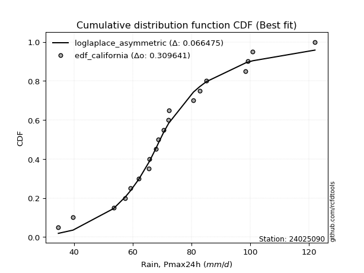</img></img>

</div>


### 2. EDF Hazen (1930)

Hazen method for plotting positions is a formula used to estimate the empirical cumulative probability distribution of flood events or other hydrological data. This formula often results in biased estimations, particularly when extrapolating to extreme events (high return periods).

<div align="center">


$P=(m-0.5)/n$


</div>


**2.1. Empirical values**

<div align="center">

|                | 0                    | 1                   | 2                   | 3                   | 4                   | 5                  | 6                   | 7                   | 8                   | 9                  | 10        | 11                 | 12                 | 13                 | 14                 | 15                 | 16                 | 17                 | 18                 | 19                 | 20                 |
|:---------------|:---------------------|:--------------------|:--------------------|:--------------------|:--------------------|:-------------------|:--------------------|:--------------------|:--------------------|:-------------------|:----------|:-------------------|:-------------------|:-------------------|:-------------------|:-------------------|:-------------------|:-------------------|:-------------------|:-------------------|:-------------------|
| date           | 2009                 | 2008                | 2007                | 2016                | 2018                | 2015               | 2012                | 2013                | 2017                | 2011               | 2010      | 2006               | 2023               | 2005               | 2024               | 2014               | 2020               | 2021               | 2022               | 2025               | 2019               |
| x              | 34.7                 | 39.7                | 53.5                | 57.5                | 59.2                | 62.1               | 65.6                | 65.7                | 68.0                | 68.7               | 70.6      | 72.2               | 72.3               | 80.7               | 82.8               | 85.1               | 98.5               | 99.3               | 100.9              | 104.2              | 122.1              |
| m              | 1                    | 2                   | 3                   | 4                   | 5                   | 6                  | 7                   | 8                   | 9                   | 10                 | 11        | 12                 | 13                 | 14                 | 15                 | 16                 | 17                 | 18                 | 19                 | 20                 | 21                 |
| empirical_dist | edf_hazen            | edf_hazen           | edf_hazen           | edf_hazen           | edf_hazen           | edf_hazen          | edf_hazen           | edf_hazen           | edf_hazen           | edf_hazen          | edf_hazen | edf_hazen          | edf_hazen          | edf_hazen          | edf_hazen          | edf_hazen          | edf_hazen          | edf_hazen          | edf_hazen          | edf_hazen          | edf_hazen          |
| empirical      | 0.023809523809523808 | 0.07142857142857142 | 0.11904761904761904 | 0.16666666666666666 | 0.21428571428571427 | 0.2619047619047619 | 0.30952380952380953 | 0.35714285714285715 | 0.40476190476190477 | 0.4523809523809524 | 0.5       | 0.5476190476190477 | 0.5952380952380952 | 0.6428571428571429 | 0.6904761904761905 | 0.7380952380952381 | 0.7857142857142857 | 0.8333333333333334 | 0.8809523809523809 | 0.9285714285714286 | 0.9761904761904762 |
| empirical_tr   | 1.024390243902439    | 1.0769230769230769  | 1.135135135135135   | 1.2                 | 1.2727272727272727  | 1.3548387096774193 | 1.4482758620689655  | 1.5555555555555558  | 1.68                | 1.826086956521739  | 2.0       | 2.210526315789474  | 2.4705882352941178 | 2.8000000000000003 | 3.230769230769231  | 3.818181818181819  | 4.666666666666666  | 6.000000000000002  | 8.399999999999999  | 14.000000000000007 | 41.99999999999995  |

</div>


**2.2. Kolmogorov-Smirnov fit test (sorted by Δ)**


<div align="center">

|                | 0                   | 1                   | 2                   | 3                   | 4                   | 5                   | 6                   | 7                   | 8                   | 9                   | 10                  | 11                  | 12                  | 13                  | 14                  | 15                  | 16                  | 17                  | 18                  | 19                  | 20                  | 21                  | 22                  | 23                  | 24                  | 25                  | 26                  | 27                  | 28                  | 29                  | 30                  | 31                  | 32                  | 33                  | 34                  | 35                  | 36                  | 37                  | 38                  | 39                  | 40                  | 41                  | 42                  | 43                  | 44                  | 45                  | 46                  | 47                  | 48                  | 49                  | 50                  | 51                  | 52                  | 53                  | 54                  | 55                  | 56                  | 57                  | 58                  | 59                  | 60                  | 61                  | 62                  | 63                  | 64                  | 65                  | 66                  | 67                  | 68                  | 69                  | 70                  | 71                  | 72                  | 73                  | 74                  | 75                  | 76                  | 77                  | 78                  | 79                  | 80                  | 81                  | 82                  | 83                  | 84                  | 85                  | 86                  | 87                  | 88                  | 89                  | 90                  | 91                  | 92                  | 93                  | 94                  | 95                  | 96                  | 97                  | 98                  | 99                  | 100                 | 101                 | 102                 | 103                 | 104                 | 105                 | 106                 | 107                 | 108                 | 109                 | 110                 | 111                 | 112                 | 113                 | 114                 | 115                 | 116                 | 117                 | 118                 | 119                 | 120                 | 121                 | 122                 | 123                 | 124                 | 125                 | 126                 | 127                 | 128                 | 129                 | 130                 | 131                 | 132                 | 133                 | 134                 | 135                 | 136                 | 137                 | 138                 | 139                 | 140                 | 141                 | 142                 | 143                 | 144                 | 145                 | 146                 | 147                 | 148                 | 149                 | 150                 | 151                 | 152                 | 153                 | 154                 | 155                 | 156                 | 157                 | 158                 | 159                 |
|:---------------|:--------------------|:--------------------|:--------------------|:--------------------|:--------------------|:--------------------|:--------------------|:--------------------|:--------------------|:--------------------|:--------------------|:--------------------|:--------------------|:--------------------|:--------------------|:--------------------|:--------------------|:--------------------|:--------------------|:--------------------|:--------------------|:--------------------|:--------------------|:--------------------|:--------------------|:--------------------|:--------------------|:--------------------|:--------------------|:--------------------|:--------------------|:--------------------|:--------------------|:--------------------|:--------------------|:--------------------|:--------------------|:--------------------|:--------------------|:--------------------|:--------------------|:--------------------|:--------------------|:--------------------|:--------------------|:--------------------|:--------------------|:--------------------|:--------------------|:--------------------|:--------------------|:--------------------|:--------------------|:--------------------|:--------------------|:--------------------|:--------------------|:--------------------|:--------------------|:--------------------|:--------------------|:--------------------|:--------------------|:--------------------|:--------------------|:--------------------|:--------------------|:--------------------|:--------------------|:--------------------|:--------------------|:--------------------|:--------------------|:--------------------|:--------------------|:--------------------|:--------------------|:--------------------|:--------------------|:--------------------|:--------------------|:--------------------|:--------------------|:--------------------|:--------------------|:--------------------|:--------------------|:--------------------|:--------------------|:--------------------|:--------------------|:--------------------|:--------------------|:--------------------|:--------------------|:--------------------|:--------------------|:--------------------|:--------------------|:--------------------|:--------------------|:--------------------|:--------------------|:--------------------|:--------------------|:--------------------|:--------------------|:--------------------|:--------------------|:--------------------|:--------------------|:--------------------|:--------------------|:--------------------|:--------------------|:--------------------|:--------------------|:--------------------|:--------------------|:--------------------|:--------------------|:--------------------|:--------------------|:--------------------|:--------------------|:--------------------|:--------------------|:--------------------|:--------------------|:--------------------|:--------------------|:--------------------|:--------------------|:--------------------|:--------------------|:--------------------|:--------------------|:--------------------|:--------------------|:--------------------|:--------------------|:--------------------|:--------------------|:--------------------|:--------------------|:--------------------|:--------------------|:--------------------|:--------------------|:--------------------|:--------------------|:--------------------|:--------------------|:--------------------|:--------------------|:--------------------|:--------------------|:--------------------|:--------------------|:--------------------|
| station        | 24025090            | 24025090            | 24025090            | 24025090            | 24025090            | 24025090            | 24025090            | 24025090            | 24025090            | 24025090            | 24025090            | 24025090            | 24025090            | 24025090            | 24025090            | 24025090            | 24025090            | 24025090            | 24025090            | 24025090            | 24025090            | 24025090            | 24025090            | 24025090            | 24025090            | 24025090            | 24025090            | 24025090            | 24025090            | 24025090            | 24025090            | 24025090            | 24025090            | 24025090            | 24025090            | 24025090            | 24025090            | 24025090            | 24025090            | 24025090            | 24025090            | 24025090            | 24025090            | 24025090            | 24025090            | 24025090            | 24025090            | 24025090            | 24025090            | 24025090            | 24025090            | 24025090            | 24025090            | 24025090            | 24025090            | 24025090            | 24025090            | 24025090            | 24025090            | 24025090            | 24025090            | 24025090            | 24025090            | 24025090            | 24025090            | 24025090            | 24025090            | 24025090            | 24025090            | 24025090            | 24025090            | 24025090            | 24025090            | 24025090            | 24025090            | 24025090            | 24025090            | 24025090            | 24025090            | 24025090            | 24025090            | 24025090            | 24025090            | 24025090            | 24025090            | 24025090            | 24025090            | 24025090            | 24025090            | 24025090            | 24025090            | 24025090            | 24025090            | 24025090            | 24025090            | 24025090            | 24025090            | 24025090            | 24025090            | 24025090            | 24025090            | 24025090            | 24025090            | 24025090            | 24025090            | 24025090            | 24025090            | 24025090            | 24025090            | 24025090            | 24025090            | 24025090            | 24025090            | 24025090            | 24025090            | 24025090            | 24025090            | 24025090            | 24025090            | 24025090            | 24025090            | 24025090            | 24025090            | 24025090            | 24025090            | 24025090            | 24025090            | 24025090            | 24025090            | 24025090            | 24025090            | 24025090            | 24025090            | 24025090            | 24025090            | 24025090            | 24025090            | 24025090            | 24025090            | 24025090            | 24025090            | 24025090            | 24025090            | 24025090            | 24025090            | 24025090            | 24025090            | 24025090            | 24025090            | 24025090            | 24025090            | 24025090            | 24025090            | 24025090            | 24025090            | 24025090            | 24025090            | 24025090            | 24025090            | 24025090            |
| empirical_dist | edf_hazen           | edf_hazen           | edf_hazen           | edf_hazen           | edf_hazen           | edf_hazen           | edf_hazen           | edf_hazen           | edf_hazen           | edf_hazen           | edf_hazen           | edf_hazen           | edf_hazen           | edf_hazen           | edf_hazen           | edf_hazen           | edf_hazen           | edf_hazen           | edf_hazen           | edf_hazen           | edf_hazen           | edf_hazen           | edf_hazen           | edf_hazen           | edf_hazen           | edf_hazen           | edf_hazen           | edf_hazen           | edf_hazen           | edf_hazen           | edf_hazen           | edf_hazen           | edf_hazen           | edf_hazen           | edf_hazen           | edf_hazen           | edf_hazen           | edf_hazen           | edf_hazen           | edf_hazen           | edf_hazen           | edf_hazen           | edf_hazen           | edf_hazen           | edf_hazen           | edf_hazen           | edf_hazen           | edf_hazen           | edf_hazen           | edf_hazen           | edf_hazen           | edf_hazen           | edf_hazen           | edf_hazen           | edf_hazen           | edf_hazen           | edf_hazen           | edf_hazen           | edf_hazen           | edf_hazen           | edf_hazen           | edf_hazen           | edf_hazen           | edf_hazen           | edf_hazen           | edf_hazen           | edf_hazen           | edf_hazen           | edf_hazen           | edf_hazen           | edf_hazen           | edf_hazen           | edf_hazen           | edf_hazen           | edf_hazen           | edf_hazen           | edf_hazen           | edf_hazen           | edf_hazen           | edf_hazen           | edf_hazen           | edf_hazen           | edf_hazen           | edf_hazen           | edf_hazen           | edf_hazen           | edf_hazen           | edf_hazen           | edf_hazen           | edf_hazen           | edf_hazen           | edf_hazen           | edf_hazen           | edf_hazen           | edf_hazen           | edf_hazen           | edf_hazen           | edf_hazen           | edf_hazen           | edf_hazen           | edf_hazen           | edf_hazen           | edf_hazen           | edf_hazen           | edf_hazen           | edf_hazen           | edf_hazen           | edf_hazen           | edf_hazen           | edf_hazen           | edf_hazen           | edf_hazen           | edf_hazen           | edf_hazen           | edf_hazen           | edf_hazen           | edf_hazen           | edf_hazen           | edf_hazen           | edf_hazen           | edf_hazen           | edf_hazen           | edf_hazen           | edf_hazen           | edf_hazen           | edf_hazen           | edf_hazen           | edf_hazen           | edf_hazen           | edf_hazen           | edf_hazen           | edf_hazen           | edf_hazen           | edf_hazen           | edf_hazen           | edf_hazen           | edf_hazen           | edf_hazen           | edf_hazen           | edf_hazen           | edf_hazen           | edf_hazen           | edf_hazen           | edf_hazen           | edf_hazen           | edf_hazen           | edf_hazen           | edf_hazen           | edf_hazen           | edf_hazen           | edf_hazen           | edf_hazen           | edf_hazen           | edf_hazen           | edf_hazen           | edf_hazen           | edf_hazen           | edf_hazen           | edf_hazen           | edf_hazen           |
| p_dist         | lognakagami         | logbetaprime        | logt                | lognct              | logcrystalball      | logrice             | logexponnorm        | lognorm             | logf                | ncf                 | logfatiguelife      | invweibull          | loginvgamma         | logexponweib        | logerlang           | loglogistic         | rayleigh            | loggennorm          | logloglaplace       | loggamma            | loggamma            | gumbel_r            | loggengamma         | logalpha            | moyal               | loghypsecant        | invgauss            | loganglit           | maxwell             | logdweibull         | triang              | genlogistic         | kstwobign           | logncf              | loglaplace          | loglaplace          | burr                | loggenlogistic      | mielke              | halfnorm            | skewnorm            | logmielke           | logburr             | nakagami            | alpha               | logskewnorm         | betaprime           | logargus            | invgamma            | logsemicircular     | logpearson3         | gamma               | erlang              | f                   | weibull_min         | halflogistic        | fatiguelife         | nct                 | loginvgauss         | beta                | johnsonsu           | logexponpow         | loggompertz         | logweibull_min      | logbeta             | johnsonsb           | logloggamma         | logjohnsonsb        | logweibull_max      | loggenextreme       | logvonmises_line    | logjohnsonsu        | logmaxwell          | dweibull            | pearson3            | rice                | exponnorm           | genhalflogistic     | logburr12           | genextreme          | wald                | lograyleigh         | semicircular        | dgamma              | anglit              | logcosine           | t                   | norm                | crystalball         | truncnorm           | loggumbel_r         | loggausshyper       | kappa4              | logistic            | kappa3              | arcsine             | gennorm             | loginvweibull       | hypsecant           | loggumbel_l         | cosine              | logtriang           | truncweibull_min    | wrapcauchy          | logmoyal            | laplace             | loghalfnorm         | logarcsine          | uniform             | bradford            | gausshyper          | gompertz            | logfoldnorm         | loghalflogistic     | logkstwobign        | truncexpon          | ksone               | loggenexpon         | vonmises_line       | gumbel_l            | logdgamma           | logkappa4           | logwald             | loggenhalflogistic  | logkappa3           | loguniform          | logbradford         | argus               | logtukeylambda      | loghalfgennorm      | logksone            | genpareto           | logrdist            | logtruncweibull_min | genexpon            | logtrapezoid        | logwrapcauchy       | loglomax            | tukeylambda         | burr12              | logtruncexpon       | halfgennorm         | loglevy_l           | logtruncnorm        | loggenpareto        | trapezoid           | levy_l              | powerlaw            | logtruncpareto      | lomax               | logpowerlaw         | rdist               | foldnorm            | gengamma            | exponweib           | weibull_max         | exponpow            | truncpareto         | logvonmises         | vonmises            |
| delta          | 0.08015714601424861 | 0.08039889074051149 | 0.08099671532386948 | 0.08100426675541533 | 0.08107854724375357 | 0.08107875262096831 | 0.08107887852158402 | 0.08107893418602513 | 0.08155913043989643 | 0.08282409266463775 | 0.0835941777358768  | 0.0860286140355247  | 0.08778160245871758 | 0.08783896311022577 | 0.08925561985972752 | 0.08953193581897734 | 0.08965722443679824 | 0.0908874068575809  | 0.0912845510793645  | 0.09131085948105055 | 0.09131085948105055 | 0.09158295256135596 | 0.09407903960517727 | 0.09417244273777314 | 0.09493475524554273 | 0.0978003313334469  | 0.09782196789021819 | 0.09820894032102637 | 0.10141527992985944 | 0.10228769917992964 | 0.10304765019734102 | 0.1033057943790851  | 0.10408282025293764 | 0.10468700912350026 | 0.10481780206285607 | 0.10481780206285607 | 0.10500519915320133 | 0.10502718002199057 | 0.10505274345221283 | 0.10551200018814111 | 0.10578281979636067 | 0.10635037745493126 | 0.10637156085602811 | 0.10718709297064649 | 0.1082468108284772  | 0.10914400923390732 | 0.10956594235397771 | 0.109705395119126   | 0.11009873515270602 | 0.11036730740210696 | 0.11037310537402722 | 0.11101781745015216 | 0.11101789958673408 | 0.11104525201858739 | 0.11138437461894934 | 0.11148987309200509 | 0.11151756108086314 | 0.11198563512816034 | 0.11232487296641408 | 0.11237928878093506 | 0.11239951178218233 | 0.11255061258157939 | 0.11266686801826453 | 0.11293864789258323 | 0.11327061867063071 | 0.11345978188290307 | 0.11364211403615482 | 0.11384267147058041 | 0.11391735055427754 | 0.11393996059924744 | 0.11403437727146892 | 0.1142464271309494  | 0.11484400206149031 | 0.11643260287861779 | 0.11645347768347869 | 0.11653509623055702 | 0.11887303172823405 | 0.11995285652414198 | 0.12008027583469649 | 0.12022684407053164 | 0.12344628216566489 | 0.1271695193241844  | 0.127490498265469   | 0.12857541163458774 | 0.12986100999011752 | 0.13086441124137865 | 0.13559316863747756 | 0.13560851528756485 | 0.13560851773144617 | 0.1356085185555551  | 0.13903067681736608 | 0.14029337198067823 | 0.14069381899540512 | 0.1410738814669188  | 0.1410909508660614  | 0.14196607030922684 | 0.14197388774926223 | 0.1444383679508025  | 0.14570876032089264 | 0.14661974062781125 | 0.15186968548405172 | 0.15205274500432686 | 0.15222327073447506 | 0.16014404284275569 | 0.16119243001235317 | 0.16201468128388646 | 0.16208391096682817 | 0.1643423396945994  | 0.16503214558134466 | 0.17251470846334185 | 0.17264421611731057 | 0.17302765177401136 | 0.1739215017589547  | 0.1764226611529479  | 0.177540230860495   | 0.1797653161461962  | 0.18257600523046735 | 0.19928487285289878 | 0.20550489712352193 | 0.20602266224257004 | 0.20828612057397267 | 0.2182856743383402  | 0.22019914944598806 | 0.22050285813257486 | 0.23405084143330449 | 0.2347680223000642  | 0.23607667302460897 | 0.2375987060603708  | 0.2381676733697423  | 0.2408767614839544  | 0.25119557413894245 | 0.2555186294055085  | 0.2621717832248389  | 0.26894894432880356 | 0.27066435209593553 | 0.2790337409564014  | 0.32498297245919283 | 0.3338130320078839  | 0.33604456379567504 | 0.3368901953347806  | 0.3390443157063845  | 0.3596252906502071  | 0.36235144877941716 | 0.36698881116408466 | 0.37146197822413163 | 0.4201317277290997  | 0.42322808695716574 | 0.43531559447757373 | 0.4437425748021242  | 0.45151298454189714 | 0.504581923489848   | 0.5226700389823301  | 0.5952380952380952  | 0.6495313833267573  | 0.6986663010139441  | 0.7605850623020904  | 0.8071443000912913  | 0.8511565649070882  | 1.0768327506291604  | 19.412851681896672  |
| deltao         | 0.30282488509099936 | 0.30282488509099936 | 0.30282488509099936 | 0.30282488509099936 | 0.30282488509099936 | 0.30282488509099936 | 0.30282488509099936 | 0.30282488509099936 | 0.30282488509099936 | 0.30282488509099936 | 0.30282488509099936 | 0.30282488509099936 | 0.30282488509099936 | 0.30282488509099936 | 0.30282488509099936 | 0.30282488509099936 | 0.30282488509099936 | 0.30282488509099936 | 0.30282488509099936 | 0.30282488509099936 | 0.30282488509099936 | 0.30282488509099936 | 0.30282488509099936 | 0.30282488509099936 | 0.30282488509099936 | 0.30282488509099936 | 0.30282488509099936 | 0.30282488509099936 | 0.30282488509099936 | 0.30282488509099936 | 0.30282488509099936 | 0.30282488509099936 | 0.30282488509099936 | 0.30282488509099936 | 0.30282488509099936 | 0.30282488509099936 | 0.30282488509099936 | 0.30282488509099936 | 0.30282488509099936 | 0.30282488509099936 | 0.30282488509099936 | 0.30282488509099936 | 0.30282488509099936 | 0.30282488509099936 | 0.30282488509099936 | 0.30282488509099936 | 0.30282488509099936 | 0.30282488509099936 | 0.30282488509099936 | 0.30282488509099936 | 0.30282488509099936 | 0.30282488509099936 | 0.30282488509099936 | 0.30282488509099936 | 0.30282488509099936 | 0.30282488509099936 | 0.30282488509099936 | 0.30282488509099936 | 0.30282488509099936 | 0.30282488509099936 | 0.30282488509099936 | 0.30282488509099936 | 0.30282488509099936 | 0.30282488509099936 | 0.30282488509099936 | 0.30282488509099936 | 0.30282488509099936 | 0.30282488509099936 | 0.30282488509099936 | 0.30282488509099936 | 0.30282488509099936 | 0.30282488509099936 | 0.30282488509099936 | 0.30282488509099936 | 0.30282488509099936 | 0.30282488509099936 | 0.30282488509099936 | 0.30282488509099936 | 0.30282488509099936 | 0.30282488509099936 | 0.30282488509099936 | 0.30282488509099936 | 0.30282488509099936 | 0.30282488509099936 | 0.30282488509099936 | 0.30282488509099936 | 0.30282488509099936 | 0.30282488509099936 | 0.30282488509099936 | 0.30282488509099936 | 0.30282488509099936 | 0.30282488509099936 | 0.30282488509099936 | 0.30282488509099936 | 0.30282488509099936 | 0.30282488509099936 | 0.30282488509099936 | 0.30282488509099936 | 0.30282488509099936 | 0.30282488509099936 | 0.30282488509099936 | 0.30282488509099936 | 0.30282488509099936 | 0.30282488509099936 | 0.30282488509099936 | 0.30282488509099936 | 0.30282488509099936 | 0.30282488509099936 | 0.30282488509099936 | 0.30282488509099936 | 0.30282488509099936 | 0.30282488509099936 | 0.30282488509099936 | 0.30282488509099936 | 0.30282488509099936 | 0.30282488509099936 | 0.30282488509099936 | 0.30282488509099936 | 0.30282488509099936 | 0.30282488509099936 | 0.30282488509099936 | 0.30282488509099936 | 0.30282488509099936 | 0.30282488509099936 | 0.30282488509099936 | 0.30282488509099936 | 0.30282488509099936 | 0.30282488509099936 | 0.30282488509099936 | 0.30282488509099936 | 0.30282488509099936 | 0.30282488509099936 | 0.30282488509099936 | 0.30282488509099936 | 0.30282488509099936 | 0.30282488509099936 | 0.30282488509099936 | 0.30282488509099936 | 0.30282488509099936 | 0.30282488509099936 | 0.30282488509099936 | 0.30282488509099936 | 0.30282488509099936 | 0.30282488509099936 | 0.30282488509099936 | 0.30282488509099936 | 0.30282488509099936 | 0.30282488509099936 | 0.30282488509099936 | 0.30282488509099936 | 0.30282488509099936 | 0.30282488509099936 | 0.30282488509099936 | 0.30282488509099936 | 0.30282488509099936 | 0.30282488509099936 | 0.30282488509099936 | 0.30282488509099936 | 0.30282488509099936 | 0.30282488509099936 |
| eval           | Δo > Δ              | Δo > Δ              | Δo > Δ              | Δo > Δ              | Δo > Δ              | Δo > Δ              | Δo > Δ              | Δo > Δ              | Δo > Δ              | Δo > Δ              | Δo > Δ              | Δo > Δ              | Δo > Δ              | Δo > Δ              | Δo > Δ              | Δo > Δ              | Δo > Δ              | Δo > Δ              | Δo > Δ              | Δo > Δ              | Δo > Δ              | Δo > Δ              | Δo > Δ              | Δo > Δ              | Δo > Δ              | Δo > Δ              | Δo > Δ              | Δo > Δ              | Δo > Δ              | Δo > Δ              | Δo > Δ              | Δo > Δ              | Δo > Δ              | Δo > Δ              | Δo > Δ              | Δo > Δ              | Δo > Δ              | Δo > Δ              | Δo > Δ              | Δo > Δ              | Δo > Δ              | Δo > Δ              | Δo > Δ              | Δo > Δ              | Δo > Δ              | Δo > Δ              | Δo > Δ              | Δo > Δ              | Δo > Δ              | Δo > Δ              | Δo > Δ              | Δo > Δ              | Δo > Δ              | Δo > Δ              | Δo > Δ              | Δo > Δ              | Δo > Δ              | Δo > Δ              | Δo > Δ              | Δo > Δ              | Δo > Δ              | Δo > Δ              | Δo > Δ              | Δo > Δ              | Δo > Δ              | Δo > Δ              | Δo > Δ              | Δo > Δ              | Δo > Δ              | Δo > Δ              | Δo > Δ              | Δo > Δ              | Δo > Δ              | Δo > Δ              | Δo > Δ              | Δo > Δ              | Δo > Δ              | Δo > Δ              | Δo > Δ              | Δo > Δ              | Δo > Δ              | Δo > Δ              | Δo > Δ              | Δo > Δ              | Δo > Δ              | Δo > Δ              | Δo > Δ              | Δo > Δ              | Δo > Δ              | Δo > Δ              | Δo > Δ              | Δo > Δ              | Δo > Δ              | Δo > Δ              | Δo > Δ              | Δo > Δ              | Δo > Δ              | Δo > Δ              | Δo > Δ              | Δo > Δ              | Δo > Δ              | Δo > Δ              | Δo > Δ              | Δo > Δ              | Δo > Δ              | Δo > Δ              | Δo > Δ              | Δo > Δ              | Δo > Δ              | Δo > Δ              | Δo > Δ              | Δo > Δ              | Δo > Δ              | Δo > Δ              | Δo > Δ              | Δo > Δ              | Δo > Δ              | Δo > Δ              | Δo > Δ              | Δo > Δ              | Δo > Δ              | Δo > Δ              | Δo > Δ              | Δo > Δ              | Δo > Δ              | Δo > Δ              | Δo > Δ              | Δo > Δ              | Δo > Δ              | Δo > Δ              | Δo > Δ              | Δo > Δ              | Δo > Δ              | Δo > Δ              | Δo > Δ              | Δo > Δ              | Δo <= Δ             | Δo <= Δ             | Δo <= Δ             | Δo <= Δ             | Δo <= Δ             | Δo <= Δ             | Δo <= Δ             | Δo <= Δ             | Δo <= Δ             | Δo <= Δ             | Δo <= Δ             | Δo <= Δ             | Δo <= Δ             | Δo <= Δ             | Δo <= Δ             | Δo <= Δ             | Δo <= Δ             | Δo <= Δ             | Δo <= Δ             | Δo <= Δ             | Δo <= Δ             | Δo <= Δ             | Δo <= Δ             | Δo <= Δ             |
| fit            | 1                   | 1                   | 1                   | 1                   | 1                   | 1                   | 1                   | 1                   | 1                   | 1                   | 1                   | 1                   | 1                   | 1                   | 1                   | 1                   | 1                   | 1                   | 1                   | 1                   | 1                   | 1                   | 1                   | 1                   | 1                   | 1                   | 1                   | 1                   | 1                   | 1                   | 1                   | 1                   | 1                   | 1                   | 1                   | 1                   | 1                   | 1                   | 1                   | 1                   | 1                   | 1                   | 1                   | 1                   | 1                   | 1                   | 1                   | 1                   | 1                   | 1                   | 1                   | 1                   | 1                   | 1                   | 1                   | 1                   | 1                   | 1                   | 1                   | 1                   | 1                   | 1                   | 1                   | 1                   | 1                   | 1                   | 1                   | 1                   | 1                   | 1                   | 1                   | 1                   | 1                   | 1                   | 1                   | 1                   | 1                   | 1                   | 1                   | 1                   | 1                   | 1                   | 1                   | 1                   | 1                   | 1                   | 1                   | 1                   | 1                   | 1                   | 1                   | 1                   | 1                   | 1                   | 1                   | 1                   | 1                   | 1                   | 1                   | 1                   | 1                   | 1                   | 1                   | 1                   | 1                   | 1                   | 1                   | 1                   | 1                   | 1                   | 1                   | 1                   | 1                   | 1                   | 1                   | 1                   | 1                   | 1                   | 1                   | 1                   | 1                   | 1                   | 1                   | 1                   | 1                   | 1                   | 1                   | 1                   | 1                   | 1                   | 1                   | 1                   | 1                   | 1                   | 1                   | 1                   | 0                   | 0                   | 0                   | 0                   | 0                   | 0                   | 0                   | 0                   | 0                   | 0                   | 0                   | 0                   | 0                   | 0                   | 0                   | 0                   | 0                   | 0                   | 0                   | 0                   | 0                   | 0                   | 0                   | 0                   |
| n              | 21                  | 21                  | 21                  | 21                  | 21                  | 21                  | 21                  | 21                  | 21                  | 21                  | 21                  | 21                  | 21                  | 21                  | 21                  | 21                  | 21                  | 21                  | 21                  | 21                  | 21                  | 21                  | 21                  | 21                  | 21                  | 21                  | 21                  | 21                  | 21                  | 21                  | 21                  | 21                  | 21                  | 21                  | 21                  | 21                  | 21                  | 21                  | 21                  | 21                  | 21                  | 21                  | 21                  | 21                  | 21                  | 21                  | 21                  | 21                  | 21                  | 21                  | 21                  | 21                  | 21                  | 21                  | 21                  | 21                  | 21                  | 21                  | 21                  | 21                  | 21                  | 21                  | 21                  | 21                  | 21                  | 21                  | 21                  | 21                  | 21                  | 21                  | 21                  | 21                  | 21                  | 21                  | 21                  | 21                  | 21                  | 21                  | 21                  | 21                  | 21                  | 21                  | 21                  | 21                  | 21                  | 21                  | 21                  | 21                  | 21                  | 21                  | 21                  | 21                  | 21                  | 21                  | 21                  | 21                  | 21                  | 21                  | 21                  | 21                  | 21                  | 21                  | 21                  | 21                  | 21                  | 21                  | 21                  | 21                  | 21                  | 21                  | 21                  | 21                  | 21                  | 21                  | 21                  | 21                  | 21                  | 21                  | 21                  | 21                  | 21                  | 21                  | 21                  | 21                  | 21                  | 21                  | 21                  | 21                  | 21                  | 21                  | 21                  | 21                  | 21                  | 21                  | 21                  | 21                  | 21                  | 21                  | 21                  | 21                  | 21                  | 21                  | 21                  | 21                  | 21                  | 21                  | 21                  | 21                  | 21                  | 21                  | 21                  | 21                  | 21                  | 21                  | 21                  | 21                  | 21                  | 21                  | 21                  | 21                  |
| best_fit       | 1                   | 0                   | 0                   | 0                   | 0                   | 0                   | 0                   | 0                   | 0                   | 0                   | 0                   | 0                   | 0                   | 0                   | 0                   | 0                   | 0                   | 0                   | 0                   | 0                   | 0                   | 0                   | 0                   | 0                   | 0                   | 0                   | 0                   | 0                   | 0                   | 0                   | 0                   | 0                   | 0                   | 0                   | 0                   | 0                   | 0                   | 0                   | 0                   | 0                   | 0                   | 0                   | 0                   | 0                   | 0                   | 0                   | 0                   | 0                   | 0                   | 0                   | 0                   | 0                   | 0                   | 0                   | 0                   | 0                   | 0                   | 0                   | 0                   | 0                   | 0                   | 0                   | 0                   | 0                   | 0                   | 0                   | 0                   | 0                   | 0                   | 0                   | 0                   | 0                   | 0                   | 0                   | 0                   | 0                   | 0                   | 0                   | 0                   | 0                   | 0                   | 0                   | 0                   | 0                   | 0                   | 0                   | 0                   | 0                   | 0                   | 0                   | 0                   | 0                   | 0                   | 0                   | 0                   | 0                   | 0                   | 0                   | 0                   | 0                   | 0                   | 0                   | 0                   | 0                   | 0                   | 0                   | 0                   | 0                   | 0                   | 0                   | 0                   | 0                   | 0                   | 0                   | 0                   | 0                   | 0                   | 0                   | 0                   | 0                   | 0                   | 0                   | 0                   | 0                   | 0                   | 0                   | 0                   | 0                   | 0                   | 0                   | 0                   | 0                   | 0                   | 0                   | 0                   | 0                   | 0                   | 0                   | 0                   | 0                   | 0                   | 0                   | 0                   | 0                   | 0                   | 0                   | 0                   | 0                   | 0                   | 0                   | 0                   | 0                   | 0                   | 0                   | 0                   | 0                   | 0                   | 0                   | 0                   | 0                   |
| best_fit_sort  | 1                   | 2                   | 3                   | 4                   | 5                   | 6                   | 7                   | 8                   | 9                   | 10                  | 11                  | 12                  | 13                  | 14                  | 15                  | 16                  | 17                  | 18                  | 19                  | 20                  | 21                  | 22                  | 23                  | 24                  | 25                  | 26                  | 27                  | 28                  | 29                  | 30                  | 31                  | 32                  | 33                  | 34                  | 35                  | 36                  | 37                  | 38                  | 39                  | 40                  | 41                  | 42                  | 43                  | 44                  | 45                  | 46                  | 47                  | 48                  | 49                  | 50                  | 51                  | 52                  | 53                  | 54                  | 55                  | 56                  | 57                  | 58                  | 59                  | 60                  | 61                  | 62                  | 63                  | 64                  | 65                  | 66                  | 67                  | 68                  | 69                  | 70                  | 71                  | 72                  | 73                  | 74                  | 75                  | 76                  | 77                  | 78                  | 79                  | 80                  | 81                  | 82                  | 83                  | 84                  | 85                  | 86                  | 87                  | 88                  | 89                  | 90                  | 91                  | 92                  | 93                  | 94                  | 95                  | 96                  | 97                  | 98                  | 99                  | 100                 | 101                 | 102                 | 103                 | 104                 | 105                 | 106                 | 107                 | 108                 | 109                 | 110                 | 111                 | 112                 | 113                 | 114                 | 115                 | 116                 | 117                 | 118                 | 119                 | 120                 | 121                 | 122                 | 123                 | 124                 | 125                 | 126                 | 127                 | 128                 | 129                 | 130                 | 131                 | 132                 | 133                 | 134                 | 135                 | 136                 | 137                 | 138                 | 139                 | 140                 | 141                 | 142                 | 143                 | 144                 | 145                 | 146                 | 147                 | 148                 | 149                 | 150                 | 151                 | 152                 | 153                 | 154                 | 155                 | 156                 | 157                 | 158                 | 159                 | 160                 |

</div>


**2.3. Best fit**

<div align="center">

|   id |   station | empirical_dist   | p_dist      |     delta |   deltao | eval   |   fit |   n |   best_fit |   best_fit_sort |
|-----:|----------:|:-----------------|:------------|----------:|---------:|:-------|------:|----:|-----------:|----------------:|
|    0 |  24025090 | edf_hazen        | lognakagami | 0.0801571 | 0.302825 | Δo > Δ |     1 |  21 |          1 |               1 |

</div>


<div align="center">

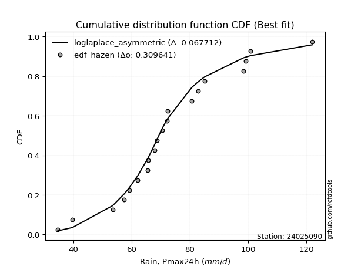</img></img>

</div>


### 3. EDF Weibull (1939)

Weibull plotting position formula is an empirical method used to estimate the non-exceedance probability or plotting position for a set of observed data, is often recommended or widely used in practice, particularly in flood frequency analysis.

<div align="center">


$P=m/(n+1)$


</div>


**3.1. Empirical values**

<div align="center">

|                | 0                    | 1                   | 2                   | 3                   | 4                   | 5                  | 6                  | 7                   | 8                  | 9                   | 10          | 11                 | 12                 | 13                 | 14                 | 15                 | 16                 | 17                 | 18                 | 19                 | 20                 |
|:---------------|:---------------------|:--------------------|:--------------------|:--------------------|:--------------------|:-------------------|:-------------------|:--------------------|:-------------------|:--------------------|:------------|:-------------------|:-------------------|:-------------------|:-------------------|:-------------------|:-------------------|:-------------------|:-------------------|:-------------------|:-------------------|
| date           | 2009                 | 2008                | 2007                | 2016                | 2018                | 2015               | 2012               | 2013                | 2017               | 2011                | 2010        | 2006               | 2023               | 2005               | 2024               | 2014               | 2020               | 2021               | 2022               | 2025               | 2019               |
| x              | 34.7                 | 39.7                | 53.5                | 57.5                | 59.2                | 62.1               | 65.6               | 65.7                | 68.0               | 68.7                | 70.6        | 72.2               | 72.3               | 80.7               | 82.8               | 85.1               | 98.5               | 99.3               | 100.9              | 104.2              | 122.1              |
| m              | 1                    | 2                   | 3                   | 4                   | 5                   | 6                  | 7                  | 8                   | 9                  | 10                  | 11          | 12                 | 13                 | 14                 | 15                 | 16                 | 17                 | 18                 | 19                 | 20                 | 21                 |
| empirical_dist | edf_weibull          | edf_weibull         | edf_weibull         | edf_weibull         | edf_weibull         | edf_weibull        | edf_weibull        | edf_weibull         | edf_weibull        | edf_weibull         | edf_weibull | edf_weibull        | edf_weibull        | edf_weibull        | edf_weibull        | edf_weibull        | edf_weibull        | edf_weibull        | edf_weibull        | edf_weibull        | edf_weibull        |
| empirical      | 0.045454545454545456 | 0.09090909090909091 | 0.13636363636363635 | 0.18181818181818182 | 0.22727272727272727 | 0.2727272727272727 | 0.3181818181818182 | 0.36363636363636365 | 0.4090909090909091 | 0.45454545454545453 | 0.5         | 0.5454545454545454 | 0.5909090909090909 | 0.6363636363636364 | 0.6818181818181818 | 0.7272727272727273 | 0.7727272727272727 | 0.8181818181818182 | 0.8636363636363636 | 0.9090909090909091 | 0.9545454545454546 |
| empirical_tr   | 1.0476190476190477   | 1.1                 | 1.1578947368421053  | 1.2222222222222223  | 1.2941176470588236  | 1.375              | 1.4666666666666666 | 1.5714285714285714  | 1.6923076923076925 | 1.8333333333333335  | 2.0         | 2.1999999999999997 | 2.4444444444444446 | 2.75               | 3.1428571428571423 | 3.666666666666667  | 4.3999999999999995 | 5.500000000000002  | 7.333333333333334  | 10.999999999999996 | 22.00000000000002  |

</div>


**3.2. Kolmogorov-Smirnov fit test (sorted by Δ)**


<div align="center">

|                | 0                   | 1                   | 2                   | 3                   | 4                   | 5                   | 6                   | 7                   | 8                   | 9                   | 10                  | 11                  | 12                  | 13                  | 14                  | 15                  | 16                  | 17                  | 18                  | 19                  | 20                  | 21                  | 22                  | 23                  | 24                  | 25                  | 26                  | 27                  | 28                  | 29                  | 30                  | 31                  | 32                  | 33                  | 34                  | 35                  | 36                  | 37                  | 38                  | 39                  | 40                  | 41                  | 42                  | 43                  | 44                  | 45                  | 46                  | 47                  | 48                  | 49                  | 50                  | 51                  | 52                  | 53                  | 54                  | 55                  | 56                  | 57                  | 58                  | 59                  | 60                  | 61                  | 62                  | 63                  | 64                  | 65                  | 66                  | 67                  | 68                  | 69                  | 70                  | 71                  | 72                  | 73                  | 74                  | 75                  | 76                  | 77                  | 78                  | 79                  | 80                  | 81                  | 82                  | 83                  | 84                  | 85                  | 86                  | 87                  | 88                  | 89                  | 90                  | 91                  | 92                  | 93                  | 94                  | 95                  | 96                  | 97                  | 98                  | 99                  | 100                 | 101                 | 102                 | 103                 | 104                 | 105                 | 106                 | 107                 | 108                 | 109                 | 110                 | 111                 | 112                 | 113                 | 114                 | 115                 | 116                 | 117                 | 118                 | 119                 | 120                 | 121                 | 122                 | 123                 | 124                 | 125                 | 126                 | 127                 | 128                 | 129                 | 130                 | 131                 | 132                 | 133                 | 134                 | 135                 | 136                 | 137                 | 138                 | 139                 | 140                 | 141                 | 142                 | 143                 | 144                 | 145                 | 146                 | 147                 | 148                 | 149                 | 150                 | 151                 | 152                 | 153                 | 154                 | 155                 | 156                 | 157                 | 158                 | 159                 |
|:---------------|:--------------------|:--------------------|:--------------------|:--------------------|:--------------------|:--------------------|:--------------------|:--------------------|:--------------------|:--------------------|:--------------------|:--------------------|:--------------------|:--------------------|:--------------------|:--------------------|:--------------------|:--------------------|:--------------------|:--------------------|:--------------------|:--------------------|:--------------------|:--------------------|:--------------------|:--------------------|:--------------------|:--------------------|:--------------------|:--------------------|:--------------------|:--------------------|:--------------------|:--------------------|:--------------------|:--------------------|:--------------------|:--------------------|:--------------------|:--------------------|:--------------------|:--------------------|:--------------------|:--------------------|:--------------------|:--------------------|:--------------------|:--------------------|:--------------------|:--------------------|:--------------------|:--------------------|:--------------------|:--------------------|:--------------------|:--------------------|:--------------------|:--------------------|:--------------------|:--------------------|:--------------------|:--------------------|:--------------------|:--------------------|:--------------------|:--------------------|:--------------------|:--------------------|:--------------------|:--------------------|:--------------------|:--------------------|:--------------------|:--------------------|:--------------------|:--------------------|:--------------------|:--------------------|:--------------------|:--------------------|:--------------------|:--------------------|:--------------------|:--------------------|:--------------------|:--------------------|:--------------------|:--------------------|:--------------------|:--------------------|:--------------------|:--------------------|:--------------------|:--------------------|:--------------------|:--------------------|:--------------------|:--------------------|:--------------------|:--------------------|:--------------------|:--------------------|:--------------------|:--------------------|:--------------------|:--------------------|:--------------------|:--------------------|:--------------------|:--------------------|:--------------------|:--------------------|:--------------------|:--------------------|:--------------------|:--------------------|:--------------------|:--------------------|:--------------------|:--------------------|:--------------------|:--------------------|:--------------------|:--------------------|:--------------------|:--------------------|:--------------------|:--------------------|:--------------------|:--------------------|:--------------------|:--------------------|:--------------------|:--------------------|:--------------------|:--------------------|:--------------------|:--------------------|:--------------------|:--------------------|:--------------------|:--------------------|:--------------------|:--------------------|:--------------------|:--------------------|:--------------------|:--------------------|:--------------------|:--------------------|:--------------------|:--------------------|:--------------------|:--------------------|:--------------------|:--------------------|:--------------------|:--------------------|:--------------------|:--------------------|
| station        | 24025090            | 24025090            | 24025090            | 24025090            | 24025090            | 24025090            | 24025090            | 24025090            | 24025090            | 24025090            | 24025090            | 24025090            | 24025090            | 24025090            | 24025090            | 24025090            | 24025090            | 24025090            | 24025090            | 24025090            | 24025090            | 24025090            | 24025090            | 24025090            | 24025090            | 24025090            | 24025090            | 24025090            | 24025090            | 24025090            | 24025090            | 24025090            | 24025090            | 24025090            | 24025090            | 24025090            | 24025090            | 24025090            | 24025090            | 24025090            | 24025090            | 24025090            | 24025090            | 24025090            | 24025090            | 24025090            | 24025090            | 24025090            | 24025090            | 24025090            | 24025090            | 24025090            | 24025090            | 24025090            | 24025090            | 24025090            | 24025090            | 24025090            | 24025090            | 24025090            | 24025090            | 24025090            | 24025090            | 24025090            | 24025090            | 24025090            | 24025090            | 24025090            | 24025090            | 24025090            | 24025090            | 24025090            | 24025090            | 24025090            | 24025090            | 24025090            | 24025090            | 24025090            | 24025090            | 24025090            | 24025090            | 24025090            | 24025090            | 24025090            | 24025090            | 24025090            | 24025090            | 24025090            | 24025090            | 24025090            | 24025090            | 24025090            | 24025090            | 24025090            | 24025090            | 24025090            | 24025090            | 24025090            | 24025090            | 24025090            | 24025090            | 24025090            | 24025090            | 24025090            | 24025090            | 24025090            | 24025090            | 24025090            | 24025090            | 24025090            | 24025090            | 24025090            | 24025090            | 24025090            | 24025090            | 24025090            | 24025090            | 24025090            | 24025090            | 24025090            | 24025090            | 24025090            | 24025090            | 24025090            | 24025090            | 24025090            | 24025090            | 24025090            | 24025090            | 24025090            | 24025090            | 24025090            | 24025090            | 24025090            | 24025090            | 24025090            | 24025090            | 24025090            | 24025090            | 24025090            | 24025090            | 24025090            | 24025090            | 24025090            | 24025090            | 24025090            | 24025090            | 24025090            | 24025090            | 24025090            | 24025090            | 24025090            | 24025090            | 24025090            | 24025090            | 24025090            | 24025090            | 24025090            | 24025090            | 24025090            |
| empirical_dist | edf_weibull         | edf_weibull         | edf_weibull         | edf_weibull         | edf_weibull         | edf_weibull         | edf_weibull         | edf_weibull         | edf_weibull         | edf_weibull         | edf_weibull         | edf_weibull         | edf_weibull         | edf_weibull         | edf_weibull         | edf_weibull         | edf_weibull         | edf_weibull         | edf_weibull         | edf_weibull         | edf_weibull         | edf_weibull         | edf_weibull         | edf_weibull         | edf_weibull         | edf_weibull         | edf_weibull         | edf_weibull         | edf_weibull         | edf_weibull         | edf_weibull         | edf_weibull         | edf_weibull         | edf_weibull         | edf_weibull         | edf_weibull         | edf_weibull         | edf_weibull         | edf_weibull         | edf_weibull         | edf_weibull         | edf_weibull         | edf_weibull         | edf_weibull         | edf_weibull         | edf_weibull         | edf_weibull         | edf_weibull         | edf_weibull         | edf_weibull         | edf_weibull         | edf_weibull         | edf_weibull         | edf_weibull         | edf_weibull         | edf_weibull         | edf_weibull         | edf_weibull         | edf_weibull         | edf_weibull         | edf_weibull         | edf_weibull         | edf_weibull         | edf_weibull         | edf_weibull         | edf_weibull         | edf_weibull         | edf_weibull         | edf_weibull         | edf_weibull         | edf_weibull         | edf_weibull         | edf_weibull         | edf_weibull         | edf_weibull         | edf_weibull         | edf_weibull         | edf_weibull         | edf_weibull         | edf_weibull         | edf_weibull         | edf_weibull         | edf_weibull         | edf_weibull         | edf_weibull         | edf_weibull         | edf_weibull         | edf_weibull         | edf_weibull         | edf_weibull         | edf_weibull         | edf_weibull         | edf_weibull         | edf_weibull         | edf_weibull         | edf_weibull         | edf_weibull         | edf_weibull         | edf_weibull         | edf_weibull         | edf_weibull         | edf_weibull         | edf_weibull         | edf_weibull         | edf_weibull         | edf_weibull         | edf_weibull         | edf_weibull         | edf_weibull         | edf_weibull         | edf_weibull         | edf_weibull         | edf_weibull         | edf_weibull         | edf_weibull         | edf_weibull         | edf_weibull         | edf_weibull         | edf_weibull         | edf_weibull         | edf_weibull         | edf_weibull         | edf_weibull         | edf_weibull         | edf_weibull         | edf_weibull         | edf_weibull         | edf_weibull         | edf_weibull         | edf_weibull         | edf_weibull         | edf_weibull         | edf_weibull         | edf_weibull         | edf_weibull         | edf_weibull         | edf_weibull         | edf_weibull         | edf_weibull         | edf_weibull         | edf_weibull         | edf_weibull         | edf_weibull         | edf_weibull         | edf_weibull         | edf_weibull         | edf_weibull         | edf_weibull         | edf_weibull         | edf_weibull         | edf_weibull         | edf_weibull         | edf_weibull         | edf_weibull         | edf_weibull         | edf_weibull         | edf_weibull         | edf_weibull         | edf_weibull         | edf_weibull         |
| p_dist         | invweibull          | logexponweib        | loginvgamma         | logerlang           | loggamma            | loggamma            | logbetaprime        | lognakagami         | logalpha            | lognct              | logrice             | lognorm             | logcrystalball      | logexponnorm        | logt                | logf                | logfatiguelife      | loganglit           | rayleigh            | loggengamma         | invgauss            | ncf                 | logsemicircular     | kstwobign           | logncf              | logargus            | halfnorm            | maxwell             | triang              | genlogistic         | skewnorm            | loglogistic         | logburr             | logmielke           | nakagami            | mielke              | loggenlogistic      | burr                | halflogistic        | loginvgauss         | loggennorm          | alpha               | logloglaplace       | gumbel_r            | logskewnorm         | betaprime           | invgamma            | logpearson3         | logmaxwell          | gamma               | erlang              | f                   | weibull_min         | fatiguelife         | nct                 | moyal               | beta                | johnsonsu           | logexponpow         | loggompertz         | logvonmises_line    | logweibull_min      | logbeta             | genhalflogistic     | johnsonsb           | logloggamma         | logjohnsonsb        | logweibull_max      | loggenextreme       | logjohnsonsu        | loghypsecant        | pearson3            | rice                | exponnorm           | logdweibull         | logburr12           | genextreme          | loglaplace          | loglaplace          | lograyleigh         | logcosine           | semicircular        | loggausshyper       | anglit              | kappa3              | arcsine             | dweibull            | loggumbel_r         | t                   | norm                | crystalball         | truncnorm           | kappa4              | loginvweibull       | wald                | logistic            | gennorm             | hypsecant           | dgamma              | loggumbel_l         | cosine              | logtriang           | truncweibull_min    | logarcsine          | logmoyal            | loghalfnorm         | wrapcauchy          | bradford            | laplace             | uniform             | ksone               | truncexpon          | logkstwobign        | logfoldnorm         | loghalflogistic     | gausshyper          | gompertz            | loggenexpon         | vonmises_line       | gumbel_l            | logkappa4           | loggenhalflogistic  | logwald             | logdgamma           | logkappa3           | loguniform          | logbradford         | logtukeylambda      | loghalfgennorm      | argus               | logksone            | genpareto           | logrdist            | logtruncweibull_min | genexpon            | logtrapezoid        | logwrapcauchy       | loglomax            | burr12              | logtruncexpon       | tukeylambda         | loglevy_l           | halfgennorm         | loggenpareto        | logtruncnorm        | levy_l              | trapezoid           | powerlaw            | logtruncpareto      | lomax               | logpowerlaw         | rdist               | foldnorm            | gengamma            | exponweib           | weibull_max         | exponpow            | truncpareto         | logvonmises         | vonmises            |
| delta          | 0.07737060537751606 | 0.07918095445221712 | 0.08230709034682215 | 0.08264899963652905 | 0.08265285082304191 | 0.08265285082304191 | 0.0838202810104215  | 0.08475831398286426 | 0.0855144340797645  | 0.085748488384217   | 0.085878876532122   | 0.08587901688551214 | 0.08587901740003323 | 0.08587967890120429 | 0.0858846471010618  | 0.08588484616945569 | 0.08737599590165335 | 0.0874358750217894  | 0.09114197467643059 | 0.09139759854080909 | 0.0934929635612139  | 0.09495033462483593 | 0.09521579225059179 | 0.095424811594929   | 0.09602900046549162 | 0.09681852897503851 | 0.09685399153013247 | 0.09708627560085514 | 0.09871864586833673 | 0.10054315622529886 | 0.10145381546735638 | 0.10251894880599033 | 0.10260629599931193 | 0.10261121443741184 | 0.1028580886416422  | 0.10291606763200456 | 0.1029224545125288  | 0.1029274297759093  | 0.10298518273660584 | 0.10366686430840544 | 0.10387441984459389 | 0.10391780649947291 | 0.1042715640663775  | 0.10456996554836895 | 0.10481500490490303 | 0.10523693802497341 | 0.10576973082370172 | 0.10604410104502293 | 0.10618599340348167 | 0.10668881312114786 | 0.10668889525772979 | 0.1067162476895831  | 0.10705537028994505 | 0.10718855675185884 | 0.10765663079915605 | 0.10792176823255573 | 0.10805028445193077 | 0.10807050745317803 | 0.1082216082525751  | 0.10833786368926024 | 0.1083796787215886  | 0.10860964356357894 | 0.10894161434162641 | 0.10910627126425754 | 0.10913077755389877 | 0.10931310970715052 | 0.10951366714157612 | 0.10958834622527325 | 0.10961095627024314 | 0.10991742280194511 | 0.11078734432045989 | 0.1121244733544744  | 0.11220609190155273 | 0.11454402739922975 | 0.11527471216694263 | 0.1157512715056922  | 0.11589783974152734 | 0.11780481504986906 | 0.11780481504986906 | 0.11851151066617577 | 0.12220640258337001 | 0.1231614939364647  | 0.12514185682916307 | 0.12553200566111322 | 0.12593943571454624 | 0.12681455515771167 | 0.12941961586563078 | 0.13037266815935744 | 0.13126416430847326 | 0.13127951095856055 | 0.13127951340244187 | 0.13127951422655082 | 0.13553755595516326 | 0.13578035929279386 | 0.13636363636363635 | 0.1367448771379145  | 0.13764488342025794 | 0.14137975599188835 | 0.14156242462160074 | 0.14229073629880695 | 0.14754068115504743 | 0.14772374067532257 | 0.14789426640547076 | 0.14919082454308424 | 0.15253442135434453 | 0.15342590230881953 | 0.1558150385137514  | 0.1573631933118267  | 0.15768567695488217 | 0.16070314125234036 | 0.16339019485472583 | 0.16461380099468104 | 0.1650178669339883  | 0.16526349310094607 | 0.16776465249493927 | 0.16831521178830627 | 0.16869864744500707 | 0.18413335770138362 | 0.20117589279451764 | 0.20169365791356575 | 0.20313415918682504 | 0.20968034731006402 | 0.21154114078797942 | 0.21477962706747922 | 0.21889932628178932 | 0.21961650714854902 | 0.2209251578730938  | 0.22301615821822712 | 0.22572524633243923 | 0.23326970173136652 | 0.2360440589874273  | 0.23820261208949123 | 0.24485576590882163 | 0.2537974291772884  | 0.25551283694442034 | 0.26821123013389053 | 0.30766695514317555 | 0.31866151685636873 | 0.3217386801832654  | 0.3238928005548693  | 0.3273865551376664  | 0.34070642713439553 | 0.34230927333418976 | 0.34981695657910994 | 0.35183729601256947 | 0.4015830653121441  | 0.40930921690658884 | 0.41799957716155645 | 0.428591059650609   | 0.4320324650613776  | 0.4872659061738307  | 0.5053540216663128  | 0.5909090909090909  | 0.63221536601074    | 0.6813502836979268  | 0.7411045428215708  | 0.7898282827752741  | 0.8316760454265687  | 1.0860577672592313  | 19.434496703541694  |
| deltao         | 0.30282488509099936 | 0.30282488509099936 | 0.30282488509099936 | 0.30282488509099936 | 0.30282488509099936 | 0.30282488509099936 | 0.30282488509099936 | 0.30282488509099936 | 0.30282488509099936 | 0.30282488509099936 | 0.30282488509099936 | 0.30282488509099936 | 0.30282488509099936 | 0.30282488509099936 | 0.30282488509099936 | 0.30282488509099936 | 0.30282488509099936 | 0.30282488509099936 | 0.30282488509099936 | 0.30282488509099936 | 0.30282488509099936 | 0.30282488509099936 | 0.30282488509099936 | 0.30282488509099936 | 0.30282488509099936 | 0.30282488509099936 | 0.30282488509099936 | 0.30282488509099936 | 0.30282488509099936 | 0.30282488509099936 | 0.30282488509099936 | 0.30282488509099936 | 0.30282488509099936 | 0.30282488509099936 | 0.30282488509099936 | 0.30282488509099936 | 0.30282488509099936 | 0.30282488509099936 | 0.30282488509099936 | 0.30282488509099936 | 0.30282488509099936 | 0.30282488509099936 | 0.30282488509099936 | 0.30282488509099936 | 0.30282488509099936 | 0.30282488509099936 | 0.30282488509099936 | 0.30282488509099936 | 0.30282488509099936 | 0.30282488509099936 | 0.30282488509099936 | 0.30282488509099936 | 0.30282488509099936 | 0.30282488509099936 | 0.30282488509099936 | 0.30282488509099936 | 0.30282488509099936 | 0.30282488509099936 | 0.30282488509099936 | 0.30282488509099936 | 0.30282488509099936 | 0.30282488509099936 | 0.30282488509099936 | 0.30282488509099936 | 0.30282488509099936 | 0.30282488509099936 | 0.30282488509099936 | 0.30282488509099936 | 0.30282488509099936 | 0.30282488509099936 | 0.30282488509099936 | 0.30282488509099936 | 0.30282488509099936 | 0.30282488509099936 | 0.30282488509099936 | 0.30282488509099936 | 0.30282488509099936 | 0.30282488509099936 | 0.30282488509099936 | 0.30282488509099936 | 0.30282488509099936 | 0.30282488509099936 | 0.30282488509099936 | 0.30282488509099936 | 0.30282488509099936 | 0.30282488509099936 | 0.30282488509099936 | 0.30282488509099936 | 0.30282488509099936 | 0.30282488509099936 | 0.30282488509099936 | 0.30282488509099936 | 0.30282488509099936 | 0.30282488509099936 | 0.30282488509099936 | 0.30282488509099936 | 0.30282488509099936 | 0.30282488509099936 | 0.30282488509099936 | 0.30282488509099936 | 0.30282488509099936 | 0.30282488509099936 | 0.30282488509099936 | 0.30282488509099936 | 0.30282488509099936 | 0.30282488509099936 | 0.30282488509099936 | 0.30282488509099936 | 0.30282488509099936 | 0.30282488509099936 | 0.30282488509099936 | 0.30282488509099936 | 0.30282488509099936 | 0.30282488509099936 | 0.30282488509099936 | 0.30282488509099936 | 0.30282488509099936 | 0.30282488509099936 | 0.30282488509099936 | 0.30282488509099936 | 0.30282488509099936 | 0.30282488509099936 | 0.30282488509099936 | 0.30282488509099936 | 0.30282488509099936 | 0.30282488509099936 | 0.30282488509099936 | 0.30282488509099936 | 0.30282488509099936 | 0.30282488509099936 | 0.30282488509099936 | 0.30282488509099936 | 0.30282488509099936 | 0.30282488509099936 | 0.30282488509099936 | 0.30282488509099936 | 0.30282488509099936 | 0.30282488509099936 | 0.30282488509099936 | 0.30282488509099936 | 0.30282488509099936 | 0.30282488509099936 | 0.30282488509099936 | 0.30282488509099936 | 0.30282488509099936 | 0.30282488509099936 | 0.30282488509099936 | 0.30282488509099936 | 0.30282488509099936 | 0.30282488509099936 | 0.30282488509099936 | 0.30282488509099936 | 0.30282488509099936 | 0.30282488509099936 | 0.30282488509099936 | 0.30282488509099936 | 0.30282488509099936 | 0.30282488509099936 | 0.30282488509099936 | 0.30282488509099936 |
| eval           | Δo > Δ              | Δo > Δ              | Δo > Δ              | Δo > Δ              | Δo > Δ              | Δo > Δ              | Δo > Δ              | Δo > Δ              | Δo > Δ              | Δo > Δ              | Δo > Δ              | Δo > Δ              | Δo > Δ              | Δo > Δ              | Δo > Δ              | Δo > Δ              | Δo > Δ              | Δo > Δ              | Δo > Δ              | Δo > Δ              | Δo > Δ              | Δo > Δ              | Δo > Δ              | Δo > Δ              | Δo > Δ              | Δo > Δ              | Δo > Δ              | Δo > Δ              | Δo > Δ              | Δo > Δ              | Δo > Δ              | Δo > Δ              | Δo > Δ              | Δo > Δ              | Δo > Δ              | Δo > Δ              | Δo > Δ              | Δo > Δ              | Δo > Δ              | Δo > Δ              | Δo > Δ              | Δo > Δ              | Δo > Δ              | Δo > Δ              | Δo > Δ              | Δo > Δ              | Δo > Δ              | Δo > Δ              | Δo > Δ              | Δo > Δ              | Δo > Δ              | Δo > Δ              | Δo > Δ              | Δo > Δ              | Δo > Δ              | Δo > Δ              | Δo > Δ              | Δo > Δ              | Δo > Δ              | Δo > Δ              | Δo > Δ              | Δo > Δ              | Δo > Δ              | Δo > Δ              | Δo > Δ              | Δo > Δ              | Δo > Δ              | Δo > Δ              | Δo > Δ              | Δo > Δ              | Δo > Δ              | Δo > Δ              | Δo > Δ              | Δo > Δ              | Δo > Δ              | Δo > Δ              | Δo > Δ              | Δo > Δ              | Δo > Δ              | Δo > Δ              | Δo > Δ              | Δo > Δ              | Δo > Δ              | Δo > Δ              | Δo > Δ              | Δo > Δ              | Δo > Δ              | Δo > Δ              | Δo > Δ              | Δo > Δ              | Δo > Δ              | Δo > Δ              | Δo > Δ              | Δo > Δ              | Δo > Δ              | Δo > Δ              | Δo > Δ              | Δo > Δ              | Δo > Δ              | Δo > Δ              | Δo > Δ              | Δo > Δ              | Δo > Δ              | Δo > Δ              | Δo > Δ              | Δo > Δ              | Δo > Δ              | Δo > Δ              | Δo > Δ              | Δo > Δ              | Δo > Δ              | Δo > Δ              | Δo > Δ              | Δo > Δ              | Δo > Δ              | Δo > Δ              | Δo > Δ              | Δo > Δ              | Δo > Δ              | Δo > Δ              | Δo > Δ              | Δo > Δ              | Δo > Δ              | Δo > Δ              | Δo > Δ              | Δo > Δ              | Δo > Δ              | Δo > Δ              | Δo > Δ              | Δo > Δ              | Δo > Δ              | Δo > Δ              | Δo > Δ              | Δo > Δ              | Δo > Δ              | Δo > Δ              | Δo <= Δ             | Δo <= Δ             | Δo <= Δ             | Δo <= Δ             | Δo <= Δ             | Δo <= Δ             | Δo <= Δ             | Δo <= Δ             | Δo <= Δ             | Δo <= Δ             | Δo <= Δ             | Δo <= Δ             | Δo <= Δ             | Δo <= Δ             | Δo <= Δ             | Δo <= Δ             | Δo <= Δ             | Δo <= Δ             | Δo <= Δ             | Δo <= Δ             | Δo <= Δ             | Δo <= Δ             | Δo <= Δ             | Δo <= Δ             |
| fit            | 1                   | 1                   | 1                   | 1                   | 1                   | 1                   | 1                   | 1                   | 1                   | 1                   | 1                   | 1                   | 1                   | 1                   | 1                   | 1                   | 1                   | 1                   | 1                   | 1                   | 1                   | 1                   | 1                   | 1                   | 1                   | 1                   | 1                   | 1                   | 1                   | 1                   | 1                   | 1                   | 1                   | 1                   | 1                   | 1                   | 1                   | 1                   | 1                   | 1                   | 1                   | 1                   | 1                   | 1                   | 1                   | 1                   | 1                   | 1                   | 1                   | 1                   | 1                   | 1                   | 1                   | 1                   | 1                   | 1                   | 1                   | 1                   | 1                   | 1                   | 1                   | 1                   | 1                   | 1                   | 1                   | 1                   | 1                   | 1                   | 1                   | 1                   | 1                   | 1                   | 1                   | 1                   | 1                   | 1                   | 1                   | 1                   | 1                   | 1                   | 1                   | 1                   | 1                   | 1                   | 1                   | 1                   | 1                   | 1                   | 1                   | 1                   | 1                   | 1                   | 1                   | 1                   | 1                   | 1                   | 1                   | 1                   | 1                   | 1                   | 1                   | 1                   | 1                   | 1                   | 1                   | 1                   | 1                   | 1                   | 1                   | 1                   | 1                   | 1                   | 1                   | 1                   | 1                   | 1                   | 1                   | 1                   | 1                   | 1                   | 1                   | 1                   | 1                   | 1                   | 1                   | 1                   | 1                   | 1                   | 1                   | 1                   | 1                   | 1                   | 1                   | 1                   | 1                   | 1                   | 0                   | 0                   | 0                   | 0                   | 0                   | 0                   | 0                   | 0                   | 0                   | 0                   | 0                   | 0                   | 0                   | 0                   | 0                   | 0                   | 0                   | 0                   | 0                   | 0                   | 0                   | 0                   | 0                   | 0                   |
| n              | 21                  | 21                  | 21                  | 21                  | 21                  | 21                  | 21                  | 21                  | 21                  | 21                  | 21                  | 21                  | 21                  | 21                  | 21                  | 21                  | 21                  | 21                  | 21                  | 21                  | 21                  | 21                  | 21                  | 21                  | 21                  | 21                  | 21                  | 21                  | 21                  | 21                  | 21                  | 21                  | 21                  | 21                  | 21                  | 21                  | 21                  | 21                  | 21                  | 21                  | 21                  | 21                  | 21                  | 21                  | 21                  | 21                  | 21                  | 21                  | 21                  | 21                  | 21                  | 21                  | 21                  | 21                  | 21                  | 21                  | 21                  | 21                  | 21                  | 21                  | 21                  | 21                  | 21                  | 21                  | 21                  | 21                  | 21                  | 21                  | 21                  | 21                  | 21                  | 21                  | 21                  | 21                  | 21                  | 21                  | 21                  | 21                  | 21                  | 21                  | 21                  | 21                  | 21                  | 21                  | 21                  | 21                  | 21                  | 21                  | 21                  | 21                  | 21                  | 21                  | 21                  | 21                  | 21                  | 21                  | 21                  | 21                  | 21                  | 21                  | 21                  | 21                  | 21                  | 21                  | 21                  | 21                  | 21                  | 21                  | 21                  | 21                  | 21                  | 21                  | 21                  | 21                  | 21                  | 21                  | 21                  | 21                  | 21                  | 21                  | 21                  | 21                  | 21                  | 21                  | 21                  | 21                  | 21                  | 21                  | 21                  | 21                  | 21                  | 21                  | 21                  | 21                  | 21                  | 21                  | 21                  | 21                  | 21                  | 21                  | 21                  | 21                  | 21                  | 21                  | 21                  | 21                  | 21                  | 21                  | 21                  | 21                  | 21                  | 21                  | 21                  | 21                  | 21                  | 21                  | 21                  | 21                  | 21                  | 21                  |
| best_fit       | 1                   | 0                   | 0                   | 0                   | 0                   | 0                   | 0                   | 0                   | 0                   | 0                   | 0                   | 0                   | 0                   | 0                   | 0                   | 0                   | 0                   | 0                   | 0                   | 0                   | 0                   | 0                   | 0                   | 0                   | 0                   | 0                   | 0                   | 0                   | 0                   | 0                   | 0                   | 0                   | 0                   | 0                   | 0                   | 0                   | 0                   | 0                   | 0                   | 0                   | 0                   | 0                   | 0                   | 0                   | 0                   | 0                   | 0                   | 0                   | 0                   | 0                   | 0                   | 0                   | 0                   | 0                   | 0                   | 0                   | 0                   | 0                   | 0                   | 0                   | 0                   | 0                   | 0                   | 0                   | 0                   | 0                   | 0                   | 0                   | 0                   | 0                   | 0                   | 0                   | 0                   | 0                   | 0                   | 0                   | 0                   | 0                   | 0                   | 0                   | 0                   | 0                   | 0                   | 0                   | 0                   | 0                   | 0                   | 0                   | 0                   | 0                   | 0                   | 0                   | 0                   | 0                   | 0                   | 0                   | 0                   | 0                   | 0                   | 0                   | 0                   | 0                   | 0                   | 0                   | 0                   | 0                   | 0                   | 0                   | 0                   | 0                   | 0                   | 0                   | 0                   | 0                   | 0                   | 0                   | 0                   | 0                   | 0                   | 0                   | 0                   | 0                   | 0                   | 0                   | 0                   | 0                   | 0                   | 0                   | 0                   | 0                   | 0                   | 0                   | 0                   | 0                   | 0                   | 0                   | 0                   | 0                   | 0                   | 0                   | 0                   | 0                   | 0                   | 0                   | 0                   | 0                   | 0                   | 0                   | 0                   | 0                   | 0                   | 0                   | 0                   | 0                   | 0                   | 0                   | 0                   | 0                   | 0                   | 0                   |
| best_fit_sort  | 1                   | 2                   | 3                   | 4                   | 5                   | 6                   | 7                   | 8                   | 9                   | 10                  | 11                  | 12                  | 13                  | 14                  | 15                  | 16                  | 17                  | 18                  | 19                  | 20                  | 21                  | 22                  | 23                  | 24                  | 25                  | 26                  | 27                  | 28                  | 29                  | 30                  | 31                  | 32                  | 33                  | 34                  | 35                  | 36                  | 37                  | 38                  | 39                  | 40                  | 41                  | 42                  | 43                  | 44                  | 45                  | 46                  | 47                  | 48                  | 49                  | 50                  | 51                  | 52                  | 53                  | 54                  | 55                  | 56                  | 57                  | 58                  | 59                  | 60                  | 61                  | 62                  | 63                  | 64                  | 65                  | 66                  | 67                  | 68                  | 69                  | 70                  | 71                  | 72                  | 73                  | 74                  | 75                  | 76                  | 77                  | 78                  | 79                  | 80                  | 81                  | 82                  | 83                  | 84                  | 85                  | 86                  | 87                  | 88                  | 89                  | 90                  | 91                  | 92                  | 93                  | 94                  | 95                  | 96                  | 97                  | 98                  | 99                  | 100                 | 101                 | 102                 | 103                 | 104                 | 105                 | 106                 | 107                 | 108                 | 109                 | 110                 | 111                 | 112                 | 113                 | 114                 | 115                 | 116                 | 117                 | 118                 | 119                 | 120                 | 121                 | 122                 | 123                 | 124                 | 125                 | 126                 | 127                 | 128                 | 129                 | 130                 | 131                 | 132                 | 133                 | 134                 | 135                 | 136                 | 137                 | 138                 | 139                 | 140                 | 141                 | 142                 | 143                 | 144                 | 145                 | 146                 | 147                 | 148                 | 149                 | 150                 | 151                 | 152                 | 153                 | 154                 | 155                 | 156                 | 157                 | 158                 | 159                 | 160                 |

</div>


**3.3. Best fit**

<div align="center">

|   id |   station | empirical_dist   | p_dist     |     delta |   deltao | eval   |   fit |   n |   best_fit |   best_fit_sort |
|-----:|----------:|:-----------------|:-----------|----------:|---------:|:-------|------:|----:|-----------:|----------------:|
|    0 |  24025090 | edf_weibull      | invweibull | 0.0773706 | 0.302825 | Δo > Δ |     1 |  21 |          1 |               1 |

</div>


<div align="center">

</img>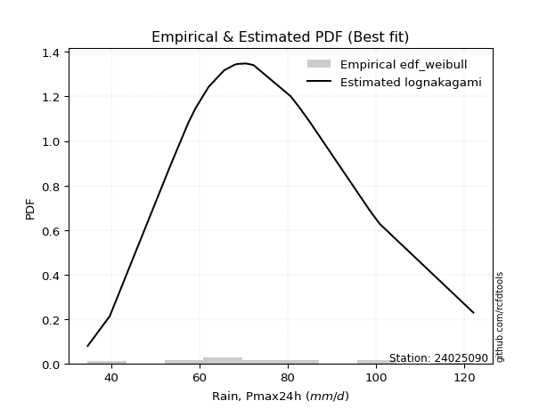</img>

</div>


### 4. EDF Beard (1943)

The Beard formula (or Beard´s plotting position formula) in hydrology is used to estimate the empirical non-exceedance probability _(P)_ of a flood event (or other extreme hydrological data point) within a given dataset.

<div align="center">


$P=(m-0.31)/(n+0.38)$


</div>


**4.1. Empirical values**

<div align="center">

|                | 0                    | 1                   | 2                   | 3                   | 4                  | 5                  | 6                   | 7                  | 8                   | 9                  | 10        | 11                 | 12                 | 13                 | 14                 | 15                 | 16                 | 17                 | 18                 | 19                 | 20                 |
|:---------------|:---------------------|:--------------------|:--------------------|:--------------------|:-------------------|:-------------------|:--------------------|:-------------------|:--------------------|:-------------------|:----------|:-------------------|:-------------------|:-------------------|:-------------------|:-------------------|:-------------------|:-------------------|:-------------------|:-------------------|:-------------------|
| date           | 2009                 | 2008                | 2007                | 2016                | 2018               | 2015               | 2012                | 2013               | 2017                | 2011               | 2010      | 2006               | 2023               | 2005               | 2024               | 2014               | 2020               | 2021               | 2022               | 2025               | 2019               |
| x              | 34.7                 | 39.7                | 53.5                | 57.5                | 59.2               | 62.1               | 65.6                | 65.7               | 68.0                | 68.7               | 70.6      | 72.2               | 72.3               | 80.7               | 82.8               | 85.1               | 98.5               | 99.3               | 100.9              | 104.2              | 122.1              |
| m              | 1                    | 2                   | 3                   | 4                   | 5                  | 6                  | 7                   | 8                  | 9                   | 10                 | 11        | 12                 | 13                 | 14                 | 15                 | 16                 | 17                 | 18                 | 19                 | 20                 | 21                 |
| empirical_dist | edf_beard            | edf_beard           | edf_beard           | edf_beard           | edf_beard          | edf_beard          | edf_beard           | edf_beard          | edf_beard           | edf_beard          | edf_beard | edf_beard          | edf_beard          | edf_beard          | edf_beard          | edf_beard          | edf_beard          | edf_beard          | edf_beard          | edf_beard          | edf_beard          |
| empirical      | 0.032273152478952294 | 0.07904583723105707 | 0.12581852198316185 | 0.17259120673526662 | 0.2193638914873714 | 0.2661365762394762 | 0.31290926099158095 | 0.3596819457436857 | 0.40645463049579045 | 0.4532273152478952 | 0.5       | 0.5467726847521047 | 0.5935453695042096 | 0.6403180542563143 | 0.6870907390084191 | 0.7338634237605238 | 0.7806361085126288 | 0.8274087932647335 | 0.8741814780168383 | 0.920954162768943  | 0.9677268475210478 |
| empirical_tr   | 1.0333494441759306   | 1.085830370746572   | 1.1439272338148743  | 1.208592425098926   | 1.281006590772918  | 1.362651370299554  | 1.4554118447923756  | 1.5617238860482106 | 1.6847911741528763  | 1.828913601368691  | 2.0       | 2.206398348813209  | 2.4602991944764097 | 2.780234070221066  | 3.195814648729447  | 3.7574692442882247 | 4.558635394456293  | 5.794037940379407  | 7.947955390334582  | 12.650887573964514 | 30.985507246376862 |

</div>


**4.2. Kolmogorov-Smirnov fit test (sorted by Δ)**


<div align="center">

|                | 0                   | 1                   | 2                   | 3                   | 4                   | 5                   | 6                   | 7                   | 8                   | 9                   | 10                  | 11                  | 12                  | 13                  | 14                  | 15                  | 16                  | 17                  | 18                  | 19                  | 20                  | 21                  | 22                  | 23                  | 24                  | 25                  | 26                  | 27                  | 28                  | 29                  | 30                  | 31                  | 32                  | 33                  | 34                  | 35                  | 36                  | 37                  | 38                  | 39                  | 40                  | 41                  | 42                  | 43                  | 44                  | 45                  | 46                  | 47                  | 48                  | 49                  | 50                  | 51                  | 52                  | 53                  | 54                  | 55                  | 56                  | 57                  | 58                  | 59                  | 60                  | 61                  | 62                  | 63                  | 64                  | 65                  | 66                  | 67                  | 68                  | 69                  | 70                  | 71                  | 72                  | 73                  | 74                  | 75                  | 76                  | 77                  | 78                  | 79                  | 80                  | 81                  | 82                  | 83                  | 84                  | 85                  | 86                  | 87                  | 88                  | 89                  | 90                  | 91                  | 92                  | 93                  | 94                  | 95                  | 96                  | 97                  | 98                  | 99                  | 100                 | 101                 | 102                 | 103                 | 104                 | 105                 | 106                 | 107                 | 108                 | 109                 | 110                 | 111                 | 112                 | 113                 | 114                 | 115                 | 116                 | 117                 | 118                 | 119                 | 120                 | 121                 | 122                 | 123                 | 124                 | 125                 | 126                 | 127                 | 128                 | 129                 | 130                 | 131                 | 132                 | 133                 | 134                 | 135                 | 136                 | 137                 | 138                 | 139                 | 140                 | 141                 | 142                 | 143                 | 144                 | 145                 | 146                 | 147                 | 148                 | 149                 | 150                 | 151                 | 152                 | 153                 | 154                 | 155                 | 156                 | 157                 | 158                 | 159                 |
|:---------------|:--------------------|:--------------------|:--------------------|:--------------------|:--------------------|:--------------------|:--------------------|:--------------------|:--------------------|:--------------------|:--------------------|:--------------------|:--------------------|:--------------------|:--------------------|:--------------------|:--------------------|:--------------------|:--------------------|:--------------------|:--------------------|:--------------------|:--------------------|:--------------------|:--------------------|:--------------------|:--------------------|:--------------------|:--------------------|:--------------------|:--------------------|:--------------------|:--------------------|:--------------------|:--------------------|:--------------------|:--------------------|:--------------------|:--------------------|:--------------------|:--------------------|:--------------------|:--------------------|:--------------------|:--------------------|:--------------------|:--------------------|:--------------------|:--------------------|:--------------------|:--------------------|:--------------------|:--------------------|:--------------------|:--------------------|:--------------------|:--------------------|:--------------------|:--------------------|:--------------------|:--------------------|:--------------------|:--------------------|:--------------------|:--------------------|:--------------------|:--------------------|:--------------------|:--------------------|:--------------------|:--------------------|:--------------------|:--------------------|:--------------------|:--------------------|:--------------------|:--------------------|:--------------------|:--------------------|:--------------------|:--------------------|:--------------------|:--------------------|:--------------------|:--------------------|:--------------------|:--------------------|:--------------------|:--------------------|:--------------------|:--------------------|:--------------------|:--------------------|:--------------------|:--------------------|:--------------------|:--------------------|:--------------------|:--------------------|:--------------------|:--------------------|:--------------------|:--------------------|:--------------------|:--------------------|:--------------------|:--------------------|:--------------------|:--------------------|:--------------------|:--------------------|:--------------------|:--------------------|:--------------------|:--------------------|:--------------------|:--------------------|:--------------------|:--------------------|:--------------------|:--------------------|:--------------------|:--------------------|:--------------------|:--------------------|:--------------------|:--------------------|:--------------------|:--------------------|:--------------------|:--------------------|:--------------------|:--------------------|:--------------------|:--------------------|:--------------------|:--------------------|:--------------------|:--------------------|:--------------------|:--------------------|:--------------------|:--------------------|:--------------------|:--------------------|:--------------------|:--------------------|:--------------------|:--------------------|:--------------------|:--------------------|:--------------------|:--------------------|:--------------------|:--------------------|:--------------------|:--------------------|:--------------------|:--------------------|:--------------------|
| station        | 24025090            | 24025090            | 24025090            | 24025090            | 24025090            | 24025090            | 24025090            | 24025090            | 24025090            | 24025090            | 24025090            | 24025090            | 24025090            | 24025090            | 24025090            | 24025090            | 24025090            | 24025090            | 24025090            | 24025090            | 24025090            | 24025090            | 24025090            | 24025090            | 24025090            | 24025090            | 24025090            | 24025090            | 24025090            | 24025090            | 24025090            | 24025090            | 24025090            | 24025090            | 24025090            | 24025090            | 24025090            | 24025090            | 24025090            | 24025090            | 24025090            | 24025090            | 24025090            | 24025090            | 24025090            | 24025090            | 24025090            | 24025090            | 24025090            | 24025090            | 24025090            | 24025090            | 24025090            | 24025090            | 24025090            | 24025090            | 24025090            | 24025090            | 24025090            | 24025090            | 24025090            | 24025090            | 24025090            | 24025090            | 24025090            | 24025090            | 24025090            | 24025090            | 24025090            | 24025090            | 24025090            | 24025090            | 24025090            | 24025090            | 24025090            | 24025090            | 24025090            | 24025090            | 24025090            | 24025090            | 24025090            | 24025090            | 24025090            | 24025090            | 24025090            | 24025090            | 24025090            | 24025090            | 24025090            | 24025090            | 24025090            | 24025090            | 24025090            | 24025090            | 24025090            | 24025090            | 24025090            | 24025090            | 24025090            | 24025090            | 24025090            | 24025090            | 24025090            | 24025090            | 24025090            | 24025090            | 24025090            | 24025090            | 24025090            | 24025090            | 24025090            | 24025090            | 24025090            | 24025090            | 24025090            | 24025090            | 24025090            | 24025090            | 24025090            | 24025090            | 24025090            | 24025090            | 24025090            | 24025090            | 24025090            | 24025090            | 24025090            | 24025090            | 24025090            | 24025090            | 24025090            | 24025090            | 24025090            | 24025090            | 24025090            | 24025090            | 24025090            | 24025090            | 24025090            | 24025090            | 24025090            | 24025090            | 24025090            | 24025090            | 24025090            | 24025090            | 24025090            | 24025090            | 24025090            | 24025090            | 24025090            | 24025090            | 24025090            | 24025090            | 24025090            | 24025090            | 24025090            | 24025090            | 24025090            | 24025090            |
| empirical_dist | edf_beard           | edf_beard           | edf_beard           | edf_beard           | edf_beard           | edf_beard           | edf_beard           | edf_beard           | edf_beard           | edf_beard           | edf_beard           | edf_beard           | edf_beard           | edf_beard           | edf_beard           | edf_beard           | edf_beard           | edf_beard           | edf_beard           | edf_beard           | edf_beard           | edf_beard           | edf_beard           | edf_beard           | edf_beard           | edf_beard           | edf_beard           | edf_beard           | edf_beard           | edf_beard           | edf_beard           | edf_beard           | edf_beard           | edf_beard           | edf_beard           | edf_beard           | edf_beard           | edf_beard           | edf_beard           | edf_beard           | edf_beard           | edf_beard           | edf_beard           | edf_beard           | edf_beard           | edf_beard           | edf_beard           | edf_beard           | edf_beard           | edf_beard           | edf_beard           | edf_beard           | edf_beard           | edf_beard           | edf_beard           | edf_beard           | edf_beard           | edf_beard           | edf_beard           | edf_beard           | edf_beard           | edf_beard           | edf_beard           | edf_beard           | edf_beard           | edf_beard           | edf_beard           | edf_beard           | edf_beard           | edf_beard           | edf_beard           | edf_beard           | edf_beard           | edf_beard           | edf_beard           | edf_beard           | edf_beard           | edf_beard           | edf_beard           | edf_beard           | edf_beard           | edf_beard           | edf_beard           | edf_beard           | edf_beard           | edf_beard           | edf_beard           | edf_beard           | edf_beard           | edf_beard           | edf_beard           | edf_beard           | edf_beard           | edf_beard           | edf_beard           | edf_beard           | edf_beard           | edf_beard           | edf_beard           | edf_beard           | edf_beard           | edf_beard           | edf_beard           | edf_beard           | edf_beard           | edf_beard           | edf_beard           | edf_beard           | edf_beard           | edf_beard           | edf_beard           | edf_beard           | edf_beard           | edf_beard           | edf_beard           | edf_beard           | edf_beard           | edf_beard           | edf_beard           | edf_beard           | edf_beard           | edf_beard           | edf_beard           | edf_beard           | edf_beard           | edf_beard           | edf_beard           | edf_beard           | edf_beard           | edf_beard           | edf_beard           | edf_beard           | edf_beard           | edf_beard           | edf_beard           | edf_beard           | edf_beard           | edf_beard           | edf_beard           | edf_beard           | edf_beard           | edf_beard           | edf_beard           | edf_beard           | edf_beard           | edf_beard           | edf_beard           | edf_beard           | edf_beard           | edf_beard           | edf_beard           | edf_beard           | edf_beard           | edf_beard           | edf_beard           | edf_beard           | edf_beard           | edf_beard           | edf_beard           | edf_beard           |
| p_dist         | lognakagami         | logbetaprime        | lognct              | logrice             | lognorm             | logcrystalball      | logexponnorm        | logt                | logf                | logfatiguelife      | invweibull          | loginvgamma         | logexponweib        | logerlang           | ncf                 | loggamma            | loggamma            | rayleigh            | logalpha            | loggengamma         | loganglit           | loglogistic         | loggennorm          | invgauss            | logloglaplace       | gumbel_r            | maxwell             | moyal               | kstwobign           | logncf              | triang              | genlogistic         | halfnorm            | loghypsecant        | burr                | loggenlogistic      | mielke              | logargus            | skewnorm            | logsemicircular     | logmielke           | logburr             | nakagami            | alpha               | logdweibull         | logskewnorm         | betaprime           | halflogistic        | invgamma            | logpearson3         | loginvgauss         | gamma               | erlang              | f                   | weibull_min         | fatiguelife         | loglaplace          | loglaplace          | nct                 | logvonmises_line    | beta                | johnsonsu           | logexponpow         | loggompertz         | logweibull_min      | logmaxwell          | logbeta             | johnsonsb           | logloggamma         | logjohnsonsb        | logweibull_max      | loggenextreme       | logjohnsonsu        | genhalflogistic     | pearson3            | rice                | exponnorm           | logburr12           | genextreme          | dweibull            | lograyleigh         | semicircular        | wald                | logcosine           | anglit              | dgamma              | t                   | norm                | crystalball         | truncnorm           | loggausshyper       | kappa3              | loggumbel_r         | arcsine             | kappa4              | logistic            | gennorm             | loginvweibull       | hypsecant           | loggumbel_l         | cosine              | logtriang           | truncweibull_min    | logmoyal            | logarcsine          | wrapcauchy          | loghalfnorm         | laplace             | uniform             | bradford            | logfoldnorm         | gausshyper          | gompertz            | logkstwobign        | loghalflogistic     | truncexpon          | ksone               | loggenexpon         | vonmises_line       | gumbel_l            | logdgamma           | logkappa4           | loggenhalflogistic  | logwald             | logkappa3           | loguniform          | logbradford         | logtukeylambda      | loghalfgennorm      | argus               | logksone            | genpareto           | logrdist            | logtruncweibull_min | genexpon            | logtrapezoid        | logwrapcauchy       | loglomax            | burr12              | tukeylambda         | logtruncexpon       | halfgennorm         | loglevy_l           | logtruncnorm        | loggenpareto        | levy_l              | trapezoid           | powerlaw            | logtruncpareto      | lomax               | logpowerlaw         | rdist               | foldnorm            | gengamma            | exponweib           | weibull_max         | exponpow            | truncpareto         | logvonmises         | vonmises            |
| delta          | 0.0768494781975082  | 0.07701343927274007 | 0.07783965259886094 | 0.07797004074676595 | 0.07797018110015608 | 0.07797018161467717 | 0.07797084311584823 | 0.07797581131570575 | 0.07817367897212502 | 0.08020872626810538 | 0.08264316256775328 | 0.08439615099094616 | 0.08445351164245435 | 0.0858701683919561  | 0.08704149883947987 | 0.08792540801327914 | 0.08792540801327914 | 0.08796449870291256 | 0.09078699127000173 | 0.09238631387129159 | 0.09270843221202663 | 0.09461011302063427 | 0.09596558405923783 | 0.0961292421563325  | 0.09636272828102144 | 0.09666112976301289 | 0.09972255419597376 | 0.10001293244719967 | 0.10069736878516622 | 0.10130155765572885 | 0.10135492446345534 | 0.10161306864519942 | 0.10212654872036969 | 0.10287850853510383 | 0.10331247341931565 | 0.1033344542881049  | 0.10336001771832715 | 0.10378085505052603 | 0.10409009406247499 | 0.10444276733350699 | 0.10465765172104557 | 0.10467883512214243 | 0.10549436723676081 | 0.10655408509459152 | 0.10736587638158657 | 0.10745128350002164 | 0.10787321662009203 | 0.10810442162423367 | 0.10840600941882034 | 0.10868037964014154 | 0.10893942149864266 | 0.10932509171626648 | 0.1093251738528484  | 0.10935252628470171 | 0.10969164888506366 | 0.10982483534697746 | 0.109895979264513   | 0.109895979264513   | 0.11029290939427466 | 0.1106489258036975  | 0.11068656304704938 | 0.11070678604829665 | 0.11085788684769371 | 0.11097414228437885 | 0.11124592215869755 | 0.1114585505937189  | 0.11157789293674503 | 0.11176705614901739 | 0.11194938830226914 | 0.11214994573669473 | 0.11222462482039186 | 0.11224723486536176 | 0.11255370139706372 | 0.11402831645554201 | 0.11476075194959301 | 0.11484237049667134 | 0.11718030599434837 | 0.11838755010081081 | 0.11853411833664595 | 0.12151078008027472 | 0.123784067856413   | 0.1257977725315833  | 0.12581852198316185 | 0.12747895977360724 | 0.12816828425623183 | 0.13365358883624467 | 0.13390044290359188 | 0.13391578955367917 | 0.13391579199756048 | 0.13391579282166943 | 0.13436883191207827 | 0.13516641079746144 | 0.13564522534959467 | 0.13604153024062687 | 0.13817383455028187 | 0.1393811557330331  | 0.14028116201537655 | 0.1410529164830311  | 0.14401603458700696 | 0.14492701489392557 | 0.15017695975016604 | 0.15036001927044118 | 0.15053054500058938 | 0.15780697854458176 | 0.15841779962599944 | 0.15845131710887    | 0.15869845949905675 | 0.16032195555000078 | 0.16333941984745898 | 0.1665901683947419  | 0.1705360502911833  | 0.1709514903834249  | 0.17133492604012568 | 0.17161569079189504 | 0.1730372096851765  | 0.17384077607759624 | 0.1749587394279818  | 0.19336033278429882 | 0.20381217138963625 | 0.20432993650868436 | 0.2108252091748013  | 0.21236113426974024 | 0.21627104379786055 | 0.21681369797821665 | 0.22812630136470452 | 0.22884348223146422 | 0.230152132956009   | 0.23224313330114232 | 0.23495222141535443 | 0.23590598032648513 | 0.2452710340703425  | 0.24874772646996574 | 0.25540088028929614 | 0.2630244042602036  | 0.26473981202733554 | 0.27480192662168706 | 0.31821206952365005 | 0.32788849193928393 | 0.3309656552661806  | 0.3326591123279036  | 0.3331197756377845  | 0.35285438771466426 | 0.3538878201099887  | 0.36106427109548467 | 0.3629983495547031  | 0.4147644582877373  | 0.41589991339438537 | 0.42854469154203095 | 0.4378180347335242  | 0.4438957187394116  | 0.4978110205543052  | 0.5158991360467873  | 0.5935453695042096  | 0.6427604803912146  | 0.6918953980784013  | 0.7529677964996049  | 0.8003733971557485  | 0.8435392991046026  | 1.0781489314738752  | 19.4213153105661    |
| deltao         | 0.30282488509099936 | 0.30282488509099936 | 0.30282488509099936 | 0.30282488509099936 | 0.30282488509099936 | 0.30282488509099936 | 0.30282488509099936 | 0.30282488509099936 | 0.30282488509099936 | 0.30282488509099936 | 0.30282488509099936 | 0.30282488509099936 | 0.30282488509099936 | 0.30282488509099936 | 0.30282488509099936 | 0.30282488509099936 | 0.30282488509099936 | 0.30282488509099936 | 0.30282488509099936 | 0.30282488509099936 | 0.30282488509099936 | 0.30282488509099936 | 0.30282488509099936 | 0.30282488509099936 | 0.30282488509099936 | 0.30282488509099936 | 0.30282488509099936 | 0.30282488509099936 | 0.30282488509099936 | 0.30282488509099936 | 0.30282488509099936 | 0.30282488509099936 | 0.30282488509099936 | 0.30282488509099936 | 0.30282488509099936 | 0.30282488509099936 | 0.30282488509099936 | 0.30282488509099936 | 0.30282488509099936 | 0.30282488509099936 | 0.30282488509099936 | 0.30282488509099936 | 0.30282488509099936 | 0.30282488509099936 | 0.30282488509099936 | 0.30282488509099936 | 0.30282488509099936 | 0.30282488509099936 | 0.30282488509099936 | 0.30282488509099936 | 0.30282488509099936 | 0.30282488509099936 | 0.30282488509099936 | 0.30282488509099936 | 0.30282488509099936 | 0.30282488509099936 | 0.30282488509099936 | 0.30282488509099936 | 0.30282488509099936 | 0.30282488509099936 | 0.30282488509099936 | 0.30282488509099936 | 0.30282488509099936 | 0.30282488509099936 | 0.30282488509099936 | 0.30282488509099936 | 0.30282488509099936 | 0.30282488509099936 | 0.30282488509099936 | 0.30282488509099936 | 0.30282488509099936 | 0.30282488509099936 | 0.30282488509099936 | 0.30282488509099936 | 0.30282488509099936 | 0.30282488509099936 | 0.30282488509099936 | 0.30282488509099936 | 0.30282488509099936 | 0.30282488509099936 | 0.30282488509099936 | 0.30282488509099936 | 0.30282488509099936 | 0.30282488509099936 | 0.30282488509099936 | 0.30282488509099936 | 0.30282488509099936 | 0.30282488509099936 | 0.30282488509099936 | 0.30282488509099936 | 0.30282488509099936 | 0.30282488509099936 | 0.30282488509099936 | 0.30282488509099936 | 0.30282488509099936 | 0.30282488509099936 | 0.30282488509099936 | 0.30282488509099936 | 0.30282488509099936 | 0.30282488509099936 | 0.30282488509099936 | 0.30282488509099936 | 0.30282488509099936 | 0.30282488509099936 | 0.30282488509099936 | 0.30282488509099936 | 0.30282488509099936 | 0.30282488509099936 | 0.30282488509099936 | 0.30282488509099936 | 0.30282488509099936 | 0.30282488509099936 | 0.30282488509099936 | 0.30282488509099936 | 0.30282488509099936 | 0.30282488509099936 | 0.30282488509099936 | 0.30282488509099936 | 0.30282488509099936 | 0.30282488509099936 | 0.30282488509099936 | 0.30282488509099936 | 0.30282488509099936 | 0.30282488509099936 | 0.30282488509099936 | 0.30282488509099936 | 0.30282488509099936 | 0.30282488509099936 | 0.30282488509099936 | 0.30282488509099936 | 0.30282488509099936 | 0.30282488509099936 | 0.30282488509099936 | 0.30282488509099936 | 0.30282488509099936 | 0.30282488509099936 | 0.30282488509099936 | 0.30282488509099936 | 0.30282488509099936 | 0.30282488509099936 | 0.30282488509099936 | 0.30282488509099936 | 0.30282488509099936 | 0.30282488509099936 | 0.30282488509099936 | 0.30282488509099936 | 0.30282488509099936 | 0.30282488509099936 | 0.30282488509099936 | 0.30282488509099936 | 0.30282488509099936 | 0.30282488509099936 | 0.30282488509099936 | 0.30282488509099936 | 0.30282488509099936 | 0.30282488509099936 | 0.30282488509099936 | 0.30282488509099936 | 0.30282488509099936 | 0.30282488509099936 |
| eval           | Δo > Δ              | Δo > Δ              | Δo > Δ              | Δo > Δ              | Δo > Δ              | Δo > Δ              | Δo > Δ              | Δo > Δ              | Δo > Δ              | Δo > Δ              | Δo > Δ              | Δo > Δ              | Δo > Δ              | Δo > Δ              | Δo > Δ              | Δo > Δ              | Δo > Δ              | Δo > Δ              | Δo > Δ              | Δo > Δ              | Δo > Δ              | Δo > Δ              | Δo > Δ              | Δo > Δ              | Δo > Δ              | Δo > Δ              | Δo > Δ              | Δo > Δ              | Δo > Δ              | Δo > Δ              | Δo > Δ              | Δo > Δ              | Δo > Δ              | Δo > Δ              | Δo > Δ              | Δo > Δ              | Δo > Δ              | Δo > Δ              | Δo > Δ              | Δo > Δ              | Δo > Δ              | Δo > Δ              | Δo > Δ              | Δo > Δ              | Δo > Δ              | Δo > Δ              | Δo > Δ              | Δo > Δ              | Δo > Δ              | Δo > Δ              | Δo > Δ              | Δo > Δ              | Δo > Δ              | Δo > Δ              | Δo > Δ              | Δo > Δ              | Δo > Δ              | Δo > Δ              | Δo > Δ              | Δo > Δ              | Δo > Δ              | Δo > Δ              | Δo > Δ              | Δo > Δ              | Δo > Δ              | Δo > Δ              | Δo > Δ              | Δo > Δ              | Δo > Δ              | Δo > Δ              | Δo > Δ              | Δo > Δ              | Δo > Δ              | Δo > Δ              | Δo > Δ              | Δo > Δ              | Δo > Δ              | Δo > Δ              | Δo > Δ              | Δo > Δ              | Δo > Δ              | Δo > Δ              | Δo > Δ              | Δo > Δ              | Δo > Δ              | Δo > Δ              | Δo > Δ              | Δo > Δ              | Δo > Δ              | Δo > Δ              | Δo > Δ              | Δo > Δ              | Δo > Δ              | Δo > Δ              | Δo > Δ              | Δo > Δ              | Δo > Δ              | Δo > Δ              | Δo > Δ              | Δo > Δ              | Δo > Δ              | Δo > Δ              | Δo > Δ              | Δo > Δ              | Δo > Δ              | Δo > Δ              | Δo > Δ              | Δo > Δ              | Δo > Δ              | Δo > Δ              | Δo > Δ              | Δo > Δ              | Δo > Δ              | Δo > Δ              | Δo > Δ              | Δo > Δ              | Δo > Δ              | Δo > Δ              | Δo > Δ              | Δo > Δ              | Δo > Δ              | Δo > Δ              | Δo > Δ              | Δo > Δ              | Δo > Δ              | Δo > Δ              | Δo > Δ              | Δo > Δ              | Δo > Δ              | Δo > Δ              | Δo > Δ              | Δo > Δ              | Δo > Δ              | Δo > Δ              | Δo > Δ              | Δo > Δ              | Δo <= Δ             | Δo <= Δ             | Δo <= Δ             | Δo <= Δ             | Δo <= Δ             | Δo <= Δ             | Δo <= Δ             | Δo <= Δ             | Δo <= Δ             | Δo <= Δ             | Δo <= Δ             | Δo <= Δ             | Δo <= Δ             | Δo <= Δ             | Δo <= Δ             | Δo <= Δ             | Δo <= Δ             | Δo <= Δ             | Δo <= Δ             | Δo <= Δ             | Δo <= Δ             | Δo <= Δ             | Δo <= Δ             | Δo <= Δ             |
| fit            | 1                   | 1                   | 1                   | 1                   | 1                   | 1                   | 1                   | 1                   | 1                   | 1                   | 1                   | 1                   | 1                   | 1                   | 1                   | 1                   | 1                   | 1                   | 1                   | 1                   | 1                   | 1                   | 1                   | 1                   | 1                   | 1                   | 1                   | 1                   | 1                   | 1                   | 1                   | 1                   | 1                   | 1                   | 1                   | 1                   | 1                   | 1                   | 1                   | 1                   | 1                   | 1                   | 1                   | 1                   | 1                   | 1                   | 1                   | 1                   | 1                   | 1                   | 1                   | 1                   | 1                   | 1                   | 1                   | 1                   | 1                   | 1                   | 1                   | 1                   | 1                   | 1                   | 1                   | 1                   | 1                   | 1                   | 1                   | 1                   | 1                   | 1                   | 1                   | 1                   | 1                   | 1                   | 1                   | 1                   | 1                   | 1                   | 1                   | 1                   | 1                   | 1                   | 1                   | 1                   | 1                   | 1                   | 1                   | 1                   | 1                   | 1                   | 1                   | 1                   | 1                   | 1                   | 1                   | 1                   | 1                   | 1                   | 1                   | 1                   | 1                   | 1                   | 1                   | 1                   | 1                   | 1                   | 1                   | 1                   | 1                   | 1                   | 1                   | 1                   | 1                   | 1                   | 1                   | 1                   | 1                   | 1                   | 1                   | 1                   | 1                   | 1                   | 1                   | 1                   | 1                   | 1                   | 1                   | 1                   | 1                   | 1                   | 1                   | 1                   | 1                   | 1                   | 1                   | 1                   | 0                   | 0                   | 0                   | 0                   | 0                   | 0                   | 0                   | 0                   | 0                   | 0                   | 0                   | 0                   | 0                   | 0                   | 0                   | 0                   | 0                   | 0                   | 0                   | 0                   | 0                   | 0                   | 0                   | 0                   |
| n              | 21                  | 21                  | 21                  | 21                  | 21                  | 21                  | 21                  | 21                  | 21                  | 21                  | 21                  | 21                  | 21                  | 21                  | 21                  | 21                  | 21                  | 21                  | 21                  | 21                  | 21                  | 21                  | 21                  | 21                  | 21                  | 21                  | 21                  | 21                  | 21                  | 21                  | 21                  | 21                  | 21                  | 21                  | 21                  | 21                  | 21                  | 21                  | 21                  | 21                  | 21                  | 21                  | 21                  | 21                  | 21                  | 21                  | 21                  | 21                  | 21                  | 21                  | 21                  | 21                  | 21                  | 21                  | 21                  | 21                  | 21                  | 21                  | 21                  | 21                  | 21                  | 21                  | 21                  | 21                  | 21                  | 21                  | 21                  | 21                  | 21                  | 21                  | 21                  | 21                  | 21                  | 21                  | 21                  | 21                  | 21                  | 21                  | 21                  | 21                  | 21                  | 21                  | 21                  | 21                  | 21                  | 21                  | 21                  | 21                  | 21                  | 21                  | 21                  | 21                  | 21                  | 21                  | 21                  | 21                  | 21                  | 21                  | 21                  | 21                  | 21                  | 21                  | 21                  | 21                  | 21                  | 21                  | 21                  | 21                  | 21                  | 21                  | 21                  | 21                  | 21                  | 21                  | 21                  | 21                  | 21                  | 21                  | 21                  | 21                  | 21                  | 21                  | 21                  | 21                  | 21                  | 21                  | 21                  | 21                  | 21                  | 21                  | 21                  | 21                  | 21                  | 21                  | 21                  | 21                  | 21                  | 21                  | 21                  | 21                  | 21                  | 21                  | 21                  | 21                  | 21                  | 21                  | 21                  | 21                  | 21                  | 21                  | 21                  | 21                  | 21                  | 21                  | 21                  | 21                  | 21                  | 21                  | 21                  | 21                  |
| best_fit       | 1                   | 0                   | 0                   | 0                   | 0                   | 0                   | 0                   | 0                   | 0                   | 0                   | 0                   | 0                   | 0                   | 0                   | 0                   | 0                   | 0                   | 0                   | 0                   | 0                   | 0                   | 0                   | 0                   | 0                   | 0                   | 0                   | 0                   | 0                   | 0                   | 0                   | 0                   | 0                   | 0                   | 0                   | 0                   | 0                   | 0                   | 0                   | 0                   | 0                   | 0                   | 0                   | 0                   | 0                   | 0                   | 0                   | 0                   | 0                   | 0                   | 0                   | 0                   | 0                   | 0                   | 0                   | 0                   | 0                   | 0                   | 0                   | 0                   | 0                   | 0                   | 0                   | 0                   | 0                   | 0                   | 0                   | 0                   | 0                   | 0                   | 0                   | 0                   | 0                   | 0                   | 0                   | 0                   | 0                   | 0                   | 0                   | 0                   | 0                   | 0                   | 0                   | 0                   | 0                   | 0                   | 0                   | 0                   | 0                   | 0                   | 0                   | 0                   | 0                   | 0                   | 0                   | 0                   | 0                   | 0                   | 0                   | 0                   | 0                   | 0                   | 0                   | 0                   | 0                   | 0                   | 0                   | 0                   | 0                   | 0                   | 0                   | 0                   | 0                   | 0                   | 0                   | 0                   | 0                   | 0                   | 0                   | 0                   | 0                   | 0                   | 0                   | 0                   | 0                   | 0                   | 0                   | 0                   | 0                   | 0                   | 0                   | 0                   | 0                   | 0                   | 0                   | 0                   | 0                   | 0                   | 0                   | 0                   | 0                   | 0                   | 0                   | 0                   | 0                   | 0                   | 0                   | 0                   | 0                   | 0                   | 0                   | 0                   | 0                   | 0                   | 0                   | 0                   | 0                   | 0                   | 0                   | 0                   | 0                   |
| best_fit_sort  | 1                   | 2                   | 3                   | 4                   | 5                   | 6                   | 7                   | 8                   | 9                   | 10                  | 11                  | 12                  | 13                  | 14                  | 15                  | 16                  | 17                  | 18                  | 19                  | 20                  | 21                  | 22                  | 23                  | 24                  | 25                  | 26                  | 27                  | 28                  | 29                  | 30                  | 31                  | 32                  | 33                  | 34                  | 35                  | 36                  | 37                  | 38                  | 39                  | 40                  | 41                  | 42                  | 43                  | 44                  | 45                  | 46                  | 47                  | 48                  | 49                  | 50                  | 51                  | 52                  | 53                  | 54                  | 55                  | 56                  | 57                  | 58                  | 59                  | 60                  | 61                  | 62                  | 63                  | 64                  | 65                  | 66                  | 67                  | 68                  | 69                  | 70                  | 71                  | 72                  | 73                  | 74                  | 75                  | 76                  | 77                  | 78                  | 79                  | 80                  | 81                  | 82                  | 83                  | 84                  | 85                  | 86                  | 87                  | 88                  | 89                  | 90                  | 91                  | 92                  | 93                  | 94                  | 95                  | 96                  | 97                  | 98                  | 99                  | 100                 | 101                 | 102                 | 103                 | 104                 | 105                 | 106                 | 107                 | 108                 | 109                 | 110                 | 111                 | 112                 | 113                 | 114                 | 115                 | 116                 | 117                 | 118                 | 119                 | 120                 | 121                 | 122                 | 123                 | 124                 | 125                 | 126                 | 127                 | 128                 | 129                 | 130                 | 131                 | 132                 | 133                 | 134                 | 135                 | 136                 | 137                 | 138                 | 139                 | 140                 | 141                 | 142                 | 143                 | 144                 | 145                 | 146                 | 147                 | 148                 | 149                 | 150                 | 151                 | 152                 | 153                 | 154                 | 155                 | 156                 | 157                 | 158                 | 159                 | 160                 |

</div>


**4.3. Best fit**

<div align="center">

|   id |   station | empirical_dist   | p_dist      |     delta |   deltao | eval   |   fit |   n |   best_fit |   best_fit_sort |
|-----:|----------:|:-----------------|:------------|----------:|---------:|:-------|------:|----:|-----------:|----------------:|
|    0 |  24025090 | edf_beard        | lognakagami | 0.0768495 | 0.302825 | Δo > Δ |     1 |  21 |          1 |               1 |

</div>


<div align="center">

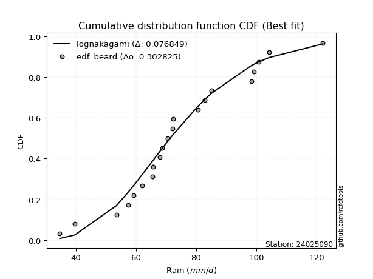</img></img>

</div>


### 5. EDF Chegodayev (1955)

The Chegodayev formula is an empirical plotting position formula used in hydrological frequency analysis to estimate the exceedance probability or return period of a specific event from a set of observed data. It is primarily used for plotting observed data points on probability paper to fit a theoretical distribution, particularly for analyzing extreme events like maximum flood flows or rainfall intensities. The constant _b_ value in the generalized plotting position formula is 0.3.

<div align="center">


$P=(m-b)/(n+1-2b)$


</div>


**5.1. Empirical values**

<div align="center">

|                | 0                   | 1                   | 2                   | 3                   | 4                  | 5                  | 6                   | 7                  | 8                   | 9                  | 10             | 11                 | 12                 | 13                 | 14                 | 15                 | 16                | 17                 | 18                 | 19                 | 20                 |
|:---------------|:--------------------|:--------------------|:--------------------|:--------------------|:-------------------|:-------------------|:--------------------|:-------------------|:--------------------|:-------------------|:---------------|:-------------------|:-------------------|:-------------------|:-------------------|:-------------------|:------------------|:-------------------|:-------------------|:-------------------|:-------------------|
| date           | 2009                | 2008                | 2007                | 2016                | 2018               | 2015               | 2012                | 2013               | 2017                | 2011               | 2010           | 2006               | 2023               | 2005               | 2024               | 2014               | 2020              | 2021               | 2022               | 2025               | 2019               |
| x              | 34.7                | 39.7                | 53.5                | 57.5                | 59.2               | 62.1               | 65.6                | 65.7               | 68.0                | 68.7               | 70.6           | 72.2               | 72.3               | 80.7               | 82.8               | 85.1               | 98.5              | 99.3               | 100.9              | 104.2              | 122.1              |
| m              | 1                   | 2                   | 3                   | 4                   | 5                  | 6                  | 7                   | 8                  | 9                   | 10                 | 11             | 12                 | 13                 | 14                 | 15                 | 16                 | 17                | 18                 | 19                 | 20                 | 21                 |
| empirical_dist | edf_chegodayev      | edf_chegodayev      | edf_chegodayev      | edf_chegodayev      | edf_chegodayev     | edf_chegodayev     | edf_chegodayev      | edf_chegodayev     | edf_chegodayev      | edf_chegodayev     | edf_chegodayev | edf_chegodayev     | edf_chegodayev     | edf_chegodayev     | edf_chegodayev     | edf_chegodayev     | edf_chegodayev    | edf_chegodayev     | edf_chegodayev     | edf_chegodayev     | edf_chegodayev     |
| empirical      | 0.03271028037383177 | 0.07943925233644861 | 0.12616822429906543 | 0.17289719626168226 | 0.2196261682242991 | 0.2663551401869159 | 0.31308411214953275 | 0.3598130841121496 | 0.40654205607476634 | 0.4532710280373832 | 0.5            | 0.5467289719626168 | 0.5934579439252337 | 0.6401869158878505 | 0.6869158878504673 | 0.7336448598130841 | 0.780373831775701 | 0.8271028037383178 | 0.8738317757009346 | 0.9205607476635514 | 0.9672897196261683 |
| empirical_tr   | 1.0338164251207729  | 1.086294416243655   | 1.1443850267379678  | 1.209039548022599   | 1.2814371257485029 | 1.3630573248407645 | 1.4557823129251701  | 1.5620437956204383 | 1.68503937007874    | 1.829059829059829  | 2.0            | 2.2061855670103094 | 2.4597701149425286 | 2.7792207792207795 | 3.194029850746269  | 3.7543859649122813 | 4.553191489361703 | 5.783783783783785  | 7.925925925925928  | 12.588235294117654 | 30.57142857142862  |

</div>


**5.2. Kolmogorov-Smirnov fit test (sorted by Δ)**


<div align="center">

|                | 0                   | 1                   | 2                   | 3                   | 4                   | 5                   | 6                   | 7                   | 8                   | 9                   | 10                  | 11                  | 12                  | 13                  | 14                  | 15                  | 16                  | 17                  | 18                  | 19                  | 20                  | 21                  | 22                  | 23                  | 24                  | 25                  | 26                  | 27                  | 28                  | 29                  | 30                  | 31                  | 32                  | 33                  | 34                  | 35                  | 36                  | 37                  | 38                  | 39                  | 40                  | 41                  | 42                  | 43                  | 44                  | 45                  | 46                  | 47                  | 48                  | 49                  | 50                  | 51                  | 52                  | 53                  | 54                  | 55                  | 56                  | 57                  | 58                  | 59                  | 60                  | 61                  | 62                  | 63                  | 64                  | 65                  | 66                  | 67                  | 68                  | 69                  | 70                  | 71                  | 72                  | 73                  | 74                  | 75                  | 76                  | 77                  | 78                  | 79                  | 80                  | 81                  | 82                  | 83                  | 84                  | 85                  | 86                  | 87                  | 88                  | 89                  | 90                  | 91                  | 92                  | 93                  | 94                  | 95                  | 96                  | 97                  | 98                  | 99                  | 100                 | 101                 | 102                 | 103                 | 104                 | 105                 | 106                 | 107                 | 108                 | 109                 | 110                 | 111                 | 112                 | 113                 | 114                 | 115                 | 116                 | 117                 | 118                 | 119                 | 120                 | 121                 | 122                 | 123                 | 124                 | 125                 | 126                 | 127                 | 128                 | 129                 | 130                 | 131                 | 132                 | 133                 | 134                 | 135                 | 136                 | 137                 | 138                 | 139                 | 140                 | 141                 | 142                 | 143                 | 144                 | 145                 | 146                 | 147                 | 148                 | 149                 | 150                 | 151                 | 152                 | 153                 | 154                 | 155                 | 156                 | 157                 | 158                 | 159                 |
|:---------------|:--------------------|:--------------------|:--------------------|:--------------------|:--------------------|:--------------------|:--------------------|:--------------------|:--------------------|:--------------------|:--------------------|:--------------------|:--------------------|:--------------------|:--------------------|:--------------------|:--------------------|:--------------------|:--------------------|:--------------------|:--------------------|:--------------------|:--------------------|:--------------------|:--------------------|:--------------------|:--------------------|:--------------------|:--------------------|:--------------------|:--------------------|:--------------------|:--------------------|:--------------------|:--------------------|:--------------------|:--------------------|:--------------------|:--------------------|:--------------------|:--------------------|:--------------------|:--------------------|:--------------------|:--------------------|:--------------------|:--------------------|:--------------------|:--------------------|:--------------------|:--------------------|:--------------------|:--------------------|:--------------------|:--------------------|:--------------------|:--------------------|:--------------------|:--------------------|:--------------------|:--------------------|:--------------------|:--------------------|:--------------------|:--------------------|:--------------------|:--------------------|:--------------------|:--------------------|:--------------------|:--------------------|:--------------------|:--------------------|:--------------------|:--------------------|:--------------------|:--------------------|:--------------------|:--------------------|:--------------------|:--------------------|:--------------------|:--------------------|:--------------------|:--------------------|:--------------------|:--------------------|:--------------------|:--------------------|:--------------------|:--------------------|:--------------------|:--------------------|:--------------------|:--------------------|:--------------------|:--------------------|:--------------------|:--------------------|:--------------------|:--------------------|:--------------------|:--------------------|:--------------------|:--------------------|:--------------------|:--------------------|:--------------------|:--------------------|:--------------------|:--------------------|:--------------------|:--------------------|:--------------------|:--------------------|:--------------------|:--------------------|:--------------------|:--------------------|:--------------------|:--------------------|:--------------------|:--------------------|:--------------------|:--------------------|:--------------------|:--------------------|:--------------------|:--------------------|:--------------------|:--------------------|:--------------------|:--------------------|:--------------------|:--------------------|:--------------------|:--------------------|:--------------------|:--------------------|:--------------------|:--------------------|:--------------------|:--------------------|:--------------------|:--------------------|:--------------------|:--------------------|:--------------------|:--------------------|:--------------------|:--------------------|:--------------------|:--------------------|:--------------------|:--------------------|:--------------------|:--------------------|:--------------------|:--------------------|:--------------------|
| station        | 24025090            | 24025090            | 24025090            | 24025090            | 24025090            | 24025090            | 24025090            | 24025090            | 24025090            | 24025090            | 24025090            | 24025090            | 24025090            | 24025090            | 24025090            | 24025090            | 24025090            | 24025090            | 24025090            | 24025090            | 24025090            | 24025090            | 24025090            | 24025090            | 24025090            | 24025090            | 24025090            | 24025090            | 24025090            | 24025090            | 24025090            | 24025090            | 24025090            | 24025090            | 24025090            | 24025090            | 24025090            | 24025090            | 24025090            | 24025090            | 24025090            | 24025090            | 24025090            | 24025090            | 24025090            | 24025090            | 24025090            | 24025090            | 24025090            | 24025090            | 24025090            | 24025090            | 24025090            | 24025090            | 24025090            | 24025090            | 24025090            | 24025090            | 24025090            | 24025090            | 24025090            | 24025090            | 24025090            | 24025090            | 24025090            | 24025090            | 24025090            | 24025090            | 24025090            | 24025090            | 24025090            | 24025090            | 24025090            | 24025090            | 24025090            | 24025090            | 24025090            | 24025090            | 24025090            | 24025090            | 24025090            | 24025090            | 24025090            | 24025090            | 24025090            | 24025090            | 24025090            | 24025090            | 24025090            | 24025090            | 24025090            | 24025090            | 24025090            | 24025090            | 24025090            | 24025090            | 24025090            | 24025090            | 24025090            | 24025090            | 24025090            | 24025090            | 24025090            | 24025090            | 24025090            | 24025090            | 24025090            | 24025090            | 24025090            | 24025090            | 24025090            | 24025090            | 24025090            | 24025090            | 24025090            | 24025090            | 24025090            | 24025090            | 24025090            | 24025090            | 24025090            | 24025090            | 24025090            | 24025090            | 24025090            | 24025090            | 24025090            | 24025090            | 24025090            | 24025090            | 24025090            | 24025090            | 24025090            | 24025090            | 24025090            | 24025090            | 24025090            | 24025090            | 24025090            | 24025090            | 24025090            | 24025090            | 24025090            | 24025090            | 24025090            | 24025090            | 24025090            | 24025090            | 24025090            | 24025090            | 24025090            | 24025090            | 24025090            | 24025090            | 24025090            | 24025090            | 24025090            | 24025090            | 24025090            | 24025090            |
| empirical_dist | edf_chegodayev      | edf_chegodayev      | edf_chegodayev      | edf_chegodayev      | edf_chegodayev      | edf_chegodayev      | edf_chegodayev      | edf_chegodayev      | edf_chegodayev      | edf_chegodayev      | edf_chegodayev      | edf_chegodayev      | edf_chegodayev      | edf_chegodayev      | edf_chegodayev      | edf_chegodayev      | edf_chegodayev      | edf_chegodayev      | edf_chegodayev      | edf_chegodayev      | edf_chegodayev      | edf_chegodayev      | edf_chegodayev      | edf_chegodayev      | edf_chegodayev      | edf_chegodayev      | edf_chegodayev      | edf_chegodayev      | edf_chegodayev      | edf_chegodayev      | edf_chegodayev      | edf_chegodayev      | edf_chegodayev      | edf_chegodayev      | edf_chegodayev      | edf_chegodayev      | edf_chegodayev      | edf_chegodayev      | edf_chegodayev      | edf_chegodayev      | edf_chegodayev      | edf_chegodayev      | edf_chegodayev      | edf_chegodayev      | edf_chegodayev      | edf_chegodayev      | edf_chegodayev      | edf_chegodayev      | edf_chegodayev      | edf_chegodayev      | edf_chegodayev      | edf_chegodayev      | edf_chegodayev      | edf_chegodayev      | edf_chegodayev      | edf_chegodayev      | edf_chegodayev      | edf_chegodayev      | edf_chegodayev      | edf_chegodayev      | edf_chegodayev      | edf_chegodayev      | edf_chegodayev      | edf_chegodayev      | edf_chegodayev      | edf_chegodayev      | edf_chegodayev      | edf_chegodayev      | edf_chegodayev      | edf_chegodayev      | edf_chegodayev      | edf_chegodayev      | edf_chegodayev      | edf_chegodayev      | edf_chegodayev      | edf_chegodayev      | edf_chegodayev      | edf_chegodayev      | edf_chegodayev      | edf_chegodayev      | edf_chegodayev      | edf_chegodayev      | edf_chegodayev      | edf_chegodayev      | edf_chegodayev      | edf_chegodayev      | edf_chegodayev      | edf_chegodayev      | edf_chegodayev      | edf_chegodayev      | edf_chegodayev      | edf_chegodayev      | edf_chegodayev      | edf_chegodayev      | edf_chegodayev      | edf_chegodayev      | edf_chegodayev      | edf_chegodayev      | edf_chegodayev      | edf_chegodayev      | edf_chegodayev      | edf_chegodayev      | edf_chegodayev      | edf_chegodayev      | edf_chegodayev      | edf_chegodayev      | edf_chegodayev      | edf_chegodayev      | edf_chegodayev      | edf_chegodayev      | edf_chegodayev      | edf_chegodayev      | edf_chegodayev      | edf_chegodayev      | edf_chegodayev      | edf_chegodayev      | edf_chegodayev      | edf_chegodayev      | edf_chegodayev      | edf_chegodayev      | edf_chegodayev      | edf_chegodayev      | edf_chegodayev      | edf_chegodayev      | edf_chegodayev      | edf_chegodayev      | edf_chegodayev      | edf_chegodayev      | edf_chegodayev      | edf_chegodayev      | edf_chegodayev      | edf_chegodayev      | edf_chegodayev      | edf_chegodayev      | edf_chegodayev      | edf_chegodayev      | edf_chegodayev      | edf_chegodayev      | edf_chegodayev      | edf_chegodayev      | edf_chegodayev      | edf_chegodayev      | edf_chegodayev      | edf_chegodayev      | edf_chegodayev      | edf_chegodayev      | edf_chegodayev      | edf_chegodayev      | edf_chegodayev      | edf_chegodayev      | edf_chegodayev      | edf_chegodayev      | edf_chegodayev      | edf_chegodayev      | edf_chegodayev      | edf_chegodayev      | edf_chegodayev      | edf_chegodayev      | edf_chegodayev      | edf_chegodayev      |
| p_dist         | logbetaprime        | lognakagami         | lognct              | logrice             | lognorm             | logcrystalball      | logexponnorm        | logt                | logf                | logfatiguelife      | invweibull          | loginvgamma         | logexponweib        | logerlang           | ncf                 | loggamma            | loggamma            | rayleigh            | logalpha            | loggengamma         | loganglit           | loglogistic         | invgauss            | loggennorm          | logloglaplace       | gumbel_r            | maxwell             | moyal               | kstwobign           | logncf              | triang              | genlogistic         | halfnorm            | loghypsecant        | burr                | loggenlogistic      | mielke              | logargus            | skewnorm            | logsemicircular     | logmielke           | logburr             | nakagami            | alpha               | logskewnorm         | logdweibull         | betaprime           | halflogistic        | invgamma            | logpearson3         | loginvgauss         | gamma               | erlang              | f                   | weibull_min         | fatiguelife         | loglaplace          | loglaplace          | nct                 | logvonmises_line    | beta                | johnsonsu           | logexponpow         | loggompertz         | logweibull_min      | logmaxwell          | logbeta             | johnsonsb           | logloggamma         | logjohnsonsb        | logweibull_max      | loggenextreme       | logjohnsonsu        | genhalflogistic     | pearson3            | rice                | exponnorm           | logburr12           | genextreme          | dweibull            | lograyleigh         | semicircular        | wald                | logcosine           | anglit              | t                   | norm                | crystalball         | truncnorm           | dgamma              | loggausshyper       | kappa3              | loggumbel_r         | arcsine             | kappa4              | logistic            | gennorm             | loginvweibull       | hypsecant           | loggumbel_l         | cosine              | logtriang           | truncweibull_min    | logmoyal            | logarcsine          | wrapcauchy          | loghalfnorm         | laplace             | uniform             | bradford            | logfoldnorm         | gausshyper          | gompertz            | logkstwobign        | loghalflogistic     | truncexpon          | ksone               | loggenexpon         | vonmises_line       | gumbel_l            | logdgamma           | logkappa4           | loggenhalflogistic  | logwald             | logkappa3           | loguniform          | logbradford         | logtukeylambda      | loghalfgennorm      | argus               | logksone            | genpareto           | logrdist            | logtruncweibull_min | genexpon            | logtrapezoid        | logwrapcauchy       | loglomax            | burr12              | tukeylambda         | logtruncexpon       | halfgennorm         | loglevy_l           | logtruncnorm        | loggenpareto        | levy_l              | trapezoid           | powerlaw            | logtruncpareto      | lomax               | logpowerlaw         | rdist               | foldnorm            | gengamma            | exponweib           | weibull_max         | exponpow            | truncpareto         | logvonmises         | vonmises            |
| delta          | 0.07683858811478828 | 0.077111754934436   | 0.07810192933578874 | 0.07823231748369375 | 0.07823245783708388 | 0.07823245835160497 | 0.07823311985277603 | 0.07823808805263355 | 0.07823828712102743 | 0.08003387511015359 | 0.08246831140980149 | 0.08422129983299437 | 0.08427866048450255 | 0.08569531723400431 | 0.08730377557640767 | 0.08775055685532734 | 0.08775055685532734 | 0.08787707312393667 | 0.09061214011204993 | 0.0922988882923157  | 0.09253358105407483 | 0.09487238975756207 | 0.09604181657735661 | 0.09622786079616563 | 0.09662500501794924 | 0.09692340649994069 | 0.09963512861699786 | 0.10027520918412747 | 0.10052251762721442 | 0.10112670649777705 | 0.10126749888447945 | 0.10152564306622353 | 0.1019516975624179  | 0.10314078527203163 | 0.10322504784033976 | 0.103247028709129   | 0.10327259213935125 | 0.1034748655241104  | 0.1040026684834991  | 0.10413677780709135 | 0.10457022614206968 | 0.10459140954316654 | 0.10540694165778491 | 0.10646665951561562 | 0.10736385792104575 | 0.10762815311851437 | 0.10778579104111613 | 0.10792957046628188 | 0.10831858383984444 | 0.10859295406116565 | 0.10876457034069087 | 0.10923766613729058 | 0.1092377482738725  | 0.10926510070572582 | 0.10960422330608777 | 0.10973740976800156 | 0.1101582560014408  | 0.1101582560014408  | 0.11020548381529877 | 0.11047407464574571 | 0.11059913746807348 | 0.11061936046932075 | 0.11077046126871781 | 0.11088671670540295 | 0.11115849657972166 | 0.1112836994357671  | 0.11149046735776913 | 0.11167963057004149 | 0.11186196272329324 | 0.11206252015771884 | 0.11213719924141596 | 0.11215980928638586 | 0.11246627581808782 | 0.11372232692912637 | 0.11467332637061711 | 0.11475494491769545 | 0.11709288041537247 | 0.11830012452183492 | 0.11844669275767006 | 0.12177305681720252 | 0.1236092166984612  | 0.1257103469526074  | 0.12616822429906543 | 0.12730410861565544 | 0.12808085867725594 | 0.13381301732461598 | 0.13382836397470327 | 0.1338283664185846  | 0.13382836724269354 | 0.13391586557317248 | 0.13406284238566263 | 0.1348604212710458  | 0.13547037419164287 | 0.13573554071421123 | 0.13808640897130597 | 0.13929373015405722 | 0.14019373643640065 | 0.1408780653250793  | 0.14392860900803106 | 0.14483958931494967 | 0.15008953417119014 | 0.15027259369146528 | 0.15044311942161348 | 0.15763212738662996 | 0.1581118100995838  | 0.1583638915298941  | 0.15852360834110496 | 0.16023452997102489 | 0.16325199426848308 | 0.16628417886832625 | 0.1703611991332315  | 0.170864064804449   | 0.17124750046114978 | 0.1713097012654794  | 0.1728623585272247  | 0.1735347865511806  | 0.1745653243225902  | 0.19305434325788318 | 0.20372474581066036 | 0.20424251092970847 | 0.2109563475432651  | 0.2120551447433246  | 0.21605247985042086 | 0.21663884682026485 | 0.22782031183828888 | 0.22853749270504858 | 0.22984614342959336 | 0.23193714377472668 | 0.2346462318889388  | 0.23581855474750923 | 0.24496504454392687 | 0.24839802415406215 | 0.25505117797339255 | 0.262718414733788   | 0.2644338225009199  | 0.2745833626742474  | 0.31786236720774647 | 0.3275825024128683  | 0.33065966573976496 | 0.33248426116995183 | 0.33281378611136886 | 0.3525046853987607  | 0.3534506922151092  | 0.36075828156906903 | 0.36256122165982363 | 0.4143273303928578  | 0.4156813494469457  | 0.42819498922612736 | 0.43751204520710857 | 0.44350230363402    | 0.4974613182384016  | 0.5155494337308837  | 0.5934579439252337  | 0.642410778075311   | 0.6915456957624977  | 0.7525743813942132  | 0.8000236948398449  | 0.843145883999211   | 1.078411208210803   | 19.421752438460977  |
| deltao         | 0.30282488509099936 | 0.30282488509099936 | 0.30282488509099936 | 0.30282488509099936 | 0.30282488509099936 | 0.30282488509099936 | 0.30282488509099936 | 0.30282488509099936 | 0.30282488509099936 | 0.30282488509099936 | 0.30282488509099936 | 0.30282488509099936 | 0.30282488509099936 | 0.30282488509099936 | 0.30282488509099936 | 0.30282488509099936 | 0.30282488509099936 | 0.30282488509099936 | 0.30282488509099936 | 0.30282488509099936 | 0.30282488509099936 | 0.30282488509099936 | 0.30282488509099936 | 0.30282488509099936 | 0.30282488509099936 | 0.30282488509099936 | 0.30282488509099936 | 0.30282488509099936 | 0.30282488509099936 | 0.30282488509099936 | 0.30282488509099936 | 0.30282488509099936 | 0.30282488509099936 | 0.30282488509099936 | 0.30282488509099936 | 0.30282488509099936 | 0.30282488509099936 | 0.30282488509099936 | 0.30282488509099936 | 0.30282488509099936 | 0.30282488509099936 | 0.30282488509099936 | 0.30282488509099936 | 0.30282488509099936 | 0.30282488509099936 | 0.30282488509099936 | 0.30282488509099936 | 0.30282488509099936 | 0.30282488509099936 | 0.30282488509099936 | 0.30282488509099936 | 0.30282488509099936 | 0.30282488509099936 | 0.30282488509099936 | 0.30282488509099936 | 0.30282488509099936 | 0.30282488509099936 | 0.30282488509099936 | 0.30282488509099936 | 0.30282488509099936 | 0.30282488509099936 | 0.30282488509099936 | 0.30282488509099936 | 0.30282488509099936 | 0.30282488509099936 | 0.30282488509099936 | 0.30282488509099936 | 0.30282488509099936 | 0.30282488509099936 | 0.30282488509099936 | 0.30282488509099936 | 0.30282488509099936 | 0.30282488509099936 | 0.30282488509099936 | 0.30282488509099936 | 0.30282488509099936 | 0.30282488509099936 | 0.30282488509099936 | 0.30282488509099936 | 0.30282488509099936 | 0.30282488509099936 | 0.30282488509099936 | 0.30282488509099936 | 0.30282488509099936 | 0.30282488509099936 | 0.30282488509099936 | 0.30282488509099936 | 0.30282488509099936 | 0.30282488509099936 | 0.30282488509099936 | 0.30282488509099936 | 0.30282488509099936 | 0.30282488509099936 | 0.30282488509099936 | 0.30282488509099936 | 0.30282488509099936 | 0.30282488509099936 | 0.30282488509099936 | 0.30282488509099936 | 0.30282488509099936 | 0.30282488509099936 | 0.30282488509099936 | 0.30282488509099936 | 0.30282488509099936 | 0.30282488509099936 | 0.30282488509099936 | 0.30282488509099936 | 0.30282488509099936 | 0.30282488509099936 | 0.30282488509099936 | 0.30282488509099936 | 0.30282488509099936 | 0.30282488509099936 | 0.30282488509099936 | 0.30282488509099936 | 0.30282488509099936 | 0.30282488509099936 | 0.30282488509099936 | 0.30282488509099936 | 0.30282488509099936 | 0.30282488509099936 | 0.30282488509099936 | 0.30282488509099936 | 0.30282488509099936 | 0.30282488509099936 | 0.30282488509099936 | 0.30282488509099936 | 0.30282488509099936 | 0.30282488509099936 | 0.30282488509099936 | 0.30282488509099936 | 0.30282488509099936 | 0.30282488509099936 | 0.30282488509099936 | 0.30282488509099936 | 0.30282488509099936 | 0.30282488509099936 | 0.30282488509099936 | 0.30282488509099936 | 0.30282488509099936 | 0.30282488509099936 | 0.30282488509099936 | 0.30282488509099936 | 0.30282488509099936 | 0.30282488509099936 | 0.30282488509099936 | 0.30282488509099936 | 0.30282488509099936 | 0.30282488509099936 | 0.30282488509099936 | 0.30282488509099936 | 0.30282488509099936 | 0.30282488509099936 | 0.30282488509099936 | 0.30282488509099936 | 0.30282488509099936 | 0.30282488509099936 | 0.30282488509099936 | 0.30282488509099936 | 0.30282488509099936 |
| eval           | Δo > Δ              | Δo > Δ              | Δo > Δ              | Δo > Δ              | Δo > Δ              | Δo > Δ              | Δo > Δ              | Δo > Δ              | Δo > Δ              | Δo > Δ              | Δo > Δ              | Δo > Δ              | Δo > Δ              | Δo > Δ              | Δo > Δ              | Δo > Δ              | Δo > Δ              | Δo > Δ              | Δo > Δ              | Δo > Δ              | Δo > Δ              | Δo > Δ              | Δo > Δ              | Δo > Δ              | Δo > Δ              | Δo > Δ              | Δo > Δ              | Δo > Δ              | Δo > Δ              | Δo > Δ              | Δo > Δ              | Δo > Δ              | Δo > Δ              | Δo > Δ              | Δo > Δ              | Δo > Δ              | Δo > Δ              | Δo > Δ              | Δo > Δ              | Δo > Δ              | Δo > Δ              | Δo > Δ              | Δo > Δ              | Δo > Δ              | Δo > Δ              | Δo > Δ              | Δo > Δ              | Δo > Δ              | Δo > Δ              | Δo > Δ              | Δo > Δ              | Δo > Δ              | Δo > Δ              | Δo > Δ              | Δo > Δ              | Δo > Δ              | Δo > Δ              | Δo > Δ              | Δo > Δ              | Δo > Δ              | Δo > Δ              | Δo > Δ              | Δo > Δ              | Δo > Δ              | Δo > Δ              | Δo > Δ              | Δo > Δ              | Δo > Δ              | Δo > Δ              | Δo > Δ              | Δo > Δ              | Δo > Δ              | Δo > Δ              | Δo > Δ              | Δo > Δ              | Δo > Δ              | Δo > Δ              | Δo > Δ              | Δo > Δ              | Δo > Δ              | Δo > Δ              | Δo > Δ              | Δo > Δ              | Δo > Δ              | Δo > Δ              | Δo > Δ              | Δo > Δ              | Δo > Δ              | Δo > Δ              | Δo > Δ              | Δo > Δ              | Δo > Δ              | Δo > Δ              | Δo > Δ              | Δo > Δ              | Δo > Δ              | Δo > Δ              | Δo > Δ              | Δo > Δ              | Δo > Δ              | Δo > Δ              | Δo > Δ              | Δo > Δ              | Δo > Δ              | Δo > Δ              | Δo > Δ              | Δo > Δ              | Δo > Δ              | Δo > Δ              | Δo > Δ              | Δo > Δ              | Δo > Δ              | Δo > Δ              | Δo > Δ              | Δo > Δ              | Δo > Δ              | Δo > Δ              | Δo > Δ              | Δo > Δ              | Δo > Δ              | Δo > Δ              | Δo > Δ              | Δo > Δ              | Δo > Δ              | Δo > Δ              | Δo > Δ              | Δo > Δ              | Δo > Δ              | Δo > Δ              | Δo > Δ              | Δo > Δ              | Δo > Δ              | Δo > Δ              | Δo > Δ              | Δo > Δ              | Δo > Δ              | Δo <= Δ             | Δo <= Δ             | Δo <= Δ             | Δo <= Δ             | Δo <= Δ             | Δo <= Δ             | Δo <= Δ             | Δo <= Δ             | Δo <= Δ             | Δo <= Δ             | Δo <= Δ             | Δo <= Δ             | Δo <= Δ             | Δo <= Δ             | Δo <= Δ             | Δo <= Δ             | Δo <= Δ             | Δo <= Δ             | Δo <= Δ             | Δo <= Δ             | Δo <= Δ             | Δo <= Δ             | Δo <= Δ             | Δo <= Δ             |
| fit            | 1                   | 1                   | 1                   | 1                   | 1                   | 1                   | 1                   | 1                   | 1                   | 1                   | 1                   | 1                   | 1                   | 1                   | 1                   | 1                   | 1                   | 1                   | 1                   | 1                   | 1                   | 1                   | 1                   | 1                   | 1                   | 1                   | 1                   | 1                   | 1                   | 1                   | 1                   | 1                   | 1                   | 1                   | 1                   | 1                   | 1                   | 1                   | 1                   | 1                   | 1                   | 1                   | 1                   | 1                   | 1                   | 1                   | 1                   | 1                   | 1                   | 1                   | 1                   | 1                   | 1                   | 1                   | 1                   | 1                   | 1                   | 1                   | 1                   | 1                   | 1                   | 1                   | 1                   | 1                   | 1                   | 1                   | 1                   | 1                   | 1                   | 1                   | 1                   | 1                   | 1                   | 1                   | 1                   | 1                   | 1                   | 1                   | 1                   | 1                   | 1                   | 1                   | 1                   | 1                   | 1                   | 1                   | 1                   | 1                   | 1                   | 1                   | 1                   | 1                   | 1                   | 1                   | 1                   | 1                   | 1                   | 1                   | 1                   | 1                   | 1                   | 1                   | 1                   | 1                   | 1                   | 1                   | 1                   | 1                   | 1                   | 1                   | 1                   | 1                   | 1                   | 1                   | 1                   | 1                   | 1                   | 1                   | 1                   | 1                   | 1                   | 1                   | 1                   | 1                   | 1                   | 1                   | 1                   | 1                   | 1                   | 1                   | 1                   | 1                   | 1                   | 1                   | 1                   | 1                   | 0                   | 0                   | 0                   | 0                   | 0                   | 0                   | 0                   | 0                   | 0                   | 0                   | 0                   | 0                   | 0                   | 0                   | 0                   | 0                   | 0                   | 0                   | 0                   | 0                   | 0                   | 0                   | 0                   | 0                   |
| n              | 21                  | 21                  | 21                  | 21                  | 21                  | 21                  | 21                  | 21                  | 21                  | 21                  | 21                  | 21                  | 21                  | 21                  | 21                  | 21                  | 21                  | 21                  | 21                  | 21                  | 21                  | 21                  | 21                  | 21                  | 21                  | 21                  | 21                  | 21                  | 21                  | 21                  | 21                  | 21                  | 21                  | 21                  | 21                  | 21                  | 21                  | 21                  | 21                  | 21                  | 21                  | 21                  | 21                  | 21                  | 21                  | 21                  | 21                  | 21                  | 21                  | 21                  | 21                  | 21                  | 21                  | 21                  | 21                  | 21                  | 21                  | 21                  | 21                  | 21                  | 21                  | 21                  | 21                  | 21                  | 21                  | 21                  | 21                  | 21                  | 21                  | 21                  | 21                  | 21                  | 21                  | 21                  | 21                  | 21                  | 21                  | 21                  | 21                  | 21                  | 21                  | 21                  | 21                  | 21                  | 21                  | 21                  | 21                  | 21                  | 21                  | 21                  | 21                  | 21                  | 21                  | 21                  | 21                  | 21                  | 21                  | 21                  | 21                  | 21                  | 21                  | 21                  | 21                  | 21                  | 21                  | 21                  | 21                  | 21                  | 21                  | 21                  | 21                  | 21                  | 21                  | 21                  | 21                  | 21                  | 21                  | 21                  | 21                  | 21                  | 21                  | 21                  | 21                  | 21                  | 21                  | 21                  | 21                  | 21                  | 21                  | 21                  | 21                  | 21                  | 21                  | 21                  | 21                  | 21                  | 21                  | 21                  | 21                  | 21                  | 21                  | 21                  | 21                  | 21                  | 21                  | 21                  | 21                  | 21                  | 21                  | 21                  | 21                  | 21                  | 21                  | 21                  | 21                  | 21                  | 21                  | 21                  | 21                  | 21                  |
| best_fit       | 1                   | 0                   | 0                   | 0                   | 0                   | 0                   | 0                   | 0                   | 0                   | 0                   | 0                   | 0                   | 0                   | 0                   | 0                   | 0                   | 0                   | 0                   | 0                   | 0                   | 0                   | 0                   | 0                   | 0                   | 0                   | 0                   | 0                   | 0                   | 0                   | 0                   | 0                   | 0                   | 0                   | 0                   | 0                   | 0                   | 0                   | 0                   | 0                   | 0                   | 0                   | 0                   | 0                   | 0                   | 0                   | 0                   | 0                   | 0                   | 0                   | 0                   | 0                   | 0                   | 0                   | 0                   | 0                   | 0                   | 0                   | 0                   | 0                   | 0                   | 0                   | 0                   | 0                   | 0                   | 0                   | 0                   | 0                   | 0                   | 0                   | 0                   | 0                   | 0                   | 0                   | 0                   | 0                   | 0                   | 0                   | 0                   | 0                   | 0                   | 0                   | 0                   | 0                   | 0                   | 0                   | 0                   | 0                   | 0                   | 0                   | 0                   | 0                   | 0                   | 0                   | 0                   | 0                   | 0                   | 0                   | 0                   | 0                   | 0                   | 0                   | 0                   | 0                   | 0                   | 0                   | 0                   | 0                   | 0                   | 0                   | 0                   | 0                   | 0                   | 0                   | 0                   | 0                   | 0                   | 0                   | 0                   | 0                   | 0                   | 0                   | 0                   | 0                   | 0                   | 0                   | 0                   | 0                   | 0                   | 0                   | 0                   | 0                   | 0                   | 0                   | 0                   | 0                   | 0                   | 0                   | 0                   | 0                   | 0                   | 0                   | 0                   | 0                   | 0                   | 0                   | 0                   | 0                   | 0                   | 0                   | 0                   | 0                   | 0                   | 0                   | 0                   | 0                   | 0                   | 0                   | 0                   | 0                   | 0                   |
| best_fit_sort  | 1                   | 2                   | 3                   | 4                   | 5                   | 6                   | 7                   | 8                   | 9                   | 10                  | 11                  | 12                  | 13                  | 14                  | 15                  | 16                  | 17                  | 18                  | 19                  | 20                  | 21                  | 22                  | 23                  | 24                  | 25                  | 26                  | 27                  | 28                  | 29                  | 30                  | 31                  | 32                  | 33                  | 34                  | 35                  | 36                  | 37                  | 38                  | 39                  | 40                  | 41                  | 42                  | 43                  | 44                  | 45                  | 46                  | 47                  | 48                  | 49                  | 50                  | 51                  | 52                  | 53                  | 54                  | 55                  | 56                  | 57                  | 58                  | 59                  | 60                  | 61                  | 62                  | 63                  | 64                  | 65                  | 66                  | 67                  | 68                  | 69                  | 70                  | 71                  | 72                  | 73                  | 74                  | 75                  | 76                  | 77                  | 78                  | 79                  | 80                  | 81                  | 82                  | 83                  | 84                  | 85                  | 86                  | 87                  | 88                  | 89                  | 90                  | 91                  | 92                  | 93                  | 94                  | 95                  | 96                  | 97                  | 98                  | 99                  | 100                 | 101                 | 102                 | 103                 | 104                 | 105                 | 106                 | 107                 | 108                 | 109                 | 110                 | 111                 | 112                 | 113                 | 114                 | 115                 | 116                 | 117                 | 118                 | 119                 | 120                 | 121                 | 122                 | 123                 | 124                 | 125                 | 126                 | 127                 | 128                 | 129                 | 130                 | 131                 | 132                 | 133                 | 134                 | 135                 | 136                 | 137                 | 138                 | 139                 | 140                 | 141                 | 142                 | 143                 | 144                 | 145                 | 146                 | 147                 | 148                 | 149                 | 150                 | 151                 | 152                 | 153                 | 154                 | 155                 | 156                 | 157                 | 158                 | 159                 | 160                 |

</div>


**5.3. Best fit**

<div align="center">

|   id |   station | empirical_dist   | p_dist       |     delta |   deltao | eval   |   fit |   n |   best_fit |   best_fit_sort |
|-----:|----------:|:-----------------|:-------------|----------:|---------:|:-------|------:|----:|-----------:|----------------:|
|    0 |  24025090 | edf_chegodayev   | logbetaprime | 0.0768386 | 0.302825 | Δo > Δ |     1 |  21 |          1 |               1 |

</div>


<div align="center">

</img>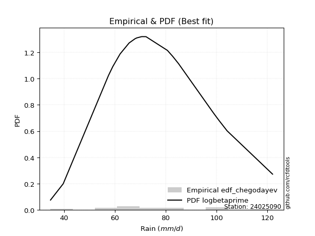</img>

</div>


### 6. EDF Blom (1958)

The Blom formula is a specific "plotting position" formula used in hydrology and statistical analysis to estimate the empirical cumulative probability (or non-exceedance probability) of a data series. It is particularly recommended for data that are approximately normally distributed. The constant _a_ is set to 0.375 (or 3/8).

<div align="center">


$P=(m-a)/(n+1-2a)$


</div>


**6.1. Empirical values**

<div align="center">

|                | 0                    | 1                   | 2                   | 3                   | 4                   | 5                  | 6                   | 7                  | 8                   | 9                   | 10       | 11                 | 12                 | 13                 | 14                 | 15                 | 16                 | 17                 | 18                 | 19                 | 20                 |
|:---------------|:---------------------|:--------------------|:--------------------|:--------------------|:--------------------|:-------------------|:--------------------|:-------------------|:--------------------|:--------------------|:---------|:-------------------|:-------------------|:-------------------|:-------------------|:-------------------|:-------------------|:-------------------|:-------------------|:-------------------|:-------------------|
| date           | 2009                 | 2008                | 2007                | 2016                | 2018                | 2015               | 2012                | 2013               | 2017                | 2011                | 2010     | 2006               | 2023               | 2005               | 2024               | 2014               | 2020               | 2021               | 2022               | 2025               | 2019               |
| x              | 34.7                 | 39.7                | 53.5                | 57.5                | 59.2                | 62.1               | 65.6                | 65.7               | 68.0                | 68.7                | 70.6     | 72.2               | 72.3               | 80.7               | 82.8               | 85.1               | 98.5               | 99.3               | 100.9              | 104.2              | 122.1              |
| m              | 1                    | 2                   | 3                   | 4                   | 5                   | 6                  | 7                   | 8                  | 9                   | 10                  | 11       | 12                 | 13                 | 14                 | 15                 | 16                 | 17                 | 18                 | 19                 | 20                 | 21                 |
| empirical_dist | edf_blom             | edf_blom            | edf_blom            | edf_blom            | edf_blom            | edf_blom           | edf_blom            | edf_blom           | edf_blom            | edf_blom            | edf_blom | edf_blom           | edf_blom           | edf_blom           | edf_blom           | edf_blom           | edf_blom           | edf_blom           | edf_blom           | edf_blom           | edf_blom           |
| empirical      | 0.029411764705882353 | 0.07647058823529412 | 0.12352941176470589 | 0.17058823529411765 | 0.21764705882352942 | 0.2647058823529412 | 0.31176470588235294 | 0.3588235294117647 | 0.40588235294117647 | 0.45294117647058824 | 0.5      | 0.5470588235294118 | 0.5941176470588235 | 0.6411764705882353 | 0.6882352941176471 | 0.7352941176470589 | 0.7823529411764706 | 0.8294117647058824 | 0.8764705882352941 | 0.9235294117647059 | 0.9705882352941176 |
| empirical_tr   | 1.0303030303030303   | 1.0828025477707006  | 1.1409395973154361  | 1.2056737588652484  | 1.2781954887218046  | 1.3599999999999999 | 1.452991452991453   | 1.559633027522936  | 1.683168316831683   | 1.8279569892473115  | 2.0      | 2.207792207792208  | 2.463768115942029  | 2.7868852459016398 | 3.207547169811321  | 3.7777777777777786 | 4.594594594594595  | 5.862068965517243  | 8.095238095238095  | 13.076923076923086 | 33.99999999999999  |

</div>


**6.2. Kolmogorov-Smirnov fit test (sorted by Δ)**


<div align="center">

|                | 0                   | 1                   | 2                   | 3                   | 4                   | 5                   | 6                   | 7                   | 8                   | 9                   | 10                  | 11                  | 12                  | 13                  | 14                  | 15                  | 16                  | 17                  | 18                  | 19                  | 20                  | 21                  | 22                  | 23                  | 24                  | 25                  | 26                  | 27                  | 28                  | 29                  | 30                  | 31                  | 32                  | 33                  | 34                  | 35                  | 36                  | 37                  | 38                  | 39                  | 40                  | 41                  | 42                  | 43                  | 44                  | 45                  | 46                  | 47                  | 48                  | 49                  | 50                  | 51                  | 52                  | 53                  | 54                  | 55                  | 56                  | 57                  | 58                  | 59                  | 60                  | 61                  | 62                  | 63                  | 64                  | 65                  | 66                  | 67                  | 68                  | 69                  | 70                  | 71                  | 72                  | 73                  | 74                  | 75                  | 76                  | 77                  | 78                  | 79                  | 80                  | 81                  | 82                  | 83                  | 84                  | 85                  | 86                  | 87                  | 88                  | 89                  | 90                  | 91                  | 92                  | 93                  | 94                  | 95                  | 96                  | 97                  | 98                  | 99                  | 100                 | 101                 | 102                 | 103                 | 104                 | 105                 | 106                 | 107                 | 108                 | 109                 | 110                 | 111                 | 112                 | 113                 | 114                 | 115                 | 116                 | 117                 | 118                 | 119                 | 120                 | 121                 | 122                 | 123                 | 124                 | 125                 | 126                 | 127                 | 128                 | 129                 | 130                 | 131                 | 132                 | 133                 | 134                 | 135                 | 136                 | 137                 | 138                 | 139                 | 140                 | 141                 | 142                 | 143                 | 144                 | 145                 | 146                 | 147                 | 148                 | 149                 | 150                 | 151                 | 152                 | 153                 | 154                 | 155                 | 156                 | 157                 | 158                 | 159                 |
|:---------------|:--------------------|:--------------------|:--------------------|:--------------------|:--------------------|:--------------------|:--------------------|:--------------------|:--------------------|:--------------------|:--------------------|:--------------------|:--------------------|:--------------------|:--------------------|:--------------------|:--------------------|:--------------------|:--------------------|:--------------------|:--------------------|:--------------------|:--------------------|:--------------------|:--------------------|:--------------------|:--------------------|:--------------------|:--------------------|:--------------------|:--------------------|:--------------------|:--------------------|:--------------------|:--------------------|:--------------------|:--------------------|:--------------------|:--------------------|:--------------------|:--------------------|:--------------------|:--------------------|:--------------------|:--------------------|:--------------------|:--------------------|:--------------------|:--------------------|:--------------------|:--------------------|:--------------------|:--------------------|:--------------------|:--------------------|:--------------------|:--------------------|:--------------------|:--------------------|:--------------------|:--------------------|:--------------------|:--------------------|:--------------------|:--------------------|:--------------------|:--------------------|:--------------------|:--------------------|:--------------------|:--------------------|:--------------------|:--------------------|:--------------------|:--------------------|:--------------------|:--------------------|:--------------------|:--------------------|:--------------------|:--------------------|:--------------------|:--------------------|:--------------------|:--------------------|:--------------------|:--------------------|:--------------------|:--------------------|:--------------------|:--------------------|:--------------------|:--------------------|:--------------------|:--------------------|:--------------------|:--------------------|:--------------------|:--------------------|:--------------------|:--------------------|:--------------------|:--------------------|:--------------------|:--------------------|:--------------------|:--------------------|:--------------------|:--------------------|:--------------------|:--------------------|:--------------------|:--------------------|:--------------------|:--------------------|:--------------------|:--------------------|:--------------------|:--------------------|:--------------------|:--------------------|:--------------------|:--------------------|:--------------------|:--------------------|:--------------------|:--------------------|:--------------------|:--------------------|:--------------------|:--------------------|:--------------------|:--------------------|:--------------------|:--------------------|:--------------------|:--------------------|:--------------------|:--------------------|:--------------------|:--------------------|:--------------------|:--------------------|:--------------------|:--------------------|:--------------------|:--------------------|:--------------------|:--------------------|:--------------------|:--------------------|:--------------------|:--------------------|:--------------------|:--------------------|:--------------------|:--------------------|:--------------------|:--------------------|:--------------------|
| station        | 24025090            | 24025090            | 24025090            | 24025090            | 24025090            | 24025090            | 24025090            | 24025090            | 24025090            | 24025090            | 24025090            | 24025090            | 24025090            | 24025090            | 24025090            | 24025090            | 24025090            | 24025090            | 24025090            | 24025090            | 24025090            | 24025090            | 24025090            | 24025090            | 24025090            | 24025090            | 24025090            | 24025090            | 24025090            | 24025090            | 24025090            | 24025090            | 24025090            | 24025090            | 24025090            | 24025090            | 24025090            | 24025090            | 24025090            | 24025090            | 24025090            | 24025090            | 24025090            | 24025090            | 24025090            | 24025090            | 24025090            | 24025090            | 24025090            | 24025090            | 24025090            | 24025090            | 24025090            | 24025090            | 24025090            | 24025090            | 24025090            | 24025090            | 24025090            | 24025090            | 24025090            | 24025090            | 24025090            | 24025090            | 24025090            | 24025090            | 24025090            | 24025090            | 24025090            | 24025090            | 24025090            | 24025090            | 24025090            | 24025090            | 24025090            | 24025090            | 24025090            | 24025090            | 24025090            | 24025090            | 24025090            | 24025090            | 24025090            | 24025090            | 24025090            | 24025090            | 24025090            | 24025090            | 24025090            | 24025090            | 24025090            | 24025090            | 24025090            | 24025090            | 24025090            | 24025090            | 24025090            | 24025090            | 24025090            | 24025090            | 24025090            | 24025090            | 24025090            | 24025090            | 24025090            | 24025090            | 24025090            | 24025090            | 24025090            | 24025090            | 24025090            | 24025090            | 24025090            | 24025090            | 24025090            | 24025090            | 24025090            | 24025090            | 24025090            | 24025090            | 24025090            | 24025090            | 24025090            | 24025090            | 24025090            | 24025090            | 24025090            | 24025090            | 24025090            | 24025090            | 24025090            | 24025090            | 24025090            | 24025090            | 24025090            | 24025090            | 24025090            | 24025090            | 24025090            | 24025090            | 24025090            | 24025090            | 24025090            | 24025090            | 24025090            | 24025090            | 24025090            | 24025090            | 24025090            | 24025090            | 24025090            | 24025090            | 24025090            | 24025090            | 24025090            | 24025090            | 24025090            | 24025090            | 24025090            | 24025090            |
| empirical_dist | edf_blom            | edf_blom            | edf_blom            | edf_blom            | edf_blom            | edf_blom            | edf_blom            | edf_blom            | edf_blom            | edf_blom            | edf_blom            | edf_blom            | edf_blom            | edf_blom            | edf_blom            | edf_blom            | edf_blom            | edf_blom            | edf_blom            | edf_blom            | edf_blom            | edf_blom            | edf_blom            | edf_blom            | edf_blom            | edf_blom            | edf_blom            | edf_blom            | edf_blom            | edf_blom            | edf_blom            | edf_blom            | edf_blom            | edf_blom            | edf_blom            | edf_blom            | edf_blom            | edf_blom            | edf_blom            | edf_blom            | edf_blom            | edf_blom            | edf_blom            | edf_blom            | edf_blom            | edf_blom            | edf_blom            | edf_blom            | edf_blom            | edf_blom            | edf_blom            | edf_blom            | edf_blom            | edf_blom            | edf_blom            | edf_blom            | edf_blom            | edf_blom            | edf_blom            | edf_blom            | edf_blom            | edf_blom            | edf_blom            | edf_blom            | edf_blom            | edf_blom            | edf_blom            | edf_blom            | edf_blom            | edf_blom            | edf_blom            | edf_blom            | edf_blom            | edf_blom            | edf_blom            | edf_blom            | edf_blom            | edf_blom            | edf_blom            | edf_blom            | edf_blom            | edf_blom            | edf_blom            | edf_blom            | edf_blom            | edf_blom            | edf_blom            | edf_blom            | edf_blom            | edf_blom            | edf_blom            | edf_blom            | edf_blom            | edf_blom            | edf_blom            | edf_blom            | edf_blom            | edf_blom            | edf_blom            | edf_blom            | edf_blom            | edf_blom            | edf_blom            | edf_blom            | edf_blom            | edf_blom            | edf_blom            | edf_blom            | edf_blom            | edf_blom            | edf_blom            | edf_blom            | edf_blom            | edf_blom            | edf_blom            | edf_blom            | edf_blom            | edf_blom            | edf_blom            | edf_blom            | edf_blom            | edf_blom            | edf_blom            | edf_blom            | edf_blom            | edf_blom            | edf_blom            | edf_blom            | edf_blom            | edf_blom            | edf_blom            | edf_blom            | edf_blom            | edf_blom            | edf_blom            | edf_blom            | edf_blom            | edf_blom            | edf_blom            | edf_blom            | edf_blom            | edf_blom            | edf_blom            | edf_blom            | edf_blom            | edf_blom            | edf_blom            | edf_blom            | edf_blom            | edf_blom            | edf_blom            | edf_blom            | edf_blom            | edf_blom            | edf_blom            | edf_blom            | edf_blom            | edf_blom            | edf_blom            | edf_blom            |
| p_dist         | lognakagami         | logbetaprime        | logt                | lognct              | logcrystalball      | logrice             | logexponnorm        | lognorm             | logf                | logfatiguelife      | invweibull          | ncf                 | loginvgamma         | logexponweib        | logerlang           | rayleigh            | loggamma            | loggamma            | logalpha            | loglogistic         | loggengamma         | loggennorm          | loganglit           | logloglaplace       | gumbel_r            | invgauss            | moyal               | maxwell             | loghypsecant        | kstwobign           | triang              | genlogistic         | logncf              | halfnorm            | burr                | loggenlogistic      | mielke              | skewnorm            | logmielke           | logburr             | logdweibull         | logargus            | nakagami            | logsemicircular     | alpha               | logskewnorm         | loglaplace          | loglaplace          | betaprime           | invgamma            | halflogistic        | logpearson3         | gamma               | erlang              | f                   | loginvgauss         | weibull_min         | fatiguelife         | nct                 | beta                | johnsonsu           | logexponpow         | loggompertz         | logvonmises_line    | logweibull_min      | logbeta             | johnsonsb           | logloggamma         | logmaxwell          | logjohnsonsb        | logweibull_max      | loggenextreme       | logjohnsonsu        | pearson3            | rice                | genhalflogistic     | exponnorm           | logburr12           | genextreme          | dweibull            | wald                | lograyleigh         | semicircular        | logcosine           | anglit              | dgamma              | t                   | norm                | crystalball         | truncnorm           | loggausshyper       | loggumbel_r         | kappa3              | arcsine             | kappa4              | logistic            | gennorm             | loginvweibull       | hypsecant           | loggumbel_l         | cosine              | logtriang           | truncweibull_min    | logmoyal            | wrapcauchy          | loghalfnorm         | logarcsine          | laplace             | uniform             | bradford            | gausshyper          | logfoldnorm         | gompertz            | logkstwobign        | loghalflogistic     | truncexpon          | ksone               | loggenexpon         | vonmises_line       | gumbel_l            | logdgamma           | logkappa4           | loggenhalflogistic  | logwald             | logkappa3           | loguniform          | logbradford         | logtukeylambda      | argus               | loghalfgennorm      | logksone            | genpareto           | logrdist            | logtruncweibull_min | genexpon            | logtrapezoid        | logwrapcauchy       | loglomax            | burr12              | tukeylambda         | logtruncexpon       | halfgennorm         | loglevy_l           | logtruncnorm        | loggenpareto        | trapezoid           | levy_l              | powerlaw            | logtruncpareto      | lomax               | logpowerlaw         | rdist               | foldnorm            | gengamma            | exponweib           | weibull_max         | exponpow            | truncpareto         | logvonmises         | vonmises            |
| delta          | 0.0779162496557052  | 0.07815799438196808 | 0.07875581896532607 | 0.07876337039687192 | 0.07883765088521016 | 0.0788378562624249  | 0.07883798216304061 | 0.07883803782748172 | 0.07931823408135302 | 0.08135328137733339 | 0.08378771767698129 | 0.08532466617563805 | 0.08554070610017417 | 0.08559806675168236 | 0.08701472350118411 | 0.08853677625752654 | 0.08906996312250715 | 0.08906996312250715 | 0.09193154637922973 | 0.09289328035679245 | 0.09295859142590557 | 0.09424875139539601 | 0.09428737169357537 | 0.09464589561717962 | 0.09494429709917107 | 0.09670151971094648 | 0.09829609978335785 | 0.10029483175058773 | 0.10116167587126201 | 0.10184192389439423 | 0.10192720201806932 | 0.1021853461998134  | 0.10244611276495685 | 0.1032711038295977  | 0.10388475097392963 | 0.10390673184271887 | 0.10393229527294112 | 0.10466237161708897 | 0.10522992927565955 | 0.10525111267675641 | 0.10564904371774475 | 0.105783826491675   | 0.10606664479137479 | 0.10644573877465596 | 0.1071263626492055  | 0.10802356105463562 | 0.10817914660067118 | 0.10817914660067118 | 0.108445494174706   | 0.10897828697343431 | 0.10924897673346168 | 0.10925265719475552 | 0.10989736927088045 | 0.10989745140746238 | 0.10992480383931569 | 0.11008397660787067 | 0.11026392643967764 | 0.11039711290159143 | 0.11086518694888864 | 0.11125884060166336 | 0.11127906360291062 | 0.11143016440230769 | 0.11154641983899283 | 0.11179348091292551 | 0.11181819971331153 | 0.112150170491359   | 0.11233933370363136 | 0.11252166585688311 | 0.1126031057029469  | 0.11272222329130871 | 0.11279690237500584 | 0.11281951241997573 | 0.1131259789516777  | 0.11533302950420699 | 0.11541464805128532 | 0.11603128789669098 | 0.11775258354896234 | 0.11895982765542479 | 0.11910639589125993 | 0.1197939474164329  | 0.12352941176470589 | 0.124928622965641   | 0.12637005008619728 | 0.12862351488283524 | 0.1287405618108458  | 0.13193675617240286 | 0.13447272045820585 | 0.13448806710829314 | 0.13448806955217446 | 0.1344880703762834  | 0.13637180335322724 | 0.13678978045882267 | 0.13716938223861042 | 0.13804450168177584 | 0.13874611210489585 | 0.1399534332876471  | 0.14085343956999052 | 0.1421974715922591  | 0.14458831214162093 | 0.14549929244853954 | 0.15074923730478001 | 0.15093229682505516 | 0.15110282255520335 | 0.15895153365380976 | 0.15902359466348398 | 0.15984301460828476 | 0.16042077106714842 | 0.16089423310461476 | 0.16391169740207295 | 0.16859313983589086 | 0.17152376793803886 | 0.1716806054004113  | 0.17190720359473965 | 0.173618662233044   | 0.1741817647944045  | 0.1758437475187452  | 0.17753398842374468 | 0.1953633042254478  | 0.20438444894425023 | 0.20490221406329834 | 0.20996679284288022 | 0.2143641057108892  | 0.2177017376843956  | 0.21795825308744465 | 0.2301292728058535  | 0.2308464536726132  | 0.23215510439715797 | 0.2342461047422913  | 0.2364782578810991  | 0.2369551928565034  | 0.24727400551149148 | 0.2510368366884217  | 0.2576899905077521  | 0.2650273757013526  | 0.2667427834684845  | 0.2762326205082221  | 0.320501179742106   | 0.3298914633804329  | 0.3329686267073296  | 0.33380366743713163 | 0.33512274707893347 | 0.3551434979331202  | 0.35674920788305864 | 0.36306724253663364 | 0.36585973732777305 | 0.4173306072809204  | 0.4176258460608072  | 0.4308338017604869  | 0.4398210061746732  | 0.4464709677351745  | 0.5001001307727612  | 0.5181882462652433  | 0.5941176470588235  | 0.6450495906096705  | 0.6941845082968573  | 0.7555430454953678  | 0.8026625073742045  | 0.8461145481003656  | 1.0764320988100335  | 19.41845392279303   |
| deltao         | 0.30282488509099936 | 0.30282488509099936 | 0.30282488509099936 | 0.30282488509099936 | 0.30282488509099936 | 0.30282488509099936 | 0.30282488509099936 | 0.30282488509099936 | 0.30282488509099936 | 0.30282488509099936 | 0.30282488509099936 | 0.30282488509099936 | 0.30282488509099936 | 0.30282488509099936 | 0.30282488509099936 | 0.30282488509099936 | 0.30282488509099936 | 0.30282488509099936 | 0.30282488509099936 | 0.30282488509099936 | 0.30282488509099936 | 0.30282488509099936 | 0.30282488509099936 | 0.30282488509099936 | 0.30282488509099936 | 0.30282488509099936 | 0.30282488509099936 | 0.30282488509099936 | 0.30282488509099936 | 0.30282488509099936 | 0.30282488509099936 | 0.30282488509099936 | 0.30282488509099936 | 0.30282488509099936 | 0.30282488509099936 | 0.30282488509099936 | 0.30282488509099936 | 0.30282488509099936 | 0.30282488509099936 | 0.30282488509099936 | 0.30282488509099936 | 0.30282488509099936 | 0.30282488509099936 | 0.30282488509099936 | 0.30282488509099936 | 0.30282488509099936 | 0.30282488509099936 | 0.30282488509099936 | 0.30282488509099936 | 0.30282488509099936 | 0.30282488509099936 | 0.30282488509099936 | 0.30282488509099936 | 0.30282488509099936 | 0.30282488509099936 | 0.30282488509099936 | 0.30282488509099936 | 0.30282488509099936 | 0.30282488509099936 | 0.30282488509099936 | 0.30282488509099936 | 0.30282488509099936 | 0.30282488509099936 | 0.30282488509099936 | 0.30282488509099936 | 0.30282488509099936 | 0.30282488509099936 | 0.30282488509099936 | 0.30282488509099936 | 0.30282488509099936 | 0.30282488509099936 | 0.30282488509099936 | 0.30282488509099936 | 0.30282488509099936 | 0.30282488509099936 | 0.30282488509099936 | 0.30282488509099936 | 0.30282488509099936 | 0.30282488509099936 | 0.30282488509099936 | 0.30282488509099936 | 0.30282488509099936 | 0.30282488509099936 | 0.30282488509099936 | 0.30282488509099936 | 0.30282488509099936 | 0.30282488509099936 | 0.30282488509099936 | 0.30282488509099936 | 0.30282488509099936 | 0.30282488509099936 | 0.30282488509099936 | 0.30282488509099936 | 0.30282488509099936 | 0.30282488509099936 | 0.30282488509099936 | 0.30282488509099936 | 0.30282488509099936 | 0.30282488509099936 | 0.30282488509099936 | 0.30282488509099936 | 0.30282488509099936 | 0.30282488509099936 | 0.30282488509099936 | 0.30282488509099936 | 0.30282488509099936 | 0.30282488509099936 | 0.30282488509099936 | 0.30282488509099936 | 0.30282488509099936 | 0.30282488509099936 | 0.30282488509099936 | 0.30282488509099936 | 0.30282488509099936 | 0.30282488509099936 | 0.30282488509099936 | 0.30282488509099936 | 0.30282488509099936 | 0.30282488509099936 | 0.30282488509099936 | 0.30282488509099936 | 0.30282488509099936 | 0.30282488509099936 | 0.30282488509099936 | 0.30282488509099936 | 0.30282488509099936 | 0.30282488509099936 | 0.30282488509099936 | 0.30282488509099936 | 0.30282488509099936 | 0.30282488509099936 | 0.30282488509099936 | 0.30282488509099936 | 0.30282488509099936 | 0.30282488509099936 | 0.30282488509099936 | 0.30282488509099936 | 0.30282488509099936 | 0.30282488509099936 | 0.30282488509099936 | 0.30282488509099936 | 0.30282488509099936 | 0.30282488509099936 | 0.30282488509099936 | 0.30282488509099936 | 0.30282488509099936 | 0.30282488509099936 | 0.30282488509099936 | 0.30282488509099936 | 0.30282488509099936 | 0.30282488509099936 | 0.30282488509099936 | 0.30282488509099936 | 0.30282488509099936 | 0.30282488509099936 | 0.30282488509099936 | 0.30282488509099936 | 0.30282488509099936 | 0.30282488509099936 | 0.30282488509099936 |
| eval           | Δo > Δ              | Δo > Δ              | Δo > Δ              | Δo > Δ              | Δo > Δ              | Δo > Δ              | Δo > Δ              | Δo > Δ              | Δo > Δ              | Δo > Δ              | Δo > Δ              | Δo > Δ              | Δo > Δ              | Δo > Δ              | Δo > Δ              | Δo > Δ              | Δo > Δ              | Δo > Δ              | Δo > Δ              | Δo > Δ              | Δo > Δ              | Δo > Δ              | Δo > Δ              | Δo > Δ              | Δo > Δ              | Δo > Δ              | Δo > Δ              | Δo > Δ              | Δo > Δ              | Δo > Δ              | Δo > Δ              | Δo > Δ              | Δo > Δ              | Δo > Δ              | Δo > Δ              | Δo > Δ              | Δo > Δ              | Δo > Δ              | Δo > Δ              | Δo > Δ              | Δo > Δ              | Δo > Δ              | Δo > Δ              | Δo > Δ              | Δo > Δ              | Δo > Δ              | Δo > Δ              | Δo > Δ              | Δo > Δ              | Δo > Δ              | Δo > Δ              | Δo > Δ              | Δo > Δ              | Δo > Δ              | Δo > Δ              | Δo > Δ              | Δo > Δ              | Δo > Δ              | Δo > Δ              | Δo > Δ              | Δo > Δ              | Δo > Δ              | Δo > Δ              | Δo > Δ              | Δo > Δ              | Δo > Δ              | Δo > Δ              | Δo > Δ              | Δo > Δ              | Δo > Δ              | Δo > Δ              | Δo > Δ              | Δo > Δ              | Δo > Δ              | Δo > Δ              | Δo > Δ              | Δo > Δ              | Δo > Δ              | Δo > Δ              | Δo > Δ              | Δo > Δ              | Δo > Δ              | Δo > Δ              | Δo > Δ              | Δo > Δ              | Δo > Δ              | Δo > Δ              | Δo > Δ              | Δo > Δ              | Δo > Δ              | Δo > Δ              | Δo > Δ              | Δo > Δ              | Δo > Δ              | Δo > Δ              | Δo > Δ              | Δo > Δ              | Δo > Δ              | Δo > Δ              | Δo > Δ              | Δo > Δ              | Δo > Δ              | Δo > Δ              | Δo > Δ              | Δo > Δ              | Δo > Δ              | Δo > Δ              | Δo > Δ              | Δo > Δ              | Δo > Δ              | Δo > Δ              | Δo > Δ              | Δo > Δ              | Δo > Δ              | Δo > Δ              | Δo > Δ              | Δo > Δ              | Δo > Δ              | Δo > Δ              | Δo > Δ              | Δo > Δ              | Δo > Δ              | Δo > Δ              | Δo > Δ              | Δo > Δ              | Δo > Δ              | Δo > Δ              | Δo > Δ              | Δo > Δ              | Δo > Δ              | Δo > Δ              | Δo > Δ              | Δo > Δ              | Δo > Δ              | Δo > Δ              | Δo > Δ              | Δo <= Δ             | Δo <= Δ             | Δo <= Δ             | Δo <= Δ             | Δo <= Δ             | Δo <= Δ             | Δo <= Δ             | Δo <= Δ             | Δo <= Δ             | Δo <= Δ             | Δo <= Δ             | Δo <= Δ             | Δo <= Δ             | Δo <= Δ             | Δo <= Δ             | Δo <= Δ             | Δo <= Δ             | Δo <= Δ             | Δo <= Δ             | Δo <= Δ             | Δo <= Δ             | Δo <= Δ             | Δo <= Δ             | Δo <= Δ             |
| fit            | 1                   | 1                   | 1                   | 1                   | 1                   | 1                   | 1                   | 1                   | 1                   | 1                   | 1                   | 1                   | 1                   | 1                   | 1                   | 1                   | 1                   | 1                   | 1                   | 1                   | 1                   | 1                   | 1                   | 1                   | 1                   | 1                   | 1                   | 1                   | 1                   | 1                   | 1                   | 1                   | 1                   | 1                   | 1                   | 1                   | 1                   | 1                   | 1                   | 1                   | 1                   | 1                   | 1                   | 1                   | 1                   | 1                   | 1                   | 1                   | 1                   | 1                   | 1                   | 1                   | 1                   | 1                   | 1                   | 1                   | 1                   | 1                   | 1                   | 1                   | 1                   | 1                   | 1                   | 1                   | 1                   | 1                   | 1                   | 1                   | 1                   | 1                   | 1                   | 1                   | 1                   | 1                   | 1                   | 1                   | 1                   | 1                   | 1                   | 1                   | 1                   | 1                   | 1                   | 1                   | 1                   | 1                   | 1                   | 1                   | 1                   | 1                   | 1                   | 1                   | 1                   | 1                   | 1                   | 1                   | 1                   | 1                   | 1                   | 1                   | 1                   | 1                   | 1                   | 1                   | 1                   | 1                   | 1                   | 1                   | 1                   | 1                   | 1                   | 1                   | 1                   | 1                   | 1                   | 1                   | 1                   | 1                   | 1                   | 1                   | 1                   | 1                   | 1                   | 1                   | 1                   | 1                   | 1                   | 1                   | 1                   | 1                   | 1                   | 1                   | 1                   | 1                   | 1                   | 1                   | 0                   | 0                   | 0                   | 0                   | 0                   | 0                   | 0                   | 0                   | 0                   | 0                   | 0                   | 0                   | 0                   | 0                   | 0                   | 0                   | 0                   | 0                   | 0                   | 0                   | 0                   | 0                   | 0                   | 0                   |
| n              | 21                  | 21                  | 21                  | 21                  | 21                  | 21                  | 21                  | 21                  | 21                  | 21                  | 21                  | 21                  | 21                  | 21                  | 21                  | 21                  | 21                  | 21                  | 21                  | 21                  | 21                  | 21                  | 21                  | 21                  | 21                  | 21                  | 21                  | 21                  | 21                  | 21                  | 21                  | 21                  | 21                  | 21                  | 21                  | 21                  | 21                  | 21                  | 21                  | 21                  | 21                  | 21                  | 21                  | 21                  | 21                  | 21                  | 21                  | 21                  | 21                  | 21                  | 21                  | 21                  | 21                  | 21                  | 21                  | 21                  | 21                  | 21                  | 21                  | 21                  | 21                  | 21                  | 21                  | 21                  | 21                  | 21                  | 21                  | 21                  | 21                  | 21                  | 21                  | 21                  | 21                  | 21                  | 21                  | 21                  | 21                  | 21                  | 21                  | 21                  | 21                  | 21                  | 21                  | 21                  | 21                  | 21                  | 21                  | 21                  | 21                  | 21                  | 21                  | 21                  | 21                  | 21                  | 21                  | 21                  | 21                  | 21                  | 21                  | 21                  | 21                  | 21                  | 21                  | 21                  | 21                  | 21                  | 21                  | 21                  | 21                  | 21                  | 21                  | 21                  | 21                  | 21                  | 21                  | 21                  | 21                  | 21                  | 21                  | 21                  | 21                  | 21                  | 21                  | 21                  | 21                  | 21                  | 21                  | 21                  | 21                  | 21                  | 21                  | 21                  | 21                  | 21                  | 21                  | 21                  | 21                  | 21                  | 21                  | 21                  | 21                  | 21                  | 21                  | 21                  | 21                  | 21                  | 21                  | 21                  | 21                  | 21                  | 21                  | 21                  | 21                  | 21                  | 21                  | 21                  | 21                  | 21                  | 21                  | 21                  |
| best_fit       | 1                   | 0                   | 0                   | 0                   | 0                   | 0                   | 0                   | 0                   | 0                   | 0                   | 0                   | 0                   | 0                   | 0                   | 0                   | 0                   | 0                   | 0                   | 0                   | 0                   | 0                   | 0                   | 0                   | 0                   | 0                   | 0                   | 0                   | 0                   | 0                   | 0                   | 0                   | 0                   | 0                   | 0                   | 0                   | 0                   | 0                   | 0                   | 0                   | 0                   | 0                   | 0                   | 0                   | 0                   | 0                   | 0                   | 0                   | 0                   | 0                   | 0                   | 0                   | 0                   | 0                   | 0                   | 0                   | 0                   | 0                   | 0                   | 0                   | 0                   | 0                   | 0                   | 0                   | 0                   | 0                   | 0                   | 0                   | 0                   | 0                   | 0                   | 0                   | 0                   | 0                   | 0                   | 0                   | 0                   | 0                   | 0                   | 0                   | 0                   | 0                   | 0                   | 0                   | 0                   | 0                   | 0                   | 0                   | 0                   | 0                   | 0                   | 0                   | 0                   | 0                   | 0                   | 0                   | 0                   | 0                   | 0                   | 0                   | 0                   | 0                   | 0                   | 0                   | 0                   | 0                   | 0                   | 0                   | 0                   | 0                   | 0                   | 0                   | 0                   | 0                   | 0                   | 0                   | 0                   | 0                   | 0                   | 0                   | 0                   | 0                   | 0                   | 0                   | 0                   | 0                   | 0                   | 0                   | 0                   | 0                   | 0                   | 0                   | 0                   | 0                   | 0                   | 0                   | 0                   | 0                   | 0                   | 0                   | 0                   | 0                   | 0                   | 0                   | 0                   | 0                   | 0                   | 0                   | 0                   | 0                   | 0                   | 0                   | 0                   | 0                   | 0                   | 0                   | 0                   | 0                   | 0                   | 0                   | 0                   |
| best_fit_sort  | 1                   | 2                   | 3                   | 4                   | 5                   | 6                   | 7                   | 8                   | 9                   | 10                  | 11                  | 12                  | 13                  | 14                  | 15                  | 16                  | 17                  | 18                  | 19                  | 20                  | 21                  | 22                  | 23                  | 24                  | 25                  | 26                  | 27                  | 28                  | 29                  | 30                  | 31                  | 32                  | 33                  | 34                  | 35                  | 36                  | 37                  | 38                  | 39                  | 40                  | 41                  | 42                  | 43                  | 44                  | 45                  | 46                  | 47                  | 48                  | 49                  | 50                  | 51                  | 52                  | 53                  | 54                  | 55                  | 56                  | 57                  | 58                  | 59                  | 60                  | 61                  | 62                  | 63                  | 64                  | 65                  | 66                  | 67                  | 68                  | 69                  | 70                  | 71                  | 72                  | 73                  | 74                  | 75                  | 76                  | 77                  | 78                  | 79                  | 80                  | 81                  | 82                  | 83                  | 84                  | 85                  | 86                  | 87                  | 88                  | 89                  | 90                  | 91                  | 92                  | 93                  | 94                  | 95                  | 96                  | 97                  | 98                  | 99                  | 100                 | 101                 | 102                 | 103                 | 104                 | 105                 | 106                 | 107                 | 108                 | 109                 | 110                 | 111                 | 112                 | 113                 | 114                 | 115                 | 116                 | 117                 | 118                 | 119                 | 120                 | 121                 | 122                 | 123                 | 124                 | 125                 | 126                 | 127                 | 128                 | 129                 | 130                 | 131                 | 132                 | 133                 | 134                 | 135                 | 136                 | 137                 | 138                 | 139                 | 140                 | 141                 | 142                 | 143                 | 144                 | 145                 | 146                 | 147                 | 148                 | 149                 | 150                 | 151                 | 152                 | 153                 | 154                 | 155                 | 156                 | 157                 | 158                 | 159                 | 160                 |

</div>


**6.3. Best fit**

<div align="center">

|   id |   station | empirical_dist   | p_dist      |     delta |   deltao | eval   |   fit |   n |   best_fit |   best_fit_sort |
|-----:|----------:|:-----------------|:------------|----------:|---------:|:-------|------:|----:|-----------:|----------------:|
|    0 |  24025090 | edf_blom         | lognakagami | 0.0779162 | 0.302825 | Δo > Δ |     1 |  21 |          1 |               1 |

</div>


<div align="center">

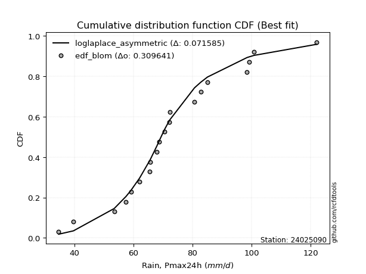</img></img>

</div>


### 7. EDF Tukey (1962)

In hydrology, the Tukey formula is used as a plotting position formula to estimate the empirical probability or frequency of a flood event (or other hydrological data). The formula parameter is given as _c=0.333_ (or 1/3).

<div align="center">


$P=(m-c)/(n+1-2c)$


</div>


**7.1. Empirical values**

<div align="center">

|                | 0                 | 1                  | 2                  | 3                  | 4         | 5                  | 6                  | 7                  | 8                  | 9                  | 10        | 11                | 12                 | 13                | 14        | 15                | 16                | 17                | 18        | 19        | 20        |
|:---------------|:------------------|:-------------------|:-------------------|:-------------------|:----------|:-------------------|:-------------------|:-------------------|:-------------------|:-------------------|:----------|:------------------|:-------------------|:------------------|:----------|:------------------|:------------------|:------------------|:----------|:----------|:----------|
| date           | 2009              | 2008               | 2007               | 2016               | 2018      | 2015               | 2012               | 2013               | 2017               | 2011               | 2010      | 2006              | 2023               | 2005              | 2024      | 2014              | 2020              | 2021              | 2022      | 2025      | 2019      |
| x              | 34.7              | 39.7               | 53.5               | 57.5               | 59.2      | 62.1               | 65.6               | 65.7               | 68.0               | 68.7               | 70.6      | 72.2              | 72.3               | 80.7              | 82.8      | 85.1              | 98.5              | 99.3              | 100.9     | 104.2     | 122.1     |
| m              | 1                 | 2                  | 3                  | 4                  | 5         | 6                  | 7                  | 8                  | 9                  | 10                 | 11        | 12                | 13                 | 14                | 15        | 16                | 17                | 18                | 19        | 20        | 21        |
| empirical_dist | edf_tukey         | edf_tukey          | edf_tukey          | edf_tukey          | edf_tukey | edf_tukey          | edf_tukey          | edf_tukey          | edf_tukey          | edf_tukey          | edf_tukey | edf_tukey         | edf_tukey          | edf_tukey         | edf_tukey | edf_tukey         | edf_tukey         | edf_tukey         | edf_tukey | edf_tukey | edf_tukey |
| empirical      | 0.03125           | 0.078125           | 0.125              | 0.171875           | 0.21875   | 0.265625           | 0.3125             | 0.359375           | 0.40625            | 0.453125           | 0.5       | 0.546875          | 0.59375            | 0.640625          | 0.6875    | 0.734375          | 0.78125           | 0.828125          | 0.875     | 0.921875  | 0.96875   |
| empirical_tr   | 1.032258064516129 | 1.0847457627118644 | 1.1428571428571428 | 1.2075471698113207 | 1.28      | 1.3617021276595744 | 1.4545454545454546 | 1.5609756097560976 | 1.6842105263157894 | 1.8285714285714285 | 2.0       | 2.206896551724138 | 2.4615384615384617 | 2.782608695652174 | 3.2       | 3.764705882352941 | 4.571428571428571 | 5.818181818181818 | 8.0       | 12.8      | 32.0      |

</div>


**7.2. Kolmogorov-Smirnov fit test (sorted by Δ)**


<div align="center">

|                | 0                   | 1                   | 2                   | 3                   | 4                   | 5                   | 6                   | 7                   | 8                   | 9                   | 10                  | 11                  | 12                  | 13                  | 14                  | 15                  | 16                  | 17                  | 18                  | 19                  | 20                  | 21                  | 22                  | 23                  | 24                  | 25                  | 26                  | 27                  | 28                  | 29                  | 30                  | 31                  | 32                  | 33                  | 34                  | 35                  | 36                  | 37                  | 38                  | 39                  | 40                  | 41                  | 42                  | 43                  | 44                  | 45                  | 46                  | 47                  | 48                  | 49                  | 50                  | 51                  | 52                  | 53                  | 54                  | 55                  | 56                  | 57                  | 58                  | 59                  | 60                  | 61                  | 62                  | 63                  | 64                  | 65                  | 66                  | 67                  | 68                  | 69                  | 70                  | 71                  | 72                  | 73                  | 74                  | 75                  | 76                  | 77                  | 78                  | 79                  | 80                  | 81                  | 82                  | 83                  | 84                  | 85                  | 86                  | 87                  | 88                  | 89                  | 90                  | 91                  | 92                  | 93                  | 94                  | 95                  | 96                  | 97                  | 98                  | 99                  | 100                 | 101                 | 102                 | 103                 | 104                 | 105                 | 106                 | 107                 | 108                 | 109                 | 110                 | 111                 | 112                 | 113                 | 114                 | 115                 | 116                 | 117                 | 118                 | 119                 | 120                 | 121                 | 122                 | 123                 | 124                 | 125                 | 126                 | 127                 | 128                 | 129                 | 130                 | 131                 | 132                 | 133                 | 134                 | 135                 | 136                 | 137                 | 138                 | 139                 | 140                 | 141                 | 142                 | 143                 | 144                 | 145                 | 146                 | 147                 | 148                 | 149                 | 150                 | 151                 | 152                 | 153                 | 154                 | 155                 | 156                 | 157                 | 158                 | 159                 |
|:---------------|:--------------------|:--------------------|:--------------------|:--------------------|:--------------------|:--------------------|:--------------------|:--------------------|:--------------------|:--------------------|:--------------------|:--------------------|:--------------------|:--------------------|:--------------------|:--------------------|:--------------------|:--------------------|:--------------------|:--------------------|:--------------------|:--------------------|:--------------------|:--------------------|:--------------------|:--------------------|:--------------------|:--------------------|:--------------------|:--------------------|:--------------------|:--------------------|:--------------------|:--------------------|:--------------------|:--------------------|:--------------------|:--------------------|:--------------------|:--------------------|:--------------------|:--------------------|:--------------------|:--------------------|:--------------------|:--------------------|:--------------------|:--------------------|:--------------------|:--------------------|:--------------------|:--------------------|:--------------------|:--------------------|:--------------------|:--------------------|:--------------------|:--------------------|:--------------------|:--------------------|:--------------------|:--------------------|:--------------------|:--------------------|:--------------------|:--------------------|:--------------------|:--------------------|:--------------------|:--------------------|:--------------------|:--------------------|:--------------------|:--------------------|:--------------------|:--------------------|:--------------------|:--------------------|:--------------------|:--------------------|:--------------------|:--------------------|:--------------------|:--------------------|:--------------------|:--------------------|:--------------------|:--------------------|:--------------------|:--------------------|:--------------------|:--------------------|:--------------------|:--------------------|:--------------------|:--------------------|:--------------------|:--------------------|:--------------------|:--------------------|:--------------------|:--------------------|:--------------------|:--------------------|:--------------------|:--------------------|:--------------------|:--------------------|:--------------------|:--------------------|:--------------------|:--------------------|:--------------------|:--------------------|:--------------------|:--------------------|:--------------------|:--------------------|:--------------------|:--------------------|:--------------------|:--------------------|:--------------------|:--------------------|:--------------------|:--------------------|:--------------------|:--------------------|:--------------------|:--------------------|:--------------------|:--------------------|:--------------------|:--------------------|:--------------------|:--------------------|:--------------------|:--------------------|:--------------------|:--------------------|:--------------------|:--------------------|:--------------------|:--------------------|:--------------------|:--------------------|:--------------------|:--------------------|:--------------------|:--------------------|:--------------------|:--------------------|:--------------------|:--------------------|:--------------------|:--------------------|:--------------------|:--------------------|:--------------------|:--------------------|
| station        | 24025090            | 24025090            | 24025090            | 24025090            | 24025090            | 24025090            | 24025090            | 24025090            | 24025090            | 24025090            | 24025090            | 24025090            | 24025090            | 24025090            | 24025090            | 24025090            | 24025090            | 24025090            | 24025090            | 24025090            | 24025090            | 24025090            | 24025090            | 24025090            | 24025090            | 24025090            | 24025090            | 24025090            | 24025090            | 24025090            | 24025090            | 24025090            | 24025090            | 24025090            | 24025090            | 24025090            | 24025090            | 24025090            | 24025090            | 24025090            | 24025090            | 24025090            | 24025090            | 24025090            | 24025090            | 24025090            | 24025090            | 24025090            | 24025090            | 24025090            | 24025090            | 24025090            | 24025090            | 24025090            | 24025090            | 24025090            | 24025090            | 24025090            | 24025090            | 24025090            | 24025090            | 24025090            | 24025090            | 24025090            | 24025090            | 24025090            | 24025090            | 24025090            | 24025090            | 24025090            | 24025090            | 24025090            | 24025090            | 24025090            | 24025090            | 24025090            | 24025090            | 24025090            | 24025090            | 24025090            | 24025090            | 24025090            | 24025090            | 24025090            | 24025090            | 24025090            | 24025090            | 24025090            | 24025090            | 24025090            | 24025090            | 24025090            | 24025090            | 24025090            | 24025090            | 24025090            | 24025090            | 24025090            | 24025090            | 24025090            | 24025090            | 24025090            | 24025090            | 24025090            | 24025090            | 24025090            | 24025090            | 24025090            | 24025090            | 24025090            | 24025090            | 24025090            | 24025090            | 24025090            | 24025090            | 24025090            | 24025090            | 24025090            | 24025090            | 24025090            | 24025090            | 24025090            | 24025090            | 24025090            | 24025090            | 24025090            | 24025090            | 24025090            | 24025090            | 24025090            | 24025090            | 24025090            | 24025090            | 24025090            | 24025090            | 24025090            | 24025090            | 24025090            | 24025090            | 24025090            | 24025090            | 24025090            | 24025090            | 24025090            | 24025090            | 24025090            | 24025090            | 24025090            | 24025090            | 24025090            | 24025090            | 24025090            | 24025090            | 24025090            | 24025090            | 24025090            | 24025090            | 24025090            | 24025090            | 24025090            |
| empirical_dist | edf_tukey           | edf_tukey           | edf_tukey           | edf_tukey           | edf_tukey           | edf_tukey           | edf_tukey           | edf_tukey           | edf_tukey           | edf_tukey           | edf_tukey           | edf_tukey           | edf_tukey           | edf_tukey           | edf_tukey           | edf_tukey           | edf_tukey           | edf_tukey           | edf_tukey           | edf_tukey           | edf_tukey           | edf_tukey           | edf_tukey           | edf_tukey           | edf_tukey           | edf_tukey           | edf_tukey           | edf_tukey           | edf_tukey           | edf_tukey           | edf_tukey           | edf_tukey           | edf_tukey           | edf_tukey           | edf_tukey           | edf_tukey           | edf_tukey           | edf_tukey           | edf_tukey           | edf_tukey           | edf_tukey           | edf_tukey           | edf_tukey           | edf_tukey           | edf_tukey           | edf_tukey           | edf_tukey           | edf_tukey           | edf_tukey           | edf_tukey           | edf_tukey           | edf_tukey           | edf_tukey           | edf_tukey           | edf_tukey           | edf_tukey           | edf_tukey           | edf_tukey           | edf_tukey           | edf_tukey           | edf_tukey           | edf_tukey           | edf_tukey           | edf_tukey           | edf_tukey           | edf_tukey           | edf_tukey           | edf_tukey           | edf_tukey           | edf_tukey           | edf_tukey           | edf_tukey           | edf_tukey           | edf_tukey           | edf_tukey           | edf_tukey           | edf_tukey           | edf_tukey           | edf_tukey           | edf_tukey           | edf_tukey           | edf_tukey           | edf_tukey           | edf_tukey           | edf_tukey           | edf_tukey           | edf_tukey           | edf_tukey           | edf_tukey           | edf_tukey           | edf_tukey           | edf_tukey           | edf_tukey           | edf_tukey           | edf_tukey           | edf_tukey           | edf_tukey           | edf_tukey           | edf_tukey           | edf_tukey           | edf_tukey           | edf_tukey           | edf_tukey           | edf_tukey           | edf_tukey           | edf_tukey           | edf_tukey           | edf_tukey           | edf_tukey           | edf_tukey           | edf_tukey           | edf_tukey           | edf_tukey           | edf_tukey           | edf_tukey           | edf_tukey           | edf_tukey           | edf_tukey           | edf_tukey           | edf_tukey           | edf_tukey           | edf_tukey           | edf_tukey           | edf_tukey           | edf_tukey           | edf_tukey           | edf_tukey           | edf_tukey           | edf_tukey           | edf_tukey           | edf_tukey           | edf_tukey           | edf_tukey           | edf_tukey           | edf_tukey           | edf_tukey           | edf_tukey           | edf_tukey           | edf_tukey           | edf_tukey           | edf_tukey           | edf_tukey           | edf_tukey           | edf_tukey           | edf_tukey           | edf_tukey           | edf_tukey           | edf_tukey           | edf_tukey           | edf_tukey           | edf_tukey           | edf_tukey           | edf_tukey           | edf_tukey           | edf_tukey           | edf_tukey           | edf_tukey           | edf_tukey           | edf_tukey           | edf_tukey           |
| p_dist         | lognakagami         | logbetaprime        | logt                | lognct              | logcrystalball      | logrice             | logexponnorm        | lognorm             | logf                | logfatiguelife      | invweibull          | loginvgamma         | logexponweib        | logerlang           | ncf                 | rayleigh            | loggamma            | loggamma            | logalpha            | loggengamma         | loganglit           | loglogistic         | loggennorm          | logloglaplace       | gumbel_r            | invgauss            | moyal               | maxwell             | kstwobign           | triang              | logncf              | genlogistic         | loghypsecant        | halfnorm            | burr                | loggenlogistic      | mielke              | skewnorm            | logargus            | logmielke           | logburr             | logsemicircular     | nakagami            | logdweibull         | alpha               | logskewnorm         | betaprime           | halflogistic        | invgamma            | logpearson3         | loglaplace          | loglaplace          | loginvgauss         | gamma               | erlang              | f                   | weibull_min         | fatiguelife         | nct                 | beta                | johnsonsu           | logvonmises_line    | logexponpow         | loggompertz         | logweibull_min      | logbeta             | logmaxwell          | johnsonsb           | logloggamma         | logjohnsonsb        | logweibull_max      | loggenextreme       | logjohnsonsu        | genhalflogistic     | pearson3            | rice                | exponnorm           | logburr12           | genextreme          | dweibull            | lograyleigh         | wald                | semicircular        | logcosine           | anglit              | dgamma              | t                   | norm                | crystalball         | truncnorm           | loggausshyper       | kappa3              | loggumbel_r         | arcsine             | kappa4              | logistic            | gennorm             | loginvweibull       | hypsecant           | loggumbel_l         | cosine              | logtriang           | truncweibull_min    | logmoyal            | wrapcauchy          | loghalfnorm         | logarcsine          | laplace             | uniform             | bradford            | logfoldnorm         | gausshyper          | gompertz            | logkstwobign        | loghalflogistic     | truncexpon          | ksone               | loggenexpon         | vonmises_line       | gumbel_l            | logdgamma           | logkappa4           | loggenhalflogistic  | logwald             | logkappa3           | loguniform          | logbradford         | logtukeylambda      | loghalfgennorm      | argus               | logksone            | genpareto           | logrdist            | logtruncweibull_min | genexpon            | logtrapezoid        | logwrapcauchy       | loglomax            | burr12              | tukeylambda         | logtruncexpon       | halfgennorm         | loglevy_l           | logtruncnorm        | loggenpareto        | levy_l              | trapezoid           | powerlaw            | logtruncpareto      | lomax               | logpowerlaw         | rdist               | foldnorm            | gengamma            | exponweib           | weibull_max         | exponpow            | truncpareto         | logvonmises         | vonmises            |
| delta          | 0.07718095553805815 | 0.07742270026432102 | 0.07802052484767902 | 0.07802807627922487 | 0.07810235676756311 | 0.07810256214477784 | 0.07810268804539355 | 0.07810274370983467 | 0.07858293996370597 | 0.08061798725968633 | 0.08305242355933423 | 0.08480541198252711 | 0.0848627726340353  | 0.08627942938353705 | 0.08642760735210864 | 0.08816912919870301 | 0.08833466900486009 | 0.08833466900486009 | 0.09119625226158268 | 0.09259094436708204 | 0.09311769320360758 | 0.09399622153326304 | 0.0953516925718666  | 0.0957488367936502  | 0.09604723827564166 | 0.09633387265212295 | 0.09939904095982843 | 0.0999271846917642  | 0.10110662977674717 | 0.10155955495924579 | 0.1017108186473098  | 0.10181769914098987 | 0.1022646170477326  | 0.10253580971195064 | 0.1035171039151061  | 0.10353908478389534 | 0.1035646482141176  | 0.10429472455826544 | 0.10449706178579266 | 0.10486228221683602 | 0.10488346561793288 | 0.10515897406877361 | 0.10569899773255126 | 0.10675198489421533 | 0.10675871559038197 | 0.10765591399581209 | 0.10807784711588247 | 0.10851368261581462 | 0.10861063991461078 | 0.10888501013593199 | 0.10928208777714177 | 0.10928208777714177 | 0.10934868249022361 | 0.10952972221205692 | 0.10952980434863885 | 0.10955715678049216 | 0.10989627938085411 | 0.1100294658427679  | 0.11049753989006511 | 0.11089119354283983 | 0.1109114165440871  | 0.11105818679527846 | 0.11106251734348416 | 0.1111787727801693  | 0.111450552654488   | 0.11178252343253547 | 0.11186781158529985 | 0.11197168664480783 | 0.11215401879805958 | 0.11235457623248518 | 0.11242925531618231 | 0.1124518653611522  | 0.11275833189285417 | 0.11474452319080863 | 0.11496538244538346 | 0.11504700099246179 | 0.11738493649013881 | 0.11859218059660126 | 0.1187387488324364  | 0.12089688859290348 | 0.12419332884799394 | 0.125               | 0.12600240302737375 | 0.1278882207651882  | 0.12837291475202228 | 0.13303969734887344 | 0.13410507339938232 | 0.1341204200494696  | 0.13412042249335093 | 0.13412042331745988 | 0.1350850386473449  | 0.13588261753272807 | 0.13605448634117562 | 0.1367577369758935  | 0.13837846504607232 | 0.13958578622882356 | 0.140485792511167   | 0.14146217747461204 | 0.1442206650827974  | 0.145131645389716   | 0.1503815902459565  | 0.15056464976623163 | 0.15073517549637983 | 0.1582162395361627  | 0.15865594760466045 | 0.1591077204906377  | 0.15913400636126607 | 0.16052658604579123 | 0.16354405034324943 | 0.1673063751300085  | 0.17094531128276425 | 0.17115612087921533 | 0.17153955653591613 | 0.17233189752716166 | 0.17344647067675745 | 0.17455698281286286 | 0.17587957665903875 | 0.19407653951956544 | 0.2040168018854267  | 0.2045345670044748  | 0.21051826343111557 | 0.21307734100500686 | 0.21678262003733673 | 0.2172229589697976  | 0.22884250809997114 | 0.22955968896673085 | 0.23086833969127563 | 0.23295934003640895 | 0.23566842815062106 | 0.23611061082227558 | 0.24598724080560913 | 0.24956624845312758 | 0.256219402272458   | 0.26374061099547025 | 0.26545601876260216 | 0.27531350286116324 | 0.3190305915068119  | 0.32860469867455055 | 0.3316818620014472  | 0.3330683733194846  | 0.3338359823730511  | 0.3536729096978261  | 0.354910972588941   | 0.3617804778307513  | 0.3640215020336554  | 0.4157876107666896  | 0.41641148963386154 | 0.4293632135251928  | 0.43853424146879083 | 0.44481655597046854 | 0.49862954253746705 | 0.5167176580299492  | 0.59375             | 0.6435790023743764  | 0.6927139200615632  | 0.7538886337306618  | 0.8011919191389104  | 0.8444601363356596  | 1.077535039986504   | 19.420292158087147  |
| deltao         | 0.30282488509099936 | 0.30282488509099936 | 0.30282488509099936 | 0.30282488509099936 | 0.30282488509099936 | 0.30282488509099936 | 0.30282488509099936 | 0.30282488509099936 | 0.30282488509099936 | 0.30282488509099936 | 0.30282488509099936 | 0.30282488509099936 | 0.30282488509099936 | 0.30282488509099936 | 0.30282488509099936 | 0.30282488509099936 | 0.30282488509099936 | 0.30282488509099936 | 0.30282488509099936 | 0.30282488509099936 | 0.30282488509099936 | 0.30282488509099936 | 0.30282488509099936 | 0.30282488509099936 | 0.30282488509099936 | 0.30282488509099936 | 0.30282488509099936 | 0.30282488509099936 | 0.30282488509099936 | 0.30282488509099936 | 0.30282488509099936 | 0.30282488509099936 | 0.30282488509099936 | 0.30282488509099936 | 0.30282488509099936 | 0.30282488509099936 | 0.30282488509099936 | 0.30282488509099936 | 0.30282488509099936 | 0.30282488509099936 | 0.30282488509099936 | 0.30282488509099936 | 0.30282488509099936 | 0.30282488509099936 | 0.30282488509099936 | 0.30282488509099936 | 0.30282488509099936 | 0.30282488509099936 | 0.30282488509099936 | 0.30282488509099936 | 0.30282488509099936 | 0.30282488509099936 | 0.30282488509099936 | 0.30282488509099936 | 0.30282488509099936 | 0.30282488509099936 | 0.30282488509099936 | 0.30282488509099936 | 0.30282488509099936 | 0.30282488509099936 | 0.30282488509099936 | 0.30282488509099936 | 0.30282488509099936 | 0.30282488509099936 | 0.30282488509099936 | 0.30282488509099936 | 0.30282488509099936 | 0.30282488509099936 | 0.30282488509099936 | 0.30282488509099936 | 0.30282488509099936 | 0.30282488509099936 | 0.30282488509099936 | 0.30282488509099936 | 0.30282488509099936 | 0.30282488509099936 | 0.30282488509099936 | 0.30282488509099936 | 0.30282488509099936 | 0.30282488509099936 | 0.30282488509099936 | 0.30282488509099936 | 0.30282488509099936 | 0.30282488509099936 | 0.30282488509099936 | 0.30282488509099936 | 0.30282488509099936 | 0.30282488509099936 | 0.30282488509099936 | 0.30282488509099936 | 0.30282488509099936 | 0.30282488509099936 | 0.30282488509099936 | 0.30282488509099936 | 0.30282488509099936 | 0.30282488509099936 | 0.30282488509099936 | 0.30282488509099936 | 0.30282488509099936 | 0.30282488509099936 | 0.30282488509099936 | 0.30282488509099936 | 0.30282488509099936 | 0.30282488509099936 | 0.30282488509099936 | 0.30282488509099936 | 0.30282488509099936 | 0.30282488509099936 | 0.30282488509099936 | 0.30282488509099936 | 0.30282488509099936 | 0.30282488509099936 | 0.30282488509099936 | 0.30282488509099936 | 0.30282488509099936 | 0.30282488509099936 | 0.30282488509099936 | 0.30282488509099936 | 0.30282488509099936 | 0.30282488509099936 | 0.30282488509099936 | 0.30282488509099936 | 0.30282488509099936 | 0.30282488509099936 | 0.30282488509099936 | 0.30282488509099936 | 0.30282488509099936 | 0.30282488509099936 | 0.30282488509099936 | 0.30282488509099936 | 0.30282488509099936 | 0.30282488509099936 | 0.30282488509099936 | 0.30282488509099936 | 0.30282488509099936 | 0.30282488509099936 | 0.30282488509099936 | 0.30282488509099936 | 0.30282488509099936 | 0.30282488509099936 | 0.30282488509099936 | 0.30282488509099936 | 0.30282488509099936 | 0.30282488509099936 | 0.30282488509099936 | 0.30282488509099936 | 0.30282488509099936 | 0.30282488509099936 | 0.30282488509099936 | 0.30282488509099936 | 0.30282488509099936 | 0.30282488509099936 | 0.30282488509099936 | 0.30282488509099936 | 0.30282488509099936 | 0.30282488509099936 | 0.30282488509099936 | 0.30282488509099936 | 0.30282488509099936 | 0.30282488509099936 |
| eval           | Δo > Δ              | Δo > Δ              | Δo > Δ              | Δo > Δ              | Δo > Δ              | Δo > Δ              | Δo > Δ              | Δo > Δ              | Δo > Δ              | Δo > Δ              | Δo > Δ              | Δo > Δ              | Δo > Δ              | Δo > Δ              | Δo > Δ              | Δo > Δ              | Δo > Δ              | Δo > Δ              | Δo > Δ              | Δo > Δ              | Δo > Δ              | Δo > Δ              | Δo > Δ              | Δo > Δ              | Δo > Δ              | Δo > Δ              | Δo > Δ              | Δo > Δ              | Δo > Δ              | Δo > Δ              | Δo > Δ              | Δo > Δ              | Δo > Δ              | Δo > Δ              | Δo > Δ              | Δo > Δ              | Δo > Δ              | Δo > Δ              | Δo > Δ              | Δo > Δ              | Δo > Δ              | Δo > Δ              | Δo > Δ              | Δo > Δ              | Δo > Δ              | Δo > Δ              | Δo > Δ              | Δo > Δ              | Δo > Δ              | Δo > Δ              | Δo > Δ              | Δo > Δ              | Δo > Δ              | Δo > Δ              | Δo > Δ              | Δo > Δ              | Δo > Δ              | Δo > Δ              | Δo > Δ              | Δo > Δ              | Δo > Δ              | Δo > Δ              | Δo > Δ              | Δo > Δ              | Δo > Δ              | Δo > Δ              | Δo > Δ              | Δo > Δ              | Δo > Δ              | Δo > Δ              | Δo > Δ              | Δo > Δ              | Δo > Δ              | Δo > Δ              | Δo > Δ              | Δo > Δ              | Δo > Δ              | Δo > Δ              | Δo > Δ              | Δo > Δ              | Δo > Δ              | Δo > Δ              | Δo > Δ              | Δo > Δ              | Δo > Δ              | Δo > Δ              | Δo > Δ              | Δo > Δ              | Δo > Δ              | Δo > Δ              | Δo > Δ              | Δo > Δ              | Δo > Δ              | Δo > Δ              | Δo > Δ              | Δo > Δ              | Δo > Δ              | Δo > Δ              | Δo > Δ              | Δo > Δ              | Δo > Δ              | Δo > Δ              | Δo > Δ              | Δo > Δ              | Δo > Δ              | Δo > Δ              | Δo > Δ              | Δo > Δ              | Δo > Δ              | Δo > Δ              | Δo > Δ              | Δo > Δ              | Δo > Δ              | Δo > Δ              | Δo > Δ              | Δo > Δ              | Δo > Δ              | Δo > Δ              | Δo > Δ              | Δo > Δ              | Δo > Δ              | Δo > Δ              | Δo > Δ              | Δo > Δ              | Δo > Δ              | Δo > Δ              | Δo > Δ              | Δo > Δ              | Δo > Δ              | Δo > Δ              | Δo > Δ              | Δo > Δ              | Δo > Δ              | Δo > Δ              | Δo > Δ              | Δo > Δ              | Δo <= Δ             | Δo <= Δ             | Δo <= Δ             | Δo <= Δ             | Δo <= Δ             | Δo <= Δ             | Δo <= Δ             | Δo <= Δ             | Δo <= Δ             | Δo <= Δ             | Δo <= Δ             | Δo <= Δ             | Δo <= Δ             | Δo <= Δ             | Δo <= Δ             | Δo <= Δ             | Δo <= Δ             | Δo <= Δ             | Δo <= Δ             | Δo <= Δ             | Δo <= Δ             | Δo <= Δ             | Δo <= Δ             | Δo <= Δ             |
| fit            | 1                   | 1                   | 1                   | 1                   | 1                   | 1                   | 1                   | 1                   | 1                   | 1                   | 1                   | 1                   | 1                   | 1                   | 1                   | 1                   | 1                   | 1                   | 1                   | 1                   | 1                   | 1                   | 1                   | 1                   | 1                   | 1                   | 1                   | 1                   | 1                   | 1                   | 1                   | 1                   | 1                   | 1                   | 1                   | 1                   | 1                   | 1                   | 1                   | 1                   | 1                   | 1                   | 1                   | 1                   | 1                   | 1                   | 1                   | 1                   | 1                   | 1                   | 1                   | 1                   | 1                   | 1                   | 1                   | 1                   | 1                   | 1                   | 1                   | 1                   | 1                   | 1                   | 1                   | 1                   | 1                   | 1                   | 1                   | 1                   | 1                   | 1                   | 1                   | 1                   | 1                   | 1                   | 1                   | 1                   | 1                   | 1                   | 1                   | 1                   | 1                   | 1                   | 1                   | 1                   | 1                   | 1                   | 1                   | 1                   | 1                   | 1                   | 1                   | 1                   | 1                   | 1                   | 1                   | 1                   | 1                   | 1                   | 1                   | 1                   | 1                   | 1                   | 1                   | 1                   | 1                   | 1                   | 1                   | 1                   | 1                   | 1                   | 1                   | 1                   | 1                   | 1                   | 1                   | 1                   | 1                   | 1                   | 1                   | 1                   | 1                   | 1                   | 1                   | 1                   | 1                   | 1                   | 1                   | 1                   | 1                   | 1                   | 1                   | 1                   | 1                   | 1                   | 1                   | 1                   | 0                   | 0                   | 0                   | 0                   | 0                   | 0                   | 0                   | 0                   | 0                   | 0                   | 0                   | 0                   | 0                   | 0                   | 0                   | 0                   | 0                   | 0                   | 0                   | 0                   | 0                   | 0                   | 0                   | 0                   |
| n              | 21                  | 21                  | 21                  | 21                  | 21                  | 21                  | 21                  | 21                  | 21                  | 21                  | 21                  | 21                  | 21                  | 21                  | 21                  | 21                  | 21                  | 21                  | 21                  | 21                  | 21                  | 21                  | 21                  | 21                  | 21                  | 21                  | 21                  | 21                  | 21                  | 21                  | 21                  | 21                  | 21                  | 21                  | 21                  | 21                  | 21                  | 21                  | 21                  | 21                  | 21                  | 21                  | 21                  | 21                  | 21                  | 21                  | 21                  | 21                  | 21                  | 21                  | 21                  | 21                  | 21                  | 21                  | 21                  | 21                  | 21                  | 21                  | 21                  | 21                  | 21                  | 21                  | 21                  | 21                  | 21                  | 21                  | 21                  | 21                  | 21                  | 21                  | 21                  | 21                  | 21                  | 21                  | 21                  | 21                  | 21                  | 21                  | 21                  | 21                  | 21                  | 21                  | 21                  | 21                  | 21                  | 21                  | 21                  | 21                  | 21                  | 21                  | 21                  | 21                  | 21                  | 21                  | 21                  | 21                  | 21                  | 21                  | 21                  | 21                  | 21                  | 21                  | 21                  | 21                  | 21                  | 21                  | 21                  | 21                  | 21                  | 21                  | 21                  | 21                  | 21                  | 21                  | 21                  | 21                  | 21                  | 21                  | 21                  | 21                  | 21                  | 21                  | 21                  | 21                  | 21                  | 21                  | 21                  | 21                  | 21                  | 21                  | 21                  | 21                  | 21                  | 21                  | 21                  | 21                  | 21                  | 21                  | 21                  | 21                  | 21                  | 21                  | 21                  | 21                  | 21                  | 21                  | 21                  | 21                  | 21                  | 21                  | 21                  | 21                  | 21                  | 21                  | 21                  | 21                  | 21                  | 21                  | 21                  | 21                  |
| best_fit       | 1                   | 0                   | 0                   | 0                   | 0                   | 0                   | 0                   | 0                   | 0                   | 0                   | 0                   | 0                   | 0                   | 0                   | 0                   | 0                   | 0                   | 0                   | 0                   | 0                   | 0                   | 0                   | 0                   | 0                   | 0                   | 0                   | 0                   | 0                   | 0                   | 0                   | 0                   | 0                   | 0                   | 0                   | 0                   | 0                   | 0                   | 0                   | 0                   | 0                   | 0                   | 0                   | 0                   | 0                   | 0                   | 0                   | 0                   | 0                   | 0                   | 0                   | 0                   | 0                   | 0                   | 0                   | 0                   | 0                   | 0                   | 0                   | 0                   | 0                   | 0                   | 0                   | 0                   | 0                   | 0                   | 0                   | 0                   | 0                   | 0                   | 0                   | 0                   | 0                   | 0                   | 0                   | 0                   | 0                   | 0                   | 0                   | 0                   | 0                   | 0                   | 0                   | 0                   | 0                   | 0                   | 0                   | 0                   | 0                   | 0                   | 0                   | 0                   | 0                   | 0                   | 0                   | 0                   | 0                   | 0                   | 0                   | 0                   | 0                   | 0                   | 0                   | 0                   | 0                   | 0                   | 0                   | 0                   | 0                   | 0                   | 0                   | 0                   | 0                   | 0                   | 0                   | 0                   | 0                   | 0                   | 0                   | 0                   | 0                   | 0                   | 0                   | 0                   | 0                   | 0                   | 0                   | 0                   | 0                   | 0                   | 0                   | 0                   | 0                   | 0                   | 0                   | 0                   | 0                   | 0                   | 0                   | 0                   | 0                   | 0                   | 0                   | 0                   | 0                   | 0                   | 0                   | 0                   | 0                   | 0                   | 0                   | 0                   | 0                   | 0                   | 0                   | 0                   | 0                   | 0                   | 0                   | 0                   | 0                   |
| best_fit_sort  | 1                   | 2                   | 3                   | 4                   | 5                   | 6                   | 7                   | 8                   | 9                   | 10                  | 11                  | 12                  | 13                  | 14                  | 15                  | 16                  | 17                  | 18                  | 19                  | 20                  | 21                  | 22                  | 23                  | 24                  | 25                  | 26                  | 27                  | 28                  | 29                  | 30                  | 31                  | 32                  | 33                  | 34                  | 35                  | 36                  | 37                  | 38                  | 39                  | 40                  | 41                  | 42                  | 43                  | 44                  | 45                  | 46                  | 47                  | 48                  | 49                  | 50                  | 51                  | 52                  | 53                  | 54                  | 55                  | 56                  | 57                  | 58                  | 59                  | 60                  | 61                  | 62                  | 63                  | 64                  | 65                  | 66                  | 67                  | 68                  | 69                  | 70                  | 71                  | 72                  | 73                  | 74                  | 75                  | 76                  | 77                  | 78                  | 79                  | 80                  | 81                  | 82                  | 83                  | 84                  | 85                  | 86                  | 87                  | 88                  | 89                  | 90                  | 91                  | 92                  | 93                  | 94                  | 95                  | 96                  | 97                  | 98                  | 99                  | 100                 | 101                 | 102                 | 103                 | 104                 | 105                 | 106                 | 107                 | 108                 | 109                 | 110                 | 111                 | 112                 | 113                 | 114                 | 115                 | 116                 | 117                 | 118                 | 119                 | 120                 | 121                 | 122                 | 123                 | 124                 | 125                 | 126                 | 127                 | 128                 | 129                 | 130                 | 131                 | 132                 | 133                 | 134                 | 135                 | 136                 | 137                 | 138                 | 139                 | 140                 | 141                 | 142                 | 143                 | 144                 | 145                 | 146                 | 147                 | 148                 | 149                 | 150                 | 151                 | 152                 | 153                 | 154                 | 155                 | 156                 | 157                 | 158                 | 159                 | 160                 |

</div>


**7.3. Best fit**

<div align="center">

|   id |   station | empirical_dist   | p_dist      |    delta |   deltao | eval   |   fit |   n |   best_fit |   best_fit_sort |
|-----:|----------:|:-----------------|:------------|---------:|---------:|:-------|------:|----:|-----------:|----------------:|
|    0 |  24025090 | edf_tukey        | lognakagami | 0.077181 | 0.302825 | Δo > Δ |     1 |  21 |          1 |               1 |

</div>


<div align="center">

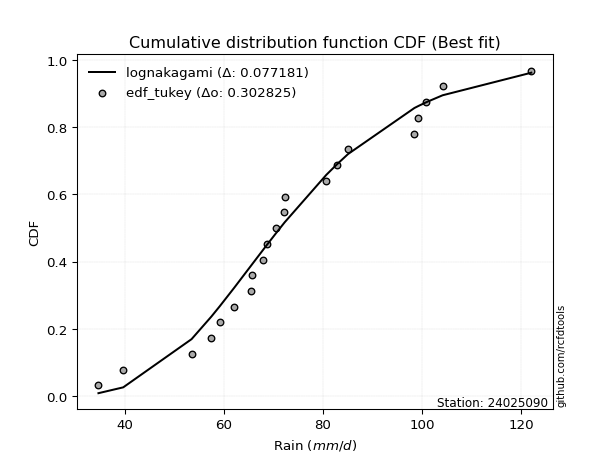</img>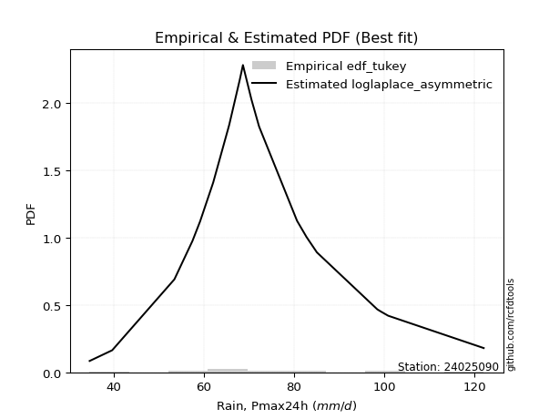</img>

</div>


### 8. EDF Gringorten (1963)

Gringorten plotting position formula is essential for estimating the probability and return periods of extreme events like floods and heavy rainfall. The constant _a=0.44_.

<div align="center">


$P=(m-a)/(n+1-2a)$


</div>


**8.1. Empirical values**

<div align="center">

|                | 0                    | 1                   | 2                   | 3                   | 4                   | 5                   | 6                   | 7                  | 8                   | 9                   | 10             | 11                 | 12                 | 13                 | 14                 | 15                 | 16                | 17                 | 18                 | 19                 | 20                 |
|:---------------|:---------------------|:--------------------|:--------------------|:--------------------|:--------------------|:--------------------|:--------------------|:-------------------|:--------------------|:--------------------|:---------------|:-------------------|:-------------------|:-------------------|:-------------------|:-------------------|:------------------|:-------------------|:-------------------|:-------------------|:-------------------|
| date           | 2009                 | 2008                | 2007                | 2016                | 2018                | 2015                | 2012                | 2013               | 2017                | 2011                | 2010           | 2006               | 2023               | 2005               | 2024               | 2014               | 2020              | 2021               | 2022               | 2025               | 2019               |
| x              | 34.7                 | 39.7                | 53.5                | 57.5                | 59.2                | 62.1                | 65.6                | 65.7               | 68.0                | 68.7                | 70.6           | 72.2               | 72.3               | 80.7               | 82.8               | 85.1               | 98.5              | 99.3               | 100.9              | 104.2              | 122.1              |
| m              | 1                    | 2                   | 3                   | 4                   | 5                   | 6                   | 7                   | 8                  | 9                   | 10                  | 11             | 12                 | 13                 | 14                 | 15                 | 16                 | 17                | 18                 | 19                 | 20                 | 21                 |
| empirical_dist | edf_gringorten       | edf_gringorten      | edf_gringorten      | edf_gringorten      | edf_gringorten      | edf_gringorten      | edf_gringorten      | edf_gringorten     | edf_gringorten      | edf_gringorten      | edf_gringorten | edf_gringorten     | edf_gringorten     | edf_gringorten     | edf_gringorten     | edf_gringorten     | edf_gringorten    | edf_gringorten     | edf_gringorten     | edf_gringorten     | edf_gringorten     |
| empirical      | 0.026515151515151516 | 0.07386363636363637 | 0.12121212121212122 | 0.16856060606060605 | 0.21590909090909088 | 0.26325757575757575 | 0.31060606060606055 | 0.3579545454545454 | 0.40530303030303033 | 0.45265151515151514 | 0.5            | 0.5473484848484849 | 0.5946969696969697 | 0.6420454545454546 | 0.6893939393939393 | 0.7367424242424242 | 0.784090909090909 | 0.8314393939393938 | 0.8787878787878787 | 0.9261363636363635 | 0.9734848484848484 |
| empirical_tr   | 1.027237354085603    | 1.0797546012269938  | 1.1379310344827587  | 1.202733485193622   | 1.2753623188405796  | 1.3573264781491001  | 1.4505494505494505  | 1.5575221238938053 | 1.681528662420382   | 1.8269896193771626  | 2.0            | 2.209205020920502  | 2.4672897196261685 | 2.793650793650794  | 3.2195121951219505 | 3.798561151079136  | 4.631578947368418 | 5.932584269662917  | 8.249999999999993  | 13.53846153846152  | 37.71428571428559  |

</div>


**8.2. Kolmogorov-Smirnov fit test (sorted by Δ)**


<div align="center">

|                | 0                   | 1                   | 2                   | 3                   | 4                   | 5                   | 6                   | 7                   | 8                   | 9                   | 10                  | 11                  | 12                  | 13                  | 14                  | 15                  | 16                  | 17                  | 18                  | 19                  | 20                  | 21                  | 22                  | 23                  | 24                  | 25                  | 26                  | 27                  | 28                  | 29                  | 30                  | 31                  | 32                  | 33                  | 34                  | 35                  | 36                  | 37                  | 38                  | 39                  | 40                  | 41                  | 42                  | 43                  | 44                  | 45                  | 46                  | 47                  | 48                  | 49                  | 50                  | 51                  | 52                  | 53                  | 54                  | 55                  | 56                  | 57                  | 58                  | 59                  | 60                  | 61                  | 62                  | 63                  | 64                  | 65                  | 66                  | 67                  | 68                  | 69                  | 70                  | 71                  | 72                  | 73                  | 74                  | 75                  | 76                  | 77                  | 78                  | 79                  | 80                  | 81                  | 82                  | 83                  | 84                  | 85                  | 86                  | 87                  | 88                  | 89                  | 90                  | 91                  | 92                  | 93                  | 94                  | 95                  | 96                  | 97                  | 98                  | 99                  | 100                 | 101                 | 102                 | 103                 | 104                 | 105                 | 106                 | 107                 | 108                 | 109                 | 110                 | 111                 | 112                 | 113                 | 114                 | 115                 | 116                 | 117                 | 118                 | 119                 | 120                 | 121                 | 122                 | 123                 | 124                 | 125                 | 126                 | 127                 | 128                 | 129                 | 130                 | 131                 | 132                 | 133                 | 134                 | 135                 | 136                 | 137                 | 138                 | 139                 | 140                 | 141                 | 142                 | 143                 | 144                 | 145                 | 146                 | 147                 | 148                 | 149                 | 150                 | 151                 | 152                 | 153                 | 154                 | 155                 | 156                 | 157                 | 158                 | 159                 |
|:---------------|:--------------------|:--------------------|:--------------------|:--------------------|:--------------------|:--------------------|:--------------------|:--------------------|:--------------------|:--------------------|:--------------------|:--------------------|:--------------------|:--------------------|:--------------------|:--------------------|:--------------------|:--------------------|:--------------------|:--------------------|:--------------------|:--------------------|:--------------------|:--------------------|:--------------------|:--------------------|:--------------------|:--------------------|:--------------------|:--------------------|:--------------------|:--------------------|:--------------------|:--------------------|:--------------------|:--------------------|:--------------------|:--------------------|:--------------------|:--------------------|:--------------------|:--------------------|:--------------------|:--------------------|:--------------------|:--------------------|:--------------------|:--------------------|:--------------------|:--------------------|:--------------------|:--------------------|:--------------------|:--------------------|:--------------------|:--------------------|:--------------------|:--------------------|:--------------------|:--------------------|:--------------------|:--------------------|:--------------------|:--------------------|:--------------------|:--------------------|:--------------------|:--------------------|:--------------------|:--------------------|:--------------------|:--------------------|:--------------------|:--------------------|:--------------------|:--------------------|:--------------------|:--------------------|:--------------------|:--------------------|:--------------------|:--------------------|:--------------------|:--------------------|:--------------------|:--------------------|:--------------------|:--------------------|:--------------------|:--------------------|:--------------------|:--------------------|:--------------------|:--------------------|:--------------------|:--------------------|:--------------------|:--------------------|:--------------------|:--------------------|:--------------------|:--------------------|:--------------------|:--------------------|:--------------------|:--------------------|:--------------------|:--------------------|:--------------------|:--------------------|:--------------------|:--------------------|:--------------------|:--------------------|:--------------------|:--------------------|:--------------------|:--------------------|:--------------------|:--------------------|:--------------------|:--------------------|:--------------------|:--------------------|:--------------------|:--------------------|:--------------------|:--------------------|:--------------------|:--------------------|:--------------------|:--------------------|:--------------------|:--------------------|:--------------------|:--------------------|:--------------------|:--------------------|:--------------------|:--------------------|:--------------------|:--------------------|:--------------------|:--------------------|:--------------------|:--------------------|:--------------------|:--------------------|:--------------------|:--------------------|:--------------------|:--------------------|:--------------------|:--------------------|:--------------------|:--------------------|:--------------------|:--------------------|:--------------------|:--------------------|
| station        | 24025090            | 24025090            | 24025090            | 24025090            | 24025090            | 24025090            | 24025090            | 24025090            | 24025090            | 24025090            | 24025090            | 24025090            | 24025090            | 24025090            | 24025090            | 24025090            | 24025090            | 24025090            | 24025090            | 24025090            | 24025090            | 24025090            | 24025090            | 24025090            | 24025090            | 24025090            | 24025090            | 24025090            | 24025090            | 24025090            | 24025090            | 24025090            | 24025090            | 24025090            | 24025090            | 24025090            | 24025090            | 24025090            | 24025090            | 24025090            | 24025090            | 24025090            | 24025090            | 24025090            | 24025090            | 24025090            | 24025090            | 24025090            | 24025090            | 24025090            | 24025090            | 24025090            | 24025090            | 24025090            | 24025090            | 24025090            | 24025090            | 24025090            | 24025090            | 24025090            | 24025090            | 24025090            | 24025090            | 24025090            | 24025090            | 24025090            | 24025090            | 24025090            | 24025090            | 24025090            | 24025090            | 24025090            | 24025090            | 24025090            | 24025090            | 24025090            | 24025090            | 24025090            | 24025090            | 24025090            | 24025090            | 24025090            | 24025090            | 24025090            | 24025090            | 24025090            | 24025090            | 24025090            | 24025090            | 24025090            | 24025090            | 24025090            | 24025090            | 24025090            | 24025090            | 24025090            | 24025090            | 24025090            | 24025090            | 24025090            | 24025090            | 24025090            | 24025090            | 24025090            | 24025090            | 24025090            | 24025090            | 24025090            | 24025090            | 24025090            | 24025090            | 24025090            | 24025090            | 24025090            | 24025090            | 24025090            | 24025090            | 24025090            | 24025090            | 24025090            | 24025090            | 24025090            | 24025090            | 24025090            | 24025090            | 24025090            | 24025090            | 24025090            | 24025090            | 24025090            | 24025090            | 24025090            | 24025090            | 24025090            | 24025090            | 24025090            | 24025090            | 24025090            | 24025090            | 24025090            | 24025090            | 24025090            | 24025090            | 24025090            | 24025090            | 24025090            | 24025090            | 24025090            | 24025090            | 24025090            | 24025090            | 24025090            | 24025090            | 24025090            | 24025090            | 24025090            | 24025090            | 24025090            | 24025090            | 24025090            |
| empirical_dist | edf_gringorten      | edf_gringorten      | edf_gringorten      | edf_gringorten      | edf_gringorten      | edf_gringorten      | edf_gringorten      | edf_gringorten      | edf_gringorten      | edf_gringorten      | edf_gringorten      | edf_gringorten      | edf_gringorten      | edf_gringorten      | edf_gringorten      | edf_gringorten      | edf_gringorten      | edf_gringorten      | edf_gringorten      | edf_gringorten      | edf_gringorten      | edf_gringorten      | edf_gringorten      | edf_gringorten      | edf_gringorten      | edf_gringorten      | edf_gringorten      | edf_gringorten      | edf_gringorten      | edf_gringorten      | edf_gringorten      | edf_gringorten      | edf_gringorten      | edf_gringorten      | edf_gringorten      | edf_gringorten      | edf_gringorten      | edf_gringorten      | edf_gringorten      | edf_gringorten      | edf_gringorten      | edf_gringorten      | edf_gringorten      | edf_gringorten      | edf_gringorten      | edf_gringorten      | edf_gringorten      | edf_gringorten      | edf_gringorten      | edf_gringorten      | edf_gringorten      | edf_gringorten      | edf_gringorten      | edf_gringorten      | edf_gringorten      | edf_gringorten      | edf_gringorten      | edf_gringorten      | edf_gringorten      | edf_gringorten      | edf_gringorten      | edf_gringorten      | edf_gringorten      | edf_gringorten      | edf_gringorten      | edf_gringorten      | edf_gringorten      | edf_gringorten      | edf_gringorten      | edf_gringorten      | edf_gringorten      | edf_gringorten      | edf_gringorten      | edf_gringorten      | edf_gringorten      | edf_gringorten      | edf_gringorten      | edf_gringorten      | edf_gringorten      | edf_gringorten      | edf_gringorten      | edf_gringorten      | edf_gringorten      | edf_gringorten      | edf_gringorten      | edf_gringorten      | edf_gringorten      | edf_gringorten      | edf_gringorten      | edf_gringorten      | edf_gringorten      | edf_gringorten      | edf_gringorten      | edf_gringorten      | edf_gringorten      | edf_gringorten      | edf_gringorten      | edf_gringorten      | edf_gringorten      | edf_gringorten      | edf_gringorten      | edf_gringorten      | edf_gringorten      | edf_gringorten      | edf_gringorten      | edf_gringorten      | edf_gringorten      | edf_gringorten      | edf_gringorten      | edf_gringorten      | edf_gringorten      | edf_gringorten      | edf_gringorten      | edf_gringorten      | edf_gringorten      | edf_gringorten      | edf_gringorten      | edf_gringorten      | edf_gringorten      | edf_gringorten      | edf_gringorten      | edf_gringorten      | edf_gringorten      | edf_gringorten      | edf_gringorten      | edf_gringorten      | edf_gringorten      | edf_gringorten      | edf_gringorten      | edf_gringorten      | edf_gringorten      | edf_gringorten      | edf_gringorten      | edf_gringorten      | edf_gringorten      | edf_gringorten      | edf_gringorten      | edf_gringorten      | edf_gringorten      | edf_gringorten      | edf_gringorten      | edf_gringorten      | edf_gringorten      | edf_gringorten      | edf_gringorten      | edf_gringorten      | edf_gringorten      | edf_gringorten      | edf_gringorten      | edf_gringorten      | edf_gringorten      | edf_gringorten      | edf_gringorten      | edf_gringorten      | edf_gringorten      | edf_gringorten      | edf_gringorten      | edf_gringorten      | edf_gringorten      | edf_gringorten      |
| p_dist         | lognakagami         | logbetaprime        | logt                | lognct              | logcrystalball      | logrice             | logexponnorm        | lognorm             | logf                | logfatiguelife      | ncf                 | invweibull          | loginvgamma         | logexponweib        | logerlang           | rayleigh            | loggamma            | loggamma            | loglogistic         | loggennorm          | logloglaplace       | logalpha            | gumbel_r            | loggengamma         | loganglit           | moyal               | invgauss            | loghypsecant        | maxwell             | triang              | genlogistic         | kstwobign           | logncf              | logdweibull         | halfnorm            | burr                | loggenlogistic      | mielke              | skewnorm            | logmielke           | logburr             | loglaplace          | loglaplace          | nakagami            | alpha               | logargus            | logsemicircular     | logskewnorm         | betaprime           | invgamma            | logpearson3         | halflogistic        | gamma               | erlang              | f                   | weibull_min         | fatiguelife         | loginvgauss         | nct                 | beta                | johnsonsu           | logexponpow         | loggompertz         | logweibull_min      | logbeta             | johnsonsb           | logvonmises_line    | logloggamma         | logjohnsonsb        | logweibull_max      | loggenextreme       | logjohnsonsu        | logmaxwell          | pearson3            | rice                | dweibull            | genhalflogistic     | exponnorm           | logburr12           | genextreme          | wald                | lograyleigh         | semicircular        | anglit              | logcosine           | dgamma              | t                   | norm                | crystalball         | truncnorm           | loggumbel_r         | loggausshyper       | kappa3              | kappa4              | arcsine             | logistic            | gennorm             | loginvweibull       | hypsecant           | loggumbel_l         | cosine              | logtriang           | truncweibull_min    | wrapcauchy          | logmoyal            | loghalfnorm         | laplace             | logarcsine          | uniform             | bradford            | gausshyper          | gompertz            | logfoldnorm         | loghalflogistic     | logkstwobign        | truncexpon          | ksone               | loggenexpon         | vonmises_line       | gumbel_l            | logdgamma           | logkappa4           | logwald             | loggenhalflogistic  | logkappa3           | loguniform          | logbradford         | logtukeylambda      | argus               | loghalfgennorm      | logksone            | genpareto           | logrdist            | logtruncweibull_min | genexpon            | logtrapezoid        | logwrapcauchy       | loglomax            | tukeylambda         | burr12              | logtruncexpon       | halfgennorm         | loglevy_l           | logtruncnorm        | loggenpareto        | trapezoid           | levy_l              | powerlaw            | logtruncpareto      | lomax               | logpowerlaw         | rdist               | foldnorm            | gengamma            | exponweib           | weibull_max         | exponpow            | truncpareto         | logvonmises         | vonmises            |
| delta          | 0.0790748949319976  | 0.07931663965826047 | 0.07991446424161847 | 0.07992201567316431 | 0.07999629616150256 | 0.07999650153871729 | 0.079996627439333   | 0.07999668310377411 | 0.08047687935764541 | 0.08251192665362578 | 0.08358669826119969 | 0.08494636295327368 | 0.08669935137646656 | 0.08675671202797475 | 0.0881733687774765  | 0.08911609889567274 | 0.09022860839879954 | 0.09022860839879954 | 0.09115531244235409 | 0.09251078348095765 | 0.09290792770274126 | 0.09309019165552213 | 0.0932063291847327  | 0.09353791406405176 | 0.09631500092708697 | 0.09655813186891948 | 0.09728084234909268 | 0.09942370795682365 | 0.10087415438873393 | 0.10250652465621551 | 0.1027646688379596  | 0.10300056917068662 | 0.10360475804124925 | 0.10391107580330639 | 0.10442974910589009 | 0.10446407361207583 | 0.10448605448086506 | 0.10451161791108732 | 0.10524169425523516 | 0.10580925191380575 | 0.1058304353149026  | 0.10644117868623282 | 0.10644117868623282 | 0.10664596742952098 | 0.1077056852873517  | 0.1078114557251866  | 0.10847336800816756 | 0.10860288369278182 | 0.1090248168128522  | 0.10955760961158051 | 0.10983197983290172 | 0.11040762200975407 | 0.11047669190902665 | 0.11047677404560857 | 0.11050412647746188 | 0.11084324907782384 | 0.11097643553973763 | 0.11124262188416306 | 0.11144450958703483 | 0.11183816323980955 | 0.11185838624105682 | 0.11200948704045388 | 0.11212574247713902 | 0.11239752235145772 | 0.1127294931295052  | 0.11291865634177756 | 0.1129521261892179  | 0.11310098849502931 | 0.1133015459294549  | 0.11337622501315203 | 0.11339883505812193 | 0.11370530158982389 | 0.1137617509792393  | 0.11591235214235318 | 0.11599397068943151 | 0.11805597950199453 | 0.11805891713020258 | 0.11833190618710854 | 0.11953915029357098 | 0.11968571852940613 | 0.12236403108341387 | 0.1260872682419334  | 0.12694937272434348 | 0.129319884448992   | 0.12978216015912764 | 0.1301987882579645  | 0.13505204309635205 | 0.13506738974643934 | 0.13506739219032066 | 0.1350673930144296  | 0.13794842573511507 | 0.13839943258673884 | 0.13919701147212202 | 0.13934100514259118 | 0.14007213091528745 | 0.14053275592579328 | 0.14143276220813672 | 0.1433561168685515  | 0.14516763477976713 | 0.14607861508668574 | 0.1513285599429262  | 0.15151161946320135 | 0.15168214519334955 | 0.15960291730163018 | 0.16011017893010215 | 0.16100165988457715 | 0.16147355574276095 | 0.16244840030066002 | 0.16449102004021915 | 0.17062076906940246 | 0.17210309057618506 | 0.17248652623288585 | 0.1728392506767037  | 0.1753404100706969  | 0.1756462914665556  | 0.1778713767522568  | 0.18014094029540229 | 0.1973909334589594  | 0.20496377158239643 | 0.20548153670144453 | 0.20909780888566099 | 0.2163917349444008  | 0.21911689836373704 | 0.21915004427976092 | 0.2321569020393651  | 0.2328740829061248  | 0.23418273363066958 | 0.2362737339758029  | 0.2370575805192453  | 0.238982822090015   | 0.24930163474500308 | 0.25335412724100637 | 0.26000728106033677 | 0.2670550049348642  | 0.2687704127019961  | 0.27768092710358744 | 0.3228184702946907  | 0.3319190926139445  | 0.334962312713424   | 0.33499625594084115 | 0.33715037631244504 | 0.3574607884857049  | 0.3596458210737895  | 0.3650948717701452  | 0.3687563505185039  | 0.41877891387628574 | 0.4205224592515381  | 0.4331510923130716  | 0.44184863540818475 | 0.4490779196068321  | 0.5024174213253458  | 0.520505536817828   | 0.5946969696969697  | 0.6473668811622552  | 0.696501798849442   | 0.7581499973670254  | 0.8049797979267892  | 0.8487214999720233  | 1.0757504995469094  | 19.4155573096023    |
| deltao         | 0.30282488509099936 | 0.30282488509099936 | 0.30282488509099936 | 0.30282488509099936 | 0.30282488509099936 | 0.30282488509099936 | 0.30282488509099936 | 0.30282488509099936 | 0.30282488509099936 | 0.30282488509099936 | 0.30282488509099936 | 0.30282488509099936 | 0.30282488509099936 | 0.30282488509099936 | 0.30282488509099936 | 0.30282488509099936 | 0.30282488509099936 | 0.30282488509099936 | 0.30282488509099936 | 0.30282488509099936 | 0.30282488509099936 | 0.30282488509099936 | 0.30282488509099936 | 0.30282488509099936 | 0.30282488509099936 | 0.30282488509099936 | 0.30282488509099936 | 0.30282488509099936 | 0.30282488509099936 | 0.30282488509099936 | 0.30282488509099936 | 0.30282488509099936 | 0.30282488509099936 | 0.30282488509099936 | 0.30282488509099936 | 0.30282488509099936 | 0.30282488509099936 | 0.30282488509099936 | 0.30282488509099936 | 0.30282488509099936 | 0.30282488509099936 | 0.30282488509099936 | 0.30282488509099936 | 0.30282488509099936 | 0.30282488509099936 | 0.30282488509099936 | 0.30282488509099936 | 0.30282488509099936 | 0.30282488509099936 | 0.30282488509099936 | 0.30282488509099936 | 0.30282488509099936 | 0.30282488509099936 | 0.30282488509099936 | 0.30282488509099936 | 0.30282488509099936 | 0.30282488509099936 | 0.30282488509099936 | 0.30282488509099936 | 0.30282488509099936 | 0.30282488509099936 | 0.30282488509099936 | 0.30282488509099936 | 0.30282488509099936 | 0.30282488509099936 | 0.30282488509099936 | 0.30282488509099936 | 0.30282488509099936 | 0.30282488509099936 | 0.30282488509099936 | 0.30282488509099936 | 0.30282488509099936 | 0.30282488509099936 | 0.30282488509099936 | 0.30282488509099936 | 0.30282488509099936 | 0.30282488509099936 | 0.30282488509099936 | 0.30282488509099936 | 0.30282488509099936 | 0.30282488509099936 | 0.30282488509099936 | 0.30282488509099936 | 0.30282488509099936 | 0.30282488509099936 | 0.30282488509099936 | 0.30282488509099936 | 0.30282488509099936 | 0.30282488509099936 | 0.30282488509099936 | 0.30282488509099936 | 0.30282488509099936 | 0.30282488509099936 | 0.30282488509099936 | 0.30282488509099936 | 0.30282488509099936 | 0.30282488509099936 | 0.30282488509099936 | 0.30282488509099936 | 0.30282488509099936 | 0.30282488509099936 | 0.30282488509099936 | 0.30282488509099936 | 0.30282488509099936 | 0.30282488509099936 | 0.30282488509099936 | 0.30282488509099936 | 0.30282488509099936 | 0.30282488509099936 | 0.30282488509099936 | 0.30282488509099936 | 0.30282488509099936 | 0.30282488509099936 | 0.30282488509099936 | 0.30282488509099936 | 0.30282488509099936 | 0.30282488509099936 | 0.30282488509099936 | 0.30282488509099936 | 0.30282488509099936 | 0.30282488509099936 | 0.30282488509099936 | 0.30282488509099936 | 0.30282488509099936 | 0.30282488509099936 | 0.30282488509099936 | 0.30282488509099936 | 0.30282488509099936 | 0.30282488509099936 | 0.30282488509099936 | 0.30282488509099936 | 0.30282488509099936 | 0.30282488509099936 | 0.30282488509099936 | 0.30282488509099936 | 0.30282488509099936 | 0.30282488509099936 | 0.30282488509099936 | 0.30282488509099936 | 0.30282488509099936 | 0.30282488509099936 | 0.30282488509099936 | 0.30282488509099936 | 0.30282488509099936 | 0.30282488509099936 | 0.30282488509099936 | 0.30282488509099936 | 0.30282488509099936 | 0.30282488509099936 | 0.30282488509099936 | 0.30282488509099936 | 0.30282488509099936 | 0.30282488509099936 | 0.30282488509099936 | 0.30282488509099936 | 0.30282488509099936 | 0.30282488509099936 | 0.30282488509099936 | 0.30282488509099936 | 0.30282488509099936 |
| eval           | Δo > Δ              | Δo > Δ              | Δo > Δ              | Δo > Δ              | Δo > Δ              | Δo > Δ              | Δo > Δ              | Δo > Δ              | Δo > Δ              | Δo > Δ              | Δo > Δ              | Δo > Δ              | Δo > Δ              | Δo > Δ              | Δo > Δ              | Δo > Δ              | Δo > Δ              | Δo > Δ              | Δo > Δ              | Δo > Δ              | Δo > Δ              | Δo > Δ              | Δo > Δ              | Δo > Δ              | Δo > Δ              | Δo > Δ              | Δo > Δ              | Δo > Δ              | Δo > Δ              | Δo > Δ              | Δo > Δ              | Δo > Δ              | Δo > Δ              | Δo > Δ              | Δo > Δ              | Δo > Δ              | Δo > Δ              | Δo > Δ              | Δo > Δ              | Δo > Δ              | Δo > Δ              | Δo > Δ              | Δo > Δ              | Δo > Δ              | Δo > Δ              | Δo > Δ              | Δo > Δ              | Δo > Δ              | Δo > Δ              | Δo > Δ              | Δo > Δ              | Δo > Δ              | Δo > Δ              | Δo > Δ              | Δo > Δ              | Δo > Δ              | Δo > Δ              | Δo > Δ              | Δo > Δ              | Δo > Δ              | Δo > Δ              | Δo > Δ              | Δo > Δ              | Δo > Δ              | Δo > Δ              | Δo > Δ              | Δo > Δ              | Δo > Δ              | Δo > Δ              | Δo > Δ              | Δo > Δ              | Δo > Δ              | Δo > Δ              | Δo > Δ              | Δo > Δ              | Δo > Δ              | Δo > Δ              | Δo > Δ              | Δo > Δ              | Δo > Δ              | Δo > Δ              | Δo > Δ              | Δo > Δ              | Δo > Δ              | Δo > Δ              | Δo > Δ              | Δo > Δ              | Δo > Δ              | Δo > Δ              | Δo > Δ              | Δo > Δ              | Δo > Δ              | Δo > Δ              | Δo > Δ              | Δo > Δ              | Δo > Δ              | Δo > Δ              | Δo > Δ              | Δo > Δ              | Δo > Δ              | Δo > Δ              | Δo > Δ              | Δo > Δ              | Δo > Δ              | Δo > Δ              | Δo > Δ              | Δo > Δ              | Δo > Δ              | Δo > Δ              | Δo > Δ              | Δo > Δ              | Δo > Δ              | Δo > Δ              | Δo > Δ              | Δo > Δ              | Δo > Δ              | Δo > Δ              | Δo > Δ              | Δo > Δ              | Δo > Δ              | Δo > Δ              | Δo > Δ              | Δo > Δ              | Δo > Δ              | Δo > Δ              | Δo > Δ              | Δo > Δ              | Δo > Δ              | Δo > Δ              | Δo > Δ              | Δo > Δ              | Δo > Δ              | Δo > Δ              | Δo > Δ              | Δo > Δ              | Δo > Δ              | Δo <= Δ             | Δo <= Δ             | Δo <= Δ             | Δo <= Δ             | Δo <= Δ             | Δo <= Δ             | Δo <= Δ             | Δo <= Δ             | Δo <= Δ             | Δo <= Δ             | Δo <= Δ             | Δo <= Δ             | Δo <= Δ             | Δo <= Δ             | Δo <= Δ             | Δo <= Δ             | Δo <= Δ             | Δo <= Δ             | Δo <= Δ             | Δo <= Δ             | Δo <= Δ             | Δo <= Δ             | Δo <= Δ             | Δo <= Δ             |
| fit            | 1                   | 1                   | 1                   | 1                   | 1                   | 1                   | 1                   | 1                   | 1                   | 1                   | 1                   | 1                   | 1                   | 1                   | 1                   | 1                   | 1                   | 1                   | 1                   | 1                   | 1                   | 1                   | 1                   | 1                   | 1                   | 1                   | 1                   | 1                   | 1                   | 1                   | 1                   | 1                   | 1                   | 1                   | 1                   | 1                   | 1                   | 1                   | 1                   | 1                   | 1                   | 1                   | 1                   | 1                   | 1                   | 1                   | 1                   | 1                   | 1                   | 1                   | 1                   | 1                   | 1                   | 1                   | 1                   | 1                   | 1                   | 1                   | 1                   | 1                   | 1                   | 1                   | 1                   | 1                   | 1                   | 1                   | 1                   | 1                   | 1                   | 1                   | 1                   | 1                   | 1                   | 1                   | 1                   | 1                   | 1                   | 1                   | 1                   | 1                   | 1                   | 1                   | 1                   | 1                   | 1                   | 1                   | 1                   | 1                   | 1                   | 1                   | 1                   | 1                   | 1                   | 1                   | 1                   | 1                   | 1                   | 1                   | 1                   | 1                   | 1                   | 1                   | 1                   | 1                   | 1                   | 1                   | 1                   | 1                   | 1                   | 1                   | 1                   | 1                   | 1                   | 1                   | 1                   | 1                   | 1                   | 1                   | 1                   | 1                   | 1                   | 1                   | 1                   | 1                   | 1                   | 1                   | 1                   | 1                   | 1                   | 1                   | 1                   | 1                   | 1                   | 1                   | 1                   | 1                   | 0                   | 0                   | 0                   | 0                   | 0                   | 0                   | 0                   | 0                   | 0                   | 0                   | 0                   | 0                   | 0                   | 0                   | 0                   | 0                   | 0                   | 0                   | 0                   | 0                   | 0                   | 0                   | 0                   | 0                   |
| n              | 21                  | 21                  | 21                  | 21                  | 21                  | 21                  | 21                  | 21                  | 21                  | 21                  | 21                  | 21                  | 21                  | 21                  | 21                  | 21                  | 21                  | 21                  | 21                  | 21                  | 21                  | 21                  | 21                  | 21                  | 21                  | 21                  | 21                  | 21                  | 21                  | 21                  | 21                  | 21                  | 21                  | 21                  | 21                  | 21                  | 21                  | 21                  | 21                  | 21                  | 21                  | 21                  | 21                  | 21                  | 21                  | 21                  | 21                  | 21                  | 21                  | 21                  | 21                  | 21                  | 21                  | 21                  | 21                  | 21                  | 21                  | 21                  | 21                  | 21                  | 21                  | 21                  | 21                  | 21                  | 21                  | 21                  | 21                  | 21                  | 21                  | 21                  | 21                  | 21                  | 21                  | 21                  | 21                  | 21                  | 21                  | 21                  | 21                  | 21                  | 21                  | 21                  | 21                  | 21                  | 21                  | 21                  | 21                  | 21                  | 21                  | 21                  | 21                  | 21                  | 21                  | 21                  | 21                  | 21                  | 21                  | 21                  | 21                  | 21                  | 21                  | 21                  | 21                  | 21                  | 21                  | 21                  | 21                  | 21                  | 21                  | 21                  | 21                  | 21                  | 21                  | 21                  | 21                  | 21                  | 21                  | 21                  | 21                  | 21                  | 21                  | 21                  | 21                  | 21                  | 21                  | 21                  | 21                  | 21                  | 21                  | 21                  | 21                  | 21                  | 21                  | 21                  | 21                  | 21                  | 21                  | 21                  | 21                  | 21                  | 21                  | 21                  | 21                  | 21                  | 21                  | 21                  | 21                  | 21                  | 21                  | 21                  | 21                  | 21                  | 21                  | 21                  | 21                  | 21                  | 21                  | 21                  | 21                  | 21                  |
| best_fit       | 1                   | 0                   | 0                   | 0                   | 0                   | 0                   | 0                   | 0                   | 0                   | 0                   | 0                   | 0                   | 0                   | 0                   | 0                   | 0                   | 0                   | 0                   | 0                   | 0                   | 0                   | 0                   | 0                   | 0                   | 0                   | 0                   | 0                   | 0                   | 0                   | 0                   | 0                   | 0                   | 0                   | 0                   | 0                   | 0                   | 0                   | 0                   | 0                   | 0                   | 0                   | 0                   | 0                   | 0                   | 0                   | 0                   | 0                   | 0                   | 0                   | 0                   | 0                   | 0                   | 0                   | 0                   | 0                   | 0                   | 0                   | 0                   | 0                   | 0                   | 0                   | 0                   | 0                   | 0                   | 0                   | 0                   | 0                   | 0                   | 0                   | 0                   | 0                   | 0                   | 0                   | 0                   | 0                   | 0                   | 0                   | 0                   | 0                   | 0                   | 0                   | 0                   | 0                   | 0                   | 0                   | 0                   | 0                   | 0                   | 0                   | 0                   | 0                   | 0                   | 0                   | 0                   | 0                   | 0                   | 0                   | 0                   | 0                   | 0                   | 0                   | 0                   | 0                   | 0                   | 0                   | 0                   | 0                   | 0                   | 0                   | 0                   | 0                   | 0                   | 0                   | 0                   | 0                   | 0                   | 0                   | 0                   | 0                   | 0                   | 0                   | 0                   | 0                   | 0                   | 0                   | 0                   | 0                   | 0                   | 0                   | 0                   | 0                   | 0                   | 0                   | 0                   | 0                   | 0                   | 0                   | 0                   | 0                   | 0                   | 0                   | 0                   | 0                   | 0                   | 0                   | 0                   | 0                   | 0                   | 0                   | 0                   | 0                   | 0                   | 0                   | 0                   | 0                   | 0                   | 0                   | 0                   | 0                   | 0                   |
| best_fit_sort  | 1                   | 2                   | 3                   | 4                   | 5                   | 6                   | 7                   | 8                   | 9                   | 10                  | 11                  | 12                  | 13                  | 14                  | 15                  | 16                  | 17                  | 18                  | 19                  | 20                  | 21                  | 22                  | 23                  | 24                  | 25                  | 26                  | 27                  | 28                  | 29                  | 30                  | 31                  | 32                  | 33                  | 34                  | 35                  | 36                  | 37                  | 38                  | 39                  | 40                  | 41                  | 42                  | 43                  | 44                  | 45                  | 46                  | 47                  | 48                  | 49                  | 50                  | 51                  | 52                  | 53                  | 54                  | 55                  | 56                  | 57                  | 58                  | 59                  | 60                  | 61                  | 62                  | 63                  | 64                  | 65                  | 66                  | 67                  | 68                  | 69                  | 70                  | 71                  | 72                  | 73                  | 74                  | 75                  | 76                  | 77                  | 78                  | 79                  | 80                  | 81                  | 82                  | 83                  | 84                  | 85                  | 86                  | 87                  | 88                  | 89                  | 90                  | 91                  | 92                  | 93                  | 94                  | 95                  | 96                  | 97                  | 98                  | 99                  | 100                 | 101                 | 102                 | 103                 | 104                 | 105                 | 106                 | 107                 | 108                 | 109                 | 110                 | 111                 | 112                 | 113                 | 114                 | 115                 | 116                 | 117                 | 118                 | 119                 | 120                 | 121                 | 122                 | 123                 | 124                 | 125                 | 126                 | 127                 | 128                 | 129                 | 130                 | 131                 | 132                 | 133                 | 134                 | 135                 | 136                 | 137                 | 138                 | 139                 | 140                 | 141                 | 142                 | 143                 | 144                 | 145                 | 146                 | 147                 | 148                 | 149                 | 150                 | 151                 | 152                 | 153                 | 154                 | 155                 | 156                 | 157                 | 158                 | 159                 | 160                 |

</div>


**8.3. Best fit**

<div align="center">

|   id |   station | empirical_dist   | p_dist      |     delta |   deltao | eval   |   fit |   n |   best_fit |   best_fit_sort |
|-----:|----------:|:-----------------|:------------|----------:|---------:|:-------|------:|----:|-----------:|----------------:|
|    0 |  24025090 | edf_gringorten   | lognakagami | 0.0790749 | 0.302825 | Δo > Δ |     1 |  21 |          1 |               1 |

</div>


<div align="center">

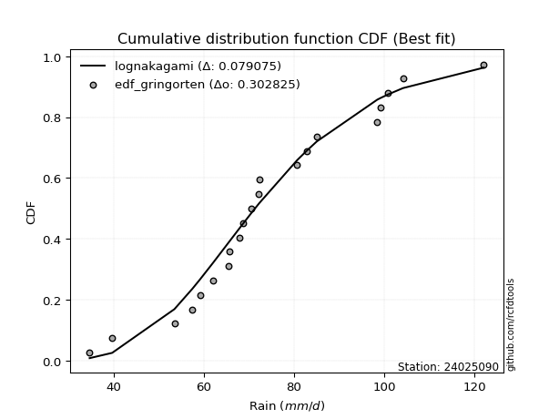</img></img>

</div>


### 9. EDF Filliben (1975)

The specific values of the constants (0.3175) (often denoted as $alpha$) and (0.365) are derived from a method proposed by James J. Filliben in a 1975 paper. This particular formula is the mean value of the $i$-th order statistic of the normal distribution and is considered a robust and effective plotting position formula for the normal probability plot correlation coefficient test for normality.

<div align="center">


$P=(m-0.3175)/(n+0.365)$


</div>


**9.1. Empirical values**

<div align="center">

|                | 0                   | 1                   | 2                   | 3                  | 4                   | 5                  | 6                  | 7                   | 8                   | 9                  | 10           | 11                 | 12                 | 13                 | 14                 | 15                 | 16                 | 17                 | 18                 | 19                 | 20                 |
|:---------------|:--------------------|:--------------------|:--------------------|:-------------------|:--------------------|:-------------------|:-------------------|:--------------------|:--------------------|:-------------------|:-------------|:-------------------|:-------------------|:-------------------|:-------------------|:-------------------|:-------------------|:-------------------|:-------------------|:-------------------|:-------------------|
| date           | 2009                | 2008                | 2007                | 2016               | 2018                | 2015               | 2012               | 2013                | 2017                | 2011               | 2010         | 2006               | 2023               | 2005               | 2024               | 2014               | 2020               | 2021               | 2022               | 2025               | 2019               |
| x              | 34.7                | 39.7                | 53.5                | 57.5               | 59.2                | 62.1               | 65.6               | 65.7                | 68.0                | 68.7               | 70.6         | 72.2               | 72.3               | 80.7               | 82.8               | 85.1               | 98.5               | 99.3               | 100.9              | 104.2              | 122.1              |
| m              | 1                   | 2                   | 3                   | 4                  | 5                   | 6                  | 7                  | 8                   | 9                   | 10                 | 11           | 12                 | 13                 | 14                 | 15                 | 16                 | 17                 | 18                 | 19                 | 20                 | 21                 |
| empirical_dist | edf_filliben        | edf_filliben        | edf_filliben        | edf_filliben       | edf_filliben        | edf_filliben       | edf_filliben       | edf_filliben        | edf_filliben        | edf_filliben       | edf_filliben | edf_filliben       | edf_filliben       | edf_filliben       | edf_filliben       | edf_filliben       | edf_filliben       | edf_filliben       | edf_filliben       | edf_filliben       | edf_filliben       |
| empirical      | 0.03194476948279897 | 0.07875029253451908 | 0.12555581558623918 | 0.1723613386379593 | 0.21916686168967942 | 0.2659723847413995 | 0.3127779077931196 | 0.35958343084483974 | 0.40638895389655977 | 0.4531944769482799 | 0.5          | 0.5468055230517201 | 0.5936110461034402 | 0.6404165691551603 | 0.6872220922068805 | 0.7340276152586005 | 0.7808331383103208 | 0.8276386613620408 | 0.8744441844137609 | 0.9212497074654811 | 0.9680552305172011 |
| empirical_tr   | 1.0329989121237761  | 1.0854820271815064  | 1.1435835675097017  | 1.2082567510250248 | 1.2806833508167241  | 1.3623465646421171 | 1.4551336625234124 | 1.561483646994336   | 1.6846047703528482  | 1.8288037663171408 | 2.0          | 2.206558223599277  | 2.4606968039159227 | 2.780995769606248  | 3.1971567527123086 | 3.759788825340959  | 4.56273358248799   | 5.801765105227429  | 7.964585274930109  | 12.69836552748888  | 31.304029304029378 |

</div>


**9.2. Kolmogorov-Smirnov fit test (sorted by Δ)**


<div align="center">

|                | 0                   | 1                   | 2                   | 3                   | 4                   | 5                   | 6                   | 7                   | 8                   | 9                   | 10                  | 11                  | 12                  | 13                  | 14                  | 15                  | 16                  | 17                  | 18                  | 19                  | 20                  | 21                  | 22                  | 23                  | 24                  | 25                  | 26                  | 27                  | 28                  | 29                  | 30                  | 31                  | 32                  | 33                  | 34                  | 35                  | 36                  | 37                  | 38                  | 39                  | 40                  | 41                  | 42                  | 43                  | 44                  | 45                  | 46                  | 47                  | 48                  | 49                  | 50                  | 51                  | 52                  | 53                  | 54                  | 55                  | 56                  | 57                  | 58                  | 59                  | 60                  | 61                  | 62                  | 63                  | 64                  | 65                  | 66                  | 67                  | 68                  | 69                  | 70                  | 71                  | 72                  | 73                  | 74                  | 75                  | 76                  | 77                  | 78                  | 79                  | 80                  | 81                  | 82                  | 83                  | 84                  | 85                  | 86                  | 87                  | 88                  | 89                  | 90                  | 91                  | 92                  | 93                  | 94                  | 95                  | 96                  | 97                  | 98                  | 99                  | 100                 | 101                 | 102                 | 103                 | 104                 | 105                 | 106                 | 107                 | 108                 | 109                 | 110                 | 111                 | 112                 | 113                 | 114                 | 115                 | 116                 | 117                 | 118                 | 119                 | 120                 | 121                 | 122                 | 123                 | 124                 | 125                 | 126                 | 127                 | 128                 | 129                 | 130                 | 131                 | 132                 | 133                 | 134                 | 135                 | 136                 | 137                 | 138                 | 139                 | 140                 | 141                 | 142                 | 143                 | 144                 | 145                 | 146                 | 147                 | 148                 | 149                 | 150                 | 151                 | 152                 | 153                 | 154                 | 155                 | 156                 | 157                 | 158                 | 159                 |
|:---------------|:--------------------|:--------------------|:--------------------|:--------------------|:--------------------|:--------------------|:--------------------|:--------------------|:--------------------|:--------------------|:--------------------|:--------------------|:--------------------|:--------------------|:--------------------|:--------------------|:--------------------|:--------------------|:--------------------|:--------------------|:--------------------|:--------------------|:--------------------|:--------------------|:--------------------|:--------------------|:--------------------|:--------------------|:--------------------|:--------------------|:--------------------|:--------------------|:--------------------|:--------------------|:--------------------|:--------------------|:--------------------|:--------------------|:--------------------|:--------------------|:--------------------|:--------------------|:--------------------|:--------------------|:--------------------|:--------------------|:--------------------|:--------------------|:--------------------|:--------------------|:--------------------|:--------------------|:--------------------|:--------------------|:--------------------|:--------------------|:--------------------|:--------------------|:--------------------|:--------------------|:--------------------|:--------------------|:--------------------|:--------------------|:--------------------|:--------------------|:--------------------|:--------------------|:--------------------|:--------------------|:--------------------|:--------------------|:--------------------|:--------------------|:--------------------|:--------------------|:--------------------|:--------------------|:--------------------|:--------------------|:--------------------|:--------------------|:--------------------|:--------------------|:--------------------|:--------------------|:--------------------|:--------------------|:--------------------|:--------------------|:--------------------|:--------------------|:--------------------|:--------------------|:--------------------|:--------------------|:--------------------|:--------------------|:--------------------|:--------------------|:--------------------|:--------------------|:--------------------|:--------------------|:--------------------|:--------------------|:--------------------|:--------------------|:--------------------|:--------------------|:--------------------|:--------------------|:--------------------|:--------------------|:--------------------|:--------------------|:--------------------|:--------------------|:--------------------|:--------------------|:--------------------|:--------------------|:--------------------|:--------------------|:--------------------|:--------------------|:--------------------|:--------------------|:--------------------|:--------------------|:--------------------|:--------------------|:--------------------|:--------------------|:--------------------|:--------------------|:--------------------|:--------------------|:--------------------|:--------------------|:--------------------|:--------------------|:--------------------|:--------------------|:--------------------|:--------------------|:--------------------|:--------------------|:--------------------|:--------------------|:--------------------|:--------------------|:--------------------|:--------------------|:--------------------|:--------------------|:--------------------|:--------------------|:--------------------|:--------------------|
| station        | 24025090            | 24025090            | 24025090            | 24025090            | 24025090            | 24025090            | 24025090            | 24025090            | 24025090            | 24025090            | 24025090            | 24025090            | 24025090            | 24025090            | 24025090            | 24025090            | 24025090            | 24025090            | 24025090            | 24025090            | 24025090            | 24025090            | 24025090            | 24025090            | 24025090            | 24025090            | 24025090            | 24025090            | 24025090            | 24025090            | 24025090            | 24025090            | 24025090            | 24025090            | 24025090            | 24025090            | 24025090            | 24025090            | 24025090            | 24025090            | 24025090            | 24025090            | 24025090            | 24025090            | 24025090            | 24025090            | 24025090            | 24025090            | 24025090            | 24025090            | 24025090            | 24025090            | 24025090            | 24025090            | 24025090            | 24025090            | 24025090            | 24025090            | 24025090            | 24025090            | 24025090            | 24025090            | 24025090            | 24025090            | 24025090            | 24025090            | 24025090            | 24025090            | 24025090            | 24025090            | 24025090            | 24025090            | 24025090            | 24025090            | 24025090            | 24025090            | 24025090            | 24025090            | 24025090            | 24025090            | 24025090            | 24025090            | 24025090            | 24025090            | 24025090            | 24025090            | 24025090            | 24025090            | 24025090            | 24025090            | 24025090            | 24025090            | 24025090            | 24025090            | 24025090            | 24025090            | 24025090            | 24025090            | 24025090            | 24025090            | 24025090            | 24025090            | 24025090            | 24025090            | 24025090            | 24025090            | 24025090            | 24025090            | 24025090            | 24025090            | 24025090            | 24025090            | 24025090            | 24025090            | 24025090            | 24025090            | 24025090            | 24025090            | 24025090            | 24025090            | 24025090            | 24025090            | 24025090            | 24025090            | 24025090            | 24025090            | 24025090            | 24025090            | 24025090            | 24025090            | 24025090            | 24025090            | 24025090            | 24025090            | 24025090            | 24025090            | 24025090            | 24025090            | 24025090            | 24025090            | 24025090            | 24025090            | 24025090            | 24025090            | 24025090            | 24025090            | 24025090            | 24025090            | 24025090            | 24025090            | 24025090            | 24025090            | 24025090            | 24025090            | 24025090            | 24025090            | 24025090            | 24025090            | 24025090            | 24025090            |
| empirical_dist | edf_filliben        | edf_filliben        | edf_filliben        | edf_filliben        | edf_filliben        | edf_filliben        | edf_filliben        | edf_filliben        | edf_filliben        | edf_filliben        | edf_filliben        | edf_filliben        | edf_filliben        | edf_filliben        | edf_filliben        | edf_filliben        | edf_filliben        | edf_filliben        | edf_filliben        | edf_filliben        | edf_filliben        | edf_filliben        | edf_filliben        | edf_filliben        | edf_filliben        | edf_filliben        | edf_filliben        | edf_filliben        | edf_filliben        | edf_filliben        | edf_filliben        | edf_filliben        | edf_filliben        | edf_filliben        | edf_filliben        | edf_filliben        | edf_filliben        | edf_filliben        | edf_filliben        | edf_filliben        | edf_filliben        | edf_filliben        | edf_filliben        | edf_filliben        | edf_filliben        | edf_filliben        | edf_filliben        | edf_filliben        | edf_filliben        | edf_filliben        | edf_filliben        | edf_filliben        | edf_filliben        | edf_filliben        | edf_filliben        | edf_filliben        | edf_filliben        | edf_filliben        | edf_filliben        | edf_filliben        | edf_filliben        | edf_filliben        | edf_filliben        | edf_filliben        | edf_filliben        | edf_filliben        | edf_filliben        | edf_filliben        | edf_filliben        | edf_filliben        | edf_filliben        | edf_filliben        | edf_filliben        | edf_filliben        | edf_filliben        | edf_filliben        | edf_filliben        | edf_filliben        | edf_filliben        | edf_filliben        | edf_filliben        | edf_filliben        | edf_filliben        | edf_filliben        | edf_filliben        | edf_filliben        | edf_filliben        | edf_filliben        | edf_filliben        | edf_filliben        | edf_filliben        | edf_filliben        | edf_filliben        | edf_filliben        | edf_filliben        | edf_filliben        | edf_filliben        | edf_filliben        | edf_filliben        | edf_filliben        | edf_filliben        | edf_filliben        | edf_filliben        | edf_filliben        | edf_filliben        | edf_filliben        | edf_filliben        | edf_filliben        | edf_filliben        | edf_filliben        | edf_filliben        | edf_filliben        | edf_filliben        | edf_filliben        | edf_filliben        | edf_filliben        | edf_filliben        | edf_filliben        | edf_filliben        | edf_filliben        | edf_filliben        | edf_filliben        | edf_filliben        | edf_filliben        | edf_filliben        | edf_filliben        | edf_filliben        | edf_filliben        | edf_filliben        | edf_filliben        | edf_filliben        | edf_filliben        | edf_filliben        | edf_filliben        | edf_filliben        | edf_filliben        | edf_filliben        | edf_filliben        | edf_filliben        | edf_filliben        | edf_filliben        | edf_filliben        | edf_filliben        | edf_filliben        | edf_filliben        | edf_filliben        | edf_filliben        | edf_filliben        | edf_filliben        | edf_filliben        | edf_filliben        | edf_filliben        | edf_filliben        | edf_filliben        | edf_filliben        | edf_filliben        | edf_filliben        | edf_filliben        | edf_filliben        | edf_filliben        |
| p_dist         | lognakagami         | logbetaprime        | lognct              | logt                | logcrystalball      | logrice             | logexponnorm        | lognorm             | logf                | logfatiguelife      | invweibull          | loginvgamma         | logexponweib        | logerlang           | ncf                 | rayleigh            | loggamma            | loggamma            | logalpha            | loggengamma         | loganglit           | loglogistic         | loggennorm          | logloglaplace       | invgauss            | gumbel_r            | maxwell             | moyal               | kstwobign           | triang              | logncf              | genlogistic         | halfnorm            | loghypsecant        | burr                | loggenlogistic      | mielke              | logargus            | skewnorm            | logsemicircular     | logmielke           | logburr             | nakagami            | alpha               | logdweibull         | logskewnorm         | betaprime           | halflogistic        | invgamma            | logpearson3         | loginvgauss         | gamma               | erlang              | f                   | loglaplace          | loglaplace          | weibull_min         | fatiguelife         | nct                 | beta                | johnsonsu           | logvonmises_line    | logexponpow         | loggompertz         | logweibull_min      | logmaxwell          | logbeta             | johnsonsb           | logloggamma         | logjohnsonsb        | logweibull_max      | loggenextreme       | logjohnsonsu        | genhalflogistic     | pearson3            | rice                | exponnorm           | logburr12           | genextreme          | dweibull            | lograyleigh         | wald                | semicircular        | logcosine           | anglit              | dgamma              | t                   | norm                | crystalball         | truncnorm           | loggausshyper       | kappa3              | loggumbel_r         | arcsine             | kappa4              | logistic            | gennorm             | loginvweibull       | hypsecant           | loggumbel_l         | cosine              | logtriang           | truncweibull_min    | logmoyal            | wrapcauchy          | logarcsine          | loghalfnorm         | laplace             | uniform             | bradford            | logfoldnorm         | gausshyper          | gompertz            | logkstwobign        | loghalflogistic     | truncexpon          | ksone               | loggenexpon         | vonmises_line       | gumbel_l            | logdgamma           | logkappa4           | loggenhalflogistic  | logwald             | logkappa3           | loguniform          | logbradford         | logtukeylambda      | loghalfgennorm      | argus               | logksone            | genpareto           | logrdist            | logtruncweibull_min | genexpon            | logtrapezoid        | logwrapcauchy       | loglomax            | burr12              | tukeylambda         | logtruncexpon       | halfgennorm         | loglevy_l           | logtruncnorm        | loggenpareto        | levy_l              | trapezoid           | powerlaw            | logtruncpareto      | lomax               | logpowerlaw         | rdist               | foldnorm            | gengamma            | exponweib           | weibull_max         | exponpow            | truncpareto         | logvonmises         | vonmises            |
| delta          | 0.07690304774493856 | 0.07714479247120143 | 0.07775016848610528 | 0.07777878151801376 | 0.07782444897444352 | 0.07782465435165825 | 0.07782478025227396 | 0.07782483591671507 | 0.07830503217058637 | 0.08034007946656674 | 0.08277451576621464 | 0.08452750418940752 | 0.08458486484091571 | 0.08600152159041746 | 0.08684446904178789 | 0.08803017530214319 | 0.0880567612117405  | 0.0880567612117405  | 0.09091834446846309 | 0.09245199047052222 | 0.09283978541048798 | 0.09441308322294228 | 0.09576855426154585 | 0.09616569848332945 | 0.09619491875556313 | 0.0964640999653209  | 0.09978823079520438 | 0.09981590264950768 | 0.10082872198362758 | 0.10142060106268597 | 0.1014329108541902  | 0.10167874524443005 | 0.10225790191883105 | 0.10268147873741185 | 0.10337815001854628 | 0.10340013088733552 | 0.10342569431755777 | 0.10401072314783336 | 0.10415577066170562 | 0.10467263543081431 | 0.1047233283202762  | 0.10474451172137306 | 0.10556004383599144 | 0.10661976169382215 | 0.10716884658389458 | 0.10751696009925227 | 0.10793889321932265 | 0.10823577482269503 | 0.10847168601805096 | 0.10874605623937217 | 0.10907077469710402 | 0.1093907683154971  | 0.10939085045207902 | 0.10941820288393234 | 0.10969894946682102 | 0.10969894946682102 | 0.10975732548429429 | 0.10989051194620808 | 0.11035858599350529 | 0.11075223964628    | 0.11077246264752727 | 0.11078027900215887 | 0.11092356344692433 | 0.11103981888360948 | 0.11131159875792818 | 0.11158990379218026 | 0.11164356953597565 | 0.11183273274824801 | 0.11201506490149976 | 0.11221562233592536 | 0.11229030141962248 | 0.11231291146459238 | 0.11261937799629435 | 0.11425818455284933 | 0.11482642854882363 | 0.11490804709590197 | 0.11724598259357899 | 0.11845322670004144 | 0.11859979493587658 | 0.12131375028258273 | 0.12391542105487435 | 0.12555581558623918 | 0.12586344913081393 | 0.1276103129720686  | 0.12823396085546246 | 0.1334565590385527  | 0.1339661195028225  | 0.1339814661529098  | 0.1339814685967911  | 0.13398146942090006 | 0.1345987000093856  | 0.13539627889476877 | 0.13577657854805603 | 0.1362713983379342  | 0.1382395111495125  | 0.13944683233226374 | 0.14034683861460717 | 0.14118426968149245 | 0.14408171118623758 | 0.1449926914931562  | 0.15024263634939666 | 0.1504256958696718  | 0.15059622159982    | 0.15793833174304311 | 0.15851699370810063 | 0.15864766772330677 | 0.1588298126975181  | 0.1603876321492314  | 0.1634050964466896  | 0.1668200364920492  | 0.17066740348964465 | 0.1710171669826555  | 0.1714006026393563  | 0.17184555888920236 | 0.17316856288363786 | 0.17407064417490356 | 0.17525428412451982 | 0.19359020088160614 | 0.20387784798886688 | 0.204395613107915   | 0.21072669427595525 | 0.21259100236704756 | 0.21643523529593722 | 0.216945051176678   | 0.22835616946201184 | 0.22907335032877155 | 0.23038200105331633 | 0.23247300139844965 | 0.23518208951266176 | 0.23597165692571576 | 0.24550090216764983 | 0.2490104328668884  | 0.2556635866862188  | 0.263254272357511   | 0.26496968012464284 | 0.27496611811976374 | 0.3184747759205727  | 0.32811836003659123 | 0.3311955233634879  | 0.332790465526365   | 0.3333496437350918  | 0.3531170941115869  | 0.35421620310614205 | 0.36129413919279196 | 0.36332673255085646 | 0.4150928412838906  | 0.41606410489246204 | 0.4288073979389536  | 0.4380479028308315  | 0.4441912634359496  | 0.49807372695122787 | 0.51616184244371    | 0.5936110461034402  | 0.6430231867881372  | 0.692158104475324   | 0.7532633411961429  | 0.8006361035526712  | 0.8438348438011406  | 1.0779519016761832  | 19.420986927569945  |
| deltao         | 0.30282488509099936 | 0.30282488509099936 | 0.30282488509099936 | 0.30282488509099936 | 0.30282488509099936 | 0.30282488509099936 | 0.30282488509099936 | 0.30282488509099936 | 0.30282488509099936 | 0.30282488509099936 | 0.30282488509099936 | 0.30282488509099936 | 0.30282488509099936 | 0.30282488509099936 | 0.30282488509099936 | 0.30282488509099936 | 0.30282488509099936 | 0.30282488509099936 | 0.30282488509099936 | 0.30282488509099936 | 0.30282488509099936 | 0.30282488509099936 | 0.30282488509099936 | 0.30282488509099936 | 0.30282488509099936 | 0.30282488509099936 | 0.30282488509099936 | 0.30282488509099936 | 0.30282488509099936 | 0.30282488509099936 | 0.30282488509099936 | 0.30282488509099936 | 0.30282488509099936 | 0.30282488509099936 | 0.30282488509099936 | 0.30282488509099936 | 0.30282488509099936 | 0.30282488509099936 | 0.30282488509099936 | 0.30282488509099936 | 0.30282488509099936 | 0.30282488509099936 | 0.30282488509099936 | 0.30282488509099936 | 0.30282488509099936 | 0.30282488509099936 | 0.30282488509099936 | 0.30282488509099936 | 0.30282488509099936 | 0.30282488509099936 | 0.30282488509099936 | 0.30282488509099936 | 0.30282488509099936 | 0.30282488509099936 | 0.30282488509099936 | 0.30282488509099936 | 0.30282488509099936 | 0.30282488509099936 | 0.30282488509099936 | 0.30282488509099936 | 0.30282488509099936 | 0.30282488509099936 | 0.30282488509099936 | 0.30282488509099936 | 0.30282488509099936 | 0.30282488509099936 | 0.30282488509099936 | 0.30282488509099936 | 0.30282488509099936 | 0.30282488509099936 | 0.30282488509099936 | 0.30282488509099936 | 0.30282488509099936 | 0.30282488509099936 | 0.30282488509099936 | 0.30282488509099936 | 0.30282488509099936 | 0.30282488509099936 | 0.30282488509099936 | 0.30282488509099936 | 0.30282488509099936 | 0.30282488509099936 | 0.30282488509099936 | 0.30282488509099936 | 0.30282488509099936 | 0.30282488509099936 | 0.30282488509099936 | 0.30282488509099936 | 0.30282488509099936 | 0.30282488509099936 | 0.30282488509099936 | 0.30282488509099936 | 0.30282488509099936 | 0.30282488509099936 | 0.30282488509099936 | 0.30282488509099936 | 0.30282488509099936 | 0.30282488509099936 | 0.30282488509099936 | 0.30282488509099936 | 0.30282488509099936 | 0.30282488509099936 | 0.30282488509099936 | 0.30282488509099936 | 0.30282488509099936 | 0.30282488509099936 | 0.30282488509099936 | 0.30282488509099936 | 0.30282488509099936 | 0.30282488509099936 | 0.30282488509099936 | 0.30282488509099936 | 0.30282488509099936 | 0.30282488509099936 | 0.30282488509099936 | 0.30282488509099936 | 0.30282488509099936 | 0.30282488509099936 | 0.30282488509099936 | 0.30282488509099936 | 0.30282488509099936 | 0.30282488509099936 | 0.30282488509099936 | 0.30282488509099936 | 0.30282488509099936 | 0.30282488509099936 | 0.30282488509099936 | 0.30282488509099936 | 0.30282488509099936 | 0.30282488509099936 | 0.30282488509099936 | 0.30282488509099936 | 0.30282488509099936 | 0.30282488509099936 | 0.30282488509099936 | 0.30282488509099936 | 0.30282488509099936 | 0.30282488509099936 | 0.30282488509099936 | 0.30282488509099936 | 0.30282488509099936 | 0.30282488509099936 | 0.30282488509099936 | 0.30282488509099936 | 0.30282488509099936 | 0.30282488509099936 | 0.30282488509099936 | 0.30282488509099936 | 0.30282488509099936 | 0.30282488509099936 | 0.30282488509099936 | 0.30282488509099936 | 0.30282488509099936 | 0.30282488509099936 | 0.30282488509099936 | 0.30282488509099936 | 0.30282488509099936 | 0.30282488509099936 | 0.30282488509099936 | 0.30282488509099936 |
| eval           | Δo > Δ              | Δo > Δ              | Δo > Δ              | Δo > Δ              | Δo > Δ              | Δo > Δ              | Δo > Δ              | Δo > Δ              | Δo > Δ              | Δo > Δ              | Δo > Δ              | Δo > Δ              | Δo > Δ              | Δo > Δ              | Δo > Δ              | Δo > Δ              | Δo > Δ              | Δo > Δ              | Δo > Δ              | Δo > Δ              | Δo > Δ              | Δo > Δ              | Δo > Δ              | Δo > Δ              | Δo > Δ              | Δo > Δ              | Δo > Δ              | Δo > Δ              | Δo > Δ              | Δo > Δ              | Δo > Δ              | Δo > Δ              | Δo > Δ              | Δo > Δ              | Δo > Δ              | Δo > Δ              | Δo > Δ              | Δo > Δ              | Δo > Δ              | Δo > Δ              | Δo > Δ              | Δo > Δ              | Δo > Δ              | Δo > Δ              | Δo > Δ              | Δo > Δ              | Δo > Δ              | Δo > Δ              | Δo > Δ              | Δo > Δ              | Δo > Δ              | Δo > Δ              | Δo > Δ              | Δo > Δ              | Δo > Δ              | Δo > Δ              | Δo > Δ              | Δo > Δ              | Δo > Δ              | Δo > Δ              | Δo > Δ              | Δo > Δ              | Δo > Δ              | Δo > Δ              | Δo > Δ              | Δo > Δ              | Δo > Δ              | Δo > Δ              | Δo > Δ              | Δo > Δ              | Δo > Δ              | Δo > Δ              | Δo > Δ              | Δo > Δ              | Δo > Δ              | Δo > Δ              | Δo > Δ              | Δo > Δ              | Δo > Δ              | Δo > Δ              | Δo > Δ              | Δo > Δ              | Δo > Δ              | Δo > Δ              | Δo > Δ              | Δo > Δ              | Δo > Δ              | Δo > Δ              | Δo > Δ              | Δo > Δ              | Δo > Δ              | Δo > Δ              | Δo > Δ              | Δo > Δ              | Δo > Δ              | Δo > Δ              | Δo > Δ              | Δo > Δ              | Δo > Δ              | Δo > Δ              | Δo > Δ              | Δo > Δ              | Δo > Δ              | Δo > Δ              | Δo > Δ              | Δo > Δ              | Δo > Δ              | Δo > Δ              | Δo > Δ              | Δo > Δ              | Δo > Δ              | Δo > Δ              | Δo > Δ              | Δo > Δ              | Δo > Δ              | Δo > Δ              | Δo > Δ              | Δo > Δ              | Δo > Δ              | Δo > Δ              | Δo > Δ              | Δo > Δ              | Δo > Δ              | Δo > Δ              | Δo > Δ              | Δo > Δ              | Δo > Δ              | Δo > Δ              | Δo > Δ              | Δo > Δ              | Δo > Δ              | Δo > Δ              | Δo > Δ              | Δo > Δ              | Δo > Δ              | Δo > Δ              | Δo <= Δ             | Δo <= Δ             | Δo <= Δ             | Δo <= Δ             | Δo <= Δ             | Δo <= Δ             | Δo <= Δ             | Δo <= Δ             | Δo <= Δ             | Δo <= Δ             | Δo <= Δ             | Δo <= Δ             | Δo <= Δ             | Δo <= Δ             | Δo <= Δ             | Δo <= Δ             | Δo <= Δ             | Δo <= Δ             | Δo <= Δ             | Δo <= Δ             | Δo <= Δ             | Δo <= Δ             | Δo <= Δ             | Δo <= Δ             |
| fit            | 1                   | 1                   | 1                   | 1                   | 1                   | 1                   | 1                   | 1                   | 1                   | 1                   | 1                   | 1                   | 1                   | 1                   | 1                   | 1                   | 1                   | 1                   | 1                   | 1                   | 1                   | 1                   | 1                   | 1                   | 1                   | 1                   | 1                   | 1                   | 1                   | 1                   | 1                   | 1                   | 1                   | 1                   | 1                   | 1                   | 1                   | 1                   | 1                   | 1                   | 1                   | 1                   | 1                   | 1                   | 1                   | 1                   | 1                   | 1                   | 1                   | 1                   | 1                   | 1                   | 1                   | 1                   | 1                   | 1                   | 1                   | 1                   | 1                   | 1                   | 1                   | 1                   | 1                   | 1                   | 1                   | 1                   | 1                   | 1                   | 1                   | 1                   | 1                   | 1                   | 1                   | 1                   | 1                   | 1                   | 1                   | 1                   | 1                   | 1                   | 1                   | 1                   | 1                   | 1                   | 1                   | 1                   | 1                   | 1                   | 1                   | 1                   | 1                   | 1                   | 1                   | 1                   | 1                   | 1                   | 1                   | 1                   | 1                   | 1                   | 1                   | 1                   | 1                   | 1                   | 1                   | 1                   | 1                   | 1                   | 1                   | 1                   | 1                   | 1                   | 1                   | 1                   | 1                   | 1                   | 1                   | 1                   | 1                   | 1                   | 1                   | 1                   | 1                   | 1                   | 1                   | 1                   | 1                   | 1                   | 1                   | 1                   | 1                   | 1                   | 1                   | 1                   | 1                   | 1                   | 0                   | 0                   | 0                   | 0                   | 0                   | 0                   | 0                   | 0                   | 0                   | 0                   | 0                   | 0                   | 0                   | 0                   | 0                   | 0                   | 0                   | 0                   | 0                   | 0                   | 0                   | 0                   | 0                   | 0                   |
| n              | 21                  | 21                  | 21                  | 21                  | 21                  | 21                  | 21                  | 21                  | 21                  | 21                  | 21                  | 21                  | 21                  | 21                  | 21                  | 21                  | 21                  | 21                  | 21                  | 21                  | 21                  | 21                  | 21                  | 21                  | 21                  | 21                  | 21                  | 21                  | 21                  | 21                  | 21                  | 21                  | 21                  | 21                  | 21                  | 21                  | 21                  | 21                  | 21                  | 21                  | 21                  | 21                  | 21                  | 21                  | 21                  | 21                  | 21                  | 21                  | 21                  | 21                  | 21                  | 21                  | 21                  | 21                  | 21                  | 21                  | 21                  | 21                  | 21                  | 21                  | 21                  | 21                  | 21                  | 21                  | 21                  | 21                  | 21                  | 21                  | 21                  | 21                  | 21                  | 21                  | 21                  | 21                  | 21                  | 21                  | 21                  | 21                  | 21                  | 21                  | 21                  | 21                  | 21                  | 21                  | 21                  | 21                  | 21                  | 21                  | 21                  | 21                  | 21                  | 21                  | 21                  | 21                  | 21                  | 21                  | 21                  | 21                  | 21                  | 21                  | 21                  | 21                  | 21                  | 21                  | 21                  | 21                  | 21                  | 21                  | 21                  | 21                  | 21                  | 21                  | 21                  | 21                  | 21                  | 21                  | 21                  | 21                  | 21                  | 21                  | 21                  | 21                  | 21                  | 21                  | 21                  | 21                  | 21                  | 21                  | 21                  | 21                  | 21                  | 21                  | 21                  | 21                  | 21                  | 21                  | 21                  | 21                  | 21                  | 21                  | 21                  | 21                  | 21                  | 21                  | 21                  | 21                  | 21                  | 21                  | 21                  | 21                  | 21                  | 21                  | 21                  | 21                  | 21                  | 21                  | 21                  | 21                  | 21                  | 21                  |
| best_fit       | 1                   | 0                   | 0                   | 0                   | 0                   | 0                   | 0                   | 0                   | 0                   | 0                   | 0                   | 0                   | 0                   | 0                   | 0                   | 0                   | 0                   | 0                   | 0                   | 0                   | 0                   | 0                   | 0                   | 0                   | 0                   | 0                   | 0                   | 0                   | 0                   | 0                   | 0                   | 0                   | 0                   | 0                   | 0                   | 0                   | 0                   | 0                   | 0                   | 0                   | 0                   | 0                   | 0                   | 0                   | 0                   | 0                   | 0                   | 0                   | 0                   | 0                   | 0                   | 0                   | 0                   | 0                   | 0                   | 0                   | 0                   | 0                   | 0                   | 0                   | 0                   | 0                   | 0                   | 0                   | 0                   | 0                   | 0                   | 0                   | 0                   | 0                   | 0                   | 0                   | 0                   | 0                   | 0                   | 0                   | 0                   | 0                   | 0                   | 0                   | 0                   | 0                   | 0                   | 0                   | 0                   | 0                   | 0                   | 0                   | 0                   | 0                   | 0                   | 0                   | 0                   | 0                   | 0                   | 0                   | 0                   | 0                   | 0                   | 0                   | 0                   | 0                   | 0                   | 0                   | 0                   | 0                   | 0                   | 0                   | 0                   | 0                   | 0                   | 0                   | 0                   | 0                   | 0                   | 0                   | 0                   | 0                   | 0                   | 0                   | 0                   | 0                   | 0                   | 0                   | 0                   | 0                   | 0                   | 0                   | 0                   | 0                   | 0                   | 0                   | 0                   | 0                   | 0                   | 0                   | 0                   | 0                   | 0                   | 0                   | 0                   | 0                   | 0                   | 0                   | 0                   | 0                   | 0                   | 0                   | 0                   | 0                   | 0                   | 0                   | 0                   | 0                   | 0                   | 0                   | 0                   | 0                   | 0                   | 0                   |
| best_fit_sort  | 1                   | 2                   | 3                   | 4                   | 5                   | 6                   | 7                   | 8                   | 9                   | 10                  | 11                  | 12                  | 13                  | 14                  | 15                  | 16                  | 17                  | 18                  | 19                  | 20                  | 21                  | 22                  | 23                  | 24                  | 25                  | 26                  | 27                  | 28                  | 29                  | 30                  | 31                  | 32                  | 33                  | 34                  | 35                  | 36                  | 37                  | 38                  | 39                  | 40                  | 41                  | 42                  | 43                  | 44                  | 45                  | 46                  | 47                  | 48                  | 49                  | 50                  | 51                  | 52                  | 53                  | 54                  | 55                  | 56                  | 57                  | 58                  | 59                  | 60                  | 61                  | 62                  | 63                  | 64                  | 65                  | 66                  | 67                  | 68                  | 69                  | 70                  | 71                  | 72                  | 73                  | 74                  | 75                  | 76                  | 77                  | 78                  | 79                  | 80                  | 81                  | 82                  | 83                  | 84                  | 85                  | 86                  | 87                  | 88                  | 89                  | 90                  | 91                  | 92                  | 93                  | 94                  | 95                  | 96                  | 97                  | 98                  | 99                  | 100                 | 101                 | 102                 | 103                 | 104                 | 105                 | 106                 | 107                 | 108                 | 109                 | 110                 | 111                 | 112                 | 113                 | 114                 | 115                 | 116                 | 117                 | 118                 | 119                 | 120                 | 121                 | 122                 | 123                 | 124                 | 125                 | 126                 | 127                 | 128                 | 129                 | 130                 | 131                 | 132                 | 133                 | 134                 | 135                 | 136                 | 137                 | 138                 | 139                 | 140                 | 141                 | 142                 | 143                 | 144                 | 145                 | 146                 | 147                 | 148                 | 149                 | 150                 | 151                 | 152                 | 153                 | 154                 | 155                 | 156                 | 157                 | 158                 | 159                 | 160                 |

</div>


**9.3. Best fit**

<div align="center">

|   id |   station | empirical_dist   | p_dist      |    delta |   deltao | eval   |   fit |   n |   best_fit |   best_fit_sort |
|-----:|----------:|:-----------------|:------------|---------:|---------:|:-------|------:|----:|-----------:|----------------:|
|    0 |  24025090 | edf_filliben     | lognakagami | 0.076903 | 0.302825 | Δo > Δ |     1 |  21 |          1 |               1 |

</div>


<div align="center">

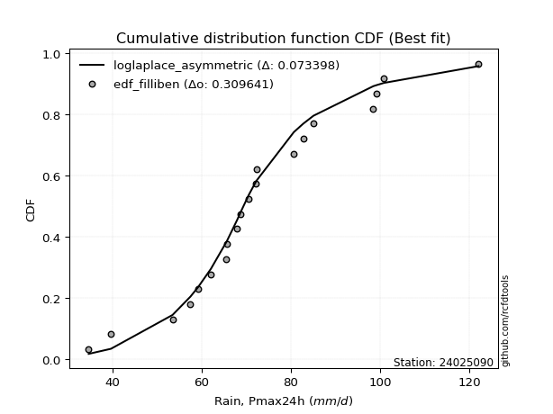</img></img>

</div>


### 10. EDF Jenkinson (1977)

The Jenkinson formula in hydrology is an empirical plotting position formula used to estimate the non-exceedance probability _(P)_ or return period _(T)_ of a given ordered observation within a sample. It is a widely used method in the frequency analysis of extreme events such as floods and rainfall, as it provides a distribution-free way to plot data. _a≈0.31_ and _b≈0.38_ are constants derived to approximate the median of the probability distribution for the given rank.

<div align="center">


$P=(m-a)/(n+b)$


</div>


**10.1. Empirical values**

<div align="center">

|                | 0                    | 1                   | 2                   | 3                   | 4                  | 5                  | 6                   | 7                  | 8                   | 9                  | 10            | 11                 | 12                 | 13                 | 14                 | 15                 | 16                 | 17                 | 18                 | 19                 | 20                 |
|:---------------|:---------------------|:--------------------|:--------------------|:--------------------|:-------------------|:-------------------|:--------------------|:-------------------|:--------------------|:-------------------|:--------------|:-------------------|:-------------------|:-------------------|:-------------------|:-------------------|:-------------------|:-------------------|:-------------------|:-------------------|:-------------------|
| date           | 2009                 | 2008                | 2007                | 2016                | 2018               | 2015               | 2012                | 2013               | 2017                | 2011               | 2010          | 2006               | 2023               | 2005               | 2024               | 2014               | 2020               | 2021               | 2022               | 2025               | 2019               |
| x              | 34.7                 | 39.7                | 53.5                | 57.5                | 59.2               | 62.1               | 65.6                | 65.7               | 68.0                | 68.7               | 70.6          | 72.2               | 72.3               | 80.7               | 82.8               | 85.1               | 98.5               | 99.3               | 100.9              | 104.2              | 122.1              |
| m              | 1                    | 2                   | 3                   | 4                   | 5                  | 6                  | 7                   | 8                  | 9                   | 10                 | 11            | 12                 | 13                 | 14                 | 15                 | 16                 | 17                 | 18                 | 19                 | 20                 | 21                 |
| empirical_dist | edf_jenkinson        | edf_jenkinson       | edf_jenkinson       | edf_jenkinson       | edf_jenkinson      | edf_jenkinson      | edf_jenkinson       | edf_jenkinson      | edf_jenkinson       | edf_jenkinson      | edf_jenkinson | edf_jenkinson      | edf_jenkinson      | edf_jenkinson      | edf_jenkinson      | edf_jenkinson      | edf_jenkinson      | edf_jenkinson      | edf_jenkinson      | edf_jenkinson      | edf_jenkinson      |
| empirical      | 0.032273152478952294 | 0.07904583723105707 | 0.12581852198316185 | 0.17259120673526662 | 0.2193638914873714 | 0.2661365762394762 | 0.31290926099158095 | 0.3596819457436857 | 0.40645463049579045 | 0.4532273152478952 | 0.5           | 0.5467726847521047 | 0.5935453695042096 | 0.6403180542563143 | 0.6870907390084191 | 0.7338634237605238 | 0.7806361085126288 | 0.8274087932647335 | 0.8741814780168383 | 0.920954162768943  | 0.9677268475210478 |
| empirical_tr   | 1.0333494441759306   | 1.085830370746572   | 1.1439272338148743  | 1.208592425098926   | 1.281006590772918  | 1.362651370299554  | 1.4554118447923756  | 1.5617238860482106 | 1.6847911741528763  | 1.828913601368691  | 2.0           | 2.206398348813209  | 2.4602991944764097 | 2.780234070221066  | 3.195814648729447  | 3.7574692442882247 | 4.558635394456293  | 5.794037940379407  | 7.947955390334582  | 12.650887573964514 | 30.985507246376862 |

</div>


**10.2. Kolmogorov-Smirnov fit test (sorted by Δ)**


<div align="center">

|                | 0                   | 1                   | 2                   | 3                   | 4                   | 5                   | 6                   | 7                   | 8                   | 9                   | 10                  | 11                  | 12                  | 13                  | 14                  | 15                  | 16                  | 17                  | 18                  | 19                  | 20                  | 21                  | 22                  | 23                  | 24                  | 25                  | 26                  | 27                  | 28                  | 29                  | 30                  | 31                  | 32                  | 33                  | 34                  | 35                  | 36                  | 37                  | 38                  | 39                  | 40                  | 41                  | 42                  | 43                  | 44                  | 45                  | 46                  | 47                  | 48                  | 49                  | 50                  | 51                  | 52                  | 53                  | 54                  | 55                  | 56                  | 57                  | 58                  | 59                  | 60                  | 61                  | 62                  | 63                  | 64                  | 65                  | 66                  | 67                  | 68                  | 69                  | 70                  | 71                  | 72                  | 73                  | 74                  | 75                  | 76                  | 77                  | 78                  | 79                  | 80                  | 81                  | 82                  | 83                  | 84                  | 85                  | 86                  | 87                  | 88                  | 89                  | 90                  | 91                  | 92                  | 93                  | 94                  | 95                  | 96                  | 97                  | 98                  | 99                  | 100                 | 101                 | 102                 | 103                 | 104                 | 105                 | 106                 | 107                 | 108                 | 109                 | 110                 | 111                 | 112                 | 113                 | 114                 | 115                 | 116                 | 117                 | 118                 | 119                 | 120                 | 121                 | 122                 | 123                 | 124                 | 125                 | 126                 | 127                 | 128                 | 129                 | 130                 | 131                 | 132                 | 133                 | 134                 | 135                 | 136                 | 137                 | 138                 | 139                 | 140                 | 141                 | 142                 | 143                 | 144                 | 145                 | 146                 | 147                 | 148                 | 149                 | 150                 | 151                 | 152                 | 153                 | 154                 | 155                 | 156                 | 157                 | 158                 | 159                 |
|:---------------|:--------------------|:--------------------|:--------------------|:--------------------|:--------------------|:--------------------|:--------------------|:--------------------|:--------------------|:--------------------|:--------------------|:--------------------|:--------------------|:--------------------|:--------------------|:--------------------|:--------------------|:--------------------|:--------------------|:--------------------|:--------------------|:--------------------|:--------------------|:--------------------|:--------------------|:--------------------|:--------------------|:--------------------|:--------------------|:--------------------|:--------------------|:--------------------|:--------------------|:--------------------|:--------------------|:--------------------|:--------------------|:--------------------|:--------------------|:--------------------|:--------------------|:--------------------|:--------------------|:--------------------|:--------------------|:--------------------|:--------------------|:--------------------|:--------------------|:--------------------|:--------------------|:--------------------|:--------------------|:--------------------|:--------------------|:--------------------|:--------------------|:--------------------|:--------------------|:--------------------|:--------------------|:--------------------|:--------------------|:--------------------|:--------------------|:--------------------|:--------------------|:--------------------|:--------------------|:--------------------|:--------------------|:--------------------|:--------------------|:--------------------|:--------------------|:--------------------|:--------------------|:--------------------|:--------------------|:--------------------|:--------------------|:--------------------|:--------------------|:--------------------|:--------------------|:--------------------|:--------------------|:--------------------|:--------------------|:--------------------|:--------------------|:--------------------|:--------------------|:--------------------|:--------------------|:--------------------|:--------------------|:--------------------|:--------------------|:--------------------|:--------------------|:--------------------|:--------------------|:--------------------|:--------------------|:--------------------|:--------------------|:--------------------|:--------------------|:--------------------|:--------------------|:--------------------|:--------------------|:--------------------|:--------------------|:--------------------|:--------------------|:--------------------|:--------------------|:--------------------|:--------------------|:--------------------|:--------------------|:--------------------|:--------------------|:--------------------|:--------------------|:--------------------|:--------------------|:--------------------|:--------------------|:--------------------|:--------------------|:--------------------|:--------------------|:--------------------|:--------------------|:--------------------|:--------------------|:--------------------|:--------------------|:--------------------|:--------------------|:--------------------|:--------------------|:--------------------|:--------------------|:--------------------|:--------------------|:--------------------|:--------------------|:--------------------|:--------------------|:--------------------|:--------------------|:--------------------|:--------------------|:--------------------|:--------------------|:--------------------|
| station        | 24025090            | 24025090            | 24025090            | 24025090            | 24025090            | 24025090            | 24025090            | 24025090            | 24025090            | 24025090            | 24025090            | 24025090            | 24025090            | 24025090            | 24025090            | 24025090            | 24025090            | 24025090            | 24025090            | 24025090            | 24025090            | 24025090            | 24025090            | 24025090            | 24025090            | 24025090            | 24025090            | 24025090            | 24025090            | 24025090            | 24025090            | 24025090            | 24025090            | 24025090            | 24025090            | 24025090            | 24025090            | 24025090            | 24025090            | 24025090            | 24025090            | 24025090            | 24025090            | 24025090            | 24025090            | 24025090            | 24025090            | 24025090            | 24025090            | 24025090            | 24025090            | 24025090            | 24025090            | 24025090            | 24025090            | 24025090            | 24025090            | 24025090            | 24025090            | 24025090            | 24025090            | 24025090            | 24025090            | 24025090            | 24025090            | 24025090            | 24025090            | 24025090            | 24025090            | 24025090            | 24025090            | 24025090            | 24025090            | 24025090            | 24025090            | 24025090            | 24025090            | 24025090            | 24025090            | 24025090            | 24025090            | 24025090            | 24025090            | 24025090            | 24025090            | 24025090            | 24025090            | 24025090            | 24025090            | 24025090            | 24025090            | 24025090            | 24025090            | 24025090            | 24025090            | 24025090            | 24025090            | 24025090            | 24025090            | 24025090            | 24025090            | 24025090            | 24025090            | 24025090            | 24025090            | 24025090            | 24025090            | 24025090            | 24025090            | 24025090            | 24025090            | 24025090            | 24025090            | 24025090            | 24025090            | 24025090            | 24025090            | 24025090            | 24025090            | 24025090            | 24025090            | 24025090            | 24025090            | 24025090            | 24025090            | 24025090            | 24025090            | 24025090            | 24025090            | 24025090            | 24025090            | 24025090            | 24025090            | 24025090            | 24025090            | 24025090            | 24025090            | 24025090            | 24025090            | 24025090            | 24025090            | 24025090            | 24025090            | 24025090            | 24025090            | 24025090            | 24025090            | 24025090            | 24025090            | 24025090            | 24025090            | 24025090            | 24025090            | 24025090            | 24025090            | 24025090            | 24025090            | 24025090            | 24025090            | 24025090            |
| empirical_dist | edf_jenkinson       | edf_jenkinson       | edf_jenkinson       | edf_jenkinson       | edf_jenkinson       | edf_jenkinson       | edf_jenkinson       | edf_jenkinson       | edf_jenkinson       | edf_jenkinson       | edf_jenkinson       | edf_jenkinson       | edf_jenkinson       | edf_jenkinson       | edf_jenkinson       | edf_jenkinson       | edf_jenkinson       | edf_jenkinson       | edf_jenkinson       | edf_jenkinson       | edf_jenkinson       | edf_jenkinson       | edf_jenkinson       | edf_jenkinson       | edf_jenkinson       | edf_jenkinson       | edf_jenkinson       | edf_jenkinson       | edf_jenkinson       | edf_jenkinson       | edf_jenkinson       | edf_jenkinson       | edf_jenkinson       | edf_jenkinson       | edf_jenkinson       | edf_jenkinson       | edf_jenkinson       | edf_jenkinson       | edf_jenkinson       | edf_jenkinson       | edf_jenkinson       | edf_jenkinson       | edf_jenkinson       | edf_jenkinson       | edf_jenkinson       | edf_jenkinson       | edf_jenkinson       | edf_jenkinson       | edf_jenkinson       | edf_jenkinson       | edf_jenkinson       | edf_jenkinson       | edf_jenkinson       | edf_jenkinson       | edf_jenkinson       | edf_jenkinson       | edf_jenkinson       | edf_jenkinson       | edf_jenkinson       | edf_jenkinson       | edf_jenkinson       | edf_jenkinson       | edf_jenkinson       | edf_jenkinson       | edf_jenkinson       | edf_jenkinson       | edf_jenkinson       | edf_jenkinson       | edf_jenkinson       | edf_jenkinson       | edf_jenkinson       | edf_jenkinson       | edf_jenkinson       | edf_jenkinson       | edf_jenkinson       | edf_jenkinson       | edf_jenkinson       | edf_jenkinson       | edf_jenkinson       | edf_jenkinson       | edf_jenkinson       | edf_jenkinson       | edf_jenkinson       | edf_jenkinson       | edf_jenkinson       | edf_jenkinson       | edf_jenkinson       | edf_jenkinson       | edf_jenkinson       | edf_jenkinson       | edf_jenkinson       | edf_jenkinson       | edf_jenkinson       | edf_jenkinson       | edf_jenkinson       | edf_jenkinson       | edf_jenkinson       | edf_jenkinson       | edf_jenkinson       | edf_jenkinson       | edf_jenkinson       | edf_jenkinson       | edf_jenkinson       | edf_jenkinson       | edf_jenkinson       | edf_jenkinson       | edf_jenkinson       | edf_jenkinson       | edf_jenkinson       | edf_jenkinson       | edf_jenkinson       | edf_jenkinson       | edf_jenkinson       | edf_jenkinson       | edf_jenkinson       | edf_jenkinson       | edf_jenkinson       | edf_jenkinson       | edf_jenkinson       | edf_jenkinson       | edf_jenkinson       | edf_jenkinson       | edf_jenkinson       | edf_jenkinson       | edf_jenkinson       | edf_jenkinson       | edf_jenkinson       | edf_jenkinson       | edf_jenkinson       | edf_jenkinson       | edf_jenkinson       | edf_jenkinson       | edf_jenkinson       | edf_jenkinson       | edf_jenkinson       | edf_jenkinson       | edf_jenkinson       | edf_jenkinson       | edf_jenkinson       | edf_jenkinson       | edf_jenkinson       | edf_jenkinson       | edf_jenkinson       | edf_jenkinson       | edf_jenkinson       | edf_jenkinson       | edf_jenkinson       | edf_jenkinson       | edf_jenkinson       | edf_jenkinson       | edf_jenkinson       | edf_jenkinson       | edf_jenkinson       | edf_jenkinson       | edf_jenkinson       | edf_jenkinson       | edf_jenkinson       | edf_jenkinson       | edf_jenkinson       | edf_jenkinson       |
| p_dist         | lognakagami         | logbetaprime        | lognct              | logrice             | lognorm             | logcrystalball      | logexponnorm        | logt                | logf                | logfatiguelife      | invweibull          | loginvgamma         | logexponweib        | logerlang           | ncf                 | loggamma            | loggamma            | rayleigh            | logalpha            | loggengamma         | loganglit           | loglogistic         | loggennorm          | invgauss            | logloglaplace       | gumbel_r            | maxwell             | moyal               | kstwobign           | logncf              | triang              | genlogistic         | halfnorm            | loghypsecant        | burr                | loggenlogistic      | mielke              | logargus            | skewnorm            | logsemicircular     | logmielke           | logburr             | nakagami            | alpha               | logdweibull         | logskewnorm         | betaprime           | halflogistic        | invgamma            | logpearson3         | loginvgauss         | gamma               | erlang              | f                   | weibull_min         | fatiguelife         | loglaplace          | loglaplace          | nct                 | logvonmises_line    | beta                | johnsonsu           | logexponpow         | loggompertz         | logweibull_min      | logmaxwell          | logbeta             | johnsonsb           | logloggamma         | logjohnsonsb        | logweibull_max      | loggenextreme       | logjohnsonsu        | genhalflogistic     | pearson3            | rice                | exponnorm           | logburr12           | genextreme          | dweibull            | lograyleigh         | semicircular        | wald                | logcosine           | anglit              | dgamma              | t                   | norm                | crystalball         | truncnorm           | loggausshyper       | kappa3              | loggumbel_r         | arcsine             | kappa4              | logistic            | gennorm             | loginvweibull       | hypsecant           | loggumbel_l         | cosine              | logtriang           | truncweibull_min    | logmoyal            | logarcsine          | wrapcauchy          | loghalfnorm         | laplace             | uniform             | bradford            | logfoldnorm         | gausshyper          | gompertz            | logkstwobign        | loghalflogistic     | truncexpon          | ksone               | loggenexpon         | vonmises_line       | gumbel_l            | logdgamma           | logkappa4           | loggenhalflogistic  | logwald             | logkappa3           | loguniform          | logbradford         | logtukeylambda      | loghalfgennorm      | argus               | logksone            | genpareto           | logrdist            | logtruncweibull_min | genexpon            | logtrapezoid        | logwrapcauchy       | loglomax            | burr12              | tukeylambda         | logtruncexpon       | halfgennorm         | loglevy_l           | logtruncnorm        | loggenpareto        | levy_l              | trapezoid           | powerlaw            | logtruncpareto      | lomax               | logpowerlaw         | rdist               | foldnorm            | gengamma            | exponweib           | weibull_max         | exponpow            | truncpareto         | logvonmises         | vonmises            |
| delta          | 0.0768494781975082  | 0.07701343927274007 | 0.07783965259886094 | 0.07797004074676595 | 0.07797018110015608 | 0.07797018161467717 | 0.07797084311584823 | 0.07797581131570575 | 0.07817367897212502 | 0.08020872626810538 | 0.08264316256775328 | 0.08439615099094616 | 0.08445351164245435 | 0.0858701683919561  | 0.08704149883947987 | 0.08792540801327914 | 0.08792540801327914 | 0.08796449870291256 | 0.09078699127000173 | 0.09238631387129159 | 0.09270843221202663 | 0.09461011302063427 | 0.09596558405923783 | 0.0961292421563325  | 0.09636272828102144 | 0.09666112976301289 | 0.09972255419597376 | 0.10001293244719967 | 0.10069736878516622 | 0.10130155765572885 | 0.10135492446345534 | 0.10161306864519942 | 0.10212654872036969 | 0.10287850853510383 | 0.10331247341931565 | 0.1033344542881049  | 0.10336001771832715 | 0.10378085505052603 | 0.10409009406247499 | 0.10444276733350699 | 0.10465765172104557 | 0.10467883512214243 | 0.10549436723676081 | 0.10655408509459152 | 0.10736587638158657 | 0.10745128350002164 | 0.10787321662009203 | 0.10810442162423367 | 0.10840600941882034 | 0.10868037964014154 | 0.10893942149864266 | 0.10932509171626648 | 0.1093251738528484  | 0.10935252628470171 | 0.10969164888506366 | 0.10982483534697746 | 0.109895979264513   | 0.109895979264513   | 0.11029290939427466 | 0.1106489258036975  | 0.11068656304704938 | 0.11070678604829665 | 0.11085788684769371 | 0.11097414228437885 | 0.11124592215869755 | 0.1114585505937189  | 0.11157789293674503 | 0.11176705614901739 | 0.11194938830226914 | 0.11214994573669473 | 0.11222462482039186 | 0.11224723486536176 | 0.11255370139706372 | 0.11402831645554201 | 0.11476075194959301 | 0.11484237049667134 | 0.11718030599434837 | 0.11838755010081081 | 0.11853411833664595 | 0.12151078008027472 | 0.123784067856413   | 0.1257977725315833  | 0.12581852198316185 | 0.12747895977360724 | 0.12816828425623183 | 0.13365358883624467 | 0.13390044290359188 | 0.13391578955367917 | 0.13391579199756048 | 0.13391579282166943 | 0.13436883191207827 | 0.13516641079746144 | 0.13564522534959467 | 0.13604153024062687 | 0.13817383455028187 | 0.1393811557330331  | 0.14028116201537655 | 0.1410529164830311  | 0.14401603458700696 | 0.14492701489392557 | 0.15017695975016604 | 0.15036001927044118 | 0.15053054500058938 | 0.15780697854458176 | 0.15841779962599944 | 0.15845131710887    | 0.15869845949905675 | 0.16032195555000078 | 0.16333941984745898 | 0.1665901683947419  | 0.1705360502911833  | 0.1709514903834249  | 0.17133492604012568 | 0.17161569079189504 | 0.1730372096851765  | 0.17384077607759624 | 0.1749587394279818  | 0.19336033278429882 | 0.20381217138963625 | 0.20432993650868436 | 0.2108252091748013  | 0.21236113426974024 | 0.21627104379786055 | 0.21681369797821665 | 0.22812630136470452 | 0.22884348223146422 | 0.230152132956009   | 0.23224313330114232 | 0.23495222141535443 | 0.23590598032648513 | 0.2452710340703425  | 0.24874772646996574 | 0.25540088028929614 | 0.2630244042602036  | 0.26473981202733554 | 0.27480192662168706 | 0.31821206952365005 | 0.32788849193928393 | 0.3309656552661806  | 0.3326591123279036  | 0.3331197756377845  | 0.35285438771466426 | 0.3538878201099887  | 0.36106427109548467 | 0.3629983495547031  | 0.4147644582877373  | 0.41589991339438537 | 0.42854469154203095 | 0.4378180347335242  | 0.4438957187394116  | 0.4978110205543052  | 0.5158991360467873  | 0.5935453695042096  | 0.6427604803912146  | 0.6918953980784013  | 0.7529677964996049  | 0.8003733971557485  | 0.8435392991046026  | 1.0781489314738752  | 19.4213153105661    |
| deltao         | 0.30282488509099936 | 0.30282488509099936 | 0.30282488509099936 | 0.30282488509099936 | 0.30282488509099936 | 0.30282488509099936 | 0.30282488509099936 | 0.30282488509099936 | 0.30282488509099936 | 0.30282488509099936 | 0.30282488509099936 | 0.30282488509099936 | 0.30282488509099936 | 0.30282488509099936 | 0.30282488509099936 | 0.30282488509099936 | 0.30282488509099936 | 0.30282488509099936 | 0.30282488509099936 | 0.30282488509099936 | 0.30282488509099936 | 0.30282488509099936 | 0.30282488509099936 | 0.30282488509099936 | 0.30282488509099936 | 0.30282488509099936 | 0.30282488509099936 | 0.30282488509099936 | 0.30282488509099936 | 0.30282488509099936 | 0.30282488509099936 | 0.30282488509099936 | 0.30282488509099936 | 0.30282488509099936 | 0.30282488509099936 | 0.30282488509099936 | 0.30282488509099936 | 0.30282488509099936 | 0.30282488509099936 | 0.30282488509099936 | 0.30282488509099936 | 0.30282488509099936 | 0.30282488509099936 | 0.30282488509099936 | 0.30282488509099936 | 0.30282488509099936 | 0.30282488509099936 | 0.30282488509099936 | 0.30282488509099936 | 0.30282488509099936 | 0.30282488509099936 | 0.30282488509099936 | 0.30282488509099936 | 0.30282488509099936 | 0.30282488509099936 | 0.30282488509099936 | 0.30282488509099936 | 0.30282488509099936 | 0.30282488509099936 | 0.30282488509099936 | 0.30282488509099936 | 0.30282488509099936 | 0.30282488509099936 | 0.30282488509099936 | 0.30282488509099936 | 0.30282488509099936 | 0.30282488509099936 | 0.30282488509099936 | 0.30282488509099936 | 0.30282488509099936 | 0.30282488509099936 | 0.30282488509099936 | 0.30282488509099936 | 0.30282488509099936 | 0.30282488509099936 | 0.30282488509099936 | 0.30282488509099936 | 0.30282488509099936 | 0.30282488509099936 | 0.30282488509099936 | 0.30282488509099936 | 0.30282488509099936 | 0.30282488509099936 | 0.30282488509099936 | 0.30282488509099936 | 0.30282488509099936 | 0.30282488509099936 | 0.30282488509099936 | 0.30282488509099936 | 0.30282488509099936 | 0.30282488509099936 | 0.30282488509099936 | 0.30282488509099936 | 0.30282488509099936 | 0.30282488509099936 | 0.30282488509099936 | 0.30282488509099936 | 0.30282488509099936 | 0.30282488509099936 | 0.30282488509099936 | 0.30282488509099936 | 0.30282488509099936 | 0.30282488509099936 | 0.30282488509099936 | 0.30282488509099936 | 0.30282488509099936 | 0.30282488509099936 | 0.30282488509099936 | 0.30282488509099936 | 0.30282488509099936 | 0.30282488509099936 | 0.30282488509099936 | 0.30282488509099936 | 0.30282488509099936 | 0.30282488509099936 | 0.30282488509099936 | 0.30282488509099936 | 0.30282488509099936 | 0.30282488509099936 | 0.30282488509099936 | 0.30282488509099936 | 0.30282488509099936 | 0.30282488509099936 | 0.30282488509099936 | 0.30282488509099936 | 0.30282488509099936 | 0.30282488509099936 | 0.30282488509099936 | 0.30282488509099936 | 0.30282488509099936 | 0.30282488509099936 | 0.30282488509099936 | 0.30282488509099936 | 0.30282488509099936 | 0.30282488509099936 | 0.30282488509099936 | 0.30282488509099936 | 0.30282488509099936 | 0.30282488509099936 | 0.30282488509099936 | 0.30282488509099936 | 0.30282488509099936 | 0.30282488509099936 | 0.30282488509099936 | 0.30282488509099936 | 0.30282488509099936 | 0.30282488509099936 | 0.30282488509099936 | 0.30282488509099936 | 0.30282488509099936 | 0.30282488509099936 | 0.30282488509099936 | 0.30282488509099936 | 0.30282488509099936 | 0.30282488509099936 | 0.30282488509099936 | 0.30282488509099936 | 0.30282488509099936 | 0.30282488509099936 | 0.30282488509099936 |
| eval           | Δo > Δ              | Δo > Δ              | Δo > Δ              | Δo > Δ              | Δo > Δ              | Δo > Δ              | Δo > Δ              | Δo > Δ              | Δo > Δ              | Δo > Δ              | Δo > Δ              | Δo > Δ              | Δo > Δ              | Δo > Δ              | Δo > Δ              | Δo > Δ              | Δo > Δ              | Δo > Δ              | Δo > Δ              | Δo > Δ              | Δo > Δ              | Δo > Δ              | Δo > Δ              | Δo > Δ              | Δo > Δ              | Δo > Δ              | Δo > Δ              | Δo > Δ              | Δo > Δ              | Δo > Δ              | Δo > Δ              | Δo > Δ              | Δo > Δ              | Δo > Δ              | Δo > Δ              | Δo > Δ              | Δo > Δ              | Δo > Δ              | Δo > Δ              | Δo > Δ              | Δo > Δ              | Δo > Δ              | Δo > Δ              | Δo > Δ              | Δo > Δ              | Δo > Δ              | Δo > Δ              | Δo > Δ              | Δo > Δ              | Δo > Δ              | Δo > Δ              | Δo > Δ              | Δo > Δ              | Δo > Δ              | Δo > Δ              | Δo > Δ              | Δo > Δ              | Δo > Δ              | Δo > Δ              | Δo > Δ              | Δo > Δ              | Δo > Δ              | Δo > Δ              | Δo > Δ              | Δo > Δ              | Δo > Δ              | Δo > Δ              | Δo > Δ              | Δo > Δ              | Δo > Δ              | Δo > Δ              | Δo > Δ              | Δo > Δ              | Δo > Δ              | Δo > Δ              | Δo > Δ              | Δo > Δ              | Δo > Δ              | Δo > Δ              | Δo > Δ              | Δo > Δ              | Δo > Δ              | Δo > Δ              | Δo > Δ              | Δo > Δ              | Δo > Δ              | Δo > Δ              | Δo > Δ              | Δo > Δ              | Δo > Δ              | Δo > Δ              | Δo > Δ              | Δo > Δ              | Δo > Δ              | Δo > Δ              | Δo > Δ              | Δo > Δ              | Δo > Δ              | Δo > Δ              | Δo > Δ              | Δo > Δ              | Δo > Δ              | Δo > Δ              | Δo > Δ              | Δo > Δ              | Δo > Δ              | Δo > Δ              | Δo > Δ              | Δo > Δ              | Δo > Δ              | Δo > Δ              | Δo > Δ              | Δo > Δ              | Δo > Δ              | Δo > Δ              | Δo > Δ              | Δo > Δ              | Δo > Δ              | Δo > Δ              | Δo > Δ              | Δo > Δ              | Δo > Δ              | Δo > Δ              | Δo > Δ              | Δo > Δ              | Δo > Δ              | Δo > Δ              | Δo > Δ              | Δo > Δ              | Δo > Δ              | Δo > Δ              | Δo > Δ              | Δo > Δ              | Δo > Δ              | Δo > Δ              | Δo > Δ              | Δo <= Δ             | Δo <= Δ             | Δo <= Δ             | Δo <= Δ             | Δo <= Δ             | Δo <= Δ             | Δo <= Δ             | Δo <= Δ             | Δo <= Δ             | Δo <= Δ             | Δo <= Δ             | Δo <= Δ             | Δo <= Δ             | Δo <= Δ             | Δo <= Δ             | Δo <= Δ             | Δo <= Δ             | Δo <= Δ             | Δo <= Δ             | Δo <= Δ             | Δo <= Δ             | Δo <= Δ             | Δo <= Δ             | Δo <= Δ             |
| fit            | 1                   | 1                   | 1                   | 1                   | 1                   | 1                   | 1                   | 1                   | 1                   | 1                   | 1                   | 1                   | 1                   | 1                   | 1                   | 1                   | 1                   | 1                   | 1                   | 1                   | 1                   | 1                   | 1                   | 1                   | 1                   | 1                   | 1                   | 1                   | 1                   | 1                   | 1                   | 1                   | 1                   | 1                   | 1                   | 1                   | 1                   | 1                   | 1                   | 1                   | 1                   | 1                   | 1                   | 1                   | 1                   | 1                   | 1                   | 1                   | 1                   | 1                   | 1                   | 1                   | 1                   | 1                   | 1                   | 1                   | 1                   | 1                   | 1                   | 1                   | 1                   | 1                   | 1                   | 1                   | 1                   | 1                   | 1                   | 1                   | 1                   | 1                   | 1                   | 1                   | 1                   | 1                   | 1                   | 1                   | 1                   | 1                   | 1                   | 1                   | 1                   | 1                   | 1                   | 1                   | 1                   | 1                   | 1                   | 1                   | 1                   | 1                   | 1                   | 1                   | 1                   | 1                   | 1                   | 1                   | 1                   | 1                   | 1                   | 1                   | 1                   | 1                   | 1                   | 1                   | 1                   | 1                   | 1                   | 1                   | 1                   | 1                   | 1                   | 1                   | 1                   | 1                   | 1                   | 1                   | 1                   | 1                   | 1                   | 1                   | 1                   | 1                   | 1                   | 1                   | 1                   | 1                   | 1                   | 1                   | 1                   | 1                   | 1                   | 1                   | 1                   | 1                   | 1                   | 1                   | 0                   | 0                   | 0                   | 0                   | 0                   | 0                   | 0                   | 0                   | 0                   | 0                   | 0                   | 0                   | 0                   | 0                   | 0                   | 0                   | 0                   | 0                   | 0                   | 0                   | 0                   | 0                   | 0                   | 0                   |
| n              | 21                  | 21                  | 21                  | 21                  | 21                  | 21                  | 21                  | 21                  | 21                  | 21                  | 21                  | 21                  | 21                  | 21                  | 21                  | 21                  | 21                  | 21                  | 21                  | 21                  | 21                  | 21                  | 21                  | 21                  | 21                  | 21                  | 21                  | 21                  | 21                  | 21                  | 21                  | 21                  | 21                  | 21                  | 21                  | 21                  | 21                  | 21                  | 21                  | 21                  | 21                  | 21                  | 21                  | 21                  | 21                  | 21                  | 21                  | 21                  | 21                  | 21                  | 21                  | 21                  | 21                  | 21                  | 21                  | 21                  | 21                  | 21                  | 21                  | 21                  | 21                  | 21                  | 21                  | 21                  | 21                  | 21                  | 21                  | 21                  | 21                  | 21                  | 21                  | 21                  | 21                  | 21                  | 21                  | 21                  | 21                  | 21                  | 21                  | 21                  | 21                  | 21                  | 21                  | 21                  | 21                  | 21                  | 21                  | 21                  | 21                  | 21                  | 21                  | 21                  | 21                  | 21                  | 21                  | 21                  | 21                  | 21                  | 21                  | 21                  | 21                  | 21                  | 21                  | 21                  | 21                  | 21                  | 21                  | 21                  | 21                  | 21                  | 21                  | 21                  | 21                  | 21                  | 21                  | 21                  | 21                  | 21                  | 21                  | 21                  | 21                  | 21                  | 21                  | 21                  | 21                  | 21                  | 21                  | 21                  | 21                  | 21                  | 21                  | 21                  | 21                  | 21                  | 21                  | 21                  | 21                  | 21                  | 21                  | 21                  | 21                  | 21                  | 21                  | 21                  | 21                  | 21                  | 21                  | 21                  | 21                  | 21                  | 21                  | 21                  | 21                  | 21                  | 21                  | 21                  | 21                  | 21                  | 21                  | 21                  |
| best_fit       | 1                   | 0                   | 0                   | 0                   | 0                   | 0                   | 0                   | 0                   | 0                   | 0                   | 0                   | 0                   | 0                   | 0                   | 0                   | 0                   | 0                   | 0                   | 0                   | 0                   | 0                   | 0                   | 0                   | 0                   | 0                   | 0                   | 0                   | 0                   | 0                   | 0                   | 0                   | 0                   | 0                   | 0                   | 0                   | 0                   | 0                   | 0                   | 0                   | 0                   | 0                   | 0                   | 0                   | 0                   | 0                   | 0                   | 0                   | 0                   | 0                   | 0                   | 0                   | 0                   | 0                   | 0                   | 0                   | 0                   | 0                   | 0                   | 0                   | 0                   | 0                   | 0                   | 0                   | 0                   | 0                   | 0                   | 0                   | 0                   | 0                   | 0                   | 0                   | 0                   | 0                   | 0                   | 0                   | 0                   | 0                   | 0                   | 0                   | 0                   | 0                   | 0                   | 0                   | 0                   | 0                   | 0                   | 0                   | 0                   | 0                   | 0                   | 0                   | 0                   | 0                   | 0                   | 0                   | 0                   | 0                   | 0                   | 0                   | 0                   | 0                   | 0                   | 0                   | 0                   | 0                   | 0                   | 0                   | 0                   | 0                   | 0                   | 0                   | 0                   | 0                   | 0                   | 0                   | 0                   | 0                   | 0                   | 0                   | 0                   | 0                   | 0                   | 0                   | 0                   | 0                   | 0                   | 0                   | 0                   | 0                   | 0                   | 0                   | 0                   | 0                   | 0                   | 0                   | 0                   | 0                   | 0                   | 0                   | 0                   | 0                   | 0                   | 0                   | 0                   | 0                   | 0                   | 0                   | 0                   | 0                   | 0                   | 0                   | 0                   | 0                   | 0                   | 0                   | 0                   | 0                   | 0                   | 0                   | 0                   |
| best_fit_sort  | 1                   | 2                   | 3                   | 4                   | 5                   | 6                   | 7                   | 8                   | 9                   | 10                  | 11                  | 12                  | 13                  | 14                  | 15                  | 16                  | 17                  | 18                  | 19                  | 20                  | 21                  | 22                  | 23                  | 24                  | 25                  | 26                  | 27                  | 28                  | 29                  | 30                  | 31                  | 32                  | 33                  | 34                  | 35                  | 36                  | 37                  | 38                  | 39                  | 40                  | 41                  | 42                  | 43                  | 44                  | 45                  | 46                  | 47                  | 48                  | 49                  | 50                  | 51                  | 52                  | 53                  | 54                  | 55                  | 56                  | 57                  | 58                  | 59                  | 60                  | 61                  | 62                  | 63                  | 64                  | 65                  | 66                  | 67                  | 68                  | 69                  | 70                  | 71                  | 72                  | 73                  | 74                  | 75                  | 76                  | 77                  | 78                  | 79                  | 80                  | 81                  | 82                  | 83                  | 84                  | 85                  | 86                  | 87                  | 88                  | 89                  | 90                  | 91                  | 92                  | 93                  | 94                  | 95                  | 96                  | 97                  | 98                  | 99                  | 100                 | 101                 | 102                 | 103                 | 104                 | 105                 | 106                 | 107                 | 108                 | 109                 | 110                 | 111                 | 112                 | 113                 | 114                 | 115                 | 116                 | 117                 | 118                 | 119                 | 120                 | 121                 | 122                 | 123                 | 124                 | 125                 | 126                 | 127                 | 128                 | 129                 | 130                 | 131                 | 132                 | 133                 | 134                 | 135                 | 136                 | 137                 | 138                 | 139                 | 140                 | 141                 | 142                 | 143                 | 144                 | 145                 | 146                 | 147                 | 148                 | 149                 | 150                 | 151                 | 152                 | 153                 | 154                 | 155                 | 156                 | 157                 | 158                 | 159                 | 160                 |

</div>


**10.3. Best fit**

<div align="center">

|   id |   station | empirical_dist   | p_dist      |     delta |   deltao | eval   |   fit |   n |   best_fit |   best_fit_sort |
|-----:|----------:|:-----------------|:------------|----------:|---------:|:-------|------:|----:|-----------:|----------------:|
|    0 |  24025090 | edf_jenkinson    | lognakagami | 0.0768495 | 0.302825 | Δo > Δ |     1 |  21 |          1 |               1 |

</div>


<div align="center">

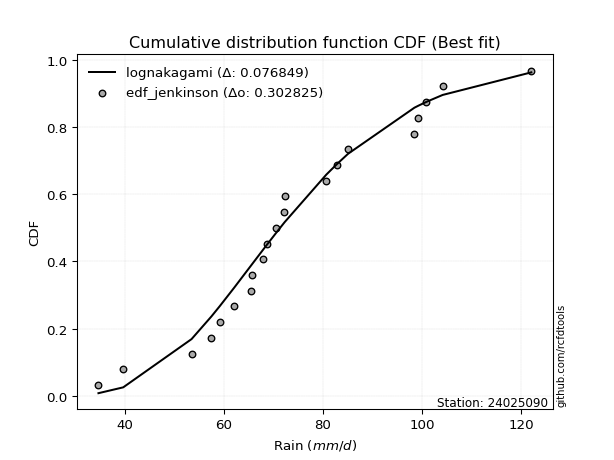</img>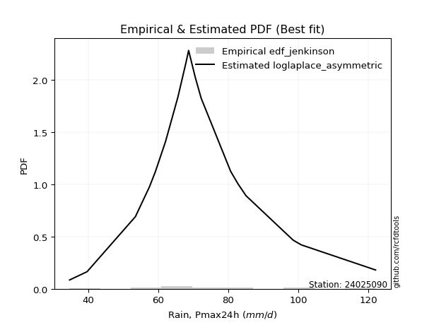</img>

</div>


### 11. EDF Cunnane (1978)

Cunnane´s work in statistical hydrology has focused on the performance and evaluation of different probability distributions (such as GEV, Gumbel, Lognormal) for flood frequency estimation. _b_ is a constant, typically set to 0.4.

<div align="center">


$P=(m-b)/(n+1-2b)$


</div>


**11.1. Empirical values**

<div align="center">

|                | 0                   | 1                   | 2                   | 3                  | 4                   | 5                  | 6                  | 7                  | 8                  | 9                  | 10          | 11                 | 12                 | 13                 | 14                 | 15                 | 16                 | 17                 | 18                 | 19                 | 20                 |
|:---------------|:--------------------|:--------------------|:--------------------|:-------------------|:--------------------|:-------------------|:-------------------|:-------------------|:-------------------|:-------------------|:------------|:-------------------|:-------------------|:-------------------|:-------------------|:-------------------|:-------------------|:-------------------|:-------------------|:-------------------|:-------------------|
| date           | 2009                | 2008                | 2007                | 2016               | 2018                | 2015               | 2012               | 2013               | 2017               | 2011               | 2010        | 2006               | 2023               | 2005               | 2024               | 2014               | 2020               | 2021               | 2022               | 2025               | 2019               |
| x              | 34.7                | 39.7                | 53.5                | 57.5               | 59.2                | 62.1               | 65.6               | 65.7               | 68.0               | 68.7               | 70.6        | 72.2               | 72.3               | 80.7               | 82.8               | 85.1               | 98.5               | 99.3               | 100.9              | 104.2              | 122.1              |
| m              | 1                   | 2                   | 3                   | 4                  | 5                   | 6                  | 7                  | 8                  | 9                  | 10                 | 11          | 12                 | 13                 | 14                 | 15                 | 16                 | 17                 | 18                 | 19                 | 20                 | 21                 |
| empirical_dist | edf_cunnane         | edf_cunnane         | edf_cunnane         | edf_cunnane        | edf_cunnane         | edf_cunnane        | edf_cunnane        | edf_cunnane        | edf_cunnane        | edf_cunnane        | edf_cunnane | edf_cunnane        | edf_cunnane        | edf_cunnane        | edf_cunnane        | edf_cunnane        | edf_cunnane        | edf_cunnane        | edf_cunnane        | edf_cunnane        | edf_cunnane        |
| empirical      | 0.02830188679245283 | 0.07547169811320756 | 0.12264150943396228 | 0.169811320754717  | 0.21698113207547168 | 0.2641509433962264 | 0.3113207547169811 | 0.3584905660377358 | 0.4056603773584906 | 0.4528301886792453 | 0.5         | 0.5471698113207547 | 0.5943396226415094 | 0.6415094339622641 | 0.6886792452830188 | 0.7358490566037736 | 0.7830188679245284 | 0.8301886792452832 | 0.8773584905660379 | 0.9245283018867926 | 0.9716981132075473 |
| empirical_tr   | 1.029126213592233   | 1.0816326530612246  | 1.139784946236559   | 1.2045454545454546 | 1.2771084337349397  | 1.3589743589743588 | 1.452054794520548  | 1.5588235294117645 | 1.6825396825396826 | 1.8275862068965518 | 2.0         | 2.2083333333333335 | 2.4651162790697674 | 2.789473684210526  | 3.2121212121212115 | 3.7857142857142865 | 4.608695652173914  | 5.888888888888894  | 8.153846153846162  | 13.250000000000023 | 35.33333333333348  |

</div>


**11.2. Kolmogorov-Smirnov fit test (sorted by Δ)**


<div align="center">

|                | 0                   | 1                   | 2                   | 3                   | 4                   | 5                   | 6                   | 7                   | 8                   | 9                   | 10                  | 11                  | 12                  | 13                  | 14                  | 15                  | 16                  | 17                  | 18                  | 19                  | 20                  | 21                  | 22                  | 23                  | 24                  | 25                  | 26                  | 27                  | 28                  | 29                  | 30                  | 31                  | 32                  | 33                  | 34                  | 35                  | 36                  | 37                  | 38                  | 39                  | 40                  | 41                  | 42                  | 43                  | 44                  | 45                  | 46                  | 47                  | 48                  | 49                  | 50                  | 51                  | 52                  | 53                  | 54                  | 55                  | 56                  | 57                  | 58                  | 59                  | 60                  | 61                  | 62                  | 63                  | 64                  | 65                  | 66                  | 67                  | 68                  | 69                  | 70                  | 71                  | 72                  | 73                  | 74                  | 75                  | 76                  | 77                  | 78                  | 79                  | 80                  | 81                  | 82                  | 83                  | 84                  | 85                  | 86                  | 87                  | 88                  | 89                  | 90                  | 91                  | 92                  | 93                  | 94                  | 95                  | 96                  | 97                  | 98                  | 99                  | 100                 | 101                 | 102                 | 103                 | 104                 | 105                 | 106                 | 107                 | 108                 | 109                 | 110                 | 111                 | 112                 | 113                 | 114                 | 115                 | 116                 | 117                 | 118                 | 119                 | 120                 | 121                 | 122                 | 123                 | 124                 | 125                 | 126                 | 127                 | 128                 | 129                 | 130                 | 131                 | 132                 | 133                 | 134                 | 135                 | 136                 | 137                 | 138                 | 139                 | 140                 | 141                 | 142                 | 143                 | 144                 | 145                 | 146                 | 147                 | 148                 | 149                 | 150                 | 151                 | 152                 | 153                 | 154                 | 155                 | 156                 | 157                 | 158                 | 159                 |
|:---------------|:--------------------|:--------------------|:--------------------|:--------------------|:--------------------|:--------------------|:--------------------|:--------------------|:--------------------|:--------------------|:--------------------|:--------------------|:--------------------|:--------------------|:--------------------|:--------------------|:--------------------|:--------------------|:--------------------|:--------------------|:--------------------|:--------------------|:--------------------|:--------------------|:--------------------|:--------------------|:--------------------|:--------------------|:--------------------|:--------------------|:--------------------|:--------------------|:--------------------|:--------------------|:--------------------|:--------------------|:--------------------|:--------------------|:--------------------|:--------------------|:--------------------|:--------------------|:--------------------|:--------------------|:--------------------|:--------------------|:--------------------|:--------------------|:--------------------|:--------------------|:--------------------|:--------------------|:--------------------|:--------------------|:--------------------|:--------------------|:--------------------|:--------------------|:--------------------|:--------------------|:--------------------|:--------------------|:--------------------|:--------------------|:--------------------|:--------------------|:--------------------|:--------------------|:--------------------|:--------------------|:--------------------|:--------------------|:--------------------|:--------------------|:--------------------|:--------------------|:--------------------|:--------------------|:--------------------|:--------------------|:--------------------|:--------------------|:--------------------|:--------------------|:--------------------|:--------------------|:--------------------|:--------------------|:--------------------|:--------------------|:--------------------|:--------------------|:--------------------|:--------------------|:--------------------|:--------------------|:--------------------|:--------------------|:--------------------|:--------------------|:--------------------|:--------------------|:--------------------|:--------------------|:--------------------|:--------------------|:--------------------|:--------------------|:--------------------|:--------------------|:--------------------|:--------------------|:--------------------|:--------------------|:--------------------|:--------------------|:--------------------|:--------------------|:--------------------|:--------------------|:--------------------|:--------------------|:--------------------|:--------------------|:--------------------|:--------------------|:--------------------|:--------------------|:--------------------|:--------------------|:--------------------|:--------------------|:--------------------|:--------------------|:--------------------|:--------------------|:--------------------|:--------------------|:--------------------|:--------------------|:--------------------|:--------------------|:--------------------|:--------------------|:--------------------|:--------------------|:--------------------|:--------------------|:--------------------|:--------------------|:--------------------|:--------------------|:--------------------|:--------------------|:--------------------|:--------------------|:--------------------|:--------------------|:--------------------|:--------------------|
| station        | 24025090            | 24025090            | 24025090            | 24025090            | 24025090            | 24025090            | 24025090            | 24025090            | 24025090            | 24025090            | 24025090            | 24025090            | 24025090            | 24025090            | 24025090            | 24025090            | 24025090            | 24025090            | 24025090            | 24025090            | 24025090            | 24025090            | 24025090            | 24025090            | 24025090            | 24025090            | 24025090            | 24025090            | 24025090            | 24025090            | 24025090            | 24025090            | 24025090            | 24025090            | 24025090            | 24025090            | 24025090            | 24025090            | 24025090            | 24025090            | 24025090            | 24025090            | 24025090            | 24025090            | 24025090            | 24025090            | 24025090            | 24025090            | 24025090            | 24025090            | 24025090            | 24025090            | 24025090            | 24025090            | 24025090            | 24025090            | 24025090            | 24025090            | 24025090            | 24025090            | 24025090            | 24025090            | 24025090            | 24025090            | 24025090            | 24025090            | 24025090            | 24025090            | 24025090            | 24025090            | 24025090            | 24025090            | 24025090            | 24025090            | 24025090            | 24025090            | 24025090            | 24025090            | 24025090            | 24025090            | 24025090            | 24025090            | 24025090            | 24025090            | 24025090            | 24025090            | 24025090            | 24025090            | 24025090            | 24025090            | 24025090            | 24025090            | 24025090            | 24025090            | 24025090            | 24025090            | 24025090            | 24025090            | 24025090            | 24025090            | 24025090            | 24025090            | 24025090            | 24025090            | 24025090            | 24025090            | 24025090            | 24025090            | 24025090            | 24025090            | 24025090            | 24025090            | 24025090            | 24025090            | 24025090            | 24025090            | 24025090            | 24025090            | 24025090            | 24025090            | 24025090            | 24025090            | 24025090            | 24025090            | 24025090            | 24025090            | 24025090            | 24025090            | 24025090            | 24025090            | 24025090            | 24025090            | 24025090            | 24025090            | 24025090            | 24025090            | 24025090            | 24025090            | 24025090            | 24025090            | 24025090            | 24025090            | 24025090            | 24025090            | 24025090            | 24025090            | 24025090            | 24025090            | 24025090            | 24025090            | 24025090            | 24025090            | 24025090            | 24025090            | 24025090            | 24025090            | 24025090            | 24025090            | 24025090            | 24025090            |
| empirical_dist | edf_cunnane         | edf_cunnane         | edf_cunnane         | edf_cunnane         | edf_cunnane         | edf_cunnane         | edf_cunnane         | edf_cunnane         | edf_cunnane         | edf_cunnane         | edf_cunnane         | edf_cunnane         | edf_cunnane         | edf_cunnane         | edf_cunnane         | edf_cunnane         | edf_cunnane         | edf_cunnane         | edf_cunnane         | edf_cunnane         | edf_cunnane         | edf_cunnane         | edf_cunnane         | edf_cunnane         | edf_cunnane         | edf_cunnane         | edf_cunnane         | edf_cunnane         | edf_cunnane         | edf_cunnane         | edf_cunnane         | edf_cunnane         | edf_cunnane         | edf_cunnane         | edf_cunnane         | edf_cunnane         | edf_cunnane         | edf_cunnane         | edf_cunnane         | edf_cunnane         | edf_cunnane         | edf_cunnane         | edf_cunnane         | edf_cunnane         | edf_cunnane         | edf_cunnane         | edf_cunnane         | edf_cunnane         | edf_cunnane         | edf_cunnane         | edf_cunnane         | edf_cunnane         | edf_cunnane         | edf_cunnane         | edf_cunnane         | edf_cunnane         | edf_cunnane         | edf_cunnane         | edf_cunnane         | edf_cunnane         | edf_cunnane         | edf_cunnane         | edf_cunnane         | edf_cunnane         | edf_cunnane         | edf_cunnane         | edf_cunnane         | edf_cunnane         | edf_cunnane         | edf_cunnane         | edf_cunnane         | edf_cunnane         | edf_cunnane         | edf_cunnane         | edf_cunnane         | edf_cunnane         | edf_cunnane         | edf_cunnane         | edf_cunnane         | edf_cunnane         | edf_cunnane         | edf_cunnane         | edf_cunnane         | edf_cunnane         | edf_cunnane         | edf_cunnane         | edf_cunnane         | edf_cunnane         | edf_cunnane         | edf_cunnane         | edf_cunnane         | edf_cunnane         | edf_cunnane         | edf_cunnane         | edf_cunnane         | edf_cunnane         | edf_cunnane         | edf_cunnane         | edf_cunnane         | edf_cunnane         | edf_cunnane         | edf_cunnane         | edf_cunnane         | edf_cunnane         | edf_cunnane         | edf_cunnane         | edf_cunnane         | edf_cunnane         | edf_cunnane         | edf_cunnane         | edf_cunnane         | edf_cunnane         | edf_cunnane         | edf_cunnane         | edf_cunnane         | edf_cunnane         | edf_cunnane         | edf_cunnane         | edf_cunnane         | edf_cunnane         | edf_cunnane         | edf_cunnane         | edf_cunnane         | edf_cunnane         | edf_cunnane         | edf_cunnane         | edf_cunnane         | edf_cunnane         | edf_cunnane         | edf_cunnane         | edf_cunnane         | edf_cunnane         | edf_cunnane         | edf_cunnane         | edf_cunnane         | edf_cunnane         | edf_cunnane         | edf_cunnane         | edf_cunnane         | edf_cunnane         | edf_cunnane         | edf_cunnane         | edf_cunnane         | edf_cunnane         | edf_cunnane         | edf_cunnane         | edf_cunnane         | edf_cunnane         | edf_cunnane         | edf_cunnane         | edf_cunnane         | edf_cunnane         | edf_cunnane         | edf_cunnane         | edf_cunnane         | edf_cunnane         | edf_cunnane         | edf_cunnane         | edf_cunnane         | edf_cunnane         |
| p_dist         | lognakagami         | logbetaprime        | logt                | lognct              | logcrystalball      | logrice             | logexponnorm        | lognorm             | logf                | logfatiguelife      | invweibull          | ncf                 | loginvgamma         | logexponweib        | logerlang           | rayleigh            | loggamma            | loggamma            | loglogistic         | logalpha            | loggengamma         | loggennorm          | logloglaplace       | gumbel_r            | loganglit           | invgauss            | moyal               | loghypsecant        | maxwell             | triang              | kstwobign           | genlogistic         | logncf              | halfnorm            | burr                | loggenlogistic      | mielke              | skewnorm            | logdweibull         | logmielke           | logburr             | nakagami            | logargus            | logsemicircular     | alpha               | loglaplace          | loglaplace          | logskewnorm         | betaprime           | invgamma            | logpearson3         | halflogistic        | gamma               | erlang              | f                   | weibull_min         | loginvgauss         | fatiguelife         | nct                 | beta                | johnsonsu           | logexponpow         | loggompertz         | logweibull_min      | logvonmises_line    | logbeta             | johnsonsb           | logloggamma         | logjohnsonsb        | logweibull_max      | loggenextreme       | logmaxwell          | logjohnsonsu        | pearson3            | rice                | genhalflogistic     | exponnorm           | dweibull            | logburr12           | genextreme          | wald                | lograyleigh         | semicircular        | anglit              | logcosine           | dgamma              | t                   | norm                | crystalball         | truncnorm           | loggausshyper       | loggumbel_r         | kappa3              | arcsine             | kappa4              | logistic            | gennorm             | loginvweibull       | hypsecant           | loggumbel_l         | cosine              | logtriang           | truncweibull_min    | wrapcauchy          | logmoyal            | loghalfnorm         | laplace             | logarcsine          | uniform             | bradford            | gausshyper          | logfoldnorm         | gompertz            | logkstwobign        | loghalflogistic     | truncexpon          | ksone               | loggenexpon         | vonmises_line       | gumbel_l            | logdgamma           | logkappa4           | loggenhalflogistic  | logwald             | logkappa3           | loguniform          | logbradford         | logtukeylambda      | argus               | loghalfgennorm      | logksone            | genpareto           | logrdist            | logtruncweibull_min | genexpon            | logtrapezoid        | logwrapcauchy       | loglomax            | burr12              | tukeylambda         | logtruncexpon       | halfgennorm         | loglevy_l           | logtruncnorm        | loggenpareto        | trapezoid           | levy_l              | powerlaw            | logtruncpareto      | lomax               | logpowerlaw         | rdist               | foldnorm            | gengamma            | exponweib           | weibull_max         | exponpow            | truncpareto         | logvonmises         | vonmises            |
| delta          | 0.07836020082107703 | 0.0786019455473399  | 0.0791997701306979  | 0.07920732156224375 | 0.07928160205058199 | 0.07928180742779672 | 0.07928193332841244 | 0.07928198899285355 | 0.07976218524672485 | 0.08179723254270521 | 0.08423166884235311 | 0.08465873942758029 | 0.085984657265546   | 0.08604201791705418 | 0.08745867466655594 | 0.08875875184021242 | 0.08951391428787897 | 0.08951391428787897 | 0.09222735360873469 | 0.09237549754460156 | 0.09318056700859145 | 0.09358282464733825 | 0.09397996886912185 | 0.0942783703511133  | 0.09506428623297603 | 0.09692349529363237 | 0.09763017303530008 | 0.10049574912320425 | 0.10051680733327362 | 0.1021491776007552  | 0.10228587505976605 | 0.10240732178249928 | 0.10289006393032868 | 0.10371505499496952 | 0.10410672655661551 | 0.10412870742540475 | 0.104154270855627   | 0.10488434719977485 | 0.10498311696968698 | 0.10545190485834544 | 0.1054730882594423  | 0.10628862037406067 | 0.10656074103107566 | 0.10722265331405662 | 0.10734833823189138 | 0.10751321985261342 | 0.10751321985261342 | 0.1082455366373215  | 0.10866746975739189 | 0.1092002625561202  | 0.1094746327774414  | 0.1096929278988335  | 0.11011934485356634 | 0.11011942699014826 | 0.11014677942200157 | 0.11048590202236352 | 0.1105279277732425  | 0.11061908848427732 | 0.11108716253157452 | 0.11148081618434924 | 0.1115010391855965  | 0.11165213998499357 | 0.11176839542167871 | 0.11204017529599741 | 0.11223743207829734 | 0.11237214607404489 | 0.11256130928631725 | 0.112743641439569   | 0.1129441988739946  | 0.11301887795769172 | 0.11304148800266162 | 0.11304705686831873 | 0.11334795453436358 | 0.11555500508689287 | 0.1156366236339712  | 0.11680820243609163 | 0.11797455913164823 | 0.11912802066837513 | 0.11918180323811067 | 0.11932837147394582 | 0.12264150943396228 | 0.12537257413101283 | 0.12659202566888317 | 0.1289625373935317  | 0.12906746604820707 | 0.1312708294243451  | 0.13469469604089174 | 0.13471004269097903 | 0.13471004513486035 | 0.1347100459589693  | 0.1371487178926279  | 0.1372337316241945  | 0.13794629677801107 | 0.1388214162211765  | 0.13896808768758173 | 0.14017540887033297 | 0.1410754151526764  | 0.14264142275763092 | 0.14481028772430682 | 0.14572126803122543 | 0.1509712128874659  | 0.15115427240774104 | 0.15132479813788924 | 0.15924557024616987 | 0.1593954848191816  | 0.1602869657736566  | 0.16111620868730064 | 0.16119768560654907 | 0.16413367298475884 | 0.1693700543752915  | 0.17174574352072475 | 0.17212455656578313 | 0.17212917917742554 | 0.17439557677244466 | 0.17462571595977633 | 0.17662066205814586 | 0.17853287854583133 | 0.19614021876484844 | 0.20460642452693611 | 0.20512418964598422 | 0.20963382946885145 | 0.21514102025028986 | 0.21825667664111037 | 0.21840220425281648 | 0.23090618734525414 | 0.23162336821201385 | 0.23293201893655863 | 0.23502301928169195 | 0.236700233463785   | 0.23773210739590406 | 0.24805092005089213 | 0.2519247390191653  | 0.2585778928384957  | 0.26580429024075325 | 0.26751969800788516 | 0.2767875594649369  | 0.3213890820728496  | 0.33066837791983356 | 0.3337455412467302  | 0.33424761860250346 | 0.3358996616183341  | 0.3560314002638638  | 0.3578590857964882  | 0.3638441570760343  | 0.3669696152412026  | 0.4178855462376352  | 0.41873572397423675 | 0.4317217040912305  | 0.44059792071407383 | 0.4474698578572611  | 0.5009880331035048  | 0.5190761485959869  | 0.5943396226415094  | 0.6459374929404141  | 0.695072410627601   | 0.7565419356174543  | 0.8035504097049482  | 0.8471134382224521  | 1.0757661720619756  | 19.4173440448796    |
| deltao         | 0.30282488509099936 | 0.30282488509099936 | 0.30282488509099936 | 0.30282488509099936 | 0.30282488509099936 | 0.30282488509099936 | 0.30282488509099936 | 0.30282488509099936 | 0.30282488509099936 | 0.30282488509099936 | 0.30282488509099936 | 0.30282488509099936 | 0.30282488509099936 | 0.30282488509099936 | 0.30282488509099936 | 0.30282488509099936 | 0.30282488509099936 | 0.30282488509099936 | 0.30282488509099936 | 0.30282488509099936 | 0.30282488509099936 | 0.30282488509099936 | 0.30282488509099936 | 0.30282488509099936 | 0.30282488509099936 | 0.30282488509099936 | 0.30282488509099936 | 0.30282488509099936 | 0.30282488509099936 | 0.30282488509099936 | 0.30282488509099936 | 0.30282488509099936 | 0.30282488509099936 | 0.30282488509099936 | 0.30282488509099936 | 0.30282488509099936 | 0.30282488509099936 | 0.30282488509099936 | 0.30282488509099936 | 0.30282488509099936 | 0.30282488509099936 | 0.30282488509099936 | 0.30282488509099936 | 0.30282488509099936 | 0.30282488509099936 | 0.30282488509099936 | 0.30282488509099936 | 0.30282488509099936 | 0.30282488509099936 | 0.30282488509099936 | 0.30282488509099936 | 0.30282488509099936 | 0.30282488509099936 | 0.30282488509099936 | 0.30282488509099936 | 0.30282488509099936 | 0.30282488509099936 | 0.30282488509099936 | 0.30282488509099936 | 0.30282488509099936 | 0.30282488509099936 | 0.30282488509099936 | 0.30282488509099936 | 0.30282488509099936 | 0.30282488509099936 | 0.30282488509099936 | 0.30282488509099936 | 0.30282488509099936 | 0.30282488509099936 | 0.30282488509099936 | 0.30282488509099936 | 0.30282488509099936 | 0.30282488509099936 | 0.30282488509099936 | 0.30282488509099936 | 0.30282488509099936 | 0.30282488509099936 | 0.30282488509099936 | 0.30282488509099936 | 0.30282488509099936 | 0.30282488509099936 | 0.30282488509099936 | 0.30282488509099936 | 0.30282488509099936 | 0.30282488509099936 | 0.30282488509099936 | 0.30282488509099936 | 0.30282488509099936 | 0.30282488509099936 | 0.30282488509099936 | 0.30282488509099936 | 0.30282488509099936 | 0.30282488509099936 | 0.30282488509099936 | 0.30282488509099936 | 0.30282488509099936 | 0.30282488509099936 | 0.30282488509099936 | 0.30282488509099936 | 0.30282488509099936 | 0.30282488509099936 | 0.30282488509099936 | 0.30282488509099936 | 0.30282488509099936 | 0.30282488509099936 | 0.30282488509099936 | 0.30282488509099936 | 0.30282488509099936 | 0.30282488509099936 | 0.30282488509099936 | 0.30282488509099936 | 0.30282488509099936 | 0.30282488509099936 | 0.30282488509099936 | 0.30282488509099936 | 0.30282488509099936 | 0.30282488509099936 | 0.30282488509099936 | 0.30282488509099936 | 0.30282488509099936 | 0.30282488509099936 | 0.30282488509099936 | 0.30282488509099936 | 0.30282488509099936 | 0.30282488509099936 | 0.30282488509099936 | 0.30282488509099936 | 0.30282488509099936 | 0.30282488509099936 | 0.30282488509099936 | 0.30282488509099936 | 0.30282488509099936 | 0.30282488509099936 | 0.30282488509099936 | 0.30282488509099936 | 0.30282488509099936 | 0.30282488509099936 | 0.30282488509099936 | 0.30282488509099936 | 0.30282488509099936 | 0.30282488509099936 | 0.30282488509099936 | 0.30282488509099936 | 0.30282488509099936 | 0.30282488509099936 | 0.30282488509099936 | 0.30282488509099936 | 0.30282488509099936 | 0.30282488509099936 | 0.30282488509099936 | 0.30282488509099936 | 0.30282488509099936 | 0.30282488509099936 | 0.30282488509099936 | 0.30282488509099936 | 0.30282488509099936 | 0.30282488509099936 | 0.30282488509099936 | 0.30282488509099936 | 0.30282488509099936 |
| eval           | Δo > Δ              | Δo > Δ              | Δo > Δ              | Δo > Δ              | Δo > Δ              | Δo > Δ              | Δo > Δ              | Δo > Δ              | Δo > Δ              | Δo > Δ              | Δo > Δ              | Δo > Δ              | Δo > Δ              | Δo > Δ              | Δo > Δ              | Δo > Δ              | Δo > Δ              | Δo > Δ              | Δo > Δ              | Δo > Δ              | Δo > Δ              | Δo > Δ              | Δo > Δ              | Δo > Δ              | Δo > Δ              | Δo > Δ              | Δo > Δ              | Δo > Δ              | Δo > Δ              | Δo > Δ              | Δo > Δ              | Δo > Δ              | Δo > Δ              | Δo > Δ              | Δo > Δ              | Δo > Δ              | Δo > Δ              | Δo > Δ              | Δo > Δ              | Δo > Δ              | Δo > Δ              | Δo > Δ              | Δo > Δ              | Δo > Δ              | Δo > Δ              | Δo > Δ              | Δo > Δ              | Δo > Δ              | Δo > Δ              | Δo > Δ              | Δo > Δ              | Δo > Δ              | Δo > Δ              | Δo > Δ              | Δo > Δ              | Δo > Δ              | Δo > Δ              | Δo > Δ              | Δo > Δ              | Δo > Δ              | Δo > Δ              | Δo > Δ              | Δo > Δ              | Δo > Δ              | Δo > Δ              | Δo > Δ              | Δo > Δ              | Δo > Δ              | Δo > Δ              | Δo > Δ              | Δo > Δ              | Δo > Δ              | Δo > Δ              | Δo > Δ              | Δo > Δ              | Δo > Δ              | Δo > Δ              | Δo > Δ              | Δo > Δ              | Δo > Δ              | Δo > Δ              | Δo > Δ              | Δo > Δ              | Δo > Δ              | Δo > Δ              | Δo > Δ              | Δo > Δ              | Δo > Δ              | Δo > Δ              | Δo > Δ              | Δo > Δ              | Δo > Δ              | Δo > Δ              | Δo > Δ              | Δo > Δ              | Δo > Δ              | Δo > Δ              | Δo > Δ              | Δo > Δ              | Δo > Δ              | Δo > Δ              | Δo > Δ              | Δo > Δ              | Δo > Δ              | Δo > Δ              | Δo > Δ              | Δo > Δ              | Δo > Δ              | Δo > Δ              | Δo > Δ              | Δo > Δ              | Δo > Δ              | Δo > Δ              | Δo > Δ              | Δo > Δ              | Δo > Δ              | Δo > Δ              | Δo > Δ              | Δo > Δ              | Δo > Δ              | Δo > Δ              | Δo > Δ              | Δo > Δ              | Δo > Δ              | Δo > Δ              | Δo > Δ              | Δo > Δ              | Δo > Δ              | Δo > Δ              | Δo > Δ              | Δo > Δ              | Δo > Δ              | Δo > Δ              | Δo > Δ              | Δo > Δ              | Δo > Δ              | Δo <= Δ             | Δo <= Δ             | Δo <= Δ             | Δo <= Δ             | Δo <= Δ             | Δo <= Δ             | Δo <= Δ             | Δo <= Δ             | Δo <= Δ             | Δo <= Δ             | Δo <= Δ             | Δo <= Δ             | Δo <= Δ             | Δo <= Δ             | Δo <= Δ             | Δo <= Δ             | Δo <= Δ             | Δo <= Δ             | Δo <= Δ             | Δo <= Δ             | Δo <= Δ             | Δo <= Δ             | Δo <= Δ             | Δo <= Δ             |
| fit            | 1                   | 1                   | 1                   | 1                   | 1                   | 1                   | 1                   | 1                   | 1                   | 1                   | 1                   | 1                   | 1                   | 1                   | 1                   | 1                   | 1                   | 1                   | 1                   | 1                   | 1                   | 1                   | 1                   | 1                   | 1                   | 1                   | 1                   | 1                   | 1                   | 1                   | 1                   | 1                   | 1                   | 1                   | 1                   | 1                   | 1                   | 1                   | 1                   | 1                   | 1                   | 1                   | 1                   | 1                   | 1                   | 1                   | 1                   | 1                   | 1                   | 1                   | 1                   | 1                   | 1                   | 1                   | 1                   | 1                   | 1                   | 1                   | 1                   | 1                   | 1                   | 1                   | 1                   | 1                   | 1                   | 1                   | 1                   | 1                   | 1                   | 1                   | 1                   | 1                   | 1                   | 1                   | 1                   | 1                   | 1                   | 1                   | 1                   | 1                   | 1                   | 1                   | 1                   | 1                   | 1                   | 1                   | 1                   | 1                   | 1                   | 1                   | 1                   | 1                   | 1                   | 1                   | 1                   | 1                   | 1                   | 1                   | 1                   | 1                   | 1                   | 1                   | 1                   | 1                   | 1                   | 1                   | 1                   | 1                   | 1                   | 1                   | 1                   | 1                   | 1                   | 1                   | 1                   | 1                   | 1                   | 1                   | 1                   | 1                   | 1                   | 1                   | 1                   | 1                   | 1                   | 1                   | 1                   | 1                   | 1                   | 1                   | 1                   | 1                   | 1                   | 1                   | 1                   | 1                   | 0                   | 0                   | 0                   | 0                   | 0                   | 0                   | 0                   | 0                   | 0                   | 0                   | 0                   | 0                   | 0                   | 0                   | 0                   | 0                   | 0                   | 0                   | 0                   | 0                   | 0                   | 0                   | 0                   | 0                   |
| n              | 21                  | 21                  | 21                  | 21                  | 21                  | 21                  | 21                  | 21                  | 21                  | 21                  | 21                  | 21                  | 21                  | 21                  | 21                  | 21                  | 21                  | 21                  | 21                  | 21                  | 21                  | 21                  | 21                  | 21                  | 21                  | 21                  | 21                  | 21                  | 21                  | 21                  | 21                  | 21                  | 21                  | 21                  | 21                  | 21                  | 21                  | 21                  | 21                  | 21                  | 21                  | 21                  | 21                  | 21                  | 21                  | 21                  | 21                  | 21                  | 21                  | 21                  | 21                  | 21                  | 21                  | 21                  | 21                  | 21                  | 21                  | 21                  | 21                  | 21                  | 21                  | 21                  | 21                  | 21                  | 21                  | 21                  | 21                  | 21                  | 21                  | 21                  | 21                  | 21                  | 21                  | 21                  | 21                  | 21                  | 21                  | 21                  | 21                  | 21                  | 21                  | 21                  | 21                  | 21                  | 21                  | 21                  | 21                  | 21                  | 21                  | 21                  | 21                  | 21                  | 21                  | 21                  | 21                  | 21                  | 21                  | 21                  | 21                  | 21                  | 21                  | 21                  | 21                  | 21                  | 21                  | 21                  | 21                  | 21                  | 21                  | 21                  | 21                  | 21                  | 21                  | 21                  | 21                  | 21                  | 21                  | 21                  | 21                  | 21                  | 21                  | 21                  | 21                  | 21                  | 21                  | 21                  | 21                  | 21                  | 21                  | 21                  | 21                  | 21                  | 21                  | 21                  | 21                  | 21                  | 21                  | 21                  | 21                  | 21                  | 21                  | 21                  | 21                  | 21                  | 21                  | 21                  | 21                  | 21                  | 21                  | 21                  | 21                  | 21                  | 21                  | 21                  | 21                  | 21                  | 21                  | 21                  | 21                  | 21                  |
| best_fit       | 1                   | 0                   | 0                   | 0                   | 0                   | 0                   | 0                   | 0                   | 0                   | 0                   | 0                   | 0                   | 0                   | 0                   | 0                   | 0                   | 0                   | 0                   | 0                   | 0                   | 0                   | 0                   | 0                   | 0                   | 0                   | 0                   | 0                   | 0                   | 0                   | 0                   | 0                   | 0                   | 0                   | 0                   | 0                   | 0                   | 0                   | 0                   | 0                   | 0                   | 0                   | 0                   | 0                   | 0                   | 0                   | 0                   | 0                   | 0                   | 0                   | 0                   | 0                   | 0                   | 0                   | 0                   | 0                   | 0                   | 0                   | 0                   | 0                   | 0                   | 0                   | 0                   | 0                   | 0                   | 0                   | 0                   | 0                   | 0                   | 0                   | 0                   | 0                   | 0                   | 0                   | 0                   | 0                   | 0                   | 0                   | 0                   | 0                   | 0                   | 0                   | 0                   | 0                   | 0                   | 0                   | 0                   | 0                   | 0                   | 0                   | 0                   | 0                   | 0                   | 0                   | 0                   | 0                   | 0                   | 0                   | 0                   | 0                   | 0                   | 0                   | 0                   | 0                   | 0                   | 0                   | 0                   | 0                   | 0                   | 0                   | 0                   | 0                   | 0                   | 0                   | 0                   | 0                   | 0                   | 0                   | 0                   | 0                   | 0                   | 0                   | 0                   | 0                   | 0                   | 0                   | 0                   | 0                   | 0                   | 0                   | 0                   | 0                   | 0                   | 0                   | 0                   | 0                   | 0                   | 0                   | 0                   | 0                   | 0                   | 0                   | 0                   | 0                   | 0                   | 0                   | 0                   | 0                   | 0                   | 0                   | 0                   | 0                   | 0                   | 0                   | 0                   | 0                   | 0                   | 0                   | 0                   | 0                   | 0                   |
| best_fit_sort  | 1                   | 2                   | 3                   | 4                   | 5                   | 6                   | 7                   | 8                   | 9                   | 10                  | 11                  | 12                  | 13                  | 14                  | 15                  | 16                  | 17                  | 18                  | 19                  | 20                  | 21                  | 22                  | 23                  | 24                  | 25                  | 26                  | 27                  | 28                  | 29                  | 30                  | 31                  | 32                  | 33                  | 34                  | 35                  | 36                  | 37                  | 38                  | 39                  | 40                  | 41                  | 42                  | 43                  | 44                  | 45                  | 46                  | 47                  | 48                  | 49                  | 50                  | 51                  | 52                  | 53                  | 54                  | 55                  | 56                  | 57                  | 58                  | 59                  | 60                  | 61                  | 62                  | 63                  | 64                  | 65                  | 66                  | 67                  | 68                  | 69                  | 70                  | 71                  | 72                  | 73                  | 74                  | 75                  | 76                  | 77                  | 78                  | 79                  | 80                  | 81                  | 82                  | 83                  | 84                  | 85                  | 86                  | 87                  | 88                  | 89                  | 90                  | 91                  | 92                  | 93                  | 94                  | 95                  | 96                  | 97                  | 98                  | 99                  | 100                 | 101                 | 102                 | 103                 | 104                 | 105                 | 106                 | 107                 | 108                 | 109                 | 110                 | 111                 | 112                 | 113                 | 114                 | 115                 | 116                 | 117                 | 118                 | 119                 | 120                 | 121                 | 122                 | 123                 | 124                 | 125                 | 126                 | 127                 | 128                 | 129                 | 130                 | 131                 | 132                 | 133                 | 134                 | 135                 | 136                 | 137                 | 138                 | 139                 | 140                 | 141                 | 142                 | 143                 | 144                 | 145                 | 146                 | 147                 | 148                 | 149                 | 150                 | 151                 | 152                 | 153                 | 154                 | 155                 | 156                 | 157                 | 158                 | 159                 | 160                 |

</div>


**11.3. Best fit**

<div align="center">

|   id |   station | empirical_dist   | p_dist      |     delta |   deltao | eval   |   fit |   n |   best_fit |   best_fit_sort |
|-----:|----------:|:-----------------|:------------|----------:|---------:|:-------|------:|----:|-----------:|----------------:|
|    0 |  24025090 | edf_cunnane      | lognakagami | 0.0783602 | 0.302825 | Δo > Δ |     1 |  21 |          1 |               1 |

</div>


<div align="center">

</img>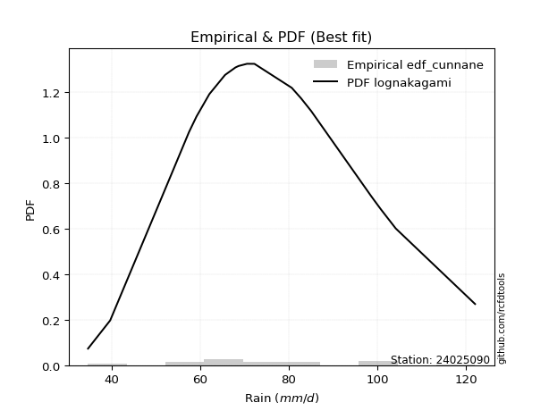</img>

</div>


### 12. EDF Adamowski (1981)

The Adamowski formula in hydrology refers to a specific plotting position formula used for estimating the non-parametric empirical distribution of hydrological events (like flood peaks) to calculate their return periods. This formula provides an alternative to traditional parametric methods (like the Gumbel or Log Pearson Type III distributions). 

<div align="center">


$P=(m-0.25)/(n+0.5)$


</div>


**12.1. Empirical values**

<div align="center">

|                | 0                   | 1                   | 2                   | 3                  | 4                   | 5                   | 6                 | 7                   | 8                  | 9                   | 10            | 11                 | 12                 | 13                 | 14                | 15                 | 16                 | 17                 | 18                 | 19                 | 20                 |
|:---------------|:--------------------|:--------------------|:--------------------|:-------------------|:--------------------|:--------------------|:------------------|:--------------------|:-------------------|:--------------------|:--------------|:-------------------|:-------------------|:-------------------|:------------------|:-------------------|:-------------------|:-------------------|:-------------------|:-------------------|:-------------------|
| date           | 2009                | 2008                | 2007                | 2016               | 2018                | 2015                | 2012              | 2013                | 2017               | 2011                | 2010          | 2006               | 2023               | 2005               | 2024              | 2014               | 2020               | 2021               | 2022               | 2025               | 2019               |
| x              | 34.7                | 39.7                | 53.5                | 57.5               | 59.2                | 62.1                | 65.6              | 65.7                | 68.0               | 68.7                | 70.6          | 72.2               | 72.3               | 80.7               | 82.8              | 85.1               | 98.5               | 99.3               | 100.9              | 104.2              | 122.1              |
| m              | 1                   | 2                   | 3                   | 4                  | 5                   | 6                   | 7                 | 8                   | 9                  | 10                  | 11            | 12                 | 13                 | 14                 | 15                | 16                 | 17                 | 18                 | 19                 | 20                 | 21                 |
| empirical_dist | edf_adamowski       | edf_adamowski       | edf_adamowski       | edf_adamowski      | edf_adamowski       | edf_adamowski       | edf_adamowski     | edf_adamowski       | edf_adamowski      | edf_adamowski       | edf_adamowski | edf_adamowski      | edf_adamowski      | edf_adamowski      | edf_adamowski     | edf_adamowski      | edf_adamowski      | edf_adamowski      | edf_adamowski      | edf_adamowski      | edf_adamowski      |
| empirical      | 0.03488372093023256 | 0.08139534883720931 | 0.12790697674418605 | 0.1744186046511628 | 0.22093023255813954 | 0.26744186046511625 | 0.313953488372093 | 0.36046511627906974 | 0.4069767441860465 | 0.45348837209302323 | 0.5           | 0.5465116279069767 | 0.5930232558139535 | 0.6395348837209303 | 0.686046511627907 | 0.7325581395348837 | 0.7790697674418605 | 0.8255813953488372 | 0.872093023255814  | 0.9186046511627907 | 0.9651162790697675 |
| empirical_tr   | 1.036144578313253   | 1.0886075949367089  | 1.1466666666666667  | 1.2112676056338028 | 1.2835820895522387  | 1.3650793650793651  | 1.457627118644068 | 1.5636363636363635  | 1.6862745098039218 | 1.829787234042553   | 2.0           | 2.205128205128205  | 2.4571428571428573 | 2.774193548387097  | 3.185185185185185 | 3.7391304347826084 | 4.526315789473685  | 5.733333333333334  | 7.8181818181818175 | 12.285714285714281 | 28.666666666666707 |

</div>


**12.2. Kolmogorov-Smirnov fit test (sorted by Δ)**


<div align="center">

|                | 0                   | 1                   | 2                   | 3                   | 4                   | 5                   | 6                   | 7                   | 8                   | 9                   | 10                  | 11                  | 12                  | 13                  | 14                  | 15                  | 16                  | 17                  | 18                  | 19                  | 20                  | 21                  | 22                  | 23                  | 24                  | 25                  | 26                  | 27                  | 28                  | 29                  | 30                  | 31                  | 32                  | 33                  | 34                  | 35                  | 36                  | 37                  | 38                  | 39                  | 40                  | 41                  | 42                  | 43                  | 44                  | 45                  | 46                  | 47                  | 48                  | 49                  | 50                  | 51                  | 52                  | 53                  | 54                  | 55                  | 56                  | 57                  | 58                  | 59                  | 60                  | 61                  | 62                  | 63                  | 64                  | 65                  | 66                  | 67                  | 68                  | 69                  | 70                  | 71                  | 72                  | 73                  | 74                  | 75                  | 76                  | 77                  | 78                  | 79                  | 80                  | 81                  | 82                  | 83                  | 84                  | 85                  | 86                  | 87                  | 88                  | 89                  | 90                  | 91                  | 92                  | 93                  | 94                  | 95                  | 96                  | 97                  | 98                  | 99                  | 100                 | 101                 | 102                 | 103                 | 104                 | 105                 | 106                 | 107                 | 108                 | 109                 | 110                 | 111                 | 112                 | 113                 | 114                 | 115                 | 116                 | 117                 | 118                 | 119                 | 120                 | 121                 | 122                 | 123                 | 124                 | 125                 | 126                 | 127                 | 128                 | 129                 | 130                 | 131                 | 132                 | 133                 | 134                 | 135                 | 136                 | 137                 | 138                 | 139                 | 140                 | 141                 | 142                 | 143                 | 144                 | 145                 | 146                 | 147                 | 148                 | 149                 | 150                 | 151                 | 152                 | 153                 | 154                 | 155                 | 156                 | 157                 | 158                 | 159                 |
|:---------------|:--------------------|:--------------------|:--------------------|:--------------------|:--------------------|:--------------------|:--------------------|:--------------------|:--------------------|:--------------------|:--------------------|:--------------------|:--------------------|:--------------------|:--------------------|:--------------------|:--------------------|:--------------------|:--------------------|:--------------------|:--------------------|:--------------------|:--------------------|:--------------------|:--------------------|:--------------------|:--------------------|:--------------------|:--------------------|:--------------------|:--------------------|:--------------------|:--------------------|:--------------------|:--------------------|:--------------------|:--------------------|:--------------------|:--------------------|:--------------------|:--------------------|:--------------------|:--------------------|:--------------------|:--------------------|:--------------------|:--------------------|:--------------------|:--------------------|:--------------------|:--------------------|:--------------------|:--------------------|:--------------------|:--------------------|:--------------------|:--------------------|:--------------------|:--------------------|:--------------------|:--------------------|:--------------------|:--------------------|:--------------------|:--------------------|:--------------------|:--------------------|:--------------------|:--------------------|:--------------------|:--------------------|:--------------------|:--------------------|:--------------------|:--------------------|:--------------------|:--------------------|:--------------------|:--------------------|:--------------------|:--------------------|:--------------------|:--------------------|:--------------------|:--------------------|:--------------------|:--------------------|:--------------------|:--------------------|:--------------------|:--------------------|:--------------------|:--------------------|:--------------------|:--------------------|:--------------------|:--------------------|:--------------------|:--------------------|:--------------------|:--------------------|:--------------------|:--------------------|:--------------------|:--------------------|:--------------------|:--------------------|:--------------------|:--------------------|:--------------------|:--------------------|:--------------------|:--------------------|:--------------------|:--------------------|:--------------------|:--------------------|:--------------------|:--------------------|:--------------------|:--------------------|:--------------------|:--------------------|:--------------------|:--------------------|:--------------------|:--------------------|:--------------------|:--------------------|:--------------------|:--------------------|:--------------------|:--------------------|:--------------------|:--------------------|:--------------------|:--------------------|:--------------------|:--------------------|:--------------------|:--------------------|:--------------------|:--------------------|:--------------------|:--------------------|:--------------------|:--------------------|:--------------------|:--------------------|:--------------------|:--------------------|:--------------------|:--------------------|:--------------------|:--------------------|:--------------------|:--------------------|:--------------------|:--------------------|:--------------------|
| station        | 24025090            | 24025090            | 24025090            | 24025090            | 24025090            | 24025090            | 24025090            | 24025090            | 24025090            | 24025090            | 24025090            | 24025090            | 24025090            | 24025090            | 24025090            | 24025090            | 24025090            | 24025090            | 24025090            | 24025090            | 24025090            | 24025090            | 24025090            | 24025090            | 24025090            | 24025090            | 24025090            | 24025090            | 24025090            | 24025090            | 24025090            | 24025090            | 24025090            | 24025090            | 24025090            | 24025090            | 24025090            | 24025090            | 24025090            | 24025090            | 24025090            | 24025090            | 24025090            | 24025090            | 24025090            | 24025090            | 24025090            | 24025090            | 24025090            | 24025090            | 24025090            | 24025090            | 24025090            | 24025090            | 24025090            | 24025090            | 24025090            | 24025090            | 24025090            | 24025090            | 24025090            | 24025090            | 24025090            | 24025090            | 24025090            | 24025090            | 24025090            | 24025090            | 24025090            | 24025090            | 24025090            | 24025090            | 24025090            | 24025090            | 24025090            | 24025090            | 24025090            | 24025090            | 24025090            | 24025090            | 24025090            | 24025090            | 24025090            | 24025090            | 24025090            | 24025090            | 24025090            | 24025090            | 24025090            | 24025090            | 24025090            | 24025090            | 24025090            | 24025090            | 24025090            | 24025090            | 24025090            | 24025090            | 24025090            | 24025090            | 24025090            | 24025090            | 24025090            | 24025090            | 24025090            | 24025090            | 24025090            | 24025090            | 24025090            | 24025090            | 24025090            | 24025090            | 24025090            | 24025090            | 24025090            | 24025090            | 24025090            | 24025090            | 24025090            | 24025090            | 24025090            | 24025090            | 24025090            | 24025090            | 24025090            | 24025090            | 24025090            | 24025090            | 24025090            | 24025090            | 24025090            | 24025090            | 24025090            | 24025090            | 24025090            | 24025090            | 24025090            | 24025090            | 24025090            | 24025090            | 24025090            | 24025090            | 24025090            | 24025090            | 24025090            | 24025090            | 24025090            | 24025090            | 24025090            | 24025090            | 24025090            | 24025090            | 24025090            | 24025090            | 24025090            | 24025090            | 24025090            | 24025090            | 24025090            | 24025090            |
| empirical_dist | edf_adamowski       | edf_adamowski       | edf_adamowski       | edf_adamowski       | edf_adamowski       | edf_adamowski       | edf_adamowski       | edf_adamowski       | edf_adamowski       | edf_adamowski       | edf_adamowski       | edf_adamowski       | edf_adamowski       | edf_adamowski       | edf_adamowski       | edf_adamowski       | edf_adamowski       | edf_adamowski       | edf_adamowski       | edf_adamowski       | edf_adamowski       | edf_adamowski       | edf_adamowski       | edf_adamowski       | edf_adamowski       | edf_adamowski       | edf_adamowski       | edf_adamowski       | edf_adamowski       | edf_adamowski       | edf_adamowski       | edf_adamowski       | edf_adamowski       | edf_adamowski       | edf_adamowski       | edf_adamowski       | edf_adamowski       | edf_adamowski       | edf_adamowski       | edf_adamowski       | edf_adamowski       | edf_adamowski       | edf_adamowski       | edf_adamowski       | edf_adamowski       | edf_adamowski       | edf_adamowski       | edf_adamowski       | edf_adamowski       | edf_adamowski       | edf_adamowski       | edf_adamowski       | edf_adamowski       | edf_adamowski       | edf_adamowski       | edf_adamowski       | edf_adamowski       | edf_adamowski       | edf_adamowski       | edf_adamowski       | edf_adamowski       | edf_adamowski       | edf_adamowski       | edf_adamowski       | edf_adamowski       | edf_adamowski       | edf_adamowski       | edf_adamowski       | edf_adamowski       | edf_adamowski       | edf_adamowski       | edf_adamowski       | edf_adamowski       | edf_adamowski       | edf_adamowski       | edf_adamowski       | edf_adamowski       | edf_adamowski       | edf_adamowski       | edf_adamowski       | edf_adamowski       | edf_adamowski       | edf_adamowski       | edf_adamowski       | edf_adamowski       | edf_adamowski       | edf_adamowski       | edf_adamowski       | edf_adamowski       | edf_adamowski       | edf_adamowski       | edf_adamowski       | edf_adamowski       | edf_adamowski       | edf_adamowski       | edf_adamowski       | edf_adamowski       | edf_adamowski       | edf_adamowski       | edf_adamowski       | edf_adamowski       | edf_adamowski       | edf_adamowski       | edf_adamowski       | edf_adamowski       | edf_adamowski       | edf_adamowski       | edf_adamowski       | edf_adamowski       | edf_adamowski       | edf_adamowski       | edf_adamowski       | edf_adamowski       | edf_adamowski       | edf_adamowski       | edf_adamowski       | edf_adamowski       | edf_adamowski       | edf_adamowski       | edf_adamowski       | edf_adamowski       | edf_adamowski       | edf_adamowski       | edf_adamowski       | edf_adamowski       | edf_adamowski       | edf_adamowski       | edf_adamowski       | edf_adamowski       | edf_adamowski       | edf_adamowski       | edf_adamowski       | edf_adamowski       | edf_adamowski       | edf_adamowski       | edf_adamowski       | edf_adamowski       | edf_adamowski       | edf_adamowski       | edf_adamowski       | edf_adamowski       | edf_adamowski       | edf_adamowski       | edf_adamowski       | edf_adamowski       | edf_adamowski       | edf_adamowski       | edf_adamowski       | edf_adamowski       | edf_adamowski       | edf_adamowski       | edf_adamowski       | edf_adamowski       | edf_adamowski       | edf_adamowski       | edf_adamowski       | edf_adamowski       | edf_adamowski       | edf_adamowski       | edf_adamowski       |
| p_dist         | logbetaprime        | lognakagami         | lognct              | logrice             | lognorm             | logcrystalball      | logexponnorm        | logt                | logf                | logfatiguelife      | invweibull          | loginvgamma         | logexponweib        | logerlang           | loggamma            | loggamma            | rayleigh            | ncf                 | logalpha            | loganglit           | loggengamma         | invgauss            | loglogistic         | loggennorm          | logloglaplace       | gumbel_r            | maxwell             | kstwobign           | logncf              | triang              | halfnorm            | genlogistic         | moyal               | logargus            | logsemicircular     | burr                | loggenlogistic      | mielke              | skewnorm            | logmielke           | logburr             | loghypsecant        | nakagami            | alpha               | logskewnorm         | halflogistic        | betaprime           | invgamma            | loginvgauss         | logpearson3         | gamma               | erlang              | f                   | logdweibull         | weibull_min         | fatiguelife         | logvonmises_line    | nct                 | beta                | johnsonsu           | logexponpow         | logmaxwell          | loggompertz         | logweibull_min      | logbeta             | johnsonsb           | logloggamma         | loglaplace          | loglaplace          | logjohnsonsb        | logweibull_max      | loggenextreme       | logjohnsonsu        | genhalflogistic     | pearson3            | rice                | exponnorm           | logburr12           | genextreme          | lograyleigh         | dweibull            | semicircular        | logcosine           | anglit              | wald                | loggausshyper       | kappa3              | t                   | norm                | crystalball         | truncnorm           | arcsine             | loggumbel_r         | dgamma              | kappa4              | logistic            | gennorm             | loginvweibull       | hypsecant           | loggumbel_l         | cosine              | logtriang           | truncweibull_min    | logarcsine          | logmoyal            | loghalfnorm         | wrapcauchy          | laplace             | uniform             | bradford            | logfoldnorm         | logkstwobign        | gausshyper          | gompertz            | loghalflogistic     | truncexpon          | ksone               | loggenexpon         | vonmises_line       | gumbel_l            | logkappa4           | logdgamma           | loggenhalflogistic  | logwald             | logkappa3           | loguniform          | logbradford         | logtukeylambda      | loghalfgennorm      | argus               | logksone            | genpareto           | logrdist            | logtruncweibull_min | genexpon            | logtrapezoid        | logwrapcauchy       | loglomax            | burr12              | logtruncexpon       | tukeylambda         | halfgennorm         | loglevy_l           | logtruncnorm        | loggenpareto        | levy_l              | trapezoid           | powerlaw            | logtruncpareto      | lomax               | logpowerlaw         | rdist               | foldnorm            | gengamma            | exponweib           | weibull_max         | exponpow            | truncpareto         | logvonmises         | vonmises            |
| delta          | 0.07747778629583368 | 0.07841581926827645 | 0.0794059936696292  | 0.0795363818175342  | 0.07953652217092433 | 0.07953652268544542 | 0.07953718418661648 | 0.079542152386474   | 0.07954235145486788 | 0.08103350118706554 | 0.0815989351872412  | 0.08335192361043409 | 0.08340928426194227 | 0.08482594101144403 | 0.08688118063276706 | 0.08688118063276706 | 0.08744238501265655 | 0.08860783991024812 | 0.08974276388948965 | 0.09166420483151455 | 0.09186420018103558 | 0.0956071284660765  | 0.09617645409140252 | 0.09753192513000608 | 0.09792906935178969 | 0.09822747083378114 | 0.09920044050571775 | 0.09965314140465414 | 0.10025733027521677 | 0.10083281077319933 | 0.10108232133985762 | 0.10109095495494341 | 0.10157927351796792 | 0.10195345713462986 | 0.10261536941761082 | 0.10279035972905964 | 0.10281234059784888 | 0.10283790402807114 | 0.10356798037221898 | 0.10413553803078957 | 0.10415672143188642 | 0.10444484960587208 | 0.1049722535465048  | 0.10603197140433551 | 0.10692916980976563 | 0.1070601942437216  | 0.10735110292983602 | 0.10788389572856433 | 0.10789519411813059 | 0.10815826594988553 | 0.10880297802601047 | 0.10880306016259239 | 0.1088304125944457  | 0.10893221745235482 | 0.10916953519480765 | 0.10930272165672145 | 0.10960469842318543 | 0.10977079570401865 | 0.11016444935679337 | 0.11018467235804064 | 0.1103357731574377  | 0.11041432321320682 | 0.11045202859412284 | 0.11072380846844154 | 0.11105577924648902 | 0.11124494245876138 | 0.11142727461201313 | 0.11146232033528125 | 0.11146232033528125 | 0.11162783204643872 | 0.11170251113013585 | 0.11172512117510575 | 0.11203158770680771 | 0.11220091853964584 | 0.114238638259337   | 0.11432025680641533 | 0.11665819230409236 | 0.1178654364105548  | 0.11801200464638995 | 0.12273984047590092 | 0.12307712115104297 | 0.1252756588413273  | 0.12643473239309516 | 0.12764617056597583 | 0.12790697674418605 | 0.1325414339961821  | 0.13333901288156527 | 0.13337832921333587 | 0.13339367586342316 | 0.13339367830730448 | 0.13339367913141342 | 0.1342141323247307  | 0.1346009979690826  | 0.13521992990701293 | 0.13765172086002586 | 0.1388590420427771  | 0.13975904832512054 | 0.140008689102519   | 0.14349392089675095 | 0.14440490120366956 | 0.14965484605991003 | 0.14983790558018517 | 0.15000843131033337 | 0.15659040171010327 | 0.15676275116406968 | 0.15765423211854468 | 0.157929203418614   | 0.15979984185974477 | 0.16281730615720297 | 0.16476277047884572 | 0.16949182291067122 | 0.16978829287599886 | 0.17042937669316888 | 0.17081281234986967 | 0.17199298230466442 | 0.17201337816170006 | 0.17260922782182941 | 0.19153293486840264 | 0.20329005769938024 | 0.20380782281842835 | 0.21053373635384406 | 0.2116083797101853  | 0.21496575957222042 | 0.21576947059770457 | 0.22629890344880835 | 0.22701608431556805 | 0.22832473504011283 | 0.23041573538524615 | 0.23312482349945826 | 0.23538386663622912 | 0.24344363615444634 | 0.24665927170894153 | 0.25331242552827193 | 0.2611970063443074  | 0.2629124141114394  | 0.27349664239604693 | 0.31612361476262585 | 0.3260610940233878  | 0.32913825735028446 | 0.33129237772188835 | 0.33161488494739155 | 0.35076593295364006 | 0.35127725165870843 | 0.3592368731795885  | 0.36038778110342284 | 0.412153889836457   | 0.41459462916874523 | 0.42645623678100675 | 0.43599063681762806 | 0.4415462071332592  | 0.495722565793281   | 0.5138106812857631  | 0.5930232558139535  | 0.6406720256301903  | 0.6898069433173771  | 0.7506182848934524  | 0.7982849423947244  | 0.8411897874984503  | 1.0797152725446435  | 19.42392587901738   |
| deltao         | 0.30282488509099936 | 0.30282488509099936 | 0.30282488509099936 | 0.30282488509099936 | 0.30282488509099936 | 0.30282488509099936 | 0.30282488509099936 | 0.30282488509099936 | 0.30282488509099936 | 0.30282488509099936 | 0.30282488509099936 | 0.30282488509099936 | 0.30282488509099936 | 0.30282488509099936 | 0.30282488509099936 | 0.30282488509099936 | 0.30282488509099936 | 0.30282488509099936 | 0.30282488509099936 | 0.30282488509099936 | 0.30282488509099936 | 0.30282488509099936 | 0.30282488509099936 | 0.30282488509099936 | 0.30282488509099936 | 0.30282488509099936 | 0.30282488509099936 | 0.30282488509099936 | 0.30282488509099936 | 0.30282488509099936 | 0.30282488509099936 | 0.30282488509099936 | 0.30282488509099936 | 0.30282488509099936 | 0.30282488509099936 | 0.30282488509099936 | 0.30282488509099936 | 0.30282488509099936 | 0.30282488509099936 | 0.30282488509099936 | 0.30282488509099936 | 0.30282488509099936 | 0.30282488509099936 | 0.30282488509099936 | 0.30282488509099936 | 0.30282488509099936 | 0.30282488509099936 | 0.30282488509099936 | 0.30282488509099936 | 0.30282488509099936 | 0.30282488509099936 | 0.30282488509099936 | 0.30282488509099936 | 0.30282488509099936 | 0.30282488509099936 | 0.30282488509099936 | 0.30282488509099936 | 0.30282488509099936 | 0.30282488509099936 | 0.30282488509099936 | 0.30282488509099936 | 0.30282488509099936 | 0.30282488509099936 | 0.30282488509099936 | 0.30282488509099936 | 0.30282488509099936 | 0.30282488509099936 | 0.30282488509099936 | 0.30282488509099936 | 0.30282488509099936 | 0.30282488509099936 | 0.30282488509099936 | 0.30282488509099936 | 0.30282488509099936 | 0.30282488509099936 | 0.30282488509099936 | 0.30282488509099936 | 0.30282488509099936 | 0.30282488509099936 | 0.30282488509099936 | 0.30282488509099936 | 0.30282488509099936 | 0.30282488509099936 | 0.30282488509099936 | 0.30282488509099936 | 0.30282488509099936 | 0.30282488509099936 | 0.30282488509099936 | 0.30282488509099936 | 0.30282488509099936 | 0.30282488509099936 | 0.30282488509099936 | 0.30282488509099936 | 0.30282488509099936 | 0.30282488509099936 | 0.30282488509099936 | 0.30282488509099936 | 0.30282488509099936 | 0.30282488509099936 | 0.30282488509099936 | 0.30282488509099936 | 0.30282488509099936 | 0.30282488509099936 | 0.30282488509099936 | 0.30282488509099936 | 0.30282488509099936 | 0.30282488509099936 | 0.30282488509099936 | 0.30282488509099936 | 0.30282488509099936 | 0.30282488509099936 | 0.30282488509099936 | 0.30282488509099936 | 0.30282488509099936 | 0.30282488509099936 | 0.30282488509099936 | 0.30282488509099936 | 0.30282488509099936 | 0.30282488509099936 | 0.30282488509099936 | 0.30282488509099936 | 0.30282488509099936 | 0.30282488509099936 | 0.30282488509099936 | 0.30282488509099936 | 0.30282488509099936 | 0.30282488509099936 | 0.30282488509099936 | 0.30282488509099936 | 0.30282488509099936 | 0.30282488509099936 | 0.30282488509099936 | 0.30282488509099936 | 0.30282488509099936 | 0.30282488509099936 | 0.30282488509099936 | 0.30282488509099936 | 0.30282488509099936 | 0.30282488509099936 | 0.30282488509099936 | 0.30282488509099936 | 0.30282488509099936 | 0.30282488509099936 | 0.30282488509099936 | 0.30282488509099936 | 0.30282488509099936 | 0.30282488509099936 | 0.30282488509099936 | 0.30282488509099936 | 0.30282488509099936 | 0.30282488509099936 | 0.30282488509099936 | 0.30282488509099936 | 0.30282488509099936 | 0.30282488509099936 | 0.30282488509099936 | 0.30282488509099936 | 0.30282488509099936 | 0.30282488509099936 | 0.30282488509099936 |
| eval           | Δo > Δ              | Δo > Δ              | Δo > Δ              | Δo > Δ              | Δo > Δ              | Δo > Δ              | Δo > Δ              | Δo > Δ              | Δo > Δ              | Δo > Δ              | Δo > Δ              | Δo > Δ              | Δo > Δ              | Δo > Δ              | Δo > Δ              | Δo > Δ              | Δo > Δ              | Δo > Δ              | Δo > Δ              | Δo > Δ              | Δo > Δ              | Δo > Δ              | Δo > Δ              | Δo > Δ              | Δo > Δ              | Δo > Δ              | Δo > Δ              | Δo > Δ              | Δo > Δ              | Δo > Δ              | Δo > Δ              | Δo > Δ              | Δo > Δ              | Δo > Δ              | Δo > Δ              | Δo > Δ              | Δo > Δ              | Δo > Δ              | Δo > Δ              | Δo > Δ              | Δo > Δ              | Δo > Δ              | Δo > Δ              | Δo > Δ              | Δo > Δ              | Δo > Δ              | Δo > Δ              | Δo > Δ              | Δo > Δ              | Δo > Δ              | Δo > Δ              | Δo > Δ              | Δo > Δ              | Δo > Δ              | Δo > Δ              | Δo > Δ              | Δo > Δ              | Δo > Δ              | Δo > Δ              | Δo > Δ              | Δo > Δ              | Δo > Δ              | Δo > Δ              | Δo > Δ              | Δo > Δ              | Δo > Δ              | Δo > Δ              | Δo > Δ              | Δo > Δ              | Δo > Δ              | Δo > Δ              | Δo > Δ              | Δo > Δ              | Δo > Δ              | Δo > Δ              | Δo > Δ              | Δo > Δ              | Δo > Δ              | Δo > Δ              | Δo > Δ              | Δo > Δ              | Δo > Δ              | Δo > Δ              | Δo > Δ              | Δo > Δ              | Δo > Δ              | Δo > Δ              | Δo > Δ              | Δo > Δ              | Δo > Δ              | Δo > Δ              | Δo > Δ              | Δo > Δ              | Δo > Δ              | Δo > Δ              | Δo > Δ              | Δo > Δ              | Δo > Δ              | Δo > Δ              | Δo > Δ              | Δo > Δ              | Δo > Δ              | Δo > Δ              | Δo > Δ              | Δo > Δ              | Δo > Δ              | Δo > Δ              | Δo > Δ              | Δo > Δ              | Δo > Δ              | Δo > Δ              | Δo > Δ              | Δo > Δ              | Δo > Δ              | Δo > Δ              | Δo > Δ              | Δo > Δ              | Δo > Δ              | Δo > Δ              | Δo > Δ              | Δo > Δ              | Δo > Δ              | Δo > Δ              | Δo > Δ              | Δo > Δ              | Δo > Δ              | Δo > Δ              | Δo > Δ              | Δo > Δ              | Δo > Δ              | Δo > Δ              | Δo > Δ              | Δo > Δ              | Δo > Δ              | Δo > Δ              | Δo > Δ              | Δo <= Δ             | Δo <= Δ             | Δo <= Δ             | Δo <= Δ             | Δo <= Δ             | Δo <= Δ             | Δo <= Δ             | Δo <= Δ             | Δo <= Δ             | Δo <= Δ             | Δo <= Δ             | Δo <= Δ             | Δo <= Δ             | Δo <= Δ             | Δo <= Δ             | Δo <= Δ             | Δo <= Δ             | Δo <= Δ             | Δo <= Δ             | Δo <= Δ             | Δo <= Δ             | Δo <= Δ             | Δo <= Δ             | Δo <= Δ             |
| fit            | 1                   | 1                   | 1                   | 1                   | 1                   | 1                   | 1                   | 1                   | 1                   | 1                   | 1                   | 1                   | 1                   | 1                   | 1                   | 1                   | 1                   | 1                   | 1                   | 1                   | 1                   | 1                   | 1                   | 1                   | 1                   | 1                   | 1                   | 1                   | 1                   | 1                   | 1                   | 1                   | 1                   | 1                   | 1                   | 1                   | 1                   | 1                   | 1                   | 1                   | 1                   | 1                   | 1                   | 1                   | 1                   | 1                   | 1                   | 1                   | 1                   | 1                   | 1                   | 1                   | 1                   | 1                   | 1                   | 1                   | 1                   | 1                   | 1                   | 1                   | 1                   | 1                   | 1                   | 1                   | 1                   | 1                   | 1                   | 1                   | 1                   | 1                   | 1                   | 1                   | 1                   | 1                   | 1                   | 1                   | 1                   | 1                   | 1                   | 1                   | 1                   | 1                   | 1                   | 1                   | 1                   | 1                   | 1                   | 1                   | 1                   | 1                   | 1                   | 1                   | 1                   | 1                   | 1                   | 1                   | 1                   | 1                   | 1                   | 1                   | 1                   | 1                   | 1                   | 1                   | 1                   | 1                   | 1                   | 1                   | 1                   | 1                   | 1                   | 1                   | 1                   | 1                   | 1                   | 1                   | 1                   | 1                   | 1                   | 1                   | 1                   | 1                   | 1                   | 1                   | 1                   | 1                   | 1                   | 1                   | 1                   | 1                   | 1                   | 1                   | 1                   | 1                   | 1                   | 1                   | 0                   | 0                   | 0                   | 0                   | 0                   | 0                   | 0                   | 0                   | 0                   | 0                   | 0                   | 0                   | 0                   | 0                   | 0                   | 0                   | 0                   | 0                   | 0                   | 0                   | 0                   | 0                   | 0                   | 0                   |
| n              | 21                  | 21                  | 21                  | 21                  | 21                  | 21                  | 21                  | 21                  | 21                  | 21                  | 21                  | 21                  | 21                  | 21                  | 21                  | 21                  | 21                  | 21                  | 21                  | 21                  | 21                  | 21                  | 21                  | 21                  | 21                  | 21                  | 21                  | 21                  | 21                  | 21                  | 21                  | 21                  | 21                  | 21                  | 21                  | 21                  | 21                  | 21                  | 21                  | 21                  | 21                  | 21                  | 21                  | 21                  | 21                  | 21                  | 21                  | 21                  | 21                  | 21                  | 21                  | 21                  | 21                  | 21                  | 21                  | 21                  | 21                  | 21                  | 21                  | 21                  | 21                  | 21                  | 21                  | 21                  | 21                  | 21                  | 21                  | 21                  | 21                  | 21                  | 21                  | 21                  | 21                  | 21                  | 21                  | 21                  | 21                  | 21                  | 21                  | 21                  | 21                  | 21                  | 21                  | 21                  | 21                  | 21                  | 21                  | 21                  | 21                  | 21                  | 21                  | 21                  | 21                  | 21                  | 21                  | 21                  | 21                  | 21                  | 21                  | 21                  | 21                  | 21                  | 21                  | 21                  | 21                  | 21                  | 21                  | 21                  | 21                  | 21                  | 21                  | 21                  | 21                  | 21                  | 21                  | 21                  | 21                  | 21                  | 21                  | 21                  | 21                  | 21                  | 21                  | 21                  | 21                  | 21                  | 21                  | 21                  | 21                  | 21                  | 21                  | 21                  | 21                  | 21                  | 21                  | 21                  | 21                  | 21                  | 21                  | 21                  | 21                  | 21                  | 21                  | 21                  | 21                  | 21                  | 21                  | 21                  | 21                  | 21                  | 21                  | 21                  | 21                  | 21                  | 21                  | 21                  | 21                  | 21                  | 21                  | 21                  |
| best_fit       | 1                   | 0                   | 0                   | 0                   | 0                   | 0                   | 0                   | 0                   | 0                   | 0                   | 0                   | 0                   | 0                   | 0                   | 0                   | 0                   | 0                   | 0                   | 0                   | 0                   | 0                   | 0                   | 0                   | 0                   | 0                   | 0                   | 0                   | 0                   | 0                   | 0                   | 0                   | 0                   | 0                   | 0                   | 0                   | 0                   | 0                   | 0                   | 0                   | 0                   | 0                   | 0                   | 0                   | 0                   | 0                   | 0                   | 0                   | 0                   | 0                   | 0                   | 0                   | 0                   | 0                   | 0                   | 0                   | 0                   | 0                   | 0                   | 0                   | 0                   | 0                   | 0                   | 0                   | 0                   | 0                   | 0                   | 0                   | 0                   | 0                   | 0                   | 0                   | 0                   | 0                   | 0                   | 0                   | 0                   | 0                   | 0                   | 0                   | 0                   | 0                   | 0                   | 0                   | 0                   | 0                   | 0                   | 0                   | 0                   | 0                   | 0                   | 0                   | 0                   | 0                   | 0                   | 0                   | 0                   | 0                   | 0                   | 0                   | 0                   | 0                   | 0                   | 0                   | 0                   | 0                   | 0                   | 0                   | 0                   | 0                   | 0                   | 0                   | 0                   | 0                   | 0                   | 0                   | 0                   | 0                   | 0                   | 0                   | 0                   | 0                   | 0                   | 0                   | 0                   | 0                   | 0                   | 0                   | 0                   | 0                   | 0                   | 0                   | 0                   | 0                   | 0                   | 0                   | 0                   | 0                   | 0                   | 0                   | 0                   | 0                   | 0                   | 0                   | 0                   | 0                   | 0                   | 0                   | 0                   | 0                   | 0                   | 0                   | 0                   | 0                   | 0                   | 0                   | 0                   | 0                   | 0                   | 0                   | 0                   |
| best_fit_sort  | 1                   | 2                   | 3                   | 4                   | 5                   | 6                   | 7                   | 8                   | 9                   | 10                  | 11                  | 12                  | 13                  | 14                  | 15                  | 16                  | 17                  | 18                  | 19                  | 20                  | 21                  | 22                  | 23                  | 24                  | 25                  | 26                  | 27                  | 28                  | 29                  | 30                  | 31                  | 32                  | 33                  | 34                  | 35                  | 36                  | 37                  | 38                  | 39                  | 40                  | 41                  | 42                  | 43                  | 44                  | 45                  | 46                  | 47                  | 48                  | 49                  | 50                  | 51                  | 52                  | 53                  | 54                  | 55                  | 56                  | 57                  | 58                  | 59                  | 60                  | 61                  | 62                  | 63                  | 64                  | 65                  | 66                  | 67                  | 68                  | 69                  | 70                  | 71                  | 72                  | 73                  | 74                  | 75                  | 76                  | 77                  | 78                  | 79                  | 80                  | 81                  | 82                  | 83                  | 84                  | 85                  | 86                  | 87                  | 88                  | 89                  | 90                  | 91                  | 92                  | 93                  | 94                  | 95                  | 96                  | 97                  | 98                  | 99                  | 100                 | 101                 | 102                 | 103                 | 104                 | 105                 | 106                 | 107                 | 108                 | 109                 | 110                 | 111                 | 112                 | 113                 | 114                 | 115                 | 116                 | 117                 | 118                 | 119                 | 120                 | 121                 | 122                 | 123                 | 124                 | 125                 | 126                 | 127                 | 128                 | 129                 | 130                 | 131                 | 132                 | 133                 | 134                 | 135                 | 136                 | 137                 | 138                 | 139                 | 140                 | 141                 | 142                 | 143                 | 144                 | 145                 | 146                 | 147                 | 148                 | 149                 | 150                 | 151                 | 152                 | 153                 | 154                 | 155                 | 156                 | 157                 | 158                 | 159                 | 160                 |

</div>


**12.3. Best fit**

<div align="center">

|   id |   station | empirical_dist   | p_dist       |     delta |   deltao | eval   |   fit |   n |   best_fit |   best_fit_sort |
|-----:|----------:|:-----------------|:-------------|----------:|---------:|:-------|------:|----:|-----------:|----------------:|
|    0 |  24025090 | edf_adamowski    | logbetaprime | 0.0774778 | 0.302825 | Δo > Δ |     1 |  21 |          1 |               1 |

</div>


<div align="center">

</img>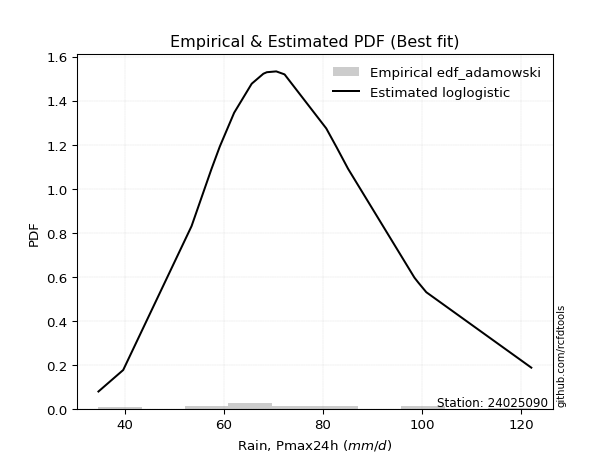</img>

</div>


## C. Best fit & Estimate extreme values for specific return periods - Tr

Best fit in probability distribution analysis means finding the theoretical distribution (like Normal, Poisson, Exponential, etc.) that most accurately mirrors your real-world data´s patterns (shape, center, spread) for better predictions, using methods like visual checks (Q-Q plots), goodness-of-fit tests (Kolmogorov-Smirnov, Chi-Squared), and information criteria (AIC) to score and select the simplest, most representative model.


### 1. Best fit (ordered by delta Δ)

:file_folder:Table: [bestfit_24025090.csv](table/bestfit_24025090.csv)

<div align="center">

|   id |   station | empirical_dist   | p_dist        |     delta |   deltao | eval   |   fit |   n |   best_fit |   best_fit_sort |
|-----:|----------:|:-----------------|:--------------|----------:|---------:|:-------|------:|----:|-----------:|----------------:|
|    0 |  24025090 | edf_california   | logloglaplace | 0.0697706 | 0.302825 | Δo > Δ |     1 |  21 |          1 |               1 |
|    1 |  24025090 | edf_chegodayev   | logbetaprime  | 0.0768386 | 0.302825 | Δo > Δ |     1 |  21 |          1 |               2 |
|    2 |  24025090 | edf_beard        | lognakagami   | 0.0768495 | 0.302825 | Δo > Δ |     1 |  21 |          1 |               3 |
|    3 |  24025090 | edf_jenkinson    | lognakagami   | 0.0768495 | 0.302825 | Δo > Δ |     1 |  21 |          1 |               4 |
|    4 |  24025090 | edf_filliben     | lognakagami   | 0.076903  | 0.302825 | Δo > Δ |     1 |  21 |          1 |               5 |
|    5 |  24025090 | edf_tukey        | lognakagami   | 0.077181  | 0.302825 | Δo > Δ |     1 |  21 |          1 |               6 |
|    6 |  24025090 | edf_weibull      | invweibull    | 0.0773706 | 0.302825 | Δo > Δ |     1 |  21 |          1 |               7 |
|    7 |  24025090 | edf_adamowski    | logbetaprime  | 0.0774778 | 0.302825 | Δo > Δ |     1 |  21 |          1 |               8 |
|    8 |  24025090 | edf_blom         | lognakagami   | 0.0779162 | 0.302825 | Δo > Δ |     1 |  21 |          1 |               9 |
|    9 |  24025090 | edf_cunnane      | lognakagami   | 0.0783602 | 0.302825 | Δo > Δ |     1 |  21 |          1 |              10 |
|   10 |  24025090 | edf_gringorten   | lognakagami   | 0.0790749 | 0.302825 | Δo > Δ |     1 |  21 |          1 |              11 |
|   11 |  24025090 | edf_hazen        | lognakagami   | 0.0801571 | 0.302825 | Δo > Δ |     1 |  21 |          1 |              12 |

</div>


### 2. Extreme values and % difference analysis

In hydrology, a return period (or recurrence interval $Tr$) is the statistical average time between extreme events like floods or droughts of a specific magnitude, indicating how rare an event is, with a 100-year flood, for example, having a 1% chance of occurring in any given year, not that it happens exactly every century. It is a key tool for infrastructure design (like bridges or dams) and risk assessment, calculated from historical data to determine the probability of future events, although it is important to remember it is statistical average, and events can cluster or be missed.

The extreme value porcentage difference is evaluated as $pdiff = 1 - (ETrBf / ETr) * 100$, where _ETrBf_ correspond to the bestfit extreme value for a specific recurrence interval and _ETr_ correspond to the extreme value for one of the most used PDFsused in hydrology.

> risk_rate: assuming the return period as the project useful life.

:file_folder:Table: [extreme_24025090.csv](table/extreme_24025090.csv), all PDFs.  
:file_folder:Table: [extremepdiff_24025090.csv](table/extremepdiff_24025090.csv), % difference between bestfit and most used PDFs in Hydrology.

<div align="center">

Extreme values table for only best fit PDFs
|   id |      tr |   prob_l |     prob_g |    alpha |   anglit |   arcsine |    argus |     beta |   betaprime |   bradford |     burr |   burr12 |   cosine |   crystalball |   dgamma |   dweibull |   erlang |   exponnorm |   exponpow |   exponweib |        f |   fatiguelife |   foldnorm |    gamma |   gausshyper |   genexpon |   genextreme |   gengamma |   genhalflogistic |   genlogistic |   gennorm |   genpareto |   gompertz |   gumbel_l |   gumbel_r |   halfgennorm |   halflogistic |   halfnorm |   hypsecant |   invgamma |   invgauss |   invweibull |   johnsonsb |   johnsonsu |   kappa3 |   kappa4 |    ksone |   kstwobign |   laplace |   levy_l |   loggamma |   logistic |   loglaplace |   lomax |   maxwell |   mielke |    moyal |   nakagami |      ncf |      nct |     norm |   pearson3 |   powerlaw |   rayleigh |   rdist |     rice |   semicircular |   skewnorm |        t |   trapezoid |   triang |   truncexpon |   truncnorm |   truncpareto |   truncweibull_min |   tukeylambda |   uniform |    vonmises |   vonmises_line |     wald |   weibull_max |   weibull_min |   wrapcauchy |   logalpha |   loganglit |   logarcsine |   logargus |   logbeta |   logbetaprime |   logbradford |   logburr |   logburr12 |   logcosine |   logcrystalball |   logdgamma |   logdweibull |   logerlang |   logexponnorm |   logexponpow |   logexponweib |     logf |   logfatiguelife |   logfoldnorm |   loggausshyper |   loggenexpon |   loggenextreme |   loggengamma |   loggenhalflogistic |   loggenlogistic |   loggennorm |   loggenpareto |   loggompertz |   loggumbel_l |   loggumbel_r |   loghalfgennorm |   loghalflogistic |   loghalfnorm |   loghypsecant |   loginvgamma |   loginvgauss |   loginvweibull |   logjohnsonsb |   logjohnsonsu |   logkappa3 |   logkappa4 |   logksone |   logkstwobign |   loglevy_l |   logloggamma |   loglogistic |   logloglaplace |   loglomax |   logmaxwell |   logmielke |   logmoyal |   lognakagami |   logncf |   lognct |   lognorm |   logpearson3 |   logpowerlaw |   lograyleigh |   logrdist |   logrice |   logsemicircular |   logskewnorm |     logt |   logtrapezoid |   logtriang |   logtruncexpon |   logtruncnorm |   logtruncpareto |   logtruncweibull_min |   logtukeylambda |   loguniform |   logvonmises |   logvonmises_line |   logwald |   logweibull_max |   logweibull_min |   logwrapcauchy |   station |   n |   risk_rate |
|-----:|--------:|---------:|-----------:|---------:|---------:|----------:|---------:|---------:|------------:|-----------:|---------:|---------:|---------:|--------------:|---------:|-----------:|---------:|------------:|-----------:|------------:|---------:|--------------:|-----------:|---------:|-------------:|-----------:|-------------:|-----------:|------------------:|--------------:|----------:|------------:|-----------:|-----------:|-----------:|--------------:|---------------:|-----------:|------------:|-----------:|-----------:|-------------:|------------:|------------:|---------:|---------:|---------:|------------:|----------:|---------:|-----------:|-----------:|-------------:|--------:|----------:|---------:|---------:|-----------:|---------:|---------:|---------:|-----------:|-----------:|-----------:|--------:|---------:|---------------:|-----------:|---------:|------------:|---------:|-------------:|------------:|--------------:|-------------------:|--------------:|----------:|------------:|----------------:|---------:|--------------:|--------------:|-------------:|-----------:|------------:|-------------:|-----------:|----------:|---------------:|--------------:|----------:|------------:|------------:|-----------------:|------------:|--------------:|------------:|---------------:|--------------:|---------------:|---------:|-----------------:|--------------:|----------------:|--------------:|----------------:|--------------:|---------------------:|-----------------:|-------------:|---------------:|--------------:|--------------:|--------------:|-----------------:|------------------:|--------------:|---------------:|--------------:|--------------:|----------------:|---------------:|---------------:|------------:|------------:|-----------:|---------------:|------------:|--------------:|--------------:|----------------:|-----------:|-------------:|------------:|-----------:|--------------:|---------:|---------:|----------:|--------------:|--------------:|--------------:|-----------:|----------:|------------------:|--------------:|---------:|---------------:|------------:|----------------:|---------------:|-----------------:|----------------------:|-----------------:|-------------:|--------------:|-------------------:|----------:|-----------------:|-----------------:|----------------:|----------:|----:|------------:|
|    0 |    2    | 0.5      | 0.5        |  72.9821 |  74.4476 |   74.4476 |  82.9923 |  73.3494 |     73.0669 |    70.4636 |  72.7699 |  57.2038 |  75.6517 |       74.4476 |  70.6    |    70.6    |  73.1324 |     73.5137 |    34.7036 |     35.1734 |  73.1338 |       73.1564 |    78.6213 |  73.1324 |      79.1225 |    62.1818 |      73.6277 |    35.9386 |           73.7064 |       72.6975 |   74.8872 |     70.2062 |    77.3767 |    77.9282 |    70.967  |       55.4057 |        69.2366 |    70.1107 |     74.4476 |    73.0818 |    72.4427 |      71.2128 |     73.3618 |     73.2009 |  71.7445 |  76.2949 |  78.4    |     70.5018 |   74.4476 |  55.4876 |    70.8142 |    74.4476 |      71.3139 | 109.009 |   72.6356 |  72.7723 |  69.8433 |    72.9481 |  71.6491 |  73.1749 |  74.4476 |    73.4196 |    49.0682 |    71.9929 | 29.2115 |  73.4727 |        74.4476 |    72.8484 |  74.4468 |     100.121 |  72.7471 |      69.4656 |     74.4476 |       34.7001 |            76.9154 |       58.5843 |   78.4    | -3.11484    |         78.4    |  67.5798 |       121.784 |       73.1973 |      78.0219 |    70.6752 |     71.314  |      71.3139 |    72.7138 |   73.3743 |        71.3787 |       65.0016 |   72.8399 |     73.6239 |     69.0526 |          71.314  |     70.6    |       70.0608 |     70.8891 |        71.3139 |       73.3287 |        71.1191 |  71.2885 |          71.1613 |       66.517  |         74.3371 |       65.6243 |         73.3789 |       72.238  |              83.4685 |          72.771  |      71.0218 |        57.2591 |       73.3069 |       74.9252 |       67.8767 |          64.4804 |           66.2293 |       67.0567 |        71.3139 |       70.9688 |       69.7452 |         68.4199 |        73.3806 |        73.3233 |     34.7    |     66.8746 |    65.0912 |        66.7015 |     61.6393 |       73.2843 |       71.3139 |         70.6    |    57.4593 |      69.5034 |     72.8388 |    66.8028 |       71.3743 |  70.5142 |  71.3202 |   71.3139 |       73.1221 |       45.1304 |       68.8718 |    65.1584 |   71.314  |           71.314  |       73.0455 |  71.3171 |        88.9846 |     76.3802 |         57.1097 |        55.3147 |          50.9202 |               62.0284 |          65.073  |      65.0912 |      0.133481 |            69.187  |   64.6901 |          73.3776 |          73.2614 |         65.0912 |  24025090 |  21 |    0.75     |
|    1 |    2.33 | 0.570815 | 0.429185   |  76.7661 |  78.8515 |   81.0586 |  88.0061 |  77.7521 |     76.9405 |    76.6761 |  76.2442 |  63.8772 |  79.8492 |       78.2284 |  72.6303 |    72.9791 |  76.9383 |     77.2009 |    34.7157 |     35.7608 |  76.9393 |       76.9512 |    78.8234 |  76.9383 |      85.3825 |    68.2368 |      77.4575 |    37.2333 |           79.2916 |       76.2699 |   78.8155 |     79.204  |    81.6972 |    81.2175 |    74.4703 |       63.0667 |        72.8386 |    74.1912 |     77.4734 |    76.8819 |    76.457  |      75.3002 |     77.5581 |     76.9866 |  76.9993 |  82.686  |  85.8271 |     74.8039 |   76.7356 |  74.8413 |    74.8032 |    77.7787 |      73.6676 | 125.382 |   76.5636 |  76.2476 |  73.1597 |    76.861  |  75.4508 |  76.9386 |  78.2284 |    77.2176 |    54.9881 |    75.979  | 41.6664 |  77.4212 |        79.1709 |    76.615  |  78.2276 |     105.199 |  76.9725 |      75.4849 |     78.2284 |       34.7004 |            82.7395 |       61.9985 |   84.5893 | -2.83131    |         82.2776 |  70.0589 |       121.972 |       77.1931 |      84.2648 |    74.6924 |     75.9132 |      78.329  |    77.7784 |   77.6701 |        75.3332 |       71.0725 |   76.3342 |     77.4418 |     73.3964 |          75.2451 |     70.7616 |       72.8565 |     74.8538 |        75.245  |       77.5846 |        75.2024 |  75.2216 |          75.0788 |       70.8007 |         81.1098 |       70.6045 |         77.5478 |       76.1175 |              89.9456 |          76.246  |      74.1198 |        73.7828 |       77.4402 |       78.5059 |       71.3369 |          70.3947 |           69.7034 |       71.0548 |        74.4431 |       74.934  |       73.8031 |         73.2649 |        77.5607 |        77.1993 |     34.7    |     73.3129 |    72.4359 |        71.7777 |     75.1924 |       77.1362 |       74.7664 |         73.1198 |    64.3424 |      73.4881 |     76.3326 |    70.0222 |       75.3154 |  74.9536 |  75.253  |   75.2451 |       77.0407 |       49.4635 |       72.8809 |    73.3536 |   75.2451 |           76.2581 |       76.9027 |  75.2474 |        95.7326 |     81.4468 |         62.285  |        60.1059 |          54.9164 |               67.5641 |          71.3506 |      71.1566 |      0.140747 |            72.6804 |   67.0069 |          77.5466 |          77.1699 |         82.6463 |  24025090 |  21 |    0.729209 |
|    2 |    5    | 0.8      | 0.2        |  91.6469 |  94.3895 |   98.6877 | 104.089  |  94.1193 |     92.2828 |    99.1479 |  90.5136 | 110.517  |  94.9755 |       92.2787 |  84.5771 |    85.9201 |  91.8285 |     91.4803 |    35.854  |     49.5954 |  91.8275 |       91.797  |    79.6778 |  91.8285 |     105.637  |    98.5107 |      92.2406 |    61.4533 |          100.204  |       90.9136 |   93.094  |    105.544  |    95.6551 |    91.8439 |    89.6902 |      118.158  |        89.1366 |    91.4467 |     89.6103 |    91.8485 |    92.8596 |      93.0576 |     93.3885 |     91.7839 |  94.5309 | 103.693  | 109.864  |     93.0785 |   88.1747 | 106.906  |    92.0111 |    90.6406 |      86.6532 | 207.241 |   92.0237 |  90.5165 |  88.5211 |    92.1126 |  91.1816 |  91.6209 |  92.2787 |    91.913  |    83.5747 |    91.9369 | 74.6676 |  92.3972 |        95.2893 |    91.6486 |  92.2781 |     119.768 |  93.8715 |      97.7695 |     92.2787 |       34.8085 |           102.652  |       73.019  |  104.62   | -1.73932    |         97.251  |  83.9368 |       122.097 |       92.4528 |     104.469  |    92.2466 |     94.6416 |     100.597  |    96.4982 |   93.8512 |        92.0625 |       94.8854 |   90.5769 |     92.012  |     91.4437 |          91.8502 |     76.7109 |       86.7794 |     91.9468 |        91.8501 |       93.3441 |        92.8492 |  91.8401 |          91.6523 |       92.1849 |        104.454  |       94.6457 |         93.4761 |       91.8305 |             108.99   |          90.5152 |      88.9857 |       114.347  |       92.8696 |       91.2852 |       88.5371 |          93.5286 |           87.846  |       90.773  |        88.4368 |       92.0082 |       91.921  |         98.6241 |        93.3114 |        92.1455 |     95.1088 |     97.7983 |   102.382  |        98.0165 |    104.515  |       92.045  |       89.7394 |         87.5129 |   114.561  |      91.5183 |     90.5756 |    87.0802 |       91.973  |  95.2629 |  91.8649 |   91.8502 |       92.2632 |       74.1943 |       91.4088 |   103.595  |   91.8502 |           95.8587 |       91.8741 |  91.8498 |       118.069  |     97.9262 |         85.9005 |        82.7752 |          75.5588 |               90.9242 |          95.8478 |      94.9376 |      0.171504 |            88.1602 |   81.5957 |          93.4753 |          92.2079 |        111.017  |  24025090 |  21 |    0.67232  |
|    3 |   10    | 0.9      | 0.1        | 102.295  | 103.184  |  102.943  | 111.844  | 104.216  |    103.306  |   110.203  | 102.133  | inf      | 104.114  |      101.599  |  95.9441 |    98.1142 | 102.367  |    101.689  |    44.2042 |    101.201  | 102.365  |      102.316  |    80.3101 | 102.367  |     114.264  |   125.993  |     102.326  |   137.279  |          113.184  |      102.278  |  102.253  |    115.124  |   103.426  |    97.7602 |   102.087  |      193.93   |       102.671  |   104.215  |     99.302  |   102.566  |   105.122  |     107.521  |    103.52   |    102.271  | 103.947  | 112.947  | 120.352  |    106.992  |   98.5589 | 114.647  |   105.872  |   100.113  |     100.413  | 281.551 |  102.904  | 102.134  | 101.896  |   102.759  | 103.199  | 102.029  | 101.599  |   102.174  |   101.124  |   103.315  | 82.4809 | 102.507  |       103.56   |   102.488  | 101.599  |     125.458 | 104.518  |     109.224  |    101.599  |       37.0313 |           112.07   |       77.7893 |  113.36   | -1.01029    |        107.372  |  98.6646 |       122.1   |      102.77   |     113.284  |   106.656  |    107.223  |     106.86   |   107.053  |  104.008  |       105.177  |      107.636  |  102.181  |    102.106  |    104.433  |         104.841  |     87.2329 |      100.935  |    105.705  |       104.841  |      103.355  |       107.081  | 104.851  |         104.647  |      112.067  |        114.407  |      116.659  |        103.699  |      103.429  |             116.154  |         102.133  |     102.732  |       120.847  |      102.97   |       99.2811 |      105.568  |         106.109  |          106.453  |      108.808  |       101.477  |      105.732  |      107.229  |        125.638  |       103.421  |       102.437  |    107.884  |    110.041  |   119.066  |       124.257  |    113.163  |      102.4    |      102.652  |        103.686  |   196.634  |     106.799  |    102.181  |   105.283  |      105.015  | 112.996  | 104.86   |  104.841  |      102.793  |       93.5369 |      107.431  |   115.55   |  104.841  |          107.797  |      102.454  | 104.84   |       128.147  |    106.309  |        101.357  |        98.7056 |          92.3536 |              104.83   |         108.614  |     107.666  |      0.195784 |           101.971  |  100.567  |         103.698  |         102.54   |        116.937  |  24025090 |  21 |    0.651322 |
|    4 |   15    | 0.933333 | 0.0666667  | 107.862  | 106.94   |  103.755  | 114.793  | 108.826  |    109.066  |   114.072  | 108.963  | inf      | 108.277  |      106.25   | 102.679  |   105.353  | 107.827  |    107.105  |    57.8018 |    166.46   | 107.825  |      107.773  |    80.6391 | 107.827  |     117.041  |   142.068  |     107.35   |   224.671  |          119.15   |      108.585  |  106.742  |    117.892  |   106.946  |   100.44   |   109.081  |      250.501  |       110.331  |   110.86   |    104.833  |   108.168  |   111.681  |     115.681  |    108.305  |    107.716  | 108.307  | 116.029  | 123.848  |    114.379  |  104.633  | 116.985  |   113.653  |   105.274  |     109.454  | 325.019 |  108.486  | 108.964  | 109.658  |   108.206  | 109.734  | 107.443  | 106.25   |   107.45   |   107.724  |   109.178  | 83.9447 | 107.588  |       106.785  |   108.113  | 106.25   |     127.284 | 109.235  |     113.341  |    106.25   |       41.9647 |           115.338  |       79.3673 |  116.273  | -0.697712   |        111.773  | 108.122  |       122.1   |      107.941  |     116.223  |   114.851  |    113.092  |     108.099  |   111.358  |  108.679  |       112.409  |      112.256  |  109.062  |    107.317  |    110.947  |         111.995  |     95.1917 |      110.078  |    113.425  |       111.995  |      108.146  |       115.051  | 112.02   |         111.814  |      124.056  |        117.43   |      129.938  |        108.438  |      109.582  |             118.331  |         108.963  |     111.089  |       121.674  |      107.935  |      103.129  |      116.585  |         110.997  |          118.679  |      119.57   |       109.764  |      113.427  |      116.098  |        144.026  |       108.222  |       107.656  |    112.513  |    114.221  |   125.211  |       140.933  |    115.913  |      107.691  |      110.453  |        114.836  |   271.743  |     115.605  |    109.062  |   117.544  |      112.202  | 123.492  | 112.017  |  111.995  |      108.127  |      101.826  |      116.754  |   118.688  |  111.995  |          112.846  |      107.966  | 111.996  |       131.559  |    110.228  |        107.572  |       105.442  |         100.207  |              110.161  |         113.108  |     112.277  |      0.209288 |           109.942  |  115.015  |         108.438  |         107.782  |        118.69   |  24025090 |  21 |    0.644736 |
|    5 |   20    | 0.95     | 0.05       | 111.605  | 109.149  |  104.041  | 116.411  | 111.658  |    112.933  |   116.042  | 113.918  | inf      | 110.837  |      109.296  | 107.483  |   110.524  | 111.476  |    110.799  |    74.0408 |    236.755  | 111.473  |      111.423  |    80.8585 | 111.476  |     118.395  |   153.474  |     110.609  |   314.153  |          122.832  |      112.974  |  109.655  |    119.161  |   109.136  |   102.107  |   113.978  |      296.427  |       115.697  |   115.29   |    108.735  |   111.933  |   116.14   |     121.394  |    111.313  |    111.361  | 111.149  | 117.567  | 125.596  |    119.355  |  108.943  | 118.183  |   119.094  |   108.841  |     116.357  | 355.86  |  112.191  | 113.919  | 115.155  |   111.816  | 114.225  | 111.074  | 109.296  |   110.962  |   111.169  |   113.075  | 84.4547 | 110.925  |       108.574  |   111.862  | 109.296  |     128.184 | 112.046  |     115.463  |    109.296  |       47.851  |           117      |       80.1523 |  117.73   | -0.526934   |        114.193  | 115.17   |       122.1   |      111.329  |     117.692  |   120.627  |    116.694  |     108.538  |   113.793  |  111.554  |       117.415  |      114.64   |  114.093  |    110.804  |    115.153  |         116.943  |    101.639  |      116.998  |    118.822  |       116.942  |      111.203  |       120.607  | 116.979  |         116.776  |      132.753  |        118.834  |      139.592  |        111.355  |      113.746  |             119.367  |         113.919  |     117.194  |       121.902  |      111.156  |      105.599  |      124.976  |         113.748  |          128.072  |      127.329  |       116.014  |      118.804  |      122.415  |        158.48   |       111.253  |       111.098  |    114.901  |    116.299  |   128.402  |       153.41   |    117.348  |      111.198  |      116.189  |        123.634  |   343.028  |     121.846  |    114.092  |   127.081  |      117.174  | 131.064  | 116.967  |  116.943  |      111.639  |      106.398  |      123.394  |   120.003  |  116.943  |          115.748  |      111.669  | 116.945  |       133.276  |    112.633  |        110.922  |       109.165  |         104.772  |              112.978  |         115.383  |     114.656  |      0.218694 |           115.192  |  127.115  |         111.355  |         111.243  |        119.548  |  24025090 |  21 |    0.641514 |
|    6 |   25    | 0.96     | 0.04       | 114.411  | 110.646  |  104.174  | 117.455  | 113.641  |    115.828  |   117.236  | 117.847  | inf      | 112.632  |      111.539  | 111.22   |   114.553  | 114.199  |    113.602  |    91.6222 |    308.854  | 114.197  |      114.149  |    81.0217 | 114.199  |     119.191  |   162.321  |     112.983  |   402.887  |          125.418  |      116.344  |  111.787  |    119.874  |   110.695  |   103.294  |   117.749  |      335.474  |       119.832  |   118.587  |    111.755  |   114.754  |   119.508  |     125.795  |    113.457  |    114.085  | 113.266  | 118.488  | 126.645  |    123.082  |  112.286  | 118.935  |   123.285  |   111.57   |     122.011  | 379.782 |  114.941  | 117.849  | 119.416  |   114.495  | 117.642  | 113.791  | 111.539  |   113.575  |   113.284  |   115.97   | 84.6894 | 113.387  |       109.735  |   114.65   | 111.538  |     128.721 | 113.965  |     116.757  |    111.539  |       53.6389 |           118.005  |       80.6216 |  118.604  | -0.420321   |        115.71   | 120.815  |       122.1   |      113.823  |     118.574  |   125.101  |    119.2    |     108.743  |   115.391  |  113.568  |       121.242  |      116.095  |  118.108  |    113.413  |    118.197  |         120.724  |    107.114  |      122.629  |    122.979  |       120.724  |      113.411  |       124.872  | 120.77   |         120.57   |      139.617  |        119.628  |      147.228  |        113.393  |      116.88   |             119.969  |         117.848  |     122.04   |       121.991  |      113.51   |      107.393  |      131.848  |         115.576  |          135.813  |      133.428  |       121.094  |      122.945  |      127.347  |        170.595  |       113.421  |       113.642  |    116.359  |    117.533  |   130.355  |       163.475  |    118.257  |      113.8    |      120.777  |        131.023  |   411.781  |     126.697  |    118.107  |   135.003  |      120.974  | 137.027  | 120.749  |  120.724  |      114.23   |      109.29   |      128.571  |   120.691  |  120.724  |          117.67   |      114.446  | 120.728  |       134.31   |    114.304  |        113.017  |       111.527  |         107.76   |              114.719  |         116.752  |     116.107  |      0.225924 |           118.872  |  137.719  |         113.394  |         113.804  |        120.059  |  24025090 |  21 |    0.639603 |
|    7 |   50    | 0.98     | 0.02       | 122.695  | 114.331  |  104.351  | 119.821  | 118.818  |    124.348  |   119.65   | 130.656  | inf      | 117.334  |      117.96   | 122.875  |   127.154  | 122.173  |    122.084  |   184.015  |    664.693  | 122.171  |      122.142  |    81.4961 | 122.173  |     120.73   |   189.803  |     119.619  |   816.606  |          132.197  |      126.684  |  117.839  |    121.162  |   114.927  |   106.516  |   129.369  |      476.693  |       132.572  |   128.168  |    121.117  |   123.073  |   129.56   |     139.352  |    119.239  |    122.082  | 119.6    | 120.323  | 128.742  |    134.026  |  122.67   | 120.627  |   136.226  |   119.907  |     141.385  | 454.092 |  122.918  | 130.662  | 132.643  |   122.258  | 127.985  | 121.788  | 117.96   |   121.195  |   117.62   |   124.374  | 84.9994 | 120.456  |       112.386  |   122.756  | 117.959  |     129.786 | 118.727  |     119.394  |    117.96   |       74.7947 |           120.038  |       81.5544 |  120.352  | -0.199699   |        118.859  | 139.246  |       122.1   |      120.958  |     120.337  |   139.055  |    125.6    |     109.016  |   119.096  |  118.819  |       132.911  |      119.06   |  131.38   |    121.11   |    126.555  |         132.242  |    126.959  |      141.729  |    135.811  |       132.242  |      119.536  |       137.938  | 132.321  |         132.139  |      161.652  |        121.065  |      171.849  |        118.658  |      126.185  |             121.112  |         130.661  |     137.766  |       122.083  |      120.171  |      112.417  |      155.487  |         120.045  |          162.732  |      152.863  |       138.303  |      135.723  |      142.925  |        214.052  |       119.311  |       120.967  |    119.329  |    119.942  |   134.351  |       197.009  |    120.33   |      121.343  |      135.948  |        157.615  |   734.489  |     141.884  |    131.376  |   162.883  |      132.555  | 156.165  | 132.271  |  132.242  |      121.657  |      115.435  |      144.861  |   121.789  |  132.242  |          122.182  |      122.647  | 132.253  |       136.384  |    118.558  |        117.412  |       116.573  |         114.396  |              118.324  |         119.481  |     119.066  |      0.24819  |           127.581  |  178.9    |         118.66   |         121.196  |        121.079  |  24025090 |  21 |    0.63583  |
|    8 |   75    | 0.986667 | 0.0133333  | 127.297  | 115.953  |  104.384  | 120.759  | 121.279  |    129.061  |   120.463  | 138.653  | inf      | 119.579  |      121.405  | 129.718  |   134.577  | 126.56   |    126.95   |   272.855  |    996.126  | 126.559  |      126.547  |    81.7544 | 126.56   |     121.218  |   205.879  |     123.046  |  1181.93   |          135.431  |      132.676  |  121.056  |    121.534  |   117.067  |   108.145  |   136.123  |      573.924  |       139.977  |   133.383  |    126.588  |   127.689  |   135.208  |     147.232  |    122.111  |    126.496  | 123.264  | 120.931  | 129.442  |    140.048  |  128.744  | 121.323  |   143.789  |   124.722  |     154.115  | 497.56  |  127.255  | 138.664  | 140.378  |   126.476  | 133.896  | 126.218  | 121.405  |   125.367  |   119.097  |   128.946  | 85.0558 | 124.259  |       113.445  |   127.168  | 121.405  |     130.138 | 120.836  |     120.288  |    121.405  |       86.5127 |           120.722  |       81.8628 |  120.935  | -0.124589   |        119.933  | 150.588  |       122.1   |      124.778  |     120.925  |   147.306  |    128.524  |     109.067  |   120.598  |  121.306  |       139.632  |      120.065  |  139.816  |    125.394  |    130.753  |         138.869  |    140.765  |      154.133  |    143.308  |       138.869  |      122.702  |       145.485  | 138.97   |         138.804  |      175.076  |        121.479  |      186.938  |        121.107  |      131.382  |             121.469  |         138.661  |     147.48   |       122.094  |      123.695  |      115.047  |      171.129  |         122.068  |          180.769  |      164.608  |       149.47   |      143.186  |      152.274  |        244.231  |       122.265  |       124.916  |    120.336  |    120.712  |   135.71   |       218.309  |    121.193  |      125.443  |      145.564  |        176.171  |  1038.69   |     150.891  |    139.809  |   181.783  |      139.22   | 167.858  | 138.9    |  138.869  |      125.635  |      117.597  |      154.574  |   122.054  |  138.869  |          124.032  |      127.211  | 138.886  |       137.078  |    120.493  |        118.941  |       118.358  |         116.833  |              119.563  |         120.379  |     120.069  |      0.261186 |           130.878  |  210.148  |         121.109  |         125.197  |        121.419  |  24025090 |  21 |    0.634587 |
|    9 |  100    | 0.99     | 0.01       | 130.476  | 116.918  |  104.395  | 121.283  | 122.818  |    132.306  |   120.871  | 144.584  | inf      | 120.986  |      123.735  | 134.583  |   139.864  | 129.57   |    130.38   |   355.545  |   1303.2    | 129.569  |      129.572  |    81.9303 | 129.57   |     121.455  |   217.285  |     125.298  |  1510.22   |          137.455  |      136.912  |  123.22   |    121.705  |   118.466  |   109.21   |   140.903  |      649.76   |       145.218  |   136.936  |    130.469  |   130.873  |   139.132  |     152.809  |    123.959  |    129.532  | 125.884  | 121.234  | 129.791  |    144.173  |  133.054  | 121.729  |   149.168  |   128.122  |     163.836  | 528.401 |  130.209  | 144.6    | 145.866  |   129.348  | 138.046  | 129.272  | 123.735  |   128.222  |   119.842  |   132.061  | 85.0753 | 126.835  |       114.038  |   130.173  | 123.735  |     130.314 | 122.093  |     120.738  |    123.735  |       93.6727 |           121.065  |       82.0161 |  121.226  | -0.0868524  |        120.474  | 158.857  |       122.1   |      127.358  |     121.218  |   153.219  |    130.296  |     109.085  |   121.445  |  122.854  |       144.37   |      120.571  |  146.151  |    128.362  |    133.454  |         143.538  |    151.663  |      163.539  |    148.64   |       143.538  |      124.795  |       150.806  | 143.655  |         143.503  |      184.853  |        121.668  |      197.971  |        122.609  |      134.979  |             121.641  |         144.596  |     154.62   |       122.097  |      126.059  |      116.8    |      183.141  |         123.318  |          194.73   |      173.121  |       157.934  |      148.493  |      159.032  |        268.128  |       124.179  |       127.592  |    120.843  |    121.086  |   136.395  |       234.217  |    121.7    |      128.236  |      152.76   |        190.928  |  1333.09   |     157.351  |    146.141  |   196.507  |      143.918  | 176.405  | 143.571  |  143.538  |      128.318  |      118.7    |      161.562  |   122.162  |  143.538  |          125.08   |      130.366  | 143.56   |       137.426  |    121.662  |        119.718  |       119.272  |         118.098  |              120.19   |         120.823  |     120.573  |      0.270431 |           132.592  |  236.319  |         122.611  |         127.915  |        121.589  |  24025090 |  21 |    0.633968 |
|   10 |  200    | 0.995    | 0.005      | 137.889  | 118.74   |  104.406  | 122.194  | 125.936  |    139.836  |   121.484  | 159.847  | inf      | 123.847  |      129.021  | 146.329  |   152.663  | 136.528  |    138.603  |   636.142  |   2355.9    | 136.529  |      136.575  |    82.3327 | 136.528  |     121.797  |   244.767  |     130.183  |  2590.68   |          141.555  |      147.086  |  128.099  |    121.934  |   121.509  |   111.526  |   152.395  |      856.855  |       157.819  |   145.062  |    139.819  |   138.289  |   148.347  |     166.217  |    127.866  |    136.57   | 132.349  | 121.685  | 130.316  |    153.676  |  143.438  | 122.499  |   162.22   |   136.278  |     189.852  | 602.711 |  136.968  | 159.879  | 159.088  |   135.917  | 147.942  | 136.379  | 129.021  |   134.797  |   120.966  |   139.189  | 85.094  | 132.689  |       115.072  |   137.048  | 129.021  |     130.577 | 124.474  |     121.417  |    129.021  |      106.423  |           121.582  |       82.2447 |  121.663  | -0.0300963  |        121.286  | 179.455  |       122.1   |      133.196  |     121.659  |   167.711  |    133.709  |     109.102  |   122.93   |  125.971  |       155.727  |      121.333  |  162.768  |    135.323  |    139.12   |         154.72   |    182.176  |      188.458  |    161.573  |       154.72   |      129.406  |       163.534  | 154.88   |         154.77   |      209.317  |        121.92   |      225.735  |        125.559  |      143.388  |             121.886  |         159.871  |     172.725  |       122.1    |      131.36   |      120.703  |      215.584  |         125.862  |          232.868  |      194.285  |       180.346  |      161.363  |      175.799  |        335.59   |       128.261  |       133.672  |    121.606  |    121.625  |   137.428  |       275.409  |    122.666  |      134.63   |      171.505  |        232.96   |  2463.27   |     173.192  |    162.747  |   237.069  |      155.172  | 197.943  | 154.756  |  154.72   |      134.37   |      120.382  |      178.762  |   122.288  |  154.72   |          126.929  |      137.739  | 154.757  |       137.947  |    123.905  |        120.899  |       120.669  |         120.059  |              121.139  |         121.478  |     121.334  |      0.292896 |           135.235  |  316.569  |         125.561  |         134.12   |        121.844  |  24025090 |  21 |    0.633042 |
|   11 |  250    | 0.996    | 0.004      | 140.213  | 119.203  |  104.408  | 122.407  | 126.789  |    142.186  |   121.607  | 165.077  | inf      | 124.631  |      130.636  | 150.117  |   156.8    | 138.691  |    141.243  |   754.709  |   2808.76   | 138.692  |      138.755  |    82.4565 | 138.691  |     121.862  |   253.614  |     131.606  |  3041.01   |          142.673  |      150.354  |  129.582  |    121.974  |   122.404  |   112.208  |   156.089  |      931.119  |       161.87   |   147.562  |    142.829  |   140.61   |   151.251  |     170.527  |    128.981  |    138.764  | 134.492  | 121.775  | 130.42   |    156.617  |  146.781  | 122.7    |   166.458  |   138.896  |     199.076  | 626.633 |  139.048  | 165.116  | 163.345  |   137.939  | 151.105  | 138.602  | 130.636  |   136.834  |   121.192  |   141.382  | 85.0962 | 134.481  |       115.315  |   139.163  | 130.636  |     130.63  | 125.081  |     121.553  |    130.636  |      109.304  |           121.685  |       82.29   |  121.75   | -0.0187305  |        121.449  | 186.269  |       122.1   |      134.976  |     121.747  |   172.461  |    134.592  |     109.104  |   123.28   |  126.817  |       159.374  |      121.486  |  168.567  |    137.52   |    140.715  |         158.308  |    193.429  |      197.214  |    165.772  |       158.308  |      130.777  |       167.608  | 158.483  |         158.389  |      217.475  |        121.964  |      235.044  |        126.337  |      146.027  |             121.933  |         165.106  |     178.84   |       122.1    |      132.964  |      121.876  |      227.19   |         126.57   |          246.651  |      201.302  |       188.216  |      165.54   |      181.356  |        360.698  |       129.437  |       135.532  |    121.76   |    121.728  |   137.636  |       289.57   |    122.919  |      136.6    |      177.998  |        248.763  |  3013.34   |     178.382  |    168.542  |   251.831  |      158.784  | 205.182  | 158.345  |  158.308  |      136.206  |      120.723  |      184.417  |   122.307  |  158.308  |          127.367  |      140.054  | 158.35   |       138.052  |    124.483  |        121.138  |       120.953  |         120.461  |              121.331  |         121.607  |     121.487  |      0.300208 |           135.772  |  348.717  |         126.339  |         136.026  |        121.895  |  24025090 |  21 |    0.632858 |
|   12 |  500    | 0.998    | 0.002      | 147.272  | 120.353  |  104.409  | 122.896  | 129.053  |    149.284  |   121.853  | 182.401  | inf      | 126.718  |      135.426  | 161.899  |   169.698  | 145.204  |    149.439  |  1226.22   |   4663.44   | 145.207  |      145.328  |    82.8255 | 145.203  |     121.988  |   281.096  |     135.62   |  4829.1    |          145.634  |      160.496  |  133.959  |    122.047  |   124.97   |   114.162  |   167.556  |     1186.49   |       174.444  |   155.015  |    152.178  |   147.648  |   160.113  |     183.906  |    132.075  |    145.393  | 141.387  | 121.954  | 130.63   |    165.43   |  157.166  | 123.217  |   179.764  |   147.016  |     230.688  | 700.942 |  145.256  | 182.467  | 176.566  |   143.973  | 160.896  | 145.342  | 135.426  |   142.951  |   121.645  |   147.929  | 85.0991 | 139.8    |       115.873  |   145.468  | 135.426  |     130.735 | 126.586  |     121.826  |    135.426  |      115.436  |           121.892  |       82.3802 |  121.925  |  0.00400972 |        121.774  | 207.936  |       122.1   |      140.24   |     121.924  |   187.518  |    136.806  |     109.107  |   124.089  |  129.044  |       170.702  |      121.793  |  188.168  |    144.249  |    145.05   |         169.445  |    233.552  |      226.941  |    178.953  |       169.444  |      134.745  |       180.197  | 169.669  |         169.632  |      243.737  |        122.043  |      265.168  |        128.325  |      154.048  |             122.022  |         182.45   |     198.782  |       122.1    |      137.674  |      125.302  |      267.342  |         128.514  |          294.844  |      223.764  |       214.923  |      178.654  |      199.157  |        451.23   |       132.731  |       141.048  |    122.067  |    121.926  |   138.052  |       336.517  |    123.574  |      142.481  |      199.739  |        306.567  |  5706.2    |     194.811  |    188.123  |   303.811  |      170      | 228.7    | 169.484  |  169.445  |      141.609  |      121.409  |      202.374  |   122.337  |  169.445  |          128.381  |      147.099  | 169.506  |       138.261  |    125.93   |        121.617  |       121.524  |         121.274  |              121.714  |         121.859  |     121.793  |      0.32325  |           136.856  |  474.282  |         128.328  |         141.705  |        121.998  |  24025090 |  21 |    0.632489 |
|   13 |  750    | 0.998667 | 0.00133333 | 151.305  | 120.862  |  104.41   | 123.093  | 130.149  |    153.314  |   121.936  | 193.347  | inf      | 127.73   |      138.087  | 168.801  |   177.273  | 148.886  |    154.23   |  1583.16   |   6123.87   | 148.892  |      149.051  |    83.0317 | 148.886  |     122.028  |   297.172  |     137.708  |  6193.07   |          147.057  |      166.422  |  136.378  |    122.068  |   126.341  |   115.206  |   174.259  |     1353.81   |       181.794  |   159.179  |    157.647  |   151.661  |   165.198  |     191.727  |    133.66   |    149.155  | 145.608  | 122.013  | 130.7    |    170.381  |  163.24   | 123.463  |   187.663  |   151.76   |     251.458  | 744.411 |  148.728  | 193.433  | 184.3    |   147.347  | 166.612  | 149.185  | 138.087  |   146.399  |   121.797  |   151.589  | 85.0996 | 142.758  |       116.098  |   148.991  | 138.087  |     130.77  | 127.253  |     121.917  |    138.087  |      117.596  |           121.962  |       82.41   |  121.983  |  0.0115915  |        121.883  | 220.927  |       122.1   |      143.155  |     121.982  |   196.556  |    137.798  |     109.107  |   124.415  |  130.109  |       177.342  |      121.895  |  200.864  |    148.137  |    147.198  |         175.966  |    261.139  |      246.26   |    186.776  |       175.966  |      136.886  |       187.52   | 176.222  |         176.223  |      259.765  |        122.066  |      283.671  |        129.238  |      158.63   |             122.05   |         193.411  |     211.147  |       122.1    |      140.262  |      127.173  |      294.025  |         129.506  |          327.268  |      237.387  |       232.269  |      186.436  |      209.974  |        514.343  |       134.436  |       144.11   |    122.171  |    121.988  |   138.191  |       366.155  |    123.886  |      145.774  |      213.65   |        347.681  |  8363.81   |     204.652  |    200.803  |   339.059  |      176.57   | 243.23   | 176.007  |  175.966  |      144.577  |      121.639  |      213.167  |   122.344  |  175.966  |          128.791  |      151.133  | 176.042  |       138.33   |    126.577  |        121.778  |       121.715  |         121.548  |              121.843  |         121.942  |     121.895  |      0.337002 |           137.219  |  570.319  |         129.241  |         144.876  |        122.032  |  24025090 |  21 |    0.632366 |
|   14 | 1000    | 0.999    | 0.001      | 154.13   | 121.166  |  104.41   | 123.204  | 130.84   |    156.125  |   121.977  | 201.503  | inf      | 128.368  |      139.919  | 173.701  |   182.66   | 151.449  |    157.63   |  1876.74   |   7359.75   | 151.456  |      151.645  |    83.1741 | 151.449  |     122.047  |   308.578  |     139.084  |  7325.91   |          147.951  |      170.626  |  138.038  |    122.078  |   127.264  |   115.908  |   179.014  |     1480.84   |       187.008  |   162.055  |    161.527  |   154.468  |   168.768  |     197.274  |    134.696  |    151.779  | 148.695  | 122.043  | 130.735  |    173.811  |  167.55   | 123.617  |   193.324  |   155.124  |     267.319  | 775.252 |  151.128  | 201.606  | 189.788  |   149.679  | 170.669  | 151.873  | 139.919  |   148.793  |   121.873  |   154.119  | 85.0998 | 144.797  |       116.224  |   151.423  | 139.919  |     130.788 | 127.651  |     121.963  |    139.919  |      118.699  |           121.996  |       82.4249 |  122.013  |  0.0153825  |        121.937  | 230.272  |       122.1   |      145.157  |     122.012  |   203.08   |    138.392  |     109.108  |   124.599  |  130.775  |       182.064  |      121.947  |  210.482  |    150.882  |    148.569  |         180.602  |    282.817  |      260.911  |    192.382  |       180.601  |      138.335  |       192.7    | 180.881  |         180.911  |      271.445  |        122.076  |      297.209  |        129.794  |      161.839  |             122.064  |         201.58   |     220.25   |       122.1    |      142.032  |      128.448  |      314.552  |         130.157  |          352.408  |      247.276  |       245.419  |      192.013  |      217.842  |        564.394  |       135.56   |       146.217  |    122.225  |    122.018  |   138.261  |       388.205  |    124.082  |      148.051  |      224.099  |        380.788  | 11014.9    |     211.742  |    210.408  |   366.52   |      181.241  | 253.907  | 180.644  |  180.602  |      146.604  |      121.754  |      220.961  |   122.347  |  180.602  |          129.022  |      153.963  | 180.688  |       138.365  |    126.964  |        121.858  |       121.811  |         121.685  |              121.907  |         121.983  |     121.946  |      0.346902 |           137.401  |  651.213  |         129.797  |         147.067  |        122.049  |  24025090 |  21 |    0.632305 |


</div>


<div align="center">

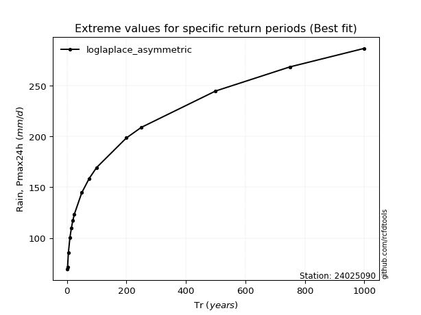</img>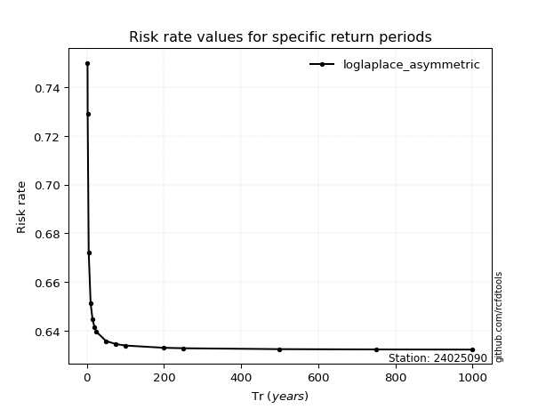</img>

</div>


<sub>**APP DISCLAIMER**: NO WARRANTY - This software is provided by [github.com/rcfdtools](https://github.com/rcfdtools) "as is", without any express or implied warranty, including warranties of merchantability, fitness for a particular purpose, or non-infringement. There is no guarantee that the software will be error-free or operate without interruption. LIMITATION OF LIABILITY - Neither the authors nor copyright holders will be liable for claims or damages arising from the software or its use. You are responsible for determining if the software is appropriate for your use and assume all associated risks, including errors, legal compliance, and data loss. NO PROFESSIONAL ADVICE - The software provides general information and does not offer professional advice. It should not replace consultation with professional advisors.</sub>