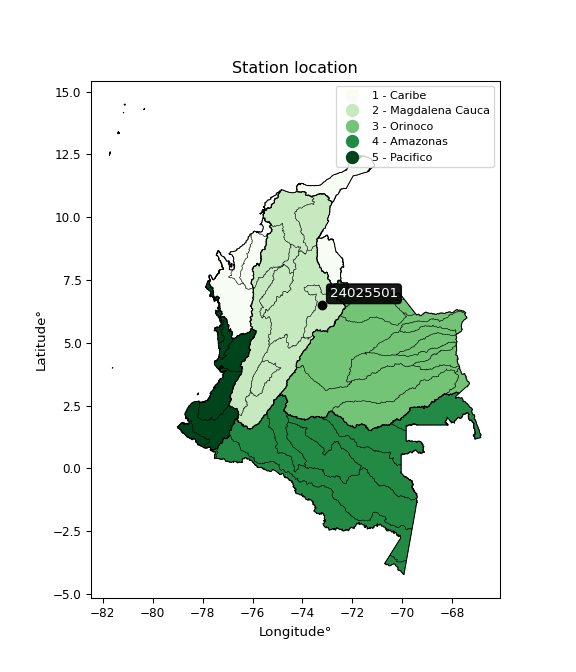

<div align="center">


</div>

# PMP Station (Rain, Pmax24h): 24025501

Probable Maximum Precipitation (PMP) is the greatest amount of rainfall for a specific duration that is meteorologically possible for a given location, acting as a "worst-case" scenario for extreme storms, crucial for designing safety-critical infrastructure like bridges, river deviations, dams, spillways, and nuclear plants to prevent catastrophic failure. PMP is calculated by hydrologists using meteorological data to determine the upper limit of extreme rainfall, often leading to the Probable Maximum Flood (PMF) for flood control design, and is increasingly being studied for climate change impacts. Probable Maximum Precipitation (PMP) is the theoretical upper limit of rainfall, a deterministic estimate for extreme events, while probability distributions (like GEV, Gumbel) describe the likelihood and frequency of various precipitation amounts, including rare ones, showing how often events occur, with PMP representing the extreme end of these distributions, used for critical infrastructure design to ensure safety against the worst conceivable weather, unlike standard statistical forecasts which cover typical probabilities.

The most common probability distributions in hydrology, used for analyzing floods, rainfall, and streamflow, include the Normal, Log-Normal, Gumbel, Gamma (including Log-Pearson Type III), and Generalized Extreme Value (GEV) distributions, often chosen based on the data´s skewness and whether modeling extremes or general conditions, with Gumbel and GEV popular for extreme events like floods, while the Normal distribution serves as a baseline, though often requiring transformations for skewed hydrological data. These distributions help in designing water infrastructure, managing water resources, and forecasting hydrologic events.

> Hydrological data often isn´t perfectly normal (it´s skewed), so different distributions are needed for different applications, such as: **Flood Frequency Analysis**: Using Gumbel, GEV, or Log-Pearson Type III for predicting extreme flood magnitudes and their return periods, **Rainfall Analysis**: Normal for annual totals, but Log-Normal, Weibull, or GEV for intensity or extreme daily rainfall, **Streamflow Modeling**: Gamma and Log-Normal for maximum flows, GEV for minimum flows, and Kappa for daily flows.

<div align="center">

</img>

</div>


## A. General information


### 1. General running parameters

• app_version: _v20260108_. • runtime: _2026-01-09 11:32:22.148588_. • Python version: _3.14.0_. • SciPy version: _1.16.3_. • Pandas version: _2.3.3_. • NumPy version: _2.3.5_. • Stations dataset (station_dataset_file): _dataset/pmax24h_in/automatic_colombia_2003_2024.csv_. • Stations catalog (station_catalog_file): _dataset/CNE.xls_. • Minimum year to eval til year_max (date_min): _1900_. • Maximum year to eval since year_min (date_max): _2024_. • Creates, save and include plots into reports (create_plot): _False_. • Plot only fit distributions with Δo > Δ (plot_only_fit): _True_. • Plot only simple graphs avoiding multiple CDFs and multiple Extreme values plots (plot_only_simple): _True_. • Eval low extreme values, if False, evaluates high extreme values (low_extreme): _False_. • Eval every SciPy distribution as logarithmic (pdist_logarithmic_on): _True_. • Standard deviation normalized (ddof): _1.0_. • Return periods to eval in years (Tr): _[2, 2.33, 5, 10, 15, 20, 25, 50, 75, 100, 200, 250, 500, 750, 1000]_. • Minimum data sample per station, 0 means any (minimum_sample): _5_. • Z-Score maximum threshold to adjust a value, 0 means disable (zscore_max): _3.5_. • Z-Score minimum threshold to adjust a value, 0 means disable (zscore_min): _-2.5_. • Avoid zeros, e.g. rain = 0 (avoid_zeros): _True_. • Avoid null values (avoid_nans): _True_. 

:file_folder:Table: [dataset.csv](../../dataset/pmax24h_in/automatic_colombia_2003_2024.csv)

> Delta Degrees of Freedom (DDOF): is a parameter used in the formulas for calculating variance and standard deviation. When ddof=0, the divisor is $N$ (the total number of observations) and this is used when your data set is the entire population. When ddof=1, the divisor is $N-1$ and this is used when your data set is a sample drawn from a larger population. Using $N-1$ provides an unbiased estimate of the population variance (known as Bessel´s correction).


### 2. Station info and location

|   id |   CODIGO | NOMBRE                            | CATEGORIA               | TECNOLOGIA                | ESTADO   | FECHA_INSTALACION   |   FECHA_SUSPENSION |   ALTITUD |   LATITUD |   LONGITUD | DEPARTAMENTO   | MUNICIPIO   | AREA_OPERATIVA                         | ENTIDAD                                    | AREA_HIDROGRAFICA   | ZONA_HIDROGRAFICA   | SUBZONA_HIDROGRAFICA   |   CORRIENTE | Catalogo   |   Version |
|-----:|---------:|:----------------------------------|:------------------------|:--------------------------|:---------|:--------------------|-------------------:|----------:|----------:|-----------:|:---------------|:------------|:---------------------------------------|:-------------------------------------------|:--------------------|:--------------------|:-----------------------|------------:|:-----------|----------:|
|    0 | 24025501 | ALBERTO SANTOS  - AUT  [24025501] | Climatológica Principal | Automática con Telemetría | Activa   | 10/12/2013          |                nan |      1499 |   6.49305 |   -73.2211 | Santander      | Socorro     | Area Operativa 08 - Santanderes-Arauca | CENTRO NACIONAL DE INVESTIGACIONES DE CAFE | Magdalena Cauca     | Sogamoso            | Río Fonce              |         nan | CNE_OE     |  20251226 |

<div align="center">

Dynamic map: [:earth_americas:Google](http://maps.google.com/maps?q=6.493052778,-73.22111111) [:earth_americas:OSM](https://www.openstreetmap.org/#map=18/6.493052778/-73.22111111&layers=P) [:earth_americas:Bing](https://www.bing.com/maps?cp=6.493052778~-73.22111111&lvl=18) [:earth_americas:Apple](https://maps.apple.com/frame?center=6.493052778%2C-73.22111111&span=0.003%2C0.006)

</div>


<div align="center">

```geojson
{
  "type": "Feature",
  "geometry": {
    "type": "Point", 
    "coordinates": [-73.22111111, 6.493052778]
  }, 
  "properties": {
    "Name": "24025501"
  }
}
```

</div>


### 3. Discrete values table and plot

<div align="center">

|               |          0 |           1 |           2 |           3 |           4 |           5 |         6 |           7 |
|:--------------|-----------:|------------:|------------:|------------:|------------:|------------:|----------:|------------:|
| Date          | 2016       | 2017        | 2018        | 2019        | 2020        | 2021        | 2022      | 2023        |
| Value         |   23.1     |   57.1      |   45.4      |   47.4      |   54.7      |   51.3      |   73.2    |   40.3      |
| Value_initial |   23.1     |   57.1      |   45.4      |   47.4      |   54.7      |   51.3      |   73.2    |   40.3      |
| count         |    8       |    8        |    8        |    8        |    8        |    8        |    8      |    8        |
| mean          |   49.0625  |   49.0625   |   49.0625   |   49.0625   |   49.0625   |   49.0625   |   49.0625 |   49.0625   |
| std           |   14.3975  |   14.3975   |   14.3975   |   14.3975   |   14.3975   |   14.3975   |   14.3975 |   14.3975   |
| zscore        |   -1.80326 |    0.558256 |   -0.254384 |   -0.115471 |    0.391561 |    0.155409 |    1.6765 |   -0.608612 |


</div>


> The initial value (value_initial) correspond to the initial obtained or null completed value, and value (value) is adjusted only when the initial value is outside the valid range (outlier) definite through the Z-Score value. If Z-Score is active, values out of range or outliers are replaced with the station mean value. A Z-Score (or standard score) measures how many standard deviations a data point is from the mean of a dataset, indicating its relative position; positive scores mean above the mean, negative mean below, and a score of zero is exactly at the mean, allowing for comparison of values from different distributions. It´s calculated using the formula $z=(x–μ)/σ$, where $x$ is the data point, $μ$ is the mean, and $σ$ is the standard deviation, helping identify outliers and understand probability.
>
> <sub>**Note**: In this study, "completing" (filling gaps in) and "extending" (forecasting or lengthening the historical record) rainfall data series are avoided for certain critical analyses because they introduce artificial bias and uncertainty, which can distort the statistics of rare events (extremes), alter day-to-day variability, and compromise the integrity and homogeneity of the original data. Some reasons against Completing/Extending rainfall data are: **Distortion of Extremes and Variability**: The primary issue is that most gap-filling or extension methods rely on averaging or regression with nearby stations, which inherently smooths the data. Rainfall is highly variable in space and time, with a large percentage of zero values and occasional large storms. Infilling methods often underestimate the highest values and overestimate the lowest (zero) values, which severely distorts analyses focused on flood frequency, drought severity, and intensity-duration-frequency (IDF) curves, **Loss of Data Homogeneity**: Infilled or extended data are synthetic estimates, not actual measurements. Combining these estimates with observed data can violate the assumption of data homogeneity, which requires that the data properties do not change over time. Inhomogeneity can lead to incorrect conclusions about long-term trends or changes in climate patterns, **Propagation of Errors**: Errors and biases from the original data (e.g., wind-induced undercatch, instrument errors, site changes) or the data used for imputation can propagate through the analysis, leading to unreliable hydrological models and inaccurate predictions, **Compromised Statistical Integrity**: For statistical analyses, especially those involving the frequency of events, using artificial data can introduce time bias or autocorrelation that doesn´t exist in reality, making it difficult to assess the true probability of events, **Difficulty in Validation**: It is difficult to accurately validate the quality of filled or extended data, especially for past periods where ground-truth measurements are unavailable. The reliability of imputation techniques heavily depends on the density of the surrounding station network and the complexity of the local topography.</sub>


### 4. Active continuous probability distributions from SciPy (45 of 104 available)

A Probability Density Function (PDF) describes the relative likelihood of a continuous random variable falling within a specific range, where the total area under its curve equals 1, and the area over any interval gives the actual probability for that range. Unlike discrete probabilities (like rolling a die), a PDF shows density, not direct probability for a single point (which is zero), with higher points indicating higher likelihood, often visualized as a bell curve for normal distributions.

A log of a probability density function (log-PDF) is simply the logarithm of the PDF´s value, denoted as $log(f(x))$, useful for converting multiplication of probabilities into addition, improving numerical stability with tiny numbers, and connecting to information theory concepts like entropy. Instead of dealing with very small probabilities (e.g., 0.000001), log-PDFs use negative numbers (e.g., $log(0.00001) ≈ -11.51$ that are easier for computers to handle, preventing underflow errors and simplifying complex calculations. In this study, each active probability distribution from SciPy is also evaluated in the $log$ form.

[scipy.stats](https://docs.scipy.org/doc/scipy/reference/stats.html) is a Python´s powerful submodule within the SciPy library for comprehensive statistical analysis, offering over 130 probability distributions (like Normal, Poisson), functions for descriptive stats (mean, variance), hypothesis testing (t-tests, chi-square), random variable generation, and statistical tests, making it essential for data science, modeling, and research. It provides tools to explore, model, and draw conclusions from data efficiently, working seamlessly with NumPy.

<div align="center">

|   id | p_dist             |   n_parameter | fit_method   | label                                                                       | active   | ref                                                                                                        |
|-----:|:-------------------|--------------:|:-------------|:----------------------------------------------------------------------------|:---------|:-----------------------------------------------------------------------------------------------------------|
|    0 | alpha              |             3 | MLE          | Alpha                                                                       | True     | [:mortar_board:](https://docs.scipy.org/doc/scipy/reference/generated/scipy.stats.alpha.html)              |
|    1 | betaprime          |             4 | MLE          | Beta prime                                                                  | True     | [:mortar_board:](https://docs.scipy.org/doc/scipy/reference/generated/scipy.stats.betaprime.html)          |
|    2 | chi2               |             3 | MLE          | Chi²                                                                        | True     | [:mortar_board:](https://docs.scipy.org/doc/scipy/reference/generated/scipy.stats.chi2.html)               |
|    3 | crystalball        |             4 | MLE          | Crystalball                                                                 | True     | [:mortar_board:](https://docs.scipy.org/doc/scipy/reference/generated/scipy.stats.crystalball.html)        |
|    4 | dweibull           |             3 | MLE          | Double Weibull                                                              | True     | [:mortar_board:](https://docs.scipy.org/doc/scipy/reference/generated/scipy.stats.dweibull.html)           |
|    5 | erlang             |             3 | MLE          | Erlang                                                                      | True     | [:mortar_board:](https://docs.scipy.org/doc/scipy/reference/generated/scipy.stats.erlang.html)             |
|    6 | expon              |             2 | MLE          | Exponential                                                                 | True     | [:mortar_board:](https://docs.scipy.org/doc/scipy/reference/generated/scipy.stats.expon.html)              |
|    7 | exponnorm          |             3 | MLE          | Exponentially modified Normal                                               | True     | [:mortar_board:](https://docs.scipy.org/doc/scipy/reference/generated/scipy.stats.exponnorm.html)          |
|    8 | f                  |             4 | MLE          | F                                                                           | True     | [:mortar_board:](https://docs.scipy.org/doc/scipy/reference/generated/scipy.stats.f.html)                  |
|    9 | fatiguelife        |             3 | MLE          | Fatigue-life (Birnbaum-Saunders)                                            | True     | [:mortar_board:](https://docs.scipy.org/doc/scipy/reference/generated/scipy.stats.fatiguelife.html)        |
|   10 | fisk               |             3 | MLE          | Fisk                                                                        | True     | [:mortar_board:](https://docs.scipy.org/doc/scipy/reference/generated/scipy.stats.fisk.html)               |
|   11 | gamma              |             3 | MLE          | Gamma                                                                       | True     | [:mortar_board:](https://docs.scipy.org/doc/scipy/reference/generated/scipy.stats.gamma.html)              |
|   12 | genexpon           |             5 | MLE          | Generalized exponential                                                     | True     | [:mortar_board:](https://docs.scipy.org/doc/scipy/reference/generated/scipy.stats.genexpon.html)           |
|   13 | genlogistic        |             3 | MLE          | Generalized logistic                                                        | True     | [:mortar_board:](https://docs.scipy.org/doc/scipy/reference/generated/scipy.stats.genlogistic.html)        |
|   14 | gibrat             |             2 | MM           | Gibrat                                                                      | True     | [:mortar_board:](https://docs.scipy.org/doc/scipy/reference/generated/scipy.stats.gibrat.html)             |
|   15 | gompertz           |             3 | MLE          | Gompertz (or truncated Gumbel)                                              | True     | [:mortar_board:](https://docs.scipy.org/doc/scipy/reference/generated/scipy.stats.gompertz.html)           |
|   16 | gumbel_l           |             2 | MM           | Gumbel Left Skew                                                            | True     | [:mortar_board:](https://docs.scipy.org/doc/scipy/reference/generated/scipy.stats.gumbel_l.html)           |
|   17 | gumbel_r           |             2 | MM           | Gumbel Right Skew                                                           | True     | [:mortar_board:](https://docs.scipy.org/doc/scipy/reference/generated/scipy.stats.gumbel_r.html)           |
|   18 | halflogistic       |             2 | MM           | Half-logistic                                                               | True     | [:mortar_board:](https://docs.scipy.org/doc/scipy/reference/generated/scipy.stats.halflogistic.html)       |
|   19 | halfnorm           |             2 | MM           | Half Normal                                                                 | True     | [:mortar_board:](https://docs.scipy.org/doc/scipy/reference/generated/scipy.stats.halfnorm.html)           |
|   20 | hypsecant          |             2 | MM           | hyperbolic secant                                                           | True     | [:mortar_board:](https://docs.scipy.org/doc/scipy/reference/generated/scipy.stats.hypsecant.html)          |
|   21 | invgamma           |             3 | MLE          | Inverted gamma                                                              | True     | [:mortar_board:](https://docs.scipy.org/doc/scipy/reference/generated/scipy.stats.invgamma.html)           |
|   22 | invgauss           |             3 | MLE          | Inverse Gaussian                                                            | True     | [:mortar_board:](https://docs.scipy.org/doc/scipy/reference/generated/scipy.stats.invgauss.html)           |
|   23 | invweibull         |             3 | MLE          | Inverted Weibull                                                            | True     | [:mortar_board:](https://docs.scipy.org/doc/scipy/reference/generated/scipy.stats.invweibull.html)         |
|   24 | kappa4             |             4 | MLE          | Kappa 4                                                                     | True     | [:mortar_board:](https://docs.scipy.org/doc/scipy/reference/generated/scipy.stats.kappa4.html)             |
|   25 | kstwobign          |             2 | MLE          | Limiting distribution of scaled Kolmogorov-Smirnov two-sided test statistic | True     | [:mortar_board:](https://docs.scipy.org/doc/scipy/reference/generated/scipy.stats.kstwobign.html)          |
|   26 | laplace            |             2 | MM           | Laplace                                                                     | True     | [:mortar_board:](https://docs.scipy.org/doc/scipy/reference/generated/scipy.stats.laplace.html)            |
|   27 | laplace_asymmetric |             3 | MLE          | Asymmetric Laplace                                                          | True     | [:mortar_board:](https://docs.scipy.org/doc/scipy/reference/generated/scipy.stats.laplace_asymmetric.html) |
|   28 | loggamma           |             3 | MLE          | Log gamma                                                                   | True     | [:mortar_board:](https://docs.scipy.org/doc/scipy/reference/generated/scipy.stats.loggamma.html)           |
|   29 | logistic           |             2 | MM           | Logistic (or Sech-squared)                                                  | True     | [:mortar_board:](https://docs.scipy.org/doc/scipy/reference/generated/scipy.stats.logistic.html)           |
|   30 | lognorm            |             3 | MLE          | Log Normal                                                                  | True     | [:mortar_board:](https://docs.scipy.org/doc/scipy/reference/generated/scipy.stats.lognorm.html)            |
|   31 | maxwell            |             2 | MM           | Maxwell                                                                     | True     | [:mortar_board:](https://docs.scipy.org/doc/scipy/reference/generated/scipy.stats.maxwell.html)            |
|   32 | mielke             |             4 | MLE          | Mielke Beta-Kappa / Dagum                                                   | True     | [:mortar_board:](https://docs.scipy.org/doc/scipy/reference/generated/scipy.stats.mielke.html)             |
|   33 | moyal              |             2 | MM           | Moyal                                                                       | True     | [:mortar_board:](https://docs.scipy.org/doc/scipy/reference/generated/scipy.stats.moyal.html)              |
|   34 | nakagami           |             3 | MLE          | Nakagami                                                                    | True     | [:mortar_board:](https://docs.scipy.org/doc/scipy/reference/generated/scipy.stats.nakagami.html)           |
|   35 | ncf                |             5 | MLE          | Non-central F distribution                                                  | True     | [:mortar_board:](https://docs.scipy.org/doc/scipy/reference/generated/scipy.stats.ncf.html)                |
|   36 | nct                |             4 | MLE          | Non-central Student’s t                                                     | True     | [:mortar_board:](https://docs.scipy.org/doc/scipy/reference/generated/scipy.stats.nct.html)                |
|   37 | norm               |             2 | MM           | Normal                                                                      | True     | [:mortar_board:](https://docs.scipy.org/doc/scipy/reference/generated/scipy.stats.norm.html)               |
|   38 | pearson3           |             3 | MM           | Pearson type III                                                            | True     | [:mortar_board:](https://docs.scipy.org/doc/scipy/reference/generated/scipy.stats.pearson3.html)           |
|   39 | rayleigh           |             2 | MM           | Rayleigh                                                                    | True     | [:mortar_board:](https://docs.scipy.org/doc/scipy/reference/generated/scipy.stats.rayleigh.html)           |
|   40 | rice               |             3 | MLE          | Rice                                                                        | True     | [:mortar_board:](https://docs.scipy.org/doc/scipy/reference/generated/scipy.stats.rice.html)               |
|   41 | t                  |             3 | MLE          | Student’s t                                                                 | True     | [:mortar_board:](https://docs.scipy.org/doc/scipy/reference/generated/scipy.stats.t.html)                  |
|   42 | truncnorm          |             4 | MLE          | Truncated normal                                                            | True     | [:mortar_board:](https://docs.scipy.org/doc/scipy/reference/generated/scipy.stats.truncnorm.html)          |
|   43 | wald               |             2 | MM           | Wald                                                                        | True     | [:mortar_board:](https://docs.scipy.org/doc/scipy/reference/generated/scipy.stats.wald.html)               |
|   44 | weibull_min        |             3 | MLE          | Weibull minimum                                                             | True     | [:mortar_board:](https://docs.scipy.org/doc/scipy/reference/generated/scipy.stats.weibull_min.html)        |

</div>

> **n_parameter:** # arguments & localization & scale.
>
> **Fit methods:** (MLE) maximum likelihood, (MM) L-moments.
>
>**Inactive** (With the only purpose of prevent loops, zero divisions, infinite values, over high estimated values or horizontal trending for recurrence intervals estimations, the follow distributions were disabled.)**:** foldnorm, gennorm, norminvgauss, powernorm, powerlognorm, skewnorm, genextreme, anglit, arcsine, argus, beta, bradford, burr, burr12, cauchy, cosine, halfcauchy, foldcauchy, skewcauchy, wrapcauchy, dgamma, gengamma, exponweib, exponpow, truncexpon, gausshyper, genhalflogistic, genhyperbolic, geninvgauss, halfgennorm, johnsonsb, johnsonsu, kappa3, ksone, kstwo, loglaplace, levy, levy_l, levy_stable, ncx2, pareto, genpareto, truncpareto, lomax, powerlaw, rdist, rel_breitwigner, recipinvgauss, semicircular, studentized_range, trapezoid, triang, truncweibull_min, tukeylambda, uniform, loguniform, vonmises, vonmises_line, weibull_max, 


## B. Probability (PDF) vs. Empirical (EDF) distributions functions

A continuous probability distribution (CPD) describes probabilities for variables that can take any value within a range (like rain any time), unlike discrete variables with specific outcomes (like temperature). It uses a Probability Density Function (PDF), a curve where the total area under it equals 1, and the probability of the variable falling within an interval (a to b) is found by calculating the area under the curve between those points. A key feature is that the probability of hitting any single exact value is zero, so probabilities are always expressed for ranges, e.g., $P(a ≤ X ≤ b)$.

<div align="center">

Distributions parameters from station values
|    |   station | p_dist                |   n |              loc |           scale | shape                 | shape1                 | shape2              | shape3   |
|---:|----------:|:----------------------|----:|-----------------:|----------------:|:----------------------|:-----------------------|:--------------------|:---------|
|  0 |  24025501 | alpha                 |   8 |   -207.177       |  4769.49        | 18.64083207504359     |                        |                     |          |
|  1 |  24025501 | betaprime             |   8 |    -33.1905      |     0.11444     | 22400.8051841726      | 31.744949216025347     |                     |          |
|  2 |  24025501 | chi2                  |   8 |    -96.5585      |     0.640689    | 227.40185191337798    |                        |                     |          |
|  3 |  24025501 | crystalball           |   8 |     49.0625      |    13.4676      | 2083.5246118081864    | 6404.477360352296      |                     |          |
|  4 |  24025501 | dweibull              |   8 |     49.4048      |    10.555       | 1.1465601016949396    |                        |                     |          |
|  5 |  24025501 | erlang                |   8 |   -230.764       |     0.652823    | 428.6142730246859     |                        |                     |          |
|  6 |  24025501 | expon                 |   8 |     23.1         |    25.9625      |                       |                        |                     |          |
|  7 |  24025501 | exponnorm             |   8 |     49.0499      |    13.4676      | 0.0009494251075657613 |                        |                     |          |
|  8 |  24025501 | f                     |   8 |  -1568.52        |  1617.56        | 31327.40781720927     | 348626.07362691476     |                     |          |
|  9 |  24025501 | fatiguelife           |   8 |     23.1         |     2.79443e-05 | 816.8562520501698     |                        |                     |          |
| 10 |  24025501 | fisk                  |   8 |     -4.68452e+08 |     4.68452e+08 | 63766206.25571722     |                        |                     |          |
| 11 |  24025501 | gamma                 |   8 |   -239.84        |     0.636752    | 453.63710189640574    |                        |                     |          |
| 12 |  24025501 | genexpon              |   8 |     23.1         |     2.25761     | 0.08672251889703447   | 2.2365376060484307e-06 | 0.9647247671984609  |          |
| 13 |  24025501 | genlogistic           |   8 |     51.9223      |     6.65371     | 0.7762642663281838    |                        |                     |          |
| 14 |  24025501 | gibrat                |   8 |     38.7884      |     6.23155     |                       |                        |                     |          |
| 15 |  24025501 | gompertz              |   8 |    -44.578       |    12.8445      | 0.0004065420567973318 |                        |                     |          |
| 16 |  24025501 | gumbel_l              |   8 |     55.1237      |    10.5007      |                       |                        |                     |          |
| 17 |  24025501 | gumbel_r              |   8 |     43.0013      |    10.5007      |                       |                        |                     |          |
| 18 |  24025501 | halflogistic          |   8 |     33.1002      |    11.5144      |                       |                        |                     |          |
| 19 |  24025501 | halfnorm              |   8 |     31.2366      |    22.3414      |                       |                        |                     |          |
| 20 |  24025501 | hypsecant             |   8 |     49.0625      |     8.57377     |                       |                        |                     |          |
| 21 |  24025501 | invgamma              |   8 |   -112.592       | 21378.5         | 133.4067315092796     |                        |                     |          |
| 22 |  24025501 | invgauss              |   8 |    -37.7922      |  3070.25        | 0.028272916595995075  |                        |                     |          |
| 23 |  24025501 | invweibull            |   8 |     23.1         |     1.45889     | 0.05378354246727684   |                        |                     |          |
| 24 |  24025501 | kappa4                |   8 |     18.0858      |    55.8752      | 1.098655249805129     | 1.0135569216289926     |                     |          |
| 25 |  24025501 | kstwobign             |   8 |     -7.38581     |    64.748       |                       |                        |                     |          |
| 26 |  24025501 | laplace               |   8 |     49.0625      |     9.52306     |                       |                        |                     |          |
| 27 |  24025501 | laplace_asymmetric    |   8 |     51.3         |     9.82225     | 1.12038000806713      |                        |                     |          |
| 28 |  24025501 | loggamma              |   8 |   -220.689       |    77.2269      | 33.382123759869316    |                        |                     |          |
| 29 |  24025501 | logistic              |   8 |     49.0625      |     7.4251      |                       |                        |                     |          |
| 30 |  24025501 | lognorm               |   8 |     23.1         |     0.290173    | 12.111245404433612    |                        |                     |          |
| 31 |  24025501 | maxwell               |   8 |     17.1498      |    19.9983      |                       |                        |                     |          |
| 32 |  24025501 | mielke                |   8 |     -0.528881    |    58.1302      | 3.9476090967291677    | 10.1395349745954       |                     |          |
| 33 |  24025501 | moyal                 |   8 |     41.3608      |     6.06257     |                       |                        |                     |          |
| 34 |  24025501 | nakagami              |   8 |     40.3         |    15.5277      | 0.2507428008833025    |                        |                     |          |
| 35 |  24025501 | ncf                   |   8 |   -383.529       |     0.0464259   | 5.558789957973387     | 2197.02258213182       | 51740.455804340236  |          |
| 36 |  24025501 | nct                   |   8 |   -543.789       |    13.4202      | 120363.15309356262    | 44.17555589118244      |                     |          |
| 37 |  24025501 | norm                  |   8 |     49.0625      |    13.4676      |                       |                        |                     |          |
| 38 |  24025501 | pearson3              |   8 |     49.0625      |    13.4676      | -0.17671770671449083  |                        |                     |          |
| 39 |  24025501 | rayleigh              |   8 |     23.2981      |    20.557       |                       |                        |                     |          |
| 40 |  24025501 | rice                  |   8 |     14.8374      |    14.5617      | 2.0927376112353393    |                        |                     |          |
| 41 |  24025501 | t                     |   8 |     49.5205      |     9.69249     | 3.2786398897847793    |                        |                     |          |
| 42 |  24025501 | truncnorm             |   8 |     49.0625      |    13.4676      | -312.14882772768544   | 530.3251974288837      |                     |          |
| 43 |  24025501 | wald                  |   8 |     35.5949      |    13.4676      |                       |                        |                     |          |
| 44 |  24025501 | weibull_min           |   8 |      1.06027     |    52.9247      | 4.013475262483842     |                        |                     |          |
| 45 |  24025501 | logalpha              |   8 |     -9.4193      |   545.532       | 41.14725118413179     |                        |                     |          |
| 46 |  24025501 | logbetaprime          |   8 |    -23.1109      |    88.5815      | 9322.830456768763     | 30630.95569956074      |                     |          |
| 47 |  24025501 | logchi2               |   8 |      3.13983     |     0.952881    | 1.0591163935726118    |                        |                     |          |
| 48 |  24025501 | logcrystalball        |   8 |      3.84848     |     0.315102    | 2245.8053498552       | 30.844844234431314     |                     |          |
| 49 |  24025501 | logdweibull           |   8 |      3.89607     |     0.224956    | 1.041006299297126     |                        |                     |          |
| 50 |  24025501 | logerlang             |   8 |      3.13983     |     0.693931    | 0.701160691200135     |                        |                     |          |
| 51 |  24025501 | logexpon              |   8 |      3.13983     |     0.708651    |                       |                        |                     |          |
| 52 |  24025501 | logexponnorm          |   8 |      3.84825     |     0.315102    | 0.000737525808220379  |                        |                     |          |
| 53 |  24025501 | logf                  |   8 |   -359.595       |   363.442       | 8542089.841367329     | 3867628.7600468015     |                     |          |
| 54 |  24025501 | logfatiguelife        |   8 |   -185.014       |   188.862       | 0.0016645544299470493 |                        |                     |          |
| 55 |  24025501 | logfisk               |   8 |     -3.82815e+07 |     3.82815e+07 | 233497836.94241518    |                        |                     |          |
| 56 |  24025501 | loggamma              |   8 |      3.13983     |     1.07701     | 0.44169044357768283   |                        |                     |          |
| 57 |  24025501 | loggenexpon           |   8 |      3.13983     |     0.782431    | 0.6966579486914106    | 0.7851846258973715     | 1.2429725861555745  |          |
| 58 |  24025501 | loggenlogistic        |   8 |      4.05456     |     0.0993681   | 0.3864947059816759    |                        |                     |          |
| 59 |  24025501 | loggibrat             |   8 |      3.60809     |     0.145804    |                       |                        |                     |          |
| 60 |  24025501 | loggompertz           |   8 |      3.00914     |     0.260876    | 0.024545205857847002  |                        |                     |          |
| 61 |  24025501 | loggumbel_l           |   8 |      3.9903      |     0.245684    |                       |                        |                     |          |
| 62 |  24025501 | loggumbel_r           |   8 |      3.70667     |     0.245684    |                       |                        |                     |          |
| 63 |  24025501 | loghalflogistic       |   8 |      3.47507     |     0.269364    |                       |                        |                     |          |
| 64 |  24025501 | loghalfnorm           |   8 |      3.43146     |     0.522668    |                       |                        |                     |          |
| 65 |  24025501 | loghypsecant          |   8 |      3.84848     |     0.2006      |                       |                        |                     |          |
| 66 |  24025501 | loginvgamma           |   8 |     -6.48645     | 10197.5         | 987.8094967491729     |                        |                     |          |
| 67 |  24025501 | loginvgauss           |   8 |      0.350953    |   363.392       | 0.009601330929528137  |                        |                     |          |
| 68 |  24025501 | loginvweibull         |   8 |     -3.43107e+07 |     3.43107e+07 | 93274844.18120214     |                        |                     |          |
| 69 |  24025501 | logkappa4             |   8 |      3.05428     |     1.35019     | 1.0678443857795474    | 1.0826786189205215     |                     |          |
| 70 |  24025501 | logkstwobign          |   8 |      2.33977     |     1.72901     |                       |                        |                     |          |
| 71 |  24025501 | loglaplace            |   8 |      3.84848     |     0.222811    |                       |                        |                     |          |
| 72 |  24025501 | loglaplace_asymmetric |   8 |      3.93769     |     0.206733    | 1.2387203081466611    |                        |                     |          |
| 73 |  24025501 | logloggamma           |   8 |      3.9977      |     0.239688    | 0.972989503119559     |                        |                     |          |
| 74 |  24025501 | loglogistic           |   8 |      3.84848     |     0.173725    |                       |                        |                     |          |
| 75 |  24025501 | loglognorm            |   8 |      3.13983     |     0.00981562  | 11.61536203798565     |                        |                     |          |
| 76 |  24025501 | logmaxwell            |   8 |      3.10182     |     0.467899    |                       |                        |                     |          |
| 77 |  24025501 | logmielke             |   8 | -82957.9         | 82961.9         | 323563.8168020303     | 835582.7245667595      |                     |          |
| 78 |  24025501 | logmoyal              |   8 |      3.66829     |     0.141846    |                       |                        |                     |          |
| 79 |  24025501 | lognakagami           |   8 |      3.69635     |     0.281123    | 0.08215330216815743   |                        |                     |          |
| 80 |  24025501 | logncf                |   8 |     -2.50032     |     6.34401     | 1135.2057277081376    | 769.8168811061038      | 0.11083759520982506 |          |
| 81 |  24025501 | lognct                |   8 |     -0.378072    |     0.02451     | 78.76294277946425     | 170.8853680819426      |                     |          |
| 82 |  24025501 | lognorm               |   8 |      3.84848     |     0.315102    |                       |                        |                     |          |
| 83 |  24025501 | logpearson3           |   8 |      3.84848     |     0.315102    | -1.037177326171074    |                        |                     |          |
| 84 |  24025501 | lograyleigh           |   8 |      3.2457      |     0.480954    |                       |                        |                     |          |
| 85 |  24025501 | logrice               |   8 |    -72.1112      |     0.315103    | 241.0604754612964     |                        |                     |          |
| 86 |  24025501 | logt                  |   8 |      3.91055     |     0.162239    | 1.866489136424741     |                        |                     |          |
| 87 |  24025501 | logtruncnorm          |   8 |     -0.115908    |     1.13961     | 3.345221500286411     | 3.868975771709311      |                     |          |
| 88 |  24025501 | logwald               |   8 |      3.53341     |     0.315077    |                       |                        |                     |          |
| 89 |  24025501 | logweibull_min        |   8 |     -2.20961e+06 |     2.20962e+06 | 9068012.589704024     |                        |                     |          |

</div>

> **loc** (Location parameter): This shifts the distribution along the x-axis. For many common distributions, like the normal (Gaussian) distribution, loc represents the mean $μ$. For others, like the uniform distribution, it might represent the minimum value, or for the beta distribution, the left end of the support interval.
>
> **scale** (Scale parameter): This determines the width or spread of the distribution. For the normal distribution, scale represents the standard deviation $σ$. For a uniform distribution, it defines the length of the interval (from $loc$ to $loc + scale$).
>
> **shape** (Shape parameters): Refers to parameters that define the specific form of a probability distribution, distinct from its location (loc) and scale (scale). These parameters are required arguments for most distribution functions. For example, a normal (Gaussian) distribution is fully defined by its location (mean) and scale (standard deviation), so it has no specific shape parameters beyond loc and scale. However, other distributions have intrinsic properties that need specification, as Gamma distribution that takes a shape parameter, often named $a$ or $alpha$.


### 0. Cumulative distribution values - CDF (90 evaluated)

Cumulative Distribution Function (CDF), denoted as $F$<sub>$X$</sub>$(x)$, is a function that gives the probability that a random variable $X$ will take a value less than or equal to a specific value, $x$ (i.e., $(P(X≥x)$. It essentially "accumulates" probabilities from a given point up to the far right (positive infinity), providing a complete picture of the distribution´s probabilities for both discrete (like rain) and continuous (like temperature) variables, helping to find probabilities over ranges or above certain values. Each station is evaluated separately ordering the $x$ values ascending, calculating the CDF and PDF values for the activated distributions and their logarithmic forms.

<div align="center">

CDF ordered by x ascending and calculating $log(f(x))$ separately
|   id |   Station |   date |    x |   count |    mean |     std |    zscore |   Value_initial |   station |   m |     alpha |   alpha_pdf |   betaprime |   betaprime_pdf |      chi2 |   chi2_pdf |   crystalball |   crystalball_pdf |   dweibull |   dweibull_pdf |    erlang |   erlang_pdf |    expon |   expon_pdf |   exponnorm |   exponnorm_pdf |         f |      f_pdf |   fatiguelife |   fatiguelife_pdf |      fisk |   fisk_pdf |     gamma |   gamma_pdf |    genexpon |   genexpon_pdf |   genlogistic |   genlogistic_pdf |    gibrat |   gibrat_pdf |   gompertz |   gompertz_pdf |   gumbel_l |   gumbel_l_pdf |   gumbel_r |   gumbel_r_pdf |   halflogistic |   halflogistic_pdf |   halfnorm |   halfnorm_pdf |   hypsecant |   hypsecant_pdf |   invgamma |   invgamma_pdf |   invgauss |   invgauss_pdf |   invweibull |   invweibull_pdf |      kappa4 |   kappa4_pdf |   kstwobign |   kstwobign_pdf |   laplace |   laplace_pdf |   laplace_asymmetric |   laplace_asymmetric_pdf |    loggamma |   loggamma_pdf |   logistic |   logistic_pdf |   lognorm |   lognorm_pdf |    maxwell |   maxwell_pdf |    mielke |   mielke_pdf |       moyal |   moyal_pdf |    nakagami |   nakagami_pdf |       ncf |    ncf_pdf |       nct |    nct_pdf |      norm |   norm_pdf |   pearson3 |   pearson3_pdf |   rayleigh |   rayleigh_pdf |      rice |   rice_pdf |         t |      t_pdf |   truncnorm |   truncnorm_pdf |     wald |   wald_pdf |   weibull_min |   weibull_min_pdf |   logalpha |   logalpha_pdf |   logbetaprime |   logbetaprime_pdf |     logchi2 |   logchi2_pdf |   logcrystalball |   logcrystalball_pdf |   logdweibull |   logdweibull_pdf |   logerlang |   logerlang_pdf |   logexpon |   logexpon_pdf |   logexponnorm |   logexponnorm_pdf |     logf |   logf_pdf |   logfatiguelife |   logfatiguelife_pdf |   logfisk |   logfisk_pdf |   loggenexpon |   loggenexpon_pdf |   loggenlogistic |   loggenlogistic_pdf |   loggibrat |   loggibrat_pdf |   loggompertz |   loggompertz_pdf |   loggumbel_l |   loggumbel_l_pdf |   loggumbel_r |   loggumbel_r_pdf |   loghalflogistic |   loghalflogistic_pdf |   loghalfnorm |   loghalfnorm_pdf |   loghypsecant |   loghypsecant_pdf |   loginvgamma |   loginvgamma_pdf |   loginvgauss |   loginvgauss_pdf |   loginvweibull |   loginvweibull_pdf |   logkappa4 |   logkappa4_pdf |   logkstwobign |   logkstwobign_pdf |   loglaplace |   loglaplace_pdf |   loglaplace_asymmetric |   loglaplace_asymmetric_pdf |   logloggamma |   logloggamma_pdf |   loglogistic |   loglogistic_pdf |   loglognorm |   loglognorm_pdf |   logmaxwell |   logmaxwell_pdf |   logmielke |   logmielke_pdf |    logmoyal |   logmoyal_pdf |   lognakagami |   lognakagami_pdf |    logncf |   logncf_pdf |     lognct |   lognct_pdf |   logpearson3 |   logpearson3_pdf |   lograyleigh |   lograyleigh_pdf |   logrice |   logrice_pdf |      logt |   logt_pdf |   logtruncnorm |   logtruncnorm_pdf |   logwald |   logwald_pdf |   logweibull_min |   logweibull_min_pdf |
|-----:|----------:|-------:|-----:|--------:|--------:|--------:|----------:|----------------:|----------:|----:|----------:|------------:|------------:|----------------:|----------:|-----------:|--------------:|------------------:|-----------:|---------------:|----------:|-------------:|---------:|------------:|------------:|----------------:|----------:|-----------:|--------------:|------------------:|----------:|-----------:|----------:|------------:|------------:|---------------:|--------------:|------------------:|----------:|-------------:|-----------:|---------------:|-----------:|---------------:|-----------:|---------------:|---------------:|-------------------:|-----------:|---------------:|------------:|----------------:|-----------:|---------------:|-----------:|---------------:|-------------:|-----------------:|------------:|-------------:|------------:|----------------:|----------:|--------------:|---------------------:|-------------------------:|------------:|---------------:|-----------:|---------------:|----------:|--------------:|-----------:|--------------:|----------:|-------------:|------------:|------------:|------------:|---------------:|----------:|-----------:|----------:|-----------:|----------:|-----------:|-----------:|---------------:|-----------:|---------------:|----------:|-----------:|----------:|-----------:|------------:|----------------:|---------:|-----------:|--------------:|------------------:|-----------:|---------------:|---------------:|-------------------:|------------:|--------------:|-----------------:|---------------------:|--------------:|------------------:|------------:|----------------:|-----------:|---------------:|---------------:|-------------------:|---------:|-----------:|-----------------:|---------------------:|----------:|--------------:|--------------:|------------------:|-----------------:|---------------------:|------------:|----------------:|--------------:|------------------:|--------------:|------------------:|--------------:|------------------:|------------------:|----------------------:|--------------:|------------------:|---------------:|-------------------:|--------------:|------------------:|--------------:|------------------:|----------------:|--------------------:|------------:|----------------:|---------------:|-------------------:|-------------:|-----------------:|------------------------:|----------------------------:|--------------:|------------------:|--------------:|------------------:|-------------:|-----------------:|-------------:|-----------------:|------------:|----------------:|------------:|---------------:|--------------:|------------------:|----------:|-------------:|-----------:|-------------:|--------------:|------------------:|--------------:|------------------:|----------:|--------------:|----------:|-----------:|---------------:|-------------------:|----------:|--------------:|-----------------:|---------------------:|
|    0 |  24025501 |   2016 | 23.1 |       8 | 49.0625 | 14.3975 | -1.80326  |            23.1 |  24025501 |   1 | 0.0191725 |  0.00420142 |   0.0132584 |      0.00384983 | 0.0227092 | 0.00450263 |     0.0269419 |        0.00461993 |   0.02895  |     0.00359509 | 0.0246363 |   0.0045587  | 0        |  0.0385171  |   0.0269412 |      0.00461983 | 0.0266869 | 0.00462855 |     0.0828146 |       4.85468e+09 | 0.0272891 | 0.00361325 | 0.0252713 |  0.0046307  | 5.02576e-07 |     0.0384133  |      0.034296 |        0.00394928 | 0         |   0          |  0.0755498 |     0.00568315 |  0.0462696 |     0.0043028  | 0.00128863 |    0.000816594 |       0        |         0          |   0        |     0          |   0.0307922 |      0.00358584 |  0.0224999 |     0.00481539 |  0.0204845 |     0.00492021 |   0.00222297 |      2.05583e+11 | 3.00659e-15 |    0.485288  |   0.0203874 |      0.00677446 | 0.0327313 |    0.00343705 |            0.0429174 |               0.00389993 | 1.80875e-07 |    1.79898e+08 |  0.0294095 |     0.00384434 | 0.0122576 |      0.100964 | 0.00682213 |    0.00337905 | 0.0286174 |    0.0047805 | 6.51946e-06 | 1.14252e-05 | 0           |    0           | 0.0247624 | 0.00461499 | 0.0269801 | 0.00462616 | 0.0269419 | 0.00461993 |  0.0316474 |     0.00475739 |   0        |     0          | 0.0196707 | 0.00514246 | 0.0327329 | 0.00303455 |   0.0269419 |      0.00461993 | 0        | 0          |     0.0292837 |        0.00525376 |  0.0110151 |       0.100282 |      0.0122671 |           0.10204  | 5.93527e-09 |   7.07756e+06 |        0.0122575 |             0.100964 |     0.0146076 |         0.0710441 | 2.44442e-11 |    38594.3      |   0        |       1.41113  |      0.0122577 |           0.100965 | 0.012331 |   0.10174  |         0.011953 |            0.0993889 | 0.0104582 |     0.0631225 |   1.77043e-10 |          0.890376 |        0.0284989 |             0.110836 |    0        |        0        |     0.0158361 |          0.152818 |     0.0308917 |          0.123775 |   4.33537e-05 |        0.00177275 |          0        |              0        |      0        |          0        |      0.0186013 |          0.0926755 |     0.0127487 |          0.110011 |     0.0123964 |          0.118448 |       0.0135691 |            0.158618 | 1.14569e-15 |        7.68458  |      0.0170391 |           0.224123 |    0.0207823 |        0.0932731 |               0.0268521 |                    0.104856 |      0.030655 |          0.122689 |     0.0166401 |         0.0941903 |   0.00408029 |      2.33795e+12 |  0.000142274 |         0.011215 |   0.0282552 |        0.11019  | 1.18185e-10 |    1.76852e-08 |    0          |       0           | 0.0365267 |     0.216259 | 0.00894306 |    0.0967219 |     0.0306332 |          0.132419 |      0        |          0        | 0.0122575 |      0.100964 | 0.0237286 |  0.0541873 |    0           |           0        |  0        |      0        |         0.030139 |             0.121804 |
|    1 |  24025501 |   2023 | 40.3 |       8 | 49.0625 | 14.3975 | -0.608612 |            40.3 |  24025501 |   2 | 0.263813  |  0.0254495  |   0.275009  |      0.0263605  | 0.264749  | 0.0249779  |     0.257641  |        0.0239715  |   0.214968 |     0.022851   | 0.261805  |   0.0245996  | 0.484436 |  0.019858   |   0.257638  |      0.0239713  | 0.258763  | 0.0240748  |     0.831584  |       0.00702291  | 0.225776  | 0.0237941  | 0.263229  |  0.0245649  | 0.483523    |     0.0198401  |      0.227483 |        0.0225996  | 0.0783198 |   0.0967829  |  0.259836  |     0.0173619  |  0.216302  |     0.0181905  | 0.274344   |    0.033791    |       0.30284  |         0.0394415  |   0.315019 |     0.0328922  |   0.219914  |      0.0236573  |  0.282304  |     0.0259304  |  0.291846  |     0.0262771  |   0.416557   |      0.00114069  | 0.3741      |    0.0198566 |   0.350049  |      0.0260521  | 0.199233  |    0.0209211  |            0.204845  |               0.0186144  | 0.727978    |    0.399258    |  0.235031  |     0.024214   | 0.314617  |      1.12679  | 0.280355   |    0.0273578  | 0.24528   |    0.0230736 | 0.275083    | 0.0395894   | 1.58331e-08 |    1.11747e+06 | 0.264061  | 0.0246805  | 0.257817  | 0.0239733  | 0.257642  | 0.0239715  |  0.252102  |     0.0228305  |   0.289662 |     0.0285787  | 0.267635  | 0.0246017  | 0.203089  | 0.0226652  |   0.257641  |      0.0239715  | 0.218385 | 0.0782678  |     0.259898  |        0.0227827  |  0.327533  |       1.14502  |      0.315539  |           1.11999  | 0.532641    |   0.417183    |        0.314617  |             1.12679  |     0.206671  |         0.951734  | 0.696461    |        0.532536 |   0.544027 |       0.643438 |      0.314618  |           1.12679  | 0.316452 |   1.13043  |         0.314075 |            1.12948   | 0.239509  |     1.11099   |   0.495021    |          0.747041 |        0.245704  |             0.930375 |    0.307838 |        3.98503  |     0.271991  |          0.954361 |     0.260861  |          0.909376 |   0.352431    |        1.49603    |          0.389109 |              1.57518  |      0.387714 |          1.34257  |      0.278882  |          1.21908   |     0.329069  |          1.1216   |     0.351709  |          1.13356  |       0.38785   |            0.998646 | 0.475905    |        0.823137 |      0.430609  |           0.954855 |    0.252603  |        1.13371   |               0.235928  |                    0.921287 |      0.259506 |          0.908914 |     0.294068  |         1.19495   |   0.635937   |      0.0580975   |  0.343893    |         1.22812  |   0.245047  |        0.930423 | 0.365034    |    1.6903      |    0.00314149 |       1.16231e+12 | 0.358765  |     0.914375 | 0.344141   |    1.15087   |     0.26825   |          0.895811 |      0.355309 |          1.25599  | 0.314617  |      1.12679  | 0.162722  |  0.839941  |    2.80404e-06 |           3.64905  |  0.379854 |      2.71752  |         0.259446 |             0.912829 |
|    2 |  24025501 |   2018 | 45.4 |       8 | 49.0625 | 14.3975 | -0.254384 |            45.4 |  24025501 |   3 | 0.404201  |  0.0289619  |   0.415835  |      0.0281712  | 0.403451  | 0.028827   |     0.392831  |        0.0285469  |   0.359756 |     0.0339049  | 0.399446  |   0.0288241  | 0.576385 |  0.0163164  |   0.392826  |      0.0285468  | 0.394298  | 0.0285696  |     0.862935  |       0.00537941  | 0.368629  | 0.031681   | 0.400544  |  0.0287358  | 0.575413    |     0.0163102  |      0.364854 |        0.0309523  | 0.523603  |   0.0602342  |  0.360933  |     0.0222975  |  0.327083  |     0.0253855  | 0.451228   |    0.0341958   |       0.488514 |         0.0330611  |   0.473887 |     0.0292118  |   0.367982  |      0.0339784  |  0.423401  |     0.0287559  |  0.432451  |     0.0282158  |   0.421648   |      0.000878212 | 0.474252    |    0.019441  |   0.480459  |      0.0246887  | 0.340364  |    0.035741   |            0.325607  |               0.0295882  | 0.770631    |    0.320745    |  0.379126  |     0.0317019  | 0.458331  |      1.25916  | 0.426663   |    0.029355   | 0.38129   |    0.0300182 | 0.47357     | 0.0364793   | 0.443897    |    0.0427137   | 0.401745  | 0.0287531  | 0.392989  | 0.0285383  | 0.392831  | 0.0285469  |  0.382393  |     0.0278752  |   0.438967 |     0.0293426  | 0.403988  | 0.0283581  | 0.348561  | 0.0340387  |   0.392831  |      0.0285469  | 0.533255 | 0.045323   |     0.388277  |        0.0272135  |  0.471205  |       1.23926  |      0.457998  |           1.24535  | 0.578651    |   0.357711    |        0.458331  |             1.25916  |     0.354702  |         1.57373   | 0.753104    |        0.423245 |   0.6146   |       0.543851 |      0.458332  |           1.25916  | 0.460452 |   1.26034  |         0.458148 |            1.26225   | 0.394472  |     1.45695   |   0.57849     |          0.653695 |        0.381685  |             1.36174  |    0.637761 |        1.80751  |     0.402763  |          1.23622  |     0.387953  |          1.22304  |   0.526186    |        1.3752     |          0.559385 |              1.27539  |      0.537538 |          1.16539  |      0.447915  |          1.56559   |     0.469759  |          1.21441  |     0.490801  |          1.17626  |       0.504062  |            0.93874  | 0.574139    |        0.826452 |      0.540009  |           0.873472 |    0.431223  |        1.93538   |               0.37572   |                    1.46717  |      0.386808 |          1.22756  |     0.452693  |         1.42618   |   0.642192   |      0.0475679   |  0.492545    |         1.23964  |   0.381118  |        1.36332  | 0.551749    |    1.40217     |    0.736843   |       1.00224     | 0.470857  |     0.954102 | 0.485061   |    1.18813   |     0.391315  |          1.16817  |      0.504321 |          1.22103  | 0.458331  |      1.25916  | 0.310492  |  1.69718   |    0.366312    |           2.55798  |  0.622853 |      1.48543  |         0.38725  |             1.23167  |
|    3 |  24025501 |   2019 | 47.4 |       8 | 49.0625 | 14.3975 | -0.115471 |            47.4 |  24025501 |   4 | 0.4625    |  0.0292294  |   0.471895  |      0.0277963  | 0.461673  | 0.0292891  |     0.450878  |        0.0293974  |   0.43083  |     0.0366874  | 0.457843  |   0.0294664  | 0.607793 |  0.0151067  |   0.450873  |      0.0293974  | 0.452348  | 0.0293775  |     0.873188  |       0.00488419  | 0.433924  | 0.0334359  | 0.458751  |  0.0293665  | 0.606812    |     0.0151041  |      0.429193 |        0.0332312  | 0.626836  |   0.0439647  |  0.40741   |     0.0241595  |  0.380751  |     0.0282623  | 0.518003   |    0.0324483   |       0.551792 |         0.0302025  |   0.53061  |     0.0274898  |   0.438661  |      0.0364388  |  0.481037  |     0.0287776  |  0.488697  |     0.027938   |   0.423329   |      0.000805416 | 0.513001    |    0.0193102 |   0.528797  |      0.0236124  | 0.419906  |    0.0440936  |            0.390502  |               0.0354852  | 0.783953    |    0.2977      |  0.444257  |     0.0332511  | 0.512833  |      1.26542  | 0.48519    |    0.0290783  | 0.443424  |    0.0319994 | 0.543385    | 0.0332469   | 0.521389    |    0.0353115   | 0.459936  | 0.0293323  | 0.451015  | 0.0293849  | 0.450878  | 0.0293974  |  0.439424  |     0.029063   |   0.497073 |     0.0286838  | 0.461345  | 0.0289023  | 0.419871  | 0.0370136  |   0.450878  |      0.0293974  | 0.613929 | 0.0357829  |     0.44383   |        0.0282603  |  0.524554  |       1.2321   |      0.511869  |           1.25009  | 0.593678    |   0.339681    |        0.512834  |             1.26542  |     0.428354  |         1.84173   | 0.770633    |        0.390467 |   0.637346 |       0.511752 |      0.512834  |           1.26542  | 0.515004 |   1.2655   |         0.512779 |            1.2683    | 0.458694  |     1.51447   |   0.605945    |          0.620066 |        0.44376   |             1.51511  |    0.705854 |        1.37538  |     0.457991  |          1.3235   |     0.442957  |          1.32664  |   0.58347     |        1.2795     |          0.611905 |              1.1612   |      0.586231 |          1.09313  |      0.51608   |          1.58476   |     0.522077  |          1.20929  |     0.541136  |          1.15592  |       0.543734  |            0.900637 | 0.609818    |        0.828939 |      0.576839  |           0.834591 |    0.522241  |        2.14424   |               0.444605  |                    1.73616  |      0.442059 |          1.33361  |     0.514585  |         1.43783   |   0.644178   |      0.0446277   |  0.545326    |         1.20604  |   0.443274  |        1.51734  | 0.609184    |    1.26172     |    0.774458   |       0.764579    | 0.511922  |     0.949334 | 0.535832   |    1.16425   |     0.443654  |          1.25843  |      0.556048 |          1.17635  | 0.512833  |      1.26542  | 0.390573  |  2.00227   |    0.46967     |           2.24342  |  0.680632 |      1.20684  |         0.442666 |             1.3371   |
|    4 |  24025501 |   2021 | 51.3 |       8 | 49.0625 | 14.3975 |  0.155409 |            51.3 |  24025501 |   5 | 0.574775  |  0.0279782  |   0.576694  |      0.0256815  | 0.574904  | 0.0283943  |     0.565976  |        0.0292163  |   0.565149 |     0.0367261  | 0.572391  |   0.0288736  | 0.662497 |  0.0129996  |   0.565971  |      0.0292163  | 0.567209  | 0.0291173  |     0.890613  |       0.00408369  | 0.565868  | 0.0334397  | 0.572895  |  0.0287704  | 0.661517    |     0.0130026  |      0.562585 |        0.0343508  | 0.757108  |   0.025009   |  0.50788   |     0.0271813  |  0.500825  |     0.0330289  | 0.635267   |    0.0274484   |       0.658584 |         0.0245896  |   0.630833 |     0.023862   |   0.582142  |      0.0358967  |  0.590799  |     0.0271743  |  0.594374  |     0.0259742  |   0.426241   |      0.00069323  | 0.587874    |    0.0190942 |   0.616008  |      0.0210316  | 0.604697  |    0.0415101  |            0.55659   |               0.0505778  | 0.805996    |    0.26097     |  0.574771  |     0.0329166  | 0.611452  |      1.21634  | 0.595254   |    0.0270725  | 0.571901  |    0.0331901 | 0.659534    | 0.0263093   | 0.640204    |    0.0263785   | 0.573758  | 0.0286435  | 0.566053  | 0.0291985  | 0.565976  | 0.0292163  |  0.554668  |     0.0296283  |   0.604552 |     0.0262033  | 0.573578  | 0.0282869  | 0.567445  | 0.0373529  |   0.565976  |      0.0292163  | 0.726894 | 0.0232463  |     0.555777  |        0.0287955  |  0.619741  |       1.1645   |      0.609237  |           1.20057  | 0.619344    |   0.310263    |        0.611452  |             1.21634  |     0.579287  |         1.81674   | 0.799363    |        0.337719 |   0.675634 |       0.457723 |      0.611452  |           1.21634  | 0.613539 |   1.21445  |         0.611597 |            1.21846   | 0.578514  |     1.48728   |   0.652576    |          0.559827 |        0.57208   |             1.70054  |    0.792638 |        0.86791  |     0.567424  |          1.43024  |     0.553917  |          1.46571  |   0.676714    |        1.07561    |          0.695602 |              0.958067 |      0.667234 |          0.955008 |      0.637105  |          1.44185   |     0.615696  |          1.14814  |     0.629704  |          1.07597  |       0.611741  |            0.817295 | 0.675607    |        0.835658 |      0.63978   |           0.756353 |    0.664964  |        1.50368   |               0.605434  |                    2.36419  |      0.553752 |          1.47713  |     0.625625  |         1.34821   |   0.64752    |      0.0400701   |  0.63694     |         1.1035   |   0.571809  |        1.70358  | 0.698842    |    1.00965     |    0.824612   |       0.530825    | 0.585853  |     0.915551 | 0.624796   |    1.0778    |     0.548673  |          1.38799  |      0.644795 |          1.06261  | 0.611451  |      1.21634  | 0.558245  |  2.11604   |    0.627105    |           1.75702  |  0.760675 |      0.844359 |         0.554553 |             1.47831  |
|    5 |  24025501 |   2020 | 54.7 |       8 | 49.0625 | 14.3975 |  0.391561 |            54.7 |  24025501 |   6 | 0.665716  |  0.0253156  |   0.659341  |      0.0228222  | 0.667623  | 0.0259196  |     0.662244  |        0.0271375  |   0.682281 |     0.0311943  | 0.667011  |   0.0265339  | 0.703924 |  0.011404   |   0.66224   |      0.0271376  | 0.663056  | 0.0269937  |     0.903511  |       0.00352158  | 0.674327  | 0.0298935  | 0.667186  |  0.0264463  | 0.702961    |     0.0114106  |      0.67515  |        0.0312802  | 0.825729  |   0.0161576  |  0.603082  |     0.0285667  |  0.617282  |     0.0350058  | 0.720208   |    0.0225112   |       0.734279 |         0.0200113  |   0.706382 |     0.0205743  |   0.695666  |      0.0303299  |  0.678729  |     0.0243753  |  0.678094  |     0.0231418  |   0.428465   |      0.000618075 | 0.652526    |    0.0189413 |   0.683299  |      0.0185337  | 0.723386  |    0.0290468  |            0.699132  |               0.0343187  | 0.821907    |    0.235481    |  0.681191  |     0.0292481  | 0.686786  |      1.12463  | 0.682548   |    0.0241325  | 0.681206  |    0.0305265 | 0.739263    | 0.0207215   | 0.720472    |    0.0210831   | 0.667524  | 0.0262709  | 0.662258  | 0.0271189  | 0.662244  | 0.0271375  |  0.653328  |     0.028099   |   0.688609 |     0.0231388  | 0.666394  | 0.0260778  | 0.686394  | 0.0319328  |   0.662244  |      0.0271375  | 0.793621 | 0.016482   |     0.651924  |        0.0274852  |  0.691493  |       1.06621  |      0.683614  |           1.11087  | 0.638569    |   0.289268    |        0.686787  |             1.12463  |     0.683083  |         1.42189   | 0.819827    |        0.300852 |   0.703717 |       0.418095 |      0.686787  |           1.12463  | 0.688709 |   1.12143  |         0.687042 |            1.12593   | 0.669981  |     1.34864   |   0.686986    |          0.51295  |        0.681263  |             1.66818  |    0.839768 |        0.618486 |     0.659912  |          1.43804  |     0.649434  |          1.49568  |   0.740271    |        0.906158   |          0.752133 |              0.806151 |      0.724876 |          0.841565 |      0.722635  |          1.21423   |     0.68661   |          1.05656  |     0.695777  |          0.979437 |       0.661813  |            0.742645 | 0.729478    |        0.843736 |      0.686185  |           0.689686 |    0.748807  |        1.12738   |               0.731387  |                    1.60949  |      0.650082 |          1.50922  |     0.70742   |         1.19141   |   0.64999    |      0.0369929   |  0.704282    |         0.992044 |   0.681184  |        1.67098  | 0.757656    |    0.827484    |    0.854896   |       0.420275    | 0.643143  |     0.867117 | 0.69085    |    0.977269  |     0.639611  |          1.43525  |      0.709438 |          0.949835 | 0.686786  |      1.12463  | 0.68312   |  1.72669   |    0.729232    |           1.43581  |  0.808107 |      0.644923 |         0.650875 |             1.50774  |
|    6 |  24025501 |   2017 | 57.1 |       8 | 49.0625 | 14.3975 |  0.558256 |            57.1 |  24025501 |   7 | 0.72358   |  0.022844   |   0.711369  |      0.0205111  | 0.726994  | 0.023481   |     0.72468   |        0.02479    |   0.750728 |     0.0258522  | 0.727875  |   0.0240989  | 0.730067 |  0.010397   |   0.724676  |      0.0247902  | 0.72513   | 0.0246355  |     0.911548  |       0.0031834   | 0.741641  | 0.0260821  | 0.727861  |  0.024029   | 0.729122    |     0.0104056  |      0.74575  |        0.0273813  | 0.859463  |   0.0121866  |  0.67174   |     0.0284791  |  0.700933  |     0.0343787  | 0.770162   |    0.0191541   |       0.778743 |         0.01709    |   0.75299  |     0.0182735  |   0.762372  |      0.0252121  |  0.734318  |     0.0218991  |  0.730841  |     0.020781   |   0.429894   |      0.000574098 | 0.697874    |    0.0188512 |   0.725635  |      0.016749   | 0.785007  |    0.022576   |            0.771185  |               0.0260999  | 0.831686    |    0.220219    |  0.746962  |     0.0254555  | 0.73337   |      1.04272  | 0.737532   |    0.0216483  | 0.750261  |    0.0268243 | 0.784806    | 0.017311    | 0.767352    |    0.018061    | 0.727764  | 0.0238456  | 0.724651  | 0.0247731  | 0.72468   | 0.02479    |  0.718381  |     0.0259831  |   0.741242 |     0.0206974  | 0.726327  | 0.0237818  | 0.756602  | 0.0264809  |   0.72468   |      0.02479    | 0.82897  | 0.0131313  |     0.715781  |        0.0256072  |  0.735561  |       0.984615 |      0.729655  |           1.03135  | 0.650711    |   0.276429    |        0.73337   |             1.04272  |     0.738992  |         1.18752   | 0.832263    |        0.278721 |   0.721137 |       0.393513 |      0.73337   |           1.04272  | 0.73514  |   1.03887  |         0.73367  |            1.04346   | 0.725123  |     1.21575   |   0.708362    |          0.482827 |        0.750261  |             1.53064  |    0.863681 |        0.500489 |     0.720826  |          1.39168  |     0.713035  |          1.45816  |   0.776846    |        0.79844    |          0.784727 |              0.71317  |      0.759402 |          0.766802 |      0.771146  |          1.04507   |     0.730363  |          0.979565 |     0.736243  |          0.904211 |       0.692606  |            0.691568 | 0.765857    |        0.850952 |      0.714837  |           0.644842 |    0.792838  |        0.929767  |               0.792324  |                    1.24437  |      0.714265 |          1.47148  |     0.755851  |         1.06226   |   0.651539   |      0.0351806   |  0.745114    |         0.908902 |   0.750289  |        1.53277  | 0.790841    |    0.720151    |    0.871729   |       0.3657      | 0.679518  |     0.826091 | 0.731184   |    0.900394  |     0.701159  |          1.425    |      0.748496 |          0.868846 | 0.733369  |      1.04272  | 0.749852  |  1.38122   |    0.786861    |           1.25216  |  0.833542 |      0.543305 |         0.714956 |             1.46821  |
|    7 |  24025501 |   2022 | 73.2 |       8 | 49.0625 | 14.3975 |  1.6765   |            73.2 |  24025501 |   8 | 0.948432  |  0.00641321 |   0.922766  |      0.00699826 | 0.955765  | 0.00618169 |     0.963454  |        0.00594429 |   0.960552 |     0.00482724 | 0.960302  |   0.00599727 | 0.854809 |  0.00559233 |   0.963453  |      0.00594442 | 0.962698  | 0.00596926 |     0.949412  |       0.001703    | 0.962531  | 0.00490917 | 0.960063  |  0.00601535 | 0.854059    |     0.00560621 |      0.969399 |        0.00443855 | 0.956253  |   0.00269252 |  0.97981   |     0.00613511 |  0.996275  |     0.00198408 | 0.945192   |    0.00507371  |       0.940377 |         0.00502381 |   0.939657 |     0.00611998 |   0.961919  |      0.00443094 |  0.949271  |     0.00617661 |  0.939904  |     0.00645949 |   0.437449   |      0.000388273 | 0.999725    |    0.0200013 |   0.909738  |      0.00693826 | 0.960355  |    0.00416308 |            0.963531  |               0.00415984 | 0.877368    |    0.152716    |  0.962702  |     0.0048359  | 0.920926  |      0.467667 | 0.950903   |    0.00617075 | 0.967077  |    0.0042663 | 0.942303    | 0.00475018  | 0.943344    |    0.00562131  | 0.958726  | 0.00606369 | 0.963356  | 0.00595036 | 0.963454  | 0.00594429 |  0.969038  |     0.00582137 |   0.947469 |     0.00620318 | 0.959273  | 0.00615471 | 0.957505  | 0.00415384 |   0.963454  |      0.00594429 | 0.944132 | 0.00357174 |     0.96877   |        0.00602271 |  0.913663  |       0.456767 |      0.916692  |           0.474232 | 0.711486    |   0.216484    |        0.920926  |             0.467667 |     0.917926  |         0.388763  | 0.888439    |        0.181233 |   0.803589 |       0.277162 |      0.920926  |           0.467666 | 0.921636 |   0.463972 |         0.921133 |            0.466725  | 0.923089  |     0.433038  |   0.80867     |          0.331628 |        0.967043  |             0.312399 |    0.939105 |        0.175902 |     0.96475   |          0.455336 |     0.967648  |          0.451804 |   0.912218    |        0.341135   |          0.908458 |              0.32429  |      0.900797 |          0.392139 |      0.930915  |          0.341692  |     0.909703  |          0.467849 |     0.902761  |          0.446445 |       0.829476  |            0.42159  | 0.990381    |        1.08807  |      0.844357  |           0.406233 |    0.932055  |        0.304943  |               0.953117  |                    0.280915 |      0.969401 |          0.440783 |     0.928233  |         0.383459  |   0.659228   |      0.0273744   |  0.909672    |         0.432284 |   0.967135  |        0.311866 | 0.912015    |    0.308881    |    0.936612   |       0.182728    | 0.84813   |     0.521521 | 0.896969   |    0.447479  |     0.971121  |          0.525501 |      0.906683 |          0.422579 | 0.920925  |      0.467668 | 0.924353  |  0.298521  |    0.999982    |           0.551754 |  0.921865 |      0.223713 |         0.969146 |             0.440455 |


</div>

An Empirical Distribution Function (EDF) is a step-function estimate of a true cumulative distribution function (CDF) based on observed sample data, representing the proportion of data points less than or equal to a given value. It is calculated by ordering your data and jumping up by $1/n$ (where $n$ is sample size) at each unique data point, allowing analysis without assuming an underlying population distribution, and it gets closer to the true CDF as the sample size grows. For the empirical probability calculations, the parameter $m$ correspond to the order number which means the position of the $x$ values in an ascending order list.

The Kolmogorov-Smirnov (K-S) test is a non-parametric statistical test used to determine if a sample data set comes from a specific theoretical distribution (one-sample) or if two different samples come from the same underlying distribution (two-sample), by comparing their cumulative distribution functions (CDFs). It calculates the maximum vertical difference (D statistic) between these functions, with a small p-value indicating a significant difference and rejection of the null hypothesis (that the data/samples match).


### 1. EDF California (1923)

California´s estimates the true probability distribution of water-related data (like rainfall, streamflow) using observed samples, crucial for risk assessment.

<div align="center">


$P=m/n$


</div>


**1.1. Empirical values**

<div align="center">

|                | 0                  | 1                  | 2              | 3              | 4                  | 5              | 6              | 7              |
|:---------------|:-------------------|:-------------------|:---------------|:---------------|:-------------------|:---------------|:---------------|:---------------|
| date           | 2016               | 2023               | 2018           | 2019           | 2021               | 2020           | 2017           | 2022           |
| x              | 23.1               | 40.3               | 45.4           | 47.4           | 51.3               | 54.7           | 57.1           | 73.2           |
| m              | 1                  | 2                  | 3              | 4              | 5                  | 6              | 7              | 8              |
| empirical_dist | edf_california     | edf_california     | edf_california | edf_california | edf_california     | edf_california | edf_california | edf_california |
| empirical      | 0.125              | 0.25               | 0.375          | 0.5            | 0.625              | 0.75           | 0.875          | 1.0            |
| empirical_tr   | 1.1428571428571428 | 1.3333333333333333 | 1.6            | 2.0            | 2.6666666666666665 | 4.0            | 8.0            | inf            |

</div>


**1.2. Kolmogorov-Smirnov fit test (sorted by Δ)**


<div align="center">

|                | 0                   | 1                     | 2                   | 3                   | 4                   | 5                   | 6                  | 7                   | 8                   | 9                   | 10                  | 11                  | 12                  | 13                  | 14                 | 15                 | 16                 | 17                 | 18                  | 19                 | 20                  | 21                  | 22                  | 23                  | 24                  | 25                  | 26                  | 27                  | 28                 | 29                  | 30                  | 31                  | 32                  | 33                  | 34                 | 35                  | 36                 | 37                  | 38                 | 39                 | 40                 | 41                  | 42                 | 43                  | 44                  | 45                  | 46                  | 47                  | 48                 | 49                  | 50                 | 51                  | 52                 | 53                 | 54                  | 55                  | 56                 | 57                  | 58                  | 59                  | 60                 | 61                 | 62                  | 63                  | 64                  | 65                  | 66                 | 67                  | 68                  | 69                  | 70                 | 71                  | 72                  | 73                  | 74                  | 75                  | 76                  | 77                 | 78                  | 79                 | 80                 | 81                 | 82                  | 83                  | 84                  | 85                 | 86                  | 87                  | 88                 | 89                 |
|:---------------|:--------------------|:----------------------|:--------------------|:--------------------|:--------------------|:--------------------|:-------------------|:--------------------|:--------------------|:--------------------|:--------------------|:--------------------|:--------------------|:--------------------|:-------------------|:-------------------|:-------------------|:-------------------|:--------------------|:-------------------|:--------------------|:--------------------|:--------------------|:--------------------|:--------------------|:--------------------|:--------------------|:--------------------|:-------------------|:--------------------|:--------------------|:--------------------|:--------------------|:--------------------|:-------------------|:--------------------|:-------------------|:--------------------|:-------------------|:-------------------|:-------------------|:--------------------|:-------------------|:--------------------|:--------------------|:--------------------|:--------------------|:--------------------|:-------------------|:--------------------|:-------------------|:--------------------|:-------------------|:-------------------|:--------------------|:--------------------|:-------------------|:--------------------|:--------------------|:--------------------|:-------------------|:-------------------|:--------------------|:--------------------|:--------------------|:--------------------|:-------------------|:--------------------|:--------------------|:--------------------|:-------------------|:--------------------|:--------------------|:--------------------|:--------------------|:--------------------|:--------------------|:-------------------|:--------------------|:-------------------|:-------------------|:-------------------|:--------------------|:--------------------|:--------------------|:-------------------|:--------------------|:--------------------|:-------------------|:-------------------|
| station        | 24025501            | 24025501              | 24025501            | 24025501            | 24025501            | 24025501            | 24025501           | 24025501            | 24025501            | 24025501            | 24025501            | 24025501            | 24025501            | 24025501            | 24025501           | 24025501           | 24025501           | 24025501           | 24025501            | 24025501           | 24025501            | 24025501            | 24025501            | 24025501            | 24025501            | 24025501            | 24025501            | 24025501            | 24025501           | 24025501            | 24025501            | 24025501            | 24025501            | 24025501            | 24025501           | 24025501            | 24025501           | 24025501            | 24025501           | 24025501           | 24025501           | 24025501            | 24025501           | 24025501            | 24025501            | 24025501            | 24025501            | 24025501            | 24025501           | 24025501            | 24025501           | 24025501            | 24025501           | 24025501           | 24025501            | 24025501            | 24025501           | 24025501            | 24025501            | 24025501            | 24025501           | 24025501           | 24025501            | 24025501            | 24025501            | 24025501            | 24025501           | 24025501            | 24025501            | 24025501            | 24025501           | 24025501            | 24025501            | 24025501            | 24025501            | 24025501            | 24025501            | 24025501           | 24025501            | 24025501           | 24025501           | 24025501           | 24025501            | 24025501            | 24025501            | 24025501           | 24025501            | 24025501            | 24025501           | 24025501           |
| empirical_dist | edf_california      | edf_california        | edf_california      | edf_california      | edf_california      | edf_california      | edf_california     | edf_california      | edf_california      | edf_california      | edf_california      | edf_california      | edf_california      | edf_california      | edf_california     | edf_california     | edf_california     | edf_california     | edf_california      | edf_california     | edf_california      | edf_california      | edf_california      | edf_california      | edf_california      | edf_california      | edf_california      | edf_california      | edf_california     | edf_california      | edf_california      | edf_california      | edf_california      | edf_california      | edf_california     | edf_california      | edf_california     | edf_california      | edf_california     | edf_california     | edf_california     | edf_california      | edf_california     | edf_california      | edf_california      | edf_california      | edf_california      | edf_california      | edf_california     | edf_california      | edf_california     | edf_california      | edf_california     | edf_california     | edf_california      | edf_california      | edf_california     | edf_california      | edf_california      | edf_california      | edf_california     | edf_california     | edf_california      | edf_california      | edf_california      | edf_california      | edf_california     | edf_california      | edf_california      | edf_california      | edf_california     | edf_california      | edf_california      | edf_california      | edf_california      | edf_california      | edf_california      | edf_california     | edf_california      | edf_california     | edf_california     | edf_california     | edf_california      | edf_california      | edf_california      | edf_california     | edf_california      | edf_california      | edf_california     | edf_california     |
| p_dist         | laplace             | loglaplace_asymmetric | loglaplace          | loghypsecant        | laplace_asymmetric  | hypsecant           | t                  | loglogistic         | gumbel_r            | dweibull            | logmielke           | mielke              | loggenlogistic      | moyal               | halflogistic       | halfnorm           | logt               | logistic           | genlogistic         | lograyleigh        | logmaxwell          | fisk                | rayleigh            | logdweibull         | maxwell             | loginvgauss         | logalpha            | logf                | invgamma           | logfatiguelife      | logexponnorm        | logcrystalball      | lognorm             | lognorm             | logrice            | lognct              | invgauss           | loginvgamma         | logbetaprime       | erlang             | gamma              | ncf                 | chi2               | rice                | kstwobign           | f                   | logfisk             | norm                | crystalball        | truncnorm           | exponnorm          | nct                 | loggumbel_r        | alpha              | loggompertz         | pearson3            | wald               | weibull_min         | logweibull_min      | logloggamma         | loggumbel_l        | loghalfnorm        | betaprime           | gibrat              | logpearson3         | gumbel_l            | logmoyal           | kappa4              | logkstwobign        | loginvweibull       | loghalflogistic    | logncf              | gompertz            | logkappa4           | genexpon            | expon               | loggenexpon         | logwald            | logtruncnorm        | nakagami           | loggibrat          | logchi2            | logexpon            | lognakagami         | loglognorm          | logerlang          | loggamma            | loggamma            | invweibull         | fatiguelife        |
| delta          | 0.09226872502452421 | 0.09814785754789279   | 0.10421774040508336 | 0.10639870256515688 | 0.10949764399545686 | 0.11262790673368162 | 0.1183975134234786 | 0.11914940138755414 | 0.12371136620462202 | 0.12427184100787603 | 0.12471080257633715 | 0.12473851750289588 | 0.12473890292859602 | 0.12499348053993348 | 0.125              | 0.125              | 0.1251482961240673 | 0.1280375371229049 | 0.12925002140949382 | 0.1293207043061262 | 0.12988647583586466 | 0.13335942037056614 | 0.13375824610615272 | 0.13600838330676823 | 0.13746801973105538 | 0.13875714199914302 | 0.13943862746244873 | 0.13986021664260462 | 0.1406822137825997 | 0.14133041047096562 | 0.14162968942627463 | 0.14163012522218688 | 0.14163023389787222 | 0.14163023389787222 | 0.1416306329206889 | 0.14381622190740662 | 0.144159294076745  | 0.14463741441145073 | 0.1453451059678973 | 0.1471249882299417 | 0.1471389770093976 | 0.14723649736050048 | 0.1480062054516491 | 0.14867330350485852 | 0.14936534832780413 | 0.14987032221489371 | 0.14987733980714457 | 0.15032015949909328 | 0.1503201721790125 | 0.15032022455610783 | 0.1503243068079202 | 0.15034895618593946 | 0.1511861846807605 | 0.1514200748705472 | 0.15417414655030837 | 0.15661942417249475 | 0.1582551185859733 | 0.15921879290778995 | 0.16004374417309786 | 0.16073458325879486 | 0.16196461218391   | 0.162537793641512  | 0.16363051758042468 | 0.17168022344347184 | 0.17384131011193138 | 0.17406675946273453 | 0.176749151927464  | 0.17712635421996026 | 0.18060897743546844 | 0.18239379305371606 | 0.1843853717745153 | 0.19548153680696323 | 0.20326043831129548 | 0.22590519569161988 | 0.23352309533669247 | 0.23443607722247506 | 0.24502092358428873 | 0.2478528156714529 | 0.24999719595779624 | 0.2499999841668922 | 0.2627605995500286 | 0.2885143387678136 | 0.29402668779929175 | 0.36184346188049465 | 0.38593700896467087 | 0.4464608258116376 | 0.47797788003604036 | 0.47797788003604036 | 0.5625514647287244 | 0.581583683351773  |
| deltao         | 0.4472608134160001  | 0.4472608134160001    | 0.4472608134160001  | 0.4472608134160001  | 0.4472608134160001  | 0.4472608134160001  | 0.4472608134160001 | 0.4472608134160001  | 0.4472608134160001  | 0.4472608134160001  | 0.4472608134160001  | 0.4472608134160001  | 0.4472608134160001  | 0.4472608134160001  | 0.4472608134160001 | 0.4472608134160001 | 0.4472608134160001 | 0.4472608134160001 | 0.4472608134160001  | 0.4472608134160001 | 0.4472608134160001  | 0.4472608134160001  | 0.4472608134160001  | 0.4472608134160001  | 0.4472608134160001  | 0.4472608134160001  | 0.4472608134160001  | 0.4472608134160001  | 0.4472608134160001 | 0.4472608134160001  | 0.4472608134160001  | 0.4472608134160001  | 0.4472608134160001  | 0.4472608134160001  | 0.4472608134160001 | 0.4472608134160001  | 0.4472608134160001 | 0.4472608134160001  | 0.4472608134160001 | 0.4472608134160001 | 0.4472608134160001 | 0.4472608134160001  | 0.4472608134160001 | 0.4472608134160001  | 0.4472608134160001  | 0.4472608134160001  | 0.4472608134160001  | 0.4472608134160001  | 0.4472608134160001 | 0.4472608134160001  | 0.4472608134160001 | 0.4472608134160001  | 0.4472608134160001 | 0.4472608134160001 | 0.4472608134160001  | 0.4472608134160001  | 0.4472608134160001 | 0.4472608134160001  | 0.4472608134160001  | 0.4472608134160001  | 0.4472608134160001 | 0.4472608134160001 | 0.4472608134160001  | 0.4472608134160001  | 0.4472608134160001  | 0.4472608134160001  | 0.4472608134160001 | 0.4472608134160001  | 0.4472608134160001  | 0.4472608134160001  | 0.4472608134160001 | 0.4472608134160001  | 0.4472608134160001  | 0.4472608134160001  | 0.4472608134160001  | 0.4472608134160001  | 0.4472608134160001  | 0.4472608134160001 | 0.4472608134160001  | 0.4472608134160001 | 0.4472608134160001 | 0.4472608134160001 | 0.4472608134160001  | 0.4472608134160001  | 0.4472608134160001  | 0.4472608134160001 | 0.4472608134160001  | 0.4472608134160001  | 0.4472608134160001 | 0.4472608134160001 |
| eval           | Δo > Δ              | Δo > Δ                | Δo > Δ              | Δo > Δ              | Δo > Δ              | Δo > Δ              | Δo > Δ             | Δo > Δ              | Δo > Δ              | Δo > Δ              | Δo > Δ              | Δo > Δ              | Δo > Δ              | Δo > Δ              | Δo > Δ             | Δo > Δ             | Δo > Δ             | Δo > Δ             | Δo > Δ              | Δo > Δ             | Δo > Δ              | Δo > Δ              | Δo > Δ              | Δo > Δ              | Δo > Δ              | Δo > Δ              | Δo > Δ              | Δo > Δ              | Δo > Δ             | Δo > Δ              | Δo > Δ              | Δo > Δ              | Δo > Δ              | Δo > Δ              | Δo > Δ             | Δo > Δ              | Δo > Δ             | Δo > Δ              | Δo > Δ             | Δo > Δ             | Δo > Δ             | Δo > Δ              | Δo > Δ             | Δo > Δ              | Δo > Δ              | Δo > Δ              | Δo > Δ              | Δo > Δ              | Δo > Δ             | Δo > Δ              | Δo > Δ             | Δo > Δ              | Δo > Δ             | Δo > Δ             | Δo > Δ              | Δo > Δ              | Δo > Δ             | Δo > Δ              | Δo > Δ              | Δo > Δ              | Δo > Δ             | Δo > Δ             | Δo > Δ              | Δo > Δ              | Δo > Δ              | Δo > Δ              | Δo > Δ             | Δo > Δ              | Δo > Δ              | Δo > Δ              | Δo > Δ             | Δo > Δ              | Δo > Δ              | Δo > Δ              | Δo > Δ              | Δo > Δ              | Δo > Δ              | Δo > Δ             | Δo > Δ              | Δo > Δ             | Δo > Δ             | Δo > Δ             | Δo > Δ              | Δo > Δ              | Δo > Δ              | Δo > Δ             | Δo <= Δ             | Δo <= Δ             | Δo <= Δ            | Δo <= Δ            |
| fit            | 1                   | 1                     | 1                   | 1                   | 1                   | 1                   | 1                  | 1                   | 1                   | 1                   | 1                   | 1                   | 1                   | 1                   | 1                  | 1                  | 1                  | 1                  | 1                   | 1                  | 1                   | 1                   | 1                   | 1                   | 1                   | 1                   | 1                   | 1                   | 1                  | 1                   | 1                   | 1                   | 1                   | 1                   | 1                  | 1                   | 1                  | 1                   | 1                  | 1                  | 1                  | 1                   | 1                  | 1                   | 1                   | 1                   | 1                   | 1                   | 1                  | 1                   | 1                  | 1                   | 1                  | 1                  | 1                   | 1                   | 1                  | 1                   | 1                   | 1                   | 1                  | 1                  | 1                   | 1                   | 1                   | 1                   | 1                  | 1                   | 1                   | 1                   | 1                  | 1                   | 1                   | 1                   | 1                   | 1                   | 1                   | 1                  | 1                   | 1                  | 1                  | 1                  | 1                   | 1                   | 1                   | 1                  | 0                   | 0                   | 0                  | 0                  |
| n              | 8                   | 8                     | 8                   | 8                   | 8                   | 8                   | 8                  | 8                   | 8                   | 8                   | 8                   | 8                   | 8                   | 8                   | 8                  | 8                  | 8                  | 8                  | 8                   | 8                  | 8                   | 8                   | 8                   | 8                   | 8                   | 8                   | 8                   | 8                   | 8                  | 8                   | 8                   | 8                   | 8                   | 8                   | 8                  | 8                   | 8                  | 8                   | 8                  | 8                  | 8                  | 8                   | 8                  | 8                   | 8                   | 8                   | 8                   | 8                   | 8                  | 8                   | 8                  | 8                   | 8                  | 8                  | 8                   | 8                   | 8                  | 8                   | 8                   | 8                   | 8                  | 8                  | 8                   | 8                   | 8                   | 8                   | 8                  | 8                   | 8                   | 8                   | 8                  | 8                   | 8                   | 8                   | 8                   | 8                   | 8                   | 8                  | 8                   | 8                  | 8                  | 8                  | 8                   | 8                   | 8                   | 8                  | 8                   | 8                   | 8                  | 8                  |
| best_fit       | 1                   | 0                     | 0                   | 0                   | 0                   | 0                   | 0                  | 0                   | 0                   | 0                   | 0                   | 0                   | 0                   | 0                   | 0                  | 0                  | 0                  | 0                  | 0                   | 0                  | 0                   | 0                   | 0                   | 0                   | 0                   | 0                   | 0                   | 0                   | 0                  | 0                   | 0                   | 0                   | 0                   | 0                   | 0                  | 0                   | 0                  | 0                   | 0                  | 0                  | 0                  | 0                   | 0                  | 0                   | 0                   | 0                   | 0                   | 0                   | 0                  | 0                   | 0                  | 0                   | 0                  | 0                  | 0                   | 0                   | 0                  | 0                   | 0                   | 0                   | 0                  | 0                  | 0                   | 0                   | 0                   | 0                   | 0                  | 0                   | 0                   | 0                   | 0                  | 0                   | 0                   | 0                   | 0                   | 0                   | 0                   | 0                  | 0                   | 0                  | 0                  | 0                  | 0                   | 0                   | 0                   | 0                  | 0                   | 0                   | 0                  | 0                  |
| best_fit_sort  | 1                   | 2                     | 3                   | 4                   | 5                   | 6                   | 7                  | 8                   | 9                   | 10                  | 11                  | 12                  | 13                  | 14                  | 15                 | 16                 | 17                 | 18                 | 19                  | 20                 | 21                  | 22                  | 23                  | 24                  | 25                  | 26                  | 27                  | 28                  | 29                 | 30                  | 31                  | 32                  | 33                  | 34                  | 35                 | 36                  | 37                 | 38                  | 39                 | 40                 | 41                 | 42                  | 43                 | 44                  | 45                  | 46                  | 47                  | 48                  | 49                 | 50                  | 51                 | 52                  | 53                 | 54                 | 55                  | 56                  | 57                 | 58                  | 59                  | 60                  | 61                 | 62                 | 63                  | 64                  | 65                  | 66                  | 67                 | 68                  | 69                  | 70                  | 71                 | 72                  | 73                  | 74                  | 75                  | 76                  | 77                  | 78                 | 79                  | 80                 | 81                 | 82                 | 83                  | 84                  | 85                  | 86                 | 87                  | 88                  | 89                 | 90                 |

</div>


**1.3. Best fit**

<div align="center">

|   id |   station | empirical_dist   | p_dist   |     delta |   deltao | eval   |   fit |   n |   best_fit |   best_fit_sort |
|-----:|----------:|:-----------------|:---------|----------:|---------:|:-------|------:|----:|-----------:|----------------:|
|    0 |  24025501 | edf_california   | laplace  | 0.0922687 | 0.447261 | Δo > Δ |     1 |   8 |          1 |               1 |

</div>


### 2. EDF Hazen (1930)

Hazen method for plotting positions is a formula used to estimate the empirical cumulative probability distribution of flood events or other hydrological data. This formula often results in biased estimations, particularly when extrapolating to extreme events (high return periods).

<div align="center">


$P=(m-0.5)/n$


</div>


**2.1. Empirical values**

<div align="center">

|                | 0                  | 1                  | 2                  | 3                  | 4                  | 5         | 6                 | 7         |
|:---------------|:-------------------|:-------------------|:-------------------|:-------------------|:-------------------|:----------|:------------------|:----------|
| date           | 2016               | 2023               | 2018               | 2019               | 2021               | 2020      | 2017              | 2022      |
| x              | 23.1               | 40.3               | 45.4               | 47.4               | 51.3               | 54.7      | 57.1              | 73.2      |
| m              | 1                  | 2                  | 3                  | 4                  | 5                  | 6         | 7                 | 8         |
| empirical_dist | edf_hazen          | edf_hazen          | edf_hazen          | edf_hazen          | edf_hazen          | edf_hazen | edf_hazen         | edf_hazen |
| empirical      | 0.0625             | 0.1875             | 0.3125             | 0.4375             | 0.5625             | 0.6875    | 0.8125            | 0.9375    |
| empirical_tr   | 1.0666666666666667 | 1.2307692307692308 | 1.4545454545454546 | 1.7777777777777777 | 2.2857142857142856 | 3.2       | 5.333333333333333 | 16.0      |

</div>


**2.2. Kolmogorov-Smirnov fit test (sorted by Δ)**


<div align="center">

|                | 0                    | 1                   | 2                   | 3                    | 4                   | 5                  | 6                     | 7                   | 8                   | 9                   | 10                  | 11                  | 12                  | 13                  | 14                  | 15                  | 16                  | 17                  | 18                 | 19                  | 20                 | 21                  | 22                  | 23                  | 24                  | 25                  | 26                  | 27                  | 28                  | 29                  | 30                  | 31                  | 32                 | 33                 | 34                  | 35                  | 36                  | 37                  | 38                  | 39                  | 40                  | 41                  | 42                 | 43                  | 44                  | 45                  | 46                  | 47                  | 48                  | 49                  | 50                  | 51                 | 52                  | 53                  | 54                 | 55                 | 56                  | 57                  | 58                 | 59                  | 60                 | 61                  | 62                  | 63                  | 64                  | 65                 | 66                 | 67                  | 68                  | 69                 | 70                 | 71                 | 72                 | 73                  | 74                 | 75                 | 76                  | 77                  | 78                  | 79                 | 80                 | 81                  | 82                  | 83                  | 84                  | 85                 | 86                 | 87                 | 88                 | 89                 |
|:---------------|:---------------------|:--------------------|:--------------------|:---------------------|:--------------------|:-------------------|:----------------------|:--------------------|:--------------------|:--------------------|:--------------------|:--------------------|:--------------------|:--------------------|:--------------------|:--------------------|:--------------------|:--------------------|:-------------------|:--------------------|:-------------------|:--------------------|:--------------------|:--------------------|:--------------------|:--------------------|:--------------------|:--------------------|:--------------------|:--------------------|:--------------------|:--------------------|:-------------------|:-------------------|:--------------------|:--------------------|:--------------------|:--------------------|:--------------------|:--------------------|:--------------------|:--------------------|:-------------------|:--------------------|:--------------------|:--------------------|:--------------------|:--------------------|:--------------------|:--------------------|:--------------------|:-------------------|:--------------------|:--------------------|:-------------------|:-------------------|:--------------------|:--------------------|:-------------------|:--------------------|:-------------------|:--------------------|:--------------------|:--------------------|:--------------------|:-------------------|:-------------------|:--------------------|:--------------------|:-------------------|:-------------------|:-------------------|:-------------------|:--------------------|:-------------------|:-------------------|:--------------------|:--------------------|:--------------------|:-------------------|:-------------------|:--------------------|:--------------------|:--------------------|:--------------------|:-------------------|:-------------------|:-------------------|:-------------------|:-------------------|
| station        | 24025501             | 24025501            | 24025501            | 24025501             | 24025501            | 24025501           | 24025501              | 24025501            | 24025501            | 24025501            | 24025501            | 24025501            | 24025501            | 24025501            | 24025501            | 24025501            | 24025501            | 24025501            | 24025501           | 24025501            | 24025501           | 24025501            | 24025501            | 24025501            | 24025501            | 24025501            | 24025501            | 24025501            | 24025501            | 24025501            | 24025501            | 24025501            | 24025501           | 24025501           | 24025501            | 24025501            | 24025501            | 24025501            | 24025501            | 24025501            | 24025501            | 24025501            | 24025501           | 24025501            | 24025501            | 24025501            | 24025501            | 24025501            | 24025501            | 24025501            | 24025501            | 24025501           | 24025501            | 24025501            | 24025501           | 24025501           | 24025501            | 24025501            | 24025501           | 24025501            | 24025501           | 24025501            | 24025501            | 24025501            | 24025501            | 24025501           | 24025501           | 24025501            | 24025501            | 24025501           | 24025501           | 24025501           | 24025501           | 24025501            | 24025501           | 24025501           | 24025501            | 24025501            | 24025501            | 24025501           | 24025501           | 24025501            | 24025501            | 24025501            | 24025501            | 24025501           | 24025501           | 24025501           | 24025501           | 24025501           |
| empirical_dist | edf_hazen            | edf_hazen           | edf_hazen           | edf_hazen            | edf_hazen           | edf_hazen          | edf_hazen             | edf_hazen           | edf_hazen           | edf_hazen           | edf_hazen           | edf_hazen           | edf_hazen           | edf_hazen           | edf_hazen           | edf_hazen           | edf_hazen           | edf_hazen           | edf_hazen          | edf_hazen           | edf_hazen          | edf_hazen           | edf_hazen           | edf_hazen           | edf_hazen           | edf_hazen           | edf_hazen           | edf_hazen           | edf_hazen           | edf_hazen           | edf_hazen           | edf_hazen           | edf_hazen          | edf_hazen          | edf_hazen           | edf_hazen           | edf_hazen           | edf_hazen           | edf_hazen           | edf_hazen           | edf_hazen           | edf_hazen           | edf_hazen          | edf_hazen           | edf_hazen           | edf_hazen           | edf_hazen           | edf_hazen           | edf_hazen           | edf_hazen           | edf_hazen           | edf_hazen          | edf_hazen           | edf_hazen           | edf_hazen          | edf_hazen          | edf_hazen           | edf_hazen           | edf_hazen          | edf_hazen           | edf_hazen          | edf_hazen           | edf_hazen           | edf_hazen           | edf_hazen           | edf_hazen          | edf_hazen          | edf_hazen           | edf_hazen           | edf_hazen          | edf_hazen          | edf_hazen          | edf_hazen          | edf_hazen           | edf_hazen          | edf_hazen          | edf_hazen           | edf_hazen           | edf_hazen           | edf_hazen          | edf_hazen          | edf_hazen           | edf_hazen           | edf_hazen           | edf_hazen           | edf_hazen          | edf_hazen          | edf_hazen          | edf_hazen          | edf_hazen          |
| p_dist         | laplace              | laplace_asymmetric  | hypsecant           | t                    | dweibull            | logt               | loglaplace_asymmetric | logistic            | genlogistic         | logmielke           | mielke              | loggenlogistic      | fisk                | logdweibull         | erlang              | f                   | logfisk             | norm                | crystalball        | truncnorm           | exponnorm          | nct                 | gamma               | ncf                 | chi2                | rice                | loggompertz         | alpha               | pearson3            | weibull_min         | logweibull_min      | logloggamma         | loggumbel_l        | betaprime          | invgamma            | logpearson3         | gumbel_l            | maxwell             | loglaplace          | invgauss            | rayleigh            | loghypsecant        | gumbel_r           | loglogistic         | gompertz            | logbetaprime        | logfatiguelife      | logrice             | lognorm             | lognorm             | logcrystalball      | logexponnorm       | logf                | loginvgamma         | logalpha           | moyal              | halfnorm            | kstwobign           | logncf             | lognct              | halflogistic       | loginvgauss         | logmaxwell          | kappa4              | logtruncnorm        | nakagami           | lograyleigh        | loginvweibull       | gibrat              | loggumbel_r        | wald               | loghalfnorm        | logmoyal           | logkstwobign        | loghalflogistic    | logkappa4          | genexpon            | expon               | loggenexpon         | logwald            | loggibrat          | logchi2             | logexpon            | lognakagami         | loglognorm          | invweibull         | logerlang          | loggamma           | loggamma           | fatiguelife        |
| delta          | 0.042197178643954336 | 0.04699764399545686 | 0.05548211867837044 | 0.055897513423478595 | 0.06177184100787603 | 0.0626482961240673 | 0.0632195239946472    | 0.06662604022000124 | 0.06675002140949382 | 0.06861774783675384 | 0.06878992093158598 | 0.06918542152989376 | 0.07085942037056614 | 0.07350838330676823 | 0.08694637061016974 | 0.08737032221489371 | 0.08737733980714457 | 0.08782015949909328 | 0.0878201721790125 | 0.08782022455610783 | 0.0878243068079202 | 0.08784895618593946 | 0.08804420984920497 | 0.08924524334791517 | 0.09095122928194233 | 0.09148804204157829 | 0.09167414655030837 | 0.09170113042483169 | 0.09411942417249475 | 0.09671879290778995 | 0.09754374417309786 | 0.09823458325879486 | 0.09946461218391   | 0.1033353747577383 | 0.11090148106007403 | 0.11134131011193138 | 0.11156675946273453 | 0.11416276244988777 | 0.11872338129708448 | 0.11995147295781888 | 0.12646681709021157 | 0.13541451441321856 | 0.1387277360876758 | 0.14019339435067973 | 0.14076043831129548 | 0.14549800768239024 | 0.14564761051702496 | 0.14583077629290392 | 0.14583114374324246 | 0.14583114374324246 | 0.14583121527891113 | 0.1458319766857793 | 0.14795240906736795 | 0.15725900548794863 | 0.15870459642466   | 0.1610702987774969 | 0.16138749785083456 | 0.16795876001798682 | 0.1712646349980897 | 0.17256081078438013 | 0.1760137137245132 | 0.17830085052723404 | 0.18004502702110553 | 0.18660040107189857 | 0.18749719595779624 | 0.1874999841668922 | 0.1918207043061262 | 0.20035006588939946 | 0.21110310210829597 | 0.2136861846807605 | 0.2207551185859733 | 0.225037793641512  | 0.239249151927464  | 0.24310897743546844 | 0.2468853717745153 | 0.2884051956916199 | 0.29602309533669247 | 0.29693607722247506 | 0.30752092358428873 | 0.3103528156714529 | 0.3252605995500286 | 0.34514145878773117 | 0.35652668779929175 | 0.42434346188049465 | 0.44843700896467087 | 0.5000514647287244 | 0.5089608258116376 | 0.5404778800360404 | 0.5404778800360404 | 0.644083683351773  |
| deltao         | 0.4472608134160001   | 0.4472608134160001  | 0.4472608134160001  | 0.4472608134160001   | 0.4472608134160001  | 0.4472608134160001 | 0.4472608134160001    | 0.4472608134160001  | 0.4472608134160001  | 0.4472608134160001  | 0.4472608134160001  | 0.4472608134160001  | 0.4472608134160001  | 0.4472608134160001  | 0.4472608134160001  | 0.4472608134160001  | 0.4472608134160001  | 0.4472608134160001  | 0.4472608134160001 | 0.4472608134160001  | 0.4472608134160001 | 0.4472608134160001  | 0.4472608134160001  | 0.4472608134160001  | 0.4472608134160001  | 0.4472608134160001  | 0.4472608134160001  | 0.4472608134160001  | 0.4472608134160001  | 0.4472608134160001  | 0.4472608134160001  | 0.4472608134160001  | 0.4472608134160001 | 0.4472608134160001 | 0.4472608134160001  | 0.4472608134160001  | 0.4472608134160001  | 0.4472608134160001  | 0.4472608134160001  | 0.4472608134160001  | 0.4472608134160001  | 0.4472608134160001  | 0.4472608134160001 | 0.4472608134160001  | 0.4472608134160001  | 0.4472608134160001  | 0.4472608134160001  | 0.4472608134160001  | 0.4472608134160001  | 0.4472608134160001  | 0.4472608134160001  | 0.4472608134160001 | 0.4472608134160001  | 0.4472608134160001  | 0.4472608134160001 | 0.4472608134160001 | 0.4472608134160001  | 0.4472608134160001  | 0.4472608134160001 | 0.4472608134160001  | 0.4472608134160001 | 0.4472608134160001  | 0.4472608134160001  | 0.4472608134160001  | 0.4472608134160001  | 0.4472608134160001 | 0.4472608134160001 | 0.4472608134160001  | 0.4472608134160001  | 0.4472608134160001 | 0.4472608134160001 | 0.4472608134160001 | 0.4472608134160001 | 0.4472608134160001  | 0.4472608134160001 | 0.4472608134160001 | 0.4472608134160001  | 0.4472608134160001  | 0.4472608134160001  | 0.4472608134160001 | 0.4472608134160001 | 0.4472608134160001  | 0.4472608134160001  | 0.4472608134160001  | 0.4472608134160001  | 0.4472608134160001 | 0.4472608134160001 | 0.4472608134160001 | 0.4472608134160001 | 0.4472608134160001 |
| eval           | Δo > Δ               | Δo > Δ              | Δo > Δ              | Δo > Δ               | Δo > Δ              | Δo > Δ             | Δo > Δ                | Δo > Δ              | Δo > Δ              | Δo > Δ              | Δo > Δ              | Δo > Δ              | Δo > Δ              | Δo > Δ              | Δo > Δ              | Δo > Δ              | Δo > Δ              | Δo > Δ              | Δo > Δ             | Δo > Δ              | Δo > Δ             | Δo > Δ              | Δo > Δ              | Δo > Δ              | Δo > Δ              | Δo > Δ              | Δo > Δ              | Δo > Δ              | Δo > Δ              | Δo > Δ              | Δo > Δ              | Δo > Δ              | Δo > Δ             | Δo > Δ             | Δo > Δ              | Δo > Δ              | Δo > Δ              | Δo > Δ              | Δo > Δ              | Δo > Δ              | Δo > Δ              | Δo > Δ              | Δo > Δ             | Δo > Δ              | Δo > Δ              | Δo > Δ              | Δo > Δ              | Δo > Δ              | Δo > Δ              | Δo > Δ              | Δo > Δ              | Δo > Δ             | Δo > Δ              | Δo > Δ              | Δo > Δ             | Δo > Δ             | Δo > Δ              | Δo > Δ              | Δo > Δ             | Δo > Δ              | Δo > Δ             | Δo > Δ              | Δo > Δ              | Δo > Δ              | Δo > Δ              | Δo > Δ             | Δo > Δ             | Δo > Δ              | Δo > Δ              | Δo > Δ             | Δo > Δ             | Δo > Δ             | Δo > Δ             | Δo > Δ              | Δo > Δ             | Δo > Δ             | Δo > Δ              | Δo > Δ              | Δo > Δ              | Δo > Δ             | Δo > Δ             | Δo > Δ              | Δo > Δ              | Δo > Δ              | Δo <= Δ             | Δo <= Δ            | Δo <= Δ            | Δo <= Δ            | Δo <= Δ            | Δo <= Δ            |
| fit            | 1                    | 1                   | 1                   | 1                    | 1                   | 1                  | 1                     | 1                   | 1                   | 1                   | 1                   | 1                   | 1                   | 1                   | 1                   | 1                   | 1                   | 1                   | 1                  | 1                   | 1                  | 1                   | 1                   | 1                   | 1                   | 1                   | 1                   | 1                   | 1                   | 1                   | 1                   | 1                   | 1                  | 1                  | 1                   | 1                   | 1                   | 1                   | 1                   | 1                   | 1                   | 1                   | 1                  | 1                   | 1                   | 1                   | 1                   | 1                   | 1                   | 1                   | 1                   | 1                  | 1                   | 1                   | 1                  | 1                  | 1                   | 1                   | 1                  | 1                   | 1                  | 1                   | 1                   | 1                   | 1                   | 1                  | 1                  | 1                   | 1                   | 1                  | 1                  | 1                  | 1                  | 1                   | 1                  | 1                  | 1                   | 1                   | 1                   | 1                  | 1                  | 1                   | 1                   | 1                   | 0                   | 0                  | 0                  | 0                  | 0                  | 0                  |
| n              | 8                    | 8                   | 8                   | 8                    | 8                   | 8                  | 8                     | 8                   | 8                   | 8                   | 8                   | 8                   | 8                   | 8                   | 8                   | 8                   | 8                   | 8                   | 8                  | 8                   | 8                  | 8                   | 8                   | 8                   | 8                   | 8                   | 8                   | 8                   | 8                   | 8                   | 8                   | 8                   | 8                  | 8                  | 8                   | 8                   | 8                   | 8                   | 8                   | 8                   | 8                   | 8                   | 8                  | 8                   | 8                   | 8                   | 8                   | 8                   | 8                   | 8                   | 8                   | 8                  | 8                   | 8                   | 8                  | 8                  | 8                   | 8                   | 8                  | 8                   | 8                  | 8                   | 8                   | 8                   | 8                   | 8                  | 8                  | 8                   | 8                   | 8                  | 8                  | 8                  | 8                  | 8                   | 8                  | 8                  | 8                   | 8                   | 8                   | 8                  | 8                  | 8                   | 8                   | 8                   | 8                   | 8                  | 8                  | 8                  | 8                  | 8                  |
| best_fit       | 1                    | 0                   | 0                   | 0                    | 0                   | 0                  | 0                     | 0                   | 0                   | 0                   | 0                   | 0                   | 0                   | 0                   | 0                   | 0                   | 0                   | 0                   | 0                  | 0                   | 0                  | 0                   | 0                   | 0                   | 0                   | 0                   | 0                   | 0                   | 0                   | 0                   | 0                   | 0                   | 0                  | 0                  | 0                   | 0                   | 0                   | 0                   | 0                   | 0                   | 0                   | 0                   | 0                  | 0                   | 0                   | 0                   | 0                   | 0                   | 0                   | 0                   | 0                   | 0                  | 0                   | 0                   | 0                  | 0                  | 0                   | 0                   | 0                  | 0                   | 0                  | 0                   | 0                   | 0                   | 0                   | 0                  | 0                  | 0                   | 0                   | 0                  | 0                  | 0                  | 0                  | 0                   | 0                  | 0                  | 0                   | 0                   | 0                   | 0                  | 0                  | 0                   | 0                   | 0                   | 0                   | 0                  | 0                  | 0                  | 0                  | 0                  |
| best_fit_sort  | 1                    | 2                   | 3                   | 4                    | 5                   | 6                  | 7                     | 8                   | 9                   | 10                  | 11                  | 12                  | 13                  | 14                  | 15                  | 16                  | 17                  | 18                  | 19                 | 20                  | 21                 | 22                  | 23                  | 24                  | 25                  | 26                  | 27                  | 28                  | 29                  | 30                  | 31                  | 32                  | 33                 | 34                 | 35                  | 36                  | 37                  | 38                  | 39                  | 40                  | 41                  | 42                  | 43                 | 44                  | 45                  | 46                  | 47                  | 48                  | 49                  | 50                  | 51                  | 52                 | 53                  | 54                  | 55                 | 56                 | 57                  | 58                  | 59                 | 60                  | 61                 | 62                  | 63                  | 64                  | 65                  | 66                 | 67                 | 68                  | 69                  | 70                 | 71                 | 72                 | 73                 | 74                  | 75                 | 76                 | 77                  | 78                  | 79                  | 80                 | 81                 | 82                  | 83                  | 84                  | 85                  | 86                 | 87                 | 88                 | 89                 | 90                 |

</div>


**2.3. Best fit**

<div align="center">

|   id |   station | empirical_dist   | p_dist   |     delta |   deltao | eval   |   fit |   n |   best_fit |   best_fit_sort |
|-----:|----------:|:-----------------|:---------|----------:|---------:|:-------|------:|----:|-----------:|----------------:|
|    0 |  24025501 | edf_hazen        | laplace  | 0.0421972 | 0.447261 | Δo > Δ |     1 |   8 |          1 |               1 |

</div>


### 3. EDF Weibull (1939)

Weibull plotting position formula is an empirical method used to estimate the non-exceedance probability or plotting position for a set of observed data, is often recommended or widely used in practice, particularly in flood frequency analysis.

<div align="center">


$P=m/(n+1)$


</div>


**3.1. Empirical values**

<div align="center">

|                | 0                  | 1                  | 2                  | 3                  | 4                  | 5                  | 6                  | 7                  |
|:---------------|:-------------------|:-------------------|:-------------------|:-------------------|:-------------------|:-------------------|:-------------------|:-------------------|
| date           | 2016               | 2023               | 2018               | 2019               | 2021               | 2020               | 2017               | 2022               |
| x              | 23.1               | 40.3               | 45.4               | 47.4               | 51.3               | 54.7               | 57.1               | 73.2               |
| m              | 1                  | 2                  | 3                  | 4                  | 5                  | 6                  | 7                  | 8                  |
| empirical_dist | edf_weibull        | edf_weibull        | edf_weibull        | edf_weibull        | edf_weibull        | edf_weibull        | edf_weibull        | edf_weibull        |
| empirical      | 0.1111111111111111 | 0.2222222222222222 | 0.3333333333333333 | 0.4444444444444444 | 0.5555555555555556 | 0.6666666666666666 | 0.7777777777777778 | 0.8888888888888888 |
| empirical_tr   | 1.125              | 1.2857142857142856 | 1.4999999999999998 | 1.7999999999999998 | 2.25               | 2.9999999999999996 | 4.5                | 8.999999999999996  |

</div>


**3.2. Kolmogorov-Smirnov fit test (sorted by Δ)**


<div align="center">

|                | 0                  | 1                   | 2                   | 3                   | 4                   | 5                   | 6                   | 7                   | 8                   | 9                   | 10                  | 11                  | 12                 | 13                  | 14                  | 15                  | 16                  | 17                  | 18                  | 19                  | 20                  | 21                  | 22                    | 23                  | 24                  | 25                  | 26                  | 27                  | 28                 | 29                  | 30                  | 31                  | 32                 | 33                  | 34                  | 35                  | 36                  | 37                  | 38                  | 39                  | 40                  | 41                 | 42                  | 43                  | 44                  | 45                  | 46                  | 47                 | 48                  | 49                  | 50                  | 51                  | 52                  | 53                  | 54                 | 55                 | 56                  | 57                  | 58                 | 59                 | 60                  | 61                  | 62                  | 63                  | 64                 | 65                  | 66                 | 67                  | 68                  | 69                  | 70                  | 71                  | 72                  | 73                 | 74                 | 75                  | 76                  | 77                  | 78                 | 79                 | 80                 | 81                  | 82                  | 83                  | 84                  | 85                 | 86                 | 87                 | 88                 | 89                 |
|:---------------|:-------------------|:--------------------|:--------------------|:--------------------|:--------------------|:--------------------|:--------------------|:--------------------|:--------------------|:--------------------|:--------------------|:--------------------|:-------------------|:--------------------|:--------------------|:--------------------|:--------------------|:--------------------|:--------------------|:--------------------|:--------------------|:--------------------|:----------------------|:--------------------|:--------------------|:--------------------|:--------------------|:--------------------|:-------------------|:--------------------|:--------------------|:--------------------|:-------------------|:--------------------|:--------------------|:--------------------|:--------------------|:--------------------|:--------------------|:--------------------|:--------------------|:-------------------|:--------------------|:--------------------|:--------------------|:--------------------|:--------------------|:-------------------|:--------------------|:--------------------|:--------------------|:--------------------|:--------------------|:--------------------|:-------------------|:-------------------|:--------------------|:--------------------|:-------------------|:-------------------|:--------------------|:--------------------|:--------------------|:--------------------|:-------------------|:--------------------|:-------------------|:--------------------|:--------------------|:--------------------|:--------------------|:--------------------|:--------------------|:-------------------|:-------------------|:--------------------|:--------------------|:--------------------|:-------------------|:-------------------|:-------------------|:--------------------|:--------------------|:--------------------|:--------------------|:-------------------|:-------------------|:-------------------|:-------------------|:-------------------|
| station        | 24025501           | 24025501            | 24025501            | 24025501            | 24025501            | 24025501            | 24025501            | 24025501            | 24025501            | 24025501            | 24025501            | 24025501            | 24025501           | 24025501            | 24025501            | 24025501            | 24025501            | 24025501            | 24025501            | 24025501            | 24025501            | 24025501            | 24025501              | 24025501            | 24025501            | 24025501            | 24025501            | 24025501            | 24025501           | 24025501            | 24025501            | 24025501            | 24025501           | 24025501            | 24025501            | 24025501            | 24025501            | 24025501            | 24025501            | 24025501            | 24025501            | 24025501           | 24025501            | 24025501            | 24025501            | 24025501            | 24025501            | 24025501           | 24025501            | 24025501            | 24025501            | 24025501            | 24025501            | 24025501            | 24025501           | 24025501           | 24025501            | 24025501            | 24025501           | 24025501           | 24025501            | 24025501            | 24025501            | 24025501            | 24025501           | 24025501            | 24025501           | 24025501            | 24025501            | 24025501            | 24025501            | 24025501            | 24025501            | 24025501           | 24025501           | 24025501            | 24025501            | 24025501            | 24025501           | 24025501           | 24025501           | 24025501            | 24025501            | 24025501            | 24025501            | 24025501           | 24025501           | 24025501           | 24025501           | 24025501           |
| empirical_dist | edf_weibull        | edf_weibull         | edf_weibull         | edf_weibull         | edf_weibull         | edf_weibull         | edf_weibull         | edf_weibull         | edf_weibull         | edf_weibull         | edf_weibull         | edf_weibull         | edf_weibull        | edf_weibull         | edf_weibull         | edf_weibull         | edf_weibull         | edf_weibull         | edf_weibull         | edf_weibull         | edf_weibull         | edf_weibull         | edf_weibull           | edf_weibull         | edf_weibull         | edf_weibull         | edf_weibull         | edf_weibull         | edf_weibull        | edf_weibull         | edf_weibull         | edf_weibull         | edf_weibull        | edf_weibull         | edf_weibull         | edf_weibull         | edf_weibull         | edf_weibull         | edf_weibull         | edf_weibull         | edf_weibull         | edf_weibull        | edf_weibull         | edf_weibull         | edf_weibull         | edf_weibull         | edf_weibull         | edf_weibull        | edf_weibull         | edf_weibull         | edf_weibull         | edf_weibull         | edf_weibull         | edf_weibull         | edf_weibull        | edf_weibull        | edf_weibull         | edf_weibull         | edf_weibull        | edf_weibull        | edf_weibull         | edf_weibull         | edf_weibull         | edf_weibull         | edf_weibull        | edf_weibull         | edf_weibull        | edf_weibull         | edf_weibull         | edf_weibull         | edf_weibull         | edf_weibull         | edf_weibull         | edf_weibull        | edf_weibull        | edf_weibull         | edf_weibull         | edf_weibull         | edf_weibull        | edf_weibull        | edf_weibull        | edf_weibull         | edf_weibull         | edf_weibull         | edf_weibull         | edf_weibull        | edf_weibull        | edf_weibull        | edf_weibull        | edf_weibull        |
| p_dist         | laplace_asymmetric | t                   | laplace             | pearson3            | loggumbel_l         | hypsecant           | genlogistic         | logloggamma         | logweibull_min      | logistic            | weibull_min         | dweibull            | logpearson3        | mielke              | loggenlogistic      | logmielke           | fisk                | nct                 | norm                | crystalball         | truncnorm           | exponnorm           | loglaplace_asymmetric | f                   | gamma               | ncf                 | erlang              | logt                | chi2               | invgamma            | rice                | alpha               | loggompertz        | logdweibull         | betaprime           | invgauss            | logfisk             | maxwell             | gompertz            | gumbel_l            | loglaplace          | rayleigh           | loghypsecant        | gumbel_r            | loglogistic         | logbetaprime        | logfatiguelife      | logrice            | lognorm             | lognorm             | logcrystalball      | logexponnorm        | logf                | loginvgamma         | logncf             | logalpha           | moyal               | halfnorm            | kstwobign          | lognct             | kappa4              | halflogistic        | loginvgauss         | logmaxwell          | loginvweibull      | lograyleigh         | loggumbel_r        | wald                | gibrat              | loghalfnorm         | logkstwobign        | logmoyal            | logtruncnorm        | nakagami           | loghalflogistic    | logkappa4           | genexpon            | expon               | loggenexpon        | logwald            | loggibrat          | logchi2             | logexpon            | lognakagami         | loglognorm          | invweibull         | logerlang          | loggamma           | loggamma           | fatiguelife        |
| delta          | 0.0746422711237621 | 0.07837824835423862 | 0.07837983613563532 | 0.08014914463708034 | 0.08021936221358128 | 0.08031895870305494 | 0.08051008122038439 | 0.08051192881124891 | 0.08097207374006354 | 0.08170159049645022 | 0.08182740158526275 | 0.08216107134520773 | 0.0822325424662721 | 0.08249375973878473 | 0.08261219100729875 | 0.08285595082562491 | 0.08382203404089181 | 0.08413106026166019 | 0.08416917811716156 | 0.08416917948479649 | 0.08416919191762746 | 0.08416988793895995 | 0.0842589686590039    | 0.08442422497909532 | 0.08583980312765638 | 0.08634876048613727 | 0.08647481931719492 | 0.08738255119018665 | 0.0884019058833097 | 0.09006814772674071 | 0.09144036133229372 | 0.09193856580389649 | 0.0952750130757565 | 0.09650346815601892 | 0.09785273075492146 | 0.09911813962448557 | 0.10065294963073157 | 0.10428897999459988 | 0.10603821608907327 | 0.10738581308436623 | 0.10940835146905825 | 0.1111111111111111 | 0.11458118107988524 | 0.11789440275434249 | 0.11936006101734642 | 0.12466467434905693 | 0.12481427718369165 | 0.1249974429595706 | 0.12499781040990915 | 0.12499781040990915 | 0.12499788194557782 | 0.12499864335244598 | 0.12711907573403464 | 0.13642567215461532 | 0.1375236105152206 | 0.1378712630913267 | 0.14023696544416359 | 0.14055416451750125 | 0.1471254266846535 | 0.1517274774510468 | 0.15187817884967636 | 0.15518038039117987 | 0.15746751719390073 | 0.15921169368777222 | 0.1707286735854971 | 0.17098737097279287 | 0.1928528513474272 | 0.19992178525263998 | 0.20155248772233136 | 0.20420446030817868 | 0.20838675521324623 | 0.21841581859413067 | 0.22221941818001845 | 0.2222222063891144 | 0.226052038441182  | 0.25368297346939767 | 0.26130087311447026 | 0.26221385500025285 | 0.2727987013620665 | 0.2895194823381196 | 0.3044272662166953 | 0.31041923656550896 | 0.32180446557706954 | 0.40351012854716134 | 0.41371478674244866 | 0.4514403536176132 | 0.4742386035894154 | 0.5057556578138181 | 0.5057556578138181 | 0.6093614611295508 |
| deltao         | 0.4472608134160001 | 0.4472608134160001  | 0.4472608134160001  | 0.4472608134160001  | 0.4472608134160001  | 0.4472608134160001  | 0.4472608134160001  | 0.4472608134160001  | 0.4472608134160001  | 0.4472608134160001  | 0.4472608134160001  | 0.4472608134160001  | 0.4472608134160001 | 0.4472608134160001  | 0.4472608134160001  | 0.4472608134160001  | 0.4472608134160001  | 0.4472608134160001  | 0.4472608134160001  | 0.4472608134160001  | 0.4472608134160001  | 0.4472608134160001  | 0.4472608134160001    | 0.4472608134160001  | 0.4472608134160001  | 0.4472608134160001  | 0.4472608134160001  | 0.4472608134160001  | 0.4472608134160001 | 0.4472608134160001  | 0.4472608134160001  | 0.4472608134160001  | 0.4472608134160001 | 0.4472608134160001  | 0.4472608134160001  | 0.4472608134160001  | 0.4472608134160001  | 0.4472608134160001  | 0.4472608134160001  | 0.4472608134160001  | 0.4472608134160001  | 0.4472608134160001 | 0.4472608134160001  | 0.4472608134160001  | 0.4472608134160001  | 0.4472608134160001  | 0.4472608134160001  | 0.4472608134160001 | 0.4472608134160001  | 0.4472608134160001  | 0.4472608134160001  | 0.4472608134160001  | 0.4472608134160001  | 0.4472608134160001  | 0.4472608134160001 | 0.4472608134160001 | 0.4472608134160001  | 0.4472608134160001  | 0.4472608134160001 | 0.4472608134160001 | 0.4472608134160001  | 0.4472608134160001  | 0.4472608134160001  | 0.4472608134160001  | 0.4472608134160001 | 0.4472608134160001  | 0.4472608134160001 | 0.4472608134160001  | 0.4472608134160001  | 0.4472608134160001  | 0.4472608134160001  | 0.4472608134160001  | 0.4472608134160001  | 0.4472608134160001 | 0.4472608134160001 | 0.4472608134160001  | 0.4472608134160001  | 0.4472608134160001  | 0.4472608134160001 | 0.4472608134160001 | 0.4472608134160001 | 0.4472608134160001  | 0.4472608134160001  | 0.4472608134160001  | 0.4472608134160001  | 0.4472608134160001 | 0.4472608134160001 | 0.4472608134160001 | 0.4472608134160001 | 0.4472608134160001 |
| eval           | Δo > Δ             | Δo > Δ              | Δo > Δ              | Δo > Δ              | Δo > Δ              | Δo > Δ              | Δo > Δ              | Δo > Δ              | Δo > Δ              | Δo > Δ              | Δo > Δ              | Δo > Δ              | Δo > Δ             | Δo > Δ              | Δo > Δ              | Δo > Δ              | Δo > Δ              | Δo > Δ              | Δo > Δ              | Δo > Δ              | Δo > Δ              | Δo > Δ              | Δo > Δ                | Δo > Δ              | Δo > Δ              | Δo > Δ              | Δo > Δ              | Δo > Δ              | Δo > Δ             | Δo > Δ              | Δo > Δ              | Δo > Δ              | Δo > Δ             | Δo > Δ              | Δo > Δ              | Δo > Δ              | Δo > Δ              | Δo > Δ              | Δo > Δ              | Δo > Δ              | Δo > Δ              | Δo > Δ             | Δo > Δ              | Δo > Δ              | Δo > Δ              | Δo > Δ              | Δo > Δ              | Δo > Δ             | Δo > Δ              | Δo > Δ              | Δo > Δ              | Δo > Δ              | Δo > Δ              | Δo > Δ              | Δo > Δ             | Δo > Δ             | Δo > Δ              | Δo > Δ              | Δo > Δ             | Δo > Δ             | Δo > Δ              | Δo > Δ              | Δo > Δ              | Δo > Δ              | Δo > Δ             | Δo > Δ              | Δo > Δ             | Δo > Δ              | Δo > Δ              | Δo > Δ              | Δo > Δ              | Δo > Δ              | Δo > Δ              | Δo > Δ             | Δo > Δ             | Δo > Δ              | Δo > Δ              | Δo > Δ              | Δo > Δ             | Δo > Δ             | Δo > Δ             | Δo > Δ              | Δo > Δ              | Δo > Δ              | Δo > Δ              | Δo <= Δ            | Δo <= Δ            | Δo <= Δ            | Δo <= Δ            | Δo <= Δ            |
| fit            | 1                  | 1                   | 1                   | 1                   | 1                   | 1                   | 1                   | 1                   | 1                   | 1                   | 1                   | 1                   | 1                  | 1                   | 1                   | 1                   | 1                   | 1                   | 1                   | 1                   | 1                   | 1                   | 1                     | 1                   | 1                   | 1                   | 1                   | 1                   | 1                  | 1                   | 1                   | 1                   | 1                  | 1                   | 1                   | 1                   | 1                   | 1                   | 1                   | 1                   | 1                   | 1                  | 1                   | 1                   | 1                   | 1                   | 1                   | 1                  | 1                   | 1                   | 1                   | 1                   | 1                   | 1                   | 1                  | 1                  | 1                   | 1                   | 1                  | 1                  | 1                   | 1                   | 1                   | 1                   | 1                  | 1                   | 1                  | 1                   | 1                   | 1                   | 1                   | 1                   | 1                   | 1                  | 1                  | 1                   | 1                   | 1                   | 1                  | 1                  | 1                  | 1                   | 1                   | 1                   | 1                   | 0                  | 0                  | 0                  | 0                  | 0                  |
| n              | 8                  | 8                   | 8                   | 8                   | 8                   | 8                   | 8                   | 8                   | 8                   | 8                   | 8                   | 8                   | 8                  | 8                   | 8                   | 8                   | 8                   | 8                   | 8                   | 8                   | 8                   | 8                   | 8                     | 8                   | 8                   | 8                   | 8                   | 8                   | 8                  | 8                   | 8                   | 8                   | 8                  | 8                   | 8                   | 8                   | 8                   | 8                   | 8                   | 8                   | 8                   | 8                  | 8                   | 8                   | 8                   | 8                   | 8                   | 8                  | 8                   | 8                   | 8                   | 8                   | 8                   | 8                   | 8                  | 8                  | 8                   | 8                   | 8                  | 8                  | 8                   | 8                   | 8                   | 8                   | 8                  | 8                   | 8                  | 8                   | 8                   | 8                   | 8                   | 8                   | 8                   | 8                  | 8                  | 8                   | 8                   | 8                   | 8                  | 8                  | 8                  | 8                   | 8                   | 8                   | 8                   | 8                  | 8                  | 8                  | 8                  | 8                  |
| best_fit       | 1                  | 0                   | 0                   | 0                   | 0                   | 0                   | 0                   | 0                   | 0                   | 0                   | 0                   | 0                   | 0                  | 0                   | 0                   | 0                   | 0                   | 0                   | 0                   | 0                   | 0                   | 0                   | 0                     | 0                   | 0                   | 0                   | 0                   | 0                   | 0                  | 0                   | 0                   | 0                   | 0                  | 0                   | 0                   | 0                   | 0                   | 0                   | 0                   | 0                   | 0                   | 0                  | 0                   | 0                   | 0                   | 0                   | 0                   | 0                  | 0                   | 0                   | 0                   | 0                   | 0                   | 0                   | 0                  | 0                  | 0                   | 0                   | 0                  | 0                  | 0                   | 0                   | 0                   | 0                   | 0                  | 0                   | 0                  | 0                   | 0                   | 0                   | 0                   | 0                   | 0                   | 0                  | 0                  | 0                   | 0                   | 0                   | 0                  | 0                  | 0                  | 0                   | 0                   | 0                   | 0                   | 0                  | 0                  | 0                  | 0                  | 0                  |
| best_fit_sort  | 1                  | 2                   | 3                   | 4                   | 5                   | 6                   | 7                   | 8                   | 9                   | 10                  | 11                  | 12                  | 13                 | 14                  | 15                  | 16                  | 17                  | 18                  | 19                  | 20                  | 21                  | 22                  | 23                    | 24                  | 25                  | 26                  | 27                  | 28                  | 29                 | 30                  | 31                  | 32                  | 33                 | 34                  | 35                  | 36                  | 37                  | 38                  | 39                  | 40                  | 41                  | 42                 | 43                  | 44                  | 45                  | 46                  | 47                  | 48                 | 49                  | 50                  | 51                  | 52                  | 53                  | 54                  | 55                 | 56                 | 57                  | 58                  | 59                 | 60                 | 61                  | 62                  | 63                  | 64                  | 65                 | 66                  | 67                 | 68                  | 69                  | 70                  | 71                  | 72                  | 73                  | 74                 | 75                 | 76                  | 77                  | 78                  | 79                 | 80                 | 81                 | 82                  | 83                  | 84                  | 85                  | 86                 | 87                 | 88                 | 89                 | 90                 |

</div>


**3.3. Best fit**

<div align="center">

|   id |   station | empirical_dist   | p_dist             |     delta |   deltao | eval   |   fit |   n |   best_fit |   best_fit_sort |
|-----:|----------:|:-----------------|:-------------------|----------:|---------:|:-------|------:|----:|-----------:|----------------:|
|    0 |  24025501 | edf_weibull      | laplace_asymmetric | 0.0746423 | 0.447261 | Δo > Δ |     1 |   8 |          1 |               1 |

</div>


### 4. EDF Beard (1943)

The Beard formula (or Beard´s plotting position formula) in hydrology is used to estimate the empirical non-exceedance probability _(P)_ of a flood event (or other extreme hydrological data point) within a given dataset.

<div align="center">


$P=(m-0.31)/(n+0.38)$


</div>


**4.1. Empirical values**

<div align="center">

|                | 0                   | 1                   | 2                  | 3                   | 4                  | 5                  | 6                  | 7                  |
|:---------------|:--------------------|:--------------------|:-------------------|:--------------------|:-------------------|:-------------------|:-------------------|:-------------------|
| date           | 2016                | 2023                | 2018               | 2019                | 2021               | 2020               | 2017               | 2022               |
| x              | 23.1                | 40.3                | 45.4               | 47.4                | 51.3               | 54.7               | 57.1               | 73.2               |
| m              | 1                   | 2                   | 3                  | 4                   | 5                  | 6                  | 7                  | 8                  |
| empirical_dist | edf_beard           | edf_beard           | edf_beard          | edf_beard           | edf_beard          | edf_beard          | edf_beard          | edf_beard          |
| empirical      | 0.08233890214797135 | 0.20167064439140808 | 0.3210023866348448 | 0.44033412887828155 | 0.5596658711217184 | 0.6789976133651551 | 0.7983293556085919 | 0.9176610978520287 |
| empirical_tr   | 1.0897269180754225  | 1.2526158445440956  | 1.4727592267135323 | 1.7867803837953091  | 2.2710027100271004 | 3.115241635687732  | 4.958579881656804  | 12.144927536231886 |

</div>


**4.2. Kolmogorov-Smirnov fit test (sorted by Δ)**


<div align="center">

|                | 0                    | 1                    | 2                   | 3                   | 4                   | 5                   | 6                     | 7                  | 8                   | 9                   | 10                  | 11                  | 12                  | 13                  | 14                 | 15                  | 16                  | 17                  | 18                  | 19                  | 20                  | 21                  | 22                  | 23                  | 24                  | 25                 | 26                  | 27                  | 28                  | 29                  | 30                  | 31                  | 32                  | 33                  | 34                  | 35                 | 36                  | 37                  | 38                  | 39                  | 40                  | 41                  | 42                  | 43                  | 44                  | 45                  | 46                  | 47                 | 48                  | 49                  | 50                  | 51                  | 52                  | 53                  | 54                 | 55                  | 56                  | 57                 | 58                 | 59                 | 60                  | 61                  | 62                  | 63                 | 64                  | 65                  | 66                  | 67                  | 68                  | 69                 | 70                  | 71                  | 72                  | 73                  | 74                 | 75                 | 76                 | 77                 | 78                  | 79                 | 80                 | 81                 | 82                  | 83                  | 84                 | 85                 | 86                 | 87                 | 88                 | 89                 |
|:---------------|:---------------------|:---------------------|:--------------------|:--------------------|:--------------------|:--------------------|:----------------------|:-------------------|:--------------------|:--------------------|:--------------------|:--------------------|:--------------------|:--------------------|:-------------------|:--------------------|:--------------------|:--------------------|:--------------------|:--------------------|:--------------------|:--------------------|:--------------------|:--------------------|:--------------------|:-------------------|:--------------------|:--------------------|:--------------------|:--------------------|:--------------------|:--------------------|:--------------------|:--------------------|:--------------------|:-------------------|:--------------------|:--------------------|:--------------------|:--------------------|:--------------------|:--------------------|:--------------------|:--------------------|:--------------------|:--------------------|:--------------------|:-------------------|:--------------------|:--------------------|:--------------------|:--------------------|:--------------------|:--------------------|:-------------------|:--------------------|:--------------------|:-------------------|:-------------------|:-------------------|:--------------------|:--------------------|:--------------------|:-------------------|:--------------------|:--------------------|:--------------------|:--------------------|:--------------------|:-------------------|:--------------------|:--------------------|:--------------------|:--------------------|:-------------------|:-------------------|:-------------------|:-------------------|:--------------------|:-------------------|:-------------------|:-------------------|:--------------------|:--------------------|:-------------------|:-------------------|:-------------------|:-------------------|:-------------------|:-------------------|
| station        | 24025501             | 24025501             | 24025501            | 24025501            | 24025501            | 24025501            | 24025501              | 24025501           | 24025501            | 24025501            | 24025501            | 24025501            | 24025501            | 24025501            | 24025501           | 24025501            | 24025501            | 24025501            | 24025501            | 24025501            | 24025501            | 24025501            | 24025501            | 24025501            | 24025501            | 24025501           | 24025501            | 24025501            | 24025501            | 24025501            | 24025501            | 24025501            | 24025501            | 24025501            | 24025501            | 24025501           | 24025501            | 24025501            | 24025501            | 24025501            | 24025501            | 24025501            | 24025501            | 24025501            | 24025501            | 24025501            | 24025501            | 24025501           | 24025501            | 24025501            | 24025501            | 24025501            | 24025501            | 24025501            | 24025501           | 24025501            | 24025501            | 24025501           | 24025501           | 24025501           | 24025501            | 24025501            | 24025501            | 24025501           | 24025501            | 24025501            | 24025501            | 24025501            | 24025501            | 24025501           | 24025501            | 24025501            | 24025501            | 24025501            | 24025501           | 24025501           | 24025501           | 24025501           | 24025501            | 24025501           | 24025501           | 24025501           | 24025501            | 24025501            | 24025501           | 24025501           | 24025501           | 24025501           | 24025501           | 24025501           |
| empirical_dist | edf_beard            | edf_beard            | edf_beard           | edf_beard           | edf_beard           | edf_beard           | edf_beard             | edf_beard          | edf_beard           | edf_beard           | edf_beard           | edf_beard           | edf_beard           | edf_beard           | edf_beard          | edf_beard           | edf_beard           | edf_beard           | edf_beard           | edf_beard           | edf_beard           | edf_beard           | edf_beard           | edf_beard           | edf_beard           | edf_beard          | edf_beard           | edf_beard           | edf_beard           | edf_beard           | edf_beard           | edf_beard           | edf_beard           | edf_beard           | edf_beard           | edf_beard          | edf_beard           | edf_beard           | edf_beard           | edf_beard           | edf_beard           | edf_beard           | edf_beard           | edf_beard           | edf_beard           | edf_beard           | edf_beard           | edf_beard          | edf_beard           | edf_beard           | edf_beard           | edf_beard           | edf_beard           | edf_beard           | edf_beard          | edf_beard           | edf_beard           | edf_beard          | edf_beard          | edf_beard          | edf_beard           | edf_beard           | edf_beard           | edf_beard          | edf_beard           | edf_beard           | edf_beard           | edf_beard           | edf_beard           | edf_beard          | edf_beard           | edf_beard           | edf_beard           | edf_beard           | edf_beard          | edf_beard          | edf_beard          | edf_beard          | edf_beard           | edf_beard          | edf_beard          | edf_beard          | edf_beard           | edf_beard           | edf_beard          | edf_beard          | edf_beard          | edf_beard          | edf_beard          | edf_beard          |
| p_dist         | t                    | laplace              | laplace_asymmetric  | hypsecant           | genlogistic         | dweibull            | loglaplace_asymmetric | fisk               | logistic            | logt                | logmielke           | mielke              | loggenlogistic      | logdweibull         | f                  | logfisk             | norm                | crystalball         | truncnorm           | exponnorm           | nct                 | erlang              | gamma               | pearson3            | ncf                 | loggompertz        | chi2                | weibull_min         | rice                | alpha               | logweibull_min      | logloggamma         | loggumbel_l         | betaprime           | logpearson3         | gumbel_l           | invgamma            | maxwell             | loglaplace          | invgauss            | rayleigh            | gompertz            | loghypsecant        | gumbel_r            | loglogistic         | logbetaprime        | logfatiguelife      | logrice            | lognorm             | lognorm             | logcrystalball      | logexponnorm        | logf                | loginvgamma         | logalpha           | moyal               | halfnorm            | logncf             | kstwobign          | lognct             | halflogistic        | loginvgauss         | logmaxwell          | kappa4             | lograyleigh         | loginvweibull       | logtruncnorm        | nakagami            | gibrat              | loggumbel_r        | wald                | loghalfnorm         | logkstwobign        | logmoyal            | loghalflogistic    | logkappa4          | genexpon           | expon              | loggenexpon         | logwald            | loggibrat          | logchi2            | logexpon            | lognakagami         | loglognorm         | invweibull         | logerlang          | loggamma           | loggamma           | fatiguelife        |
| delta          | 0.049606039391098866 | 0.049607627172495554 | 0.04983177287373841 | 0.05154674973991519 | 0.05257937701808568 | 0.05338886238206796 | 0.05548675969586414   | 0.056688775979158  | 0.05812365358515642 | 0.05861034222704689 | 0.06011536120190902 | 0.06028753429674116 | 0.06068303489504895 | 0.06773125919287916 | 0.0732958806758639 | 0.07346997404298455 | 0.07364951510768514 | 0.07364952778760436 | 0.07364958016469969 | 0.07365366241651206 | 0.07367831179453133 | 0.07844398397532493 | 0.07954182321436015 | 0.07994877978108661 | 0.08074285671307035 | 0.0817608197073375 | 0.08244884264709751 | 0.08254814851638181 | 0.08298565540673347 | 0.08319874378998687 | 0.08337309978168972 | 0.08406393886738672 | 0.08529396779250187 | 0.09483298812289348 | 0.09717066572052324 | 0.0973961150713264 | 0.10239909442522921 | 0.10566037581504295 | 0.11022099466223967 | 0.11144908632297407 | 0.11796443045536675 | 0.12658979391988734 | 0.12691212777837374 | 0.13022534945283099 | 0.13169100771583492 | 0.13699562104754542 | 0.13714522388218015 | 0.1373283896580591 | 0.13732875710839765 | 0.13732875710839765 | 0.13732882864406631 | 0.13732959005093448 | 0.13945002243252314 | 0.14875661885310382 | 0.1502022097898152 | 0.15256791214265208 | 0.15288511121598974 | 0.1570939906066816 | 0.159456373383142  | 0.1640584241495353 | 0.16751132708966837 | 0.16979846389238923 | 0.17154264038626071 | 0.1724297566804905 | 0.18331831767128137 | 0.18617942149799138 | 0.20166784034920432 | 0.20167062855830029 | 0.20260071547345115 | 0.2051837980459157 | 0.21225273195112848 | 0.21653540700666718 | 0.22893833304406036 | 0.23074676529261917 | 0.2383829851396705 | 0.2742345513002118 | 0.2818524509452844 | 0.282765432831067  | 0.29335027919288065 | 0.3018504290366081 | 0.3167582129151838 | 0.3309708143963231 | 0.34235604340788367 | 0.41584107524564984 | 0.4342663645732628 | 0.480212562580753  | 0.4947901814202295 | 0.5263072356446323 | 0.5263072356446323 | 0.6299130389603649 |
| deltao         | 0.4472608134160001   | 0.4472608134160001   | 0.4472608134160001  | 0.4472608134160001  | 0.4472608134160001  | 0.4472608134160001  | 0.4472608134160001    | 0.4472608134160001 | 0.4472608134160001  | 0.4472608134160001  | 0.4472608134160001  | 0.4472608134160001  | 0.4472608134160001  | 0.4472608134160001  | 0.4472608134160001 | 0.4472608134160001  | 0.4472608134160001  | 0.4472608134160001  | 0.4472608134160001  | 0.4472608134160001  | 0.4472608134160001  | 0.4472608134160001  | 0.4472608134160001  | 0.4472608134160001  | 0.4472608134160001  | 0.4472608134160001 | 0.4472608134160001  | 0.4472608134160001  | 0.4472608134160001  | 0.4472608134160001  | 0.4472608134160001  | 0.4472608134160001  | 0.4472608134160001  | 0.4472608134160001  | 0.4472608134160001  | 0.4472608134160001 | 0.4472608134160001  | 0.4472608134160001  | 0.4472608134160001  | 0.4472608134160001  | 0.4472608134160001  | 0.4472608134160001  | 0.4472608134160001  | 0.4472608134160001  | 0.4472608134160001  | 0.4472608134160001  | 0.4472608134160001  | 0.4472608134160001 | 0.4472608134160001  | 0.4472608134160001  | 0.4472608134160001  | 0.4472608134160001  | 0.4472608134160001  | 0.4472608134160001  | 0.4472608134160001 | 0.4472608134160001  | 0.4472608134160001  | 0.4472608134160001 | 0.4472608134160001 | 0.4472608134160001 | 0.4472608134160001  | 0.4472608134160001  | 0.4472608134160001  | 0.4472608134160001 | 0.4472608134160001  | 0.4472608134160001  | 0.4472608134160001  | 0.4472608134160001  | 0.4472608134160001  | 0.4472608134160001 | 0.4472608134160001  | 0.4472608134160001  | 0.4472608134160001  | 0.4472608134160001  | 0.4472608134160001 | 0.4472608134160001 | 0.4472608134160001 | 0.4472608134160001 | 0.4472608134160001  | 0.4472608134160001 | 0.4472608134160001 | 0.4472608134160001 | 0.4472608134160001  | 0.4472608134160001  | 0.4472608134160001 | 0.4472608134160001 | 0.4472608134160001 | 0.4472608134160001 | 0.4472608134160001 | 0.4472608134160001 |
| eval           | Δo > Δ               | Δo > Δ               | Δo > Δ              | Δo > Δ              | Δo > Δ              | Δo > Δ              | Δo > Δ                | Δo > Δ             | Δo > Δ              | Δo > Δ              | Δo > Δ              | Δo > Δ              | Δo > Δ              | Δo > Δ              | Δo > Δ             | Δo > Δ              | Δo > Δ              | Δo > Δ              | Δo > Δ              | Δo > Δ              | Δo > Δ              | Δo > Δ              | Δo > Δ              | Δo > Δ              | Δo > Δ              | Δo > Δ             | Δo > Δ              | Δo > Δ              | Δo > Δ              | Δo > Δ              | Δo > Δ              | Δo > Δ              | Δo > Δ              | Δo > Δ              | Δo > Δ              | Δo > Δ             | Δo > Δ              | Δo > Δ              | Δo > Δ              | Δo > Δ              | Δo > Δ              | Δo > Δ              | Δo > Δ              | Δo > Δ              | Δo > Δ              | Δo > Δ              | Δo > Δ              | Δo > Δ             | Δo > Δ              | Δo > Δ              | Δo > Δ              | Δo > Δ              | Δo > Δ              | Δo > Δ              | Δo > Δ             | Δo > Δ              | Δo > Δ              | Δo > Δ             | Δo > Δ             | Δo > Δ             | Δo > Δ              | Δo > Δ              | Δo > Δ              | Δo > Δ             | Δo > Δ              | Δo > Δ              | Δo > Δ              | Δo > Δ              | Δo > Δ              | Δo > Δ             | Δo > Δ              | Δo > Δ              | Δo > Δ              | Δo > Δ              | Δo > Δ             | Δo > Δ             | Δo > Δ             | Δo > Δ             | Δo > Δ              | Δo > Δ             | Δo > Δ             | Δo > Δ             | Δo > Δ              | Δo > Δ              | Δo > Δ             | Δo <= Δ            | Δo <= Δ            | Δo <= Δ            | Δo <= Δ            | Δo <= Δ            |
| fit            | 1                    | 1                    | 1                   | 1                   | 1                   | 1                   | 1                     | 1                  | 1                   | 1                   | 1                   | 1                   | 1                   | 1                   | 1                  | 1                   | 1                   | 1                   | 1                   | 1                   | 1                   | 1                   | 1                   | 1                   | 1                   | 1                  | 1                   | 1                   | 1                   | 1                   | 1                   | 1                   | 1                   | 1                   | 1                   | 1                  | 1                   | 1                   | 1                   | 1                   | 1                   | 1                   | 1                   | 1                   | 1                   | 1                   | 1                   | 1                  | 1                   | 1                   | 1                   | 1                   | 1                   | 1                   | 1                  | 1                   | 1                   | 1                  | 1                  | 1                  | 1                   | 1                   | 1                   | 1                  | 1                   | 1                   | 1                   | 1                   | 1                   | 1                  | 1                   | 1                   | 1                   | 1                   | 1                  | 1                  | 1                  | 1                  | 1                   | 1                  | 1                  | 1                  | 1                   | 1                   | 1                  | 0                  | 0                  | 0                  | 0                  | 0                  |
| n              | 8                    | 8                    | 8                   | 8                   | 8                   | 8                   | 8                     | 8                  | 8                   | 8                   | 8                   | 8                   | 8                   | 8                   | 8                  | 8                   | 8                   | 8                   | 8                   | 8                   | 8                   | 8                   | 8                   | 8                   | 8                   | 8                  | 8                   | 8                   | 8                   | 8                   | 8                   | 8                   | 8                   | 8                   | 8                   | 8                  | 8                   | 8                   | 8                   | 8                   | 8                   | 8                   | 8                   | 8                   | 8                   | 8                   | 8                   | 8                  | 8                   | 8                   | 8                   | 8                   | 8                   | 8                   | 8                  | 8                   | 8                   | 8                  | 8                  | 8                  | 8                   | 8                   | 8                   | 8                  | 8                   | 8                   | 8                   | 8                   | 8                   | 8                  | 8                   | 8                   | 8                   | 8                   | 8                  | 8                  | 8                  | 8                  | 8                   | 8                  | 8                  | 8                  | 8                   | 8                   | 8                  | 8                  | 8                  | 8                  | 8                  | 8                  |
| best_fit       | 1                    | 0                    | 0                   | 0                   | 0                   | 0                   | 0                     | 0                  | 0                   | 0                   | 0                   | 0                   | 0                   | 0                   | 0                  | 0                   | 0                   | 0                   | 0                   | 0                   | 0                   | 0                   | 0                   | 0                   | 0                   | 0                  | 0                   | 0                   | 0                   | 0                   | 0                   | 0                   | 0                   | 0                   | 0                   | 0                  | 0                   | 0                   | 0                   | 0                   | 0                   | 0                   | 0                   | 0                   | 0                   | 0                   | 0                   | 0                  | 0                   | 0                   | 0                   | 0                   | 0                   | 0                   | 0                  | 0                   | 0                   | 0                  | 0                  | 0                  | 0                   | 0                   | 0                   | 0                  | 0                   | 0                   | 0                   | 0                   | 0                   | 0                  | 0                   | 0                   | 0                   | 0                   | 0                  | 0                  | 0                  | 0                  | 0                   | 0                  | 0                  | 0                  | 0                   | 0                   | 0                  | 0                  | 0                  | 0                  | 0                  | 0                  |
| best_fit_sort  | 1                    | 2                    | 3                   | 4                   | 5                   | 6                   | 7                     | 8                  | 9                   | 10                  | 11                  | 12                  | 13                  | 14                  | 15                 | 16                  | 17                  | 18                  | 19                  | 20                  | 21                  | 22                  | 23                  | 24                  | 25                  | 26                 | 27                  | 28                  | 29                  | 30                  | 31                  | 32                  | 33                  | 34                  | 35                  | 36                 | 37                  | 38                  | 39                  | 40                  | 41                  | 42                  | 43                  | 44                  | 45                  | 46                  | 47                  | 48                 | 49                  | 50                  | 51                  | 52                  | 53                  | 54                  | 55                 | 56                  | 57                  | 58                 | 59                 | 60                 | 61                  | 62                  | 63                  | 64                 | 65                  | 66                  | 67                  | 68                  | 69                  | 70                 | 71                  | 72                  | 73                  | 74                  | 75                 | 76                 | 77                 | 78                 | 79                  | 80                 | 81                 | 82                 | 83                  | 84                  | 85                 | 86                 | 87                 | 88                 | 89                 | 90                 |

</div>


**4.3. Best fit**

<div align="center">

|   id |   station | empirical_dist   | p_dist   |    delta |   deltao | eval   |   fit |   n |   best_fit |   best_fit_sort |
|-----:|----------:|:-----------------|:---------|---------:|---------:|:-------|------:|----:|-----------:|----------------:|
|    0 |  24025501 | edf_beard        | t        | 0.049606 | 0.447261 | Δo > Δ |     1 |   8 |          1 |               1 |

</div>


### 5. EDF Chegodayev (1955)

The Chegodayev formula is an empirical plotting position formula used in hydrological frequency analysis to estimate the exceedance probability or return period of a specific event from a set of observed data. It is primarily used for plotting observed data points on probability paper to fit a theoretical distribution, particularly for analyzing extreme events like maximum flood flows or rainfall intensities. The constant _b_ value in the generalized plotting position formula is 0.3.

<div align="center">


$P=(m-b)/(n+1-2b)$


</div>


**5.1. Empirical values**

<div align="center">

|                | 0                   | 1                   | 2                   | 3                   | 4                  | 5                  | 6                  | 7                  |
|:---------------|:--------------------|:--------------------|:--------------------|:--------------------|:-------------------|:-------------------|:-------------------|:-------------------|
| date           | 2016                | 2023                | 2018                | 2019                | 2021               | 2020               | 2017               | 2022               |
| x              | 23.1                | 40.3                | 45.4                | 47.4                | 51.3               | 54.7               | 57.1               | 73.2               |
| m              | 1                   | 2                   | 3                   | 4                   | 5                  | 6                  | 7                  | 8                  |
| empirical_dist | edf_chegodayev      | edf_chegodayev      | edf_chegodayev      | edf_chegodayev      | edf_chegodayev     | edf_chegodayev     | edf_chegodayev     | edf_chegodayev     |
| empirical      | 0.08333333333333333 | 0.20238095238095236 | 0.32142857142857145 | 0.44047619047619047 | 0.5595238095238095 | 0.6785714285714286 | 0.7976190476190476 | 0.9166666666666666 |
| empirical_tr   | 1.090909090909091   | 1.253731343283582   | 1.4736842105263157  | 1.7872340425531914  | 2.27027027027027   | 3.1111111111111116 | 4.941176470588234  | 11.999999999999995 |

</div>


**5.2. Kolmogorov-Smirnov fit test (sorted by Δ)**


<div align="center">

|                | 0                   | 1                    | 2                    | 3                   | 4                  | 5                   | 6                   | 7                     | 8                    | 9                   | 10                  | 11                  | 12                  | 13                  | 14                  | 15                  | 16                  | 17                  | 18                  | 19                  | 20                  | 21                  | 22                  | 23                  | 24                  | 25                  | 26                  | 27                  | 28                  | 29                  | 30                  | 31                  | 32                  | 33                  | 34                  | 35                 | 36                  | 37                  | 38                  | 39                  | 40                  | 41                  | 42                 | 43                  | 44                  | 45                 | 46                 | 47                  | 48                 | 49                 | 50                  | 51                  | 52                 | 53                  | 54                  | 55                  | 56                 | 57                  | 58                  | 59                  | 60                  | 61                 | 62                  | 63                 | 64                  | 65                 | 66                  | 67                 | 68                  | 69                  | 70                  | 71                  | 72                 | 73                  | 74                  | 75                 | 76                  | 77                  | 78                 | 79                  | 80                  | 81                  | 82                 | 83                 | 84                  | 85                 | 86                  | 87                 | 88                 | 89                 |
|:---------------|:--------------------|:---------------------|:---------------------|:--------------------|:-------------------|:--------------------|:--------------------|:----------------------|:---------------------|:--------------------|:--------------------|:--------------------|:--------------------|:--------------------|:--------------------|:--------------------|:--------------------|:--------------------|:--------------------|:--------------------|:--------------------|:--------------------|:--------------------|:--------------------|:--------------------|:--------------------|:--------------------|:--------------------|:--------------------|:--------------------|:--------------------|:--------------------|:--------------------|:--------------------|:--------------------|:-------------------|:--------------------|:--------------------|:--------------------|:--------------------|:--------------------|:--------------------|:-------------------|:--------------------|:--------------------|:-------------------|:-------------------|:--------------------|:-------------------|:-------------------|:--------------------|:--------------------|:-------------------|:--------------------|:--------------------|:--------------------|:-------------------|:--------------------|:--------------------|:--------------------|:--------------------|:-------------------|:--------------------|:-------------------|:--------------------|:-------------------|:--------------------|:-------------------|:--------------------|:--------------------|:--------------------|:--------------------|:-------------------|:--------------------|:--------------------|:-------------------|:--------------------|:--------------------|:-------------------|:--------------------|:--------------------|:--------------------|:-------------------|:-------------------|:--------------------|:-------------------|:--------------------|:-------------------|:-------------------|:-------------------|
| station        | 24025501            | 24025501             | 24025501             | 24025501            | 24025501           | 24025501            | 24025501            | 24025501              | 24025501             | 24025501            | 24025501            | 24025501            | 24025501            | 24025501            | 24025501            | 24025501            | 24025501            | 24025501            | 24025501            | 24025501            | 24025501            | 24025501            | 24025501            | 24025501            | 24025501            | 24025501            | 24025501            | 24025501            | 24025501            | 24025501            | 24025501            | 24025501            | 24025501            | 24025501            | 24025501            | 24025501           | 24025501            | 24025501            | 24025501            | 24025501            | 24025501            | 24025501            | 24025501           | 24025501            | 24025501            | 24025501           | 24025501           | 24025501            | 24025501           | 24025501           | 24025501            | 24025501            | 24025501           | 24025501            | 24025501            | 24025501            | 24025501           | 24025501            | 24025501            | 24025501            | 24025501            | 24025501           | 24025501            | 24025501           | 24025501            | 24025501           | 24025501            | 24025501           | 24025501            | 24025501            | 24025501            | 24025501            | 24025501           | 24025501            | 24025501            | 24025501           | 24025501            | 24025501            | 24025501           | 24025501            | 24025501            | 24025501            | 24025501           | 24025501           | 24025501            | 24025501           | 24025501            | 24025501           | 24025501           | 24025501           |
| empirical_dist | edf_chegodayev      | edf_chegodayev       | edf_chegodayev       | edf_chegodayev      | edf_chegodayev     | edf_chegodayev      | edf_chegodayev      | edf_chegodayev        | edf_chegodayev       | edf_chegodayev      | edf_chegodayev      | edf_chegodayev      | edf_chegodayev      | edf_chegodayev      | edf_chegodayev      | edf_chegodayev      | edf_chegodayev      | edf_chegodayev      | edf_chegodayev      | edf_chegodayev      | edf_chegodayev      | edf_chegodayev      | edf_chegodayev      | edf_chegodayev      | edf_chegodayev      | edf_chegodayev      | edf_chegodayev      | edf_chegodayev      | edf_chegodayev      | edf_chegodayev      | edf_chegodayev      | edf_chegodayev      | edf_chegodayev      | edf_chegodayev      | edf_chegodayev      | edf_chegodayev     | edf_chegodayev      | edf_chegodayev      | edf_chegodayev      | edf_chegodayev      | edf_chegodayev      | edf_chegodayev      | edf_chegodayev     | edf_chegodayev      | edf_chegodayev      | edf_chegodayev     | edf_chegodayev     | edf_chegodayev      | edf_chegodayev     | edf_chegodayev     | edf_chegodayev      | edf_chegodayev      | edf_chegodayev     | edf_chegodayev      | edf_chegodayev      | edf_chegodayev      | edf_chegodayev     | edf_chegodayev      | edf_chegodayev      | edf_chegodayev      | edf_chegodayev      | edf_chegodayev     | edf_chegodayev      | edf_chegodayev     | edf_chegodayev      | edf_chegodayev     | edf_chegodayev      | edf_chegodayev     | edf_chegodayev      | edf_chegodayev      | edf_chegodayev      | edf_chegodayev      | edf_chegodayev     | edf_chegodayev      | edf_chegodayev      | edf_chegodayev     | edf_chegodayev      | edf_chegodayev      | edf_chegodayev     | edf_chegodayev      | edf_chegodayev      | edf_chegodayev      | edf_chegodayev     | edf_chegodayev     | edf_chegodayev      | edf_chegodayev     | edf_chegodayev      | edf_chegodayev     | edf_chegodayev     | edf_chegodayev     |
| p_dist         | laplace_asymmetric  | t                    | laplace              | hypsecant           | genlogistic        | dweibull            | fisk                | loglaplace_asymmetric | logistic             | logt                | logmielke           | mielke              | loggenlogistic      | logdweibull         | f                   | norm                | crystalball         | truncnorm           | exponnorm           | nct                 | logfisk             | erlang              | gamma               | pearson3            | ncf                 | loggompertz         | weibull_min         | chi2                | rice                | logweibull_min      | alpha               | logloggamma         | loggumbel_l         | betaprime           | logpearson3         | gumbel_l           | invgamma            | maxwell             | loglaplace          | invgauss            | rayleigh            | gompertz            | loghypsecant       | gumbel_r            | loglogistic         | logbetaprime       | logfatiguelife     | logrice             | lognorm            | lognorm            | logcrystalball      | logexponnorm        | logf               | loginvgamma         | logalpha            | moyal               | halfnorm           | logncf              | kstwobign           | lognct              | halflogistic        | loginvgauss        | logmaxwell          | kappa4             | lograyleigh         | loginvweibull      | gibrat              | logtruncnorm       | nakagami            | loggumbel_r         | wald                | loghalfnorm         | logkstwobign       | logmoyal            | loghalflogistic     | logkappa4          | genexpon            | expon               | loggenexpon        | logwald             | loggibrat           | logchi2             | logexpon           | lognakagami        | loglognorm          | invweibull         | logerlang           | loggamma           | loggamma           | fatiguelife        |
| delta          | 0.04997383447164733 | 0.050600470576460846 | 0.050602058357857534 | 0.05254118092527717 | 0.0527323034426066 | 0.05438329356742994 | 0.05604425626311403 | 0.05648119088122612   | 0.057697468791429785 | 0.05960477341240887 | 0.05968917640818239 | 0.05986134950301453 | 0.06025685010132231 | 0.06872569037824114 | 0.07286969588213726 | 0.07293920711814084 | 0.07293921979806006 | 0.07293927217515539 | 0.07294335442696775 | 0.07296800380498702 | 0.07304378924925792 | 0.07801779918159829 | 0.07911563842063352 | 0.07923847179154231 | 0.08031667191934372 | 0.08133463491361087 | 0.08183784052683751 | 0.08202265785337087 | 0.08255947061300684 | 0.08266279179214542 | 0.08277255899626024 | 0.08335363087784242 | 0.08458365980295757 | 0.09440680332916684 | 0.09646035773097894 | 0.0966858070817821 | 0.10197290963150257 | 0.10523419102131631 | 0.10979480986851303 | 0.11102290152924743 | 0.11753824566164012 | 0.12587948593034304 | 0.1264859429846471 | 0.12979916465910435 | 0.13126482292210828 | 0.1365694362538188 | 0.1367190390884535 | 0.13690220486433247 | 0.136902572314671  | 0.136902572314671  | 0.13690264385033968 | 0.13690340525720784 | 0.1390238376387965 | 0.14833043405937718 | 0.14977602499608855 | 0.15214172734892545 | 0.1524589264222631 | 0.15638368261713734 | 0.15903018858941537 | 0.16363223935580867 | 0.16708514229594174 | 0.1693722790986626 | 0.17111645559253408 | 0.1717194486909462 | 0.18289213287755474 | 0.1854691135084471 | 0.20217453067972452 | 0.2023781483387486 | 0.20238093654784456 | 0.20475761325218905 | 0.21182654715740185 | 0.21610922221294054 | 0.2282280250545161 | 0.23032058049889254 | 0.23795680034594385 | 0.2735242433106675 | 0.28114214295574014 | 0.28205512484152273 | 0.2926399712033364 | 0.30142424424288145 | 0.31633202812145716 | 0.33026050640677884 | 0.3416457354183394 | 0.4154148904519232 | 0.43355605658371854 | 0.479218131395391  | 0.49407987343068527 | 0.525596927655088  | 0.525596927655088  | 0.6292027309708207 |
| deltao         | 0.4472608134160001  | 0.4472608134160001   | 0.4472608134160001   | 0.4472608134160001  | 0.4472608134160001 | 0.4472608134160001  | 0.4472608134160001  | 0.4472608134160001    | 0.4472608134160001   | 0.4472608134160001  | 0.4472608134160001  | 0.4472608134160001  | 0.4472608134160001  | 0.4472608134160001  | 0.4472608134160001  | 0.4472608134160001  | 0.4472608134160001  | 0.4472608134160001  | 0.4472608134160001  | 0.4472608134160001  | 0.4472608134160001  | 0.4472608134160001  | 0.4472608134160001  | 0.4472608134160001  | 0.4472608134160001  | 0.4472608134160001  | 0.4472608134160001  | 0.4472608134160001  | 0.4472608134160001  | 0.4472608134160001  | 0.4472608134160001  | 0.4472608134160001  | 0.4472608134160001  | 0.4472608134160001  | 0.4472608134160001  | 0.4472608134160001 | 0.4472608134160001  | 0.4472608134160001  | 0.4472608134160001  | 0.4472608134160001  | 0.4472608134160001  | 0.4472608134160001  | 0.4472608134160001 | 0.4472608134160001  | 0.4472608134160001  | 0.4472608134160001 | 0.4472608134160001 | 0.4472608134160001  | 0.4472608134160001 | 0.4472608134160001 | 0.4472608134160001  | 0.4472608134160001  | 0.4472608134160001 | 0.4472608134160001  | 0.4472608134160001  | 0.4472608134160001  | 0.4472608134160001 | 0.4472608134160001  | 0.4472608134160001  | 0.4472608134160001  | 0.4472608134160001  | 0.4472608134160001 | 0.4472608134160001  | 0.4472608134160001 | 0.4472608134160001  | 0.4472608134160001 | 0.4472608134160001  | 0.4472608134160001 | 0.4472608134160001  | 0.4472608134160001  | 0.4472608134160001  | 0.4472608134160001  | 0.4472608134160001 | 0.4472608134160001  | 0.4472608134160001  | 0.4472608134160001 | 0.4472608134160001  | 0.4472608134160001  | 0.4472608134160001 | 0.4472608134160001  | 0.4472608134160001  | 0.4472608134160001  | 0.4472608134160001 | 0.4472608134160001 | 0.4472608134160001  | 0.4472608134160001 | 0.4472608134160001  | 0.4472608134160001 | 0.4472608134160001 | 0.4472608134160001 |
| eval           | Δo > Δ              | Δo > Δ               | Δo > Δ               | Δo > Δ              | Δo > Δ             | Δo > Δ              | Δo > Δ              | Δo > Δ                | Δo > Δ               | Δo > Δ              | Δo > Δ              | Δo > Δ              | Δo > Δ              | Δo > Δ              | Δo > Δ              | Δo > Δ              | Δo > Δ              | Δo > Δ              | Δo > Δ              | Δo > Δ              | Δo > Δ              | Δo > Δ              | Δo > Δ              | Δo > Δ              | Δo > Δ              | Δo > Δ              | Δo > Δ              | Δo > Δ              | Δo > Δ              | Δo > Δ              | Δo > Δ              | Δo > Δ              | Δo > Δ              | Δo > Δ              | Δo > Δ              | Δo > Δ             | Δo > Δ              | Δo > Δ              | Δo > Δ              | Δo > Δ              | Δo > Δ              | Δo > Δ              | Δo > Δ             | Δo > Δ              | Δo > Δ              | Δo > Δ             | Δo > Δ             | Δo > Δ              | Δo > Δ             | Δo > Δ             | Δo > Δ              | Δo > Δ              | Δo > Δ             | Δo > Δ              | Δo > Δ              | Δo > Δ              | Δo > Δ             | Δo > Δ              | Δo > Δ              | Δo > Δ              | Δo > Δ              | Δo > Δ             | Δo > Δ              | Δo > Δ             | Δo > Δ              | Δo > Δ             | Δo > Δ              | Δo > Δ             | Δo > Δ              | Δo > Δ              | Δo > Δ              | Δo > Δ              | Δo > Δ             | Δo > Δ              | Δo > Δ              | Δo > Δ             | Δo > Δ              | Δo > Δ              | Δo > Δ             | Δo > Δ              | Δo > Δ              | Δo > Δ              | Δo > Δ             | Δo > Δ             | Δo > Δ              | Δo <= Δ            | Δo <= Δ             | Δo <= Δ            | Δo <= Δ            | Δo <= Δ            |
| fit            | 1                   | 1                    | 1                    | 1                   | 1                  | 1                   | 1                   | 1                     | 1                    | 1                   | 1                   | 1                   | 1                   | 1                   | 1                   | 1                   | 1                   | 1                   | 1                   | 1                   | 1                   | 1                   | 1                   | 1                   | 1                   | 1                   | 1                   | 1                   | 1                   | 1                   | 1                   | 1                   | 1                   | 1                   | 1                   | 1                  | 1                   | 1                   | 1                   | 1                   | 1                   | 1                   | 1                  | 1                   | 1                   | 1                  | 1                  | 1                   | 1                  | 1                  | 1                   | 1                   | 1                  | 1                   | 1                   | 1                   | 1                  | 1                   | 1                   | 1                   | 1                   | 1                  | 1                   | 1                  | 1                   | 1                  | 1                   | 1                  | 1                   | 1                   | 1                   | 1                   | 1                  | 1                   | 1                   | 1                  | 1                   | 1                   | 1                  | 1                   | 1                   | 1                   | 1                  | 1                  | 1                   | 0                  | 0                   | 0                  | 0                  | 0                  |
| n              | 8                   | 8                    | 8                    | 8                   | 8                  | 8                   | 8                   | 8                     | 8                    | 8                   | 8                   | 8                   | 8                   | 8                   | 8                   | 8                   | 8                   | 8                   | 8                   | 8                   | 8                   | 8                   | 8                   | 8                   | 8                   | 8                   | 8                   | 8                   | 8                   | 8                   | 8                   | 8                   | 8                   | 8                   | 8                   | 8                  | 8                   | 8                   | 8                   | 8                   | 8                   | 8                   | 8                  | 8                   | 8                   | 8                  | 8                  | 8                   | 8                  | 8                  | 8                   | 8                   | 8                  | 8                   | 8                   | 8                   | 8                  | 8                   | 8                   | 8                   | 8                   | 8                  | 8                   | 8                  | 8                   | 8                  | 8                   | 8                  | 8                   | 8                   | 8                   | 8                   | 8                  | 8                   | 8                   | 8                  | 8                   | 8                   | 8                  | 8                   | 8                   | 8                   | 8                  | 8                  | 8                   | 8                  | 8                   | 8                  | 8                  | 8                  |
| best_fit       | 1                   | 0                    | 0                    | 0                   | 0                  | 0                   | 0                   | 0                     | 0                    | 0                   | 0                   | 0                   | 0                   | 0                   | 0                   | 0                   | 0                   | 0                   | 0                   | 0                   | 0                   | 0                   | 0                   | 0                   | 0                   | 0                   | 0                   | 0                   | 0                   | 0                   | 0                   | 0                   | 0                   | 0                   | 0                   | 0                  | 0                   | 0                   | 0                   | 0                   | 0                   | 0                   | 0                  | 0                   | 0                   | 0                  | 0                  | 0                   | 0                  | 0                  | 0                   | 0                   | 0                  | 0                   | 0                   | 0                   | 0                  | 0                   | 0                   | 0                   | 0                   | 0                  | 0                   | 0                  | 0                   | 0                  | 0                   | 0                  | 0                   | 0                   | 0                   | 0                   | 0                  | 0                   | 0                   | 0                  | 0                   | 0                   | 0                  | 0                   | 0                   | 0                   | 0                  | 0                  | 0                   | 0                  | 0                   | 0                  | 0                  | 0                  |
| best_fit_sort  | 1                   | 2                    | 3                    | 4                   | 5                  | 6                   | 7                   | 8                     | 9                    | 10                  | 11                  | 12                  | 13                  | 14                  | 15                  | 16                  | 17                  | 18                  | 19                  | 20                  | 21                  | 22                  | 23                  | 24                  | 25                  | 26                  | 27                  | 28                  | 29                  | 30                  | 31                  | 32                  | 33                  | 34                  | 35                  | 36                 | 37                  | 38                  | 39                  | 40                  | 41                  | 42                  | 43                 | 44                  | 45                  | 46                 | 47                 | 48                  | 49                 | 50                 | 51                  | 52                  | 53                 | 54                  | 55                  | 56                  | 57                 | 58                  | 59                  | 60                  | 61                  | 62                 | 63                  | 64                 | 65                  | 66                 | 67                  | 68                 | 69                  | 70                  | 71                  | 72                  | 73                 | 74                  | 75                  | 76                 | 77                  | 78                  | 79                 | 80                  | 81                  | 82                  | 83                 | 84                 | 85                  | 86                 | 87                  | 88                 | 89                 | 90                 |

</div>


**5.3. Best fit**

<div align="center">

|   id |   station | empirical_dist   | p_dist             |     delta |   deltao | eval   |   fit |   n |   best_fit |   best_fit_sort |
|-----:|----------:|:-----------------|:-------------------|----------:|---------:|:-------|------:|----:|-----------:|----------------:|
|    0 |  24025501 | edf_chegodayev   | laplace_asymmetric | 0.0499738 | 0.447261 | Δo > Δ |     1 |   8 |          1 |               1 |

</div>


### 6. EDF Blom (1958)

The Blom formula is a specific "plotting position" formula used in hydrology and statistical analysis to estimate the empirical cumulative probability (or non-exceedance probability) of a data series. It is particularly recommended for data that are approximately normally distributed. The constant _a_ is set to 0.375 (or 3/8).

<div align="center">


$P=(m-a)/(n+1-2a)$


</div>


**6.1. Empirical values**

<div align="center">

|                | 0                   | 1                   | 2                  | 3                  | 4                  | 5                  | 6                 | 7                  |
|:---------------|:--------------------|:--------------------|:-------------------|:-------------------|:-------------------|:-------------------|:------------------|:-------------------|
| date           | 2016                | 2023                | 2018               | 2019               | 2021               | 2020               | 2017              | 2022               |
| x              | 23.1                | 40.3                | 45.4               | 47.4               | 51.3               | 54.7               | 57.1              | 73.2               |
| m              | 1                   | 2                   | 3                  | 4                  | 5                  | 6                  | 7                 | 8                  |
| empirical_dist | edf_blom            | edf_blom            | edf_blom           | edf_blom           | edf_blom           | edf_blom           | edf_blom          | edf_blom           |
| empirical      | 0.07575757575757576 | 0.19696969696969696 | 0.3181818181818182 | 0.4393939393939394 | 0.5606060606060606 | 0.6818181818181818 | 0.803030303030303 | 0.9242424242424242 |
| empirical_tr   | 1.0819672131147542  | 1.2452830188679247  | 1.4666666666666666 | 1.783783783783784  | 2.275862068965517  | 3.1428571428571423 | 5.076923076923076 | 13.199999999999992 |

</div>


**6.2. Kolmogorov-Smirnov fit test (sorted by Δ)**


<div align="center">

|                | 0                    | 1                   | 2                    | 3                   | 4                   | 5                   | 6                    | 7                     | 8                   | 9                   | 10                  | 11                 | 12                  | 13                  | 14                 | 15                  | 16                  | 17                  | 18                  | 19                  | 20                  | 21                  | 22                  | 23                 | 24                  | 25                  | 26                  | 27                  | 28                  | 29                  | 30                  | 31                  | 32                  | 33                  | 34                  | 35                  | 36                  | 37                  | 38                  | 39                 | 40                  | 41                  | 42                  | 43                  | 44                  | 45                  | 46                  | 47                  | 48                 | 49                 | 50                  | 51                  | 52                  | 53                  | 54                  | 55                  | 56                  | 57                  | 58                  | 59                  | 60                 | 61                  | 62                  | 63                 | 64                 | 65                 | 66                 | 67                  | 68                 | 69                  | 70                  | 71                  | 72                 | 73                  | 74                  | 75                 | 76                 | 77                 | 78                  | 79                 | 80                  | 81                 | 82                 | 83                 | 84                 | 85                  | 86                  | 87                 | 88                 | 89                 |
|:---------------|:---------------------|:--------------------|:---------------------|:--------------------|:--------------------|:--------------------|:---------------------|:----------------------|:--------------------|:--------------------|:--------------------|:-------------------|:--------------------|:--------------------|:-------------------|:--------------------|:--------------------|:--------------------|:--------------------|:--------------------|:--------------------|:--------------------|:--------------------|:-------------------|:--------------------|:--------------------|:--------------------|:--------------------|:--------------------|:--------------------|:--------------------|:--------------------|:--------------------|:--------------------|:--------------------|:--------------------|:--------------------|:--------------------|:--------------------|:-------------------|:--------------------|:--------------------|:--------------------|:--------------------|:--------------------|:--------------------|:--------------------|:--------------------|:-------------------|:-------------------|:--------------------|:--------------------|:--------------------|:--------------------|:--------------------|:--------------------|:--------------------|:--------------------|:--------------------|:--------------------|:-------------------|:--------------------|:--------------------|:-------------------|:-------------------|:-------------------|:-------------------|:--------------------|:-------------------|:--------------------|:--------------------|:--------------------|:-------------------|:--------------------|:--------------------|:-------------------|:-------------------|:-------------------|:--------------------|:-------------------|:--------------------|:-------------------|:-------------------|:-------------------|:-------------------|:--------------------|:--------------------|:-------------------|:-------------------|:-------------------|
| station        | 24025501             | 24025501            | 24025501             | 24025501            | 24025501            | 24025501            | 24025501             | 24025501              | 24025501            | 24025501            | 24025501            | 24025501           | 24025501            | 24025501            | 24025501           | 24025501            | 24025501            | 24025501            | 24025501            | 24025501            | 24025501            | 24025501            | 24025501            | 24025501           | 24025501            | 24025501            | 24025501            | 24025501            | 24025501            | 24025501            | 24025501            | 24025501            | 24025501            | 24025501            | 24025501            | 24025501            | 24025501            | 24025501            | 24025501            | 24025501           | 24025501            | 24025501            | 24025501            | 24025501            | 24025501            | 24025501            | 24025501            | 24025501            | 24025501           | 24025501           | 24025501            | 24025501            | 24025501            | 24025501            | 24025501            | 24025501            | 24025501            | 24025501            | 24025501            | 24025501            | 24025501           | 24025501            | 24025501            | 24025501           | 24025501           | 24025501           | 24025501           | 24025501            | 24025501           | 24025501            | 24025501            | 24025501            | 24025501           | 24025501            | 24025501            | 24025501           | 24025501           | 24025501           | 24025501            | 24025501           | 24025501            | 24025501           | 24025501           | 24025501           | 24025501           | 24025501            | 24025501            | 24025501           | 24025501           | 24025501           |
| empirical_dist | edf_blom             | edf_blom            | edf_blom             | edf_blom            | edf_blom            | edf_blom            | edf_blom             | edf_blom              | edf_blom            | edf_blom            | edf_blom            | edf_blom           | edf_blom            | edf_blom            | edf_blom           | edf_blom            | edf_blom            | edf_blom            | edf_blom            | edf_blom            | edf_blom            | edf_blom            | edf_blom            | edf_blom           | edf_blom            | edf_blom            | edf_blom            | edf_blom            | edf_blom            | edf_blom            | edf_blom            | edf_blom            | edf_blom            | edf_blom            | edf_blom            | edf_blom            | edf_blom            | edf_blom            | edf_blom            | edf_blom           | edf_blom            | edf_blom            | edf_blom            | edf_blom            | edf_blom            | edf_blom            | edf_blom            | edf_blom            | edf_blom           | edf_blom           | edf_blom            | edf_blom            | edf_blom            | edf_blom            | edf_blom            | edf_blom            | edf_blom            | edf_blom            | edf_blom            | edf_blom            | edf_blom           | edf_blom            | edf_blom            | edf_blom           | edf_blom           | edf_blom           | edf_blom           | edf_blom            | edf_blom           | edf_blom            | edf_blom            | edf_blom            | edf_blom           | edf_blom            | edf_blom            | edf_blom           | edf_blom           | edf_blom           | edf_blom            | edf_blom           | edf_blom            | edf_blom           | edf_blom           | edf_blom           | edf_blom           | edf_blom            | edf_blom            | edf_blom           | edf_blom           | edf_blom           |
| p_dist         | laplace              | t                   | laplace_asymmetric   | hypsecant           | dweibull            | logt                | genlogistic          | loglaplace_asymmetric | logistic            | fisk                | logmielke           | mielke             | loggenlogistic      | logdweibull         | f                  | logfisk             | norm                | crystalball         | truncnorm           | exponnorm           | nct                 | erlang              | gamma               | ncf                | loggompertz         | pearson3            | chi2                | rice                | alpha               | weibull_min         | logweibull_min      | logloggamma         | loggumbel_l         | betaprime           | logpearson3         | gumbel_l            | invgamma            | maxwell             | loglaplace          | invgauss           | rayleigh            | loghypsecant        | gompertz            | gumbel_r            | loglogistic         | logbetaprime        | logfatiguelife      | logrice             | lognorm            | lognorm            | logcrystalball      | logexponnorm        | logf                | loginvgamma         | logalpha            | moyal               | halfnorm            | logncf              | kstwobign           | lognct              | halflogistic       | loginvgauss         | logmaxwell          | kappa4             | lograyleigh        | loginvweibull      | logtruncnorm       | nakagami            | gibrat             | loggumbel_r         | wald                | loghalfnorm         | logmoyal           | logkstwobign        | loghalflogistic     | logkappa4          | genexpon           | expon              | loggenexpon         | logwald            | loggibrat           | logchi2            | logexpon           | lognakagami        | loglognorm         | invweibull          | logerlang           | loggamma           | loggamma           | fatiguelife        |
| delta          | 0.044091118037893784 | 0.04642781645378158 | 0.048891583389396254 | 0.04980030049655226 | 0.05230214403817901 | 0.05317859915437029 | 0.057280324439796804 | 0.05753770581282902   | 0.06094422203818306 | 0.06138972340086912 | 0.06293592965493566 | 0.0631081027497678 | 0.06350360334807559 | 0.06403868633707122 | 0.0779006252451967 | 0.07790764283744755 | 0.07835046252939626 | 0.07835047520931548 | 0.07835052758641081 | 0.07835460983822318 | 0.07837925921624245 | 0.08126455242835157 | 0.08236239166738679 | 0.083563425166097  | 0.08458138816036415 | 0.08464972720279773 | 0.08526941110012415 | 0.08580622385976011 | 0.08601931224301351 | 0.08724909593809294 | 0.08807404720340084 | 0.08876488628909784 | 0.08999491521421299 | 0.09765355657592012 | 0.10187161314223436 | 0.10209706249303752 | 0.10521966287825585 | 0.10848094426806959 | 0.11304156311526631 | 0.1142696547760007 | 0.12078499890839339 | 0.12973269623140038 | 0.13129074134159846 | 0.13304591790585762 | 0.13451157616886156 | 0.13981618950057206 | 0.13996579233520678 | 0.14014895811108574 | 0.1401493255614243 | 0.1401493255614243 | 0.14014939709709295 | 0.14015015850396112 | 0.14227059088554977 | 0.15157718730613046 | 0.15302277824284183 | 0.15538848059567872 | 0.15570567966901638 | 0.16179493802839273 | 0.16227694183616864 | 0.16687899260256195 | 0.170331895542695  | 0.17261903234541587 | 0.17436320883928735 | 0.1771307041022016 | 0.186138886124308  | 0.1908803689197025 | 0.1969668929274932 | 0.19696968113658916 | 0.2054212839264778 | 0.20800436649894233 | 0.21507330040415512 | 0.21935597545969382 | 0.2335673337456458 | 0.23363928046577148 | 0.24120355359269713 | 0.2789354987219229 | 0.2865533983669955 | 0.2874663802527781 | 0.29805122661459177 | 0.3046709974896347 | 0.31957878136821044 | 0.3356717618180342 | 0.3470569908295948 | 0.4186616436986765 | 0.4389673119949739 | 0.48679388897114856 | 0.49949112884194063 | 0.5310081830663433 | 0.5310081830663433 | 0.6346139863820761 |
| deltao         | 0.4472608134160001   | 0.4472608134160001  | 0.4472608134160001   | 0.4472608134160001  | 0.4472608134160001  | 0.4472608134160001  | 0.4472608134160001   | 0.4472608134160001    | 0.4472608134160001  | 0.4472608134160001  | 0.4472608134160001  | 0.4472608134160001 | 0.4472608134160001  | 0.4472608134160001  | 0.4472608134160001 | 0.4472608134160001  | 0.4472608134160001  | 0.4472608134160001  | 0.4472608134160001  | 0.4472608134160001  | 0.4472608134160001  | 0.4472608134160001  | 0.4472608134160001  | 0.4472608134160001 | 0.4472608134160001  | 0.4472608134160001  | 0.4472608134160001  | 0.4472608134160001  | 0.4472608134160001  | 0.4472608134160001  | 0.4472608134160001  | 0.4472608134160001  | 0.4472608134160001  | 0.4472608134160001  | 0.4472608134160001  | 0.4472608134160001  | 0.4472608134160001  | 0.4472608134160001  | 0.4472608134160001  | 0.4472608134160001 | 0.4472608134160001  | 0.4472608134160001  | 0.4472608134160001  | 0.4472608134160001  | 0.4472608134160001  | 0.4472608134160001  | 0.4472608134160001  | 0.4472608134160001  | 0.4472608134160001 | 0.4472608134160001 | 0.4472608134160001  | 0.4472608134160001  | 0.4472608134160001  | 0.4472608134160001  | 0.4472608134160001  | 0.4472608134160001  | 0.4472608134160001  | 0.4472608134160001  | 0.4472608134160001  | 0.4472608134160001  | 0.4472608134160001 | 0.4472608134160001  | 0.4472608134160001  | 0.4472608134160001 | 0.4472608134160001 | 0.4472608134160001 | 0.4472608134160001 | 0.4472608134160001  | 0.4472608134160001 | 0.4472608134160001  | 0.4472608134160001  | 0.4472608134160001  | 0.4472608134160001 | 0.4472608134160001  | 0.4472608134160001  | 0.4472608134160001 | 0.4472608134160001 | 0.4472608134160001 | 0.4472608134160001  | 0.4472608134160001 | 0.4472608134160001  | 0.4472608134160001 | 0.4472608134160001 | 0.4472608134160001 | 0.4472608134160001 | 0.4472608134160001  | 0.4472608134160001  | 0.4472608134160001 | 0.4472608134160001 | 0.4472608134160001 |
| eval           | Δo > Δ               | Δo > Δ              | Δo > Δ               | Δo > Δ              | Δo > Δ              | Δo > Δ              | Δo > Δ               | Δo > Δ                | Δo > Δ              | Δo > Δ              | Δo > Δ              | Δo > Δ             | Δo > Δ              | Δo > Δ              | Δo > Δ             | Δo > Δ              | Δo > Δ              | Δo > Δ              | Δo > Δ              | Δo > Δ              | Δo > Δ              | Δo > Δ              | Δo > Δ              | Δo > Δ             | Δo > Δ              | Δo > Δ              | Δo > Δ              | Δo > Δ              | Δo > Δ              | Δo > Δ              | Δo > Δ              | Δo > Δ              | Δo > Δ              | Δo > Δ              | Δo > Δ              | Δo > Δ              | Δo > Δ              | Δo > Δ              | Δo > Δ              | Δo > Δ             | Δo > Δ              | Δo > Δ              | Δo > Δ              | Δo > Δ              | Δo > Δ              | Δo > Δ              | Δo > Δ              | Δo > Δ              | Δo > Δ             | Δo > Δ             | Δo > Δ              | Δo > Δ              | Δo > Δ              | Δo > Δ              | Δo > Δ              | Δo > Δ              | Δo > Δ              | Δo > Δ              | Δo > Δ              | Δo > Δ              | Δo > Δ             | Δo > Δ              | Δo > Δ              | Δo > Δ             | Δo > Δ             | Δo > Δ             | Δo > Δ             | Δo > Δ              | Δo > Δ             | Δo > Δ              | Δo > Δ              | Δo > Δ              | Δo > Δ             | Δo > Δ              | Δo > Δ              | Δo > Δ             | Δo > Δ             | Δo > Δ             | Δo > Δ              | Δo > Δ             | Δo > Δ              | Δo > Δ             | Δo > Δ             | Δo > Δ             | Δo > Δ             | Δo <= Δ             | Δo <= Δ             | Δo <= Δ            | Δo <= Δ            | Δo <= Δ            |
| fit            | 1                    | 1                   | 1                    | 1                   | 1                   | 1                   | 1                    | 1                     | 1                   | 1                   | 1                   | 1                  | 1                   | 1                   | 1                  | 1                   | 1                   | 1                   | 1                   | 1                   | 1                   | 1                   | 1                   | 1                  | 1                   | 1                   | 1                   | 1                   | 1                   | 1                   | 1                   | 1                   | 1                   | 1                   | 1                   | 1                   | 1                   | 1                   | 1                   | 1                  | 1                   | 1                   | 1                   | 1                   | 1                   | 1                   | 1                   | 1                   | 1                  | 1                  | 1                   | 1                   | 1                   | 1                   | 1                   | 1                   | 1                   | 1                   | 1                   | 1                   | 1                  | 1                   | 1                   | 1                  | 1                  | 1                  | 1                  | 1                   | 1                  | 1                   | 1                   | 1                   | 1                  | 1                   | 1                   | 1                  | 1                  | 1                  | 1                   | 1                  | 1                   | 1                  | 1                  | 1                  | 1                  | 0                   | 0                   | 0                  | 0                  | 0                  |
| n              | 8                    | 8                   | 8                    | 8                   | 8                   | 8                   | 8                    | 8                     | 8                   | 8                   | 8                   | 8                  | 8                   | 8                   | 8                  | 8                   | 8                   | 8                   | 8                   | 8                   | 8                   | 8                   | 8                   | 8                  | 8                   | 8                   | 8                   | 8                   | 8                   | 8                   | 8                   | 8                   | 8                   | 8                   | 8                   | 8                   | 8                   | 8                   | 8                   | 8                  | 8                   | 8                   | 8                   | 8                   | 8                   | 8                   | 8                   | 8                   | 8                  | 8                  | 8                   | 8                   | 8                   | 8                   | 8                   | 8                   | 8                   | 8                   | 8                   | 8                   | 8                  | 8                   | 8                   | 8                  | 8                  | 8                  | 8                  | 8                   | 8                  | 8                   | 8                   | 8                   | 8                  | 8                   | 8                   | 8                  | 8                  | 8                  | 8                   | 8                  | 8                   | 8                  | 8                  | 8                  | 8                  | 8                   | 8                   | 8                  | 8                  | 8                  |
| best_fit       | 1                    | 0                   | 0                    | 0                   | 0                   | 0                   | 0                    | 0                     | 0                   | 0                   | 0                   | 0                  | 0                   | 0                   | 0                  | 0                   | 0                   | 0                   | 0                   | 0                   | 0                   | 0                   | 0                   | 0                  | 0                   | 0                   | 0                   | 0                   | 0                   | 0                   | 0                   | 0                   | 0                   | 0                   | 0                   | 0                   | 0                   | 0                   | 0                   | 0                  | 0                   | 0                   | 0                   | 0                   | 0                   | 0                   | 0                   | 0                   | 0                  | 0                  | 0                   | 0                   | 0                   | 0                   | 0                   | 0                   | 0                   | 0                   | 0                   | 0                   | 0                  | 0                   | 0                   | 0                  | 0                  | 0                  | 0                  | 0                   | 0                  | 0                   | 0                   | 0                   | 0                  | 0                   | 0                   | 0                  | 0                  | 0                  | 0                   | 0                  | 0                   | 0                  | 0                  | 0                  | 0                  | 0                   | 0                   | 0                  | 0                  | 0                  |
| best_fit_sort  | 1                    | 2                   | 3                    | 4                   | 5                   | 6                   | 7                    | 8                     | 9                   | 10                  | 11                  | 12                 | 13                  | 14                  | 15                 | 16                  | 17                  | 18                  | 19                  | 20                  | 21                  | 22                  | 23                  | 24                 | 25                  | 26                  | 27                  | 28                  | 29                  | 30                  | 31                  | 32                  | 33                  | 34                  | 35                  | 36                  | 37                  | 38                  | 39                  | 40                 | 41                  | 42                  | 43                  | 44                  | 45                  | 46                  | 47                  | 48                  | 49                 | 50                 | 51                  | 52                  | 53                  | 54                  | 55                  | 56                  | 57                  | 58                  | 59                  | 60                  | 61                 | 62                  | 63                  | 64                 | 65                 | 66                 | 67                 | 68                  | 69                 | 70                  | 71                  | 72                  | 73                 | 74                  | 75                  | 76                 | 77                 | 78                 | 79                  | 80                 | 81                  | 82                 | 83                 | 84                 | 85                 | 86                  | 87                  | 88                 | 89                 | 90                 |

</div>


**6.3. Best fit**

<div align="center">

|   id |   station | empirical_dist   | p_dist   |     delta |   deltao | eval   |   fit |   n |   best_fit |   best_fit_sort |
|-----:|----------:|:-----------------|:---------|----------:|---------:|:-------|------:|----:|-----------:|----------------:|
|    0 |  24025501 | edf_blom         | laplace  | 0.0440911 | 0.447261 | Δo > Δ |     1 |   8 |          1 |               1 |

</div>


### 7. EDF Tukey (1962)

In hydrology, the Tukey formula is used as a plotting position formula to estimate the empirical probability or frequency of a flood event (or other hydrological data). The formula parameter is given as _c=0.333_ (or 1/3).

<div align="center">


$P=(m-c)/(n+1-2c)$


</div>


**7.1. Empirical values**

<div align="center">

|                | 0                  | 1         | 2                  | 3                  | 4                 | 5                  | 6                 | 7                  |
|:---------------|:-------------------|:----------|:-------------------|:-------------------|:------------------|:-------------------|:------------------|:-------------------|
| date           | 2016               | 2023      | 2018               | 2019               | 2021              | 2020               | 2017              | 2022               |
| x              | 23.1               | 40.3      | 45.4               | 47.4               | 51.3              | 54.7               | 57.1              | 73.2               |
| m              | 1                  | 2         | 3                  | 4                  | 5                 | 6                  | 7                 | 8                  |
| empirical_dist | edf_tukey          | edf_tukey | edf_tukey          | edf_tukey          | edf_tukey         | edf_tukey          | edf_tukey         | edf_tukey          |
| empirical      | 0.08               | 0.2       | 0.32               | 0.44               | 0.56              | 0.68               | 0.8               | 0.92               |
| empirical_tr   | 1.0869565217391304 | 1.25      | 1.4705882352941178 | 1.7857142857142856 | 2.272727272727273 | 3.1250000000000004 | 5.000000000000001 | 12.500000000000007 |

</div>


**7.2. Kolmogorov-Smirnov fit test (sorted by Δ)**


<div align="center">

|                | 0                   | 1                   | 2                   | 3                    | 4                    | 5                    | 6                     | 7                    | 8                    | 9                   | 10                  | 11                  | 12                  | 13                  | 14                  | 15                  | 16                  | 17                  | 18                  | 19                  | 20                  | 21                  | 22                  | 23                  | 24                  | 25                  | 26                  | 27                  | 28                  | 29                 | 30                 | 31                 | 32                  | 33                  | 34                  | 35                  | 36                  | 37                  | 38                  | 39                  | 40                  | 41                  | 42                  | 43                 | 44                  | 45                  | 46                  | 47                 | 48                  | 49                  | 50                  | 51                 | 52                  | 53                  | 54                 | 55                 | 56                  | 57                  | 58                 | 59                  | 60                  | 61                  | 62                  | 63                  | 64                  | 65                  | 66                  | 67                  | 68                  | 69                 | 70                 | 71                 | 72                  | 73                  | 74                 | 75                  | 76                  | 77                  | 78                 | 79                 | 80                 | 81                  | 82                  | 83                  | 84                  | 85                 | 86                 | 87                 | 88                 | 89                 |
|:---------------|:--------------------|:--------------------|:--------------------|:---------------------|:---------------------|:---------------------|:----------------------|:---------------------|:---------------------|:--------------------|:--------------------|:--------------------|:--------------------|:--------------------|:--------------------|:--------------------|:--------------------|:--------------------|:--------------------|:--------------------|:--------------------|:--------------------|:--------------------|:--------------------|:--------------------|:--------------------|:--------------------|:--------------------|:--------------------|:-------------------|:-------------------|:-------------------|:--------------------|:--------------------|:--------------------|:--------------------|:--------------------|:--------------------|:--------------------|:--------------------|:--------------------|:--------------------|:--------------------|:-------------------|:--------------------|:--------------------|:--------------------|:-------------------|:--------------------|:--------------------|:--------------------|:-------------------|:--------------------|:--------------------|:-------------------|:-------------------|:--------------------|:--------------------|:-------------------|:--------------------|:--------------------|:--------------------|:--------------------|:--------------------|:--------------------|:--------------------|:--------------------|:--------------------|:--------------------|:-------------------|:-------------------|:-------------------|:--------------------|:--------------------|:-------------------|:--------------------|:--------------------|:--------------------|:-------------------|:-------------------|:-------------------|:--------------------|:--------------------|:--------------------|:--------------------|:-------------------|:-------------------|:-------------------|:-------------------|:-------------------|
| station        | 24025501            | 24025501            | 24025501            | 24025501             | 24025501             | 24025501             | 24025501              | 24025501             | 24025501             | 24025501            | 24025501            | 24025501            | 24025501            | 24025501            | 24025501            | 24025501            | 24025501            | 24025501            | 24025501            | 24025501            | 24025501            | 24025501            | 24025501            | 24025501            | 24025501            | 24025501            | 24025501            | 24025501            | 24025501            | 24025501           | 24025501           | 24025501           | 24025501            | 24025501            | 24025501            | 24025501            | 24025501            | 24025501            | 24025501            | 24025501            | 24025501            | 24025501            | 24025501            | 24025501           | 24025501            | 24025501            | 24025501            | 24025501           | 24025501            | 24025501            | 24025501            | 24025501           | 24025501            | 24025501            | 24025501           | 24025501           | 24025501            | 24025501            | 24025501           | 24025501            | 24025501            | 24025501            | 24025501            | 24025501            | 24025501            | 24025501            | 24025501            | 24025501            | 24025501            | 24025501           | 24025501           | 24025501           | 24025501            | 24025501            | 24025501           | 24025501            | 24025501            | 24025501            | 24025501           | 24025501           | 24025501           | 24025501            | 24025501            | 24025501            | 24025501            | 24025501           | 24025501           | 24025501           | 24025501           | 24025501           |
| empirical_dist | edf_tukey           | edf_tukey           | edf_tukey           | edf_tukey            | edf_tukey            | edf_tukey            | edf_tukey             | edf_tukey            | edf_tukey            | edf_tukey           | edf_tukey           | edf_tukey           | edf_tukey           | edf_tukey           | edf_tukey           | edf_tukey           | edf_tukey           | edf_tukey           | edf_tukey           | edf_tukey           | edf_tukey           | edf_tukey           | edf_tukey           | edf_tukey           | edf_tukey           | edf_tukey           | edf_tukey           | edf_tukey           | edf_tukey           | edf_tukey          | edf_tukey          | edf_tukey          | edf_tukey           | edf_tukey           | edf_tukey           | edf_tukey           | edf_tukey           | edf_tukey           | edf_tukey           | edf_tukey           | edf_tukey           | edf_tukey           | edf_tukey           | edf_tukey          | edf_tukey           | edf_tukey           | edf_tukey           | edf_tukey          | edf_tukey           | edf_tukey           | edf_tukey           | edf_tukey          | edf_tukey           | edf_tukey           | edf_tukey          | edf_tukey          | edf_tukey           | edf_tukey           | edf_tukey          | edf_tukey           | edf_tukey           | edf_tukey           | edf_tukey           | edf_tukey           | edf_tukey           | edf_tukey           | edf_tukey           | edf_tukey           | edf_tukey           | edf_tukey          | edf_tukey          | edf_tukey          | edf_tukey           | edf_tukey           | edf_tukey          | edf_tukey           | edf_tukey           | edf_tukey           | edf_tukey          | edf_tukey          | edf_tukey          | edf_tukey           | edf_tukey           | edf_tukey           | edf_tukey           | edf_tukey          | edf_tukey          | edf_tukey          | edf_tukey          | edf_tukey          |
| p_dist         | t                   | laplace             | hypsecant           | laplace_asymmetric   | dweibull             | genlogistic          | loglaplace_asymmetric | logt                 | fisk                 | logistic            | logmielke           | mielke              | loggenlogistic      | logdweibull         | f                   | logfisk             | norm                | crystalball         | truncnorm           | exponnorm           | nct                 | erlang              | gamma               | pearson3            | ncf                 | loggompertz         | chi2                | rice                | alpha               | weibull_min        | logweibull_min     | logloggamma        | loggumbel_l         | betaprime           | logpearson3         | gumbel_l            | invgamma            | maxwell             | loglaplace          | invgauss            | rayleigh            | loghypsecant        | gompertz            | gumbel_r           | loglogistic         | logbetaprime        | logfatiguelife      | logrice            | lognorm             | lognorm             | logcrystalball      | logexponnorm       | logf                | loginvgamma         | logalpha           | moyal              | halfnorm            | logncf              | kstwobign          | lognct              | halflogistic        | loginvgauss         | logmaxwell          | kappa4              | lograyleigh         | loginvweibull       | logtruncnorm        | nakagami            | gibrat              | loggumbel_r        | wald               | loghalfnorm        | logkstwobign        | logmoyal            | loghalflogistic    | logkappa4           | genexpon            | expon               | loggenexpon        | logwald            | loggibrat          | logchi2             | logexpon            | lognakagami         | loglognorm          | invweibull         | logerlang          | loggamma           | loggamma           | fatiguelife        |
| delta          | 0.04726713724312752 | 0.04726872502452421 | 0.04920784759194384 | 0.049497643995456864 | 0.051049960234096615 | 0.054250021409493865 | 0.05571952399464719   | 0.056271440079075544 | 0.058359420370566184 | 0.05912604022000123 | 0.06111774783675383 | 0.06128992093158597 | 0.06168542152989376 | 0.06539235704490781 | 0.07487032221489376 | 0.07487733980714462 | 0.07532015949909332 | 0.07532017217901255 | 0.07532022455610787 | 0.07532430680792024 | 0.07534895618593951 | 0.07944637061016974 | 0.08054420984920496 | 0.08161942417249479 | 0.08174524334791516 | 0.08276320634218232 | 0.08345122928194232 | 0.08398804204157828 | 0.08420113042483168 | 0.08421879290779   | 0.0850437441730979 | 0.0857345832587949 | 0.08696461218391005 | 0.09583537475773829 | 0.09884131011193142 | 0.09906675946273458 | 0.10340148106007402 | 0.10666276244988776 | 0.11122338129708448 | 0.11245147295781888 | 0.11896681709021156 | 0.12791451441321855 | 0.12826043831129552 | 0.1312277360876758 | 0.13269339435067973 | 0.13799800768239023 | 0.13814761051702495 | 0.1383307762929039 | 0.13833114374324246 | 0.13833114374324246 | 0.13833121527891112 | 0.1383319766857793 | 0.14045240906736794 | 0.14975900548794863 | 0.15120459642466   | 0.1535702987774969 | 0.15388749785083455 | 0.15876463499808968 | 0.1604587600179868 | 0.16506081078438012 | 0.16851371372451318 | 0.17080085052723404 | 0.17254502702110552 | 0.17410040107189856 | 0.18432070430612618 | 0.18785006588939945 | 0.19999719595779625 | 0.19999998416689221 | 0.20360310210829596 | 0.2061861846807605 | 0.2132551185859733 | 0.217537793641512  | 0.23060897743546843 | 0.23174915192746398 | 0.2393853717745153 | 0.27590519569161986 | 0.28352309533669245 | 0.28443607722247505 | 0.2950209235842887 | 0.3028528156714529 | 0.3177605995500286 | 0.33264145878773116 | 0.34402668779929174 | 0.41684346188049465 | 0.43593700896467086 | 0.4825514647287244 | 0.4964608258116376 | 0.5279778800360404 | 0.5279778800360404 | 0.631583683351773  |
| deltao         | 0.4472608134160001  | 0.4472608134160001  | 0.4472608134160001  | 0.4472608134160001   | 0.4472608134160001   | 0.4472608134160001   | 0.4472608134160001    | 0.4472608134160001   | 0.4472608134160001   | 0.4472608134160001  | 0.4472608134160001  | 0.4472608134160001  | 0.4472608134160001  | 0.4472608134160001  | 0.4472608134160001  | 0.4472608134160001  | 0.4472608134160001  | 0.4472608134160001  | 0.4472608134160001  | 0.4472608134160001  | 0.4472608134160001  | 0.4472608134160001  | 0.4472608134160001  | 0.4472608134160001  | 0.4472608134160001  | 0.4472608134160001  | 0.4472608134160001  | 0.4472608134160001  | 0.4472608134160001  | 0.4472608134160001 | 0.4472608134160001 | 0.4472608134160001 | 0.4472608134160001  | 0.4472608134160001  | 0.4472608134160001  | 0.4472608134160001  | 0.4472608134160001  | 0.4472608134160001  | 0.4472608134160001  | 0.4472608134160001  | 0.4472608134160001  | 0.4472608134160001  | 0.4472608134160001  | 0.4472608134160001 | 0.4472608134160001  | 0.4472608134160001  | 0.4472608134160001  | 0.4472608134160001 | 0.4472608134160001  | 0.4472608134160001  | 0.4472608134160001  | 0.4472608134160001 | 0.4472608134160001  | 0.4472608134160001  | 0.4472608134160001 | 0.4472608134160001 | 0.4472608134160001  | 0.4472608134160001  | 0.4472608134160001 | 0.4472608134160001  | 0.4472608134160001  | 0.4472608134160001  | 0.4472608134160001  | 0.4472608134160001  | 0.4472608134160001  | 0.4472608134160001  | 0.4472608134160001  | 0.4472608134160001  | 0.4472608134160001  | 0.4472608134160001 | 0.4472608134160001 | 0.4472608134160001 | 0.4472608134160001  | 0.4472608134160001  | 0.4472608134160001 | 0.4472608134160001  | 0.4472608134160001  | 0.4472608134160001  | 0.4472608134160001 | 0.4472608134160001 | 0.4472608134160001 | 0.4472608134160001  | 0.4472608134160001  | 0.4472608134160001  | 0.4472608134160001  | 0.4472608134160001 | 0.4472608134160001 | 0.4472608134160001 | 0.4472608134160001 | 0.4472608134160001 |
| eval           | Δo > Δ              | Δo > Δ              | Δo > Δ              | Δo > Δ               | Δo > Δ               | Δo > Δ               | Δo > Δ                | Δo > Δ               | Δo > Δ               | Δo > Δ              | Δo > Δ              | Δo > Δ              | Δo > Δ              | Δo > Δ              | Δo > Δ              | Δo > Δ              | Δo > Δ              | Δo > Δ              | Δo > Δ              | Δo > Δ              | Δo > Δ              | Δo > Δ              | Δo > Δ              | Δo > Δ              | Δo > Δ              | Δo > Δ              | Δo > Δ              | Δo > Δ              | Δo > Δ              | Δo > Δ             | Δo > Δ             | Δo > Δ             | Δo > Δ              | Δo > Δ              | Δo > Δ              | Δo > Δ              | Δo > Δ              | Δo > Δ              | Δo > Δ              | Δo > Δ              | Δo > Δ              | Δo > Δ              | Δo > Δ              | Δo > Δ             | Δo > Δ              | Δo > Δ              | Δo > Δ              | Δo > Δ             | Δo > Δ              | Δo > Δ              | Δo > Δ              | Δo > Δ             | Δo > Δ              | Δo > Δ              | Δo > Δ             | Δo > Δ             | Δo > Δ              | Δo > Δ              | Δo > Δ             | Δo > Δ              | Δo > Δ              | Δo > Δ              | Δo > Δ              | Δo > Δ              | Δo > Δ              | Δo > Δ              | Δo > Δ              | Δo > Δ              | Δo > Δ              | Δo > Δ             | Δo > Δ             | Δo > Δ             | Δo > Δ              | Δo > Δ              | Δo > Δ             | Δo > Δ              | Δo > Δ              | Δo > Δ              | Δo > Δ             | Δo > Δ             | Δo > Δ             | Δo > Δ              | Δo > Δ              | Δo > Δ              | Δo > Δ              | Δo <= Δ            | Δo <= Δ            | Δo <= Δ            | Δo <= Δ            | Δo <= Δ            |
| fit            | 1                   | 1                   | 1                   | 1                    | 1                    | 1                    | 1                     | 1                    | 1                    | 1                   | 1                   | 1                   | 1                   | 1                   | 1                   | 1                   | 1                   | 1                   | 1                   | 1                   | 1                   | 1                   | 1                   | 1                   | 1                   | 1                   | 1                   | 1                   | 1                   | 1                  | 1                  | 1                  | 1                   | 1                   | 1                   | 1                   | 1                   | 1                   | 1                   | 1                   | 1                   | 1                   | 1                   | 1                  | 1                   | 1                   | 1                   | 1                  | 1                   | 1                   | 1                   | 1                  | 1                   | 1                   | 1                  | 1                  | 1                   | 1                   | 1                  | 1                   | 1                   | 1                   | 1                   | 1                   | 1                   | 1                   | 1                   | 1                   | 1                   | 1                  | 1                  | 1                  | 1                   | 1                   | 1                  | 1                   | 1                   | 1                   | 1                  | 1                  | 1                  | 1                   | 1                   | 1                   | 1                   | 0                  | 0                  | 0                  | 0                  | 0                  |
| n              | 8                   | 8                   | 8                   | 8                    | 8                    | 8                    | 8                     | 8                    | 8                    | 8                   | 8                   | 8                   | 8                   | 8                   | 8                   | 8                   | 8                   | 8                   | 8                   | 8                   | 8                   | 8                   | 8                   | 8                   | 8                   | 8                   | 8                   | 8                   | 8                   | 8                  | 8                  | 8                  | 8                   | 8                   | 8                   | 8                   | 8                   | 8                   | 8                   | 8                   | 8                   | 8                   | 8                   | 8                  | 8                   | 8                   | 8                   | 8                  | 8                   | 8                   | 8                   | 8                  | 8                   | 8                   | 8                  | 8                  | 8                   | 8                   | 8                  | 8                   | 8                   | 8                   | 8                   | 8                   | 8                   | 8                   | 8                   | 8                   | 8                   | 8                  | 8                  | 8                  | 8                   | 8                   | 8                  | 8                   | 8                   | 8                   | 8                  | 8                  | 8                  | 8                   | 8                   | 8                   | 8                   | 8                  | 8                  | 8                  | 8                  | 8                  |
| best_fit       | 1                   | 0                   | 0                   | 0                    | 0                    | 0                    | 0                     | 0                    | 0                    | 0                   | 0                   | 0                   | 0                   | 0                   | 0                   | 0                   | 0                   | 0                   | 0                   | 0                   | 0                   | 0                   | 0                   | 0                   | 0                   | 0                   | 0                   | 0                   | 0                   | 0                  | 0                  | 0                  | 0                   | 0                   | 0                   | 0                   | 0                   | 0                   | 0                   | 0                   | 0                   | 0                   | 0                   | 0                  | 0                   | 0                   | 0                   | 0                  | 0                   | 0                   | 0                   | 0                  | 0                   | 0                   | 0                  | 0                  | 0                   | 0                   | 0                  | 0                   | 0                   | 0                   | 0                   | 0                   | 0                   | 0                   | 0                   | 0                   | 0                   | 0                  | 0                  | 0                  | 0                   | 0                   | 0                  | 0                   | 0                   | 0                   | 0                  | 0                  | 0                  | 0                   | 0                   | 0                   | 0                   | 0                  | 0                  | 0                  | 0                  | 0                  |
| best_fit_sort  | 1                   | 2                   | 3                   | 4                    | 5                    | 6                    | 7                     | 8                    | 9                    | 10                  | 11                  | 12                  | 13                  | 14                  | 15                  | 16                  | 17                  | 18                  | 19                  | 20                  | 21                  | 22                  | 23                  | 24                  | 25                  | 26                  | 27                  | 28                  | 29                  | 30                 | 31                 | 32                 | 33                  | 34                  | 35                  | 36                  | 37                  | 38                  | 39                  | 40                  | 41                  | 42                  | 43                  | 44                 | 45                  | 46                  | 47                  | 48                 | 49                  | 50                  | 51                  | 52                 | 53                  | 54                  | 55                 | 56                 | 57                  | 58                  | 59                 | 60                  | 61                  | 62                  | 63                  | 64                  | 65                  | 66                  | 67                  | 68                  | 69                  | 70                 | 71                 | 72                 | 73                  | 74                  | 75                 | 76                  | 77                  | 78                  | 79                 | 80                 | 81                 | 82                  | 83                  | 84                  | 85                  | 86                 | 87                 | 88                 | 89                 | 90                 |

</div>


**7.3. Best fit**

<div align="center">

|   id |   station | empirical_dist   | p_dist   |     delta |   deltao | eval   |   fit |   n |   best_fit |   best_fit_sort |
|-----:|----------:|:-----------------|:---------|----------:|---------:|:-------|------:|----:|-----------:|----------------:|
|    0 |  24025501 | edf_tukey        | t        | 0.0472671 | 0.447261 | Δo > Δ |     1 |   8 |          1 |               1 |

</div>


### 8. EDF Gringorten (1963)

Gringorten plotting position formula is essential for estimating the probability and return periods of extreme events like floods and heavy rainfall. The constant _a=0.44_.

<div align="center">


$P=(m-a)/(n+1-2a)$


</div>


**8.1. Empirical values**

<div align="center">

|                | 0                   | 1                   | 2                  | 3                  | 4                  | 5                  | 6                  | 7                  |
|:---------------|:--------------------|:--------------------|:-------------------|:-------------------|:-------------------|:-------------------|:-------------------|:-------------------|
| date           | 2016                | 2023                | 2018               | 2019               | 2021               | 2020               | 2017               | 2022               |
| x              | 23.1                | 40.3                | 45.4               | 47.4               | 51.3               | 54.7               | 57.1               | 73.2               |
| m              | 1                   | 2                   | 3                  | 4                  | 5                  | 6                  | 7                  | 8                  |
| empirical_dist | edf_gringorten      | edf_gringorten      | edf_gringorten     | edf_gringorten     | edf_gringorten     | edf_gringorten     | edf_gringorten     | edf_gringorten     |
| empirical      | 0.06896551724137932 | 0.19211822660098524 | 0.3152709359605912 | 0.4384236453201971 | 0.5615763546798029 | 0.6847290640394089 | 0.8078817733990148 | 0.9310344827586208 |
| empirical_tr   | 1.0740740740740742  | 1.2378048780487805  | 1.460431654676259  | 1.780701754385965  | 2.2808988764044944 | 3.1718750000000004 | 5.205128205128205  | 14.500000000000018 |

</div>


**8.2. Kolmogorov-Smirnov fit test (sorted by Δ)**


<div align="center">

|                | 0                  | 1                   | 2                    | 3                   | 4                   | 5                    | 6                     | 7                   | 8                   | 9                   | 10                  | 11                  | 12                  | 13                  | 14                 | 15                  | 16                  | 17                  | 18                  | 19                  | 20                  | 21                  | 22                  | 23                  | 24                  | 25                  | 26                 | 27                 | 28                  | 29                  | 30                  | 31                  | 32                 | 33                 | 34                  | 35                  | 36                  | 37                  | 38                  | 39                  | 40                  | 41                  | 42                 | 43                  | 44                  | 45                  | 46                  | 47                  | 48                  | 49                  | 50                  | 51                 | 52                  | 53                  | 54                 | 55                 | 56                  | 57                  | 58                  | 59                  | 60                 | 61                  | 62                  | 63                  | 64                 | 65                  | 66                  | 67                  | 68                  | 69                 | 70                 | 71                 | 72                 | 73                 | 74                 | 75                 | 76                  | 77                  | 78                 | 79                 | 80                 | 81                  | 82                  | 83                  | 84                  | 85                  | 86                 | 87                 | 88                 | 89                 |
|:---------------|:-------------------|:--------------------|:---------------------|:--------------------|:--------------------|:---------------------|:----------------------|:--------------------|:--------------------|:--------------------|:--------------------|:--------------------|:--------------------|:--------------------|:-------------------|:--------------------|:--------------------|:--------------------|:--------------------|:--------------------|:--------------------|:--------------------|:--------------------|:--------------------|:--------------------|:--------------------|:-------------------|:-------------------|:--------------------|:--------------------|:--------------------|:--------------------|:-------------------|:-------------------|:--------------------|:--------------------|:--------------------|:--------------------|:--------------------|:--------------------|:--------------------|:--------------------|:-------------------|:--------------------|:--------------------|:--------------------|:--------------------|:--------------------|:--------------------|:--------------------|:--------------------|:-------------------|:--------------------|:--------------------|:-------------------|:-------------------|:--------------------|:--------------------|:--------------------|:--------------------|:-------------------|:--------------------|:--------------------|:--------------------|:-------------------|:--------------------|:--------------------|:--------------------|:--------------------|:-------------------|:-------------------|:-------------------|:-------------------|:-------------------|:-------------------|:-------------------|:--------------------|:--------------------|:-------------------|:-------------------|:-------------------|:--------------------|:--------------------|:--------------------|:--------------------|:--------------------|:-------------------|:-------------------|:-------------------|:-------------------|
| station        | 24025501           | 24025501            | 24025501             | 24025501            | 24025501            | 24025501             | 24025501              | 24025501            | 24025501            | 24025501            | 24025501            | 24025501            | 24025501            | 24025501            | 24025501           | 24025501            | 24025501            | 24025501            | 24025501            | 24025501            | 24025501            | 24025501            | 24025501            | 24025501            | 24025501            | 24025501            | 24025501           | 24025501           | 24025501            | 24025501            | 24025501            | 24025501            | 24025501           | 24025501           | 24025501            | 24025501            | 24025501            | 24025501            | 24025501            | 24025501            | 24025501            | 24025501            | 24025501           | 24025501            | 24025501            | 24025501            | 24025501            | 24025501            | 24025501            | 24025501            | 24025501            | 24025501           | 24025501            | 24025501            | 24025501           | 24025501           | 24025501            | 24025501            | 24025501            | 24025501            | 24025501           | 24025501            | 24025501            | 24025501            | 24025501           | 24025501            | 24025501            | 24025501            | 24025501            | 24025501           | 24025501           | 24025501           | 24025501           | 24025501           | 24025501           | 24025501           | 24025501            | 24025501            | 24025501           | 24025501           | 24025501           | 24025501            | 24025501            | 24025501            | 24025501            | 24025501            | 24025501           | 24025501           | 24025501           | 24025501           |
| empirical_dist | edf_gringorten     | edf_gringorten      | edf_gringorten       | edf_gringorten      | edf_gringorten      | edf_gringorten       | edf_gringorten        | edf_gringorten      | edf_gringorten      | edf_gringorten      | edf_gringorten      | edf_gringorten      | edf_gringorten      | edf_gringorten      | edf_gringorten     | edf_gringorten      | edf_gringorten      | edf_gringorten      | edf_gringorten      | edf_gringorten      | edf_gringorten      | edf_gringorten      | edf_gringorten      | edf_gringorten      | edf_gringorten      | edf_gringorten      | edf_gringorten     | edf_gringorten     | edf_gringorten      | edf_gringorten      | edf_gringorten      | edf_gringorten      | edf_gringorten     | edf_gringorten     | edf_gringorten      | edf_gringorten      | edf_gringorten      | edf_gringorten      | edf_gringorten      | edf_gringorten      | edf_gringorten      | edf_gringorten      | edf_gringorten     | edf_gringorten      | edf_gringorten      | edf_gringorten      | edf_gringorten      | edf_gringorten      | edf_gringorten      | edf_gringorten      | edf_gringorten      | edf_gringorten     | edf_gringorten      | edf_gringorten      | edf_gringorten     | edf_gringorten     | edf_gringorten      | edf_gringorten      | edf_gringorten      | edf_gringorten      | edf_gringorten     | edf_gringorten      | edf_gringorten      | edf_gringorten      | edf_gringorten     | edf_gringorten      | edf_gringorten      | edf_gringorten      | edf_gringorten      | edf_gringorten     | edf_gringorten     | edf_gringorten     | edf_gringorten     | edf_gringorten     | edf_gringorten     | edf_gringorten     | edf_gringorten      | edf_gringorten      | edf_gringorten     | edf_gringorten     | edf_gringorten     | edf_gringorten      | edf_gringorten      | edf_gringorten      | edf_gringorten      | edf_gringorten      | edf_gringorten     | edf_gringorten     | edf_gringorten     | edf_gringorten     |
| p_dist         | laplace            | laplace_asymmetric  | t                    | hypsecant           | dweibull            | logt                 | loglaplace_asymmetric | genlogistic         | logistic            | logmielke           | mielke              | fisk                | loggenlogistic      | logdweibull         | f                  | logfisk             | norm                | crystalball         | truncnorm           | exponnorm           | nct                 | erlang              | gamma               | ncf                 | loggompertz         | chi2                | rice               | alpha              | pearson3            | weibull_min         | logweibull_min      | logloggamma         | loggumbel_l        | betaprime          | logpearson3         | gumbel_l            | invgamma            | maxwell             | loglaplace          | invgauss            | rayleigh            | loghypsecant        | gumbel_r           | gompertz            | loglogistic         | logbetaprime        | logfatiguelife      | logrice             | lognorm             | lognorm             | logcrystalball      | logexponnorm       | logf                | loginvgamma         | logalpha           | moyal              | halfnorm            | kstwobign           | logncf              | lognct              | halflogistic       | loginvgauss         | logmaxwell          | kappa4              | lograyleigh        | logtruncnorm        | nakagami            | loginvweibull       | gibrat              | loggumbel_r        | wald               | loghalfnorm        | logmoyal           | logkstwobign       | loghalflogistic    | logkappa4          | genexpon            | expon               | loggenexpon        | logwald            | loggibrat          | logchi2             | logexpon            | lognakagami         | loglognorm          | invweibull          | logerlang          | loggamma           | loggamma           | fatiguelife        |
| delta          | 0.0431208239641514 | 0.04792128931565398 | 0.051279286822493386 | 0.05271118271777925 | 0.05715361440689082 | 0.058030069523082095 | 0.060448588034056006  | 0.06213179480850861 | 0.06385510425941004 | 0.06584681187616265 | 0.06601898497099479 | 0.06624119376958093 | 0.06641448556930257 | 0.06889015670578302 | 0.0827520956139085 | 0.08275911320615936 | 0.08320193289810807 | 0.08320194557802729 | 0.08320199795512262 | 0.08320608020693498 | 0.08323072958495425 | 0.08417543464957855 | 0.08527327388861378 | 0.08647430738732398 | 0.08749227038159113 | 0.08818029332135113 | 0.0887171060809871 | 0.0889301944642405 | 0.08950119757150954 | 0.09210056630680474 | 0.09292551757211265 | 0.09361635665780965 | 0.0948463855829248 | 0.1005644387971471 | 0.10672308351094617 | 0.10694853286174932 | 0.10813054509948283 | 0.11139182648929657 | 0.11595244533649329 | 0.11718053699722769 | 0.12369588112962038 | 0.13264357845262736 | 0.1359568001270846 | 0.13614221171031027 | 0.13742245839008854 | 0.14272707172179905 | 0.14287667455643377 | 0.14305984033231273 | 0.14306020778265127 | 0.14306020778265127 | 0.14306027931831994 | 0.1430610407251881 | 0.14518147310677676 | 0.15448806952735744 | 0.1559336604640688 | 0.1582993628169057 | 0.15861656189024337 | 0.16518782405739563 | 0.16664640839710446 | 0.16978987482378893 | 0.173242777763922  | 0.17552991456664285 | 0.17727409106051434 | 0.18198217447091333 | 0.189049768345535  | 0.19211542255878147 | 0.19211821076787744 | 0.19573183928841423 | 0.20833216614770478 | 0.2109152487201693 | 0.2179841826253821 | 0.2222668576809208 | 0.2364782159668728 | 0.2384907508344832 | 0.2441144358139241 | 0.2837869690906346 | 0.29140486873570726 | 0.29231785062148985 | 0.3029026969833035 | 0.3075818797108617 | 0.3224896635894374 | 0.34052323218674596 | 0.35190846119830654 | 0.42157252591990346 | 0.44381878236368566 | 0.49358594748734513 | 0.5043425992106524 | 0.5358596534350551 | 0.5358596534350551 | 0.6394654567507878 |
| deltao         | 0.4472608134160001 | 0.4472608134160001  | 0.4472608134160001   | 0.4472608134160001  | 0.4472608134160001  | 0.4472608134160001   | 0.4472608134160001    | 0.4472608134160001  | 0.4472608134160001  | 0.4472608134160001  | 0.4472608134160001  | 0.4472608134160001  | 0.4472608134160001  | 0.4472608134160001  | 0.4472608134160001 | 0.4472608134160001  | 0.4472608134160001  | 0.4472608134160001  | 0.4472608134160001  | 0.4472608134160001  | 0.4472608134160001  | 0.4472608134160001  | 0.4472608134160001  | 0.4472608134160001  | 0.4472608134160001  | 0.4472608134160001  | 0.4472608134160001 | 0.4472608134160001 | 0.4472608134160001  | 0.4472608134160001  | 0.4472608134160001  | 0.4472608134160001  | 0.4472608134160001 | 0.4472608134160001 | 0.4472608134160001  | 0.4472608134160001  | 0.4472608134160001  | 0.4472608134160001  | 0.4472608134160001  | 0.4472608134160001  | 0.4472608134160001  | 0.4472608134160001  | 0.4472608134160001 | 0.4472608134160001  | 0.4472608134160001  | 0.4472608134160001  | 0.4472608134160001  | 0.4472608134160001  | 0.4472608134160001  | 0.4472608134160001  | 0.4472608134160001  | 0.4472608134160001 | 0.4472608134160001  | 0.4472608134160001  | 0.4472608134160001 | 0.4472608134160001 | 0.4472608134160001  | 0.4472608134160001  | 0.4472608134160001  | 0.4472608134160001  | 0.4472608134160001 | 0.4472608134160001  | 0.4472608134160001  | 0.4472608134160001  | 0.4472608134160001 | 0.4472608134160001  | 0.4472608134160001  | 0.4472608134160001  | 0.4472608134160001  | 0.4472608134160001 | 0.4472608134160001 | 0.4472608134160001 | 0.4472608134160001 | 0.4472608134160001 | 0.4472608134160001 | 0.4472608134160001 | 0.4472608134160001  | 0.4472608134160001  | 0.4472608134160001 | 0.4472608134160001 | 0.4472608134160001 | 0.4472608134160001  | 0.4472608134160001  | 0.4472608134160001  | 0.4472608134160001  | 0.4472608134160001  | 0.4472608134160001 | 0.4472608134160001 | 0.4472608134160001 | 0.4472608134160001 |
| eval           | Δo > Δ             | Δo > Δ              | Δo > Δ               | Δo > Δ              | Δo > Δ              | Δo > Δ               | Δo > Δ                | Δo > Δ              | Δo > Δ              | Δo > Δ              | Δo > Δ              | Δo > Δ              | Δo > Δ              | Δo > Δ              | Δo > Δ             | Δo > Δ              | Δo > Δ              | Δo > Δ              | Δo > Δ              | Δo > Δ              | Δo > Δ              | Δo > Δ              | Δo > Δ              | Δo > Δ              | Δo > Δ              | Δo > Δ              | Δo > Δ             | Δo > Δ             | Δo > Δ              | Δo > Δ              | Δo > Δ              | Δo > Δ              | Δo > Δ             | Δo > Δ             | Δo > Δ              | Δo > Δ              | Δo > Δ              | Δo > Δ              | Δo > Δ              | Δo > Δ              | Δo > Δ              | Δo > Δ              | Δo > Δ             | Δo > Δ              | Δo > Δ              | Δo > Δ              | Δo > Δ              | Δo > Δ              | Δo > Δ              | Δo > Δ              | Δo > Δ              | Δo > Δ             | Δo > Δ              | Δo > Δ              | Δo > Δ             | Δo > Δ             | Δo > Δ              | Δo > Δ              | Δo > Δ              | Δo > Δ              | Δo > Δ             | Δo > Δ              | Δo > Δ              | Δo > Δ              | Δo > Δ             | Δo > Δ              | Δo > Δ              | Δo > Δ              | Δo > Δ              | Δo > Δ             | Δo > Δ             | Δo > Δ             | Δo > Δ             | Δo > Δ             | Δo > Δ             | Δo > Δ             | Δo > Δ              | Δo > Δ              | Δo > Δ             | Δo > Δ             | Δo > Δ             | Δo > Δ              | Δo > Δ              | Δo > Δ              | Δo > Δ              | Δo <= Δ             | Δo <= Δ            | Δo <= Δ            | Δo <= Δ            | Δo <= Δ            |
| fit            | 1                  | 1                   | 1                    | 1                   | 1                   | 1                    | 1                     | 1                   | 1                   | 1                   | 1                   | 1                   | 1                   | 1                   | 1                  | 1                   | 1                   | 1                   | 1                   | 1                   | 1                   | 1                   | 1                   | 1                   | 1                   | 1                   | 1                  | 1                  | 1                   | 1                   | 1                   | 1                   | 1                  | 1                  | 1                   | 1                   | 1                   | 1                   | 1                   | 1                   | 1                   | 1                   | 1                  | 1                   | 1                   | 1                   | 1                   | 1                   | 1                   | 1                   | 1                   | 1                  | 1                   | 1                   | 1                  | 1                  | 1                   | 1                   | 1                   | 1                   | 1                  | 1                   | 1                   | 1                   | 1                  | 1                   | 1                   | 1                   | 1                   | 1                  | 1                  | 1                  | 1                  | 1                  | 1                  | 1                  | 1                   | 1                   | 1                  | 1                  | 1                  | 1                   | 1                   | 1                   | 1                   | 0                   | 0                  | 0                  | 0                  | 0                  |
| n              | 8                  | 8                   | 8                    | 8                   | 8                   | 8                    | 8                     | 8                   | 8                   | 8                   | 8                   | 8                   | 8                   | 8                   | 8                  | 8                   | 8                   | 8                   | 8                   | 8                   | 8                   | 8                   | 8                   | 8                   | 8                   | 8                   | 8                  | 8                  | 8                   | 8                   | 8                   | 8                   | 8                  | 8                  | 8                   | 8                   | 8                   | 8                   | 8                   | 8                   | 8                   | 8                   | 8                  | 8                   | 8                   | 8                   | 8                   | 8                   | 8                   | 8                   | 8                   | 8                  | 8                   | 8                   | 8                  | 8                  | 8                   | 8                   | 8                   | 8                   | 8                  | 8                   | 8                   | 8                   | 8                  | 8                   | 8                   | 8                   | 8                   | 8                  | 8                  | 8                  | 8                  | 8                  | 8                  | 8                  | 8                   | 8                   | 8                  | 8                  | 8                  | 8                   | 8                   | 8                   | 8                   | 8                   | 8                  | 8                  | 8                  | 8                  |
| best_fit       | 1                  | 0                   | 0                    | 0                   | 0                   | 0                    | 0                     | 0                   | 0                   | 0                   | 0                   | 0                   | 0                   | 0                   | 0                  | 0                   | 0                   | 0                   | 0                   | 0                   | 0                   | 0                   | 0                   | 0                   | 0                   | 0                   | 0                  | 0                  | 0                   | 0                   | 0                   | 0                   | 0                  | 0                  | 0                   | 0                   | 0                   | 0                   | 0                   | 0                   | 0                   | 0                   | 0                  | 0                   | 0                   | 0                   | 0                   | 0                   | 0                   | 0                   | 0                   | 0                  | 0                   | 0                   | 0                  | 0                  | 0                   | 0                   | 0                   | 0                   | 0                  | 0                   | 0                   | 0                   | 0                  | 0                   | 0                   | 0                   | 0                   | 0                  | 0                  | 0                  | 0                  | 0                  | 0                  | 0                  | 0                   | 0                   | 0                  | 0                  | 0                  | 0                   | 0                   | 0                   | 0                   | 0                   | 0                  | 0                  | 0                  | 0                  |
| best_fit_sort  | 1                  | 2                   | 3                    | 4                   | 5                   | 6                    | 7                     | 8                   | 9                   | 10                  | 11                  | 12                  | 13                  | 14                  | 15                 | 16                  | 17                  | 18                  | 19                  | 20                  | 21                  | 22                  | 23                  | 24                  | 25                  | 26                  | 27                 | 28                 | 29                  | 30                  | 31                  | 32                  | 33                 | 34                 | 35                  | 36                  | 37                  | 38                  | 39                  | 40                  | 41                  | 42                  | 43                 | 44                  | 45                  | 46                  | 47                  | 48                  | 49                  | 50                  | 51                  | 52                 | 53                  | 54                  | 55                 | 56                 | 57                  | 58                  | 59                  | 60                  | 61                 | 62                  | 63                  | 64                  | 65                 | 66                  | 67                  | 68                  | 69                  | 70                 | 71                 | 72                 | 73                 | 74                 | 75                 | 76                 | 77                  | 78                  | 79                 | 80                 | 81                 | 82                  | 83                  | 84                  | 85                  | 86                  | 87                 | 88                 | 89                 | 90                 |

</div>


**8.3. Best fit**

<div align="center">

|   id |   station | empirical_dist   | p_dist   |     delta |   deltao | eval   |   fit |   n |   best_fit |   best_fit_sort |
|-----:|----------:|:-----------------|:---------|----------:|---------:|:-------|------:|----:|-----------:|----------------:|
|    0 |  24025501 | edf_gringorten   | laplace  | 0.0431208 | 0.447261 | Δo > Δ |     1 |   8 |          1 |               1 |

</div>


### 9. EDF Filliben (1975)

The specific values of the constants (0.3175) (often denoted as $alpha$) and (0.365) are derived from a method proposed by James J. Filliben in a 1975 paper. This particular formula is the mean value of the $i$-th order statistic of the normal distribution and is considered a robust and effective plotting position formula for the normal probability plot correlation coefficient test for normality.

<div align="center">


$P=(m-0.3175)/(n+0.365)$


</div>


**9.1. Empirical values**

<div align="center">

|                | 0                  | 1                   | 2                  | 3                   | 4                  | 5                  | 6                  | 7                  |
|:---------------|:-------------------|:--------------------|:-------------------|:--------------------|:-------------------|:-------------------|:-------------------|:-------------------|
| date           | 2016               | 2023                | 2018               | 2019                | 2021               | 2020               | 2017               | 2022               |
| x              | 23.1               | 40.3                | 45.4               | 47.4                | 51.3               | 54.7               | 57.1               | 73.2               |
| m              | 1                  | 2                   | 3                  | 4                   | 5                  | 6                  | 7                  | 8                  |
| empirical_dist | edf_filliben       | edf_filliben        | edf_filliben       | edf_filliben        | edf_filliben       | edf_filliben       | edf_filliben       | edf_filliben       |
| empirical      | 0.0815899581589958 | 0.20113568439928273 | 0.3206814106395696 | 0.44022713687985654 | 0.5597728631201434 | 0.6793185893604303 | 0.7988643156007172 | 0.9184100418410042 |
| empirical_tr   | 1.0888382687927107 | 1.2517770295548074  | 1.4720633523977125 | 1.7864388681260008  | 2.271554650373387  | 3.118359739049394  | 4.971768202080237  | 12.256410256410254 |

</div>


**9.2. Kolmogorov-Smirnov fit test (sorted by Δ)**


<div align="center">

|                | 0                    | 1                   | 2                  | 3                    | 4                   | 5                    | 6                     | 7                    | 8                   | 9                   | 10                  | 11                  | 12                   | 13                  | 14                  | 15                  | 16                  | 17                  | 18                  | 19                  | 20                  | 21                  | 22                  | 23                  | 24                  | 25                 | 26                 | 27                 | 28                  | 29                  | 30                 | 31                 | 32                  | 33                  | 34                  | 35                  | 36                 | 37                  | 38                  | 39                  | 40                  | 41                  | 42                  | 43                  | 44                  | 45                  | 46                  | 47                 | 48                  | 49                  | 50                 | 51                  | 52                  | 53                 | 54                  | 55                  | 56                  | 57                  | 58                 | 59                 | 60                  | 61                  | 62                 | 63                  | 64                  | 65                  | 66                  | 67                  | 68                  | 69                  | 70                  | 71                  | 72                  | 73                  | 74                  | 75                 | 76                 | 77                 | 78                 | 79                 | 80                 | 81                 | 82                 | 83                  | 84                 | 85                 | 86                  | 87                 | 88                 | 89                 |
|:---------------|:---------------------|:--------------------|:-------------------|:---------------------|:--------------------|:---------------------|:----------------------|:---------------------|:--------------------|:--------------------|:--------------------|:--------------------|:---------------------|:--------------------|:--------------------|:--------------------|:--------------------|:--------------------|:--------------------|:--------------------|:--------------------|:--------------------|:--------------------|:--------------------|:--------------------|:-------------------|:-------------------|:-------------------|:--------------------|:--------------------|:-------------------|:-------------------|:--------------------|:--------------------|:--------------------|:--------------------|:-------------------|:--------------------|:--------------------|:--------------------|:--------------------|:--------------------|:--------------------|:--------------------|:--------------------|:--------------------|:--------------------|:-------------------|:--------------------|:--------------------|:-------------------|:--------------------|:--------------------|:-------------------|:--------------------|:--------------------|:--------------------|:--------------------|:-------------------|:-------------------|:--------------------|:--------------------|:-------------------|:--------------------|:--------------------|:--------------------|:--------------------|:--------------------|:--------------------|:--------------------|:--------------------|:--------------------|:--------------------|:--------------------|:--------------------|:-------------------|:-------------------|:-------------------|:-------------------|:-------------------|:-------------------|:-------------------|:-------------------|:--------------------|:-------------------|:-------------------|:--------------------|:-------------------|:-------------------|:-------------------|
| station        | 24025501             | 24025501            | 24025501           | 24025501             | 24025501            | 24025501             | 24025501              | 24025501             | 24025501            | 24025501            | 24025501            | 24025501            | 24025501             | 24025501            | 24025501            | 24025501            | 24025501            | 24025501            | 24025501            | 24025501            | 24025501            | 24025501            | 24025501            | 24025501            | 24025501            | 24025501           | 24025501           | 24025501           | 24025501            | 24025501            | 24025501           | 24025501           | 24025501            | 24025501            | 24025501            | 24025501            | 24025501           | 24025501            | 24025501            | 24025501            | 24025501            | 24025501            | 24025501            | 24025501            | 24025501            | 24025501            | 24025501            | 24025501           | 24025501            | 24025501            | 24025501           | 24025501            | 24025501            | 24025501           | 24025501            | 24025501            | 24025501            | 24025501            | 24025501           | 24025501           | 24025501            | 24025501            | 24025501           | 24025501            | 24025501            | 24025501            | 24025501            | 24025501            | 24025501            | 24025501            | 24025501            | 24025501            | 24025501            | 24025501            | 24025501            | 24025501           | 24025501           | 24025501           | 24025501           | 24025501           | 24025501           | 24025501           | 24025501           | 24025501            | 24025501           | 24025501           | 24025501            | 24025501           | 24025501           | 24025501           |
| empirical_dist | edf_filliben         | edf_filliben        | edf_filliben       | edf_filliben         | edf_filliben        | edf_filliben         | edf_filliben          | edf_filliben         | edf_filliben        | edf_filliben        | edf_filliben        | edf_filliben        | edf_filliben         | edf_filliben        | edf_filliben        | edf_filliben        | edf_filliben        | edf_filliben        | edf_filliben        | edf_filliben        | edf_filliben        | edf_filliben        | edf_filliben        | edf_filliben        | edf_filliben        | edf_filliben       | edf_filliben       | edf_filliben       | edf_filliben        | edf_filliben        | edf_filliben       | edf_filliben       | edf_filliben        | edf_filliben        | edf_filliben        | edf_filliben        | edf_filliben       | edf_filliben        | edf_filliben        | edf_filliben        | edf_filliben        | edf_filliben        | edf_filliben        | edf_filliben        | edf_filliben        | edf_filliben        | edf_filliben        | edf_filliben       | edf_filliben        | edf_filliben        | edf_filliben       | edf_filliben        | edf_filliben        | edf_filliben       | edf_filliben        | edf_filliben        | edf_filliben        | edf_filliben        | edf_filliben       | edf_filliben       | edf_filliben        | edf_filliben        | edf_filliben       | edf_filliben        | edf_filliben        | edf_filliben        | edf_filliben        | edf_filliben        | edf_filliben        | edf_filliben        | edf_filliben        | edf_filliben        | edf_filliben        | edf_filliben        | edf_filliben        | edf_filliben       | edf_filliben       | edf_filliben       | edf_filliben       | edf_filliben       | edf_filliben       | edf_filliben       | edf_filliben       | edf_filliben        | edf_filliben       | edf_filliben       | edf_filliben        | edf_filliben       | edf_filliben       | edf_filliben       |
| p_dist         | t                    | laplace             | laplace_asymmetric | hypsecant            | dweibull            | genlogistic          | loglaplace_asymmetric | fisk                 | logt                | logistic            | logmielke           | mielke              | loggenlogistic       | logdweibull         | f                   | logfisk             | norm                | crystalball         | truncnorm           | exponnorm           | nct                 | erlang              | gamma               | pearson3            | ncf                 | loggompertz        | chi2               | weibull_min        | rice                | alpha               | logweibull_min     | logloggamma        | loggumbel_l         | betaprime           | logpearson3         | gumbel_l            | invgamma           | maxwell             | loglaplace          | invgauss            | rayleigh            | gompertz            | loghypsecant        | gumbel_r            | loglogistic         | logbetaprime        | logfatiguelife      | logrice            | lognorm             | lognorm             | logcrystalball     | logexponnorm        | logf                | loginvgamma        | logalpha            | moyal               | halfnorm            | logncf              | kstwobign          | lognct             | halflogistic        | loginvgauss         | logmaxwell         | kappa4              | lograyleigh         | loginvweibull       | logtruncnorm        | nakagami            | gibrat              | loggumbel_r         | wald                | loghalfnorm         | logkstwobign        | logmoyal            | loghalflogistic     | logkappa4          | genexpon           | expon              | loggenexpon        | logwald            | loggibrat          | logchi2            | logexpon           | lognakagami         | loglognorm         | invweibull         | logerlang           | loggamma           | loggamma           | fatiguelife        |
| delta          | 0.048857095402123324 | 0.04885868318352001 | 0.0497247808753134 | 0.050797805750939645 | 0.05263991839309242 | 0.053114337010211066 | 0.05503811335507758   | 0.057223735971283385 | 0.05786139823807135 | 0.05844462958043162 | 0.06043633719718422 | 0.06060851029201636 | 0.061004010890324145 | 0.06698231520390362 | 0.07373463781561096 | 0.07379095003825975 | 0.07418447509981052 | 0.07418448777972975 | 0.07418454015682507 | 0.07418862240863744 | 0.07421327178665671 | 0.07876495997060012 | 0.07986279920963535 | 0.08048373977321199 | 0.08106383270834555 | 0.0820817957026127 | 0.0827698186423727 | 0.0830831085085072 | 0.08330663140200867 | 0.08351971978526207 | 0.0839080597738151 | 0.0845988988595121 | 0.08582892778462725 | 0.09515396411816868 | 0.09770562571264862 | 0.09793107506345178 | 0.1027200704205044 | 0.10598135181031815 | 0.11054197065751487 | 0.11177006231824926 | 0.11828540645064195 | 0.12712475391201272 | 0.12723310377364894 | 0.13054632544810618 | 0.13201198371111011 | 0.13731659704282062 | 0.13746619987745534 | 0.1376493656533343 | 0.13764973310367284 | 0.13764973310367284 | 0.1376498046393415 | 0.13765056604620968 | 0.13977099842779833 | 0.149077594848379  | 0.15052318578509039 | 0.15288888813792728 | 0.15320608721126494 | 0.15762895059880697 | 0.1597773493784172 | 0.1643794001448105 | 0.16783230308494357 | 0.17011943988766443 | 0.1718636163815359 | 0.17296471667261584 | 0.18363929366655657 | 0.18671438149011674 | 0.20113288035707896 | 0.20113566856617493 | 0.20292169146872635 | 0.20550477404119089 | 0.21257370794640368 | 0.21685638300194238 | 0.22947329303618572 | 0.23106774128789437 | 0.23870396113494569 | 0.2747695112923372 | 0.2823874109374097 | 0.2833003928231923 | 0.293885239185006  | 0.3021714050318833 | 0.317079188910459  | 0.3315057743884484 | 0.342891003400009  | 0.41616205124092503 | 0.4348013245653881 | 0.4809615065697285 | 0.49532514141235484 | 0.5268421956367576 | 0.5268421956367576 | 0.6304479989524903 |
| deltao         | 0.4472608134160001   | 0.4472608134160001  | 0.4472608134160001 | 0.4472608134160001   | 0.4472608134160001  | 0.4472608134160001   | 0.4472608134160001    | 0.4472608134160001   | 0.4472608134160001  | 0.4472608134160001  | 0.4472608134160001  | 0.4472608134160001  | 0.4472608134160001   | 0.4472608134160001  | 0.4472608134160001  | 0.4472608134160001  | 0.4472608134160001  | 0.4472608134160001  | 0.4472608134160001  | 0.4472608134160001  | 0.4472608134160001  | 0.4472608134160001  | 0.4472608134160001  | 0.4472608134160001  | 0.4472608134160001  | 0.4472608134160001 | 0.4472608134160001 | 0.4472608134160001 | 0.4472608134160001  | 0.4472608134160001  | 0.4472608134160001 | 0.4472608134160001 | 0.4472608134160001  | 0.4472608134160001  | 0.4472608134160001  | 0.4472608134160001  | 0.4472608134160001 | 0.4472608134160001  | 0.4472608134160001  | 0.4472608134160001  | 0.4472608134160001  | 0.4472608134160001  | 0.4472608134160001  | 0.4472608134160001  | 0.4472608134160001  | 0.4472608134160001  | 0.4472608134160001  | 0.4472608134160001 | 0.4472608134160001  | 0.4472608134160001  | 0.4472608134160001 | 0.4472608134160001  | 0.4472608134160001  | 0.4472608134160001 | 0.4472608134160001  | 0.4472608134160001  | 0.4472608134160001  | 0.4472608134160001  | 0.4472608134160001 | 0.4472608134160001 | 0.4472608134160001  | 0.4472608134160001  | 0.4472608134160001 | 0.4472608134160001  | 0.4472608134160001  | 0.4472608134160001  | 0.4472608134160001  | 0.4472608134160001  | 0.4472608134160001  | 0.4472608134160001  | 0.4472608134160001  | 0.4472608134160001  | 0.4472608134160001  | 0.4472608134160001  | 0.4472608134160001  | 0.4472608134160001 | 0.4472608134160001 | 0.4472608134160001 | 0.4472608134160001 | 0.4472608134160001 | 0.4472608134160001 | 0.4472608134160001 | 0.4472608134160001 | 0.4472608134160001  | 0.4472608134160001 | 0.4472608134160001 | 0.4472608134160001  | 0.4472608134160001 | 0.4472608134160001 | 0.4472608134160001 |
| eval           | Δo > Δ               | Δo > Δ              | Δo > Δ             | Δo > Δ               | Δo > Δ              | Δo > Δ               | Δo > Δ                | Δo > Δ               | Δo > Δ              | Δo > Δ              | Δo > Δ              | Δo > Δ              | Δo > Δ               | Δo > Δ              | Δo > Δ              | Δo > Δ              | Δo > Δ              | Δo > Δ              | Δo > Δ              | Δo > Δ              | Δo > Δ              | Δo > Δ              | Δo > Δ              | Δo > Δ              | Δo > Δ              | Δo > Δ             | Δo > Δ             | Δo > Δ             | Δo > Δ              | Δo > Δ              | Δo > Δ             | Δo > Δ             | Δo > Δ              | Δo > Δ              | Δo > Δ              | Δo > Δ              | Δo > Δ             | Δo > Δ              | Δo > Δ              | Δo > Δ              | Δo > Δ              | Δo > Δ              | Δo > Δ              | Δo > Δ              | Δo > Δ              | Δo > Δ              | Δo > Δ              | Δo > Δ             | Δo > Δ              | Δo > Δ              | Δo > Δ             | Δo > Δ              | Δo > Δ              | Δo > Δ             | Δo > Δ              | Δo > Δ              | Δo > Δ              | Δo > Δ              | Δo > Δ             | Δo > Δ             | Δo > Δ              | Δo > Δ              | Δo > Δ             | Δo > Δ              | Δo > Δ              | Δo > Δ              | Δo > Δ              | Δo > Δ              | Δo > Δ              | Δo > Δ              | Δo > Δ              | Δo > Δ              | Δo > Δ              | Δo > Δ              | Δo > Δ              | Δo > Δ             | Δo > Δ             | Δo > Δ             | Δo > Δ             | Δo > Δ             | Δo > Δ             | Δo > Δ             | Δo > Δ             | Δo > Δ              | Δo > Δ             | Δo <= Δ            | Δo <= Δ             | Δo <= Δ            | Δo <= Δ            | Δo <= Δ            |
| fit            | 1                    | 1                   | 1                  | 1                    | 1                   | 1                    | 1                     | 1                    | 1                   | 1                   | 1                   | 1                   | 1                    | 1                   | 1                   | 1                   | 1                   | 1                   | 1                   | 1                   | 1                   | 1                   | 1                   | 1                   | 1                   | 1                  | 1                  | 1                  | 1                   | 1                   | 1                  | 1                  | 1                   | 1                   | 1                   | 1                   | 1                  | 1                   | 1                   | 1                   | 1                   | 1                   | 1                   | 1                   | 1                   | 1                   | 1                   | 1                  | 1                   | 1                   | 1                  | 1                   | 1                   | 1                  | 1                   | 1                   | 1                   | 1                   | 1                  | 1                  | 1                   | 1                   | 1                  | 1                   | 1                   | 1                   | 1                   | 1                   | 1                   | 1                   | 1                   | 1                   | 1                   | 1                   | 1                   | 1                  | 1                  | 1                  | 1                  | 1                  | 1                  | 1                  | 1                  | 1                   | 1                  | 0                  | 0                   | 0                  | 0                  | 0                  |
| n              | 8                    | 8                   | 8                  | 8                    | 8                   | 8                    | 8                     | 8                    | 8                   | 8                   | 8                   | 8                   | 8                    | 8                   | 8                   | 8                   | 8                   | 8                   | 8                   | 8                   | 8                   | 8                   | 8                   | 8                   | 8                   | 8                  | 8                  | 8                  | 8                   | 8                   | 8                  | 8                  | 8                   | 8                   | 8                   | 8                   | 8                  | 8                   | 8                   | 8                   | 8                   | 8                   | 8                   | 8                   | 8                   | 8                   | 8                   | 8                  | 8                   | 8                   | 8                  | 8                   | 8                   | 8                  | 8                   | 8                   | 8                   | 8                   | 8                  | 8                  | 8                   | 8                   | 8                  | 8                   | 8                   | 8                   | 8                   | 8                   | 8                   | 8                   | 8                   | 8                   | 8                   | 8                   | 8                   | 8                  | 8                  | 8                  | 8                  | 8                  | 8                  | 8                  | 8                  | 8                   | 8                  | 8                  | 8                   | 8                  | 8                  | 8                  |
| best_fit       | 1                    | 0                   | 0                  | 0                    | 0                   | 0                    | 0                     | 0                    | 0                   | 0                   | 0                   | 0                   | 0                    | 0                   | 0                   | 0                   | 0                   | 0                   | 0                   | 0                   | 0                   | 0                   | 0                   | 0                   | 0                   | 0                  | 0                  | 0                  | 0                   | 0                   | 0                  | 0                  | 0                   | 0                   | 0                   | 0                   | 0                  | 0                   | 0                   | 0                   | 0                   | 0                   | 0                   | 0                   | 0                   | 0                   | 0                   | 0                  | 0                   | 0                   | 0                  | 0                   | 0                   | 0                  | 0                   | 0                   | 0                   | 0                   | 0                  | 0                  | 0                   | 0                   | 0                  | 0                   | 0                   | 0                   | 0                   | 0                   | 0                   | 0                   | 0                   | 0                   | 0                   | 0                   | 0                   | 0                  | 0                  | 0                  | 0                  | 0                  | 0                  | 0                  | 0                  | 0                   | 0                  | 0                  | 0                   | 0                  | 0                  | 0                  |
| best_fit_sort  | 1                    | 2                   | 3                  | 4                    | 5                   | 6                    | 7                     | 8                    | 9                   | 10                  | 11                  | 12                  | 13                   | 14                  | 15                  | 16                  | 17                  | 18                  | 19                  | 20                  | 21                  | 22                  | 23                  | 24                  | 25                  | 26                 | 27                 | 28                 | 29                  | 30                  | 31                 | 32                 | 33                  | 34                  | 35                  | 36                  | 37                 | 38                  | 39                  | 40                  | 41                  | 42                  | 43                  | 44                  | 45                  | 46                  | 47                  | 48                 | 49                  | 50                  | 51                 | 52                  | 53                  | 54                 | 55                  | 56                  | 57                  | 58                  | 59                 | 60                 | 61                  | 62                  | 63                 | 64                  | 65                  | 66                  | 67                  | 68                  | 69                  | 70                  | 71                  | 72                  | 73                  | 74                  | 75                  | 76                 | 77                 | 78                 | 79                 | 80                 | 81                 | 82                 | 83                 | 84                  | 85                 | 86                 | 87                  | 88                 | 89                 | 90                 |

</div>


**9.3. Best fit**

<div align="center">

|   id |   station | empirical_dist   | p_dist   |     delta |   deltao | eval   |   fit |   n |   best_fit |   best_fit_sort |
|-----:|----------:|:-----------------|:---------|----------:|---------:|:-------|------:|----:|-----------:|----------------:|
|    0 |  24025501 | edf_filliben     | t        | 0.0488571 | 0.447261 | Δo > Δ |     1 |   8 |          1 |               1 |

</div>


### 10. EDF Jenkinson (1977)

The Jenkinson formula in hydrology is an empirical plotting position formula used to estimate the non-exceedance probability _(P)_ or return period _(T)_ of a given ordered observation within a sample. It is a widely used method in the frequency analysis of extreme events such as floods and rainfall, as it provides a distribution-free way to plot data. _a≈0.31_ and _b≈0.38_ are constants derived to approximate the median of the probability distribution for the given rank.

<div align="center">


$P=(m-a)/(n+b)$


</div>


**10.1. Empirical values**

<div align="center">

|                | 0                   | 1                   | 2                  | 3                   | 4                  | 5                  | 6                  | 7                  |
|:---------------|:--------------------|:--------------------|:-------------------|:--------------------|:-------------------|:-------------------|:-------------------|:-------------------|
| date           | 2016                | 2023                | 2018               | 2019                | 2021               | 2020               | 2017               | 2022               |
| x              | 23.1                | 40.3                | 45.4               | 47.4                | 51.3               | 54.7               | 57.1               | 73.2               |
| m              | 1                   | 2                   | 3                  | 4                   | 5                  | 6                  | 7                  | 8                  |
| empirical_dist | edf_jenkinson       | edf_jenkinson       | edf_jenkinson      | edf_jenkinson       | edf_jenkinson      | edf_jenkinson      | edf_jenkinson      | edf_jenkinson      |
| empirical      | 0.08233890214797135 | 0.20167064439140808 | 0.3210023866348448 | 0.44033412887828155 | 0.5596658711217184 | 0.6789976133651551 | 0.7983293556085919 | 0.9176610978520287 |
| empirical_tr   | 1.0897269180754225  | 1.2526158445440956  | 1.4727592267135323 | 1.7867803837953091  | 2.2710027100271004 | 3.115241635687732  | 4.958579881656804  | 12.144927536231886 |

</div>


**10.2. Kolmogorov-Smirnov fit test (sorted by Δ)**


<div align="center">

|                | 0                    | 1                    | 2                   | 3                   | 4                   | 5                   | 6                     | 7                  | 8                   | 9                   | 10                  | 11                  | 12                  | 13                  | 14                 | 15                  | 16                  | 17                  | 18                  | 19                  | 20                  | 21                  | 22                  | 23                  | 24                  | 25                 | 26                  | 27                  | 28                  | 29                  | 30                  | 31                  | 32                  | 33                  | 34                  | 35                 | 36                  | 37                  | 38                  | 39                  | 40                  | 41                  | 42                  | 43                  | 44                  | 45                  | 46                  | 47                 | 48                  | 49                  | 50                  | 51                  | 52                  | 53                  | 54                 | 55                  | 56                  | 57                 | 58                 | 59                 | 60                  | 61                  | 62                  | 63                 | 64                  | 65                  | 66                  | 67                  | 68                  | 69                 | 70                  | 71                  | 72                  | 73                  | 74                 | 75                 | 76                 | 77                 | 78                  | 79                 | 80                 | 81                 | 82                  | 83                  | 84                 | 85                 | 86                 | 87                 | 88                 | 89                 |
|:---------------|:---------------------|:---------------------|:--------------------|:--------------------|:--------------------|:--------------------|:----------------------|:-------------------|:--------------------|:--------------------|:--------------------|:--------------------|:--------------------|:--------------------|:-------------------|:--------------------|:--------------------|:--------------------|:--------------------|:--------------------|:--------------------|:--------------------|:--------------------|:--------------------|:--------------------|:-------------------|:--------------------|:--------------------|:--------------------|:--------------------|:--------------------|:--------------------|:--------------------|:--------------------|:--------------------|:-------------------|:--------------------|:--------------------|:--------------------|:--------------------|:--------------------|:--------------------|:--------------------|:--------------------|:--------------------|:--------------------|:--------------------|:-------------------|:--------------------|:--------------------|:--------------------|:--------------------|:--------------------|:--------------------|:-------------------|:--------------------|:--------------------|:-------------------|:-------------------|:-------------------|:--------------------|:--------------------|:--------------------|:-------------------|:--------------------|:--------------------|:--------------------|:--------------------|:--------------------|:-------------------|:--------------------|:--------------------|:--------------------|:--------------------|:-------------------|:-------------------|:-------------------|:-------------------|:--------------------|:-------------------|:-------------------|:-------------------|:--------------------|:--------------------|:-------------------|:-------------------|:-------------------|:-------------------|:-------------------|:-------------------|
| station        | 24025501             | 24025501             | 24025501            | 24025501            | 24025501            | 24025501            | 24025501              | 24025501           | 24025501            | 24025501            | 24025501            | 24025501            | 24025501            | 24025501            | 24025501           | 24025501            | 24025501            | 24025501            | 24025501            | 24025501            | 24025501            | 24025501            | 24025501            | 24025501            | 24025501            | 24025501           | 24025501            | 24025501            | 24025501            | 24025501            | 24025501            | 24025501            | 24025501            | 24025501            | 24025501            | 24025501           | 24025501            | 24025501            | 24025501            | 24025501            | 24025501            | 24025501            | 24025501            | 24025501            | 24025501            | 24025501            | 24025501            | 24025501           | 24025501            | 24025501            | 24025501            | 24025501            | 24025501            | 24025501            | 24025501           | 24025501            | 24025501            | 24025501           | 24025501           | 24025501           | 24025501            | 24025501            | 24025501            | 24025501           | 24025501            | 24025501            | 24025501            | 24025501            | 24025501            | 24025501           | 24025501            | 24025501            | 24025501            | 24025501            | 24025501           | 24025501           | 24025501           | 24025501           | 24025501            | 24025501           | 24025501           | 24025501           | 24025501            | 24025501            | 24025501           | 24025501           | 24025501           | 24025501           | 24025501           | 24025501           |
| empirical_dist | edf_jenkinson        | edf_jenkinson        | edf_jenkinson       | edf_jenkinson       | edf_jenkinson       | edf_jenkinson       | edf_jenkinson         | edf_jenkinson      | edf_jenkinson       | edf_jenkinson       | edf_jenkinson       | edf_jenkinson       | edf_jenkinson       | edf_jenkinson       | edf_jenkinson      | edf_jenkinson       | edf_jenkinson       | edf_jenkinson       | edf_jenkinson       | edf_jenkinson       | edf_jenkinson       | edf_jenkinson       | edf_jenkinson       | edf_jenkinson       | edf_jenkinson       | edf_jenkinson      | edf_jenkinson       | edf_jenkinson       | edf_jenkinson       | edf_jenkinson       | edf_jenkinson       | edf_jenkinson       | edf_jenkinson       | edf_jenkinson       | edf_jenkinson       | edf_jenkinson      | edf_jenkinson       | edf_jenkinson       | edf_jenkinson       | edf_jenkinson       | edf_jenkinson       | edf_jenkinson       | edf_jenkinson       | edf_jenkinson       | edf_jenkinson       | edf_jenkinson       | edf_jenkinson       | edf_jenkinson      | edf_jenkinson       | edf_jenkinson       | edf_jenkinson       | edf_jenkinson       | edf_jenkinson       | edf_jenkinson       | edf_jenkinson      | edf_jenkinson       | edf_jenkinson       | edf_jenkinson      | edf_jenkinson      | edf_jenkinson      | edf_jenkinson       | edf_jenkinson       | edf_jenkinson       | edf_jenkinson      | edf_jenkinson       | edf_jenkinson       | edf_jenkinson       | edf_jenkinson       | edf_jenkinson       | edf_jenkinson      | edf_jenkinson       | edf_jenkinson       | edf_jenkinson       | edf_jenkinson       | edf_jenkinson      | edf_jenkinson      | edf_jenkinson      | edf_jenkinson      | edf_jenkinson       | edf_jenkinson      | edf_jenkinson      | edf_jenkinson      | edf_jenkinson       | edf_jenkinson       | edf_jenkinson      | edf_jenkinson      | edf_jenkinson      | edf_jenkinson      | edf_jenkinson      | edf_jenkinson      |
| p_dist         | t                    | laplace              | laplace_asymmetric  | hypsecant           | genlogistic         | dweibull            | loglaplace_asymmetric | fisk               | logistic            | logt                | logmielke           | mielke              | loggenlogistic      | logdweibull         | f                  | logfisk             | norm                | crystalball         | truncnorm           | exponnorm           | nct                 | erlang              | gamma               | pearson3            | ncf                 | loggompertz        | chi2                | weibull_min         | rice                | alpha               | logweibull_min      | logloggamma         | loggumbel_l         | betaprime           | logpearson3         | gumbel_l           | invgamma            | maxwell             | loglaplace          | invgauss            | rayleigh            | gompertz            | loghypsecant        | gumbel_r            | loglogistic         | logbetaprime        | logfatiguelife      | logrice            | lognorm             | lognorm             | logcrystalball      | logexponnorm        | logf                | loginvgamma         | logalpha           | moyal               | halfnorm            | logncf             | kstwobign          | lognct             | halflogistic        | loginvgauss         | logmaxwell          | kappa4             | lograyleigh         | loginvweibull       | logtruncnorm        | nakagami            | gibrat              | loggumbel_r        | wald                | loghalfnorm         | logkstwobign        | logmoyal            | loghalflogistic    | logkappa4          | genexpon           | expon              | loggenexpon         | logwald            | loggibrat          | logchi2            | logexpon            | lognakagami         | loglognorm         | invweibull         | logerlang          | loggamma           | loggamma           | fatiguelife        |
| delta          | 0.049606039391098866 | 0.049607627172495554 | 0.04983177287373841 | 0.05154674973991519 | 0.05257937701808568 | 0.05338886238206796 | 0.05548675969586414   | 0.056688775979158  | 0.05812365358515642 | 0.05861034222704689 | 0.06011536120190902 | 0.06028753429674116 | 0.06068303489504895 | 0.06773125919287916 | 0.0732958806758639 | 0.07346997404298455 | 0.07364951510768514 | 0.07364952778760436 | 0.07364958016469969 | 0.07365366241651206 | 0.07367831179453133 | 0.07844398397532493 | 0.07954182321436015 | 0.07994877978108661 | 0.08074285671307035 | 0.0817608197073375 | 0.08244884264709751 | 0.08254814851638181 | 0.08298565540673347 | 0.08319874378998687 | 0.08337309978168972 | 0.08406393886738672 | 0.08529396779250187 | 0.09483298812289348 | 0.09717066572052324 | 0.0973961150713264 | 0.10239909442522921 | 0.10566037581504295 | 0.11022099466223967 | 0.11144908632297407 | 0.11796443045536675 | 0.12658979391988734 | 0.12691212777837374 | 0.13022534945283099 | 0.13169100771583492 | 0.13699562104754542 | 0.13714522388218015 | 0.1373283896580591 | 0.13732875710839765 | 0.13732875710839765 | 0.13732882864406631 | 0.13732959005093448 | 0.13945002243252314 | 0.14875661885310382 | 0.1502022097898152 | 0.15256791214265208 | 0.15288511121598974 | 0.1570939906066816 | 0.159456373383142  | 0.1640584241495353 | 0.16751132708966837 | 0.16979846389238923 | 0.17154264038626071 | 0.1724297566804905 | 0.18331831767128137 | 0.18617942149799138 | 0.20166784034920432 | 0.20167062855830029 | 0.20260071547345115 | 0.2051837980459157 | 0.21225273195112848 | 0.21653540700666718 | 0.22893833304406036 | 0.23074676529261917 | 0.2383829851396705 | 0.2742345513002118 | 0.2818524509452844 | 0.282765432831067  | 0.29335027919288065 | 0.3018504290366081 | 0.3167582129151838 | 0.3309708143963231 | 0.34235604340788367 | 0.41584107524564984 | 0.4342663645732628 | 0.480212562580753  | 0.4947901814202295 | 0.5263072356446323 | 0.5263072356446323 | 0.6299130389603649 |
| deltao         | 0.4472608134160001   | 0.4472608134160001   | 0.4472608134160001  | 0.4472608134160001  | 0.4472608134160001  | 0.4472608134160001  | 0.4472608134160001    | 0.4472608134160001 | 0.4472608134160001  | 0.4472608134160001  | 0.4472608134160001  | 0.4472608134160001  | 0.4472608134160001  | 0.4472608134160001  | 0.4472608134160001 | 0.4472608134160001  | 0.4472608134160001  | 0.4472608134160001  | 0.4472608134160001  | 0.4472608134160001  | 0.4472608134160001  | 0.4472608134160001  | 0.4472608134160001  | 0.4472608134160001  | 0.4472608134160001  | 0.4472608134160001 | 0.4472608134160001  | 0.4472608134160001  | 0.4472608134160001  | 0.4472608134160001  | 0.4472608134160001  | 0.4472608134160001  | 0.4472608134160001  | 0.4472608134160001  | 0.4472608134160001  | 0.4472608134160001 | 0.4472608134160001  | 0.4472608134160001  | 0.4472608134160001  | 0.4472608134160001  | 0.4472608134160001  | 0.4472608134160001  | 0.4472608134160001  | 0.4472608134160001  | 0.4472608134160001  | 0.4472608134160001  | 0.4472608134160001  | 0.4472608134160001 | 0.4472608134160001  | 0.4472608134160001  | 0.4472608134160001  | 0.4472608134160001  | 0.4472608134160001  | 0.4472608134160001  | 0.4472608134160001 | 0.4472608134160001  | 0.4472608134160001  | 0.4472608134160001 | 0.4472608134160001 | 0.4472608134160001 | 0.4472608134160001  | 0.4472608134160001  | 0.4472608134160001  | 0.4472608134160001 | 0.4472608134160001  | 0.4472608134160001  | 0.4472608134160001  | 0.4472608134160001  | 0.4472608134160001  | 0.4472608134160001 | 0.4472608134160001  | 0.4472608134160001  | 0.4472608134160001  | 0.4472608134160001  | 0.4472608134160001 | 0.4472608134160001 | 0.4472608134160001 | 0.4472608134160001 | 0.4472608134160001  | 0.4472608134160001 | 0.4472608134160001 | 0.4472608134160001 | 0.4472608134160001  | 0.4472608134160001  | 0.4472608134160001 | 0.4472608134160001 | 0.4472608134160001 | 0.4472608134160001 | 0.4472608134160001 | 0.4472608134160001 |
| eval           | Δo > Δ               | Δo > Δ               | Δo > Δ              | Δo > Δ              | Δo > Δ              | Δo > Δ              | Δo > Δ                | Δo > Δ             | Δo > Δ              | Δo > Δ              | Δo > Δ              | Δo > Δ              | Δo > Δ              | Δo > Δ              | Δo > Δ             | Δo > Δ              | Δo > Δ              | Δo > Δ              | Δo > Δ              | Δo > Δ              | Δo > Δ              | Δo > Δ              | Δo > Δ              | Δo > Δ              | Δo > Δ              | Δo > Δ             | Δo > Δ              | Δo > Δ              | Δo > Δ              | Δo > Δ              | Δo > Δ              | Δo > Δ              | Δo > Δ              | Δo > Δ              | Δo > Δ              | Δo > Δ             | Δo > Δ              | Δo > Δ              | Δo > Δ              | Δo > Δ              | Δo > Δ              | Δo > Δ              | Δo > Δ              | Δo > Δ              | Δo > Δ              | Δo > Δ              | Δo > Δ              | Δo > Δ             | Δo > Δ              | Δo > Δ              | Δo > Δ              | Δo > Δ              | Δo > Δ              | Δo > Δ              | Δo > Δ             | Δo > Δ              | Δo > Δ              | Δo > Δ             | Δo > Δ             | Δo > Δ             | Δo > Δ              | Δo > Δ              | Δo > Δ              | Δo > Δ             | Δo > Δ              | Δo > Δ              | Δo > Δ              | Δo > Δ              | Δo > Δ              | Δo > Δ             | Δo > Δ              | Δo > Δ              | Δo > Δ              | Δo > Δ              | Δo > Δ             | Δo > Δ             | Δo > Δ             | Δo > Δ             | Δo > Δ              | Δo > Δ             | Δo > Δ             | Δo > Δ             | Δo > Δ              | Δo > Δ              | Δo > Δ             | Δo <= Δ            | Δo <= Δ            | Δo <= Δ            | Δo <= Δ            | Δo <= Δ            |
| fit            | 1                    | 1                    | 1                   | 1                   | 1                   | 1                   | 1                     | 1                  | 1                   | 1                   | 1                   | 1                   | 1                   | 1                   | 1                  | 1                   | 1                   | 1                   | 1                   | 1                   | 1                   | 1                   | 1                   | 1                   | 1                   | 1                  | 1                   | 1                   | 1                   | 1                   | 1                   | 1                   | 1                   | 1                   | 1                   | 1                  | 1                   | 1                   | 1                   | 1                   | 1                   | 1                   | 1                   | 1                   | 1                   | 1                   | 1                   | 1                  | 1                   | 1                   | 1                   | 1                   | 1                   | 1                   | 1                  | 1                   | 1                   | 1                  | 1                  | 1                  | 1                   | 1                   | 1                   | 1                  | 1                   | 1                   | 1                   | 1                   | 1                   | 1                  | 1                   | 1                   | 1                   | 1                   | 1                  | 1                  | 1                  | 1                  | 1                   | 1                  | 1                  | 1                  | 1                   | 1                   | 1                  | 0                  | 0                  | 0                  | 0                  | 0                  |
| n              | 8                    | 8                    | 8                   | 8                   | 8                   | 8                   | 8                     | 8                  | 8                   | 8                   | 8                   | 8                   | 8                   | 8                   | 8                  | 8                   | 8                   | 8                   | 8                   | 8                   | 8                   | 8                   | 8                   | 8                   | 8                   | 8                  | 8                   | 8                   | 8                   | 8                   | 8                   | 8                   | 8                   | 8                   | 8                   | 8                  | 8                   | 8                   | 8                   | 8                   | 8                   | 8                   | 8                   | 8                   | 8                   | 8                   | 8                   | 8                  | 8                   | 8                   | 8                   | 8                   | 8                   | 8                   | 8                  | 8                   | 8                   | 8                  | 8                  | 8                  | 8                   | 8                   | 8                   | 8                  | 8                   | 8                   | 8                   | 8                   | 8                   | 8                  | 8                   | 8                   | 8                   | 8                   | 8                  | 8                  | 8                  | 8                  | 8                   | 8                  | 8                  | 8                  | 8                   | 8                   | 8                  | 8                  | 8                  | 8                  | 8                  | 8                  |
| best_fit       | 1                    | 0                    | 0                   | 0                   | 0                   | 0                   | 0                     | 0                  | 0                   | 0                   | 0                   | 0                   | 0                   | 0                   | 0                  | 0                   | 0                   | 0                   | 0                   | 0                   | 0                   | 0                   | 0                   | 0                   | 0                   | 0                  | 0                   | 0                   | 0                   | 0                   | 0                   | 0                   | 0                   | 0                   | 0                   | 0                  | 0                   | 0                   | 0                   | 0                   | 0                   | 0                   | 0                   | 0                   | 0                   | 0                   | 0                   | 0                  | 0                   | 0                   | 0                   | 0                   | 0                   | 0                   | 0                  | 0                   | 0                   | 0                  | 0                  | 0                  | 0                   | 0                   | 0                   | 0                  | 0                   | 0                   | 0                   | 0                   | 0                   | 0                  | 0                   | 0                   | 0                   | 0                   | 0                  | 0                  | 0                  | 0                  | 0                   | 0                  | 0                  | 0                  | 0                   | 0                   | 0                  | 0                  | 0                  | 0                  | 0                  | 0                  |
| best_fit_sort  | 1                    | 2                    | 3                   | 4                   | 5                   | 6                   | 7                     | 8                  | 9                   | 10                  | 11                  | 12                  | 13                  | 14                  | 15                 | 16                  | 17                  | 18                  | 19                  | 20                  | 21                  | 22                  | 23                  | 24                  | 25                  | 26                 | 27                  | 28                  | 29                  | 30                  | 31                  | 32                  | 33                  | 34                  | 35                  | 36                 | 37                  | 38                  | 39                  | 40                  | 41                  | 42                  | 43                  | 44                  | 45                  | 46                  | 47                  | 48                 | 49                  | 50                  | 51                  | 52                  | 53                  | 54                  | 55                 | 56                  | 57                  | 58                 | 59                 | 60                 | 61                  | 62                  | 63                  | 64                 | 65                  | 66                  | 67                  | 68                  | 69                  | 70                 | 71                  | 72                  | 73                  | 74                  | 75                 | 76                 | 77                 | 78                 | 79                  | 80                 | 81                 | 82                 | 83                  | 84                  | 85                 | 86                 | 87                 | 88                 | 89                 | 90                 |

</div>


**10.3. Best fit**

<div align="center">

|   id |   station | empirical_dist   | p_dist   |    delta |   deltao | eval   |   fit |   n |   best_fit |   best_fit_sort |
|-----:|----------:|:-----------------|:---------|---------:|---------:|:-------|------:|----:|-----------:|----------------:|
|    0 |  24025501 | edf_jenkinson    | t        | 0.049606 | 0.447261 | Δo > Δ |     1 |   8 |          1 |               1 |

</div>


### 11. EDF Cunnane (1978)

Cunnane´s work in statistical hydrology has focused on the performance and evaluation of different probability distributions (such as GEV, Gumbel, Lognormal) for flood frequency estimation. _b_ is a constant, typically set to 0.4.

<div align="center">


$P=(m-b)/(n+1-2b)$


</div>


**11.1. Empirical values**

<div align="center">

|                | 0                   | 1                   | 2                  | 3                  | 4                  | 5                  | 6                  | 7                  |
|:---------------|:--------------------|:--------------------|:-------------------|:-------------------|:-------------------|:-------------------|:-------------------|:-------------------|
| date           | 2016                | 2023                | 2018               | 2019               | 2021               | 2020               | 2017               | 2022               |
| x              | 23.1                | 40.3                | 45.4               | 47.4               | 51.3               | 54.7               | 57.1               | 73.2               |
| m              | 1                   | 2                   | 3                  | 4                  | 5                  | 6                  | 7                  | 8                  |
| empirical_dist | edf_cunnane         | edf_cunnane         | edf_cunnane        | edf_cunnane        | edf_cunnane        | edf_cunnane        | edf_cunnane        | edf_cunnane        |
| empirical      | 0.07317073170731708 | 0.19512195121951223 | 0.3170731707317074 | 0.4390243902439025 | 0.5609756097560976 | 0.6829268292682927 | 0.8048780487804879 | 0.926829268292683  |
| empirical_tr   | 1.0789473684210527  | 1.2424242424242424  | 1.4642857142857144 | 1.782608695652174  | 2.277777777777778  | 3.153846153846154  | 5.125000000000001  | 13.666666666666675 |

</div>


**11.2. Kolmogorov-Smirnov fit test (sorted by Δ)**


<div align="center">

|                | 0                   | 1                   | 2                   | 3                   | 4                   | 5                   | 6                     | 7                    | 8                   | 9                  | 10                  | 11                 | 12                  | 13                  | 14                  | 15                  | 16                  | 17                  | 18                  | 19                  | 20                  | 21                  | 22                  | 23                 | 24                  | 25                  | 26                 | 27                  | 28                  | 29                 | 30                  | 31                  | 32                  | 33                  | 34                  | 35                  | 36                  | 37                  | 38                  | 39                 | 40                  | 41                  | 42                  | 43                  | 44                  | 45                  | 46                  | 47                  | 48                 | 49                 | 50                  | 51                  | 52                  | 53                  | 54                  | 55                  | 56                  | 57                  | 58                  | 59                  | 60                 | 61                  | 62                  | 63                  | 64                 | 65                  | 66                  | 67                  | 68                 | 69                  | 70                  | 71                  | 72                 | 73                 | 74                  | 75                 | 76                 | 77                 | 78                 | 79                 | 80                  | 81                 | 82                 | 83                 | 84                 | 85                  | 86                 | 87                 | 88                 | 89                 |
|:---------------|:--------------------|:--------------------|:--------------------|:--------------------|:--------------------|:--------------------|:----------------------|:---------------------|:--------------------|:-------------------|:--------------------|:-------------------|:--------------------|:--------------------|:--------------------|:--------------------|:--------------------|:--------------------|:--------------------|:--------------------|:--------------------|:--------------------|:--------------------|:-------------------|:--------------------|:--------------------|:-------------------|:--------------------|:--------------------|:-------------------|:--------------------|:--------------------|:--------------------|:--------------------|:--------------------|:--------------------|:--------------------|:--------------------|:--------------------|:-------------------|:--------------------|:--------------------|:--------------------|:--------------------|:--------------------|:--------------------|:--------------------|:--------------------|:-------------------|:-------------------|:--------------------|:--------------------|:--------------------|:--------------------|:--------------------|:--------------------|:--------------------|:--------------------|:--------------------|:--------------------|:-------------------|:--------------------|:--------------------|:--------------------|:-------------------|:--------------------|:--------------------|:--------------------|:-------------------|:--------------------|:--------------------|:--------------------|:-------------------|:-------------------|:--------------------|:-------------------|:-------------------|:-------------------|:-------------------|:-------------------|:--------------------|:-------------------|:-------------------|:-------------------|:-------------------|:--------------------|:-------------------|:-------------------|:-------------------|:-------------------|
| station        | 24025501            | 24025501            | 24025501            | 24025501            | 24025501            | 24025501            | 24025501              | 24025501             | 24025501            | 24025501           | 24025501            | 24025501           | 24025501            | 24025501            | 24025501            | 24025501            | 24025501            | 24025501            | 24025501            | 24025501            | 24025501            | 24025501            | 24025501            | 24025501           | 24025501            | 24025501            | 24025501           | 24025501            | 24025501            | 24025501           | 24025501            | 24025501            | 24025501            | 24025501            | 24025501            | 24025501            | 24025501            | 24025501            | 24025501            | 24025501           | 24025501            | 24025501            | 24025501            | 24025501            | 24025501            | 24025501            | 24025501            | 24025501            | 24025501           | 24025501           | 24025501            | 24025501            | 24025501            | 24025501            | 24025501            | 24025501            | 24025501            | 24025501            | 24025501            | 24025501            | 24025501           | 24025501            | 24025501            | 24025501            | 24025501           | 24025501            | 24025501            | 24025501            | 24025501           | 24025501            | 24025501            | 24025501            | 24025501           | 24025501           | 24025501            | 24025501           | 24025501           | 24025501           | 24025501           | 24025501           | 24025501            | 24025501           | 24025501           | 24025501           | 24025501           | 24025501            | 24025501           | 24025501           | 24025501           | 24025501           |
| empirical_dist | edf_cunnane         | edf_cunnane         | edf_cunnane         | edf_cunnane         | edf_cunnane         | edf_cunnane         | edf_cunnane           | edf_cunnane          | edf_cunnane         | edf_cunnane        | edf_cunnane         | edf_cunnane        | edf_cunnane         | edf_cunnane         | edf_cunnane         | edf_cunnane         | edf_cunnane         | edf_cunnane         | edf_cunnane         | edf_cunnane         | edf_cunnane         | edf_cunnane         | edf_cunnane         | edf_cunnane        | edf_cunnane         | edf_cunnane         | edf_cunnane        | edf_cunnane         | edf_cunnane         | edf_cunnane        | edf_cunnane         | edf_cunnane         | edf_cunnane         | edf_cunnane         | edf_cunnane         | edf_cunnane         | edf_cunnane         | edf_cunnane         | edf_cunnane         | edf_cunnane        | edf_cunnane         | edf_cunnane         | edf_cunnane         | edf_cunnane         | edf_cunnane         | edf_cunnane         | edf_cunnane         | edf_cunnane         | edf_cunnane        | edf_cunnane        | edf_cunnane         | edf_cunnane         | edf_cunnane         | edf_cunnane         | edf_cunnane         | edf_cunnane         | edf_cunnane         | edf_cunnane         | edf_cunnane         | edf_cunnane         | edf_cunnane        | edf_cunnane         | edf_cunnane         | edf_cunnane         | edf_cunnane        | edf_cunnane         | edf_cunnane         | edf_cunnane         | edf_cunnane        | edf_cunnane         | edf_cunnane         | edf_cunnane         | edf_cunnane        | edf_cunnane        | edf_cunnane         | edf_cunnane        | edf_cunnane        | edf_cunnane        | edf_cunnane        | edf_cunnane        | edf_cunnane         | edf_cunnane        | edf_cunnane        | edf_cunnane        | edf_cunnane        | edf_cunnane         | edf_cunnane        | edf_cunnane        | edf_cunnane        | edf_cunnane        |
| p_dist         | laplace             | t                   | laplace_asymmetric  | hypsecant           | dweibull            | logt                | loglaplace_asymmetric | genlogistic          | logistic            | fisk               | logmielke           | mielke             | loggenlogistic      | logdweibull         | f                   | logfisk             | norm                | crystalball         | truncnorm           | exponnorm           | nct                 | erlang              | gamma               | ncf                | loggompertz         | chi2                | pearson3           | rice                | alpha               | weibull_min        | logweibull_min      | logloggamma         | loggumbel_l         | betaprime           | logpearson3         | gumbel_l            | invgamma            | maxwell             | loglaplace          | invgauss           | rayleigh            | loghypsecant        | gompertz            | gumbel_r            | loglogistic         | logbetaprime        | logfatiguelife      | logrice             | lognorm            | lognorm            | logcrystalball      | logexponnorm        | logf                | loginvgamma         | logalpha            | moyal               | halfnorm            | kstwobign           | logncf              | lognct              | halflogistic       | loginvgauss         | logmaxwell          | kappa4              | lograyleigh        | loginvweibull       | logtruncnorm        | nakagami            | gibrat             | loggumbel_r         | wald                | loghalfnorm         | logmoyal           | logkstwobign       | loghalflogistic     | logkappa4          | genexpon           | expon              | loggenexpon        | logwald            | loggibrat           | logchi2            | logexpon           | lognakagami        | loglognorm         | invweibull          | logerlang          | loggamma           | loggamma           | fatiguelife        |
| delta          | 0.04372156888785672 | 0.04827556220396645 | 0.04852203423935936 | 0.05090894794666306 | 0.05414988978836388 | 0.05502634490455516 | 0.05864635326293982   | 0.059128070189981674 | 0.06205286948829386 | 0.063237469151054  | 0.06404457710504646 | 0.0642167501998786 | 0.06461225079818639 | 0.06588643208725609 | 0.07974837099538157 | 0.07975538858763243 | 0.08019820827958113 | 0.08019822095950035 | 0.08019827333659568 | 0.08020235558840805 | 0.08022700496642732 | 0.08237319987846237 | 0.08347103911749759 | 0.0846720726162078 | 0.08569003561047495 | 0.08637805855023495 | 0.0864974729529826 | 0.08691487130987091 | 0.08712795969312431 | 0.0890968416882778 | 0.08992179295358571 | 0.09061263203928271 | 0.09184266096439786 | 0.09876220402603092 | 0.10371935889241923 | 0.10394480824322239 | 0.10632831032836665 | 0.10958959171818039 | 0.11415021056537711 | 0.1153783022261115 | 0.12189364635850419 | 0.13084134368151118 | 0.13313848709178333 | 0.13415456535596842 | 0.13562022361897236 | 0.14092483695068286 | 0.14107443978531758 | 0.14125760556119654 | 0.1412579730115351 | 0.1412579730115351 | 0.14125804454720375 | 0.14125880595407192 | 0.14337923833566057 | 0.15268583475624126 | 0.15413142569295263 | 0.15649712804578952 | 0.15681432711912718 | 0.16338558928627944 | 0.16364268377857746 | 0.16798764005267275 | 0.1714405429928058 | 0.17372767979552667 | 0.17547185628939815 | 0.17897844985238634 | 0.1872475335744188 | 0.19272811466988723 | 0.19511914717730847 | 0.19512193538640443 | 0.2065299313765886 | 0.20911301394905313 | 0.21618194785426592 | 0.22046462290980462 | 0.2346759811957566 | 0.2354870262159562 | 0.24231220104280793 | 0.2807832444721077 | 0.2884011441171802 | 0.2893141260029628 | 0.2998989723647765 | 0.3057796449397455 | 0.32068742881832124 | 0.3375195075682189 | 0.3489047365797795 | 0.4197702911487873 | 0.4408150577451586 | 0.48938073302140733 | 0.5013388745921253 | 0.5328559288165281 | 0.5328559288165281 | 0.6364617321322608 |
| deltao         | 0.4472608134160001  | 0.4472608134160001  | 0.4472608134160001  | 0.4472608134160001  | 0.4472608134160001  | 0.4472608134160001  | 0.4472608134160001    | 0.4472608134160001   | 0.4472608134160001  | 0.4472608134160001 | 0.4472608134160001  | 0.4472608134160001 | 0.4472608134160001  | 0.4472608134160001  | 0.4472608134160001  | 0.4472608134160001  | 0.4472608134160001  | 0.4472608134160001  | 0.4472608134160001  | 0.4472608134160001  | 0.4472608134160001  | 0.4472608134160001  | 0.4472608134160001  | 0.4472608134160001 | 0.4472608134160001  | 0.4472608134160001  | 0.4472608134160001 | 0.4472608134160001  | 0.4472608134160001  | 0.4472608134160001 | 0.4472608134160001  | 0.4472608134160001  | 0.4472608134160001  | 0.4472608134160001  | 0.4472608134160001  | 0.4472608134160001  | 0.4472608134160001  | 0.4472608134160001  | 0.4472608134160001  | 0.4472608134160001 | 0.4472608134160001  | 0.4472608134160001  | 0.4472608134160001  | 0.4472608134160001  | 0.4472608134160001  | 0.4472608134160001  | 0.4472608134160001  | 0.4472608134160001  | 0.4472608134160001 | 0.4472608134160001 | 0.4472608134160001  | 0.4472608134160001  | 0.4472608134160001  | 0.4472608134160001  | 0.4472608134160001  | 0.4472608134160001  | 0.4472608134160001  | 0.4472608134160001  | 0.4472608134160001  | 0.4472608134160001  | 0.4472608134160001 | 0.4472608134160001  | 0.4472608134160001  | 0.4472608134160001  | 0.4472608134160001 | 0.4472608134160001  | 0.4472608134160001  | 0.4472608134160001  | 0.4472608134160001 | 0.4472608134160001  | 0.4472608134160001  | 0.4472608134160001  | 0.4472608134160001 | 0.4472608134160001 | 0.4472608134160001  | 0.4472608134160001 | 0.4472608134160001 | 0.4472608134160001 | 0.4472608134160001 | 0.4472608134160001 | 0.4472608134160001  | 0.4472608134160001 | 0.4472608134160001 | 0.4472608134160001 | 0.4472608134160001 | 0.4472608134160001  | 0.4472608134160001 | 0.4472608134160001 | 0.4472608134160001 | 0.4472608134160001 |
| eval           | Δo > Δ              | Δo > Δ              | Δo > Δ              | Δo > Δ              | Δo > Δ              | Δo > Δ              | Δo > Δ                | Δo > Δ               | Δo > Δ              | Δo > Δ             | Δo > Δ              | Δo > Δ             | Δo > Δ              | Δo > Δ              | Δo > Δ              | Δo > Δ              | Δo > Δ              | Δo > Δ              | Δo > Δ              | Δo > Δ              | Δo > Δ              | Δo > Δ              | Δo > Δ              | Δo > Δ             | Δo > Δ              | Δo > Δ              | Δo > Δ             | Δo > Δ              | Δo > Δ              | Δo > Δ             | Δo > Δ              | Δo > Δ              | Δo > Δ              | Δo > Δ              | Δo > Δ              | Δo > Δ              | Δo > Δ              | Δo > Δ              | Δo > Δ              | Δo > Δ             | Δo > Δ              | Δo > Δ              | Δo > Δ              | Δo > Δ              | Δo > Δ              | Δo > Δ              | Δo > Δ              | Δo > Δ              | Δo > Δ             | Δo > Δ             | Δo > Δ              | Δo > Δ              | Δo > Δ              | Δo > Δ              | Δo > Δ              | Δo > Δ              | Δo > Δ              | Δo > Δ              | Δo > Δ              | Δo > Δ              | Δo > Δ             | Δo > Δ              | Δo > Δ              | Δo > Δ              | Δo > Δ             | Δo > Δ              | Δo > Δ              | Δo > Δ              | Δo > Δ             | Δo > Δ              | Δo > Δ              | Δo > Δ              | Δo > Δ             | Δo > Δ             | Δo > Δ              | Δo > Δ             | Δo > Δ             | Δo > Δ             | Δo > Δ             | Δo > Δ             | Δo > Δ              | Δo > Δ             | Δo > Δ             | Δo > Δ             | Δo > Δ             | Δo <= Δ             | Δo <= Δ            | Δo <= Δ            | Δo <= Δ            | Δo <= Δ            |
| fit            | 1                   | 1                   | 1                   | 1                   | 1                   | 1                   | 1                     | 1                    | 1                   | 1                  | 1                   | 1                  | 1                   | 1                   | 1                   | 1                   | 1                   | 1                   | 1                   | 1                   | 1                   | 1                   | 1                   | 1                  | 1                   | 1                   | 1                  | 1                   | 1                   | 1                  | 1                   | 1                   | 1                   | 1                   | 1                   | 1                   | 1                   | 1                   | 1                   | 1                  | 1                   | 1                   | 1                   | 1                   | 1                   | 1                   | 1                   | 1                   | 1                  | 1                  | 1                   | 1                   | 1                   | 1                   | 1                   | 1                   | 1                   | 1                   | 1                   | 1                   | 1                  | 1                   | 1                   | 1                   | 1                  | 1                   | 1                   | 1                   | 1                  | 1                   | 1                   | 1                   | 1                  | 1                  | 1                   | 1                  | 1                  | 1                  | 1                  | 1                  | 1                   | 1                  | 1                  | 1                  | 1                  | 0                   | 0                  | 0                  | 0                  | 0                  |
| n              | 8                   | 8                   | 8                   | 8                   | 8                   | 8                   | 8                     | 8                    | 8                   | 8                  | 8                   | 8                  | 8                   | 8                   | 8                   | 8                   | 8                   | 8                   | 8                   | 8                   | 8                   | 8                   | 8                   | 8                  | 8                   | 8                   | 8                  | 8                   | 8                   | 8                  | 8                   | 8                   | 8                   | 8                   | 8                   | 8                   | 8                   | 8                   | 8                   | 8                  | 8                   | 8                   | 8                   | 8                   | 8                   | 8                   | 8                   | 8                   | 8                  | 8                  | 8                   | 8                   | 8                   | 8                   | 8                   | 8                   | 8                   | 8                   | 8                   | 8                   | 8                  | 8                   | 8                   | 8                   | 8                  | 8                   | 8                   | 8                   | 8                  | 8                   | 8                   | 8                   | 8                  | 8                  | 8                   | 8                  | 8                  | 8                  | 8                  | 8                  | 8                   | 8                  | 8                  | 8                  | 8                  | 8                   | 8                  | 8                  | 8                  | 8                  |
| best_fit       | 1                   | 0                   | 0                   | 0                   | 0                   | 0                   | 0                     | 0                    | 0                   | 0                  | 0                   | 0                  | 0                   | 0                   | 0                   | 0                   | 0                   | 0                   | 0                   | 0                   | 0                   | 0                   | 0                   | 0                  | 0                   | 0                   | 0                  | 0                   | 0                   | 0                  | 0                   | 0                   | 0                   | 0                   | 0                   | 0                   | 0                   | 0                   | 0                   | 0                  | 0                   | 0                   | 0                   | 0                   | 0                   | 0                   | 0                   | 0                   | 0                  | 0                  | 0                   | 0                   | 0                   | 0                   | 0                   | 0                   | 0                   | 0                   | 0                   | 0                   | 0                  | 0                   | 0                   | 0                   | 0                  | 0                   | 0                   | 0                   | 0                  | 0                   | 0                   | 0                   | 0                  | 0                  | 0                   | 0                  | 0                  | 0                  | 0                  | 0                  | 0                   | 0                  | 0                  | 0                  | 0                  | 0                   | 0                  | 0                  | 0                  | 0                  |
| best_fit_sort  | 1                   | 2                   | 3                   | 4                   | 5                   | 6                   | 7                     | 8                    | 9                   | 10                 | 11                  | 12                 | 13                  | 14                  | 15                  | 16                  | 17                  | 18                  | 19                  | 20                  | 21                  | 22                  | 23                  | 24                 | 25                  | 26                  | 27                 | 28                  | 29                  | 30                 | 31                  | 32                  | 33                  | 34                  | 35                  | 36                  | 37                  | 38                  | 39                  | 40                 | 41                  | 42                  | 43                  | 44                  | 45                  | 46                  | 47                  | 48                  | 49                 | 50                 | 51                  | 52                  | 53                  | 54                  | 55                  | 56                  | 57                  | 58                  | 59                  | 60                  | 61                 | 62                  | 63                  | 64                  | 65                 | 66                  | 67                  | 68                  | 69                 | 70                  | 71                  | 72                  | 73                 | 74                 | 75                  | 76                 | 77                 | 78                 | 79                 | 80                 | 81                  | 82                 | 83                 | 84                 | 85                 | 86                  | 87                 | 88                 | 89                 | 90                 |

</div>


**11.3. Best fit**

<div align="center">

|   id |   station | empirical_dist   | p_dist   |     delta |   deltao | eval   |   fit |   n |   best_fit |   best_fit_sort |
|-----:|----------:|:-----------------|:---------|----------:|---------:|:-------|------:|----:|-----------:|----------------:|
|    0 |  24025501 | edf_cunnane      | laplace  | 0.0437216 | 0.447261 | Δo > Δ |     1 |   8 |          1 |               1 |

</div>


### 12. EDF Adamowski (1981)

The Adamowski formula in hydrology refers to a specific plotting position formula used for estimating the non-parametric empirical distribution of hydrological events (like flood peaks) to calculate their return periods. This formula provides an alternative to traditional parametric methods (like the Gumbel or Log Pearson Type III distributions). 

<div align="center">


$P=(m-0.25)/(n+0.5)$


</div>


**12.1. Empirical values**

<div align="center">

|                | 0                   | 1                   | 2                  | 3                  | 4                  | 5                  | 6                  | 7                  |
|:---------------|:--------------------|:--------------------|:-------------------|:-------------------|:-------------------|:-------------------|:-------------------|:-------------------|
| date           | 2016                | 2023                | 2018               | 2019               | 2021               | 2020               | 2017               | 2022               |
| x              | 23.1                | 40.3                | 45.4               | 47.4               | 51.3               | 54.7               | 57.1               | 73.2               |
| m              | 1                   | 2                   | 3                  | 4                  | 5                  | 6                  | 7                  | 8                  |
| empirical_dist | edf_adamowski       | edf_adamowski       | edf_adamowski      | edf_adamowski      | edf_adamowski      | edf_adamowski      | edf_adamowski      | edf_adamowski      |
| empirical      | 0.08823529411764706 | 0.20588235294117646 | 0.3235294117647059 | 0.4411764705882353 | 0.5588235294117647 | 0.6764705882352942 | 0.7941176470588235 | 0.9117647058823529 |
| empirical_tr   | 1.096774193548387   | 1.259259259259259   | 1.4782608695652173 | 1.7894736842105263 | 2.2666666666666666 | 3.0909090909090913 | 4.857142857142856  | 11.33333333333333  |

</div>


**12.2. Kolmogorov-Smirnov fit test (sorted by Δ)**


<div align="center">

|                | 0                   | 1                   | 2                   | 3                  | 4                    | 5                   | 6                   | 7                   | 8                  | 9                    | 10                  | 11                    | 12                 | 13                  | 14                  | 15                  | 16                  | 17                  | 18                  | 19                  | 20                  | 21                  | 22                  | 23                  | 24                  | 25                  | 26                  | 27                  | 28                  | 29                  | 30                  | 31                  | 32                  | 33                 | 34                  | 35                  | 36                  | 37                  | 38                  | 39                  | 40                  | 41                  | 42                  | 43                 | 44                  | 45                  | 46                  | 47                  | 48                  | 49                  | 50                  | 51                 | 52                  | 53                  | 54                 | 55                 | 56                  | 57                  | 58                  | 59                  | 60                 | 61                  | 62                 | 63                  | 64                 | 65                 | 66                  | 67                 | 68                 | 69                  | 70                 | 71                 | 72                  | 73                 | 74                 | 75                 | 76                 | 77                 | 78                  | 79                 | 80                 | 81                 | 82                 | 83                  | 84                 | 85                 | 86                  | 87                 | 88                 | 89                 |
|:---------------|:--------------------|:--------------------|:--------------------|:-------------------|:---------------------|:--------------------|:--------------------|:--------------------|:-------------------|:---------------------|:--------------------|:----------------------|:-------------------|:--------------------|:--------------------|:--------------------|:--------------------|:--------------------|:--------------------|:--------------------|:--------------------|:--------------------|:--------------------|:--------------------|:--------------------|:--------------------|:--------------------|:--------------------|:--------------------|:--------------------|:--------------------|:--------------------|:--------------------|:-------------------|:--------------------|:--------------------|:--------------------|:--------------------|:--------------------|:--------------------|:--------------------|:--------------------|:--------------------|:-------------------|:--------------------|:--------------------|:--------------------|:--------------------|:--------------------|:--------------------|:--------------------|:-------------------|:--------------------|:--------------------|:-------------------|:-------------------|:--------------------|:--------------------|:--------------------|:--------------------|:-------------------|:--------------------|:-------------------|:--------------------|:-------------------|:-------------------|:--------------------|:-------------------|:-------------------|:--------------------|:-------------------|:-------------------|:--------------------|:-------------------|:-------------------|:-------------------|:-------------------|:-------------------|:--------------------|:-------------------|:-------------------|:-------------------|:-------------------|:--------------------|:-------------------|:-------------------|:--------------------|:-------------------|:-------------------|:-------------------|
| station        | 24025501            | 24025501            | 24025501            | 24025501           | 24025501             | 24025501            | 24025501            | 24025501            | 24025501           | 24025501             | 24025501            | 24025501              | 24025501           | 24025501            | 24025501            | 24025501            | 24025501            | 24025501            | 24025501            | 24025501            | 24025501            | 24025501            | 24025501            | 24025501            | 24025501            | 24025501            | 24025501            | 24025501            | 24025501            | 24025501            | 24025501            | 24025501            | 24025501            | 24025501           | 24025501            | 24025501            | 24025501            | 24025501            | 24025501            | 24025501            | 24025501            | 24025501            | 24025501            | 24025501           | 24025501            | 24025501            | 24025501            | 24025501            | 24025501            | 24025501            | 24025501            | 24025501           | 24025501            | 24025501            | 24025501           | 24025501           | 24025501            | 24025501            | 24025501            | 24025501            | 24025501           | 24025501            | 24025501           | 24025501            | 24025501           | 24025501           | 24025501            | 24025501           | 24025501           | 24025501            | 24025501           | 24025501           | 24025501            | 24025501           | 24025501           | 24025501           | 24025501           | 24025501           | 24025501            | 24025501           | 24025501           | 24025501           | 24025501           | 24025501            | 24025501           | 24025501           | 24025501            | 24025501           | 24025501           | 24025501           |
| empirical_dist | edf_adamowski       | edf_adamowski       | edf_adamowski       | edf_adamowski      | edf_adamowski        | edf_adamowski       | edf_adamowski       | edf_adamowski       | edf_adamowski      | edf_adamowski        | edf_adamowski       | edf_adamowski         | edf_adamowski      | edf_adamowski       | edf_adamowski       | edf_adamowski       | edf_adamowski       | edf_adamowski       | edf_adamowski       | edf_adamowski       | edf_adamowski       | edf_adamowski       | edf_adamowski       | edf_adamowski       | edf_adamowski       | edf_adamowski       | edf_adamowski       | edf_adamowski       | edf_adamowski       | edf_adamowski       | edf_adamowski       | edf_adamowski       | edf_adamowski       | edf_adamowski      | edf_adamowski       | edf_adamowski       | edf_adamowski       | edf_adamowski       | edf_adamowski       | edf_adamowski       | edf_adamowski       | edf_adamowski       | edf_adamowski       | edf_adamowski      | edf_adamowski       | edf_adamowski       | edf_adamowski       | edf_adamowski       | edf_adamowski       | edf_adamowski       | edf_adamowski       | edf_adamowski      | edf_adamowski       | edf_adamowski       | edf_adamowski      | edf_adamowski      | edf_adamowski       | edf_adamowski       | edf_adamowski       | edf_adamowski       | edf_adamowski      | edf_adamowski       | edf_adamowski      | edf_adamowski       | edf_adamowski      | edf_adamowski      | edf_adamowski       | edf_adamowski      | edf_adamowski      | edf_adamowski       | edf_adamowski      | edf_adamowski      | edf_adamowski       | edf_adamowski      | edf_adamowski      | edf_adamowski      | edf_adamowski      | edf_adamowski      | edf_adamowski       | edf_adamowski      | edf_adamowski      | edf_adamowski      | edf_adamowski      | edf_adamowski       | edf_adamowski      | edf_adamowski      | edf_adamowski       | edf_adamowski      | edf_adamowski      | edf_adamowski      |
| p_dist         | laplace_asymmetric  | t                   | laplace             | hypsecant          | genlogistic          | logistic            | dweibull            | mielke              | loggenlogistic     | logmielke            | fisk                | loglaplace_asymmetric | logt               | norm                | crystalball         | truncnorm           | exponnorm           | nct                 | f                   | logdweibull         | pearson3            | erlang              | gamma               | logfisk             | ncf                 | weibull_min         | logweibull_min      | loggompertz         | logloggamma         | chi2                | rice                | alpha               | loggumbel_l         | betaprime          | logpearson3         | gumbel_l            | invgamma            | maxwell             | loglaplace          | invgauss            | rayleigh            | gompertz            | loghypsecant        | gumbel_r           | loglogistic         | logbetaprime        | logfatiguelife      | logrice             | lognorm             | lognorm             | logcrystalball      | logexponnorm       | logf                | loginvgamma         | logalpha           | moyal              | halfnorm            | logncf              | kstwobign           | lognct              | halflogistic       | loginvgauss         | kappa4             | logmaxwell          | lograyleigh        | loginvweibull      | gibrat              | loggumbel_r        | logtruncnorm       | nakagami            | wald               | loghalfnorm        | logkstwobign        | logmoyal           | loghalflogistic    | logkappa4          | genexpon           | expon              | loggenexpon         | logwald            | loggibrat          | logchi2            | logexpon           | lognakagami         | loglognorm         | invweibull         | logerlang           | loggamma           | loggamma           | fatiguelife        |
| delta          | 0.05176645413029801 | 0.05550243136077458 | 0.05550401914217127 | 0.0574431417095909 | 0.057634264226920306 | 0.05882577350298618 | 0.05928525435174368 | 0.05961794274532068 | 0.0597363740138347 | 0.059980133832160866 | 0.06094621704742777 | 0.061383151665539856  | 0.0645067341967226 | 0.06943780655791676 | 0.06943781923783598 | 0.06943787161493131 | 0.06944195386674368 | 0.06946660324476295 | 0.07076885554600282 | 0.07362765116255487 | 0.07573707123131823 | 0.07591695884546384 | 0.07701479808449907 | 0.07777713263726752 | 0.07821583158320927 | 0.07833643996661344 | 0.07916139123192134 | 0.07923379457747642 | 0.07985223031761834 | 0.07992181751723643 | 0.08045863027687239 | 0.08067171866012579 | 0.08108225924273349 | 0.0923059629930324 | 0.09295895717075486 | 0.09318440652155802 | 0.09987206929536813 | 0.10313335068518187 | 0.10769396953237859 | 0.10892206119311298 | 0.11543740532550567 | 0.12237808537011896 | 0.12438510264851266 | 0.1276983243229699 | 0.12916398258597384 | 0.13446859591768434 | 0.13461819875231906 | 0.13480136452819802 | 0.13480173197853657 | 0.13480173197853657 | 0.13480180351420523 | 0.1348025649210734 | 0.13692299730266205 | 0.14622959372324273 | 0.1476751846599541 | 0.150040887012791  | 0.15035808608612866 | 0.15288228205691323 | 0.15692934825328092 | 0.16153139901967423 | 0.1649843019598073 | 0.16727143876252815 | 0.1682180481307221 | 0.16901561525639963 | 0.1807912925414203 | 0.181967712948223  | 0.20007369034359007 | 0.2026567729160546 | 0.2058795488989727 | 0.20588233710806866 | 0.2097257068212674 | 0.2140083818768061 | 0.22472662449429198 | 0.2282197401627581 | 0.2358559600098094 | 0.2700228427504434 | 0.277640742395516  | 0.2785537242812986 | 0.28913857064311227 | 0.299323403906747  | 0.3142311877853227 | 0.3267591058465547 | 0.3381443348581153 | 0.41331405011578876 | 0.4300546560234944 | 0.4743161706110773 | 0.49057847287046114 | 0.522095527094864  | 0.522095527094864  | 0.6257013304105965 |
| deltao         | 0.4472608134160001  | 0.4472608134160001  | 0.4472608134160001  | 0.4472608134160001 | 0.4472608134160001   | 0.4472608134160001  | 0.4472608134160001  | 0.4472608134160001  | 0.4472608134160001 | 0.4472608134160001   | 0.4472608134160001  | 0.4472608134160001    | 0.4472608134160001 | 0.4472608134160001  | 0.4472608134160001  | 0.4472608134160001  | 0.4472608134160001  | 0.4472608134160001  | 0.4472608134160001  | 0.4472608134160001  | 0.4472608134160001  | 0.4472608134160001  | 0.4472608134160001  | 0.4472608134160001  | 0.4472608134160001  | 0.4472608134160001  | 0.4472608134160001  | 0.4472608134160001  | 0.4472608134160001  | 0.4472608134160001  | 0.4472608134160001  | 0.4472608134160001  | 0.4472608134160001  | 0.4472608134160001 | 0.4472608134160001  | 0.4472608134160001  | 0.4472608134160001  | 0.4472608134160001  | 0.4472608134160001  | 0.4472608134160001  | 0.4472608134160001  | 0.4472608134160001  | 0.4472608134160001  | 0.4472608134160001 | 0.4472608134160001  | 0.4472608134160001  | 0.4472608134160001  | 0.4472608134160001  | 0.4472608134160001  | 0.4472608134160001  | 0.4472608134160001  | 0.4472608134160001 | 0.4472608134160001  | 0.4472608134160001  | 0.4472608134160001 | 0.4472608134160001 | 0.4472608134160001  | 0.4472608134160001  | 0.4472608134160001  | 0.4472608134160001  | 0.4472608134160001 | 0.4472608134160001  | 0.4472608134160001 | 0.4472608134160001  | 0.4472608134160001 | 0.4472608134160001 | 0.4472608134160001  | 0.4472608134160001 | 0.4472608134160001 | 0.4472608134160001  | 0.4472608134160001 | 0.4472608134160001 | 0.4472608134160001  | 0.4472608134160001 | 0.4472608134160001 | 0.4472608134160001 | 0.4472608134160001 | 0.4472608134160001 | 0.4472608134160001  | 0.4472608134160001 | 0.4472608134160001 | 0.4472608134160001 | 0.4472608134160001 | 0.4472608134160001  | 0.4472608134160001 | 0.4472608134160001 | 0.4472608134160001  | 0.4472608134160001 | 0.4472608134160001 | 0.4472608134160001 |
| eval           | Δo > Δ              | Δo > Δ              | Δo > Δ              | Δo > Δ             | Δo > Δ               | Δo > Δ              | Δo > Δ              | Δo > Δ              | Δo > Δ             | Δo > Δ               | Δo > Δ              | Δo > Δ                | Δo > Δ             | Δo > Δ              | Δo > Δ              | Δo > Δ              | Δo > Δ              | Δo > Δ              | Δo > Δ              | Δo > Δ              | Δo > Δ              | Δo > Δ              | Δo > Δ              | Δo > Δ              | Δo > Δ              | Δo > Δ              | Δo > Δ              | Δo > Δ              | Δo > Δ              | Δo > Δ              | Δo > Δ              | Δo > Δ              | Δo > Δ              | Δo > Δ             | Δo > Δ              | Δo > Δ              | Δo > Δ              | Δo > Δ              | Δo > Δ              | Δo > Δ              | Δo > Δ              | Δo > Δ              | Δo > Δ              | Δo > Δ             | Δo > Δ              | Δo > Δ              | Δo > Δ              | Δo > Δ              | Δo > Δ              | Δo > Δ              | Δo > Δ              | Δo > Δ             | Δo > Δ              | Δo > Δ              | Δo > Δ             | Δo > Δ             | Δo > Δ              | Δo > Δ              | Δo > Δ              | Δo > Δ              | Δo > Δ             | Δo > Δ              | Δo > Δ             | Δo > Δ              | Δo > Δ             | Δo > Δ             | Δo > Δ              | Δo > Δ             | Δo > Δ             | Δo > Δ              | Δo > Δ             | Δo > Δ             | Δo > Δ              | Δo > Δ             | Δo > Δ             | Δo > Δ             | Δo > Δ             | Δo > Δ             | Δo > Δ              | Δo > Δ             | Δo > Δ             | Δo > Δ             | Δo > Δ             | Δo > Δ              | Δo > Δ             | Δo <= Δ            | Δo <= Δ             | Δo <= Δ            | Δo <= Δ            | Δo <= Δ            |
| fit            | 1                   | 1                   | 1                   | 1                  | 1                    | 1                   | 1                   | 1                   | 1                  | 1                    | 1                   | 1                     | 1                  | 1                   | 1                   | 1                   | 1                   | 1                   | 1                   | 1                   | 1                   | 1                   | 1                   | 1                   | 1                   | 1                   | 1                   | 1                   | 1                   | 1                   | 1                   | 1                   | 1                   | 1                  | 1                   | 1                   | 1                   | 1                   | 1                   | 1                   | 1                   | 1                   | 1                   | 1                  | 1                   | 1                   | 1                   | 1                   | 1                   | 1                   | 1                   | 1                  | 1                   | 1                   | 1                  | 1                  | 1                   | 1                   | 1                   | 1                   | 1                  | 1                   | 1                  | 1                   | 1                  | 1                  | 1                   | 1                  | 1                  | 1                   | 1                  | 1                  | 1                   | 1                  | 1                  | 1                  | 1                  | 1                  | 1                   | 1                  | 1                  | 1                  | 1                  | 1                   | 1                  | 0                  | 0                   | 0                  | 0                  | 0                  |
| n              | 8                   | 8                   | 8                   | 8                  | 8                    | 8                   | 8                   | 8                   | 8                  | 8                    | 8                   | 8                     | 8                  | 8                   | 8                   | 8                   | 8                   | 8                   | 8                   | 8                   | 8                   | 8                   | 8                   | 8                   | 8                   | 8                   | 8                   | 8                   | 8                   | 8                   | 8                   | 8                   | 8                   | 8                  | 8                   | 8                   | 8                   | 8                   | 8                   | 8                   | 8                   | 8                   | 8                   | 8                  | 8                   | 8                   | 8                   | 8                   | 8                   | 8                   | 8                   | 8                  | 8                   | 8                   | 8                  | 8                  | 8                   | 8                   | 8                   | 8                   | 8                  | 8                   | 8                  | 8                   | 8                  | 8                  | 8                   | 8                  | 8                  | 8                   | 8                  | 8                  | 8                   | 8                  | 8                  | 8                  | 8                  | 8                  | 8                   | 8                  | 8                  | 8                  | 8                  | 8                   | 8                  | 8                  | 8                   | 8                  | 8                  | 8                  |
| best_fit       | 1                   | 0                   | 0                   | 0                  | 0                    | 0                   | 0                   | 0                   | 0                  | 0                    | 0                   | 0                     | 0                  | 0                   | 0                   | 0                   | 0                   | 0                   | 0                   | 0                   | 0                   | 0                   | 0                   | 0                   | 0                   | 0                   | 0                   | 0                   | 0                   | 0                   | 0                   | 0                   | 0                   | 0                  | 0                   | 0                   | 0                   | 0                   | 0                   | 0                   | 0                   | 0                   | 0                   | 0                  | 0                   | 0                   | 0                   | 0                   | 0                   | 0                   | 0                   | 0                  | 0                   | 0                   | 0                  | 0                  | 0                   | 0                   | 0                   | 0                   | 0                  | 0                   | 0                  | 0                   | 0                  | 0                  | 0                   | 0                  | 0                  | 0                   | 0                  | 0                  | 0                   | 0                  | 0                  | 0                  | 0                  | 0                  | 0                   | 0                  | 0                  | 0                  | 0                  | 0                   | 0                  | 0                  | 0                   | 0                  | 0                  | 0                  |
| best_fit_sort  | 1                   | 2                   | 3                   | 4                  | 5                    | 6                   | 7                   | 8                   | 9                  | 10                   | 11                  | 12                    | 13                 | 14                  | 15                  | 16                  | 17                  | 18                  | 19                  | 20                  | 21                  | 22                  | 23                  | 24                  | 25                  | 26                  | 27                  | 28                  | 29                  | 30                  | 31                  | 32                  | 33                  | 34                 | 35                  | 36                  | 37                  | 38                  | 39                  | 40                  | 41                  | 42                  | 43                  | 44                 | 45                  | 46                  | 47                  | 48                  | 49                  | 50                  | 51                  | 52                 | 53                  | 54                  | 55                 | 56                 | 57                  | 58                  | 59                  | 60                  | 61                 | 62                  | 63                 | 64                  | 65                 | 66                 | 67                  | 68                 | 69                 | 70                  | 71                 | 72                 | 73                  | 74                 | 75                 | 76                 | 77                 | 78                 | 79                  | 80                 | 81                 | 82                 | 83                 | 84                  | 85                 | 86                 | 87                  | 88                 | 89                 | 90                 |

</div>


**12.3. Best fit**

<div align="center">

|   id |   station | empirical_dist   | p_dist             |     delta |   deltao | eval   |   fit |   n |   best_fit |   best_fit_sort |
|-----:|----------:|:-----------------|:-------------------|----------:|---------:|:-------|------:|----:|-----------:|----------------:|
|    0 |  24025501 | edf_adamowski    | laplace_asymmetric | 0.0517665 | 0.447261 | Δo > Δ |     1 |   8 |          1 |               1 |

</div>


## C. Best fit & Estimate extreme values for specific return periods - Tr

Best fit in probability distribution analysis means finding the theoretical distribution (like Normal, Poisson, Exponential) that most accurately mirrors your real-world data´s patterns (shape, center, spread) for better predictions, using methods like visual checks (Q-Q plots), goodness-of-fit tests (Kolmogorov-Smirnov, Chi-Squared), and information criteria (AIC) to score and select the simplest, most representative model.


### 1. Best fit (ordered by delta Δ)

:file_folder:Table: [bestfit_24025501.csv](table/bestfit_24025501.csv)

<div align="center">

|   id |   station | empirical_dist   | p_dist             |     delta |   deltao | eval   |   fit |   n |   best_fit |   best_fit_sort |
|-----:|----------:|:-----------------|:-------------------|----------:|---------:|:-------|------:|----:|-----------:|----------------:|
|    0 |  24025501 | edf_hazen        | laplace            | 0.0421972 | 0.447261 | Δo > Δ |     1 |   8 |          1 |               1 |
|    1 |  24025501 | edf_gringorten   | laplace            | 0.0431208 | 0.447261 | Δo > Δ |     1 |   8 |          1 |               2 |
|    2 |  24025501 | edf_cunnane      | laplace            | 0.0437216 | 0.447261 | Δo > Δ |     1 |   8 |          1 |               3 |
|    3 |  24025501 | edf_blom         | laplace            | 0.0440911 | 0.447261 | Δo > Δ |     1 |   8 |          1 |               4 |
|    4 |  24025501 | edf_tukey        | t                  | 0.0472671 | 0.447261 | Δo > Δ |     1 |   8 |          1 |               5 |
|    5 |  24025501 | edf_filliben     | t                  | 0.0488571 | 0.447261 | Δo > Δ |     1 |   8 |          1 |               6 |
|    6 |  24025501 | edf_beard        | t                  | 0.049606  | 0.447261 | Δo > Δ |     1 |   8 |          1 |               7 |
|    7 |  24025501 | edf_jenkinson    | t                  | 0.049606  | 0.447261 | Δo > Δ |     1 |   8 |          1 |               8 |
|    8 |  24025501 | edf_chegodayev   | laplace_asymmetric | 0.0499738 | 0.447261 | Δo > Δ |     1 |   8 |          1 |               9 |
|    9 |  24025501 | edf_adamowski    | laplace_asymmetric | 0.0517665 | 0.447261 | Δo > Δ |     1 |   8 |          1 |              10 |
|   10 |  24025501 | edf_weibull      | laplace_asymmetric | 0.0746423 | 0.447261 | Δo > Δ |     1 |   8 |          1 |              11 |
|   11 |  24025501 | edf_california   | laplace            | 0.0922687 | 0.447261 | Δo > Δ |     1 |   8 |          1 |              12 |

</div>


### 2. Extreme values and % difference analysis

In hydrology, a return period (or recurrence interval $Tr$) is the statistical average time between extreme events like floods or droughts of a specific magnitude, indicating how rare an event is, with a 100-year flood, for example, having a 1% chance of occurring in any given year, not that it happens exactly every century. It is a key tool for infrastructure design (like bridges or dams) and risk assessment, calculated from historical data to determine the probability of future events, although it is important to remember it is statistical average, and events can cluster or be missed.

The extreme value porcentage difference is evaluated as $pdiff = 1 - (ETrBf / ETr) * 100$, where _ETrBf_ correspond to the bestfit extreme value for a specific recurrence interval and _ETr_ correspond to the extreme value for one of the most used PDFsused in hydrology.

> risk_rate: assuming the return period as the project useful life.

:file_folder:Table: [extreme_24025501.csv](table/extreme_24025501.csv), all PDFs.  
:file_folder:Table: [extremepdiff_24025501.csv](table/extremepdiff_24025501.csv), % difference between bestfit and most used PDFs in Hydrology.

<div align="center">

Extreme values table for only best fit PDFs
|   id |      tr |   prob_l |     prob_g |   alpha |   betaprime |    chi2 |   crystalball |   dweibull |   erlang |    expon |   exponnorm |       f |   fatiguelife |     fisk |   gamma |   genexpon |   genlogistic |   gibrat |   gompertz |   gumbel_l |   gumbel_r |   halflogistic |   halfnorm |   hypsecant |   invgamma |   invgauss |      invweibull |   kappa4 |   kstwobign |   laplace |   laplace_asymmetric |   loggamma |   logistic |   lognorm |   maxwell |   mielke |    moyal |   nakagami |     ncf |     nct |    norm |   pearson3 |   rayleigh |    rice |        t |   truncnorm |     wald |   weibull_min |   logalpha |   logbetaprime |     logchi2 |   logcrystalball |   logdweibull |   logerlang |   logexpon |   logexponnorm |     logf |   logfatiguelife |   logfisk |   loggenexpon |   loggenlogistic |   loggibrat |   loggompertz |   loggumbel_l |   loggumbel_r |   loghalflogistic |   loghalfnorm |   loghypsecant |   loginvgamma |   loginvgauss |   loginvweibull |   logkappa4 |   logkstwobign |   loglaplace |   loglaplace_asymmetric |   logloggamma |   loglogistic |    loglognorm |   logmaxwell |   logmielke |   logmoyal |   lognakagami |   logncf |   lognct |   logpearson3 |   lograyleigh |   logrice |      logt |   logtruncnorm |   logwald |   logweibull_min |   station |   n |   risk_rate |
|-----:|--------:|---------:|-----------:|--------:|------------:|--------:|--------------:|-----------:|---------:|---------:|------------:|--------:|--------------:|---------:|--------:|-----------:|--------------:|---------:|-----------:|-----------:|-----------:|---------------:|-----------:|------------:|-----------:|-----------:|----------------:|---------:|------------:|----------:|---------------------:|-----------:|-----------:|----------:|----------:|---------:|---------:|-----------:|--------:|--------:|--------:|-----------:|-----------:|--------:|---------:|------------:|---------:|--------------:|-----------:|---------------:|------------:|-----------------:|--------------:|------------:|-----------:|---------------:|---------:|-----------------:|----------:|--------------:|-----------------:|------------:|--------------:|--------------:|--------------:|------------------:|--------------:|---------------:|--------------:|--------------:|----------------:|------------:|---------------:|-------------:|------------------------:|--------------:|--------------:|--------------:|-------------:|------------:|-----------:|--------------:|---------:|---------:|--------------:|--------------:|----------:|----------:|---------------:|----------:|-----------------:|----------:|----:|------------:|
|    0 |    2    | 0.5      | 0.5        | 48.6856 |     48.4179 | 48.7085 |       49.0625 |    49.4048 |  48.8278 |  41.0958 |     49.0627 | 49.0149 |       23.1    |  49.3531 | 48.8019 |    41.144  |       49.4856 |  45.02   |    51.0091 |    51.275  |    46.85   |        45.75   |    46.3057 |     49.0625 |    48.0603 |    47.8054 |  1352.22        |  46.7275 |     46.1979 |   49.0625 |              50.1201 |    27.9963 |    49.0625 |   46.9219 |   47.9107 |  49.1364 |  46.1357 |    46.8096 | 48.764  | 49.0587 | 49.0625 |    49.459  |    47.5021 | 48.7356 |  49.5205 |     49.0625 |  44.6969 |       49.366  |    46.4673 |        46.9523 |     37.4173 |          46.9219 |       49.2086 |     30.6706 |    37.7518 |        46.9218 |  46.8406 |          46.925  |   48.7045 |       40.5704 |          49.1283 |     42.6871 |       48.8977 |       49.4148 |       44.5547 |           43.4233 |       43.9912 |        46.9219 |       46.5444 |       45.7568 |         45.2043 |     41.4969 |        43.4085 |      46.9219 |                 48.847  |       49.4342 |       46.9219 |  23.3279      |      45.6742 |     49.1403 |    43.8163 |       40.7529 |  46.8093 |  45.9756 |       49.5013 |       45.2398 |   46.9219 |   49.9266 |        48.059  |   42.3662 |          49.4087 |  24025501 |   8 |    0.75     |
|    1 |    2.33 | 0.570815 | 0.429185   | 51.1587 |     51.0718 | 51.1562 |       51.4658 |    51.4544 |  51.2455 |  45.0609 |     51.466  | 51.4239 |       23.6938 |  51.4482 | 51.2278 |    45.1196 |       51.5399 |  46.2374 |    53.5654 |    53.3659 |    49.0769 |        48.0397 |    48.8995 |     50.9859 |    50.5708 |    50.4035 | 68578.6         |  50.4077 |     49.2229 |   50.5169 |              51.5859 |    30.3319 |    51.18   |   49.6359 |   50.4075 |  51.2673 |  48.2438 |    48.8863 | 51.1974 | 51.4633 | 51.4658 |    51.846  |    50.0359 | 51.2024 |  51.3903 |     51.4658 |  46.2727 |       51.823  |    49.2297 |        49.7041 |     44.4292 |          49.6359 |       51.0631 |     33.2483 |    42.0668 |        49.6359 |  49.5508 |          49.6331 |   51.0358 |       44.8737 |          51.2618 |     43.9205 |       51.4217 |       51.8923 |       46.9377 |           45.8126 |       46.7433 |        49.0816 |       49.3665 |       48.6435 |         48.872  |     45.2178 |        47.0605 |      48.546  |                 50.5323 |       51.8934 |       49.3051 |  24.974       |      48.422  |     51.2701 |    46.0316 |       41.3215 |  50.4687 |  48.8624 |       52.1196 |       48.0028 |   49.6359 |   51.6072 |        49.7571 |   43.9573 |          51.8652 |  24025501 |   8 |    0.729209 |
|    2 |    5    | 0.8      | 0.2        | 60.7839 |     62.0022 | 60.4927 |       60.3972 |    59.1849 |  60.3521 |  64.885  |     60.3973 | 60.3993 |       36.3075 |  59.5374 | 60.3619 |    64.9969 |       59.2381 |  53.2464 |    61.825  |    60.1208 |    58.7517 |        58.3998 |    59.8683 |     58.7009 |    60.3717 |    60.7617 |     1.88724e+12 |  62.541  |     62.0725 |   57.7884 |              58.28   |    50.1558 |    59.3559 |   61.1714 |   60.235  |  59.0899 |  58.0086 |    59.0227 | 60.3954 | 60.4009 | 60.3972 |    60.4972 |    60.1799 | 60.4649 |  58.8783 |     60.3972 |  55.0945 |       60.6476 |    61.2883 |        61.4745 |    121.6    |          61.1714 |       60.5158 |     51.397  |    72.2667 |        61.1714 |  61.0693 |          61.1492 |   61.133  |       71.3486 |          59.0911 |     51.7475 |       60.6041 |       60.7772 |       58.8612 |           58.377  |       60.4177 |        58.7913 |       61.6818 |       61.6454 |         68.5881 |     59.4262 |        66.325  |      57.5494 |                 57.46   |       60.6866 |       59.6992 |   2.49006e+76 |      60.9399 |     59.0872 |    57.8466 |       49.1705 |  67.3253 |  62.0919 |       61.3409 |       60.8607 |   61.1715 |   59.4842 |        57.7127 |   54.0336 |          60.6667 |  24025501 |   8 |    0.67232  |
|    3 |   10    | 0.9      | 0.1        | 67.5747 |     70.308  | 66.8972 |       66.322  |    65.3898 |  66.4998 |  82.8809 |     66.3221 | 66.3731 |       53.7237 |  65.4948 | 66.5252 |    83.0408 |       64.7538 |  61.2359 |    66.4242 |    63.8816 |    66.6317 |        67.0035 |    67.985  |     64.8616 |    67.309  |    68.2762 |     2.16482e+18 |  67.8978 |     71.8559 |   64.3893 |              64.3567 |    86.4149 |    65.3771 |   70.2671 |   67.1511 |  64.7028 |  66.5104 |    67.199  | 66.635  | 66.3311 | 66.322  |    66.0471 |    67.4128 | 66.6683 |  65.0371 |     66.322  |  64.4564 |       66.2094 |    71.1614 |        70.8362 |    342.922  |          70.2671 |       70.2034 |     78.3123 |   118.104  |        70.2671 |  70.157  |          70.2362 |   69.8257 |      105.565  |          64.7063 |     62.3842 |       66.4607 |       66.3673 |       70.7782 |           71.3926 |       73.0518 |        67.9068 |       71.7549 |       72.7536 |         90.3923 |     66.5973 |        86.1266 |      67.1604 |                 64.5068 |       66.1986 |       68.7307 | inf           |      71.6435 |     64.6951 |    70.5775 |       62.3513 |  82.1317 |  73.7035 |       66.7827 |       72.0823 |   70.2671 |   68.4671 |        63.5385 |   67.2643 |          66.199  |  24025501 |   8 |    0.651322 |
|    4 |   15    | 0.933333 | 0.0666667  | 71.0939 |     74.8119 | 70.1567 |       69.2786 |    68.8504 |  69.5996 |  93.4078 |     69.2788 | 69.3601 |       65.1142 |  68.7407 | 69.6319 |    93.5959 |       67.7296 |  66.7466 |    68.5072 |    65.5847 |    71.0776 |        71.8725 |    72.2089 |     68.3775 |    70.9092 |    72.2276 |     5.67797e+21 |  69.6829 |     77.0496 |   68.2505 |              67.9114 |   121.515  |    68.6578 |   75.2999 |   70.6997 |  67.81   |  71.4444 |    71.5387 | 69.7906 | 69.2908 | 69.2786 |    68.7608 |    71.1395 | 69.7766 |  68.7748 |     69.2786 |  70.4683 |       68.8962 |    76.7632 |        76.0455 |    648.919  |          75.2999 |       76.4774 |    100.837  |   157.417  |        75.2999 |  75.1875 |          75.2668 |   75.0714 |      131.937  |          67.8148 |     70.9696 |       69.3047 |       69.0654 |       78.537  |           80.0056 |       80.6392 |        73.729  |       77.4642 |       79.2322 |        105.625  |     69.0664 |        98.9397 |      73.5103 |                 69.023  |       68.8535 |       74.2141 | inf           |      77.8457 |     67.7998 |    79.214  |       71.9279 |  90.9108 |  80.6109 |       69.2408 |       78.6493 |   75.3    |   75.6486 |        66.1449 |   77.4225 |          68.8678 |  24025501 |   8 |    0.644736 |
|    5 |   20    | 0.95     | 0.05       | 73.4477 |     77.902  | 72.3143 |       71.2148 |    71.2509 |  71.6411 | 100.877  |     71.215  | 71.3183 |       73.5475 |  70.9842 | 71.6778 |   101.085  |       69.7789 |  71.0694 |    69.8038 |    66.6449 |    74.1904 |        75.2838 |    75.025  |     70.8578 |    73.3188 |    74.8902 |     1.40582e+24 |  70.5736 |     80.5483 |   70.9902 |              70.4335 |   155.901  |    70.9253 |   78.7896 |   73.0547 |  69.9994 |  74.9388 |    74.4475 | 71.8725 | 71.2291 | 71.2148 |    70.5179 |    73.6165 | 71.816  |  71.5615 |     71.2148 |  74.9483 |       70.6242 |    80.7053 |        79.6694 |   1030.67   |          78.7896 |       81.2319 |    120.899  |   193.014  |        78.7895 |  78.6764 |          78.756  |   78.9257 |      154.29   |          70.0054 |     78.5233 |       71.1382 |       70.8    |       84.4704 |           86.652  |       86.1308 |        78.1342 |       81.479  |       83.8653 |        117.795  |     70.3006 |       108.629  |      78.3765 |                 72.4178 |       70.5584 |       78.2576 | inf           |      82.2555 |     69.9877 |    85.9625 |       79.409  |  97.247  |  85.6123 |       70.7495 |       83.3419 |   78.7896 |   82.1239 |        67.6368 |   85.9777 |          70.583  |  24025501 |   8 |    0.641514 |
|    6 |   25    | 0.96     | 0.04       | 75.2061 |     80.2514 | 73.9143 |       72.6401 |    73.0863 |  73.1498 | 106.67   |     72.6403 | 72.7609 |       80.248  |  72.7004 | 73.1895 |   106.894  |       71.3435 |  74.6731 |    70.7265 |    67.3993 |    76.5881 |        77.912  |    77.1203 |     72.7773 |    75.1195 |    76.8887 |     9.81148e+25 |  71.1069 |     83.169  |   73.1152 |              72.3898 |   189.802  |    72.6599 |   81.4614 |   74.8031 |  71.7034 |  77.6473 |    76.6164 | 73.4129 | 72.6561 | 72.6401 |    71.8013 |    75.4569 | 73.319  |  73.8227 |     72.6401 |  78.5367 |       71.8807 |    83.7556 |        82.4503 |   1482.73   |          81.4613 |       85.1048 |    139.309  |   226.081  |        81.4613 |  81.3481 |          81.428  |   82.0072 |      174.078  |          71.7103 |     85.4314 |       72.4734 |       72.0607 |       89.3445 |           92.147  |       90.458  |        81.7233 |       84.5839 |       87.4911 |        128.116  |     71.0364 |       116.503  |      82.3718 |                 75.1655 |       71.7968 |       81.499  | inf           |      85.69   |     71.6906 |    91.5863 |       85.5752 | 102.237  |  89.5624 |       71.8074 |       87.0088 |   81.4614 |   88.225  |        68.6057 |   93.5072 |          71.8295 |  24025501 |   8 |    0.639603 |
|    7 |   50    | 0.98     | 0.02       | 80.3655 |     87.3502 | 78.5511 |       76.7217 |    78.6642 |  77.4977 | 124.666  |     76.7218 | 76.897  |      101.747  |  77.944  | 77.5453 |   124.938  |       76.1127 |  87.3763 |    73.2311 |    69.4472 |    83.9743 |        86.0101 |    83.2105 |     78.7287 |    80.4053 |    82.7954 |     4.69489e+31 |  72.169  |     90.8645 |   79.716  |              78.4665 |   355.248  |    77.9597 |   89.6241 |   79.8738 |  77.0973 |  86.0556 |    82.9307 | 77.861  | 76.7426 | 76.7217 |    75.4293 |    80.7992 | 77.6306 |  81.5564 |     76.7217 |  90.2528 |       75.407  |    93.2468 |        90.9804 |   4688.97   |          89.6241 |       98.2569 |    217.333  |   369.479  |        89.6241 |  89.5129 |          89.5946 |   92.1878 |      252.525  |          77.1087 |    115.001  |       76.2294 |       75.5975 |      106.199  |          111.367  |      104.31   |        93.9331 |       94.2344 |       98.9962 |        165.949  |     72.4812 |       143.082  |      96.1283 |                 84.3837 |       75.267  |       92.2581 | inf           |      96.4837 |     77.0825 |   111.499  |      106.653  | 118.241  | 102.306  |       74.5844 |       98.5928 |   89.6242 |  116.684  |        70.7416 |  122.994  |          75.3254 |  24025501 |   8 |    0.63583  |
|    8 |   75    | 0.986667 | 0.0133333  | 83.2124 |     91.4002 | 81.0729 |       78.9117 |    81.854  |  79.8475 | 135.193  |     78.9119 | 79.1194 |      114.694  |  80.9725 | 79.8989 |   135.493  |       78.8622 |  95.956  |    74.4977 |    70.4827 |    88.2675 |        90.7174 |    86.5258 |     82.2066 |    83.3229 |    86.0792 |     9.39711e+34 |  72.5208 |     95.0986 |   83.5773 |              82.0212 |   517.15   |    81.0206 |   94.3361 |   82.6306 |  80.3612 |  90.9727 |    86.3686 | 80.2706 | 78.9355 | 78.9117 |    77.3473 |    83.7056 | 79.9481 |  86.6961 |     78.9117 |  97.4623 |       77.2564 |    98.8435 |        95.9271 |   9308.75   |          94.3361 |      106.811  |    282.625  |   492.467  |        94.3361 |  94.2278 |          94.3111 |   98.6338 |      313.491  |          80.3763 |    140.567  |       78.204  |       77.4515 |      117.421  |          124.332  |      112.722  |       101.896  |       99.9174 |      105.934  |        192.881  |     72.947  |       160.21   |     105.217  |                 90.2915 |       77.084  |       99.1077 | inf           |     102.912  |     80.3462 |   125.093  |      120.303  | 128.005  | 110.145  |       75.9192 |      105.53   |   94.3362 |  144.707  |        71.5215 |  145.592  |          77.1574 |  24025501 |   8 |    0.634587 |
|    9 |  100    | 0.99     | 0.01       | 85.1701 |     94.2408 | 82.7919 |       80.3929 |    84.0893 |  81.4435 | 142.662  |     80.3931 | 80.6237 |      124.01   |  83.1107 | 81.4973 |   142.982  |       80.8021 | 102.602  |    75.3262 |    71.1601 |    91.306  |        94.0492 |    88.7843 |     84.6737 |    85.3293 |    88.3464 |     2.03975e+37 |  72.6959 |     97.9995 |   86.3169 |              84.5432 |   677.202  |    83.1817 |   97.6628 |   84.5084 |  82.7387 |  94.4611 |    88.7094 | 81.9095 | 80.4188 | 80.3929 |    78.6333 |    85.6857 | 81.517  |  90.6761 |     80.3929 | 102.719  |       78.491  |   102.847  |        99.4291 |  15209.9    |          97.6628 |      113.303  |    340.845  |   603.83   |        97.6628 |  97.5572 |          97.6418 |  103.455  |      365.334  |          82.7571 |    164.218  |       79.5239 |       78.6888 |      126.072  |          134.41   |      118.838  |       107.951  |      103.978  |      110.965  |        214.544  |     73.1743 |       173.114  |     112.182  |                 94.7323 |       78.2957 |      104.248  | inf           |     107.534  |     82.724  |   135.731  |      130.58   | 135.134  | 115.901  |       76.7609 |      110.534  |   97.6629 |  173.694  |        71.9259 |  164.644  |          78.3798 |  24025501 |   8 |    0.633968 |
|   10 |  200    | 0.995    | 0.005      | 89.7101 |    101.005  | 86.7316 |       83.7528 |    89.3923 |  85.0838 | 160.658  |     83.753  | 84.0398 |      146.814  |  88.2399 | 85.1425 |   161.026  |       85.4524 | 120.685  |    77.127  |    72.6324 |    98.611  |       102.059  |    93.9497 |     90.6171 |    89.9823 |    93.6294 |     8.45193e+42 |  72.9571 |    104.681  |   92.9178 |              90.62   |  1308.58   |    88.3658 |  105.65   |   88.8045 |  88.7092 | 102.866  |    94.0567 | 85.6546 | 83.7836 | 83.7528 |    81.5168 |    90.2163 | 85.0799 | 101.617  |     83.7528 | 115.812  |       81.2438 |   112.633  |       107.869  |  50278.5    |         105.65   |      130.523  |    536.655  |   986.825  |       105.65   | 105.553  |         105.642  |  116.001  |      527.759  |          88.7378 |    250.706  |       82.4716 |       81.4466 |      149.57   |          162.111  |      134.102  |       124.056  |      113.893  |      123.495  |        277.109  |     73.504  |       206.929  |     130.917  |                106.35   |       80.9943 |      117.691  | inf           |     118.905  |     88.6972 |   165.227  |      157.394  | 153.057  | 130.502  |       78.491  |      122.894  |  105.65   |  307.658  |        72.5518 |  223.654  |          81.1039 |  24025501 |   8 |    0.633042 |
|   11 |  250    | 0.996    | 0.004      | 91.1258 |    103.165  | 87.9467 |       84.7796 |    91.0771 |  86.2018 | 166.451  |     84.7798 | 85.0847 |      154.246  |  89.8866 | 86.2619 |   166.834  |       86.9448 | 127.173  |    77.6568 |    73.0656 |   100.959  |       104.634  |    95.5388 |     92.5303 |    91.433  |    95.2832 |     5.40582e+44 |  73.009  |    106.749  |   95.0428 |              92.5763 |  1621.49   |    90.0301 |  108.219  |   90.1269 |  90.711  | 105.572  |    95.6995 | 86.8068 | 84.8119 | 84.7796 |    82.3887 |    91.6109 | 86.1697 | 105.607  |     84.7796 | 120.144  |       82.0722 |   115.832  |       110.593  |  74125.1    |         108.219  |      136.58   |    621.522  |  1155.89   |       108.219  | 108.126  |         108.216  |  120.343  |      593.988  |          90.7436 |    291.805  |       83.3598 |       82.2763 |      158.019  |          172.177  |      139.182  |       129.736  |      117.131  |      127.662  |        300.87   |     73.5675 |       218.677  |     137.591  |                110.385  |       81.8055 |      122.364  | inf           |     122.642  |     90.7004 |   176.025  |      166.658  | 159.067  | 135.441  |       78.9712 |      126.97   |  108.219  |  388.507  |        72.6799 |  247.507  |          81.9233 |  24025501 |   8 |    0.632858 |
|   12 |  500    | 0.998    | 0.002      | 95.4045 |    109.844  | 91.5811 |       87.8245 |    96.2493 |  89.5327 | 184.447  |     87.8247 | 88.1863 |      177.56   |  94.9934 | 89.5965 |   184.878  |       91.5721 | 149.595  |    79.1757 |    74.3074 |   108.248  |       112.627  |   100.277  |     98.4733 |    95.8165 |   100.298  |     2.17782e+50 |  73.1122 |    112.946  |  101.644  |              98.653  |  3175.24   |    95.1917 |  116.21   |   94.0732 |  97.2009 | 113.976  |   100.591  | 90.2449 | 87.8617 | 87.8245 |    84.949  |    95.7721 | 89.4041 | 119.742  |     87.8246 | 133.917  |       84.4948 |   125.948  |       119.095  | 249632      |         116.21   |      157.167  |    982.393  |  1889.04   |       116.21   | 116.13   |         116.226  |  134.871  |      857.222  |          97.2488 |    493.103  |       85.9606 |       84.7019 |      187.402  |          207.576  |      155.496  |       149.09   |      127.354  |      141.057  |        388.393  |     73.6903 |       258.029  |     160.569  |                123.923  |       84.1757 |      138.071  | inf           |     134.504  |     97.197  |   214.276  |      197.473  | 178.537  | 151.595  |       80.2673 |      139.953  |  116.21   |  984.107  |        72.9391 |  341.608  |          84.3184 |  24025501 |   8 |    0.632489 |
|   13 |  750    | 0.998667 | 0.00133333 | 97.8348 |    113.738  | 93.6201 |       89.516  |    99.2359 |  91.3929 | 194.974  |     89.5162 | 89.9111 |      191.334  |  97.9771 | 91.4585 |   195.433  |       94.275  | 164.424  |    79.9875 |    74.9711 |   112.51   |       117.3    |   102.924  |    101.95   |    98.3053 |   103.155  |     4.11899e+53 |  73.1464 |    116.427  |  105.505  |             102.208  |  4721.74   |    98.2073 |  120.901  |   96.2803 | 101.2    | 118.892  |   103.318  | 92.1687 | 89.5559 | 89.516  |    86.355  |    98.099  | 91.2025 | 129.423  |     89.516  | 142.175  |       85.8192 |   132      |       124.106  | 510518      |         120.901  |      170.563  |   1285.47   |  2517.84   |       120.901  | 120.83   |         120.93   |  144.157  |     1062.2    |         101.259  |    697.621  |       87.3842 |       86.0274 |      207.049  |          231.553  |      165.43   |       161.723  |      133.461  |      149.228  |        450.919  |     73.7294 |       283.166  |     175.751  |                132.599  |       85.47   |      148.165  | inf           |     141.633  |    101.202  |   240.397  |      216.977  | 190.521  | 161.658  |       80.9078 |      147.783  |  120.901  | 2033.97   |        73.0264 |  414.412  |          85.6271 |  24025501 |   8 |    0.632366 |
|   14 | 1000    | 0.999    | 0.001      | 99.5309 |    116.5    | 95.0323 |       90.6806 |   101.339  |  92.6778 | 202.443  |     90.6808 | 91.0994 |      201.16   | 100.093  | 92.7446 |   202.922  |       96.1917 | 175.771  |    80.5338 |    75.4177 |   115.532  |       120.614  |   104.752  |    104.416  |   100.042  |   105.153  |     8.69219e+55 |  73.1634 |    118.839  |  108.245  |             104.73   |  6265.99   |   100.346  |  124.241  |   97.8058 | 104.134  | 122.381  |   105.2    | 93.4991 | 90.7225 | 90.6806 |    87.3162 |    99.7069 | 92.4412 | 137.023  |     90.6806 | 148.115  |       86.7223 |   136.361  |       127.681  | 849839      |         124.241  |      180.731  |   1556.33   |  3087.21   |       124.241  | 124.177  |         124.28   |  151.127  |     1236.65   |         104.202  |    909.765  |       88.3558 |       86.9312 |      222.221  |          250.221  |      172.658  |       171.33   |      137.856  |      155.185  |        501.283  |     73.7484 |       302.002  |     187.385  |                139.12   |       86.3521 |      155.767  | inf           |     146.779  |    104.14   |   260.839  |      231.501  | 199.306  | 169.093  |       81.3173 |      153.449  |  124.241  | 3778.34   |        73.0702 |  476.198  |          86.5192 |  24025501 |   8 |    0.632305 |


</div>


<sub>**APP DISCLAIMER**: NO WARRANTY - This software is provided by [github.com/rcfdtools](https://github.com/rcfdtools) "as is", without any express or implied warranty, including warranties of merchantability, fitness for a particular purpose, or non-infringement. There is no guarantee that the software will be error-free or operate without interruption. LIMITATION OF LIABILITY - Neither the authors nor copyright holders will be liable for claims or damages arising from the software or its use. You are responsible for determining if the software is appropriate for your use and assume all associated risks, including errors, legal compliance, and data loss. NO PROFESSIONAL ADVICE - The software provides general information and does not offer professional advice. It should not replace consultation with professional advisors.</sub>