<div align="center">


</div>

# PMP Station (Rain, Pmax24h): 24025504

Probable Maximum Precipitation (PMP) is the greatest amount of rainfall for a specific duration that is meteorologically possible for a given location, acting as a "worst-case" scenario for extreme storms, crucial for designing safety-critical infrastructure like bridges, river deviations, dams, spillways, and nuclear plants to prevent catastrophic failure. PMP is calculated by hydrologists using meteorological data to determine the upper limit of extreme rainfall, often leading to the Probable Maximum Flood (PMF) for flood control design, and is increasingly being studied for climate change impacts. Probable Maximum Precipitation (PMP) is the theoretical upper limit of rainfall, a deterministic estimate for extreme events, while probability distributions (like GEV, Gumbel) describe the likelihood and frequency of various precipitation amounts, including rare ones, showing how often events occur, with PMP representing the extreme end of these distributions, used for critical infrastructure design to ensure safety against the worst conceivable weather, unlike standard statistical forecasts which cover typical probabilities.

The most common probability distributions in hydrology, used for analyzing floods, rainfall, and streamflow, include the Normal, Log-Normal, Gumbel, Gamma (including Log-Pearson Type III), and Generalized Extreme Value (GEV) distributions, often chosen based on the data´s skewness and whether modeling extremes or general conditions, with Gumbel and GEV popular for extreme events like floods, while the Normal distribution serves as a baseline, though often requiring transformations for skewed hydrological data. These distributions help in designing water infrastructure, managing water resources, and forecasting hydrologic events.

> Hydrological data often isn´t perfectly normal (it´s skewed), so different distributions are needed for different applications, such as: **Flood Frequency Analysis**: Using Gumbel, GEV, or Log-Pearson Type III for predicting extreme flood magnitudes and their return periods, **Rainfall Analysis**: Normal for annual totals, but Log-Normal, Weibull, or GEV for intensity or extreme daily rainfall, **Streamflow Modeling**: Gamma and Log-Normal for maximum flows, GEV for minimum flows, and Kappa for daily flows.

<div align="center">

</img>

</div>


## A. General information


### 1. General running parameters

• app_version: _v20260103_. • runtime: _2026-01-05 16:20:51.132608_. • Python version: _3.14.0_. • SciPy version: _1.16.3_. • Pandas version: _2.3.3_. • NumPy version: _2.3.5_. • Stations dataset (station_dataset_file): _dataset/pmax24h_in/automatic_colombia_2003_2024.csv_. • Stations catalog (station_catalog_file): _dataset/CNE.xls_. • Minimum year to eval til year_max (date_min): _1900_. • Maximum year to eval since year_min (date_max): _2024_. • Creates, save and include plots into reports (create_plot): _True_. • Plot only fit distributions with Δo > Δ (plot_only_fit): _True_. • Plot only simple graphs avoiding multiple CDFs and multiple Extreme values plots (plot_only_simple): _True_. • Eval low extreme values, if False, evaluates high extreme values (low_extreme): _False_. • Eval every SciPy distribution as logarithmic (pdist_logarithmic_on): _True_. • Standard deviation normalized (ddof): _1.0_. • Return periods to eval in years (Tr): _[2, 2.33, 5, 10, 15, 20, 25, 50, 75, 100, 200, 250, 500, 750, 1000]_. • Minimum data sample per station, 0 means any (minimum_sample): _5_. • Z-Score maximum threshold to adjust a value, 0 means disable (zscore_max): _3.5_. • Z-Score minimum threshold to adjust a value, 0 means disable (zscore_min): _-2.5_. • Avoid zeros, e.g. rain = 0 (avoid_zeros): _True_. • Avoid null values (avoid_nans): _True_. 

[:file_folder:Dataset file](../../dataset/pmax24h_in/automatic_colombia_2003_2024.csv)

> Delta Degrees of Freedom (DDOF): is a parameter used in the formulas for calculating variance and standard deviation. When ddof=0, the divisor is $N$ (the total number of observations) and this is used when your data set is the entire population. When ddof=1, the divisor is $N-1$ and this is used when your data set is a sample drawn from a larger population. Using $N-1$ provides an unbiased estimate of the population variance (known as Bessel´s correction).


### 2. Station info and location

|   id |   CODIGO | NOMBRE                             | CATEGORIA     | TECNOLOGIA                | ESTADO   |   FECHA_INSTALACION |   FECHA_SUSPENSION |   ALTITUD |   LATITUD |   LONGITUD | DEPARTAMENTO   | MUNICIPIO   | AREA_OPERATIVA                         | ENTIDAD            | AREA_HIDROGRAFICA   | ZONA_HIDROGRAFICA   | SUBZONA_HIDROGRAFICA   |   CORRIENTE | Catalogo   |   Version |
|-----:|---------:|:-----------------------------------|:--------------|:--------------------------|:---------|--------------------:|-------------------:|----------:|----------:|-----------:|:---------------|:------------|:---------------------------------------|:-------------------|:--------------------|:--------------------|:-----------------------|------------:|:-----------|----------:|
|    0 | 24025504 | ENCINO-24025504  - AUT  [24025504] | Pluviométrica | Automática con Telemetría | Activa   |                 nan |                nan |      1898 |   6.13994 |   -73.0993 | Santander      | Encino      | Area Operativa 08 - Santanderes-Arauca | ISAGEN  S.A. E.S.P | Magdalena Cauca     | Sogamoso            | Río Fonce              |         nan | CNE_OE     |  20251226 |

<div align="center">

Dynamic map: [:earth_americas:Google](http://maps.google.com/maps?q=6.139936111,-73.09926389) [:earth_americas:OSM](https://www.openstreetmap.org/#map=18/6.139936111/-73.09926389&layers=P) [:earth_americas:Bing](https://www.bing.com/maps?cp=6.139936111~-73.09926389&lvl=18) [:earth_americas:Apple](https://maps.apple.com/frame?center=6.139936111%2C-73.09926389&span=0.003%2C0.006)

</div>


<div align="center">

```geojson
{
  "type": "Feature",
  "geometry": {
    "type": "Point", 
    "coordinates": [-73.09926389, 6.139936111]
  }, 
  "properties": {
    "Name": "24025504"
  }
}
```

</div>


### 3. Discrete values table and plot

<div align="center">

|               |            0 |           1 |           2 |           3 |           4 |           5 |          6 |
|:--------------|-------------:|------------:|------------:|------------:|------------:|------------:|-----------:|
| Date          | 2016         | 2017        | 2018        | 2019        | 2020        | 2021        | 2024       |
| Value         |   85.1       |   52.8      |   57.3      |   58.3      |   97.4      |   63.1      |  162.4     |
| Value_initial |   85.1       |   52.8      |   57.3      |   58.3      |   97.4      |   63.1      |  162.4     |
| count         |    7         |    7        |    7        |    7        |    7        |    7        |    7       |
| mean          |   82.3429    |   82.3429   |   82.3429   |   82.3429   |   82.3429   |   82.3429   |   82.3429  |
| std           |   38.9267    |   38.9267   |   38.9267   |   38.9267   |   38.9267   |   38.9267   |   38.9267  |
| zscore        |    0.0708291 |   -0.758935 |   -0.643333 |   -0.617644 |    0.386807 |   -0.494335 |    2.05661 |


</div>


<div align="center">

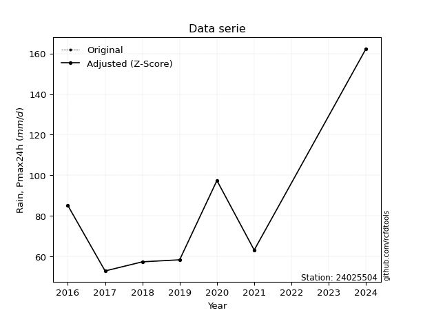</img>

</div>


> The initial value (value_initial) correspond to the initial obtained or null completed value, and value (value) is adjusted only when the initial value is outside the valid range (outlier) definite through the Z-Score value. If Z-Score is active, values out of range or outliers are replaced with the station mean value. A Z-Score (or standard score) measures how many standard deviations a data point is from the mean of a dataset, indicating its relative position; positive scores mean above the mean, negative mean below, and a score of zero is exactly at the mean, allowing for comparison of values from different distributions. It´s calculated using the formula $z=(x–μ)/σ$, where $x$ is the data point, $μ$ is the mean, and $σ$ is the standard deviation, helping identify outliers and understand probability.
>
> <sub>**Note**: In this study, "completing" (filling gaps in) and "extending" (forecasting or lengthening the historical record) rainfall data series are avoided for certain critical analyses because they introduce artificial bias and uncertainty, which can distort the statistics of rare events (extremes), alter day-to-day variability, and compromise the integrity and homogeneity of the original data. Some reasons against Completing/Extending rainfall data are: **Distortion of Extremes and Variability**: The primary issue is that most gap-filling or extension methods rely on averaging or regression with nearby stations, which inherently smooths the data. Rainfall is highly variable in space and time, with a large percentage of zero values and occasional large storms. Infilling methods often underestimate the highest values and overestimate the lowest (zero) values, which severely distorts analyses focused on flood frequency, drought severity, and intensity-duration-frequency (IDF) curves, **Loss of Data Homogeneity**: Infilled or extended data are synthetic estimates, not actual measurements. Combining these estimates with observed data can violate the assumption of data homogeneity, which requires that the data properties do not change over time. Inhomogeneity can lead to incorrect conclusions about long-term trends or changes in climate patterns, **Propagation of Errors**: Errors and biases from the original data (e.g., wind-induced undercatch, instrument errors, site changes) or the data used for imputation can propagate through the analysis, leading to unreliable hydrological models and inaccurate predictions, **Compromised Statistical Integrity**: For statistical analyses, especially those involving the frequency of events, using artificial data can introduce time bias or autocorrelation that doesn´t exist in reality, making it difficult to assess the true probability of events, **Difficulty in Validation**: It is difficult to accurately validate the quality of filled or extended data, especially for past periods where ground-truth measurements are unavailable. The reliability of imputation techniques heavily depends on the density of the surrounding station network and the complexity of the local topography.</sub>


### 4. Active continuous probability distributions from SciPy (44 of 104 available)

A Probability Density Function (PDF) describes the relative likelihood of a continuous random variable falling within a specific range, where the total area under its curve equals 1, and the area over any interval gives the actual probability for that range. Unlike discrete probabilities (like rolling a die), a PDF shows density, not direct probability for a single point (which is zero), with higher points indicating higher likelihood, often visualized as a bell curve for normal distributions.

A log of a probability density function (log-PDF) is simply the logarithm of the PDF´s value, denoted as $log(f(x))$, useful for converting multiplication of probabilities into addition, improving numerical stability with tiny numbers, and connecting to information theory concepts like entropy. Instead of dealing with very small probabilities (e.g., 0.000001), log-PDFs use negative numbers (e.g., $log(0.00001) ≈ -11.51$ that are easier for computers to handle, preventing underflow errors and simplifying complex calculations. In this study, each active probability distribution from SciPy is also evaluated in the $log$ form.

[scipy.stats](https://docs.scipy.org/doc/scipy/reference/stats.html) is a Python´s powerful submodule within the SciPy library for comprehensive statistical analysis, offering over 130 probability distributions (like Normal, Poisson), functions for descriptive stats (mean, variance), hypothesis testing (t-tests, chi-square), random variable generation, and statistical tests, making it essential for data science, modeling, and research. It provides tools to explore, model, and draw conclusions from data efficiently, working seamlessly with NumPy.

<div align="center">

|   id | p_dist             |   n_parameter | fit_method   | label                                                                       | active   | ref                                                                                                        |
|-----:|:-------------------|--------------:|:-------------|:----------------------------------------------------------------------------|:---------|:-----------------------------------------------------------------------------------------------------------|
|    0 | alpha              |             3 | MLE          | Alpha                                                                       | True     | [:mortar_board:](https://docs.scipy.org/doc/scipy/reference/generated/scipy.stats.alpha.html)              |
|    1 | betaprime          |             4 | MLE          | Beta prime                                                                  | True     | [:mortar_board:](https://docs.scipy.org/doc/scipy/reference/generated/scipy.stats.betaprime.html)          |
|    2 | chi2               |             3 | MLE          | Chi²                                                                        | True     | [:mortar_board:](https://docs.scipy.org/doc/scipy/reference/generated/scipy.stats.chi2.html)               |
|    3 | crystalball        |             4 | MLE          | Crystalball                                                                 | True     | [:mortar_board:](https://docs.scipy.org/doc/scipy/reference/generated/scipy.stats.crystalball.html)        |
|    4 | erlang             |             3 | MLE          | Erlang                                                                      | True     | [:mortar_board:](https://docs.scipy.org/doc/scipy/reference/generated/scipy.stats.erlang.html)             |
|    5 | expon              |             2 | MLE          | Exponential                                                                 | True     | [:mortar_board:](https://docs.scipy.org/doc/scipy/reference/generated/scipy.stats.expon.html)              |
|    6 | exponnorm          |             3 | MLE          | Exponentially modified Normal                                               | True     | [:mortar_board:](https://docs.scipy.org/doc/scipy/reference/generated/scipy.stats.exponnorm.html)          |
|    7 | f                  |             4 | MLE          | F                                                                           | True     | [:mortar_board:](https://docs.scipy.org/doc/scipy/reference/generated/scipy.stats.f.html)                  |
|    8 | fatiguelife        |             3 | MLE          | Fatigue-life (Birnbaum-Saunders)                                            | True     | [:mortar_board:](https://docs.scipy.org/doc/scipy/reference/generated/scipy.stats.fatiguelife.html)        |
|    9 | fisk               |             3 | MLE          | Fisk                                                                        | True     | [:mortar_board:](https://docs.scipy.org/doc/scipy/reference/generated/scipy.stats.fisk.html)               |
|   10 | gamma              |             3 | MLE          | Gamma                                                                       | True     | [:mortar_board:](https://docs.scipy.org/doc/scipy/reference/generated/scipy.stats.gamma.html)              |
|   11 | genexpon           |             5 | MLE          | Generalized exponential                                                     | True     | [:mortar_board:](https://docs.scipy.org/doc/scipy/reference/generated/scipy.stats.genexpon.html)           |
|   12 | genlogistic        |             3 | MLE          | Generalized logistic                                                        | True     | [:mortar_board:](https://docs.scipy.org/doc/scipy/reference/generated/scipy.stats.genlogistic.html)        |
|   13 | gibrat             |             2 | MM           | Gibrat                                                                      | True     | [:mortar_board:](https://docs.scipy.org/doc/scipy/reference/generated/scipy.stats.gibrat.html)             |
|   14 | gompertz           |             3 | MLE          | Gompertz (or truncated Gumbel)                                              | True     | [:mortar_board:](https://docs.scipy.org/doc/scipy/reference/generated/scipy.stats.gompertz.html)           |
|   15 | gumbel_l           |             2 | MM           | Gumbel Left Skew                                                            | True     | [:mortar_board:](https://docs.scipy.org/doc/scipy/reference/generated/scipy.stats.gumbel_l.html)           |
|   16 | gumbel_r           |             2 | MM           | Gumbel Right Skew                                                           | True     | [:mortar_board:](https://docs.scipy.org/doc/scipy/reference/generated/scipy.stats.gumbel_r.html)           |
|   17 | halflogistic       |             2 | MM           | Half-logistic                                                               | True     | [:mortar_board:](https://docs.scipy.org/doc/scipy/reference/generated/scipy.stats.halflogistic.html)       |
|   18 | halfnorm           |             2 | MM           | Half Normal                                                                 | True     | [:mortar_board:](https://docs.scipy.org/doc/scipy/reference/generated/scipy.stats.halfnorm.html)           |
|   19 | hypsecant          |             2 | MM           | hyperbolic secant                                                           | True     | [:mortar_board:](https://docs.scipy.org/doc/scipy/reference/generated/scipy.stats.hypsecant.html)          |
|   20 | invgamma           |             3 | MLE          | Inverted gamma                                                              | True     | [:mortar_board:](https://docs.scipy.org/doc/scipy/reference/generated/scipy.stats.invgamma.html)           |
|   21 | invgauss           |             3 | MLE          | Inverse Gaussian                                                            | True     | [:mortar_board:](https://docs.scipy.org/doc/scipy/reference/generated/scipy.stats.invgauss.html)           |
|   22 | invweibull         |             3 | MLE          | Inverted Weibull                                                            | True     | [:mortar_board:](https://docs.scipy.org/doc/scipy/reference/generated/scipy.stats.invweibull.html)         |
|   23 | johnsonsu          |             4 | MLE          | Johnson Su                                                                  | True     | [:mortar_board:](https://docs.scipy.org/doc/scipy/reference/generated/scipy.stats.johnsonsu.html)          |
|   24 | kstwobign          |             2 | MLE          | Limiting distribution of scaled Kolmogorov-Smirnov two-sided test statistic | True     | [:mortar_board:](https://docs.scipy.org/doc/scipy/reference/generated/scipy.stats.kstwobign.html)          |
|   25 | laplace            |             2 | MM           | Laplace                                                                     | True     | [:mortar_board:](https://docs.scipy.org/doc/scipy/reference/generated/scipy.stats.laplace.html)            |
|   26 | laplace_asymmetric |             3 | MLE          | Asymmetric Laplace                                                          | True     | [:mortar_board:](https://docs.scipy.org/doc/scipy/reference/generated/scipy.stats.laplace_asymmetric.html) |
|   27 | loggamma           |             3 | MLE          | Log gamma                                                                   | True     | [:mortar_board:](https://docs.scipy.org/doc/scipy/reference/generated/scipy.stats.loggamma.html)           |
|   28 | logistic           |             2 | MM           | Logistic (or Sech-squared)                                                  | True     | [:mortar_board:](https://docs.scipy.org/doc/scipy/reference/generated/scipy.stats.logistic.html)           |
|   29 | lognorm            |             3 | MLE          | Log Normal                                                                  | True     | [:mortar_board:](https://docs.scipy.org/doc/scipy/reference/generated/scipy.stats.lognorm.html)            |
|   30 | maxwell            |             2 | MM           | Maxwell                                                                     | True     | [:mortar_board:](https://docs.scipy.org/doc/scipy/reference/generated/scipy.stats.maxwell.html)            |
|   31 | mielke             |             4 | MLE          | Mielke Beta-Kappa / Dagum                                                   | True     | [:mortar_board:](https://docs.scipy.org/doc/scipy/reference/generated/scipy.stats.mielke.html)             |
|   32 | moyal              |             2 | MM           | Moyal                                                                       | True     | [:mortar_board:](https://docs.scipy.org/doc/scipy/reference/generated/scipy.stats.moyal.html)              |
|   33 | nakagami           |             3 | MLE          | Nakagami                                                                    | True     | [:mortar_board:](https://docs.scipy.org/doc/scipy/reference/generated/scipy.stats.nakagami.html)           |
|   34 | ncf                |             5 | MLE          | Non-central F distribution                                                  | True     | [:mortar_board:](https://docs.scipy.org/doc/scipy/reference/generated/scipy.stats.ncf.html)                |
|   35 | nct                |             4 | MLE          | Non-central Student’s t                                                     | True     | [:mortar_board:](https://docs.scipy.org/doc/scipy/reference/generated/scipy.stats.nct.html)                |
|   36 | norm               |             2 | MM           | Normal                                                                      | True     | [:mortar_board:](https://docs.scipy.org/doc/scipy/reference/generated/scipy.stats.norm.html)               |
|   37 | pearson3           |             3 | MM           | Pearson type III                                                            | True     | [:mortar_board:](https://docs.scipy.org/doc/scipy/reference/generated/scipy.stats.pearson3.html)           |
|   38 | rayleigh           |             2 | MM           | Rayleigh                                                                    | True     | [:mortar_board:](https://docs.scipy.org/doc/scipy/reference/generated/scipy.stats.rayleigh.html)           |
|   39 | rice               |             3 | MLE          | Rice                                                                        | True     | [:mortar_board:](https://docs.scipy.org/doc/scipy/reference/generated/scipy.stats.rice.html)               |
|   40 | t                  |             3 | MLE          | Student’s t                                                                 | True     | [:mortar_board:](https://docs.scipy.org/doc/scipy/reference/generated/scipy.stats.t.html)                  |
|   41 | truncnorm          |             4 | MLE          | Truncated normal                                                            | True     | [:mortar_board:](https://docs.scipy.org/doc/scipy/reference/generated/scipy.stats.truncnorm.html)          |
|   42 | wald               |             2 | MM           | Wald                                                                        | True     | [:mortar_board:](https://docs.scipy.org/doc/scipy/reference/generated/scipy.stats.wald.html)               |
|   43 | weibull_min        |             3 | MLE          | Weibull minimum                                                             | True     | [:mortar_board:](https://docs.scipy.org/doc/scipy/reference/generated/scipy.stats.weibull_min.html)        |

</div>

> **n_parameter:** # arguments & localization & scale.
>
> **Fit methods:** (MLE) maximum likelihood, (MM) L-moments.
>
>**Inactive** (With the only purpose of prevent loops, zero divisions, infinite values, over high estimated values or horizontal trending for recurrence intervals estimations, the follow distributions were disabled.)**:** foldnorm, gennorm, norminvgauss, powernorm, powerlognorm, skewnorm, genextreme, anglit, arcsine, argus, beta, bradford, burr, burr12, cauchy, cosine, halfcauchy, foldcauchy, skewcauchy, wrapcauchy, dgamma, gengamma, exponweib, exponpow, truncexpon, gausshyper, genhalflogistic, genhyperbolic, geninvgauss, halfgennorm, johnsonsb, kappa4, kappa3, ksone, kstwo, loglaplace, levy, levy_l, levy_stable, ncx2, pareto, genpareto, truncpareto, lomax, powerlaw, rdist, rel_breitwigner, recipinvgauss, semicircular, studentized_range, trapezoid, triang, truncweibull_min, tukeylambda, uniform, loguniform, vonmises, vonmises_line, weibull_max, dweibull, 


## B. Probability (PDF) vs. Empirical (EDF) distributions functions

A continuous probability distribution (CPD) describes probabilities for variables that can take any value within a range (like rain any time), unlike discrete variables with specific outcomes (like temperature). It uses a Probability Density Function (PDF), a curve where the total area under it equals 1, and the probability of the variable falling within an interval (a to b) is found by calculating the area under the curve between those points. A key feature is that the probability of hitting any single exact value is zero, so probabilities are always expressed for ranges, e.g., $P(a ≤ X ≤ b)$.

<div align="center">

Distributions parameters from station values
|    |   station | p_dist                |   n |            loc |          scale | shape                 | shape1                 | shape2                 | shape3   |
|---:|----------:|:----------------------|----:|---------------:|---------------:|:----------------------|:-----------------------|:-----------------------|:---------|
|  0 |  24025504 | alpha                 |   7 |      47.112    |   11.4281      | 6.482095898718196e-08 |                        |                        |          |
|  1 |  24025504 | betaprime             |   7 |      -0.832141 |    1.90408     | 325.98568007700305    | 8.572764995307107      |                        |          |
|  2 |  24025504 | chi2                  |   7 |      52.8      |    4.02169     | 0.24261621067399358   |                        |                        |          |
|  3 |  24025504 | crystalball           |   7 |      82.3429   |   36.0391      | 7194.110309600195     | 1354.456828638485      |                        |          |
|  4 |  24025504 | erlang                |   7 |      52.8      |   34.2295      | 0.5863695141523284    |                        |                        |          |
|  5 |  24025504 | expon                 |   7 |      52.8      |   29.5429      |                       |                        |                        |          |
|  6 |  24025504 | exponnorm             |   7 |      52.7753   |    0.00743839  | 3972.3498818783455    |                        |                        |          |
|  7 |  24025504 | f                     |   7 |      49.4817   |   10.3972      | 2102.510775969849     | 2.100352559321153      |                        |          |
|  8 |  24025504 | fatiguelife           |   7 |      51.9425   |   10.8108      | 1.8377078284495898    |                        |                        |          |
|  9 |  24025504 | fisk                  |   7 |      52.8      |   34.5864      | 0.377342301393111     |                        |                        |          |
| 10 |  24025504 | gamma                 |   7 |      52.8      |   26.2342      | 0.7375063708932217    |                        |                        |          |
| 11 |  24025504 | genexpon              |   7 |      52.8      |   44.9931      | 1.5229726267717427    | 1.6785307155903124e-11 | 1.2826765160453686     |          |
| 12 |  24025504 | genlogistic           |   7 |     -91.4722   |   21.7056      | 1507.6022778637998    |                        |                        |          |
| 13 |  24025504 | gibrat                |   7 |      54.8496   |   16.6755      |                       |                        |                        |          |
| 14 |  24025504 | gompertz              |   7 |      52.8      |    1.14827e+14 | 3804350704848.4707    |                        |                        |          |
| 15 |  24025504 | gumbel_l              |   7 |      98.5624   |   28.0996      |                       |                        |                        |          |
| 16 |  24025504 | gumbel_r              |   7 |      66.1233   |   28.0996      |                       |                        |                        |          |
| 17 |  24025504 | halflogistic          |   7 |      39.6281   |   30.8122      |                       |                        |                        |          |
| 18 |  24025504 | halfnorm              |   7 |      34.6412   |   59.7852      |                       |                        |                        |          |
| 19 |  24025504 | hypsecant             |   7 |      82.3429   |   22.9432      |                       |                        |                        |          |
| 20 |  24025504 | invgamma              |   7 |      49.4765   |   10.9191      | 1.0501736913546988    |                        |                        |          |
| 21 |  24025504 | invgauss              |   7 |      50.5262   |   11.0276      | 2.8852000176058574    |                        |                        |          |
| 22 |  24025504 | invweibull            |   7 |      52.8      |    1.443       | 0.0501812342635337    |                        |                        |          |
| 23 |  24025504 | johnsonsu             |   7 |      52.7999   |    2.42371e-06 | -4.4401232661670536   | 0.2943486891213417     |                        |          |
| 24 |  24025504 | kstwobign             |   7 |     -13.479    |  111.329       |                       |                        |                        |          |
| 25 |  24025504 | laplace               |   7 |      82.3429   |   25.4835      |                       |                        |                        |          |
| 26 |  24025504 | laplace_asymmetric    |   7 |      52.8      |    0.0258889   | 0.0008760310603910864 |                        |                        |          |
| 27 |  24025504 | loggamma              |   7 |  -10860.7      | 1481.65        | 1613.5010289525644    |                        |                        |          |
| 28 |  24025504 | logistic              |   7 |      82.3429   |   19.8694      |                       |                        |                        |          |
| 29 |  24025504 | lognorm               |   7 |      52.8      |    0.116196    | 12.467415814033314    |                        |                        |          |
| 30 |  24025504 | maxwell               |   7 |      -3.05477  |   53.515       |                       |                        |                        |          |
| 31 |  24025504 | mielke                |   7 |      35.3083   |    3.99484     | 139.21724285268388    | 2.2115980741960715     |                        |          |
| 32 |  24025504 | moyal                 |   7 |      61.7334   |   16.2233      |                       |                        |                        |          |
| 33 |  24025504 | nakagami              |   7 |      52.8      |   99.3854      | 0.10734692753093586   |                        |                        |          |
| 34 |  24025504 | ncf                   |   7 |      32.2567   |   36.0606      | 372.1683836687627     | 6.691554245741646      | 0.00046232553067690994 |          |
| 35 |  24025504 | nct                   |   7 |      -0.270602 |    1.17475     | 5.02718356081466      | 58.61377802134736      |                        |          |
| 36 |  24025504 | norm                  |   7 |      82.3429   |   36.0391      |                       |                        |                        |          |
| 37 |  24025504 | pearson3              |   7 |      82.3428   |   36.0392      | 1.3856251050715087    |                        |                        |          |
| 38 |  24025504 | rayleigh              |   7 |      13.3979   |   55.0101      |                       |                        |                        |          |
| 39 |  24025504 | rice                  |   7 |      28.8735   |   45.5949      | 0.0002324478102034805 |                        |                        |          |
| 40 |  24025504 | t                     |   7 |      61.8193   |   11.3029      | 1.2523935692402155    |                        |                        |          |
| 41 |  24025504 | truncnorm             |   7 | -100487        | 1903.38        | 52.82194387147402     | 262911.82982387056     |                        |          |
| 42 |  24025504 | wald                  |   7 |      46.3037   |   36.0391      |                       |                        |                        |          |
| 43 |  24025504 | weibull_min           |   7 |      52.8      |   51.7063      | 0.7105455384433883    |                        |                        |          |
| 44 |  24025504 | logalpha              |   7 |       3.85668  |    0.248548    | 0.3804935080540095    |                        |                        |          |
| 45 |  24025504 | logbetaprime          |   7 |      -1.76282  |    4.88155     | 604.1034835786786     | 485.21422646248993     |                        |          |
| 46 |  24025504 | logchi2               |   7 |       3.96651  |    0.997149    | 1.0488036025899437    |                        |                        |          |
| 47 |  24025504 | logcrystalball        |   7 |       4.33398  |    0.3719      | 7.47351296098409      | 2392.764285444579      |                        |          |
| 48 |  24025504 | logerlang             |   7 |       3.96651  |    0.686638    | 0.30779250337363656   |                        |                        |          |
| 49 |  24025504 | logexpon              |   7 |       3.96651  |    0.367467    |                       |                        |                        |          |
| 50 |  24025504 | logexponnorm          |   7 |       3.96614  |    0.000117156 | 3147.977989003093     |                        |                        |          |
| 51 |  24025504 | logf                  |   7 |       3.87766  |    0.233003    | 390.1655012494253     | 3.33419269022466       |                        |          |
| 52 |  24025504 | logfatiguelife        |   7 |       3.93912  |    0.205146    | 1.3291982752474873    |                        |                        |          |
| 53 |  24025504 | logfisk               |   7 |       3.96651  |    0.296007    | 0.7894824421046505    |                        |                        |          |
| 54 |  24025504 | loggamma              |   7 |       3.96651  |    0.444462    | 0.5580705584433974    |                        |                        |          |
| 55 |  24025504 | loggenexpon           |   7 |       3.96651  |    0.647255    | 1.7616051889819315    | 2.878697705878509e-07  | 1.15027065828989       |          |
| 56 |  24025504 | loggenlogistic        |   7 |       2.38719  |    0.254119    | 1107.6815233178827    |                        |                        |          |
| 57 |  24025504 | loggibrat             |   7 |       4.0503   |    0.172061    |                       |                        |                        |          |
| 58 |  24025504 | loggompertz           |   7 |       3.96599  |    9.05955     | 23.767655281729567    |                        |                        |          |
| 59 |  24025504 | loggumbel_l           |   7 |       4.50135  |    0.289969    |                       |                        |                        |          |
| 60 |  24025504 | loggumbel_r           |   7 |       4.1666   |    0.289969    |                       |                        |                        |          |
| 61 |  24025504 | loghalflogistic       |   7 |       3.89319  |    0.317961    |                       |                        |                        |          |
| 62 |  24025504 | loghalfnorm           |   7 |       3.84173  |    0.616944    |                       |                        |                        |          |
| 63 |  24025504 | loghypsecant          |   7 |       4.33398  |    0.236759    |                       |                        |                        |          |
| 64 |  24025504 | loginvgamma           |   7 |       3.8767   |    0.389017    | 1.6668026990618365    |                        |                        |          |
| 65 |  24025504 | loginvgauss           |   7 |       3.9135   |    0.282549    | 1.4881374300038317    |                        |                        |          |
| 66 |  24025504 | loginvweibull         |   7 |       3.86284  |    0.230977    | 1.417458550428811     |                        |                        |          |
| 67 |  24025504 | logjohnsonsu          |   7 |       3.94678  |    0.00057037  | -5.193025508369158    | 0.7877729716219382     |                        |          |
| 68 |  24025504 | logkstwobign          |   7 |       3.2646   |    1.23222     |                       |                        |                        |          |
| 69 |  24025504 | loglaplace            |   7 |       4.33398  |    0.262973    |                       |                        |                        |          |
| 70 |  24025504 | loglaplace_asymmetric |   7 |       4.0483   |    0.158814    | 0.44468998821705585   |                        |                        |          |
| 71 |  24025504 | logloggamma           |   7 |    -105.558    |   14.9718      | 1541.0248766056393    |                        |                        |          |
| 72 |  24025504 | loglogistic           |   7 |       4.33398  |    0.205039    |                       |                        |                        |          |
| 73 |  24025504 | loglognorm            |   7 |       3.96651  |    0.00214748  | 11.957375311814365    |                        |                        |          |
| 74 |  24025504 | logmaxwell            |   7 |       3.45273  |    0.55224     |                       |                        |                        |          |
| 75 |  24025504 | logmielke             |   7 |       3.41834  |    0.197487    | 584.3227996980913     | 3.926975722666864      |                        |          |
| 76 |  24025504 | logmoyal              |   7 |       4.1213   |    0.167414    |                       |                        |                        |          |
| 77 |  24025504 | lognakagami           |   7 |       3.96651  |    0.519206    | 0.19824417935165894   |                        |                        |          |
| 78 |  24025504 | logncf                |   7 |       2.30622  |    1.86874     | 74.95957240228131     | 570.231299844135       | 7.293833252384404      |          |
| 79 |  24025504 | lognct                |   7 |       0.746621 |    0.0349944   | 53.99686676685468     | 100.8590075460688      |                        |          |
| 80 |  24025504 | lognorm               |   7 |       4.33398  |    0.3719      |                       |                        |                        |          |
| 81 |  24025504 | logpearson3           |   7 |       4.33398  |    0.371901    | 0.9697594577431052    |                        |                        |          |
| 82 |  24025504 | lograyleigh           |   7 |       3.62251  |    0.567668    |                       |                        |                        |          |
| 83 |  24025504 | logrice               |   7 |       3.74973  |    0.489721    | 0.0002333418088427691 |                        |                        |          |
| 84 |  24025504 | logt                  |   7 |       4.33391  |    0.371837    | 4987.491857125988     |                        |                        |          |
| 85 |  24025504 | logtruncnorm          |   7 |      -3.18033  |    1.78128     | 4.0121863759139895    | 4.642943365800089      |                        |          |
| 86 |  24025504 | logwald               |   7 |       3.96208  |    0.3719      |                       |                        |                        |          |
| 87 |  24025504 | logweibull_min        |   7 |       3.96651  |    1.32644     | 0.23435912948535992   |                        |                        |          |

</div>

> **loc** (Location parameter): This shifts the distribution along the x-axis. For many common distributions, like the normal (Gaussian) distribution, loc represents the mean $μ$. For others, like the uniform distribution, it might represent the minimum value, or for the beta distribution, the left end of the support interval.
>
> **scale** (Scale parameter): This determines the width or spread of the distribution. For the normal distribution, scale represents the standard deviation $σ$. For a uniform distribution, it defines the length of the interval (from $loc$ to $loc + scale$).
>
> **shape** (Shape parameters): Refers to parameters that define the specific form of a probability distribution, distinct from its location (loc) and scale (scale). These parameters are required arguments for most distribution functions. For example, a normal (Gaussian) distribution is fully defined by its location (mean) and scale (standard deviation), so it has no specific shape parameters beyond loc and scale. However, other distributions have intrinsic properties that need specification, as Gamma distribution that takes a shape parameter, often named $a$ or $alpha$.


### 0. Cumulative distribution values - CDF (88 evaluated)

Cumulative Distribution Function (CDF), denoted as $F$<sub>$X$</sub>$(x)$, is a function that gives the probability that a random variable $X$ will take a value less than or equal to a specific value, $x$ (i.e., $(P(X≥x)$. It essentially "accumulates" probabilities from a given point up to the far right (positive infinity), providing a complete picture of the distribution´s probabilities for both discrete (like rain) and continuous (like temperature) variables, helping to find probabilities over ranges or above certain values. Each station is evaluated separately ordering the $x$ values ascending, calculating the CDF and PDF values for the activated distributions and their logarithmic forms.

<div align="center">

CDF ordered by x ascending and calculating $log(f(x))$ separately
|   id |   Station |   date |     x |   count |    mean |     std |     zscore |   Value_initial |   station |   m |     alpha |   alpha_pdf |   betaprime |   betaprime_pdf |      chi2 |    chi2_pdf |   crystalball |   crystalball_pdf |      erlang |      erlang_pdf |    expon |   expon_pdf |   exponnorm |   exponnorm_pdf |         f |       f_pdf |   fatiguelife |   fatiguelife_pdf |        fisk |         fisk_pdf |       gamma |     gamma_pdf |    genexpon |   genexpon_pdf |   genlogistic |   genlogistic_pdf |    gibrat |   gibrat_pdf |    gompertz |   gompertz_pdf |   gumbel_l |   gumbel_l_pdf |   gumbel_r |   gumbel_r_pdf |   halflogistic |   halflogistic_pdf |   halfnorm |   halfnorm_pdf |   hypsecant |   hypsecant_pdf |   invgamma |   invgamma_pdf |   invgauss |   invgauss_pdf |   invweibull |   invweibull_pdf |   johnsonsu |   johnsonsu_pdf |   kstwobign |   kstwobign_pdf |   laplace |   laplace_pdf |   laplace_asymmetric |   laplace_asymmetric_pdf |   loggamma |   loggamma_pdf |   logistic |   logistic_pdf |   lognorm |   lognorm_pdf |   maxwell |   maxwell_pdf |    mielke |   mielke_pdf |    moyal |   moyal_pdf |    nakagami |   nakagami_pdf |       ncf |     ncf_pdf |      nct |     nct_pdf |     norm |    norm_pdf |   pearson3 |   pearson3_pdf |   rayleigh |   rayleigh_pdf |     rice |    rice_pdf |        t |       t_pdf |   truncnorm |   truncnorm_pdf |      wald |    wald_pdf |   weibull_min |   weibull_min_pdf |   logalpha |   logalpha_pdf |   logbetaprime |   logbetaprime_pdf |     logchi2 |   logchi2_pdf |   logcrystalball |   logcrystalball_pdf |   logerlang |   logerlang_pdf |   logexpon |   logexpon_pdf |   logexponnorm |   logexponnorm_pdf |      logf |   logf_pdf |   logfatiguelife |   logfatiguelife_pdf |     logfisk |   logfisk_pdf |   loggenexpon |   loggenexpon_pdf |   loggenlogistic |   loggenlogistic_pdf |   loggibrat |   loggibrat_pdf |   loggompertz |   loggompertz_pdf |   loggumbel_l |   loggumbel_l_pdf |   loggumbel_r |   loggumbel_r_pdf |   loghalflogistic |   loghalflogistic_pdf |   loghalfnorm |   loghalfnorm_pdf |   loghypsecant |   loghypsecant_pdf |   loginvgamma |   loginvgamma_pdf |   loginvgauss |   loginvgauss_pdf |   loginvweibull |   loginvweibull_pdf |   logjohnsonsu |   logjohnsonsu_pdf |   logkstwobign |   logkstwobign_pdf |   loglaplace |   loglaplace_pdf |   loglaplace_asymmetric |   loglaplace_asymmetric_pdf |   logloggamma |   logloggamma_pdf |   loglogistic |   loglogistic_pdf |   loglognorm |   loglognorm_pdf |   logmaxwell |   logmaxwell_pdf |   logmielke |   logmielke_pdf |   logmoyal |   logmoyal_pdf |   lognakagami |   lognakagami_pdf |   logncf |   logncf_pdf |   lognct |   lognct_pdf |   logpearson3 |   logpearson3_pdf |   lograyleigh |   lograyleigh_pdf |   logrice |   logrice_pdf |     logt |   logt_pdf |   logtruncnorm |   logtruncnorm_pdf |     logwald |   logwald_pdf |   logweibull_min |   logweibull_min_pdf |
|-----:|----------:|-------:|------:|--------:|--------:|--------:|-----------:|----------------:|----------:|----:|----------:|------------:|------------:|----------------:|----------:|------------:|--------------:|------------------:|------------:|----------------:|---------:|------------:|------------:|----------------:|----------:|------------:|--------------:|------------------:|------------:|-----------------:|------------:|--------------:|------------:|---------------:|--------------:|------------------:|----------:|-------------:|------------:|---------------:|-----------:|---------------:|-----------:|---------------:|---------------:|-------------------:|-----------:|---------------:|------------:|----------------:|-----------:|---------------:|-----------:|---------------:|-------------:|-----------------:|------------:|----------------:|------------:|----------------:|----------:|--------------:|---------------------:|-------------------------:|-----------:|---------------:|-----------:|---------------:|----------:|--------------:|----------:|--------------:|----------:|-------------:|---------:|------------:|------------:|---------------:|----------:|------------:|---------:|------------:|---------:|------------:|-----------:|---------------:|-----------:|---------------:|---------:|------------:|---------:|------------:|------------:|----------------:|----------:|------------:|--------------:|------------------:|-----------:|---------------:|---------------:|-------------------:|------------:|--------------:|-----------------:|---------------------:|------------:|----------------:|-----------:|---------------:|---------------:|-------------------:|----------:|-----------:|-----------------:|---------------------:|------------:|--------------:|--------------:|------------------:|-----------------:|---------------------:|------------:|----------------:|--------------:|------------------:|--------------:|------------------:|--------------:|------------------:|------------------:|----------------------:|--------------:|------------------:|---------------:|-------------------:|--------------:|------------------:|--------------:|------------------:|----------------:|--------------------:|---------------:|-------------------:|---------------:|-------------------:|-------------:|-----------------:|------------------------:|----------------------------:|--------------:|------------------:|--------------:|------------------:|-------------:|-----------------:|-------------:|-----------------:|------------:|----------------:|-----------:|---------------:|--------------:|------------------:|---------:|-------------:|---------:|-------------:|--------------:|------------------:|--------------:|------------------:|----------:|--------------:|---------:|-----------:|---------------:|-------------------:|------------:|--------------:|-----------------:|---------------------:|
|    0 |  24025504 |   2017 |  52.8 |       7 | 82.3429 | 38.9267 | -0.758935  |            52.8 |  24025504 |   1 | 0.0445189 | 0.0374478   |    0.154641 |     0.0140675   | 0.0158229 | 2.70138e+11 |      0.206181 |       0.00791074  | 7.13982e-10 | 58920.8         | 0        | 0.0338491   | 0.000835386 |     0.0337998   | 0.0413127 | 0.0403427   |     0.0376334 |        0.0997011  | 5.21521e-05 | 127273           | 3.60583e-12 | 374.266       | 2.34643e-12 |    0.033849    |      0.141438 |       0.0127367   | 0         |  0           | 4.70823e-16 |    0.0331312   |   0.178159 |     0.00573859 |   0.20056  |     0.0114674  |       0.210548 |         0.015508   |   0.23867  |     0.0127442  |    0.171391 |     0.00711444  |  0.0413125 |    0.0403427   |  0.0387297 |    0.0477573   |   0.00538745 |      1.98752e+11 | 0.000743621 |     8.52808     |    0.129612 |     0.0116581   |  0.156854 |   0.00615512  |          7.70333e-07 |              0.0338381   | 4.7819e-09 |    6.00923e+06 |   0.184395 |    0.00756909  |  0.161557 |      0.658388 |  0.220355 |    0.0094207  | 0.0946535 |   0.0276924  | 0.187853 |  0.0136059  | 0.000283507 |    8.56629e+09 | 0.0986767 | 0.0183278   | 0.134821 | 0.0153223   | 0.206181 | 0.00791074  |   0.206761 |     0.0139933  |   0.226262 |     0.0100746  | 0.128629 | 0.0100288   | 0.274088 | 0.0184541   | 1.48359e-05 |      0.0277612  | 0.0468436 | 0.0224282   |   5.36241e-12 |      536.243      |  0.0461016 |      2.15586   |       0.165745 |           0.714012 | 6.97981e-09 |    8.2421e+06 |         0.161557 |             0.658388 | 2.35721e-05 |     1.63375e+10 |   0        |       2.72133  |     0.00100696 |           2.70668  | 0.0443481 |  1.86765   |        0.0372077 |             3.46112  | 1.98082e-12 |   3521.42     |   4.26349e-10 |          2.72166  |         0.109426 |             0.951775 |   0         |       0         |    0.00137736 |          2.62003  |      0.146242 |         0.465517  |      0.136176 |          0.936335 |          0.11479  |              1.5518   |      0.160286 |          1.2671   |       0.132878 |           0.545076 |     0.0442947 |         1.86664   |     0.0396963 |          2.26952  |       0.0444771 |           1.89294   |      0.0317932 |           2.84862  |      0.0982362 |           0.924287 |     0.123625 |         0.470104 |               0.0518546 |                    0.734245 |      0.16805  |          0.653178 |      0.142806 |          0.597018 |   0.00729101 |      3.80402e+12 |     0.166271 |         0.811253 |    0.068818 |         1.3076  |   0.112349 |       1.07274  |   8.38099e-07 |       7.48266e+08 | 0.126933 |     0.684196 | 0.148938 |     0.790793 |      0.148331 |          0.967139 |      0.16774  |          0.888439 | 0.0933268 |      0.81954  | 0.161587 |   0.658452 |    7.59113e-06 |           2.52277  | 1.40836e-19 |   1.34811e-15 |      0.000236151 |          1.24609e+11 |
|    1 |  24025504 |   2018 |  57.3 |       7 | 82.3429 | 38.9267 | -0.643333  |            57.3 |  24025504 |   2 | 0.261979  | 0.0468285   |    0.222268 |     0.0158266   | 0.936218  | 0.0152247   |      0.243565 |       0.0086953   | 0.325192    |     0.0389737   | 0.141287 | 0.0290667   | 0.141983    |     0.0290382   | 0.264962  | 0.0461544   |     0.3483    |        0.0398914  | 0.316577    |      0.0181423   | 0.276849    |   0.0410539   | 0.141287    |    0.0290666   |      0.203953 |       0.014931    | 0.0275752 |  0.0258885   | 0.138509    |    0.0285422   |   0.205694 |     0.00650962 |   0.254389 |     0.0123927  |       0.279157 |         0.0149628  |   0.295315 |     0.0124209  |    0.206192 |     0.00837161  |  0.264962  |    0.0461545   |  0.279356  |    0.0453829   |   0.388864   |      0.00409581  | 0.505036    |     0.0260925   |    0.186306 |     0.0134361   |  0.187148 |   0.00734389  |          0.141245    |              0.0290586   | 0.409857   |    2.48129     |   0.22091  |    0.00866199  |  0.221197 |      0.798642 |  0.264197 |    0.01004    | 0.238962  |   0.0340113  | 0.251625 |  0.0146125  | 0.426945    |    0.0203654   | 0.191009  | 0.0220197   | 0.209703 | 0.0176997   | 0.243565 | 0.0086953   |   0.270476 |     0.0142402  |   0.272732 |     0.010551   | 0.17663  | 0.0112586   | 0.373379 | 0.0256085   | 0.117454    |      0.024502   | 0.171221  | 0.0297708   |   0.161747    |        0.0233529  |  0.277192  |      2.73708   |       0.230181 |           0.858621 | 0.20819     |    1.2993     |         0.221197 |             0.798642 | 0.563884    |     1.93623     |   0.199546 |       2.1783   |     0.199706   |           2.16997  | 0.250606  |  2.61711   |        0.314753  |             2.56974  | 0.265913    |      1.88422  |   0.199567    |          2.1785   |         0.201076 |             1.26833  |   0         |       0         |    0.195019   |          2.13114  |      0.189115 |         0.586217  |      0.222287 |          1.15278  |          0.239189 |              1.48255  |      0.262248 |          1.22278  |       0.185084 |           0.738428 |     0.250526  |         2.61717   |     0.269783  |          2.64136  |       0.255401  |           2.66434   |      0.286064  |           2.63898  |      0.186669  |           1.21472  |     0.168725 |         0.641605 |               0.165101  |                    2.33777  |      0.226922 |          0.785069 |      0.198884 |          0.777066 |   0.619589   |      0.389454    |     0.238128 |         0.939425 |    0.210989 |         2.03577 |   0.213639 |       1.36763  |   0.379262    |       1.831       | 0.190292 |     0.861996 | 0.221228 |     0.970775 |      0.234583 |          1.1263   |      0.245198 |          0.997328 | 0.169601  |      1.03379  | 0.221234 |   0.798745 |    0.18839     |           2.0961   | 0.0941741   |   2.69172     |      0.405782    |          0.886255    |
|    2 |  24025504 |   2019 |  58.3 |       7 | 82.3429 | 38.9267 | -0.617644  |            58.3 |  24025504 |   3 | 0.307035  | 0.0432358   |    0.238228 |     0.0160854   | 0.949328  | 0.0112713   |      0.252344 |       0.00886117  | 0.362007    |     0.0348366   | 0.169868 | 0.0280993   | 0.170535    |     0.0280719   | 0.309166  | 0.0422482   |     0.385028  |        0.0338779  | 0.333183    |      0.0152427   | 0.31606     |   0.0374907   | 0.169867    |    0.0280992   |      0.21908  |       0.0153171   | 0.0575762 |  0.033425    | 0.166583    |    0.0276121   |   0.212293 |     0.00668941 |   0.266859 |     0.0125457  |       0.294051 |         0.0148242  |   0.307696 |     0.0123407  |    0.21471  |     0.00866463  |  0.309166  |    0.0422483   |  0.32239   |    0.0407662   |   0.392562   |      0.00334909  | 0.528575    |     0.0212954   |    0.199899 |     0.0137452   |  0.194638 |   0.0076378   |          0.169818    |              0.0280918   | 0.450183   |    2.19251     |   0.229693 |    0.00890486  |  0.235259 |      0.826804 |  0.274296 |    0.0101573  | 0.272873  |   0.0337402  | 0.266303 |  0.0147366  | 0.445736    |    0.0173942   | 0.213192  | 0.0223189   | 0.227568 | 0.0180181   | 0.252344 | 0.00886117  |   0.284713 |     0.0142314  |   0.283325 |     0.0106342  | 0.188007 | 0.0114936   | 0.399679 | 0.0269573   | 0.141619    |      0.0238313  | 0.200906  | 0.0295385   |   0.184109    |        0.0214473  |  0.322746  |      2.52613   |       0.245278 |           0.886354 | 0.229552    |    1.17573    |         0.235259 |             0.826804 | 0.594805    |     1.65321     |   0.23636  |       2.07812  |     0.236383   |           2.07052  | 0.294861  |  2.49308   |        0.356657  |             2.28328  | 0.296511    |      1.66191  |   0.236385    |          2.0783   |         0.22345  |             1.31682  |   0.0077627 |       1.39505   |    0.231092   |          2.03953  |      0.199499 |         0.614291  |      0.242517 |          1.18485  |          0.264667 |              1.46236  |      0.283302 |          1.21088  |       0.198254 |           0.784269 |     0.294782  |         2.49319   |     0.31382   |          2.44868  |       0.300345  |           2.52549   |      0.329622  |           2.39979  |      0.208061  |           1.25697  |     0.180199 |         0.685237 |               0.204584  |                    2.22722  |      0.240735 |          0.811517 |      0.212671 |          0.816632 |   0.625686   |      0.319847    |     0.254573 |         0.961276 |    0.246686 |         2.08494 |   0.237606 |       1.4012   |   0.409087    |       1.62703     | 0.205506 |     0.896426 | 0.238308 |     1.0033   |      0.254262 |          1.14785  |      0.2626   |          1.01393  | 0.187803  |      1.06972  | 0.235298 |   0.826915 |    0.22395     |           2.015    | 0.142567    |   2.86635     |      0.419839    |          0.747059    |
|    3 |  24025504 |   2021 |  63.1 |       7 | 82.3429 | 38.9267 | -0.494335  |            63.1 |  24025504 |   4 | 0.474737  | 0.02763     |    0.317308 |     0.0166981   | 0.980595  | 0.00357589  |      0.29669  |       0.00959904  | 0.49799     |     0.0233578   | 0.294357 | 0.0238854   | 0.294905    |     0.0238628   | 0.472017  | 0.0268168   |     0.506853  |        0.0194561  | 0.387679    |      0.0086966   | 0.466764    |   0.0264813   | 0.294356    |    0.0238854   |      0.296055 |       0.0165955   | 0.240816  |  0.0377495   | 0.28912     |    0.0235523   |   0.246541 |     0.00759048 |   0.328376 |     0.0130136  |       0.363477 |         0.0140835  |   0.365938 |     0.0119163  |    0.259746 |     0.010106    |  0.472017  |    0.0268168   |  0.47692   |    0.0253097   |   0.404105   |      0.00178388  | 0.601164    |     0.0110322   |    0.268665 |     0.0147869   |  0.234979 |   0.00922084  |          0.294277    |              0.0238803   | 0.588922   |    1.41575     |   0.275186 |    0.0100385   |  0.305413 |      0.942428 |  0.324215 |    0.010612   | 0.424466  |   0.028749   | 0.337682 |  0.0148893  | 0.509966    |    0.0106187   | 0.32041   | 0.021928    | 0.316026 | 0.0185915   | 0.29669  | 0.00959904  |   0.352476 |     0.01394    |   0.33513  |     0.0109201  | 0.245537 | 0.0124213   | 0.537406 | 0.0289837   | 0.248718    |      0.0208589  | 0.334388  | 0.0256239   |   0.272232    |        0.0159538  |  0.485586  |      1.64121   |       0.319881 |           0.993593 | 0.308126    |    0.854771   |         0.305413 |             0.942428 | 0.694728    |     0.981395    |   0.384282 |       1.67557  |     0.38382    |           1.67075  | 0.464655  |  1.80122   |        0.500663  |             1.45981  | 0.401168    |      1.06425  |   0.384318    |          1.67567  |         0.333591 |             1.44046  |   0.274223  |       3.52897   |    0.377222   |          1.66641  |      0.253472 |         0.752586  |      0.340144 |          1.26498  |          0.376123 |              1.35006  |      0.376657 |          1.14635  |       0.268992 |           1.00566  |     0.464586  |         1.80136   |     0.47552   |          1.68525  |       0.470463  |           1.78387   |      0.48447   |           1.58649  |      0.312609  |           1.36268  |     0.243453 |         0.92577  |               0.362644  |                    1.78464  |      0.309394 |          0.920247 |      0.284341 |          0.992449 |   0.644135   |      0.17486     |     0.333825 |         1.03467  |  nan        |       nan       |   0.351105 |       1.43861  |   0.514905    |       1.12345     | 0.282005 |     1.03011  | 0.322616 |     1.1179   |      0.347484 |          1.19516  |      0.345004 |          1.06144  | 0.277666  |      1.18966  | 0.305462 |   0.942573 |    0.369755    |           1.68027  | 0.357107    |   2.39449     |      0.464597    |          0.439873    |
|    4 |  24025504 |   2016 |  85.1 |       7 | 82.3429 | 38.9267 |  0.0708291 |            85.1 |  24025504 |   5 | 0.763541  | 0.00603906  |    0.644489 |     0.0118307   | 0.999423  | 8.49893e-05 |      0.530491 |       0.0110373   | 0.794101    |     0.00765578  | 0.6649   | 0.0113428   | 0.665118    |     0.0113335   | 0.757558  | 0.006131    |     0.739651  |        0.00618537 | 0.493548    |      0.00292012  | 0.804794    |   0.00848099  | 0.664899    |    0.0113428   |      0.642835 |       0.0130845   | 0.724268  |  0.0110448   | 0.657039    |    0.0113627   |   0.461702 |     0.0118646  |   0.601105 |     0.0108882  |       0.627868 |         0.00983024 |   0.601332 |     0.00934682 |    0.53816  |     0.0137742   |  0.757558  |    0.006131    |  0.758138  |    0.00650892  |   0.425038   |      0.00056497  | 0.723335    |     0.00304977  |    0.586905 |     0.0127826   |  0.551273 |   0.0176085   |          0.664781    |              0.0113432   | 0.83591    |    0.467339    |   0.534635 |    0.0125218   |  0.616145 |      1.02693  |  0.562073 |    0.0104174  | 0.788877  |   0.00829382 | 0.626488 |  0.0106311  | 0.651149    |    0.004284    | 0.680248  | 0.0107904   | 0.661829 | 0.0117019   | 0.530491 | 0.0110373   |   0.620661 |     0.0100747  |   0.572359 |     0.0101327  | 0.532502 | 0.0126441   | 0.876915 | 0.00554481  | 0.592151    |      0.0113262  | 0.69695   | 0.00988397  |   0.511211    |        0.00769693 |  0.745008  |      0.443315  |       0.633856 |           0.993445 | 0.491634    |    0.460487   |         0.616145 |             1.02693  | 0.861908    |     0.320984    |   0.727177 |       0.74244  |     0.726166   |           0.742492 | 0.765539  |  0.524727  |        0.75816   |             0.513271 | 0.5932      |      0.399134 |   0.72722     |          0.742413 |         0.712866 |             0.949323 |   0.795967  |       0.71997   |    0.723974   |          0.763371 |      0.559591 |         1.2455    |      0.680852 |          0.902601 |          0.699278 |              0.803573 |      0.670904 |          0.803289 |       0.642655 |           1.21167  |     0.765495  |         0.524776  |     0.765091  |          0.539197 |       0.762997  |           0.503542  |      0.75376   |           0.499588 |      0.681025  |           0.978661 |     0.670726 |         1.25212  |               0.724163  |                    0.772362 |      0.612525 |          1.00648  |      0.630822 |          1.13581  |   0.67434    |      0.0631129   |     0.641194 |         0.929782 |  nan        |       nan       |   0.702722 |       0.845577 |   0.743671    |       0.536668    | 0.612171 |     1.04476  | 0.658546 |     0.994681 |      0.671109 |          0.884199 |      0.648887 |          0.894885 | 0.633738  |      1.06002  | 0.616232 |   1.02697  |    0.731297    |           0.830559 | 0.763907    |   0.703506    |      0.54479     |          0.175898    |
|    5 |  24025504 |   2020 |  97.4 |       7 | 82.3429 | 38.9267 |  0.386807  |            97.4 |  24025504 |   6 | 0.820227  | 0.00351375  |    0.766755 |     0.00816153  | 0.999902  | 1.38709e-05 |      0.661953 |       0.0101445   | 0.868183    |     0.004677    | 0.779017 | 0.00748007  | 0.779145    |     0.00747447  | 0.815462  | 0.00361086  |     0.802465  |        0.00422154 | 0.523969    |      0.00211029  | 0.88472     |   0.00487576  | 0.779016    |    0.00748008  |      0.778228 |       0.00898908  | 0.825556  |  0.00604589  | 0.771827    |    0.00755964  |   0.616907 |     0.0130809  |   0.719967 |     0.0084181  |       0.734064 |         0.00748323 |   0.706162 |     0.00769238 |    0.695341 |     0.0113423   |  0.815462  |    0.00361085  |  0.821075  |    0.00402081  |   0.430919   |      0.000408159 | 0.754196    |     0.00207838  |    0.725642 |     0.00974089  |  0.723074 |   0.0108669   |          0.778909    |              0.00748131  | 0.887458   |    0.308971    |   0.680877 |    0.0109356   |  0.744849 |      0.863697 |  0.682289 |    0.00902212 | 0.864466  |   0.00447928 | 0.739041 |  0.0077496  | 0.697166    |    0.00329108  | 0.785797  | 0.00670791  | 0.779557 | 0.00765233  | 0.661953 | 0.0101445   |   0.729499 |     0.00766657 |   0.688361 |     0.0086508  | 0.676778 | 0.0106543   | 0.923021 | 0.0024961   | 0.710169    |      0.00804975 | 0.793444  | 0.00616565  |   0.593544    |        0.00582972 |  0.793699  |      0.293135  |       0.756329 |           0.809252 | 0.548217    |    0.382273   |         0.744849 |             0.863697 | 0.898015    |     0.221933    |   0.811057 |       0.514176 |     0.810104   |           0.514897 | 0.822602  |  0.338765  |        0.816599  |             0.36409  | 0.63965     |      0.29719  |   0.811095    |          0.514134 |         0.819562 |             0.641692 |   0.869121  |       0.402125  |    0.810508   |          0.531923 |      0.729172 |         1.22004   |      0.785586 |          0.653801 |          0.792521 |              0.584836 |      0.767818 |          0.633474 |       0.782539 |           0.848693 |     0.822564  |         0.338802  |     0.824991  |          0.36361  |       0.817778  |           0.325681  |      0.80939   |           0.33889  |      0.794642  |           0.708672 |     0.802935 |         0.749373 |               0.810989  |                    0.529243 |      0.739315 |          0.856202 |      0.767482 |          0.870336 |   0.681807   |      0.0487267   |     0.755109 |         0.751256 |  nan        |       nan       |   0.798714 |       0.588244 |   0.807457    |       0.414423    | 0.740486 |     0.844504 | 0.777494 |     0.761569 |      0.775664 |          0.666425 |      0.758044 |          0.718039 | 0.761434  |      0.824734 | 0.744933 |   0.863596 |    0.826969    |           0.59875  | 0.839454    |   0.440764    |      0.565822    |          0.138643    |
|    6 |  24025504 |   2024 | 162.4 |       7 | 82.3429 | 38.9267 |  2.05661   |           162.4 |  24025504 |   7 | 0.921038  | 0.000682672 |    0.975206 |     0.000803215 | 1         | 1.94711e-09 |      0.986838 |       0.000938863 | 0.985036    |     0.000482784 | 0.975519 | 0.000828655 | 0.975524    |     0.000828346 | 0.919908  | 0.000710263 |     0.941692  |        0.00100687 | 0.607119    |      0.000821221 | 0.991944    |   0.000323222 | 0.975519    |    0.000828661 |      0.987527 |       0.000571056 | 0.96884   |  0.000652839 | 0.973515    |    0.000877477 |   0.999939 |     2.1209e-05 |   0.968015 |     0.00111989 |       0.963477 |         0.0011637  |   0.967399 |     0.00136056 |    0.980576 |     0.000846082 |  0.919907  |    0.000710263 |  0.941457  |    0.000819484 |   0.447224   |      0.000164774 | 0.829553    |     0.000680759 |    0.986411 |     0.000771354 |  0.978392 |   0.000847936 |          0.97549     |              0.000829387 | 0.970733   |    0.0747956   |   0.982522 |    0.000864282 |  0.978975 |      0.135822 |  0.977287 |    0.00119725 | 0.970541  |   0.00050489 | 0.964159 |  0.00110388 | 0.837007    |    0.00145676  | 0.958605  | 0.000844072 | 0.970887 | 0.000787468 | 0.986838 | 0.000938863 |   0.964345 |     0.0011825  |   0.974481 |     0.00125651 | 0.98627  | 0.000881871 | 0.978083 | 0.000269955 | 0.952372    |      0.00132366 | 0.961071  | 0.000890102 |   0.818301    |        0.00200891 |  0.880921  |      0.0989583 |       0.975104 |           0.13865  | 0.696698    |    0.221649   |         0.978975 |             0.135822 | 0.963635    |     0.0692451   |   0.952997 |       0.127909 |     0.952522   |           0.128736 | 0.918081  |  0.0994683 |        0.928453  |             0.124544 | 0.741363    |      0.134732 |   0.953015    |          0.127878 |         0.973735 |             0.101986 |   0.963983  |       0.0760814 |    0.956707   |          0.128583 |      0.999507 |         0.0129362 |      0.959453 |          0.136957 |          0.954679 |              0.139307 |      0.95697  |          0.166974 |       0.973895 |           0.110137 |     0.918055  |         0.0994858 |     0.931101  |          0.112698 |       0.910536  |           0.0985651 |      0.910293  |           0.111624 |      0.975182  |           0.119349 |     0.971796 |         0.107251 |               0.954836  |                    0.126463 |      0.977066 |          0.144939 |      0.975577 |          0.116204 |   0.699695   |      0.0258921   |     0.967791 |         0.156668 |  nan        |       nan       |   0.955826 |       0.131797 |   0.942072    |       0.149596    | 0.969819 |     0.15316  | 0.973999 |     0.125946 |      0.959864 |          0.148024 |      0.964623 |          0.161111 | 0.976373  |      0.132043 | 0.978976 |   0.135748 |    1           |           0.164594 | 0.95447     |   0.102744    |      0.617812    |          0.0766779   |


</div>

An Empirical Distribution Function (EDF) is a step-function estimate of a true cumulative distribution function (CDF) based on observed sample data, representing the proportion of data points less than or equal to a given value. It is calculated by ordering your data and jumping up by $1/n$ (where $n$ is sample size) at each unique data point, allowing analysis without assuming an underlying population distribution, and it gets closer to the true CDF as the sample size grows. For the empirical probability calculations, the parameter $m$ correspond to the order number which means the position of the $x$ values in an ascending order list.

The Kolmogorov-Smirnov (K-S) test is a non-parametric statistical test used to determine if a sample data set comes from a specific theoretical distribution (one-sample) or if two different samples come from the same underlying distribution (two-sample), by comparing their cumulative distribution functions (CDFs). It calculates the maximum vertical difference (D statistic) between these functions, with a small p-value indicating a significant difference and rejection of the null hypothesis (that the data/samples match).


### 1. EDF California (1923)

California´s estimates the true probability distribution of water-related data (like rainfall, streamflow) using observed samples, crucial for risk assessment.

<div align="center">


$P=m/n$


</div>


**1.1. Empirical values**

<div align="center">

|                | 0                   | 1                  | 2                   | 3                  | 4                  | 5                  | 6              |
|:---------------|:--------------------|:-------------------|:--------------------|:-------------------|:-------------------|:-------------------|:---------------|
| date           | 2017                | 2018               | 2019                | 2021               | 2016               | 2020               | 2024           |
| x              | 52.8                | 57.3               | 58.3                | 63.1               | 85.1               | 97.4               | 162.4          |
| m              | 1                   | 2                  | 3                   | 4                  | 5                  | 6                  | 7              |
| empirical_dist | edf_california      | edf_california     | edf_california      | edf_california     | edf_california     | edf_california     | edf_california |
| empirical      | 0.14285714285714285 | 0.2857142857142857 | 0.42857142857142855 | 0.5714285714285714 | 0.7142857142857143 | 0.8571428571428571 | 1.0            |
| empirical_tr   | 1.1666666666666665  | 1.4                | 1.75                | 2.333333333333333  | 3.5                | 6.999999999999997  | inf            |

</div>


**1.2. Kolmogorov-Smirnov fit test (sorted by Δ)**


<div align="center">

|                | 0                   | 1                   | 2                   | 3                   | 4                   | 5                   | 6                   | 7                   | 8                   | 9                   | 10                  | 11                  | 12                  | 13                  | 14                  | 15                  | 16                  | 17                  | 18                  | 19                  | 20                  | 21                  | 22                  | 23                  | 24                  | 25                  | 26                  | 27                  | 28                  | 29                  | 30                  | 31                  | 32                  | 33                  | 34                    | 35                  | 36                  | 37                  | 38                  | 39                  | 40                  | 41                  | 42                  | 43                  | 44                  | 45                  | 46                  | 47                  | 48                  | 49                  | 50                  | 51                  | 52                  | 53                  | 54                  | 55                  | 56                  | 57                  | 58                  | 59                  | 60                  | 61                  | 62                  | 63                  | 64                  | 65                  | 66                  | 67                  | 68                  | 69                  | 70                  | 71                  | 72                  | 73                  | 74                  | 75                  | 76                  | 77                  | 78                  | 79                  | 80                  | 81                  | 82                  | 83                  | 84                  | 85                  | 86                  | 87                  |
|:---------------|:--------------------|:--------------------|:--------------------|:--------------------|:--------------------|:--------------------|:--------------------|:--------------------|:--------------------|:--------------------|:--------------------|:--------------------|:--------------------|:--------------------|:--------------------|:--------------------|:--------------------|:--------------------|:--------------------|:--------------------|:--------------------|:--------------------|:--------------------|:--------------------|:--------------------|:--------------------|:--------------------|:--------------------|:--------------------|:--------------------|:--------------------|:--------------------|:--------------------|:--------------------|:----------------------|:--------------------|:--------------------|:--------------------|:--------------------|:--------------------|:--------------------|:--------------------|:--------------------|:--------------------|:--------------------|:--------------------|:--------------------|:--------------------|:--------------------|:--------------------|:--------------------|:--------------------|:--------------------|:--------------------|:--------------------|:--------------------|:--------------------|:--------------------|:--------------------|:--------------------|:--------------------|:--------------------|:--------------------|:--------------------|:--------------------|:--------------------|:--------------------|:--------------------|:--------------------|:--------------------|:--------------------|:--------------------|:--------------------|:--------------------|:--------------------|:--------------------|:--------------------|:--------------------|:--------------------|:--------------------|:--------------------|:--------------------|:--------------------|:--------------------|:--------------------|:--------------------|:--------------------|:--------------------|
| station        | 24025504            | 24025504            | 24025504            | 24025504            | 24025504            | 24025504            | 24025504            | 24025504            | 24025504            | 24025504            | 24025504            | 24025504            | 24025504            | 24025504            | 24025504            | 24025504            | 24025504            | 24025504            | 24025504            | 24025504            | 24025504            | 24025504            | 24025504            | 24025504            | 24025504            | 24025504            | 24025504            | 24025504            | 24025504            | 24025504            | 24025504            | 24025504            | 24025504            | 24025504            | 24025504              | 24025504            | 24025504            | 24025504            | 24025504            | 24025504            | 24025504            | 24025504            | 24025504            | 24025504            | 24025504            | 24025504            | 24025504            | 24025504            | 24025504            | 24025504            | 24025504            | 24025504            | 24025504            | 24025504            | 24025504            | 24025504            | 24025504            | 24025504            | 24025504            | 24025504            | 24025504            | 24025504            | 24025504            | 24025504            | 24025504            | 24025504            | 24025504            | 24025504            | 24025504            | 24025504            | 24025504            | 24025504            | 24025504            | 24025504            | 24025504            | 24025504            | 24025504            | 24025504            | 24025504            | 24025504            | 24025504            | 24025504            | 24025504            | 24025504            | 24025504            | 24025504            | 24025504            | 24025504            |
| empirical_dist | edf_california      | edf_california      | edf_california      | edf_california      | edf_california      | edf_california      | edf_california      | edf_california      | edf_california      | edf_california      | edf_california      | edf_california      | edf_california      | edf_california      | edf_california      | edf_california      | edf_california      | edf_california      | edf_california      | edf_california      | edf_california      | edf_california      | edf_california      | edf_california      | edf_california      | edf_california      | edf_california      | edf_california      | edf_california      | edf_california      | edf_california      | edf_california      | edf_california      | edf_california      | edf_california        | edf_california      | edf_california      | edf_california      | edf_california      | edf_california      | edf_california      | edf_california      | edf_california      | edf_california      | edf_california      | edf_california      | edf_california      | edf_california      | edf_california      | edf_california      | edf_california      | edf_california      | edf_california      | edf_california      | edf_california      | edf_california      | edf_california      | edf_california      | edf_california      | edf_california      | edf_california      | edf_california      | edf_california      | edf_california      | edf_california      | edf_california      | edf_california      | edf_california      | edf_california      | edf_california      | edf_california      | edf_california      | edf_california      | edf_california      | edf_california      | edf_california      | edf_california      | edf_california      | edf_california      | edf_california      | edf_california      | edf_california      | edf_california      | edf_california      | edf_california      | edf_california      | edf_california      | edf_california      |
| p_dist         | fatiguelife         | logfatiguelife      | invgauss            | logjohnsonsu        | loginvgauss         | logalpha            | invgamma            | f                   | alpha               | loginvweibull       | logf                | loginvgamma         | lognakagami         | loggamma            | loggamma            | erlang              | gamma               | mielke              | t                   | nakagami            | logmielke           | loggenexpon         | logexponnorm        | logexpon            | loghalfnorm         | loghalflogistic     | loggompertz         | logtruncnorm        | halfnorm            | halflogistic        | pearson3            | johnsonsu           | logmoyal            | logpearson3         | loglaplace_asymmetric | lograyleigh         | loggumbel_r         | moyal               | rayleigh            | wald                | logmaxwell          | loggenlogistic      | gumbel_r            | maxwell             | lognct              | ncf                 | logbetaprime        | betaprime           | nct                 | logfisk             | logkstwobign        | logloggamma         | logt                | logcrystalball      | lognorm             | lognorm             | crystalball         | norm                | genlogistic         | exponnorm           | expon               | genexpon            | laplace_asymmetric  | logerlang           | gompertz            | logwald             | loglogistic         | logncf              | logrice             | logistic            | weibull_min         | loghypsecant        | kstwobign           | logchi2             | hypsecant           | loggumbel_l         | truncnorm           | gumbel_l            | rice                | loglaplace          | loglognorm          | laplace             | gibrat              | logweibull_min      | fisk                | loggibrat           | invweibull          | chi2                |
| delta          | 0.10522370519561351 | 0.1056494075179746  | 0.10618098215851185 | 0.11106395527184226 | 0.11475137991768775 | 0.11907943984814762 | 0.11940585199839959 | 0.1194059283371991  | 0.12153643751031673 | 0.12822639683847376 | 0.13371043567547214 | 0.13378961315641458 | 0.14285630475778674 | 0.14285713807524633 | 0.14285713807524633 | 0.1428571421431606  | 0.142857142853537   | 0.15569837655460816 | 0.16262878979359685 | 0.16299320693492825 | 0.18188587246182997 | 0.1921865250480157  | 0.19218836694291558 | 0.19221127410380517 | 0.19477160732543264 | 0.19530574596634148 | 0.19747898227075558 | 0.2046218345204434  | 0.205490087163488   | 0.20795134710621271 | 0.2189529012221959  | 0.2193214541184345  | 0.22032340618863455 | 0.2239441698782571  | 0.22398785329696452   | 0.22642496870309553 | 0.2312848500344699  | 0.2337464752466022  | 0.2362985571860055  | 0.23704102127022125 | 0.23760352596614925 | 0.23783805806351277 | 0.24305213857741925 | 0.24721337706355667 | 0.24881274645514223 | 0.25101845696144365 | 0.25154798000863443 | 0.25412036267279386 | 0.2554026974691649  | 0.25863706740546544 | 0.2588193386252049  | 0.26203465764365336 | 0.26596612141552134 | 0.2660153614618221  | 0.2660153619556026  | 0.2660153619556026  | 0.2747381817602708  | 0.2747381893508215  | 0.2753737075111872  | 0.2765239164254568  | 0.27707143050254296 | 0.2770721247491226  | 0.2771511510110586  | 0.27816979374251183 | 0.28230870576406025 | 0.28600417058185756 | 0.2870880426831672  | 0.2894240051254635  | 0.29376219747924176 | 0.29624220802836304 | 0.29919678109044967 | 0.30243655185421175 | 0.30276371137909047 | 0.3089260640777086  | 0.31168252095322846 | 0.31795634385233823 | 0.32271086799354354 | 0.3248878276062711  | 0.32589177337037567 | 0.32797577088064234 | 0.33387499967957757 | 0.3364490790302226  | 0.370995271125955   | 0.38218809739291526 | 0.39288102135777103 | 0.4208087301204476  | 0.5527762654092603  | 0.6505036371063773  |
| deltao         | 0.48442053926100004 | 0.48442053926100004 | 0.48442053926100004 | 0.48442053926100004 | 0.48442053926100004 | 0.48442053926100004 | 0.48442053926100004 | 0.48442053926100004 | 0.48442053926100004 | 0.48442053926100004 | 0.48442053926100004 | 0.48442053926100004 | 0.48442053926100004 | 0.48442053926100004 | 0.48442053926100004 | 0.48442053926100004 | 0.48442053926100004 | 0.48442053926100004 | 0.48442053926100004 | 0.48442053926100004 | 0.48442053926100004 | 0.48442053926100004 | 0.48442053926100004 | 0.48442053926100004 | 0.48442053926100004 | 0.48442053926100004 | 0.48442053926100004 | 0.48442053926100004 | 0.48442053926100004 | 0.48442053926100004 | 0.48442053926100004 | 0.48442053926100004 | 0.48442053926100004 | 0.48442053926100004 | 0.48442053926100004   | 0.48442053926100004 | 0.48442053926100004 | 0.48442053926100004 | 0.48442053926100004 | 0.48442053926100004 | 0.48442053926100004 | 0.48442053926100004 | 0.48442053926100004 | 0.48442053926100004 | 0.48442053926100004 | 0.48442053926100004 | 0.48442053926100004 | 0.48442053926100004 | 0.48442053926100004 | 0.48442053926100004 | 0.48442053926100004 | 0.48442053926100004 | 0.48442053926100004 | 0.48442053926100004 | 0.48442053926100004 | 0.48442053926100004 | 0.48442053926100004 | 0.48442053926100004 | 0.48442053926100004 | 0.48442053926100004 | 0.48442053926100004 | 0.48442053926100004 | 0.48442053926100004 | 0.48442053926100004 | 0.48442053926100004 | 0.48442053926100004 | 0.48442053926100004 | 0.48442053926100004 | 0.48442053926100004 | 0.48442053926100004 | 0.48442053926100004 | 0.48442053926100004 | 0.48442053926100004 | 0.48442053926100004 | 0.48442053926100004 | 0.48442053926100004 | 0.48442053926100004 | 0.48442053926100004 | 0.48442053926100004 | 0.48442053926100004 | 0.48442053926100004 | 0.48442053926100004 | 0.48442053926100004 | 0.48442053926100004 | 0.48442053926100004 | 0.48442053926100004 | 0.48442053926100004 | 0.48442053926100004 |
| eval           | Δo > Δ              | Δo > Δ              | Δo > Δ              | Δo > Δ              | Δo > Δ              | Δo > Δ              | Δo > Δ              | Δo > Δ              | Δo > Δ              | Δo > Δ              | Δo > Δ              | Δo > Δ              | Δo > Δ              | Δo > Δ              | Δo > Δ              | Δo > Δ              | Δo > Δ              | Δo > Δ              | Δo > Δ              | Δo > Δ              | Δo > Δ              | Δo > Δ              | Δo > Δ              | Δo > Δ              | Δo > Δ              | Δo > Δ              | Δo > Δ              | Δo > Δ              | Δo > Δ              | Δo > Δ              | Δo > Δ              | Δo > Δ              | Δo > Δ              | Δo > Δ              | Δo > Δ                | Δo > Δ              | Δo > Δ              | Δo > Δ              | Δo > Δ              | Δo > Δ              | Δo > Δ              | Δo > Δ              | Δo > Δ              | Δo > Δ              | Δo > Δ              | Δo > Δ              | Δo > Δ              | Δo > Δ              | Δo > Δ              | Δo > Δ              | Δo > Δ              | Δo > Δ              | Δo > Δ              | Δo > Δ              | Δo > Δ              | Δo > Δ              | Δo > Δ              | Δo > Δ              | Δo > Δ              | Δo > Δ              | Δo > Δ              | Δo > Δ              | Δo > Δ              | Δo > Δ              | Δo > Δ              | Δo > Δ              | Δo > Δ              | Δo > Δ              | Δo > Δ              | Δo > Δ              | Δo > Δ              | Δo > Δ              | Δo > Δ              | Δo > Δ              | Δo > Δ              | Δo > Δ              | Δo > Δ              | Δo > Δ              | Δo > Δ              | Δo > Δ              | Δo > Δ              | Δo > Δ              | Δo > Δ              | Δo > Δ              | Δo > Δ              | Δo > Δ              | Δo <= Δ             | Δo <= Δ             |
| fit            | 1                   | 1                   | 1                   | 1                   | 1                   | 1                   | 1                   | 1                   | 1                   | 1                   | 1                   | 1                   | 1                   | 1                   | 1                   | 1                   | 1                   | 1                   | 1                   | 1                   | 1                   | 1                   | 1                   | 1                   | 1                   | 1                   | 1                   | 1                   | 1                   | 1                   | 1                   | 1                   | 1                   | 1                   | 1                     | 1                   | 1                   | 1                   | 1                   | 1                   | 1                   | 1                   | 1                   | 1                   | 1                   | 1                   | 1                   | 1                   | 1                   | 1                   | 1                   | 1                   | 1                   | 1                   | 1                   | 1                   | 1                   | 1                   | 1                   | 1                   | 1                   | 1                   | 1                   | 1                   | 1                   | 1                   | 1                   | 1                   | 1                   | 1                   | 1                   | 1                   | 1                   | 1                   | 1                   | 1                   | 1                   | 1                   | 1                   | 1                   | 1                   | 1                   | 1                   | 1                   | 1                   | 1                   | 0                   | 0                   |
| n              | 7                   | 7                   | 7                   | 7                   | 7                   | 7                   | 7                   | 7                   | 7                   | 7                   | 7                   | 7                   | 7                   | 7                   | 7                   | 7                   | 7                   | 7                   | 7                   | 7                   | 7                   | 7                   | 7                   | 7                   | 7                   | 7                   | 7                   | 7                   | 7                   | 7                   | 7                   | 7                   | 7                   | 7                   | 7                     | 7                   | 7                   | 7                   | 7                   | 7                   | 7                   | 7                   | 7                   | 7                   | 7                   | 7                   | 7                   | 7                   | 7                   | 7                   | 7                   | 7                   | 7                   | 7                   | 7                   | 7                   | 7                   | 7                   | 7                   | 7                   | 7                   | 7                   | 7                   | 7                   | 7                   | 7                   | 7                   | 7                   | 7                   | 7                   | 7                   | 7                   | 7                   | 7                   | 7                   | 7                   | 7                   | 7                   | 7                   | 7                   | 7                   | 7                   | 7                   | 7                   | 7                   | 7                   | 7                   | 7                   |
| best_fit       | 1                   | 0                   | 0                   | 0                   | 0                   | 0                   | 0                   | 0                   | 0                   | 0                   | 0                   | 0                   | 0                   | 0                   | 0                   | 0                   | 0                   | 0                   | 0                   | 0                   | 0                   | 0                   | 0                   | 0                   | 0                   | 0                   | 0                   | 0                   | 0                   | 0                   | 0                   | 0                   | 0                   | 0                   | 0                     | 0                   | 0                   | 0                   | 0                   | 0                   | 0                   | 0                   | 0                   | 0                   | 0                   | 0                   | 0                   | 0                   | 0                   | 0                   | 0                   | 0                   | 0                   | 0                   | 0                   | 0                   | 0                   | 0                   | 0                   | 0                   | 0                   | 0                   | 0                   | 0                   | 0                   | 0                   | 0                   | 0                   | 0                   | 0                   | 0                   | 0                   | 0                   | 0                   | 0                   | 0                   | 0                   | 0                   | 0                   | 0                   | 0                   | 0                   | 0                   | 0                   | 0                   | 0                   | 0                   | 0                   |
| best_fit_sort  | 1                   | 2                   | 3                   | 4                   | 5                   | 6                   | 7                   | 8                   | 9                   | 10                  | 11                  | 12                  | 13                  | 14                  | 15                  | 16                  | 17                  | 18                  | 19                  | 20                  | 21                  | 22                  | 23                  | 24                  | 25                  | 26                  | 27                  | 28                  | 29                  | 30                  | 31                  | 32                  | 33                  | 34                  | 35                    | 36                  | 37                  | 38                  | 39                  | 40                  | 41                  | 42                  | 43                  | 44                  | 45                  | 46                  | 47                  | 48                  | 49                  | 50                  | 51                  | 52                  | 53                  | 54                  | 55                  | 56                  | 57                  | 58                  | 59                  | 60                  | 61                  | 62                  | 63                  | 64                  | 65                  | 66                  | 67                  | 68                  | 69                  | 70                  | 71                  | 72                  | 73                  | 74                  | 75                  | 76                  | 77                  | 78                  | 79                  | 80                  | 81                  | 82                  | 83                  | 84                  | 85                  | 86                  | 87                  | 88                  |

</div>


**1.3. Best fit**

<div align="center">

|   id |   station | empirical_dist   | p_dist      |    delta |   deltao | eval   |   fit |   n |   best_fit |   best_fit_sort |
|-----:|----------:|:-----------------|:------------|---------:|---------:|:-------|------:|----:|-----------:|----------------:|
|    0 |  24025504 | edf_california   | fatiguelife | 0.105224 | 0.484421 | Δo > Δ |     1 |   7 |          1 |               1 |

</div>


<div align="center">

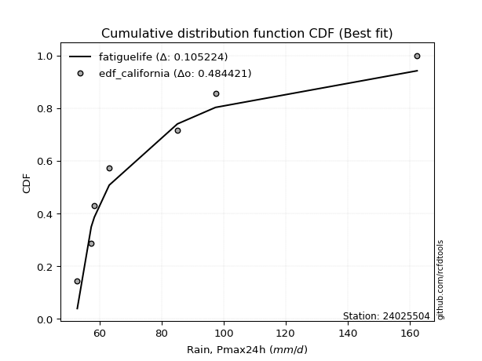</img>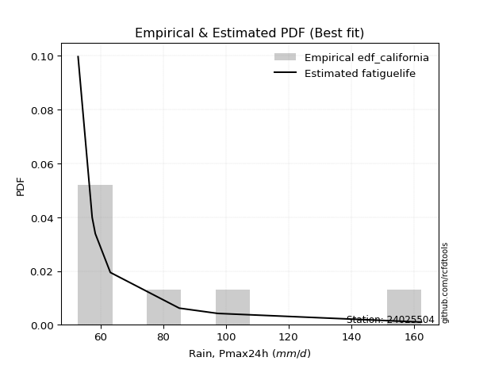</img>

</div>


### 2. EDF Hazen (1930)

Hazen method for plotting positions is a formula used to estimate the empirical cumulative probability distribution of flood events or other hydrological data. This formula often results in biased estimations, particularly when extrapolating to extreme events (high return periods).

<div align="center">


$P=(m-0.5)/n$


</div>


**2.1. Empirical values**

<div align="center">

|                | 0                   | 1                   | 2                   | 3         | 4                  | 5                  | 6                  |
|:---------------|:--------------------|:--------------------|:--------------------|:----------|:-------------------|:-------------------|:-------------------|
| date           | 2017                | 2018                | 2019                | 2021      | 2016               | 2020               | 2024               |
| x              | 52.8                | 57.3                | 58.3                | 63.1      | 85.1               | 97.4               | 162.4              |
| m              | 1                   | 2                   | 3                   | 4         | 5                  | 6                  | 7                  |
| empirical_dist | edf_hazen           | edf_hazen           | edf_hazen           | edf_hazen | edf_hazen          | edf_hazen          | edf_hazen          |
| empirical      | 0.07142857142857142 | 0.21428571428571427 | 0.35714285714285715 | 0.5       | 0.6428571428571429 | 0.7857142857142857 | 0.9285714285714286 |
| empirical_tr   | 1.0769230769230769  | 1.2727272727272727  | 1.5555555555555558  | 2.0       | 2.8000000000000003 | 4.666666666666666  | 14.000000000000007 |

</div>


**2.2. Kolmogorov-Smirnov fit test (sorted by Δ)**


<div align="center">

|                | 0                   | 1                   | 2                   | 3                   | 4                   | 5                   | 6                   | 7                   | 8                   | 9                   | 10                  | 11                  | 12                  | 13                  | 14                  | 15                  | 16                  | 17                  | 18                  | 19                  | 20                  | 21                  | 22                  | 23                  | 24                  | 25                  | 26                    | 27                  | 28                  | 29                  | 30                  | 31                  | 32                  | 33                  | 34                  | 35                  | 36                  | 37                  | 38                  | 39                  | 40                  | 41                  | 42                  | 43                  | 44                  | 45                  | 46                  | 47                  | 48                  | 49                  | 50                  | 51                  | 52                  | 53                  | 54                  | 55                  | 56                  | 57                  | 58                  | 59                  | 60                  | 61                  | 62                  | 63                  | 64                  | 65                  | 66                  | 67                  | 68                  | 69                  | 70                  | 71                  | 72                  | 73                  | 74                  | 75                  | 76                  | 77                  | 78                  | 79                  | 80                  | 81                  | 82                  | 83                  | 84                  | 85                  | 86                  | 87                  |
|:---------------|:--------------------|:--------------------|:--------------------|:--------------------|:--------------------|:--------------------|:--------------------|:--------------------|:--------------------|:--------------------|:--------------------|:--------------------|:--------------------|:--------------------|:--------------------|:--------------------|:--------------------|:--------------------|:--------------------|:--------------------|:--------------------|:--------------------|:--------------------|:--------------------|:--------------------|:--------------------|:----------------------|:--------------------|:--------------------|:--------------------|:--------------------|:--------------------|:--------------------|:--------------------|:--------------------|:--------------------|:--------------------|:--------------------|:--------------------|:--------------------|:--------------------|:--------------------|:--------------------|:--------------------|:--------------------|:--------------------|:--------------------|:--------------------|:--------------------|:--------------------|:--------------------|:--------------------|:--------------------|:--------------------|:--------------------|:--------------------|:--------------------|:--------------------|:--------------------|:--------------------|:--------------------|:--------------------|:--------------------|:--------------------|:--------------------|:--------------------|:--------------------|:--------------------|:--------------------|:--------------------|:--------------------|:--------------------|:--------------------|:--------------------|:--------------------|:--------------------|:--------------------|:--------------------|:--------------------|:--------------------|:--------------------|:--------------------|:--------------------|:--------------------|:--------------------|:--------------------|:--------------------|:--------------------|
| station        | 24025504            | 24025504            | 24025504            | 24025504            | 24025504            | 24025504            | 24025504            | 24025504            | 24025504            | 24025504            | 24025504            | 24025504            | 24025504            | 24025504            | 24025504            | 24025504            | 24025504            | 24025504            | 24025504            | 24025504            | 24025504            | 24025504            | 24025504            | 24025504            | 24025504            | 24025504            | 24025504              | 24025504            | 24025504            | 24025504            | 24025504            | 24025504            | 24025504            | 24025504            | 24025504            | 24025504            | 24025504            | 24025504            | 24025504            | 24025504            | 24025504            | 24025504            | 24025504            | 24025504            | 24025504            | 24025504            | 24025504            | 24025504            | 24025504            | 24025504            | 24025504            | 24025504            | 24025504            | 24025504            | 24025504            | 24025504            | 24025504            | 24025504            | 24025504            | 24025504            | 24025504            | 24025504            | 24025504            | 24025504            | 24025504            | 24025504            | 24025504            | 24025504            | 24025504            | 24025504            | 24025504            | 24025504            | 24025504            | 24025504            | 24025504            | 24025504            | 24025504            | 24025504            | 24025504            | 24025504            | 24025504            | 24025504            | 24025504            | 24025504            | 24025504            | 24025504            | 24025504            | 24025504            |
| empirical_dist | edf_hazen           | edf_hazen           | edf_hazen           | edf_hazen           | edf_hazen           | edf_hazen           | edf_hazen           | edf_hazen           | edf_hazen           | edf_hazen           | edf_hazen           | edf_hazen           | edf_hazen           | edf_hazen           | edf_hazen           | edf_hazen           | edf_hazen           | edf_hazen           | edf_hazen           | edf_hazen           | edf_hazen           | edf_hazen           | edf_hazen           | edf_hazen           | edf_hazen           | edf_hazen           | edf_hazen             | edf_hazen           | edf_hazen           | edf_hazen           | edf_hazen           | edf_hazen           | edf_hazen           | edf_hazen           | edf_hazen           | edf_hazen           | edf_hazen           | edf_hazen           | edf_hazen           | edf_hazen           | edf_hazen           | edf_hazen           | edf_hazen           | edf_hazen           | edf_hazen           | edf_hazen           | edf_hazen           | edf_hazen           | edf_hazen           | edf_hazen           | edf_hazen           | edf_hazen           | edf_hazen           | edf_hazen           | edf_hazen           | edf_hazen           | edf_hazen           | edf_hazen           | edf_hazen           | edf_hazen           | edf_hazen           | edf_hazen           | edf_hazen           | edf_hazen           | edf_hazen           | edf_hazen           | edf_hazen           | edf_hazen           | edf_hazen           | edf_hazen           | edf_hazen           | edf_hazen           | edf_hazen           | edf_hazen           | edf_hazen           | edf_hazen           | edf_hazen           | edf_hazen           | edf_hazen           | edf_hazen           | edf_hazen           | edf_hazen           | edf_hazen           | edf_hazen           | edf_hazen           | edf_hazen           | edf_hazen           | edf_hazen           |
| p_dist         | logalpha            | logmielke           | logjohnsonsu        | invgamma            | f                   | invgauss            | logfatiguelife      | loginvweibull       | alpha               | loggenexpon         | logexponnorm        | logexpon            | loginvgauss         | loginvgamma         | logf                | loghalfnorm         | loghalflogistic     | loggompertz         | logtruncnorm        | fatiguelife         | halflogistic        | mielke              | pearson3            | logmoyal            | erlang              | logpearson3         | loglaplace_asymmetric | lograyleigh         | loggumbel_r         | gamma               | moyal               | rayleigh            | lognakagami         | wald                | logmaxwell          | loggenlogistic      | halfnorm            | gumbel_r            | maxwell             | lognct              | ncf                 | logbetaprime        | betaprime           | nct                 | logfisk             | logkstwobign        | logloggamma         | logt                | logcrystalball      | lognorm             | lognorm             | loggamma            | loggamma            | crystalball         | norm                | genlogistic         | exponnorm           | expon               | genexpon            | laplace_asymmetric  | gompertz            | nakagami            | logwald             | loglogistic         | logncf              | logrice             | logistic            | weibull_min         | loghypsecant        | kstwobign           | t                   | logchi2             | hypsecant           | loggumbel_l         | truncnorm           | gumbel_l            | rice                | loglaplace          | laplace             | johnsonsu           | gibrat              | logweibull_min      | fisk                | loggibrat           | logerlang           | loglognorm          | invweibull          | chi2                |
| delta          | 0.10215130609318956 | 0.11045730103325857 | 0.11090241837553594 | 0.1147007368021391  | 0.11470084696338545 | 0.11528109739683812 | 0.1153025930255317  | 0.12014026204480488 | 0.12068348585574384 | 0.1207579536194443  | 0.12075979551434418 | 0.12078270267523378 | 0.1222336136690293  | 0.12263835523304167 | 0.12268235510324355 | 0.12334303589686124 | 0.12387717453777009 | 0.12605041084218419 | 0.13319326309187202 | 0.13401414340956144 | 0.1391196881437534  | 0.1460195475497239  | 0.1475243297936245  | 0.14889483476006315 | 0.15124362867901253 | 0.1525155984496857  | 0.15255928186839313   | 0.15499639727452413 | 0.15985627860589852 | 0.1619363946633764  | 0.1623179038180308  | 0.1648699857574341  | 0.1649758179299862  | 0.16561244984164986 | 0.16617495453757786 | 0.16640948663494137 | 0.16724136772866732 | 0.17162356714884786 | 0.17578480563498528 | 0.17738417502657083 | 0.17958988553287225 | 0.18011940858006303 | 0.18269179124422247 | 0.1839741260405935  | 0.18720849597689404 | 0.1873907671966335  | 0.19060608621508196 | 0.19453754998694994 | 0.1945867900332507  | 0.1945867905270312  | 0.1945867905270312  | 0.19557124297065784 | 0.19557124297065784 | 0.20330961033169942 | 0.2033096179222501  | 0.20394513608261583 | 0.20509534499688542 | 0.20564285907397156 | 0.20564355332055118 | 0.2057225795824872  | 0.21088013433548886 | 0.21265879484906033 | 0.21457559915328614 | 0.21565947125459578 | 0.21799543369689212 | 0.22233362605067036 | 0.22481363659979164 | 0.22776820966187827 | 0.23100798042564036 | 0.23133513995051908 | 0.23405736122216825 | 0.23749749264913722 | 0.24025394952465706 | 0.24652777242376683 | 0.25128229656497214 | 0.2534592561776997  | 0.2544632019418043  | 0.25654719945207094 | 0.2650205076016512  | 0.2907500255470059  | 0.2995666996973836  | 0.31075952596434386 | 0.32145244992919964 | 0.3493801586918762  | 0.3495983651710832  | 0.40530357110814896 | 0.4813476939806889  | 0.7219322085349487  |
| deltao         | 0.48442053926100004 | 0.48442053926100004 | 0.48442053926100004 | 0.48442053926100004 | 0.48442053926100004 | 0.48442053926100004 | 0.48442053926100004 | 0.48442053926100004 | 0.48442053926100004 | 0.48442053926100004 | 0.48442053926100004 | 0.48442053926100004 | 0.48442053926100004 | 0.48442053926100004 | 0.48442053926100004 | 0.48442053926100004 | 0.48442053926100004 | 0.48442053926100004 | 0.48442053926100004 | 0.48442053926100004 | 0.48442053926100004 | 0.48442053926100004 | 0.48442053926100004 | 0.48442053926100004 | 0.48442053926100004 | 0.48442053926100004 | 0.48442053926100004   | 0.48442053926100004 | 0.48442053926100004 | 0.48442053926100004 | 0.48442053926100004 | 0.48442053926100004 | 0.48442053926100004 | 0.48442053926100004 | 0.48442053926100004 | 0.48442053926100004 | 0.48442053926100004 | 0.48442053926100004 | 0.48442053926100004 | 0.48442053926100004 | 0.48442053926100004 | 0.48442053926100004 | 0.48442053926100004 | 0.48442053926100004 | 0.48442053926100004 | 0.48442053926100004 | 0.48442053926100004 | 0.48442053926100004 | 0.48442053926100004 | 0.48442053926100004 | 0.48442053926100004 | 0.48442053926100004 | 0.48442053926100004 | 0.48442053926100004 | 0.48442053926100004 | 0.48442053926100004 | 0.48442053926100004 | 0.48442053926100004 | 0.48442053926100004 | 0.48442053926100004 | 0.48442053926100004 | 0.48442053926100004 | 0.48442053926100004 | 0.48442053926100004 | 0.48442053926100004 | 0.48442053926100004 | 0.48442053926100004 | 0.48442053926100004 | 0.48442053926100004 | 0.48442053926100004 | 0.48442053926100004 | 0.48442053926100004 | 0.48442053926100004 | 0.48442053926100004 | 0.48442053926100004 | 0.48442053926100004 | 0.48442053926100004 | 0.48442053926100004 | 0.48442053926100004 | 0.48442053926100004 | 0.48442053926100004 | 0.48442053926100004 | 0.48442053926100004 | 0.48442053926100004 | 0.48442053926100004 | 0.48442053926100004 | 0.48442053926100004 | 0.48442053926100004 |
| eval           | Δo > Δ              | Δo > Δ              | Δo > Δ              | Δo > Δ              | Δo > Δ              | Δo > Δ              | Δo > Δ              | Δo > Δ              | Δo > Δ              | Δo > Δ              | Δo > Δ              | Δo > Δ              | Δo > Δ              | Δo > Δ              | Δo > Δ              | Δo > Δ              | Δo > Δ              | Δo > Δ              | Δo > Δ              | Δo > Δ              | Δo > Δ              | Δo > Δ              | Δo > Δ              | Δo > Δ              | Δo > Δ              | Δo > Δ              | Δo > Δ                | Δo > Δ              | Δo > Δ              | Δo > Δ              | Δo > Δ              | Δo > Δ              | Δo > Δ              | Δo > Δ              | Δo > Δ              | Δo > Δ              | Δo > Δ              | Δo > Δ              | Δo > Δ              | Δo > Δ              | Δo > Δ              | Δo > Δ              | Δo > Δ              | Δo > Δ              | Δo > Δ              | Δo > Δ              | Δo > Δ              | Δo > Δ              | Δo > Δ              | Δo > Δ              | Δo > Δ              | Δo > Δ              | Δo > Δ              | Δo > Δ              | Δo > Δ              | Δo > Δ              | Δo > Δ              | Δo > Δ              | Δo > Δ              | Δo > Δ              | Δo > Δ              | Δo > Δ              | Δo > Δ              | Δo > Δ              | Δo > Δ              | Δo > Δ              | Δo > Δ              | Δo > Δ              | Δo > Δ              | Δo > Δ              | Δo > Δ              | Δo > Δ              | Δo > Δ              | Δo > Δ              | Δo > Δ              | Δo > Δ              | Δo > Δ              | Δo > Δ              | Δo > Δ              | Δo > Δ              | Δo > Δ              | Δo > Δ              | Δo > Δ              | Δo > Δ              | Δo > Δ              | Δo > Δ              | Δo > Δ              | Δo <= Δ             |
| fit            | 1                   | 1                   | 1                   | 1                   | 1                   | 1                   | 1                   | 1                   | 1                   | 1                   | 1                   | 1                   | 1                   | 1                   | 1                   | 1                   | 1                   | 1                   | 1                   | 1                   | 1                   | 1                   | 1                   | 1                   | 1                   | 1                   | 1                     | 1                   | 1                   | 1                   | 1                   | 1                   | 1                   | 1                   | 1                   | 1                   | 1                   | 1                   | 1                   | 1                   | 1                   | 1                   | 1                   | 1                   | 1                   | 1                   | 1                   | 1                   | 1                   | 1                   | 1                   | 1                   | 1                   | 1                   | 1                   | 1                   | 1                   | 1                   | 1                   | 1                   | 1                   | 1                   | 1                   | 1                   | 1                   | 1                   | 1                   | 1                   | 1                   | 1                   | 1                   | 1                   | 1                   | 1                   | 1                   | 1                   | 1                   | 1                   | 1                   | 1                   | 1                   | 1                   | 1                   | 1                   | 1                   | 1                   | 1                   | 0                   |
| n              | 7                   | 7                   | 7                   | 7                   | 7                   | 7                   | 7                   | 7                   | 7                   | 7                   | 7                   | 7                   | 7                   | 7                   | 7                   | 7                   | 7                   | 7                   | 7                   | 7                   | 7                   | 7                   | 7                   | 7                   | 7                   | 7                   | 7                     | 7                   | 7                   | 7                   | 7                   | 7                   | 7                   | 7                   | 7                   | 7                   | 7                   | 7                   | 7                   | 7                   | 7                   | 7                   | 7                   | 7                   | 7                   | 7                   | 7                   | 7                   | 7                   | 7                   | 7                   | 7                   | 7                   | 7                   | 7                   | 7                   | 7                   | 7                   | 7                   | 7                   | 7                   | 7                   | 7                   | 7                   | 7                   | 7                   | 7                   | 7                   | 7                   | 7                   | 7                   | 7                   | 7                   | 7                   | 7                   | 7                   | 7                   | 7                   | 7                   | 7                   | 7                   | 7                   | 7                   | 7                   | 7                   | 7                   | 7                   | 7                   |
| best_fit       | 1                   | 0                   | 0                   | 0                   | 0                   | 0                   | 0                   | 0                   | 0                   | 0                   | 0                   | 0                   | 0                   | 0                   | 0                   | 0                   | 0                   | 0                   | 0                   | 0                   | 0                   | 0                   | 0                   | 0                   | 0                   | 0                   | 0                     | 0                   | 0                   | 0                   | 0                   | 0                   | 0                   | 0                   | 0                   | 0                   | 0                   | 0                   | 0                   | 0                   | 0                   | 0                   | 0                   | 0                   | 0                   | 0                   | 0                   | 0                   | 0                   | 0                   | 0                   | 0                   | 0                   | 0                   | 0                   | 0                   | 0                   | 0                   | 0                   | 0                   | 0                   | 0                   | 0                   | 0                   | 0                   | 0                   | 0                   | 0                   | 0                   | 0                   | 0                   | 0                   | 0                   | 0                   | 0                   | 0                   | 0                   | 0                   | 0                   | 0                   | 0                   | 0                   | 0                   | 0                   | 0                   | 0                   | 0                   | 0                   |
| best_fit_sort  | 1                   | 2                   | 3                   | 4                   | 5                   | 6                   | 7                   | 8                   | 9                   | 10                  | 11                  | 12                  | 13                  | 14                  | 15                  | 16                  | 17                  | 18                  | 19                  | 20                  | 21                  | 22                  | 23                  | 24                  | 25                  | 26                  | 27                    | 28                  | 29                  | 30                  | 31                  | 32                  | 33                  | 34                  | 35                  | 36                  | 37                  | 38                  | 39                  | 40                  | 41                  | 42                  | 43                  | 44                  | 45                  | 46                  | 47                  | 48                  | 49                  | 50                  | 51                  | 52                  | 53                  | 54                  | 55                  | 56                  | 57                  | 58                  | 59                  | 60                  | 61                  | 62                  | 63                  | 64                  | 65                  | 66                  | 67                  | 68                  | 69                  | 70                  | 71                  | 72                  | 73                  | 74                  | 75                  | 76                  | 77                  | 78                  | 79                  | 80                  | 81                  | 82                  | 83                  | 84                  | 85                  | 86                  | 87                  | 88                  |

</div>


**2.3. Best fit**

<div align="center">

|   id |   station | empirical_dist   | p_dist   |    delta |   deltao | eval   |   fit |   n |   best_fit |   best_fit_sort |
|-----:|----------:|:-----------------|:---------|---------:|---------:|:-------|------:|----:|-----------:|----------------:|
|    0 |  24025504 | edf_hazen        | logalpha | 0.102151 | 0.484421 | Δo > Δ |     1 |   7 |          1 |               1 |

</div>


<div align="center">

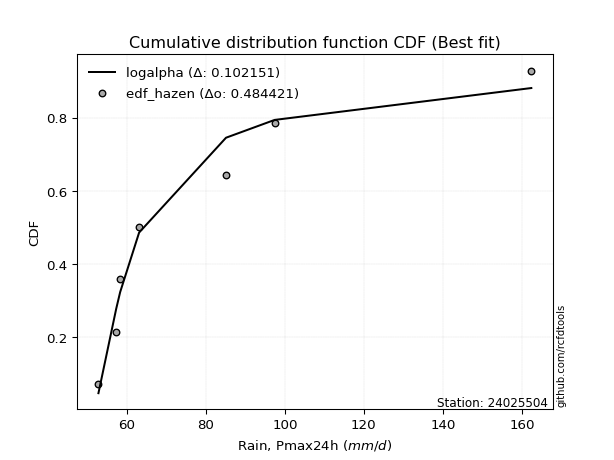</img></img>

</div>


### 3. EDF Weibull (1939)

Weibull plotting position formula is an empirical method used to estimate the non-exceedance probability or plotting position for a set of observed data, is often recommended or widely used in practice, particularly in flood frequency analysis.

<div align="center">


$P=m/(n+1)$


</div>


**3.1. Empirical values**

<div align="center">

|                | 0                  | 1                  | 2           | 3           | 4                  | 5           | 6           |
|:---------------|:-------------------|:-------------------|:------------|:------------|:-------------------|:------------|:------------|
| date           | 2017               | 2018               | 2019        | 2021        | 2016               | 2020        | 2024        |
| x              | 52.8               | 57.3               | 58.3        | 63.1        | 85.1               | 97.4        | 162.4       |
| m              | 1                  | 2                  | 3           | 4           | 5                  | 6           | 7           |
| empirical_dist | edf_weibull        | edf_weibull        | edf_weibull | edf_weibull | edf_weibull        | edf_weibull | edf_weibull |
| empirical      | 0.125              | 0.25               | 0.375       | 0.5         | 0.625              | 0.75        | 0.875       |
| empirical_tr   | 1.1428571428571428 | 1.3333333333333333 | 1.6         | 2.0         | 2.6666666666666665 | 4.0         | 8.0         |

</div>


**3.2. Kolmogorov-Smirnov fit test (sorted by Δ)**


<div align="center">

|                | 0                   | 1                   | 2                   | 3                   | 4                   | 5                   | 6                   | 7                   | 8                   | 9                   | 10                  | 11                  | 12                  | 13                  | 14                  | 15                  | 16                  | 17                  | 18                  | 19                  | 20                  | 21                  | 22                  | 23                  | 24                  | 25                  | 26                  | 27                  | 28                  | 29                  | 30                  | 31                  | 32                  | 33                  | 34                  | 35                    | 36                  | 37                  | 38                  | 39                  | 40                  | 41                  | 42                  | 43                  | 44                  | 45                  | 46                  | 47                  | 48                  | 49                  | 50                  | 51                  | 52                  | 53                  | 54                  | 55                  | 56                  | 57                  | 58                  | 59                  | 60                  | 61                  | 62                  | 63                  | 64                  | 65                  | 66                  | 67                  | 68                  | 69                  | 70                  | 71                  | 72                  | 73                  | 74                  | 75                  | 76                  | 77                  | 78                  | 79                  | 80                  | 81                  | 82                  | 83                  | 84                  | 85                  | 86                  | 87                  |
|:---------------|:--------------------|:--------------------|:--------------------|:--------------------|:--------------------|:--------------------|:--------------------|:--------------------|:--------------------|:--------------------|:--------------------|:--------------------|:--------------------|:--------------------|:--------------------|:--------------------|:--------------------|:--------------------|:--------------------|:--------------------|:--------------------|:--------------------|:--------------------|:--------------------|:--------------------|:--------------------|:--------------------|:--------------------|:--------------------|:--------------------|:--------------------|:--------------------|:--------------------|:--------------------|:--------------------|:----------------------|:--------------------|:--------------------|:--------------------|:--------------------|:--------------------|:--------------------|:--------------------|:--------------------|:--------------------|:--------------------|:--------------------|:--------------------|:--------------------|:--------------------|:--------------------|:--------------------|:--------------------|:--------------------|:--------------------|:--------------------|:--------------------|:--------------------|:--------------------|:--------------------|:--------------------|:--------------------|:--------------------|:--------------------|:--------------------|:--------------------|:--------------------|:--------------------|:--------------------|:--------------------|:--------------------|:--------------------|:--------------------|:--------------------|:--------------------|:--------------------|:--------------------|:--------------------|:--------------------|:--------------------|:--------------------|:--------------------|:--------------------|:--------------------|:--------------------|:--------------------|:--------------------|:--------------------|
| station        | 24025504            | 24025504            | 24025504            | 24025504            | 24025504            | 24025504            | 24025504            | 24025504            | 24025504            | 24025504            | 24025504            | 24025504            | 24025504            | 24025504            | 24025504            | 24025504            | 24025504            | 24025504            | 24025504            | 24025504            | 24025504            | 24025504            | 24025504            | 24025504            | 24025504            | 24025504            | 24025504            | 24025504            | 24025504            | 24025504            | 24025504            | 24025504            | 24025504            | 24025504            | 24025504            | 24025504              | 24025504            | 24025504            | 24025504            | 24025504            | 24025504            | 24025504            | 24025504            | 24025504            | 24025504            | 24025504            | 24025504            | 24025504            | 24025504            | 24025504            | 24025504            | 24025504            | 24025504            | 24025504            | 24025504            | 24025504            | 24025504            | 24025504            | 24025504            | 24025504            | 24025504            | 24025504            | 24025504            | 24025504            | 24025504            | 24025504            | 24025504            | 24025504            | 24025504            | 24025504            | 24025504            | 24025504            | 24025504            | 24025504            | 24025504            | 24025504            | 24025504            | 24025504            | 24025504            | 24025504            | 24025504            | 24025504            | 24025504            | 24025504            | 24025504            | 24025504            | 24025504            | 24025504            |
| empirical_dist | edf_weibull         | edf_weibull         | edf_weibull         | edf_weibull         | edf_weibull         | edf_weibull         | edf_weibull         | edf_weibull         | edf_weibull         | edf_weibull         | edf_weibull         | edf_weibull         | edf_weibull         | edf_weibull         | edf_weibull         | edf_weibull         | edf_weibull         | edf_weibull         | edf_weibull         | edf_weibull         | edf_weibull         | edf_weibull         | edf_weibull         | edf_weibull         | edf_weibull         | edf_weibull         | edf_weibull         | edf_weibull         | edf_weibull         | edf_weibull         | edf_weibull         | edf_weibull         | edf_weibull         | edf_weibull         | edf_weibull         | edf_weibull           | edf_weibull         | edf_weibull         | edf_weibull         | edf_weibull         | edf_weibull         | edf_weibull         | edf_weibull         | edf_weibull         | edf_weibull         | edf_weibull         | edf_weibull         | edf_weibull         | edf_weibull         | edf_weibull         | edf_weibull         | edf_weibull         | edf_weibull         | edf_weibull         | edf_weibull         | edf_weibull         | edf_weibull         | edf_weibull         | edf_weibull         | edf_weibull         | edf_weibull         | edf_weibull         | edf_weibull         | edf_weibull         | edf_weibull         | edf_weibull         | edf_weibull         | edf_weibull         | edf_weibull         | edf_weibull         | edf_weibull         | edf_weibull         | edf_weibull         | edf_weibull         | edf_weibull         | edf_weibull         | edf_weibull         | edf_weibull         | edf_weibull         | edf_weibull         | edf_weibull         | edf_weibull         | edf_weibull         | edf_weibull         | edf_weibull         | edf_weibull         | edf_weibull         | edf_weibull         |
| p_dist         | fatiguelife         | logalpha            | loghalfnorm         | loghalflogistic     | logmielke           | logjohnsonsu        | lognakagami         | invgamma            | f                   | invgauss            | logfatiguelife      | logfisk             | halfnorm            | halflogistic        | loginvweibull       | alpha               | loggenexpon         | logexponnorm        | logexpon            | loginvgauss         | loginvgamma         | logf                | loggompertz         | pearson3            | logmoyal            | logtruncnorm        | logpearson3         | lograyleigh         | loggumbel_r         | moyal               | mielke              | rayleigh            | logmaxwell          | loggenlogistic      | erlang              | loglaplace_asymmetric | gumbel_r            | wald                | maxwell             | nakagami            | lognct              | ncf                 | gamma               | logbetaprime        | betaprime           | nct                 | logkstwobign        | logloggamma         | logt                | logcrystalball      | lognorm             | lognorm             | logchi2             | crystalball         | norm                | genlogistic         | exponnorm           | expon               | genexpon            | laplace_asymmetric  | gompertz            | loggamma            | loggamma            | loglogistic         | logncf              | logrice             | logistic            | weibull_min         | loghypsecant        | kstwobign           | logwald             | hypsecant           | loggumbel_l         | truncnorm           | t                   | gumbel_l            | rice                | johnsonsu           | loglaplace          | logweibull_min      | laplace             | fisk                | logerlang           | gibrat              | loggibrat           | loglognorm          | invweibull          | chi2                |
| delta          | 0.11465091741524802 | 0.12000844895033247 | 0.12334303589686124 | 0.12387717453777009 | 0.12831444389040142 | 0.12875956123267884 | 0.12926153221570047 | 0.132557879659282   | 0.13255798982052835 | 0.13313824025398102 | 0.1331597358826746  | 0.13363706740546544 | 0.1340615157349166  | 0.13652277567764132 | 0.13799740490194778 | 0.13854062871288675 | 0.13861509647658715 | 0.13861693837148703 | 0.13863984553237663 | 0.1400907565261722  | 0.14049549809018458 | 0.14053949796038645 | 0.14390755369932703 | 0.1475243297936245  | 0.14889483476006315 | 0.15105040594901487 | 0.1525155984496857  | 0.15499639727452413 | 0.15985627860589852 | 0.1623179038180308  | 0.1638766904068668  | 0.1648699857574341  | 0.16617495453757786 | 0.16640948663494137 | 0.16910077153615544 | 0.17041642472553598   | 0.17162356714884786 | 0.1740941262367129  | 0.17578480563498528 | 0.1769445091347746  | 0.17738417502657083 | 0.17958988553287225 | 0.1797935375205193  | 0.18011940858006303 | 0.18269179124422247 | 0.1839741260405935  | 0.1873907671966335  | 0.19060608621508196 | 0.19453754998694994 | 0.1945867900332507  | 0.1945867905270312  | 0.1945867905270312  | 0.20178320693485152 | 0.20330961033169942 | 0.2033096179222501  | 0.20394513608261583 | 0.20509534499688542 | 0.20564285907397156 | 0.20564355332055118 | 0.2057225795824872  | 0.21088013433548886 | 0.2109102147804618  | 0.2109102147804618  | 0.21565947125459578 | 0.21799543369689212 | 0.22233362605067036 | 0.22481363659979164 | 0.22776820966187827 | 0.23100798042564036 | 0.23133513995051908 | 0.232432742010429   | 0.24025394952465706 | 0.24652777242376683 | 0.25128229656497214 | 0.25191450407931115 | 0.2534592561776997  | 0.2544632019418043  | 0.2550357398327202  | 0.25654719945207094 | 0.25718809739291526 | 0.2650205076016512  | 0.26788102135777103 | 0.3138840794567975  | 0.31742384255452644 | 0.36723730154901907 | 0.36958928539386326 | 0.4277762654092603  | 0.686217922820663   |
| deltao         | 0.48442053926100004 | 0.48442053926100004 | 0.48442053926100004 | 0.48442053926100004 | 0.48442053926100004 | 0.48442053926100004 | 0.48442053926100004 | 0.48442053926100004 | 0.48442053926100004 | 0.48442053926100004 | 0.48442053926100004 | 0.48442053926100004 | 0.48442053926100004 | 0.48442053926100004 | 0.48442053926100004 | 0.48442053926100004 | 0.48442053926100004 | 0.48442053926100004 | 0.48442053926100004 | 0.48442053926100004 | 0.48442053926100004 | 0.48442053926100004 | 0.48442053926100004 | 0.48442053926100004 | 0.48442053926100004 | 0.48442053926100004 | 0.48442053926100004 | 0.48442053926100004 | 0.48442053926100004 | 0.48442053926100004 | 0.48442053926100004 | 0.48442053926100004 | 0.48442053926100004 | 0.48442053926100004 | 0.48442053926100004 | 0.48442053926100004   | 0.48442053926100004 | 0.48442053926100004 | 0.48442053926100004 | 0.48442053926100004 | 0.48442053926100004 | 0.48442053926100004 | 0.48442053926100004 | 0.48442053926100004 | 0.48442053926100004 | 0.48442053926100004 | 0.48442053926100004 | 0.48442053926100004 | 0.48442053926100004 | 0.48442053926100004 | 0.48442053926100004 | 0.48442053926100004 | 0.48442053926100004 | 0.48442053926100004 | 0.48442053926100004 | 0.48442053926100004 | 0.48442053926100004 | 0.48442053926100004 | 0.48442053926100004 | 0.48442053926100004 | 0.48442053926100004 | 0.48442053926100004 | 0.48442053926100004 | 0.48442053926100004 | 0.48442053926100004 | 0.48442053926100004 | 0.48442053926100004 | 0.48442053926100004 | 0.48442053926100004 | 0.48442053926100004 | 0.48442053926100004 | 0.48442053926100004 | 0.48442053926100004 | 0.48442053926100004 | 0.48442053926100004 | 0.48442053926100004 | 0.48442053926100004 | 0.48442053926100004 | 0.48442053926100004 | 0.48442053926100004 | 0.48442053926100004 | 0.48442053926100004 | 0.48442053926100004 | 0.48442053926100004 | 0.48442053926100004 | 0.48442053926100004 | 0.48442053926100004 | 0.48442053926100004 |
| eval           | Δo > Δ              | Δo > Δ              | Δo > Δ              | Δo > Δ              | Δo > Δ              | Δo > Δ              | Δo > Δ              | Δo > Δ              | Δo > Δ              | Δo > Δ              | Δo > Δ              | Δo > Δ              | Δo > Δ              | Δo > Δ              | Δo > Δ              | Δo > Δ              | Δo > Δ              | Δo > Δ              | Δo > Δ              | Δo > Δ              | Δo > Δ              | Δo > Δ              | Δo > Δ              | Δo > Δ              | Δo > Δ              | Δo > Δ              | Δo > Δ              | Δo > Δ              | Δo > Δ              | Δo > Δ              | Δo > Δ              | Δo > Δ              | Δo > Δ              | Δo > Δ              | Δo > Δ              | Δo > Δ                | Δo > Δ              | Δo > Δ              | Δo > Δ              | Δo > Δ              | Δo > Δ              | Δo > Δ              | Δo > Δ              | Δo > Δ              | Δo > Δ              | Δo > Δ              | Δo > Δ              | Δo > Δ              | Δo > Δ              | Δo > Δ              | Δo > Δ              | Δo > Δ              | Δo > Δ              | Δo > Δ              | Δo > Δ              | Δo > Δ              | Δo > Δ              | Δo > Δ              | Δo > Δ              | Δo > Δ              | Δo > Δ              | Δo > Δ              | Δo > Δ              | Δo > Δ              | Δo > Δ              | Δo > Δ              | Δo > Δ              | Δo > Δ              | Δo > Δ              | Δo > Δ              | Δo > Δ              | Δo > Δ              | Δo > Δ              | Δo > Δ              | Δo > Δ              | Δo > Δ              | Δo > Δ              | Δo > Δ              | Δo > Δ              | Δo > Δ              | Δo > Δ              | Δo > Δ              | Δo > Δ              | Δo > Δ              | Δo > Δ              | Δo > Δ              | Δo > Δ              | Δo <= Δ             |
| fit            | 1                   | 1                   | 1                   | 1                   | 1                   | 1                   | 1                   | 1                   | 1                   | 1                   | 1                   | 1                   | 1                   | 1                   | 1                   | 1                   | 1                   | 1                   | 1                   | 1                   | 1                   | 1                   | 1                   | 1                   | 1                   | 1                   | 1                   | 1                   | 1                   | 1                   | 1                   | 1                   | 1                   | 1                   | 1                   | 1                     | 1                   | 1                   | 1                   | 1                   | 1                   | 1                   | 1                   | 1                   | 1                   | 1                   | 1                   | 1                   | 1                   | 1                   | 1                   | 1                   | 1                   | 1                   | 1                   | 1                   | 1                   | 1                   | 1                   | 1                   | 1                   | 1                   | 1                   | 1                   | 1                   | 1                   | 1                   | 1                   | 1                   | 1                   | 1                   | 1                   | 1                   | 1                   | 1                   | 1                   | 1                   | 1                   | 1                   | 1                   | 1                   | 1                   | 1                   | 1                   | 1                   | 1                   | 1                   | 0                   |
| n              | 7                   | 7                   | 7                   | 7                   | 7                   | 7                   | 7                   | 7                   | 7                   | 7                   | 7                   | 7                   | 7                   | 7                   | 7                   | 7                   | 7                   | 7                   | 7                   | 7                   | 7                   | 7                   | 7                   | 7                   | 7                   | 7                   | 7                   | 7                   | 7                   | 7                   | 7                   | 7                   | 7                   | 7                   | 7                   | 7                     | 7                   | 7                   | 7                   | 7                   | 7                   | 7                   | 7                   | 7                   | 7                   | 7                   | 7                   | 7                   | 7                   | 7                   | 7                   | 7                   | 7                   | 7                   | 7                   | 7                   | 7                   | 7                   | 7                   | 7                   | 7                   | 7                   | 7                   | 7                   | 7                   | 7                   | 7                   | 7                   | 7                   | 7                   | 7                   | 7                   | 7                   | 7                   | 7                   | 7                   | 7                   | 7                   | 7                   | 7                   | 7                   | 7                   | 7                   | 7                   | 7                   | 7                   | 7                   | 7                   |
| best_fit       | 1                   | 0                   | 0                   | 0                   | 0                   | 0                   | 0                   | 0                   | 0                   | 0                   | 0                   | 0                   | 0                   | 0                   | 0                   | 0                   | 0                   | 0                   | 0                   | 0                   | 0                   | 0                   | 0                   | 0                   | 0                   | 0                   | 0                   | 0                   | 0                   | 0                   | 0                   | 0                   | 0                   | 0                   | 0                   | 0                     | 0                   | 0                   | 0                   | 0                   | 0                   | 0                   | 0                   | 0                   | 0                   | 0                   | 0                   | 0                   | 0                   | 0                   | 0                   | 0                   | 0                   | 0                   | 0                   | 0                   | 0                   | 0                   | 0                   | 0                   | 0                   | 0                   | 0                   | 0                   | 0                   | 0                   | 0                   | 0                   | 0                   | 0                   | 0                   | 0                   | 0                   | 0                   | 0                   | 0                   | 0                   | 0                   | 0                   | 0                   | 0                   | 0                   | 0                   | 0                   | 0                   | 0                   | 0                   | 0                   |
| best_fit_sort  | 1                   | 2                   | 3                   | 4                   | 5                   | 6                   | 7                   | 8                   | 9                   | 10                  | 11                  | 12                  | 13                  | 14                  | 15                  | 16                  | 17                  | 18                  | 19                  | 20                  | 21                  | 22                  | 23                  | 24                  | 25                  | 26                  | 27                  | 28                  | 29                  | 30                  | 31                  | 32                  | 33                  | 34                  | 35                  | 36                    | 37                  | 38                  | 39                  | 40                  | 41                  | 42                  | 43                  | 44                  | 45                  | 46                  | 47                  | 48                  | 49                  | 50                  | 51                  | 52                  | 53                  | 54                  | 55                  | 56                  | 57                  | 58                  | 59                  | 60                  | 61                  | 62                  | 63                  | 64                  | 65                  | 66                  | 67                  | 68                  | 69                  | 70                  | 71                  | 72                  | 73                  | 74                  | 75                  | 76                  | 77                  | 78                  | 79                  | 80                  | 81                  | 82                  | 83                  | 84                  | 85                  | 86                  | 87                  | 88                  |

</div>


**3.3. Best fit**

<div align="center">

|   id |   station | empirical_dist   | p_dist      |    delta |   deltao | eval   |   fit |   n |   best_fit |   best_fit_sort |
|-----:|----------:|:-----------------|:------------|---------:|---------:|:-------|------:|----:|-----------:|----------------:|
|    0 |  24025504 | edf_weibull      | fatiguelife | 0.114651 | 0.484421 | Δo > Δ |     1 |   7 |          1 |               1 |

</div>


<div align="center">

</img>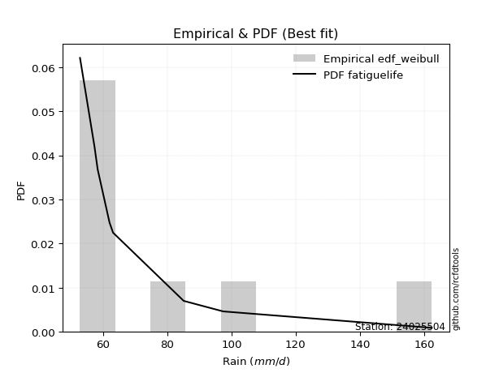</img>

</div>


### 4. EDF Beard (1943)

The Beard formula (or Beard´s plotting position formula) in hydrology is used to estimate the empirical non-exceedance probability _(P)_ of a flood event (or other extreme hydrological data point) within a given dataset.

<div align="center">


$P=(m-0.31)/(n+0.38)$


</div>


**4.1. Empirical values**

<div align="center">

|                | 0                   | 1                   | 2                   | 3         | 4                  | 5                  | 6                  |
|:---------------|:--------------------|:--------------------|:--------------------|:----------|:-------------------|:-------------------|:-------------------|
| date           | 2017                | 2018                | 2019                | 2021      | 2016               | 2020               | 2024               |
| x              | 52.8                | 57.3                | 58.3                | 63.1      | 85.1               | 97.4               | 162.4              |
| m              | 1                   | 2                   | 3                   | 4         | 5                  | 6                  | 7                  |
| empirical_dist | edf_beard           | edf_beard           | edf_beard           | edf_beard | edf_beard          | edf_beard          | edf_beard          |
| empirical      | 0.09349593495934959 | 0.22899728997289973 | 0.36449864498644985 | 0.5       | 0.6355013550135502 | 0.7710027100271003 | 0.9065040650406505 |
| empirical_tr   | 1.1031390134529149  | 1.29701230228471    | 1.5735607675906182  | 2.0       | 2.743494423791822  | 4.366863905325444  | 10.695652173913055 |

</div>


**4.2. Kolmogorov-Smirnov fit test (sorted by Δ)**


<div align="center">

|                | 0                   | 1                   | 2                   | 3                   | 4                   | 5                   | 6                   | 7                   | 8                   | 9                   | 10                  | 11                  | 12                  | 13                  | 14                  | 15                  | 16                  | 17                  | 18                  | 19                  | 20                  | 21                  | 22                  | 23                  | 24                  | 25                  | 26                  | 27                  | 28                  | 29                  | 30                    | 31                  | 32                  | 33                  | 34                  | 35                  | 36                  | 37                  | 38                  | 39                  | 40                  | 41                  | 42                  | 43                  | 44                  | 45                  | 46                  | 47                  | 48                  | 49                  | 50                  | 51                  | 52                  | 53                  | 54                  | 55                  | 56                  | 57                  | 58                  | 59                  | 60                  | 61                  | 62                  | 63                  | 64                  | 65                  | 66                  | 67                  | 68                  | 69                  | 70                  | 71                  | 72                  | 73                  | 74                  | 75                  | 76                  | 77                  | 78                  | 79                  | 80                  | 81                  | 82                  | 83                  | 84                  | 85                  | 86                  | 87                  |
|:---------------|:--------------------|:--------------------|:--------------------|:--------------------|:--------------------|:--------------------|:--------------------|:--------------------|:--------------------|:--------------------|:--------------------|:--------------------|:--------------------|:--------------------|:--------------------|:--------------------|:--------------------|:--------------------|:--------------------|:--------------------|:--------------------|:--------------------|:--------------------|:--------------------|:--------------------|:--------------------|:--------------------|:--------------------|:--------------------|:--------------------|:----------------------|:--------------------|:--------------------|:--------------------|:--------------------|:--------------------|:--------------------|:--------------------|:--------------------|:--------------------|:--------------------|:--------------------|:--------------------|:--------------------|:--------------------|:--------------------|:--------------------|:--------------------|:--------------------|:--------------------|:--------------------|:--------------------|:--------------------|:--------------------|:--------------------|:--------------------|:--------------------|:--------------------|:--------------------|:--------------------|:--------------------|:--------------------|:--------------------|:--------------------|:--------------------|:--------------------|:--------------------|:--------------------|:--------------------|:--------------------|:--------------------|:--------------------|:--------------------|:--------------------|:--------------------|:--------------------|:--------------------|:--------------------|:--------------------|:--------------------|:--------------------|:--------------------|:--------------------|:--------------------|:--------------------|:--------------------|:--------------------|:--------------------|
| station        | 24025504            | 24025504            | 24025504            | 24025504            | 24025504            | 24025504            | 24025504            | 24025504            | 24025504            | 24025504            | 24025504            | 24025504            | 24025504            | 24025504            | 24025504            | 24025504            | 24025504            | 24025504            | 24025504            | 24025504            | 24025504            | 24025504            | 24025504            | 24025504            | 24025504            | 24025504            | 24025504            | 24025504            | 24025504            | 24025504            | 24025504              | 24025504            | 24025504            | 24025504            | 24025504            | 24025504            | 24025504            | 24025504            | 24025504            | 24025504            | 24025504            | 24025504            | 24025504            | 24025504            | 24025504            | 24025504            | 24025504            | 24025504            | 24025504            | 24025504            | 24025504            | 24025504            | 24025504            | 24025504            | 24025504            | 24025504            | 24025504            | 24025504            | 24025504            | 24025504            | 24025504            | 24025504            | 24025504            | 24025504            | 24025504            | 24025504            | 24025504            | 24025504            | 24025504            | 24025504            | 24025504            | 24025504            | 24025504            | 24025504            | 24025504            | 24025504            | 24025504            | 24025504            | 24025504            | 24025504            | 24025504            | 24025504            | 24025504            | 24025504            | 24025504            | 24025504            | 24025504            | 24025504            |
| empirical_dist | edf_beard           | edf_beard           | edf_beard           | edf_beard           | edf_beard           | edf_beard           | edf_beard           | edf_beard           | edf_beard           | edf_beard           | edf_beard           | edf_beard           | edf_beard           | edf_beard           | edf_beard           | edf_beard           | edf_beard           | edf_beard           | edf_beard           | edf_beard           | edf_beard           | edf_beard           | edf_beard           | edf_beard           | edf_beard           | edf_beard           | edf_beard           | edf_beard           | edf_beard           | edf_beard           | edf_beard             | edf_beard           | edf_beard           | edf_beard           | edf_beard           | edf_beard           | edf_beard           | edf_beard           | edf_beard           | edf_beard           | edf_beard           | edf_beard           | edf_beard           | edf_beard           | edf_beard           | edf_beard           | edf_beard           | edf_beard           | edf_beard           | edf_beard           | edf_beard           | edf_beard           | edf_beard           | edf_beard           | edf_beard           | edf_beard           | edf_beard           | edf_beard           | edf_beard           | edf_beard           | edf_beard           | edf_beard           | edf_beard           | edf_beard           | edf_beard           | edf_beard           | edf_beard           | edf_beard           | edf_beard           | edf_beard           | edf_beard           | edf_beard           | edf_beard           | edf_beard           | edf_beard           | edf_beard           | edf_beard           | edf_beard           | edf_beard           | edf_beard           | edf_beard           | edf_beard           | edf_beard           | edf_beard           | edf_beard           | edf_beard           | edf_beard           | edf_beard           |
| p_dist         | logalpha            | logmielke           | logjohnsonsu        | fatiguelife         | invgamma            | f                   | invgauss            | logfatiguelife      | loghalfnorm         | loghalflogistic     | loginvweibull       | alpha               | loggenexpon         | logexponnorm        | logexpon            | loginvgauss         | loginvgamma         | logf                | loggompertz         | halflogistic        | logtruncnorm        | halfnorm            | pearson3            | logmoyal            | lognakagami         | logpearson3         | mielke              | lograyleigh         | erlang              | loggumbel_r         | loglaplace_asymmetric | moyal               | rayleigh            | logfisk             | wald                | logmaxwell          | loggenlogistic      | gamma               | gumbel_r            | maxwell             | lognct              | ncf                 | logbetaprime        | betaprime           | nct                 | logkstwobign        | logloggamma         | logt                | logcrystalball      | lognorm             | lognorm             | nakagami            | loggamma            | loggamma            | crystalball         | norm                | genlogistic         | exponnorm           | expon               | genexpon            | laplace_asymmetric  | gompertz            | loglogistic         | logncf              | logwald             | logrice             | logchi2             | logistic            | weibull_min         | loghypsecant        | kstwobign           | hypsecant           | t                   | loggumbel_l         | truncnorm           | gumbel_l            | rice                | loglaplace          | laplace             | johnsonsu           | logweibull_min      | fisk                | gibrat              | logerlang           | loggibrat           | loglognorm          | invweibull          | chi2                |
| delta          | 0.10950709393678226 | 0.11781308887685127 | 0.11825820621912864 | 0.11930256772237599 | 0.1220565246457318  | 0.12205663480697815 | 0.12263688524043082 | 0.1226583808691244  | 0.12334303589686124 | 0.12387717453777009 | 0.12749604988839758 | 0.12803927369933654 | 0.128113741463037   | 0.12811558335793688 | 0.12813849051882648 | 0.129589401512622   | 0.12999414307663437 | 0.13003814294683624 | 0.13340619868577688 | 0.13652277567764132 | 0.14054905093546471 | 0.14517400419788917 | 0.1475243297936245  | 0.14889483476006315 | 0.15026424224280074 | 0.1525155984496857  | 0.1533753353933166  | 0.15499639727452413 | 0.15859941652260523 | 0.15985627860589852 | 0.15991506971198582   | 0.1623179038180308  | 0.1648699857574341  | 0.16514113244611595 | 0.16561244984164986 | 0.16617495453757786 | 0.16640948663494137 | 0.1692921825069691  | 0.17162356714884786 | 0.17578480563498528 | 0.17738417502657083 | 0.17958988553287225 | 0.18011940858006303 | 0.18269179124422247 | 0.1839741260405935  | 0.1873907671966335  | 0.19060608621508196 | 0.19453754998694994 | 0.1945867900332507  | 0.1945867905270312  | 0.1945867905270312  | 0.19794721916187488 | 0.20040885976691158 | 0.20040885976691158 | 0.20330961033169942 | 0.2033096179222501  | 0.20394513608261583 | 0.20509534499688542 | 0.20564285907397156 | 0.20564355332055118 | 0.2057225795824872  | 0.21088013433548886 | 0.21565947125459578 | 0.21799543369689212 | 0.22193138699687884 | 0.22233362605067036 | 0.22278591696195182 | 0.22481363659979164 | 0.22776820966187827 | 0.23100798042564036 | 0.23133513995051908 | 0.24025394952465706 | 0.24141314906576095 | 0.24652777242376683 | 0.25128229656497214 | 0.2534592561776997  | 0.2544632019418043  | 0.25654719945207094 | 0.2650205076016512  | 0.2760384498598205  | 0.28869216243356577 | 0.29938508639842154 | 0.3069224875409763  | 0.33488678948389783 | 0.3567359465354689  | 0.39059199542096357 | 0.4592803304499108  | 0.7072206328477633  |
| deltao         | 0.48442053926100004 | 0.48442053926100004 | 0.48442053926100004 | 0.48442053926100004 | 0.48442053926100004 | 0.48442053926100004 | 0.48442053926100004 | 0.48442053926100004 | 0.48442053926100004 | 0.48442053926100004 | 0.48442053926100004 | 0.48442053926100004 | 0.48442053926100004 | 0.48442053926100004 | 0.48442053926100004 | 0.48442053926100004 | 0.48442053926100004 | 0.48442053926100004 | 0.48442053926100004 | 0.48442053926100004 | 0.48442053926100004 | 0.48442053926100004 | 0.48442053926100004 | 0.48442053926100004 | 0.48442053926100004 | 0.48442053926100004 | 0.48442053926100004 | 0.48442053926100004 | 0.48442053926100004 | 0.48442053926100004 | 0.48442053926100004   | 0.48442053926100004 | 0.48442053926100004 | 0.48442053926100004 | 0.48442053926100004 | 0.48442053926100004 | 0.48442053926100004 | 0.48442053926100004 | 0.48442053926100004 | 0.48442053926100004 | 0.48442053926100004 | 0.48442053926100004 | 0.48442053926100004 | 0.48442053926100004 | 0.48442053926100004 | 0.48442053926100004 | 0.48442053926100004 | 0.48442053926100004 | 0.48442053926100004 | 0.48442053926100004 | 0.48442053926100004 | 0.48442053926100004 | 0.48442053926100004 | 0.48442053926100004 | 0.48442053926100004 | 0.48442053926100004 | 0.48442053926100004 | 0.48442053926100004 | 0.48442053926100004 | 0.48442053926100004 | 0.48442053926100004 | 0.48442053926100004 | 0.48442053926100004 | 0.48442053926100004 | 0.48442053926100004 | 0.48442053926100004 | 0.48442053926100004 | 0.48442053926100004 | 0.48442053926100004 | 0.48442053926100004 | 0.48442053926100004 | 0.48442053926100004 | 0.48442053926100004 | 0.48442053926100004 | 0.48442053926100004 | 0.48442053926100004 | 0.48442053926100004 | 0.48442053926100004 | 0.48442053926100004 | 0.48442053926100004 | 0.48442053926100004 | 0.48442053926100004 | 0.48442053926100004 | 0.48442053926100004 | 0.48442053926100004 | 0.48442053926100004 | 0.48442053926100004 | 0.48442053926100004 |
| eval           | Δo > Δ              | Δo > Δ              | Δo > Δ              | Δo > Δ              | Δo > Δ              | Δo > Δ              | Δo > Δ              | Δo > Δ              | Δo > Δ              | Δo > Δ              | Δo > Δ              | Δo > Δ              | Δo > Δ              | Δo > Δ              | Δo > Δ              | Δo > Δ              | Δo > Δ              | Δo > Δ              | Δo > Δ              | Δo > Δ              | Δo > Δ              | Δo > Δ              | Δo > Δ              | Δo > Δ              | Δo > Δ              | Δo > Δ              | Δo > Δ              | Δo > Δ              | Δo > Δ              | Δo > Δ              | Δo > Δ                | Δo > Δ              | Δo > Δ              | Δo > Δ              | Δo > Δ              | Δo > Δ              | Δo > Δ              | Δo > Δ              | Δo > Δ              | Δo > Δ              | Δo > Δ              | Δo > Δ              | Δo > Δ              | Δo > Δ              | Δo > Δ              | Δo > Δ              | Δo > Δ              | Δo > Δ              | Δo > Δ              | Δo > Δ              | Δo > Δ              | Δo > Δ              | Δo > Δ              | Δo > Δ              | Δo > Δ              | Δo > Δ              | Δo > Δ              | Δo > Δ              | Δo > Δ              | Δo > Δ              | Δo > Δ              | Δo > Δ              | Δo > Δ              | Δo > Δ              | Δo > Δ              | Δo > Δ              | Δo > Δ              | Δo > Δ              | Δo > Δ              | Δo > Δ              | Δo > Δ              | Δo > Δ              | Δo > Δ              | Δo > Δ              | Δo > Δ              | Δo > Δ              | Δo > Δ              | Δo > Δ              | Δo > Δ              | Δo > Δ              | Δo > Δ              | Δo > Δ              | Δo > Δ              | Δo > Δ              | Δo > Δ              | Δo > Δ              | Δo > Δ              | Δo <= Δ             |
| fit            | 1                   | 1                   | 1                   | 1                   | 1                   | 1                   | 1                   | 1                   | 1                   | 1                   | 1                   | 1                   | 1                   | 1                   | 1                   | 1                   | 1                   | 1                   | 1                   | 1                   | 1                   | 1                   | 1                   | 1                   | 1                   | 1                   | 1                   | 1                   | 1                   | 1                   | 1                     | 1                   | 1                   | 1                   | 1                   | 1                   | 1                   | 1                   | 1                   | 1                   | 1                   | 1                   | 1                   | 1                   | 1                   | 1                   | 1                   | 1                   | 1                   | 1                   | 1                   | 1                   | 1                   | 1                   | 1                   | 1                   | 1                   | 1                   | 1                   | 1                   | 1                   | 1                   | 1                   | 1                   | 1                   | 1                   | 1                   | 1                   | 1                   | 1                   | 1                   | 1                   | 1                   | 1                   | 1                   | 1                   | 1                   | 1                   | 1                   | 1                   | 1                   | 1                   | 1                   | 1                   | 1                   | 1                   | 1                   | 0                   |
| n              | 7                   | 7                   | 7                   | 7                   | 7                   | 7                   | 7                   | 7                   | 7                   | 7                   | 7                   | 7                   | 7                   | 7                   | 7                   | 7                   | 7                   | 7                   | 7                   | 7                   | 7                   | 7                   | 7                   | 7                   | 7                   | 7                   | 7                   | 7                   | 7                   | 7                   | 7                     | 7                   | 7                   | 7                   | 7                   | 7                   | 7                   | 7                   | 7                   | 7                   | 7                   | 7                   | 7                   | 7                   | 7                   | 7                   | 7                   | 7                   | 7                   | 7                   | 7                   | 7                   | 7                   | 7                   | 7                   | 7                   | 7                   | 7                   | 7                   | 7                   | 7                   | 7                   | 7                   | 7                   | 7                   | 7                   | 7                   | 7                   | 7                   | 7                   | 7                   | 7                   | 7                   | 7                   | 7                   | 7                   | 7                   | 7                   | 7                   | 7                   | 7                   | 7                   | 7                   | 7                   | 7                   | 7                   | 7                   | 7                   |
| best_fit       | 1                   | 0                   | 0                   | 0                   | 0                   | 0                   | 0                   | 0                   | 0                   | 0                   | 0                   | 0                   | 0                   | 0                   | 0                   | 0                   | 0                   | 0                   | 0                   | 0                   | 0                   | 0                   | 0                   | 0                   | 0                   | 0                   | 0                   | 0                   | 0                   | 0                   | 0                     | 0                   | 0                   | 0                   | 0                   | 0                   | 0                   | 0                   | 0                   | 0                   | 0                   | 0                   | 0                   | 0                   | 0                   | 0                   | 0                   | 0                   | 0                   | 0                   | 0                   | 0                   | 0                   | 0                   | 0                   | 0                   | 0                   | 0                   | 0                   | 0                   | 0                   | 0                   | 0                   | 0                   | 0                   | 0                   | 0                   | 0                   | 0                   | 0                   | 0                   | 0                   | 0                   | 0                   | 0                   | 0                   | 0                   | 0                   | 0                   | 0                   | 0                   | 0                   | 0                   | 0                   | 0                   | 0                   | 0                   | 0                   |
| best_fit_sort  | 1                   | 2                   | 3                   | 4                   | 5                   | 6                   | 7                   | 8                   | 9                   | 10                  | 11                  | 12                  | 13                  | 14                  | 15                  | 16                  | 17                  | 18                  | 19                  | 20                  | 21                  | 22                  | 23                  | 24                  | 25                  | 26                  | 27                  | 28                  | 29                  | 30                  | 31                    | 32                  | 33                  | 34                  | 35                  | 36                  | 37                  | 38                  | 39                  | 40                  | 41                  | 42                  | 43                  | 44                  | 45                  | 46                  | 47                  | 48                  | 49                  | 50                  | 51                  | 52                  | 53                  | 54                  | 55                  | 56                  | 57                  | 58                  | 59                  | 60                  | 61                  | 62                  | 63                  | 64                  | 65                  | 66                  | 67                  | 68                  | 69                  | 70                  | 71                  | 72                  | 73                  | 74                  | 75                  | 76                  | 77                  | 78                  | 79                  | 80                  | 81                  | 82                  | 83                  | 84                  | 85                  | 86                  | 87                  | 88                  |

</div>


**4.3. Best fit**

<div align="center">

|   id |   station | empirical_dist   | p_dist   |    delta |   deltao | eval   |   fit |   n |   best_fit |   best_fit_sort |
|-----:|----------:|:-----------------|:---------|---------:|---------:|:-------|------:|----:|-----------:|----------------:|
|    0 |  24025504 | edf_beard        | logalpha | 0.109507 | 0.484421 | Δo > Δ |     1 |   7 |          1 |               1 |

</div>


<div align="center">

</img>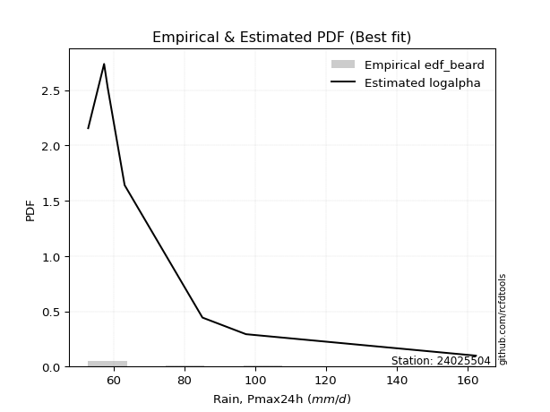</img>

</div>


### 5. EDF Chegodayev (1955)

The Chegodayev formula is an empirical plotting position formula used in hydrological frequency analysis to estimate the exceedance probability or return period of a specific event from a set of observed data. It is primarily used for plotting observed data points on probability paper to fit a theoretical distribution, particularly for analyzing extreme events like maximum flood flows or rainfall intensities. The constant _b_ value in the generalized plotting position formula is 0.3.

<div align="center">


$P=(m-b)/(n+1-2b)$


</div>


**5.1. Empirical values**

<div align="center">

|                | 0                   | 1                   | 2                   | 3              | 4                  | 5                  | 6                  |
|:---------------|:--------------------|:--------------------|:--------------------|:---------------|:-------------------|:-------------------|:-------------------|
| date           | 2017                | 2018                | 2019                | 2021           | 2016               | 2020               | 2024               |
| x              | 52.8                | 57.3                | 58.3                | 63.1           | 85.1               | 97.4               | 162.4              |
| m              | 1                   | 2                   | 3                   | 4              | 5                  | 6                  | 7                  |
| empirical_dist | edf_chegodayev      | edf_chegodayev      | edf_chegodayev      | edf_chegodayev | edf_chegodayev     | edf_chegodayev     | edf_chegodayev     |
| empirical      | 0.09459459459459459 | 0.22972972972972971 | 0.36486486486486486 | 0.5            | 0.6351351351351351 | 0.7702702702702703 | 0.9054054054054054 |
| empirical_tr   | 1.1044776119402986  | 1.2982456140350878  | 1.574468085106383   | 2.0            | 2.7407407407407405 | 4.352941176470589  | 10.571428571428568 |

</div>


**5.2. Kolmogorov-Smirnov fit test (sorted by Δ)**


<div align="center">

|                | 0                   | 1                   | 2                   | 3                   | 4                   | 5                   | 6                   | 7                   | 8                   | 9                   | 10                  | 11                  | 12                  | 13                  | 14                  | 15                  | 16                  | 17                  | 18                  | 19                  | 20                  | 21                  | 22                  | 23                  | 24                  | 25                  | 26                  | 27                  | 28                  | 29                  | 30                    | 31                  | 32                  | 33                  | 34                  | 35                  | 36                  | 37                  | 38                  | 39                  | 40                  | 41                  | 42                  | 43                  | 44                  | 45                  | 46                  | 47                  | 48                  | 49                  | 50                  | 51                  | 52                  | 53                  | 54                  | 55                  | 56                  | 57                  | 58                  | 59                  | 60                  | 61                  | 62                  | 63                  | 64                  | 65                  | 66                  | 67                  | 68                  | 69                  | 70                  | 71                  | 72                  | 73                  | 74                  | 75                  | 76                  | 77                  | 78                  | 79                  | 80                  | 81                  | 82                  | 83                  | 84                  | 85                  | 86                  | 87                  |
|:---------------|:--------------------|:--------------------|:--------------------|:--------------------|:--------------------|:--------------------|:--------------------|:--------------------|:--------------------|:--------------------|:--------------------|:--------------------|:--------------------|:--------------------|:--------------------|:--------------------|:--------------------|:--------------------|:--------------------|:--------------------|:--------------------|:--------------------|:--------------------|:--------------------|:--------------------|:--------------------|:--------------------|:--------------------|:--------------------|:--------------------|:----------------------|:--------------------|:--------------------|:--------------------|:--------------------|:--------------------|:--------------------|:--------------------|:--------------------|:--------------------|:--------------------|:--------------------|:--------------------|:--------------------|:--------------------|:--------------------|:--------------------|:--------------------|:--------------------|:--------------------|:--------------------|:--------------------|:--------------------|:--------------------|:--------------------|:--------------------|:--------------------|:--------------------|:--------------------|:--------------------|:--------------------|:--------------------|:--------------------|:--------------------|:--------------------|:--------------------|:--------------------|:--------------------|:--------------------|:--------------------|:--------------------|:--------------------|:--------------------|:--------------------|:--------------------|:--------------------|:--------------------|:--------------------|:--------------------|:--------------------|:--------------------|:--------------------|:--------------------|:--------------------|:--------------------|:--------------------|:--------------------|:--------------------|
| station        | 24025504            | 24025504            | 24025504            | 24025504            | 24025504            | 24025504            | 24025504            | 24025504            | 24025504            | 24025504            | 24025504            | 24025504            | 24025504            | 24025504            | 24025504            | 24025504            | 24025504            | 24025504            | 24025504            | 24025504            | 24025504            | 24025504            | 24025504            | 24025504            | 24025504            | 24025504            | 24025504            | 24025504            | 24025504            | 24025504            | 24025504              | 24025504            | 24025504            | 24025504            | 24025504            | 24025504            | 24025504            | 24025504            | 24025504            | 24025504            | 24025504            | 24025504            | 24025504            | 24025504            | 24025504            | 24025504            | 24025504            | 24025504            | 24025504            | 24025504            | 24025504            | 24025504            | 24025504            | 24025504            | 24025504            | 24025504            | 24025504            | 24025504            | 24025504            | 24025504            | 24025504            | 24025504            | 24025504            | 24025504            | 24025504            | 24025504            | 24025504            | 24025504            | 24025504            | 24025504            | 24025504            | 24025504            | 24025504            | 24025504            | 24025504            | 24025504            | 24025504            | 24025504            | 24025504            | 24025504            | 24025504            | 24025504            | 24025504            | 24025504            | 24025504            | 24025504            | 24025504            | 24025504            |
| empirical_dist | edf_chegodayev      | edf_chegodayev      | edf_chegodayev      | edf_chegodayev      | edf_chegodayev      | edf_chegodayev      | edf_chegodayev      | edf_chegodayev      | edf_chegodayev      | edf_chegodayev      | edf_chegodayev      | edf_chegodayev      | edf_chegodayev      | edf_chegodayev      | edf_chegodayev      | edf_chegodayev      | edf_chegodayev      | edf_chegodayev      | edf_chegodayev      | edf_chegodayev      | edf_chegodayev      | edf_chegodayev      | edf_chegodayev      | edf_chegodayev      | edf_chegodayev      | edf_chegodayev      | edf_chegodayev      | edf_chegodayev      | edf_chegodayev      | edf_chegodayev      | edf_chegodayev        | edf_chegodayev      | edf_chegodayev      | edf_chegodayev      | edf_chegodayev      | edf_chegodayev      | edf_chegodayev      | edf_chegodayev      | edf_chegodayev      | edf_chegodayev      | edf_chegodayev      | edf_chegodayev      | edf_chegodayev      | edf_chegodayev      | edf_chegodayev      | edf_chegodayev      | edf_chegodayev      | edf_chegodayev      | edf_chegodayev      | edf_chegodayev      | edf_chegodayev      | edf_chegodayev      | edf_chegodayev      | edf_chegodayev      | edf_chegodayev      | edf_chegodayev      | edf_chegodayev      | edf_chegodayev      | edf_chegodayev      | edf_chegodayev      | edf_chegodayev      | edf_chegodayev      | edf_chegodayev      | edf_chegodayev      | edf_chegodayev      | edf_chegodayev      | edf_chegodayev      | edf_chegodayev      | edf_chegodayev      | edf_chegodayev      | edf_chegodayev      | edf_chegodayev      | edf_chegodayev      | edf_chegodayev      | edf_chegodayev      | edf_chegodayev      | edf_chegodayev      | edf_chegodayev      | edf_chegodayev      | edf_chegodayev      | edf_chegodayev      | edf_chegodayev      | edf_chegodayev      | edf_chegodayev      | edf_chegodayev      | edf_chegodayev      | edf_chegodayev      | edf_chegodayev      |
| p_dist         | logalpha            | logmielke           | fatiguelife         | logjohnsonsu        | invgamma            | f                   | invgauss            | logfatiguelife      | loghalfnorm         | loghalflogistic     | loginvweibull       | alpha               | loggenexpon         | logexponnorm        | logexpon            | loginvgauss         | loginvgamma         | logf                | loggompertz         | halflogistic        | logtruncnorm        | halfnorm            | pearson3            | logmoyal            | lognakagami         | logpearson3         | mielke              | lograyleigh         | erlang              | loggumbel_r         | loglaplace_asymmetric | moyal               | logfisk             | rayleigh            | wald                | logmaxwell          | loggenlogistic      | gamma               | gumbel_r            | maxwell             | lognct              | ncf                 | logbetaprime        | betaprime           | nct                 | logkstwobign        | logloggamma         | logt                | logcrystalball      | lognorm             | lognorm             | nakagami            | loggamma            | loggamma            | crystalball         | norm                | genlogistic         | exponnorm           | expon               | genexpon            | laplace_asymmetric  | gompertz            | loglogistic         | logncf              | logchi2             | logwald             | logrice             | logistic            | weibull_min         | loghypsecant        | kstwobign           | hypsecant           | t                   | loggumbel_l         | truncnorm           | gumbel_l            | rice                | loglaplace          | laplace             | johnsonsu           | logweibull_min      | fisk                | gibrat              | logerlang           | loggibrat           | loglognorm          | invweibull          | chi2                |
| delta          | 0.10987331381519738 | 0.11817930875526628 | 0.118570127965546   | 0.11862442609754376 | 0.12242274452414692 | 0.12242285468539327 | 0.12300310511884593 | 0.12302460074753951 | 0.12334303589686124 | 0.12387717453777009 | 0.1278622697668127  | 0.12840549357775166 | 0.128479961341452   | 0.1284818032363519  | 0.12850471039724148 | 0.1299556213910371  | 0.1303603629550495  | 0.13040436282525136 | 0.1337724185641919  | 0.13652277567764132 | 0.14091527081387972 | 0.14407534456264415 | 0.1475243297936245  | 0.14889483476006315 | 0.14953180248597076 | 0.1525155984496857  | 0.15374155527173172 | 0.15499639727452413 | 0.15896563640102035 | 0.15985627860589852 | 0.16028128959040083   | 0.1623179038180308  | 0.1640424728108708  | 0.1648699857574341  | 0.16561244984164986 | 0.16617495453757786 | 0.16640948663494137 | 0.1696584023853842  | 0.17162356714884786 | 0.17578480563498528 | 0.17738417502657083 | 0.17958988553287225 | 0.18011940858006303 | 0.18269179124422247 | 0.1839741260405935  | 0.1873907671966335  | 0.19060608621508196 | 0.19453754998694994 | 0.1945867900332507  | 0.1945867905270312  | 0.1945867905270312  | 0.1972147794050449  | 0.2007750796453267  | 0.2007750796453267  | 0.20330961033169942 | 0.2033096179222501  | 0.20394513608261583 | 0.20509534499688542 | 0.20564285907397156 | 0.20564355332055118 | 0.2057225795824872  | 0.21088013433548886 | 0.21565947125459578 | 0.21799543369689212 | 0.2220534772051218  | 0.22229760687529385 | 0.22233362605067036 | 0.22481363659979164 | 0.22776820966187827 | 0.23100798042564036 | 0.23133513995051908 | 0.24025394952465706 | 0.24177936894417607 | 0.24652777242376683 | 0.25128229656497214 | 0.2534592561776997  | 0.2544632019418043  | 0.25654719945207094 | 0.2650205076016512  | 0.2753060101029905  | 0.28759350279832063 | 0.2982864267631764  | 0.3072887074193913  | 0.3341543497270678  | 0.3571021664138839  | 0.38985955566413355 | 0.45818167081466565 | 0.7064881930909332  |
| deltao         | 0.48442053926100004 | 0.48442053926100004 | 0.48442053926100004 | 0.48442053926100004 | 0.48442053926100004 | 0.48442053926100004 | 0.48442053926100004 | 0.48442053926100004 | 0.48442053926100004 | 0.48442053926100004 | 0.48442053926100004 | 0.48442053926100004 | 0.48442053926100004 | 0.48442053926100004 | 0.48442053926100004 | 0.48442053926100004 | 0.48442053926100004 | 0.48442053926100004 | 0.48442053926100004 | 0.48442053926100004 | 0.48442053926100004 | 0.48442053926100004 | 0.48442053926100004 | 0.48442053926100004 | 0.48442053926100004 | 0.48442053926100004 | 0.48442053926100004 | 0.48442053926100004 | 0.48442053926100004 | 0.48442053926100004 | 0.48442053926100004   | 0.48442053926100004 | 0.48442053926100004 | 0.48442053926100004 | 0.48442053926100004 | 0.48442053926100004 | 0.48442053926100004 | 0.48442053926100004 | 0.48442053926100004 | 0.48442053926100004 | 0.48442053926100004 | 0.48442053926100004 | 0.48442053926100004 | 0.48442053926100004 | 0.48442053926100004 | 0.48442053926100004 | 0.48442053926100004 | 0.48442053926100004 | 0.48442053926100004 | 0.48442053926100004 | 0.48442053926100004 | 0.48442053926100004 | 0.48442053926100004 | 0.48442053926100004 | 0.48442053926100004 | 0.48442053926100004 | 0.48442053926100004 | 0.48442053926100004 | 0.48442053926100004 | 0.48442053926100004 | 0.48442053926100004 | 0.48442053926100004 | 0.48442053926100004 | 0.48442053926100004 | 0.48442053926100004 | 0.48442053926100004 | 0.48442053926100004 | 0.48442053926100004 | 0.48442053926100004 | 0.48442053926100004 | 0.48442053926100004 | 0.48442053926100004 | 0.48442053926100004 | 0.48442053926100004 | 0.48442053926100004 | 0.48442053926100004 | 0.48442053926100004 | 0.48442053926100004 | 0.48442053926100004 | 0.48442053926100004 | 0.48442053926100004 | 0.48442053926100004 | 0.48442053926100004 | 0.48442053926100004 | 0.48442053926100004 | 0.48442053926100004 | 0.48442053926100004 | 0.48442053926100004 |
| eval           | Δo > Δ              | Δo > Δ              | Δo > Δ              | Δo > Δ              | Δo > Δ              | Δo > Δ              | Δo > Δ              | Δo > Δ              | Δo > Δ              | Δo > Δ              | Δo > Δ              | Δo > Δ              | Δo > Δ              | Δo > Δ              | Δo > Δ              | Δo > Δ              | Δo > Δ              | Δo > Δ              | Δo > Δ              | Δo > Δ              | Δo > Δ              | Δo > Δ              | Δo > Δ              | Δo > Δ              | Δo > Δ              | Δo > Δ              | Δo > Δ              | Δo > Δ              | Δo > Δ              | Δo > Δ              | Δo > Δ                | Δo > Δ              | Δo > Δ              | Δo > Δ              | Δo > Δ              | Δo > Δ              | Δo > Δ              | Δo > Δ              | Δo > Δ              | Δo > Δ              | Δo > Δ              | Δo > Δ              | Δo > Δ              | Δo > Δ              | Δo > Δ              | Δo > Δ              | Δo > Δ              | Δo > Δ              | Δo > Δ              | Δo > Δ              | Δo > Δ              | Δo > Δ              | Δo > Δ              | Δo > Δ              | Δo > Δ              | Δo > Δ              | Δo > Δ              | Δo > Δ              | Δo > Δ              | Δo > Δ              | Δo > Δ              | Δo > Δ              | Δo > Δ              | Δo > Δ              | Δo > Δ              | Δo > Δ              | Δo > Δ              | Δo > Δ              | Δo > Δ              | Δo > Δ              | Δo > Δ              | Δo > Δ              | Δo > Δ              | Δo > Δ              | Δo > Δ              | Δo > Δ              | Δo > Δ              | Δo > Δ              | Δo > Δ              | Δo > Δ              | Δo > Δ              | Δo > Δ              | Δo > Δ              | Δo > Δ              | Δo > Δ              | Δo > Δ              | Δo > Δ              | Δo <= Δ             |
| fit            | 1                   | 1                   | 1                   | 1                   | 1                   | 1                   | 1                   | 1                   | 1                   | 1                   | 1                   | 1                   | 1                   | 1                   | 1                   | 1                   | 1                   | 1                   | 1                   | 1                   | 1                   | 1                   | 1                   | 1                   | 1                   | 1                   | 1                   | 1                   | 1                   | 1                   | 1                     | 1                   | 1                   | 1                   | 1                   | 1                   | 1                   | 1                   | 1                   | 1                   | 1                   | 1                   | 1                   | 1                   | 1                   | 1                   | 1                   | 1                   | 1                   | 1                   | 1                   | 1                   | 1                   | 1                   | 1                   | 1                   | 1                   | 1                   | 1                   | 1                   | 1                   | 1                   | 1                   | 1                   | 1                   | 1                   | 1                   | 1                   | 1                   | 1                   | 1                   | 1                   | 1                   | 1                   | 1                   | 1                   | 1                   | 1                   | 1                   | 1                   | 1                   | 1                   | 1                   | 1                   | 1                   | 1                   | 1                   | 0                   |
| n              | 7                   | 7                   | 7                   | 7                   | 7                   | 7                   | 7                   | 7                   | 7                   | 7                   | 7                   | 7                   | 7                   | 7                   | 7                   | 7                   | 7                   | 7                   | 7                   | 7                   | 7                   | 7                   | 7                   | 7                   | 7                   | 7                   | 7                   | 7                   | 7                   | 7                   | 7                     | 7                   | 7                   | 7                   | 7                   | 7                   | 7                   | 7                   | 7                   | 7                   | 7                   | 7                   | 7                   | 7                   | 7                   | 7                   | 7                   | 7                   | 7                   | 7                   | 7                   | 7                   | 7                   | 7                   | 7                   | 7                   | 7                   | 7                   | 7                   | 7                   | 7                   | 7                   | 7                   | 7                   | 7                   | 7                   | 7                   | 7                   | 7                   | 7                   | 7                   | 7                   | 7                   | 7                   | 7                   | 7                   | 7                   | 7                   | 7                   | 7                   | 7                   | 7                   | 7                   | 7                   | 7                   | 7                   | 7                   | 7                   |
| best_fit       | 1                   | 0                   | 0                   | 0                   | 0                   | 0                   | 0                   | 0                   | 0                   | 0                   | 0                   | 0                   | 0                   | 0                   | 0                   | 0                   | 0                   | 0                   | 0                   | 0                   | 0                   | 0                   | 0                   | 0                   | 0                   | 0                   | 0                   | 0                   | 0                   | 0                   | 0                     | 0                   | 0                   | 0                   | 0                   | 0                   | 0                   | 0                   | 0                   | 0                   | 0                   | 0                   | 0                   | 0                   | 0                   | 0                   | 0                   | 0                   | 0                   | 0                   | 0                   | 0                   | 0                   | 0                   | 0                   | 0                   | 0                   | 0                   | 0                   | 0                   | 0                   | 0                   | 0                   | 0                   | 0                   | 0                   | 0                   | 0                   | 0                   | 0                   | 0                   | 0                   | 0                   | 0                   | 0                   | 0                   | 0                   | 0                   | 0                   | 0                   | 0                   | 0                   | 0                   | 0                   | 0                   | 0                   | 0                   | 0                   |
| best_fit_sort  | 1                   | 2                   | 3                   | 4                   | 5                   | 6                   | 7                   | 8                   | 9                   | 10                  | 11                  | 12                  | 13                  | 14                  | 15                  | 16                  | 17                  | 18                  | 19                  | 20                  | 21                  | 22                  | 23                  | 24                  | 25                  | 26                  | 27                  | 28                  | 29                  | 30                  | 31                    | 32                  | 33                  | 34                  | 35                  | 36                  | 37                  | 38                  | 39                  | 40                  | 41                  | 42                  | 43                  | 44                  | 45                  | 46                  | 47                  | 48                  | 49                  | 50                  | 51                  | 52                  | 53                  | 54                  | 55                  | 56                  | 57                  | 58                  | 59                  | 60                  | 61                  | 62                  | 63                  | 64                  | 65                  | 66                  | 67                  | 68                  | 69                  | 70                  | 71                  | 72                  | 73                  | 74                  | 75                  | 76                  | 77                  | 78                  | 79                  | 80                  | 81                  | 82                  | 83                  | 84                  | 85                  | 86                  | 87                  | 88                  |

</div>


**5.3. Best fit**

<div align="center">

|   id |   station | empirical_dist   | p_dist   |    delta |   deltao | eval   |   fit |   n |   best_fit |   best_fit_sort |
|-----:|----------:|:-----------------|:---------|---------:|---------:|:-------|------:|----:|-----------:|----------------:|
|    0 |  24025504 | edf_chegodayev   | logalpha | 0.109873 | 0.484421 | Δo > Δ |     1 |   7 |          1 |               1 |

</div>


<div align="center">

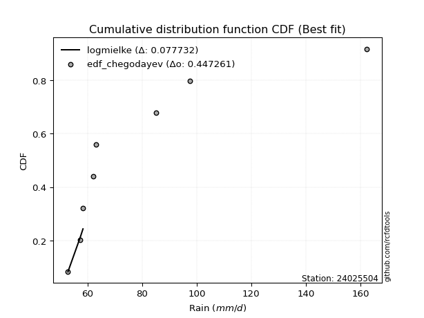</img></img>

</div>


### 6. EDF Blom (1958)

The Blom formula is a specific "plotting position" formula used in hydrology and statistical analysis to estimate the empirical cumulative probability (or non-exceedance probability) of a data series. It is particularly recommended for data that are approximately normally distributed. The constant _a_ is set to 0.375 (or 3/8).

<div align="center">


$P=(m-a)/(n+1-2a)$


</div>


**6.1. Empirical values**

<div align="center">

|                | 0                   | 1                   | 2                  | 3        | 4                  | 5                  | 6                  |
|:---------------|:--------------------|:--------------------|:-------------------|:---------|:-------------------|:-------------------|:-------------------|
| date           | 2017                | 2018                | 2019               | 2021     | 2016               | 2020               | 2024               |
| x              | 52.8                | 57.3                | 58.3               | 63.1     | 85.1               | 97.4               | 162.4              |
| m              | 1                   | 2                   | 3                  | 4        | 5                  | 6                  | 7                  |
| empirical_dist | edf_blom            | edf_blom            | edf_blom           | edf_blom | edf_blom           | edf_blom           | edf_blom           |
| empirical      | 0.08620689655172414 | 0.22413793103448276 | 0.3620689655172414 | 0.5      | 0.6379310344827587 | 0.7758620689655172 | 0.9137931034482759 |
| empirical_tr   | 1.0943396226415094  | 1.288888888888889   | 1.5675675675675675 | 2.0      | 2.7619047619047623 | 4.461538461538462  | 11.600000000000007 |

</div>


**6.2. Kolmogorov-Smirnov fit test (sorted by Δ)**


<div align="center">

|                | 0                   | 1                   | 2                   | 3                   | 4                   | 5                   | 6                   | 7                   | 8                   | 9                   | 10                  | 11                  | 12                  | 13                  | 14                  | 15                  | 16                  | 17                  | 18                  | 19                  | 20                  | 21                  | 22                  | 23                  | 24                  | 25                  | 26                  | 27                  | 28                  | 29                    | 30                  | 31                  | 32                  | 33                  | 34                  | 35                  | 36                  | 37                  | 38                  | 39                  | 40                  | 41                  | 42                  | 43                  | 44                  | 45                  | 46                  | 47                  | 48                  | 49                  | 50                  | 51                  | 52                  | 53                  | 54                  | 55                  | 56                  | 57                  | 58                  | 59                  | 60                  | 61                  | 62                  | 63                  | 64                  | 65                  | 66                  | 67                  | 68                  | 69                  | 70                  | 71                  | 72                  | 73                  | 74                  | 75                  | 76                  | 77                  | 78                  | 79                  | 80                  | 81                  | 82                  | 83                  | 84                  | 85                  | 86                  | 87                  |
|:---------------|:--------------------|:--------------------|:--------------------|:--------------------|:--------------------|:--------------------|:--------------------|:--------------------|:--------------------|:--------------------|:--------------------|:--------------------|:--------------------|:--------------------|:--------------------|:--------------------|:--------------------|:--------------------|:--------------------|:--------------------|:--------------------|:--------------------|:--------------------|:--------------------|:--------------------|:--------------------|:--------------------|:--------------------|:--------------------|:----------------------|:--------------------|:--------------------|:--------------------|:--------------------|:--------------------|:--------------------|:--------------------|:--------------------|:--------------------|:--------------------|:--------------------|:--------------------|:--------------------|:--------------------|:--------------------|:--------------------|:--------------------|:--------------------|:--------------------|:--------------------|:--------------------|:--------------------|:--------------------|:--------------------|:--------------------|:--------------------|:--------------------|:--------------------|:--------------------|:--------------------|:--------------------|:--------------------|:--------------------|:--------------------|:--------------------|:--------------------|:--------------------|:--------------------|:--------------------|:--------------------|:--------------------|:--------------------|:--------------------|:--------------------|:--------------------|:--------------------|:--------------------|:--------------------|:--------------------|:--------------------|:--------------------|:--------------------|:--------------------|:--------------------|:--------------------|:--------------------|:--------------------|:--------------------|
| station        | 24025504            | 24025504            | 24025504            | 24025504            | 24025504            | 24025504            | 24025504            | 24025504            | 24025504            | 24025504            | 24025504            | 24025504            | 24025504            | 24025504            | 24025504            | 24025504            | 24025504            | 24025504            | 24025504            | 24025504            | 24025504            | 24025504            | 24025504            | 24025504            | 24025504            | 24025504            | 24025504            | 24025504            | 24025504            | 24025504              | 24025504            | 24025504            | 24025504            | 24025504            | 24025504            | 24025504            | 24025504            | 24025504            | 24025504            | 24025504            | 24025504            | 24025504            | 24025504            | 24025504            | 24025504            | 24025504            | 24025504            | 24025504            | 24025504            | 24025504            | 24025504            | 24025504            | 24025504            | 24025504            | 24025504            | 24025504            | 24025504            | 24025504            | 24025504            | 24025504            | 24025504            | 24025504            | 24025504            | 24025504            | 24025504            | 24025504            | 24025504            | 24025504            | 24025504            | 24025504            | 24025504            | 24025504            | 24025504            | 24025504            | 24025504            | 24025504            | 24025504            | 24025504            | 24025504            | 24025504            | 24025504            | 24025504            | 24025504            | 24025504            | 24025504            | 24025504            | 24025504            | 24025504            |
| empirical_dist | edf_blom            | edf_blom            | edf_blom            | edf_blom            | edf_blom            | edf_blom            | edf_blom            | edf_blom            | edf_blom            | edf_blom            | edf_blom            | edf_blom            | edf_blom            | edf_blom            | edf_blom            | edf_blom            | edf_blom            | edf_blom            | edf_blom            | edf_blom            | edf_blom            | edf_blom            | edf_blom            | edf_blom            | edf_blom            | edf_blom            | edf_blom            | edf_blom            | edf_blom            | edf_blom              | edf_blom            | edf_blom            | edf_blom            | edf_blom            | edf_blom            | edf_blom            | edf_blom            | edf_blom            | edf_blom            | edf_blom            | edf_blom            | edf_blom            | edf_blom            | edf_blom            | edf_blom            | edf_blom            | edf_blom            | edf_blom            | edf_blom            | edf_blom            | edf_blom            | edf_blom            | edf_blom            | edf_blom            | edf_blom            | edf_blom            | edf_blom            | edf_blom            | edf_blom            | edf_blom            | edf_blom            | edf_blom            | edf_blom            | edf_blom            | edf_blom            | edf_blom            | edf_blom            | edf_blom            | edf_blom            | edf_blom            | edf_blom            | edf_blom            | edf_blom            | edf_blom            | edf_blom            | edf_blom            | edf_blom            | edf_blom            | edf_blom            | edf_blom            | edf_blom            | edf_blom            | edf_blom            | edf_blom            | edf_blom            | edf_blom            | edf_blom            | edf_blom            |
| p_dist         | logalpha            | logmielke           | logjohnsonsu        | invgamma            | f                   | invgauss            | logfatiguelife      | loghalfnorm         | loghalflogistic     | fatiguelife         | loginvweibull       | alpha               | loggenexpon         | logexponnorm        | logexpon            | loginvgauss         | loginvgamma         | logf                | loggompertz         | halflogistic        | logtruncnorm        | pearson3            | logmoyal            | mielke              | halfnorm            | logpearson3         | lograyleigh         | lognakagami         | erlang              | loglaplace_asymmetric | loggumbel_r         | moyal               | rayleigh            | wald                | logmaxwell          | loggenlogistic      | gamma               | gumbel_r            | logfisk             | maxwell             | lognct              | ncf                 | logbetaprime        | betaprime           | nct                 | logkstwobign        | logloggamma         | logt                | logcrystalball      | lognorm             | lognorm             | loggamma            | loggamma            | nakagami            | crystalball         | norm                | genlogistic         | exponnorm           | expon               | genexpon            | laplace_asymmetric  | gompertz            | loglogistic         | logncf              | logwald             | logrice             | logistic            | logchi2             | weibull_min         | loghypsecant        | kstwobign           | t                   | hypsecant           | loggumbel_l         | truncnorm           | gumbel_l            | rice                | loglaplace          | laplace             | johnsonsu           | logweibull_min      | gibrat              | fisk                | logerlang           | loggibrat           | loglognorm          | invweibull          | chi2                |
| delta          | 0.1070774144675738  | 0.1153834094076428  | 0.11582852674992017 | 0.11962684517652333 | 0.11962695533776968 | 0.12020720577122235 | 0.12022870139991593 | 0.12334303589686124 | 0.12387717453777009 | 0.12416192666079295 | 0.1250663704191891  | 0.12560959423012807 | 0.12568406199382853 | 0.1256859038887284  | 0.125708811049618   | 0.12715972204341353 | 0.1275644636074259  | 0.12760846347762778 | 0.13097651921656842 | 0.13652277567764132 | 0.13811937146625625 | 0.1475243297936245  | 0.14889483476006315 | 0.15094565592410814 | 0.1524630426055146  | 0.1525155984496857  | 0.15499639727452413 | 0.1551236011812177  | 0.15616973705339676 | 0.15748539024277736   | 0.15985627860589852 | 0.1623179038180308  | 0.1648699857574341  | 0.16561244984164986 | 0.16617495453757786 | 0.16640948663494137 | 0.16686250303776062 | 0.17162356714884786 | 0.17243017085374135 | 0.17578480563498528 | 0.17738417502657083 | 0.17958988553287225 | 0.18011940858006303 | 0.18269179124422247 | 0.1839741260405935  | 0.1873907671966335  | 0.19060608621508196 | 0.19453754998694994 | 0.1945867900332507  | 0.1945867905270312  | 0.1945867905270312  | 0.19797918029770312 | 0.19797918029770312 | 0.20280657810029185 | 0.20330961033169942 | 0.2033096179222501  | 0.20394513608261583 | 0.20509534499688542 | 0.20564285907397156 | 0.20564355332055118 | 0.2057225795824872  | 0.21088013433548886 | 0.21565947125459578 | 0.21799543369689212 | 0.21950170752767037 | 0.22233362605067036 | 0.22481363659979164 | 0.22764527590036876 | 0.22776820966187827 | 0.23100798042564036 | 0.23133513995051908 | 0.23898346959655248 | 0.24025394952465706 | 0.24652777242376683 | 0.25128229656497214 | 0.2534592561776997  | 0.2544632019418043  | 0.25654719945207094 | 0.2650205076016512  | 0.28089780879823745 | 0.29598120084119117 | 0.3044928080717678  | 0.30667412480604694 | 0.33974614842231476 | 0.35430626706626045 | 0.3954513543593805  | 0.4665693688575362  | 0.7120799917861802  |
| deltao         | 0.48442053926100004 | 0.48442053926100004 | 0.48442053926100004 | 0.48442053926100004 | 0.48442053926100004 | 0.48442053926100004 | 0.48442053926100004 | 0.48442053926100004 | 0.48442053926100004 | 0.48442053926100004 | 0.48442053926100004 | 0.48442053926100004 | 0.48442053926100004 | 0.48442053926100004 | 0.48442053926100004 | 0.48442053926100004 | 0.48442053926100004 | 0.48442053926100004 | 0.48442053926100004 | 0.48442053926100004 | 0.48442053926100004 | 0.48442053926100004 | 0.48442053926100004 | 0.48442053926100004 | 0.48442053926100004 | 0.48442053926100004 | 0.48442053926100004 | 0.48442053926100004 | 0.48442053926100004 | 0.48442053926100004   | 0.48442053926100004 | 0.48442053926100004 | 0.48442053926100004 | 0.48442053926100004 | 0.48442053926100004 | 0.48442053926100004 | 0.48442053926100004 | 0.48442053926100004 | 0.48442053926100004 | 0.48442053926100004 | 0.48442053926100004 | 0.48442053926100004 | 0.48442053926100004 | 0.48442053926100004 | 0.48442053926100004 | 0.48442053926100004 | 0.48442053926100004 | 0.48442053926100004 | 0.48442053926100004 | 0.48442053926100004 | 0.48442053926100004 | 0.48442053926100004 | 0.48442053926100004 | 0.48442053926100004 | 0.48442053926100004 | 0.48442053926100004 | 0.48442053926100004 | 0.48442053926100004 | 0.48442053926100004 | 0.48442053926100004 | 0.48442053926100004 | 0.48442053926100004 | 0.48442053926100004 | 0.48442053926100004 | 0.48442053926100004 | 0.48442053926100004 | 0.48442053926100004 | 0.48442053926100004 | 0.48442053926100004 | 0.48442053926100004 | 0.48442053926100004 | 0.48442053926100004 | 0.48442053926100004 | 0.48442053926100004 | 0.48442053926100004 | 0.48442053926100004 | 0.48442053926100004 | 0.48442053926100004 | 0.48442053926100004 | 0.48442053926100004 | 0.48442053926100004 | 0.48442053926100004 | 0.48442053926100004 | 0.48442053926100004 | 0.48442053926100004 | 0.48442053926100004 | 0.48442053926100004 | 0.48442053926100004 |
| eval           | Δo > Δ              | Δo > Δ              | Δo > Δ              | Δo > Δ              | Δo > Δ              | Δo > Δ              | Δo > Δ              | Δo > Δ              | Δo > Δ              | Δo > Δ              | Δo > Δ              | Δo > Δ              | Δo > Δ              | Δo > Δ              | Δo > Δ              | Δo > Δ              | Δo > Δ              | Δo > Δ              | Δo > Δ              | Δo > Δ              | Δo > Δ              | Δo > Δ              | Δo > Δ              | Δo > Δ              | Δo > Δ              | Δo > Δ              | Δo > Δ              | Δo > Δ              | Δo > Δ              | Δo > Δ                | Δo > Δ              | Δo > Δ              | Δo > Δ              | Δo > Δ              | Δo > Δ              | Δo > Δ              | Δo > Δ              | Δo > Δ              | Δo > Δ              | Δo > Δ              | Δo > Δ              | Δo > Δ              | Δo > Δ              | Δo > Δ              | Δo > Δ              | Δo > Δ              | Δo > Δ              | Δo > Δ              | Δo > Δ              | Δo > Δ              | Δo > Δ              | Δo > Δ              | Δo > Δ              | Δo > Δ              | Δo > Δ              | Δo > Δ              | Δo > Δ              | Δo > Δ              | Δo > Δ              | Δo > Δ              | Δo > Δ              | Δo > Δ              | Δo > Δ              | Δo > Δ              | Δo > Δ              | Δo > Δ              | Δo > Δ              | Δo > Δ              | Δo > Δ              | Δo > Δ              | Δo > Δ              | Δo > Δ              | Δo > Δ              | Δo > Δ              | Δo > Δ              | Δo > Δ              | Δo > Δ              | Δo > Δ              | Δo > Δ              | Δo > Δ              | Δo > Δ              | Δo > Δ              | Δo > Δ              | Δo > Δ              | Δo > Δ              | Δo > Δ              | Δo > Δ              | Δo <= Δ             |
| fit            | 1                   | 1                   | 1                   | 1                   | 1                   | 1                   | 1                   | 1                   | 1                   | 1                   | 1                   | 1                   | 1                   | 1                   | 1                   | 1                   | 1                   | 1                   | 1                   | 1                   | 1                   | 1                   | 1                   | 1                   | 1                   | 1                   | 1                   | 1                   | 1                   | 1                     | 1                   | 1                   | 1                   | 1                   | 1                   | 1                   | 1                   | 1                   | 1                   | 1                   | 1                   | 1                   | 1                   | 1                   | 1                   | 1                   | 1                   | 1                   | 1                   | 1                   | 1                   | 1                   | 1                   | 1                   | 1                   | 1                   | 1                   | 1                   | 1                   | 1                   | 1                   | 1                   | 1                   | 1                   | 1                   | 1                   | 1                   | 1                   | 1                   | 1                   | 1                   | 1                   | 1                   | 1                   | 1                   | 1                   | 1                   | 1                   | 1                   | 1                   | 1                   | 1                   | 1                   | 1                   | 1                   | 1                   | 1                   | 0                   |
| n              | 7                   | 7                   | 7                   | 7                   | 7                   | 7                   | 7                   | 7                   | 7                   | 7                   | 7                   | 7                   | 7                   | 7                   | 7                   | 7                   | 7                   | 7                   | 7                   | 7                   | 7                   | 7                   | 7                   | 7                   | 7                   | 7                   | 7                   | 7                   | 7                   | 7                     | 7                   | 7                   | 7                   | 7                   | 7                   | 7                   | 7                   | 7                   | 7                   | 7                   | 7                   | 7                   | 7                   | 7                   | 7                   | 7                   | 7                   | 7                   | 7                   | 7                   | 7                   | 7                   | 7                   | 7                   | 7                   | 7                   | 7                   | 7                   | 7                   | 7                   | 7                   | 7                   | 7                   | 7                   | 7                   | 7                   | 7                   | 7                   | 7                   | 7                   | 7                   | 7                   | 7                   | 7                   | 7                   | 7                   | 7                   | 7                   | 7                   | 7                   | 7                   | 7                   | 7                   | 7                   | 7                   | 7                   | 7                   | 7                   |
| best_fit       | 1                   | 0                   | 0                   | 0                   | 0                   | 0                   | 0                   | 0                   | 0                   | 0                   | 0                   | 0                   | 0                   | 0                   | 0                   | 0                   | 0                   | 0                   | 0                   | 0                   | 0                   | 0                   | 0                   | 0                   | 0                   | 0                   | 0                   | 0                   | 0                   | 0                     | 0                   | 0                   | 0                   | 0                   | 0                   | 0                   | 0                   | 0                   | 0                   | 0                   | 0                   | 0                   | 0                   | 0                   | 0                   | 0                   | 0                   | 0                   | 0                   | 0                   | 0                   | 0                   | 0                   | 0                   | 0                   | 0                   | 0                   | 0                   | 0                   | 0                   | 0                   | 0                   | 0                   | 0                   | 0                   | 0                   | 0                   | 0                   | 0                   | 0                   | 0                   | 0                   | 0                   | 0                   | 0                   | 0                   | 0                   | 0                   | 0                   | 0                   | 0                   | 0                   | 0                   | 0                   | 0                   | 0                   | 0                   | 0                   |
| best_fit_sort  | 1                   | 2                   | 3                   | 4                   | 5                   | 6                   | 7                   | 8                   | 9                   | 10                  | 11                  | 12                  | 13                  | 14                  | 15                  | 16                  | 17                  | 18                  | 19                  | 20                  | 21                  | 22                  | 23                  | 24                  | 25                  | 26                  | 27                  | 28                  | 29                  | 30                    | 31                  | 32                  | 33                  | 34                  | 35                  | 36                  | 37                  | 38                  | 39                  | 40                  | 41                  | 42                  | 43                  | 44                  | 45                  | 46                  | 47                  | 48                  | 49                  | 50                  | 51                  | 52                  | 53                  | 54                  | 55                  | 56                  | 57                  | 58                  | 59                  | 60                  | 61                  | 62                  | 63                  | 64                  | 65                  | 66                  | 67                  | 68                  | 69                  | 70                  | 71                  | 72                  | 73                  | 74                  | 75                  | 76                  | 77                  | 78                  | 79                  | 80                  | 81                  | 82                  | 83                  | 84                  | 85                  | 86                  | 87                  | 88                  |

</div>


**6.3. Best fit**

<div align="center">

|   id |   station | empirical_dist   | p_dist   |    delta |   deltao | eval   |   fit |   n |   best_fit |   best_fit_sort |
|-----:|----------:|:-----------------|:---------|---------:|---------:|:-------|------:|----:|-----------:|----------------:|
|    0 |  24025504 | edf_blom         | logalpha | 0.107077 | 0.484421 | Δo > Δ |     1 |   7 |          1 |               1 |

</div>


<div align="center">

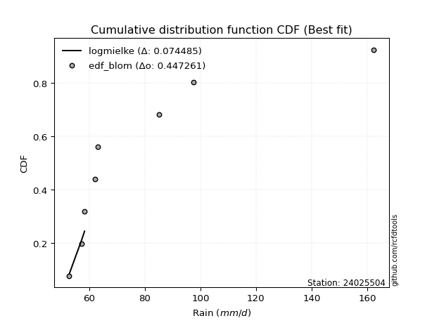</img>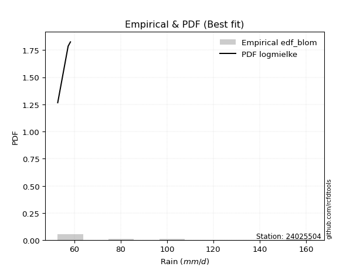</img>

</div>


### 7. EDF Tukey (1962)

In hydrology, the Tukey formula is used as a plotting position formula to estimate the empirical probability or frequency of a flood event (or other hydrological data). The formula parameter is given as _c=0.333_ (or 1/3).

<div align="center">


$P=(m-c)/(n+1-2c)$


</div>


**7.1. Empirical values**

<div align="center">

|                | 0                   | 1                   | 2                   | 3         | 4                  | 5                  | 6                  |
|:---------------|:--------------------|:--------------------|:--------------------|:----------|:-------------------|:-------------------|:-------------------|
| date           | 2017                | 2018                | 2019                | 2021      | 2016               | 2020               | 2024               |
| x              | 52.8                | 57.3                | 58.3                | 63.1      | 85.1               | 97.4               | 162.4              |
| m              | 1                   | 2                   | 3                   | 4         | 5                  | 6                  | 7                  |
| empirical_dist | edf_tukey           | edf_tukey           | edf_tukey           | edf_tukey | edf_tukey          | edf_tukey          | edf_tukey          |
| empirical      | 0.09090909090909091 | 0.22727272727272727 | 0.36363636363636365 | 0.5       | 0.6363636363636364 | 0.7727272727272727 | 0.9090909090909091 |
| empirical_tr   | 1.1                 | 1.2941176470588236  | 1.5714285714285714  | 2.0       | 2.75               | 4.3999999999999995 | 10.999999999999996 |

</div>


**7.2. Kolmogorov-Smirnov fit test (sorted by Δ)**


<div align="center">

|                | 0                   | 1                   | 2                   | 3                   | 4                   | 5                   | 6                   | 7                   | 8                   | 9                   | 10                  | 11                  | 12                  | 13                  | 14                  | 15                  | 16                  | 17                  | 18                  | 19                  | 20                  | 21                  | 22                  | 23                  | 24                  | 25                  | 26                  | 27                  | 28                  | 29                    | 30                  | 31                  | 32                  | 33                  | 34                  | 35                  | 36                  | 37                  | 38                  | 39                  | 40                  | 41                  | 42                  | 43                  | 44                  | 45                  | 46                  | 47                  | 48                  | 49                  | 50                  | 51                  | 52                  | 53                  | 54                  | 55                  | 56                  | 57                  | 58                  | 59                  | 60                  | 61                  | 62                  | 63                  | 64                  | 65                  | 66                  | 67                  | 68                  | 69                  | 70                  | 71                  | 72                  | 73                  | 74                  | 75                  | 76                  | 77                  | 78                  | 79                  | 80                  | 81                  | 82                  | 83                  | 84                  | 85                  | 86                  | 87                  |
|:---------------|:--------------------|:--------------------|:--------------------|:--------------------|:--------------------|:--------------------|:--------------------|:--------------------|:--------------------|:--------------------|:--------------------|:--------------------|:--------------------|:--------------------|:--------------------|:--------------------|:--------------------|:--------------------|:--------------------|:--------------------|:--------------------|:--------------------|:--------------------|:--------------------|:--------------------|:--------------------|:--------------------|:--------------------|:--------------------|:----------------------|:--------------------|:--------------------|:--------------------|:--------------------|:--------------------|:--------------------|:--------------------|:--------------------|:--------------------|:--------------------|:--------------------|:--------------------|:--------------------|:--------------------|:--------------------|:--------------------|:--------------------|:--------------------|:--------------------|:--------------------|:--------------------|:--------------------|:--------------------|:--------------------|:--------------------|:--------------------|:--------------------|:--------------------|:--------------------|:--------------------|:--------------------|:--------------------|:--------------------|:--------------------|:--------------------|:--------------------|:--------------------|:--------------------|:--------------------|:--------------------|:--------------------|:--------------------|:--------------------|:--------------------|:--------------------|:--------------------|:--------------------|:--------------------|:--------------------|:--------------------|:--------------------|:--------------------|:--------------------|:--------------------|:--------------------|:--------------------|:--------------------|:--------------------|
| station        | 24025504            | 24025504            | 24025504            | 24025504            | 24025504            | 24025504            | 24025504            | 24025504            | 24025504            | 24025504            | 24025504            | 24025504            | 24025504            | 24025504            | 24025504            | 24025504            | 24025504            | 24025504            | 24025504            | 24025504            | 24025504            | 24025504            | 24025504            | 24025504            | 24025504            | 24025504            | 24025504            | 24025504            | 24025504            | 24025504              | 24025504            | 24025504            | 24025504            | 24025504            | 24025504            | 24025504            | 24025504            | 24025504            | 24025504            | 24025504            | 24025504            | 24025504            | 24025504            | 24025504            | 24025504            | 24025504            | 24025504            | 24025504            | 24025504            | 24025504            | 24025504            | 24025504            | 24025504            | 24025504            | 24025504            | 24025504            | 24025504            | 24025504            | 24025504            | 24025504            | 24025504            | 24025504            | 24025504            | 24025504            | 24025504            | 24025504            | 24025504            | 24025504            | 24025504            | 24025504            | 24025504            | 24025504            | 24025504            | 24025504            | 24025504            | 24025504            | 24025504            | 24025504            | 24025504            | 24025504            | 24025504            | 24025504            | 24025504            | 24025504            | 24025504            | 24025504            | 24025504            | 24025504            |
| empirical_dist | edf_tukey           | edf_tukey           | edf_tukey           | edf_tukey           | edf_tukey           | edf_tukey           | edf_tukey           | edf_tukey           | edf_tukey           | edf_tukey           | edf_tukey           | edf_tukey           | edf_tukey           | edf_tukey           | edf_tukey           | edf_tukey           | edf_tukey           | edf_tukey           | edf_tukey           | edf_tukey           | edf_tukey           | edf_tukey           | edf_tukey           | edf_tukey           | edf_tukey           | edf_tukey           | edf_tukey           | edf_tukey           | edf_tukey           | edf_tukey             | edf_tukey           | edf_tukey           | edf_tukey           | edf_tukey           | edf_tukey           | edf_tukey           | edf_tukey           | edf_tukey           | edf_tukey           | edf_tukey           | edf_tukey           | edf_tukey           | edf_tukey           | edf_tukey           | edf_tukey           | edf_tukey           | edf_tukey           | edf_tukey           | edf_tukey           | edf_tukey           | edf_tukey           | edf_tukey           | edf_tukey           | edf_tukey           | edf_tukey           | edf_tukey           | edf_tukey           | edf_tukey           | edf_tukey           | edf_tukey           | edf_tukey           | edf_tukey           | edf_tukey           | edf_tukey           | edf_tukey           | edf_tukey           | edf_tukey           | edf_tukey           | edf_tukey           | edf_tukey           | edf_tukey           | edf_tukey           | edf_tukey           | edf_tukey           | edf_tukey           | edf_tukey           | edf_tukey           | edf_tukey           | edf_tukey           | edf_tukey           | edf_tukey           | edf_tukey           | edf_tukey           | edf_tukey           | edf_tukey           | edf_tukey           | edf_tukey           | edf_tukey           |
| p_dist         | logalpha            | logmielke           | logjohnsonsu        | fatiguelife         | invgamma            | f                   | invgauss            | logfatiguelife      | loghalfnorm         | loghalflogistic     | loginvweibull       | alpha               | loggenexpon         | logexponnorm        | logexpon            | loginvgauss         | loginvgamma         | logf                | loggompertz         | halflogistic        | logtruncnorm        | pearson3            | halfnorm            | logmoyal            | lognakagami         | mielke              | logpearson3         | lograyleigh         | erlang              | loglaplace_asymmetric | loggumbel_r         | moyal               | rayleigh            | wald                | logmaxwell          | loggenlogistic      | logfisk             | gamma               | gumbel_r            | maxwell             | lognct              | ncf                 | logbetaprime        | betaprime           | nct                 | logkstwobign        | logloggamma         | logt                | logcrystalball      | lognorm             | lognorm             | loggamma            | loggamma            | nakagami            | crystalball         | norm                | genlogistic         | exponnorm           | expon               | genexpon            | laplace_asymmetric  | gompertz            | loglogistic         | logncf              | logwald             | logrice             | logchi2             | logistic            | weibull_min         | loghypsecant        | kstwobign           | hypsecant           | t                   | loggumbel_l         | truncnorm           | gumbel_l            | rice                | loglaplace          | laplace             | johnsonsu           | logweibull_min      | fisk                | gibrat              | logerlang           | loggibrat           | loglognorm          | invweibull          | chi2                |
| delta          | 0.10864481258669612 | 0.11695080752676507 | 0.11739592486904249 | 0.12102713042254845 | 0.12119424329564565 | 0.121194353456892   | 0.12177460389034467 | 0.12179609951903825 | 0.12334303589686124 | 0.12387717453777009 | 0.12663376853831143 | 0.1271769923492504  | 0.1272514601129508  | 0.12725330200785068 | 0.12727620916874027 | 0.12872712016253585 | 0.12913186172654822 | 0.1291758615967501  | 0.13254391733569068 | 0.13652277567764132 | 0.1396867695853785  | 0.1475243297936245  | 0.14776084824814784 | 0.14889483476006315 | 0.1519888049429732  | 0.15251305404323046 | 0.1525155984496857  | 0.15499639727452413 | 0.15773713517251908 | 0.15905278836189962   | 0.15985627860589852 | 0.1623179038180308  | 0.1648699857574341  | 0.16561244984164986 | 0.16617495453757786 | 0.16640948663494137 | 0.1677279764963745  | 0.16842990115688294 | 0.17162356714884786 | 0.17578480563498528 | 0.17738417502657083 | 0.17958988553287225 | 0.18011940858006303 | 0.18269179124422247 | 0.1839741260405935  | 0.1873907671966335  | 0.19060608621508196 | 0.19453754998694994 | 0.1945867900332507  | 0.1945867905270312  | 0.1945867905270312  | 0.19954657841682544 | 0.19954657841682544 | 0.19967178186204734 | 0.20330961033169942 | 0.2033096179222501  | 0.20394513608261583 | 0.20509534499688542 | 0.20564285907397156 | 0.20564355332055118 | 0.2057225795824872  | 0.21088013433548886 | 0.21565947125459578 | 0.21799543369689212 | 0.22106910564679264 | 0.22233362605067036 | 0.22451047966212423 | 0.22481363659979164 | 0.22776820966187827 | 0.23100798042564036 | 0.23133513995051908 | 0.24025394952465706 | 0.2405508677156748  | 0.24652777242376683 | 0.25128229656497214 | 0.2534592561776997  | 0.2544632019418043  | 0.25654719945207094 | 0.2650205076016512  | 0.2777630125599929  | 0.2912790064838243  | 0.3019719304486801  | 0.3060602061908901  | 0.33661135218407023 | 0.3558736651853827  | 0.39231655812113597 | 0.46186717450016934 | 0.7089451955479357  |
| deltao         | 0.48442053926100004 | 0.48442053926100004 | 0.48442053926100004 | 0.48442053926100004 | 0.48442053926100004 | 0.48442053926100004 | 0.48442053926100004 | 0.48442053926100004 | 0.48442053926100004 | 0.48442053926100004 | 0.48442053926100004 | 0.48442053926100004 | 0.48442053926100004 | 0.48442053926100004 | 0.48442053926100004 | 0.48442053926100004 | 0.48442053926100004 | 0.48442053926100004 | 0.48442053926100004 | 0.48442053926100004 | 0.48442053926100004 | 0.48442053926100004 | 0.48442053926100004 | 0.48442053926100004 | 0.48442053926100004 | 0.48442053926100004 | 0.48442053926100004 | 0.48442053926100004 | 0.48442053926100004 | 0.48442053926100004   | 0.48442053926100004 | 0.48442053926100004 | 0.48442053926100004 | 0.48442053926100004 | 0.48442053926100004 | 0.48442053926100004 | 0.48442053926100004 | 0.48442053926100004 | 0.48442053926100004 | 0.48442053926100004 | 0.48442053926100004 | 0.48442053926100004 | 0.48442053926100004 | 0.48442053926100004 | 0.48442053926100004 | 0.48442053926100004 | 0.48442053926100004 | 0.48442053926100004 | 0.48442053926100004 | 0.48442053926100004 | 0.48442053926100004 | 0.48442053926100004 | 0.48442053926100004 | 0.48442053926100004 | 0.48442053926100004 | 0.48442053926100004 | 0.48442053926100004 | 0.48442053926100004 | 0.48442053926100004 | 0.48442053926100004 | 0.48442053926100004 | 0.48442053926100004 | 0.48442053926100004 | 0.48442053926100004 | 0.48442053926100004 | 0.48442053926100004 | 0.48442053926100004 | 0.48442053926100004 | 0.48442053926100004 | 0.48442053926100004 | 0.48442053926100004 | 0.48442053926100004 | 0.48442053926100004 | 0.48442053926100004 | 0.48442053926100004 | 0.48442053926100004 | 0.48442053926100004 | 0.48442053926100004 | 0.48442053926100004 | 0.48442053926100004 | 0.48442053926100004 | 0.48442053926100004 | 0.48442053926100004 | 0.48442053926100004 | 0.48442053926100004 | 0.48442053926100004 | 0.48442053926100004 | 0.48442053926100004 |
| eval           | Δo > Δ              | Δo > Δ              | Δo > Δ              | Δo > Δ              | Δo > Δ              | Δo > Δ              | Δo > Δ              | Δo > Δ              | Δo > Δ              | Δo > Δ              | Δo > Δ              | Δo > Δ              | Δo > Δ              | Δo > Δ              | Δo > Δ              | Δo > Δ              | Δo > Δ              | Δo > Δ              | Δo > Δ              | Δo > Δ              | Δo > Δ              | Δo > Δ              | Δo > Δ              | Δo > Δ              | Δo > Δ              | Δo > Δ              | Δo > Δ              | Δo > Δ              | Δo > Δ              | Δo > Δ                | Δo > Δ              | Δo > Δ              | Δo > Δ              | Δo > Δ              | Δo > Δ              | Δo > Δ              | Δo > Δ              | Δo > Δ              | Δo > Δ              | Δo > Δ              | Δo > Δ              | Δo > Δ              | Δo > Δ              | Δo > Δ              | Δo > Δ              | Δo > Δ              | Δo > Δ              | Δo > Δ              | Δo > Δ              | Δo > Δ              | Δo > Δ              | Δo > Δ              | Δo > Δ              | Δo > Δ              | Δo > Δ              | Δo > Δ              | Δo > Δ              | Δo > Δ              | Δo > Δ              | Δo > Δ              | Δo > Δ              | Δo > Δ              | Δo > Δ              | Δo > Δ              | Δo > Δ              | Δo > Δ              | Δo > Δ              | Δo > Δ              | Δo > Δ              | Δo > Δ              | Δo > Δ              | Δo > Δ              | Δo > Δ              | Δo > Δ              | Δo > Δ              | Δo > Δ              | Δo > Δ              | Δo > Δ              | Δo > Δ              | Δo > Δ              | Δo > Δ              | Δo > Δ              | Δo > Δ              | Δo > Δ              | Δo > Δ              | Δo > Δ              | Δo > Δ              | Δo <= Δ             |
| fit            | 1                   | 1                   | 1                   | 1                   | 1                   | 1                   | 1                   | 1                   | 1                   | 1                   | 1                   | 1                   | 1                   | 1                   | 1                   | 1                   | 1                   | 1                   | 1                   | 1                   | 1                   | 1                   | 1                   | 1                   | 1                   | 1                   | 1                   | 1                   | 1                   | 1                     | 1                   | 1                   | 1                   | 1                   | 1                   | 1                   | 1                   | 1                   | 1                   | 1                   | 1                   | 1                   | 1                   | 1                   | 1                   | 1                   | 1                   | 1                   | 1                   | 1                   | 1                   | 1                   | 1                   | 1                   | 1                   | 1                   | 1                   | 1                   | 1                   | 1                   | 1                   | 1                   | 1                   | 1                   | 1                   | 1                   | 1                   | 1                   | 1                   | 1                   | 1                   | 1                   | 1                   | 1                   | 1                   | 1                   | 1                   | 1                   | 1                   | 1                   | 1                   | 1                   | 1                   | 1                   | 1                   | 1                   | 1                   | 0                   |
| n              | 7                   | 7                   | 7                   | 7                   | 7                   | 7                   | 7                   | 7                   | 7                   | 7                   | 7                   | 7                   | 7                   | 7                   | 7                   | 7                   | 7                   | 7                   | 7                   | 7                   | 7                   | 7                   | 7                   | 7                   | 7                   | 7                   | 7                   | 7                   | 7                   | 7                     | 7                   | 7                   | 7                   | 7                   | 7                   | 7                   | 7                   | 7                   | 7                   | 7                   | 7                   | 7                   | 7                   | 7                   | 7                   | 7                   | 7                   | 7                   | 7                   | 7                   | 7                   | 7                   | 7                   | 7                   | 7                   | 7                   | 7                   | 7                   | 7                   | 7                   | 7                   | 7                   | 7                   | 7                   | 7                   | 7                   | 7                   | 7                   | 7                   | 7                   | 7                   | 7                   | 7                   | 7                   | 7                   | 7                   | 7                   | 7                   | 7                   | 7                   | 7                   | 7                   | 7                   | 7                   | 7                   | 7                   | 7                   | 7                   |
| best_fit       | 1                   | 0                   | 0                   | 0                   | 0                   | 0                   | 0                   | 0                   | 0                   | 0                   | 0                   | 0                   | 0                   | 0                   | 0                   | 0                   | 0                   | 0                   | 0                   | 0                   | 0                   | 0                   | 0                   | 0                   | 0                   | 0                   | 0                   | 0                   | 0                   | 0                     | 0                   | 0                   | 0                   | 0                   | 0                   | 0                   | 0                   | 0                   | 0                   | 0                   | 0                   | 0                   | 0                   | 0                   | 0                   | 0                   | 0                   | 0                   | 0                   | 0                   | 0                   | 0                   | 0                   | 0                   | 0                   | 0                   | 0                   | 0                   | 0                   | 0                   | 0                   | 0                   | 0                   | 0                   | 0                   | 0                   | 0                   | 0                   | 0                   | 0                   | 0                   | 0                   | 0                   | 0                   | 0                   | 0                   | 0                   | 0                   | 0                   | 0                   | 0                   | 0                   | 0                   | 0                   | 0                   | 0                   | 0                   | 0                   |
| best_fit_sort  | 1                   | 2                   | 3                   | 4                   | 5                   | 6                   | 7                   | 8                   | 9                   | 10                  | 11                  | 12                  | 13                  | 14                  | 15                  | 16                  | 17                  | 18                  | 19                  | 20                  | 21                  | 22                  | 23                  | 24                  | 25                  | 26                  | 27                  | 28                  | 29                  | 30                    | 31                  | 32                  | 33                  | 34                  | 35                  | 36                  | 37                  | 38                  | 39                  | 40                  | 41                  | 42                  | 43                  | 44                  | 45                  | 46                  | 47                  | 48                  | 49                  | 50                  | 51                  | 52                  | 53                  | 54                  | 55                  | 56                  | 57                  | 58                  | 59                  | 60                  | 61                  | 62                  | 63                  | 64                  | 65                  | 66                  | 67                  | 68                  | 69                  | 70                  | 71                  | 72                  | 73                  | 74                  | 75                  | 76                  | 77                  | 78                  | 79                  | 80                  | 81                  | 82                  | 83                  | 84                  | 85                  | 86                  | 87                  | 88                  |

</div>


**7.3. Best fit**

<div align="center">

|   id |   station | empirical_dist   | p_dist   |    delta |   deltao | eval   |   fit |   n |   best_fit |   best_fit_sort |
|-----:|----------:|:-----------------|:---------|---------:|---------:|:-------|------:|----:|-----------:|----------------:|
|    0 |  24025504 | edf_tukey        | logalpha | 0.108645 | 0.484421 | Δo > Δ |     1 |   7 |          1 |               1 |

</div>


<div align="center">

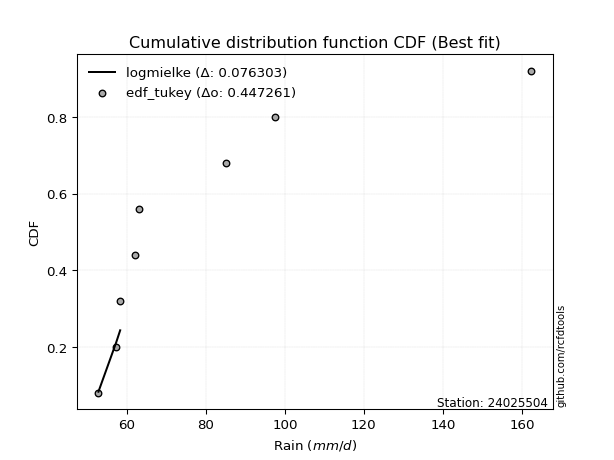</img>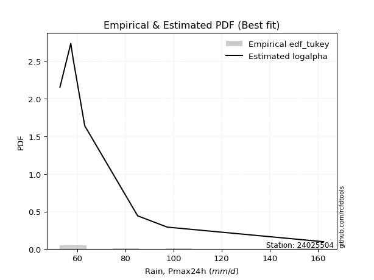</img>

</div>


### 8. EDF Gringorten (1963)

Gringorten plotting position formula is essential for estimating the probability and return periods of extreme events like floods and heavy rainfall. The constant _a=0.44_.

<div align="center">


$P=(m-a)/(n+1-2a)$


</div>


**8.1. Empirical values**

<div align="center">

|                | 0                   | 1                   | 2                  | 3              | 4                  | 5                  | 6                  |
|:---------------|:--------------------|:--------------------|:-------------------|:---------------|:-------------------|:-------------------|:-------------------|
| date           | 2017                | 2018                | 2019               | 2021           | 2016               | 2020               | 2024               |
| x              | 52.8                | 57.3                | 58.3               | 63.1           | 85.1               | 97.4               | 162.4              |
| m              | 1                   | 2                   | 3                  | 4              | 5                  | 6                  | 7                  |
| empirical_dist | edf_gringorten      | edf_gringorten      | edf_gringorten     | edf_gringorten | edf_gringorten     | edf_gringorten     | edf_gringorten     |
| empirical      | 0.07865168539325844 | 0.21910112359550563 | 0.3595505617977528 | 0.5            | 0.6404494382022471 | 0.7808988764044943 | 0.9213483146067415 |
| empirical_tr   | 1.0853658536585364  | 1.2805755395683454  | 1.5614035087719298 | 2.0            | 2.781249999999999  | 4.564102564102562  | 12.714285714285701 |

</div>


**8.2. Kolmogorov-Smirnov fit test (sorted by Δ)**


<div align="center">

|                | 0                   | 1                   | 2                   | 3                   | 4                   | 5                   | 6                   | 7                   | 8                   | 9                   | 10                  | 11                  | 12                  | 13                  | 14                  | 15                  | 16                  | 17                  | 18                  | 19                  | 20                  | 21                  | 22                  | 23                  | 24                  | 25                  | 26                    | 27                  | 28                  | 29                  | 30                  | 31                  | 32                  | 33                  | 34                  | 35                  | 36                  | 37                  | 38                  | 39                  | 40                  | 41                  | 42                  | 43                  | 44                  | 45                  | 46                  | 47                  | 48                  | 49                  | 50                  | 51                  | 52                  | 53                  | 54                  | 55                  | 56                  | 57                  | 58                  | 59                  | 60                  | 61                  | 62                  | 63                  | 64                  | 65                  | 66                  | 67                  | 68                  | 69                  | 70                  | 71                  | 72                  | 73                  | 74                  | 75                  | 76                  | 77                  | 78                  | 79                  | 80                  | 81                  | 82                  | 83                  | 84                  | 85                  | 86                  | 87                  |
|:---------------|:--------------------|:--------------------|:--------------------|:--------------------|:--------------------|:--------------------|:--------------------|:--------------------|:--------------------|:--------------------|:--------------------|:--------------------|:--------------------|:--------------------|:--------------------|:--------------------|:--------------------|:--------------------|:--------------------|:--------------------|:--------------------|:--------------------|:--------------------|:--------------------|:--------------------|:--------------------|:----------------------|:--------------------|:--------------------|:--------------------|:--------------------|:--------------------|:--------------------|:--------------------|:--------------------|:--------------------|:--------------------|:--------------------|:--------------------|:--------------------|:--------------------|:--------------------|:--------------------|:--------------------|:--------------------|:--------------------|:--------------------|:--------------------|:--------------------|:--------------------|:--------------------|:--------------------|:--------------------|:--------------------|:--------------------|:--------------------|:--------------------|:--------------------|:--------------------|:--------------------|:--------------------|:--------------------|:--------------------|:--------------------|:--------------------|:--------------------|:--------------------|:--------------------|:--------------------|:--------------------|:--------------------|:--------------------|:--------------------|:--------------------|:--------------------|:--------------------|:--------------------|:--------------------|:--------------------|:--------------------|:--------------------|:--------------------|:--------------------|:--------------------|:--------------------|:--------------------|:--------------------|:--------------------|
| station        | 24025504            | 24025504            | 24025504            | 24025504            | 24025504            | 24025504            | 24025504            | 24025504            | 24025504            | 24025504            | 24025504            | 24025504            | 24025504            | 24025504            | 24025504            | 24025504            | 24025504            | 24025504            | 24025504            | 24025504            | 24025504            | 24025504            | 24025504            | 24025504            | 24025504            | 24025504            | 24025504              | 24025504            | 24025504            | 24025504            | 24025504            | 24025504            | 24025504            | 24025504            | 24025504            | 24025504            | 24025504            | 24025504            | 24025504            | 24025504            | 24025504            | 24025504            | 24025504            | 24025504            | 24025504            | 24025504            | 24025504            | 24025504            | 24025504            | 24025504            | 24025504            | 24025504            | 24025504            | 24025504            | 24025504            | 24025504            | 24025504            | 24025504            | 24025504            | 24025504            | 24025504            | 24025504            | 24025504            | 24025504            | 24025504            | 24025504            | 24025504            | 24025504            | 24025504            | 24025504            | 24025504            | 24025504            | 24025504            | 24025504            | 24025504            | 24025504            | 24025504            | 24025504            | 24025504            | 24025504            | 24025504            | 24025504            | 24025504            | 24025504            | 24025504            | 24025504            | 24025504            | 24025504            |
| empirical_dist | edf_gringorten      | edf_gringorten      | edf_gringorten      | edf_gringorten      | edf_gringorten      | edf_gringorten      | edf_gringorten      | edf_gringorten      | edf_gringorten      | edf_gringorten      | edf_gringorten      | edf_gringorten      | edf_gringorten      | edf_gringorten      | edf_gringorten      | edf_gringorten      | edf_gringorten      | edf_gringorten      | edf_gringorten      | edf_gringorten      | edf_gringorten      | edf_gringorten      | edf_gringorten      | edf_gringorten      | edf_gringorten      | edf_gringorten      | edf_gringorten        | edf_gringorten      | edf_gringorten      | edf_gringorten      | edf_gringorten      | edf_gringorten      | edf_gringorten      | edf_gringorten      | edf_gringorten      | edf_gringorten      | edf_gringorten      | edf_gringorten      | edf_gringorten      | edf_gringorten      | edf_gringorten      | edf_gringorten      | edf_gringorten      | edf_gringorten      | edf_gringorten      | edf_gringorten      | edf_gringorten      | edf_gringorten      | edf_gringorten      | edf_gringorten      | edf_gringorten      | edf_gringorten      | edf_gringorten      | edf_gringorten      | edf_gringorten      | edf_gringorten      | edf_gringorten      | edf_gringorten      | edf_gringorten      | edf_gringorten      | edf_gringorten      | edf_gringorten      | edf_gringorten      | edf_gringorten      | edf_gringorten      | edf_gringorten      | edf_gringorten      | edf_gringorten      | edf_gringorten      | edf_gringorten      | edf_gringorten      | edf_gringorten      | edf_gringorten      | edf_gringorten      | edf_gringorten      | edf_gringorten      | edf_gringorten      | edf_gringorten      | edf_gringorten      | edf_gringorten      | edf_gringorten      | edf_gringorten      | edf_gringorten      | edf_gringorten      | edf_gringorten      | edf_gringorten      | edf_gringorten      | edf_gringorten      |
| p_dist         | logalpha            | logmielke           | logjohnsonsu        | invgamma            | f                   | invgauss            | logfatiguelife      | loginvweibull       | alpha               | loggenexpon         | logexponnorm        | logexpon            | loghalfnorm         | loghalflogistic     | loginvgauss         | loginvgamma         | logf                | loggompertz         | fatiguelife         | logtruncnorm        | halflogistic        | pearson3            | mielke              | logmoyal            | logpearson3         | erlang              | loglaplace_asymmetric | lograyleigh         | loggumbel_r         | halfnorm            | lognakagami         | moyal               | gamma               | rayleigh            | wald                | logmaxwell          | loggenlogistic      | gumbel_r            | maxwell             | lognct              | ncf                 | logfisk             | logbetaprime        | betaprime           | nct                 | logkstwobign        | logloggamma         | logt                | logcrystalball      | lognorm             | lognorm             | loggamma            | loggamma            | crystalball         | norm                | genlogistic         | exponnorm           | expon               | genexpon            | laplace_asymmetric  | nakagami            | gompertz            | loglogistic         | logwald             | logncf              | logrice             | logistic            | weibull_min         | loghypsecant        | kstwobign           | logchi2             | t                   | hypsecant           | loggumbel_l         | truncnorm           | gumbel_l            | rice                | loglaplace          | laplace             | johnsonsu           | gibrat              | logweibull_min      | fisk                | logerlang           | loggibrat           | loglognorm          | invweibull          | chi2                |
| delta          | 0.10455901074808538 | 0.11286500568815422 | 0.11331012303043175 | 0.11710844145703492 | 0.11710855161828126 | 0.11768880205173393 | 0.11771029768042751 | 0.1225479666997007  | 0.12309119051063966 | 0.12316565827433995 | 0.12316750016923983 | 0.12319040733012943 | 0.12334303589686124 | 0.12387717453777009 | 0.12464131832392511 | 0.1250460598879375  | 0.12509005975813936 | 0.12845811549707983 | 0.1291987340997701  | 0.13560096774676766 | 0.13652277567764132 | 0.1475243297936245  | 0.14842725220461972 | 0.14889483476006315 | 0.1525155984496857  | 0.15365133333390835 | 0.15496698652328877   | 0.15499639727452413 | 0.15985627860589852 | 0.16001825376398032 | 0.16016040862019484 | 0.1623179038180308  | 0.1643440993182722  | 0.1648699857574341  | 0.16561244984164986 | 0.16617495453757786 | 0.16640948663494137 | 0.17162356714884786 | 0.17578480563498528 | 0.17738417502657083 | 0.17958988553287225 | 0.17998538201220693 | 0.18011940858006303 | 0.18269179124422247 | 0.1839741260405935  | 0.1873907671966335  | 0.19060608621508196 | 0.19453754998694994 | 0.1945867900332507  | 0.1945867905270312  | 0.1945867905270312  | 0.1954607765782147  | 0.1954607765782147  | 0.20330961033169942 | 0.2033096179222501  | 0.20394513608261583 | 0.20509534499688542 | 0.20564285907397156 | 0.20564355332055118 | 0.2057225795824872  | 0.20784338553926898 | 0.21088013433548886 | 0.21565947125459578 | 0.2169833038081818  | 0.21799543369689212 | 0.22233362605067036 | 0.22481363659979164 | 0.22776820966187827 | 0.23100798042564036 | 0.23133513995051908 | 0.2326820833393458  | 0.23646506587706406 | 0.24025394952465706 | 0.24652777242376683 | 0.25128229656497214 | 0.2534592561776997  | 0.2544632019418043  | 0.25654719945207094 | 0.2650205076016512  | 0.2859346162372146  | 0.30197440435227924 | 0.30353641199965675 | 0.3142293359645125  | 0.34478295586129193 | 0.35178786334677187 | 0.40048816179835767 | 0.4741245800160018  | 0.7171167992251574  |
| deltao         | 0.48442053926100004 | 0.48442053926100004 | 0.48442053926100004 | 0.48442053926100004 | 0.48442053926100004 | 0.48442053926100004 | 0.48442053926100004 | 0.48442053926100004 | 0.48442053926100004 | 0.48442053926100004 | 0.48442053926100004 | 0.48442053926100004 | 0.48442053926100004 | 0.48442053926100004 | 0.48442053926100004 | 0.48442053926100004 | 0.48442053926100004 | 0.48442053926100004 | 0.48442053926100004 | 0.48442053926100004 | 0.48442053926100004 | 0.48442053926100004 | 0.48442053926100004 | 0.48442053926100004 | 0.48442053926100004 | 0.48442053926100004 | 0.48442053926100004   | 0.48442053926100004 | 0.48442053926100004 | 0.48442053926100004 | 0.48442053926100004 | 0.48442053926100004 | 0.48442053926100004 | 0.48442053926100004 | 0.48442053926100004 | 0.48442053926100004 | 0.48442053926100004 | 0.48442053926100004 | 0.48442053926100004 | 0.48442053926100004 | 0.48442053926100004 | 0.48442053926100004 | 0.48442053926100004 | 0.48442053926100004 | 0.48442053926100004 | 0.48442053926100004 | 0.48442053926100004 | 0.48442053926100004 | 0.48442053926100004 | 0.48442053926100004 | 0.48442053926100004 | 0.48442053926100004 | 0.48442053926100004 | 0.48442053926100004 | 0.48442053926100004 | 0.48442053926100004 | 0.48442053926100004 | 0.48442053926100004 | 0.48442053926100004 | 0.48442053926100004 | 0.48442053926100004 | 0.48442053926100004 | 0.48442053926100004 | 0.48442053926100004 | 0.48442053926100004 | 0.48442053926100004 | 0.48442053926100004 | 0.48442053926100004 | 0.48442053926100004 | 0.48442053926100004 | 0.48442053926100004 | 0.48442053926100004 | 0.48442053926100004 | 0.48442053926100004 | 0.48442053926100004 | 0.48442053926100004 | 0.48442053926100004 | 0.48442053926100004 | 0.48442053926100004 | 0.48442053926100004 | 0.48442053926100004 | 0.48442053926100004 | 0.48442053926100004 | 0.48442053926100004 | 0.48442053926100004 | 0.48442053926100004 | 0.48442053926100004 | 0.48442053926100004 |
| eval           | Δo > Δ              | Δo > Δ              | Δo > Δ              | Δo > Δ              | Δo > Δ              | Δo > Δ              | Δo > Δ              | Δo > Δ              | Δo > Δ              | Δo > Δ              | Δo > Δ              | Δo > Δ              | Δo > Δ              | Δo > Δ              | Δo > Δ              | Δo > Δ              | Δo > Δ              | Δo > Δ              | Δo > Δ              | Δo > Δ              | Δo > Δ              | Δo > Δ              | Δo > Δ              | Δo > Δ              | Δo > Δ              | Δo > Δ              | Δo > Δ                | Δo > Δ              | Δo > Δ              | Δo > Δ              | Δo > Δ              | Δo > Δ              | Δo > Δ              | Δo > Δ              | Δo > Δ              | Δo > Δ              | Δo > Δ              | Δo > Δ              | Δo > Δ              | Δo > Δ              | Δo > Δ              | Δo > Δ              | Δo > Δ              | Δo > Δ              | Δo > Δ              | Δo > Δ              | Δo > Δ              | Δo > Δ              | Δo > Δ              | Δo > Δ              | Δo > Δ              | Δo > Δ              | Δo > Δ              | Δo > Δ              | Δo > Δ              | Δo > Δ              | Δo > Δ              | Δo > Δ              | Δo > Δ              | Δo > Δ              | Δo > Δ              | Δo > Δ              | Δo > Δ              | Δo > Δ              | Δo > Δ              | Δo > Δ              | Δo > Δ              | Δo > Δ              | Δo > Δ              | Δo > Δ              | Δo > Δ              | Δo > Δ              | Δo > Δ              | Δo > Δ              | Δo > Δ              | Δo > Δ              | Δo > Δ              | Δo > Δ              | Δo > Δ              | Δo > Δ              | Δo > Δ              | Δo > Δ              | Δo > Δ              | Δo > Δ              | Δo > Δ              | Δo > Δ              | Δo > Δ              | Δo <= Δ             |
| fit            | 1                   | 1                   | 1                   | 1                   | 1                   | 1                   | 1                   | 1                   | 1                   | 1                   | 1                   | 1                   | 1                   | 1                   | 1                   | 1                   | 1                   | 1                   | 1                   | 1                   | 1                   | 1                   | 1                   | 1                   | 1                   | 1                   | 1                     | 1                   | 1                   | 1                   | 1                   | 1                   | 1                   | 1                   | 1                   | 1                   | 1                   | 1                   | 1                   | 1                   | 1                   | 1                   | 1                   | 1                   | 1                   | 1                   | 1                   | 1                   | 1                   | 1                   | 1                   | 1                   | 1                   | 1                   | 1                   | 1                   | 1                   | 1                   | 1                   | 1                   | 1                   | 1                   | 1                   | 1                   | 1                   | 1                   | 1                   | 1                   | 1                   | 1                   | 1                   | 1                   | 1                   | 1                   | 1                   | 1                   | 1                   | 1                   | 1                   | 1                   | 1                   | 1                   | 1                   | 1                   | 1                   | 1                   | 1                   | 0                   |
| n              | 7                   | 7                   | 7                   | 7                   | 7                   | 7                   | 7                   | 7                   | 7                   | 7                   | 7                   | 7                   | 7                   | 7                   | 7                   | 7                   | 7                   | 7                   | 7                   | 7                   | 7                   | 7                   | 7                   | 7                   | 7                   | 7                   | 7                     | 7                   | 7                   | 7                   | 7                   | 7                   | 7                   | 7                   | 7                   | 7                   | 7                   | 7                   | 7                   | 7                   | 7                   | 7                   | 7                   | 7                   | 7                   | 7                   | 7                   | 7                   | 7                   | 7                   | 7                   | 7                   | 7                   | 7                   | 7                   | 7                   | 7                   | 7                   | 7                   | 7                   | 7                   | 7                   | 7                   | 7                   | 7                   | 7                   | 7                   | 7                   | 7                   | 7                   | 7                   | 7                   | 7                   | 7                   | 7                   | 7                   | 7                   | 7                   | 7                   | 7                   | 7                   | 7                   | 7                   | 7                   | 7                   | 7                   | 7                   | 7                   |
| best_fit       | 1                   | 0                   | 0                   | 0                   | 0                   | 0                   | 0                   | 0                   | 0                   | 0                   | 0                   | 0                   | 0                   | 0                   | 0                   | 0                   | 0                   | 0                   | 0                   | 0                   | 0                   | 0                   | 0                   | 0                   | 0                   | 0                   | 0                     | 0                   | 0                   | 0                   | 0                   | 0                   | 0                   | 0                   | 0                   | 0                   | 0                   | 0                   | 0                   | 0                   | 0                   | 0                   | 0                   | 0                   | 0                   | 0                   | 0                   | 0                   | 0                   | 0                   | 0                   | 0                   | 0                   | 0                   | 0                   | 0                   | 0                   | 0                   | 0                   | 0                   | 0                   | 0                   | 0                   | 0                   | 0                   | 0                   | 0                   | 0                   | 0                   | 0                   | 0                   | 0                   | 0                   | 0                   | 0                   | 0                   | 0                   | 0                   | 0                   | 0                   | 0                   | 0                   | 0                   | 0                   | 0                   | 0                   | 0                   | 0                   |
| best_fit_sort  | 1                   | 2                   | 3                   | 4                   | 5                   | 6                   | 7                   | 8                   | 9                   | 10                  | 11                  | 12                  | 13                  | 14                  | 15                  | 16                  | 17                  | 18                  | 19                  | 20                  | 21                  | 22                  | 23                  | 24                  | 25                  | 26                  | 27                    | 28                  | 29                  | 30                  | 31                  | 32                  | 33                  | 34                  | 35                  | 36                  | 37                  | 38                  | 39                  | 40                  | 41                  | 42                  | 43                  | 44                  | 45                  | 46                  | 47                  | 48                  | 49                  | 50                  | 51                  | 52                  | 53                  | 54                  | 55                  | 56                  | 57                  | 58                  | 59                  | 60                  | 61                  | 62                  | 63                  | 64                  | 65                  | 66                  | 67                  | 68                  | 69                  | 70                  | 71                  | 72                  | 73                  | 74                  | 75                  | 76                  | 77                  | 78                  | 79                  | 80                  | 81                  | 82                  | 83                  | 84                  | 85                  | 86                  | 87                  | 88                  |

</div>


**8.3. Best fit**

<div align="center">

|   id |   station | empirical_dist   | p_dist   |    delta |   deltao | eval   |   fit |   n |   best_fit |   best_fit_sort |
|-----:|----------:|:-----------------|:---------|---------:|---------:|:-------|------:|----:|-----------:|----------------:|
|    0 |  24025504 | edf_gringorten   | logalpha | 0.104559 | 0.484421 | Δo > Δ |     1 |   7 |          1 |               1 |

</div>


<div align="center">

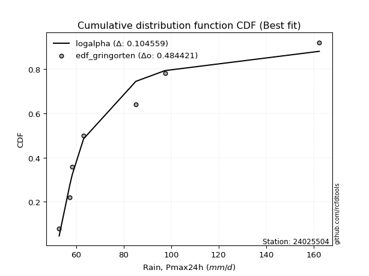</img>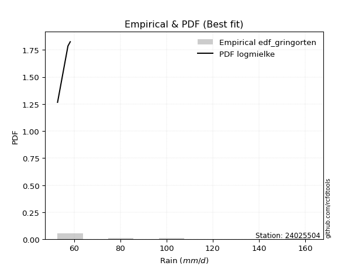</img>

</div>


### 9. EDF Filliben (1975)

The specific values of the constants (0.3175) (often denoted as $alpha$) and (0.365) are derived from a method proposed by James J. Filliben in a 1975 paper. This particular formula is the mean value of the $i$-th order statistic of the normal distribution and is considered a robust and effective plotting position formula for the normal probability plot correlation coefficient test for normality.

<div align="center">


$P=(m-0.3175)/(n+0.365)$


</div>


**9.1. Empirical values**

<div align="center">

|                | 0                   | 1                   | 2                   | 3            | 4                  | 5                  | 6                  |
|:---------------|:--------------------|:--------------------|:--------------------|:-------------|:-------------------|:-------------------|:-------------------|
| date           | 2017                | 2018                | 2019                | 2021         | 2016               | 2020               | 2024               |
| x              | 52.8                | 57.3                | 58.3                | 63.1         | 85.1               | 97.4               | 162.4              |
| m              | 1                   | 2                   | 3                   | 4            | 5                  | 6                  | 7                  |
| empirical_dist | edf_filliben        | edf_filliben        | edf_filliben        | edf_filliben | edf_filliben       | edf_filliben       | edf_filliben       |
| empirical      | 0.09266802443991853 | 0.22844534962661237 | 0.36422267481330617 | 0.5          | 0.6357773251866938 | 0.7715546503733877 | 0.9073319755600815 |
| empirical_tr   | 1.1021324354657687  | 1.2960844698636163  | 1.5728777362520021  | 2.0          | 2.7455731593662627 | 4.377414561664191  | 10.791208791208794 |

</div>


**9.2. Kolmogorov-Smirnov fit test (sorted by Δ)**


<div align="center">

|                | 0                   | 1                   | 2                   | 3                   | 4                   | 5                   | 6                   | 7                   | 8                   | 9                   | 10                  | 11                  | 12                  | 13                  | 14                  | 15                  | 16                  | 17                  | 18                  | 19                  | 20                  | 21                  | 22                  | 23                  | 24                  | 25                  | 26                  | 27                  | 28                  | 29                    | 30                  | 31                  | 32                  | 33                  | 34                  | 35                  | 36                  | 37                  | 38                  | 39                  | 40                  | 41                  | 42                  | 43                  | 44                  | 45                  | 46                  | 47                  | 48                  | 49                  | 50                  | 51                  | 52                  | 53                  | 54                  | 55                  | 56                  | 57                  | 58                  | 59                  | 60                  | 61                  | 62                  | 63                  | 64                  | 65                  | 66                  | 67                  | 68                  | 69                  | 70                  | 71                  | 72                  | 73                  | 74                  | 75                  | 76                  | 77                  | 78                  | 79                  | 80                  | 81                  | 82                  | 83                  | 84                  | 85                  | 86                  | 87                  |
|:---------------|:--------------------|:--------------------|:--------------------|:--------------------|:--------------------|:--------------------|:--------------------|:--------------------|:--------------------|:--------------------|:--------------------|:--------------------|:--------------------|:--------------------|:--------------------|:--------------------|:--------------------|:--------------------|:--------------------|:--------------------|:--------------------|:--------------------|:--------------------|:--------------------|:--------------------|:--------------------|:--------------------|:--------------------|:--------------------|:----------------------|:--------------------|:--------------------|:--------------------|:--------------------|:--------------------|:--------------------|:--------------------|:--------------------|:--------------------|:--------------------|:--------------------|:--------------------|:--------------------|:--------------------|:--------------------|:--------------------|:--------------------|:--------------------|:--------------------|:--------------------|:--------------------|:--------------------|:--------------------|:--------------------|:--------------------|:--------------------|:--------------------|:--------------------|:--------------------|:--------------------|:--------------------|:--------------------|:--------------------|:--------------------|:--------------------|:--------------------|:--------------------|:--------------------|:--------------------|:--------------------|:--------------------|:--------------------|:--------------------|:--------------------|:--------------------|:--------------------|:--------------------|:--------------------|:--------------------|:--------------------|:--------------------|:--------------------|:--------------------|:--------------------|:--------------------|:--------------------|:--------------------|:--------------------|
| station        | 24025504            | 24025504            | 24025504            | 24025504            | 24025504            | 24025504            | 24025504            | 24025504            | 24025504            | 24025504            | 24025504            | 24025504            | 24025504            | 24025504            | 24025504            | 24025504            | 24025504            | 24025504            | 24025504            | 24025504            | 24025504            | 24025504            | 24025504            | 24025504            | 24025504            | 24025504            | 24025504            | 24025504            | 24025504            | 24025504              | 24025504            | 24025504            | 24025504            | 24025504            | 24025504            | 24025504            | 24025504            | 24025504            | 24025504            | 24025504            | 24025504            | 24025504            | 24025504            | 24025504            | 24025504            | 24025504            | 24025504            | 24025504            | 24025504            | 24025504            | 24025504            | 24025504            | 24025504            | 24025504            | 24025504            | 24025504            | 24025504            | 24025504            | 24025504            | 24025504            | 24025504            | 24025504            | 24025504            | 24025504            | 24025504            | 24025504            | 24025504            | 24025504            | 24025504            | 24025504            | 24025504            | 24025504            | 24025504            | 24025504            | 24025504            | 24025504            | 24025504            | 24025504            | 24025504            | 24025504            | 24025504            | 24025504            | 24025504            | 24025504            | 24025504            | 24025504            | 24025504            | 24025504            |
| empirical_dist | edf_filliben        | edf_filliben        | edf_filliben        | edf_filliben        | edf_filliben        | edf_filliben        | edf_filliben        | edf_filliben        | edf_filliben        | edf_filliben        | edf_filliben        | edf_filliben        | edf_filliben        | edf_filliben        | edf_filliben        | edf_filliben        | edf_filliben        | edf_filliben        | edf_filliben        | edf_filliben        | edf_filliben        | edf_filliben        | edf_filliben        | edf_filliben        | edf_filliben        | edf_filliben        | edf_filliben        | edf_filliben        | edf_filliben        | edf_filliben          | edf_filliben        | edf_filliben        | edf_filliben        | edf_filliben        | edf_filliben        | edf_filliben        | edf_filliben        | edf_filliben        | edf_filliben        | edf_filliben        | edf_filliben        | edf_filliben        | edf_filliben        | edf_filliben        | edf_filliben        | edf_filliben        | edf_filliben        | edf_filliben        | edf_filliben        | edf_filliben        | edf_filliben        | edf_filliben        | edf_filliben        | edf_filliben        | edf_filliben        | edf_filliben        | edf_filliben        | edf_filliben        | edf_filliben        | edf_filliben        | edf_filliben        | edf_filliben        | edf_filliben        | edf_filliben        | edf_filliben        | edf_filliben        | edf_filliben        | edf_filliben        | edf_filliben        | edf_filliben        | edf_filliben        | edf_filliben        | edf_filliben        | edf_filliben        | edf_filliben        | edf_filliben        | edf_filliben        | edf_filliben        | edf_filliben        | edf_filliben        | edf_filliben        | edf_filliben        | edf_filliben        | edf_filliben        | edf_filliben        | edf_filliben        | edf_filliben        | edf_filliben        |
| p_dist         | logalpha            | logmielke           | logjohnsonsu        | fatiguelife         | invgamma            | f                   | invgauss            | logfatiguelife      | loghalfnorm         | loghalflogistic     | loginvweibull       | alpha               | loggenexpon         | logexponnorm        | logexpon            | loginvgauss         | loginvgamma         | logf                | loggompertz         | halflogistic        | logtruncnorm        | halfnorm            | pearson3            | logmoyal            | lognakagami         | logpearson3         | mielke              | lograyleigh         | erlang              | loglaplace_asymmetric | loggumbel_r         | moyal               | rayleigh            | wald                | logfisk             | logmaxwell          | loggenlogistic      | gamma               | gumbel_r            | maxwell             | lognct              | ncf                 | logbetaprime        | betaprime           | nct                 | logkstwobign        | logloggamma         | logt                | logcrystalball      | lognorm             | lognorm             | nakagami            | loggamma            | loggamma            | crystalball         | norm                | genlogistic         | exponnorm           | expon               | genexpon            | laplace_asymmetric  | gompertz            | loglogistic         | logncf              | logwald             | logrice             | logchi2             | logistic            | weibull_min         | loghypsecant        | kstwobign           | hypsecant           | t                   | loggumbel_l         | truncnorm           | gumbel_l            | rice                | loglaplace          | laplace             | johnsonsu           | logweibull_min      | fisk                | gibrat              | logerlang           | loggibrat           | loglognorm          | invweibull          | chi2                |
| delta          | 0.10923112376363864 | 0.11753711870370759 | 0.11798223604598501 | 0.11985450806866335 | 0.12178055447258818 | 0.12178066463383452 | 0.12236091506728719 | 0.12238241069598077 | 0.12334303589686124 | 0.12387717453777009 | 0.12722007971525395 | 0.12776330352619292 | 0.12783777128989332 | 0.1278396131847932  | 0.1278625203456828  | 0.12931343133947837 | 0.12971817290349075 | 0.12976217277369262 | 0.1331302285126332  | 0.13652277567764132 | 0.14027308076232103 | 0.1460019147173202  | 0.1475243297936245  | 0.14889483476006315 | 0.1508161825890881  | 0.1525155984496857  | 0.15309936522017298 | 0.15499639727452413 | 0.1583234463494616  | 0.15963909953884214   | 0.15985627860589852 | 0.1623179038180308  | 0.1648699857574341  | 0.16561244984164986 | 0.16596904296554693 | 0.16617495453757786 | 0.16640948663494137 | 0.16901621233382547 | 0.17162356714884786 | 0.17578480563498528 | 0.17738417502657083 | 0.17958988553287225 | 0.18011940858006303 | 0.18269179124422247 | 0.1839741260405935  | 0.1873907671966335  | 0.19060608621508196 | 0.19453754998694994 | 0.1945867900332507  | 0.1945867905270312  | 0.1945867905270312  | 0.19849915950816224 | 0.20013288959376796 | 0.20013288959376796 | 0.20330961033169942 | 0.2033096179222501  | 0.20394513608261583 | 0.20509534499688542 | 0.20564285907397156 | 0.20564355332055118 | 0.2057225795824872  | 0.21088013433548886 | 0.21565947125459578 | 0.21799543369689212 | 0.22165541682373516 | 0.22233362605067036 | 0.22333785730823918 | 0.22481363659979164 | 0.22776820966187827 | 0.23100798042564036 | 0.23133513995051908 | 0.24025394952465706 | 0.24113717889261732 | 0.24652777242376683 | 0.25128229656497214 | 0.2534592561776997  | 0.2544632019418043  | 0.25654719945207094 | 0.2650205076016512  | 0.2765903902061079  | 0.28952007295299675 | 0.3002129969178525  | 0.3066465173678326  | 0.3354387298301852  | 0.35645997636232524 | 0.3911439357672509  | 0.4601082409693418  | 0.7077725731940506  |
| deltao         | 0.48442053926100004 | 0.48442053926100004 | 0.48442053926100004 | 0.48442053926100004 | 0.48442053926100004 | 0.48442053926100004 | 0.48442053926100004 | 0.48442053926100004 | 0.48442053926100004 | 0.48442053926100004 | 0.48442053926100004 | 0.48442053926100004 | 0.48442053926100004 | 0.48442053926100004 | 0.48442053926100004 | 0.48442053926100004 | 0.48442053926100004 | 0.48442053926100004 | 0.48442053926100004 | 0.48442053926100004 | 0.48442053926100004 | 0.48442053926100004 | 0.48442053926100004 | 0.48442053926100004 | 0.48442053926100004 | 0.48442053926100004 | 0.48442053926100004 | 0.48442053926100004 | 0.48442053926100004 | 0.48442053926100004   | 0.48442053926100004 | 0.48442053926100004 | 0.48442053926100004 | 0.48442053926100004 | 0.48442053926100004 | 0.48442053926100004 | 0.48442053926100004 | 0.48442053926100004 | 0.48442053926100004 | 0.48442053926100004 | 0.48442053926100004 | 0.48442053926100004 | 0.48442053926100004 | 0.48442053926100004 | 0.48442053926100004 | 0.48442053926100004 | 0.48442053926100004 | 0.48442053926100004 | 0.48442053926100004 | 0.48442053926100004 | 0.48442053926100004 | 0.48442053926100004 | 0.48442053926100004 | 0.48442053926100004 | 0.48442053926100004 | 0.48442053926100004 | 0.48442053926100004 | 0.48442053926100004 | 0.48442053926100004 | 0.48442053926100004 | 0.48442053926100004 | 0.48442053926100004 | 0.48442053926100004 | 0.48442053926100004 | 0.48442053926100004 | 0.48442053926100004 | 0.48442053926100004 | 0.48442053926100004 | 0.48442053926100004 | 0.48442053926100004 | 0.48442053926100004 | 0.48442053926100004 | 0.48442053926100004 | 0.48442053926100004 | 0.48442053926100004 | 0.48442053926100004 | 0.48442053926100004 | 0.48442053926100004 | 0.48442053926100004 | 0.48442053926100004 | 0.48442053926100004 | 0.48442053926100004 | 0.48442053926100004 | 0.48442053926100004 | 0.48442053926100004 | 0.48442053926100004 | 0.48442053926100004 | 0.48442053926100004 |
| eval           | Δo > Δ              | Δo > Δ              | Δo > Δ              | Δo > Δ              | Δo > Δ              | Δo > Δ              | Δo > Δ              | Δo > Δ              | Δo > Δ              | Δo > Δ              | Δo > Δ              | Δo > Δ              | Δo > Δ              | Δo > Δ              | Δo > Δ              | Δo > Δ              | Δo > Δ              | Δo > Δ              | Δo > Δ              | Δo > Δ              | Δo > Δ              | Δo > Δ              | Δo > Δ              | Δo > Δ              | Δo > Δ              | Δo > Δ              | Δo > Δ              | Δo > Δ              | Δo > Δ              | Δo > Δ                | Δo > Δ              | Δo > Δ              | Δo > Δ              | Δo > Δ              | Δo > Δ              | Δo > Δ              | Δo > Δ              | Δo > Δ              | Δo > Δ              | Δo > Δ              | Δo > Δ              | Δo > Δ              | Δo > Δ              | Δo > Δ              | Δo > Δ              | Δo > Δ              | Δo > Δ              | Δo > Δ              | Δo > Δ              | Δo > Δ              | Δo > Δ              | Δo > Δ              | Δo > Δ              | Δo > Δ              | Δo > Δ              | Δo > Δ              | Δo > Δ              | Δo > Δ              | Δo > Δ              | Δo > Δ              | Δo > Δ              | Δo > Δ              | Δo > Δ              | Δo > Δ              | Δo > Δ              | Δo > Δ              | Δo > Δ              | Δo > Δ              | Δo > Δ              | Δo > Δ              | Δo > Δ              | Δo > Δ              | Δo > Δ              | Δo > Δ              | Δo > Δ              | Δo > Δ              | Δo > Δ              | Δo > Δ              | Δo > Δ              | Δo > Δ              | Δo > Δ              | Δo > Δ              | Δo > Δ              | Δo > Δ              | Δo > Δ              | Δo > Δ              | Δo > Δ              | Δo <= Δ             |
| fit            | 1                   | 1                   | 1                   | 1                   | 1                   | 1                   | 1                   | 1                   | 1                   | 1                   | 1                   | 1                   | 1                   | 1                   | 1                   | 1                   | 1                   | 1                   | 1                   | 1                   | 1                   | 1                   | 1                   | 1                   | 1                   | 1                   | 1                   | 1                   | 1                   | 1                     | 1                   | 1                   | 1                   | 1                   | 1                   | 1                   | 1                   | 1                   | 1                   | 1                   | 1                   | 1                   | 1                   | 1                   | 1                   | 1                   | 1                   | 1                   | 1                   | 1                   | 1                   | 1                   | 1                   | 1                   | 1                   | 1                   | 1                   | 1                   | 1                   | 1                   | 1                   | 1                   | 1                   | 1                   | 1                   | 1                   | 1                   | 1                   | 1                   | 1                   | 1                   | 1                   | 1                   | 1                   | 1                   | 1                   | 1                   | 1                   | 1                   | 1                   | 1                   | 1                   | 1                   | 1                   | 1                   | 1                   | 1                   | 0                   |
| n              | 7                   | 7                   | 7                   | 7                   | 7                   | 7                   | 7                   | 7                   | 7                   | 7                   | 7                   | 7                   | 7                   | 7                   | 7                   | 7                   | 7                   | 7                   | 7                   | 7                   | 7                   | 7                   | 7                   | 7                   | 7                   | 7                   | 7                   | 7                   | 7                   | 7                     | 7                   | 7                   | 7                   | 7                   | 7                   | 7                   | 7                   | 7                   | 7                   | 7                   | 7                   | 7                   | 7                   | 7                   | 7                   | 7                   | 7                   | 7                   | 7                   | 7                   | 7                   | 7                   | 7                   | 7                   | 7                   | 7                   | 7                   | 7                   | 7                   | 7                   | 7                   | 7                   | 7                   | 7                   | 7                   | 7                   | 7                   | 7                   | 7                   | 7                   | 7                   | 7                   | 7                   | 7                   | 7                   | 7                   | 7                   | 7                   | 7                   | 7                   | 7                   | 7                   | 7                   | 7                   | 7                   | 7                   | 7                   | 7                   |
| best_fit       | 1                   | 0                   | 0                   | 0                   | 0                   | 0                   | 0                   | 0                   | 0                   | 0                   | 0                   | 0                   | 0                   | 0                   | 0                   | 0                   | 0                   | 0                   | 0                   | 0                   | 0                   | 0                   | 0                   | 0                   | 0                   | 0                   | 0                   | 0                   | 0                   | 0                     | 0                   | 0                   | 0                   | 0                   | 0                   | 0                   | 0                   | 0                   | 0                   | 0                   | 0                   | 0                   | 0                   | 0                   | 0                   | 0                   | 0                   | 0                   | 0                   | 0                   | 0                   | 0                   | 0                   | 0                   | 0                   | 0                   | 0                   | 0                   | 0                   | 0                   | 0                   | 0                   | 0                   | 0                   | 0                   | 0                   | 0                   | 0                   | 0                   | 0                   | 0                   | 0                   | 0                   | 0                   | 0                   | 0                   | 0                   | 0                   | 0                   | 0                   | 0                   | 0                   | 0                   | 0                   | 0                   | 0                   | 0                   | 0                   |
| best_fit_sort  | 1                   | 2                   | 3                   | 4                   | 5                   | 6                   | 7                   | 8                   | 9                   | 10                  | 11                  | 12                  | 13                  | 14                  | 15                  | 16                  | 17                  | 18                  | 19                  | 20                  | 21                  | 22                  | 23                  | 24                  | 25                  | 26                  | 27                  | 28                  | 29                  | 30                    | 31                  | 32                  | 33                  | 34                  | 35                  | 36                  | 37                  | 38                  | 39                  | 40                  | 41                  | 42                  | 43                  | 44                  | 45                  | 46                  | 47                  | 48                  | 49                  | 50                  | 51                  | 52                  | 53                  | 54                  | 55                  | 56                  | 57                  | 58                  | 59                  | 60                  | 61                  | 62                  | 63                  | 64                  | 65                  | 66                  | 67                  | 68                  | 69                  | 70                  | 71                  | 72                  | 73                  | 74                  | 75                  | 76                  | 77                  | 78                  | 79                  | 80                  | 81                  | 82                  | 83                  | 84                  | 85                  | 86                  | 87                  | 88                  |

</div>


**9.3. Best fit**

<div align="center">

|   id |   station | empirical_dist   | p_dist   |    delta |   deltao | eval   |   fit |   n |   best_fit |   best_fit_sort |
|-----:|----------:|:-----------------|:---------|---------:|---------:|:-------|------:|----:|-----------:|----------------:|
|    0 |  24025504 | edf_filliben     | logalpha | 0.109231 | 0.484421 | Δo > Δ |     1 |   7 |          1 |               1 |

</div>


<div align="center">

</img></img>

</div>


### 10. EDF Jenkinson (1977)

The Jenkinson formula in hydrology is an empirical plotting position formula used to estimate the non-exceedance probability _(P)_ or return period _(T)_ of a given ordered observation within a sample. It is a widely used method in the frequency analysis of extreme events such as floods and rainfall, as it provides a distribution-free way to plot data. _a≈0.31_ and _b≈0.38_ are constants derived to approximate the median of the probability distribution for the given rank.

<div align="center">


$P=(m-a)/(n+b)$


</div>


**10.1. Empirical values**

<div align="center">

|                | 0                   | 1                   | 2                   | 3             | 4                  | 5                  | 6                  |
|:---------------|:--------------------|:--------------------|:--------------------|:--------------|:-------------------|:-------------------|:-------------------|
| date           | 2017                | 2018                | 2019                | 2021          | 2016               | 2020               | 2024               |
| x              | 52.8                | 57.3                | 58.3                | 63.1          | 85.1               | 97.4               | 162.4              |
| m              | 1                   | 2                   | 3                   | 4             | 5                  | 6                  | 7                  |
| empirical_dist | edf_jenkinson       | edf_jenkinson       | edf_jenkinson       | edf_jenkinson | edf_jenkinson      | edf_jenkinson      | edf_jenkinson      |
| empirical      | 0.09349593495934959 | 0.22899728997289973 | 0.36449864498644985 | 0.5           | 0.6355013550135502 | 0.7710027100271003 | 0.9065040650406505 |
| empirical_tr   | 1.1031390134529149  | 1.29701230228471    | 1.5735607675906182  | 2.0           | 2.743494423791822  | 4.366863905325444  | 10.695652173913055 |

</div>


**10.2. Kolmogorov-Smirnov fit test (sorted by Δ)**


<div align="center">

|                | 0                   | 1                   | 2                   | 3                   | 4                   | 5                   | 6                   | 7                   | 8                   | 9                   | 10                  | 11                  | 12                  | 13                  | 14                  | 15                  | 16                  | 17                  | 18                  | 19                  | 20                  | 21                  | 22                  | 23                  | 24                  | 25                  | 26                  | 27                  | 28                  | 29                  | 30                    | 31                  | 32                  | 33                  | 34                  | 35                  | 36                  | 37                  | 38                  | 39                  | 40                  | 41                  | 42                  | 43                  | 44                  | 45                  | 46                  | 47                  | 48                  | 49                  | 50                  | 51                  | 52                  | 53                  | 54                  | 55                  | 56                  | 57                  | 58                  | 59                  | 60                  | 61                  | 62                  | 63                  | 64                  | 65                  | 66                  | 67                  | 68                  | 69                  | 70                  | 71                  | 72                  | 73                  | 74                  | 75                  | 76                  | 77                  | 78                  | 79                  | 80                  | 81                  | 82                  | 83                  | 84                  | 85                  | 86                  | 87                  |
|:---------------|:--------------------|:--------------------|:--------------------|:--------------------|:--------------------|:--------------------|:--------------------|:--------------------|:--------------------|:--------------------|:--------------------|:--------------------|:--------------------|:--------------------|:--------------------|:--------------------|:--------------------|:--------------------|:--------------------|:--------------------|:--------------------|:--------------------|:--------------------|:--------------------|:--------------------|:--------------------|:--------------------|:--------------------|:--------------------|:--------------------|:----------------------|:--------------------|:--------------------|:--------------------|:--------------------|:--------------------|:--------------------|:--------------------|:--------------------|:--------------------|:--------------------|:--------------------|:--------------------|:--------------------|:--------------------|:--------------------|:--------------------|:--------------------|:--------------------|:--------------------|:--------------------|:--------------------|:--------------------|:--------------------|:--------------------|:--------------------|:--------------------|:--------------------|:--------------------|:--------------------|:--------------------|:--------------------|:--------------------|:--------------------|:--------------------|:--------------------|:--------------------|:--------------------|:--------------------|:--------------------|:--------------------|:--------------------|:--------------------|:--------------------|:--------------------|:--------------------|:--------------------|:--------------------|:--------------------|:--------------------|:--------------------|:--------------------|:--------------------|:--------------------|:--------------------|:--------------------|:--------------------|:--------------------|
| station        | 24025504            | 24025504            | 24025504            | 24025504            | 24025504            | 24025504            | 24025504            | 24025504            | 24025504            | 24025504            | 24025504            | 24025504            | 24025504            | 24025504            | 24025504            | 24025504            | 24025504            | 24025504            | 24025504            | 24025504            | 24025504            | 24025504            | 24025504            | 24025504            | 24025504            | 24025504            | 24025504            | 24025504            | 24025504            | 24025504            | 24025504              | 24025504            | 24025504            | 24025504            | 24025504            | 24025504            | 24025504            | 24025504            | 24025504            | 24025504            | 24025504            | 24025504            | 24025504            | 24025504            | 24025504            | 24025504            | 24025504            | 24025504            | 24025504            | 24025504            | 24025504            | 24025504            | 24025504            | 24025504            | 24025504            | 24025504            | 24025504            | 24025504            | 24025504            | 24025504            | 24025504            | 24025504            | 24025504            | 24025504            | 24025504            | 24025504            | 24025504            | 24025504            | 24025504            | 24025504            | 24025504            | 24025504            | 24025504            | 24025504            | 24025504            | 24025504            | 24025504            | 24025504            | 24025504            | 24025504            | 24025504            | 24025504            | 24025504            | 24025504            | 24025504            | 24025504            | 24025504            | 24025504            |
| empirical_dist | edf_jenkinson       | edf_jenkinson       | edf_jenkinson       | edf_jenkinson       | edf_jenkinson       | edf_jenkinson       | edf_jenkinson       | edf_jenkinson       | edf_jenkinson       | edf_jenkinson       | edf_jenkinson       | edf_jenkinson       | edf_jenkinson       | edf_jenkinson       | edf_jenkinson       | edf_jenkinson       | edf_jenkinson       | edf_jenkinson       | edf_jenkinson       | edf_jenkinson       | edf_jenkinson       | edf_jenkinson       | edf_jenkinson       | edf_jenkinson       | edf_jenkinson       | edf_jenkinson       | edf_jenkinson       | edf_jenkinson       | edf_jenkinson       | edf_jenkinson       | edf_jenkinson         | edf_jenkinson       | edf_jenkinson       | edf_jenkinson       | edf_jenkinson       | edf_jenkinson       | edf_jenkinson       | edf_jenkinson       | edf_jenkinson       | edf_jenkinson       | edf_jenkinson       | edf_jenkinson       | edf_jenkinson       | edf_jenkinson       | edf_jenkinson       | edf_jenkinson       | edf_jenkinson       | edf_jenkinson       | edf_jenkinson       | edf_jenkinson       | edf_jenkinson       | edf_jenkinson       | edf_jenkinson       | edf_jenkinson       | edf_jenkinson       | edf_jenkinson       | edf_jenkinson       | edf_jenkinson       | edf_jenkinson       | edf_jenkinson       | edf_jenkinson       | edf_jenkinson       | edf_jenkinson       | edf_jenkinson       | edf_jenkinson       | edf_jenkinson       | edf_jenkinson       | edf_jenkinson       | edf_jenkinson       | edf_jenkinson       | edf_jenkinson       | edf_jenkinson       | edf_jenkinson       | edf_jenkinson       | edf_jenkinson       | edf_jenkinson       | edf_jenkinson       | edf_jenkinson       | edf_jenkinson       | edf_jenkinson       | edf_jenkinson       | edf_jenkinson       | edf_jenkinson       | edf_jenkinson       | edf_jenkinson       | edf_jenkinson       | edf_jenkinson       | edf_jenkinson       |
| p_dist         | logalpha            | logmielke           | logjohnsonsu        | fatiguelife         | invgamma            | f                   | invgauss            | logfatiguelife      | loghalfnorm         | loghalflogistic     | loginvweibull       | alpha               | loggenexpon         | logexponnorm        | logexpon            | loginvgauss         | loginvgamma         | logf                | loggompertz         | halflogistic        | logtruncnorm        | halfnorm            | pearson3            | logmoyal            | lognakagami         | logpearson3         | mielke              | lograyleigh         | erlang              | loggumbel_r         | loglaplace_asymmetric | moyal               | rayleigh            | logfisk             | wald                | logmaxwell          | loggenlogistic      | gamma               | gumbel_r            | maxwell             | lognct              | ncf                 | logbetaprime        | betaprime           | nct                 | logkstwobign        | logloggamma         | logt                | logcrystalball      | lognorm             | lognorm             | nakagami            | loggamma            | loggamma            | crystalball         | norm                | genlogistic         | exponnorm           | expon               | genexpon            | laplace_asymmetric  | gompertz            | loglogistic         | logncf              | logwald             | logrice             | logchi2             | logistic            | weibull_min         | loghypsecant        | kstwobign           | hypsecant           | t                   | loggumbel_l         | truncnorm           | gumbel_l            | rice                | loglaplace          | laplace             | johnsonsu           | logweibull_min      | fisk                | gibrat              | logerlang           | loggibrat           | loglognorm          | invweibull          | chi2                |
| delta          | 0.10950709393678226 | 0.11781308887685127 | 0.11825820621912864 | 0.11930256772237599 | 0.1220565246457318  | 0.12205663480697815 | 0.12263688524043082 | 0.1226583808691244  | 0.12334303589686124 | 0.12387717453777009 | 0.12749604988839758 | 0.12803927369933654 | 0.128113741463037   | 0.12811558335793688 | 0.12813849051882648 | 0.129589401512622   | 0.12999414307663437 | 0.13003814294683624 | 0.13340619868577688 | 0.13652277567764132 | 0.14054905093546471 | 0.14517400419788917 | 0.1475243297936245  | 0.14889483476006315 | 0.15026424224280074 | 0.1525155984496857  | 0.1533753353933166  | 0.15499639727452413 | 0.15859941652260523 | 0.15985627860589852 | 0.15991506971198582   | 0.1623179038180308  | 0.1648699857574341  | 0.16514113244611595 | 0.16561244984164986 | 0.16617495453757786 | 0.16640948663494137 | 0.1692921825069691  | 0.17162356714884786 | 0.17578480563498528 | 0.17738417502657083 | 0.17958988553287225 | 0.18011940858006303 | 0.18269179124422247 | 0.1839741260405935  | 0.1873907671966335  | 0.19060608621508196 | 0.19453754998694994 | 0.1945867900332507  | 0.1945867905270312  | 0.1945867905270312  | 0.19794721916187488 | 0.20040885976691158 | 0.20040885976691158 | 0.20330961033169942 | 0.2033096179222501  | 0.20394513608261583 | 0.20509534499688542 | 0.20564285907397156 | 0.20564355332055118 | 0.2057225795824872  | 0.21088013433548886 | 0.21565947125459578 | 0.21799543369689212 | 0.22193138699687884 | 0.22233362605067036 | 0.22278591696195182 | 0.22481363659979164 | 0.22776820966187827 | 0.23100798042564036 | 0.23133513995051908 | 0.24025394952465706 | 0.24141314906576095 | 0.24652777242376683 | 0.25128229656497214 | 0.2534592561776997  | 0.2544632019418043  | 0.25654719945207094 | 0.2650205076016512  | 0.2760384498598205  | 0.28869216243356577 | 0.29938508639842154 | 0.3069224875409763  | 0.33488678948389783 | 0.3567359465354689  | 0.39059199542096357 | 0.4592803304499108  | 0.7072206328477633  |
| deltao         | 0.48442053926100004 | 0.48442053926100004 | 0.48442053926100004 | 0.48442053926100004 | 0.48442053926100004 | 0.48442053926100004 | 0.48442053926100004 | 0.48442053926100004 | 0.48442053926100004 | 0.48442053926100004 | 0.48442053926100004 | 0.48442053926100004 | 0.48442053926100004 | 0.48442053926100004 | 0.48442053926100004 | 0.48442053926100004 | 0.48442053926100004 | 0.48442053926100004 | 0.48442053926100004 | 0.48442053926100004 | 0.48442053926100004 | 0.48442053926100004 | 0.48442053926100004 | 0.48442053926100004 | 0.48442053926100004 | 0.48442053926100004 | 0.48442053926100004 | 0.48442053926100004 | 0.48442053926100004 | 0.48442053926100004 | 0.48442053926100004   | 0.48442053926100004 | 0.48442053926100004 | 0.48442053926100004 | 0.48442053926100004 | 0.48442053926100004 | 0.48442053926100004 | 0.48442053926100004 | 0.48442053926100004 | 0.48442053926100004 | 0.48442053926100004 | 0.48442053926100004 | 0.48442053926100004 | 0.48442053926100004 | 0.48442053926100004 | 0.48442053926100004 | 0.48442053926100004 | 0.48442053926100004 | 0.48442053926100004 | 0.48442053926100004 | 0.48442053926100004 | 0.48442053926100004 | 0.48442053926100004 | 0.48442053926100004 | 0.48442053926100004 | 0.48442053926100004 | 0.48442053926100004 | 0.48442053926100004 | 0.48442053926100004 | 0.48442053926100004 | 0.48442053926100004 | 0.48442053926100004 | 0.48442053926100004 | 0.48442053926100004 | 0.48442053926100004 | 0.48442053926100004 | 0.48442053926100004 | 0.48442053926100004 | 0.48442053926100004 | 0.48442053926100004 | 0.48442053926100004 | 0.48442053926100004 | 0.48442053926100004 | 0.48442053926100004 | 0.48442053926100004 | 0.48442053926100004 | 0.48442053926100004 | 0.48442053926100004 | 0.48442053926100004 | 0.48442053926100004 | 0.48442053926100004 | 0.48442053926100004 | 0.48442053926100004 | 0.48442053926100004 | 0.48442053926100004 | 0.48442053926100004 | 0.48442053926100004 | 0.48442053926100004 |
| eval           | Δo > Δ              | Δo > Δ              | Δo > Δ              | Δo > Δ              | Δo > Δ              | Δo > Δ              | Δo > Δ              | Δo > Δ              | Δo > Δ              | Δo > Δ              | Δo > Δ              | Δo > Δ              | Δo > Δ              | Δo > Δ              | Δo > Δ              | Δo > Δ              | Δo > Δ              | Δo > Δ              | Δo > Δ              | Δo > Δ              | Δo > Δ              | Δo > Δ              | Δo > Δ              | Δo > Δ              | Δo > Δ              | Δo > Δ              | Δo > Δ              | Δo > Δ              | Δo > Δ              | Δo > Δ              | Δo > Δ                | Δo > Δ              | Δo > Δ              | Δo > Δ              | Δo > Δ              | Δo > Δ              | Δo > Δ              | Δo > Δ              | Δo > Δ              | Δo > Δ              | Δo > Δ              | Δo > Δ              | Δo > Δ              | Δo > Δ              | Δo > Δ              | Δo > Δ              | Δo > Δ              | Δo > Δ              | Δo > Δ              | Δo > Δ              | Δo > Δ              | Δo > Δ              | Δo > Δ              | Δo > Δ              | Δo > Δ              | Δo > Δ              | Δo > Δ              | Δo > Δ              | Δo > Δ              | Δo > Δ              | Δo > Δ              | Δo > Δ              | Δo > Δ              | Δo > Δ              | Δo > Δ              | Δo > Δ              | Δo > Δ              | Δo > Δ              | Δo > Δ              | Δo > Δ              | Δo > Δ              | Δo > Δ              | Δo > Δ              | Δo > Δ              | Δo > Δ              | Δo > Δ              | Δo > Δ              | Δo > Δ              | Δo > Δ              | Δo > Δ              | Δo > Δ              | Δo > Δ              | Δo > Δ              | Δo > Δ              | Δo > Δ              | Δo > Δ              | Δo > Δ              | Δo <= Δ             |
| fit            | 1                   | 1                   | 1                   | 1                   | 1                   | 1                   | 1                   | 1                   | 1                   | 1                   | 1                   | 1                   | 1                   | 1                   | 1                   | 1                   | 1                   | 1                   | 1                   | 1                   | 1                   | 1                   | 1                   | 1                   | 1                   | 1                   | 1                   | 1                   | 1                   | 1                   | 1                     | 1                   | 1                   | 1                   | 1                   | 1                   | 1                   | 1                   | 1                   | 1                   | 1                   | 1                   | 1                   | 1                   | 1                   | 1                   | 1                   | 1                   | 1                   | 1                   | 1                   | 1                   | 1                   | 1                   | 1                   | 1                   | 1                   | 1                   | 1                   | 1                   | 1                   | 1                   | 1                   | 1                   | 1                   | 1                   | 1                   | 1                   | 1                   | 1                   | 1                   | 1                   | 1                   | 1                   | 1                   | 1                   | 1                   | 1                   | 1                   | 1                   | 1                   | 1                   | 1                   | 1                   | 1                   | 1                   | 1                   | 0                   |
| n              | 7                   | 7                   | 7                   | 7                   | 7                   | 7                   | 7                   | 7                   | 7                   | 7                   | 7                   | 7                   | 7                   | 7                   | 7                   | 7                   | 7                   | 7                   | 7                   | 7                   | 7                   | 7                   | 7                   | 7                   | 7                   | 7                   | 7                   | 7                   | 7                   | 7                   | 7                     | 7                   | 7                   | 7                   | 7                   | 7                   | 7                   | 7                   | 7                   | 7                   | 7                   | 7                   | 7                   | 7                   | 7                   | 7                   | 7                   | 7                   | 7                   | 7                   | 7                   | 7                   | 7                   | 7                   | 7                   | 7                   | 7                   | 7                   | 7                   | 7                   | 7                   | 7                   | 7                   | 7                   | 7                   | 7                   | 7                   | 7                   | 7                   | 7                   | 7                   | 7                   | 7                   | 7                   | 7                   | 7                   | 7                   | 7                   | 7                   | 7                   | 7                   | 7                   | 7                   | 7                   | 7                   | 7                   | 7                   | 7                   |
| best_fit       | 1                   | 0                   | 0                   | 0                   | 0                   | 0                   | 0                   | 0                   | 0                   | 0                   | 0                   | 0                   | 0                   | 0                   | 0                   | 0                   | 0                   | 0                   | 0                   | 0                   | 0                   | 0                   | 0                   | 0                   | 0                   | 0                   | 0                   | 0                   | 0                   | 0                   | 0                     | 0                   | 0                   | 0                   | 0                   | 0                   | 0                   | 0                   | 0                   | 0                   | 0                   | 0                   | 0                   | 0                   | 0                   | 0                   | 0                   | 0                   | 0                   | 0                   | 0                   | 0                   | 0                   | 0                   | 0                   | 0                   | 0                   | 0                   | 0                   | 0                   | 0                   | 0                   | 0                   | 0                   | 0                   | 0                   | 0                   | 0                   | 0                   | 0                   | 0                   | 0                   | 0                   | 0                   | 0                   | 0                   | 0                   | 0                   | 0                   | 0                   | 0                   | 0                   | 0                   | 0                   | 0                   | 0                   | 0                   | 0                   |
| best_fit_sort  | 1                   | 2                   | 3                   | 4                   | 5                   | 6                   | 7                   | 8                   | 9                   | 10                  | 11                  | 12                  | 13                  | 14                  | 15                  | 16                  | 17                  | 18                  | 19                  | 20                  | 21                  | 22                  | 23                  | 24                  | 25                  | 26                  | 27                  | 28                  | 29                  | 30                  | 31                    | 32                  | 33                  | 34                  | 35                  | 36                  | 37                  | 38                  | 39                  | 40                  | 41                  | 42                  | 43                  | 44                  | 45                  | 46                  | 47                  | 48                  | 49                  | 50                  | 51                  | 52                  | 53                  | 54                  | 55                  | 56                  | 57                  | 58                  | 59                  | 60                  | 61                  | 62                  | 63                  | 64                  | 65                  | 66                  | 67                  | 68                  | 69                  | 70                  | 71                  | 72                  | 73                  | 74                  | 75                  | 76                  | 77                  | 78                  | 79                  | 80                  | 81                  | 82                  | 83                  | 84                  | 85                  | 86                  | 87                  | 88                  |

</div>


**10.3. Best fit**

<div align="center">

|   id |   station | empirical_dist   | p_dist   |    delta |   deltao | eval   |   fit |   n |   best_fit |   best_fit_sort |
|-----:|----------:|:-----------------|:---------|---------:|---------:|:-------|------:|----:|-----------:|----------------:|
|    0 |  24025504 | edf_jenkinson    | logalpha | 0.109507 | 0.484421 | Δo > Δ |     1 |   7 |          1 |               1 |

</div>


<div align="center">

</img>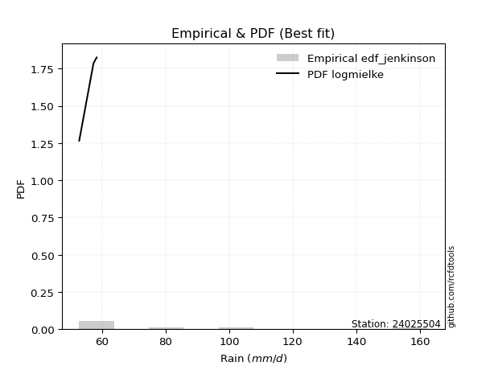</img>

</div>


### 11. EDF Cunnane (1978)

Cunnane´s work in statistical hydrology has focused on the performance and evaluation of different probability distributions (such as GEV, Gumbel, Lognormal) for flood frequency estimation. _b_ is a constant, typically set to 0.4.

<div align="center">


$P=(m-b)/(n+1-2b)$


</div>


**11.1. Empirical values**

<div align="center">

|                | 0                   | 1                   | 2                  | 3           | 4                  | 5                  | 6                  |
|:---------------|:--------------------|:--------------------|:-------------------|:------------|:-------------------|:-------------------|:-------------------|
| date           | 2017                | 2018                | 2019               | 2021        | 2016               | 2020               | 2024               |
| x              | 52.8                | 57.3                | 58.3               | 63.1        | 85.1               | 97.4               | 162.4              |
| m              | 1                   | 2                   | 3                  | 4           | 5                  | 6                  | 7                  |
| empirical_dist | edf_cunnane         | edf_cunnane         | edf_cunnane        | edf_cunnane | edf_cunnane        | edf_cunnane        | edf_cunnane        |
| empirical      | 0.08333333333333333 | 0.22222222222222224 | 0.3611111111111111 | 0.5         | 0.6388888888888888 | 0.7777777777777777 | 0.9166666666666666 |
| empirical_tr   | 1.090909090909091   | 1.2857142857142856  | 1.565217391304348  | 2.0         | 2.7692307692307687 | 4.499999999999998  | 11.999999999999995 |

</div>


**11.2. Kolmogorov-Smirnov fit test (sorted by Δ)**


<div align="center">

|                | 0                   | 1                   | 2                   | 3                   | 4                   | 5                   | 6                   | 7                   | 8                   | 9                   | 10                  | 11                  | 12                  | 13                  | 14                  | 15                  | 16                  | 17                  | 18                  | 19                  | 20                  | 21                  | 22                  | 23                  | 24                  | 25                  | 26                  | 27                  | 28                    | 29                  | 30                  | 31                  | 32                  | 33                  | 34                  | 35                  | 36                  | 37                  | 38                  | 39                  | 40                  | 41                  | 42                  | 43                  | 44                  | 45                  | 46                  | 47                  | 48                  | 49                  | 50                  | 51                  | 52                  | 53                  | 54                  | 55                  | 56                  | 57                  | 58                  | 59                  | 60                  | 61                  | 62                  | 63                  | 64                  | 65                  | 66                  | 67                  | 68                  | 69                  | 70                  | 71                  | 72                  | 73                  | 74                  | 75                  | 76                  | 77                  | 78                  | 79                  | 80                  | 81                  | 82                  | 83                  | 84                  | 85                  | 86                  | 87                  |
|:---------------|:--------------------|:--------------------|:--------------------|:--------------------|:--------------------|:--------------------|:--------------------|:--------------------|:--------------------|:--------------------|:--------------------|:--------------------|:--------------------|:--------------------|:--------------------|:--------------------|:--------------------|:--------------------|:--------------------|:--------------------|:--------------------|:--------------------|:--------------------|:--------------------|:--------------------|:--------------------|:--------------------|:--------------------|:----------------------|:--------------------|:--------------------|:--------------------|:--------------------|:--------------------|:--------------------|:--------------------|:--------------------|:--------------------|:--------------------|:--------------------|:--------------------|:--------------------|:--------------------|:--------------------|:--------------------|:--------------------|:--------------------|:--------------------|:--------------------|:--------------------|:--------------------|:--------------------|:--------------------|:--------------------|:--------------------|:--------------------|:--------------------|:--------------------|:--------------------|:--------------------|:--------------------|:--------------------|:--------------------|:--------------------|:--------------------|:--------------------|:--------------------|:--------------------|:--------------------|:--------------------|:--------------------|:--------------------|:--------------------|:--------------------|:--------------------|:--------------------|:--------------------|:--------------------|:--------------------|:--------------------|:--------------------|:--------------------|:--------------------|:--------------------|:--------------------|:--------------------|:--------------------|:--------------------|
| station        | 24025504            | 24025504            | 24025504            | 24025504            | 24025504            | 24025504            | 24025504            | 24025504            | 24025504            | 24025504            | 24025504            | 24025504            | 24025504            | 24025504            | 24025504            | 24025504            | 24025504            | 24025504            | 24025504            | 24025504            | 24025504            | 24025504            | 24025504            | 24025504            | 24025504            | 24025504            | 24025504            | 24025504            | 24025504              | 24025504            | 24025504            | 24025504            | 24025504            | 24025504            | 24025504            | 24025504            | 24025504            | 24025504            | 24025504            | 24025504            | 24025504            | 24025504            | 24025504            | 24025504            | 24025504            | 24025504            | 24025504            | 24025504            | 24025504            | 24025504            | 24025504            | 24025504            | 24025504            | 24025504            | 24025504            | 24025504            | 24025504            | 24025504            | 24025504            | 24025504            | 24025504            | 24025504            | 24025504            | 24025504            | 24025504            | 24025504            | 24025504            | 24025504            | 24025504            | 24025504            | 24025504            | 24025504            | 24025504            | 24025504            | 24025504            | 24025504            | 24025504            | 24025504            | 24025504            | 24025504            | 24025504            | 24025504            | 24025504            | 24025504            | 24025504            | 24025504            | 24025504            | 24025504            |
| empirical_dist | edf_cunnane         | edf_cunnane         | edf_cunnane         | edf_cunnane         | edf_cunnane         | edf_cunnane         | edf_cunnane         | edf_cunnane         | edf_cunnane         | edf_cunnane         | edf_cunnane         | edf_cunnane         | edf_cunnane         | edf_cunnane         | edf_cunnane         | edf_cunnane         | edf_cunnane         | edf_cunnane         | edf_cunnane         | edf_cunnane         | edf_cunnane         | edf_cunnane         | edf_cunnane         | edf_cunnane         | edf_cunnane         | edf_cunnane         | edf_cunnane         | edf_cunnane         | edf_cunnane           | edf_cunnane         | edf_cunnane         | edf_cunnane         | edf_cunnane         | edf_cunnane         | edf_cunnane         | edf_cunnane         | edf_cunnane         | edf_cunnane         | edf_cunnane         | edf_cunnane         | edf_cunnane         | edf_cunnane         | edf_cunnane         | edf_cunnane         | edf_cunnane         | edf_cunnane         | edf_cunnane         | edf_cunnane         | edf_cunnane         | edf_cunnane         | edf_cunnane         | edf_cunnane         | edf_cunnane         | edf_cunnane         | edf_cunnane         | edf_cunnane         | edf_cunnane         | edf_cunnane         | edf_cunnane         | edf_cunnane         | edf_cunnane         | edf_cunnane         | edf_cunnane         | edf_cunnane         | edf_cunnane         | edf_cunnane         | edf_cunnane         | edf_cunnane         | edf_cunnane         | edf_cunnane         | edf_cunnane         | edf_cunnane         | edf_cunnane         | edf_cunnane         | edf_cunnane         | edf_cunnane         | edf_cunnane         | edf_cunnane         | edf_cunnane         | edf_cunnane         | edf_cunnane         | edf_cunnane         | edf_cunnane         | edf_cunnane         | edf_cunnane         | edf_cunnane         | edf_cunnane         | edf_cunnane         |
| p_dist         | logalpha            | logmielke           | logjohnsonsu        | invgamma            | f                   | invgauss            | logfatiguelife      | loghalfnorm         | loghalflogistic     | loginvweibull       | alpha               | loggenexpon         | logexponnorm        | logexpon            | fatiguelife         | loginvgauss         | loginvgamma         | logf                | loggompertz         | halflogistic        | logtruncnorm        | pearson3            | logmoyal            | mielke              | logpearson3         | lograyleigh         | erlang              | halfnorm            | loglaplace_asymmetric | lognakagami         | loggumbel_r         | moyal               | rayleigh            | wald                | gamma               | logmaxwell          | loggenlogistic      | gumbel_r            | logfisk             | maxwell             | lognct              | ncf                 | logbetaprime        | betaprime           | nct                 | logkstwobign        | logloggamma         | logt                | logcrystalball      | lognorm             | lognorm             | loggamma            | loggamma            | crystalball         | norm                | genlogistic         | nakagami            | exponnorm           | expon               | genexpon            | laplace_asymmetric  | gompertz            | loglogistic         | logncf              | logwald             | logrice             | logistic            | weibull_min         | logchi2             | loghypsecant        | kstwobign           | t                   | hypsecant           | loggumbel_l         | truncnorm           | gumbel_l            | rice                | loglaplace          | laplace             | johnsonsu           | logweibull_min      | gibrat              | fisk                | logerlang           | loggibrat           | loglognorm          | invweibull          | chi2                |
| delta          | 0.10611956006144363 | 0.11442555500151252 | 0.11487067234379    | 0.11866899077039317 | 0.11866910093163952 | 0.11924935136509218 | 0.11927084699378576 | 0.12334303589686124 | 0.12387717453777009 | 0.12410851601305894 | 0.12465173982399791 | 0.12472620758769826 | 0.12472804948259814 | 0.12475095664348773 | 0.12607763547305348 | 0.12620186763728336 | 0.12660660920129574 | 0.1266506090714976  | 0.13001866481043814 | 0.13652277567764132 | 0.13716151706012597 | 0.1475243297936245  | 0.14889483476006315 | 0.14998780151797797 | 0.1525155984496857  | 0.15499639727452413 | 0.1552118826472666  | 0.1553366058239054  | 0.15652753583664708   | 0.15703930999347823 | 0.15985627860589852 | 0.1623179038180308  | 0.1648699857574341  | 0.16561244984164986 | 0.16590464863163046 | 0.16617495453757786 | 0.16640948663494137 | 0.17162356714884786 | 0.17530373407213207 | 0.17578480563498528 | 0.17738417502657083 | 0.17958988553287225 | 0.18011940858006303 | 0.18269179124422247 | 0.1839741260405935  | 0.1873907671966335  | 0.19060608621508196 | 0.19453754998694994 | 0.1945867900332507  | 0.1945867905270312  | 0.1945867905270312  | 0.19702132589157295 | 0.19702132589157295 | 0.20330961033169942 | 0.2033096179222501  | 0.20394513608261583 | 0.20472228691255237 | 0.20509534499688542 | 0.20564285907397156 | 0.20564355332055118 | 0.2057225795824872  | 0.21088013433548886 | 0.21565947125459578 | 0.21799543369689212 | 0.2185438531215401  | 0.22233362605067036 | 0.22481363659979164 | 0.22776820966187827 | 0.2295609847126292  | 0.23100798042564036 | 0.23133513995051908 | 0.2380256151904223  | 0.24025394952465706 | 0.24652777242376683 | 0.25128229656497214 | 0.2534592561776997  | 0.2544632019418043  | 0.25654719945207094 | 0.2650205076016512  | 0.282813517610498   | 0.2988547640595819  | 0.30353495366563754 | 0.30954768802443766 | 0.3416618572345753  | 0.3533484126601302  | 0.39736706317164106 | 0.4694429320759269  | 0.7139957005984408  |
| deltao         | 0.48442053926100004 | 0.48442053926100004 | 0.48442053926100004 | 0.48442053926100004 | 0.48442053926100004 | 0.48442053926100004 | 0.48442053926100004 | 0.48442053926100004 | 0.48442053926100004 | 0.48442053926100004 | 0.48442053926100004 | 0.48442053926100004 | 0.48442053926100004 | 0.48442053926100004 | 0.48442053926100004 | 0.48442053926100004 | 0.48442053926100004 | 0.48442053926100004 | 0.48442053926100004 | 0.48442053926100004 | 0.48442053926100004 | 0.48442053926100004 | 0.48442053926100004 | 0.48442053926100004 | 0.48442053926100004 | 0.48442053926100004 | 0.48442053926100004 | 0.48442053926100004 | 0.48442053926100004   | 0.48442053926100004 | 0.48442053926100004 | 0.48442053926100004 | 0.48442053926100004 | 0.48442053926100004 | 0.48442053926100004 | 0.48442053926100004 | 0.48442053926100004 | 0.48442053926100004 | 0.48442053926100004 | 0.48442053926100004 | 0.48442053926100004 | 0.48442053926100004 | 0.48442053926100004 | 0.48442053926100004 | 0.48442053926100004 | 0.48442053926100004 | 0.48442053926100004 | 0.48442053926100004 | 0.48442053926100004 | 0.48442053926100004 | 0.48442053926100004 | 0.48442053926100004 | 0.48442053926100004 | 0.48442053926100004 | 0.48442053926100004 | 0.48442053926100004 | 0.48442053926100004 | 0.48442053926100004 | 0.48442053926100004 | 0.48442053926100004 | 0.48442053926100004 | 0.48442053926100004 | 0.48442053926100004 | 0.48442053926100004 | 0.48442053926100004 | 0.48442053926100004 | 0.48442053926100004 | 0.48442053926100004 | 0.48442053926100004 | 0.48442053926100004 | 0.48442053926100004 | 0.48442053926100004 | 0.48442053926100004 | 0.48442053926100004 | 0.48442053926100004 | 0.48442053926100004 | 0.48442053926100004 | 0.48442053926100004 | 0.48442053926100004 | 0.48442053926100004 | 0.48442053926100004 | 0.48442053926100004 | 0.48442053926100004 | 0.48442053926100004 | 0.48442053926100004 | 0.48442053926100004 | 0.48442053926100004 | 0.48442053926100004 |
| eval           | Δo > Δ              | Δo > Δ              | Δo > Δ              | Δo > Δ              | Δo > Δ              | Δo > Δ              | Δo > Δ              | Δo > Δ              | Δo > Δ              | Δo > Δ              | Δo > Δ              | Δo > Δ              | Δo > Δ              | Δo > Δ              | Δo > Δ              | Δo > Δ              | Δo > Δ              | Δo > Δ              | Δo > Δ              | Δo > Δ              | Δo > Δ              | Δo > Δ              | Δo > Δ              | Δo > Δ              | Δo > Δ              | Δo > Δ              | Δo > Δ              | Δo > Δ              | Δo > Δ                | Δo > Δ              | Δo > Δ              | Δo > Δ              | Δo > Δ              | Δo > Δ              | Δo > Δ              | Δo > Δ              | Δo > Δ              | Δo > Δ              | Δo > Δ              | Δo > Δ              | Δo > Δ              | Δo > Δ              | Δo > Δ              | Δo > Δ              | Δo > Δ              | Δo > Δ              | Δo > Δ              | Δo > Δ              | Δo > Δ              | Δo > Δ              | Δo > Δ              | Δo > Δ              | Δo > Δ              | Δo > Δ              | Δo > Δ              | Δo > Δ              | Δo > Δ              | Δo > Δ              | Δo > Δ              | Δo > Δ              | Δo > Δ              | Δo > Δ              | Δo > Δ              | Δo > Δ              | Δo > Δ              | Δo > Δ              | Δo > Δ              | Δo > Δ              | Δo > Δ              | Δo > Δ              | Δo > Δ              | Δo > Δ              | Δo > Δ              | Δo > Δ              | Δo > Δ              | Δo > Δ              | Δo > Δ              | Δo > Δ              | Δo > Δ              | Δo > Δ              | Δo > Δ              | Δo > Δ              | Δo > Δ              | Δo > Δ              | Δo > Δ              | Δo > Δ              | Δo > Δ              | Δo <= Δ             |
| fit            | 1                   | 1                   | 1                   | 1                   | 1                   | 1                   | 1                   | 1                   | 1                   | 1                   | 1                   | 1                   | 1                   | 1                   | 1                   | 1                   | 1                   | 1                   | 1                   | 1                   | 1                   | 1                   | 1                   | 1                   | 1                   | 1                   | 1                   | 1                   | 1                     | 1                   | 1                   | 1                   | 1                   | 1                   | 1                   | 1                   | 1                   | 1                   | 1                   | 1                   | 1                   | 1                   | 1                   | 1                   | 1                   | 1                   | 1                   | 1                   | 1                   | 1                   | 1                   | 1                   | 1                   | 1                   | 1                   | 1                   | 1                   | 1                   | 1                   | 1                   | 1                   | 1                   | 1                   | 1                   | 1                   | 1                   | 1                   | 1                   | 1                   | 1                   | 1                   | 1                   | 1                   | 1                   | 1                   | 1                   | 1                   | 1                   | 1                   | 1                   | 1                   | 1                   | 1                   | 1                   | 1                   | 1                   | 1                   | 0                   |
| n              | 7                   | 7                   | 7                   | 7                   | 7                   | 7                   | 7                   | 7                   | 7                   | 7                   | 7                   | 7                   | 7                   | 7                   | 7                   | 7                   | 7                   | 7                   | 7                   | 7                   | 7                   | 7                   | 7                   | 7                   | 7                   | 7                   | 7                   | 7                   | 7                     | 7                   | 7                   | 7                   | 7                   | 7                   | 7                   | 7                   | 7                   | 7                   | 7                   | 7                   | 7                   | 7                   | 7                   | 7                   | 7                   | 7                   | 7                   | 7                   | 7                   | 7                   | 7                   | 7                   | 7                   | 7                   | 7                   | 7                   | 7                   | 7                   | 7                   | 7                   | 7                   | 7                   | 7                   | 7                   | 7                   | 7                   | 7                   | 7                   | 7                   | 7                   | 7                   | 7                   | 7                   | 7                   | 7                   | 7                   | 7                   | 7                   | 7                   | 7                   | 7                   | 7                   | 7                   | 7                   | 7                   | 7                   | 7                   | 7                   |
| best_fit       | 1                   | 0                   | 0                   | 0                   | 0                   | 0                   | 0                   | 0                   | 0                   | 0                   | 0                   | 0                   | 0                   | 0                   | 0                   | 0                   | 0                   | 0                   | 0                   | 0                   | 0                   | 0                   | 0                   | 0                   | 0                   | 0                   | 0                   | 0                   | 0                     | 0                   | 0                   | 0                   | 0                   | 0                   | 0                   | 0                   | 0                   | 0                   | 0                   | 0                   | 0                   | 0                   | 0                   | 0                   | 0                   | 0                   | 0                   | 0                   | 0                   | 0                   | 0                   | 0                   | 0                   | 0                   | 0                   | 0                   | 0                   | 0                   | 0                   | 0                   | 0                   | 0                   | 0                   | 0                   | 0                   | 0                   | 0                   | 0                   | 0                   | 0                   | 0                   | 0                   | 0                   | 0                   | 0                   | 0                   | 0                   | 0                   | 0                   | 0                   | 0                   | 0                   | 0                   | 0                   | 0                   | 0                   | 0                   | 0                   |
| best_fit_sort  | 1                   | 2                   | 3                   | 4                   | 5                   | 6                   | 7                   | 8                   | 9                   | 10                  | 11                  | 12                  | 13                  | 14                  | 15                  | 16                  | 17                  | 18                  | 19                  | 20                  | 21                  | 22                  | 23                  | 24                  | 25                  | 26                  | 27                  | 28                  | 29                    | 30                  | 31                  | 32                  | 33                  | 34                  | 35                  | 36                  | 37                  | 38                  | 39                  | 40                  | 41                  | 42                  | 43                  | 44                  | 45                  | 46                  | 47                  | 48                  | 49                  | 50                  | 51                  | 52                  | 53                  | 54                  | 55                  | 56                  | 57                  | 58                  | 59                  | 60                  | 61                  | 62                  | 63                  | 64                  | 65                  | 66                  | 67                  | 68                  | 69                  | 70                  | 71                  | 72                  | 73                  | 74                  | 75                  | 76                  | 77                  | 78                  | 79                  | 80                  | 81                  | 82                  | 83                  | 84                  | 85                  | 86                  | 87                  | 88                  |

</div>


**11.3. Best fit**

<div align="center">

|   id |   station | empirical_dist   | p_dist   |   delta |   deltao | eval   |   fit |   n |   best_fit |   best_fit_sort |
|-----:|----------:|:-----------------|:---------|--------:|---------:|:-------|------:|----:|-----------:|----------------:|
|    0 |  24025504 | edf_cunnane      | logalpha | 0.10612 | 0.484421 | Δo > Δ |     1 |   7 |          1 |               1 |

</div>


<div align="center">

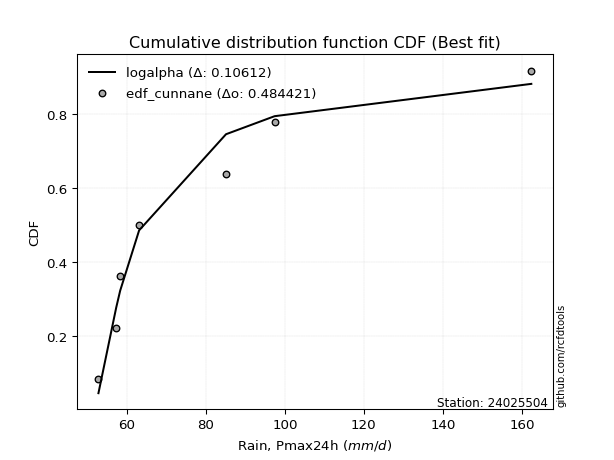</img>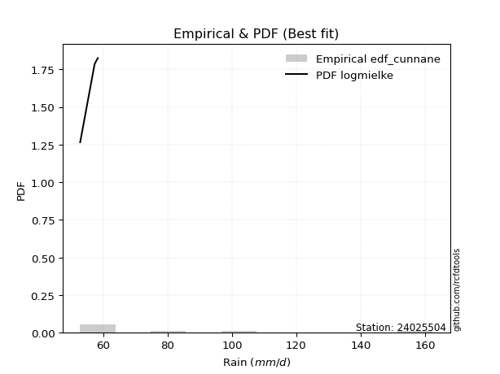</img>

</div>


### 12. EDF Adamowski (1981)

The Adamowski formula in hydrology refers to a specific plotting position formula used for estimating the non-parametric empirical distribution of hydrological events (like flood peaks) to calculate their return periods. This formula provides an alternative to traditional parametric methods (like the Gumbel or Log Pearson Type III distributions). 

<div align="center">


$P=(m-0.25)/(n+0.5)$


</div>


**12.1. Empirical values**

<div align="center">

|                | 0                  | 1                   | 2                   | 3             | 4                  | 5                  | 6                  |
|:---------------|:-------------------|:--------------------|:--------------------|:--------------|:-------------------|:-------------------|:-------------------|
| date           | 2017               | 2018                | 2019                | 2021          | 2016               | 2020               | 2024               |
| x              | 52.8               | 57.3                | 58.3                | 63.1          | 85.1               | 97.4               | 162.4              |
| m              | 1                  | 2                   | 3                   | 4             | 5                  | 6                  | 7                  |
| empirical_dist | edf_adamowski      | edf_adamowski       | edf_adamowski       | edf_adamowski | edf_adamowski      | edf_adamowski      | edf_adamowski      |
| empirical      | 0.1                | 0.23333333333333334 | 0.36666666666666664 | 0.5           | 0.6333333333333333 | 0.7666666666666667 | 0.9                |
| empirical_tr   | 1.1111111111111112 | 1.3043478260869565  | 1.5789473684210527  | 2.0           | 2.727272727272727  | 4.2857142857142865 | 10.000000000000002 |

</div>


**12.2. Kolmogorov-Smirnov fit test (sorted by Δ)**


<div align="center">

|                | 0                   | 1                   | 2                   | 3                   | 4                   | 5                   | 6                   | 7                   | 8                   | 9                   | 10                  | 11                  | 12                  | 13                  | 14                  | 15                  | 16                  | 17                  | 18                  | 19                  | 20                  | 21                  | 22                  | 23                  | 24                  | 25                  | 26                  | 27                  | 28                  | 29                  | 30                  | 31                    | 32                  | 33                  | 34                  | 35                  | 36                  | 37                  | 38                  | 39                  | 40                  | 41                  | 42                  | 43                  | 44                  | 45                  | 46                  | 47                  | 48                  | 49                  | 50                  | 51                  | 52                  | 53                  | 54                  | 55                  | 56                  | 57                  | 58                  | 59                  | 60                  | 61                  | 62                  | 63                  | 64                  | 65                  | 66                  | 67                  | 68                  | 69                  | 70                  | 71                  | 72                  | 73                  | 74                  | 75                  | 76                  | 77                  | 78                  | 79                  | 80                  | 81                  | 82                  | 83                  | 84                  | 85                  | 86                  | 87                  |
|:---------------|:--------------------|:--------------------|:--------------------|:--------------------|:--------------------|:--------------------|:--------------------|:--------------------|:--------------------|:--------------------|:--------------------|:--------------------|:--------------------|:--------------------|:--------------------|:--------------------|:--------------------|:--------------------|:--------------------|:--------------------|:--------------------|:--------------------|:--------------------|:--------------------|:--------------------|:--------------------|:--------------------|:--------------------|:--------------------|:--------------------|:--------------------|:----------------------|:--------------------|:--------------------|:--------------------|:--------------------|:--------------------|:--------------------|:--------------------|:--------------------|:--------------------|:--------------------|:--------------------|:--------------------|:--------------------|:--------------------|:--------------------|:--------------------|:--------------------|:--------------------|:--------------------|:--------------------|:--------------------|:--------------------|:--------------------|:--------------------|:--------------------|:--------------------|:--------------------|:--------------------|:--------------------|:--------------------|:--------------------|:--------------------|:--------------------|:--------------------|:--------------------|:--------------------|:--------------------|:--------------------|:--------------------|:--------------------|:--------------------|:--------------------|:--------------------|:--------------------|:--------------------|:--------------------|:--------------------|:--------------------|:--------------------|:--------------------|:--------------------|:--------------------|:--------------------|:--------------------|:--------------------|:--------------------|
| station        | 24025504            | 24025504            | 24025504            | 24025504            | 24025504            | 24025504            | 24025504            | 24025504            | 24025504            | 24025504            | 24025504            | 24025504            | 24025504            | 24025504            | 24025504            | 24025504            | 24025504            | 24025504            | 24025504            | 24025504            | 24025504            | 24025504            | 24025504            | 24025504            | 24025504            | 24025504            | 24025504            | 24025504            | 24025504            | 24025504            | 24025504            | 24025504              | 24025504            | 24025504            | 24025504            | 24025504            | 24025504            | 24025504            | 24025504            | 24025504            | 24025504            | 24025504            | 24025504            | 24025504            | 24025504            | 24025504            | 24025504            | 24025504            | 24025504            | 24025504            | 24025504            | 24025504            | 24025504            | 24025504            | 24025504            | 24025504            | 24025504            | 24025504            | 24025504            | 24025504            | 24025504            | 24025504            | 24025504            | 24025504            | 24025504            | 24025504            | 24025504            | 24025504            | 24025504            | 24025504            | 24025504            | 24025504            | 24025504            | 24025504            | 24025504            | 24025504            | 24025504            | 24025504            | 24025504            | 24025504            | 24025504            | 24025504            | 24025504            | 24025504            | 24025504            | 24025504            | 24025504            | 24025504            |
| empirical_dist | edf_adamowski       | edf_adamowski       | edf_adamowski       | edf_adamowski       | edf_adamowski       | edf_adamowski       | edf_adamowski       | edf_adamowski       | edf_adamowski       | edf_adamowski       | edf_adamowski       | edf_adamowski       | edf_adamowski       | edf_adamowski       | edf_adamowski       | edf_adamowski       | edf_adamowski       | edf_adamowski       | edf_adamowski       | edf_adamowski       | edf_adamowski       | edf_adamowski       | edf_adamowski       | edf_adamowski       | edf_adamowski       | edf_adamowski       | edf_adamowski       | edf_adamowski       | edf_adamowski       | edf_adamowski       | edf_adamowski       | edf_adamowski         | edf_adamowski       | edf_adamowski       | edf_adamowski       | edf_adamowski       | edf_adamowski       | edf_adamowski       | edf_adamowski       | edf_adamowski       | edf_adamowski       | edf_adamowski       | edf_adamowski       | edf_adamowski       | edf_adamowski       | edf_adamowski       | edf_adamowski       | edf_adamowski       | edf_adamowski       | edf_adamowski       | edf_adamowski       | edf_adamowski       | edf_adamowski       | edf_adamowski       | edf_adamowski       | edf_adamowski       | edf_adamowski       | edf_adamowski       | edf_adamowski       | edf_adamowski       | edf_adamowski       | edf_adamowski       | edf_adamowski       | edf_adamowski       | edf_adamowski       | edf_adamowski       | edf_adamowski       | edf_adamowski       | edf_adamowski       | edf_adamowski       | edf_adamowski       | edf_adamowski       | edf_adamowski       | edf_adamowski       | edf_adamowski       | edf_adamowski       | edf_adamowski       | edf_adamowski       | edf_adamowski       | edf_adamowski       | edf_adamowski       | edf_adamowski       | edf_adamowski       | edf_adamowski       | edf_adamowski       | edf_adamowski       | edf_adamowski       | edf_adamowski       |
| p_dist         | logalpha            | fatiguelife         | logmielke           | logjohnsonsu        | loghalfnorm         | loghalflogistic     | invgamma            | f                   | invgauss            | logfatiguelife      | loginvweibull       | alpha               | loggenexpon         | logexponnorm        | logexpon            | loginvgauss         | loginvgamma         | logf                | loggompertz         | halflogistic        | halfnorm            | logtruncnorm        | lognakagami         | pearson3            | logmoyal            | logpearson3         | lograyleigh         | mielke              | logfisk             | loggumbel_r         | erlang              | loglaplace_asymmetric | moyal               | rayleigh            | wald                | logmaxwell          | loggenlogistic      | gamma               | gumbel_r            | maxwell             | lognct              | ncf                 | logbetaprime        | betaprime           | nct                 | logkstwobign        | logloggamma         | nakagami            | logt                | logcrystalball      | lognorm             | lognorm             | loggamma            | loggamma            | crystalball         | norm                | genlogistic         | exponnorm           | expon               | genexpon            | laplace_asymmetric  | gompertz            | loglogistic         | logncf              | logchi2             | logrice             | logwald             | logistic            | weibull_min         | loghypsecant        | kstwobign           | hypsecant           | t                   | loggumbel_l         | truncnorm           | gumbel_l            | rice                | loglaplace          | laplace             | johnsonsu           | logweibull_min      | fisk                | gibrat              | logerlang           | loggibrat           | loglognorm          | invweibull          | chi2                |
| delta          | 0.11167511561699917 | 0.11496652436194238 | 0.11998111055706806 | 0.12042622789934554 | 0.12334303589686124 | 0.12387717453777009 | 0.1242245463259487  | 0.12422465648719505 | 0.12480490692064772 | 0.1248264025493413  | 0.12966407156861448 | 0.13020729537955344 | 0.1302817631432538  | 0.13028360503815367 | 0.13030651219904327 | 0.1317574231928389  | 0.13216216475685127 | 0.13220616462705315 | 0.13557422036599368 | 0.13652277567764132 | 0.13866993915723874 | 0.1427170726156815  | 0.14592819888236713 | 0.1475243297936245  | 0.14889483476006315 | 0.1525155984496857  | 0.15499639727452413 | 0.1555433570735335  | 0.15863706740546546 | 0.15985627860589852 | 0.16076743820282213 | 0.16208309139220262   | 0.1623179038180308  | 0.1648699857574341  | 0.16576079290337953 | 0.16617495453757786 | 0.16640948663494137 | 0.171460204187186   | 0.17162356714884786 | 0.17578480563498528 | 0.17738417502657083 | 0.17958988553287225 | 0.18011940858006303 | 0.18269179124422247 | 0.1839741260405935  | 0.1873907671966335  | 0.19060608621508196 | 0.19361117580144127 | 0.19453754998694994 | 0.1945867900332507  | 0.1945867905270312  | 0.1945867905270312  | 0.2025768814471285  | 0.2025768814471285  | 0.20330961033169942 | 0.2033096179222501  | 0.20394513608261583 | 0.20509534499688542 | 0.20564285907397156 | 0.20564355332055118 | 0.2057225795824872  | 0.21088013433548886 | 0.21565947125459578 | 0.21799543369689212 | 0.21844987360151824 | 0.22233362605067036 | 0.22409940867709563 | 0.22481363659979164 | 0.22776820966187827 | 0.23100798042564036 | 0.23133513995051908 | 0.24025394952465706 | 0.24358117074597785 | 0.24652777242376683 | 0.25128229656497214 | 0.2534592561776997  | 0.2544632019418043  | 0.25654719945207094 | 0.2650205076016512  | 0.2717024064993869  | 0.2821880973929153  | 0.29288102135777105 | 0.3090905092211931  | 0.3305507461234642  | 0.3589039682156857  | 0.38625595206052993 | 0.4527762654092603  | 0.7028845894873297  |
| deltao         | 0.48442053926100004 | 0.48442053926100004 | 0.48442053926100004 | 0.48442053926100004 | 0.48442053926100004 | 0.48442053926100004 | 0.48442053926100004 | 0.48442053926100004 | 0.48442053926100004 | 0.48442053926100004 | 0.48442053926100004 | 0.48442053926100004 | 0.48442053926100004 | 0.48442053926100004 | 0.48442053926100004 | 0.48442053926100004 | 0.48442053926100004 | 0.48442053926100004 | 0.48442053926100004 | 0.48442053926100004 | 0.48442053926100004 | 0.48442053926100004 | 0.48442053926100004 | 0.48442053926100004 | 0.48442053926100004 | 0.48442053926100004 | 0.48442053926100004 | 0.48442053926100004 | 0.48442053926100004 | 0.48442053926100004 | 0.48442053926100004 | 0.48442053926100004   | 0.48442053926100004 | 0.48442053926100004 | 0.48442053926100004 | 0.48442053926100004 | 0.48442053926100004 | 0.48442053926100004 | 0.48442053926100004 | 0.48442053926100004 | 0.48442053926100004 | 0.48442053926100004 | 0.48442053926100004 | 0.48442053926100004 | 0.48442053926100004 | 0.48442053926100004 | 0.48442053926100004 | 0.48442053926100004 | 0.48442053926100004 | 0.48442053926100004 | 0.48442053926100004 | 0.48442053926100004 | 0.48442053926100004 | 0.48442053926100004 | 0.48442053926100004 | 0.48442053926100004 | 0.48442053926100004 | 0.48442053926100004 | 0.48442053926100004 | 0.48442053926100004 | 0.48442053926100004 | 0.48442053926100004 | 0.48442053926100004 | 0.48442053926100004 | 0.48442053926100004 | 0.48442053926100004 | 0.48442053926100004 | 0.48442053926100004 | 0.48442053926100004 | 0.48442053926100004 | 0.48442053926100004 | 0.48442053926100004 | 0.48442053926100004 | 0.48442053926100004 | 0.48442053926100004 | 0.48442053926100004 | 0.48442053926100004 | 0.48442053926100004 | 0.48442053926100004 | 0.48442053926100004 | 0.48442053926100004 | 0.48442053926100004 | 0.48442053926100004 | 0.48442053926100004 | 0.48442053926100004 | 0.48442053926100004 | 0.48442053926100004 | 0.48442053926100004 |
| eval           | Δo > Δ              | Δo > Δ              | Δo > Δ              | Δo > Δ              | Δo > Δ              | Δo > Δ              | Δo > Δ              | Δo > Δ              | Δo > Δ              | Δo > Δ              | Δo > Δ              | Δo > Δ              | Δo > Δ              | Δo > Δ              | Δo > Δ              | Δo > Δ              | Δo > Δ              | Δo > Δ              | Δo > Δ              | Δo > Δ              | Δo > Δ              | Δo > Δ              | Δo > Δ              | Δo > Δ              | Δo > Δ              | Δo > Δ              | Δo > Δ              | Δo > Δ              | Δo > Δ              | Δo > Δ              | Δo > Δ              | Δo > Δ                | Δo > Δ              | Δo > Δ              | Δo > Δ              | Δo > Δ              | Δo > Δ              | Δo > Δ              | Δo > Δ              | Δo > Δ              | Δo > Δ              | Δo > Δ              | Δo > Δ              | Δo > Δ              | Δo > Δ              | Δo > Δ              | Δo > Δ              | Δo > Δ              | Δo > Δ              | Δo > Δ              | Δo > Δ              | Δo > Δ              | Δo > Δ              | Δo > Δ              | Δo > Δ              | Δo > Δ              | Δo > Δ              | Δo > Δ              | Δo > Δ              | Δo > Δ              | Δo > Δ              | Δo > Δ              | Δo > Δ              | Δo > Δ              | Δo > Δ              | Δo > Δ              | Δo > Δ              | Δo > Δ              | Δo > Δ              | Δo > Δ              | Δo > Δ              | Δo > Δ              | Δo > Δ              | Δo > Δ              | Δo > Δ              | Δo > Δ              | Δo > Δ              | Δo > Δ              | Δo > Δ              | Δo > Δ              | Δo > Δ              | Δo > Δ              | Δo > Δ              | Δo > Δ              | Δo > Δ              | Δo > Δ              | Δo > Δ              | Δo <= Δ             |
| fit            | 1                   | 1                   | 1                   | 1                   | 1                   | 1                   | 1                   | 1                   | 1                   | 1                   | 1                   | 1                   | 1                   | 1                   | 1                   | 1                   | 1                   | 1                   | 1                   | 1                   | 1                   | 1                   | 1                   | 1                   | 1                   | 1                   | 1                   | 1                   | 1                   | 1                   | 1                   | 1                     | 1                   | 1                   | 1                   | 1                   | 1                   | 1                   | 1                   | 1                   | 1                   | 1                   | 1                   | 1                   | 1                   | 1                   | 1                   | 1                   | 1                   | 1                   | 1                   | 1                   | 1                   | 1                   | 1                   | 1                   | 1                   | 1                   | 1                   | 1                   | 1                   | 1                   | 1                   | 1                   | 1                   | 1                   | 1                   | 1                   | 1                   | 1                   | 1                   | 1                   | 1                   | 1                   | 1                   | 1                   | 1                   | 1                   | 1                   | 1                   | 1                   | 1                   | 1                   | 1                   | 1                   | 1                   | 1                   | 0                   |
| n              | 7                   | 7                   | 7                   | 7                   | 7                   | 7                   | 7                   | 7                   | 7                   | 7                   | 7                   | 7                   | 7                   | 7                   | 7                   | 7                   | 7                   | 7                   | 7                   | 7                   | 7                   | 7                   | 7                   | 7                   | 7                   | 7                   | 7                   | 7                   | 7                   | 7                   | 7                   | 7                     | 7                   | 7                   | 7                   | 7                   | 7                   | 7                   | 7                   | 7                   | 7                   | 7                   | 7                   | 7                   | 7                   | 7                   | 7                   | 7                   | 7                   | 7                   | 7                   | 7                   | 7                   | 7                   | 7                   | 7                   | 7                   | 7                   | 7                   | 7                   | 7                   | 7                   | 7                   | 7                   | 7                   | 7                   | 7                   | 7                   | 7                   | 7                   | 7                   | 7                   | 7                   | 7                   | 7                   | 7                   | 7                   | 7                   | 7                   | 7                   | 7                   | 7                   | 7                   | 7                   | 7                   | 7                   | 7                   | 7                   |
| best_fit       | 1                   | 0                   | 0                   | 0                   | 0                   | 0                   | 0                   | 0                   | 0                   | 0                   | 0                   | 0                   | 0                   | 0                   | 0                   | 0                   | 0                   | 0                   | 0                   | 0                   | 0                   | 0                   | 0                   | 0                   | 0                   | 0                   | 0                   | 0                   | 0                   | 0                   | 0                   | 0                     | 0                   | 0                   | 0                   | 0                   | 0                   | 0                   | 0                   | 0                   | 0                   | 0                   | 0                   | 0                   | 0                   | 0                   | 0                   | 0                   | 0                   | 0                   | 0                   | 0                   | 0                   | 0                   | 0                   | 0                   | 0                   | 0                   | 0                   | 0                   | 0                   | 0                   | 0                   | 0                   | 0                   | 0                   | 0                   | 0                   | 0                   | 0                   | 0                   | 0                   | 0                   | 0                   | 0                   | 0                   | 0                   | 0                   | 0                   | 0                   | 0                   | 0                   | 0                   | 0                   | 0                   | 0                   | 0                   | 0                   |
| best_fit_sort  | 1                   | 2                   | 3                   | 4                   | 5                   | 6                   | 7                   | 8                   | 9                   | 10                  | 11                  | 12                  | 13                  | 14                  | 15                  | 16                  | 17                  | 18                  | 19                  | 20                  | 21                  | 22                  | 23                  | 24                  | 25                  | 26                  | 27                  | 28                  | 29                  | 30                  | 31                  | 32                    | 33                  | 34                  | 35                  | 36                  | 37                  | 38                  | 39                  | 40                  | 41                  | 42                  | 43                  | 44                  | 45                  | 46                  | 47                  | 48                  | 49                  | 50                  | 51                  | 52                  | 53                  | 54                  | 55                  | 56                  | 57                  | 58                  | 59                  | 60                  | 61                  | 62                  | 63                  | 64                  | 65                  | 66                  | 67                  | 68                  | 69                  | 70                  | 71                  | 72                  | 73                  | 74                  | 75                  | 76                  | 77                  | 78                  | 79                  | 80                  | 81                  | 82                  | 83                  | 84                  | 85                  | 86                  | 87                  | 88                  |

</div>


**12.3. Best fit**

<div align="center">

|   id |   station | empirical_dist   | p_dist   |    delta |   deltao | eval   |   fit |   n |   best_fit |   best_fit_sort |
|-----:|----------:|:-----------------|:---------|---------:|---------:|:-------|------:|----:|-----------:|----------------:|
|    0 |  24025504 | edf_adamowski    | logalpha | 0.111675 | 0.484421 | Δo > Δ |     1 |   7 |          1 |               1 |

</div>


<div align="center">

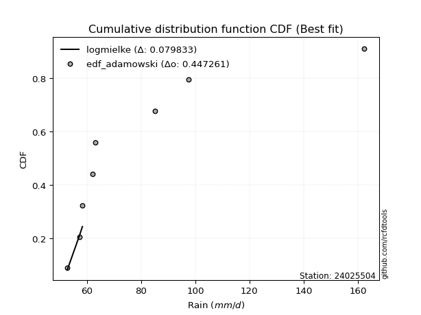</img>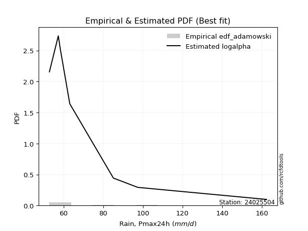</img>

</div>


## C. Best fit & Estimate extreme values for specific return periods - Tr

Best fit in probability distribution analysis means finding the theoretical distribution (like Normal, Poisson, Exponential) that most accurately mirrors your real-world data´s patterns (shape, center, spread) for better predictions, using methods like visual checks (Q-Q plots), goodness-of-fit tests (Kolmogorov-Smirnov, Chi-Squared), and information criteria (AIC) to score and select the simplest, most representative model.


### 1. Best fit (ordered by delta Δ)

<div align="center">

|   id |   station | empirical_dist   | p_dist      |    delta |   deltao | eval   |   fit |   n |   best_fit |   best_fit_sort |
|-----:|----------:|:-----------------|:------------|---------:|---------:|:-------|------:|----:|-----------:|----------------:|
|    0 |  24025504 | edf_hazen        | logalpha    | 0.102151 | 0.484421 | Δo > Δ |     1 |   7 |          1 |               1 |
|    1 |  24025504 | edf_gringorten   | logalpha    | 0.104559 | 0.484421 | Δo > Δ |     1 |   7 |          1 |               2 |
|    2 |  24025504 | edf_california   | fatiguelife | 0.105224 | 0.484421 | Δo > Δ |     1 |   7 |          1 |               3 |
|    3 |  24025504 | edf_cunnane      | logalpha    | 0.10612  | 0.484421 | Δo > Δ |     1 |   7 |          1 |               4 |
|    4 |  24025504 | edf_blom         | logalpha    | 0.107077 | 0.484421 | Δo > Δ |     1 |   7 |          1 |               5 |
|    5 |  24025504 | edf_tukey        | logalpha    | 0.108645 | 0.484421 | Δo > Δ |     1 |   7 |          1 |               6 |
|    6 |  24025504 | edf_filliben     | logalpha    | 0.109231 | 0.484421 | Δo > Δ |     1 |   7 |          1 |               7 |
|    7 |  24025504 | edf_jenkinson    | logalpha    | 0.109507 | 0.484421 | Δo > Δ |     1 |   7 |          1 |               8 |
|    8 |  24025504 | edf_beard        | logalpha    | 0.109507 | 0.484421 | Δo > Δ |     1 |   7 |          1 |               9 |
|    9 |  24025504 | edf_chegodayev   | logalpha    | 0.109873 | 0.484421 | Δo > Δ |     1 |   7 |          1 |              10 |
|   10 |  24025504 | edf_adamowski    | logalpha    | 0.111675 | 0.484421 | Δo > Δ |     1 |   7 |          1 |              11 |
|   11 |  24025504 | edf_weibull      | fatiguelife | 0.114651 | 0.484421 | Δo > Δ |     1 |   7 |          1 |              12 |

</div>

:file_folder:Tables: [bestfit_24025504.csv](table/bestfit_24025504.csv) | [extreme_24025504.csv](table/extreme_24025504.csv)


### 2. Extreme values

In hydrology, a return period (or recurrence interval $Tr$) is the statistical average time between extreme events like floods or droughts of a specific magnitude, indicating how rare an event is, with a 100-year flood, for example, having a 1% chance of occurring in any given year, not that it happens exactly every century. It is a key tool for infrastructure design (like bridges or dams) and risk assessment, calculated from historical data to determine the probability of future events, although it is important to remember it is statistical average, and events can cluster or be missed.

> risk_rate: assuming the return period as the project useful life.

|   id |      tr |   prob_l |     prob_g |     alpha |   betaprime |    chi2 |   crystalball |   erlang |    expon |   exponnorm |         f |   fatiguelife |             fisk |    gamma |   genexpon |   genlogistic |   gibrat |   gompertz |   gumbel_l |   gumbel_r |   halflogistic |   halfnorm |   hypsecant |   invgamma |   invgauss |       invweibull |   johnsonsu |   kstwobign |   laplace |   laplace_asymmetric |   loggamma |   logistic |   lognorm |   maxwell |   mielke |    moyal |   nakagami |      ncf |      nct |     norm |   pearson3 |   rayleigh |     rice |         t |   truncnorm |     wald |   weibull_min |        logalpha |   logbetaprime |          logchi2 |   logcrystalball |   logerlang |   logexpon |   logexponnorm |             logf |   logfatiguelife |           logfisk |   loggenexpon |   loggenlogistic |   loggibrat |   loggompertz |   loggumbel_l |   loggumbel_r |   loghalflogistic |   loghalfnorm |   loghypsecant |      loginvgamma |   loginvgauss |    loginvweibull |     logjohnsonsu |   logkstwobign |   loglaplace |   loglaplace_asymmetric |   logloggamma |   loglogistic |   loglognorm |   logmaxwell |   logmielke |   logmoyal |   lognakagami |   logncf |   lognct |   logpearson3 |   lograyleigh |   logrice |     logt |   logtruncnorm |   logwald |   logweibull_min |   station |   n |   risk_rate |
|-----:|--------:|---------:|-----------:|----------:|------------:|--------:|--------------:|---------:|---------:|------------:|----------:|--------------:|-----------------:|---------:|-----------:|--------------:|---------:|-----------:|-----------:|-----------:|---------------:|-----------:|------------:|-----------:|-----------:|-----------------:|------------:|------------:|----------:|---------------------:|-----------:|-----------:|----------:|----------:|---------:|---------:|-----------:|---------:|---------:|---------:|-----------:|-----------:|---------:|----------:|------------:|---------:|--------------:|----------------:|---------------:|-----------------:|-----------------:|------------:|-----------:|---------------:|-----------------:|-----------------:|------------------:|--------------:|-----------------:|------------:|--------------:|--------------:|--------------:|------------------:|--------------:|---------------:|-----------------:|--------------:|-----------------:|-----------------:|---------------:|-------------:|------------------------:|--------------:|--------------:|-------------:|-------------:|------------:|-----------:|--------------:|---------:|---------:|--------------:|--------------:|----------:|---------:|---------------:|----------:|-----------------:|----------:|----:|------------:|
|    0 |    2    | 0.5      | 0.5        |   64.0554 |     74.4019 | 52.8164 |       82.3429 |  63.1863 |  73.2775 |     73.2563 |   64.1963 |       62.7533 |     87.3864      |  64.4071 |    73.2776 |       75.3256 |  71.5251 |    73.7213 |    88.2635 |    76.4222 |        73.4787 |    74.9657 |     82.3429 |    64.1963 |    64.0509 |   2196.97        |     57.1111 |     78.6539 |   82.3429 |              73.2842 |    59.7489 |    82.3429 |   76.247  |   79.2606 |  65.9154 |  74.5108 |    62.1945 |  72.1484 |  73.5065 |  82.3429 |    74.2983 |    78.1674 |  82.5574 |   61.8193 |     77.7642 |  70.6605 |       83.6692 |    63.6705      |        74.8627 |     86.6819      |          76.247  |     55.7123 |    68.1165 |        68.1544 |     64.4105      |          63.0714 |     70.9885       |       68.1145 |          70.9252 |     68.1943 |       68.4713 |       81.0508 |       71.728  |           69.5821 |       70.658  |        76.247  |     64.413       |       64.0559 |     64.198       |     63.7361      |        72.5556 |      76.247  |                 68.8138 |       76.3179 |       76.247  |  52.9135     |      73.86   |     66.2151 |    70.3271 |       62.2882 |  76.8009 |  73.5531 |       71.8643 |       73.0315 |   75.6664 |  76.2415 |        68.7284 |   67.5876 |    69.6972       |  24025504 |   7 |    0.75     |
|    1 |    2.33 | 0.570815 | 0.429185   |   67.2727 |     79.3224 | 52.8491 |       88.7741 |  66.5878 |  77.7894 |     77.7689 |   67.5526 |       66.9272 |    126.442       |  67.5878 |    77.7894 |       79.9298 |  74.7829 |    78.3309 |    93.8587 |    82.3814 |        79.6058 |    81.9066 |     87.4897 |    67.5526 |    67.5516 | 146834           |     60.7047 |     83.8552 |   86.2347 |              77.7975 |    62.3216 |    88.0092 |   81.4789 |   85.9421 |  69.0118 |  80.152  |    70.2292 |  76.5315 |  78.1279 |  88.7741 |    80.3786 |    84.9478 |  88.1773 |   64.2683 |     83.2639 |  74.8775 |       93.6537 |    67.0612      |        80.0115 |    103.57        |          81.4789 |     57.5092 |    72.0486 |        72.1033 |     67.5829      |          66.6223 |     80.7458       |       72.0459 |          74.8535 |     70.5256 |       72.4431 |       85.8683 |       76.2774 |           74.1236 |       75.9046 |        80.4062 |     67.586       |       67.3583 |     67.3733      |     67.1968      |        76.8551 |      79.3716 |                 72.6713 |       81.6892 |       80.8384 |  53.7665     |      79.1323 |     69.1296 |    74.5426 |       66.6336 |  81.8616 |  78.298  |       76.7066 |       78.3244 |   80.3745 |  81.4724 |        72.5968 |   70.5937 |   101.077        |  24025504 |   7 |    0.729209 |
|    2 |    5    | 0.8      | 0.2        |   92.2205 |    101.776  | 53.6662 |      112.674  |  85.8833 | 100.347  |    100.331  |   93.44   |       96.8208 |   1415.6         |  84.5421 |   100.348  |       99.9307 |  93.5389 |   101.378  |   111.935  |   108.271  |       107.329  |   111.259  |    108.135  |    93.44   |    92.5975 |      1.38206e+13 |    128.025  |    105.949  |  105.693  |             100.363  |    79.454  |   109.888  |  104.269  |  112.24   |  86.4917 | 106.282  |   139.75   |  99.6072 | 100.21   | 112.674  |   107.829  |   112.093  | 110.676  |   75.7791 |    110.756  |  98.4844 |      153.821  |    99.5823      |       103.137  |    295.054       |         104.269  |     73.1576 |    95.3856 |        95.5555 |     91.6651      |          93.2781 |    292.974        |       95.3788 |          94.6045 |     85.5844 |       95.5433 |      103.477  |       99.6377 |           98.6742 |      102.758  |        99.498  |     91.6742      |       91.4641 |     92.6027      |     94.8317      |        98.1467 |      97.0221 |                 95.4539 |      105.086  |      101.314  |   4.1108e+23 |     103.804  |     85.8406 |    97.6138 |       95.6917 | 105.138  | 100.433  |      101.192  |      103.646  |  102.345  | 104.259  |        93.3254 |   90.0665 |     1.29239e+06  |  24025504 |   7 |    0.67232  |
|    3 |   10    | 0.9      | 0.1        |  138.056  |    121.354  | 55.5726 |      128.529  | 105.271  | 120.825  |    120.812  |  139.832  |      132.068  |  11741.2         | 100.771  |   120.825  |      116.22   | 114.919  |   122.299  |   121.998  |   129.358  |       130.353  |   132.979  |    124.621  |   139.832  |   127.477  |      4.31634e+19 |    388.114  |    122.771  |  123.357  |             120.847  |   101.704  |   126      |  122.804  |  130.748  | 107.2    | 129.033  |   217.173  | 124.054  | 120.849  | 128.529  |   130.529  |   131.448  | 126.719  |   90.0486 |    135.707  | 123.537  |      220.03   |   204.261       |       122.793  |    869.439       |         122.804  |     98.2855 |   123.056  |       123.389  |    139.092       |         134.414  |   6328.15         |      123.043  |         114.482  |    106.709  |      121.962  |      114.801  |      123.859  |          125.137  |      128.575  |       117.95   |    139.121       |      130.49   |    147.346       |    149.137       |       118.232  |     116.422  |                122.265  |      124.099  |      119.641  | inf          |     125.648  |    106.739  |   123.444  |      130.248  | 125.599  | 120.369  |      125.504  |      126.559  |  121.59   | 122.793  |       112.601  |  116.638  |     8.9999e+21   |  24025504 |   7 |    0.651322 |
|    4 |   15    | 0.933333 | 0.0666667  |  183.727  |    132.945  | 57.1161 |      136.441  | 117.087  | 132.804  |    132.793  |  185.004  |      154.693  |  37747           | 110.475  |   132.804  |      125.41   | 129.665  |   134.537  |   126.556  |   141.255  |       143.382  |   144.282  |    134.029  |   185.004  |   153.309  |      1.99208e+23 |    759.706  |    131.701  |  133.69   |             132.83   |   118.298  |   134.779  |  133.251  |  140.244  | 122.379  | 142.236  |   261.409  | 140.528  | 133.689  | 136.441  |   143.268  |   141.42   | 134.984  |  102.08   |    150.299  | 139.624  |      262.912  |   417.069       |       134.209  |   1691.37        |         133.251  |    119.262  |   142.827  |       143.291  |    194.523       |         169.149  | 229287            |      142.81   |         127.487  |    124.246  |      140.264  |      120.329  |      140.037  |          143.145  |      144.481  |       129.976  |    194.584       |      165.714  |    218.353       |    209.54        |       130.516  |     129.521  |                141.316  |      134.805  |      130.986  | inf          |     138.584  |    123.096  |   141.463  |      153.71   | 137.757  | 132.441  |      141.116  |      140.277  |  132.879  | 133.24   |       123.057  |  137.701  |     1.38959e+42  |  24025504 |   7 |    0.644736 |
|    5 |   20    | 0.95     | 0.05       |  229.359  |    141.313  | 58.3601 |      141.622  | 125.623  | 141.302  |    141.293  |  229.431  |      171.365  |  84726.3         | 117.427  |   141.303  |      131.845  | 141.233  |   143.22   |   129.393  |   149.585  |       152.51   |   151.818  |    140.667  |   229.431  |   173.947  |      7.32622e+25 |   1204.88   |    137.717  |  141.021  |             141.331  |   131.975  |   140.847  |  140.569  |  146.546  | 134.875  | 151.587  |   291.629  | 153.381  | 143.248  | 141.622  |   152.132  |   148.049  | 140.478  |  113.101  |    160.651  | 151.613  |      294.991  |   850.579       |       142.351  |   2741.33        |         140.569  |    137.736  |   158.752  |       159.33   |    260.495       |         200.152  |      1.19788e+07  |      158.731  |         137.462  |    139.997  |      154.692  |      123.904  |      152.608  |          157.285  |      156.166  |       139.19   |    260.603       |      198.813  |    311.203       |    277.227       |       139.502  |     139.7    |                156.607  |      142.301  |      139.45   | inf          |     147.896  |    137.324  |   155.794  |      171.817  | 146.549  | 141.279  |      152.927  |      150.208  |  140.956  | 140.56   |       129.774  |  155.835  |     8.09359e+63  |  24025504 |   7 |    0.641514 |
|    6 |   25    | 0.96     | 0.04       |  274.974  |    147.906  | 59.3965 |      145.436  | 132.317  | 147.895  |    147.886  |  273.318  |      184.582  | 157314           | 122.853  |   147.895  |      136.801  | 150.876  |   149.955  |   131.412  |   156.001  |       159.544  |   157.425  |    145.803  |   273.319  |   191.206  |      6.93497e+27 |   1703.36   |    142.223  |  146.707  |             147.926  |   143.812  |   145.489  |  146.212  |  151.224  | 145.708  | 158.835  |   314.339  | 164.089  | 150.952  | 145.436  |   158.925  |   152.974  | 144.56   |  123.485  |    168.68   | 161.215  |      320.76   |  1733.85        |       148.711  |   4007.3         |         146.212  |    154.507  |   172.318  |       172.997  |    339.076       |         228.625  |      8.36882e+08  |      172.294  |         145.674  |    154.643  |      166.777  |      126.512  |      163.054  |          169.125  |      165.468  |       146.767  |    339.252       |      230.501  |    432.091       |    352.877       |       146.636  |     148.143  |                169.598  |      148.077  |      146.292  | inf          |     155.212  |    150.265  |   167.894  |      186.712  | 153.483  | 148.315  |      162.549  |      158.039  |  147.273  | 146.205  |       134.491  |  172.068  |     1.64497e+86  |  24025504 |   7 |    0.639603 |
|    7 |   50    | 0.98     | 0.02       |  502.979  |    169.092  | 62.9363 |      156.358  | 153.44   | 168.372  |    168.367  |  487.615  |      226.891  |      1.04265e+06 | 139.85   |   168.373  |      152.069  | 184.87   |   170.877  |   136.892  |   175.766  |       181.214  |   173.722  |    161.729  |   487.618  |   251.218  |      8.48539e+33 |   4674.31   |    155.455  |  164.371  |             168.41   |   188.663  |   159.671  |  163.656  |  164.793  | 187.059  | 181.336  |   380.878  | 202.063  | 176.725  | 156.358  |   179.65   |   167.269  | 156.409  |  170.107  |    193.616  | 192.567  |      405.391  | 60887.9         |       168.818  |  13336.3         |         163.656  |    223.977  |   222.305  |       223.388  |   1002.27        |         349.399  |      3.19525e+19  |      222.267  |         174.186  |    219.614  |      209.855  |      133.872  |      199.946  |          211.508  |      195.773  |       172.983  |   1003.26        |      377.29   |   1782.81        |    868.396       |       169.763  |     177.764  |                217.234  |      165.917  |      169.348  | inf          |     178.54   |    205.436  |   211.774  |      237.899  | 175.792  | 171.338  |      195.288  |      183.161  |  167.261  | 163.656  |       146.123  |  237.798  |     8.14125e+195 |  24025504 |   7 |    0.63583  |
|    8 |   75    | 0.986667 | 0.0133333  |  730.953  |    182.059  | 65.1857 |      162.219  | 165.982  | 180.351  |    180.348  |  696.602  |      252.327  |      3.10877e+06 | 149.875  |   180.351  |      160.943  | 207.829  |   183.115  |   139.663  |   187.255  |       193.811  |   182.594  |    171.036  |   696.606  |   290.357  |      2.93112e+37 |   8082.73   |    162.735  |  174.704  |             180.393  |   221.712  |   167.862  |  173.859  |  172.17   | 217.877  | 194.494  |   417.186  | 228.082  | 193.265  | 162.219  |   191.559  |   175.047  | 162.856  |  211.842  |    208.2    | 211.86   |      457.887  |     2.13607e+06 |       180.891  |  27299.2         |         173.859  |    280.572  |   258.023  |       259.42   |   2408.33        |         450.545  |      4.98006e+31  |      257.973  |         193.256  |    278.319  |      239.406  |      137.756  |      225.112  |          240.869  |      214.542  |       190.42   |   2411.74        |      513.916  |   5986.67        |   1657.67        |       184.009  |     197.766  |                251.082  |      176.338  |      184.285  | inf          |     192.663  |    253.248  |   242.572  |      271.452  | 189.459  | 185.74   |      216.665  |      198.467  |  179.252  | 173.864  |       150.89   |  290.183  |     3.21339e+297 |  24025504 |   7 |    0.634587 |
|    9 |  100    | 0.99     | 0.01       |  958.918  |    191.55   | 66.8452 |      166.182  | 174.948  | 188.85   |    188.848  |  902.219  |      270.617  |      6.72309e+06 | 157.018  |   188.85   |      167.224  | 225.615  |   191.798  |   141.476  |   195.386  |       202.726  |   188.638  |    177.638  |   902.225  |   319.728  |      9.36158e+39 |  11720.6    |    167.723  |  182.035  |             188.894  |   248.854  |   173.645  |  181.118  |  177.195  | 243.4    | 203.829  |   441.892  | 248.507  | 205.737  | 166.182  |   199.93   |   180.346  | 167.247  |  250.753  |    218.546  | 225.926  |      496.383  |     7.49189e+07 |       189.621  |  45597.5         |         181.118  |    330.164  |   286.793  |       288.457  |   5173.54        |         540.801  |      1.1482e+45   |      286.735  |         208.003  |    334.382  |      262.562  |      140.357  |      244.816  |          264.081  |      228.348  |       203.845  |   5182.97        |      645.186  |  17893.1         |   2786.5         |       194.453  |     213.308  |                278.251  |      183.746  |      195.617  | inf          |     202.916  |    297.73   |   267.102  |      296.96   | 199.466  | 196.427  |      232.94   |      209.621  |  187.91   | 181.128  |       153.493  |  335.514  |   inf            |  24025504 |   7 |    0.633968 |
|   10 |  200    | 0.995    | 0.005      | 1870.76   |    215.516  | 71.0193 |      175.174  | 196.743  | 209.327  |    209.329  | 1704.4    |      315.36   |      4.27689e+07 | 174.315  |   209.328  |      182.324  | 274.003  |   212.719  |   145.415  |   214.934  |       224.161  |   202.46   |    193.542  |  1704.41   |   395.317  |      9.81697e+45 |  27285.1    |    179.211  |  199.699  |             209.378  |   329.583  |   187.518  |  198.727  |  188.692  | 320.325  | 226.32   |   498.217  | 305.447  | 238.595  | 175.174  |   219.873  |   192.469  | 177.296  |  390.764  |    243.469  | 260.964  |      593.147  |     1.13296e+14 |       211.281  | 159060           |         198.727  |    492.724  |   369.988  |       372.479  |  62192.7         |         844.86   |      4.58173e+106 |      369.901  |         248.224  |    550.902  |      326.736  |      146.181  |      299.534  |          329.458  |      263.357  |       240.202  |  62396           |     1144.11   | 766009           |  12302.5         |       220.821  |     255.958  |                356.405  |      201.696  |      225.724  | inf          |     228.475  |    462.974  |   336.879  |      364.544  | 224.733  | 223.95   |      276.339  |      237.558  |  209.327  | 198.752  |       157.721  |  481.654  |   inf            |  24025504 |   7 |    0.633042 |
|   11 |  250    | 0.996    | 0.004      | 2326.68   |    223.586  | 72.4077 |      177.921  | 203.809  | 215.92   |    215.923  | 2097.45   |      329.935  |      7.74651e+07 | 179.905  |   215.92   |      187.178  | 291.365  |   219.454  |   146.575  |   221.218  |       231.052  |   206.713  |    198.662  |  2097.47   |   420.951  |      8.46294e+47 |  35336.3    |    182.767  |  205.385  |             215.973  |   361.037  |   191.971  |  204.442  |  192.23   | 350.656  | 233.56   |   515.479  | 326.403  | 250.097  | 177.921  |   226.234  |   196.201  | 180.389  |  454.979  |    251.492  | 272.555  |      625.447  |     1.39308e+17 |       218.458  | 238644           |         204.442  |    561.689  |   401.605  |       404.43   | 177167           |         976.89   |      1.30253e+141 |      401.507  |         262.74   |    658.984  |      350.177  |      147.94   |      319.602  |          353.739  |      275.171  |       253.234  | 177863           |     1385.05   |      4.01031e+06 |  21450.1         |       229.684  |     271.428  |                385.971  |      207.516  |      236.34   | inf          |     236.973  |    542.96   |   363.013  |      388.233  | 233.239  | 233.389  |      291.682  |      246.885  |  216.398  | 204.474  |       158.618  |  542.854  |   inf            |  24025504 |   7 |    0.632858 |
|   12 |  500    | 0.998    | 0.002      | 4606.26   |    249.864  | 76.8326 |      186.069  | 225.887  | 236.397  |    236.404  | 4016.99   |      375.644  |      4.88853e+08 | 197.329  |   236.398  |      202.245  | 351.366  |   240.376  |   149.898  |   240.723  |       252.44   |   219.391  |    214.565  |  4017.03   |   504.072  |      8.611e+53   |  76113.1    |    193.422  |  223.049  |             236.457  |   480.076  |   205.784  |  222.376  |  202.79   | 466.931  | 256.05   |   566.734  | 401.092  | 289.055  | 186.069  |   245.839  |   207.337  | 189.619  |  745.79   |    276.407  | 309.411  |      729.147  |     3.91457e+32 |       241.443  | 849076           |         222.376  |    848.337  |   518.105  |       522.233  |      1.31593e+07 |        1539.89   |    inf            |      517.962  |         313.426  |   1223.91   |      432.828  |      153.101  |      390.864  |          441.1    |      313.635  |       298.397  |      1.32496e+07 |     2553.6    |      5.19275e+09 | 159041           |       258.433  |     325.699  |                494.382  |      225.756  |      272.546  | inf          |     264.256  |    947.322  |   457.842  |      468.214  | 260.921  | 264.706  |      344.123  |      276.949  |  238.949  | 222.429  |       160.469  |  794.075  |   inf            |  24025504 |   7 |    0.632489 |
|   13 |  750    | 0.998667 | 0.00133333 | 6885.83   |    266.144  | 79.4881 |      190.596  | 238.881  | 248.376  |    248.385  | 5889.08   |      402.644  |      1.4342e+09  | 207.556  |   248.376  |      211.053  | 391.048  |   252.614  |   151.674  |   252.126  |       264.944  |   226.474  |    223.868  |  5889.14   |   554.876  |      2.79929e+57 | 116591      |    199.407  |  233.382  |             248.44   |   567.787  |   213.853  |  233.009  |  208.697  | 553.86   | 269.206  |   595.224  | 452.471  | 314.334  | 190.596  |   257.212  |   213.563  | 194.78   | 1007.33   |    290.979  | 331.51   |      792.065  |     1.09989e+48 |       255.403  |      1.79371e+06 |         233.009  |   1083.29   |   601.347  |       606.467  |      4.30009e+08 |        2014.51   |    inf            |      601.171  |         347.472  |   1843.18   |      488.841  |      155.933  |      439.672  |          501.85   |      337.418  |       328.463  |      4.34071e+08 |     3694.19   |      2.39724e+12 | 637235           |       276.134  |     362.347  |                571.414  |      236.556  |      296.214  | inf          |     280.863  |   1376.95   |   524.416  |      519.727  | 278.054  | 284.546  |      378.475  |      295.328  |  252.568  | 233.078  |       161.104  |  997.466  |   inf            |  24025504 |   7 |    0.632366 |
|   14 | 1000    | 0.999    | 0.001      | 9165.41   |    278.128  | 81.3978 |      193.712  | 248.131  | 256.875  |    256.885  | 7731      |      421.901  |      3.07677e+09 | 214.827  |   256.875  |      217.301  | 421.414  |   261.297  |   152.869  |   260.214  |       273.813  |   231.366  |    230.468  |  7731.1    |   591.788  |      8.67445e+59 | 156388      |    203.554  |  240.713  |             256.941  |   639.852  |   219.576  |  240.624  |  212.779  | 625.942  | 278.541  |   614.838  | 492.874  | 333.497  | 193.712  |   265.244  |   217.866  | 198.346  | 1251.51   |    301.317  | 347.406  |      837.674  |     3.09029e+63 |       265.552  |      3.05585e+06 |         240.624  |   1290.12   |   668.4    |       674.35   |      9.00498e+09 |        2439.86   |    inf            |      668.196  |         373.841  |   2521.4    |      532.403  |      157.868  |      477.945  |          549.949  |      354.887  |       351.615  |      9.11137e+09 |     4822.59   |      6.15785e+14 |      1.90043e+06 |       289.103  |     390.823  |                633.243  |      244.284  |      314.233  | inf          |     292.947  |   1839.66   |   577.443  |      558.51   | 290.657  | 299.363  |      404.658  |      308.737  |  262.431  | 240.706  |       161.424  | 1175.27   |   inf            |  24025504 |   7 |    0.632305 |

<div align="center">

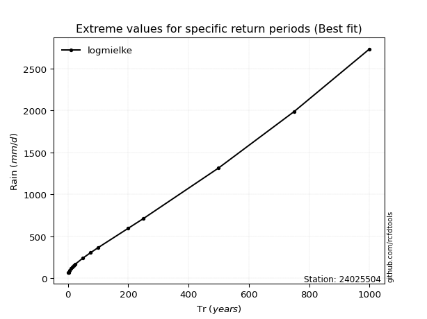</img>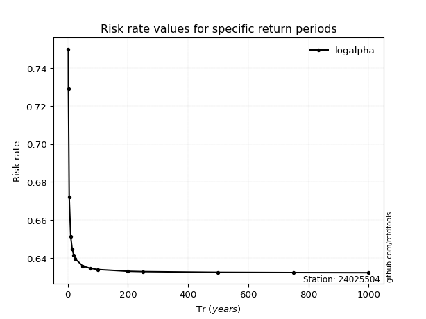</img>

</div>


<sub>**APP DISCLAIMER**: NO WARRANTY - This software is provided by [github.com/rcfdtools](https://github.com/rcfdtools) "as is", without any express or implied warranty, including warranties of merchantability, fitness for a particular purpose, or non-infringement. There is no guarantee that the software will be error-free or operate without interruption. LIMITATION OF LIABILITY - Neither the authors nor copyright holders will be liable for claims or damages arising from the software or its use. You are responsible for determining if the software is appropriate for your use and assume all associated risks, including errors, legal compliance, and data loss. NO PROFESSIONAL ADVICE - The software provides general information and does not offer professional advice. It should not replace consultation with professional advisors.</sub>