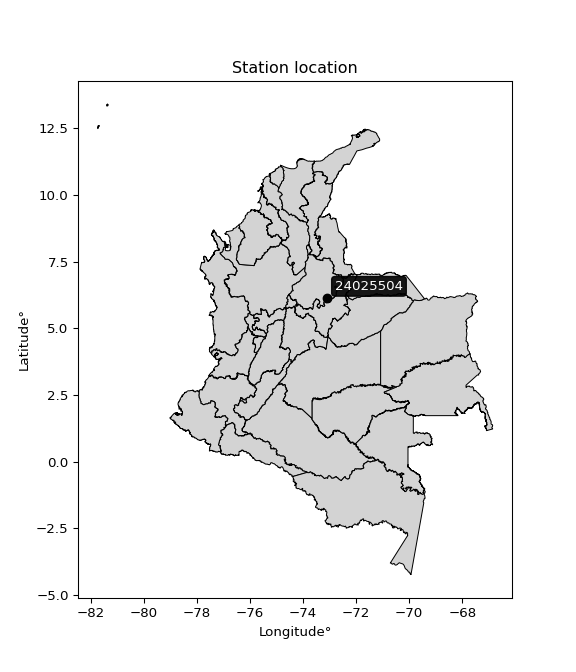

<div align="center">


</div>

# PMax24h Station (Rain, Pmax24h): 24025504

Maximum Precipitation in 24 hours (PMax24h) is the greatest amount of rainfall for a specific duration that is meteorologically possible for a given location, acting as a "worst-case" scenario for extreme storms, crucial for designing safety-critical infrastructure like bridges, river deviations, dams, spillways, and nuclear plants to prevent catastrophic failure. The PMax24h is related with the Probable Maximum Precipitation (PMP) and it is calculated by hydrologists using meteorological data to determine the upper limit of extreme rainfall, often leading to the Probable Maximum Flood (PMF) for flood control design, and is increasingly being studied for climate change impacts. Probable Maximum Precipitation (PMP) is the theoretical upper limit of rainfall, a deterministic estimate for extreme events, while probability distributions (like GEV, Gumbel) describe the likelihood and frequency of various precipitation amounts, including rare ones, showing how often events occur, with PMP representing the extreme end of these distributions, used for critical infrastructure design to ensure safety against the worst conceivable weather, unlike standard statistical forecasts which cover typical probabilities.

The most common probability distributions in hydrology, used for analyzing floods, rainfall, and streamflow, include the Normal, Log-Normal, Gumbel, Gamma (including Log-Pearson Type III), and Generalized Extreme Value (GEV) distributions, often chosen based on the data´s skewness and whether modeling extremes or general conditions, with Gumbel and GEV popular for extreme events like floods, while the Normal distribution serves as a baseline, though often requiring transformations for skewed hydrological data. These distributions help in designing water infrastructure, managing water resources, and forecasting hydrologic events.

> Hydrological data often isn´t perfectly normal (it´s skewed), so different distributions are needed for different applications, such as: **Flood Frequency Analysis**: Using Gumbel, GEV, or Log-Pearson Type III for predicting extreme flood magnitudes and their return periods, **Rainfall Analysis**: Normal for annual totals, but Log-Normal, Weibull, or GEV for intensity or extreme daily rainfall, **Streamflow Modeling**: Gamma and Log-Normal for maximum flows, GEV for minimum flows, and Kappa for daily flows.

<div align="center">

</img>

</div>


## A. General information


### 1. General running parameters

• app_version: _v20260225_. • runtime: _2026-02-27 14:50:08.749431_. • Python version: _3.14.0_. • SciPy version: _1.16.3_. • Pandas version: _2.3.3_. • NumPy version: _2.3.5_. • Stations dataset (station_dataset_file): _dataset/pmax24h_in/automatic_colombia_2003_2025.csv_. • Stations catalog (station_catalog_file): _dataset/CNE.xls_. • Minimum year to eval til year_max (date_min): _1900_. • Maximum year to eval since year_min (date_max): _2025_. • Creates, save and include plots into reports (create_plot): _False_. • Plot only fit distributions with Δo > Δ (plot_only_fit): _True_. • Plot only simple graphs avoiding multiple CDFs and multiple Extreme values plots (plot_only_simple): _False_. • Eval low extreme values, if False, evaluates high extreme values (low_extreme): _False_. • Eval every SciPy distribution as logarithmic (pdist_logarithmic_on): _True_. • Standard deviation normalized (ddof): _1.0_. • Return periods to eval in years (Tr): _[2, 2.33, 5, 10, 15, 20, 25, 50, 75, 100, 200, 250, 500, 750, 1000]_. • Minimum data sample per station, 0 means any (minimum_sample): _5_. • Z-Score maximum threshold to adjust a value, 0 means disable (zscore_max): _3.5_. • Z-Score minimum threshold to adjust a value, 0 means disable (zscore_min): _-2.5_. • Avoid zeros, e.g. rain = 0 (avoid_zeros): _True_. • Avoid null values (avoid_nans): _True_. 

:file_folder:Table: [dataset.csv](../../dataset/pmax24h_in/automatic_colombia_2003_2025.csv)

> Delta Degrees of Freedom (DDOF): is a parameter used in the formulas for calculating variance and standard deviation. When ddof=0, the divisor is $N$ (the total number of observations) and this is used when your data set is the entire population. When ddof=1, the divisor is $N-1$ and this is used when your data set is a sample drawn from a larger population. Using $N-1$ provides an unbiased estimate of the population variance (known as Bessel´s correction).


### 2. Station info and location

|   id |   CODIGO | NOMBRE                             | CATEGORIA     | TECNOLOGIA                | ESTADO   |   FECHA_INSTALACION |   FECHA_SUSPENSION |   ALTITUD |   LATITUD |   LONGITUD | DEPARTAMENTO   | MUNICIPIO   | AREA_OPERATIVA                         | ENTIDAD            | AREA_HIDROGRAFICA   | ZONA_HIDROGRAFICA   | SUBZONA_HIDROGRAFICA   |   CORRIENTE | Catalogo   |   Version |
|-----:|---------:|:-----------------------------------|:--------------|:--------------------------|:---------|--------------------:|-------------------:|----------:|----------:|-----------:|:---------------|:------------|:---------------------------------------|:-------------------|:--------------------|:--------------------|:-----------------------|------------:|:-----------|----------:|
|    0 | 24025504 | ENCINO-24025504  - AUT  [24025504] | Pluviométrica | Automática con Telemetría | Activa   |                 nan |                nan |      1898 |   6.13994 |   -73.0993 | Santander      | Encino      | Area Operativa 08 - Santanderes-Arauca | ISAGEN  S.A. E.S.P | Magdalena Cauca     | Sogamoso            | Río Fonce              |         nan | CNE_OE     |  20251226 |

<div align="center">

Dynamic map: [:earth_americas:Google](http://maps.google.com/maps?q=6.139936111,-73.09926389) [:earth_americas:OSM](https://www.openstreetmap.org/#map=18/6.139936111/-73.09926389&layers=P) [:earth_americas:Bing](https://www.bing.com/maps?cp=6.139936111~-73.09926389&lvl=18) [:earth_americas:Apple](https://maps.apple.com/frame?center=6.139936111%2C-73.09926389&span=0.003%2C0.006)

</div>


<div align="center">

```geojson
{
  "type": "Feature",
  "geometry": {
    "type": "Point", 
    "coordinates": [-73.09926389, 6.139936111]
  }, 
  "properties": {
    "Name": "24025504"
  }
}
```

</div>


### 3. Discrete values table and plot

<div align="center">

|               |           0 |           1 |           2 |           3 |           4 |           5 |          6 |           7 |
|:--------------|------------:|------------:|------------:|------------:|------------:|------------:|-----------:|------------:|
| Date          | 2016        | 2017        | 2018        | 2019        | 2020        | 2021        | 2024       | 2025        |
| Value         |   85.1      |   52.8      |   57.3      |   58.3      |   97.4      |   63.1      |  162.4     |   62        |
| Value_initial |   85.1      |   52.8      |   57.3      |   58.3      |   97.4      |   63.1      |  162.4     |   62        |
| count         |    8        |    8        |    8        |    8        |    8        |    8        |    8       |    8        |
| mean          |   79.8      |   79.8      |   79.8      |   79.8      |   79.8      |   79.8      |   79.8     |   79.8      |
| std           |   36.7498   |   36.7498   |   36.7498   |   36.7498   |   36.7498   |   36.7498   |   36.7498  |   36.7498   |
| zscore        |    0.144218 |   -0.734698 |   -0.612248 |   -0.585037 |    0.478914 |   -0.454424 |    2.24763 |   -0.484356 |


</div>


> The initial value (value_initial) correspond to the initial obtained or null completed value, and value (value) is adjusted only when the initial value is outside the valid range (outlier) definite through the Z-Score value. If Z-Score is active, values out of range or outliers are replaced with the station mean value. A Z-Score (or standard score) measures how many standard deviations a data point is from the mean of a dataset, indicating its relative position; positive scores mean above the mean, negative mean below, and a score of zero is exactly at the mean, allowing for comparison of values from different distributions. It´s calculated using the formula $z=(x–μ)/σ$, where $x$ is the data point, $μ$ is the mean, and $σ$ is the standard deviation, helping identify outliers and understand probability.
>
> <sub>**Note**: In this study, "completing" (filling gaps in) and "extending" (forecasting or lengthening the historical record) rainfall data series are avoided for certain critical analyses because they introduce artificial bias and uncertainty, which can distort the statistics of rare events (extremes), alter day-to-day variability, and compromise the integrity and homogeneity of the original data. Some reasons against Completing/Extending rainfall data are: **Distortion of Extremes and Variability**: The primary issue is that most gap-filling or extension methods rely on averaging or regression with nearby stations, which inherently smooths the data. Rainfall is highly variable in space and time, with a large percentage of zero values and occasional large storms. Infilling methods often underestimate the highest values and overestimate the lowest (zero) values, which severely distorts analyses focused on flood frequency, drought severity, and intensity-duration-frequency (IDF) curves, **Loss of Data Homogeneity**: Infilled or extended data are synthetic estimates, not actual measurements. Combining these estimates with observed data can violate the assumption of data homogeneity, which requires that the data properties do not change over time. Inhomogeneity can lead to incorrect conclusions about long-term trends or changes in climate patterns, **Propagation of Errors**: Errors and biases from the original data (e.g., wind-induced undercatch, instrument errors, site changes) or the data used for imputation can propagate through the analysis, leading to unreliable hydrological models and inaccurate predictions, **Compromised Statistical Integrity**: For statistical analyses, especially those involving the frequency of events, using artificial data can introduce time bias or autocorrelation that doesn´t exist in reality, making it difficult to assess the true probability of events, **Difficulty in Validation**: It is difficult to accurately validate the quality of filled or extended data, especially for past periods where ground-truth measurements are unavailable. The reliability of imputation techniques heavily depends on the density of the surrounding station network and the complexity of the local topography.</sub>


### 4. Active continuous probability distributions from SciPy (80 of 104 available)

A Probability Density Function (PDF) describes the relative likelihood of a continuous random variable falling within a specific range, where the total area under its curve equals 1, and the area over any interval gives the actual probability for that range. Unlike discrete probabilities (like rolling a die), a PDF shows density, not direct probability for a single point (which is zero), with higher points indicating higher likelihood, often visualized as a bell curve for normal distributions.

A log of a probability density function (log-PDF) is simply the logarithm of the PDF´s value, denoted as $log(f(x))$, useful for converting multiplication of probabilities into addition, improving numerical stability with tiny numbers, and connecting to information theory concepts like entropy. Instead of dealing with very small probabilities (e.g., 0.000001), log-PDFs use negative numbers (e.g., $log(0.00001) ≈ -11.51$ that are easier for computers to handle, preventing underflow errors and simplifying complex calculations. In this study, each active probability distribution from SciPy is also evaluated in the $log$ form.

[scipy.stats](https://docs.scipy.org/doc/scipy/reference/stats.html) is a Python´s powerful submodule within the SciPy library for comprehensive statistical analysis, offering over 130 probability distributions (like Normal, Poisson, etc.), functions for descriptive stats (mean, variance), hypothesis testing (t-tests, chi-square), random variable generation, and statistical tests, making it essential for data science, modeling, and research. It provides tools to explore, model, and draw conclusions from data efficiently, working seamlessly with [NumPy](https://numpy.org/).

<div align="center">

|   id | p_dist           |   n_parameter | fit_method   | label                                                                       | active   | ref                                                                                                      |
|-----:|:-----------------|--------------:|:-------------|:----------------------------------------------------------------------------|:---------|:---------------------------------------------------------------------------------------------------------|
|    0 | alpha            |             3 | MLE          | Alpha                                                                       | True     | [:mortar_board:](https://docs.scipy.org/doc/scipy/reference/generated/scipy.stats.alpha.html)            |
|    1 | anglit           |             2 | MM           | Anglit                                                                      | True     | [:mortar_board:](https://docs.scipy.org/doc/scipy/reference/generated/scipy.stats.anglit.html)           |
|    2 | arcsine          |             2 | MM           | Arcsine                                                                     | True     | [:mortar_board:](https://docs.scipy.org/doc/scipy/reference/generated/scipy.stats.arcsine.html)          |
|    3 | argus            |             3 | MLE          | Argus                                                                       | True     | [:mortar_board:](https://docs.scipy.org/doc/scipy/reference/generated/scipy.stats.argus.html)            |
|    4 | beta             |             4 | MLE          | Beta                                                                        | True     | [:mortar_board:](https://docs.scipy.org/doc/scipy/reference/generated/scipy.stats.beta.html)             |
|    5 | betaprime        |             4 | MLE          | Beta prime                                                                  | True     | [:mortar_board:](https://docs.scipy.org/doc/scipy/reference/generated/scipy.stats.betaprime.html)        |
|    6 | bradford         |             3 | MLE          | Bradford                                                                    | True     | [:mortar_board:](https://docs.scipy.org/doc/scipy/reference/generated/scipy.stats.bradford.html)         |
|    7 | burr             |             4 | MLE          | Burr (Type III)                                                             | True     | [:mortar_board:](https://docs.scipy.org/doc/scipy/reference/generated/scipy.stats.burr.html)             |
|    8 | burr12           |             4 | MLE          | Burr (Type III) 12                                                          | True     | [:mortar_board:](https://docs.scipy.org/doc/scipy/reference/generated/scipy.stats.burr12.html)           |
|    9 | cosine           |             2 | MLE          | Cosine                                                                      | True     | [:mortar_board:](https://docs.scipy.org/doc/scipy/reference/generated/scipy.stats.cosine.html)           |
|   10 | crystalball      |             4 | MLE          | Crystalball                                                                 | True     | [:mortar_board:](https://docs.scipy.org/doc/scipy/reference/generated/scipy.stats.crystalball.html)      |
|   11 | dgamma           |             3 | MLE          | Double gamma                                                                | True     | [:mortar_board:](https://docs.scipy.org/doc/scipy/reference/generated/scipy.stats.dgamma.html)           |
|   12 | dweibull         |             3 | MLE          | Double Weibull                                                              | True     | [:mortar_board:](https://docs.scipy.org/doc/scipy/reference/generated/scipy.stats.dweibull.html)         |
|   13 | erlang           |             3 | MLE          | Erlang                                                                      | True     | [:mortar_board:](https://docs.scipy.org/doc/scipy/reference/generated/scipy.stats.erlang.html)           |
|   14 | exponnorm        |             3 | MLE          | Exponentially modified Normal                                               | True     | [:mortar_board:](https://docs.scipy.org/doc/scipy/reference/generated/scipy.stats.exponnorm.html)        |
|   15 | exponpow         |             3 | MLE          | Exponential power                                                           | True     | [:mortar_board:](https://docs.scipy.org/doc/scipy/reference/generated/scipy.stats.exponpow.html)         |
|   16 | exponweib        |             4 | MLE          | Exponentiated Weibull                                                       | True     | [:mortar_board:](https://docs.scipy.org/doc/scipy/reference/generated/scipy.stats.exponweib.html)        |
|   17 | f                |             4 | MLE          | F                                                                           | True     | [:mortar_board:](https://docs.scipy.org/doc/scipy/reference/generated/scipy.stats.f.html)                |
|   18 | fatiguelife      |             3 | MLE          | Fatigue-life (Birnbaum-Saunders)                                            | True     | [:mortar_board:](https://docs.scipy.org/doc/scipy/reference/generated/scipy.stats.fatiguelife.html)      |
|   19 | foldnorm         |             3 | MM           | Fold Normal                                                                 | True     | [:mortar_board:](https://docs.scipy.org/doc/scipy/reference/generated/scipy.stats.foldnorm.html)         |
|   20 | gamma            |             3 | MLE          | Gamma                                                                       | True     | [:mortar_board:](https://docs.scipy.org/doc/scipy/reference/generated/scipy.stats.gamma.html)            |
|   21 | gausshyper       |             6 | MLE          | Gauss hypergeometric                                                        | True     | [:mortar_board:](https://docs.scipy.org/doc/scipy/reference/generated/scipy.stats.gausshyper.html)       |
|   22 | genexpon         |             5 | MLE          | Generalized exponential                                                     | True     | [:mortar_board:](https://docs.scipy.org/doc/scipy/reference/generated/scipy.stats.genexpon.html)         |
|   23 | genextreme       |             3 | MLE          | Generalized exponential                                                     | True     | [:mortar_board:](https://docs.scipy.org/doc/scipy/reference/generated/scipy.stats.genextreme.html)       |
|   24 | gengamma         |             4 | MLE          | Generalized gamma                                                           | True     | [:mortar_board:](https://docs.scipy.org/doc/scipy/reference/generated/scipy.stats.gengamma.html)         |
|   25 | genhalflogistic  |             3 | MLE          | Generalized half-logistic                                                   | True     | [:mortar_board:](https://docs.scipy.org/doc/scipy/reference/generated/scipy.stats.genhalflogistic.html)  |
|   26 | genlogistic      |             3 | MLE          | Generalized logistic                                                        | True     | [:mortar_board:](https://docs.scipy.org/doc/scipy/reference/generated/scipy.stats.genlogistic.html)      |
|   27 | gennorm          |             3 | MLE          | Generalized Normal                                                          | True     | [:mortar_board:](https://docs.scipy.org/doc/scipy/reference/generated/scipy.stats.gennorm.html)          |
|   28 | genpareto        |             3 | MLE          | Generalized Pareto                                                          | True     | [:mortar_board:](https://docs.scipy.org/doc/scipy/reference/generated/scipy.stats.genpareto.html)        |
|   29 | gompertz         |             3 | MLE          | Gompertz (or truncated Gumbel)                                              | True     | [:mortar_board:](https://docs.scipy.org/doc/scipy/reference/generated/scipy.stats.gompertz.html)         |
|   30 | gumbel_l         |             2 | MM           | Gumbel Left Skew                                                            | True     | [:mortar_board:](https://docs.scipy.org/doc/scipy/reference/generated/scipy.stats.gumbel_l.html)         |
|   31 | gumbel_r         |             2 | MM           | Gumbel Right Skew                                                           | True     | [:mortar_board:](https://docs.scipy.org/doc/scipy/reference/generated/scipy.stats.gumbel_r.html)         |
|   32 | halfgennorm      |             3 | MLE          | Upper half of a generalized normal                                          | True     | [:mortar_board:](https://docs.scipy.org/doc/scipy/reference/generated/scipy.stats.halfgennorm.html)      |
|   33 | halflogistic     |             2 | MM           | Half-logistic                                                               | True     | [:mortar_board:](https://docs.scipy.org/doc/scipy/reference/generated/scipy.stats.halflogistic.html)     |
|   34 | halfnorm         |             2 | MM           | Half Normal                                                                 | True     | [:mortar_board:](https://docs.scipy.org/doc/scipy/reference/generated/scipy.stats.halfnorm.html)         |
|   35 | hypsecant        |             2 | MM           | hyperbolic secant                                                           | True     | [:mortar_board:](https://docs.scipy.org/doc/scipy/reference/generated/scipy.stats.hypsecant.html)        |
|   36 | invgamma         |             3 | MLE          | Inverted gamma                                                              | True     | [:mortar_board:](https://docs.scipy.org/doc/scipy/reference/generated/scipy.stats.invgamma.html)         |
|   37 | invgauss         |             3 | MLE          | Inverse Gaussian                                                            | True     | [:mortar_board:](https://docs.scipy.org/doc/scipy/reference/generated/scipy.stats.invgauss.html)         |
|   38 | invweibull       |             3 | MLE          | Inverted Weibull                                                            | True     | [:mortar_board:](https://docs.scipy.org/doc/scipy/reference/generated/scipy.stats.invweibull.html)       |
|   39 | johnsonsb        |             4 | MLE          | Johnson SB                                                                  | True     | [:mortar_board:](https://docs.scipy.org/doc/scipy/reference/generated/scipy.stats.johnsonsb.html)        |
|   40 | johnsonsu        |             4 | MLE          | Johnson Su                                                                  | True     | [:mortar_board:](https://docs.scipy.org/doc/scipy/reference/generated/scipy.stats.johnsonsu.html)        |
|   41 | kappa3           |             3 | MLE          | Kappa 3                                                                     | True     | [:mortar_board:](https://docs.scipy.org/doc/scipy/reference/generated/scipy.stats.kappa3.html)           |
|   42 | kappa4           |             4 | MLE          | Kappa 4                                                                     | True     | [:mortar_board:](https://docs.scipy.org/doc/scipy/reference/generated/scipy.stats.kappa4.html)           |
|   43 | ksone            |             3 | MLE          | Kolmogorov-Smirnov one-sided test statistic distribution                    | True     | [:mortar_board:](https://docs.scipy.org/doc/scipy/reference/generated/scipy.stats.ksone.html)            |
|   44 | kstwobign        |             2 | MLE          | Limiting distribution of scaled Kolmogorov-Smirnov two-sided test statistic | True     | [:mortar_board:](https://docs.scipy.org/doc/scipy/reference/generated/scipy.stats.kstwobign.html)        |
|   45 | laplace          |             2 | MM           | Laplace                                                                     | True     | [:mortar_board:](https://docs.scipy.org/doc/scipy/reference/generated/scipy.stats.laplace.html)          |
|   46 | levy_l           |             2 | MLE          | Left-skewed Levy                                                            | True     | [:mortar_board:](https://docs.scipy.org/doc/scipy/reference/generated/scipy.stats.levy_l.html)           |
|   47 | loggamma         |             3 | MLE          | Log gamma                                                                   | True     | [:mortar_board:](https://docs.scipy.org/doc/scipy/reference/generated/scipy.stats.loggamma.html)         |
|   48 | logistic         |             2 | MM           | Logistic (or Sech-squared)                                                  | True     | [:mortar_board:](https://docs.scipy.org/doc/scipy/reference/generated/scipy.stats.logistic.html)         |
|   49 | loglaplace       |             3 | MLE          | Log-Laplace                                                                 | True     | [:mortar_board:](https://docs.scipy.org/doc/scipy/reference/generated/scipy.stats.loglaplace.html)       |
|   50 | lomax            |             3 | MLE          | Lomax (Pareto of the second kind)                                           | True     | [:mortar_board:](https://docs.scipy.org/doc/scipy/reference/generated/scipy.stats.lomax.html)            |
|   51 | maxwell          |             2 | MM           | Maxwell                                                                     | True     | [:mortar_board:](https://docs.scipy.org/doc/scipy/reference/generated/scipy.stats.maxwell.html)          |
|   52 | mielke           |             4 | MLE          | Mielke Beta-Kappa / Dagum                                                   | True     | [:mortar_board:](https://docs.scipy.org/doc/scipy/reference/generated/scipy.stats.mielke.html)           |
|   53 | moyal            |             2 | MM           | Moyal                                                                       | True     | [:mortar_board:](https://docs.scipy.org/doc/scipy/reference/generated/scipy.stats.moyal.html)            |
|   54 | nakagami         |             3 | MLE          | Nakagami                                                                    | True     | [:mortar_board:](https://docs.scipy.org/doc/scipy/reference/generated/scipy.stats.nakagami.html)         |
|   55 | ncf              |             5 | MLE          | Non-central F distribution                                                  | True     | [:mortar_board:](https://docs.scipy.org/doc/scipy/reference/generated/scipy.stats.ncf.html)              |
|   56 | nct              |             4 | MLE          | Non-central Student’s t                                                     | True     | [:mortar_board:](https://docs.scipy.org/doc/scipy/reference/generated/scipy.stats.nct.html)              |
|   57 | norm             |             2 | MM           | Normal                                                                      | True     | [:mortar_board:](https://docs.scipy.org/doc/scipy/reference/generated/scipy.stats.norm.html)             |
|   58 | pearson3         |             3 | MM           | Pearson type III                                                            | True     | [:mortar_board:](https://docs.scipy.org/doc/scipy/reference/generated/scipy.stats.pearson3.html)         |
|   59 | powerlaw         |             3 | MLE          | Power-function                                                              | True     | [:mortar_board:](https://docs.scipy.org/doc/scipy/reference/generated/scipy.stats.powerlaw.html)         |
|   60 | rayleigh         |             2 | MM           | Rayleigh                                                                    | True     | [:mortar_board:](https://docs.scipy.org/doc/scipy/reference/generated/scipy.stats.rayleigh.html)         |
|   61 | rdist            |             3 | MLE          | R-distributed (symmetric beta)                                              | True     | [:mortar_board:](https://docs.scipy.org/doc/scipy/reference/generated/scipy.stats.rdist.html)            |
|   62 | rice             |             3 | MLE          | Rice                                                                        | True     | [:mortar_board:](https://docs.scipy.org/doc/scipy/reference/generated/scipy.stats.rice.html)             |
|   63 | semicircular     |             2 | MM           | Semicircular                                                                | True     | [:mortar_board:](https://docs.scipy.org/doc/scipy/reference/generated/scipy.stats.semicircular.html)     |
|   64 | skewnorm         |             3 | MLE          | Skew normal                                                                 | True     | [:mortar_board:](https://docs.scipy.org/doc/scipy/reference/generated/scipy.stats.skewnorm.html)         |
|   65 | t                |             3 | MLE          | Student’s t                                                                 | True     | [:mortar_board:](https://docs.scipy.org/doc/scipy/reference/generated/scipy.stats.t.html)                |
|   66 | trapezoid        |             4 | MLE          | Trapezoid                                                                   | True     | [:mortar_board:](https://docs.scipy.org/doc/scipy/reference/generated/scipy.stats.trapezoid.html)        |
|   67 | triang           |             3 | MLE          | Triangular                                                                  | True     | [:mortar_board:](https://docs.scipy.org/doc/scipy/reference/generated/scipy.stats.triang.html)           |
|   68 | truncexpon       |             3 | MLE          | Truncated exponential                                                       | True     | [:mortar_board:](https://docs.scipy.org/doc/scipy/reference/generated/scipy.stats.truncexpon.html)       |
|   69 | truncnorm        |             4 | MLE          | Truncated normal                                                            | True     | [:mortar_board:](https://docs.scipy.org/doc/scipy/reference/generated/scipy.stats.truncnorm.html)        |
|   70 | truncpareto      |             4 | MLE          | Upper truncated Pareto                                                      | True     | [:mortar_board:](https://docs.scipy.org/doc/scipy/reference/generated/scipy.stats.truncpareto.html)      |
|   71 | truncweibull_min |             5 | MLE          | Doubly truncated Weibull minimum                                            | True     | [:mortar_board:](https://docs.scipy.org/doc/scipy/reference/generated/scipy.stats.truncweibull_min.html) |
|   72 | tukeylambda      |             3 | MLE          | Tukey-Lamdba                                                                | True     | [:mortar_board:](https://docs.scipy.org/doc/scipy/reference/generated/scipy.stats.tukeylambda.html)      |
|   73 | uniform          |             2 | MLE          | Uniform                                                                     | True     | [:mortar_board:](https://docs.scipy.org/doc/scipy/reference/generated/scipy.stats.uniform.html)          |
|   74 | vonmises         |             3 | MLE          | Von Mises                                                                   | True     | [:mortar_board:](https://docs.scipy.org/doc/scipy/reference/generated/scipy.stats.vonmises.html)         |
|   75 | vonmises_line    |             3 | MLE          | Von Mises line                                                              | True     | [:mortar_board:](https://docs.scipy.org/doc/scipy/reference/generated/scipy.stats.vonmises_line.html)    |
|   76 | wald             |             2 | MM           | Wald                                                                        | True     | [:mortar_board:](https://docs.scipy.org/doc/scipy/reference/generated/scipy.stats.wald.html)             |
|   77 | weibull_max      |             3 | MLE          | Weibull maximum                                                             | True     | [:mortar_board:](https://docs.scipy.org/doc/scipy/reference/generated/scipy.stats.weibull_max.html)      |
|   78 | weibull_min      |             3 | MLE          | Weibull minimum                                                             | True     | [:mortar_board:](https://docs.scipy.org/doc/scipy/reference/generated/scipy.stats.weibull_min.html)      |
|   79 | wrapcauchy       |             3 | MLE          | Wrapped  Cauchy                                                             | True     | [:mortar_board:](https://docs.scipy.org/doc/scipy/reference/generated/scipy.stats.wrapcauchy.html)       |

</div>

> **n_parameter:** # arguments & localization & scale.
>
> **Fit methods:** (MLE) maximum likelihood, (MM) L-moments.
>
>**Inactive** (With the only purpose of prevent loops, zero divisions, infinite values, over high estimated values or horizontal trending for recurrence intervals estimations, the follow distributions were disabled.)**:** lognorm, norminvgauss, powernorm, powerlognorm, cauchy, halfcauchy, foldcauchy, skewcauchy, chi2, expon, fisk, genhyperbolic, geninvgauss, gibrat, kstwo, laplace_asymmetric, levy, levy_stable, ncx2, pareto, rel_breitwigner, recipinvgauss, studentized_range, loguniform, 


## B. Probability (PDF) vs. Empirical (EDF) distributions functions

A continuous probability distribution (CPD) describes probabilities for variables that can take any value within a range (like rain any time), unlike discrete variables with specific outcomes (like temperature). It uses a Probability Density Function (PDF), a curve where the total area under it equals 1, and the probability of the variable falling within an interval (a to b) is found by calculating the area under the curve between those points. A key feature is that the probability of hitting any single exact value is zero, so probabilities are always expressed for ranges, e.g., $P(a ≤ X ≤ b)$.

<div align="center">

Distributions parameters from station values
|     |   station | p_dist              |   n |              loc |          scale | shape                  | shape1                 | shape2                | shape3             |
|----:|----------:|:--------------------|----:|-----------------:|---------------:|:-----------------------|:-----------------------|:----------------------|:-------------------|
|   0 |  24025504 | alpha               |   8 |     47.5535      |   11.0421      | 4.276718040646438e-07  |                        |                       |                    |
|   1 |  24025504 | anglit              |   8 |     79.8         |  100.564       |                        |                        |                       |                    |
|   2 |  24025504 | arcsine             |   8 |     31.1846      |   97.2308      |                        |                        |                       |                    |
|   3 |  24025504 | argus               |   8 |     -3.39214     |  171.472       | 1.4265198529576557e-06 |                        |                       |                    |
|   4 |  24025504 | beta                |   8 |     52.7354      |  109.665       | 0.18269102929067454    | 0.5699389772857633     |                       |                    |
|   5 |  24025504 | betaprime           |   8 |      0.971879    |    4.02319     | 165.4164144916101      | 9.59020153126729       |                       |                    |
|   6 |  24025504 | bradford            |   8 |     52.8         |  109.6         | 1.0207506687437573     |                        |                       |                    |
|   7 |  24025504 | burr                |   8 |     38.0495      |    2.6857      | 2.125829970582891      | 103.34480998125036     |                       |                    |
|   8 |  24025504 | burr12              |   8 |     -0.461653    |   52.9871      | 632.1246239992445      | 0.004590474014555635   |                       |                    |
|   9 |  24025504 | cosine              |   8 |     87.9336      |   31.7072      |                        |                        |                       |                    |
|  10 |  24025504 | crystalball         |   8 |     79.8         |   34.3763      | 6952.984853818594      | 790.0782852615336      |                       |                    |
|  11 |  24025504 | dgamma              |   8 |     75.5048      |   11.9998      | 2.1084639669933667     |                        |                       |                    |
|  12 |  24025504 | dweibull            |   8 |     58.3         |   29.1471      | 0.6182218892357405     |                        |                       |                    |
|  13 |  24025504 | erlang              |   8 |     52.8         |   52.1994      | 0.3276642775193924     |                        |                       |                    |
|  14 |  24025504 | exponnorm           |   8 |     52.77        |    0.00985749  | 2727.249033698734      |                        |                       |                    |
|  15 |  24025504 | exponpow            |   8 |     52.8         |   81.4722      | 0.5566896801166215     |                        |                       |                    |
|  16 |  24025504 | exponweib           |   8 |     52.8         |   33.3119      | 1.105746991834676      | 0.8432211127554632     |                       |                    |
|  17 |  24025504 | f                   |   8 |     49.2046      |   11.1352      | 1938.6260578224637     | 2.461135550279703      |                       |                    |
|  18 |  24025504 | fatiguelife         |   8 |     51.4915      |   12.9639      | 1.5267529979757133     |                        |                       |                    |
|  19 |  24025504 | foldnorm            |   8 |     31.8639      |   59.4667      | 0.060817099064694236   |                        |                       |                    |
|  20 |  24025504 | gamma               |   8 |     52.8         |   30.1943      | 0.5584522076677045     |                        |                       |                    |
|  21 |  24025504 | gausshyper          |   8 |     52.8         |  115.088       | 0.694655901705819      | 1.3077678826528487     | 1.222485946681263     | 0.7900586191423626 |
|  22 |  24025504 | genexpon            |   8 |     52.8         |   67.534       | 2.501253830434478      | 0.4125097088487612     | 8.236634136062731e-10 |                    |
|  23 |  24025504 | genextreme          |   8 |     59.9223      |    9.55557     | -0.8782157559481286    |                        |                       |                    |
|  24 |  24025504 | gengamma            |   8 |     52.8         |   33.6032      | 0.5824289083218358     | 1.225534810015791      |                       |                    |
|  25 |  24025504 | genhalflogistic     |   8 |     43.4808      |  121.221       | 1.0193580932634267     |                        |                       |                    |
|  26 |  24025504 | genlogistic         |   8 |    -82.2367      |   19.4741      | 2021.5759022397056     |                        |                       |                    |
|  27 |  24025504 | gennorm             |   8 |     62           |    1.41725e-08 | 0.11235275017921109    |                        |                       |                    |
|  28 |  24025504 | genpareto           |   8 |     -1.24337     |  248.224       | -1.5168587760913208    |                        |                       |                    |
|  29 |  24025504 | gompertz            |   8 |     52.8         |    1.8863e+13  | 656019611718.7262      |                        |                       |                    |
|  30 |  24025504 | gumbel_l            |   8 |     95.2712      |   26.8031      |                        |                        |                       |                    |
|  31 |  24025504 | gumbel_r            |   8 |     64.3288      |   26.8031      |                        |                        |                       |                    |
|  32 |  24025504 | halfgennorm         |   8 |     52.8         |    0.858844    | 0.3638417837203931     |                        |                       |                    |
|  33 |  24025504 | halflogistic        |   8 |     39.0561      |   29.3905      |                        |                        |                       |                    |
|  34 |  24025504 | halfnorm            |   8 |     34.2993      |   57.0267      |                        |                        |                       |                    |
|  35 |  24025504 | hypsecant           |   8 |     79.8         |   21.8846      |                        |                        |                       |                    |
|  36 |  24025504 | invgamma            |   8 |     49.1974      |   13.706       | 1.2306588190458        |                        |                       |                    |
|  37 |  24025504 | invgauss            |   8 |     50.4826      |   12.1494      | 2.413070868783831      |                        |                       |                    |
|  38 |  24025504 | invweibull          |   8 |     49.0417      |   10.8806      | 1.1386729612179445     |                        |                       |                    |
|  39 |  24025504 | johnsonsb           |   8 |     52.8         |  111.921       | 0.025746780450778647   | 0.11909606823555705    |                       |                    |
|  40 |  24025504 | johnsonsu           |   8 |     52.1584      |    0.0167188   | -4.900555098860803     | 0.6762420426016118     |                       |                    |
|  41 |  24025504 | kappa3              |   8 |     52.7964      |   12.588       | 1.2148490985965321     |                        |                       |                    |
|  42 |  24025504 | kappa4              |   8 |     40.0128      |  124.678       | 1.1141909713644165     | 0.9864855618693771     |                       |                    |
|  43 |  24025504 | ksone               |   8 |     41.84        |  131.52        | 1.0                    |                        |                       |                    |
|  44 |  24025504 | kstwobign           |   8 |     -8.5625      |  103.092       |                        |                        |                       |                    |
|  45 |  24025504 | laplace             |   8 |     79.8         |   24.3077      |                        |                        |                       |                    |
|  46 |  24025504 | levy_l              |   8 |    172.416       |   47.4402      |                        |                        |                       |                    |
|  47 |  24025504 | loggamma            |   8 | -12927.7         | 1687.82        | 2223.2776251044033     |                        |                       |                    |
|  48 |  24025504 | logistic            |   8 |     79.8         |   18.9526      |                        |                        |                       |                    |
|  49 |  24025504 | loglaplace          |   8 |     -0.146165    |   62.1462      | 3.9098290539338025     |                        |                       |                    |
|  50 |  24025504 | lomax               |   8 |     52.8         | 2046.88        | 77.42103303395058      |                        |                       |                    |
|  51 |  24025504 | maxwell             |   8 |     -1.6574      |   51.0459      |                        |                        |                       |                    |
|  52 |  24025504 | mielke              |   8 |     -1.71803     |   19.3053      | 1270.5262546682688     | 4.600661039963306      |                       |                    |
|  53 |  24025504 | moyal               |   8 |     60.1414      |   15.4748      |                        |                        |                       |                    |
|  54 |  24025504 | nakagami            |   8 |     52.8         |   50.6765      | 0.13371336243260057    |                        |                       |                    |
|  55 |  24025504 | ncf                 |   8 |     -2.07282     |    8.81335     | 81.05781456662629      | 20.084128118677143     | 589.7270345206246     |                    |
|  56 |  24025504 | nct                 |   8 |      0.191864    |    0.986129    | 5.613155378562745      | 68.31857026228712      |                       |                    |
|  57 |  24025504 | norm                |   8 |     79.8         |   34.3763      |                        |                        |                       |                    |
|  58 |  24025504 | pearson3            |   8 |     79.8         |   34.3763      | 1.593458538790276      |                        |                       |                    |
|  59 |  24025504 | powerlaw            |   8 |     52.8         |  109.6         | 0.15865836849308432    |                        |                       |                    |
|  60 |  24025504 | rayleigh            |   8 |     14.0361      |   52.472       |                        |                        |                       |                    |
|  61 |  24025504 | rdist               |   8 |     48.6787      |   48.7213      | 1.1604055537699023     |                        |                       |                    |
|  62 |  24025504 | rice                |   8 |     29.9586      |   42.8129      | 0.0003981888779405623  |                        |                       |                    |
|  63 |  24025504 | semicircular        |   8 |     79.8         |   68.7525      |                        |                        |                       |                    |
|  64 |  24025504 | skewnorm            |   8 |     52.8         |   43.7115      | 28992397.308768377     |                        |                       |                    |
|  65 |  24025504 | t                   |   8 |     59.815       |    4.87929     | 0.6899072603317458     |                        |                       |                    |
|  66 |  24025504 | trapezoid           |   8 |     41.84        |  131.52        | 1.0                    | 1.0                    |                       |                    |
|  67 |  24025504 | triang              |   8 |    -18.978       |  181.378       | 0.999999999999915      |                        |                       |                    |
|  68 |  24025504 | truncexpon          |   8 |     52.284       |   90.5157      | 1.2165410539992905     |                        |                       |                    |
|  69 |  24025504 | truncnorm           |   8 | -95897.5         | 1816.57        | 52.81958944471328      | 110964.80591323142     |                       |                    |
|  70 |  24025504 | truncpareto         |   8 |     25.9576      |   26.8424      | 1.3088644478557212     | 5.083087981434538      |                       |                    |
|  71 |  24025504 | truncweibull_min    |   8 |     52.6866      |  100.362       | 0.5087429868219351     | 0.0011298775611567253  | 1.093178659284887     |                    |
|  72 |  24025504 | tukeylambda         |   8 |     75.1285      |   27.4669      | 1.2301247996884694     |                        |                       |                    |
|  73 |  24025504 | uniform             |   8 |     52.8         |  109.6         |                        |                        |                       |                    |
|  74 |  24025504 | vonmises            |   8 |      1.60566     |    1           | 0.16508252233055115    |                        |                       |                    |
|  75 |  24025504 | vonmises_line       |   8 |     71.8059      |   28.837       | 1.6133425367961156     |                        |                       |                    |
|  76 |  24025504 | wald                |   8 |     45.4237      |   34.3763      |                        |                        |                       |                    |
|  77 |  24025504 | weibull_max         |   8 |    162.4         |    1.6455      | 0.14670875487304635    |                        |                       |                    |
|  78 |  24025504 | weibull_min         |   8 |     52.8         |   22.5015      | 0.40560252894990534    |                        |                       |                    |
|  79 |  24025504 | wrapcauchy          |   8 |     52.8         |   17.4434      | 0.6664546793283681     |                        |                       |                    |
|  80 |  24025504 | logalpha            |   8 |      3.78974     |    0.585913    | 1.508608681244465      |                        |                       |                    |
|  81 |  24025504 | loganglit           |   8 |      4.30812     |    1.03718     |                        |                        |                       |                    |
|  82 |  24025504 | logarcsine          |   8 |      3.80673     |    1.00279     |                        |                        |                       |                    |
|  83 |  24025504 | logargus            |   8 |      3.47962     |    1.66699     | 0.00017426709768866443 |                        |                       |                    |
|  84 |  24025504 | logbeta             |   8 |      3.96651     |    1.32655     | 0.3096292712662462     | 1.0003581538299864     |                       |                    |
|  85 |  24025504 | logbetaprime        |   8 |      1.77465     |    4.65329     | 78.84767604816568      | 145.92479264907888     |                       |                    |
|  86 |  24025504 | logbradford         |   8 |      3.96651     |    1.12356     | 1.1017851888798282     |                        |                       |                    |
|  87 |  24025504 | logburr             |   8 |      3.7907      |    0.0452033   | 1.9872886883953562     | 47.97489044776785      |                       |                    |
|  88 |  24025504 | logburr12           |   8 |  -1034.82        | 1038.78        | 409909.1954930695      | 0.007260462364554049   |                       |                    |
|  89 |  24025504 | logcosine           |   8 |      4.37293     |    0.31317     |                        |                        |                       |                    |
|  90 |  24025504 | logcrystalball      |   8 |      4.30812     |    0.354543    | 7.764679722981268      | 1655.9727461521127     |                       |                    |
|  91 |  24025504 | logdgamma           |   8 |      4.14472     |    0.261264    | 0.9068205108474685     |                        |                       |                    |
|  92 |  24025504 | logdweibull         |   8 |      4.12713     |    0.267752    | 0.6704372972462957     |                        |                       |                    |
|  93 |  24025504 | logerlang           |   8 |      3.96651     |    0.360868    | 0.6254577754473283     |                        |                       |                    |
|  94 |  24025504 | logexponnorm        |   8 |      3.9662      |    0.000100674 | 3361.384431049134      |                        |                       |                    |
|  95 |  24025504 | logexponpow         |   8 |      3.96651     |    0.506853    | 0.8196696390099221     |                        |                       |                    |
|  96 |  24025504 | logexponweib        |   8 |      3.96651     |    0.460853    | 0.5364368982639434     | 0.806889773056853      |                       |                    |
|  97 |  24025504 | logf                |   8 |      3.87442     |    0.238967    | 3654.6076686285783     | 3.835384674982238      |                       |                    |
|  98 |  24025504 | logfatiguelife      |   8 |      3.93015     |    0.227897    | 1.1378651704722302     |                        |                       |                    |
|  99 |  24025504 | logfoldnorm         |   8 |      3.78593     |    0.447416    | 1.0001699147528673     |                        |                       |                    |
| 100 |  24025504 | loggamma            |   8 |      3.96651     |    0.237145    | 0.9625096932863346     |                        |                       |                    |
| 101 |  24025504 | loggausshyper       |   8 |      3.96651     |    1.12504     | 0.5398397997655457     | 0.8843985882700989     | 0.7887935001784352    | 0.7459632154765123 |
| 102 |  24025504 | loggenexpon         |   8 |      3.96641     |    0.208358    | 0.6100699111307634     | 1.0133113804888002e-07 | 2.0976576543250474    |                    |
| 103 |  24025504 | loggenextreme       |   8 |      4.09649     |    0.15336     | -0.6048863984938799    |                        |                       |                    |
| 104 |  24025504 | loggengamma         |   8 |      3.96651     |    0.41578     | 0.745899556674896      | 0.8847174506500232     |                       |                    |
| 105 |  24025504 | loggenhalflogistic  |   8 |      3.84123     |    1.31408     | 1.0522460754811278     |                        |                       |                    |
| 106 |  24025504 | loggenlogistic      |   8 |      2.42056     |    0.229183    | 1936.5379457705167     |                        |                       |                    |
| 107 |  24025504 | loggennorm          |   8 |      4.12713     |    2.8454e-05  | 0.20300965903237464    |                        |                       |                    |
| 108 |  24025504 | loggenpareto        |   8 |     -0.00668435  |    8.9991      | -1.765656547800582     |                        |                       |                    |
| 109 |  24025504 | loggompertz         |   8 |      3.96651     |    0.729307    | 1.116209739154959      |                        |                       |                    |
| 110 |  24025504 | loggumbel_l         |   8 |      4.46769     |    0.276436    |                        |                        |                       |                    |
| 111 |  24025504 | loggumbel_r         |   8 |      4.14856     |    0.276436    |                        |                        |                       |                    |
| 112 |  24025504 | loghalfgennorm      |   8 |      3.96651     |    0.000588407 | 0.24897204107727008    |                        |                       |                    |
| 113 |  24025504 | loghalflogistic     |   8 |      3.88791     |    0.303122    |                        |                        |                       |                    |
| 114 |  24025504 | loghalfnorm         |   8 |      3.83885     |    0.58815     |                        |                        |                       |                    |
| 115 |  24025504 | loghypsecant        |   8 |      4.30812     |    0.225709    |                        |                        |                       |                    |
| 116 |  24025504 | loginvgamma         |   8 |      3.87395     |    0.460881    | 1.9233255591127394     |                        |                       |                    |
| 117 |  24025504 | loginvgauss         |   8 |      3.91193     |    0.318211    | 1.2450766083888252     |                        |                       |                    |
| 118 |  24025504 | loginvweibull       |   8 |      3.84293     |    0.253565    | 1.65333841125788       |                        |                       |                    |
| 119 |  24025504 | logjohnsonsb        |   8 |      3.96651     |    1.12355     | 0.228153361622229      | 0.22302520533368297    |                       |                    |
| 120 |  24025504 | logjohnsonsu        |   8 |      3.93872     |    0.000877088 | -5.6601217654594915    | 0.9100648204297639     |                       |                    |
| 121 |  24025504 | logkappa3           |   8 |      3.96651     |    1.12282     | 3201.4217006481576     |                        |                       |                    |
| 122 |  24025504 | logkappa4           |   8 |      3.91096     |    1.2328      | 1.047238545734039      | 1.0445503206524485     |                       |                    |
| 123 |  24025504 | logksone            |   8 |      3.85416     |    1.34826     | 1.0                    |                        |                       |                    |
| 124 |  24025504 | logkstwobign        |   8 |      3.32311     |    1.13906     |                        |                        |                       |                    |
| 125 |  24025504 | loglaplace          |   8 |      4.30812     |    0.2507      |                        |                        |                       |                    |
| 126 |  24025504 | loglevy_l           |   8 |      5.18198     |    0.434698    |                        |                        |                       |                    |
| 127 |  24025504 | logloggamma         |   8 |   -121.237       |   16.5061      | 2010.6578677059292     |                        |                       |                    |
| 128 |  24025504 | loglogistic         |   8 |      4.30812     |    0.19547     |                        |                        |                       |                    |
| 129 |  24025504 | logloglaplace       |   8 |      3.96651     |    0.183005    | 0.6583594132485973     |                        |                       |                    |
| 130 |  24025504 | loglomax            |   8 |      3.96651     |    1.33082e+10 | 3566278070.086957      |                        |                       |                    |
| 131 |  24025504 | logmaxwell          |   8 |      3.46801     |    0.526466    |                        |                        |                       |                    |
| 132 |  24025504 | logmielke           |   8 |      3.31373     |    0.234645    | 604.1102698556397      | 4.007006807922966      |                       |                    |
| 133 |  24025504 | logmoyal            |   8 |      4.10537     |    0.1596      |                        |                        |                       |                    |
| 134 |  24025504 | lognakagami         |   8 |      3.96651     |    0.540793    | 0.3998668833662009     |                        |                       |                    |
| 135 |  24025504 | logncf              |   8 |      3.87418     |    0.189832    | 743.2067374509679      | 4.008754789227938      | 224.2724103159794     |                    |
| 136 |  24025504 | lognct              |   8 |      1.29277     |    0.0399942   | 44.95578434454532      | 74.05113698347935      |                       |                    |
| 137 |  24025504 | lognorm             |   8 |      4.30812     |    0.354543    |                        |                        |                       |                    |
| 138 |  24025504 | logpearson3         |   8 |      4.30812     |    0.354542    | 1.1737713005381154     |                        |                       |                    |
| 139 |  24025504 | logpowerlaw         |   8 |      3.96651     |    1.12355     | 0.17480658513888783    |                        |                       |                    |
| 140 |  24025504 | lograyleigh         |   8 |      3.62986     |    0.541174    |                        |                        |                       |                    |
| 141 |  24025504 | logrdist            |   8 |      5.089       |    0.645171    | 1.0276410545391275     |                        |                       |                    |
| 142 |  24025504 | logrice             |   8 |      3.76473     |    0.458787    | 0.000660778614846755   |                        |                       |                    |
| 143 |  24025504 | logsemicircular     |   8 |      4.30812     |    0.709124    |                        |                        |                       |                    |
| 144 |  24025504 | logskewnorm         |   8 |      3.96651     |    0.492371    | 60522264.39276497      |                        |                       |                    |
| 145 |  24025504 | logt                |   8 |      4.30804     |    0.354461    | 4739.213425835206      |                        |                       |                    |
| 146 |  24025504 | logtrapezoid        |   8 |      3.85416     |    1.34826     | 1.0                    | 1.0                    |                       |                    |
| 147 |  24025504 | logtriang           |   8 |      3.32529     |    1.76477     | 0.9999997717433324     |                        |                       |                    |
| 148 |  24025504 | logtruncexpon       |   8 |      3.96651     |    1.11374     | 1.008816633037981      |                        |                       |                    |
| 149 |  24025504 | logtruncnorm        |   8 |     -2.99022     |    1.77791     | 3.9128321511865947     | 4.544832864311806      |                       |                    |
| 150 |  24025504 | logtruncpareto      |   8 |      0.58914     |    3.37737     | 8.152927672924255      | 1.3326703063115861     |                       |                    |
| 151 |  24025504 | logtruncweibull_min |   8 |      3.96472     |    0.977725    | 0.5288968424950855     | 0.0018302061931921888  | 1.150978913696724     |                    |
| 152 |  24025504 | logtukeylambda      |   8 |      4.52821     |    0.623081    | 1.1089765681593087     |                        |                       |                    |
| 153 |  24025504 | loguniform          |   8 |      3.96651     |    1.12355     |                        |                        |                       |                    |
| 154 |  24025504 | logvonmises         |   8 |     -1.98403     |    1           | 8.507421599362738      |                        |                       |                    |
| 155 |  24025504 | logvonmises_line    |   8 |      4.23654     |    0.271684    | 1.1315250079883317     |                        |                       |                    |
| 156 |  24025504 | logwald             |   8 |      3.95358     |    0.354543    |                        |                        |                       |                    |
| 157 |  24025504 | logweibull_max      |   8 |      6.10802e+07 |    6.10802e+07 | 265833245.22943413     |                        |                       |                    |
| 158 |  24025504 | logweibull_min      |   8 |      3.96651     |    0.311691    | 0.7973511392581114     |                        |                       |                    |
| 159 |  24025504 | logwrapcauchy       |   8 |      3.96651     |    0.178819    | 0.5                    |                        |                       |                    |

</div>

> **loc** (Location parameter): This shifts the distribution along the x-axis. For many common distributions, like the normal (Gaussian) distribution, loc represents the mean $μ$. For others, like the uniform distribution, it might represent the minimum value, or for the beta distribution, the left end of the support interval.
>
> **scale** (Scale parameter): This determines the width or spread of the distribution. For the normal distribution, scale represents the standard deviation $σ$. For a uniform distribution, it defines the length of the interval (from $loc$ to $loc + scale$).
>
> **shape** (Shape parameters): Refers to parameters that define the specific form of a probability distribution, distinct from its location (loc) and scale (scale). These parameters are required arguments for most distribution functions. For example, a normal (Gaussian) distribution is fully defined by its location (mean) and scale (standard deviation), so it has no specific shape parameters beyond loc and scale. However, other distributions have intrinsic properties that need specification, as Gamma distribution that takes a shape parameter, often named $a$ or $alpha$.


### 0. Cumulative distribution values - CDF (160 evaluated)

Cumulative Distribution Function (CDF), denoted as $F$<sub>$X$</sub>$(x)$, is a function that gives the probability that a random variable $X$ will take a value less than or equal to a specific value, $x$ (i.e., $(P(X≥x)$. It essentially "accumulates" probabilities from a given point up to the far right (positive infinity), providing a complete picture of the distribution´s probabilities for both discrete (like rain) and continuous (like temperature) variables, helping to find probabilities over ranges or above certain values. Each station is evaluated separately ordering the $x$ values ascending, calculating the CDF and PDF values for the activated distributions and their logarithmic forms.

<div align="center">

CDF ordered by x ascending and calculating $log(f(x))$ separately
|   id |   Station |   date |     x |   count |   mean |     std |    zscore |   Value_initial |   station |   m |    alpha |   alpha_pdf |   anglit |   anglit_pdf |   arcsine |   arcsine_pdf |    argus |   argus_pdf |     beta |       beta_pdf |   betaprime |   betaprime_pdf |   bradford |   bradford_pdf |      burr |    burr_pdf |    burr12 |   burr12_pdf |   cosine |   cosine_pdf |   crystalball |   crystalball_pdf |   dgamma |   dgamma_pdf |   dweibull |   dweibull_pdf |      erlang |   erlang_pdf |   exponnorm |   exponnorm_pdf |    exponpow |   exponpow_pdf |   exponweib |   exponweib_pdf |         f |      f_pdf |   fatiguelife |   fatiguelife_pdf |   foldnorm |   foldnorm_pdf |      gamma |       gamma_pdf |   gausshyper |   gausshyper_pdf |   genexpon |   genexpon_pdf |   genextreme |   genextreme_pdf |    gengamma |   gengamma_pdf |   genhalflogistic |   genhalflogistic_pdf |   genlogistic |   genlogistic_pdf |   gennorm |   gennorm_pdf |   genpareto |   genpareto_pdf |    gompertz |   gompertz_pdf |   gumbel_l |   gumbel_l_pdf |   gumbel_r |   gumbel_r_pdf |   halfgennorm |   halfgennorm_pdf |   halflogistic |   halflogistic_pdf |   halfnorm |   halfnorm_pdf |   hypsecant |   hypsecant_pdf |   invgamma |   invgamma_pdf |   invgauss |   invgauss_pdf |   invweibull |   invweibull_pdf |   johnsonsb |   johnsonsb_pdf |   johnsonsu |   johnsonsu_pdf |      kappa3 |   kappa3_pdf |      kappa4 |   kappa4_pdf |     ksone |   ksone_pdf |   kstwobign |   kstwobign_pdf |   laplace |   laplace_pdf |   levy_l |   levy_l_pdf |    loggamma |   loggamma_pdf |   logistic |   logistic_pdf |   loglaplace |   loglaplace_pdf |    lomax |   lomax_pdf |   maxwell |   maxwell_pdf |   mielke |   mielke_pdf |    moyal |   moyal_pdf |   nakagami |   nakagami_pdf |      ncf |     ncf_pdf |      nct |     nct_pdf |     norm |    norm_pdf |   pearson3 |   pearson3_pdf |   powerlaw |   powerlaw_pdf |   rayleigh |   rayleigh_pdf |    rdist |      rdist_pdf |     rice |    rice_pdf |   semicircular |   semicircular_pdf |   skewnorm |   skewnorm_pdf |        t |       t_pdf |   trapezoid |   trapezoid_pdf |   triang |   triang_pdf |   truncexpon |   truncexpon_pdf |   truncnorm |   truncnorm_pdf |   truncpareto |   truncpareto_pdf |   truncweibull_min |   truncweibull_min_pdf |   tukeylambda |   tukeylambda_pdf |   uniform |   uniform_pdf |   vonmises |   vonmises_pdf |   vonmises_line |   vonmises_line_pdf |      wald |    wald_pdf |   weibull_max |   weibull_max_pdf |   weibull_min |   weibull_min_pdf |   wrapcauchy |   wrapcauchy_pdf |   logalpha |   logalpha_pdf |   loganglit |   loganglit_pdf |   logarcsine |   logarcsine_pdf |   logargus |   logargus_pdf |     logbeta |   logbeta_pdf |   logbetaprime |   logbetaprime_pdf |   logbradford |   logbradford_pdf |   logburr |   logburr_pdf |   logburr12 |   logburr12_pdf |   logcosine |   logcosine_pdf |   logcrystalball |   logcrystalball_pdf |   logdgamma |   logdgamma_pdf |   logdweibull |   logdweibull_pdf |   logerlang |   logerlang_pdf |   logexponnorm |   logexponnorm_pdf |   logexponpow |   logexponpow_pdf |   logexponweib |   logexponweib_pdf |      logf |   logf_pdf |   logfatiguelife |   logfatiguelife_pdf |   logfoldnorm |   logfoldnorm_pdf |   loggausshyper |   loggausshyper_pdf |   loggenexpon |   loggenexpon_pdf |   loggenextreme |   loggenextreme_pdf |   loggengamma |   loggengamma_pdf |   loggenhalflogistic |   loggenhalflogistic_pdf |   loggenlogistic |   loggenlogistic_pdf |   loggennorm |   loggennorm_pdf |   loggenpareto |   loggenpareto_pdf |   loggompertz |   loggompertz_pdf |   loggumbel_l |   loggumbel_l_pdf |   loggumbel_r |   loggumbel_r_pdf |   loghalfgennorm |   loghalfgennorm_pdf |   loghalflogistic |   loghalflogistic_pdf |   loghalfnorm |   loghalfnorm_pdf |   loghypsecant |   loghypsecant_pdf |   loginvgamma |   loginvgamma_pdf |   loginvgauss |   loginvgauss_pdf |   loginvweibull |   loginvweibull_pdf |   logjohnsonsb |   logjohnsonsb_pdf |   logjohnsonsu |   logjohnsonsu_pdf |   logkappa3 |   logkappa3_pdf |   logkappa4 |   logkappa4_pdf |   logksone |   logksone_pdf |   logkstwobign |   logkstwobign_pdf |   loglevy_l |   loglevy_l_pdf |   logloggamma |   logloggamma_pdf |   loglogistic |   loglogistic_pdf |   logloglaplace |   logloglaplace_pdf |    loglomax |   loglomax_pdf |   logmaxwell |   logmaxwell_pdf |   logmielke |   logmielke_pdf |   logmoyal |   logmoyal_pdf |   lognakagami |   lognakagami_pdf |    logncf |   logncf_pdf |   lognct |   lognct_pdf |   lognorm |   lognorm_pdf |   logpearson3 |   logpearson3_pdf |   logpowerlaw |   logpowerlaw_pdf |   lograyleigh |   lograyleigh_pdf |    logrdist |   logrdist_pdf |   logrice |   logrice_pdf |   logsemicircular |   logsemicircular_pdf |   logskewnorm |   logskewnorm_pdf |     logt |   logt_pdf |   logtrapezoid |   logtrapezoid_pdf |   logtriang |   logtriang_pdf |   logtruncexpon |   logtruncexpon_pdf |   logtruncnorm |   logtruncnorm_pdf |   logtruncpareto |   logtruncpareto_pdf |   logtruncweibull_min |   logtruncweibull_min_pdf |   logtukeylambda |   logtukeylambda_pdf |   loguniform |   loguniform_pdf |   logvonmises |   logvonmises_pdf |   logvonmises_line |   logvonmises_line_pdf |     logwald |   logwald_pdf |   logweibull_max |   logweibull_max_pdf |   logweibull_min |   logweibull_min_pdf |   logwrapcauchy |   logwrapcauchy_pdf |
|-----:|----------:|-------:|------:|--------:|-------:|--------:|----------:|----------------:|----------:|----:|---------:|------------:|---------:|-------------:|----------:|--------------:|---------:|------------:|---------:|---------------:|------------:|----------------:|-----------:|---------------:|----------:|------------:|----------:|-------------:|---------:|-------------:|--------------:|------------------:|---------:|-------------:|-----------:|---------------:|------------:|-------------:|------------:|----------------:|------------:|---------------:|------------:|----------------:|----------:|-----------:|--------------:|------------------:|-----------:|---------------:|-----------:|----------------:|-------------:|-----------------:|-----------:|---------------:|-------------:|-----------------:|------------:|---------------:|------------------:|----------------------:|--------------:|------------------:|----------:|--------------:|------------:|----------------:|------------:|---------------:|-----------:|---------------:|-----------:|---------------:|--------------:|------------------:|---------------:|-------------------:|-----------:|---------------:|------------:|----------------:|-----------:|---------------:|-----------:|---------------:|-------------:|-----------------:|------------:|----------------:|------------:|----------------:|------------:|-------------:|------------:|-------------:|----------:|------------:|------------:|----------------:|----------:|--------------:|---------:|-------------:|------------:|---------------:|-----------:|---------------:|-------------:|-----------------:|---------:|------------:|----------:|--------------:|---------:|-------------:|---------:|------------:|-----------:|---------------:|---------:|------------:|---------:|------------:|---------:|------------:|-----------:|---------------:|-----------:|---------------:|-----------:|---------------:|---------:|---------------:|---------:|------------:|---------------:|-------------------:|-----------:|---------------:|---------:|------------:|------------:|----------------:|---------:|-------------:|-------------:|-----------------:|------------:|----------------:|--------------:|------------------:|-------------------:|-----------------------:|--------------:|------------------:|----------:|--------------:|-----------:|---------------:|----------------:|--------------------:|----------:|------------:|--------------:|------------------:|--------------:|------------------:|-------------:|-----------------:|-----------:|---------------:|------------:|----------------:|-------------:|-----------------:|-----------:|---------------:|------------:|--------------:|---------------:|-------------------:|--------------:|------------------:|----------:|--------------:|------------:|----------------:|------------:|----------------:|-----------------:|---------------------:|------------:|----------------:|--------------:|------------------:|------------:|----------------:|---------------:|-------------------:|--------------:|------------------:|---------------:|-------------------:|----------:|-----------:|-----------------:|---------------------:|--------------:|------------------:|----------------:|--------------------:|--------------:|------------------:|----------------:|--------------------:|--------------:|------------------:|---------------------:|-------------------------:|-----------------:|---------------------:|-------------:|-----------------:|---------------:|-------------------:|--------------:|------------------:|--------------:|------------------:|--------------:|------------------:|-----------------:|---------------------:|------------------:|----------------------:|--------------:|------------------:|---------------:|-------------------:|--------------:|------------------:|--------------:|------------------:|----------------:|--------------------:|---------------:|-------------------:|---------------:|-------------------:|------------:|----------------:|------------:|----------------:|-----------:|---------------:|---------------:|-------------------:|------------:|----------------:|--------------:|------------------:|--------------:|------------------:|----------------:|--------------------:|------------:|---------------:|-------------:|-----------------:|------------:|----------------:|-----------:|---------------:|--------------:|------------------:|----------:|-------------:|---------:|-------------:|----------:|--------------:|--------------:|------------------:|--------------:|------------------:|--------------:|------------------:|------------:|---------------:|----------:|--------------:|------------------:|----------------------:|--------------:|------------------:|---------:|-----------:|---------------:|-------------------:|------------:|----------------:|----------------:|--------------------:|---------------:|-------------------:|-----------------:|---------------------:|----------------------:|--------------------------:|-----------------:|---------------------:|-------------:|-----------------:|--------------:|------------------:|-------------------:|-----------------------:|------------:|--------------:|-----------------:|---------------------:|-----------------:|---------------------:|----------------:|--------------------:|
|    0 |  24025504 |   2017 |  52.8 |       8 |   79.8 | 36.7498 | -0.734698 |            52.8 |  24025504 |   1 | 0.03532  | 0.0349441   | 0.244233 |   0.0085444  |  0.312573 |    0.00787341 | 0.15668  |  0.0054168  | 0.217759 |     0.616355   |    0.155423 |     0.0150726   | 1.2666e-07 |     0.0132393  | 0.0653021 | 0.0253448   | 0.0150536 |  0.0516901   | 0.181228 |   0.00726021 |      0.216102 |       0.008525    | 0.234254 |  0.0121206   |   0.350003 |    0.0140319   | 7.08076e-06 |  3.26527e+08 |  0.00111398 |     0.0371116   | 1.14785e-09 | 89931.1        | 2.44636e-15 |      0.321016   | 0.0350156 | 0.0351544  |     0.0319035 |       0.0620938   |   0.274722 |     0.0125906  | 2.1046e-09 | 165411          |  8.74787e-12 |     856.543      | 4.3943e-12 |    0.037037    |    0.0349126 |      0.0354868   | 7.26677e-12 |  729.995       |         0.0400074 |            0.00446825 |      0.139745 |       0.0141149   |  0.173214 |   0.00691551  |    0.23223  |      0.00461823 | 1.47774e-13 |    0.0347782   |   0.185383 |    0.00623163  |   0.214927 |    0.0123285   |   7.90767e-13 |       0.263717    |       0.229646 |         0.0161151  |   0.254382 |     0.0132742  |    0.180396 |     0.0078088   |  0.0350131 |    0.0351516   |  0.0329287 |    0.0426684   |    0.0349128 |      0.0354871   |  5.0266e-06 |     3.89553e+08 |    0.024696 |     0.0609542   | 0.000241549 |  0.0676766   | 4.79249e-15 |   0.345721   | 0.0833333 |  0.00760341 |    0.12945  |     0.0125826   |  0.164655 |   0.00677376  | 0.471151 |   0.00172257 | 6.78082e-15 |     14.6966    |   0.193941 |    0.00824834  |     0.127993 |        0.510542  | 0        | 0.0378239   |  0.232122 |   0.01007     |      nan |          nan | 0.204904 | 0.014633    | 4.6892e-05 |    1.76487e+09 | 0.156435 | 0.0146143   | 0.13722  | 0.0164038   | 0.216102 | 0.008525    |   0.218634 |    0.0167685   | 0.00270149 |    6.03221e+10 |   0.238815 |    0.0107167   | 0.529838 |     0.00725455 | 0.132656 | 0.0108085   |       0.256575 |         0.00851568 |  0         |    0.0182534   | 0.22712  | 0.018666    |  0.00694444 |      0.00126723 | 0.156608 |   0.00436367 |   0.00807782 |       0.0156093  | 2.22473e-06 |      0.0290869  |   1.72954e-09 |        0.0553513  |        1.86917e-08 |             0.222935   |   7.10543e-15 |         0.0363873 | 0         |    0.00912409 |    8.66932 |       0.174499 |        0.232495 |         0.0111983   | 0.0772787 | 0.0277329   |      0.157001 |       0.000389109 |   5.16307e-07 |       2.94726e+07 |  7.27491e-08 |       0.0455856  |  0.0379547 |      1.56752   |    0.193942 |       0.762422  |     0.261405 |         0.867299 |   0.125196 |       0.502721 | 1.61612e-05 |    1.1268e+10 |       0.168548 |           0.808592 |   1.12641e-06 |          1.32019  | 0.0440308 |     1.50476   |   0.0203502 |        2.64137  |    0.140195 |        0.645245 |         0.167641 |            0.707367  |    0.229681 |       0.943034  |      0.24584  |          0.728477 | 5.27091e-10 |  742357         |    0.000922084 |           2.94948  |    4.5488e-13 |       839.586     |    3.16485e-07 |        3.08472e+08 | 0.0369078 |  1.68306   |        0.0322142 |             2.53205  |      0.195209 |          1.07919  |     5.26883e-09 |         6.45497e+06 |   0.000309541 |          2.92709  |       0.0375762 |           1.64973   |   1.43653e-10 |     213467        |            0.0501918 |                 0.421856 |         0.102659 |            1.01905   |     0.152196 |         0.515092 |       0.575312 |           0.214078 |   1.55883e-08 |          1.53051  |      0.15055  |        0.501387   |      0.144858 |          1.01241  |      3.06501e-14 |           69.0047    |          0.128935 |              1.62208  |      0.171838 |          1.32502  |       0.137943 |          0.592205  |     0.0369398 |         1.6797    |     0.0336525 |          2.02065  |       0.0375662 |           1.64936   |    4.02476e-06 |        5110.82     |      0.0297907 |           2.21378  | 2.72054e-08 |        0.888372 | 5.82218e-16 |        4.26262  |  0.0833333 |       0.741696 |      0.0928681 |          0.971899  |    0.450179 |        0.164145 |      0.176879 |          0.700121 |      0.148344 |         0.646332  |     1.19413e-10 |      177029         | 5.12444e-11 |       0.267976 |     0.173753 |         0.867911 |   0.0838742 |         1.26559 |   0.122344 |       1.17075  |   6.73489e-13 |       1212.85     | 0.0307329 |    1.48401   | 0.143955 |    0.85192   |  0.167641 |     0.707367  |      0.149212 |          1.15572  |     0.0020297 |       7.98951e+11 |      0.175919 |          0.947269 | 0           |    0           | 0.0921841 |     0.870253  |          0.205631 |              0.786717 |      0        |          1.62049  | 0.167672 |  0.707474  |     0.00694444 |           0.123616 |    0.132019 |        0.411775 |     5.19568e-06 |            1.4132   |    0.000186974 |           2.47906  |      9.20773e-12 |             2.67091  |           2.60157e-06 |                 16.286    |      0.000181623 |             1.15369  |    0         |         0.890035 |       1.17093 |         0.718555  |           0.191399 |               0.806363 | 4.37922e-07 |   0.000479608 |         0.102367 |            1.01543   |      1.45319e-12 |          2609.16     |        0        |            2.67011  |
|    1 |  24025504 |   2018 |  57.3 |       8 |   79.8 | 36.7498 | -0.612248 |            57.3 |  24025504 |   2 | 0.257243 | 0.0488181   | 0.283655 |   0.00896483 |  0.346839 |    0.00738618 | 0.181905 |  0.00579167 | 0.475395 |     0.0193239  |    0.22833  |     0.0171355   | 0.0583622  |     0.0127067  | 0.210526  | 0.0359526   | 0.221474  |  0.0391105   | 0.215297 |   0.00787302 |      0.256388 |       0.00936754  | 0.292769 |  0.0138054   |   0.441547 |    0.0339372   | 0.490829    |  0.0334826   |  0.15507    |     0.0314289   | 0.198051    |     0.0241522  | 0.139856    |      0.0263816  | 0.251749  | 0.047682   |     0.29457   |       0.0420557   |   0.330582 |     0.0122259  | 0.368472   |      0.041516   |  0.164371    |       0.0246421  | 0.153518   |    0.0313511   |    0.254387  |      0.0480146   | 0.258872    |    0.0388997   |         0.0605191 |            0.00464994 |      0.209703 |       0.0168142   |  0.21698  |   0.0140723   |    0.25316  |      0.00468468 | 0.14487     |    0.0297399   |   0.215352 |    0.00709966  |   0.272576 |    0.0132188   |   0.335232    |       0.0424387   |       0.300774 |         0.0154733  |   0.313297 |     0.0128984  |    0.218679 |     0.00922467  |  0.251739  |    0.0476821   |  0.267195  |    0.04622     |    0.254389  |      0.0480148   |  0.362379   |     0.0103394   |    0.288452 |     0.044908    | 0.256001    |  0.0459851   | 0.0558135   |   0.0111287  | 0.117549  |  0.00760341 |    0.190969 |     0.0146288   |  0.19814  |   0.00815134  | 0.479098 |   0.00181046 | 0.309324    |      3.03826   |   0.233766 |    0.00945088  |     0.177367 |        0.707486  | 0.156353 | 0.03184     |  0.278924 |   0.0107019   |      nan |          nan | 0.273011 | 0.0154968   | 0.425985   |    0.025292    | 0.227029 | 0.0165854   | 0.217839 | 0.0191215   | 0.256388 | 0.00936754  |   0.293453 |    0.0163895   | 0.602566   |    0.0212449   |   0.288167 |    0.0111853   | 0.562632 |     0.00732996 | 0.184473 | 0.0121649   |       0.29544  |         0.00874969 |  0.0819957 |    0.018157    | 0.362288 | 0.0456938   |  0.0138177  |      0.00178754 | 0.17686  |   0.00463724 |   0.0766023  |       0.0148523  | 0.122692    |      0.0255195  |   0.208422    |        0.0387005  |        0.254505    |             0.0302453  |   0.110926    |         0.0230983 | 0.0410584 |    0.00912409 |    9.34374 |       0.176177 |        0.286679 |         0.012856    | 0.214285  | 0.0307435   |      0.158793 |       0.000407886 |   0.405822    |       0.0278798   |  0.183029    |       0.0326434  |  0.240161  |      2.80899   |    0.259841 |       0.845654  |     0.326603 |         0.742287 |   0.169386 |       0.577111 | 0.422088    |    1.59787    |       0.241532 |           0.970212 |   0.103867    |          1.22216  | 0.22604   |     2.55336   |   0.224648  |        2.22122  |    0.198039 |        0.76696  |         0.231829 |            0.860245  |    0.322757 |       1.36566   |      0.321845 |          1.2058   | 0.404858    |       2.6869    |    0.215427    |           2.31846  |    0.222245   |         2.18691   |    0.443323    |        2.06743     | 0.241709  |  2.73043   |        0.278337  |             2.63261  |      0.283224 |          1.07178  |     0.263608    |         1.70334     |   0.213206    |          2.30373  |       0.242465  |           2.76578   |   0.3374      |          2.37044  |            0.0859357 |                 0.452757 |         0.203232 |            1.4124    |     0.213619 |         1.12036  |       0.593107 |           0.22121  |   0.124069    |          1.49972  |      0.196954 |        0.637192   |      0.237596 |          1.23526  |      0.441733    |            2.26793   |          0.258564 |              1.53923  |      0.278251 |          1.27325  |       0.19501  |          0.810948  |     0.241355  |         2.72746   |     0.258011  |          2.70565  |       0.242433  |           2.76569   |    0.367177    |           1.10761  |      0.262505  |           2.70695  | 0.0726595   |        0.888372 | 0.078633    |        0.919539 |  0.143996  |       0.741696 |      0.187641  |          1.31635   |    0.464232 |        0.179889 |      0.239939 |          0.83991  |      0.209288 |         0.84661   |     0.294237    |           2.36845   | 0.0216791   |       0.262166 |     0.250579 |         1.00301  |   0.212426  |         1.78591 |   0.231783 |       1.46228  |   0.172021    |          1.67105  | 0.225632  |    2.70552   | 0.222698 |    1.06528   |  0.231829 |     0.860245  |      0.250984 |          1.30721  |     0.632541  |       1.35191     |      0.258384 |          1.05959  | 0           |    0           | 0.173875  |     1.11295   |          0.272074 |              0.835324 |      0.131932 |          1.59829  | 0.231871 |  0.860413  |     0.0207349  |           0.213603 |    0.167846 |        0.464298 |     0.111448    |            1.31313  |    0.185684    |           2.06848  |      0.196099    |             2.14557  |           0.325673    |                  2.10185  |      0.0783357   |             0.917732 |    0.0727955 |         0.890035 |       1.23629 |         0.877716  |           0.26689  |               1.03899  | 0.13067     |   2.98241     |         0.202591 |            1.40772   |      0.29116     |             2.37803  |        0.194036 |            1.89213  |
|    2 |  24025504 |   2019 |  58.3 |       8 |   79.8 | 36.7498 | -0.585037 |            58.3 |  24025504 |   3 | 0.304181 | 0.0449988   | 0.292662 |   0.00904862 |  0.354182 |    0.00730021 | 0.187737 |  0.00587307 | 0.493224 |     0.0165031  |    0.24562  |     0.0174339   | 0.0710124  |     0.0125941  | 0.246551  | 0.0359954   | 0.2593    |  0.036577    | 0.223235 |   0.00800182 |      0.265844 |       0.00954357  | 0.306722 |  0.0140943   |   0.5      | 9687.74        | 0.52179     |  0.0287016   |  0.185921   |     0.0302813   | 0.221063    |     0.0219743  | 0.165589    |      0.02511    | 0.297764  | 0.0442911  |     0.333914  |       0.0368329   |   0.342764 |     0.0121369  | 0.407503   |      0.036758   |  0.18812     |       0.022926   | 0.184296   |    0.0302112   |    0.30064   |      0.0444386   | 0.296202    |    0.0358673   |         0.06519   |            0.00469184 |      0.22675  |       0.0172718   |  0.232821 |   0.0178962   |    0.257852 |      0.00469996 | 0.174099    |    0.0287234   |   0.222552 |    0.00730192  |   0.285865 |    0.0133556   |   0.374807    |       0.0369544   |       0.316167 |         0.0153117  |   0.326149 |     0.0128056  |    0.228067 |     0.00955228  |  0.297755  |    0.0442915   |  0.311226  |    0.0418888   |    0.300642  |      0.0444388   |  0.371798   |     0.00861185  |    0.330791 |     0.0399139   | 0.299896    |  0.0418751   | 0.0668241   |   0.0109009  | 0.125152  |  0.00760341 |    0.205774 |     0.0149748   |  0.206462 |   0.00849367  | 0.480918 |   0.001831   | 0.359833    |      2.80424   |   0.243349 |    0.00971528  |     0.190039 |        0.758036  | 0.187592 | 0.0306461   |  0.289685 |   0.0108183   |      nan |          nan | 0.288552 | 0.015579    | 0.449442   |    0.0218229   | 0.243765 | 0.0168791   | 0.237146 | 0.0194764   | 0.265844 | 0.00954357  |   0.309768 |    0.0162378   | 0.622059   |    0.0179445   |   0.299392 |    0.0112634   | 0.569974 |     0.00735451 | 0.196767 | 0.0124198   |       0.304213 |         0.00879518 |  0.10013   |    0.0181095   | 0.412169 | 0.0538772   |  0.015663   |      0.00190316 | 0.181527 |   0.00469804 |   0.0913728  |       0.0146891  | 0.147844    |      0.0247881  |   0.245746    |        0.0359934  |        0.28298     |             0.0268712  |   0.133868    |         0.0227972 | 0.0501825 |    0.00912409 |    9.52714 |       0.186124 |        0.299706 |         0.0131962   | 0.244692  | 0.0300321   |      0.159203 |       0.000412289 |   0.43148     |       0.0236764   |  0.213658    |       0.0286586  |  0.288089  |      2.72056   |    0.274603 |       0.86063   |     0.339295 |         0.725344 |   0.179502 |       0.592245 | 0.447926    |    1.3996     |       0.258572 |           0.999187 |   0.124848    |          1.20326  | 0.270018  |     2.52111   |   0.262141  |        2.11377  |    0.211516 |        0.790718 |         0.246975 |            0.890505  |    0.347406 |       1.48629   |      0.344294 |          1.39966  | 0.448618    |       2.38351   |    0.254531    |           2.2029   |    0.259225   |         2.09042   |    0.476621    |        1.79529     | 0.288128  |  2.62774   |        0.321889  |             2.40513  |      0.301745 |          1.06911  |     0.291683    |         1.54912     |   0.252071    |          2.18993  |       0.289518  |           2.66461   |   0.376209    |          2.1253   |            0.0938292 |                 0.459745 |         0.228187 |            1.47061   |     0.235498 |         1.43172  |       0.596949 |           0.222823 |   0.149937    |          1.49037  |      0.208251 |        0.668805   |      0.259243 |          1.26603  |      0.477794    |            1.91878   |          0.284993 |              1.51553  |      0.300162 |          1.25943  |       0.209485 |          0.862559  |     0.287734  |         2.6259    |     0.303363  |          2.5345   |       0.289485  |           2.66459   |    0.384835    |           0.943432 |      0.30775   |           2.52222  | 0.0880296   |        0.888372 | 0.094477    |        0.91225  |  0.156829  |       0.741696 |      0.21085   |          1.36508   |    0.467376 |        0.183541 |      0.25471  |          0.867474 |      0.224313 |         0.890145  |     0.333859    |           2.21816   | 0.0262045   |       0.260953 |     0.268129 |         1.02531  |   0.243697  |         1.82505 |   0.257345 |       1.4907   |   0.200308    |          1.60119  | 0.271876  |    2.63089   | 0.241459 |    1.10286   |  0.246975 |     0.890505  |      0.273725 |          1.32057  |     0.654118  |       1.15393     |      0.276861 |          1.07591  | 0           |    0           | 0.193482  |     1.15283   |          0.286599 |              0.843621 |      0.159499 |          1.58801  | 0.24702  |  0.890685  |     0.0245952  |           0.232638 |    0.175975 |        0.475409 |     0.133991    |            1.29289  |    0.22079     |           1.99022  |      0.232385    |             2.04979  |           0.359935    |                  1.86954  |      0.094151    |             0.910718 |    0.0881944 |         0.890035 |       1.25175 |         0.909254  |           0.285275 |               1.08597  | 0.182845    |   3.02145     |         0.227464 |            1.46591   |      0.330363    |             2.16083  |        0.22483  |            1.67029  |
|    3 |  24025504 |   2025 |  62   |       8 |   79.8 | 36.7498 | -0.484356 |            62   |  24025504 |   4 | 0.444662 | 0.0315214   | 0.326673 |   0.00932729 |  0.380679 |    0.00703609 | 0.210016 |  0.00616786 | 0.542642 |     0.0110504  |    0.311497 |     0.0180517   | 0.116863   |     0.0121944  | 0.374539  | 0.0324928   | 0.379575  |  0.0288228   | 0.253687 |   0.00845162 |      0.302299 |       0.0101492   | 0.360215 |  0.0146684   |   0.621785 |    0.0176405   | 0.607359    |  0.0189193   |  0.290594   |     0.0263878   | 0.292314    |     0.0171129  | 0.251257    |      0.0214036  | 0.438064  | 0.0319787  |     0.445205  |       0.0247666   |   0.387029 |     0.0117842  | 0.521162   |      0.0259108  |  0.264588    |       0.0188225  | 0.288756   |    0.0263423   |    0.440624  |      0.0317322   | 0.413393    |    0.0281341   |         0.0828435 |            0.00485198 |      0.293108 |       0.0184654   |  0.499869 |  16.7164      |    0.275349 |      0.00475828 | 0.273822    |    0.0252552   |   0.25099  |    0.00807616  |   0.335957 |    0.013672    |   0.486032    |       0.0246591   |       0.371643 |         0.0146626  |   0.372856 |     0.0124344  |    0.265677 |     0.0107787   |  0.438058  |    0.0319797   |  0.441174  |    0.0292899   |    0.440627  |      0.0317322   |  0.396811   |     0.00543764  |    0.452694 |     0.0272195   | 0.431364    |  0.0299929   | 0.106015    |   0.0103363  | 0.153285  |  0.00760341 |    0.263073 |     0.0159075   |  0.240406 |   0.00989012  | 0.487838 |   0.00191045 | 0.510397    |      2.12453   |   0.281065 |    0.0106617   |     0.242906 |        0.968912  | 0.293336 | 0.0266092   |  0.330402 |   0.0111701   |      nan |          nan | 0.346338 | 0.0155824   | 0.51556    |    0.0149282   | 0.307618 | 0.0175221   | 0.310632 | 0.0200646   | 0.302299 | 0.0101492   |   0.368607 |    0.0155341   | 0.674963   |    0.0116401   |   0.34149  |    0.0114715   | 0.597391 |     0.00747252 | 0.244258 | 0.013211    |       0.33704  |         0.00894387 |  0.1667    |    0.0178536   | 0.622164 | 0.0485039   |  0.0234962  |      0.00233097 | 0.199326 |   0.00492298 |   0.144627   |       0.0141008  | 0.234798    |      0.0222596  |   0.363309    |        0.0280292  |        0.367201    |             0.0195814  |   0.216751    |         0.0220824 | 0.0839416 |    0.00912409 |   10.0956  |       0.139386 |        0.350677 |         0.0143147   | 0.349126  | 0.0262464   |      0.16076  |       0.000429377 |   0.5013      |       0.015297    |  0.296945    |       0.0173454  |  0.438646  |      2.14142   |    0.32902  |       0.906029  |     0.382446 |         0.680746 |   0.217557 |       0.644156 | 0.520184    |    1.00271    |       0.322792 |           1.08283  |   0.196923    |          1.14054  | 0.414645  |     2.13652   |   0.381384  |        1.77207  |    0.262604 |        0.867752 |         0.304856 |            0.987766  |    0.456518 |       2.16393   |      0.5      |      74030.4      | 0.571385    |       1.67724   |    0.378471    |           1.83665  |    0.37923    |         1.82392   |    0.567372    |        1.22554     | 0.433721  |  2.08667   |        0.448984  |             1.77     |      0.367144 |          1.0554   |     0.375473    |         1.21281     |   0.375381    |          1.82888  |       0.436893  |           2.10458   |   0.487617    |          1.55229  |            0.122915  |                 0.486012 |         0.323107 |            1.59231   |     0.5      |       162.009    |       0.610843 |           0.228889 |   0.240434    |          1.44894  |      0.253027 |        0.788291   |      0.339395 |          1.3267   |      0.571224    |            1.21381   |          0.375324 |              1.41714  |      0.375979 |          1.20304  |       0.268398 |          1.05315   |     0.433303  |         2.08737   |     0.440273  |          1.93191  |       0.436863  |           2.10467   |    0.432007    |           0.636921 |      0.443371  |           1.90743  | 0.142693    |        0.888372 | 0.150025    |        0.894896 |  0.202467  |       0.741696 |      0.29855   |          1.46752   |    0.479092 |        0.197576 |      0.310897 |          0.956019 |      0.283754 |         1.03974   |     0.45885     |           1.88072   | 0.0421299   |       0.256686 |     0.333213 |         1.08492  | nan         |       nan       |   0.350254 |       1.50938  |   0.292935    |          1.42214  | 0.419427  |    2.13596   | 0.312789 |    1.20764   |  0.304856 |     0.987766  |      0.35544  |          1.32505  |     0.711748  |       0.774597    |      0.344376 |          1.11321  | 0           |    0           | 0.268002  |     1.2603    |          0.339299 |              0.868022 |      0.255745 |          1.53652  | 0.304913 |  0.987984  |     0.0409928  |           0.300338 |    0.206444 |        0.514923 |     0.211388    |            1.2234   |    0.335193    |           1.73376  |      0.34888     |             1.74569  |           0.457793    |                  1.37052  |      0.149622    |             0.893862 |    0.14296   |         0.890035 |       1.3109  |         1.01033   |           0.356796 |               1.232    | 0.355689    |   2.51764     |         0.322107 |            1.58814   |      0.445355    |             1.62288  |        0.307401 |            1.06461  |
|    4 |  24025504 |   2021 |  63.1 |       8 |   79.8 | 36.7498 | -0.454424 |            63.1 |  24025504 |   5 | 0.477541 | 0.0283258   | 0.336973 |   0.00940046 |  0.388383 |    0.00697175 | 0.216848 |  0.00625348 | 0.554274 |     0.01013    |    0.331385 |     0.0180979   | 0.130214   |     0.0120804  | 0.409412  | 0.0308934   | 0.410221  |  0.0269249   | 0.263053 |   0.0085766  |      0.313555 |       0.0103134   | 0.376341 |  0.0146317   |   0.639775 |    0.0152121   | 0.627178    |  0.0171702   |  0.319035   |     0.0253299   | 0.310604    |     0.016165   | 0.274298    |      0.0205012  | 0.47155   | 0.0289597  |     0.471156  |       0.0224848   |   0.39993  |     0.0116727  | 0.548456   |      0.0237685  |  0.284813    |       0.01797    | 0.317151   |    0.0252907   |    0.47381   |      0.0286655   | 0.443384    |    0.026425    |         0.0882077 |            0.00490119 |      0.313538 |       0.0186683   |  0.689333 |   0.0550798   |    0.280593 |      0.00477618 | 0.301078    |    0.0243073   |   0.260004 |    0.00831324  |   0.351019 |    0.0137106   |   0.511837    |       0.0223257   |       0.387659 |         0.0144557  |   0.386469 |     0.0123161  |    0.277733 |     0.0111407   |  0.471545  |    0.0289606   |  0.471845  |    0.0265393   |    0.473812  |      0.0286655   |  0.402502   |     0.00492792  |    0.481174 |     0.0246291   | 0.462845    |  0.027301    | 0.117318    |   0.010216   | 0.161648  |  0.00760341 |    0.280672 |     0.0160828   |  0.251535 |   0.010348    | 0.489953 |   0.00193517 | 0.546337    |      1.96501   |   0.292941 |    0.0109286   |     0.260557 |        1.03932   | 0.322001 | 0.0255162   |  0.342735 |   0.0112503   |      nan |          nan | 0.363438 | 0.0155028   | 0.531299   |    0.0137275   | 0.326932 | 0.0175865   | 0.332698 | 0.0200428   | 0.313555 | 0.0103134   |   0.385562 |    0.0152918   | 0.687167   |    0.0105849   |   0.354131 |    0.0115094   | 0.605634 |     0.00751654 | 0.258896 | 0.0133999   |       0.346899 |         0.00898227 |  0.186285  |    0.0177536   | 0.670394 | 0.0392729   |  0.0261302  |      0.00245816 | 0.204778 |   0.00498985 |   0.160044   |       0.0139304  | 0.258896    |      0.0215588  |   0.39309     |        0.0261496  |        0.387968    |             0.018216   |   0.240963    |         0.0219421 | 0.0939781 |    0.00912409 |   10.2614  |       0.164225 |        0.36658  |         0.0145953   | 0.377322  | 0.0250201   |      0.161235 |       0.000434714 |   0.517302    |       0.0138448   |  0.314724    |       0.0150512  |  0.474749  |      1.96553   |    0.345049 |       0.916687  |     0.394334 |         0.671509 |   0.229011 |       0.658407 | 0.53719     |    0.9333     |       0.341996 |           1.10059  |   0.216833    |          1.1238   | 0.451014  |     1.9993    |   0.411777  |        1.68498  |    0.278039 |        0.887344 |         0.322442 |            1.01185   |    0.5      |      40.1287    |      0.574408 |          2.61424  | 0.599617    |       1.53649   |    0.409947    |           1.74364  |    0.410732   |         1.75915   |    0.58799     |        1.122       | 0.469026  |  1.92952   |        0.478879  |             1.63245  |      0.385659 |          1.0501   |     0.396228    |         1.14911     |   0.40673     |          1.73709  |       0.472454  |           1.94072   |   0.513884    |          1.43748  |            0.131532  |                 0.493952 |         0.351219 |            1.60307   |     0.661474 |         4.16249  |       0.614885 |           0.230726 |   0.265792    |          1.43475  |      0.267205 |        0.824126   |      0.36277  |          1.33067  |      0.591465    |            1.09184   |          0.399971 |              1.38562  |      0.396978 |          1.18501  |       0.287396 |          1.10722   |     0.468624  |         1.93058   |     0.472926  |          1.78374  |       0.472425  |           1.94082   |    0.442757    |           0.587267 |      0.475592  |           1.75908  | 0.158316    |        0.888372 | 0.165731    |        0.891397 |  0.215511  |       0.741696 |      0.324461  |          1.47793   |    0.482605 |        0.201915 |      0.327905 |          0.977974 |      0.302389 |         1.07919   |     0.491335    |           1.81514   | 0.0466334   |       0.255479 |     0.352395 |         1.09613  | nan         |       nan       |   0.376683 |       1.495    |   0.317584    |          1.38155  | 0.455634  |    1.98239   | 0.334216 |    1.22849   |  0.322442 |     1.01185   |      0.378667 |          1.31579  |     0.724793  |       0.710953    |      0.364    |          1.11808  | 0           |    0           | 0.290355  |     1.28111   |          0.354615 |              0.873596 |      0.282604 |          1.51775  | 0.322503 |  1.01208   |     0.0464448  |           0.319687 |    0.215599 |        0.526217 |     0.232734    |            1.20423  |    0.365087    |           1.66637  |      0.378894    |             1.66824  |           0.481059    |                  1.27779  |      0.165311    |             0.890444 |    0.158613  |         0.890035 |       1.32889 |         1.0352    |           0.37876  |               1.26509  | 0.398348    |   2.33432     |         0.350149 |            1.5992    |      0.472885    |             1.51019  |        0.325037 |            0.944389 |
|    5 |  24025504 |   2016 |  85.1 |       8 |   79.8 | 36.7498 |  0.144218 |            85.1 |  24025504 |   6 | 0.768688 | 0.00598511  | 0.552605 |   0.00988869 |  0.534771 |    0.00658677 | 0.371582 |  0.00773376 | 0.693148 |     0.0044485  |    0.678144 |     0.0120756   | 0.373858   |     0.0101776  | 0.790894  | 0.00837339  | 0.751046  |  0.00844307  | 0.471572 |   0.010019   |      0.561265 |       0.011468    | 0.583327 |  0.0139106   |   0.806518 |    0.0042375   | 0.832573    |  0.00522412  |  0.699582   |     0.0111747   | 0.558475    |     0.00826349 | 0.592121    |      0.0100969  | 0.777757  | 0.00638347 |     0.741446  |       0.00703187  |   0.628449 |     0.00898418 | 0.834896   |      0.00692467 |  0.574597    |       0.010033   | 0.697688   |    0.0111967   |    0.774483  |      0.00625024  | 0.79813     |    0.00929314  |         0.208196  |            0.00607042 |      0.687393 |       0.0132301   |  0.881826 |   0.0023836   |    0.390088 |      0.00520167 | 0.674807    |    0.0113096   |   0.495516 |    0.0128783   |   0.630826 |    0.0108434   |   0.769372    |       0.00624947  |       0.654604 |         0.00972242 |   0.626976 |     0.00940894 |    0.576345 |     0.0141286   |  0.777762  |    0.00638364  |  0.767558  |    0.00678822  |    0.774485  |      0.00625021  |  0.467441   |     0.00206081  |    0.75745  |     0.00641853  | 0.764094    |  0.00659519  | 0.326787    |   0.0090584  | 0.328923  |  0.00760341 |    0.618938 |     0.0131463   |  0.597952 |   0.0165399   | 0.538937 |   0.00256661 | 0.874472    |      0.536484  |   0.569459 |    0.0129362   |     0.709005 |        1.16073   | 0.70245  | 0.0110797   |  0.590883 |   0.0106516   |      nan |          nan | 0.655272 | 0.0104178   | 0.717153   |    0.00565945  | 0.668859 | 0.0121247   | 0.695818 | 0.0117903   | 0.561265 | 0.011468    |   0.660646 |    0.00970213  | 0.823786   |    0.00404646  |   0.60032  |    0.0103159   | 0.791515 |     0.0101974  | 0.563699 | 0.0131255   |       0.549027 |         0.00923203 |  0.540054  |    0.0138924   | 0.900592 | 0.00266954  |  0.108191   |      0.00500188 | 0.329267 |   0.00632732 |   0.432112   |       0.0109247  | 0.609244    |      0.0113698  |   0.731497    |        0.00893323 |        0.646296    |             0.00814639 |   0.714126    |         0.0217347 | 0.294708  |    0.00912409 |   13.8137  |       0.151941 |        0.697492 |         0.0132665   | 0.723117  | 0.00926341  |      0.172207 |       0.000574921 |   0.685859    |       0.00456771  |  0.452431    |       0.00279625 |  0.78134   |      0.48466   |    0.629351 |       0.931331  |     0.58724  |         0.659462 |   0.457174 |       0.849144 | 0.728787    |    0.472696   |       0.670864 |           0.974162 |   0.516898    |          0.89927  | 0.78887   |     0.567841  |   0.750257  |        0.715189 |    0.571752 |        1.00345  |         0.64905  |            1.04575   |    0.859402 |       0.565728  |      0.836717 |          0.386847 | 0.859512    |       0.463774  |    0.756203    |           0.720435 |    0.796242   |         0.863     |    0.788769    |        0.409362    | 0.786619  |  0.534897  |        0.768541  |             0.564983 |      0.674174 |          0.840463 |     0.651579    |         0.670804    |   0.752882    |          0.723561 |       0.786516  |           0.519656  |   0.777571    |          0.532879 |            0.303206  |                 0.667697 |         0.752941 |            0.932203  |     0.899848 |         0.219391 |       0.689523 |           0.272102 |   0.64354     |          1.04974  |      0.600407 |        1.32599    |      0.709175 |          0.881616 |      0.772162    |            0.344708  |          0.724471 |              0.783748 |      0.696339 |          0.799281 |       0.680792 |          1.18884   |     0.786597  |         0.535692  |     0.778939  |          0.56013  |       0.786511  |           0.519697  |    0.563788    |           0.319934 |      0.774873  |           0.540527 | 0.424034    |        0.888372 | 0.427507    |        0.866296 |  0.437357  |       0.741696 |      0.712336  |          0.984936  |    0.557155 |        0.308962 |      0.643022 |          1.01604  |      0.666911 |         1.13645   |     0.734009    |           0.36688   | 0.120067    |       0.235801 |     0.670787 |         0.934422 | nan         |       nan       |   0.729083 |       0.815339 |   0.649378    |          0.867465 | 0.78467   |    0.554427  | 0.691979 |    1.00797   |  0.64905  |     1.04575   |      0.709194 |          0.837698 |     0.861012  |       0.315327    |      0.677327 |          0.896796 | 4.08085e-09 |    1.46368e+07 | 0.665621  |     1.07881   |          0.621082 |              0.881162 |      0.667666 |          1.01292  | 0.649167 |  1.04579   |     0.191281   |           0.648771 |    0.401719 |        0.718295 |     0.548615    |            0.920611 |    0.726079    |           0.836397 |      0.729847    |             0.796502 |           0.73868     |                  0.610667 |      0.426947    |             0.866334 |    0.424828  |         0.890035 |       1.66094 |         1.04809   |           0.752389 |               0.985596 | 0.785475    |   0.65632     |         0.751647 |            0.933923  |      0.754552    |             0.57594  |        0.474521 |            0.311853 |
|    6 |  24025504 |   2020 |  97.4 |       8 |   79.8 | 36.7498 |  0.478914 |            97.4 |  24025504 |   7 | 0.824686 | 0.00345992  | 0.67146  |   0.00934093 |  0.617914 |    0.00702395 | 0.470521 |  0.00831979 | 0.742607 |     0.00368338 |    0.800008 |     0.007908    | 0.493834   |     0.00935387 | 0.866538  | 0.00444307  | 0.831403  |  0.00499917  | 0.594331 |   0.009817   |      0.695668 |       0.0101796   | 0.755797 |  0.012455    |   0.849275 |    0.00285777  | 0.883955    |  0.00332248  |  0.809881   |     0.00707188  | 0.648048    |     0.00642135 | 0.697213    |      0.00718939 | 0.837207  | 0.00364727 |     0.811789  |       0.00464439  |   0.728681 |     0.00731312 | 0.900165   |      0.00399585 |  0.684585    |       0.00797378 | 0.808305   |    0.00709981  |    0.832804  |      0.00358773  | 0.885901    |    0.00533794  |         0.287917  |            0.00692068 |      0.81928  |       0.00838541  |  0.904179 |   0.00139943  |    0.455939 |      0.0055181  | 0.787987    |    0.00737343  |   0.661308 |    0.0136809   |   0.74739  |    0.00811906  |   0.830324    |       0.00392083  |       0.758453 |         0.00722595 |   0.731495 |     0.00758566 |    0.73216  |     0.0108448   |  0.837214  |    0.00364732  |  0.832751  |    0.00412973  |    0.832805  |      0.00358771  |  0.490709   |     0.00177058  |    0.819295 |     0.00393182  | 0.826084    |  0.00383635  | 0.436172    |   0.00874493 | 0.422445  |  0.00760341 |    0.758656 |     0.00957379  |  0.757608 |   0.00997183  | 0.573523 |   0.00308266 | 0.929452    |      0.300795  |   0.716797 |    0.0107108   |     0.830167 |        0.677437  | 0.811533 | 0.00697656  |  0.712106 |   0.00895587  |      nan |          nan | 0.764149 | 0.00739457  | 0.777401   |    0.00425333  | 0.792217 | 0.00807487  | 0.81172  | 0.00733036  | 0.695668 | 0.0101796   |   0.763076 |    0.00705281  | 0.867057   |    0.00308444  |   0.716922 |    0.00857095  | 1        | 15061.9        | 0.710824 | 0.0106399   |       0.661171 |         0.00895105 |  0.692427  |    0.0108463   | 0.92415  | 0.00138223  |  0.17846    |      0.00642405 | 0.411692 |   0.00707508 |   0.557755   |       0.00953659 | 0.726809    |      0.00795    |   0.819936    |        0.00577497 |        0.734121    |             0.00629324 |   0.998252    |         0.0295621 | 0.406934  |    0.00912409 |   15.7723  |       0.15871  |        0.832895 |         0.00866121  | 0.813143  | 0.00572382  |      0.179983 |       0.000696644 |   0.732816    |       0.00320694  |  0.480846    |       0.00198446 |  0.832909  |      0.29962   |    0.749307 |       0.835752  |     0.681538 |         0.75422  |   0.57509  |       0.892146 | 0.787205    |    0.397996   |       0.787486 |           0.747184 |   0.633134    |          0.824886 | 0.849266  |     0.349281  |   0.830329  |        0.485824 |    0.701897 |        0.910478 |         0.777425 |            0.840718  |    0.918045 |       0.325932  |      0.879133 |          0.254734 | 0.909429    |       0.29062   |    0.836403    |           0.483439 |    0.890762   |         0.548787  |    0.835739    |        0.295165    | 0.844011  |  0.335509  |        0.831922  |             0.38797  |      0.77716  |          0.680993 |     0.735836    |         0.583472    |   0.833567    |          0.487314 |       0.84217   |           0.324994  |   0.837746    |          0.370573 |            0.400626  |                 0.780281 |         0.854315 |            0.586917  |     0.922933 |         0.133666 |       0.728111 |           0.301206 |   0.769676    |          0.81621  |      0.775725 |        1.21281    |      0.809873 |          0.617807 |      0.811421    |            0.24558   |          0.814304 |              0.555733 |      0.791661 |          0.614784 |       0.813641 |          0.779296  |     0.84407   |         0.335945  |     0.840559  |          0.369669 |       0.842169  |           0.325017  |    0.605801    |           0.308048 |      0.834114  |           0.354144 | 0.543964    |        0.888372 | 0.544323    |        0.865052 |  0.537485  |       0.741696 |      0.824157  |          0.67935   |    0.604088 |        0.391616 |      0.768758 |          0.831842 |      0.799774 |         0.819233  |     0.774237    |           0.24274   | 0.15133     |       0.227423 |     0.783381 |         0.728441 | nan         |       nan       |   0.820502 |       0.552753 |   0.753267    |          0.674904 | 0.844016  |    0.345873  | 0.809275 |    0.72781   |  0.777425 |     0.840718  |      0.805957 |          0.602373 |     0.899327  |       0.256744    |      0.785068 |          0.696431 | 0.205406    |    0.81026     | 0.792852  |     0.801182  |          0.736987 |              0.829766 |      0.786355 |          0.747856 | 0.777533 |  0.840558  |     0.28889    |           0.797301 |    0.50454  |        0.804988 |     0.66566     |            0.81552  |    0.822737    |           0.607119 |      0.821999    |             0.581238 |           0.812677    |                  0.493435 |      0.54381     |             0.865752 |    0.544982  |         0.890035 |       1.78823 |         0.823078  |           0.859783 |               0.614974 | 0.855639    |   0.407273    |         0.853301 |            0.589159  |      0.819723    |             0.402197 |        0.515083 |            0.302004 |
|    7 |  24025504 |   2024 | 162.4 |       8 |   79.8 | 36.7498 |  2.24763  |           162.4 |  24025504 |   8 | 0.923404 | 0.000664888 | 1        |   0          |  1        |    0          | 0.983372 |  0.00431768 | 1        | 10260.5        |    0.984129 |     0.000580686 | 0.999999   |     0.00655166 | 0.97069   | 0.000493587 | 0.961544  |  0.000685182 | 0.987181 |   0.00149736 |      0.991865 |       0.000647059 | 0.996466 |  0.000254956 |   0.94442  |    0.000725104 | 0.978065    |  0.000522561 |  0.983057   |     0.000630222 | 0.894894    |     0.00204827 | 0.92812     |      0.00150416 | 0.937861  | 0.00063944 |     0.954663  |       0.000919849 |   0.971553 |     0.00121449 | 0.991435   |      0.00031209 |  0.99205     |       0.00192836 | 0.982738   |    0.000639329 |    0.932998  |      0.000649961 | 0.995338    |    0.000240285 |         1         |            0.0331464  |      0.992945 |       0.000360983 |  0.947931 |   0.000340617 |    1        |   1100.45       | 0.977889    |    0.000768972 |   0.999995 |    2.21189e-06 |   0.974569 |    0.000936626 |   0.946946    |       0.000769225 |       0.970356 |         0.00099366 |   0.975317 |     0.00112238 |    0.985391 |     0.000667326 |  0.937868  |    0.000639415 |  0.952168  |    0.000763344 |    0.932998  |      0.000649956 |  0.6861     |     0.0185837   |    0.935111 |     0.000776743 | 0.933181    |  0.000686084 | 0.969768    |   0.00767691 | 0.916667  |  0.00760341 |    0.991828 |     0.000525813 |  0.983282 |   0.000687782 | 0.970466 |   0.00811806 | 0.991979    |      0.0340515 |   0.987361 |    0.000658456 |     0.9779   |        0.0881535 | 0.982373 | 0.000632837 |  0.984035 |   0.000922725 |      nan |          nan | 0.970697 | 0.000946381 | 0.937504   |    0.00130627  | 0.983342 | 0.000613317 | 0.980556 | 0.000589452 | 0.991865 | 0.000647059 |   0.969467 |    0.000998779 | 1          |    0.00144761  |   0.981636 |    0.000989576 | 1        |     0          | 0.991645 | 0.000603732 |       1        |         0          |  0.987836  |    0.000787375 | 0.961976 | 0.000255466 |  0.840278   |      0.0139396  | 1        |   0.0110267  |   1          |       0.00465075 | 0.958818    |      0.00119922 |   1           |        0.00129651 |        1           |             0.00275917 |   1           |         0         | 1         |    0.00912409 |   26.0775  |       0.137603 |        1        |         0.000623118 | 0.966435  | 0.000791518 |      0.990476 |       4.8927e+10  |   0.850522    |       0.00105138  |  0.999997    |       0.0455856  |  0.915097  |      0.0845439 |    0.999009 |       0.0606796 |     1        |         0        |   0.982778 |       0.44898  | 0.949918    |    0.261631   |       0.978048 |           0.115569 |   0.999994    |          0.62813  | 0.941241  |     0.0871202 |   0.960733  |        0.112379 |    0.984197 |        0.173442 |         0.98629  |            0.0988554 |    0.989038 |       0.0428367 |      0.952728 |          0.077632 | 0.981523    |       0.0561475 |    0.963886    |           0.106718 |    0.997041   |         0.0282812 |    0.928927    |        0.108217    | 0.934962  |  0.0897789 |        0.944434  |             0.114678 |      0.972186 |          0.143035 |     0.998769    |         0.731105    |   0.962748    |          0.109072 |       0.930705  |           0.0886007 |   0.945976    |          0.110759 |            1         |                 9.43157  |         0.983222 |            0.0725881 |     0.960705 |         0.040928 |       1        |      921137        |   0.983318    |          0.119163 |      0.999925 |        0.00256933 |      0.967366 |          0.116105 |      0.890705    |            0.0978671 |          0.962804 |              0.120429 |      0.966611 |          0.141158 |       0.980085 |          0.0881758 |     0.935098  |         0.0897883 |     0.944461  |          0.103998 |       0.930708  |           0.0886028 |    0.999996    |         660.693    |      0.933813  |           0.101639 | 0.998131    |        0.886145 | 0.998729    |        1.09179  |  0.916667  |       0.741696 |      0.983748  |          0.0885327 |    0.970344 |        0.887106 |      0.983756 |          0.11191  |      0.982019 |         0.0903334 |     0.84861     |           0.0887091 | 0.259985    |       0.198306 |     0.976591 |         0.124922 | nan         |       nan       |   0.96352  |       0.114205 |   0.95389     |          0.17762  | 0.936896  |    0.0903549 | 0.981763 |    0.0948729 |  0.98629  |     0.0988554 |      0.965855 |          0.123942 |     1         |       0.155584    |      0.973752 |          0.130869 | 0.500535    |    0.502762    | 0.984586  |     0.0970548 |          1        |              0        |      0.977506 |          0.11993  | 0.986293 |  0.0987802 |     0.840278   |           1.35978  |    1        |        1.13329  |     0.999998    |            0.515325 |    0.999998    |           0.171264 |      1           |             0.192789 |           1           |                  0.276109 |      1           |             1.56012  |    1         |         0.890035 |       1.98642 |         0.0917066 |           1        |               0.140311 | 0.960557    |   0.09181     |         0.983002 |            0.0733463 |      0.937951    |             0.122408 |        1        |            2.67011  |


</div>

An Empirical Distribution Function (EDF) is a step-function estimate of a true cumulative distribution function (CDF) based on observed sample data, representing the proportion of data points less than or equal to a given value. It is calculated by ordering your data and jumping up by $1/n$ (where $n$ is sample size) at each unique data point, allowing analysis without assuming an underlying population distribution, and it gets closer to the true CDF as the sample size grows. For the empirical probability calculations, the parameter $m$ correspond to the order number which means the position of the $x$ values in an ascending order list.

The Kolmogorov-Smirnov (K-S) test is a non-parametric statistical test used to determine if a sample data set comes from a specific theoretical distribution (one-sample) or if two different samples come from the same underlying distribution (two-sample), by comparing their cumulative distribution functions (CDFs). It calculates the maximum vertical difference (D statistic) between these functions, with a small p-value indicating a significant difference and rejection of the null hypothesis (that the data/samples match).


### 1. EDF California (1923)

California´s estimates the true probability distribution of water-related data (like rainfall, streamflow) using observed samples, crucial for risk assessment.

<div align="center">


$P=m/n$


</div>


**1.1. Empirical values**

<div align="center">

|                | 0                  | 1                  | 2              | 3              | 4                  | 5              | 6              | 7              |
|:---------------|:-------------------|:-------------------|:---------------|:---------------|:-------------------|:---------------|:---------------|:---------------|
| date           | 2017               | 2018               | 2019           | 2025           | 2021               | 2016           | 2020           | 2024           |
| x              | 52.8               | 57.3               | 58.3           | 62.0           | 63.1               | 85.1           | 97.4           | 162.4          |
| m              | 1                  | 2                  | 3              | 4              | 5                  | 6              | 7              | 8              |
| empirical_dist | edf_california     | edf_california     | edf_california | edf_california | edf_california     | edf_california | edf_california | edf_california |
| empirical      | 0.125              | 0.25               | 0.375          | 0.5            | 0.625              | 0.75           | 0.875          | 1.0            |
| empirical_tr   | 1.1428571428571428 | 1.3333333333333333 | 1.6            | 2.0            | 2.6666666666666665 | 4.0            | 8.0            | inf            |

</div>


**1.2. Kolmogorov-Smirnov fit test (sorted by Δ)**


<div align="center">

|                | 0                   | 1                   | 2                   | 3                   | 4                   | 5                   | 6                  | 7                   | 8                  | 9                   | 10                  | 11                  | 12                  | 13                  | 14                  | 15                  | 16                  | 17                  | 18                  | 19                 | 20                  | 21                 | 22                  | 23                  | 24                 | 25                 | 26                  | 27                  | 28                 | 29                  | 30                  | 31                  | 32                 | 33                  | 34                  | 35                 | 36                 | 37                  | 38                  | 39                  | 40                 | 41                  | 42                 | 43                  | 44                 | 45                  | 46                  | 47                  | 48                  | 49                  | 50                 | 51                  | 52                 | 53                 | 54                  | 55                  | 56                  | 57                 | 58                 | 59                  | 60                  | 61                  | 62                 | 63                 | 64                  | 65                  | 66                  | 67                 | 68                 | 69                  | 70                  | 71                  | 72                 | 73                  | 74                  | 75                  | 76                  | 77                 | 78                 | 79                 | 80                 | 81                 | 82                  | 83                  | 84                  | 85                 | 86                 | 87                 | 88                  | 89                 | 90                 | 91                 | 92                 | 93                  | 94                  | 95                 | 96                  | 97                 | 98                 | 99                 | 100                 | 101                | 102                | 103                | 104                | 105                 | 106                | 107                 | 108                | 109                 | 110                 | 111                 | 112                | 113                | 114                | 115                | 116                 | 117                 | 118                | 119                | 120                | 121                | 122                 | 123                | 124                | 125                 | 126                | 127                | 128                | 129                | 130                 | 131                 | 132                 | 133                | 134                | 135                 | 136                | 137                 | 138                | 139                 | 140                | 141                | 142                 | 143                | 144                | 145                | 146                 | 147                | 148                 | 149                | 150                | 151                | 152                | 153                | 154                | 155                | 156                | 157                | 158                | 159                |
|:---------------|:--------------------|:--------------------|:--------------------|:--------------------|:--------------------|:--------------------|:-------------------|:--------------------|:-------------------|:--------------------|:--------------------|:--------------------|:--------------------|:--------------------|:--------------------|:--------------------|:--------------------|:--------------------|:--------------------|:-------------------|:--------------------|:-------------------|:--------------------|:--------------------|:-------------------|:-------------------|:--------------------|:--------------------|:-------------------|:--------------------|:--------------------|:--------------------|:-------------------|:--------------------|:--------------------|:-------------------|:-------------------|:--------------------|:--------------------|:--------------------|:-------------------|:--------------------|:-------------------|:--------------------|:-------------------|:--------------------|:--------------------|:--------------------|:--------------------|:--------------------|:-------------------|:--------------------|:-------------------|:-------------------|:--------------------|:--------------------|:--------------------|:-------------------|:-------------------|:--------------------|:--------------------|:--------------------|:-------------------|:-------------------|:--------------------|:--------------------|:--------------------|:-------------------|:-------------------|:--------------------|:--------------------|:--------------------|:-------------------|:--------------------|:--------------------|:--------------------|:--------------------|:-------------------|:-------------------|:-------------------|:-------------------|:-------------------|:--------------------|:--------------------|:--------------------|:-------------------|:-------------------|:-------------------|:--------------------|:-------------------|:-------------------|:-------------------|:-------------------|:--------------------|:--------------------|:-------------------|:--------------------|:-------------------|:-------------------|:-------------------|:--------------------|:-------------------|:-------------------|:-------------------|:-------------------|:--------------------|:-------------------|:--------------------|:-------------------|:--------------------|:--------------------|:--------------------|:-------------------|:-------------------|:-------------------|:-------------------|:--------------------|:--------------------|:-------------------|:-------------------|:-------------------|:-------------------|:--------------------|:-------------------|:-------------------|:--------------------|:-------------------|:-------------------|:-------------------|:-------------------|:--------------------|:--------------------|:--------------------|:-------------------|:-------------------|:--------------------|:-------------------|:--------------------|:-------------------|:--------------------|:-------------------|:-------------------|:--------------------|:-------------------|:-------------------|:-------------------|:--------------------|:-------------------|:--------------------|:-------------------|:-------------------|:-------------------|:-------------------|:-------------------|:-------------------|:-------------------|:-------------------|:-------------------|:-------------------|:-------------------|
| station        | 24025504            | 24025504            | 24025504            | 24025504            | 24025504            | 24025504            | 24025504           | 24025504            | 24025504           | 24025504            | 24025504            | 24025504            | 24025504            | 24025504            | 24025504            | 24025504            | 24025504            | 24025504            | 24025504            | 24025504           | 24025504            | 24025504           | 24025504            | 24025504            | 24025504           | 24025504           | 24025504            | 24025504            | 24025504           | 24025504            | 24025504            | 24025504            | 24025504           | 24025504            | 24025504            | 24025504           | 24025504           | 24025504            | 24025504            | 24025504            | 24025504           | 24025504            | 24025504           | 24025504            | 24025504           | 24025504            | 24025504            | 24025504            | 24025504            | 24025504            | 24025504           | 24025504            | 24025504           | 24025504           | 24025504            | 24025504            | 24025504            | 24025504           | 24025504           | 24025504            | 24025504            | 24025504            | 24025504           | 24025504           | 24025504            | 24025504            | 24025504            | 24025504           | 24025504           | 24025504            | 24025504            | 24025504            | 24025504           | 24025504            | 24025504            | 24025504            | 24025504            | 24025504           | 24025504           | 24025504           | 24025504           | 24025504           | 24025504            | 24025504            | 24025504            | 24025504           | 24025504           | 24025504           | 24025504            | 24025504           | 24025504           | 24025504           | 24025504           | 24025504            | 24025504            | 24025504           | 24025504            | 24025504           | 24025504           | 24025504           | 24025504            | 24025504           | 24025504           | 24025504           | 24025504           | 24025504            | 24025504           | 24025504            | 24025504           | 24025504            | 24025504            | 24025504            | 24025504           | 24025504           | 24025504           | 24025504           | 24025504            | 24025504            | 24025504           | 24025504           | 24025504           | 24025504           | 24025504            | 24025504           | 24025504           | 24025504            | 24025504           | 24025504           | 24025504           | 24025504           | 24025504            | 24025504            | 24025504            | 24025504           | 24025504           | 24025504            | 24025504           | 24025504            | 24025504           | 24025504            | 24025504           | 24025504           | 24025504            | 24025504           | 24025504           | 24025504           | 24025504            | 24025504           | 24025504            | 24025504           | 24025504           | 24025504           | 24025504           | 24025504           | 24025504           | 24025504           | 24025504           | 24025504           | 24025504           | 24025504           |
| empirical_dist | edf_california      | edf_california      | edf_california      | edf_california      | edf_california      | edf_california      | edf_california     | edf_california      | edf_california     | edf_california      | edf_california      | edf_california      | edf_california      | edf_california      | edf_california      | edf_california      | edf_california      | edf_california      | edf_california      | edf_california     | edf_california      | edf_california     | edf_california      | edf_california      | edf_california     | edf_california     | edf_california      | edf_california      | edf_california     | edf_california      | edf_california      | edf_california      | edf_california     | edf_california      | edf_california      | edf_california     | edf_california     | edf_california      | edf_california      | edf_california      | edf_california     | edf_california      | edf_california     | edf_california      | edf_california     | edf_california      | edf_california      | edf_california      | edf_california      | edf_california      | edf_california     | edf_california      | edf_california     | edf_california     | edf_california      | edf_california      | edf_california      | edf_california     | edf_california     | edf_california      | edf_california      | edf_california      | edf_california     | edf_california     | edf_california      | edf_california      | edf_california      | edf_california     | edf_california     | edf_california      | edf_california      | edf_california      | edf_california     | edf_california      | edf_california      | edf_california      | edf_california      | edf_california     | edf_california     | edf_california     | edf_california     | edf_california     | edf_california      | edf_california      | edf_california      | edf_california     | edf_california     | edf_california     | edf_california      | edf_california     | edf_california     | edf_california     | edf_california     | edf_california      | edf_california      | edf_california     | edf_california      | edf_california     | edf_california     | edf_california     | edf_california      | edf_california     | edf_california     | edf_california     | edf_california     | edf_california      | edf_california     | edf_california      | edf_california     | edf_california      | edf_california      | edf_california      | edf_california     | edf_california     | edf_california     | edf_california     | edf_california      | edf_california      | edf_california     | edf_california     | edf_california     | edf_california     | edf_california      | edf_california     | edf_california     | edf_california      | edf_california     | edf_california     | edf_california     | edf_california     | edf_california      | edf_california      | edf_california      | edf_california     | edf_california     | edf_california      | edf_california     | edf_california      | edf_california     | edf_california      | edf_california     | edf_california     | edf_california      | edf_california     | edf_california     | edf_california     | edf_california      | edf_california     | edf_california      | edf_california     | edf_california     | edf_california     | edf_california     | edf_california     | edf_california     | edf_california     | edf_california     | edf_california     | edf_california     | edf_california     |
| p_dist         | logdweibull         | gamma               | loggengamma         | halfgennorm         | loggamma            | loggamma            | logdgamma          | logmielke           | gennorm            | johnsonsu           | logtruncweibull_min | logfatiguelife      | alpha               | logjohnsonsu        | loggennorm          | logalpha            | t                   | invweibull          | genextreme          | logloglaplace      | loginvgauss         | logweibull_min     | loggenextreme       | loginvweibull       | invgauss           | f                  | invgamma            | fatiguelife         | logerlang          | weibull_min         | logf                | loginvgamma         | kappa3             | logncf              | logbeta             | logburr            | nakagami           | gengamma            | loghalfgennorm      | logexponweib        | logburr12          | logexponpow         | burr12             | logexponnorm        | burr               | loggenexpon         | dweibull            | loghalflogistic     | foldnorm            | beta                | logwald            | loghalfnorm         | loggausshyper      | logarcsine         | truncpareto         | truncweibull_min    | halflogistic        | halfnorm           | logfoldnorm        | pearson3            | erlang              | logtruncpareto      | logvonmises_line   | logpearson3        | wald                | logmoyal            | dgamma              | arcsine            | vonmises_line      | logtruncnorm        | lograyleigh         | moyal               | loggumbel_r        | logjohnsonsb        | logsemicircular     | rayleigh            | logmaxwell          | loggenlogistic     | gumbel_r           | logweibull_max     | semicircular       | loganglit          | maxwell             | logbetaprime        | anglit              | lognct             | nct                | betaprime          | logloggamma         | ncf                | logkstwobign       | logt               | lognorm            | logcrystalball      | lomax               | exponnorm          | lognakagami         | genexpon           | norm               | crystalball        | genlogistic         | exponpow           | loglogistic        | gompertz           | loglevy_l          | logistic            | logrice            | loghypsecant        | gausshyper         | logskewnorm         | kstwobign           | levy_l              | logcosine          | hypsecant          | exponweib          | powerlaw           | loggumbel_l         | loggompertz         | logwrapcauchy      | cosine             | loglaplace         | loglaplace         | gumbel_l            | truncnorm          | rice               | laplace             | logpowerlaw        | tukeylambda        | johnsonsb          | logtruncexpon      | wrapcauchy          | logargus            | rdist               | argus              | logbradford        | logtriang           | logksone           | genpareto           | skewnorm           | loggenpareto        | logkappa4          | logtukeylambda     | triang              | ksone              | truncexpon         | loguniform         | logkappa3           | loggenhalflogistic | bradford            | kappa4             | uniform            | logtrapezoid       | genhalflogistic    | weibull_max        | trapezoid          | loglomax           | logrdist           | logvonmises        | vonmises           | mielke             |
| delta          | 0.12084021439023276 | 0.12499999789540363 | 0.12499999985634683 | 0.12499999999920923 | 0.12499999999999321 | 0.12499999999999321 | 0.1250000000000393 | 0.13130325845223098 | 0.142179287541151  | 0.14382634597342392 | 0.1439407377558803  | 0.14612102075959543 | 0.14745918373836386 | 0.14940804489221976 | 0.14984832768149492 | 0.15025134190185763 | 0.15059155615066355 | 0.15118752975798716 | 0.15118964438685562 | 0.151390222337775  | 0.15207350429236788 | 0.1521151193316317 | 0.15254640050925167 | 0.15257486908191986 | 0.1531548404638403 | 0.1534501780962052 | 0.15345534397319682 | 0.15384384577854904 | 0.1548581272544049 | 0.15582165746067556 | 0.15597380417057216 | 0.15637606206923116 | 0.1621546148602518 | 0.16936585275418115 | 0.17208825396944588 | 0.1739859290626466 | 0.1759851850273249 | 0.18161615114926782 | 0.19173276084615004 | 0.19332251239244863 | 0.2132234806429918 | 0.21426803652365656 | 0.2147787370982075 | 0.21505337951124603 | 0.2155881386449982 | 0.21826960744681922 | 0.22500271817512302 | 0.22502894483331554 | 0.22506970678190535 | 0.22539493226141238 | 0.2266520965565622 | 0.22802154721714807 | 0.2287722488390233 | 0.2306656472552832 | 0.23191005714763413 | 0.23703173821335716 | 0.23734112854097628 | 0.2385311324380084 | 0.2393410303071381 | 0.23943766197375227 | 0.24082909116536616 | 0.24610607992998546 | 0.2462402107247622 | 0.2463327547916258 | 0.24767832683792068 | 0.24831701536301098 | 0.24865933664009215 | 0.257085503687426  | 0.2584199829756665 | 0.25991292064283306 | 0.26100046291081785 | 0.26156191670918694 | 0.2622295617328056 | 0.26919938205410565 | 0.27038524995714386 | 0.27086916602185823 | 0.27260463402406554 | 0.2737809548123632 | 0.2739806786442618 | 0.2748513067260344 | 0.2781007293687452 | 0.2799509399181631 | 0.28226549180538507 | 0.28300435119502765 | 0.28802664385689863 | 0.2907838538969021 | 0.2923017000685329 | 0.2936150414985496 | 0.29709457174019005 | 0.2980675611265741 | 0.3005386958824072 | 0.3024969522830472 | 0.3025582805428746 | 0.30255828156493825 | 0.30299915172587755 | 0.3059650863522335 | 0.30741568163734223 | 0.3078494607773309 | 0.3114454455195337 | 0.3114454518156991 | 0.31146182955317075 | 0.3143960480633749 | 0.3226109303735779 | 0.3239224219183762 | 0.3251788429691409 | 0.33205910286737256 | 0.3346447988607153 | 0.33760416677194927 | 0.3401867578171251 | 0.34239552463301065 | 0.34432825077897783 | 0.34615111174486257 | 0.3469613292664301 | 0.3472668191155609 | 0.3507022385392884 | 0.3525659921608879 | 0.35779524439884547 | 0.35920762165207315 | 0.3599167402978396 | 0.3619466931105195 | 0.3644426831805416 | 0.3644426831805416 | 0.36499603362500693 | 0.3661038516770592 | 0.3661044083048911 | 0.37346467966663216 | 0.3825405052093659 | 0.3840373353178066 | 0.3842906133381192 | 0.3922657281883799 | 0.39415382019390954 | 0.39598852105071536 | 0.40483806928866606 | 0.4081522822862401 | 0.4081669394246472 | 0.40940123284990826 | 0.4094893547027181 | 0.41906116506186086 | 0.4387149617481416 | 0.45031173263609636 | 0.4592685193318402 | 0.4596885686488932 | 0.46330799417340923 | 0.4633515815085158 | 0.4649564501639483 | 0.4663872256432616 | 0.46668351129788055 | 0.4934683975731369 | 0.49478580223597446 | 0.5076821867993416 | 0.5310218978102189 | 0.5861100185401477 | 0.5870834596035324 | 0.6950172719766862 | 0.6965400061271245 | 0.740015433839421  | 0.7499999959191487 | 1.0459269155896775 | 25.077497057305603 | nan                |
| deltao         | 0.4472608134160001  | 0.4472608134160001  | 0.4472608134160001  | 0.4472608134160001  | 0.4472608134160001  | 0.4472608134160001  | 0.4472608134160001 | 0.4472608134160001  | 0.4472608134160001 | 0.4472608134160001  | 0.4472608134160001  | 0.4472608134160001  | 0.4472608134160001  | 0.4472608134160001  | 0.4472608134160001  | 0.4472608134160001  | 0.4472608134160001  | 0.4472608134160001  | 0.4472608134160001  | 0.4472608134160001 | 0.4472608134160001  | 0.4472608134160001 | 0.4472608134160001  | 0.4472608134160001  | 0.4472608134160001 | 0.4472608134160001 | 0.4472608134160001  | 0.4472608134160001  | 0.4472608134160001 | 0.4472608134160001  | 0.4472608134160001  | 0.4472608134160001  | 0.4472608134160001 | 0.4472608134160001  | 0.4472608134160001  | 0.4472608134160001 | 0.4472608134160001 | 0.4472608134160001  | 0.4472608134160001  | 0.4472608134160001  | 0.4472608134160001 | 0.4472608134160001  | 0.4472608134160001 | 0.4472608134160001  | 0.4472608134160001 | 0.4472608134160001  | 0.4472608134160001  | 0.4472608134160001  | 0.4472608134160001  | 0.4472608134160001  | 0.4472608134160001 | 0.4472608134160001  | 0.4472608134160001 | 0.4472608134160001 | 0.4472608134160001  | 0.4472608134160001  | 0.4472608134160001  | 0.4472608134160001 | 0.4472608134160001 | 0.4472608134160001  | 0.4472608134160001  | 0.4472608134160001  | 0.4472608134160001 | 0.4472608134160001 | 0.4472608134160001  | 0.4472608134160001  | 0.4472608134160001  | 0.4472608134160001 | 0.4472608134160001 | 0.4472608134160001  | 0.4472608134160001  | 0.4472608134160001  | 0.4472608134160001 | 0.4472608134160001  | 0.4472608134160001  | 0.4472608134160001  | 0.4472608134160001  | 0.4472608134160001 | 0.4472608134160001 | 0.4472608134160001 | 0.4472608134160001 | 0.4472608134160001 | 0.4472608134160001  | 0.4472608134160001  | 0.4472608134160001  | 0.4472608134160001 | 0.4472608134160001 | 0.4472608134160001 | 0.4472608134160001  | 0.4472608134160001 | 0.4472608134160001 | 0.4472608134160001 | 0.4472608134160001 | 0.4472608134160001  | 0.4472608134160001  | 0.4472608134160001 | 0.4472608134160001  | 0.4472608134160001 | 0.4472608134160001 | 0.4472608134160001 | 0.4472608134160001  | 0.4472608134160001 | 0.4472608134160001 | 0.4472608134160001 | 0.4472608134160001 | 0.4472608134160001  | 0.4472608134160001 | 0.4472608134160001  | 0.4472608134160001 | 0.4472608134160001  | 0.4472608134160001  | 0.4472608134160001  | 0.4472608134160001 | 0.4472608134160001 | 0.4472608134160001 | 0.4472608134160001 | 0.4472608134160001  | 0.4472608134160001  | 0.4472608134160001 | 0.4472608134160001 | 0.4472608134160001 | 0.4472608134160001 | 0.4472608134160001  | 0.4472608134160001 | 0.4472608134160001 | 0.4472608134160001  | 0.4472608134160001 | 0.4472608134160001 | 0.4472608134160001 | 0.4472608134160001 | 0.4472608134160001  | 0.4472608134160001  | 0.4472608134160001  | 0.4472608134160001 | 0.4472608134160001 | 0.4472608134160001  | 0.4472608134160001 | 0.4472608134160001  | 0.4472608134160001 | 0.4472608134160001  | 0.4472608134160001 | 0.4472608134160001 | 0.4472608134160001  | 0.4472608134160001 | 0.4472608134160001 | 0.4472608134160001 | 0.4472608134160001  | 0.4472608134160001 | 0.4472608134160001  | 0.4472608134160001 | 0.4472608134160001 | 0.4472608134160001 | 0.4472608134160001 | 0.4472608134160001 | 0.4472608134160001 | 0.4472608134160001 | 0.4472608134160001 | 0.4472608134160001 | 0.4472608134160001 | 0.4472608134160001 |
| eval           | Δo > Δ              | Δo > Δ              | Δo > Δ              | Δo > Δ              | Δo > Δ              | Δo > Δ              | Δo > Δ             | Δo > Δ              | Δo > Δ             | Δo > Δ              | Δo > Δ              | Δo > Δ              | Δo > Δ              | Δo > Δ              | Δo > Δ              | Δo > Δ              | Δo > Δ              | Δo > Δ              | Δo > Δ              | Δo > Δ             | Δo > Δ              | Δo > Δ             | Δo > Δ              | Δo > Δ              | Δo > Δ             | Δo > Δ             | Δo > Δ              | Δo > Δ              | Δo > Δ             | Δo > Δ              | Δo > Δ              | Δo > Δ              | Δo > Δ             | Δo > Δ              | Δo > Δ              | Δo > Δ             | Δo > Δ             | Δo > Δ              | Δo > Δ              | Δo > Δ              | Δo > Δ             | Δo > Δ              | Δo > Δ             | Δo > Δ              | Δo > Δ             | Δo > Δ              | Δo > Δ              | Δo > Δ              | Δo > Δ              | Δo > Δ              | Δo > Δ             | Δo > Δ              | Δo > Δ             | Δo > Δ             | Δo > Δ              | Δo > Δ              | Δo > Δ              | Δo > Δ             | Δo > Δ             | Δo > Δ              | Δo > Δ              | Δo > Δ              | Δo > Δ             | Δo > Δ             | Δo > Δ              | Δo > Δ              | Δo > Δ              | Δo > Δ             | Δo > Δ             | Δo > Δ              | Δo > Δ              | Δo > Δ              | Δo > Δ             | Δo > Δ              | Δo > Δ              | Δo > Δ              | Δo > Δ              | Δo > Δ             | Δo > Δ             | Δo > Δ             | Δo > Δ             | Δo > Δ             | Δo > Δ              | Δo > Δ              | Δo > Δ              | Δo > Δ             | Δo > Δ             | Δo > Δ             | Δo > Δ              | Δo > Δ             | Δo > Δ             | Δo > Δ             | Δo > Δ             | Δo > Δ              | Δo > Δ              | Δo > Δ             | Δo > Δ              | Δo > Δ             | Δo > Δ             | Δo > Δ             | Δo > Δ              | Δo > Δ             | Δo > Δ             | Δo > Δ             | Δo > Δ             | Δo > Δ              | Δo > Δ             | Δo > Δ              | Δo > Δ             | Δo > Δ              | Δo > Δ              | Δo > Δ              | Δo > Δ             | Δo > Δ             | Δo > Δ             | Δo > Δ             | Δo > Δ              | Δo > Δ              | Δo > Δ             | Δo > Δ             | Δo > Δ             | Δo > Δ             | Δo > Δ              | Δo > Δ             | Δo > Δ             | Δo > Δ              | Δo > Δ             | Δo > Δ             | Δo > Δ             | Δo > Δ             | Δo > Δ              | Δo > Δ              | Δo > Δ              | Δo > Δ             | Δo > Δ             | Δo > Δ              | Δo > Δ             | Δo > Δ              | Δo > Δ             | Δo <= Δ             | Δo <= Δ            | Δo <= Δ            | Δo <= Δ             | Δo <= Δ            | Δo <= Δ            | Δo <= Δ            | Δo <= Δ             | Δo <= Δ            | Δo <= Δ             | Δo <= Δ            | Δo <= Δ            | Δo <= Δ            | Δo <= Δ            | Δo <= Δ            | Δo <= Δ            | Δo <= Δ            | Δo <= Δ            | Δo <= Δ            | Δo <= Δ            | Δo <= Δ            |
| fit            | 1                   | 1                   | 1                   | 1                   | 1                   | 1                   | 1                  | 1                   | 1                  | 1                   | 1                   | 1                   | 1                   | 1                   | 1                   | 1                   | 1                   | 1                   | 1                   | 1                  | 1                   | 1                  | 1                   | 1                   | 1                  | 1                  | 1                   | 1                   | 1                  | 1                   | 1                   | 1                   | 1                  | 1                   | 1                   | 1                  | 1                  | 1                   | 1                   | 1                   | 1                  | 1                   | 1                  | 1                   | 1                  | 1                   | 1                   | 1                   | 1                   | 1                   | 1                  | 1                   | 1                  | 1                  | 1                   | 1                   | 1                   | 1                  | 1                  | 1                   | 1                   | 1                   | 1                  | 1                  | 1                   | 1                   | 1                   | 1                  | 1                  | 1                   | 1                   | 1                   | 1                  | 1                   | 1                   | 1                   | 1                   | 1                  | 1                  | 1                  | 1                  | 1                  | 1                   | 1                   | 1                   | 1                  | 1                  | 1                  | 1                   | 1                  | 1                  | 1                  | 1                  | 1                   | 1                   | 1                  | 1                   | 1                  | 1                  | 1                  | 1                   | 1                  | 1                  | 1                  | 1                  | 1                   | 1                  | 1                   | 1                  | 1                   | 1                   | 1                   | 1                  | 1                  | 1                  | 1                  | 1                   | 1                   | 1                  | 1                  | 1                  | 1                  | 1                   | 1                  | 1                  | 1                   | 1                  | 1                  | 1                  | 1                  | 1                   | 1                   | 1                   | 1                  | 1                  | 1                   | 1                  | 1                   | 1                  | 0                   | 0                  | 0                  | 0                   | 0                  | 0                  | 0                  | 0                   | 0                  | 0                   | 0                  | 0                  | 0                  | 0                  | 0                  | 0                  | 0                  | 0                  | 0                  | 0                  | 0                  |
| n              | 8                   | 8                   | 8                   | 8                   | 8                   | 8                   | 8                  | 8                   | 8                  | 8                   | 8                   | 8                   | 8                   | 8                   | 8                   | 8                   | 8                   | 8                   | 8                   | 8                  | 8                   | 8                  | 8                   | 8                   | 8                  | 8                  | 8                   | 8                   | 8                  | 8                   | 8                   | 8                   | 8                  | 8                   | 8                   | 8                  | 8                  | 8                   | 8                   | 8                   | 8                  | 8                   | 8                  | 8                   | 8                  | 8                   | 8                   | 8                   | 8                   | 8                   | 8                  | 8                   | 8                  | 8                  | 8                   | 8                   | 8                   | 8                  | 8                  | 8                   | 8                   | 8                   | 8                  | 8                  | 8                   | 8                   | 8                   | 8                  | 8                  | 8                   | 8                   | 8                   | 8                  | 8                   | 8                   | 8                   | 8                   | 8                  | 8                  | 8                  | 8                  | 8                  | 8                   | 8                   | 8                   | 8                  | 8                  | 8                  | 8                   | 8                  | 8                  | 8                  | 8                  | 8                   | 8                   | 8                  | 8                   | 8                  | 8                  | 8                  | 8                   | 8                  | 8                  | 8                  | 8                  | 8                   | 8                  | 8                   | 8                  | 8                   | 8                   | 8                   | 8                  | 8                  | 8                  | 8                  | 8                   | 8                   | 8                  | 8                  | 8                  | 8                  | 8                   | 8                  | 8                  | 8                   | 8                  | 8                  | 8                  | 8                  | 8                   | 8                   | 8                   | 8                  | 8                  | 8                   | 8                  | 8                   | 8                  | 8                   | 8                  | 8                  | 8                   | 8                  | 8                  | 8                  | 8                   | 8                  | 8                   | 8                  | 8                  | 8                  | 8                  | 8                  | 8                  | 8                  | 8                  | 8                  | 8                  | 8                  |
| best_fit       | 1                   | 0                   | 0                   | 0                   | 0                   | 0                   | 0                  | 0                   | 0                  | 0                   | 0                   | 0                   | 0                   | 0                   | 0                   | 0                   | 0                   | 0                   | 0                   | 0                  | 0                   | 0                  | 0                   | 0                   | 0                  | 0                  | 0                   | 0                   | 0                  | 0                   | 0                   | 0                   | 0                  | 0                   | 0                   | 0                  | 0                  | 0                   | 0                   | 0                   | 0                  | 0                   | 0                  | 0                   | 0                  | 0                   | 0                   | 0                   | 0                   | 0                   | 0                  | 0                   | 0                  | 0                  | 0                   | 0                   | 0                   | 0                  | 0                  | 0                   | 0                   | 0                   | 0                  | 0                  | 0                   | 0                   | 0                   | 0                  | 0                  | 0                   | 0                   | 0                   | 0                  | 0                   | 0                   | 0                   | 0                   | 0                  | 0                  | 0                  | 0                  | 0                  | 0                   | 0                   | 0                   | 0                  | 0                  | 0                  | 0                   | 0                  | 0                  | 0                  | 0                  | 0                   | 0                   | 0                  | 0                   | 0                  | 0                  | 0                  | 0                   | 0                  | 0                  | 0                  | 0                  | 0                   | 0                  | 0                   | 0                  | 0                   | 0                   | 0                   | 0                  | 0                  | 0                  | 0                  | 0                   | 0                   | 0                  | 0                  | 0                  | 0                  | 0                   | 0                  | 0                  | 0                   | 0                  | 0                  | 0                  | 0                  | 0                   | 0                   | 0                   | 0                  | 0                  | 0                   | 0                  | 0                   | 0                  | 0                   | 0                  | 0                  | 0                   | 0                  | 0                  | 0                  | 0                   | 0                  | 0                   | 0                  | 0                  | 0                  | 0                  | 0                  | 0                  | 0                  | 0                  | 0                  | 0                  | 0                  |
| best_fit_sort  | 1                   | 2                   | 3                   | 4                   | 5                   | 6                   | 7                  | 8                   | 9                  | 10                  | 11                  | 12                  | 13                  | 14                  | 15                  | 16                  | 17                  | 18                  | 19                  | 20                 | 21                  | 22                 | 23                  | 24                  | 25                 | 26                 | 27                  | 28                  | 29                 | 30                  | 31                  | 32                  | 33                 | 34                  | 35                  | 36                 | 37                 | 38                  | 39                  | 40                  | 41                 | 42                  | 43                 | 44                  | 45                 | 46                  | 47                  | 48                  | 49                  | 50                  | 51                 | 52                  | 53                 | 54                 | 55                  | 56                  | 57                  | 58                 | 59                 | 60                  | 61                  | 62                  | 63                 | 64                 | 65                  | 66                  | 67                  | 68                 | 69                 | 70                  | 71                  | 72                  | 73                 | 74                  | 75                  | 76                  | 77                  | 78                 | 79                 | 80                 | 81                 | 82                 | 83                  | 84                  | 85                  | 86                 | 87                 | 88                 | 89                  | 90                 | 91                 | 92                 | 93                 | 94                  | 95                  | 96                 | 97                  | 98                 | 99                 | 100                | 101                 | 102                | 103                | 104                | 105                | 106                 | 107                | 108                 | 109                | 110                 | 111                 | 112                 | 113                | 114                | 115                | 116                | 117                 | 118                 | 119                | 120                | 121                | 122                | 123                 | 124                | 125                | 126                 | 127                | 128                | 129                | 130                | 131                 | 132                 | 133                 | 134                | 135                | 136                 | 137                | 138                 | 139                | 140                 | 141                | 142                | 143                 | 144                | 145                | 146                | 147                 | 148                | 149                 | 150                | 151                | 152                | 153                | 154                | 155                | 156                | 157                | 158                | 159                | 160                |

</div>


**1.3. Best fit**

<div align="center">

|   id |   station | empirical_dist   | p_dist      |   delta |   deltao | eval   |   fit |   n |   best_fit |   best_fit_sort |
|-----:|----------:|:-----------------|:------------|--------:|---------:|:-------|------:|----:|-----------:|----------------:|
|    0 |  24025504 | edf_california   | logdweibull | 0.12084 | 0.447261 | Δo > Δ |     1 |   8 |          1 |               1 |

</div>


### 2. EDF Hazen (1930)

Hazen method for plotting positions is a formula used to estimate the empirical cumulative probability distribution of flood events or other hydrological data. This formula often results in biased estimations, particularly when extrapolating to extreme events (high return periods).

<div align="center">


$P=(m-0.5)/n$


</div>


**2.1. Empirical values**

<div align="center">

|                | 0                  | 1                  | 2                  | 3                  | 4                  | 5         | 6                 | 7         |
|:---------------|:-------------------|:-------------------|:-------------------|:-------------------|:-------------------|:----------|:------------------|:----------|
| date           | 2017               | 2018               | 2019               | 2025               | 2021               | 2016      | 2020              | 2024      |
| x              | 52.8               | 57.3               | 58.3               | 62.0               | 63.1               | 85.1      | 97.4              | 162.4     |
| m              | 1                  | 2                  | 3                  | 4                  | 5                  | 6         | 7                 | 8         |
| empirical_dist | edf_hazen          | edf_hazen          | edf_hazen          | edf_hazen          | edf_hazen          | edf_hazen | edf_hazen         | edf_hazen |
| empirical      | 0.0625             | 0.1875             | 0.3125             | 0.4375             | 0.5625             | 0.6875    | 0.8125            | 0.9375    |
| empirical_tr   | 1.0666666666666667 | 1.2307692307692308 | 1.4545454545454546 | 1.7777777777777777 | 2.2857142857142856 | 3.2       | 5.333333333333333 | 16.0      |

</div>


**2.2. Kolmogorov-Smirnov fit test (sorted by Δ)**


<div align="center">

|                | 0                   | 1                   | 2                   | 3                   | 4                   | 5                   | 6                   | 7                  | 8                   | 9                  | 10                  | 11                 | 12                  | 13                  | 14                  | 15                  | 16                  | 17                  | 18                  | 19                  | 20                  | 21                 | 22                  | 23                  | 24                  | 25                 | 26                 | 27                  | 28                 | 29                  | 30                 | 31                  | 32                  | 33                 | 34                  | 35                 | 36                  | 37                 | 38                  | 39                  | 40                 | 41                  | 42                  | 43                  | 44                  | 45                 | 46                 | 47                  | 48                  | 49                  | 50                  | 51                  | 52                  | 53                  | 54                  | 55                  | 56                  | 57                 | 58                  | 59                 | 60                  | 61                  | 62                  | 63                  | 64                 | 65                 | 66                  | 67                  | 68                  | 69                  | 70                 | 71                 | 72                 | 73                  | 74                  | 75                  | 76                  | 77                 | 78                 | 79                 | 80                  | 81                  | 82                  | 83                  | 84                 | 85                  | 86                 | 87                  | 88                  | 89                  | 90                  | 91                  | 92                  | 93                 | 94                  | 95                 | 96                 | 97                  | 98                  | 99                 | 100                | 101                 | 102                | 103                 | 104                | 105                 | 106                 | 107                | 108                | 109                | 110                | 111                | 112                 | 113                 | 114                | 115                | 116                | 117                | 118                 | 119                 | 120                | 121                | 122                 | 123                | 124                | 125                | 126                 | 127                 | 128                | 129                | 130                 | 131                | 132                 | 133                | 134                | 135                | 136                | 137                 | 138                | 139                | 140                | 141                 | 142                 | 143                | 144                | 145                 | 146                | 147                 | 148                 | 149                | 150                | 151                | 152                | 153                | 154                | 155                | 156                | 157                | 158                | 159                |
|:---------------|:--------------------|:--------------------|:--------------------|:--------------------|:--------------------|:--------------------|:--------------------|:-------------------|:--------------------|:-------------------|:--------------------|:-------------------|:--------------------|:--------------------|:--------------------|:--------------------|:--------------------|:--------------------|:--------------------|:--------------------|:--------------------|:-------------------|:--------------------|:--------------------|:--------------------|:-------------------|:-------------------|:--------------------|:-------------------|:--------------------|:-------------------|:--------------------|:--------------------|:-------------------|:--------------------|:-------------------|:--------------------|:-------------------|:--------------------|:--------------------|:-------------------|:--------------------|:--------------------|:--------------------|:--------------------|:-------------------|:-------------------|:--------------------|:--------------------|:--------------------|:--------------------|:--------------------|:--------------------|:--------------------|:--------------------|:--------------------|:--------------------|:-------------------|:--------------------|:-------------------|:--------------------|:--------------------|:--------------------|:--------------------|:-------------------|:-------------------|:--------------------|:--------------------|:--------------------|:--------------------|:-------------------|:-------------------|:-------------------|:--------------------|:--------------------|:--------------------|:--------------------|:-------------------|:-------------------|:-------------------|:--------------------|:--------------------|:--------------------|:--------------------|:-------------------|:--------------------|:-------------------|:--------------------|:--------------------|:--------------------|:--------------------|:--------------------|:--------------------|:-------------------|:--------------------|:-------------------|:-------------------|:--------------------|:--------------------|:-------------------|:-------------------|:--------------------|:-------------------|:--------------------|:-------------------|:--------------------|:--------------------|:-------------------|:-------------------|:-------------------|:-------------------|:-------------------|:--------------------|:--------------------|:-------------------|:-------------------|:-------------------|:-------------------|:--------------------|:--------------------|:-------------------|:-------------------|:--------------------|:-------------------|:-------------------|:-------------------|:--------------------|:--------------------|:-------------------|:-------------------|:--------------------|:-------------------|:--------------------|:-------------------|:-------------------|:-------------------|:-------------------|:--------------------|:-------------------|:-------------------|:-------------------|:--------------------|:--------------------|:-------------------|:-------------------|:--------------------|:-------------------|:--------------------|:--------------------|:-------------------|:-------------------|:-------------------|:-------------------|:-------------------|:-------------------|:-------------------|:-------------------|:-------------------|:-------------------|:-------------------|
| station        | 24025504            | 24025504            | 24025504            | 24025504            | 24025504            | 24025504            | 24025504            | 24025504           | 24025504            | 24025504           | 24025504            | 24025504           | 24025504            | 24025504            | 24025504            | 24025504            | 24025504            | 24025504            | 24025504            | 24025504            | 24025504            | 24025504           | 24025504            | 24025504            | 24025504            | 24025504           | 24025504           | 24025504            | 24025504           | 24025504            | 24025504           | 24025504            | 24025504            | 24025504           | 24025504            | 24025504           | 24025504            | 24025504           | 24025504            | 24025504            | 24025504           | 24025504            | 24025504            | 24025504            | 24025504            | 24025504           | 24025504           | 24025504            | 24025504            | 24025504            | 24025504            | 24025504            | 24025504            | 24025504            | 24025504            | 24025504            | 24025504            | 24025504           | 24025504            | 24025504           | 24025504            | 24025504            | 24025504            | 24025504            | 24025504           | 24025504           | 24025504            | 24025504            | 24025504            | 24025504            | 24025504           | 24025504           | 24025504           | 24025504            | 24025504            | 24025504            | 24025504            | 24025504           | 24025504           | 24025504           | 24025504            | 24025504            | 24025504            | 24025504            | 24025504           | 24025504            | 24025504           | 24025504            | 24025504            | 24025504            | 24025504            | 24025504            | 24025504            | 24025504           | 24025504            | 24025504           | 24025504           | 24025504            | 24025504            | 24025504           | 24025504           | 24025504            | 24025504           | 24025504            | 24025504           | 24025504            | 24025504            | 24025504           | 24025504           | 24025504           | 24025504           | 24025504           | 24025504            | 24025504            | 24025504           | 24025504           | 24025504           | 24025504           | 24025504            | 24025504            | 24025504           | 24025504           | 24025504            | 24025504           | 24025504           | 24025504           | 24025504            | 24025504            | 24025504           | 24025504           | 24025504            | 24025504           | 24025504            | 24025504           | 24025504           | 24025504           | 24025504           | 24025504            | 24025504           | 24025504           | 24025504           | 24025504            | 24025504            | 24025504           | 24025504           | 24025504            | 24025504           | 24025504            | 24025504            | 24025504           | 24025504           | 24025504           | 24025504           | 24025504           | 24025504           | 24025504           | 24025504           | 24025504           | 24025504           | 24025504           |
| empirical_dist | edf_hazen           | edf_hazen           | edf_hazen           | edf_hazen           | edf_hazen           | edf_hazen           | edf_hazen           | edf_hazen          | edf_hazen           | edf_hazen          | edf_hazen           | edf_hazen          | edf_hazen           | edf_hazen           | edf_hazen           | edf_hazen           | edf_hazen           | edf_hazen           | edf_hazen           | edf_hazen           | edf_hazen           | edf_hazen          | edf_hazen           | edf_hazen           | edf_hazen           | edf_hazen          | edf_hazen          | edf_hazen           | edf_hazen          | edf_hazen           | edf_hazen          | edf_hazen           | edf_hazen           | edf_hazen          | edf_hazen           | edf_hazen          | edf_hazen           | edf_hazen          | edf_hazen           | edf_hazen           | edf_hazen          | edf_hazen           | edf_hazen           | edf_hazen           | edf_hazen           | edf_hazen          | edf_hazen          | edf_hazen           | edf_hazen           | edf_hazen           | edf_hazen           | edf_hazen           | edf_hazen           | edf_hazen           | edf_hazen           | edf_hazen           | edf_hazen           | edf_hazen          | edf_hazen           | edf_hazen          | edf_hazen           | edf_hazen           | edf_hazen           | edf_hazen           | edf_hazen          | edf_hazen          | edf_hazen           | edf_hazen           | edf_hazen           | edf_hazen           | edf_hazen          | edf_hazen          | edf_hazen          | edf_hazen           | edf_hazen           | edf_hazen           | edf_hazen           | edf_hazen          | edf_hazen          | edf_hazen          | edf_hazen           | edf_hazen           | edf_hazen           | edf_hazen           | edf_hazen          | edf_hazen           | edf_hazen          | edf_hazen           | edf_hazen           | edf_hazen           | edf_hazen           | edf_hazen           | edf_hazen           | edf_hazen          | edf_hazen           | edf_hazen          | edf_hazen          | edf_hazen           | edf_hazen           | edf_hazen          | edf_hazen          | edf_hazen           | edf_hazen          | edf_hazen           | edf_hazen          | edf_hazen           | edf_hazen           | edf_hazen          | edf_hazen          | edf_hazen          | edf_hazen          | edf_hazen          | edf_hazen           | edf_hazen           | edf_hazen          | edf_hazen          | edf_hazen          | edf_hazen          | edf_hazen           | edf_hazen           | edf_hazen          | edf_hazen          | edf_hazen           | edf_hazen          | edf_hazen          | edf_hazen          | edf_hazen           | edf_hazen           | edf_hazen          | edf_hazen          | edf_hazen           | edf_hazen          | edf_hazen           | edf_hazen          | edf_hazen          | edf_hazen          | edf_hazen          | edf_hazen           | edf_hazen          | edf_hazen          | edf_hazen          | edf_hazen           | edf_hazen           | edf_hazen          | edf_hazen          | edf_hazen           | edf_hazen          | edf_hazen           | edf_hazen           | edf_hazen          | edf_hazen          | edf_hazen          | edf_hazen          | edf_hazen          | edf_hazen          | edf_hazen          | edf_hazen          | edf_hazen          | edf_hazen          | edf_hazen          |
| p_dist         | logmielke           | alpha               | logjohnsonsu        | invweibull          | genextreme          | invgauss            | logfatiguelife      | f                  | invgamma            | loginvgauss        | logalpha            | loginvweibull      | loggenextreme       | loginvgamma         | logf                | kappa3              | johnsonsu           | logweibull_min      | logloglaplace       | logncf              | fatiguelife         | logburr            | gengamma            | logtruncweibull_min | halfgennorm         | loggengamma        | logburr12          | logexponpow         | burr12             | logexponnorm        | burr               | loggenexpon         | loghalflogistic     | logwald            | loghalfnorm         | loggausshyper      | truncpareto         | logdgamma          | truncweibull_min    | halflogistic        | logfoldnorm        | pearson3            | gamma               | logdweibull         | logtruncpareto      | logvonmises_line   | logpearson3        | wald                | logmoyal            | dgamma              | loggamma            | loggamma            | halfnorm            | gennorm             | vonmises_line       | logtruncnorm        | lograyleigh         | logarcsine         | moyal               | loggumbel_r        | logjohnsonsb        | logsemicircular     | rayleigh            | logmaxwell          | loggenlogistic     | gumbel_r           | foldnorm            | loggennorm          | logweibull_max      | t                   | semicircular       | logerlang          | loganglit          | weibull_min         | maxwell             | logbetaprime        | anglit              | lognct             | nct                | betaprime          | logbeta             | logloggamma         | ncf                 | logkstwobign        | nakagami           | logt                | lognorm            | logcrystalball      | lomax               | exponnorm           | lognakagami         | genexpon            | norm                | crystalball        | genlogistic         | arcsine            | exponpow           | loghalfgennorm      | logexponweib        | loglogistic        | gompertz           | logistic            | logrice            | loghypsecant        | gausshyper         | logskewnorm         | kstwobign           | logcosine          | hypsecant          | dweibull           | beta               | exponweib          | loggumbel_l         | loggompertz         | logwrapcauchy      | cosine             | loglaplace         | loglaplace         | gumbel_l            | erlang              | truncnorm          | rice               | laplace             | tukeylambda        | johnsonsb          | logtruncexpon      | wrapcauchy          | logargus            | argus              | logbradford        | logtriang           | logksone           | genpareto           | skewnorm           | loglevy_l          | logkappa4          | logtukeylambda     | triang              | ksone              | truncexpon         | loguniform         | logkappa3           | levy_l              | powerlaw           | loggenhalflogistic | bradford            | logpowerlaw        | kappa4              | rdist               | uniform            | loggenpareto       | logtrapezoid       | genhalflogistic    | weibull_max        | trapezoid          | loglomax           | logrdist           | logvonmises        | vonmises           | mielke             |
| delta          | 0.06880325845223098 | 0.08495918373836386 | 0.08737349066569378 | 0.08868752975798716 | 0.08868964438685562 | 0.09065484046384031 | 0.09083716120375518 | 0.0909501780962052 | 0.09095534397319682 | 0.0914393556160622 | 0.09383979797649922 | 0.0990107901588767 | 0.09901616003534697 | 0.09909665878571172 | 0.09911931794419515 | 0.09965461486025179 | 0.10095218828360863 | 0.10366011106427431 | 0.10673738119461812 | 0.10686585275418115 | 0.10706957046475507 | 0.1114859290626466 | 0.11911615114926782 | 0.1381732050092136  | 0.14773159841650207 | 0.1498996347215235 | 0.1507234806429918 | 0.15176803652365656 | 0.1522787370982075 | 0.15255337951124603 | 0.1530881386449982 | 0.15576960744681922 | 0.16252894483331554 | 0.1641520965565622 | 0.16552154721714807 | 0.1662722488390233 | 0.16941005714763413 | 0.1719018122448679 | 0.17453173821335716 | 0.17484112854097628 | 0.1768410303071381 | 0.17693766197375227 | 0.18097161782291676 | 0.18334021439023276 | 0.18360607992998546 | 0.1837402107247622 | 0.1838327547916258 | 0.18517832683792068 | 0.18581701536301098 | 0.18615933664009215 | 0.18697219213573857 | 0.18697219213573857 | 0.19188173322968644 | 0.19432617688019482 | 0.19591998297566648 | 0.19741292064283306 | 0.19850046291081785 | 0.1989050623868061 | 0.19906191670918694 | 0.1997295617328056 | 0.20669938205410565 | 0.20788524995714386 | 0.20836916602185823 | 0.21010463402406554 | 0.2112809548123632 | 0.2114806786442618 | 0.21222219062452208 | 0.21234832768149492 | 0.21235130672603442 | 0.21309155615066355 | 0.2156007293687452 | 0.2173581272544049 | 0.2174509399181631 | 0.21832165746067556 | 0.21976549180538507 | 0.22050435119502765 | 0.22552664385689863 | 0.2282838538969021 | 0.2298017000685329 | 0.2311150414985496 | 0.23458825396944588 | 0.23459457174019005 | 0.23556756112657412 | 0.23803869588240723 | 0.2384851850273249 | 0.23999695228304718 | 0.2400582805428746 | 0.24005828156493825 | 0.24049915172587755 | 0.24346508635223352 | 0.24491568163734223 | 0.24534946077733089 | 0.24894544551953368 | 0.2489454518156991 | 0.24896182955317075 | 0.2500730562222294 | 0.2518960480633749 | 0.25423276084615004 | 0.25582251239244863 | 0.2601109303735779 | 0.2614224219183762 | 0.26955910286737256 | 0.2721447988607153 | 0.27510416677194927 | 0.2776867578171251 | 0.27989552463301065 | 0.28182825077897783 | 0.2844613292664301 | 0.2847668191155609 | 0.287502718175123  | 0.2878949322614124 | 0.2882022385392884 | 0.29529524439884547 | 0.29670762165207315 | 0.2974167402978396 | 0.2994466931105195 | 0.3019426831805416 | 0.3019426831805416 | 0.30249603362500693 | 0.30332909116536616 | 0.3036038516770592 | 0.3036044083048911 | 0.31096467966663216 | 0.3215373353178066 | 0.3217906133381192 | 0.3297657281883799 | 0.33165382019390954 | 0.33348852105071536 | 0.3456522822862401 | 0.3456669394246472 | 0.34690123284990826 | 0.3469893547027181 | 0.35656116506186086 | 0.3762149617481416 | 0.3876788429691409 | 0.3967685193318402 | 0.3971885686488932 | 0.40080799417340923 | 0.4008515815085158 | 0.4024564501639483 | 0.4038872256432616 | 0.40418351129788055 | 0.40865111174486257 | 0.4150659921608879 | 0.4309683975731369 | 0.43228580223597446 | 0.4450405052093659 | 0.44518218679934163 | 0.46733806928866606 | 0.4685218978102189 | 0.5128117326360964 | 0.5236100185401477 | 0.5245834596035324 | 0.6325172719766862 | 0.6340400061271245 | 0.677515433839421  | 0.6874999959191487 | 1.1084269155896775 | 25.139997057305603 | nan                |
| deltao         | 0.4472608134160001  | 0.4472608134160001  | 0.4472608134160001  | 0.4472608134160001  | 0.4472608134160001  | 0.4472608134160001  | 0.4472608134160001  | 0.4472608134160001 | 0.4472608134160001  | 0.4472608134160001 | 0.4472608134160001  | 0.4472608134160001 | 0.4472608134160001  | 0.4472608134160001  | 0.4472608134160001  | 0.4472608134160001  | 0.4472608134160001  | 0.4472608134160001  | 0.4472608134160001  | 0.4472608134160001  | 0.4472608134160001  | 0.4472608134160001 | 0.4472608134160001  | 0.4472608134160001  | 0.4472608134160001  | 0.4472608134160001 | 0.4472608134160001 | 0.4472608134160001  | 0.4472608134160001 | 0.4472608134160001  | 0.4472608134160001 | 0.4472608134160001  | 0.4472608134160001  | 0.4472608134160001 | 0.4472608134160001  | 0.4472608134160001 | 0.4472608134160001  | 0.4472608134160001 | 0.4472608134160001  | 0.4472608134160001  | 0.4472608134160001 | 0.4472608134160001  | 0.4472608134160001  | 0.4472608134160001  | 0.4472608134160001  | 0.4472608134160001 | 0.4472608134160001 | 0.4472608134160001  | 0.4472608134160001  | 0.4472608134160001  | 0.4472608134160001  | 0.4472608134160001  | 0.4472608134160001  | 0.4472608134160001  | 0.4472608134160001  | 0.4472608134160001  | 0.4472608134160001  | 0.4472608134160001 | 0.4472608134160001  | 0.4472608134160001 | 0.4472608134160001  | 0.4472608134160001  | 0.4472608134160001  | 0.4472608134160001  | 0.4472608134160001 | 0.4472608134160001 | 0.4472608134160001  | 0.4472608134160001  | 0.4472608134160001  | 0.4472608134160001  | 0.4472608134160001 | 0.4472608134160001 | 0.4472608134160001 | 0.4472608134160001  | 0.4472608134160001  | 0.4472608134160001  | 0.4472608134160001  | 0.4472608134160001 | 0.4472608134160001 | 0.4472608134160001 | 0.4472608134160001  | 0.4472608134160001  | 0.4472608134160001  | 0.4472608134160001  | 0.4472608134160001 | 0.4472608134160001  | 0.4472608134160001 | 0.4472608134160001  | 0.4472608134160001  | 0.4472608134160001  | 0.4472608134160001  | 0.4472608134160001  | 0.4472608134160001  | 0.4472608134160001 | 0.4472608134160001  | 0.4472608134160001 | 0.4472608134160001 | 0.4472608134160001  | 0.4472608134160001  | 0.4472608134160001 | 0.4472608134160001 | 0.4472608134160001  | 0.4472608134160001 | 0.4472608134160001  | 0.4472608134160001 | 0.4472608134160001  | 0.4472608134160001  | 0.4472608134160001 | 0.4472608134160001 | 0.4472608134160001 | 0.4472608134160001 | 0.4472608134160001 | 0.4472608134160001  | 0.4472608134160001  | 0.4472608134160001 | 0.4472608134160001 | 0.4472608134160001 | 0.4472608134160001 | 0.4472608134160001  | 0.4472608134160001  | 0.4472608134160001 | 0.4472608134160001 | 0.4472608134160001  | 0.4472608134160001 | 0.4472608134160001 | 0.4472608134160001 | 0.4472608134160001  | 0.4472608134160001  | 0.4472608134160001 | 0.4472608134160001 | 0.4472608134160001  | 0.4472608134160001 | 0.4472608134160001  | 0.4472608134160001 | 0.4472608134160001 | 0.4472608134160001 | 0.4472608134160001 | 0.4472608134160001  | 0.4472608134160001 | 0.4472608134160001 | 0.4472608134160001 | 0.4472608134160001  | 0.4472608134160001  | 0.4472608134160001 | 0.4472608134160001 | 0.4472608134160001  | 0.4472608134160001 | 0.4472608134160001  | 0.4472608134160001  | 0.4472608134160001 | 0.4472608134160001 | 0.4472608134160001 | 0.4472608134160001 | 0.4472608134160001 | 0.4472608134160001 | 0.4472608134160001 | 0.4472608134160001 | 0.4472608134160001 | 0.4472608134160001 | 0.4472608134160001 |
| eval           | Δo > Δ              | Δo > Δ              | Δo > Δ              | Δo > Δ              | Δo > Δ              | Δo > Δ              | Δo > Δ              | Δo > Δ             | Δo > Δ              | Δo > Δ             | Δo > Δ              | Δo > Δ             | Δo > Δ              | Δo > Δ              | Δo > Δ              | Δo > Δ              | Δo > Δ              | Δo > Δ              | Δo > Δ              | Δo > Δ              | Δo > Δ              | Δo > Δ             | Δo > Δ              | Δo > Δ              | Δo > Δ              | Δo > Δ             | Δo > Δ             | Δo > Δ              | Δo > Δ             | Δo > Δ              | Δo > Δ             | Δo > Δ              | Δo > Δ              | Δo > Δ             | Δo > Δ              | Δo > Δ             | Δo > Δ              | Δo > Δ             | Δo > Δ              | Δo > Δ              | Δo > Δ             | Δo > Δ              | Δo > Δ              | Δo > Δ              | Δo > Δ              | Δo > Δ             | Δo > Δ             | Δo > Δ              | Δo > Δ              | Δo > Δ              | Δo > Δ              | Δo > Δ              | Δo > Δ              | Δo > Δ              | Δo > Δ              | Δo > Δ              | Δo > Δ              | Δo > Δ             | Δo > Δ              | Δo > Δ             | Δo > Δ              | Δo > Δ              | Δo > Δ              | Δo > Δ              | Δo > Δ             | Δo > Δ             | Δo > Δ              | Δo > Δ              | Δo > Δ              | Δo > Δ              | Δo > Δ             | Δo > Δ             | Δo > Δ             | Δo > Δ              | Δo > Δ              | Δo > Δ              | Δo > Δ              | Δo > Δ             | Δo > Δ             | Δo > Δ             | Δo > Δ              | Δo > Δ              | Δo > Δ              | Δo > Δ              | Δo > Δ             | Δo > Δ              | Δo > Δ             | Δo > Δ              | Δo > Δ              | Δo > Δ              | Δo > Δ              | Δo > Δ              | Δo > Δ              | Δo > Δ             | Δo > Δ              | Δo > Δ             | Δo > Δ             | Δo > Δ              | Δo > Δ              | Δo > Δ             | Δo > Δ             | Δo > Δ              | Δo > Δ             | Δo > Δ              | Δo > Δ             | Δo > Δ              | Δo > Δ              | Δo > Δ             | Δo > Δ             | Δo > Δ             | Δo > Δ             | Δo > Δ             | Δo > Δ              | Δo > Δ              | Δo > Δ             | Δo > Δ             | Δo > Δ             | Δo > Δ             | Δo > Δ              | Δo > Δ              | Δo > Δ             | Δo > Δ             | Δo > Δ              | Δo > Δ             | Δo > Δ             | Δo > Δ             | Δo > Δ              | Δo > Δ              | Δo > Δ             | Δo > Δ             | Δo > Δ              | Δo > Δ             | Δo > Δ              | Δo > Δ             | Δo > Δ             | Δo > Δ             | Δo > Δ             | Δo > Δ              | Δo > Δ             | Δo > Δ             | Δo > Δ             | Δo > Δ              | Δo > Δ              | Δo > Δ             | Δo > Δ             | Δo > Δ              | Δo > Δ             | Δo > Δ              | Δo <= Δ             | Δo <= Δ            | Δo <= Δ            | Δo <= Δ            | Δo <= Δ            | Δo <= Δ            | Δo <= Δ            | Δo <= Δ            | Δo <= Δ            | Δo <= Δ            | Δo <= Δ            | Δo <= Δ            |
| fit            | 1                   | 1                   | 1                   | 1                   | 1                   | 1                   | 1                   | 1                  | 1                   | 1                  | 1                   | 1                  | 1                   | 1                   | 1                   | 1                   | 1                   | 1                   | 1                   | 1                   | 1                   | 1                  | 1                   | 1                   | 1                   | 1                  | 1                  | 1                   | 1                  | 1                   | 1                  | 1                   | 1                   | 1                  | 1                   | 1                  | 1                   | 1                  | 1                   | 1                   | 1                  | 1                   | 1                   | 1                   | 1                   | 1                  | 1                  | 1                   | 1                   | 1                   | 1                   | 1                   | 1                   | 1                   | 1                   | 1                   | 1                   | 1                  | 1                   | 1                  | 1                   | 1                   | 1                   | 1                   | 1                  | 1                  | 1                   | 1                   | 1                   | 1                   | 1                  | 1                  | 1                  | 1                   | 1                   | 1                   | 1                   | 1                  | 1                  | 1                  | 1                   | 1                   | 1                   | 1                   | 1                  | 1                   | 1                  | 1                   | 1                   | 1                   | 1                   | 1                   | 1                   | 1                  | 1                   | 1                  | 1                  | 1                   | 1                   | 1                  | 1                  | 1                   | 1                  | 1                   | 1                  | 1                   | 1                   | 1                  | 1                  | 1                  | 1                  | 1                  | 1                   | 1                   | 1                  | 1                  | 1                  | 1                  | 1                   | 1                   | 1                  | 1                  | 1                   | 1                  | 1                  | 1                  | 1                   | 1                   | 1                  | 1                  | 1                   | 1                  | 1                   | 1                  | 1                  | 1                  | 1                  | 1                   | 1                  | 1                  | 1                  | 1                   | 1                   | 1                  | 1                  | 1                   | 1                  | 1                   | 0                   | 0                  | 0                  | 0                  | 0                  | 0                  | 0                  | 0                  | 0                  | 0                  | 0                  | 0                  |
| n              | 8                   | 8                   | 8                   | 8                   | 8                   | 8                   | 8                   | 8                  | 8                   | 8                  | 8                   | 8                  | 8                   | 8                   | 8                   | 8                   | 8                   | 8                   | 8                   | 8                   | 8                   | 8                  | 8                   | 8                   | 8                   | 8                  | 8                  | 8                   | 8                  | 8                   | 8                  | 8                   | 8                   | 8                  | 8                   | 8                  | 8                   | 8                  | 8                   | 8                   | 8                  | 8                   | 8                   | 8                   | 8                   | 8                  | 8                  | 8                   | 8                   | 8                   | 8                   | 8                   | 8                   | 8                   | 8                   | 8                   | 8                   | 8                  | 8                   | 8                  | 8                   | 8                   | 8                   | 8                   | 8                  | 8                  | 8                   | 8                   | 8                   | 8                   | 8                  | 8                  | 8                  | 8                   | 8                   | 8                   | 8                   | 8                  | 8                  | 8                  | 8                   | 8                   | 8                   | 8                   | 8                  | 8                   | 8                  | 8                   | 8                   | 8                   | 8                   | 8                   | 8                   | 8                  | 8                   | 8                  | 8                  | 8                   | 8                   | 8                  | 8                  | 8                   | 8                  | 8                   | 8                  | 8                   | 8                   | 8                  | 8                  | 8                  | 8                  | 8                  | 8                   | 8                   | 8                  | 8                  | 8                  | 8                  | 8                   | 8                   | 8                  | 8                  | 8                   | 8                  | 8                  | 8                  | 8                   | 8                   | 8                  | 8                  | 8                   | 8                  | 8                   | 8                  | 8                  | 8                  | 8                  | 8                   | 8                  | 8                  | 8                  | 8                   | 8                   | 8                  | 8                  | 8                   | 8                  | 8                   | 8                   | 8                  | 8                  | 8                  | 8                  | 8                  | 8                  | 8                  | 8                  | 8                  | 8                  | 8                  |
| best_fit       | 1                   | 0                   | 0                   | 0                   | 0                   | 0                   | 0                   | 0                  | 0                   | 0                  | 0                   | 0                  | 0                   | 0                   | 0                   | 0                   | 0                   | 0                   | 0                   | 0                   | 0                   | 0                  | 0                   | 0                   | 0                   | 0                  | 0                  | 0                   | 0                  | 0                   | 0                  | 0                   | 0                   | 0                  | 0                   | 0                  | 0                   | 0                  | 0                   | 0                   | 0                  | 0                   | 0                   | 0                   | 0                   | 0                  | 0                  | 0                   | 0                   | 0                   | 0                   | 0                   | 0                   | 0                   | 0                   | 0                   | 0                   | 0                  | 0                   | 0                  | 0                   | 0                   | 0                   | 0                   | 0                  | 0                  | 0                   | 0                   | 0                   | 0                   | 0                  | 0                  | 0                  | 0                   | 0                   | 0                   | 0                   | 0                  | 0                  | 0                  | 0                   | 0                   | 0                   | 0                   | 0                  | 0                   | 0                  | 0                   | 0                   | 0                   | 0                   | 0                   | 0                   | 0                  | 0                   | 0                  | 0                  | 0                   | 0                   | 0                  | 0                  | 0                   | 0                  | 0                   | 0                  | 0                   | 0                   | 0                  | 0                  | 0                  | 0                  | 0                  | 0                   | 0                   | 0                  | 0                  | 0                  | 0                  | 0                   | 0                   | 0                  | 0                  | 0                   | 0                  | 0                  | 0                  | 0                   | 0                   | 0                  | 0                  | 0                   | 0                  | 0                   | 0                  | 0                  | 0                  | 0                  | 0                   | 0                  | 0                  | 0                  | 0                   | 0                   | 0                  | 0                  | 0                   | 0                  | 0                   | 0                   | 0                  | 0                  | 0                  | 0                  | 0                  | 0                  | 0                  | 0                  | 0                  | 0                  | 0                  |
| best_fit_sort  | 1                   | 2                   | 3                   | 4                   | 5                   | 6                   | 7                   | 8                  | 9                   | 10                 | 11                  | 12                 | 13                  | 14                  | 15                  | 16                  | 17                  | 18                  | 19                  | 20                  | 21                  | 22                 | 23                  | 24                  | 25                  | 26                 | 27                 | 28                  | 29                 | 30                  | 31                 | 32                  | 33                  | 34                 | 35                  | 36                 | 37                  | 38                 | 39                  | 40                  | 41                 | 42                  | 43                  | 44                  | 45                  | 46                 | 47                 | 48                  | 49                  | 50                  | 51                  | 52                  | 53                  | 54                  | 55                  | 56                  | 57                  | 58                 | 59                  | 60                 | 61                  | 62                  | 63                  | 64                  | 65                 | 66                 | 67                  | 68                  | 69                  | 70                  | 71                 | 72                 | 73                 | 74                  | 75                  | 76                  | 77                  | 78                 | 79                 | 80                 | 81                  | 82                  | 83                  | 84                  | 85                 | 86                  | 87                 | 88                  | 89                  | 90                  | 91                  | 92                  | 93                  | 94                 | 95                  | 96                 | 97                 | 98                  | 99                  | 100                | 101                | 102                 | 103                | 104                 | 105                | 106                 | 107                 | 108                | 109                | 110                | 111                | 112                | 113                 | 114                 | 115                | 116                | 117                | 118                | 119                 | 120                 | 121                | 122                | 123                 | 124                | 125                | 126                | 127                 | 128                 | 129                | 130                | 131                 | 132                | 133                 | 134                | 135                | 136                | 137                | 138                 | 139                | 140                | 141                | 142                 | 143                 | 144                | 145                | 146                 | 147                | 148                 | 149                 | 150                | 151                | 152                | 153                | 154                | 155                | 156                | 157                | 158                | 159                | 160                |

</div>


**2.3. Best fit**

<div align="center">

|   id |   station | empirical_dist   | p_dist    |     delta |   deltao | eval   |   fit |   n |   best_fit |   best_fit_sort |
|-----:|----------:|:-----------------|:----------|----------:|---------:|:-------|------:|----:|-----------:|----------------:|
|    0 |  24025504 | edf_hazen        | logmielke | 0.0688033 | 0.447261 | Δo > Δ |     1 |   8 |          1 |               1 |

</div>


### 3. EDF Weibull (1939)

Weibull plotting position formula is an empirical method used to estimate the non-exceedance probability or plotting position for a set of observed data, is often recommended or widely used in practice, particularly in flood frequency analysis.

<div align="center">


$P=m/(n+1)$


</div>


**3.1. Empirical values**

<div align="center">

|                | 0                  | 1                  | 2                  | 3                  | 4                  | 5                  | 6                  | 7                  |
|:---------------|:-------------------|:-------------------|:-------------------|:-------------------|:-------------------|:-------------------|:-------------------|:-------------------|
| date           | 2017               | 2018               | 2019               | 2025               | 2021               | 2016               | 2020               | 2024               |
| x              | 52.8               | 57.3               | 58.3               | 62.0               | 63.1               | 85.1               | 97.4               | 162.4              |
| m              | 1                  | 2                  | 3                  | 4                  | 5                  | 6                  | 7                  | 8                  |
| empirical_dist | edf_weibull        | edf_weibull        | edf_weibull        | edf_weibull        | edf_weibull        | edf_weibull        | edf_weibull        | edf_weibull        |
| empirical      | 0.1111111111111111 | 0.2222222222222222 | 0.3333333333333333 | 0.4444444444444444 | 0.5555555555555556 | 0.6666666666666666 | 0.7777777777777778 | 0.8888888888888888 |
| empirical_tr   | 1.125              | 1.2857142857142856 | 1.4999999999999998 | 1.7999999999999998 | 2.25               | 2.9999999999999996 | 4.5                | 8.999999999999996  |

</div>


**3.2. Kolmogorov-Smirnov fit test (sorted by Δ)**


<div align="center">

|                | 0                   | 1                  | 2                   | 3                   | 4                   | 5                   | 6                   | 7                   | 8                   | 9                   | 10                  | 11                 | 12                  | 13                  | 14                  | 15                  | 16                  | 17                  | 18                 | 19                  | 20                  | 21                  | 22                  | 23                  | 24                  | 25                  | 26                  | 27                  | 28                  | 29                  | 30                 | 31                 | 32                  | 33                 | 34                  | 35                 | 36                 | 37                 | 38                  | 39                  | 40                  | 41                  | 42                  | 43                  | 44                  | 45                  | 46                  | 47                  | 48                 | 49                 | 50                  | 51                  | 52                  | 53                  | 54                  | 55                  | 56                  | 57                  | 58                  | 59                  | 60                  | 61                  | 62                  | 63                 | 64                 | 65                  | 66                 | 67                  | 68                  | 69                 | 70                  | 71                  | 72                  | 73                 | 74                  | 75                  | 76                 | 77                  | 78                  | 79                  | 80                  | 81                  | 82                 | 83                  | 84                 | 85                 | 86                  | 87                  | 88                  | 89                 | 90                  | 91                  | 92                 | 93                 | 94                  | 95                 | 96                  | 97                  | 98                  | 99                  | 100                | 101                | 102                | 103                 | 104                | 105                | 106                 | 107                 | 108                | 109                 | 110                | 111                 | 112                | 113                 | 114                | 115                 | 116                 | 117                | 118                | 119                | 120                | 121                | 122                | 123                 | 124                 | 125                | 126                 | 127                | 128                 | 129                | 130                | 131                | 132                 | 133                 | 134                 | 135                | 136                | 137                | 138                | 139                 | 140                | 141                | 142                | 143                 | 144                | 145                 | 146                 | 147                 | 148                | 149                | 150                 | 151                | 152                | 153                | 154                | 155                | 156                | 157                | 158                | 159                |
|:---------------|:--------------------|:-------------------|:--------------------|:--------------------|:--------------------|:--------------------|:--------------------|:--------------------|:--------------------|:--------------------|:--------------------|:-------------------|:--------------------|:--------------------|:--------------------|:--------------------|:--------------------|:--------------------|:-------------------|:--------------------|:--------------------|:--------------------|:--------------------|:--------------------|:--------------------|:--------------------|:--------------------|:--------------------|:--------------------|:--------------------|:-------------------|:-------------------|:--------------------|:-------------------|:--------------------|:-------------------|:-------------------|:-------------------|:--------------------|:--------------------|:--------------------|:--------------------|:--------------------|:--------------------|:--------------------|:--------------------|:--------------------|:--------------------|:-------------------|:-------------------|:--------------------|:--------------------|:--------------------|:--------------------|:--------------------|:--------------------|:--------------------|:--------------------|:--------------------|:--------------------|:--------------------|:--------------------|:--------------------|:-------------------|:-------------------|:--------------------|:-------------------|:--------------------|:--------------------|:-------------------|:--------------------|:--------------------|:--------------------|:-------------------|:--------------------|:--------------------|:-------------------|:--------------------|:--------------------|:--------------------|:--------------------|:--------------------|:-------------------|:--------------------|:-------------------|:-------------------|:--------------------|:--------------------|:--------------------|:-------------------|:--------------------|:--------------------|:-------------------|:-------------------|:--------------------|:-------------------|:--------------------|:--------------------|:--------------------|:--------------------|:-------------------|:-------------------|:-------------------|:--------------------|:-------------------|:-------------------|:--------------------|:--------------------|:-------------------|:--------------------|:-------------------|:--------------------|:-------------------|:--------------------|:-------------------|:--------------------|:--------------------|:-------------------|:-------------------|:-------------------|:-------------------|:-------------------|:-------------------|:--------------------|:--------------------|:-------------------|:--------------------|:-------------------|:--------------------|:-------------------|:-------------------|:-------------------|:--------------------|:--------------------|:--------------------|:-------------------|:-------------------|:-------------------|:-------------------|:--------------------|:-------------------|:-------------------|:-------------------|:--------------------|:-------------------|:--------------------|:--------------------|:--------------------|:-------------------|:-------------------|:--------------------|:-------------------|:-------------------|:-------------------|:-------------------|:-------------------|:-------------------|:-------------------|:-------------------|:-------------------|
| station        | 24025504            | 24025504           | 24025504            | 24025504            | 24025504            | 24025504            | 24025504            | 24025504            | 24025504            | 24025504            | 24025504            | 24025504           | 24025504            | 24025504            | 24025504            | 24025504            | 24025504            | 24025504            | 24025504           | 24025504            | 24025504            | 24025504            | 24025504            | 24025504            | 24025504            | 24025504            | 24025504            | 24025504            | 24025504            | 24025504            | 24025504           | 24025504           | 24025504            | 24025504           | 24025504            | 24025504           | 24025504           | 24025504           | 24025504            | 24025504            | 24025504            | 24025504            | 24025504            | 24025504            | 24025504            | 24025504            | 24025504            | 24025504            | 24025504           | 24025504           | 24025504            | 24025504            | 24025504            | 24025504            | 24025504            | 24025504            | 24025504            | 24025504            | 24025504            | 24025504            | 24025504            | 24025504            | 24025504            | 24025504           | 24025504           | 24025504            | 24025504           | 24025504            | 24025504            | 24025504           | 24025504            | 24025504            | 24025504            | 24025504           | 24025504            | 24025504            | 24025504           | 24025504            | 24025504            | 24025504            | 24025504            | 24025504            | 24025504           | 24025504            | 24025504           | 24025504           | 24025504            | 24025504            | 24025504            | 24025504           | 24025504            | 24025504            | 24025504           | 24025504           | 24025504            | 24025504           | 24025504            | 24025504            | 24025504            | 24025504            | 24025504           | 24025504           | 24025504           | 24025504            | 24025504           | 24025504           | 24025504            | 24025504            | 24025504           | 24025504            | 24025504           | 24025504            | 24025504           | 24025504            | 24025504           | 24025504            | 24025504            | 24025504           | 24025504           | 24025504           | 24025504           | 24025504           | 24025504           | 24025504            | 24025504            | 24025504           | 24025504            | 24025504           | 24025504            | 24025504           | 24025504           | 24025504           | 24025504            | 24025504            | 24025504            | 24025504           | 24025504           | 24025504           | 24025504           | 24025504            | 24025504           | 24025504           | 24025504           | 24025504            | 24025504           | 24025504            | 24025504            | 24025504            | 24025504           | 24025504           | 24025504            | 24025504           | 24025504           | 24025504           | 24025504           | 24025504           | 24025504           | 24025504           | 24025504           | 24025504           |
| empirical_dist | edf_weibull         | edf_weibull        | edf_weibull         | edf_weibull         | edf_weibull         | edf_weibull         | edf_weibull         | edf_weibull         | edf_weibull         | edf_weibull         | edf_weibull         | edf_weibull        | edf_weibull         | edf_weibull         | edf_weibull         | edf_weibull         | edf_weibull         | edf_weibull         | edf_weibull        | edf_weibull         | edf_weibull         | edf_weibull         | edf_weibull         | edf_weibull         | edf_weibull         | edf_weibull         | edf_weibull         | edf_weibull         | edf_weibull         | edf_weibull         | edf_weibull        | edf_weibull        | edf_weibull         | edf_weibull        | edf_weibull         | edf_weibull        | edf_weibull        | edf_weibull        | edf_weibull         | edf_weibull         | edf_weibull         | edf_weibull         | edf_weibull         | edf_weibull         | edf_weibull         | edf_weibull         | edf_weibull         | edf_weibull         | edf_weibull        | edf_weibull        | edf_weibull         | edf_weibull         | edf_weibull         | edf_weibull         | edf_weibull         | edf_weibull         | edf_weibull         | edf_weibull         | edf_weibull         | edf_weibull         | edf_weibull         | edf_weibull         | edf_weibull         | edf_weibull        | edf_weibull        | edf_weibull         | edf_weibull        | edf_weibull         | edf_weibull         | edf_weibull        | edf_weibull         | edf_weibull         | edf_weibull         | edf_weibull        | edf_weibull         | edf_weibull         | edf_weibull        | edf_weibull         | edf_weibull         | edf_weibull         | edf_weibull         | edf_weibull         | edf_weibull        | edf_weibull         | edf_weibull        | edf_weibull        | edf_weibull         | edf_weibull         | edf_weibull         | edf_weibull        | edf_weibull         | edf_weibull         | edf_weibull        | edf_weibull        | edf_weibull         | edf_weibull        | edf_weibull         | edf_weibull         | edf_weibull         | edf_weibull         | edf_weibull        | edf_weibull        | edf_weibull        | edf_weibull         | edf_weibull        | edf_weibull        | edf_weibull         | edf_weibull         | edf_weibull        | edf_weibull         | edf_weibull        | edf_weibull         | edf_weibull        | edf_weibull         | edf_weibull        | edf_weibull         | edf_weibull         | edf_weibull        | edf_weibull        | edf_weibull        | edf_weibull        | edf_weibull        | edf_weibull        | edf_weibull         | edf_weibull         | edf_weibull        | edf_weibull         | edf_weibull        | edf_weibull         | edf_weibull        | edf_weibull        | edf_weibull        | edf_weibull         | edf_weibull         | edf_weibull         | edf_weibull        | edf_weibull        | edf_weibull        | edf_weibull        | edf_weibull         | edf_weibull        | edf_weibull        | edf_weibull        | edf_weibull         | edf_weibull        | edf_weibull         | edf_weibull         | edf_weibull         | edf_weibull        | edf_weibull        | edf_weibull         | edf_weibull        | edf_weibull        | edf_weibull        | edf_weibull        | edf_weibull        | edf_weibull        | edf_weibull        | edf_weibull        | edf_weibull        |
| p_dist         | fatiguelife         | logmielke          | johnsonsu           | invgauss            | logfatiguelife      | alpha               | genextreme          | invweibull          | logjohnsonsu        | kappa3              | f                   | invgamma           | logtruncweibull_min | logloglaplace       | logweibull_min      | loginvgauss         | halfgennorm         | logalpha            | loggengamma        | logncf              | loginvweibull       | loggenextreme       | loginvgamma         | logf                | logburr             | gengamma            | logburr12           | logexponpow         | burr12              | logexponnorm        | burr               | loggenexpon        | loghalflogistic     | logwald            | loghalfnorm         | loggausshyper      | logarcsine         | truncpareto        | foldnorm            | truncweibull_min    | halflogistic        | gamma               | halfnorm            | logfoldnorm         | pearson3            | logdweibull         | logjohnsonsb        | logtruncpareto      | logvonmises_line   | logpearson3        | wald                | logmoyal            | dgamma              | weibull_min         | vonmises_line       | logtruncnorm        | lograyleigh         | moyal               | logdgamma           | loggumbel_r         | logerlang           | logbeta             | logsemicircular     | rayleigh           | arcsine            | logmaxwell          | nakagami           | loggenlogistic      | gumbel_r            | logweibull_max     | loggamma            | loggamma            | semicircular        | loganglit          | maxwell             | logbetaprime        | gennorm            | anglit              | loghalfgennorm      | logexponweib        | lognct              | nct                 | betaprime          | logloggamma         | ncf                | logkstwobign       | logt                | lognorm             | logcrystalball      | loggennorm         | lomax               | t                   | exponnorm          | lognakagami        | genexpon            | dweibull           | norm                | crystalball         | genlogistic         | exponpow            | loglogistic        | beta               | gompertz           | logistic            | logwrapcauchy      | logrice            | loghypsecant        | erlang              | gausshyper         | logskewnorm         | kstwobign          | logcosine           | hypsecant          | exponweib           | johnsonsb          | loggumbel_l         | loggompertz         | cosine             | loglaplace         | loglaplace         | gumbel_l           | truncnorm          | rice               | wrapcauchy          | laplace             | tukeylambda        | genpareto           | logtruncexpon      | logargus            | argus              | logbradford        | loglevy_l          | logtriang           | logksone            | levy_l              | triang             | skewnorm           | powerlaw           | logkappa4          | logtukeylambda      | ksone              | truncexpon         | loguniform         | logkappa3           | logpowerlaw        | rdist               | loggenhalflogistic  | bradford            | kappa4             | uniform            | loggenpareto        | genhalflogistic    | logtrapezoid       | weibull_max        | trapezoid          | loglomax           | logrdist           | logvonmises        | vonmises           | mielke             |
| delta          | 0.08439940133410462 | 0.0896365917855643 | 0.09078305446083712 | 0.10089084210042765 | 0.10187428406855992 | 0.10202153068106323 | 0.10781662688996396 | 0.10781807417044087 | 0.10820682399902715 | 0.11086956217751799 | 0.11108986425622092 | 0.1110958176560839 | 0.11111108670100456 | 0.11111111099169817 | 0.11111111110965792 | 0.11227268894939557 | 0.11300937619427986 | 0.11467313130983259 | 0.1151774124993013 | 0.11800333480152048 | 0.11984412349221008 | 0.11984949336868034 | 0.11992999211904509 | 0.11995265127752852 | 0.12220324579232722 | 0.13146313256456543 | 0.14377903619854737 | 0.14482359207921214 | 0.14533429265376308 | 0.14560893506680161 | 0.1461436942005538 | 0.1488251630023748 | 0.15558450038887112 | 0.1572076521121178 | 0.15857710277270365 | 0.1593278043945789 | 0.1612212028108388 | 0.1624656127031897 | 0.16361107951341097 | 0.16758729376891274 | 0.16789668409653186 | 0.16822954105277332 | 0.16908668799356397 | 0.16989658586269368 | 0.16999321752930785 | 0.17005042332149578 | 0.17197715983188344 | 0.17666163548554104 | 0.1767957662803178 | 0.1768883103471814 | 0.17823388239347626 | 0.17887257091856656 | 0.17921489219564773 | 0.18359943523845335 | 0.18897553853122206 | 0.19046847619838864 | 0.19155601846637343 | 0.19211747226474252 | 0.19273514557820126 | 0.19278511728836117 | 0.19284490433454837 | 0.19986603174722367 | 0.20094080551269944 | 0.2014247215774138 | 0.2014619451111183 | 0.20316018957962112 | 0.2037629628051027 | 0.20433651036791878 | 0.20453623419981737 | 0.20540686228159   | 0.20780552546907194 | 0.20780552546907194 | 0.20865628492430077 | 0.2105064954737187 | 0.21282104736094065 | 0.21355990675058323 | 0.2151595102135282 | 0.21858219941245421 | 0.21951053862392783 | 0.22110029017022642 | 0.22133940945245767 | 0.22285725562408848 | 0.2241705970541052 | 0.22765012729574563 | 0.2286231166821297 | 0.2310942514379628 | 0.23305250783860276 | 0.23311383609843017 | 0.23311383712049383 | 0.2331816610148283 | 0.23355470728143313 | 0.23392488948399692 | 0.2365206419077891 | 0.2379712371928978 | 0.23840501633288647 | 0.2388916070640119 | 0.24200100107508926 | 0.24200100737125468 | 0.24201738510872634 | 0.24495160361893048 | 0.2531664859291335 | 0.2531727100391902 | 0.2544779774739318 | 0.26261465842292814 | 0.2626945180756174 | 0.2652003544162709 | 0.26815972232750485 | 0.26860686894314395 | 0.2707423133726807 | 0.27295108018856623 | 0.2748838063345334 | 0.27751688482198567 | 0.2778223746711165 | 0.28125779409484397 | 0.287068391115897  | 0.28835079995440105 | 0.28976317720762873 | 0.2925022486660751 | 0.2949982387360972 | 0.2949982387360972 | 0.2955515891805625 | 0.2966594072326148 | 0.2966599638604467 | 0.29693159797168733 | 0.30402023522218774 | 0.3145928908733622 | 0.32183894283963865 | 0.3228212837439355 | 0.32654407660627094 | 0.3387078378417957 | 0.3387224949802028 | 0.3390677318580298 | 0.33995678840546384 | 0.34004491025827366 | 0.36004000063375147 | 0.366085771951187  | 0.3692705173036972 | 0.3803437699386657 | 0.3898240748873958 | 0.39024412420444876 | 0.3939071370640714 | 0.3955120057195039 | 0.3969427811988172 | 0.39723906685343613 | 0.4103182829871437 | 0.41872695817755495 | 0.42402395312869245 | 0.42534135779153004 | 0.4382377423548972 | 0.4615774533657745 | 0.46420062152498526 | 0.4898612373813101 | 0.5091107173191047 | 0.597795049754464  | 0.5993177839049022 | 0.6289043227283099 | 0.6666666625858153 | 1.0975270675046063 | 25.188608168416714 | nan                |
| deltao         | 0.4472608134160001  | 0.4472608134160001 | 0.4472608134160001  | 0.4472608134160001  | 0.4472608134160001  | 0.4472608134160001  | 0.4472608134160001  | 0.4472608134160001  | 0.4472608134160001  | 0.4472608134160001  | 0.4472608134160001  | 0.4472608134160001 | 0.4472608134160001  | 0.4472608134160001  | 0.4472608134160001  | 0.4472608134160001  | 0.4472608134160001  | 0.4472608134160001  | 0.4472608134160001 | 0.4472608134160001  | 0.4472608134160001  | 0.4472608134160001  | 0.4472608134160001  | 0.4472608134160001  | 0.4472608134160001  | 0.4472608134160001  | 0.4472608134160001  | 0.4472608134160001  | 0.4472608134160001  | 0.4472608134160001  | 0.4472608134160001 | 0.4472608134160001 | 0.4472608134160001  | 0.4472608134160001 | 0.4472608134160001  | 0.4472608134160001 | 0.4472608134160001 | 0.4472608134160001 | 0.4472608134160001  | 0.4472608134160001  | 0.4472608134160001  | 0.4472608134160001  | 0.4472608134160001  | 0.4472608134160001  | 0.4472608134160001  | 0.4472608134160001  | 0.4472608134160001  | 0.4472608134160001  | 0.4472608134160001 | 0.4472608134160001 | 0.4472608134160001  | 0.4472608134160001  | 0.4472608134160001  | 0.4472608134160001  | 0.4472608134160001  | 0.4472608134160001  | 0.4472608134160001  | 0.4472608134160001  | 0.4472608134160001  | 0.4472608134160001  | 0.4472608134160001  | 0.4472608134160001  | 0.4472608134160001  | 0.4472608134160001 | 0.4472608134160001 | 0.4472608134160001  | 0.4472608134160001 | 0.4472608134160001  | 0.4472608134160001  | 0.4472608134160001 | 0.4472608134160001  | 0.4472608134160001  | 0.4472608134160001  | 0.4472608134160001 | 0.4472608134160001  | 0.4472608134160001  | 0.4472608134160001 | 0.4472608134160001  | 0.4472608134160001  | 0.4472608134160001  | 0.4472608134160001  | 0.4472608134160001  | 0.4472608134160001 | 0.4472608134160001  | 0.4472608134160001 | 0.4472608134160001 | 0.4472608134160001  | 0.4472608134160001  | 0.4472608134160001  | 0.4472608134160001 | 0.4472608134160001  | 0.4472608134160001  | 0.4472608134160001 | 0.4472608134160001 | 0.4472608134160001  | 0.4472608134160001 | 0.4472608134160001  | 0.4472608134160001  | 0.4472608134160001  | 0.4472608134160001  | 0.4472608134160001 | 0.4472608134160001 | 0.4472608134160001 | 0.4472608134160001  | 0.4472608134160001 | 0.4472608134160001 | 0.4472608134160001  | 0.4472608134160001  | 0.4472608134160001 | 0.4472608134160001  | 0.4472608134160001 | 0.4472608134160001  | 0.4472608134160001 | 0.4472608134160001  | 0.4472608134160001 | 0.4472608134160001  | 0.4472608134160001  | 0.4472608134160001 | 0.4472608134160001 | 0.4472608134160001 | 0.4472608134160001 | 0.4472608134160001 | 0.4472608134160001 | 0.4472608134160001  | 0.4472608134160001  | 0.4472608134160001 | 0.4472608134160001  | 0.4472608134160001 | 0.4472608134160001  | 0.4472608134160001 | 0.4472608134160001 | 0.4472608134160001 | 0.4472608134160001  | 0.4472608134160001  | 0.4472608134160001  | 0.4472608134160001 | 0.4472608134160001 | 0.4472608134160001 | 0.4472608134160001 | 0.4472608134160001  | 0.4472608134160001 | 0.4472608134160001 | 0.4472608134160001 | 0.4472608134160001  | 0.4472608134160001 | 0.4472608134160001  | 0.4472608134160001  | 0.4472608134160001  | 0.4472608134160001 | 0.4472608134160001 | 0.4472608134160001  | 0.4472608134160001 | 0.4472608134160001 | 0.4472608134160001 | 0.4472608134160001 | 0.4472608134160001 | 0.4472608134160001 | 0.4472608134160001 | 0.4472608134160001 | 0.4472608134160001 |
| eval           | Δo > Δ              | Δo > Δ             | Δo > Δ              | Δo > Δ              | Δo > Δ              | Δo > Δ              | Δo > Δ              | Δo > Δ              | Δo > Δ              | Δo > Δ              | Δo > Δ              | Δo > Δ             | Δo > Δ              | Δo > Δ              | Δo > Δ              | Δo > Δ              | Δo > Δ              | Δo > Δ              | Δo > Δ             | Δo > Δ              | Δo > Δ              | Δo > Δ              | Δo > Δ              | Δo > Δ              | Δo > Δ              | Δo > Δ              | Δo > Δ              | Δo > Δ              | Δo > Δ              | Δo > Δ              | Δo > Δ             | Δo > Δ             | Δo > Δ              | Δo > Δ             | Δo > Δ              | Δo > Δ             | Δo > Δ             | Δo > Δ             | Δo > Δ              | Δo > Δ              | Δo > Δ              | Δo > Δ              | Δo > Δ              | Δo > Δ              | Δo > Δ              | Δo > Δ              | Δo > Δ              | Δo > Δ              | Δo > Δ             | Δo > Δ             | Δo > Δ              | Δo > Δ              | Δo > Δ              | Δo > Δ              | Δo > Δ              | Δo > Δ              | Δo > Δ              | Δo > Δ              | Δo > Δ              | Δo > Δ              | Δo > Δ              | Δo > Δ              | Δo > Δ              | Δo > Δ             | Δo > Δ             | Δo > Δ              | Δo > Δ             | Δo > Δ              | Δo > Δ              | Δo > Δ             | Δo > Δ              | Δo > Δ              | Δo > Δ              | Δo > Δ             | Δo > Δ              | Δo > Δ              | Δo > Δ             | Δo > Δ              | Δo > Δ              | Δo > Δ              | Δo > Δ              | Δo > Δ              | Δo > Δ             | Δo > Δ              | Δo > Δ             | Δo > Δ             | Δo > Δ              | Δo > Δ              | Δo > Δ              | Δo > Δ             | Δo > Δ              | Δo > Δ              | Δo > Δ             | Δo > Δ             | Δo > Δ              | Δo > Δ             | Δo > Δ              | Δo > Δ              | Δo > Δ              | Δo > Δ              | Δo > Δ             | Δo > Δ             | Δo > Δ             | Δo > Δ              | Δo > Δ             | Δo > Δ             | Δo > Δ              | Δo > Δ              | Δo > Δ             | Δo > Δ              | Δo > Δ             | Δo > Δ              | Δo > Δ             | Δo > Δ              | Δo > Δ             | Δo > Δ              | Δo > Δ              | Δo > Δ             | Δo > Δ             | Δo > Δ             | Δo > Δ             | Δo > Δ             | Δo > Δ             | Δo > Δ              | Δo > Δ              | Δo > Δ             | Δo > Δ              | Δo > Δ             | Δo > Δ              | Δo > Δ             | Δo > Δ             | Δo > Δ             | Δo > Δ              | Δo > Δ              | Δo > Δ              | Δo > Δ             | Δo > Δ             | Δo > Δ             | Δo > Δ             | Δo > Δ              | Δo > Δ             | Δo > Δ             | Δo > Δ             | Δo > Δ              | Δo > Δ             | Δo > Δ              | Δo > Δ              | Δo > Δ              | Δo > Δ             | Δo <= Δ            | Δo <= Δ             | Δo <= Δ            | Δo <= Δ            | Δo <= Δ            | Δo <= Δ            | Δo <= Δ            | Δo <= Δ            | Δo <= Δ            | Δo <= Δ            | Δo <= Δ            |
| fit            | 1                   | 1                  | 1                   | 1                   | 1                   | 1                   | 1                   | 1                   | 1                   | 1                   | 1                   | 1                  | 1                   | 1                   | 1                   | 1                   | 1                   | 1                   | 1                  | 1                   | 1                   | 1                   | 1                   | 1                   | 1                   | 1                   | 1                   | 1                   | 1                   | 1                   | 1                  | 1                  | 1                   | 1                  | 1                   | 1                  | 1                  | 1                  | 1                   | 1                   | 1                   | 1                   | 1                   | 1                   | 1                   | 1                   | 1                   | 1                   | 1                  | 1                  | 1                   | 1                   | 1                   | 1                   | 1                   | 1                   | 1                   | 1                   | 1                   | 1                   | 1                   | 1                   | 1                   | 1                  | 1                  | 1                   | 1                  | 1                   | 1                   | 1                  | 1                   | 1                   | 1                   | 1                  | 1                   | 1                   | 1                  | 1                   | 1                   | 1                   | 1                   | 1                   | 1                  | 1                   | 1                  | 1                  | 1                   | 1                   | 1                   | 1                  | 1                   | 1                   | 1                  | 1                  | 1                   | 1                  | 1                   | 1                   | 1                   | 1                   | 1                  | 1                  | 1                  | 1                   | 1                  | 1                  | 1                   | 1                   | 1                  | 1                   | 1                  | 1                   | 1                  | 1                   | 1                  | 1                   | 1                   | 1                  | 1                  | 1                  | 1                  | 1                  | 1                  | 1                   | 1                   | 1                  | 1                   | 1                  | 1                   | 1                  | 1                  | 1                  | 1                   | 1                   | 1                   | 1                  | 1                  | 1                  | 1                  | 1                   | 1                  | 1                  | 1                  | 1                   | 1                  | 1                   | 1                   | 1                   | 1                  | 0                  | 0                   | 0                  | 0                  | 0                  | 0                  | 0                  | 0                  | 0                  | 0                  | 0                  |
| n              | 8                   | 8                  | 8                   | 8                   | 8                   | 8                   | 8                   | 8                   | 8                   | 8                   | 8                   | 8                  | 8                   | 8                   | 8                   | 8                   | 8                   | 8                   | 8                  | 8                   | 8                   | 8                   | 8                   | 8                   | 8                   | 8                   | 8                   | 8                   | 8                   | 8                   | 8                  | 8                  | 8                   | 8                  | 8                   | 8                  | 8                  | 8                  | 8                   | 8                   | 8                   | 8                   | 8                   | 8                   | 8                   | 8                   | 8                   | 8                   | 8                  | 8                  | 8                   | 8                   | 8                   | 8                   | 8                   | 8                   | 8                   | 8                   | 8                   | 8                   | 8                   | 8                   | 8                   | 8                  | 8                  | 8                   | 8                  | 8                   | 8                   | 8                  | 8                   | 8                   | 8                   | 8                  | 8                   | 8                   | 8                  | 8                   | 8                   | 8                   | 8                   | 8                   | 8                  | 8                   | 8                  | 8                  | 8                   | 8                   | 8                   | 8                  | 8                   | 8                   | 8                  | 8                  | 8                   | 8                  | 8                   | 8                   | 8                   | 8                   | 8                  | 8                  | 8                  | 8                   | 8                  | 8                  | 8                   | 8                   | 8                  | 8                   | 8                  | 8                   | 8                  | 8                   | 8                  | 8                   | 8                   | 8                  | 8                  | 8                  | 8                  | 8                  | 8                  | 8                   | 8                   | 8                  | 8                   | 8                  | 8                   | 8                  | 8                  | 8                  | 8                   | 8                   | 8                   | 8                  | 8                  | 8                  | 8                  | 8                   | 8                  | 8                  | 8                  | 8                   | 8                  | 8                   | 8                   | 8                   | 8                  | 8                  | 8                   | 8                  | 8                  | 8                  | 8                  | 8                  | 8                  | 8                  | 8                  | 8                  |
| best_fit       | 1                   | 0                  | 0                   | 0                   | 0                   | 0                   | 0                   | 0                   | 0                   | 0                   | 0                   | 0                  | 0                   | 0                   | 0                   | 0                   | 0                   | 0                   | 0                  | 0                   | 0                   | 0                   | 0                   | 0                   | 0                   | 0                   | 0                   | 0                   | 0                   | 0                   | 0                  | 0                  | 0                   | 0                  | 0                   | 0                  | 0                  | 0                  | 0                   | 0                   | 0                   | 0                   | 0                   | 0                   | 0                   | 0                   | 0                   | 0                   | 0                  | 0                  | 0                   | 0                   | 0                   | 0                   | 0                   | 0                   | 0                   | 0                   | 0                   | 0                   | 0                   | 0                   | 0                   | 0                  | 0                  | 0                   | 0                  | 0                   | 0                   | 0                  | 0                   | 0                   | 0                   | 0                  | 0                   | 0                   | 0                  | 0                   | 0                   | 0                   | 0                   | 0                   | 0                  | 0                   | 0                  | 0                  | 0                   | 0                   | 0                   | 0                  | 0                   | 0                   | 0                  | 0                  | 0                   | 0                  | 0                   | 0                   | 0                   | 0                   | 0                  | 0                  | 0                  | 0                   | 0                  | 0                  | 0                   | 0                   | 0                  | 0                   | 0                  | 0                   | 0                  | 0                   | 0                  | 0                   | 0                   | 0                  | 0                  | 0                  | 0                  | 0                  | 0                  | 0                   | 0                   | 0                  | 0                   | 0                  | 0                   | 0                  | 0                  | 0                  | 0                   | 0                   | 0                   | 0                  | 0                  | 0                  | 0                  | 0                   | 0                  | 0                  | 0                  | 0                   | 0                  | 0                   | 0                   | 0                   | 0                  | 0                  | 0                   | 0                  | 0                  | 0                  | 0                  | 0                  | 0                  | 0                  | 0                  | 0                  |
| best_fit_sort  | 1                   | 2                  | 3                   | 4                   | 5                   | 6                   | 7                   | 8                   | 9                   | 10                  | 11                  | 12                 | 13                  | 14                  | 15                  | 16                  | 17                  | 18                  | 19                 | 20                  | 21                  | 22                  | 23                  | 24                  | 25                  | 26                  | 27                  | 28                  | 29                  | 30                  | 31                 | 32                 | 33                  | 34                 | 35                  | 36                 | 37                 | 38                 | 39                  | 40                  | 41                  | 42                  | 43                  | 44                  | 45                  | 46                  | 47                  | 48                  | 49                 | 50                 | 51                  | 52                  | 53                  | 54                  | 55                  | 56                  | 57                  | 58                  | 59                  | 60                  | 61                  | 62                  | 63                  | 64                 | 65                 | 66                  | 67                 | 68                  | 69                  | 70                 | 71                  | 72                  | 73                  | 74                 | 75                  | 76                  | 77                 | 78                  | 79                  | 80                  | 81                  | 82                  | 83                 | 84                  | 85                 | 86                 | 87                  | 88                  | 89                  | 90                 | 91                  | 92                  | 93                 | 94                 | 95                  | 96                 | 97                  | 98                  | 99                  | 100                 | 101                | 102                | 103                | 104                 | 105                | 106                | 107                 | 108                 | 109                | 110                 | 111                | 112                 | 113                | 114                 | 115                | 116                 | 117                 | 118                | 119                | 120                | 121                | 122                | 123                | 124                 | 125                 | 126                | 127                 | 128                | 129                 | 130                | 131                | 132                | 133                 | 134                 | 135                 | 136                | 137                | 138                | 139                | 140                 | 141                | 142                | 143                | 144                 | 145                | 146                 | 147                 | 148                 | 149                | 150                | 151                 | 152                | 153                | 154                | 155                | 156                | 157                | 158                | 159                | 160                |

</div>


**3.3. Best fit**

<div align="center">

|   id |   station | empirical_dist   | p_dist      |     delta |   deltao | eval   |   fit |   n |   best_fit |   best_fit_sort |
|-----:|----------:|:-----------------|:------------|----------:|---------:|:-------|------:|----:|-----------:|----------------:|
|    0 |  24025504 | edf_weibull      | fatiguelife | 0.0843994 | 0.447261 | Δo > Δ |     1 |   8 |          1 |               1 |

</div>


### 4. EDF Beard (1943)

The Beard formula (or Beard´s plotting position formula) in hydrology is used to estimate the empirical non-exceedance probability _(P)_ of a flood event (or other extreme hydrological data point) within a given dataset.

<div align="center">


$P=(m-0.31)/(n+0.38)$


</div>


**4.1. Empirical values**

<div align="center">

|                | 0                   | 1                   | 2                  | 3                   | 4                  | 5                  | 6                  | 7                  |
|:---------------|:--------------------|:--------------------|:-------------------|:--------------------|:-------------------|:-------------------|:-------------------|:-------------------|
| date           | 2017                | 2018                | 2019               | 2025                | 2021               | 2016               | 2020               | 2024               |
| x              | 52.8                | 57.3                | 58.3               | 62.0                | 63.1               | 85.1               | 97.4               | 162.4              |
| m              | 1                   | 2                   | 3                  | 4                   | 5                  | 6                  | 7                  | 8                  |
| empirical_dist | edf_beard           | edf_beard           | edf_beard          | edf_beard           | edf_beard          | edf_beard          | edf_beard          | edf_beard          |
| empirical      | 0.08233890214797135 | 0.20167064439140808 | 0.3210023866348448 | 0.44033412887828155 | 0.5596658711217184 | 0.6789976133651551 | 0.7983293556085919 | 0.9176610978520287 |
| empirical_tr   | 1.0897269180754225  | 1.2526158445440956  | 1.4727592267135323 | 1.7867803837953091  | 2.2710027100271004 | 3.115241635687732  | 4.958579881656804  | 12.144927536231886 |

</div>


**4.2. Kolmogorov-Smirnov fit test (sorted by Δ)**


<div align="center">

|                | 0                  | 1                   | 2                  | 3                   | 4                   | 5                   | 6                   | 7                   | 8                   | 9                   | 10                 | 11                  | 12                  | 13                  | 14                  | 15                  | 16                  | 17                  | 18                 | 19                  | 20                  | 21                  | 22                  | 23                  | 24                 | 25                  | 26                 | 27                  | 28                 | 29                  | 30                 | 31                  | 32                  | 33                 | 34                  | 35                 | 36                  | 37                  | 38                  | 39                  | 40                  | 41                  | 42                 | 43                  | 44                  | 45                  | 46                  | 47                 | 48                 | 49                  | 50                  | 51                  | 52                  | 53                 | 54                  | 55                  | 56                 | 57                 | 58                  | 59                  | 60                 | 61                  | 62                  | 63                  | 64                  | 65                  | 66                  | 67                 | 68                  | 69                 | 70                 | 71                 | 72                  | 73                  | 74                 | 75                  | 76                  | 77                  | 78                  | 79                  | 80                 | 81                 | 82                  | 83                  | 84                  | 85                  | 86                  | 87                  | 88                  | 89                  | 90                  | 91                 | 92                  | 93                  | 94                  | 95                  | 96                 | 97                  | 98                 | 99                 | 100                | 101                 | 102                 | 103                | 104                 | 105                | 106                | 107                 | 108                | 109                | 110                | 111                 | 112                | 113                | 114                 | 115                 | 116                | 117                | 118                | 119                | 120                | 121                | 122                 | 123                 | 124                | 125                | 126                | 127                 | 128                | 129                | 130                | 131                 | 132                | 133                 | 134                | 135                | 136                | 137                | 138                | 139                | 140                | 141                | 142                | 143                 | 144                 | 145                 | 146                | 147                | 148                | 149                | 150                | 151                | 152                | 153                | 154                | 155                | 156                | 157                | 158                | 159                |
|:---------------|:-------------------|:--------------------|:-------------------|:--------------------|:--------------------|:--------------------|:--------------------|:--------------------|:--------------------|:--------------------|:-------------------|:--------------------|:--------------------|:--------------------|:--------------------|:--------------------|:--------------------|:--------------------|:-------------------|:--------------------|:--------------------|:--------------------|:--------------------|:--------------------|:-------------------|:--------------------|:-------------------|:--------------------|:-------------------|:--------------------|:-------------------|:--------------------|:--------------------|:-------------------|:--------------------|:-------------------|:--------------------|:--------------------|:--------------------|:--------------------|:--------------------|:--------------------|:-------------------|:--------------------|:--------------------|:--------------------|:--------------------|:-------------------|:-------------------|:--------------------|:--------------------|:--------------------|:--------------------|:-------------------|:--------------------|:--------------------|:-------------------|:-------------------|:--------------------|:--------------------|:-------------------|:--------------------|:--------------------|:--------------------|:--------------------|:--------------------|:--------------------|:-------------------|:--------------------|:-------------------|:-------------------|:-------------------|:--------------------|:--------------------|:-------------------|:--------------------|:--------------------|:--------------------|:--------------------|:--------------------|:-------------------|:-------------------|:--------------------|:--------------------|:--------------------|:--------------------|:--------------------|:--------------------|:--------------------|:--------------------|:--------------------|:-------------------|:--------------------|:--------------------|:--------------------|:--------------------|:-------------------|:--------------------|:-------------------|:-------------------|:-------------------|:--------------------|:--------------------|:-------------------|:--------------------|:-------------------|:-------------------|:--------------------|:-------------------|:-------------------|:-------------------|:--------------------|:-------------------|:-------------------|:--------------------|:--------------------|:-------------------|:-------------------|:-------------------|:-------------------|:-------------------|:-------------------|:--------------------|:--------------------|:-------------------|:-------------------|:-------------------|:--------------------|:-------------------|:-------------------|:-------------------|:--------------------|:-------------------|:--------------------|:-------------------|:-------------------|:-------------------|:-------------------|:-------------------|:-------------------|:-------------------|:-------------------|:-------------------|:--------------------|:--------------------|:--------------------|:-------------------|:-------------------|:-------------------|:-------------------|:-------------------|:-------------------|:-------------------|:-------------------|:-------------------|:-------------------|:-------------------|:-------------------|:-------------------|:-------------------|
| station        | 24025504           | 24025504            | 24025504           | 24025504            | 24025504            | 24025504            | 24025504            | 24025504            | 24025504            | 24025504            | 24025504           | 24025504            | 24025504            | 24025504            | 24025504            | 24025504            | 24025504            | 24025504            | 24025504           | 24025504            | 24025504            | 24025504            | 24025504            | 24025504            | 24025504           | 24025504            | 24025504           | 24025504            | 24025504           | 24025504            | 24025504           | 24025504            | 24025504            | 24025504           | 24025504            | 24025504           | 24025504            | 24025504            | 24025504            | 24025504            | 24025504            | 24025504            | 24025504           | 24025504            | 24025504            | 24025504            | 24025504            | 24025504           | 24025504           | 24025504            | 24025504            | 24025504            | 24025504            | 24025504           | 24025504            | 24025504            | 24025504           | 24025504           | 24025504            | 24025504            | 24025504           | 24025504            | 24025504            | 24025504            | 24025504            | 24025504            | 24025504            | 24025504           | 24025504            | 24025504           | 24025504           | 24025504           | 24025504            | 24025504            | 24025504           | 24025504            | 24025504            | 24025504            | 24025504            | 24025504            | 24025504           | 24025504           | 24025504            | 24025504            | 24025504            | 24025504            | 24025504            | 24025504            | 24025504            | 24025504            | 24025504            | 24025504           | 24025504            | 24025504            | 24025504            | 24025504            | 24025504           | 24025504            | 24025504           | 24025504           | 24025504           | 24025504            | 24025504            | 24025504           | 24025504            | 24025504           | 24025504           | 24025504            | 24025504           | 24025504           | 24025504           | 24025504            | 24025504           | 24025504           | 24025504            | 24025504            | 24025504           | 24025504           | 24025504           | 24025504           | 24025504           | 24025504           | 24025504            | 24025504            | 24025504           | 24025504           | 24025504           | 24025504            | 24025504           | 24025504           | 24025504           | 24025504            | 24025504           | 24025504            | 24025504           | 24025504           | 24025504           | 24025504           | 24025504           | 24025504           | 24025504           | 24025504           | 24025504           | 24025504            | 24025504            | 24025504            | 24025504           | 24025504           | 24025504           | 24025504           | 24025504           | 24025504           | 24025504           | 24025504           | 24025504           | 24025504           | 24025504           | 24025504           | 24025504           | 24025504           |
| empirical_dist | edf_beard          | edf_beard           | edf_beard          | edf_beard           | edf_beard           | edf_beard           | edf_beard           | edf_beard           | edf_beard           | edf_beard           | edf_beard          | edf_beard           | edf_beard           | edf_beard           | edf_beard           | edf_beard           | edf_beard           | edf_beard           | edf_beard          | edf_beard           | edf_beard           | edf_beard           | edf_beard           | edf_beard           | edf_beard          | edf_beard           | edf_beard          | edf_beard           | edf_beard          | edf_beard           | edf_beard          | edf_beard           | edf_beard           | edf_beard          | edf_beard           | edf_beard          | edf_beard           | edf_beard           | edf_beard           | edf_beard           | edf_beard           | edf_beard           | edf_beard          | edf_beard           | edf_beard           | edf_beard           | edf_beard           | edf_beard          | edf_beard          | edf_beard           | edf_beard           | edf_beard           | edf_beard           | edf_beard          | edf_beard           | edf_beard           | edf_beard          | edf_beard          | edf_beard           | edf_beard           | edf_beard          | edf_beard           | edf_beard           | edf_beard           | edf_beard           | edf_beard           | edf_beard           | edf_beard          | edf_beard           | edf_beard          | edf_beard          | edf_beard          | edf_beard           | edf_beard           | edf_beard          | edf_beard           | edf_beard           | edf_beard           | edf_beard           | edf_beard           | edf_beard          | edf_beard          | edf_beard           | edf_beard           | edf_beard           | edf_beard           | edf_beard           | edf_beard           | edf_beard           | edf_beard           | edf_beard           | edf_beard          | edf_beard           | edf_beard           | edf_beard           | edf_beard           | edf_beard          | edf_beard           | edf_beard          | edf_beard          | edf_beard          | edf_beard           | edf_beard           | edf_beard          | edf_beard           | edf_beard          | edf_beard          | edf_beard           | edf_beard          | edf_beard          | edf_beard          | edf_beard           | edf_beard          | edf_beard          | edf_beard           | edf_beard           | edf_beard          | edf_beard          | edf_beard          | edf_beard          | edf_beard          | edf_beard          | edf_beard           | edf_beard           | edf_beard          | edf_beard          | edf_beard          | edf_beard           | edf_beard          | edf_beard          | edf_beard          | edf_beard           | edf_beard          | edf_beard           | edf_beard          | edf_beard          | edf_beard          | edf_beard          | edf_beard          | edf_beard          | edf_beard          | edf_beard          | edf_beard          | edf_beard           | edf_beard           | edf_beard           | edf_beard          | edf_beard          | edf_beard          | edf_beard          | edf_beard          | edf_beard          | edf_beard          | edf_beard          | edf_beard          | edf_beard          | edf_beard          | edf_beard          | edf_beard          | edf_beard          |
| p_dist         | logmielke          | johnsonsu           | invgauss           | logweibull_min      | logfatiguelife      | alpha               | logloglaplace       | fatiguelife         | genextreme          | invweibull          | logjohnsonsu       | kappa3              | f                   | invgamma            | loginvgauss         | logalpha            | logncf              | loginvweibull       | loggenextreme      | loginvgamma         | logf                | logburr             | gengamma            | logtruncweibull_min | halfgennorm        | loggengamma         | logburr12          | logexponpow         | burr12             | logexponnorm        | burr               | loggenexpon         | loghalflogistic     | logwald            | loghalfnorm         | loggausshyper      | logdweibull         | truncpareto         | gamma               | truncweibull_min    | halflogistic        | halfnorm            | logfoldnorm        | pearson3            | logarcsine          | logdgamma           | logtruncpareto      | logvonmises_line   | logpearson3        | wald                | logmoyal            | dgamma              | foldnorm            | logjohnsonsb       | vonmises_line       | logtruncnorm        | loggamma           | loggamma           | lograyleigh         | moyal               | loggumbel_r        | gennorm             | logerlang           | weibull_min         | logsemicircular     | rayleigh            | logmaxwell          | loggenlogistic     | gumbel_r            | logweibull_max     | semicircular       | loganglit          | maxwell             | logbetaprime        | logbeta            | loggennorm          | t                   | anglit              | nakagami            | lognct              | nct                | betaprime          | arcsine             | logloggamma         | ncf                 | logkstwobign        | logt                | lognorm             | logcrystalball      | lomax               | loghalfgennorm      | exponnorm          | logexponweib        | lognakagami         | genexpon            | norm                | crystalball        | genlogistic         | exponpow           | loglogistic        | gompertz           | logistic            | dweibull            | logrice            | loghypsecant        | beta               | gausshyper         | logskewnorm         | kstwobign          | logcosine          | hypsecant          | logwrapcauchy       | exponweib          | erlang             | loggumbel_l         | loggompertz         | cosine             | loglaplace         | loglaplace         | gumbel_l           | truncnorm          | rice               | johnsonsb           | laplace             | wrapcauchy         | tukeylambda        | logtruncexpon      | logargus            | genpareto          | argus              | logbradford        | logtriang           | logksone           | loglevy_l           | skewnorm           | triang             | levy_l             | logkappa4          | logtukeylambda     | ksone              | truncexpon         | powerlaw           | loguniform         | logkappa3           | loggenhalflogistic  | bradford            | logpowerlaw        | kappa4             | rdist              | uniform            | loggenpareto       | genhalflogistic    | logtrapezoid       | weibull_max        | trapezoid          | loglomax           | logrdist           | logvonmises        | vonmises           | mielke             |
| delta          | 0.0773056450870758 | 0.08678154389220055 | 0.0885598954019392 | 0.08948946667286622 | 0.08954333737007147 | 0.08969058398257479 | 0.09256673680321004 | 0.09289892607334699 | 0.09548568019147552 | 0.09548712747195243 | 0.0958758773005387 | 0.09682048598197018 | 0.09875891755773247 | 0.09876487095759545 | 0.09994174225090713 | 0.10234218461134414 | 0.10567238810303203 | 0.10751317679372163 | 0.1075185466701919 | 0.10759904542055665 | 0.10762170457904008 | 0.10987229909383878 | 0.11913218586607699 | 0.12400256061780551 | 0.133560954025094  | 0.13572899033011543 | 0.1478893517647102 | 0.14893390764537495 | 0.1494446082199259 | 0.14971925063296443 | 0.1502540097667166 | 0.15293547856853762 | 0.15969481595503393 | 0.1613179676782806 | 0.16268741833886646 | 0.1634381199607417 | 0.16350131224226142 | 0.16657592826935252 | 0.16680097343150868 | 0.17169760933507555 | 0.17200699966269467 | 0.17319700355972678 | 0.1740069014288565 | 0.17410353309547066 | 0.17906616023883476 | 0.18040419887971282 | 0.18077195105170385 | 0.1809060818464806 | 0.1809986259133442 | 0.18234419795963908 | 0.18298288648472938 | 0.18332520776181055 | 0.19238328847655073 | 0.1925287376626975 | 0.19308585409738488 | 0.19457879176455145 | 0.1954745787705835 | 0.1954745787705835 | 0.19566633403253625 | 0.19622778783090533 | 0.196895432854524  | 0.20282856351503975 | 0.20318748286299682 | 0.20415101306926747 | 0.20505112107886225 | 0.20553503714357663 | 0.20727050514578393 | 0.2084468259340816 | 0.20864654976598018 | 0.2095171778477528 | 0.2127666004904636 | 0.2146168110398815 | 0.21693136292710347 | 0.21767022231674604 | 0.2204176095780378 | 0.22085071431633985 | 0.22159394278550848 | 0.22269251497861703 | 0.22431454063591683 | 0.22544972501862048 | 0.2269675711902513 | 0.228280912620268  | 0.23023415407425807 | 0.23176044286190844 | 0.23273343224829252 | 0.23520456700412562 | 0.23716282340476558 | 0.23722415166459299 | 0.23722415268665664 | 0.23766502284759594 | 0.24006211645474196 | 0.2406309574739519 | 0.24165186800104055 | 0.24208155275906063 | 0.24251533189904928 | 0.24611131664125208 | 0.2461113229374175 | 0.24612770067488915 | 0.2490619191850933 | 0.2572768014952963 | 0.2585882930400946 | 0.26672497398909095 | 0.26766381602715167 | 0.2693106699824337 | 0.27227003789366766 | 0.2737242878700043 | 0.2748526289388435 | 0.27706139575472905 | 0.2789941219006962 | 0.2816272003881485 | 0.2819326902372793 | 0.28324609590643146 | 0.2853681096610068 | 0.2891584467739581 | 0.29246111552056386 | 0.29387349277379154 | 0.2966125642322379 | 0.29910855430226   | 0.29910855430226   | 0.2996619047467253 | 0.3007697227987776 | 0.3007702794266095 | 0.30761996894671106 | 0.30813055078835055 | 0.3174831758025014 | 0.318703206439525  | 0.3269315993100983 | 0.33065439217243375 | 0.3423905206704527 | 0.3428181534079585 | 0.3428328105463656 | 0.34406710397162665 | 0.3441552258244365 | 0.36783994082116955 | 0.37338083286986   | 0.3866373497820011 | 0.3888122095968912 | 0.3939343904535586 | 0.3943544397706116 | 0.3980174526302342 | 0.3996223212856667 | 0.4008953477694798 | 0.40105309676498   | 0.40134938241959894 | 0.42813426869485527 | 0.42945167335769285 | 0.4308698608179578 | 0.44234805792106   | 0.4474991671406947 | 0.4656877689319373 | 0.492972830488125  | 0.5104128152121241 | 0.5132210328852675 | 0.618346627585278  | 0.6198693617357163 | 0.6576765316914497 | 0.6789976092843037 | 1.088588013441706  | 25.159835959453574 | nan                |
| deltao         | 0.4472608134160001 | 0.4472608134160001  | 0.4472608134160001 | 0.4472608134160001  | 0.4472608134160001  | 0.4472608134160001  | 0.4472608134160001  | 0.4472608134160001  | 0.4472608134160001  | 0.4472608134160001  | 0.4472608134160001 | 0.4472608134160001  | 0.4472608134160001  | 0.4472608134160001  | 0.4472608134160001  | 0.4472608134160001  | 0.4472608134160001  | 0.4472608134160001  | 0.4472608134160001 | 0.4472608134160001  | 0.4472608134160001  | 0.4472608134160001  | 0.4472608134160001  | 0.4472608134160001  | 0.4472608134160001 | 0.4472608134160001  | 0.4472608134160001 | 0.4472608134160001  | 0.4472608134160001 | 0.4472608134160001  | 0.4472608134160001 | 0.4472608134160001  | 0.4472608134160001  | 0.4472608134160001 | 0.4472608134160001  | 0.4472608134160001 | 0.4472608134160001  | 0.4472608134160001  | 0.4472608134160001  | 0.4472608134160001  | 0.4472608134160001  | 0.4472608134160001  | 0.4472608134160001 | 0.4472608134160001  | 0.4472608134160001  | 0.4472608134160001  | 0.4472608134160001  | 0.4472608134160001 | 0.4472608134160001 | 0.4472608134160001  | 0.4472608134160001  | 0.4472608134160001  | 0.4472608134160001  | 0.4472608134160001 | 0.4472608134160001  | 0.4472608134160001  | 0.4472608134160001 | 0.4472608134160001 | 0.4472608134160001  | 0.4472608134160001  | 0.4472608134160001 | 0.4472608134160001  | 0.4472608134160001  | 0.4472608134160001  | 0.4472608134160001  | 0.4472608134160001  | 0.4472608134160001  | 0.4472608134160001 | 0.4472608134160001  | 0.4472608134160001 | 0.4472608134160001 | 0.4472608134160001 | 0.4472608134160001  | 0.4472608134160001  | 0.4472608134160001 | 0.4472608134160001  | 0.4472608134160001  | 0.4472608134160001  | 0.4472608134160001  | 0.4472608134160001  | 0.4472608134160001 | 0.4472608134160001 | 0.4472608134160001  | 0.4472608134160001  | 0.4472608134160001  | 0.4472608134160001  | 0.4472608134160001  | 0.4472608134160001  | 0.4472608134160001  | 0.4472608134160001  | 0.4472608134160001  | 0.4472608134160001 | 0.4472608134160001  | 0.4472608134160001  | 0.4472608134160001  | 0.4472608134160001  | 0.4472608134160001 | 0.4472608134160001  | 0.4472608134160001 | 0.4472608134160001 | 0.4472608134160001 | 0.4472608134160001  | 0.4472608134160001  | 0.4472608134160001 | 0.4472608134160001  | 0.4472608134160001 | 0.4472608134160001 | 0.4472608134160001  | 0.4472608134160001 | 0.4472608134160001 | 0.4472608134160001 | 0.4472608134160001  | 0.4472608134160001 | 0.4472608134160001 | 0.4472608134160001  | 0.4472608134160001  | 0.4472608134160001 | 0.4472608134160001 | 0.4472608134160001 | 0.4472608134160001 | 0.4472608134160001 | 0.4472608134160001 | 0.4472608134160001  | 0.4472608134160001  | 0.4472608134160001 | 0.4472608134160001 | 0.4472608134160001 | 0.4472608134160001  | 0.4472608134160001 | 0.4472608134160001 | 0.4472608134160001 | 0.4472608134160001  | 0.4472608134160001 | 0.4472608134160001  | 0.4472608134160001 | 0.4472608134160001 | 0.4472608134160001 | 0.4472608134160001 | 0.4472608134160001 | 0.4472608134160001 | 0.4472608134160001 | 0.4472608134160001 | 0.4472608134160001 | 0.4472608134160001  | 0.4472608134160001  | 0.4472608134160001  | 0.4472608134160001 | 0.4472608134160001 | 0.4472608134160001 | 0.4472608134160001 | 0.4472608134160001 | 0.4472608134160001 | 0.4472608134160001 | 0.4472608134160001 | 0.4472608134160001 | 0.4472608134160001 | 0.4472608134160001 | 0.4472608134160001 | 0.4472608134160001 | 0.4472608134160001 |
| eval           | Δo > Δ             | Δo > Δ              | Δo > Δ             | Δo > Δ              | Δo > Δ              | Δo > Δ              | Δo > Δ              | Δo > Δ              | Δo > Δ              | Δo > Δ              | Δo > Δ             | Δo > Δ              | Δo > Δ              | Δo > Δ              | Δo > Δ              | Δo > Δ              | Δo > Δ              | Δo > Δ              | Δo > Δ             | Δo > Δ              | Δo > Δ              | Δo > Δ              | Δo > Δ              | Δo > Δ              | Δo > Δ             | Δo > Δ              | Δo > Δ             | Δo > Δ              | Δo > Δ             | Δo > Δ              | Δo > Δ             | Δo > Δ              | Δo > Δ              | Δo > Δ             | Δo > Δ              | Δo > Δ             | Δo > Δ              | Δo > Δ              | Δo > Δ              | Δo > Δ              | Δo > Δ              | Δo > Δ              | Δo > Δ             | Δo > Δ              | Δo > Δ              | Δo > Δ              | Δo > Δ              | Δo > Δ             | Δo > Δ             | Δo > Δ              | Δo > Δ              | Δo > Δ              | Δo > Δ              | Δo > Δ             | Δo > Δ              | Δo > Δ              | Δo > Δ             | Δo > Δ             | Δo > Δ              | Δo > Δ              | Δo > Δ             | Δo > Δ              | Δo > Δ              | Δo > Δ              | Δo > Δ              | Δo > Δ              | Δo > Δ              | Δo > Δ             | Δo > Δ              | Δo > Δ             | Δo > Δ             | Δo > Δ             | Δo > Δ              | Δo > Δ              | Δo > Δ             | Δo > Δ              | Δo > Δ              | Δo > Δ              | Δo > Δ              | Δo > Δ              | Δo > Δ             | Δo > Δ             | Δo > Δ              | Δo > Δ              | Δo > Δ              | Δo > Δ              | Δo > Δ              | Δo > Δ              | Δo > Δ              | Δo > Δ              | Δo > Δ              | Δo > Δ             | Δo > Δ              | Δo > Δ              | Δo > Δ              | Δo > Δ              | Δo > Δ             | Δo > Δ              | Δo > Δ             | Δo > Δ             | Δo > Δ             | Δo > Δ              | Δo > Δ              | Δo > Δ             | Δo > Δ              | Δo > Δ             | Δo > Δ             | Δo > Δ              | Δo > Δ             | Δo > Δ             | Δo > Δ             | Δo > Δ              | Δo > Δ             | Δo > Δ             | Δo > Δ              | Δo > Δ              | Δo > Δ             | Δo > Δ             | Δo > Δ             | Δo > Δ             | Δo > Δ             | Δo > Δ             | Δo > Δ              | Δo > Δ              | Δo > Δ             | Δo > Δ             | Δo > Δ             | Δo > Δ              | Δo > Δ             | Δo > Δ             | Δo > Δ             | Δo > Δ              | Δo > Δ             | Δo > Δ              | Δo > Δ             | Δo > Δ             | Δo > Δ             | Δo > Δ             | Δo > Δ             | Δo > Δ             | Δo > Δ             | Δo > Δ             | Δo > Δ             | Δo > Δ              | Δo > Δ              | Δo > Δ              | Δo > Δ             | Δo > Δ             | Δo <= Δ            | Δo <= Δ            | Δo <= Δ            | Δo <= Δ            | Δo <= Δ            | Δo <= Δ            | Δo <= Δ            | Δo <= Δ            | Δo <= Δ            | Δo <= Δ            | Δo <= Δ            | Δo <= Δ            |
| fit            | 1                  | 1                   | 1                  | 1                   | 1                   | 1                   | 1                   | 1                   | 1                   | 1                   | 1                  | 1                   | 1                   | 1                   | 1                   | 1                   | 1                   | 1                   | 1                  | 1                   | 1                   | 1                   | 1                   | 1                   | 1                  | 1                   | 1                  | 1                   | 1                  | 1                   | 1                  | 1                   | 1                   | 1                  | 1                   | 1                  | 1                   | 1                   | 1                   | 1                   | 1                   | 1                   | 1                  | 1                   | 1                   | 1                   | 1                   | 1                  | 1                  | 1                   | 1                   | 1                   | 1                   | 1                  | 1                   | 1                   | 1                  | 1                  | 1                   | 1                   | 1                  | 1                   | 1                   | 1                   | 1                   | 1                   | 1                   | 1                  | 1                   | 1                  | 1                  | 1                  | 1                   | 1                   | 1                  | 1                   | 1                   | 1                   | 1                   | 1                   | 1                  | 1                  | 1                   | 1                   | 1                   | 1                   | 1                   | 1                   | 1                   | 1                   | 1                   | 1                  | 1                   | 1                   | 1                   | 1                   | 1                  | 1                   | 1                  | 1                  | 1                  | 1                   | 1                   | 1                  | 1                   | 1                  | 1                  | 1                   | 1                  | 1                  | 1                  | 1                   | 1                  | 1                  | 1                   | 1                   | 1                  | 1                  | 1                  | 1                  | 1                  | 1                  | 1                   | 1                   | 1                  | 1                  | 1                  | 1                   | 1                  | 1                  | 1                  | 1                   | 1                  | 1                   | 1                  | 1                  | 1                  | 1                  | 1                  | 1                  | 1                  | 1                  | 1                  | 1                   | 1                   | 1                   | 1                  | 1                  | 0                  | 0                  | 0                  | 0                  | 0                  | 0                  | 0                  | 0                  | 0                  | 0                  | 0                  | 0                  |
| n              | 8                  | 8                   | 8                  | 8                   | 8                   | 8                   | 8                   | 8                   | 8                   | 8                   | 8                  | 8                   | 8                   | 8                   | 8                   | 8                   | 8                   | 8                   | 8                  | 8                   | 8                   | 8                   | 8                   | 8                   | 8                  | 8                   | 8                  | 8                   | 8                  | 8                   | 8                  | 8                   | 8                   | 8                  | 8                   | 8                  | 8                   | 8                   | 8                   | 8                   | 8                   | 8                   | 8                  | 8                   | 8                   | 8                   | 8                   | 8                  | 8                  | 8                   | 8                   | 8                   | 8                   | 8                  | 8                   | 8                   | 8                  | 8                  | 8                   | 8                   | 8                  | 8                   | 8                   | 8                   | 8                   | 8                   | 8                   | 8                  | 8                   | 8                  | 8                  | 8                  | 8                   | 8                   | 8                  | 8                   | 8                   | 8                   | 8                   | 8                   | 8                  | 8                  | 8                   | 8                   | 8                   | 8                   | 8                   | 8                   | 8                   | 8                   | 8                   | 8                  | 8                   | 8                   | 8                   | 8                   | 8                  | 8                   | 8                  | 8                  | 8                  | 8                   | 8                   | 8                  | 8                   | 8                  | 8                  | 8                   | 8                  | 8                  | 8                  | 8                   | 8                  | 8                  | 8                   | 8                   | 8                  | 8                  | 8                  | 8                  | 8                  | 8                  | 8                   | 8                   | 8                  | 8                  | 8                  | 8                   | 8                  | 8                  | 8                  | 8                   | 8                  | 8                   | 8                  | 8                  | 8                  | 8                  | 8                  | 8                  | 8                  | 8                  | 8                  | 8                   | 8                   | 8                   | 8                  | 8                  | 8                  | 8                  | 8                  | 8                  | 8                  | 8                  | 8                  | 8                  | 8                  | 8                  | 8                  | 8                  |
| best_fit       | 1                  | 0                   | 0                  | 0                   | 0                   | 0                   | 0                   | 0                   | 0                   | 0                   | 0                  | 0                   | 0                   | 0                   | 0                   | 0                   | 0                   | 0                   | 0                  | 0                   | 0                   | 0                   | 0                   | 0                   | 0                  | 0                   | 0                  | 0                   | 0                  | 0                   | 0                  | 0                   | 0                   | 0                  | 0                   | 0                  | 0                   | 0                   | 0                   | 0                   | 0                   | 0                   | 0                  | 0                   | 0                   | 0                   | 0                   | 0                  | 0                  | 0                   | 0                   | 0                   | 0                   | 0                  | 0                   | 0                   | 0                  | 0                  | 0                   | 0                   | 0                  | 0                   | 0                   | 0                   | 0                   | 0                   | 0                   | 0                  | 0                   | 0                  | 0                  | 0                  | 0                   | 0                   | 0                  | 0                   | 0                   | 0                   | 0                   | 0                   | 0                  | 0                  | 0                   | 0                   | 0                   | 0                   | 0                   | 0                   | 0                   | 0                   | 0                   | 0                  | 0                   | 0                   | 0                   | 0                   | 0                  | 0                   | 0                  | 0                  | 0                  | 0                   | 0                   | 0                  | 0                   | 0                  | 0                  | 0                   | 0                  | 0                  | 0                  | 0                   | 0                  | 0                  | 0                   | 0                   | 0                  | 0                  | 0                  | 0                  | 0                  | 0                  | 0                   | 0                   | 0                  | 0                  | 0                  | 0                   | 0                  | 0                  | 0                  | 0                   | 0                  | 0                   | 0                  | 0                  | 0                  | 0                  | 0                  | 0                  | 0                  | 0                  | 0                  | 0                   | 0                   | 0                   | 0                  | 0                  | 0                  | 0                  | 0                  | 0                  | 0                  | 0                  | 0                  | 0                  | 0                  | 0                  | 0                  | 0                  |
| best_fit_sort  | 1                  | 2                   | 3                  | 4                   | 5                   | 6                   | 7                   | 8                   | 9                   | 10                  | 11                 | 12                  | 13                  | 14                  | 15                  | 16                  | 17                  | 18                  | 19                 | 20                  | 21                  | 22                  | 23                  | 24                  | 25                 | 26                  | 27                 | 28                  | 29                 | 30                  | 31                 | 32                  | 33                  | 34                 | 35                  | 36                 | 37                  | 38                  | 39                  | 40                  | 41                  | 42                  | 43                 | 44                  | 45                  | 46                  | 47                  | 48                 | 49                 | 50                  | 51                  | 52                  | 53                  | 54                 | 55                  | 56                  | 57                 | 58                 | 59                  | 60                  | 61                 | 62                  | 63                  | 64                  | 65                  | 66                  | 67                  | 68                 | 69                  | 70                 | 71                 | 72                 | 73                  | 74                  | 75                 | 76                  | 77                  | 78                  | 79                  | 80                  | 81                 | 82                 | 83                  | 84                  | 85                  | 86                  | 87                  | 88                  | 89                  | 90                  | 91                  | 92                 | 93                  | 94                  | 95                  | 96                  | 97                 | 98                  | 99                 | 100                | 101                | 102                 | 103                 | 104                | 105                 | 106                | 107                | 108                 | 109                | 110                | 111                | 112                 | 113                | 114                | 115                 | 116                 | 117                | 118                | 119                | 120                | 121                | 122                | 123                 | 124                 | 125                | 126                | 127                | 128                 | 129                | 130                | 131                | 132                 | 133                | 134                 | 135                | 136                | 137                | 138                | 139                | 140                | 141                | 142                | 143                | 144                 | 145                 | 146                 | 147                | 148                | 149                | 150                | 151                | 152                | 153                | 154                | 155                | 156                | 157                | 158                | 159                | 160                |

</div>


**4.3. Best fit**

<div align="center">

|   id |   station | empirical_dist   | p_dist    |     delta |   deltao | eval   |   fit |   n |   best_fit |   best_fit_sort |
|-----:|----------:|:-----------------|:----------|----------:|---------:|:-------|------:|----:|-----------:|----------------:|
|    0 |  24025504 | edf_beard        | logmielke | 0.0773056 | 0.447261 | Δo > Δ |     1 |   8 |          1 |               1 |

</div>


### 5. EDF Chegodayev (1955)

The Chegodayev formula is an empirical plotting position formula used in hydrological frequency analysis to estimate the exceedance probability or return period of a specific event from a set of observed data. It is primarily used for plotting observed data points on probability paper to fit a theoretical distribution, particularly for analyzing extreme events like maximum flood flows or rainfall intensities. The constant _b_ value in the generalized plotting position formula is 0.3.

<div align="center">


$P=(m-b)/(n+1-2b)$


</div>


**5.1. Empirical values**

<div align="center">

|                | 0                   | 1                   | 2                   | 3                   | 4                  | 5                  | 6                  | 7                  |
|:---------------|:--------------------|:--------------------|:--------------------|:--------------------|:-------------------|:-------------------|:-------------------|:-------------------|
| date           | 2017                | 2018                | 2019                | 2025                | 2021               | 2016               | 2020               | 2024               |
| x              | 52.8                | 57.3                | 58.3                | 62.0                | 63.1               | 85.1               | 97.4               | 162.4              |
| m              | 1                   | 2                   | 3                   | 4                   | 5                  | 6                  | 7                  | 8                  |
| empirical_dist | edf_chegodayev      | edf_chegodayev      | edf_chegodayev      | edf_chegodayev      | edf_chegodayev     | edf_chegodayev     | edf_chegodayev     | edf_chegodayev     |
| empirical      | 0.08333333333333333 | 0.20238095238095236 | 0.32142857142857145 | 0.44047619047619047 | 0.5595238095238095 | 0.6785714285714286 | 0.7976190476190476 | 0.9166666666666666 |
| empirical_tr   | 1.090909090909091   | 1.253731343283582   | 1.4736842105263157  | 1.7872340425531914  | 2.27027027027027   | 3.1111111111111116 | 4.941176470588234  | 11.999999999999995 |

</div>


**5.2. Kolmogorov-Smirnov fit test (sorted by Δ)**


<div align="center">

|                | 0                   | 1                   | 2                   | 3                   | 4                   | 5                   | 6                   | 7                   | 8                   | 9                  | 10                  | 11                  | 12                  | 13                  | 14                 | 15                  | 16                 | 17                 | 18                  | 19                  | 20                  | 21                  | 22                  | 23                  | 24                  | 25                  | 26                  | 27                 | 28                  | 29                  | 30                  | 31                  | 32                  | 33                  | 34                  | 35                 | 36                  | 37                 | 38                  | 39                 | 40                 | 41                  | 42                  | 43                 | 44                 | 45                 | 46                  | 47                 | 48                  | 49                  | 50                  | 51                 | 52                  | 53                 | 54                  | 55                 | 56                 | 57                  | 58                  | 59                  | 60                  | 61                  | 62                  | 63                 | 64                 | 65                  | 66                  | 67                  | 68                  | 69                  | 70                  | 71                  | 72                 | 73                  | 74                  | 75                  | 76                  | 77                  | 78                  | 79                  | 80                  | 81                  | 82                 | 83                  | 84                  | 85                  | 86                  | 87                  | 88                  | 89                  | 90                  | 91                  | 92                  | 93                  | 94                  | 95                  | 96                  | 97                 | 98                  | 99                  | 100                 | 101                | 102                | 103                 | 104                | 105                 | 106                 | 107                | 108                 | 109                | 110                 | 111                 | 112                | 113                | 114                | 115                | 116                 | 117                 | 118                 | 119                 | 120                 | 121                 | 122                 | 123                | 124                | 125                 | 126                 | 127                | 128                | 129                 | 130                 | 131                | 132                | 133                | 134                 | 135                | 136                 | 137                 | 138                | 139                 | 140                 | 141                | 142                 | 143                | 144                | 145                | 146                 | 147                 | 148                 | 149                 | 150                 | 151                | 152                | 153                | 154                | 155                | 156                | 157                | 158                | 159                |
|:---------------|:--------------------|:--------------------|:--------------------|:--------------------|:--------------------|:--------------------|:--------------------|:--------------------|:--------------------|:-------------------|:--------------------|:--------------------|:--------------------|:--------------------|:-------------------|:--------------------|:-------------------|:-------------------|:--------------------|:--------------------|:--------------------|:--------------------|:--------------------|:--------------------|:--------------------|:--------------------|:--------------------|:-------------------|:--------------------|:--------------------|:--------------------|:--------------------|:--------------------|:--------------------|:--------------------|:-------------------|:--------------------|:-------------------|:--------------------|:-------------------|:-------------------|:--------------------|:--------------------|:-------------------|:-------------------|:-------------------|:--------------------|:-------------------|:--------------------|:--------------------|:--------------------|:-------------------|:--------------------|:-------------------|:--------------------|:-------------------|:-------------------|:--------------------|:--------------------|:--------------------|:--------------------|:--------------------|:--------------------|:-------------------|:-------------------|:--------------------|:--------------------|:--------------------|:--------------------|:--------------------|:--------------------|:--------------------|:-------------------|:--------------------|:--------------------|:--------------------|:--------------------|:--------------------|:--------------------|:--------------------|:--------------------|:--------------------|:-------------------|:--------------------|:--------------------|:--------------------|:--------------------|:--------------------|:--------------------|:--------------------|:--------------------|:--------------------|:--------------------|:--------------------|:--------------------|:--------------------|:--------------------|:-------------------|:--------------------|:--------------------|:--------------------|:-------------------|:-------------------|:--------------------|:-------------------|:--------------------|:--------------------|:-------------------|:--------------------|:-------------------|:--------------------|:--------------------|:-------------------|:-------------------|:-------------------|:-------------------|:--------------------|:--------------------|:--------------------|:--------------------|:--------------------|:--------------------|:--------------------|:-------------------|:-------------------|:--------------------|:--------------------|:-------------------|:-------------------|:--------------------|:--------------------|:-------------------|:-------------------|:-------------------|:--------------------|:-------------------|:--------------------|:--------------------|:-------------------|:--------------------|:--------------------|:-------------------|:--------------------|:-------------------|:-------------------|:-------------------|:--------------------|:--------------------|:--------------------|:--------------------|:--------------------|:-------------------|:-------------------|:-------------------|:-------------------|:-------------------|:-------------------|:-------------------|:-------------------|:-------------------|
| station        | 24025504            | 24025504            | 24025504            | 24025504            | 24025504            | 24025504            | 24025504            | 24025504            | 24025504            | 24025504           | 24025504            | 24025504            | 24025504            | 24025504            | 24025504           | 24025504            | 24025504           | 24025504           | 24025504            | 24025504            | 24025504            | 24025504            | 24025504            | 24025504            | 24025504            | 24025504            | 24025504            | 24025504           | 24025504            | 24025504            | 24025504            | 24025504            | 24025504            | 24025504            | 24025504            | 24025504           | 24025504            | 24025504           | 24025504            | 24025504           | 24025504           | 24025504            | 24025504            | 24025504           | 24025504           | 24025504           | 24025504            | 24025504           | 24025504            | 24025504            | 24025504            | 24025504           | 24025504            | 24025504           | 24025504            | 24025504           | 24025504           | 24025504            | 24025504            | 24025504            | 24025504            | 24025504            | 24025504            | 24025504           | 24025504           | 24025504            | 24025504            | 24025504            | 24025504            | 24025504            | 24025504            | 24025504            | 24025504           | 24025504            | 24025504            | 24025504            | 24025504            | 24025504            | 24025504            | 24025504            | 24025504            | 24025504            | 24025504           | 24025504            | 24025504            | 24025504            | 24025504            | 24025504            | 24025504            | 24025504            | 24025504            | 24025504            | 24025504            | 24025504            | 24025504            | 24025504            | 24025504            | 24025504           | 24025504            | 24025504            | 24025504            | 24025504           | 24025504           | 24025504            | 24025504           | 24025504            | 24025504            | 24025504           | 24025504            | 24025504           | 24025504            | 24025504            | 24025504           | 24025504           | 24025504           | 24025504           | 24025504            | 24025504            | 24025504            | 24025504            | 24025504            | 24025504            | 24025504            | 24025504           | 24025504           | 24025504            | 24025504            | 24025504           | 24025504           | 24025504            | 24025504            | 24025504           | 24025504           | 24025504           | 24025504            | 24025504           | 24025504            | 24025504            | 24025504           | 24025504            | 24025504            | 24025504           | 24025504            | 24025504           | 24025504           | 24025504           | 24025504            | 24025504            | 24025504            | 24025504            | 24025504            | 24025504           | 24025504           | 24025504           | 24025504           | 24025504           | 24025504           | 24025504           | 24025504           | 24025504           |
| empirical_dist | edf_chegodayev      | edf_chegodayev      | edf_chegodayev      | edf_chegodayev      | edf_chegodayev      | edf_chegodayev      | edf_chegodayev      | edf_chegodayev      | edf_chegodayev      | edf_chegodayev     | edf_chegodayev      | edf_chegodayev      | edf_chegodayev      | edf_chegodayev      | edf_chegodayev     | edf_chegodayev      | edf_chegodayev     | edf_chegodayev     | edf_chegodayev      | edf_chegodayev      | edf_chegodayev      | edf_chegodayev      | edf_chegodayev      | edf_chegodayev      | edf_chegodayev      | edf_chegodayev      | edf_chegodayev      | edf_chegodayev     | edf_chegodayev      | edf_chegodayev      | edf_chegodayev      | edf_chegodayev      | edf_chegodayev      | edf_chegodayev      | edf_chegodayev      | edf_chegodayev     | edf_chegodayev      | edf_chegodayev     | edf_chegodayev      | edf_chegodayev     | edf_chegodayev     | edf_chegodayev      | edf_chegodayev      | edf_chegodayev     | edf_chegodayev     | edf_chegodayev     | edf_chegodayev      | edf_chegodayev     | edf_chegodayev      | edf_chegodayev      | edf_chegodayev      | edf_chegodayev     | edf_chegodayev      | edf_chegodayev     | edf_chegodayev      | edf_chegodayev     | edf_chegodayev     | edf_chegodayev      | edf_chegodayev      | edf_chegodayev      | edf_chegodayev      | edf_chegodayev      | edf_chegodayev      | edf_chegodayev     | edf_chegodayev     | edf_chegodayev      | edf_chegodayev      | edf_chegodayev      | edf_chegodayev      | edf_chegodayev      | edf_chegodayev      | edf_chegodayev      | edf_chegodayev     | edf_chegodayev      | edf_chegodayev      | edf_chegodayev      | edf_chegodayev      | edf_chegodayev      | edf_chegodayev      | edf_chegodayev      | edf_chegodayev      | edf_chegodayev      | edf_chegodayev     | edf_chegodayev      | edf_chegodayev      | edf_chegodayev      | edf_chegodayev      | edf_chegodayev      | edf_chegodayev      | edf_chegodayev      | edf_chegodayev      | edf_chegodayev      | edf_chegodayev      | edf_chegodayev      | edf_chegodayev      | edf_chegodayev      | edf_chegodayev      | edf_chegodayev     | edf_chegodayev      | edf_chegodayev      | edf_chegodayev      | edf_chegodayev     | edf_chegodayev     | edf_chegodayev      | edf_chegodayev     | edf_chegodayev      | edf_chegodayev      | edf_chegodayev     | edf_chegodayev      | edf_chegodayev     | edf_chegodayev      | edf_chegodayev      | edf_chegodayev     | edf_chegodayev     | edf_chegodayev     | edf_chegodayev     | edf_chegodayev      | edf_chegodayev      | edf_chegodayev      | edf_chegodayev      | edf_chegodayev      | edf_chegodayev      | edf_chegodayev      | edf_chegodayev     | edf_chegodayev     | edf_chegodayev      | edf_chegodayev      | edf_chegodayev     | edf_chegodayev     | edf_chegodayev      | edf_chegodayev      | edf_chegodayev     | edf_chegodayev     | edf_chegodayev     | edf_chegodayev      | edf_chegodayev     | edf_chegodayev      | edf_chegodayev      | edf_chegodayev     | edf_chegodayev      | edf_chegodayev      | edf_chegodayev     | edf_chegodayev      | edf_chegodayev     | edf_chegodayev     | edf_chegodayev     | edf_chegodayev      | edf_chegodayev      | edf_chegodayev      | edf_chegodayev      | edf_chegodayev      | edf_chegodayev     | edf_chegodayev     | edf_chegodayev     | edf_chegodayev     | edf_chegodayev     | edf_chegodayev     | edf_chegodayev     | edf_chegodayev     | edf_chegodayev     |
| p_dist         | logmielke           | johnsonsu           | logweibull_min      | invgauss            | logfatiguelife      | alpha               | logloglaplace       | fatiguelife         | genextreme          | invweibull         | logjohnsonsu        | kappa3              | f                   | invgamma            | loginvgauss        | logalpha            | logncf             | loginvweibull      | loggenextreme       | loginvgamma         | logf                | logburr             | gengamma            | logtruncweibull_min | halfgennorm         | loggengamma         | logburr12           | logexponpow        | burr12              | logexponnorm        | burr                | loggenexpon         | loghalflogistic     | logwald             | logdweibull         | loghalfnorm        | loggausshyper       | gamma              | truncpareto         | truncweibull_min   | halflogistic       | halfnorm            | logfoldnorm         | pearson3           | logarcsine         | logtruncpareto     | logvonmises_line    | logdgamma          | logpearson3         | wald                | logmoyal            | dgamma             | foldnorm            | logjohnsonsb       | vonmises_line       | logtruncnorm       | lograyleigh        | loggamma            | loggamma            | moyal               | loggumbel_r         | logerlang           | gennorm             | weibull_min        | logsemicircular    | rayleigh            | logmaxwell          | loggenlogistic      | gumbel_r            | logweibull_max      | semicircular        | loganglit           | maxwell            | logbetaprime        | logbeta             | loggennorm          | t                   | anglit              | nakagami            | lognct              | nct                 | betaprime           | arcsine            | logloggamma         | ncf                 | logkstwobign        | logt                | lognorm             | logcrystalball      | lomax               | loghalfgennorm      | exponnorm           | logexponweib        | lognakagami         | genexpon            | norm                | crystalball         | genlogistic        | exponpow            | loglogistic         | gompertz            | logistic           | dweibull           | logrice             | loghypsecant       | beta                | gausshyper          | logskewnorm        | kstwobign           | logcosine          | hypsecant           | logwrapcauchy       | exponweib          | erlang             | loggumbel_l        | loggompertz        | cosine              | loglaplace          | loglaplace          | gumbel_l            | truncnorm           | rice                | johnsonsb           | laplace            | wrapcauchy         | tukeylambda         | logtruncexpon       | logargus           | genpareto          | argus               | logbradford         | logtriang          | logksone           | loglevy_l          | skewnorm            | triang             | levy_l              | logkappa4           | logtukeylambda     | ksone               | truncexpon          | powerlaw           | loguniform          | logkappa3          | loggenhalflogistic | bradford           | logpowerlaw         | kappa4              | rdist               | uniform             | loggenpareto        | genhalflogistic    | logtrapezoid       | weibull_max        | trapezoid          | loglomax           | logrdist           | logvonmises        | vonmises           | mielke             |
| delta          | 0.07773182988080243 | 0.08607123590265628 | 0.08877915868332195 | 0.08898608019566567 | 0.08996952216379794 | 0.09011676877630126 | 0.09185642881366576 | 0.09218861808380271 | 0.09591186498520199 | 0.0959133122656789 | 0.09630206209426517 | 0.09667842438406132 | 0.09918510235145894 | 0.09919105575132192 | 0.1003679270446336 | 0.10276836940507061 | 0.1060985728967585 | 0.1079393615874481 | 0.10794473146391836 | 0.10802523021428312 | 0.10804788937276655 | 0.11029848388756525 | 0.11955837065980346 | 0.12329225262826124 | 0.13285064603554972 | 0.13501868234057116 | 0.14774729016680133 | 0.1487918460474661 | 0.14930254662201703 | 0.14957718903505557 | 0.15011194816880774 | 0.15279341697062876 | 0.15955275435712507 | 0.16117590608037174 | 0.16250688105689942 | 0.1625453567409576 | 0.16329605836283284 | 0.1660906654419644 | 0.16643386667144366 | 0.1715555477371667 | 0.1718649380647858 | 0.17305494196181792 | 0.17386483983094764 | 0.1739614714975618 | 0.1780717290534728 | 0.180629889453795  | 0.18076402024857174 | 0.1808303836734393 | 0.18085656431543534 | 0.18220213636173022 | 0.18284082488682052 | 0.1831831461639017 | 0.19138885729118876 | 0.1918184296731532 | 0.19294379249947602 | 0.1944367301666426 | 0.1955242724346274 | 0.19590076356430997 | 0.19590076356430997 | 0.19608572623299647 | 0.19675337125661513 | 0.20247717487345254 | 0.20325474830876622 | 0.2034407050797232 | 0.2049090594809534 | 0.20539297554566777 | 0.20712844354787507 | 0.20830476433617273 | 0.20850448816807132 | 0.20937511624984395 | 0.21262453889255473 | 0.21447474944197265 | 0.2167893013291946 | 0.21752816071883718 | 0.21970730158849353 | 0.22127689911006632 | 0.22202012757923495 | 0.22255045338070817 | 0.22360423264637255 | 0.22530766342071162 | 0.22682550959234243 | 0.22813885102235915 | 0.2292397228888961 | 0.23161838126399958 | 0.23259137065038366 | 0.23506250540621676 | 0.23702076180685672 | 0.23708209006668413 | 0.23708209108874778 | 0.23752296124968708 | 0.23935180846519769 | 0.24048889587604305 | 0.24094156001149628 | 0.24193949116115177 | 0.24237327030114042 | 0.24596925504334322 | 0.24596926133950864 | 0.2459856390769803 | 0.24891985758718443 | 0.25713473989738744 | 0.25844623144218576 | 0.2665829123911821 | 0.2666693848417897 | 0.26916860838452483 | 0.2721279762957588 | 0.27301397988046006 | 0.27471056734093463 | 0.2769193341568202 | 0.27885206030278736 | 0.2814851387902396 | 0.28179062863937043 | 0.28253578791688716 | 0.2852260480630979 | 0.2884481387844138 | 0.292319053922655  | 0.2937314311758827 | 0.29647050263432906 | 0.29896649270435116 | 0.29896649270435116 | 0.29951984314881647 | 0.30062766120086876 | 0.30062821782870064 | 0.30690966095716676 | 0.3079884891904417 | 0.3167728678129571 | 0.31856114484161613 | 0.32678953771218944 | 0.3305123305745249 | 0.3416802126809084 | 0.34267609181004965 | 0.34269074894845675 | 0.3439250423737178 | 0.3440131642265276 | 0.3668455096358076 | 0.37323877127195115 | 0.3859270417924568 | 0.38781777841152926 | 0.39379232885564974 | 0.3942123781727027 | 0.39787539103232533 | 0.39948025968775785 | 0.4001850397799356 | 0.40091103516707116 | 0.4012073208216901 | 0.4279922070969464 | 0.429309611759784  | 0.43015955282841356 | 0.44220599632315116 | 0.44650473595533274 | 0.46554570733402845 | 0.49197839930276305 | 0.5097025072225798 | 0.5130789712873587 | 0.6176363195957337 | 0.619159053746172  | 0.6566821005060877 | 0.6785714244905773 | 1.0875935822563443 | 25.160830390638935 | nan                |
| deltao         | 0.4472608134160001  | 0.4472608134160001  | 0.4472608134160001  | 0.4472608134160001  | 0.4472608134160001  | 0.4472608134160001  | 0.4472608134160001  | 0.4472608134160001  | 0.4472608134160001  | 0.4472608134160001 | 0.4472608134160001  | 0.4472608134160001  | 0.4472608134160001  | 0.4472608134160001  | 0.4472608134160001 | 0.4472608134160001  | 0.4472608134160001 | 0.4472608134160001 | 0.4472608134160001  | 0.4472608134160001  | 0.4472608134160001  | 0.4472608134160001  | 0.4472608134160001  | 0.4472608134160001  | 0.4472608134160001  | 0.4472608134160001  | 0.4472608134160001  | 0.4472608134160001 | 0.4472608134160001  | 0.4472608134160001  | 0.4472608134160001  | 0.4472608134160001  | 0.4472608134160001  | 0.4472608134160001  | 0.4472608134160001  | 0.4472608134160001 | 0.4472608134160001  | 0.4472608134160001 | 0.4472608134160001  | 0.4472608134160001 | 0.4472608134160001 | 0.4472608134160001  | 0.4472608134160001  | 0.4472608134160001 | 0.4472608134160001 | 0.4472608134160001 | 0.4472608134160001  | 0.4472608134160001 | 0.4472608134160001  | 0.4472608134160001  | 0.4472608134160001  | 0.4472608134160001 | 0.4472608134160001  | 0.4472608134160001 | 0.4472608134160001  | 0.4472608134160001 | 0.4472608134160001 | 0.4472608134160001  | 0.4472608134160001  | 0.4472608134160001  | 0.4472608134160001  | 0.4472608134160001  | 0.4472608134160001  | 0.4472608134160001 | 0.4472608134160001 | 0.4472608134160001  | 0.4472608134160001  | 0.4472608134160001  | 0.4472608134160001  | 0.4472608134160001  | 0.4472608134160001  | 0.4472608134160001  | 0.4472608134160001 | 0.4472608134160001  | 0.4472608134160001  | 0.4472608134160001  | 0.4472608134160001  | 0.4472608134160001  | 0.4472608134160001  | 0.4472608134160001  | 0.4472608134160001  | 0.4472608134160001  | 0.4472608134160001 | 0.4472608134160001  | 0.4472608134160001  | 0.4472608134160001  | 0.4472608134160001  | 0.4472608134160001  | 0.4472608134160001  | 0.4472608134160001  | 0.4472608134160001  | 0.4472608134160001  | 0.4472608134160001  | 0.4472608134160001  | 0.4472608134160001  | 0.4472608134160001  | 0.4472608134160001  | 0.4472608134160001 | 0.4472608134160001  | 0.4472608134160001  | 0.4472608134160001  | 0.4472608134160001 | 0.4472608134160001 | 0.4472608134160001  | 0.4472608134160001 | 0.4472608134160001  | 0.4472608134160001  | 0.4472608134160001 | 0.4472608134160001  | 0.4472608134160001 | 0.4472608134160001  | 0.4472608134160001  | 0.4472608134160001 | 0.4472608134160001 | 0.4472608134160001 | 0.4472608134160001 | 0.4472608134160001  | 0.4472608134160001  | 0.4472608134160001  | 0.4472608134160001  | 0.4472608134160001  | 0.4472608134160001  | 0.4472608134160001  | 0.4472608134160001 | 0.4472608134160001 | 0.4472608134160001  | 0.4472608134160001  | 0.4472608134160001 | 0.4472608134160001 | 0.4472608134160001  | 0.4472608134160001  | 0.4472608134160001 | 0.4472608134160001 | 0.4472608134160001 | 0.4472608134160001  | 0.4472608134160001 | 0.4472608134160001  | 0.4472608134160001  | 0.4472608134160001 | 0.4472608134160001  | 0.4472608134160001  | 0.4472608134160001 | 0.4472608134160001  | 0.4472608134160001 | 0.4472608134160001 | 0.4472608134160001 | 0.4472608134160001  | 0.4472608134160001  | 0.4472608134160001  | 0.4472608134160001  | 0.4472608134160001  | 0.4472608134160001 | 0.4472608134160001 | 0.4472608134160001 | 0.4472608134160001 | 0.4472608134160001 | 0.4472608134160001 | 0.4472608134160001 | 0.4472608134160001 | 0.4472608134160001 |
| eval           | Δo > Δ              | Δo > Δ              | Δo > Δ              | Δo > Δ              | Δo > Δ              | Δo > Δ              | Δo > Δ              | Δo > Δ              | Δo > Δ              | Δo > Δ             | Δo > Δ              | Δo > Δ              | Δo > Δ              | Δo > Δ              | Δo > Δ             | Δo > Δ              | Δo > Δ             | Δo > Δ             | Δo > Δ              | Δo > Δ              | Δo > Δ              | Δo > Δ              | Δo > Δ              | Δo > Δ              | Δo > Δ              | Δo > Δ              | Δo > Δ              | Δo > Δ             | Δo > Δ              | Δo > Δ              | Δo > Δ              | Δo > Δ              | Δo > Δ              | Δo > Δ              | Δo > Δ              | Δo > Δ             | Δo > Δ              | Δo > Δ             | Δo > Δ              | Δo > Δ             | Δo > Δ             | Δo > Δ              | Δo > Δ              | Δo > Δ             | Δo > Δ             | Δo > Δ             | Δo > Δ              | Δo > Δ             | Δo > Δ              | Δo > Δ              | Δo > Δ              | Δo > Δ             | Δo > Δ              | Δo > Δ             | Δo > Δ              | Δo > Δ             | Δo > Δ             | Δo > Δ              | Δo > Δ              | Δo > Δ              | Δo > Δ              | Δo > Δ              | Δo > Δ              | Δo > Δ             | Δo > Δ             | Δo > Δ              | Δo > Δ              | Δo > Δ              | Δo > Δ              | Δo > Δ              | Δo > Δ              | Δo > Δ              | Δo > Δ             | Δo > Δ              | Δo > Δ              | Δo > Δ              | Δo > Δ              | Δo > Δ              | Δo > Δ              | Δo > Δ              | Δo > Δ              | Δo > Δ              | Δo > Δ             | Δo > Δ              | Δo > Δ              | Δo > Δ              | Δo > Δ              | Δo > Δ              | Δo > Δ              | Δo > Δ              | Δo > Δ              | Δo > Δ              | Δo > Δ              | Δo > Δ              | Δo > Δ              | Δo > Δ              | Δo > Δ              | Δo > Δ             | Δo > Δ              | Δo > Δ              | Δo > Δ              | Δo > Δ             | Δo > Δ             | Δo > Δ              | Δo > Δ             | Δo > Δ              | Δo > Δ              | Δo > Δ             | Δo > Δ              | Δo > Δ             | Δo > Δ              | Δo > Δ              | Δo > Δ             | Δo > Δ             | Δo > Δ             | Δo > Δ             | Δo > Δ              | Δo > Δ              | Δo > Δ              | Δo > Δ              | Δo > Δ              | Δo > Δ              | Δo > Δ              | Δo > Δ             | Δo > Δ             | Δo > Δ              | Δo > Δ              | Δo > Δ             | Δo > Δ             | Δo > Δ              | Δo > Δ              | Δo > Δ             | Δo > Δ             | Δo > Δ             | Δo > Δ              | Δo > Δ             | Δo > Δ              | Δo > Δ              | Δo > Δ             | Δo > Δ              | Δo > Δ              | Δo > Δ             | Δo > Δ              | Δo > Δ             | Δo > Δ             | Δo > Δ             | Δo > Δ              | Δo > Δ              | Δo > Δ              | Δo <= Δ             | Δo <= Δ             | Δo <= Δ            | Δo <= Δ            | Δo <= Δ            | Δo <= Δ            | Δo <= Δ            | Δo <= Δ            | Δo <= Δ            | Δo <= Δ            | Δo <= Δ            |
| fit            | 1                   | 1                   | 1                   | 1                   | 1                   | 1                   | 1                   | 1                   | 1                   | 1                  | 1                   | 1                   | 1                   | 1                   | 1                  | 1                   | 1                  | 1                  | 1                   | 1                   | 1                   | 1                   | 1                   | 1                   | 1                   | 1                   | 1                   | 1                  | 1                   | 1                   | 1                   | 1                   | 1                   | 1                   | 1                   | 1                  | 1                   | 1                  | 1                   | 1                  | 1                  | 1                   | 1                   | 1                  | 1                  | 1                  | 1                   | 1                  | 1                   | 1                   | 1                   | 1                  | 1                   | 1                  | 1                   | 1                  | 1                  | 1                   | 1                   | 1                   | 1                   | 1                   | 1                   | 1                  | 1                  | 1                   | 1                   | 1                   | 1                   | 1                   | 1                   | 1                   | 1                  | 1                   | 1                   | 1                   | 1                   | 1                   | 1                   | 1                   | 1                   | 1                   | 1                  | 1                   | 1                   | 1                   | 1                   | 1                   | 1                   | 1                   | 1                   | 1                   | 1                   | 1                   | 1                   | 1                   | 1                   | 1                  | 1                   | 1                   | 1                   | 1                  | 1                  | 1                   | 1                  | 1                   | 1                   | 1                  | 1                   | 1                  | 1                   | 1                   | 1                  | 1                  | 1                  | 1                  | 1                   | 1                   | 1                   | 1                   | 1                   | 1                   | 1                   | 1                  | 1                  | 1                   | 1                   | 1                  | 1                  | 1                   | 1                   | 1                  | 1                  | 1                  | 1                   | 1                  | 1                   | 1                   | 1                  | 1                   | 1                   | 1                  | 1                   | 1                  | 1                  | 1                  | 1                   | 1                   | 1                   | 0                   | 0                   | 0                  | 0                  | 0                  | 0                  | 0                  | 0                  | 0                  | 0                  | 0                  |
| n              | 8                   | 8                   | 8                   | 8                   | 8                   | 8                   | 8                   | 8                   | 8                   | 8                  | 8                   | 8                   | 8                   | 8                   | 8                  | 8                   | 8                  | 8                  | 8                   | 8                   | 8                   | 8                   | 8                   | 8                   | 8                   | 8                   | 8                   | 8                  | 8                   | 8                   | 8                   | 8                   | 8                   | 8                   | 8                   | 8                  | 8                   | 8                  | 8                   | 8                  | 8                  | 8                   | 8                   | 8                  | 8                  | 8                  | 8                   | 8                  | 8                   | 8                   | 8                   | 8                  | 8                   | 8                  | 8                   | 8                  | 8                  | 8                   | 8                   | 8                   | 8                   | 8                   | 8                   | 8                  | 8                  | 8                   | 8                   | 8                   | 8                   | 8                   | 8                   | 8                   | 8                  | 8                   | 8                   | 8                   | 8                   | 8                   | 8                   | 8                   | 8                   | 8                   | 8                  | 8                   | 8                   | 8                   | 8                   | 8                   | 8                   | 8                   | 8                   | 8                   | 8                   | 8                   | 8                   | 8                   | 8                   | 8                  | 8                   | 8                   | 8                   | 8                  | 8                  | 8                   | 8                  | 8                   | 8                   | 8                  | 8                   | 8                  | 8                   | 8                   | 8                  | 8                  | 8                  | 8                  | 8                   | 8                   | 8                   | 8                   | 8                   | 8                   | 8                   | 8                  | 8                  | 8                   | 8                   | 8                  | 8                  | 8                   | 8                   | 8                  | 8                  | 8                  | 8                   | 8                  | 8                   | 8                   | 8                  | 8                   | 8                   | 8                  | 8                   | 8                  | 8                  | 8                  | 8                   | 8                   | 8                   | 8                   | 8                   | 8                  | 8                  | 8                  | 8                  | 8                  | 8                  | 8                  | 8                  | 8                  |
| best_fit       | 1                   | 0                   | 0                   | 0                   | 0                   | 0                   | 0                   | 0                   | 0                   | 0                  | 0                   | 0                   | 0                   | 0                   | 0                  | 0                   | 0                  | 0                  | 0                   | 0                   | 0                   | 0                   | 0                   | 0                   | 0                   | 0                   | 0                   | 0                  | 0                   | 0                   | 0                   | 0                   | 0                   | 0                   | 0                   | 0                  | 0                   | 0                  | 0                   | 0                  | 0                  | 0                   | 0                   | 0                  | 0                  | 0                  | 0                   | 0                  | 0                   | 0                   | 0                   | 0                  | 0                   | 0                  | 0                   | 0                  | 0                  | 0                   | 0                   | 0                   | 0                   | 0                   | 0                   | 0                  | 0                  | 0                   | 0                   | 0                   | 0                   | 0                   | 0                   | 0                   | 0                  | 0                   | 0                   | 0                   | 0                   | 0                   | 0                   | 0                   | 0                   | 0                   | 0                  | 0                   | 0                   | 0                   | 0                   | 0                   | 0                   | 0                   | 0                   | 0                   | 0                   | 0                   | 0                   | 0                   | 0                   | 0                  | 0                   | 0                   | 0                   | 0                  | 0                  | 0                   | 0                  | 0                   | 0                   | 0                  | 0                   | 0                  | 0                   | 0                   | 0                  | 0                  | 0                  | 0                  | 0                   | 0                   | 0                   | 0                   | 0                   | 0                   | 0                   | 0                  | 0                  | 0                   | 0                   | 0                  | 0                  | 0                   | 0                   | 0                  | 0                  | 0                  | 0                   | 0                  | 0                   | 0                   | 0                  | 0                   | 0                   | 0                  | 0                   | 0                  | 0                  | 0                  | 0                   | 0                   | 0                   | 0                   | 0                   | 0                  | 0                  | 0                  | 0                  | 0                  | 0                  | 0                  | 0                  | 0                  |
| best_fit_sort  | 1                   | 2                   | 3                   | 4                   | 5                   | 6                   | 7                   | 8                   | 9                   | 10                 | 11                  | 12                  | 13                  | 14                  | 15                 | 16                  | 17                 | 18                 | 19                  | 20                  | 21                  | 22                  | 23                  | 24                  | 25                  | 26                  | 27                  | 28                 | 29                  | 30                  | 31                  | 32                  | 33                  | 34                  | 35                  | 36                 | 37                  | 38                 | 39                  | 40                 | 41                 | 42                  | 43                  | 44                 | 45                 | 46                 | 47                  | 48                 | 49                  | 50                  | 51                  | 52                 | 53                  | 54                 | 55                  | 56                 | 57                 | 58                  | 59                  | 60                  | 61                  | 62                  | 63                  | 64                 | 65                 | 66                  | 67                  | 68                  | 69                  | 70                  | 71                  | 72                  | 73                 | 74                  | 75                  | 76                  | 77                  | 78                  | 79                  | 80                  | 81                  | 82                  | 83                 | 84                  | 85                  | 86                  | 87                  | 88                  | 89                  | 90                  | 91                  | 92                  | 93                  | 94                  | 95                  | 96                  | 97                  | 98                 | 99                  | 100                 | 101                 | 102                | 103                | 104                 | 105                | 106                 | 107                 | 108                | 109                 | 110                | 111                 | 112                 | 113                | 114                | 115                | 116                | 117                 | 118                 | 119                 | 120                 | 121                 | 122                 | 123                 | 124                | 125                | 126                 | 127                 | 128                | 129                | 130                 | 131                 | 132                | 133                | 134                | 135                 | 136                | 137                 | 138                 | 139                | 140                 | 141                 | 142                | 143                 | 144                | 145                | 146                | 147                 | 148                 | 149                 | 150                 | 151                 | 152                | 153                | 154                | 155                | 156                | 157                | 158                | 159                | 160                |

</div>


**5.3. Best fit**

<div align="center">

|   id |   station | empirical_dist   | p_dist    |     delta |   deltao | eval   |   fit |   n |   best_fit |   best_fit_sort |
|-----:|----------:|:-----------------|:----------|----------:|---------:|:-------|------:|----:|-----------:|----------------:|
|    0 |  24025504 | edf_chegodayev   | logmielke | 0.0777318 | 0.447261 | Δo > Δ |     1 |   8 |          1 |               1 |

</div>


### 6. EDF Blom (1958)

The Blom formula is a specific "plotting position" formula used in hydrology and statistical analysis to estimate the empirical cumulative probability (or non-exceedance probability) of a data series. It is particularly recommended for data that are approximately normally distributed. The constant _a_ is set to 0.375 (or 3/8).

<div align="center">


$P=(m-a)/(n+1-2a)$


</div>


**6.1. Empirical values**

<div align="center">

|                | 0                   | 1                   | 2                  | 3                  | 4                  | 5                  | 6                 | 7                  |
|:---------------|:--------------------|:--------------------|:-------------------|:-------------------|:-------------------|:-------------------|:------------------|:-------------------|
| date           | 2017                | 2018                | 2019               | 2025               | 2021               | 2016               | 2020              | 2024               |
| x              | 52.8                | 57.3                | 58.3               | 62.0               | 63.1               | 85.1               | 97.4              | 162.4              |
| m              | 1                   | 2                   | 3                  | 4                  | 5                  | 6                  | 7                 | 8                  |
| empirical_dist | edf_blom            | edf_blom            | edf_blom           | edf_blom           | edf_blom           | edf_blom           | edf_blom          | edf_blom           |
| empirical      | 0.07575757575757576 | 0.19696969696969696 | 0.3181818181818182 | 0.4393939393939394 | 0.5606060606060606 | 0.6818181818181818 | 0.803030303030303 | 0.9242424242424242 |
| empirical_tr   | 1.0819672131147542  | 1.2452830188679247  | 1.4666666666666666 | 1.783783783783784  | 2.275862068965517  | 3.1428571428571423 | 5.076923076923076 | 13.199999999999992 |

</div>


**6.2. Kolmogorov-Smirnov fit test (sorted by Δ)**


<div align="center">

|                | 0                   | 1                   | 2                  | 3                   | 4                   | 5                   | 6                   | 7                   | 8                   | 9                   | 10                  | 11                  | 12                  | 13                  | 14                  | 15                  | 16                  | 17                 | 18                  | 19                  | 20                 | 21                  | 22                  | 23                  | 24                 | 25                  | 26                  | 27                 | 28                  | 29                 | 30                  | 31                  | 32                 | 33                  | 34                  | 35                  | 36                  | 37                 | 38                 | 39                 | 40                  | 41                  | 42                  | 43                  | 44                 | 45                 | 46                  | 47                  | 48                  | 49                  | 50                 | 51                  | 52                 | 53                 | 54                  | 55                 | 56                 | 57                 | 58                  | 59                  | 60                  | 61                  | 62                 | 63                  | 64                  | 65                 | 66                 | 67                  | 68                  | 69                  | 70                  | 71                  | 72                  | 73                  | 74                 | 75                  | 76                 | 77                  | 78                  | 79                  | 80                  | 81                  | 82                 | 83                  | 84                  | 85                  | 86                  | 87                  | 88                 | 89                 | 90                  | 91                  | 92                  | 93                  | 94                  | 95                  | 96                  | 97                 | 98                  | 99                  | 100                | 101                | 102                 | 103                | 104                 | 105                 | 106                | 107                | 108                | 109                 | 110                 | 111                 | 112                | 113                | 114                | 115                | 116                | 117                | 118                | 119                | 120                | 121                 | 122                | 123                | 124                 | 125                | 126                 | 127                | 128                | 129                 | 130                | 131                 | 132                 | 133                 | 134                 | 135                | 136                 | 137                 | 138                | 139                 | 140                | 141                | 142                | 143                 | 144                | 145                | 146                | 147                | 148                | 149                 | 150                | 151                | 152                | 153                | 154                | 155                | 156                | 157                | 158                | 159                |
|:---------------|:--------------------|:--------------------|:-------------------|:--------------------|:--------------------|:--------------------|:--------------------|:--------------------|:--------------------|:--------------------|:--------------------|:--------------------|:--------------------|:--------------------|:--------------------|:--------------------|:--------------------|:-------------------|:--------------------|:--------------------|:-------------------|:--------------------|:--------------------|:--------------------|:-------------------|:--------------------|:--------------------|:-------------------|:--------------------|:-------------------|:--------------------|:--------------------|:-------------------|:--------------------|:--------------------|:--------------------|:--------------------|:-------------------|:-------------------|:-------------------|:--------------------|:--------------------|:--------------------|:--------------------|:-------------------|:-------------------|:--------------------|:--------------------|:--------------------|:--------------------|:-------------------|:--------------------|:-------------------|:-------------------|:--------------------|:-------------------|:-------------------|:-------------------|:--------------------|:--------------------|:--------------------|:--------------------|:-------------------|:--------------------|:--------------------|:-------------------|:-------------------|:--------------------|:--------------------|:--------------------|:--------------------|:--------------------|:--------------------|:--------------------|:-------------------|:--------------------|:-------------------|:--------------------|:--------------------|:--------------------|:--------------------|:--------------------|:-------------------|:--------------------|:--------------------|:--------------------|:--------------------|:--------------------|:-------------------|:-------------------|:--------------------|:--------------------|:--------------------|:--------------------|:--------------------|:--------------------|:--------------------|:-------------------|:--------------------|:--------------------|:-------------------|:-------------------|:--------------------|:-------------------|:--------------------|:--------------------|:-------------------|:-------------------|:-------------------|:--------------------|:--------------------|:--------------------|:-------------------|:-------------------|:-------------------|:-------------------|:-------------------|:-------------------|:-------------------|:-------------------|:-------------------|:--------------------|:-------------------|:-------------------|:--------------------|:-------------------|:--------------------|:-------------------|:-------------------|:--------------------|:-------------------|:--------------------|:--------------------|:--------------------|:--------------------|:-------------------|:--------------------|:--------------------|:-------------------|:--------------------|:-------------------|:-------------------|:-------------------|:--------------------|:-------------------|:-------------------|:-------------------|:-------------------|:-------------------|:--------------------|:-------------------|:-------------------|:-------------------|:-------------------|:-------------------|:-------------------|:-------------------|:-------------------|:-------------------|:-------------------|
| station        | 24025504            | 24025504            | 24025504           | 24025504            | 24025504            | 24025504            | 24025504            | 24025504            | 24025504            | 24025504            | 24025504            | 24025504            | 24025504            | 24025504            | 24025504            | 24025504            | 24025504            | 24025504           | 24025504            | 24025504            | 24025504           | 24025504            | 24025504            | 24025504            | 24025504           | 24025504            | 24025504            | 24025504           | 24025504            | 24025504           | 24025504            | 24025504            | 24025504           | 24025504            | 24025504            | 24025504            | 24025504            | 24025504           | 24025504           | 24025504           | 24025504            | 24025504            | 24025504            | 24025504            | 24025504           | 24025504           | 24025504            | 24025504            | 24025504            | 24025504            | 24025504           | 24025504            | 24025504           | 24025504           | 24025504            | 24025504           | 24025504           | 24025504           | 24025504            | 24025504            | 24025504            | 24025504            | 24025504           | 24025504            | 24025504            | 24025504           | 24025504           | 24025504            | 24025504            | 24025504            | 24025504            | 24025504            | 24025504            | 24025504            | 24025504           | 24025504            | 24025504           | 24025504            | 24025504            | 24025504            | 24025504            | 24025504            | 24025504           | 24025504            | 24025504            | 24025504            | 24025504            | 24025504            | 24025504           | 24025504           | 24025504            | 24025504            | 24025504            | 24025504            | 24025504            | 24025504            | 24025504            | 24025504           | 24025504            | 24025504            | 24025504           | 24025504           | 24025504            | 24025504           | 24025504            | 24025504            | 24025504           | 24025504           | 24025504           | 24025504            | 24025504            | 24025504            | 24025504           | 24025504           | 24025504           | 24025504           | 24025504           | 24025504           | 24025504           | 24025504           | 24025504           | 24025504            | 24025504           | 24025504           | 24025504            | 24025504           | 24025504            | 24025504           | 24025504           | 24025504            | 24025504           | 24025504            | 24025504            | 24025504            | 24025504            | 24025504           | 24025504            | 24025504            | 24025504           | 24025504            | 24025504           | 24025504           | 24025504           | 24025504            | 24025504           | 24025504           | 24025504           | 24025504           | 24025504           | 24025504            | 24025504           | 24025504           | 24025504           | 24025504           | 24025504           | 24025504           | 24025504           | 24025504           | 24025504           | 24025504           |
| empirical_dist | edf_blom            | edf_blom            | edf_blom           | edf_blom            | edf_blom            | edf_blom            | edf_blom            | edf_blom            | edf_blom            | edf_blom            | edf_blom            | edf_blom            | edf_blom            | edf_blom            | edf_blom            | edf_blom            | edf_blom            | edf_blom           | edf_blom            | edf_blom            | edf_blom           | edf_blom            | edf_blom            | edf_blom            | edf_blom           | edf_blom            | edf_blom            | edf_blom           | edf_blom            | edf_blom           | edf_blom            | edf_blom            | edf_blom           | edf_blom            | edf_blom            | edf_blom            | edf_blom            | edf_blom           | edf_blom           | edf_blom           | edf_blom            | edf_blom            | edf_blom            | edf_blom            | edf_blom           | edf_blom           | edf_blom            | edf_blom            | edf_blom            | edf_blom            | edf_blom           | edf_blom            | edf_blom           | edf_blom           | edf_blom            | edf_blom           | edf_blom           | edf_blom           | edf_blom            | edf_blom            | edf_blom            | edf_blom            | edf_blom           | edf_blom            | edf_blom            | edf_blom           | edf_blom           | edf_blom            | edf_blom            | edf_blom            | edf_blom            | edf_blom            | edf_blom            | edf_blom            | edf_blom           | edf_blom            | edf_blom           | edf_blom            | edf_blom            | edf_blom            | edf_blom            | edf_blom            | edf_blom           | edf_blom            | edf_blom            | edf_blom            | edf_blom            | edf_blom            | edf_blom           | edf_blom           | edf_blom            | edf_blom            | edf_blom            | edf_blom            | edf_blom            | edf_blom            | edf_blom            | edf_blom           | edf_blom            | edf_blom            | edf_blom           | edf_blom           | edf_blom            | edf_blom           | edf_blom            | edf_blom            | edf_blom           | edf_blom           | edf_blom           | edf_blom            | edf_blom            | edf_blom            | edf_blom           | edf_blom           | edf_blom           | edf_blom           | edf_blom           | edf_blom           | edf_blom           | edf_blom           | edf_blom           | edf_blom            | edf_blom           | edf_blom           | edf_blom            | edf_blom           | edf_blom            | edf_blom           | edf_blom           | edf_blom            | edf_blom           | edf_blom            | edf_blom            | edf_blom            | edf_blom            | edf_blom           | edf_blom            | edf_blom            | edf_blom           | edf_blom            | edf_blom           | edf_blom           | edf_blom           | edf_blom            | edf_blom           | edf_blom           | edf_blom           | edf_blom           | edf_blom           | edf_blom            | edf_blom           | edf_blom           | edf_blom           | edf_blom           | edf_blom           | edf_blom           | edf_blom           | edf_blom           | edf_blom           | edf_blom           |
| p_dist         | logmielke           | logfatiguelife      | alpha              | invgauss            | johnsonsu           | genextreme          | invweibull          | logjohnsonsu        | logweibull_min      | f                   | invgamma            | loginvgauss         | logloglaplace       | fatiguelife         | kappa3              | logalpha            | loginvweibull       | loggenextreme      | loginvgamma         | logf                | logncf             | logburr             | gengamma            | logtruncweibull_min | halfgennorm        | loggengamma         | logburr12           | logexponpow        | burr12              | logexponnorm       | burr                | loggenexpon         | loghalflogistic    | logwald             | loghalfnorm         | loggausshyper       | truncpareto         | logdweibull        | gamma              | truncweibull_min   | halflogistic        | logfoldnorm         | pearson3            | logdgamma           | halfnorm           | logtruncpareto     | logvonmises_line    | logpearson3         | wald                | logmoyal            | dgamma             | logarcsine          | loggamma           | loggamma           | vonmises_line       | logtruncnorm       | lograyleigh        | moyal              | logjohnsonsb        | loggumbel_r         | foldnorm            | gennorm             | logsemicircular    | rayleigh            | logerlang           | logmaxwell         | weibull_min        | loggenlogistic      | gumbel_r            | logweibull_max      | semicircular        | loganglit           | maxwell             | loggennorm          | logbetaprime       | t                   | anglit             | logbeta             | lognct              | nct                 | nakagami            | betaprime           | logloggamma        | ncf                 | logkstwobign        | arcsine             | logt                | lognorm             | logcrystalball     | lomax              | exponnorm           | lognakagami         | genexpon            | loghalfgennorm      | logexponweib        | norm                | crystalball         | genlogistic        | exponpow            | loglogistic         | gompertz           | logistic           | logrice             | loghypsecant       | dweibull            | gausshyper          | logskewnorm        | beta               | kstwobign          | logcosine           | hypsecant           | exponweib           | logwrapcauchy      | loggumbel_l        | erlang             | loggompertz        | cosine             | loglaplace         | loglaplace         | gumbel_l           | truncnorm          | rice                | laplace            | johnsonsb          | tukeylambda         | wrapcauchy         | logtruncexpon       | logargus           | argus              | logbradford         | logtriang          | logksone            | genpareto           | skewnorm            | loglevy_l           | triang             | logkappa4           | logtukeylambda      | levy_l             | ksone               | truncexpon         | loguniform         | logkappa3          | powerlaw            | loggenhalflogistic | bradford           | logpowerlaw        | kappa4             | rdist              | uniform             | loggenpareto       | logtrapezoid       | genhalflogistic    | weibull_max        | trapezoid          | loglomax           | logrdist           | logvonmises        | vonmises           | mielke             |
| delta          | 0.07448507663404916 | 0.08672276891704478 | 0.0868700155295481 | 0.08876090106990087 | 0.09148249131391167 | 0.09266511173844882 | 0.09266655901892573 | 0.09305530884751201 | 0.09419041409457735 | 0.09593834910470578 | 0.09594430250456876 | 0.09712117379788043 | 0.09726768422492116 | 0.09759987349505811 | 0.09776067546631234 | 0.09952161615831745 | 0.10469260834069494 | 0.1046979782171652 | 0.10477847696752995 | 0.10480113612601338 | 0.1049719133602417 | 0.10959198966870715 | 0.11722221175532838 | 0.12870350803951663 | 0.1382619014468051 | 0.14042993775182655 | 0.14882954124905234 | 0.1498740971297171 | 0.15038479770426805 | 0.1506594401173066 | 0.15119419925105876 | 0.15387566805287978 | 0.1606350054393761 | 0.16225815716262276 | 0.16362760782320862 | 0.16437830944508386 | 0.16751611775369468 | 0.170082638632657  | 0.1715019208532198 | 0.1726377988194177 | 0.17294718914703683 | 0.17494709091319866 | 0.17504372257981282 | 0.17758363042668612 | 0.1786241574721107 | 0.181712140536046  | 0.18184627133082276 | 0.18193881539768636 | 0.18328438744398123 | 0.18392307596907154 | 0.1842653972461527 | 0.18564748662923036 | 0.1926540103175568 | 0.1926540103175568 | 0.19402604358172704 | 0.1955189812488936 | 0.1966065235168784 | 0.1971679773152475 | 0.19722968508440863 | 0.19783562233886615 | 0.19896461486694633 | 0.20000799506201306 | 0.2059913105632044 | 0.20647522662791878 | 0.20788843028470794 | 0.2082106946301261 | 0.2088519604909786 | 0.20938701541842375 | 0.20958673925032234 | 0.21045736733209497 | 0.21370678997480574 | 0.21555700052422366 | 0.21787155241144562 | 0.21803014586331315 | 0.2186104118010882 | 0.21877337433248178 | 0.2236327044629592 | 0.22511855699974892 | 0.22638991450296264 | 0.22790776067459345 | 0.22901548805762795 | 0.22922110210461016 | 0.2327006323462506 | 0.23367362173263467 | 0.23614475648846778 | 0.23681548046465367 | 0.23810301288910773 | 0.23816434114893514 | 0.2381643421709988 | 0.2386052123319381 | 0.24157114695829407 | 0.24302174224340278 | 0.24345552138339144 | 0.24476306387645308 | 0.24635281542275167 | 0.24705150612559423 | 0.24705151242175966 | 0.2470678901592313 | 0.25000210866943545 | 0.25821699097963846 | 0.2595284825244368 | 0.2676651634734331 | 0.27025085946677585 | 0.2732102273780098 | 0.27424514241754727 | 0.27579281842318565 | 0.2780015852390712 | 0.2784252352917154 | 0.2799343113850384 | 0.28256738987249064 | 0.28287287972162145 | 0.28630829914534894 | 0.2879470433281426 | 0.293401305004906  | 0.2938593941956692 | 0.2948136822581337 | 0.2975527537165801 | 0.3000487437866022 | 0.3000487437866022 | 0.3006020942310675 | 0.3017099122831198 | 0.30171046891095166 | 0.3090707402726927 | 0.3123209163684222 | 0.31964339592386715 | 0.3221841232242125 | 0.32787178879444046 | 0.3315945816567759 | 0.3437583428923007 | 0.34377300003070776 | 0.3450072934559688 | 0.34509541530877863 | 0.34709146809216385 | 0.37432102235420217 | 0.37442126721156516 | 0.3913382972037122 | 0.39487457993790076 | 0.39529462925495373 | 0.3953935359872868 | 0.39895764211457635 | 0.4005625107700089 | 0.4019932862493222 | 0.4022895719039411 | 0.40559629519119095 | 0.4290744581791974 | 0.430391862842035  | 0.4355708082396689 | 0.4432882474054022 | 0.4540804935310903 | 0.46662795841627946 | 0.4995541568785206 | 0.5141612223696097 | 0.5151137626338353 | 0.6230475750069892 | 0.6245703091574275 | 0.6642578580818452 | 0.6818181777373304 | 1.0951693398321019 | 25.153254633063177 | nan                |
| deltao         | 0.4472608134160001  | 0.4472608134160001  | 0.4472608134160001 | 0.4472608134160001  | 0.4472608134160001  | 0.4472608134160001  | 0.4472608134160001  | 0.4472608134160001  | 0.4472608134160001  | 0.4472608134160001  | 0.4472608134160001  | 0.4472608134160001  | 0.4472608134160001  | 0.4472608134160001  | 0.4472608134160001  | 0.4472608134160001  | 0.4472608134160001  | 0.4472608134160001 | 0.4472608134160001  | 0.4472608134160001  | 0.4472608134160001 | 0.4472608134160001  | 0.4472608134160001  | 0.4472608134160001  | 0.4472608134160001 | 0.4472608134160001  | 0.4472608134160001  | 0.4472608134160001 | 0.4472608134160001  | 0.4472608134160001 | 0.4472608134160001  | 0.4472608134160001  | 0.4472608134160001 | 0.4472608134160001  | 0.4472608134160001  | 0.4472608134160001  | 0.4472608134160001  | 0.4472608134160001 | 0.4472608134160001 | 0.4472608134160001 | 0.4472608134160001  | 0.4472608134160001  | 0.4472608134160001  | 0.4472608134160001  | 0.4472608134160001 | 0.4472608134160001 | 0.4472608134160001  | 0.4472608134160001  | 0.4472608134160001  | 0.4472608134160001  | 0.4472608134160001 | 0.4472608134160001  | 0.4472608134160001 | 0.4472608134160001 | 0.4472608134160001  | 0.4472608134160001 | 0.4472608134160001 | 0.4472608134160001 | 0.4472608134160001  | 0.4472608134160001  | 0.4472608134160001  | 0.4472608134160001  | 0.4472608134160001 | 0.4472608134160001  | 0.4472608134160001  | 0.4472608134160001 | 0.4472608134160001 | 0.4472608134160001  | 0.4472608134160001  | 0.4472608134160001  | 0.4472608134160001  | 0.4472608134160001  | 0.4472608134160001  | 0.4472608134160001  | 0.4472608134160001 | 0.4472608134160001  | 0.4472608134160001 | 0.4472608134160001  | 0.4472608134160001  | 0.4472608134160001  | 0.4472608134160001  | 0.4472608134160001  | 0.4472608134160001 | 0.4472608134160001  | 0.4472608134160001  | 0.4472608134160001  | 0.4472608134160001  | 0.4472608134160001  | 0.4472608134160001 | 0.4472608134160001 | 0.4472608134160001  | 0.4472608134160001  | 0.4472608134160001  | 0.4472608134160001  | 0.4472608134160001  | 0.4472608134160001  | 0.4472608134160001  | 0.4472608134160001 | 0.4472608134160001  | 0.4472608134160001  | 0.4472608134160001 | 0.4472608134160001 | 0.4472608134160001  | 0.4472608134160001 | 0.4472608134160001  | 0.4472608134160001  | 0.4472608134160001 | 0.4472608134160001 | 0.4472608134160001 | 0.4472608134160001  | 0.4472608134160001  | 0.4472608134160001  | 0.4472608134160001 | 0.4472608134160001 | 0.4472608134160001 | 0.4472608134160001 | 0.4472608134160001 | 0.4472608134160001 | 0.4472608134160001 | 0.4472608134160001 | 0.4472608134160001 | 0.4472608134160001  | 0.4472608134160001 | 0.4472608134160001 | 0.4472608134160001  | 0.4472608134160001 | 0.4472608134160001  | 0.4472608134160001 | 0.4472608134160001 | 0.4472608134160001  | 0.4472608134160001 | 0.4472608134160001  | 0.4472608134160001  | 0.4472608134160001  | 0.4472608134160001  | 0.4472608134160001 | 0.4472608134160001  | 0.4472608134160001  | 0.4472608134160001 | 0.4472608134160001  | 0.4472608134160001 | 0.4472608134160001 | 0.4472608134160001 | 0.4472608134160001  | 0.4472608134160001 | 0.4472608134160001 | 0.4472608134160001 | 0.4472608134160001 | 0.4472608134160001 | 0.4472608134160001  | 0.4472608134160001 | 0.4472608134160001 | 0.4472608134160001 | 0.4472608134160001 | 0.4472608134160001 | 0.4472608134160001 | 0.4472608134160001 | 0.4472608134160001 | 0.4472608134160001 | 0.4472608134160001 |
| eval           | Δo > Δ              | Δo > Δ              | Δo > Δ             | Δo > Δ              | Δo > Δ              | Δo > Δ              | Δo > Δ              | Δo > Δ              | Δo > Δ              | Δo > Δ              | Δo > Δ              | Δo > Δ              | Δo > Δ              | Δo > Δ              | Δo > Δ              | Δo > Δ              | Δo > Δ              | Δo > Δ             | Δo > Δ              | Δo > Δ              | Δo > Δ             | Δo > Δ              | Δo > Δ              | Δo > Δ              | Δo > Δ             | Δo > Δ              | Δo > Δ              | Δo > Δ             | Δo > Δ              | Δo > Δ             | Δo > Δ              | Δo > Δ              | Δo > Δ             | Δo > Δ              | Δo > Δ              | Δo > Δ              | Δo > Δ              | Δo > Δ             | Δo > Δ             | Δo > Δ             | Δo > Δ              | Δo > Δ              | Δo > Δ              | Δo > Δ              | Δo > Δ             | Δo > Δ             | Δo > Δ              | Δo > Δ              | Δo > Δ              | Δo > Δ              | Δo > Δ             | Δo > Δ              | Δo > Δ             | Δo > Δ             | Δo > Δ              | Δo > Δ             | Δo > Δ             | Δo > Δ             | Δo > Δ              | Δo > Δ              | Δo > Δ              | Δo > Δ              | Δo > Δ             | Δo > Δ              | Δo > Δ              | Δo > Δ             | Δo > Δ             | Δo > Δ              | Δo > Δ              | Δo > Δ              | Δo > Δ              | Δo > Δ              | Δo > Δ              | Δo > Δ              | Δo > Δ             | Δo > Δ              | Δo > Δ             | Δo > Δ              | Δo > Δ              | Δo > Δ              | Δo > Δ              | Δo > Δ              | Δo > Δ             | Δo > Δ              | Δo > Δ              | Δo > Δ              | Δo > Δ              | Δo > Δ              | Δo > Δ             | Δo > Δ             | Δo > Δ              | Δo > Δ              | Δo > Δ              | Δo > Δ              | Δo > Δ              | Δo > Δ              | Δo > Δ              | Δo > Δ             | Δo > Δ              | Δo > Δ              | Δo > Δ             | Δo > Δ             | Δo > Δ              | Δo > Δ             | Δo > Δ              | Δo > Δ              | Δo > Δ             | Δo > Δ             | Δo > Δ             | Δo > Δ              | Δo > Δ              | Δo > Δ              | Δo > Δ             | Δo > Δ             | Δo > Δ             | Δo > Δ             | Δo > Δ             | Δo > Δ             | Δo > Δ             | Δo > Δ             | Δo > Δ             | Δo > Δ              | Δo > Δ             | Δo > Δ             | Δo > Δ              | Δo > Δ             | Δo > Δ              | Δo > Δ             | Δo > Δ             | Δo > Δ              | Δo > Δ             | Δo > Δ              | Δo > Δ              | Δo > Δ              | Δo > Δ              | Δo > Δ             | Δo > Δ              | Δo > Δ              | Δo > Δ             | Δo > Δ              | Δo > Δ             | Δo > Δ             | Δo > Δ             | Δo > Δ              | Δo > Δ             | Δo > Δ             | Δo > Δ             | Δo > Δ             | Δo <= Δ            | Δo <= Δ             | Δo <= Δ            | Δo <= Δ            | Δo <= Δ            | Δo <= Δ            | Δo <= Δ            | Δo <= Δ            | Δo <= Δ            | Δo <= Δ            | Δo <= Δ            | Δo <= Δ            |
| fit            | 1                   | 1                   | 1                  | 1                   | 1                   | 1                   | 1                   | 1                   | 1                   | 1                   | 1                   | 1                   | 1                   | 1                   | 1                   | 1                   | 1                   | 1                  | 1                   | 1                   | 1                  | 1                   | 1                   | 1                   | 1                  | 1                   | 1                   | 1                  | 1                   | 1                  | 1                   | 1                   | 1                  | 1                   | 1                   | 1                   | 1                   | 1                  | 1                  | 1                  | 1                   | 1                   | 1                   | 1                   | 1                  | 1                  | 1                   | 1                   | 1                   | 1                   | 1                  | 1                   | 1                  | 1                  | 1                   | 1                  | 1                  | 1                  | 1                   | 1                   | 1                   | 1                   | 1                  | 1                   | 1                   | 1                  | 1                  | 1                   | 1                   | 1                   | 1                   | 1                   | 1                   | 1                   | 1                  | 1                   | 1                  | 1                   | 1                   | 1                   | 1                   | 1                   | 1                  | 1                   | 1                   | 1                   | 1                   | 1                   | 1                  | 1                  | 1                   | 1                   | 1                   | 1                   | 1                   | 1                   | 1                   | 1                  | 1                   | 1                   | 1                  | 1                  | 1                   | 1                  | 1                   | 1                   | 1                  | 1                  | 1                  | 1                   | 1                   | 1                   | 1                  | 1                  | 1                  | 1                  | 1                  | 1                  | 1                  | 1                  | 1                  | 1                   | 1                  | 1                  | 1                   | 1                  | 1                   | 1                  | 1                  | 1                   | 1                  | 1                   | 1                   | 1                   | 1                   | 1                  | 1                   | 1                   | 1                  | 1                   | 1                  | 1                  | 1                  | 1                   | 1                  | 1                  | 1                  | 1                  | 0                  | 0                   | 0                  | 0                  | 0                  | 0                  | 0                  | 0                  | 0                  | 0                  | 0                  | 0                  |
| n              | 8                   | 8                   | 8                  | 8                   | 8                   | 8                   | 8                   | 8                   | 8                   | 8                   | 8                   | 8                   | 8                   | 8                   | 8                   | 8                   | 8                   | 8                  | 8                   | 8                   | 8                  | 8                   | 8                   | 8                   | 8                  | 8                   | 8                   | 8                  | 8                   | 8                  | 8                   | 8                   | 8                  | 8                   | 8                   | 8                   | 8                   | 8                  | 8                  | 8                  | 8                   | 8                   | 8                   | 8                   | 8                  | 8                  | 8                   | 8                   | 8                   | 8                   | 8                  | 8                   | 8                  | 8                  | 8                   | 8                  | 8                  | 8                  | 8                   | 8                   | 8                   | 8                   | 8                  | 8                   | 8                   | 8                  | 8                  | 8                   | 8                   | 8                   | 8                   | 8                   | 8                   | 8                   | 8                  | 8                   | 8                  | 8                   | 8                   | 8                   | 8                   | 8                   | 8                  | 8                   | 8                   | 8                   | 8                   | 8                   | 8                  | 8                  | 8                   | 8                   | 8                   | 8                   | 8                   | 8                   | 8                   | 8                  | 8                   | 8                   | 8                  | 8                  | 8                   | 8                  | 8                   | 8                   | 8                  | 8                  | 8                  | 8                   | 8                   | 8                   | 8                  | 8                  | 8                  | 8                  | 8                  | 8                  | 8                  | 8                  | 8                  | 8                   | 8                  | 8                  | 8                   | 8                  | 8                   | 8                  | 8                  | 8                   | 8                  | 8                   | 8                   | 8                   | 8                   | 8                  | 8                   | 8                   | 8                  | 8                   | 8                  | 8                  | 8                  | 8                   | 8                  | 8                  | 8                  | 8                  | 8                  | 8                   | 8                  | 8                  | 8                  | 8                  | 8                  | 8                  | 8                  | 8                  | 8                  | 8                  |
| best_fit       | 1                   | 0                   | 0                  | 0                   | 0                   | 0                   | 0                   | 0                   | 0                   | 0                   | 0                   | 0                   | 0                   | 0                   | 0                   | 0                   | 0                   | 0                  | 0                   | 0                   | 0                  | 0                   | 0                   | 0                   | 0                  | 0                   | 0                   | 0                  | 0                   | 0                  | 0                   | 0                   | 0                  | 0                   | 0                   | 0                   | 0                   | 0                  | 0                  | 0                  | 0                   | 0                   | 0                   | 0                   | 0                  | 0                  | 0                   | 0                   | 0                   | 0                   | 0                  | 0                   | 0                  | 0                  | 0                   | 0                  | 0                  | 0                  | 0                   | 0                   | 0                   | 0                   | 0                  | 0                   | 0                   | 0                  | 0                  | 0                   | 0                   | 0                   | 0                   | 0                   | 0                   | 0                   | 0                  | 0                   | 0                  | 0                   | 0                   | 0                   | 0                   | 0                   | 0                  | 0                   | 0                   | 0                   | 0                   | 0                   | 0                  | 0                  | 0                   | 0                   | 0                   | 0                   | 0                   | 0                   | 0                   | 0                  | 0                   | 0                   | 0                  | 0                  | 0                   | 0                  | 0                   | 0                   | 0                  | 0                  | 0                  | 0                   | 0                   | 0                   | 0                  | 0                  | 0                  | 0                  | 0                  | 0                  | 0                  | 0                  | 0                  | 0                   | 0                  | 0                  | 0                   | 0                  | 0                   | 0                  | 0                  | 0                   | 0                  | 0                   | 0                   | 0                   | 0                   | 0                  | 0                   | 0                   | 0                  | 0                   | 0                  | 0                  | 0                  | 0                   | 0                  | 0                  | 0                  | 0                  | 0                  | 0                   | 0                  | 0                  | 0                  | 0                  | 0                  | 0                  | 0                  | 0                  | 0                  | 0                  |
| best_fit_sort  | 1                   | 2                   | 3                  | 4                   | 5                   | 6                   | 7                   | 8                   | 9                   | 10                  | 11                  | 12                  | 13                  | 14                  | 15                  | 16                  | 17                  | 18                 | 19                  | 20                  | 21                 | 22                  | 23                  | 24                  | 25                 | 26                  | 27                  | 28                 | 29                  | 30                 | 31                  | 32                  | 33                 | 34                  | 35                  | 36                  | 37                  | 38                 | 39                 | 40                 | 41                  | 42                  | 43                  | 44                  | 45                 | 46                 | 47                  | 48                  | 49                  | 50                  | 51                 | 52                  | 53                 | 54                 | 55                  | 56                 | 57                 | 58                 | 59                  | 60                  | 61                  | 62                  | 63                 | 64                  | 65                  | 66                 | 67                 | 68                  | 69                  | 70                  | 71                  | 72                  | 73                  | 74                  | 75                 | 76                  | 77                 | 78                  | 79                  | 80                  | 81                  | 82                  | 83                 | 84                  | 85                  | 86                  | 87                  | 88                  | 89                 | 90                 | 91                  | 92                  | 93                  | 94                  | 95                  | 96                  | 97                  | 98                 | 99                  | 100                 | 101                | 102                | 103                 | 104                | 105                 | 106                 | 107                | 108                | 109                | 110                 | 111                 | 112                 | 113                | 114                | 115                | 116                | 117                | 118                | 119                | 120                | 121                | 122                 | 123                | 124                | 125                 | 126                | 127                 | 128                | 129                | 130                 | 131                | 132                 | 133                 | 134                 | 135                 | 136                | 137                 | 138                 | 139                | 140                 | 141                | 142                | 143                | 144                 | 145                | 146                | 147                | 148                | 149                | 150                 | 151                | 152                | 153                | 154                | 155                | 156                | 157                | 158                | 159                | 160                |

</div>


**6.3. Best fit**

<div align="center">

|   id |   station | empirical_dist   | p_dist    |     delta |   deltao | eval   |   fit |   n |   best_fit |   best_fit_sort |
|-----:|----------:|:-----------------|:----------|----------:|---------:|:-------|------:|----:|-----------:|----------------:|
|    0 |  24025504 | edf_blom         | logmielke | 0.0744851 | 0.447261 | Δo > Δ |     1 |   8 |          1 |               1 |

</div>


### 7. EDF Tukey (1962)

In hydrology, the Tukey formula is used as a plotting position formula to estimate the empirical probability or frequency of a flood event (or other hydrological data). The formula parameter is given as _c=0.333_ (or 1/3).

<div align="center">


$P=(m-c)/(n+1-2c)$


</div>


**7.1. Empirical values**

<div align="center">

|                | 0                  | 1         | 2                  | 3                  | 4                 | 5                  | 6                 | 7                  |
|:---------------|:-------------------|:----------|:-------------------|:-------------------|:------------------|:-------------------|:------------------|:-------------------|
| date           | 2017               | 2018      | 2019               | 2025               | 2021              | 2016               | 2020              | 2024               |
| x              | 52.8               | 57.3      | 58.3               | 62.0               | 63.1              | 85.1               | 97.4              | 162.4              |
| m              | 1                  | 2         | 3                  | 4                  | 5                 | 6                  | 7                 | 8                  |
| empirical_dist | edf_tukey          | edf_tukey | edf_tukey          | edf_tukey          | edf_tukey         | edf_tukey          | edf_tukey         | edf_tukey          |
| empirical      | 0.08               | 0.2       | 0.32               | 0.44               | 0.56              | 0.68               | 0.8               | 0.92               |
| empirical_tr   | 1.0869565217391304 | 1.25      | 1.4705882352941178 | 1.7857142857142856 | 2.272727272727273 | 3.1250000000000004 | 5.000000000000001 | 12.500000000000007 |

</div>


**7.2. Kolmogorov-Smirnov fit test (sorted by Δ)**


<div align="center">

|                | 0                   | 1                   | 2                   | 3                  | 4                   | 5                  | 6                   | 7                   | 8                   | 9                   | 10                  | 11                  | 12                 | 13                  | 14                  | 15                  | 16                  | 17                  | 18                  | 19                  | 20                 | 21                  | 22                  | 23                  | 24                  | 25                 | 26                  | 27                 | 28                  | 29                 | 30                  | 31                  | 32                 | 33                  | 34                  | 35                  | 36                  | 37                  | 38                  | 39                 | 40                  | 41                  | 42                  | 43                  | 44                  | 45                 | 46                  | 47                  | 48                 | 49                  | 50                  | 51                 | 52                  | 53                 | 54                  | 55                  | 56                  | 57                 | 58                 | 59                 | 60                  | 61                  | 62                 | 63                 | 64                  | 65                  | 66                 | 67                  | 68                  | 69                  | 70                  | 71                  | 72                  | 73                 | 74                  | 75                 | 76                  | 77                 | 78                  | 79                 | 80                  | 81                  | 82                 | 83                 | 84                  | 85                  | 86                  | 87                  | 88                 | 89                 | 90                  | 91                  | 92                  | 93                  | 94                  | 95                  | 96                  | 97                 | 98                  | 99                  | 100                | 101                | 102                 | 103                | 104                | 105                 | 106                | 107                | 108                | 109                 | 110                 | 111                 | 112                 | 113                 | 114                | 115                | 116                | 117                | 118                | 119                | 120                | 121                 | 122                | 123                 | 124                 | 125                | 126                 | 127                | 128                | 129                 | 130                | 131                | 132                 | 133                | 134                 | 135                | 136                 | 137                 | 138                 | 139                 | 140                | 141                | 142                | 143                | 144                | 145                | 146                | 147                | 148                 | 149                 | 150                 | 151                | 152                | 153                | 154                | 155                | 156                | 157                | 158                | 159                |
|:---------------|:--------------------|:--------------------|:--------------------|:-------------------|:--------------------|:-------------------|:--------------------|:--------------------|:--------------------|:--------------------|:--------------------|:--------------------|:-------------------|:--------------------|:--------------------|:--------------------|:--------------------|:--------------------|:--------------------|:--------------------|:-------------------|:--------------------|:--------------------|:--------------------|:--------------------|:-------------------|:--------------------|:-------------------|:--------------------|:-------------------|:--------------------|:--------------------|:-------------------|:--------------------|:--------------------|:--------------------|:--------------------|:--------------------|:--------------------|:-------------------|:--------------------|:--------------------|:--------------------|:--------------------|:--------------------|:-------------------|:--------------------|:--------------------|:-------------------|:--------------------|:--------------------|:-------------------|:--------------------|:-------------------|:--------------------|:--------------------|:--------------------|:-------------------|:-------------------|:-------------------|:--------------------|:--------------------|:-------------------|:-------------------|:--------------------|:--------------------|:-------------------|:--------------------|:--------------------|:--------------------|:--------------------|:--------------------|:--------------------|:-------------------|:--------------------|:-------------------|:--------------------|:-------------------|:--------------------|:-------------------|:--------------------|:--------------------|:-------------------|:-------------------|:--------------------|:--------------------|:--------------------|:--------------------|:-------------------|:-------------------|:--------------------|:--------------------|:--------------------|:--------------------|:--------------------|:--------------------|:--------------------|:-------------------|:--------------------|:--------------------|:-------------------|:-------------------|:--------------------|:-------------------|:-------------------|:--------------------|:-------------------|:-------------------|:-------------------|:--------------------|:--------------------|:--------------------|:--------------------|:--------------------|:-------------------|:-------------------|:-------------------|:-------------------|:-------------------|:-------------------|:-------------------|:--------------------|:-------------------|:--------------------|:--------------------|:-------------------|:--------------------|:-------------------|:-------------------|:--------------------|:-------------------|:-------------------|:--------------------|:-------------------|:--------------------|:-------------------|:--------------------|:--------------------|:--------------------|:--------------------|:-------------------|:-------------------|:-------------------|:-------------------|:-------------------|:-------------------|:-------------------|:-------------------|:--------------------|:--------------------|:--------------------|:-------------------|:-------------------|:-------------------|:-------------------|:-------------------|:-------------------|:-------------------|:-------------------|:-------------------|
| station        | 24025504            | 24025504            | 24025504            | 24025504           | 24025504            | 24025504           | 24025504            | 24025504            | 24025504            | 24025504            | 24025504            | 24025504            | 24025504           | 24025504            | 24025504            | 24025504            | 24025504            | 24025504            | 24025504            | 24025504            | 24025504           | 24025504            | 24025504            | 24025504            | 24025504            | 24025504           | 24025504            | 24025504           | 24025504            | 24025504           | 24025504            | 24025504            | 24025504           | 24025504            | 24025504            | 24025504            | 24025504            | 24025504            | 24025504            | 24025504           | 24025504            | 24025504            | 24025504            | 24025504            | 24025504            | 24025504           | 24025504            | 24025504            | 24025504           | 24025504            | 24025504            | 24025504           | 24025504            | 24025504           | 24025504            | 24025504            | 24025504            | 24025504           | 24025504           | 24025504           | 24025504            | 24025504            | 24025504           | 24025504           | 24025504            | 24025504            | 24025504           | 24025504            | 24025504            | 24025504            | 24025504            | 24025504            | 24025504            | 24025504           | 24025504            | 24025504           | 24025504            | 24025504           | 24025504            | 24025504           | 24025504            | 24025504            | 24025504           | 24025504           | 24025504            | 24025504            | 24025504            | 24025504            | 24025504           | 24025504           | 24025504            | 24025504            | 24025504            | 24025504            | 24025504            | 24025504            | 24025504            | 24025504           | 24025504            | 24025504            | 24025504           | 24025504           | 24025504            | 24025504           | 24025504           | 24025504            | 24025504           | 24025504           | 24025504           | 24025504            | 24025504            | 24025504            | 24025504            | 24025504            | 24025504           | 24025504           | 24025504           | 24025504           | 24025504           | 24025504           | 24025504           | 24025504            | 24025504           | 24025504            | 24025504            | 24025504           | 24025504            | 24025504           | 24025504           | 24025504            | 24025504           | 24025504           | 24025504            | 24025504           | 24025504            | 24025504           | 24025504            | 24025504            | 24025504            | 24025504            | 24025504           | 24025504           | 24025504           | 24025504           | 24025504           | 24025504           | 24025504           | 24025504           | 24025504            | 24025504            | 24025504            | 24025504           | 24025504           | 24025504           | 24025504           | 24025504           | 24025504           | 24025504           | 24025504           | 24025504           |
| empirical_dist | edf_tukey           | edf_tukey           | edf_tukey           | edf_tukey          | edf_tukey           | edf_tukey          | edf_tukey           | edf_tukey           | edf_tukey           | edf_tukey           | edf_tukey           | edf_tukey           | edf_tukey          | edf_tukey           | edf_tukey           | edf_tukey           | edf_tukey           | edf_tukey           | edf_tukey           | edf_tukey           | edf_tukey          | edf_tukey           | edf_tukey           | edf_tukey           | edf_tukey           | edf_tukey          | edf_tukey           | edf_tukey          | edf_tukey           | edf_tukey          | edf_tukey           | edf_tukey           | edf_tukey          | edf_tukey           | edf_tukey           | edf_tukey           | edf_tukey           | edf_tukey           | edf_tukey           | edf_tukey          | edf_tukey           | edf_tukey           | edf_tukey           | edf_tukey           | edf_tukey           | edf_tukey          | edf_tukey           | edf_tukey           | edf_tukey          | edf_tukey           | edf_tukey           | edf_tukey          | edf_tukey           | edf_tukey          | edf_tukey           | edf_tukey           | edf_tukey           | edf_tukey          | edf_tukey          | edf_tukey          | edf_tukey           | edf_tukey           | edf_tukey          | edf_tukey          | edf_tukey           | edf_tukey           | edf_tukey          | edf_tukey           | edf_tukey           | edf_tukey           | edf_tukey           | edf_tukey           | edf_tukey           | edf_tukey          | edf_tukey           | edf_tukey          | edf_tukey           | edf_tukey          | edf_tukey           | edf_tukey          | edf_tukey           | edf_tukey           | edf_tukey          | edf_tukey          | edf_tukey           | edf_tukey           | edf_tukey           | edf_tukey           | edf_tukey          | edf_tukey          | edf_tukey           | edf_tukey           | edf_tukey           | edf_tukey           | edf_tukey           | edf_tukey           | edf_tukey           | edf_tukey          | edf_tukey           | edf_tukey           | edf_tukey          | edf_tukey          | edf_tukey           | edf_tukey          | edf_tukey          | edf_tukey           | edf_tukey          | edf_tukey          | edf_tukey          | edf_tukey           | edf_tukey           | edf_tukey           | edf_tukey           | edf_tukey           | edf_tukey          | edf_tukey          | edf_tukey          | edf_tukey          | edf_tukey          | edf_tukey          | edf_tukey          | edf_tukey           | edf_tukey          | edf_tukey           | edf_tukey           | edf_tukey          | edf_tukey           | edf_tukey          | edf_tukey          | edf_tukey           | edf_tukey          | edf_tukey          | edf_tukey           | edf_tukey          | edf_tukey           | edf_tukey          | edf_tukey           | edf_tukey           | edf_tukey           | edf_tukey           | edf_tukey          | edf_tukey          | edf_tukey          | edf_tukey          | edf_tukey          | edf_tukey          | edf_tukey          | edf_tukey          | edf_tukey           | edf_tukey           | edf_tukey           | edf_tukey          | edf_tukey          | edf_tukey          | edf_tukey          | edf_tukey          | edf_tukey          | edf_tukey          | edf_tukey          | edf_tukey          |
| p_dist         | logmielke           | invgauss            | johnsonsu           | logfatiguelife     | alpha               | logweibull_min     | logloglaplace       | genextreme          | invweibull          | fatiguelife         | logjohnsonsu        | kappa3              | f                  | invgamma            | loginvgauss         | logalpha            | logncf              | loginvweibull       | loggenextreme       | loginvgamma         | logf               | logburr             | gengamma            | logtruncweibull_min | halfgennorm         | loggengamma        | logburr12           | logexponpow        | burr12              | logexponnorm       | burr                | loggenexpon         | loghalflogistic    | logwald             | loghalfnorm         | loggausshyper       | logdweibull         | truncpareto         | gamma               | truncweibull_min   | halflogistic        | logfoldnorm         | halfnorm            | pearson3            | logdgamma           | logtruncpareto     | logvonmises_line    | logpearson3         | logarcsine         | wald                | logmoyal            | dgamma             | vonmises_line       | logjohnsonsb       | loggamma            | loggamma            | foldnorm            | logtruncnorm       | lograyleigh        | moyal              | loggumbel_r         | gennorm             | logerlang          | logsemicircular    | weibull_min         | rayleigh            | logmaxwell         | loggenlogistic      | gumbel_r            | logweibull_max      | semicircular        | loganglit           | maxwell             | logbetaprime       | loggennorm          | t                  | logbeta             | anglit             | lognct              | nakagami           | nct                 | betaprime           | logloggamma        | arcsine            | ncf                 | logkstwobign        | logt                | lognorm             | logcrystalball     | lomax              | exponnorm           | loghalfgennorm      | lognakagami         | genexpon            | logexponweib        | norm                | crystalball         | genlogistic        | exponpow            | loglogistic         | gompertz           | logistic           | logrice             | dweibull           | loghypsecant       | gausshyper          | beta               | logskewnorm        | kstwobign          | logcosine           | hypsecant           | logwrapcauchy       | exponweib           | erlang              | loggumbel_l        | loggompertz        | cosine             | loglaplace         | loglaplace         | gumbel_l           | truncnorm          | rice                | laplace            | johnsonsb           | tukeylambda         | wrapcauchy         | logtruncexpon       | logargus           | argus              | logbradford         | genpareto          | logtriang          | logksone            | loglevy_l          | skewnorm            | triang             | levy_l              | logkappa4           | logtukeylambda      | ksone               | truncexpon         | loguniform         | logkappa3          | powerlaw           | loggenhalflogistic | bradford           | logpowerlaw        | kappa4             | rdist               | uniform             | loggenpareto        | genhalflogistic    | logtrapezoid       | weibull_max        | trapezoid          | loglomax           | logrdist           | logvonmises        | vonmises           | mielke             |
| delta          | 0.07630325845223099 | 0.08815484046384037 | 0.08845218828360862 | 0.0885409507352265 | 0.08868819734772981 | 0.0911601110642743 | 0.09423738119461811 | 0.09448329355663054 | 0.09448474083710745 | 0.09456957046475506 | 0.09487349066569373 | 0.09715461486025184 | 0.0977565309228875 | 0.09776248432275048 | 0.09893935561606215 | 0.10133979797649917 | 0.10467000146818706 | 0.10651079015887666 | 0.10651616003534692 | 0.10659665878571167 | 0.1066193179441951 | 0.10898592906264665 | 0.11812979923123201 | 0.12567320500921358 | 0.13523159841650206 | 0.1373996347215235 | 0.14822348064299185 | 0.1492680365236566 | 0.14977873709820755 | 0.1500533795112461 | 0.15058813864499826 | 0.15326960744681928 | 0.1600289448333156 | 0.16165209655656226 | 0.16302154721714812 | 0.16377224883902336 | 0.16584021439023278 | 0.16691005714763418 | 0.16847161782291675 | 0.1720317382133572 | 0.17234112854097633 | 0.17434103030713816 | 0.17438173322968642 | 0.17443766197375232 | 0.17940181224486784 | 0.1811060799299855 | 0.18124021072476226 | 0.18133275479162586 | 0.1814050623868061 | 0.18267832683792073 | 0.18331701536301104 | 0.1836593366400922 | 0.19341998297566654 | 0.1941993820541057 | 0.19447219213573852 | 0.19447219213573852 | 0.19472219062452206 | 0.1949129206428331 | 0.1960004629108179 | 0.196561916709187  | 0.19722956173280565 | 0.20182617688019477 | 0.2048581272544049 | 0.2053852499571439 | 0.20582165746067554 | 0.20586916602185829 | 0.2076046340240656 | 0.20878095481236325 | 0.20898067864426184 | 0.20985130672603447 | 0.21310072936874525 | 0.21495093991816316 | 0.21726549180538512 | 0.2180043511950277 | 0.21984832768149487 | 0.2205915561506635 | 0.22208825396944587 | 0.2230266438568987 | 0.22578385389690214 | 0.2259851850273249 | 0.22730170006853295 | 0.22861504149854966 | 0.2320945717401901 | 0.2325730562222294 | 0.23306756112657417 | 0.23553869588240728 | 0.23749695228304724 | 0.23755828054287464 | 0.2375582815649383 | 0.2379991517258776 | 0.24096508635223357 | 0.24173276084615003 | 0.24241568163734228 | 0.24284946077733094 | 0.24332251239244862 | 0.24644544551953373 | 0.24644545181569916 | 0.2464618295531708 | 0.24939604806337495 | 0.25761093037357796 | 0.2589224219183763 | 0.2670591028673726 | 0.26964479886071535 | 0.270002718175123  | 0.2726041667719493 | 0.27518675781712515 | 0.2753949322614124 | 0.2773955246330107 | 0.2793282507789779 | 0.28196132926643014 | 0.28226681911556095 | 0.28491674029783964 | 0.28570223853928844 | 0.29082909116536615 | 0.2927952443988455 | 0.2942076216520732 | 0.2969466931105196 | 0.2994426831805417 | 0.2994426831805417 | 0.299996033625007  | 0.3011038516770593 | 0.30110440830489116 | 0.3084646796666322 | 0.30929061333811925 | 0.31903733531780665 | 0.3191538201939096 | 0.32726572818837996 | 0.3309885210507154 | 0.3431522822862402 | 0.34316693942464727 | 0.3440611650618609 | 0.3444012328499083 | 0.34448935470271813 | 0.3701788429691409 | 0.37371496174814167 | 0.3883079941734093 | 0.39115111174486256 | 0.39426851933184026 | 0.39468856864889323 | 0.39835158150851585 | 0.3999564501639484 | 0.4013872256432617 | 0.4016835112978806 | 0.4025659921608879 | 0.4284683975731369 | 0.4297858022359745 | 0.4325405052093659 | 0.4426821867993417 | 0.44983806928866604 | 0.46602189781021897 | 0.49531173263609635 | 0.5120834596035324 | 0.5135551617635492 | 0.6200172719766862 | 0.6215400061271246 | 0.6600154338394211 | 0.6799999959191487 | 1.0909269155896775 | 25.1574970573056   | nan                |
| deltao         | 0.4472608134160001  | 0.4472608134160001  | 0.4472608134160001  | 0.4472608134160001 | 0.4472608134160001  | 0.4472608134160001 | 0.4472608134160001  | 0.4472608134160001  | 0.4472608134160001  | 0.4472608134160001  | 0.4472608134160001  | 0.4472608134160001  | 0.4472608134160001 | 0.4472608134160001  | 0.4472608134160001  | 0.4472608134160001  | 0.4472608134160001  | 0.4472608134160001  | 0.4472608134160001  | 0.4472608134160001  | 0.4472608134160001 | 0.4472608134160001  | 0.4472608134160001  | 0.4472608134160001  | 0.4472608134160001  | 0.4472608134160001 | 0.4472608134160001  | 0.4472608134160001 | 0.4472608134160001  | 0.4472608134160001 | 0.4472608134160001  | 0.4472608134160001  | 0.4472608134160001 | 0.4472608134160001  | 0.4472608134160001  | 0.4472608134160001  | 0.4472608134160001  | 0.4472608134160001  | 0.4472608134160001  | 0.4472608134160001 | 0.4472608134160001  | 0.4472608134160001  | 0.4472608134160001  | 0.4472608134160001  | 0.4472608134160001  | 0.4472608134160001 | 0.4472608134160001  | 0.4472608134160001  | 0.4472608134160001 | 0.4472608134160001  | 0.4472608134160001  | 0.4472608134160001 | 0.4472608134160001  | 0.4472608134160001 | 0.4472608134160001  | 0.4472608134160001  | 0.4472608134160001  | 0.4472608134160001 | 0.4472608134160001 | 0.4472608134160001 | 0.4472608134160001  | 0.4472608134160001  | 0.4472608134160001 | 0.4472608134160001 | 0.4472608134160001  | 0.4472608134160001  | 0.4472608134160001 | 0.4472608134160001  | 0.4472608134160001  | 0.4472608134160001  | 0.4472608134160001  | 0.4472608134160001  | 0.4472608134160001  | 0.4472608134160001 | 0.4472608134160001  | 0.4472608134160001 | 0.4472608134160001  | 0.4472608134160001 | 0.4472608134160001  | 0.4472608134160001 | 0.4472608134160001  | 0.4472608134160001  | 0.4472608134160001 | 0.4472608134160001 | 0.4472608134160001  | 0.4472608134160001  | 0.4472608134160001  | 0.4472608134160001  | 0.4472608134160001 | 0.4472608134160001 | 0.4472608134160001  | 0.4472608134160001  | 0.4472608134160001  | 0.4472608134160001  | 0.4472608134160001  | 0.4472608134160001  | 0.4472608134160001  | 0.4472608134160001 | 0.4472608134160001  | 0.4472608134160001  | 0.4472608134160001 | 0.4472608134160001 | 0.4472608134160001  | 0.4472608134160001 | 0.4472608134160001 | 0.4472608134160001  | 0.4472608134160001 | 0.4472608134160001 | 0.4472608134160001 | 0.4472608134160001  | 0.4472608134160001  | 0.4472608134160001  | 0.4472608134160001  | 0.4472608134160001  | 0.4472608134160001 | 0.4472608134160001 | 0.4472608134160001 | 0.4472608134160001 | 0.4472608134160001 | 0.4472608134160001 | 0.4472608134160001 | 0.4472608134160001  | 0.4472608134160001 | 0.4472608134160001  | 0.4472608134160001  | 0.4472608134160001 | 0.4472608134160001  | 0.4472608134160001 | 0.4472608134160001 | 0.4472608134160001  | 0.4472608134160001 | 0.4472608134160001 | 0.4472608134160001  | 0.4472608134160001 | 0.4472608134160001  | 0.4472608134160001 | 0.4472608134160001  | 0.4472608134160001  | 0.4472608134160001  | 0.4472608134160001  | 0.4472608134160001 | 0.4472608134160001 | 0.4472608134160001 | 0.4472608134160001 | 0.4472608134160001 | 0.4472608134160001 | 0.4472608134160001 | 0.4472608134160001 | 0.4472608134160001  | 0.4472608134160001  | 0.4472608134160001  | 0.4472608134160001 | 0.4472608134160001 | 0.4472608134160001 | 0.4472608134160001 | 0.4472608134160001 | 0.4472608134160001 | 0.4472608134160001 | 0.4472608134160001 | 0.4472608134160001 |
| eval           | Δo > Δ              | Δo > Δ              | Δo > Δ              | Δo > Δ             | Δo > Δ              | Δo > Δ             | Δo > Δ              | Δo > Δ              | Δo > Δ              | Δo > Δ              | Δo > Δ              | Δo > Δ              | Δo > Δ             | Δo > Δ              | Δo > Δ              | Δo > Δ              | Δo > Δ              | Δo > Δ              | Δo > Δ              | Δo > Δ              | Δo > Δ             | Δo > Δ              | Δo > Δ              | Δo > Δ              | Δo > Δ              | Δo > Δ             | Δo > Δ              | Δo > Δ             | Δo > Δ              | Δo > Δ             | Δo > Δ              | Δo > Δ              | Δo > Δ             | Δo > Δ              | Δo > Δ              | Δo > Δ              | Δo > Δ              | Δo > Δ              | Δo > Δ              | Δo > Δ             | Δo > Δ              | Δo > Δ              | Δo > Δ              | Δo > Δ              | Δo > Δ              | Δo > Δ             | Δo > Δ              | Δo > Δ              | Δo > Δ             | Δo > Δ              | Δo > Δ              | Δo > Δ             | Δo > Δ              | Δo > Δ             | Δo > Δ              | Δo > Δ              | Δo > Δ              | Δo > Δ             | Δo > Δ             | Δo > Δ             | Δo > Δ              | Δo > Δ              | Δo > Δ             | Δo > Δ             | Δo > Δ              | Δo > Δ              | Δo > Δ             | Δo > Δ              | Δo > Δ              | Δo > Δ              | Δo > Δ              | Δo > Δ              | Δo > Δ              | Δo > Δ             | Δo > Δ              | Δo > Δ             | Δo > Δ              | Δo > Δ             | Δo > Δ              | Δo > Δ             | Δo > Δ              | Δo > Δ              | Δo > Δ             | Δo > Δ             | Δo > Δ              | Δo > Δ              | Δo > Δ              | Δo > Δ              | Δo > Δ             | Δo > Δ             | Δo > Δ              | Δo > Δ              | Δo > Δ              | Δo > Δ              | Δo > Δ              | Δo > Δ              | Δo > Δ              | Δo > Δ             | Δo > Δ              | Δo > Δ              | Δo > Δ             | Δo > Δ             | Δo > Δ              | Δo > Δ             | Δo > Δ             | Δo > Δ              | Δo > Δ             | Δo > Δ             | Δo > Δ             | Δo > Δ              | Δo > Δ              | Δo > Δ              | Δo > Δ              | Δo > Δ              | Δo > Δ             | Δo > Δ             | Δo > Δ             | Δo > Δ             | Δo > Δ             | Δo > Δ             | Δo > Δ             | Δo > Δ              | Δo > Δ             | Δo > Δ              | Δo > Δ              | Δo > Δ             | Δo > Δ              | Δo > Δ             | Δo > Δ             | Δo > Δ              | Δo > Δ             | Δo > Δ             | Δo > Δ              | Δo > Δ             | Δo > Δ              | Δo > Δ             | Δo > Δ              | Δo > Δ              | Δo > Δ              | Δo > Δ              | Δo > Δ             | Δo > Δ             | Δo > Δ             | Δo > Δ             | Δo > Δ             | Δo > Δ             | Δo > Δ             | Δo > Δ             | Δo <= Δ             | Δo <= Δ             | Δo <= Δ             | Δo <= Δ            | Δo <= Δ            | Δo <= Δ            | Δo <= Δ            | Δo <= Δ            | Δo <= Δ            | Δo <= Δ            | Δo <= Δ            | Δo <= Δ            |
| fit            | 1                   | 1                   | 1                   | 1                  | 1                   | 1                  | 1                   | 1                   | 1                   | 1                   | 1                   | 1                   | 1                  | 1                   | 1                   | 1                   | 1                   | 1                   | 1                   | 1                   | 1                  | 1                   | 1                   | 1                   | 1                   | 1                  | 1                   | 1                  | 1                   | 1                  | 1                   | 1                   | 1                  | 1                   | 1                   | 1                   | 1                   | 1                   | 1                   | 1                  | 1                   | 1                   | 1                   | 1                   | 1                   | 1                  | 1                   | 1                   | 1                  | 1                   | 1                   | 1                  | 1                   | 1                  | 1                   | 1                   | 1                   | 1                  | 1                  | 1                  | 1                   | 1                   | 1                  | 1                  | 1                   | 1                   | 1                  | 1                   | 1                   | 1                   | 1                   | 1                   | 1                   | 1                  | 1                   | 1                  | 1                   | 1                  | 1                   | 1                  | 1                   | 1                   | 1                  | 1                  | 1                   | 1                   | 1                   | 1                   | 1                  | 1                  | 1                   | 1                   | 1                   | 1                   | 1                   | 1                   | 1                   | 1                  | 1                   | 1                   | 1                  | 1                  | 1                   | 1                  | 1                  | 1                   | 1                  | 1                  | 1                  | 1                   | 1                   | 1                   | 1                   | 1                   | 1                  | 1                  | 1                  | 1                  | 1                  | 1                  | 1                  | 1                   | 1                  | 1                   | 1                   | 1                  | 1                   | 1                  | 1                  | 1                   | 1                  | 1                  | 1                   | 1                  | 1                   | 1                  | 1                   | 1                   | 1                   | 1                   | 1                  | 1                  | 1                  | 1                  | 1                  | 1                  | 1                  | 1                  | 0                   | 0                   | 0                   | 0                  | 0                  | 0                  | 0                  | 0                  | 0                  | 0                  | 0                  | 0                  |
| n              | 8                   | 8                   | 8                   | 8                  | 8                   | 8                  | 8                   | 8                   | 8                   | 8                   | 8                   | 8                   | 8                  | 8                   | 8                   | 8                   | 8                   | 8                   | 8                   | 8                   | 8                  | 8                   | 8                   | 8                   | 8                   | 8                  | 8                   | 8                  | 8                   | 8                  | 8                   | 8                   | 8                  | 8                   | 8                   | 8                   | 8                   | 8                   | 8                   | 8                  | 8                   | 8                   | 8                   | 8                   | 8                   | 8                  | 8                   | 8                   | 8                  | 8                   | 8                   | 8                  | 8                   | 8                  | 8                   | 8                   | 8                   | 8                  | 8                  | 8                  | 8                   | 8                   | 8                  | 8                  | 8                   | 8                   | 8                  | 8                   | 8                   | 8                   | 8                   | 8                   | 8                   | 8                  | 8                   | 8                  | 8                   | 8                  | 8                   | 8                  | 8                   | 8                   | 8                  | 8                  | 8                   | 8                   | 8                   | 8                   | 8                  | 8                  | 8                   | 8                   | 8                   | 8                   | 8                   | 8                   | 8                   | 8                  | 8                   | 8                   | 8                  | 8                  | 8                   | 8                  | 8                  | 8                   | 8                  | 8                  | 8                  | 8                   | 8                   | 8                   | 8                   | 8                   | 8                  | 8                  | 8                  | 8                  | 8                  | 8                  | 8                  | 8                   | 8                  | 8                   | 8                   | 8                  | 8                   | 8                  | 8                  | 8                   | 8                  | 8                  | 8                   | 8                  | 8                   | 8                  | 8                   | 8                   | 8                   | 8                   | 8                  | 8                  | 8                  | 8                  | 8                  | 8                  | 8                  | 8                  | 8                   | 8                   | 8                   | 8                  | 8                  | 8                  | 8                  | 8                  | 8                  | 8                  | 8                  | 8                  |
| best_fit       | 1                   | 0                   | 0                   | 0                  | 0                   | 0                  | 0                   | 0                   | 0                   | 0                   | 0                   | 0                   | 0                  | 0                   | 0                   | 0                   | 0                   | 0                   | 0                   | 0                   | 0                  | 0                   | 0                   | 0                   | 0                   | 0                  | 0                   | 0                  | 0                   | 0                  | 0                   | 0                   | 0                  | 0                   | 0                   | 0                   | 0                   | 0                   | 0                   | 0                  | 0                   | 0                   | 0                   | 0                   | 0                   | 0                  | 0                   | 0                   | 0                  | 0                   | 0                   | 0                  | 0                   | 0                  | 0                   | 0                   | 0                   | 0                  | 0                  | 0                  | 0                   | 0                   | 0                  | 0                  | 0                   | 0                   | 0                  | 0                   | 0                   | 0                   | 0                   | 0                   | 0                   | 0                  | 0                   | 0                  | 0                   | 0                  | 0                   | 0                  | 0                   | 0                   | 0                  | 0                  | 0                   | 0                   | 0                   | 0                   | 0                  | 0                  | 0                   | 0                   | 0                   | 0                   | 0                   | 0                   | 0                   | 0                  | 0                   | 0                   | 0                  | 0                  | 0                   | 0                  | 0                  | 0                   | 0                  | 0                  | 0                  | 0                   | 0                   | 0                   | 0                   | 0                   | 0                  | 0                  | 0                  | 0                  | 0                  | 0                  | 0                  | 0                   | 0                  | 0                   | 0                   | 0                  | 0                   | 0                  | 0                  | 0                   | 0                  | 0                  | 0                   | 0                  | 0                   | 0                  | 0                   | 0                   | 0                   | 0                   | 0                  | 0                  | 0                  | 0                  | 0                  | 0                  | 0                  | 0                  | 0                   | 0                   | 0                   | 0                  | 0                  | 0                  | 0                  | 0                  | 0                  | 0                  | 0                  | 0                  |
| best_fit_sort  | 1                   | 2                   | 3                   | 4                  | 5                   | 6                  | 7                   | 8                   | 9                   | 10                  | 11                  | 12                  | 13                 | 14                  | 15                  | 16                  | 17                  | 18                  | 19                  | 20                  | 21                 | 22                  | 23                  | 24                  | 25                  | 26                 | 27                  | 28                 | 29                  | 30                 | 31                  | 32                  | 33                 | 34                  | 35                  | 36                  | 37                  | 38                  | 39                  | 40                 | 41                  | 42                  | 43                  | 44                  | 45                  | 46                 | 47                  | 48                  | 49                 | 50                  | 51                  | 52                 | 53                  | 54                 | 55                  | 56                  | 57                  | 58                 | 59                 | 60                 | 61                  | 62                  | 63                 | 64                 | 65                  | 66                  | 67                 | 68                  | 69                  | 70                  | 71                  | 72                  | 73                  | 74                 | 75                  | 76                 | 77                  | 78                 | 79                  | 80                 | 81                  | 82                  | 83                 | 84                 | 85                  | 86                  | 87                  | 88                  | 89                 | 90                 | 91                  | 92                  | 93                  | 94                  | 95                  | 96                  | 97                  | 98                 | 99                  | 100                 | 101                | 102                | 103                 | 104                | 105                | 106                 | 107                | 108                | 109                | 110                 | 111                 | 112                 | 113                 | 114                 | 115                | 116                | 117                | 118                | 119                | 120                | 121                | 122                 | 123                | 124                 | 125                 | 126                | 127                 | 128                | 129                | 130                 | 131                | 132                | 133                 | 134                | 135                 | 136                | 137                 | 138                 | 139                 | 140                 | 141                | 142                | 143                | 144                | 145                | 146                | 147                | 148                | 149                 | 150                 | 151                 | 152                | 153                | 154                | 155                | 156                | 157                | 158                | 159                | 160                |

</div>


**7.3. Best fit**

<div align="center">

|   id |   station | empirical_dist   | p_dist    |     delta |   deltao | eval   |   fit |   n |   best_fit |   best_fit_sort |
|-----:|----------:|:-----------------|:----------|----------:|---------:|:-------|------:|----:|-----------:|----------------:|
|    0 |  24025504 | edf_tukey        | logmielke | 0.0763033 | 0.447261 | Δo > Δ |     1 |   8 |          1 |               1 |

</div>


### 8. EDF Gringorten (1963)

Gringorten plotting position formula is essential for estimating the probability and return periods of extreme events like floods and heavy rainfall. The constant _a=0.44_.

<div align="center">


$P=(m-a)/(n+1-2a)$


</div>


**8.1. Empirical values**

<div align="center">

|                | 0                   | 1                   | 2                  | 3                  | 4                  | 5                  | 6                  | 7                  |
|:---------------|:--------------------|:--------------------|:-------------------|:-------------------|:-------------------|:-------------------|:-------------------|:-------------------|
| date           | 2017                | 2018                | 2019               | 2025               | 2021               | 2016               | 2020               | 2024               |
| x              | 52.8                | 57.3                | 58.3               | 62.0               | 63.1               | 85.1               | 97.4               | 162.4              |
| m              | 1                   | 2                   | 3                  | 4                  | 5                  | 6                  | 7                  | 8                  |
| empirical_dist | edf_gringorten      | edf_gringorten      | edf_gringorten     | edf_gringorten     | edf_gringorten     | edf_gringorten     | edf_gringorten     | edf_gringorten     |
| empirical      | 0.06896551724137932 | 0.19211822660098524 | 0.3152709359605912 | 0.4384236453201971 | 0.5615763546798029 | 0.6847290640394089 | 0.8078817733990148 | 0.9310344827586208 |
| empirical_tr   | 1.0740740740740742  | 1.2378048780487805  | 1.460431654676259  | 1.780701754385965  | 2.2808988764044944 | 3.1718750000000004 | 5.205128205128205  | 14.500000000000018 |

</div>


**8.2. Kolmogorov-Smirnov fit test (sorted by Δ)**


<div align="center">

|                | 0                   | 1                  | 2                   | 3                   | 4                   | 5                   | 6                   | 7                   | 8                  | 9                   | 10                 | 11                 | 12                  | 13                  | 14                  | 15                  | 16                 | 17                  | 18                  | 19                  | 20                  | 21                  | 22                  | 23                  | 24                  | 25                  | 26                  | 27                 | 28                  | 29                  | 30                  | 31                  | 32                  | 33                  | 34                 | 35                  | 36                  | 37                 | 38                 | 39                  | 40                  | 41                 | 42                  | 43                  | 44                 | 45                  | 46                  | 47                  | 48                  | 49                 | 50                 | 51                  | 52                  | 53                  | 54                  | 55                 | 56                 | 57                 | 58                  | 59                  | 60                  | 61                  | 62                 | 63                  | 64                  | 65                  | 66                  | 67                  | 68                  | 69                  | 70                  | 71                 | 72                  | 73                  | 74                 | 75                  | 76                  | 77                  | 78                  | 79                  | 80                  | 81                  | 82                  | 83                  | 84                  | 85                  | 86                  | 87                  | 88                  | 89                  | 90                  | 91                  | 92                  | 93                  | 94                  | 95                 | 96                 | 97                  | 98                  | 99                  | 100                 | 101                | 102                 | 103                | 104                 | 105                | 106                 | 107                | 108                | 109                | 110                 | 111                | 112                | 113                | 114                | 115                 | 116                | 117                 | 118                 | 119                 | 120                 | 121                 | 122                | 123                | 124                 | 125                 | 126                 | 127                | 128                 | 129                 | 130                | 131                | 132                 | 133                 | 134                 | 135                 | 136                | 137                | 138                 | 139                 | 140                 | 141                 | 142                | 143                | 144                | 145                | 146                | 147                 | 148                | 149                 | 150                | 151                | 152                | 153                | 154                | 155                | 156                | 157                | 158                | 159                |
|:---------------|:--------------------|:-------------------|:--------------------|:--------------------|:--------------------|:--------------------|:--------------------|:--------------------|:-------------------|:--------------------|:-------------------|:-------------------|:--------------------|:--------------------|:--------------------|:--------------------|:-------------------|:--------------------|:--------------------|:--------------------|:--------------------|:--------------------|:--------------------|:--------------------|:--------------------|:--------------------|:--------------------|:-------------------|:--------------------|:--------------------|:--------------------|:--------------------|:--------------------|:--------------------|:-------------------|:--------------------|:--------------------|:-------------------|:-------------------|:--------------------|:--------------------|:-------------------|:--------------------|:--------------------|:-------------------|:--------------------|:--------------------|:--------------------|:--------------------|:-------------------|:-------------------|:--------------------|:--------------------|:--------------------|:--------------------|:-------------------|:-------------------|:-------------------|:--------------------|:--------------------|:--------------------|:--------------------|:-------------------|:--------------------|:--------------------|:--------------------|:--------------------|:--------------------|:--------------------|:--------------------|:--------------------|:-------------------|:--------------------|:--------------------|:-------------------|:--------------------|:--------------------|:--------------------|:--------------------|:--------------------|:--------------------|:--------------------|:--------------------|:--------------------|:--------------------|:--------------------|:--------------------|:--------------------|:--------------------|:--------------------|:--------------------|:--------------------|:--------------------|:--------------------|:--------------------|:-------------------|:-------------------|:--------------------|:--------------------|:--------------------|:--------------------|:-------------------|:--------------------|:-------------------|:--------------------|:-------------------|:--------------------|:-------------------|:-------------------|:-------------------|:--------------------|:-------------------|:-------------------|:-------------------|:-------------------|:--------------------|:-------------------|:--------------------|:--------------------|:--------------------|:--------------------|:--------------------|:-------------------|:-------------------|:--------------------|:--------------------|:--------------------|:-------------------|:--------------------|:--------------------|:-------------------|:-------------------|:--------------------|:--------------------|:--------------------|:--------------------|:-------------------|:-------------------|:--------------------|:--------------------|:--------------------|:--------------------|:-------------------|:-------------------|:-------------------|:-------------------|:-------------------|:--------------------|:-------------------|:--------------------|:-------------------|:-------------------|:-------------------|:-------------------|:-------------------|:-------------------|:-------------------|:-------------------|:-------------------|:-------------------|
| station        | 24025504            | 24025504           | 24025504            | 24025504            | 24025504            | 24025504            | 24025504            | 24025504            | 24025504           | 24025504            | 24025504           | 24025504           | 24025504            | 24025504            | 24025504            | 24025504            | 24025504           | 24025504            | 24025504            | 24025504            | 24025504            | 24025504            | 24025504            | 24025504            | 24025504            | 24025504            | 24025504            | 24025504           | 24025504            | 24025504            | 24025504            | 24025504            | 24025504            | 24025504            | 24025504           | 24025504            | 24025504            | 24025504           | 24025504           | 24025504            | 24025504            | 24025504           | 24025504            | 24025504            | 24025504           | 24025504            | 24025504            | 24025504            | 24025504            | 24025504           | 24025504           | 24025504            | 24025504            | 24025504            | 24025504            | 24025504           | 24025504           | 24025504           | 24025504            | 24025504            | 24025504            | 24025504            | 24025504           | 24025504            | 24025504            | 24025504            | 24025504            | 24025504            | 24025504            | 24025504            | 24025504            | 24025504           | 24025504            | 24025504            | 24025504           | 24025504            | 24025504            | 24025504            | 24025504            | 24025504            | 24025504            | 24025504            | 24025504            | 24025504            | 24025504            | 24025504            | 24025504            | 24025504            | 24025504            | 24025504            | 24025504            | 24025504            | 24025504            | 24025504            | 24025504            | 24025504           | 24025504           | 24025504            | 24025504            | 24025504            | 24025504            | 24025504           | 24025504            | 24025504           | 24025504            | 24025504           | 24025504            | 24025504           | 24025504           | 24025504           | 24025504            | 24025504           | 24025504           | 24025504           | 24025504           | 24025504            | 24025504           | 24025504            | 24025504            | 24025504            | 24025504            | 24025504            | 24025504           | 24025504           | 24025504            | 24025504            | 24025504            | 24025504           | 24025504            | 24025504            | 24025504           | 24025504           | 24025504            | 24025504            | 24025504            | 24025504            | 24025504           | 24025504           | 24025504            | 24025504            | 24025504            | 24025504            | 24025504           | 24025504           | 24025504           | 24025504           | 24025504           | 24025504            | 24025504           | 24025504            | 24025504           | 24025504           | 24025504           | 24025504           | 24025504           | 24025504           | 24025504           | 24025504           | 24025504           | 24025504           |
| empirical_dist | edf_gringorten      | edf_gringorten     | edf_gringorten      | edf_gringorten      | edf_gringorten      | edf_gringorten      | edf_gringorten      | edf_gringorten      | edf_gringorten     | edf_gringorten      | edf_gringorten     | edf_gringorten     | edf_gringorten      | edf_gringorten      | edf_gringorten      | edf_gringorten      | edf_gringorten     | edf_gringorten      | edf_gringorten      | edf_gringorten      | edf_gringorten      | edf_gringorten      | edf_gringorten      | edf_gringorten      | edf_gringorten      | edf_gringorten      | edf_gringorten      | edf_gringorten     | edf_gringorten      | edf_gringorten      | edf_gringorten      | edf_gringorten      | edf_gringorten      | edf_gringorten      | edf_gringorten     | edf_gringorten      | edf_gringorten      | edf_gringorten     | edf_gringorten     | edf_gringorten      | edf_gringorten      | edf_gringorten     | edf_gringorten      | edf_gringorten      | edf_gringorten     | edf_gringorten      | edf_gringorten      | edf_gringorten      | edf_gringorten      | edf_gringorten     | edf_gringorten     | edf_gringorten      | edf_gringorten      | edf_gringorten      | edf_gringorten      | edf_gringorten     | edf_gringorten     | edf_gringorten     | edf_gringorten      | edf_gringorten      | edf_gringorten      | edf_gringorten      | edf_gringorten     | edf_gringorten      | edf_gringorten      | edf_gringorten      | edf_gringorten      | edf_gringorten      | edf_gringorten      | edf_gringorten      | edf_gringorten      | edf_gringorten     | edf_gringorten      | edf_gringorten      | edf_gringorten     | edf_gringorten      | edf_gringorten      | edf_gringorten      | edf_gringorten      | edf_gringorten      | edf_gringorten      | edf_gringorten      | edf_gringorten      | edf_gringorten      | edf_gringorten      | edf_gringorten      | edf_gringorten      | edf_gringorten      | edf_gringorten      | edf_gringorten      | edf_gringorten      | edf_gringorten      | edf_gringorten      | edf_gringorten      | edf_gringorten      | edf_gringorten     | edf_gringorten     | edf_gringorten      | edf_gringorten      | edf_gringorten      | edf_gringorten      | edf_gringorten     | edf_gringorten      | edf_gringorten     | edf_gringorten      | edf_gringorten     | edf_gringorten      | edf_gringorten     | edf_gringorten     | edf_gringorten     | edf_gringorten      | edf_gringorten     | edf_gringorten     | edf_gringorten     | edf_gringorten     | edf_gringorten      | edf_gringorten     | edf_gringorten      | edf_gringorten      | edf_gringorten      | edf_gringorten      | edf_gringorten      | edf_gringorten     | edf_gringorten     | edf_gringorten      | edf_gringorten      | edf_gringorten      | edf_gringorten     | edf_gringorten      | edf_gringorten      | edf_gringorten     | edf_gringorten     | edf_gringorten      | edf_gringorten      | edf_gringorten      | edf_gringorten      | edf_gringorten     | edf_gringorten     | edf_gringorten      | edf_gringorten      | edf_gringorten      | edf_gringorten      | edf_gringorten     | edf_gringorten     | edf_gringorten     | edf_gringorten     | edf_gringorten     | edf_gringorten      | edf_gringorten     | edf_gringorten      | edf_gringorten     | edf_gringorten     | edf_gringorten     | edf_gringorten     | edf_gringorten     | edf_gringorten     | edf_gringorten     | edf_gringorten     | edf_gringorten     | edf_gringorten     |
| p_dist         | logmielke           | alpha              | logfatiguelife      | invgauss            | genextreme          | invweibull          | logjohnsonsu        | f                   | invgamma           | loginvgauss         | johnsonsu          | logalpha           | kappa3              | logweibull_min      | loginvweibull       | loggenextreme       | loginvgamma        | logf                | logloglaplace       | fatiguelife         | logncf              | logburr             | gengamma            | logtruncweibull_min | halfgennorm         | loggengamma         | logburr12           | logexponpow        | burr12              | logexponnorm        | burr                | loggenexpon         | loghalflogistic     | logwald             | loghalfnorm        | loggausshyper       | truncpareto         | truncweibull_min   | halflogistic       | logdgamma           | logfoldnorm         | pearson3           | gamma               | logdweibull         | logtruncpareto     | logvonmises_line    | logpearson3         | wald                | logmoyal            | dgamma             | halfnorm           | loggamma            | loggamma            | logarcsine          | vonmises_line       | logtruncnorm       | gennorm            | lograyleigh        | moyal               | loggumbel_r         | logjohnsonsb        | foldnorm            | logsemicircular    | rayleigh            | logmaxwell          | loggenlogistic      | gumbel_r            | logweibull_max      | logerlang           | weibull_min         | semicircular        | loggennorm         | t                   | loganglit           | maxwell            | logbetaprime        | anglit              | lognct              | nct                 | logbeta             | betaprime           | logloggamma         | nakagami            | ncf                 | logkstwobign        | logt                | lognorm             | logcrystalball      | lomax               | exponnorm           | arcsine             | lognakagami         | genexpon            | norm                | crystalball         | genlogistic        | loghalfgennorm     | exponpow            | logexponweib        | loglogistic         | gompertz            | logistic           | logrice             | loghypsecant       | gausshyper          | logskewnorm        | kstwobign           | dweibull           | beta               | logcosine          | hypsecant           | exponweib          | logwrapcauchy      | loggumbel_l        | loggompertz        | cosine              | erlang             | loglaplace          | loglaplace          | gumbel_l            | truncnorm           | rice                | laplace            | johnsonsb          | tukeylambda         | wrapcauchy          | logtruncexpon       | logargus           | argus               | logbradford         | logtriang          | logksone           | genpareto           | skewnorm            | loglevy_l           | logkappa4           | triang             | logtukeylambda     | ksone               | truncexpon          | levy_l              | loguniform          | logkappa3          | powerlaw           | loggenhalflogistic | bradford           | logpowerlaw        | kappa4              | rdist              | uniform             | loggenpareto       | logtrapezoid       | genhalflogistic    | weibull_max        | trapezoid          | loglomax           | logrdist           | logvonmises        | vonmises           | mielke             |
| delta          | 0.07157419441282217 | 0.0840355384181668 | 0.08621893460276994 | 0.08973119514364325 | 0.08975422951722167 | 0.08975567679769858 | 0.09014442662628486 | 0.09302746688347863 | 0.0930334202833416 | 0.09421029157665328 | 0.0963339616826234 | 0.0966107339370903 | 0.09873096954005472 | 0.09904188446328907 | 0.10178172611946779 | 0.10178709599593805 | 0.1018675947463028 | 0.10189025390478623 | 0.10211915459363288 | 0.10245134386376983 | 0.10594220743398408 | 0.11056228374244953 | 0.11819250582907076 | 0.13355497840822836 | 0.14311337181551684 | 0.14528140812053827 | 0.14979983532279473 | 0.1508443912034595 | 0.15135509177801043 | 0.15162973419104897 | 0.15216449332480114 | 0.15484596212662216 | 0.16160529951311847 | 0.16322845123636515 | 0.164597901896951  | 0.16534860351882624 | 0.16848641182743707 | 0.1736080928931601 | 0.1739174832207792 | 0.17467274820545897 | 0.17591738498694104 | 0.1760140166535552 | 0.17635339122193153 | 0.17687469714885345 | 0.1826824346097884 | 0.18281656540456515 | 0.18290910947142874 | 0.18425468151772362 | 0.18489337004281392 | 0.1852356913198951 | 0.1854162159883071 | 0.18974312809632965 | 0.18974312809632965 | 0.19243954514542677 | 0.19499633765546942 | 0.196489275322636  | 0.1970971128407859 | 0.1975768175906208 | 0.19813827138898987 | 0.19880591641260853 | 0.20208115545312044 | 0.20575667338314274 | 0.2069616046369468 | 0.20744552070166117 | 0.20918098870386848 | 0.21035730949216613 | 0.21055703332406472 | 0.21142766140583735 | 0.21273990065341966 | 0.21370343085969032 | 0.21467708404854813 | 0.215119263642086  | 0.21586249211125463 | 0.21652729459796605 | 0.218841846485188  | 0.21958070587483058 | 0.22460299853670157 | 0.22736020857670503 | 0.22887805474833584 | 0.22997002736846064 | 0.23019139617835255 | 0.23367092641999299 | 0.23386695842633967 | 0.23464391580637706 | 0.23711505056221016 | 0.23907330696285012 | 0.23913463522267753 | 0.23913463624474118 | 0.23957550640568048 | 0.24254144103203645 | 0.24360753898085008 | 0.24399203631714517 | 0.24442581545713382 | 0.24802180019933662 | 0.24802180649550204 | 0.2480381842329737 | 0.2496145342451648 | 0.25097240274317784 | 0.25120428579146337 | 0.25918728505338084 | 0.26049877659817916 | 0.2686354575471755 | 0.27122115354051823 | 0.2741805214517522 | 0.27676311249692803 | 0.2789718793128136 | 0.28090460545878077 | 0.2810372009337437 | 0.2832767056604272 | 0.283537683946233  | 0.28384317379536383 | 0.2872785932190913 | 0.2927985136968544 | 0.2943715990786484 | 0.2957839763318761 | 0.29852304779032246 | 0.2987108645643809 | 0.30101903786034456 | 0.30101903786034456 | 0.30157238830480987 | 0.30268020635686216 | 0.30268076298469404 | 0.3100410343464351 | 0.317172386737134  | 0.32061368999760953 | 0.32703559359292433 | 0.32884208286818284 | 0.3325648757305183 | 0.34472863696604306 | 0.34474329410445015 | 0.3459775875297112 | 0.346065709382521  | 0.35194293846087565 | 0.37529131642794455 | 0.38121332572776156 | 0.39584487401164314 | 0.396189767572424  | 0.3962649233286961 | 0.39992793618831873 | 0.40153280484375126 | 0.40218559450348323 | 0.40296358032306456 | 0.4032598659776835 | 0.4104477655599027 | 0.4300447522529398 | 0.4313621569157774 | 0.4404222786083807 | 0.44425854147914456 | 0.4608725520472867 | 0.46759825249002185 | 0.506346215394717  | 0.5189917919391625 | 0.519965233002547  | 0.627899045375701  | 0.6294217795261392 | 0.6710499165980418 | 0.6847290599585576 | 1.1019613983482983 | 25.146462574546984 | nan                |
| deltao         | 0.4472608134160001  | 0.4472608134160001 | 0.4472608134160001  | 0.4472608134160001  | 0.4472608134160001  | 0.4472608134160001  | 0.4472608134160001  | 0.4472608134160001  | 0.4472608134160001 | 0.4472608134160001  | 0.4472608134160001 | 0.4472608134160001 | 0.4472608134160001  | 0.4472608134160001  | 0.4472608134160001  | 0.4472608134160001  | 0.4472608134160001 | 0.4472608134160001  | 0.4472608134160001  | 0.4472608134160001  | 0.4472608134160001  | 0.4472608134160001  | 0.4472608134160001  | 0.4472608134160001  | 0.4472608134160001  | 0.4472608134160001  | 0.4472608134160001  | 0.4472608134160001 | 0.4472608134160001  | 0.4472608134160001  | 0.4472608134160001  | 0.4472608134160001  | 0.4472608134160001  | 0.4472608134160001  | 0.4472608134160001 | 0.4472608134160001  | 0.4472608134160001  | 0.4472608134160001 | 0.4472608134160001 | 0.4472608134160001  | 0.4472608134160001  | 0.4472608134160001 | 0.4472608134160001  | 0.4472608134160001  | 0.4472608134160001 | 0.4472608134160001  | 0.4472608134160001  | 0.4472608134160001  | 0.4472608134160001  | 0.4472608134160001 | 0.4472608134160001 | 0.4472608134160001  | 0.4472608134160001  | 0.4472608134160001  | 0.4472608134160001  | 0.4472608134160001 | 0.4472608134160001 | 0.4472608134160001 | 0.4472608134160001  | 0.4472608134160001  | 0.4472608134160001  | 0.4472608134160001  | 0.4472608134160001 | 0.4472608134160001  | 0.4472608134160001  | 0.4472608134160001  | 0.4472608134160001  | 0.4472608134160001  | 0.4472608134160001  | 0.4472608134160001  | 0.4472608134160001  | 0.4472608134160001 | 0.4472608134160001  | 0.4472608134160001  | 0.4472608134160001 | 0.4472608134160001  | 0.4472608134160001  | 0.4472608134160001  | 0.4472608134160001  | 0.4472608134160001  | 0.4472608134160001  | 0.4472608134160001  | 0.4472608134160001  | 0.4472608134160001  | 0.4472608134160001  | 0.4472608134160001  | 0.4472608134160001  | 0.4472608134160001  | 0.4472608134160001  | 0.4472608134160001  | 0.4472608134160001  | 0.4472608134160001  | 0.4472608134160001  | 0.4472608134160001  | 0.4472608134160001  | 0.4472608134160001 | 0.4472608134160001 | 0.4472608134160001  | 0.4472608134160001  | 0.4472608134160001  | 0.4472608134160001  | 0.4472608134160001 | 0.4472608134160001  | 0.4472608134160001 | 0.4472608134160001  | 0.4472608134160001 | 0.4472608134160001  | 0.4472608134160001 | 0.4472608134160001 | 0.4472608134160001 | 0.4472608134160001  | 0.4472608134160001 | 0.4472608134160001 | 0.4472608134160001 | 0.4472608134160001 | 0.4472608134160001  | 0.4472608134160001 | 0.4472608134160001  | 0.4472608134160001  | 0.4472608134160001  | 0.4472608134160001  | 0.4472608134160001  | 0.4472608134160001 | 0.4472608134160001 | 0.4472608134160001  | 0.4472608134160001  | 0.4472608134160001  | 0.4472608134160001 | 0.4472608134160001  | 0.4472608134160001  | 0.4472608134160001 | 0.4472608134160001 | 0.4472608134160001  | 0.4472608134160001  | 0.4472608134160001  | 0.4472608134160001  | 0.4472608134160001 | 0.4472608134160001 | 0.4472608134160001  | 0.4472608134160001  | 0.4472608134160001  | 0.4472608134160001  | 0.4472608134160001 | 0.4472608134160001 | 0.4472608134160001 | 0.4472608134160001 | 0.4472608134160001 | 0.4472608134160001  | 0.4472608134160001 | 0.4472608134160001  | 0.4472608134160001 | 0.4472608134160001 | 0.4472608134160001 | 0.4472608134160001 | 0.4472608134160001 | 0.4472608134160001 | 0.4472608134160001 | 0.4472608134160001 | 0.4472608134160001 | 0.4472608134160001 |
| eval           | Δo > Δ              | Δo > Δ             | Δo > Δ              | Δo > Δ              | Δo > Δ              | Δo > Δ              | Δo > Δ              | Δo > Δ              | Δo > Δ             | Δo > Δ              | Δo > Δ             | Δo > Δ             | Δo > Δ              | Δo > Δ              | Δo > Δ              | Δo > Δ              | Δo > Δ             | Δo > Δ              | Δo > Δ              | Δo > Δ              | Δo > Δ              | Δo > Δ              | Δo > Δ              | Δo > Δ              | Δo > Δ              | Δo > Δ              | Δo > Δ              | Δo > Δ             | Δo > Δ              | Δo > Δ              | Δo > Δ              | Δo > Δ              | Δo > Δ              | Δo > Δ              | Δo > Δ             | Δo > Δ              | Δo > Δ              | Δo > Δ             | Δo > Δ             | Δo > Δ              | Δo > Δ              | Δo > Δ             | Δo > Δ              | Δo > Δ              | Δo > Δ             | Δo > Δ              | Δo > Δ              | Δo > Δ              | Δo > Δ              | Δo > Δ             | Δo > Δ             | Δo > Δ              | Δo > Δ              | Δo > Δ              | Δo > Δ              | Δo > Δ             | Δo > Δ             | Δo > Δ             | Δo > Δ              | Δo > Δ              | Δo > Δ              | Δo > Δ              | Δo > Δ             | Δo > Δ              | Δo > Δ              | Δo > Δ              | Δo > Δ              | Δo > Δ              | Δo > Δ              | Δo > Δ              | Δo > Δ              | Δo > Δ             | Δo > Δ              | Δo > Δ              | Δo > Δ             | Δo > Δ              | Δo > Δ              | Δo > Δ              | Δo > Δ              | Δo > Δ              | Δo > Δ              | Δo > Δ              | Δo > Δ              | Δo > Δ              | Δo > Δ              | Δo > Δ              | Δo > Δ              | Δo > Δ              | Δo > Δ              | Δo > Δ              | Δo > Δ              | Δo > Δ              | Δo > Δ              | Δo > Δ              | Δo > Δ              | Δo > Δ             | Δo > Δ             | Δo > Δ              | Δo > Δ              | Δo > Δ              | Δo > Δ              | Δo > Δ             | Δo > Δ              | Δo > Δ             | Δo > Δ              | Δo > Δ             | Δo > Δ              | Δo > Δ             | Δo > Δ             | Δo > Δ             | Δo > Δ              | Δo > Δ             | Δo > Δ             | Δo > Δ             | Δo > Δ             | Δo > Δ              | Δo > Δ             | Δo > Δ              | Δo > Δ              | Δo > Δ              | Δo > Δ              | Δo > Δ              | Δo > Δ             | Δo > Δ             | Δo > Δ              | Δo > Δ              | Δo > Δ              | Δo > Δ             | Δo > Δ              | Δo > Δ              | Δo > Δ             | Δo > Δ             | Δo > Δ              | Δo > Δ              | Δo > Δ              | Δo > Δ              | Δo > Δ             | Δo > Δ             | Δo > Δ              | Δo > Δ              | Δo > Δ              | Δo > Δ              | Δo > Δ             | Δo > Δ             | Δo > Δ             | Δo > Δ             | Δo > Δ             | Δo > Δ              | Δo <= Δ            | Δo <= Δ             | Δo <= Δ            | Δo <= Δ            | Δo <= Δ            | Δo <= Δ            | Δo <= Δ            | Δo <= Δ            | Δo <= Δ            | Δo <= Δ            | Δo <= Δ            | Δo <= Δ            |
| fit            | 1                   | 1                  | 1                   | 1                   | 1                   | 1                   | 1                   | 1                   | 1                  | 1                   | 1                  | 1                  | 1                   | 1                   | 1                   | 1                   | 1                  | 1                   | 1                   | 1                   | 1                   | 1                   | 1                   | 1                   | 1                   | 1                   | 1                   | 1                  | 1                   | 1                   | 1                   | 1                   | 1                   | 1                   | 1                  | 1                   | 1                   | 1                  | 1                  | 1                   | 1                   | 1                  | 1                   | 1                   | 1                  | 1                   | 1                   | 1                   | 1                   | 1                  | 1                  | 1                   | 1                   | 1                   | 1                   | 1                  | 1                  | 1                  | 1                   | 1                   | 1                   | 1                   | 1                  | 1                   | 1                   | 1                   | 1                   | 1                   | 1                   | 1                   | 1                   | 1                  | 1                   | 1                   | 1                  | 1                   | 1                   | 1                   | 1                   | 1                   | 1                   | 1                   | 1                   | 1                   | 1                   | 1                   | 1                   | 1                   | 1                   | 1                   | 1                   | 1                   | 1                   | 1                   | 1                   | 1                  | 1                  | 1                   | 1                   | 1                   | 1                   | 1                  | 1                   | 1                  | 1                   | 1                  | 1                   | 1                  | 1                  | 1                  | 1                   | 1                  | 1                  | 1                  | 1                  | 1                   | 1                  | 1                   | 1                   | 1                   | 1                   | 1                   | 1                  | 1                  | 1                   | 1                   | 1                   | 1                  | 1                   | 1                   | 1                  | 1                  | 1                   | 1                   | 1                   | 1                   | 1                  | 1                  | 1                   | 1                   | 1                   | 1                   | 1                  | 1                  | 1                  | 1                  | 1                  | 1                   | 0                  | 0                   | 0                  | 0                  | 0                  | 0                  | 0                  | 0                  | 0                  | 0                  | 0                  | 0                  |
| n              | 8                   | 8                  | 8                   | 8                   | 8                   | 8                   | 8                   | 8                   | 8                  | 8                   | 8                  | 8                  | 8                   | 8                   | 8                   | 8                   | 8                  | 8                   | 8                   | 8                   | 8                   | 8                   | 8                   | 8                   | 8                   | 8                   | 8                   | 8                  | 8                   | 8                   | 8                   | 8                   | 8                   | 8                   | 8                  | 8                   | 8                   | 8                  | 8                  | 8                   | 8                   | 8                  | 8                   | 8                   | 8                  | 8                   | 8                   | 8                   | 8                   | 8                  | 8                  | 8                   | 8                   | 8                   | 8                   | 8                  | 8                  | 8                  | 8                   | 8                   | 8                   | 8                   | 8                  | 8                   | 8                   | 8                   | 8                   | 8                   | 8                   | 8                   | 8                   | 8                  | 8                   | 8                   | 8                  | 8                   | 8                   | 8                   | 8                   | 8                   | 8                   | 8                   | 8                   | 8                   | 8                   | 8                   | 8                   | 8                   | 8                   | 8                   | 8                   | 8                   | 8                   | 8                   | 8                   | 8                  | 8                  | 8                   | 8                   | 8                   | 8                   | 8                  | 8                   | 8                  | 8                   | 8                  | 8                   | 8                  | 8                  | 8                  | 8                   | 8                  | 8                  | 8                  | 8                  | 8                   | 8                  | 8                   | 8                   | 8                   | 8                   | 8                   | 8                  | 8                  | 8                   | 8                   | 8                   | 8                  | 8                   | 8                   | 8                  | 8                  | 8                   | 8                   | 8                   | 8                   | 8                  | 8                  | 8                   | 8                   | 8                   | 8                   | 8                  | 8                  | 8                  | 8                  | 8                  | 8                   | 8                  | 8                   | 8                  | 8                  | 8                  | 8                  | 8                  | 8                  | 8                  | 8                  | 8                  | 8                  |
| best_fit       | 1                   | 0                  | 0                   | 0                   | 0                   | 0                   | 0                   | 0                   | 0                  | 0                   | 0                  | 0                  | 0                   | 0                   | 0                   | 0                   | 0                  | 0                   | 0                   | 0                   | 0                   | 0                   | 0                   | 0                   | 0                   | 0                   | 0                   | 0                  | 0                   | 0                   | 0                   | 0                   | 0                   | 0                   | 0                  | 0                   | 0                   | 0                  | 0                  | 0                   | 0                   | 0                  | 0                   | 0                   | 0                  | 0                   | 0                   | 0                   | 0                   | 0                  | 0                  | 0                   | 0                   | 0                   | 0                   | 0                  | 0                  | 0                  | 0                   | 0                   | 0                   | 0                   | 0                  | 0                   | 0                   | 0                   | 0                   | 0                   | 0                   | 0                   | 0                   | 0                  | 0                   | 0                   | 0                  | 0                   | 0                   | 0                   | 0                   | 0                   | 0                   | 0                   | 0                   | 0                   | 0                   | 0                   | 0                   | 0                   | 0                   | 0                   | 0                   | 0                   | 0                   | 0                   | 0                   | 0                  | 0                  | 0                   | 0                   | 0                   | 0                   | 0                  | 0                   | 0                  | 0                   | 0                  | 0                   | 0                  | 0                  | 0                  | 0                   | 0                  | 0                  | 0                  | 0                  | 0                   | 0                  | 0                   | 0                   | 0                   | 0                   | 0                   | 0                  | 0                  | 0                   | 0                   | 0                   | 0                  | 0                   | 0                   | 0                  | 0                  | 0                   | 0                   | 0                   | 0                   | 0                  | 0                  | 0                   | 0                   | 0                   | 0                   | 0                  | 0                  | 0                  | 0                  | 0                  | 0                   | 0                  | 0                   | 0                  | 0                  | 0                  | 0                  | 0                  | 0                  | 0                  | 0                  | 0                  | 0                  |
| best_fit_sort  | 1                   | 2                  | 3                   | 4                   | 5                   | 6                   | 7                   | 8                   | 9                  | 10                  | 11                 | 12                 | 13                  | 14                  | 15                  | 16                  | 17                 | 18                  | 19                  | 20                  | 21                  | 22                  | 23                  | 24                  | 25                  | 26                  | 27                  | 28                 | 29                  | 30                  | 31                  | 32                  | 33                  | 34                  | 35                 | 36                  | 37                  | 38                 | 39                 | 40                  | 41                  | 42                 | 43                  | 44                  | 45                 | 46                  | 47                  | 48                  | 49                  | 50                 | 51                 | 52                  | 53                  | 54                  | 55                  | 56                 | 57                 | 58                 | 59                  | 60                  | 61                  | 62                  | 63                 | 64                  | 65                  | 66                  | 67                  | 68                  | 69                  | 70                  | 71                  | 72                 | 73                  | 74                  | 75                 | 76                  | 77                  | 78                  | 79                  | 80                  | 81                  | 82                  | 83                  | 84                  | 85                  | 86                  | 87                  | 88                  | 89                  | 90                  | 91                  | 92                  | 93                  | 94                  | 95                  | 96                 | 97                 | 98                  | 99                  | 100                 | 101                 | 102                | 103                 | 104                | 105                 | 106                | 107                 | 108                | 109                | 110                | 111                 | 112                | 113                | 114                | 115                | 116                 | 117                | 118                 | 119                 | 120                 | 121                 | 122                 | 123                | 124                | 125                 | 126                 | 127                 | 128                | 129                 | 130                 | 131                | 132                | 133                 | 134                 | 135                 | 136                 | 137                | 138                | 139                 | 140                 | 141                 | 142                 | 143                | 144                | 145                | 146                | 147                | 148                 | 149                | 150                 | 151                | 152                | 153                | 154                | 155                | 156                | 157                | 158                | 159                | 160                |

</div>


**8.3. Best fit**

<div align="center">

|   id |   station | empirical_dist   | p_dist    |     delta |   deltao | eval   |   fit |   n |   best_fit |   best_fit_sort |
|-----:|----------:|:-----------------|:----------|----------:|---------:|:-------|------:|----:|-----------:|----------------:|
|    0 |  24025504 | edf_gringorten   | logmielke | 0.0715742 | 0.447261 | Δo > Δ |     1 |   8 |          1 |               1 |

</div>


### 9. EDF Filliben (1975)

The specific values of the constants (0.3175) (often denoted as $alpha$) and (0.365) are derived from a method proposed by James J. Filliben in a 1975 paper. This particular formula is the mean value of the $i$-th order statistic of the normal distribution and is considered a robust and effective plotting position formula for the normal probability plot correlation coefficient test for normality.

<div align="center">


$P=(m-0.3175)/(n+0.365)$


</div>


**9.1. Empirical values**

<div align="center">

|                | 0                  | 1                   | 2                  | 3                   | 4                  | 5                  | 6                  | 7                  |
|:---------------|:-------------------|:--------------------|:-------------------|:--------------------|:-------------------|:-------------------|:-------------------|:-------------------|
| date           | 2017               | 2018                | 2019               | 2025                | 2021               | 2016               | 2020               | 2024               |
| x              | 52.8               | 57.3                | 58.3               | 62.0                | 63.1               | 85.1               | 97.4               | 162.4              |
| m              | 1                  | 2                   | 3                  | 4                   | 5                  | 6                  | 7                  | 8                  |
| empirical_dist | edf_filliben       | edf_filliben        | edf_filliben       | edf_filliben        | edf_filliben       | edf_filliben       | edf_filliben       | edf_filliben       |
| empirical      | 0.0815899581589958 | 0.20113568439928273 | 0.3206814106395696 | 0.44022713687985654 | 0.5597728631201434 | 0.6793185893604303 | 0.7988643156007172 | 0.9184100418410042 |
| empirical_tr   | 1.0888382687927107 | 1.2517770295548074  | 1.4720633523977125 | 1.7864388681260008  | 2.271554650373387  | 3.118359739049394  | 4.971768202080237  | 12.256410256410254 |

</div>


**9.2. Kolmogorov-Smirnov fit test (sorted by Δ)**


<div align="center">

|                | 0                  | 1                   | 2                   | 3                   | 4                   | 5                   | 6                   | 7                   | 8                   | 9                   | 10                  | 11                 | 12                  | 13                 | 14                  | 15                  | 16                  | 17                  | 18                  | 19                 | 20                  | 21                  | 22                  | 23                  | 24                  | 25                  | 26                 | 27                  | 28                 | 29                  | 30                 | 31                  | 32                  | 33                  | 34                  | 35                 | 36                  | 37                  | 38                  | 39                  | 40                  | 41                 | 42                 | 43                  | 44                 | 45                  | 46                  | 47                  | 48                 | 49                 | 50                 | 51                  | 52                 | 53                  | 54                 | 55                  | 56                  | 57                  | 58                  | 59                  | 60                 | 61                 | 62                  | 63                  | 64                  | 65                  | 66                  | 67                 | 68                 | 69                  | 70                 | 71                  | 72                  | 73                  | 74                 | 75                  | 76                  | 77                  | 78                  | 79                 | 80                 | 81                  | 82                 | 83                  | 84                  | 85                  | 86                 | 87                 | 88                  | 89                  | 90                  | 91                  | 92                 | 93                  | 94                 | 95                  | 96                 | 97                  | 98                 | 99                 | 100                 | 101                 | 102                 | 103                | 104                 | 105                 | 106                | 107                 | 108                 | 109                | 110                | 111                 | 112                | 113                 | 114                | 115                 | 116                 | 117                 | 118                 | 119                 | 120                | 121                | 122                 | 123                 | 124                | 125                | 126                | 127                 | 128                | 129                | 130                | 131                 | 132                | 133                 | 134                | 135                | 136                 | 137                | 138                | 139                | 140                | 141                 | 142                 | 143                 | 144                | 145                 | 146                 | 147                 | 148                | 149                | 150                 | 151                | 152                | 153                | 154                | 155                | 156                | 157                | 158                | 159                |
|:---------------|:-------------------|:--------------------|:--------------------|:--------------------|:--------------------|:--------------------|:--------------------|:--------------------|:--------------------|:--------------------|:--------------------|:-------------------|:--------------------|:-------------------|:--------------------|:--------------------|:--------------------|:--------------------|:--------------------|:-------------------|:--------------------|:--------------------|:--------------------|:--------------------|:--------------------|:--------------------|:-------------------|:--------------------|:-------------------|:--------------------|:-------------------|:--------------------|:--------------------|:--------------------|:--------------------|:-------------------|:--------------------|:--------------------|:--------------------|:--------------------|:--------------------|:-------------------|:-------------------|:--------------------|:-------------------|:--------------------|:--------------------|:--------------------|:-------------------|:-------------------|:-------------------|:--------------------|:-------------------|:--------------------|:-------------------|:--------------------|:--------------------|:--------------------|:--------------------|:--------------------|:-------------------|:-------------------|:--------------------|:--------------------|:--------------------|:--------------------|:--------------------|:-------------------|:-------------------|:--------------------|:-------------------|:--------------------|:--------------------|:--------------------|:-------------------|:--------------------|:--------------------|:--------------------|:--------------------|:-------------------|:-------------------|:--------------------|:-------------------|:--------------------|:--------------------|:--------------------|:-------------------|:-------------------|:--------------------|:--------------------|:--------------------|:--------------------|:-------------------|:--------------------|:-------------------|:--------------------|:-------------------|:--------------------|:-------------------|:-------------------|:--------------------|:--------------------|:--------------------|:-------------------|:--------------------|:--------------------|:-------------------|:--------------------|:--------------------|:-------------------|:-------------------|:--------------------|:-------------------|:--------------------|:-------------------|:--------------------|:--------------------|:--------------------|:--------------------|:--------------------|:-------------------|:-------------------|:--------------------|:--------------------|:-------------------|:-------------------|:-------------------|:--------------------|:-------------------|:-------------------|:-------------------|:--------------------|:-------------------|:--------------------|:-------------------|:-------------------|:--------------------|:-------------------|:-------------------|:-------------------|:-------------------|:--------------------|:--------------------|:--------------------|:-------------------|:--------------------|:--------------------|:--------------------|:-------------------|:-------------------|:--------------------|:-------------------|:-------------------|:-------------------|:-------------------|:-------------------|:-------------------|:-------------------|:-------------------|:-------------------|
| station        | 24025504           | 24025504            | 24025504            | 24025504            | 24025504            | 24025504            | 24025504            | 24025504            | 24025504            | 24025504            | 24025504            | 24025504           | 24025504            | 24025504           | 24025504            | 24025504            | 24025504            | 24025504            | 24025504            | 24025504           | 24025504            | 24025504            | 24025504            | 24025504            | 24025504            | 24025504            | 24025504           | 24025504            | 24025504           | 24025504            | 24025504           | 24025504            | 24025504            | 24025504            | 24025504            | 24025504           | 24025504            | 24025504            | 24025504            | 24025504            | 24025504            | 24025504           | 24025504           | 24025504            | 24025504           | 24025504            | 24025504            | 24025504            | 24025504           | 24025504           | 24025504           | 24025504            | 24025504           | 24025504            | 24025504           | 24025504            | 24025504            | 24025504            | 24025504            | 24025504            | 24025504           | 24025504           | 24025504            | 24025504            | 24025504            | 24025504            | 24025504            | 24025504           | 24025504           | 24025504            | 24025504           | 24025504            | 24025504            | 24025504            | 24025504           | 24025504            | 24025504            | 24025504            | 24025504            | 24025504           | 24025504           | 24025504            | 24025504           | 24025504            | 24025504            | 24025504            | 24025504           | 24025504           | 24025504            | 24025504            | 24025504            | 24025504            | 24025504           | 24025504            | 24025504           | 24025504            | 24025504           | 24025504            | 24025504           | 24025504           | 24025504            | 24025504            | 24025504            | 24025504           | 24025504            | 24025504            | 24025504           | 24025504            | 24025504            | 24025504           | 24025504           | 24025504            | 24025504           | 24025504            | 24025504           | 24025504            | 24025504            | 24025504            | 24025504            | 24025504            | 24025504           | 24025504           | 24025504            | 24025504            | 24025504           | 24025504           | 24025504           | 24025504            | 24025504           | 24025504           | 24025504           | 24025504            | 24025504           | 24025504            | 24025504           | 24025504           | 24025504            | 24025504           | 24025504           | 24025504           | 24025504           | 24025504            | 24025504            | 24025504            | 24025504           | 24025504            | 24025504            | 24025504            | 24025504           | 24025504           | 24025504            | 24025504           | 24025504           | 24025504           | 24025504           | 24025504           | 24025504           | 24025504           | 24025504           | 24025504           |
| empirical_dist | edf_filliben       | edf_filliben        | edf_filliben        | edf_filliben        | edf_filliben        | edf_filliben        | edf_filliben        | edf_filliben        | edf_filliben        | edf_filliben        | edf_filliben        | edf_filliben       | edf_filliben        | edf_filliben       | edf_filliben        | edf_filliben        | edf_filliben        | edf_filliben        | edf_filliben        | edf_filliben       | edf_filliben        | edf_filliben        | edf_filliben        | edf_filliben        | edf_filliben        | edf_filliben        | edf_filliben       | edf_filliben        | edf_filliben       | edf_filliben        | edf_filliben       | edf_filliben        | edf_filliben        | edf_filliben        | edf_filliben        | edf_filliben       | edf_filliben        | edf_filliben        | edf_filliben        | edf_filliben        | edf_filliben        | edf_filliben       | edf_filliben       | edf_filliben        | edf_filliben       | edf_filliben        | edf_filliben        | edf_filliben        | edf_filliben       | edf_filliben       | edf_filliben       | edf_filliben        | edf_filliben       | edf_filliben        | edf_filliben       | edf_filliben        | edf_filliben        | edf_filliben        | edf_filliben        | edf_filliben        | edf_filliben       | edf_filliben       | edf_filliben        | edf_filliben        | edf_filliben        | edf_filliben        | edf_filliben        | edf_filliben       | edf_filliben       | edf_filliben        | edf_filliben       | edf_filliben        | edf_filliben        | edf_filliben        | edf_filliben       | edf_filliben        | edf_filliben        | edf_filliben        | edf_filliben        | edf_filliben       | edf_filliben       | edf_filliben        | edf_filliben       | edf_filliben        | edf_filliben        | edf_filliben        | edf_filliben       | edf_filliben       | edf_filliben        | edf_filliben        | edf_filliben        | edf_filliben        | edf_filliben       | edf_filliben        | edf_filliben       | edf_filliben        | edf_filliben       | edf_filliben        | edf_filliben       | edf_filliben       | edf_filliben        | edf_filliben        | edf_filliben        | edf_filliben       | edf_filliben        | edf_filliben        | edf_filliben       | edf_filliben        | edf_filliben        | edf_filliben       | edf_filliben       | edf_filliben        | edf_filliben       | edf_filliben        | edf_filliben       | edf_filliben        | edf_filliben        | edf_filliben        | edf_filliben        | edf_filliben        | edf_filliben       | edf_filliben       | edf_filliben        | edf_filliben        | edf_filliben       | edf_filliben       | edf_filliben       | edf_filliben        | edf_filliben       | edf_filliben       | edf_filliben       | edf_filliben        | edf_filliben       | edf_filliben        | edf_filliben       | edf_filliben       | edf_filliben        | edf_filliben       | edf_filliben       | edf_filliben       | edf_filliben       | edf_filliben        | edf_filliben        | edf_filliben        | edf_filliben       | edf_filliben        | edf_filliben        | edf_filliben        | edf_filliben       | edf_filliben       | edf_filliben        | edf_filliben       | edf_filliben       | edf_filliben       | edf_filliben       | edf_filliben       | edf_filliben       | edf_filliben       | edf_filliben       | edf_filliben       |
| p_dist         | logmielke          | johnsonsu           | invgauss            | logfatiguelife      | alpha               | logweibull_min      | logloglaplace       | fatiguelife         | genextreme          | invweibull          | logjohnsonsu        | kappa3             | f                   | invgamma           | loginvgauss         | logalpha            | logncf              | loginvweibull       | loggenextreme       | loginvgamma        | logf                | logburr             | gengamma            | logtruncweibull_min | halfgennorm         | loggengamma         | logburr12          | logexponpow         | burr12             | logexponnorm        | burr               | loggenexpon         | loghalflogistic     | logwald             | loghalfnorm         | loggausshyper      | logdweibull         | truncpareto         | gamma               | truncweibull_min    | halflogistic        | halfnorm           | logfoldnorm        | pearson3            | logarcsine         | logdgamma           | logtruncpareto      | logvonmises_line    | logpearson3        | wald               | logmoyal           | dgamma              | logjohnsonsb       | foldnorm            | vonmises_line      | logtruncnorm        | loggamma            | loggamma            | lograyleigh         | moyal               | loggumbel_r        | gennorm            | logerlang           | weibull_min         | logsemicircular     | rayleigh            | logmaxwell          | loggenlogistic     | gumbel_r           | logweibull_max      | semicircular       | loganglit           | maxwell             | logbetaprime        | loggennorm         | logbeta             | t                   | anglit              | nakagami            | lognct             | nct                | betaprime           | arcsine            | logloggamma         | ncf                 | logkstwobign        | logt               | lognorm            | logcrystalball      | lomax               | loghalfgennorm      | exponnorm           | logexponweib       | lognakagami         | genexpon           | norm                | crystalball        | genlogistic         | exponpow           | loglogistic        | gompertz            | logistic            | dweibull            | logrice            | loghypsecant        | beta                | gausshyper         | logskewnorm         | kstwobign           | logcosine          | hypsecant          | logwrapcauchy       | exponweib          | erlang              | loggumbel_l        | loggompertz         | cosine              | loglaplace          | loglaplace          | gumbel_l            | truncnorm          | rice               | johnsonsb           | laplace             | wrapcauchy         | tukeylambda        | logtruncexpon      | logargus            | argus              | genpareto          | logbradford        | logtriang           | logksone           | loglevy_l           | skewnorm           | triang             | levy_l              | logkappa4          | logtukeylambda     | ksone              | truncexpon         | loguniform          | powerlaw            | logkappa3           | loggenhalflogistic | bradford            | logpowerlaw         | kappa4              | rdist              | uniform            | loggenpareto        | genhalflogistic    | logtrapezoid       | weibull_max        | trapezoid          | loglomax           | logrdist           | logvonmises        | vonmises           | mielke             |
| delta          | 0.0769846690918006 | 0.08731650388432591 | 0.08823891940666395 | 0.08922236137479622 | 0.08936960798729954 | 0.09002442666499158 | 0.09310169679533539 | 0.09343388606547234 | 0.09516470419620027 | 0.09516615147667717 | 0.09555490130526345 | 0.0969274779803952 | 0.09843794156245722 | 0.0984438949623202 | 0.09962076625563188 | 0.10202120861606889 | 0.10535141210775678 | 0.10719220079844638 | 0.10719757067491664 | 0.1072780694252814 | 0.10730072858376483 | 0.10955132309856352 | 0.11881120987080174 | 0.12453752060993087 | 0.13409591401721935 | 0.13626395032224078 | 0.1479963437631352 | 0.14904089964379996 | 0.1495516002183509 | 0.14982624263138944 | 0.1503610017651416 | 0.15304247056696263 | 0.15980180795345894 | 0.16142495967670561 | 0.16279441033729147 | 0.1635451119591667 | 0.16425025623123696 | 0.16668292026777753 | 0.16733593342363404 | 0.17180460133350056 | 0.17211399166111968 | 0.1733039955581518 | 0.1741138934272815 | 0.17421052509389567 | 0.1798151042278103 | 0.18008322288443757 | 0.18087894305012886 | 0.18101307384490561 | 0.1811056179117692 | 0.1824511899580641 | 0.1830898784831544 | 0.18343219976023556 | 0.1930636976548229 | 0.19313223246552627 | 0.1931928460958099 | 0.19468578376297646 | 0.19515360277530824 | 0.19515360277530824 | 0.19577332603096126 | 0.19633477982933034 | 0.197002424852949  | 0.2025075875197645 | 0.20372244285512217 | 0.20468597306139283 | 0.20515811307728726 | 0.20564202914200164 | 0.20737749714420894 | 0.2085538179325066 | 0.2087535417644052 | 0.20962416984617782 | 0.2128735924888886 | 0.21472380303830652 | 0.21703835492552848 | 0.21777721431517105 | 0.2205297383210646 | 0.22095256957016315 | 0.22127296679023323 | 0.22279950697704204 | 0.22484950062804218 | 0.2255567170170455 | 0.2270745631886763 | 0.22838790461869302 | 0.2309830980632336 | 0.23186743486033345 | 0.23284042424671753 | 0.23531155900255063 | 0.2372698154031906 | 0.237331143663018  | 0.23733114468508165 | 0.23777201484602095 | 0.24059707644686731 | 0.24073794947237692 | 0.2421868279931659 | 0.24218854475748564 | 0.2426223238974743 | 0.24621830863967709 | 0.2462183149358425 | 0.24623469267331416 | 0.2491689111835183 | 0.2573837934937213 | 0.25869528503851963 | 0.26683196598751596 | 0.26841276001612724 | 0.2694176619808587 | 0.27237702989209267 | 0.27425924786212963 | 0.2749596209372685 | 0.27716838775315406 | 0.27910111389912123 | 0.2817341923865735 | 0.2820396822357043 | 0.28378105589855684 | 0.2854751016594318 | 0.28969340676608346 | 0.2925681075189889 | 0.29398048477221655 | 0.29671955623066293 | 0.29921554630068503 | 0.29921554630068503 | 0.29976889674515034 | 0.3008767147972026 | 0.3008772714250345 | 0.30815492893883645 | 0.30823754278677556 | 0.3180181357946268 | 0.31881019843795   | 0.3270385913085233 | 0.33076138417085876 | 0.3429251454063835 | 0.3429254806625781 | 0.3429398025447906 | 0.34417409597005166 | 0.3442622178228615 | 0.36858888481014507 | 0.373487824868285  | 0.3871723097741265 | 0.38956115358586674 | 0.3940413824519836 | 0.3944614317690366 | 0.3981244446286592 | 0.3997293132840917 | 0.40116008876340503 | 0.40143030776160515 | 0.40145637441802395 | 0.4282412606932803 | 0.42955866535611786 | 0.43140482081008313 | 0.44245504991948503 | 0.4482481111296702 | 0.4657947609303623 | 0.49372177447710053 | 0.5109477752042495 | 0.5133280248836926 | 0.6188815875774034 | 0.6204043217278417 | 0.6584254756804252 | 0.679318585279579  | 1.0893369574306817 | 25.1590870154646   | nan                |
| deltao         | 0.4472608134160001 | 0.4472608134160001  | 0.4472608134160001  | 0.4472608134160001  | 0.4472608134160001  | 0.4472608134160001  | 0.4472608134160001  | 0.4472608134160001  | 0.4472608134160001  | 0.4472608134160001  | 0.4472608134160001  | 0.4472608134160001 | 0.4472608134160001  | 0.4472608134160001 | 0.4472608134160001  | 0.4472608134160001  | 0.4472608134160001  | 0.4472608134160001  | 0.4472608134160001  | 0.4472608134160001 | 0.4472608134160001  | 0.4472608134160001  | 0.4472608134160001  | 0.4472608134160001  | 0.4472608134160001  | 0.4472608134160001  | 0.4472608134160001 | 0.4472608134160001  | 0.4472608134160001 | 0.4472608134160001  | 0.4472608134160001 | 0.4472608134160001  | 0.4472608134160001  | 0.4472608134160001  | 0.4472608134160001  | 0.4472608134160001 | 0.4472608134160001  | 0.4472608134160001  | 0.4472608134160001  | 0.4472608134160001  | 0.4472608134160001  | 0.4472608134160001 | 0.4472608134160001 | 0.4472608134160001  | 0.4472608134160001 | 0.4472608134160001  | 0.4472608134160001  | 0.4472608134160001  | 0.4472608134160001 | 0.4472608134160001 | 0.4472608134160001 | 0.4472608134160001  | 0.4472608134160001 | 0.4472608134160001  | 0.4472608134160001 | 0.4472608134160001  | 0.4472608134160001  | 0.4472608134160001  | 0.4472608134160001  | 0.4472608134160001  | 0.4472608134160001 | 0.4472608134160001 | 0.4472608134160001  | 0.4472608134160001  | 0.4472608134160001  | 0.4472608134160001  | 0.4472608134160001  | 0.4472608134160001 | 0.4472608134160001 | 0.4472608134160001  | 0.4472608134160001 | 0.4472608134160001  | 0.4472608134160001  | 0.4472608134160001  | 0.4472608134160001 | 0.4472608134160001  | 0.4472608134160001  | 0.4472608134160001  | 0.4472608134160001  | 0.4472608134160001 | 0.4472608134160001 | 0.4472608134160001  | 0.4472608134160001 | 0.4472608134160001  | 0.4472608134160001  | 0.4472608134160001  | 0.4472608134160001 | 0.4472608134160001 | 0.4472608134160001  | 0.4472608134160001  | 0.4472608134160001  | 0.4472608134160001  | 0.4472608134160001 | 0.4472608134160001  | 0.4472608134160001 | 0.4472608134160001  | 0.4472608134160001 | 0.4472608134160001  | 0.4472608134160001 | 0.4472608134160001 | 0.4472608134160001  | 0.4472608134160001  | 0.4472608134160001  | 0.4472608134160001 | 0.4472608134160001  | 0.4472608134160001  | 0.4472608134160001 | 0.4472608134160001  | 0.4472608134160001  | 0.4472608134160001 | 0.4472608134160001 | 0.4472608134160001  | 0.4472608134160001 | 0.4472608134160001  | 0.4472608134160001 | 0.4472608134160001  | 0.4472608134160001  | 0.4472608134160001  | 0.4472608134160001  | 0.4472608134160001  | 0.4472608134160001 | 0.4472608134160001 | 0.4472608134160001  | 0.4472608134160001  | 0.4472608134160001 | 0.4472608134160001 | 0.4472608134160001 | 0.4472608134160001  | 0.4472608134160001 | 0.4472608134160001 | 0.4472608134160001 | 0.4472608134160001  | 0.4472608134160001 | 0.4472608134160001  | 0.4472608134160001 | 0.4472608134160001 | 0.4472608134160001  | 0.4472608134160001 | 0.4472608134160001 | 0.4472608134160001 | 0.4472608134160001 | 0.4472608134160001  | 0.4472608134160001  | 0.4472608134160001  | 0.4472608134160001 | 0.4472608134160001  | 0.4472608134160001  | 0.4472608134160001  | 0.4472608134160001 | 0.4472608134160001 | 0.4472608134160001  | 0.4472608134160001 | 0.4472608134160001 | 0.4472608134160001 | 0.4472608134160001 | 0.4472608134160001 | 0.4472608134160001 | 0.4472608134160001 | 0.4472608134160001 | 0.4472608134160001 |
| eval           | Δo > Δ             | Δo > Δ              | Δo > Δ              | Δo > Δ              | Δo > Δ              | Δo > Δ              | Δo > Δ              | Δo > Δ              | Δo > Δ              | Δo > Δ              | Δo > Δ              | Δo > Δ             | Δo > Δ              | Δo > Δ             | Δo > Δ              | Δo > Δ              | Δo > Δ              | Δo > Δ              | Δo > Δ              | Δo > Δ             | Δo > Δ              | Δo > Δ              | Δo > Δ              | Δo > Δ              | Δo > Δ              | Δo > Δ              | Δo > Δ             | Δo > Δ              | Δo > Δ             | Δo > Δ              | Δo > Δ             | Δo > Δ              | Δo > Δ              | Δo > Δ              | Δo > Δ              | Δo > Δ             | Δo > Δ              | Δo > Δ              | Δo > Δ              | Δo > Δ              | Δo > Δ              | Δo > Δ             | Δo > Δ             | Δo > Δ              | Δo > Δ             | Δo > Δ              | Δo > Δ              | Δo > Δ              | Δo > Δ             | Δo > Δ             | Δo > Δ             | Δo > Δ              | Δo > Δ             | Δo > Δ              | Δo > Δ             | Δo > Δ              | Δo > Δ              | Δo > Δ              | Δo > Δ              | Δo > Δ              | Δo > Δ             | Δo > Δ             | Δo > Δ              | Δo > Δ              | Δo > Δ              | Δo > Δ              | Δo > Δ              | Δo > Δ             | Δo > Δ             | Δo > Δ              | Δo > Δ             | Δo > Δ              | Δo > Δ              | Δo > Δ              | Δo > Δ             | Δo > Δ              | Δo > Δ              | Δo > Δ              | Δo > Δ              | Δo > Δ             | Δo > Δ             | Δo > Δ              | Δo > Δ             | Δo > Δ              | Δo > Δ              | Δo > Δ              | Δo > Δ             | Δo > Δ             | Δo > Δ              | Δo > Δ              | Δo > Δ              | Δo > Δ              | Δo > Δ             | Δo > Δ              | Δo > Δ             | Δo > Δ              | Δo > Δ             | Δo > Δ              | Δo > Δ             | Δo > Δ             | Δo > Δ              | Δo > Δ              | Δo > Δ              | Δo > Δ             | Δo > Δ              | Δo > Δ              | Δo > Δ             | Δo > Δ              | Δo > Δ              | Δo > Δ             | Δo > Δ             | Δo > Δ              | Δo > Δ             | Δo > Δ              | Δo > Δ             | Δo > Δ              | Δo > Δ              | Δo > Δ              | Δo > Δ              | Δo > Δ              | Δo > Δ             | Δo > Δ             | Δo > Δ              | Δo > Δ              | Δo > Δ             | Δo > Δ             | Δo > Δ             | Δo > Δ              | Δo > Δ             | Δo > Δ             | Δo > Δ             | Δo > Δ              | Δo > Δ             | Δo > Δ              | Δo > Δ             | Δo > Δ             | Δo > Δ              | Δo > Δ             | Δo > Δ             | Δo > Δ             | Δo > Δ             | Δo > Δ              | Δo > Δ              | Δo > Δ              | Δo > Δ             | Δo > Δ              | Δo > Δ              | Δo > Δ              | Δo <= Δ            | Δo <= Δ            | Δo <= Δ             | Δo <= Δ            | Δo <= Δ            | Δo <= Δ            | Δo <= Δ            | Δo <= Δ            | Δo <= Δ            | Δo <= Δ            | Δo <= Δ            | Δo <= Δ            |
| fit            | 1                  | 1                   | 1                   | 1                   | 1                   | 1                   | 1                   | 1                   | 1                   | 1                   | 1                   | 1                  | 1                   | 1                  | 1                   | 1                   | 1                   | 1                   | 1                   | 1                  | 1                   | 1                   | 1                   | 1                   | 1                   | 1                   | 1                  | 1                   | 1                  | 1                   | 1                  | 1                   | 1                   | 1                   | 1                   | 1                  | 1                   | 1                   | 1                   | 1                   | 1                   | 1                  | 1                  | 1                   | 1                  | 1                   | 1                   | 1                   | 1                  | 1                  | 1                  | 1                   | 1                  | 1                   | 1                  | 1                   | 1                   | 1                   | 1                   | 1                   | 1                  | 1                  | 1                   | 1                   | 1                   | 1                   | 1                   | 1                  | 1                  | 1                   | 1                  | 1                   | 1                   | 1                   | 1                  | 1                   | 1                   | 1                   | 1                   | 1                  | 1                  | 1                   | 1                  | 1                   | 1                   | 1                   | 1                  | 1                  | 1                   | 1                   | 1                   | 1                   | 1                  | 1                   | 1                  | 1                   | 1                  | 1                   | 1                  | 1                  | 1                   | 1                   | 1                   | 1                  | 1                   | 1                   | 1                  | 1                   | 1                   | 1                  | 1                  | 1                   | 1                  | 1                   | 1                  | 1                   | 1                   | 1                   | 1                   | 1                   | 1                  | 1                  | 1                   | 1                   | 1                  | 1                  | 1                  | 1                   | 1                  | 1                  | 1                  | 1                   | 1                  | 1                   | 1                  | 1                  | 1                   | 1                  | 1                  | 1                  | 1                  | 1                   | 1                   | 1                   | 1                  | 1                   | 1                   | 1                   | 0                  | 0                  | 0                   | 0                  | 0                  | 0                  | 0                  | 0                  | 0                  | 0                  | 0                  | 0                  |
| n              | 8                  | 8                   | 8                   | 8                   | 8                   | 8                   | 8                   | 8                   | 8                   | 8                   | 8                   | 8                  | 8                   | 8                  | 8                   | 8                   | 8                   | 8                   | 8                   | 8                  | 8                   | 8                   | 8                   | 8                   | 8                   | 8                   | 8                  | 8                   | 8                  | 8                   | 8                  | 8                   | 8                   | 8                   | 8                   | 8                  | 8                   | 8                   | 8                   | 8                   | 8                   | 8                  | 8                  | 8                   | 8                  | 8                   | 8                   | 8                   | 8                  | 8                  | 8                  | 8                   | 8                  | 8                   | 8                  | 8                   | 8                   | 8                   | 8                   | 8                   | 8                  | 8                  | 8                   | 8                   | 8                   | 8                   | 8                   | 8                  | 8                  | 8                   | 8                  | 8                   | 8                   | 8                   | 8                  | 8                   | 8                   | 8                   | 8                   | 8                  | 8                  | 8                   | 8                  | 8                   | 8                   | 8                   | 8                  | 8                  | 8                   | 8                   | 8                   | 8                   | 8                  | 8                   | 8                  | 8                   | 8                  | 8                   | 8                  | 8                  | 8                   | 8                   | 8                   | 8                  | 8                   | 8                   | 8                  | 8                   | 8                   | 8                  | 8                  | 8                   | 8                  | 8                   | 8                  | 8                   | 8                   | 8                   | 8                   | 8                   | 8                  | 8                  | 8                   | 8                   | 8                  | 8                  | 8                  | 8                   | 8                  | 8                  | 8                  | 8                   | 8                  | 8                   | 8                  | 8                  | 8                   | 8                  | 8                  | 8                  | 8                  | 8                   | 8                   | 8                   | 8                  | 8                   | 8                   | 8                   | 8                  | 8                  | 8                   | 8                  | 8                  | 8                  | 8                  | 8                  | 8                  | 8                  | 8                  | 8                  |
| best_fit       | 1                  | 0                   | 0                   | 0                   | 0                   | 0                   | 0                   | 0                   | 0                   | 0                   | 0                   | 0                  | 0                   | 0                  | 0                   | 0                   | 0                   | 0                   | 0                   | 0                  | 0                   | 0                   | 0                   | 0                   | 0                   | 0                   | 0                  | 0                   | 0                  | 0                   | 0                  | 0                   | 0                   | 0                   | 0                   | 0                  | 0                   | 0                   | 0                   | 0                   | 0                   | 0                  | 0                  | 0                   | 0                  | 0                   | 0                   | 0                   | 0                  | 0                  | 0                  | 0                   | 0                  | 0                   | 0                  | 0                   | 0                   | 0                   | 0                   | 0                   | 0                  | 0                  | 0                   | 0                   | 0                   | 0                   | 0                   | 0                  | 0                  | 0                   | 0                  | 0                   | 0                   | 0                   | 0                  | 0                   | 0                   | 0                   | 0                   | 0                  | 0                  | 0                   | 0                  | 0                   | 0                   | 0                   | 0                  | 0                  | 0                   | 0                   | 0                   | 0                   | 0                  | 0                   | 0                  | 0                   | 0                  | 0                   | 0                  | 0                  | 0                   | 0                   | 0                   | 0                  | 0                   | 0                   | 0                  | 0                   | 0                   | 0                  | 0                  | 0                   | 0                  | 0                   | 0                  | 0                   | 0                   | 0                   | 0                   | 0                   | 0                  | 0                  | 0                   | 0                   | 0                  | 0                  | 0                  | 0                   | 0                  | 0                  | 0                  | 0                   | 0                  | 0                   | 0                  | 0                  | 0                   | 0                  | 0                  | 0                  | 0                  | 0                   | 0                   | 0                   | 0                  | 0                   | 0                   | 0                   | 0                  | 0                  | 0                   | 0                  | 0                  | 0                  | 0                  | 0                  | 0                  | 0                  | 0                  | 0                  |
| best_fit_sort  | 1                  | 2                   | 3                   | 4                   | 5                   | 6                   | 7                   | 8                   | 9                   | 10                  | 11                  | 12                 | 13                  | 14                 | 15                  | 16                  | 17                  | 18                  | 19                  | 20                 | 21                  | 22                  | 23                  | 24                  | 25                  | 26                  | 27                 | 28                  | 29                 | 30                  | 31                 | 32                  | 33                  | 34                  | 35                  | 36                 | 37                  | 38                  | 39                  | 40                  | 41                  | 42                 | 43                 | 44                  | 45                 | 46                  | 47                  | 48                  | 49                 | 50                 | 51                 | 52                  | 53                 | 54                  | 55                 | 56                  | 57                  | 58                  | 59                  | 60                  | 61                 | 62                 | 63                  | 64                  | 65                  | 66                  | 67                  | 68                 | 69                 | 70                  | 71                 | 72                  | 73                  | 74                  | 75                 | 76                  | 77                  | 78                  | 79                  | 80                 | 81                 | 82                  | 83                 | 84                  | 85                  | 86                  | 87                 | 88                 | 89                  | 90                  | 91                  | 92                  | 93                 | 94                  | 95                 | 96                  | 97                 | 98                  | 99                 | 100                | 101                 | 102                 | 103                 | 104                | 105                 | 106                 | 107                | 108                 | 109                 | 110                | 111                | 112                 | 113                | 114                 | 115                | 116                 | 117                 | 118                 | 119                 | 120                 | 121                | 122                | 123                 | 124                 | 125                | 126                | 127                | 128                 | 129                | 130                | 131                | 132                 | 133                | 134                 | 135                | 136                | 137                 | 138                | 139                | 140                | 141                | 142                 | 143                 | 144                 | 145                | 146                 | 147                 | 148                 | 149                | 150                | 151                 | 152                | 153                | 154                | 155                | 156                | 157                | 158                | 159                | 160                |

</div>


**9.3. Best fit**

<div align="center">

|   id |   station | empirical_dist   | p_dist    |     delta |   deltao | eval   |   fit |   n |   best_fit |   best_fit_sort |
|-----:|----------:|:-----------------|:----------|----------:|---------:|:-------|------:|----:|-----------:|----------------:|
|    0 |  24025504 | edf_filliben     | logmielke | 0.0769847 | 0.447261 | Δo > Δ |     1 |   8 |          1 |               1 |

</div>


### 10. EDF Jenkinson (1977)

The Jenkinson formula in hydrology is an empirical plotting position formula used to estimate the non-exceedance probability _(P)_ or return period _(T)_ of a given ordered observation within a sample. It is a widely used method in the frequency analysis of extreme events such as floods and rainfall, as it provides a distribution-free way to plot data. _a≈0.31_ and _b≈0.38_ are constants derived to approximate the median of the probability distribution for the given rank.

<div align="center">


$P=(m-a)/(n+b)$


</div>


**10.1. Empirical values**

<div align="center">

|                | 0                   | 1                   | 2                  | 3                   | 4                  | 5                  | 6                  | 7                  |
|:---------------|:--------------------|:--------------------|:-------------------|:--------------------|:-------------------|:-------------------|:-------------------|:-------------------|
| date           | 2017                | 2018                | 2019               | 2025                | 2021               | 2016               | 2020               | 2024               |
| x              | 52.8                | 57.3                | 58.3               | 62.0                | 63.1               | 85.1               | 97.4               | 162.4              |
| m              | 1                   | 2                   | 3                  | 4                   | 5                  | 6                  | 7                  | 8                  |
| empirical_dist | edf_jenkinson       | edf_jenkinson       | edf_jenkinson      | edf_jenkinson       | edf_jenkinson      | edf_jenkinson      | edf_jenkinson      | edf_jenkinson      |
| empirical      | 0.08233890214797135 | 0.20167064439140808 | 0.3210023866348448 | 0.44033412887828155 | 0.5596658711217184 | 0.6789976133651551 | 0.7983293556085919 | 0.9176610978520287 |
| empirical_tr   | 1.0897269180754225  | 1.2526158445440956  | 1.4727592267135323 | 1.7867803837953091  | 2.2710027100271004 | 3.115241635687732  | 4.958579881656804  | 12.144927536231886 |

</div>


**10.2. Kolmogorov-Smirnov fit test (sorted by Δ)**


<div align="center">

|                | 0                  | 1                   | 2                  | 3                   | 4                   | 5                   | 6                   | 7                   | 8                   | 9                   | 10                 | 11                  | 12                  | 13                  | 14                  | 15                  | 16                  | 17                  | 18                 | 19                  | 20                  | 21                  | 22                  | 23                  | 24                 | 25                  | 26                 | 27                  | 28                 | 29                  | 30                 | 31                  | 32                  | 33                 | 34                  | 35                 | 36                  | 37                  | 38                  | 39                  | 40                  | 41                  | 42                 | 43                  | 44                  | 45                  | 46                  | 47                 | 48                 | 49                  | 50                  | 51                  | 52                  | 53                 | 54                  | 55                  | 56                 | 57                 | 58                  | 59                  | 60                 | 61                  | 62                  | 63                  | 64                  | 65                  | 66                  | 67                 | 68                  | 69                 | 70                 | 71                 | 72                  | 73                  | 74                 | 75                  | 76                  | 77                  | 78                  | 79                  | 80                 | 81                 | 82                  | 83                  | 84                  | 85                  | 86                  | 87                  | 88                  | 89                  | 90                  | 91                 | 92                  | 93                  | 94                  | 95                  | 96                 | 97                  | 98                 | 99                 | 100                | 101                 | 102                 | 103                | 104                 | 105                | 106                | 107                 | 108                | 109                | 110                | 111                 | 112                | 113                | 114                 | 115                 | 116                | 117                | 118                | 119                | 120                | 121                | 122                 | 123                 | 124                | 125                | 126                | 127                 | 128                | 129                | 130                | 131                 | 132                | 133                 | 134                | 135                | 136                | 137                | 138                | 139                | 140                | 141                | 142                | 143                 | 144                 | 145                 | 146                | 147                | 148                | 149                | 150                | 151                | 152                | 153                | 154                | 155                | 156                | 157                | 158                | 159                |
|:---------------|:-------------------|:--------------------|:-------------------|:--------------------|:--------------------|:--------------------|:--------------------|:--------------------|:--------------------|:--------------------|:-------------------|:--------------------|:--------------------|:--------------------|:--------------------|:--------------------|:--------------------|:--------------------|:-------------------|:--------------------|:--------------------|:--------------------|:--------------------|:--------------------|:-------------------|:--------------------|:-------------------|:--------------------|:-------------------|:--------------------|:-------------------|:--------------------|:--------------------|:-------------------|:--------------------|:-------------------|:--------------------|:--------------------|:--------------------|:--------------------|:--------------------|:--------------------|:-------------------|:--------------------|:--------------------|:--------------------|:--------------------|:-------------------|:-------------------|:--------------------|:--------------------|:--------------------|:--------------------|:-------------------|:--------------------|:--------------------|:-------------------|:-------------------|:--------------------|:--------------------|:-------------------|:--------------------|:--------------------|:--------------------|:--------------------|:--------------------|:--------------------|:-------------------|:--------------------|:-------------------|:-------------------|:-------------------|:--------------------|:--------------------|:-------------------|:--------------------|:--------------------|:--------------------|:--------------------|:--------------------|:-------------------|:-------------------|:--------------------|:--------------------|:--------------------|:--------------------|:--------------------|:--------------------|:--------------------|:--------------------|:--------------------|:-------------------|:--------------------|:--------------------|:--------------------|:--------------------|:-------------------|:--------------------|:-------------------|:-------------------|:-------------------|:--------------------|:--------------------|:-------------------|:--------------------|:-------------------|:-------------------|:--------------------|:-------------------|:-------------------|:-------------------|:--------------------|:-------------------|:-------------------|:--------------------|:--------------------|:-------------------|:-------------------|:-------------------|:-------------------|:-------------------|:-------------------|:--------------------|:--------------------|:-------------------|:-------------------|:-------------------|:--------------------|:-------------------|:-------------------|:-------------------|:--------------------|:-------------------|:--------------------|:-------------------|:-------------------|:-------------------|:-------------------|:-------------------|:-------------------|:-------------------|:-------------------|:-------------------|:--------------------|:--------------------|:--------------------|:-------------------|:-------------------|:-------------------|:-------------------|:-------------------|:-------------------|:-------------------|:-------------------|:-------------------|:-------------------|:-------------------|:-------------------|:-------------------|:-------------------|
| station        | 24025504           | 24025504            | 24025504           | 24025504            | 24025504            | 24025504            | 24025504            | 24025504            | 24025504            | 24025504            | 24025504           | 24025504            | 24025504            | 24025504            | 24025504            | 24025504            | 24025504            | 24025504            | 24025504           | 24025504            | 24025504            | 24025504            | 24025504            | 24025504            | 24025504           | 24025504            | 24025504           | 24025504            | 24025504           | 24025504            | 24025504           | 24025504            | 24025504            | 24025504           | 24025504            | 24025504           | 24025504            | 24025504            | 24025504            | 24025504            | 24025504            | 24025504            | 24025504           | 24025504            | 24025504            | 24025504            | 24025504            | 24025504           | 24025504           | 24025504            | 24025504            | 24025504            | 24025504            | 24025504           | 24025504            | 24025504            | 24025504           | 24025504           | 24025504            | 24025504            | 24025504           | 24025504            | 24025504            | 24025504            | 24025504            | 24025504            | 24025504            | 24025504           | 24025504            | 24025504           | 24025504           | 24025504           | 24025504            | 24025504            | 24025504           | 24025504            | 24025504            | 24025504            | 24025504            | 24025504            | 24025504           | 24025504           | 24025504            | 24025504            | 24025504            | 24025504            | 24025504            | 24025504            | 24025504            | 24025504            | 24025504            | 24025504           | 24025504            | 24025504            | 24025504            | 24025504            | 24025504           | 24025504            | 24025504           | 24025504           | 24025504           | 24025504            | 24025504            | 24025504           | 24025504            | 24025504           | 24025504           | 24025504            | 24025504           | 24025504           | 24025504           | 24025504            | 24025504           | 24025504           | 24025504            | 24025504            | 24025504           | 24025504           | 24025504           | 24025504           | 24025504           | 24025504           | 24025504            | 24025504            | 24025504           | 24025504           | 24025504           | 24025504            | 24025504           | 24025504           | 24025504           | 24025504            | 24025504           | 24025504            | 24025504           | 24025504           | 24025504           | 24025504           | 24025504           | 24025504           | 24025504           | 24025504           | 24025504           | 24025504            | 24025504            | 24025504            | 24025504           | 24025504           | 24025504           | 24025504           | 24025504           | 24025504           | 24025504           | 24025504           | 24025504           | 24025504           | 24025504           | 24025504           | 24025504           | 24025504           |
| empirical_dist | edf_jenkinson      | edf_jenkinson       | edf_jenkinson      | edf_jenkinson       | edf_jenkinson       | edf_jenkinson       | edf_jenkinson       | edf_jenkinson       | edf_jenkinson       | edf_jenkinson       | edf_jenkinson      | edf_jenkinson       | edf_jenkinson       | edf_jenkinson       | edf_jenkinson       | edf_jenkinson       | edf_jenkinson       | edf_jenkinson       | edf_jenkinson      | edf_jenkinson       | edf_jenkinson       | edf_jenkinson       | edf_jenkinson       | edf_jenkinson       | edf_jenkinson      | edf_jenkinson       | edf_jenkinson      | edf_jenkinson       | edf_jenkinson      | edf_jenkinson       | edf_jenkinson      | edf_jenkinson       | edf_jenkinson       | edf_jenkinson      | edf_jenkinson       | edf_jenkinson      | edf_jenkinson       | edf_jenkinson       | edf_jenkinson       | edf_jenkinson       | edf_jenkinson       | edf_jenkinson       | edf_jenkinson      | edf_jenkinson       | edf_jenkinson       | edf_jenkinson       | edf_jenkinson       | edf_jenkinson      | edf_jenkinson      | edf_jenkinson       | edf_jenkinson       | edf_jenkinson       | edf_jenkinson       | edf_jenkinson      | edf_jenkinson       | edf_jenkinson       | edf_jenkinson      | edf_jenkinson      | edf_jenkinson       | edf_jenkinson       | edf_jenkinson      | edf_jenkinson       | edf_jenkinson       | edf_jenkinson       | edf_jenkinson       | edf_jenkinson       | edf_jenkinson       | edf_jenkinson      | edf_jenkinson       | edf_jenkinson      | edf_jenkinson      | edf_jenkinson      | edf_jenkinson       | edf_jenkinson       | edf_jenkinson      | edf_jenkinson       | edf_jenkinson       | edf_jenkinson       | edf_jenkinson       | edf_jenkinson       | edf_jenkinson      | edf_jenkinson      | edf_jenkinson       | edf_jenkinson       | edf_jenkinson       | edf_jenkinson       | edf_jenkinson       | edf_jenkinson       | edf_jenkinson       | edf_jenkinson       | edf_jenkinson       | edf_jenkinson      | edf_jenkinson       | edf_jenkinson       | edf_jenkinson       | edf_jenkinson       | edf_jenkinson      | edf_jenkinson       | edf_jenkinson      | edf_jenkinson      | edf_jenkinson      | edf_jenkinson       | edf_jenkinson       | edf_jenkinson      | edf_jenkinson       | edf_jenkinson      | edf_jenkinson      | edf_jenkinson       | edf_jenkinson      | edf_jenkinson      | edf_jenkinson      | edf_jenkinson       | edf_jenkinson      | edf_jenkinson      | edf_jenkinson       | edf_jenkinson       | edf_jenkinson      | edf_jenkinson      | edf_jenkinson      | edf_jenkinson      | edf_jenkinson      | edf_jenkinson      | edf_jenkinson       | edf_jenkinson       | edf_jenkinson      | edf_jenkinson      | edf_jenkinson      | edf_jenkinson       | edf_jenkinson      | edf_jenkinson      | edf_jenkinson      | edf_jenkinson       | edf_jenkinson      | edf_jenkinson       | edf_jenkinson      | edf_jenkinson      | edf_jenkinson      | edf_jenkinson      | edf_jenkinson      | edf_jenkinson      | edf_jenkinson      | edf_jenkinson      | edf_jenkinson      | edf_jenkinson       | edf_jenkinson       | edf_jenkinson       | edf_jenkinson      | edf_jenkinson      | edf_jenkinson      | edf_jenkinson      | edf_jenkinson      | edf_jenkinson      | edf_jenkinson      | edf_jenkinson      | edf_jenkinson      | edf_jenkinson      | edf_jenkinson      | edf_jenkinson      | edf_jenkinson      | edf_jenkinson      |
| p_dist         | logmielke          | johnsonsu           | invgauss           | logweibull_min      | logfatiguelife      | alpha               | logloglaplace       | fatiguelife         | genextreme          | invweibull          | logjohnsonsu       | kappa3              | f                   | invgamma            | loginvgauss         | logalpha            | logncf              | loginvweibull       | loggenextreme      | loginvgamma         | logf                | logburr             | gengamma            | logtruncweibull_min | halfgennorm        | loggengamma         | logburr12          | logexponpow         | burr12             | logexponnorm        | burr               | loggenexpon         | loghalflogistic     | logwald            | loghalfnorm         | loggausshyper      | logdweibull         | truncpareto         | gamma               | truncweibull_min    | halflogistic        | halfnorm            | logfoldnorm        | pearson3            | logarcsine          | logdgamma           | logtruncpareto      | logvonmises_line   | logpearson3        | wald                | logmoyal            | dgamma              | foldnorm            | logjohnsonsb       | vonmises_line       | logtruncnorm        | loggamma           | loggamma           | lograyleigh         | moyal               | loggumbel_r        | gennorm             | logerlang           | weibull_min         | logsemicircular     | rayleigh            | logmaxwell          | loggenlogistic     | gumbel_r            | logweibull_max     | semicircular       | loganglit          | maxwell             | logbetaprime        | logbeta            | loggennorm          | t                   | anglit              | nakagami            | lognct              | nct                | betaprime          | arcsine             | logloggamma         | ncf                 | logkstwobign        | logt                | lognorm             | logcrystalball      | lomax               | loghalfgennorm      | exponnorm          | logexponweib        | lognakagami         | genexpon            | norm                | crystalball        | genlogistic         | exponpow           | loglogistic        | gompertz           | logistic            | dweibull            | logrice            | loghypsecant        | beta               | gausshyper         | logskewnorm         | kstwobign          | logcosine          | hypsecant          | logwrapcauchy       | exponweib          | erlang             | loggumbel_l         | loggompertz         | cosine             | loglaplace         | loglaplace         | gumbel_l           | truncnorm          | rice               | johnsonsb           | laplace             | wrapcauchy         | tukeylambda        | logtruncexpon      | logargus            | genpareto          | argus              | logbradford        | logtriang           | logksone           | loglevy_l           | skewnorm           | triang             | levy_l             | logkappa4          | logtukeylambda     | ksone              | truncexpon         | powerlaw           | loguniform         | logkappa3           | loggenhalflogistic  | bradford            | logpowerlaw        | kappa4             | rdist              | uniform            | loggenpareto       | genhalflogistic    | logtrapezoid       | weibull_max        | trapezoid          | loglomax           | logrdist           | logvonmises        | vonmises           | mielke             |
| delta          | 0.0773056450870758 | 0.08678154389220055 | 0.0885598954019392 | 0.08948946667286622 | 0.08954333737007147 | 0.08969058398257479 | 0.09256673680321004 | 0.09289892607334699 | 0.09548568019147552 | 0.09548712747195243 | 0.0958758773005387 | 0.09682048598197018 | 0.09875891755773247 | 0.09876487095759545 | 0.09994174225090713 | 0.10234218461134414 | 0.10567238810303203 | 0.10751317679372163 | 0.1075185466701919 | 0.10759904542055665 | 0.10762170457904008 | 0.10987229909383878 | 0.11913218586607699 | 0.12400256061780551 | 0.133560954025094  | 0.13572899033011543 | 0.1478893517647102 | 0.14893390764537495 | 0.1494446082199259 | 0.14971925063296443 | 0.1502540097667166 | 0.15293547856853762 | 0.15969481595503393 | 0.1613179676782806 | 0.16268741833886646 | 0.1634381199607417 | 0.16350131224226142 | 0.16657592826935252 | 0.16680097343150868 | 0.17169760933507555 | 0.17200699966269467 | 0.17319700355972678 | 0.1740069014288565 | 0.17410353309547066 | 0.17906616023883476 | 0.18040419887971282 | 0.18077195105170385 | 0.1809060818464806 | 0.1809986259133442 | 0.18234419795963908 | 0.18298288648472938 | 0.18332520776181055 | 0.19238328847655073 | 0.1925287376626975 | 0.19308585409738488 | 0.19457879176455145 | 0.1954745787705835 | 0.1954745787705835 | 0.19566633403253625 | 0.19622778783090533 | 0.196895432854524  | 0.20282856351503975 | 0.20318748286299682 | 0.20415101306926747 | 0.20505112107886225 | 0.20553503714357663 | 0.20727050514578393 | 0.2084468259340816 | 0.20864654976598018 | 0.2095171778477528 | 0.2127666004904636 | 0.2146168110398815 | 0.21693136292710347 | 0.21767022231674604 | 0.2204176095780378 | 0.22085071431633985 | 0.22159394278550848 | 0.22269251497861703 | 0.22431454063591683 | 0.22544972501862048 | 0.2269675711902513 | 0.228280912620268  | 0.23023415407425807 | 0.23176044286190844 | 0.23273343224829252 | 0.23520456700412562 | 0.23716282340476558 | 0.23722415166459299 | 0.23722415268665664 | 0.23766502284759594 | 0.24006211645474196 | 0.2406309574739519 | 0.24165186800104055 | 0.24208155275906063 | 0.24251533189904928 | 0.24611131664125208 | 0.2461113229374175 | 0.24612770067488915 | 0.2490619191850933 | 0.2572768014952963 | 0.2585882930400946 | 0.26672497398909095 | 0.26766381602715167 | 0.2693106699824337 | 0.27227003789366766 | 0.2737242878700043 | 0.2748526289388435 | 0.27706139575472905 | 0.2789941219006962 | 0.2816272003881485 | 0.2819326902372793 | 0.28324609590643146 | 0.2853681096610068 | 0.2891584467739581 | 0.29246111552056386 | 0.29387349277379154 | 0.2966125642322379 | 0.29910855430226   | 0.29910855430226   | 0.2996619047467253 | 0.3007697227987776 | 0.3007702794266095 | 0.30761996894671106 | 0.30813055078835055 | 0.3174831758025014 | 0.318703206439525  | 0.3269315993100983 | 0.33065439217243375 | 0.3423905206704527 | 0.3428181534079585 | 0.3428328105463656 | 0.34406710397162665 | 0.3441552258244365 | 0.36783994082116955 | 0.37338083286986   | 0.3866373497820011 | 0.3888122095968912 | 0.3939343904535586 | 0.3943544397706116 | 0.3980174526302342 | 0.3996223212856667 | 0.4008953477694798 | 0.40105309676498   | 0.40134938241959894 | 0.42813426869485527 | 0.42945167335769285 | 0.4308698608179578 | 0.44234805792106   | 0.4474991671406947 | 0.4656877689319373 | 0.492972830488125  | 0.5104128152121241 | 0.5132210328852675 | 0.618346627585278  | 0.6198693617357163 | 0.6576765316914497 | 0.6789976092843037 | 1.088588013441706  | 25.159835959453574 | nan                |
| deltao         | 0.4472608134160001 | 0.4472608134160001  | 0.4472608134160001 | 0.4472608134160001  | 0.4472608134160001  | 0.4472608134160001  | 0.4472608134160001  | 0.4472608134160001  | 0.4472608134160001  | 0.4472608134160001  | 0.4472608134160001 | 0.4472608134160001  | 0.4472608134160001  | 0.4472608134160001  | 0.4472608134160001  | 0.4472608134160001  | 0.4472608134160001  | 0.4472608134160001  | 0.4472608134160001 | 0.4472608134160001  | 0.4472608134160001  | 0.4472608134160001  | 0.4472608134160001  | 0.4472608134160001  | 0.4472608134160001 | 0.4472608134160001  | 0.4472608134160001 | 0.4472608134160001  | 0.4472608134160001 | 0.4472608134160001  | 0.4472608134160001 | 0.4472608134160001  | 0.4472608134160001  | 0.4472608134160001 | 0.4472608134160001  | 0.4472608134160001 | 0.4472608134160001  | 0.4472608134160001  | 0.4472608134160001  | 0.4472608134160001  | 0.4472608134160001  | 0.4472608134160001  | 0.4472608134160001 | 0.4472608134160001  | 0.4472608134160001  | 0.4472608134160001  | 0.4472608134160001  | 0.4472608134160001 | 0.4472608134160001 | 0.4472608134160001  | 0.4472608134160001  | 0.4472608134160001  | 0.4472608134160001  | 0.4472608134160001 | 0.4472608134160001  | 0.4472608134160001  | 0.4472608134160001 | 0.4472608134160001 | 0.4472608134160001  | 0.4472608134160001  | 0.4472608134160001 | 0.4472608134160001  | 0.4472608134160001  | 0.4472608134160001  | 0.4472608134160001  | 0.4472608134160001  | 0.4472608134160001  | 0.4472608134160001 | 0.4472608134160001  | 0.4472608134160001 | 0.4472608134160001 | 0.4472608134160001 | 0.4472608134160001  | 0.4472608134160001  | 0.4472608134160001 | 0.4472608134160001  | 0.4472608134160001  | 0.4472608134160001  | 0.4472608134160001  | 0.4472608134160001  | 0.4472608134160001 | 0.4472608134160001 | 0.4472608134160001  | 0.4472608134160001  | 0.4472608134160001  | 0.4472608134160001  | 0.4472608134160001  | 0.4472608134160001  | 0.4472608134160001  | 0.4472608134160001  | 0.4472608134160001  | 0.4472608134160001 | 0.4472608134160001  | 0.4472608134160001  | 0.4472608134160001  | 0.4472608134160001  | 0.4472608134160001 | 0.4472608134160001  | 0.4472608134160001 | 0.4472608134160001 | 0.4472608134160001 | 0.4472608134160001  | 0.4472608134160001  | 0.4472608134160001 | 0.4472608134160001  | 0.4472608134160001 | 0.4472608134160001 | 0.4472608134160001  | 0.4472608134160001 | 0.4472608134160001 | 0.4472608134160001 | 0.4472608134160001  | 0.4472608134160001 | 0.4472608134160001 | 0.4472608134160001  | 0.4472608134160001  | 0.4472608134160001 | 0.4472608134160001 | 0.4472608134160001 | 0.4472608134160001 | 0.4472608134160001 | 0.4472608134160001 | 0.4472608134160001  | 0.4472608134160001  | 0.4472608134160001 | 0.4472608134160001 | 0.4472608134160001 | 0.4472608134160001  | 0.4472608134160001 | 0.4472608134160001 | 0.4472608134160001 | 0.4472608134160001  | 0.4472608134160001 | 0.4472608134160001  | 0.4472608134160001 | 0.4472608134160001 | 0.4472608134160001 | 0.4472608134160001 | 0.4472608134160001 | 0.4472608134160001 | 0.4472608134160001 | 0.4472608134160001 | 0.4472608134160001 | 0.4472608134160001  | 0.4472608134160001  | 0.4472608134160001  | 0.4472608134160001 | 0.4472608134160001 | 0.4472608134160001 | 0.4472608134160001 | 0.4472608134160001 | 0.4472608134160001 | 0.4472608134160001 | 0.4472608134160001 | 0.4472608134160001 | 0.4472608134160001 | 0.4472608134160001 | 0.4472608134160001 | 0.4472608134160001 | 0.4472608134160001 |
| eval           | Δo > Δ             | Δo > Δ              | Δo > Δ             | Δo > Δ              | Δo > Δ              | Δo > Δ              | Δo > Δ              | Δo > Δ              | Δo > Δ              | Δo > Δ              | Δo > Δ             | Δo > Δ              | Δo > Δ              | Δo > Δ              | Δo > Δ              | Δo > Δ              | Δo > Δ              | Δo > Δ              | Δo > Δ             | Δo > Δ              | Δo > Δ              | Δo > Δ              | Δo > Δ              | Δo > Δ              | Δo > Δ             | Δo > Δ              | Δo > Δ             | Δo > Δ              | Δo > Δ             | Δo > Δ              | Δo > Δ             | Δo > Δ              | Δo > Δ              | Δo > Δ             | Δo > Δ              | Δo > Δ             | Δo > Δ              | Δo > Δ              | Δo > Δ              | Δo > Δ              | Δo > Δ              | Δo > Δ              | Δo > Δ             | Δo > Δ              | Δo > Δ              | Δo > Δ              | Δo > Δ              | Δo > Δ             | Δo > Δ             | Δo > Δ              | Δo > Δ              | Δo > Δ              | Δo > Δ              | Δo > Δ             | Δo > Δ              | Δo > Δ              | Δo > Δ             | Δo > Δ             | Δo > Δ              | Δo > Δ              | Δo > Δ             | Δo > Δ              | Δo > Δ              | Δo > Δ              | Δo > Δ              | Δo > Δ              | Δo > Δ              | Δo > Δ             | Δo > Δ              | Δo > Δ             | Δo > Δ             | Δo > Δ             | Δo > Δ              | Δo > Δ              | Δo > Δ             | Δo > Δ              | Δo > Δ              | Δo > Δ              | Δo > Δ              | Δo > Δ              | Δo > Δ             | Δo > Δ             | Δo > Δ              | Δo > Δ              | Δo > Δ              | Δo > Δ              | Δo > Δ              | Δo > Δ              | Δo > Δ              | Δo > Δ              | Δo > Δ              | Δo > Δ             | Δo > Δ              | Δo > Δ              | Δo > Δ              | Δo > Δ              | Δo > Δ             | Δo > Δ              | Δo > Δ             | Δo > Δ             | Δo > Δ             | Δo > Δ              | Δo > Δ              | Δo > Δ             | Δo > Δ              | Δo > Δ             | Δo > Δ             | Δo > Δ              | Δo > Δ             | Δo > Δ             | Δo > Δ             | Δo > Δ              | Δo > Δ             | Δo > Δ             | Δo > Δ              | Δo > Δ              | Δo > Δ             | Δo > Δ             | Δo > Δ             | Δo > Δ             | Δo > Δ             | Δo > Δ             | Δo > Δ              | Δo > Δ              | Δo > Δ             | Δo > Δ             | Δo > Δ             | Δo > Δ              | Δo > Δ             | Δo > Δ             | Δo > Δ             | Δo > Δ              | Δo > Δ             | Δo > Δ              | Δo > Δ             | Δo > Δ             | Δo > Δ             | Δo > Δ             | Δo > Δ             | Δo > Δ             | Δo > Δ             | Δo > Δ             | Δo > Δ             | Δo > Δ              | Δo > Δ              | Δo > Δ              | Δo > Δ             | Δo > Δ             | Δo <= Δ            | Δo <= Δ            | Δo <= Δ            | Δo <= Δ            | Δo <= Δ            | Δo <= Δ            | Δo <= Δ            | Δo <= Δ            | Δo <= Δ            | Δo <= Δ            | Δo <= Δ            | Δo <= Δ            |
| fit            | 1                  | 1                   | 1                  | 1                   | 1                   | 1                   | 1                   | 1                   | 1                   | 1                   | 1                  | 1                   | 1                   | 1                   | 1                   | 1                   | 1                   | 1                   | 1                  | 1                   | 1                   | 1                   | 1                   | 1                   | 1                  | 1                   | 1                  | 1                   | 1                  | 1                   | 1                  | 1                   | 1                   | 1                  | 1                   | 1                  | 1                   | 1                   | 1                   | 1                   | 1                   | 1                   | 1                  | 1                   | 1                   | 1                   | 1                   | 1                  | 1                  | 1                   | 1                   | 1                   | 1                   | 1                  | 1                   | 1                   | 1                  | 1                  | 1                   | 1                   | 1                  | 1                   | 1                   | 1                   | 1                   | 1                   | 1                   | 1                  | 1                   | 1                  | 1                  | 1                  | 1                   | 1                   | 1                  | 1                   | 1                   | 1                   | 1                   | 1                   | 1                  | 1                  | 1                   | 1                   | 1                   | 1                   | 1                   | 1                   | 1                   | 1                   | 1                   | 1                  | 1                   | 1                   | 1                   | 1                   | 1                  | 1                   | 1                  | 1                  | 1                  | 1                   | 1                   | 1                  | 1                   | 1                  | 1                  | 1                   | 1                  | 1                  | 1                  | 1                   | 1                  | 1                  | 1                   | 1                   | 1                  | 1                  | 1                  | 1                  | 1                  | 1                  | 1                   | 1                   | 1                  | 1                  | 1                  | 1                   | 1                  | 1                  | 1                  | 1                   | 1                  | 1                   | 1                  | 1                  | 1                  | 1                  | 1                  | 1                  | 1                  | 1                  | 1                  | 1                   | 1                   | 1                   | 1                  | 1                  | 0                  | 0                  | 0                  | 0                  | 0                  | 0                  | 0                  | 0                  | 0                  | 0                  | 0                  | 0                  |
| n              | 8                  | 8                   | 8                  | 8                   | 8                   | 8                   | 8                   | 8                   | 8                   | 8                   | 8                  | 8                   | 8                   | 8                   | 8                   | 8                   | 8                   | 8                   | 8                  | 8                   | 8                   | 8                   | 8                   | 8                   | 8                  | 8                   | 8                  | 8                   | 8                  | 8                   | 8                  | 8                   | 8                   | 8                  | 8                   | 8                  | 8                   | 8                   | 8                   | 8                   | 8                   | 8                   | 8                  | 8                   | 8                   | 8                   | 8                   | 8                  | 8                  | 8                   | 8                   | 8                   | 8                   | 8                  | 8                   | 8                   | 8                  | 8                  | 8                   | 8                   | 8                  | 8                   | 8                   | 8                   | 8                   | 8                   | 8                   | 8                  | 8                   | 8                  | 8                  | 8                  | 8                   | 8                   | 8                  | 8                   | 8                   | 8                   | 8                   | 8                   | 8                  | 8                  | 8                   | 8                   | 8                   | 8                   | 8                   | 8                   | 8                   | 8                   | 8                   | 8                  | 8                   | 8                   | 8                   | 8                   | 8                  | 8                   | 8                  | 8                  | 8                  | 8                   | 8                   | 8                  | 8                   | 8                  | 8                  | 8                   | 8                  | 8                  | 8                  | 8                   | 8                  | 8                  | 8                   | 8                   | 8                  | 8                  | 8                  | 8                  | 8                  | 8                  | 8                   | 8                   | 8                  | 8                  | 8                  | 8                   | 8                  | 8                  | 8                  | 8                   | 8                  | 8                   | 8                  | 8                  | 8                  | 8                  | 8                  | 8                  | 8                  | 8                  | 8                  | 8                   | 8                   | 8                   | 8                  | 8                  | 8                  | 8                  | 8                  | 8                  | 8                  | 8                  | 8                  | 8                  | 8                  | 8                  | 8                  | 8                  |
| best_fit       | 1                  | 0                   | 0                  | 0                   | 0                   | 0                   | 0                   | 0                   | 0                   | 0                   | 0                  | 0                   | 0                   | 0                   | 0                   | 0                   | 0                   | 0                   | 0                  | 0                   | 0                   | 0                   | 0                   | 0                   | 0                  | 0                   | 0                  | 0                   | 0                  | 0                   | 0                  | 0                   | 0                   | 0                  | 0                   | 0                  | 0                   | 0                   | 0                   | 0                   | 0                   | 0                   | 0                  | 0                   | 0                   | 0                   | 0                   | 0                  | 0                  | 0                   | 0                   | 0                   | 0                   | 0                  | 0                   | 0                   | 0                  | 0                  | 0                   | 0                   | 0                  | 0                   | 0                   | 0                   | 0                   | 0                   | 0                   | 0                  | 0                   | 0                  | 0                  | 0                  | 0                   | 0                   | 0                  | 0                   | 0                   | 0                   | 0                   | 0                   | 0                  | 0                  | 0                   | 0                   | 0                   | 0                   | 0                   | 0                   | 0                   | 0                   | 0                   | 0                  | 0                   | 0                   | 0                   | 0                   | 0                  | 0                   | 0                  | 0                  | 0                  | 0                   | 0                   | 0                  | 0                   | 0                  | 0                  | 0                   | 0                  | 0                  | 0                  | 0                   | 0                  | 0                  | 0                   | 0                   | 0                  | 0                  | 0                  | 0                  | 0                  | 0                  | 0                   | 0                   | 0                  | 0                  | 0                  | 0                   | 0                  | 0                  | 0                  | 0                   | 0                  | 0                   | 0                  | 0                  | 0                  | 0                  | 0                  | 0                  | 0                  | 0                  | 0                  | 0                   | 0                   | 0                   | 0                  | 0                  | 0                  | 0                  | 0                  | 0                  | 0                  | 0                  | 0                  | 0                  | 0                  | 0                  | 0                  | 0                  |
| best_fit_sort  | 1                  | 2                   | 3                  | 4                   | 5                   | 6                   | 7                   | 8                   | 9                   | 10                  | 11                 | 12                  | 13                  | 14                  | 15                  | 16                  | 17                  | 18                  | 19                 | 20                  | 21                  | 22                  | 23                  | 24                  | 25                 | 26                  | 27                 | 28                  | 29                 | 30                  | 31                 | 32                  | 33                  | 34                 | 35                  | 36                 | 37                  | 38                  | 39                  | 40                  | 41                  | 42                  | 43                 | 44                  | 45                  | 46                  | 47                  | 48                 | 49                 | 50                  | 51                  | 52                  | 53                  | 54                 | 55                  | 56                  | 57                 | 58                 | 59                  | 60                  | 61                 | 62                  | 63                  | 64                  | 65                  | 66                  | 67                  | 68                 | 69                  | 70                 | 71                 | 72                 | 73                  | 74                  | 75                 | 76                  | 77                  | 78                  | 79                  | 80                  | 81                 | 82                 | 83                  | 84                  | 85                  | 86                  | 87                  | 88                  | 89                  | 90                  | 91                  | 92                 | 93                  | 94                  | 95                  | 96                  | 97                 | 98                  | 99                 | 100                | 101                | 102                 | 103                 | 104                | 105                 | 106                | 107                | 108                 | 109                | 110                | 111                | 112                 | 113                | 114                | 115                 | 116                 | 117                | 118                | 119                | 120                | 121                | 122                | 123                 | 124                 | 125                | 126                | 127                | 128                 | 129                | 130                | 131                | 132                 | 133                | 134                 | 135                | 136                | 137                | 138                | 139                | 140                | 141                | 142                | 143                | 144                 | 145                 | 146                 | 147                | 148                | 149                | 150                | 151                | 152                | 153                | 154                | 155                | 156                | 157                | 158                | 159                | 160                |

</div>


**10.3. Best fit**

<div align="center">

|   id |   station | empirical_dist   | p_dist    |     delta |   deltao | eval   |   fit |   n |   best_fit |   best_fit_sort |
|-----:|----------:|:-----------------|:----------|----------:|---------:|:-------|------:|----:|-----------:|----------------:|
|    0 |  24025504 | edf_jenkinson    | logmielke | 0.0773056 | 0.447261 | Δo > Δ |     1 |   8 |          1 |               1 |

</div>


### 11. EDF Cunnane (1978)

Cunnane´s work in statistical hydrology has focused on the performance and evaluation of different probability distributions (such as GEV, Gumbel, Lognormal) for flood frequency estimation. _b_ is a constant, typically set to 0.4.

<div align="center">


$P=(m-b)/(n+1-2b)$


</div>


**11.1. Empirical values**

<div align="center">

|                | 0                   | 1                   | 2                  | 3                  | 4                  | 5                  | 6                  | 7                  |
|:---------------|:--------------------|:--------------------|:-------------------|:-------------------|:-------------------|:-------------------|:-------------------|:-------------------|
| date           | 2017                | 2018                | 2019               | 2025               | 2021               | 2016               | 2020               | 2024               |
| x              | 52.8                | 57.3                | 58.3               | 62.0               | 63.1               | 85.1               | 97.4               | 162.4              |
| m              | 1                   | 2                   | 3                  | 4                  | 5                  | 6                  | 7                  | 8                  |
| empirical_dist | edf_cunnane         | edf_cunnane         | edf_cunnane        | edf_cunnane        | edf_cunnane        | edf_cunnane        | edf_cunnane        | edf_cunnane        |
| empirical      | 0.07317073170731708 | 0.19512195121951223 | 0.3170731707317074 | 0.4390243902439025 | 0.5609756097560976 | 0.6829268292682927 | 0.8048780487804879 | 0.926829268292683  |
| empirical_tr   | 1.0789473684210527  | 1.2424242424242424  | 1.4642857142857144 | 1.782608695652174  | 2.277777777777778  | 3.153846153846154  | 5.125000000000001  | 13.666666666666675 |

</div>


**11.2. Kolmogorov-Smirnov fit test (sorted by Δ)**


<div align="center">

|                | 0                   | 1                   | 2                   | 3                   | 4                   | 5                   | 6                   | 7                  | 8                   | 9                   | 10                  | 11                  | 12                 | 13                  | 14                  | 15                  | 16                  | 17                  | 18                  | 19                  | 20                  | 21                  | 22                  | 23                  | 24                  | 25                  | 26                 | 27                  | 28                 | 29                  | 30                  | 31                  | 32                  | 33                  | 34                  | 35                  | 36                  | 37                  | 38                  | 39                 | 40                  | 41                  | 42                  | 43                  | 44                  | 45                  | 46                  | 47                  | 48                 | 49                 | 50                  | 51                  | 52                  | 53                  | 54                 | 55                  | 56                  | 57                  | 58                 | 59                 | 60                 | 61                 | 62                  | 63                  | 64                  | 65                  | 66                 | 67                 | 68                  | 69                  | 70                 | 71                  | 72                  | 73                  | 74                 | 75                  | 76                  | 77                 | 78                  | 79                  | 80                  | 81                  | 82                  | 83                  | 84                  | 85                 | 86                 | 87                  | 88                  | 89                  | 90                  | 91                  | 92                 | 93                 | 94                 | 95                  | 96                  | 97                 | 98                 | 99                 | 100                 | 101                | 102                | 103                | 104                | 105                 | 106                 | 107                | 108                 | 109                | 110                | 111                | 112                 | 113                | 114                 | 115                 | 116                 | 117                 | 118                 | 119                 | 120                 | 121                | 122                | 123                 | 124                | 125                | 126                | 127                | 128                 | 129                 | 130                | 131                | 132                | 133                 | 134                | 135                | 136                | 137                | 138                | 139                | 140                 | 141                 | 142                 | 143                 | 144                | 145                | 146                 | 147                 | 148                | 149                | 150                | 151                | 152                | 153                | 154                | 155                | 156                | 157                | 158                | 159                |
|:---------------|:--------------------|:--------------------|:--------------------|:--------------------|:--------------------|:--------------------|:--------------------|:-------------------|:--------------------|:--------------------|:--------------------|:--------------------|:-------------------|:--------------------|:--------------------|:--------------------|:--------------------|:--------------------|:--------------------|:--------------------|:--------------------|:--------------------|:--------------------|:--------------------|:--------------------|:--------------------|:-------------------|:--------------------|:-------------------|:--------------------|:--------------------|:--------------------|:--------------------|:--------------------|:--------------------|:--------------------|:--------------------|:--------------------|:--------------------|:-------------------|:--------------------|:--------------------|:--------------------|:--------------------|:--------------------|:--------------------|:--------------------|:--------------------|:-------------------|:-------------------|:--------------------|:--------------------|:--------------------|:--------------------|:-------------------|:--------------------|:--------------------|:--------------------|:-------------------|:-------------------|:-------------------|:-------------------|:--------------------|:--------------------|:--------------------|:--------------------|:-------------------|:-------------------|:--------------------|:--------------------|:-------------------|:--------------------|:--------------------|:--------------------|:-------------------|:--------------------|:--------------------|:-------------------|:--------------------|:--------------------|:--------------------|:--------------------|:--------------------|:--------------------|:--------------------|:-------------------|:-------------------|:--------------------|:--------------------|:--------------------|:--------------------|:--------------------|:-------------------|:-------------------|:-------------------|:--------------------|:--------------------|:-------------------|:-------------------|:-------------------|:--------------------|:-------------------|:-------------------|:-------------------|:-------------------|:--------------------|:--------------------|:-------------------|:--------------------|:-------------------|:-------------------|:-------------------|:--------------------|:-------------------|:--------------------|:--------------------|:--------------------|:--------------------|:--------------------|:--------------------|:--------------------|:-------------------|:-------------------|:--------------------|:-------------------|:-------------------|:-------------------|:-------------------|:--------------------|:--------------------|:-------------------|:-------------------|:-------------------|:--------------------|:-------------------|:-------------------|:-------------------|:-------------------|:-------------------|:-------------------|:--------------------|:--------------------|:--------------------|:--------------------|:-------------------|:-------------------|:--------------------|:--------------------|:-------------------|:-------------------|:-------------------|:-------------------|:-------------------|:-------------------|:-------------------|:-------------------|:-------------------|:-------------------|:-------------------|:-------------------|
| station        | 24025504            | 24025504            | 24025504            | 24025504            | 24025504            | 24025504            | 24025504            | 24025504           | 24025504            | 24025504            | 24025504            | 24025504            | 24025504           | 24025504            | 24025504            | 24025504            | 24025504            | 24025504            | 24025504            | 24025504            | 24025504            | 24025504            | 24025504            | 24025504            | 24025504            | 24025504            | 24025504           | 24025504            | 24025504           | 24025504            | 24025504            | 24025504            | 24025504            | 24025504            | 24025504            | 24025504            | 24025504            | 24025504            | 24025504            | 24025504           | 24025504            | 24025504            | 24025504            | 24025504            | 24025504            | 24025504            | 24025504            | 24025504            | 24025504           | 24025504           | 24025504            | 24025504            | 24025504            | 24025504            | 24025504           | 24025504            | 24025504            | 24025504            | 24025504           | 24025504           | 24025504           | 24025504           | 24025504            | 24025504            | 24025504            | 24025504            | 24025504           | 24025504           | 24025504            | 24025504            | 24025504           | 24025504            | 24025504            | 24025504            | 24025504           | 24025504            | 24025504            | 24025504           | 24025504            | 24025504            | 24025504            | 24025504            | 24025504            | 24025504            | 24025504            | 24025504           | 24025504           | 24025504            | 24025504            | 24025504            | 24025504            | 24025504            | 24025504           | 24025504           | 24025504           | 24025504            | 24025504            | 24025504           | 24025504           | 24025504           | 24025504            | 24025504           | 24025504           | 24025504           | 24025504           | 24025504            | 24025504            | 24025504           | 24025504            | 24025504           | 24025504           | 24025504           | 24025504            | 24025504           | 24025504            | 24025504            | 24025504            | 24025504            | 24025504            | 24025504            | 24025504            | 24025504           | 24025504           | 24025504            | 24025504           | 24025504           | 24025504           | 24025504           | 24025504            | 24025504            | 24025504           | 24025504           | 24025504           | 24025504            | 24025504           | 24025504           | 24025504           | 24025504           | 24025504           | 24025504           | 24025504            | 24025504            | 24025504            | 24025504            | 24025504           | 24025504           | 24025504            | 24025504            | 24025504           | 24025504           | 24025504           | 24025504           | 24025504           | 24025504           | 24025504           | 24025504           | 24025504           | 24025504           | 24025504           | 24025504           |
| empirical_dist | edf_cunnane         | edf_cunnane         | edf_cunnane         | edf_cunnane         | edf_cunnane         | edf_cunnane         | edf_cunnane         | edf_cunnane        | edf_cunnane         | edf_cunnane         | edf_cunnane         | edf_cunnane         | edf_cunnane        | edf_cunnane         | edf_cunnane         | edf_cunnane         | edf_cunnane         | edf_cunnane         | edf_cunnane         | edf_cunnane         | edf_cunnane         | edf_cunnane         | edf_cunnane         | edf_cunnane         | edf_cunnane         | edf_cunnane         | edf_cunnane        | edf_cunnane         | edf_cunnane        | edf_cunnane         | edf_cunnane         | edf_cunnane         | edf_cunnane         | edf_cunnane         | edf_cunnane         | edf_cunnane         | edf_cunnane         | edf_cunnane         | edf_cunnane         | edf_cunnane        | edf_cunnane         | edf_cunnane         | edf_cunnane         | edf_cunnane         | edf_cunnane         | edf_cunnane         | edf_cunnane         | edf_cunnane         | edf_cunnane        | edf_cunnane        | edf_cunnane         | edf_cunnane         | edf_cunnane         | edf_cunnane         | edf_cunnane        | edf_cunnane         | edf_cunnane         | edf_cunnane         | edf_cunnane        | edf_cunnane        | edf_cunnane        | edf_cunnane        | edf_cunnane         | edf_cunnane         | edf_cunnane         | edf_cunnane         | edf_cunnane        | edf_cunnane        | edf_cunnane         | edf_cunnane         | edf_cunnane        | edf_cunnane         | edf_cunnane         | edf_cunnane         | edf_cunnane        | edf_cunnane         | edf_cunnane         | edf_cunnane        | edf_cunnane         | edf_cunnane         | edf_cunnane         | edf_cunnane         | edf_cunnane         | edf_cunnane         | edf_cunnane         | edf_cunnane        | edf_cunnane        | edf_cunnane         | edf_cunnane         | edf_cunnane         | edf_cunnane         | edf_cunnane         | edf_cunnane        | edf_cunnane        | edf_cunnane        | edf_cunnane         | edf_cunnane         | edf_cunnane        | edf_cunnane        | edf_cunnane        | edf_cunnane         | edf_cunnane        | edf_cunnane        | edf_cunnane        | edf_cunnane        | edf_cunnane         | edf_cunnane         | edf_cunnane        | edf_cunnane         | edf_cunnane        | edf_cunnane        | edf_cunnane        | edf_cunnane         | edf_cunnane        | edf_cunnane         | edf_cunnane         | edf_cunnane         | edf_cunnane         | edf_cunnane         | edf_cunnane         | edf_cunnane         | edf_cunnane        | edf_cunnane        | edf_cunnane         | edf_cunnane        | edf_cunnane        | edf_cunnane        | edf_cunnane        | edf_cunnane         | edf_cunnane         | edf_cunnane        | edf_cunnane        | edf_cunnane        | edf_cunnane         | edf_cunnane        | edf_cunnane        | edf_cunnane        | edf_cunnane        | edf_cunnane        | edf_cunnane        | edf_cunnane         | edf_cunnane         | edf_cunnane         | edf_cunnane         | edf_cunnane        | edf_cunnane        | edf_cunnane         | edf_cunnane         | edf_cunnane        | edf_cunnane        | edf_cunnane        | edf_cunnane        | edf_cunnane        | edf_cunnane        | edf_cunnane        | edf_cunnane        | edf_cunnane        | edf_cunnane        | edf_cunnane        | edf_cunnane        |
| p_dist         | logmielke           | logfatiguelife      | alpha               | invgauss            | genextreme          | invweibull          | logjohnsonsu        | johnsonsu          | f                   | invgamma            | loginvgauss         | logweibull_min      | kappa3             | logalpha            | logloglaplace       | fatiguelife         | loginvweibull       | loggenextreme       | loginvgamma         | logf                | logncf              | logburr             | gengamma            | logtruncweibull_min | halfgennorm         | loggengamma         | logburr12          | logexponpow         | burr12             | logexponnorm        | burr                | loggenexpon         | loghalflogistic     | logwald             | loghalfnorm         | loggausshyper       | truncpareto         | logdweibull         | truncweibull_min    | halflogistic       | gamma               | logfoldnorm         | pearson3            | logdgamma           | halfnorm            | logtruncpareto      | logvonmises_line    | logpearson3         | wald               | logmoyal           | dgamma              | logarcsine          | loggamma            | loggamma            | vonmises_line      | logtruncnorm        | lograyleigh         | moyal               | loggumbel_r        | gennorm            | logjohnsonsb       | foldnorm           | logsemicircular     | rayleigh            | logmaxwell          | logerlang           | loggenlogistic     | gumbel_r           | weibull_min         | logweibull_max      | semicircular       | loganglit           | loggennorm          | t                   | maxwell            | logbetaprime        | anglit              | lognct             | logbeta             | nct                 | betaprime           | nakagami            | logloggamma         | ncf                 | logkstwobign        | logt               | lognorm            | logcrystalball      | lomax               | arcsine             | exponnorm           | lognakagami         | genexpon           | loghalfgennorm     | norm               | crystalball         | genlogistic         | logexponweib       | exponpow           | loglogistic        | gompertz            | logistic           | logrice            | loghypsecant       | gausshyper         | dweibull            | logskewnorm         | beta               | kstwobign           | logcosine          | hypsecant          | exponweib          | logwrapcauchy       | loggumbel_l        | loggompertz         | erlang              | cosine              | loglaplace          | loglaplace          | gumbel_l            | truncnorm           | rice               | laplace            | johnsonsb           | tukeylambda        | wrapcauchy         | logtruncexpon      | logargus           | argus               | logbradford         | logtriang          | logksone           | genpareto          | skewnorm            | loglevy_l          | triang             | logkappa4          | logtukeylambda     | levy_l             | ksone              | truncexpon          | loguniform          | logkappa3           | powerlaw            | loggenhalflogistic | bradford           | logpowerlaw         | kappa4              | rdist              | uniform            | loggenpareto       | logtrapezoid       | genhalflogistic    | weibull_max        | trapezoid          | loglomax           | logrdist           | logvonmises        | vonmises           | mielke             |
| delta          | 0.07337642918393836 | 0.08561412146693381 | 0.08576136807943713 | 0.08913045021993793 | 0.09155646428833786 | 0.09155791156881476 | 0.09194666139740104 | 0.0933302370640964 | 0.09482970165459481 | 0.09483565505445779 | 0.09601252634776947 | 0.09603815984476208 | 0.0981302246163494 | 0.09841296870820648 | 0.09911542997510589 | 0.09944761924524284 | 0.10358396089058397 | 0.10358933076705423 | 0.10366982951741899 | 0.10369248867590242 | 0.10534146251027876 | 0.10996153881874421 | 0.11759176090536544 | 0.13055125378970137 | 0.14010964719698984 | 0.14227768350201128 | 0.1491990903990894 | 0.15024364627975417 | 0.1507543468543051 | 0.15102898926734365 | 0.15156374840109582 | 0.15424521720291684 | 0.16100455458941315 | 0.16262770631265983 | 0.16399715697324568 | 0.16474785859512092 | 0.16788566690373175 | 0.17266948268291568 | 0.17300734796945477 | 0.1733167382970739 | 0.17334966660340453 | 0.17531664006323572 | 0.17541327172984988 | 0.17647498297657516 | 0.18121100152236935 | 0.18208168968608307 | 0.18221582048085982 | 0.18230836454772342 | 0.1836539365940183 | 0.1842926251191086 | 0.18463494639618977 | 0.18823433067948903 | 0.19154536286744583 | 0.19154536286744583 | 0.1943955927317641 | 0.19588853039893067 | 0.19697607266691547 | 0.19753752646528455 | 0.1982051714889032 | 0.1988993476119021 | 0.1990774308345935 | 0.201551458917205  | 0.20636085971324147 | 0.20684477577795585 | 0.20858024378016315 | 0.20973617603489267 | 0.2097565645684608 | 0.2099562884003594 | 0.21069970624116333 | 0.21082691648213203 | 0.2140763391248428 | 0.21592654967426073 | 0.21692149841320219 | 0.21766472688237082 | 0.2182411015614827 | 0.21897996095112526 | 0.22400225361299625 | 0.2267594636529997 | 0.22696630274993365 | 0.22827730982463051 | 0.22959065125464723 | 0.23086323380781268 | 0.23307018149628767 | 0.23404317088267174 | 0.23651430563850484 | 0.2384725620391448 | 0.2385338902989722 | 0.23853389132103586 | 0.23897476148197516 | 0.23940232451491233 | 0.24194069610833113 | 0.24339129139343985 | 0.2438250705334285 | 0.2466108096266378 | 0.2474210552756313 | 0.24742106157179672 | 0.24743743930926837 | 0.2482005611729364 | 0.2503716578194725 | 0.2585865401296755 | 0.25989803167447384 | 0.2680347126234702 | 0.2706204086168129 | 0.2735797765280469 | 0.2761623675732227 | 0.27683198646780593 | 0.27837113438910827 | 0.2802729810419001 | 0.28030386053507544 | 0.2829369390225277 | 0.2832424288716585 | 0.286677848295386  | 0.28979478907832745 | 0.2937708541549431 | 0.29518323140817077 | 0.29570713994585396 | 0.29792230286661714 | 0.30041829293663924 | 0.30041829293663924 | 0.30097164338110455 | 0.30207946143315684 | 0.3020800180609887 | 0.3094402894227298 | 0.31416866211860706 | 0.3200129450739042 | 0.3240318689743974 | 0.3282413379444775 | 0.331964130806813  | 0.34412789204233774 | 0.34414254918074483 | 0.3453768426060059 | 0.3454649644588157 | 0.3489392138423487 | 0.37469057150423923 | 0.3770081112618238 | 0.3931860429538971 | 0.3952441290879378 | 0.3956641784049908 | 0.3979803800375455 | 0.3993271912646134 | 0.40093205992004594 | 0.40236283539935924 | 0.40265912105397816 | 0.40744404094137565 | 0.4294440073292345 | 0.4307614119920721 | 0.43741855398985363 | 0.44365779655543924 | 0.456667337581349  | 0.4669975075663165 | 0.5021410009287792 | 0.5159880673206355 | 0.5169615083840202 | 0.624895320757174  | 0.6264180549076124 | 0.666844702132104  | 0.6829268251874414 | 1.0977561838823604 | 25.15066778901292  | nan                |
| deltao         | 0.4472608134160001  | 0.4472608134160001  | 0.4472608134160001  | 0.4472608134160001  | 0.4472608134160001  | 0.4472608134160001  | 0.4472608134160001  | 0.4472608134160001 | 0.4472608134160001  | 0.4472608134160001  | 0.4472608134160001  | 0.4472608134160001  | 0.4472608134160001 | 0.4472608134160001  | 0.4472608134160001  | 0.4472608134160001  | 0.4472608134160001  | 0.4472608134160001  | 0.4472608134160001  | 0.4472608134160001  | 0.4472608134160001  | 0.4472608134160001  | 0.4472608134160001  | 0.4472608134160001  | 0.4472608134160001  | 0.4472608134160001  | 0.4472608134160001 | 0.4472608134160001  | 0.4472608134160001 | 0.4472608134160001  | 0.4472608134160001  | 0.4472608134160001  | 0.4472608134160001  | 0.4472608134160001  | 0.4472608134160001  | 0.4472608134160001  | 0.4472608134160001  | 0.4472608134160001  | 0.4472608134160001  | 0.4472608134160001 | 0.4472608134160001  | 0.4472608134160001  | 0.4472608134160001  | 0.4472608134160001  | 0.4472608134160001  | 0.4472608134160001  | 0.4472608134160001  | 0.4472608134160001  | 0.4472608134160001 | 0.4472608134160001 | 0.4472608134160001  | 0.4472608134160001  | 0.4472608134160001  | 0.4472608134160001  | 0.4472608134160001 | 0.4472608134160001  | 0.4472608134160001  | 0.4472608134160001  | 0.4472608134160001 | 0.4472608134160001 | 0.4472608134160001 | 0.4472608134160001 | 0.4472608134160001  | 0.4472608134160001  | 0.4472608134160001  | 0.4472608134160001  | 0.4472608134160001 | 0.4472608134160001 | 0.4472608134160001  | 0.4472608134160001  | 0.4472608134160001 | 0.4472608134160001  | 0.4472608134160001  | 0.4472608134160001  | 0.4472608134160001 | 0.4472608134160001  | 0.4472608134160001  | 0.4472608134160001 | 0.4472608134160001  | 0.4472608134160001  | 0.4472608134160001  | 0.4472608134160001  | 0.4472608134160001  | 0.4472608134160001  | 0.4472608134160001  | 0.4472608134160001 | 0.4472608134160001 | 0.4472608134160001  | 0.4472608134160001  | 0.4472608134160001  | 0.4472608134160001  | 0.4472608134160001  | 0.4472608134160001 | 0.4472608134160001 | 0.4472608134160001 | 0.4472608134160001  | 0.4472608134160001  | 0.4472608134160001 | 0.4472608134160001 | 0.4472608134160001 | 0.4472608134160001  | 0.4472608134160001 | 0.4472608134160001 | 0.4472608134160001 | 0.4472608134160001 | 0.4472608134160001  | 0.4472608134160001  | 0.4472608134160001 | 0.4472608134160001  | 0.4472608134160001 | 0.4472608134160001 | 0.4472608134160001 | 0.4472608134160001  | 0.4472608134160001 | 0.4472608134160001  | 0.4472608134160001  | 0.4472608134160001  | 0.4472608134160001  | 0.4472608134160001  | 0.4472608134160001  | 0.4472608134160001  | 0.4472608134160001 | 0.4472608134160001 | 0.4472608134160001  | 0.4472608134160001 | 0.4472608134160001 | 0.4472608134160001 | 0.4472608134160001 | 0.4472608134160001  | 0.4472608134160001  | 0.4472608134160001 | 0.4472608134160001 | 0.4472608134160001 | 0.4472608134160001  | 0.4472608134160001 | 0.4472608134160001 | 0.4472608134160001 | 0.4472608134160001 | 0.4472608134160001 | 0.4472608134160001 | 0.4472608134160001  | 0.4472608134160001  | 0.4472608134160001  | 0.4472608134160001  | 0.4472608134160001 | 0.4472608134160001 | 0.4472608134160001  | 0.4472608134160001  | 0.4472608134160001 | 0.4472608134160001 | 0.4472608134160001 | 0.4472608134160001 | 0.4472608134160001 | 0.4472608134160001 | 0.4472608134160001 | 0.4472608134160001 | 0.4472608134160001 | 0.4472608134160001 | 0.4472608134160001 | 0.4472608134160001 |
| eval           | Δo > Δ              | Δo > Δ              | Δo > Δ              | Δo > Δ              | Δo > Δ              | Δo > Δ              | Δo > Δ              | Δo > Δ             | Δo > Δ              | Δo > Δ              | Δo > Δ              | Δo > Δ              | Δo > Δ             | Δo > Δ              | Δo > Δ              | Δo > Δ              | Δo > Δ              | Δo > Δ              | Δo > Δ              | Δo > Δ              | Δo > Δ              | Δo > Δ              | Δo > Δ              | Δo > Δ              | Δo > Δ              | Δo > Δ              | Δo > Δ             | Δo > Δ              | Δo > Δ             | Δo > Δ              | Δo > Δ              | Δo > Δ              | Δo > Δ              | Δo > Δ              | Δo > Δ              | Δo > Δ              | Δo > Δ              | Δo > Δ              | Δo > Δ              | Δo > Δ             | Δo > Δ              | Δo > Δ              | Δo > Δ              | Δo > Δ              | Δo > Δ              | Δo > Δ              | Δo > Δ              | Δo > Δ              | Δo > Δ             | Δo > Δ             | Δo > Δ              | Δo > Δ              | Δo > Δ              | Δo > Δ              | Δo > Δ             | Δo > Δ              | Δo > Δ              | Δo > Δ              | Δo > Δ             | Δo > Δ             | Δo > Δ             | Δo > Δ             | Δo > Δ              | Δo > Δ              | Δo > Δ              | Δo > Δ              | Δo > Δ             | Δo > Δ             | Δo > Δ              | Δo > Δ              | Δo > Δ             | Δo > Δ              | Δo > Δ              | Δo > Δ              | Δo > Δ             | Δo > Δ              | Δo > Δ              | Δo > Δ             | Δo > Δ              | Δo > Δ              | Δo > Δ              | Δo > Δ              | Δo > Δ              | Δo > Δ              | Δo > Δ              | Δo > Δ             | Δo > Δ             | Δo > Δ              | Δo > Δ              | Δo > Δ              | Δo > Δ              | Δo > Δ              | Δo > Δ             | Δo > Δ             | Δo > Δ             | Δo > Δ              | Δo > Δ              | Δo > Δ             | Δo > Δ             | Δo > Δ             | Δo > Δ              | Δo > Δ             | Δo > Δ             | Δo > Δ             | Δo > Δ             | Δo > Δ              | Δo > Δ              | Δo > Δ             | Δo > Δ              | Δo > Δ             | Δo > Δ             | Δo > Δ             | Δo > Δ              | Δo > Δ             | Δo > Δ              | Δo > Δ              | Δo > Δ              | Δo > Δ              | Δo > Δ              | Δo > Δ              | Δo > Δ              | Δo > Δ             | Δo > Δ             | Δo > Δ              | Δo > Δ             | Δo > Δ             | Δo > Δ             | Δo > Δ             | Δo > Δ              | Δo > Δ              | Δo > Δ             | Δo > Δ             | Δo > Δ             | Δo > Δ              | Δo > Δ             | Δo > Δ             | Δo > Δ             | Δo > Δ             | Δo > Δ             | Δo > Δ             | Δo > Δ              | Δo > Δ              | Δo > Δ              | Δo > Δ              | Δo > Δ             | Δo > Δ             | Δo > Δ              | Δo > Δ              | Δo <= Δ            | Δo <= Δ            | Δo <= Δ            | Δo <= Δ            | Δo <= Δ            | Δo <= Δ            | Δo <= Δ            | Δo <= Δ            | Δo <= Δ            | Δo <= Δ            | Δo <= Δ            | Δo <= Δ            |
| fit            | 1                   | 1                   | 1                   | 1                   | 1                   | 1                   | 1                   | 1                  | 1                   | 1                   | 1                   | 1                   | 1                  | 1                   | 1                   | 1                   | 1                   | 1                   | 1                   | 1                   | 1                   | 1                   | 1                   | 1                   | 1                   | 1                   | 1                  | 1                   | 1                  | 1                   | 1                   | 1                   | 1                   | 1                   | 1                   | 1                   | 1                   | 1                   | 1                   | 1                  | 1                   | 1                   | 1                   | 1                   | 1                   | 1                   | 1                   | 1                   | 1                  | 1                  | 1                   | 1                   | 1                   | 1                   | 1                  | 1                   | 1                   | 1                   | 1                  | 1                  | 1                  | 1                  | 1                   | 1                   | 1                   | 1                   | 1                  | 1                  | 1                   | 1                   | 1                  | 1                   | 1                   | 1                   | 1                  | 1                   | 1                   | 1                  | 1                   | 1                   | 1                   | 1                   | 1                   | 1                   | 1                   | 1                  | 1                  | 1                   | 1                   | 1                   | 1                   | 1                   | 1                  | 1                  | 1                  | 1                   | 1                   | 1                  | 1                  | 1                  | 1                   | 1                  | 1                  | 1                  | 1                  | 1                   | 1                   | 1                  | 1                   | 1                  | 1                  | 1                  | 1                   | 1                  | 1                   | 1                   | 1                   | 1                   | 1                   | 1                   | 1                   | 1                  | 1                  | 1                   | 1                  | 1                  | 1                  | 1                  | 1                   | 1                   | 1                  | 1                  | 1                  | 1                   | 1                  | 1                  | 1                  | 1                  | 1                  | 1                  | 1                   | 1                   | 1                   | 1                   | 1                  | 1                  | 1                   | 1                   | 0                  | 0                  | 0                  | 0                  | 0                  | 0                  | 0                  | 0                  | 0                  | 0                  | 0                  | 0                  |
| n              | 8                   | 8                   | 8                   | 8                   | 8                   | 8                   | 8                   | 8                  | 8                   | 8                   | 8                   | 8                   | 8                  | 8                   | 8                   | 8                   | 8                   | 8                   | 8                   | 8                   | 8                   | 8                   | 8                   | 8                   | 8                   | 8                   | 8                  | 8                   | 8                  | 8                   | 8                   | 8                   | 8                   | 8                   | 8                   | 8                   | 8                   | 8                   | 8                   | 8                  | 8                   | 8                   | 8                   | 8                   | 8                   | 8                   | 8                   | 8                   | 8                  | 8                  | 8                   | 8                   | 8                   | 8                   | 8                  | 8                   | 8                   | 8                   | 8                  | 8                  | 8                  | 8                  | 8                   | 8                   | 8                   | 8                   | 8                  | 8                  | 8                   | 8                   | 8                  | 8                   | 8                   | 8                   | 8                  | 8                   | 8                   | 8                  | 8                   | 8                   | 8                   | 8                   | 8                   | 8                   | 8                   | 8                  | 8                  | 8                   | 8                   | 8                   | 8                   | 8                   | 8                  | 8                  | 8                  | 8                   | 8                   | 8                  | 8                  | 8                  | 8                   | 8                  | 8                  | 8                  | 8                  | 8                   | 8                   | 8                  | 8                   | 8                  | 8                  | 8                  | 8                   | 8                  | 8                   | 8                   | 8                   | 8                   | 8                   | 8                   | 8                   | 8                  | 8                  | 8                   | 8                  | 8                  | 8                  | 8                  | 8                   | 8                   | 8                  | 8                  | 8                  | 8                   | 8                  | 8                  | 8                  | 8                  | 8                  | 8                  | 8                   | 8                   | 8                   | 8                   | 8                  | 8                  | 8                   | 8                   | 8                  | 8                  | 8                  | 8                  | 8                  | 8                  | 8                  | 8                  | 8                  | 8                  | 8                  | 8                  |
| best_fit       | 1                   | 0                   | 0                   | 0                   | 0                   | 0                   | 0                   | 0                  | 0                   | 0                   | 0                   | 0                   | 0                  | 0                   | 0                   | 0                   | 0                   | 0                   | 0                   | 0                   | 0                   | 0                   | 0                   | 0                   | 0                   | 0                   | 0                  | 0                   | 0                  | 0                   | 0                   | 0                   | 0                   | 0                   | 0                   | 0                   | 0                   | 0                   | 0                   | 0                  | 0                   | 0                   | 0                   | 0                   | 0                   | 0                   | 0                   | 0                   | 0                  | 0                  | 0                   | 0                   | 0                   | 0                   | 0                  | 0                   | 0                   | 0                   | 0                  | 0                  | 0                  | 0                  | 0                   | 0                   | 0                   | 0                   | 0                  | 0                  | 0                   | 0                   | 0                  | 0                   | 0                   | 0                   | 0                  | 0                   | 0                   | 0                  | 0                   | 0                   | 0                   | 0                   | 0                   | 0                   | 0                   | 0                  | 0                  | 0                   | 0                   | 0                   | 0                   | 0                   | 0                  | 0                  | 0                  | 0                   | 0                   | 0                  | 0                  | 0                  | 0                   | 0                  | 0                  | 0                  | 0                  | 0                   | 0                   | 0                  | 0                   | 0                  | 0                  | 0                  | 0                   | 0                  | 0                   | 0                   | 0                   | 0                   | 0                   | 0                   | 0                   | 0                  | 0                  | 0                   | 0                  | 0                  | 0                  | 0                  | 0                   | 0                   | 0                  | 0                  | 0                  | 0                   | 0                  | 0                  | 0                  | 0                  | 0                  | 0                  | 0                   | 0                   | 0                   | 0                   | 0                  | 0                  | 0                   | 0                   | 0                  | 0                  | 0                  | 0                  | 0                  | 0                  | 0                  | 0                  | 0                  | 0                  | 0                  | 0                  |
| best_fit_sort  | 1                   | 2                   | 3                   | 4                   | 5                   | 6                   | 7                   | 8                  | 9                   | 10                  | 11                  | 12                  | 13                 | 14                  | 15                  | 16                  | 17                  | 18                  | 19                  | 20                  | 21                  | 22                  | 23                  | 24                  | 25                  | 26                  | 27                 | 28                  | 29                 | 30                  | 31                  | 32                  | 33                  | 34                  | 35                  | 36                  | 37                  | 38                  | 39                  | 40                 | 41                  | 42                  | 43                  | 44                  | 45                  | 46                  | 47                  | 48                  | 49                 | 50                 | 51                  | 52                  | 53                  | 54                  | 55                 | 56                  | 57                  | 58                  | 59                 | 60                 | 61                 | 62                 | 63                  | 64                  | 65                  | 66                  | 67                 | 68                 | 69                  | 70                  | 71                 | 72                  | 73                  | 74                  | 75                 | 76                  | 77                  | 78                 | 79                  | 80                  | 81                  | 82                  | 83                  | 84                  | 85                  | 86                 | 87                 | 88                  | 89                  | 90                  | 91                  | 92                  | 93                 | 94                 | 95                 | 96                  | 97                  | 98                 | 99                 | 100                | 101                 | 102                | 103                | 104                | 105                | 106                 | 107                 | 108                | 109                 | 110                | 111                | 112                | 113                 | 114                | 115                 | 116                 | 117                 | 118                 | 119                 | 120                 | 121                 | 122                | 123                | 124                 | 125                | 126                | 127                | 128                | 129                 | 130                 | 131                | 132                | 133                | 134                 | 135                | 136                | 137                | 138                | 139                | 140                | 141                 | 142                 | 143                 | 144                 | 145                | 146                | 147                 | 148                 | 149                | 150                | 151                | 152                | 153                | 154                | 155                | 156                | 157                | 158                | 159                | 160                |

</div>


**11.3. Best fit**

<div align="center">

|   id |   station | empirical_dist   | p_dist    |     delta |   deltao | eval   |   fit |   n |   best_fit |   best_fit_sort |
|-----:|----------:|:-----------------|:----------|----------:|---------:|:-------|------:|----:|-----------:|----------------:|
|    0 |  24025504 | edf_cunnane      | logmielke | 0.0733764 | 0.447261 | Δo > Δ |     1 |   8 |          1 |               1 |

</div>


### 12. EDF Adamowski (1981)

The Adamowski formula in hydrology refers to a specific plotting position formula used for estimating the non-parametric empirical distribution of hydrological events (like flood peaks) to calculate their return periods. This formula provides an alternative to traditional parametric methods (like the Gumbel or Log Pearson Type III distributions). 

<div align="center">


$P=(m-0.25)/(n+0.5)$


</div>


**12.1. Empirical values**

<div align="center">

|                | 0                   | 1                   | 2                  | 3                  | 4                  | 5                  | 6                  | 7                  |
|:---------------|:--------------------|:--------------------|:-------------------|:-------------------|:-------------------|:-------------------|:-------------------|:-------------------|
| date           | 2017                | 2018                | 2019               | 2025               | 2021               | 2016               | 2020               | 2024               |
| x              | 52.8                | 57.3                | 58.3               | 62.0               | 63.1               | 85.1               | 97.4               | 162.4              |
| m              | 1                   | 2                   | 3                  | 4                  | 5                  | 6                  | 7                  | 8                  |
| empirical_dist | edf_adamowski       | edf_adamowski       | edf_adamowski      | edf_adamowski      | edf_adamowski      | edf_adamowski      | edf_adamowski      | edf_adamowski      |
| empirical      | 0.08823529411764706 | 0.20588235294117646 | 0.3235294117647059 | 0.4411764705882353 | 0.5588235294117647 | 0.6764705882352942 | 0.7941176470588235 | 0.9117647058823529 |
| empirical_tr   | 1.096774193548387   | 1.259259259259259   | 1.4782608695652173 | 1.7894736842105263 | 2.2666666666666666 | 3.0909090909090913 | 4.857142857142856  | 11.33333333333333  |

</div>


**12.2. Kolmogorov-Smirnov fit test (sorted by Δ)**


<div align="center">

|                | 0                   | 1                   | 2                   | 3                   | 4                   | 5                   | 6                   | 7                  | 8                   | 9                   | 10                  | 11                  | 12                  | 13                  | 14                  | 15                  | 16                  | 17                  | 18                  | 19                  | 20                 | 21                  | 22                  | 23                 | 24                 | 25                  | 26                 | 27                  | 28                  | 29                  | 30                  | 31                  | 32                  | 33                  | 34                  | 35                 | 36                 | 37                  | 38                  | 39                  | 40                 | 41                 | 42                  | 43                  | 44                 | 45                  | 46                  | 47                  | 48                 | 49                 | 50                  | 51                  | 52                 | 53                  | 54                 | 55                  | 56                  | 57                  | 58                 | 59                 | 60                 | 61                  | 62                 | 63                  | 64                  | 65                  | 66                  | 67                  | 68                 | 69                  | 70                 | 71                  | 72                 | 73                  | 74                  | 75                  | 76                  | 77                  | 78                 | 79                  | 80                 | 81                  | 82                  | 83                  | 84                  | 85                  | 86                  | 87                 | 88                 | 89                  | 90                  | 91                  | 92                  | 93                  | 94                 | 95                 | 96                  | 97                  | 98                  | 99                 | 100                 | 101                 | 102                | 103                | 104                | 105                | 106                | 107                 | 108                 | 109                | 110                | 111                | 112                | 113                | 114                | 115                 | 116                 | 117                 | 118                 | 119                 | 120                 | 121                | 122                | 123                | 124                | 125                | 126                | 127                | 128                 | 129                 | 130                 | 131                | 132                | 133                | 134                 | 135                | 136                | 137                | 138                | 139                 | 140                | 141                 | 142                 | 143                 | 144                 | 145                | 146                | 147                 | 148                | 149                 | 150                | 151                | 152                | 153                | 154                | 155                | 156                | 157                | 158                | 159                |
|:---------------|:--------------------|:--------------------|:--------------------|:--------------------|:--------------------|:--------------------|:--------------------|:-------------------|:--------------------|:--------------------|:--------------------|:--------------------|:--------------------|:--------------------|:--------------------|:--------------------|:--------------------|:--------------------|:--------------------|:--------------------|:-------------------|:--------------------|:--------------------|:-------------------|:-------------------|:--------------------|:-------------------|:--------------------|:--------------------|:--------------------|:--------------------|:--------------------|:--------------------|:--------------------|:--------------------|:-------------------|:-------------------|:--------------------|:--------------------|:--------------------|:-------------------|:-------------------|:--------------------|:--------------------|:-------------------|:--------------------|:--------------------|:--------------------|:-------------------|:-------------------|:--------------------|:--------------------|:-------------------|:--------------------|:-------------------|:--------------------|:--------------------|:--------------------|:-------------------|:-------------------|:-------------------|:--------------------|:-------------------|:--------------------|:--------------------|:--------------------|:--------------------|:--------------------|:-------------------|:--------------------|:-------------------|:--------------------|:-------------------|:--------------------|:--------------------|:--------------------|:--------------------|:--------------------|:-------------------|:--------------------|:-------------------|:--------------------|:--------------------|:--------------------|:--------------------|:--------------------|:--------------------|:-------------------|:-------------------|:--------------------|:--------------------|:--------------------|:--------------------|:--------------------|:-------------------|:-------------------|:--------------------|:--------------------|:--------------------|:-------------------|:--------------------|:--------------------|:-------------------|:-------------------|:-------------------|:-------------------|:-------------------|:--------------------|:--------------------|:-------------------|:-------------------|:-------------------|:-------------------|:-------------------|:-------------------|:--------------------|:--------------------|:--------------------|:--------------------|:--------------------|:--------------------|:-------------------|:-------------------|:-------------------|:-------------------|:-------------------|:-------------------|:-------------------|:--------------------|:--------------------|:--------------------|:-------------------|:-------------------|:-------------------|:--------------------|:-------------------|:-------------------|:-------------------|:-------------------|:--------------------|:-------------------|:--------------------|:--------------------|:--------------------|:--------------------|:-------------------|:-------------------|:--------------------|:-------------------|:--------------------|:-------------------|:-------------------|:-------------------|:-------------------|:-------------------|:-------------------|:-------------------|:-------------------|:-------------------|:-------------------|
| station        | 24025504            | 24025504            | 24025504            | 24025504            | 24025504            | 24025504            | 24025504            | 24025504           | 24025504            | 24025504            | 24025504            | 24025504            | 24025504            | 24025504            | 24025504            | 24025504            | 24025504            | 24025504            | 24025504            | 24025504            | 24025504           | 24025504            | 24025504            | 24025504           | 24025504           | 24025504            | 24025504           | 24025504            | 24025504            | 24025504            | 24025504            | 24025504            | 24025504            | 24025504            | 24025504            | 24025504           | 24025504           | 24025504            | 24025504            | 24025504            | 24025504           | 24025504           | 24025504            | 24025504            | 24025504           | 24025504            | 24025504            | 24025504            | 24025504           | 24025504           | 24025504            | 24025504            | 24025504           | 24025504            | 24025504           | 24025504            | 24025504            | 24025504            | 24025504           | 24025504           | 24025504           | 24025504            | 24025504           | 24025504            | 24025504            | 24025504            | 24025504            | 24025504            | 24025504           | 24025504            | 24025504           | 24025504            | 24025504           | 24025504            | 24025504            | 24025504            | 24025504            | 24025504            | 24025504           | 24025504            | 24025504           | 24025504            | 24025504            | 24025504            | 24025504            | 24025504            | 24025504            | 24025504           | 24025504           | 24025504            | 24025504            | 24025504            | 24025504            | 24025504            | 24025504           | 24025504           | 24025504            | 24025504            | 24025504            | 24025504           | 24025504            | 24025504            | 24025504           | 24025504           | 24025504           | 24025504           | 24025504           | 24025504            | 24025504            | 24025504           | 24025504           | 24025504           | 24025504           | 24025504           | 24025504           | 24025504            | 24025504            | 24025504            | 24025504            | 24025504            | 24025504            | 24025504           | 24025504           | 24025504           | 24025504           | 24025504           | 24025504           | 24025504           | 24025504            | 24025504            | 24025504            | 24025504           | 24025504           | 24025504           | 24025504            | 24025504           | 24025504           | 24025504           | 24025504           | 24025504            | 24025504           | 24025504            | 24025504            | 24025504            | 24025504            | 24025504           | 24025504           | 24025504            | 24025504           | 24025504            | 24025504           | 24025504           | 24025504           | 24025504           | 24025504           | 24025504           | 24025504           | 24025504           | 24025504           | 24025504           |
| empirical_dist | edf_adamowski       | edf_adamowski       | edf_adamowski       | edf_adamowski       | edf_adamowski       | edf_adamowski       | edf_adamowski       | edf_adamowski      | edf_adamowski       | edf_adamowski       | edf_adamowski       | edf_adamowski       | edf_adamowski       | edf_adamowski       | edf_adamowski       | edf_adamowski       | edf_adamowski       | edf_adamowski       | edf_adamowski       | edf_adamowski       | edf_adamowski      | edf_adamowski       | edf_adamowski       | edf_adamowski      | edf_adamowski      | edf_adamowski       | edf_adamowski      | edf_adamowski       | edf_adamowski       | edf_adamowski       | edf_adamowski       | edf_adamowski       | edf_adamowski       | edf_adamowski       | edf_adamowski       | edf_adamowski      | edf_adamowski      | edf_adamowski       | edf_adamowski       | edf_adamowski       | edf_adamowski      | edf_adamowski      | edf_adamowski       | edf_adamowski       | edf_adamowski      | edf_adamowski       | edf_adamowski       | edf_adamowski       | edf_adamowski      | edf_adamowski      | edf_adamowski       | edf_adamowski       | edf_adamowski      | edf_adamowski       | edf_adamowski      | edf_adamowski       | edf_adamowski       | edf_adamowski       | edf_adamowski      | edf_adamowski      | edf_adamowski      | edf_adamowski       | edf_adamowski      | edf_adamowski       | edf_adamowski       | edf_adamowski       | edf_adamowski       | edf_adamowski       | edf_adamowski      | edf_adamowski       | edf_adamowski      | edf_adamowski       | edf_adamowski      | edf_adamowski       | edf_adamowski       | edf_adamowski       | edf_adamowski       | edf_adamowski       | edf_adamowski      | edf_adamowski       | edf_adamowski      | edf_adamowski       | edf_adamowski       | edf_adamowski       | edf_adamowski       | edf_adamowski       | edf_adamowski       | edf_adamowski      | edf_adamowski      | edf_adamowski       | edf_adamowski       | edf_adamowski       | edf_adamowski       | edf_adamowski       | edf_adamowski      | edf_adamowski      | edf_adamowski       | edf_adamowski       | edf_adamowski       | edf_adamowski      | edf_adamowski       | edf_adamowski       | edf_adamowski      | edf_adamowski      | edf_adamowski      | edf_adamowski      | edf_adamowski      | edf_adamowski       | edf_adamowski       | edf_adamowski      | edf_adamowski      | edf_adamowski      | edf_adamowski      | edf_adamowski      | edf_adamowski      | edf_adamowski       | edf_adamowski       | edf_adamowski       | edf_adamowski       | edf_adamowski       | edf_adamowski       | edf_adamowski      | edf_adamowski      | edf_adamowski      | edf_adamowski      | edf_adamowski      | edf_adamowski      | edf_adamowski      | edf_adamowski       | edf_adamowski       | edf_adamowski       | edf_adamowski      | edf_adamowski      | edf_adamowski      | edf_adamowski       | edf_adamowski      | edf_adamowski      | edf_adamowski      | edf_adamowski      | edf_adamowski       | edf_adamowski      | edf_adamowski       | edf_adamowski       | edf_adamowski       | edf_adamowski       | edf_adamowski      | edf_adamowski      | edf_adamowski       | edf_adamowski      | edf_adamowski       | edf_adamowski      | edf_adamowski      | edf_adamowski      | edf_adamowski      | edf_adamowski      | edf_adamowski      | edf_adamowski      | edf_adamowski      | edf_adamowski      | edf_adamowski      |
| p_dist         | logmielke           | johnsonsu           | logweibull_min      | logloglaplace       | fatiguelife         | invgauss            | logfatiguelife      | alpha              | kappa3              | genextreme          | invweibull          | logjohnsonsu        | f                   | invgamma            | loginvgauss         | logalpha            | logncf              | loginvweibull       | loggenextreme       | loginvgamma         | logf               | logburr             | logtruncweibull_min | gengamma           | halfgennorm        | loggengamma         | logburr12          | logexponpow         | burr12              | logexponnorm        | burr                | loggenexpon         | loghalflogistic     | logdweibull         | logwald             | loghalfnorm        | gamma              | loggausshyper       | truncpareto         | truncweibull_min    | halflogistic       | halfnorm           | logfoldnorm         | logarcsine          | pearson3           | logtruncpareto      | logvonmises_line    | logpearson3         | wald               | logmoyal           | dgamma              | logdgamma           | foldnorm           | logjohnsonsb        | vonmises_line      | logtruncnorm        | lograyleigh         | moyal               | loggumbel_r        | loggamma           | loggamma           | logerlang           | weibull_min        | logsemicircular     | rayleigh            | gennorm             | logmaxwell          | loggenlogistic      | gumbel_r           | logweibull_max      | semicircular       | loganglit           | maxwell            | logbeta             | logbetaprime        | nakagami            | anglit              | loggennorm          | t                  | arcsine             | lognct             | nct                 | betaprime           | logloggamma         | ncf                 | logkstwobign        | loghalfgennorm      | logt               | lognorm            | logcrystalball      | lomax               | logexponweib        | exponnorm           | lognakagami         | genexpon           | norm               | crystalball         | genlogistic         | exponpow            | loglogistic        | gompertz            | dweibull            | logistic           | logrice            | beta               | loghypsecant       | gausshyper         | logskewnorm         | kstwobign           | logwrapcauchy      | logcosine          | hypsecant          | exponweib          | erlang             | loggumbel_l        | loggompertz         | cosine              | loglaplace          | loglaplace          | gumbel_l            | truncnorm           | rice               | johnsonsb          | laplace            | wrapcauchy         | tukeylambda        | logtruncexpon      | logargus           | genpareto           | argus               | logbradford         | logtriang          | logksone           | loglevy_l          | skewnorm            | triang             | levy_l             | logkappa4          | logtukeylambda     | powerlaw            | ksone              | truncexpon          | loguniform          | logkappa3           | logpowerlaw         | loggenhalflogistic | bradford           | kappa4              | rdist              | uniform             | loggenpareto       | genhalflogistic    | logtrapezoid       | weibull_max        | trapezoid          | loglomax           | logrdist           | logvonmises        | vonmises           | mielke             |
| delta          | 0.07983267021693688 | 0.08256983534243217 | 0.08823529411619388 | 0.08835502825344166 | 0.08868721752357861 | 0.09108692053180012 | 0.09207036249993239 | 0.0922176091124357 | 0.09597814427201651 | 0.09801270532133644 | 0.09801415260181334 | 0.09840290243039962 | 0.10128594268759339 | 0.10129189608745637 | 0.10246876738076804 | 0.10486920974120506 | 0.10819941323289295 | 0.11004020192358255 | 0.11004557180005281 | 0.11012607055041757 | 0.110148729708901  | 0.11239932422369969 | 0.11979085206803713 | 0.1216592109959379 | 0.1293492454753256 | 0.13151728178034705 | 0.1470470100547565 | 0.14809156593542128 | 0.14860226650997221 | 0.14887690892301075 | 0.14941166805676293 | 0.15209313685858394 | 0.15885247424508026 | 0.16024650175286825 | 0.16047562596832693 | 0.1618450766289128 | 0.1625892648817403 | 0.16259577825078803 | 0.16573358655939885 | 0.17085526762512188 | 0.171164657952741  | 0.1723546618497731 | 0.17316455971890282 | 0.17316976826915903 | 0.173261191385517  | 0.17992960934175017 | 0.18006374013652693 | 0.18015628420339053 | 0.1815018562496854 | 0.1821405447747757 | 0.18248286605185687 | 0.18293122400957373 | 0.186486896506875  | 0.18831702911292914 | 0.1922435123874312 | 0.19373645005459778 | 0.19482399232258257 | 0.19538544612095166 | 0.1960530911445703 | 0.1980016039004444 | 0.1980016039004444 | 0.19897577431322844 | 0.1999393045194991 | 0.20420877936890858 | 0.20469269543362295 | 0.20535558864490067 | 0.20642816343583026 | 0.20760448422412792 | 0.2078042080560265 | 0.20867483613779914 | 0.2119242587805099 | 0.21377446932992783 | 0.2160890212171498 | 0.21620590102826942 | 0.21682788060679237 | 0.22010283208614845 | 0.22185017326866335 | 0.22337773944620076 | 0.2241209679153694 | 0.22433776210458234 | 0.2246073833086668 | 0.22612522948029762 | 0.22743857091031433 | 0.23091810115195477 | 0.23189109053833884 | 0.23436222529417194 | 0.23585040790497358 | 0.2363204816948119 | 0.2363818099546393 | 0.23638181097670297 | 0.23682268113764227 | 0.23744015945127217 | 0.23978861576399824 | 0.24123921104910695 | 0.2416729901890956 | 0.2452689749312984 | 0.24526898122746382 | 0.24528535896493547 | 0.24821957747513962 | 0.2564344597853426 | 0.25774595133014094 | 0.26176742405747594 | 0.2658826322791373 | 0.26846832827248   | 0.2695125793202359 | 0.271427696183714  | 0.2740102872288898 | 0.27621905404477537 | 0.27815178019074255 | 0.2790343873566631 | 0.2807848586781948 | 0.2810903485273256 | 0.2845257679510531 | 0.2849467382241897 | 0.2916187738106102 | 0.29303115106383787 | 0.29577022252228424 | 0.29826621259230635 | 0.29826621259230635 | 0.29881956303677165 | 0.29992738108882394 | 0.2999279377166558 | 0.3034082603969427 | 0.3072882090783969 | 0.313271467252733  | 0.3178608647295713 | 0.3260892576001446 | 0.3298120504624801 | 0.33817881212068435 | 0.34197581169800484 | 0.34199046883641193 | 0.343224762261673  | 0.3433128841144828 | 0.3619435488514938 | 0.37253849115990634 | 0.3824256412322327 | 0.3829158176272155 | 0.3930920487436049 | 0.3935120980606579 | 0.39668363921971145 | 0.3971751109202805 | 0.39877997957571304 | 0.40021075505502635 | 0.40050704070964527 | 0.42665815226818943 | 0.4272919269849016 | 0.4286093316477392 | 0.44150571621110635 | 0.441602775171019  | 0.46484542722198363 | 0.4870764385184493 | 0.5062011066623557 | 0.5123786911753139 | 0.6141349190355097 | 0.6156576531859479 | 0.651780139721774  | 0.6764705841544428 | 1.0826916214720306 | 25.16573235142325  | nan                |
| deltao         | 0.4472608134160001  | 0.4472608134160001  | 0.4472608134160001  | 0.4472608134160001  | 0.4472608134160001  | 0.4472608134160001  | 0.4472608134160001  | 0.4472608134160001 | 0.4472608134160001  | 0.4472608134160001  | 0.4472608134160001  | 0.4472608134160001  | 0.4472608134160001  | 0.4472608134160001  | 0.4472608134160001  | 0.4472608134160001  | 0.4472608134160001  | 0.4472608134160001  | 0.4472608134160001  | 0.4472608134160001  | 0.4472608134160001 | 0.4472608134160001  | 0.4472608134160001  | 0.4472608134160001 | 0.4472608134160001 | 0.4472608134160001  | 0.4472608134160001 | 0.4472608134160001  | 0.4472608134160001  | 0.4472608134160001  | 0.4472608134160001  | 0.4472608134160001  | 0.4472608134160001  | 0.4472608134160001  | 0.4472608134160001  | 0.4472608134160001 | 0.4472608134160001 | 0.4472608134160001  | 0.4472608134160001  | 0.4472608134160001  | 0.4472608134160001 | 0.4472608134160001 | 0.4472608134160001  | 0.4472608134160001  | 0.4472608134160001 | 0.4472608134160001  | 0.4472608134160001  | 0.4472608134160001  | 0.4472608134160001 | 0.4472608134160001 | 0.4472608134160001  | 0.4472608134160001  | 0.4472608134160001 | 0.4472608134160001  | 0.4472608134160001 | 0.4472608134160001  | 0.4472608134160001  | 0.4472608134160001  | 0.4472608134160001 | 0.4472608134160001 | 0.4472608134160001 | 0.4472608134160001  | 0.4472608134160001 | 0.4472608134160001  | 0.4472608134160001  | 0.4472608134160001  | 0.4472608134160001  | 0.4472608134160001  | 0.4472608134160001 | 0.4472608134160001  | 0.4472608134160001 | 0.4472608134160001  | 0.4472608134160001 | 0.4472608134160001  | 0.4472608134160001  | 0.4472608134160001  | 0.4472608134160001  | 0.4472608134160001  | 0.4472608134160001 | 0.4472608134160001  | 0.4472608134160001 | 0.4472608134160001  | 0.4472608134160001  | 0.4472608134160001  | 0.4472608134160001  | 0.4472608134160001  | 0.4472608134160001  | 0.4472608134160001 | 0.4472608134160001 | 0.4472608134160001  | 0.4472608134160001  | 0.4472608134160001  | 0.4472608134160001  | 0.4472608134160001  | 0.4472608134160001 | 0.4472608134160001 | 0.4472608134160001  | 0.4472608134160001  | 0.4472608134160001  | 0.4472608134160001 | 0.4472608134160001  | 0.4472608134160001  | 0.4472608134160001 | 0.4472608134160001 | 0.4472608134160001 | 0.4472608134160001 | 0.4472608134160001 | 0.4472608134160001  | 0.4472608134160001  | 0.4472608134160001 | 0.4472608134160001 | 0.4472608134160001 | 0.4472608134160001 | 0.4472608134160001 | 0.4472608134160001 | 0.4472608134160001  | 0.4472608134160001  | 0.4472608134160001  | 0.4472608134160001  | 0.4472608134160001  | 0.4472608134160001  | 0.4472608134160001 | 0.4472608134160001 | 0.4472608134160001 | 0.4472608134160001 | 0.4472608134160001 | 0.4472608134160001 | 0.4472608134160001 | 0.4472608134160001  | 0.4472608134160001  | 0.4472608134160001  | 0.4472608134160001 | 0.4472608134160001 | 0.4472608134160001 | 0.4472608134160001  | 0.4472608134160001 | 0.4472608134160001 | 0.4472608134160001 | 0.4472608134160001 | 0.4472608134160001  | 0.4472608134160001 | 0.4472608134160001  | 0.4472608134160001  | 0.4472608134160001  | 0.4472608134160001  | 0.4472608134160001 | 0.4472608134160001 | 0.4472608134160001  | 0.4472608134160001 | 0.4472608134160001  | 0.4472608134160001 | 0.4472608134160001 | 0.4472608134160001 | 0.4472608134160001 | 0.4472608134160001 | 0.4472608134160001 | 0.4472608134160001 | 0.4472608134160001 | 0.4472608134160001 | 0.4472608134160001 |
| eval           | Δo > Δ              | Δo > Δ              | Δo > Δ              | Δo > Δ              | Δo > Δ              | Δo > Δ              | Δo > Δ              | Δo > Δ             | Δo > Δ              | Δo > Δ              | Δo > Δ              | Δo > Δ              | Δo > Δ              | Δo > Δ              | Δo > Δ              | Δo > Δ              | Δo > Δ              | Δo > Δ              | Δo > Δ              | Δo > Δ              | Δo > Δ             | Δo > Δ              | Δo > Δ              | Δo > Δ             | Δo > Δ             | Δo > Δ              | Δo > Δ             | Δo > Δ              | Δo > Δ              | Δo > Δ              | Δo > Δ              | Δo > Δ              | Δo > Δ              | Δo > Δ              | Δo > Δ              | Δo > Δ             | Δo > Δ             | Δo > Δ              | Δo > Δ              | Δo > Δ              | Δo > Δ             | Δo > Δ             | Δo > Δ              | Δo > Δ              | Δo > Δ             | Δo > Δ              | Δo > Δ              | Δo > Δ              | Δo > Δ             | Δo > Δ             | Δo > Δ              | Δo > Δ              | Δo > Δ             | Δo > Δ              | Δo > Δ             | Δo > Δ              | Δo > Δ              | Δo > Δ              | Δo > Δ             | Δo > Δ             | Δo > Δ             | Δo > Δ              | Δo > Δ             | Δo > Δ              | Δo > Δ              | Δo > Δ              | Δo > Δ              | Δo > Δ              | Δo > Δ             | Δo > Δ              | Δo > Δ             | Δo > Δ              | Δo > Δ             | Δo > Δ              | Δo > Δ              | Δo > Δ              | Δo > Δ              | Δo > Δ              | Δo > Δ             | Δo > Δ              | Δo > Δ             | Δo > Δ              | Δo > Δ              | Δo > Δ              | Δo > Δ              | Δo > Δ              | Δo > Δ              | Δo > Δ             | Δo > Δ             | Δo > Δ              | Δo > Δ              | Δo > Δ              | Δo > Δ              | Δo > Δ              | Δo > Δ             | Δo > Δ             | Δo > Δ              | Δo > Δ              | Δo > Δ              | Δo > Δ             | Δo > Δ              | Δo > Δ              | Δo > Δ             | Δo > Δ             | Δo > Δ             | Δo > Δ             | Δo > Δ             | Δo > Δ              | Δo > Δ              | Δo > Δ             | Δo > Δ             | Δo > Δ             | Δo > Δ             | Δo > Δ             | Δo > Δ             | Δo > Δ              | Δo > Δ              | Δo > Δ              | Δo > Δ              | Δo > Δ              | Δo > Δ              | Δo > Δ             | Δo > Δ             | Δo > Δ             | Δo > Δ             | Δo > Δ             | Δo > Δ             | Δo > Δ             | Δo > Δ              | Δo > Δ              | Δo > Δ              | Δo > Δ             | Δo > Δ             | Δo > Δ             | Δo > Δ              | Δo > Δ             | Δo > Δ             | Δo > Δ             | Δo > Δ             | Δo > Δ              | Δo > Δ             | Δo > Δ              | Δo > Δ              | Δo > Δ              | Δo > Δ              | Δo > Δ             | Δo > Δ             | Δo > Δ              | Δo > Δ             | Δo <= Δ             | Δo <= Δ            | Δo <= Δ            | Δo <= Δ            | Δo <= Δ            | Δo <= Δ            | Δo <= Δ            | Δo <= Δ            | Δo <= Δ            | Δo <= Δ            | Δo <= Δ            |
| fit            | 1                   | 1                   | 1                   | 1                   | 1                   | 1                   | 1                   | 1                  | 1                   | 1                   | 1                   | 1                   | 1                   | 1                   | 1                   | 1                   | 1                   | 1                   | 1                   | 1                   | 1                  | 1                   | 1                   | 1                  | 1                  | 1                   | 1                  | 1                   | 1                   | 1                   | 1                   | 1                   | 1                   | 1                   | 1                   | 1                  | 1                  | 1                   | 1                   | 1                   | 1                  | 1                  | 1                   | 1                   | 1                  | 1                   | 1                   | 1                   | 1                  | 1                  | 1                   | 1                   | 1                  | 1                   | 1                  | 1                   | 1                   | 1                   | 1                  | 1                  | 1                  | 1                   | 1                  | 1                   | 1                   | 1                   | 1                   | 1                   | 1                  | 1                   | 1                  | 1                   | 1                  | 1                   | 1                   | 1                   | 1                   | 1                   | 1                  | 1                   | 1                  | 1                   | 1                   | 1                   | 1                   | 1                   | 1                   | 1                  | 1                  | 1                   | 1                   | 1                   | 1                   | 1                   | 1                  | 1                  | 1                   | 1                   | 1                   | 1                  | 1                   | 1                   | 1                  | 1                  | 1                  | 1                  | 1                  | 1                   | 1                   | 1                  | 1                  | 1                  | 1                  | 1                  | 1                  | 1                   | 1                   | 1                   | 1                   | 1                   | 1                   | 1                  | 1                  | 1                  | 1                  | 1                  | 1                  | 1                  | 1                   | 1                   | 1                   | 1                  | 1                  | 1                  | 1                   | 1                  | 1                  | 1                  | 1                  | 1                   | 1                  | 1                   | 1                   | 1                   | 1                   | 1                  | 1                  | 1                   | 1                  | 0                   | 0                  | 0                  | 0                  | 0                  | 0                  | 0                  | 0                  | 0                  | 0                  | 0                  |
| n              | 8                   | 8                   | 8                   | 8                   | 8                   | 8                   | 8                   | 8                  | 8                   | 8                   | 8                   | 8                   | 8                   | 8                   | 8                   | 8                   | 8                   | 8                   | 8                   | 8                   | 8                  | 8                   | 8                   | 8                  | 8                  | 8                   | 8                  | 8                   | 8                   | 8                   | 8                   | 8                   | 8                   | 8                   | 8                   | 8                  | 8                  | 8                   | 8                   | 8                   | 8                  | 8                  | 8                   | 8                   | 8                  | 8                   | 8                   | 8                   | 8                  | 8                  | 8                   | 8                   | 8                  | 8                   | 8                  | 8                   | 8                   | 8                   | 8                  | 8                  | 8                  | 8                   | 8                  | 8                   | 8                   | 8                   | 8                   | 8                   | 8                  | 8                   | 8                  | 8                   | 8                  | 8                   | 8                   | 8                   | 8                   | 8                   | 8                  | 8                   | 8                  | 8                   | 8                   | 8                   | 8                   | 8                   | 8                   | 8                  | 8                  | 8                   | 8                   | 8                   | 8                   | 8                   | 8                  | 8                  | 8                   | 8                   | 8                   | 8                  | 8                   | 8                   | 8                  | 8                  | 8                  | 8                  | 8                  | 8                   | 8                   | 8                  | 8                  | 8                  | 8                  | 8                  | 8                  | 8                   | 8                   | 8                   | 8                   | 8                   | 8                   | 8                  | 8                  | 8                  | 8                  | 8                  | 8                  | 8                  | 8                   | 8                   | 8                   | 8                  | 8                  | 8                  | 8                   | 8                  | 8                  | 8                  | 8                  | 8                   | 8                  | 8                   | 8                   | 8                   | 8                   | 8                  | 8                  | 8                   | 8                  | 8                   | 8                  | 8                  | 8                  | 8                  | 8                  | 8                  | 8                  | 8                  | 8                  | 8                  |
| best_fit       | 1                   | 0                   | 0                   | 0                   | 0                   | 0                   | 0                   | 0                  | 0                   | 0                   | 0                   | 0                   | 0                   | 0                   | 0                   | 0                   | 0                   | 0                   | 0                   | 0                   | 0                  | 0                   | 0                   | 0                  | 0                  | 0                   | 0                  | 0                   | 0                   | 0                   | 0                   | 0                   | 0                   | 0                   | 0                   | 0                  | 0                  | 0                   | 0                   | 0                   | 0                  | 0                  | 0                   | 0                   | 0                  | 0                   | 0                   | 0                   | 0                  | 0                  | 0                   | 0                   | 0                  | 0                   | 0                  | 0                   | 0                   | 0                   | 0                  | 0                  | 0                  | 0                   | 0                  | 0                   | 0                   | 0                   | 0                   | 0                   | 0                  | 0                   | 0                  | 0                   | 0                  | 0                   | 0                   | 0                   | 0                   | 0                   | 0                  | 0                   | 0                  | 0                   | 0                   | 0                   | 0                   | 0                   | 0                   | 0                  | 0                  | 0                   | 0                   | 0                   | 0                   | 0                   | 0                  | 0                  | 0                   | 0                   | 0                   | 0                  | 0                   | 0                   | 0                  | 0                  | 0                  | 0                  | 0                  | 0                   | 0                   | 0                  | 0                  | 0                  | 0                  | 0                  | 0                  | 0                   | 0                   | 0                   | 0                   | 0                   | 0                   | 0                  | 0                  | 0                  | 0                  | 0                  | 0                  | 0                  | 0                   | 0                   | 0                   | 0                  | 0                  | 0                  | 0                   | 0                  | 0                  | 0                  | 0                  | 0                   | 0                  | 0                   | 0                   | 0                   | 0                   | 0                  | 0                  | 0                   | 0                  | 0                   | 0                  | 0                  | 0                  | 0                  | 0                  | 0                  | 0                  | 0                  | 0                  | 0                  |
| best_fit_sort  | 1                   | 2                   | 3                   | 4                   | 5                   | 6                   | 7                   | 8                  | 9                   | 10                  | 11                  | 12                  | 13                  | 14                  | 15                  | 16                  | 17                  | 18                  | 19                  | 20                  | 21                 | 22                  | 23                  | 24                 | 25                 | 26                  | 27                 | 28                  | 29                  | 30                  | 31                  | 32                  | 33                  | 34                  | 35                  | 36                 | 37                 | 38                  | 39                  | 40                  | 41                 | 42                 | 43                  | 44                  | 45                 | 46                  | 47                  | 48                  | 49                 | 50                 | 51                  | 52                  | 53                 | 54                  | 55                 | 56                  | 57                  | 58                  | 59                 | 60                 | 61                 | 62                  | 63                 | 64                  | 65                  | 66                  | 67                  | 68                  | 69                 | 70                  | 71                 | 72                  | 73                 | 74                  | 75                  | 76                  | 77                  | 78                  | 79                 | 80                  | 81                 | 82                  | 83                  | 84                  | 85                  | 86                  | 87                  | 88                 | 89                 | 90                  | 91                  | 92                  | 93                  | 94                  | 95                 | 96                 | 97                  | 98                  | 99                  | 100                | 101                 | 102                 | 103                | 104                | 105                | 106                | 107                | 108                 | 109                 | 110                | 111                | 112                | 113                | 114                | 115                | 116                 | 117                 | 118                 | 119                 | 120                 | 121                 | 122                | 123                | 124                | 125                | 126                | 127                | 128                | 129                 | 130                 | 131                 | 132                | 133                | 134                | 135                 | 136                | 137                | 138                | 139                | 140                 | 141                | 142                 | 143                 | 144                 | 145                 | 146                | 147                | 148                 | 149                | 150                 | 151                | 152                | 153                | 154                | 155                | 156                | 157                | 158                | 159                | 160                |

</div>


**12.3. Best fit**

<div align="center">

|   id |   station | empirical_dist   | p_dist    |     delta |   deltao | eval   |   fit |   n |   best_fit |   best_fit_sort |
|-----:|----------:|:-----------------|:----------|----------:|---------:|:-------|------:|----:|-----------:|----------------:|
|    0 |  24025504 | edf_adamowski    | logmielke | 0.0798327 | 0.447261 | Δo > Δ |     1 |   8 |          1 |               1 |

</div>


## C. Best fit & Estimate extreme values for specific return periods - Tr

Best fit in probability distribution analysis means finding the theoretical distribution (like Normal, Poisson, Exponential, etc.) that most accurately mirrors your real-world data´s patterns (shape, center, spread) for better predictions, using methods like visual checks (Q-Q plots), goodness-of-fit tests (Kolmogorov-Smirnov, Chi-Squared), and information criteria (AIC) to score and select the simplest, most representative model.


### 1. Best fit (ordered by delta Δ)

:file_folder:Table: [bestfit_24025504.csv](table/bestfit_24025504.csv)

<div align="center">

|   id |   station | empirical_dist   | p_dist      |     delta |   deltao | eval   |   fit |   n |   best_fit |   best_fit_sort |
|-----:|----------:|:-----------------|:------------|----------:|---------:|:-------|------:|----:|-----------:|----------------:|
|    0 |  24025504 | edf_hazen        | logmielke   | 0.0688033 | 0.447261 | Δo > Δ |     1 |   8 |          1 |               1 |
|    1 |  24025504 | edf_gringorten   | logmielke   | 0.0715742 | 0.447261 | Δo > Δ |     1 |   8 |          1 |               2 |
|    2 |  24025504 | edf_cunnane      | logmielke   | 0.0733764 | 0.447261 | Δo > Δ |     1 |   8 |          1 |               3 |
|    3 |  24025504 | edf_blom         | logmielke   | 0.0744851 | 0.447261 | Δo > Δ |     1 |   8 |          1 |               4 |
|    4 |  24025504 | edf_tukey        | logmielke   | 0.0763033 | 0.447261 | Δo > Δ |     1 |   8 |          1 |               5 |
|    5 |  24025504 | edf_filliben     | logmielke   | 0.0769847 | 0.447261 | Δo > Δ |     1 |   8 |          1 |               6 |
|    6 |  24025504 | edf_beard        | logmielke   | 0.0773056 | 0.447261 | Δo > Δ |     1 |   8 |          1 |               7 |
|    7 |  24025504 | edf_jenkinson    | logmielke   | 0.0773056 | 0.447261 | Δo > Δ |     1 |   8 |          1 |               8 |
|    8 |  24025504 | edf_chegodayev   | logmielke   | 0.0777318 | 0.447261 | Δo > Δ |     1 |   8 |          1 |               9 |
|    9 |  24025504 | edf_adamowski    | logmielke   | 0.0798327 | 0.447261 | Δo > Δ |     1 |   8 |          1 |              10 |
|   10 |  24025504 | edf_weibull      | fatiguelife | 0.0843994 | 0.447261 | Δo > Δ |     1 |   8 |          1 |              11 |
|   11 |  24025504 | edf_california   | logdweibull | 0.12084   | 0.447261 | Δo > Δ |     1 |   8 |          1 |              12 |

</div>


### 2. Extreme values and % difference analysis

In hydrology, a return period (or recurrence interval $Tr$) is the statistical average time between extreme events like floods or droughts of a specific magnitude, indicating how rare an event is, with a 100-year flood, for example, having a 1% chance of occurring in any given year, not that it happens exactly every century. It is a key tool for infrastructure design (like bridges or dams) and risk assessment, calculated from historical data to determine the probability of future events, although it is important to remember it is statistical average, and events can cluster or be missed.

The extreme value porcentage difference is evaluated as $pdiff = 1 - (ETrBf / ETr) * 100$, where _ETrBf_ correspond to the bestfit extreme value for a specific recurrence interval and _ETr_ correspond to the extreme value for one of the most used PDFsused in hydrology.

> risk_rate: assuming the return period as the project useful life.

:file_folder:Table: [extreme_24025504.csv](table/extreme_24025504.csv), all PDFs.  
:file_folder:Table: [extremepdiff_24025504.csv](table/extremepdiff_24025504.csv), % difference between bestfit and most used PDFs in Hydrology.

<div align="center">

Extreme values table for only best fit PDFs
|   id |      tr |   prob_l |     prob_g |     alpha |   anglit |   arcsine |   argus |     beta |   betaprime |   bradford |     burr |   burr12 |   cosine |   crystalball |   dgamma |   dweibull |   erlang |   exponnorm |   exponpow |   exponweib |         f |   fatiguelife |   foldnorm |    gamma |   gausshyper |   genexpon |   genextreme |   gengamma |   genhalflogistic |   genlogistic |   gennorm |   genpareto |   gompertz |   gumbel_l |   gumbel_r |   halfgennorm |   halflogistic |   halfnorm |   hypsecant |   invgamma |   invgauss |   invweibull |   johnsonsb |   johnsonsu |    kappa3 |   kappa4 |   ksone |   kstwobign |   laplace |   levy_l |   loggamma |   logistic |   loglaplace |    lomax |   maxwell |   mielke |    moyal |   nakagami |      ncf |      nct |     norm |   pearson3 |   powerlaw |   rayleigh |   rdist |    rice |   semicircular |   skewnorm |          t |   trapezoid |   triang |   truncexpon |   truncnorm |   truncpareto |   truncweibull_min |   tukeylambda |   uniform |   vonmises |   vonmises_line |     wald |   weibull_max |   weibull_min |   wrapcauchy |         logalpha |   loganglit |   logarcsine |   logargus |   logbeta |   logbetaprime |   logbradford |          logburr |   logburr12 |   logcosine |   logcrystalball |   logdgamma |   logdweibull |   logerlang |   logexponnorm |   logexponpow |   logexponweib |             logf |   logfatiguelife |   logfoldnorm |   loggausshyper |   loggenexpon |   loggenextreme |   loggengamma |   loggenhalflogistic |   loggenlogistic |       loggennorm |   loggenpareto |   loggompertz |   loggumbel_l |   loggumbel_r |   loghalfgennorm |   loghalflogistic |   loghalfnorm |   loghypsecant |      loginvgamma |   loginvgauss |   loginvweibull |   logjohnsonsb |   logjohnsonsu |   logkappa3 |   logkappa4 |   logksone |   logkstwobign |   loglevy_l |   logloggamma |   loglogistic |     logloglaplace |         loglomax |   logmaxwell |   logmielke |   logmoyal |   lognakagami |           logncf |   lognct |   lognorm |   logpearson3 |   logpowerlaw |   lograyleigh |   logrdist |   logrice |   logsemicircular |   logskewnorm |     logt |   logtrapezoid |   logtriang |   logtruncexpon |   logtruncnorm |   logtruncpareto |   logtruncweibull_min |   logtukeylambda |   loguniform |   logvonmises |   logvonmises_line |   logwald |   logweibull_max |   logweibull_min |   logwrapcauchy |   station |   n |   risk_rate |
|-----:|--------:|---------:|-----------:|----------:|---------:|----------:|--------:|---------:|------------:|-----------:|---------:|---------:|---------:|--------------:|---------:|-----------:|---------:|------------:|-----------:|------------:|----------:|--------------:|-----------:|---------:|-------------:|-----------:|-------------:|-----------:|------------------:|--------------:|----------:|------------:|-----------:|-----------:|-----------:|--------------:|---------------:|-----------:|------------:|-----------:|-----------:|-------------:|------------:|------------:|----------:|---------:|--------:|------------:|----------:|---------:|-----------:|-----------:|-------------:|---------:|----------:|---------:|---------:|-----------:|---------:|---------:|---------:|-----------:|-----------:|-----------:|--------:|--------:|---------------:|-----------:|-----------:|------------:|---------:|-------------:|------------:|--------------:|-------------------:|--------------:|----------:|-----------:|----------------:|---------:|--------------:|--------------:|-------------:|-----------------:|------------:|-------------:|-----------:|----------:|---------------:|--------------:|-----------------:|------------:|------------:|-----------------:|------------:|--------------:|------------:|---------------:|--------------:|---------------:|-----------------:|-----------------:|--------------:|----------------:|--------------:|----------------:|--------------:|---------------------:|-----------------:|-----------------:|---------------:|--------------:|--------------:|--------------:|-----------------:|------------------:|--------------:|---------------:|-----------------:|--------------:|----------------:|---------------:|---------------:|------------:|------------:|-----------:|---------------:|------------:|--------------:|--------------:|------------------:|-----------------:|-------------:|------------:|-----------:|--------------:|-----------------:|---------:|----------:|--------------:|--------------:|--------------:|-----------:|----------:|------------------:|--------------:|---------:|---------------:|------------:|----------------:|---------------:|-----------------:|----------------------:|-----------------:|-------------:|--------------:|-------------------:|----------:|-----------------:|-----------------:|----------------:|----------:|----:|------------:|
|    0 |    2    | 0.5      | 0.5        |   63.9246 |  79.8    |   79.8    | 100.916 |  58.7228 |     72.7029 |    98.0607 |  66.2839 |  66.8222 |  87.9336 |       79.8    |  75.5048 |    58.3    |  57.5803 |     71.4045 |    78.5443 |     77.0133 |   64.1281 |       64.4553 |    72.0478 |  61.2096 |      78.1866 |    71.515  |      64.0539 |    65.3778 |           123.594 |       73.1273 |   62      |     105.215 |    72.7305 |    85.4475 |    74.1525 |       62.5818 |        71.3449 |    72.7632 |     79.8    |    64.1282 |    64.2128 |      64.0538 |     102.735 |     63.8911 |   64.5444 |  104.763 | 107.6   |     76.754  |   79.8    |  68.1376 |    61.7006 |    79.8    |      74.3009 |  71.2079 |   76.8599 |  69.2018 |  72.3293 |    61.0006 |  73.2095 |  71.8414 |  79.8    |    71.0924 |    54.1882 |    75.8172 | 48.6787 |  80.367 |        79.8    |    82.2829 |    59.815  |     134.839 |  109.276 |      91.5378 |     76.6271 |       67.7877 |            70.5435 |       75.1285 |   107.6   |    1.60566 |         71.8059 |  68.6566 |       162.265 |       61.9153 |      107.6   |     63.9435      |     74.3009 |      74.3009 |    89.4484 |   60.8166 |        72.5351 |       83.5256 |     64.7487      |     66.7831 |     79.2757 |          74.3009 |     63.1    |       62      |     59.6663 |        66.7372 |       66.5725 |        59.1032 |     64.1607      |          63.9466 |       70.5286 |         69.9137 |       66.8958 |    64.0339      |       62.5056 |              109.618 |          69.347  |     62           |        36.2756 |       75.0977 |       78.7571 |       70.0968 |     59.0157      |           68.0961 |       69.0996 |        74.3009 |     64.1744      |       64.0999 |    64.0348      |        71.0674 |        64.011  |      52.8   |     92.5348 |    92.5998 |        71.2195 |     68.4749 |       74.3714 |       74.3009 |     63.4033       |    701.427       |      72.0817 |     67.5054 |    68.791  |       73.1225 |     64.6042      |  71.9835 |   74.3009 |       69.4328 |       53.9371 |       71.3107 |    162.227 |   74.063  |           74.3008 |       73.5974 |  74.2944 |        122.428 |     96.8509 |         80.8207 |        69.0042 |          68.3758 |               64.0696 |          92.5927 |      92.5998 |      0.137514 |            69.1683 |   66.2341 |          69.4087 |          64.2861 |         92.5998 |  24025504 |   8 |    0.75     |
|    1 |    2.33 | 0.570815 | 0.429185   |   67.0332 |  86.9455 |   90.5266 | 109.183 |  64.8348 |     77.1861 |   105.857  |  69.2553 |  70.4583 |  95.017  |       85.9345 |  84.1857 |    59.6948 |  60.2303 |     75.5102 |    86.6185 |     83.0515 |   67.173  |       68.5011 |    78.9645 |  64.0754 |      84.7245 |    75.6385 |      67.1272 |    68.6663 |           130.714 |       77.258  |   62.0896 |     117.04  |    77.1218 |    90.7846 |    79.8368 |       66.0798 |        77.1892 |    79.3839 |     84.7094 |    67.1731 |    67.5635 |      67.1271 |     140.415 |     67.4342 |   67.868  |  113.073 | 116.914 |     81.5705 |   83.5123 |  96.5156 |    63.9137 |    85.2049 |      77.2008 |  75.2859 |   83.2332 |  72.5514 |  77.7102 |    66.2927 |  77.7969 |  76.0507 |  85.9345 |    76.7349 |    55.9992 |    82.2847 | 58.4144 |  85.644 |        87.4637 |    87.3578 |    61.0206 |     141.206 |  118.057 |      98.78   |     81.8761 |       71.7416 |            76.7961 |       78.4431 |   115.361 |    1.98698 |         76.3464 |  72.6791 |       162.368 |       67.6929 |      137.13  |     66.7469      |     79.9834 |      82.9927 |    96.9342 |   65.5838 |        77.2816 |       90.4684 |     67.5982      |     70.4406 |     85.0206 |          79.1537 |     65.0813 |       63.0148 |     61.979  |        70.2769 |       69.7885 |        62.1757 |     67.0299      |          67.3067 |       75.8405 |         76.0882 |       70.4776 |    66.8684      |       65.8867 |              118.062 |          72.8014 |     62.2249      |        51.6982 |       79.6696 |       83.2138 |       74.3291 |     61.9792      |           72.3269 |       73.9827 |        78.1599 |     67.0445      |       67.1979 |    66.8695      |        87.0034 |        67.1406 |      52.8   |    100.429  |   101.877  |        75.1123 |     88.8098 |       79.4178 |       78.5603 |     66.5063       |   1240.2         |      76.9789 |     70.8911 |    72.7166 |       78.2184 |     67.4891      |  76.2714 |   79.1537 |       73.8119 |       55.2555 |       76.2296 |    186.562 |   78.3718 |           80.4122 |       77.9271 |  79.1458 |        130.686 |    105.49   |         87.2002 |        72.9384 |          72.2996 |               68.3812 |         100.485  |     100.269  |      0.146333 |            72.9244 |   69.0396 |          72.8747 |          67.9777 |        114.609  |  24025504 |   8 |    0.729209 |
|    2 |    5    | 0.8      | 0.2        |   91.1383 | 112.157  |  119.131  | 135.701 | 114.205  |     97.399  |   133.924  |  86.2216 |  91.8059 | 120.543  |      108.732  | 101.192  |    83.6037 |  79.5521 |     96.0379 |   128.389  |    115.288  |   88.9297 |       94.9572 |   108.214  |  80.5819 |     114.035  |    96.2549 |      89.6616 |    85.3022 |           149.737 |       95.2021 |   68.0814 |     148.155 |    99.0772 |   108.026  |   104.532  |       90.5672 |       103.634  |   107.382  |    104.402  |    88.9284 |    90.4617 |      89.6613 |     164.603 |     92.8872 |   91.3991 |  140.876 | 147.056 |    102.03   |  102.073  | 143.531  |    76.3239 |   106.074  |      93.4884 |  95.7962 |  108.318  |  89.0309 | 102.635  |   103.028  |  98.381  |  95.8505 | 108.732  |   103.05   |    79.6535 |   108.177  | 85.9219 | 106.77  |       113.617  |   108.819  |    68.5045 |     159.475 |  143.251 |     127.214  |    108.116  |       94.1299 |           108.957  |       89.0138 |   140.48  |    3.32908 |         93.8754 |  95.1967 |       162.4   |      125.538  |      157.362 |     88.7192      |    103.735  |     111.471  |   125.441  |  100.641  |        99.0795 |      120.806  |     86.8514      |     91.9636 |    109.4    |         100.134  |     78.004  |       78.4259 |     76.5886 |        90.998  |       85.4738 |        87.5558 |     87.3627      |          90.4253 |      100.835  |        109.305  |       91.4761 |    87.4539      |       88.9958 |              143.502 |          89.9193 |     67.9749      |       120.638  |      101.252  |       99.4085 |       95.8896 |     93.1935      |           95.0054 |       98.75   |        95.7614 |     87.3632      |       88.5807 |    87.4547      |       151.805  |        89.5029 |      52.8   |    130.664  |   138.763  |        94.1639 |    136.634  |      101.285  |       97.4268 |    110.229        |  21427.4         |      99.708  |     90.5953 |    94.0319 |      104.954  |     87.6191      |  96.1881 |  100.134  |       96.4537 |       72.2397 |       99.5634 |    271.991 |   98.2834 |          105.31   |       99.2369 | 100.121  |        157.603 |    134.794  |        116.407  |        93.9683 |          93.9287 |               94.974  |         130.66   |     129.717  |      0.184555 |            89.6668 |   87.088  |          90.0566 |          93.005  |        149.17   |  24025504 |   8 |    0.67232  |
|    3 |   10    | 0.9      | 0.1        |  135.425  | 126.426  |  126.036  | 148.489 | 145.012  |    114.74   |   147.661  | 106.633  | 116.701  | 135.965  |      123.855  | 113.149  |   121.236  | 102.671  |    114.672  |   164.949  |    146.795  |  124.033  |      124.755  |   129.859  |  97.3588 |     133.539  |   114.97   |     127.557  |   100.213  |           156.488 |      109.817  |   94.5675 |     157.422 |   119.008  |   117.626  |   124.646  |      123.264  |       125.595  |   128.1    |    120.127  |   124.028  |   120.716  |     127.557  |     164.718 |    130.219  |  128.884  |  153.437 | 160.208 |    117.607  |  118.922  | 154.882  |    89.7523 |   121.443  |     111.231  | 114.591  |  125.971  | 105.114  | 124.336  |   139.212  | 115.927  | 113.954  | 123.855  |   125.497  |   109.217  |   126.639  | 93.8439 | 121.834 |       127.036  |   124.699  |    84.88   |     166.611 |  153.092 |     143.108  |    131.929  |      115.326  |           131.514  |       93.4284 |   151.44  |    4.01189 |        107.021  | 119.093  |       162.4   |      228.691  |      160.134 |    139.396       |    120.182  |     119.699  |   142.047  |  135.671  |       118.229  |      139.301  |    118.369       |    117.154  |    127.4    |         117.037  |     92.6542 |      106.873  |     94.4477 |       115.054  |       99.1091 |       130.548  |    122.777       |         122.932  |      122.5    |        133.326  |      115.909  |   125.459       |      121.153  |              153.501 |         106.794  |     85.1589      |       148.805  |      119.446  |      109.754  |      117.995  |    179.846       |          119.156  |      122.274  |       112.623  |    122.692       |      120.487  |   125.457       |       160.801  |       126.418  |     145.416 |    146.194  |   158.791  |       111.849  |    151.61   |      118.94   |      114.161  |    435.224        | 284654           |     119.619  |    115.838  |   117.619  |      131.03   |    121.772       | 114.043  |  117.037  |      119.516  |       97.6559 |      120.446  |    298.873 |  115.501  |          120.944  |      118.675  | 117.022  |        169.564 |    148.339  |        135.8    |       113.388  |         114.297  |              119.2    |         146.114  |     145.141  |      0.215733 |           105.09   |  111.428  |         107.004  |         128.209  |        156.253  |  24025504 |   8 |    0.651322 |
|    4 |   15    | 0.933333 | 0.0666667  |  179.554  | 132.52   |  127.353  | 153.351 | 153.474  |    124.897  |   152.459  | 121.754  | 134.271  | 142.99   |      131.402  | 119.641  |   148.819  | 117.687  |    125.573  |   185.225  |    166.007  |  155.757  |      143.686  |   141.122  | 107.629  |     141.894  |   125.917  |     162.919  |   108.786  |           158.558 |      118.062  |  129.775  |     159.709 |   130.666  |   121.973  |   135.994  |      147.249  |       138.023  |   138.881  |    129.102  |   155.747  |   142.488  |     162.918  |     164.721 |    160.158  |  162.622  |  157.693 | 164.592 |    125.876  |  128.778  | 158.311  |    98.7015 |   129.817  |     123.132  | 125.663  |  135.029  | 115.414  | 136.93   |   159.296  | 126.162  | 125.051  | 131.402  |   138.274  |   123.751  |   136.152  | 95.6233 | 129.595 |       132.27   |   132.963  |   105.183  |     168.9   |  156.25  |     149.093  |    145.857  |      126.397  |           140.723  |       94.842  |   155.093 |    4.25312 |        114.465  | 134.439  |       162.4   |      315.17   |      160.917 |    213.161       |    127.978  |     121.336  |   148.921  |  152.612  |       129.613  |      146.426  |    149.526       |    134.98   |    136.554  |         126.51   |    102.599  |      132.744  |    107.24   |       131.975  |      106.854  |       169.405  |    159.535       |         148.765  |      135.075  |        142.909  |      133.125  |   167.445       |      146.688  |              156.639 |         117.677  |    106.448       |       155.607  |      129.619  |      114.787  |      132.646  |    308.421       |          135.451  |      136.656  |       123.544  |    159.303       |      147.523  |   167.438       |       161.797  |       161.64   |     150.976 |    151.647  |   166.091  |       122.55   |    156.449  |      128.845  |      124.459  |   2621.46         |      1.29251e+06 |     131.333  |    135.985  |   133.933  |      147.149  |    156.369       | 124.833  |  126.51   |      134.553  |      112.58   |      132.862  |    304.474 |  125.518  |          127.651  |      130.253  | 126.495  |        173.591 |    152.967  |        143.693  |       123.84   |         125.138  |              130.735  |         151.531  |     150.68   |      0.233453 |           114.793  |  130.535  |         117.936  |         156.615  |        158.343  |  24025504 |   8 |    0.644736 |
|    5 |   20    | 0.95     | 0.05       |  223.644  | 136.104  |  127.817  | 156.019 | 156.918  |    132.185  |   154.901  | 134.284  | 148.314  | 147.31   |      136.344  | 124.107  |   170.63   | 128.827  |    133.307  |   199.095  |    179.943  |  185.498  |      157.592  |   148.632  | 115.062  |     146.665  |   133.685  |     196.782  |   114.799  |           159.56  |      123.835  |  168.751  |     160.661 |   138.938  |   124.679  |   143.939  |      166.531  |       146.73   |   146.07   |    135.433  |   185.484  |   159.638  |     196.781  |     164.721 |    185.742  |  194.236  |  159.837 | 166.784 |    131.447  |  135.771  | 160.067  |   105.595  |   135.605  |     132.341  | 133.554  |  141.04   | 123.21   | 145.85   |   172.914  | 133.487  | 133.237  | 136.344  |   147.227  |   132.124  |   142.474  | 96.3158 | 134.754 |       135.172  |   138.473  |   128.753  |     170.03  |  157.807 |     152.241  |    155.737  |      133.234  |           145.707  |       95.5314 |   156.92  |    4.37559 |        119.78   | 145.874  |       162.4   |      389.323  |      161.294 |    322.82        |    132.797  |     121.918  |   152.835  |  162.451  |       137.849  |      150.194  |    181.879       |    149.252  |    142.507  |         133.126  |    110.335  |      156.978  |    117.521  |       145.469  |      112.258  |       205.762  |    199.147       |         170.951  |      144.017  |        147.942  |      146.869  |   215.206       |      168.667  |              158.162 |         125.949  |    131.254       |       158.278  |      136.66   |      118.036  |      143.973  |    489.459       |          148.178  |      147.172  |       131.88   |    198.705       |      171.853  |   215.191       |       162.083  |       196.685  |     153.835 |    154.409  |   169.865  |       130.33   |    158.987  |      135.764  |      132.115  |  22279.8          |      3.78152e+06 |     139.733  |    153.752  |   146.838  |      159      |    192.923       | 132.724  |  133.126  |      146.032  |      122.04   |      141.814  |    306.51  |  132.652  |          131.53   |      138.593  | 133.111  |        175.612 |    155.303  |        147.974  |       130.516  |         131.947  |              137.428  |         154.273  |     153.528  |      0.245957 |           121.838  |  146.875  |         126.249  |         181.374  |        159.365  |  24025504 |   8 |    0.641514 |
|    6 |   25    | 0.96     | 0.04       |  267.719  | 138.534  |  128.032  | 157.74  | 158.662  |    137.902  |   156.38   | 145.199  | 160.206  | 150.339  |      139.982  | 127.509  |   188.759  | 137.698  |    139.306  |   209.565  |    190.914  |  213.853  |      168.601  |   154.219  | 120.899  |     149.796  |   139.71   |     229.588  |   119.423  |           160.149 |      128.282  |  209.532  |     161.16  |   145.354  |   126.605  |   150.059  |      182.813  |       153.439  |   151.418  |    140.332  |   213.834  |   173.854  |     229.587  |     164.721 |    208.372  |  224.387  |  161.131 | 168.099 |    135.62   |  141.195  | 161.169  |   111.277  |   140.033  |     139.955  | 139.696  |  145.503  | 129.568  | 152.763  |   183.116  | 139.224  | 139.793  | 139.982  |   154.116  |   137.536  |   147.172  | 96.6613 | 138.587 |       137.055  |   142.572  |   155.128  |     170.703 |  158.735 |     154.184  |    163.4    |      137.883  |           148.83   |       95.9377 |   158.016 |    4.44952 |        123.937  | 155.033  |       162.4   |      454.536  |      161.518 |    486.595       |    136.166  |     122.188  |   155.413  |  168.858  |       144.349  |      152.525  |    216.034       |    161.354  |    146.835  |         138.216  |    116.754  |      180.103  |    126.254  |       156.879  |      116.403  |       240.404  |    242.312       |         190.752  |      150.982  |        151.01   |      158.499  |   269.887       |      188.334  |              159.057 |         132.716  |    159.667       |       159.609  |      142.03   |      120.404  |      153.354  |    735.557       |          158.793  |      155.518  |       138.716  |    241.592       |      194.38   |   269.862       |       162.202  |       232.111  |     155.577 |    156.072  |   172.171  |       136.479  |    160.601  |      141.089  |      138.288  | 255329            |      8.6957e+06  |     146.315  |    170.087  |   157.69   |      168.438  |    232.066       | 139.003  |  138.216  |      155.441  |      128.518  |      148.854  |    307.473 |  138.214  |          134.11   |      145.143  | 138.202  |        176.828 |    156.712  |        150.661  |       135.185  |         136.637  |              141.792  |         155.924  |     155.263  |      0.255658 |           127.213  |  161.426  |         133.05   |         203.754  |        159.974  |  24025504 |   8 |    0.639603 |
|    7 |   50    | 0.98     | 0.02       |  488.023  | 144.513  |  128.319  | 161.642 | 161.278  |    156.132  |   159.369  | 187.23   | inf      | 158.273  |      150.4    | 137.805  |   251.421  | 166.287  |    157.94   |   240.564  |    225.817  |  343.144  |      203.773  |   170.459  | 139.342  |     156.974  |   158.425  |     383.908  |   133.581  |           161.301 |      141.98   |  418.976  |     161.967 |   165.285  |   131.832  |   168.913  |      241.032  |       174.109  |   166.963  |    155.523  |   343.098  |   222.653  |     383.905  |     164.721 |    296.699  |  362.151  |  163.737 | 170.73  |    147.873  |  158.044  | 163.651  |   130.971  |   153.56   |     166.516  | 158.885  |  158.446  | 151.257  | 174.225  |   212.928  | 157.463  | 161.472  | 150.4    |   175.273  |   149.296  |   160.808  | 97.176  | 149.713 |       141.357  |   154.488  |   320.249  |     172.038 |  160.577 |     158.199  |    187.2    |      148.746  |           155.39   |       96.7275 |   160.208 |    4.59812 |        136.697  | 184.939  |       162.4   |      702.569  |      161.961 |   3690.73        |    144.828  |     122.551  |   161.421  |  182.942  |       165.284  |      157.349  |    423.559       |    205.578  |    158.803  |         153.894  |    139.271  |      286.645  |    158.226  |       198.351  |      129.04   |       398.909  |    526.667       |         270.26   |      172.869  |        157.14   |      200.834  |   684.544       |      267.885  |              160.797 |         155.932  |    365.671       |       161.574  |      158.256  |      127.073  |      186.27   |   3528.54        |          196.525  |      182.562  |       162.244  |    523.232       |      291.878  |   684.386       |       162.349  |       421.289  |     159.119 |    159.391  |   176.877  |       156.265  |    164.294  |      157.496  |      158.992  |      1.91205e+12  |      1.15519e+08 |     167.209  |    241.312  |   196.76   |      199.186  |    478.214       | 159.535  |  153.894  |      187.813  |      143.658  |      171.333  |    308.792 |  155.716  |          140.194  |      165.992  | 153.885  |        179.265 |    159.545  |        156.322  |       146.618  |         147.82   |              151.409  |         159.219  |     158.791  |      0.286032 |           141.76   |  219.748  |         156.388  |         296.22   |        161.187  |  24025504 |   8 |    0.63583  |
|    8 |   75    | 0.986667 | 0.0133333  |  708.296  | 147.145  |  128.373  | 163.189 | 161.848  |    167.193  |   160.375  | 218.868  | inf      | 162.061  |      155.99   | 143.68   |   292.277  | 183.593  |    168.841  |   257.704  |    246.762  |  460.288  |      224.891  |   179.3    | 150.309  |     159.807  |   169.372  |     528.562  |   141.724  |           161.676 |      149.942  |  622.834  |     162.166 |   176.943  |   134.475  |   179.871  |      280.635  |       186.125  |   175.426  |    164.401  |   460.215  |   254.11   |     528.558  |     164.721 |    363.176  |  487.399  |  164.614 | 171.606 |    154.614  |  167.899  | 164.67   |   144.084  |   161.373  |     184.333  | 170.19   |  165.483  | 165.474  | 186.776  |   229.178  | 168.491  | 175.203  | 155.99   |   187.509  |   153.509  |   168.227  | 97.2886 | 155.766 |       143.075  |   160.975  |   528.585  |     172.48  |  161.187 |     159.578  |    201.119  |      152.936  |           157.675  |       96.9812 |   160.939 |    4.6478  |        143.409  | 203.341  |       162.4   |      881.418  |      162.107 |  27620.3         |    148.813  |     122.619  |   163.868  |  188.05   |       178.131  |      159.007  |    709.504       |    236.877  |    164.858  |         163.027  |    154.465  |      385.538  |    180.873  |       227.522  |      136.284  |       544.022  |    961.506       |         332.861  |      185.902  |        159.124  |      230.663  |  1454.34        |      331.182  |              161.355 |         171.25   |    712.294       |       161.996  |      167.465  |      130.585  |      208.558  |  11174.4         |          222.452  |      199.211  |       177.8    |    952.123       |      375.796  |  1453.82        |       162.375  |       635.918  |     160.318 |    160.485  |   178.474  |       168.349  |    165.837  |      167.055  |      172.335  |      1.86185e+21  |      5.2453e+08  |     179.796  |    304.74   |   223.952  |      218.223  |    831.995       | 172.373  |  163.027  |      209.216  |      149.458  |      184.956  |    309.045 |  166.151  |          142.701  |      178.574  | 163.023  |        180.08  |    160.494  |        158.299  |       151.268  |         152.227  |              154.908  |         160.305  |     159.985  |      0.30411  |           147.986  |  265.676  |         171.792  |         371.727  |        161.591  |  24025504 |   8 |    0.634587 |
|    9 |  100    | 0.99     | 0.01       |  928.561  | 148.71   |  128.391  | 164.053 | 162.066  |    175.246  |   160.879  | 245.236  | inf      | 164.436  |      159.771  | 147.797  |   323.046  | 196.082  |    176.575  |   269.455  |    261.84   |  570.189  |      240.067  |   185.322  | 158.156  |     161.37   |   177.14   |     667.303  |   147.443  |           161.861 |      155.577  |  817.437  |     162.249 |   185.215  |   136.204  |   187.627  |      311.305  |       194.629  |   181.19   |    170.698  |   570.087  |   277.581  |     667.297  |     164.721 |    418.106  |  605.218  |  165.055 | 172.045 |    159.233  |  174.892  | 165.266  |   154.182  |   166.89   |     198.119  | 178.247  |  170.276  | 176.328  | 195.68   |   240.236  | 176.504  | 185.473  | 159.771  |   196.14   |   155.673  |   173.281  | 97.3321 | 159.89  |       144.038  |   165.393  |   771.128  |     172.701 |  161.491 |     160.275  |    210.994  |      155.158  |           158.836  |       97.1053 |   161.304 |    4.67265 |        147.482  | 216.758  |       162.4   |     1024.26   |      162.181 | 205896           |    151.234  |     122.642  |   165.25   |  190.687  |       187.548  |      159.846  |   1095.98        |    261.937  |    168.77   |         169.51   |    166.262  |      480.665  |    199.007  |       250.786  |      141.365  |       681.719  |   1602.78        |         386.522  |      195.272  |        160.088  |      254.477  |  2807.94        |      385.885  |              161.629 |         182.992  |   1257.7         |       162.157  |      173.886  |      132.934  |      225.926  |  28450.3         |          242.845  |      211.415  |       189.731  |   1582.32        |      452.25   |  2806.58        |       162.385  |       878.592  |     160.92  |    161.026  |   179.278  |       177.163  |    166.745  |      173.84   |      182.423  |      9.59404e+31  |      1.53462e+09 |     188.907  |    364.9    |   245.492  |      232.222  |   1326.47        | 181.899  |  169.51   |      225.638  |      152.519  |      194.853  |    309.135 |  173.658  |          144.125  |      187.687  | 169.51   |        180.487 |    160.97   |        159.306  |       153.798  |         154.587  |              156.717  |         160.844  |     160.586  |      0.317131 |           151.364  |  305.105  |         183.602  |         438.172  |        161.793  |  24025504 |   8 |    0.633968 |
|   10 |  200    | 0.995    | 0.005      | 1809.6    | 151.666  |  128.409  | 165.554 | 162.301  |    195.428  |   161.638  | 325.449  | inf      | 169.264  |      168.347  | 157.571  |   402.986  | 226.764  |    195.209  |   296.486  |    298.855  |  968.951  |      277.171  |   199.096  | 177.245  |     164.018  |   195.855  |    1187.98   |   161.04   |           162.135 |      169.124  | 1516.51   |     162.347 |   205.146  |   139.962  |   206.273  |      394.263  |       215.075  |   194.375  |    185.869  |   968.735  |   337.6    |    1187.97   |     164.721 |    581.384  | 1034.67   |  165.72  | 172.702 |    169.872  |  191.741  | 166.396  |   181.533  |   180.122  |     235.718  | 197.783  |  181.242  | 205.393  | 217.134  |   265.458  | 196.527  | 212.215  | 168.347  |   216.788  |   158.992  |   184.845  | 97.3794 | 169.325 |       145.715  |   175.5    |  2002.48   |     173.031 |  161.946 |     161.331  |    234.782  |      158.665  |           160.603  |       97.2868 |   161.852 |    4.70995 |        154.535  | 250.179  |       162.4   |     1425.42   |      162.29  |      6.29087e+08 |    155.917  |     122.665  |   167.679  |  194.751  |       211.369  |      161.116  |   4206.76        |    inf      |    177.013  |         185.187  |    198.594  |      844.998  |    250.968  |       317.083  |      153.425  |      1193.96   |   7911.35        |         556.665  |      218.32   |        161.467  |      322.448  | 23951.6         |      561.803  |              162.029 |         214.621  |   7218.78        |       162.328  |      189.01   |      138.188  |      273.831  | 418769           |          299.852  |      242.21   |       221.865  |   7727.03        |      719.271  | 23929           |       162.395  |      2151.48   |     161.828 |    161.825  |   180.49   |       199.261  |    168.479  |      190.248  |      209.098  |      2.74968e+88  |      2.03869e+10 |     211.527  |    595.8    |   306.288  |      267.696  |   5602.53        | 206.435  |  185.187  |      269.914  |      157.323  |      219.536  |    309.225 |  192.135  |          146.64   |      210.316  | 185.199  |        181.099 |    161.684  |        160.839  |       157.893  |         158.347  |              159.51   |         161.64   |     161.49   |      0.349334 |           156.733  |  430.67   |         215.425  |         658.152  |        162.096  |  24025504 |   8 |    0.633042 |
|   11 |  250    | 0.996    | 0.004      | 2250.12   | 152.419  |  128.412  | 165.905 | 162.333  |    202.179  |   161.79   | 357.333  | inf      | 170.587  |      170.968  | 160.681  |   430.404  | 236.794  |    201.208  |   304.83   |    310.965  | 1153.04   |      289.253  |   203.334  | 183.438  |     164.619  |   201.88   |    1435.16   |   165.364  |           162.189 |      173.48   | 1829.64   |     162.362 |   211.562  |   141.068  |   212.267  |      423.771  |       221.648  |   198.431  |    190.752  |  1152.77   |   357.856  |    1435.15   |     164.721 |    644.543  | 1233.73   |  165.854 | 172.834 |    173.164  |  197.165  | 166.69   |   191.337  |   184.37   |     249.281  | 204.109  |  184.617  | 215.71   | 224.04   |   273.193  | 203.207  | 221.479  | 170.968  |   223.396  |   159.666  |   188.405  | 97.386  | 172.23  |       146.109  |   178.609  |  2744.34   |     173.097 |  162.037 |     161.544  |    242.438  |      159.393  |           160.96   |       97.3222 |   161.962 |    4.71741 |        156.064  | 261.236  |       162.4   |     1572.38   |      162.312 |      3.47027e+10 |    157.131  |     122.668  |   168.253  |  195.58   |       219.405  |      161.372  |   7236.5         |    inf      |    179.342  |         190.261  |    210.306  |     1022.86   |    270.555  |       341.954  |      157.257  |      1436.66   |  15145           |         626.781  |      225.893  |        161.728  |      347.983  | 59149.5         |      635.289  |              162.106 |         225.909  |  14400.2         |       162.352  |      193.783  |      139.773  |      291.295  |      1.14744e+06 |          320.885  |      252.557  |       233.326  |  14721.4         |      839.192  | 59080.9         |       162.397  |      2981.88   |     162.011 |    161.982  |   180.734  |       206.643  |    168.934  |      195.558  |      218.463  |      2.66539e+123 |      4.68801e+10 |     219.021  |    710.865  |   328.9    |      279.659  |  10008           | 214.853  |  190.261  |      285.724  |      158.316  |      227.746  |    309.236 |  198.21   |          147.237  |      217.812  | 190.278  |        181.221 |    161.827  |        161.149  |       158.759  |         159.133  |              160.08   |         161.796  |     161.672  |      0.359991 |           157.845  |  482.69   |         226.784  |         752.501  |        162.157  |  24025504 |   8 |    0.632858 |
|   12 |  500    | 0.998    | 0.002      | 4452.7    | 154.284  |  128.414  | 166.713 | 162.38   |    224.013  |   162.095  | 480.627  | inf      | 174.109  |      178.741  | 170.246  |   520.574  | 268.341  |    219.843  |   329.739  |    349.138  | 1992.66   |      327.133  |   215.968  | 202.798  |     165.955  |   220.595  |    2599.11   |   178.646  |           162.296 |      186.998  | 3172.54   |     162.387 |   231.493  |   144.238  |   230.873  |      524.447  |       242.049  |   210.525  |    205.922  |  1992.1    |   423.293  |    2599.08   |     164.721 |    879.726  | 2146.01   |  166.124 | 173.097 |    183.031  |  214.014  | 167.449  |   225.313  |   197.545  |     296.59   | 223.878  |  194.69   | 251.12   | 245.493  |   296.178  | 224.757  | 252.526  | 178.741  |   243.824  |   161.026  |   199.027  | 97.3958 | 180.896 |       147.015  |   187.879  |  7391.45   |     173.228 |  162.219 |     161.971  |    266.219  |      160.877  |           161.678  |       97.3914 |   162.181 |    4.73233 |        159.201  | 296.392  |       162.4   |     2086.79   |      162.356 |      1.76513e+19 |    160.184  |     122.671  |   169.579  |  197.254  |       245.607  |      161.886  |  60932.4         |    inf      |    185.691  |         206.14   |    251.337  |     1903.2    |    342.101  |       432.352  |      169.022  |      2586.13   | 198612           |         908.866  |      249.934  |        162.223  |      440.929  |     2.46053e+06 |      935.949  |              162.259 |         264.865  | 195307           |       162.386  |      208.341  |      144.417  |      352.914  |      4.27893e+07 |          396.031  |      286.107  |       272.841  | 189066           |     1372.7    |     2.45529e+06 |       162.399  |      9374.52   |     162.376 |    162.29   |   181.222  |       230.444  |    170.113  |      212.174  |      250.26   |    inf            |      6.22784e+11 |     242.998  |   1315.18   |   410.349  |      318.578  |  97334.2         | 242.8    |  206.14   |      340.308  |      160.335  |      254.112  |    309.251 |  217.499  |          148.62   |      241.786  | 206.176  |        181.466 |    162.114  |        161.773  |       160.544  |         160.741  |              161.232  |         162.105  |     162.035  |      0.394159 |           160.103  |  693.645  |         265.999  |        1150.77   |        162.278  |  24025504 |   8 |    0.632489 |
|   13 |  750    | 0.998667 | 0.00133333 | 6655.28   | 155.11   |  128.415  | 167.038 | 162.39   |    237.434  |   162.197  | 573.713  | inf      | 175.816  |      183.058  | 175.783  |   576.718  | 287.032  |    230.743  |   343.655  |    371.837  | 2753.53   |      349.503  |   223.026  | 214.199  |     166.468  |   231.542  |    3690.92   |   186.316  |           162.331 |      194.9    | 4286.34   |     162.393 |   243.151  |   145.932  |   241.749  |      589.84   |       253.976  |   217.281  |    214.795  |  2752.68   |   463.145  |    3690.88   |     164.721 |   1048.63   | 2977.13   |  166.215 | 173.185 |    188.574  |  223.87   | 167.809  |   247.93   |   205.243  |     328.324  | 235.524  |  200.324  | 274.434  | 258.042  |   308.966  | 237.964  | 272.426  | 183.058  |   255.712  |   161.482  |   204.966  | 97.3979 | 185.742 |       147.38   |   193.057  | 13255.7    |     173.272 |  162.279 |     162.114  |    280.126  |      161.38   |           161.918  |       97.4139 |   162.254 |    4.73731 |        160.263  | 317.47   |       162.4   |     2429.77   |      162.371 |      8.96083e+27 |    161.554  |     122.672  |   170.115  |  197.817  |       261.866  |      162.057  | 313237           |    inf      |    188.848  |         215.527  |    278.995  |     2787.88   |    392.717  |       495.937  |      175.813  |      3678.61   |      1.46393e+06 |        1131.67   |      264.378  |        162.377  |      506.418  |     5.06712e+07 |     1178.36   |              162.308 |         290.679  |      1.29204e+06 |       162.393  |      216.683  |      146.963  |      394.809  |      5.14132e+08 |          447.869  |      306.755  |       298.989  |      1.36894e+06 |     1845.78   |     5.05194e+07 |       162.399  |     20258.3    |     162.499 |    162.391  |   181.385  |       244.998  |    170.675  |      221.993  |      270.937  |    inf            |      2.82784e+12 |     257.535  |   1986.19   |   467.048  |      342.62   | 556922           | 260.522  |  215.527  |      376.489  |      161.019  |      270.165  |    309.254 |  229.092  |          149.18   |      256.309  | 215.576  |        181.548 |    162.209  |        161.981  |       161.155  |         161.288  |              161.619  |         162.206  |     162.157  |      0.414985 |           160.864  |  862.088  |         291.994  |        1483.86   |        162.319  |  24025504 |   8 |    0.632366 |
|   14 | 1000    | 0.999    | 0.001      | 8857.86   | 155.602  |  128.415  | 167.22  | 162.394  |    247.268  |   162.248  | 651.385  | inf      | 176.893  |      186.031  | 179.69   |   618.027  | 300.385  |    238.477  |   353.259  |    388.098  | 3467.38   |      365.456  |   227.9    | 222.317  |     166.748  |   239.31   |    4738.38   |   191.716  |           162.349 |      200.506  | 5261.31   |     162.395 |   251.423  |   147.072  |   249.465  |      639.23   |       262.436  |   221.947  |    221.091  |  3466.25   |   492.045  |    4738.34   |     164.721 |   1184.56   | 3759.62   |  166.26  | 173.228 |    192.413  |  230.863  | 168.035  |   265.346  |   210.701  |     352.878  | 243.825  |  204.218  | 292.264  | 266.945  |   317.776  | 247.622  | 287.395  | 186.031  |   264.123  |   161.711  |   209.07   | 97.3987 | 189.091 |       147.585  |   196.634  | 20083.1    |     173.294 |  162.309 |     162.185  |    289.993  |      161.634  |           162.038  |       97.425  |   162.29  |    4.73979 |        160.797  | 332.633  |       162.4   |     2692.6    |      162.378 |      4.5468e+36  |    162.377  |     122.672  |   170.417  |  198.1    |       273.848  |      162.143  |      1.24704e+06 |    inf      |    190.867  |         222.237  |    300.463  |     3684.3    |    433.234  |       546.646  |      180.595  |      4740.31   |      7.98456e+06 |        1323.12   |      274.806  |        162.451  |      558.702  |     7.12408e+08 |     1389.64   |              162.332 |         310.502  |      5.9279e+06  |       162.396  |      222.531  |      148.701  |      427.508  |      3.58657e+09 |          488.702  |      321.877  |       319.047  |      7.34776e+06 |     2284.88   |     7.09703e+08 |       162.4    |     36759.9    |     162.561 |    162.44   |   181.466  |       255.617  |    171.029  |      229.012  |      286.628  |    inf            |      8.27344e+12 |     268.088  |   2731.94   |   511.967  |      360.27   |      2.42189e+06 | 273.768  |  222.237  |      404.274  |      161.362  |      281.847  |    309.255 |  237.463  |          149.495  |      266.846  | 222.296  |        181.589 |    162.257  |        162.086  |       161.463  |         161.564  |              161.814  |         162.256  |     162.218  |      0.430183 |           161.247  | 1008.01   |         311.959  |        1781.49   |        162.339  |  24025504 |   8 |    0.632305 |


</div>


<sub>**APP DISCLAIMER**: NO WARRANTY - This software is provided by [github.com/rcfdtools](https://github.com/rcfdtools) "as is", without any express or implied warranty, including warranties of merchantability, fitness for a particular purpose, or non-infringement. There is no guarantee that the software will be error-free or operate without interruption. LIMITATION OF LIABILITY - Neither the authors nor copyright holders will be liable for claims or damages arising from the software or its use. You are responsible for determining if the software is appropriate for your use and assume all associated risks, including errors, legal compliance, and data loss. NO PROFESSIONAL ADVICE - The software provides general information and does not offer professional advice. It should not replace consultation with professional advisors.</sub>